# ABAQUS 2025 FD04 ABAQUS/CAEUSER'S GUIDE

## Contents

## Trademarks and Legal Notices.. ..16

## Abaqus/CAE User's Guide............. .17

## What's New............... .18

## Interacting with Abaqus/CAE.. .22

Introduction.... ..23

Using this guide... ..23

Typographical conventions....... ..23

Basic mouse actions........ ..24

The basics of interacting with Abaqus/CAE. ..26

Starting and exiting Abaqus/CAE.. ..27

The Abaqus/CAE main window.......... ..34

What is a module?.. ..47

What is a toolset?.. ...49

Using the mouse with Abaqus/CAE.. ..51

Getting help... .52

Understanding Abaqus/CAE windows, dialog boxes, and toolboxes.. ..59

Using the prompt area during procedures.. ..60

Interacting with dialog boxes. ..64

Understanding and using toolboxes and toolbars.. ..90

Managing objects....... ..93

Working with the Model Tree and the Results Tree....... ....116

Understanding Abaqus/CAE GUI settings.. .129

Managing viewports on the canvas..... ....130

Understanding viewports....... .....131

Manipulating viewports and viewport annotations... ..136

Displaying the drawing area in full screen mode.. ..141

Working with viewports.. ..142

Working with viewport arrow and text annotations.. ..151

Linking viewports for view manipulation.. .173

Working with background images and movies in viewports...... ...177

Manipulating the view and controlling perspective.. ...183

Understanding camera modes and view options.. ..184

Understanding the view manipulation tools....... ......189

The 3D compass........ ...207

Customizing the view triad.. .214

Controlling perspective.. ..216

Using the view manipulation tools.. .217

Using the 3Dconnexion motion controllers with Abaqus/CAE.. ..233

Selecting objects within the viewport... ..236

Understanding selection within viewports.. ..237

Selecting objects within the current viewport.. .242

Using the selection options.. .261

Configuring graphics display options.. ..270

Using graphics display options........ ..271

Using display lists.. .272

Using antialiasing....... ..273

Choosing a highlight method.. .274

Choosing a translucency mode.. .275

Controlling drag mode.. .276

Choosing background colors.. .277

Printing viewports... ...278

Understanding printing.. .279

Controlling the destination and appearance of printed images.. ..287

## Working with Abaqus/CAE Model Databases, Models, and Files.... ..303

Understanding and working with Abaqus/CAE models, model databases, and files. ..304

What is an Abaqus/CAE model database?.. .305

What is an Abaqus/CAE model?.. ..306

Accessing an output database on a remote computer... ..310

Understanding the files generated by creating and analyzing a model.. ..314

Abaqus/CAE command files.. ..317

Using the File menu.. .324

Managing model and output databases.. .326

Managing models....... ....341

Managing session objects and session options... .348

Controlling the input file generated by Abaqus/CAE.. ...352

Managing macros.. .359

Importing and exporting geometry data and models..... ..361

Importing files into and exporting files from Abaqus/CAE.. ..362

Valid parts, precise parts, and tolerance.. .377

Controlling the import process. .382

Understanding the contents of an IGES file.. .386

What can you import from a model?.. .391

A logical approach to successful import of IGES files.. ..399

Importing sketches and parts.. ..400

Importing a model.. ..430

Exporting geometry, model, and mesh data... ..433

## Creating and analyzing a model using the Abaqus/CAE modules..... ..441

The Part module.... ..442

Understanding the role of the Part module.. ..443

Entering and exiting the Part module.. ..444

What is feature-based modeling?.. ..445

How is a part defined in Abaqus/CAE?... .....454

Copying a part.. ..458

What are orphan nodes and elements?.. ..459

Modeling rigid bodies and display bodies... ..460

The reference point and point parts.. ..468

What types of features can you create?.. ..471

Using feature-based modeling effectively.. ..487

Capturing your design and analysis intent.. ..489

What is part and assembly locking?...... ......491

What are extruding, revolving, and sweeping?.. ..492

What is lofting?..... ..505

Using the Sketcher in conjunction with the Part module.. ..514

Understanding toolsets in the Part module........... ...515

Using the Part module toolbox.. ..528

Managing parts.. ..529

Using the Create Part dialog box.. ..534

Adding a feature to a part... ..541

Adding a solid feature... ..542

Adding a shell feature.......... ..556

Adding a wire feature... ..572

Adding a cut feature.. ..581

Using the Edit Feature dialog box.. ..597

Using the Edit Loft dialog box... ..599

Blending edges... ..603

Mirroring a part.. ..607

The Property module... ..608

Entering and exiting the Property module.. ..609

Understanding properties. ..610

Which properties can I assign to a part?.. ..619

Understanding the Property module editors.. ..621

Using material libraries.. ..637

Using the Property module toolbox........... ....644

Creating and editing materials.. ..645

Defining general material data.. ..659

Defining mechanical material models.. ..666

Defining thermal material models.. ..852

Defining electrical and magnetic material models.. ..861

Defining other types of material models.. ..868

Creating and editing sections.. ..899

Creating and editing composite layups.. ..951

Assigning sections, orientations, normals, and tangents to a part.. ..977

Using discrete orientations for material orientations and composite layup orientations.. ..995

Creating material calibrations.. ..997

Using the Special menu in the Property module.. ..1011

Using the Query toolset to obtain assignment information.. ..1012

The Assembly module.. ..1014

Understanding the role of the Assembly module.. ..1015

Entering and exiting the Assembly module.. ..1016

Working with part instances.. ..1017

Working with model instances.. ..1026

Creating the assembly.. ..1029

Creating patterns of instances.. ..1043

Performing Boolean operations on part instances.. ..1045

Understanding toolsets in the Assembly module.. ..1052

Using the Assembly module toolbox.. ..1061

Creating and manipulating part and model instances.. ..1062

Applying constraints to part and model instances.. ..1082

Using the Query toolset to query the assembly. ..1096

## The Step module... ..1097

Understanding the role of the Step module.. ..1098

Entering and exiting the Step module.. ..1099

Understanding steps.. ..1100

Understanding output requests. ..1107

Understanding integrated, restart, diagnostic, and monitor output.. ...1116

Understanding ALE adaptive meshing. ..1121

How can I customize the Abaqus analysis controls?.. ..1122

Using the Step module toolbox......... ......1125

Using the Step Manager... ..1126

Using the step editor.... ..1133

Configuring analysis procedure settings. ..1137

Defining output requests.. ..1226

Requesting specialized output.. ..1238

Customizing ALE adaptive meshing.. ..1247

Customizing the Abaqus analysis controls.. ..1256

## The Interaction module.. ..1264

Understanding the role of the Interaction module...... ......1265

Entering and exiting the Interaction module..... ......1267

Understanding interactions.. ..1268

Understanding interaction properties. ..1272

Understanding constraints..... ......1274

Understanding contact and constraint detection.. ..1276

Understanding connectors.. ..1299

Understanding connector sections and functions.. ..1300

Understanding Interaction module managers and editors........ ......1305

Understanding symbols that represent interactions, constraints, and connectors...... .....1318

Using the Interaction module toolbox.. ..1319

Using the Interaction module..... ......1320

Using the interaction editors...... ......1350

Using the interaction property editors.. ..1436

Using the constraint editors.. ..1475

Using contact and constraint detection.. ..1495

Using the connector section editors.. ..1516

Using the Query toolset to obtain connector assignment information.. ..1547

## The Load module.. ..1548

Understanding the role of the Load module. ..1549

Entering and exiting the Load module....... ......1550

Managing prescribed conditions.. ..1551

Creating and modifying prescribed conditions. ..1553

Understanding symbols that represent prescribed conditions.. ...1556

Transferring results between Abaqus analyses.. ..1565

Using the Load module toolbox.. ..1567

Using the Load module.. ..1568

Using the load editors... ..1579

Using the boundary condition editors... ..1633

Using the predefined field editors.. ..1674

## The Mesh module... ..1698

Understanding the role of the Mesh module......... ......1699

Entering and exiting the Mesh module.. ..1700

Mesh module basics......... .....1701

Understanding seeding.. ..1715

Assigning Abaqus element types.. .1726

Verifying and improving meshes. .1734

Understanding mesh generation.. ..1746

Structured meshing and mapped meshing.. ..1762

Swept meshing... ..1774

Free meshing.... ..1789

Bottom-up meshing.. ..1799

Mesh-geometry association.. .1834

Understanding adaptive remeshing. ..1836

Advanced meshing techniques.. ..1842

Using the Mesh module toolbox.. ..1852

Seeding a model.. .1853

Creating and deleting meshes.. ..1867

Controlling mesh characteristics. ..1871

Obtaining mesh information and statistics.. ..1897

Creating a mesh part.. ..1904

Controlling adaptive remeshing.. ..1905

The Optimization module... ....1915

Understanding the role of the Optimization module.. ..1916

Entering and exiting the Optimization module.. ..1917

Understanding optimization.. ..1918

Using the Optimization module toolbox.. ..1926

Viewing and troubleshooting an optimization.. ..1927

Creating and configuring an optimization task.. ..1929

Configuring design responses.. ..1966

Creating objective functions.. ..1978

Creating constraints.. ..1979

Configuring geometric restrictions.. ..1981

Creating local stop conditions........... ...2039

The Job module..... ..2041

Understanding the role of the Job module.. ..2042

Understanding analysis jobs.. ..2043

Understanding adaptivity processes. .2057

Understanding co-executions.. ..2064

Understanding optimization processes.. ..2069

Restarting an analysis.. ..2080

Creating, editing, and manipulating jobs.. ..2091

Using the job editor... ..2099

Creating, editing, and manipulating adaptivity processes.. ..2111

Using the adaptivity process editor.. ..2117

Creating, editing, and manipulating co-executions. ..2124

Creating, editing, and manipulating optimization processes.. ..2130

The Sketch module.. ..2144

Understanding the role of the Sketch module.. ..2145

Entering and exiting the Sketch module....... .....2146

Using the Sketch module.. ..2147

Basic Sketcher concepts....... .....2150

Sketcher geometry.... ..2162

Specifying precise geometry... ..2166

Controlling sketch geometry... ..2167

Modifying, copying, and offsetting objects.. ..2174

Customizing the Sketcher.. ..2189

Sketching simple objects....... ...2204

Creating construction geometry.. ..2220

Constraining, dimensioning, and parameterizing a sketch.. ..2229

Editing dimensions... .2238

Adding reference geometry... ..2240

Projecting edges onto a sketch.. ..2241

Moving or copying sketch geometry.. ..2242

Modifying objects... .2247

Repairing short edges, gaps, and overlaps.. ..2254

Creating patterns, offsetting, and deleting objects.. ..2259

Undoing and redoing sketching actions.. ..2266

Resetting the view............ ...2267

Managing stand-alone sketches.. ..2268

## Modeling techniques................ ...2273

Adhesive joints and bonded interfaces.. ..2274

Modeling adhesive joints and bonded interfaces.. ..2275

Embedding cohesive elements in an existing three-dimensional mesh.. ..2276

Creating a model with cohesive elements using geometry and mesh tools.. ..2277

Defining tie constraints between the cohesive layer and the surrounding bulk material.. ..2279

Assigning cohesive modeling data.. ..2280

Bolt loads.... ..2281

Understanding bolt loads.. ..2282

Creating and editing bolt loads........... ...2285

Composite layups..... ..2287

An overview of composite layups... ..2288

Creating a composite layup.. ..2290

Understanding composite layups and orientations.. ..2293

Understanding composite layups and distributions.. ..2296

Requesting output from a composite layup.. ..2297

Viewing a composite layup... ..2299

Connectors... ..2304

Modeling connectors.. ..2305

What is a connector?... ....2306

What is a connector section?. ..2307

What is a CORM?.. ..2308

What are connector behaviors?.. ..2309

Creating the connector geometry, connector sections, and connector section assignments.. ...2310

What is the relationship between reference points and connectors?.. ..2312

Defining connector orientations in connector section assignments.. ..2314

Requesting output from connectors.. ..2315

Applying connector loads and connector boundary conditions...... ....2316

Displaying connectors and connector output in the Visualization module.. ..2317

Continuum shells.... ..2319

Modeling continuum shells.. ..2320

Meshing parts with continuum shell elements.. ..2321

Co-simulation...... ..2322

Overview of co-simulation.. ..2323

What is a co-simulation?.. ..2324

Linking and excluding part instances for a co-simulation.. ..2325

Ensuring matching nodes at the interface regions.. ..2326

Specifying the interface region and coupling schemes.. ..2327

Identifying the models involved and specifying job parameters.. ..2328

Viewing the results of the co-simulation.. ..2329

Display bodies... ..2330

What is a display body?..... ....2331

Should I mesh a display body?... ....2333

Displaying display bodies in the Visualization module.. ..2334

Eulerian analyses... ..2335

Overview of Eulerian analyses...... ....2336

Assembling coupled Eulerian-Lagrangian models in Abaqus/CAE.. ..2338

Defining contact in Eulerian-Lagrangian models.. ..2340

Assigning materials to Eulerian part instances.. ..2341

Using the volume fraction tool.. ..2345

Eulerian mesh motion... ..2348

Viewing output from Eulerian analyses........ ....2349

Fasteners.. .2352

About fasteners.. ..2353

Managing fasteners.. ..2369

Creating point-based fasteners.. ..2370

Creating discrete fasteners............ ....2377

Creating assembled fasteners.. ..2379

Fracture mechanics.. ..2384

Seam cracks. ..2385

Using contour integrals to model fracture mechanics.. ..2388

Using the extended finite element method to model fracture mechanics. ..2408

Using the virtual crack closure technique to model crack propagation.. ..2420

Managing cracks... ..2424

Gaskets.. ..2425

Modeling gaskets... ..2426

Defining materials for gaskets.. ..2429

Assigning gasket elements to a region.. ..2430

Imperfection.. .2431

Defining imperfections.. ..2432

Managing imperfections.. ..2433

Defining file imperfections.......... ....2434

Defining input imperfections.. ..2435

Defining data imperfections.. ..2436

Editing the region to which a file imperfection applied.. ..2437

Inertia.. ..2438

Defining inertia.. .2439

Managing inertia. ..2440

Defining point mass and rotary inertia.. ..2441

Defining nonstructural mass.. ..2444

Defining heat capacitance.. ..2446

Editing the region to which inertia is applied.. ..2447

Load cases... ..2448

What is a load case?.. ..2449

Managing load cases... ..2450

Load case editors... ..2451

Viewing load case output... ..2453

Defining a load case.. ..2455

Midsurface modeling...... ..2457

Understanding midsurface modeling.. ..2458

Understanding the reference representation.. ..2459

Creating shell faces for the midsurface model.. ..2460

Examples of creating a midsurface model.. ..2464

Creating and editing midsurface models.. ..2477

Skin and stringer reinforcements.. ..2482

Defining skin reinforcements.. ..2483

Defining stringer reinforcements.. ..2485

Managing skin and stringer reinforcements.. ..2487

Generating elements on a skin or stringer reinforcement.. ..2488

Assigning element types to skin or stringer reinforcements.. ..2489

Using offset meshes to create skin reinforcements.. ..2490

Assigning surface properties to skins and stringers.. ..2491

Creating and editing skin reinforcements.. ..2492

Creating and editing stringer reinforcements.. ..2494

Springs and dashpots.. ..2496

Defining springs and dashpots. ..2497

Managing springs and dashpots.. ..2498

Creating springs and dashpots connecting two points. ..2499

Editing springs and dashpots connecting two points.. ..2502

Creating springs and dashpots connecting points to ground... ..2503

Editing the region to which springs and dashpots connecting points to ground are applied.. ..2505

Submodeling....... ..2506

Analyzing the global model.. .2507

Creating a submodel.. ..2508

Removing regions.. ..2509

Creating the submodel boundary condition.. ..2510

Creating the submodel load.. ..2512

Modifying the submodel.. ..2513

Analyzing the submodel.. ..2514

Checking the results from the submodel.. ..2515

Substructures..... ..2516

Using substructures in Abaqus/CAE.. ..2517

Generating a substructure.. ..2520

Specifying the retained nodal degrees of freedom and load cases for a substructure....... ..2521

Importing a substructure into Abaqus/CAE.. ..2522

Using substructure part instances in an assembly..... ...2523

Activating load cases during substructure usage.......... ...2524

Recovering field output for substructures. ..2525

Visualizing substructure output.. ..2526

## Viewing results.... ..2527

Visualization module basics..... ..2528

Understanding the role of the Visualization module.... ...2529

Entering and exiting the Visualization module.. ..2532

Understanding plot states and plot customization... ..2533

Understanding toolsets in the Visualization module.... ...2538

Understanding Visualization module performance.. ..2539

Viewing diagnostic output...... ..2540

Understanding job diagnostics. ..2541

Generating diagnostic information.. ..2542

Interpreting diagnostic information.. ..2543

Accessing diagnostic information.. ..2552

Selecting model data and analysis results to plot. ..2553

Selecting results from an output database.. ..2554

Selecting results from the current model database.. ..2555

Selecting the results step and frame.. ..2557

Customizing the display of steps and frames in the results.. ..2560

Selecting the field output to display.. ..2565

Selecting result options.. ..2585

Creating and saving new field output.. ..2603

Creating coordinate systems during postprocessing.. ..2613

Creating node and element sets during postprocessing.. ..2620

Plotting the undeformed and deformed shapes.. ..2621

Understanding undeformed shape plotting.. ..2622

Understanding deformed shape plotting.. ..2623

Using common plot options.. ..2624

Producing an undeformed shape plot.. ..2625

Producing a deformed shape plot.. ..2626

Superimposing deformed and undeformed model plots.. ..2627

Contouring analysis results.. ..2629

Understanding contour plotting. ..2630

Using contour plot options.. ..2636

Producing a contour plot.. ..2637

Producing a contour plot of linear beam section stresses.. ..2638

Customizing a contour plot.. ..2640

Plotting analysis results as symbols.. ..2659

Understanding symbol plotting. ..2660

Using symbol plot options.. ..2662

Producing a results symbol plot.. ..2663

Producing a symbol plot of free body nodal forces..... ....2664

Customizing symbol plot appearance.. ..2665

Plotting material orientations..... ..2670

Understanding material orientation plotting.......... ....2671

Using material orientation plot options.. ..2672

Producing a material orientation plot...... ....2673

Customizing material orientation plot triads.. ..2674

X–Y plotting.... ..2675

Understanding X–Y plotting....... ....2676

Specifying and saving X–Y data objects. ..2683

Producing an X–Y plot.. ..2702

Operating on saved X–Y data objects.. ..2704

Customizing X–Y plot axes.. ..2784

Customizing X–Y curve appearance........ ....2799

Customizing X–Y plot appearance.. ..2808

Customizing the X–Y plot title...... .....2814

Customizing the appearance of the X–Y plot legend.. ....2818

Customizing border and fill colors for an X–Y plot... ..2825

Viewing results along a path... ..2826

Understanding results along a path.. ..2827

Creating a path through your model.. ..2832

Obtaining X–Y data along a path. ..2843

Animating plots.. ..2849

Understanding animation... ..2850

Object-based animation.. ..2854

Saving an animation file.. ..2861

Controlling animation playback. ..2867

Querying the model in the Visualization module... ..2876

Understanding the Query toolset in the Visualization module..... ..2877

Using the Query toolset.... ....2879

Probing the model... ..2884

Understanding probing....... ....2885

Using the Query toolset to probe the model.. ..2887

Calculating linearized stresses.. ..2897

Understanding stress linearization........... ....2898

Stress linearization example. ..2902

Obtaining linearized stress results. ..2906

Viewing a ply stack plot... ..2909

Understanding ply stack plots.. ..2910

Customizing ply stack plots.. ..2912

Generating tabular data reports. ..2919

Producing a tabular report.. ..2920

Using tabular report options.. ..2921

Selecting report data.. ..2922

Specifying your report file name.. ..2928

Controlling report layout, width, format, and coordinate system.. ..2929

Sorting field output data.. ..2931

Formatting report values........ ....2932

Reporting data values, minimums, maximums, and totals.. ..2934

Customizing plot display...... ..2935

Selecting plot display options.......... ....2936

Customizing render style, translucency, and fill color........ ....2940

Customizing element and surface edges.. ..2945

Customizing model shape...... ...2952

Customizing model labels.. ..2956

Displaying multiple plot states.. ..2967

Displaying element and surface normals.. ..2968

Customizing the appearance of display bodies.. ..2969

Customizing camera movement.. ..2970

Controlling the display of model entities......... ....2972

Controlling the display of constraints in the Visualization module..... ...2974

Customizing general model display......... ....2975

Customizing viewport annotations.. ..2994

Customizing the legend... ...2995

Customizing the title block..... ...2998

Customizing the state block.. ..3000

Using viewport annotation options.. ..3002

## Using toolsets.... ..3003

The Amplitude toolset..... ..3004

Understanding the role of the Amplitude toolset.. ....3005

Understanding the amplitude editors......... ....3006

Selecting an amplitude type to define.. ..3007

Using tabular data to define an amplitude curve....... ....3009

Using equally spaced data to define an amplitude curve.. ..3010

Using periodic data to define an amplitude curve... ..3011

Using modulated data to define an amplitude curve.. ..3012

Using exponential decay data to define an amplitude curve...... ....3013

Defining a solution-dependent amplitude curve... ..3014

Using smooth step data to define an amplitude curve....... ....3015

Defining a spectrum......... .....3016

Defining a user-defined amplitude curve........ .....3017

Defining a PSD definition... ..3018

The Analytical Field toolset..... ..3019

Using the Analytical Field toolset...... ....3020

Using analytical expression fields. ..3021

Using analytical mapped fields.. ..3026

Displaying symbols for interactions and prescribed conditions that use analytical fields.. ..3037

Displaying symbols to visualize mapping source data.. ..3040

Creating expression fields.. ..3041

Creating mapped fields.. ..3043

The Attachment toolset.. .3053

Understanding attachment points and lines........ .....3054

Understanding the projection methods.. ....3056

Creating attachment points by picking or reading from a file...... ...3057

Creating attachment points by choosing a direction and a spacing.. ..3059

Creating patterns of attachment points based on edges.. ..3061

Creating attachment lines by projecting points. ..3063

Editing attachment points and lines.. ..3065

Removing attachment points and lines.......... .....3069

The CAD Connection toolset.. ..3070

Creating a CAD connection.. ..3071

Updating geometry parameters in an imported model.. ..3074

The Customize toolset.. ..3076

Configuring the visibility of toolbars.. ..3077

Configuring keyboard shortcuts.. ..3078

Custom toolbars.. ..3079

Configuring icons in custom toolbars.. ..3080

Using the Customize toolset.. ..3081

The Datum toolset.. .3089

Understanding the role of datum geometry.. ..3090

Using the Datum toolset.. ..3092

Why are datum coordinate systems so important?.. ..3093

Understanding a datum as a feature.. ..3094

Datum creation techniques.. ..3095

Creating datum points.. ..3109

Creating datum axes.. ..3118

Creating datum planes.. ..3130

Creating datum coordinate systems.. ..3140

The Discrete Field toolset.. ..3146

Using the Discrete Field toolset.. ..3147

Creating discrete fields.. ..3148

Evaluating discrete fields.. ..3150

Creating discrete fields for material volume fractions.. ..3153

The Edit Mesh toolset..... ..3155

What can I do with the Edit Mesh toolset?..... .....3156

What is the difference between editing an orphan mesh, a meshed part, and a meshed part instance in the assembly?.3165

Meshing strategies and mesh editing techniques... ..3166

Using the mesh editing tools.. ..3175

Editing nodes.. ..3177

Editing elements.. ..3197

Editing the entire mesh.. ..3217

Editing and refining an orphan mesh.. ..3241

Undoing or redoing a change in the Edit Mesh toolset... ..3245

The Feature Manipulation toolset... ..3249

Using the Feature Manipulation toolset.. ..3250

Using the Model Tree to manage features.. ..3252

Tuning feature regeneration.. ..3254

Modifying and manipulating features.. ..3260

The Filter toolset... ..3269

Filtering field and history data.. ..3270

Applying bounding values to field and history data.. ..3271

Creating a filter... ..3272

The Free Body toolset.. .3274

Resultant forces and moments on free body cuts in Abaqus/CAE. ..3275

Creating or editing a free body cut.. ..3276

Selection methods for free body cross-sections.. ..3279

Displaying, hiding, and highlighting free body cuts.. ..3280

Customizing free body cut display........ ....3281

The Options toolset.... ..3288

Customizing memory limits and regeneration options...... ...3289

Using view manipulation shortcuts.. ..3290

Scaling the size of icons.. ..3291

The Geometry Edit toolset.. ..3292

Editing techniques.. ..3293

Editing techniques.. ..3294

What is stitching?... ..3302

A strategy for repairing geometry... ..3303

Creating a part from orphan elements.. ..3305

Editing and repairing edges...... ....3306

Editing and repairing faces...... .....3314

Editing parts....... ....3332

The Partition toolset.... ..3335

Understanding the role of partitions......... ....3336

Using the Partition toolset.. ..3337

Understanding partitions.. ..3338

Partitioning techniques.. ..3342

Partitioning edges... ..3355

Partitioning faces... ..3360

Partitioning cells... ..3377

The Query toolset... ..3390

Understanding the role of the Query toolset.. ..3391

Querying the model...... ....3400

The Reference Point toolset... ..3413

What is a reference point?.. ...3414

What is a reference point used for?..... .....3415

Creating a reference point..... .....3416

The Set and Surface toolsets.... ..3417

Understanding the role of the Set and Surface toolsets...... ....3418

Understanding sets and surfaces........ .....3419

Using the Set and Surface toolsets.. ..3428

The Stream toolset... ..3437

Understanding stream display.. ..3438

Creating a stream.. ..3439

Displaying and hiding streams.. ..3440

Customizing stream display.. ..3441

The Virtual Topology toolset.. ..3444

What is virtual topology?.. ..3445

What can I do with the Virtual Topology toolset?.. ....3448

What can I do with a part or a part instance containing virtual topology?... ...3450

Why repair a part if I can use virtual topology?...... ....3451

Creating virtual topology based on geometric parameters.. ..3452

Using the Virtual Topology toolset...... ....3457

## Customizing model display...... ..3464

Customizing geometry and mesh display... ..3465

Using geometry and mesh display options. ..3466

Choosing a render style...... ....3467

Controlling edge visibility... ..3469

Controlling curve refinement...... ....3472

Defining mesh feature edges. ..3473

Controlling translucency for substructure parts.. ..3474

Controlling beam profile display... ..3475

Controlling shell thickness display.. ..3477

Controlling datum display... ..3479

Controlling the display of individual coordinate systems........ ....3480

Controlling reference point display.. ..3481

Customizing mesh display.. ..3482

Controlling model lighting.. ..3483

Controlling instance visibility. ..3485

Controlling the display of attributes.. ..3486

Saving your display options settings. ..3488

Color coding geometry and mesh elements.. ...3489

Understanding color coding.. ..3490

Changing the initial color... ..3494

Changing the translucency... ..3495

Coloring geometry and mesh elements.. ..3496

Coloring all geometry in the Visualization module.. ..3497

Coloring nodes or elements in the Visualization module....... ....3498

Coloring constraints in the Visualization module.. ..3500

Customizing the display color of individual objects.. ..3501

Displaying multiple color mappings.. ..3503

Editing the colors in the Auto-Color List.. ..3504

Saving and restoring custom color mappings.. ..3505

Using display groups to display subsets of your model.. ..3506

Understanding display groups.. ..3507

Managing display groups.. ..3512

Overlaying multiple plots.. .3523

Understanding how to overlay plots.. ..3524

Producing and modifying overlay plots. ..3526

Cutting through a model.. .3533

Understanding view cuts.. ..3534

Managing view cuts.. ..3539

## Using plug-ins.... ..3554

The Plug-in toolset.. ..3555

What is a plug-in?.. ..3556

Where can I get plug-ins?.. ..3557

How can I get information about a plug-in?.. ..3558

An example of a Python module and a function... ..3559

What can I do with a GUI plug-in?.. ..3560

How do I make a plug-in available from Abaqus/CAE?.. ..3561

How are kernel plug-ins executed?.. ..3567

Overwriting plug-ins........ ....3568

How are GUI plug-ins executed?.. ..3569

Hiding a plug-in's source code. ..3570

Displaying exceptions for imported plug-ins at startup....... ....3571

Abaqus/CAE modules and plug-ins.. ..3572

How can I provide information about a plug-in?... ....3573

Abaqus plug-ins....... ..3574

Running the Getting Started with Abaqus examples. ..3575

Creating a GUI plug-in....... ....3576

Creating a kernel plug-in.. ..3577

Creating dialog boxes with the Really Simple GUI (RSG) Dialog Builder.. ..3578

Upgrading a script.. ..3579

Displaying modal contribution factors.. ..3582

Displaying the history of the adaptive remeshing error indicator.. ..3593

Generating a report of postprocessing results. ..3597

Exchanging data between Abaqus/CAE and Microsoft Excel.. ...3599

Importing a model from a file in stereolithography (STL) format... ...3600

Exporting a part or assembly in stereolithography (STL) format.. ..3601

Plotting amplitude data.. ..3602

Combining data from multiple output databases.. ..3603

Finding the nearest node to a point.. ..3606

Finding the average temperature of a set of elements.. ..3607

Creating a planar constraint.. ..3608

Resetting midside nodes.. ..3609

ODB Reducer/Builder....... ....3610

Additive manufacturing. ..3613

## Appendix... ..3619

Abaqus keyword browser table.. ..3620

Keyword support from the input file reader.... ..3660

Special element types..... ..3695

Special graphical symbols.... ..3696

Symbols used to represent prescribed conditions... ..3697

Symbols used to represent interactions, constraints, and connectors.. ..3700

Symbols used to represent special engineering features. ..3702

Symbols used in the Visualization module.. ..3703

Element and output variable support.. ...3704

# Trademarks and Legal Notices

## Trademarks

Abaqus, 3DEXPERIENCE , the 3DS logo, the Compass icon, IFWE, 3DEXCITE, 3DVIA, BIOVIA, CATIA, CENTRIC PLM, DELMIA, ENOVIA, GEOVIA, MEDIDATA, NETVIBES, OUTSCALE, SIMULIA and SOLIDWORKS are commercial trademarks or registered trademarks of Dassault Systèmes, a European company (Societas Europaea) incorporated under French law, and registered with the Versailles trade and companies registry under number 322 306 440, or its subsidiaries in the United States and/or other countries. All other trademarks are owned by their respective owners. Use of any Dassault Systèmes or its subsidiaries trademarks is subject to their express written approval.

## Legal Notices

Abaqus and this documentation may be used or reproduced only in accordance with the terms of the software license agreement signed by the customer, or, absent such agreement, the then current software license agreement to which the documentation relates.

This documentation and the software described in this documentation are subject to change without prior notice.

Dassault Systèmes or its Affiliates shall not be responsible for the consequences of any errors or omissions that may appear in this documentation.

© Dassault Systèmes Americas Corp., 2025.

For a full list of the third-party software contained in this release, please go to the Legal Notices in the Abaqus 2025 HTML documentation, which can be obtained from a documentation installation, or in the SIMULIA Established Products 2025 Program Directory, which is available on www.3ds.com.

## Abaqus/CAE User's Guide

The Abaqus/CAE User's Guide is a complete reference to using Abaqus/CAE.

This guide is a part of the Abaqus® documentation collection, which describes all the capabilities of the Abaqus finite element analysis technology used in SIMULIA  applications.

Detailed descriptions of how to use Abaqus/CAE for model generation, analysis, and results evaluation and visualization are provided. Abaqus/Viewer users should refer to the information on the Visualization module in this guide.

## What's New

This page describes recent changes in Abaqus/CAE.

## 2025 FD01

## Animation File Formats

You can now save and load animations in MP4 and animated GIF formats in Abaqus/CAE.

Benefits: New file formats offer improved compatibility with modern media players and editing software, as well as HTML5 and common applications for producing presentations. The file size can be significantly smaller, with no appreciable loss of quality.

You can save MP4 animations with the MPEG-4 codec. If you have an installation of the FFmpeg program that supports H.264 encoding on your system, you can save MP4 animations using the H.264 codec.

For more information, see Choosing the animation file format and Using background images and movies.

## PDF Guides Available

You can download PDF versions of the Abaqus guides from each guide overview.

Benefits: You can easily access the PDF versions of the guides.

In earlier releases, PDF versions of the guides were updated only for the GA (General Availability) release and could be downloaded from the Dassault Systèmes Knowledge Base. As of 2025 FD01, the PDF guides will be updated with each release of the HTML versions of the guides.

For more information, see Abaqus/CAE User's Guide.

## 2025 GA

## AutoCAD DXF Sketch Import

Users can now import polylines, splines, ellipses, and other complex entities from AutoCAD files.

Benefits: The import of .dxf files as sketches in Abaqus/CAE is greatly improved.

For more information, see Importing sketches.

## Wear Modeling in Abaqus/CAE

Abaqus/CAE now supports the wear surface property and its assignment in general contact interactions.

Benefits: The support allows greater flexibility for modeling wear phenomena in Abaqus/CAE without having to use the keyword editor.

For more information, see Specify wear surface property assignments and Defining a wear interaction property.

## Rotordynamic Loads in Abaqus/CAE

Abaqus/CAE now supports rotordynamic loads as a rotational body force type in Abaqus/CAE.

Benefits: This support allows greater flexibility to define a rotordynamic load as a rotational body force in Abaqus/CAE without having to use the keyword editor.

For more information, see Defining a rotational body force.

## Step Dependence for Fluid Inflator and Fluid Exchange

Abaqus/CAE now supports the activation of fluid inflators and fluid exchange in steps.

Benefits: This support allows greater flexibility for modeling the inflator and cavity exchange in Abaqus/CAE without having to use the keyword editor.

Earlier releases of Abaqus/CAE supported automatic activation in Abaqus/Explicit steps, offering no flexibility to the user.

For more information, see Defining a fluid inflator activation interaction and Defining a fluid exchange activation interaction.

## Modeling Cracks and Seams

Abaqus/CAE now supports the creation of a seam on a dependent part instance.

Benefits: Seam creation on a dependent part instance allows greater flexibility when modeling seams for fracture simulation in Abaqus/CAE.

Earlier releases of Abaqus/CAE supported seam creation only for independent instances.

For more information, see The Special menu in the Interaction module.

## 2024 FD03

## State Space Solver for Transient Modal Dynamic Analysis

The new state space solver for transient modal dynamic analysis of systems with nondiagonal modal damping operators is now the default solver in Abaqus/CAE.

Benefits: The state space solver is unconditionally stable and offers improved performance for models with many time increments and a moderate number of modes.

In earlier releases, the conventional solver was the default for transient modal dynamic analysis in Abaqus/CAE. Now, you must use the keywords editor to access the conventional solver in Abaqus/CAE.

For more information, see Transient Modal Dynamic Analysis.

## Job Execution Using 3DEXPERIENCE On-Cloud Licensing

When you launch Abaqus/CAE from the 3DEXPERIENCE Platform Connector for Abaqus/CAE, you can now specify that jobs should execute using the 3DEXPERIENCE Platform license server instead of a locally installed license server.

Benefits: You can take advantage of available cloud SIM Unit licenses to execute an Abaqus analysis locally.

For more information, see Setting the license type for the SimUnit license model.

## 2024 GA

## Python 3

Abaqus Python and Abaqus/CAE are now based on Python 3.10 instead of Python 2.7.

Benefits: This update brings Abaqus Python into conformance with a version of Python that is supported in the open-source community.

For more information, see https://go.3ds.com/AbaqusPython.

## Render Styles in Plots for Continuum Particle Elements

Abaqus/CAE now supports visualization of element particle edges with wireframe, hidden, filled, and shaded render styles (View > ODB Display Options).

Benefits: The ability to assign different render styles makes it easier to distinguish between continuum particle elements.

For more information, see Output, Output, and Controlling the display of model entities.

## Step-Dependent General Contact

Abaqus/CAE now supports the definition of general contact in Abaqus/Standard in any analysis step or in the initial step.

Benefits: Defining general contact in analysis steps enables definition of more complex contact behaviors in Abaqus/Standard simulations.

For more information, see Defining general contact and About General Contact in Abaqus/Standard.

## Contact Mass Scaling

Abaqus/CAE now supports the definition of contact mass scaling in Abaqus/Explicit.

Benefits: Contact mass scaling can reduce the number of increments required for Abaqus/Explicit simulations that use nondefault penalty stiffness.

You can apply mass scaling to the contact surfaces or elements involved in the contact definition. Contact mass scaling reduces the impact of higher-than-default contact penalty stiffness on the global stable time increment in an Abaqus/Explicit analysis by increasing the mass associated with the contact surfaces.

For more information, see Defining contact mass scaling and \*CONTACT MASS SCALING.

## Channel and Hat Section Profiles

You can now define channel and hat section profiles in the Property module.

Benefits: The addition of channel and hat profiles simplifies the specification of these common beam cross-sections in Abaqus/CAE.

For more information, see Defining a channel profile, Defining a hat profile, ChannelProfile object, HatProfile object, and Beam cross-section analysis.

## Beam Section Offset for \*BEAM SECTION

Abaqus/CAE now supports the definition of a beam section offset for beam sections integrated during the analysis (\*BEAM SECTION).

Benefits: Beam offsets allow greater flexibility when modeling with beam elements in Abaqus/CAE. Earlier releases of Abaqus/CAE supported beam section offsets only for \*BEAM GENERAL SECTION.

For more information, see \*BEAM SECTION, Using a Beam Section Integrated during the Analysis to Define the Section Behavior, and BeamSection object.

## Rotational Couplings

You can now define a rotational coupling type in discrete fasteners and coupling constraints in Abaqus/CAE.

Benefits: Defining the rotational coupling type gives you greater control over the behavior of distributing couplings involving cloud nodes with rotational degrees of freedom.

For more information, see \*DISTRIBUTING, Creating discrete fasteners, and Defining coupling constraints.

## Using the Linearized Contact Capability to Solve for Contact Status and Contact Stresses

Abaqus/CAE now supports the activation of the linearized contact capability to solve for contact status and contact stresses within a static perturbation step with small-sliding, frictionless contact.

Benefits: The Linear Complementarity Problem (LCP) solution technique provides a faster solution for certain classes of contact problem.

For more information, see Configuring a static, linear perturbation procedure and \*SOLUTION TECHNIQUE.

# Interacting with Abaqus/CAE

This guide is the main reference document for Abaqus/CAE, including Abaqus/Viewer.

## Abaqus/CAE

Abaqus/CAE is a complete Abaqus environment that provides a simple, consistent interface for creating, submitting, monitoring, and evaluating results from Abaqus/Standard and Abaqus/Explicit simulations. Abaqus/CAE is divided into modules, where each module defines a logical aspect of the modeling process; for example, defining the geometry, defining material properties, and generating a mesh. As you move from module to module, you build the model from which Abaqus/CAE generates an input file that you submit to the Abaqus/Standard or Abaqus/Explicit analysis product. The analysis product performs the analysis, sends information to Abaqus/CAE to allow you to monitor the progress of the job, and generates an output database. Finally, you use the Visualization module of Abaqus/CAE (also licensed separately as Abaqus/Viewer) to read the output database and view the results of your analysis.

## Abaqus/Viewer

Abaqus/Viewer provides graphical display of Abaqus finite element models and results. Abaqus/Viewer is incorporated into Abaqus/CAE as the Visualization module.

This part of the guide introduces you to the Abaqus/CAE working environment.

## In this section:

Introduction  
The basics of interacting with Abaqus/CAE  
Understanding Abaqus/CAE windows, dialog boxes, and toolboxes  
Managing viewports on the canvas  
Manipulating the view and controlling perspective  
Selecting objects within the viewport  
Configuring graphics display options  
Printing viewports

## Introduction

This guide is a complete reference to using Abaqus/CAE.

This section provides information about the contents of this guide and the typographical conventions used.

## Using this guide

This guide is a complete reference to using Abaqus/CAE (including Abaqus/Viewer, a subset of Abaqus/CAE that contains only the Visualization module).

In general, any references to the Visualization module throughout this guide apply equally to Abaqus/Viewer.

The Abaqus/CAE user interface is very intuitive and allows you to begin working without a great deal of preparation. However, you may find it useful to read through the tutorials at the end of the Getting Started with Abaqus/CAE guide before using the product for the first time. Only Viewing the Output from Your Analysis applies if you are running Abaqus/Viewer.

This guide is divided into the following parts:

Interacting with Abaqus/CAE contains general information on the user interface  
Working with Abaqus/CAE Model Databases, Models, and Files contains information on the various files created by and used with Abaqus/CAE  
Creating and analyzing a model using the Abaqus/CAE modules discusses each of the Abaqus/CAE modules in detail, except the Visualization module  
Modeling techniques discusses how to define special engineering features in an Abaqus/CAE model and discusses modeling techniques that span multiple Abaqus/CAE modules.  
Viewing results discusses the Visualization module (Abaqus/Viewer) in detail  
Using toolsets contains information on the toolsets in all Abaqus/CAE modules except the Visualization module (discussed in Viewing results)  
Customizing model display contains customization information  
• Using plug-ins discusses how you can use plug-ins and the Plug-in toolset to extend the capabilities of Abaqus/CAE.

Abaqus keyword browser table and Keyword support from the input file reader provide tables that you can use to determine which Abaqus/CAE module embodies the functionality of a particular Abaqus keyword, as well as whether a particular keyword is supported. Special element types lists element types used in Abaqus for model features that are not part of the mesh. Special graphical symbols explains how to interpret the special graphical symbols used by Abaqus/CAE. Element and output variable support lists the Abaqus output variables that are not supported by the Visualization module.

## Typographical conventions

This guide adheres to a set of typographical conventions so that you can recognize actions and items.

The following list illustrates each of the conventions:

• Text you enter from the keyboard or that Abaqus/CAE outputs: crankshaft\_steel, 1.35E10  
• Labels of items on the screen: Job Manager  
• Hyperlinks: click here  
• Keyboard actions: [Shift]  
• Keystroke combinations (two keys that must be pressed simultaneously): [Alt] + F  
• Compound keyboard/mouse actions: [Shift] + Click

• Text indicating that the user has a choice: odb\_file, Options->plot state  
• Menu selections and tabs within dialog boxes:

View->Graphics Options->Hardware

## Basic mouse actions

Figure 1 shows the mouse button orientation for a left-handed and a right-handed 3-button mouse.  
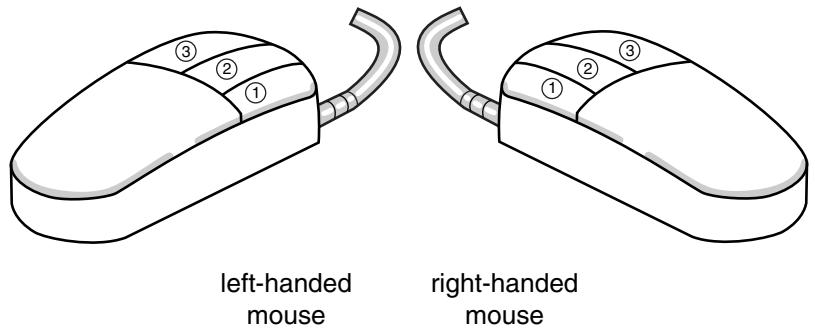  
Figure 1: Mouse buttons.

The following terms describe actions you perform using the mouse:

## Click

Press and quickly release the mouse button. Unless otherwise specified, the instruction “click” means that you should click mouse button 1.

## Drag

Press and hold down mouse button 1 while moving the mouse.

## Point

Move the mouse until the cursor is over the desired item.

## Select

Point to an item and then click mouse button 1.

## [Shift] + Click

Press and hold the [Shift] key, click mouse button 1, and then release the [Shift] key.

## [Ctrl] + Click

Press and hold the [Ctrl] key, click mouse button 1, and then release the [Ctrl] key.

Abaqus/CAE is designed for use with a 3-button mouse. Accordingly, this guide refers to mouse buttons 1, 2, and 3 as shown in Figure 1. However, you can use Abaqus/CAE with a 2-button mouse as follows:

• The two mouse buttons are equivalent to mouse buttons 1 and 3 on a 3-button mouse.  
• Pressing both mouse buttons simultaneously is equivalent to pressing mouse button 2 on a 3-button mouse.


Tip: You are instructed to click mouse button 2 in procedures throughout this guide. Make sure that you configure mouse button 2 (or the wheel button) to act as a middle button click.

## The basics of interacting with Abaqus/CAE

Before you can begin creating and analyzing a model or interpreting analysis results, it is helpful to become familiar with the basics of interacting with Abaqus/CAE. This chapter introduces you to the user interface.

## In this section:

Starting and exiting Abaqus/CAE  
The Abaqus/CAE main window  
What is a module?  
What is a toolset?  
Using the mouse with Abaqus/CAE  
Getting help

## Starting and exiting Abaqus/CAE

This section explains how to start and how to exit Abaqus/CAE.

## In this section:

Starting Abaqus/CAE (or Abaqus/Viewer)  
Exiting an Abaqus/CAE session  
Working with abaqus\_2025.gpr files  
Saving model data from an inactive session

## Starting Abaqus/CAE (or Abaqus/Viewer)

When you create a model and analyze it, Abaqus/CAE generates a set of files containing the definition of your model, the analysis input, and the results of the analysis. In addition, Abaqus/CAE and Abaqus/Viewer generate replay files that reflect all your interactions with the application.

Consequently, before you run either product, you should move to a directory where you have permission to create files.

You execute Abaqus/CAE (or Abaqus/Viewer) by running the abaqus execution procedure and specifying the cae (or viewer) parameter:

```toml
abaqus cae or viewer[database = database-file][replay = replay-file][recover = journal-file][startup = startup-file][script = script-file][noGUI = noGUI-file][noenvstartup][noSavedOptions][noSavedGuiPrefs][noStartupDialog][custom = script-file][[guiTester][GUI-script]][guiRecord][guiNoRecord]
```

You can include the following options on the command line:

## database

This option specifies the name of the model database file or output database file to open. You can open either type of file in Abaqus/CAE; you can open only output database files in Abaqus/Viewer. To specify a model database file, include either the .cae file extension or no file extension in your file name. To specify an output database file when running Abaqus/CAE, include the .odb file extension in your file name. If you are running Abaqus/Viewer, you can omit the .odb file extension.

## replay

This option specifies the name of the file from which Abaqus/CAE commands are to be replayed. The commands in replay-file will execute immediately upon startup of Abaqus/CAE. You cannot use the replay option to execute a script with control flow statements. For more information, see Replaying an Abaqus/CAE session.

## recover

This option specifies the name of the file from which a model database is to be rebuilt; it is not available if you are running Abaqus/Viewer. The commands in journal-file (model\_database\_name.jnl) will execute immediately upon startup of Abaqus/CAE. For more information, see Recreating a saved model database, and Recreating an unsaved model database.

## startup

This option specifies the name of the file containing Python configuration commands to be run at application startup. Commands in this file are run after any configuration commands that have been set in the environment file. Abaqus/CAE does not echo the commands to the replay file when they are executed.

Arguments can be passed into the file by entering -- on the command line, followed by the arguments separated by one or more spaces. These arguments will be ignored by the Abaqus/CAE execution procedure, but they will be accessible within the script.

## script

Same as startup.

## noGUI

This option specifies the name of a file containing Python scripts to be run without the graphical user interface (GUI). This option is useful for automating pre- or post-analysis processing tasks without the added expense of running a display. Since no interface is provided, the scripts cannot include any user interaction. Abaqus/CAE runs the commands in the file and exits upon their completion. If no file extension is given, the default extension is .py. If you use the noGUI option, Abaqus/CAE ignores any other command line options that you provide.

Arguments can be passed into the file by entering -- on the command line, followed by the arguments separated by one or more spaces. These arguments will be ignored by the Abaqus/CAE execution procedure, but they will be accessible within the Python script. If you are using the noGUI option, you can use an argument to pass in a variable that would otherwise be provided by a command line option. For example, you can pass in the name of a file that would otherwise be specified by the script option.

A sample usage of the noGUI option is available in Abaqus/CAE Execution.

## noenvstartup

This option specifies that all configuration commands in the environment files should not be run at application startup. This option can be used in conjunction with the startup command to suppress all configuration commands except for those in the startup file.

## noSavedOptions

This option specifies that Abaqus/CAE should not apply the display options settings (for example, the render style and the display of datum planes) stored in the abaqus\_2025.gpr file. For more information, see Working with abaqus\_2025.gpr files, and Saving your display options settings.

## noSavedGuiPrefs

This option specifies that Abaqus/CAE should not apply the GUI options settings (for example, the size and location of the Abaqus/CAE main window or its dialog boxes) stored in the abaqus\_2025.gpr file.

## noStartupDialog

This option specifies that the Start Session dialog box for Abaqus/CAE or Abaqus/Viewer should not be displayed.

## custom

This option specifies the name of the file containing Abaqus GUI Toolkit commands. This option executes an application that is a customized version of Abaqus/CAE or Abaqus/Viewer. For more information, see Introduction.

## guiTester

This option starts a separate user interface containing the Abaqus Python development environment along with Abaqus/CAE or Abaqus/Viewer. The Abaqus Python development environment allows you to create, edit, step through, and debug Python scripts. For more information, see The Abaqus Python Development Environment.

You can specify a script as the argument for this option, which prompts Abaqus/CAE or Abaqus/Viewer to run a GUI script. Abaqus/CAE or Abaqus/Viewer closes when the end of the script is reached.

## guiRecord

This option enables you to record your actions in the Abaqus/CAE or Abaqus/Viewer user interface in a file named abaqus.guiLog. Creating a record of your actions in the GUI can help you capture and replay common activities in Abaqus/CAE or Abaqus/Viewer for demonstration or training purposes. You can replicate all of the actions from a .guiLog file in Abaqus/CAE or Abaqus/Viewer by running the file in the Abaqus Python Development Environment (PDE); for more information, see Running a script.

If desired, you can set guiRecord at startup by using the environment variable ABQ\_CAE\_GUIRECORD. The guiRecord option cannot be used with the guiTester option.

## guiNoRecord

This option enables you to disable user interface recording when the environment variable ABQ\_CAE\_GUIRECORD is set.

Abaqus/CAE begins. If you do not include the database, replay, recover, or noStartupDialog options, the Start Session dialog box appears. Choose one of the following session startup options:

## Create Model Database: With Standard/Explicit Model

Use this option (not available if you are running Abaqus/Viewer) to begin a new Abaqus/Standard or Abaqus/Explicit analysis (equivalent to choosing File->New Model Database->With Standard/Explicit Model from the main menu bar).

## Create Model Database: With Electromagnetic Model

Use this option (not available if you are running Abaqus/Viewer) to begin an electromagnetic analysis (equivalent to choosing File->New Model Database->With Electromagnetic Model from the main menu bar).

## Open Database

Use this option to open a previously saved model database or output database file (equivalent to choosing File->Open from the main menu bar).

## Run Script

Use this option to run a file containing Abaqus/CAE commands (equivalent to choosing File->Run Script from the main menu bar). For more information, see Creating and running your own scripts.

## Start Tutorial

Use this option to begin an introductory tutorial from the online documentation (equivalent to choosing Help->Getting Started from the main menu bar).

## Recent Files

Use this option to open one of the five model database files or output database files that were most recently opened in Abaqus/CAE (equivalent to choosing one of the recent files listed under the File menu).

## Exiting an Abaqus/CAE session

You can exit the Abaqus/CAE session at any time by selecting File->Exit from the main menu bar. If you made any changes to the current model database, Abaqus/CAE asks if you want to save the changes before exiting the session. Abaqus/CAE then closes the current model or output database and all windows and exits the session.

Abaqus/CAE saves your GUI settings; for example, the size of the main window and the size and location of dialog boxes. For more information, see Working with abaqus\_2025.gpr files, and Understanding Abaqus/CAE GUI settings. In addition, Abaqus/CAE automatically creates a file called abaqus.rpy that records your operations during the session; you can use this file to reproduce your operations. For more information on reproducing operations and on recovering interrupted sessions, see Recreating an unsaved model database.

## Additional information

• Understanding the files generated by creating and analyzing a model  
• Using the File menu

## Working with abaqus\_2025.gpr files

The abaqus\_2025.gpr file in your home directory stores GUI settings (such as the size of the main window) as well as display options settings (such as the render style). You can also store display options settings in an abaqus\_2025.gpr file in a directory other than your home directory. If you start Abaqus/CAE with noSavedOptions specified, Abaqus/CAE does not apply the display options settings (for example, the render style and the display of datum planes) stored in the abaqus\_2025.gpr file. For more information, see Starting Abaqus/CAE (or Abaqus/Viewer).

## When you start Abaqus/CAE

• GUI settings are read from the abaqus\_2025.gpr file in your home directory.  
• Display options settings are read from the abaqus\_2025.gpr file in the directory from which you start Abaqus/CAE.  
If no abaqus\_2025.gpr file is present but a .gpr file from an earlier release exists in that directory, Abaqus/CAE attempts to apply the settings specified in that file and creates an abaqus\_2025.gpr file to store the settings.  
If no .gpr file is present in that directory, the display options settings are read from the abaqus\_2025.gpr file in your home directory.

## During an Abaqus/CAE session

You can use File->Save Display Options to save display options settings to the abaqus\_2025.gpr file in your home directory or in the current directory. For more information, see Saving your display options settings. This save option does not apply to GUI settings.

## When you exit Abaqus/CAE

Your GUI settings are saved automatically to the abaqus\_2025.gpr file in your home directory. For more information, see Understanding Abaqus/CAE GUI settings.

You can edit the abaqus\_2025.gpr file using API commands in the Abaqus Scripting Interface; for more information, see Editing display preferences and GUI settings. You can also delete the file to restore the default GUI and display options settings.

## Saving model data from an inactive session

Abaqus/CAE and Abaqus/Viewer include an inactivity timer. If the applications are left inactive for an extended period of time, the license tokens are returned to the server to make them available to other users. Your session does not end if the server connection is lost or if new license tokens cannot be acquired. Instead, when no licenses are available, a dialog box appears listing your options. For both Abaqus/CAE and Abaqus/Viewer you can attempt to reacquire a license or you can exit the application. For Abaqus/CAE you also have the option to save the current model database. Saving the model allows you to preserve any completed model information that you did not already save; any partially completed information, such as for a procedure that was active at the time the license was lost, is not saved. Once you have saved the model database, only the reacquire and exit options remain in the dialog box. The save option is not provided in Abaqus/Viewer since all changes that affect the output database are saved immediately when you make them.

The default time limit is 60 minutes. You can change the time limit by using the cae\_timeout environment variable in the Abaqus environment file (abaqus\_v6.env). For more information on the environment file, see Using the Abaqus environment files.

## Additional information

• Saving the current model database without a license  
• License management parameters

## The Abaqus/CAE main window

This section provides an overview of the main window and explains how to operate and manipulate the elements of the window during a session.

## In this section:

Components of the main window  
Components of the main menu bar  
Components of the toolbars  
The context bar  
Components of the viewport

## Components of the main window

You interact with Abaqus/CAE through the main window, and the appearance of the window changes as you work through the modeling process. Figure 1 shows the components that appear in the main window.

  
Figure 1: Components of the main window.

The components are:

## Title bar

The title bar indicates the release of Abaqus/CAE you are running and the name of the current model database.

## Menu bar

The menu bar contains all the available menus; the menus give access to all the functionality in the product. Different menus appear in the menu bar depending on which module you selected from the context bar. For more information, see Components of the main menu bar.

## Toolbars

The toolbars provide quick access to items that are also available in the menus. For more information, see Components of the toolbars.

## Context bar

Abaqus/CAE is divided into a set of modules, where each module allows you to work on one aspect of your model; the Module list in the context bar allows you to move between these modules. Other items in the context bar are a function of the module you are working in. For example, the context bar allows you to retrieve an existing part while creating the geometry of the model or to change the output database associated with the current viewport. Similarly, in the Mesh module you can choose whether to display the assembly or a particular part. For more information, see The context bar.

## Model Tree

The Model Tree provides you with a graphical overview of your model and the objects that it contains, such as parts, materials, steps, loads, and output requests. In addition, the Model Tree provides a convenient, centralized tool for moving between modules and for managing objects. If your model database contains more than one model, you can use the Model Tree to move between models. When you become familiar with the Model Tree, you will find that you can quickly perform most of the actions that are found in the main menu bar, the module toolboxes, and the various managers. For more information, see The Model Tree.

## Results Tree

The Results Tree provides you with a graphical overview of your output databases and other session-specific data such as X–Y plots. If you have more than one output database open in your session, you can use the Results Tree to move between output databases. When you become familiar with the Results Tree, you will find that you can quickly perform most of the actions in the Visualization module that are found in the main menu bar and the toolbox. For more information, see The Results Tree.

## Toolbox area

When you enter a module, the toolbox area displays tools in the toolbox that are appropriate for that module. The toolbox allows quick access to many of the module functions that are also available from the menu bar. For more information, see Understanding and using toolboxes and toolbars.

## Canvas and drawing area

The canvas can be thought of as an infinite screen or bulletin board on which you post viewports; for more information, see Managing viewports on the canvas. The drawing area is the visible portion of the canvas. You can display the drawing area full screen using the View menu; you can also press [F11] to toggle between full screen mode and normal mode.

## Viewport

Viewports are windows on the canvas in which Abaqus/CAE displays your model. For more information, see Managing viewports on the canvas.

## Prompt area

The prompt area displays instructions for you to follow during a procedure; for example, it asks you to select the geometry as you create a set. In the Visualization module a set of buttons is displayed in the prompt area that allow you to move between the steps and the frames of your analysis. For more information, see Using the prompt area during procedures.

## Message area

Abaqus/CAE prints status information and warnings in the message area. To resize the message area, drag the top edge; to see information that has scrolled out of the message area, use the scroll bar on the right side. The message area is displayed by default, but it uses the same space occupied by the command line interface. If you

have recently used the command line interface, you must click in the bottom left corner of the main window to activate the message area.


## Note:

If new messages are added while the command line interface is active, Abaqus/CAE changes the background color surrounding the message area icon to red. When you display the message area, the background reverts to its normal color.

## Command line interface

You can use the command line interface to type Python commands and evaluate mathematical expressions using the Python interpreter that is built into Abaqus/CAE. The interface includes primary (>>>) and secondary (...) prompts to indicate when you must indent commands to comply with Python syntax. For more information on Python commands, see The basics of Python.

The command line interface is hidden by default, but it uses the same space occupied by the message area. Click in the bottom left corner of the main window to switch from the message area to the command line interface.

## Additional information

• The basics of interacting with Abaqus/CAE

## Components of the main menu bar

When you start a session, the menus listed below appear on the main menu bar. Abaqus/CAE displays additional menu options and provides access to toolsets depending on the current module in use.

## File

The items in the File menu allow you to create, open, and save model databases; open and close output databases; import and export files; save and load session objects and options; run scripts; manage macros; print viewports; and exit Abaqus/CAE. For more information, see Using the File menu.

## Model

The items in the Model menu allow you to open, copy, rename, and delete the models in the current model database. For more information, see Managing models.

## Viewport

The items in the Viewport menu allow you to create or manipulate viewports and viewport annotations. For more information, see Managing viewports on the canvas.

## View

The items in the View menu allow you to manipulate views, customize certain aspects of the appearance of your model or plots, control display performance, switch to full screen mode, and turn off the display of the Model Tree, the Results Tree, and individual toolbars. Some of the operations available in the view manipulation menu are also available in the View Manipulation toolbar. For more information, see:

Working with the Model Tree and the Results Tree  
Managing viewports on the canvas  
Manipulating the view and controlling perspective  
Configuring graphics display options  
Customizing plot display  
The Customize toolset  
Customizing geometry and mesh display

## Plug-ins

The items in the Plug-ins menu allow you to access the plug-ins distributed with Abaqus/CAE or plug-ins that you have downloaded or created. For more information, see The Plug-in toolset.

##

The items in the Help menu allow you to request context-sensitive help, search or browse the documentation, access the Learning Community, and obtain information about the release and licensing. For more information, see Getting help.

## Additional information

• Components of the main window

## Components of the toolbars

The toolbars contain convenient sets of tools for managing your files, filtering object selection, and viewing your model.

Items in a toolbar are shortcuts to functions that are also available from the main menu bar. By default, Abaqus/CAE displays all of the toolbars in a row underneath the main menu bar. Abaqus/CAE may place some toolbars in a second row depending on your display resolution and the size of the main window.

The toolbars are shown in the following figure:


You can change the location of a toolbar using the toolbar's grip, as indicated in the above figure. Clicking and dragging the grip moves the toolbar around the main window. If you release the toolbar grip while the toolbar is over one of the four available docking regions of the main window (see Figure 1), Abaqus/CAE “docks” the toolbar; a docked toolbar has no title bar and does not obstruct any other portion of the main window.

  
Figure 1: Available docking regions for toolbars.

If you release the toolbar grip while the toolbar is not near a docking region, Abaqus/CAE creates a floating toolbar with a title bar. A floating toolbar obstructs other items in the main window (see Figure 2); however, a floating toolbar can be positioned outside of the Abaqus/CAE main window.

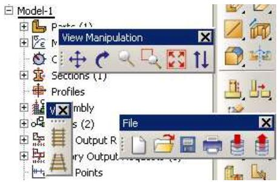  
Figure 2: Floating toolbars.

Clicking mouse button 3 on a toolbar grip displays a menu that lets you specify the location and format of the toolbar:

• Select Top to dock the toolbar in the top docking region.  
• Select Bottom to dock the toolbar in the bottom docking region.  
• Select Left to dock the toolbar in the left docking region.  
• Select Right to dock the toolbar in the right docking region.  
• Select Float to change a docked toolbar into a floating toolbar; this option is available only for docked toolbars.  
• Select Flip to change the orientation of a floating toolbar from horizontal to vertical, or vice versa; this option is available only for floating toolbars.

You can also hide toolbars and create custom toolbars that include shortcuts to additional functions. For more information, see The Customize toolset.

To obtain a short description of a tool in a toolbar, place the cursor over that tool for a moment; a small box containing a description, or “tooltip,” will appear. To obtain the name of a toolbar, place the cursor over the toolbar grip for a moment.

The Abaqus/CAE toolbars contain the following functionality:

## File

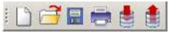

The File toolbar allows you to create, open, and save model databases; to open output databases; to print viewports; and to save and load session objects and options. For more information, see Working with Abaqus/CAE Model Databases, Models, and Files; Printing viewports; and Managing session objects and session options.

## Work Directories

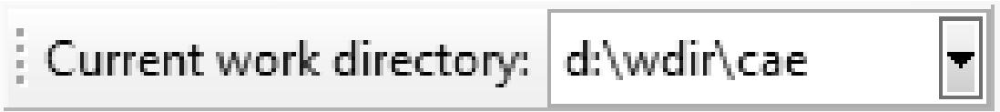

The Work Directories toolbar allows you to change the current working directory. The list provided in the toolbar contains the five most recently used work directories. For more information, see Setting the work directory.

## Viewport

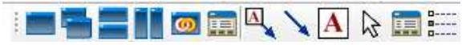

The Viewport toolbar allows you to create and align viewports, link viewports, and create viewport annotations. For more information, see Managing viewports and viewport annotations from the Viewport toolbar. The Viewport toolbar is not displayed by default.

## View Manipulation


The View Manipulation toolbar allows you to specify different views of the model or plot. For example, you can pan, rotate, or zoom the model or plot using these tools. For more information, see Manipulating the view and controlling perspective.

## View Options


The View Options toolbar allows you to specify whether or not perspective is applied to your model. For more information, see Controlling perspective.

## Views


The Views toolbar allows you to apply a custom view to the model in the viewport. For more information, see Custom views. The Views toolbar is not displayed by default.

## Render Style


The Render Style toolbar allows you to specify whether the wireframe, hidden line, or shaded render style will be used to display your model. In the Visualization module the Render Style toolbar also includes the filled

render style tool. For more information, see Choosing a render style.

## Visible Objects


The Visible Objects toolbar allows you to switch between displaying the geometry of an Abaqus/CAE native part and the meshed representation of the same part, to toggle the display of seeds on and off, and to toggle the display of the reference representation on or off if the meshed representation and reference representation exist. For more information, see Displaying a native mesh, What are mesh seeds?, and Understanding the reference representation.

## Selection


The Selection toolbar allows you to enable or disable object selection by toggling on the arrow icon. You can use the list to the right of the arrow to limit the types of objects that you can select. The Selection toolbar is available only when there are no active procedures running in a viewport. For more information, see Selecting objects before choosing a procedure.

## Query


The Query toolset allows you to obtain information about the geometry and features of your model, to probe model and X–Y plots for output data, and to perform stress linearization on your results. For more information, see The Query toolset; Probing the model; and Calculating linearized stresses.

## Display Group


The Display Group toolbar allows you to selectively plot one or more model or output database items. For example, you can create a display group that contains only the elements belonging to specified sets in your model. For more information, see Using display groups to display subsets of your model.

## Color Code


The Color Code toolbar allows you to customize the colors of items in the viewport and change the degree of their translucency.

For color coding, you can create color mappings that assign unique colors to different elements of a display. For example, when using a part instance color mapping, each part instance in a model will appear as a different color. For more information, see Color coding geometry and mesh elements.

For translucency, you can click the arrow to the right of the tool to reveal a slider, which you can drag to make the display colors more transparent or more opaque. For more information, see Changing the translucency.

## View Cut


The View Cut toolbar allows you to toggle the display of view cuts in modules other than the Visualization module and to customize their definition and display. For more information, see Cutting through a model. The View Cut toolbar is displayed by default; in the Visualization module, view cut options are available in the toolbox.

## Field Output


The Field Output toolbar allows you to control two aspects of field output variable display:

You can select the field output variable that you want to display in the current viewport. Selections include the type of field output variable (Primary, Deformed, or Symbol), the variable name, and if available, the invariants and components for the selected primary variable.  
• For changes in variable type, you can control whether Abaqus/CAE automatically synchronizes the plot state

in the current viewport with the new selection of variable type. If the tool is toggled on, Abaqus/CAE synchronizes the plot state if the newly selected field output variable requires a change in plot state; if this option is toggled off, Abaqus/CAE still updates the output variable displayed in the viewport but does not change the plot state in the current viewport.

The selections in the toolbar are limited, but the tool provides access to the Field Output dialog box, if needed. For more information about the options in the toolbar, see Using the field output toolbar.

## Additional information

• Components of the main window

## The context bar

The context bar is located above the canvas and drawing area; you can use it to do the following:

## Select the current module

The Module list on the context bar allows you to move between modules. (For more information, see What is a module?.) Figure 1 shows the context bar. To move to a different module, you can choose from the list (the arrow on the right) or click the up and down arrows (on the left) to move to the previous or next module.

  
Figure 1:The context bar in the Part module.


## Note:

Abaqus/Viewer contains only the Visualization module.

## Select module-specific items

As you move between modules, Abaqus/CAE displays additional items on the context bar that help you select the context of your current operations. For example, when you are in the Part module or Mesh module, Abaqus/CAE displays the Part list in the context bar. The Part list contains every part in your model; you can use it to retrieve a particular part. These lists also include the up and down navigation arrows that allow you to move to the previous or next item in the list.

The context bar also allows you to move between models in the model database or to change the output database associated with the current viewport. The additional items in the context bar are a function of the module in which you are working.

The items displayed in the context bar always refer to the current viewport, which is indicated by a dark gray title bar. For example, if you have different parts displayed in different viewports, the context bar indicates the name of the part displayed in the current viewport.

## Additional information

• What is a module?  
• What is an Abaqus/CAE model?

## Components of the viewport

Figure 1 shows the components of the viewport in the Visualization module.  
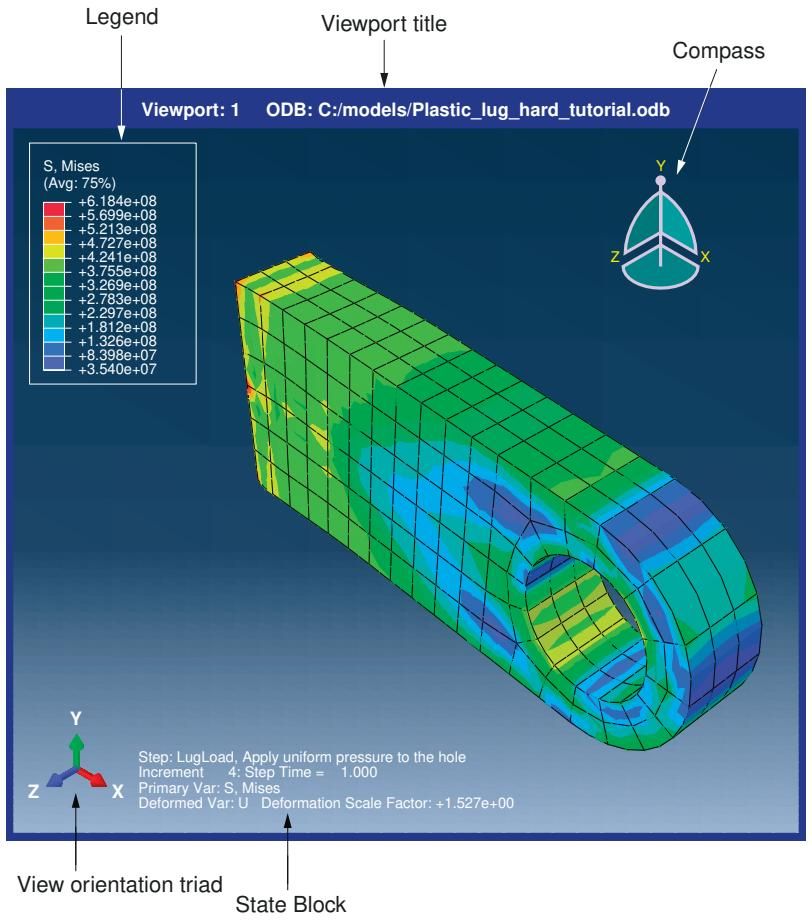  
Figure 1: Components of the viewport.

The viewport title and the border around the viewport are called the viewport decorations. The legend, state block, title block, view orientation triad, and 3D compass are called the viewport annotations. The view orientation triad and 3D compass indicate the orientation of the model currently being displayed. You can change the view of the model by clicking and dragging on the 3D compass; the three perpendicular axes on the view orientation triad rotate with the compass to indicate the current view orientation. For more information, see The 3D compass, and Customizing the view triad. The legend, state block, and title block identify results you display using the Visualization module. For more information, see Customizing viewport annotations.

## Additional information

• Managing viewports on the canvas  
• Customizing viewport annotations

## What is a module?

Abaqus/CAE is divided into functional units called modules. Each module contains only those tools that are relevant to a specific portion of the modeling task. For example, the Mesh module contains only the tools needed to create finite element meshes, while the Job module contains only the tools used to create, edit, submit, and monitor analysis jobs. Abaqus/Viewer is a subset of Abaqus/CAE that contains only the Visualization module.

You can select a module from the Module list in the context bar. Alternatively, you can select a module by switching to the context of a selected object in the Model Tree; for more information, see The Model Tree. The order of the modules in the menu and in the Model Tree corresponds to the logical sequence you follow to create a model. In many circumstances you must follow this natural progression to complete a modeling task; for example, you must create parts before you create an assembly. Although the order of the modules follows a logical sequence, Abaqus/CAE allows you to select any module at any time, regardless of the state of your model.

The following list of the modules available within Abaqus/CAE briefly describes the modeling tasks you can perform in each module. The order of the modules in the list corresponds to the order of the modules in the context bar's Module list and in the Model Tree:

## Part

Create individual parts by sketching or importing their geometry. For more information, see The Part module.

## Property

Create section and material definitions and assign them to regions of parts. For more information, see The Property module.

## Assembly

Create and assemble part instances. For more information, see The Assembly module.

## Step

Create and define the analysis steps and associated output requests. For more information, see The Step module.

## Interaction

Specify the interactions, such as contact, between regions of a model. For more information, see The Interaction module.

## Load

Specify loads, boundary conditions, and fields. For more information, see The Load module.

## Mesh

Create a finite element mesh. For more information, see The Mesh module.

## Optimization

Create and configure an optimization task. For more information, see The Optimization module.

## Job

Submit a job for analysis and monitor its progress. For more information, see The Job module.

## Visualization

View analysis results and selected model data. For more information, see Viewing results.

## Sketch

Create two-dimensional sketches. For more information, see The Sketch module.

Modules can be classified by the objects that are displayed in the viewport. Parts are displayed when you are in the Part and Property modules; the assembly is displayed when you are in the Assembly, Step, Interaction, Load, Mesh, and Job modules; and output database results are displayed when you are in the Visualization module.

The contents of the main window change as you move between modules. Selecting a module from the Module list on the context bar or by switching to the context of a selected object in the Model Tree causes the context bar, module toolbox, and menu bar to change to reflect the functionality of the current module.

When you move between modules, Abaqus/CAE associates the current viewport with the module you select. You can have multiple viewports, and different viewports can be associated with different modules. As you select a viewport and make it current, the module associated with the viewport becomes the current module. For more information on moving between viewports, see Selecting viewports.

## Additional information

• The context bar  
• What is a viewport?

## What is a toolset?

A toolset is a functional unit that allows you to perform a specific modeling task.

When you enter most modules, a Tools menu appears in the main menu bar containing all of the toolsets relevant to that module.

In most cases the objects that you create with a toolset in one module are useful in other modules. For example, you can use the Set toolset to create sets in the Assembly module and then apply boundary conditions to those sets in the Load module. Most of the toolsets include manager menus and manager dialog boxes that allow you to edit, copy, rename, and delete the objects you create with the toolset.

The following toolsets are available in Abaqus/CAE:

• The Amplitude toolset allows you to define arbitrary time or frequency variations of load, displacement, and other prescribed variables. For more information, see The Amplitude toolset.  
The Analytical Field toolset allows you to create analytical fields that you can use to define spatially varying parameters for selected interactions and prescribed conditions. For more information, see The Analytical Field toolset.  
The Attachment toolset allows you to create attachment points and lines that you can use to define point-based and discrete fasteners, connector points for a connector, and regions for a coupling definition, point mass, load, or boundary condition. For more information, see The Attachment toolset.  
• The CAD Connection toolset allows you to create a connection that you can use for associative import of parts into Abaqus/CAE from CATIA and third-party CAD systems. For more information, see The CAD Connection toolset.  
• The Color Code toolset allows you to customize the edge and fill color of individual elements. For more information, see Color coding geometry and mesh elements.  
• The Coordinate System toolset allows you to create local coordinate systems for use in postprocessing. For more information, see Creating coordinate systems during postprocessing.  
• The Customize toolset allows you to control the appearance of Abaqus/CAE toolbars, to create customized toolbars, and to specify keyboard shortcuts for many Abaqus/CAE features. For more information, see The Customize toolset.  
• The Datum toolset allows you to create datum points, axes, planes, and coordinate systems for a variety of modeling tasks. For more information, see The Datum toolset.  
• The Discrete Field toolset allows you to create a spatially varying field where values are associated with nodes or elements. For more information, see The Discrete Field toolset.  
• The Display Group toolset allows you to selectively plot one or more model or output database items. For more information, see Using display groups to display subsets of your model.  
• The Edit Mesh toolset allows you to modify a mesh to improve mesh quality. For more information, see The Edit Mesh toolset.  
• The Feature Manipulation toolset allows you to modify and manage the existing features in your model. For more information, see The Feature Manipulation toolset.  
• The Field Output toolset allows you to perform operations on the field output available in an output database. For more information, see Creating and saving new field output.  
• The Filter toolset allows you to remove extraneous output data—noise—during the analysis of a model without a loss of resolution in the desired data range. For more information, see The Filter toolset.  
• The Free Body toolset allows you to create and customize free body cuts in the Visualization module of Abaqus/CAE. For more information, see The Free Body toolset.  
• The Geometry Edit toolset allows you to repair invalid and imprecise imported parts. For more information, see The Geometry Edit toolset.  
• The Partition toolset allows you to divide a part or assembly into regions. For more information, see The Partition toolset.

The Path toolset allows you to specify a path through your model along which you can obtain and view X–Y data. For more information, see Viewing results along a path.  
• The Query toolset allows you to obtain general information about your model and to probe model and X–Y plots for output data. For more information, see The Query toolset.  
• The Reference Point toolset allows you to create reference points associated with a part or assembly. For more information, see The Reference Point toolset.  
• The Set toolset and the Surface toolset allow you to define sets and surfaces from regions of a model. For more information, see The Set and Surface toolsets.  
• The Stream toolset allows you to display streamlines to investigate velocity or vorticity in a fluid flow analysis. For more information, see The Stream toolset.  
• The Virtual Topology toolset allows you to ignore details, such as very small faces and edges, when you are meshing a part or a part instance. For more information, see The Virtual Topology toolset.  
• The XY Data toolset allows you to create and operate on X–Y data objects. For more information, see X–Y plotting.

## Using the mouse with Abaqus/CAE

Many of the procedures in the Abaqus/CAE documentation involve using one or more of the three mouse buttons. The following list explains the importance of each mouse button when interacting with Abaqus/CAE:

## Mouse button 1

You use mouse button 1 to select objects in the viewport, to expand pull-down menus, and to select items from menus. The instructions “click,”“select,” and “drag” in the documentation refer to mouse button 1.

## Mouse button 2

Clicking mouse button 2 in the viewport signifies that you have finished the current task. For example:

Selecting entities from the model: when you create a node set, you select the nodes to include in the set. Clicking mouse button 2 indicates that your selection is complete and you are ready to create the set.  
• Using a tool: click mouse button 2 to indicate that you have finished with a view manipulation tool.

In addition, clicking mouse button 2 in the viewport is equivalent to clicking the highlighted button in the prompt area. For example, if you tried to select nodes from your model and Abaqus/CAE displayed the following prompt, clicking mouse button 2 would have the same effect as clicking OK:

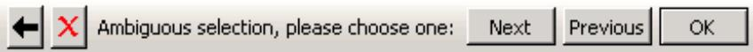

If your mouse has a wheel as mouse button 2, you can scroll the wheel vertically to manipulate your view of the model or plot in the viewport. Scroll downward to magnify your view of the contents of the viewport, or scroll upward to reduce your view of the contents of the viewport.

## Mouse button 3

You press and hold mouse button 3 to access a popup menu that contains shortcuts to functions related to the current procedure. For example, when you press mouse button 3 in a viewport while creating a geometry set, Abaqus/CAE displays the following menu:

<table><tr><td>Selection OptionsDone</td></tr><tr><td>CopyPaste...</td></tr><tr><td>Previous StepCancel Procedure</td></tr></table>

If you use mouse button 3 in a viewport, most of the items in the popup menu duplicate the buttons in the prompt area. The mouse button 3 shortcut is also available for selections from the Model Tree and Results Tree, as described in Using popup menus in the Model Tree and the Results Tree.

## Getting help

The Abaqus/CAE HTML documentation is available through the Help menu on the main menu bar. This section provides a brief description of the HTML online documentation and explains how to use the Help menu to find information.

The features described in this section apply only to the HTML documentation, not the PDF-format guides.


## Note:

• On Windows platforms, the help system uses your default web browser to display the online documentation.  
On Linux platforms, the help system searches the system path for Firefox. If the help system cannot find Firefox, an error is displayed.

The browser\_type and browser\_path variables can be set in the environment file to modify this behavior. For more information, see System customization parameters.

## In this section:

Displaying context-sensitive help  
Browsing and searching the HTML guides  
Finding special sections of the online documentation  
Finding information about keywords  
Accessing the Learning Community  
Obtaining information about the release and licensing

## Displaying context-sensitive help

You can display detailed HTML help on any icon, menu, or dialog box that you use in Abaqus/CAE.

You can use the help tool on the main menu bar to display detailed HTML help on any icon, menu, or dialog box that you use in Abaqus/CAE. When you click the help tool and then click an item in the Abaqus/CAE window, a help window appears containing the section from the online documentation that is relevant to that item.

## Display help on an item in the main window or in a dialog box

1. Click the help tool on the main menu bar.

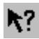


Tip: You can also select Help->On Context from the main menu bar.

The cursor changes to a question mark.

2. Position the cursor over the item about which you need help, and click mouse button 1.

A help window appears. The window contains the appropriate online documentation and links to associated topics.

## Display help using the [F1] key

Alternatively, you can use the [F1] key to display help on a particular item. In most cases you can gain access to context-sensitive help by using the Help menu, the help tool icon, or the [F1] key. However, you must use [F1] if you are seeking information about menu items or dialog boxes that do not allow access to the help tool.

1. Click the feature in the Abaqus/CAE window that you want help with. If the feature is part of a menu, do not release the mouse button.  
2. Press [F1].

A help window appears. The window contains the appropriate online documentation and links to associated topics. If you selected a menu item without releasing the mouse button, that menu disappears.


## Note:

Abaqus/CAE also provides brief “tooltips” that describe the function of tools in toolboxes and in the toolbars. To see a “tooltip,” position the cursor over a tool and leave it stationary for a short time.

## Browsing and searching the HTML guides

You can open and browse and search the entire HTML collection using the Help menu.

1. From the main menu bar, select Help->Search & Browse Guides.  
The documentation displays in your web browser open to a topic that contains an overview of the guides in the documentation.  
2. To view a particular guide, click Abaqus in the table of contents and click the title of interest.  
The guide that you selected opens in your browser window.  
3. Navigate through the guide's contents using any of the following techniques:

## Browsing

Expand and collapse the table of contents to vary the level of detail displayed. Click the topic of interest. You can also use the web browser functions to return to recently viewed pages.

## Searching

Use the search panel located in the navigation frame to search for specific words or phrases.

## Using hyperlinks

Use hyperlinks to move from one part of a guide to another or from one guide to another guide.

## Finding special sections of the online documentation

The following Help menu items allow you to display sections of the HTML documentation that you may find useful:

## On Module

Select Help->On Module to display the Abaqus/CAE User's Guide opened to the beginning of the chapter that describes the current module. If you have not yet entered a module, the guide will be opened to a description of the module concept. In either case, you are then free to read additional information as needed and to conduct text searches through the entire guide.

## On Help

Select Help->On Help to display the Abaqus/CAE User's Guide opened to the section that describes how to use the help system. You are also free to read additional information as needed and to conduct text searches through the entire guide.

## Getting Started

Select Help->Getting Started to display a section that provides basic information on how to work in the Abaqus/CAE window. This section also contains links to helpful tutorials in the Getting Started with Abaqus/CAE guide.

## Release Notes

Select Help->Release Notes to display the Abaqus Release Notes. Release notes detail new features of the software and provide a list of updates and enhancements.

## Finding information about keywords

The keyword browser is a scrollable table that contains the following information:

• The purpose of each keyword.  
• The Abaqus/CAE module or toolset that contains the functionality associated with each keyword.

To view the keyword browser, select Help->Keyword Browser from the main menu bar. For example, you could use the keyword browser to verify that the \*ELASTIC option allows you to specify elastic material properties and that the Property module is the Abaqus/CAE module associated with this keyword.

The keyword browser also contains hyperlinks to relevant sections in the online documentation. You can click a particular keyword in the table to display detailed information concerning the function of that keyword. You can also click the name of a module or toolset in the table to view related documentation in the Abaqus/CAE User's Guide.

1. From the main menu bar, select Help->Keyword Browser.  
The Abaqus/CAE User's Guide is opened to a table of Abaqus keywords and their associated modules.  
2. In the Keyword column, click the keyword of interest to view online documentation describing that keyword.  
3. In the Module column, click the module or toolset name of interest to view online documentation concerning that module or toolset.

## Accessing the Learning Community

You can access the Learning Community at https://www.3ds.com/products-services/simulia/simulia-academic-program/learning-community/. The Learning Community contains online tutorials and technical content. The community also hosts a question-and-answer area that enables the global community of users to share their expertise and learn how to leverage the latest features and enhancements available in the SIMULIA portfolio.

## Obtaining information about the release and licensing

The following Help menu items allow you to obtain additional information:

## About Abaqus

Select Help->About Abaqus to determine which release of Abaqus/CAE you are currently using. Abaqus also provides the location of release information for open source software used by Abaqus/CAE; for example, Python.

## About Licensing

Select Help->About Licensing to determine product license information. Abaqus displays your site identification and the name of your license server along with your license number and the total number of licenses available from your site.

This chapter explains how to interact with the various windows, dialog boxes, and toolboxes that appear throughout the Abaqus/CAE application.

## In this section:

Using the prompt area during procedures  
Interacting with dialog boxes  
Understanding and using toolboxes and toolbars  
Managing objects  
Working with the Model Tree and the Results Tree  
Understanding Abaqus/CAE GUI settings

## Using the prompt area during procedures

This section explains how to make use of the procedural steps that Abaqus/CAE displays in the prompt area.

## In this section:

What is a procedure?  
Following instructions and entering data in the prompt area  
Using mouse shortcuts with procedures

## What is a procedure?

Many tasks within Abaqus/CAE are broken into step-by-step procedures. For example, creating an arc in the Sketcher is a three-step procedure:

2. Pick the start point.  
3. Pick the end point.

1. Pick the center point for the arc.

Abaqus/CAE displays each step of a procedure in the prompt area near the bottom of the main window so that you do not need to remember all the steps and their order.

## Additional information

• Using the prompt area during procedures

## Following instructions and entering data in the prompt area

To use a procedure, simply follow the directions that appear in the prompt area near the bottom of the main window.

For example, follow the directions as shown here:


The button marked X in the above figure is the Cancel button; click this button to cancel the entire procedure at any time. The arrow to the left of the Cancel button is the Previous button; click it to end the current step of the procedure and return to the previous one. (The Previous button appears dimmed during the first step of any procedure.) If you prefer, you can place the cursor over the canvas and press mouse button 3; then select Previous Step or Cancel Procedure from the menu that appears.

A Stop button appears in the prompt area during certain time-consuming operations, such as part healing or meshing or the extraction of X–Y data from history for large models. You can click Stop to interrupt and cancel the operation.

Many procedures require textual or numeric data; for example, when creating a fillet using the Sketch module, you must first specify the fillet radius. When textual or numeric data are required, Abaqus/CAE displays a text field in the prompt area for you to fill in; usually the text box will already contain a default value, as shown here:


Position your cursor over the viewport, and enter data into the text field as follows:

• To accept the default value, press either [Enter] or mouse button 2.  
• To replace the default value, simply begin typing; you need not click the text field before typing. The default value disappears as soon as you begin to type.  
• To change a portion of the default value, first click the text field; then use the [Delete] key and the other keys on your keyboard to change the value.  
• To commit any changes, press [Enter] or mouse button 2.  
• You can also enter an expression in a text field in the prompt area. For more information, see Entering expressions.

Some procedures require you to choose from a number of options. For example, the Datum toolset may ask you to choose a principal axis. Such options are represented by buttons in the prompt area, as shown here:

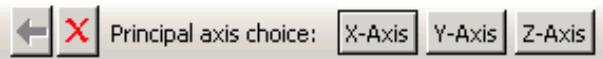

Click the appropriate button to select the desired option.

In some procedures a default option is indicated by a border around the corresponding button; in the above example the border is drawn around the X-Axis button. To select the default option, click mouse button 2.

## Additional information

• Using the prompt area during procedures

## Using mouse shortcuts with procedures

Mouse shortcuts are available for many of the actions that take place in the prompt area. To use the shortcuts, first make sure that the cursor is in the current viewport.

• To commit the contents of any text field that appears in the prompt area, click mouse button 2.  
• To accept any default option depicted by a highlighted button in the prompt area, click mouse button 2.  
• To reveal a menu containing options identical to those in the prompt area, click mouse button 3. For example, given the following prompt:

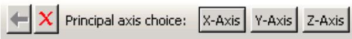

Clicking mouse button 3 will reveal the following menu:


Items above the horizontal line correspond to the option buttons on the right side of the prompt area, while items below the line correspond to the Previous and Cancel buttons.

## Additional information

• Using the prompt area during procedures

## Interacting with dialog boxes

This section explains how to use the various dialog box components that appear within Abaqus/CAE.

## In this section:

Using basic dialog box components  
Entering expressions  
Using dimmed dialog box and toolbox components  
Disabling warning dialog boxes  
Understanding the OK, Apply, Defaults, Continue, Cancel, and Dismiss buttons  
Using dialog boxes separated by tabs  
Entering tabular data  
Customizing fonts  
Customizing colors  
Using file selection dialog boxes  
Selecting multiple items from lists and tables  
Using keyboard shortcuts

Dialog box components include text fields, numeric fields, combo boxes, radio buttons, check boxes, scroll bars, and sliders.

The following types of components are present in dialog boxes throughout Abaqus/CAE:

## Text fields

Text fields are areas in dialog boxes in which you can enter information. For example, when you save a display group, you must enter its name in the text field shown below:

Name: DisplayGroup-2

If you are entering a floating point number, most text fields allow you to enter an expression; for example, cos(2.5/(4.9\*pi)). The expression can be any valid Python expression. For more information, see Entering expressions.

Text fields are available whenever you need to name an object (such as a part, material, set, path, or X–Y data) or provide a description for an object (such as a material or step). In general, you should avoid using an asterisk (\*) in an object name or description.

Object names must adhere to the following rules:

• Part, model, instance, set, surface, feature, and job names can have up to 80 characters; other object names can have up to 38 characters. Instance names of models that have been instantiated as model instances in another model still have a 38-character limit. For imported sets/surfaces, parts, and model instances, the names are generated internally in Abaqus/CAE by combining part/instance/set names. You must ensure that the combined length will not exceed 80 characters; otherwise, the data check analysis will fail.  
• The name can include spaces and most punctuation marks and special characters.  
• The name must not begin with a number.  
• The name must not begin or end with an underscore or a space.  
• The name must not contain a period or double quotes.  
• The name must not contain a backslash.  
• The name cannot be Assembly, which is reserved for internal use by Abaqus/CAE.

Additional restrictions apply to model names, part names, and job names.

• When you name a model or a job, the name can begin with a number.  
• When you name a model, you cannot use the following characters:

$$
\$ \& ^ {*} \sim ! () [ ] \{\} |; ^ {\prime}, ^ {\prime \prime},.? / \backslash > <
$$

• When you name a part, the name should not be the same as the model name.  
• When you name a job, you cannot use the following characters:

$$
<   \text {space} > \& ^ {*} \sim ! () [ ] \{\} |:; ^ {\prime}, ^ {\prime \prime},.? / \backslash > <
$$

In addition, a job name cannot begin with a dash -.

The material evaluation procedure (Evaluating hyperelastic, hyperfoam and viscoelastic material behavior) generates jobs with the same names as the materials; therefore, these material names must adhere to the same rules as job names. In general, when you are specifying a name that will be used external to Abaqus/CAE, such as a file name, you should avoid any character that may have a reserved meaning on your platform.


## Note:

Abaqus/CAE retains the case of any text you enter in a text field. For example, if you create a material called Steel Alloy in the Edit Material dialog box in the Property module, the material will appear as Steel Alloy in the graphical user interface (material manager, section editor, Model Tree, etc.). In the graphical user interface, object names are case insensitive. For example, you cannot create a second material called steel alloy. Conversely, Python (which is used in the command line interface) is case sensitive, but you should not rely on this behavior to distinguish between objects.

## Numeric fields

Numeric fields are specialized text fields for integer input values. They have two opposing arrows directly to the right of the text area. You can enter a numeric value into the text field, or you can use the arrows to cycle up and down through a list of fixed values.

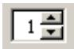

Unlike other text fields, numeric fields do not accept text or special characters.

Numeric fields often have upper and lower limits. If the value you enter exceeds the limits, Abaqus/CAE changes the entry to the closest acceptable value when you move to another field or try to apply the value.

## Combo boxes

Combo boxes are fields having an arrow directly to the right of the field. If you click this arrow, a list of the possible choices that you can enter in the field appears. For example, if you click the arrow to the right of the Module field in the context bar, a list of all the Abaqus/CAE modules appears, and you can select the module of your choice from the list.


## Radio buttons

Radio buttons present a mutually exclusive choice. When an option is controlled by radio buttons, you can choose only one of the buttons at a time.

Drag mode: Fast (wireframe) C As is

## Check boxes

You can toggle a check box to turn a particular option off or on.

For example, the visibility of the triad in the current viewport depends on the status of the Show triad check box. If the box is toggled on, as shown below, the triad appears in the viewport.

show triad

If the box is toggled off, as shown below, the triad does not appear in the viewport.

□show triad

In some cases the option controlled by a check box can apply to more than one object. For example, a single Show line check box in the XY Curve Options dialog box individually controls the display of all X–Y curve lines in an X–Y plot. If you have toggled Show line on for some curves and off for others, that check box appears gray with a darker gray check mark, as shown below.

show line

## Scroll bars

Scroll bars appear in lists whose contents are too big to display; they allow you to scroll through the visible contents of the list as well as any contents that are hidden. Scrolling is often necessary when numerous items must be listed, as shown below.


## Sliders

Sliders allow you to set the value of an option that has a continuous range of possible values. An example of a slider is shown in the following figure:


## Additional information

• Interacting with dialog boxes

## Entering expressions

If a field in a dialog box or in the prompt area is expecting a floating point number or a complex number, you can enter an arithmetic expression, as shown in Figure 1.

  
Figure 1: An expression in a text field.

The expression is evaluated by the Python interpreter that is built into Abaqus/CAE. The arithmetic expression is replaced by its value; if you reopen a dialog that contained expressions, only the values are available. Variables like pi and functions like sin() are available because Abaqus/CAE imports the Python math module when you start a session. As a result, you can enter any expression that can be evaluated by Python's built-in functions or by the Python math module. For more information, see the documentation for built-in functions and the math module accessible from the official Python home page (http://www.python.org).

To make sure that your expression is evaluated as expected, you should be aware of the following:

• If you enter numbers as integers, Python will perform integer division and round down any remainder. For example, Python will interpret 3/2 as 1 and 1/2 as 0. In contrast, Python interprets 3./2 as 1.5 and 1/2. as 0.5.  
Python interprets numbers with leading zeros as octal numbers (for example, 0123 is interpreted as 83.0). However, Abaqus/CAE will ignore leading zeros in numbers in text fields before Python interprets them; such numbers are evaluated as decimals.  
• Python interprets e as the base of the natural logarithm; that is, e equates to 2.71828182846 and e+2 equates to 4.71828182846.  
• If the $\mathbf { \omega } ^ { \ast } \mathbf { e } ^ { \mathbf { \prime } \mathbf { \prime } }$ character is preceded by a number, Python interprets it as an exponent, not a natural logarithm. For example, Python interprets 2e+2 as $2 \times 1 0 ^ { 2 }$ and equates it to 200.  
• Python interprets $2 \mathsf { e } + \mathsf { a } \mathrm { s } 2 \times 1 0 ^ { 0 }$ and equates it to 2. Similarly, Python interprets $2 \in { + } { + } 1 1$ as $2 \times 1 0 ^ { 0 } ~ + ~ 1 1$ and equates it to 13.

If you are unsure how Python will interpret your expression, you can enter the expression on the command line; Abaqus/CAE will print the resulting interpreted value in the message area. To access the command line interface, click


in the bottom left corner of the main window. For more information, see Components of the main window.

You can also test how Abaqus/CAE interprets an expression by entering abaqus python at an operating system prompt and entering the expression at the Python prompt that appears. The prompt line and some dialog boxes do not allow you to enter an expression. As an alternative, you can enter the expression on the command line or at the Python prompt and paste the resulting value in the prompt line or dialog box.

## Using dimmed dialog box and toolbox components

Some objects in dialog boxes and toolboxes are available only under certain circumstances. When an object is unavailable, it appears dimmed in the dialog box.

Items are usually dimmed as a result of some other setting in the dialog box. For example, if Use settings below is not selected, the image size options below it are not available and appear dimmed, as shown below.

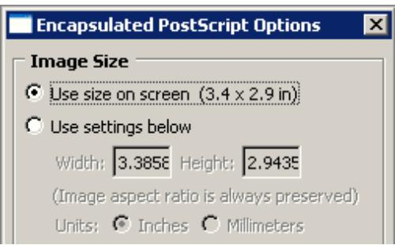

Context-sensitive help is available even for dimmed options, although tooltips are not.

## Additional information

• Interacting with dialog boxes

## Disabling warning dialog boxes

Some dialog boxes can be disabled so that they will not appear again during the current Abaqus/CAE session.

For example, if you submit a job for analysis and job files with the same name already exist, Abaqus/CAE displays a dialog box asking if it is OK to overwrite the job files, as shown below.

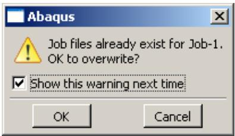

If you toggle off Show this warning next time, the dialog box will be disabled for the remainder of the current Abaqus/CAE session.

## Additional information

• Interacting with dialog boxes

## Understanding the OK, Apply, Defaults, Continue, Cancel, and Dismiss buttons

When you are finished working with a dialog box, you can specify how to proceed by using different action buttons. For example, if you enter data in a dialog box, you can save the data and apply them by clicking OK. If the dialog box is part of an intermediate step of a procedure, you can click Continue to move on to the next step.

The following action buttons can appear in a dialog box:

## OK

Click OK to commit the current contents of a dialog box and to close the dialog box.

##

When you click Apply, any changes you have made in the dialog box take effect, but the dialog box remains displayed. This button is useful if you make changes in a dialog box and would like to see the effects of these changes before closing the dialog box.

## Defaults

If you want to revert back to the predefined default values after entering data or specifying preferences in a dialog box, you can click Defaults. This button affects only the information entered in the dialog box. It does not apply your changes or close the dialog box; therefore, to see the effect of reverting to the default values, you must click Apply or OK.

## Cancel

Click Cancel to close a dialog box without applying any of the changes that you made. If the dialog box appears in the middle of a procedure, clicking Cancel usually also cancels the procedure. In some cases clicking Cancel returns you to the previous step in the procedure.

## Continue

Dialog boxes that appear in the middle of a procedure contain Continue buttons. When you click Continue, you indicate that you have finished entering data in the current dialog box and would like to move on to the next step of the procedure. Continue causes the dialog box to be closed and all data in it to be saved unless you click Cancel at some point later in the procedure.

## Dismiss

Dismiss buttons appear in dialog boxes that contain data that you cannot modify. For example, some managers contain lists of objects that exist but no fields in which you can enter data or specify preferences. Dismiss buttons also appear in message dialog boxes. When you click Dismiss, the dialog box closes.

To close a toolbox or a dialog box that does not have a Cancel or Dismiss button, click the close button in the upper right corner of the toolbox or dialog box. Alternatively, you can close an active toolbox or dialog box by pressing [Esc].


## Note:

On Linux platforms, depending on your settings, [Esc] may be the only way to close a toolbox or dialog box. For more information, see Linux settings that affect Abaqus/CAE and Abaqus/Viewer.

## Additional information

• Interacting with dialog boxes

## Using dialog boxes separated by tabs

For the sake of organization and convenience, some dialog boxes are separated by tabs. Only one dialog box is visible at a time. To view a particular dialog box, click its labeled tab.

For example, Figure 1 displays the Common Plot Options dialog boxes.

  
Figure 1: Dialog boxes separated by tabs.

If you click the Color & Style tab, the dialog box containing the color and edge attributes options comes forward, obscuring the other four dialog boxes, as shown in Figure 2.

  
Figure 2: Using tabs to display particular dialog boxes.

In addition, separated dialog boxes can exist within a single dialog box. In this case the tabs of the separated dialog boxes are aligned vertically but work the same way as tabs aligned horizontally. In Figure 3 the Other dialog box contains two dialog boxes separated by tabs: Scaling and Translucency.

  
Figure 3: Dialog box containing additional dialog boxes.

The action buttons in a dialog box apply to the whole set of dialog boxes, not just the one you are currently viewing. If you click Cancel, all of the unapplied changes you have made in the set of dialog boxes are canceled, not just those in the current dialog box. Likewise, clicking OK saves all changes that you have made in any of the dialog boxes.

## Additional information

• Interacting with dialog boxes

## Entering tabular data

Some operations require the entry of tabular data. For example, the XY Data toolset can produce plots of data that you enter in the dialog box shown in Figure 1.

  
Figure 1: X–Y data table.

Data tables are composed of input boxes, or cells, organized into rows and columns. You can type data into a table using the keyboard, or you can read data in from a file.

The following list describes techniques for entering and modifying tabular data:

## Entering data

Click any cell, and type the required data. You can press [Enter] to commit the data in a particular cell.

Abaqus/CAE does not allow you to enter character data in tables requiring numeric data; the program beeps if you attempt to enter character data in a numeric field. (The letter E that denotes scientific notation, as in 12.E6, is an exception to this rule.)

## Adding new rows

Use the menu that appears when you click mouse button 3 to add a new row before or after an existing row. Click mouse button 3 while holding the cursor over the row of interest; then select the item of your choice from the menu that appears:

• Select Insert Row Before to add a blank row above the current row.  
• Select Insert Row After to add a blank row below the current row.

Alternatively, you can add a blank row to the end of the table by clicking the cell in the last row and in the last column of the table and then pressing [Enter].

## Reading data from a file

You can enter data by reading it in from an ASCII file. Data fields within the file can be delimited by any combination of spaces, tabs, or commas; each space, tab, or comma is considered a single field delimiter. To enter data from a file, click mouse button 3 while holding the cursor over the target cell; then select Read From File from the menu that appears. The Read Data from ASCII File dialog box appears. In this dialog box, specify the following:

• In the File text field, enter the name of the file to read.  
Specify the row number and column number of the target cell in the Start reading values into table row and Start reading values into table column fields, respectively. (By default, Abaqus sets these fields to the cell your cursor was over when you clicked mouse button 3.)

Click OK. Abaqus reads data values from the file into the table according to your specifications.

## Moving from cell to cell

Use the [Enter] key to move from left to right between the cells in a row. When you have reached the end of the row, press [Enter] to move the cursor to the first cell in the following row.

In addition, you can use a combination of the [Tab] key and the up and down arrow keys to move from cell to cell. Use [Tab] to move to the right and [Shift][Tab] to move to the left; use the up and down arrows to move up and down. You can also simply click the cell of interest.

## Changing data

If a cell already contains data, clicking the cell highlights the data; as soon as you begin typing, the highlighted contents of the cell disappear and are replaced by whatever you type. You can also use the [Backspace] or [Delete] keys to delete highlighted data in a cell.

After clicking the cell once, you can click a second time to remove the highlighting and position the cursor within the cell. Use the [Backspace] key and the other keys on your keyboard to modify the data.

## Cutting, copying, and pasting data

Use the menu that appears when you click mouse button 3 to cut, copy, and paste data from one location in a table to another. You can cut or copy data in single cells, in rows or parts of rows, in columns or parts of columns, and in series of consecutive rows or columns.

First, drag the mouse over the cells containing the data that you want to cut or copy. All of the selected cells will become highlighted except the cell that you selected first. This cell becomes highlighted when you move the cursor outside the data table window or if you click mouse button 3.

Once you have selected the cells of interest, click mouse button 3 while holding the cursor over the selection; then select either Cut or Copy from the menu that appears. To paste the data, select the target cell, click mouse button 3, and select Paste from the menu that appears.

## Sorting data

Some data tables offer a sorting feature. (To determine if sorting is available for a particular table, hold the cursor over the table; then click mouse button 3. If it is available, Sort is listed in the menu that appears.)

To sort table data, click mouse button 3 while holding the cursor over the table; then click Sort. The Sort Table dialog box appears. In this dialog box, choose the following:

• In the Sort by text field, choose the column by which to sort.  
• Choose Ascending or Descending sort order.

Click OK or Apply. Abaqus sorts all rows according to data values in the specified column.

## Expanding and contracting columns

You can change the size of the columns in some tables. To expand or contract a column, move the cursor to the line that divides the headings of the columns you want to resize; a resize cursor will appear. Drag this cursor to the left or right to resize the two columns on either side of the dividing line.

You can also resize the last column in some tables by horizontally enlarging the dialog box that contains the table.

## Viewing data that extend beyond the edge of the dialog box

Use the horizontal and vertical scroll bars to view portions of a table that are outside the boundaries of the dialog box. In some cases scroll bars may not be available; instead, increase the size of the dialog box to display more data.

## Deleting rows of data

Click any cell within the row you want to delete, or select multiple cells in consecutive rows. Then, while holding the cursor over the dialog box containing the table, click mouse button 3 and select Delete Rows from the menu that appears. The row or rows disappear; if the rows are numbered, Abaqus/CAE automatically renumbers the remaining rows.

You cannot delete rows from tables that display matrices or tensors of fixed size, such as those used in the orthotropic or anisotropic elasticity data input forms in the Property module.

## Creating X–Y data from table data

While you are creating a material in the Property module, you can use the data in a table to create X–Y data. You can then use the Visualization module to plot the X–Y data and to visually check its validity. To create an X–Y data object, click mouse button 3 while holding the cursor over the table; then select Create XY Data from the menu that appears. The Create XY Data dialog box appears. In this dialog box, do the following:

• Enter the name of the X–Y data to create.  
• Specify the column number containing the X-values and the column number containing the Y-values.  
• Click OK. Abaqus reads the data values from the table into the X–Y data. Abaqus/CAE retains saved X–Y data only for the duration of the session.

To view the X–Y data, do the following:

• From the module list on the context bar, select Visualization.  
• From the main menu bar, select Tools->XY Data->Plot, and select the X–Y data from the pull-right menu.

For more information, see X–Y plotting.

## Clearing the table

You can delete all data from a table. While holding the cursor over the table, click mouse button 3 and select Clear Table from the menu that appears. The table data disappear.

## Additional information

• Interacting with dialog boxes

## Customizing fonts

The Select Font dialog box allows you to customize the font of certain kinds of text; for example, you can use this dialog box to customize the font that appears in viewport annotations. A similar dialog box is used to customize the font of the Visualization module labels and titles.

The Select Font dialog box allows you to specify and preview the following:

• Proportional or fixed fonts.  
• The font family.  
• The font size, in points.  
• Regular, bold, or italic font.

The available options vary depending on which fonts are installed on your system.

1. Display the Select Font dialog box for the text that you want to customize. For more information, see the following sections:

Customizing X–Y plot axes  
Customizing the X–Y plot legend  
Customizing viewport annotations”  
Setting the label font

2. Select the desired font and properties.  
A preview of the selected font appears in the Sample area of the Select Font dialog box.

3. In the Apply To field of the Select Font dialog box, toggle on the items to which the selected font will apply. The Apply To field does not appear unless there are multiple items to which the font can apply.

4. Click OK to accept your changes and to close the Select Font dialog box.

## Additional information

• Customizing viewport annotations  
• Setting the label font

## Customizing colors

The Select Color dialog box allows you to customize the color of many objects in Abaqus/CAE. For more information about the objects that you can change, see the following sections:

Customizing the view triad  
Choosing background colors  
Selecting overall element and surface edge color  
Coloring elements with no results  
Customizing the legend  
Customizing the title block  
Customizing the state block

The current color is displayed on the left side of the Select Color dialog box, below the eyedropper tool. You can use the methods in the Select Color dialog box to update the displayed color. The color is not updated elsewhere until you click OK to accept your changes and to close the Select Color dialog box. You can choose from the following methods of color selection:

## Color palette

Twenty-four common colors are displayed in boxes along the bottom of the dialog box. Click a color to select it; you cannot modify the palette to show different colors.

## Eyedropper tool

The eyedropper tool is located on the left side of the dialog box. When you click the eyedropper tool, the cursor changes to crosshairs. The next time you click mouse button 1 anywhere on the computer screen, Abaqus/CAE selects the color at the cursor position.


## Note:

The cursor returns to its normal form if you move it outside the Abaqus/CAE application window, but you can still select a color by clicking mouse button 1.

## Color wheel

The color wheel and brightness control are located in the Wheel tab. A black dot indicates the position of the currently selected color, regardless of the method that was used to select it. Click anywhere on the wheel to select a new color. Move the vertical slider to change the brightness; as you move the slider downward, Abaqus/CAE adds black to the selected color.

## RGB controls

RGB (Red, Green, and Blue) controls are located in the RGB tab. The RGB settings match the color displayed on the left side of the Select Color dialog box, regardless of the method that was used to select it. You can move the sliders or enter values from 0 to 255 to mix the three colors of light and produce the full color spectrum. 0, 0, 0 is black (no light); and 255, 255, 255 is white (full intensity, full spectrum light).

## HSV controls

HSV (Hue, Saturation, and Value) controls are located in the HSV tab. The HSV settings match the color displayed on the left side of the Select Color dialog box, regardless of the method that was used to select it. The Hue control ranges from 0 to 360, and changing the setting corresponds to moving the black dot around the perimeter of the color wheel (0 and 360 are both red). The Saturation control ranges from 0 to 100 and varies the amount of the selected color added to the background color. The Value control indicates the background color; 0 is black, 100 is white.

## CMY controls

CMY (Cyan, Magenta, and Yellow) controls are located in the CMY tab. The CMY settings match the color displayed on the left side of the Select Color dialog box, regardless of the method that was used to select it. You can move the sliders or enter values from 0 to 255 to mix the three colors of tint and produce the full color spectrum. The CMY controls work like adding tint to paint; 0, 0, 0 is white (no tint), and 255, 255, 255 is black (all tint).

## Color list

The color list is located in the List tab. You can choose from several hundred colors, including shades of gray. The color list provides you with a more extensive range of colors than the color palette, but it does not provide you with the full color spectrum.

1. Open the dialog box that contains the settings for the object that you want to change.  
2. Click the color sample for the object that you want to customize.

Abaqus/CAE displays the Select Color dialog box.

3. Use one of the methods in the dialog box to select a new color.

A preview of the selected color appears on the left side of the Select Color dialog box, below the eyedropper tool.

4. Click OK to accept your changes and to close the Select Color dialog box.

Abaqus/CAE returns you to the originating dialog box and updates the color sample to display the color that you selected.

When you click OK or Apply in the originating dialog box, Abaqus/CAE updates the color in the viewport.

## Additional information

• Customizing model labels  
• Customizing viewport annotations

## Using file selection dialog boxes

File selection dialog boxes allow you to select files from lists that are filtered based on file type or location. To use a file selection dialog box, you first choose the type of file to open and then specify the directory to list. Abaqus/CAE refreshes the dialog box to list only files that meet your criteria. From this list, you select the file to open.

The dialog box for selecting model databases or output databases is shown in Figure 1.

  
Figure 1: Selecting a model database or an output database.


## Note:

In Abaqus/Viewer you can open only output database files; therefore, Output Database (\*.odb) is the only type available in the File Filter field.

Similar file selection dialog boxes appear when you perform other File menu functions, such as importing a part or printing to a file.

Use the following techniques to select the file of your choice:

## Filtering the file list according to file type

File selection dialog boxes contain File Filter fields, which allow you to select the file extension of interest. For example, the File Filter selection in Figure 1 is Output Database (\*.odb). Therefore, only files with the extension .odb appear in the list in the center of the dialog box.

## Using wildcards to search for a file name

You can use a wildcard filter to search for partial names of files. A wildcard search is helpful when you have a large number of files stored in the same directory. Wildcard searches also override the file extensions (File Filter field, as described above), allowing you to open files saved with nonstandard file extensions.

To use a wildcard search, enter a partial file name into the File Name field using one of the following forms:

?

matches a single character

\*

matches zero or more characters

abc

matches a single character, but it must be one of the characters listed

^abc or !abc

matches a single character, but it must not be one of the characters listed

a-zA-Z

matches a single character, but it must be within the ranges provided

^a-zA-Z or !a-zA-Z

matches a single character, but it must not be within the ranges provided

pat1|pat2 or pat1,pat2

matches either pat1 or pat2

(pat1|pat2) or (pat1,pat2)

matches either pat1 or pat2, and the patterns may be nested

You can combine several wildcard filters to further narrow your search. For example, entering

[abc]\*.(cae,odb) will list all files beginning with a, b, or c and having a .cae or .odb file extension.

## Specifying the directory from which to select a file

By default, the Directory field shows the directory in which you started Abaqus/CAE. If you want to view a list of files from a different directory, you can click the directory name in the list to view directories within the current path or you can click the arrow next to the Directory field to access other paths that are available on your system. In addition, icons at the top of the dialog box allow you to do the following (keyboard shortcuts are shown in parentheses when available):

• Go up one directory level ([Backspace]).  
• Access your system default, or Home, directory ([Ctrl] + H).  
Access the Work directory ([Ctrl] + W). The work directory is the directory from which you started Abaqus/CAE unless you specified the directory using File->Set Work Directory.  
• Set or use Bookmarks to any directory on your system.  
• Create a new directory ([Ctrl] + N).

The Directory field includes a Network connectors item. If you have created and started a network ODB connector, you can use this item to access a remote directory and to open a remote output database. For more information, see Creating a network ODB connector.

## Selecting a file

To select and open a file, double-click the file name of interest from the list. You can also begin typing the file name; the cursor will reposition to the matching location in the file list, and the first file starting with the letters you typed will be selected. Alternatively, you can enter the entire directory path and file name of interest directly in the File Name field and then click OK. Icons at the top of the dialog box allow you to change the displayed file format to one of the following (keyboard shortcuts are shown in parentheses):

• A list ([Ctrl] + S).  
• Icons ([Ctrl] + B).  
• A detailed list ([Ctrl] + L).

The icon farthest to the right allows you to display or suppress “hidden” files.

## Selecting multiple items from lists and tables

In some Abaqus/CAE dialog boxes it is necessary to select an item from a list or a table before you can perform certain functions. For example, if you want to plot X–Y data, you must first select the data object of your choice from the list in the XY Data Manager, shown in Figure 1, and then click Plot.

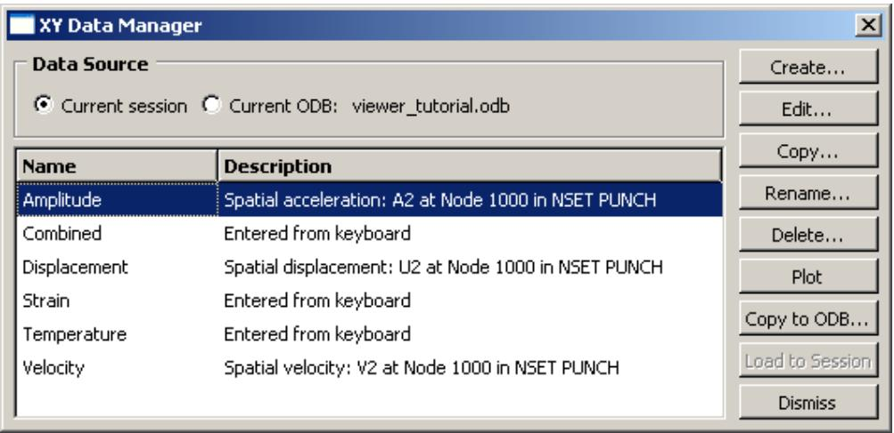  
Figure 1: Single item selected.

Some functions allow you to operate on more than one item. For example, if you wanted to delete the first two data objects in the manager shown in Figure 1, you could select them both and then click Delete.

To select a single item from a list, you need only click that item in the dialog box. To select a single item from a table, click the table row heading. To select multiple items, you can use the following techniques:

## Selecting consecutive items from a list or table

Click the first item of interest from a list or row heading from a table and then, while continuing to hold down mouse button 1, drag the cursor over the remaining items. Release the mouse button when all of the items of interest are selected. For example, consecutive items are selected in Figure 2.

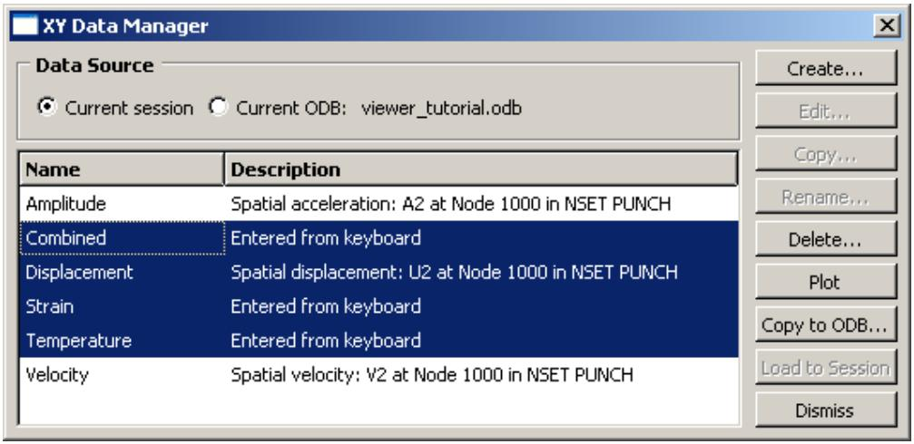  
Figure 2: Consecutive items selected.

Another way to select consecutive items is to click the first item of interest from a list or row heading from a table and then [Shift] + Click the last item of interest. All items between the first and the last are selected automatically.

## Selecting nonconsecutive items from a list or table

Click the first item of interest from a list or row heading from a table and then [Ctrl] + Click any other items you want to select. For example, nonconsecutive items are selected in Figure 3.

  
Figure 3: Nonconsecutive items selected.

## Canceling a selection

You can [Ctrl] + Click previously selected items to remove them from your selection. For example, if you [Ctrl] + ClickDisplacement in the list shown in Figure 3, that data object is no longer selected, as shown in Figure 4.

  
Figure 4: Individual item removed from selection.

Certain functions in a dialog box may become unavailable when you select multiple items. For example, the Edit, Copy, and Rename functions in the Data Manager shown in Figure 4 are valid only for individual data objects. When you select multiple data objects, these three functions become unavailable.

## Using keyboard shortcuts

You can use the keyboard instead of the mouse to perform most actions within the Abaqus/CAE main window and dialog boxes. The following actions have keyboard shortcuts:

## Context-sensitive help

Press [F1] to display context-sensitive help concerning the currently selected object in the Abaqus/CAE main window or dialog box. For more information on using [F1] for context-sensitive help, see Displaying context-sensitive help.

## Menus

You can display a particular menu by pressing the [Alt] + key in combination with the underlined character in that menu's name. For example, the letter V is underlined in the View menu in the main menu bar:


Therefore, you can type [Alt] + V to display the View menu.

## Menu items

Once the menu is displayed, you can select a particular menu item by continuing to press the [Alt] + key and pressing the underlined character in that menu item's name. For example, the letter n is underlined in Pan in the View menu:

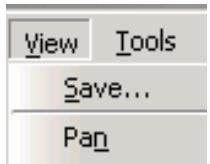

Therefore, you can type [Alt] + V to display the View menu and then, without releasing the [Alt] + key, type n to select Pan.

## Model Tree and Results Tree

The Model Tree and Results Tree contain keyboard shortcuts that allow you to navigate through the tree and toggle its display on and off. For more information, see The Model Tree.

## Understanding and using toolboxes and toolbars

This section explains how to use the toolbox windows and toolbars to perform common functions within a module or toolset or on the canvas.

## In this section:

What are toolboxes and toolbars?  
Using toolboxes and toolbars that contain hidden icons

## What are toolboxes and toolbars?

Toolboxes and toolbars are collections of icons that provide quick access to commonly used Abaqus/CAE functions. For example, the Visualization module toolbox contains icons representing the tools used to generate different kinds of plots. The Visualization module toolbox is shown in Figure 1. All module toolboxes are available immediately to the left of the drawing area as soon as you enter the module.

  
Figure 1:The Visualization module toolbox.

Toolbars also contain collections of icons to access Abaqus/CAE functions. Toolbars provide access to supporting functions that help you save, manipulate, and make selections from a model; whereas toolboxes contain functions critical to creating or changing a model. In addition to tool icons, toolbars may also contain lists of options related to a tool. For example, the color mapping list in the Color Code toolbar contains various methods for coloring the objects displayed in the current viewport. You can also customize toolbar contents, move toolbars to new locations, or close them (for more information, see The Customize toolset). Toolboxes cannot be moved or hidden.

To obtain a short description of a tool, place the cursor over that tool for a moment; a small box containing a description, or “tooltip,” will appear. Tooltips are not available for icons that appear dimmed; to get information on those icons, use context-sensitive help instead.

## Additional information

• Understanding and using toolboxes and toolbars

## Using toolboxes and toolbars that contain hidden icons

In some toolboxes, such as the Job module toolbox, all tool icons are immediately visible; however, most toolboxes contain hidden icons to conserve space. Since there is more space above the canvas, and since you can move or hide toolbars to meet your needs, most toolbars do not contain hidden icons.

Any icon that includes a small triangle in its lower right corner conceals a group of icons whose function is closely related to that of the visible icon.

1. Click and hold any icon that includes a triangle in its lower right corner.

Icons for all the tools that are closely related to the original icon appear. For example, Figure 1 shows the top portion of the Part module toolbox with all of the icons revealed that are used for creating round or chamfered corners.

  
Figure 1: Part module toolbox with round and chamfer icons displayed.

2. Drag the cursor to the desired icon, and release the mouse button.

The selected icon replaces the icon that was visible originally, and you can begin using the corresponding tool immediately.

## Additional information

• Understanding and using toolboxes and toolbars

## Managing objects

Managers are dialog boxes you use to manage all objects of a given type associated with the current model or session; examples of such objects include materials, parts, steps, display groups, and X–Y data objects.

In addition, you can use the Model Manager to manage the models contained in the current model database. This section describes basic and step-dependent managers and how you can use them in Abaqus/CAE.

## In this section:

What are basic managers?  
What are step-dependent managers?  
Suppressing and resuming objects  
Understanding the status of an object in a step  
Terms describing object status  
Modifying the history of a step-dependent object  
Understanding modified step-dependent objects  
What happens when deleted objects are referred to?  
Managing objects using manager dialog boxes  
Managing objects using manager menus  
Copying step-dependent objects using manager dialog boxes  
Changing the status of an object in a step  
Editing step-dependent objects

## What are basic managers?

Basic managers consist of a list of objects and a series of buttons; you use the buttons to perform tasks on the objects you select from the list or to add new objects to the list.

Figure 1 shows the Material Manager, which is an example of a basic manager used in Abaqus/CAE.

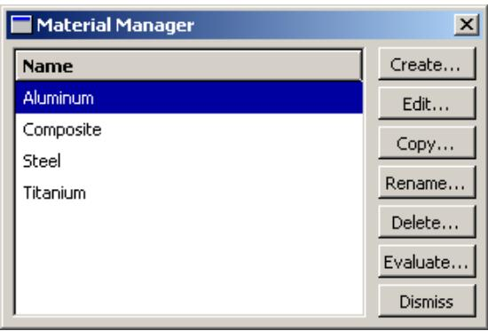  
Figure 1:The Material Manager.

The list box on the left shows all the materials that you have defined within the context of the current model. You use the buttons on the right to create new material definitions and to edit, copy, rename, and delete existing material definitions. The Dismiss button is used to close the manager dialog box.

Often, the manager provides more information about an object than just its name; for example, in the Job module, the Job Manager provides information about currently executing jobs and provides buttons that allow you to write input files, submit jobs, monitor the analysis, or view output files for a given job. The Job Manager is shown in Figure 2.

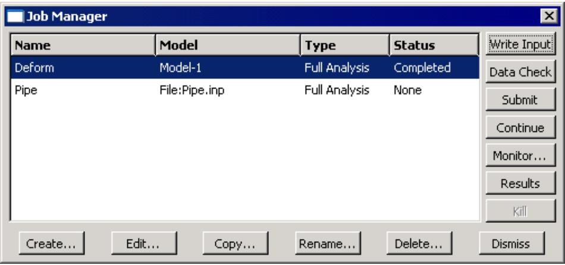  
Figure 2:The Job Manager.

Most tasks you can perform with a manager can also be performed using the pull-down menus available from the main menu bar; for example, Figure 3 shows the menu items that correspond to the Job Manager.

  
Figure 3: Menu items that correspond to the Job Manager.

After you select a management operation from the main menu bar, the procedure is exactly the same as if you had clicked the corresponding button inside the manager dialog box. In addition, most of the tasks you can perform with a manager can be performed by clicking mouse button 3 on an object in the Model Tree. For more information, see Working with the Model Tree and the Results Tree.

The decision whether to use menus, dialog boxes, or the Model Tree is yours. In general, menus are more convenient if you are performing isolated operations; the advantages of manager dialog boxes become apparent when you are performing several operations in sequence, when you need to browse through a long list of objects, or when you need quick access to the additional information that is displayed by some managers. The Model Tree provides you with a graphical overview of your model and allows you to perform operations without changing modules. In addition, the Model Tree allows you to use drag-select to select multiple items; for example, you can select multiple sets to merge or multiple parts to delete.

## Additional information

• Managing objects  
• What are step-dependent managers?

## What are step-dependent managers?

Like the basic managers described in What are basic managers?, step-dependent managers contain a list of all of the objects of a certain type that you have created, as well as Create, Edit, Copy, Rename, and Delete buttons that you can use to manipulate existing objects and to create new ones.

However, the types of objects that appear in step-dependent managers are those that you can create and, in some cases, modify, suppress, and deactivate in particular analysis steps. Therefore, unlike basic managers, step-dependent managers contain additional information concerning the history of each object listed in the manager. Step-dependent managers display how these objects propagate from one step to another during the course of an Abaqus analysis. (For information on steps and multiple-step analyses, see Defining an Analysis.)

The following step-dependent managers exist in Abaqus/CAE:

## In the Load module:

• Load Manager  
• Boundary Condition Manager  
• Predefined Field Manager

## In the Interaction module:

• Interaction Manager

## In the Step module:

• Field Output Requests Manager  
• History Output Requests Manager  
• Adaptive Mesh Constraint Manager

For example, the Load Manager is shown in Figure 1.

  
Figure 1:The Load Manager.

This manager displays an alphabetical list of existing loads along the left side of the dialog box. The names of all the steps in the analysis appear along the top of the dialog box in the order of execution. The table formed by these two lists displays the status of each load in each step. (For information on creating and deleting steps, see The Step module.)

If you click one of the cells in the table, that cell becomes highlighted, and the following information related to the cell appears in the legend at the bottom of the manager:

• The type of analysis procedure carried out in the step in that column.  
• Information about the step-dependent object in that row.  
• The status of the step-dependent object in that step (the same information that appears in the cells of the table except in more detail in some cases).

You can use the icons in the column along the left side of the manager to suppress objects or to resume previously suppressed objects for an analysis. For more information, see Suppressing and resuming objects.

The buttons along the right side of the manager allow you to manipulate objects in the steps that you select. For example, if you click Edit in the Load Manager shown above, an editor appears in which you could modify the load named Force in Step-1. The other buttons—Move Left, Move Right, Activate, and Deactivate—allow you to change the status of an object in a particular step.


Note: The Activate and Deactivate buttons are not available in the Predefined Field Manager.

For more information, see Modifying the history of a step-dependent object, Changing the status of an object in a step, and Editing step-dependent objects.

You can resize the columns of the table by dragging the dividers between the column headings to the right or left. You can also increase the size of the dialog box by dragging the sides of the box. If the analysis includes many steps or many step-dependent objects, increasing the size of the dialog box allows you to view more rows and columns without having to use the scroll bars.

## Additional information

• The output request managers  
• Managing objects in the Interaction module  
• Managing prescribed conditions

## Suppressing and resuming objects

When performing an analysis, you may want to study the effects of different combinations of objects, such as loads, or you may want to temporarily exclude an object from the model, such as excluding a boundary condition or a constraint in a design analysis. You can create a model that includes all of the objects and then suppress the objects that you want to exclude from the model prior to the analysis. Suppressed objects are not written to the input file and are treated as deleted objects. You should review your model for any references to suppressed objects. For more information, see What happens when deleted objects are referred to?.

You can suppress step-dependent objects, constraints (in the Interaction module), section assignments (in the Property module), and features. After you create a suppressible object, the manager dialog box displays a green check mark in the column along the left side of the manager next to the name of the object. You can suppress an object from the manager by clicking the green check mark next to the object. For example, if you click the green check mark to the left of the load named Force in the Load Manager shown in Figure 1, the icon changes to a red “X” and the cells displaying the status of the load in each step are shaded gray to indicate that the load is suppressed, as shown in Figure 1.


## Note:

There is no manager associated with features; you can suppress or resume features using the popup menus in the Model Tree.

  
Figure 1:The Load Manager indicates that the load named Force is suppressed.

You can also select Suppress->object in the appropriate menu from the main menu bar to suppress an object. For example, to suppress the load named Force shown in Figure 1, you would select Load->Suppress->Force from the main menu bar of the Load module.

You cannot edit suppressed objects; however, you can copy, rename, and delete them. Symbols for suppressed objects are not displayed in the viewport.

You can resume an object that was previously suppressed. If you attempt to resume an object that is not valid for a given procedure type, Abaqus/CAE displays an error message. You can use the manager or the Resume menu item from the main menu bar to resume the object. In the manager, click the red “X” to change the icon back to a green check mark and to remove the cell shading. Symbols for resumed objects are displayed in the viewport.

You can also use the Model Tree to suppress or resume an object by clicking mouse button 3 on the object and selecting Suppress or Resume from the menu that appears. The Model Tree displays a red “X” next to an object to indicate that it is suppressed. For more information, see The Model Tree.

## Additional information

• What are step-dependent managers?  
• The output request managers  
• Managing objects in the Interaction module  
• Managing prescribed conditions

## Understanding the status of an object in a step

A model can contain a sequence of analysis steps. When you create an object in a step, that object may or may not continue to be active in any of the following steps. The activity (or inactivity) of an object in any particular step is called its “status” in that step.

For example, Figure 1 shows the status of a load in a series of general static analysis steps.

  
Figure 1:The analysis history of a load.

The load in this example is created in Step 1; therefore, the status of the load in Step 1 is Created. Since Step 1 is a general static step, the load's magnitude is ramped up over the course of the step. If the load continues to be active in Step 2, its status in Step 2 is Propagated and its magnitude remains constant throughout that step. If you edit the load in Step 3, its status in Step 3 becomes Modified and its magnitude ramps to the new value over the course of the step. If the modified version of the load continues to be active in Step 4, its status in Step 4 (as in Step 2) is Propagated and the value is constant. If you deactivate the load in Step 5, its status in Step 5 is Deactivated and its magnitude ramps down to zero. The load remains deactivated in Step 6.

For detailed explanations of the terms used to describe object status, see Terms describing object status.

## Additional information

• What are step-dependent managers?

## Terms describing object status

Abaqus/CAE uses the following terms to describe the status of objects in particular steps:

## Created

The object was created and becomes active in this step. The point in the step at which a prescribed condition becomes active depends on the amplitude variation associated with that step. For more information, see “Prescribed conditions” in Defining an Analysis.

## Computed

The analysis products will compute the value of the object in this step.

## Modified

The definition of the object has been modified in this step. The variation of a prescribed condition over the course of the step depends on the amplitude variation associated with that step.

## Propagated

The object was created, modified, or computed in an earlier step of the analysis and continues to be active in this step.

## Deactivated

The object has been deactivated in this step or in a previous step. It will remain deactivated in all subsequent steps until you reactivate it. You cannot deactivate an object in the step in which it was created. The point in the step at which a prescribed condition becomes inactive depends on the amplitude variation associated with that step. For more information, see “Prescribed conditions” in Defining an Analysis.

You cannot deactivate predefined fields; a deactivated status for a predefined field means that the field has been reset to the value specified in the initial step. The point in the step at which an object resumes its initial value depends on the amplitude variation associated with that step. For more information, see “Prescribed conditions” in Defining an Analysis.

## N/A

The object does not have any effect on the calculations for this step.

The following terms apply only in linear perturbation steps:

## Built into base state

Any active object created in a preceding general analysis step will be part of the base state and cannot be changed during the linear perturbation step.

## Propagated from base state

Objects created in a previous general step will be part of the base state for this procedure but can be modified or deactivated by the user.

## Deactivated from base state

Objects created in a previous general step are deactivated in this linear perturbation step. The deactivated state applies only to the linear perturbation step and does not propagate to the remaining steps.

For information on linear perturbation steps, see General and Perturbation Procedures.

The following term applies only in modal dynamics steps:

## Built into modes

Boundary conditions that are active in a preceding frequency analysis step are used in the calculation of modes and will therefore be built into the modes for mode-based linear perturbation procedures and subspace dynamic procedures. During these mode-based and subspace dynamic procedures the boundary condition cannot be changed.

For information on modal dynamics steps, see Transient Modal Dynamic Analysis.

Figure 1 shows the color codes assigned to various object statuses. The table cells in step-dependent managers are colored accordingly to indicate the object status.

<table><tr><td>Color codes</td><td>Statuses</td></tr><tr><td></td><td>Created</td></tr><tr><td></td><td>Computed</td></tr><tr><td></td><td>Modified</td></tr><tr><td></td><td>Propagated</td></tr><tr><td></td><td>Deactivated</td></tr><tr><td></td><td>N/A</td></tr><tr><td></td><td>Built into base state</td></tr><tr><td></td><td>Modified from base state</td></tr><tr><td></td><td>Propagated from base state</td></tr><tr><td></td><td>Deactivated from base state</td></tr><tr><td></td><td>Built into modes</td></tr></table>

Figure 1: Color codes for object statuses.

## Modifying the history of a step-dependent object

You can modify the analysis history of an object by using the five buttons aligned along the right side of the step-dependent manager: Edit, Move Left, Move Right, Activate, and Deactivate. (For information on how to use these buttons, see Changing the status of an object in a step.) The use of these buttons may be restricted depending on the nature of each step and the status of the object in the steps.

The following list describes the rules for modifying the history of a step-dependent object:

## Changing the step in which an object becomes active

You can change the step in which an object becomes active by moving the Created status to that step. You can move the Created status of an object to any previous general step, or you can move the Created status to the following general step if its status in the following step is Propagated.

For example, you could select the Created status of Load1 in the load manager table below.

<table><tr><td></td><td>Step 1</td><td>Step 2</td><td>Step 3</td><td>Step 4</td><td>Step 5</td></tr><tr><td>Load1</td><td></td><td>Created</td><td>Propagated</td><td>Propagated</td><td>Propagated</td></tr></table>

If you moved the Created status to Step 1, the table would change as shown below.

<table><tr><td></td><td>Step 1</td><td>Step 2</td><td>Step 3</td><td>Step 4</td><td>Step 5</td></tr><tr><td>Load1</td><td>Created</td><td>Propagated</td><td>Propagated</td><td>Propagated</td><td>Propagated</td></tr></table>

If you moved the Created status to Step 3, the table would change as shown below.

<table><tr><td></td><td>Step 1</td><td>Step 2</td><td>Step 3</td><td>Step 4</td><td>Step 5</td></tr><tr><td>Load1</td><td></td><td></td><td>Created</td><td>Propagated</td><td>Propagated</td></tr></table>


## Note:

If an object is created in a linear perturbation step, its Created status cannot be moved.

## Modifying an object

You can modify an object when its status is Propagated; the object's status in that step changes to Modified.

## Moving the modifications of an object to another step

You can transfer the modifications of an object to another step by moving the object's modified status to that step. You can move the Modified status of an object to the previous general step or to the following general step if the status of the object in those steps is Propagated.

For example, you could select the Modified status of Load1 in the load manager table below.

<table><tr><td></td><td>Step 1</td><td>Step 2</td><td>Step 3</td><td>Step 4</td><td>Step 5</td></tr><tr><td>Load1</td><td></td><td>Created</td><td>Propagated</td><td>Modified</td><td>Propagated</td></tr></table>

If you moved the Modified status to Step 3, the table would change as shown below.

<table><tr><td></td><td>Step 1</td><td>Step 2</td><td>Step 3</td><td>Step 4</td><td>Step 5</td></tr><tr><td>Load1</td><td></td><td>Created</td><td>Modified</td><td>Propagated</td><td>Propagated</td></tr></table>

If you moved the Modified status to Step 5, the table would change as shown below.

<table><tr><td></td><td>Step 1</td><td>Step 2</td><td>Step 3</td><td>Step 4</td><td>Step 5</td></tr><tr><td>Load1</td><td></td><td>Created</td><td>Propagated</td><td>Propagated</td><td>Modified</td></tr></table>

## Deactivating an object

You can deactivate an object when its status is Propagated or Modified; the object's status in that step is shown as Deactivated, and the object is inactive in any following steps.


## Note:

You cannot deactivate predefined fields using the Predefined Field Manager; you must select Reset to initial in the predefined field editor (for example, see Defining a temperature field).


## Warning:

If you deactivate an object in a step in which its status is Modified, the modifications to the object are lost. If you later reactivate the object in that step, the original propagated version of the object becomes active in that step and in all subsequent steps.

## Reactivating an object

You can reactivate an object that has a Deactivated status; however, the Activate button is available only in the step in which the object is first deactivated (for example, Step 3 in the following table).

<table><tr><td></td><td>Step 1</td><td>Step 2</td><td>Step 3</td><td>Step 4</td><td>Step 5</td></tr><tr><td>Load1</td><td>Created</td><td>Propagated</td><td>Deactivated</td><td></td><td></td></tr></table>

When you reactivate the load in the example above, its status in Step 3 and in all following steps changes to Propagated.

The following rules apply to linear perturbation steps:

## Deactivating a boundary condition whose status is Propagated from base state

You can deactivate an object whose status is Propagated from base state; the object's status in the linear perturbation step changes to Deactivated from base state. The status Propagated from base state cannot be moved to other steps.

## Reactivating a boundary condition whose status is Deactivated from base state

You can reactivate an object whose status is Deactivated from base state; the object's status in the linear perturbation step changes to Propagated from base state. The status Propagated from base state cannot be moved to other steps.

## Objects whose status is Built into base state

The status Built into base state cannot be changed directly.

For information on linear perturbation steps, see General and Perturbation Procedures.

For information on the propagating behavior of output requests from general and linear perturbation analysis steps, see Propagation of output requests.

You can use the Model Tree to view the status of a step-dependent object, to edit the object, and to deactivate and reactivate the object. However, you must use the step-dependent manager to modify the history of an object by moving it right or left in the sequence of steps. For more information, see The Model Tree.

## Additional information

• What are step-dependent managers?

## Understanding modified step-dependent objects

When you edit an object in the step in which it was created, you change the definition of the object in all of the steps in which it is active. In some cases you can also edit an object in steps in which its status is Propagated or Modified. In these cases the object's definition varies according to the analysis step.

The effects of editing a step-dependent object are summarized below.

## If the status of the object is Created in the selected step:

• Modifications that you make to the object in this step become effective in this step and propagate through all subsequent steps in which the condition is active unless you modify the object again in a later step.  
• The status of the object remains Created in the selected step and also remains unchanged in all subsequent steps. For more information, see Understanding the status of an object in a step.

## If the status of the object is Propagated or Modified in the selected step:

• Modifications that you make to the object in this step become effective in this step and propagate through all subsequent steps in which the object is active.  
The status of the object becomes (or remains) Modified in this step and remains unchanged in all other steps. (In other words, if the status of the object in the following step was Propagated before modification, its status in the following step remains Propagated after modification.) For example, the load applied over a sequence of general static analysis steps in Figure 1 has been modified in Step 3; the modifications remain in effect in Step 4 even though the status in Step 4 is Propagated. For more information, see Understanding the status of an object in a step.  
• When you modify the data in any editor other than the Interaction editor, Abaqus/CAE indicates in the editor which data have been modified. These indications disappear if you change the data in the editor back to their original values.

In some cases you cannot edit a particular aspect of an object's definition because it must be consistent for the analysis to proceed correctly. For example, although you can modify the magnitude of a load in any analysis step, you cannot modify the region to which the load is applied. The areas in an editor that specify this kind of restricted data are unavailable in all steps except the one in which the object was created.

## Additional information

• What are step-dependent managers?

## What happens when deleted objects are referred to?

You should take care when deleting or renaming objects, such as materials and amplitudes, that may be referred to by other objects. For example, if you delete or rename a material, the sections that refer to the material become inconsistent. To resolve the missing reference, you can edit the section and refer to a new material, or you can create a new material with the same name as the deleted material.

Table 1 lists objects that are commonly referred to by other objects.  
Table 1: Objects that are commonly referred to by other objects.

<table><tr><td>This object</td><td>Can be referred to by these types of objects</td></tr><tr><td>Material</td><td>Section</td></tr><tr><td>Profile</td><td>Section, skin</td></tr><tr><td>Section</td><td>Section assignment</td></tr><tr><td>Interaction</td><td>Output request, contact controls</td></tr><tr><td>Interaction property</td><td>Interaction</td></tr><tr><td>Amplitude</td><td>Load, predefined field, boundary condition, interaction</td></tr><tr><td>Connector section</td><td>Connector section assignment</td></tr><tr><td>Region (set or surface)</td><td>Boundary condition, predefined field, load, interaction, constraint, connector section assignment, output request, section assignment, beam section orientation, material orientation, output request, DOF monitor, adaptive mesh domain</td></tr><tr><td>Load</td><td>Load case, output request</td></tr><tr><td>Boundary condition</td><td>Load case</td></tr><tr><td>Datum coordinate system</td><td>Boundary condition, connector section assignment, material orientation, constraint</td></tr><tr><td>Datum plane</td><td>Load</td></tr><tr><td>Datum axis</td><td>Load</td></tr><tr><td>Datum point</td><td>Constraint</td></tr><tr><td>Part instance</td><td>Constraint</td></tr><tr><td>Part</td><td>Part instance</td></tr></table>

Parts and part instances behave slightly differently. If you delete a part after you have instanced the part in the Assembly module, Abaqus/CAE suppresses the part instance in the assembly. You can delete the instance from the assembly. Alternatively, if you then create a new part that uses the same name, you can unsuppress the part instance to include it in the assembly. In addition, if you rename a part or a datum, objects that refer to the part or datum refer to the new name; and, as a result, the reference does not become inconsistent.

## Managing objects using manager dialog boxes

Abaqus/CAE provides you with a set of managers that list all the objects defined in the current model or session such as parts, stand-alone sketches, materials, sections, steps, display groups, and X–Y data objects. In addition, the Model Manager lists all the models defined in the current model database.


## Note:

For more information on specific managers and where they are located, see the documentation for the particular module in which you are interested.

Use the buttons in the manager dialog box to manage the list of objects.

1. To display a manager, do one of the following:

To display a manager associated with a module, select Manager from the appropriate menu on the main menu bar. For example, to display the Section Manager while you are working in the Property module, select Section->Manager from the main menu bar.  
To display a manager associated with a toolset, select Tools->Toolset->Manager from the main menu bar. For example, to display the Set Manager, select Tools->Set->Manager from the main menu bar.  
• To display a step-dependent manager associated with an object in the Model Tree, click mouse button 3 on the object and select Manager from the menu that appears.  
• To display the Model Manager, select Model->Manager from the main menu bar.

The manager appears and displays a list of objects in the current model or session. The list contains the name of each object and, in some cases, information about each object. For example, the Part Manager lists the name of each part, its status, its type, and the modeling space in which it was created.

2. To manage an existing object, select the object or objects of interest from the list in the manager and then click the appropriate button. (For example, to delete an object, select that object's name from the list and then click Delete.)

In most cases a dialog box appears; for example, when you click Rename, the dialog box asks for the new name of the selected object.

3. If a dialog box appears, provide the requested information and click OK.

4. Click Dismiss to close the manager.


Tip: You can also use the menus in the main menu bar to manage objects. For more information, see Managing objects using manager menus.

## Additional information

• Managing objects using manager menus

Like managers, pull-down menus from the main menu bar allow you to manage all the objects defined in the current model or session.

1. From the main menu bar, select one of the following:

To manage objects associated with a module, select the manager menu items in the appropriate menu in the main menu bar. For example, to edit a material in the Property module you would select Material->Edit->material of your choice from the main menu bar.  
To manage objects associated with a toolset, select the appropriate manager menu items in the Tools menu. For example, to delete a set, you would select Tools->Set->Delete->set of your choice from the main menu bar.  
• To manage all the models defined in the current model database, select the manager menu items in the Model menu in the main menu bar. For example, to copy a model, you would select Model->Copy->model of your choice from the main menu bar.

In most cases a dialog box appears; for example, when you rename an object, a dialog box appears that asks for the new name of the object.

2. If a dialog box appears, provide the requested information and click OK.


Tip: You can also use manager dialog boxes to manage objects. For more information, see Managing objects using manager dialog boxes.

## Additional information

• Managing objects using manager dialog boxes

## Copying step-dependent objects using manager dialog boxes

You use the Copy button in manager dialog boxes to copy a step-dependent object such as a load, boundary condition, interaction, predefined field, output request, or adaptive mesh constraint. You can copy an object from any step to any other valid step.

1. Open the appropriate manager, as described in Managing objects using manager dialog boxes.  
2. Select the object you want to copy by clicking in the corresponding table cell.  
3. Click Copy.

The corresponding Copy Object dialog box appears.

4. Enter a name for the new object.  
5. Choose the destination step from the Step list. By default, the object is copied into the step in which it was created.  
6. Click OK.

The object is copied to the selected destination step.

If the destination step type is different from the type of step in which the object was originally created, Abaqus/CAE may need to modify the object to make it compatible with the new step. For example, if a load was created in a static (general) step and you copy it into a steady-state dynamics (linear perturbation) step, Abaqus/CAE will add an imaginary component to the load value. Conversely, if a load from a steady-state dynamics step is copied to a static step, the imaginary component will be removed.

In addition, when you copy an object to a step other than the step in which it was created, any modifications made to the original object in one of its propagated states will be ignored in the copy.

Abaqus/CAE prevents you from copying an object into a step type where the object type is invalid. Abaqus/CAE also prevents you from copying a suppressed object or copying to a suppressed step.

## Changing the status of an object in a step

Step-dependent managers contain buttons that you can use, under certain circumstances, to alter the status of an object in a particular step. These buttons are labeled Move Left, Move Right, Activate, and Deactivate.

Whether or not you can change the status of an object in a step depends on the step's procedure and the object's status in the step. The manager allows you to make only valid changes to the history of an object. If the operation of one of the buttons would cause an invalid change in status, that button becomes unavailable. For more information, see Modifying the history of a step-dependent object.

The following list describes techniques for manipulating the status of a step-dependent object:

## To select the status that you want to change:

Click in the cell that is located in the row of the object of interest and in the column of the step of interest.

The status of the object in that step becomes highlighted, and, in most cases, some or all of the buttons on the right side of the dialog box become available. The availability of the buttons depends on the status of the object in the current step, in the preceding step, and in the following step.

For example, the Created status of Pressure in Step-3 is selected in the figure below:


Use the buttons that become available to manipulate the status of the object in the step that you have chosen, as described below.

## To move the status in the selected step to the preceding step:

Click Move Left to move the highlighted status from the selected to the preceding step.

For example, the Created status of Pressure in Step-3 is selected in the history shown above. If you clicked Move Left, the history would change as shown below:


The Created status of Pressure moves to Step-2 and is replaced by Propagated in Step-3.

## To move the status in the selected step to the following step:

Click Move Right to move the highlighted status from the selected step to the following step.

In the history shown below, for example, the Modified status of Pressure in Step-5 is selected.


If you clicked Move Right, the history would change as shown below:

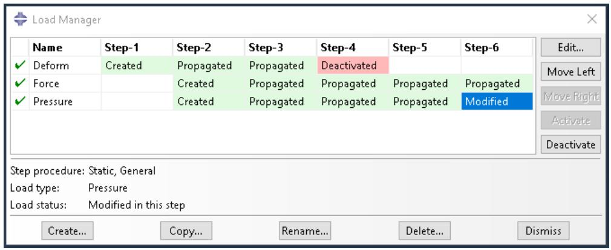

The Modified status of Pressure moves to Step-6 (indicating that the modifications to Pressure become effective in Step-6), and Modified is replaced by Propagated in Step-5.

## To deactivate the object in the selected step:

Click Deactivate to deactivate the object in the selected step.

In the history shown below, for example, the Propagated status of Pressure in Step-4 is selected.


If you clicked Deactivate, the history would change as shown below:


The Propagated status of Pressure in Step-4 changes to Deactivated, and the pressure is inactive in all subsequent steps.


## Note:

You cannot deactivate predefined fields using the Predefined Field Manager; you must select Reset to initial in the predefined field editor (for example, see Defining a temperature field).


## Warning:

If you deactivate an object in a step in which its status is Modified, the modifications to the object are lost. If you later reactivate the object in that step, the original, unmodified version of the object becomes active in that step and in all subsequent steps.

## To reactivate the object in the selected step:

Click Activate to reactivate the object in the selected step.

In the history shown above, for example, the Deactivated status of Pressure in Step-4 is selected. If you clicked Activate, the history would change as shown below:

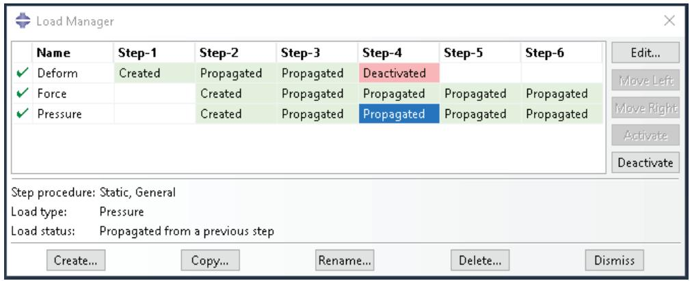

The Deactivated status of Pressure changes to Propagated in Step-4 and in any following steps.


## Note:

The Activate button is available only in the step in which an object is first deactivated.

You can use the Model Tree to view the status of a step-dependent object, to edit the object, and to deactivate and reactivate the object. However, you must use the step-dependent manager to modify the history of an object by moving it right or left in the sequence of steps. For more information, see The Model Tree.

## Additional information

• What are step-dependent managers?

## Editing step-dependent objects

You can use either menus, managers, or the Model Tree to edit step-dependent objects in a particular step. You cannot edit suppressed objects; you must resume the object before editing. For more information, see Suppressing and resuming objects. (For information about the status of modified objects, see Understanding modified step-dependent objects.)

## Additional information

• What are step-dependent managers?  
• Suppressing and resuming objects  
• Understanding modified step-dependent objects  
• Understanding symbols that represent prescribed conditions  
• Editing the region to which a prescribed condition is applied

## Edit step-dependent objects using menus

1. From the main menu bar, select Edit->object of your choice from the appropriate menu. For example, if you want to edit a load in the Load module, select Load->Edit->load of your choice.  
The appropriate editor appears. The region to which the object is applied becomes highlighted in the current viewport.  
2. In the editor, modify the object definition as desired, and click OK.

## Edit step-dependent objects using managers

1. In the manager, locate the cell of interest. The cell is located in the row of the object that you want to modify and in the column of the step of interest.  
2. In the manager, double-click the cell.


## Note:

Alternatively, you can click the cell of interest and then click Edit.

The appropriate editor appears. Abaqus/CAE highlights the region to which the object is applied.

3. In the editor, modify the object definition as desired, and click OK.

## Edit step-dependent objects using the Model Tree

1. In the Model Tree select the object of interest.  
2. Click mouse button 3 on the object and select Edit from the menu that appears The appropriate editor appears. Abaqus/CAE highlights the region to which the object is applied.  
3. In the editor, modify the object definition as desired, and click OK.

## Working with the Model Tree and the Results Tree

The Model Tree and Results Tree are convenient tools for navigating and managing your models and analysis results.

You can use the Model Tree to view a model and the items that it contains, and you can use the Results Tree to display analysis results from output databases as well as session-specific data such as X–Y plots. Both trees provides shortcuts to much of the functionality of the main menu bar, the module toolboxes, and the various managers. This section describes both the Model Tree and Results Tree.

## In this section:

The Model Tree  
The Results Tree  
Using popup menus in the Model Tree and the Results Tree  
Changing the view of the model

## The Model Tree

The Model Tree provides a visual description of the hierarchy of items in a model.

For example, Figure 1 shows the appearance of the Model Tree after completing the tutorial for a cantilever beam in Creating and Analyzing a Simple Model in Abaqus/CAE.

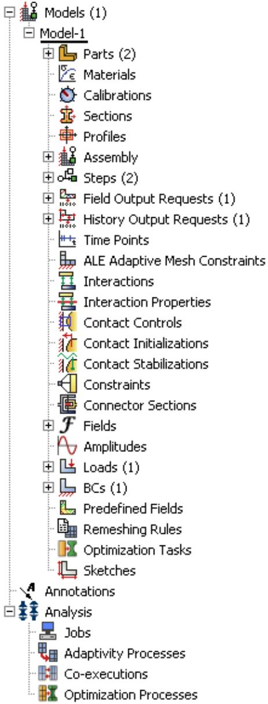  
Figure 1:The Model Tree after completing the cantilever beam tutorial.

The Model Tree shares the left side of the Abaqus/CAE interface with the Results Tree and, in the Property module only, a material library. You can click the Model, Results, or Material Library tab to toggle the display between the Model Tree, the Results Tree, and a material library. See The Results Tree, and Using material libraries, respectively,

for more information about the Results Tree and material libraries. In addition, the tip button at the top of the Model Tree provides a quick summary of the functionality of the Model Tree and Results Tree along with a summary of the keyboard shortcuts described at the end of this section.

A complete Abaqus/CAE model contains all of the information required to perform an analysis; for example, all of the parts, materials, steps, and loads and the meshed representation of the assembly. A model also contains the jobs that are submitted to the Abaqus analysis products. For more information, see What does an Abaqus/CAE model contain?. All of these items are represented in the Model Tree.

Items in the Model Tree are represented by small icons; for example, the Steps icon, . In addition, parentheses next to an item indicate that the item is a container, and the number in the parentheses indicates the number of items in the container. You can click on the “plus” and “minus” signs in the Model Tree to expand and collapse a container. The right and left arrow keys perform the same operation.

For example, the Steps container contains all the steps in your model. In the example shown in Figure 1 expanding the Steps container reveals that the model contains two steps—the Initial step and the BeamLoad step. Expanding the BeamLoad step, as shown in Figure 2, reveals that the step has four containers, each of which contains a single item—Field Output Requests, History Output Requests, Loads, and BCs.

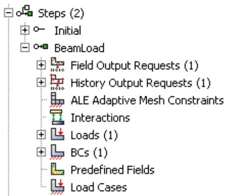  
Figure 2: Containers in the BeamLoad step.

In addition, the step contains four empty containers—ALE Adaptive Mesh Constraints, Interactions, Predefined Fields, and Load Cases. You cannot delete an empty container from the Model Tree, although you can hide empty containers from view (see Changing the view of the model). Finally, expanding the Loads container, as shown in Figure 3, reveals a single load called Pressure that was created in this step.

  
Figure 3:The load in the Loads container.

The arrangement of the containers and items in the Model Tree reflects the order in which you are likely to create your model. A similar logic governs the order of modules in the module menu—you create parts before you create the assembly, and you create steps before you create loads. This arrangement is fixed—you cannot move items in the Model Tree. For more information, see What is a module?.

Abaqus/CAE underlines the current objects in the Model Tree and displays them in the context bar. The model you are working on is a current object. The current part or the current step is also a current object. When you select an item in the Model Tree, Abaqus/CAE highlights that item in the current viewport if the selected item belongs to the current objects. For example, if you select a load, Abaqus/CAE highlights the load in the current viewport if it was applied in the current step of the current model. Containers are not highlighted.

You can select multiple items in the Model Tree, and Abaqus/CAE highlights each of those items if they belong to the current objects. For example, you can select an interaction and a load in the current step of the current model, and Abaqus/CAE highlights both the interaction and the load in the assembly. As you move the cursor over an item, the Model Tree displays some information about the item, as shown in Figure 4. In most cases the same information is available from the item's manager.

  
Figure 4:The Model Tree displays information about the item under the cursor.

Pressing an alphabetic key (a–z) when the cursor is in the Model Tree selects the first item in the tree with a name beginning with that character. Pressing subsequent keys continues to match characters in an item’s name. Table 1 describes all of the keyboard shortcuts that are available for navigation in the Model Tree; you can use these shortcuts to navigate in the Results Tree as well.

Table 1: Keyboard shortcuts in the Model Tree and Results Tree.

<table><tr><td>Keyboard shortcut</td><td>Action</td></tr><tr><td>[Home]</td><td>Go to top of Model Tree or Results Tree</td></tr><tr><td>[End]</td><td>Go to bottom of Model Tree or Results Tree</td></tr><tr><td>Up arrow</td><td>Move up one item</td></tr><tr><td>Down arrow</td><td>Move down one item</td></tr><tr><td>Right arrow</td><td>Expand branch or move down one item</td></tr><tr><td>Left arrow</td><td>Collapse branch or move up one item</td></tr><tr><td>[Del]</td><td>Delete item</td></tr><tr><td>[F2]</td><td>Apply a filter to a container</td></tr></table>

The Model Tree provides most of the functionality of the main menu bar and the module managers. For example, if you double-click on the Parts container, you can create a new part (the equivalent of selecting Part->Create from the main menu bar). If you double-click on a part's feature, you can edit the feature (the equivalent of selecting Feature->Edit from the main menu bar).

You can drag the divider between the Model Tree and the canvas to change the width of the Model Tree. In addition, you can toggle off the display of the Model Tree by selecting View->Show Model Tree from the main menu bar. Pressing [Ctrl] + T has the same effect. To switch to the Results Tree, click the Results tab.

Step-dependent objects are objects that can be propagated between steps; for example, loads and interactions. For more information, see What are step-dependent managers?. Text next to a step-dependent object in the Model Tree, such as (Created) and (Propagated), indicates the status of the object. You can use the Model Tree to change the status of a step-dependent object by clicking mouse button 3 on the object and selecting an action from the menu that appears. The actions correspond to those available in the step-dependent managers. For more information, see Understanding modified step-dependent objects.

You can use the Model Tree to suppress a feature, a constraint (in the Interaction module), a section assignment (in the Property module), or a step-dependent object by clicking mouse button 3 on the item and selecting Suppress from the menu that appears. A red “X” appears next to the item in the Model Tree to indicate that it is suppressed. You can resume the item by clicking mouse button 3 on the item and selecting Resume. Abaqus/CAE removes the red “X” from the Model Tree to indicate that the item is no longer suppressed. The same information is displayed in the managers. For more information, see Suppressing and resuming objects.

## The Results Tree

The Results Tree provides a visual description of the output data available in your session, including all open output databases and session-specific data such as X–Y data and X–Y plots. In addition, the Results Tree enables you to navigate to viewable content in the current model database, such as the loads specified in one step of a particular model.

This tool shares the left side of the Abaqus/CAE interface with the Model Tree and, in the Property module only, a material library. You can click the Model, Results, or Material Library tab to toggle the display between the Model Tree, the Results Tree, and a material library. (For more information on material libraries, see Using material libraries.) The Results Tree also uses all of the same keyboard and navigational shortcuts as the Model Tree; see Table 1 for more information.

Figure 1 shows the appearance of the Results Tree after completing an analysis of the tutorial for the hinge model in Using Additional Techniques to Create and Analyze a Model in Abaqus/CAE. The Output Databases container displays all the output database files that are currently open in your session. In the example shown in Figure 1 the Output Databases container is expanded and reveals that only one output database is open—the PullHinge output database.

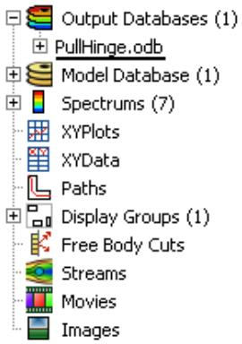  
Figure 1:The Results Tree after completing an analysis of the hinge model tutorial.

Expanding PullHinge, as shown in Figure 2, reveals that this output database has the following containers: History Output, Steps, Instances, Materials, Sections, Element Sets, Node Sets, and Surface Sets. In addition, the output database contains two empty containers—Session Coordinate Systems and ODB Coordinate Systems. You cannot delete an empty container from the Results Tree, although you can hide empty containers from view (see Changing the view of the model).

  
Figure 2:The containers in the PullHinge output database.

Expanding the History Output container, as shown in Figure 3, reveals the sixteen output variables for which history output was requested in this analysis. Each variable listing also describes the region for which history output was requested; in this example every history output request was made for the whole model. You can click any of the history output variables in the Results Tree to plot the selected variable in the current viewport.

  
Figure 3:The History Output container of the Results Tree.

Each output database also includes a Steps container, which includes containers for each step in the output database and within the steps, every frame in the output database. You can use the Results Tree to display the model at any frame of the analysis, to activate or deactivate steps or frames in the analysis, or to display field output at the selected frame.

The Model Database container displays all the models in the current model database. You can expand each model to select the step with data that you want to investigate and to display or hide individual part instances. Figure 4 shows the hinge model with its Steps and Instances containers expanded.

  
Figure 4:The Model Database container of the Results Tree.

The other containers in the Results Tree provide shortcuts to data that persist only during your session. By using these shortcuts, you can create and manage contour spectrums; create and edit X–Y data and display X–Y plots, create and manage paths and display groups; and upload and display background images and movies.

## Using popup menus in the Model Tree and the Results Tree

Much of the power of the Model Tree and Results Tree comes from the popup menu that appears when you click mouse button 3 on an item. For example, Figure 1 shows the effect of clicking mouse button 3 on the Parts container in the Model Tree.

  
Figure 1: Clicking mouse button 3 on the Parts container in the Model Tree.

The Create menu item appears in bold font in Figure 1 because it is the default action. Double-clicking an item or selecting an item and pressing [Enter] invokes the default action. In most cases if an item is a container, the default action is to create a new item in the container. Similarly, if an item is not a container, the default action is to edit the item. For example, if you double-click the Parts container, Abaqus/CAE displays the Create Part dialog box and allows you to create a new part; if you double-click one of the parts within the container, Abaqus/CAE displays the Edit Part dialog box and allows you to edit the part you selected.

Some of the commands in the popup menu appear with all items in the Model Tree and Results Tree; other commands appear only with specific items or with items in one of the two trees. For example, the Switch Context command appears with all items in the Model Tree and Results Tree, including containers. The following commands appear with all containers in the Model Tree and Results Tree:

## Switch Context

If you select Switch Context, Abaqus/CAE makes the item current. In the Model Tree, where appropriate, Abaqus/CAE also switches to the module in which you can edit the item. For example, if you click mouse button 3 on the Materials container and select Switch Context, Abaqus/CAE switches to the Property module. For more information, see What is a module?. In the Results Tree you can also switch the context to an item in another output database.

Selecting a container and pressing [Ctrl][Space] have the same effect as selecting Switch Context from either tree.

## Filter

When you select Filter, Abaqus/CAE prompts you for a string of characters next to the container's name. After you press [Enter], Abaqus/CAE filters the contents of the container and displays only those items that match the specified character string. The filter is case-sensitive. For details on valid filtering syntax, click the tip button


at the top of the Model Tree or Results Tree. Figure 2 shows the effect of filtering a container.

  
Figure 2: Filtering a container in the Model Tree.

Items that are hidden by a filter cannot be manipulated from the Model Tree or Results Tree; however, these items are not removed from the model or output database. When a filter is in effect, the numbers in parentheses next to the container name indicate the number of visible items in the container followed by the total number of items (visible and hidden) in the container (see Figure 2). The filter string appears to the right of these numbers. To remove a filter, select Filter for the appropriate container, delete the filter string, and press [Enter].

Filters can be applied only to individual containers and persist only during your session. Selecting a container and pressing [F2] have the same effect as selecting Filter from either tree.

## Set As Root

If you select Set As Root, Abaqus/CAE moves the container to the pull-down menu above the Model Tree or Results Tree and displays everything under the selected container. For more information, see Changing the view of the model.

## Expand All Under

If you select Expand All Under, Abaqus/CAE expands all of the containers and items inside the selected container.

## Collapse All Under

If you select Collapse All Under, Abaqus/CAE collapses all of the containers and items inside the selected container.

## Group Children

When a container includes more than 30 items, Abaqus/CAE automatically groups the items into sets of 30. If you toggle off the Group Children option, Abaqus/CAE removes the groupings and lists all of the items on the same level in the container.

Selecting a container and pressing [Ctrl][G] have the same effect as selecting Group Children from either tree.

Many popup menu commands appear only with specific items. In the Model Tree these commands mirror the actions that you can perform with that item's manager; for example, create, edit, delete, rename, suppress, and resume. In the Results Tree some popup menus provide Boolean operators that enable you to control the display of items in the current viewport. These Boolean operators are the same five commands that are available for controlling display groups: replace, add, remove, intersect, and either. See Understanding display group Boolean operations, for more information.

Some menu commands are specific to one container in the Model Tree or Results Tree; for example, clicking mouse button 3 on a step allows you to toggle the Nlgeom setting, clicking mouse button 3 on a job allows you to submit the job for analysis, and clicking mouse button 3 on a history output variable allows you to add another variable to the existing plot. When you become familiar with the Model Tree and Results Tree, you will find that you can quickly perform most of the actions that are found in the main menu bar, the module toolboxes, and the various managers.

## Changing the view of the model

If you select Set As Root from a container's popup menu, Abaqus/CAE displays everything under the selected container in the Model Tree or Results Tree and displays the name of the container in the menu above the tree. This option is useful if, for example, you have a complex model or output database and correspondingly complex Model Tree or Results Tree. You can use Set As Root to simplify the Model Tree or Results Tree by displaying only the portion that you are working on. For example, Figure 1 shows a view of the Model Tree on the left and contrasts it with the effect of setting the Materials container as the root.

  
Figure 1:The effect of Set As Root on the Model Tree.

When you change the default root container, you can use the menu above the Model Tree and Results Tree to move up through its levels. In addition, Abaqus/CAE activates two icons above the Model Tree or Results Tree, as shown in Figure 1: the Set Root to Model Database icon in the Model Tree, the Set Root to Session Data icon in the Results Tree, and the Up One Level icon in both trees.

The Set Root to Model Database icon $a _ { 2 } = - \frac { 3 } { 2 }$ returns the Model Tree to the default view that shows Model Database at the top of the tree. The Set Root to Session Data icon $a _ { 2 } = - \frac { 3 } { 2 }$ 上 returns the Results Tree to the default view that shows Session Data at the top of the tree.  
The Up One Level icon 自 moves the root of the Model Tree or Results Tree up one level; for example, from the Materials container up one level to the Beam model that contains the Materials container.

If you click mouse button 3 on the background of the Model Tree or Results Tree, Abaqus/CAE displays a popup menu with the following options:

## Show Empty Containers

By default, Abaqus/CAE displays all of the containers in the Model Tree and Results Tree, whether or not they have items in them. By turning off the Show Empty Containers option, you can suppress the display of containers without any items in them. If you perform an action in Abaqus/CAE that adds an item to a previously empty container (for example, creating an interaction using the Interaction module toolbox), the container and item will reappear in the Model Tree or Results Tree. For a container to be suppressed from view, it must be completely empty; even if all items in a container are hidden because of a filter (see Using popup menus in the Model Tree and the Results Tree), that container is not suppressed by the Show Empty Containers option.

The state of the Show Empty Containers option persists between Abaqus/CAE sessions.

## Expand All

If you select Expand All, Abaqus/CAE expands all of the containers and items in the Model Tree or Results Tree.

## Collapse All

If you select Collapse All, Abaqus/CAE collapses all of the containers in the Model Tree or Results tree, leaving only top-level containers and items visible.

## Set Root to Displayed Object

If you select Set Root to Displayed Object, the container corresponding to the part visible in the current viewport becomes the root of the Model Tree (as described above). If an assembly is visible in the current viewport, the Assembly container for the appropriate model becomes the root of the Model Tree.

This option is available only in the Model Tree.

## Set Root to Model Database

If you select Set Root to Model Database, Abaqus/CAE returns the Model Tree to the default view that shows Model Database at the top of the tree. This option has the same effect as the Set Root to Model Database icon


This option is available only in the Model Tree.

## Set Root to Session Data

If you select Set Root to Session Data, Abaqus/CAE returns the Results Tree to the default view that shows Session Data at the top of the tree. This option has the same effect as the Set Root to Session Data icon This option is available only in the Results Tree.

## Understanding Abaqus/CAE GUI settings

GUI settings are always saved automatically to a binary file in your home directory called abaqus\_2025.gpr when you exit Abaqus/CAE. For more information, see Working with abaqus\_2025.gpr files.

These GUI settings include the following:

• The size and location of the main window.  
• The size and location of a particular dialog box; for example, the Open Database and Create Part dialog boxes.  
• The location, orientation, and visibility of individual toolbars.  
• Custom toolbars.  
• Customized keyboard shortcuts.  
• The size of the message area and command line interface.  
• Whether the Model Tree and Results Tree are displayed. The width of the tree area is also stored.  
• Bookmarks to directories that you created when opening a file.

You cannot edit the abaqus\_2025.gpr file; however, you can delete it to restore the default GUI and display options settings.


## Warning:

Deleting the abaqus\_2025.gpr file resets all of the GUI settings listed above. You cannot restore the settings from a deleted abaqus\_2025.gpr file except by recreating them manually in Abaqus/CAE.

## Managing viewports on the canvas

The canvas can be thought of as an infinite screen or bulletin board on which you post viewports; you can imagine the canvas extending beyond the main window and your monitor.

The visible portion of the canvas is called the drawing area, and you can increase its size by increasing the size of the main window. You can display the drawing area full screen using the View menu; you can also press [F11] to toggle between full screen mode and normal mode.

You can position viewports anywhere on the canvas, and you can drag them outside the drawing area. When viewports are positioned outside the drawing area, you can cascade or tile the viewports to bring them back into view. Viewports are not part of a model and are not saved between sessions.

This chapter explains how to create and manipulate viewports, text annotations, and arrow annotations.

## In this section:

Understanding viewports  
Manipulating viewports and viewport annotations  
Displaying the drawing area in full screen mode  
Working with viewports  
Working with viewport arrow and text annotations  
Linking viewports for view manipulation  
Working with background images and movies in viewports

## Understanding viewports

Viewports are areas on the canvas where you can display models or analysis results. You can add arrow and text annotations to draw attention to or explain features within a viewport. You can create and manipulate viewports, text, and arrows using the Viewport menu.

## In this section:

What is a viewport?  
What are arrow and text annotations?

## What is a viewport?

While the canvas can be thought of as an infinite screen or bulletin board, viewports are simply display areas posted onto that screen on which you can display models or analysis results. You can have many viewports on the canvas. A viewport is similar to other windows on your workstation in that it can be moved, resized, minimized, and maximized; and it can overlap other viewports on the canvas. For more information, see Working with viewports.

You can easily create and delete viewports and control their size, position, and appearance. Figure 1 illustrates how you might use several viewports to view the results from your analysis.

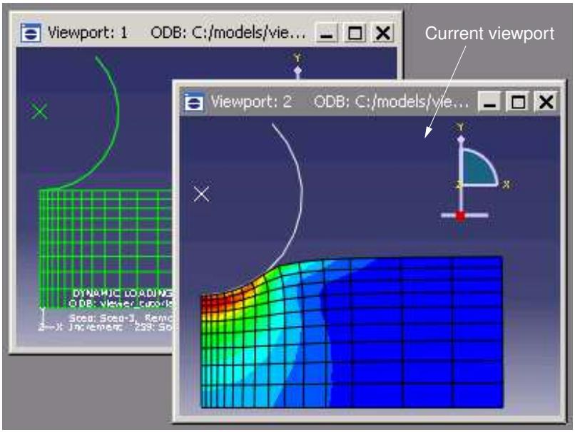  
Figure 1: Working with multiple viewports.

The view manipulation tools, such as zoom and rotate, operate on the viewport that contains the cursor. Other operations interact with the current viewport or with all viewports on the canvas.

## The current viewport

To change the contents of a viewport, you must first designate the desired viewport as current. The current viewport is indicated by a dark gray title bar. All work takes place within the current viewport. To choose another viewport as the current viewport, click on the border or title bar. The selected viewport moves in front of other viewports on the canvas, and the title bar color changes to blue. The title bar reverts to dark gray when you select an Abaqus/CAE tool or menu.


## Note:

On Windows platforms you can customize the colors used by Abaqus/CAE. For more information, see Common customizations on Windows platforms.

All viewports are associated with a certain model and module. When you create a new model or open an existing model or output database, that model becomes associated with the current viewport. You can create different viewports and associate each one with a different model, so designating each viewport as current results in

switching between the associated models. Similarly, you can work in multiple modules simultaneously by designating a new viewport as current before entering a different module.

## Additional information

• Components of the main window

## What are arrow and text annotations?

Arrow and text annotations are arrows and text strings that you create in a viewport to enhance the appearance and clarity of displayed models or results. You can create arrow annotations and text annotations independently, and you can create arrows and text together to automatically position text at the end of an arrow. The positions of annotations in a viewport are controlled by anchor points. You define each anchor point based on viewport geometry or model coordinates; the method you choose determines how Abaqus/CAE moves the annotations. If you manipulate the viewport, Abaqus/CAE repositions any annotations anchored to viewport geometry; similarly, if you manipulate the model, Abaqus/CAE moves any annotations anchored to the model. Figure 1 shows the use of arrows and text to describe details of a model.

  
Figure 1: Arrow and text annotations.

Annotation editing operations require you to first select one or more annotations. Use the Edit Annotations tool 网 from the Viewport toolbar to select arrow or text annotations from the current viewport. Abaqus/CAE highlights selected arrow or text annotations along with their anchor points, as shown in Figure 2.

  
Figure 2: Selected annotations: an arrow with no offsets, text with an offset, and an arrow with gaps at both ends and an offset between the tail and its anchor point.

Anchor points are shown as a small dot with an anchor symbol placed nearby. Dashed lines indicate an offset between the anchor point and the annotation; circular “handles” are the anchor connection points—if there is no offset, the connection point and anchor point are the same.

Arrow annotations have two anchor points (you can use the same coordinates for both points). You can add a gap between the arrow ends and the connection points. Adding a gap is comparable to leaving a space between dimension lines and object lines in the Sketcher or in a CAD drawing; it can increase the clarity of your annotation. Text annotations have a single anchor point. You can change the offsets by dragging the connection points, or the entire annotation, in the viewport.

Do not confuse the viewport annotations that you can create with the viewport annotations generated by Abaqus/CAE. The generated viewport annotations include the view orientation triad; the 3D compass; and, in the Visualization module, the legend, the title block, and the state block. You can modify some display aspects of the generated annotations, but you cannot modify their contents. For more information, see Customizing viewport annotations. In contrast, you have full control of all attributes related to arrow and text annotations including their colors, line styles, line thicknesses, arrowheads, fonts, anchor points, and any offsets between the anchor points and the annotations.

Abaqus/CAE saves arrow and text annotations in model and output databases; however, viewports are not saved. As a result, the arrow and text annotations in a database are not associated with a viewport. When you subsequently open a database that contains annotations, you must use the Annotation Manager to display a selected annotations in the current viewport. The Annotation Manager also allows you to copy annotations from a model database to an output database and vice versa. You cannot create annotations in a model database from the Visualization module; open the model database in a different module if you want to create annotations for it.

## Additional information

• Components of the main window  
• Working with viewports  
• Working with viewport arrow and text annotations

## Manipulating viewports and viewport annotations

This section explains how to manipulate viewports and viewport annotations using the options provided in the Viewport menu, the Viewport toolbar, and the Annotation Manager.

## In this section:

Managing viewports and viewport annotations from the main menu bar  
Managing viewports and viewport annotations from the Viewport toolbar  
The Annotation Manager

## Managing viewports and viewport annotations from the main menu bar

Use the Viewport menu, located on the main menu bar, to create, delete, modify, link, or rearrange viewports and to create or edit viewport annotations—both those that you create and those generated by Abaqus/CAE. If you prefer, you can select View->Toolbars->Viewport from the main menu bar to display a toolbar containing most of the functionality of the items in the Viewport menu.

The Viewport menu and toolbar allow you to do the following:

Create a viewport.  
Edit options for generated viewport annotations (triad, legend, title block, and state block).  
Create an arrow annotation.  
• Create a text annotation.  
• Create a combined arrow and text annotation.  
Edit arrow and text annotations.  
• Open the Annotation Manager to manipulate arrow and text annotations.


## Note:

The Annotation Manager provides several unique management functions; for more information, see The Annotation Manager.

• Open the Viewport Annotation Options to show or hide all annotations and to manipulate the viewport annotations generated by Abaqus/CAE.  
Link viewports.

In addition, the Viewport menu lists all the viewports in the session and allows you to delete the current viewport.

## Additional information

• Managing viewports on the canvas

## Managing viewports and viewport annotations from the Viewport toolbar

To display the Viewport toolbar, + select View->Toolbars->Viewport from the main menu bar. Figure 1 describes the tools available from the Viewport toolbar.

  
Figure 1:The Viewport toolbar.

## Additional information

• Managing viewports on the canvas

## The Annotation Manager

The Annotation Manager is similar to other manager dialog boxes in Abaqus/CAE. It allows you to do the following:

• Create arrow, text, or combined arrow and text annotations.  
Edit an arrow or text annotation.  
• Copy or rename an annotation.  
• Delete annotations.

In addition, the Annotation Manager allows you to perform the following tasks that are not available from the Viewport menu or toolbar:

• Select the source—model database (MDB) or output database (ODB)—of annotations to manage.  
• Plot model database or output database annotations in the current viewport.  
• Hide model database or output database annotations in the current viewport.  
• Copy annotations from a model database to an output database and vice versa.  
• Highlight annotations in the viewport.  
• Rearrange the order of arrow and text annotations in the list.

You can display the Annotation Manager by selecting Viewport->Annotation Manager from the main menu bar


in the Viewport toolbar. The Annotation Manager is shown in Figure 1.

  
Figure 1:The Annotation Manager.

For detailed instructions on using the Annotation Manager to create, edit, and manipulate annotations, see the following sections :

Annotating viewports  
Editing arrow annotation attributes  
Editing text annotation attributes  
Plotting annotations in the current viewport  
Copying viewport annotations to another database

Rearranging the annotation list order

## Additional information

• Managing viewports on the canvas

## Displaying the drawing area in full screen mode

The drawing area is the visible portion of the canvas. You can display the drawing area in full screen mode. If you are in the Visualization module, the Animation Controls are available as a separate toolbar; otherwise, no menu bars or toolbars are accessible in full screen mode. To make a toolbar accessible in full screen mode, you can click and drag the toolbar's grip to “undock” the toolbar prior to switching modes.

1. From the main menu bar, select View->Full Screen.


Tip: You can also press [F11] to toggle between full screen mode and normal mode.

The drawing area enlarges to fill the entire screen.

2. Click the restore button in the title bar to return the drawing area to its previous size.

## Additional information

• Managing viewports on the canvas

## Working with viewports

This section explains how to create and manage viewports and how to modify their appearance.

## In this section:

Creating new viewports  
Selecting viewports  
Moving viewports  
Resizing viewports  
Minimizing, maximizing, restoring, or deleting a viewport  
Cascading viewports  
Tiling viewports

## Creating new viewports

You can create new viewports at any time; there is no limit to the number of viewports or their position on the canvas.

From the main menu bar, select Viewport->Create.

Abaqus/CAE creates a new viewport in the drawing area. This viewport becomes the current viewport.

The new viewport size and position depend on the size of the current viewport and the drawing area. If the current viewport is maximized, Abaqus/CAE automatically maximizes the new viewport.


Tip: You can also create a new viewport by clicking in the Viewport toolbar.

## Additional information

• Managing viewports on the canvas

## Selecting viewports

Most of your interactions with the model—such as sketching a part, positioning a load, assembling part instances, generating a mesh, and customizing a plot state—take place in the current viewport. In addition, if you have multiple viewports displayed on the canvas, the current viewport indicates the model you are working on (the current model) and the module you are working in (the current module).

There are several ways that you can select a new viewport to be the current viewport:

• Click on the border or title bar of an existing viewport.  
• Select an existing viewport from the list in the Viewport menu.  
• Use [Ctrl][Tab]—or select Next or Previous from the Viewport menu—to cycle through all the viewports on the canvas.


## Note:

On Linux platforms [Ctrl][Tab] is used to switch applications; [Ctrl][F6] is an alternative keyboard shortcut.

• Create a new viewport.

The current viewport has a dark gray title bar as shown in the following figure:


1. Move the cursor onto the border of the viewport.  
If the viewport is hidden, you may need to move other viewports to expose the one you want to select. For more information, see Moving viewports.

2. Click mouse button 1.

The viewport becomes the current viewport; the viewport also becomes selected and its title bar changes to blue to indicate that it is the selected viewport. If you click on a tool or menu, the viewport remains current but the title bar reverts to dark gray.


## Note:

On Windows platforms you can customize the colors used by Abaqus/CAE. For more information, see Common customizations on Windows platforms.

## Additional information

• Cascading viewports  
• Tiling viewports  
• Managing viewports on the canvas

## Moving viewports

You can move a selected viewport to any location on the canvas. This may be necessary to expose hidden viewports or simply to reduce clutter in the drawing area. To move a viewport, click anywhere on the viewport title bar and then drag it to the desired position.

1. Place the cursor anywhere on the viewport title bar.  
2. Click mouse button 1, and + drag the cursor to the new location.

The cursor changes to a four-headed arrow . An outline of the viewport indicates its new position as you drag.

3. Release mouse button 1.

The viewport moves to the new location, and it becomes the current viewport (if it was not previously).

## Additional information

• Selecting viewports  
• Managing viewports on the canvas

## Resizing viewports

You can change the size and shape of a viewport by dragging its borders.

1. Place the cursor anywhere on the viewport border that you want to move.  
The cursor changes to a set of opposing arrows. The direction of the arrows is dependent on the relative position between the cursor and the viewport.  
2. Click mouse button 1, and + drag the cursor to change the position of the borders.  
3. Release mouse button 1.  
The viewport is displayed with the new size, and it becomes the current viewport (if it was not previously).

## Additional information

• Selecting viewports  
• Managing viewports on the canvas

## Minimizing, maximizing, restoring, or deleting a viewport

Minimize, maximize, restore, and delete buttons are located in the top right corner of each viewport.

These buttons appear as shown in the following figure:


If necessary, Tile or Cascade viewports to reveal the minimize, maximize, restore, and delete buttons.

## The minimize button

When you click the minimize button, the viewport reduces to an abbreviated title bar in a default location toward the lower left of the drawing area. The minimize button changes to a restore button that is retained, along with the maximize and delete buttons, in the title bar. If you move a minimized viewport, the new location will be saved as its minimized location for the duration of the Abaqus/CAE session.

## The maximize button

When you click the maximize button, the viewport changes size and position to fill the canvas. The maximize button changes to a restore button and is moved, along with the minimize and delete buttons, to the right side of the main menu bar. The maximized viewport becomes the current viewport and is moved to the front of the canvas, hiding any other viewports in the drawing area. The information in the viewport title bar is displayed in the Abaqus/CAE title bar.

## The delete button

When you click the delete button or select Viewport->Delete Current from the main menu bar, the viewport is deleted from the canvas. You cannot restore a deleted viewport. If there is only one viewport on the canvas, Abaqus/CAE does not allow you to delete it. If you have created additional viewports on the canvas, Abaqus/CAE deletes the current viewport and selects one of the other viewports to be the current viewport. You cannot control which viewport Abaqus/CAE selects to be current.

## The restore button

The restore button replaces either the minimize button or maximize button, whichever you used most recently. When you click the restore button, Abaqus/CAE returns the viewport to its previous size and location. The restore button reverts to the minimize or maximize button that it had replaced. The restored viewport becomes the current viewport and is moved to the front of the canvas, hiding any other viewports in the drawing area.

## Additional information

• Working with viewports  
• Managing viewports on the canvas

## Cascading viewports

You can arrange the viewports on the canvas in a cascading pattern. This may be useful to expose hidden viewports or simply to reduce clutter in the drawing area. Abaqus/CAE arranges the viewports so that the title bars are visible but the contents may be hidden by another viewport.

1. Use the Minimize button in the upper right corner of a viewport to minimize any viewports that you do not want to cascade.  
2. From the main menu bar, select Viewport->Cascade.

Abaqus/CAE sets all the non-minimized viewports to the same size and arranges them from the upper left corner toward the lower right corner of the drawing area. The current viewport is always positioned at the front of the canvas; all other viewports are arranged in numerical order. Minimized viewports are positioned in front of any cascaded viewports except the current viewport.


Tip: You can also cascade non-minimized viewports by clicking


in the Viewport toolbar.

## Additional information

• Minimizing, maximizing, restoring, or deleting a viewport  
• Managing viewports on the canvas

## Tiling viewports

You can arrange the viewports on the canvas in a tile pattern. This may be useful to expose hidden viewports or simply to reduce clutter in the drawing area. Abaqus/CAE arranges the viewports so that the contents are visible but parts of the title bars may be hidden.

1. Use the Minimize button in the upper right corner of a viewport to minimize any viewports that you do not want to tile.  
2. Do one of the following:

• From the main menu bar, selectViewport->Tile Horizontally to tile the viewports while retaining the largest possible horizontal dimension.  
• From the main menu bar, selectViewport->Tile Vertically to tile the viewports while retaining the largest possible vertical dimension.

Abaqus/CAE sets all the non-minimized viewports to the same size and arranges them to fill the drawing area. All tiled viewports are arranged in numerical order. Minimized viewports are positioned in front of any tiled viewports except the current viewport.


Tip: You can also tile non-minimized viewports by clicking or in the Viewport toolbar.

## Additional information

• Managing viewports on the canvas

## Working with viewport arrow and text annotations

This section explains how to create, modify, and manage arrow and text annotations.

## In this section:

Annotating viewports  
Creating an arrow annotation  
Creating a text annotation  
Creating combined arrow and text annotations  
Manipulating annotations in the current viewport  
Editing arrow annotation attributes  
Editing text annotation attributes  
Plotting annotations in the current viewport  
Hiding annotations in the current viewport  
Copying viewport annotations to another database  
Rearranging the annotation list order

## Annotating viewports

Abaqus/CAE provides three types of viewport annotations that you can use to annotate models or results: text strings, arrows, and a combination arrow and text annotation. You use the Viewport menu to create these annotations, and you can position them anywhere on the viewport. Figure 1 shows text strings and arrows used to annotate a model. Arrow and text annotations are anchored to points in the viewport. The anchor points define the position of the annotation with respect to either the viewport size and shape or a point in the model coordinates. When you manipulate the model or resize the viewport, the annotations follow the position of their anchor points.

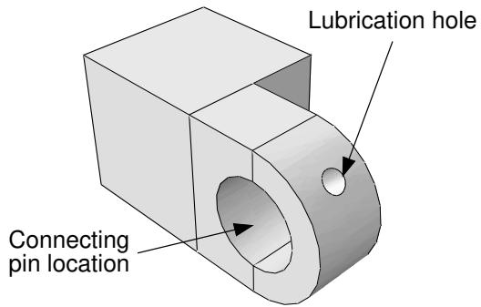  
Figure 1: Arrow and text annotations.

Viewport arrow and text annotations are saved with the model database or with the output database when you exit the Abaqus/CAE session. You can also copy annotations from a model to an output database and vice versa.


Warning: You can always create or copy annotations to an output database; however, you can save them only if you opened the database with write privileges.

## Text

Text annotations can consist of any characters that can be displayed using the fonts available on your workstation. Abaqus/CAE does not restrict the length or number of text lines in an annotation. However, you must take the size of the viewport into consideration when creating text annotations; the text should fit in the desired viewport location. You can place text anywhere on the viewport, and you can move a text annotation or change its anchor point after you have created it. Each text annotation can be displayed using different fonts, colors, and backgrounds, but you cannot change these attributes within a single text annotation.

## Arrows

You can create arrows anywhere in the viewport; typically, an arrow will connect a text annotation to a point in model coordinates. Arrows can have one of several different line thicknesses, line styles, and endpoint styles and can be displayed in any color available on your workstation. You can use one or two anchor points to control the position of an arrow annotation. For example, you can anchor the arrowhead to a point on the model and the tail to a viewport location so that when the model is manipulated the arrow still points to the desired feature but the tail is stationary. You can modify and move an arrow after you have created it.

## Arrow and text combination

You can create a combined arrow and text annotation. This method uses a reduced set of options to create an arrow annotation, anchored at the arrowhead, with a text annotation positioned at the arrow's tail. This creation method is provided to simplify the addition of information about specific parts of a model or results. You cannot

edit the annotations' position during creation, except by using the Previous button ( ) in the prompt area.

However, once you create them, the arrow and text are saved independently; so you can edit them using all the options available for each annotation type.

In addition to the viewport annotations that you can create, Abaqus/CAE generates some annotations to provide the context of the view in a viewport. Abaqus/CAE generates the 3D compass and the view triad to show the orientation of the model in the viewport; in the Visualization module the legend, the title block, and the state block are generated to indicate various aspects of the analysis results in the viewport. The Viewport Annotation Options dialog box allows you to show or hide all viewport annotations—yours and those generated by Abaqus/CAE—you can also use it to edit the attributes of the generated annotations. For more information, see Customizing viewport annotations.

## Additional information

• What are arrow and text annotations?  
• Creating an arrow annotation  
• Creating a text annotation  
• Creating combined arrow and text annotations  
• Customizing viewport annotations

## Creating an arrow annotation

You can create an arrow to help annotate the contents of a viewport, and you can place the arrow anywhere on the viewport. Typically, you would use a combined arrow and text annotation to connect a text annotation to an object in a viewport, but you may want to add individual arrows if a text annotation applies to multiple locations or if you want full control over the anchor points and position without editing the arrow after you create it.

1. From the main menu bar, select Viewport->Create Annotation->Arrow.


Tip: You can also create an arrow annotation by clicking in the Viewport toolbar.

An anchor symbol appears in the viewport. The default anchor point changes as you create new annotations in the session. If this is the first arrow annotation, the anchor point is in the lower left corner of the viewport.

2. If desired, click Change Anchor in the prompt area and do one of the following:

• Choose a new anchor point in the viewport.  
• Select a viewport corner or center point from the list in the prompt area.  
Click Pick From Model in the prompt area, and select a node or vertex or enter the coordinates of the desired anchor point.


## Note:

If you anchor an annotation to a node or vertex, Abaqus/CAE uses the model coordinates of the selected point; the annotation will not follow model deformation in the Visualization module.

3. Choose one of the following options to position the endpoint of the arrow:

• To position the endpoint on the current anchor point, click On Anchor in the prompt area.  
• To position the endpoint anywhere on the viewport, move the cursor to the desired position, and + click mouse button 1.

By default, Abaqus/CAE creates an arrowhead at the first endpoint; the second endpoint does not have a symbol.

4. Repeat Steps 2 and 3 to anchor and position the second endpoint of the arrow annotation.

Abaqus/CAE opens an Arrow Editor dialog box.

5. Complete the information in the Arrow Editor dialog box to finalize the arrow annotation.

For more information, see Editing arrow annotation attributes.

6. Click Preview to view your changes in the viewport.

7. To finish creating your arrow annotation, click OK. Abaqus/CAE updates your changes in the viewport, closes the editor, and begins creating another arrow annotation starting at Step 2.

8. To stop creating arrow annotations, click mouse button 2 in the viewport or the button in the prompt area.

## Additional information

• What are arrow and text annotations?  
• The Annotation Manager  
• Manipulating annotations in the current viewport  
• Editing arrow annotation attributes

## Creating a text annotation

You can create one or more lines of text to annotate the contents of a viewport and place them anywhere on the viewport. Typically, you would use a combined arrow and text annotation to connect a text annotation to an object in a viewport, but you may also add text annotations to provide a title or other general information that applies to the entire model or results in the viewport.

1. From the main menu bar, select Viewport->Create Annotation->Text.


Tip: You can also create a text annotation by clicking in the Viewport toolbar.

An anchor symbol appears in the viewport with the annotation Text-n. The default anchor point changes as you create new annotations in the session. If this is the first text annotation, the anchor point is in the lower left corner of the viewport.

2. If desired, click Change Anchor in the prompt area and do one of the following:

• Choose a new anchor point in the viewport.  
• Select a viewport corner or center point from the list in the prompt area.  
Click Pick From Model in the prompt area, and select a node or vertex or enter the coordinates of the desired anchor point.


## Note:

If you anchor an annotation to a node or vertex, Abaqus/CAE uses the model coordinates of the selected point; the annotation will not follow model deformation in the Visualization module.

3. Choose one of the following options to position the text annotation in the viewport:

• To position the text on the current anchor point, click On Anchor in the prompt area.  
• To position the text anywhere on the viewport, move the cursor to the desired position, and + click mouse button 1.

Abaqus/CAE opens a Text Editor dialog box.

4. Complete the information in the Text Editor dialog box to finalize the text annotation.

For more information, see Editing text annotation attributes.

5. Click Preview to view your changes in the viewport.  
6. To finish creating your text annotation, click OK.

Abaqus/CAE updates your changes in the viewport, closes the editor, and begins creating another text annotation starting at Step 2.

7. To stop creating text annotations, click mouse button 2 in the viewport or the button in the prompt area.

## Additional information

• What are arrow and text annotations?  
• The Annotation Manager  
• Manipulating annotations in the current viewport

• Editing text annotation attributes

## Creating combined arrow and text annotations

You can create an arrow and a text annotation at the same time to relate the text to a particular feature or result in the viewport.

This method creates an arrow annotation with the anchor point at the arrowhead and a separate text annotation anchored at the same location and positioned at the arrow's tail. During creation, your annotation options are limited; for example, you cannot offset the arrowhead from the anchor point or select a second anchor point for the tail of the arrow (the text position).

Once you create them, Abaqus/CAE saves the arrow and text annotations independently so that you can edit them using all the options available for each annotation type as described in Editing arrow annotation attributes, and, Editing text annotation attributes, respectively. Since they are not linked, you can also move the arrow and text independently.


Tip: To move an arrow and text annotation while keeping the same relative positions, select both annotations and position the text in the desired location, then select only the arrow to edit the arrowhead position.

## Additional information

• What are arrow and text annotations?  
• Manipulating annotations in the current viewport

## Create combined arrow and text annotations

1. From the main menu bar, select Viewport->Create Annotation->Arrow & Text.


Tip: You can also create an arrow and text annotation by clicking in the Viewport toolbar.

2. Select the arrow target by choosing a model node or vertex in the viewport or entering model coordinates in the prompt area.  
Abaqus/CAE displays the anchor symbol and arrowhead at the selected point and the default text string Text–n appears at the cursor position.  
3. Position the text on the viewport; move the cursor to the desired text position and click mouse button 1.  
Abaqus/CAE displays the Arrow & Text Editor dialog box.  
4. Complete the information in the Arrow & Text Editor dialog box to finalize both annotations.  
Click Preview at any time to see your changes in the viewport; click OK to save the arrow and text annotations and to close the Arrow & Text Editor.

## Edit the text

1. Click the Text tab in the Arrow & Text Editor, if it is not already selected.  
2. To display or suppress a box outlining the text, toggle Show bounding box. The bounding box visually separates the text from the underlying model or results.  
3. Type the desired text.  
When typing a text annotation, you can use standard mouse and keyboard editing techniques such as backspace, copy, and paste; press [Enter] to start a new line.

4. To customize the background, click one of the following:

• Match viewport to match the background to the viewport color.  
• Transparent to eliminate the background and show only the text.

• Other color to reveal other background color options.

If you selected Other color:

a. Click the color sample .

Abaqus/CAE displays the Select Color dialog box.

b. Use one of the methods in the Select Color dialog box to select a new color. For more information, see Customizing colors.

c. Click OK to close the Select Color dialog box.

The color sample changes to the selected color.

5. Customize the text font.

a. Click Set Font.

The Select Font dialog box appears.

b. Use the Select Font dialog box to choose the font characteristics you want. For more information, see Customizing fonts.

c. When you are done, click OK to implement your changes and to close the Select Font dialog box.

6. Choose the text color.

a. Click the color sample .

Abaqus/CAE displays the Select Color dialog box.

b. Use one of the methods in the dialog box to select a new color. For more information, see Customizing colors.

c. Click OK to close the Select Color dialog box.

The color sample changes to the selected color.

7. Choose Left, Center, or Right justification to arrange the text within the bounding box area.

## Edit the arrow

1. Click the Arrow tab in the Arrow & Text Editor, if it is not already selected.

2. Select the desired line style; you can choose a solid line or several styles of dashed line for your arrow.

3. Select the desired line thickness.


## Note:

Changing the line thickness also changes the size of the arrowheads.

4. Select the desired arrowhead symbol.

5. Choose the arrow color.

a. Click the color sample .

Abaqus/CAE displays the Select Color dialog box.

b. Use one of the methods in the dialog box to select a new color. For more information, see Customizing colors.

c. Click OK to close the Select Color dialog box.

The color sample changes to the selected color.

## Manipulating annotations in the current viewport

To manipulate viewport arrow and text annotations, you must first select them. Use Viewport->Edit Annotations from the main menu bar to select arrow or text annotations from the current viewport.


## Note:

To manipulate the viewport annotations generated by Abaqus/CAE, use the Viewport Annotations Options dialog box (for more information, see Customizing viewport annotations”).

You can move, copy, edit, hide, or delete the selected annotations. You can also rearrange the order that Abaqus/CAE uses to display annotations; the order determines which annotation will be “in front” if viewport or model manipulations cause more than one annotation to appear in the same location.

1. From the main menu bar, select Viewport->Edit Annotations.


Tip: You can also edit an annotation by clicking in the Viewport toolbar. $\mathbb { A }$

2. Click an arrow or text annotation to select it. To select additional annotations, [Shift] + Click instead of clicking. For more information, see Selecting objects within the current viewport.

Abaqus/CAE highlights the selected annotations and their anchor points. Circular handles are the anchor connection points; they appear near each end of a selected arrow and at the reference point of a selected text annotation. Dashed lines indicate an offset between the anchors and the handles.

3. Do one of the following:

## To move or copy annotations:

If you selected text or multiple annotations, drag your selection to move it around the viewport. Press [Ctrl] before releasing mouse button 1 to copy the annotations instead of moving them. If you selected a single arrow annotation, drag the arrow shaft to move the arrow. You can drag annotations anywhere on the viewport, even outside the viewable area. Moving or copying annotations in the viewport does not change their anchor points.

## To move or copy the ends of an arrow annotation:

If you selected a single arrow annotation, notice that the circular handles are larger than when you select multiple annotations; this indicates that you can move each end of the arrow independently. Drag one of the circular handles to lengthen, reduce, or reorient the arrow. Press [Ctrl] before releasing mouse button 1 to create radial copies of the arrow instead of moving it. You can drag the endpoint anywhere on the viewport, even outside the viewable area. Moving or copying an arrow by dragging an endpoint does not change the arrow's anchor points.

## To edit an annotation:

Double-click an arrow or text annotation to open the Arrow Editor or Text Editor dialog box, respectively. If you prefer, you can also click mouse button 3 and select Edit from the popup menu.

• For an arrow annotation you can change the line style, line weight, or color; and you can change the offset, arrowhead style, and anchor point for each end of the arrow, as well as add a gap between the handle positions and the arrow endpoints. For more information, see Editing arrow annotation attributes.

For a text annotation you can edit the text; show or hide a box around the text; change the background color, font, font color, justification, and rotation; or change the reference point, anchor point, and offset. For more information, see Editing text annotation attributes.

## To hide selected annotations:

Click mouse button 3, and select Hide from the menu that appears.

Abaqus/CAE removes the selected annotations from the current viewport. To show the annotations again, you can plot them from the Annotation Manager. You can also hide or plot annotations by selecting them in the Model Tree, clicking mouse button 3, and selecting the desired option from the menu that appears.

## To delete selected annotations:

Press Backspace or Delete. Abaqus/CAE displays a warning dialog box; click Yes to delete the annotations.

Abaqus/CAE deletes the selected annotations from both the current viewport and the associated database.

## To rearrange the display order of annotations:

By default, Abaqus/CAE displays viewport annotations in the order that they are created or plotted in the viewport; the last annotation created or plotted will appear in front of any preexisting annotations. Changes in the display order will not affect the current view unless two or more annotations appear in the same location. All viewport annotations are displayed in front of the model.

Click mouse button 3, and select Bring to Front, Send to Back, Bring Forward, or Send Backward from the popup menu to change the display order. Alternatively, to move a single annotation to the front, plot it again from the Annotation Manager.

## Additional information

• What are arrow and text annotations?  
• The Annotation Manager

## Editing arrow annotation attributes

You can change the following attributes of arrow annotations:

• Name (use the Annotation Manager to rename existing annotations).  
• Line thickness and line style.  
• Color.  
• Anchor point and offset for each end.  
• Endpoint style.  
Gap between the endpoint and the arrowhead or tail position.

If you are creating a new annotation, Abaqus/CAE applies many of your customizations not only to the current annotation but also to any new annotations you subsequently create. If you are editing an existing annotation, Abaqus/CAE applies your changes only to the selected annotation.

You can also copy an arrow annotation and its attributes and edit them to create a new arrow annotation. For more information, see The Annotation Manager.

1. Use one of the following methods to access the Arrow Editor dialog box:

• Select an arrow annotation from the Annotation Manager, and click Edit.  
Select Viewport->Edit Annotations or $\bowtie$ in the Viewport toolbar, and double-click an arrow annotation in the viewport.  
Create a new arrow annotation in the viewport; Abaqus/CAE opens the editor after you select the endpoints in the viewport.

2. If you are creating a new annotation, you can edit the name of the arrow.

3. Select the desired line style; you can choose a solid line or several styles of dashed line for your arrow.

4. Select the desired line thickness.


## Note:

Changing the line thickness also changes the size of the arrowheads.

5. Choose the arrow color.

a. Click the color sample  
Abaqus/CAE displays the Select Color dialog box.  
b. Use one of the methods in the dialog box to select a new color. For more information, see Customizing colors.  
c. Click OK to close the Select Color dialog box.  
The color sample changes to the selected color.

6. Click the Start Point tab or the End Point tab.

Abaqus/CAE highlights the selected point and its anchor point in the viewport.

7. Select a new anchor point; the following methods are available:


Tip: To avoid changing the position of the annotation, use the Pick Anchor button to change the anchor point and recalculate the Offset between the anchor point and the annotation.

## Predefined

Select this method to anchor the annotation to a predefined point of viewport geometry. The available points are the viewport corners, the center, and the midpoint of each edge. The anchor point definition changes if you modify the viewport shape.

## % Viewport X,Y

Select this method to anchor your annotation to a point based on the position of the lower left viewport corner and the viewport size. Enter the anchor point as a percentage of the total width and height of the current viewport. As with the Predefined method, the anchor point definition changes if you modify the viewport shape.

## Model point X, Y, Z

Select this method to anchor your annotation to a point on the model. Enter the model coordinates of the new anchor point in the text field. The anchor point definition, and any annotation linked to it, changes if you manipulate the model. For example, if you rotate the model in the viewport, the anchor point and the arrow endpoint will rotate with it.

## Pick Anchor button

Select this method to change the anchor point without changing the current position of the annotation.

Abaqus/CAE hides the Arrow Editor dialog box and prompts you to select a point from the viewport. Alternatively, you can pick one of the predefined viewport points from the list in the prompt area or click Pick From Model to pick a model node or vertex from the viewport or to enter the coordinates of a model point in the prompt area.

Each selection type corresponds to one of the preceding anchor point selection methods. After you make your selection, the Arrow Editor dialog box reappears with your selection indicated in the appropriate anchor selection method and the offset value recalculated for the new anchor point.

8. Enter new X- and Y-values to change the Offset, in millimeters, between the endpoint and its anchor point.


## Note:

After you close the Arrow Editor, you can also change the Offset by dragging each endpoint, or the entire arrow, in the viewport. For more information, see Manipulating annotations in the current viewport.

9. Select the desired arrowhead symbol.

The defaults are a plain line for the Start Point and a filled arrow for the End Point.

10. If desired, add a Gap between the endpoint position and the start or end of the arrow annotation. Adding a gap is comparable to leaving a space between dimension lines and object lines in the Sketcher or in a CAD drawing; it can increase the clarity of your annotation. For example, you can indicate a specific point on a model and add a gap so that the arrowhead does not obscure the point.

11. Repeat Steps 7–10 to edit the remaining endpoint of the arrow.  
12. Click Apply to see your changes in the viewport.


## Note:

Once you have applied your changes in the viewport, you cannot recover the original settings except by recreating the annotation or editing the options again.

## 13. Click OK to close the Arrow Editor.

## Additional information

• What are arrow and text annotations?  
• The Annotation Manager

You can change the following attributes of text annotations:

• Bounding box display.  
• Background color.  
• Font style and color.  
• Justification.  
• Rotation angle.  
• Reference point location and offset.  
• Anchor point location.

• Name (use the Annotation Manager to rename existing annotations).

If you are creating a new annotation, Abaqus/CAE applies many of your customizations not only to the current annotation but also to any new annotations you subsequently create. If you are editing an existing annotation, Abaqus/CAE applies your changes only to the selected annotation.

You can also copy a text annotation and its attributes and edit them to create a new text annotation. For more information, see The Annotation Manager.

1. Use one of the following methods to access the Text Editor dialog box:

• Select a text annotation from the Annotation Manager, and click Edit.  
Select Viewport->Edit Annotations or $\bowtie$ in the Viewport toolbar, and double-click a text annotation in the viewport.  
Create a new text annotation in the viewport; Abaqus/CAE opens the editor after you select the text position in the viewport.

2. If you are creating a new annotation, you can edit the name of the text annotation.

3. To display or suppress a box outlining the text, toggle Show bounding box. The bounding box visually separates the text from the underlying model or results.

4. Type the desired text.

When typing a text annotation, you can use standard mouse and keyboard editing techniques such as backspace, copy, and paste; press [Enter] to start a new line.

5. To customize the background, click one of the following:

• Match viewport to match the background to the viewport color.  
• Transparent to eliminate the background and show only the text.  
• Other color to reveal other background color options.

If you selected Other color:

a. Click the color sample .

Abaqus/CAE displays the Select Color dialog box.

b. Use one of the methods in the Select Color dialog box to select a new color. For more information, see Customizing colors.

c. Click OK to close the Select Color dialog box.

The color sample changes to the selected color.

6. Customize the text font.

a. Click Set Font.

The Select Font dialog box appears.

b. Use the Select Font dialog box to choose the font characteristics you want. For more information, see Customizing fonts.  
c. When you are done, click OK to implement your changes and to close the Select Font dialog box.

7. Choose the text color.

a. Click the color sample

Abaqus/CAE displays the Select Color dialog box.

b. Use one of the methods in the dialog box to select a new color. For more information, see Customizing colors.  
c. Click OK to close the Select Color dialog box.

The color sample changes to the selected color.

8. Choose Left, Center, or Right justification to arrange the text within the bounding box area.  
9. Enter a rotation angle (in degrees) to orient the text; 0° is horizontal.

Abaqus/CAE rotates the text counterclockwise about the Reference Point.

10. Click the Location tab.  
11. Select a new Reference Point.

The reference point is the point where a text annotation is attached to its anchor point; Abaqus/CAE also uses the reference point as the center of rotation if you rotate the text. The following methods are available:

## Predefined

Select this method to use a predefined point of the text bounding box geometry as the reference point. The available points are the bounding box corners, the center, and the midpoint of each edge. The definition of the reference point changes if you modify the annotation text.

## % Text X, Y

Select this method to define the reference point based on the position of the lower left bounding box corner and the bounding box size. Enter the reference point as a percentage of the total width and height of the text bounding box. As with the Predefined method, the reference point definition changes if you modify the text.


## Note:

Abaqus/CAE determines the lower left corner position based on a 0° rotation angle. If you rotate the text, the corner position is also rotated accordingly.


Tip: You can select a reference point outside of the bounding box by entering values less than 0% or greater than 100%.

12. Enter new X- and Y-values to change the Offset, in millimeters, between the reference point and the anchor point.


## Note:

After you close the Text Editor, you can also change the offset by dragging the text annotation in the viewport. For more information, see Manipulating annotations in the current viewport.

13. Select a new anchor point; the following methods are available:


Tip: To avoid changing the position of the annotation, use the Pick Anchor button to change the anchor point and recalculate the Offset between the anchor point and the annotation.

## Predefined

Select this method to anchor the annotation to a predefined point of viewport geometry. The available points are the viewport corners, the midpoint of each edge, and the center of the viewport. The anchor point definition changes if you modify the viewport shape.

## % Viewport X,Y

Select this method to anchor your annotation to a point based on the position of the lower left viewport corner and the viewport size. Enter the anchor point as a percentage of the total width and height of the current viewport. As with the Predefined method, the anchor point definition changes if you modify the viewport shape.

## Model point X, Y, Z

Select this method to anchor your annotation to a point on the model. Enter the model coordinates of the new anchor point in the text field. The anchor point definition, and any annotation linked to it, changes if you manipulate the model. For example, if you rotate the model in the viewport, the anchor point and the arrow endpoint will rotate with it.

## Pick Anchor button

Select this method to change the anchor point without changing the current position of the annotation.

Abaqus/CAE hides the Arrow Editor dialog box and prompts you to select a point from the viewport. Alternatively, you can pick one of the predefined viewport points from the list in the prompt area or click Pick From Model to pick a model node or vertex from the viewport or to enter the coordinates of a model point in the prompt area.

Each selection type corresponds to one of the preceding anchor point selection methods. After you make your selection, the Text Editor dialog box reappears with your selection indicated in the appropriate anchor selection method and the offset value recalculated for the new anchor point.

14. Click Apply to see your changes in the viewport.


## Note:

Once you have applied your changes in the viewport, you cannot recover the original settings except by recreating the annotation or editing the options again.

## 15. Click OK to close the Text Editor.

## Additional information

• What are arrow and text annotations?  
• The Annotation Manager

## Plotting annotations in the current viewport

When you open a database that contains saved viewport annotations or create a new viewport for an open database, Abaqus/CAE does not automatically display your viewport arrow or text annotations. You can use the Annotation Manager to plot arrow and text annotations in the current viewport; you can also select the annotations in the Model Tree, click mouse button 3, and select Plot from the menu that appears.

Annotations generated by Abaqus/CAE are displayed according to the settings in the Viewport Annotation Options dialog box (for more information, see Customizing viewport annotations”).

1. From the main menu bar, select Viewport->Annotation Manager.


Tip: You can also display the Annotation Manager dialog box by clicking from the Viewport toolbar.


2. Click the MDB or ODB radio button to select the source of the annotations to be plotted.

a. If you have more than one output database open or are otherwise uncertain of the database files involved, position the cursor over the MDB or ODB radio button to display a tooltip containing the database path and file name.  
b. If necessary, change the active output database by displaying the desired database in the current viewport. Alternatively, you can open a new viewport to display the database or close all the other output databases.

Abaqus/CAE lists the annotations available in the selected database.

3. Select annotations from the list in the dialog box (for more information, see Selecting multiple items from lists and tables).


Tip: Toggle on Highlight selections in viewport to preview the selected annotations.

4. Click Plot.

Abaqus/CAE plots the selected annotations in the current viewport.

## Additional information

• What are arrow and text annotations?  
• The Annotation Manager

## Hiding annotations in the current viewport

If there are arrow and text annotations obscuring the model view in the viewport, you can use the Annotation Manager to hide them.

Annotations generated by Abaqus/CAE are displayed according to the settings in the Viewport Annotation Options dialog box (for more information, see Customizing viewport annotations”).

1. From the main menu bar, select Viewport->Annotation Manager.


Tip: You can also display the Annotation Manager dialog box by clicking from the Viewport toolbar.

2. Click the MDB or ODB radio button to select the source of the annotations to be hidden.

a. If you have more than one output database open or are otherwise uncertain of the database files involved, position the cursor over the MDB or ODB radio button to display a tooltip containing the database path and file name.  
b. If necessary, change the active output database by displaying the desired database in the current viewport. Alternatively, you can open a new viewport to display the database or close all the other output databases.

Abaqus/CAE lists the annotations available in the selected database.

3. Select annotations from the list in the dialog box (for more information, see Selecting multiple items from lists and tables).


Tip: Toggle on Highlight selections in viewport to preview the selected annotations.

4. Click Hide.

Abaqus/CAE hides the selected annotations in the current viewport.

## Additional information

• What are arrow and text annotations?  
• The Annotation Manager

You can copy viewport annotations that you created from a model database (MDB) to an output database (ODB), and vice versa. You cannot copy annotations from one output database to another. Annotations generated by Abaqus/CAE contain model- and results-specific information; this information is automatically available in every database and cannot be copied (for more information, see Customizing viewport annotations”).

1. From the main menu bar, select File->Open to open the desired model database and output database (.cae and .odb) file.


## Note:

You do not need to have write privileges for the database files to copy annotations; however, if you do not have write privileges, you cannot save the copied annotations.

2. From the main menu bar, select Viewport->Annotation Manager.


Tip: You can also display the Annotation Manager by clicking from the Viewport toolbar.

3. Click the MDB or ODB radio button to select the source of the annotations to be copied.

a. If you have more than one output database open or are otherwise uncertain of the database files involved, position the cursor over the MDB or ODB radio button to display a tooltip containing the database path and file name.  
b. If necessary, change the active output database by displaying the desired database in the current viewport. Alternatively, you can open a new viewport to display the database or close all the other output databases.

Abaqus/CAE lists the annotations available in the selected database.

4. Select annotations from the list in the dialog box (for more information, see Selecting multiple items from lists and tables).


Tip: Toggle on Highlight selections in viewport to preview the selected annotations.

5. Click the Copy to MDB or Copy to ODB button.

Abaqus/CAE copies the selected annotations.

## Additional information

• What are arrow and text annotations?  
• The Annotation Manager

## Rearranging the annotation list order

You can change the order of viewport annotations in the Annotation Manager list. Changing the order allows you to keep related annotations—such as text and an arrow that annotate the same area—together in the list. If you plot the multiple selections from the Annotation Manager list to a viewport, the display order is driven by the list order; that is, the annotation at the top of the list will also be in front of all the other annotations in the viewport. However, you can change the display order of annotations in each viewport independently, either by plotting individual annotations from the Annotation Manager or by selecting an annotation, clicking mouse button 3, and using the options in the popup menu. (For more information, see Manipulating annotations in the current viewport.)

1. From the main menu bar, select Viewport->Annotation Manager.


Tip: You can also display the Annotation Manager by clicking from the Viewport toolbar.

2. Select annotations from the list in the dialog box (for more information, see Selecting multiple items from lists and tables).


Tip: Toggle on Highlight selections in viewport to preview the selected annotations.

3. Use the buttons along the bottom of the Annotation Manager to rearrange the list.


## Note:

The Move Up and Move Down buttons are not available if you select multiple annotations from the list.

Abaqus/CAE moves the selected annotations within the list.

## Additional information

• What are arrow and text annotations?  
• The Annotation Manager  
• Manipulating annotations in the current viewport

## Linking viewports for view manipulation

This section explains how to link multiple Abaqus/CAE viewports for synchronized view manipulation.

## In this section:

Using linked viewports  
Linking viewports

## Using linked viewports

Linked viewports enable you to manipulate your view of objects in different viewports simultaneously.

When you manipulate an object in one linked viewport using any of the view manipulation tools described in Manipulating the view and controlling perspective, Abaqus/CAE performs the same action in all linked viewports in your session.

Abaqus/CAE allows only one set of linked viewports, so every viewport in your session is either independent or a part of the group of linked viewports. When you change the view in an independent viewport, Abaqus/CAE changes the view in that viewport only.

When using the standard view manipulation tools (see Understanding the view manipulation tools), the manipulations in the linked viewports are not dependent on the view orientation in each viewport. For example, panning the view to the left will pan the view to the left in all linked viewports, regardless of different view orientations in each viewport. When manipulating the view using the 3D compass (see The 3D compass), the manipulations in the linked viewports are dependent on the view orientation in each viewport. For example, panning the view along the X-axis will pan the view along the X-axis in all linked viewports; the view orientation in each viewport determines the direction of motion.

You can activate or deactivate viewport linking for your session from the Viewport menu, the Viewport toolbar, or the Linked Viewports Manager. If this option is deactivated, all viewports in your session are independent. By default, if this option is activated, all viewports in your session are linked. In the bottom portion of the Linked Viewports Manager, you can toggle off a viewport's checkbox to exclude it from the group of linked viewports. From the Linked Viewports Manager, you can control which characteristics the linked viewports share. By default, all of the characteristics are shared. Several of the linked viewport options are available in all modules; some of the options, such as displaying the same plot state in all linked viewports, are applicable only in the Visualization module.

Abaqus/CAE indicates linked viewports with a red chain link icon that appears on the left side of the viewport title bar, as shown in the two viewports below.


## Additional information

• Using the view manipulation tools  
• Understanding plot states and plot customization

## Linking viewports

You can control which viewports in your Abaqus/CAE session will be linked and the characteristics that the linked viewports will share.

Several of the linked viewport options are available in all modules; some of the options, such as displaying the same plot state in all linked viewports, are applicable only in the Visualization module.

1. Link viewports using one of the following methods:

• From the main menu bar, selectViewport->Link Viewports.


Tip: You can activate or deactivate linked viewports by clicking in the Viewport toolbar.

• From the main menu bar, selectViewport->Linked Viewports Manager and toggle on Link viewports.


Tip: You can also display the Linked Viewports Manager by clicking in the Viewport toolbar.

2. By default, all of the characteristics of the viewports are shared in linked viewports. From the Options portion of the Linked Viewports Manager, you can control which characteristics are shared.

Toggle on Animation to use the same animation settings in the linked viewports. After linking, when animation is started or stopped, the animation state of the current viewport will be applied to all viewports that are linked to the current one. This option applies only in the Visualization module.  
Toggle on Display groups to perform selected display group operations simultaneously in all linked viewports. If you select specific items for the display group by names or labels, the same display group operation is performed in all linked viewports that share the items specified. This option applies only in the Visualization module.  
Toggle on Field output to display results for the same field output variable in the linked viewports. When you change the field output variable for one of the linked viewports, Abaqus/CAE displays the newly selected field output variable in all viewports with output databases that contain that field output variable. This option applies only in the Visualization module.  
• Toggle on Frames to set the step and frame in the linked viewports. This option applies only in the Visualization module.

Select Frame navigation to set the step and frame in the linked viewports using the ODB Frame buttons (First, Previous, Next, and Last). For example, Next increments the frame number currently displayed in each of the linked viewports.

Select Frame selection to set the linked viewports to the same step and frame number by making a selection in the Step/Frame dialog box or the Frame Selector.

• Toggle on Plot options to display the same plot options in the linked viewports. This option applies only in the Visualization module.

• Toggle on Plot states to display the same plot state or states in the linked viewports. This option applies only in the Visualization module.

• Toggle on Rotation centers to use a common center of rotation across all linked viewports.

Toggle on Section points to share section point selection across viewports. Linking section point selection by category occurs only if all the section categories in the current viewport are present in the other linked viewports; for envelope plots, this restriction does not exist. This option applies only in the Visualization module.  
• Toggle on View cuts to display the same view cuts in all linked viewports. This option applies only in the Visualization module.  
• Toggle on View manipulations to enable simultaneous view manipulations in the linked viewports.  
Toggle on Viewport annotation options to display viewport annotations in the same way across all linked viewports. When you display, hide, or customize the display of a viewport annotation such as the legend in the Viewport Annotation Options dialog box, Abaqus/CAE applies that change across all linked viewports.  
Toggle on XY data from history output to share X–Y data created from history output across viewports. This option applies only in the Visualization module.

Use Select All to select all the options and Unselect All to clear all the selected options.

3. By default, all viewports in your session are linked when you link viewports. From the Linked Viewports portion of the Linked Viewports Manager, deselect the viewports that you want to remain independent.  
4. If you made changes in the Linked Viewports Manager, click OK to apply your changes and to close the manager.

The linked viewports exhibit the shared behavior you specified in the Options selections.

## Additional information

• Using the view manipulation tools  
• Understanding plot states and plot customization  
• Customizing viewport annotations  
• Creating or editing a display group  
• Reading X–Y data from output database history output  
• Saving an X–Y data object  
• Producing an X–Y plot  
• Selecting section point data  
• Selecting the results step and frame

## Working with background images and movies in viewports

This section explains how to display images and movies in the background of Abaqus/CAE viewports.

## In this section:

Using background images and movies  
Displaying a background image  
Displaying and customizing a background movie  
Customizing the appearance of background images and movies

## Using background images and movies

You can customize the viewports in your session by displaying an image or movie in the viewport background. Both background images and movies are viewport-specific, so you can display a different image or movie in each viewport in your session. Background images persist in a viewport as you change modules, while background movies appear in the Visualization module only. Abaqus/CAE displays images and movies on top of the existing viewport background, so if you have customized the color of the viewport background, the image or movie might obscure some or all of the custom background color.

You can use background images to help you while you create your model; for example, an image of a completed prototype can help you to align part instances in an assembly. Alternatively, a background image can serve as a watermark or display a logo when you generate images of your model.


Note: In the Sketch module you can display a second background image that can help you sketch parts more effectively. Abaqus/CAE displays the Sketcher background image on top of the module-wide background image when the Sketch module is selected and hides the Sketcher background image in all other modules. See Managing images in the Sketcher background.

Background movies can help you to compare the results of an Abaqus analysis with experimental results. For example, if you display a background movie that shows deformation in a prototype, you can animate the results from a similar Abaqus analysis and compare the animations in a single viewport.

Before you can display an image or movie in the viewport background, you must add the file to your Abaqus/CAE session. To add an image from the Image/Movie Options dialog box, click


; then enter a name for the image or movie and provide its location. Images in the session are available in all modules, while movies are available in the Visualization module only. Both images and movies persist for your session only; they are not saved to the model database or output database.

Abaqus/CAE supports background images in the following formats: Bitmap (.bmp), PNG (.png), GIF (.gif), JPEG (.jpg, .jpeg), TIFF (.tif), XPM (.xpm), PCX (.pcx), ICO (.ico), TGA(.tga), and RGB (.rgb).

Abaqus/CAE supports background movies that satisfy the following two criteria:

The movie file's format must be supported on your Abaqus/CAE platform. For Linux systems Abaqus/CAE supports MP4 format (.mp4), Audio Video Interleave format (.avi), QuickTme format (.mov), and animated GIF format (.gif). For Windows systems Abaqus/CAE supports MP4, AVI, QuickTime, and animated GIF formats, as well as Mpeg movie format (.mpeg, .mpg, .mlv, .wm) and Windows Media Format (.asf, .wmv, .wm).  
The codec used to create the background movie file must be one of the codecs available for creating movie files in Abaqus/CAE. For example, you can display a QuickTime movie file in the viewport background only if it was created using one of the three codecs available for QuickTime movie creation in Abaqus/CAE: Raw 8, Raw 24 or RLE 24. The available codecs for creating each movie file format in Abaqus/CAE are described in Choosing the animation file format.

Additional considerations for selecting the codec used to create the background movie file:

• You need to create the movie file with a codec whose 64-bit version is available and installed on your computer so it can be read by Abaqus/CAE.  
Codecs on one computer might differ from the ones available on other computers. In particular, a movie file created on a 32-bit system using a 32-bit codec might not open in Abaqus/CAE if the 64-bit version of the codec is unavailable on that system.

• If the codec to read an AVI file is not installed on your computer, Abaqus/CAE reports information about the unsupported compression format and the color depth (number of color bits in a pixel).  
• Third-party software is available to convert to RLE or RAW AVI format, which can be read by Abaqus/CAE.

## Additional information

• Choosing background colors

## Displaying a background image

The viewport background image that you select is displayed in the current viewport only, and it remains visible in that viewport as you change modules. Because background images are viewport-specific, you can display different images in each viewport that either help you with different tasks or enable you to distinguish viewports more quickly.

While the module-wide background image appears in all modules, its appearance may be obscured by the Sketcher background image (in the Sketch module) or the background movie (in the Visualization module). When active, each of these viewport decorations are displayed on top of the module-wide background image in the selected module. You can also include the background image in a printout of a viewport; see Selecting which part of the image to print, for more information.

1. From the main menu bar, select View->Image/Movie Options.  
The Image/Movie Options dialog box opens with the Image page selected.  
2. Toggle Show image to display or hide the background image in the viewport.  
3. Select an image file to display:

• To display an image that has been defined for your session, expand the Image name list and select the image name.

• To add a new image, click ; then enter a name and specify a file location in the dialog box that

appears. You can either enter the file location directly in the File Name field or click to navigate to it in the Select Image File dialog box.

4. Click OK to apply your changes and to close the Image/Movie Options dialog box.

If desired, you can also customize the scale, positioning, or translucency of the background image; see Customizing the appearance of background images and movies.

## Additional information

• Displaying and customizing a background movie  
• Customizing the appearance of background images and movies

You can display some or all of a movie file in the viewport background. Background movies appear in the Visualization module only and, when active, they are displayed on top of the viewport background image. If you print a viewport when the background movie is active, Abaqus/CAE displays the current frame of the movie in the background of the printed image.

This section describes how to display an image using the Image/Movie Options dialog box. Alternatively, you can display and customize background movies from the Movies container in the Results Tree or from the Movie Manager dialog box. To display the movie manager, select Tools->Movie->Manager.

1. From the main menu bar, select View->Image/Movie Options. In the Image/Movie Options dialog box that appears, click the Movie tab.  
2. Toggle Show movie during animation to display or hide the background movie while animations are playing.  
3. Select a movie file to display:

• To display a movie that has been defined for your session, expand the Movie name list and select the movie name.

• To add a new movie, click ; then enter a name and specify a file location in the dialog box that

appears. You can either enter the file location directly in the File Name field or click to navigate to it in the Select Movie File dialog box.

For newly added movies, the Edit Movie dialog box appears.

4. If desired, customize the movie's active frames from the Edit Movie dialog box:

Activate or deactivate frames at the beginning and end of the movie. You can either drag the Active Frames sliders or enter frame numbers in the Start and End fields to change these values.  
Toggle on Preview changes in viewport to change the background movie's length dynamically as you adjust its active frames. When this option is not selected, the background movie's active frames do not change until you click Apply or OK.  
Toggle on Show movie only to hide model data in the viewport. In some cases the model data can obscure the background movie, making movie editing difficult.

5. If desired, customize the movie's timeline from the Edit Movie dialog box. If you select a frame-based animation as the background movie, you can change the movie's starting frame and ending frame; if you select a time-based animation, you can change the movie's starting time and ending time. To change the ending value, expand the appropriate field under the End column and select Specify. Abaqus/CAE then allows you to enter a value in this field.  
6. Click OK to apply your changes and to close the Image/Movie Options dialog box.

If desired, you can also customize the scale, positioning, or translucency of the background movie; see Customizing the appearance of background images and movies.

## Additional information

• Displaying a background image  
• Customizing the appearance of background images and movies

## Customizing the appearance of background images and movies

You can customize the appearance of a background image or movie by repositioning it in the viewport, by stretching or compressing it in the X- or Y-direction, and by adjusting its level of translucency. These customization options are available for both images and movies, but their settings are separate; for example, if you change the X-axis scale setting for background images, the same setting for background movies in the Visualization module remains unchanged.

1. From the main menu bar, select View->Image/Movie Options.  
The Image/Movie Options dialog box appears with the Image tab selected by default. To customize background movies, click the Movie tab.  
2. Toggle Show image on the Image page or Show movie during animation on the Movie page to activate the customization options.  
3. Select one of the Position and scale options for your background image or movie:

## Fit to viewport

This option positions the background image or movie in the center of the viewport and scales it to the Width or Height of the current viewport. In addition, you can select the Best option, which scales either the background movie in the direction that causes the lesser amount of deformation to the image.

## Auto-align

This option enables you to align the background image or movie in one of nine positions in the viewport: its center, any of the four corners, or centered along any of the four edges. Expand the Alignment list, then select one of the options from the graphical depictions of alignment in the list.

## Manual

This option enables you to reposition the background image at a location other than the center of the viewport. Click Manual, then enter in the Origin field the location at which you want to position the lower left corner of the background image.

4. For Auto-align or Manual scaling, you can specify the amount of scaling along either axis. Specify the X scale or Y scale for the background image or movie. The default scale values are 1; increase the scale to stretch the image or movie along the selected axis, or decrease the value to compress it along the selected axis.  
5. Drag the Translucency slider to the percentage of translucency you want. This setting changes the translucency of the background image or movie and blends it with the displayed model. A value of 0.00 is transparent, and a value of 1.00 is opaque. By default, background images or movies and models are displayed with opaque translucency.  
6. Click OK to apply your changes and to close the Image/Movie Options dialog box.

## Additional information

• Displaying a background image  
• Displaying and customizing a background movie

This chapter describes the view options, the view manipulation tools, the 3D compass, and the perspective tools, all of which control a camera that creates the view in a viewport.

The view options allow you to switch between two camera modes and numerically control some of their properties. The view manipulation tools and 3D compass control the camera to position, orient, and magnify objects in the view; you can also select custom views such as front and back, as well as define your own views. The perspective tools control whether Abaqus/CAE displays your model with or without perspective; using perspective gives a more realistic appearance for three-dimensional models.

## In this section:

Understanding camera modes and view options  
Understanding the view manipulation tools  
The 3D compass  
Customizing the view triad  
Controlling perspective  
Using the view manipulation tools  
Using the 3Dconnexion motion controllers with Abaqus/CAE

## Understanding camera modes and view options

This section describes the camera modes used to create views in Abaqus/CAE.

## In this section:

Camera modes and view terminology  
Using view options to control the camera

## Camera modes and view terminology

A view is a two-dimensional representation—a camera image—of your model or analysis results, displayed in a viewport. Abaqus/CAE uses a single camera to create the view in each viewport. You can choose from two camera modes to create the desired view of your model or results. The default mode allows you to position the camera anywhere outside the model. The movie mode allows you to position the same camera inside the model as well as outside it. In addition, the movie mode provides you with two clipping planes that you can use to eliminate objects from the view when they are too close to, or too far from, the camera. The view depth is not limited in default mode; objects in the view may be directly in front of the camera or at a distance that makes them too small for you to see in the viewport.

View manipulation tools are available so that you can fully utilize both camera modes. All view manipulation tools can be used in either camera mode, but an “alternate mode” of some view manipulation tools is intended primarily for use in movie mode. For example, the magnify tool allows you to magnify the current view without moving the camera; the alternate mode of this tool moves the camera closer to the model. The effects of both view manipulations appear identical; but when used in the default camera mode, the alternate mode stops working if the camera “hits” the outer edge of the model. In movie mode you can use the alternate mode of the magnify tool to move the camera into and through the model. The view manipulation tools are described in Understanding the view manipulation tools.

Figure 1 shows the two camera modes. The shaded areas in the figure represent the visible space—the view—in each camera mode.  
  
Figure 1:The default mode and movie mode camera views.

The camera terms that follow are used to describe the view that you see in a viewport:

## Camera target

The camera target is a point in space that controls how the camera moves during most view manipulations. For all default views the camera target coincides with the center point of all objects in the view. The camera target moves away from the center of all objects when you use the alternate mode of the pan, rotate, and magnify view manipulation tools.

## Frustum

The frustum is the three-dimensional space visible with the movie camera mode. The camera position forms the apex of a pyramid created by a left, right, top, and bottom plane (the same as it does in the default mode). To create the frustum, two additional planes are added to the default view, the near plane and the far plane. Only those objects (or portions of objects) that are within the frustum are visible in movie camera mode.

## Field-of-view angle

The field-of-view angle is the larger of the angles between the left and right or the top and bottom planes that form the sides of the view. The angle that is used depends on the shape of the frustum (effectively the shape of the viewport); in both images of Figure 1 the angle between the left and right planes is larger; therefore, this angle is indicated as the field-of-view angle. The field-of-view angle applies to both the default camera mode and the movie camera mode; changing the angle is comparable to adjusting the zoom on a stationary camera to expand or shrink the camera image.

The magnify, box zoom, and auto-fit view manipulation tools all change the field-of-view angle to resize the view in the viewport. See Understanding the view manipulation tools, for more information about these tools.

## Near plane

The near plane lies perpendicular to the camera direction and is effective only in the movie camera mode. The distance from the camera to the near plane is the closest distance that an object can be to the camera and still remain in the view. The view from the default camera includes objects at any distance, as if the near plane were positioned directly in front of the camera lens.

The near plane is a clipping plane; it removes model surfaces and edges from view without cutting through the model. In the Visualization module you can cut the model such that interior surfaces are visible; for more information, see Cutting through a model.

## Far plane

Like the near plane, the far plane lies perpendicular to the camera direction and is effective only in the movie camera mode. The distance from the camera to the far plane is the farthest distance that an object can be from the camera and still remain in the view. The view from the default camera includes objects at any distance, as if the far plane were positioned an infinite distance from the camera lens.

The far plane is a clipping plane; it removes model surfaces and edges from view without cutting through the model. In the Visualization module you can cut the model such that interior surfaces are visible; for more information, see Cutting through a model.

You use the view options, view manipulation tools, and perspective tools to change the camera mode settings or to change the relationship between the camera, the camera target, and the object that you are viewing. The current settings of these tools and options define the current view.

Use the view options to control the current camera mode and other options that you cannot set using the view manipulation tools.

Select View->View Options from the main menu bar to access the view options for the current viewport, as shown in Figure 1.

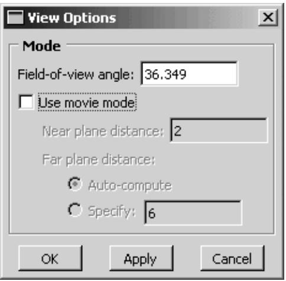  
Figure 1:The View Options dialog box.

You can use the View Options dialog box to control:

• The field-of-view angle (effectively, the magnification of the current view).  
• The camera mode (movie mode allows you to move the camera into and through the model).  
• The distance from the movie mode camera to the near plane (the closest distance an object can be to the camera while remaining in the view).  
• The distance from the movie mode camera to the far plane (the farthest distance an object can be from the camera while remaining in the view).


## Note:

Specifying the near plane and far plane distance can improve the display performance for large models by excluding from view any portion of the model that lies beyond the specified range.

In the Visualization module the View Options dialog box also includes Camera Movement options. You can make the camera follow the motion of a local coordinate system and choose whether the camera also follows the rotation of the selected coordinate system. If movie mode is on, you can position the camera on the origin of the selected coordinate system. For more information on the view options in the Visualization module, see Customizing camera movement.

1. Select View->View Options from the main menu bar.

The View Options dialog box appears.

2. If desired, change the Field-of-view angle to resize the view in the viewport:

• Decrease the angle to magnify the view  
• Increase the angle to reduce the view

3. Toggle Use movie mode on or off to switch between the default and movie camera mode.

Activating the movie camera mode does not change the current view. However, if you apply the default camera mode (toggle off Use movie mode), you will see one of the following effects:

• If the model lies entirely within the frustum, the current view does not change.  
• If a portion of the model is cut off by the near or far plane, that portion reappears in the view and Abaqus/CAE resets the near plane and far plane distances to include the entire object in the view the next time you activate movie mode.  
• If the movie mode camera is positioned inside the model, the camera moves “back” along the current view direction so that the entire model is in front of the camera. Abaqus/CAE adjusts the field-of-view angle to display the model in a size similar to that in the movie mode view and resets the near plane and far plane distances to include the entire object in the view the next time you activate movie mode.


Tip: Use the cycle view manipulation tool to return to the previous view.

4. If desired, adjust the Near plane distance.

Abaqus/CAE removes from view any objects, or portions of objects, that lie between the movie mode camera and the near plane.

5. If desired, click Specify and adjust the Far plane distance.

By default, Abaqus/CAE automatically computes the far plane distance, setting it to a value beyond the farthest point in the model and adjusting it when you manipulate the view so that no part of the model is excluded from view. If you specify a distance, Abaqus/CAE removes from view any objects, or portions of objects, that lie beyond that distance from the camera.

6. + Click OK to implement your changes and to close the dialog box.

Your changes are saved for the duration of the session.

## Additional information

• Camera modes and view terminology  
• Understanding the view manipulation tools

## Understanding the view manipulation tools

This section describes basic concepts you should understand before using the view manipulation tools.

## In this section:

The view manipulation tools  
The pan view tool  
The rotate view tool  
The magnify tool  
The box zoom tool  
The auto-fit tool  
The cycle tool  
Custom views  
Numerically specifying a view

## The view manipulation tools

The camera position, orientation, and zoom factor combine to define the view of an object in the viewport. Your view of the assembly, as well as each of your parts, is positioned relative to a default Cartesian coordinate system, and the orientation of this default coordinate system within a viewport is indicated by the view triad. By default, an isometric view is used when a module first displays a three-dimensional part or assembly.

You can manipulate the view using the pan, rotate, magnify, box zoom, and auto-fit tools on the View Manipulation toolbar to control the relative positions of the camera, the camera target, and the model or results that you are viewing. For example, you might want to pan and zoom a contour plot to view an area of stress concentration. The view manipulation tools allow you to perform the following operations:

Move the view horizontally and vertically; that is, pan the view.  
Rotate the view.  
Magnify or reduce the view.  
Zoom in to a selected area of the view.  
Rescale the view to fill the viewport; that is, auto-fit the view.  
Cycle through previous views.

Other types of view manipulations can be performed using the 3D compass; for more information, see The 3D compass.

You can click mouse button 3 to access the following view manipulation tools:

• Set As Rotation Center: Set the center of rotation at the position of the mouse click, which can be at any location in the viewport.  
• Use Default Rotation Center: Clear a previously set center of rotation.  
• Center View: Center the view at the position of the mouse click.

When an X–Y plot is displayed in the viewport, you can use the view manipulation tools to change the view of the X–Y curves. Because X–Y plots are two-dimensional, the rotate tool is disabled when the current viewport displays an X–Y plot.

Clicking a view manipulation tool puts you into the corresponding view manipulation mode. You then manipulate the view in a particular viewport by moving the cursor to that viewport and dragging or clicking as necessary. In addition, the pan, rotate, and magnify tools have alternate modes that you can access by holding the [Shift] key in conjunction with the normal use of these tools. The alternate modes of these tools are intended for use in the movie camera mode, but they can also be used in the default mode. For more information about camera terminology and the view modes, see Understanding camera modes and view options. To exit a view manipulation mode, do one of the following:

• Click mouse button 2.  
• Click the cancel button in the prompt area.  
• Click the view manipulation tool again.  
• Click any other view manipulation tool.

You can use the view manipulation tools as many times as necessary to reach the desired view, and you can perform the view manipulation in any viewport, regardless of what is being displayed. Abaqus/CAE stores the eight most recent views from each viewport, and you can use the cycle view manipulation tool to cycle backward and forward through these views.

When you use the move, rotate, magnify, zoom, or rescale tools in a viewport that is linked to other viewports, Abaqus/CAE manipulates the view of objects in the linked viewports as well. For more information, see Linking viewports for view manipulation.

By default, Abaqus/CAE displays the image using the current render style (wireframe, filled, hidden line, or shaded) while you manipulate the view of an object. Alternatively, you can change the Drag mode in the Graphics Options dialog box to display the image as a simple wireframe while you manipulate the view; this mode allows faster manipulation of very large models in the shaded render style. The view reverts to the original render style when you complete a manipulation.

If you prefer to use menus rather than the tools on the View Manipulation toolbar, you can access all of the view manipulation tools through the View menu on the main menu bar. In addition, you can apply predefined and user-defined views using the Views toolbar, and you can numerically specify a precise view using the dialog box that appears when you select View->Specify from the main menu bar. For more information on custom and numerically specified views, see Custom views, and Numerically specifying a view, respectively.

Alternatively, you can enter three of the view manipulation modes by using a combination of keyboard and mouse actions.

• To rotate the view, press [Ctrl][Alt], and hold down mouse button 1.  
• To pan the view, press [Ctrl][Alt], and hold down mouse button 2.  
• To magnify or reduce the view, press [Ctrl][Alt], and hold down mouse button 3.

Add [Shift] to any of these combinations to access the alternate modes of these tools. For example, press [Shift][Ctrl][Alt] and hold mouse button 3 to access the alternate mode of the magnify tool and move the camera closer to or farther from the objects in the view. The [Shift] key has no effect on the view manipulation tools when you are not using alternate modes. To exit a view manipulation mode after using one of the preceding actions, simply release the mouse button.

You can reconfigure these keyboard and mouse combinations to mimic the view manipulation interfaces used by five other common CAD applications by selecting Tools->Options from the main menu bar. See Using view manipulation shortcuts, for more information.

## Additional information

• Using the view manipulation tools  
• Understanding camera modes and view options

## The pan view tool

When a model is displayed in the viewport and the pan mode is set, the position of your view of the model changes as you click and then drag the cursor, and a rubberband line indicates the amount of translation.

When you select the $\mathsf { p a n }$ tool $\nleftrightarrow$ and the viewport in which to work, Abaqus/CAE enters pan mode, as indicated by $\cos ^ { \frac { \pi } { 3 } }$ cursor.

Panning the view is comparable to moving the camera over a snapshot of the model, as shown in Figure 1; the snapshot moves in the viewport but any faces of the model that were hidden in the original camera position remain hidden as you pan.

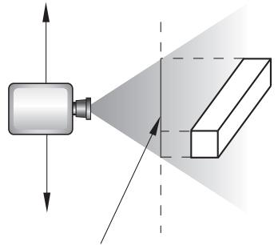  
snapshot of the object  
Figure 1: Panning the view.

The alternate mode of the pan tool, accessed by holding [Shift] while performing the manipulation, creates a more realistic camera view. Instead of a snapshot of the model, you pan the camera over the real model. Faces of the model that were hidden at the original camera position are exposed as you move the camera over the model, as shown in Figure 2.

  
Figure 2: Panning the view in alternate mode.


## Note:

If perspective is not on, the alternate mode of pan works identically to the standard pan tool.

For both modes of the pan tool, the initial location of the cursor is not important, as long as you place it within the viewport. Cursor motion is limited only by the physical bounds of your monitor, and panning will continue even if you move the cursor outside the viewport or window.

When an X–Y plot is displayed in the viewport, you can change your view of the X–Y curves in the plot by clicking and dragging the cursor in the grid. Abaqus/CAE updates the values in the axes as you manipulate your view of the X–Y data.

## Additional information

• The view manipulation tools  
• Panning the view  
• Understanding camera modes and view options

## The rotate view tool

In the rotate mode the cursor changes to two curved arrows, and a large circle appears in the viewport. To define the center of rotation, you can enter its coordinates directly or select a point from the viewport. Otherwise, Abaqus/CAE will rotate the view about the center of the viewport.

When you select the rotate tool and the viewport in which to work, Abaqus/CAE enters rotate mode. If you select a center of rotation by selecting a position from the viewport or entering coordinates, that rotation center position overrides the view center and remains selected until you select a new rotation center, display a different object, or choose the default rotation center. Your view of the model rotates as you drag the cursor, and a rubberband line indicates the amount and the direction of rotation. As you rotate your view of the model, the view triad indicates the orientation of the global coordinate system.


## Note:

Abaqus/CAE disables the rotate tool when an X–Y plot is displayed in the current viewport.

The circle that is drawn when you enter rotate mode represents the silhouette of an imaginary sphere that surrounds the object. When you drag the mouse inside the circle, you might imagine that you are actually rotating the sphere, as you would a trackball. Your model is attached to the center of the sphere, so that rotating the sphere causes your view of the model to rotate as well.

You determine the axis of rotation as you move the cursor over the surface of the imaginary sphere. The rubberband line represents the intersection of a cutting plane with the sphere's surface, and the rotation axis is normal to this cutting plane. The angle of rotation is equal to the angle made by the rubberband line on the sphere's surface, so that dragging all the way across the circle produces a 180° rotation. Figure 1 illustrates the imaginary sphere and a rubberband line being dragged across its surface.

  
Figure 1: The rotate tool.

When you drag outside the circle, the rubberband line is superimposed on the edge of the circle, and your view of the object simply rotates about an axis normal to the screen and passing through the center of the circle. In the same way as it does for dragging inside the circle, the rubberband line represents the angle through which the object has rotated.

Using the default mode of view rotation is comparable to rotating the camera around the view center or selected center of rotation, as shown in Figure 2.

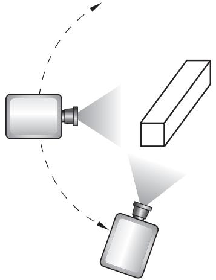  
Figure 2: Rotating the camera about the target or selected center of rotation.

The alternate mode of the rotate tool, accessed by holding [Shift] while performing the manipulation, rotates the camera about itself, as shown in Figure 3. This moves the camera target and frustum without regard to the position of objects in the original view. Rotating the camera about itself is most useful when you are in movie mode and the camera is positioned inside the model. In this position, moving the camera target and frustum brings different portions of the interior of the model into view.

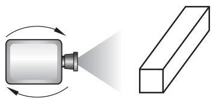  
Figure 3: Rotating the camera about itself.


## Note:

If you have selected a point as the center of rotation, your selection overrides the alternate mode of rotation.

In either mode, it is usually easier to obtain a desired rotation by performing a sequence of smaller rotations rather than one large one. If you need to abandon the rotation and return to a known orientation, use either the predefined

target to the center of the model.

Because X–Y plots are two-dimensional, Abaqus/CAE disables the rotate tool when an X–Y plot is displayed in the current viewport.

## Additional information

• The view manipulation tools  
• Rotating the view  
• Understanding camera modes and view options

## The magnify tool

When you drag the cursor along the positive direction while in magnify mode, your view of the model or plot expands within the viewport, and a rubberband line indicates the relative magnification. Similarly, when you drag the cursor along the negative direction, your view of the model or plot contracts, and a rubberband line indicates the relative reduction.

When you select the magnify tool and the viewport in which to work, Abaqus/CAE enters magnify mode, as

indicated by the magnify cursor . The positive and negative directions depend on your settings in the view manipulation options (see Using view manipulation shortcuts). If you are using the default Abaqus/CAE configuration for view manipulations, the positive direction is to the right and the negative direction is to the left. If you are using a nondefault configuration for view manipulations, the positive direction is upward and the negative direction is downward. To reflect the configuration settings, the rubberband line is horizontal for the default configuration and vertical for nondefault configurations.

The dragging action must start in the viewport, but you can continue to drag within the limits of your monitor. You can also drag repeatedly to achieve the desired view. The magnify tool recognizes only the horizontal (for the default configuration) or vertical (for nondefault configurations) component of your dragging motion, as indicated by the rubberband line. Consequently, you can achieve finer control by dragging diagonally across the screen, since this results in a smaller component of the cursor's motion in the effective direction than dragging the same distance along the effective direction.

Using the default mode of the magnify tool, as its name suggests, magnifies the view; as shown in Figure 1, the camera does not move with respect to the objects in the view. The magnification is caused by changing the field-of-view angle, the same method you use when changing the zoom on a stationary camera.

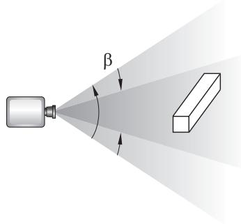  
Figure 1: Magnifying the view.

The alternate mode of the magnify tool, accessed by holding [Shift] while performing the manipulation, keeps the field of view constant and moves the camera towards or away from the objects in the view, as shown in Figure 2.

  
Figure 2: Moving the camera closer to the model.

Moving the camera in this manner is most useful when movie mode is on. Then your view is not limited; you can move the camera through the model such that any parts that you do not want to see are removed by the near or far planes or are actually behind the camera. If you are not using movie mode, the camera can move forward only until it reaches the outer limits of the model.

When an X–Y plot is displayed in the viewport, you can magnify your view of the data to focus in on a particular component of an X–Y curve. Abaqus/CAE updates the values in the axes as you change the magnification of the X–Y plot.

网 If you lose track of your position, you can use the auto-fit tool to rescale the view to fit the viewport. Using the auto-fit tool also resets the camera target to the center of the model.

## Additional information

• The view manipulation tools  
• Magnifying or reducing the view  
• Understanding camera modes and view options

## The box zoom tool

You use the box zoom tool to select a rectangular area of your model or plot; Abaqus/CAE enlarges your view of the selected portion of your model or plot to fill the viewport.

When you select the box zoom tool and the viewport in which to work, Abaqus/CAE enters box zoom mode, as indicated by a crosshair-shaped cursor. For X–Y plots, Abaqus/CAE enlarges your view of the selected X–Y curves and updates the axis values to match the data that you select.

## Additional information

• The view manipulation tools  
• Zooming in to a selected area of the view

## The auto-fit tool

The View Manipulation toolbar contains an auto-fit tool.

网 Use the auto-fit tool from the View Manipulation toolbar to quickly adjust your view of the model so that the model or model plot fills the viewport and is centered within it. When you fit a view of a model, the orientation does not change, as indicated by the view triad.

When you auto-fit an X–Y plot, the auto-fit tool resets the values in the axes to their specified minimum and maximum values; see Customizing X–Y plot axes. The auto-fit tool does not necessarily fill the viewport with the X–Y plot, because the chart options may dictate that the plot occupy only part of the viewport; see Customizing X–Y plot appearance, for more information about the chart sizing and positioning options.

Auto-fitting occurs in the current viewport as soon as you click the auto-fit tool. If you have more than one viewport, select the viewport that you want to rescale to make it the current viewport before selecting the auto-fit tool.

A separate option, Auto-fit after rotations, is available when you select View->Graphics Options from the main menu bar. You use this option to control whether or not Abaqus/CAE automatically rescales the view to fit the viewport as you rotate. For more information on using this option, see Rotating the view.

## Additional information

• The view manipulation tools  
• Rescaling the view to fit the viewport

## The cycle tool

You can cycle through the eight most recent views in each viewport.

When you select the cycle tool and the viewport in which to work, Abaqus/CAE enters cycle mode, as indicated by a cursor in the form of a two-way arrow.

To cycle through previous views, click in the viewport whose view you want to change. To control the direction of cycling, click Backward or Forward in the prompt area. The default is to cycle backward. After you cycle backward to the oldest available view, continued clicking has no effect. Similarly, after you cycle forward to the most recent view, continued clicking has no effect.

## Additional information

• The view manipulation tools  
• Cycling through views

## Custom views

The Views toolbar allows you to apply a custom view to the model in the selected viewport. (A view is the combination of the position, orientation, and zoom factor of the model in the viewport.)


## Note:

The Views toolbar is not visible in the Abaqus/CAE main window by default. To display the Views toolbar, select View->Toolbars->Views from the main menu.

Custom views include seven predefined views (such as front and back) and up to four user-defined views.

## Predefined views

Predefined views are based on the six faces of an imaginary cube and an isometric view. The view triad indicates the orientation of this imaginary cube within a viewport. Figure 1 illustrates the six predefined cube face views.


## Note:

Predefined views have no effect when an X–Y plot is displayed in the current viewport.

  
Figure 1: Predefined views.

## User-defined views

You can use the view manipulation tools to position your view of a model in a viewport and then click in the Views toolbar to save the view as one of four user-defined views. You can use this saved view to restore the object in the viewport to a known orientation, and you can apply a saved view to other viewports. By default, saved views are not stored between sessions. If you want to retain a saved view for subsequent sessions, save it to an XML file, to the model database, or to an output database. For more information, see Managing session objects and session options.

The view consists of three components: orientation, zoom factor, and position. You can choose whether or not all three of these components are saved using the Scale & Position options, as follows:

## Auto-fit

When you save a view after choosing this option, only the orientation is saved. When you apply a view saved with this option, the saved orientation is applied, but the zoom factor and position are adjusted to make the view fit the viewport.

## Save current

When you save a view after choosing this option, the orientation, the zoom factor, and the position are all saved. When you apply a view saved with this option, the saved orientation, zoom factor, and position are all applied to the object in the viewport. To compare different objects in different viewports by placing the viewports side-by-side and applying a known orientation, zoom factor, and position to each, choose the Save current option.

## Additional information

• The view manipulation tools  
• Applying custom views  
• Saving a user-defined view

## Numerically specifying a view

You can bypass the view manipulation tools and specify a particular view numerically. Specifying a view is useful if you want to reproduce a particular view between Abaqus/CAE sessions or if numerically specifying a view is simpler and more convenient than applying a series of view manipulations.

Select View->Specify from the main menu bar to specify a view.


Tip: You can also specify a view by double-clicking the 3D compass.

You can use the following methods to specify your view:

## Rotation Angles

Enter three angles $( \pmb { \theta _ { 1 } } , \pmb { \theta _ { 2 } } , \pmb { \theta _ { 3 } } )$ representing the angles through which your view of the model rotates about the screen or model 1-, 2-, and 3-axes, respectively. Rotations are interpreted in the order $( \pmb { \theta _ { 1 } } , \pmb { \theta _ { 2 } } , \pmb { \theta _ { 3 } } )$ , and a positive angle represents a right-handed rotation about the axis. If you previously specified a nondefault center of rotation while using the rotate view tool (see The rotate view tool), the specified rotations will also be about this point. You must choose one of the following modes to apply the rotation:

Increment About Model Axes. When you choose Increment About Model Axes, Abaqus/CAE simply applies the rotation to the current view. Figure 1 shows the result of applying an incremental model axes rotation of 90, 0, 0 from the isometric view.

  
Figure 1: Specifying an incremental model axes rotation angle.

• Increment About Screen Axes. The screen X-axis is horizontal, the Y-axis is vertical, and the Z-axis is out of the screen. The origin of the screen axes is the camera target. In most cases the camera target coincides with the center of the viewport, but some view manipulation methods can move the camera target (for more information, see Camera modes and view terminology). When you choose Increment About Screen Axes, Abaqus/CAE simply applies the rotation to the current view. Figure 2 shows the result of applying an incremental screen axes rotation of 90, 0, 0 from the isometric view.

  
Figure 2: Specifying an incremental screen axes rotation angle.

Total Rotation From (0,0,1). When you choose Total Rotation From (0,0,1), Abaqus/CAE first rotates the view to the default position (a view looking down the 3-axis with the 1- and 2-axes in the plane of the screen) and then applies the desired rotation. Figure 3 shows the result of applying a total rotation of 90, 0, 0 from the isometric view.

  
Figure 3: Specifying a total rotation angle.

## Viewpoint

When you choose Viewpoint, you enter three values representing the 1-, 2-, and 3-position of an observer. Abaqus/CAE constructs a vector from the origin of the model to the position that you specify and rotates your view of the model so that this vector points out of the screen. Figure 4 shows the result of applying a viewpoint of 1, 1, 1 (an isometric view) and a viewpoint of 1, 0, 0.

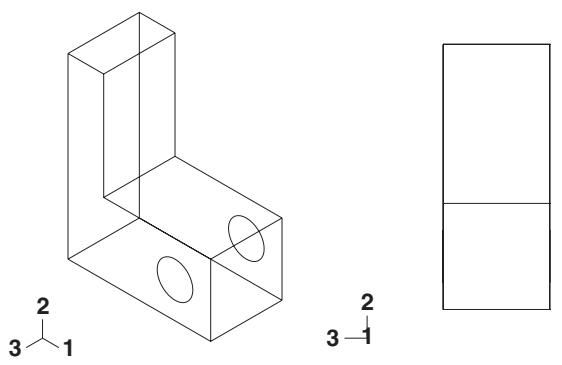  
Figure 4: Specifying a viewpoint.

When you use the Viewpoint method to specify a view, you can also specify the Up vector. Abaqus/CAE positions your view of the model so that this vector points upward. Figure 5 shows the result of applying an up vector of 0, 1, 0 and an up vector of 0, −1, 0 to an isometric view. The Up vector must not equal the Viewpoint vector.

  
Figure 5: Specifying an Up vector.

## Zoom

Enter a value representing a magnification factor. A value greater than 1 expands your view of the model in the viewport; for example, a Zoom factor of 2 doubles the size of your view of the model. A value between 0 and 1 contracts your view of the model in the viewport; for example, a value of 0.25 contracts your view of the model to a quarter of its original size. The value must be greater than zero.

You must choose one of the following methods to apply the zoom:

• Absolute. When you choose Absolute, Abaqus/CAE first fits the view to the viewport and then applies the desired Zoom factor.  
• Relative. When you choose Relative, Abaqus/CAE applies the Zoom factor to the current view.

## Pan

Enter values that Abaqus/CAE uses to Pan your view of the model by a specified horizontal and vertical distance. Abaqus/CAE moves the view relative to its current postion in the viewport. The values that you enter correspond to fractions of the viewport dimensions; the first value represents horizontal motion and the second value represents vertical motion. A positive first value moves your view of the model toward the right edge of the viewport, and a positive second value moves your view of the model toward the top of the viewport. For example, if the viewport is 200 mm wide and 100 mm tall and you enter values of 0.5, −0.1 in the Fraction of viewport to pan (X,Y) field, Abaqus/CAE positions your view of the model 100 mm toward the right and 10 mm down from its current position.

## Additional information

• The view manipulation tools  
• Applying a specified view

## The 3D compass

This section describes the basic functions and features of the 3D compass.

## In this section:

About the 3D compass  
Rotating the view using the 3D compass  
Panning the view using the 3D compass  
Predefined views for the 3D compass  
Customizing the 3D compass

## About the 3D compass

The 3D compass is a viewport annotation that appears in the upper right-hand corner of a viewport.

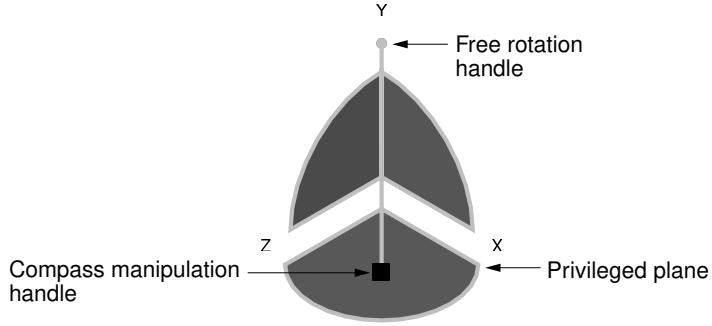  
Figure 1:The 3D compass.

The 3D compass in Abaqus/CAE is based on the 3D compass used in CATIA V5. The 3D compass indicates the orientation of the model in the viewport, similar to the view triad. Unlike the view triad, you can manipulate the orientation of the 3D compass by clicking and dragging on it. When you manipulate the 3D compass, the viewport camera pans or rotates to change the viewport orientation accordingly. The behavior of the compass view manipulations is identical to the compass view manipulation behavior in CATIA V5.

The 3D compass is a helpful shortcut for certain view manipulation options since it is available in all modules and during all procedures; you do not need to enter a view manipulation mode to change the viewport orientation using the 3D compass.

## Rotating the view using the 3D compass

The 3D compass allows you to rotate the view of a model using two different methods: you can rotate freely in all directions, or you can constrain the manipulation to rotation about a specific axis. In both cases the model view rotates about the current center of rotation for the viewport, as defined by the rotate tool (see The rotate view tool).

## Free rotation

To rotate a model in any direction, click and drag the free rotation handle on the 3D compass:

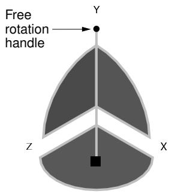

As you drag the mouse, the compass rotates about its pivot in the direction of the mouse motion (the pivot point coincides with the compass manipulation handle). The rotation is dependent on the direction of the mouse motion, not on the location of the pointer; in other words, the compass continues to rotate as long as you continue to drag. As the orientation of the compass changes, the view of the model changes accordingly.

## Rotation about an axis

You can also rotate a model about a specified axis, thereby maintaining a constant orientation in a particular direction during the manipulation. To rotate about an axis, click and drag one of the three arcs along the perimeter of the 3D compass:

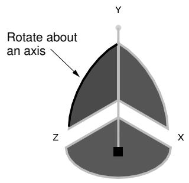

As you drag the mouse, the compass rotates about the axis that is perpendicular to the plane subtended by the selected arc (the X-axis in the above example). The rotation is dependent on the location of the pointer. As you drag the mouse, the path of the pointer in the viewport is projected onto the selected compass arc. The compass rotates according to this projected path. As the orientation of the compass changes, the view of the model changes accordingly.

## Additional information

• What is a viewport?  
• Camera modes and view terminology  
• The rotate view tool

## Panning the view using the 3D compass

The 3D compass allows you to pan the view of a model using two different methods: you can pan along a specified axis, or you can pan within a specified plane.

The pan manipulations performed with the 3D compass are different than the manipulation performed with the standard pan view tool (see The pan view tool). The standard pan tool moves the camera laterally in front of the model; the camera is constrained to move only in a plane parallel to the viewport. The panning planes for the 3D compass are not necessarily parallel to the viewport. As a result, panning with the compass behaves like a combination of the standard pan and zoom tools in their alternate modes: the camera moves both laterally across the model and perpendicularly toward or away from the model. The orientation of the compass and model view does not change during pan manipulations.


## Note:

As with the alternate mode of the standard pan view tool, panning the view with the 3D compass also translates the viewport's center of rotation along with the camera. See The rotate view tool, for information about the center of rotation.

## Panning along an axis

To pan the view along an axis, click and drag any of the straight axes on the 3D compass:


As you drag the mouse, the path of the pointer in the viewport plane is projected onto the selected compass axis (the Z-axis in the above example). The camera moves according to this projected linear path.

## Panning along a plane

To pan the view along a plane, click and drag any of the quarter-circular faces on the 3D compass:

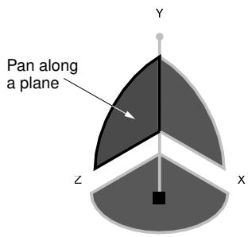

As you drag the mouse, the path of the pointer in the viewport plane is projected onto the selected compass plane (the Y–Z plane in the above example). The camera moves according to this projected path.

## Additional information

• What is a viewport?  
• Camera modes and view terminology  
• The pan view tool

## Predefined views for the 3D compass

You can use the 3D compass to quickly set the viewpoint to one of six predefined views. You can also access the Specify View dialog box through the compass.

## Predefined views

The predefined views correspond to the three planes of the 3D compass. To apply a predefined view, click the label for any of the axes on the 3D compass:


The view is adjusted so that the selected axis (the Z-axis in the above example) is perpendicular to the plane of the viewport. Clicking the same axis label again flips the view orientation to the opposite side of the viewport plane. In other words, clicking the same axis label repeatedly oscillates the view between the front and back side of the displayed model.

The six predefined views associated with the 3D compass are identical to the predefined views in the Views toolbar.

## Numerically specifying a view

Double-clicking anywhere on the 3D compass opens the Specify View dialog box. You can use this method to numerically specify a viewpoint or camera location. See Numerically specifying a view, for more information.

## Additional information

• What is a viewport?  
• Camera modes and view terminology  
• Custom views  
• Numerically specifying a view

To customize the look and orientation of the 3D compass, click mouse button 3 on the compass and select an option from the menu that appears. You can perform the following customizations:

## Edit

Select Edit to display the Specify View dialog box and numerically specify a custom view orientation. See Numerically specifying a view, for details on specifying custom view orientations.


Tip: You can also double click the 3D compass to display the Specify View dialog box.

## Change the privileged plane

The base of the compass (which contains the compass manipulation handle) is called the privileged plane. By default, the X–Z plane is the privileged plane in Abaqus/CAE. The privileged plane can be helpful in determining the “correct” orientation of a model in the viewport. In the default isometric orientation of the compass, the privileged plane appears at the bottom and the free rotation handle appears at the top; the axis from the privileged plane to the free rotation handle in effect indicates the “up” direction for the model.

If the Y-axis does not correspond to the “up” direction in a model, you can change the privileged plane to any of the three major planes in the compass. For example, select Make XY the Privileged Plane to set the X–Y plane as the privileged plane. Changing the privileged plane only reconfigures the shape of the 3D compass, as indicated in Figure 1; the view orientation and the predefined views in the Views toolbar are not changed.

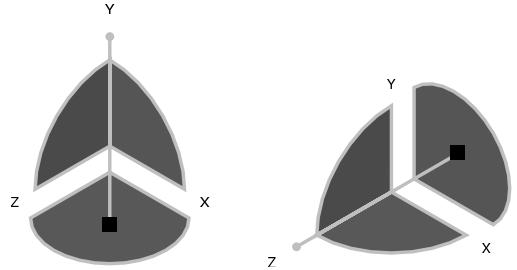  
Figure 1: Changing the privileged plane from the X–Z plane (left) to the X–Y plane (right).

## Hide

Select Hide to remove the 3D compass from the viewport display. To resume the display of the 3D compass, you must use the viewport annotation options (select Viewport->Viewport Annotation Options from the main menu). For information on controlling the visibility of viewport annotations, see Using viewport annotation options.

## Help

Select Help to display a help window with documentation on using the 3D compass.

## Customizing the view triad

The view triad, shown below, is a set of three perpendicular axes that indicate the orientation of your view of the model currently being displayed. The X, Y, and Z labels correspond to the 1-, 2-, and 3-directions, respectively. As you rotate your view of the model, the triad changes to indicate the new orientation. For more information on using the rotate tool, see Rotating the view.


The view triad and the 3D compass both indicate the view orientation, and they are always aligned with each other. You can directly manipulate the 3D compass orientation in the viewport, thereby changing the view of the model (see The 3D compass). The view triad acts only as a reference; it rotates with the 3D compass, but it cannot be directly manipulated.

You can use the Viewport->Viewport Annotation Options menu item to request or suppress the display of the triad and to control the triad's size, position, and appearance. You can also control the triad's labels, including their color and font.

1. From the main menu bar, select Viewport->Viewport Annotation Options.

The Viewport Annotation Options dialog box appears.

2. Toggle Show triad to display or suppress the triad in the current viewport.

When Show triad is toggled on, triad options become available.

3. Click the Triad tab.

Abaqus/CAE displays the triad view options.

4. Enter the Triad size as a percentage of the viewport size. When you resize the viewport, the size of the triad changes accordingly. The minimum allowable triad size is 1% of the viewport, and the maximum allowable triad size is 50% of the viewport.  
5. Enter percentage values for the triad X and Y positions in the % Viewport X and % Viewport Y boxes, respectively.

A value of 0 for % Viewport X moves the triad origin to the extreme left of the viewport while a value of 100 moves it to the extreme right. A value of 0 for % Viewport Y moves the triad origin to the extreme bottom of the viewport, while a value of 100 moves it to the extreme top.

6. Choose the color of the triad labels:

a. Click the color sample .

Abaqus/CAE displays the Select Color dialog box.

b. Use one of the methods in the Select Color dialog box to select a new color. For more information, see Customizing colors.  
c. Click OK to close the Select Color dialog box.

The color sample changes to the selected color.

7. Click the arrow next to the Labels field and select either numerical or alphabetical labeling for the triad.

The specified style appears in the Labels field.

8. Click Set Label Font to set the font type, size, and style using the dialog box that appears.  
9. + Click Apply to implement your changes.

Your changes are saved for the duration of the session.

## Additional information

• Using graphics display options  
• Customizing viewport annotations

## Controlling perspective

Perspective representation accurately depicts the spatial relationship of three-dimensional objects in a two-dimensional plane. In other words, a three-dimensional model on your screen appears more realistic when perspective is turned on. Alternatively, parallel lines in the model appear parallel when perspective is turned off. Perspective affects all plots except X–Y plots, applies in all modules, and is turned on by default.

• To turn perspective on, select the icon located in the View Options toolbar or select View->Perspective from the main menu bar.  
• To turn perspective off, select the $\sharp$ icon located in the View Options toolbar or select View->Parallel from the main menu bar.

Your changes apply only to the current viewport and are saved for the duration of the session.

## Additional information

• Manipulating the view and controlling perspective

## Using the view manipulation tools

This section provides details of using the tools in the View Manipulation toolbar that allow you to manipulate the position, orientation, and scaling of the model or X–Y plot within a viewport.

When the viewport you manipulate is linked to other viewports, Abaqus/CAE also changes the view within every linked viewport in your session.

## In this section:

Centering the view  
Panning the view  
Rotating the view  
Magnifying or reducing the view  
Zooming in to a selected area of the view  
Rescaling the view to fit the viewport  
Cycling through views  
Applying custom views  
Saving a user-defined view  
Applying a specified view

## Centering the view

Click mouse button 3 in the viewport to access the option to center the view.

You can also use the auto-fit tool from the View Manipulation toolbar to quickly pan and magnify or reduce a view so that the view fills the viewport and is centered within it.

1. Position the cursor in the viewport at the location to be used to center the view, and click mouse button 3.  
2. From the menu that appears, select Center View. Abaqus/CAE shifts the position that you selected to the center of the viewport.

## Additional information

• Linking viewports for view manipulation  
• The view manipulation tools  
• Rescaling the view to fit the viewport

## Panning the view

You can use the View Manipulation toolbar to move the view horizontally and vertically within the viewport.

Use the pan tool from the View Manipulation toolbar to move the view horizontally and vertically within the viewport. Hold [Shift] while using the pan tool to access the alternate pan mode. The alternate mode shifts the view perspective as you pan the view, creating a more realistic image (for more information, see The pan view tool).

If the current viewport is linked to other viewports, Abaqus/CAE also moves the view of objects within all linked viewports in your session. For more information, see Linking viewports for view manipulation.

1. From the View Manipulation toolbar, click the pan tool to enter pan mode.


Tip: You can also select View->Pan from the main menu or press [F2].

2. Position the cursor in the viewport whose view you want to change.

The cursor changes to a four-headed arrow:

3. Drag the cursor in any direction until you obtain the desired view.

The position of your view of the model or X–Y plot in the viewport changes as you drag the cursor, and a rubberband line indicates the amount of translation.


## Note:

The initial location of the cursor is not important, as long as you place it within the viewport. Cursor motion is limited only by the physical bounds of your monitor, and panning will continue even if you move the cursor outside the viewport or window.

4. Repeat Steps 2 and 3 until you achieve the desired view.  
5. To exit pan mode, do one of the following:

• Click mouse button 2.  
• Click the cancel button in the prompt area.  
• Click the pan tool.  
• Click any other view manipulation tool.


Tip: Use the cycle view manipulation tool to return to the previous view.

## Additional information

• Linking viewports for view manipulation  
• The pan view tool  
• The view manipulation tools  
• Using the view manipulation tools

## Rotating the view

You can use the rotate tools to access several modes for manipulating views within the viewport.

Use the rotate tool from the View Manipulation toolbar to rotate the view within the viewport. Hold [Shift] while using the rotate tool to access the alternate rotate mode. The alternate mode rotates the camera about itself instead of rotating it about the view center or the selected rotation center. The alternate mode is most useful when you use movie camera mode and position the camera inside of the model so that the model is surrounding the camera (for more information, see The rotate view tool). You can also specify a point in each viewport or select a location in each viewport to use as the center of rotation. Using the Auto-fit after rotations option in the Graphics Options dialog box, you can control whether or not Abaqus/CAE rescales your model to fit the viewport as you rotate.


## Note:

You cannot rotate X–Y plots.

If the current viewport is linked to other viewports, Abaqus/CAE also rotates objects within all linked viewports in your session. For more information, see Linking viewports for view manipulation.

## Additional information

• Linking viewports for view manipulation  
• The rotate view tool  
• The view manipulation tools  
• Rescaling the view to fit the viewport

## Rotate the view

1. From the View Manipulation toolbar, click the rotate tool to enter rotate mode.


Tip: You can also select View->Rotate from the main menu or press [F3].

2. By default, Abaqus/CAE rotates the view about the center of the viewport. You can change the center of rotation using one of the following methods:

Position the cursor at any location on the model or in the viewport, click mouse button 3, and select Set As Rotation Center.  
Click Select in the prompt area. Select the center of rotation from the highlighted vertices in the viewport or enter coordinates to specify a point. In the Visualization module you can select a node and the center of rotation will remain on that node in both undeformed and deformed model states.  
When using this method, you can select a center of rotation only when there is existing geometry in the viewport. If you are working in the Sketcher, sketched points will not be available for selection.  
Click mouse button 3 and select Use Default Rotation Center, or select Use Default in the prompt area to return to the default (center of viewport) rotation method.

Your selected center of rotation persists in the viewport until you display another object in the viewport, select a new center of rotation, or return to the default rotation method.

3. Position the cursor in the viewport whose view you want to change.

A large circle appears in the viewport and the cursor changes to a right facing arrow. If you selected a center of rotation in the viewport, it is highlighted.

4. Drag the cursor in any direction.

The view rotates as you drag the cursor, and a rubberband line indicates the amount and direction of rotation.


Tip: It is usually easier to achieve the desired orientation by performing a sequence of small rotations rather than a single large rotation.

To rotate the view about the normal to the screen, move the cursor outside the circle and drag it clockwise or counterclockwise.

5. Repeat Steps 2, 3, and 4 until you achieve the desired views.

6. To exit rotate mode, do one of the following:

• Click mouse button 2.  
• Click the cancel button in the prompt area.  
• Click the rotate tool.  
• Click any other view manipulation tool.


Tip: Use the cycle view manipulation tool to return to the previous view.

## Rescale the view to fit the viewport as you rotate

1. From the main menu bar, select View->Graphics Options.

The Graphics Options dialog box appears.

2. Toggle Auto-fit after rotations on to automatically rescale the view to fit the viewport as you rotate; toggle it off to disable automatic rescaling during rotation.  
3. Click OK to implement your changes and close the dialog box.

Your changes are saved for the duration of the session.

## Magnifying or reducing the view

You can use the View Manipulation toolbar to change the scale of the view in the viewport.

Use the magnify tool from the View Manipulation toolbar to change the scale of the view in the viewport. Hold [Shift] while using the magnify tool to access the alternate magnify mode. The alternate mode moves the camera closer to or farther from the objects in the view instead of changing the magnification. The alternate mode is most useful when you use movie camera mode (for more information, see The magnify tool).

Your configuration settings for the view manipulation options affect the behavior of the magnify tool. If you are using the default Abaqus/CAE view manipulation configuration, the magnify tool operates by dragging the cursor horizontally: dragging to the right zooms in and dragging to the left zooms out. In all other view manipulation configurations, the magnify tool operates by dragging the cursor vertically: dragging upward zooms in and dragging downward zooms out. See Using view manipulation shortcuts, for more information.

If your mouse has a wheel as mouse button 2, you can also change the scale of the view by scrolling up or down when the cursor is in the viewport. For X–Y plots the effect of this scrolling depends on the location of the cursor:

• When the cursor is within the X–Y plot grid, the X–Y plot will retain its aspect ratio as you magnify or reduce the view of the X–Y curves in the plot.  
When the cursor is placed on one of the axes, Abaqus/CAE stretches or compresses the X–Y plot along the axis you select. This functionality enables you to adjust your view of X–Y plots that exhibit much more change along one axis than the other.

If the current viewport is linked to other viewports, Abaqus/CAE also changes the scale of the view within all linked viewports in your session. For more information, see Linking viewports for view manipulation.

1. From the View Manipulation toolbar, click the magnify tool to enter magnify mode.


Tip: You can also select View->Magnify from the main menu or press [F4].

2. Position the cursor in the viewport whose view you want to change.

The cursor changes to a magnifying glass:


3. Drag the cursor to change the view. The direction in which you drag depends on your view manipulation configuration settings. You can change these settings by selecting Tools->Options from the main menu bar and selecting a setting from the View Manipulation Options tabbed page.

• If you are using the default view manipulation configuration, drag the cursor to the right of the starting point to magnify the view (zoom in). Drag the cursor to the left of the starting point to reduce the view (zoom out).  
• If you are using a nondefault view manipulation configuration, drag the cursor above the starting point to magnify the view (zoom in). Drag the cursor below the starting point to reduce the view (zoom out).

Abaqus/CAE draws a rubberband line from the starting point as you drag the cursor across the screen. The rubberband line indicates the amount of zooming that has been applied, which is proportional to the component of your dragging motion in the effective direction.

4. Repeat Steps 2 and 3 until you achieve the desired view.  
5. To exit magnify mode, do one of the following:

• Click mouse button 2.

• Click the cancel button in the prompt area.  
• Click the magnify tool.  
• Click any other view manipulation tool.


Tip: Use the cycle view manipulation tool to return to the previous view.

## Additional information

• Linking viewports for view manipulation  
• The magnify tool  
• The view manipulation tools  
• Using the view manipulation tools

## Zooming in to a selected area of the view

You can use the View Manipulation toolbar to enlarge the view so that a selected area fills the viewport.

Use the box zoom tool from the View Manipulation toolbar to enlarge the view so that a selected area fills the viewport. If the current viewport is linked to other viewports, Abaqus/CAE enlarges the view in the linked viewports by the same factor. For more information, see Linking viewports for view manipulation.

1. From the View Manipulation toolbar, click the box zoom tool to enter zoom mode.


Tip: You can also select View->Box Zoom from the main menu or press [F5].

2. Position the cursor in the viewport whose view you want to change. The cursor shape changes to crosshairs.  
3. Position the cursor at one corner of the area to be enlarged.  
4. Drag the cursor to the opposite corner. A rectangle indicates the area to be enlarged.  
5. Release mouse button 1. The area defined by the rectangle enlarges to fill the viewport.  
6. Repeat Steps 2 through 5 as many times as necessary to achieve the desired view.  
7. To exit box zoom mode, do one of the following:

• Click mouse button 2.  
• Click the cancel button in the prompt area.  
• Click the box zoom tool.  
• Click any other view manipulation tool.


Tip: Use the cycle view manipulation tool to return to the previous view.

## Additional information

• Linking viewports for view manipulation  
• The box zoom tool  
• The view manipulation tools  
• Using the view manipulation tools

## Rescaling the view to fit the viewport

The View Manipulation toolbar contains a tool that rescales the view to fit the viewport.

Use the auto-fit tool from the View Manipulation toolbar to quickly pan and magnify or reduce a view so that the view fills the viewport and is centered within it. When you fit a view, the orientation remains fixed, as indicated by the view triad. If the rescaled viewport is linked to other viewports, Abaqus/CAE magnifies or reduces the view in those viewports by the same factor. For more information, see Linking viewports for view manipulation.

From the View Manipulation toolbar, click the auto-fit tool to enter auto-fit mode.


Tip: You can also select View->Auto-fit from the main menu or press [F6].

If you have only one viewport, Abaqus/CAE immediately scales the view to fit the viewport without changing the orientation, centers the view within the viewport, and exits fit mode. If you have more than one viewport, select the auto-fit tool and then place the cursor over the viewport you want to rescale. Click in the viewport to auto-fit; Abaqus/CAE rescales the view and exits fit mode.


Tip: Use the cycle view manipulation tool to return to the previous view.

For information on how to automatically rescale the view to fit the viewport during rotation, see Rotating the view.

## Additional information

• Linking viewports for view manipulation  
• The auto-fit tool  
• The view manipulation tools  
• Using the view manipulation tools

## Cycling through views

You can use the View Manipulation toolbar to cycle through previous views.

Use the cycle tool eight most recent views for each viewport.

If the current viewport is linked to other viewports, Abaqus/CAE also cycles through the views in all linked viewports in your session. For more information, see Linking viewports for view manipulation.


Tip: You can also select View->Previous Views from the main menu or press [F7].

2. Position the cursor in the viewport whose view you want to change (the cursor changes to a two-way arrow); then click.  
3. To control the direction of cycling, click Backward or Forward in the prompt area. The default is to cycle backward.  
4. Repeat Steps 2 and 3 as many times as necessary to achieve the desired views. After you cycle backward to the oldest available view, continued clicking has no effect. Similarly, after you cycle forward to the most recent view, continued clicking has no effect.  
5. To exit cycle mode, do one of the following:

• Click mouse button 2.  
• Click the cancel or Done button in the prompt area.  
• Click the cycle view tool.  
• Click any other view manipulation tool.

## Additional information

• Linking viewports for view manipulation  
• The cycle tool  
• The view manipulation tools  
• Using the view manipulation tools

## Applying custom views

Use the Views toolbar to orient, scale, and position a view to one of seven predefined or four user-defined settings.

To display the Views toolbar, select View->Toolbars->Views from the main menu; the Views toolbar is illustrated in the following figure:


The following custom views are available:

• Front, Back, Top, Bottom, Left, and Right: equivalent to observing the model from the six sides of a cube.  
• Iso: an isometric view. This is the default orientation for three-dimensional models.  
• User1, User2, User3, and User4: four user-defined views. See Saving a user-defined view, for a description of how to save a user-defined view.

If the current viewport is linked to other viewports, Abaqus/CAE also applies the same custom view to all linked viewports in your session. For more information, see Linking viewports for view manipulation.

1. If it is not visible already, display the Views toolbar by selecting View->Toolbars->Views from the main menu.

Abaqus/CAE displays the Views toolbar.

2. From the Views toolbar, click the desired tool.

If you have only one viewport, Abaqus/CAE immediately applies the selected view and unselects it from the Views toolbar. If you have more than one viewport, place the cursor over the viewport whose view you want to change. The cursor changes to a triad; click, and Abaqus/CAE applies the selected view to that viewport.


## Note:

When you apply a view that was saved with the Auto-fit option selected, the view adopts the orientation of the saved view and immediately rescales it to fill the viewport. When you apply a view that was saved with the Save current option selected, the view adopts the orientation, zoom factor, and position of the saved view.

3. Repeat Step 2 as many times as necessary to achieve the desired view.


Tip: Use the cycle view manipulation tool to return to the previous view.

## Additional information

• Linking viewports for view manipulation  
• Custom views  
• Saving a user-defined view  
• The view manipulation tools  
• Using the view manipulation tools

## Saving a user-defined view

You can use the Views toolbar to open the Save Views dialog box and save a user-defined view.

Use the save tool in the Views toolbar to open the Save Views dialog box and save a user-defined view. The Save Views dialog box is illustrated in the following figure:

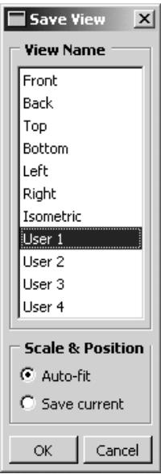

Use the Scale & Position options to determine whether the saved view contains zoom factor and position information.

1. From the main menu bar, select View->Save.


Tip: You can also save a view by clicking the tool in the Views toolbar.

If you have only one viewport, Abaqus/CAE immediately opens the Save View dialog box. If you have more than one viewport, click in the viewport whose view you want to save; Abaqus/CAE then opens the Save View dialog box.

2. From the Save View dialog box, choose the desired Scale & Position behavior:

Choose Auto-fit to save only the orientation of the view. When you apply a view saved with this option, the saved orientation is applied, but the scaling factor and position are adjusted to make the view fill the viewport.  
Choose Save current to save the orientation, the zoom factor, and the position of the view. When you apply a view saved with this option, the saved orientation, scaling factor, and position are all applied.

3. In the View Name list in the Save Views dialog box, click the name of the tool you will use to recall this view.

If you overwrite one of the six custom views—front, back, top, bottom, left, right—the other five views still retain their original definitions; that is, they do not become rotated to positions orthogonal to your saved view.

4. From the Save View dialog box, click OK.

Abaqus/CAE saves the definition of the view you selected. The view is saved only for the duration of the current session; the saved view will not be available the next time you run Abaqus/CAE.

## Additional information

• Linking viewports for view manipulation  
• Custom views  
• Applying custom views  
• The view manipulation tools  
• Using the view manipulation tools

Select View->Specify from the main menu bar to specify a view. You can choose from the following methods to specify the view:

## Rotation Angles

You can specify the angles through which Abaqus/CAE will rotate your view of the model about the model or screen 1-, 2-, and 3-axes. You can also choose to rotate your view of the model from an absolute position (a “Front” view) or from the current position.

## Viewpoint

You can specify the coordinates of a vector along which an observer views your model. You can also orient the global 1-, 2-, and 3-axes within the viewport by specifying a vector representing the “up” direction.

## Zoom

You can specify a zoom factor that expands or contracts the view. You can also choose to zoom the view relative to an absolute size of the objects in the viewport (the default size with a zoom factor of one applied) or relative to the current size of the objects in the viewport.

## Pan

You can specify movement of the view in the 1- and 2-directions. The values correspond to fractions of the viewport horizontal and vertical dimensions and are relative to the current view.

For a more detailed explanation, see Numerically specifying a view.

If the current viewport is linked to other viewports, Abaqus/CAE also applies the specified view to all linked viewports in your session. For more information, see Linking viewports for view manipulation.

1. From the main menu bar, select View->Specify.


Tip: You can also specify a view by double-clicking the 3D compass.

Abaqus/CAE displays the Specify View dialog box.

2. From the Specify View dialog box, select the desired Method and do one of the following:

• If you selected the Rotation Angles method, enter the rotation angles about the X-, Y-, and Z-axes $( \pmb { \theta } _ { x } , \pmb { \theta } _ { y } , \pmb { \theta } _ { z } )$ ; a positive number corresponds to a counterclockwise rotation about each axis.

Use the Mode button to specify how Abaqus/CAE is to apply your rotation:

Choose Increment About Model Axes to apply the rotation to the model axes of the current view.  
Choose Increment About Screen Axes to apply the rotation to the screen axes of the current view. The screen X–axis is horizontal, the Y–axis is vertical, and the Z–axis is out of the screen. The origin of the screen axes is the center of the viewport.  
Choose Total Rotation From (0,0,1) to first rotate the view to the default position (a view looking down the 3-axis with the 1- and 2-axes in the plane of the screen) and then apply the rotation.

• If you selected the Viewpoint method, enter the X-, Y-, and Z-coordinates of the viewpoint vector and the coordinates of the up vector.  
• If you selected the Zoom method, enter the zoom factor and choose either Absolute or Relative magnification. A zoom factor greater than one expands your view of the model, and a zoom factor between zero and one contracts your view of the model.  
If you selected the Pan method, enter the values indicating how you want to position your view of the model relative to the current view. The values are fractions of the viewport dimensions; the first value represents horizontal motion, and the second value represents vertical motion.

3. Click OK to apply your specified view and to close the Specify View dialog box.


Tip: Use the cycle view manipulation tool to return to the original view.

## Additional information

• Linking viewports for view manipulation  
• Numerically specifying a view  
• The view manipulation tools  
• Using the view manipulation tools

## Using the 3Dconnexion motion controllers with Abaqus/CAE

http://www.3dconnexion.com/ manufactures a variety of view manipulation devices that are popular with users of CAE and CAD systems. One example of their devices is the SpaceBall that is illustrated in Figure 1.

  
Figure 1:The 3Dconnexion SpaceBall.

You can use a 3Dconnexion motion controller together with the mouse to interact more efficiently with Abaqus/CAE. You can use the motion controllers to manipulate the view of your model with one hand while using the mouse to select from the model with the other hand. The motion controllers operate on whatever is under the cursor; for example, a part or a deformed plot in a viewport or a scrollbar in a dialog box. If neither a viewport nor a scrollbar is under the cursor, the motion controller operates on the current viewport.

You can change the center of rotation of an object if you use the motion controller in conjunction with the rotate view manipulation tool. By default, both the rotate tool and the motion controller rotate an object about the center of the viewport. However, you can select the center of rotation for both the rotate tool and the motion controller by positioning the cursor in the viewport at the location to be used as the center of rotation, clicking mouse button 3, and selecting

Set As Rotation Center. Alternatively, if you click the rotate tool （ in the View Manipulation toolbar, a Select button appears in the prompt area. If you click on this button, you can select the center of rotation from a vertex or node in the viewport. The motion controller continues to use the specified rotation center even after you exit the rotate mode. For more information, see The rotate view tool.

In addition, Abaqus provides a set of “Application Functions” that are available through the standard 3Dconnexion user interface. These functions provide shortcuts to the view manipulation, view, and display tools. You can map these functions to the programmable buttons that are built into the 3Dconnexion motion controllers.

On Windows platforms Abaqus provides the following functions:

## Movie Mode

Toggle between the default and alternate rotation modes. The default mode is comparable to rotating the camera around the camera target or selected center of rotation; the alternate mode rotates the camera about itself instead of about the camera target. You can also toggle on the alternate rotation mode if you hold down the [Shift] key while using the rotate view manipulation tool. For more information, see Camera modes and view terminology; Using view options to control the camera; and The rotate view tool.

## Decrease Abaqus Sensitivity

Decrease the sensitivity of the 3Dconnexion motion controller. This setting applies only when manipulating the view in Abaqus/CAE.

## Increase Abaqus Sensitivity

Increase the sensitivity of the 3Dconnexion motion controller. This setting applies only when manipulating the view in Abaqus/CAE.

## Reset Abaqus Sensitivity

Restore the sensitivity of the 3Dconnexion motion controller to its default setting.

## Auto-fit

Fit the model into the viewport. This is the same functionality as the auto-fit view manipulation tool. For more information, see The auto-fit tool.

## Keep in View

Keep the model in view during rotate and pan. When you are manipulating the view with the motion controller, toggling on this function prevents you from moving the target of the camera out of the viewport. Similarly, if you have changed the center of rotation, this option prevents you from moving the center out of the viewport.

## Zoom to Cursor

Replace rotate and pan with zoom. If you press mouse button 2 and manipulate the motion controller, Abaqus/CAE disables the normal pan and rotate modes and replaces them with a mode that only zooms in or out from the area below the mouse cursor. If you release mouse button 2, the normal pan and rotate modes are restored. This behavior is enabled by default. You can use this function to toggle between the two modes.

## Wireframe/Shaded

Toggle between wireframe and shaded render style. This is the same functionality as the wireframe and shaded icons located in the Render Style toolbar. For more information, see Choosing a render style.

## Perspective

Toggle between perspective and parallel views. This is the same functionality as the perspective and parallel 茸 icons located in the View Options toolbar. For more information, see Controlling perspective.

## Manipulate Layers

Manipulate all layers or the current layer. If you have created an overlay plot of results in the Visualization module, you can use this function to toggle between applying view manipulations to all the layers or to only the current layer. For more information, see Manipulating the view for an overlay plot.

## Page Up

Page up in a scrollable dialog box. If the dialog box allows only horizontal scrolling, this button moves the page to the right.

## Page Down

Page down in a scrollable dialog box. If the dialog box allows only horizontal scrolling, this button moves the page to the left.

## Set Rotation Center

Set the center of rotation at the position of the mouse.

## Clear Rotation Center

Clear a previously set center of rotation.

## Set View Center

Center the view at the position of the mouse.

On Linux platforms Abaqus also provides a set of “Application Functions” that are available through the standard 3Dconnexion user interface. You should select Abaqus from the list of Applications. If Abaqus is not listed, you should select XWindow Driver Version 2.0/3.0.

The default mapping of the programmable buttons on Linux platforms is shown in the following table:

<table><tr><td>Button</td><td>Meaning</td></tr><tr><td>4</td><td>Movie mode</td></tr><tr><td>5</td><td>Decrease sensitivity</td></tr><tr><td>6</td><td>Increase sensitivity</td></tr><tr><td>7</td><td>Reset sensitivity</td></tr><tr><td>8</td><td>Auto-fit</td></tr><tr><td>9</td><td>Keep in view</td></tr><tr><td>A</td><td>Zoom to cursor ON/OFF</td></tr><tr><td>B</td><td>Wireframe/Shaded</td></tr></table>

The button mapping is fixed for the Abaqus application. However, 3Dconnexion allows you to reassign the buttons to use the standard functionality provided by their driver. For more information, see the Linux version of the 3Dconnexion documentation.

## Selecting objects within the viewport

This chapter explains how to select objects that appear within a viewport, such as nodes, elements, vertices, edges, faces, and cells.

Selecting dialog box options is discussed in Interacting with dialog boxes. Selecting viewports is discussed in Selecting viewports.

## In this section:

Understanding selection within viewports  
Selecting objects within the current viewport  
Using the selection options

## Understanding selection within viewports

This section describes the objects that you can select in a viewport and explains what these objects represent.

## In this section:

What objects can you select from the viewport?  
What is a selection group?  
Understanding the correspondence between geometric and physical objects

## What objects can you select from the viewport?

Selecting an object within the current viewport is one of the most common tasks you have to perform during the modeling process. In the course of various procedures you may need to select geometric objects (vertices, edges, faces, cells, and datums) or discrete objects (nodes and elements) by picking them directly from the viewport. Figure 1 shows these different object types.

  
Figure 1: Object types that you can select.

You can select objects in the viewport during certain procedures, such as those listed below:

• Creating sets and surfaces  
• Partitioning a part instance  
• Editing a feature  
• Seeding a part instance for meshing  
• Creating or editing a display group composed of elements or nodes  
• Color coding elements in your model  
• Creating a node list path through your model  
• Creating a load

You can also select objects in the viewport in advance of selecting a procedure. If you make selections prior to selecting a procedure, Abaqus/CAE does not limit your selections. When you select a procedure, Abaqus/CAE filters any selections that you made and keeps only those selections that are appropriate for the procedure. For more information, see Selecting objects before choosing a procedure.

If you select objects as part of a procedure, in most circumstances Abaqus/CAE only allows you to select objects that are appropriate for the current procedure. For example, the first step in partitioning an edge is selecting the edge of interest. Therefore, at this point in the procedure you can select only an edge; you cannot select a cell, a face, or a vertex. Messages in the prompt area guide you through the steps of a procedure and indicate which types of objects are available for selection. You can select only objects that are part of the current display group.

In some circumstances Abaqus/CAE cannot determine which objects are appropriate for selection and does not limit your selection. For example, when you are creating a set, you can select from cells, faces, edges, and vertices to include in the set and Abaqus/CAE allows you to select any of these objects. If you make an ambiguous selection from the viewport during a procedure, Abaqus/CAE allows you to cycle through the available objects until the desired object is selected. This ambiguity is described in Cycling through valid selections. You may find it easier to use the selection filters to limit the type of object you can select. For more information, see Using the selection options.

Many procedures to define attributes (interactions, constraints, loads, boundary conditions, predefined fields, and engineering features) allow you to select objects from the viewport to identify the region on which to apply the attribute. The default behavior for these procedures is to create a set or surface that contains the selected objects. You can change this behavior by toggling off the option to create a set or surface in the prompt area. A default name is provided in the prompt area, but you can enter a new name.

## Additional information

• Understanding selection within viewports  
• Selecting objects within the current viewport

## What is a selection group?

You can copy entities (vertices, edges, faces, or cells) that are highlighted in the viewport into a temporary storage area called a selection group. Abaqus/CAE saves the selection group for the duration of a session. Rather than manually reselecting the same entities during a subsequent selection procedure, you can paste the selection group into your selection. For example, you can copy all of the small faces highlighted by the Geometry Diagnostics query tool into a selection group. You can then paste the same selection group into your selection when you are using the Geometry Edit toolset to repair small faces.

When you paste a group into your selection, you can choose from selection groups and from display groups. Selection groups are designed to be a temporary convenience for the user, and they do not appear with display groups in the Display Groups toolset. You can create any number of display groups. In contrast, Abaqus/CAE saves a maximum of five selection groups. Abaqus/CAE overwrites the existing selection groups if you create more than five selection groups.

After you have selected the desired entities, you create a selection group by clicking mouse button 3 in the viewport and selecting Copy from the menu that appears. Abaqus/CAE copies all of the highlighted entities into a selection group. You paste a selection group to your current selection by clicking mouse button 3 in the viewport and selecting Paste from the menu that appears. Abaqus/CAE displays the Paste to Selection dialog box, and you can select one or more of the existing selection groups to paste to your current selection. When you paste a group, Abaqus/CAE appends the entities in the group to any other entities that you have already selected.


## Note:

You cannot create or use selection groups if you are selecting objects in advance of selecting a procedure.

## Understanding the correspondence between geometric and physical objects

When you select geometric objects in a viewport, it is important to understand what physical structure each object represents. The geometric objects that make up a model—cells, faces, edges, and vertices—can represent different physical structures depending on the space in which they are embedded.

For example, beams and other wire parts are represented by edges in the geometric model (see Figure 1).

  
Figure 1: Selecting wire parts.

The end surfaces of these parts are represented by the vertices on either side of the edge, and the circumferential surface is represented by the line joining the vertices. To select a wire part, you can click the edge, and, if necessary, Abaqus/CAE prompts you to specify the surface of interest.

Likewise, axisymmetric shells are also represented by edges in the geometric model (see Figure 2).

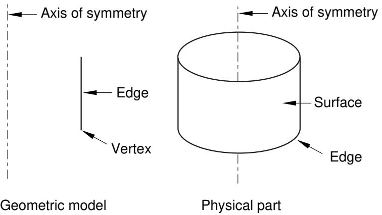  
Figure 2: Selecting axisymmetric shells.

You can select the axisymmetric shell by clicking the edge in the viewport, and, if necessary, Abaqus/CAE prompts you to specify either the inside surface or the outside surface of the shell. You must select either the inside or the outside surface if you are applying a prescribed condition or contact definition to the surface. For example, if you want to apply a pressure load to a shell, you must specify which side of the shell should receive the load.

For more information on selecting surfaces, see Specifying a particular side or end of a region. For more information on modeling space, see The relationship between parts and features, and Part modeling space.

## Additional information

• Understanding selection within viewports  
• Selecting objects within the current viewport

## Selecting objects within the current viewport

This section describes techniques that you can use for selecting one or more objects in the current viewport.

## In this section:

Selecting and unselecting individual objects  
Drag-selecting multiple objects  
Using the angle and feature edge method to select multiple objects  
Using the face curvature method to select multiple faces  
Using the topology method to select multiple elements  
Using the limiting angle, layer, and analytic methods to select multiple element faces  
Adding adjacent objects to a selection  
Combining selection techniques  
Excluding objects from your selection  
Cycling through valid selections  
Using groups while selecting entities  
Selecting interior surfaces

## Selecting and unselecting individual objects

Selecting and unselecting objects in the current viewport are straightforward operations that use standard methods. For more information on selecting viewports, see Selecting viewports.

Preselection highlighting allows you to preview which object Abaqus/CAE will select if you click at the current cursor location. In addition, preselection in the Sketcher uses a secondary cursor to indicate the exact position and type of entity that will be selected. (For more information on Sketcher preselection, see The Sketcher cursors and preselection.)

You will use the following three selection operations most frequently:

## Click to select an object

To select a single object from the current viewport, move the cursor to the object and click mouse button 1.

To select a point, click the corresponding point marker. The point marker changes color when selected. Vertices that you can select are marked by small, filled circles; and datum points are marked by small, unfilled circles. (See Understanding the role of datum geometry, for information on datum points.) Edge midpoints and arc centers that you can select are marked by small diamonds.


## Note:

Some of the selection markers that appear when you are using the Sketch module are different from those described here. For information on selecting objects while using the Sketch module, see The Sketcher cursors and preselection.

• To select an edge, click the edge while positioning the cursor away from any vertex. Selected edges are highlighted.  
• To select a face, click the face while positioning the cursor away from any edge or vertex. Selected faces are highlighted with a grid pattern. (The grid pattern is unrelated to mesh element location.)  
• To select a cell, click any of its faces. All edges of selected cells are highlighted.

If you are unable to select the desired objects, you can use the Selection toolbar to change the selection behavior. For more information, see Using the selection options.

Once you select an object, any objects previously selected in the current viewport are unselected automatically.

If your current procedure, options, and cursor position do not clearly specify one object for preselection, Abaqus/CAE highlights all of the potential selections and adds ellipsis marks (...) next to the cursor arrow to indicate an ambiguous preselection. If you accept an ambiguous preselection or otherwise make an ambiguous selection, use the buttons in the prompt area to make your final selection. For more information, see Cycling through valid selections.

## [Shift] + Click to select additional objects

To select an additional object, move the cursor to the object and [Shift] + Click. Your original selection remains highlighted, and the newly selected object becomes highlighted.

An alternative method for selecting multiple objects is to drag a rectangle around the objects. For more information, see Drag-selecting multiple objects.

## [Ctrl] + Click to unselect objects

To unselect an object, move the cursor to the object and [Ctrl] + Click. To unselect all objects, click an unused region of the current viewport.

When you have finished selecting and unselecting items in the viewport, click mouse button 2 to confirm your selection. You can use the selection option tools to adjust the shape of the drag-select region. You can also choose which objects are selected by the drag-select region. The selection option tools are located in the Selection toolbar. For more information, see Modifying the shape of the drag-select region, and Choosing which objects are selected by the drag-select region.

## Additional information

• Understanding selection within viewports  
• Selecting objects within the current viewport  
• The Sketcher cursors and preselection  
• Using the chain method to select edges in the Sketcher

## Drag-selecting multiple objects

Most prompts ask you to select just one object from the current viewport. However, some tasks allow you to select one or more objects; for example, the Set toolset allows you to select several objects of the same type and group them into sets. You can select multiple objects using the [Shift] + Click method described in Selecting and unselecting individual objects. An additional method for selecting multiple objects is to drag a rectangle around those objects. You can use the selection option tools to adjust the shape of the drag-select region. You can also choose which objects are selected by the drag-select region. The selection option tools are located in the Selection toolbar. For more information, see Modifying the shape of the drag-select region, and Choosing which objects are selected by the drag-select region.

1. Imagine a rectangle that encloses only the objects you want to select.  
2. Click at one corner of the rectangle and, while continuing to press the mouse button, drag until you have enclosed all the objects.  
3. Release the mouse button.

All the valid objects inside or crossing the rectangle are highlighted.

4. Click mouse button 2 to indicate that you have finished selecting objects.

Sometimes it is convenient to use a combination of the [Shift] + Click and drag-select selection techniques. For more information, see Combining selection techniques.


Tip: If you select multiple objects and then want to unselect one or more of them, [Ctrl] + Click the objects you want to unselect. To unselect all the objects, click in an unused area of the viewport.

## Additional information

• Selecting objects within the current viewport  
• Selecting and unselecting individual objects  
• Cycling through valid selections  
• Using the chain method to select edges in the Sketcher

## Using the angle and feature edge method to select multiple objects

In complicated models selecting individual faces or edges from geometry or selecting element faces or nodes from a mesh can be time consuming and prone to error. For example, when creating a surface from a mesh, you must select the individual element faces that make up the surface and append them to your selection. To speed up the selection process, Abaqus/CAE provides the angle and feature edge methods for selecting multiple faces, edges, elements, element faces, or nodes.

When you are performing a task in which you must pick more than one face or edge from geometry or more than one element, element face, or node from a mesh, Abaqus/CAE displays a field in the prompt area. The field allows you to choose between three selection methods—individually, by angle, and by feature edge, as shown in Figure 1.

  
Figure 1: Choose the selection method from the field in the prompt area.

## Individually

Selecting individual objects is described in Selecting and unselecting individual objects.

## By angle

Selecting objects using the angle method is a two-step process:

1. In the prompt area, you enter an angle (from $0 ^ { \circ }$ to 90°).  
2. From the part or assembly, you select a face, edge, element face, or node.

The angle must be greater than the angle through which adjacent edges or faces must rotate to create the geometry as if it was being formed by bending a straight wire or folding a series of faces. Abaqus/CAE starts from the selected geometry and selects all adjacent geometry until the angle you entered is met or exceeded.

For example, to select the edges of a regular hexagon, enter an angle greater than 60° (since each adjacent edge must be rotated 60° to form the shape from a straight wire), and select one of the edges. Abaqus/CAE then selects every adjacent edge since none of the angles is equal to or exceeds the angle that you entered.

Figure 2 illustrates how the angle method allows you to select all the elements around the flange of an exhaust manifold mesh.

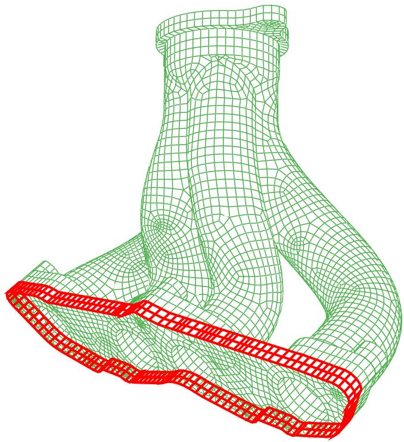  
Figure 2: Enter an angle and select an element to select an entire face.

In the Sketch module, the angle method is available only when you are selecting objects from the underlying part or assembly. When you are selecting edges in the sketch, the chain method replaces the angle method. Use the chain method to select a group of edges that are connected end-to-end, like the links of a chain. For more information on the chain method, see Using the chain method to select edges in the Sketcher.

## By feature edge

The feature edge method is also a multistep process:

1. In the prompt area, you enter an angle (from $0 ^ { \circ } \mathrm { t o } 9 0 ^ { \circ } )$ .  
2. Abaqus/CAE identifies all the feature edges in your model by finding all the element edges where the angle between two adjacent element faces is greater than the angle specified.  
3. From the mesh, you select an element edge or node.  
4. Abaqus/CAE follows the feature edge that passes through the selected element edge or node. The feature edge is truncated if another feature edge intersects it at an angle greater than the angle specified in Step 1.  
5. Abaqus/CAE selects all the elements or nodes along the feature edge.

Figure 3 illustrates how the feature edge method allows you to select all the nodes along the edges of a flange of an exhaust manifold mesh.

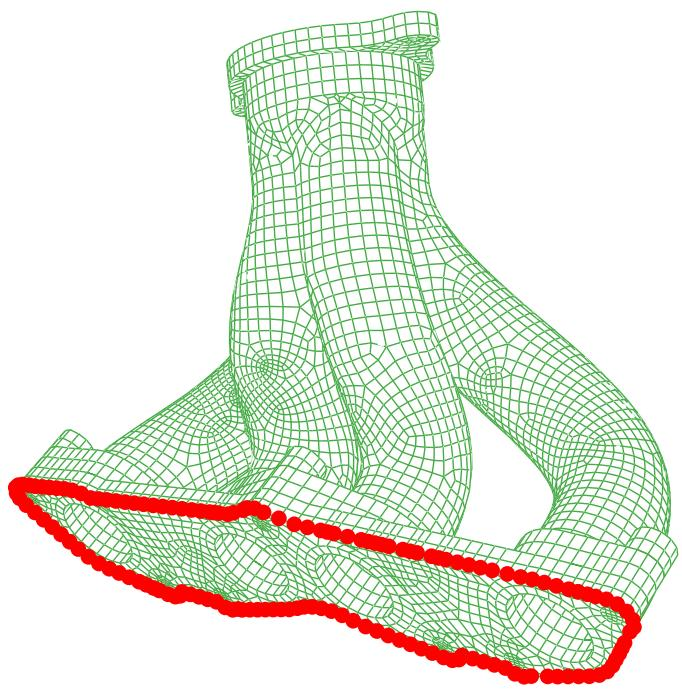  
Figure 3: Enter an angle and select a segment of an edge to select adjacent nodes.

After you use the angle or feature edge methods, you can click the individually method in the prompt area and [Shift] + Click on individual faces, edges, elements, element faces, or nodes to append them to your selection. You can also [Ctrl] + Click on items to unselect them. In addition, you can continue to use the angle and feature edge methods and use [Shift] + Click to append faces, edges, elements, element faces, or nodes to your selection. You can keep the same angle, or you can change the angle while you continue to append items. For more information, see Combining selection techniques.

## Additional information

• Selecting objects within the current viewport  
• Understanding selection within viewports

## Using the face curvature method to select multiple faces

In addition to selecting objects by the angle between them, you can select multiple faces from a part based on the curvature of the faces. When you are performing a task that allows you to pick more than one geometric face, Abaqus/CAE displays a field in the prompt area. The field allows you to choose between the three selection methods—individually, by face angle, and by face curvature, as shown in Figure 1.

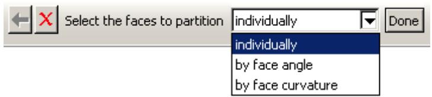  
Figure 1: Choose the selection method from the field in the prompt area.

The angle selection method is described in Using the angle and feature edge method to select multiple objects.

The face curvature method is available during procedures that select faces. If a procedure accepts object types other than faces, you can change the object type in the Selection toolbar to Faces to access the face curvature method.

Select a face from the part or assembly. Abaqus/CAE selects all connected faces that have similar curvature along both principal directions and are joined at an angle of less than 20°. If you select a flat face, Abaqus/CAE adds any adjoining flat faces that lie in the same plane. Disconnected faces that share similar curvature are not selected, nor are faces that share similar curvature but have significantly different face normals at the edge where they meet. Figure 2 shows two rounded faces selected using the face curvature method.

  
Figure 2: Select a single curved face to select adjoining faces with similar curvature.

After you use the face curvature method, you can click the individually method in the prompt area and [Shift] + Click on individual faces to append them to your selection. You can also [Ctrl] + Click on items to unselect them. In addition, you can continue to use the face curvature method and use [Shift] + Click to append faces to your selection. For more information, see Combining selection techniques.

## Additional information

• Understanding selection within viewports  
• Selecting objects within the current viewport

## Using the topology method to select multiple elements

You can select multiple elements based on the connection of a row or layer of elements. When you are performing a task that allows you to pick more than one element, Abaqus/CAE displays a field in the prompt area. The field allows you to choose between the four selection methods—individually, by angle, by feature edge, and by topology, as shown in Figure 1.

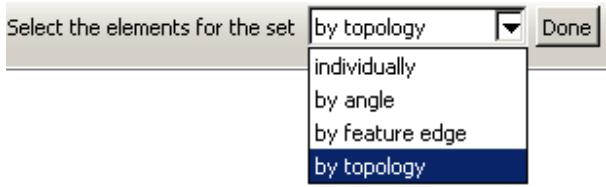  
Figure 1: Choose the selection method from the field in the prompt area.

The angle and feature edge selection methods are described in Using the angle and feature edge method to select multiple objects.

The topology method is available during most procedures that select elements. If a procedure accepts object types other than elements, you can change the object type in the Selection toolbar to Elements to access the topology method.

The topology method is designed for use with two- and three-dimensional structured meshes. Select an element face from the mesh, and Abaqus/CAE selects all the elements connected to it in a row through the mesh. Select an element edge from the mesh, and Abaqus/CAE selects all the elements in a layer starting with the element faces that share the selected edge. Figure 2 shows selection of an interior row on the left and an interior layer on the right.

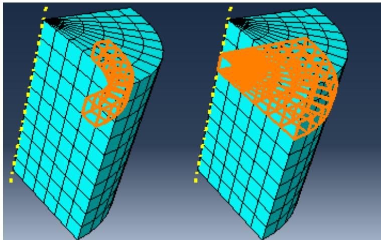  
Figure 2: Using the topology method to select a row or a layer of elements.

You can use the topology method to select elements from other mesh types, but without the clearly defined rows or layers of a structured mesh, the selections may be unpredictable. In some cases, such as with a tetrahedral mesh, topology selection may be limited to only the elements that share the face or edge you select.

After you use the topology method, you can select other methods in the prompt area and [Shift] + Click to append more elements to your selection. You can also [Ctrl] + Click on items to unselect them. In addition, you can continue to use the topology method and use [Shift] + Click to append elements to your selection. For more information, see Combining selection techniques.

## Additional information

• Understanding selection within viewports

• Selecting objects within the current viewport

## Using the limiting angle, layer, and analytic methods to select multiple element faces

When you are selecting orphan element faces to create geometry (for more information, see Create face from element faces), Abaqus/CAE displays a field in the prompt area. The field allows you to choose between five selection methods—individually, by angle, by limiting angle, by layer, and by analytic, as shown in Figure 1.

  
Figure 1: Choose the selection method from the field in the prompt area.

The angle selection method is described in Using the angle and feature edge method to select multiple objects. The limiting angle, layer, and analytic methods are available only while selecting orphan element faces to create new geometric faces.

## By limiting angle

Selecting objects using a limiting angle is a two-step process:

1. In the prompt area, you enter an angle (from 0° to 90°).  
2. From the part or assembly, you select an orphan element face.

The angle must be greater than the total angle between the selected element face and the element faces connected to it. Abaqus/CAE starts from the selected geometry and selects all adjacent geometry until the angle between the selected face and the last face in the series of adjacent faces meets or exceeds the angle you entered. Figure 2 shows selection of element faces with a limiting angle of 45°, and one of the vertical element faces below the rounded area is picked.

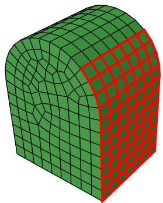  
Figure 2: A limiting angle of 45° with a selected vertical face.

Increasing the limiting angle to its maximum of 90° would select the faces up to the top of the rounded section. In contrast, using the angle method with an angle of 13° or more would continue the selection around the rounded portion and down the far side since the angle between each adjacent face is less than 13°.

## By layer

Selecting objects using the layer method is a two-step process:

1. In the prompt area, you enter a number of layers.  
2. From the part or assembly, you select an orphan element face.

Abaqus/CAE starts from the selected face and selects layers of adjacent element faces around it in all directions. Selection continues around corners and other features until the number of layers is reached or until there are no more adjacent orphan element faces.

Figure 3 illustrates the selection of three layers of orphan shell element faces around a starting face and the resulting geometric face.

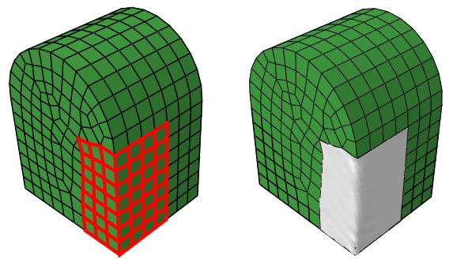  
Figure 3: Face layer selection and creation of a geometric face.

As shown in Figure 3, layer selection can traverse sharp corners and other model features that would normally signify the end of a geometric face. In most cases you should preserve logical model edges and other features by creating separate faces. Otherwise, the resulting geometry may be difficult to repair and mesh.


## Note:

When you are working with solid orphan elements, selections that include multiple faces from the same orphan element are not acceptable for the creation of a single geometric face.

## By analytic

The analytic selection method for orphan element faces is based on the recognition of basic shapes in analytic geometry (such as planes, cylinders, cones, spheres, and tori), or portions of these shapes. Analytic selection attempts to recognize the logical boundaries of a set of orphan element faces that would make a recognizable geometric face.

Figure 4 illustrates analytic selection of orphan element faces. A spherical section of element faces is highlighted; this selection could not be made using any of the other selection options for multiple objects.

  
Figure 4: Analytic geometry selection.

After you use any of the above methods, you can select other methods in the prompt area and [Shift] + Click to append more elements to your selection. You can also [Ctrl] + Click on items to unselect them. In addition, you can continue to use the current method and use [Shift] + Click to append elements to your selection. For more information, see Combining selection techniques.

## Additional information

• Understanding selection within viewports  
• Selecting objects within the current viewport  
• Create face from element faces

## Adding adjacent objects to a selection

If you have already selected one or more objects, you can expand your selection to include all adjacent objects of the same type. Adding adjacent objects is an alternative to using drag-select or the angle method (see Drag-selecting multiple objects, and Using the angle and feature edge method to select multiple objects, respectively) to quickly select multiple objects. Selecting adjacent objects allows you to expand your selection in all directions, regardless of the shape of surrounding features or the angle at which objects are joined. It also allows you to pick multiple areas of interest in a model and expand the selection set in each area at the same time.

To add adjacent objects to the current selection, click mouse button 3 over an existing selected object and select Add Adjacent Entities. Abaqus/CAE expands your selections to all adjacent objects of the same type, including objects that are not included in the current display. If necessary, Abaqus/CAE adds the newly selected objects to the current display group to make them visible. Adjacent objects are defined in terms of the currently selected entities as follows:

• Edges that share a common vertex with one or more selected edges  
• Vertices that share a common edge with one or more selected vertices  
• Faces that share a common vertex or edge with one or more selected faces  
• Nodes that share a common edge with one or more selected nodes  
• Elements that share a common element edge or node with a selected element

## Additional information

• Selecting objects within the current viewport  
• Using the chain method to select edges in the Sketcher

## Combining selection techniques

There are times when it is convenient to use a combination of the methods for selecting and unselecting objects. For example, you can drag-select a group of nodes while creating a node set using the Set toolset. You can then [Ctrl] + Click individual nodes to unselect them and [Shift] + Click additional nodes to add them to your selection. A combination of the three techniques is illustrated below:

1. First, you use drag-select to select a group of nodes.


2. Then, you use [Ctrl] + Click to unselect individual nodes.

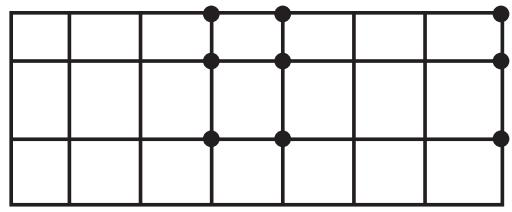

3. Finally, you use [Shift] + Click to add nodes to your set and then click mouse button 2 to indicate you have finished selecting.

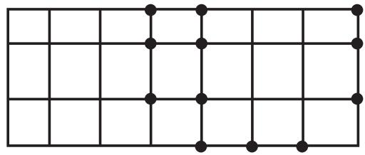

You may find it useful to adjust the view orientation to make particular items in the viewport more accessible. You can adjust the view orientation at any point during the selection process. For information on the view manipulation tools, see Manipulating the view and controlling perspective.


Tip: To unselect all the objects, click an unused part of the current viewport.

## Additional information

• Selecting objects within the current viewport  
• Selecting and unselecting individual objects  
• Drag-selecting multiple objects  
• Using the chain method to select edges in the Sketcher

## Excluding objects from your selection

When you select an object from the viewport, your selection includes all the entities of lower dimensionality that are associated with the object. For example, if you select a cell, your selection includes all the faces, edges, and vertices associated with the cell. Similarly, if you select an edge, your selection includes all the vertices associated with the edge. In some circumstances you may want to exclude the entities of lower dimensionality from your selection. For example, if you select an edge to include in a set, you may not want the set to contain the vertices at each end of the edge. Excluding entities of lower dimensionality from your selection may solve any problems that you encounter with overconstraints.

1. Select all the objects using a combination of select, drag-select, [Ctrl] + Click, and [Shift] + Click. Abaqus/CAE highlights the selected objects in red.  
2. [Ctrl] + Click an object to exclude it from your selection. Abaqus/CAE highlights the excluded objects in purple.

## Additional information

• Selecting objects within the current viewport  
• Selecting and unselecting individual objects  
• Cycling through valid selections  
• Using the chain method to select edges in the Sketcher

## Cycling through valid selections

In some cases Abaqus/CAE is unable to differentiate between the object you have selected and other nearby or related objects. This ambiguity can arise as follows:

Imagine a small square surrounding the cursor. When you click an object, any other valid objects of the same type that fall inside this square are also considered to be possible selections. For example, if you select an edge that is positioned very close to another edge, Abaqus/CAE may consider both edges to be possible selections.

The size of the square is independent of the monitor size, the viewport size, and the dimensions of the model. It also remains constant when you zoom in and out on your model. Therefore, you can select a specific object in the viewport more precisely by zooming in on your model to increase the distance between objects.

If your model is three-dimensional, imagine a line that is perpendicular to the screen and that passes through the cursor and into the model. When you select an object, any valid objects of the same type that intersect this line are considered to be possible selections. (Rotating your model may remove some of the ambiguity.)

Abaqus/CAE reduces the potential for ambiguity by filtering your selection against the current procedure whenever possible. For example, if you are partitioning a cell, Abaqus/CAE prompts you to select the cell to partition. When you make a selection, Abaqus/CAE considers only cells to be a valid selection. Conversely, if you are creating a geometry set, Abaqus/CAE considers cells, faces, edges, and vertices to be a valid selection and the potential for ambiguity is increased. In addition, preselection highlighting allows you to see exactly which object would be selected before you make the selection. Moving the cursor around the viewport may remove the ambiguity in the selection and result in Abaqus/CAE highlighting the object of your choice. If the ambiguity remains, Abaqus/CAE changes the cursor, adding ellipsis marks (...) to the right of the arrow, and highlights all the possible selections.

When your selection is ambiguous, Abaqus/CAE displays buttons in the prompt area that allow you to cycle through all of the possible selections, as shown here:


Ambiguous selection, please choose one:

Next

Previous

OK

Use the Next and Previous buttons to cycle forward and backward through all of the objects in the viewport that are possible selections; each object becomes highlighted in turn. When the object of your choice is highlighted, click OK or click mouse button 2 to confirm your selection. (You can also click mouse button 3 in the current viewport to reveal a menu of the options in the prompt area.)

## Additional information

• Selecting objects within the current viewport

## Using groups while selecting entities

You can append groups of entities to your selection to speed up the process of selecting many entities from the viewport. The group can be a display group, or it can be a temporary selection group. You can click mouse button 3 on the viewport and do the following:

• Create a selection group by copying entities (vertices, edges, faces, or cells) that are highlighted in the viewport into a selection group.  
• Append to your selected entities by pasting the entities stored in a selection group or a display group into your current selection.

## Selecting interior surfaces

You can use the selection tools to select an interior surface of a model; for example, when you create a surface or when you select a region using the solid offset mesh tool.

1. In the Selection toolbar, toggle on the Select From Interior Entities tool

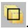


## Note:

The Select From Interior Entities tool is hidden by default. For more information, see Using toolboxes and toolbars that contain hidden icons.

2. Select the interior surface from the viewport.

## Additional information

• Understanding and using toolboxes and toolbars  
• Understanding selection within viewports  
• Selecting objects within the current viewport  
• Filtering your selection based on the position of the object  
• What is a surface?  
• Specifying a particular side or end of a region

## Using the selection options

Abaqus/CAE provides a set of tools that can make it easier and more efficient for you to select entities from the viewport.

The selection tools are located in the Selection toolbar. The available options depend on the current selection procedure; some options can be used to preselect entities outside of a procedure.

This section describes the selection options.

## In this section:

Available selection options  
Filtering your selection based on the type of object  
Filtering your selection based on the position of the object  
Highlighting objects prior to selection  
Modifying the shape of the drag-select region  
Choosing which objects are selected by the drag-select region  
Selecting objects before choosing a procedure

## Available selection options

When you are prompted to select an object from the viewport, Abaqus/CAE provides selection tools that can make it easier and more efficient for you to make the desired selection.

Use the Selection toolbar to configure the selection options. Figure 1 shows the layout of the selection tools. Selection tools appear dimmed if they are not valid for the current procedure.

  
Figure 1:The Selection toolbar.

## Additional information

• Components of the toolbars  
• Using dimmed dialog box and toolbox components  
• Selecting objects within the current viewport  
• Using the selection options

## Filtering your selection based on the type of object

To help you select the desired entities (such as vertices, edges, faces, nodes, and elements) from the current viewport, Abaqus/CAE provides a set of filters that you can use to limit your selection based on the type of object.

For example, if you are creating a set that contains only surfaces, you can limit your selection to only faces—other objects, such as vertices and edges, will not be selected.

The object filters are listed in the Selection toolbar. Abaqus/CAE configures the filter list based on the current procedure. If you have not started a selection procedure, Abaqus/CAE lists some commonly used filters (for more information on selecting objects outside of a procedure, see Selecting objects before choosing a procedure).

You can press [Ctrl] + A to select all objects in the current viewport based on the active selection filter. The view is rescaled to fit the viewport to clearly display the selected objects, which are highlighted in the viewport. For example, if edge objects are selected in the filter and you press [Ctrl] + A, all edges visible in the viewport are selected. You cannot customize the [Ctrl] + A keyboard shortcut.

If the current viewport contains an Abaqus/CAE part or part instance, you can select one of the following filters:

## All

All objects except skins and stringers.

## Cells

All volumes, such as cells and elements.

## Faces

All planar objects, such as faces, datum planes, and element faces.

## Edges

All edge objects, such as edges, datum axes, and element edges.

## Vertices

All point objects, such as vertices, datum points, and nodes.

## Elements

All elements.

## Nodes

All nodes.

## Datums

All datum objects, such as datum planes, datum axes, and datum points.

## Features

All feature objects.

## Ref points

All reference points.

The list of available filters is updated as you change modules or selection procedures, and additional filters (such as Instances, Skins, and Stringers) are displayed where applicable. By default, Abaqus/CAE selects from all objects but excludes skins and stringers. You can select a skin or stringer from the viewport only after you select the appropriate filter.

Similarly, if you are selecting orphan elements in the current viewport (to assign an element type, for example), you can select one of the following filters:

All  
• Zero-dimensional elements  
• One-dimensional elements  
• Two-dimensional elements  
• Three-dimensional elements  
. Skins  
• Stringers

By default, Abaqus/CAE selects from all elements except skins and stringers.

• Using the selection options

## Filtering your selection based on the position of the object

The selection tools allow you to choose from which objects to select, based on their positions in the viewport. The Selection toolbar contains all of the selection tools.

The following position-based selection tools are available only after you start a procedure that requires object selection (position-based selection is not available outside of a procedure):

## Objects closest to the screen


Toggle on this tool to select only the objects closest to the front of the screen. This tool is toggled on by ult.

If you toggle off this tool, Abaqus/CAE allows you to cycle through all of the possible selections. Use the Next and Previous buttons in the prompt area to cycle forward and backward through all of the objects in the viewport that are possible selections; each object becomes highlighted in turn. For more information, see Cycling through valid selections.

This filter applies to native vertices, edges, faces, and cells and to orphan nodes and orphan elements.

## Interior and exterior objects

Choose one of the following filters:

Select objects located both outside and inside a part.  
Select only objects located on the outside of a part. In most cases this tool is selected by default.  
Select only objects located on the inside of a part.

• Using the selection options

## Highlighting objects prior to selection

When you are selecting objects from the viewport and you stop moving the cursor, Abaqus/CAE highlights the object that would be selected at the cursor position.

This behavior, called “preselection,” allows you to see exactly which object would be selected before you make the selection. If the current selection options make more than one object available, Abaqus/CAE changes the cursor, adding ellipsis marks (...) to the right of the arrow, and highlights all the possible selections. The position and type filtering that you choose for selection also applies to preselection.

Toggle off the Allow Preselection During Picking tool in the Selection toolbar to turn off preselection highlighting for procedures in the current session. This tool is toggled on by default.


## Note:

Preselection highlighting may be delayed for large models; toggling off preselection may improve the display speed.

• Using the selection options

## Modifying the shape of the drag-select region

The selection tools allow you to change the shape of the drag-select region.

From the Selection toolbar, choose one of the following:

## Rectangle


Click to indicate one corner of the rectangle, and drag the cursor to the second corner. This tool is selected by default.

## Circle


Click to indicate the center of the circle, and drag the cursor to a point on the circumference.

## Polygon


Click to indicate one vertex of the polygon, and drag the cursor to the second vertex. You then continue to click on each vertex of the polygon. Click mouse button 2 to indicate you have finished entering vertices. There is no limit to the number of vertices in the polygon.

• Using the selection options

## Choosing which objects are selected by the drag-select region

The selection tools allow you to choose which objects are selected by the drag-select region.

From the Selection toolbar, choose one of the following:

## Inside


Select only the objects that fall inside the drag-select region.

## Inside and crossing


Select only the objects that fall inside or cross the drag-select region. This tool is selected by default.

## Crossing


Select only the objects that cross the drag-select region.

## Outside and crossing

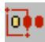

Select only the objects that fall outside or cross the drag-select region.

## Outside


Select only the objects that fall outside the drag-select region.

• Using the selection options

## Selecting objects before choosing a procedure

You can select objects from the current viewport before choosing a procedure to work with them.


You can use the Selection toolbar

to toggle selection and to limit

viewport selections based on the type of object. The Selection tool is the first tool in the toolbar; it is available only when there are no active procedures running in a viewport. By default, selection is active and viewport object types are not limited. You can select multiple objects using any of the methods described in Combining selection techniques. Toggle off object selection to prevent selecting objects when you are not in a procedure.


## Note:

Preselection highlighting may be delayed for large models; toggling off selection may improve the display speed by preventing preselection and selection unless you first choose a procedure that requires object selection.

When you select a procedure after selecting objects from the viewport, Abaqus/CAE applies the selection filters for the procedure. For example, if you selected a vertex, a face, and an edge, then started a procedure that can accept only vertices, Abaqus/CAE accepts the selected vertex, cancels the selection of the face and edge, and begins the procedure with the second step. Similarly, if you select a procedure that requires a single object selection and you have already selected multiple valid objects, Abaqus/CAE accepts the first valid selection and cancels the remaining selections. If Abaqus/CAE cannot determine which object you selected first, it will cancel all selections and begin the procedure at the first step.

If a procedure includes multiple selection steps, objects that you select before the procedure can be used only to complete the first selection step. Any subsequent selection steps require you to select new objects interactively from the viewport or, if applicable, use saved selection groups. You cannot save selections made prior to the start of a procedure.

• Using the selection options

## Configuring graphics display options

This chapter explains how you can configure the graphics display options in Abaqus/CAE.

## In this section:

Using graphics display options  
Using display lists  
Using antialiasing  
Choosing a highlight method  
Choosing a translucency mode  
Controlling drag mode  
Choosing background colors

## Using graphics display options

When you start a session, Abaqus detects the graphics hardware installed on your system and sets the graphics options accordingly. If your graphics hardware is not supported by Abaqus/CAE or if you wish to override the default graphics options, you can use the Graphics Options dialog box to tune display performance.

Abaqus/CAE applies the settings to all viewports and saves the settings for the duration of the session. To use the customized settings each time you start an Abaqus/CAE session, modify the environment file (abaqus\_v6.env). For additional information on the environment file, see the Abaqus Configuration Guide.


Note: Recommended settings for recently introduced graphics adapters are available from the Support page at www.3ds.com/simulia.

You can also use the Graphics Options dialog box to do the following:

Choose the appearance of your model during rotation, pan, or zoom view manipulations. The appearance is related to the render style and can be set to Fast (wireframe) or As is.  
Choose whether Abaqus/CAE will auto-fit the image to the current viewport after you rotate the view. Automatically fitting the image to the viewport is equivalent to clicking the auto-fit tool in the View Manipulation toolbar. Auto-fit adjusts your view of the model so that the model fills the viewport and is centered within it. The orientation remains fixed, as indicated by the view triad.  
• Choose whether Abaqus/CAE will optimize the display of translucent objects for performance, for accuracy, or for a level in between.  
• Choose the viewport background color. Your selected color will be applied to all viewports in the current session of Abaqus/CAE.

1. From the main menu bar, select View->Graphics Options.

The Graphics Options dialog box appears.

2. Select one of the following options:

• Tune performance using options for display lists, highlight method, and translucency mode.  
• Choose the display mode while you drag objects in the viewport.  
• Enable or disable the automatic fitting of your view to the viewport after rotations.  
• Choose the background color of the viewports.

## Additional information

• Using display lists  
• Choosing a highlight method  
• Choosing a translucency mode  
• Controlling drag mode  
• Choosing background colors

## Using display lists

Display lists help you display repeated images faster. When display lists are enabled, every drawing operation is recorded in a list that can be quickly replayed if necessary. This results in faster image refreshes on most systems but requires graphics memory to record each drawing operation. Display lists are not used at all in the Visualization module (Abaqus/Viewer). In Abaqus/CAE display lists are usually enabled; you should disable them if you experience memory problems or a degradation of graphics performance while displaying exceptionally large models.

1. Locate the display lists options.

From the main menu bar, select View->Graphics Options.

Abaqus/CAE displays the Graphics Options dialog box.

2. From the Hardware options, toggle Use display lists on or off to control the use of display lists for images. This option has no effect in the Visualization module.

When Use display lists is on, you may notice a brief delay the first time an image is drawn; this occurs because Abaqus/CAE must construct the display lists. Subsequent drawing of the image is faster.

3. Click OK to implement your changes and to close the dialog box.

Your changes are saved for the duration of the session.

## Additional information

• Choosing a highlight method  
• Choosing a translucency mode  
• Controlling drag mode  
• Choosing background colors

## Using antialiasing

Abaqus/CAE uses antialiasing to improve the display of curved and diagonal lines on models. Antialiasing is enabled on compliant systems, and you can toggle off this option to improve performance for some systems.

1. Locate the graphics options.  
From the main menu bar, select View->Graphics Options.  
Abaqus/CAE displays the Graphics Options dialog box.

2. From the Hardware options, toggle on Anti-alias lines to enable antialiasing or toggle it off to disable antialiasing.

3. Click OK to implement your changes and to close the dialog box.

Your changes are saved for the duration of the session.

## Additional information

• Using display lists  
• Controlling drag mode  
• Choosing background colors

## Choosing a highlight method

The highlight method controls how Abaqus/CAE displays highlighting in the viewport while you interact with the model. The effect of changing the highlight method is most apparent when you use the view manipulation tools to rotate the model or while sketching a profile in the Sketch module. Hardware Overlay provides the best graphics performance; however, this option is not supported by all graphics adapters.

In most circumstances you should not have to change the default highlight method setting. When you start a session, Abaqus/CAE detects the graphics hardware installed on your system and selects the appropriate highlight method. However, if you are using a graphics adapter that is not supported, the default setting selected by Abaqus/CAE may not be optimal.

1. Locate the highlight method options.

From the main menu bar, select View->Graphics Options.

Abaqus/CAE displays the Graphics Options dialog box.

2. From the Highlight method menu, select one of the following:

Hardware Overlay. This option appears only if it is supported by the graphics adapter on your system. It uses graphics hardware to display the highlighting layer. If your workstation supports this option, choosing Hardware Overlay provides the optimum quality and performance.  
XOR. This option uses software to emulate the highlighting layer. Choosing the XOR option uses a Boolean pixel operation to simulate the drawing operations but can produce different colors depending on the color of the underlying pixels.  
Software Overlay. This option also uses software to emulate the highlighting layer and provides good quality at reasonable performance. However, on some systems selecting this option results in poor performance.  
Blend. The Blend method combines the color of the underlying pixel with the desired color producing an approximation of the transient graphics. You should choose this option only if none of the other options are satisfactory. Performance and quality may be affected if you choose the Blend option.

3. Click OK to implement your changes and to close the dialog box.

Your changes are saved for the duration of the session.

## Additional information

• Using display lists  
• Choosing a translucency mode  
• Controlling drag mode  
• Choosing background colors

## Choosing a translucency mode

The translucency mode controls the speed and accuracy with which Abaqus/CAE displays translucent objects in the viewport. The effect of changing the translucency mode is most apparent when you use the view manipulation tools to manipulate the display of the model. The Fast setting provides the best graphics performance, while the Accurate setting provides the best rendering of translucent objects.

In most circumstances you should not have to change the default translucency method setting. When you start a session, Abaqus/CAE detects the graphics hardware installed in your system and selects the appropriate translucency mode. However, if you are using a less capable graphics adapter, the default setting selected by Abaqus/CAE may not be optimal for your models.

1. Locate the translucency mode options.

From the main menu bar, select View->Graphics Options.

Abaqus/CAE displays the Graphics Options dialog box.

2. Drag the Translucency mode slider to the setting that you want. For some graphics cards, Abaqus/CAE supports three intermediate translucency mode settings between Fast and Accurate; for others, Abaqus/CAE supports only one intermediate setting between these two options.  
3. Click OK to implement your changes and to close the dialog box.

Your changes are saved for the duration of the session.

## Additional information

• Using display lists  
• Choosing a highlight method  
• Controlling drag mode  
• Choosing background colors

## Controlling drag mode

Drag mode controls the appearance of your model during rotation, pan, or zoom view manipulations. Drag mode can be set to Fast (wireframe) or As is.

## Fast (wireframe)

When you set drag mode to Fast (wireframe), a wireframe outline is drawn during the view manipulation. Fast (wireframe) is the default drag mode setting on compliant systems.

## As is

When you set drag mode to As is, everything displayed in the window will continue to be displayed during the view manipulation. On older or slower systems the display may lag behind movement of the mouse while you manipulate the view, especially if the model is complex. For newer systems with graphics hardware acceleration the As is setting can be accommodated without significant loss of performance.

Set the drag mode to As is to observe the model during the view manipulation; for example, to locate areas of high stress concentration as you rotate a contour plot.

In addition, you can choose whether Abaqus/CAE will auto-fit the image to the current viewport after you rotate the

网 view. Automatically fitting the image to the viewport is equivalent to clicking the auto-fit tool in the View Manipulation toolbar. Auto-fit adjusts your view of the model so that the model fills the viewport and is centered within it. The orientation remains fixed, as indicated by the view triad.

1. Locate the drag mode options.

From the main menu bar, select View->Graphics Options.

Abaqus/CAE displays the Graphics Options dialog box.

2. From the View Manipulation field, select Fast (wireframe) or As is drag mode.  
3. If desired, toggle on Auto-fit after rotations.  
4. Click OK to implement your changes and to close the dialog box.

Your changes are saved for the duration of the session.

## Additional information

• Using display lists  
• Choosing a highlight method  
• Choosing a translucency mode  
• Choosing background colors

## Choosing background colors

The appearance of your models is affected by the difference in contrast between the model colors and the colors in the viewport background. You can improve this contrast by changing the color or colors displayed in the viewport background. Abaqus/CAE provides two color selections: you can display a single color that floods the entire viewport background, or you can create a gradient background that blends two different colors.

Abaqus/CAE implements your background color selections for every viewport in your session.

1. Locate the background color options.

From the main menu bar, select View->Graphics Options.

Abaqus/CAE displays the Graphics Options dialog box.

2. From the Viewport Background field, select one of the following:

• Solid to choose one color for the viewport background  
Gradient to choose the top and bottom colors used to draw the background as a gradual blend from the top of the viewport to the bottom of the viewport

3. Select the viewport background color or colors.

a. Click a color sample .

Abaqus/CAE displays the Select Color dialog box.

b. Use one of the methods in the Select Color dialog box to select a new color. For more information, see Customizing colors.

c. Click OK to close the Select Color dialog box.

The color sample changes to the selected color.

d. For gradient backgrounds you can select both the top and bottom colors directly; or you can select the top color, then click Auto-Select to have Abaqus/CAE select the bottom color based on a variation of the top color.

e. Sketches or X–Y plots may not display clearly with a gradient background. For these views Abaqus/CAE displays a solid background even when you have specified a gradient background. To disable this behavior, toggle off Allow override.

4. Click OK to implement your changes and to close the dialog box.

Abaqus/CAE implements your background color selections for every viewport in your session. Your changes are saved for the duration of the session.

## Additional information

• Using display lists  
• Choosing a highlight method  
• Choosing a translucency mode  
• Controlling drag mode

## Printing viewports

This chapter describes how you send an image of selected viewports either directly to a printer or to a file.

For more information on configuring printers, see the Abaqus Configuration Guide.

## In this section:

Understanding printing  
Controlling the destination and appearance of printed images

## Understanding printing

Abaqus/CAE allows you to take a snapshot of one or more viewports and their contents and to send the image either directly to a printer or to a file for later use; for example, to include in a presentation, embed in a printed report, or display in an HTML document.

Additional options allow you to select the appearance of viewports in the resulting image, as well as the color, resolution, and size of the image.

This section describes basic concepts you should understand before sending output to a printer or to a file.

## In this section:

Printed image formats  
Windows and PostScript image layout  
Windows printer image size  
EPS, TIFF, PNG, and SVG image size  
Hard-copy image quality  
Importing Abaqus/CAE images into other software products

## Printed image formats

You can print images directly to a printer or save images in several file formats.

Abaqus/CAE allows you to print images directly to a Windows printer. The printer driver creates and sends the necessary information to the printer in whatever format is required.

If Windows printer drivers are not available or if you are using another platform, you can use a print command to create and send a PostScript file directly to a PostScript printer. You can also save images in a Portable Network Graphics (PNG), Scalable Vector Graphics (SVG), Tag Image File Format (TIFF), PostScript (PS), or Encapsulated PostScript (EPS) file. The following list describes these file formats:

## PNG

Portable Network Graphics (PNG) is an industry standard for storing raster images. The use of PNG files has been popularized by the World Wide Web, and PNG images are displayed by most popular web browsers running on a variety of operating systems. A PNG file consists of color information and a compressed raster representation of the image. By default, Abaqus/CAE limits PNG images of viewports to 8-bit color (256 colors). However, you can also use 24-bit color (on Windows) or the system color setting (on Linux).

## SVG

Scalable Vector Graphics (SVG) is an industry-standard vector graphics language written in XML.

## TIFF

Tag Image File Format (TIFF) is a well-established raster image format that is recognized by many software applications. The TIFF format supports both color and greyscale. By default, Abaqus/CAE limits TIFF images of viewports to 8-bit color (256 colors). However, you can also use 24-bit color (on Windows) or the system color setting (on Linux).

## PostScript

PostScript is the recognized standard for desktop publishing. PostScript is actually a programming language whose instructions and data are usually stored in an ASCII format that can be transferred easily between operating systems. The PostScript format is used when you use a print command to print to a PostScript printer or when you save the image in a PostScript file. When you select the PostScript format, Abaqus/CAE generates either a compressed raster representation or a vector representation of your image. For efficiency when producing raster images, you should minimize the size of your image and limit the resolution of the image to, at most, the resolution of the device on which the image is to be printed or displayed.

## Encapsulated PostScript

Encapsulated PostScript (EPS) is a variation of PostScript that describes a single graphic designed to be included in a larger document without modification. EPS files are identical to PostScript files except for some information that describes the size and positioning of the image. As a result, the above discussion about vector and raster representations of your image applies equally to the EPS format. Most word processing and graphics applications support the inclusion of EPS files.

## Additional information

• Controlling the destination and appearance of printed images

When you print a snapshot of selected viewports directly to a Windows printer or to a PostScript printer or file, the layout of the image is determined by the available page size, the orientation, and the aspect ratio of the viewports:

## Available page size

The available page size is calculated from the total page size and the margin information that you supply, as illustrated by the sample dimensions shown in Figure 1.

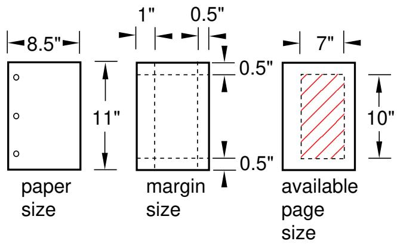  
Figure 1:The available page size.

The total page size is determined by the paper size. For a Windows printer, click the Printer Properties button in the Print dialog box to open the Document Properties dialog box and change the paper size. For a PostScript printer or file, click the Postscript Format Options button in the Print dialog box to change the paper size.

## Orientation

The orientation of your page can be either portrait or landscape.

## Aspect ratio

The aspect ratio is the ratio between the overall width and the overall height of the viewports that you select for printing. Abaqus/CAE always maintains the aspect ratio of the objects, as shown in Figure 2. You can control the aspect ratio by manipulating the viewports on the canvas before printing them.

  
Figure 2: Scaling the objects to maintain the aspect ratio.

The default method for determining the image size on Windows printers—the only method for determining the image size on PostScript printers and files—scales the image to fit the aspect ratio and the available page size.

For detailed instructions, see Customizing the image sent to a Windows printer, and Customizing the image sent to a PostScript printer or file.

## Additional information

• Controlling the destination and appearance of printed images  
• EPS, TIFF, PNG, and SVG image size

## Windows printer image size

When you print a snapshot of selected viewports directly to a Windows printer, the image size is determined by one of three methods:

## Fit to page

Use this method to scale the printed image to fit within the available page size. This method is used by default.

## Use size on screen

Use this method to match the printed image size to the current size on the canvas. If the image size exceeds the available page size, you must resize the image, change the page size or margins, or select a different method to print your image.

## Use settings

Use this method to specify the size of the printed image directly. You specify either the width or the height, and Abaqus/CAE adjusts the other dimension to maintain the image aspect ratio. If the image exceeds the available page size, you must resize the image, change the page size or margins, or select a different method to print the image.

## Additional information

• Customizing the image sent to a Windows printer  
• Controlling the destination and appearance of printed images  
• Windows and PostScript image layout  
• EPS, TIFF, PNG, and SVG image size

## EPS,TIFF, PNG, and SVG image size

When you print a snapshot of selected viewports to an Encapsulated PostScript (EPS), TIFF, PNG, or SVG format file, Abaqus/CAE determines the size of the image based on the size you specify and the overall aspect ratio of the viewports. You can control the aspect ratio by manipulating the viewports on the canvas.

In the options dialog box (EPS Options, TIFF Options, PNG Options, or SVG Options) you can choose one of the following methods to specify the size of the printed image:

• Use the size of the image on the screen. (Abaqus/CAE indicates the current image size in the options dialog box.) This method is the default.  
Set the width or height. You specify only one dimension; Abaqus/CAE computes the other dimension to maintain the aspect ratio of the viewports. When you are creating an EPS-format file, you specify the width or height in either inches or millimeters. When you are creating a TIFF, PNG, or SVG format file, you specify the width or height in screen pixels; increasing the number of pixels increases the image size.

## Additional information

• Windows and PostScript image layout  
• Controlling the destination and appearance of printed images

## Hard-copy image quality

When you print a snapshot of selected viewports directly to a PostScript printer or save it in a PostScript or Encapsulated PostScript (EPS) file, Abaqus/CAE creates either a vector or raster representation of the image (for more information, see Printed image formats).

Vector representation images are resolution independent, so their quality depends only on the resolution of your printer.

For PostScript and EPS images, you can use the Resolution field in the corresponding options dialog box to specify the resolution of the image you save or print. At higher resolution, raster images appear to be smoother and less jagged. Low-resolution vector images may have holes if scaled to a larger size.

Although a higher resolution image has higher quality, more data are required to define the image; the resulting file can consume a large amount of disk space. A lower resolution image will normally print and display faster. In general, you should select the lowest resolution that still produces an acceptable image. You may want to save a lower resolution image while you produce draft copies of your work and switch to a higher resolution for the finished version.

The resolution of your printer sets an upper limit on the printed image resolution. For example, if you save an image at a resolution of 600 dots per inch (dpi) and print it on a printer that has a resolution of 300 dpi, the printed image will have a resolution of only 300 dpi.

Raster representation image quality may also be affected by changes you make to the image with external software after the image has been created, such as scaling and rotation. Scaling and rotation may distort a raster image. Consequently, before you print a raster representation of your image, you should adjust the viewports on your canvas to match the dimensions and orientation that will appear in the final application. Scaling and rotation do not distort or diminish the quality of vector representation images.

For vector representation PostScript and EPS images, you can use the Shading Quality field in the corresponding options dialog box to specify the quality of the lighting on curved surfaces in the image. This option does not affect the image resolution or the file size. A finer shading quality will produce an image closer to the raster representation. A coarser shading quality will normally print and display faster. Similar to the resolution for raster images, you should select the coarsest shading quality that still produces an acceptable image.

Vector PostScript and EPS images do not support translucency; all translucent or transparent objects will appear opaque when printed using vector PostScript or EPS format.

## Additional information

• Understanding printing  
• Controlling the destination and appearance of printed images

## Importing Abaqus/CAE images into other software products

Many popular software applications, such as word processors, allow you to import files containing graphic images generated by Abaqus/CAE; and most of these applications allow you to preview the imported image. In addition, if you are using a Windows system, you can use [Ctrl] + C to copy the image in the current viewport to the system clipboard and [Ctrl] + V to paste it into another application. Windows stores the image in the clipboard in a bitmap (.bmp) format at the resolution of the screen. Although the image quality will be satisfactory when viewed online, it may be unacceptable when printed. If you expect to print an image, you should save it in PostScript or Encapsulated PostScript format.

## Controlling the destination and appearance of printed images

This section describes the options available for controlling the destination and appearance of printed images.

## In this section:

Printing to a printer or to a file  
Selecting which part of the image to print  
Choosing the color of your image  
Choosing the destination of your image  
Customizing the image sent to a Windows printer  
Customizing the image sent to a PostScript printer or file  
Customizing the image saved in an Encapsulated PostScript file  
Customizing the image saved in TIFF, PNG, or SVG files

## Printing to a printer or to a file

Abaqus/CAE allows you to print a snapshot of one or more viewports on the canvas and to send the image either directly to a printer or to a file for later use; for example, to include in a presentation, embed in a printed report, or display in an HTML document. The printed image will reproduce the layering of viewports on the canvas; that is, if one viewport obscures another on the canvas, the obscured portion will not appear in the printed image. You can select the format of the printed image; and additional options allow you to select the appearance of viewports in the resulting image, and the color, resolution, orientation, and size of the image.

To create a printed image, select File->Print from the main menu bar. To configure your image, use the Print dialog box that appears. For detailed help on the items within the dialog box, request context-sensitive help on the individual items.

When you have finished selecting options, click OK in the Print dialog box to send the image to the selected destination. Abaqus/CAE closes the Print dialog box, sends the image to the selected destination, and saves your print options for the duration of the session.

## Additional information

• Understanding printing  
• Controlling the destination and appearance of printed images

When you print an image directly to a printer or to a file, you can use the Print dialog box to select which viewports on the canvas to include in the printed image. You can select the following:

## All or current viewports

Select All Viewports to print all viewports on the canvas. Viewports that are on the canvas but are not visible because they are outside the drawing area will still be printed. If viewports are overlaid, the printed image will reproduce the layering on the canvas; that is, if one viewport obscures another, the obscured portion will not appear in the printed image. By default, Abaqus/CAE prints all the viewports on the canvas.

Select Current Viewport to print the most recently used viewport only. See Selecting viewports, for more information on selecting viewports.


## Note:

Minimized viewports are not printed, regardless of your selections in the Print dialog box.

## Viewport decorations

Toggle on Print viewport decorations (if visible) to select whether your image will include viewport decorations. Decorations are defined as the viewport border and the viewport title.

## Viewport backgrounds

Toggle on Print viewport backgrounds to control the appearance of a viewport's background in your printed image. When this option is selected and viewport background images or movies are active, Abaqus/CAE includes the viewport background image or the current frame of the movie in the background of the printed image. If Print viewport backgrounds is active but viewport background images or movies are inactive, Abaqus/CAE displays the viewport background colors in the background.

The Print viewport backgrounds option is available only when you choose either a greyscale or a color image; when you choose black and white, Abaqus/CAE always prints a black image on a white background.


## Note:

Printing without the viewport background (so that the background appears transparent or white) usually produces the most attractive hard-copy image.

## Viewport compass

Toggle on Print viewport compass (if visible) to include the 3D compass in your printed image. If the compass is not currently visible in a viewport (see Customizing the 3D compass), the compass will not appear in the printed image regardless of the setting for this option.

1. From the main menu bar, select File->Print.


Tip: You can also click


in the File toolbar.

The Print dialog box appears.

2. From the Print field at the top of the dialog box, select either:

All Viewports to print all viewports, even if they lie outside the drawing area.•  
• Current Viewport to print the viewport that you manipulated most recently.

## 3. Toggle Print viewport decorations (if visible).

When Print viewport decorations (if visible) is on, all viewport titles and borders that are visible on the canvas will be printed.

When Print viewport decorations (if visible) is off, none of the viewport titles or borders will be printed. To print the current viewport without the border, you must toggle this option off.

## 4. Toggle Print viewport backgrounds.

When Print viewport backgrounds is on, your image will inherit the background color or background images of viewports on your monitor.

When Print viewport backgrounds is off, the appearance of viewport backgrounds depends on the format you choose for your image:

When you choose PS (PostScript) or EPS (Encapsulated PostScript) format or print directly to a Windows printer, viewports in your image will have a white background.  
• When you choose TIFF, PNG, or SVG format, viewports in your image will have a transparent background.

## 5. Toggle Print viewport compass (if visible).

When Print viewport compass (if visible) is on, any 3D compass that is currently visible in a viewport will appear in your printed image.

When Print viewport compass (if visible) is off, the 3D compass will not appear anywhere in your printed image.

## 6. When you have finished with the Print dialog box, click OK to generate the desired output.

Abaqus/CAE generates the output and closes the Print dialog box. Your settings in the Print dialog box are saved for the duration of the session.

## Additional information

• Understanding printing  
• Controlling the destination and appearance of printed images

When you print an image from the canvas directly to a printer or a file, you can use the Print dialog box to select the color of your image. The following color options are available:

## Black&White

Use this option to print black images on a white background. This option is useful for printing wireframe and hidden-line images of parts, assemblies, and meshes, including any partitions and datum geometry. You can also print black and white images of undeformed and deformed shape plots. When you choose Black&White, Abaqus/CAE always prints a black image on a white background, and the viewport background is printed as either transparent or white. This option should not be used for printing images that depend heavily on color, such as contour plots.

## Greyscale

Use this option to print greyscale versions of color images, where each color is approximated by a shade of gray. (Abaqus/CAE converts each color to one of 256 true shades of gray.) This option is useful for printing color images, such as contour plots, to a black and white laser printer. To improve the appearance of images sent to a printer, you may want to print viewports with the background turned off (so that it appears white or transparent).

## Color

Use this option to print an approximation of the colors you see. If you try to print a color image to a black and white printer, the printer converts the colors to shades of gray.

By default, Abaqus/CAE uses up to 256 different colors for raster printed images (PNG, TIFF, and raster-format PostScript). However, for TIFF or PNG printed images you can choose to allow more colors, which increases the file size but allows the image to more closely match the display. For more information, see Customizing the image saved in TIFF, PNG, or SVG files.

1. From the main menu bar, select File->Print.


Tip: You can also click in the File toolbar.

The Print dialog box appears.

2. From the Rendition text box in the Settings field, select one of the following color options:

• Select Black&White to create a black image on a white background.  
• Select Greyscale to print a greyscale approximation of a color image.  
• Select Color to print a color approximation of the colors on your screen.

3. When you have finished with the Print dialog box, click OK to generate the desired output.

Abaqus/CAE generates the output and closes the Print dialog box. Your settings in the Print dialog box are saved for the duration of the session.

## Additional information

• Understanding printing  
• Controlling the destination and appearance of printed images

## Choosing the destination of your image

You can choose to send an image directly to a printer, or you can save the image in a file.

If you send the image directly to a printer, you can select the Windows printer that you want to use. If you are on another platform or if there are no printer drivers on your Windows system, Abaqus/CAE selects the PostScript format, and you can specify the print command. Additional options allow you to choose the number of copies, paper size, orientation, margins, image quality, and whether or not to include the date and SIMULIA logo.

If you choose to save the image in a file, you must provide a file name and select one of the following file formats:

## PNG

Select PNG if you want to incorporate the saved image in a separate document; for example, an HTML file for display on the World Wide Web. Additional options for this format allow you to specify the size of the image. For more information, see Customizing the image saved in TIFF, PNG, or SVG files.

## SVG

Select SVG if you want to incorporate the saved image in a separate document; for example, an HTML file for display on the World Wide Web. Additional options for this format allow you to specify the size of the image. For more information, see Customizing the image saved in TIFF, PNG, or SVG files.

## TIFF

Select TIFF if you want to incorporate the saved image in a separate document; for example, a word processing file. Additional options for this format allow you to specify the size of the image. For more information, see Customizing the image saved in TIFF, PNG, or SVG files.

## PostScript

Select PostScript (PS) if you want the saved image to be identical to the image that Abaqus/CAE would print to a PostScript printer. Additional options for this format allow you to choose the paper size, orientation, margins, and resolution of your image, and whether or not to include the date and SIMULIA logo. For more information, see Customizing the image sent to a PostScript printer or file.

## Encapsulated PostScript

Select Encapsulated PostScript (EPS) if you want to incorporate the saved image in a separate document; for example, a word processing file. Additional options for this format allow you to specify the size and resolution of the image. For more information, see Customizing the image saved in an Encapsulated PostScript file.

1. From the main menu bar, select File->Print.


Tip: You can also click


in the File toolbar.

The Print dialog box appears.

2. From the Destination buttons in the Settings field, select one of the following:

## Printer

Choose Printer to send your image to a printer. On Windows systems you can select from a list of installed printers, similar to other Windows programs. On other systems, or on Windows systems that do not have a printer driver installed, you can type a print command in the Print command text field. This command should be the same command that you would use at your workstation to print a PostScript file. Do not include a file name in the print command; Abaqus/CAE automatically appends the file name to your command. See your systems administrator for details on the valid commands at your site.

Whether you select a printer or enter a print command, click the arrows in the Copies field to set the desired number of copies to print, or type the number of copies you want into the text field. You can print up to 100 copies. If desired, click Page Setup and the Printer Properties button (for Windows printers) or the Postscript Format Options button (for systems using a print command) to specify the page size, printed image quality, and other options.

## File

Choose File to send your image to a file. There are two ways to supply the file name:

## File name

Type the name in the File name text field. You can type any characters that are legal Windows or Linux file names; for example, on a Windows system:

• stressfield.png  
• ..\..\nozzle\presentation\injector\_mesh  
• \~\pump\actuator\strainpattern.eps

If you do not type a file extension, Abaqus/CAE will append an extension (.png, .svg, .tif, .ps, or .eps) to the file name.

## Select

Use the Select button to supply a file name using the standard file browser. For more information on file selection, see Using file selection dialog boxes.

3. If you selected to print the image to a file, click the arrow next to the Format field to select a PNG, SVG, TIFF, PostScript (PS), or Encapsulated PostScript (EPS) format file. If desired, click the respective options button to specify additional options.  
4. When you have finished with the Print dialog box, click OK to generate the desired output. Abaqus/CAE generates the output and closes the Print dialog box. Your settings in the Print dialog box are saved for the duration of the session.

## Additional information

• Printed image formats  
• Hard-copy image quality  
• Controlling the destination and appearance of printed images

## Customizing the image sent to a Windows printer

When you print viewports on the canvas directly to a Windows printer, you can use the Page Setup dialog box to customize the resulting printed image.

You can configure the following:

## Orientation

You can choose either Portrait or Landscape orientation. Portrait and landscape orientations are illustrated in the following figure:

  
viewport

  
portrait

  
landscape

## Units

You can choose either Inch or Millimeter units. Your selection determines the units used for the Image Size and Margins settings that also appear in this dialog box.

## Quality

You can select from three levels of quality. Each setting limits the maximum file size that is sent to the printer:

• Coarse limits the file to 2 megabytes,  
• Medium limits the file to 10 megabytes, and  
• Fine limits the file to 50 megabytes.

The quality level works in conjunction with the image size and the printer settings to determine the resolution of the printed image.


## Note:

Click the Printer Properties button in the Print dialog box to access the printer settings.

## Date and logo

By default, Abaqus/CAE includes the date and time and the Abaqus/CAE logo across the top of an image sent directly to a Windows printer. You can choose to remove the date and time or the logo from your output.

## Image Size

You can choose one of three methods to determine the size of the printed image:

• Fit to page fits the selected image within the current page size and margins.  
• Use size on screen prints the image as it appears on the screen. Parts of the image that do not fit within the current page size and margins are cut off in the printed output.

Use settings below allows you to enter a width or height; Abaqus/CAE adjusts whichever dimension you do not edit to preserve the current aspect ratio.

## Margins

You can provide the Top, Bottom, Left, and Right margins. Abaqus/CAE computes the maximum image size as the page size minus the margins. You can specify zero-width margins; however, printers cannot print to the edge of the paper and typically have margins of at least 0.25 inches (6 mm). The page size is set in the printer settings.


## Note:

Click the Printer Properties button in the Print dialog box to access the printer settings.

Abaqus/CAE maintains the margins you specify regardless of the orientation of the paper. For example, assume you chose a Portrait image and entered a value for the Top margin. If you now choose a Landscape image, Abaqus/CAE uses the value you entered for the Top margin to compute the Left margin. Similarly, the value you entered for the Right margin becomes the Top margin.

You can also use the Print dialog box to set the number of copies to print and to access specific settings for the selected printer. Click the Printer Properties button to open the printer name Document Properties dialog box. The available printer settings are determined by the installed printer driver and configuration, not by Abaqus/CAE.

For more information, see Windows and PostScript image layout, and Hard-copy image quality.

1. From the main menu bar, select File->Print.


Tip: You can also click in the File toolbar.

The Print dialog box appears.

2. From the Destination radio buttons, choose Printer.  
3. From the Printer list, select the name of the printer that you want to use.  
4. Click the arrows to the right of the Copies text field to increase or decrease the number of copies to print or type the number directly in the text field. You can print 1 to 100 copies.  
5. From the lower-right corner of the Print dialog box, click Page Setup.  
The Page Setup dialog box appears.  
6. From the Orientation field, choose the paper orientation.  
7. From the Units field, choose the units to use for the image size and margins.  
8. From the Quality field, click the arrow and select Coarse, Medium, or Fine image quality.  
9. If desired, toggle off Print date to remove the date and time from your output.  
10. If desired, toggle off Print SIMULIA logo to remove the logo from your output.  
11. From the Image Size field, choose the size for your printed image.  
12. From the Margins field, type the Top, Bottom, Left, and Right margins (in the units that you selected previously).  
13. Click OK to save your customization settings and to close the Page Setup dialog box.  
14. If desired, click the Printer Properties button in the Print dialog box to open the Document Properties dialog box to access options specific to your printer.


## Note:

The Document Properties dialog box is a Windows dialog box, not part of Abaqus/CAE. If you have questions regarding the information in this dialog box, you should address them to your system administrator or consult the documentation for your printer or printer driver.

15. When you have finished with the Print dialog box, click OK to generate the desired output.

Abaqus/CAE generates the output and closes the Print dialog box. Your settings in the Print dialog box are saved for the duration of the session.

## Additional information

• Windows and PostScript image layout  
• Controlling the destination and appearance of printed images

## Customizing the image sent to a PostScript printer or file

When you print viewports on the canvas to a PostScript file or directly to a PostScript printer, you can use the PostScript Options dialog box to customize the resulting printed image.

You can configure the following:

## Paper Size

You can choose from a list of standard page sizes.

## Orientation

You can choose either Portrait or Landscape orientation. Portrait and landscape orientations are illustrated in the following figure:

  
viewport

  
portrait

  
landscape

## Margins

You can provide the Top, Bottom, Left, and Right margins. Abaqus/CAE computes the maximum image size as the page size minus the margins. You can specify zero-width margins; however, printers cannot print to the edge of the paper and typically have margins of at least 0.25 inches (6 mm). Abaqus/CAE maintains the margins you specify regardless of the orientation of the paper. For example, assume you chose a Portrait image and entered a value for the Top margin. If you now choose a Landscape image, Abaqus/CAE uses the value you entered for the Top margin to compute the Left margin. Similarly, the value you entered for the Right margin becomes the Top margin.

## Text Rendering

You can specify how you want text in the viewports to appear in the printed image. You can either use PostScript fonts or request that text characters be output as small bitmaps.

## Resolution

You can select from a list of standard resolutions. (For more information, see Printed image formats.) The maximum effective resolution of a raster PostScript image is limited to the resolution of the device on which the image will be displayed. By default, Abaqus/CAE sets the resolution of a PostScript image to 150 dpi. To save disk space, you should select the minimum acceptable resolution when generating raster PostScript images. For more information, see Hard-copy image quality.

## Image Format

You can choose either Vector (default) or Raster format. Vector images are scalable and resolution independent. Raster (or bitmap) images are pixelated and resolution dependent and tend to decrease in quality when they are scaled.

## Shading Quality

For vector images you can choose how fine curved surfaces will be shaded.

## Date and logo

By default Abaqus/CAE includes the date and time and an Abaqus/CAE logo across the top of a PostScript image. You can choose to remove the date and time or the logo from your output.

If you are printing to a PostScript printer, the Print dialog box also allows you to type a printer command and set the number of copies to print.

For more information, see Windows and PostScript image layout and Hard-copy image quality.

1. From the main menu bar, select File->Print.


Tip: You can also click in the File toolbar.

The Print dialog box appears.

2. From the Destination radio buttons, choose Printer to send your image to a PostScript printer or File to send your image to a PostScript file.  
3. If you are sending your image to a PostScript printer:

a. In the Print command text field, type the print command.  
b. Click the arrows to the right of the Copies text field to increase or decrease the number of copies to print or type the number directly in the text field. You can print 1 to 100 copies.

4. If you are sending your image to a PostScript file:

a. In the File name text field, type the file name or click to select the file name from the standard file browser.  
b. From the Format field, select PS.

5. From the bottom of the Print dialog box, click the Postscript Format Options button.

The PostScript Options dialog box appears.

6. From the Paper Size field, select a standard page size.  
7. From the Orientation field, choose the paper orientation.  
8. From the Margins field, type the Top, Bottom, Left, and Right margins in inches.  
9. From the Text Rendering field, choose one of the following:

Choose Always use PostScript printer fonts to print only font families that are commonly available on a PostScript printer (Courier, Helvetica, Times, and Symbol). Any other font is replaced by Courier, the default font.  
Choose Use PostScript printer fonts when available to print any viewport text that appears in Courier, Helvetica, Times, or Symbol font. Text in any other font is output as small bitmaps for each character. This option requires more processing and results in a larger PostScript file. No fonts are replaced by the default font.  
• Choose Always use displayed fonts (WYSIWYG) to output all characters as small bitmaps.

10. From the Resolution field, click the arrow and select from the list of resolutions.  
11. From the Image Format field, select Vector or Raster.  
12. For vector images, select the Shading Quality.

13. If desired, toggle off Print date to remove the date and time from your output.  
14. If desired, toggle off Print SIMULIA logo to remove the logo from your output.  
15. Click OK to save your PostScript customization settings and to close the PostScript Options dialog box.  
16. When you have finished with the Print dialog box, click OK to generate the desired output.  
Abaqus/CAE generates the output and closes the Print dialog box. Your settings in the Print dialog box are saved for the duration of the session.

## Additional information

• Windows and PostScript image layout  
• Controlling the destination and appearance of printed images

## Customizing the image saved in an Encapsulated PostScript file

When you print viewports to an EPS (Encapsulated PostScript) file, you can customize the resulting image.

The Encapsulated PostScript Options dialog box allows you to configure the following:

## Image Size

You can save an image that is the same size as the image on the screen, or you can specify the size of the image in inches or millimeters. You specify either the width or the height; Abaqus/CAE calculates the other dimension to maintain the aspect ratio of the viewports.

## Text Rendering

You can specify how you want text in the viewports to appear in the printed image. You can use either PostScript fonts or request that text characters be output as small bitmaps.

## Resolution

You can select from a list of standard resolutions. (For more information, see Printed image formats.) The maximum effective resolution of a raster representation EPS image is limited to the resolution of the device on which the image will be displayed. By default, Abaqus/CAE sets the resolution of an EPS image to 150 dpi. To save disk space, you should select the minimum acceptable resolution when generating raster PostScript images. For more information, see Hard-copy image quality.

## Image Format

You can choose either Vector (default) or Raster format. Vector images are scalable and resolution independent. Raster (or bitmap) images are pixelated and resolution dependent and tend to decrease in quality when they are scaled.

## Shading Quality

For vector images you can choose how fine curved surfaces will be shaded.

1. From the main menu bar, select File->Print.


Tip: You can also click in the File toolbar.

The Print dialog box appears.

2. From the Destination radio buttons, choose File.  
3. In the File name text field, type the file name or click to select the file name from the standard file browser.  
4. From the Format field, select EPS.  
5. From the bottom of the Print dialog box, click the Encapsulated Postscript Format Options button. The Encapsulated PostScript Options dialog box appears.  
6. From the Image Size field, choose one of the following:

Choose Use size on screen to save an EPS image that is the same size as the overall width and height of the viewports that you select for printing. Abaqus/CAE displays the resulting size to the right of the Use size on screen radio button.

Choose Use settings below to specify the width or height of the resulting image in either inches or millimeters.

7. From the Text Rendering field, choose one of the following:

Choose Always use PostScript printer fonts to print only font families that are commonly available on a PostScript printer (Courier, Helvetica, Times, and Symbol). Any other font is replaced by Courier, the default font.  
Choose Use PostScript printer fonts when available to print any viewport text that appears in Courier, Helvetica, Times, or Symbol font. Text in any other font is output as small bitmaps for each character. This option requires more processing and results in a larger PostScript file. No fonts are replaced by the default font.  
• Choose Always use displayed fonts (WYSIWYG) to output all characters as small bitmaps.

8. From the Resolution field, click the arrow and select from the list of resolutions.

9. From the Image Format field, select Vector or Raster.

10. For vector images, select the Shading Quality.

11. Click OK to save your customization settings and to close the Encapsulated PostScript Options dialog box.

12. When you have finished with the Print dialog box, click OK to generate the desired output. Abaqus/CAE generates the output and closes the Print dialog box. Your settings in the Print dialog box are saved for the duration of the session.

## Additional information

• Printed image formats  
• Controlling the destination and appearance of printed images

## Customizing the image saved in TIFF, PNG, or SVG files

When you print viewports to a TIFF, PNG, or SVG format file, you can customize the resulting image. You can save an image that is the same size as the image on the screen, or you can specify the size of the image in pixels.

For more information, see EPS, TIFF, PNG, and SVG image size and Printed image formats.

1. From the main menu bar, select File->Print.


## Note:

You can also click


in the File toolbar.

The Print dialog box appears.

2. In the File name text field, type the file name or click to select the file name from the standard file browser.  
3. From the Format field, select TIFF, PNG, or SVG.  
4. From the bottom of the Print dialog box, click the TIFF Format Options, PNG Format Options, or SVG Format Options button.

The appropriate dialog box appears.

5. From the Image Size field, choose one of the following:

Choose Use size on screen to save an image that is the same size as the overall width and height of the viewports that you select for printing. Abaqus/CAE displays the resulting size to the right of the Use size on screen radio button.  
Choose Use settings below to specify the width or height of the resulting image in units of pixels. Abaqus/CAE computes the other dimension to maintain the aspect ratio of the viewports. The maximum allowed image dimension (width or height) is 4096 pixels.

6. Click OK to save your customization settings and to close the dialog box.  
7. For color PNG and TIFF images, you can use the default 8-bit color depth (256 colors) or toggle off Reduce to 256 colors to use more colors, which increases the file size but allows the image to more closely match the display.

If you do not use the default setting, the number of colors available for an image depends on the system type and settings. For Windows systems, Abaqus/CAE uses 24-bit color (1.67 million colors). For Linux systems, Abaqus/CAE uses the same color setting as the display.

8. When you have finished with the Print dialog box, click OK to generate the desired output.

Abaqus/CAE generates the output and closes the Print dialog box. Your settings in the Print dialog box are saved for the duration of the session.

## Additional information

• Printed image formats  
• EPS, TIFF, PNG, and SVG image size  
• Controlling the destination and appearance of printed images

# Working with Abaqus/CAE Model Databases, Models, and Files

Almost every modeling operation you perform while working in an Abaqus/CAE module contributes to the definition of a model in a model database.

This part describes Abaqus/CAE models and model databases, the files created by the modeling process, and how you work with these models and files.

## In this section:

Understanding and working with Abaqus/CAE models, model databases, and files  
Importing and exporting geometry data and models

# Understanding and working with Abaqus/CAE models, model databases, and files

This chapter discusses models and model databases and describes the various files that Abaqus/CAE generates and reads.

A finished model contains all the data that Abaqus/CAE needs to create and submit the analysis to Abaqus/Standard or Abaqus/Explicit. Models are stored in a model database.

## In this section:

What is an Abaqus/CAE model database?  
What is an Abaqus/CAE model?  
Accessing an output database on a remote computer  
Understanding the files generated by creating and analyzing a model  
Abaqus/CAE command files  
Using the File menu  
Managing model and output databases  
Managing models  
Managing session objects and session options  
Controlling the input file generated by Abaqus/CAE  
Managing macros

## What is an Abaqus/CAE model database?

A model database (file extension .cae) stores models and analysis jobs. (For more information on analysis jobs, see Understanding analysis jobs.) You can have multiple model databases stored on your workstation or network, but Abaqus/CAE can work on only one of them at any time. A model database can contain more than one model; if you plan to work on multiple models simultaneously, they must be stored in one model database. The model database in use is known as the current model database; Abaqus/CAE displays the name of the current model database across the top of the main window, as shown in Figure 1.

  
Figure 1: Abaqus/CAE displays the model database name and the model name.

When you first start Abaqus/CAE, the Start Session dialog box allows you to either create a new, empty model database or to open an existing model database. Anything you create or define in Abaqus/CAE is stored in this model database. You save the contents by selecting File->Save or File->Save As from the main menu bar.

Abaqus/CAE never saves the model database unless you perform an explicit save operation; there is no timer-based automatic saving, for example. However, while you work on your model, Abaqus/CAE maintains a record of all the operations that changed the model database. Although you may not have saved the model database, you can always replay the operations that replicate its current state. For more information on recreating the model database, see Recreating an unsaved model database. Abaqus/CAE is backward compatible and can open model databases created by previous releases of Abaqus/CAE.

After you begin an Abaqus/CAE session, you can open an existing model database by selecting File->Open from the main menu bar, or you can create a new model database by selecting File->New. If you open or create another model database after you have made changes to the current one, Abaqus/CAE asks if you want to save the changes before it closes the current model database.

You can open a model database in the Visualization module to probe or query its nodes and elements and to plot contours or symbols for selected attributes. For more information, see Understanding the role of the Visualization module.

## Additional information

• Understanding and working with Abaqus/CAE models, model databases, and files  
• Managing model and output databases

## What is an Abaqus/CAE model?

This section describes an Abaqus/CAE model.

## In this section:

What does an Abaqus/CAE model contain?  
What are the model attributes?

## What does an Abaqus/CAE model contain?

An Abaqus/CAE model contains the following kinds of objects:

• parts  
materials and sections  
• assembly  
• sets and surfaces  
• steps  
• loads, boundary conditions, and fields  
• interactions and their properties  
. meshes

A model database can contain any number of models so that you can keep all models related to a single problem in one database. (For more information, see What is an Abaqus/CAE model database?.) You can open multiple models from the model database at the same time, and you can work on different models in different viewports. The viewport title bar (if visible) displays the name of the model associated with the viewport. The model associated with the current viewport (indicated by a red border) is called the current model, and there is only one current model. Figure 1 shows two viewports displaying two different models (high-speed and low-speed) in the same model database (crankshaft.cae); the current viewport in Figure 1 is displaying the high-speed model.

You use the Model Manager or the Model menu items from the main menu bar to create and manage your models. You use the Model list located in the context bar to switch to a different model in the current model database.

You can create a copy of a model within a model database; in addition, you can copy the following objects between models:

. Sketches  
• Parts (part sets are also copied)  
• Instances  
• Materials  
• Sections (including connector sections)  
• Profiles  
• Amplitudes  
• Interaction properties

For detailed instructions, see Manipulating models within a model database, and Copying objects between models.

You can also import a model from another model database file, which creates a full copy of the model in the current model database. For more information, see Importing a model from an Abaqus/CAE model database.

Abaqus/CAE checks that your model is complete when you submit it for analysis. For example, if you request a dynamic analysis, you must specify the density of the materials so that the mass and inertia properties of the model can be calculated. If you did not provide a material density in the Property module, the Job module reports an error; for more information, see Monitoring the progress of an analysis job.

In some modules Abaqus/CAE does not support functionality from Abaqus/Standard or Abaqus/Explicit that you may want to include in the analysis. You may be able to add such functionality by using the Keywords Editor to edit the Abaqus keywords associated with a model. Select Model->Edit Keywords->model name from the main menu bar to start the Keywords Editor. (You can review the keywords supported by Abaqus/CAE by selecting Help->Keyword Browser from the main menu bar.)

You can specify that a model uses information from a previous analysis. When you submit the model for analysis, Abaqus/CAE continues the analysis from a selected step. For more information, see Configuring restart output requests, and Restarting an analysis.

## What are the model attributes?

The model attributes describe characteristics of a model and are stored with a model in the model database.

The following list describes the attributes of an Abaqus/CAE model:

Description. If you have many similar models in a model database, you can use the description to distinguish between the models. The description that you enter is stored with the model attributes; the description is written above the header of the input file but is not written to the output database. For more information, see Adding descriptions to your Abaqus/CAE model.  
Type. You can choose between a Standard & Explicit model (the default) or an Electromagnetic model. Once you select a model type, Abaqus/CAE filters the set of options available in the main menu bar, toolboxes, and Model Tree so that they are appropriate to your model type selection.  
• Physical constants for the model. You can enter values for the Absolute zero temperature and the Stefan-Boltzmann constant. These values are needed to specify surface emissivity and radiation conditions in heat transfer analyses.

You can also enter a value for the Universal gas constant, and you can choose an option from the Specify acoustic wave formulation list.

• Restart information that will start the analysis using data from a previous analysis. You can specify the following:

- The name of the job from which Abaqus/CAE will read the restart information.  
- The name of the step from which Abaqus/CAE will restart the analysis.  
- The increment or the interval of the step from which Abaqus/CAE will restart the analysis.

For more information, see Restarting an analysis and Restarting an Analysis.

• Submodel information that will be used to drive submodel boundary conditions or loads in the model. You can specify the following:

- The job from which the global solution will be used to drive the submodel boundary conditions or loads.  
Whether a shell global model will be used to drive a solid submodel.

For more information, see Submodeling.

Model instance information. You can control whether constraints, connector section assignments, and surface-to-surface contact and self-contact interactions defined in the initial step will be copied to the current working model when you create model instances from this model. For more information, see Working with model instances.

Select Model->Edit Attributes->model name from the main menu bar to edit the attributes of the selected model.

## Additional information

• Specifying model attributes

## Accessing an output database on a remote computer

This section describes how you can create and start a network connector.

You can use the network connector to navigate the directory structure on a remote host and to access a remote output database.

## In this section:

What is a network ODB connector?  
How secure is the access to a network ODB connector?  
Tuning the cache size to increase the performance of a network ODB

## What is a network ODB connector?

A network ODB connector creates a connection to a remote machine and allows you to access a remote output database. For example, you can submit an analysis to a high-performance Linux system and view the results on a local Windows workstation while the analysis is still running.

You can create a network ODB connector from any platform—Windows or Linux. However, the network ODB server must reside on a Linux platform; you cannot access an output database that resides on a remote Windows system. You can access only a remote output database; you cannot access a remote model database.

Select File->Network ODB Connector->Create from the main menu bar to create a connection with a directory on a remote host. When you are creating a network ODB connector, you can use Abaqus/CAE to automatically start the network ODB server and to establish the communication port numbers on the host and remote systems. Alternatively, you can start the network ODB server manually from the command line using the abaqus networkDBConnector execution procedure. If you start the server from the command line, you enter the communication port number returned by the execution procedure when you subsequently create the network ODB connector. For more information, see Network Output Database File Connector.

After you create a network ODB connector, you must start it by selecting File->Network ODB

Connector->Start->Connector name from the main menu bar. The remote system must have Abaqus installed for Abaqus/CAE to establish the network connection. For more information, see Creating a network ODB connector, and Managing network ODB connectors.

After you create and start a network connector, you can use it to navigate the directory structure on a remote host. When you select File->Open from the main menu bar to open a database from Abaqus/CAE, a Network connectors entry appears under Directory in the file selection dialog box. The entry appears regardless of whether you are trying to open an output database or a model database; however, you cannot use a network connector when opening a model database. For more information, see Using file selection dialog boxes.

The network connector allows you to do the following:

Open a remote output database in read-only mode, and view the contents of the output database using the Visualization module. For more information, see Opening a model database or an output database.

The behavior of the Visualization module does not change when the output database is remote; for example, you can view the output database while the analysis is running on a remote machine, and more than one user can view the output database. However, you cannot click Results in the Job Manager to open the remote output database associated with a remote analysis.

• Import a part from a remote output database. For more information, see Importing parts.  
• Import a model from a remote output database. For more information, see Importing a model from an output database.  
• Upgrade a remote output database.

After most Visualization module operations and during animations, Abaqus/CAE monitors the output database for updated results and updates the current viewport accordingly. If you are displaying data from a remote output database, the performance of Abaqus/CAE may be degraded if the time taken to monitor the database over the network is significant. To increase the performance, you can reduce the frequency with which Abaqus/CAE monitors the output database for updates or you can disable the monitoring. For more information, see Controlling results caching.

## How secure is the access to a network ODB connector?

Abaqus/CAE maintains a secure connection to the network ODB connector by generating a key that is passed back and forth between the server and the client. If a file called .abaqus\_net\_passwd is present in your home directory on the remote server, Abaqus/CAE uses the password in the file for authentication instead of the key generated by Abaqus/CAE. Abaqus/CAE checks that you are the only user with permission to read and write to the password file. In addition, you must update the file after 30 days, and the password must be at least eight characters long. Abaqus uses password files to authenticate the connection between the client and the server if you start the network ODB server manually. These files are described in Network Output Database File Connector.

## Tuning the cache size to increase the performance of a network ODB

When you start an Abaqus/CAE session, a cache is created in the scratch file directory. Abaqus/CAE uses this cache for local data storage when you use a network ODB connector to read from a remote output database. The cache greatly increases the performance of the Visualization module in Abaqus/CAE when accessing data from the remote output database.

Abaqus/CAE allows the cache to grow to a size that is sufficient to contain all of the data in all of the open remote output databases. However, Abaqus/CAE limits the cache size to 80% of the total free space in the directory. For example, if the scratch directory has 35 gigabytes of unused space, Abaqus/CAE will allow the cache to grow to 28 gigabytes. Alternatively, you can limit the size of the cache using the nodb\_cache\_limit parameter in the Abaqus environment file, abaqus\_v6.env. You must set the nodb\_cache\_limit parameter to the number of megabytes to which the cache size will be limited. For example,

```txt
nodb_cache_limit=20000
```

will set the maximum cache size to 20 gigabytes. Abaqus/CAE uses this cache space only as needed during a session, and the actual cache size may be significantly less than the limit you specified. The minimum value of nodb\_cache\_limit is 500, indicating that the cache size is limited to 500 megabytes. If you set the maximum cache size to be greater than the available free space, Abaqus/CAE reduces it to a value that is equal to the available free space.

Abaqus/CAE uses the cache to increase its performance when reading data from a remote output database. The speed at which data can be accessed over a network is significantly lower than the speed at which data can be accessed from a local disk drive. As a result, the performance of remote output databases will be significantly slower than the performance of a local output database. The cache reduces this performance difference by retaining data that have been transferred over the network, thereby reducing the need for data transfer over the network. However, if the cache is not large enough, Abaqus/CAE will have to transfer more data over the network and performance will suffer.

In most cases you will not have to tune the size of the cache using the nodb\_cache\_limit parameter. However, you may have to reduce the size of the cache if it is consuming too much disk space and reducing the speed of other applications on your system. Similarly, you may have to increase the size of the cache if it is too small to support all of your remote output databases and the performance of Abaqus/CAE is degraded. If you cannot increase the size of the cache, you should close some of your remote output databases.

If the desired cache size is larger than the space available in the scratch file directory, you can move the scratch file directory to a larger disk drive using the Abaqusscratch environment file parameter. For more information, see Environment File Settings, and Managing Memory and Disk Resources.

## Understanding the files generated by creating and analyzing a model

When you start a session and begin defining your model, Abaqus/CAE generates the following file:

## The replay file (abaqus.rpy)

The replay file contains Abaqus/CAE commands that record almost every modeling operation you perform during a session. For more information, see Replaying an Abaqus/CAE session.

When you select File->Save from the main menu bar and save the model database, Abaqus/CAE saves the following files:

## The model database file (model\_database\_ name.cae)

The model database file contains models and analysis jobs. For more information, see What is an Abaqus/CAE model database?.

## The journal file (model\_database\_ name.jnl)

The journal file contains the Abaqus/CAE commands that will replicate the model database that was saved to disk. For more information, see Recreating a saved model database.

When you continue to work on your model, Abaqus/CAE continues to record your actions in the replay file. In addition, Abaqus/CAE saves the following file:

## The recover file (model\_database\_ name.rec)

The recover file contains the Abaqus/CAE commands that will replicate the version of the model database in memory. The model database recovery file contains only the commands that changed the model database since you last saved it. For more information, see Recreating an unsaved model database.

When you submit a job for analysis, Abaqus/Standard and Abaqus/Explicit create a set of files; for a complete list of these files, see File Extension Definitions. The following list describes some of the files that Abaqus/Standard and Abaqus/Explicit create and their relationship to Abaqus/CAE:

## Input files (job\_name.inp)

Abaqus/CAE generates an input file that is read by Abaqus/Standard or Abaqus/Explicit when you submit a job for analysis. For more information, see Basic steps for analyzing a model.

## Output database files (job\_name.odb)

Output database files contain the results from your analysis. You use the Step module's output request managers to choose which variables are written to the output database during the analysis and at what rate. An output database is associated with the job you submit from the Job module; for example, if you named your job FrictionLoad, the analysis creates an output database called FrictionLoad.odb.

When you open an output database, Abaqus/CAE loads the Visualization module and allows you to view a graphical representation of the contents. You can also import a part from an output database as a mesh. You can save X–Y data objects to an output database file if you open the file with write permission; otherwise, you cannot modify the contents of the output database once it has been created.

## The output database lock file (job\_name.lck)

The lock file (job\_name.lck) is written whenever an output database file is opened with write access, including when an analysis is running and writing output to an output database file. The lock file prevents you from having simultaneous write permission to the output database from multiple sources. It is deleted automatically when the output database file is closed or when the analysis that creates it ends.

## The restart file (job\_name.res)

The restart file is used to continue an analysis that stopped before it was complete. You use the Step module to specify which analysis steps should write restart information and how often. If you are using Abaqus/Explicit, the restart information you supply in the Step module controls the data written to the state file (job\_name.abq). For more information, see Configuring restart output requests.

## The data file (job\_name.dat)

The data file contains printed output from the analysis input file processor, as well as printed output of selected results written during the analysis. Abaqus/CAE automatically requests that the default printed output for the current analysis procedure be generated at the end of each step; you cannot use Abaqus/CAE to exert any additional control over the contents of the data file.

## The message file (job\_name.msg)

The message file contains diagnostic or informative messages about the progress of the solution. You can control the diagnostic information that is output to the message file using the Step module. For more information, see Diagnostic printing.

## The status file (job\_name.sta)

The status file (job\_name.sta) contains information about the progress of the analysis. In addition, you use the Step module to request that the value of a single degree of freedom at a single node be output to the status file. For more information, see Degree of freedom monitor requests.

## The results file (job\_name.fil)

The results file contains selected results from the analysis in a format that can be read by other applications, such as postprocessing programs. A submodel analysis can read the global model results from either an output database or a results file. By default, an analysis from Abaqus/CAE does not create a results file. For more information, see Submodeling, and Submodeling.


## Note:

The errors and warnings that Abaqus/Standard and Abaqus/Explicit write to the data, message, and status files while analyzing a job can be monitored by the Job module; for more information, see Monitoring the progress of an analysis job.

When you open an output database file in the Visualization module and create new field output variables (see Creating and saving new field output, for more information), Abaqus/CAE generates the following file:

## The scratch output database file (job\_name.ods)

The scratch output database file (job\_name.ods) contains a “session step” in which field output variables that you create (by operating on either fields or frames) are saved. This file is deleted automatically when the original output database file (from which the field output originates) is closed or when the Abaqus/CAE session ends.

In most cases the files generated by Abaqus/CAE are written to the work directory. The work directory is the directory from which you started the Abaqus/CAE session unless you changed the directory by selecting File->Set Work Directory from the main menu bar. For more information, see Setting the work directory.

## Abaqus/CAE command files

This section describes the command files that you can use to reproduce your work and to customize Abaqus/CAE.

## In this section:

Replaying an Abaqus/CAE session  
Recreating a saved model database  
Recreating an unsaved model database  
Creating and running your own scripts  
Creating and running a macro  
Customizing your Abaqus/CAE environment

## Replaying an Abaqus/CAE session

Almost every operation that you perform in Abaqus/CAE is recorded automatically in the replay file (abaqus.rpy) in the form of Abaqus Scripting Interface commands. Executing the replay file is equivalent to replaying the original sequence of operations including any redundant procedures and any mistakes and subsequent corrections that you made. The replay file also includes canvas operations, such as creating a new viewport.

Abaqus/CAE retains the five most recent versions of the replay file. The most recent version of the replay file is called abaqus.rpy; it is created when you start a session. The four older versions have a number appended to the end of the file name; the file name with the lowest number indicates the oldest replay file, and the file name with the highest number indicates the second most recent replay file.

You can execute the commands in a replay file when you start Abaqus/CAE or during a session; however, the result may be different if the replay file generates an error.

## From the Abaqus execution procedure

To run a replay file from the Abaqus execution procedure, type abaqus cae (or abaqus viewer) replay=replay\_file\_name.rpy. If executing the replay file generates an error, Abaqus/CAE ignores the error and continues to the next command in the replay file. As a result, Abaqus/CAE always attempts to execute every command in the replay file. You cannot use the replay option to execute a script with control flow statements. For more information, see Abaqus/CAE Execution.

## During an Abaqus/CAE session

To run a replay file during a session, select File->Run Script from the main menu bar. If the replay file generates an error, Abaqus/CAE stops executing the replay file and displays an error message in the command area. It is recommended that you run a replay file from the Abaqus execution procedure.

You can also execute a replay file using the Abaqus Python development environment (AbaqusPDE). The Abaqus Scripting Interface commands in the replay file must be run in the kernel workspace in the AbaqusPDE. For more information on the AbaqusPDE, see The Abaqus Python Development Environment.

## Recreating a saved model database

When you save a model database (by selecting File->Save or File->Save As from the main menu bar), Abaqus/CAE also saves a model database journal file (model\_database\_name.jnl) containing the Abaqus Scripting Interface commands that will recreate the model database. Should the saved model database become corrupted, you can recreate it by starting Abaqus/CAE with the recover option. (Type abaqus cae recover=model\_database\_name.jnl.) The recover option executes the commands in the specified model database journal file.

The model database journal file differs from the replay file in that it does not contain every operation performed during a session. The model database journal file contains only the commands that change the saved model database; for example, commands that create or edit a part, change the time incrementation of an analysis step, or modify the mesh. Operations that do not change the model database are not saved in the journal file; for example, sending an image to a printer, creating a viewport, rotating the model, or viewing results in the Visualization module.

As you continue to work on your model, the model database in memory will differ from the most recently saved model database. The model database journal file is updated only when you perform an explicit save of the model database using File->Save or File->Save As. If you copy the model database to a different location, you should also copy the associated model database journal file. Otherwise, you will not be able to recreate the model database.

## Recreating an unsaved model database

When you start a new session and make changes to your model, Abaqus/CAE records those changes to a model database recovery file (abaqusn.rec). If you subsequently save the model database, Abaqus/CAE appends the commands in the recovery file to the journal file for that model database (model\_database\_name.jnl) and deletes the recovery file. If you make further changes to your model, Abaqus/CAE creates a new recovery file (model\_database\_name.rec) to record the changes since your last save. Upon your next save, the commands in the recovery file are appended to the journal file and the recovery file is deleted. The journal file contains all the commands necessary to rebuild the entire model database. For example, Table 1 shows the changes that Abaqus/CAE makes to the model database, recovery, and journal files for a model named engine.

Table 1: Modeling changes and their effect on the model database, recovery, and journal files.

<table><tr><td>User action</td><td>Abaqus/CAE action</td><td>Files</td></tr><tr><td>Start Abaqus/CAE session</td><td>None</td><td>None</td></tr><tr><td>Make model changes</td><td>Record commands in recover file</td><td>abaqus1.rec</td></tr><tr><td>Save the model database</td><td>Create model database fileCopy recover commands to journal fileDelete recover file</td><td>engine.caeengine.jnl</td></tr><tr><td>Make more changes to the model</td><td>Record commands in recover file</td><td>engine.recengine.cae (out of date)engine.jnl (out of date)</td></tr><tr><td>Save model database</td><td>Update model database fileAppend recover commands to journal fileDelete recover file</td><td>engine.cae (updated)engine.jnl (updated)</td></tr></table>

If your Abaqus/CAE session exits unexpectedly—for example, because of a power loss to your computer—the recovery file will still be available to Abaqus/CAE for your next session. Abaqus/CAE first checks for the presence of a recovery file of the form abaqusn.rec; if such a file exists, it might be from a previous session that stopped unexpectedly, or it might be from another Abaqus/CAE session that you started in the same directory. Because Abaqus/CAE cannot tell the difference between these two cases and cannot determine automatically whether you want to implement the changes, Abaqus/CAE prompts you with three options: recover the changes and delete the recovery file, do not recover changes and delete the recovery file, or disregard the recovery file because its changes belong to another Abaqus/CAE session. When you recover changes, you can skip the last command in the recovery file if you think the last command you issued caused the termination of the session.

If a recovery file belongs to a model database (model\_database\_name.rec), Abaqus/CAE will not detect the recovery file until you attempt to open that model database. Upon your attempt to open the model database, Abaqus/CAE prompts you to recover or disregard the changes. If you recover the changes, Abaqus/CAE appends the changes in the database recovery file to the journal file and deletes the database recovery file; if you choose to disregard the changes, Abaqus/CAE deletes the recovery file and does not implement any of the model changes described in the file.

## Creating and running your own scripts

Almost every operation that you perform during an Abaqus/CAE session can be duplicated by a script (script\_name.py) containing a set of Abaqus Scripting Interface commands. Conversely, running a script from within Abaqus/CAE is equivalent to performing the corresponding operations using the menus, toolboxes, and dialog boxes that Abaqus/CAE provides.

You can create scripts that duplicate operations you perform routinely during a session; for example, you might write a script that defines the material properties of a commonly used material or one that produces a contour plot of a particular variable shown in a particular view orientation.

Abaqus/CAE commands are written in the Python scripting language, and you can use Python to enhance the scripts generated by Abaqus/CAE. Commands are stored as ASCII text in the replay, journal, and recovery files and in Abaqus/CAE scripts that you create. As a result, you can use a standard text editor to edit the contents of the files. For more information on commands, see the Abaqus Scripting User's Guide.

To run a script, select File->Run Script from the main menu bar, and select the script to run from the Run Script dialog box.


## Note:

You should use the recover option from the Abaqus/CAE execution procedure to run a journal file and recreate a saved model database. (Type abaqus cae recover=model\_database\_name.jnl.) Selecting

File->Run Script to run a journal file may result in an incomplete model database.

You can also create and run scripts using the Abaqus Python development environment (AbaqusPDE). The Abaqus Scripting Interface commands in the scripts must be run in the kernel workspace in the AbaqusPDE. For more information on the AbaqusPDE, see The Abaqus Python Development Environment.

## Creating and running a macro

The Macro Manager allows you to record a sequence of Abaqus Scripting Interface commands in a macro file while you interact with Abaqus/CAE. Each command corresponds to an interaction with Abaqus/CAE, and replaying the macro reproduces the sequence of interactions. You can use a macro to automate tasks that you find yourself performing repeatedly, such as printing the current viewport or applying a predefined view. For more information on Abaqus Scripting Interface commands, see the Abaqus Scripting User's Guide.

Macros are stored in a file called abaqusMacros.py. Abaqus/CAE searches three directories for abaqusMacros.py, in the following order:

• Your home directory.  
• The current working directory.

• The site directory of the Abaqus installation.

The abaqusMacros.py file can exist in more than one of these directories. The Macro Manager contains a list of the existing macros that Abaqus/CAE detected in all of the abaqusMacros.py files. If a macro uses the same name in more than one abaqusMacros.py file, Abaqus/CAE uses the last macro encountered.

To create, delete, or run a macro, select File->Macro Manager from the main menu bar. For more information, see Managing macros.

## Customizing your Abaqus/CAE environment

You use the Abaqus environment file (abaqus\_v6.env) to specify parameters that control Abaqus/Standard and Abaqus/Explicit. In addition, you can use the environment file to specify a set of commands that are executed when you start an Abaqus/CAE session. Examples of commands that configure how you want a job to run on a remote host computer are given in Submitting a job remotely.

## Using the File menu

A variety of operations are available from the File menu.

Use the items under File on the main menu bar to do the following:

Select File->New Model Database->With Standard/Explicit Model to create a new model database for an Abaqus/Standard or an Abaqus/Explicit analysis. You can also click in the File toolbar. For more information, see Creating a new model database.  
• Select File->New Model Database->With Electromagnetic Model to create a new model database for an electromagnetic analysis. For more information, see Creating a new model database.  
• Select File->Open to open an existing model database or output database. You can also click in the File toolbar. For more information, see Opening a model database or an output database.  
• Select File->Network ODB Connector to create a connection with a remote host that you can use to read a remote output database. For more information, see Creating a network ODB connector.  
• Select File->Close ODB to close an output database. For more information, see Closing the current output database.  
• Select File->Set Work Directory to change the work directory. For more information, see Setting the work directory.  
• Select File->Save to save the current model database. You can also click in the File toolbar. For more information, see Saving the current model database.  
• Select File->Save As to save the current model database to a new file with a different name. For more information, see Saving the current model database to a new file with a different name.  
• Select File->Compress MDB to compress the current model database. For more information, see Compressing the file size of the current model database.  
Select File->Save Display Options to save your customized part, assembly, and Visualization module display settings. For more information, see Understanding Abaqus/CAE GUI settings, and Saving your display options settings.  
Select File->Save Session Objects to save session-specific object definitions such as view cuts, display groups, or paths to a file, model database, or output database. For more information, see Managing session objects and session options.  
• Select File->Load Session Objects to load previously saved session-specific object definitions into the current session. For more information, see Managing session objects and session options.  
• Select File->Import->Sketch to import a planar sketch. For more information, see Importing sketches.  
• Select File->Import->Part to import a part. For more information, see Importing parts.  
• Select File->Import->Model to import a model. For more information, see Importing a model.  
• Select File->Export->Sketch to export the current sketch. For more information, see Exporting a sketch to an ACIS-, IGES-, or STEP-format file.  
Select File->Export->Part to export the current part. For more information, see Exporting a part to an ACIS-, IGES-, STEP-, or VDA-format file.  
Select File->Export->Assembly to export the part instances in the assembly. For more information, see Exporting the assembly to an ACIS-format file.  
Select File->Export->VRML to export the current viewport to a VRML-format file. For more information, see Exporting viewport data to a VRML-format file.  
• Select File->Export->3DXML to export the current viewport to a 3D XML-format file. For more information, see Exporting viewport data to a 3D XML-format file.

• Select File->Export->OBJ to export the current viewport to an OBJ-format file. For more information, see Exporting viewport data to an OBJ-format file.  
• Select File->Run Script to execute a file containing Abaqus Scripting Interface commands. For more information, see Replaying an Abaqus/CAE session, and Creating and running your own scripts.  
Select File->Macro Manager to store your actions in a macro file as a sequence of Abaqus Scripting Interface commands. You can also run a macro and rename an existing macro. For more information, see Creating and running a macro.  
• Select File->Print to print all or selected viewports and annotations. You can also click in the File toolbar. For more information, see Printing viewports.  
Select File->Abaqus PDE to open the Abaqus Python development environment. The AbaqusPDE is a separate application used to create, edit, test, and debug scripts. For more information, see About the Abaqus Python development environment.  
• Select File->Exit to exit the Abaqus/CAE session. For more information, see Exiting an Abaqus/CAE session.

## Additional information

• Understanding the files generated by creating and analyzing a model  
• Abaqus/CAE command files

## Managing model and output databases

This section describes how you use the main menu bar's File menu to manage model and output databases.

## In this section:

Creating a new model database  
Opening a model database or an output database  
Upgrading a model database or an output database  
Creating a network ODB connector  
Customizing a network ODB connector  
Managing network ODB connectors  
Closing the current output database  
Setting the work directory  
Saving the current model database  
Saving the current model database without a license  
Saving the current model database to a new file with a different name  
Compressing the file size of the current model database

## Creating a new model database

You can create and store multiple model databases on your computer, but you can have only one model database open at any time.

Choose one of the following options to create a new model database:

Click in the File toolbar or select File->New Model Database->With Standard/Explicit Model to create a new model database for an Abaqus/Standard or an Abaqus/Explicit analysis.  
• Select File->New Model Database->With Electromagnetic Model to create a new model database for an electromagnetic analysis.

If you have made any changes to the current model database, Abaqus/CAE asks if you want to save your changes before it closes the current model database and creates the new one. The new database then becomes the current database. To save the new model database, select File->Save from the main menu bar and enter the name of the database. After you save the model database, Abaqus/CAE displays its name in the title bar of the main window.

## Additional information

• Using file selection dialog boxes  
• What is an Abaqus/CAE model database?  
• Understanding the files generated by creating and analyzing a model  
• Using the File menu

## Opening a model database or an output database

Select File->Open from the main menu bar to open either:

• A model database (file extension .cae)  
• An output database (file extension .odb)

From the Open Database dialog box that appears, select the File Filter and the file to open and click OK.

You can open multiple output databases and display the combined contents of the output databases in an overlay plot in a single viewport by using the Append to layers option. For details about working with overlay plots, see Overlaying multiple plots.

By default, output database files are opened as read-only. You can choose to open an output database file with write privileges; you must do so if you want to copy any X–Y data objects to the output database (see Copying a session X–Y data object to an output database file, for more information). Output database files that reside on remote machines can be opened only as read-only; you cannot write to a remote output database file.

Output and model database files from previous releases of Abaqus must be upgraded to the current release when they are opened (for more information, see Upgrading a model database or an output database). When you open multiple output database files, all the files must be upgraded already to the current release; otherwise, Abaqus/CAE will print a warning in the message area, and the files requiring upgrade will not be opened.

If you are using an earlier release of Abaqus/CAE, you cannot open a model or output database file created from a later release.

1. From the main menu bar, select File->Open.


Tip: You can also click in the File toolbar to open a model database or an output database.

Abaqus/CAE displays the Open Database dialog box.

2. From the File Filter menu at the bottom of the Open Database dialog box, select one of the following:

## Model Database (\*.cae)

Abaqus/CAE lists all the files in the selected directory with the file extension .cae.

## Output Database (\*.odb\*)

Abaqus/CAE lists all the files in the selected directory with the file extension .odb.

## Model & Output Databases (\*.cae, \*.odb\*)

Abaqus/CAE lists all the files in the selected directory with file extension .cae or .odb.

3. If you selected Output Database (\*.odb\*) in Step 2, use the following options to filter the list of files further or to change the file opening behavior:

## Network connectors

If you previously created and started a network ODB connector, the Directory field includes a Network connectors item that allows you to access a remote directory and open a remote output database. For more information, see Creating a network ODB connector.

## Read-only

By default, output database files are opened as read-only. To open an output database file with write privileges, toggle off Read-only near the bottom of the Open Database dialog box before clicking OK. You must open an output database file with write privileges if you want to copy X–Y data objects from your session to the file or permanently upgrade an old file to the current release of Abaqus/CAE. You can open a remote output database file only as read-only.

## Append to layers

Toggle on Append to layers and select multiple files if you want to open more than one output database and display the combined contents in an overlay plot in a single viewport. You can use any of the following methods to select multiple output database files:

• Select files using [Shift] + Click or [Ctrl] + Click.  
• Type a comma-separated list of file names in the File Name field, such as  
lug.odb,hinge.odb  
• Type a list of file names surrounded by double quotes in the File Name field, such as “lug.odb” “hinge.odb”


## Note:

If you open an output database file while the analysis that creates it is running but before output results are written, you may have to close the file and reopen it after the results are available.

4. Click OK to open the selected file or files.

Abaqus/CAE saves the selected filter type for use as the default the next time you open a file and closes the Open Database dialog box.

If you opened a model database, Abaqus/CAE displays its name in the title bar of the main window. All operations now refer to the new model database. If you have modified the current model database, Abaqus/CAE asks if you want to save it before opening the selected model database.

If you opened one or more output databases, Abaqus/CAE starts the Visualization module in the current viewport and displays the model that is last, alphabetically, in the undeformed plot state. Any other selected output databases are opened but not displayed unless you toggled on Append to layers, in which case the selected output databases are all plotted in the same viewport.

## Additional information

• Using file selection dialog boxes  
• What is an Abaqus/CAE model database?  
• What is an Abaqus/CAE model?  
• Using the File menu  
• Upgrading a model database or an output database

## Upgrading a model database or an output database

Output and model database files from previous releases of Abaqus must be upgraded to the current release when they are opened.

To upgrade an output database permanently, you must either open the file with write permissions and convert it when prompted or use the abaqus upgrade utility (see Output Database Upgrade Utility). You can use the abaqus upgrade utility to upgrade a remote output database only from the system on which the database resides.

When a model database or an output database from a previous release is opened, Abaqus/CAE does one of the following:

If Abaqus/CAE has permission to write to the original file (i.e., it is an output database file that you have chosen to open with write privileges or a model database file), you are prompted to convert the file to the current release. During the conversion Abaqus/CAE creates a backup of the original model or output database and the journal file associated with the model database; the converted database file and the new journal file are saved in the current directory (the directory from which you opened Abaqus/CAE) with the original file names. If the database was opened from a directory other than the current directory, that directory will still contain the original version of the file with the original file name.

When the conversion is complete, Abaqus/CAE creates a log file called file\_name-upgrade.log that indicates the result of the conversion. For upgrades of model database files, Abaqus/CAE also displays a dialog box that provides the name of the conversion log file and includes the View the conversion log file option. Toggle on this option, and click OK to display the conversion log file in an Abaqus/CAE dialog box from which you can browse the log file or search its contents for error messages.

If you are opening a local output database file as read-only, Abaqus/CAE automatically creates a converted version of the output database that is saved to a temporary location. The converted output database file is saved to the directory defined by the \$TMPDIR (Linux) or TEMP (Windows) environment variable on your system. This temporary version of the output database file is deleted when you exit Abaqus/CAE.  
If you are opening a remote output database file, Abaqus/CAE tries to create a converted version of the output database file that is saved to a temporary location. The converted output database file is saved to the /tmp directory on the remote system or to the directory defined by the \$TMPDIR environment variable on the remote system. This temporary version of the output database file is deleted when you exit Abaqus/CAE.

When you upgrade an older model database, the upgrade process may place keywords that you added manually to a model in the wrong location in the upgraded input file. As a result, you may experience problems when you submit the model for analysis in the Job module. If that is the case, you should open the upgraded model, return to the Keywords Editor, and click Discard All Edits to delete all of the keywords that you added. You can then recreate the keywords in the correct location in the input file.

## Additional information

• Using file selection dialog boxes  
• What is an Abaqus/CAE model database?  
• What is an Abaqus/CAE model?  
• Using the File menu  
• Opening a model database or an output database

You can use a network ODB connector to access an output database on a remote computer. For example, you can submit an analysis to a high-performance Linux compute server and view the results on a local Windows workstation. You can create a network ODB connector from any platform—Windows or Linux. However, the server for the network ODB server must reside on a Linux platform. Abaqus/CAE maintains a secure connection to the network ODB connector by generating a key that is passed back and forth between the server and the client. For more information, see How secure is the access to a network ODB connector?.

Select File->Network ODB Connector->Create from the main menu bar to create a connector. After you create a network ODB connector, you must start it by selecting File->Network ODB connector->Start->Connector name from the main menu bar. The remote system must have Abaqus installed for Abaqus/CAE to establish the network connection. For more information, see Managing network ODB connectors.

In most cases you will use Abaqus/CAE to start the network ODB server on the remote system and to assign port numbers. Abaqus/CAE can start the server only if the user name on the remote host is the same as the user name on the local system. If you experience problems establishing communication or if the user names are different, you can start the server by running the abaqus networkDBConnector execution procedure on the remote system. For more information, see Network Output Database File Connector.

1. From the main menu bar, select File->Network ODB Connector->Create.  
2. From the Network ODB Connector editor that appears, enter the name of the remote connector. When you subsequently open an output database, the Open Database dialog box displays the name of the remote connector. Abaqus/CAE also displays this name in the Network ODB Connector Manager.  
3. From the Basic tabbed page of the Network ODB Connector editor, enter the following:

## Host name

The name of the remote system in the form of a URL or an IP address; for example, computeserver.mycompany.com.

## Directory

The directory to open on the remote system. The directory that you enter must contain the remote output database that you want to access, or it must include subdirectories that contain the remote output database.

4. In most cases you will be able to click OK to close the dialog box and to establish a remote connection using the default configuration options. However, if you have difficulty establishing communication with the remote system or if your site requires a particular configuration, you may need to customize the network ODB connector. For more information, see Customizing a network ODB connector.

## Additional information

• Accessing an output database on a remote computer

## Customizing a network ODB connector

If you have difficulty establishing communication with the remote system or if your site requires a particular configuration, you may need to customize the network ODB connector. Use the Advanced tabbed page of the Edit Network ODB Connector dialog box to customize a network ODB connector.

1. From the main menu bar, select File->Network ODB Connector->Edit->connector name.  
2. From the Edit Network ODB Connector dialog box that appears, click the Advanced tab.  
3. From the Advanced tabbed page, choose how the server will be started.

Choose Automatically start server to indicate that Abaqus/CAE will start the network ODB server when you start the network ODB connector.  
Choose Use manually started server to indicate that you have already started a network ODB server using the abaqus networkDBConnector execution procedure.

4. Select the shell that will be used by the local system to execute commands on the network ODB server. You must ensure that the shell command that you select is installed and found in the PATH environment variable on the local system.

Select ssh to use the secure shell command. The secure shell command uses identity authentication and encryption when communicating with the server and provides more security than the remote shell command. The ssh daemon service must be running on the remote machine.  
• Select rsh to use the remote shell command. The rsh daemon service must be running on the remote machine.


Note: The secure shell command and the remote shell command must be configured so that they do not prompt the user for a password. For more information, see the Dassault Systèmes Knowledge Base at http://support.3ds.com/knowledge-base/.

5. If you chose Automatically start server to indicate that Abaqus/CAE will start the network ODB server, perform the following steps:

a. Choose from the following to specify the port numbers:

Choose Auto-assign port to allow the host and remote systems to establish their own network communication port numbers.  
Choose Specify port to force the host and remote systems to use a specified port number. In the Port field that appears, enter the desired port number. The port number must be a valid port number. You cannot use a port number that is reserved by the system or a port that is already in use.

b. In the Remote Abaqus execution procedure field, enter the command to run Abaqus on the remote system. The default command is the command that you used to start the current session of Abaqus/CAE; however, your site may have a customized command for executing Abaqus.  
c. In the Server timeout field, enter the network ODB server timeout in minutes. The default value is one day (1440 minutes). The server exits if it does not receive any communication from the client during the time specified. Regardless of this setting, if you started the server using Abaqus/CAE, the server exits when you end your Abaqus/CAE session. You can also stop the server by selecting File->Network ODB Connector->Stop->server name from the main menu bar.  
d. Click OK to create the network ODB connector and to close the editor. You still need to start the network ODB connector to make it active and to open a remote output database; for more information, see Managing network ODB connectors.

6. If you chose Use manually started server to indicate that you already started the network ODB server from the command line, perform the following steps:

a. Enter the Port number returned by the abaqus networkDBConnector execution procedure.  
b. Click OK to create the network ODB connector and to close the editor. You still need to start the network ODB connector to make it active and to open a remote output database; for more information, see Managing network ODB connectors.

If you started the server manually from the command line, you can close it using the stop parameter of the abaqus networkDBConnector execution procedure, or you can wait for the server to timeout. The abaqus networkDBConnector execution procedure is described in Network Output Database File Connector.

## Additional information

• Accessing an output database on a remote computer  
• Creating a network ODB connector

## Managing network ODB connectors

Select File->Network ODB Connector->Manager from the main menu bar to manage your network connectors. The manager also monitors the status of your network ODB connectors.

You can use the Network ODB Connector Manager to create a network ODB connector. For more information, see Creating a network ODB connector. You can also do the following:

• Edit a network ODB connector.  
• Copy a network ODB connector to another connector with a different name.  
• Rename a network ODB connector.  
• Delete a network ODB connector.  
• Start a network ODB connector. After you create a network ODB connector, you must start it to make it active.


## Note:

You can also start a connector by selecting Network connectors from the Directory field in the Open Database dialog box. Abaqus/CAE displays a list of network connectors, and you can double-click a connector to start it. You display the Open Database dialog box by selecting File->Open from the main menu bar.

• Stop a network ODB connector that you previously started. You must stop the connector before you can edit, rename, or delete it.

## Additional information

• Accessing an output database on a remote computer

## Closing the current output database

Select File->Close ODB from the main menu bar to close an output database. Closing an output database releases computer resources, such as memory.

1. From the main menu bar, select File->Close ODB.  
The Close Output Database dialog box appears with a list of all the output databases that are open, the date they were last updated, and the viewports that reference each open output database.  
2. Select the output database to close, and click OK to close the dialog box.  
Abaqus/CAE closes the selected output database and clears any viewports that were displaying data from that output database.

## Additional information

• Understanding the files generated by creating and analyzing a model  
• Using the File menu

## Setting the work directory

The work directory is the directory into which Abaqus/CAE writes files that it generates when you submit a job for analysis, such as input files and output database files.

Select File->Set Work Directory from the main menu bar to change the work directory. The Work Directories toolbar is updated to show the new setting. When you start an Abaqus/CAE session, the work directory is the directory from which you started Abaqus/CAE. Changing the work directory does not change the location where the replay file is saved, nor does it change the default directory for opening or saving files such as the model database file. However, Abaqus/CAE does use the new work directory to save any files that do not display a path when you save them. For example, the report file (abaqus.rpt) is written to the work directory.

X When you use the file selection dialog boxes, you can click the work icon to access the work directory. (The file selection dialog box displays the full path to the directory you are accessing.) For more information, see Using file selection dialog boxes.

## Additional information

• What is an Abaqus/CAE model database?  
• Using the File menu  
• Understanding the files generated by creating and analyzing a model  
• Components of the toolbars

## Saving the current model database

Until you save the current model database for the first time, it exists only in memory.

Select File->Save from the main menu bar or click in the File toolbar to save the current model database, if it is new, or to append changes made during the current session to a previously saved model database. After you save the model database, Abaqus/CAE displays its name in the title bar of the main window.

Before you save the current model database for the first time, it exists only in memory and has no name. When you save the current model database for the first time, Abaqus/CAE displays the Save Model Database As dialog box to allow you to enter a name; subsequent saves use this name and append changes made during the current session to the previously saved model database. If you omit the file extension, Abaqus/CAE appends .cae to the file name.

For information on saving the model database to a new file using a different name, see Saving the current model database to a new file with a different name. For more information on saving files, see Using file selection dialog boxes.

You should save the model database periodically. Abaqus/CAE never saves the model database unless you perform an explicit save operation; there is no timer-based automatic saving, for example. If you try to save a model database that has not been modified, no action is taken.

Abaqus/CAE asks you if you want to save a modified model database before you exit the session.

The File->Save command does not compress the model database even if you have deleted items from the model. To reduce the file size when you have deleted model contents, use the File->Compress MDB command or save the model database to a new file name (using the File->Save As command).

## Additional information

• What is an Abaqus/CAE model database?  
• What is an Abaqus/CAE model?  
• Using the File menu  
• Using file selection dialog boxes

## Saving the current model database without a license

If your system loses contact with the license server or your license is otherwise lost during a session, you can save the model database in its current state. Abaqus/CAE displays a message dialog containing the following options:

• Save the model database  
• Exit Abaqus without saving the model database

• Try to reacquire a license or check to see if the server is available

By default, Abaqus/CAE will attempt to reacquire a license or reconnect to the license server. To save the model database, select the second option and provide a file name; if you have already saved a model during the current session, Abaqus/CAE shows the last file name and path as the defaults to save the current model database. When you click OK, Abaqus/CAE saves the model.


## Note:

If you are in a procedure, such as creating a sketch or editing a material, only the portions of the model completed prior to the start of the procedure can be saved.

If you choose to exit without saving the model, Abaqus/CAE will attempt to recover the model information the next time that you start a session. Once you have saved the model, the save option is removed from the dialog box—you can either continue trying to obtain a license or exit the session.

You should save the model database periodically. Abaqus/CAE never saves the model database unless you perform an explicit save operation; there is no timer-based automatic saving, for example. If you try to save a model database that has not been modified, no action is taken.

## Additional information

• What is an Abaqus/CAE model database?  
• What is an Abaqus/CAE model?  
• Using the File menu  
• Using file selection dialog boxes

## Saving the current model database to a new file with a different name

Select File->Save As from the main menu bar to save the current model database to a new file with a different name. If you deleted items from your model during the current session, using File->Save As may decrease the size of your file (for more information about compressing files, see Compressing the file size of the current model database). From the Save Model Database As dialog box that appears, enter a new name for the model database and click OK. If you omit the file extension, Abaqus/CAE appends .cae to the file name. See Saving the current model database, for information on saving the model database using the same name.

Using File->Save As with the same file name will not decrease the size of your file.


## Note:

You cannot save a model database using the name abaqus.

## Additional information

• Using file selection dialog boxes  
• What is an Abaqus/CAE model database?  
• What is an Abaqus/CAE model?  
• Using the File menu

## Compressing the file size of the current model database

Select File->Compress MDB from the main menu bar to compress the current model database (MDB). Compressing the MDB attempts to reduce the file size. The change will be most noticeable if you have deleted multiple items from your model.

Abaqus/CAE uses the compression function if you select File->Save As to save a file with a new file name.

## Additional information

• Using file selection dialog boxes  
• What is an Abaqus/CAE model database?  
• What is an Abaqus/CAE model?  
• Using the File menu

## Managing models

This section describes how you manage models within the current model database.

For general information on managing objects, see Managing objects and Managing objects using manager menus.

## In this section:

Manipulating models within a model database  
Opening an existing model  
Copying objects between models  
Specifying model attributes

## Manipulating models within a model database

A model database can contain many models. Although you can have only one model database open at any time, you can open more than one model at a time. The main window's title bar displays the name of the model database, and the title bar of each viewport displays the name of the model associated with the viewport. The current viewport is indicated by a dark gray title bar; the model associated with the current viewport is known as the current model. The name of the current model is also displayed in the Model list in the context bar.

To create a new model, select Model->Create from the main menu bar and enter the name of the model in the Edit Model Attributes dialog box that appears.

To open a model and associate it with the current viewport, select the desired model from the Model list in the context bar. The Model list contains all the models in the current model database.

To copy, rename, or delete models, select the Copy Model, Rename, or Delete items listed under the Model menu on the main menu bar. The Copy Model, Rename, and Delete items contain submenus listing all the models in the current model database. For general information on how to use these menus, see Managing objects using manager menus.

You can also create, copy, rename, and delete models using the Model Manager. To display the Model Manager, select Model->Manager from the main menu bar. The Model Manager dialog box contains functions identical to those listed under the Model menu but with a convenient browser that lists all the models available in the current model database. For general information on how to use managers, see Managing objects.

You can copy a model to a new model in a model database. In addition, you can copy objects such as sketches, parts, and materials between the models in a model database; for more information, see Copying objects between models. You can also copy a model from another Abaqus/CAE model database to a new model in the current model database; for more information, see Importing a model from an Abaqus/CAE model database.

## Additional information

• Managing models  
• What is an Abaqus/CAE model?  
• Using the File menu  
• Copying objects between models  
• Managing objects

## Opening an existing model

To open a model and associate it with the current viewport, select the desired model from the Model list in the context bar. The Model list contains all the models in the current model database.

Abaqus/CAE switches to the selected model and associates it with the current viewport (indicated by a red border). The new model appears in the list of models in the context bar.

You can have multiple models open at any one time; the title bar of a viewport indicates the model associated with the current viewport. You do not have to save the current model prior to opening an existing model because Abaqus/CAE stores all models in the model database.

## Additional information

• What is an Abaqus/CAE model?

## Copying objects between models

You can copy objects such as parts, instances, materials, discrete fields, and analytical fields between the models in a model database.

Select Model->Copy Objects from the main menu bar to copy objects between models in the current model database.

You can copy the following objects:

• Sketches  
• Parts (part sets are also copied)  
• Instances (part instances and model instances)  
• Materials  
• Sections (including connector sections)  
• Profiles  
• Amplitudes  
• Interaction properties  
• Discrete fields  
• Analytical fields  
• Constraints

When you select part instances to copy, the corresponding part is also selected by default; you can deselect the part if it already exists. You cannot copy other individual objects, such as the assembly, loads, or steps; however, you can achieve a similar effect by copying the entire model to a new model and editing the objects in the new model. For more information, see Manipulating models within a model database. Dependent objects are not copied automatically when you copy an object between models. For example, if you copy a section, the associated material is not copied along with the section; you must copy the material in a separate copy operation.

If you are copying a part and the assembly context of the model to which you are copying the object is displayed in the viewport, the assembly will be regenerated only if an instance of the part being copied exists in the assembly of the model to which you are copying the object.

If you are copying a model instance and the target model contains an instance with the same name, the instance in the target model is first deleted and a new instance is created by copying the model instance from the source model. Any features, such as sets and surfaces, associated with the deleted instance are invalidated.

1. From the main menu bar, select Model->Copy Objects.

The Copy Objects dialog box appears.

2. From the dialog box, select the model to copy objects from.  
3. Use the following techniques to specify the objects to copy from the selected model:

Click the arrow next to the desired object category. From the list of objects that appears, toggle the names of the objects of your choice. An object category is unavailable if it contains no objects.  
• Toggle the desired object category. This action selects or deselects all objects within that category.

The check box next to an object category displays a black check mark on a white background when all objects within that category are selected. The check box displays a dark gray check mark on a light gray background if only some of the objects within that category are selected. You must select at least one object or object category to copy.

4. From the bottom of the Copy Objects dialog box, select the model to copy the selected objects to.  
5. Click OK to copy the selected objects and to close the Copy Objects dialog box.

Abaqus/CAE copies the selected objects. If an object with the same name already exists in the model to which you are copying the object, Abaqus/CAE asks for confirmation that you want to overwrite the existing object. Click Yes to All to overwrite all existing objects with the same name as the objects you are copying.

## Additional information

• What is an Abaqus/CAE model?  
• Manipulating models within a model database

## Specifying model attributes

You specify the attributes that describe characteristics of the model, such as name, model description, physical constants, and restart information.

You specify the following model attributes that describe characteristics of the model:

• Name.  
• Model type.  
• Description of the model.  
• Whether parts and assemblies should be included when you write the model to an input file.  
• Physical constants for the model.  
• If desired, the restart information that will start the analysis using data from a previous analysis. For more information, see Restarting an analysis and Restarting an Analysis.  
Whether the global model that will drive the submodel boundary conditions or loads. You can also specify that the global model is a shell driving a solid submodel. For more information, see Submodeling.  
Whether constraints, connector section assignments, and surface-to-surface contact and self-contact interactions defined in the initial step will be copied to the current working model when you create model instances from this model. For more information, see Working with model instances.

1. From the main menu bar, display the Edit Model Attributes dialog box using one of the following methods:

• To specify model attributes in a new model, select Model->Create from the main menu bar.  
• To specify model attributes in an existing model, select Model->Edit Attributes->model name from the main menu bar.

2. If you are creating a new model, select the model type:

Select Standard & Explicit (default) to create a model for an Abaqus/Standard or an Abaqus/Explicit analysis.  
• Select Electromagnetic to create a model for an electromagnetic analysis.

You cannot change the model type in an existing model.

3. If desired, enter or revise a description for the model.

a. Click in the Edit Model Attributes dialog box. The model description editor appears.

b. In the model description editor, type information that you want to record about the model.  
c. Click OK to store the description and to close the model description editor.

The description that you enter is saved in the model database and is written above the header of the input file when you submit the model for analysis; the description is not written to the output database. For more information, see Adding descriptions to your Abaqus/CAE model.

4. If you want Abaqus/CAE to write input files without parts and assemblies, toggle on Do not use parts and assemblies in input files. For more information about this option, see Writing input files without parts and assemblies.  
5. In the Physical Constants portion of the dialog box, do the following:

• To specify surface emissivity and radiation conditions in heat transfer analyses, enter values for the absolute zero temperature and the Stefan-Boltzmann constant.

• To specify the universal gas constant, enter a value in the Universal gas constant field.  
• To identity the type of incident wave loading for an incident wave interaction in acoustic analyses, toggle on Specify acoustic wave formulation, click the arrow to the right of the text field, and select the formulation.  
Select Scattered wave to obtain the scattered wave field solution that will be produced by incident wave loading.  
- Select Total wave to obtain the total acoustic pressure wave solution.

6. If desired, click the Restart tab to specify restart information that will start the analysis using data from a previous analysis. Toggle on Read data from job and do the following:

• Type the name of the job from which Abaqus/CAE will read the restart information.  
• Type the name of the step from which Abaqus/CAE will restart the analysis.  
• Choose the increment, interval, iteration, or cycle of the step from which Abaqus/CAE will restart the analysis.

7. If desired, click the Submodel tab and do the following:

Toggle on Read data from job and enter the name of the output database from which the global solution will be used to drive the submodel boundary conditions or loads. You can also enter the name of a results file, if an output database is not available.  
• Specify whether the submodel will be a solid that is driven by a global shell model.

For more information, see Creating a submodel.

8. By default, constraints, connector section assignments, and surface-to-surface contact and self-contact interactions defined in the initial step (along with their contact interaction properties) will be copied to the current working model when you create model instances from this model. To change this behavior, click the Model Instances tab and toggle off the objects that you do not want copied.

9. Click OK to save your data and to close the dialog box.

## Additional information

• Defining incident waves  
• Configuring restart output requests  
• Controlling a restart analysis  
• Submodeling  
• Working with model instances  
• What is an Abaqus/CAE model?  
• Manipulating models within a model database

## Managing session objects and session options

This section describes how you save session objects and session options to a file and how you load these objects and options for use in subsequent sessions.

## In this section:

Saving session objects and session options to a file  
Loading session objects and session options from a file

## Saving session objects and session options to a file

By default, many objects and options in Abaqus/CAE persist only for the current session. To retain these session objects or session options for use in a future Abaqus/CAE session, save them to the model database, to an output database, or to a settings file in XML format.

If you save settings to an output database, Abaqus/CAE loads those settings when you open that file; if you save to a model database or a settings file, you must load the settings from that file into your session to use them.

When you save session objects or options, you can include all the session-specific settings you specified in that session, or you can select settings from individual categories. For example, you can save all the display groups and path definitions in your session to a file while excluding all view cut definitions. The Save Session Objects & Options dialog box saves all the definitions in a particular category when you select the category; you cannot save individual display groups to a file while excluding others. If you want only a subset of display groups to be available for use in subsequent sessions, you must delete the other display groups from your session before saving the display groups to a file.

You must pay attention to object dependencies when you save session objects and options to a file. For example, a free body cut might refer to a previously defined display group, so it would make sense to save both display groups and free body cuts if you want to retain the free body cut in the future. Likewise, if you want to save the list of active view cuts and free body cuts to a file, you should also save the view cuts and free body cuts themselves.

Session objects are typically items that you define in a session, such as a display group or view cut; while session options are typically settings in a dialog box, such as the Common Plot Options dialog box. You can save the following session objects:

• display groups  
• paths  
• X–Y data objects  
• free body definitions  
• view cuts including cut-specific options (in the Visualization module only)  
• the active status for free body cuts and view cuts  
• the currently selected view and the 11 views specified on the Views toolbar  
• spectrums

You can save the following session options:

• ODB Display Options  
• Result Options  
• Common Plot Options  
• Contour Plot Options  
• Superimpose Plot Options  
• Material Orientation Plot Options  
• Ply Stack Plot Options  
• Symbol Plot Options  
• Free Body Plot Options  
• View Cut Options (common cut options from the Free Body and Slicing tabbed pages only)  
• Color Mapping

You can save session objects and options to an output database only when it has been opened with write privileges. For more information, see Opening a model database or an output database.

1. Select File->Save Session Objects from the main menu bar.


Tip: You can also click


from the File toolbar.

The Save Session Objects & Options dialog box appears.

2. From the Destination options, select the type of file to which you want to save session objects and options and, if applicable, select the file:

• Select File to save to a settings file in XML format, and specify the file name.  
• Select MDB (.cae) to save to the current model database.  
• Select ODB to save to an output database, and specify one of the output databases that are currently open in your session.

3. Specify the categories of session objects or session options that you want to save:

• If you want to save all session objects or all session options, toggle on Objects or Options, respectively.  
• If you want to select categories of session objects or session options individually, expand the Objects or Visualization Options container, and toggle on the categories that you want to save.

4. Click OK. If you selected MDB (.cae) as the destination file, you must select File->Save or File->Save As to save the model database as well.

## Additional information

• What is an X–Y data object, and what is an X–Y plot?  
• Creating or editing a free body cut  
• Understanding how to create display groups  
• Displaying a cut section and its resultant force and moment vectors

You can load session objects or session options from a file into your session. Session options or objects can be loaded from the current model database, an output database, or a settings file in XML format.

When you load session objects or options, you can load all the session-specific settings you specified in that file, or you can select settings from individual categories. For example, you can load all the display groups and path definitions in your session to a file while excluding all view cut definitions. The Load Session Objects & Options dialog box loads all the definitions in a particular category when you select the category; you cannot load individual display groups while excluding others. If you want only a subset of the display groups that are included in a file, you must load the display groups included in the file and delete the ones you do not want to use.

1. Select File->Load Session Objects from the main menu bar.


Tip: You can also click


from the File toolbar.

The Load Session Objects & Options dialog box appears.

2. From the Source options, do the following:

• Select File to load from a settings file in XML format, and specify the file name.  
• Select MDB (.cae) to load from the current model database.  
Select ODB to load from an output database, and specify one of the output databases that are currently open in your session.

3. Specify the categories of session objects or session options that you want to load:

• If you want to load all session objects or all session options, toggle on Objects or Visualization Options, respectively.  
• If you want to select categories of session objects or session options individually, expand the Objects or Visualization Options container, and toggle on the categories that you want to load.

## 4. Click OK.

## Additional information

• What is an X–Y data object, and what is an X–Y plot?  
• Creating or editing a free body cut  
• Understanding how to create display groups  
• Displaying a cut section and its resultant force and moment vectors

## Controlling the input file generated by Abaqus/CAE

This section describes techniques you can use to control the input file generated by Abaqus/CAE.

## In this section:

Adding unsupported keywords to your Abaqus/CAE model  
Adding descriptions to your Abaqus/CAE model  
Resolving conflicts in the input file  
Writing input files without parts and assemblies

## Adding unsupported keywords to your Abaqus/CAE model

Abaqus/CAE uses your model definition to generate Abaqus/Standard or Abaqus/Explicit keywords and data that are placed in an input file when you submit the analysis job. Currently Abaqus/CAE may not support Abaqus/Standard or Abaqus/Explicit functionality that you might like to include in your model. If that is the case, you may be able to add the functionality using the Keywords Editor. Select Model->Edit Keywords->model \_name from the main menu bar to start the Keywords Editor.

To use the Keywords Editor, you should be familiar with the syntax of Abaqus keywords and data. For example, the Step module does not allow you to provide boundary impedances or nonreflecting boundaries for acoustic and coupled acoustic-structural analysis. To provide boundary impedances or nonreflecting boundaries, you can use the Keywords Editor to add the \*IMPEDANCE keyword to the model.

When you submit the model for analysis in the Job module, Abaqus/CAE incorporates changes you made using the Keywords Editor in the input file that is submitted for analysis. Keywords that you add to your model using the Keywords Editor persist even after you modify or regenerate the model using Abaqus/CAE, because Abaqus/CAE stores the contents of the Keywords Editor along with the model definition in the model database. As a result, the contents of the input file may not be valid (for example, if you added keywords that refer to steps that you subsequently deleted), and the analysis may fail.


## Warning:

If you used the Keywords Editor to edit the original model, Abaqus/CAE ignores those changes when you restart the analysis. For more information, see Rules governing a restart analysis.

Abaqus/CAE indents some of the keywords in the Keywords Editor to make the input file easier to read on the screen. The keywords that are indented can never appear on their own in the input file and must always be used in conjunction with another keyword. The indentation that you see in the Keywords Editor is not included in the input file that is generated by Abaqus/CAE.

The Keywords Editor does not allow you to edit the geometry of your model; you must use Abaqus/CAE to make geometry changes. Therefore, the Keywords Editor is available only after you have generated the mesh. If the input file generated by Abaqus/CAE is exceptionally long, the Keywords Editor displays the input file one buffer at a time. You can use the scroll bar to scroll through each buffer and the controls at the bottom of the editor to navigate to different buffers.

If you use the Keywords Editor to modify the input file and then use Abaqus/CAE to modify the model, Abaqus/CAE merges the changes into the input file. If a conflict arises during the merge, Abaqus/CAE issues a warning message.

It is recommended that you not edit keywords that are supported by Abaqus/CAE; for example, you should use the Property module, not the Keywords Editor, to change the properties of a material. This approach maintains consistency between directly supported aspects of a model and those added by the Keywords Editor. If you do edit a keyword using the Keywords Editor and then use Abaqus/CAE to make a change to your model that refers to the same keyword, a conflict will occur.

To minimize the length of the input file displayed in the Keywords Editor, Abaqus/CAE hides the data lines for keywords that require a large amount of data, notably \*NODE, \*ELEMENT, and \*DISTRIBUTION. If you modify the line immediately following such keywords in the Keywords Editor, conflicts occur when Abaqus/CAE merges and writes the input file.

For tips on resolving input file conflicts generated by the Keywords Editor, see Resolving conflicts in the input file.

You can review the keywords supported by Abaqus/CAE by selecting Help->Keyword Browser from the main menu bar.

1. From the main menu bar, select Model->Edit Keywords->model \_name.

The Keywords Editor appears and displays the keywords associated with the model you select.


## Note:

The keywords are available to be edited only after you have generated a mesh.


## Note:

The contents are truncated if you include an asterisk (\*) in an object name or description.

2. Each keyword in the input file is displayed in its own block. Buttons in the lower left corner of the Keywords Editor allow you to do the following:

## Add After

Add an empty block of text below the selected block; text that you add to a new block appears in blue.

## Remove

Remove the selected block of text that was added using the Keywords Editor. You cannot remove a block generated by Abaqus/CAE.

## Discard Edits

Discard the changes you made to a block generated by Abaqus/CAE during the most recent use of the Keywords Editor.

## Buffer x of y :


Display the buffer of the input file as specified in the box. Use the scroll bar to scroll within a buffer.

$$
\mid \ll
$$

Display the first buffer of the input file.

$$
\gg |
$$

Display the last buffer of the input file.

In addition, you can click any block and edit the text inside. Cyan text indicates a block generated by Abaqus/CAE that you edited.

3. From the buttons across the bottom of the Keywords Editor, click OK to include your changes and to close the editor. Click Cancel to close the editor and to disregard your changes. Click Discard All Edits to keep the editor open and to remove all of the changes that you made to the input file.

## Additional information

• What is an Abaqus/CAE model?  
• Abaqus keyword browser table

## Adding descriptions to your Abaqus/CAE model

In Abaqus/CAE you can enter descriptions for the model and for the materials in your model in the Edit Model Attributes dialog box and the Edit Material dialog box, respectively. When you submit the job for analysis, Abaqus/CAE generates an input file and writes these descriptions to the input file using comment lines. The comment lines for the model description immediately precede the header of the input file, and the comment lines for the material descriptions immediately precede the material definitions.

For related information on using descriptions, see Importing descriptions.

## Additional information

• Specifying model attributes  
• Creating or editing a material

## Resolving conflicts in the input file

If you edit a keyword using the Keywords Editor and then use Abaqus/CAE to make a change to your model that refers to the same keyword, Abaqus/CAE cannot determine which version of the keyword to incorporate in the input file and writes text to the input file signaling the problem. As a result, an error is generated when you submit the model for analysis. If you display the input file using the Keywords Editor, any keywords or data lines that conflict are indicated by a \*Conflicts statement. In addition, the \*Conflicts statement indicates whether the text was generated by Abaqus/CAE or by the Keywords Editor. You should use the Keywords Editor to remove any unwanted keywords or data lines. You should also remove all the \*Conflicts statements.

Certain input file conflicts cannot be resolved using the Keywords Editor; for example, conflicts caused by modifications to the input file line immediately following hidden data lines (see Adding unsupported keywords to your Abaqus/CAE model). In these situations you can use the Job module to write the complete input file to a text file (see Writing the input file only, for details). You can modify this input file using a text editor, then manually submit the modified input file for analysis (see Abaqus/Standard and Abaqus/Explicit Execution). To perform the analysis in Abaqus/CAE, create a new job in the Job module using the modified input file as the job source (see Creating a new analysis job).

## Writing input files without parts and assemblies

Abaqus/CAE uses your model definition to generate an Abaqus/Standard or Abaqus/Explicit input file when you submit the analysis job.

The Abaqus/CAE model contains parts and assemblies; and, by default, an input file generated by Abaqus/CAE contains parts and assemblies. Some Abaqus functionality is not supported in a model that contains parts and assemblies.

Abaqus/CAE attempts to preserve the node and element labels of the model when writing an input file without parts and assemblies. If there are no conflicts between any part or part instance labels, Abaqus/CAE maintains the labels in the model when it writes the nodes and elements to the input file. Conversely, if any conflicts arise between any part or part instance labels, such as two part instances with the same node and element labels, Abaqus/CAE displays a warning before it writes an input file with renumbered node and element labels.

If you want Abaqus/CAE to write input files without parts and assemblies, you can use one of the following methods to change the format of input files generated by Abaqus/CAE:

## When you start an Abaqus/CAE session

To change the format of the input files generated by Abaqus/CAE, you can modify the cae\_no\_parts\_input\_file parameter in the Abaqus environment file (abaqus\_v6.env) as follows:

```txt
cae_no_parts_input_file=ON
```

If you use this method, the input file format cannot be changed during the Abaqus/CAE session. For more information on defining environment file parameters, refer to the Abaqus Configuration Guide.

## During an Abaqus/CAE session

There are two methods that you can use to change the format of the input files generated by Abaqus/CAE.

• Select Model->Model Attributes->model name for the model that you want to change, then toggle on Do not use parts and assemblies in input files.  
• Enter the following Abaqus Scripting Interface command into the command line interface at the bottom of the Abaqus/CAE main window:

```javascript
mdb.models[modelName].setValues(noPartsInputFile=ON)
```


## Note:

The command line interface is hidden by default, but it uses the same space that is occupied by the

message area at the bottom of the main window. To access the command line interface, click in the bottom left corner of the main window.

If you use either method, the changed input file format is a part of the model definition. When you exit the Abaqus/CAE session and return to the model database at a later time, the changed input file format is retained.

If you find yourself repeatedly changing the format of the input file generated by Abaqus/CAE, you can create and run a macro that contains the previous Abaqus Scripting Interface command. For more information on macros, see Managing macros.


## Warning:

When Abaqus/CAE writes an input file without parts and assemblies, it tries to preserve the node and element labels generated in Abaqus/CAE. However, if you use the Keywords Editor to edit keywords in a model that uses the parts and assemblies input file format and then change the format of the input file generated by

Abaqus/CAE, conflicts may occur when the input file is written and the keywords are regenerated. For more information, see Resolving conflicts in the input file.

## Additional information

• The Abaqus/CAE main window  
• Managing macros

## Managing macros

When you create a macro, Abaqus/CAE records a sequence of Abaqus Scripting Interface commands in a macro file while you interact with Abaqus/CAE. Each command corresponds to an interaction with Abaqus/CAE, and replaying the macro reproduces the sequence of interactions.

To manage macros containing a set of Abaqus Scripting Interface commands, select File->Macro Manager from the main menu bar.

Macros are stored in a file called abaqusMacros.py. Abaqus/CAE searches three directories for abaqusMacros.py, in the following order:

• Your home directory.  
• The current working directory.

• The site directory of the Abaqus installation.

The abaqusMacros.py file can exist in more than one of these directories. The Macro Manager contains a list of the existing macros that Abaqus/CAE detected in all the abaqusMacros.py files. If a macro uses the same name in more than one abaqusMacros.py file, Abaqus/CAE uses the last macro encountered.

Your macro will run only in the same context in which it was recorded. For example, if you create a macro that copies a part named gear1 to a new part named gear2, the macro will be executed in a new Abaqus/CAE session only if a part named gear1 exists. When using a plug-in, you may be required to import additional Python modules only the first time you access the plug-in, and this initialization may not be recorded in the macro.

The Abaqus Scripting Interface commands are stored in ASCII text. You can edit abaqusMacros.py with a standard text editor; however, any errors that you introduce into the file will prevent the Macro Manager from displaying. For more information on commands, see the Abaqus Scripting User's Guide.


Tip: If you edit any of the abaqusMacros.py files using a text editor, you can click Reload from the buttons at the bottom of the Macro Manager to update the macro list without closing the manager.

## Additional information

• Creating and running a macro  
• Abaqus Scripting User's Guide

## Create a macro

1. From the main menu bar, select File->Macro Manager.  
The Macro Manager dialog box appears.  
2. From the buttons across the bottom of the Macro Manager dialog box, click Create.  
3. Enter a name for the macro in the Create Macro dialog box that appears, and click Continue. You cannot overwrite an existing macro.  
Each of your interactions with Abaqus/CAE is stored as a command in the abaqusMacros.py file. A Recording macro dialog box appears to remind you the macro is recording. In addition, the Create, Delete, Run, and Reload buttons are not available in the Macro Manager while the macro is recording.  
4. Click the Stop recording button to save the macro in abaqusMacros.py.  
Abaqus/CAE updates the macro list in the Macro Manager.

## Delete a macro

1. From the main menu bar, select File->Macro Manager.

The Macro Manager dialog box appears.

2. Select the macro to delete. You can select more than one macro.  
3. From the buttons across the bottom of the Macro Manager dialog box, click Delete.  
4. From the dialog box that appears, click OK to confirm your action.

Abaqus/CAE deletes the macro from abaqusMacros.py and updates the macro list in the Macro Manager. You cannot recover a deleted macro.

## Run a macro

1. From the main menu bar, select File->Macro Manager.  
The Macro Manager dialog box appears.  
2. Select the macro to run.  
3. From the buttons across the bottom of the Macro Manager dialog box, click Run. You can run only one macro; the Run button is not available if you selected more than one macro.  
Abaqus/CAE runs the commands in the selected macro and displays a message in the message area when the macro execution completes.

This section describes the files that can be imported into and exported from Abaqus/CAE.

## In this section:

Importing files into and exporting files from Abaqus/CAE  
Valid parts, precise parts, and tolerance  
Controlling the import process  
Understanding the contents of an IGES file  
What can you import from a model?  
A logical approach to successful import of IGES files  
Importing sketches and parts  
Importing a model  
Exporting geometry, model, and mesh data

## Importing files into and exporting files from Abaqus/CAE

Abaqus/CAE can import part and assembly geometries from a variety of external sources and CAD systems. The associative interfaces for Abaqus/CAE provide straightforward and powerful techniques for importing geometry. More traditional techniques are also available for importing and exporting geometry using standard CAD file formats. Understanding the capabilities of each format, as well as the limitations of representing the geometry of a part in a file, will help you select the import or export technique that is appropriate for your application.

## In this section:

What kinds of files can be imported and exported from Abaqus/CAE?  
What can I do with the associative interfaces?  
What can I do with the Elysium plug-ins?  
Importing an assembly  
Know what you want as an end product  
Vendors interpret the standards differently  
How do solid modelers represent a solid?

Abaqus/CAE reads and writes geometry data stored in Abaqus file formats as well as non-Abaqus file formats.

## Abaqus file formats

Abaqus/CAE reads and writes geometry data stored in the following Abaqus file formats:

## Abaqus output database (output\_database\_name.odb)

An output database contains the data generated during an Abaqus/Standard or Abaqus/Explicit analysis. You can import parts from an output database in the form of meshes. A mesh part contains no feature information and is extracted from the output database as a collection of nodes, elements, surfaces, and sets. If the output database contains multiple part instances, you can select the part instances to import. Abaqus/CAE imports each part instance as a separate part. You can import either the undeformed or the deformed shape. If you import the deformed shape, you can specify the step and the frame from which to import.

To verify the quality of the mesh, you can display the part in the Mesh module and select Mesh->Verify from the main menu bar. In addition, you can use the Mesh module to change the element type assigned to the mesh and to edit the original mesh definition. For more information, see Importing a part from an output database, What can I do with the Edit Mesh toolset?, and Assigning Abaqus element types.

You can also import a model from an output database. The model that is imported will contain parts representing each of the undeformed part instances in the output database along with a mesh representation of the undeformed assembly. The model will also contain any sets, surfaces, materials, section definitions, and beam profiles that were defined in the output database. For more information, see Importing a model from an output database.

## Abaqus/CAE model database (model\_database\_name.cae)

Abaqus/CAE can import a model into the current model database from a different Abaqus/CAE model database. For more information on importing model data from another model database, see Importing a model from an Abaqus/CAE model database.

## Abaqus/Standard and Abaqus/Explicit input files

Abaqus/CAE generates an input file when you submit a job for analysis. You can import input files into Abaqus/CAE. Abaqus/CAE translates the keywords and data lines in the imported input file into a new model; however, a limited set of Abaqus/Standard and Abaqus/Explicit keywords is supported, as described in Importing a model from an Abaqus input file. For more information on creating and submitting jobs, see Basic steps for analyzing a model.

## Abaqus substructure files (substructure\_name.sim)

Abaqus/CAE can import a substructure definition from a SIM database as a new part definition. The .sim file you import must reside in the same directory as the supporting Abaqus files to which the SIM database refers; these supporting files might include data in the formats .prt, .mdl, or .stt. For step-by-step instructions, see Importing a substructure into a model database as a part.

## Supported non-Abaqus file formats

Abaqus/CAE reads and writes geometry data stored in the following non-Abaqus file formats:

## 3D XML (file\_name.3dxml)

3D XML is an XML-based format developed by Dassault Systèmes for encoding three-dimensional images and data. The format is open and extendable, allowing three-dimensional graphics to be easily shared and integrated into existing applications and processes. 3D XML files can be many times smaller than typical model database files. The 3D XML Player from Dassault Systèmes is required to view 3D XML files or to integrate them into business applications. You can also view 3D XML files in CATIA V5. This export capability cannot be used to transfer geometry or models to 3DEXPERIENCE platform apps.

You can export viewport data from Abaqus/CAE in 3D XML or compressed 3D XML format. For more information, see Exporting viewport data to a 3D XML-format file. You cannot import 3D XML into Abaqus/CAE.

## ACIS (file\_name.sat or file\_name.asat)

ACIS is a library of solid modeling functions, and most CAD products can generate ACIS-format parts. You can import ACIS-format parts, and you can export parts or the assembly in ACIS format. In addition, you can import and export sketches in ACIS format. For more information, see Importing parts from an ACIS-format file, Importing sketches, and Exporting geometry, model, and mesh data.

## ANSYS input files (file\_name.cdb)

ANSYS Mechanical and ANSYS Multiphysics software are computer-aided engineering products that allow you to perform finite element analysis and computational fluid dynamics. You can import models from files in ANSYS input file format into Abaqus/CAE. For more information, see Importing a model from an ANSYS input file, and Importing a model.

## AutoCAD (file\_name.dxf)

Two-dimensional profiles stored in AutoCAD (.dxf) files can be imported as stand-alone sketches. However, Abaqus/CAE supports only a limited number of AutoCAD entities, and you should use this format only if no other formats are available. For more information and details on the AutoCAD entities supported by Abaqus/CAE, see Importing sketches. Unsupported entities include:

• Polyline  
• Spline  
• Block  
• Dimension  
• Shape

## CATIA V5 parts and assemblies (file\_name.CATPart or .CATProduct)

With the optional CATIA V5 Associative Interface add-on feature for Abaqus/CAE, you can import CATIA V5-format parts and assemblies. For more information, see Importing a part from a V5-format file. You cannot export parts from Abaqus/CAE in CATIA V5 format.

## CATIA V6 parts and assemblies (file\_name.CATPart or .CATProduct)

You use the CATIA V6 Associative Interface to import CATIA V6-format parts and assemblies. The CATIA V6 parts and assemblies are first converted to CATIA V5 format, and Abaqus/CAE imports the resulting CATIA

V5CATPart or CATProduct files. For more information, see Importing a part from a V5-format file. You cannot export parts from Abaqus/CAE to CATIA V6.

## Elysium assembly files (file\_name.eaf)

Elysium assembly files are created by the associative interface applications, which are plug-ins for third-party CAD systems that allow you to transfer models from the CAD system to Abaqus/CAE using a technique called associative import (see What can I do with the associative interfaces?). The associative interface plug-ins save model information in the assembly file, and you can use the assembly file to associatively import the model from the third-party CAD system into Abaqus/CAE. For more information, see Importing an assembly from an Elysium assembly file. You cannot export assemblies from Abaqus/CAE in Elysium assembly file format.

## IGES (file\_name.igs or .iges)

The Initial Graphics Exchange Specification (IGES) is a neutral data format designed for graphics exchange between computer-aided design (CAD) systems.

You can import IGES-format parts, and you can export parts in IGES format. In addition, you can import and export sketches in IGES format. For more information, see Importing a part from an IGES-format file; Importing sketches; and Exporting geometry, model, and mesh data.

The IGES-format allows for many interpretations, and most of the parts that you import into Abaqus/CAE using IGES-format will need to be repaired before you can use them. Thus, it is recommended that you try to use another format, if possible.

## Nastran input files (file\_name.bdf, file\_name.dat, file\_name.nas, file\_name.nastran, file\_name.blk, or file\_name.bulk)

You can import Nastran model data from a Nastran input file into Abaqus/CAE, and you can export data from an Abaqus/CAE model and job into Nastran bulk data file format. Imported and exported models include many common entities in the Nastran bulk data. For more information on supported entities for import of Nastran input files into Abaqus/CAE, see Translating Nastran Bulk Data in Text Files to Partial Abaqus Input Files. For more information on supported entities for export of Abaqus/CAE jobs and models to Nastran, see Translating an Abaqus Input File to a Partial Nastran Bulk Data Text File.

## NX Elysium Neutral File (file\_name.enf\_abq)

Abaqus provides a translator plug-in for NX that will generate a geometry file using the Elysium Neutral File (.enf) format. You can use Elysium Neutral Files to import NX parts. In addition, you can use Elysium Neutral Files to import an entire NX assembly into the Abaqus/CAE assembly, or you can choose to import only selected part instances from the assembly. For more information, see Importing a part from an Elysium Neutral file, and Importing an assembly from an Elysium Neutral file. You cannot export parts or assemblies from Abaqus/CAE in Elysium Neutral File format.

## OBJ (file\_name.obj)

OBJ is an open file format that describes the geometry in terms of the position of the vertices, the edges between them, and the faces that comprise each polygon in the geometry. Data in OBJ format are saved as a text file.

You can export geometry data or mesh data from Abaqus/CAE in OBJ format. For more information, see Exporting viewport data to an OBJ-format file. You cannot import OBJ-format data into Abaqus/CAE.

## Parasolid (file\_name.x\_t, file\_name.x\_b, file\_name.xmt\_txt, or file\_name.xmt\_bin)

Parasolid is a library of solid modeling functions developed by UGS. A variety of CAD products can generate Parasolid-format parts, such as NX, SOLIDWORKS, Solid Edge, FEMAP, and MSC.Patran. You can import Parasolid-format parts. You can also import an entire Parasolid assembly into the Abaqus/CAE assembly, or you can choose to import only selected part instances. For more information, see Importing a part from a Parasolid-format file and Importing an assembly from a Parasolid-format file. You cannot export parts or assemblies from Abaqus/CAE in Parasolid format.

## Pro/ENGINEER Elysium Neutral File (file\_name.enf\_abq)

Abaqus provides a translator plug-in for Pro/ENGINEER that will generate a geometry file using the Elysium Neutral File (.enf) format. You can use Elysium Neutral Files to import Pro/ENGINEER parts. In addition, you can use Elysium Neutral Files to import an entire Pro/ENGINEER assembly into the Abaqus/CAE assembly, or you can choose to import only selected part instances from the assembly. For more information, see Importing a part from an Elysium Neutral file and Importing an assembly from an Elysium Neutral file. You cannot export parts or assemblies from Abaqus/CAE in Elysium Neutral File format.

## SOLIDWORKS parts and assemblies (file\_name.sldprt or file\_name.sldasm)

You can import SOLIDWORKS native file formats for parts and assemblies. For more information, see Importing a part from a SOLIDWORKS-format file. You cannot export parts from Abaqus/CAE in SOLIDWORKS format.

## STEP (file\_name.stp or .step)

The STandard for the Exchange of Product model data (STEPISO 10303–1) is designed as a high-level replacement for IGES that attempts to overcome some of the shortcomings of IGES. The STEPAP203 standard is designed to provide a computer-interpretable representation of a mechanical product throughout its lifecycle, independent of any particular system.

You can import STEP-format parts, and you can export parts in STEP format. In addition, you can import and export sketches in STEP format. For more information, see Importing a part from a STEP-format file and Exporting geometry, model, and mesh data.

STEP-format parts are similar to IGES-format parts in that most of the parts that you import into Abaqus/CAE using STEP-format will need to be repaired before you can use them. Thus, it is recommended that you try to use another format, if possible.

## VDA-FS (file\_name.vda)

The Verband der Automobilindustrie Flächen Schnittstelle (VDA-FS) surface data format is a geometry standard developed by the German automotive industry. Both VDA-FS and IGES files contain a mathematical representation of the part in an ASCII format; however, the VDA-FS standard concentrates on geometry information. Additional information covered by the IGES standard, such as dimensions, text, and colors, is not stored in a VDA-FS file.

You can import VDA-FS-format parts, and you can export parts in VDA-FS format. For more information, see Importing a part from a VDA-FS-format file and Exporting geometry, model, and mesh data.

VDA-FS format parts are similar to IGES-format parts in that most of the parts that you import into Abaqus/CAE using VDA-FS format will need to be repaired before you can use them. Thus, it is recommended that you try to use another format, if possible.

## VRML (file\_name.wrl)

Virtual Reality Modeling Language (VRML) is the ISO standard for displaying three-dimensional images in a web browser or a stand-alone VRML client. It is an open, platform-independent, vector-based, three-dimensional modeling language that encodes computer-generated graphics to allow them to be shared easily across a network. VRML files use meters for all lengths and distances. VRML-format files can be many times smaller than typical model database files. A special plug-in viewer, such as Cortona or Cosmo, is required to view VRML files.

You can export viewport data from Abaqus/CAE in VRML format or compressed VRML format. For more information, see Exporting viewport data to a VRML-format file.

## What can I do with the associative interfaces?

The associative interfaces are optional add-on products that simplify the process of transferring model data between CAD systems and Abaqus/CAE. The associative interfaces use the CAD Connection toolset to create a connection between Abaqus/CAE and a CAD system running an associative interface plug-in. Associative interface plug-ins are available for the following CAD systems:

• CATIA V6  
• CATIA V5  
• NX (Unigraphics)  
• SOLIDWORKS  
• Pro/ENGINEER

The associative interfaces allow for associative import of models from a CAD system to Abaqus/CAE. You can export an entire assembly from the CAD system into Abaqus/CAE with a single mouse click, and you can modify your model in the CAD system and use the connection to quickly update the model in Abaqus/CAE. Features that you created in Abaqus/CAE—such as loads, boundary conditions, sets, and surfaces—are updated when you import the modified model. In addition to modified parts, any changes that you make to the position of instances in the assembly will also be exported to Abaqus/CAE.

Associative import is useful when you are running the CAD system and Abaqus/CAE on the same computer and are iterating on the design of the model based on the results of the analysis. Figure 1 shows the connection between SOLIDWORKS and Abaqus/CAE using associative import.

  
Figure 1: Associative import using the SOLIDWORKS Associative Interface.

You can modify the model with either the CAD system or Abaqus/CAE while you iterate on the design. If you import a model into Abaqus/CAE from the CAD system and then add features to the model in Abaqus/CAE, Abaqus/CAE regenerates these features in the model the next time you import it from the CAD system. Geometry modifications that you make in Abaqus/CAE (such as partitions, fillets, etc.) are also regenerated each time you import the model from the CAD system. Abaqus/CAE may fail to regenerate features if the changes that you make using the CAD system significantly change the topology of the model. Geometry modifications made in Abaqus/CAE are not propagated to the original CAD model, although the Pro/ENGINEER Associative Interface does provide a method for revising certain geometric entities in the original Pro/ENGINEER model from within Abaqus/CAE (see Updating geometry parameters in an imported model).

The associative interfaces also allow you to save assemblies in a CAD system to an assembly file format that can subsequently be imported to Abaqus/CAE at a later time. For example, the CATIA V5 Associative Interface saves your CATIA V5 Assembly (.CATProduct) in an assembly file (.eaf) format that you can manually import into Abaqus/CAE. Similarly, the CATIA V6 Associative Interface converts your CATIA V6 product to a CATIA V5 Assembly and then saves it in an assembly file format that you can manually import into Abaqus/CAE.

For more information about creating a connection between Abaqus/CAE and CAD systems, see The CAD Connection toolset. For information about the versions of the CAD software supported by the associative interfaces, see the Dassault Systèmes Knowledge Base at http://support.3ds.com/knowledge-base/.

## What can I do with the Elysium plug-ins?

You can use a Neutral File-based translator from Elysium, Inc., to import parts into Abaqus/CAE that were created by CAD software that creates Parasolid-format files, such as SOLIDWORKS, NX, Solid Edge, FEMAP, and MSC.Patran.

You can also use the Elysium translator to import the entire assembly or only selected part instances from the assembly.

In addition, you can import a part, the assembly, or selected part instances from the assembly into Abaqus/CAE using the Elysium Neutral File format. Abaqus provides a translator plug-in from Elysium that will generate a geometry file using the Elysium Neutral File format. The plug-in is available for the following products:

• CATIA V5  
• NX  
• Pro/ENGINEER

For information about the versions of the CAD software supported by the Elysium translators, see the Dassault Systèmes Knowledge Base at http://support.3ds.com/knowledge-base/.

## Importing an assembly

A file from a CAD system, such as CATIA, can contain a single part or an assembly of parts. Abaqus/CAE allows you to select File->Import from the main menu bar and choose either Part or Assembly. Both options allow you to import all of the parts in an assembly; however, the end result is slightly different.

## Importing parts

If you choose to import parts from a file that contains an assembly of parts, you can import either all of the parts from the file or only a specified part. If you import all of the parts, Abaqus/CAE creates a group of parts that corresponds to each part instance in the original assembly. To recreate the original assembly, you must use the Assembly module to instance each imported part. However, the relationship between the parts and the part instances in the original assembly is lost during the import process. For example, if the original assembly contained a bolt that was instanced nine times, Abaqus/CAE creates nine identical parts. When you recreate the assembly in the Assembly module, Abaqus/CAE creates a part instance for each of the nine bolts. Although the relationship between the parts and part instances is lost, Abaqus/CAE does retain the position of the parts. As a result, when you instance each part, it appears in the correct position in the assembly.

## Importing an assembly

If you choose to import an assembly, you can import the entire assembly or you can import only selected part instances. Abaqus/CAE appends your selection to the existing assembly and retains the original positioning of the instances. In addition, Abaqus/CAE creates parts that correspond to the imported part instances and maintains the relationship between the parts and their instances. For example, if a bolt is instanced nine times in the assembly, Abaqus/CAE imports nine instances of the bolt but creates only a single part.

Importing an assembly also offers the following advantages:

• In most cases Abaqus/CAE retains the names of the parts and the part instances from the original file.  
• If the parts and part instances in the original file were colored by the third-party CAD system, Abaqus/CAE retains those colors during the import procedure. For information about modifying the color coding, see Color coding geometry and mesh elements.

## Know what you want as an end product

Many of the problems associated with importing a complex solid part into Abaqus/CAE can be alleviated if you recognize what you want as an end product: a finite element mesh of the parts to be analyzed using Abaqus/Standard or Abaqus/Explicit.

A small feature in the imported part will result in a fine mesh in the area of the detail. The fine mesh will influence the mesh in adjacent regions and may dominate the time taken to perform the analysis. If you are not interested in analyzing the feature, you should use the CAD system to remove the detail from the part before you import the part into Abaqus/CAE. Removing small features may solve precision errors in the imported part. Examples of small features include:

. Fillets  
• Chamfers  
. Holes

Simplifying a solid part will increase your chances of successfully importing it into Abaqus/CAE. You must decide the level of detail that will produce meaningful results from the analysis.

Finally, you should consider the type of mesh required by the analysis. If you plan to mesh the part with triangular or tetrahedral elements or with quadrilateral elements generated by the advancing front algorithm, you can use the Virtual Topology toolset in the Mesh module to remove small details from the part before you generate the mesh. For more information, see The Virtual Topology toolset.

## Vendors interpret the standards differently

Using an accepted industry standard, such as IGES and VDA-FS, to exchange geometric information between a CAD system and Abaqus/CAE is not a guarantee of success. When a CAD system exports a part, the system maps its proprietary representation of the part into an array of entities available from the standard. Similarly, when Abaqus/CAE imports the file, it converts the entities defined by the standard into its internal representation—ACIS.

ACIS recognizes only some of the entities defined in the IGES and VDA-FS standards and also expects a certain level of smoothness or continuity in the trimmed surfaces. Although the exporting CAD system is not aware of the requirements of Abaqus/CAE, setting the correct export options will increase your chance of success. For more information, see How do solid modelers represent a solid?, and Understanding the contents of an IGES file.

In addition, you may experience problems because CAD systems interpret the industry standards differently. In many cases there is more than one way to define a geometric entity, resulting in a particular “flavor” of the file format. In more extreme cases, vendors violate the standard, especially when creating trimmed surfaces.

## How do solid modelers represent a solid?

Abaqus/CAE provides tools that allow you to import a sketch, a part, or an assembly into the current model. When you import a sketch or a planar part or assembly, the process is usually straightforward. However, when you import a solid, you may find that you have to perform some additional steps to obtain a satisfactory result. To understand what the steps accomplish and why you need to perform them, you need to understand how solids are represented by solid modelers.

As modeling systems have evolved during the last 30 years, the techniques used to represent a solid body have also evolved. Each new generation of modelers incorporates more knowledge about the construction of the body and relies less on the sheer volume of data points to describe a solid.

## Wireframe

The original CAD systems used two-dimensional wireframes to replicate traditional mechanical drawings. Later versions introduced three-dimensionality in the form of isometric views and perspective views. In a wireframe a solid body is represented by a set of curves that define the edges of the body; however, the system has no information about the surfaces between the edges. A wireframe model defines an object by its edges and vertices; as a result the wireframe representation of a solid has limited use. For example, you cannot calculate the volume of the solid, and you cannot mesh the solid.

## Trimmed surface

Later systems introduced the concept of trimmed surfaces, as shown in Figure 1.

  
Figure 1: A trimmed surface.

A trimmed surface is defined by a combination of surface geometry and trim curves. The surface geometry is a general expression for the surface; the trim curves form a closed loop on the surface geometry and define the boundary of the surface. A surface can also have multiple internal trim curve surfaces. A solid is defined as a set of trimmed surfaces that form an enclosed volume.

For example, a cylinder can be defined from three trimmed surfaces as shown in Figure 2.

  
Figure 2:Three trimmed surfaces define a cylinder.

Each surface includes a set of edges that define the boundary of the surface. The flat trimmed surface at the top of the cylinder contains trim curve $A _ { I } .$ . The flat trimmed surface at the base of the cylinder contains trim curve $B _ { I } .$ . The cylindrical trimmed surface is bounded by two trim curves— $- A _ { 2 }$ and $B _ { 2 } .$ . When two trimmed surfaces intersect, the definition of the resulting edge is duplicated by each surface. There is no information to indicate that a group of trimmed surfaces comprise a solid.

The edges of the solid are well defined when the intersecting surfaces are planar, cylindrical, or spherical. However, when more complex curves intersect, the resulting edge must be described by a polynomial expression that approximates the intersection of the two faces. The accuracy of the approximation depends on the order of the polynomial expression. If an edge does not lie on either surface, a gap is created and the solid is considered invalid. Figure 3 illustrates a gap between trimmed surfaces.

  
Figure 3: A gap between trimmed surfaces.

You can use the Geometry Edit toolset to stitch gaps. For more information, see What is stitching?.

Both the IGES and VDA-FS standards use trimmed surfaces. Most of the problems that can occur during import arise from the translation of a trimmed surface from the original file into a form recognized by Abaqus/CAE.

## B-rep

More recently, solid modelers have introduced the concept of a “boundary representation,” or “B-rep,” to define a solid object. A B-rep solid is similar to a solid defined by a set of trimmed surfaces; however, a B-rep solid includes additional information about the faces, edges, and vertices that are generated when the surfaces intersect to form the solid. Abaqus/CAE uses ACIS to store geometric entities, and ACIS uses the concept of B-reps.

Figure 4 illustrates the cylinder defined as a B-rep solid.

  
Figure 4: A B-rep solid.

A B-rep solid knows

that the edge definition is

shared between the two surfaces.

Unlike a solid represented by only trimmed surfaces, a B-rep solid does not duplicate edges that are shared between two surfaces. In a B-rep solid one trimmed surface defines the shared edge and the second edge refers to that definition. For the B-rep solid to be recreated correctly, it must be possible to duplicate the trim curve defined by the first surface along the geometry of the second surface. In some cases ACIS will stitch adjacent edges to create the B-rep solid.

The IGES and STEP standards include the concept of B-reps, although IGES calls them Manifold Solid B-rep Objects or MSBOs. If you import an IGES or STEP file containing two or more trimmed surfaces that are close enough to be stitched together into a B-rep solid, Abaqus/CAE groups the surfaces together as a single solid entity. The VDA-FS standard does not include the concept of B-rep solids; VDA-FS uses only trimmed surfaces to define a solid.

## Valid parts, precise parts, and tolerance

A part that you import into Abaqus/CAE must be valid if you wish to analyze the part with Abaqus/Standard or Abaqus/Explicit. The following sections describe valid and precise parts and how Abaqus/CAE uses imprecise modeling and tolerance to construct an imported part.

## In this section:

What is a valid and precise part?  
How are precision and tolerance related?  
Working with invalid parts

## What is a valid and precise part?

When you import a solid part, Abaqus/CAE tries to create a closed solid part. Similarly, when you import a shell part, Abaqus/CAE tries to create a connected shell part. If the part is imported successfully, the part is considered valid and precise. However, if the precision of the original part is less than the precision used by Abaqus/CAE, the part may be imprecise or invalid. In most cases you can continue working with an imprecise part. You can also work with an invalid part if you repair it or choose to ignore the invalid status.

The terms “imprecise” and “invalid” are described in more detail below.

## Imprecise

A valid part can be either precise or imprecise. If Abaqus/CAE must use a looser tolerance in some areas to recreate a closed volume from the imported part, the part is considered imprecise. You can complete most modeling operations with imprecise parts.

You should try to work with an imprecise part. If Abaqus/CAE cannot proceed, you can suppress the imprecise region or use the geometry edit tools to try and make the part precise. However, if the part contains many complex surfaces, the geometry edit tools may not be able to make the part precise and using the tools may be time consuming. If you cannot work with the imprecise part and you cannot make the part precise, you should return to the CAD application that generated the original file and increase the precision.

## Invalid

If the errors are so large that Abaqus/CAE cannot recreate a closed volume from the imported part, the part is considered to be invalid. For example, large gaps between edges cause a part to be invalid. Similarly, points on edges that are far away from an underlying surface cause a part to be invalid.

If the part is invalid, you can use the Geometry Edit toolset to try to make it valid. If you cannot repair a part, you can indicate that you want to ignore the invalid part status and continue to use the part as if it were valid (for more information, see Working with invalid parts). However, operations on invalid geometry may fail, give inconsistent results, or cause instabilities in Abaqus/CAE. If you encounter problems with your model after ignoring the invalidity of a part, consider attempting to fix the geometry in the CAD application that generated the original file.

If you do not repair or ignore the status of an invalid part, the only way that you can use it in Abaqus/CAE is to apply a display body or a rigid body constraint to the part in the Interaction module. A display body is included in the model for display purposes only. If you apply a display body constraint, you do not have to mesh the instance and can continue to analyze your model. For more information, see Display bodies.

## How are precision and tolerance related?

Precision and tolerance are important considerations for successfully importing a part into Abaqus/CAE. For trimmed surfaces the tolerance defines the maximum allowable deviation between an edge and the surface bounded by the edge. The accuracy of the polynomial defining an edge of a trimmed surface depends on the tolerance of the CAD system. Abaqus/CAE uses ACIS to represent a part or the assembly. ACIS uses a precision of 10−6 to define a geometric entity.

To successfully import a solid defined by trimmed surfaces or B-reps, the tolerance of the original file and the tolerance of Abaqus/CAE must match within an acceptable limit. If the tolerance of the original file is considerably looser than the tolerance of Abaqus/CAE, the import may fail because Abaqus/CAE cannot reconstruct the solid from the trimmed surfaces and B-rep information.

After you import a part into Abaqus/CAE, the healing process is designed to improve the part's accuracy. Abaqus/CAE tries to change neighboring entities so that their geometry matches exactly. Converting to a precise representation usually results in precise geometry. However, this can be a lengthy operation that increases the complexity of the imported part. As a result, subsequent processing and analysis of the part may be slower. Moreover, if the part contains many complex surfaces, converting to a precise representation is likely to fail. If possible, you should return to the CAD application that generated the original file and increase the precision.

You can use the Query toolset in the Part module to highlight regions of an imported part that have geometry precision and validity errors. An imprecise vertex can be thought of as a vertex surrounded by an imaginary sphere, where the diameter of the sphere is equal to the local precision. When you heal a part, ACIS assumes that any point inside the imaginary sphere is coincident with the vertex, as shown in Figure 1.

  
Figure 1: An imaginary sphere defines an imprecise vertex.

Similarly, an imprecise edge can be thought of as an edge surrounded by an imaginary tube, where the diameter of the tube is equal to the local precision. When you heal a part, ACIS assumes that any point inside the imaginary tube is lying on the edge, as shown in Figure 2.

  
Figure 2: An imaginary tube defines an imprecise edge.

During the healing process ACIS also uses tolerance to determine if a trim curve is positioned on the underlying surface geometry, as shown in Figure 3.

  
Figure 3:Tolerance determines if a trim curve lies on the underlying surface.

## Working with invalid parts

If geometry errors prevent Abaqus/CAE from recreating a closed volume for a solid or shell part, the part is considered to be invalid. In most cases, parts are invalid because they were imported into Abaqus/CAE with errors. Parts may also change validity due to changes in the ACIS interpretation of the geometry between different releases of Abaqus/CAE. If you have invalid parts that are essential to an analysis and cannot be repaired, you can ignore the invalid part status. If a valid part becomes invalid during a database upgrade, you can ignore the invalid geometry without unlocking the part; this allows you to remesh the part if needed without regenerating it.

There are two methods that you can use to ignore the invalid status of a part:

• Select an invalid part in the Part Manager, and click Ignore Invalidity.  
• Select an invalid part or an invalid independent part instance in the Model Tree, click mouse button 3, and select Ignore Invalidity.

When you choose to ignore the invalid status of a part or part instance, Abaqus/CAE displays a warning. The warning indicates that while ignoring the invalidity of the part allows you to perform all geometry and meshing functions, ignoring the invalidity may cause some part functions to fail or lead to other undesirable behavior. If you accept this warning, Abaqus/CAE changes the part status to Invalid (ignored). The part status is displayed in the Part Manager and in the Model Tree. Table 1 shows the icons and text used to indicate the status of invalid parts.

Table 1: Part status in the Model Tree and the Part Manager.

<table><tr><td>Model Tree symbol</td><td>Part Manager text</td><td>Meaning</td></tr><tr><td>F=6</td><td>Invalid</td><td>An unlocked invalid part.</td></tr><tr><td>F=7</td><td>Invalid (ignored)</td><td>An unlocked invalid part with the invalid status ignored.</td></tr><tr><td></td><td>Locked, Invalid</td><td>A locked invalid part.</td></tr><tr><td>[ZZ6D]</td><td>Locked, Invalid (ignored)</td><td>A locked invalid part with the invalid status ignored.</td></tr></table>

Regardless of whether you are trying to repair the geometry or working with the invalid status ignored, Abaqus/CAE does not always recompute the validity of parts as you make changes. Recomputing the validity, especially for complex parts, can take a substantial amount of time. To recompute and update the validity of a part, select Update Validity in the Part Manager or in the menu that appears when you click mouse button 3 on an invalid part or part instance in the Model Tree. You can also use the Geometry diagnostics query to update validity. (For more information on geometry diagnostics, see Using the geometry diagnostic tools.)

## Controlling the import process

When you import a part from a file generated by a third-party CAD system, Abaqus/CAE allows you to control how it interprets the contents of the file. This section describes the options that are available to you.

## In this section:

Repairing a part during import  
What are the part attributes?  
Scaling a part during the import process

## Repairing a part during import

You can import a part and subsequently use the Geometry Edit toolset in the Part module to apply any repair operations that might be required to make the part usable by Abaqus/CAE; see The Geometry Edit toolset for more information. Alternatively, you can import a part and repair the part during the import process, as described in this section.

When you import a part, Abaqus/CAE scans the contents of the file and displays a dialog box with a Name-Repair tabbed page that allows you to control the following:

## Name

The name of the part.

## Repair Options

For most of the file formats supported, Abaqus/CAE automatically repairs the part during the import process. However, Abaqus/CAE provides the following additional options when you are importing an IGES- or a VDA-FS-format file:

• Convert to analytical representation  
• Stitch gaps

In most cases, the default settings for these options provide the best results. For more information, see Editing techniques.

## Part Filter

The following file formats can include several parts in a single file:

• ACIS  
• Elysium Neutral File (CATIA V5 or Pro/ENGINEER)  
• Parasolid  
STEP

Abaqus/CAE imports all of the parts in the file by default. If you import all the parts in the file, you can create individual Abaqus parts for each of them or you can combine them together into a single Abaqus part; in addition, if you combine these parts, Abaqus/CAE enables you to stitch these imported parts together using a user-specified stitching tolerance value. Alternatively, you can toggle on Import part number and enter the number of a single part to import from the file. Abaqus/CAE indicates if any of the parts have validity or precision problems.

In some cases when you import a part into Abaqus/CAE, the geometry of the part contains additional edges and vertices that serve no purpose. The additional geometry splits faces into additional faces and edges into additional edges, resulting in unnecessary complexity. The additional geometry will influence your mesh unduly, and you should use the Geometry Edit toolset to remove the redundant edges and vertices. You can also use virtual topology in the Mesh module to combine small faces and edges and to ignore unnecessary vertices and edges; for more information, see The Virtual Topology toolset.

## What are the part attributes?

A part has the following attributes:

## Modeling Space

When you import a part, Abaqus/CAE scans the file and tries to determine the modeling space of the part being imported as follows:

• If Abaqus/CAE determines the part is three-dimensional, it sets the modeling space to three-dimensional.  
• If Abaqus/CAE determines the part is planar, you can choose whether the modeling space is two- or three-dimensional.  
• If Abaqus/CAE determines the part is planar and that its geometry does not cross the Y-axis, you can choose whether the modeling space is axisymmetric, two-dimensional, or three-dimensional. If you choose axisymmetric, the Y-axis is assumed to be the axis of revolution, and you can add a twist degree of freedom.

For more information, see Part modeling space.

## Type

Abaqus/CAE always assumes that the part type is deformable. Alternatively, you can select Discrete rigid to import a discrete rigid part or select Eulerian to import an Eulerian part. For more information, see Part types.

Although you cannot define an imported part to be an analytical rigid part, you can import the geometry of the analytical rigid part into a sketch. You can then create a new analytical rigid part and copy the imported sketch into the Sketcher toolset.

## Scaling a part during the import process

When you import a part, you can choose to maintain the dimensions stored in the file, or you can change the scale of the part during the import process. You can do the following:

• Enter a scale factor that Abaqus/CAE will apply to all of the coordinates in the file. Any offset from the origin will be scaled accordingly.  
• If you are importing a part from an ACIS file, you can read the scale factor, the rotation matrix, and the translation matrix from the file.

You can also change the scale of a part while copying it to a new part. For more information, see Copying a part.

## Understanding the contents of an IGES file

The IGES neutral file format is an international standard that allows you to transfer geometric data between Abaqus/CAE and other CAD applications. You can use IGES-format files to import and export sketches and parts. This section describes the IGES format and the options that are available to you when importing and exporting IGES files.

For a detailed description of how to import and export IGES-format files, see Importing a part from an IGES-format file, and Exporting geometry, model, and mesh data.

## In this section:

What are the IGES options in Abaqus/CAE?  
What is an IGES entity?  
What is in the IGES log file?  
Exporting to an IGES file

The IGES options allow you to control the following:

## Trim Curve Preference

An IGES file can contain curves defined using real space, parameter space, or both. When you import a part from an IGES file into Abaqus/CAE, the surface and the trim curves are converted into an internal representation of the part. By default, Abaqus/CAE uses the information stored in the IGES file to decide how the trim curve is defined; alternatively, you can force Abaqus/CAE to always use either real space or parameter space.

• As per IGES file. This is the default option. When this option is selected, Abaqus/CAE uses either the Always use parametric data option or the Always use 3D data option to decide how the trim curve is defined. Information in the IGES file determines which of the two options is used.  
Always use parametric data. This option computes the trim curve parametrically using the surface on which the curve is lying. Each of the data points on the trim curve is located by a surface parameter (u, v). Abaqus/CAE evaluates the surface corresponding to the data point and generates three-dimensional coordinates for the point.  
If the underlying surface has too many sharp deflections that cannot be accurately defined parametrically, the trim curve may not lie on the surface when Abaqus/CAE tries to reconstruct the part. This produces a trimming error and may result in gaps between edges.  
• Always use 3D data. This option computes the trim curve from the three-dimensional coordinates in space—the part's coordinate system—together with an indication that the trim curve lies on the parametric surface. Each of the data points has its own three-dimensional geometrical point; as a result the trim curve must be re-evaluated each time the surface is moved. The trim curve can move only along the surface. The Always use 3D data option should allow trim curves to stay with their underlying surface; however, this is not guaranteed. If you select the Always use 3D data option, the import will take longer to complete.

## MSBO

A Manifold Solid B-rep Object (MSBO, entity type 186) is an IGES term for a B-rep solid. Like all B-rep solids, the MSBO entity indicates the overall topology of a solid entity by referencing all the trimmed surfaces that define the solid. Abaqus/CAE sets the MSBO option automatically after scanning an IGES-format file and finding the entity.

For an IGES file to contain an MSBO entity, the CAD package that created the file must include the MSBO in the export procedure. CATIA V5 allows for the MSBO entity; SOLIDWORKS does not.

## Levels

CAD applications can store entities in an IGES-format file in a sequence of levels (also referred to as layers). For example, different levels can contain geometry, dimensions, text annotations, construction lines, notes, or a legend. When you import a part from an IGES-format file, Abaqus/CAE scans the file and the Create Part from IGES File dialog box displays a list of the levels that were found in the IGES file.

If a level contains something other than geometry, such as dimensions, Abaqus/CAE ignores the level during the import. However, if a level does contain geometry, you can delete the level from the list in the dialog box and Abaqus/CAE will not import the level. You must import at least one level. As a result, if the IGES file contains only one level, the Level field is not available. Abaqus/CAE ignores any levels that you enter that are not present in the IGES file.

If you encounter problems during the import, you may want to modify the default settings.

## What is an IGES entity?

When you import an IGES-format file, Abaqus/CAE scans the contents of the file before displaying the Create Part from IGES File dialog box. You can then use buttons on the IGES Options tabbed page to view the following:

## IGES Header

The IGES header information includes details about the application that wrote the IGES file. It also includes information about the author of the file and the date when the file was written, along with the scale, resolution, and units.

## Entity List

An entity can be a geometric entity, such as a point, an arc, or a line. Alternatively, an entity can be separate from the geometry, such as a comment. IGES allocates a number to each entity; for example, a circular arc is entity number 100. The IGES entity list displays a list of each type of entity found in the file. The list includes the IGES entity number, a description of the entity, and the number found in the file.

For a complete list of the IGES entities that can be imported into Abaqus/CAE, see IGES entities recognized by Abaqus/CAE when importing a part or a sketch.

## What is in the IGES log file?

When you import a part from an IGES file, Abaqus/CAE creates a file called abaqus\_read\_iges.log in the directory from which you started the session. The IGES log file contains information about the entities that were translated along with any problems that were encountered.

Abaqus/CAE overwrites the abaqus\_read\_iges.log file after each IGES import. The following information is written to the IGES log file:

• The global header information.  
• A summary of the IGES entities found.  
• IGES read options. The options displayed are the options used by the ACIS geometry engine in Abaqus/CAE during the import. You can control only the following options:

MSBO

Read trim curves

• A conversion log.

• Errors.

## Exporting to an IGES file

CAD applications store data in IGES-format files using their own interpretation of the IGES standard. Abaqus/CAE is able to interpret IGES-format files generated by most applications. In addition, when you export a part or assembly to an IGES-format file, Abaqus/CAE allows you to specify the application that will be reading the file, and the data are written out in the appropriate tailored format or flavor. You can choose one of the following flavors:

• Standard  
• MSBO  
• AutoCAD

• SOLIDWORKS

• JAMA (Japanese Automotive Manufacturer's Association)

By default, Abaqus/CAE exports data to an IGES file using a standard flavor. Abaqus/CAE writes the geometry data to a single layer in the IGES file.

## What can you import from a model?

You can import a model from an input file, an output database, or an Abaqus/CAE model database. You can import the complete model from an input file or model database; however, you can import only parts, section definitions, materials, and beam profiles from an output database.

The following sections describe how you can import a model.

For a detailed description of how to import a model, see Importing a model.

## In this section:

Importing a model from an Abaqus/CAE model database  
Importing a model from an Abaqus input file  
Importing a model from an output database  
Importing a model from a Nastran input file  
Importing a model from an ANSYS input file

## Importing a model from an Abaqus/CAE model database

You can import a model into the current Abaqus/CAE model database from a different model database by selecting File->Import->Model from the main menu bar. Select a model database (.cae) file from the dialog box that appears, then select the model you want to import from the Import Model from Model Database dialog box. Model databases from previous releases of Abaqus must be upgraded to the current release before you can import their model data.

When you import a model from a model database, Abaqus/CAE creates a copy of that model that includes all model data in the original version. However, this import excludes the following data present in the original model database file but not directly related to the model:

• Job data  
• Custom user data created using the Abaqus Scripting Interface

You can also prompt Abaqus/CAE to display the Copy Objects dialog box immediately after the model is imported. This dialog box enables you to copy individual objects such as parts, sketches, or materials between models in the current model database. For more information about copying objects, see Copying objects between models.

Models imported from different model databases are not linked to their original models; any changes to the original model that occur after the import are not propagated to the copy.

## Importing a model from an Abaqus input file

You can use an Abaqus input file to import a model into Abaqus/CAE by selecting File->Import->Model from the main menu bar.

Abaqus keywords that are imported from the input file are incorporated into a new model; for example, if the Young's modulus was imported from the \*ELASTIC keyword, it will be available in the Property module. Keywords that are not supported are ignored during import. Model component labels that differ only in case are not imported into Abaqus/CAE consistently; therefore, you should not use case to distinguish between model components of the same type. The input file does not have to be complete; for example, it may not contain any history data. Because an input file is unable to store all of the data from an Abaqus/CAE model database, you should not use input files to archive model data.

The following functionality can be imported into a model from an Abaqus input file:

• Nodes and elements  
• Surfaces, node and element sets, and contact node sets  
• Adaptive mesh controls  
• Material, section, and orientation definitions  
• Model and material descriptions  
• Interactions and interaction properties  
• Discrete fasteners (previously defined in Abaqus/CAE)  
• Loads and boundary conditions (in the global coordinate system)  
• Amplitudes  
• Procedures, output requests, and monitor variables


## Note:

Importing models with a very large number of attributes, such as steps or predefined fields, (on the order of 8000 or more) may take a significant amount of time.

See Keyword support from the input file reader for a complete list of the keywords that are supported by the input file reader. Not all keyword data lines are supported for import; Abaqus/CAE issues warning messages when unsupported entries are encountered. You can use the Keywords Editor to include options that the input file reader does not support; for detailed instructions on using the Keywords Editor, see Adding unsupported keywords to your Abaqus/CAE model.

## Importing parts

Parts are imported from an input file in the form of meshes; a mesh consists of node and element definitions along with the type of element assigned. The input file reader can import a mesh containing most of the commonly used element types. However, the input file reader cannot import a mesh containing the following element types:

• Tube support elements (ITS\*)  
• User-defined elements (U\*)

The following element types can be imported, but their section properties are not yet supported:

• Distributing coupling elements (DCOUP\*)  
• Drag chain elements (DRAG\*)  
• Frame elements (FRAME\*)  
• Gap contact stress/displacement elements (GAPCYL, GAPSPHER, and GAPUNI)

• Interface elements (INTER\*, ISL\*, IRS\*, ISP\*, ITT\*, and DINTER\*)  
• Joint elements (JOINT\*)  
• Line spring elements (LS\*)

Pore pressure cohesive elements can be imported, but you cannot view them in the Abaqus/CAE model. However, you can view pore pressure cohesive elements in the Visualization module after an analysis is complete.

You can use the Mesh module to change the element type assigned to elements imported from an input file.

## Importing sets and surfaces

The import capability creates sets based on any \*ELSET or \*NSET keywords, as well as any ELSET or NSET parameters on other supported keywords. If the input file was written in terms of an assembly of part instances, Abaqus/CAE preserves your intent when creating part and assembly sets. If a set was defined within a part (deformable or rigid), Abaqus/CAE creates a part set. When you instance the part in the Assembly module, you can refer to the part set; however, the assembly-related modules provide only read-only access to part sets. If a set was defined within the assembly, Abaqus/CAE creates an assembly set. For more information, see How do part sets and assembly sets differ?.

In contrast, if the input file was not written in terms of an assembly of part instances, Abaqus/CAE tries to minimize the number of sets created. In most cases, sets in the input file are imported as only assembly sets. However, if a section assignment refers to a set, Abaqus/CAE imports the set as only a part set.

Element-based surfaces can be imported; however, Abaqus/CAE imports a node-based surface as a set of nodes, not as a surface. As a result, an imported node-based surface appears in the Set manager and not in the Surface manager.

## Importing descriptions

Model descriptions and material descriptions that appear as comment lines in input files are imported into Abaqus/CAE. The comment lines that immediately precede the header of the input file store the model description, which is available in the Edit Model Attributes dialog box upon import. The comment lines that immediately precede the material and material behavior definitions store the material descriptions, which are available in the Edit Material dialog box upon import.

The job description from the Edit Job dialog box appears as the data line for the header of the input file. If desired, you can modify this data line to include more details about the job; however, this data line is not imported into Abaqus/CAE.

## Importing interactions, constraints, and fasteners

Abaqus/CAE imports reactivated contact pairs only if the contact pairs were deactivated in the first analysis step.

Abaqus/CAE imports multi-point constraints as MPC connector sections and wire features or as MPC constraints, depending on how the input file identifies the nodes involved.

A fully defined discrete fastener contains both an attachment line and a connector section assignment. In order to recreate these discrete fasteners as originally modeled in Abaqus/CAE upon import, Abaqus/CAE writes special comment lines to the input file when you submit a job for analysis. These special comment lines immediately precede the Abaqus keyword used to define the discrete fasteners, begin with \*\*@ABQCAE, and are ignored by the Abaqus solvers.

Assembled fasteners and point-based (mesh-independent) fasteners cannot be imported from an input file.

## Importing distributed loads

In certain cases element-based distributed loads defined in the input file using the \*DLOAD keyword are imported as surface-based distributed loads. For identical element-based distributed loads applied over a region, Abaqus/CAE combines the associated regions, creates internal surfaces, and creates surface-based distributed loads applied to the internal surfaces.

## Analyzing a submodel

When you analyze a submodel using Abaqus/Standard or Abaqus/Explicit, you provide the name of the output database or results file containing the global solution in the Abaqus execution procedure; the file name does not appear in the input file. As a result, when you import an input file that analyzes a submodel, you must specify the name of the output database or results file containing the global solution that will drive the submodel. Select Model->Edit

Attributes->Model Name and enter the name of the file containing the global solution on the Submodel tabbed page.

## Importing a model from an output database

You can use an output database to import a model into Abaqus/CAE by selecting File->Import->Model from the main menu bar.

The following functionality can be imported into a model from an output database:

• Nodes and elements  
• Surfaces, node and element sets, and contact node sets  
• Materials and section definitions  
• Beam profiles

Although sections are imported, the assignment of a section to the appropriate element set is not imported. Similarly, the assignment of a beam profile to the appropriate beam section is not imported. When you submit an input file for analysis, Abaqus does not write some material definitions to the output database. As a result, if you import the output database into Abaqus/CAE, these materials will be missing from the model. If this occurs, you can import the model from the input file instead of from the output database.

Abaqus/CAE imports a part from an output database by reading the nodes and elements that define each part instance in the assembly. If the input file that created the output database was structured using parts and assemblies, each part instance imported from the output database appears as a separate part in Abaqus/CAE. In addition, the assembly appears in Abaqus/CAE along with each part instance. As a result, the model imported into Abaqus/CAE contains a part and a part instance corresponding to each part instance in the output database.

The nodes and elements that define a part instance in an output database have been translated and rotated to their position in the assembly. The resulting part that is imported into Abaqus/CAE has the same name as the original part instance in the output database, and its orientation reflects the orientation of the part instance in the output database. As a result, the orientation of the imported part may be different from the orientation of the part in the input file that created the output database.

If the input file that created the output database was not structured using parts and assemblies, Abaqus/CAE writes the mesh definition to the output database as a single part and a single part instance. If the single part in the output database includes an analytical rigid surface, the part that Abaqus/CAE tries to import will contain an invalid combination of deformable parts and analytical rigid parts. As a result the output database cannot be imported.

## Importing a model from a Nastran input file

You can use a Nastran input file to import a model into Abaqus/CAE by selecting File->Import->Model from the main menu bar. Abaqus/CAE imports many common entities in the Nastran bulk data into the model you create; for more information on supported entities, see Translating Nastran Bulk Data in Text Files to Partial Abaqus Input Files.

When you import a Nastran input file into Abaqus/CAE, you can control several aspects of the Nastran-to-Abaqus conversion. These options include:

• Mapping of elements from Nastran to Abaqus element types.  
Selecting a method for converting Nastran section or membrane data into Abaqus sections. You can create Abaqus sections corresponding to each Nastran PSHELL or PCOMP property ID, create sections for all homogeneous elements referencing the same material, or create a separate shell or membrane section for each combination of orientation, offset, and/or thickness in the Nastran input file.  
• Using pre-integrated shell sections.  
• Applying a scaling multiplier for all density, mass, and rotary inertia values created in the Abaqus/CAE model.  
• Converting statements that use the Nastran libraries SOL 101, SOL 108, or SOL 111 into Abaqus perturbation steps with load cases.  
• Coupling of beam element offsets by creating new nodes at the offset locations, changing the beam connectivity to the new nodes, and rigidly coupling the new and original nodes.

## Importing a model from an ANSYS input file

You can use an ANSYS input file to import a model into Abaqus/CAE by selecting File->Import->Model from the main menu bar. Abaqus/CAE imports many common entities in the ANSYS input file into the model you create; for more information on supported entities, see Translating ANSYS Input Files to Partial Abaqus Input Files.

## A logical approach to successful import of IGES files

The following list describes the steps that you should follow if you experience problems importing a part from an IGES file into Abaqus/CAE. The same approach can be applied to import other file types, but the import options will vary based on the file type.

## Defeature the part

Before you export a part from a CAD system, you should know what type of part you want to analyze with Abaqus and what you expect from the analysis. For example, you may want to remove excessive detail that will influence the mesh and dominate the time taken to perform the analysis. For more information, see Know what you want as an end product.

## Modify the import options in Abaqus/CAE

If you are importing a part from an IGES file, you can choose the following options:

• Trim Curve Preference  
• Scale  
• MSBO

You can also specify the levels in the IGES file from which to import. For more information on the effects of setting these options, see What are the IGES options in Abaqus/CAE?.

## Try to repair the part

If Abaqus/CAE requires a precise part to proceed (for example, if you need to partition the part), you can use the Geometry Edit toolset in the Part module to edit the part. For more information, see Editing techniques.

## Diagnose and locate problems

If you are not sure why a part is still unusable by Abaqus/CAE, you can try the following:

• Look at the IGES Entity Filter list in the IGES Options dialog box for unsupported entities.  
Grey or lighter unconnected lines on a face are silhouette lines indicating undulations in the surface that Abaqus/CAE introduced while attempting to make the surface more precise. You should manually delete the face or import the part again without using the Convert to precise representation automated repair option.  
• Try to mesh the part. Faces that cannot be meshed by Abaqus/CAE are an indication of poor geometry.

## Try to reimport the part

If the repair tools fail to produce a valid part, the file describing the part may be invalid or contain illegal statements. You should try to import the part back into the CAD system that created it. If the part cannot be imported, you should check the export settings and regenerate the file. Entities in the file that are not related to the part definition will cause the import to fail; for example, a border around the part or a title block. Ideally, you should not try to import a part into Abaqus/CAE until you know that it can be imported back into the CAD system that generated the part.

## Importing sketches and parts

This section describes how you use the main menu bar's File menu to import sketches and parts.

## In this section:

Importing sketches  
Importing parts  
Importing an assembly  
Importing parts from an ACIS-format file  
Importing a part from a V5-format file  
Importing a part from an Elysium Neutral file  
Importing a part from an IGES-format file  
IGES entities recognized by Abaqus/CAE when importing a part or a sketch  
Importing a part from a Parasolid-format file  
Importing a part from a STEP-format file  
Importing a part from a VDA-FS-format file  
Importing a part from a SOLIDWORKS-format file  
Importing a part from an output database  
Importing a substructure into a model database as a part  
Importing a part from an Abaqus input file  
Importing an assembly from an Elysium assembly file  
Importing an assembly from an Elysium Neutral file  
Importing an assembly from a Parasolid-format file

## Importing sketches

Select File->Import->Sketch from the main menu bar to import a sketch from either:

• An IGES-format file (.igs files)  
• An AutoCAD-format file (.dxf files)  
• An ACIS-format file (.sat files)  
• A STEP-format file (.stp files)

If you are importing a sketch, the file must contain a two-dimensional planar profile that can be mapped directly to the sketch plane. If the file contains three-dimensional geometry, Abaqus/CAE does the following:

• If you are importing an AutoCAD file, Abaqus/CAE creates the sketch using the geometry in the X–Y plane only.  
• If you are importing an IGES, ACIS, or STEP file, Abaqus/CAE displays an error message and cancels the import procedure.

You can import sketches from files that contain only simple geometry because Abaqus/CAE must be able to translate the geometry to a corresponding Sketcher entity, such as a line, circle, arc, or spline. If Abaqus/CAE finds geometry it cannot translate, it ignores that geometry. For a list of the IGES and AutoCAD entities supported by Abaqus/CAE, see Imported sketches.

1. From the main menu bar, select File->Import->Sketch.

Abaqus/CAE displays the Import Sketch dialog box.

2. From the File Filter menu at the bottom of the Import Sketch dialog box, select one of the following:

• ACIS SAT (\*.sat\*)  
• IGES (\*.igs\*)  
• STEP (\*.stp\*)  
• AutoCAD DXF (\*.dxf\*)

3. Select the file containing the sketch to import, and click OK.

Abaqus/CAE converts the profile in the file to a sketch. The sketch now appears in the list of sketches in the model and can be retrieved when you enter the Sketch module. For information on how to use the imported sketch, see Stand-alone sketches.

## Additional information

• Understanding the contents of an IGES file  
• Editing techniques  
• Using file selection dialog boxes  
• What is an Abaqus/CAE model?  
• The Sketch module  
• Using the File menu

## Importing parts

You can import a part from a file that uses an external format, from an output database, from a substructure, or from an Abaqus input file.

Select File->Import->Part from the main menu to import a part from either:

## An external-format file

You can import geometry information from the following formats:

• ACIS  
• Elysium Neutral file generated by Pro/ENGINEER, NX, CATIA V5, or CATIA V6  
• CATIA V5  
IGES  
• Parasolid  
STEP  
• VDA-FS  
• SOLIDWORKS

For information about the versions of the CAD software supported by Abaqus/CAE, see the Dassault Systèmes Knowledge Base at http://support.3ds.com/knowledge-base/.

You can import all of the parts in an assembly, or you can import only a specified part. Abaqus/CAE creates a separate part for each part that is imported. As a result, if a part is instanced many times in the assembly, Abaqus/CAE creates separate parts corresponding to each instance. Abaqus/CAE does not retain the names of the parts or any color coding.

## An output database

You can import the part instances stored in an output database in the form of mesh parts. A mesh part contains no feature information and is extracted from the output database as a collection of nodes, elements, surfaces, and sets. You can import either the undeformed or the deformed shape. If you import the deformed shape, you can specify the step and the increment from which to import. For more information, see Importing a part from an output database.

## A substructure

You can import a substructure into a model database as a new part definition. For more information, see Importing a substructure into a model database as a part.

## An Abaqus input file

You can import parts defined in an Abaqus input file in the form of orphan mesh parts. For more information, see Importing a part from an Abaqus input file.

1. From the main menu, select File->Import->Part.  
The Import Part dialog box appears.

2. From the File Filter menu at the bottom of the Import Part dialog box, select one of the following:

• ACIS SAT (\*.sat\*); for more information, see Importing parts from an ACIS-format file.  
• IGES (\*.igs\*, \*.iges\*); for more information, see Importing a part from an IGES-format file.

• VDA (\*.vda\*); for more information, see Importing a part from a VDA-FS-format file.  
• STEP (\*.stp\*, \*.step\*); for more information, see Importing a part from a STEP-format file.  
CATIA V5 (\*.CATPart\*, \*.CATProduct\*); for more information, see Importing a part from a V5-format file.  
Parasolid (\*.x\_t\*,\*.x\_b\*, \*.xmt\*); for more information, see Importing a part from a Parasolid-format file.  
• ProE/NX/CATIA V5 Elysium Neutral (\*.enf\*); for more information, see Importing a part from an Elysium Neutral file.  
• Output Database (\*.odb); for more information, see Importing a part from an output database.  
• Substructure (\*.sim\*); for more information, see Importing a substructure into a model database as a part.  
• Abaqus Input File (\*.inp); for more information, see Importing a part from an Abaqus input file.  
SOLIDWORKS (\*.sldprt\*, \*.sldasm\*); for more information, see Importing a part from a SOLIDWORKS-format file.

3. Abaqus/CAE lists all the files in the selected directory with the appropriate file extension. Select the file containing the part to import, and click OK.

Abaqus/CAE enters the Part module and either displays a Create dialog box pertaining to your selection or creates the parts.

4. If applicable, select the desired repair options and part attributes and click OK. For more information, see Controlling the import process and What are the part attributes?.

## Additional information

• Editing techniques  
• Using file selection dialog boxes  
• What is an Abaqus/CAE model?  
• Using the File menu

## Importing an assembly

Select File->Import->Assembly from the main menu bar to import an assembly from the following formats:

• Assembly file  
• Elysium Neutral file generated by Pro/ENGINEER, CATIA V5, or CATIA V6  
• Parasolid

For information about the versions of the CAD software supported by Abaqus/CAE, see the Dassault Systèmes Knowledge Base at http://support.3ds.com/knowledge-base/. Abaqus/CAE does not support subassemblies. As a result, assemblies and subassemblies in the imported file appear as a single assembly in Abaqus/CAE.

You can import the entire assembly, or you can import only selected part instances. Abaqus/CAE appends your selection to the existing assembly and retains the original positioning of the instances.

1. From the main menu bar, select File->Import->Assembly.

The Import Assembly dialog box appears.

2. From the File Filter menu at the bottom of the Import Assembly dialog box, select one of the following:

Assembly File (\*.eaf\*); for more information, see Importing an assembly from an Elysium assembly file.  
• Parasolid (\*.x\_t\*,\*.x\_b\*, \*.xmt\*); for more information, see Importing an assembly from a Parasolid-format file.  
ProE/NX/CATIA V5 Elysium Neutral (\*.enf\*); for more information, see Importing an assembly from an Elysium Neutral file.

3. Abaqus/CAE lists all the files in the selected directory with the appropriate file extension. Select the file containing the assembly to import, and click OK.

Abaqus/CAE enters the Assembly module and displays the Import Assembly from format File dialog box.

4. Do either of the following:

• Click on the assembly name to import all of the part instances in the assembly.  
Click on the arrow to the left of the assembly name to display all of the part instances in the assembly. Click on the names of the part instances that you want to import.

5. Click OK to import the assembly or selected part instances and to exit the Import Assembly from format File dialog box.

Abaqus/CAE creates the part instances and the corresponding parts.

Abaqus/CAE displays a message in the message area indicating if any of the part instances are invalid or imprecise. If necessary, use the Query toolset to locate areas of invalid and imprecise geometry. For more information, see Using the Query toolset in the Part module.

## Additional information

• Editing techniques  
• Using file selection dialog boxes  
• What is an Abaqus/CAE model?  
• Using the File menu

Many computer-aided modeling and drafting applications can read and write ACIS-format files; you can use these files to exchange geometry information between these applications and Abaqus/CAE. Select File->Import->Part from the main menu bar to import a part from an ACIS-format file. You can import multiple parts stored in an ACIS-format file. You can export parts and the assembly from Abaqus/CAE into an ACIS-format file.

You cannot import parts of mixed modeling space from an ACIS-format file; for example, solids and axisymmetric surfaces. In addition, you cannot import parts of mixed type; for example, deformable bodies and discrete rigid surfaces.

An imported ACIS part forms the base feature of a new part in Abaqus/CAE; you cannot modify this base feature directly, but you can add additional features to it, such as a solid extrusion or a blind cut.

1. From the main menu bar, select File->Import->Part.

The Import Part dialog box appears.

2. From the File Filter menu at the bottom of the Import Part dialog box, select ACIS SAT (\*.sat\*).

Abaqus/CAE lists all the files in the selected directory with a .sat\* file extension.

3. Select the ACIS file containing the part or parts to import, and click OK.

The Create Part from ACIS File dialog box appears.

4. Click the Name-Repair tab to set the following:

## Name

The name of the new part. For more information, see Using basic dialog box components.

## Part Filter

An ACIS file can contain more than one part, and Abaqus/CAE imports all of the parts in the file by default. If you import all the parts in the ACIS file, you can create individual Abaqus parts for each of them or you can combine them together into a single Abaqus part.

In addition, if you combine these parts, Abaqus/CAE enables you to control the following aspects of the geometry combination:

You can retain the intersecting boundaries between the imported parts, which enables you to eliminate invalid geometry.  
• You can stitch these imported parts together using a user-specified stitching tolerance value.

If you want to import an individual part from the ACIS file, you can toggle on Import part number and enter the number of a single part to import from the file.

5. Click the Part Attributes tab to set the following:

• The modeling space of the part being imported. When you import a part, Abaqus/CAE scans the file and tries to determine the modeling space.  
The type of the part being imported. Abaqus/CAE always assumes that the part type is deformable. Alternatively, you can select Discrete rigid to import a discrete rigid part or select Eulerian to import an Eulerian part. For more information, see Part types.

Again, in most cases you should accept the default settings; for more information, see What are the part attributes?.

6. Click the Scale tab to scale the part during the import process.

Choose No scale to maintain the dimensions stored in the file.•  
Choose Use transform from file, including scale to read the scale factor, the rotation matrix, and the translation matrix from the ACIS file.  
Choose Multiply all lengths by, and enter a scale factor. Abaqus/CAE applies the scale factor to all of the coordinates in the file. As a consequence, any offset from the origin will be scaled accordingly.

## 7. Click OK to import the ACIS part.

Abaqus/CAE enters the Part module, the imported part replaces the contents of the current viewport, and the part appears in the model's list of parts in the context bar.

When you import a single part, Abaqus/CAE displays a message in the message area indicating if the part contains any validity or precision problems. If you import multiple parts from a single ACIS file, you can use the Part Manager to check if any of the parts are invalid or imprecise. If necessary, use the Query toolset to locate areas of invalid and imprecise geometry. For more information, see Using the Query toolset in the Part module.

## Additional information

• Editing techniques  
• Using file selection dialog boxes  
• What is an Abaqus/CAE model?  
• Using the File menu

Select File->Import->Part from the main menu bar to import a part from a V5-format file directly into Abaqus/CAE. You can import CATIA-format parts, but you cannot export a CATIA-format part. For information about the versions of CATIA V5 supported by Abaqus/CAE, see the Dassault Systèmes Knowledge Base at http://support.3ds.com/knowledge-base/.


## Note:

You can directly import CATIA V5-format files only if you have a license for the optional add-on CATIA V5 Associative Interface. For more information, see What can I do with the associative interfaces?.

An imported CATIA part forms the base feature of a new part in Abaqus/CAE; you cannot modify this base feature directly, but you can add additional features to it, such as a solid extrusion or a blind cut.

1. From the main menu bar, select File->Import->Part.

The Import Part dialog box appears.

2. From the File Filter menu at the bottom of the Import Part dialog box, select CATIA V5 (\*.CATPart\*, \*.CATProduct\*).

Abaqus/CAE lists all the files in the selected directory with acceptable file extensions.

3. Select the CATIA file containing the part to import, and click OK.

Abaqus/CAE displays the Create Part from CATIA File dialog box.

4. Click the Name-Repair tab to set the following:

## Name

The name of the new part. For more information, see Using basic dialog box components.

## Repair Options

Abaqus/CAE automatically repairs a CATIA part during the import process.

## Part Filter

A CATIA file can contain more than one part, and Abaqus/CAE imports all of the parts in the file by default. If you import all the parts in the CATIA file, you can create individual Abaqus parts for each of them or you can combine them together into a single Abaqus part; in addition, if you combine these parts, Abaqus/CAE enables you to stitch these imported parts together using a user-specified stitching tolerance value.

If you want to import an individual part from the CATIA file, you can toggle on Import part number and enter the number of a single part to import from the file.

5. Click the Part Attributes tab to set the following:

The modeling space of the part being imported. When you import a part, Abaqus/CAE scans the file and tries to determine the modeling space.  
The type of the part being imported. Abaqus/CAE always assumes that the part type is deformable. Alternatively, you can select Discrete rigid to import a discrete rigid part or select Eulerian to import an Eulerian part. For more information, see Part types.

Again, in most cases you should accept the default settings; for more information, see What are the part attributes?.

6. Click the Scale tab to scale the part during the import process.

Choose Multiply all lengths by, and enter a scale factor. Abaqus/CAE applies the scale factor to all of the coordinates in the file. As a consequence, any offset from the origin will be scaled accordingly.

7. Click OK to import the part and to exit the Create Part from CATIA File dialog box.

Abaqus/CAE scans the CATIA file and starts the repair process, depending on the options selected. If you want to cancel the import process, click Stop in the prompt area.

8. When you import a single part, Abaqus/CAE displays a message indicating if the part contains any validity or precision problems. If you import multiple parts from a single CATIA file, you can use the Part Manager to check if any of the parts are invalid or imprecise. If necessary, use the Query toolset to locate areas of invalid and imprecise geometry. For more information, see Using the Query toolset in the Part module.

## Additional information

• Editing techniques  
• Using file selection dialog boxes  
• What is an Abaqus/CAE model?  
• Using the File menu

Select File->Import->Part from the main menu bar to import a part from an Elysium Neutral file. You can import an Elysium Neutral file that was generated by the following:

• NX using the Abaqus/CAE Associative Interface for NX.  
• Pro/ENGINEER using the Pro/ENGINEER Associative Interface.

For information about the versions of NX and Pro/ENGINEER supported by Abaqus/CAE, see the Dassault Systèmes Knowledge Base at http://support.3ds.com/knowledge-base/.

During the part import process, Abaqus/CAE automatically determines whether the selected file was generated by NX or Pro/ENGINEER and tailors the import process accordingly. An imported part from an Elysium Neutral file forms the base feature of a new part in Abaqus/CAE; you cannot modify this base feature directly, but you can add additional features to it, such as a solid extrusion or a blind cut.

1. From the main menu bar, select File->Import->Part.  
The Import Part dialog box appears.  
2. From the File Filter menu at the bottom of the Import Part dialog box, select ProE/NX Elysium Neutral (\*.enf\*).  
Abaqus/CAE lists all the files in the current directory with a .enf\* file extension.  
3. Select the Elysium Neutral file containing the part to import, and click OK.  
Abaqus/CAE displays the Create Part from ENF File dialog box.  
4. Click the Name-Repair tab to set the following:

## Name

The name of the new part. For more information, see Using basic dialog box components.

## Repair Options

Abaqus/CAE automatically repairs an Elysium Neutral file part during the import process.

## Part Filter

An Elysium Neutral file can contain more than one part, and Abaqus/CAE imports all of the parts in the file by default. If you import all the parts in the Elysium Neutral file, you can create individual Abaqus parts for each of them or you can combine them together into a single Abaqus part; in addition, if you combine these parts, Abaqus/CAE enables you to stitch these imported parts together using a user-specified stitching tolerance value.

Alternatively, you can toggle on Import part number and enter the number of a single part to import from the file.

5. Click the Part Attributes tab to set the following:

• The modeling space of the part being imported. When you import a part, Abaqus/CAE scans the file and tries to determine the modeling space.  
The type of the part being imported. Abaqus/CAE always assumes that the part type is deformable. Alternatively, you can select Discrete rigid to import a discrete rigid part or select Eulerian to import an Eulerian part. For more information, see Part types.

In most cases you should accept the default settings; for more information, see What are the part attributes?.

6. Click the Scale tab to scale the part during the import process.

• Choose Do not change units to maintain the units and dimensions stored in the file.  
• Choose Convert units to mm to convert the units stored in the Elysium Neutral file to millimeters.  
Choose Multiply all lengths by, and enter a scale factor. Abaqus/CAE applies the scale factor to all of the coordinates in the file. As a consequence, any offset from the origin will be scaled accordingly.

7. Click OK to import the part and to exit the Create Part from ENF File dialog box.

Abaqus/CAE scans the Elysium Neutral file and starts the repair process, depending on the options selected. If you wish to cancel the import process, click Stop in the prompt area.

8. When you import a single part, Abaqus/CAE displays a message in the message area indicating if the part contains any validity or precision problems. If you import multiple parts from a single Elysium Neutral file, you can use the Part Manager to check if any of the parts are invalid or imprecise. If necessary, use the Query toolset to locate areas of invalid and imprecise geometry. For more information, see Using the Query toolset in the Part module.

## Additional information

• Editing techniques  
• Using file selection dialog boxes  
• What is an Abaqus/CAE model?  
• Using the File menu

Many computer-aided modeling and drafting applications can read and write IGES-format files; you can use these files to exchange geometry information between these applications and Abaqus/CAE. Select File->Import->Part from the main menu bar to import a part from an IGES-format file. You can export sketches and parts from Abaqus/CAE into an IGES-format file, but you cannot export the assembly to an IGES-format file.

If the IGES-format file contains multiple parts, Abaqus/CAE imports them as a single part. An imported IGES part forms the base feature of a new part in Abaqus/CAE; you cannot modify this base feature directly, but you can add additional features to it, such as a solid extrusion or a blind cut.

1. From the main menu bar, select File->Import->Part.

The Import Part dialog box appears.

2. From the File Filter menu at the bottom of the Import Part dialog box, select IGES (\*.igs\*. \*.iges\*).

Abaqus/CAE lists all the files in the current directory with a .igs\* or .iges\* file extension.

3. Select the IGES file containing the part to import, and click OK.

Abaqus/CAE displays the Create Part from IGES File dialog box.

4. Click the Name-Repair tab to set the following:

• The name of the new part.  
• The repair options that Abaqus/CAE will apply during the import.

In most cases you should accept the default settings; for more information, see Controlling the import process.

5. Click the Part Attributes tab to set the following:

• The modeling space of the part being imported. When you import a part, Abaqus/CAE scans the file and tries to determine the modeling space.  
The type of the part being imported. Abaqus/CAE always assumes that the part type is deformable. Alternatively, you can select Discrete rigid to import a discrete rigid part or select Eulerian to import an Eulerian part. For more information, see Part types.

Again, in most cases you should accept the default settings; for more information, see What are the part attributes?.

6. Click the Scale tab to scale the part during the import process.

• Choose No scale to maintain the dimensions stored in the file.  
• Choose Use transform from file, including scale to read the scale factor, the rotation matrix, and the translation matrix from the IGES file.  
Choose Multiply all lengths by, and enter a scale factor. Abaqus/CAE applies the scale factor to all of the coordinates in the file. As a consequence, any offset from the origin will be scaled accordingly.

7. Click the IGES Options tab to set the following:

• How Abaqus/CAE converts surface and trim curves into an internal representation of the part.  
Whether Abaqus/CAE recognizes a Manifold Solid B-rep Object (MSBO, entity type 186). In most cases Abaqus/CAE sets the MSBO option automatically after scanning an IGES-format file and finding the entity. However, if the IGES file is very large, you must set this option manually.

The levels in the IGES file that Abaqus/CAE will try to import. For example, if the Levels field contains 0:2,4, Abaqus/CAE will try to import levels 0, 1, 2, and 4. If a level contains something other than geometry, Abaqus/CAE will ignore the level during the import. You can remove levels from the list, but you cannot add levels. This field is not available if the IGES file contains only one level.

For more information, see What are the IGES options in Abaqus/CAE?, and What is an IGES entity?. You can also use the IGES Options dialog box to view the header information in the IGES file and to view a list of the entities found in the file. For more information, see What is an IGES entity?.

8. Click OK to import the IGES part and to close the Create Part from IGES File dialog box.

Abaqus/CAE scans the IGES file and starts the repair process, depending on the options selected. If you wish to cancel the import process, click Stop in the prompt area.

9. When the part is imported, Abaqus/CAE displays a message indicating if the part contains any validity or precision problems. If necessary, use the Query toolset to locate areas of invalid and imprecise geometry. For more information, see Using the Query toolset in the Part module.

## Additional information

• What are the IGES options in Abaqus/CAE?  
• Editing techniques  
• Using the File menu

## IGES entities recognized by Abaqus/CAE when importing a part or a sketch

During the import process, Abaqus/CAE converts the entities stored in the IGES file to an internal representation recognized by Abaqus/CAE. The IGES file can contain entities that are not recognized by Abaqus/CAE; however, these entities are ignored during the conversion.

Table 1 lists the IGES entities that Abaqus/CAE recognizes.

Table 1: IGES entities recognized by Abaqus/CAE when importing a part or a sketch.

<table><tr><td>Entity</td><td>Form</td><td>IGES Entity Name</td></tr><tr><td>100</td><td>0</td><td>Circular arc</td></tr><tr><td>104</td><td>1</td><td>Conic arc: general</td></tr><tr><td>104</td><td>2</td><td>Conic arc: ellipse</td></tr><tr><td>104</td><td>3</td><td>Conic arc: parabola</td></tr><tr><td>106</td><td>11</td><td>Copious data: 2D path</td></tr><tr><td>106</td><td>12</td><td>Copious data: 3D path</td></tr><tr><td>106</td><td>63</td><td>Copious data: Closed 2D curve</td></tr><tr><td>108</td><td>1</td><td>Plane entity: bounded</td></tr><tr><td>110</td><td>0</td><td>Line</td></tr><tr><td>112</td><td>0</td><td>Parametric spline curve</td></tr><tr><td>114</td><td>0</td><td>Parametric spline surface</td></tr><tr><td>116</td><td>0</td><td>Point</td></tr><tr><td>118</td><td>1</td><td>Ruled surface</td></tr><tr><td>120</td><td>0</td><td>Surface of revolution</td></tr><tr><td>122</td><td>0</td><td>Tabulated cylinder</td></tr><tr><td>123</td><td>0</td><td>Direction</td></tr><tr><td>124</td><td>0</td><td>Transformation</td></tr><tr><td>126</td><td>0</td><td>Rational B-spline curve</td></tr><tr><td>128</td><td>0</td><td>Rational B-spline surface</td></tr><tr><td>130</td><td>0</td><td>Offset curve</td></tr><tr><td>140</td><td>0</td><td>Offset surface</td></tr><tr><td>141</td><td>0</td><td>Boundary entity</td></tr><tr><td>142</td><td>0</td><td>Curve on parametric surface</td></tr><tr><td>143</td><td>0</td><td>Bounded surface</td></tr><tr><td>144</td><td>0</td><td>Trimmed surface</td></tr><tr><td>186</td><td>0</td><td>MSBO</td></tr><tr><td>190</td><td>0</td><td>Plane surface</td></tr><tr><td>192</td><td>0</td><td>Right circular cylindrical surface</td></tr><tr><td>194</td><td>0</td><td>Right circular conical surface</td></tr><tr><td>196</td><td>0</td><td>Spherical surface</td></tr><tr><td>198</td><td>0</td><td>Toroidal surface</td></tr><tr><td>502</td><td>1</td><td>Vertex list</td></tr><tr><td>504</td><td>1</td><td>Edge list</td></tr><tr><td>508</td><td>1</td><td>Loop</td></tr><tr><td>510</td><td>1</td><td>Face</td></tr><tr><td>514</td><td>1</td><td>Shell</td></tr></table>

You cannot import composite curves (IGES entity ID 102) into Abaqus/CAE.

## Additional information

• Importing a part from an IGES-format file  
• Understanding the contents of an IGES file  
• Editing techniques

Select File->Import->Part from the main menu bar to import a part from a Parasolid-format file. Parasolid is a library of solid modeling functions developed by Unigraphics Solutions and marketed by EDS. You can use a translator from Elysium, Inc., to import Parasolid-format parts directly into Abaqus/CAE. A variety of CAD products can generate Parasolid-format parts, such as Unigraphics, SOLIDWORKS, Solid Edge, FEMAP, and MSC.Patran. For information about the versions of the CAD software supported by the translators from Elysium, Inc., see the https://www.3ds.com/products-services/simulia/products/abaqus/add-ons/geometry-translators/ page at www.3ds.com/simulia.

An imported Parasolid part forms the base feature of a new part in Abaqus/CAE; you cannot modify this base feature directly, but you can add additional features to it, such as a solid extrusion or a blind cut.

1. From the main menu bar, select File->Import->Part.

The Import Part dialog box appears.

2. From the File Filter menu at the bottom of the Import Part dialog box, select Parasolid (\*.x\_t\*,\*.x\_b\*, \*.xmt\*).

Abaqus/CAE lists all the files in the current directory with a .x\_t\*, .x\_b\*, or .xmt\* file extension.

3. Select the Parasolid file containing the part to import, and click OK.

Abaqus/CAE displays the Create Part from PARASOLID File dialog box.

4. Click the Name-Repair tab to set the following:

## Name

The name of the new part. For more information, see Using basic dialog box components.

## Repair Options

Abaqus/CAE automatically repairs a Parasolid part during the import process.

## Part Filter

A Parasolid file can contain more than one part, and Abaqus/CAE imports all of the parts in the file by default. If you import all the parts in the Parasolid file, you can create individual Abaqus parts for each of them or you can combine them together into a single Abaqus part; in addition, if you combine these parts, Abaqus/CAE enables you to stitch these imported parts together using a user-specified stitching tolerance value.

If you want to import an individual part from the Parasolid file, you can toggle on Import part number and enter the number of a single part to import from the file.

5. Click the Part Attributes tab to set the following:

• The modeling space of the part being imported. When you import a part, Abaqus/CAE scans the file and tries to determine the modeling space.  
The type of the part being imported. Abaqus/CAE always assumes that the part type is deformable. Alternatively, you can select Discrete rigid to import a discrete rigid part or select Eulerian to import an Eulerian part. For more information, see Part types.

In most cases you should accept the default settings; for more information, see What are the part attributes?.

6. Click the Scale tab to scale the part during the import process.

Choose Multiply all lengths by, and enter a scale factor. Abaqus/CAE applies the scale factor to all of the coordinates in the file. As a consequence, any offset from the origin will be scaled accordingly.

7. Click OK to import the Parasolid part and to close the Create Part from PARASOLID File dialog box.

Abaqus/CAE scans the Parasolid file and repairs the part during the import process. If you wish to cancel the import process, click Stop in the prompt area.

8. When you import a single part, Abaqus/CAE displays a message indicating if the part contains any validity or precision problems. If you import multiple parts from a single Parasolid file, you can use the Part Manager to check if any of the parts are invalid or imprecise. If necessary, use the Query toolset to locate areas of invalid and imprecise geometry. For more information, see Using the Query toolset in the Part module.

## Additional information

• Editing techniques  
• Using file selection dialog boxes  
• What is an Abaqus/CAE model?  
• Using the File menu

Select File->Import->Part from the main menu bar to import a part from a STEP-format file. You can export sketches and parts from Abaqus/CAE into a STEP-format file, but you cannot export the assembly to a STEP-format file.

1. From the main menu bar, select File->Import->Part.

The Import Part dialog box appears.

2. From the File Filter menu at the bottom of the Import Part dialog box, select STEP (\*.stp, \*.step).

Abaqus/CAE lists all the files in the selected directory with a .stp or .step file extension.

3. Select the STEP file containing the part to import, and click OK.

Abaqus/CAE displays the Create Part from STEP File dialog box.

4. Click the Name-Repair tab to set the following:

## Name

When you import a part or parts into Abaqus/CAE, you can use the part names specified in the STEP-format file or you can provide a name for the imported part or parts. If you import multiple parts and provide a part name, Abaqus/CAE uses your name and appends a number to it; for example, if you specify the part name ImportedPart and create three individual parts, the newly imported Abaqus/CAE parts will be named ImportedPart-1, ImportedPart-2, and ImportedPart-3.

## Part Filter

A STEP file can contain more than one part, and Abaqus/CAE imports all of the parts in the file by default. If you import all the parts in the STEP file, you can create individual Abaqus parts for each of them or you can combine them together into a single Abaqus part; in addition, if you combine these parts, Abaqus/CAE enables you to stitch these imported parts together using a user-specified stitching tolerance value.

If you want to import an individual part from the STEP file, you can toggle on Import part number and enter the number of a single part to import from the file.

5. Click the Part Attributes tab to set the following:

• The modeling space of the part being imported. When you import a part, Abaqus/CAE scans the file and tries to determine the modeling space.  
The type of the part being imported. Abaqus/CAE always assumes that the part type is deformable. Alternatively, you can select Discrete rigid to import a discrete rigid part or select Eulerian to import an Eulerian part. For more information, see Part types.

Again, in most cases you should accept the default settings; for more information, see What are the part attributes?.

6. Click the Scale tab to scale the part during the import process.

• Choose No scale to maintain the dimensions stored in the file.  
Choose Use transform from file, including scale to read the scale factor, the rotation matrix, and the translation matrix from the STEP file.  
Choose Multiply all lengths by, and enter a scale factor. Abaqus/CAE applies the scale factor to all of the coordinates in the file. As a consequence, any offset from the origin will be scaled accordingly.

7. Click OK to import the STEP part and to close the Create Part from STEP File dialog box.

Abaqus/CAE scans the STEP file and starts the repair process, depending on the options selected. If you wish to cancel the import process, click Stop in the prompt area.

When you import a single part, Abaqus/CAE displays a message indicating if the part contains any validity or precision problems. If you import multiple parts from a single STEP file, you can use the Part Manager to check if any of the parts are invalid or imprecise. If necessary, use the Query toolset to locate areas of invalid and imprecise geometry. For more information, see Using the Query toolset in the Part module.

## Additional information

• Editing techniques  
• Using file selection dialog boxes  
• What is an Abaqus/CAE model?  
• Using the File menu

Many computer-aided modeling and drafting applications can read and write VDA-FS-format files; you can use these files to exchange geometry information between these applications and Abaqus/CAE. Select File->Import->Part from the main menu bar to import a part from a VDA-FS-format file. You can export parts from Abaqus/CAE into a VDA-FS-format file, but you cannot export the assembly to a VDA-FS-format file.

If the VDA-FS-format file contains multiple parts, Abaqus/CAE imports them as a single part. An imported VDA-FS part forms the base feature of a new part in Abaqus/CAE; you cannot modify this base feature directly, but you can add additional features to it, such as a solid extrusion or a blind cut.

1. From the main menu bar, select File->Import->Part.

The Import Part dialog box appears.

2. From the File Filter menu at the bottom of the Import Part dialog box, select VDA-FS (\*.vda\*).

Abaqus/CAE lists all the files in the selected directory with a .vda\* file extension.

3. Select the VDA-FS file containing the part to import, and click OK.

Abaqus/CAE displays the Create Part from VDA File dialog box.

4. Click the Name-Repair tab to set the following:

• The name of the new part.

• The repair options that Abaqus/CAE will apply during the import.

For more information, see Controlling the import process.

5. Click the Part Attributes tab to set the following:

• The modeling space of the part being imported. When you import a part, Abaqus/CAE scans the file and tries to determine the modeling space.

The type of the part being imported. Abaqus/CAE always assumes that the part type is deformable. Alternatively, you can select Discrete rigid to import a discrete rigid part or select Eulerian to import an Eulerian part. For more information, see Part types.

In most cases you should accept the default settings; for more information, see What are the part attributes?.

6. Click the Scale tab to scale the part during the import process.

• Choose No scale to maintain the dimensions stored in the file.  
Choose Use transform from file, including scale to read the scale factor, the rotation matrix, and the translation matrix from the VDA-FS file.  
Choose Multiply all lengths by, and enter a scale factor. Abaqus/CAE applies the scale factor to all of the coordinates in the file. As a consequence, any offset from the origin will be scaled accordingly.

7. Click OK to import the VDA-FS part and to close the Create Part from VDA File dialog box.

Abaqus/CAE scans the VDA-FS file and starts the repair process, depending on the options selected. If you wish to cancel the import process, click Stop in the prompt area.

When the part is imported, Abaqus/CAE displays a message indicating if the part contains any validity or precision problems. If necessary, use the Query toolset to locate areas of invalid and imprecise geometry. For more information, see Using the Query toolset in the Part module.

## Additional information

• Editing techniques  
• Using file selection dialog boxes  
• What is an Abaqus/CAE model?  
• Using the File menu

Select File->Import->Part from the main menu to import a part from a SOLIDWORKS-format file.

1. From the main menu, select File->Import->Part.  
The Import Part dialog box appears.  
2. From the File Filter menu at the bottom of the Import Part dialog box, select SOLIDWORKS (\*.sldprt\*, \*.sldasm\*).  
Abaqus/CAE lists all the files in the selected directory with a .sldprt or .sldasm file extension.  
3. Select the SOLIDWORKS file containing the part to import, and click OK.  
Abaqus/CAE displays the Create Part from SOLIDWORKS File dialog box.  
4. Click the Name-Repair tab to set the following:

## Name

When you import a part or parts into Abaqus/CAE, you can use the part names specified in the SOLIDWORKS-format file or you can provide a name for the imported part or parts. If you import multiple parts and provide a part name, Abaqus/CAE uses your name and appends a number to it; for example, if you specify the part name ImportedPart and create three individual parts, the newly imported Abaqus/CAE parts will be named ImportedPart-1, ImportedPart-2, and ImportedPart-3.

## Part Filter

A SOLIDWORKS file can contain more than one part, and Abaqus/CAE imports all of the parts in the file by default. If you import all the parts in the SOLIDWORKS file, you can create individual Abaqus parts for each of them or you can combine them together into a single Abaqus part; in addition, if you combine these parts, Abaqus/CAE enables you to stitch these imported parts together using a user-specified stitching tolerance value.

If you want to import an individual part from the SOLIDWORKS file, you can toggle on Import part number and enter the number of a single part to import from the file.

5. Click the Part Attributes tab to set the following:

The modeling space of the part being imported. When you import a part, Abaqus/CAE scans the file and tries to determine the modeling space.  
The type of the part being imported. Abaqus/CAE always assumes that the part type is deformable. Alternatively, you can select Discrete rigid to import a discrete rigid part or select Eulerian to import an Eulerian part. For more information, see Part types.

Again, in most cases you should accept the default settings; for more information, see What are the part attributes?.

6. Click the Scale tab to scale the part during the import process.

• Choose No scale to maintain the dimensions stored in the file.  
• Choose Use transform from file, including scale to read the scale factor, the rotation matrix, and the translation matrix from the SOLIDWORKS file.  
Choose Multiply all lengths by, and enter a scale factor. Abaqus/CAE applies the scale factor to all of the coordinates in the file. As a consequence, any offset from the origin will be scaled accordingly.

## 7. Click OK to import the SOLIDWORKS part and to close the Create Part from SOLIDWORKS File dialog box.

Abaqus/CAE scans the SOLIDWORKS file and starts the repair process, depending on the options selected. If you wish to cancel the import process, click Stop in the prompt area.

When you import a single part, Abaqus/CAE displays a message indicating if the part contains any validity or precision problems. If you import multiple parts from a single SOLIDWORKS file, you can use the Part Manager to check if any of the parts are invalid or imprecise. If necessary, use the Query toolset to locate areas of invalid and imprecise geometry. For more information, see Using the Query toolset in the Part module.

## Additional information

• Editing techniques  
• Using file selection dialog boxes  
• What is an Abaqus/CAE model?  
• Using the File menu

Select File->Import->Part from the main menu bar to import part instances stored in an output database in the form of mesh parts. If the output database contains multiple part instances, you can select the part instances to import. Abaqus/CAE imports each part instance as a separate part. You can import either the undeformed or the deformed shape. If you import the deformed shape, you can specify the step and the frame from which to import.

To verify the quality of the mesh, you can display the part in the Mesh module and select Mesh->Verify from the main menu bar. In addition, you can use the Mesh module to change the element type assigned to the mesh and to edit the original mesh definition. For more information, see What can I do with the Edit Mesh toolset?, and Assigning Abaqus element types.

1. From the main menu bar, select File->Import->Part.  
The Import Part dialog box appears.  
2. From the File Filter menu at the bottom of the Import Part dialog box, select Output Database (\*.odb).  
Abaqus/CAE lists all the files in the selected directory with an .odb file extension.  
3. Select the output database containing the part to import, and click OK.  
The Create Part from Output Database dialog box appears. The dialog box lists each part instance in the output database along with its type (deformable body or discrete rigid surface).  
4. From the dialog box, select the instances to import.  
5. If you selected only a single part instance, Abaqus/CAE uses the name of the instance to name the resulting part, although you can change the name if desired. In contrast, if you selected more than one part instance to import, Abaqus/CAE uses the name of each instance to name each part and you cannot change their names.  
Abaqus/CAE determines the modeling space (three-dimensional, two-dimensional, or axisymmetric) of the part instances. You cannot change the modeling space or the type.  
6. By default, Abaqus/CAE imports the undeformed configuration of the parts. To import the deformed parts, click Import deformed configuration. Select the step and frame containing the deformed shape from the available steps and frames in the output database.  
When importing deformed parts, the deformations are read from the field output variable U, if available; otherwise, the deformations are read from the field output variable UT.  
7. Click OK to import the orphan mesh from the output database and to close the dialog box.  
8. If the name that you entered is the same as the name of an existing part in the model, Abaqus/CAE asks if you want to overwrite the existing part or replace the mesh.  
If you choose to replace the mesh, Abaqus/CAE replaces the nodes and elements of the existing part with the nodes and elements of the imported orphan mesh. Sets and section assignments that referred to the original part are maintained. However, because the sets and section assignments refer to node and element numbers, the mesh of the imported part should be similar to the mesh of the original part. For example, you could replace the undeformed mesh with the deformed mesh.  
Abaqus/CAE enters the Part module, the imported part replaces the contents of the current viewport, and the part appears in the model's list of parts in the context bar.

## Additional information

• Using file selection dialog boxes  
• Using the File menu  
• Editing techniques

## Importing a substructure into a model database as a part

Select File->Import->Part from the main menu bar to import a substructure definition in a .sim file in the form of a new part definition. The .sim file you import must reside in the same directory as the supporting Abaqus files to which the SIM database refers; these supporting files might include data in the formats .prt, .mdl, or .stt. In addition, the release of the .sim file you import must be consistent with the release of Abaqus/CAE that you are using.

Substructure import also requires an output database (.odb) file for mesh display.

1. From the main menu bar, select File->Import->Part.  
The Import Part dialog box appears.  
2. From the File Filter menu at the bottom of the Import Part dialog box, select Substructure (\*.sim\*).  
Abaqus/CAE lists all the files in the selected directory with a .sim\* file extension.  
3. Select the SIM database containing the substructure to import, and click OK.  
The Create Substructure Part dialog box appears, displaying the substructure's name and its unique identifier (which begins with the letter Z).  
4. If desired, customize the Part name for the substructure you are importing.  
5. In the Use mesh from ODB file field, specify the name of the output database file containing the mesh that you want to associate with this substructure definition.  
6. Click OK.  
Abaqus/CAE imports the substructure into your model as a new part definition.

## Additional information

• Using file selection dialog boxes  
• Using the File menu  
• Editing techniques

## Importing a part from an Abaqus input file

You can import parts defined in an Abaqus input file in the form of orphan mesh parts.

Select File->Import->Part from the main menu bar to import parts defined in an Abaqus input file.

If the input file contains multiple parts, Abaqus/CAE imports each part as a separate orphan mesh part. Only the orphan mesh part information is imported; properties that are assigned to the parts, such as sections and materials, are not imported.

1. From the main menu bar, select File->Import->Part.  
The Import Part dialog box appears.  
2. From the File Filter menu at the bottom of the Import Part dialog box, select Abaqus Input File (\*.inp).  
Abaqus/CAE lists all the files in the selected directory with an .inp file extension.  
3. Select the input file containing the parts to import, and click OK.

Abaqus/CAE enters the Part module and imports the parts. The parts appear in the Model Tree and in the model's list of parts in the context bar.

## Additional information

• Using file selection dialog boxes  
• Using the File menu

## Importing an assembly from an Elysium assembly file

Select File->Import->Assembly from the main menu bar to import an assembly from an Elysium assembly file. Elysium assembly files are created by all of the associative interfaces for Abaqus/CAE (see What can I do with the associative interfaces?).

The geometry files for the individual parts in the assembly must be located in the same directory as the assembly file. The Elysium assembly file always has the file extension .eaf; however, the file type of the part geometry files depends on which associative interface was used to write the model:

## CATIA V6 Associative Interface

CATIA V5 part files (.CATPart). (The CATIA V6 parts and assemblies are converted to CATIA V5 format before they are exported.)

## CATIA V5 Associative Interface

CATIA V5 part files (.CATPart)

## SOLIDWORKS Associative Interface

ACIS files (.sat)

## Pro/ENGINEER Associative Interface

Pro/ENGINEER Elysium Neutral files (.enf\_abq)

## Abaqus/CAE Associative Interface for NX

NX Elysium Neutral files (.enf\_abq)

The following procedure is necessary only when performing a manual associative import of a model assembly. For complete details about creating assembly files and various methods for importing models using the associative interfaces, refer to the user guides for each associative interface. The user guides are available from the Dassault Systèmes Knowledge Base at http://support.3ds.com/knowledge-base/.

1. From the main menu bar, select File->Import->Assembly.  
The Import Assembly dialog box appears.  
2. From the File Filter menu at the bottom of the Import Assembly dialog box, select Assembly File (\*.eaf\*).  
Abaqus/CAE lists the files in the selected directory with a .eaf file extension.  
3. Select the file containing the assembly to import, and click OK.  
Abaqus/CAE displays the Import Assembly from EAF File dialog box.

4. Do either of the following:

• Click on the assembly name to import all of the part instances in the assembly.  
Click on the arrow to the left of the assembly name to display all of the part instances in the assembly. Click on the names of the part instances that you want to import.

5. Click OK to import the assembly or selected part instances and to exit the Import Assembly from EAF File dialog box.

Abaqus/CAE displays a message indicating if any of the part files were not found or if any part instances are invalid or imprecise. If necessary, use the Query toolset to locate areas of invalid and imprecise geometry. For more information, see Using the Query toolset in the Part module.

## Importing an assembly from an Elysium Neutral file

Select File->Import->Assembly from the main menu bar to import an assembly from an Elysium Neutral file. You can import an Elysium Neutral file that was generated by the following:

• CATIA V6 using the CATIA V6 Associative Interface.  
• NX using the Pro/ENGINEER Associative Interface.  
• Pro/ENGINEER using the Pro/ENGINEER Associative Interface.

For details about the versions of CATIA V6, NX, and Pro/ENGINEER supported by Abaqus/CAE, see the Dassault Systèmes Knowledge Base at http://support.3ds.com/knowledge-base/.

1. From the main menu bar, select File->Import->Assembly.  
The Import Assembly dialog box appears.

2. From the File Filter menu at the bottom of the Import Assembly dialog box, select ProE/NX Elysium Neutral (\*.enf\*).

Abaqus/CAE lists all the files in the current directory with the appropriate file extension.

3. Select the file containing the assembly to import, and click OK.

Abaqus/CAE displays the Import Assembly from ENF File dialog box.

4. Do either of the following:

• Click on the assembly name to import all of the part instances in the assembly.  
Click on the arrow to the left of the assembly name to display all of the part instances in the assembly. Click on the names of the part instances that you want to import.

5. Click OK to import the assembly or selected part instances and to exit the Import Assembly from ENF File dialog box.

Abaqus/CAE displays a message indicating if any of the part instances are invalid or imprecise. If necessary, use the Query toolset to locate areas of invalid and imprecise geometry. For more information, see Using the Query toolset in the Part module.

## Additional information

• Editing techniques  
• Using file selection dialog boxes  
• What is an Abaqus/CAE model?  
• Using the File menu

Select File->Import->Assembly from the main menu bar to import an assembly from a Parasolid-format file. Parasolid is a library of solid modeling functions developed by Unigraphics Solutions and marketed by EDS. You can use a translator from Elysium, Inc., to import Parasolid-format assemblies directly into Abaqus/CAE. A variety of CAD products can generate Parasolid-format parts, such as Unigraphics, SOLIDWORKS, Solid Edge, FEMAP, and MSC.Patran. For information about the versions of the CAD software supported by the translators from Elysium, Inc., see the https://www.3ds.com/products-services/simulia/products/abaqus/add-ons/geometry-translators/ page at www.3ds.com/simulia.

1. From the main menu bar, select File->Import->Assembly.  
The Import Assembly dialog box appears.  
2. From the File Filter menu at the bottom of the Import Assembly dialog box, select Parasolid (\*.x\_t\*,\*.x\_b\*, \*.xmt\*).  
Abaqus/CAE lists all the files in the current directory with a .x\_t\*, x\_b\*, and .xmt\* file extension.  
3. Select the Parasolid file containing the assembly to import, and click OK.  
Abaqus/CAE displays the Import Assembly from PARASOLID File dialog box.

4. Do either of the following:

• Click on the assembly name to import all of the part instances in the assembly.  
Click on the arrow to the left of the assembly name to display all of the part instances in the assembly. Click on the names of the part instances that you want to import.

5. Click OK to import the assembly or selected part instances and to exit the Import Assembly from PARASOLID File dialog box.

Abaqus/CAE displays a message indicating if any of the part instances are invalid or imprecise. If necessary, use the Query toolset to locate areas of invalid and imprecise geometry. For more information, see Using the Query toolset in the Part module.

## Additional information

• Editing techniques  
• Using file selection dialog boxes  
• What is an Abaqus/CAE model?  
• Using the File menu

## Importing a model

Select File->Import->Model from the main menu bar to import a model. You can import a model from the following:

## Abaqus/CAE model database (\*.cae)

Abaqus/CAE creates a copy of the model that you select in the current model database. Data other than model data, such as analysis jobs or custom user data that were created using the Abaqus Scripting Interface, are not copied to the current model database.

## Abaqus input file (\*.inp, \*.pes)

Options and parameters in the input file are translated into objects recognized by the import capability, and Abaqus/CAE creates a new model. For a detailed list of the keywords supported by the import model capability, see Keyword support from the input file reader.

Most of the commonly used element types can be assigned to orphan elements. However, some element types cannot be imported from an input file. For a description of the input file reader and a full list of unsupported elements, see Importing a model from an Abaqus input file.

The input file reader is not able to import models with a very large number (roughly 8000 or more) of steps.

## Abaqus output database (\*.odb)

Abaqus/CAE imports the nodes and elements defined in the output database along with the materials, sets, surfaces, section definitions, and beam profiles and creates a new model.

## Nastran input file (\*.bdf, \*.dat, \*.nas, \*.nastran, \*.blk, \*.bulk)

Abaqus/CAE imports entities in the Nastran input file as a new model in the current model database. The Nastran-to-Abaqus conversion enables you to select the Abaqus elements to which you map Nastran elements, select a method for converting Nastran section data into Abaqus sections, use pre-integrated shell sections, scale mass/inertia values, convert Nastran subcases to Abaqus load cases in a linear perturbation step, and couple beam element offsets.

## ANSYS input file (\*.cdb)

Abaqus/CAE imports entities in the ANSYS input file as a new model in the current model database. The ANSYS-to-Abaqus conversion converts selected ANSYS entities to their equivalent entities in Abaqus and notes in a log file the entities that could not be translated.

1. From the main menu bar, select File->Import->Model.

The Import Model dialog box appears.

2. Select the type of file from which to import the model.

• Select Abaqus/CAE Database (file extension .cae) to import a model from an Abaqus/CAE database. For more information, see Importing a model from an Abaqus/CAE model database.

Select Abaqus Input File (file extensions .inp and .pes) to import a model from an Abaqus input file. Abaqus/CAE imports the input file and creates a model using information from the supported options. Unsupported options and parameters are ignored. For more information, see Importing a model from an Abaqus input file.

Select Abaqus Output Database (file extension .odb) to import a model from an output database. Abaqus/CAE imports the output database and creates a new model. For more information, see Importing a model from an output database.  
Select Nastran Input File (file extensions .bdf, .dat, .nas, .nastran, .blk, and .bulk) to import a model from a Nastran input file. Abaqus/CAE imports the Nastran data and creates a new model. For more information, see Importing a model from a Nastran input file.  
Select Ansys Input File (file extension .cdb) to import a model from an ANSYS input file. Abaqus/CAE imports the ANSYS data and creates a new Abaqus model. For more information, see Importing a model from an ANSYS input file.

Abaqus/CAE filters the list of available files based on your file type selection.

3. Select the file from which you want to import data, and click OK. For more information on specifying the file to open, see Using file selection dialog boxes.  
4. If you are importing a model from a model database file, the Import Model from Model Database dialog box appears. Complete the following additional steps:

a. Select the model that you want to copy from the selected model database.  
b. If desired, rename the model as you import it into the current model database. By default, the copied model retains its original name.  
c. If you want to copy objects between models immediately after you import the model, toggle on After export, show “Model->Copy Objects” dialog.  
d. Click OK to close the Import Model from Model Database dialog box.

Abaqus/CAE imports the selected model into the current model database and, if you selected After export, show “Model->Copy Objects” dialog, Abaqus/CAE opens the Copy Objects dialog box. You can use this dialog box to select individual objects to copy between models in the current model database. For more information about selecting items in this dialog box, see Copying objects between models.

5. If you are importing a model from an Abaqus input file or an output database file, Abaqus/CAE completes the import process by performing the following steps:

• Creating the new model  
• Naming the model with the same name as the original input file or output database file  
• Making the imported model the current model  
• Displaying the imported model in the model list in the context bar

6. If you are importing a model from a Nastran input file, the Import Nastran Input File dialog box appears. Complete the following additional steps:

a. If desired, rename the model as you import it into Abaqus/CAE. By default, the imported model inherits the name of the Nastran input file.  
b. From the Element Type Mapping options, choose the Abaqus element types to which you want to map the Nastran element types CBAR, CQUAD4, CHEXA(8), and CTETRA(10). For each

Nastran element type, click , then select the Abaqus element type by toggling element controls from the dialog box that appears.

c. From the Section consolidation options, select the method you want to use to convert section or membrane data in the Nastran input file:

Select Preserve section IDs to create an Abaqus section corresponding to each Nastran PSHELL or PCOMP property ID and to create Abaqus discrete fields for shell or membrane thickness and material orientation data in Nastran.

Select Group by material ID to create a single Abaqus section for all elements referencing the same material and to create Abaqus discrete fields for shell thickness and material orientation data in Nastran.  
Select None to create a separate shell or membrane section for each combination of orientation, offset, and/or thickness.

d. Toggle on Use pre-integrated shell sections to provide the section property data before the analysis. If this option is not selected, Abaqus calculates (integrates) the cross-sectional behavior from section integration points during the analysis.

e. Toggle on Apply mass/inertia scaling from PARAM, WTMASS to use the value on the Nastran data line PARAM, WTMASS, value as a multiplier for all density, mass, and rotary inertia values created in the Abaqus model.  
f. Toggle on Convert subcases to load cases in a linear perturbation step to translate Nastran data lines that use the Nastran libraries SOL 101, SOL 108, or SOL 111 into Abaqus perturbation steps with load cases.  
g. Toggle on Couple beam element offsets to translate beam element offsets in the Nastran data by creating new nodes at the offset locations, changing the beam connectivity to the new nodes, and rigidly coupling the new and original nodes. If this option is not selected, Abaqus translates beam element offsets to the centroid and shear center for the beam general section definition.  
h. If you want to retain the Abaqus input file created during the translation process, toggle on Keep generated Abaqus input file.  
i. Click OK to close the Import Nastran Input File dialog box.

Abaqus/CAE translates the Nastran data according to your specifications and imports the model into the current model database. If any errors arise during translation, you can display the translation log file in the Import Nastran Log dialog box, which enables you to browse the log file and search its contents for error messages.

## Additional information

• Using file selection dialog boxes  
• Understanding the files generated by creating and analyzing a model  
• Using the File menu  
• Importing a model from a Nastran input file  
• Importing a model from an ANSYS input file

## Exporting geometry, model, and mesh data

This section describes how you can export sketches, parts, the assembly, or the model.

## In this section:

Exporting a sketch to an ACIS-, IGES-, or STEP-format file  
Exporting a part to an ACIS-, IGES-, STEP-, or VDA-format file  
Exporting the assembly to an ACIS-format file  
Exporting viewport data to a VRML-format file  
Exporting viewport data to a 3D XML-format file  
Exporting viewport data to an OBJ-format file  
Exporting model data to Nastran bulk data file format

## Exporting a sketch to an ACIS-, IGES-, or STEP-format file

Select File->Export->Sketch from the main menu bar to export the current sketch to an ACIS, IGES, or STEP file. Many computer-aided modeling and drafting applications can read and write ACIS, IGES, and STEP files; therefore, you can transfer sketches between Abaqus/CAE and these applications.

After you save a sketch in the Sketcher, you can export the sketch at any time during an Abaqus/CAE session

1. From the main menu bar, select File->Export->Sketch.

The Export Sketch dialog box appears.

2. From the File Filter menu at the bottom of the Export Sketch dialog box, select one of the following:

• ACIS SAT (\*.sat)  
• IGES (\*.igs)  
• STEP (\*.stp)

Abaqus/CAE lists all the files in the selected directory with the appropriate file extension.

3. Select the file to which you want to export the sketch, or type the name of a new file in the File Name text field.

4. From the Export Sketch dialog box, click OK.

Abaqus/CAE closes the dialog box and displays the Select Sketch dialog box with a list of all the saved sketches.

5. From the Select Sketch dialog box, select the sketch to export and click OK.

6. If you are exporting a sketch to an IGES file, Abaqus/CAE displays the IGES Flavors dialog box. Do the following:

a. Choose one of the following flavors with which to write the IGES file:

• Standard  
• AutoCAD  
• Solid Works  
• JAMA

## b. Click OK.

Abaqus/CAE tailors the internal representation of the IGES file to match the format expected by the selected application. By default, Abaqus/CAE exports a sketch in a Standard format. Abaqus/CAE writes all of the geometry data to a single layer in the IGES file. The IGES file contains geometry data only, Abaqus/CAE does not export construction lines and dimensions from the sketch.

## Additional information

• Using file selection dialog boxes  
• What is an Abaqus/CAE model?  
• Using the File menu  
• What kinds of files can be imported and exported from Abaqus/CAE?

Select File->Export->Part from the main menu bar to export the current part to a file using one of the following formats:

• ACIS SAT (\*.sat)  
• IGES (\*.igs)  
• STEP (\*.stp)  
• VDA (\*.vda)

Before you export a part, you must display the part that you want to export in the current viewport. You can export only the geometry of a part; orphan elements, if they exist, are not included in the exported part.

1. In the current viewport, display the part that you wish to export.  
2. From the main menu bar, select File->Export->Part.  
The Export Part dialog box appears.  
3. From the File Filter menu at the bottom of the Export Part dialog box, select the file format.  
Abaqus/CAE lists all the files in the selected directory with the appropriate file extension.  
4. Select the file to which you want to export the part, or type the name of a new file in the File Name text field, and click OK.  
5. If you are exporting a part to an IGES file, Abaqus/CAE displays the IGES Flavors dialog box. Do the following:

a. Choose one of the following flavors with which to write the IGES file:

• Standard  
• AutoCAD  
• Solid Works  
• JAMA

## b. Click OK.

Abaqus/CAE tailors the internal representation of the IGES file to match the format expected by the selected application. By default, Abaqus/CAE exports a part in a Standard format. Abaqus/CAE writes all of the geometry data to a single layer in the IGES file.

## Additional information

• Using file selection dialog boxes  
• What is an Abaqus/CAE model?  
• Using the File menu  
• What kinds of files can be imported and exported from Abaqus/CAE?

## Exporting the assembly to an ACIS-format file

Select File->Export->Assembly from the main menu bar to export the assembly to an ACIS-format file. You can export the assembly to the ACIS part (SAT) format or to the ACIS assembly (ASAT) format.

Many computer-aided modeling and drafting applications can read and write ACIS files; therefore, you can transfer parts between Abaqus/CAE and these applications. You can export the assembly at any time during an Abaqus/CAE session. You can export the geometry of parts; orphan elements, if they exist, are not included in the exported parts. You can export the complete assembly to a single file and maintain the part and model instances. The assembly is exported with all applied transformations. Assembly-level constraints (such as the parallel face or coaxial position constraint) are not exported.

When you export the assembly to the ACIS part (SAT) format, Abaqus/CAE exports a copy of each part transformed to its position in the assembly. This file is a flat part file with no assembly structure. If you subsequently import the SAT file, Abaqus/CAE creates a part corresponding to each ACIS part in the SAT file for later use when you instance the part in the Assembly module. When you create instances of the imported ACIS parts, Abaqus/CAE uses the position information to recreate the original assembly. You cannot import the assembly directly.

When you export the assembly to the ACIS assembly (ASAT) format, Abaqus/CAE exports "true" assembly part instance information; no duplication of part information, separate position information, and model instance support. The import of assemblies in an ACIS assembly (ASAT) format is not supported.

1. From the main menu bar, select File->Export->Assembly. The Export to ACIS File dialog box appears.  
2. From the File Filter menu at the bottom of the Export to ACIS File dialog box, select the file format. Abaqus/CAE lists all the files in the selected directory with the appropriate file extension.  
3. Select the file to which you want to export the assembly, or enter the name of a new file in the File Name text field.  
4. Click OK to export the assembly and to close the Export to ACIS File dialog box.

## Additional information

• Using file selection dialog boxes  
• What is an Abaqus/CAE model?  
• Using the File menu  
• What kinds of files can be imported and exported from Abaqus/CAE?

Select File->Export->VRML from the main menu bar to export the model in the current viewport to a VRML-format file. VRML-format files can be used to display three-dimensional images in a web browser or a stand-alone VRML client. VRML files use meters for all lengths and distances. A special plug-in viewer, such as Cortona or Cosmo, is required to view VRML files.

You can export your model at any time during an Abaqus/CAE session to a standard VRML file or to a compressed VRML file. A compressed VRML file will generally be significantly smaller than the corresponding standard VRML file, but the compression ratio depends on the contents of the model.

VRML files are stored in an ASCII format that can be viewed in a standard text editor. Compressed VRML files must be uncompressed to convert them to ASCII format.

Animations and two-dimensional images such as sketches or layers will not be exported. (For information on exporting animations, see Saving an animation file.) In addition, view orientation or coordinate system triads and viewport arrow annotations will not be exported. Text fonts in the viewport image may appear smaller in the VRML file; you can increase the font size in the viewport to ensure that the text will be legible in the VRML file (see Customizing fonts, for more information).

When you export an image of a shell or membrane with face labels displayed, the face labels will appear in the VRML file only with respect to the view in which the image was displayed in Abaqus/CAE. If you rotate the image or otherwise change the view in a VRML viewer, the face labels shown may not be appropriate for the displayed faces. For example, if you export an image of a shell model with the positive (SPOS) face showing, the SPOS label will appear in a VRML viewer even if you rotate the model to show the negative face.

1. From the main menu bar, select File->Export->VRML.

The Export to VRML File dialog box appears.

2. From the File Filter menu at the bottom of the dialog box, select one of the following:

## VRML (\*.wrl)

Abaqus/CAE lists all the files in the selected directory with the file extension .wrl.

## Compressed VRML (\*.wrz)

Abaqus/CAE lists all the files in the selected directory with the file extension .wrz.

3. Select the file to which you want to export the image, or type the name of a new file in the File Name text field.  
4. Click OK to export the image and to close the Export to VRML File dialog box.

## Additional information

• Using file selection dialog boxes  
• Using the File menu  
• What kinds of files can be imported and exported from Abaqus/CAE?

## Exporting viewport data to a 3D XML-format file

Select File->Export->3DXML from the main menu bar to export the model in the current viewport to a 3D XML-format file. 3D XML files can be used to integrate three-dimensional images into common business applications, such as e-mail messages, web pages, word processing documents, and presentations. The 3D XML Player (available from Dassault Systèmes at no cost) can be used as a stand-alone 3D XML client, and it is required to view 3D XML files in other applications. You can also view 3D XML files in CATIA V5 without the 3D XML Player. This export capability cannot be used to transfer geometry or models to 3DEXPERIENCE platformapps.

You can export your model at any time during an Abaqus/CAE session to a standard 3D XML file.

3D XML files are stored in an XML format based on the universal standard XML language.

To view certain line-based features (such as element edges, orientation triads, and datum planes) in an exported 3D XML file, set the view mode in the 3D XML Player to Shading with Edges. One- and two-dimensional features—including beam or truss elements, wireframe plots, reference points, sketches, and layers—and coordinate system triads are not exported. In addition, text is not exported; therefore, annotations, plot legends, and labels do not appear in the 3D XML file.

For visualization purposes, the 3D XML Player models a “floor” in the X–Y plane, and the default isometric view orients the Z-axis in the up direction. In Abaqus/CAE the default isometric view orients the Y-axis in the up direction. Models that appear upright in the default Abaqus/CAE view, therefore, normally appear to lie sideways on the floor in the default 3D XML Player view. To avoid this problem, Abaqus automatically rotates the model 90° about the X-axis and 90° about the Z-axis in the exported 3D XML file. These rotations make the default views of the model equivalent in Abaqus/CAE and the 3D XML Player.

The 3D XML format displays still images only. For information on exporting animations, see Saving an animation file.


## Note:

Some 3D XML viewers do not support texture mapping in the 3D XML files. Therefore, when exporting a contour plot, you may need to switch to the tessellated rendering method to visualize colors in some 3D XML viewers; select Tessellated as the Contour Method in the Contour Plot Options dialog box, as described in Choosing the contour method.

1. From the main menu bar, select File->Export->3DXML.  
The Export to 3DXML File dialog box appears.  
2. From the File Filter menu at the bottom of the dialog box, select 3DXML (\*.3dxml).  
Abaqus/CAE lists all the files in the selected directory with the file extension .3dxml.  
3. Select the file to which you want to export the image, or type the name of a new file in the File Name text field.  
4. Click OK to export the image and to close the Export to 3DXML File dialog box.

## Additional information

• Using file selection dialog boxes  
• Using the File menu  
• What kinds of files can be imported and exported from Abaqus/CAE?

Select File->Export->OBJ from the main menu bar to export the model in the current viewport to an OBJ-format file. When you export data from the Visualization module, Abaqus/CAE exports only mesh data to the OBJ-format file. If you export data from any other module, Abaqus/CAE exports mesh data if the mesh is displayed in the current viewport; otherwise, Abaqus/CAE exports geometry data.

Export from the Visualization module is sensitive to the current step and frame. If you display an undeformed plot in the viewport, Abaqus/CAE exports undeformed data to the OBJ-format file; if you display a deformed plot, Abaqus/CAE exports deformed data for the current step and frame to the OBJ-format file.

Abaqus/CAE performs the following conversions to geometry and mesh data during the export process:

• Solid elements in the model database are converted to shell elements in the OBJ-format file.  
• Quadrilateral elements in the model database are converted to triangular elements in the OBJ-format file.  
• Second-order elements in the model database are converted to first-order elements in the OBJ-format file.

If your model is meshed with a large number of second-order elements, the export process can create a large OBJ file as Abaqus/CAE splits the second-order elements into the resulting first-order elements.

The quality of the geometry or mesh data you export and the resulting file size both depend on the curve refinement settings. For more information on changing curve refinement quality, see Controlling curve refinement.

1. If you are exporting data from the Visualization module, select the plot state for which you want to export data. For export of data from a deformed plot state, select the step and frame for which you want to export data. For more information on selecting the current step and frame, see Selecting the results step and frame.  
2. From the main menu bar, select File->Export->OBJ.  
The Export to OBJ File dialog box appears.  
3. From the File Filter menu at the bottom of the dialog box, select OBJ (\*.obj).  
Abaqus/CAE lists all the files in the selected directory with the file extension .obj.  
4. Select the file to which you want to export the geometry and mesh data, or type the name of a new file in the File Name text field.  
5. Click OK to export the data and to close the Export to OBJ File dialog box.

## Additional information

• Using file selection dialog boxes  
• Using the File menu  
• What kinds of files can be imported and exported from Abaqus/CAE?  
• Managing display groups  
• Managing view cuts

## Exporting model data to Nastran bulk data file format

Select Job->Export->Nastran Input File->jobname from the main menu bar in the Job module to export the model data and job data associated with an Abaqus job to Nastran bulk data file (.bdf) format.


Tip: You can also initiate this export from the Model Tree. Expand the Jobs container, click mouse button 3 on the job, and select Export->Nastran Input File.

The Nastran bulk data file you create includes selected data from the Abaqus model and job; see Translating an Abaqus Input File to a Partial Nastran Bulk Data Text File, for more information about the supported Abaqus keywords and the Nastran entities to which they map. The bulk data file includes selected history data in the Abaqus model, but it does not include parts and assemblies, which are not supported in Nastran.

## Additional information

• Using file selection dialog boxes  
• Importing a model  
• Translating an Abaqus Input File to a Partial Nastran Bulk Data Text File

# Creating and analyzing a model using the Abaqus/CAE modules

This part describes how to use the modules in Abaqus/CAE to define a model's geometry and other physical properties and then submit the model for analysis.

## In this section:

The Part module  
The Property module  
The Assembly module  
The Step module  
The Interaction module  
The Load module  
The Mesh module  
The Optimization module  
The Job module  
The Sketch module

## The Part module

Parts are the building blocks of an Abaqus/CAE model. You use the Part module to create each part, and you use the Assembly module to assemble instances of the parts.

The tutorial in Using Additional Techniques to Create and Analyze a Model in Abaqus/CAE contains examples of how you create, modify, and manipulate parts. This chapter explains how you use the tools within the Part module to work with parts.

## In this section:

Understanding the role of the Part module  
Entering and exiting the Part module  
What is feature-based modeling?  
How is a part defined in Abaqus/CAE?  
Copying a part  
What are orphan nodes and elements?  
Modeling rigid bodies and display bodies  
The reference point and point parts  
What types of features can you create?  
Using feature-based modeling effectively  
Capturing your design and analysis intent  
What is part and assembly locking?  
What are extruding, revolving, and sweeping?  
What is lofting?  
Using the Sketcher in conjunction with the Part module  
Understanding toolsets in the Part module  
Using the Part module toolbox  
Managing parts  
Using the Create Part dialog box  
Adding a feature to a part  
Adding a solid feature  
Adding a shell feature  
Adding a wire feature  
Adding a cut feature  
Using the Edit Feature dialog box  
Using the Edit Loft dialog box  
Blending edges  
Mirroring a part

## Understanding the role of the Part module

There are several ways to create a part in Abaqus/CAE:

• Create the part using the tools available in the Part module.  
• Import the part from a file containing geometry stored in a third-party format.  
• Import the part mesh from an output database.  
• Import a meshed part from an Abaqus input file.  
• Merge or cut part instances in the Assembly module.  
• Create a meshed part in the Mesh module.

A part created using the Part module tools is called a native part and has a feature-based representation. A feature captures your design intent and contains geometry information as well as a set of rules that govern the behavior of the geometry. For example, a circular through cut is a feature, and Abaqus/CAE stores the diameter of the cut along with the information that it should pass all the way through the part. If you increase the size of the part, Abaqus/CAE recognizes that the depth of the cut should increase so that it continues to pass through the part.

You use the Part module to create, edit, and manage the parts in the current model. Abaqus/CAE stores each part in the form of an ordered list of features. The parameters that define each feature—extruded depth, hole diameter, sweep path, etc.—combine to define the geometry of the part.

The Part module allows you to do the following:

• Create deformable, discrete rigid, analytical rigid, or Eulerian parts. The part tools also allow you to edit and manipulate the existing parts defined in the current model.  
• Create the features—solids, shells, wires, cuts, and rounds—that define the geometry of the part.  
• Use the Feature Manipulation toolset to edit, delete, suppress, resume, and regenerate a part's features.  
• Assign the reference point to a rigid part.  
Use the Sketcher to create, edit, and manage the two-dimensional sketches that form the profile of a part's features. These profiles can be extruded, revolved, or swept to create part geometry; or they can be used directly to form a planar or axisymmetric part.  
• Use the Set toolset, the Partition toolset, and the Datum toolset. These toolsets operate on the part in the current viewport and allow you to create sets, partitions, and datum geometry, respectively.

## Entering and exiting the Part module

You can enter the Part module at any time during an Abaqus/CAE session by clicking Part in the Module list located in the context bar. The Part, Shape, Feature, and Tools menus appear on the main menu bar, and the title bar of the current viewport displays the name of the current part, if one exists.

To exit the Part module, select any other module from the Module list. You need not take any specific action to save your parts before exiting the module; they are saved automatically when you save the entire model by selecting File->Save or File->Save As from the main menu bar.

## What is feature-based modeling?

This section describes the feature-based modeling approach that Abaqus/CAE uses to define a part.

## In this section:

The relationship between parts and features  
The base feature  
Simplifying a part's feature list  
What is a part instance?

## The relationship between parts and features

A part created in Abaqus/CAE has a feature-based representation. A feature is a meaningful piece of the design and provides the engineer with a convenient and natural way to build and modify a part. Parts created in Abaqus/CAE are constructed from an ordered list of features and the parameters that define the geometry of each feature. You select from the following shape features to build a part in the Part module:

• Solids  
. Shells  
. Wires  
• Cuts  
• Blends

Using the tools in the Part module, you create and edit all the features necessary to describe each of the parts in your model. Abaqus/CAE stores each feature and uses this information to define the entire part, to regenerate the part if you modify it, and to generate an instance of the part in the Assembly module. For more information on how parts are related to part instances, see What is a part instance?.

The following sequence illustrates how the three-dimensional part in Figure 1 would be constructed using features available in Abaqus/CAE:

  
Figure 1: Part constructed using solid, shell, wire, cut, and blend features.

1. The first feature you create while building a part is called the base feature; you construct the remainder of the part by adding more features that either modify or add detail to the base feature. In this example the base feature is a U-shaped part; the user sketched a two-dimensional profile and extruded it to form the base feature, as shown in Figure 2.

  
Figure 2:The base feature.

The sketch and the extrusion depth (a) are the modifiable parameters that define the base feature. You can revisit the base feature and change its size or shape by using the Feature Manipulation toolset to modify either the section sketch or the extrusion distance. If desired, you can delete the base feature and sketch a new shape.

2. A stiffening web is added as a shell feature. The user sketched a line on one of the internal faces and extruded the sketch to the opposite face, as shown in Figure 3. The sketch is the only modifiable parameter that defines the shell feature.

  
Figure 3: A shell feature.

3. Rods are added to the corners as wire features. The wire was created by connecting two points that the user selected, as shown in Figure 4. Wires created in this way have no modifiable parameters; they must be deleted and recreated if you need to change them.

  
Figure 4: Wire features.

4. A blind cut is cut into the top of the clamp. The user sketched a two-dimensional profile, and the profile was extruded into the clamp through a specified distance, as shown in Figure 5. The sketch and the depth of the slot are the modifiable parameters that define the blind cut feature.

  
Figure 5: A cut feature.

5. The edges of the cut are rounded. The user selected the edges to round and provided the radius of the round, as shown in Figure 6. The radius is the modifiable parameter that defines the round feature.

  
Figure 6: Round features.

If the geometry of a new feature depends on an existing feature, Abaqus/CAE creates a parent-child relationship between the features. The new feature is the child, and the feature it depends on is the parent. For example, in the part described above the round feature is a child of the cut feature. If you change the position or size of the cut, the edges remain rounded. Similarly, if you delete the cut, Abaqus/CAE also deletes the rounds.

If you modify a parent feature, the modification might invalidate children of the parent feature. For example, in the part described above if you were to increase the depth of the cut so that it became a through cut, you would lose the fillets along its edges; that is, the fillets would fail to regenerate after the modification. Abaqus/CAE offers you the following two choices:

• Keep the changes to the parent feature but suppress the features that failed to regenerate. Children of the suppressed features will also be suppressed.  
• Exit the modification of the parent feature and return to the state of the last successful regeneration.

## Additional information

• What is feature-based modeling?  
• Modifying and manipulating features

## The base feature

The first feature you create while building a part is called the base feature; you construct the remainder of the part by adding more features that either modify or add detail to the base feature. This process of building an Abaqus/CAE native part using the tools in the Part module follows a sequence of operations analogous to building a part in a machine shop. For example, you start with a piece of billet stock (the base feature) and then you do the following:

• Attach additional pieces to the billet (apply a solid extrusion, a revolved shell, or a sketched wire).  
• Cut away the billet (apply an extruded cut, a revolved cut, or a circular hole; or round or chamfer an edge).

When you create a new part, you must describe the base feature. You do this by specifying two properties of the base feature: its shape and type. The shape indicates the basic topology of the feature; that is, whether it is a solid, shell, wire, or point. The type indicates which of the following methods will be used to generate the base feature:

## Planar

You sketch the feature on a two-dimensional sketch plane.

## Extrusion

You sketch the feature profile and then extrude it through a specified distance.

## Revolution

You sketch the feature profile and then revolve it by a specified angle about an axis.

## Sweep

You sketch two shapes: a sweep path and a sweep profile. The profile is then swept along the path to create the feature.

## Coordinates

You enter the coordinates of a single point in the prompt area.

Before you create a part and choose the shape and the type of the base feature, you should know the sequence you will use to construct the desired part. Choosing the correct type and shape of the base feature is important.

Table 1 shows the base features that you can select based on the part's modeling space and type.  
Table 1: Choosing the base feature.

<table><tr><td rowspan="2">Part Type</td><td colspan="2">Modeling Space</td></tr><tr><td>Three-dimensional</td><td>Two-dimensional or Axisymmetric</td></tr><tr><td>Deformable</td><td>Any</td><td>Planar shell, planar wire, or point</td></tr><tr><td>Discrete rigid</td><td>Any (you must convert a 3D solid discrete rigid part to a shell before you instance it)</td><td>Planar wire or point</td></tr><tr><td>Analytical rigid</td><td>Extruded or revolved shell</td><td>Planar wire</td></tr><tr><td>Eulerian</td><td>Extruded, revolved, or swept solid</td><td>Not applicable</td></tr><tr><td>Fluid</td><td>Extruded, revolved, or swept solid</td><td>Not applicable</td></tr><tr><td>Electromagnetic</td><td>Extruded, revolved, or swept solid</td><td>Planar shell</td></tr></table>

A part imported from a file containing third-party format geometry consists of a single feature that you import into Abaqus/CAE as the base feature of a new part. You cannot modify this base feature, but you can add additional features to it. Similarly, a mesh part is created in the Mesh module or imported from an output database as the base feature of a new part. You can use the mesh editing tools to add and delete nodes and elements from a mesh, or you can use the tools in the Part module to add geometric features to the mesh.

## Additional information

• How is a part defined in Abaqus/CAE?  
• Using the Create Part dialog box  
• Adding a solid feature  
• Adding a shell feature  
• Adding a wire feature

## Simplifying a part's feature list

When you copy a part to a new part, you can reduce all the feature and parameter information to a simple definition. If you reduce the feature list, Abaqus/CAE will regenerate the part faster if you subsequently modify it; however, you will no longer be able to modify any parameters of the part. You copy a part by selecting Part->Copy->part name from the main menu bar.

Simplifying a part's feature list is especially useful if you have spent a lot of time creating a part and have iterated many times over the design. For example, if you created a slot and redimensioned the slot before arriving at the final design, the original part contains features that define each variation of the slot. If you copy the part and simplify the feature list, the new part will contain only one feature that defines the final version of the slot.

## What is a part instance?

A part instance can be thought of as a representation of the original part. You create a part in the Part module and define its properties in the Property module. However, when you assemble the model using the Assembly module, you work only with instances of the part, not the part itself. The Interaction and Load modules also operate on the assembly and, therefore, on part instances. In contrast, the Mesh module enables you to operate on either the assembly or one or more of its component parts.

You create part instances in the Assembly module. You then position those instances relative to each other in a global coordinate system to form the assembly. You can create and position multiple instances of a single part. In addition, you can assemble instances of deformable, analytical rigid, and discrete rigid parts when you are solving contact problems. For more information on the types of parts you can create in Abaqus/CAE, see Part types.

The following example illustrates the relationship between parts and part instances. A pump housing is composed of three parts: the housing cover, a gasket, and a mounting bolt. In the Part module you create each of the three parts shown in Figure 1:

• One housing cover  
• One gasket  
• One bolt

  
1. pump

  
3. bolt

  
2. gasket  
Figure 1: The original parts.

In the Assembly module you assemble instances of each part:

• One instance of the body  
• One instance of the gasket  
• Eight instances of the bolt

You then position the instances relative to a common coordinate system, thereby creating the model of the pump housing, as shown in Figure 2.

  
Figure 2:The model is assembled from instances of the parts.

Now, suppose you want to change the length of the bolts. You return to the Part module and modify the length of the bolt by editing the original part. When you return to the Assembly module, Abaqus/CAE recognizes that the part was modified and automatically regenerates the eight instances of the bolt to reflect the change in the length.

You cannot modify the geometry of a part instance directly; you can modify the part itself only within the Part module. When you modify a part, Abaqus/CAE automatically regenerates all instances of the modified part in the assembly. Part instances are discussed in more detail in the context of the Assembly module in Working with part instances.

## How is a part defined in Abaqus/CAE?

This section describes the parts you can create in the Part module—deformable, rigid, and Eulerian—and the electromagnetic parts available in electromagnetic models.

## In this section:

Part modeling space  
Part types  
Part size

## Part modeling space

When you create a new part, you must specify the modeling space in which the part will reside. You can assign the following three types of modeling space:

## Three-dimensional

Abaqus/CAE embeds the part in the X, Y, Z coordinate system. A three-dimensional part can contain any combination of solid, shell, wire, cut, round, and chamfer features. You model a three-dimensional part using three-dimensional solid, shell, beam, truss, or membrane elements.

## Two-dimensional planar

Abaqus/CAE embeds the part in the X–Y plane. A two-dimensional planar part can contain a combination of only planar shell and wire features, and all cut features are defined as planar through cuts. You model a two-dimensional planar part using two-dimensional solid continuum elements, as well as truss or beam elements.

## Axisymmetric

Abaqus/CAE embeds the part in the X–Y plane with the Y-axis indicating the axis of revolution. An axisymmetric part can contain a combination of only planar shell and wire features, and all cut features are defined as planar through cuts. You model an axisymmetric part using axisymmetric solid continuum elements or axisymmetric shell elements.

Modeling space refers to the space in which the part is embedded rather than to the topology of the part itself. Thus, you can create a three-dimensional part using a topologically two-dimensional shell feature or a one-dimensional wire feature. You can change the modeling space of a part after you have created it by clicking mouse button 3 on the part in the Model Tree and selecting Edit from the menu that appears.

Abaqus/CAE uses the following methods to determine the modeling space of an imported part:

When you import a part from a file containing geometry stored in a third-party format, you can specify the part's modeling space, provided that Abaqus/CAE does not determine it must be three-dimensional.  
• When you import a mesh from an output database, Abaqus/CAE determines the modeling space of the new part from the information stored in the output database.  
• When you import a mesh from an input file, Abaqus/CAE determines the modeling space of the new part from the element type.  
• When you create a mesh part in the Mesh module, the modeling space of the mesh part is the same as the modeling space of the original part.

Detailed instructions on how to specify modeling space when creating and importing a part can be found in Choosing the modeling space of a new part, and Importing sketches and parts.

## Additional information

• How is a part defined in Abaqus/CAE?

## Part types

When you create a new part or import a part from a file containing geometry stored in a third-party format, you must choose the part's type.

The possible types for Abaqus/Standard and Abaqus/Explicit are:

## Deformable

Any arbitrarily shaped axisymmetric, two-dimensional, or three-dimensional part that you can create or import can be specified as a deformable part. A deformable part represents a part that can deform under load; the load can be mechanical, thermal, or electrical. By default, Abaqus/CAE creates parts that are deformable.

## Discrete rigid

A discrete rigid part is similar to a deformable part in that it can be any arbitrary shape. However, a discrete rigid part is assumed to be rigid and is used in contact analyses to model bodies that cannot deform.

## Analytical rigid

An analytical rigid part is similar to a discrete rigid part in that it is used to represent a rigid surface in a contact analysis. However, the shape of an analytical rigid part is not arbitrary and must be formed from a set of sketched lines, arcs, and parabolas.

## Eulerian

Eulerian parts are used to define a domain in which material can flow for an Eulerian analysis. Eulerian parts do not deform during an analysis; instead, the material within the part deforms under load and can flow across the rigid element boundaries. For more information about Eulerian analyses, see Eulerian analyses.

## Electromagnetic

The electromagnetic part type is used only in an electromagnetic model. For more information, see Eddy Current Analysis.

You can assemble deformable bodies, discrete rigid parts, analytical rigid parts, Eulerian parts, and electromagnetic parts in the Assembly module. If allowed, you can change the type of a part after you have created it by clicking mouse button 3 on the part in the Model Tree and selecting Edit from the menu that appears.

Abaqus/CAE uses the following methods to determine the type of an imported part:

• When you import a part from a file containing geometry stored in a third-party format, you can specify the part's type to be either deformable, discrete rigid, or Eulerian.  
• When you import a mesh from an output database, Abaqus/CAE determines the type of the new part from the information stored in the output database.  
• When you import a mesh from an input file, Abaqus/CAE determines the type of the new part from the element type.  
• When you create a mesh part in the Mesh module, the type of the mesh part is the same as the type of the original part.

## Additional information

• How is a part defined in Abaqus/CAE?  
• Modeling rigid bodies and display bodies

## Part size

When you create a new part, you must choose the part's approximate size. The size that you enter is used by Abaqus/CAE to calculate the size of the Sketcher sheet and the spacing of its grid. You should set the approximate size of the part to match the largest dimension of the finished part. If you find subsequently that the part exceeds the size of the Sketcher sheet, use the Sketch customization options to increase the sheet size. You cannot change a part's approximate size after you have created it. However, you can copy the part to a new part and scale the part during the copy operation. For more information, see Copying a part.

Abaqus/CAE uses a geometry engine to model parts and features. The recommended approximate size limits are between 0.001 $( 1 0 ^ { - 3 } )$ and 10000 (104) units. This size range should prevent your model from exceeding the limits of the geometry engine. For example, the minimum size supported by the geometry engine is 10−6, so maintaining geometry on the order of 10−3 will normally allow node and element dimensions to remain above the minimum size. Parts that exceed the recommended limits may exhibit geometric defects. If you find that you need to specify an approximate size that is outside the suggested range, you should consider adopting a different set of units.

## Additional information

• Setting the approximate size of the new part  
• Copying a part

## Copying a part

Select Part->Copy->part name from the main menu bar to copy a part to a new part.

You can create an identical copy of the original part, or you can do the following during the copy operation:

## Compress features

Abaqus/CAE reduces all the feature and parameter information to a simple definition of the part. As a result, Abaqus/CAE will regenerate the part faster if you subsequently modify it; however, you will no longer be able to modify any parameters of the part. For more information, see Simplifying a part's feature list.

## Scale part by

Abaqus/CAE scales the new part by the scale factor that you enter. If you choose to scale a part, Abaqus/CAE also compresses its features. You can use scaling to correct imported parts. If the scale of the imported part is incorrect, you can copy the part to a new part and scale it to the correct dimensions in the process. In some cases you can produce a valid part by scaling the part down, repairing the part, and then scaling the part back to its original dimensions. You can also scale an imported part during the import process. For more information, see Importing sketches and parts.

## Mirror part about plane

Abaqus/CAE mirrors the part about the selected plane (X–Y, Y–Z, or X–Z). If you select the Mirror part about plane option, Abaqus/CAE selects the Compress features option.

To mirror a part about a plane other than one of the principal planes and without compressing the features, use Shape->Transform->Mirror. For more information, see Mirroring a part.

## Separate disconnected regions into parts

In some cases when you import an IGES- or VDA-FS-format part and select the Stitch edges repair option, Abaqus/CAE imports separate parts as a single part. If you toggle on the Separate disconnected regions into parts option and copy the imported part to a new part, Abaqus/CAE will separate disconnected regions into separate parts. For more information, see Controlling the import process.

You can copy a mesh part and separate it into disconnected parts based on nodal connectivity. Abaqus/CAE assumes that all connected nodes belong to a single part and does not take element type into consideration. However, Abaqus/CAE ignores connectivity between axisymmetric solid elements with nonlinear, asymmetric deformation (CAXA) and some line elements (connectors, springs, dashpots, gap, and joint).

You can copy parts containing both geometry and orphan mesh features. You can use the Compress features, Scale part by, Mirror part about plane, and Separate disconnected regions into parts options on any part.

However, note the following:

1. When you compress or mirror a geometry part during the copy operation, reference points, attachment points, sets, surfaces, point parts, and datums are not copied .  
2. When you compress an orphan mesh part during the copy operation, reference points, attachment points, sets, surfaces, point parts, and datums are copied.  
3. When you mirror an orphan mesh part during the copy operation, reference points, attachment points, point parts, and datums are not copied. Only sets and surfaces are copied and mirrored.

## What are orphan nodes and elements?

Orphan nodes and elements are components of a finite element mesh that exist without any associated geometry. In effect, the mesh information has been orphaned from its parent geometry. Orphan nodes and elements can be created in several ways; they can be:

• Imported from an output database (for more information, see Importing a part from an output database)  
• Imported from an Abaqus input file (for more information, see Importing a model)  
• Created as a mesh part (for more information, see Creating a mesh part )  
• Created in a bottom-up meshing procedure (for more information, see Bottom-up meshing)  
Created by certain mesh editing operations, such as create element and offset (for more information, see Using the mesh editing tools)  
Created by deleting the associativity with their parent geometry (for more information, see Deleting mesh-geometry associativity )

The first three methods above create an orphan mesh feature as the base feature of a new part. The remaining methods are part of the Edit Mesh toolset; these methods edit the existing mesh and, therefore, do not exist as features of the part. For more information, see The Edit Mesh toolset.

You can select the face of an orphan element as the sketch plane to add geometric features. In addition, in the Mesh module you can change the element type assigned to orphan elements, and you can verify and edit the mesh.

## Modeling rigid bodies and display bodies

This section describes rigid bodies and display bodies.

## In this section:

Rigid parts  
Sketching the profile of an analytical rigid part  
What is the difference between a rigid part and a rigid body constraint?  
What is a display body?

## Rigid parts

When your model contains parts that contact each other, you can specify that one or more of the parts is rigid. A rigid part represents a part that is so much stiffer than the rest of the model that its deformation can be considered negligible.

In contrast to a part that you define as rigid, a part that you define as deformable can deform during contact with either a rigid part or another deformable part. For example, a model of a metal stamping process might use a deformable part to model the blank and rigid parts to model the mold and die, as shown in Figure 1.

  
Figure 1: Rigid and deformable parts.

In this example the mold is constrained to have no motion, and the die moves through a prescribed path during the stamping process. You control the motion of rigid parts by selecting a rigid body reference point and constraining or prescribing its motion. For more information, see The reference point.

Computational efficiency is the principal advantage of rigid parts over deformable parts. During the analysis element-level calculations are not performed for rigid parts. Although some computational effort is required to update the motion of the rigid body and to assemble concentrated and distributed loads, the motion of the rigid body is determined completely by the reference point. To change the type of a part from deformable to rigid and vice versa, you can click mouse button 3 on the part in the Model Tree and select Edit from the menu that appears. For more information, see What is the difference between a rigid part and a rigid body constraint? and Display bodies.

You can choose between two kinds of rigid parts:

## Discrete rigid parts

A part that you declared to be a discrete rigid part can be any arbitrary three-dimensional, two-dimensional, or axisymmetric shape. Therefore, you can use all the Part module feature tools—solids, shells, wires, cuts, and blends—to create a discrete rigid part. However, only discrete rigid parts containing shells and wires can be meshed with rigid elements in the Mesh module. If you try to create an instance of a solid discrete rigid part in the Assembly module, Abaqus/CAE displays an error message; you must return to the Part module and convert the faces of the solid to shells.

## Analytical rigid parts

An analytical rigid part is similar to a discrete rigid part in that it is used to represent a rigid part in a contact analysis. If possible, you should use an analytical rigid part when describing a rigid part because it is

computationally less expensive than a discrete rigid part. The shape of an analytical rigid part is not arbitrary, and the profile must be smooth. You can use only the following methods to create an analytical rigid part:

• You can sketch the two-dimensional profile of the part and revolve the profile around an axis of symmetry to form a three-dimensional revolved analytical rigid part, as shown in Figure 2.

  
Figure 2: A revolved analytical rigid part.

You can sketch the two-dimensional profile of the part and extrude the profile infinitely to form a three-dimensional extruded analytical rigid part. Although Abaqus/CAE considers that the extrusion extends to infinity, the Part module displays a three-dimensional extruded analytical rigid part with a depth that you specify, as shown in Figure 3.

  
Figure 3: An extruded analytical rigid part.

• You can sketch the profile of a planar two-dimensional analytical rigid part, as shown in Figure 4.

  
Figure 4: A planar analytical rigid part.

• You can sketch the profile of an axisymmetric two-dimensional analytical rigid part, as shown in Figure 5.

  
Figure 5: An axisymmetric analytical rigid part.

You can import a part from a file containing geometry stored in a third-party format and define it to be either a deformable or a discrete rigid part; however, you cannot define an imported part to be an analytical rigid part. As an alternative, you can import the geometry of the analytical rigid part into a sketch. You can then create a new analytical rigid part and copy the imported sketch into the Sketcher toolset.

A rigid part in Abaqus/CAE is equivalent to a rigid surface in an Abaqus/Standard or Abaqus/Explicit analysis. For more information, see the following:

• Analytical Rigid Surface Definition  
• Rigid Body Definition  
• Rigid Elements  
• About Contact Interactions

## Additional information

• The reference point  
• Part types  
• How is a part defined in Abaqus/CAE?  
• Sketching simple objects

## Sketching the profile of an analytical rigid part

Several tools are available in the Sketcher to help you construct each portion of the rigid part profile:

## Lines

You use the Sketcher's Line tool to sketch straight lines.

## Arcs and fillets

You use the Sketcher's Arc and Fillet tools to sketch circular arcs or to fillet two lines. Any resulting arcs must subtend an angle less than 180°; if you want to construct an arc subtending an angle greater than 180°, you should create two adjacent arcs. Abaqus/CAE displays an error message if you create an arc subtending an angle greater than 180° while sketching the profile of an analytical rigid surface.

## Splines

You use the Sketcher's Spline tool to sketch parabolic splines. You create a parabolic spline by defining a three-point spline, where the three points are the start of the spline, a point anywhere along the spline, and the end of the spline. Only splines composed of exactly three points generate the profiles required by the analytical rigid part definition; consequently, Abaqus/CAE displays an error message if you create a spline using more than three points while sketching the profile of an analytical rigid part.

You can construct an analytical rigid part from any combination of lines, arcs, and parabolic splines; however, the resulting profile must be a single connected (but not necessarily closed) curve. In addition, the curve must be smooth to obtain a converged solution with Abaqus/Standard or Abaqus/Explicit. You may want to apply a sequence of small lines, arcs, or parabolic splines to eliminate any surface discontinuities (Abaqus/CAE does not have an equivalent to the FILLET RADIUS parameter on the Abaqus/Standard and Abaqus/Explicit\*SURFACE option). For more information on creating parabolic splines and maintaining tangency, see Sketching splines. For more information on the rules governing analytical rigid surfaces, see Analytical Rigid Surface Definition.

A sketch of an analytical rigid part that includes a line, an arc, and a fillet is illustrated in Figure 1.

  
Figure 1: A sketch of an analytical rigid part.

An analytical rigid part is defined completely by the two-dimensional profile of the base feature that you create with the Sketcher; consequently, the Part module tools cannot be used to add features when you return to the Part module from the Sketcher. You can modify the part only by editing the original sketch.

After you create an analytical rigid surface, you must assign a rigid body reference point to it. You control the motion of the analytical rigid surface by constraining or prescribing the motion of the reference point. For more information, see The reference point.

## Additional information

• Sketching simple objects

## What is the difference between a rigid part and a rigid body constraint?

You can create a rigid part in the Part module by creating a part and declaring its type to be discrete or analytical rigid. You can create a reference point and assign it to the rigid body reference point. Motion or constraints that you apply to the reference point are then applied to the entire rigid part.

Similarly, you can create a rigid body constraint in the Interaction module. Rigid body constraints allow you to constrain the motion of regions of the assembly to the motion of a reference point. The relative positions of the regions that are part of the rigid body remain constant throughout the analysis. In addition, you can select regions from a part instance and use a rigid body constraint to specify an isothermal rigid body for a fully coupled thermal-stress analysis. For detailed instructions on defining rigid body constraints and assigning a rigid body reference point, see Defining rigid body constraints.

You do not have to create a reference point for a part, even if the part type is discrete or analytical rigid. However, if you do not create a reference point for a rigid part, every instance of the part in the assembly must be included in a rigid body constraint.

Rigid parts are associated with parts; rigid body constraints are associated with regions of the assembly. For example, if you define a part to be rigid, every instance of the part in the assembly is rigid. In contrast, if you define a part to be deformable, you can use rigid body constraints to make only some of the instances rigid. If you do not create a reference point in the Part module, you cannot create a rigid body reference point by associating an instance of the rigid part with a reference point created in the Assembly module. However, you can associate the instance with a rigid body constraint and a reference point created in the Assembly module.

If you define a part to be rigid, you can use the Model Tree to change the part type to be deformable. To check that your basic model is correct, you might run a quick analysis with a part defined as rigid and then change the type to deformable. Similarly, if you define a part to be deformable and apply a rigid body constraint to an instance of the part in the assembly, you can easily remove the constraint at a later time. You can run your quick analysis with a rigid body constraint applied to the part instance and then remove the constraint and run a full analysis with the part instance acting as a deformable body. The two approaches are very similar.

## What is a display body?

A display body is a part instance that will be used for display only. You do not have to mesh the part, and the part is not included in the analysis; however, when you view the results of the analysis, the Visualization module displays the part along with the rest of your model. If Abaqus/CAE reports that an imported part is invalid, you can still include the part in your model as a display body. For more information, see What is a valid and precise part?.

You create a display body by applying a display body constraint in the Interaction module. You can apply a display body constraint to both deformable and rigid parts, and you can apply a display body constraint to parts containing both geometry and orphan elements. You can constrain the part instance to be fixed in space, or you can constrain it to follow selected points. For more information, see Understanding constraints. For an example of a model that uses display body constraints, see Display bodies.

## The reference point and point parts

This section describes how you can create a reference point that is associated with a part and how you can create a part containing just a single point that is also the reference point.

## In this section:

The reference point  
Point parts

## The reference point

You can use the Reference Point toolset to create a reference point that is associated with a part by selecting Tools->Reference Point from the main menu bar. A part can include only one reference point, and Abaqus/CAE labels it RP. Abaqus/CAE asks you if you want to delete the original point if you try to create a second point. A reference point on a part appears on all instances of the part in the assembly. The assembly can include more than one reference point, and Abaqus/CAE labels them RP-1, RP-2, RP-3, etc. For more information about the reference point, see The Reference Point toolset.

Abaqus/CAE displays the reference point at the desired location along with its label. You can change the reference point label by selecting Rename from the Model Tree. If desired, you can turn off the display of the reference point symbol and the reference point label; for more information, see Controlling reference point display.

If the part is a discrete or analytical rigid part, you use the reference point to indicate the rigid body reference point. When you create the assembly, the reference point appears on each instance of the part. You use the Interaction module to apply constraints to the reference point or the Load module to define the motion of the reference point using loads or boundary conditions. Motion or constraints that you apply to the reference point are then applied to the entire rigid part.

## Point parts

When you create a part, you can choose the shape of its base feature to be a solid, a shell, a wire, or a point. If you select a point, you must specify the coordinates of the point and Abaqus/CAE creates a part for which the base feature is a point at that location. In addition, the point is the reference point for the part. The modeling space of a point part can be three-dimensional, two-dimensional, or axisymmetric. The type of a point part can be either deformable or rigid.

You can continue to add features to a point part, such as datums and wires. More typically, you will use a point part to simplify your model by replacing a rigid part with a point part that has mass and inertia. You can add mass to a rigid point part; see Inertia. In addition, you can attach a display body to the point and use the display body to represent the original rigid part; see Display bodies. Finally, you can constrain the point part to your model by modeling a connector such as JOIN or REVOLUTE; see Connectors.

## What types of features can you create?

After you select the type and shape of the part and sketch the two-dimensional profile of its base feature, you add additional features or modify existing features to create the finished part.

## In this section:

Solid features  
Shell features  
Wire features  
Cut features  
Blend features

## Solid features

To create a solid feature, select Shape->Solid from the main menu bar or select one of the solid tools in the Part module toolbox. Once you have sketched the initial profile, you perform one of the following operations to create the feature:

• To create an extruded solid feature, you extrude the profile through a specified distance (d), as shown in Figure 1.

  
Figure 1: An extruded solid feature.

In addition, you can apply either draft or twist to the extrusion, as shown in Figure 2.

  
Figure 2: An extruded solid feature with draft and one with twist.

You define the draft angle for an extrusion with draft or the center of twist and the pitch (the extrusion distance in which a 360° twist occurs) for an extrusion with twist. Select Shape->Solid->Extrude from the main menu bar to create this type of feature.

To create a solid loft feature, you transition the shape from the initial loft section to an end section of a different shape or orientation. Abaqus/CAE determines the shape between the start and end sections using tangency constraints, intermediate sections, and a path curve. A simple loft (with only two loft sections, no tangency constraints, and a straight path) is shown in Figure 3. Select Shape->Solid->Loft from the main menu bar to create this type of feature.

  
Figure 3: A solid loft feature.

• To create a revolved solid feature, you revolve the profile through a specified angle ( ). A construction line serves as the axis of revolution, as shown in Figure 4.

  
Figure 4: A revolved solid feature.

In addition, you can enter a pitch value (p) to translate the profile along the axis of revolution as it is revolved; Figure 5 shows a solid revolved 360° with pitch. Select Shape->Solid->Revolve from the main menu bar to create this type of feature.

  
Figure 5: A 360° revolved solid feature with pitch (p).

To create a swept solid feature, you sweep the profile along a specified path, as shown in Figure 6. Select Shape->Solid->Sweep from the main menu bar to create this type of feature. For more information, see Defining the sweep path and the sweep profile.

  
Figure 6: A swept solid feature.

You can use any of the solid tools to add a solid feature to a deformable or discrete part that you created in three-dimensional modeling space. You cannot add a solid feature to a two-dimensional or axisymmetric part.

Figure 1, Figure 3, Figure 4, and Figure 6 illustrate how each feature might later be meshed. You can mesh a solid feature using any of the three-dimensional, solid continuum elements available in Abaqus/Standard or Abaqus/Explicit.

## Additional information

• Adding a solid feature  
• What is feature-based modeling?  
• Meshing complex solids with hexahedral elements

## Shell features

A shell feature is an idealization of a solid in which thickness is considered small compared to the width and depth. To create a shell feature, select Shape->Shell from the main menu bar or select one of the shell tools in the Part module toolbox. You create a shell feature by using the shell tools to do one of the following:

• To create an extruded shell feature, you sketch a profile and extrude it through a specified distance (d), as shown in Figure 1.

  
Figure 1: An extruded shell feature.

In addition, you can apply either draft or twist to the extrusion, as shown in Figure 2.

  
Figure 2: An extruded shell feature with draft and one with twist.

You define the draft angle for an extrusion with draft or the center of twist and the pitch (the extrusion distance in which a 360° twist occurs) for an extrusion with twist. Select Shape->Shell->Extrude from the main menu bar to create this type of feature.

To create a shell loft feature, you transition the shape from the initial loft section to an end section of a different shape or orientation. Abaqus/CAE determines the shape between the start and end sections using tangency constraints, intermediate sections, and a path curve. A simple loft (with only two loft sections, no tangency constraints, and a straight path) is shown in Figure 3. Select Shape->Shell->Loft from the main menu bar to create this type of feature.

  
Figure 3: A shell loft feature.

• To create a revolved shell feature, you sketch a profile and revolve it through a specified angle ( ). A construction line serves as the axis of revolution, as shown in Figure 4.

  
Figure 4: A revolved shell feature.

In addition, you can enter a pitch value to translate the profile along the axis of revolution as it is revolved; Figure 5 shows a revolved shell with pitch.

  
Figure 5: A revolved shell feature with pitch.

The dimension h represents the translation of the sketched profile due to pitch; h would be equal to the pitch if the part was revolved a full 360°. Select Shape->Shell->Revolve from the main menu bar to create this type of feature.

• To create a swept shell feature, you sketch a profile and sweep it along a specified path, as shown in Figure 6.

  
Figure 6: A swept shell feature.

Select Shape->Shell->Sweep from the main menu bar to create this type of feature. For more information, see Defining the sweep path and the sweep profile.

• To create a planar shell feature, you sketch the outline of the shell on a selected planar face or datum plane, as shown in Figure 7.


  
Figure 7: A sketched shell feature.

When you sketch on a planar face (for example, the side of a cube), the shell feature is created only where it extends beyond the face; a shell feature cannot overlap a face. A sketch on a planar face of a cube and the resulting shell feature are shown in Figure 7. In this example the shell feature is a fin extending beyond the selected face of the cube. Select Shape->Shell->Planar from the main menu bar to create this type of feature.

To create a shell-from-solid feature, you convert the faces of a solid feature to shell features; in effect, hollow out a solid. A shell-from-solid feature is shown in Figure 8. Select Shape->Shell->From Solid from the main menu bar to create this type of feature.

  
Figure 8: A shell-from-solid feature.

You can use any of the shell tools to add a shell feature to a part that you created in three-dimensional modeling space; however, when you are working on parts created in two-dimensional or axisymmetric modeling space, you can use only the planar shell tool to add a shell feature. You use the Property module to create a section prescribing the desired thickness and to assign the section to the shell feature. For more information, see Defining sections, and Which properties can I assign to a part?.

Many of the figures illustrate how the shell features might later be meshed. You can mesh a shell feature using:

• Two-dimensional or axisymmetric continuum elements (limited to planar shell features)  
• Three-dimensional shell elements  
• Membrane elements

## Additional information

• Adding a shell feature  
• What is feature-based modeling?

## Wire features

A wire is depicted as a line in Abaqus/CAE and is used to idealize a solid in which both its thickness and depth are considered small compared to its length. To create a wire feature, select Shape->Wire from the main menu bar or select one of the wire tools in the Part module toolbox. You create a wire feature in the Part module using the wire tools to do one of the following:

• Sketch a wire on a selected planar face or datum plane to create a sketched wire feature, as shown in Figure 1. Select Shape->Wire->Sketch from the main menu bar to create this type of feature.

  
Figure 1: A sketched wire feature.

When you sketch on a planar face (for example, the side of a cube), the wire feature is created only where it extends beyond the face.

Connect two or more points with straight lines, as shown in Figure 2, or with a spline curve, as shown in Figure 3. Select Shape->Wire->Point to Point from the main menu bar to create this type of feature. Select Polyline or Spline for the Geometry Type to create straight lines or a spline curve, respectively. You can choose to imprint the wire on the existing part by creating edges, merge the wire with the existing part, or create the wire separate from the existing part. The rectangular solid feature in Figure 3 is shown for reference. The image on the left shows the full length of the spline wire using the Imprint wire or Separate wire options, while the image on the right shows a spline wire connecting the same set of points using the Merge wire option. You can create geometry sets that include the wires and vertices defined in the wire feature.

  
Figure 2: A wire feature connecting three points.

  
Figure 3: A wire feature connecting several points of a solid feature.

You can use the wire tools to add a wire feature to any deformable or discrete rigid part. You cannot add a wire feature to an analytical rigid part; you can only modify the original sketch that defined that part.

You use the Property module to create a section that prescribes the desired cross-sectional geometry and to assign that section to the wire feature. (For more information, see Defining sections, and Which properties can I assign to a part?.) You can model a wire feature using any of the beam, truss, or axisymmetric shell elements available in Abaqus/Standard or Abaqus/Explicit.


## Note:

Although you can create a mesh of beam elements, the current release of Abaqus/CAE allows you to assign only the following sections to a wire:

• Beam section  
• Truss section

## Additional information

• Adding a wire feature  
• What is feature-based modeling?

## Cut features

A cut is a feature that removes material from a part. A cut can be a circular hole, or it can be any arbitrary shape. The sketched profile of any cut must be closed. In many cases the entire profile will affect the shape of the cut feature, even if it does not initially contact the surface being cut. To create a cut feature, select Shape->Cut from the main menu bar or select one of the cut tools in the Part module toolbox.


## Note:

Most of the figures do not show a closed cut profile where it intersects with the part surface. These lines have been removed to show the shape of the cut feature.

Once you have sketched the initial profile, you perform one of the following operations to create a cut feature:

• To create an extruded cut, you extrude the profile through a specified distance (d), as shown in Figure 1.

  
Figure 1: An extruded cut feature.

In addition, you can apply either draft or twist to the extruded cut, as shown in Figure 2. You define the draft angle for an extruded cut with draft or the center of twist and the pitch (the extrusion distance in which a 360° twist occurs) for an extruded cut with twist. Select Shape->Cut->Extrude from the main menu bar to create this type of feature.

  
Figure 2: Extruded cut features with draft and twist.

To create a cut loft feature, you transition the shape from the initial loft section to an end section of a different shape or orientation, as shown in Figure 3. Abaqus/CAE determines the shape between the start and end sections using tangency constraints, intermediate sections, and path curves. Select Shape->Cut->Loft from the main menu bar to create this type of feature.

  
Figure 3: A cut loft feature.

To create a revolved cut, you revolve the profile through a specified angle ( ). A construction line serves as the axis of revolution. In addition, you can enter a pitch value to translate the profile along the axis of revolution as it is revolved and to create part details such as screw threads. Figure 4 shows a revolved cut and a revolved cut with pitch. Select Shape->Cut->Revolve from the main menu bar to create this type of feature.

  
Figure 4: A revolved cut and a revolved cut with pitch.

To create a swept cut, you sweep the profile along a specified path, as shown in Figure 5. Select Shape->Cut->Sweep from the main menu bar to create this type of feature. For more information, see Defining the sweep path and the sweep profile.

  
Figure 5: A swept cut feature.

• To create a circular hole, you enter the diameter of a hole and the distance of its center from two selected edges, as shown in Figure 6. Select Shape->Cut->Circular Hole from the main menu bar to create this type of feature.

  
Figure 6: A circular hole feature.

When you are sketching the profile of an extruded, revolved, or swept cut, you can sketch multiple profiles in a single sketch. Abaqus/CAE extrudes each of the profiles when you exit the Sketcher and creates a cut corresponding to each profile as shown in Figure 7.

  
Figure 7: Multiple profiles extruded from a single sketch.

The sequence of cuts is stored as a single feature, and you can edit it only as a single feature. For example, if you change the extrusion depth, the depth will change for all the cuts in the feature.

You can use the cut tools to add a cut feature to any deformable or discrete rigid part. You cannot add a cut feature to an analytical rigid part; you can only modify the original sketch that defined that part.

## Additional information

• Adding a wire feature  
• What is feature-based modeling?

## Blend features

A blend feature smooths an edge of a three-dimensional solid part. To create a blend feature, select Shape->Blend from the main menu bar or select one of the blend tools in the Part module toolbox. You create a blend feature in the Part module using the blend tools to do one of the following:

Smooth an edge with a circular blend of a specified radius, as shown in Figure 1. Select Shape->Blend->Round/Fillet from the main menu bar to create this type of feature.

  
Figure 1: A round/fillet blend feature.

• Bevel an edge with a chamfered blend of a specified length, as shown in Figure 2. Select Shape->Blend->Chamfer from the main menu bar to create this type of feature.

  
Figure 2: A chamfer blend feature.

You can use the blend tools to blend edges of a deformable or discrete rigid part that you created in three-dimensional modeling space. You cannot add a blend feature to a two-dimensional or axisymmetric part; however, you can blend its corners by editing the sketch of the part.

## Additional information

• Adding a wire feature  
• What is feature-based modeling?

## Using feature-based modeling effectively

You can devise a more efficient approach to creating a part if you understand how Abaqus/CAE uses feature-based modeling and how the rules that define a feature are applied. The following techniques will help you create robust parts that can be modified easily:

## Plan a strategy

Feature-based modeling provides flexibility, but it can also add overhead to your model. For example, you can suppress an extrusion using the suppress tool in the Feature Manipulation toolset. Alternatively, you could effectively suppress the extrusion by removing it with a cut feature. Although you could restore the extrusion subsequently by removing the cut feature, the resulting part contains additional feature-based information that can slow down regeneration. Regeneration speed can be improved by using the geometry cache to save parts in different states, but the cache uses system memory that may be needed for other operations (for more information, see Tuning feature regeneration). In addition, dependencies may cause feature regeneration to fail if you add more detail to the part; and, because the extrusion is no longer visible, the cause of the failure to regenerate may be hard to determine.

Before you decide how to create a part, you should always consider if you will ever need to modify the part in the future. If you decide that you might need to modify the part, you should consider the techniques that you will use to create the features that define the part. The simplest techniques may not provide the flexibility you need for modifying the features. You may find it cumbersome to edit or suppress individual items of geometry, such as an extrusion, a fillet, or a hole.

Alternatively, if you know that you will never change the final design, you may not need the flexibility provided by feature-based modeling and can use the simplest and most convenient techniques to define the part.

In general, you should try to finish creating your parts in the Part module before you start creating part instances and positioning them in the assembly. You should try to finish creating all your parts before you apply attributes to the assembly, such as sets, loads, and boundary conditions. If you apply attributes to the assembly and then return to the Part module to modify the original part, Abaqus/CAE may not be able to determine where the attribute should be applied. For example, if you apply a pressure load to a face and then return to the Part module to partition the face into two regions, Abaqus/CAE will apply the pressure to only one of the regions.

## Use reference geometry

When you are adding a feature to a part, you should always use underlying reference geometry to define the new feature's location relative to existing features. While sketching a feature, you may be able to select reference geometry directly; for example, if you are sketching a circle, you may be able to select a vertex from the reference geometry to define its center. Alternatively, you may have to add a dimension between reference geometry and the new feature. If you do not use reference geometry to position the sketch of a new feature and you subsequently modify the part, the resulting changes to the feature can be unpredictable.

## Use dimensions

Dimensions add clarity to the sketches that define features and document your design intent for future reference. Dimensions also add constraints to your sketches. You can modify dimensions in the Sketcher, and the part and assembly will regenerate accordingly.

## Pay attention to the order in which you create features

A new feature of a part is aware of existing features. In addition, if the new feature depends on an existing feature for positioning information, Abaqus/CAE creates a parent-child relationship between the features. Parent-child relationships and the order in which you created features play an important role in feature regeneration.

A modeling scheme that is carefully ordered and follows the sequence below is less likely to run into unnecessary or ill-conditioned modeling problems:

2. Add extruded, revolved, swept, and planar features.  
3. Add round or fillet features.  
4. Add partitions only when the rest of the geometry is complete.

1. Create the basic geometry of a part using extrusions, revolutions, cuts, and sweeps.

## Allow for some overlap

If possible, you should allow for overlap between an existing feature and a feature that fills a hole or cuts a hole. Allowing for overlap makes your part robust, and the features are more likely to regenerate successfully. For example, when you cut a slot, extend its sketched profile above the surface you are cutting, as shown in Figure 1.

  
Figure 1:The sketched profile of a slot should extend beyond any surfaces that are cut.

## Create solids where possible

Solid features are more robust than shell features. You may find it hard to position a group of shell features and match up the edges precisely. In contrast, sections of a solid can overlap and tolerance becomes less critical. Another advantage of using a solid is that you can use round and chamfer features to define the geometry. If you are modeling a shell, you should try to create solid features and convert the solids to shells when you have finished defining the shape. In addition, if you subsequently want to add additional shell features to a shell part, where the shell part was generated from a solid, you should do the following:

1. Delete the last solid-to-shell feature to convert the model back to a solid.  
2. Add your new solid features.  
3. Create a new solid-to-shell feature to convert the model back to a shell.

## Additional information

• What is feature-based modeling?  
• Modifying and manipulating features  
• Capturing your design and analysis intent

## Capturing your design and analysis intent

If used carefully, the feature-based modeling approach used by Abaqus/CAE allows you to capture both your design and analysis intent.

Design intent is the capability to make changes based on design considerations. For example, when you add a cut feature, you can select either a through cut or a blind cut. If the cut feature represents a bolt hole, you know that the hole must always pass completely through the part. As a consequence, you should select a through cut, and Abaqus/CAE recognizes that the hole remains through even when you change the thickness of the part.

Analysis intent is the capability to make changes based on analysis considerations. Although Abaqus/CAE allows you to create parts with complex, detailed geometry, your final goal is usually a finite element analysis of a meshed representation of the part. Excessive detail, such as fillets and small holes, can lead to regions with a very fine mesh that will, in turn, dominate the time taken by Abaqus/Standard or Abaqus/Explicit to reach a solution. The amount of detail you provide when you create a part in the Part module should be a reflection of your goals. Alternatively, you can create a part with detailed features but suppress them prior to meshing the assembly. For example, if a model takes several hours to analyze, you may wish to simplify it by suppressing features; you could then submit an analysis that runs faster and checks your basic modeling assumptions. If the simplified model behaves as expected, you can unsuppress the features and resubmit a full analysis.

For an example of different feature-based design approaches based on design and analysis intent, consider the cover plate shown in Figure 1.

  
Figure 1: A model of a cover plate.

You could create the three-dimensional shell that models the plate in several ways:

1. Sketch a base feature that includes the four holes.  
2. Sketch a rectangular base feature, and add four separate cut features.  
3. Sketch a rectangular base feature, and add a single cut feature that cuts all four holes.

Either of the three approaches would generate the same part, but your design intent and your analysis intent govern the best approach. For example:

Do you want to create and analyze plates of varying sizes with different sized holes for different applications? If the diameter of all four holes is always identical, you should create all four holes as a single cut feature. However, if the diameter of individual holes might differ, you should create four separate cut features.  
Do you want to suppress features before you finalize your design? For example, you could perform a series of analyses with the holes suppressed to determine the desired plate thickness. You could then unsuppress the holes and analyze the finished model. In addition, suppressing features may simplify the mesh that Abaqus/CAE generates, or suppressing features may make the assembly sweep meshable.

If you want to suppress all four holes in the example of the rectangular cover plate, you should create all four holes as a single cut feature. However, if you want to suppress individual holes, you should create four separate cut

features. If the analysis is straightforward and you do not need to analyze a simplified model, you should sketch a base feature that includes the four holes.

## Additional information

• What is feature-based modeling?  
• Modifying and manipulating features  
• Using feature-based modeling effectively

## What is part and assembly locking?

Part and assembly locking is an Abaqus/CAE function that prevents any changes to the features of a part or to the features of the assembly. You can lock parts or the assembly to prevent accidental changes, such as when sharing a model with other Abaqus users or when working on a model that contains many similar parts. You must unlock a part or the assembly if you plan on modifying it.


## Note:

Part and assembly locking is not a security feature; any user can unlock and modify parts and assemblies that were locked by another user.

You can click mouse button 3 on a part or on the assembly in the Model Tree and use the menu that appears to lock and unlock the feature. A padlock before the feature name in the Model Tree indicates that a part or the assembly has been locked by the user or by a database upgrade. For more information, see Using the Model Tree to manage features.

Alternatively, you can use the Part Manager to lock or unlock any part in a model. If the part is unlocked, the Status field is empty in the Part Manager. If the part is locked, the Status field indicates one of two conditions:

## Locked (Database upgrade)

Abaqus/CAE locked the part automatically while upgrading the model from a previous release of Abaqus.

## Locked

A user locked the part using the Model Tree or the Part Manager.

Abaqus/CAE automatically locks the assembly and all the parts in a model when it upgrades a database from an older release of Abaqus. Locking the assembly and the parts allows Abaqus/CAE to complete the upgrade faster than if the assembly and all the parts were also regenerated. If you unlock a part that was locked by a database upgrade, Abaqus/CAE regenerates that part. Similarly, if you unlock an assembly that was locked by a database upgrade, Abaqus/CAE regenerates the assembly.


## Warning:

If a part is locked due to a database upgrade, you should unlock the part prior to making any changes to set or property definitions. If you unlock the part after making modifications, your changes can become invalid when Abaqus/CAE regenerates the part.

If you unlock a part that you locked with the Model Tree or the Part Manager, Abaqus/CAE does not regenerate the part because it could not be modified while it was locked. Similarly, Abaqus/CAE does not regenerate the assembly when you unlock it after locking it with the Model Tree. If a part that you unlock fails to regenerate, both the locked version and the unlocked version are retained. You can recreate missing features on the unlocked version of the part and use it to replace the locked part throughout the model.

You can instance a locked part and use it in the assembly. In addition, you can add or delete set or property definitions to a locked part or to a locked assembly. However, you must unlock a part or the assembly before you can add features to it or edit existing features.

## What are extruding, revolving, and sweeping?

The following sections describe the techniques you can use to extrude, revolve, and sweep a two-dimensional sketch to create a three-dimensional part or feature.

## In this section:

Defining the extrusion distance  
Controlling the direction of an extruded feature  
Including twist in an extrusion  
Including draft in an extrusion  
Defining the axis of revolution for axisymmetric parts and for revolved features  
Controlling the direction of a revolved feature  
Controlling the cross-section of a revolved feature with pitch  
Defining the sweep path and the sweep profile

## Defining the extrusion distance

You can sketch a two-dimensional profile and extrude it to create the following:

• A three-dimensional extruded solid feature.  
• A three-dimensional extruded shell feature.  
• A three-dimensional extruded cut feature.

Abaqus/CAE provides the following methods for defining the extrusion distance:

## Blind

Specify the distance over which Abaqus/CAE extrudes the sketch. The sketch and the distance define the feature and can be edited using the Feature Manipulation toolset. You can use this method when creating extruded solid, shell, and cut features. Figure 1 illustrates a blind extruded cut in a solid part.

  
Figure 1: A blind extruded cut.

## Up to Face

Select a single face to which Abaqus/CAE extrudes the sketch. The selected face does not have to be parallel to the sketch plane. The selected face can be a nonplanar face; however, it must completely contain the extruded section. If you select this method to define the extrusion distance, only the sketch can be modified using the Feature Manipulation toolset; if you wish to extrude to a different face, you must create a new extruded cut feature. You can use this method when creating extruded solid, shell, and cut features. Figure 2 illustrates a sketch extruded to a nonplanar face.

  
Figure 2: A solid feature extruded up to a nonplanar face.

## Through All

This method is available only for extruded cut features. Abaqus/CAE extrudes the sketch defining the profile of the cut completely though the part. If you select this method to define the extrusion distance, only the sketch can be modified using the Feature Manipulation toolset. Figure 3 illustrates a through all cut in a solid part.

  
Figure 3: A through all extruded cut.

## Controlling the direction of an extruded feature

When you add an extruded feature to a three-dimensional part, Abaqus/CAE chooses a default direction of extrusion from the sketched profile based on the type of feature you are creating. By default, a solid or shell feature is extruded outward such that material is added to the existing base feature. Conversely, a cut feature is extruded inward such that material is removed from the existing base feature.

You can control the direction of an extruded feature as follows:

## Choosing the direction while adding an extruded feature

When you complete the sketch to add an extruded feature to an existing part, Abaqus/CAE displays the new sketched profile on the original part. The sketched profile includes an arrow that indicates the extrusion direction. Abaqus/CAE also displays the Edit Extrusion dialog box.

You can control the direction of extrusion by clicking in the Edit Extrusion dialog box. The arrow in the viewport changes direction to show the new extrusion direction.

## Editing the direction of an existing extruded feature

When you select an extruded feature to edit, Abaqus/CAE highlights the selected feature in the viewport and the Edit Feature dialog box appears.

You can reverse the direction of extrusion by toggling Flip extrude direction in the Edit Feature dialog box. Abaqus/CAE does not display an arrow that indicates the direction of extrusion; however, you can click Apply to view your changes. When the direction is acceptable, click OK to end the editing process.

You cannot change the direction of extrusion when you are creating a new part because the part would be identical regardless of the direction.

## Additional information

• Adding an extruded solid feature  
• Adding an extruded shell feature  
• Creating an extruded cut

## Including twist in an extrusion

You can choose to include twist during the creation of an extrusion. Twist can be used to create twisted cables, helical gears, and other complex shapes that can be formed by passing a constant cross-section through a sequence of parallel planes. Twist modifies an extrusion by rotating the sketched profile about an axis parallel to the direction of extrusion. The center of twist is an isolated point in the sketched profile; it is the point at which the axis used to twist the extrusion passes through the sketch plane. The pitch defines the extrusion distance in which the profile would be twisted by 360°. You can modify the extrusion profile, extrusion direction, center of twist, and pitch using the Feature Manipulation toolset.

You can add twist during the creation of extruded solid, shell, and cut features. Figure 1 illustrates a twisted extrusion.

  
Figure 1: A solid feature extruded with twist.

If you want to create complex shapes in which the sketched profile is revolved rather than extruded, such as screw threads or coil springs, you can include pitch in a revolved solid, shell, or cut feature. See What types of features can you create?, for basic information about all the available feature types and Defining the axis of revolution for axisymmetric parts and for revolved features, for more information about revolved features.

## Additional information

• Adding an extruded solid feature  
• Adding a revolved solid feature  
• Adding an extruded shell feature  
• Adding a revolved shell feature  
• Creating an extruded cut  
• Creating a revolved cut  
• Meshing complex solids with hexahedral elements

## Including draft in an extrusion

You can choose to create an extrusion with draft. Draft can be used to accurately represent the small angle often applied to ease the removal of cast or molded parts from the tooling. Draft in an extrusion can also be used to create tapered parts.

In a straight extrusion the draft angle is 0°, so all extruded surfaces are perpendicular to the original profile. Draft modifies an extrusion by adjusting the angle between the extruded surfaces and the original sketch plane. Abaqus/CAE reverses the application of draft angle from internal to external features. If external loops in a sketched profile are expanding, internal ones are contracting; this behavior is expected for draft and is required for part removal from tooling (all surfaces taper in the same direction).

You can modify draft, along with the extrusion profile and direction, using the Feature Manipulation toolset. You can add draft during the creation of extruded solid, shell, and cut features. Figure 1 illustrates an extruded cut with draft in a solid part.

  
Figure 1: A cut feature extruded with draft.


## Note:

The complete sketched profile for the cut in Figure 1 is a triangle, as shown. If the profile were a trapezoid whose top edge coincided with the edge of the block, the cut would look very different. As the profile was extruded, the application of draft made it smaller. The top face of a trapezoid profile would immediately fall below the surface of the block instead of extending through the top surface.

Abaqus/CAE cannot mesh an extruded solid that includes draft with hexahedral elements unless you partition the solid into structured regions.

## Defining the axis of revolution for axisymmetric parts and for revolved features

When you create an axisymmetric part and when you add a revolved feature to a part, the sketch of the profile must include a construction line that defines the axis of rotation. The following rules apply to the sketch and to the construction line:

## Creating an axisymmetric part

You can create axisymmetric parts that are defined by either a shell or a wire along with an axis of symmetry by selecting Part->Create from the main menu bar. Abaqus/CAE allows you to include a twist degree of freedom in your model when you create an axisymmetric part.

When you sketch the part's base feature, Abaqus/CAE displays a vertical construction line on the Y-axis of the sketch representing the axis of symmetry. You must sketch only to the right of the line. Your sketch can touch this line but cannot cross it.

You can add only shell and wire features to an axisymmetric base feature. Abaqus/CAE displays the original sketch and construction line when you add a feature, and the same rules apply—you cannot delete this construction line, and you must sketch only to the right of it.

## Creating revolved features

You can create three-dimensional parts with a revolved solid or a revolved shell base feature by selecting Part->Create from the main menu bar. Similarly, you can add revolved solids, shells, and cuts to three-dimensional solids and shells by selecting Shape->Solid->Revolve, Shape->Shell->Revolve, or Shape->Cut->Revolve from the main menu bar.

The sketch of a revolved feature must contain a construction line representing the axis of revolution. When you create a new revolved part, Abaqus/CAE creates a vertical construction line through the origin of the Sketcher grid. If desired, you can delete this construction line and redraw it at a new angle and position. In contrast, when you add a revolved feature to an existing part, you must sketch the construction line representing the axis of revolution. You can sketch to the right or to the left of the construction line. Your sketch can touch this line but cannot cross it. If the completed sketch contains more than one construction line, Abaqus/CAE prompts you to select the line that will represent the axis of revolution.

When you are sketching the construction line that represents the axis of revolution, you can position the construction line by selecting a datum axis from the underlying part if one exists. You cannot select the datum axis directly; you must select a point from either end of the datum axis. You can use the datum axis to create concentric features.

When you exit the Sketcher, Abaqus/CAE opens a dialog box to complete the definition of the revolved feature. You enter the angle through which the profile will be revolved and the direction of revolution, and you can choose whether to translate the profile along the axis of revolution by including pitch. You can also specify the direction of translation. The pitch value is the distance through which the profile would be translated during a rotation of 360°. Pitch allows the creation of parts such as coil springs and part details such as screw threads.

If you want to create complex shapes in which the sketched profile is extruded rather than revolved, such as twisted cables or helical gears, you can include twist in an extruded solid, shell, or cut feature. See What types of features can you create?, for basic information about all the available feature types and Defining the extrusion distance, for more information about extruded features.

## Additional information

• Adding an extruded solid feature  
• Adding a revolved solid feature  
• Adding an extruded shell feature

• Adding a revolved shell feature  
• Creating an extruded cut  
• Creating a revolved cut

## Controlling the direction of a revolved feature

When you create a part with a revolved base feature or add a revolved feature to a three-dimensional part, you can control the direction of revolution. If you include pitch in a revolved feature, you can also control the direction of translation. The descriptions that follow provide the details of controlling both the direction of revolution and, if applicable, the direction of translation for any revolved feature that you create in Abaqus/CAE:

## Choosing the direction while creating a revolved feature

When you complete the sketch to create a revolved feature, Abaqus/CAE displays the sketched profile including an arrow that indicates the direction of revolution. If you are creating a part with a revolved base feature, the axis of revolution is also displayed. In addition, Abaqus/CAE displays the Edit Revolution dialog box.

If desired, rotate the view until you can discern the arrow direction that indicates the direction of revolution.

You can reverse the direction of revolution by clicking for Revolve direction in the dialog box. The arrow in the viewport changes direction to show the new direction of revolution.

If you select Include translation for the revolved feature, a second arrow appears in the viewport to indicate

the direction of translation. Similar to the change for the direction of revolution, the corresponding arrow in the viewport changes direction to show the new translation direction.

## Editing the direction of an existing revolved part or feature

When you select a revolved feature to edit, Abaqus/CAE highlights the selected feature in the viewport and the Edit Feature dialog box appears.

To reverse the direction of revolution, toggle Flip revolve direction in the Edit Feature dialog box. Click Apply to view your changes.

If the revolved feature you are editing includes pitch, you can edit the direction of translation. Toggle Flip pitch direction to reverse the direction of translation. Click Apply to view your changes.

Click OK to accept the changes.

## Additional information

• Adding a revolved solid feature  
• Adding a revolved shell feature  
• Creating a revolved cut  
• Meshing complex solids with hexahedral elements

## Controlling the cross-section of a revolved feature with pitch

When you create a revolved feature without pitch, the sketched profile is swept about a circular path described by the radius between the axis of revolution and the sketch. The cross-section of the revolved feature is the sketch; the cross-section is both parallel to the axis of revolution and normal to the circular path at all times.

When you include pitch in a revolved feature, the path of the sketch becomes helical instead of circular. You can choose to keep the sketch parallel to the axis of revolution, or you can choose to rotate the sketch normal to the helical path.

To make your sketched profile normal to the helical path of the revolved feature with pitch, toggle on Sweep sketch normal to path in the Edit Revolution dialog box. When Abaqus/CAE creates the revolved feature, it rotates the sketched profile such that it is normal to the path of revolution at the starting point. The profile remains normal to the path throughout feature creation. Regardless of the pitch value, the cross-section will match the sketched profile. Using this option, you can create coil springs or other features where the cross-section to the path is your sketched profile.

If you do not choose Sweep sketch normal to path, the sketched profile remains parallel to the axis of revolution and the cross-section of the revolved feature will vary from the profile. The difference between the profile and the cross-section will increase as you increase the value of pitch. For example, if there is no pitch, a circular sketched profile creates a circular cross-section. If you increase the pitch, the cross-section will become increasingly elliptical. You can create screw threads or other features where the cross-section parallel to the axis of revolution is your sketched profile.

To change the cross-section behavior after the feature is created, you can toggle Move sketch normal to path in the Edit Feature dialog box.

## Additional information

• Adding a revolved solid feature  
• Adding a revolved shell feature  
• Creating a revolved cut  
• Meshing complex solids with hexahedral elements

## Defining the sweep path and the sweep profile

To create a swept feature, select Shape->Solid->Sweep, Shape->Shell->Sweep, or Shape->Cut->Sweep from the main menu bar or select the equivalent tool from the Part module toolbox. Abaqus/CAE displays the Create Solid Sweep, Create Shell Sweep, or Create Cut Sweep dialog box.

Sweeping is a two-part operation: first you define the sweep path, and then you define the sweep profile. The profile is swept along the length of the path to form a three-dimensional solid, shell, or cut feature. The sweep path can be any continuous path you can create with the Sketcher or any series of connected edges or wires in your part. The latter option allows you to define a three-dimensional sweep path, such as a point-to-point spline wire; the sketch method provides greater flexibility but supports only two-dimensional paths. Figure 1 shows an example of a sweep path and a sweep profile.

  
Figure 1: An example of a sweep path and profile.

The feature created by sweeping the sweep profile along the above path is shown in Figure 2.

  
Figure 2:The resulting swept feature.

The sweep profile can be defined either in the Sketcher or by selecting components in the geometry. For solid or cut swept features you can select one of the faces in your part to use as the sweep profile; for shell swept features you can select one or more edges in your part to use as the sweep profile.

If you define your sweep path or sweep profile using the Sketcher, you can modify that feature using the Feature Manipulation toolset. The sweep tools are available only when you are working on a deformable or discrete part that you created in a three-dimensional modeling space.

You can define a swept solid, swept shell, or swept cut feature whose sweep profile is offset from the sweep path. In this case Abaqus/CAE moves the sweep path to a parallel location that passes through the sweep profile and creates the swept feature at that location.

You can control whether the orientation of the sweep profile changes as it travels along the sweep path. Applying a draft to a sweep feature works best when the sweep path is linear. If you toggle on Keep profile normal constant, Abaqus/CAE does not change the sweep profile orientation and the profile at the beginning of the sweep path will be parallel to the profile at the end of the sweep path. If you toggle off this option, Abaqus/CAE adjusts the orientation of the sweep profile so that the angle between the sweep path and the profile normal remains constant as the profile travels down the sweep path. The draft option and Keep profile normal constant option are mutually exclusive; Abaqus/CAE toggles off one of these options if you select the other.

The sweep profile must be closed when you are creating a swept solid or cut feature. However, unlike the sweep profile, the sweep path can be open or closed regardless of whether you are creating a swept solid, shell, or cut feature. If the sweep path is closed, the two ends of the path must meet tangentially. For example, the closed sweep paths labeled “Bad” in Figure 3 are not allowed because the ends of the path meet at an angle.

  
Bad

  
Good

  
Bad

  
Good


  
Good  
Figure 3: Valid and invalid sweep paths.

= start and end of sweep path are coincident

As you define your sweep feature, you can apply a twist or draft. For more information about these tools, see What types of features can you create?. You can also toggle on Keep internal boundaries to maintain any faces or edges that are generated between the swept solid feature and the existing part. The internal boundaries can create regions that can be structured or swept meshed without having to resort to partitioning.

## Additional information

• What is feature-based modeling?  
• Adding a point-to-point wire feature

## What is lofting?

Lofting is a method that allows you to create complex three-dimensional features that cannot be created by extruding, revolving, or sweeping.

For example, you can use lofts to model an exhaust manifold that would be difficult to create by other means due to varying cross-sections. You can create solid, shell, or cut loft features in Abaqus/CAE. A loft feature transforms from a starting section shape and orientation to an ending shape and orientation. You first create sections that define the shape of the loft as it passes through an area in space. Then Abaqus/CAE can create the path between sections automatically, or you can define one or more continuous paths connecting one point on each loft section to a corresponding point on the next section. You can also choose from several tangency options to control the shape of the loft as it leaves the starting section or as it approaches the ending section. This section describes the options available for defining the loft sections, loft paths, and loft tangencies prior to creating a loft feature and explains self-intersection.

## In this section:

Defining the loft sections  
Defining a loft path  
Defining loft tangency  
Self-intersection checks

## Defining the loft sections

Loft sections represent the shape that the loft feature will have at a particular point along a loft path. At least two sections are required to create a loft feature. You can create additional sections to control the shape of the loft between the starting and ending sections. In a solid or cut loft, each loft section must be a closed loop with no branches. In a shell loft, the loft sections can either all be open or all be closed. You can define planar or nonplanar loft sections to create a loft feature. Once the loft is created, the number of sections and their order within the loft cannot be changed.

You create loft sections by picking from existing edges on the part in the current viewport. Any edges can be selected; for example:

• Edges that define extruded, revolved, or swept features.  
• Edges that define planar wire or shell features.  
• Spline wire features.

You can use individual edges from several features to define a single section. However, planar wires sketched on datum planes are one of the simplest means you can use to define the loft sections. Using the simplest means to define your loft sections will give you more control and will result in a more robust loft feature.

You cannot modify loft sections directly. Once you create the loft feature, you can use the Feature Manipulation toolset to edit features that created the edges used in the loft sections. Moving a vertex or edge that is used in a loft section will change the shape of the section and the shape of the corresponding loft feature.

## Defining a loft path

Each loft feature that you create requires at least one loft path. When you have defined the loft sections, you can choose to modify the loft path or paths. The paths of a loft feature connect a point on the starting section to a point on the ending section. If more than two loft sections are defined, each path also passes through a point on each intermediate section. You can define a loft path using the options on the Transition tabbed page of the Edit Loft dialog box.

When you create a loft feature, you can choose from the following methods to define a loft path:

## Specify tangencies

Specify tangencies is the default loft path definition. If you select Specify tangencies, Abaqus/CAE creates a single smooth path that passes through the center of each loft section, as shown in Figure 1. You can apply tangency conditions that modify the shape of the loft near the starting and ending loft sections. For more information on loft tangency, see Defining loft tangency.

  
Figure 1: A loft feature with a path defined by Abaqus/CAE.

## Select path

If you choose Select path, you can select from existing edges to define a loft path. This method also allows you to define multiple loft paths. The loft feature is created by following the loft paths as they connect one loft section to the next, as shown in Figure 2. A loft feature with a single selected path behaves similarly to a swept feature except that the cross-section of the loft is constantly changing to match the position and shape of the next loft section along the path.

  
Figure 2: A loft feature with a single user-defined path.

You must pick from existing line segments in the viewport to create paths connecting all of the loft sections. Each path must be a smooth curve, and it must connect the sections in the same order that they will be connected when the loft is created. You can use the tool to create spline wires that define the three-dimensional paths. For more information, see Adding a point-to-point wire feature.

Once the loft feature is created, you cannot edit the paths directly, regardless of which path definition you chose. However, if you used Select path, you can edit the points that created each spline wire by using the Feature Manipulation toolset to edit the features that created the wire vertices.

## Defining loft tangency

If you accept the default Specify tangencies method for a loft, you can choose from several loft tangency options. Loft tangency affects the angle at which the loft faces leave the first loft section and approach the last section. The effect of tangency settings is transient, diminishing in proportion to the distance from the start or end section. The shape of the loft feature between any intermediate sections is unaffected by the loft tangency.

You can set all of the loft tangency options except None independently for the starting and ending section. For example, you can set the start tangency to Normal and the end tangency to Radial. You can choose from the following options to define the loft tangency:

## None

None is the default setting, and it is the only tangency setting that can be used with nonplanar sections. If you choose None, you must use it for both the start and the end tangency. None applies no conditions to the shape or direction of the loft. The edges of the loft feature will make a linear approach from the starting section to the second section and from the next-to-last section to the last section as shown in Figure 1.

  
Figure 1: A loft feature with no tangency.

## Normal

The Normal setting forces the faces created by the lofted edges to be at $9 0 ^ { \circ }$ to the first loft section as they are initially lofted toward the second section. Similarly, this setting forces the faces to be at 90° as they approach the last section of the loft feature. If you set Start Tangency to Normal, the initial part of the lofted feature will be similar to a straight extrusion as shown in Figure 2.

  
Figure 2: A loft feature with normal tangency at both ends.

## Radial

The Radial setting forces the faces created by the lofted edges to be at $0 ^ { \circ }$ to the first loft section as they are initially lofted toward the second section. Similarly, this setting forces the faces to be at $0 ^ { \circ }$ as they approach the last section of the loft feature. Thus, the faces initially radiate outward from the starting loft section or inward toward the ending loft section. If you set Start Tangency to Radial, the initial part of the lofted feature will be similar to an extrusion with a draft angle approaching $9 0 ^ { \circ }$ as shown in Figure 3.


Figure 3: A loft feature with radial tangency at the left end and normal tangency at the right end.  


## Warning:

If you attempt to create a loft feature with only two loft sections and a dissimilar number of vertices, setting both Start Tangency and End Tangency to Radial may cause the loft feature to fail.

## Specify

The Specify setting allows you to control both the Angle applied to the lofted edges and the Magnitude % that represents a relative distance through which the angle will affect the loft. If you set Start Tangency to Specify, the initial part of the lofted feature will be similar to an extrusion with a draft angle of Angle degrees as shown in Figure 4.

  
Figure 4: A loft feature with specified tangency at both ends.  
Figure 4 shows a Start Tangency angle of 45° (left) and an End Tangency angle of 135° (right), both applied with magnitudes of 25%. For reference, a Normal tangency setting corresponds to specifying an angle of 90° and a magnitude of 25% and a Radial tangency setting corresponds to specifying an angle of 0° and a magnitude of 25%.

The angle of the loft faces at any point depends on the Angle and Magnitude % settings, the distance between consecutive loft sections, and the severity of change between the loft sections. Depending on these conditions, the requirement to make a smooth transition from one loft section to the next may override some loft tangency effects. If you require greater control over the shape of the loft, use the Select path method to define paths that the loft feature will follow exactly.

## Self-intersection checks

Due to the complexity of features that you can create by lofting, a set of tests is available to ensure that the geometry will be valid for analysis. You can define loft sections and paths such that the loft feature would intersect itself. A loft feature with self-intersections would be impractical as a manufactured part and would also be difficult or impossible to mesh and analyze.

When you toggle on Perform self-intersection checks in the Feature Options dialog box, Abaqus/CAE tests for self-intersection while it is creating the loft feature. If any faces of the loft intersect other faces, Abaqus/CAE displays an error message stating that there are invalid intersections and does not create the loft feature. The time required to complete the tests varies with the complexity of the loft you are attempting to create. For example, if the shape of your loft varies greatly from section to section or if you have defined a complex loft path, the tests will significantly increase the time required to create the loft feature. If you choose not to include the tests, Abaqus/CAE will create the loft feature regardless of whether the geometry is valid.

## Additional information

• What is feature-based modeling?  
• Adding a solid loft feature  
• Adding a shell loft feature  
• Creating a loft cut  
• What are self-intersection checks?

## Using the Sketcher in conjunction with the Part module

Sketches are two-dimensional profiles that form the geometry of the features defining an Abaqus/CAE native part. You use the Sketcher to create these sketches; in the Part module you use them directly to define a planar part or a beam, or you extrude, sweep, or revolve them to form a three-dimensional or axisymmetric part. Whenever you need to create the base feature of a new part, add a feature to a part, or modify an existing feature, the Part module automatically enters the Sketcher and you operate on the sketch that forms the two-dimensional profile of the feature. When you have finished sketching, Abaqus/CAE automatically returns you to the Part module.

If you are adding a feature or modifying an existing feature, you must choose the plane on which to sketch. For a detailed description of how Abaqus/CAE determines the orientation of the part relative to the sketch plane, see How Abaqus/CAE orients your sketch.

## Additional information

• The Sketch module

## Understanding toolsets in the Part module

The Part module provides a set of toolsets that allow you to add and modify the features that define a part. This section describes how these toolsets are used within the Part module.

For more detailed information about each toolset, refer to:

The Datum toolset  
The Edit Mesh toolset  
The Feature Manipulation toolset  
The Filter toolset  
The Partition toolset  
The Query toolset  
The Reference Point toolset  
The Geometry Edit toolset  
The Set and Surface toolsets

The Display Group toolset is discussed in Using display groups to display subsets of your model.

## In this section:

Using the Datum toolset in the Part module  
Using the Feature Manipulation toolset in the Part module  
Using the Partition toolset in the Part module  
Using the Query toolset in the Part module  
Using the Reference Point toolset in the Part module  
Using the Geometry Edit toolset in the Part module  
Using the Set toolset in the Part module

## Using the Datum toolset in the Part module

A datum can be thought of as reference geometry or a construction aid that helps you create a feature when the part does not contain the necessary geometry; you create datum geometry using the Datum toolset. A datum is a feature of a part and is regenerated along with the rest of the part. Furthermore, datum geometry is visible unless you toggle it off by selecting View->Part Display Options->Datum from the main menu bar. A datum created in the Part module appears with each instance of the part in the Assembly module or any other assembly-based module.

Datum points are projected onto the Sketch plane in the Sketcher, and the projected point can be selected. However, you cannot refer to datum axes or planes in the Sketcher. Examples of how you might use datum planes and axes in the Part module are given below.

## Datum plane

You can sketch directly on datum planes, and any features you sketch on a datum plane will be projected onto the part. Projecting a sketch from a datum plane is useful if the part does not already contain a convenient sketch plane.

For example, suppose you want to cut a hole straight through the three-dimensional triangular part shown in Figure 1 parallel to the X-axis.

  
Figure 1:The desired cut feature.

The part does not already have a face that is suitable for sketching the profile of the hole; sketching the profile directly on a face results in a hole normal to the face, as shown in Figure 2.

  
Figure 2: A cut normal to the face.

To cut the desired hole, first use the Datum toolset to create a datum plane on the Y–Z principal plane, as shown in Figure 3.

  
Figure 3: A datum plane.

Second, sketch the profile of the cut on the new datum plane, as shown in Figure 4.

  
Figure 4: A sketch on the datum plane.

When you exit the Sketcher, Abaqus/CAE cuts the sketched hole through the part, perpendicular to the datum plane and parallel to the X-axis. This cut is illustrated in Figure 5.

  
Figure 5:The desired cut.

## Datum axis

You can use the Datum toolset to create a datum axis. You can then select the datum axis to control the orientation of the part on the Sketcher grid when adding or modifying a feature to a three-dimensional solid. Creating a datum axis is useful when the part does not already contain the necessary axis.

For example, suppose you want to cut a slot through the part as shown in Figure 6.

  
Figure 6:The desired slot.

Sketching the slot is difficult because selecting either of the two straight edges of the part as the sketch's vertical axis causes the sketch gridlines to align with the line you select, not with the X- or Y-axis. To make it easier to create the slot with the desired orientation, first use the Datum toolset to create a datum axis along the Y-axis, as shown in Figure 7.

  
Figure 7:The datum axis.

When you select the datum axis to appear vertical and on the right, the Sketcher starts, and its grid is aligned with the part's X- and Y-axes, as shown in Figure 8.

  
Figure 8:The resulting sketch orientation.

## Additional information

• Understanding toolsets in the Part module  
• The Datum toolset

## Using the Feature Manipulation toolset in the Part module

The following are considered to be features of a part:

• Geometric features, such as extruded solids, revolved shells, sketched wires, and rounded edges  
• Repair operations  
• Partitions  
• Datum geometry

When the Feature Manipulation toolset asks you to select a feature, you can select it from the viewport. Alternatively, you can select the feature from the Model Tree.

If you click mouse button 3 on a feature in the Model Tree, the menu that appears allows you to do the following:

## Edit

When you edit a feature, Abaqus/CAE displays the feature editor. You can either modify the feature's parameters directly or, if applicable, you can modify the sketch that forms the two-dimensional profile or sweep path of a feature.

## Regenerate

When you modify features in a complex part, it may be convenient to postpone regeneration until you make all your changes, since regeneration can be time consuming. Select Feature->Regenerate when you are ready to regenerate the part.

## Rename

Rename a part.

## Suppress

Suppressing a feature temporarily removes it from the definition of the part. A suppressed feature is invisible, cannot be meshed, and is not included in the analysis of the model. You cannot suppress the base feature, and suppressing a parent feature will suppress all of its child features.

## Resume

Resuming a feature restores a suppressed feature to the part; resuming a parent feature restores all of its child features. You can choose to resume all features, the set of features most recently suppressed, or a selected feature.

## Delete

Deleting a feature removes it from the part. You cannot resume a deleted feature.

##

When you query a part, Abaqus/CAE displays information in the message area and writes the same information to the replay file (abaqus.rpy) in the form of comments.

## Options

The Feature Options dialog box allows you to tune the regeneration performance of the current model.

## Additional information

• Understanding toolsets in the Part module  
• The Feature Manipulation toolset

## Using the Partition toolset in the Part module

Within the Part module, you can use the Partition toolset to partition a part into additional regions. After you partition a part, you can use the Property module to assign different sections to the resulting regions; for example, you might use partitions to delineate regions of the part that are comprised of different materials.

The partitions you create are features associated with the part, so that each instance of that part in the assembly will contain all the partitions created in the Part module. You can use the regions when working with the assembly in other modules; for example, you can apply a load over a region in the Load module. If you do not want to associate the partitions with every instance of the part, create an independent instance in the Assembly module and partition the independent instance. For more information, see Partitioning the assembly.

If you have created the assembly and applied attributes to it, such as loads, boundary conditions, and sets, you should be careful if you subsequently decide to return to the Part module and partition one of the original parts. The region to which the attribute is assigned may change unexpectedly if the region is affected by the partition. In general, you should try to finish creating your parts in the Part module before you start creating part instances and applying sets, loads, and meshes to the assembly. If you do return to the Part module to create a partition, you should at least check that the regions in the assembly to which attributes are assigned are still valid.

## Additional information

• Understanding toolsets in the Part module  
• The Partition toolset

## Using the Query toolset in the Part module

You can use the Query toolset to request either general information or module-specific information.

For a discussion of the information displayed by general queries, see Obtaining general information about the model.

Select Tools->Query from the main menu bar, or click the tool in the Query toolset to start the Query toolset.

The following queries are specific to the Part module:

## Part attributes

Abaqus/CAE displays the part name, modeling space, and type in the message area along with the shape (solid, shell, wire, or point) and the number of entities (cells, faces, edges, and vertices).

## Regeneration warnings

If any sets or surfaces in the selected part cannot be regenerated because their underlying geometry has been modified or deleted, Abaqus/CAE displays the set or surface name, the original number of faces, and the number of faces found during the query.

## Substructure statistics

Abaqus/CAE displays the following information about the selected substructure part: the number of retained nodes, eigenmodes, and substructure loads in the part; the availability of the recovery matrix, gravity load vectors, reduced mass matrix, reduced structural damping matrix, and reduced viscous damping matrix in the substructure; and mass properties of the substructure.

## Additional information

• Understanding toolsets in the Part module  
• The Query toolset

## Using the Reference Point toolset in the Part module

From the main menu bar, select Tools->Reference Point to create a reference point on a part. A part can include only one reference point. For more information, see The reference point and point parts, and The Reference Point toolset.

Abaqus/CAE displays the reference point at the desired location and labels it RP. You can change the reference point label by clicking mouse button 3 on the feature in the Model Tree and selecting Rename from the menu that appears. If desired, you can turn off the display of the reference point symbol and the reference point label; for more information, see Controlling reference point display.

## Using the Geometry Edit toolset in the Part module

You use the Geometry Edit toolset to repair regions of a part that contain invalid or imprecise geometry. For more information, see Editing techniques. You can use the Query toolset to locate regions that need repairing. For more information, see The Query toolset.

## Additional information

• Understanding toolsets in the Part module  
• The Geometry Edit toolset

## Using the Set toolset in the Part module

Sets created by selecting geometry from a part are called part sets, and you use the Set toolset to create and manage part sets. You can use part sets in the Part module to select regions that should be repaired by the Geometry Edit toolset. In addition, in the Property module you can assign sections to regions specified by part sets. When Abaqus/CAE prompts you to select a region, you can either select the region from the part in the current viewport, or you can select a named part set.

Only part sets are visible in the Set Manager in the Part module. When you instance a part in the Assembly module, Abaqus creates part instance sets that refer to any part sets that you previously created. For more information, see Understanding sets and surfaces, and Using sets and surfaces in the Assembly module.

## Additional information

• Understanding toolsets in the Part module  
• The Set and Surface toolsets

## Using the Part module toolbox

You can access all the Part module tools through either the main menu bar or the Part module toolbox. Figure 1 shows the hidden icons for all the part tools in the Part module toolbox.

  
Figure 1:The Part module toolbox.

For information on using each of the Part module tools, refer to the following sections:

Managing parts  
Using the Create Part dialog box  
• Adding a feature to a part  
• Adding a solid feature  
Adding a shell feature  
Adding a wire feature  
Adding a cut feature  
Blending edges

## Managing parts

This section describes how you manage the parts in your model while working in the Part module.

## In this section:

Managing parts  
Creating a new part  
Copying a part

## Managing parts

To create, copy, rename, and delete parts, use one of the following:

• The Create, Copy, Rename, and Delete items listed under the Part menu on the main menu bar.  
The Copy, Rename, and Delete items contain submenus listing all the parts in the current model.  
The Part Manager dialog box. The Part Manager dialog box contains functions similar to those listed under the Part menu on the main menu bar, but with a convenient browser that lists the names of all the parts available within the current model along with their modeling space (three-dimensional, two-dimensional, or axisymmetric), type (deformable, discrete rigid, analytical rigid, or Eulerian), and status (locked, invalid, or invalid (ignored)).

To display the Part Manager dialog box, select Part->Manager from the main menu bar.

To lock or unlock parts for editing in the current model database, use the Lock and Unlock buttons in the Part Manager dialog box. The Status field indicates Locked parts . For more information on part locking, see What is part and assembly locking?.

To update the validity or to ignore the invalidity of parts, use the Update Validity and Ignore Invalidity buttons in the Part Manager dialog box. The Status field indicates Invalid or Invalid (ignored) parts. For more information on part validity, see Working with invalid parts.

To retrieve a part from the model database and display it in the current viewport, select the part from the Part list located in the context bar. The Part list contains all the parts in the current model.

## Additional information

• Managing parts  
• Managing objects

## Creating a new part

Select Part->Create from the main menu bar to create a new part in the current viewport.

A model can contain multiple parts; each part exists in a local coordinate system, and you use the Assembly module to create instances of the parts and position those instances relative to each other in a global coordinate system. When you create a part, you name the part and select its type, modeling space, base feature, and approximate size; you then sketch the profile of the part's base feature. The part name should not be the same as the model name.

1. From the main menu bar, select Part->Create.

The Create Part dialog box appears. For more information, see Using the Create Part dialog box.


Tip: You can also create a part using the tool in the Part module toolbox. For a diagram of the tools in the Part module toolbox, see Using the Part module toolbox.

2. Type a name for the part. For information on naming Abaqus/CAE objects, see Using basic dialog box components. You can rename a part after you create it.  
3. Choose the new part's modeling space, type, base feature, and approximate size. For more information, see How is a part defined in Abaqus/CAE?.


## Note:

To change a part's modeling space or type you must use the Model Tree to edit the part. For more information, see How is a part defined in Abaqus/CAE?.

4. Click Continue to close the Create Part dialog box.

The Sketcher starts, and the Sketch grid appears in the current viewport.

If you are creating a three-dimensional revolved solid or shell, Abaqus/CAE displays a vertical construction line on the Y-axis of the sketch that serves as the axis of revolution. You can sketch on either side of this construction line, but the sketch must not cross the construction line.

If you are creating an axisymmetric part, Abaqus/CAE displays a vertical construction line on the left side of the sketch that serves as the axis of revolution. You must sketch to the right of this construction line.

5. Use the Sketcher to sketch the two-dimensional profile of the base feature. For more information, see The Sketch module.”  
If you are constructing a swept part, you must first sketch the sweep path and exit the Sketcher. The Sketch will then restart automatically, and you can sketch the profile to be swept.  
6. When you have finished sketching the base feature, click mouse button 2 to exit the current Sketch tool.  
7. In the prompt area, click Done to exit the Sketcher. If the base feature is a three-dimensional solid or shell extrusion, the Edit Base Extrusion dialog box appears. You must use the Depth field to enter the distance through which to extrude the profile. You can also select Twist or Draft to modify the form of extrusion that Abaqus/CAE will create. If the base feature is a three-dimensional revolved solid or shell, you must enter the angle through which to rotate the profile.

Abaqus/CAE exits the Sketcher and displays the new part in the current viewport.

8. If necessary, use the Part module tools to add additional features to the base feature. For more information, see What is feature-based modeling?.

## Additional information

• Using the Create Part dialog box  
• Managing parts  
• How is a part defined in Abaqus/CAE?  
• Including draft in an extrusion  
• Including twist in an extrusion  
• The Sketch module  
• Importing and exporting geometry data and models  
• Using the Part module toolbox  
• What is feature-based modeling?  
• Using basic dialog box components

## Copying a part

Select Part->Copy->part name from the main menu bar to copy a part to a new part. You can copy parts containing both geometry and orphan elements. The compress, scale, and mirror functions operate on both geometry and meshes. The separate disconnected regions function also works with parts containing both geometry and orphan elements; however, only geometry regions are copied to become new parts since regions do not exist for orphan elements.

1. From the main menu bar, select Part->Copy->part name.

Abaqus/CAE displays the Part Copy dialog box.

2. From the dialog box, enter the name of the new part.  
3. You can create an identical copy of the original part, or you can select from the following Copy options:

• Compress features  
• Scale part by  
• Mirror part about  
• Separate disconnected regions into parts

For more information on the Copy options, see Copying a part.

## 4. Click OK.

Abaqus/CAE closes the Part Copy dialog box and copies the selected part to a new part. The new part becomes the current part. You can return to the original part by selecting the part from the Part list on the context bar. For more information, see The context bar.

## Additional information

• Simplifying a part's feature list

## Using the Create Part dialog box

This section describes the options in the Create Part dialog box.

## In this section:

Using the Create Part dialog box to define the properties of a part  
Choosing the modeling space of a new part  
Choosing the type of a new part  
Choosing the base feature of a new part  
Setting the approximate size of the new part

## Using the Create Part dialog box to define the properties of a part

When you create a part, you first use the Create Part dialog box to define the properties of the part, and then you use the Sketch to sketch the two-dimensional profile of the base feature.

You use the Create Part dialog box to define the following:

## Name

Use the Name text field at the top of the Create Part dialog box to name the part you are creating. To rename a part, select Part->Rename from the main menu bar. The part name should not be the same as the model name. For more information on valid names, see Using basic dialog box components.

After you create a part, Abaqus/CAE displays the name of the new part in title bar of the current viewport.

## Modeling Space

Use the Modeling Space radio buttons to choose the modeling space of the new part. You can define a part to be either three-dimensional, two-dimensional (planar), or axisymmetric in an Abaqus/Standard or Abaqus/Explicit model.

If you create an axisymmetric deformable part, you can toggle on Include twist in the Create Part dialog box to include a twist degree of freedom in your model. You can change the modeling space of a part after you have created it by clicking mouse button 3 on the part in the Model Tree and selecting Edit from the menu that appears. For more information, see Choosing the modeling space of a new part.

## Type

In an Abaqus/Standard or Abaqus/Explicit model, use the Type radio buttons to choose the type of the new part. You can define a part to be either deformable, discrete rigid, analytical rigid, or Eulerian. If allowed, you can change the type of a part after you have created it by clicking mouse button 3 on the part in the Model Tree and selecting Edit from the menu that appears. For more information, see Choosing the type of a new part.

## Base Feature

Use the Base Feature field to define the shape and the type of the new part's base feature. The shape and the type options that Abaqus/CAE displays depend on the part's modeling space and type. You cannot change the type of a part's base feature after you create it. For more information, see Choosing the base feature of a new part.

## Approximate size

Use the approximate size text field to enter the size of the part. The size that you enter is used by Abaqus/CAE to calculate the size of the Sketcher sheet and the spacing of its grid. For more information, see Setting the approximate size of the new part. After you create the part and start sketching its profile, you can use the Sketch

customization options to increase the sheet size. To display the Sketcher customization options click the tool at the bottom of the Sketcher toolbox.


## Additional information

• How is a part defined in Abaqus/CAE?  
• Creating a new part  
• Using the Create Part dialog box

## Choosing the modeling space of a new part

Use the Modeling Space radio buttons at the top of the Create Part dialog box to choose the modeling space of the part you are creating.

Abaqus/CAE carries a part's modeling space through the modeling process; for example, modeling space determines which tools are available in the Part module and which elements are available in the Mesh module. You can change the modeling space of a part after you have created it by clicking mouse button 3 on the part in the Model Tree and selecting Edit from the menu that appears.

Modeling space refers to the space the part can inhabit, rather than to the part itself. Thus, you can create a part in three-dimensional modeling space but construct it using topologically two-dimensional shell or wire features. In an Abaqus/Standard or Abaqus/Explicit model, the new part's modeling space can be set to any of the following:

## Three-dimensional

Abaqus/CAE positions the part in three-dimensional space.

## Two-dimensional planar

Abaqus/CAE positions the part in planar, two-dimensional space.

## Axisymmetric

Abaqus/CAE positions the part in axisymmetric two-dimensional space. If you create an axisymmetric deformable part, Abaqus/CAE allows you to include a twist degree of freedom in your model.

1. From the top of the Create Part dialog box, choose the desired Modeling Space radio button.  
2. When you have finished choosing options, click Continue to close the Create Part dialog box.

The Sketcher starts, and you sketch the profile of the new part's base feature.

## Additional information

• Part modeling space  
• Defining the axis of revolution for axisymmetric parts and for revolved features  
• How is a part defined in Abaqus/CAE?  
• Creating a new part

## Choosing the type of a new part

Use the Type radio buttons in the Create Part dialog box to choose the type of the part you are creating in an Abaqus/Standard or Abaqus/Explicit model.

Abaqus/CAE carries a part's type through the modeling process; for example, you cannot assign section and material properties to a rigid part, you cannot mesh an analytical rigid part, and you can assign Eulerian sections and material assignment fields only to Eulerian parts. If allowed, you can change the type of a part after you have created it by clicking mouse button 3 on the part in the Model Tree and selecting Edit from the menu that appears.

In an Abaqus/Standard or Abaqus/Explicit model a new part's type can be set to one of the following:

## Deformable

Any arbitrarily shaped axisymmetric, two-dimensional, or three-dimensional part that you can create or import can be specified as a deformable part. A deformable part represents a part that can deform under load; the load can be mechanical, thermal, or electrical. By default, Abaqus/CAE creates parts that are deformable.

## Discrete rigid

A discrete rigid part is similar to a deformable part in that it can be any arbitrary shape. However, a discrete rigid part is assumed to be rigid and is used in contact analyses to model bodies that cannot deform.

## Analytical rigid

An analytical rigid part is similar to a discrete rigid part in that it is used to represent a rigid surface in a contact analysis. However, the shape of an analytical rigid part is not arbitrary and must be formed from a set of sketched lines, arcs, and parabolas.

## Eulerian

Eulerian parts are used to define a domain in which material can flow for an Eulerian analysis. Eulerian parts do not deform during an analysis; instead, the material within the part deforms under load and can flow across the rigid element boundaries. For more information about Eulerian analyses, see Eulerian analyses.

After you create either a discrete rigid part or an analytical rigid part, you must also do the following:

Assign the rigid body reference point. You apply constraints or prescribe motion to the rigid body reference point in the Load module, and the same constraints or motion are applied to the entire rigid part. For more information, see The reference point.  
• If the part is a discrete rigid part or an analytical rigid part, you must use the Surface toolset in the Assembly module to choose which side of the part represents the outer surface. For more information, see The Set and Surface toolsets.

1. From the middle of the Create Part dialog box, choose the desired Type radio button.

2. When you have finished choosing options, click Continue to close the Create Part dialog box. The Sketcher starts, and you sketch the profile of the new part's base feature.

## Additional information

• Analytical Rigid Surface Definition  
• Rigid Body Definition  
• Part types  
• How is a part defined in Abaqus/CAE?  
• Creating a new part

• Using the Create Part dialog box  
• The reference point  
• The Set and Surface toolsets

## Choosing the base feature of a new part

Use the radio buttons and the list within the Base Feature field at the bottom of the Create Part dialog box to select the base feature of the part you are creating. The choices depend on both the part's modeling space and the part's type; for example, an axisymmetric deformable body can have only a planar shell, planar wire, or point base feature. For detailed information about the different shapes and types of base features that you can create, see The base feature.

Your choice of the base feature's type is important because you cannot change the type after you create the part. You can modify the base feature, but you should be aware that any features you subsequently add to the part will be linked to the base feature. Consequently, if you modify the base feature, these dependent (or child) features may move or fail to regenerate.

1. From the bottom of the Create Part dialog box, choose the desired base feature shape (Solid, Shell, Wire, or Point). The available choices depend on the modeling space and the type of the part you are creating.  
2. If you are creating a three-dimensional deformable or discrete rigid part, you must also choose its Type (Extrusion, Revolution, Sweep, Planar, or Coordinates).  
3. When you have finished choosing options, click Continue to close the Create Part dialog box. The Sketcher starts, and you sketch the profile of the new part's base feature.

## Additional information

• How is a part defined in Abaqus/CAE?  
• Creating a new part  
• Using the Create Part dialog box  
• Defining the axis of revolution for axisymmetric parts and for revolved features  
• The Feature Manipulation toolset

## Setting the approximate size of the new part

Use the Approximate size text field at the bottom of the Create Part dialog box to set the approximate size of the new part. The size that you enter is used by Abaqus/CAE to calculate the size of the Sketcher sheet and the spacing of its grid. The approximate part size must be between 10000 (104) and 0.001 (10−3) units. Abaqus/CAE does not use specific units, but the units must be consistent throughout the model.

When you exit the Create Part dialog box, Abaqus/CAE enters the Sketcher, and you sketch the profile of the base feature. The Sketcher displays a square sheet with an overlaying grid and adjusts the dimensions of the sheet to approximate the size of the part. As a result, the dimensions of the sketch will have the same order of magnitude as the part you are creating.

If you subsequently edit the part, Abaqus/CAE still determines the size of the Sketcher sheet from the same dimensions that it used when you created the base feature. Consequently, you should set the approximate size of the part to match the largest dimension of the finished part. If you find subsequently that the part exceeds the size of the Sketcher sheet, use the Sketch customization options to increase the sheet size.

1. Type the approximate size of the new part in the Approximate size text field at the bottom of the Create Part dialog box.  
2. When you have finished choosing options, click Continue to close the Create Part dialog box. The Sketcher starts with a sheet size and grid spacing based on the approximate size of the new part, and you sketch the profile of the new part's base feature.

## Additional information

• How is a part defined in Abaqus/CAE?  
• Using the Create Part dialog box  
• The Sketcher sheet and grid  
• Customizing the Sketcher

## Adding a feature to a part

Use the Shape menu to add a feature to the current part. You can do the following:

• Use the Solid tools to add a solid feature to a to a three-dimensional solid part. For more information, see Adding a solid feature.  
• Use the Shell tools to add a shell feature to a part. For more information, see Adding a shell feature.  
• Use the Wire tools to add a wire feature to a part. For more information, see Adding a wire feature.  
• Use the Cut tools to add a cut feature to a part. For more information, see Adding a cut feature.  
• Use the Blend tools to add a blend feature to a three-dimensional solid part. For more information, see Blending edges.  
• Use the Transform tool to mirror a part about a selected plane. For more information, see Mirroring a part.

## Adding a solid feature

This section describes the Part module tools used to add a solid feature to the three-dimensional solid part in the current viewport.

## In this section:

Adding an extruded solid feature  
Adding a revolved solid feature  
Adding a swept solid feature  
Adding a solid loft feature  
Creating a solid feature from a shell

Select Shape->Solid->Extrude from the main menu bar to add an extruded solid feature to the part in the current viewport. You can add an extruded solid feature only to three-dimensional parts.

You add an extruded solid feature by sketching a two-dimensional cross-section and defining the distance over which to extrude it. A sketch and the resulting extruded solid feature are illustrated in the following figure:


You can also define the distance over which to extrude by selecting a single face to extrude to. Abaqus/CAE extrudes the sketch until it meets the selected face.

In addition, you can select a center point and specify a pitch that Abaqus/CAE uses to twist the cross-section as it is extruded. Alternatively, Abaqus/CAE can expand or contract the cross-section along a specified draft angle as the cross-section is extruded. For more information, see Including twist in an extrusion, and Including draft in an extrusion.

1. From the main menu bar, select Shape->Solid->Extrude.

Abaqus/CAE displays prompts in the prompt area to guide you through the procedure.


Tip: You can also add an extruded solid feature using the tool, located with the solid tools in the Part module toolbox. For a diagram of the tools in the Part module toolbox, see Using the Part module toolbox.

2. If desired, specify the method you want to use to select an origin for your sketch of the extruded solid feature. Select one of the following options from the Sketch Origin field in the prompt area:

• Select Auto-Calculate to place the sketch origin automatically.  
• Select Specify to define a custom sketch origin.  
• Select Session Default to use the custom origin you specified earlier in the session.

3. Select the planar face from which the solid will be extruded. If no suitable face exists, you can select a datum plane or an orphan element face.


Tip: If you are unable to select the desired planar face, you can use the Selection toolbar to change the selection behavior. For more information, see Using the selection options.

The selected face is highlighted in the viewport.

4. If you selected Specify as the Sketch Origin method, specify the origin location by clicking a point in the viewport or by entering the three-dimensional coordinates of the origin in the prompt area. You can also set this custom origin as the default origin for all sketches in your session by toggling on Set as session default.

5. Select an edge and the orientation of the edge on the Sketcher grid. The edge must not be perpendicular to the selected face. By default, the selected edge will appear vertical and on the right side of the Sketcher grid. To choose a different orientation for the edge, click the arrow on the right side of the dialog box and choose an orientation from the list that appears.


Tip: If there is no straight edge with the desired orientation, you can create a datum axis. You can then select the datum axis to control the orientation of the part on the Sketcher grid.

Abaqus/CAE highlights the selected edge, enters the Sketcher, and rotates the part until the selected face aligns with the plane of the Sketcher grid and the selected edge aligns with the grid in the desired orientation.

If you are unsure of the part's orientation relative to the Sketcher grid, use the view manipulation tools

from the View Manipulation toolbar to view its position. Use the reset view tool to return to the original view.

6. Use the Sketcher to sketch the two-dimensional profile of the extrusion. In the prompt area, click Done to exit the Sketcher and to open the Edit Extrusion dialog box.

Abaqus/CAE displays the part view that was active prior to entering the Sketcher. The part includes your sketched profile and an arrow indicating the extrusion direction.

7. Click in the Edit Extrusion dialog box to reverse the extrusion direction, if necessary.

If the arrow direction is difficult to see, use the rotate tool to rotate the part.

8. Select one of the following end conditions:

Select Blind and enter a value in the Depth field to specify the distance through which Abaqus/CAE will extrude the sketched profile.  
• Select Up to Face to specify that Abaqus/CAE will extrude the profile up to a selected face.

9. If desired, do one of the following:

Toggle on Include twist, and enter the pitch. The pitch is the extrusion distance in which a 360° twist would occur. The sketched extrusion profile must include an isolated point that indicates the center of twist.  
Toggle on Include draft, and enter the draft angle (greater than −90° and less than 90°). A positive draft angle indicates that external faces of the profile expand and internal faces contract.

10. Toggle on Keep internal boundaries to maintain any faces or edges that are generated between the extruded solid feature and the existing part. The internal boundaries may create regions that can be structured or swept meshed without having to resort to partitioning.  
11. Click OK to extrude the profile.

If you selected the twist option and your sketch includes a single isolated point, Abaqus/CAE uses that point as the center of twist. If your sketch does not include an isolated point, Abaqus/CAE returns to the Sketcher for you to create one. If your sketch contains more than one isolated point, Abaqus/CAE returns to the Sketcher and prompts you to select an isolated point as the center of twist.

12. If you selected Up to Face, Abaqus/CAE prompts you to select the face to which to extrude the profile. Select a face to meet the following requirements:

• the selected face does not have to be parallel to the sketch plane,  
• it can be a nonplanar face,  
• it must completely contain the extruded selection, and

• it cannot be a datum plane.

Abaqus/CAE creates the extruded solid feature.

## Additional information

• What are extruding, revolving, and sweeping?  
• Meshing complex solids with hexahedral elements  
• What is feature-based modeling?

## Adding a revolved solid feature

Select Shape->Solid->Revolve from the main menu bar to add a revolved solid feature to the part in the current viewport. You can add a revolved solid feature only to three-dimensional parts.

You add a revolved solid feature by sketching a two-dimensional cross-section and a construction line on a selected face. The construction line serves as an axis of revolution, and Abaqus/CAE creates the solid feature by rotating the cross-section about the axis using a specified angle of revolution. In addition, you can specify a pitch and a direction along the axis of revolution that Abaqus/CAE uses to translate the sketch along the axis of revolution as it revolves the profile. A sketch and the resulting feature, revolved through an angle of 180° with pitch, are illustrated in the following figure:


1. From the main menu bar, select Shape->Solid->Revolve.

Abaqus/CAE displays prompts in the prompt area to guide you through the procedure.


Tip: You can also add a revolved solid feature using the tool, located with the solid tools in the Part module toolbox. For a diagram of the tools in the Part module toolbox, see Using the Part module toolbox.

2. If desired, specify the method you want to use to select an origin for your sketch of the revolved solid feature. Select one of the following options from the Sketch Origin field in the prompt area:

• Select Auto-Calculate to place the sketch origin automatically.  
• Select Specify to define a custom sketch origin.  
• Select Session Default to use the custom origin you specified earlier in the session.

3. Select the planar face from which the solid will be revolved. If no suitable face exists, you can select a datum plane or an orphan element face.


Tip: If you are unable to select the desired planar face, you can use the Selection toolbar to change the selection behavior. For more information, see Using the selection options.

The selected face is highlighted in the viewport.

4. If you selected Specify as the Sketch Origin method, specify the origin location by clicking a point in the viewport or by entering the three-dimensional coordinates of the origin in the prompt area. You can also set this custom origin as the default origin for all sketches in your session by toggling on Set as session default.

5. Select an edge and the orientation of the edge on the Sketcher grid. The edge must not be perpendicular to the selected face. By default, the selected edge will appear vertical and on the right side of the Sketcher grid. To choose a different orientation for the edge, click the arrow on the right side of the dialog box and choose an orientation from the list that appears.


Tip: If there is no straight edge with the desired orientation, you can create a datum axis. You can then select the datum axis to control the orientation of the part on the Sketcher grid.

Abaqus/CAE highlights the selected edge, enters the Sketcher, and rotates the part until the selected face aligns with the plane of the Sketcher grid and the selected edge aligns with the grid in the desired orientation.

If you are unsure of the part's orientation relative to the Sketcher grid, use the view manipulation tools

from the View Manipulation toolbar to view its position. Use the reset view tool to return to the original view.

6. Use the horizontal , vertical , angle , or oblique construction line tools to sketch the axis of rotation. You can position the construction line by selecting a datum axis from the underlying part. You cannot select the datum axis directly; you must select a point from either end of the datum axis.  
7. Use the Sketcher to sketch the two-dimensional profile of the revolved feature; the sketch must not cross the axis of revolution.  
8. In the prompt area, click Done to indicate you have finished sketching the profile and the axis. If the sketch contains more than one construction line, Abaqus/CAE prompts you to select the construction line that will serve as the axis of rotation.

Abaqus/CAE displays the part view that was active prior to entering the Sketcher. The part includes your sketched profile and an arrow indicating the direction of revolution. The Edit Revolution dialog box appears.

9. In the Edit Revolution dialog box, enter the desired angle of revolution or accept the default value.

10. Click next to Revolve direction to change the arrow direction and the associated direction of revolution.  
11. If desired, toggle on Include translation and enter a positive value for the pitch. The pitch value is the distance through which the profile is translated along the axis of revolution during a rotation of 360°.

An arrow appears to show the axis of revolution and to indicate the direction of sketch translation

along the axis. Click next to Pitch direction in the Edit Revolution dialog box to reverse the arrow, if necessary.

12. If desired, toggle on Sweep sketch normal to path to rotate the sketched profile normal to the path of revolution. This option is available only when Include translation is toggle on.  
The initial profile of the feature will be rotated from the sketch plane to create the feature.  
13. Toggle on Keep internal boundaries to maintain any faces or edges that are generated between the revolved solid feature and the existing part. The internal boundaries may create regions that can be structured or swept meshed without having to resort to partitioning.  
14. Click OK to accept the indicated direction and to create the revolved solid feature.

Abaqus/CAE creates the revolved feature using your selected parameters.

## Additional information

• Creating construction geometry  
• Adding a solid feature  
• Defining the axis of revolution for axisymmetric parts and for revolved features  
• Controlling the cross-section of a revolved feature with pitch  
• Meshing complex solids with hexahedral elements  
• What is feature-based modeling?

Select Shape->Solid->Sweep from the main menu bar to add a swept solid feature to the part in the current viewport. You can add a swept solid feature only to three-dimensional parts.

You add a swept solid feature by first defining a sweep path, then defining a sweep profile. There are different methods available for defining each component:

You can define a sweep path either by sketching the path on a selected face or by selecting a series of edges or wires that you want the sweep path to follow. The sketch method provides greater flexibility but supports only two-dimensional paths. The edge/wire method enables you to define a three-dimensional sweep path along a feature such as a spline wire or a set of edges in a three-dimensional part.  
You can define a sweep profile either by sketching a sweep profile using the Sketcher or by selecting one of the faces in your model as the profile. The sweep profile is initially perpendicular to the path; you can keep this orientation constant along the entire sweep path, or you can keep the sweep profile perpendicular to the sweep path as it is swept along its length.

The sweep path, the sweep profile, and the resulting solid feature are illustrated in the following figures:


The sketch or set of edges specifying the sweep path and the sketch or face specifying the sweep profile define the swept solid feature; both the sweep path and the sweep profile can be modified using the Feature Manipulation toolset if you define them using the Sketcher. You can also create a swept solid whose sweep profile is offset from the sweep path. In this case Abaqus/CAE moves the sweep path to a parallel location that passes through the sweep profile and creates the swept solid at that location.

As you define your sweep feature, you can apply a twist or draft to it. For more information about these tools, see What types of features can you create?. You can toggle on Keep profile normal constant to maintain the same orientation for the sweep profile as it travels along the sweep path; if this option is toggled off, the sweep profile orientation changes with the normal to the sweep path. In addition, you can toggle on Keep internal boundaries in the Feature Manipulation toolset to maintain any faces or edges that are generated between the swept solid feature and the existing part. The internal boundaries may create regions that can be structured or swept meshed without having to resort to partitioning.

1. From the main menu bar, select Shape->Solid->Sweep.


Tip: You can also add a swept solid feature using the tool, located with the solid tools in the Part module toolbox. For a diagram of the tools in the Part module toolbox, see Using the Part module toolbox.

The Create Solid Sweep dialog box appears.

2. If you want to sketch the sweep path, do the following:

a. From the Path options, select Sketch and click


Abaqus/CAE displays prompts in the prompt area to guide you through the procedure.

b. If desired, specify the method you want to use to select an origin for your sketch of the swept solid feature. Select one of the following options from the Sketch Origin field in the prompt area:

• Select Auto-Calculate to place the sketch origin automatically.  
• Select Specify to define a custom sketch origin.  
• Select Session Default to use the custom origin you specified earlier in the session.

c. Select the planar face on which to sketch the sweep path. If no suitable face exists, you can select a datum plane.


Tip: If you are unable to select the desired planar face, you can use the Selection toolbar to change the selection behavior. For more information, see Using the selection options.

d. If you selected Specify as the Sketch Origin method, specify the origin location by clicking a point in the viewport or by entering the three-dimensional coordinates of the origin in the prompt area. You can also set this custom origin as the default origin for all sketches in your session by toggling on Set as session default.

e. Select an edge and the orientation of the edge on the Sketcher grid. The edge must not be perpendicular to the selected face. By default, the selected edge will appear vertical and on the right side of the Sketcher grid. To choose a different orientation for the edge, click the arrow on the right side of the dialog box and choose an orientation from the list that appears.


Tip: If there is no straight edge with the desired orientation, you can create a datum axis. You can then select the datum axis to control the orientation of the part on the Sketcher grid.

Abaqus/CAE highlights the selected edge, enters the Sketcher, and rotates the part so that the selected face aligns with the plane of the Sketcher grid and the selected edge aligns with the grid in the desired orientation.

If you are unsure of the part's orientation relative to the Sketcher grid, use the view manipulation

tools from the View Manipulation toolbar to view its position. Use the reset view tool to return to the original view.

f. Sketch the sweep path. The sweep path must meet the following guidelines:

The path can be closed, but the ends must meet smoothly; for example, the ends should not meet at a corner. For examples of valid sweep paths, see Defining the sweep path and the sweep profile.  
• The path must be continuous; for example, it must not branch.  
• The resulting solid cannot intersect with itself.

In the prompt area, click Done to indicate you have finished sketching the sweep path.

Abaqus/CAE exits the Sketcher and restores the original view of the part. A highlighted line indicates the sweep path and its direction. Abaqus/CAE also reopens the Create Solid Sweep dialog box and adds the word (Defined) next to the Sketch label in the Path options to indicate that the sweep path has been defined in the Sketcher.

3. If you want to specify the sweep path as a series of edges or wires, do the following:

a. From the Path options, select Edges and click ?

Abaqus/CAE displays prompts in the prompt area to guide you through the procedure.

b. If desired, specify in the prompt area whether you want to select the edges in your sweep path individually or by edge angle. For more information about selecting objects, see Using the angle and feature edge method to select multiple objects.

c. Select the edges you want to include in the sweep path.

Abaqus/CAE shows the sweep path on your part and indicates the sweep direction.

d. In the prompt area, click Yes to confirm the sweep path direction or click Flip to reverse the sweep path direction.

Abaqus/CAE reopens the Create Solid Sweep dialog box and adds the word (Defined) next to the Edges label in the Path options to indicate that the sweep path has been defined using a series of edges.

4. If you want to sketch the sweep profile, do the following:

a. From the Profile options, select Sketch and click

Abaqus/CAE displays prompts in the prompt area to guide you through the procedure.

b. Sketch the sweep profile. The sweep profile must meet the following guidelines:

• The profile must be closed.  
• The resulting solid cannot intersect with itself.

You can sketch the profile anywhere on the Sketcher grid; Abaqus/CAE sweeps the profile along a path parallel to the sweep path. In the prompt area, click Done to indicate you have finished sketching the sweep profile.

Abaqus/CAE exits the Sketcher and restores the original view of the part.

c. Select an edge and the orientation of the edge on the Sketcher grid. The selected edge must not be parallel to the sweep path direction. By default, the selected edge will appear vertical and on the right side of the Sketcher grid. To choose a different orientation for the edge, click the arrow on the right side of the dialog box and choose an orientation from the list that appears.

Abaqus/CAE highlights the selected edge, enters the Sketcher again, and rotates the part so that the Sketcher grid lies on a plane normal to the beginning of the sweep path with the sweep path direction pointing out of the screen. In addition, the selected edge aligns with the grid in the desired orientation. The intersection of two dashed lines indicates the origin of the sweep path. Abaqus/CAE also reopens the Create Solid Sweep dialog box and adds the word (Defined) next to the Sketch label in the Profile options to indicate that the sweep profile has been defined in the Sketcher.

5. If you want to select a face as the sweep profile, do the following:

a. From the Profile options, select Face and click

Abaqus/CAE displays prompts in the prompt area to guide you through the procedure.

b. Select a face from the viewport.

Abaqus/CAE highlights the selected face and displays the Create Solid Sweep dialog box.

Abaqus/CAE reopens the Create Solid Sweep dialog box and adds the word (Defined) next to the Faces label in the Profile options to indicate that the sweep profile has been defined using a face.

6. If desired, do any of the following:

Toggle on Include twist, and enter the pitch. The pitch is the extrusion distance in which a 360° twist would occur. The sketched extrusion profile must include an isolated point that indicates the center of twist.  
Toggle on Include draft, and enter the draft angle (greater than −90° and less than 90°). A positive draft angle indicates that external faces of the profile expand and internal faces contract. You cannot apply a draft if the Keep profile normal constant option is selected.  
Toggle on Keep profile normal constant to maintain the same profile orientation along the entire sweep path. If this option is toggled off, Abaqus/CAE adjusts the profile orientation so the angle between the sweep profile and the normal to the sweep path is always constant. You cannot toggle on this option if the Include draft option is selected.  
Toggle on Keep internal boundaries to maintain any faces or edges that are generated between the swept solid feature and the existing part. The internal boundaries can create regions that can be structured or swept meshed without having to resort to partitioning.

7. Click OK to create the new swept solid.

## Additional information

• Adding a solid feature  
• Defining the sweep path and the sweep profile  
• The Sketch module  
• What is feature-based modeling?

Select Shape->Solid->Loft from the main menu bar to add a solid loft feature to the part in the current viewport. You can add a solid loft feature only to three-dimensional parts.

You add a solid loft feature by creating two or more sections from selected edges and by defining one or more loft paths. Loft sections, a loft path, and the resulting solid loft feature are illustrated in the following figure:


You can allow Abaqus/CAE to define a single loft path using a smooth path to connect the center of each loft section. If you allow Abaqus/CAE to define the path, you can apply tangency methods to the start and end sections of the loft. The curve and tangencies define the path of the loft feature between sections. Alternatively, you can define one or more loft paths by selecting curves that connect a point on each loft section to a point on the next loft section. Each loft path must provide a continuous line connecting each consecutive loft section. If a loft path is not smooth (if there is more than one tangent to any point along the path), Abaqus/CAE will display an error message when you try to create the loft. For more information about loft sections, loft paths, and loft tangencies, see What is lofting?.


## Note:

You do not use the Sketcher while adding a loft feature. As a result, all of the edges that define the loft sections and the loft paths must exist in the part geometry before you create the loft. To create a loft path or to create a nonplanar loft section, you can use the tool, located with the wire tools in the Part module toolbox, to create a spline wire (see Adding a point-to-point wire feature, for more information).

1. From the main menu bar, select Shape->Solid->Loft.

Abaqus/CAE displays prompts in the prompt area to guide you through the procedure.


Tip: You can also add a solid loft feature using the tool, located with the solid tools in the Part module toolbox. For a diagram of the tools in the Part module toolbox, see Using the Part module toolbox.

The Edit Loft dialog box appears.

2. Create the loft sections by selecting edges from the part in the viewport. See Creating loft sections, for detailed instructions on creating loft sections.  
3. Toggle on Keep internal boundaries to maintain any faces or edges that are generated between the lofted solid feature and the existing part. The internal boundaries may create regions that can be structured or swept meshed without having to resort to partitioning.  
4. When you have finished creating the loft sections, click on the Transition tab in the Edit Loft dialog box.  
5. Do one of the following:

Click Select path to create the loft path (or paths) by selecting edges from the part in the viewport.•  
• Click Specify tangencies to create the loft path (or paths) by using loft tangencies.

See Creating a loft path, for detailed instructions on creating a loft path.

6. Click the Preview button in the Edit Loft dialog box.

Abaqus/CAE displays a wireframe representation of the loft that would be created with your current settings.

7. If desired, you can add or remove loft sections, change the loft path definition method, or edit the loft tangency options to change the shape of the loft feature. Click Preview to see the effect of your changes in the viewport.  
8. If desired, you can have Abaqus/CAE test for self-intersection as it creates the loft feature. This test prevents creating a feature that would be difficult or impossible to mesh and analyze, but it becomes computationally expensive as the complexity of the loft feature increases. For more information, see Self-intersection checks. To use self-intersection checks, select Feature->Options to open the Feature Options dialog box, and toggle on Perform self-intersection checks.

9. Click Done to create the loft and to close the Edit Loft dialog box.

If you choose to test for self-intersection and the test fails, the Edit Loft dialog box will reappear so that you can make changes. Otherwise, the solid loft feature is created in the viewport.

## Additional information

• Adding a solid feature  
• What is feature-based modeling?

Select Shape->Solid->From Shell from the main menu bar to create a solid feature from a three-dimensional shell part by selecting the faces that will form a closed part. Abaqus/CAE adds the solid material to change the region defined by the selected faces from a shell to a solid.

1. From the main menu bar, select Shape->Solid->From Shell.

Abaqus/CAE displays prompts in the prompt area to guide you through the procedure.


Tip: You can also create a solid feature from a shell by clicking the tool, located with the solid tools in the Part module toolbox. For a diagram of the tools in the Part module toolbox, see Using the Part module toolbox.

2. Select faces from the shell that should be converted to a solid, and click mouse button 2 to indicate you have finished selecting faces.  
If you selected more than one face, Abaqus/CAE chooses the direction in which to add the solid material and changes the regions with the selected faces from a shell to a solid.  
3. If you selected a single face, Abaqus/CAE highlights the face and displays an arrow indicating the direction in which material will be added to create the solid. If desired, click Flip to reverse the direction of the arrow.  
4. Click mouse button 2 to confirm the direction of the arrow.  
Abaqus/CAE fills the shell in the direction indicated and creates a solid region.  
5. Click Done to create the solid part.

## Additional information

• Adding a solid feature  
• What is feature-based modeling?

## Adding a shell feature

This section describes the tools used to add a shell feature to the part in the current viewport.

## In this section:

Adding an extruded shell feature  
Adding a revolved shell feature  
Adding a swept shell feature  
Adding a shell loft feature  
Adding a planar shell feature  
Adding a shell-from-solid feature

Select Shape->Shell->Extrude from the main menu bar to add an extruded shell feature to the part in the current viewport. You can add an extruded shell feature only to three-dimensional parts.

You add an extruded shell feature by sketching on a selected face and extending the profile a specified distance in a direction normal to the face. A sketch and the resulting extruded shell feature are illustrated in the following figure:


You can also define the distance over which to extrude by selecting a single face to extrude to. Abaqus/CAE extrudes the sketch until it meets the selected face.

In addition, you can select a center point and specify a pitch that Abaqus/CAE uses to twist the cross-section as it is extruded. Alternatively, Abaqus/CAE can expand or contract the cross-section along a specified draft angle as the cross-section is extruded. For more information, see Including twist in an extrusion, and Including draft in an extrusion.

1. From the main menu bar, select Shape->Shell->Extrude.

Abaqus/CAE displays prompts in the prompt area to guide you through the procedure.


Tip: You can also add an extruded shell feature using the tool, located with the shell tools in the Part module toolbox. For a diagram of the tools in the Part module toolbox, see Using the Part module toolbox.

2. If desired, specify the method you want to use to select an origin for your sketch of the extruded shell feature. Select one of the following options from the Sketch Origin field in the prompt area:

• Select Auto-Calculate to place the sketch origin automatically.  
• Select Specify to define a custom sketch origin.  
• Select Session Default to use the custom origin you specified earlier in the session.

3. Select the planar face from which the shell will be extruded. If no suitable face exists, you can select a datum plane or an orphan element face.


Tip: If you are unable to select the desired planar face, you can use the Selection toolbar to change the selection behavior. For more information, see Using the selection options.

The selected face is highlighted in the viewport.

4. If you selected Specify as the Sketch Origin method, specify the origin location by clicking a point in the viewport or by entering the three-dimensional coordinates of the origin in the prompt area. You can also set this custom origin as the default origin for all sketches in your session by toggling on Set as session default.

5. Select an edge and the orientation of the edge on the Sketcher grid. The edge must not be perpendicular to the selected face. By default, the selected edge will appear vertical and on the right side of the Sketcher grid. To choose a different orientation for the edge, click the arrow on the right side of the dialog box and choose an orientation from the list that appears.


Tip: If the edge of the selected face is curved or does not provide the desired orientation, you can create a datum axis. You can then select the datum axis to control the orientation of the part on the Sketcher grid.

Abaqus/CAE highlights the selected edge, enters the Sketcher, and rotates the part until the selected face aligns with the plane of the Sketcher grid and the selected edge aligns with the grid in the desired orientation.

If you are unsure of the part's orientation relative to the Sketcher grid, use the view manipulation tools

from the View Manipulation toolbar to view its position. Use the reset view tool to return to the original view.

6. Use the Sketcher to sketch the profile of the line to be extruded. In the prompt area, click Done to exit the Sketcher and to open the Edit Extrusion dialog box.

Abaqus/CAE displays the part view that was active prior to entering the Sketcher. The part includes your sketched profile and an arrow indicating the extrusion direction.

7. Click in the Edit Extrusion dialog box to reverse the extrusion direction, if necessary.

If the arrow direction is difficult to see, use the rotate tool to rotate the part.

8. Select one of the following end conditions:

• Select Blind and enter a value in the Depth field to specify the distance through which Abaqus/CAE will extrude the sketched profile.

• Select Up to Face to specify that Abaqus/CAE will extrude the profile up to a selected face.

9. If desired, do one of the following:

Toggle on Include twist, and enter the pitch. The pitch is the extrusion distance in which a 360° twist would occur. The sketched extrusion profile must include an isolated point that indicates the center of twist.

Toggle on Include draft, and enter the draft angle (greater than −90° and less than 90°). A positive draft angle indicates that external faces of the profile expand and internal faces contract.


## Note:

When you use draft with a shell feature, discontinuous profiles cannot be used. A discontinuous profile is a profile that is connected but cannot be traced in one continuous motion. If you specify draft on a discontinuous profile, Abaqus/CAE applies the draft angle to each face individually and the extruded edges are not joined.

10. Toggle on Keep internal boundaries to maintain any faces or edges that are generated between the extruded shell feature and the existing part. The internal boundaries may create regions that can be structured or swept meshed without having to resort to partitioning.

11. Click OK to extrude the profile.

If you selected the twist option and your sketch includes a single isolated point, Abaqus/CAE uses that point as the center of twist. If your sketch does not include an isolated point, Abaqus/CAE returns to the Sketcher for you to create one. If your sketch contains more than one isolated point, Abaqus/CAE returns to the Sketcher and prompts you to select an isolated point as the center of twist.

12. If you selected Up to Face, Abaqus/CAE prompts you to select the face to which to extrude the profile. Select a face to meet the following requirements:

• the selected face does not have to be parallel to the sketch plane,  
• it can be a nonplanar face,  
• it must completely contain the extruded selection, and  
• it cannot be a datum plane.

Abaqus/CAE creates the extruded shell feature.

## Additional information

• The Datum toolset  
• Adding a shell feature  
• The Sketch module  
• What is feature-based modeling?

## Adding a revolved shell feature

Select Shape->Shell->Revolve from the main menu bar to add a revolved shell feature to the part in the current viewport. You can add a revolved shell feature only to three−dimensional parts.

You add a revolved shell feature by sketching a profile and a construction line on a selected face. The construction line serves as an axis of revolution, and Abaqus/CAE creates the shell feature by rotating the profile about the axis using a specified angle of revolution. A sketch and the resulting feature, rotated about the axis of revolution through an angle of 90°, are illustrated in the following figure:


In addition, you can specify a pitch and a direction along the axis of revolution that Abaqus/CAE uses to translate the sketch along the axis of revolution as it revolves the profile.

1. From the main menu bar, select Shape->Shell->Revolve.

Abaqus/CAE displays prompts in the prompt area to guide you through the procedure.


in the Part module toolbox. For a diagram of the tools in the Part module toolbox, see Using the Part module toolbox.

2. If desired, specify the method you want to use to select an origin for your sketch of the revolved shell feature. Select one of the following options from the Sketch Origin field in the prompt area:

• Select Auto-Calculate to place the sketch origin automatically.  
• Select Specify to define a custom sketch origin.  
• Select Session Default to use the custom origin you specified earlier in the session.

3. Select the planar face from which the shell will be revolved. If no suitable face exists, you can select a datum plane or an orphan element face.


Tip: If you are unable to select the desired planar face, you can use the Selection toolbar to change the selection behavior. For more information, see Using the selection options.

The selected face is highlighted in the viewport.

4. If you selected Specify as the Sketch Origin method, specify the origin location by clicking a point in the viewport or by entering the three-dimensional coordinates of the origin in the prompt area. You can also set this custom origin as the default origin for all sketches in your session by toggling on Set as session default.

5. Select an edge and the orientation of the edge on the Sketcher grid. The edge must not be perpendicular to the selected face. By default, the selected edge will appear vertical and on the right side of the Sketcher grid. To choose a different orientation for the edge, click the arrow on the right side of the dialog box and choose an orientation from the list that appears.


Tip: If the edge of the selected face is curved or does not provide the desired orientation, you can create a datum axis. You can then select the datum axis to control the orientation of the part on the Sketcher grid.

Abaqus/CAE highlights the selected edge, enters the Sketcher, and rotates the part until the selected face aligns with the plane of the Sketcher grid and the selected edge aligns with the grid in the desired orientation.

If you are unsure of the part's orientation relative to the Sketcher grid, use the view manipulation tools

from the View Manipulation toolbar to view its position. Use the reset view tool to return to the original view.

6. Use the horizontal , vertical , angle , or oblique construction line tools to sketch the axis of rotation. You can position the construction line by selecting a datum axis from the underlying part. You cannot select the datum axis directly; you must select a point from either end of the datum axis.  
7. Use the Sketcher to sketch the two-dimensional profile of the revolved feature; the sketch must not cross the axis of revolution.  
8. In the prompt area, click Done to indicate you have finished sketching the profile and the axis. If the sketch contains more than one construction line, Abaqus/CAE prompts you to select the construction line that will serve as the axis of rotation.

Abaqus/CAE displays the part view that was active prior to entering the Sketcher. The part includes your sketched profile and an arrow indicating the direction of revolution. The Edit Revolution dialog box appears.

9. In the Edit Revolution dialog box, enter the desired angle of revolution or accept the default value.

10. Click next to Revolve direction to change the arrow direction and the associated direction of revolution.  
11. If desired, toggle on Include translation, and enter a positive value for pitch. The pitch value is the distance through which the profile is translated along the axis of revolution during a rotation of 360°. An arrow appears to show the axis of revolution and to indicate the direction of sketch translation

along the axis. Click next to Pitch direction in the Edit Revolution dialog box to reverse the arrow, if necessary.

12. If desired, toggle on Sweep sketch normal to path to rotate the sketched profile normal to the path of revolution. This option is available only when Include translation is used.

The initial profile of the feature will be rotated from the sketch plane to create the feature.

13. Toggle on Keep internal boundaries to maintain any faces or edges that are generated between the revolved shell feature and the existing part. The internal boundaries may create regions that can be structured or swept meshed without having to resort to partitioning.  
14. Click OK to accept the indicated direction and to create the revolved shell feature.

Abaqus/CAE creates the revolved feature using your selected parameters.

## Additional information

• Creating construction geometry  
• Adding a shell feature  
• Defining the axis of revolution for axisymmetric parts and for revolved features  
• Controlling the cross-section of a revolved feature with pitch  
• The Sketch module  
• What is feature-based modeling?

Select Shape->Shell->Sweep from the main menu bar to add a swept shell feature to the part in the current viewport. You can add a swept shell feature only to three-dimensional parts.

You add a swept shell feature by first defining a sweep path, then defining a sweep profile. There are different methods available for defining each component:

You can define a sweep path either by sketching the path on a selected face or by selecting a series of edges or wires that you want the sweep path to follow. The sketch method provides greater flexibility but supports only two-dimensional paths. The edge/wire method enables you to define a three-dimensional sweep path along a feature such as a spline wire or a set of edges in a three-dimensional part.  
You can define a sweep profile either by sketching a sweep profile using the Sketcher or by selecting one of the faces in your model as the profile. The sweep profile is initially perpendicular to the path; you can keep this orientation constant along the entire sweep path, or you can keep the sweep profile perpendicular to the sweep path as it is swept along its length.

The sweep path (a spline) and the sweep profile are shown in the following figure:


The resulting swept shell feature is shown in the following figure:


The sketch or set of edges defining the sweep path and the sketch, edge, or edges defining the sweep profile combine to define the swept shell feature; both the sweep path and the sweep profile can be modified using the Feature Manipulation toolset if you define them using the Sketcher. You can define a swept shell whose sweep profile is offset from the sweep path. In this case Abaqus/CAE moves the sweep path to a parallel location that passes through the sweep profile and creates the swept shell feature at that location.

As you define your sweep feature, you can apply a twist or draft to it. For more information about these tools, see What types of features can you create?. You can toggle on Keep profile normal constant to maintain the same orientation for the sweep profile as it travels along the sweep path; if this option is toggled off, the sweep profile orientation changes with the normal to the sweep path. In addition, you can toggle on Keep internal boundaries in the Feature Manipulation toolset to maintain any faces or edges that are generated between the swept shell feature and the existing part. The internal boundaries can create regions that can be structured or swept meshed without having to resort to partitioning.

1. From the main menu bar, select Shape->Shell->Sweep.

Abaqus/CAE displays prompts in the prompt area to guide you through the procedure.


the Part module toolbox. For a diagram of the tools in the Part module toolbox, see Using the Part module toolbox.

2. If you want to sketch the sweep path, do the following:

a. From the Path options, select Sketch and click


Abaqus/CAE displays prompts in the prompt area to guide you through the procedure.

b. If desired, specify the method you want to use to select an origin for your sketch of the swept solid feature. Select one of the following options from the Sketch Origin field in the prompt area:

• Select Auto-Calculate to place the sketch origin automatically.  
• Select Specify to define a custom sketch origin.  
• Select Session Default to use the custom origin you specified earlier in the session.

c. Select the planar face on which to sketch the sweep path. If no suitable face exists, you can select a datum plane.


Tip: If you are unable to select the desired planar face, you can use the Selection toolbar to change the selection behavior. For more information, see Using the selection options.

d. If you selected Specify as the Sketch Origin method, specify the origin location by clicking a point in the viewport or by entering the three-dimensional coordinates of the origin in the prompt area. You can also set this custom origin as the default origin for all sketches in your session by toggling on Set as session default.

e. Select an edge and the orientation of the edge on the Sketcher grid. The edge must not be perpendicular to the selected face. By default, the selected edge will appear vertical and on the right side of the Sketcher grid. To choose a different orientation for the edge, click the arrow on the right side of the dialog box and choose an orientation from the list that appears.


Tip: If there is no straight edge with the desired orientation, you can create a datum axis. You can then select the datum axis to control the orientation of the part on the Sketcher grid.

Abaqus/CAE highlights the selected edge, enters the Sketcher, and rotates the part so that the selected face aligns with the plane of the Sketcher grid and the selected edge aligns with the grid in the desired orientation.

If you are unsure of the part's orientation relative to the Sketcher grid, use the view manipulation

tools from the View Manipulation toolbar to view its position. Use the reset view tool to return to the original view.

f. Sketch the sweep path. The sweep path must meet the following guidelines:

The path can be closed, but the ends must meet smoothly; for example, the ends should not meet at a corner. For examples of valid sweep paths, see Defining the sweep path and the sweep profile.  
• The path must be continuous; for example, it must not branch.  
• The resulting solid cannot intersect with itself.

In the prompt area, click Done to indicate you have finished sketching the sweep path.

Abaqus/CAE exits the Sketcher and restores the original view of the part. A highlighted line indicates the sweep path and its direction. Abaqus/CAE also reopens the Create Shell Sweep dialog box and adds the word (Defined) next to the Sketch label in the Path options to indicate that the sweep path has been defined in the Sketcher.

3. If you want to specify the sweep path as a series of edges or wires, do the following:

a. From the Path options, select Edges and click

Abaqus/CAE displays prompts in the prompt area to guide you through the procedure.

b. If desired, specify in the prompt area whether you want to select the edges in your sweep path individually or by edge angle. For more information about selecting objects, see Using the angle and feature edge method to select multiple objects.

c. Select the edges you want to include in the sweep path.

Abaqus/CAE shows the sweep path on your part and indicates the sweep direction.

d. In the prompt area, click Yes to confirm the sweep path direction or click Flip to reverse the sweep path direction.

Abaqus/CAE reopens the Create Shell Sweep dialog box and adds the word (Defined) next to the Edges label in the Path options to indicate that the sweep path has been defined using a series of edges.

4. If you want to sketch the sweep profile, do the following:

a. From the Profile options, select Sketch and click


Abaqus/CAE displays prompts in the prompt area to guide you through the procedure.

b. Sketch the sweep profile. The sweep profile must meet the following guidelines:

• The profile must be closed.  
• The resulting solid cannot intersect with itself.

You can sketch the profile anywhere on the Sketcher grid; Abaqus/CAE sweeps the profile along a path parallel to the sweep path. In the prompt area, click Done to indicate you have finished sketching the sweep profile.

Abaqus/CAE exits the Sketcher and restores the original view of the part.

c. Select an edge and the orientation of the edge on the Sketcher grid. The selected edge must not be parallel to the sweep path direction. By default, the selected edge will appear vertical and on the right side of the Sketcher grid. To choose a different orientation for the edge, click the arrow on the right side of the dialog box and choose an orientation from the list that appears.

Abaqus/CAE highlights the selected edge, enters the Sketcher again, and rotates the part so that the Sketcher grid lies on a plane normal to the beginning of the sweep path with the sweep path direction pointing out of the screen. In addition, the selected edge aligns with the grid in the desired orientation. The intersection of two dashed lines indicates the origin of the sweep path. Abaqus/CAE also reopens the Create Shell Sweep dialog box and adds the word (Defined) next to the Sketch label in the Profile options to indicate that the sweep profile has been defined in the Sketcher.

5. If you want to select one or more edges as the sweep profile, do the following:

a. From the Profile options, select Edges and click


Abaqus/CAE displays prompts in the prompt area to guide you through the procedure.

b. Select one or more edges from the viewport.

Abaqus/CAE highlights the selected face and displays the Create Shell Sweep dialog box.

Abaqus/CAE reopens the Create Shell Sweep dialog box and adds the word (Defined) next to the Edges label in the Profile options to indicate that the sweep profile has been defined using one or more edges.

6. If desired, do one of the following:

Toggle on Include twist, and enter the pitch. The pitch is the extrusion distance in which a 360° twist would occur. The sketched extrusion profile must include an isolated point that indicates the center of twist.  
Toggle on Include draft, and enter the draft angle (greater than −90° and less than 90°). A positive draft angle indicates that external faces of the profile expand and internal faces contract. You cannot apply a draft if the Keep profile normal constant option is selected.  
Toggle on Keep profile normal constant to maintain the same profile orientation along the entire sweep path. If this option is toggled off, Abaqus/CAE adjusts the profile orientation so that the angle between the sweep profile and the normal to the sweep path is always constant. You cannot toggle on this option if the Include draft option is selected.  
Toggle on Keep internal boundaries to maintain any faces or edges that are generated between the swept solid feature and the existing part. The internal boundaries can create regions that can be structured or swept meshed without having to resort to partitioning.

7. Click OK to create the new swept shell.

## Additional information

• Defining the sweep path and the sweep profile  
• The Sketch module  
• What is feature-based modeling?

Select Shape->Shell->Loft from the main menu bar to add a shell loft feature to the part in the current viewport. You can add a shell loft feature only to three-dimensional parts.

You add a shell loft feature by creating two or more sections from selected edges and by defining one or more loft paths. Loft sections, a loft path, and the resulting shell loft feature are illustrated in the following figure:


You can allow Abaqus/CAE to define a single loft path using a smooth path to connect the center of each loft section. If you allow Abaqus/CAE to define the path, you can apply tangency methods to the start and end sections of the loft. The curve and tangencies define the path of the loft feature between sections. Alternatively, you can define one or more loft paths by selecting curves that connect a point on each loft section to a point on the next loft section. Each loft path must provide a continuous line connecting each consecutive loft section. If a loft path is not smooth (if there is more than one tangent to any point along the path), Abaqus/CAE will display an error message when you try to create the loft. For more information about loft sections, loft paths, and loft tangencies, see What is lofting?.


## Note:

You do not use the Sketcher while adding a loft feature. As a result, all of the edges that define the loft sections and the loft paths must exist in the part geometry before you create the loft. To create a loft path or to create a nonplanar loft section, you can use the tool, located with the wire tools in the Part module toolbox, to create a spline wire (see Adding a point-to-point wire feature, for more information).

1. From the main menu bar, select Shape->Shell->Loft.

Abaqus/CAE displays prompts in the prompt area to guide you through the procedure.


Tip: You can also add a shell loft feature using the tool, located with the shell tools in the Part module toolbox. For a diagram of the tools in the Part module toolbox, see Using the Part module toolbox.

The Edit Loft dialog box appears.

2. Create the loft sections by selecting edges from the part in the viewport. See Creating loft sections, for detailed instructions on creating loft sections.

Toggle on Keep internal boundaries to maintain any faces or edges that are generated between the lofted shell feature and the existing part. The internal boundaries may create regions that can be structured or swept meshed without having to resort to partitioning.

3. When you have finished creating the loft sections, click on the Transition tab in the Edit Loft dialog box.  
4. Do one of the following:

Click Select path to create the loft path (or paths) by selecting edges from the part in the viewport.•  
• Click Specify tangencies to create the loft path (or paths) by using loft tangencies.

See Creating a loft path, for detailed instructions on creating a loft path.

## 5. Click Preview.

Abaqus/CAE displays a wireframe representation of the loft that would be created with your current settings.

6. If desired, you can add or remove loft sections, change the loft path definition method, or edit the loft tangency options to change the shape of the loft feature. Click Preview to see the effect of your changes in the viewport.  
7. If desired, you can have Abaqus/CAE test for self-intersection as it creates the loft feature. This test prevents creating a feature that would be difficult or impossible to mesh and analyze, but it becomes computationally expensive as the complexity of the loft feature increases. For more information, see Self-intersection checks. To use self-intersection checks, select Feature->Options to open the Feature Options dialog box, and toggle on Perform self-intersection checks.  
8. Click Done to create the loft and to close the Edit Loft dialog box.

If you choose to test for self-intersection and the test fails, the Edit Loft dialog box will reappear so that you can make changes. Otherwise, the shell loft feature is created in the viewport.

## Additional information

• Adding a shell feature  
• What is feature-based modeling?

Select Shape->Shell->Planar from the main menu bar to add a planar shell feature to the part in the current viewport. The planar shell tool is always available, regardless of the modeling space of the part in the current viewport.

You add a planar shell feature by sketching the feature on a selected face. A sketch and the resulting planar shell feature are illustrated in the following figure:


The sketch defines a planar shell feature and can be modified using the Feature Manipulation toolset.

1. From the main menu bar, select Shape->Shell->Planar.

Abaqus/CAE displays prompts in the prompt area to guide you through the procedure.


Tip: You can also add a planar shell feature using th e tool, located with the shell tools in the Part module toolbox. For a diagram of the tools in the Part module toolbox, see Using the Part module toolbox.

2. If desired, specify the method you want to use to select an origin for your sketch of the planar shell feature. Select one of the following options from the Sketch Origin field in the prompt area:

• Select Auto-Calculate to place the sketch origin automatically.  
• Select Specify to define a custom sketch origin.  
• Select Session Default to use the custom origin you specified earlier in the session.

3. If the modeling space of the part is two-dimensional or axisymmetric, Abaqus/CAE enters the Sketcher and aligns the X- and Y-axes of the part and the sketch.

If the modeling space of the part is three-dimensional, do the following:

a. Select the planar face on which the shell will be positioned. If no suitable face exists, you can select a datum plane.


Tip: If you are unable to select the desired planar face, you can use the Selection toolbar to change the selection behavior. For more information, see Using the selection options.

b. If you selected Specify as the Sketch Origin method, specify the origin location by clicking a point in the viewport or by entering the three-dimensional coordinates of the origin in the prompt area. You can also set this custom origin as the default origin for all sketches in your session by toggling on Set as session default.

c. Select an edge and the orientation of the edge on the Sketcher grid. The edge must not be perpendicular to the selected face. By default, the selected edge will appear vertical and on the right side of the Sketcher grid. To choose a different orientation for the edge, click the arrow on the right side of the dialog box and choose an orientation from the list that appears.


Tip: If the edge of the selected face is curved or does not provide the desired orientation, you can create a datum axis. You can then select the datum axis to control the orientation of the part on the Sketcher grid.

Abaqus/CAE highlights the selected edge, enters the Sketcher, and rotates the part until the selected face aligns with the plane of the Sketcher grid and the selected edge aligns with the grid in the desired orientation.

If you are unsure of the part's orientation relative to the Sketcher grid, use the view manipulation

tools from the View Manipulation toolbar to view its position. Use the reset view tool to return to the original view.

4. Use the Sketcher to sketch the planar shell. In the prompt area, click Done to indicate you have finished sketching.

The part returns to its original orientation with the planar shell positioned on the selected face. The shell feature is created only where it extends beyond the faces of the part; a shell feature cannot overlap a face.

## Additional information

• Adding a shell feature  
• The Sketch module  
• What is feature-based modeling?

Select Shape->Shell->From Solid from the main menu bar to create a shell feature from the faces of a solid feature. You can add a shell-from-solid feature only to three-dimensional parts.

You add a shell-from-solid feature by selecting the cells to remove from the part; Abaqus/CAE converts any remaining faces associated with the removed cells to shells.

The From Solid tool is an easy way to create shells with curved edges, as shown in the following figure. The curved edges of the solid were created by filleting the edges using the round tool.


1. From the main menu bar, select Shape->Shell->From Solid.

Abaqus/CAE displays prompts in the prompt area to guide you through the procedure.


Tip: You can also add a shell–from–solid feature using the tool, located with the shell tools in the Part module toolbox. For a diagram of the tools in the Part module toolbox, see Using the Part module toolbox.

2. Select one or more cells to convert to shells. [Shift] + Click additional cells to add them to your selection and [Ctrl] + Click a selected cell to unselect it. Click mouse button 2 to indicate you have finished selecting cells to convert.

Abaqus/CAE converts the selected cells to shells.


Tip: Use the Previous button ) to undo one or more steps; use the cancel button ( ) to stop the creation of the shell from solid.

## Additional information

• Adding a shell feature  
• The Sketch module  
• What is feature-based modeling?

## Adding a wire feature

This section describes the Part module tools used to add a wire feature to the part in the current viewport. This section also describes adding a wire feature to an assembly.

## In this section:

Adding a sketched wire feature  
Adding a point-to-point wire feature  
Rounding vertices in a wire  
Adding a wire-from-edge feature

Select Shape->Wire->Sketch from the main menu bar to add a sketched planar wire feature to the part in the current viewport. The planar wire tool is always available, regardless of the modeling space of the part in the current viewport.

You add a planar wire feature by sketching the feature on a selected plane. Abaqus/CAE removes any portion of the wire that overlaps an existing face. A sketch and the resulting planar wires are illustrated in the following figure:


The sketch fully defines a planar wire feature and can be modified using the Feature Manipulation toolset.

1. From the main menu bar, select Shape->Wire->Sketch.

Abaqus/CAE displays prompts in the prompt area to guide you through the procedure.


Tip: You can also add a sketched wire feature using the tool, located with the wire tools in the Part module toolbox. For a diagram of the tools in the Part module toolbox, see Using the Part module toolbox.

2. If desired, specify the method you want to use to select an origin for your sketch of the sketched wire feature. Select one of the following options from the Sketch Origin field in the prompt area:

• Select Auto-Calculate to place the sketch origin automatically.  
• Select Specify to define a custom sketch origin.  
• Select Session Default to use the custom origin you specified earlier in the session.

3. If the modeling space of the part is two-dimensional or axisymmetric, Abaqus/CAE enters the Sketcher and aligns the X- and Y-axes of the part and the sketch.

If the part is three-dimensional, do the following:

a. Select the planar face on which the wire will be positioned. If no suitable face exists, you can select a datum plane.


Tip: If you are unable to select the desired planar face, you can use the Selection toolbar to change the selection behavior. For more information, see Using the selection options.

b. Select an edge and the orientation of the edge on the Sketcher grid. The edge must not be perpendicular to the selected face. By default, the selected edge will appear vertical and on the right side of the Sketcher grid. To choose a different orientation for the edge, click the arrow on the right side of the dialog box and choose an orientation from the list that appears.


Tip: If the edge of the selected face is curved or does not provide the desired orientation, you can create a datum axis. You can then select the datum axis to control the orientation of the part on the Sketcher grid.

Abaqus/CAE highlights the selected edge, enters the Sketcher, and rotates the part until the selected face aligns with the plane of the Sketcher grid and the selected edge aligns with the grid in the desired orientation.

If you are unsure of the part's orientation relative to the Sketcher grid, use the view manipulation

tools from the View Manipulation toolbar to view its position. Use the reset view tool to return to the original view.

4. If you selected Specify as the Sketch Origin method, specify the origin location by clicking a point in the viewport or by entering the three-dimensional coordinates of the origin in the prompt area. You can also set this custom origin as the default origin for all sketches in your session by toggling on Set as session default.  
5. Use the Sketcher to sketch the planar wire. In the prompt area, click Done to indicate you have finished sketching.

The part returns to its original orientation with the planar wire positioned on the selected face. The wire feature is created only where it extends beyond the faces of the part; a wire feature cannot overlap a face.

## Additional information

• What is feature-based modeling?  
• Adding a wire feature  
• The Sketch module

## Adding a point-to-point wire feature

You can add a point-to-point wire feature to a part or to an assembly.

For assembly-level wire features, you can modify the wire feature or remove wires from the feature, as described in Creating or modifying wire features for multiple connectors.

Assembly-level wire features are nonmeshable. The wire feature contains wires connecting points from the part or assembly in the current viewport or connecting points from the part or assembly to ground. To model connectors you must define one or more wire features on your assembly. When you create a wire feature on a part or an assembly, you can create a geometry set that includes the wires defined in the wire feature. In addition, when you create a wire feature on a part, you can create geometry sets that include the vertices defined in the wire feature.

To add a wire feature on a part, select Shape->Wire->Point to Point from the main menu bar in the Part module. The point-to-point wire tool is always available in the Part module, regardless of the modeling space of the part in the current viewport. To add a wire feature on an assembly, select Connector->Geometry->Create Wire Feature from the main menu bar in the Interaction module.

You add a point-to-point wire feature to a part by choosing a geometry type, polyline, or spline; for assemblies you can add only a polyline wire feature. You can choose to imprint the wire on the existing part by creating edges, merge the wire with the existing part, or create the wire separate from the existing part. The wire merge options are available only in the Part module.

If you are creating polyline wires, you must next choose a point selection method and pick points to connect from the current part or assembly. You can choose to select disjointed points (that is, not automatically connected end-to-end), chained points (that is, automatically connected end-to-end), or points that are connected to ground. Abaqus/CAE connects the point pairs with a straight line or connects the points to ground depending on the method that you select. A polyline wire feature connecting four points in a part is illustrated in the following figure:


The planar shell feature is shown for reference. The image on the left shows the full length of the point-to-point wire using the Imprint wire or Separate wire options, while the image on the right shows a point-to-point wire connecting the same set of points using the Merge wire option.

If you are creating spline wires on a part, the chained point selection method is the only one available. Abaqus/CAE calculates the shape of the curve by using a cubic spline fit between all points along the spline; in addition, the first and second derivatives of the spline are continuous. A spline wire feature is illustrated in the following figure:


The rectangular solid feature is shown for reference. The image on the left shows the full length of the spline wire using the Imprint wire or Separate wire options, while the image on the right shows a spline wire connecting the same set of points using the Merge wire option.

During creation of the wire feature on a part or assembly, you can modify the point selections. For part-level wire features, in most cases, once you have created the wire feature, you cannot modify it directly. You might be able to remove a wire edge from the feature using the Geometry Edit toolset. (For more information, see Removing wire edges). If you want to change the points that are connected or the connection order, you must delete the wire and create a new wire connecting the desired points. Since the point-to-point wire is dependent on points created by other features, you can modify the wire by using the Feature Manipulation toolset to modify the features that created the points.

Although you cannot create a part with a nonplanar wire base feature, you can create a nonplanar point-to-point wire feature by using a single point in space as the base feature and entering coordinates for the remaining points. In this case the starting point is the only point that you can edit to modify the wire. You can also use datum points, in which case you can edit all points.

1. Display the Create Wire Feature dialog box using one of the following methods:

• From the main menu bar in the Part module, select Shape->Wire->Point to Point.


tool, located with the wire tools in the Part module toolbox. For a diagram of the tools in the Part module toolbox, see Using the Part module toolbox.

• From the main menu bar in the Interaction module, select Connector->Geometry->Create Wire Feature.


Tip: You can also add a wire feature to an assembly using the tool, located in the Interaction module toolbox. For a diagram of the tools in the Interaction module toolbox, see Using the Interaction module toolbox.

2. If you are creating a wire in the Part module, choose Polyline to create one or more straight lines or choose Spline to create a continuous spline curve.  
3. If you are adding a wire feature to a part, specify a merge option in the Wire Merge Scheme portion of the dialog box. The wire merge options are available only in the Part module.

• Choose Imprint wire to imprint the newly created wire on the existing part by creating edges.  
• Choose Merge wire to merge the newly created wire with the existing part.

Choose Separate wire to create the wire separate from the existing part; no edges are created and the wire is not merged with the existing part.

4. In the Point Pairs portion of the dialog box, specify the point selection method.

Choose Disjoint wires to select points that are not automatically connected end-to-end. Use this method to specify wires to use for modeling connectors (see Modeling connectors).

The first two points that you select become Point 1 and Point 2, respectively, of a point pair; the next two points that you select become Point 1 and Point 2, respectively, of the next point pair; and so on. When you use connectors to model multi-point constraints between two points, the motion of Point 2 is constrained to the motion of Point 1.

Choose Chained wires to select points that are automatically connected end-to-end. The first point that you select becomes Point 1 of a point pair, the second point that you select becomes Point 2 of that point pair and Point 1 of the next point pair, and so on.

For spline wires, Chained wires is the only selection method available, and points are displayed separately instead of in pairs.

Choose Wires to ground to select points that are connected to ground. Use this method to specify point-to-ground wires to use for modeling connectors (see Modeling connectors). Abaqus/CAE automatically makes each point that you select Point 2 of a point pair (that is, Point 2 is connected to ground). However, you might want to connect Point 1 to ground. If so, you can modify the wire definition after you complete the point selection. Select the row of the point pair that you want to modify, and click Swap to exchange the entries for Point 1 and Point 2 (as described in Step 5).

5. In the Point Pairs portion of the dialog box, click to select the points that the wire will connect.

• If you are adding a wire feature to a part, you can select points from the viewport or you can enter the coordinates in the text box in the prompt area. Press Enter to accept the coordinates and proceed to the next point in the chain of wires. Abaqus/CAE highlights all the points that you can pick. The possible choices are:

Vertices  
- The midpoints of lines and arcs  
The centers of circles and arcs  
- Datum points

• If you are adding a wire feature to an assembly, you can select points from the viewport. Abaqus/CAE highlights all the points that you can pick. The possible choices are:

Vertices  
Orphan nodes  
Reference points

Abaqus/CAE displays prompts in the prompt area to guide you through the procedure.


Tip: If you are unable to select the desired points, you can use the Selection toolbar to change the selection behavior. For more information, see Using the selection options.

As you select points, Abaqus/CAE displays a representation of the completed point-to-point wire based on your current selections highlighted in red.

6. When you have finished selecting points, click Done in the prompt area.

The Create Wire Feature dialog box reappears. The points that you selected to define the wire are listed in the Point Pairs table.

7. From the Point Pairs table, you can do the following:

• To add more point pairs to a polyline or to add more points to a spline, repeat Steps 3 through 5.


Note: When you add points to a spline, the new points will always extend the existing spline from the last existing point. When you add point pairs to a polyline, they will be connected to the existing polyline only if you reselect one of the existing points.

For polylines, the added point-to-point wire segments are highlighted in magenta. For splines, the entire spline wire is highlighted in red because its shape depends on the entire set of points, both new and existing.

• To edit a point, select the point in the table, click , and reselect a point. The selection in the viewport is updated to show the newly edited point.

To identify a specific point pair in the viewport, select the desired row. For polylines, the line connecting the selected point pair is highlighted in red. For splines, the symbol for the point on the selected row is highlighted.

• To remove a point pair from a polyline or a point from a spline, select the desired row and click


• To exchange the entries for Point 1 and Point 2 in a point pair for polylines, select the desired row

and click

You can also enter table data from an ASCII file. To enter data from a file, click mouse button 3 while holding the cursor over a cell in the table; then select Read From File from the menu that appears.

For more information, see Entering tabular data.

8. In the Set Creation portion of the dialog box, do the following:

• Toggle on Create set of wires if you want Abaqus/CAE to create a geometry set of wires.

Toggle on Create set of vertices if you want Abaqus/CAE to create a geometry set of the Point 1 entries and a geometry set of the Point 2 entries in the wire definition. The Create set of vertices option is available only in the Part module.

9. Click OK to create the point-to-point wire feature.

Part-level wire features appear as solid lines in the viewport and appear in the Model Tree in the Features container under the part.

Assembly-level wires features are nonmeshable, appear as dashed lines in the viewport, and appear in the Model Tree in the Features container under the assembly.

## Additional information

• What is feature-based modeling?  
• Adding a wire feature  
• Creating or modifying wire features for multiple connectors  
• The Sketch module

Select Shape->Wire->Round from the main menu bar to “round,” or fillet, a vertex between two edges in a wire part.

1. From the main menu bar, select Shape->Wire->Round.

Abaqus/CAE displays prompts in the prompt area to guide you through the procedure.


Tip: You can also round a vertex between two edges in a wire part using the tool, located with the wire tools in the Part module toolbox. For a diagram of the tools in the Part module toolbox, see Using the Part module toolbox.

Abaqus/CAE prompts you to select the vertices you want to round and displays prompts in the prompt area to guide you through the procedure.

2. Select the vertices to round. You can [Shift] + Click additional vertices to add them to your selection, and [Ctrl] + Click a selected vertex to unselect it.


Tip: If you are unable to select the desired vertices, you can use the Selection toolbar to change the selection behavior. For more information, see Using the selection options.

3. When you have finished selecting vertices, click Done in the prompt area.  
A default radius appears in the prompt area.  
4. If necessary, type a new radius in the text field in the prompt area.  
5. Click Done to accept the new radius and complete the rounding process.

Abaqus/CAE redraws the part with the selected vertices rounded.

## Additional information

• What is feature-based modeling?  
• Adding a wire feature  
• The Sketch module

## Adding a wire-from-edge feature

Select Shape->Wire->From Edge from the main menu bar to replace existing 3D shell or solid edges in the viewport with a wire feature.

You add a wire from edge feature by picking one or more edges from the current part. Abaqus/CAE removes the faces along the selected edges, converts the part from a solid to a shell if necessary, and creates wires to replace the removed edges. A wire-from-edge feature is illustrated in the following figure:


The image on the left shows the selected edges on the original solid part. The image on the right shows the resulting part. Each of the selected edges was associated with two faces; Abaqus/CAE removes those faces and converts the solid to a shell. The selected edges, and all the other edges that are no longer associated with faces, make up the new wire feature.

A wire-from-edge feature cannot be modified.

1. From the main menu bar, select Shape->Wire->From Edge.

Abaqus/CAE displays prompts in the prompt area to guide you through the procedure.


Tip: You can also add a wire-from-edge feature using the tool, located with the wire tools in the Part module toolbox. For a diagram of the tools in the Part module toolbox, see Using the Part module toolbox.

2. Select the edges to be replaced by wires.  
3. Click Done to create the wire feature.

Abaqus/CAE displays a dialog box indicating that the faces and cells associated with the selected edges will be deleted.

4. Click Yes to continue or No to cancel the procedure.

If you choose Yes, Abaqus/CAE removes the faces associated with the selected edges and adds wires to replace all the removed feature edges.

## Additional information

• What is feature-based modeling?  
• Adding a wire feature  
• The Sketch module

## Adding a cut feature

This section describes the Part module tools used to add a cut feature to the part in the current viewport.

## In this section:

Creating an extruded cut  
Creating a loft cut  
Creating a revolved cut  
Creating a swept cut  
Cutting a circular hole

## Creating an extruded cut

Select Shape->Cut->Extrude from the main menu bar to create an extruded cut through the part geometry in the current viewport. The extruded cut tool is always available, regardless of the modeling space of the part in the current viewport.

You create an extruded cut into a three-dimensional part by sketching the two-dimensional cross-section of the cut on a selected face and defining the distance through which Abaqus/CAE extrudes the cut. You can select one of the following methods to define the distance through which the cut is extruded:

• Blind extends the cut from the sketch plane in a selected direction but only to a specified depth.  
• Up to Face extends the cut from the sketch plane to a selected face.  
• Through All extends the cut from the sketch plane in a selected direction through the geometry.

The three methods are illustrated in Figure 1.


  
blind cut

  
to face cut  
Figure 1:Three methods for creating an extruded cut.

You create an extruded cut in a two-dimensional or axisymmetric planar part by sketching the two-dimensional cross-section of the cut directly on the plane of the part. The cut always passes completely through the part.

When creating an extruded cut in a three-dimensional part, you can select a center point and specify a pitch that Abaqus/CAE uses to twist the cross-section as it is extruded. Alternatively, Abaqus/CAE can expand or contract the cross-section along a specified draft angle as the cross-section is extruded. For more information, see Including twist in an extrusion, and Including draft in an extrusion.

1. From the main menu bar, select Shape->Cut->Extrude.

Abaqus/CAE displays prompts in the prompt area to guide you through the procedure.


Tip: You can also create an extruded cut using the tool, located with the cut tools in the Part module toolbox. For a diagram of the tools in the Part module toolbox, see Using the Part module toolbox.

2. If desired, specify the method you want to use to select an origin for your sketch of the extruded cut feature. Select one of the following options from the Sketch Origin field in the prompt area:

• Select Auto-Calculate to place the sketch origin automatically.  
• Select Specify to define a custom sketch origin.  
• Select Session Default to use the custom origin you specified earlier in the session.

3. If the current viewport contains a two-dimensional or axisymmetric planar part, Abaqus/CAE enters the Sketcher and you sketch the closed profile of the extruded cut on the plane of the part.

If the current viewport contains a three-dimensional part, you must do the following:

a. Select the planar face from which the cut will be extruded. If no suitable face exists, you can select a datum plane or an orphan element face.


Tip: If you are unable to select the desired planar face, you can use the Selection toolbar to change the selection behavior. For more information, see Using the selection options.

The selected face is highlighted in the viewport.

b. If you selected Specify as the Sketch Origin method, specify the origin location by clicking a point in the viewport or by entering the three-dimensional coordinates of the origin in the prompt area. You can also set this custom origin as the default origin for all sketches in your session by toggling on Set as session default.

c. Select an edge and the orientation of the edge on the Sketcher grid. The edge must not be perpendicular to the selected face. By default, the selected edge will appear vertical and on the right side of the Sketcher grid. To choose a different orientation for the edge, click the arrow on the right side of the dialog box and choose an orientation from the list that appears.


Tip: If the edge of the selected face is curved or does not provide the desired orientation, you can create a datum axis. You can then select the datum axis to control the orientation of the part on the Sketcher grid.

Abaqus/CAE highlights the selected edge, enters the Sketcher, and rotates the part until the selected face aligns with the plane of the Sketcher grid and the selected edge aligns with the grid in the desired orientation.

If you are unsure of the part's orientation relative to the Sketcher grid, use the view manipulation

tools from the View Manipulation toolbar to view its position. Use the reset view tool to return to the original view.

d. Use the Sketcher to sketch the closed two-dimensional profile of the extruded cut.

4. In the prompt area, click Done to indicate you have finished sketching the profile.

5. If the current viewport contains a two-dimensional or axisymmetric planar part, the part returns to its original orientation, and Abaqus/CAE cuts the plane with the sketched profile.

If the current viewport contains a three-dimensional part, Abaqus/CAE displays the part in its original orientation showing the base part, your sketched profile, and an arrow indicating the extrusion direction. The Edit Cut dialog box appears. Complete the following steps to create the extruded cut in the three-dimensional part:

a. Click in the Edit Cut dialog box to reverse the extrusion direction, if necessary.  
If the arrow direction is difficult to see, use the rotate tool to rotate the part.  
b. Select one of the following end conditions:

Select Blind and enter a value in the Depth field to specify the distance through which Abaqus/CAE will extrude the sketched cut profile.  
• Select Up to Face to specify that Abaqus/CAE will extrude the cut up to a selected face.  
Select Through All to specify that Abaqus/CAE will extrude the cut from the sketch plane completely through the geometry.

6. If desired, choose one of the following:

Select Twist and enter the pitch. The pitch is the extrusion distance in which a 360° twist would occur. The sketched cut profile must include an isolated point that indicates the center of twist.  
Select Draft and enter the draft angle (greater than −90° and less than 90°). A positive draft angle indicates that external faces of the profile expand and internal faces contract.

7. Click OK to extrude the profile.

If you selected the twist option and your sketch includes a single isolated point, Abaqus/CAE uses that point as the center of twist. If your sketch does not include an isolated point, Abaqus/CAE returns to the Sketcher for you to create one. If your sketch contains more than one isolated point, Abaqus/CAE returns to the Sketcher and prompts you to select an isolated point as the center of twist.

8. If you selected Up to Face, Abaqus/CAE prompts you to select the face to which to extrude the profile. Select a face to meet the following requirements:

• the selected face does not have to be parallel to the sketch plane,  
• it can be a nonplanar face,  
• it must completely contain the extruded selection, and  
• it cannot be a datum plane or orphan element face.

Abaqus/CAE creates the extruded cut feature.


## Note:

Cut features are applied to part geometry only. Any orphan elements within the cut region are unaffected by the cut.

## Additional information

• The Datum toolset  
• Adding a cut feature  
• The Sketch module  
• What is feature-based modeling?

Select Shape->Cut->Loft from the main menu bar to add a loft cut to the part geometry in the current viewport. You can add a loft cut only to three-dimensional parts.

You add a loft cut by creating two or more sections from selected edges and by defining one or more loft paths. Loft sections and the resulting loft cut are illustrated in the following figure (the loft path is not shown in this figure):


You can allow Abaqus/CAE to define a single loft path using a smooth path to connect the center of each loft section (as in the previous figure). If you allow Abaqus/CAE to define the path, you can apply tangency methods to the start and end sections of the loft. The curve and tangencies define the path of the loft feature between sections. Alternatively, you can define one or more loft paths by selecting curves that connect a point on each loft section to a point on the next loft section. Each loft path must provide a continuous line connecting each consecutive loft section. If a loft path is not smooth (if there is more than one tangent to any point along the path), Abaqus/CAE will display an error message when you try to create the loft. For more information about loft sections, loft paths, and loft tangencies, see What is lofting?.


## Note:

You do not use the Sketcher while adding a loft feature. As a result, all of the edges that define the loft sections and the loft paths must exist in the part geometry before you create the loft. To create a loft path or to create a

tool, located with the wire tools in the Part module toolbox, to create a spline wire (see Adding a point-to-point wire feature, for more information).

1. From the main menu bar, select Shape->Cut->Loft.

Abaqus/CAE displays prompts in the prompt area to guide you through the procedure.


Tip: You can also add a loft cut using the tool, located with the cut tools in the Part module toolbox. For a diagram of the tools in the Part module toolbox, see Using the Part module toolbox.

The Edit Loft dialog box appears.

2. Create the loft sections by selecting edges from the part in the viewport. See Creating loft sections, for detailed instructions on creating loft sections.  
3. When you have finished creating the loft sections, click on the Transition tab in the Edit Loft dialog box.  
4. Create the loft path (or paths) by again selecting edges from the part in the viewport or by using loft tangencies. See Creating a loft path, for detailed instructions on creating a loft path.  
5. Click Preview.

Abaqus/CAE displays a wireframe representation of the loft that would be created with your current settings.

6. If desired, you can add or remove loft sections, change the loft path definition method, or edit the loft tangency options to change the shape of the loft feature. Click Preview to see the effect of your changes in the viewport.  
7. If desired, you can have Abaqus/CAE test for self-intersection as it creates the loft feature. This test prevents creating a feature that would be difficult or impossible to mesh and analyze, but it becomes computationally expensive as the complexity of the loft feature increases. For more information, see Self-intersection checks. To use self-intersection checks, select Feature->Options to open the Feature Options dialog box, and toggle on Perform self-intersection checks.

8. Click Done to create the loft and to close the Edit Loft dialog box.

If you choose to test for self-intersection and the test fails, the Edit Loft dialog box will reappear so that you can make changes. Otherwise, the loft cut is created in the viewport.


## Note:

Cut features are applied to part geometry only. Any orphan elements within the cut region are unaffected by the cut.

## Additional information

• Adding a cut feature  
• What is feature-based modeling?

Select Shape->Cut->Revolve from the main menu bar to create a revolved cut through the part geometry in the current viewport. You can cut a revolved cut only through three-dimensional parts.

You add a revolved cut by sketching a closed two-dimensional cross-section and a construction line on a selected face. The construction line serves as an axis of revolution, and Abaqus/CAE creates the revolved cut by rotating the cross-section about the axis using a specified angle of revolution. In addition, you can specify a pitch and a direction along the axis of revolution that Abaqus/CAE uses to translate the sketch along the axis of revolution as it revolves the profile. Two revolved cut features are shown in the following figure; the figure on the right shows a revolved cut with pitch.


1. From the main menu bar, select Shape->Cut->Revolve.

Abaqus/CAE displays prompts in the prompt area to guide you through the procedure.


Tip: You can also create a revolved cut using the tool, located with the cut tools in the Part module toolbox. For a diagram of the tools in the Part module toolbox, see Using the Part module toolbox.

2. If desired, specify the method you want to use to select an origin for your sketch of the revolved cut feature. Select one of the following options from the Sketch Origin field in the prompt area:

• Select Auto-Calculate to place the sketch origin automatically.  
• Select Specify to define a custom sketch origin.  
• Select Session Default to use the custom origin you specified earlier in the session.

3. Select the planar face from which the cut will be revolved. If no suitable face exists, you can select a datum plane or an orphan element face.


Tip: If you are unable to select the desired planar face, you can use the Selection toolbar to change the selection behavior. For more information, see Using the selection options.

The selected face is highlighted in the viewport.

4. If you selected Specify as the Sketch Origin method, specify the origin location by clicking a point in the viewport or by entering the three-dimensional coordinates of the origin in the prompt area. You can also set this custom origin as the default origin for all sketches in your session by toggling on Set as session default.

5. Select an edge and the orientation of the edge on the Sketcher grid. The edge must not be perpendicular to the selected face. By default, the selected edge will appear vertical and on the right side of the Sketcher grid. To choose a different orientation for the edge, click the arrow on the right side of the dialog box and choose an orientation from the list that appears.


Tip: If the edge of the selected face is curved or does not provide the desired orientation, you can create a datum axis. You can then select the datum axis to control the orientation of the part on the Sketcher grid.

Abaqus/CAE highlights the selected edge, enters the Sketcher, and rotates the part until the selected face aligns with the plane of the Sketcher grid and the selected edge aligns with the grid in the desired orientation.

If you are unsure of the part's orientation relative to the Sketcher grid, use the view manipulation tools

from the View Manipulation toolbar to view its position. Use the reset view tool to return to the original view.

6. Use the horizontal , vertical , angle , or oblique construction line tools to sketch the axis of rotation. You can position the construction line by selecting a datum axis from the underlying

part. You cannot select the datum axis directly; you must select a point from either end of the datum axis.

7. Use the Sketcher to sketch the two-dimensional profile of the revolved cut; the sketch must not cross the axis of revolution.

8. In the prompt area, click Done to indicate you have finished sketching the profile and the axis. If the sketch contains more than one construction line, Abaqus/CAE prompts you to select the construction line that will serve as the axis of rotation.

Abaqus/CAE displays the part view that was active prior to entering the Sketcher. The part includes your sketched profile and an arrow indicating the direction of revolution. The Edit Revolution dialog box appears.

9. In the Edit Revolution dialog box, enter the desired angle of revolution or accept the default value.

10. Click next to Revolve direction to change the arrow direction and the associated direction of revolution.

11. If desired, select the Include translation option and enter a positive value for the pitch. The pitch value is the distance through which the profile is translated along the axis of revolution during a rotation of 360°.

An arrow appears to show the axis of revolution and to indicate the direction of sketch translation

along the axis. Click next to Pitch direction in the Edit Revolution dialog box to reverse the arrow, if necessary.

12. If desired, toggle on Sweep sketch normal to path to rotate the sketched profile normal to the path of revolution. This option is available only when Include translation is used.

The initial profile of the feature will be rotated from the sketch plane to create the feature.

13. Click OK to accept the indicated direction and create the revolved cut feature.

Abaqus/CAE creates the revolved cut feature using your selected parameters.


## Note:

Cut features are applied to part geometry only. Any orphan elements within the cut region are unaffected by the cut.

## Additional information

• Creating construction geometry  
• Adding a cut feature  
• Defining the axis of revolution for axisymmetric parts and for revolved features  
• Controlling the cross-section of a revolved feature with pitch  
• The Sketch module  
• What is feature-based modeling?

## Creating a swept cut

Select Shape->Cut->Sweep from the main menu bar to create a swept shell cut through the part geometry in the current viewport. You can create a swept cut through only three−dimensional parts.

You add a swept cut feature by first defining a sweep path, then defining a sweep profile. There are different methods available for defining each component:

You can define a sweep path either by sketching the path on a selected face or by selecting a series of edges or wires that you want the sweep path to follow. The sketch method provides greater flexibility but supports only two-dimensional paths. The edge/wire method enables you to define a three-dimensional sweep path along a feature such as a spline wire or a set of edges in a three-dimensional part.  
You can define a sweep profile either by sketching a sweep profile using the Sketcher or by selecting one of the faces in your model as the profile. The sweep profile is initially perpendicular to the path; you can keep this orientation constant along the entire sweep path, or you can keep the sweep profile perpendicular to the sweep path as it is swept along its length.

The following figure shows an example of sketching a sweep path on a selected face and sketching a closed sweep profile. The top edge of the profile is not shown.


The sketch or set of edges defining the sweep path and the sketch, edge, or edges defining the sweep profile define the swept cut feature; both the sweep path and the sweep profile can be modified using the Feature Manipulation toolset if you define them using the Sketcher. You can define a swept cut whose sweep profile is offset from the sweep path. In this case Abaqus/CAE moves the sweep path to a parallel location that passes through the sweep profile and creates the swept cut feature at that location.

As you define your sweep feature, you can apply a twist or draft to it. For more information about these tools, see What types of features can you create?. You can toggle on Keep profile normal constant to maintain the same orientation for the sweep profile as it travels along the sweep path; if this option is toggled off, the sweep profile orientation changes with the normal to the sweep path. In addition, you can toggle on Keep internal boundaries in the Feature Manipulation toolset to maintain any faces or edges that are generated between the swept shell feature and the existing part. The internal boundaries may create regions that can be structured or swept meshed without having to resort to partitioning.

1. From the main menu bar, select Shape->Cut->Sweep.

Abaqus/CAE displays prompts in the prompt area to guide you through the procedure.


Tip: You can also create a swept cut using the tool, located with the cut tools in the Part module toolbox. For a diagram of the tools in the Part module toolbox, see Using the Part module toolbox.

2. If you want to sketch the sweep path, do the following:

a. From the Path options, select Sketch and click

Abaqus/CAE displays prompts in the prompt area to guide you through the procedure.

b. If desired, specify the method you want to use to select an origin for your sketch of the swept solid feature. Select one of the following options from the Sketch Origin field in the prompt area:

• Select Auto-Calculate to place the sketch origin automatically.  
• Select Specify to define a custom sketch origin.  
• Select Session Default to use the custom origin you specified earlier in the session.

c. Select the planar face on which to sketch the sweep path. If no suitable face exists, you can select a datum plane or an orphan element face.


Tip: If you are unable to select the desired planar face, you can use the Selection toolbar to change the selection behavior. For more information, see Using the selection options.

d. If you selected Specify as the Sketch Origin method, specify the origin location by clicking a point in the viewport or by entering the three-dimensional coordinates of the origin in the prompt area. You can also set this custom origin as the default origin for all sketches in your session by toggling on Set as session default.

e. Select an edge and the orientation of the edge on the Sketcher grid. The edge must not be perpendicular to the selected face. By default, the selected edge will appear vertical and on the right side of the Sketcher grid. To choose a different orientation for the edge, click the arrow on the right side of the dialog box and choose an orientation from the list that appears.


Tip: If there is no straight edge with the desired orientation, you can create a datum axis. You can then select the datum axis to control the orientation of the part on the Sketcher grid.

Abaqus/CAE highlights the selected edge, enters the Sketcher, and rotates the part so that the selected face aligns with the plane of the Sketcher grid and the selected edge aligns with the grid in the desired orientation.

If you are unsure of the part's orientation relative to the Sketcher grid, use the view manipulation

tools from the View Manipulation toolbar to view its position. Use the reset view tool to return to the original view.

f. Sketch the sweep path. The sweep path must meet the following guidelines:

The path can be closed, but the ends must meet smoothly; for example, the ends should not meet at a corner. For examples of valid sweep paths, see Defining the sweep path and the sweep profile.  
• The path must be continuous; for example, it must not branch.  
• The resulting solid cannot intersect with itself.

In the prompt area, click Done to indicate you have finished sketching the sweep path.

Abaqus/CAE exits the Sketcher and restores the original view of the part. A highlighted line indicates the sweep path and its direction. Abaqus/CAE also reopens the Create Cut Sweep dialog box and adds the word (Defined) next to the Sketch label in the Path options to indicate that the sweep path has been defined in the Sketcher.

3. If you want to specify the sweep path as a series of edges or wires, do the following:

a. From the Path options, select Edges and click  
Abaqus/CAE displays prompts in the prompt area to guide you through the procedure.  
b. If desired, specify in the prompt area whether you want to select the edges in your sweep path individually or by edge angle. For more information about selecting objects, see Using the angle and feature edge method to select multiple objects.  
c. Select the edges you want to include in the sweep path.  
Abaqus/CAE shows the sweep path on your part and indicates the sweep direction.  
d. In the prompt area, click Yes to confirm the sweep path direction or click Flip to reverse the sweep path direction.  
Abaqus/CAE reopens the Create Cut Sweep dialog box and adds the word (Defined) next to the Edges label in the Path options to indicate that the sweep path has been defined using a series of edges.

4. If you want to sketch the sweep profile, do the following:

a. From the Profile options, select Sketch and click  
Abaqus/CAE displays prompts in the prompt area to guide you through the procedure.


b. Sketch the sweep profile. The sweep profile must meet the following guidelines:

• The profile must be closed.  
• The resulting solid cannot intersect with itself.

You can sketch the profile anywhere on the Sketcher grid; Abaqus/CAE sweeps the profile along a path parallel to the sweep path. In the prompt area, click Done to indicate you have finished sketching the sweep profile.

Abaqus/CAE exits the Sketcher and restores the original view of the part.

c. Select an edge and the orientation of the edge on the Sketcher grid. The selected edge must not be parallel to the sweep path direction. By default, the selected edge will appear vertical and on the right side of the Sketcher grid. To choose a different orientation for the edge, click the arrow on the right side of the dialog box and choose an orientation from the list that appears.

Abaqus/CAE highlights the selected edge, enters the Sketcher again, and rotates the part so that the Sketcher grid lies on a plane normal to the beginning of the sweep path with the sweep path direction pointing out of the screen. In addition, the selected edge aligns with the grid in the desired orientation. The intersection of two dashed lines indicates the origin of the sweep path. Abaqus/CAE also reopens the Create Cut Sweep dialog box and adds the word (Defined) next to the Sketch label in the Profile options to indicate that the sweep profile has been defined in the Sketcher.

5. If you want to select a face as the sweep profile, do the following:

a. From the Profile options, select Face, then click  
Abaqus/CAE displays prompts in the prompt area to guide you through the procedure.  
b. Select a face from the viewport.

Abaqus/CAE highlights the selected face and reopens the Create Solid Sweep dialog box with the word (Defined) added next to the Faces label in the Profile options to indicate that the sweep profile has been defined using a face.

6. If desired, do any of the following:

Toggle on Include twist, and enter the pitch. The pitch is the extrusion distance in which a 360° twist would occur. The sketched extrusion profile must include an isolated point that indicates the center of twist.  
Toggle on Include draft, and enter the draft angle (greater than −90° and less than 90°). A positive draft angle indicates that external faces of the profile expand and internal faces contract. You cannot apply a draft if the Keep profile normal constant option is selected.  
Toggle on Keep profile normal constant to maintain the same profile orientation along the entire sweep path. If this option is toggled off, Abaqus/CAE adjusts the profile orientation so that the angle between the sweep profile and the normal to the sweep path is always constant. You cannot toggle on this option if the Include draft option is selected.  
Toggle on Keep internal boundaries to maintain any faces or edges that are generated between the swept solid feature and the existing part. The internal boundaries can create regions that can be structured or swept meshed without having to resort to partitioning.

7. Click OK to create the new swept cut.


## Note:

Cut features are applied to part geometry only. Any orphan elements within the cut region are unaffected by the cut.

## Additional information

• Defining the sweep path and the sweep profile  
• The Sketch module  
• What is feature-based modeling?

## Cutting a circular hole

Select Shape->Cut->Circular Hole from the main menu bar to cut a circular hole through the part in the current viewport. The circular hole tool is always available, regardless of the modeling space of the part in the current viewport.

You cut a circular hole by specifying the distance from two selected straight edges and specifying the diameter of the hole, as shown in the following figure:


The part must contain at least two straight edges; for example, you cannot use this tool to cut a hole through a circular part.

If the current viewport contains a two-dimensional or axisymmetric planar part, the hole always passes through all of the part. However, if the current viewport contains a three−dimensional part, Abaqus/CAE prompts you to select the type of cut. You can select either Through All or Blind to define the cut depth.

The distance from the hole to each edge, the diameter of the hole, and the depth of a blind hole are the features that define a circular hole, and all three can be modified using the Feature Manipulation toolset. You cannot change the type of cut—through all or blind—after the cut has been created.

1. From the main menu bar, select Shape->Cut->Circular Hole.

Abaqus/CAE displays prompts in the prompt area to guide you through the procedure.


Tip: You can also cut a circular hole using the tool, located with the cut tools in the Part module toolbox. For a diagram of the tools in the Part module toolbox, see Using the Part module toolbox.

2. If the current viewport contains a two-dimensional part, select the first edge from which to position the center of the hole.

If the current viewport contains a three-dimensional part, you must do the following:

a. From the buttons in the prompt area, select one of the following types of cut:

Click Through All to cut a circular hole that extends from a selected face in a selected direction through the part. A through cut is illustrated in the following example:


Click Blind to cut a circular hole that extends from a selected face in a selected direction but only to a specified depth. A blind cut is illustrated in the following example:


b. Select the face from which the hole will be cut.


Tip: If you are unable to select the desired face, you can use the Selection toolbar to change the selection behavior. For more information, see Using the selection options.

An arrow appears, indicating the direction of the axis of the cut hole.

c. From the buttons in the prompt area, click Flip to reverse the arrow, if necessary. Click OK to accept the indicated direction.


Tip: If the arrow direction is difficult to see, use the rotate tool to rotate the part.

d. Select the first edge from which to position the center of the hole. The selected edges need not lie in the same plane as the selected face, but they must not be perpendicular to it.

3. In the text field in the prompt area, type the distance from the selected edge to the center of the hole.  
4. Select the second edge from which to position the center of the hole. The two edges must not be parallel.  
5. In the text field in the prompt area, type the distance from the selected edge to the center of the hole.  
6. In the text field in the prompt area, type the diameter of the hole.

If the current viewport contains a two−dimensional or axisymmetric planar part, Abaqus/CAE cuts the part with the circular hole.

If the current viewport contains a three−dimensional part and you selected a blind cut, a default hole depth appears in the prompt area. Click mouse button 2 to accept the default value, or enter a new hole depth.

The part returns to its original orientation with the circular hole cut from the selected face.


## Note:

Cut features are applied to part geometry only. Any orphan elements within the cut region are unaffected by the cut.

## Additional information

• Adding a cut feature  
• The Sketch module  
• What is feature-based modeling?

## Using the Edit Feature dialog box

When you first select a feature to edit, the Edit Feature dialog box appears.

This section describes the options in the Edit Feature dialog box; the available options depend on the feature selected.

You use the Edit Feature dialog box to change the following:

## Depth

Use the Depth parameter to change the depth of a blind extruded feature. Type a new value for the extrusion depth, and click Apply to see the modified feature in the viewport. You cannot change the manner in which the extrusion distance was defined when the feature was first created; for example, from Blind to Up to Face. For more information, see Defining the extrusion distance.

## Radius

Use the Radius parameter to change the radius of a round/fillet feature. Type a new value for the fillet radius, and click Apply to see the modified feature in the viewport. For more information, see Rounding edges, and Rounding vertices in a wire.

## Flip extrude direction

Toggle Flip extrude direction to change the extrusion direction of the selected feature. Click Apply to see the modified feature in the viewport. This option is available only for extruded features added to a base feature. For more information, see Controlling the direction of an extruded feature.

## Keep internal boundaries

Toggle Keep internal boundaries to maintain any faces or edges that are generated between the feature and the existing part. The internal boundaries may create regions that can be structured or swept meshed without having to resort to partitioning. This option is available only for extruded, revolved, and loft solid and shell features added to a base feature.

## Draft angle

Use the Draft angle parameter to change the draft of an extruded feature. Type a new value for the draft angle, and click Apply to see the modified feature in the viewport. A draft angle of zero will create a straight extrusion. You cannot add draft to an extrusion if it was not defined when the feature was created. For more information, see Including draft in an extrusion.

## Pitch

Use the Pitch parameter to change the twist of an extruded feature or the pitch of a revolved feature. Type a new value for the pitch, and click Apply to see the modified feature in the viewport. You cannot add pitch to a feature if it was not defined when the feature was created.

In an extruded feature the pitch defines the extrusion distance in which the profile would be twisted by 360°. For more information, see Including twist in an extrusion. Similarly, in a revolved feature the pitch is the distance through which the profile would be translated during a rotation of 360°. For more information, see Defining the axis of revolution for axisymmetric parts and for revolved features.

## Angle

Use the Angle parameter to change the angle of revolution of a revolved feature. Type a new value, and click Apply to see the modified feature in the viewport.

## Flip revolve direction

Toggle Flip revolve direction to reverse the direction of revolution of a revolved feature. Click Apply to see the modified feature in the viewport. For more information, see Controlling the direction of a revolved feature.

## Flip pitch direction

Toggle Flip pitch direction to change the direction of translation in a revolved feature with pitch. Click Apply to see the modified feature in the viewport. This option is available only for revolved features and works in conjunction with the Pitch parameter. For more information, see Controlling the direction of a revolved feature.

## Sweep sketch normal to path

Toggle Sweep sketch normal to path to change the orientation of the initial sketch that is used to create a revolved feature with pitch. Click Apply to see the modified feature in the viewport. This option is available only for revolved features with pitch. For more information, see Controlling the cross-section of a revolved feature with pitch.

## Edit Section Sketch

Use the Edit Section Sketch button to change the profile of the selected feature. Make your changes, close the Sketcher, and click Apply to see the modified feature in the viewport.

## Edit Sweep Path Sketch

Use the Edit Sweep Path Sketch button to change the path of a swept feature. Make your changes, close the Sketcher, and click Apply to see the modified feature in the viewport. For more information, see Defining the sweep path and the sweep profile.

## Stitch tolerance

Use the Stitch tolerance parameter to increase or decrease the size of the gaps that Abaqus/CAE fixes when you stitch the gaps between free edges in a part. For more information, see Stitching edges to create faces.

## Regenerate on OK

Toggle Regenerate on OK to control feature regeneration. Regenerate on OK is toggled on by default. Toggle this option off if you do not want the feature to regenerate when you click OK. For more information, see Regenerating a part or assembly.

## Additional information

• How is a part defined in Abaqus/CAE?  
• Creating a new part  
• Using the Create Part dialog box

## Using the Edit Loft dialog box

This section describes the procedures used to create the components of a solid, shell, or cut loft feature.

## In this section:

Creating loft sections  
Creating a loft path

## Creating loft sections

Loft sections represent the shape that the loft feature will have at a particular point along the loft path. At least two sections are required to create a loft feature. You create loft sections by picking from existing edges from the part in the current viewport.

1. From the Edit Loft dialog box, select Insert Before or Insert After to create the first loft section.  
2. Select the edges that define the loft section. [Shift] + Click additional edges to add them to your selection, and [Ctrl] + Click a selected edge to unselect it. Selected edges are highlighted in red and will remain highlighted until the loft feature is completed.

A loft section can be comprised of any edges from the current part and must meet the following conditions:

• For a solid loft or cut loft the section must be closed, and the first and last sections must be planar.  
• For a shell loft if one section is open, all must be open; and, if one section is closed, all must be closed.  
• The section must be one continuous loop with no branches.  
• Edges used in one loft section cannot be used in another section of the same loft.

All shell loft sections, and intermediate sections for solid lofts and cut lofts, can be nonplanar. To create nonplanar sections, you can select edges that were created using a spline wire or select edges of an existing nonplanar face.

3. In the prompt area, click Done to indicate that you have finished selecting edges to define the loft section.

Abaqus/CAE returns to the Edit Loft dialog box, and the section appears in the Sections list.

4. Repeat Steps 2 and 3 to define all the loft sections. Use the Insert Before and Insert After buttons to indicate where in the list you want the next loft section to appear in relation to the loft section that is currently highlighted. The section that is highlighted in the list is also highlighted in magenta in the viewport to distinguish it from the other loft sections. Loft sections are numbered in the order that you create them, but Abaqus/CAE creates the loft feature in the order shown in the Sections list. You can change the order of the list only by adding or deleting loft sections.

You cannot edit completed loft sections.

## Additional information

• What is lofting?  
• Creating a loft path  
• Adding a solid loft feature  
• Adding a shell loft feature  
• Creating a loft cut

The paths of a loft feature connect a point on the starting section to a point on the ending section. If more than two loft sections are defined, the paths must also pass through a point on each intermediate section. Each loft path must provide a smooth curve (only one tangent line must exist at any point along the path) connecting all the loft sections in the same order that they will be connected when you create the loft feature.

1. From the Transition tabbed page in the Edit Loft dialog box, choose either of the following methods to create a loft path:

• Specify tangencies. Abaqus/CAE will create a single loft path using a smooth curve connecting the center of each loft section.  
• Select path. Select edges to define a loft path.

You cannot edit the loft path method after the loft feature is created.

2. If you chose Specify tangencies to define the loft path, you can choose a Start Tangency and an End Tangency for the loft feature. You can choose from the following loft tangency options:

• None is the default and the only setting that, if selected, must be applied at both ends of the loft.  
• Normal. Loft faces are at a 90° angle near the starting or ending loft section.  
• Radial. Loft faces are at a 0° angle near the starting or ending loft section.  
Specify. You specify an angle ranging from 0° to 180° that is applied to the loft faces, and you specify a magnitude between 0 and 100 percent that determines the relative distance through which the angle is applied.

The tangency effect diminishes with distance and does not affect the loft feature at intermediate sections. For more information and examples of loft tangency, see Defining loft tangency.

You cannot edit the tangency after the loft feature is created.

3. If you chose Select path, you must have created at least one suitable smooth curve in the part before starting the loft procedure. Select each loft path as follows:

a. Click Add.

The Edit Loft dialog box disappears.

b. Select edges to define the loft path. Use [Shift] + Click to add additional edges to your selection and [Ctrl] + Click to unselect a selected edge. Selected edges are highlighted in blue and will remain highlighted until Abaqus/CAE creates the loft feature.

You must create a smooth curve connecting one point on each loft section to a point on the next loft section following the same order as the loft section list. Abaqus/CAE will create the loft feature by following each loft path in the order of the loft section list.

c. Click Done.

The Edit Loft dialog box reappears.

d. If desired, use the preceding steps to add more loft paths. To successfully create a loft feature with multiple loft paths, the paths must not share any points.

Click Delete to remove a highlighted path from the list.

e. Toggle off Global Smoothing if you want the effects of the paths to be localized to adjacent surfaces; Abaqus/CAE will apply simple paths to any edges of the loft for which you did not define a path. If you leave global smoothing on, Abaqus/CAE will apply an averaging function to create complex paths for edges where you did not define a path.

Loft paths cannot be added or deleted after the loft feature is created; loft paths can be edited only by moving the vertices used to create each path.

## Additional information

• What is lofting?  
• Creating loft sections  
• Adding a solid loft feature  
• Adding a shell loft feature  
• Creating a loft cut

## Blending edges

This section describes the Part module tools used to blend edges of the part in the current viewport.

## In this section:

Rounding edges  
Chamfering edges

## Rounding edges

You can round selected edges of the part in the current viewport.

Select Shape->Blend->Round/Fillet from the main menu bar to round selected edges of the part in the current viewport. You can “round,” or fillet, both convex and concave edges. A part with rounded edges is illustrated in the following example:


You define the radius of the fillet, and Abaqus/CAE applies the radius to all of the selected edges as a group; therefore, subsequent feature manipulation operations, such as edit, delete, and suppress, will be applied to the entire group of selected edges. Consequently, if you select more than one edge to round, you cannot modify just one of the rounded edges. In addition, the shape of the resulting edges can depend on the order in which you apply the fillets, as shown in the following figure. The fillets on the left side of the part were created by selecting all three edges and applying the round/fillet tool to the group of selected edges in a single operation. In contrast, the fillets on the right side of the part were created by selecting each edge individually and applying the round/fillet tool to each edge in sequence.


The round/fillet tool is available only when the current viewport contains a three-dimensional solid or shell part. In addition, you cannot fillet an edge that contains a wire. The radius of a rounded edge defines the feature and can be modified using the Feature Manipulation toolset.

1. From the main menu bar, select Shape->Blend->Round/Fillet.

Abaqus/CAE prompts you to select the edges to round.

Abaqus/CAE displays prompts in the prompt area to guide you through the procedure.


Tip: You can also round selected edges using the tool, located with the blend tools in the Part module toolbox. For a diagram of the tools in the Part module toolbox, see Using the Part module toolbox.

2. Select the edges to round, and click mouse button 2 to commit your selection. [Shift] + Click additional edges to add them to your selection, and [Ctrl] + Click a selected edge to unselect it.


Tip: If you are unable to select the desired edges, you can use the Selection toolbar to change the selection behavior. For more information, see Using the selection options.

A default radius appears in the prompt area.

3. If necessary, type a new radius in the text field in the prompt area. Click mouse button 2 to commit the radius.

Abaqus/CAE redraws the part with the selected edges rounded.

## Additional information

• What is feature-based modeling?

## Chamfering edges

You can chamfer or bevel selected edges of the part in the current viewport.

Select Shape->Blend->Chamfer from the main menu bar to chamfer or bevel selected edges of the part in the current viewport. You enter the distance that the chamfer extends into each face, and Abaqus/CAE uses the distance to define the chamfer, as illustrated in the following example:


Abaqus/CAE applies the chamfer to all of the selected edges as a group; therefore, subsequent feature manipulation operations—such as edit, delete, and suppress—will be applied to the entire group of selected edges. Consequently, if you select more than one edge to chamfer, you cannot modify just one of the chamfered edges.

The chamfer tool is available only when the current viewport contains a three−dimensional solid or shell part. In addition, you cannot chamfer an edge that contains a wire. The length of a chamfer defines the feature and can be modified using the Feature Manipulation toolset.

1. From the main menu bar, select Shape->Blend->Chamfer.

Abaqus/CAE prompts you to select the edges to chamfer.

Abaqus/CAE displays prompts in the prompt area to guide you through the procedure.


Tip: You can also chamfer selected edges using the tool, located with the blend tools in the Part module toolbox. For a diagram of the tools in the Part module toolbox, see Using the Part module toolbox.

2. Select the edges to chamfer, and click mouse button 2 to commit your selection. [Shift] + Click additional edges to add them to your selection, and [Ctrl] + Click a selected edge to unselect it.


Tip: If you are unable to select the desired edges, you can use the Selection toolbar to change the selection behavior. For more information, see Using the selection options.

A default chamfer length appears in the prompt area.

3. If necessary, type a new chamfer length in the text field in the prompt area. Click mouse button 2 to commit the chamfer length.

Abaqus/CAE redraws the part with the selected edges chamfered.

## Additional information

• What is feature-based modeling?

## Mirroring a part

Select Shape->Transform->Mirror from the main menu bar to transform the part in the current viewport into a mirror image of itself. This operation is similar to copying a part and using the mirror option (Copying a part). However, transforming the original part retains the complete feature creation history and the ability to edit those features. You can choose to keep both the original geometry and the mirrored geometry, and you can select any planar face or datum plane as the mirror plane.

The mirror tool is available only when the current viewport contains a three-dimensional solid or shell part. Mirror features, like all features, can be deleted, suppressed, and resumed; however, a mirror feature contains no modifiable parameters, so it cannot be edited after you create it.

1. From the main menu bar, select Shape->Transform->Mirror.


Tip: You can also mirror a part using the tool, located in the Part module toolbox. For a diagram of the tools in the Part module toolbox, see Using the Part module toolbox.

2. From the prompt area, toggle on Keep original geometry to retain the original geometry when the part is mirrored.  
3. From the prompt area, toggle on Keep internal boundaries to retain any intersecting boundaries between the original geometry and the new geometry when the part is mirrored.  
This option has no effect if used without Keep original geometry.  
4. Select a datum plane or planar face from the viewport.  
Abaqus/CAE creates the mirrored geometry using the options you chose.

## Additional information

• What is feature-based modeling?

## The Property module

You can use the Property module to define materials, sections, and composite layups as well as other properties of a part or part region.

You can use the Property module to perform the following tasks:

• Define materials.  
• Define beam section profiles.  
• Define sections.  
• Assign sections, orientations, normals, and tangents to parts.  
• Define composite layups.  
• Define a skin reinforcement.  
• Define inertia (point mass, rotary inertia, and heat capacitance) on a part.  
• Define springs and dashpots between two points or between a point and ground.  
• Define material calibrations.

For information on defining inertia, see Inertia. For information on defining skin reinforcements, see Skin and stringer reinforcements. For information on defining springs and dashpots, see Springs and dashpots.

## In this section:

Entering and exiting the Property module  
Understanding properties  
Which properties can I assign to a part?  
Understanding the Property module editors  
Using material libraries  
Using the Property module toolbox  
Creating and editing materials  
Defining general material data  
Defining mechanical material models  
Defining thermal material models  
Defining electrical and magnetic material models  
Defining other types of material models  
Creating and editing sections  
Creating and editing composite layups  
Assigning sections, orientations, normals, and tangents to a part  
Using discrete orientations for material orientations and composite layup orientations  
Creating material calibrations  
Using the Special menu in the Property module  
Using the Query toolset to obtain assignment information

## Entering and exiting the Property module

You can enter the Property module at any time during an Abaqus/CAE session by clicking Property in the Module list located in the context bar. When you enter the Property module, Material, Section, Profile, Assign, Special, Feature, and Tools menus appear in the main menu bar. A Part list appears in the context bar that allows you to select the part to which you want to assign properties.

To exit the Property module, select another module from the Module list. You need not take any specific action to save your material, section, and other definitions before exiting the module; they are saved automatically when you save the entire model by selecting File->Save or File->Save As from the main menu bar.

## Additional information

• Using the Special menu in the Property module

## Understanding properties

You can specify the properties of a part or part region by creating a section and assigning it to the part. In most cases, sections refer to materials that you have defined. Beam sections also refer to profiles that you have defined. This section of the guide explains materials, profiles, sections, rebar, and section assignment. You create materials, profiles, and sections using the Property module editors, as described in Understanding the Property module editors.

## In this section:

Defining materials  
Defining profiles  
Defining sections  
Defining composite layups  
Understanding rebar in shell sections

## Defining materials

A material definition specifies all the property data relevant to a material. You specify a material definition by including a set of material behaviors, and you supply the property data with each material behavior you include. You use the material editor to specify all the information that defines each material.

Each material that you create is assigned its own name and is independent of any particular section; you can refer to a single material in as many sections as necessary. Abaqus/CAE assigns the properties of a material to a region of a part when you assign a section referring to that material to the region.

## Defining profiles

A profile specifies the properties of a beam section that are related to its cross-sectional shape and size (for example, cross-section area and moments of inertia).

When you define a beam section, you must include a reference to a profile in the section definition.

You can create the following types of profiles:

## Shape-based profiles

Shape-based profiles define the specific shape and dimensions of the beam cross-section. Abaqus uses the information provided by the shape-based profile to calculate the engineering properties of the section.

You can create this type of profile by first selecting from a list of shape options and then specifying that particular shape's dimensions. For example, if you select a box shape, you must then specify the height and width of the box as well as the thickness of the four walls. You can select from the following shape options:

• Arbitrary  
Box  
• Circular  
• Hexagonal  
• I, L, T  
• Pipe  
• Rectangular  
• Trapezoidal  
• Channel  
Hat

The shape options are shown in Figure 1.

  
Arbitrary

  
Box

  
Circular

  
Hexagonal

  
I

  
L

  
T


  
Rectangular

  
Trapezoidal  
Figure 1: Available shape options.

For detailed information on each profile shape, see Beam Cross-Section Library.

## Generalized profiles

Generalized profiles specify the engineering properties of the section directly. You can create a generalized profile by specifying values for the area, moments of inertia, torsional constant, and, if applicable, sectorial moment and warping constant. For more information, see Using a General Beam Section to Define the Section Behavior.

Each profile that you create has its own name and is independent of any particular beam section; you can refer to a single profile in as many beam sections as necessary. After you have assigned the beam section and beam orientation to the part, you can use the part display options to view an idealized representation of the shape-based or generalized beam profile. Displaying beam profiles is useful for checking that the correct profile has been assigned to a particular region and that the assigned beam orientation results in the expected orientation of the profile. For more information, see Controlling beam profile display.

## Defining sections

A section contains information about the properties of a part or a region of a part. The information required in the definition of a section depends on the type of region in question. For example, if the region is a deformable wire, shell, or two-dimensional solid, you must assign a section to that region that provides information about the region's cross-sectional geometry. Likewise, a rigid region requires a section that describes its mass properties. Most sections must refer to a material name. Beam sections must also refer to a profile name.

When you assign a section to a part, Abaqus/CAE automatically assigns that section to each instance of the part. As a result, the elements that are created when you mesh those part instances will have the properties specified in that section.

Sections are named and created independently of any particular region, part, or assembly. You can assign a single section to as many different regions as necessary. You can use the Property module to create solid sections, shell sections, beam sections, fluid sections, and other sections.

## Solid sections

Solid sections define the section properties of two-dimensional, three-dimensional, and axisymmetric solid regions.

Homogeneous solid sections. Homogeneous solid sections consist of a material name. In addition, if the section will be used with a two-dimensional region, you must also specify the section thickness. (You have the option of specifying a plane stress or plane strain thickness even if the section will be assigned to a three-dimensional region. Abaqus/CAE ignores the thickness information if it is not needed for the region type.)

For more information, see Creating homogeneous solid sections.

• Generalized plane strain sections. Generalized plane strain sections consist of a material name, thickness, and wedge angles about the global 1- and 2-axes. You can assign generalized plane strain sections only to two-dimensional planar regions.

For more information, see Creating generalized plane strain sections.

• Eulerian sections. Eulerian sections consist of a list of material names. This list specifies all of the materials that can be present in an Eulerian domain. You can assign Eulerian sections only to Eulerian parts.

For more information, see Creating Eulerian sections. For an overview of Eulerian analyses, see Eulerian analyses.

• Composite solid sections. Composite solid sections consist of layers of materials. For each layer of material, you must specify a material name, thickness, and orientation.

For more information, see Creating composite solid sections.

Electromagnetic solid sections. Electromagnetic solid sections are valid for electromagnetic models and consist of a material name. In addition, if the section will be used with a two-dimensional region, you must also specify the section thickness. (You have the option of specifying a plane stress or plane strain thickness even if the section will be assigned to a three-dimensional region. Abaqus/CAE ignores the thickness information if it is not needed for the region type.)

For more information, see Creating electromagnetic solid sections.

## Shell sections

Shell sections define the section properties of shell regions. Shells model structures in which one dimension (the thickness) is significantly smaller than the other two dimensions and in which the stresses in the thickness

direction are negligible. You can define one or more layers of reinforcement (rebar) in shell sections. For more information, see Understanding rebar in shell sections.

Homogeneous shell sections. Homogeneous shell sections consist of a shell thickness, material name, section Poisson's ratio, and optional rebar layers. You can choose to provide the section property data before the analysis or to have Abaqus calculate (integrate) the cross-sectional behavior from section integration points during the analysis. If the latter is chosen, options are provided to control the section integration and temperature variation through the thickness.

For more information, see Creating homogeneous shell sections.

Composite shell sections. Composite shell sections consist of layers of materials, a section Poisson's ratio, and optional rebar layers. For each layer of material, you must specify a material name, thickness, and orientation. You can choose to provide the section property data before the analysis or to have Abaqus calculate (integrate) the cross-sectional behavior from section integration points during the analysis. If the latter is chosen, options are provided to control the section integration and temperature variation through the thickness.

For more information, see Creating composite shell sections.

• Membrane sections. Membranes represent thin surfaces in space that offer strength in the plane of the surface but have no bending stiffness. Membrane sections consist of a material name, membrane thickness, section Poisson's ratio, and optional rebar layers.

For more information, see Creating membrane sections.

• Surface sections. Surface sections represent surfaces in space that have no inherent stiffness and behave like membrane elements with zero thickness. Surface sections consist of optional rebar layers.

For more information, see Creating surface sections.

General shell stiffness sections. General shell stiffness sections allow you to define a shell's mechanical response by directly specifying the stiffness matrix and thermal expansion response. General shell stiffness sections consist of a section stiffness matrix and scaling moduli. Optionally, you can also specify a thermal expansion coefficient and thermal stresses in the section.

For more information, see Creating general shell stiffness sections.

## Beam sections

Beams are used in two and three dimensions to model slender, rod-like structures that provide axial strength and bending stiffness. Beams represent structures in which the cross-section is assumed to be small compared to the length. You can assign beam sections only to wire regions. In addition, you must assign a beam section orientation to all regions with beam sections.

Beam sections. Beam sections consist of a section Poisson's ratio and a reference to a profile. Additional information is required depending on whether you choose to calculate (integrate) the section stiffness either before or during analysis.

For information on profiles, see Defining profiles. For more information on beam sections, see Creating beam sections.

Truss sections. Trusses, like beams, are used in two and three dimensions to model slender, rod-like structures that provide axial strength but no bending stiffness. Truss sections consist of a material name and cross-sectional area.

For more information, see Creating truss sections.

You can use the part display options to view an idealized representation of the beam or truss profile along the wire region. For more information, see Controlling beam profile display.

## Other sections

Other sections you can create include gasket sections, cohesive sections, acoustic infinite sections, and acoustic interface sections.

Gasket sections (Abaqus/Standard analyses only). Gaskets model thin sealing components that are positioned between structural components. Gasket sections are used to provide pressure-closure behaviors for sealing components. Gasket sections consist of a material name, initial gasket thickness, initial gap, initial void, and cross-sectional area.

For more information, see Creating gasket sections and Gaskets.

Cohesive sections. Cohesive sections are used to model finite thickness adhesives, negligibly thin adhesive layers for debonding applications, as well as gaskets. No specialized gasket behavior (typically defined in terms of pressure versus closure) is available. Cohesive sections consist of a material name, response, initial thickness, and out-of-plane thickness.

For more information, see Creating cohesive sections and Adhesive joints and bonded interfaces.

Acoustic infinite sections. Acoustic infinite sections are used to model an acoustic medium undergoing small pressure changes involving exterior domains. Acoustic infinite sections consist of an acoustic medium material name. In addition, if the section will be used with a two-dimensional region, you must also specify the section thickness. (You have the option of specifying a plane stress or plane strain thickness even if the section will be assigned to a three-dimensional region. Abaqus/CAE ignores the thickness information if it is not needed for the region type.)

For more information, see Creating acoustic infinite sections.

Acoustic interface sections. Acoustic interface sections are used to couple an acoustic medium to a structural model. Acoustic interface sections consist of an acoustic medium material name. In addition, if the section will be used with a two-dimensional region, you must also specify the section thickness. (You have the option of specifying a plane stress or plane strain thickness even if the section will be assigned to a three-dimensional region. Abaqus/CAE ignores the thickness information if it is not needed for the region type.)

For more information, see Creating acoustic interface sections.


## Warning:

The type of section that you assign to a part must be consistent with the element type that you assign to instances of that part in the Mesh module. For example, if you assign a truss section to a wire part in the Property module, you should assign a truss element type (and not a beam element type) to any instances of that part in the Mesh module.

## Defining composite layups

You use a composite layup to model a part that contains many plies, where each ply is defined by a material, a thickness, and a reference orientation. Composite layups are similar to composite shell or composite solid sections. A ply in a composite section is the same as a ply in a composite layup; however, a composite section always contains the same number of plies. In contrast, a composite layup can contain a different number of plies in different regions. Abaqus/CAE converts a composite layup to its constituent composite sections when you analyze your model. Abaqus/CAE allows you to define three types of composite layups—shells, continuum shells, and solids. For more information, see Composite layups.

## Understanding rebar in shell sections

You can define one or more layers of reinforcement (rebar) in shell sections by specifying a unique layer name for each rebar layer. You also select the name of the material forming each rebar layer and specify the cross-sectional area per bar, spacing, and orientation of the rebar in each layer.

To define the orientation of each rebar layer, you can specify an orientation angle or an orientation name. The angular orientation of a rebar layer is defined relative to the rebar reference orientation. You use the Assign menu to assign a rebar reference orientation to shell regions. If you specify an orientation name, you must supply the user subroutine ORIENT. For more information, see Defining rebar layers, and Assigning a rebar reference orientation.

In the Step module you must request output for rebar to include rebar output in the data that Abaqus writes to the output database and to view plots of the rebar orientations in the Visualization module. In the Visualization moduleAbaqus/CAE treats rebar layers as section points for output purposes, and you can create material orientation plots to show the rebar orientation.

For more information on rebar, see Defining Reinforcement.

## Additional information

• Understanding output requests  
• Selecting section point data by category  
• Plotting material orientations

## Which properties can I assign to a part?

Once you have created a section, you can assign the following properties to a part:

## Section

You can assign the section to a region of a part. The Section Assignment Manager allows you to view, create, edit, suppress, resume, and delete section assignments. In the Property module, Abaqus/CAE colors a region green to indicate that the region has a section assignment. If there are overlapping section assignments, Abaqus/CAE colors the region yellow.

## Beam Section Orientation

You can assign beam section orientations to wire regions. You assign an orientation to a beam section by defining the approximate local 1-direction of the cross-section.

## Material Orientation

You can assign material orientations to shell and solid regions. The global coordinate system determines the default material orientation. You can define a material orientation by selecting an existing datum coordinate system or discrete field or by defining a discrete orientation. For an Abaqus/Standard analysis, you can define the material orientation in a user subroutine.

## Rebar Reference Orientation

The angular orientation of a rebar layer is defined relative to the rebar reference orientation. You can assign rebar reference orientations to shell regions. The global coordinate system determines the default rebar reference orientation. You can define a rebar reference orientation by selecting an existing datum coordinate system from the viewport and then selecting an axis on the datum coordinate system that approximates the direction of the shell normal.

## Element Normal

You can assign shell/membrane normal directions to orphan elements, shell and membrane regions, and axisymmetric parts with wire regions. The shell/membrane normals affect the material orientation assigned to the region. If you reverse the normal of a shell region, the material 2-direction will be reversed. The reversal of the material 2-direction has no effect on the analysis results. However, you should use care when interpreting section point output for shells.

## Element Tangent

You can assign beam/truss tangent directions to orphan elements and wire regions. Beam section orientations depend on the beam tangent directions. If you reverse the tangent direction, the local 2-direction will be reversed, and you should use care when interpreting results, in particular when you identify the beam section point locations.

You can use the Assign menu in the Property module main menu bar to assign properties to a part. You can select the region to which to assign a property in the following ways:

• Select the region directly in the viewport.  
• Select elements individually or using the angle method (to assign shell normals to orphan elements).  
Use the Set toolset to create a set consisting of regions of parts or orphan elements. (The Set toolset is available from the Tools menu in the main menu bar.) You can then assign the property to the region or elements defined by the set.

If you assign a section to a region and then rename or delete the section, that section is no longer applied to the region. If a region of your model lacks section properties, your analysis job will fail and the problem will be reported by the Job module.

However, the original names of renamed or deleted sections continue to be associated with the regions to which they have been assigned until you take one of the following actions:

• Assign a different section to the region.  
• Create a new section that has the original section name and is the appropriate type for the region (for example, a shell section for a shell region); the properties defined in the new section are applied to the region automatically.  
• If you have renamed a section, change the name of the section back to its original name.

(You can use the Query toolset to determine the name of the section assigned to the region; for more information, see Understanding the role of the Query toolset.)

Similarly, if you refer to a material in a section definition and then rename or delete the material, the section becomes invalid; properties defined in that section are no longer applied to regions to which the section is assigned. However, the original names of renamed or deleted materials continue to be associated with sections that refer to those materials; therefore, you can use techniques similar to the ones listed above to restore sections.

For detailed instructions on assigning properties to a model and managing section assignments, see the following sections:

Assigning a section  
Managing section assignments  
Assigning a beam orientation  
Assigning a material orientation or rebar reference orientation  
• Assigning shell/membrane normal directions  
Assigning beam/truss tangent directions  
Using discrete orientations for material orientations and composite layup orientations

## Understanding the Property module editors

When you create or edit a material, profile, or section, you must enter data in the appropriate editor. For example, when you create a material, you must enter data in the material editor. This section provides information on each editor type.

## In this section:

Creating materials  
Creating profiles  
Creating sections  
Creating composite layups  
Selecting material behaviors  
Specifying material parameters and data  
Evaluating hyperelastic, hyperfoam and viscoelastic material behavior

## Creating materials

To create a material, select Material->Create from the main menu bar. An Edit Material dialog box appears in which you can enter a name for the material and create or edit material properties. The material editor is shown in Figure 1.


## Note:

Once you have created a material, it cannot be renamed using the material editor; you must use Material->Rename to change the name of an existing material.

  
Figure 1: The material editor.

The material editor consists of the following:

## Material Behaviors list

A list of the behaviors you have included in the material definition.

## Behavior menu

A set of menus beneath the behavior list from which you select material behaviors.

## Behavior definition area

The lower portion of the window in which the parameters, tabular data fields, and suboptions associated with a selected behavior appear.


## Note:

You can display help on particular aspects of the editor that are not discussed here by selecting Help->On Context from the main menu bar and then clicking the editor feature of interest.

## Additional information

• Creating or editing a material  
• Browsing and modifying material behaviors  
• Specifying material parameters and data

## Creating profiles

To create a profile, select Profile->Create from the main menu bar. A Create Profile dialog box appears in which you can enter a name for the profile and select the profile type. Once you have finished entering this information, click Continue in the Create Profile dialog box to display the profile editor, which allows you to create and edit profiles.

All profile editors display a diagram of the profile shape and text fields in which you can enter all of the data necessary to define the profile. For example, the I-shaped profile editor is shown in Figure 1. The editor contains a diagram of the I-shaped profile and data fields in which you can enter each dimension.

  
Figure 1:The I-shaped profile editor.

Once you have created a profile, you can refer to that profile in a beam section definition. For example, a box-shaped profile named SupportBeam is selected in the beam section editor shown in Figure 2.

  
Figure 2: Specifying a profile name in the beam section editor.

For more information on profiles, see Defining profiles.

## Additional information

• Defining profiles  
• Beam Cross-Section Library

## Creating sections

You can use the Property module to create the following types of sections:

• Homogeneous solid sections  
• Generalized plane strain sections  
• Eulerian sections  
• Composite solid sections  
• Electromagnetic solid sections  
• Homogeneous shell sections  
• Composite shell sections  
• Membrane sections  
• Surface sections  
• General shell stiffness sections  
• Beam sections  
• Truss sections  
• Gasket sections  
• Cohesive sections  
• Acoustic infinite sections  
• Acoustic interface sections

To create a section, select Section->Create from the main menu bar. A Create Section dialog box appears in which you can name the section and specify the type of section that you want to create. Once you have specified a section name and type, click Continue in the Create Section dialog box to display the section editor, which allows you to create and edit sections.

The format of the section editor varies according to the type of section you are defining. For example, the homogeneous shell section editor is shown in Figure 1.

  
Figure 1:The homogeneous shell section editor.


## Note:

You can display help on particular aspects of an editor that are not discussed here by selecting Help->On Context from the main menu bar and then clicking the editor feature of interest. A help window will appear containing a relevant section from this guide.

Some editors contain a Rebar Layers option ( icon), as shown in Figure 1. If you click this icon, another dialog box appears in which you can enter data concerning rebar layers, as shown in Figure 2.

  
Figure 2:The Rebar Layers dialog box.


## Note:

To display context-sensitive help for items in the Rebar Layers dialog box, you must select the item of interest and then press [F1]. (The Help menu in the main menu bar is unavailable while the option dialog box is displayed.)

Once you have entered all the data necessary to define the section, you can click OK to close the section editor and to save the section.

For detailed instructions on using section editors, see the following sections :

Creating homogeneous solid sections  
Creating generalized plane strain sections  
Creating Eulerian sections  
Creating composite solid sections  
Creating electromagnetic solid sections  
Creating homogeneous shell sections  
Creating composite shell sections  
Creating membrane sections  
Creating surface sections  
Creating general shell stiffness sections  
Creating beam sections  
Creating truss sections  
Creating gasket sections  
Creating cohesive sections

Creating acoustic infinite sections  
Creating acoustic interface sections  
Defining rebar layers  
Creating profiles

## Additional information

• Defining sections  
• Creating and editing sections

## Creating composite layups

You can use the Property module to create the following types of composite layups:

• Shell  
• Continuum shell  
• Solid

To create a composite layup, select Composite->Create from the main menu bar. A Create Composite Layup dialog box appears in which you can name the layup, specify the initial ply count, and specify the type of composite layup that you want to create. Once you have finished entering this information, click Continue in the Create Composite Layup dialog box to display the composite layup editor, which allows you to create and edit layups.

The format of the composite layup editor varies according to the type of layup you are defining. For example, the shell composite layup editor is shown in Figure 1.

  
Figure 1:The shell composite layup editor.


## Note:

You can display help on particular aspects of an editor that are not discussed here by selecting Help->On Context from the main menu bar and then clicking the editor feature of interest. A help window will appear containing a relevant section from this guide.

Once you have entered all the data necessary to define the layup, you can click OK to close the editor and to save the composite layup.

For detailed instructions on using composite layup editors, see the following sections:

Creating conventional shell composite layups  
Creating continuum shell composite layups  
Creating solid composite layups

## Additional information

• Defining composite layups  
• Creating and editing composite layups

## Selecting material behaviors

The material editor contains several menus that allow you to add most of the material behaviors available in Abaqus/Standard or Abaqus/Explicit to a material definition.

(For information on which material behaviors are available in Abaqus/CAE, see Abaqus keyword browser table and Keyword support from the input file reader.)

The material editor menus reflect the division of all material behaviors into five categories: General, Mechanical, Thermal, Electrical/Magnetic, and Other. Figure 1 shows the elasticity behaviors available under the Mechanical menu.

  
Figure 1: Elasticity behaviors under the Mechanical menu.

The lists of behaviors do not change to exclude behaviors that are invalid for the type of analysis you are running. In addition, Abaqus/CAE does not check that the data that you enter in the editor are valid or that your materials are appropriate for your analysis type. For example, if you request a dynamic analysis, Abaqus/Standard or Abaqus/Explicit requires that you specify the density of the materials used in the model so that it can calculate mass and inertia properties of the model. If you do not provide a material density in the material definition, Abaqus/CAE allows you to create the material; however, Abaqus/CAE will report an error when you submit your analysis job.

When you select a behavior, the name of the behavior appears in the Material Behaviors list at the top of the editor, and the behavior becomes part of your material definition. For example, the list in Figure 2 reflects that the Elastic and Plastic behaviors have been chosen, as well as the Fail Stress suboption of the Elastic behavior.

  
Figure 2:The Material Behaviors list.

Behaviors such as Elastic and Plastic are primary behaviors. Test data and suboptions such as Fail Stress appear beneath the corresponding primary behavior and are indented to indicate their subordinate position.

If you want to remove a behavior or suboption from a material definition, you can select that behavior or suboption

from the Material Behaviors list and then click


If you are creating a new material, the selected behavior list is initially blank. As you select behaviors, the behavior name appears in the list; if there are too many behaviors to see at once, a scroll bar appears on the right side of the list.

## Additional information

• Browsing and modifying material behaviors  
• Specifying material parameters and data

## Specifying material parameters and data

When you select a behavior, the behavior definition area changes to show all of the associated parameters and data items for the selected behavior. The parameters are shown at the top of the behavior description area and the data items at the bottom.

Depending on your analysis requirements, you choose to either accept or change the default parameter values; for example, you choose whether to use isotropic elasticity by using the Type combo box on the elasticity form, as shown in Figure 1.

  
Figure 1: Type combo box.

A table containing fields for the remaining required material data appears beneath the parameter area; for example, Figure 2 shows the table that appears when you choose isotropic elasticity.

  
Figure 2: Isotropic elasticity table.

Different fields become available depending on how you have set the parameters. For example, when you choose lamina elasticity rather than isotropic elasticity, the table in Figure 3 appears.

  
Figure 3: Lamina elasticity table.

You can enter data into the table using the keyboard. Alternatively, you can click mouse button 3 anywhere in the table to view a list of options for specifying tabular data. For example, an option exists for automatically entering data from a file. Another option exists for creating an X–Y data object from the data in the table; you can plot the X–Y data in the Visualization module and visually check its validity. For detailed information on each option, see Entering tabular data.

For detailed information on specific features in the material editor, see the following sections:

Creating or editing a material

Browsing and modifying material behaviors  
Entering strain-rate-dependent data  
Entering temperature-dependent data  
Specifying field variable dependence  
• Selecting and modifying suboptions or test data  
Displaying X–Y plots of hyperelastic material behavior  
Displaying X–Y plots of viscoelastic material behavior  
Displaying X–Y plots of hyperfoam material behavior

## Additional information

• Browsing and modifying material behaviors

## Evaluating hyperelastic, hyperfoam and viscoelastic material behavior

Abaqus/CAE provides a convenient Evaluate option that allows you to view the behavior predicted by a hyperelastic, hyperfoam, or viscoelastic material and that allows you to choose a suitable material formulation.

You can evaluate any hyperelastic or hyperfoam material, but a viscoelastic material can be evaluated and viewed only if it is defined in the time domain and includes hyperelastic, hyperfoam, and/or elastic material data. If your material definition includes viscoelastic data defined in the frequency domain, you cannot evaluate its viscoelastic material behavior in Abaqus/CAE, but its material evaluation data are written to the data (.dat) file.

The Evaluate option prompts Abaqus/CAE to perform one or more standard tests using an existing material. (For information on standard tests for hyperelastic, hyperfoam, and viscoelastic materials, see Hyperelasticity, Hyperelastic Behavior in Elastomeric Foams, and Linear Viscoelasticity, respectively.) Once the standard tests are completed, Abaqus/CAE enters the Visualization module and displays the test results in new viewports as X–Y plots. (For more information on X–Y plots, see X–Y plotting.) Abaqus/CAE also displays an informational dialog box containing the stability limits and coefficients for each hyperelastic strain energy potential and the viscoelastic material parameters for the viscoelastic response. The information from the evaluation is saved in the material\_name\_i.dat file, where i starts at 1 and is incremented for subsequent evaluations of the same material. You can review the evaluation results and adjust the material definition as necessary.

To initiate the evaluation procedure, select Material->Evaluate->material name from the main menu bar. Alternatively, you can select the material of interest in the Material Manager and then click Evaluate. The Evaluate Material dialog box appears in which you can specify how you want Abaqus/CAE to perform the standard tests.

• For detailed instructions on evaluating hyperelastic material behavior, see Displaying X–Y plots of hyperelastic material behavior.  
For detailed instructions on evaluating hyperfoam material behavior, see Displaying X–Y plots of hyperfoam material behavior.  
• For detailed instructions on evaluating viscoelastic material behavior, see Displaying X–Y plots of viscoelastic material behavior.


## Note:

The material evaluation procedure generates jobs with the same names as the materials; therefore, these material names must adhere to the same rules as job names (see Using basic dialog box components, for more information on naming objects).

The Evaluate option is particularly useful in the following scenarios:

## Comparing test data with the behavior predicted by a particular strain energy potential

When you define a hyperelastic or hyperfoam material using experimental data, you also specify the strain energy potential that you want to apply to the data. Abaqus uses the experimental data to calculate the coefficients necessary for the specified strain energy potential. However, it is important to verify that an acceptable correlation exists between the behavior predicted by the material definition and the experimental data.

You can use the Evaluate option to calculate the material response based on the experimental data using the strain energy potential that you have specified in the material definition. When the tests are complete, Abaqus/CAE enters the Visualization module and displays X–Y plots of the test results. Each plot includes the experimental data and a curve for each evaluated strain energy potential. Abaqus/CAE also opens a dialog box containing the stability limits and coefficients for each strain energy potential.

For example, the X–Y plot in Figure 1 shows the results of a planar test using the Ogden N=3 strain energy potential.


  
Figure 1: Results of a planar test.

In addition, the following information is reported to the data (.dat) file:

• The coefficients calculated for the strain energy potential.  
• Any material instabilities that were detected during the tests.

The path to the data (.dat) file appears in the message area of the Abaqus/CAE main window once the analysis has completed successfully.

## Evaluating multiple strain energy potentials

If you are defining a hyperelastic material using experimental data and you are unsure which strain energy potential to specify, you can select Unknown from the Strain energy potential list in the material editor. You can then use the Evaluate option to perform standard tests with the experimental data using multiple strain energy potentials.

When the tests are complete, Abaqus/CAE enters the Visualization module and displays an X–Y plot for each test and a dialog box containing the stability limits and coefficients for each strain energy potential. Each plot includes the experimental data and a curve for each evaluated strain energy potential. You can visually compare the strain energy potential curves and the experimental data curve and select the strain energy potential that provides the best fit.

Once you have determined which strain energy potential provides the best fit with the experimental data, you must return to the material editor in the Property module and change the Strain energy potential selection from Unknown to the strain energy potential that you have chosen.

## Viewing behavior predicted by coefficients

If you have acquired coefficients for a particular strain energy potential (either by evaluating one or more hyperelastic strain energy potentials, as described above, or from another source), you may want to verify that the behavior predicted by the strain energy potential acceptably matches your experimental data or meets other criteria.

You can use the Evaluate option to plot a curve of the strain energy potential using the coefficients you provided in the material definition. If the material definition also includes experimental data, a curve for that data also appears in the plot.

## Viewing response curves for viscoelastic materials

If you have shear or volumetric test results, you may want to verify that the creep and relaxation behavior predicted by Abaqus acceptably matches your experimental data or meets other criteria. Likewise, if you have frequency data, you may want to verify that the predicted storage and loss components of the shear and bulk moduli match your data.

You can use the Evaluate option to plot curves using the coefficients you provided in the material definition. If the material definition includes experimental data, curves for those data also appear in the plots. The types of curves produced depend on the material definition. For viscoelastic materials defined using a Prony series, creep test data, or relaxation test data for time, you can produce creep and relaxation plots versus time. For viscoelastic materials defined using frequency data for time, you can produce plots of the storage and loss components of the shear and bulk moduli versus a logarithmic scale of frequencies.

## Adjusting material data

If you are unsatisfied with the fit between the test data and the behavior predicted by the material, you can return to the Property module and adjust the test data and then evaluate the material again. You can repeat this process until you are satisfied with the material behavior. In some cases it may be possible to use this approach to optimize the coefficient values included in a hyperelastic material definition. For more information, see “Improving the accuracy and stability of the test data fit,” in Hyperelastic Behavior of Rubberlike Materials and Hyperelastic Behavior in Elastomeric Foams for hyperelastic and hyperfoam materials, respectively.

For detailed instructions on evaluating materials, see the following sections:

Displaying X–Y plots of hyperelastic material behavior  
Displaying X–Y plots of hyperfoam material behavior  
Displaying X–Y plots of viscoelastic material behavior

For more information on the strain energy potentials available in Abaqus, see “Strain energy potentials,” in Hyperelastic Behavior of Rubberlike Materials.

## Using material libraries

You can use a material library to maintain a consistent set of material property data for use in all Abaqus/CAE analysis models. Material libraries are available only in the Property module.

This section provides information on accessing, using, and managing material libraries.

## In this section:

Material libraries  
Managing material libraries  
Adding materials from a library to your model

## Material libraries

Material libraries provide a convenient means of storing material property data for use in multiple analyses. You can create one or more libraries to save and organize material data related to a project, a group of projects, or an entire company.

Use of material libraries allows you to maintain a consistent set of material properties and to quickly add materials to your models.

Material library tools are located in the Model Tree area in the Property module.

Material libraries are considered plug-ins to Abaqus/CAE, although they are loaded automatically without use of the Plug-ins menu. Material libraries have the file extension .lib and are stored in the abaqus\_plugins directories located within the Abaqus/CAE installation, your home directory, or the current directory (the directory from which you launched Abaqus/CAE). You can also use the plugin\_central\_dir environment variable in the abaqus\_v6.env file or the Abaqus solver custom\_v6.env file to specify one or more additional directory paths. (For more information on the location of the plug-in directories, see Where are plug-in files stored?) Abaqus/CAE searches all subdirectories of the specified plug-in locations for material library files.

By default, Abaqus/CAE displays material libraries in a tree format, similar to the Model Tree. In this format you can expand and collapse categories to help locate a desired material. Figure 1 shows a simple material library containing metal materials. It is organized into categories for aluminum, copper, and steel; the aluminum category has been expanded. You can also view material libraries as an alphabetical list of material names, omitting the categories.

  
Figure 1: The Material Library.

You can use the Filter located above the materials list to search the material names for a list of characters. The filter may include any characters allowed in an Abaqus material name (for more information on object naming, see Using basic dialog box components). The filter is not applied to category names, so filtering may result in “empty” categories.

The tool opens the Material Library Manager, where you can create, edit, rename, and reorganize material libraries. You can also use the manager to create, edit, rename, and delete Specification Tags to help identify materials in a library.

\+ Figure 1 shows the predefined Specification Tags. The tool copies a selected material from the library to the current model.

## Additional information

• Managing material libraries  
• Adding materials from a library to your model

## Managing material libraries

The Material Library Manager allows you create, edit, and rename material libraries, library categories, and library materials.

The default Specification Tags indicate the source of the material data, a description, the units of measure, and a vendor material name. You can create, edit, rename, and delete specification tags for each material in a library. Material properties and categories are presented in alphabetical order, identical to the default view of the library in the main window of Abaqus/CAE; material categories appear first, followed by materials that are not in a category. You can use the manager to copy materials from a model to a library or from a library to a model. The Material Library Manager is shown in Figure 1.

  
Figure 1:The Material Library Manager.

When you work with material libraries, it is recommended that you carefully consider the material and category names. You can create multiple categories and/or materials with exactly the same name. For example, you could have identical entries for a standard grade of steel, each containing properties in different sets of units. Using suitable category names, you can easily identify each material. However, if you display the library in the list format, the identical entries will all appear in the list. Modifying the material names to include the units information may make it easier to identify the desired material. For example, you can name one material Steel 1020 US and another Steel 1020 SI. Alternatively, you can click Tags in the material library manager to indicate the units in the Specification Tags that appear below the materials list in the main window. Renaming a material in the material library will change the name only in the library and does not change the underlying material name copied from or to the Abaqus/CAE model. A material added from the library to a model will still retain the old name.

You cannot view or edit material properties within the material library manager. To view or edit the properties of a material, you must add the material to a model and use the Edit Material dialog box (for more information, see Creating or editing a material).

1. From the Material Library tab in the Model Tree area, click the Material Library Manager icon


located to the right of the Name field.

Abaqus/CAE displays the Material Library Manager.

2. From the top of the manager, click Create to create a new material library, or select a library name to edit an existing library.

3. If you selected Create in the previous step, the Create Material Library dialog box appears.

a. Enter a name for the new library.  
b. Select Home or Current to choose the location of the abaqus\_plugins directory in which the library will be saved.  
c. Click OK.

Abaqus/CAE creates an empty material library file and opens it for editing in the manager. If necessary, Abaqus/CAE also creates the specified abaqus\_plugins directory. For more information, see Material libraries.

4. To edit the current material library, select an item from the Library Materials list on the left side of the manager and choose from the following:

• If you want to create categories to organize materials in the library, click Add Category. The Create Category dialog box appears.

1. Enter a name for the category.  
2. Click OK in the Create Category dialog box.

Abaqus/CAE creates the new category.

The category appears at the same level of the library as the item you selected. For example, if you selected the library name, the new category appears with any other categories directly below the library name; if you selected an existing category, the new category appears within that category.

• If you want to rename the selected item, click Rename. Enter a new name in the dialog box that appears, and click OK.


## Note:

Renaming a library changes the name displayed within Abaqus/CAE; it does not change the name of the library (.lib) file.

• If you want to edit the information that appears for a material when you expand the Specification Tags field at the bottom of the material library, click Tags. The tags contain the source, description, units, and vendor name of the material. By default, the vendor name tag contains the material name, and the other tags each contain “Imported from CAE.” You can use tags to clarify the intended use of materials that have identical names or similar properties.  
• If you want to remove a material or an empty category from the library, select it and click Delete. You can use a combination of [Ctrl] + Click and [Shift] + Click to select multiple items.


## Note:

You cannot delete a material library from within Abaqus/CAE; you must delete the library file from the saved location on your system.

5. Use the arrows located between the Library Materials list and the Model Materials list to copy material data from a library to a model, or vice versa.

When you copy a material, Abaqus/CAE places the new material at the end of the selected category, if any, or at the end of the library.

a. From the Models list in the Material Library Manager, select the model to which (or from which) you want to copy a material.  
b. Select the desired material from the Library Materials list or the Model Materials list. You can use a combination of [Ctrl] + Click and [Shift] + Click to select multiple items.

c. If you are copying a material into the library, select the category in the Library Materials list into which you want Abaqus/CAE to place the material.  
d. Click on the appropriate arrow to copy the material.

Abaqus/CAE adds the new material to the end of the selected category for a library or to the end of the materials list for a model.

Changes that you make in the Material Library Manager are visible immediately in the manager dialog box. However, they are not committed to the library file until you click Save Changes. Abaqus/CAE does not update the library view in the main window until you dismiss the material library manager.

## Additional information

• Material libraries  
• Adding materials from a library to your model

To view material libraries, select the Material Library tab in the Model Tree area of the Property module. If more than one library is available, select one from the list at the top of the tabbed page. In the default Tree view, expand categories to view the materials within each category. To hide the categories and view an alphabetical list of all materials in the current library, select the List view.

To add a material from a library to the current model, highlight the material name in the tree or list view, and click the

\+ Add Material icon at the upper right corner of the Materials list. Alternatively, you can double-click on a material name in the library to add it to the model.

1. Click Material Library at the top of the Model Tree area located on the left side of the main window.


Tip: If the Model Tree is not displayed, select View->Show Model Tree from the main menu bar.

2. Select a library name from the Name list.

If Abaqus/CAE did not find any material libraries at the start of the session, you may create a new library. For more information, see Managing material libraries.

Abaqus/CAE displays the library contents. By default, the library is displayed in a tree format where materials may be separated into categories, similar to the Model Tree.

3. Locate the desired material in the library using any of the following methods:

• Expand categories within the Tree view to view their contents.  
• Toggle on List to hide the categories and view all materials in the library.  
• Enter a string in the Filter field to show only those materials whose names contain that string.

4. Click on the name of a material to select it.

5. If desired, click the arrow to the right of Specification Tags (located below the materials list) to view more information about the selected material.

6. Click the Add Material icon at the upper right corner of the Materials list to add the material to the current model.

Once you have added a material to your model, use the Edit Material dialog box to view or edit the material properties. Use the other tools in the Property module to associate the material with a section and assign the section to part of your model.

## Additional information

• The Property module  
• Material libraries  
• Managing material libraries

## Using the Property module toolbox

You can access all the Property module tools through either the main menu bar or the Property module toolbox. Figure 1 shows the icons for all the property tools in the Property module toolbox.

  
Figure 1:The Property module toolbox.

## Creating and editing materials

This section describes each feature of the material editor individually.

## In this section:

Creating or editing a material  
Browsing and modifying material behaviors  
Entering strain-rate-dependent data  
Entering temperature-dependent data  
Specifying field variable dependence  
Selecting and modifying suboptions or test data  
Displaying X–Y plots of hyperelastic material behavior  
Displaying X–Y plots of viscoelastic material behavior  
Displaying X–Y plots of hyperfoam material behavior

## Creating or editing a material

You use the Edit Material dialog box to create a new material or edit an existing material. When you select Material->Create from the main menu bar, you can enter the name of your choice for the material or accept the default name, you can provide a description for the material, and you can define the material properties. When you select Material->Edit, you can redefine the material description or properties, but you must use Material->Rename to change the name of an existing material.

Use the menu bar under the Material Behaviors list to add properties to a material. Some of the menu items contain submenus; for example, the following figure shows the behaviors available under the Mechanical->Elasticity menu item:


## Note:

To display information on a particular material behavior, click and hold that behavior and then press F1. A help window appears that contains information about the parameters and data associated with the behavior.

Use the Material Behaviors list to select an existing material behavior to edit.


Warning: Abaqus/CAE does not check for missing or invalid material behaviors until you submit the job for analysis. (Any warnings and errors are reported by the Job module.) Therefore, you must be careful to supply valid data for all of the material behaviors that the analysis requires.

1. Display the material editor using one of the following methods:

• From the main menu bar, select Material->Create.


Tip: You can also click Create in the Material Manager or select the create material tool in the Property module toolbox.

• From the main menu bar, select Material->Edit->material name.


Tip: You can also select a material and click Edit in the Material Manager.

An Edit Material dialog box appears.

2. If you are creating a new material, enter the name of your choice for the material. For more information on naming objects, see Using basic dialog box components.  
3. If desired, enter a description for the material.

a. Click in the Edit Material dialog box.

The material description editor appears.

b. In the material description editor, type information that you want to record about the material.  
c. Click OK to store the description and to close the material description editor.

When you submit a job, Abaqus/CAE writes material descriptions to the input file using comment lines; the material descriptions are not written to the output database. For more information, see Adding descriptions to your Abaqus/CAE model.

4. Use the menu bar or Material Behaviors list to select a new or existing material behavior, respectively. The behavior definition area in the dialog box changes to show all the parameters and data associated with the selected material behavior.  
5. Edit the parameters and data to complete the material definition.  
6. If you wish to remove a material behavior, select it and click to the right of the menu bar.  
7. When you have finished editing the material definition, click OK to save the material and to close the dialog box.

## Additional information

• Understanding the Property module editors  
• Creating and editing materials

## Browsing and modifying material behaviors

The selected behavior list at the top of the material editor window displays the behaviors and suboptions that comprise the current material; the list is updated as you add and delete behaviors.

The following figure shows how the list would look if an elastic-plastic material complete with stress-based failure limits were defined:


Using the selected behavior list, you can add, delete, or change materials as follows:

## Adding material behaviors

Select the behaviors needed to define your material from the menus just below the selected behavior list. When you select a behavior, its name appears in the list, and the parameters and data associated with the behavior appear in the data area in the bottom portion of the editor window. Suboptions appear beneath the corresponding primary behavior and are indented to indicate their subordinate position.

## Deleting material behaviors

Within the selected behavior list, click the behavior or suboption you want to delete; then click the icon located near the lower right corner of the behavior list. This procedure removes the behavior from both the behaviors list and the material definition. If you delete a behavior that has suboptions shown beneath it in the list, the suboptions are also deleted.

## Changing material parameters or data

Within the selected behavior list, click the behavior whose data you want to change. When the parameters and data associated with the behavior appear in the data area in the bottom portion of the window, make the desired changes.

## Additional information

• Understanding the Property module editors

## Entering strain-rate-dependent data

If your material includes strain rate dependence, you can enter data to define how material properties vary with strain rate.

1. + Toggle on Use strain-rate-dependent data in the material editor.

A column labeled Rate appears in the tabular data area.

2. Fill in each row with the appropriate values. For special table editing options or to read data from an ASCII file, press mouse button 3. (For more information, see Entering tabular data.)

## Additional information

• Understanding the Property module editors

## Entering temperature-dependent data

If your material includes temperature dependence, you can enter data to define how material properties vary with increasing temperature.

1. + Toggle on Use temperature-dependent data in the material editor.  
A column labeled Temp appears in the tabular data area.

2. Fill in each row with the appropriate values. For special table editing options or to read data from an ASCII file, press mouse button 3. (For more information, see Entering tabular data.)

## Additional information

• Understanding the Property module editors

## Specifying field variable dependence

The Number of field variables text field in the material editor allows you to specify the number of field variables to be referenced by a given material behavior. Columns for each field variable appear in the table in the data area of the editor.

1. Change the number of field variables in the Number of field variables box to the desired value using one of these methods:

• Click the arrows to the right of the text field to increase or decrease the number of field variables.  
• Type the number directly in the text field.

Either method adds field variable columns to the table in the data area.

2. Enter the appropriate data in each cell of the table. You can enter data into the table using the keyboard. Alternatively, you can click mouse button 3 anywhere in the table to view a list of options for specifying tabular data. For detailed information on each option, see Entering tabular data.)

## Additional information

• Understanding the Property module editors

## Selecting and modifying suboptions or test data

If suboptions or test data are available for the current behavior, the Suboptions, Test Data, or Uniaxial Test Data menus will be available in the upper right corner of the data area. When you select one of the options from the menus, the Suboption Editor or the Test Data Editor appears in which you can enter the required data.


## Note:

To display context-sensitive help for specific buttons, text fields, and other options in the Suboption Editor or the Test Data Editor, you must select the option of interest and then press [F1]. (The Help menu in the main menu bar is unavailable while the editors are displayed.) For detailed information on using [F1] to obtain help, see Displaying context-sensitive help.

1. Click Suboptions, Test Data, or Uniaxial Test Data in the upper right corner of the data area and select the option of your choice from the list that appears.  
The Suboption Editor or the Test Data Editor, as appropriate for your selection, appears in a separate dialog box.

2. Enter the required data inside the editor and then click OK to return to the material editor.

You can enter data into a suboption or test data table using the keyboard. Alternatively, you can click mouse button 3 anywhere in the table to view a list of options for specifying tabular data. For example, an option exists for creating an X–Y data object from the data in the table; you can plot the X–Y data in the Visualization module and visually check its validity. Another option exists for automatically entering data from a file. For detailed information on each option, see Entering tabular data.

## Additional information

• Understanding the Property module editors

## Displaying X–Y plots of hyperelastic material behavior

Abaqus/CAE allows you to evaluate hyperelastic material behavior by automatically creating response curves using selected strain energy potentials. When the curve fitting is complete, Abaqus/CAE opens the Visualization module and displays X–Y plots of the test results and a dialog box containing the stability limits for each strain energy potential. You can review the results and adjust the material as necessary. For more information, see Evaluating hyperelastic, hyperfoam and viscoelastic material behavior.

1. From the main menu bar, select Material->Evaluate->material name. The material that you select must include hyperelastic material data.


Tip: You can also select the name of the material in the Material Manager and then click Evaluate.

An Evaluate Material dialog box appears.

2. If you selected a hyperelastic material that also includes viscoelastic material data, toggle on Perform hyperelastic evaluation if it is not already selected.

If desired, you can also evaluate the viscoelastic behavior of the material. For more information, see Displaying X–Y plots of viscoelastic material behavior.

3. In the Available Input Data field, do the following:

a. Select the Source option of your choice:

Select Test data if you want Abaqus to calculate the necessary strain energy potential coefficients from the experimental data specified in the material definition.  
• Select Coefficients if you want Abaqus to use the coefficients specified in the material definition.

b. If you selected Test data in the previous step, specify the test data type or types that you want Abaqus to use in calculating the strain energy potential coefficients. (Only data types for which you have specified data in the material definition appear in the list.)

c. If you intend to evaluate the Marlow strain energy potential, specify the test data type that Abaqus will use to define the deviatoric response. You can also specify whether compression, tension, or both types of test data should be used and whether volumetric test data should be used to define the volumetric response. (For more information, see Marlow Form.)


## Note:

If your hyperelastic material model includes lateral nominal strains, temperature-dependent data, or field variables, Marlow will be the only strain energy potential available for evaluation.

4. From the list of Standard Tests, select one or more tests for which you want response calculations using the data in the material definition.  
5. For each test that you select, enter a minimum and maximum strain value that will be the upper and lower limits for the stress-strain response curves.  
6. Click the Strain Energy Potentials tab, and do the following:

If you selected Test data as a data source, a list of all the available strain energy potentials appears. From the list, select one or more that you want Abaqus to apply to the experimental data. For more information on the strain energy potentials available in Abaqus see Strain Energy Potentials.  
• If you selected Coefficients as a data source, the name of the strain energy potential specified in the material definition appears. You can simply review the information and move on to the next step.

7. If the material that you are evaluating also includes viscoelastic material properties, click the Viscoelastic tab; you can either toggle off Perform viscoelastic evaluation, or select viscoelastic evaluation options. For more information, see Displaying X–Y plots of viscoelastic material behavior.  
8. Click OK to begin the response calculations.

If the evaluation fails during the extraction of material coefficients due to problems with nonlinear curve-fitting, Abaqus/CAE displays a dialog box containing the name of the data (.dat) file; the path to the data file is printed in the message area. The data file provides detailed information on each problem encountered. (For more information on the data file, see About Output.)

If Abaqus completes the tests successfully, Abaqus/CAE enters the Visualization module and displays X–Y plots of the test results in new viewports. (For information on X–Y plots, see X–Y plotting.) The data objects appear in the X–Y Data Manager; you can copy them to an output database or perform any of the tasks that you can perform on other X–Y data in the Visualization module.

In addition, Abaqus/CAE displays an informational dialog box containing the stability limits and coefficients for each hyperelastic strain energy potential. The dialog box also displays the viscoelastic material parameters if a viscoelastic evaluation was performed. Abaqus/CAE displays in the message area the path to the data (.dat) file that contains all the material evaluation information.

9. If desired, return to the Property module to edit the material data or to evaluate other materials.

For example, if the Strain energy potential for the hyperelastic material was previously set to Unknown, you can use the evaluation results to complete the material definition using the optimal strain energy potential.

## Additional information

• Hyperelastic Behavior of Rubberlike Materials

Abaqus/CAE allows you to evaluate viscoelastic material behavior by creating either relaxation and creep curves (for Prony series coefficients, relaxation test data, or creep test data) or shear and bulk modulus curves (for frequency data) based on the material definition.

When the curve fitting is complete, Abaqus/CAE opens the Visualization module and displays X–Y plots of the test results and a dialog box containing the material parameters. You can review the results and adjust the material as necessary. For more information, see Evaluating hyperelastic, hyperfoam and viscoelastic material behavior.

1. From the main menu bar, select Material->Evaluate->material name. The material that you select must include time domain viscoelastic material data defined in conjunction with hyperelastic and/or elastic material data.


Tip: You can also select the name of the material in the Material Manager and then click Evaluate.

An Evaluate Material dialog box appears.

2. If you selected a viscoelastic material that also includes hyperelastic material data, click on the Viscoelastic tab; and toggle on Perform viscoelastic evaluation if it is not already selected.

If desired, you can also evaluate the hyperelastic behavior of the material. For more information, see Displaying X–Y plots of hyperelastic material behavior.

3. In the Available Input Data field, do the following:

a. Select the Source option of your choice:

Select Test data if you want Abaqus to calculate viscoelastic response using the experimental data specified in the material definition.  
Select Coefficients if you want Abaqus to calculate viscoelastic response using the coefficients specified in the material definition. If the material was defined using a Prony series, relaxation test data, or creep test data for time, Abaqus uses the hyperelastic or elastic coefficient data. If the material was defined using frequency data for time, Abaqus uses the frequency coefficients specified in the viscoelastic material definition.

b. If you selected Test data in the previous step, toggle on the test data type that you want Abaqus to use in calculating the material response. (Only data types for which you have specified data in the material definition appear in the list.)


## Note:

Combined data cannot be selected at the same time as Shear or Volumetric data.

4. In the Normalized Response Plots field, toggle on Stress Relaxation and/or Creep to define the response modes that Abaqus will calculate; and enter the time period for the normalized response curves.

If viscoelasticity is defined using frequency data in the time domain, the Normalized Response Plots field is not available. Instead, Abaqus produces shear and bulk modulus response curves on a logarithmic frequency scale.


## Note:

When you evaluate a viscoelastic material using frequency data, Abaqus obtains expressions for the shear and bulk moduli by converting the Prony series terms from the time domain to the frequency domain. It is recommended that you independently verify the material model in the domain in which the data will be used. For more information, see Determination of Isotropic Viscoelastic Material Parameters.

5. Click OK to begin the response calculations.

If the evaluation fails during the extraction of material coefficients due to problems with nonlinear curve-fitting, Abaqus/CAE displays a dialog box containing the name of the data (.dat) file; the path to the data file is printed in the message area. The data file provides detailed information on each problem encountered. (For more information on the data file, see About Output.)

If Abaqus completes the tests successfully, Abaqus/CAE enters the Visualization module and displays X–Y plots of the test results in new viewports. (For information on X–Y plots, see X–Y plotting.) The data objects appear in the X–Y Data Manager; you can copy them to an output database or perform any of the tasks that you can perform on other X–Y data in the Visualization module.

In addition, Abaqus/CAE displays an informational dialog box containing the viscoelastic material parameters and the stability limits and coefficients for each hyperelastic strain energy potential if a hyperelastic evaluation was performed. Abaqus/CAE also displays in the message area the path to the data (.dat) file that contains all the material evaluation information.

6. If desired, return to the Property module to edit the material data or to evaluate other materials.

## Additional information

• Time Domain Viscoelasticity

Abaqus/CAE allows you to evaluate hyperfoam material behavior by automatically creating response curves. When the curve fitting is complete, Abaqus/CAE opens the Visualization module and displays X–Y plots of the test results and a dialog box containing the stability limits for each strain energy potential.

You can review the results and adjust the material as necessary. For more information, see Evaluating hyperelastic, hyperfoam and viscoelastic material behavior.

1. From the main menu bar, select Material->Evaluate->material name. The material that you select must include hyperfoam material data.


Tip: You can also select the name of the material in the Material Manager and then click Evaluate.

An Evaluate Material dialog box appears.

2. If you selected a hyperfoam material that also includes viscoelastic or hyperelastic material data, toggle on Perform hyperfoam evaluation if it is not already selected.

If desired, you can also evaluate the viscoelastic behavior of the material. For more information, see Displaying X–Y plots of viscoelastic material behavior.

3. In the Available Input Data field, do the following:

a. Select the Source option of your choice:

Select Test data if you want Abaqus to calculate the necessary coefficients from the experimental data specified in the material definition.  
• Select Coefficients if you want Abaqus to use the coefficients specified in the material definition.

b. If you selected Test data in the previous step, specify the test data type or types that you want Abaqus to use in calculating the coefficients. (Only data types for which you have specified data in the material definition appear in the list.)

4. From the list of Standard Tests, select one or more tests for which you want response calculations using the data in the material definition.  
5. For each test that you select, enter a minimum and maximum strain value that will be the upper and lower limits for the stress-strain response curves.  
6. If the material that you are evaluating also includes viscoelastic material properties, click the Viscoelastic tab; you can either toggle off Perform viscoelastic evaluation, or select viscoelastic evaluation options. For more information, see Displaying X–Y plots of viscoelastic material behavior.  
7. Click OK to begin the response calculations.

If the evaluation fails during the extraction of material coefficients due to problems with nonlinear curve-fitting, Abaqus/CAE displays a dialog box containing the name of the data (.dat) file; the path to the data file is printed in the message area. The data file provides detailed information on each problem encountered. (For more information on the data file, see About Output.)

If Abaqus completes the tests successfully, Abaqus/CAE enters the Visualization module and displays X–Y plots of the test results in new viewports. (For information on X–Y plots, see X–Y plotting.) The data objects appear in the X–Y Data Manager; you can copy them to an output database or perform any of the tasks that you can perform on other X–Y data in the Visualization module.

In addition, Abaqus/CAE displays an informational dialog box containing the stability limits and coefficients. The dialog box also displays the viscoelastic material parameters if a viscoelastic evaluation was performed. Abaqus/CAE displays in the message area the path to the data (.dat) file that contains all the material evaluation information.

8. If desired, return to the Property module to edit the material data or to evaluate other materials.

## Additional information

• Hyperelastic Behavior in Elastomeric Foams

## Defining general material data

This section describes how you can specify general material data.

For more information, see the following sections:

• Density  
• About User Subroutines and Utilities  
• Regularizing User-Defined Data in Abaqus/Explicit  
• User-Defined Mechanical Material Behavior  
• User-Defined Thermal Material Behavior  
USDFLD  
UVARM

## In this section:

Specifying material mass density  
Specifying solution-dependent state variables  
Regularizing user-defined material data in Abaqus/Explicit  
Defining constants for a user material  
Defining field variables at a material point  
Specifying the number of user variables

## Specifying material mass density

You can define density as a function of temperature and field variables. For acoustic, heat transfer, coupled temperature-displacement, and coupled thermal-electrical elements the density is continually updated to the value corresponding to the current temperature and field variables. However, for all other elements density is a function of the initial values of temperature and field variables and changes in volume only. Abaqus does not update density values if temperatures and field variables change during the analysis.

See Density, for more information.

1. From the menu bar in the Edit Material dialog box, select General->Density.

(For information on displaying the Edit Material dialog box, see Creating or editing a material.)

2. Click the arrow to the right of the Distribution field, and select the option of your choice from the list that appears:

• Select Uniform to define density that is uniformly distributed throughout the material.  
Select an analytical field, labeled with an (A), or a discrete field, labeled with a (D), to define a spatially varying density. Only analytical fields and discrete fields that are valid for density are available in the selection list. See The Analytical Field toolset and The Discrete Field toolset for more information.

Alternatively, you can click to create a new discrete field.


3. Toggle on Use temperature-dependent data to define density as a function of temperature.  
A column labeled Temp appears in the Data table.  
4. Click the arrows to the right of the Number of field variables field to increase or decrease the number of field variables on which the density depends.  
5. Enter the following data in the Data table:

## Mass Density

Mass density. (Units of $\mathrm { M L } ^ { - 3 } . )$

## Temp

Temperature.

## Field n

Predefined field variables.

For detailed information on how to enter data, see Entering tabular data.

6. Click OK to close the Edit Material dialog box. Alternatively, you can select another material behavior to define from the menus in the Edit Material dialog box (see Browsing and modifying material behaviors for more information).

## Specifying solution-dependent state variables

Solution-dependent state variables are values in user subroutines that you can define to evolve with the solution of an analysis.

If you refer to a material definition in a user subroutine, you can use the Edit Material dialog box to specify the number of solution-dependent variables required at the points or nodes to which that material is applied. See About User Subroutines and Utilities for more information.

1. From the menu bar in the Edit Material dialog box, select General->Depvar.  
(For information on displaying the Edit Material dialog box, see Creating or editing a material.)  
2. Click the arrows to the right of the Number of solution-dependent state variables field to specify how many solution dependent state variables you want to allocate space for at each applicable integration point or contact secondary node.  
3. If applicable, enter the state variable number controlling the element deletion flag in the field labeled Variable number controlling element deletion. For more information, see Deleting Elements from a Mesh Using State Variables.  
4. Click OK to close the Edit Material dialog box. Alternatively, you can select another material behavior to define from the menus in the Edit Material dialog box (see Browsing and modifying material behaviors, for more information).

## Regularizing user-defined material data in Abaqus/Explicit

Interpolating material data as a function of independent variables requires table lookups of the material data values during analysis. The table lookups occur frequently in Abaqus/Explicit and are most economical if the interpolation is from regular data.

If necessary, Abaqus/Explicit uses an error tolerance to regularize the input data. The number of intervals in the range of each independent variable is chosen such that the error between the piecewise linear regularized data and each of your defined points is less than the tolerance times the range of the dependent variable.

For more information, see Regularizing User-Defined Data in Abaqus/Explicit.

1. From the menu bar in the Edit Material dialog box, select General->Regularization.  
(For information on displaying the Edit Material dialog box, see Creating or editing a material.)  
2. In the Rtol field, enter the tolerance that you want Abaqus to use for regularizing the material data. The default is 0.03.  
3. Specify how you want to interpolate strain rate–dependent data:

Select Logarithmic to interpolate strain rate data using logarithmic intervals rather than uniformly spaced intervals. This option generally provides a better match to typical strain rate–dependent curves.  
• Select Linear to use uniform intervals for interpolation of strain rate data.

4. Click OK to close the Edit Material dialog box. Alternatively, you can select another material behavior to define from the menus in the Edit Material dialog box (see Browsing and modifying material behaviors, for more information).

## Defining constants for a user material

The following user subroutines allow you to create user-defined material models:

• UMAT for mechanical material models in Abaqus/Standard.  
• VUMAT for mechanical material models in Abaqus/Explicit.  
• UMATHT for thermal material models in Abaqus/Standard.  
• VUMATHT for thermal material models in Abaqus/Explicit.

You can enter constants in the Edit Material dialog box for use in these subroutines. See the following sections for more information:

• User-Defined Mechanical Material Behavior  
• User-Defined Thermal Material Behavior

1. From the menu bar in the Edit Material dialog box, select General->User Material. (For information on displaying the Edit Material dialog box, see Creating or editing a material.)  
2. If you are performing an Abaqus/Standard analysis, click the arrow to the right of the User material type field, and select the type of user material for which you are defining constants.  
3. If you are performing an Abaqus/Standard analysis, toggle on Use unsymmetric material stiffness matrix if the material stiffness matrix, $\partial \Delta \sigma / \partial \Delta \varepsilon .$ , is not symmetric $^ { \mathrm { o r , } }$ in the case of a thermal constitutive model, if $\partial \mathbf { f } / \partial ( \partial \theta / \partial \mathbf { x } )$ is not symmetric. This parameter causes Abaqus/Standard to use its unsymmetric equation solution procedures.  
4. If you are defining a mechanical or thermomechanical material, enter the Mechanical Constants in the Data table. For detailed information on how to enter data, see Entering tabular data.  
5. If you are defining a thermal or thermomechanical material, enter the Thermal Constants in the Data table. For detailed information on how to enter data, see Entering tabular data.  
6. Click OK to close the Edit Material dialog box. Alternatively, you can select another material behavior to define from the menus in the Edit Material dialog box (see Browsing and modifying material behaviors, for more information).

## Defining field variables at a material point

In Abaqus/Standard you can introduce dependence on solution variables with user subroutine USDFLD. This subroutine allows you to define field variables at a material point as functions of time, of any of the available material point quantities listed in Abaqus/Standard Output Variable Identifiers, and of material directions. Material properties defined as functions of these field variables may, thus, be dependent on the solution.

User subroutine USDFLD is called at each point for which the material definition includes a reference to the user subroutine.

1. From the menu bar in the Edit Material dialog box, select General->User Defined Field.  
(For information on displaying the Edit Material dialog box, see Creating or editing a material.)  
2. Click OK to close the Edit Material dialog box. Alternatively, you can select another material behavior to define from the menus in the Edit Material dialog box (see Browsing and modifying material behaviors, for more information).

## Specifying the number of user variables

You can allocate space at each material calculation point for user-defined output variables defined in user subroutine UVARM.

1. From the menu bar in the Edit Material dialog box, select General->User Output Variables. (For information on displaying the Edit Material dialog box, see Creating or editing a material.)  
2. Click the arrows to the right of the Number of user-defined variables at each material point field to specify how many user-defined variables you want to allocate space for at each material calculation point. Any number of user-defined output variables can be used.  
3. Click OK to close the Edit Material dialog box. Alternatively, you can select another material behavior to define from the menus in the Edit Material dialog box (see Browsing and modifying material behaviors, for more information).

## Defining mechanical material models

This section describes how you can specify mechanical material models and related material data.

For more information about mechanical material models, see the following sections:

• Elastic Mechanical Properties  
• Inelastic Mechanical Properties  
• Progressive Damage and Failure  
• Other Material Properties

## In this section:

Defining elasticity  
Defining plasticity  
Defining damage  
Defining other mechanical models

You use the Edit Material dialog box to create an elastic material and to specify its elastic material properties.

You can create the following elastic material models:

Elastic  
• Isotropic Hyperelastic  
• Anisotropic Hyperelastic  
• Hyperfoam  
• Low-Density Foam  
• Hypoelastic  
• Porous Elastic  
Viscoelastic

For more information, see Elastic Behavior.

## In this section:

Creating a linear elastic material model  
Creating an isotropic hyperelastic material model  
Creating an anisotropic hyperelastic material model  
Creating a hyperfoam material model  
Creating a low-density foam material model  
Creating a hypoelastic material model  
Creating a porous elastic material model  
Creating a viscoelastic material model

## Creating a linear elastic material model

Linear elasticity is the simplest form of elasticity available in Abaqus.

The linear elastic model can define isotropic, orthotropic, or anisotropic material behavior and is valid for small elastic strains. See Specifying elastic material properties for details on how to define a linear elastic material model.

Failure theories are provided for use with linear elasticity. They can be used to obtain postprocessed output requests.

## In this section:

Specifying elastic material properties  
Defining stress-based failure measures for an elastic model  
Defining strain-based failure measures for an elastic model

## Specifying elastic material properties

A linear elastic material model is valid for small elastic strains (normally less than 5%); can be isotropic, orthotropic, or fully anisotropic; and can have properties that depend on temperature and/or other field variables. For more information, see Linear Elastic Behavior.

1. From the menu bar in the Edit Material dialog box, select Mechanical->Elasticity->Elastic. (For information on displaying the Edit Material dialog box, see Creating or editing a material.)  
2. From the Type field, choose the type of data you will supply to specify the elastic material properties.

• Choose Isotropic to specify isotropic elastic properties, as described in Defining Isotropic Elasticity.  
Choose Engineering Constants to specify orthotropic elastic properties by giving the engineering constants, as described in Defining Orthotropic Elasticity by Specifying the Engineering Constants.  
Choose Lamina to specify orthotropic elastic properties in plane stress, as described in Defining Orthotropic Elasticity in Plane Stress.  
Choose Orthotropic to specify orthotropic elastic properties directly, as described in Defining Orthotropic Elasticity by Specifying the Terms in the Elastic Stiffness Matrix.  
Choose Anisotropic to specify anisotropic elastic properties, as described in Defining Fully Anisotropic Elasticity.  
Choose Traction to specify orthotropic elastic properties for warping elements, as described in Defining Orthotropic Elasticity for 1-DOF Warping Elements, or to define uncoupled elastic properties for cohesive elements, as described in Defining Elasticity in Terms of Tractions and Separations for Cohesive Elements.  
Choose Coupled Traction to specify coupled elastic properties for cohesive elements, as described in Defining Elasticity in Terms of Tractions and Separations for Cohesive Elements.  
Choose Shear to specify a linear isotropic deviatoric material model. For more information, see Deviatoric Behavior.  
Choose Bilamina to specify orthotropic elasticity in plane stress with different moduli in tension and compression, as described in Defining Orthotropic Elasticity in Plane Stress with Different Moduli in Tension and Compression.

3. To define behavior data that depend on temperature, toggle on Use temperature-dependent data. A column labeled Temp appears in the Data table.  
4. To define behavior data that depend on field variables, click the arrows to the right of the Number of field variables field to increase or decrease the number of field variables. Field variable columns appear in the Data table.  
5. If you are defining the elastic behavior of a viscoelastic material, click the arrow to the right of the Moduli time scale (for viscoelasticity) field to specify either long-term or instantaneous elastic response.  
6. Toggle on No compression if you want to modify the elastic material response such that compressive stress cannot be generated. For details, see No Compression or No Tension.  
7. Toggle on No tension if you want to modify the elastic material response such that tensile stress cannot be generated. For details, see No Compression or No Tension.  
8. Enter the material properties in the Data table.

• For Isotropic data, enter the Young's modulus, E, and Poisson's ratio, .

For Engineering Constants data, enter the generalized Young's moduli in the principal directions, $\mathbf { { \mathcal { E } } _ { 1 } } , \mathbf { { \mathcal { E } } _ { 2 } } , E _ { 3 }$ ; the Poisson's ratios in the principal directions, $\nu _ { 1 2 } , \nu _ { 1 3 } , \nu _ { 2 3 }$ ; and the shear moduli in the principal directions, $G _ { 1 2 } , G _ { 1 3 } , G _ { 2 3 }$ .  
• For Lamina data, enter the Young's moduli, $\mathbf { E _ { 1 } } , \mathbf { E _ { 2 } }$ ; the Poisson's ratio, $\pmb { \nu _ { 1 2 } } ;$ and the shear moduli, $G _ { 1 2 } , G _ { 1 3 } , G _ { 2 3 }$ . The $\pmb { G } _ { 1 3 }$ and $\pmb { G _ { 2 3 } }$ shear moduli are needed to define transverse shear behavior in shells.  
• For Orthotropic data, enter the 9 elastic stiffness parameters: $D _ { 1 1 1 1 } , D _ { 1 1 2 2 }$ , etc. (units of $\mathrm { F L } ^ { - 2 } )$ .  
• For Anisotropic data, enter the 21 elastic stiffness parameters: $D _ { 1 1 1 1 } , D _ { 1 1 2 2 } , \mathrm { e t c . ( u n i t s ~ o f ~ F L ^ { - 2 } ) }$ .  
• For Traction data, your entries depend on the element type that you are modeling.

- For solid cross-section Timoshenko beam elements modeled with warping elements, enter the Young's modulus, , and the shear moduli in the material directions, $\pmb { G } _ { 1 }$ and $G _ { 2 }$ .  
- For cohesive elements with uncoupled traction, enter the elastic modulus in the normal direction and the two local shear directions, $E _ { n n } , E _ { s s }$ , and $\scriptstyle { E _ { t t } }$ .

• For Coupled Traction data, enter the six elastic moduli: $E _ { n n } , E _ { s s } , E _ { t t } , E _ { n s } , E _ { n t } .$ , and $\pmb { E _ { s t } }$ .

• For Shear data, enter the Shear Modulus.

• For Bilamina data, enter the Tensile Young's moduli, $\mathbf {  { E _ { 1 + } } } , \mathbf {  { E _ { 2 + } } } ;$ the Tensile Poisson's ratio, $\pmb { \nu _ { 1 2 + } } ;$ the shear moduli, ${ \cal G } _ { 1 2 } , { \cal G } _ { 1 3 } ;$ ; the Compressive Young's moduli, $\pmb { { \cal E } } _ { 1 - } , \pmb { { \cal E } } _ { 2 - }$ ; and the Compressive Poisson's ratio, . $\pmb { \nu _ { 1 2 \mathrm { - } } }$

9. To define the plane stress orthotropic failure measures for the material, if desired, click Suboptions. For details, see the following sections:

• Defining stress-based failure measures for an elastic model”  
Defining strain-based failure measures for an elastic model”

10. Click OK to create the material and to close the Edit Material dialog box. Alternatively, you can select another material behavior to define from the menus in the Edit Material dialog box (see Browsing and modifying material behaviors, for more information).

## Defining stress-based failure measures for an elastic model

Use the Suboption Editor to define the stress limits for stress-based failure measures for an elastic material model. For more information, see Plane Stress Orthotropic Failure Measures.

1. Create a linear elastic material model as described in Specifying elastic material properties.”  
2. From the Suboptions menu in the Edit Material dialog box, select Fail Stress.  
The Suboption Editor appears.  
3. To define behavior data that depend on temperature, toggle on Use temperature-dependent data.  
A column labeled Temp appears in the Data table.  
4. To define behavior data that depend on field variables, click the arrows to the right of the Number of field variables field to increase or decrease the number of field variables.  
Field variable columns appear in the Data table.  
5. In the Data table, enter the stress limits:

## Ten Stress Fiber Dir

Tensile stress limit in the fiber direction, $\pmb { X } _ { t }$ .

## Com Stress Fiber Dir

Compressive stress limit in the fiber direction, $\pmb { X _ { c } }$

## Ten Stress Transv Dir

Tensile stress limit in the transverse direction, $\pmb { Y _ { t } }$ .

## Com Stress Transv Dir

Compressive stress limit in the transverse direction, $\mathbf { \nabla } \mathbf { Y } _ { \mathbf { c } } .$

## Shear Strength

Shear strength in the X–Y plane, S.

## Cross-prod Term Coeff

Cross product term coefficient, $\stackrel { * } { f } ( - 1 . 0 \leq \stackrel { * } { f } \leq 1 . 0 )$ . This value is used only for the Tsai-Wu theory and is ignored if $\sigma _ { b i a x }$ is provided. The default is zero.

## Stress Limit

Biaxial stress limit, $\sigma _ { b i a x }$ . This value is used only for the Tsai-Wu theory. If this entry is nonzero,

is ignored.

You may need to expand the dialog box to see all the columns in the Data table. For detailed information on how to enter data, see Entering tabular data.

6. Click OK to return to the Edit Material dialog box.

## Defining strain-based failure measures for an elastic model

Use the Suboption Editor to define the strain limits for strain-based failure measures for an elastic material model. For more information, see Plane Stress Orthotropic Failure Measures.

1. Create a linear elastic material model as described in Specifying elastic material properties.”  
2. From the Suboptions menu in the Edit Material dialog box, select Fail Strain.  
3. To define behavior data that depend on temperature, toggle on Use temperature-dependent data. A column labeled Temp appears in the Data table.  
4. To define behavior data that depend on field variables, click the arrows to the right of the Number of field variables field to increase or decrease the number of field variables. Field variable columns appear in the Data table.  
5. In the Data table, enter the strain limits:

## Ten Strain Fiber Dir

Tensile strain limit in the fiber direction, $\pmb { X } _ { \pmb { \varepsilon } t }$

## Com Strain Fiber Dir

Compressive strain limit in the fiber direction, $\pmb { X } _ { \pmb { \varepsilon } \pmb { c } } .$

## Ten Strain Transv Dir

Tensile strain limit in the transverse direction, $\pmb { Y } _ { \varepsilon t }$

## Com Strain Transv Dir

Compressive strain limit in the transverse direction, $Y _ { \varepsilon c } .$

## Shear Strain

Shear strain limit in the X–Y plane, $\pmb { S _ { \pmb { \varepsilon } } }$ .

You may need to expand the dialog box to see all the columns in the Data. For detailed information on how to enter data, see Entering tabular data.

6. Click OK to return to the Edit Material dialog box.

## Creating an isotropic hyperelastic material model

The isotropic hyperelastic model describes the behavior of nearly incompressible materials that exhibit instantaneous elastic response up to large strains.

For more information, see Hyperelastic Behavior of Rubberlike Materials.

## In this section:

Defining isotropic hyperelastic materials  
Entering material parameters to define an isotropic hyperelastic material  
Providing test data to define an isotropic hyperelastic material  
Specifying uniaxial test data for an isotropic hyperelastic material model  
Specifying biaxial test data for an isotropic hyperelastic material model  
Specifying planar test data for an isotropic hyperelastic material model  
Specifying volumetric test data for an isotropic hyperelastic material model  
Defining hysteretic behavior for an isotropic hyperelastic material model

## Defining isotropic hyperelastic materials

Isotropic hyperelastic materials are described in terms of a “strain energy potential,” which defines the strain energy stored in the material per unit of reference volume (volume in the initial configuration) as a function of the strain at that point in the material.

Several forms of strain energy potentials are available in Abaqus to model approximately incompressible isotropic elastomers. For more information on hyperelastic materials, see Hyperelastic Behavior of Rubberlike Materials.

When you define a isotropic hyperelastic material, you have the option of either specifying material parameters directly or allowing Abaqus to calculate them from test data that you provide. For detailed instructions, see the following sections:

• Entering material parameters to define an isotropic hyperelastic material  
Providing test data to define an isotropic hyperelastic material

Entering material parameters to define an isotropic hyperelastic material

You can provide the parameters of the hyperelastic strain energy potentials directly as functions of temperature.

1. From the menu bar in the Edit Material dialog box, select Mechanical->Elasticity->Hyperelastic. (For information on displaying the Edit Material dialog box, see Creating or editing a material.)  
2. Choose Isotropic as the material type.  
3. Click the arrow to the right of the Strain energy potential field, and select the strain energy potential of your choice.

## Arruda-Boyce

The Arruda-Boyce model is also known as the eight-chain model. For more information, see Arruda-Boyce Form.

## Marlow

For more information, see Marlow Form.

## Mooney-Rivlin

The Mooney-Rivlin model is equivalent to using the polynomial model with N=1. For more information, see Mooney-Rivlin Form.

## Neo Hooke

The Neo Hookean model is equivalent to using the reduced polynomial model with N=1. For more information, see Neo-Hookean Form.

## Ogden

For more information, see Ogden Form.

## Polynomial

For more information, see Polynomial Form.

## Reduced Polynomial

The reduced polynomial model is equivalent to using the polynomial model with $C _ { i j } = 0$ for ${ \bf \nabla } _ { j } \neq { \bf 0 }$ . For more information, see Reduced Polynomial Form.

## User-defined

You can define the derivatives of the strain energy potential with respect to the strain invariants in user subroutine UHYPER. This method is valid only for Abaqus/Standard analyses. For more information, see User Subroutine Specification in Abaqus/Standard.

## Van der Waals

The Van der Waals model is also known as the Kilian model. For more information, see Van Der Waals Form.

## Yeoh

The Yeoh model is equivalent to using the reduced polynomial model with N=3. For more information, see Yeoh Form.

## Unknown

If you define an isotropic hyperelastic material using experimental data, you also have the option of temporarily leaving the particular strain energy potential unspecified. You can use the Evaluate option to identify the optimal strain energy potential for the material data and display the material editor again to complete the material definition; see Evaluating hyperelastic, hyperfoam and viscoelastic material behavior, for more information.

4. Select Coefficients as the Input source. This Input Source option is invalid for the Marlow model or for an unknown strain energy potential.  
5. If you are defining the hyperelastic behavior of a viscoelastic material, click the arrow to the right of the Moduli time scale (for viscoelasticity) field to specify either long-term or instantaneous elastic response.  
6. If you selected User-defined as the strain energy potential, perform the following steps:

Toggle on Include compressibility to indicate that the material defined by user subroutine UHYPER is compressible. Otherwise, Abaqus assumes the material is incompressible.  
• Specify the Number of property values needed as data in user subroutine UHYPER.

7. If you selected Ogden, Polynomial, or Reduced Polynomial as the strain energy potential, click the arrows to the left of the Strain energy potential order field to select a value.  
8. To define behavior data that depend on temperature, toggle on Use temperature-dependent data. A column labeled Temp appears in the Data table.  
9. Enter the material properties in the Data table corresponding to the chosen strain energy potential.

## Arruda-Boyce

Enter , , and D.

## Mooney-Rivlin

Enter , , and .

## Neo Hooke

Enter and .

## Ogden

Enter $\mu _ { i } , \alpha _ { i }$ , and $D _ { i } .$ , where i goes from 1 to N and N is the value specified for the Strain energy potential order.

## Polynomial

Enter $c _ { i j }$ , where ${ \pmb { i } } + { \pmb { j } }$ goes from 1 to N, and $\scriptstyle D _ { i }$ , where i goes from 1 to N, and N is the value specified for the Strain energy potential order.

## Reduced Polynomial

Enter $c _ { i 0 }$ and $D _ { i } ,$ , where i goes from 1 to N and N is the value specified for the Strain energy potential order.

## Van der Waals

Enter $\mu , \lambda _ { m } , a , \beta ,$ , and $D .$

## Yeoh

Enter $C _ { 1 0 } , C _ { 2 0 } , C _ { 3 0 } , D _ { 1 } , D _ { 2 } , \mathrm { a n d } D _ { 3 }$ .

10. If desired, select Hysteresis from the Suboptions menu to define hysteretic behavior. See Defining hysteretic behavior for an isotropic hyperelastic material model” for details.  
11. Click OK to create the material and to close the Edit Material dialog box. Alternatively, you can select another material behavior to define from the menus in the Edit Material dialog box (see Browsing and modifying material behaviors, for more information).

Providing test data to define an isotropic hyperelastic material

Abaqus can calculate material parameters from test data that you enter in the Test Data Editor.

1. From the menu bar in the Edit Material dialog box, select Mechanical->Elasticity->Hyperelastic. (For information on displaying the Edit Material dialog box, see Creating and editing materials.)  
2. Choose Isotropic as the material type.  
3. Click the arrow to the right of the Strain energy potential field, and select the strain energy potential of your choice.

## Arruda-Boyce

The Arruda-Boyce model is also known as the eight-chain model. For more information, see Arruda-Boyce Form.

## Marlow

For more information, see Marlow Form.

## Mooney-Rivlin

The Mooney-Rivlin model is equivalent to using the polynomial model with N=1. For more information, see Mooney-Rivlin Form.

## Neo Hooke

The Neo Hookean model is equivalent to using the reduced polynomial model with N=1. For more information, see Neo-Hookean Form.

## Ogden

For more information, see Ogden Form.

## Polynomial

For more information, see Polynomial Form.

## Reduced Polynomial

The reduced polynomial model is equivalent to using the polynomial model with $C _ { i j } = 0$ for ${ \bf \nabla } _ { j } \neq { \bf 0 }$ . For more information, see Reduced Polynomial Form.

## User-defined

You can define the derivatives of the strain energy potential with respect to the strain invariants in user subroutine UHYPER. This method is valid only for Abaqus/Standard analyses. For more information, see User Subroutine Specification in Abaqus/Standard.

## Van der Waals

The Van der Waals model is also known as the Kilian model. For more information, see Van Der Waals Form.

## Yeoh

The Yeoh model is equivalent to using the reduced polynomial model with N=3. For more information, see Yeoh Form.

## Unknown

If you define an isotropic hyperelastic material using experimental data, you also have the option of temporarily leaving the particular strain energy potential unspecified. You can use the Evaluate option to identify the optimal strain energy potential for the material data and then display the material editor again to complete the material definition; see Evaluating hyperelastic, hyperfoam and viscoelastic material behavior, for more information.

4. Select Test data as the Input source to indicate that the material constants are to be computed from data taken from simple tests on a material specimen.  
5. If you are defining the hyperelastic behavior of a viscoelastic material, click the arrow to the right of the Moduli time scale (for viscoelasticity) field to specify either long-term or instantaneous elastic response.  
6. If you selected Marlow as the strain energy potential, select the Data to define deviatoric response and the Data to define volumetric response options of your choice.

• The deviatoric response is defined by the Uniaxial, Biaxial, or Planar test data specified as described in Step 8.  
• The volumetric response is defined by one of the following methods:  
Ignore test data: Abaqus/Standard assumes fully incompressible behavior, while Abaqus/Explicit assumes compressibility corresponding to a Poisson's ratio of 0.475.  
Volumetric test data: The volumetric test data are specified directly, as described in Step 8.  
- Poisson's ratio: Specify a value for the Poisson's ratio of the isotropic hyperelastic material.  
Lateral nominal strain: Lateral nominal strains are specified as part of the uniaxial, biaxial, or planar test data, as described in Step 8.

7. If you selected Ogden, Polynomial, or Reduced Polynomial as the strain energy potential, click the arrows to the left of the Strain energy potential order field to select a value.

8. If you selected Van der Waals as the strain energy potential, choose the method for specifying Beta:

• Select Fitted value to determine the value of from a nonlinear least-squares fit of the test data.  
• Select Specify, and enter a value to specify directly. Allowable values are ${ \bf 0 } \le \beta \le { \bf 1 }$ . It is recommended to set =0 if only one type of test data is available.

9. You can specify the experimental stress-strain data for as many as four simple tests: uniaxial, equibiaxial, planar, and, if the material is compressible, a volumetric compression test. Use the Test Data menu to specify the experimental data. For details, see the following sections:

• Specifying uniaxial test data for an isotropic hyperelastic material model”

Specifying biaxial test data for an isotropic hyperelastic material model”  
Specifying planar test data for an isotropic hyperelastic material model”  
• Specifying volumetric test data for an isotropic hyperelastic material model”

10. If desired, select Hysteresis from the Suboptions menu to define hysteretic behavior. See Defining hysteretic behavior for an isotropic hyperelastic material model” for details.

11. Click OK to create the material and to close the Edit Material dialog box. Alternatively, you can select another material behavior to define from the menus in the Edit Material dialog box (see Browsing and modifying material behaviors, for more information).

Specifying uniaxial test data for an isotropic hyperelastic material model

Use the Test Data Editor to specify uniaxial test data from which Abaqus can calibrate hyperelastic material coefficients. For more information, see Hyperelastic Behavior of Rubberlike Materials.

1. Create an isotropic hyperelastic material model as described in Providing test data to define an isotropic hyperelastic material.”  
2. From the Test Data menu in the Edit Material dialog box, select Uniaxial Test Data.

A Test Data Editor appears.

3. Toggle on Apply smoothing if you want Abaqus to apply a smoothing filter to the stress-strain data. This option is particularly recommended if you are using the Marlow model.  
4. If you have requested data smoothing, click the arrows to the right of the Apply smoothing field to specify the number of data points to the right and left of each data point within which Abaqus will fit a least-squares polynomial.  
5. If you are defining a Marlow model, you can select the following options:

• To include lateral nominal strain data, toggle on Include lateral nominal strain.

A column labeled Lateral Nominal Strain appears in the Data table.

• To define behavior data that depend on temperature, toggle on Use temperature-dependent data. A column labeled Temp appears in the Data table.  
• To define behavior data that depend on field variables, click the arrows to the right of the Number of field variables field to increase or decrease the number of field variables.

Field variable columns appear in the Data table.

6. In the Data table, enter the test data:

## Nominal Stress

Nominal stress, .

## Nominal Strain

Nominal strain, .

## Lateral Nominal Strain

Nominal lateral strain, .

## Temp

Temperature, .

## Field n

Predefined field variables.

You may need to expand the dialog box to see all the columns in the Data table. For detailed information on how to enter data, see Entering tabular data.

7. Click OK to return to the Edit Material dialog box.

## Specifying biaxial test data for an isotropic hyperelastic material model

Use the Test Data Editor to specify biaxial test data from which Abaqus can calibrate hyperelastic material coefficients. For more information, see Hyperelastic Behavior of Rubberlike Materials.

1. Create an isotropic hyperelastic material model as described in Providing test data to define an isotropic hyperelastic material.”  
2. From the Test Data menu in the Edit Material dialog box, select Biaxial Test Data.

A Test Data Editor appears.

3. Toggle on Apply smoothing if you want Abaqus to apply a smoothing filter to the stress-strain data. This option is particularly recommended if you are using a Marlow model.  
4. If you have requested data smoothing, click the arrows to the right of the Apply smoothing field to specify the number of data points to the right and left of each data point within which Abaqus will fit a least-squares polynomial.  
5. If you are defining a Marlow model, you can select the following options:

• To include lateral nominal strain data, toggle on Include lateral nominal strain.

A column labeled Lateral Nominal Strain appears in the Data table.

• To define behavior data that depend on temperature, toggle on Use temperature-dependent data. A column labeled Temp appears in the Data table.  
• To define behavior data that depend on field variables, click the arrow to the right of the Number of field variables field to increase or decrease the number of field variables.

Field variable columns appear in the Data table.

6. In the Data table, enter the test data:

## Nominal Stress

Nominal stress, .

## Nominal Strain

Nominal strain, .

## Lateral Nominal Strain

Nominal lateral strain, .

## Temp

Temperature, .

## Field n

Predefined field variables.

You may need to expand the dialog box to see all the columns in the Data table. For detailed information on how to enter data, see Entering tabular data.

7. Click OK to return to the Edit Material dialog box.

## Specifying planar test data for an isotropic hyperelastic material model

Use the Test Data Editor to specify planar test data from which Abaqus can calibrate hyperelastic material coefficients. For more information, see Hyperelastic Behavior of Rubberlike Materials.

1. Create an isotropic hyperelastic material model as described in Providing test data to define an isotropic hyperelastic material.”  
2. From the Test Data menu in the Edit Material dialog box, select Planar Test Data.

A Test Data Editor appears.

3. Toggle on Apply smoothing if you want Abaqus to apply a smoothing filter to the stress-strain data. This option is particularly recommended if you are using a Marlow model.  
4. If you have requested data smoothing, click the arrows to the right of the Apply smoothing field to specify the number of data points to the right and left of each data point within which Abaqus will fit a least-squares polynomial.  
5. If you are defining a Marlow model, you can select the following options:

• To include lateral nominal strain data, toggle on Include lateral nominal strain.

A column labeled Lateral Nominal Strain appears in the Data table.

• To define behavior data that depend on temperature, toggle on Use temperature-dependent data. A column labeled Temp appears in the Data table.  
• To define behavior data that depend on field variables, click the arrow to the right of the Number of field variables field to increase or decrease the number of field variables.

Field variable columns appear in the Data table.

6. In the Data table, enter the test data:

## Nominal Stress

Nominal stress, .

## Nominal Strain

Nominal strain, .

## Lateral Nominal Strain

Nominal lateral strain, .

## Temp

Temperature, .

## Field n

Predefined field variables.

You may need to expand the dialog box to see all the columns in the Data table. For detailed information on how to enter data, see Entering tabular data.

7. Click OK to return to the Edit Material dialog box.

Specifying volumetric test data for an isotropic hyperelastic material model

Use the Test Data Editor to specify volumetric test data from which Abaqus can calibrate hyperelastic material coefficients. For more information, see Hyperelastic Behavior of Rubberlike Materials.

1. Create an isotropic hyperelastic material model as described in Providing test data to define an isotropic hyperelastic material.”  
2. From the Test Data menu in the Edit Material dialog box, select Volumetric Test Data.

A Test Data Editor appears.

3. Toggle on Apply smoothing if you want Abaqus to apply a smoothing filter to the stress-strain data. This option is particularly recommended if you are using a Marlow model.  
4. If you have requested data smoothing, click the arrows to the right of the Apply smoothing field to specify the number of data points to the right and left of each data point within which Abaqus will fit a least-squares polynomial.  
5. If you are defining a Marlow model, you can select the following options:

• To define behavior data that depend on temperature, toggle on Use temperature-dependent data. A column labeled Temp appears in the Data table.

• To define behavior data that depend on field variables, click the arrow to the right of the Number of field variables field to increase or decrease the number of field variables.

Field variable columns appear in the Data table.

6. In the Data table, enter the test data:

## Pressure

Total pressure stress, p.

## Volume Ratio

Volume ratio (current volume/original volume), J.

## Temp

Temperature, .

## Field n

Predefined field variables.

You may need to expand the dialog box to see all the columns in the Data table. For detailed information on how to enter data, see Entering tabular data.

7. Click OK to return to the Edit Material dialog box.

Defining hysteretic behavior for an isotropic hyperelastic material model

Use the Suboption Editor to define the strain-rate-dependent response of an isotropic hyperelastic material that exhibits pronounced hysteresis under cyclic loading. For more information, see Hysteresis in Elastomers.

1. Create an isotropic hyperelastic material model as described in Entering material parameters to define an isotropic hyperelastic material” or Providing test data to define an isotropic hyperelastic material.”  
2. From the Suboptions menu in the Edit Material dialog box, select Hysteresis.

The Suboption Editor appears.

In the Data table of the Suboption Editor, enter the creep behavior data:

## Stress Scaling Factor

Stress scaling factor, S.

## Creep Parameter

Creep parameter, A.

## Eff Stress Exponent

Effective stress exponent, m.

## Creep Strain Exponent

Creep strain exponent, .

You may need to expand the dialog box to see all the columns in the Data table. For detailed information on how to enter data, see Entering tabular data.

3. Click OK to return to the Edit Material dialog box.

## Creating an anisotropic hyperelastic material model

The anisotropic hyperelastic model provides a modeling capability for materials that exhibit highly anisotropic and nonlinear elastic behavior, such as biomedical soft tissues and fiber-reinforced elastomers. For more information, see Anisotropic Hyperelastic Behavior.

In Abaqus/CAE the local direction vectors of the material are orthogonal and align with the axes of the assigned material orientation. The best practice is to assign the orientation using discrete orientations in Abaqus/CAE. For information about defining discrete orientations, see Using discrete orientations for material orientations and composite layup orientations.

1. From the menu bar in the Edit Material dialog box, select Mechanical->Elasticity->Hyperelastic. (For information on displaying the Edit Material dialog box, see Creating or editing a material.)  
2. Choose Anisotropic as the material type.  
3. Click the arrow to the right of the Strain energy potential field, and select the strain energy potential of your choice.

## Fung-Anisotropic

For the fully anisotropic strain-based Fung model, you must specify 21 independent components . For more information, see Generalized Fung Form.

## Fung-Orthotropic

For the orthotropic strain-based Fung model, you must specify 9 independent components . For more information, see Generalized Fung Form.

## Holzapfel

This form of invariant-based strain energy potential is used for modeling arterial layers with distributed collagen fiber orientations. For more information, see Holzapfel-Gasser-Ogden Form.

## User

You can use a user subroutine to define the form of a strain-based or invariant-based strain energy potential directly. For more information, see User-Defined Form: Strain-Based, and User-Defined Form: Invariant-Based.

4. To define material parameters that depend on field variables, click the arrows to the right of the Number of field variables field to increase or decrease the number of field variables.  
Field variable columns appear in the data table.  
5. For the Fung-Anisotropic, Fung-Orthotropic, and Holzapfel forms of strain energy potential, toggle on Use temperature-dependent coefficients to define material parameters that depend on temperature. A column labeled Temp appears in the data table.  
6. If you are defining the hyperelastic behavior of a viscoelastic material, click the arrow to the right of the Moduli field to specify either Long-term or Instantaneous elastic response. See Viscoelasticity, for more information.  
7. For the Holzapfel strain energy potential, click the arrows to the right of the Number of local directions field to increase or decrease the number of preferred local directions (or fiber directions) in the material. The default (and minimum) is 1. See Creating an anisotropic hyperelastic material model below and Holzapfel-Gasser-Ogden Form, for more information.

8. For a user-defined strain energy potential, you must specify the following options:

• Choose Strain or Invariant as the formulation defined by your user subroutine.  
Choose Incompressible or Compressible as the type of material defined by your user subroutine. See Compressibility, for more information.  
• Specify the Number of property values needed as data in your user subroutine.

9. Enter the material parameters in the data table corresponding to the chosen strain energy potential.

## Fung-Anisotropic

Enter , , , , , , , , , , , , , , , , , , , , , (units of $\mathrm { F L } ^ { - 2 } )$ ), and (units of $\mathrm { F } ^ { - 1 } \mathrm { L } ^ { 2 } )$ .

## Fung-Orthotropic

Enter , , , , , , , , , (units of $\mathrm { F L } ^ { - 2 } )$ , and (units of $\mathrm { F } ^ { - 1 } \mathrm { L } ^ { 2 } )$ .

## Holzapfel

Enter $\pmb { C } _ { 1 0 }$ (units of $\mathrm { F L } ^ { - 2 } )$ , (units of $\mathrm { F } ^ { - 1 } \mathrm { L } ^ { 2 } ) , \pmb { k } _ { 1 }$ (units of ${ \mathrm { F L } } ^ { - 2 } )$ ), $\pmb { k _ { 2 } }$ , and the fiber dispersion parameter $( \mathbf { 0 } \leq \pmb { \kappa } \leq \mathbf { 1 } / \mathbf { 3 } )$ .

You may need to expand the dialog box to see all the columns in the data table. For detailed information on how to enter data, see Entering tabular data.

10. Click OK to create the material and to close the Edit Material dialog box. Alternatively, you can select another material behavior to define from the menus in the Edit Material dialog box (see Browsing and modifying material behaviors, for more information).

## Creating a hyperfoam material model

You can create a hyperfoam material model to describe a cellular solid whose porosity permits very large volumetric changes.

See Hyperelastic Behavior in Elastomeric Foams for more information on hyperfoam materials.

## In this section:

Defining hyperfoam materials  
Entering material parameters to define a hyperelastic foam material  
Providing test data to define a hyperelastic foam material model  
Specifying uniaxial test data for a hyperelastic foam material model  
Specifying biaxial test data for a hyperelastic foam material model  
Specifying simple shear test data for a hyperelastic foam material model  
Specifying planar test data for a hyperelastic foam material model  
Specifying volumetric test data for a hyperelastic foam material model

## Defining hyperfoam materials

When you define a hyperfoam material, you have the option of either specifying material parameters directly or allowing Abaqus to calculate them from test data that you provide.

For detailed instructions, see the following sections:

Entering material parameters to define a hyperelastic foam material  
• Providing test data to define a hyperelastic foam material model

See Hyperelastic Behavior in Elastomeric Foams for more information on hyperfoam materials.

## Entering material parameters to define a hyperelastic foam material

You can provide the parameters of the hyperelastic foam strain energy potentials directly as functions of temperature.

1. From the menu bar in the Edit Material dialog box, select Mechanical->Elasticity->Hyperfoam. (For information on displaying the Edit Material dialog box, see Creating or editing a material.)  
2. Click the arrows to the right of the Strain energy potential order field to increase or decrease the order of the strain energy potential, N.  
3. To specify material parameters that depend on temperature, toggle on Use temperature-dependent data.

A column labeled Temp appears in the Data table.

4. If you are defining the hyperfoam behavior of a viscoelastic material, click the arrow to the right of the Moduli time scale (for viscoelasticity) field to specify either long-term or instantaneous elastic response.  
5. In the Data table, enter the material parameters: :

mui, alphai, and nui

Material parameters , , and .

## Temp

Temperature.

You may need to expand the dialog box to see all the columns in the Data table. For detailed information on how to enter data, see Entering tabular data.

6. Click OK to create the material and to close the Edit Material dialog box. Alternatively, you can select another material behavior to define from the menus in the Edit Material dialog box (see Browsing and modifying material behaviors, for more information).

## Providing test data to define a hyperelastic foam material model

Abaqus can calculate material parameters from test data that you enter in the Test Data Editor.

1. From the menu bar in the Edit Material dialog box, select Mechanical->Elasticity->Hyperfoam. (For information on displaying the Edit Material dialog box, see Creating or editing a material.)  
2. Toggle on Use test data (Suboptions must be specified).  
3. Click the arrows to the right of the Strain energy potential order field to increase or decrease the order of the strain energy potential, N.  
4. Indicate how you want to define Poisson effects:

• Toggle on Use constant Poisson's ratio if you want to enter a Poisson's ratio that will remain constant throughout the calculations.  
• Toggle off Use constant Poisson's ratio if you want Poisson effects defined from volumentric test data and/or lateral strains in other test data.

5. If you are defining the hyperfoam behavior of a viscoelastic material, click the arrow to the right of the Moduli time scale (for viscoelasticity) field to specify either long-term or instantaneous elastic response.  
6. Use the Test Data menu to specify the experimental data from which Abaqus can calculate material parameters. For detailed instructions, see the following sections:

Specifying uniaxial test data for a hyperelastic foam material model”  
Specifying biaxial test data for a hyperelastic foam material model”  
• Specifying simple shear test data for a hyperelastic foam material model”  
Specifying planar test data for a hyperelastic foam material model”  
Specifying volumetric test data for a hyperelastic foam material model”

7. Click OK to create the material and to close the Edit Material dialog box. Alternatively, you can select another material behavior to define from the menus in the Edit Material dialog box (see Browsing and modifying material behaviors, for more information).

Specifying uniaxial test data for a hyperelastic foam material model

Use the Test Data Editor to specify uniaxial test data from which Abaqus can calibrate hyperelastic foam material coefficients. For more information, see Hyperelastic Behavior in Elastomeric Foams.

1. Create a hyperelastic foam material model as described in Providing test data to define a hyperelastic foam material model.”  
2. From the Suboptions menu in the Edit Material dialog box, select Uniaxial Test Data.  
A Test Data Editor appears.  
3. In the Data table, enter the uniaxial test data:

## Nominal Stress

Nominal stress, $\pmb { T } _ { \pmb { U } }$

## Nominal Strain

Nominal strain, .

## Lateral Nominal Strain

Nominal lateral strain, $\epsilon _ { 2 } = \epsilon _ { 3 }$ . This parameter is unnecessary if you have already entered a constant Poisson's ratio in the Edit Material dialog box.

You may need to expand the dialog box to see all the columns in the Data table. For detailed information on how to enter data, see Entering tabular data.

4. Click OK to return to the Edit Material dialog box.

Specifying biaxial test data for a hyperelastic foam material model

Use the Test Data Editor to specify biaxial test data from which Abaqus can calibrate hyperfoam material coefficients. For more information, see Hyperelastic Behavior in Elastomeric Foams.

1. Create a hyperelastic foam material model as described in Providing test data to define a hyperelastic foam material model.”  
2. From the Suboptions menu in the Edit Material dialog box, select Biaxial Test Data.  
A Test Data Editor appears.  
3. In the Data table, enter the test data:

## Nominal Stress

Nominal stress, $\pmb { T } _ { \pmb { L } }$ .

## Nominal Strain

Nominal strain, .

## Lateral Nominal Strain

Nominal transverse strain, . This parameter is unnecessary if you have already entered a constant Poisson's ratio in the Edit Material dialog box.

You may need to expand the dialog box to see all the columns in the Data table. For detailed information on how to enter data, see Entering tabular data.

4. Click OK to return to the Edit Material dialog box.

Specifying simple shear test data for a hyperelastic foam material model

Use the Test Data Editor to specify simple shear test data from which Abaqus can calibrate hyperfoam material coefficients. For more information, see Hyperelastic Behavior in Elastomeric Foams.

1. Create a hyperelastic foam material model as described in Providing test data to define a hyperelastic foam material model.”  
2. From the Suboptions menu in the Edit Material dialog box, select Simple Shear Test Data.  
A Test Data Editor appears.  
3. In the Data table, enter the test data:

## Nominal Stress

Nominal shear stress, $\pmb { T _ { S } }$

## Nominal Strain

Nominal shear strain, .

## Nominal transverse stress

Nominal transverse stress, (normal to edge with shear stress). This stress value is optional, but strongly recommended. If given, a more accurate material response will be obtained.

You may need to expand the dialog box to see all the columns in the Data table. For detailed information on how to enter data, see Entering tabular data.

4. Click OK to return to the Edit Material dialog box.

## Specifying planar test data for a hyperelastic foam material model

Use the Test Data Editor to specify planar test data from which Abaqus can calibrate hyperfoam material coefficients. Planar test data alone is inadequate; you must also include uniaxial and/or biaxial test data in the material definition. See the following sections for more information:

• Hyperelastic Behavior in Elastomeric Foams  
Specifying uniaxial test data for a hyperelastic foam material model”  
Specifying biaxial test data for a hyperelastic foam material model”

1. Create a hyperelastic foam material model as described in Providing test data to define a hyperelastic foam material model.”  
2. From the Suboptions menu in the Edit Material dialog box, select Planar Test Data.  
A Test Data Editor appears.  
3. In the Data table, enter the test data:

## Nominal Stress

Nominal stress, $\pmb { T } _ { \pmb { L } }$

## Nominal Strain

Nominal strain in the direction of loading, $\epsilon _ { P } .$

## Nominal Lateral Strain

Nominal transverse strain, . This parameter is unnecessary if you have already entered a constant Poisson's ratio in the Edit Material dialog box.

You may need to expand the dialog box to see all the columns in the Data table. For detailed information on how to enter data, see Entering tabular data.

4. Click OK to return to the Edit Material dialog box.

Specifying volumetric test data for a hyperelastic foam material model

Use the Test Data Editor to specify volumetric test data from which Abaqus can calibrate hyperfoam material coefficients. For more information, see Hyperelastic Behavior of Rubberlike Materials.

1. Create a hyperelastic foam material model as described in Providing test data to define a hyperelastic foam material model.”  
2. From the Test Data menu in the Edit Material dialog box, select Volumetric Test Data.  
A Test Data Editor appears.  
3. In the Data table, enter the test data:

## Pressure

Pressure, p.

## Volume Ratio

Volume ratio (current volume/original volume), J.

You may need to expand the dialog box to see all the columns in the Data table. For detailed information on how to enter data, see Entering tabular data.

4. Click OK to return to the Edit Material dialog box.

## Creating a low-density foam material model

You can create a material model to describe a low-density, highly compressible elastomeric foam with significant rate-sensitive behavior (such as polyurethane foam).

Abaqus calculates material parameters from test data that you enter in the Test Data Editor. You must provide uniaxial test data for both tension and compression. Your test data must specify the uniaxial stress-strain curve for different strain-rate values.

## In this section:

Specifying low-density foam material properties  
Specifying uniaxial tension test data for a low-density foam material model  
Specifying uniaxial compression test data for a low-density foam material model

## Specifying low-density foam material properties

Enter the properties in the Edit Material dialog box, as described below. See Low-Density Foams, for more information on low-density foam materials.

1. From the menu bar in the Edit Material dialog box, select Mechanical->Elasticity->Low Density Foam.

(For information on displaying the Edit Material dialog box, see Creating or editing a material.)

2. Select the Strain rate measure.

• Choose Volumetric (default) to use the nominal volumetric strain rate that does not produce rate-sensitive behavior under volume-preserving deformation modes (e.g., simple shear).  
• Choose Principal to cause Abaqus to use the strain rate evaluated along each principal direction.

See Strain Rate in Abaqus/Explicit, for more details.

3. Toggle on Extrapolate stress-strain curve beyond maximum strain rate to activate strain-rate extrapolation based on slope (with respect to the strain rate). See Extrapolation of Stress-Strain Curves, for more details.

4. Toggle on Maximum allowable principal tensile stress to enter a cutoff value that the foam material can sustain. The maximum principal tensile stresses computed by Abaqus will be forced to stay at or below this value. See Tension Cutoff and Failure in Abaqus/Explicit, for more details.

5. If you specified a value for the Maximum allowable principal tensile stress, toggle on Remove elements exceeding maximum to cause Abaqus to delete any elements in which the maximum principal tensile stress is reached. This is a simple method for modeling rupture.

6. You can accept the default values for Relaxation coefficients or enter new values for mu0, mu1, and alpha. See Relaxation Coefficients in Abaqus/Explicit, for a detailed description of these material parameters.

7. To define the uniaxial test data for the material, click Uniaxial Test Data. For details, see the following sections:

Specifying uniaxial tension test data for a low-density foam material model”  
Specifying uniaxial compression test data for a low-density foam material model”

8. Click OK to create the material and to close the Edit Material dialog box. Alternatively, you can select another material behavior to define from the menus in the Edit Material dialog box (see Browsing and modifying material behaviors, for more information).

Specifying uniaxial tension test data for a low-density foam material model

Use the Test Data Editor to specify uniaxial test data for tension.

1. Create a low-density foam material model as described in Specifying low-density foam material properties.”  
2. From the Uniaxial Test Data menu in the Edit Material dialog box, select Uniaxial Tension Test Data.  
A Test Data Editor appears.  
3. To specify test data that depend on temperature, toggle on Use temperature-dependent data.  
A column labeled Temp appears in the Data table.  
4. To specify test data that depend on field variables, click the arrows to the right of the Number of field variables field to increase or decrease the number of field variables.  
Field variable columns appear in the Data table.  
5. In the Data table, enter the test data:

## Nominal Stress

Nominal stress, .

## Nominal Strain

Nominal strain, .

## Nominal Strain Rate

Nominal strain rate, . (Provide positive values to specify the loading response and negative values to specify unloading.)

## Temp

Temperature, .

## Field n

Predefined field variables.

You may need to expand the dialog box to see all the columns in the Data table. For detailed information on how to enter data, see Entering tabular data.

6. Click OK to return to the Edit Material dialog box.

Specifying uniaxial compression test data for a low-density foam material model

Use the Test Data Editor to specify uniaxial test data for compression.

1. Create a low-density foam material model as described in Specifying low-density foam material properties.”  
2. From the Uniaxial Test Data menu in the Edit Material dialog box, select Uniaxial Compression Test Data.  
A Test Data Editor appears.  
3. To specify test data that depend on temperature, toggle on Use temperature-dependent data.  
A column labeled Temp appears in the Data table.  
4. To specify test data that depend on field variables, click the arrows to the right of the Number of field variables field to increase or decrease the number of field variables.  
Field variable columns appear in the Data table.  
5. In the Data table, enter the test data:

## Nominal Stress

Enter the absolute value of nominal stress, $\pmb { T } _ { U }$

## Nominal Strain

Enter the absolute value of nominal strain, $\epsilon \sigma$ .

## Nominal Strain Rate

Nominal strain rate, $\dot { \epsilon } _ { U } .$ (Provide positive values to specify the loading response and negative values to specify unloading.)

## Temp

Temperature, .

## Field n

Predefined field variables.

You may need to expand the dialog box to see all the columns in the Data table. For detailed information on how to enter data, see Entering tabular data.

6. Click OK to return to the Edit Material dialog box.

## Creating a hypoelastic material model

You can create a hypoelastic material definition to describe a nonlinear, small-strain elastic material. You have the option of either entering hypoelastic material parameters directly in the material editor or defining material parameters in user subroutine UHYPEL. User subroutine UHYPEL allows you to specify temperature-dependent data.

For more information, see the following sections:

• Hypoelastic Behavior  
UHYPEL

1. From the menu bar in the Edit Material dialog box, select Mechanical->Elasticity->Hypoelastic. (For information on displaying the Edit Material dialog box, see Creating or editing a material.)

2. Select one of the following options for specifying material parameters:

• Toggle on Use user subroutine UHYPEL.  
• Enter material parameters in the Data area:

## Young's Modulus

Instantaneous Young's modulus, E.

## Poisson's Ratio

Instantaneous Poisson's ratio, .

I1

First strain invariant, .

I2

Second strain invariant, .

I3

Third strain invariant, .

You may need to expand the dialog box to see all the columns in the Data table. For detailed information on how to enter data, see Entering tabular data.

3. Click OK to create the material and to close the Edit Material dialog box. Alternatively, you can select another material behavior to define from the menus in the Edit Material dialog box (see Browsing and modifying material behaviors, for more information).

## Creating a porous elastic material model

A porous elastic material model defines the elastic parameters for a porous material. For more information, see Elastic Behavior of Porous Materials.

1. From the menu bar in the Edit Material dialog box, select Mechanical->Elasticity->Porous Elastic. (For information on displaying the Edit Material dialog box, see Creating or editing a material.)  
2. Click the arrow to the right of the Shear field and select an option for defining deviatoric elastic behavior in the porous material:

Select G to specify a constant shear modulus. In this case the shear behavior is unaffected by compaction of the material.

A Shear Modulus column appears in the Data table.

Select Poisson to allow Abaqus to calculate the instantaneous shear modulus from the bulk modulus and Poisson's ratio. In this case, the elastic shear stiffness increases as the material is compacted.

A Poisson's ratio column appear in the Data table.

3. To define behavior data that depend on temperature, toggle on Use temperature-dependent data. A column labeled Temp appears in the Data table.  
4. To define behavior data that depend on field variables, click the arrows to the right of the Number of field variables field to increase or decrease the number of field variables.

Field variable columns appear in the Data table.

5. In the Data table, enter the material parameters:

## Log Bulk Modulus

Logarithmic bulk modulus, . (Dimensionless.)

## G

Shear modulus, G. Enter this value if you selected G from the list of Shear options.

## Poisson's ratio

Poisson's ratio, . Enter this value if you selected Poisson from the list of Shear options.

## Tensile Limit

Elastic tensile limit, $\pmb { p } _ { t } ^ { e l }$ . (This value cannot be negative.)

## Temp

Temperature, .

## Field n

Predefined field variables.

You may need to expand the dialog box to see all the columns in the Data table. For detailed information on how to enter data, see Entering tabular data.

6. Click OK to create the material and to close the Edit Material dialog box. Alternatively, you can select another material behavior to define from the menus in the Edit Material dialog box (see Browsing and modifying material behaviors, for more information).

## Creating a viscoelastic material model

You can define viscoelastic behavior in a material as a function of frequency (for steady-state, small-vibration analyses) or as a function of reduced time (for time-dependent analyses).

For more information, see the following sections:

• Time Domain Viscoelasticity  
• Frequency Domain Viscoelasticity

## In this section:

Defining viscoelastic materials  
Defining time domain viscoelasticity  
Specifying thermorheologically simple (TRS) temperature dependence for time domain viscoelasticity  
Defining frequency domain viscoelasticity  
Specifying shear test data  
Specifying volumetric test data  
Specifying combined test data

## Defining viscoelastic materials

You can define viscoelasticity in the Edit Material dialog box.

For detailed instructions, see the following sections:

Defining time domain viscoelasticity  
Defining frequency domain viscoelasticity

For more information on viscoelasticity, see Time Domain Viscoelasticity and Defining frequency domain viscoelasticity.

## Defining time domain viscoelasticity

This type of material model describes the isotropic rate-dependent behavior of materials for which the dissipative losses caused by internal damping effects must be modeled in the time domain.

Abaqus assumes that the time domain viscoelasticity is defined by a Prony series expansion. You can specify the Prony series parameters directly for each term in the Prony series. Alternatively, Abaqus can calculate the terms in the Prony series using time-dependent creep test data, time-dependent relaxation test data, or frequency-dependent cyclic test data that you provide.

For more information on time domain viscoelasticity, see Time Domain Viscoelasticity.

1. From the menu bar in the Edit Material dialog box, select Mechanical->Elasticity->Viscoelastic. (For information on displaying the Edit Material dialog box, see Creating or editing a material.)  
2. Click the arrow to the right of the Domain field, and select Time.  
3. Click the arrow to the right of the Time field, and select the option of your choice for determining viscoelastic material parameters:

• Select Prony if you want to enter the Prony series parameters for each term directly.  
Select Creep test data if you want Abaqus to calculate the parameters in the Prony series from creep test data that you provide. If you select this option, you must enter shear test data and/or volumetric test data in the Test Data Editor.  
Select Relaxation test data if you want Abaqus to calculate the Prony series parameters from relaxation test data. If you select this option, you must enter shear test data and/or volumetric test data in the Test Data Editor.  
Select Frequency data if you want Abaqus to calculate the Prony series parameters from frequency-dependent cyclic test data.

4. If you selected any of the test data options from the Time option list, you can specify two additional parameters related to the calibration of Prony series parameters:

Click the arrows to the right of the Maximum number of terms in the Prony series field to specify the maximum number of terms (N) in the Prony series. Abaqus will perform the least-squares fit from to NMAX until convergence is achieved for the lowest N with respect to the error tolerance.  
• In the Allowable average root-mean-square error field, enter the error tolerance for the data points in the least-squares fit.

5. If you selected Prony from the list of Time options, enter the Prony parameters in the Data table.

## g\_i Prony

Shear relaxation or shear traction relaxation modulus ratio, $\overline { { \pmb { g } } } _ { i } ^ { P }$ .

## k\_i Prony

Bulk relaxation or normal traction relaxation modulus ratio, $\overline { { k } } _ { i } ^ { P }$

## tau\_i Prony

Relaxation time, .

You may need to expand the dialog box to see all the columns in the Data table. For detailed information on how to enter data, see Entering tabular data.

6. If you selected Frequency data from the list of Time options, enter the frequency-dependent test data in the Data table.

## Omega g\* real

Real part of .

## Omega g\* imag

Imaginary part of .

## Omega k\* real

Real part of .

## Omega k\* imag

Imaginary part of .

## Frequency

Frequency, f, in cycles per time.

You may need to expand the dialog box to see all the columns in the Data table. For detailed information on how to enter data, see Entering tabular data.

7. If applicable, click Test Data to specify test data from which to define viscoelastic behavior. See the following sections for details:

Specifying shear test data”  
Specifying volumetric test data”  
Specifying combined test data”

8. To specify thermorheologically simple (TRS) temperature effects, use the Suboptions menu. For details, see Specifying thermorheologically simple (TRS) temperature dependence for time domain viscoelasticity.

9. Click OK to create the material and to close the Edit Material dialog box. Alternatively, you can select another material behavior to define from the menus in the Edit Material dialog box (see Browsing and modifying material behaviors, for more information).

Specifying thermorheologically simple (TRS) temperature dependence for time domain viscoelasticity

You can define the shift function either by entering parameters for the Williams-Landel-Ferry approximation or by using user subroutine UTRS. For more information on temperature effects in time domain viscoelasticity, see Time Domain Viscoelasticity.

1. Create a time domain viscoelastic material as described in Defining time domain viscoelasticity.”  
2. From the Suboptions menu in the Edit Material dialog box, select Trs.

The Suboption Editor appears.

3. Click the arrow to the right of the Shift function field, and select the option of your choice.

• Select WLF to define the shift function using the Williams-Landel-Ferry approximation.  
• Select User Subroutine UTRS to define the shift function using user subroutine UTRS.

4. If you selected WLF from the list of Shift function options, enter the required data in the Data table:

## Theta 0

Reference temperature, $\pmb { \theta _ { 0 } }$ .

## C1

Calibration constant, $C _ { 1 }$ .

## C2

Calibration constant, $C _ { 2 }$ .

You may need to expand the dialog box to see all the columns in the Data table. For detailed information on how to enter data, see Entering tabular data.

5. Click OK to return to the Edit Material dialog box.

## Defining frequency domain viscoelasticity

This type of material model describes frequency-dependent material behavior in small, steady-state harmonic oscillations. In these cases the dissipative losses caused by internal damping effects must be modeled in the frequency domain.

The dissipative part of the material behavior is defined by giving the real and imaginary parts of and (for compressible materials) as functions of frequency. The moduli can be defined as functions of the frequency in one of three ways: by a power law, by tabular input, or by a Prony series expression for the shear and bulk relaxation moduli.

For more information on frequency domain viscoelasticity, see Frequency Domain Viscoelasticity.

1. From the menu bar in the Edit Material dialog box, select Mechanical->Elasticity->Viscoelastic. (For information on displaying the Edit Material dialog box, see Creating or editing a material.)  
2. Click the arrow to the right of the Domain field, and select Frequency.  
3. Click the arrow to the right of the Frequency field, and select the option of your choice for determining viscoelastic material parameters:

• Select Formula to define the frequency dependence by the power law formulae.  
Select Tabular to define the frequency response in tabular form. You must provide the real and imaginary parts of and —where is the circular frequency—as functions of frequency in cycles per time.  
Select Prony if you want Abaqus to calculate the frequency dependence from a time domain Prony series description of the dimensionless shear and bulk relaxation moduli.  
Select Creep test data if you want Abaqus to calculate the parameters in the Prony series from creep test data that you provide. If you select this option, you must enter shear test data and/or volumetric test data in the Test Data Editor.  
Select Relaxation test data if you want Abaqus to calculate the Prony series parameters from relaxation test data. If you select this option, you must enter shear test data and/or volumetric test data in the Test Data Editor.

4. If you selected Creep test data or Relaxation test data from the Frequency option list, you can specify two additional parameters related to the calibration of Prony series parameters:

Click the arrows to the right of the Maximum number of terms in the Prony series field to specify the maximum number of terms (N) in the Prony series. Abaqus will perform the least-squares fit from to NMAX until convergence is achieved for the lowest N with respect to the error tolerance.  
• In the Allowable average root-mean-square error field, enter the error tolerance of the data points in the least-squares fit.

5. If you selected Tabular from the Frequency option list, you can specify two additional options:

## Type

This parameter specifies whether you are defining continuum material properties or effective thickness-direction gasket properties.

Select Isotropic if you are defining continuum material properties. This choice is appropriate when the viscoelasic material model is used for any continuum, structural, or special-purpose elements whose material response is modeled using continuum material properties.

Select Traction if you are defining effective thickness-direction gasket properties. This option is supported only for gasket elements whose behavior is modeled directly using a gasket behavior model.

## Preload

This parameter specifies the nature of preload used for defining frequency domain viscoelastic material properties or effective thickness-direction gasket properties.

Select Uniaxial to specify that the material properties correspond to a uniaxial test.

Select Volumetric to specify that the material properties correspond to a volumetric test. This setting cannot be used to define effective thickness-direction gasket properties.

Select Uniaxial and Volumetric to specify that the material properties correspond to both types of tests. This setting cannot be used to define effective thickness-direction gasket properties.

Select None if you choose not to specify a preload parameter.

6. If you selected Formula from the list of Frequency options, enter the following data in the Data table:

## g1\*real

Real part of ${ \pmb g } _ { 1 } ^ { * } .$

## g1\*imag

Imaginary part of ${ \pmb g } _ { 1 } ^ { * } .$ .

## a

Value of a.

## k1\*real

Real part of $k _ { 1 } ^ { * } .$

## k1\*imag

Imaginary part of $k _ { 1 } ^ { * }$ . If the material is incompressible, this value is ignored.

## b

Value of b. If the material is incompressible, this value is ignored.

You may need to expand the dialog box to see all the columns in the Data table. For detailed information on how to enter data, see Entering tabular data.

7. If you selected Tabular from the list of Frequency options, enter the data relevant to your Type and Preload selections (not all of the following parameters will apply):

## Omega ${ \mathfrak { g } } ^ { \star }$ real

Real part of .

## Omega ${ \mathfrak { g } } ^ { \star }$ imag

Imaginary part of . $\left( \omega \Im \left( g ^ { * } \right) = 1 - G _ { s } / G _ { \infty } \right)$

## Omega $\big \mathbf { k } ^ { \star }$ real

Real part of $\omega k ^ { * }$ . $\left( \omega \Re ( k ^ { * } ) = \mathbf { K } _ { \ell } / \mathbf { K } _ { \infty } \right)$ If the material is incompressible, this value is ignored.

## Omega $\big \mathbf { k } ^ { \star }$ imag

Imaginary part of . $( \omega \Im ( k ^ { * } ) = 1 - \mathbb { K } _ { s } / \mathbb { K } _ { \infty } )$ If the material is incompressible, this value is ignored.

## Frequency

Frequency, f, in cycles per time.

## Loss Modulus

Uniaxial or bulk loss modulus.

## Storage Modulus

Uniaxial or bulk storage modulus.

## Uniaxial Strain

Uniaxial nominal strain (defines the level of uniaxial preload).

## Volume Ratio

Volume ratio, J (current volume/original volume; defines the level of volumetric preload).

## Normalized Loss Modulus

Real part of . $\left( \omega \Re ( k ^ { * } ) = \mathbf { K } _ { \ell } / \mathbf { K } _ { \infty } \right)$ for thickness-direction gasket behavior with no preload.

## Normalized Shear Modulus

Imaginary part of . $( \omega \Im ( k ^ { * } ) = 1 - \mathbb { K } _ { s } / \mathbb { K } _ { \infty } )$ for thickness-direction gasket behavior with no preload.

You may need to expand the dialog box to see all the columns. For detailed information on how to enter data, see Entering tabular data.

8. If you selected Prony from the list of Frequency options, enter the following data in the Data table:

## g\_i Prony

$\overline { { \pmb { g } } } _ { i } ^ { P }$ , the modulus ratio in the first term in the Prony series expansion of the shear relaxation modulus.

## k\_i Prony

$\overline { { \pmb { k } } } _ { i } ^ { P }$ , the modulus ratio in the first term in the Prony series expansion of the bulk relaxation modulus.

## tau\_i Prony

, the relaxation time for the first term in the Prony series expansion.

You may need to expand the dialog box to see all the columns in the Data table. For detailed information on how to enter data, see Entering tabular data.

9. If applicable, use the Test Data menu to specify test data from which to define viscoelastic behavior. See the following sections for details:

Specifying shear test data”  
Specifying volumetric test data”  
Specifying combined test data”

10. Click OK to create the material and to close the Edit Material dialog box. Alternatively, you can select another material behavior to define from the menus in the Edit Material dialog box (see Browsing and modifying material behaviors, for more information).

## Specifying shear test data

You can use the Test Data Editor to specify the normalized shear creep compliance or relaxation modulus as a function of time. For information on using shear test data to define viscoelastic material behavior, see Time Domain Viscoelasticity, or Frequency Domain Viscoelasticity.

1. Create a viscoelastic material model as described in Defining time domain viscoelasticity” or Defining frequency domain viscoelasticity.”  
2. From the Test Data menu in the Edit Material dialog box, select Shear Test Data.

A Test Data Editor appears.

3. In the Long-term normalized shear compliance or modulus field, enter either the long-term, normalized shear compliance, , for creep test data or the long-term, normalized shear modulus, $g _ { R } \left( \infty \right)$ , for relaxation test data.  
4. In the Data table, enter the following data:

## js or gR

The normalized shear compliance, $j s \left( t \right) , \left( \left( j s \left( t \right) \geq 1 \right) \right)$ for creep test data or the normalized shear relaxation modulus, $g _ { R } \left( t \right) , \left( \left( 0 \leq g _ { R } \left( t \right) \leq 1 \right) \right)$ ) for relaxation test data.

## Time

Time, t.

For detailed information on how to enter data, see Entering tabular data.

5. Click OK to return to the Edit Material dialog box.

## Specifying volumetric test data

You can use the Test Data Editor to specify the normalized bulk creep compliance or relaxation modulus as a function of time. For information on using volumetric test data to define viscoelastic material behavior, see Time Domain Viscoelasticity, or Frequency Domain Viscoelasticity.

1. Create a viscoelastic material model as described in Defining time domain viscoelasticity” or Defining frequency domain viscoelasticity.”  
2. From the Test Data menu in the Edit Material dialog box, select Volumetric Test Data.  
A Test Data Editor appears.  
3. In the Long-term normalized volumetric compliance or modulus field, enter either the long-term, normalized volumetric compliance, $j _ { K } \left( \infty \right)$ , for creep test data or the long-term, normalized volumetric modulus, $k _ { R } \left( \infty \right)$ , for relaxation test data.  
4. In the Data table, enter the following data:

## jK or kR

The normalized volumetric compliance, $j _ { K } \left( t \right) , \quad \left( j _ { K } \left( t \right) \geq 1 \right)$ , for creep test data or the normalized volumetric modulus, $k _ { R } \left( t \right)$ ， $( 0 \leq k _ { R } \left( t \right) \leq 1 )$ , for relaxation test data.

## Time

Time, t. $( t > 0 )$

For detailed information on how to enter data, see Entering tabular data.

5. Click OK to return to the Edit Material dialog box.

## Specifying combined test data

You can use the Test Data Editor to specify simultaneously the normalized shear and bulk creep compliances or relaxation moduli as a function of time. For information on using combined test data to define viscoelastic material behavior, see Time Domain Viscoelasticity, or Frequency Domain Viscoelasticity.

1. Create a viscoelastic material model as described in Defining time domain viscoelasticity” or Defining frequency domain viscoelasticity.”  
2. From the Test Data menu in the Edit Material dialog box, select Combined Test Data. A Test Data Editor appears.  
3. In the Long-term normalized shear compliance or modulus field, enter either the long-term, normalized shear compliance, $j _ { S } \left( \infty \right)$ , for creep test data or the long-term, normalized shear modulus, $g _ { R } \left( \infty \right)$ , for relaxation test data.  
4. In the Long-term normalized volumetric compliance or modulus field, enter either the long-term, normalized volumetric compliance, $j _ { K } \left( \infty \right)$ , for creep test data or the long-term, normalized volumetric modulus, $k _ { R } \left( \infty \right)$ , for relaxation test data.  
5. In the Data table, enter the following data:

## js or gR

The normalized shear compliance, $( t ) , ( \mathit { \Omega } ( j s \left( t \right) \geq 1 ) )$ for creep test data or the normalized shear relaxation modulus, $( t ) , \left( \left( 0 \leq g _ { R } \left( t \right) \leq 1 \right) \right)$ ) for relaxation test data.

## jK or kR

The normalized volumetric compliance, $\left( j \kappa \left( t \right) \geq 1 \right)$ , for creep test data or the normalized volumetric modulus, $k _ { R } \left( t \right)$ $( 0 \leq k _ { R } \left( t \right) \leq 1 )$ , for relaxation test data.

## Time

Time, t.

For detailed information on how to enter data, see Entering tabular data.

6. Click OK to return to the Edit Material dialog box.

## Defining plasticity

You use the Edit Material dialog box to create a plastic material and to specify its material properties.

You can create the following plastic material models:

• Classical metal plasticity  
• Cap plasticity  
• Cast iron plasticity  
• Clay plasticity  
• Concrete damaged plasticity  
• Concrete smeared cracking  
• Crushable foam plasticity  
• Drucker-Prager plasticity  
• Mohr-Coulomb plasticity  
• Porous metal plasticity  
Creep  
• Swelling  
Viscous

For more information, see Inelastic Behavior.

## In this section:

Defining classical metal plasticity  
Defining cap plasticity  
Defining cast iron plasticity  
Defining clay plasticity  
Defining concrete damaged plasticity  
Defining concrete smeared cracking  
Defining crushable foam plasticity  
Defining Drucker-Prager plasticity  
Defining Mohr-Coulomb plasticity  
Defining porous metal plasticity  
Defining a creep law  
Defining swelling  
Defining the viscous component of a two-layer viscoplasticity model

## Defining classical metal plasticity

The classical metal plasticity model allows you to define the yield and inelastic flow of a metal at relatively low temperatures, where loading is relatively monotonic and creep effects are unimportant.

For more information, see Classical Metal Plasticity.

## In this section:

Specify hardening behavior for classical metal plasticity  
Using an isotropic hardening model to define classical metal plasticity  
Using a linear kinematic cyclic hardening model to define classical metal plasticity  
Using the Johnson-Cook hardening model to define classical metal plasticity  
Specifying user subroutine UHARD to define classical metal plasticity  
Using a nonlinear isotropic/kinematic cyclic hardening model to define classical metal plasticity  
Defining the isotropic hardening component of a nonlinear isotropic/kinematic hardening model  
Defining rate-dependent yield with yield stress ratios  
Defining anisotropic yield and creep  
Using the Oak Ridge National Laboratory (ORNL) constitutive model in plasticity and creep calculations  
Specifying cycled yield stress data for the ORNL model  
Specifying the annealing temperature of an elastic-plastic material  
Defining tensile failure

## Specify hardening behavior for classical metal plasticity

When you use the Edit Material dialog box to define the classical plastic behavior of a material, you must select an option for specifying the hardening behavior.

The following hardening options are available:

<table><tr><td>Option</td><td>Hardening behavior</td></tr><tr><td>Isotropic</td><td>Model hardening where the yield surface changes size uniformly in all directions such that the yield stress increases (or decreases) in all stress directions as plastic straining occurs</td></tr><tr><td>Kinematic</td><td>Model cyclic loading of a material with a constant rate of hardening</td></tr><tr><td>Johnson-Cook</td><td>Model isotropic hardening in Abaqus/Explicit, where the yield stress is provided as an analytical function of equivalent plastic strain, strain rate, and temperature</td></tr><tr><td>User</td><td>Describe yield stress for isotropic hardening through user subroutine UHARD</td></tr><tr><td>Combined</td><td>Model cyclic loading of a material with nonlinear isotropic/kinematic hardening</td></tr></table>

For general information on selecting a Hardening option, see Hardening.

• Using an isotropic hardening model to define classical metal plasticity  
• Using a linear kinematic cyclic hardening model to define classical metal plasticity  
• Using the Johnson-Cook hardening model to define classical metal plasticity  
• Specifying user subroutine UHARD to define classical metal plasticity  
• Using a nonlinear isotropic/kinematic cyclic hardening model to define classical metal plasticity

## Using an isotropic hardening model to define classical metal plasticity

The isotropic hardening model is useful for cases involving gross plastic straining or for cases where the straining at each point is essentially in the same direction in strain space throughout the analysis.

1. From the menu in the Edit Material dialog box, select Mechanical->Plasticity->Plastic.

(For information on displaying the Edit Material dialog box, see Creating or editing a material.)

2. Click the arrow to the right of the Hardening field, and select Isotropic.  
3. Select Use strain-rate-dependent data if you want enter test data showing yield stress values versus equivalent plastic strain at different equivalent plastic strain rates.

A Rate column appears in the Data table.

Alternatively, if you want to define strain rate dependence using yield stress ratios, you must select Rate Dependent from the Suboptions menu. See Defining rate-dependent yield with yield stress ratios” for details. For background information on rate dependence, see Rate-Dependent Yield.

4. Select Use temperature-dependent data to define behavior data that depend on temperature.  
A column labeled Temp appears in the Data table.  
5. To define behavior data that depend on field variables, click the arrows to the right of the Number of field variables field to increase or decrease the number of field variables.  
6. Enter the following data in the Data table:

## Yield Stress

The stress at which yield is initiated.

## Plastic Strain

Plastic strain.

## Rate

Equivalent plastic strain rate, $\dot { \bar { \varepsilon } } ^ { p l }$ , for which the stress-strain curve applies.

## Temp

Temperature.

## Field n

Predefined field variables.

You may need to expand the dialog box to see all the columns in the Data table. For detailed information on how to enter data, see Entering tabular data.

7. If desired, use the Suboptions menu to enter additional data.

See the following sections for details:

Defining rate-dependent yield with yield stress ratios  
Specifying the annealing temperature of an elastic-plastic material  
Defining tensile failure

8. Click OK to create the material and to close the Edit Material dialog box. Alternatively, you can select another material behavior to define from the menus in the Edit Material dialog box (For more information, see Browsing and modifying material behaviors.)

Using a linear kinematic cyclic hardening model to define classical metal plasticity

Use the linear kinematic model to define a constant rate of cyclic hardening. See Models for Metals Subjected to Cyclic Loading, for more information.

1. From the menu bar in the Edit Material dialog box, select Mechanical->Plasticity->Plastic. (For information on displaying the Edit Material dialog box, see Creating or editing a material.)  
2. Click the arrow to the right of the Hardening field, and select Kinematic.  
3. Toggle on Use temperature-dependent data to define behavior data that depend on temperature. A column labeled Temp appears in the Data table.  
4. Enter the following data in the Data table:

## Yield Stress

The stress at which yield is initiated.

## Plastic Strain

Plastic strain.

## Temp

Temperature.

You may need to expand the dialog box to see all the columns in the Data table. For detailed information on how to enter data, see Entering tabular data.

5. If desired, use the Suboptions menu to enter additional data. See the following sections for details:

Defining anisotropic yield and creep”  
Using the Oak Ridge National Laboratory (ORNL) constitutive model in plasticity and creep calculations”  
Specifying cycled yield stress data for the ORNL model”  
Specifying the annealing temperature of an elastic-plastic material”

6. Click OK to create the material and to close the Edit Material dialog box. Alternatively, you can select another material behavior to define from the menus in the Edit Material dialog box (see Browsing and modifying material behaviors, for more information).

Using the Johnson-Cook hardening model to define classical metal plasticity

The Johnson-Cook plasticity model is particularly suited to model high-strain-rate deformation of metals. This model is a particular type of Mises plasticity that includes analytical forms of the hardening law and rate dependence. It is generally used in adiabatic transient dynamic analysis. For more information, see Johnson-Cook Plasticity.

1. From the menu in the Edit Material dialog box, select Mechanical->Plasticity->Plastic.  
(For information on displaying the Edit Material dialog box, see Creating or editing a material.)  
2. Click the arrow to the right of the Hardening field, and select Johnson-Cook.  
3. Enter the following data in the Data table:

A, B, n, and m

Material parameters measured at or below the transition temperature.

## Melting Temp

Melting temperature, $\pmb { \theta } _ { \mathbf { m e l t } }$ , above which the material is melted and behaves like a fluid.

## Transition Temp

Transition temperature, $\pmb { \theta } _ { \mathrm { t r a n s i t i o n } }$ . There is no temperature dependence on the expression of the yield stress at or below the transition temperature.

You may need to expand the dialog box to see all the columns in the Data table. For detailed information on how to enter data, see Entering tabular data.

4. If desired, use the Suboptions menu to enter additional data.

See the following sections for details:

Defining rate-dependent yield with yield stress ratios  
Specifying the annealing temperature of an elastic-plastic material  
Defining tensile failure

5. Click OK to create the material and to close the Edit Material dialog box. Alternatively, you can select another material behavior to define from the menus in the Edit Material dialog box (see Browsing and modifying material behaviors, for more information).

## Specifying user subroutine UHARD to define classical metal plasticity

User subroutine UHARD allows you to define the yield surface size and hardening parameters for isotropic plasticity or combined hardening models.

1. From the menu bar in the Edit Material dialog box, select Mechanical->Plasticity->Plastic. (For information on displaying the Edit Material dialog box, see Creating or editing a material.)  
2. Click the arrow to the right of the Hardening field, and select User.  
3. In the Data table, enter the number of Hardening Properties needed as data in user subroutine UHARD.  
4. Click OK to create the material and to close the Edit Material dialog box. Alternatively, you can select another material behavior to define from the menus in the Edit Material dialog box (see Browsing and modifying material behaviors, for more information).

Using a nonlinear isotropic/kinematic cyclic hardening model to define classical metal plasticity

The evolution law of this model consists of two components:

• A nonlinear kinematic hardening component, which describes the translation of the yield surface in stress space through the backstress, .  
• An isotropic hardening component, which describes the change of the equivalent stress defining the size of the yield surface, ${ \pmb \sigma } ^ { \mathbf { 0 } } .$ , as a function of plastic deformation.

You can define the kinematic hardening component by selecting Combined from the list of Hardening options in the Edit Material dialog box and entering the required data.

You can define the isotropic hardening component by selecting Cyclic Hardening from the Suboptions menu and entering data in the Suboption Editor that appears.

For more information on cyclic hardening, see Models for Metals Subjected to Cyclic Loading.

1. From the menu bar in the Edit Material dialog box, select Mechanical->Plasticity->Plastic. (For information on displaying the Edit Material dialog box, see Creating or editing a material.)  
2. Click the arrow to the right of the Hardening field, and select Combined.  
3. Click the arrow to the right of the Data type field, and specify how you want to define the kinematic hardening component of the model:

Select Half Cycle to provide stress-strain data obtained from the first half cycle of a unidirectional tension or compression experiment.  
• Select Parameters to specify the kinematic hardening parameters $C _ { k }$ and $\gamma _ { k }$ directly.  
Select Stabilized to provide stress-strain data obtained from the stabilized cycle of a specimen that is subjected to symmetric strain cycles.

4. To specify the number of backstresses to include in the model, click the arrows to the right of the Number of backstresses field. The default number of backstresses is 1. The maximum number of backstresses allowed is 10.

If you selected Parameters from the list of Data type options, additional columns appear in the table to specify the kinematic hardening parameters for multiple backstresses.

5. Toggle on Use temperature-dependent data to define behavior data that depend on temperature. A column labeled Temp appears in the Data table.  
6. To define behavior data that depend on field variables, click the arrows to the right of the Number of field variables field to increase or decrease the number of field variables.  
7. If you selected Stabilized from the list of Data type options, you can choose to toggle on Use strain-range-dependent data. This option is useful if the shapes of the stress-strain curves are significantly different for different strain ranges.  
8. In the Data table, enter the data relevant to your Data type selection (not all of the following parameters will apply):

## Yield Stress

The stress at which yield is initiated.

## Plastic Strain

Plastic strain.

## Yield Stress At Zero Plastic Strain

Yield stress at zero plastic strain, ${ \pmb { \sigma } } | _ { \bf 0 }$ .

## Kinematic Hard Parameter C1

Kinematic hardening parameter, $C _ { 1 }$ .

## Gamma 1

Kinematic hardening parameter, .

## Kinematic Hard Parameter Ck and Gamma k

Kinematic hardening parameters $C _ { k }$ and $\gamma _ { k }$ for multiple backstresses.

## Temp

Temperature.

## Field n

Predefined field variables.

## Strain Range

The strain range at which the stress-strain curve is obtained.

You may need to expand the dialog box to see all the columns in the Data table. For detailed information on how to enter data, see Entering tabular data.

9. To define the isotropic hardening component of the model, select Cyclic Hardening from the Suboptions menu, and enter the required data in the Suboption Editor that appears. See Defining the isotropic hardening component of a nonlinear isotropic/kinematic hardening model” for details.  
10. If desired, use other options from the Suboptions menu to enter additional data. See the following sections for details:

• Defining anisotropic yield and creep”  
Specifying the annealing temperature of an elastic-plastic material”

11. Click OK to create the material and to close the Edit Material dialog box. Alternatively, you can select another material behavior to define from the menus in the Edit Material dialog box (see Browsing and modifying material behaviors, for more information).

Defining the isotropic hardening component of a nonlinear isotropic/kinematic hardening model

The Suboption Editor allows you to define the evolution of the elastic domain for the nonlinear isotropic/kinematic hardening model. For more information, see the following sections:

• Models for Metals Subjected to Cyclic Loading  
Using a nonlinear isotropic/kinematic cyclic hardening model to define classical metal plasticity”

1. Create a material model as described in Using a nonlinear isotropic/kinematic cyclic hardening model to define classical metal plasticity.”  
2. From the Suboptions menu in the Edit Material dialog box, select Cyclic Hardening.  
A Suboption Editor appears.  
3. Toggle on Use temperature-dependent data to define data that depend on temperature.  
A column labeled Temp appears in the Data table.  
4. To define data that depend on field variables, click the arrows to the right of the Number of field variables field to increase or decrease the number of field variables.  
5. Specify how you want to define the isotropic hardening component:

• Toggle on Use parameters if you want to enter the material parameters of the exponential law.  
• Toggle off Use parameters if you want to define the evolution of the yield surface size as a function of the equivalent plastic strain in tabular form.

6. If you toggled on Use parameters, enter the following data in the Data table:

## Equiv Stress

Equivalent stress defining the size of the elastic range at zero plastic strain.

## Q-infinity

Isotropic hardening parameter, $Q _ { \infty }$ .

## Hardening Param b

Isotropic hardening parameter, b.

## Temp

Temperature.

## Field n

Predefined field variables.

You may need to expand the dialog box to see all the columns in the Data table. For detailed information on how to enter data, see Entering tabular data.

7. If you toggled off Use parameters, enter the following data in the Data table:

## Equiv Stress

Equivalent stress defining the size of the elastic range.

## Equiv Plastic Strain

Equivalent plastic strain.

## Temp

Temperature.

## Field n

Predefined field variables.

You may need to expand the dialog box to see all the columns in the Data table. For detailed information on how to enter data, see Entering tabular data.

8. Click OK to return to the Edit Material dialog box.

## Defining rate-dependent yield with yield stress ratios

Abaqus allows you to define a material's yield behavior accurately when the yield strength depends on the rate of straining and the anticipated strain rates are significant. You can define strain rate dependence in two ways:

• Enter hardening curves at different strain rates directly, as described in the following sections:

Using an isotropic hardening model to define classical metal plasticity”  
Defining Drucker-Prager hardening”

• Define yield stress ratios to specify the rate dependence independently, as described in the procedure below.

For more information on strain rate dependence, see Rate-Dependent Yield.

1. Create a material model as described in described in one of the following sections:

Using an isotropic hardening model to define classical metal plasticity”  
Using the Johnson-Cook hardening model to define classical metal plasticity”  
Defining Drucker-Prager hardening”

2. From the Suboptions menu in the Edit Material dialog box, select Rate Dependent.

A Suboption Editor appears.

3. Click the arrow to the right of the Hardening field, and select a method for defining hardening dependencies:

• Select Power Law to define yield stress ratios with the Cowper-Symonds overstress law.  
• Select Tabular to enter yield stress ratios directly in tabular form as a function of equivalent plastic strain rates.  
• Select Johnson-Cook to use an analytical Johnson-Cook form to define R.

4. If applicable, toggle on Use temperature-dependent data to define data that depend on temperature. A column labeled Temp appears in the Data table.

5. If applicable, click the arrows to the right of the Number of field variables field to increase or decrease the number of field variables on which the data depend.

6. If you selected Power Law from the list of Hardening options, enter the following data in the Data table:

## Mulitiplier

Material parameter, D.

## Exponent

Material parameter, n.

## Temp

Temperature.

## Field n

Predefined field variables.

You may need to expand the dialog box to see all the columns in the Data table. For detailed information on how to enter data, see Entering tabular data.

7. If you selected Yield Ratio from the list of Hardening options, enter the following data in the Data table:

## Yld Stress Ratio

Yield stress ratio, $\scriptstyle R = { \overline { { \sigma } } } / \sigma ^ { 0 }$ .

## Eq Plastic Strain Rate

$\dot { \bar { \varepsilon } } ^ { p l } \left( \mathrm { o r } \left| \dot { \varepsilon } _ { a x i a l } ^ { p l } \right| \right.$ in uniaxial compression, for the crushable foam model).

## Temp

Temperature.

## Field n

Predefined field variables.

You may need to expand the dialog box to see all the columns in the Data table. For detailed information on how to enter data, see Entering tabular data.

8. If you selected Johnson-Cook from the list of Hardening options, enter the following data in the Data table:

## C

Material constant, C, which is independent of temperature and field variables.

## Epsilon dot zero

Material constant, , which is independent of temperature and field variables.

For detailed information on how to enter data, see Entering tabular data.

9. Click OK to return to the Edit Material dialog box.

## Defining anisotropic yield and creep

Abaqus provides an anisotropic yield and creep model for materials that exhibit different yield or creep behavior in different directions. You can define anisotropic yield or creep by specifying stress ratios that are applied in Hill's potential function. For more information, see Hill Anisotropic Yield/Creep.

1. Create a material model as described in one of the following sections

Using an isotropic hardening model to define classical metal plasticity”  
• Using a linear kinematic cyclic hardening model to define classical metal plasticity”  
Using a nonlinear isotropic/kinematic cyclic hardening model to define classical metal plasticity”  
Defining a creep law”  
Defining the viscous component of a two-layer viscoplasticity model”  
• Defining clay plasticity”

2. From the Suboptions menu in the Edit Material dialog box, select Potential.

A Suboption Editor appears.

3. Toggle on Use temperature-dependent data to define data that depend on temperature.

A column labeled Temp appears in the Data table.

4. Click the arrows to the right of the Number of field variables field to increase or decrease the number of field variables on which the data depend.

5. Enter the following data in the Data table:

## R11, R22, R33, R12, R13, and R23

Yield or creep stress ratios.

## Temp

Temperature.

## Field n

Predefined field variables.

You may need to expand the dialog box to see all the columns in the Data table. For detailed information on how to enter data, see Entering tabular data.

6. Click OK to return to the Edit Material dialog box.

Using the Oak Ridge National Laboratory (ORNL) constitutive model in plasticity and creep calculations

The ORNL constitutive model in Abaqus/Standard applies to Types 304 and 316 stainless steel, as specified in nuclear standard NE F9–5T(1981). The constitutive theory is uncoupled into a rate-independent plasticity response and a rate-dependent creep response, each of which is governed by a separate constitutive law. For more information, see ORNL – Oak Ridge National Laboratory Constitutive Model, and ORNL constitutive theory.

1. Create a material model as described in one of the following sections:

Using a linear kinematic cyclic hardening model to define classical metal plasticity”  
Defining a creep law”

2. From the Suboptions menu in the Edit Material dialog box, select Ornl.

A Suboption Editor appears.

3. In the Saturation rates for kinematic shift field, enter a value for A, the parameter equal to the saturation rates for kinematic shift caused by creep strain. This parameter is defined by Equation (15) of Section 4.3.3--3 of the Nuclear Standard. The default value is 0.3. Set A=0.0 to use the 1986 revision of the Standard.

4. In the Rate of kinematic shift wrt creep strain field, enter a value for H, the parameter equal to the rate of kinematic shift with respect to creep strain. This parameter is defined by Equation (7) of Section 4.3.2–1 of the Nuclear Standard. Set H=0.0 to use the 1986 revision of the Standard. If you omit this parameter, Abaqus determines the value of H according to Section 4.3.3–3 of the 1981 revision of the Standard.

5. If desired, toggle on Invoke reset procedure to invoke the optional reset procedure described in Section 4.3.5 of the Nuclear Standard.

6. Click OK to return to the Edit Material dialog box.

## Specifying cycled yield stress data for the ORNL model

You can use the Suboption editor to specify the tenth-cycle yield stress and hardening values for the ORNL constitutive model. This option is relevant only if you also follow the procedure described in Using the Oak Ridge National Laboratory (ORNL) constitutive model in plasticity and creep calculations.”

1. Create a material model as described in Using a linear kinematic cyclic hardening model to define classical metal plasticity.”  
2. From the Suboptions menu in the Edit Material dialog box, select Cycled Plastic. A Suboption Editor appears.  
3. Toggle on Use temperature-dependent data to define data that depend on temperature. A column labeled Temp appears in the Data table.  
4. In the Data table, enter values for the yield stress, plastic strain, and, if applicable, temperature. For detailed information on how to enter data, see Entering tabular data.  
5. Click OK to return to the Edit Material dialog box.

## Specifying the annealing temperature of an elastic-plastic material

When the temperature of a material point exceeds its annealing temperature, Abaqus assumes that the material point loses its hardening memory. You can specify an annealing temperature and, if desired, define it in terms of field variables. See Annealing or Melting, for more information.

1. Create a material model as described in one of the following sections

Using an isotropic hardening model to define classical metal plasticity”  
Using a linear kinematic cyclic hardening model to define classical metal plasticity”  
Using a nonlinear isotropic/kinematic cyclic hardening model to define classical metal plasticity”  
Using the Johnson-Cook hardening model to define classical metal plasticity”

2. From the Suboptions menu in the Edit Material dialog box, select Anneal Temperature.

A Suboption Editor appears.

3. Click the arrows to the right of the Number of field variables field to increase or decrease the number of field variables on which the anneal temperature depends.

4. Enter the following data in the Data table:

## Anneal Temperature

Value of the annealing temperature, .

## Field n

Predefined field variables.

For detailed information on how to enter data, see Entering tabular data.

5. Click OK to return to the Edit Material dialog box.

## Defining tensile failure

The tensile failure model uses the hydrostatic pressure stress as a failure measure to model dynamic spall (the crumbling of a material) or a pressure cutoff.

For more information, see Tensile Failure Model.

1. Create a material model as described in one of the following sections:

Using an isotropic hardening model to define classical metal plasticity  
Using the Johnson-Cook hardening model to define classical metal plasticity

2. From the Suboptions menu in the Edit Material dialog box, select Tensile Failure.

A Suboption Editor appears.

3. Click the arrows to the right of the Number of field variables field to increase or decrease the number of field variables on which the hydrostatic cutoff stress depends.

4. Select Use temperature-dependent data to define the data that depend on temperature.

A column labeled Temp appears in the Data table.

5. Specify the failure choice for the failed material points.

• Select Allow element deletion when the failure criterion is met to allow element removal.  
• Specify behavior for the pressure stress and deviatoric stresses.

1. From the Pressure list, select the behavior for the pressure stress.

• Select BRITTLE to require the pressure stress to be compressive when the failure criterion is met.  
• Select DUCTILE to limit the pressure stress by the hydrostatic cutoff stress when the failure criterion is met.

2. From the Shear list, select the behavior for the deviatoric stresses.

• Select BRITTLE to set the deviatoric stress to zero when the failure criterion is met.  
• Select DUCTILE to specify that the deviatoric stresses are unaffected when the failure criterion is met.

6. Enter the following data in the Data table:

## Hydrostatic cutoff stress

Value of the hydrostatic cutoff stress, $\pmb { \sigma } _ { \mathtt { c u t o f f } }$ (positive in tension).

## Temp

Temperature.

## Field n

Predefined field variables.

For detailed information on how to enter data, see Entering tabular data.

7. Click OK to return to the Edit Material dialog box.

## Defining cap plasticity

Abaqus allows you to define yield surface parameters for elastic-plastic materials that use the modified Drucker-Prager\Cap plasticity model.

See Modified Drucker-Prager/Cap Model for more information.

## In this section:

Specifying cap plasticity behavior  
Defining hardening parameters for a cap plasticity model  
Defining creep parameters for a cap plasticity model

## Specifying cap plasticity behavior

You can use the modified Drucker-Prager/Cap plasticity model to simulate geological materials that exhibit pressure-dependent yield. The addition of a cap yield surface helps control volume dilatancy when the material yields in shear and provides an inelastic hardening mechanism to represent plastic compaction. You can also define inelastic time-dependent (creep) behavior coupled with the plastic behavior in an Abaqus/Standard analysis.

For more information on cap plasticity, see Modified Drucker-Prager/Cap Model.

1. From the menu bar in the Edit Material dialog box, select Mechanical->Plasticity->Cap Plasticity. (For information on displaying the Edit Material dialog box, see Creating or editing a material.)  
2. Toggle on Use temperature-dependent data to define data that depend on temperature.  
A column labeled Temp appears in the Data table.  
3. Click the arrows to the right of the Number of field variables field to increase or decrease the number of field variables on which the data depend.  
4. In the Data table, enter the following data:

## Material Cohesion

Material cohesion, d, in the p–t plane (Abaqus/Standard) or in the p–q plane (Abaqus/Explicit). (Units of $\mathrm { F L } ^ { - 2 } \dot { . }$ )

## Angle of Friction

Material angle of friction, , in the p–t plane (Abaqus/Standard) or in the p–q plane (Abaqus/Explicit). Enter the value in degrees.

## Cap Eccentricity

Cap eccentricity parameter, R. Its value must be greater than zero (typically $0 . 0 0 0 1 \leq R \leq 1 0 0 0 . 0 ) .$

## Init Yld Surf Pos

Initial cap yield surface position, $\left. \varepsilon _ { v o l } ^ { p l } \right. _ { 0 }$ .

## Transition Surf Rad

Transition surface radius parameter, . Its value should be a small number compared to unity. If you leave this field blank, the default is 0.0 (i.e., no transition surface). If you include creep properties in the material model, you must set equal to zero.

## Flow Stress Ratio

The ratio of the flow stress in triaxial tension to the flow stress in triaxial compression, K. The value of K should be such that $0 . 7 7 8 \leq K \leq 1 . 0$ . If you leave this field blank or enter a value of 0.0, Abaqus uses a value of 1.0 by default. If you include creep properties in the material model, you should set K equal to 1.0. This parameter applies only to Abaqus/Standard analyses.

## Temp

Temperature.

## Field n

Predefined field variables.

5. To define the hardening part of the cap plasticity model, select Cap Hardening from the Suboptions menu. See Defining hardening parameters for a cap plasticity model” for detailed instructions.  
6. If you want to specify cap creep behavior, select one of the following options from the Suboptions menu:

Select Cap Creep Cohesion to choose a cohesion creep mechanism that follows the type of plasticity active in the shear-failure plasticity.  
• Select Cap Creep Consolidation to choose a consolidation mechanism that follows the type of plasticity active in the cap plasticity region.

See Defining creep parameters for a cap plasticity model” for detailed instructions. For more information on cap creep behavior, see Creep Formulation.

7. Click OK to create the material and to close the Edit Material dialog box. Alternatively, you can select another material behavior to define from the menus in the Edit Material dialog box (see Browsing and modifying material behaviors, for more information).

## Defining hardening parameters for a cap plasticity model

The hardening curve specified for this model interprets yielding in the hydrostatic pressure sense: the hydrostatic pressure yield stress is defined as a tabular function of the volumetric inelastic strain, and, if desired, a function of temperature and other predefined field variables. The range of values for which you define should be sufficient to include all values of effective pressure stress that the material will be subjected to during the analysis.

See Modified Drucker-Prager/Cap Model, for more information.

1. Create a material model as described in Specifying cap plasticity behavior.”  
2. From the Suboptions menu in the Edit Material dialog box, select Cap Hardening.  
A Suboption Editor appears.  
3. Toggle on Use temperature-dependent data to define data that depend on temperature.  
A column labeled Temp appears in the Data table.  
4. Click the arrows to the right of the Number of field variables field to increase or decrease the number of field variables on which the data depend.  
5. In the Data table, enter the following data:

## Yield Stress

Hydrostatic pressure yield stress. (The initial tabular value must be greater than zero, and values must increase with increasing volumetric inelastic strain.)

## Vol Plas Strain

Absolute value of the corresponding volumetric inelastic strain.

## Temp

Temperature.

## Field n

Predefined field variables.

You may need to expand the dialog box to see all the columns in the Data table. For detailed information on how to enter data, see Entering tabular data.

6. Click OK to return to the Edit Material dialog box.

## Defining creep parameters for a cap plasticity model

The cap creep model has two possible mechanisms that are active in different loading regions: one is a cohesion mechanism, which follows the type of plasticity active in the shear-failure plasticity region, and the other is a consolidation mechanism, which follows the type of plasticity active in the cap plasticity region.

For more information, see Creep Formulation.

1. Create a material model as described in Specifying cap plasticity behavior.  
2. From the Suboptions menu in the Edit Material dialog box, select either Cap Creep Cohesion or Cap Creep Consolidation. (See Creep Formulation for detailed information on the two creep mechanisms.)  
A Suboption Editor appears.  
3. Click the arrow to the right of the Law field, and select the creep law of your choice. See Specifying Creep Laws for the data required for each creep law.  
4. To define behavior data that depend on temperature, toggle on Use temperature-dependent data. A column labeled Temp appears in the Data table.  
5. To define behavior data that depend on field variables, click the arrows to the right of the Number of field variables field to increase or decrease the number of field variables.  
Field variable columns appear in the Data table.  
6. If you selected the Time, SinghM, or Time Power creep law, specify whether to use the total time or the creep time. See Time-Dependent Behavior for more information.  
7. Click OK to return to the Edit Material dialog box.

## Defining cast iron plasticity

The cast iron plasticity model describes the mechanical behavior of gray cast iron, a material whose microstructure consisting of graphite flakes in a steel matrix. The model definition includes the plastic Poisson's ratio and information on hardening under compression and tension. See Cast Iron Plasticity, for more information.

1. From the menu bar in the Edit Material dialog box, select Mechanical->Plasticity->Cast Iron Plasticity.

(For information on displaying the Edit Material dialog box, see Creating or editing a material.)

2. Display the Plasticity tabbed page, and do the following:

a. Toggle on Use temperature-dependent data to define data that depend on temperature.

A column labeled Temp appears in the Data table.

b. Click the arrows to the right of the Number of field variables field to increase or decrease the number of field variables on which the data depend.

c. Enter the following data in the Data table:

## Plastic Poisson's Ratio

Value of the plastic “Poisson's ratio,” $\nu _ { p l }$ , where $- 1 . 0 < \nu _ { p l } \leq 0 . 5 .$ . (Dimensionless.) The default value is .

## Temp

Temperature, .

## Field n

Predefined field variables.

For detailed information on how to enter data, see Entering tabular data.

3. Display the Compression Hardening tabbed page, and do the following:

a. Toggle on Use temperature-dependent data to define data that depend on temperature.

A column labeled Temp appears in the Data table.

b. Click the arrows to the right of the Number of field variables field to increase or decrease the number of field variables on which the data depend.

c. Enter the following data in the Data table:

## Sigmac

Yield stress in compression, $\pmb { \sigma _ { c } } .$

## Epsilonc

Absolute value of the corresponding plastic strain. (The first tabular value entered must always be zero.)

## Temp

Temperature.

## Field n

Predefined field variables.

You may need to expand the dialog box to see all the columns in the Data table. For detailed information on how to enter data, see Entering tabular data.

4. Display the Tension Hardening tabbed page, and do the following:

a. Toggle on Use temperature-dependent data to define data that depend on temperature.  
A column labeled Temp appears in the Data table.  
b. Click the arrows to the right of the Number of field variables field to increase or decrease the number of field variables on which the data depend.  
c. Enter the following data in the Data table:

## Sigmat

Yield stress in uniaxial tension, $\sigma _ { t } .$

## Epsilont

Corresponding plastic strain. (The first tabular value entered must always be zero.)

## Temp

Temperature.

## Field n

Predefined field variables.

You may need to expand the dialog box to see all the columns in the Data table. For detailed information on how to enter data, see Entering tabular data.

5. Click OK to create the material and to close the Edit Material dialog box. Alternatively, you can select another material behavior to define from the menus in the Edit Material dialog box (see Browsing and modifying material behaviors, for more information).

## Defining clay plasticity

The clay plasticity model allows you to specify the plastic part of the material behavior for elastic-plastic materials that use the extended Cam-clay plasticity model.

See Critical State (Clay) Plasticity Model for more details.

## In this section:

Specifying clay plasticity behavior  
Defining compressive clay hardening for a clay plasticity model  
Defining tensile clay hardening for a clay plasticity model  
Specifying softening regularization for a clay plasticity model

## Specifying clay plasticity behavior

The Abaqus/Standard clay plasticity model describes the inelastic response of cohesionless soils. This model provides a reasonable match to the experimentally observed behavior of saturated clays. You can define the inelastic material behavior by a yield function that depends on the three stress invariants, an associated flow assumption to define the plastic strain rate, and a strain hardening theory that changes the size of the yield surface according to the inelastic volumetric strain.

For more information, see Critical State (Clay) Plasticity Model.

1. From the menu bar in the Edit Material dialog box, select Mechanical->Plasticity->Clay Plasticity. (For information on displaying the Edit Material dialog box, see Creating or editing a material.)  
2. Click the arrow to the right of the Hardening field, and select the hardening law form of your choice:

• Select Exponential to specify an exponential hardening/softening law.  
• Select Tabular to specify a piecewise linear hardening/softening relationship.

See Hardening Law, for more information.

3. If you selected the Exponential form of the hardening law, you have the option of entering a value for Intercept. This parameter corresponds to ${ e } _ { 1 }$ , the intercept of the virgin consolidation line with the void ratio axis in a plot of void ratio versus the logarithm of pressure stress.

If you specify a value for Intercept, Abaqus ignores any value specified for the initial yield surface size, ${ \pmb a } _ { \mathbf { 0 } }$ , in the Data table.

4. Toggle on Use temperature-dependent data to define data that depend on temperature.

A column labeled Temp appears in the Data table.

5. Click the arrows to the right of the Number of field variables field to increase or decrease the number of field variables on which the data depend.  
6. If you selected the Exponential form of the hardening law, enter the following data in the Data table:

## Log Plas Bulk Mod

Logarithmic plastic bulk modulus, (dimensionless).

## Stress Ratio

Stress ratio at critical state, M.

## Init Yld Surf Size

Initial yield surface size, (units of $\mathrm { F L } ^ { - 2 } )$ . Abaqus ignores this data item if you have specified a value for Intercept.

## Wet Yld Surf Size

Parameter defining the size of the yield surface on the “wet” side of critical state, $\beta .$ If this value is omitted or set to zero, a value of 1.0 is assumed.

## Flow Stress Ratio

Ratio of the flow stress in triaxial tension to the flow stress in triaxial compression, K.

$0 . 7 7 8 \leq K \leq 1 . 0$ . If this value is left blank or set to zero, a value of 1.0 is assumed.

## Temp

Temperature.

## Field n

Predefined field variables.

You may need to expand the dialog box to see all the columns in the Data table. For detailed information on how to enter data, see Entering tabular data.

7. If you selected the Tabular form of the hardening law, enter the following data in the Data table:

## Stress Ratio

Stress ratio at critical state, M.

## Init Vol Plas Strain

Initial volumetric plastic strain, $\left. \varepsilon _ { \mathrm { v o l } } ^ { p l } \right. _ { 0 }$ corresponding to ${ \pmb p } _ { { \pmb c } } | _ { 0 }$

## Wet Yld Surf Size

Parameter defining the size of the yield surface on the “wet” side of critical state, . If this value is omitted or set to zero, a value of 1.0 is assumed.

## Flow Stress Ratio

Ratio of the flow stress in triaxial tension to the flow stress in triaxial compression, K.

$0 . 7 7 8 \leq K \leq 1 . 0$ . If this value is left blank or set to zero, a value of 1.0 is assumed.

## Temp

Temperature.

## Field n

Predefined field variables.

You may need to expand the dialog box to see all the columns in the Data table. For detailed information on how to enter data, see Entering tabular data.

8. If you selected the Tabular form of the hardening law, select Compressive Clay Hardening from the Suboptions menu to provide the hydrostatic compression yield stress as a function of volumetric plastic strain to define piecewise linear hardening/softening of the Cam-clay plasticity yield surface. See Defining compressive clay hardening for a clay plasticity model” for detailed instructions.

9. If you selected the Tabular form of the hardening law, select Tensile Clay Hardening from the Suboptions menu to provide the hydrostatic tension yield stress as a function of volumetric plastic strain to define piecewise linear hardening/softening of the Cam-clay plasticity yield surface. See Defining tensile clay hardening for a clay plasticity model” for detailed instructions.  
10. If desired, select Potential from the Suboptions menu to specify anisotropic yield behavior. See Defining anisotropic yield and creep” for more information.  
11. If desired, select Softening Regularization from the Suboptions menu to specify a regularization scheme to mitigate potential mesh independence of the results. See Specifying softening regularization for a clay plasticity model” for detailed instructions.  
12. Click OK to create the material and to close the Edit Material dialog box. Alternatively, you can select another material behavior to define from the menus in the Edit Material dialog box (see Browsing and modifying material behaviors, for more information).

## Defining compressive clay hardening for a clay plasticity model

The Suboption Editor allows you to provide the hydrostatic compression yield stress as a function of volumetric plastic strain to define piecewise linear hardening/softening of the Cam-clay plasticity yield surface. For more information on this form of the hardening law, see Piecewise Linear Form.

1. Create a material model as described in Specifying clay plasticity behavior.”  
2. From the Suboptions menu in the Edit Material dialog box, select Compressive Clay Hardening.  
A Suboption Editor appears.  
3. Toggle on Use temperature-dependent data to define data that depend on temperature.  
A column labeled Temp appears in the Data table.  
4. Click the arrows to the right of the Number of field variables field to increase or decrease the number of field variables on which the data depend.  
5. In the Data table, enter the following data:

## Yield Stress

Value of the hydrostatic pressure stress at yield, . is given as a positive value and must increase with increasing volumetric plastic strain.

## Vol Plas Strain

Absolute value of the corresponding compressive volumetric plastic strain. (The first tabular value must always be zero.)

## Temp

Temperature.

## Field n

Predefined field variables.

You may need to expand the dialog box to see all the columns in the Data table. For detailed information on how to enter data, see Entering tabular data.

6. Click OK to return to the Edit Material dialog box.

## Defining tensile clay hardening for a clay plasticity model

The Suboption Editor allows you to provide the hydrostatic tensile yield stress as a function of volumetric plastic strain to define piecewise linear hardening/softening of the Cam-clay plasticity yield surface. For more information on this form of the hardening law, see Piecewise Linear Form.

1. Create a material model as described in Specifying clay plasticity behavior.”  
2. From the Suboptions menu in the Edit Material dialog box, select Tensile Clay Hardening.  
A Suboption Editor appears.  
3. Toggle on Use temperature-dependent data to define data that depend on temperature.  
A column labeled Temp appears in the Data table.  
4. Click the arrows to the right of the Number of field variables field to increase or decrease the number of field variables on which the data depend.  
5. In the Data table, enter the following data:

## Yield Stress

Value of the hydrostatic pressure stress at yield, . can be zero or a negative value and must decrease with increasing volumetric plastic strain.

## Vol Plas Strain

Absolute value of the corresponding compressive volumetric plastic strain. (The first tabular value must always be zero.)

## Temp

Temperature.

## Field n

Predefined field variables.

You may need to expand the dialog box to see all the columns in the Data table. For detailed information on how to enter data, see Entering tabular data.

6. Click OK to return to the Edit Material dialog box.

## Specifying softening regularization for a clay plasticity model

The Suboption Editor allows you to specify a regularization scheme to mitigate potential mesh dependence of results in the Cam-clay plasticity model in the event that it exhibits strain localization with increasing plastic deformation For more information, see Softening Regularization.

1. Create a material model as described in Specifying clay plasticity behavior.”  
2. From the Suboptions menu in the Edit Material dialog box, select Softening Regularization.  
A Suboption Editor appears.  
3. Toggle on Use temperature-dependent data to define data that depend on temperature.  
A column labeled Temp appears in the Data table.  
4. Click the arrows to the right of the Number of field variables field to increase or decrease the number of field variables on which the data depend.  
5. In the Data table, enter the following data:

## Crack Band Length

Crack band length, $l _ { c } ^ { ( m ) }$ . This value must be greater than zero.

## Exponent

Exponent, $\pmb { n _ { r } }$ . This value must be greater than zero.

## Bound

Bound on the magnitude of regularization, $\pmb { f _ { m a x } }$ . This value must be greater than zero.

## Temp

Temperature.

## Field n

Predefined field variables.

You may need to expand the dialog box to see all the columns in the Data table. For detailed information on how to enter data, see Entering tabular data.

6. Click OK to return to the Edit Material dialog box.

## Defining concrete damaged plasticity

The concrete damaged plasticity model provides a general capability for modeling concrete and other quasi-brittle materials in all types of structures.

This model uses concepts of isotropic damaged elasticity in combination with isotropic tensile and compressive plasticity to represent the inelastic behavior of concrete. See Concrete Damaged Plasticity, for more information.

## In this section:

Defining a concrete damaged plasticity model  
Defining concrete compression damage  
Defining concrete tension damage

## Defining a concrete damaged plasticity model

The concrete damaged plasticity model is based on the assumption of scalar (isotropic) damage and is designed for applications in which the concrete is subjected to arbitrary loading conditions, including cyclic loading. The model takes into consideration the degradation of the elastic stiffness induced by plastic straining both in tension and compression. It also accounts for stiffness recovery effects under cyclic loading.

For more information, see Concrete Damaged Plasticity.

1. From the menu bar in the Edit Material dialog box, select Mechanical->Plasticity->Concrete Damaged Plasticity.  
(For information on displaying the Edit Material dialog box, see Creating or editing a material.)  
2. Click the Plasticity tab, if necessary, to display the Plasticity tabbed page.  
3. Toggle on Use temperature-dependent data to define data that depend on temperature.  
A column labeled Temp appears in the Data table.  
4. Click the arrows to the right of the Number of field variables field to increase or decrease the number of field variables on which the data depend.  
5. Enter the following data in the Data table:

## Dilation Angle

Dilation angle, , in the p–q plane. Enter the value in degrees.

## Eccentricity

Flow potential eccentricity, . The eccentricity is a small positive number that defines the rate at which the hyperbolic flow potential approaches its asymptote. The default is .

## fb0/fc0

, the ratio of initial equibiaxial compressive yield stress to initial uniaxial compressive yield stress. The default value is

## K

$\pmb { K } _ { c } ,$ the ratio of the second stress invariant on the tensile meridian, , to that on the compressive meridian, , at initial yield for any given value of the pressure invariant p such that the maximum principal stress is negative, $\widehat { \pmb { \sigma } } _ { \mathbf { m a x } } < \mathbf { 0 } .$ . It must satisfy the condition

$0 . 5 < K _ { c } \leq 1 . 0$ . The default value is $\mathbf { 2 / 3 } .$ .

## Viscosity Parameter

Viscosity parameter, , used for the visco-plastic regularization of the concrete constitutive equations in Abaqus/Standard analyses. This parameter is ignored in Abaqus/Explicit. The default value is . (Units of .)

## Temp

Temperature.

## Field n

Predefined field variables.

6. Click the Compressive Behavior tab to display the Compressive Behavior tabbed page. (For information on compressive hardening, see Defining Compressive Behavior.)  
7. Toggle on Use strain-rate-dependent data if the compressive stress data are a function of strain rate.  
8. Toggle on Use temperature-dependent data to define data that depend on temperature.  
A column labeled Temp appears in the Data table.  
9. Click the arrows to the right of the Number of field variables field to increase or decrease the number of field variables on which the data depend.  
10. Enter the following data in the Data table:

## Yield Stress

Yield stress in compression, ${ \pmb \sigma } _ { \pmb { c } } .$ (Units of $\mathbf { F L } ^ { - 2 } .$ )

## Inelastic Strain

$\tilde { \varepsilon } _ { c } ^ { i n }$

## Rate

Inelastic (crushing) strain rate, $\pmb { \dot { \tilde { \varepsilon } } } _ { c } ^ { i n }$ . (Units of $\mathbf { T } ^ { - 1 } .$ )

## Temp

Temperature.

## Field n

Predefined field variables.

11. If desired, select Compression Damage from the Suboptions menu to specify damage in tabular form. (If you omit damage data, the model behaves as a plasticity model.) See Defining concrete compression damage” for details.  
12. Click the Tensile Behavior tab to display the Tensile Behavior tabbed page. (For information on tension stiffening, see Defining Tension Stiffening.)  
13. Click the arrow to the right of the Type field, and select a method for defining the postcracking behavior:

• Select Strain to specify the postcracking behavior by entering the postfailure stress/cracking-strain relationship.  
Select Displacement to define the postcracking behavior by entering the postfailure stress/cracking-displacement relationship.  
• Select GFI to define the postcracking behavior by entering the failure stress and the fracture energy.

14. Toggle on Use strain-rate-dependent data if the postcracking stress depends on strain rate.

15. Toggle on Use temperature-dependent data to define data that depend on temperature.

A column labeled Temp appears in the Data table.

16. Click the arrows to the right of the Number of field variables field to increase or decrease the number of field variables on which the data depend.  
17. In the Data table, enter the data relevant to your Type choice from Step 13 (not all of the following will apply):

## Yield Stress

If you selected Strain or Displacement from the list of Type options, enter the remaining direct stress after cracking, $\sigma _ { t } .$ (Units of $\mathbf { F L } ^ { - 2 } .$ )

If you selected GFI from the list of Type options, enter the failure stress, $\pmb { \sigma } _ { t 0 }$ . (Units of $\mathbf { F L ^ { - 2 } }$ .)

## Cracking Strain

Direct cracking strain, $\tilde { \varepsilon } _ { t } ^ { c k }$ .

## Displacement

Direct cracking displacement, $u _ { t } ^ { c k }$ . (Units of L.)

## Fracture Energy

Fracture energy, $G _ { f }$ . (Units of $\mathbf { F L } ^ { - 1 } .$ .)

## Rate

If you selected Strain from the list of Type options, enter the direct cracking strain rate, $\boldsymbol { \dot { \tilde { \varepsilon } } } _ { t } ^ { c k }$ ck . (Units of $\mathbf { T } ^ { - 1 } .$ )

If you selected Displacement or GFI from the list of Type options, enter the direct cracking displacement rate, $\dot { \pmb u } _ { t } ^ { c k }$ . (Units of $\bf { L } \bf { T } ^ { - 1 }$ .)

## Temp

Temperature.

## Field n

Predefined field variables.

You may need to expand the dialog box to see all the columns in the Data table. For detailed information on how to enter data, see Entering tabular data.

18. If desired, select Tension Damage from the Suboptions menu to specify damage in tabular form. (If you omit damage data, the model behaves as a plasticity model.) See Defining concrete tension damage” for details.  
19. Click OK to create the material and to close the Edit Material dialog box. Alternatively, you can select another material behavior to define from the menus in the Edit Material dialog box (see Browsing and modifying material behaviors, for more information).

## Defining concrete compression damage

You can define the uniaxial compression damage variable, $d _ { c } ,$ as a tabular function of inelastic (crushing) strain. For more information, see Defining Damage and Stiffness Recovery.

1. Create a material model as described in Defining a concrete damaged plasticity model.”  
2. From the Suboptions menu on the Compressive Behavior tabbed page, select Compression Damage. A Suboption Editor appears.  
3. In the Tension recovery field, enter a value for the stiffness recovery factor , which determines the amount of tension stiffness that is recovered as the loading changes from compression to tension.  
If $\pmb { w _ { t } } = 1$ , the material fully recovers the tensile stiffness; if ${ \pmb w } _ { t } = { \bf 0 } .$ , there is no stiffness recovery. Intermediate values of $( 0 \leq w _ { t } \leq 1 )$ result in partial recovery of the tensile stiffness. The default value is 0.0.  
4. Toggle on Use temperature-dependent data to define data that depend on temperature.  
A column labeled Temp appears in the Data table.  
5. Click the arrows to the right of the Number of field variables field to increase or decrease the number of field variables on which the data depend.  
6. Enter the following data in the Data table:

## Damage Parameter

Compressive damage variable, $d _ { c }$

## Inelastic Strain

Inelastic (crushing) strain, $\tilde { \varepsilon } _ { c } ^ { i n }$

## Temp

Temperature.

## Field n

Predefined field variables.

7. Click OK to return to the Edit Material dialog box.

## Defining concrete tension damage

You can define the uniaxial tension damage variable, $\scriptstyle { d _ { t } } .$ , as a tabular function of either cracking strain or cracking displacement.For more information, see Defining Damage and Stiffness Recovery.

1. Create a material model as described in Defining a concrete damaged plasticity model.”  
2. From the Suboptions menu in the Tensile Behavior tabbed page, select Tension Damage.  
A Suboption Editor appears.

3. Click the arrow to the right of the Type field, and select a method for defining the tensile damage variable:

• Select Strain to specify the tensile damage variable as a function of cracking strain.  
• Select Displacement to specify the tensile damage variable as a function of cracking displacement.

4. In the Compression recovery field, enter a value for the stiffness recovery factor, $\scriptstyle w _ { c } .$ , which determines the amount of compression stiffness that is recovered as the loading changes from tension to compression.

If ${ \pmb w _ { c } = 1 }$ , the material fully recovers the compressive stiffness; if ${ \pmb w } _ { \pmb { c } } = { \pmb 0 } ;$ , there is no stiffness recovery. Intermediate values of $( 0 \leq w _ { c } \leq 1 )$ result in partial recovery of the compressive stiffness. The default value is , which corresponds to the assumption that as cracks close the compressive stiffness is unaffected by tensile damage.

5. Toggle on Use temperature-dependent data to define data that depend on temperature.  
A column labeled Temp appears in the Data table.

6. Click the arrows to the right of the Number of field variables field to increase or decrease the number of field variables on which the data depend.

7. In the Data table, enter the data relevant to your Type selection from Step 3 (not all of the following will apply):

## Damage Parameter

Tensile damage variable, $\pmb { d } _ { t }$

## Cracking Strain

Direct cracking strain, $\tilde { \varepsilon } _ { t } ^ { c k }$

## Displacement

Direct cracking displacement, $u _ { t } ^ { c k }$ . (Units of L.)

## Temp

Temperature.

## Field n

Predefined field variables.

8. Click OK to return to the Edit Material dialog box.

## Defining concrete smeared cracking

You can use the concrete smeared cracking model to define the properties of plain concrete outside the elastic range in an Abaqus/Standard analysis.

For more information, see Concrete Smeared Cracking.

## In this section:

Specifying a concrete smeared cracking model  
Defining tension stiffening for a concrete smeared cracking model  
Defining shear retention for a concrete smeared cracking model  
Defining the shape of the failure surface for a concrete smeared cracking model

## Specifying a concrete smeared cracking model

The concrete smeared cracking model allows you to define concrete behavior for relatively monotonic loadings under fairly low confining pressures. Abaqus assumes that cracking is the most important aspect of the behavior, and representation of cracking and postcracking behavior dominates the modeling. For more information, see Concrete Smeared Cracking.

1. From the menu bar in the Edit Material dialog box, select Mechanical->Plasticity->Concrete Smeared Cracking.

(For information on displaying the Edit Material dialog box, see Creating or editing a material.)

2. Toggle on Use temperature-dependent data to define data that depend on temperature.

A column labeled Temp appears in the Data table.

3. Click the arrows to the right of the Number of field variables field to increase or decrease the number of field variables on which the data depend.  
4. Enter the following data in the Data table:

## Comp Stress

Absolute value of compressive stress. (Units of ${ \mathrm { F L } } ^ { - 2 } .$ )

## Plastic Strain

Absolute value of plastic strain. The first stress-strain point given at each value of temperature and field variable must be at zero plastic strain and will define the initial yield point for that temperature and field variable.

## Temp

Temperature.

## Field n

Predefined field variables.

You may need to expand the dialog box to see all the columns in the Data table. For detailed information on how to enter data, see Entering tabular data.

5. Select Tension Stiffening from the Suboptions menu to model the postfailure behavior for direct straining across cracks. See Defining tension stiffening for a concrete smeared cracking model” for details.  
6. If desired, select Shear Retention from the Suboptions menu to define how shear stiffness diminishes as the concrete cracks. See Defining shear retention for a concrete smeared cracking model” for details.  
7. If desired, select Failure Ratios from the Suboptions menu to define the shape of the failure surface. See Defining the shape of the failure surface for a concrete smeared cracking model” for details.  
8. Click OK to create the material and to close the Edit Material dialog box. Alternatively, you can select another material behavior to define from the menus in the Edit Material dialog box (see Browsing and modifying material behaviors, for more information).

## Defining tension stiffening for a concrete smeared cracking model

You can model postfailure behavior for direct straining across cracks with tension stiffening, which allows you to define the strain-softening behavior for cracked concrete. This behavior also allows the effects of the reinforcement interaction with concrete to be simulated in a simple manner.

You can specify tension stiffening by means of a postfailure stress-strain relation or by applying a fracture energy cracking criterion. See Tension Stiffening, for more information.

Tension stiffening information is required for the concrete smeared cracking model.

1. Create a material model as described in Specifying a concrete smeared cracking model.”  
2. From the Suboptions menu, select Tension Stiffening.

A Suboption Editor appears.

3. Click the arrow to the right of the Type field, and select a method for defining postcracking behavior:

• Select Displacement to enter the displacement at which a linear loss of strength after cracking gives zero stress.  
• Select Strain to enter the postfailure stress-strain relationship directly.

4. Toggle on Use temperature-dependent data to define data that depend on temperature.

A column labeled Temp appears in the Data table.

5. Click the arrows to the right of the Number of field variables field to increase or decrease the number of field variables on which the data depend.  
6. In the Data table, enter the data relevant to your Type choice from Step 3 (not all of the following will apply):

## Disp

Displacement, , at which a linear loss of strength after cracking gives zero stress. (Units of L.)

## sigma/sigma\_c

Fraction of remaining stress to stress at cracking.

## epsilon-epsilon\_c

Absolute value of the direct strain minus the direct strain at cracking.

## Temp

Temperature.

## Field n

Predefined field variables.

You may need to expand the dialog box to see all the columns in the Data table. For detailed information on how to enter data, see Entering tabular data.

7. Click OK to return to the Edit Material dialog box.

## Defining shear retention for a concrete smeared cracking model

As concrete cracks, its shear stiffness is diminished. You can define this effect by specifying the reduction in the shear modulus as a function of the opening strain across the crack. You can also specify a reduced shear modulus for closed cracks. See Cracked Shear Retention, for more information.

If you do not define shear retention for a concrete smeared cracking model, Abaqus/Standard automatically assumes that the shear response is unaffected by cracking (full shear retention). This assumption is often reasonable: in many cases, the overall response is not strongly dependent on the amount of shear retention.

1. Create a material model as described in Specifying a concrete smeared cracking model.”  
2. From the Suboptions menu, select Shear Retention.

A Suboption Editor appears.

3. Toggle on Use temperature-dependent data to define data that depend on temperature.  
A column labeled Temp appears in the Data table.  
4. Click the arrows to the right of the Number of field variables field to increase or decrease the number of field variables on which the data depend.  
5. Enter the following data in the Data table:

## Rho\_close

The multiplying factor, $\varrho ^ { \mathrm { c l o s e } }$ , that defines the modulus for shearing of closed cracks as a fraction of the elastic shear modulus of the uncracked concrete. The default value is 1.0.

## Eps\_max

The maximum direct strain across the crack, ${ \pmb \varepsilon } ^ { \tt m a x }$ . The default value is a very large number (full shear retention).

## Temp

Temperature.

## Field n

Predefined field variables.

You may need to expand the dialog box to see all the columns in the Data table. For detailed information on how to enter data, see Entering tabular data.

6. Click OK to return to the Edit Material dialog box.

Defining the shape of the failure surface for a concrete smeared cracking model

You can specify failure ratios to define the shape of the failure surface. If you do not define the shape of the failure surface, Abaqus uses the default values listed below.

1. Create a material model as described in Specifying a concrete smeared cracking model.”  
2. From the Suboptions menu, select Failure Ratios.

A Suboption Editor appears.

3. Toggle on Use temperature-dependent data to define data that depend on temperature.  
A column labeled Temp appears in the Data table.  
4. Click the arrows to the right of the Number of field variables field to increase or decrease the number of field variables on which the data depend.  
5. Enter the following data in the Data table:

## Ratio 1

Ratio of the ultimate biaxial compressive stress to the uniaxial compressive ultimate stress. The default value is 1.16.

## Ratio 2

Absolute value of the ratio of uniaxial tensile stress at failure to the uniaxial compressive stress at failure. The default value is 0.09.

## Ratio 3

Ratio of the magnitude of a principal component of plastic strain at ultimate stress in biaxial compression to the plastic strain at ultimate stress in uniaxial compression. The default value is 1.28.

## Ratio 4

Ratio of the tensile principal stress value at cracking in plane stress, when the other nonzero principal stress component is at the ultimate compressive stress value, to the tensile cracking stress under uniaxial tension. The default value is 1/3.

## Temp

Temperature.

## Field n

Predefined field variables.

You may need to expand the dialog box to see all the columns in the Data table. For detailed information on how to enter data, see Entering tabular data.

6. Click OK to return to the Edit Material dialog box.

## Defining crushable foam plasticity

The crushable foam model allows you to define not only crushable foams that are typically used as energy absorption structures, but also other crushable materials other than foams.

See Crushable Foam Plasticity Models for more information.

## In this section:

Specifying a crushable foam model  
Defining crushable foam hardening  
Defining rate dependence for a crushable foam plasticity model

## Specifying a crushable foam model

You can use the crushable foam model to model the enhanced ability of a foam material to deform in compression due to cell wall buckling processes.

This model is based on the assumption that the resulting deformation is not recoverable instantaneously and can be idealized as plastic for short duration events. See Crushable Foam Plasticity Models, for more information.

1. From the menu bar in the Edit Material dialog box, select Mechanical->Plasticity->Crushable Foam.

(For information on displaying the Edit Material dialog box, see Creating or editing a material.)

2. Click the arrow to the right of the Hardening field, and select a hardening model:

• Select Volumetric to specify a model that assumes that the yield surface is controlled by the volumetric compacting plastic strain experienced by the material.  
Select Isotropic to specify a model that uses a yield surface that is an ellipse centered at the origin in the p–q stress plane. The yield surface evolves in a self-similar manner, and the evolution is governed by the equivalent plastic strain.

3. Toggle on Use temperature-dependent data to define data that depend on temperature.

A column labeled Temp appears in the Data table.

4. Click the arrows to the right of the Number of field variables field to increase or decrease the number of field variables on which the data depend.

5. In the Data table, enter the data relevant to your Hardening choice from Step 2 (not all of the following will apply):

## Compression Yield Stress Ratio

Yield stress ratio for compression loading, $k = \sigma _ { c } ^ { 0 } / p _ { c } ^ { 0 } ; 0 < k < 3$ . Enter the ratio of initial yield stress in uniaxial compression to initial yield stress in hydrostatic compression.

## Hydrostatic Yield Stress Ratio

Yield stress ratio for hydrostatic loading, $k _ { t } = p _ { t } / p _ { c } ^ { 0 } ; k _ { t } \ge 0$ . Enter the ratio of yield stress in hydrostatic tension to initial yield stress in hydrostatic compression, provided as a positive value. The default value is 1.0.

## Plastic Poisson's Ratio

Plastic Poisson's ratio, $\nu _ { p } ; - 1 < \nu _ { p } \leq 0 . 5 .$

## Temp

Temperature.

## Field n

Predefined field variables.

You might need to expand the dialog box to see all the columns in the Data table. For detailed information on how to enter data, see Entering tabular data.

6. Select Foam Hardening from the Suboptions menu to define hardening data for the crushable foam model. See Defining crushable foam hardening” for details.  
7. If desired, select Rate Dependent from the Suboptions menu to specify strain-rate-dependent material behavior. See Defining rate dependence for a crushable foam plasticity model” for details.  
8. Click OK to create the material and to close the Edit Material dialog box. Alternatively, you can select another material behavior to define from the menus in the Edit Material dialog box (see Browsing and modifying material behaviors, for more information).

## Defining crushable foam hardening

You must provide crushable foam hardening data to complete a crushable foam plasticity definition. See Crushable Foam Plasticity Models, for more information.

1. Create a material model as described in Specifying a crushable foam model.”  
2. From the Suboptions menu, select Crushable Foam Hardening.  
A Suboption Editor appears.  
3. Toggle on Use temperature-dependent data to define data that depend on temperature.  
A column labeled Temp appears in the Data table.  
4. Click the arrows to the right of the Number of field variables field to increase or decrease the number of field variables on which the data depend.  
5. Enter the following data in the Data table:

## Yield Stress

Yield stress in uniaxial compression, $\pmb { \sigma _ { c } } .$ , provided as a positive value.

## Vol Plastic Strain

Absolute value of the corresponding plastic strain. (The first tabular value entered must always be zero.)

## Temp

Temperature.

## Field n

Predefined field variables.

You may need to expand the dialog box to see all the columns in the Data table. For detailed information on how to enter data, see Entering tabular data.

6. Click OK to return to the Edit Material dialog box.

## Defining rate dependence for a crushable foam plasticity model

As strain rates increase, many materials show an increase in the yield stress. For many crushable foam materials this increase in yield stress becomes important when the strain rates are in the range of 0.1–1 per second and can be very important if the strain rates are in the range of 10–100 per second, as commonly occurs in high-energy dynamic events.

For more information on strain rate dependence, see Crushable Foam Plasticity Models, and Rate-Dependent Yield.

1. Create a material model as described in Specifying a crushable foam model.”  
2. From the Suboptions menu in the Edit Material dialog box, select Rate Dependent.  
A Suboption Editor appears.  
3. Click the arrow to the right of the Hardening field, and select a method for defining hardening dependencies:  
• Select Power Law to define yield stress ratios with the Cowper-Symonds overstress law.  
• Select Tabular to enter yield stress ratios directly in tabular form as a function of equivalent plastic strain rates.  
4. If applicable, toggle on Use temperature-dependent data to define data that depend on temperature.  
A column labeled Temp appears in the Data table.  
5. If applicable, click the arrows to the right of the Number of field variables field to increase or decrease the number of field variables on which the data depend.  
6. If you selected Power Law from the list of Hardening options, enter the following data in the Data table:

## Mulitiplier

Material parameter, D.

## Exponent

Material parameter, n.

## Temp

Temperature.

## Field n

Predefined field variables.

You may need to expand the dialog box to see all the columns in the Data table. For detailed information on how to enter data, see Entering tabular data.

7. If you selected Yield Ratio from the list of Hardening options, enter the following data in the Data table:

## Yld Stress Ratio

Yield stress ratio, $\scriptstyle R = { \overline { { \sigma } } } / \sigma ^ { 0 }$ .

## Eq Plastic Strain Rate

$\dot { \bar { \varepsilon } } ^ { p l } \left( \mathrm { o r } \left| \dot { \varepsilon } _ { a x i a l } ^ { p l } \right| \right.$ in uniaxial compression, for the crushable foam model).

## Temp

Temperature.

## Field n

Predefined field variables.

You may need to expand the dialog box to see all the columns in the Data table. For detailed information on how to enter data, see Entering tabular data.

8. Click OK to return to the Edit Material dialog box.

## Defining Drucker-Prager plasticity

You can define a Drucker-Prager model to model frictional materials, which are typically granular-like soils and rock and exhibit pressure-dependent yield.

See Extended Drucker-Prager Models for more information.

## In this section:

Defining a Drucker-Prager model  
Defining Drucker-Prager hardening  
Defining Drucker-Prager creep  
Specifying triaxial test data for a Drucker-Prager material model

## Defining a Drucker-Prager model

The extended Drucker-Prager family of plasticity models describes the behavior of granular materials or polymers in which the yield behavior depends on the equivalent pressure stress. The inelastic deformation may sometimes be associated with frictional mechanisms such as sliding of particles across each other. See Extended Drucker-Prager Models, for more information.

1. From the menu bar in the Edit Material dialog box, select Mechanical->Plasticity->Drucker Prager. (For information on displaying the Edit Material dialog box, see Creating or editing a material.)  
2. Click the arrow to the right of the Shear criterion field, and specify which yield criterion you want to define. See the following sections for more information:

• Linear Drucker-Prager Model  
• Hyperbolic and General Exponent Models

3. If you are performing an Abaqus/Standard analysis, enter a value for the Flow potential eccentricity, .

The eccentricity is a small positive number that defines the rate at which the hyperbolic flow potential approaches its asymptote. The default is $\epsilon = 0 . 1$ for the exponent model, and if $\psi = \beta ,$ it is set to $\epsilon = \left( d _ { \vphantom { \epsilon } } ^ { \prime } \vert _ { 0 } - p _ { t } \vert _ { 0 } \tan \beta \right) / \left( \overline { { \sigma } } \vert _ { 0 } \tan \beta \right)$ for the hyperbolic model to ensure associated flow. See Extended Drucker-Prager Models, for more information.

4. If you selected Exponent Form from the list of Shear criterion options, you can toggle on Use Suboption Triaxial Test Data to request that Abaqus compute the material constants from triaxial test data at different levels of confining pressure. See General Exponent Model, for more information.  
5. Toggle on Use temperature-dependent data to define data that depend on temperature. A column labeled Temp appears in the Data table.  
6. Click the arrows to the right of the Number of field variables field to increase or decrease the number of field variables on which the data depend.  
7. In the Data table, enter the data relevant to your Shear criterion choice (not all of the following will apply):

## Angle of Friction

If you selected Linear from the list of Shear criterion options, enter the material angle of friction, $\beta ,$ in the p–t plane.

If you selected Hyperbolic from the list of Shear criterion options, enter the material angle of friction, $\beta ,$ at high confining pressure in the p–q plane.

Enter the value in degrees.

## Flow Stress Ratio

The ratio of the flow stress in triaxial tension to the flow stress in triaxial compression, K.

$0 . 7 7 8 \leq K \leq 1 . 0$ . If you leave this field blank or enter a value of 0.0 is entered, Abaqus uses a default of 1.0. If you plan to define creep behavior, set K to 1.0.

## Dilation Angle

If you selected Linear from the list of Shear criterion options, enter the dilation angle, , in the p–t plane.

If you selected Hyperbolic or Exponent Form from the list of Shear criterion options, enter the dilation angle, , at high confining pressure in the p–q plane.

Enter the value in degrees.

## Init Tension

Initial hydrostatic tension strength, $\pmb { p } _ { t } | _ { 0 }$ . (Units of $\mathrm { F L } ^ { - 2 } . )$

## a

Material constant a.

## b

Exponent b. To ensure a convex yield surface, ${ \pmb b } \geq { \bf 1 }$ .

You may need to expand the dialog box to see all the columns in the Data table. For detailed information on how to enter data, see Entering tabular data.

8. Select Drucker Prager Hardening from the Suboptions menu to specify hardening data for the Drucker-Prager model. See Defining Drucker-Prager hardening” for details.  
9. If desired, select Drucker Prager Creep from the Suboptions menu to specify creep data for the Drucker-Prager model. This option is valid only if you have selected Linear from the list of Shear criterion options and are performing an Abaqus/Standard analysis. See Defining Drucker-Prager creep” for details.  
10. If you toggled on Use Suboption Triaxial Test Data in Step 4, select Triaxial Test Data from the Suboptions menu to enter the triaxial test data. See Specifying triaxial test data for a Drucker-Prager material model” for details.  
11. Click OK to create the material and to close the Edit Material dialog box. Alternatively, you can select another material behavior to define from the menus in the Edit Material dialog box (see Browsing and modifying material behaviors, for more information).

## Defining Drucker-Prager hardening

Use the Suboption Editor to specify hardening data for a Drucker-Prager model. For more information on Drucker-Prager hardening, see Hardening and Rate Dependence.

1. Create a material model as described in Defining a Drucker-Prager model.”  
2. From the Suboptions menu in the Edit Material dialog box, select Drucker Prager Hardening.  
A Suboption Editor appears.  
3. Select the Hardening behavior type of your choice.  
The evolution of the yield surface with plastic deformation is described in terms of the equivalent stress , which you can choose to be either the uniaxial Compression yield stress, the uniaxial Tension yield stress, or the Shear (cohesion) yield stress  
4. Toggle on Use strain-rate-dependent data if you want enter data showing yield stress values versus equivalent plastic strain at different equivalent plastic strain rates.  
A Rate column appears in the Data table.  
Alternatively, if you want to define strain rate dependence using yield stress ratios, you must select Rate Dependent from the Suboptions menu in the Edit Material dialog box. See Defining rate-dependent yield with yield stress ratios” for details. For background information on rate dependence, see Rate-Dependent Yield.  
5. Toggle on Use temperature-dependent data to define data that depend on temperature.  
A column labeled Temp appears in the Data table.  
6. Click the arrows to the right of the Number of field variables field to increase or decrease the number of field variables on which the data depend.  
7. Enter the following data in the Data table:

## Yield Stress

Yield stress.

## Abs Plastic Strain

Absolute value of the corresponding plastic strain. (The first tabular value entered must always be zero.)

## Rate

Equivalent plastic strain rate, $\dot { \overline { { \varepsilon } } } ^ { p l }$ , for which this hardening curve applies.

## Temp

Temperature.

## Field n

Predefined field variables.

You may need to expand the dialog box to see all the columns in the Data table. For detailed information on how to enter data, see Entering tabular data.

8. Click OK to return to the Edit Material dialog box.

## Defining Drucker-Prager creep

You can define classical “creep” behavior of materials that exhibit plasticity according to the extended Drucker-Prager models in Abaqus/Standard analyses. The creep behavior in such materials is intimately tied to the plasticity behavior (through the definitions of creep flow potentials and definitions of test data), so you must include both Drucker-Prager plasticity and Drucker-Prager hardening data in the material definition.

The creep data that you enter must be consistent with the Hardening behavior type that you select when defining Drucker-Prager hardening (see Defining Drucker-Prager hardening” for details).

For more information, see Creep Models for the Linear Drucker-Prager Model.

1. Create a material model as described in Defining a Drucker-Prager model.”  
2. From the Suboptions menu in the Edit Material dialog box, select Drucker Prager Creep. A Suboption Editor appears.

3. Click the arrow to the right of the Law field, and select the creep law option of your choice:

• Select Strain to choose a strain hardening power law.  
• Select Time to choose a time hardening power law  
• Select SinghM to choose a Singh-Mitchell type law.  
• Select User to specify the creep law with user subroutine CREEP.

For more information, see Specifying a Creep Law.

4. Toggle on Use temperature-dependent data to define data that depend on temperature.

A column labeled Temp appears in the Data table.

5. Click the arrows to the right of the Number of field variables field to increase or decrease the number of field variables on which the data depend.

6. If you selected either the Strain or the Time creep law option, enter the following data in the Data table:

## A, n, and m

Creep material parameters.

## Temp

Temperature.

## Field n

Predefined field variables.

You may need to expand the dialog box to see all the columns in the Data table. For detailed information on how to enter data, see Entering tabular data.

7. If you selected the SinghM creep law option, enter the following data in the Data table:

## A, alpha, m, and t1

Creep material parameters A, , , and m.

## Temp

Temperature.

## Field n

Predefined field variables.

You may need to expand the dialog box to see all the columns in the Data table. For detailed information on how to enter data, see Entering tabular data.

8. Click OK to return to the Edit Material dialog box.

## Specifying triaxial test data for a Drucker-Prager material model

Abaqus can use triaxial test data to calibrate the material parameters that define the Exponent Form of Drucker-Prager plasticity. See General Exponent Model, for more information.

1. Create a material model as described in Defining a Drucker-Prager model.”  
2. From the Suboptions menu in the Edit Material dialog box, select Triaxial Test Data.

A Suboption Editor appears.

3. Enter values for Material constant a, Material constant b, and Material constant pt if they are known and held fixed at the input value. Alternatively, you can leave one or more of the fields blank if you want Abaqus to calibrate the values from the triaxial test data.  
4. Enter the following data in the Data table:

## Confining Stress

Sign and magnitude of the confining stress, $\sigma _ { 1 } = \sigma _ { 2 }$

## Loading Dirn Stress

Sign and magnitude of the stress in the loading direction, .

For detailed information on how to enter data, see Entering tabular data.

5. Click OK to return to the Edit Material dialog box.

## Defining Mohr-Coulomb plasticity

You can use the Mohr-Coulomb plasticity model for geotechnical engineering design applications. The model uses the classical Mohr-Coloumb yield criterion: a straight line in the meridional plane and an irregular hexagonal section in the deviatoric plane. However, the Abaqus Mohr-Coulomb model has a completely smooth flow potential instead of the classical hexagonal pyramid: the flow potential is a hyperbola in the meridional plane, and it uses the smooth deviatoric section proposed by Menétrey and Willam. See Mohr-Coulomb Plasticity, for more information.

1. From the menu bar in the Edit Material dialog box, select Mechanical->Plasticity->Mohr Coulomb Plasticity.

(For information on displaying the Edit Material dialog box, see Creating or editing a material.)

2. Click the Plasticity tab, if necessary, to display the Plasticity tabbed page.  
3. Choose how you want to define Deviatoric eccentricity, e:

• Select Calulated default to allow Abaqus to calculate the deviatoric eccentricity as  
$e = \left( 3 - \sin \phi \right) / \left( 3 + \sin \phi \right)$ , where is the Mohr-Coulomb Friction Angle that you specify in the Data table.  
• Select Specify, and enter a value for deviatoric eccentricity in the field provided. The range of values e can have is $1 / 2 < e \leq 1$ .

4. Enter a value for Meridional eccentricity, .

The meridional eccentricity is a small positive number that defines the rate at which the flow potential approaches its asymptote.

5. Toggle on Use temperature-dependent data to define data that depend on temperature.  
A column labeled Temp appears in the Data table.  
6. Click the arrows to the right of the Number of field variables field to increase or decrease the number of field variables on which the data depend.  
7. Enter the following data in the Data table:

## Friction Angle

Friction angle, , at high confining pressure in the $\scriptstyle p - R _ { m c } q$ plane. Enter the value in degrees.

## Dilation Angle

Dilation angle, , at high confining pressure in the $p { - } R _ { m w } q$ plane. Enter the value in degrees.

## Temp

Temperature.

## Field n

Predefined field variables.

You may need to expand the dialog box to see all the columns in the Data table. For detailed information on how to enter data, see Entering tabular data.

8. Click the Cohesion tab to display the Cohesion tabbed page.  
9. Toggle on Use temperature-dependent data to define data that depend on temperature.

A column labeled Temp appears in the Data table.

10. Click the arrows to the right of the Number of field variables field to increase or decrease the number of field variables on which the data depend.  
11. Enter the following data in the Data table:

## Cohesion Yield Stress

Cohesion yield stress.

## Abs Plastic Strain

Absolute value of the corresponding plastic strain. (The first tabular value entered must always be zero.)

## Temp

Temperature.

## Field n

Predefined field variables.

You may need to expand the dialog box to see all the columns in the Data table. For detailed information on how to enter data, see Entering tabular data.

12. If desired, toggle on Specify tension cutoff and click the Tension Cutoff tab to specify tension cutoff stress data to limit the load-carrying capacity of the material model near the tensile region.  
13. Toggle on Use temperature-dependent data to define data that depend on temperature.

A column labeled Temp appears in the Data table.

14. Click the arrows to the right of the Number of field variables field to increase or decrease the number of field variables on which the data depend.  
15. Enter the following data in the Data table:

## Tension Cutoff Stress

Yield stress in uniaxial tension, $\pmb { \sigma } _ { t }$ .

## Tensile Plastic Strain

Corresponding plastic strain. (The first tabular value entered must always be zero.)

## Temp

Temperature.

## Field n

Predefined field variables.

You may need to expand the dialog box to see all the columns in the Data table. For detailed information on how to enter data, see Entering tabular data.

16. Click OK to create the material and to close the Edit Material dialog box. Alternatively, you can select another material behavior to define from the menus in the Edit Material dialog box (see Browsing and modifying material behaviors, for more information).

## Defining porous metal plasticity

You can use the porous metal plasticity model for materials with a dilute concentration of voids in which the relative density is greater than 0.9.

See Porous Metal Plasticity for more information.

## In this section:

Defining a porous metal plasticity model  
Defining porous material failure criteria  
Defining void nucleation in a porous material

## Defining a porous metal plasticity model

The porous metal plasticity model describes materials that exhibit damage in the form of void initiation and growth. You can also use this model for some powder metal process simulations at high relative densities (relative density is defined as the ratio of the volume of solid material to the total volume of the material). The model is based on Gurson's porous metal plasticity theory with void nucleation and is intended for use with materials that have a relative density that is greater than 0.9. The model is adequate for relatively monotonic loading.

See Porous Metal Plasticity for more information.

1. From the menu bar in the Edit Material dialog box, select Mechanical->Plasticity->Porous Metal Plasticity.

(For information on displaying the Edit Material dialog box, see Creating or editing a material.)

2. Enter a value for the initial Relative density of the material.  
3. Toggle on Use temperature-dependent data to define data that depend on temperature.

A column labeled Temp appears in the Data table.

4. Click the arrows to the right of the Number of field variables field to increase or decrease the number of field variables on which the data depend.  
5. Enter the following data in the Data table:

## q1, q2, and q3

Material parameters , , .

For typical metals the ranges of the parameters reported in the literature are ${ \pmb q } _ { 1 } = 1 . 0$ to 1.5, $= 1 . 0 \mathrm { { . } }$ , and $\pmb { q _ { 3 } } = \pmb { q _ { 1 } ^ { 2 } } = 1 . 0$ to 2.25 (see Necking of a round tensile bar). The original Gurson model is recovered when $q _ { 1 } = q _ { 2 } = q _ { 3 } = 1 . 0$ .

## Temp

Temperature.

## Field n

Predefined field variables.

You may need to expand the dialog box to see all the columns in the Data table. For detailed information on how to enter data, see Entering tabular data.

6. If desired, select Porous Failure Criteria from the Suboption menu to specify material failure criteria for an Abaqus/Explicit analysis. See Defining porous material failure criteria for details.  
7. If desired, select Void Nucleation from the Suboption menu to define the nucleation of voids in the porous material. See Defining void nucleation in a porous material for details.  
8. Click OK to create the material and to close the Edit Material dialog box. Alternatively, you can select another material behavior to define from the menus in the Edit Material dialog box (see Browsing and modifying material behaviors for more information).

## Defining porous material failure criteria

You use the Suboption Editor to define failure in a porous metal plasticity model. See Failure Criteria in Abaqus/Explicit for more information.

1. Create a material model as described in Defining a porous metal plasticity model.  
2. From the Suboptions menu in the Edit Material dialog box, select Porous Failure Criteria.  
A Suboption Editor appears.  
3. Enter a value for the Total volume void fraction at total failure, $f _ { F } > 0 .$ The default is 1.  
4. Enter a value for the Critical void volume fraction (threshold of rapid loss of stress carrying capacity), ${ \pmb f } _ { c } \geq { \pmb 0 } .$ . The default is $f _ { F }$ .  
5. Click OK to return to the Edit Material dialog box.

## Defining void nucleation in a porous material

You use the Suboption Editor to define the nucleation of voids in a porous metal plasticity model. See Void Growth and Nucleation for more information.

1. Create a material model as described in Defining a porous metal plasticity model.  
2. From the Suboptions menu in the Edit Material dialog box, select Void Nucleation.  
A Suboption Editor appears.  
3. Toggle on Use temperature-dependent data to define data that depend on temperature.  
A column labeled Temp appears in the Data table.  
4. Click the arrows to the right of the Number of field variables field to increase or decrease the number of field variables on which the data depend.  
5. Enter the following data in the Data table:

## Mean

Mean value of the nucleation-strain normal distribution, ${ \pmb \varepsilon } _ { N }$ .

## Standard Deviation

Standard deviation of the nucleation-strain normal distribution, .

## Volume Fraction

Volume fraction of nucleating voids, $\pmb { f } _ { N }$ .

## Temp

Temperature.

## Field n

Predefined field variables.

You may need to expand the dialog box to see all the columns in the Data table. For detailed information on how to enter data, see Entering tabular data.

6. Click OK to return to the Edit Material dialog box.

## Defining a creep law

In an Abaqus/Standard analysis, you can define classical deviatoric metal creep behavior in a user subroutine or by providing parameters for the creep laws.

You can define creep behavior in user subroutine CREEP.

See Rate-Dependent Plasticity: Creep and Swelling for more information.

1. From the menu bar in the Edit Material dialog box, select Mechanical->Plasticity->Creep. (For information on displaying the Edit Material dialog box, see Creating or editing a material.)  
2. Click the arrow to the right of the Law field, and select the creep law of your choice. See Creep Behavior for the data required for each creep law.  
3. To define behavior data that depend on temperature, toggle on Use temperature-dependent data. A column labeled Temp appears in the Data table.  
4. To define behavior data that depend on field variables, click the arrows to the right of the Number of field variables field to increase or decrease the number of field variables. Field variable columns appear in the Data table.  
5. If desired, select Ornl from the Suboptions menu to implement the creep rules specified by the Oak Ridge National Laboratory constitutive model. See Using the Oak Ridge National Laboratory (ORNL) constitutive model in plasticity and creep calculations for more information.  
6. If desired, select Potential from the Suboptions menu to specify anisotropic creep behavior. See Defining anisotropic yield and creep for more information.  
7. Click OK to create the material and to close the Edit Material dialog box. Alternatively, you can select another material behavior to define from the menus in the Edit Material dialog box (see Browsing and modifying material behaviors for more information).

## Defining swelling

You can enter swelling data in tabular form.

In addition, user subroutine CREEP (CREEP) provides a very general capability for implementing viscoplastic models such as creep and swelling models.

See Volumetric Swelling Behavior for more information.

## In this section:

Defining a volumetric swelling model  
Defining anisotropic swelling

## Defining a volumetric swelling model

As with the creep laws, volumetric swelling laws are usually complex and are most conveniently specified in user subroutine CREEP. However, you can also enter tabular swelling data in the Edit Material dialog box. See Volumetric Swelling Behavior, for more information.

1. From the menu bar in the Edit Material dialog box, select Mechanical->Plasticity->Swelling. (For information on displaying the Edit Material dialog box, see Creating or editing a material.)  
2. Click the arrow to the right of the Law field, and select an option for specifying swelling data:

• Select Input to enter tabular data in the Edit Material dialog box.  
• Select User-defined to define the swelling behavior in user subroutine CREEP

3. If you selected Input in Step 2, toggle on Use temperature-dependent data to define data that depend on temperature.

A column labeled Temp appears in the Data table.

4. If you selected Input in Step 2, click the arrows to the right of the Number of field variables field to increase or decrease the number of field variables on which the data depend.  
5. If you selected Input in Step 2, enter the following data in the Data table:

## Strain Rate

Volumetric swelling strain rate.

## Temp

Temperature.

## Field n

Predefined field variables.

6. If desired, select Ratios from the Suboptions menu to define anisotropic swelling. See Defining anisotropic swelling” for details.  
7. Click OK to create the material and to close the Edit Material dialog box. Alternatively, you can select another material behavior to define from the menus in the Edit Material dialog box (see Browsing and modifying material behaviors, for more information).

## Defining anisotropic swelling

You can specify ratios in the Suboptions Editor to define the swelling rate in each material direction. See Volumetric Swelling Behavior, for more information.

1. Create a material model as described in Defining a volumetric swelling model.”  
2. From the Suboptions menu in the Edit Material dialog box, select Ratios.  
A Suboption Editor appears.  
3. Toggle on Use temperature-dependent data to define data that depend on temperature.  
A column labeled Temp appears in the Data table.  
4. Click the arrows to the right of the Number of field variables field to increase or decrease the number of field variables on which the data depend.  
5. Enter the following data in the Data table:

r11, r22, and r33

Anisotropic swelling ratios, , , and .

## Temp

Temperature.

## Field n

Predefined field variables.

You may need to expand the dialog box to see all the columns in the Data table. For detailed information on how to enter data, see Entering tabular data.

6. Click OK to return to the Edit Material dialog box.

## Defining the viscous component of a two-layer viscoplasticity model

The two-layer viscoplasticity model in Abaqus/Standard is useful for modeling materials in which significant time-dependent behavior as well as plasticity is observed. For metals this typically occurs at elevated temperatures.

This model consists of three parts: elastic, plastic, and viscous. You can define the viscous behavior of the material by selecting a creep law and entering viscosity parameters. See Two-Layer Viscoplasticity for more information.

1. From the menu bar in the Edit Material dialog box, select Mechanical->Plasticity->Viscous. (For information on displaying the Edit Material dialog box, see Creating or editing a material.)  
2. Click the arrow to the right of the Law field, and select the creep law of your choice. See Viscous Behavior and Creep Behavior for the data required for each creep law.  
3. To define behavior data that depend on temperature, toggle on Use temperature-dependent data. A column labeled Temp appears in the Data table.  
4. To define behavior data that depend on field variables, click the arrows to the right of the Number of field variables field to increase or decrease the number of field variables. Field variable columns appear in the Data table.  
5. If desired, select Potential from the Suboptions menu to define anisotropic viscosity. See Defining anisotropic yield and creep for details.  
6. Click OK to create the material and to close the Edit Material dialog box. Alternatively, you can select another material behavior to define from the menus in the Edit Material dialog box (see Browsing and modifying material behaviors for more information).

## Defining damage

You use the Edit Material dialog box to specify material damage initiation criteria and associated damage evolution.

Once an initiation criterion is met, Abaqus applies the associated damage evolution law to determine the material degradation. You can specify the following types of damage in Abaqus/CAE:

• Ductile  
FLD  
FLSD  
• Johnson-Cook  
• Maxe or Quade  
• Maxs or Quads  
• Maxps or Maxpe  
• M-K  
• MSFLD  
Shear  
• Hosford-Coulomb  
Hashin  
• LaRC05  
• Mullins Effect

You can define multiple damage initiation criteria and damage evolution models to accurately represent the behavior of a material. When a damage initiation criterion is met, material damage has begun. Abaqus uses the damage evolution definition associated with the initiation criterion to evaluate the extent of the damage. If you do not define damage evolution, Abaqus continues to evaluate the damage initiation criterion to provide an indication of the extent to which the analysis has exceeded the initiation point.

In addition to damage initiation and evolution, Abaqus/Standard uses a viscous regularization scheme to improve convergence as fiber-reinforced composite materials (Hashin damage model) are damaged.

For more information on material damage, see Progressive Damage and Failure.

## In this section:

Ductile damage  
Forming limit diagram (FLD) damage  
Forming limit stress diagram (FLSD) damage  
Johnson-Cook damage  
Maximum or quadratic nominal strain damage  
Maximum or quadratic nominal stress damage  
Maximum principal stress or strain damage  
Marciniak-Kuczynski (M-K) damage  
Müschenborn-Sonne forming limit diagram (MSFLD) damage  
Shear damage  
Hosford-Coulomb damage  
Hashin damage

LaRC05 damage  
Mullins effect  
Damage evolution  
Damage stabilization

## Ductile damage

The Ductile damage initiation criterion is a model for predicting the onset of damage due to nucleation, growth, and coalescence of voids in ductile metals. The model assumes that the equivalent plastic strain at the onset of damage is a function of stress triaxiality and strain rate. The ductile criterion can be used in conjunction with the Mises, Johnson-Cook, Hill, and Drucker-Prager plasticity models, including equation of state.

1. From the menu bar in the Edit Material dialog box, select Mechanical->Damage for Ductile Metals->Ductile Damage.  
(For information on displaying the Edit Material dialog box, see Creating or editing a material.)  
2. Enter the material parameter, Accumulation power, equal to the value of the power coefficient, N.  
3. To define material damage data that depend on the lode angle, toggle on Use lode-dependent data. A column labeled lode-dependent appears in the Data table.  
4. To define material damage data that depend on temperature, toggle on Use temperature-dependent data.  
A column labeled Temp appears in the Data table.  
5. To define behavior data that depend on field variables, click the arrows to the right of the Number of field variables field to increase or decrease the number of field variables.  
Field variable columns appear in the Data table.  
6. Enter damage parameters in the Data table:

## Fracture Strain

Equivalent fracture strain at damage initiation.

## Stress Triaxiality

The stress triaxiality is defined as $\pmb { \eta } = - \pmb { p } / \pmb { q } ,$ where p is the pressure stress and q is the Mises equivalent stress.

## Strain Rate

The equivalent plastic strain rate, $\dot { \bar { \varepsilon } } ^ { p l }$ .

## Temp

Temperature, .

## Field n

Predefined field variables.

You might need to expand the dialog box to see all the columns in the Data table. For detailed information on how to enter data, see Entering tabular data.

7. Select Suboptions->Damage Evolution to define the material degradation that takes place once damage begins.

For more information, see Damage evolution.”

8. Click OK to exit the material editor.

• Damage Initiation for Ductile Metals

## Forming limit diagram (FLD) damage

A forming limit diagram (FLD) is a plot of the forming limit strains in the space of principal (in-plane) logarithmic strains. The FLD damage initiation criterion is intended to predict the onset of necking instability in sheet metal forming. The maximum strains that a sheet material can sustain prior to the onset of necking are referred to as the forming limit strains.

Damage due to bending deformation cannot be evaluated using this model. For more information, see Damage Initiation for Ductile Metals.

1. From the menu bar in the Edit Material dialog box, select Mechanical->Damage for Ductile Metals->FLD Damage.  
(For information on displaying the Edit Material dialog box, see Creating or editing a material.)  
2. To define material damage data that depend on temperature, toggle on Use temperature-dependent data.  
A column labeled Temp appears in the Data table.  
3. To define behavior data that depend on field variables, click the arrows to the right of the Number of field variables field to increase or decrease the number of field variables.  
Field variable columns appear in the Data table.  
4. Enter damage parameters in the Data table:

## Major Principal Strain

The maximum value of the in-plane principal limit strain.

## Minor Principal Strain

The minimum value of the in-plane principal limit strain.

## Temp

Temperature, .

## Field n

Predefined field variables.

You may need to expand the dialog box to see all the columns in the Data table. For detailed information on how to enter data, see Entering tabular data.

5. Select Suboptions->Damage Evolution to define the material degradation that takes place once damage begins.

For more information, see Damage evolution.”

6. Click OK to exit the material editor.

## Forming limit stress diagram (FLSD) damage

The FLSD damage initiation criterion is intended to predict the onset of necking instability in sheet metal forming. The strain-based forming limit curves (as used in the FLD criterion) are converted to stress-based curves to reduce the dependence on the strain path. This improves the performance of the FLSD damage model under conditions of arbitrary loading.

Similar to the FLD criterion, damage due to bending deformation cannot be evaluated using this model. For more information, see Damage Initiation for Ductile Metals.

1. From the menu bar in the Edit Material dialog box, select Mechanical->Damage for Ductile Metals->FLSD Damage.  
(For information on displaying the Edit Material dialog box, see Creating or editing a material.)

2. To define material damage data that depend on temperature, toggle on Use temperature-dependent data.

A column labeled Temp appears in the Data table.

3. To define behavior data that depend on field variables, click the arrows to the right of the Number of field variables field to increase or decrease the number of field variables.

Field variable columns appear in the Data table.

4. Enter damage parameters in the Data table:

## Major Principal Stress

The maximum value of the in-plane principal limit stress.

## Minor Principal Stress

The minimum value of the in-plane principal limit stress.

## Temp

Temperature, .

## Field n

Predefined field variables.

You may need to expand the dialog box to see all the columns in the Data table. For detailed information on how to enter data, see Entering tabular data.

5. Select Suboptions->Damage Evolution to define the material degradation that takes place once damage begins.

For more information, see Damage evolution.”

6. Click OK to exit the material editor.

## Johnson-Cook damage

The Johnson-Cook damage initiation criterion is a special case of the ductile damage criterion model for predicting the onset of damage due to nucleation, growth, and coalescence of voids in ductile metals.

The model assumes that the equivalent plastic strain at the onset of damage is a function of stress triaxiality and strain rate. The Johnson-Cook criterion can be used in conjunction with the Mises, Johnson-Cook, Hill, and Drucker-Prager plasticity models, including equation of state.

1. From the menu bar in the Edit Material dialog box, select Mechanical->Damage for Ductile Metals->Johnson-Cook Damage.

(For information on displaying the Edit Material dialog box, see Creating or editing a material.)

2. Enter the material parameter, Accumulation power, equal to the value of the power coefficient, N.  
3. Enter the damage parameters in the Data table:

$$
d _ {1} \text {-} d _ {5}
$$

Failure parameters.

## Melting temperature

$$
\theta_ {\mathrm{melt}}.
$$

## Transition temperature

$$
\theta_ {\text {transition}}.
$$

## Reference strain rate

$$
\dot{\varepsilon}_{0}
$$

You might need to expand the dialog box to see all the columns in the Data table. For detailed information on how to enter data, see Entering tabular data.

4. Select Suboptions->Damage Evolution to define the material degradation that takes place once damage begins.

For more information, see Damage evolution.

5. Click OK to exit the material editor.

• Ductile damage  
• Damage Initiation for Ductile Metals

## Maximum or quadratic nominal strain damage

The Maxe and Quade damage initiation criteria are used to predict damage initiation in cohesive elements where the cohesive layers are defined in terms of traction-separation.

Both forms evaluate the strain ratios between a given strain value and the peak nominal strain value in each of three directions. , , and represent the peak values of the nominal strain when the deformation is either purely normal to the interface or purely in the first or the second shear direction, respectively. The Maxe criterion is based on the maximum value of the three ratios, whereas the Quade criterion is based on a quadratic combination of all three ratios.

1. From the menu bar in the Edit Material dialog box, select Mechanical->Damage for Traction Separation Laws->Maxe Damage or Quade Damage.

(For information on displaying the Edit Material dialog box, see Creating or editing a material.)

2. If you are using the extended finite element method (XFEM) to model fracture, you can specify the crack propagation direction when the damage initiation criterion is satisfied. The crack can extend at a direction Normal to the local 1-direction (default) or Parallel to the local 1-direction.  
3. Enter the Tolerance. The value should be equal to the tolerance within which the damage initiation criterion must be satisfied.  
4. To define the separate tolerance used for crack growth, toggle on Growth Tolerance and enter the Growth Tolerance.

If this parameter is included but no value is specified, keep the toggle on for default.

5. To define the separate tolerance used for unstable crack growth, toggle on Unstable Growth Tolerance and enter the Unstable Growth Tolerance.

If this parameter is included but no value is specified, keep the toggle on for infinite.

6. Select the arrow to the right of the Position field, and select the method for computing the stress/strain fields ahead of the crack tip to determine if the damage initiation criterion is satisfied and to determine the crack propagation direction (if needed):

• Select Centroid to use the stress/strain at the element centroid.  
• Select Crack tip to use the stress/strain extrapolated to the crack tip.  
Select Combined to use the stress/strain extrapolated to the crack tip to determine if the damage initiation criterion is satisfied and to use the stress/strain at the element centroid to determine the crack propagation direction (if needed).

7. To define the material damage data that depend on the effective rate of separation, toggle on Use rate-dependent data.

A column labeled rate-dependent appears in the Data table.

8. To define material damage data that depend on temperature, toggle on Use temperature-dependent data.

A column labeled Temp appears in the Data table.

9. To define behavior data that depend on field variables, click the arrows to the right of the Number of field variables field to increase or decrease the number of field variables.

Field variable columns appear in the Data table.

10. Enter damage parameters in the Data table:

## Nominal Strain Normal-only Mode

Nominal strain at damage initiation in a normal-only mode.

## Nominal Strain Shear-only mode First Direction

Nominal strain at damage initiation in a shear-only mode that involves separation only along the first shear direction.

## Nominal Strain Shear-only mode Second Direction

Nominal strain at damage initiation in a shear-only mode that involves separation only along the second shear direction.

## Temp

Temperature, .

## Field n

Predefined field variables.

You might need to expand the dialog box to see all the columns in the Data table. For detailed information on how to enter data, see Entering tabular data.

11. Select Suboptions->Damage Evolution to define the material degradation that takes place once damage begins.

For more information, see Damage evolution.”

12. Select Suboptions->Damage Stabilization Cohesive to enter viscous coefficients and improve the model convergence.

For more information, see Damage stabilization.”

13. Click OK to exit the material editor.

• Defining the Constitutive Response of Cohesive Elements Using a Traction-Separation Description

## Maximum or quadratic nominal stress damage

The Maxs and Quads damage initiation criteria are used to predict damage initiation in cohesive elements where the cohesive layers are defined in terms of traction-separation. Both forms evaluate the stress ratios between a given stress value and the peak nominal stress value in each of three directions. , , and represent the peak values of the nominal stress when the deformation is either purely normal to the interface or purely in the first or the second shear direction, respectively. The Maxs criterion is based on the maximum value of the three ratios, whereas the Quads criterion is based on a quadratic combination of all three ratios.

1. From the menu bar in the Edit Material dialog box, select Mechanical->Damage for Traction Separation Laws->Maxs Damage or Quads Damage.

(For information on displaying the Edit Material dialog box, see Creating or editing a material.)

2. If you are using the extended finite element method (XFEM) to model fracture, you can choose the crack propagation direction when the damage initiation criterion is satisfied. The crack can extend at a direction normal to the element local 1-direction (default) or parallel to the element local 1-direction.  
3. Enter the Tolerance. The value should be equal to the tolerance within which the damage initiation criterion must be satisfied.  
4. To define the separate tolerance used for crack growth, toggle on Growth Tolerance and enter the Growth Tolerance.

If this parameter is included but no value is specified, keep the toggle on for default.

5. To define the separate tolerance used for unstable crack growth, toggle on Unstable Growth Tolerance and enter the Unstable Growth Tolerance.

If this parameter is included but no value is specified, keep the toggle on for infinite.

6. Select the arrow to the right of the Position field, and select the method for computing the stress/strain fields ahead of the crack tip to determine if the damage initiation criterion is satisfied and to determine the crack propagation direction (if needed):

• Select Centroid to use the stress/strain at the element centroid.  
• Select Crack tip to use the stress/strain extrapolated to the crack tip.  
Select Combined to use the stress/strain extrapolated to the crack tip to determine if the damage initiation criterion is satisfied and to use the stress/strain at the element centroid to determine the crack propagation direction (if needed).

7. To define the material damage data that depend on effective rate of separation, toggle on Use rate-dependent data.

A column labeled rate-dependent appears in the Data table.

8. To define material damage data that depend on temperature, toggle on Use temperature-dependent data.

A column labeled Temp appears in the Data table.

9. To define behavior data that depend on field variables, click the arrows to the right of the Number of field variables field to increase or decrease the number of field variables.

Field variable columns appear in the Data table.

10. Enter damage parameters in the Data table:

## Maximum Nominal Stress Normal-only Mode

Nominal stress at damage initiation in a normal-only mode.

## Maximum Nominal Stress Shear-only mode First Direction

Nominal stress at damage initiation in a shear-only mode that involves separation only along the first shear direction.

## Maximum Nominal Stress Shear-only mode Second Direction

Nominal stress at damage initiation in a shear-only mode that involves separation only along the second shear direction.

## Temp

Temperature, .

## Field n

Predefined field variables.

You might need to expand the dialog box to see all the columns in the Data table. For detailed information on how to enter data, see Entering tabular data.

11. Select Suboptions->Damage Evolution to define the material degradation that takes place once damage begins.

For more information, see Damage evolution.”

12. Select Suboptions->Damage Stabilization Cohesive to enter viscous coefficients and improve the model convergence.

For more information, see Damage stabilization.”

13. Click OK to exit the material editor.

• Defining the Constitutive Response of Cohesive Elements Using a Traction-Separation Description

## Maximum principal stress or strain damage

The Maxps and Maxpe damage initiation criteria are used to predict damage initiation in the XFEM enriched region.

1. From the menu bar in the Edit Material dialog box, select Mechanical->Damage for Traction Separation Laws->Maxps Damage or Maxpe Damage.

(For information on displaying the Edit Material dialog box, see Creating or editing a material.)

2. Enter the Tolerance. The value should be equal to the tolerance within which the damage initiation criterion must be satisfied.  
3. To define the separate tolerance used for crack growth, toggle on Growth Tolerance and enter the Growth Tolerance.

If this parameter is included but no value is specified, keep the toggle on for default.

4. To define the separate tolerance used for unstable crack growth, toggle on Unstable Growth Tolerance and enter the Unstable Growth Tolerance.

If this parameter is included but no value is specified, keep the toggle on for infinite.

5. Select the arrow to the right of the Position field, and select the method for computing the stress/strain fields ahead of the crack tip to determine if the damage initiation criterion is satisfied and to determine the crack propagation direction (if needed):

• Select Centroid to use the stress/strain at the element centroid.  
• Select Crack tip to use the stress/strain extrapolated to the crack tip.  
Select Combined to use the stress/strain extrapolated to the crack tip to determine if the damage initiation criterion is satisfied and to use the stress/strain at the element centroid to determine the crack propagation direction (if needed).  
Select Nonlocal to use the stress/strain extrapolated to the crack tip to determine if the damage initiation criterion is satisfied and to use the stress/strain averaged over a group of elements around the crack tip in the enriched region to determine the crack propagation direction (if needed).

6. To define material damage data that depend on temperature, toggle on Use temperature-dependent data.

A column labeled Temp appears in the Data table.

7. To define behavior data that depend on field variables, click the arrows to the right of the Number of field variables field to increase or decrease the number of field variables.  
Field variable columns appear in the Data table.  
8. Enter the Angsmooth. The value should be equal to the maximum allowed difference (in degrees) below which the normals of the crack facets are included in the moving least-squares approximation to smooth out the crack normals to obtain the crack propagation direction along the crack front, and it can be used only in conjunction with Position=Nonlocal in enriched elements.  
9. Enter the R Crack Direction. The value should be equal to the radius around the crack tip within which the elements are included for calculating the averaged stress/strain and for smoothing out the normals of the individual crack facets along the crack front used to obtain the crack propagation direction, and it can be used only in conjunction with Position=Nonlocal.  
10. Select the arrow to the right of the IniSmooth field, and it can be used only in conjunction with Position=Nonlocal in enriched elements:

Select Yes to indicate the normals of pre-existing crack facets in elements are included in the moving least-squares approximation to smooth out the crack normals to obtain the crack propagation direction along the crack front.

Select No to Indicate the normals of pre-existing crack facets in elements are excluded from the moving least-squares approximation to smooth out the crack normals to obtain the crack propagation direction along the crack front..

11. Select the arrow to the right of the Smoothing field, and it can be used only in conjunction with Position=Nonlocal:

• Select None to use the stress/strain at the integration points directly for averaging.  
• Select Nodal to assemble the stress/strain to element nodes and then interpolate to the integration points for averaging.

12. Select the arrow to the right of the Npoly field, and is used to specify the number of terms in the polynomial used for the moving least-squares approximation to smooth out the crack normals, only in conjunction with Position=Nonlocal in enriched elements:

• Select Least Square to set NPOLY=0 and to suppress the moving least-squares approximation.  
• Select Linear to set NPOLY=4 and to use a linear polynomial approximation.  
• Select Quadratic to set NPOLY=7 and to use a quadratic polynomial approximation.  
• Select Cubic to set NPOLY=10 and to use a cubic polynomial approximation.

13. Select the arrow to the right of the Weighting Method field, and it can be used only in conjunction with Position=Nonlocal:

• Select Uniform to average the stress/strain with a uniform weight function.  
• Select Gauss to average the stress/strain with a Gaussian weight function.  
• Select Cubic Spline to average the stress/strain with a cubic spline weight function.  
• Select User to average the stress/strain with a user-defined weight function.

14. Enter damage parameters in the Data table:

## Maximum Principal Stress or Maximum Principal Strain

Maximum principal stress or strain at damage initiation.

## Temp

Temperature, .

## Field n

Predefined field variables.

You may need to expand the dialog box to see all the columns in the Data table. For detailed information on how to enter data, see Entering tabular data.

15. Select Suboptions->Damage Evolution to define the material degradation that takes place once damage begins.

For more information, see Damage evolution.”

16. Select Suboptions->Damage Stabilization Cohesive to enter the viscous coefficient and improve the model convergence.

For more information, see Damage stabilization.”

17. Click OK to exit the material editor.

• Modeling Discontinuities as an Enriched Feature Using the Extended Finite Element Method

## Marciniak-Kuczynski (M-K) damage

The M-K damage initiation criterion is used to predict sheet metal forming limits for arbitrary loading paths. The model introduces thickness imperfections, in the form of grooves, in the sheet material to simulate defects. Damage occurs when the ratio of deformation in the grooves relative to deformation in the original sheet thickness exceeds a critical value. By default, Abaqus evaluates four grooves at equally spaced angles of 0°, 45°, 90°, and 135° with respect to the local 1-direction of the material at each time increment and uses the worst result to determine damage initiation. The M-K criterion can be used in conjunction with the Mises and Johnson-Cook plasticity models, including kinematic hardening.

For more information, see Damage Initiation for Ductile Metals.

1. From the menu bar in the Edit Material dialog box, select Mechanical->Damage for Ductile Metals->M-K Damage.  
(For information on displaying the Edit Material dialog box, see Creating or editing a material.)

2. To define material damage data that depend on temperature, toggle on Use temperature-dependent data.

A column labeled Temp appears in the Data table.

3. To define behavior data that depend on field variables, click the arrows to the right of the Number of field variables field to increase or decrease the number of field variables.

Field variable columns appear in the Data table.

4. If desired, modify the critical deformation severity factors $F _ { e q } , F _ { n n }$ , and ${ \pmb { F } } _ { n t }$

The severity factors each have a default value of 10 and are related to the ratios of equivalent plastic, normal, and tangential strain in the groove area compared to the nominal thickness area. Abaqus/Explicit will ignore severity factors that are set to 0. If all of these parameters are set equal to zero, the M-K criterion is based solely on nonconvergence of the equilibrium and compatibility equations.

5. Select the Frequency—the number of increments between calculating the M-K criterion.

Using the default frequency, 1, can be expensive since Abaqus evaluates each groove at every increment.

6. Select the Number of imperfections—the number of angular groove positions to evaluate.

The groove positions are equally spaced, starting at $0 ^ { \circ }$ and ending at $\frac { ( n - 1 ) } { n }$ with respect to the local 1-direction of the material.

7. Enter damage parameters in the Data table:

## Groove Size

The ratio of the thickness at the groove to the nominal material thickness.

## Angle

The starting angle (in degrees) with respect to the 1-direction of the local material orientation.

## Temp

Temperature, .

## Field n

Predefined field variables.

You may need to expand the dialog box to see all the columns in the Data table. For detailed information on how to enter data, see Entering tabular data.

8. Select Suboptions->Damage Evolution to define the material degradation that takes place once damage begins.

For more information, see Damage evolution.”

9. Click OK to exit the material editor.

## Müschenborn-Sonne forming limit diagram (MSFLD) damage

The MSFLD damage initiation criterion is used to predict sheet metal forming limits for arbitrary loading paths. The model works on the basis of equivalent plastic strain and assumes that the forming limit curve represents the sum of the highest attainable equivalent plastic strains. The approach requires transforming the original forming limit curve (without predeformation effects) from the space of major versus minor strains to the space of equivalent plastic strain,

, versus the ratio of principal strain rates, ${ \alpha } = \dot { \varepsilon } _ { \mathrm { m i n o r } } / \dot { \varepsilon } _ { \mathrm { m a j o r } }$ .

Damage due to bending deformation cannot be evaluated using this model. For more information, see Damage Initiation for Ductile Metals.

1. From the menu bar in the Edit Material dialog box, select Mechanical->Damage for Ductile Metals->MSFLD Damage.  
(For information on displaying the Edit Material dialog box, see Creating or editing a material.)

2. Choose one of the following Definitions:

• Select MSFLD to enter data in the form of equivalent plastic strains and ratios of minor to major strain rates.  
Select FLD to enter data in the form of major and minor principal strains and the equivalent plastic strain and to have Abaqus transform the data into the Müschenborn-Sonne form.

3. Enter the material parameter, Accumulation power, equal to the value of the power coefficient, N.

4. If desired, you can change the value of $( \mathbf { 0 } < \omega \leq \mathbf { 1 } )$ . Omega is used to filter the ratio of principal strains rates, preventing the ratio from jumping to a higher value due to sudden changes in the strain direction (deformation path); the default value is .

5. To define material damage data that depend on temperature, toggle on Use temperature-dependent data.

A column labeled Temp appears in the Data table.

6. To define behavior data that depend on field variables, click the arrows to the right of the Number of field variables field to increase or decrease the number of field variables.

Field variable columns appear in the Data table.

7. Enter damage parameters in the Data area (parameters followed by MSFLD or FLD are used only for that definition type):

## Plastic Strain at Initiation (MSFLD)

Equivalent plastic strain at initiation of localized necking.

## Ratio of Principal Strains (MSFLD)

Ratio of minor to major principal strains, .

## Major Principal Strain (FLD)

Major principal strain at damage initiation.

## Minor Principal Strain (FLD)

Minor principal strain at damage initiation.

## Plastic Strain Rate

Equivalent plastic strain rate.

## Temp

Temperature, .

## Field n

Predefined field variables.

You might need to expand the dialog box to see all the columns in the Data table. For detailed information on how to enter data, see Entering tabular data.

8. Select Suboptions->Damage Evolution to define the material degradation that takes place once damage begins.

For more information, see Damage evolution.”

9. Click OK to exit the material editor.

• Damage Initiation for Ductile Metals

## Shear damage

The Shear damage initiation criterion is a model for predicting the onset of damage due to shear band localization. The model assumes that the equivalent plastic strain at the onset of damage is a function of the shear stress ratio and strain rate. The shear criterion can be used in conjunction with the Mises, Johnson-Cook, Hill, and Drucker-Prager plasticity models, including equation of state.

1. From the menu bar in the Edit Material dialog box, select Mechanical->Damage for Ductile Metals->Shear Damage.

(For information on displaying the Edit Material dialog box, see Creating or editing a material.)

2. Enter the material parameter, $\pmb { k _ { s } }$  
3. Enter the material parameter, Accumulation power, equal to the value of the power coefficient, N.  
4. To define material damage data that depend on temperature, toggle on Use temperature-dependent data.

A column labeled Temp appears in the Data table.

5. To define behavior data that depend on field variables, click the arrows to the right of the Number of field variables field to increase or decrease the number of field variables.

Field variable columns appear in the Data table.

6. Enter the damage parameters in the Data table:

## Fracture Strain

Equivalent fracture strain at damage initiation.

## Shear Stress Ratio

The shear stress ratio is defined as $\pmb { \theta _ { s } } = \left( \pmb { q } + \pmb { k _ { s } } \pmb { p } \right) / \tau _ { \mathrm { m a x } }$ , where q is the Mises equivalent stress, p is the pressure stress, and $\tau _ { \tt m a x }$ is the maximum shear stress.

## Strain Rate

The equivalent plastic strain rate, $\dot { \bar { \varepsilon } } ^ { p l }$ .

## Temp

Temperature, .

## Field n

Predefined field variables.

You might need to expand the dialog box to see all the columns in the Data table. For detailed information on how to enter data, see Entering tabular data.

7. Select Suboptions->Damage Evolution to define the material degradation that takes place once damage begins.

For more information, see Damage evolution.”

8. Click OK to exit the material editor.

• Damage Initiation for Ductile Metals

## Hosford-Coulomb damage

The Hosford-Coulomb damage initiation criterion is a special case of the ductile criterion in which the equivalent plastic strain at the onset of damage is a function of the stress triaxiality, material parameters, and strain rate.

The Hosford-Coulomb criterion can be used in conjunction with the Mises, Johnson-Cook, Hill, and Drucker-Prager plasticity models. It can also be specified together with any other initiation criteria; each initiation criterion is treated independently.

1. From the menu bar in the Edit Material dialog box, select Mechanical->Damage for Ductile Metals->Hosford-Coulomb Damage.  
(For information on displaying the Edit Material dialog box, see Creating or editing a material.)  
2. Enter the material parameter, Accumulation power, equal to the value of the power coefficient, N.  
3. To define material damage data that depend on temperature, toggle on Use temperature-dependent data.  
A column labeled Temp appears in the Data table.  
4. To define behavior data that depend on field variables, click the arrows to the right of the Number of field variables field to increase or decrease the number of field variables.  
Field variable columns appear in the Data table.

5. Enter the damage parameters in the Data table:

a

Material parameter a.

b

Material parameter b.

c

Material parameter c.

n

Material parameter n.

d

Material parameter d.

Reference strain rate.

## Temp

Temperature, .

## Field n

Predefined field variables.

You might have to expand the dialog box to see all the columns in the Data table. For detailed information on how to enter data, see Entering tabular data.

6. Select Suboptions->Damage Evolution to define the material degradation that takes place once damage begins.

For more information, see Damage evolution.

7. Click OK to exit the material editor.

• Damage Initiation for Ductile Metals

## Hashin damage

The Hashin damage model predicts anisotropic damage in elastic-brittle materials. It is primarily intended for use with fiber-reinforced composite materials and takes into account four different failure modes: fiber tension, fiber compression, matrix tension, and matrix compression.

For more information, see Damage Initiation for Fiber-Reinforced Composites.

1. From the menu bar in the Edit Material dialog box, select Mechanical->Damage for Fiber-Reinforced Composites->Hashin Damage.

(For information on displaying the Edit Material dialog box, see Creating or editing a material.)

2. Select to use the model proposed in 1973 and to use the 1980 model. (For more information, see Damage Initiation for Fiber-Reinforced Composites.)  
3. To define material damage data that depend on temperature, toggle on Use temperature-dependent data.

A column labeled Temp appears in the Data table.

4. To define behavior data that depend on field variables, click the arrows to the right of the Number of field variables field to increase or decrease the number of field variables.

Field variable columns appear in the Data table.

5. Enter damage parameters in the Data table:

## Longitudinal Tensile Strength

Longitudinal tensile strength.

## Longitudinal Compressive Strength

Longitudinal compressive strength.

## Transverse Tensile Strength

Transverse tensile strength.

## Transverse Compressive Strength

Transverse compressive strength.

## Longitudinal Shear Strength

Longitudinal shear strength.

## Transverse Shear Strength

Transverse shear strength.

## Temp

Temperature, .

## Field n

Predefined field variables.

You might need to expand the dialog box to see all the columns in the Data table. For detailed information on how to enter data, see Entering tabular data.

6. Select Suboptions->Damage Evolution to define the material degradation that takes place once damage begins.

For more information, see Damage evolution.”

7. Select Suboptions->Damage Stabilization to enter viscous coefficients and improve the model convergence.

For more information, see Damage stabilization.”

8. Click OK to exit the material editor.

## LaRC05 damage

The LaRC05 damage 3D model predicts polymer-matrix fiber-reinforced composites materials. It is primarily intended for use with unidirectional fiber-reinforced composite materials and takes into account four different failure modes: matrix cracking, fiber kinking, fiber splitting, and fiber tension.

1. From the menu bar in the Edit Material dialog box, select Mechanical->Damage for Fiber-Reinforced Composites->LaRC05 Damage.

(For information on displaying the Edit Material dialog box, see Creating or editing a material.)

2. Enter the Tolerance.

The value should be equal to the tolerance within which the damage initiation criterion must be satisfied.

3. To define material damage data that depend on temperature, toggle on Use temperature-dependent data.

A column labeled Temp appears in the Data table.

4. To define behavior data that depend on field variables, click the arrows to the right of the Number of field variables field to increase or decrease the number of field variables.

Field variable columns appear in the Data table.

5. Enter the damage parameters in the Data table:

## Longitudinal Tensile Strength

Longitudinal tensile strength.

## Longitudinal Compressive Strength

Longitudinal compressive strength.

## Transverse Tensile Strength

Transverse tensile strength.

## Transverse Compressive Strength

Transverse compressive strength.

## In Plane Shear Strength

In Plane shear strength.

## Fracture plane angle for pure compression

Fracture plane angle for pure compression.

## Misalignment angle at failure for pure compression

Misalignment angle at failure for pure compression.

## Transverse Shear Strength

Transverse shear strength.

# Longitudinal shear friction coefficient

Longitudinal shear friction coefficient.

# Transverse shear friction coefficient

Transverse shear friction coefficient.

## Temp

Temperature, .

## Field n

Predefined field variables.

You might have to expand the dialog box to see all the columns in the Data table. For detailed information on how to enter data, see Entering tabular data.

6. Select Suboptions->Damage Evolution to define the material degradation that takes place once damage begins.

For more information, see Damage evolution.

7. Select Suboptions->Damage Stabilization to enter viscous coefficients and improve the model convergence.

For more information, see Damage stabilization.

8. Click OK to exit the material editor.

• Damage Initiation for Fiber-Reinforced Composites

## Mullins effect

The Mullins effect material behavior models stress softening of filled rubber elastomers under quasi-static cyclic loading. Abaqus provides three methods to define the Mullins effect in a material:

• Specify the Mullins effect parameters directly as functions of temperature and/or field variables.  
• Use experimental unloading-reloading test data to calibrate the Mullins effect parameters.  
• Use user subroutine UMULLINS in Abaqus/Standard and VUMULLINS in Abaqus/Explicit.

For more information about the Mullins effect, including the meaning of the Mullins coefficients , , and , see Stress Softening in Elastomers.

1. From the menu bar in the Edit Material dialog box, select Mechanical->Damage for Elastomers->Mullins Effect.

(For information on displaying the Edit Material dialog box, see Creating or editing a material.)

2. To define the Mullins data using material constants only, perform the following steps:

a. From the Definition field, select Constants.  
b. To define material damage data that depend on temperature, toggle on Use temperature-dependent data.  
A column labeled Temp appears in the Data table.  
c. To define behavior data that depend on field variables, click the arrows to the right of the Number of field variables field to increase or decrease the number of field variables.  
Field variable columns appear in the Data table.  
d. Enter damage parameters in the Data table:

r

Value of the coefficient in the Mullins effect model. must be greater than 1.

m

Value of the coefficient in the Mullins effect model. must be greater than or equal to zero, and the values of and cannot both be zero.

beta

Value of the coefficient in the Mullins effect model. must be greater than or equal to zero, and the values of and cannot both be zero.

Temp

Temperature, .

Field n

Predefined field variables.

If you include temperature values in your data, you can specify multiple rows of material data. You may need to expand the dialog box to see all the columns in the Data table. For detailed information on how to enter data, see Entering tabular data.

3. To specify experimental unloading-reloading test data to calibrate the parameters for the Mullins effect, perform the following steps:

a. From the Definition field, select Test Data Input.

b. If desired, enter values for one or two of the damage parameters , , and from the Define Parameters options. For this type of Mullins effect definition, Abaqus/CAE uses test data you provide to calculate the remaining damage parameters.

To provide a value for a damage parameter, toggle it on and specify its value in the appropriate field:

r

Value of the coefficient in the Mullins effect model. must be greater than 1.

m

Value of the coefficient in the Mullins effect model. must be greater than or equal to zero, and the values of and cannot both be zero.

## beta

Value of the coefficient in the Mullins effect model. must be greater than or equal to zero, and the values of and cannot both be zero.

c. From the Add Test menu in the Edit Material dialog box, select Biaxial Test, Planar Test, or Uniaxial Test to add the selected type of unloading-reloading curve to the material model.

You can add multiple versions of each type of test to the material model. Abaqus/CAE names each test you create according to its type and the order in which it was created, so the first two uniaxial material tests you define would be named Uniaxial Test 1 and Uniaxial Test 2.

d. In the Test data table, enter the test data for the selected test:

## Nominal Stress

Nominal stress, .

## Nominal Strain

Nominal strain, .

For detailed information on how to enter tabular data, see Entering tabular data.

e. Repeat the previous two steps to specify additional data calibration tests.

f. If you want to delete a calibration test, highlight its name in the Tests list and click Delete Test. When you delete a test, Abaqus/CAE removes the test from the list and renames the existing tests so that the test numbering remains consecutive. For example, if you create three biaxial tests and delete the first one (Biaxial Test 1), Biaxial Test 2 is renamed Biaxial Test 1, and Biaxial Test 3 is renamed Biaxial Test 2.

4. To define the Mullins effect by specifying the damage variable in the user subroutine UMULLINS in Abaqus/Standard and VUMULLINS in Abaqus/Explicit, perform the following steps:

a. From the Definition field, select User Defined.

b. In the Mullins Properties field, enter values to specify an array of material properties for this user-defined hyperelastic material. Abaqus/CAE uses this array to populate the variable PROPS passed to user subroutine UMULLINS and VUMULLINS.

See the following sections for more information:

Specifying general job settings  
UMULLINS  
• VUMULLINS

5. Click OK to exit the material editor.

## Damage evolution

The damage evolution definition defines how the material degrades after one or more damage initiation criteria are met.

Multiple forms of damage evolution might act on a material at the same time—one for each damage initiation criterion that was defined.

The procedure below includes data entries for every type of damage evolution available in the Property module. The selections vary with the current damage initiation form.

1. When you create a damage initiation criterion in the Edit Material dialog box, select Suboptions->Damage Evolution to specify the associated damage evolution parameters.

(For information on entering damage initiation criteria, see Defining damage.)

2. Select the Type of damage evolution:

## Displacement

Displacement damage evolution defines damage as a function of the total (for elastic materials in cohesive elements) or the plastic (for bulk elastic-plastic materials) displacement after damage initiation. This type corresponds to the Displacement at Failure field in the Data table.

## Energy

Energy damage evolution defines damage in terms of the energy required for failure (fracture energy) after the initiation of damage. This type corresponds to the Fracture Energy field in the Data table.

3. Select the Softening method:

## Linear

Linear softening specifies a linear softening stress-strain response for linear elastic materials or a linear evolution of the damage variable with deformation for elastic-plastic materials. Linear softening is the default method.

## Exponential

Exponential softening specifies an exponential softening stress-strain response for linear elastic materials or an exponential evolution of the damage variable with deformation for elastic-plastic materials.

## Tabular

Tabular softening specifies the evolution of the damage variable with deformation in tabular form and is available only when you select Displacement for the type. The Displacement at Failure field in the Data table is replaced by a Damage Variable field and a Displacement field, and you can add additional rows to define the displacements.

4. Select the Mixed mode behavior (for materials associated with cohesive elements only):

## Mode-Independent

Mode-independent is the default selection.

## Tabular

Tabular mixed mode behavior specifies the fracture energy or displacement (total or plastic) directly as a function of the shear-normal mode mix for cohesive elements. This method must be used when you select the Displacement type with cohesive elements.

## Power Law

Power law mixed mode behavior specifies the fracture energy as a function of the mode mix by means of a power law mixed mode fracture criterion; it is available only when you select the Energy type with cohesive elements. The Fracture Energy field in the Data table is replaced by fracture energy in the normal mode and first direction and second direction shear mode components.

## BK

The BK mixed mode behavior specifies the fracture energy as a function of the mode mix by means of the Benzeggagh-Kenane mixed mode fracture criterion. The Data table entries are the same as those for the Power Law.

5. Select the Degradation to determine how Abaqus combines damage evolution when multiple forms are active:

## Maximum

The maximum degradation form indicates that the current damage evolution mechanism will interact with other damage evolution mechanisms in a maximum sense to determine the total damage from multiple mechanisms. Maximum is the default selection.

## Multiplicative

The multiplicative degradation form indicates that the current damage evolution mechanism will interact in a multiplicative manner with other damage evolution mechanisms defined using this form to determine the total damage from multiple mechanisms. Other damage evolution mechanisms defined using the maximum degradation will interact with the combination of those using the multiplicative form.

6. Select the Mode Mix Ratio to use in conjunction with the Mixed mode behavior definition (for cohesive elements):

## Energy

The energy mixed mode ratio defines the mode mix in terms of a ratio of fracture energy in the different modes. This definition is the default, and it must be used when you select Power Law or BK for the Mixed mode behavior.

## Traction

The traction mixed mode ratio defines the mode mix in terms of a ratio of traction components.

7. When you select Power Law or BK for the Mixed mode behavior for cohesive elements, toggle on Power and enter the exponent in the power law or the Benzeggagh-Kenane criterion that defines the variation of fracture energy with mode mix for cohesive elements.

8. For the Hashin damage evolution model, the Data table contains the following fields:

• Fiber Tensile Fracture Energy  
• Fiber Compressive Fracture Energy  
• Matrix Tensile Fracture Energy  
• Matrix Compressive Fracture Energy

For more information, see Damage Evolution and Element Removal for Fiber-Reinforced Composites.

9. To define the damage evolution data that depend on the effective rate of separation, toggle on Use rate-dependent data.

A column labeled rate-dependent appears in the Data table.

10. To define damage evolution data that depend on temperature, toggle on Use temperature-dependent data.

A column labeled Temp appears in the Data table.

11. To define damage evolution data that depend on field variables, click the arrows to the right of the Number of field variables field to increase or decrease the number of field variables.

Field variable columns appear in the Data table.

12. Enter damage evolution parameters in the Data table.

You might need to expand the dialog box to see all the columns in the Data table. For detailed information on how to enter data, see Entering tabular data.

13. Click OK to save the damage evolution data and return to the material editor.

• Damage Evolution and Element Removal for Ductile Metals  
• Damage Evolution and Element Removal for Fiber-Reinforced Composites  
• Connector Damage Behavior

## Damage stabilization

This option is used to specify viscosity coefficients used in the viscous regularization scheme for the damage model for traction separation laws and fiber-reinforced materials. Viscous regularization is intended to improve convergence as the material fails.

## Defining damage stabilization for traction separation laws

Damage stabilization is available for use with the following damage models for traction separation laws:

• Maxe and Quade damage models. (For information on entering the Maxe and Quade damage initiation criterion in Abaqus/CAE, see Maximum or quadratic nominal strain damage.)  
• Maxs and Quads damage models. (For information on entering the Maxs and Quads damage initiation criterion in Abaqus/CAE, see Maximum or quadratic nominal stress damage.)  
• Maxps and Maxpe damage models. (For information on entering the Maxps and Maxpe damage initiation criterion in Abaqus/CAE, see Maximum principal stress or strain damage.)

You define damage stabilization for traction separation laws by entering the viscosity coefficient.

## Defining damage stabilization for fiber-reinforced materials

Damage stabilization is available for use with the following damage model for fiber-reinforced materials:

• Hashin damage model. (For information on entering the Hashin damage initiation criterion in Abaqus/CAE, see Hashin damage.)

For more information, see Viscous Regularization.

You define damage stabilization for fiber-reinforced materials by entering viscosity coefficients for each of the potential failure modes:

• Fiber tensile failure  
• Fiber compressive failure  
• Matrix tensile failure  
• Matrix compressive failure

Each of the viscous coefficients should be small compared to the increment size.

You can model deformation plasticity, damping, expansion, brittle cracking, equations of state, viscosity, superelasticity and crush stress.

## In this section:

Defining deformation plasticity  
Defining damping  
Defining thermal expansion  
Defining brittle cracking  
Defining equations of state  
Defining viscosity  
Defining superelasticity  
Defining crush stress  
Defining plasticity correction

## Defining deformation plasticity

Abaqus/Standard provides a deformation theory Ramberg-Osgood plasticity model for use in developing fully plastic solutions for fracture mechanics applications in ductile metals. The model is most commonly applied in static loading with small-displacement analysis for which the fully plastic solution must be developed in a part of the model.

See Deformation Plasticity, for more information.

1. From the menu bar in the Edit Material dialog box, select Mechanical->Deformation Plasticity. (For information on displaying the Edit Material dialog box, see Creating or editing a material.)  
2. Toggle on Use temperature-dependent data to define data that depend on temperature. A column labeled Temp appears in the Data table.  
3. Enter the following data in the Data table:

## Young's Modulus

Young's modulus, E, defined as the slope of the stress-strain curve at zero stress.

## Poisson's Ratio

Poisson's ratio, .

## Yield Stress

Yield stress, .

## Exponent

Hardening exponent, n, for the plastic (nonlinear term).

## Yield Offset

Yield offset, .

## Temp

Temperature.

You may need to expand the dialog box to see all the columns in the Data table. For detailed information on how to enter data, see Entering tabular data.

4. Click OK to create the material and to close the Edit Material dialog box. Alternatively, you can select another material behavior to define from the menus in the Edit Material dialog box (see Browsing and modifying material behaviors, for more information).

## Defining damping

You can define damping for mode-based analyses and for direct-integration dynamic analysis in Abaqus/Standard and for explicit dynamic analysis in Abaqus/Explicit. See About Dynamic Analysis Procedures, and Material Damping, for more information.

1. From the menu bar in the Edit Material dialog box, select Mechanical->Damping.  
(For information on displaying the Edit Material dialog box, see Creating or editing a material.)  
2. In the Alpha field, enter a value for the $\alpha _ { R }$ factor to create Rayleigh mass proportional damping. The default is 0. (Units of T−1.)  
3. In the Beta field, enter a value for the $\beta _ { R }$ factor to create Rayleigh stiffness proportional damping. The default is 0. (Units of T.)  
4. In the Composite field, enter a value for the fraction of critical damping to be used with this material in calculating composite damping factors for the modes. The default is 0. (This value applies only to Abaqus/Standard analyses.)  
5. In the Structural field, enter a value for the factor to create imaginary stiffness proportional damping. The default is 0.  
6. Click OK to create the material and to close the Edit Material dialog box. Alternatively, you can select another material behavior to define from the menus in the Edit Material dialog box (see Browsing and modifying material behaviors, for more information).

## Defining thermal expansion

You can define thermal expansion either by entering thermal expansion coefficients in the Edit Material dialog box or, if the thermal strains are complicated functions of field and state variables, with user subroutine UEXPAN. See Thermal Expansion, for more information.

1. From the menu bar in the Edit Material dialog box, select Mechanical->Expansion.  
(For information on displaying the Edit Material dialog box, see Creating or editing a material.)  
2. Click the arrow to the right of the Type field, and specify the directional dependence of the thermal expansion.  
3. Toggle on Use user subroutine UEXPAN if you want to define the increments of thermal strain in user subroutine UEXPAN.  
4. If you toggled on Use user subroutine UEXPAN, click OK to create the material and to close the Edit Material dialog box. Alternatively, you can select another material behavior to define from the menus in the Edit Material dialog box (see Browsing and modifying material behaviors for more information).  
If you choose to specify thermal expansion coefficients directly in the Edit Material dialog box, perform the remaining steps in this procedure.

5. If the thermal expansion is temperature- or field-variable-dependent, enter a value for the Reference temperature, ${ \pmb \theta } ^ { \pmb 0 }$ .

6. Toggle on Use temperature-dependent data to define data that depend on temperature.

A column labeled Temp appears in the Data table.

7. Click the arrows to the right of the Number of field variables field to increase or decrease the number of field variables on which the data depend.

8. Enter the applicable data in the Data table:

## Expansion Coeff alpha

Isotropic thermal expansion coefficient, . (Units of $\pmb { \theta } ^ { - 1 } . )$

## alpha11, alpha22, and alpha33

Three values to define orthotropic thermal expansion, , , and . (Units of $\pmb { \theta } ^ { - 1 } .$ )

## alpha11, alpha22, alpha33, alpha12, alpha13, and alpha23

Six values to define anisotropic thermal expansion, , , , , , and $\mathbf { \alpha } \mathbf { \alpha } \mathbf { \alpha } \mathbf { \alpha } \mathbf { \alpha } \mathbf { \alpha } \mathbf { \alpha } \mathbf { \alpha } \mathbf { \alpha } \mathbf { \alpha } \mathbf { \alpha } \mathbf { \alpha } \mathbf { \alpha } \mathbf { \alpha } \mathbf { \alpha } \mathbf { \alpha } \mathbf { \alpha } \mathbf { \alpha } \mathbf { \alpha } \mathbf { \alpha } \mathbf { \alpha } \mathbf { \alpha } \mathbf { \alpha } \mathbf { \alpha } \mathbf { \alpha } \mathbf { \alpha } \mathbf { \alpha } \mathbf { \alpha } \mathbf { \alpha } \mathbf { \alpha } \mathbf { \alpha } \mathbf { \alpha } \mathbf { \alpha } \mathbf { \alpha } \mathbf { \alpha } \mathbf { \alpha } \mathbf { \alpha } \mathbf { \alpha } \mathbf { \alpha } \mathbf { \alpha } \mathbf { \alpha } \mathbf { \alpha } \mathbf { \alpha } \mathbf { \alpha } \mathbf { \alpha } \mathbf { \alpha } \mathbf { \alpha } \mathbf { \alpha } \mathbf { \alpha } \mathbf { \alpha } \mathbf { \alpha \alpha } \mathbf { \alpha } \mathbf { \alpha \alpha } \mathbf { \alpha } \mathbf { \alpha \alpha } \mathbf { \alpha \alpha } \mathbf { \alpha \alpha } \mathbf { \alpha \alpha } \mathbf { \alpha \alpha } \mathbf { \alpha \alpha \alpha } \mathbf \mathbf { \alpha \alpha } \mathbf { \alpha \alpha \alpha \alpha \alpha \mathbf } \mathbf  \alpha \alpha \alpha \alpha \alpha \mathbf \alpha \alpha \alpha \mathbf \alpha \alpha \alpha \alpha \mathbf \alpha \alpha \alpha \mathbf \alpha \alpha \alpha \alpha \mathbf \alpha \alpha \alpha \alpha \mathbf \alpha \alpha \alpha \mathbf \alpha \alpha \alpha \alpha \mathbf \alpha \alpha \alpha \alpha \alpha \mathbf \alpha \alpha \alpha \alpha \mathbf \alpha \alpha \alpha \alpha \mathbf \alpha \alpha \alpha \alpha \alpha \mathbf \alpha \alpha \alpha \alpha \alpha \mathbf \alpha \alpha \alpha \alpha \alpha \alpha \alpha \mathbf \alpha \alpha \alpha \alpha \alpha \alpha \alpha \mathbf \alpha \alpha \alpha \alpha \alpha \alpha \alpha \alpha \alpha \alpha \alpha \alpha \alpha \alpha \alpha \alpha \alpha \alpha \alpha \alpha \alpha \alpha \alpha \alpha \alpha \alpha \alpha \alpha \alpha \alpha \alpha \alpha \alpha \alpha \alpha \alpha \alpha \alpha \alpha \alpha \alpha \alpha \alpha \alpha \alpha \alpha \alpha \alpha \alpha \alpha \alpha \alpha \alpha \alpha \alpha \alpha \alpha \alpha \alpha \alpha \alpha \alpha \alpha \alpha \alpha \alpha \alpha \alpha \alpha \alpha \alpha \alpha \alpha \alpha \alpha \alpha \alpha $ . (Units of $\pmb { \theta } ^ { - 1 } .$ )

## Temp

Temperature.

## Field n

Predefined field variables.

You may need to expand the dialog box to see all the columns in the Data table. For detailed information on how to enter data, see Entering tabular data.

9. Click OK to create the material and to close the Edit Material dialog box. Alternatively, you can select another material behavior to define from the menus in the Edit Material dialog box (see Browsing and modifying material behaviors, for more information).

## Defining brittle cracking

You can use the brittle cracking model in Abaqus/Explicit for applications in which the concrete behavior is dominated by tensile cracking and compressive failure is unimportant.

See Cracking Model for Concrete for more information.

## In this section:

Defining a brittle cracking model  
Defining brittle shear  
Defining brittle failure

## Defining a brittle cracking model

The brittle cracking model in Abaqus/Explicit is most accurate in applications where the brittle behavior dominates and it is adequate to assume that the material is linear elastic in compression. You can use this model for plain concrete and for other materials such as ceramics or brittle rocks, but it is primarily intended for the analysis of reinforced concrete structures. See Cracking Model for Concrete, for more information.

1. From the menu bar in the Edit Material dialog box, select Mechanical->Brittle Cracking.

(For information on displaying the Edit Material dialog box, see Creating or editing a material.)

2. Click the arrow to the right of the Type field, and select a method for defining the postcracking behavior:

• Select Strain to specify the postcracking behavior by entering the postfailure stress-strain relationship directly.  
Select Displacement to define the postcracking behavior by entering the postfailure stress/displacement relationship directly.  
• Select GFI to define the postcracking behavior by entering the failure stress and the Mode I fracture energy.

3. Toggle on Use temperature-dependent data to define data that depend on temperature.

A column labeled Temp appears in the Data table.

4. Click the arrows to the right of the Number of field variables field to increase or decrease the number of field variables on which the data depend.

5. If you selected Strain or Displacement from the list of Type options, enter the following data in the Data table:

## Direct stress after cracking

Remaining direct stress after cracking, $\pmb { \sigma } _ { t } ^ { I }$ . (Units of $\mathbf { F L ^ { - 2 } } . )$

## Direct cracking strain

Direct cracking strain, $e _ { n n } ^ { c k }$ . (Enter this value if you selected Strain from the list of Type options.)

## Direct cracking displacement

Direct cracking displacement, $u _ { n } ^ { c k }$ . (Units of L.) (Enter this value if you selected Displacement from the list of Type options.)

## Temp

Temperature.

## Field n

Predefined field variables.

You may need to expand the dialog box to see all the columns in the Data table. For detailed information on how to enter data, see Entering tabular data.

6. If you selected GFI from the list of Type options, enter the following data in the Data table:

## Failure stress

Failure stress, $\pmb { \sigma } _ { t u } ^ { I }$ . (Units of $\mathbf { F L } ^ { - 2 } .$ )

## Mode I fracture energy

Mode I fracture energy, $G _ { f } ^ { I } .$ . (Units of $\mathbf { F L } ^ { - 1 } . )$

## Temp

Temperature.

## Field n

Predefined field variables.

You may need to expand the dialog box to see all the columns in the Data table. For detailed information on how to enter data, see Entering tabular data.

7. Select Brittle Shear from the Suboptions menu to define the postcracking shear behavior of the material. See Defining brittle shear” for details.  
8. If desired, select Brittle Failure from the Suboptions menu to specify the brittle failure criterion. See Defining brittle failure” for details.  
9. Click OK to create the material and to close the Edit Material dialog box. Alternatively, you can select another material behavior to define from the menus in the Edit Material dialog box (see Browsing and modifying material behaviors, for more information).

## Defining brittle shear

An important feature of the cracking model is that, while crack initiation is based on Mode I fracture only, postcracked behavior includes Mode II as well as Mode I.

Mode II shear behavior is based on the common observation that the shear behavior depends on the amount of crack opening. More specifically, the cracked shear modulus is reduced as the crack opens. Therefore, Abaqus/Explicit offers a shear retention model in which the postcracked shear stiffness is defined as a function of the opening strain across the crack.

You must provide postcracking shear data to complete a brittle cracking model definition. See Shear Retention Model, for more information.

1. Create a material model as described in Defining a brittle cracking model.”  
2. From the Suboptions menu in the Edit Material dialog box, select Brittle Shear.  
A Suboption Editor appears.  
3. Click the arrow to the right of the Type field, and select a method for specifying postcracking shear behavior:  
Select Retention Factor to specify the postcracking shear behavior by entering the shear retention factor-crack opening strain relationship directly.  
• Select Power Law to specify the postcracking shear behavior by entering the mateiral parameters for the power law shear retention model.  
4. Toggle on Use temperature-dependent data to define data that depend on temperature.  
A column labeled Temp appears in the Data table.  
5. Click the arrows to the right of the Number of field variables field to increase or decrease the number of field variables on which the data depend.  
6. If you selected Retention Factor from the list of Type options, enter the following data in the Data table:

## Shear retention factor

Shear retention factor, .

## Crack opening strain

Crack opening strain, .

## Temp

Temperature.

## Field n

Predefined field variables.

You may need to expand the dialog box to see all the columns in the Data table. For detailed information on how to enter data, see Entering tabular data.

7. If you selected Power Law from the list of Type options, enter the following data in the Data table:

## e and p

Material parameters $e _ { m a x } ^ { c k }$ and $p .$

## Temp

Temperature.

## Field n

Predefined field variables.

You may need to expand the dialog box to see all the columns in the Data table. For detailed information on how to enter data, see Entering tabular data.

8. Click OK to return to the Edit Material dialog box.

## Defining brittle failure

When one, two, or all three local direct cracking strain or displacement components at a material point reach the value defined as the failure strain or displacement, the material point fails and all the stress components are set to zero. If all of the material points in an element fail, the element is removed from the mesh. See Brittle Failure Criterion, for more information.

1. Create a material model as described in Defining a brittle cracking model.”  
2. From the Suboptions menu in the Edit Material dialog box, select Brittle Failure.

A Suboption Editor appears.

3. Select an option from the list of Failure criteria:

Select Unidirectional to indicate that an element will be removed when any local direct cracking strain (or displacement) component reaches the failure value.  
• Select Bidirectional to indicate that an element will be removed when any two direct cracking strain (or displacement) components reach the failure value.  
• Select Tridirectional to indicate that an element will be removed when all three possible direct cracking strain (or displacement) components reach the failure value.

4. Toggle on Use temperature-dependent data to define data that depend on temperature.

A column labeled Temp appears in the Data table.

5. Click the arrows to the right of the Number of field variables field to increase or decrease the number of field variables on which the data depend.  
6. Enter the following data in the Data table:

## Direct cracking failure strain or displacement

The value you enter depends on the method you chose in the Edit Material dialog box for specifying postcracking behavior (as described in Defining a brittle cracking model”).

If you selected Strain, enter the direct cracking failure strain, .

If you selected Displacement or GFI, enter the direct cracking failure displacement, . (Units of L.)

## Temp

Temperature.

## Field n

Predefined field variables.

7. Click OK to return to the Edit Material dialog box.

## Defining equations of state

The Edit Material dialog box allows you to define a hydrodynamic model in the form of an equation of state.

## In this section:

Defining an equation of state  
Defining an ignition and growth equation of state  
Defining plastic compaction behavior for an equation of state  
Defining detonation points for an explosive material  
Defining tensile failure for an equation of state

## Defining an equation of state

You can use the Edit Material dialog box to define a hydrodynamic material model in which the material's volumetric strength is determined by an equation of state.

For more information, see Equation of State.

1. From the menu in the Edit Material dialog box, select Mechanical->Eos.

(For information on displaying the Edit Material dialog box, see Creating or editing a material.)

2. Click the arrow to the right of the Type field, and select the type of equation of state that you want to define:

Select Ideal Gas to define an ideal gas equation of state. For more information, see Ideal Gas Equation of State.  
Select JWL to define a Jones-Wilkins-Lee explosive equation of state. For more information, see JWL High Explosive Equation of State.  
Select Us-Up to define a linear $U _ { s } - U _ { p }$ equation of state. For more information, see Mie-Grüneisen Equations of State.  
Select Ignition and growth to define an equation of state that models shock initiation and detonation wave propagation. For more information, see Ignition and Growth Equation of State.  
Select Tabular to define a tabulated equation of state linear in energy. For more information, see Tabulated Equation of State.

3. If you selected Ideal Gas in Step 2, enter the following data in the Data table:

## Gas Constant

Gas constant, R. (Units of $\mathbf { J } \mathbf { M } ^ { - 1 } \mathbf { K } ^ { - 1 } . )$ )

## Ambient Pressure

The ambient pressure, $\pmb { p } _ { \pmb { A } } ( \mathrm { U n i t s ~ o f ~ F L } ^ { - 2 } )$ .

For detailed information on how to enter data, see Entering tabular data.

4. If you selected JWL in Step 2, enter the following data in the Data table:

## Detonation Wave Speed

Detonation wave speed, $C _ { d \cdot } ( \mathrm { U n i t s ~ o f ~ L T ^ { - 1 } . } )$ )

## A and B

Material constants A, and B. (Units of FL−2.)

## omega, R1, and R2

Material constants , , and $\pmb { R _ { 2 } }$ . (Dimensionless.)

## Detonation Energy Dens

Detonation energy density, . (Units of JM−1.)

## Pre-deton Bulk Modulus

Pre-detonation bulk modulus, $K _ { p d }$ . (Units of ${ \mathrm { F L } } ^ { - 2 } \cdot$ )

For detailed information on how to enter data, see Entering tabular data.

5. If you selected Us-Up in Step 2, enter the following data in the Data table:

## c0

Reference sound speed, . (Units of $\mathrm { L T ^ { - 1 } } . )$

## s

Slope of the $U _ { s } - U _ { p }$ curve, s. (Dimensionless.)

## Gamma0

Grüneisen ratio, . (Dimensionless.)

For detailed information on how to enter data, see Entering tabular data.

6. If you selected Tabular in Step 2, enter the following data in the Data table. The volumetric strain values must be arranged in descending order (that is, from the most tensile to the most compressive states).

## f1

. (Units of FL−2.)

## f2

. (Dimensionless.)

## epsilon\_vol

Volumetric strain ${ \pmb \varepsilon } _ { { \bf v o l } }$ . (Dimensionless.)

For detailed information on how to enter data, see Entering tabular data.

7. If you selected Ignition and growth in Step 2, see Defining an ignition and growth equation of state for detailed instructions.  
8. If you selected JWL in Step 2, select Detonation Point from the Suboptions menu to define detonation points for the explosive material. For detailed instructions, see Defining detonation points for an explosive material.  
9. If you selected Us-Up or Tabular in Step 2, you can select Eos Compaction from the Suboptions menu to specify plastic compaction behavior for a ductile porous material. For detailed instructions, see Defining plastic compaction behavior for an equation of state.  
10. If you selected JWL, Us-Up, or Tabular in Step 2, you can select Tensile Failure from the Suboptions menu to specify a tensile failure model and criterion. For detailed instructions, see Defining tensile failure for an equation of state.

11. Click OK to close the Edit Material dialog box. Alternatively, you can select another material behavior to define from the menus in the Edit Material dialog box (see Browsing and modifying material behaviors, for more information).

## Defining an ignition and growth equation of state

The ignition and growth equation of state models shock initiation and detonation wave propagation for a solid high-explosive material.

For more information, see Ignition and Growth Equation of State.

1. Define an ignition and growth equation of state, as described in Defining an equation of state.  
2. In the Detonation energy field, enter a value for $\pmb { { \cal E } } _ { d } .$ . The default value is 0.  
3. On the Solid Phase tabbed page, enter the following material constants for the unreacted solid explosive in the Data table:

## A and B

Material constants A and B. (Units of ${ \mathrm { F L } } ^ { - 2 } .$ )

## omega, R1, and R2

Material constants , $\pmb { R _ { 1 } }$ , and $\pmb { R _ { 2 } }$ (Dimensionless.)

For detailed information on how to enter data, see Entering tabular data.

4. On the Gas Phase tabbed page, enter the following material constants for the reacted gas product in the Data table:

## A and B

Material constants A and B. (Units of $\mathrm { F L } ^ { - 2 } . )$

## omega, R1, and R2

Material constants , $\pmb { R _ { 1 } } .$ , and $\pmb { R _ { 2 } } .$ (Dimensionless.)

For detailed information on how to enter data, see Entering tabular data.

5. On the Reaction Rate tabbed page, enter the following data in the Data table:

I

Constant. (Units of T−1.)

a

Product covolume. (Dimensionless.)

b

Exponent on the unreacted fraction (ignition term). (Dimensionless.)

x

Exponent (ignition term). (Dimensionless.)

## G1

First burn rate coefficient. (Units depend on units of pressure.)

## c

Exponent on the unreacted fraction (growth term). (Dimensionless.)

## d

Exponent on the reacted fraction (growth term). (Dimensionless.)

## y

Pressure exponent (growth term). (Dimensionless.)

## G2

Second burn rate coefficient. (Units depend on units of pressure.)

## e

Exponent on the unreacted fraction (completion term). (Dimensionless.)

## g

Exponent on the reacted fraction (completion term). (Dimensionless.)

## z

Pressure exponent (completion term). (Dimensionless.)

## Fig(max)

Initial reacted fraction, . (Dimensionless.)

## FG1(max)

## FG2(min)

For detailed information on how to enter data, see Entering tabular data.

6. On the Gas Specific tabbed page, enter specific heat data for the reacted gas product.

a. Toggle on Use temperature-dependent data to define data that depend on temperature. A column labeled Temp appears in the Data table.

b. Click the arrows to the right of the Number of field variables field to increase or decrease the number of field variables on which the data depend.

c. Enter the following data in the Data table:

## Specific Heat

Specific heat of the reacted gas product, per unit mass. (Units of $\mathbf { J } \mathbf { M } ^ { - 1 } \pmb { \theta } ^ { - 1 } . )$

## Temp

Temperature.

## Field n

Predefined field variables.

You may need to expand the dialog box to see all the columns in the Data table. For detailed information on how to enter data, see Entering tabular data.

7. Click OK to create the material and to close the Edit Material dialog box. Alternatively, you can select another material behavior to define from the menus in the Edit Material dialog box (see Browsing and modifying material behaviors, for more information).

## Defining plastic compaction behavior for an equation of state

If you define a linear $U _ { s } - U _ { p }$ or tabulated equation of state (as described in Defining an equation $o f s t a t e ^ { , 9 } )$ , you can use the Suboption Editor to specify plastic compaction behavior for a ductile porous material. For more information, see P–alpha Equation of State.

1. Define a $U _ { s } - U _ { p }$ or tabulated equation of state, as described in Defining an equation of state.”  
2. From the Suboptions menu in the Edit Material dialog box, select Eos Compaction.

A Suboption Editor appears.

3. In the Reference sound speed in the porous material field, enter a value for $\pmb { c _ { e } } .$ . (Units of $\mathrm { L T ^ { - 1 } } .$ )  
4. In the Value of the porosity of the unloaded material field, enter a value for $\pmb { n _ { 0 } } .$ . (Dimensionless.)  
5. In the Pressure required to initialize plastic behavior field, enter a value for $\pmb { p _ { e } }$ . (Units of ${ \mathrm { F L } } ^ { - 2 } .$ )  
6. In the Compaction pressure at which all pores are crushed field, enter a value for $\pmb { p } \pmb { s }$ . (Units of $\mathrm { F L } ^ { - 2 } . )$  
7. Click OK to return to the Edit Material dialog box.

## Defining detonation points for an explosive material

You can define any number of detonation points for an explosive material. Coordinates of the points must be defined along with a detonation delay time. Each material point responds to the first detonation point that it sees. For more information, see JWL High Explosive Equation of State.

1. Define a Jones-Wilkins-Lee (JWL) equation of state, as described in Defining an equation of state.”  
2. From the Suboptions menu in the Edit Material dialog box, select Detonation Point.

A Suboption Editor appears.

3. Enter the following data in the Data table:

X

Coordinate 1 of the detonation point.

Y

Coordinate 2 of the detonation point.

Z

Coordinate 3 of the detonation point.

## Detonation Delay Time

Detonation delay time (total time, as defined in Conventions). The default is 0. For detailed information on how to enter data, see Entering tabular data.

4. Click OK to return to the Edit Material dialog box.

## Defining tensile failure for an equation of state

The tensile failure model for an equation of state uses the hydrostatic pressure stress as a failure measure to model dynamic spall (the crumbling of a material) or pressure cutoff.

For more information, see Tensile Failure Model.

1. Define a Jones-Wilkins-Lee (JWL), Us-Up, or tabular equation of state, as described in Defining an equation of state.  
2. From the Suboptions menu in the Edit Material dialog box, select Tensile Failure.

A Suboption Editor appears.

3. Click the arrows to the right of the Number of field variables field to increase or decrease the number of field variables on which the hydrostatic cutoff stress depends.  
4. Select Use temperature-dependent data to define the data that depend on temperature.

A column labeled Temp appears in the Data table.

5. Specify the failure choice for the failed material points.

• Select Allow element deletion when the failure criterion is met to allow element removal.  
• Specify behavior for the pressure stress and deviatoric stresses.

1. From the Pressure list, select the behavior for the pressure stress.

• Select BRITTLE to require the pressure stress to be compressive when the failure criterion is met.  
Select DUCTILE to limit the pressure stress by the hydrostatic cutoff stress when the failure criterion is met.

2. From the Shear list, select the behavior for the deviatoric stresses.

• Select BRITTLE to set the deviatoric stress to zero when the failure criterion is met.  
• Select DUCTILE to specify that the deviatoric stresses are unaffected when the failure criterion is met.

6. Enter the following data in the Data table:

## Hydrostatic cutoff stress

Value of the hydrostatic cutoff stress, (positive in tension).

## Temp

Temperature.

## Field n

Predefined field variables.

For detailed information on how to enter data, see Entering tabular data.

7. Click OK to return to the Edit Material dialog box.

## Defining viscosity

You can define Newtonian viscosity for a material. See Viscosity, for more information.

1. From the menu bar in the Edit Material dialog box, select Mechanical->Viscosity.  
(For information on displaying the Edit Material dialog box, see Creating or editing a material.)  
2. Toggle on Use temperature-dependent data to define data that depend on temperature.  
A column labeled Temp appears in the Data table.  
3. Click the arrows to the right of the Number of field variables field to increase or decrease the number of field variables on which the data depend.  
4. Enter the following data in the Data table:

## Dynamic Viscosity

Dynamic viscosity.

## Temp

Temperature.

## Field n

Predefined field variables.

You may need to expand the dialog box to see all the columns in the Data table. For detailed information on how to enter data, see Entering tabular data.

5. Click OK to create the material and to close the Edit Material dialog box. Alternatively, you can select another material behavior to define from the menus in the Edit Material dialog box (see Browsing and modifying material behaviors, for more information).

## Defining superelasticity

You can use the superelastic material model to model Nitinol-type materials that undergo solid-solid, martensitic phase transformation and exhibit superelastic response.

This model can also be used to model the stress-induced transformation of austenite to single variant martensite, the stress-induced transformation of martensite to austenite, reorientation of martensite, and the shape setting process.

## In this section:

Defining a superelasticity model  
Defining superelastic hardening  
Defining superelastic hardening modifications

## Defining a superelasticity model

The superelastic model and the plasticity model for superelastic materials are based on the uniaxial stress-strain response of phase transforming materials.

Such materials (e.g., Nitinol) are in the austenite phase under no loading conditions. Austenite is assumed to follow isotropic linear elasticity. On loading the material, the austenite phase starts transforming into martensite beyond a certain stress.

In the superelastic model martensite is also assumed to follow isotropic linear elasticity. During the phase transformation, elastic properties are calculated from the elastic constants of austenite and martensite.

In the plasticity model for superelastic materials martensite is assumed to follow an elastoplastic response, with elasticity characterized by the linear elastic model and the plastic behavior represented by the Drucker-Prager model. Martensite exhibits plastic behavior after full transformation.

1. From the menu bar in the Edit Material dialog box, select Mechanical->Superelasticity. (For information on displaying the Edit Material dialog box, see Creating or editing a material.)  
2. Toggle on Nonassociated to specify the volumetric transformation strain, $\varepsilon _ { V } ^ { L }$ . Otherwise, Abaqus assumes the volumetric transformation strain is equal to the uniaxial transformation strain, $\varepsilon ^ { L }$ .  
3. Enter the following data in the Data table:

## Young's Modulus (Martensite)

Young's modulus of martensite, ${ \pmb { { E } } } _ { M }$ .

## Poisson's Ratio (Martensite)

Poisson's ratio of martensite, ${ \pmb { \nu } } _ { { \pmb { M } } } .$

## Transformation Strain

Uniaxial transformation strain, $\varepsilon ^ { L }$

## Start of Transformation (Loading)

Stress at which the transformation begins during loading in tension, $\pmb { \sigma } _ { t L } ^ { S }$

## End of Transformation (Loading)

Stress at which the transformation ends during loading in tension, $\sigma _ { t L } ^ { E }$

## Start of Transformation (Unloading)

Stress at which the reverse transformation begins during unloading in tension, $\pmb { \sigma } _ { t U } ^ { S }$

## End of Transformation (Unloading)

Stress at which the reverse transformation ends during unloading in tension, $\pmb { \sigma } _ { t U } ^ { E }$

# Start of Transformation in Compression (Loading)

Stress at which the transformation begins during loading in compression, as a positive value,

$$
\sigma_ {c L} ^ {S}.
$$

## Reference Temperature

Reference temperature, $\pmb { T _ { 0 } }$ .

## Loading

$\left( { \frac { \delta \sigma } { \delta T } } \right) _ { L }$

## Unloading

$\left( \frac { \delta \sigma } { \delta T } \right) _ { U }$

You may need to expand the dialog box to see all the columns in the Data table. For detailed information on how to enter data, see Entering tabular data.

4. Select Superelastic Hardening from the Suboptions menu to define piecewise linear hardening of martensite. See Defining superelastic hardening for details.  
5. Select Superelastic Hardening Modifications from the Suboptions menu to specify the variation of the transformation stress levels of a superelastic material as a function of the plastic strain. See Defining superelastic hardening modifications for details.  
6. Click OK to create the material and to close the Edit Material dialog box. Alternatively, you can select another material behavior to define from the menus in the Edit Material dialog box (see Browsing and modifying material behaviors, for more information).

• Superelasticity  
• Plasticity Model for Superelastic Materials

## Defining superelastic hardening

You specify the dependence of the yield stress on the total strain to define the piecewise linear hardening of martensite.

1. Create a material model as described in Defining a superelasticity model.  
2. From the Suboptions menu in the Edit Material dialog box, select Superelastic Hardening.  
A Suboption Editor appears.

3. Enter the following data in the Data table:

## Yield Stress

Yield stress.

## Total Strain

Total strain.

For detailed information on how to enter data, see Entering tabular data.

4. Click OK to return to the Edit Material dialog box.

• Plasticity Model for Superelastic Materials

## Defining superelastic hardening modifications

You specify the variation of the transformation stress levels of a superelastic material as a function of the plastic strain. You can specify the data describing the change in transformation stress levels as a function of the plastic strain, or you can use a user subroutine to define this dependency.

1. Create a material model as described in Defining a superelasticity model.  
2. Define superelastic hardening as described in Defining superelastic hardening.  
3. From the Suboptions menu in the Edit Material dialog box, select Superelastic Hardening Modifications.

A Suboption Editor appears.

4. To specify the data describing the change in transformation stress levels as a function of the plastic strain, enter the following data in the Data table:

## Start of Transformation (Loading)

Stress at which the transformation begins during loading in tension, $\pmb { \sigma } _ { t L } ^ { S }$ .

## End of Transformation (Loading)

Stress at which the transformation ends during loading in tension, $\pmb { \sigma } _ { t L } ^ { E }$

## Start of Transformation (Unloading)

Stress at which the reverse transformation begins during unloading in tension, $\pmb { \sigma } _ { t U } ^ { S }$

## End of Transformation (Unloading)

Stress at which the reverse transformation ends during unloading in tension, $\sigma _ { t U } ^ { E }$

## Plastic Strain

Plastic strain.

You may need to expand the dialog box to see all the columns in the Data table. For detailed information on how to enter data, see Entering tabular data.

5. Toggle on User to define the dependence of the transformation stress levels on plastic strain in user subroutine USUPERELASHARDMOD (for Abaqus/Standard) or VUSUPERELASHARDMOD (for Abaqus/Explicit), and do the following:

a. Click the arrows to the right of the Number of properties field to increase or decrease the number of hardening properties you want to specify in the data table.

b. In the Data table, enter the hardening properties.

You may need to expand the dialog box to see all the columns in the Data table. For detailed information on how to enter data, see Entering tabular data.

6. Click OK to return to the Edit Material dialog box.

• Plasticity Model for Superelastic Materials

## Defining crush stress

You can use the crush stress material model to specify the compressive crush stress magnitude of a material at an active crush front for the CZone capability.

See CZone Crush Stress for more information.

## In this section:

Defining a crush stress model  
Defining crush stress velocity factor

## Defining a crush stress model

The crush stress can be thought of as the stress of the crushing body at the crushing interface. The crush stress is specified as a material property but does not directly influence the constitutive calculations associated with element integration points; rather, the crush stress limits the contact pressure magnitude at an actively crushing interface. See CZone Analysis for more information.

In the crush stress model, the composite material can be a constant or can vary as a function of the angle, between the local x-direction of the crushable element and the contact normal direction projected to the plane of the element.

1. From the menu bar in the Edit Material dialog box, select Mechanical->Crush Stress.  
(For information on displaying the Edit Material dialog box, see Creating or editing a material.)  
2. Toggle on Use temperature-dependent data to define data that depend on temperature.  
A column labeled Temp appears in the Data table.  
3. Click the arrows to the right of the Number of field variables field to increase or decrease the number of field variables on which the data depend.  
4. Enter the following data in the Data table:

## Crush Stress

Crush stress.

## Material angle (degrees)

Material angle in degrees.

## Temp

Temperature.

## Field n

Predefined field variables.

You can expand the dialog box to see all the columns in the Data table. For detailed information on how to enter data, see Entering tabular data.

5. Select Velocity Factor from the Suboptions menu to define how the approach velocity at a crushing interface influences a material's resistance to crushing (see Defining crush stress velocity factor for details).  
6. Click OK to create the material and to close the Edit Material dialog box. Alternatively, you can select another material behavior to define from the menus in the Edit Material dialog box (see Browsing and modifying material behaviors, for more information).

## Defining crush stress velocity factor

You can specify the influence of the approach velocity at a crushing interface on a material's resistance to crushing.

1. Create a material model as described in Defining a crush stress model.  
2. From the Suboptions menu in the Edit Material dialog box, select Velocity Factor.  
A Suboption Editor appears.

3. Enter the following data in the Data table:

## Scaling factor

Scaling factor.

## Relative velocity

Relative velocity between the two surfaces.

For detailed information on how to enter data, see Entering tabular data.

4. Click OK to return to the Edit Material dialog box.

## Defining plasticity correction

You can use the plasticity correction material model to estimate the elastic-plastic response of the material with linear elasticity.

## In this section:

Defining a Ramberg-Osgood model  
Defining a Tabular model

## Defining a Ramberg-Osgood model

The Ramberg-Osgood model is based on the observation that the stress versus plastic strain response is linear when plotted in the logarithmic scale.

The total strain is decomposed into the elastic and plastic component.

1. From the menu bar in the Edit Material dialog box, select Mechanical->Plasticity Correction. (For information on displaying the Edit Material dialog box, see Creating or editing a material.)  
2. Select the Definition as Ramberg-Osgood to define this plastic response for the evaluation of the plasticity correction.  
3. Toggle on Use temperature-dependent data to define data that depend on temperature. A column labeled Temp appears in the Data table.  
4. Click the arrows to the right of the Number of field variables field to increase or decrease the number of field variables on which the data depend.  
5. Enter the following data in the Data table:

Material constants K,n.

## Temp

Temperature.

## Field n

Predefined field variables.

You can expand the dialog box to see all the columns in the Data table. For detailed information on how to enter data, see Entering tabular data.

6. Click OK to create the material and to close the Edit Material dialog box. Alternatively, you can select another material behavior to define from the menus in the Edit Material dialog box (see Browsing and modifying material behaviors for more information).

## Defining a Tabular model

The tabular model of plasticity correction allows you to specify the hardening curve directly by providing the yield stress as a function of the equivalent plastic strain.

1. From the menu bar in the Edit Material dialog box, select Mechanical->Plasticity Correction. (For information on displaying the Edit Material dialog box, see Creating or editing a material.)  
2. Select the Definition as Tabular to define this plastic response for the evaluation of the plasticity correction.  
3. Toggle on Use temperature-dependent data to define data that depend on temperature. A column labeled Temp appears in the Data table.  
4. Click the arrows to the right of the Number of field variables field to increase or decrease the number of field variables on which the data depend.  
5. Enter the following data in the Data table:

## Yield Stress

Yield stress.

## Plastic Strain

Plastic strain.

## Temp

Temperature.

## Field n

Predefined field variables.

You can expand the dialog box to see all the columns in the Data table. For detailed information on how to enter data, see Entering tabular data.

6. Click OK to create the material and to close the Edit Material dialog box.  
7. Optional: Alternatively, you can select another material behavior to define from the menus in the Edit Material dialog box (see Browsing and modifying material behaviors for more information).

## Defining thermal material models

This section describes how you can define a thermal material model.

## In this section:

Specifying thermal conductivity  
Including volumetric heat flux due to internal heat generation  
Specifying an inelastic heat fraction  
Specifying a joule heat fraction  
Specifying latent heat data  
Defining specific heat  
Defining thermal conductance for gasket/cohesive elements  
Defining thermal radiation for cohesive elements

You can use the Edit Material dialog box to specify isotropic, orthotropic, or fully anisotropic thermal conductivity. For more information, see Conductivity.

1. From the menu bar in the Edit Material dialog box, select Thermal->Conductivity.  
(For information on displaying the Edit Material dialog box, see Creating or editing a material.)  
2. Click the arrow to the right of the Type field, and specify the directional dependence of the thermal conductivity.  
3. Toggle on Use temperature-dependent data to define conductivity as a function of temperature.  
A column labeled Temp appears in the Data table.  
4. Click the arrows to the right of the Number of field variables field to increase or decrease the number of field variables on which conductivity depends.  
5. Enter the applicable data in the Data table:

## Conductivity

Isotropic conductivity, k. (Units of $\mathbf { J } \mathbf { T } ^ { - 1 } \mathbf { L } ^ { - 1 } \pmb { \theta } ^ { - 1 } . ,$

## k11, k22, and k33

Three values for orthotropic conductivity, $\pmb { k _ { 1 1 } } , \pmb { k _ { 2 2 } }$ , and . (Units of $\mathbf { J } \mathbf { T } ^ { - 1 } \mathbf { L } ^ { - 1 } \pmb { \theta } ^ { - 1 } .$ )

## k11, k12, k22, k13, k23, and k33

Six values for anisotropic conductivity, , , , , and . (Units of $\mathbf { J } \mathbf { T } ^ { - 1 } \mathbf { L } ^ { - 1 } \pmb { \theta } ^ { - 1 } .$ )

## Temp

Temperature.

## Field n

Predefined field variables.

You may need to expand the dialog box to see all the columns in the Data table. For detailed information on how to enter data, see Entering tabular data.

6. Click OK to close the Edit Material dialog box. Alternatively, you can select another material behavior to define from the menus in the Edit Material dialog box (see Browsing and modifying material behaviors, for more information).

## Including volumetric heat flux due to internal heat generation

You can define a heat flux due to internal heat generation in conjunction with user subroutines.

User subroutine HETVAL allows you to define a heat flux due to internal heat generation for heat transfer, coupled thermal-electric, or coupled temperature-displacement analyses. User subroutine VHETVAL allows you to define a heat flux due to internal heat generation for coupled temperature-displacement analyses.

Abaqus/Standard calls user subroutine HETVAL and Abaqus/Explicit calls VHETVAL at each point for which the material definition includes a reference to the user subroutine.

1. From the menu bar in the Edit Material dialog box, select Thermal->Heat Generation.  
(For information on displaying the Edit Material dialog box, see Creating or editing a material.)  
2. Click OK to close the Edit Material dialog box. Alternatively, you can select another material behavior to define from the menus in the Edit Material dialog box (for more information, see Browsing and modifying material behaviors).  
3. Enter the Job module and display the job editor for the analysis job of interest. (For more information, see Creating, editing, and manipulating jobs.)  
4. In the job editor, click the General tab, and specify the file containing user subroutine HETVAL or VHETVAL. For more information, see Specifying general job settings.


## Note:

You can specify only one user subroutine file in the job editor; if your analysis involves more than one user subroutine, you must combine the user subroutines into one file and then specify that file.

• HETVAL  
• VHETVAL

## Specifying an inelastic heat fraction

You can specify an inelastic heat fraction to provide for inelastic energy dissipation as a heat source in an adiabatic or fully coupled thermal-stress analysis.

Inelastic heat fractions are typically used in the simulation of high-speed manufacturing processes involving large amounts of inelastic strain, where the heating of the material caused by its deformation significantly influences temperature-dependent material properties. The generated heat is treated as a volumetric heat flux source term in the heat balance equation.

See the following sections for more information:

• Inelastic Energy Dissipation as a Heat Source  
• Adiabatic Analysis

1. From the menu bar in the Edit Material dialog box, select Thermal->Inelastic Heat Fraction. (For information on displaying the Edit Material dialog box, see Creating or editing a material.)

2. In the Fraction field, enter the fraction of inelastic dissipation rate that appears as a heat flux per unit volume. The fraction may include a unit conversion factor if required. The default value is 0.9.

3. Click OK to close the Edit Material dialog box. Alternatively, you can select another material behavior to define from the menus in the Edit Material dialog box (see Browsing and modifying material behaviors, for more information).

## Specifying a joule heat fraction

Joule heating arises when the energy dissipated by an electrical current flowing through a conductor is converted into thermal energy. A joule heat fraction is the fraction of dissipated electrical energy released as heat in coupled thermal-electrical problems.

See the following sections for more information:

• Coupled Thermal-Electrical Analysis  
• Specifying the Amount of Thermal Energy Generated due to Electrical Current

1. From the menu bar in the Edit Material dialog box, select Thermal->Joule Heat Fraction. (For information on displaying the Edit Material dialog box, see Creating or editing a material.)

2. In the Fraction field, enter the fraction of electrical energy released as heat, including any unit conversion factor. The default value is 1.0.

3. Click OK to close the Edit Material dialog box. Alternatively, you can select another material behavior to define from the menus in the Edit Material dialog box (see Browsing and modifying material behaviors, for more information).

## Specifying latent heat data

A material's latent heat models large changes in internal energy during phase change of the material. The latent heat is assumed to be released over a range of temperatures from a lower (solidus) temperature to an upper (liquidus) temperature.

If the phase change occurs within a known temperature range, you can enter the solidus and liquidus temperatures directly in the Edit Material dialog box. Otherwise you must model the effect with a user subroutine. See Latent Heat, for more information.

1. From the menu bar in the Edit Material dialog box, select Thermal->Latent Heat.

(For information on displaying the Edit Material dialog box, see Creating or editing a material.)

2. Enter the following data in the Data table:

## Latent Heat

Latent heat per unit mass. (Units of $\mathbf { J } \mathbf { M } ^ { - 1 } .$ )

## Solidus Temp

Low end of the temperature range within which the phase changes occurs.

## Liquidus Temp

High end of the temperature range within which the phase changes occurs.

For detailed information on how to enter data, see Entering tabular data.

3. Click OK to close the Edit Material dialog box. Alternatively, you can select another material behavior to define from the menus in the Edit Material dialog box (see Browsing and modifying material behaviors, for more information).

## Defining specific heat

You can define the specific heat per unit mass of a material as a function of temperature and field variables. When possible, you should model large changes in internal energy during a phase change with a latent heat definition rather than a specific heat definition. See the following sections for more information:

• Specific Heat  
Specifying latent heat data

1. From the menu bar in the Edit Material dialog box, select Thermal->Specific Heat. (For information on displaying the Edit Material dialog box, see Creating or editing a material.)

2. Choose the specific heat Type:

• Use Constant Volume for a structural model in Abaqus/Standard or Abaqus/Explicit.

3. Toggle on Use temperature-dependent data to define specific heat as a function of temperature. A column labeled Temp appears in the Data table.

4. Click the arrows to the right of the Number of field variables field to increase or decrease the number of field variables on which the specific heat depends.

5. Enter the following data in the Data table:

## Specific Heat

Specific heat per unit mass. (Units of $\mathbf { J } \mathbf { M } ^ { - 1 } \pmb { \theta } ^ { - 1 } . )$

## Temp

Temperature

## Field n

Predefined field variables.

For detailed information on how to enter data, see Entering tabular data.

6. Click OK to close the Edit Material dialog box. Alternatively, you can select another material behavior to define from the menus in the Edit Material dialog box (see Browsing and modifying material behaviors, for more information).

## Defining thermal conductance for gasket/cohesive elements

You can use the Edit Material dialog box to define thermal interaction between the top and bottom surfaces of a coupled temperature-displacement gasket element and coupled temperature-displacement cohesive elements.

For more information, see:

• Defining a Thermal Interaction for a Cohesive Element  
• Defining a Thermal Interaction for a Gasket Element

1. From the menu in the Edit Material dialog box, select Thermal->Gap Conductance.  
(For information on displaying the Edit Material dialog box, see Creating or editing a material.)  
2. Toggle on Use pressure-dependent data to define the gap conductance parameters as a function of pressure.  
3. Click the arrows to the right of the Number of field variables field to increase or decrease the number of field variables on which the gap conductance depends.  
4. Enter the following data in the Data table:

## Gap Conductance

Gap conductance or cohesive separation, k.

## Gap Clearance, Gap Pressure, or Closure

Gap clearance, gap pressure (if Use pressure-dependent data is toggled on), or closure (for coupled temperature-displacement gasket elements).

## Field n

Predefined field variables.

For detailed information on how to enter data, see Entering tabular data.

5. Toggle on User Defined to define the gap conductance in user subroutine GAPCON. Other parameter settings and any data lines are ignored.  
6. Click OK to close the Edit Material dialog box. Alternatively, you can select another material behavior to define from the menus in the Edit Material dialog box (see Browsing and modifying material behaviors, for more information).

## Defining thermal radiation for cohesive elements

You can use the Edit Material dialog box to define radiative heat transfer between the top and bottom surfaces when the surfaces are separated by a narrow gap. For more information, see Defining a Thermal Interaction for a Cohesive Element.

1. From the menu in the Edit Material dialog box, select Thermal->Gap Radiation.  
(For information on displaying the Edit Material dialog box, see Creating or editing a material.)  
2. Enter values for Secondary Surface Emissivity and Main Surface Emissivity.  
3. Enter the following data in the Data table:

## Effective View Factor

Effective view factor.

## Gap Clearance

Gap clearance.

Repeat this data line as often as necessary to define the dependence of the view factor on gap clearance. For detailed information on how to enter data, see Entering tabular data.

4. Click OK to close the Edit Material dialog box. Alternatively, you can select another material behavior to define from the menus in the Edit Material dialog box (see Browsing and modifying material behaviors, for more information).

## Defining electrical and magnetic material models

This section describes how you can define an electrical or magnetic material model.

## In this section:

Defining electrical conductivity  
Defining dielectric material properties  
Defining piezoelectric properties  
Defining magnetic permeability

## Defining electrical conductivity

If you are using a material in a coupled thermal-electrical or coupled thermal-electrical-structural analysis, you must define the material's electrical conductivity. For a time-harmonic eddy current analysis, the material's electrical conductivity must be used to define the electromagnetic response of a conductor. You can specify electrical conductivity that is isotropic, orthotropic, or fully anisotropic. See the following sections for more information:

• Electrical Conductivity  
• Coupled Thermal-Electrical Analysis  
• Fully Coupled Thermal-Electrical-Structural Analysis  
• Eddy Current Analysis

1. From the menu bar in the Edit Material dialog box, select Electrical/Magnetic->Electrical Conductivity.  
(For information on displaying the Edit Material dialog box, see Creating or editing a material.)  
2. Click the arrow to the right of the Type field, and specify the directional dependence of the electrical conductivity.  
3. Toggle on Use frequency-dependent data to define electrical conductivity that varies with frequency. A column labeled Frequency appears in the Data table.  
4. Toggle on Use temperature-dependent data to define electrical conductivity as a function of temperature.  
A column labeled Temp appears in the Data table.  
5. Click the arrows to the right of the Number of field variables field to increase or decrease the number of field variables on which electrical conductivity depends.  
6. Enter the applicable data in the Data table:

## Conductivity

Isotropic electrical conductivity. (Units of ${ \mathrm { C T } } ^ { - 1 } { \mathrm { L } } ^ { - 1 } \varphi ^ { - 1 } \ . )$

s11(E), s22(E), and s33(E)

Three values for orthotropic electrical conductivity, $\sigma _ { 1 1 } ^ { E } , \sigma _ { 2 2 } ^ { E }$ , and $\pmb { \sigma } _ { 3 3 } ^ { E }$ . (Units of ${ \mathrm { C T } } ^ { - 1 } { \mathrm { L } } ^ { - 1 } \varphi ^ { - 1 } .$ )

s11(E), s12(E), s22(E), s13(E), s23(E), and s33(E)

Six values for anisotropic electrical conductivity, $\sigma _ { 1 1 } ^ { E } , \sigma _ { 1 2 } ^ { E } , \sigma _ { 2 2 } ^ { E } , \sigma _ { 1 3 } ^ { E } , \sigma _ { 2 3 } ^ { E }$ , and $\pmb { \sigma } _ { 3 3 } ^ { E }$ . (Units of ${ \bf C T } ^ { - 1 } { \bf L } ^ { - 1 } \varphi ^ { - 1 } .$ )

## Frequency

Frequency in cycles/time.

## Temp

Temperature.

## Field n

Predefined field variables.

You may need to expand the dialog box to see all the columns in the Data table. For detailed information on how to enter data, see Entering tabular data.

7. Click OK to close the Edit Material dialog box. Alternatively, you can select another material behavior to define from the menus in the Edit Material dialog box (see Browsing and modifying material behaviors, for more information).

## Defining dielectric material properties

The Edit Material dialog box allows you to define the dielectric properties (electrical permittivity) of a fully constrained material for use in a coupled piezoelectric analysis. For more information, see Piezoelectric Behavior.

1. From the menu bar in the Edit Material dialog box, select Electrical/Magnetic->Dielectric (Electrical Permittivity).  
(For information on displaying the Edit Material dialog box, see Creating or editing a material.)

2. Click the arrow to the right of the Type field, and specify the directional dependence of the dielectric constant.

3. Toggle on Use temperature-dependent data to define the dielectric constant as a function of temperature.

A column labeled Temp appears in the Data table.

4. Click the arrows to the right of the Number of field variables field to increase or decrease the number of field variables on which the dielectric constant depends.

5. Enter the applicable data in the Data table:

## Dielectric constant

Dielectric constant for isotropic behavior. (Units of $\mathrm { C } \varphi ^ { - 1 } \mathrm { L } ^ { - 1 } . )$

## D11, D22, and D33

$D _ { 1 1 } ^ { \varphi ( \varepsilon ) } , D _ { 2 2 } ^ { \varphi ( \varepsilon ) }$ $D _ { 3 3 } ^ { \varphi ( \varepsilon ) }$ $\mathrm { C } \varphi ^ { - 1 } \mathrm { L } ^ { - 1 } . )$

## D11, D12, D22, D13, D23, D33

Six values to define anisotropic behavior, $D _ { 1 1 } ^ { \varphi ( \varepsilon ) } , D _ { 1 2 } ^ { \varphi ( \varepsilon ) } , D _ { 2 2 } ^ { \varphi ( \varepsilon ) } , D _ { 1 3 } ^ { \varphi ( \varepsilon ) } , D _ { 2 3 } ^ { \varphi ( \varepsilon ) } , D _ { 3 3 } ^ { \varphi ( \varepsilon ) }$ . (Units of $\mathrm { C } \varphi ^ { - 1 } \mathrm { L } ^ { - 1 } . )$

## Temp

Temperature.

## Field n

Predefined field variables.

You may need to expand the dialog box to see all the columns in the Data table. For detailed information on how to enter data, see Entering tabular data.

6. Click OK to close the Edit Material dialog box. Alternatively, you can select another material behavior to define from the menus in the Edit Material dialog box (see Browsing and modifying material behaviors, for more information).

You can define piezoelectric material properties by providing the stress coefficients, $e _ { m i j } ^ { \varphi } ,$ or the strain coefficients, $d _ { m k l } ^ { \varphi }$ . For more information, see Piezoelectric Behavior.

1. From the menu bar in the Edit Material dialog box, select Electrical/Magnetic->Piezoelectric. (For information on displaying the Edit Material dialog box, see Creating or editing a material.)  
2. Toggle on Use temperature-dependent data to define piezoelectric properties as a function of temperature.

A column labeled Temp appears in the Data table.

3. Click the arrows to the right of the Number of field variables field to increase or decrease the number of field variables on which the piezoelectric properties depend.  
4. In the Data table, enter the piezoelectric stress or strain coefficient matrix. For more information, see Specifying Piezoelectric Material Properties. Enter values for temperature and field variables if applicable.

For detailed information on how to enter data, see Entering tabular data.

5. Click OK to close the Edit Material dialog box. Alternatively, you can select another material behavior to define from the menus in the Edit Material dialog box (see Browsing and modifying material behaviors, for more information).

## Defining magnetic permeability

For a time-harmonic eddy current analysis, you must define the material's magnetic permeability. You can specify magnetic permeability that is isotropic, orthotropic, or fully anisotropic. See the following sections for more information:

• Magnetic Permeability  
• Eddy Current Analysis

1. From the menu bar in the Edit Material dialog box, select Electrical/Magnetic->Magnetic Permeability.

(For information on displaying the Edit Material dialog box, see Creating or editing a material.)

2. Toggle on Specify using nonlinear B-H curve to define nonlinear magnetic permeability.

Columns labeled B and H replace the Magnetic Permeability column used for linear data in the Data table.

3. Click the arrow to the right of the Type field, and specify the directional dependence of the magnetic permeability.

4. Toggle on Use frequency-dependent data to define magnetic permeability that varies with frequency.

A column labeled Frequency appears in the Data table.


## Note:

Frequency dependence is not available for nonlinear magnetic permeability.

5. Toggle on Use temperature-dependent data to define magnetic permeability as a function of temperature.

A column labeled Temp appears in the Data table.

6. Click the arrows to the right of the Number of field variables field to increase or decrease the number of field variables on which magnetic permeability depends.

7. Enter the applicable data in the Data table:

## B

Strength of the magnetic flux density vector.

You must provide a single set of values for isotropic nonlinear magnetic permeability and a set of values for each of the three principal directions for orthotropic nonlinear magnetic permeability.

## H

Strength of the magnetic field vector.

You must provide a single set of values for isotropic nonlinear magnetic permeability and a set of values for each of the three principal directions for orthotropic nonlinear magnetic permeability.

## Magnetic Permeability

Isotropic linear magnetic permeability. (Units of $\mathrm { F A } ^ { - 2 } . \mathrm { ) }$ )

## mu11(E), mu22(E), and mu33(E)

Three values for orthotropic linear magnetic permeability, , , and $\pmb { \mu _ { 3 3 } }$ . (Units of $\mathrm { F A } ^ { - 2 } \cdot \mathrm { \Omega }$ )

## mu11(E), mu12(E), mu22(E), mu13(E), mu23(E), and mu33(E)

Six values for anisotropic linear magnetic permeability, , , , , , and . (Units of FA−2.)

## Frequency

Frequency in cycles/time.

## Temp

Temperature.

## Field n

Predefined field variables.

You may need to expand the dialog box to see all the columns in the Data table. For detailed information on how to enter data, see Entering tabular data.

8. Click OK to close the Edit Material dialog box. Alternatively, you can select another material behavior to define from the menus in the Edit Material dialog box (see Browsing and modifying material behaviors, for more information).

## Defining other types of material models

This section describes how you can define additional types of material models.

## In this section:

Defining an acoustic medium  
Defining mass diffusion  
Defining a fluid-filled porous material  
Defining gasket behavior

You can define an acoustic medium to model sound propagation problems in a purely acoustic analysis or in a coupled acoustic-structural analysis. For more information, see Acoustic Medium.

1. From the menu bar in the Edit Material dialog box, select Other->Acoustic Medium.  
(For information on displaying the Edit Material dialog box, see Creating or editing a material.)  
2. Display the Bulk Modulus tabbed page.  
3. Toggle on Use temperature-dependent data to define the bulk modulus as a function of temperature. A column labeled Temp appears in the Data table.  
4. Click the arrows to the right of the Number of field variables field to increase or decrease the number of field variables on which the bulk modulus depends.  
5. Enter the following data in the Data table:

## Bulk Modulus

Bulk modulus, $\mathbf { K } _ { f }$ . (Units of $\mathrm { F L } ^ { - 2 } . \mathrm { ) }$ ) For more information, see Defining an Acoustic Medium.

## Temp

Temperature.

## Field n

Predefined field variables.

For detailed information on how to enter data, see Entering tabular data.

6. If desired, display the Volumetric Drag tabbed page, and toggle on Include volumetric drag. For more information, see Volumetric Drag.  
If you want to omit volumetric drag data, skip to Step 11.

7. Toggle on Use temperature-dependent data to define the volumetric drag data as a function of temperature.

A column labeled Temp appears in the Data table.

8. Click the arrows to the right of the Number of field variables field to increase or decrease the number of field variables on which the volumetric drag data depend.

9. Enter the following data in the Data table:

## Volumetric Drag

Volumetric drag coefficient. (Units of $\mathrm { F T L } ^ { - 4 } . )$

## Frequency

Frequency. (Cycles/time.) Frequency dependence is active only during frequency domain procedures in Abaqus/Standard.

## Temp

Temperature.

## Field n

Predefined field variables.

For detailed information on how to enter data, see Entering tabular data.

10. Click OK to close the Edit Material dialog box. Alternatively, you can select another material behavior to define from the menus in the Edit Material dialog box (see Browsing and modifying material behaviors, for more information).

You can use the Edit Material dialog box to define certain aspects of mass diffusion.

## In this section:

Defining diffusivity  
Defining general temperature-driven mass diffusion  
Defining pressure-driven mass diffusion  
Defining solubility

## Defining diffusivity

Diffusivity defines the diffusion, or movement, of one material through another. The governing equations for mass diffusion are an extension of Fick's equations: they allow for nonuniform solubility of the diffusing substance in the base material and for mass diffusion driven by gradients of temperature and pressure. See the following sections for more information:

• Diffusivity  
• Mass Diffusion Analysis

1. From the menu bar in the Edit Material dialog box, select Other->Mass Diffusion->Diffusivity. (For information on displaying the Edit Material dialog box, see Creating or editing a material.)  
2. Click the arrow to the right of the Type field, and specify the directional dependence of the diffusivity.  
3. Select a Law option to specify how you want to define diffusivity behavior:

• Select General to choose general mass diffusion behavior.  
• Select Fick to choose Fick's diffusion law.

For more information, see Defining Diffusivity.

4. Toggle on Use temperature-dependent data to define diffusivity data as a function of temperature. A column labeled Temp appears in the Data table.  
5. Click the arrows to the right of the Number of field variables field to increase or decrease the number of field variables on which the diffusivity data depend.  
6. In the Data table, enter the applicable data:

## D

Isotropic diffusivity. (Units of L2T−1.)

## D11, D22, and D33

Orthotropic diffusivity terms. (Units of L2T−1.)

## D11, D12, D22, D13, D23, D33

Anisotropic diffusivity terms. (Units of L2T−1.)

## Concentration

Mass concentration of the diffusing material.

## Temp

Temperature.

## Field n

Predefined field variables.

You may need to expand the dialog box to see all the columns in the Data table. For detailed information on how to enter data, see Entering tabular data.

7. To describe temperature-driven diffusion, select Soret Effect from the Suboptions menu. (This option is valid only if you selected General in Step 3.) See Defining general temperature-driven mass diffusion” for detailed instructions.  
8. To describe pressure-driven mass diffusion, select Pressure Effect from the Suboptions menu. See Defining pressure-driven mass diffusion” for detailed instructions.  
9. Click OK to close the Edit Material dialog box. Alternatively, you can select another material behavior to define from the menus in the Edit Material dialog box (see Browsing and modifying material behaviors, for more information).

## Defining general temperature-driven mass diffusion

The Soret effect factor, $\kappa _ { 8 } ,$ governs temperature-driven mass diffusion. You can define the Soret effect factor as a function of concentration, temperature, and/or field variables. See Diffusivity, for more information.


## Note:

You can specify the Soret effect factor only if you select general mass diffusion behavior in the diffusivity definition. (If you select Fick's diffusion law, the Soret effect factor is calculated automatically.) For more information, see Fick's Law.

1. Define diffusivity as described in Defining diffusivity.”  
2. From the Suboptions menu in the Edit Material dialog box, select Soret Effect.  
A Suboption Editor appears.  
3. Toggle on Use temperature-dependent data to define the Soret effect factor as a function of temperature.  
A column labeled Temp appears in the Data table.  
4. Click the arrows to the right of the Number of field variables field to increase or decrease the number of field variables included in the definition of the Soret effect factor.  
5. Enter the following data in the Data table:

## kappa\_s

Soret effect factor, $\kappa _ { \vartheta }$ . (Units of $\mathrm { F ^ { 1 / 2 } L ^ { - 1 } } . )$

## Concentration

Mass concentration of the diffusing material.

## Temp

Temperature.

## Field n

Predefined field variables.

6. Click OK to return to the Edit Material dialog box.

## Defining pressure-driven mass diffusion

The pressure stress factor, $\kappa _ { p } .$ , governs mass diffusion driven by the gradient of the equivalent pressure stress. You can define the pressure stress factor as a function of concentration, temperature, and/or field variables. See Diffusivity, for more information.

1. Define diffusivity as described in Defining diffusivity.”  
2. From the Suboptions menu in the Edit Material dialog box, select Pressure Effect.  
A Suboption Editor appears.

3. Toggle on Use temperature-dependent data to define the pressure stress factor as a function of temperature.

A column labeled Temp appears in the Data table.

4. Click the arrows to the right of the Number of field variables field to increase or decrease the number of field variables included in the definition of the pressure stress factor.

5. Enter the following data in the Data table:

## kappa\_p

Pressure stress factor, $\kappa _ { p } .$ . (Units of $\mathrm { L F } ^ { - 1 / 2 } . )$

## Concentration

Mass concentration of the diffusing material.

## Temp

Temperature.

## Field n

Predefined field variables.

6. Click OK to return to the Edit Material dialog box.

## Defining solubility

Solubility, s, is used to define the “normalized concentration,” , of the diffusing phase in a mass diffusion process:

$$
\phi = c / s,
$$

where c is the concentration. The normalized concentration is often also referred to as the “activity” of the diffusing material, and the gradients of the normalized concentration, along with gradients of temperature and pressure stress, drive the diffusion process. For more information, see the following sections:

• Diffusivity  
• Mass Diffusion Analysis

1. From the menu bar in the Edit Material dialog box, select Other->Mass Diffusion->Solubility. (For information on displaying the Edit Material dialog box, see Creating or editing a material.)  
2. Toggle on Use temperature-dependent data to define solubility as a function of temperature. A column labeled Temp appears in the Data table.  
3. Click the arrows to the right of the Number of field variables field to increase or decrease the number of field variables on which the solubility depends.  
4. Enter the following data in the Data table:

## Solubility

Solubility. (Units of $\mathrm { P L F } ^ { - 1 / 2 } . )$

## Temp

Temperature.

## Field n

Predefined field variables.

For detailed information on how to enter data, see Entering tabular data.

5. Click OK to close the Edit Material dialog box. Alternatively, you can select another material behavior to define from the menus in the Edit Material dialog box (see Browsing and modifying material behaviors, for more information).

You can define specific properties for a fluid-filled porous material.

This type of porous medium is considered in a coupled pore fluid diffusion/stress analysis (Coupled Pore Fluid Diffusion and Stress Analysis).

## In this section:

Defining a swelling gel  
Defining moisture swelling  
Defining anisotropic swelling  
Defining permeability  
Defining pore fluid expansion  
Defining porous bulk moduli  
Defining sorption  
Defining normal flow across gap surfaces  
Defining tangential flow across gap surfaces  
Defining thermal convection across gap surfaces

## Defining a swelling gel

You can model the growth of gel particles that swell and trap wetting liquid in a partially saturated porous medium. For more information, see Swelling Gel.

1. From the menu bar in the Edit Material dialog box, select Other->Pore Fluid->Gel. (For information on displaying the Edit Material dialog box, see Creating or editing a material.)  
2. Enter the following data in the Data table:

r\_a(dry)

Radius of gel particles when completely dry, $\pmb { r _ { a } ^ { \mathrm { d r y } } }$ . (Units of L.)

r\_a(f)

Fully swollen radius of gel particles, $\boldsymbol { r } _ { a \cdot } ^ { f }$ (Units of L.)

k\_a

Number of gel particles per unit volume, $\pmb { k _ { a } }$ . (Units of $\mathrm { L } ^ { - 3 } . )$ )

tau\_1

Relaxation time constant for long-term swelling of gel particles, . (Units of T.)

3. Click OK to close the Edit Material dialog box. Alternatively, you can select another material behavior to define from the menus in the Edit Material dialog box (see Browsing and modifying material behaviors, for more information).

## Defining moisture swelling

The Edit material dialog box allows you to define the saturation-driven volumetric swelling of the solid skeleton of a porous medium in partially saturated flow conditions. You can use this type of material definition in the analysis of coupled wetting liquid flow and porous medium stress. See the following sections for more information:

• Moisture Swelling  
• Coupled Pore Fluid Diffusion and Stress Analysis

1. From the menu bar in the Edit Material dialog box, select Other->Pore Fluid->Moisture Swelling. (For information on displaying the Edit Material dialog box, see Creating or editing a material.)

2. Enter the following data in the Data table:

## Strain

Volumetric moisture swelling strain, $\varepsilon ^ { m s }$ .

## Saturation

Saturation, s. This value must lie in the range ${ \bf 0 . 0 } \leq s \leq { \bf 1 . 0 }$ . For detailed information on how to enter data, see Entering tabular data.

3. If you want to define anisotropic swelling, select Ratios from the Suboptions menu. See Defining anisotropic swelling” for detailed instructions.

4. Click OK to close the Edit Material dialog box. Alternatively, you can select another material behavior to define from the menus in the Edit Material dialog box (see Browsing and modifying material behaviors, for more information).

## Defining anisotropic swelling

You can include anisotropy in moisture swelling behavior by defining the ratios , , and such that two or more of the three ratios differ. The orientation of the moisture swelling strain directions depends on the user-specified local orientation (see Orientations).

1. Define moisture swelling behavior, as described in Defining moisture swelling.”  
2. From the Suboptions menu in the Edit Material dialog box, select Ratios.

A Suboption Editor appears.

3. Toggle on Use temperature-dependent data to define the anisotropy ratios as a function of temperature.

A column labeled Temp appears in the Data table.

4. Click the arrows to the right of the Number of field variables field to increase or decrease the number of field variables included in the definition of the anisotropy ratios.  
5. In the Data table, enter the anisotropy ratios , , and . Enter values for temperature and field variables if applicable.

For detailed information on how to enter data, see Entering tabular data.

6. Click OK to return to the Edit Material dialog box.

## Defining permeability

Permeability is the relationship between the volumetric flow rate per unit area of a particular wetting liquid through a porous medium and the gradient of the effective fluid pressure.

You can use the Edit Material dialog box to define certain aspects of permeability.

For more information, see Permeability.

## In this section:

Defining permeability in an Abaqus/Standard analysis  
Defining the saturation dependence of permeability  
Defining the velocity dependence of permeability

## Defining permeability in an Abaqus/Standard analysis

You must specify permeability for a wetting liquid in Abaqus/Standard for an effective stress/wetting liquid diffusion analysis. For more information, see Permeability.

1. From the menu bar in the Edit Material dialog box, select Other->Pore Fluid->Permeability. (For information on displaying the Edit Material dialog box, see Creating or editing a material.)  
2. Click the arrow to the right of the Type field, and specify the directional dependence of the permeability.  
3. Enter a value for Specific weight of wetting liquid.  
4. Toggle on Use temperature-dependent data to define permeability as a function of temperature. A column labeled Temp appears in the Data table.  
5. Enter the applicable data in the Data table:

k

Isotropic permeability of the fully saturated medium, k. (Units of LT−1.)

k11, k22, and k33

Three values for orthotropic permeability, , , and . (Units of LT−1.)

k11, k12, k22, k13, k23, and k33

Six values for anisotropic permeability, , , , , , and . (Units of LT−1.)

## Void Ratio

Void ratio, e.

## Temp

Temperature.

For detailed information on how to enter data, see Entering tabular data.

6. If you want to define the dependence of permeability on saturation, select Saturation Dependence from the Suboptions menu. See Defining the saturation dependence of permeability” for detailed instructions.  
7. If you want to define the dependence of permeability on velocity, select Velocity Dependence from the Suboptions menu. See Defining the velocity dependence of permeability” for detailed instructions.  
8. Click OK to close the Edit Material dialog box. Alternatively, you can select another material behavior to define from the menus in the Edit Material dialog box (see Browsing and modifying material behaviors, for more information).

## Additional information

• Permeability  
• Coupled Pore Fluid Diffusion and Stress Analysis

## Defining the saturation dependence of permeability

You can define the dependence of permeability, , on saturation, s, by specifying $k _ { s }$ . Abaqus/Standard assumes by default that ${ \pmb k } _ { s } = s ^ { 3 }$ for ; $k _ { s } = 1 . 0$ for $\bullet \geq 1 . 0$ . The tabular definition of ${ { k } _ { s } } \left( s \right)$ must specify $k _ { s } = 1 . 0$ for $\begin{array} { r } { \pmb { \mathscr { s } } \geq \pmb { 1 } . \pmb { 0 } . } \end{array}$ .

For more information, see Permeability.

1. Define permeability, as described in Defining permeability in an Abaqus/Standard analysis.”  
2. From the Suboptions menu in the Edit Material dialog box, select Saturation Dependence. A Suboption Editor appears.  
3. Enter the following data in the Data table:

k\_s

The dependence of permeability on saturation of the wetting liquid.

## Saturation

The fluid saturation ( for a fully saturated medium; for a completely dry medium). For detailed information on how to enter data, see Entering tabular data.

4. Click OK to return to the Edit Material dialog box.

## Defining the velocity dependence of permeability

Permeability is defined, in general, by Forchheimer's law, which accounts for changes in permeability as a function of fluid flow velocity. The Suboption Editor allows you define the velocity coefficient as a function of the void ratio of the material. For more information, see Permeability.

1. Define permeability, as described in Defining permeability in an Abaqus/Standard analysis.”  
2. From the Suboptions menu in the Edit Material dialog box, select Velocity Dependence.

A Suboption Editor appears.

3. Enter the following data in the Data table:

## Beta

Velocity coefficient, .

## Void ratio

Void ratio, e.

For detailed information on how to enter data, see Entering tabular data.

4. Click OK to return to the Edit Material dialog box.

## Defining pore fluid expansion

You can use the Edit Material dialog box to define thermal expansion for the pore fluid in a porous medium. For more information, see Thermal Expansion.

1. From the menu bar in the Edit Material dialog box, select Other->Pore Fluid->Pore Fluid Expansion. (For information on displaying the Edit Material dialog box, see Creating or editing a material.)  
2. In the Reference temperature field, enter a value for reference temperature if the coefficient of thermal expansion is a function of temperature or field variables  
3. Toggle on Use temperature-dependent data to define the expansion coefficient as a function of temperature.

A column labeled Temp appears in the Data table.

4. Click the arrows to the right of the Number of field variables field to increase or decrease the number of field variables on which the expansion coefficient depends.  
5. Enter the following data in the Data table:

## Expansion Coeff

Thermal expansion coefficient, . (Units of $\pmb { \theta } ^ { - 1 } .$ )

## Temp

Temperature.

## Field n

Predefined field variables.

For detailed information on how to enter data, see Entering tabular data.

6. Click OK to close the Edit Material dialog box. Alternatively, you can select another material behavior to define from the menus in the Edit Material dialog box (see Browsing and modifying material behaviors, for more information).

## Defining porous bulk moduli

You can define the bulk moduli of solid grains and a permeating fluid such that their compressibility can be considered in the analysis of a porous medium. For more information, see Porous Bulk Moduli.

1. From the menu bar in the Edit Material dialog box, select Other->Pore Fluid->Porous Bulk Moduli. (For information on displaying the Edit Material dialog box, see Creating or editing a material.)  
2. Toggle on Use temperature-dependent data to define the bulk moduli as a function of temperature. A column labeled Temp appears in the Data table.  
3. Enter the following data in the Data table:

## Bulk mod of grains

Bulk modulus of solid grains. (Units of $\mathrm { F L } ^ { - 2 } . )$

## Bulk mod of fluids

Bulk modulus of permeating fluid. (Units of $\mathrm { F L } ^ { - 2 } . )$

## Temp

Temperature.

For detailed information on how to enter data, see Entering tabular data.

4. Click OK to close the Edit Material dialog box. Alternatively, you can select another material behavior to define from the menus in the Edit Material dialog box (see Browsing and modifying material behaviors, for more information).

## Defining sorption

You can define absorption and exsorption behaviors of a partially saturated porous medium in the analysis of coupled wetting liquid flow and porous medium stress. For more information, see Sorption.

1. From the menu bar in the Edit Material dialog box, select Other->Pore Fluid->Sorption. (For information on displaying the Edit Material dialog box, see Creating or editing a material.)  
2. Display the Absorption tabbed page.  
3. Click the arrow to the right of the Law field, and specify how you want to define absorption behavior:

• Select Log to define absorption behavior by the analytical logarithmic form.  
• Select Tabular to define absorption behavior in tabulated form.

4. If you selected Log in the previous step, enter the following data in the Data table:

## A

A. This value must be positive. (Dimensionless.)

## B

B. This value must be positive. (Units of L2F−1.)

## s0

${ \pmb { \mathscr { s } } } _ { \bf 0 }$ . This value must lie in the range $0 . 0 1 \leq s _ { 0 } < s _ { 1 } < 0 . 9$ . The default is 0.01.

## s1

${ \pmb s } _ { 1 }$ . This value must lie in the range $0 . 0 1 \leq s _ { 0 } < s _ { 1 } < 0 . 9$ . The default is 0.01 plus a very small positive number (since ${ \pmb { \mathscr { s } } } _ { 1 }$ cannot be equal to ).

5. If you selected Tabular in Step 3, enter the following data in the Data table:

## Pore Pressure

Pore pressure, , with the condition ${ \pmb u } _ { \pmb w } \le 0 . 0 . ( \mathrm { U n i t s ~ o f ~ F L } ^ { - 2 } . )$

## Saturation

Saturation, s. This value must lie in the range $\mathbf { 0 . 0 1 } \leq s \leq 1 . 0$

6. If you want to include exsorption behavior in the sorption definition, display the Exsorption tabbed page, and toggle on Include exsorption. Otherwise, skip to Step 12.  
7. Click the arrow to the right of the Law field, and specify how you want to define exsorption behavior:

• Select Log to define exsorption behavior by the analytical logarithmic form.  
• Select Tabular to define exsorption behavior in tabulated form.

8. Toggle on Include scanning to define the behavior between absorption and exsorption by a scanning line of constant slope, $( d u _ { w } / d s ) | _ { s }$ . This slope should be larger than the slope of any segment of the absorption or exsorption behaviors.

If you define sorption behavior without specifying a scanning line slope, Abaqus uses a slope of 1.05 times the largest value of $d u _ { w } / d s$ provided in the absorption and exsorption behavior definitions.

9. If you toggled on Include scanning, enter a value for the slope of the scanning line in the Slope field.

10. If you selected Log in Step 7, enter the following data in the Data table:

## A

A. This value must be positive. (Dimensionless.)

## B

B. This value must be positive. (Units of ${ \mathrm { L } } ^ { 2 } { \mathrm { F } } ^ { - 1 } .$ )

## s0

${ \pmb \ s } _ { \mathbf { 0 } }$ . This value must lie in the range $0 . 0 1 \leq s _ { 0 } < s _ { 1 } < 0 . 9$ . The default is 0.01.

## s1

${ \pmb { \mathscr { s } } } _ { 1 }$ . This value must lie in the range $0 . 0 1 \leq s _ { 0 } < s _ { 1 } < 0 . 9$ . The default is 0.01 plus a very small positive number (since ${ \pmb s } _ { 1 }$ cannot be equal to ${ \pmb s } _ { \bf 0 } )$ .

11. If you selected Tabular in Step 7, enter the following data in the Data table:

## Pore Pressure

Pore pressure, $\scriptstyle { \pmb u } _ { \pmb w } .$ , with the condition $\begin{array} { r } { { \pmb u } _ { w } \le \mathbf { 0 . 0 } . } \end{array}$ . (Units of $\mathrm { F L } ^ { - 2 } . \mathrm { ) }$ )

## Saturation

Saturation, s. This value must lie in the range ${ \bf 0 . 0 1 } \leq s \leq { \bf 1 . 0 }$

12. Click OK to close the Edit Material dialog box. Alternatively, you can select another material behavior to define from the menus in the Edit Material dialog box (see Browsing and modifying material behaviors, for more information).

## Defining normal flow across gap surfaces

You can model normal flow across gap surfaces by defining a fluid leak-off coefficient for the pore fluid material. This coefficient defines a pressure-flow relationship between the cohesive element's middle nodes and their adjacent surface nodes. The fluid leak-off coefficients can be interpreted as the permeability of a finite layer of material on the cohesive element surfaces. See the following sections for more information:

• Defining the Constitutive Response of Fluid within the Cohesive Element Gap  
• UFLUIDLEAKOFF

1. From the menu bar in the Edit Material dialog box, select Other->Pore Fluid->Fluid Leakoff. (For information on displaying the Edit Material dialog box, see Creating or editing a material.)

2. Click the arrow to the right of the Type field, and specify how you want to define the fluid leak-off coefficients:

• Select Coefficients to enter the coefficients directly in the Edit Material dialog box.  
• Select User to define the coefficients in user subroutine UFLUIDLEAKOFF. If you select this option, skip to Step 6.

3. Toggle on Use temperature-dependent data to define the fluid leak-off coefficients as a function of temperature.

A column labeled Temp appears in the Data table.

4. Click the arrows to the right of the Number of field variables field to increase or decrease the number of field variables on which the fluid leak-off coefficients depend.

5. Enter the following data in the Data table:

## Top Coefficient

Fluid leak-off coefficient at the top element surface.

## Bottom Coefficient

Fluid leak-off coefficient at the bottom element surface.

## Temp

Temperature.

## Field n

Predefined field variables.

For detailed information on how to enter data, see Entering tabular data.

6. Click OK to close the Edit Material dialog box. Alternatively, you can select another material behavior to define from the menus in the Edit Material dialog box (see Browsing and modifying material behaviors, for more information).

## Defining tangential flow across gap surfaces

You can use the Edit Material dialog box to define tangential flow constitutive parameters for pore pressure cohesive elements. For more information, see Defining the Constitutive Response of Fluid within the Cohesive Element Gap.

1. From the menu bar in the Edit Material dialog box, select Other->Pore Fluid->Gap Flow. (For information on displaying the Edit Material dialog box, see Creating or editing a material.)  
2. Click the arrow to the right of the Type field, and specify how you want to define the flow parameters:

• Select Newtonian to define the viscosity for a Newtonian fluid.  
• Select Power law to define the consistency and exponent for a power law fluid.  
• Select Bingham plastic to define the consistency and yield stress for a Bingham plastic fluid.  
• Select Herschel-Bulkley to define the consistency, exponent, and yield stress for a Herschel-Bulkley fluid.

3. Toggle on Use temperature-dependent data to define the flow parameters as a function of temperature. A column labeled Temp appears in the Data table.  
4. Click the arrows to the right of the Number of field variables field to increase or decrease the number of field variables on which the flow parameters depend.  
5. If you selected Newtonian in Step 2, you can toggle on Maximum permeability to enter the maximum permeability value that Abaqus can use.  
6. If you selected Newtonian in Step 2, enter the following data in the Data table:

## Viscosity

Pore fluid viscosity, .

## Temp

Temperature.

## Field n

Predefined field variables.

For detailed information on how to enter data, see Entering tabular data.

7. If you selected Power law in Step 2, enter the following data in the Data table:

## Consistency

Fluid consistency, K.

## Exponent

Power law exponent, .

## Temp

Temperature.

## Field n

Predefined field variables.

For detailed information on how to enter data, see Entering tabular data.

8. If you selected Bingham plastic in Step 2, enter the following data in the Data table:

## Consistency

Fluid consistency, K.

## Exponent

Power law exponent, .

## Yield Stress

Yield stress, .

## Temp

Temperature.

## Field n

Predefined field variables.

For detailed information on how to enter data, see Entering tabular data.

9. If you selected Herschel-Bulkley in Step 2, enter the following data in the Data table:

## Consistency

Fluid consistency, K.

## Yield Stress

Yield stress, .

## Temp

Temperature.

## Field n

Predefined field variables.

For detailed information on how to enter data, see Entering tabular data.

10. Click OK to close the Edit Material dialog box. Alternatively, you can select another material behavior to define from the menus in the Edit Material dialog box (see Browsing and modifying material behaviors, for more information).

## Defining thermal convection across gap surfaces

You can use the Edit Material dialog box to define convective heat transfer with gap flow as well as thermal convection between the gap fluid cohesive elements. For more information, see Defining Thermal Convection for a Cohesive Element.

1. From the menu bar in the Edit Material dialog box, select Other->Pore Fluid->Gap Convection. (For information on displaying the Edit Material dialog box, see Creating or editing a material.)  
2. Click the arrow to the right of the Type field, and specify how you want to define the Nusselt number:

• Select Flux to define a constant flux solution for convective heat transfer.  
• Select Temperature to define a constant temperature solution for convective heat transfer.  
• Select Tabular to specify the Nusselt number as a function of temperature and/or field variables.

3. If you selected Tabular in Step 2, toggle on Use temperature-dependent data to define the Nusselt number as a function of temperature.

A column labeled Temp appears in the Data table.

4. Click the arrows to the right of the Number of field variables field to increase or decrease the number of field variables on which the flow parameters depend.  
5. If you selected Tabular in Step 2, enter the following data in the Data table:

## Nusselt Number

The Nusselt number.

## Temp

Temperature.

## Field n

Predefined field variables.

For detailed information on how to enter data, see Entering tabular data.

6. Click OK to close the Edit Material dialog box. Alternatively, you can select another material behavior to define from the menus in the Edit Material dialog box (see Browsing and modifying material behaviors, for more information).

You can use the Edit Material dialog box to define gasket behavior.

## In this section:

Defining gasket behavior in the thickness direction  
Specifying a gasket contact area or contact width for average pressure output  
Defining the elastic transverse shear behavior of a gasket  
Defining the membrane behavior of a gasket

## Defining gasket behavior in the thickness direction

Abaqus/Standard measures the thickness-direction deformation as the closure between the bottom and top faces of the gasket element; therefore, the thickness-direction behavior must always be defined in terms of closure. In all cases you can define the thickness-direction behavior as a function of temperature and/or field variables. For more information, see the following sections:

• Defining the Thickness-Direction Behavior of the Gasket  
• Defining the Gasket Behavior Directly Using a Gasket Behavior Model

1. From the menu bar in the Edit Material dialog box, select Other->Gasket->Gasket Thickness Behavior.

(For information on displaying the Edit Material dialog box, see Creating or editing a material.)

2. Click the arrow to the right of the Type field, and specify how you want to define gasket thickness-direction behavior:

• Select Elastic-Plastic to define an elastic-plastic model. For more information, see Defining a Nonlinear Elastic-Plastic Model.  
• Select Damage to define a damage elasticity model. For more information, see Defining a Nonlinear Elastic Model with Damage.

3. Click the arrow to the right of the Units field, and specify a unit system for defining thickness-direction behavior:

• Select Stress to define thickness-direction behavior in terms of pressure versus closure. This option is available for all gasket element types.  
Select Force to define thickness-direction behavior in terms of force versus closure or force per unit length versus closure, depending on the element type with which this behavior is used. This option is valid only for link elements and three-dimensional line elements.

If you select this option, you can select Contact Area from the Suboptions menu to define contact area or contact width versus closure curves to output an average pressure through variable CS11. See Specifying a gasket contact area or contact width for average pressure output” for detailed instructions.

For more information about selecting a unit system, see Choosing a Unit System Used to Define the Thickness-Direction Behavior.

4. Display the Loading tabbed page.

5. Click the arrow to the right of the Yield onset method field, and select a method for defining the onset of yield:

Select Relative slope drop to define yield onset as the point at which the slope of the loading curve decreases by a certain percentage from the maximum slope recorded up to that point. Enter the relative drop value in the field provided. The default is 0.1 (or 10%).  
Select Closure value to specify a closure value at which yield occurs. Enter the closure value in the field provided.

6. In the Tensile stiffness factor field, enter a the fraction of the initial compressive stiffness that defines the stiffness in tension. The default is 0.001. For more information, see Numerical Stabilization of the Thickness-Direction Behavior.

7. Toggle on Use temperature-dependent data to define the gasket thickness behavior as a function of temperature.

A column labeled Temp appears in the Data table.

8. Click the arrows to the right of the Number of field variables field to increase or decrease the number of field variables on which the gasket thickness behavior depends.  
9. In the Data table, define loading in terms of pressure versus closure, force versus closure, or force per unit length versus closure. Enter values for temperature and field variables if applicable. For detailed information on how to enter data, see Entering tabular data.  
10. Display the Unloading tabbed page, and toggle on Include user-specified unloading curves if desired. The user-specified unloading curves are in addition to the default unloading curve, which is the scaled portion of the loading curve before the point of yield onset.  
If you leave this option toggled off, skip to Step 13.

11. Toggle on Use temperature-dependent data to define the unloading curve as a function of temperature. A column labeled Temp appears in the Data table.

12. Click the arrows to the right of the Number of field variables field to increase or decrease the number of field variables on which the unloading curve depends.

13. In the Data table, specify the unloading curve:

If you selected Damage in Step 2, provide data points of pressure (or force or force per unit length) versus elastic closure up to a given maximum closure. Enter values for temperature and field variables if applicable. For more information, see Defining a Nonlinear Elastic Model with Damage.  
If you selected Elastic-Plastic in Step 2, provide data points of pressure (or force or force per unit length) versus closure (elastic plus plastic) for each given plastic closure in ascending values of closure. For more information, see Defining a Nonlinear Elastic-Plastic Model.

For detailed information on how to enter data, see Entering tabular data.

14. Click OK to close the Edit Material dialog box. Alternatively, you can select another material behavior to define from the menus in the Edit Material dialog box (see Browsing and modifying material behaviors, for more information).

## Specifying a gasket contact area or contact width for average pressure output

When you define the thickness-direction behavior of the gasket in terms of force or force per unit length versus closure, Abaqus/Standard provides the thickness-direction force or force per unit length as output variable S11. In this case you can define either a contact width or contact area versus closure curve that will be used to obtain the average “contact” pressure at each integration point as output variable CS11.

For more information, see Defining the Contact Area for Average Contact Pressure Output.

1. Define gasket thickness-direction behavior as described in Defining gasket behavior in the thickness direction.”  
2. From the Suboptions menu in the Edit Material dialog box, select Contact Area.  
A Suboption Editor appears.  
3. Toggle on Use temperature-dependent data to define the data as a function of temperature.  
A column labeled Temp appears in the Data table.  
4. Click the arrows to the right of the Number of field variables field to increase or decrease the number of field variables on which the data depend.  
5. In the Data table, define the contact area or contact width versus closure curve. Include temperature and field variable data if applicable. For detailed information on how to enter data, see Entering tabular data.  
6. Click OK to return to the Edit Material dialog box.

## Defining the elastic transverse shear behavior of a gasket

Abaqus/Standard measures the relative displacement between the bottom and top of the gasket element along the local 2- or 3-directions to define the transverse shear in the gasket. You can use the Edit Material dialog box to specify the elastic transverse stiffness as stress (or force, or force per unit length) per unit displacement. For more information, see Defining the Transverse Shear Behavior of the Gasket.

1. From the menu bar in the Edit Material dialog box, select Other->Gasket->Gasket Transverse Shear Elastic.

(For information on displaying the Edit Material dialog box, see Creating or editing a material.)

2. Click the arrow to the right of the Units field, and select the unit system in which you will define the transverse shear behavior:

• Select Stress to define the transverse shear stiffness in terms of stress per unit displacement.  
Select Force to define the transverse shear stiffness in terms of force per unit displacement or force per unit length per unit displacement, depending on the element type to which this behavior refers.

The unit system that you select for transverse shear behavior must be consistent with the unit system selected for thickness-direction behavior (see Defining gasket behavior in the thickness direction”). For more information, see Choosing a Unit System to Define the Transverse Shear Behavior.

3. Toggle on Use temperature-dependent data to define the shear stiffness as a function of temperature. A column labeled Temp appears in the Data table.

4. Click the arrows to the right of the Number of field variables field to increase or decrease the number of field variables on which the shear stiffness depends.

5. In the Data table, specify the shear stiffness. Include temperature and field variable data if applicable. For detailed information on how to enter data, see Entering tabular data.

6. Click OK to close the Edit Material dialog box. Alternatively, you can select another material behavior to define from the menus in the Edit Material dialog box (see Browsing and modifying material behaviors, for more information).

## Defining the membrane behavior of a gasket

You can define the linear elastic behavior of the gasket by providing Young's modulus and Poisson's ratio. These data can be a function of temperature and/or field variables. If you do not specify the linear elastic behavior of the gasket, the gasket has no membrane stiffness. In this case you must ensure that the nodes of the elements are restrained adequately in the directions orthogonal to the thickness direction of the gasket.

1. From the menu bar in the Edit Material dialog box, select Other->Gasket->Gasket Membrane Elastic.  
(For information on displaying the Edit Material dialog box, see Creating or editing a material.)  
2. Toggle on Use temperature-dependent data to define the data as a function of temperature.  
A column labeled Temp appears in the Data table.  
3. Click the arrows to the right of the Number of field variables field to increase or decrease the number of field variables on which the data depend.  
4. In the Data table, enter Young's modulus and Poisson's ratio data. Include temperature and field variable data if applicable. For detailed information on how to enter data, see Entering tabular data.  
5. Click OK to close the Edit Material dialog box. Alternatively, you can select another material behavior to define from the menus in the Edit Material dialog box (see Browsing and modifying material behaviors, for more information).

## Creating and editing sections

This section describes how to create and edit sections using the section editor.

## In this section:

Creating homogeneous solid sections  
Creating generalized plane strain sections  
Creating Eulerian sections  
Creating composite solid sections  
Creating electromagnetic solid sections  
Creating homogeneous shell sections  
Creating composite shell sections  
Creating membrane sections  
Creating surface sections  
Creating general shell stiffness sections  
Creating beam sections  
Creating truss sections  
Creating gasket sections  
Creating cohesive sections  
Creating acoustic infinite sections  
Creating acoustic interface sections  
Defining rebar layers  
Creating profiles

## Creating homogeneous solid sections

Homogeneous solid sections are used to define the section properties of two-dimensional, three-dimensional, and axisymmetric solid regions. For more information, see Solid (Continuum) Elements.

1. From the main menu bar, select Section->Create.

A Create Section dialog box appears.


Tip: You can also click Create in the Section Manager or select the create section tool in the Property module toolbox.


2. Enter a section name. For more information on naming objects, see Using basic dialog box components.  
3. Select Solid as the section Category and Homogeneous as the section Type, and click Continue. The solid section editor appears.

4. Select a material for the solid section. If desired, click to create a material; see Creating or editing a material, for more information.  
5. Enter a value for the section Plane stress/strain thickness. If the section will be used with a two-dimensional region, you must specify the section thickness. Abaqus/CAE ignores the thickness information if it is not needed for the region type.  
6. Click OK to save your changes and to close the solid section editor.

## Creating generalized plane strain sections

Generalized plane strain sections are used to define the section properties of two-dimensional planar regions.

You must create a reference point to indicate the reference node required by generalized plane strain elements. In addition to the material and the section thickness at the reference point, you can specify wedge angles about the global 1- and 2-axes, as defined in Figure 1. For more information, see Generalized Plane Strain Elements.

  
Figure 1: Generalized plane strain section definition.

1. From the main menu bar, select Section->Create.

A Create Section dialog box appears.


Tip: You can also click Create in the Section Manager or select the create section tool in the Property module toolbox.


2. Enter a section name. For more information on naming objects, see Using basic dialog box components.  
3. Select Solid as the section Category and Generalized plane strain as the section Type, and click Continue.

The generalized plane strain section editor appears.

4. Select a material for the section. If desired, click to create a material; see Creating or editing a material, for more information.  
5. Enter a value for the material Thickness at the reference point.  
6. Enter a value for the Wedge angle about global 1-axis, the rotation about the global 1-axis at the reference point in radians.  
7. Enter a value for the Wedge angle about global 2-axis, the rotation about the global 2-axis at the reference point in radians.

8. Click OK to save your changes and to close the generalized plane strain section editor.

## Additional information

• The reference point  
• Creating sections  
• Choosing the Element's Dimensionality

Eulerian sections are used to specify the materials that can be present in an Eulerian domain. Eulerian sections can be assigned only to Eulerian-type parts, and a single Eulerian section must be assigned to an entire Eulerian part.

An Eulerian section does not create material within an Eulerian part; rather, it provides a list of materials that may exist within the part. The Eulerian part contains only void by default. After creating an Eulerian section, you can add material to the part using a material assignment predefined field (see Defining a material assignment field). For more information, see Eulerian Analysis. For an overview of modeling Eulerian analyses in Abaqus/CAE, see Eulerian analyses.”

1. From the main menu bar, select Section->Create.

A Create Section dialog box appears.


Tip: You can also click Create in the Section Manager or select the create section tool in the Property module toolbox.


2. Enter a section name. For more information on naming objects, see Using basic dialog box components.  
3. Select Solid as the section Category and Eulerian as the section Type, and click Continue. The Eulerian section editor appears.  
4. Each material present in the Eulerian section is represented by a row in the Material Instances table. To add rows to the table, click mouse button 3 on a row and select Insert Row Before or Insert Row After from the menu that appears.  
5. For each row in the Material Instances table, enter the following data:

## Base Material

A material that may be present in the Eulerian part. Click in the Base Material column, then click the arrow that appears to display the list of available materials, and select the appropriate material.

## Instance Name

A name that is used to refer to the base material in assembly-related modules, such as when you are defining the initial composition of an Eulerian domain using the material assignment predefined field (see Defining a material assignment field). Separate output is created for each material instance name (see Viewing output from Eulerian analyses). In some situations it may be necessary to create multiple, unique material instance names that refer to the same base material; for example, if you want separate output data for different regions of the model that contain the same base material. Abaqus/CAE automatically creates a material instance name when you select a base material; however, you can overwrite this default instance name if desired.

6. Click OK to save your changes and to close the Eulerian section editor.

## Creating composite solid sections

Composite solid sections are used to define the section properties of three-dimensional regions that are composed of layers of different materials in different orientations. For more information, see Defining Composite Solid Elements in Abaqus/Standard.

Composite solid sections can be used only in Abaqus/Standard. Composite solid sections must be assigned only to three-dimensional brick elements with only displacement degrees of freedom. Composite solid elements are primarily intended for modeling convenience. In most cases you should model a composite section as a shell or continuum shell. However, you should use a composite solid section for the following cases:

• When the transverse shear effects are predominant.  
• When you cannot ignore the normal stress.  
• When you require accurate interlaminate stresses, such as near localized regions of complex loading or geometry.

If the region to which you assign your composite solid section contains multiple elements through its thickness, each element will contain all the material layers defined in the data table, and the analysis results will not be as expected.

1. From the main menu bar, select Section->Create.

A Create Section dialog box appears.


Tip: You can also click Create in the Section Manager or select the create section tool in the Property module toolbox.


2. Enter a section name. For more information on naming objects, see Using basic dialog box components.  
3. Select Solid as the section Category and Composite as the section Type, and click Continue. The composite solid section editor appears.  
4. Optionally, enter a layup name. Abaqus/CAE displays this name in a ply stack plot. For more information on naming objects, see Using basic dialog box components.  
5. If the layers of material in the section are symmetric about a central core, toggle on Symmetric layers. Enter the material layers in the data table, starting with the bottom layer in the first row and ending with the central layer. During the analysis Abaqus appends layers to the section definition by repeating the entered layers (including the central layer) in the reverse order to the top of the section. If you name the material layers, each generated layer is labeled in ply stack plots and the output database by adding Sym\_ to the beginning of the repeated layer's original name.  
6. Each layer of the composite solid section is represented by a row in the data table.


## Note:

The stacking direction for the composite layers is determined by the material orientation assigned to the solid region. See Assigning a material orientation, for more information.

To add rows to the table, click mouse button three on a row and select

## Insert Row Before

or

## Insert Row After

from the menu that appears. For each layer, enter the following data:

## Material

The name of the material forming this layer. Click in the Material column, then click the arrow that appears to display the list of available materials, and select the material forming the layer.

## Element Relative Thickness

The relative thickness of the layer within each element. Abaqus determines the overall section thickness from the element geometry, which may vary from element to element where the section is defined. Hence, the thickness values that you specify for each layer are relative to the thickness of each element. The actual thickness of a layer is the element thickness times the fraction of the total thickness that is accounted for by each layer. You do not have to use physical units to specify the thickness ratios for the layers, and the sum of the layer relative thicknesses does not have to add to one. For more information, see Creating a composite layup.

## Orientation Angle

The orientation. The orientation can be specified either as an angle in degrees or as an orientation name. The orientation angle is measured positive counterclockwise around the normal and relative to the section orientation definition.

If you specify an orientation name, Abaqus/CAE assumes a user-defined orientation. You must supply the user subroutine ORIENT that contains the definition of the user-defined orientation for the specified orientation name. You cannot define a variable orientation angle using a discrete field; to define ply-by-ply orientation distributions in a composite solid, you must use the composite layup editor (see Creating and editing composite layups).

## Integration Points

The number of integration points through the thickness. You can specify only odd numbers.

## Ply Name

The name of the layer. Abaqus/CAE displays this name when you are viewing the composite plies in the Visualization module and in a ply stack plot.

Naming the layers in a composite solid section is optional. However, if you provide a name for any layer, you must provide names for all of the layers in the section.

7. Click OK to save your changes and to close the composite solid section editor.

## Creating electromagnetic solid sections

Electromagnetic solid sections are used to define the section properties of two-dimensional and three-dimensional solid regions and must be assigned only to electromagnetic elements in an electromagnetic model. For more information, see Solid (Continuum) Elements.

1. From the main menu bar, select Section->Create.

A Create Section dialog box appears.


Tip: You can also click Create in the Section Manager or select the create section tool in the Property module toolbox.


2. Enter a section name. For more information on naming objects, see Using basic dialog box components.  
3. Select Solid as the section Category and Electromagnetic, Solid as the section Type, and click Continue.

The electromagnetic solid section editor appears.

4. Select a material for the electromagnetic solid section. If desired, click to create a material; see Creating or editing a material, for more information.  
5. Enter a value for the section Plane stress/strain thickness. If the section will be used with a two-dimensional region, you must specify the section thickness. Abaqus/CAE ignores the thickness information if it is not needed for the region type.  
6. Click OK to save your changes and to close the electromagnetic solid section editor.

This section describes how to create a homogeneous shell section.

Shell section behavior is defined in terms of the response of the shell section to stretching, bending, shear, and torsion. For more information, see Shell Section Behavior.

When you create shell sections, you must choose a section integration method. You can choose to provide the section property data before the analysis (a pre-integrated shell section) or to have Abaqus calculate (integrate) the cross-sectional behavior from section integration points during the analysis.

Shell sections integrated during analysis allow the cross-sectional behavior to be calculated by numerical integration through the shell thickness, thus providing complete generality in material modeling. Any number of material points can be defined through the thickness, and the material response can vary from point to point. This type of shell section is generally used with nonlinear material behavior in the section. It must be used with shells that provide for heat transfer. For more information, see Using a Shell Section Integrated during the Analysis to Define the Section Behavior.

Linear moment-bending and force-membrane strain relationships can be defined using pre-integrated shell sections. In this case all calculations are done in terms of section forces and moments. The section properties are specified by an elastic material; optionally, you can also apply an idealization based on assumptions about the expected behavior of the shell. Use a pre-integrated shell section if the response of the shell is linear elastic and its behavior is not dependent on changes in temperature or predefined field variables. For more information, see Using a General Shell Section to Define the Section Behavior.

## In this section:

Creating a homogeneous shell section  
Specifying basic properties for homogeneous shell sections  
Specifying advanced properties for homogeneous shell section

## Creating a homogeneous shell section

You can create a homogeneous shell section.

1. From the main menu bar, select Section->Create.

A Create Section dialog box appears.


Tip: You can also click Create in the Section Manager or select the create section tool in the Property module toolbox.


2. Enter a section name. For more information on naming objects, see Using basic dialog box components.  
3. Select Shell as the section Category and Homogeneous as the section Type, and click Continue. The shell section editor appears.  
4. Choose the Section integration method. Choose During analysis to specify properties for homogeneous shell sections integrated during the analysis. Choose Before analysis to specify properties for pre-integrated homogeneous shell sections.

## Specifying basic properties for homogeneous shell sections

On the Basic tabbed page:

1. Specify the Shell thickness.

Choose Value, and enter a value for the shell thickness. In continuum shells this value is used to estimate certain section properties, such as hourglass stiffness, which are later computed using the actual thickness computed from the element geometry.  
Choose Element distribution; and select either an analytical field, labeled with an (A), or an element-based discrete field, labeled with a (D), to define a spatially varying element-based shell

thickness. Alternatively, you can click to create a new analytical field or click to create a new discrete field. See The Analytical Field toolset and The Discrete Field toolset for more information.

Choose Nodal distribution; and select either an analytical field, labeled with an (A), or a node-based discrete field, labeled with a (D), to define a spatially varying node-based shell thickness.

Alternatively, you can click t o create a new analytical field or click to create a new discrete field. See The Analytical Field toolset and The Discrete Field toolset for more information.

2. Select a material for the shell section. If desired, click to create a material; see Creating or editing a material, for more information. Linear or nonlinear material behavior can be associated with the section definition. However, if the material response is linear, a more economical approach is to use a generalized shell section.  
3. If you are specifying properties for homogeneous shell sections integrated before the analysis, you can specify an Idealization to apply to the section based on assumptions about the expected behavior of the shell. For more information, see Idealizing the Section Response.

• Select No idealization to account for the complete stiffness of the shell section as determined from the material assignment.  
Select Membrane only if the predominant response of the shell will be in-plane stretching; bending stiffness terms are eliminated from the shell stiffness calculations.  
• Select Bending only if the predominant response of the shell will be pure bending; membrane stiffness terms are eliminated from the shell stiffness calculations.

4. If you are specifying properties for homogeneous shell sections integrated during the analysis, select the Thickness integration rule.

• Choose Simpson to use Simpson's rule for the shell section integration.  
• Choose Gauss to use Gauss quadrature for the shell section integration.

See Defining the Shell Section Integration, for more information.

5. If you are specifying properties for homogeneous shell sections integrated during the analysis, enter the number of thickness integration points. The default number of integration points through the thickness is 5 for Simpson's rule integration and 3 for Gauss quadrature integration. To specify a new value for the number of integration points, you can type the number directly or click the arrows in the Thickness integration points text field.

• If you are using the Simpson integration rule, you can specify only odd numbers ranging from 3 to 15.  
• If you are using the Gauss integration rule, you can specify numbers ranging from 2 to 15.

## Specifying advanced properties for homogeneous shell section

On the Advanced tabbed page:

1. Specify the Section Poisson's ratio to define the shell thickness behavior.

• In conventional shell elements that permit finite membrane strains in large-deformation analysis, specifying the section Poisson's ratio causes the shell thickness to change as a function of membrane strains:

Toggle on Use analysis default to use the default value. In Abaqus/Standard the default value is 0.5, which will enforce incompressible behavior of the element for membrane strains. In Abaqus/Explicit the default is to base the change in thickness on the element material definition.

Toggle on Specify value, and enter a value for the Poisson's ratio. This value must be between −1.0 and 0.5. A value of 0.0 will enforce constant shell thickness, and a negative value will result in an increase in the shell thickness in response to tensile membrane strains.

• In continuum shell elements specifying the section Poisson's ratio defines the thickness behavior for both small- and large-displacement analysis:

Toggle on Use analysis default to indicate that the change in thickness is based on the element material definition.

Toggle on Specify value, and enter a value for the Poisson's ratio to cause the shell thickness to change as a function of membrane strains. This value must be between −1.0 and 0.5. A value of 0.5 cannot be used with continuum shells. A value of 0.0 will enforce constant shell thickness, and a negative value will result in an increase in the shell thickness in response to tensile membrane strains.

2. For continuum shell elements, toggle on Thickness modulus, and enter a value for the effective thickness modulus. If you do not specify a thickness modulus, Abaqus will try to compute it based on the initial elastic material properties.

3. If you are specifying properties for homogeneous shell sections integrated during the analysis, select a method for defining the Temperature variation through the section:

Choose Linear through thickness to indicate that the temperature at the reference surface and the temperature gradient or gradients through the section are specified. You can use the Load module to specify these temperatures.  
Choose Piecewise linear over n values to enter the number of temperature points (values) through the section in the text field provided. You can use the Load module to specify the temperature at each of these points.

4. Toggle on Density, and enter a value for the mass per unit surface area of the shell. The mass of the shell includes a contribution from the density in addition to any contribution from the selected material.

5. For most shell sections Abaqus will calculate the transverse shear stiffness values required in the element formulation. If desired, toggle on Specify values from the Transverse Shear Stiffnesses options to include nondefault transverse shear stiffness effects in the section definition, and enter values for $\pmb { K } _ { 1 1 }$ , the shear stiffness of the section in the first direction; $\pmb { K } _ { 1 2 }$ , the coupling term in the shear stiffness of the section; and $\pmb { K } _ { 2 2 }$ , the shear stiffness of the section in the second direction. If either value $\pmb { K } _ { 1 1 }$ or $\pmb { K _ { 2 2 } }$ is omitted or given as zero, the nonzero value will be used for both.

6. If you are specifying properties for homogeneous shell sections integrated during the analysis, click


at the bottom of the shell section editor to define rebar layers in the shell section, as described in fining rebar layers.

7. Click OK to save your changes and to close the shell section editor.

## Creating composite shell sections

This section describes how to create a composite shell section.

Shell section behavior is defined in terms of the response of the shell section to stretching, bending, shear, and torsion. For more information, see Shell Section Behavior. Composite shell sections are composed of layers made of different materials in different orientations.

When you create shell sections, you must choose a section integration method. You can choose to provide the section property data before the analysis (a pre-integrated shell section) or to have Abaqus calculate (integrate) the cross-sectional behavior from section integration points during the analysis.

Shell sections integrated during analysis allow the cross-sectional behavior to be calculated by numerical integration through the shell thickness, thus providing complete generality in material modeling. Any number of material points can be defined through the thickness, and the material response can vary from point to point. This type of shell section is generally used with nonlinear material behavior in the section. It must be used with shells that provide for heat transfer. For more information, see Using a Shell Section Integrated during the Analysis to Define the Section Behavior.

Linear moment-bending and force-membrane strain relationships can be defined using pre-integrated shell sections. In this case all calculations are done in terms of section forces and moments. The section properties are specified by elastic material plies; optionally, you can also apply an idealization based on assumptions about the expected behavior or makeup of the shell. Use a pre-integrated shell section if the response of the shell is linear elastic and its behavior is not dependent on changes in temperature or predefined field variables. For more information, see Using a General Shell Section to Define the Section Behavior.

## In this section:

Creating a composite shell section  
Specifying basic properties for composite shell sections  
Specifying advanced properties for composite shell sections

## Creating a composite shell section

You can create a composite shell section.

1. From the main menu bar, select Section->Create.

A Create Section dialog box appears.


Tip: You can also click Create in the Section Manager or select the create section tool in the Property module toolbox.


2. Enter a section name. For more information on naming objects, see Using basic dialog box components.  
3. Select Shell as the section Category and Composite as the section Type, and click Continue. The shell section editor appears.  
4. Choose the Section integration method. Choose During analysis to specify properties for a composite shell section integrated during the analysis. Choose Before analysis to specify properties for a pre-integrated composite shell section.  
5. Enter a layup name. Abaqus/CAE displays this name in a ply stack plot. For more information on naming objects, see Using basic dialog box components.

6. Click at the bottom of the shell section editor to define rebar layers in the shell section, as described in Defining rebar layers.

7. Click OK to save your changes and to close the shell section editor.

## Specifying basic properties for composite shell sections

You can specify basic properties for composite shell sections.

On the Basic tabbed page:

1. Enter the layup name. For more information on naming objects, see Using basic dialog box components.  
2. If you are specifying properties for composite shell sections integrated before the analysis, specify the Idealization to apply to the section based on assumptions about the expected behavior or makeup of the shell. For more information, see Idealizing the Section Response.

• Select No idealization to account for the complete stiffness of the shell section as determined by the material assignments and layer composition.  
Select Smeared properties if you do not know the exact stacking sequence for the material layers in the composite shell. Contributions from each specified layer are smeared across the entire thickness of the shell, resulting in a general response independent of the stacking sequence.  
Select Membrane only if the predominant response of the shell will be in-plane stretching; bending stiffness terms are eliminated from the shell stiffness calculations.  
• Select Bending only if the predominant response of the shell will be pure bending; membrane stiffness terms are eliminated from the shell stiffness calculations.

3. If you are specifying properties for composite shell sections integrated during the analysis, select the Thickness integration rule.

• Choose Simpson to use Simpson's rule for the shell section integration.  
• Choose Gauss to use Gauss quadrature for the shell section integration.

See Defining the Shell Section Integration for more information.

4. If the layers of material in the section are symmetric about a central core, toggle on Symmetric layers. Enter the material layers in the data table, starting with the bottom layer in the first row and ending with the central layer. During the analysis Abaqus appends layers to the section definition by repeating the entered layers (including the central layer) in the reverse order to the top of the section. Each generated layer is labeled in ply stack plots and the output database by adding Sym\_ to the beginning of the repeated layer's original name.  
5. Each layer of the composite shell section is represented by a row in the data table. To add rows to the table, click mouse button three on a row and select Insert Row Before or Insert Row After from the menu that appears. For each layer, enter the following data:

## Material

The name of the material forming this layer. Click in the Material column, then click the arrow that appears to display the list of available materials, and select the material forming the layer.

## Thickness

The layer thickness. For continuum shell elements Abaqus determines the thickness from the element geometry, and the thickness may vary through the model for a given section definition. Hence, the thickness values that you specify are only relative thicknesses for each layer. The actual thickness of a layer is the element thickness times the fraction of the total thickness that is accounted for by each layer. You do not have to use physical units to specify the thickness ratios for the layers, and the sum of the layer relative thicknesses does not have to add to one. Abaqus uses the shell thickness to estimate certain section properties, such as hourglass stiffness, which are later computed from the element geometry.

## Orientation Angle

The orientation, either as a reference to a section orientation definition or as an orientation angle in degrees. The orientation angle, , is measured positive counterclockwise around the normal and relative to the section orientation definition.

If either of the two local directions from the section orientation is not in the surface of the shell, is applied after the section orientation has been projected onto the shell surface. If no section orientation has been defined, is measured relative to the default shell local directions.

If you specify an orientation name, Abaqus/CAE assumes a user-defined orientation. You must supply the user subroutine ORIENT that contains the definition of the user-defined orientation for the specified orientation name. You cannot define a variable orientation angle using a discrete field; to define ply-by-ply orientation distributions in a composite shell, you must use the composite layup editor (see Creating and editing composite layups).

## Integration Points

The number of integration points through the thickness, if you are specifying properties for composite shell sections integrated during the analysis.

The default number of integration points is 3 for Simpson's rule integration and 2 for Gauss quadrature integration.

• If you are using the Simpson integration rule, you can specify only odd numbers.  
• If you are using the Gauss integration rule, you can specify numbers less than or equal to 7.

## Ply Name

The name of the layer. Abaqus/CAE displays this name when you are viewing the composite plies in the Visualization module and in a ply stack plot.

## Specifying advanced properties for composite shell sections

You can specify advanced properties for composite shell sections.

On the Advanced tabbed page:

1. Specify the Shell thickness.

• Choose Use section thickness to use the thickness calculated from the individual layer thicknesses.  
Choose Element distribution; and select either an analytical field, labeled with an (A), or an element-based discrete field, labeled with a (D), to define a spatially varying element-based shell

thickness. Alternatively, you can click to create a new analytical field or click to create a new discrete field. See The Analytical Field toolset and The Discrete Field toolset for more information.

Choose Nodal distribution; and select either an analytical field, labeled with an (A), or a node-based discrete field, labeled with a (D), to define a spatially varying node-based shell thickness.

to create a new analytical field or click to create a new discrete field. See The Analytical Field toolset and The Discrete Field toolset for more information.

2. Specify the Section Poisson's ratio to define the shell thickness behavior.

In conventional shell elements that permit finite membrane strains in large-deformation analysis, specifying the section Poisson's ratio causes the shell thickness to change as a function of membrane strains:

Toggle on Use analysis default to use the default value. In Abaqus/Standard the default value is 0.5, which will enforce incompressible behavior of the element for membrane strains. In Abaqus/Explicit the default is to base the change in thickness on the element material definition.

Toggle on Specify value, and enter a value for the Poisson's ratio. This value must be between −1.0 and 0.5. A value of 0.0 will enforce constant shell thickness, and a negative value will result in an increase in the shell thickness in response to tensile membrane strains.

• In continuum shell elements specifying the section Poisson's ratio defines the thickness behavior for both small- and large-displacement analysis:

Toggle on Use analysis default to indicate that the change in thickness is based on the element material definition.

Toggle on Specify value, and enter a value for the Poisson's ratio to cause the shell thickness to change as a function of membrane strains. This value must be between −1.0 and 0.5. A value of 0.5 cannot be used with continuum shells. A value of 0.0 will enforce constant shell thickness, and a negative value will result in an increase in the shell thickness in response to tensile membrane strains.

3. For continuum shell elements, toggle on Thickness modulus, and enter a value for the effective thickness modulus. If you do not specify a thickness modulus, Abaqus will try to compute it based on the initial elastic material properties.

4. If you are specifying properties for composite shell sections integrated during the analysis, select a method for defining the Temperature variation through the section:

Choose Linear through thickness to indicate that the temperature at the reference surface and the temperature gradient or gradients through the section are specified. You can use the Load module to specify these temperatures.

Choose Piecewise linear over n values to enter the number of temperature points (values) through the section in the text field provided. You can use the Load module to specify the temperature at each of these points.

5. Toggle on Density, and enter a value for the mass per unit surface area of the shell. The mass of the shell includes a contribution from the density in addition to any contribution from the selected material.  
6. For most shell sections Abaqus will calculate the transverse shear stiffness values required in the element formulation. If desired, toggle on Specify values from the Transverse Shear Stiffnesses options to include nondefault transverse shear stiffness effects in the section definition, and enter values for $\pmb { K } _ { 1 1 }$ , the shear stiffness of the section in the first direction; ${ \pmb K } _ { 1 2 }$ , the coupling term in the shear stiffness of the section; and $K _ { 2 2 }$ , the shear stiffness of the section in the second direction. If either value $\pmb { K } _ { 1 1 }$ or $\pmb { K _ { 2 2 } }$ is omitted or given as zero, the nonzero value will be used for both.

## Creating membrane sections

Membrane sections are used to define the section properties of thin surfaces in space that offer strength in the plane of the surface but have no bending stiffness. For more information, see Membrane Elements.

1. From the main menu bar, select Section->Create.

A Create Section dialog box appears.


Tip: You can also click Create in the Section Manager or select the create section tool in the Property module toolbox.


2. Enter a section name. For more information on naming objects, see Using basic dialog box components.  
3. Select Shell as the section Category and Membrane as the section Type, and click Continue. The membrane section editor appears.  
4. Select a material for the membrane section. If desired, click Create to create a material; see Creating or editing a material, for more information.  
5. Specify the Membrane thickness.

• Choose Value, and enter a value for the membrane thickness.  
• Choose Element distribution; and select either an analytical field, labeled with an (A), or an element-based discrete field, labeled with a (D), to define a spatially varying element-based

to create a new discrete field. See The Analytical Field toolset and The Discrete Field toolset for more information.


6. Specify the Section Poisson's ratio to define how the membrane thickness will change with deformation.

Toggle on Use analysis default to use the default value. In Abaqus/Standard the default value is 0.5, which will enforce incompressible behavior of the element. In Abaqus/Explicit the default is to base the change in thickness on the element material definition.  
Toggle on Specify value, and enter a value for the Poisson's ratio. This value must be between −1.0 and 0.5. A value of 0.0 will enforce constant thickness, and a negative value will result in an increase in the thickness in response to tensile membrane strains.

7. Click at the bottom of the membrane section editor to define rebar layers in the membrane section, as described in Defining rebar layers.  
8. Click OK to save your changes and to close the membrane section editor.

Surface sections are used to define the section properties of surfaces in space that have no inherent stiffness and behave like membranes with zero thickness. For more information, see Surface Elements.

1. From the main menu bar, select Section->Create.

A Create Section dialog box appears.


Tip: You can also click Create in the Section Manager or select the create section tool in the Property module toolbox.


2. Enter a section name. For more information on naming objects, see Using basic dialog box components.  
3. Select Shell as the section Category and Surface as the section Type, and click Continue. The surface section editor appears.  
4. To bring additional mass into the model, toggle on Density and enter the mass density per unit area.

5. Click to define rebar layers in the surface section, as described in Defining rebar layers.

6. Click OK to save your changes and to close the surface section editor.

## Creating general shell stiffness sections

Shell section behavior is defined in terms of the response of the shell section to stretching, bending, shear, and torsion.

General shell stiffness sections allow you to specify shell section properties directly in terms of a stiffness matrix and thermal expansion response. These data completely define the shell section's mechanical response, so no material reference is needed as part of the section definition. General shell stiffness sections provide an efficient and flexible method for defining shell responses when you know the terms of the applicable stiffness and thermal stress matrices. For more information, see Specifying the Equivalent Section Properties Directly for Conventional Shells.

General shell stiffness sections cannot be used with variable thickness shells or continuum shells. Like other pre-integrated shell sections, general shell stiffness sections are not integrated through their thickness and do not provide for heat transfer. In an Abaqus/Standard analysis, stresses and strains are not available for output from general shell stiffness sections.

For more information, see Shell Section Behavior.

## In this section:

Creating a general shell stiffness section  
Specifying dependencies for general shell stiffness sections  
Specifying advanced properties for general shell stiffness sections

## Creating a general shell stiffness section

You can create a general shell stiffness section.

1. From the main menu bar, select Section->Create.

A Create Section dialog box appears.


Tip: You can also click Create in the Section Manager or select the create section tool in the Property module toolbox.


2. Enter a section name. For more information on naming objects, see Using basic dialog box components.  
3. Select Shell as the section Category and General shell stiffness as the section Type, and click Continue.

The general shell stiffness section editor appears.

4. On the Stiffness tabbed page, enter the symmetric half of the shell stiffness matrix in the data table. The first row contains matrix entries $D _ { 1 1 }$ through $D _ { 1 6 }$ , the second row contains matrix entries $\pmb { D _ { 2 2 } }$ through $D _ { 2 6 }$ , and so on; the last row contains matrix entry $D _ { 6 6 }$ . See Entering tabular data, for more information.

## Specifying dependencies for general shell stiffness sections

The Dependencies tabbed page allows you to define thermal stresses on the shell section. You can also apply temperature-dependent and field variable–dependent scaling factors to the shell stiffness matrix and thermal stresses. For detailed information on the equations used to define shell stiffness dependencies, refer to Specifying the Equivalent Section Properties Directly for Conventional Shells.

On the Dependencies tabbed page:

1. If you are defining a thermal expansion coefficient that is a function of temperature, toggle on Specify reference temperature and enter the reference temperature, ${ \pmb \theta } ^ { 0 }$ , in the field provided.  
2. To define thermal stresses on the shell section, toggle on Apply thermal stress and enter the stress components in the table provided: ${ \varepsilon } _ { 1 1 }$ (Sigma11), $\pmb { \varepsilon _ { 2 2 } }$ (Sigma22), (Gamma12), $\kappa _ { 1 1 }$ (K11), (K22), and $\kappa _ { 1 2 }$ (K12).  
3. To define scaling factors that depend on temperature, toggle on Use temperature-dependent data. A column labeled Temp appears in the Scaling factors data table.  
4. To define scaling factors that depend on field variables, click the arrows to the right of the Number of field variables to increase or decrease the number of field variables. Field variable columns appear in the Scaling factors data table.  
5. In the Scaling factors data table, enter the Scaling modulus (Y) for the stiffness matrix and the Thermal Expansion Coefficient ( ) for the thermal stresses.

## Specifying advanced properties for general shell stiffness sections

You can specify advanced properties for general shell stiffness sections.

On the Advanced tabbed page:

1. Specify the Section Poisson's ratio to define the shell thickness behavior. Specifying the section Poisson's ratio causes the shell thickness to change as a function of membrane strains.

• Toggle on Use analysis default to use the default value of 0.5, which will enforce incompressible behavior of the element for membrane strains.  
Toggle on Specify value, and enter a value for the Poisson's ratio. This value must be between −1.0 and 0.5. A value of 0.0 will enforce constant shell thickness, and a negative value will result in an increase in the shell thickness in response to tensile membrane strains.

2. Toggle on Density, and enter a value for the mass per unit surface area of the shell. The mass of the shell is determined from this density.

3. For most shell sections Abaqus will calculate the transverse shear stiffness values required in the element formulation. If desired, toggle on Specify values from the Transverse Shear Stiffnesses options to include nondefault transverse shear stiffness effects in the section definition, and enter values for $\pmb { K } _ { 1 1 }$ , the shear stiffness of the section in the first direction; ${ \pmb K } _ { 1 2 }$ , the coupling term in the shear stiffness of the section; and $\pmb { K _ { 2 2 } }$ , the shear stiffness of the section in the second direction. If either value $\pmb { K } _ { 1 1 }$ or $\pmb { K } _ { 2 2 }$ is omitted or given as zero, the nonzero value will be used for both.

4. Click OK to save your changes and to close the general shell stiffness section editor.

## Creating beam sections

Beam section behavior is defined in terms of the response of the beam section to stretching, bending, shear, and torsion.

For more information, see Beam Section Behavior.

When you create beam sections, you must choose a section integration method. You can choose to provide the section property data before the analysis (a general beam section) or to have Abaqus calculate (integrate) the cross-sectional behavior from section integration points during the analysis.

## In this section:

Specifying properties for beam sections integrated during analysis  
Specifying properties for general beam sections

## Specifying properties for beam sections integrated during analysis

Beam sections integrated during analysis allow the cross-sectional behavior to be calculated by numerical integration of the stress over the cross-section to define the beam's response as the analysis proceeds. The material behavior is evaluated independently at each point on the section. This type of beam section should be used when the section nonlinearity is caused only by nonlinear material response. For more information, see Using a Beam Section Integrated during the Analysis to Define the Section Behavior.

1. From the main menu bar, select Section->Create.

A Create Section dialog box appears.


Tip: You can also click Create in the Section Manager or select the create section tool in the Property module toolbox.


2. Enter a section name. For more information on naming objects, see Using basic dialog box components.  
3. Select Beam as the section Category and Beam as the section Type, and click Continue.

The beam section editor appears.

4. Choose During analysis as the Section integration method.  
5. Select a profile for the beam section. If desired, click to create a profile; see Creating profiles, for more information.

The Profile shape field is updated to reflect your choice.

6. On the Basic tabbed page:

a. Select a Material name to be used with this beam section definition. If desired, click to create a material; see Creating and editing materials, for more information.  
b. Enter a value for the Section Poisson's ratio to provide uniform strain in the section due to strain of the beam axis (so that the cross-sectional area changes when the beam is stretched). This value must be between −1.0 and 0.5. A value of 0.5 will enforce incompressible behavior.

c. Select a method for defining the Temperature variation through the section:

Choose Linear by gradients to indicate that the temperature at the cross-section origin and the temperature gradient or gradients through the section are specified. You can use the Load module to specify these temperatures.  
Choose Interpolated from temperature points to indicate that the shape of the beam section profile determines the number and location of the temperature points. (For more information on temperature points, see Beam Cross-Section Library.) You can use the Load module to specify the temperature at each of these points.

7. On the Stiffness tabbed page, do the following:

a. Select Use consistent mass matrix formulation to let Abaqus calculate the mass formulation for the beam section using the McCalley-Archer consistent mass matrix based on the cubic interpolation of deflections and quadratic interpolation of rotations. If you toggle off this option, Abaqus performs this calculation using a lumped mass formulation.  
b. Toggle on Specify transverse shear to include nondefault transverse shear stiffness effects in the section definition and specify the Slenderness compensation:

• Select Use analysis product default to let Abaqus calculate the shear stiffness and the slenderness compensation factor from the elastic material definition for the beam section.

• Select Value to specify the transverse shear stiffness effects directly.

Enter a slenderness compensation factor in the field provided.  
Enter values for the $\pmb { K _ { 2 3 } }$ and ${ \pmb K } _ { 1 3 }$ shear stiffnesses of the section in the fields provided.

8. On the Fluid Inertia tabbed page, toggle on Specify fluid inertia effects to simulate the inertial effects of the beam being submerged in a fluid. For details, see Additional Inertia due to Immersion in Fluid.

a. Specify whether the beam is Fully submerged or Half submerged in the fluid. If you select Half submerged, the added inertia per unit length is reduced by a factor of one-half.  
b. Specify the Fluid density.  
c. Enter the effective radius of the wetted cross-section in the Section radius field.  
d. Specify $C _ { A }$ , the added mass coefficient for Lateral motions of the beam.  
e. Specify $C _ { A - E }$ , the added mass coefficient for Motions along beam axis.  
f. If the beam cross-section origin is different than the centroid of the wetted cross-section, specify the centroid's X and Y coordinates relative to the cross-section origin.

9. Click OK to save your changes and to close the beam section editor.

## Specifying properties for general beam sections

In general beam sections the cross-section properties are calculated only once, during preprocessing. All section computations during the analysis are performed in terms of the precomputed values. No material definition is needed for a general beam section. Use this type of beam section when the response of the beam is linear or when it is nonlinear and the nonlinearity arises from more than just material nonlinearity, such as in cases when section collapse occurs. For more information, see Using a General Beam Section to Define the Section Behavior.

1. From the main menu bar, select Section->Create.

A Create Section dialog box appears.


Tip: You can also click Create in the Section Manager or select the create section tool in the Property module toolbox.


2. Enter a section name. For more information on naming objects, see Using basic dialog box components.  
3. Select Beam as the section Category and Beam as the section Type, and click Continue. The beam section editor appears.  
4. Select Before analysis as the Section integration method.  
5. From the Beam shape along length options, do one of the following:

• To maintain the same cross-sectional profile along the entire length of the beam, select Constant and select a beam profile from the Beam Shape options. If desired, click $\nRightarrow$ to create a profile; see Creating profiles, for more information.

• To define different cross-sectional profiles at each end of the beam, select Tapered and select starting and ending profiles from the Beam Start and Beam End options, respectively. If desired, click $\nRightarrow$ to create a profile; see Creating profiles, for more information. The starting and ending profiles must be the same shape.

Tapered beams are supported for Abaqus/Standard analyses only. Abaqus/CAE scales beam profiles linearly between the starting and ending profiles.

6. From the Material definition type options, do one of the following:

• To specify the material definition of the section using a predefined material name, select Material name.  
• To specify the material definition of the section by creating a new material, select Table.

7. If you selected a generalized profile, you can offset the beam section from its node by specifying how far and in which direction along the cross-section axes to move the section centroid and/or shear center. Enter the local - and -coordinates for the Centroid and/or the Shear Center as desired.

8. On the Basic tabbed page:

• If Table is selected as the Material definition type, do the following:  
a. To define the section thermal expansion coefficient, toggle on Use thermal expansion data. A column labeled Thermal Expansion appears in the data table.  
b. To define section data that depend on temperature, toggle on Use temperature-dependent data. A column labeled Temperature appears in the data table.

c. To define section data that depend on field variables, click the arrows to the right of the Number of field variables field to increase or decrease the number of field variables.

Field variable columns appear in the data table.

d. Enter values for the section Young's Modulus and torsional Shear Modulus in the data table.

e. Enter a value for the Section Poisson's ratio to provide uniform strain in the section due to strain of the beam axis (so that the cross-sectional area changes when the beam is stretched). This value must be between −1.0 and 0.5. A value of 0.5 will enforce incompressible behavior. The default value is 0.

f. To define a density for the beam section, toggle on Specify section material density and enter a value in the field provided. This value is required in an Abaqus/Explicit analysis. In an Abaqus/Standard analysis it is needed only when the mass is required, such as in dynamic analysis or gravity loading.

g. If the thermal expansion coefficient is temperature dependent, toggle on Specify reference temperature and enter a value for the thermal expansion in the field provided.

• If Material name is selected as the Material definition type, do the following:

a. Select a Material name to be used with this beam section definition.

b. Enter a value for the Section Poisson's ratio to provide uniform strain in the section due to strain of the beam axis (so that the cross-sectional area changes when the beam is stretched). This value must be between −1.0 and 0.5. A value of 0.5 will enforce incompressible behavior.

9. On the Damping tabbed page, specify damping properties to include mass and stiffness proportional damping in the dynamic response of the section:

a. Enter a value in the Alpha field for the factor to create mass proportional damping in direct-integration dynamics. This value is ignored in modal dynamics.

b. Enter a value in the Beta field for the $\beta _ { R }$ factor to create stiffness proportional damping in direct-integration dynamics. This value is ignored in modal dynamics.

c. Enter a value in the Composite field for the fraction of critical damping to be used in calculating composite damping factors for the modes (for use in modal dynamics). This value is applicable only to Abaqus/Standard analysis and is ignored in direct-integration dynamics.

10. On the Stiffness tabbed page, do the following:

a. Select Use consistent mass matrix formulation to let Abaqus calculate the mass formulation for the beam section using the McCalley-Archer consistent mass matrix based on the cubic interpolation of deflections and quadratic interpolation of rotations. If you toggle off this option, Abaqus performs this calculation using a lumped mass formulation.

b. Toggle on Specify transverse shear to include nondefault transverse shear stiffness effects in the section definition and specify the Slenderness compensation:

• Select Use analysis product default to let Abaqus calculate the shear stiffness and the slenderness compensation factor from the elastic material definition for the beam section.

• Select Value to specify the transverse shear stiffness effects directly.

Enter a slenderness compensation factor in the field provided.

\- Enter values for the $\pmb { K _ { 2 3 } }$ and $\pmb { K } _ { 1 3 }$ shear stiffnesses of the section in the fields provided.

11. On the Fluid Inertia tabbed page, toggle on Specify fluid inertia effects to simulate the inertial effects of the beam being submerged in a fluid. For details, see Additional Inertia due to Immersion in Fluid.

a. Specify whether the beam is Fully submerged or Half submerged in the fluid. If you select Half submerged, the added inertia per unit length is reduced by a factor of one-half.

b. Specify the Fluid density.  
c. Enter the effective radius of the wetted cross-section in the Section radius field.  
d. Specify $C _ { A } .$ , the added mass coefficient for Lateral motions of the beam.  
e. Specify $C _ { A - E }$ , the added mass coefficient for Motions along beam axis.  
f. If the beam cross-section origin is different than the centroid of the wetted cross-section, specify the centroid's X and Y coordinates relative to the cross-section origin.

12. On the Output Points tabbed page, you can locate points in the beam section for which stress and strain output are required. Enter the local $\pmb { x } _ { 1 } .$ - and ${ \pmb x } _ { 2 } .$ -positions of as many section points as needed.

13. Click OK to save your changes and to close the beam section editor.

## Creating truss sections

Truss sections are used to define the section properties of slender, rod-like structures in two and three dimensions that provide axial strength but no bending stiffness. For more information, see Truss Elements.

1. From the main menu bar, select Section->Create.

A Create Section dialog box appears.


Tip: You can also click Create in the Section Manager or select the create section tool in the Property module toolbox.


2. Enter a section name. For more information on naming objects, see Using basic dialog box components.  
3. Select Beam as the section Category and Truss as the section Type, and click Continue.

The truss section editor appears.

4. Select a material for the truss section. If desired, click to create a material; see Creating or editing a material, for more information.  
5. Enter a value for the Cross-sectional area.  
6. Click OK to save your changes and to close the truss section editor.

Gasket sections are used to define the section properties of thin sealing components that are positioned between structural components. For more information, see Defining the Gasket Behavior Directly Using a Gasket Behavior Model. Gaskets,” describes the entire modeling process for an analysis involving gaskets.

1. From the main menu bar, select Section->Create.

A Create Section dialog box appears.


Tip: You can also click Create in the Section Manager or select the create section tool in the Property module toolbox.


2. Enter a section name. For more information on naming objects, see Using basic dialog box components.  
3. Select Other as the section Category and Gasket as the section Type, and click Continue. The gasket section editor appears.

4. Select a material for the gasket section. If desired, click to create a material; see Creating or editing a material, for more information.  
5. Specify the Stabilization stiffness that is used to stabilize gasket elements that are not supported at all nodes, such as those that extend outside neighboring components.

• Toggle on Use default to use the default value of ${ 1 0 } ^ { - 9 }$ times the initial compressive stiffness in the thickness direction. This default value is usually appropriate.  
• Toggle on Specify, and enter a value for the desired stabilization stiffness in units of stress $( \mathrm { F L } ^ { - 2 } )$ .

6. Specify the Initial thickness of the gasket.

• Toggle on Use nodal coordinates to obtain the initial gasket thickness from the nodal coordinates.  
• Toggle on Specify, and enter a value for the initial gasket thickness.

7. Enter a value for the Initial gap, which is the gasket closure that is needed to generate a pressure.  
8. Enter a value for the Initial void, which is the inter-layer spaces in a gasket.  
9. Enter a value for the Cross-sectional area, width, or out-of-plane thickness, depending on the gasket element type. For two- and three-dimensional link elements the cross-sectional area of the element should be given. For axisymmetric link elements and three-dimensional line elements the width of the element should be given. For general two-dimensional elements the out-of-plane thickness is required. For three-dimensional area elements no additional quantities are needed to define the element geometry.  
10. Click OK to save your changes and to close the gasket section editor.

## Creating cohesive sections

Cohesive sections are used to define the section properties of adhesive layers at the interface between two bonded parts. For more information, see About Cohesive Elements. Adhesive joints and bonded interfaces,” describes the entire modeling process for an analysis involving cohesive sections.

1. From the main menu bar, select Section->Create.

A Create Section dialog box appears.


Tip: You can also click Create in the Section Manager or select the create section tool in the Property module toolbox.


2. Enter a section name. For more information on naming objects, see Using basic dialog box components.  
3. Select Other as the section Category and Cohesive as the section Type, and click Continue. The cohesive section editor appears.  
4. Select a material for the cohesive section. If desired, click to create a material; see Creating or editing a material, for more information.  
5. Select a Response for defining the constitutive behavior of the cohesive section:

Select Traction Separation if the response is defined directly in terms of traction and separation. Use this option to model a negligibly thin layer of adhesive (debonding).  
Select Continuum to model a strain state involving one direct (opening strain) and two transverse shear components. Use this option to model a finite thickness adhesive layer.  
• Select Gasket to specify that the stress state is uniaxial.

6. Specify the Initial thickness of the cohesive section.

Toggle on Use analysis default to use the analysis default value for a Traction Separation or Continuum response. No default value is available for the Gasket response.  
• Toggle on Use nodal coordinates to obtain the initial thickness from the nodal coordinates.  
• Toggle on Specify, and enter a value for the initial thickness.

7. Enter a value for the section Out-of-plane thickness. If the section will be used with a two-dimensional region, you must specify the section thickness. Abaqus/CAE ignores the thickness information if it is not needed for the region type.  
8. Click OK to save your changes and to close the cohesive section editor.

Acoustic infinite sections are used to define the section properties of two-dimensional, three-dimensional, and axisymmetric regions that model an acoustic medium undergoing small pressure changes. You use acoustic infinite sections when you want to improve the accuracy of analyses involving exterior domains. You must create a reference point to indicate the reference node required by acoustic infinite elements. For more information, see Infinite Elements.

## Specify acoustic infinite section properties

1. From the main menu bar, select Section->Create.

A Create Section dialog box appears.


Tip: You can also click Create in the Section Manager or select the create section tool in the Property module toolbox.


2. Enter a section name. For more information on naming objects, see Using basic dialog box components.  
3. Select Other as the section Category and Acoustic infinite as the section Type, and click Continue. The section editor appears.  
4. Select an acoustic medium material for the acoustic infinite section. If desired, click to create a material; see Creating or editing a material, for more information.  
5. Enter a value for the section Plane stress/strain thickness. If the section will be used with a two-dimensional region, you must specify the section thickness. Abaqus/CAE ignores the thickness information if it is not needed for the region type.  
6. To define the number of ninth-order polynomials that will be used to resolve the variation of the acoustic field in the infinite direction, click the arrow to the right of the Order field to decrease the number of polynomials that will be used (applies only to Abaqus/Explicit analyses). The default value is 10, which is the value always used in Abaqus/Standard.  
7. Click OK to save your changes and to close the section editor.

## Create a reference point for use with acoustic infinite elements

You must create a reference point to be used to determine the “radius” and “node ray” at each node of acoustic infinite elements. You create a reference point associated with a part in the Part module or in the Property module using the procedure described in Creating a reference point. For more information, see Defining the Reference Point and Thickness for Acoustic Infinite Elements.

## Creating acoustic interface sections

Acoustic interface sections are used to define the section properties of two-dimensional, three-dimensional, and axisymmetric regions that model an acoustic medium undergoing small pressure changes. You use acoustic interface sections when you want to couple the acoustic medium to a structural model. For more information, see Acoustic Interface Elements.

1. From the main menu bar, select Section->Create.

A Create Section dialog box appears.


Tip: You can also click Create in the Section Manager or select the create section tool in the Property module toolbox.


2. Enter a section name. For more information on naming objects, see Using basic dialog box components.  
3. Select Other as the section Category and Acoustic interface as the section Type, and click Continue. The section editor appears.

4. Select an acoustic medium material for the acoustic interface section. If desired, click to create a material; see Creating or editing a material, for more information.  
5. Enter a value for the section Plane stress/strain thickness. If the section will be used with a two-dimensional region, you must specify the section thickness. Abaqus/CAE ignores the thickness information if it is not needed for the region type.  
6. Click OK to save your changes and to close the section editor.

When you create homogeneous shell sections, composite shell sections, membrane sections, or surface sections, you can define one or more layers of reinforcement (rebar) by using the Rebar Layers option. You access the Rebar Layers dialog box from the section editor. For more information, see Defining Reinforcement.

1. From the Options field of the shell, membrane, or surface section editor, click


The Rebar Layers dialog box appears.

2. Specify the type of rebar geometry.

• Choose Constant for a constant rebar spacing.  
• Choose Angular if the rebar spacing varies as a function of radial position in a cylindrical coordinate system.  
• Choose Lift equation–based if the rebar spacing and orientation are determined by the tire lift equation.

3. In the table, enter a row of data for each rebar layer.

Each row should contain the following information:

• The name of the rebar layer.  
The name of the material forming the rebar layer. Click in the Material column, then click the arrow that appears to display the list of available materials, and select the material forming the rebar layer.  
• The cross-sectional area per bar.  
The rebar spacing in the plane of the section. For angular rebar spacing, specify the spacing angle in degrees. For lift equation–based spacing, specify the spacing in the uncured geometry.  
The angular orientation of the rebar (in degrees) relative to the 1-direction of the rebar reference orientation. For lift equation–based spacing, specify the angle in the uncured geometry.

Alternatively, you can specify an orientation name, in which case Abaqus/CAE assumes a user-defined orientation. You must supply the user subroutine ORIENT that contains the definition of the user-defined orientation for the specified orientation name.

The position of the rebar in the shell thickness direction measured from the middle surface of the shell, positive in the direction of the positive normal to the shell (not applicable for membrane sections or surface sections).

• The cord extension ratio, e, (applies only for lift equation–based spacing).

The radius, , that describes the position of the rebar in the uncured geometry, measured with respect to the axis of rotation in a cylindrical coordinate system (applies only for lift equation–based spacing).

4. Click OK to return to the section editor.

## Additional information

• Creating sections  
• Defining Reinforcement

## Creating profiles

To create a profile you must choose a profile type and enter all of the data necessary to define the profile in the Edit Profile dialog box.

## In this section:

Choosing a profile type  
Defining a box profile  
Defining a pipe profile  
Defining a circular profile  
Defining a rectangular profile  
Defining a hexagonal profile  
Defining a trapezoidal profile  
Defining an I-shaped profile  
Defining an L-shaped profile  
Defining a T-shaped profile  
Defining an arbitrary profile  
Defining a generalized profile  
Defining a channel profile  
Defining a hat profile

## Choosing a profile type

The Create Profile dialog box allows you to specify which type of profile you want to define. You can define a shape-based profile by providing the geometric data from which Abaqus can calculate the engineering properties of the section. Alternatively, you can define a generalized profile by providing the engineering properties of the section directly.

For more information, see Beam Section Behavior.

After you have assigned the beam section and beam orientation to the part, you can use the part display options to view an idealized representation of the shape-based or generalized beam profile. Displaying beam profiles is useful for checking that the correct profile is assigned to a particular region and that the assigned beam orientation results in the expected orientation of the profile. For more information, see Controlling beam profile display.

1. From the main menu bar, select Profile->Create.

The Create Profile dialog box appears.


Tip: You can also click Create in the Profile Manager or select the create profile tool in the Property module toolbox.


2. Enter a profile name. For more information on naming objects, see Using basic dialog box components.  
3. Select a profile shape, and click Continue.

The Edit Profile dialog box for the profile shape you have chosen appears.

4. In the Edit Profile dialog box, enter the required profile data. See the following sections for details:

• Defining a box profile  
• Defining a pipe profile  
Defining a circular profile  
Defining a rectangular profile  
Defining a hexagonal profile  
Defining a trapezoidal profile  
• Defining an I-shaped profile  
• Defining an L-shaped profile  
Defining a T-shaped profile  
Defining an arbitrary profile  
Defining a generalized profile  
Defining a channel profile  
• Defining a hat profile

## Additional information

• Defining profiles  
• Defining sections  
• Beam Cross-Section Library  
• Using a General Beam Section to Define the Section Behavior

## Defining a box profile

Define a box profile by providing geometric data for a rectangular, hollow box.

1. Display the Edit Profile dialog box, as described in Choosing a profile type.  
2. In the Width (a) field, enter the length of the segments parallel to the local 1-axis.  
3. In the Height (b) field, enter the length of the segments parallel to the local 2-axis.  
4. Click the arrow to the right of the Thickness field, and indicate how you want to define the thickness of each segment:

Select Uniform if each of the four segments of the box have the same thickness. If you select this option, enter the segment thickness in the Thickness field below.  
• Select Individual to enter a value for each segment individually. If you select this option, enter the following:

- In the t1 field, enter the segment thickness labeled $\mathfrak { t } _ { 1 }$ in the diagram.  
- In the t2 field, enter the segment thickness labeled $\mathbf { t } _ { 2 }$ in the diagram.  
- In the t3 field, enter the segment thickness labeled $\mathbf { t } _ { 3 }$ in the diagram.  
- In the t4 field, enter the segment thickness labeled $\mathrm { t } _ { 4 }$ in the diagram.

5. Click OK to save the profile and to close the Edit Profile dialog box.

## Additional information

• Defining profiles  
• Defining sections  
• Beam Cross-Section Library

## Defining a pipe profile

Define a pipe profile by providing geometric data for a hollow circle and by selecting an integration scheme for a thin-walled pipe or a thick-walled pipe.

1. Display the Edit Profile dialog box, as described in Choosing a profile type.  
2. From the Integration scheme options, specify a thin-walled pipe or a thick-walled pipe.  
3. In the Radius field, enter the radius of the circle from the center of the pipe to the outside edge of the pipe wall.  
4. In the Thickness field, enter the thickness of the pipe wall.  
5. Click OK to save the profile and to close the Edit Profile dialog box.

## Additional information

• Defining profiles  
• Defining sections  
• Beam Cross-Section Library

## Defining a circular profile

Define a circular profile by providing geometric data for a solid circle.

1. Display the Edit Profile dialog box, as described in Choosing a profile type.  
2. In the r field, enter the radius of the circle.  
3. Click OK to save the profile and to close the Edit Profile dialog box.

## Additional information

• Defining profiles  
• Defining sections  
• Beam Cross-Section Library

## Defining a rectangular profile

Define a rectangular profile by providing geometric data for a solid rectangle.

1. Display the Edit Profile dialog box, as described in Choosing a profile type.  
2. In the a field, enter the length of the rectangle edges parallel to the local 1-axis.  
3. In the b field, enter the length of the rectangle edges parallel to the local 2-axis.  
4. Click OK to save the profile and to close the Edit Profile dialog box.

## Additional information

• Defining profiles  
• Defining sections  
• Beam Cross-Section Library

## Defining a hexagonal profile

Define a hexagonal profile by providing geometric data for a hollow hexagon.

1. Display the Edit Profile dialog box, as described in Choosing a profile type.  
2. In the r field, enter the circumscribing radius.  
3. In the t field, enter the wall thickness.  
4. Click OK to save the profile and to close the Edit Profile dialog box.

## Additional information

• Defining profiles  
• Defining sections  
• Beam Cross-Section Library

## Defining a trapezoidal profile

Define a trapezoidal profile by providing geometric data for a solid trapezoid.

1. Display the Edit Profile dialog box, as described in Choosing a profile type.  
2. In the a field, enter the length of the lower edge of the trapezoid parallel to the local 1-axis.  
3. In the b field, enter the height of the trapezoid parallel to the local 2-axis.  
4. In the c field, enter the width of the top edge of the trapezoid parallel to the local 1-axis.  
5. In the d field, enter the distance between the lower edge of the trapezoid and the local cross-section axis.  
6. Click OK to save the profile and to close the Edit Profile dialog box.

## Additional information

• Defining profiles  
• Defining sections  
• Beam Cross-Section Library

## Defining an I-shaped profile

Define an I-shaped profile by providing geometric data for an I-beam section.

1. Display the Edit Profile dialog box, as described in Choosing a profile type.  
2. In the l field, enter the distance between the lower edge of the bottom flange and the local cross-section axis.  
3. In the h field, enter the height of the I-shape, from the bottom edge to the top edge.  
4. In the b1 field, enter the width of the lower flange parallel to the 1-axis.  
5. In the b2 field, enter the width of the upper flange parallel to the 1-axis.  
6. In the t1 field, enter the thickness of the lower flange.  
7. In the t2 field, enter the thickness of the upper flange.  
8. In the t3 field, enter the thickness of the segment joining the upper and lower flanges.  
9. Click OK to save the profile and to close the Edit Profile dialog box.

## Additional information

• Defining profiles  
• Defining sections  
• Beam Cross-Section Library

## Defining an L-shaped profile

Define an L-shaped profile by providing geometric data for an L-beam section.

1. Display the Edit Profile dialog box, as described in Choosing a profile type.  
2. In the a field, enter the length of the flange parallel to the local 1-axis.  
3. In the b field, enter the length of the flange parallel to the local 2-axis.  
4. In the t1 field, enter the thickness of the flange parallel to the local 1-axis.  
5. In the t2 field, enter the thickness of the flange parallel to the local 2-axis.  
6. Click OK to save the profile and to close the Edit Profile dialog box.

## Additional information

• Defining profiles  
• Defining sections  
• Beam Cross-Section Library

## Defining a T-shaped profile

Define a T-shaped profile by providing geometric data for a T-beam section.

1. Display the Edit Profile dialog box, as described in Choosing a profile type.  
2. In the b field, enter the length of the segment parallel to the 1-axis.  
3. In the h field, enter the height of the T-shape, from the bottom edge to the top edge.  
4. In the l field, enter the distance between the lower edge and the local cross-section axis.  
5. In the tf field, enter the thickness of the segment parallel to the local 1-axis.  
6. In the tw field, enter the thickness of the segment parallel to the local 2-axis.  
7. Click OK to save the profile and to close the Edit Profile dialog box.

## Additional information

• Defining profiles  
• Defining sections  
• Beam Cross-Section Library

## Defining an arbitrary profile

You can create an arbitrary profile to model the shape of a simple, thin-walled, open or closed section. You define the profile by entering a series of points which are linked by straight line segments.

For more information, see Arbitrary, Thin-Walled, Open and Closed Sections.

1. Display the Edit Profile dialog box, as described in Choosing a profile type.  
2. In the data table, enter the local coordinates for Point 1.  
For detailed information on how to enter data, see Entering tabular data.  
3. Enter the local coordinates for Point 2. The line joining Point 1 and Point 2 is labeled Segment 1-2 in the data table.  
4. Enter a Thickness for Segment 1-2.  
5. Enter the local coordinates for Point 3. The line between Point 2 and Point 3 is labeled Segment 2-3 in the data table.  
6. Enter a Thickness for Segment 2-3.


## Note:

For each individual segment of an arbitrary section there is no bending stiffness about the line joining the end points of the segment. Thus, an arbitrary section must include at least two segments.

7. If necessary, enter local coordinates for additional points, and provide thicknesses for the resulting segments.  
8. Click OK to save the profile and to close the Edit Profile dialog box.

## Additional information

• Defining profiles  
• Defining sections  
• Beam Cross-Section Library

## Defining a generalized profile

When you create a generalized profile, you provide the engineering properties of the section directly in the Edit Profile dialog box.

For more information, see Beam Section Behavior.

1. Display the Edit Profile dialog box, as described in Choosing a profile type.  
2. In the Area field, enter the area of the profile shape.  
3. In the I11 field, enter the moment of inertia for bending about the 1-axis of the section.  
4. In the I12 field, enter the moment of inertia for cross-bending.  
5. In the I22 field, enter the moment of inertia for bending about the 2-axis of the section.  
6. In the J field, enter the torsional constant.  
7. If the profile describes an open-section beam, enter the following:

• In the Gamma O field, enter the sectoral moment, $\bf { { \Gamma } } _ { 0 } ^ { \mathrm { { } } } .$  
• In the Gamma W field, enter the warping constant, .

8. Click OK to save the profile and to close the Edit Profile dialog box.

## Additional information

• Defining profiles  
• Defining sections  
• Using a General Beam Section to Define the Section Behavior

## Defining a channel profile

Define a channel profile by providing geometric data for a channel section.

1. Display the Edit Profile dialog box, as described in Choosing a profile type.  
2. In the l field, enter the distance between the lower edge of the bottom flange and the local cross-section 1-axis.  
3. In the h field, enter the height of the channel section, from the bottom edge to the top edge.  
4. In the b1 field, enter the width of the lower flange of the channel section.  
5. In the b2 field, enter the width of the upper flange of the channel section.  
6. In the t1 field, enter the thickness of the lower flange of the channel section.  
7. In the t2 field, enter the thickness of the upper flange of the channel section.  
8. In the t3 field, enter the thickness of the segment joining the upper and lower flanges of the channel section.  
9. In the o field, enter the distance between the left edge of the web section and the local cross-section 2-axis of the channel section.  
10. Click OK to save the profile and to close the Edit Profile dialog box.

## Additional information

• Defining profiles  
• Defining sections  
• Beam Cross-Section Library

## Defining a hat profile

Define a hat profile by providing geometric data for a hat section.

1. Display the Edit Profile dialog box, as described in Choosing a profile type.  
2. In the l field, enter the distance between the lower edge of the bottom flange and the local cross-section 1-axis.  
3. In the h field, enter the height of the hat section, from the bottom edge to the top edge.  
4. In the b field, enter the bottom width of the hat section.  
5. In the b1 field, enter the width of the upper flange of the hat section.  
6. In the b2 field, enter the width of the lower flange of the hat section.  
7. In the t1 field, enter the thickness of the upper flange of the hat section.  
8. In the t2 field, enter the thickness of the lower flange of the hat section.  
9. In the t3 field, enter the thickness of the segment joining the upper and lower flanges.  
10. Click OK to save the profile and to close the Edit Profile dialog box.

## Additional information

• Defining profiles  
• Defining sections  
• Beam Cross-Section Library

## Creating and editing composite layups

This section describes how you create a composite layup.

## In this section:

Using the ply table when defining a composite layup  
Creating conventional shell composite layups  
Creating continuum shell composite layups  
Creating solid composite layups

## Using the ply table when defining a composite layup

When you are creating a composite layup (for a shell, continuum shell, or solid), you use a row in the ply table to enter information about a ply in the layup.

The number of rows determines the number of plies in the layup, and the first row of the ply table corresponds with the ply on the bottom of the layup.

Each row of the ply table asks for the following:

• Whether the ply is activated.  
• The name of the ply.  
• The region to which the ply is assigned.  
• The name of the material used in this ply.  
• The ply thickness.  
• The coordinate system specifying the reference orientation of the ply.  
• A rotation angle relative to the reference orientation.

• The number of integration points in the ply, if you are specifying properties for a composite layup integrated during the analysis.

For general information about working with tables in Abaqus/CAE, see Entering tabular data.

As you enter ply data in the table, the ply region is highlighted and the ply orientation is displayed on the model in the viewport. You can modify the display to turn off highlighting, to display the layup orientation, or to select the orientation vectors to display.

In cases where Abaqus/CAE attempts to draw coordinate systems for ply orientations in composite layups at singularity points of the system (i.e., points for which the user-selected coordinate system and the geometric normal from either geometry or elements cannot be resolved into a valid orientation for display purposes in Abaqus/CAE), the coordinate system will be drawn collapsed.

If the layup orientation is specified using a discrete field, no display is available for either the layup or ply orientation. For continuum shell elements, Abaqus/CAE does not project the displayed orientations onto the midplane surface. In both of these cases, you can perform a data check and view the output database in the Visualization module to verify the orientations. For more information, see Performing a data check on a model.

A number of tools are available for adding or removing plies from the ply table. Most tools appear as icons above the ply table. Certain tools can be accessed only by clicking mouse button 3 on the ply table and selecting an item from the contextual menu that appears. The following tools are available:

## Edit

Edit the contents of the selected table cell. For example, you can select a region from the part in the viewport, choose a material, or enter the thickness. In most cases you can select multiple cells, and Abaqus/CAE applies your change to each of the selected cells. You can select a column header to select the entire column.

The Edit tool is available from the contextual menu. Alternatively, you can double-click on a cell in the Region, Material, or CSYS columns to edit that cell. You can also double-click on a column header to apply the same edit to all of the cells in the column.

## Move Plies Up or Down

Move the selected plies up or down one row in the ply table. Click to move the selected plies up one row, or click to move the selected plies down one row.

## Copy Plies Before or After

Create new plies by copying the selected plies before or after the selected plies. Click to copy the selected plies before the selected plies, or click to copy the selected plies after the selected plies.

## Insert Row Before or After

\+ Insert an empty row before or after each of the selected plies. Click to insert an empty row before the selected plies, or click $\fallingdotseq$ to insert an empty row after the selected plies.

## Delete Plies

Delete the selected plies. Click to delete the selected plies.

## Pattern Plies

Copy selected plies using a pattern. Click to pattern the selected plies.

The location to which the patterned plies are copied can be either the first or last ply in the layup or the first or last ply from the selected plies. You can also specify the copy location by selecting the name of the ply below which to copy. If you select the name of the ply below which to copy, you can choose to insert the copied plies into the ply table or to overwrite any existing plies.

The pattern can be one of the following:

## N-Copy

A specified number of copies of the selected plies.

## Symmetry

A single copy of the selected plies. The plies that are copied are reordered so that the order of the original plies and the order of the copied plies is symmetric about the specified location.

## Invert Plies

Invert the order of two or more selected adjacent plies. Click to invert the order of the selected plies.

## Read From File

Read ply data from an ASCII file. The data can be delimited with spaces, tabs, or commas. You can specify into which row and column of the ply table Abaqus/CAE should start to read the data. The first column of the table is the state of the suppression (true or false).

The Read From File tool is available only from the contextual menu.


## Note:

The data in the Region column of the file refers to a named set in your part. The name of the region is case-sensitive. Therefore, the name of the region that you use in the file must be identical to the name of an existing set in your part. The same is also true for the data in the CSYS column—the name of the coordinate system that you use in the file must be identical to the name of an existing datum coordinate system in your part.

## Write To File

Write the entire ply table to a specified file. Abaqus/CAE uses commas to delimit the data.

The Write To File tool is available only from the contextual menu.

The options that are available are context sensitive; for example, the icon and the Move Plies Up option in the contextual menu do not appear if you are editing the first row of the ply table.

## Additional information

• Specifying the display of selected plies of a conventional shell composite layup  
• Specifying the display of selected plies of a continuum shell composite layup  
• Specifying the display of selected plies of a solid composite layup

This section describes how to create a conventional shell composite layup.

Conventional shell composite layups are composed of plies made of different materials in different orientations. A layup can contain a different number of plies in different regions. For more information, see Composite layups. Abaqus models a shell composite layup using conventional shell elements that discretize only the reference surface of each ply. Shell section behavior is defined in terms of the response of the shell section to stretching, bending, twist, and transverse shear. For more information, see Shell Section Behavior.

When you create conventional shell composite layups, you must choose a section integration method. You can choose to provide the section property data before the analysis (a pre-integrated shell section) or to have Abaqus calculate (integrate) the cross-sectional behavior from section integration points during the analysis.

Conventional shell composite layups integrated during analysis allow the cross-sectional behavior to be calculated by numerical integration through the shell thickness, thus providing complete generality in material modeling. Any number of material points can be defined through the thickness, and the material response can vary from point to point. You generally use shell elements integrated during analysis when the composite layup includes nonlinear material behavior. You must use shell elements integrated during analysis to model heat transfer. For more information, see Using a Shell Section Integrated during the Analysis to Define the Section Behavior.

Linear moment-bending and force-membrane strain relationships can be defined using pre-integrated composite layups. In this case all calculations are done in terms of section forces and moments. The section properties are specified by an elastic material; optionally, you can also apply an idealization based on assumptions about the expected behavior or makeup of the layup. You should use pre-integrated composite layups if the response of the layup is linear elastic and its behavior is not dependent on changes in temperature or predefined field variables. For more information, see Using a General Shell Section to Define the Section Behavior.

After you have created a conventional shell composite layup, you can use a ply stack plot to view a graphical representation of a core sample through a region of the layup. For more information, see Viewing a ply stack plot.

## In this section:

Creating conventional shell composite layups  
Specifying the plies of a conventional shell composite layup  
Specifying the offset of a conventional shell composite layup  
Specifying the shell parameters of a conventional shell composite layup  
Specifying the display of selected plies of a conventional shell composite layup

## Creating conventional shell composite layups

You can define a conventional shell composite layup composed of plies made of one or more materials.

For each ply of the layup, you specify the name, material, thickness, orientation, and the number of integration points. In addition, you select the region to which the ply is assigned. For more information, see Shell Section Behavior.

1. From the main menu bar, select Composite->Create.

A Create Composite Layup dialog box appears.


Tip: You can also click Create in the Composite Layup Manager or select the create composite

layup tool in the Property module toolbox.

2. Enter a composite layup name. Abaqus/CAE displays this name in a ply stack plot. For more information on naming objects, see Using basic dialog box components.  
3. Specify the initial ply count. When the composite layup editor appears, it will contain a row for each ply; however, you can use the editor to subsequently add or delete plies. The first row of the ply table corresponds to the bottom ply of the layup.  
4. Select Conventional Shell as the Element Type, and click Continue.

The composite layup editor appears.

5. Enter a description of the layup. Abaqus/CAE displays this description in the composite layup manager.  
6. Do one of the following to specify the layup orientation:

• Select Part global to use the part's coordinate system, and choose the axis that represents the Normal direction.  
• Select Coordinate system to select an existing coordinate system (or create a new coordinate system and select it), and do the following:

1. Choose the axis that represents the Normal direction.  
2. Specify an additional rotation. The selected coordinate system is rotated through this angle about the selected axis. You can specify an angle, or you can select an existing scalar discrete field that defines an angle that is varying spatially across the layup. Abaqus/CAE allows you to select only valid discrete fields, which, for an additional rotation, are scalar discrete fields

applied to elements. You can also create a new discrete field by clicking . For more For more information, see The Discrete Field toolset.


• Select Discrete to define a discrete orientation, and do the following:

1. Click


2. In the Edit Discrete Orientation dialog box that appears, define the normal axis and primary axis using the procedure described in Using discrete orientations for material orientations and composite layup orientations.  
3. Specify an additional rotation. The orientation is rotated through this angle about the selected normal axis. You can specify an angle, or you can select or create a scalar discrete field that defines an angle that is varying spatially across the layup. Abaqus/CAE allows you to select only valid discrete fields, which, for an additional rotation, are scalar discrete fields applied to

elements. You can also create a new discrete field by clicking The Discrete Field toolset.


For more information, see

Select User-defined to define the orientation in user subroutine ORIENT. This option is valid only for Abaqus/Standard analyses. See the following sections for more information:

Specifying general job settings  
ORIENT

• Select the name of an orientation discrete field to specify a coordinate system that is varying spatially

across the layup. You can also create a new discrete field by clicking to the right of the Definition field. For more information, see The Discrete Field toolset. After selecting the discrete field, you must do the following:

1. Choose the axis that represents the Normal direction.  
2. Specify an additional rotation. The selected coordinate system is rotated through this angle about the selected axis. You can specify an angle, or you can select or create a scalar discrete field that defines an angle that is varying spatially across the layup.

The layup orientation is the reference orientation for any ply that uses the default orientation system (indicated by <Layup> in the CSYS column of the ply table). This orientation is used for material calculations and stress output in the individual plies, for the section forces output, and for the transverse shear stiffness. You can specify a different orientation for the individual plies of a continuum shell composite layup by specifying a reference orientation and/or a rotation angle. For more information, see Understanding composite layups and orientations.

7. Choose one of the following Section integration methods:

• Choose During analysis to specify properties for a shell composite layup integrated during the analysis.  
• Choose Before analysis to specify properties for a pre-integrated shell composite layup.

8. If you are specifying properties for a composite layup integrated before the analysis, specify the Idealization to apply to the shell based on assumptions about the expected behavior or makeup of the layup. For more information, see Idealizing the Section Response.

Select No idealization to account for the complete stiffness of the shell as determined by the material assignments and ply composition.  
Select Smear all layers if you do not know the exact stacking sequence for the plies in the composite layup. Contributions from each specified ply are smeared across the entire thickness of the layup, resulting in a general response independent of the stacking sequence.  
Select Membrane only if the predominant response of the shell will be in-plane stretching; bending stiffness terms are eliminated from the shell stiffness calculations.  
• Select Bending only if the predominant response of the shell will be pure bending; membrane stiffness terms are eliminated from the shell stiffness calculations.

9. If you are specifying properties for a composite layup integrated during the analysis, select the Thickness integration rule.

• Choose Simpson to use Simpson's rule for the shell section integration.  
• Choose Gauss to use Gauss quadrature for the shell section integration.

See Defining the Shell Section Integration, for more information.

10. When you have finished defining the shell composite layup, click OK to save your changes and to close the editor.

## Specifying the plies of a conventional shell composite layup

A composite layup is composed of a series of plies. You select the region to which a ply is assigned, and you specify the name, material, thickness, orientation, and the number of integration points of each ply.

You must specify ply names that are unique throughout the entire model to ensure the correct display of ply-based results. Use the icons above the ply table or click mouse button 3 on the ply table to see a menu that allows you to edit the contents of the table cell and to manipulate the data in the table; for example, you can add and delete plies, pattern plies, and invert plies. You can also read data into the table from a file or write data from the table into a file. For more information, see Using the ply table when defining a composite layup.

1. From the Composite Layup editor, click the Plies tab.  
2. If the plies in the composite layup are symmetric about a central core, toggle on Make calculated sections symmetric. Enter the plies in the ply table, starting with the bottom ply in the first row and ending with the central ply. During the analysis Abaqus appends plies to the layup definition by repeating the entered plies (including the central ply) in the reverse order to the top of the layup. Each generated ply is labeled in ply stack plots and the output database by adding Sym\_ to the beginning of the repeated ply's original name.

This option cannot be used if the thickness or rotation angle for any of the plies in the layup is defined using a discrete field.

3. For each ply, enter the following data in the ply table:

## Ply Name

The name of the ply. Abaqus/CAE displays this name when you are viewing the composite layup in the Visualization module and in a ply stack plot.

## Region

Select the region to which the ply is assigned. You can choose faces from the viewport, or you can select a set that refers to a face. If you are displaying a meshed dependent part, you can choose shell elements from the viewport or select an element set. To choose elements from the viewport, you must display the native mesh, and you must use the Selection toolbar to enable the selection of 2D Elements. You can also select shell elements from a mesh part. For more information, see Displaying a native mesh, and Filtering your selection based on the type of object.

## Material

The name of the material for this ply. Click mouse button 3, select Edit Material from the menu that appears, and do either of the following:

• Select the desired material from the list of available materials.  
Click to create a new material.

## Thickness

The ply thickness. Enter a uniform thickness directly in the table, or click mouse button 3 and select Edit Thickness to do the following:

• Choose Specify Value to enter a uniform thickness for the ply.

Choose Distribution and select a scalar discrete field or analytical field to specify a thickness that varies spatially across the ply.

## Coordinate system

To define the coordinate system that will be used as the basis for the reference orientation of the ply, do the following:

1. Click mouse button 3, and select Edit CSYS from the menu that appears.


## Note:

If you choose Edit Orientation from the menu, you can define both the coordinate system and the rotation angle.

2. Select the base orientation. You can select the base layup orientation, or you can select a coordinate system. If you select a coordinate system, you must select the axis that defines the normal direction.

## Rotation Angle

An additional rotation (counterclockwise about the normal direction) for the ply's reference orientation. Enter a uniform rotation directly in the table, or click mouse button 3 and select Edit Rotation Angle to do the following:

• Select a predefined angle (0, 45, 90, or −45 degrees) to define a uniform rotation.  
• Select Uniform, and enter an Angle to define a uniform rotation.  
• Select a scalar discrete field to define a rotation that varies spatially across the ply. You can

also create a new discrete field by clicking


## Integration Points

The number of integration points, if you are specifying properties for a composite layup integrated during the analysis.

## Specifying the offset of a conventional shell composite layup

In most cases you can use the midsurface of an element to indicate the reference surface. However, in some cases you need to define the reference surface as offset from the midsurface of the elements.

For example, a model imported from a CAD system might assume that the shell is located at the top or bottom surface of the elements. In addition, you can specify a shell offset that defines a more precise surface geometry for contact problems where shell thickness is important. The offset value is defined as a fraction of the total thickness measured from the midsurface to the reference surface.

Positive values of the offset are in the positive element normal direction. When the offset is set equal to 0.5, the top surface of the element is the reference surface. When the offset is set equal to –0.5, the bottom surface is the reference surface. The default offset is 0, which indicates that the middle surface of the element is the reference surface. Figure 1 shows an offset to the top surface of the element.

  
a) OFFSET= 0  
Reference surface and midsurface are coincident  
b) OFFSET= −0.5 (SNEG)  
Reference surface is the bottom surface  
c) OFFSET= +0.5 (SPOS)  
Reference surface is the top surface

Figure 1: An offset to the top surface of the element.

For more information, see Defining the Initial Geometry of Conventional Shell Elements. You can use a discrete field to model elements with continuously varying offsets. For more information, see The Discrete Field toolset.

1. From the Composite Layup editor, click the Offset tab.  
2. Do one of the following:

• Choose the Middle surface, Top surface, or Bottom surface to represent the reference surface.  
• Choose Specify offset ratio, and enter a number.  
Choose Distribution, and select an existing scalar discrete field that defines an offset that is varying spatially across the layup. Abaqus/CAE allows you to select only valid discrete fields, which, for an offset, are scalar discrete fields applied to elements. You can also create a new discrete field by

clicking . For more information, see The Discrete Field toolset.

• Choose From Geometry to use the thickness of the geometric section.

## Specifying the shell parameters of a conventional shell composite layup

1. From the Composite Layup editor, click the Shell Parameters tab.  
2. Specify the Shell thickness.

• Choose Use section thickness to use the thickness calculated from the individual ply thicknesses.

Choose Element distribution; and select either an analytical field, labeled with an (A), or an element-based discrete field, labeled with a (D), to define a spatially varying element-based shell

thickness. Alternatively, you can click $f ( x )$ to create a new analytical field or click to create a new discrete field. See The Analytical Field toolset and The Discrete Field toolset for more information.

• Choose Nodal distribution; and select either an analytical field, labeled with an (A), or a node-based discrete field, labeled with a (D), to define a spatially varying node-based shell thickness.

Alternatively, you can click t $f ( x )$ o create a new analytical field or click to create a new discrete field. See The Analytical Field toolset and The Discrete Field toolset for more information.

Choose Determine overall thickness from geometry to have Abaqus/CAE calculate the offset from the thickness defined on the geometry. You must choose From Geometry on the Offset tabbed page.

3. Specify the Section Poisson's ratio to define the shell thickness behavior. In conventional shell elements that permit finite membrane strains in large-deformation analysis, specifying the section Poisson's ratio causes the shell thickness to change as a function of membrane strains.

Choose Use analysis default to use the default value. In Abaqus/Standard the default value is 0.5, which will enforce incompressible behavior of the element for membrane strains. In Abaqus/Explicit the default is to base the change in thickness on the element material definition.  
Choose Specify value, and enter a value for the Poisson's ratio. This value must be between −1.0 and 0.5. A value of 0.0 will enforce constant shell thickness, and a negative value will result in an increase in the shell thickness in response to tensile membrane strains.

4. If you are specifying properties for a composite layup integrated during the analysis, select a method for defining the Temperature variation through the section:

Choose Linear through thickness to indicate that the temperature at the reference surface and the temperature gradient or gradients through the ply are specified. You can use the Load module to specify these temperatures.  
Choose Piecewise linear over n values to enter the number of temperature points (values) through the ply in the text field provided. You can use the Load module to specify the temperature at each of these points.

5. Toggle on Density, and enter a value for the density. The mass of the ply includes a contribution from the density in addition to any contribution from the selected material.  
6. For most shell sections Abaqus calculates the transverse shear stiffness values required in the element formulation. If desired, toggle on Specify values from the Transverse Shear Stiffnesses options to include nondefault transverse shear stiffness effects in the section definition, and enter values for $\pmb { K } _ { 1 1 }$ , the shear stiffness of the section in the first direction; ${ \pmb K } _ { 1 2 }$ , the coupling term in the shear stiffness of the section; and $\pmb { K } _ { 2 2 }$ , the shear stiffness of the section in the second direction. If either value $\pmb { K } _ { 1 1 }$ or $\pmb { K _ { 2 2 } }$ is omitted or given as zero, the nonzero value will be used for both. For more information, see Defining the Transverse Shear Stiffness.

## Specifying the display of selected plies of a conventional shell composite layup

1. From the Composite Layup editor, click the Display tab.  
2. Choose how Abaqus/CAE highlights the plies that you selected in the ply table:

• Choose On to highlight the selected plies.  
Choose Off to stop highlighting the selected plies. If you have a large number of plies in your model, you may want to turn off highlighting to increase performance.

3. Choose which orientation Abaqus/CAE displays on the selected plies:

• Choose Ply to display the ply orientation on the selected plies.  
• Choose Layup to display the layup orientation on the selected plies.  
• Choose None to stop displaying an orientation.

4. Specify which orientation vectors you want to display on the selected plies. You can toggle the display of vectors in the 1-direction, the 2-direction, and the 3- (or normal) direction, as well as the reference direction that shows the 1-direction before rotation of the ply's material directions.

This section describes how to create a continuum shell composite layup.

Abaqus models a continuum shell composite layup using continuum shell elements that fully discretize each ply but have a kinematic behavior that is based on shell theory. Continuum shell composite layups are composed of plies made of different materials in different orientations. A layup can contain a different number of plies in different regions. For more information, see Composite layups.

Continuum shell composite layups are expected to have a single element through their thickness, and that single element contains multiple plies that are defined in the ply table. If the region to which you assign your continuum shell composite layup contains multiple elements, each element will contain the plies defined in the ply table, and the analysis results will not be as expected.

You choose the stacking direction of the continuum shell elements in the layup, which allows Abaqus to model the through-thickness response more accurately. In addition, continuum shell composite layups take into account double-sided contact and thickness changes, which provides more accurate contact modeling than conventional shell composite layups. For more information, see Shell Section Behavior.

When you create continuum shell composite layups, you must choose a section integration method. You can choose to provide the section property data before the analysis (a pre-integrated continuum shell composite layup) or to have Abaqus calculate (integrate) the cross-sectional behavior from integration points during the analysis.

Continuum shell composite layups integrated during the analysis allow the cross-sectional behavior to be calculated by numerical integration through the continuum shell thickness, thus providing complete generality in material modeling. Any number of material points can be defined through the thickness, and the material response can vary from point to point. You generally use continuum shell elements integrated during analysis when the composite layup includes nonlinear material behavior. You must use continuum shell elements integrated during analysis to model heat transfer. For more information, see Using a Shell Section Integrated during the Analysis to Define the Section Behavior.

Linear moment-bending and force-membrane strain relationships can be defined using pre-integrated continuum shell composite layups. In this case all calculations are done in terms of section forces and moments. The section properties are specified by an elastic material; optionally, you can also apply an idealization based on assumptions about the expected behavior or makeup of the layup. You should use pre-integrated continuum shell composite layups if the response of the layup is linear elastic, and its behavior is not dependent on changes in temperature or predefined field variables. For more information, see Using a General Shell Section to Define the Section Behavior.

After you have created a continuum shell composite layup, you can use a ply stack plot to view a graphical representation of a core sample through a region of the layup. For more information, see Viewing a ply stack plot.

## In this section:

Creating continuum shell composite layups  
Specifying the plies of a continuum shell composite layup  
Specifying the shell parameters of a continuum shell composite layup  
Specifying the display of selected plies of a continuum shell composite layup

## Creating continuum shell composite layups

You can define a continuum shell composite layup with a specified stacking direction that is composed of plies made of one or more materials. For each ply of the layup, you specify the name, material, relative thickness, orientation, and the number of integration points. In addition, you select the region to which the ply is assigned. For more information, see Defining a Composite Shell Section.

1. From the main menu bar, select Composite->Create.

A Create Composite Layup dialog box appears.


Tip: You can also click Create in the Composite Layup Manager or select the create composite layup tool in the Property module toolbox.

2. Enter a composite layup name. Abaqus/CAE displays this name in a ply stack plot. For more information on naming objects, see Using basic dialog box components.  
3. Specify the initial ply count. When the composite layup editor appears, it will contain a row for each ply; however, you can use the editor to subsequently add or delete plies.  
4. Select Continuum Shell as the Element Type, and click Continue.

The composite layup editor appears.

5. Enter a description of the layup. Abaqus/CAE displays this description in the composite layup manager.  
6. Do one of the following to specify the layup orientation:

• Select Part global to use the part's coordinate system, and choose the axis that represents the Normal direction.  
• Select Coordinate system to select an existing coordinate system (or create a new coordinate system and select it), and do the following:

1. Choose the axis that represents the Normal direction.  
2. Specify an additional rotation. The selected coordinate system is rotated through this angle about the selected axis. You can specify an angle, or you can select an existing scalar discrete field that defines an angle that is varying spatially across the layup. Abaqus/CAE allows you to select only valid discrete fields, which, for an additional rotation, are scalar discrete fields

applied to elements. You can also create a new discrete field by clicking . For more information, see The Discrete Field toolset.


• Select Discrete to define a discrete orientation, and do the following:

1. Click


2. In the Edit Discrete Orientation dialog box that appears, define the normal axis and primary axis using the procedure described in Using discrete orientations for material orientations and composite layup orientations.  
3. Choose the axis that represents the Normal direction.  
4. Specify an additional rotation. The orientation is rotated through this angle about the selected normal axis. You can specify an angle, or you can select or create a scalar discrete field that defines an angle that is varying spatially across the layup. Abaqus/CAE allows you to select only valid discrete fields, which, for an additional rotation, are scalar discrete fields applied to

elements. You can also create a new discrete field by clicking . For more information, see The Discrete Field toolset.

Select User-defined to define the orientation in user subroutine ORIENT. This option is valid only for Abaqus/Standard analyses. See the following sections for more information:

Specifying general job settings  
ORIENT

• Select the name of an orientation discrete field to specify a coordinate system that is varying spatially

across the layup. You can also create a new discrete field by clicking to the right of the Definition field. For more information, see The Discrete Field toolset. After selecting the discrete field, you must do the following:

1. Choose the axis that represents the Normal direction.  
2. Specify an additional rotation. The selected coordinate system is rotated through this angle about the selected axis. You can specify an angle, or you can select or create a scalar discrete field that defines an angle that is varying spatially across the layup.

The layup orientation is the reference orientation for any ply that uses the default orientation system (indicated by <Layup> in the CSYS column of the ply table). This orientation will be used for material calculations and stress output in the individual plies, for the section forces output, and for the transverse shear stiffness. You can specify a different orientation for the individual plies of a continuum shell composite layup by specifying a reference orientation and/or a rotation angle. For more information, see Understanding composite layups and orientations.

7. Choose one of the following to specify the stacking direction of the continuum shell elements:

• Element direction 1  
• Element direction 2  
• Element direction 3  
• Layup orientation. The stacking direction is the normal to the layup orientation.

You can use the Query toolset to determine the mesh stack orientation. However, the displayed orientations account for only the sweep path; they do not account for changes to the stacking direction as described above. For more information on the Query toolset, see Using the Query toolset to query the model. For more information on mesh stack directions, see Defining the Stacking and Thickness Direction.

8. Choose one of the following Section integration methods:

Choose During analysis to specify properties for a continuum shell composite layup integrated during the analysis.  
• Choose Before analysis to specify properties for a pre-integrated continuum shell composite layup.

9. If you are specifying properties for a composite layup integrated before the analysis, specify the Idealization to apply to the shell based on assumptions about the expected behavior or makeup of the layup. For more information, see Idealizing the Section Response.

Select No idealization to account for the complete stiffness of the shell as determined by the material assignments and ply composition.

Select Smeared properties if you do not know the exact stacking sequence for the plies in the composite layup. Contributions from each specified ply are smeared across the entire thickness of the layup, resulting in a general response independent of the stacking sequence.  
• Select Membrane only if the predominant response of the shell will be in-plane stretching; bending stiffness terms are eliminated from the shell stiffness calculations.  
Select Bending only if the predominant response of the shell will be pure bending; membrane stiffness terms are eliminated from the shell stiffness calculations.

10. If you are specifying properties for a composite layup integrated during the analysis, select the Thickness integration rule.

• Choose Simpson to use Simpson's rule for the shell section integration.

• Choose Gauss to use Gauss quadrature for the shell section integration.

See Defining the Shell Section Integration, for more information.

11. When you have finished defining the continuum shell composite layup, click OK to save your changes and to close the editor.

## Specifying the plies of a continuum shell composite layup

A composite layup is composed of a series of plies. You select the region to which a ply is assigned, and you specify the name, material, relative thickness, orientation, and the number of integration points of each ply. You must specify ply names that are unique throughout the entire model to ensure the correct display of ply-based results. Use the icons above the ply table or click mouse button 3 on the ply table to see a menu that allows you to edit the contents of the table cell and to manipulate the data in the table; for example, you can add and delete plies, pattern plies, and invert plies. You can also read data into the table from a file or write data from the table into a file. For more information, see Using the ply table when defining a composite layup.

1. From the Composite Layup editor, click the Plies tab.  
2. If the plies in the composite layup are symmetric about a central core, toggle on Make calculated sections symmetric. Enter the plies in the ply table, starting with the bottom ply in the first row and ending with the central ply. During the analysis Abaqus appends plies to the layup definition by repeating the entered plies (including the central ply) in the reverse order to the top of the layup. Each generated ply is labeled in ply stack plots and the output database by adding Sym\_ to the beginning of the repeated ply's original name.

This option cannot be used if the rotation angle for any of the plies in the layup is defined using a discrete field.

3. For each ply, enter the following data in the ply table:

## Ply Name

The name of the ply. Abaqus/CAE displays this name when you are viewing the composite layup in the Visualization module and in a ply stack plot.

## Region

Select the region to which the ply is assigned. You can choose cells from the viewport, or you can select a set that refers to a cell. If you are displaying a meshed dependent part, you can choose solid elements from the viewport or select an element set. To choose elements from the viewport, you must display the native mesh, and you must use the Selection toolbar to enable the selection of 3D Elements from the viewport. You can also select solid elements from a mesh part. For more information, see Displaying a native mesh, and Filtering your selection based on the type of object.

## Material

The name of the material for this ply. Click mouse button 3, select Edit Material from the menu that appears, and do either of the following:

• Select the desired material from the list of available materials.  
Click to create a new material.

## Element Relative Thickness

The relative ply thickness within each element.

For continuum shell elements Abaqus determines the overall section thickness from the element geometry, which may vary from element to element where the section is defined. Hence, the thickness values that you specify for each ply are relative to the thickness of each element. The actual thickness of a ply is the element thickness times the fraction of the total thickness that is accounted for by each ply. You do not have to use physical units to specify the thickness ratios for the plies, and the sum of the ply relative thicknesses does not have to add to one. For more information, see Creating a composite layup.

## Coordinate system

To define the coordinate system that will be used as the basis for the reference orientation of the ply, do the following:

1. Click mouse button 3, and select Edit CSYS from the menu that appears.


## Note:

If you choose Edit Orientation from the menu, you can define both the coordinate system and the rotation angle.

2. Select the base orientation. You can select the base layup orientation, or you can select a coordinate system. If you select a coordinate system, you must select the axis that defines the normal direction.

## Rotation Angle

An additional rotation (counterclockwise about the normal direction) for the ply's reference orientation. Enter a uniform rotation directly in the table, or click mouse button 3 and select Edit Rotation Angle to do the following:

• Select a predefined angle (0, 45, 90, or −45 degrees) to define a uniform rotation.  
• Select Uniform, and enter an Angle to define a uniform rotation.  
• Select a scalar discrete field to define a rotation that varies spatially across the ply. You can

also create a new discrete field by clicking


## Integration Points

The number of integration points, if you are specifying properties for a composite layup integrated during the analysis.

## Specifying the shell parameters of a continuum shell composite layup

You can specify the shell parameters of a continuum shell composite layup.

1. From the Composite Layup editor, click the Shell Parameters tab.  
2. Specify the Section Poisson's ratio to define the shell thickness behavior:

Toggle on Use analysis default to use the default value. In Abaqus/Standard the default value is 0.5, which will enforce incompressible behavior of the element for membrane strains. In Abaqus/Explicit the default is to base the change in thickness on the element material definition.  
Toggle on Specify value, and enter a value for the Poisson's ratio. This value must be between −1.0 and 0.5. A value of 0.0 will enforce constant shell thickness, and a negative value will result in an increase in the shell thickness in response to tensile membrane strains.

3. Toggle on Thickness modulus, and enter a value for the thickness modulus. If you do not enter a value, Abaqus assumes the effective thickness modulus is twice the initial in-plane shear modulus based on the material definition.  
4. If you are specifying properties for a composite layup integrated during the analysis, select a method for defining the Temperature variation through the section:

Choose Linear through thickness to indicate that the temperature at the reference surface and the temperature gradient or gradients through the ply are specified. You can use the Load module to specify these temperatures.  
Choose Piecewise linear over n values to enter the number of temperature points (values) through the ply in the text field provided. You can use the Load module to specify the temperature at each of these points.

5. Toggle on Density, and enter a value for the density. The mass of the ply includes a contribution from the density in addition to any contribution from the selected material.  
6. For most continuum shell composite layups Abaqus calculates the transverse shear stiffness values required in the element formulation. If desired, toggle on Specify values from the Transverse Shear Stiffnesses options to include nondefault transverse shear stiffness effects in the composite layup definition, and enter values for $\pmb { K } _ { 1 1 }$ , the shear stiffness in the first direction; ${ \pmb K } _ { 1 2 }$ , the coupling term in the shear stiffness; and $\pmb { K _ { 2 2 } }$ , the shear stiffness in the second direction. If either value $\pmb { K } _ { 1 1 }$ or $\pmb { K _ { 2 2 } }$ is omitted or given as zero, the nonzero value will be used for both. For more information, see Defining the Transverse Shear Stiffness.

## Specifying the display of selected plies of a continuum shell composite layup

You can specify the display of selected plies of a continuum shell composite layup.

1. From the Composite Layup editor, click the Display tab.  
2. Choose how Abaqus/CAE highlights the plies that you selected in the ply table:

• Choose On to highlight the selected plies.  
• Choose Off to stop highlighting the selected plies. If you have a large number of plies in your model, you may want to turn off highlighting to increase performance.

3. Choose which orientation Abaqus/CAE displays on the selected plies:

• Choose Ply to display the ply orientation on the selected plies.  
• Choose Layup to display the layup orientation on the selected plies.  
• Choose None to stop displaying an orientation.

4. Specify which orientation vectors you want to display on the selected plies. You can toggle the display of vectors in the 1-direction, the 2-direction, and the 3- (or normal) direction, as well as the reference direction that shows the 1-direction before rotation of the ply's material directions.

This section describes how to create a solid composite layup.

In most cases, you should model a composite solid as a shell or continuum shell composite layup. However, you should use a solid composite layup for the following cases:

• When the transverse shear effects are predominant.  
• When you cannot ignore the normal stress.  
• When you require accurate interlaminar stresses, such as near localized regions of complex loading or geometry.

Solid composite layups are expected to have a single element through their thickness, and that single element contains multiple plies that are defined in the ply table. If the region to which you assign your solid composite layup contains multiple elements, each element will contain the plies defined in the ply table, and the analysis results will not be as expected.

## In this section:

Creating solid composite layups  
Specifying the plies of a solid composite layup  
Specifying the display of selected plies of a solid composite layup

## Creating solid composite layups

In Abaqus/Standard solid elements can include several layers of different materials for the analysis of laminated composite solids; however, in Abaqus/Explicit solid elements can be composed only of a single homogeneous material. The use of composite solids is limited to three-dimensional brick elements that have only displacement degrees of freedom. Composite solid elements are primarily intended for modeling convenience. They usually do not provide a more accurate solution than composite shell elements. For more information, see Defining Composite Solid Elements in Abaqus/Standard and Modeling Thick Composites with Solid Elements in Abaqus/Standard.

1. From the main menu bar, select Composite->Create.

A Create Composite Layup dialog box appears.


Tip: You can also click Create in the Composite Layup Manager or select the create composite

layup tool in the Property module toolbox.

2. Enter a composite layup name. For more information on naming objects, see Using basic dialog box components.  
3. Specify the initial ply count. When the composite layup editor appears, it will contain a row for each ply; however, you can use the editor to subsequently add or delete plies.  
4. Select Solid as the Element Type, and click Continue.  
The composite layup editor appears.  
5. Enter a description of the layup. Abaqus/CAE displays this description in the composite layup manager.  
6. Do one of the following to specify the layup orientation:

• Select Coordinate system to select an existing coordinate system (or create a new coordinate system and select it), and do the following:

1. Choose the axis that represents the Rotation axis.  
2. Specify an additional rotation. The selected coordinate system is rotated through this angle about the selected axis. You can specify an angle, or you can select an existing scalar discrete field that defines an angle that is varying spatially across the layup. Abaqus/CAE allows you to select only valid discrete fields, which, for an additional rotation, are scalar discrete fields

applied to elements. You can also create a new discrete field by clicking . For more information, see The Discrete Field toolset.

• Select Discrete to define a discrete orientation, and do the following:

1. Click

2. In the Edit Discrete Orientation dialog box that appears, define the normal axis and primary axis using the procedure described in Using discrete orientations for material orientations and composite layup orientations.  
3. Choose the axis that represents the Rotation axis.  
4. Specify an additional rotation. The orientation is rotated through this angle about the selected normal axis. You can specify an angle, or you can select or create a scalar discrete field that defines an angle that is varying spatially across the layup. Abaqus/CAE allows you to select only valid discrete fields, which, for an additional rotation, are scalar discrete fields applied to

elements. You can also create a new discrete field by clicking . For more information, see The Discrete Field toolset.

Select User-defined to define the orientation in user subroutine ORIENT. This option is valid only for Abaqus/Standard analyses. See the following sections for more information:

Specifying general job settings  
ORIENT

• Select the name of an orientation discrete field to specify a coordinate system that is varying spatially

across the layup. You can also create a new discrete field by clicking to the right of the Definition field. For more information, see The Discrete Field toolset. After selecting the discrete field, you must do the following:

1. Choose the axis that represents the Rotation axis.  
2. Specify an additional rotation. The selected coordinate system is rotated through this angle about the selected axis. You can specify an angle, or you can select or create a scalar discrete field that defines an angle that is varying spatially across the layup.

The layup orientation is the reference orientation for any ply that uses the default orientation system (indicated by <Layup> in the CSYS column of the ply table). This orientation will be used for material calculations and stress output in the individual plies, for the section forces output, and for the transverse shear stiffness. You can specify a different orientation for the individual plies of a solid composite layup by specifying a reference orientation and/or a rotation angle. For more information, see Understanding composite layups and orientations.

7. Choose one of the following to specify the stacking direction of the solid elements with respect to a pair of element faces:

• Element direction 1  
• Element direction 2  
• Element direction 3

You can use the Query toolset to determine the mesh stack orientation. However, the displayed orientations account for only the sweep path; they do not account for changes to the stacking direction as described above. For more information on the Query toolset, see Using the Query toolset to query the model. For more information on mesh stack directions, see Defining the Stacking and Thickness Direction.

## Specifying the plies of a solid composite layup

A composite layup is composed of a series of plies. You select the region to which a ply is assigned, and you specify the name, material, thickness, orientation, and the number of integration points of each ply. You must specify ply names that are unique throughout the entire model to ensure the correct display of ply-based results. Use the icons above the ply table or click mouse button 3 on the ply table to see a menu that allows you to edit the contents of the table cell and to manipulate the data in the table; for example, you can add and delete plies, pattern plies, and invert plies. You can also read data into the table from a file or write data from the table into a file. For more information, see Using the ply table when defining a composite layup.

1. From the Composite Layup editor, click the Plies tab.  
2. If the plies in the composite layup are symmetric about a central core, toggle on Make calculated sections symmetric. Enter the plies in the ply table, starting with the bottom ply in the first row and ending with the central ply. During the analysis Abaqus appends plies to the layup definition by repeating the entered plies (including the central ply) in the reverse order to the top of the layup. Each generated ply is labeled in ply stack plots and the output database by adding Sym\_ to the beginning of the repeated ply's original name.

This option cannot be used if the rotation angle for any of the plies in the layup is defined using a discrete field.

3. For each ply, enter the following data in the ply table:

## Ply Name

The name of the ply. Abaqus/CAE displays this name when you are viewing the composite layup in the Visualization module.

## Region

Select the region to which the ply is assigned. You can choose cells from the viewport, or you can select a set that refers to a cell. If you are displaying a meshed dependent part, you can choose solid elements from the viewport or select an element set. To choose elements from the viewport, you must display the native mesh, and you must use the Selection toolbar to enable the selection of 3D Elements from the viewport. You can also select solid elements from a mesh part. For more information, see Displaying a native mesh, and Filtering your selection based on the type of object.

## Material

The name of the material for this ply. Click mouse button 3, select Edit Material from the menu that appears, and do either of the following:

• Select the desired material from the list of available materials.  
Click to create a new material.

## Element Relative Thickness

The relative ply thickness.

For solid elements Abaqus determines the thickness from the part geometry, and the thickness may vary through the model for a given layup. Hence, the thickness values that you specify are only relative thicknesses for each ply. The actual thickness of a ply is the element thickness

times the fraction of the total thickness that is accounted for by each ply. You do not have to use physical units to specify the thickness ratios for the plies, and the sum of the ply relative thicknesses does not have to add to one.

## Coordinate system

To define the coordinate system that will be used as the basis for the reference orientation of the ply, do the following:

1. Click mouse button 3, and select Edit CSYS from the menu that appears.


## Note:

If you choose Edit Orientation from the menu, you can define both the coordinate system and the rotation angle.

2. Select the base orientation. You can select the base layup orientation, or you can select a coordinate system. If you select a coordinate system, you must select the axis that defines the normal direction.

## Rotation Angle

An additional rotation (counterclockwise about the normal direction) for the ply's reference orientation. Enter a uniform rotation directly in the table, or click mouse button 3 and select Edit Rotation Angle to do the following:

• Select a predefined angle (0, 45, 90, or −45 degrees) to define a uniform rotation.  
• Select Uniform, and enter an Angle to define a uniform rotation.  
• Select a scalar discrete field to define a rotation that varies spatially across the ply. You can  
also create a new discrete field by clicking


## Integration Points

The number of integration points to be used through the ply. This number must be an odd number.

## Specifying the display of selected plies of a solid composite layup

You can specify the display of selected plies of a solid composite layup.

1. From the Composite Layup editor, click the Display tab.  
2. Choose how Abaqus/CAE highlights the plies that you selected in the ply table:

• Choose On to highlight the selected plies.  
• Choose Off to stop highlighting the selected plies. If you have a large number of plies in your model, you may want to turn off highlighting to increase performance.

3. Choose which orientation Abaqus/CAE displays on the selected plies:

• Choose Ply to display the ply orientation on the selected plies.  
• Choose Layup to display the layup orientation on the selected plies.  
• Choose None to stop displaying an orientation.

4. Specify which orientation vectors you want to display on the selected plies. You can toggle the display of vectors in the 1-direction, the 2-direction, and the 3- (or normal) direction, as well as the reference direction that shows the 1-direction before rotation of the ply's material directions.

## Assigning sections, orientations, normals, and tangents to a part

This section describes how to use the Assign menu to assign properties to a part and how to manage section assignments.

## In this section:

Assigning a section  
Managing section assignments  
Assigning a beam orientation  
Assigning a material orientation or rebar reference orientation  
Assigning shell/membrane normal directions  
Assigning beam/truss tangent directions

## Assigning a section

You can assign section properties to a part by first creating a section and then selecting Assign->Section to assign the section to a part; a region of a part, including its skins or stringers; or a set of elements.

Section properties that you assign to a part are assigned automatically to all instances of that part in the assembly. Abaqus/CAE colors a region green in the Property module to indicate that the region has a section assignment or colors the region yellow if there are overlapping section assignments. If you delete a section used in a section assignment, Abaqus/CAE colors the region red to indicate that the section is not found.


Note: The order of assignments may be relevant; when section assignments overlap, the last assignment will take precedence.

You can also use the Section Assignment Manager to view, create, edit, suppress, resume, and delete section assignments. For more information, see Managing section assignments. You can use the Query toolset to verify that you have assigned the correct section to a selected region. For more information, see Using the Query toolset to obtain assignment information.

You can create overlapping section assignments anywhere in your model except for a region that contains Eulerian parts. Eulerian parts can be assigned only a single section assignment, and you cannot apply a second section assignment to an Eulerian part, even when its original section assignment is suppressed.

When you import a mesh from an input file, some section properties associated with that mesh may also be imported; in these cases it may be unnecessary to assign section properties to the part. For more information, see Importing a model from an Abaqus input file.

1. If the part to which you want to assign a section is not visible in the current viewport, click the name of the desired part in the Part list located in the context bar.

The part that you select appears in the current viewport.

2. From the main menu bar, select Assign->Section.


the Property module toolbox.

3. Select the regions of the part from the viewport, and click mouse button 2 to indicate you have finished selecting. (For more information, see Selecting objects within the viewport.) If an Eulerian part is in the current viewport, Abaqus/CAE automatically selects the entire part.


Tip: You can limit the types of objects that you can select in the viewport by using the tools in the Selection toolbar. See Using the selection options for more information.

If you select Skins as the object type, you can assign the section to the entire skin or to one or more of its faces. From the prompt area, select (pick entire skin) or (pick partial skin), then make your selection in the viewport. If the selected part has multiple skins, Abaqus/CAE will display the ambiguous picking options in the prompt area while you make your selection.

If you select Stringers as the object type, you can assign the section to the entire stringer or to one or more of its edges. From the prompt area, select (pick entire stringer) or (pick partial stringer), then make your selection in the viewport. If the selected part has multiple stringers, Abaqus/CAE will display the ambiguous picking options in the prompt area while you make your selection.

If you would rather select from a list of existing sets, do the following:

a. Click Sets on the right side of the prompt area.

Abaqus/CAE displays the Region Selection dialog box containing a list of available part sets and element sets.

b. Select the desired set, and click Continue.


Note: The default selection method is based on the selection method you most recently employed. To revert to the other method, click the button—Select in Viewport or Sets—on the right side of the prompt area.

An Edit Section Assignment dialog box appears. This dialog box contains a list of existing sections that can be assigned to the selected region or set. For example, if you selected a solid region, any existing solid sections appear in the Edit Section Assignment dialog box. In addition, the dialog box contains a Create Section button and the section type, material, and region of the displayed section.

4. In the Edit Section Assignment dialog box, select the section of interest and click OK.

Abaqus/CAE assigns the selected section to the part or set and colors the selected region green to indicate that the region has a section assignment. If there are overlapping section assignments on the region, Abaqus/CAE colors the region yellow.


Note: The order of assignments may be relevant; when section assignments overlap, the last assignment will take precedence.

5. Assign a section thickness:

## From section

Use the thickness defined in the section definition.

## From geometry

Use the thickness of the geometric section.

6. If you assign a homogeneous or a composite section to a shell, you can define the method used for the Shell Offset. Click the arrow to the right of the Definition field, and select the option of your choice from the list that appears:

• Select Middle surface, Top surface, or Bottom surface to represent the reference surface.  
Select Specify value, and enter a positive or negative distance (as a fraction of the shell thickness) from the midsurface to the reference surface of the shell in the Offset ratio field.

A positive offset will generate nodes and elements closer to the top surface of the shell, and a negative offset will generate them closer to the bottom surface. Offsets greater than ±0.5 will cause the nodes to be beyond the surface of the shell.

Select an existing scalar discrete field that defines an offset that is varying spatially across the section. Abaqus/CAE allows you to select only valid discrete fields, which, for an offset, are scalar discrete fields applied to elements. This option is valid only for an Abaqus/Standard analysis.

Alternatively, you can click to create a new discrete field. (See The Discrete Field toolset for more information.)

Select From geometry to have Abaqus/CAE calculate the offset from the thickness defined on the geometry. This option is the default if From geometry is selected in the Thickness field. You cannot use this option to calculate the offset in an Abaqus/Explicit analysis.

7. If you want to assign sections to additional regions, repeat Steps 3 and 4. When you have finished assigning sections, use one of the following methods to exit the section assignment mode:

• If you are selecting regions of the part from the viewport, click mouse button 2 or click Done in the prompt area.  
If you are selecting preexisting sets from the Region Selection dialog box, click Cancel to close the dialog box, then click mouse button 2 or click Done in the prompt area.

## Additional information

• Selecting objects within the viewport  
• Creating and editing sections  
• Managing section assignments  
• Assigning thicknesses and offsets

## Managing section assignments

The Section Assignment Manager allows you to view, create, edit, suppress, resume, and delete section assignments. The manager lists section assignments in the order of creation and displays the section name, section type, material name, and region associated with each section assignment. In the Property module, Abaqus/CAE colors a region green to indicate that the region has a section assignment or, if there are overlapping section assignments, colors the region yellow.


## Note:

The order of assignments may be relevant; when section assignments overlap, the last assignment will take precedence.

1. From the main menu bar, select Section->Assignment Manager.  
2. From the bottom of the manager, choose from the following:

• If you want to create a new section assignment, click Create and follow the procedure described in Assigning a section. The new section assignment appears in the manager.  
If you want to edit a section assignment, select the section assignment in the manager and click Edit. The Edit Section Assignment dialog box appears, and the region to which the section is currently assigned is highlighted in the viewport.

1. If desired, select a different section for the section assignment.  
2. Click to select a new region for the section assignment.  
3. Select the region from the viewport or from a list of existing sets, and click mouse button 2 to indicate that you have finished selecting.  
4. Click OK to close the Edit Section Assignment dialog box.

• If you want to delete a section assignment, select the section assignment in the manager and click Delete.

3. In the left column of the manager, click a green check mark to suppress a section assignment or click a red “X” to resume a suppressed section assignment.


## Note:

Suppressing and resuming a connector section assignment will suppress or resume the corresponding connector orientation.

Abaqus/CAE updates the color of the selected part or region to reflect the revised section assignment status.

4. Click Dismiss to close the Section Assignment Manager dialog box.

## Additional information

• Defining sections  
• Creating and editing sections  
• Assigning a section

## Assigning a beam orientation

After you have assigned beam sections to the wire regions of a part or to its stringers, you must assign an orientation to the beam sections by defining the approximate local 1-direction of the cross-section.

The beam orientations that you assign to a part are assigned automatically to all instances of that part in the assembly. You can use the Query toolset to verify that you have assigned the correct beam orientation to a selected region. For more information, see Using the Query toolset to obtain assignment information.

1. If the part to which you want to assign an orientation is not visible in the current viewport, click the name of the desired part in the Part list located in the context bar.

The selected part appears in the current viewport.

2. From the main menu bar, select Assign->Beam Section Orientation.


Tip: You can also click the tool in the Property module toolbox.

3. Select the wire region of the part from the viewport, and click mouse button 2 to indicate that you have finished selecting. (For more information, see Selecting objects within the viewport.)


Tip: You can limit the types of objects that you can select in the viewport by using the tools in the Selection toolbar. See Using the selection options for more information.

If you select Stringers as the object type, you can assign the beam orientation to the entire stringer or to one or more of its edges. From the prompt area, select (pick entire stringer) or (pick partial stringer), then make your selection in the viewport. If the selected part has multiple stringers, Abaqus/CAE will display the ambiguous picking options in the prompt area while you make your selection.

If you would rather select from a list of existing sets, do the following:

a. Click Sets on the right side of the prompt area.

Abaqus/CAE displays the Region Selection dialog box containing a list of available part sets. Part sets containing only wires appear in the list.

b. Select the part set of interest, and click Continue.


## Note:

The default selection method is based on the selection method you most recently employed. To revert to the other method, click the button—Select in Viewport or Sets—on the right side of the prompt area.

4. Abaqus/CAE prompts you to enter the vector representing an approximate -direction (the local 1-direction of the cross-section). For more information on defining the -direction, see Beam Element Cross-Section Orientation.


## Note:

If the part was created in two-dimensional modeling space, the -direction is always normal to the X–Y plane (0.0, 0.0, −1.0).

Abaqus/CAE displays the resulting $( \mathbf { n _ { 1 } } , \mathbf { n _ { 2 } } , \mathbf { t } )$ axis system on the selected wire regions.

5. If the displayed ( , , ) axis system is correct, click OK in the prompt area to confirm your choice.

If you wish to change the beam orientation, click the Previous button ↑ and enter a new -direction.

6. If you want to assign beam orientations to additional wire regions, repeat Steps 3 through 5.  
7. Click mouse button 2 to indicate you have finished assigning beam orientations.

## Additional information

• Creating and editing sections  
• Selecting objects within the viewport  
• Plotting material orientations  
• Beam Element Cross-Section Orientation

## Assigning a material orientation or rebar reference orientation

You can assign a material orientation or a rebar reference orientation.

## In this section:

Assigning a material orientation  
Assigning a rebar reference orientation

## Assigning a material orientation

The global coordinate system determines the default material orientations. However, you can assign specific material orientations to a shell, solid part, region, skin, or stringer by selecting a datum coordinate system or discrete field or by defining a discrete orientation. For an Abaqus/Standard analysis you can define the local coordinate system in user subroutine ORIENT. The datum coordinate systems can be rectangular, cylindrical, or spherical; and you can apply an additional rotation to the coordinate system if required. For more information, see Orientations.

In cases where Abaqus/CAE attempts to draw coordinate systems for material orientations at singularity points of the system (i.e., points for which the user-selected coordinate system and the geometric normal from either geometry or elements cannot be resolved into a valid orientation for display purposes in Abaqus/CAE), the coordinate system will be drawn collapsed.

For continuum shell elements, Abaqus/CAE does not project the displayed material orientations onto the midplane surface. You can perform a data check and view the output database in the Visualization module to verify the material orientations. For more information, see Performing a data check on a model.

The material orientations that you assign to a part or region are assigned automatically to all instances of that part in the assembly. You can use the Query toolset to verify that you have assigned the correct material orientation to a selected region. For more information, see Using the Query toolset to obtain assignment information.

You can edit, suppress, and resume previously defined material orientations by clicking mouse button 3 on the material orientation in the Model Tree and selecting the suppress or resume option from the list that appears. For more information, see Suppressing and resuming objects.

1. If the part to which you want to assign a material orientation is not visible in the current viewport, click the name of the desired part in the Part list located in the context bar.

The selected part appears in the current viewport.

2. From the main menu bar, select Assign->Material Orientation.


Tip: You can also click the tool in the Property module toolbox.

3. Select the shell or solid regions from the viewport, and click mouse button 2 to indicate you have finished selecting. (For more information, see Selecting objects within the viewport.)


Tip: You can limit the types of objects that you can select in the viewport by using the tools in the Selection toolbar. See Using the selection options for more information.

If you select Skins as the object type, you can assign the material orientation to the entire skin or to one or more of its faces. From the prompt area, select (pick entire skin) or (pick partial skin), then make your selection in the viewport. If the selected part has multiple skins,

Abaqus/CAE will display the ambiguous picking options in the prompt area while you make your selection.

If you select Stringers as the object type, you can assign the material orientation to the entire stringer or to one or more of its edges. From the prompt area, select (pick entire stringer) or (pick partial stringer), then make your selection in the viewport. If the selected part has multiple stringers, Abaqus/CAE will display the ambiguous picking options in the prompt area while you make your selection.

If you would rather select from a list of existing sets, do the following:

a. Click Sets on the right side of the prompt area.

Abaqus/CAE displays the Region Selection dialog box containing a list of available part sets. Part sets containing only shells or solids appear in the list.

b. Select the part set of interest, and click Continue.


Note: The default selection method is based on the selection method you most recently employed. To revert to the other method, click Select in Viewport or Sets on the right side of the prompt area.

4. If you want to specify a material orientation using an existing datum coordinate system, do the following:

a. Select the datum coordinate system.

• Select a coordinate system in the viewport.  
• Select a datum coordinate system by name. Click Datum CSYS List from the prompt area, select a name from the list, and click OK.

Abaqus/CAE displays the resulting material orientation specified for the region, and the Edit Material Orientation dialog box appears.

b. Choose Axis 1, Axis 2, or Axis 3 to specify the coordinate system axis.

• For a shell region, specify the coordinate system axis that approximates the normal to the shell in the Normal Direction portion of the dialog box.  
• For a solid region, specify the coordinate system axis about which an optional additional rotation occurs in the Additional Rotation Direction portion of the dialog box.

c. If desired, you can provide an additional rotation of the material orientation about the shell normal (for a shell region) or about a local axis of the datum coordinate system (for a solid region) using one of the following methods:

• Choose Angle, and enter a value in degrees for the additional rotation.  
• Choose Distribution, and select an existing scalar discrete field that defines an angle that is  
spatially varying across the region. Alternatively, you can click to create a new discrete field. (See The Discrete Field toolset for more information.)

Abaqus/CAE applies the additional rotation, if any, and displays the resulting material orientation applied to the region.

5. If you want to use the global coordinate system (default) or specify a material orientation in a discrete orientation, user subroutine, or a discrete field, click Use Default Orientation or Other Method from the prompt area. You can also select an existing datum coordinate system or create a new one using this procedure.

a. In the Edit Material Orientation dialog box that appears, click the arrow to the right of the Definition field, and select one of the following:

• Select Coordinate system, and click to select a coordinate system from the viewport or by name. Alternatively, you can click to create a new datum coordinate system.  
• Select Global to use the global coordinate system or to reset a previously assigned material orientation back to the global coordinate system.  
Select Discrete, and click to define a discrete orientation. In the Edit Discrete Orientation dialog box that appears, define the normal axis and primary axis using the procedure described in Using discrete orientations for material orientations and composite layup orientations.

Select User-defined to define the orientation in user subroutine ORIENT. This option is valid only for Abaqus/Standard analyses. See the following sections for more information:

Specifying general job settings  
ORIENT

Select a discrete field to define a spatially varying orientation. Alternatively, you can click to the right of the Definition field to create a new discrete field. (See The Discrete Field toolset for more information.)


b. Choose Axis 1, Axis 2, or Axis 3 to specify the coordinate system axis.

• For a shell region, specify the coordinate system axis that approximates the normal to the shell in the Normal Direction portion of the dialog box.  
• For a solid region, specify the coordinate system axis about which an optional additional rotation occurs in the Additional Rotation Direction portion of the dialog box.

c. If desired, you can provide an additional rotation of the material orientation about the shell normal (for a shell region) or about a local axis of the datum coordinate system (for a solid region) using one of the following methods:

• Choose Angle, and enter a value in degrees for the additional rotation.  
• Choose Distribution, and select an existing scalar discrete field that defines an angle that is

spatially varying across the region. Alternatively, you can click to create a new discrete field. (See The Discrete Field toolset for more information.)

Abaqus/CAE applies the additional rotation, if any, and displays the resulting material orientation applied to the region.

d. Choose one of the following to specify the stacking direction of continuum shell elements or solid elements:

• Element isoparametric direction 1  
• Element isoparametric direction 2  
• Element isoparametric direction 3 (bottom to top)  
• Normal direction of material orientation (Continuum Shells only). The stacking direction is the 3-direction of the material orientation.

If the selected regions are meshed, Abaqus/CAE displays the material stacking direction for each element.

6. Click OK in the dialog box.

## Additional information

• Creating and editing sections  
• Selecting objects within the viewport  
• Plotting material orientations  
• The Discrete Field toolset  
• Controlling datum display  
• Solid (Continuum) Elements  
• About Shell Elements

## Assigning a rebar reference orientation

The angular orientation of a rebar layer is defined relative to the rebar reference orientation. The global coordinate system determines the default rebar reference orientation. However, you can assign a rebar reference orientation to a shell part, region, skin, or stringer by selecting an existing datum coordinate system from the viewport and then selecting an axis on the datum coordinate system that approximates the direction of the shell normal.

The datum coordinate system can be rectangular, cylindrical, or spherical; and you can apply an additional rotation to the coordinate system if required. For more information, see Orientations.

The rebar reference orientations that you assign to a part or region are assigned automatically to all instances of that part in the assembly. You can use the Query toolset to verify that you have assigned the correct rebar reference orientation to a selected region. For more information, see Using the Query toolset to obtain assignment information.

1. If the part to which you want to assign a rebar reference orientation is not visible in the current viewport, click the name of the desired part in the Part list located in the context bar.

The selected part appears in the current viewport.

2. From the main menu bar, select Assign->Rebar Reference Orientation.


Tip: You can also click the


tool in the Property module toolbox.

3. Select the regions from the viewport, and click mouse button 2 to indicate you have finished selecting. (For more information, see Selecting objects within the viewport.)


Tip: You can limit the types of objects that you can select in the viewport by using the tools in the Selection toolbar. See Using the selection options for more information.

If you select Skins as the object type, you can assign the rebar reference orientation to the entire skin or to one or more of its faces. From the prompt area, select (pick entire skin) or (pick partial skin), then make your selection in the viewport. If the selected part has multiple skins, Abaqus/CAE will display the ambiguous picking options in the prompt area while you make your selection.

If you select Stringers as the object type, you can assign the rebar reference orientation to the entire stringer or to one or more of its edges. From the prompt area, select (pick entire stringer) or (pick partial stringer), then make your selection in the viewport. If the selected part has multiple stringers, Abaqus/CAE will display the ambiguous picking options in the prompt area while you make your selection.

If you would rather select from a list of existing sets, do the following:

a. Click Sets on the right side of the prompt area.

Abaqus/CAE displays the Region Selection dialog box containing a list of available sets.

b. Select the part set of interest, and click Continue.


Note: The default selection method is based on the selection method you most recently employed. To revert to the other method, click Select in Viewport or Sets on the right side of the prompt area.

4. Specify a local coordinate system in the selected region using one of the following methods:

• Select a coordinate system in the viewport.  
• Select a datum coordinate system by name. Click Datum CSYS List from the prompt area, select a name from the list, and click OK.

• Click Use Default Orientation to use the global coordinate system.

Abaqus/CAE displays the resulting rebar orientation specified for the region, and the Edit Rebar Orientation dialog box appears.

5. Choose Axis 1, Axis 2, or Axis 3 to specify the coordinate system axis.

• For a shell region, specify the coordinate system axis that approximates the normal to the shell in the Normal Direction portion of the dialog box.  
For a solid region, specify the coordinate system axis about which an optional additional rotation occurs in the Additional Rotation Direction portion of the dialog box.

6. If desired, you can provide an additional rotation of the rebar reference orientation about the shell normal (for a shell region) or about a local axis of the datum coordinate system (for a solid region). Choose Angle, and enter a value in degrees for the additional rotation.

Abaqus/CAE applies the additional rotation, if any, and displays the resulting rebar reference orientation applied to the region.

7. Click OK in the dialog box.

## Additional information

• Creating and editing sections  
• Selecting objects within the viewport  
• Controlling datum display  
• About Shell Elements

## Assigning shell/membrane normal directions

When you create a part with shell regions or an axisymmetric part with wire regions, Abaqus assigns a direction for the normals of the regions. You can reverse the directions of the normals for these regions. In addition, you can reverse the directions for the normals of imported parts or selected orphan elements.

You can also reverse the normals for skin reinforcements; however, if there are multiple skins defined on the surface of a geometric part, you cannot reverse the normal of one of those skins without reversing the normals of every skin defined for that surface. If the surface with multiple skins is a feature of a mesh part, you can reverse the normal of an individual skin without reversing the normals for the other skins defined on that surface.

When you reverse the normal direction of a region, the local normal that defines the material orientation is reversed. You can use the Query toolset to verify that the material orientation is correct for a selected region. For more information, see Using the Query toolset to obtain assignment information.

1. If the part to which you want to assign a normal is not visible in the current viewport, click the name of the desired part in the Part list located in the context bar.

The selected part appears in the current viewport.

2. From the main menu bar, select Assign->Element Normal.


Tip: You can also click the < tool in the Property module toolbox or select Mesh->Orientation->Normal in the Mesh module.

Abaqus/CAE displays the part using the shaded render style. The side of the shell where the surface normal coincides with the shell normal (top face) is colored brown; the opposite side (bottom face) is colored purple.

3. If the selected part is geometry-based, use one of the following methods to select the regions whose normals you want to reverse:

Select the regions from the viewport and click mouse button 2. (For more information, see Selecting objects within the viewport.)


Tip: You can limit the types of objects that you can select in the viewport by using the tools in the Selection toolbar. See Using the selection options, for more information.

If you select Skins as the object type, you can assign the section to the entire skin or to one or more of its faces. From the prompt area, select (pick entire skin) or (pick partial skin), then make your selection in the viewport. If the selected part has multiple skins, Abaqus/CAE will display the ambiguous picking options in the prompt area while you make your selection.

• To select from a list of existing sets, do the following:

1. Click Sets on the right side of the prompt area.

Abaqus/CAE displays the Region Selection dialog box containing a list of available part sets.

2. Select the part set of interest, and click Continue.


## Note:

The default selection method is based on the selection method you most recently employed. To revert to the other method, click Select in Viewport or Sets on the right side of the prompt area.

Abaqus/CAE reverses the shell/membrane normal directions of the selected regions.

4. If the selected part is a mesh part, use one of the following methods to select the shell elements whose normals you want to reverse:

## Selecting individual elements:

1. Click the arrow next to the Selection method field in the prompt area, and select Individually from the list that appears.  
2. Select an element whose normal you want to flip.  
3. [Shift] + Click on additional elements to add them to your selection.  
4. If necessary, [Ctrl] + Click on selected elements to unselect them.  
5. When you have finished selecting elements, click mouse button 2.

## Specifying an existing element set

1. Click Sets on the right side of the prompt area.

Abaqus/CAE displays the Region Selection dialog box containing a list of element sets that you have created.

2. Select the set of elements that you want to edit, and click Continue.


## Note:

The default selection method is based on the selection method you most recently employed. To revert to the other method, click Select in Viewport or Sets on the right side of the prompt area.

## Selecting elements using the angle method:

1. From the field in the prompt area, select by angle.  
2. Enter an angle (from 0° to 90°), and select an element face. Abaqus/CAE selects every adjacent shell element from the selected face until the angle between the element faces is equal to or exceeds the angle that you entered. (See Using the angle and feature edge method to select multiple objects, for more information.)  
3. After you use the by angle method, you can [Shift] + Click on additional elements to add them to your selection or [Ctrl] + Click on selected elements to remove them from your selection. (See Combining selection techniques, for more information.)  
4. When you have finished selecting elements, click mouse button 2.


Tip: You can limit the types of objects that you can select in the viewport by using the tools in the Selection toolbar. For more information, see Selecting objects within the viewport.”

5. From the prompt area, select a method for reversing the shell/membrane normal:

• Click Flip All to reverse the normal of all selected elements.  
Click Select Normal to change the normals of the selected elements so that they point in the same direction as the normal of a reference element that you specify.

6. If you chose Select Normal in the previous step, do the following:

a. In the viewport, select the reference element.  
b. In the prompt area, click OK.

Abaqus/CAE changes the normals of the selected elements so that they point in the same direction as the reference element normal.

7. Repeat the previous steps as often as necessary to reverse additional shell/membrane normals. When you have finished assigning normal directions, use one of the following methods to exit the assignment mode:

• If you are selecting regions of the part or elements from the viewport, click mouse button 2 or click Done in the prompt area.  
• If you are selecting preexisting sets from the Region Selection dialog box, click Cancel to close the dialog box, then click mouse button 2 or click Done in the prompt area.

Abaqus/CAE reverts to the render style that was selected prior to starting the procedure to reverse the shell/membrane normals.

## Additional information

• Creating and editing sections  
• Selecting objects within the viewport

## Assigning beam/truss tangent directions

When you create a part with wire regions, Abaqus assigns the default tangent directions to the regions. Beam section orientations depend on the tangent directions. You can reverse the direction of a beam or truss tangent to obtain the desired beam section orientation.

You can use the Query toolset to verify that the beam section orientations are correct for a selected region. For more information, see Using the Query toolset to obtain assignment information.

You can also reverse the tangent directions for stringer reinforcements; however, if there are multiple stringers defined on the edge of a geometric part, you cannot reverse the tangent of one of those stringers without reversing the tangents of every stringer defined for that edge. If the edge with multiple stringers is a feature of a mesh part, you can reverse the tangent of an individual stringer without reversing the tangents for the other stringers defined for that edge.

1. If the part to which you want to assign a tangent is not visible in the current viewport, click the name of the desired part in the Part list located in the context bar.

The selected part appears in the current viewport.

2. From the main menu bar, select Assign->Element Tangent.


Tip: You can also click the tool in the Property module toolbox or select Mesh->Orientation->Tangent in the Mesh module.

Abaqus/CAE displays an arrow in the direction of the tangent at the center of each region.

3. Use one of the following methods to select the regions whose tangents you want to reverse:

• Select the regions from the viewport, and click mouse button 2. (For more information, see Selecting objects within the viewport.)


Tip: You can limit the types of objects that you can select in the viewport by using the tools in the Selection toolbar. See Using the selection options for more information.

If you select Stringers as the object type, you can assign the beam/truss tangent direction to the entire stringer or to one or more of its edges. From the prompt area, select (pick entire stringer) or (pick partial stringer), then make your selection in the viewport. If the selected part has multiple stringers, Abaqus/CAE will display the ambiguous picking options in the prompt area while you make your selection.

• To select from a list of existing sets, do the following:

1. Click Sets on the right side of the prompt area.

Abaqus/CAE displays the Region Selection dialog box containing a list of available part sets.

2. Select the part set of interest, and click Continue.

Abaqus/CAE reverses the direction of the tangents for the selected regions.


Note: The default selection method is based on the selection method you most recently employed. To revert to the other method, click Select in Viewport or Sets on the right side of the prompt area.

4. Repeat the previous step as often as necessary to reverse additional tangent directions. When you have finished assigning tangent directions, use one of the following methods to exit the assignment mode:

If you are selecting regions of the part from the viewport, click mouse button 2 or click Done in• the prompt area.  
• If you are selecting preexisting sets from the Region Selection dialog box, click Cancel to close the dialog box, then click mouse button 2 or click Done in the prompt area.

## Additional information

• Creating and editing sections  
• Selecting objects within the viewport

## Using discrete orientations for material orientations and composite layup orientations

A discrete orientation defines a spatially varying orientation at the centroid of each mesh element. The orientation can be based on the topology of the part, allowing you to define a continually varying orientation. You define the normal axis and a primary axis, and Abaqus/CAE uses these axes to construct a right-handed Cartesian coordinate system. For two-dimensional and axisymmetric parts, the normal axis is always the out-of-plane direction and represents the positive 3-axis of the coordinate system. Discrete orientations can be used for material orientations and composite layup orientations.

A variety of selection methods are available to define the desired axes. The datum axis and vector value methods define a constant axis direction, whereas the region selection methods allow for varying orientations. For example, you may want to select a curved surface and allow the normal to follow the shape of the curve.

Abaqus/CAE uses the normal axis and primary axis that you specify and the following algorithm to calculate the discrete orientation:

1. Abaqus/CAE preserves the normal axis direction and uses the specified primary axis direction as a construction direction. If the specified primary axis direction and the normal axis direction form a 90° angle, the final primary axis direction will be the same as the one specified. Otherwise, the primary axis direction will be adjusted to form a Cartesian system.  
2. If you define the normal axis by selecting a surface or face, Abaqus/CAE finds the closest point on the surface or face and uses the surface normal at that point as the normal axis direction $( \widehat { N } )$ .  
3. If you define the primary axis by selecting an edge, Abaqus/CAE finds the closest point on the edge and uses the edge tangent at that point as the primary axis construction direction $( \widehat { P _ { 1 } } )$ .  
4. Abaqus/CAE computes the secondary axis direction $( \widehat { \pmb S } )$ by taking the cross product of the primary axis direction and the normal axis direction $( \widehat { \pmb { S } } = \widehat { \pmb { P } } _ { 1 } \times \widehat { \pmb { N } } )$ .  
5. Abaqus/CAE computes the final primary axis direction $( \widehat { P } )$ by taking the cross product of the secondary axis direction and the normal axis direction $( \widehat { P } = \widehat { \pmb { S } } \times \widehat { \pmb { N } } )$ .

1. To display the Edit Discrete Orientation dialog box, do the following:

a. Assign a material orientation or create a composite layup.

• Display the Edit Material Orientation dialog box using the procedure described in Assigning a material orientation or rebar reference orientation.  
• Display the composite layup editor using one of the procedures described in Creating and editing composite layups.

b. Click the arrow to the right of the Definition field, and select Discrete from the list that appears.

c. Click


2. For three-dimensional parts, choose the coordinate system axis that you want the Normal axis direction to represent in the resultant orientation.

3. For three-dimensional parts, define the normal axis of the orientation using one of the following methods:

• Select Surface/Faces to select a region, and do the following:

1. Click


2. From the prompt area, select individually or select by angle and enter an angle. For more information, see Using the angle and feature edge method to select multiple objects.  
3. Identify the regions that define the normal axis of the material orientation by selecting the regions in the viewport or by clicking Surfaces or Sets in the prompt area and selecting an existing surface or set.

• Select Datum axis to select datum geometry, and do the following:

1. To create a datum axis, click and select two points in the viewport that define the axis.  
2. Click .  
3. Select the datum axis that defines the normal axis of the material orientation.

• Select Vector (i,j,k), and enter the values for the vector components.

Abaqus/CAE displays arrows in the viewport that indicate your selections and axis direction; for example, arrows labeled N-3. If necessary, you can click Flip Direction to obtain the desired direction.

4. Choose the coordinate system axis that you want the Primary axis direction to represent in the resultant orientation.

5. Define the primary axis of the orientation using one of the following methods:

• Select Edges to select a region, and do the following:

1. Click .

2. From the prompt area, select individually or select by edge angle and enter an angle.

3. Identify the regions that define the primary axis of the material orientation by selecting the regions in the viewport or by clicking Sets in the prompt area and selecting an existing set.

• Select Datum axis to select datum geometry, and do the following:

1. To create a datum axis, click and select two points in the viewport that define the axis.  
2. Click .

3. Select the datum axis that defines the primary axis of the material orientation.

• Select Vector (i,j,k), and enter the values for the vector components.

Abaqus/CAE displays arrows in the viewport that indicate your selections and axis direction; for example, arrows labeled P-1. If necessary, you can click to obtain the desired direction.

6. Click Continue to save the discrete orientation definition and to close the Edit Discrete Orientation dialog box.

## Additional information

• Creating conventional shell composite layups  
• Creating continuum shell composite layups  
• Creating solid composite layups  
• Assigning a material orientation

## Creating material calibrations

This section describes how to import material data into Abaqus, filter and process the data, and use the data to specify Abaqus material behaviors.

## In this section:

What is material calibration?  
Creating and editing data sets for calibration  
Processing calibration data  
Defining calibration behaviors