## What is material calibration?

Material calibration is the process of deriving Abaqus material behaviors like elasticity and plasticity from sets of material test data. You can create material calibrations in three general steps:

• Create data sets or import data sets into Abaqus/CAE.  
• Process these data sets using filters and tools that enable you to scale, smooth, and truncate the data and to convert the data between nominal and true forms.  
• Derive material properties such as Young's modulus, Poisson's ratio, or Mullins effect from your data sets.

To begin a new material calibration, double-click Calibrations in the Model Tree. In the Create Calibration dialog box that appears, enter a calibration name and click OK. Abaqus/CAE adds the new calibration to the Model Tree.

You can import material data from text (.txt) files and customize these data in a data table. You can also specify quantity types to describe the data, such as stress and strain or force and displacement.

1. From the Model Tree, expand Calibrations and double-click Data Sets.

The Create Data Set dialog box appears.

2. To import a data set from a file, do the following:

a. Click Import Data Set.

The Read Data From Text File dialog box appears.

b. Navigate to the file you want to import. For more information about file selection, see Using file selection dialog boxes.  
c. If the data in your imported file are delimited by a character other than spaces, tabs, or commas, toggle on other and enter the delimiting character in the Delimiter field.  
d. From the Data Set Type options, select the pairing of output variables that describes your imported data. The default type is Stress/Strain.  
e. If desired, specify the numbers of the fields from which Abaqus/CAE should import data. By default, Abaqus/CAE reads data from the first and second fields in the data set.  
f. If desired, specify a Data Set Form of True to import the material data in true form. By default, material data from text files are imported in nominal (or engineering) form.

Abaqus/CAE displays the imported data and the selected quantity types in the table in the dialog box.

3. If desired, customize the data displayed in the table by adding, deleting, or modifying rows. For more information about tabular data entry, see Entering tabular data.  
4. Click OK to create the new data set and to close the Create Data Set dialog box.

Abaqus/CAE displays the new data set in the Data Sets container in the Model Tree and plots the data in the viewport.

## Processing calibration data

The calibration data processing options enable you to clean up your material data before using it to define material behaviors.

## In this section:

Converting calibration data between nominal and true forms  
Scaling calibration data  
Smoothing calibration data  
Truncating and shifting calibration data

## Converting calibration data between nominal and true forms

The Convert option enables you to convert the data in a calibration data set from nominal form to true form or vice versa. Abaqus/CAE performs the conversion using the algorithms described in Stress and Strain Measures.

1. In the Model Tree, click mouse button 3 on the data set that you want to convert and select Process from the menu that appears.

The Data Set Processing dialog box appears.

2. Select Convert, and click Continue.

The Change Data Set Form dialog box appears.

3. Select the form to which you want to convert the selected data set. Options are Nominal (Engineering) Form and True Form.  
4. If desired, you can retain the original data set and create a new data set when you perform the data conversion. You can also customize the name of the newly created data set.  
5. Click OK.

Abaqus/CAE performs the selected form conversion for the data.

## Scaling calibration data

The Scale option enables you to apply different scaling factors to either column in a calibration data set.

1. In the Model Tree, click mouse button 3 on the data set that you want to convert and select Process from the menu that appears.

The Data Set Processing dialog box appears.

2. Select Scale, and click Continue.

The Scale Data Set dialog box appears.

3. Specify a scaling factor for either column in the data set by editing the values in the Col 1 or Col 2 fields.  
4. If desired, click Preview to review the new data values created by the scaling factor values.

Abaqus/CAE reflects the new scale factor for each column in the data set.

5. If desired, you can retain the original data set and create a new data set when you perform the data conversion. You can also customize the name of the newly created data set.  
6. Click OK.

Abaqus/CAE performs the selected scaling for the data.

## Smoothing calibration data

The Smooth option enables you to operate on a calibration data set to produce data that has a smoother curve. The resulting data set has the same X-coordinate values as the original data set. Abaqus/CAE uses an exponential moving average algorithm to smooth the data; this algorithm is also used by the smooth2X–Y operator. For more information, see Smoothing an X–Y data object.

1. In the Model Tree, click mouse button 3 on the data set that you want to convert and select Process from the menu that appears.

The Data Set Processing dialog box appears.

2. Select Smooth, and click Continue.

The Smooth Data Set dialog box appears.

3. In the Weight field, specify a value for the smoothing parameter. You can specify a smoothing factor between 0 and 1 for the curve; a smaller value produces a smoother curve. The default smoothing factor is 0.75.  
4. If desired, you can retain the original data set and create a new data set when you perform the data conversion. You can also customize the name of the newly created data set.  
5. Click OK.

Abaqus/CAE smooths the data set.

## Truncating and shifting calibration data

The Truncate and Shift option enables you to exclude data points from a calibration data set whose X-coordinate values are less than or greater than a user-specified value or to include data points that lie between two specified X-coordinate values.

1. In the Model Tree, click mouse button 3 on the data set that you want to convert, and select Process from the menu that appears.

The Data Set Processing dialog box appears.

2. Select Truncate and Shift, and click Continue.

The Truncate Data Set dialog box appears.

3. Specify a truncation point on the left side or the right side of the data set, or specify points on both sides of the data set. You can set a truncation point by dragging a slider in the viewport or by entering a value in the appropriate X-axis field.  
4. Shift the selected subset of data points using either of the following techniques:

• Toggle on Offset first point to (0,0) to shift the selected subset of data points so that its leftmost point resides at (0,0).  
Shift the selected subset of data points along either axis by specifying values in the Offset X-axis or Offset Y-axis fields.

5. If desired, you can retain the original data set and create a new data set when you perform the data conversion. You can also customize the name of the newly created data set.  
6. Click OK.

Abaqus/CAE performs the specified truncation or shift.

This section describes how to extract material behavior constants from calibration data sets.

You can also add support for custom calibration behaviors, which appear as new options in the Calibration Behavior dialog box. For more information, see "Creating custom material calibration plug-ins in Abaqus/CAE" in the Dassault Systèmes Knowledge Base at http://support.3ds.com/knowledge-base/.

Abaqus/CAE assumes that the material is fully incompressible when it calculates material properties and plots material response curves from test data other than the volumetric test.

## In this section:

Calibrating data for isotropic elastic material behavior  
Calibrating data for isotropic elastic-plastic material behavior  
Calibrating data for hyperelasticity with permanent set

## Calibrating data for isotropic elastic material behavior

The isotropic elastic calibration behavior enables you to derive isotropic elastic data (Young's modulus and Poisson's ratio) from calibration data sets and to apply these material constants to the elastic material properties of a material definition in your model.

1. From the Model Tree, expand the Calibrations container and double-click Behaviors.  
The Create Calibration Behavior dialog box appears.  
2. Enter a name for the material calibration behavior, select Elastic Isotropic, and click Continue.  
The Edit Behavior dialog box appears.

3. From the Parameter Set 1 options, do the following to calculate a value for Young's modulus:

a. From the Data set list, select the data from which you want to calculate Young's modulus.

b. Click


Abaqus/CAE computes Young's modulus and displays its value to the right of the Young's modulus label.

4. From the Parameter Set 2 options, do the following to calculate a value for Poisson's ratio:

a. From the Data set list, select the data from which you want to calculate Poisson's ratio.

b. Click


Abaqus/CAE computes Poisson's ratio and displays its value to the right of the Poisson's ratio label.

5. From the Material list, select the material definition to which you want to apply this calibration

behavior; or click to create a new material definition for this calibration behavior. For more information about defining a new material model, see Creating or editing a material.

6. Click OK to save the isotropic elastic behaviors to the selected material model.

Abaqus/CAE adds the new behavior to the model tree and adds the specified Young's modulus and Poisson's ratio to the Elastic material properties for the specified material.

## Additional information

• Creating a linear elastic material model

## Calibrating data for isotropic elastic-plastic material behavior

The isotropic elastic-plastic calibration behavior enables you to derive isotropic elastic and plastic material behaviors.

1. From the Model Tree, expand the Calibrations container and double-click Behaviors.

The Create Calibration Behavior dialog box appears.

2. Enter a name for the material calibration behavior, select Elastic Plastic Isotropic, and click Continue.

The Edit Behavior dialog box appears.

3. From the Elastic-Plastic Data options, do the following:

a. Expand the Data set list and select the data from which you want to calculate the first set of calibration values.

b. From the Ultimate point options, either click to calculate the ultimate point automatically or click $\mathbb { A }$ and select the ultimate point from the viewport.

Abaqus/CAE plots the ultimate point in the viewport and displays its coordinates in the dialog box.

c. From the Yield point options, click $\bowtie$ and pick the yield point from the viewport.

Abaqus/CAE plots a line between the origin and the yield point in the viewport, displays the coordinates for the yield point in the dialog box, and calculates the Young's modulus and displays its value to the right of the Young's modulus label.

d. Select the plastic points for this material calibration by doing either of the following:

• Drag the Plastic points slider to the right to calculate a greater number of plastic points or drag the slider to the left to calculate fewer plastic points.

Click $\Bbbk$ to pick plastic points from the viewport.

Abaqus/CAE adds plastic data points to the table in the dialog box. You can edit any of these data if you want to customize further the plastic data.

4. From the Poisson's Ratio Data options, do the following:

a. From the Data set list, select the data from which you want to calculate Poisson's ratio.

b. Click $\boxed { \frac { \boxed { \overline { { \overline { { \mathbf { \Pi } } } } } } } { \equiv \equiv \mathbf { \equiv } } }$ .

Abaqus/CAE computes the Poisson's ratio, displays its value in the Poisson's ratio field, and plots it in the viewport. If desired, you can adjust the calculated value of Poisson's ratio by changing the value in the field.

5. From the Material list, select the material definition to which you want to apply this calibration

behavior; or click $\textstyle { \mathcal { T } } _ { \varepsilon }$ to create a new material definition for this calibration behavior. For more information about defining a new material model, see Creating or editing a material.

6. Click OK.

Abaqus/CAE updates the new calibration behavior. If you specified a material definition, Abaqus/CAE maps the isotropic elastic-plastic calibration behavior parameters to the Elastic and Plastic material behaviors of that material definition.


## Note:

Any elastic or plastic material behaviors in the selected material are overwritten when you map data from a calibration behavior to the material definition.

## Additional information

• Creating a linear elastic material model  
• Defining classical metal plasticity

## Calibrating data for hyperelasticity with permanent set

The hyperelasticity with permanent set calibration behavior enables you to extract plastic and hyperelastic material behaviors and Mullins effect from uniaxial and biaxial data sets of the loading, unloading, and reloading of elastomers and thermoplastics. You can extract data from a uniaxial test, a biaxial test, or from both types of tests. The calibration process includes the following steps:

1. Upload uniaxial and/or biaxial test data files into Abaqus/CAE as new data sets.  
2. Extract the loading, unloading, and reloading cycles and the permanent set data from the data files you provide and create separate data sets for the load, unload, and reload phase of every cycle.  
3. If desired, select any data cycles that you want to exclude from calculations of material behavior.  
4. Select the yield point from the viewport and, if desired, edit individual points on the primary loading data set to create a smoother curve. The permanent set curves are based upon the current yield point, so these curves also change when you select a new yield point.  
5. Once you determine the test data sets that you want to use for deriving material behaviors and you specify primary curve options, you can derive material behaviors from the selected data. Abaqus/CAE maps plastic, hyperelastic, and Mullins effect material behaviors to the material you select.

1. From the Model Tree, expand the Calibrations container and double-click Behaviors.

The Create Calibration Behavior dialog box appears.

2. Enter a name for the material calibration behavior, select Hyperelasticity with permanent set, and click Continue.

The Edit Behavior dialog box appears.

3. Perform the following steps from the Uniaxial or Biaxial tabbed page:

a. Select the cycle from which to extract data to calibrate the Mullins effect. By default, Abaqus/CAE extracts the last unloading and reloading curves.  
Select Last cycle found to extract the last unloading and reloading curves from each strain level in the supplied test data.  
• Select First cycle found to extract the first unloading and reloading curves from each strain level in the supplied test data.

b. Expand the Data set list, and select the data from which you want to calculate the calibration values for uniaxial or biaxial data tests.

## c. Click

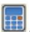

Abaqus/CAE extracts the primary loading curve, the specified unloading and reloading curves for each cyclic strain level, and the permanent set curves, then creates new calibration data sets for each component of each cyclic strain level. Each new data set is available in the Uniaxial Test Data Sets or Biaxial Test Data Sets options and is plotted in the viewport.

d. Toggle on the individual loading, unloading, or reloading data sets that you want to include in the material calibration calculations. As you toggle on a data set, Abaqus/CAE displays its corresponding X–Y curve in the viewport. You can select any of the following:

• Select All to include all the raw data found in the selected test data file.  
• Select Primary to include data from the primary loading curve.  
Select Unloading to include data from the unloading curves for each cyclic strain level, or expand this container to select individual unloading curves.

Select Reloading to include data from the reloading curves for each cyclic strain level, or expand this container to select individual reloading curves.  
• Select Permanent Set to include data from both permanent set curves, or expand this container to select either stress- or strain-related components of permanent set.

e. From the Yield Point options, do either of the following:

• Click $\bowtie$ , and select the yield point on the primary curve from the viewport.  
• Click , and enter either the Strain or Stress value; Abaqus/CAE calculates the other value from the primary curve and populates the remaining field.

4. If desired, extract a second data set from the Uniaxial or Biaxial tabbed page.  
5. If you extracted both uniaxial and biaxial test data, Abaqus/CAE applies the data equally by default in the calculations of material behaviors. Perform the following steps from the Options tabbed page if you want one data set to have greater weight in these calculations:

a. In the Material Properties options, drag the Weight slider toward the type of data (uniaxial or biaxial) that you want to assign greater weight in the material behavior calculations.  
b. Specify whether the selection of relative weight is based on a linear interpolation or a logarithmic interpolation.

6. From the Material list, select the material definition to which you want to apply this calibration

behavior; or click to create a new material definition for this calibration behavior. For more $\textstyle { \mathcal { T } } _ { \varepsilon }$ information about defining a new material model, see Creating or editing a material.

7. Click OK.

Abaqus/CAE updates the new calibration behavior and maps the hyperelasticity with permanent set calibration behavior parameters to the Hyperelastic, Plastic, and Mullins Effect material behaviors of that material definition.


## Note:

Any hyperelastic, plastic, or Mullins effect material behaviors in the selected material are overwritten when you map data from a calibration behavior to the material definition.

## Additional information

• Defining classical metal plasticity  
• Hyperelastic Behavior of Rubberlike Materials  
• Stress Softening in Rubberlike Materials

## Using the Special menu in the Property module

You can use the Special menu in the Property module to define the following engineering features:

• Skin. A skin reinforcement defines a skin that is bonded to the surface of an existing part and specifies its engineering properties. For more information, see Skin and stringer reinforcements.  
Inertia. You can define lumped mass, rotary inertia, and heat capacitance at a point on a part. You can also define mass and inertia proportional damping. In an Abaqus/Standard analysis, you can define composite damping. For more information, see Inertia.  
• Springs/Dashpots. You can define springs and dashpots that exhibit the same linear behavior independent of field variables. You can also define both spring and dashpot behavior on the same set of points. In an Abaqus/Explicit or an Abaqus/Standard analysis, you can model springs and dashpots that connect two points, following the line of action between the two points. In an Abaqus/Standard analysis, you can also model springs and dashpots that connect two points, acting in a fixed direction, or that connect points to ground. For more information, see Springs and dashpots.

## Additional information

• Creating and editing skin reinforcements  
• Defining point mass and rotary inertia  
• Defining heat capacitance  
• Creating springs and dashpots connecting two points  
• Creating springs and dashpots connecting points to ground

## Using the Query toolset to obtain assignment information

You can use the Query toolset to display the following:

• A list of all of the regions to which you have assigned sections.  
• The name of a section assigned to a selected region.  
• Information regarding the regions that require section assignments.  
• The beam orientations assigned to selected wire regions.  
• The material orientations assigned to selected shell and solid regions.  
• A graphic representation of the plies in a composite layup or a composite section.  
• The rebar reference orientations assigned to selected shell regions.  
• The direction of shell/membrane normals assigned to all shell and axisymmetric wire regions.  
• The direction of beam/truss tangents assigned to all wire regions.  
• The composite layups and plies that contain disjoint regions.

1. From the main menu bar, select Tools->Query.


Tip: You can also query the model by clicking the tool in the Query toolset.

Abaqus/CAE displays the Query dialog box.

You can request either a general query or a module-specific query. The Shell element normals and Beam element tangents queries are general queries. For a discussion of the information displayed by general queries, see Obtaining general information about the model. The Section assignments, Regions missing sections, Beam orientations, Material orientations, Rebar orientations, Ply stack plot, and Disjoint ply regions queries are specific to the Property module.

2. From the Property Module Queries list, select the property of interest.

3. Select the region that you want to query in the viewport.


Tip: You can limit the types of objects that you can select in the viewport by clicking the

selection filter tool □ in the prompt area and then clicking the selection filter of your choice in the dialog box that appears. See Using the selection options, for more information.

4. Once you have selected the region that you want to query, the following information appears:

## Section assignment queries

Abaqus/CAE displays the name of the section or sections assigned to the selected region in the message area. If you query a region with a section assignment that has been suppressed, Abaqus/CAE reports no section assignments for that region.

## Regions missing sections

If any regions of your part require a section assignment and do not have one, Abaqus/CAE highlights these regions in the viewport and prompts you to save the regions as a set. If you want to save these regions as a named set, toggle on Save regions in a set from the dialog box that appears; and, if desired, customize the default set name.

## Beam section orientation queries

Abaqus/CAE displays the name of the beam orientation assigned to the selected beam region in the message area. In addition, the -direction for each beam region in the part appears in the message area.

## Material orientation queries

Abaqus/CAE displays the type of the material orientation assigned to the selected region in the message area. For the GLOBAL, SYSTEM, and DISCRETE types, Abaqus/CAE displays the material orientation triads in the viewport. In addition, information concerning the material orientation of each region in the part appears in the message area.

## Rebar orientation queries

Abaqus/CAE displays the name of the rebar orientation assigned to the selected region in the message area. In addition, information concerning the rebar reference orientation of each region in the part appears in the message area.

## Ply stack plot

Abaqus/CAE creates a new viewport and displays a graphical representation of a core sample through a composite layup or a composite section. The image shows the plies in the layup along with details of each ply, such as its fiber orientation, thickness, reference plane, and integration points. For more information, see Viewing a ply stack plot.”

## Disjoint ply regions

Abaqus/CAE displays in the message area the names of the composite layups and the plies within them that contain disjoint regions.

5. To exit the querying procedure, click the cancel button in the prompt area.

## Additional information

• Creating and editing sections  
• Understanding the role of the Query toolset

## The Assembly module

You use the Assembly module to create and modify the assembly.

A model contains one main assembly, which is composed of instances of parts from the model as well as instances of other models. The tutorial in Using Additional Techniques to Create and Analyze a Model in Abaqus/CAE contains examples of how you use the Assembly module to create part instances and position them relative to each other in a global coordinate system.

## In this section:

Understanding the role of the Assembly module  
Entering and exiting the Assembly module  
Working with part instances  
Working with model instances  
Creating the assembly  
Creating patterns of instances  
Performing Boolean operations on part instances  
Understanding toolsets in the Assembly module  
Using the Assembly module toolbox  
Creating and manipulating part and model instances  
Applying constraints to part and model instances  
Using the Query toolset to query the assembly

## Understanding the role of the Assembly module

When you create a part, it exists in its own coordinate system, independent of other parts in the model. In contrast, you use the Assembly module to create instances of your parts and to position the instances relative to each other in a global coordinate system, thus creating the assembly. You position part instances by sequentially applying position constraints that align selected faces, edges, or vertices or by applying simple translations and rotations.

You can also create instances of other models in your main model, allowing you to add complete subassemblies in addition to individual parts. Model instances are created in the exact same way as part instances and can be positioned and manipulated in a similar fashion.

An instance maintains its association with the original part or model. If the geometry of a part or model changes, Abaqus/CAE automatically updates all instances of the part or model to reflect these changes. You cannot edit the geometry of an instance directly.

Your main model can contain many parts and model subassemblies, and a part or model can be instanced many times in the main model assembly; however, a model contains only one top-level assembly. Loads, boundary conditions, predefined fields, and meshes are all applied to the complete assembly. Even if your model consists of only a single part, you must still create an assembly that consists of just a single instance of that part.

A part instance can be thought of as a representation of the original part. You can create either independent or dependent part instances. An independent instance is effectively a copy of the part. A dependent instance is only a pointer to the part, partition, or virtual topology; and as a result, you cannot mesh a dependent instance. However, you can mesh the original part from which the instance was derived, in which case Abaqus/CAE applies the same mesh to each dependent instance of the part.

A model instance is always dependent, not independent.

## Entering and exiting the Assembly module

You can enter the Assembly module at any time during an Abaqus/CAE session by clicking Assembly in the Module list located in the context bar. The Instance, Constraint, Feature, and Tools menus appear on the main menu bar.

To exit the Assembly module, select any other module from the Module list. You need not save your assembly before exiting the module; it will be saved automatically when you save the entire model by selecting File->Save or File->Save As from the main menu bar.

## Working with part instances

This section describes part instances, how they relate to the original part, how you link and exclude part instances, and how you use them to create the assembly.

## In this section:

Understanding the relationship between models, parts, instances, and assemblies  
What is the difference between a dependent and an independent part instance?  
How do I decide whether to create a dependent or an independent part instance?  
Changing from a dependent to an independent part instance or vice versa  
Linking part instances between models  
Excluding part instances from an analysis  
Sets and part instances

## Understanding the relationship between models, parts, instances, and assemblies

A model can contain many parts; however, it can contain only one top-level assembly. The assembly is composed of instances of the parts positioned relative to each other in a global coordinate system, as described in What is a part instance?. The top-level assembly can also contain model instances that effectively create subassemblies from other models.

The concept of parts, part instances, and the assembly is carried throughout the Abaqus/CAE modeling process:

1. You create a part in the Part module; each part is a distinct entity that can be modified and manipulated independently of other parts. Parts exist in their own coordinate system and have no knowledge of other parts.

2. You define section properties in the Property module and also associate a material with a section. You use the Property module to assign these section properties to a part or to a selected region of a part.

3. You create instances of your parts in the Assembly module, and you position those instances relative to each other in a global coordinate system to form the assembly. You can also add instances of other models in the assembly.

Abaqus/CAE allows you to create either independent or dependent part instances, as described in What is the difference between a dependent and an independent part instance?. Both independent and dependent part instances maintain their association with the original part. When you modify the original part in the Part module, Abaqus/CAE updates any instances of that part when you return to the Assembly module. You can instance a part many times and assemble multiple instances of the same part. Each instance of the part is associated with the section properties assigned to the part in the Property module.

4. You use the Interaction and Load modules to complete the definition of the model by, for example, defining contact and applying items such as loads and boundary conditions. The Interaction and Load modules operate on the assembly.

5. You use the Mesh module to mesh the assembly. You can do either of the following:

• Individually mesh each independent instance of a part in the assembly.  
• Mesh the original part. Abaqus/CAE then associates the mesh with each dependent instance of the part in the assembly.

The two meshing approaches are described in What is the difference between a dependent and an independent part instance?.

Creating a part or model instance, contains detailed instructions on creating part instances.

## What is the difference between a dependent and an independent part instance?

When you create a part instance, you can choose to create either a dependent part instance or an independent part instance. You can also edit a part instance and change it from dependent to independent or vice versa. When you create a model instance, it is always dependent.

## Dependent part instances

By default, Abaqus/CAE creates a dependent instance of a part. A dependent instance is only a pointer to the original part. In effect, a dependent instance shares the geometry and the mesh of the original part. As a result, you can mesh the original part, but you cannot mesh a dependent instance. When you mesh the original part, Abaqus/CAE applies the same mesh to all dependent instances of the part. Most modifications are not allowed on a dependent part instance; for example, you cannot add partitions or create virtual topology. However, operations that do not modify the geometry of a dependent part instance are still allowed; for example, you can create sets, apply loads and boundary conditions, and define connector section assignments. If you have already meshed a part or added virtual topology to the part, you can create only a dependent instance of the part.

If you apply an adaptive remeshing rule to a dependent part instance in the Mesh module, Abaqus/CAE remeshes the original part and applies the new mesh to each dependent instance of the part.

You cannot change the mesh attributes of an individual dependent part instance; for example, the mesh seeds, mesh controls, and element types. However, you can change the mesh attributes of the original part, and Abaqus/CAE propagates the changes to all dependent instances of the part. Although you have already meshed the original part and applied the same mesh to its dependent instances, the mesh is visible only in the Mesh module. You continue to work with the native Abaqus/CAE geometry in the Assembly, Interaction, and Load modules. In general, you cannot use the Edit Mesh toolset to edit the mesh of a dependent part instance; however, you can use the Edit Mesh toolset to edit and project the nodes of a dependent part instance. Abaqus/CAE moves the nodes of the original meshed part, and your modifications appear on all dependent instances of the part.

The advantages of dependent part instances are that they consume fewer memory resources and you need mesh the part only once. In addition, Abaqus/CAE instances a dependent part instance in the input file by writing a single set of nodal coordinates and element connectivity to define the part along with a transform to define each part instance.

## Independent part instances

In contrast, an independent part instance is a copy of the geometry of the original part. You cannot mesh a part from which you created an independent part instance; however, you can mesh the independent instance. In addition to meshing, you can perform most other operations on an independent instance; for example, you can add partitions and create virtual topology. The disadvantages of independent instances are that they consume more memory resources, and you must mesh each independent instance individually. In addition, Abaqus/CAE does not take advantage of instantiation in the input file with independent part instances—sets of nodal coordinates and element connectivity are written to the input file for each independent part instance.

You cannot create both a dependent and an independent instance of the same part. As a result, if you create a dependent instance of a part, all subsequent instances must be dependent. The same argument applies to independent instances. Instances of mesh parts are always dependent.

You can use the Model Tree to determine if an instance is dependent or independent. When you mesh an independent part instance, the mesh appears in the Model Tree under the part instance container, as shown in Figure 1. In addition, Figure 1 also illustrates that as you move the cursor over an instance, the information displayed by the Model Tree indicates whether the instance is dependent or independent.

  
Figure 1:The Model Tree indicates whether a part instance is dependent or independent.

## How do I decide whether to create a dependent or an independent part instance?

If your assembly contains a few part instances that are unrelated, dependent instances have little advantage over independent instances. Each part is different, and you must create an instance of each part. In contrast, if your assembly contains identical part instances, you can save time by assembling dependent instances of the part. When you subsequently mesh the original part, Abaqus/CAE applies that mesh to each dependent instance of the part in the assembly. In addition, dependent instances consume fewer memory resources and result in a smaller input file.

For example, Figure 1 illustrates an assembly of independent and dependent part instances. The pump housing is an independent part instance, and the eight bolts are dependent part instances. The figure on the left shows the assembly in the Assembly module. The figure on the right shows the assembly in the Mesh module. The user has meshed the part representing the bolt, and Abaqus/CAE associated the mesh with each dependent instance of the bolt.

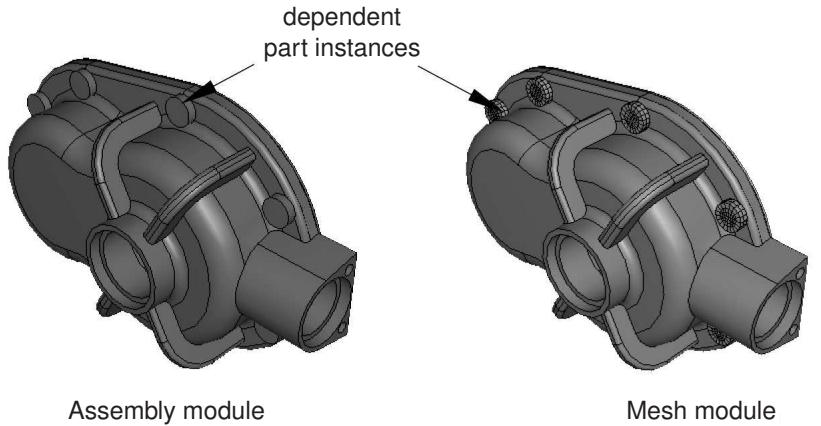  
Figure 1: Dependent part instances in the Assembly and Mesh modules.

You will find it more convenient to use dependent part instances when you use the linear or radial pattern tool to create a pattern of identical instances. When you mesh the original part, Abaqus/CAE applies the same mesh to each dependent instance in the pattern. In contrast, if you create a pattern of independent instances, you must mesh each instance individually.

Abaqus/CAE creates dependent instances by default. Unless your assembly contains only a few parts, it is recommended that you work with dependent instances because of the memory savings and the resulting performance gain.

## Changing from a dependent to an independent part instance or vice versa

The restrictions on dependent part instances may limit your ability to partition or mesh the assembly, or you may find that you wish to apply virtual topology to an instance. To switch between making a part instance dependent or independent, you can click mouse button 3 on the instance in the Model Tree and select Make Dependent or Make Independent from the menu that appears.

If you mesh a part and create a dependent instance of the part, Abaqus/CAE associates the mesh with the instance. If you subsequently change the instance from dependent to independent, Abaqus/CAE continues to associate the mesh with the independent instance. However, the reverse is not true. If you create an independent instance, mesh the instance, and subsequently convert the instance to dependent, Abaqus/CAE deletes the mesh from the dependent instance. The same applies to partitions and virtual topology. Abaqus/CAE deletes any partitions or virtual topology applied to an independent part instance when you change it to dependent.

In some cases, you can work around the restrictions on a dependent part instance by creating a copy of the original part and by creating an independent instance of the copy. You can then partition or mesh the new instance or apply virtual topology to it. Similarly, although you cannot create both a dependent and independent instance of the same part, you can create a copy of the part and create either type of instance from the copy.

## Linking part instances between models

You can link part instances between models. Linking part instances allows instances and parts to be updated automatically when you modify the instance or part in the original model.

In the Model Tree, select the part instances that you want to link (child instances) to part instances in another model. Click mouse button 3, select Link Instances, and specify the parent model and part instances to which you want to link each child instance. Similarly, you can unlink part instances that were previously linked. For detailed instructions, see Using the Model Tree to manipulate part instances.

If you select all instances of a part to be linked, the part is also linked automatically. The part and its features, sets, and surfaces are updated using the parent part. Assembly-level features and sets and surfaces are not copied. Instances are updated using the parent instances and retain sets and surfaces defined on them.

If you select only some of the instances of a part to be linked, a new part is created (with —LinkedCopy appended to the part name) before linking the instance and the new part to the parent model.

Linked part instances and parts are not editable. The position of the linked child instance is solely determined from the position of the parent instance and cannot be updated.

By default, linked part instances and parts are colored gray in the viewport. Icons are displayed in the Model Tree to indicate the linked status of parts and part instances and to indicate the linked and excluded status of part instances if the part instances are also excluded from the analysis, as shown in Figure 1. Beam-1 is a linked part instance, and Beam-2 is a linked and excluded part instance. For more information, see Excluding part instances from an analysis.

  
Figure 1: Model Tree icons indicating linked and excluded status of part instances.

## Additional information

• Using the Model Tree to manipulate part instances

## Excluding part instances from an analysis

You can exclude part instances from the analysis so that they are not written to the input file when the analysis job is submitted. An excluded part instance participates in all operations other than the analysis.

In the Model Tree, select the part instances that you want to exclude from the analysis. Click mouse button 3, and select Exclude from Simulation. Similarly, you can include part instances that were previously excluded by selecting Include in Simulation. Constraints on the part instances are retained if you exclude the instances from the analysis and subsequently include them.

By default, part instances that are excluded from the analysis are colored dark gray in the viewport. Icons are displayed in the Model Tree to indicate the excluded status of part instances and to indicate the linked and excluded status of part instances if the part instances are also linked between models, as shown in Figure 1. Contact-1 and Contact-2 are part instances that are excluded from the analysis, and Beam-2 is a linked and excluded part instance. For more information, see Linking part instances between models.

## Additional information

• Using the Model Tree to manipulate part instances

## Sets and part instances

Part sets are transferred when you create a part instance from a part. For example, you might create a set from a region of a part and use the Property module to assign a section to that set. When you instance the part in the Assembly module, Abaqus creates part instance sets that refer to any part sets that you previously created. Abaqus provides read-only access to these part instance sets in assembly-related modules. You cannot access a part instance set from the Set Manager; however, you can select an eligible part instance set during a procedure by clicking the Set button and selecting the set from the Region Selection dialog box that appears. For more information, see Understanding sets and surfaces.

## Working with model instances

You can create instances of other models in your main model, allowing you to add complete subassemblies in addition to individual parts.

Model instances are created in the exact same way as part instances and can be positioned and manipulated in a similar fashion.

When you create a new model instance, the main assembly of the referenced model is instantiated in the assembly of the current working model. The instance produces a subassembly from the contents of the other model. Since the referenced model assembly might in turn contain other model instances as children, multiple levels of complex subassemblies are possible.

You must include the external model to be instantiated in the current model database (.cae) file to be available. If the model you want to instantiate is contained in a different model database, use File->Import->Model to import it into the current model database. A model database file can always contain multiple models.

Renaming model instances is not supported in Abaqus/CAE. You should take care when renaming models because Abaqus/CAE does not update the model instance name in the instantiated models.

## Characteristics of model instances

Model instances have the following characteristics:

• A particular model can be instantiated multiple times, and you can instantiate as many different models as desired.  
• Model instances are always dependent, not independent.  
• You can freely mix model instances with part instances.  
• Model instance subassemblies can contain either geometric parts or orphan mesh parts.  
Model instances can be positioned and oriented in the main assembly by using transformations (Translate, Translate To, Rotate) and positioning constraints. The transformations and constraints must be applied to a complete model instance subassembly, not to any of its children. If you select a child instance within a model instance, the transformation or constraint will be applied to the entire parent model instance.  
• Linear and radial patterns are not supported and cannot be used with model instances.  
• Part instance commands such as Suppress/Resume, Hide/Show, Delete, Show Parents/Children, and Switch Context can also be used on model instances.

You cannot use the Suppress and Delete commands on the child instances of a model instance; you can use them only on the model instance itself. If you suppress a child instance (part or model) in the original (referenced) model assembly, it is also suppressed in the main model. To see that the suppressed instance is correctly suppressed in the main model, you must use the Model list in the context bar to switch from the original (referenced) model to the main model. Moving to the main model in the Model Tree will not regenerate the model instance children consistently. (For information about the context bar, see Components of the main window.) The child instance must then be resumed in the original model.

• Replace, Exclude from Simulation, Merge/Cut, and Link Instances are not supported and cannot be used on model instances.

• The Partition toolset is not supported and cannot be used with model instances.

• The Query toolset is supported and can be used to determine the position and attributes of model instances.

All sets and surfaces defined in the referenced model are brought into the model instance, maintaining the Model Tree hierarchy of features. These sets and surfaces will be available in the main model.

Surface-to-surface contact and self-contact interactions defined in the initial step (along with their contact interaction properties) are the only history-level features defined in the referenced model that are brought into the model instance (although they are not visible in the model tree); other history-level features (such as steps, loads, boundary conditions, other interactions, and amplitudes) are not brought into the model instance. Some model-level features (fasteners and other engineering features) defined in the referenced model are not brought into the model instance.

Interactions in the main model depend on the interaction option used. Interaction copies to the main model are restricted based on the following patterns:

- For Abaqus/Explicit model instances, you cannot copy to any main model type.  
- For Abaqus/Standard or unknown model type instances, you can copy only to an Abaqus/Standard or an unknown usage main model type.  
• Model instances are supported and selectable in Display Groups and in the Instance tab of the Assembly Display Options.  
• The Virtual Topology toolset is not supported for model instances.

Any part-level attributes that are needed in your subassembly (referenced) model must be created and assigned in that original model and cannot be created in the main model assembly. For example, materials, sections, orientations, and skin/stringer assignments must be created in the original model. Meshing can be performed on the original independent part instances, and the meshes will appear in the model instance.

When you create a model instance, all the part instances of the referenced model assembly are added to the main model assembly as child part instances. Any suppressed part instances or instances that are excluded from the simulation will retain the same status in the subassembly.

If you modify or delete an existing part instance or model instance subassembly in the main model assembly, Abaqus/CAE automatically regenerates the child instances from all parent instances (parts and models) whenever you switch out of and back into the Assembly module of the main model.

If you try to create a new model instance from another model that in turn contains child model instances, any problems with model referencing circularity will be prevented by Abaqus/CAE.

Abaqus/CAE ensures consistency of the modeling space for model instances; if all instances in the main model are three-dimensional, any other models to be instantiated must also be three-dimensional.

## Model instance data saved in input files

When Abaqus/CAE generates the input (.inp) file for a model assembly that contains model instances, a single flattened assembly is generated. All model instance subassemblies are written as a flat list of instances under the single assembly block.

Most features from the original model of a model instance are saved in the input file, with some exceptions:

Surface-to-surface contact and self-contact interactions defined in the initial step are the only history-level features from a model instance subassembly that are saved in the input file. The contact interaction property name and surface names are prepended with the model instance name in the main assembly; for example:  
Model-level features from a model instance are saved in the input file; for example, materials, section assignments, connector section assignments, skins, stringers, and orientations. Materials and element controls defined in a model instance are prepended with the model name in the main assembly; for example,  
Connector sections assignments are prepended with the model instance name in the main assembly; for example: model-instance-name#Wire-3-Set-1  
Other model-level data such as initial conditions and amplitude definitions from a model instance are not saved in the input file.  
Engineering features such as mass and inertia elements, springs, and dashpots defined at the part level in the model instance are saved to the input file, but engineering features defined at the assembly level in the original model are not.

```txt
model-instance-name#contact-property-name
model-instance-name#Surf-1, model-instance-name#Surf-2
```

```txt
model-name#material-name
```

• Sets and surfaces from a model instance are saved in the input file. These set and surface names are also prepended with the model instance name in the main assembly; for example:  
• Constraints, reference points, attachment points, attachment lines, and wires from a model instance are saved in the input file.  
• For constraints the model instance name will be prepended to the constraint name; for example:  
• Attachment points, attachment lines, and wires will be available through sets created in the subassembly.

```txt
model-instance-name#Set-1
```

```txt
model-instance-name#constraint-name
```

The following limitations exist:

• Restart analysis is not supported for a model containing model instances.  
• Instances of models containing assembled fasteners are not supported.

## Creating the assembly

After you create a part instance or a model instance, you apply a succession of position constraints and positioning operations to position it relative to other instances in the global coordinate system. This section describes the tools that Abaqus/CAE provides to position and constrain part and model instances. This section also describes how you can replace a part instance.

## In this section:

The position tools in the Assembly module  
How the position constraint methods differ  
How conflicts can arise between position constraints, translations, and rotations  
Positioning a part or model instance using the Translate To tool  
Replacing an instance

## The position tools in the Assembly module

Each part exists in its own coordinate system in the Part module, and model instances are created in their own coordinate system. You use the Assembly module to position and orient instances of these parts and models relative to each other in a global coordinate system. Abaqus/CAE provides the following tools for positioning part and model instances:

## Auto-offset

When you create the first part or model instance in the Assembly module, Abaqus/CAE displays a triad indicating the origin and the orientation of the global coordinate system. Abaqus/CAE positions the first instance so that the origin of the part or model aligns with the origin of the global coordinate system and the axes are aligned. If you create additional instances, Abaqus/CAE continues to position the new instances such that their coordinate system aligns with the global coordinate system. Since this usually results in new instances overlapping existing ones, Abaqus/CAE allows you to apply an offset before it creates the instance. The offset is applied along the X-axis for three-dimensional and two-dimensional instances and along the Y-axis for axisymmetric instances.

## Basic positioning tools

Abaqus/CAE provides the following basic methods for positioning part and model instances:

• You can translate selected instances along a vector by specifying the coordinates of the start point and end point of the translation vector. You can use the following methods to determine the distance moved by the selected instances:  
- The selected instances move along the translation vector from the start point to the end point.  
The selected instances move along the translation vector from the start point toward the end point and continue to move until a selected face or edge is a specified distance from a face or edge selected from the fixed instances. For more information, see Positioning a part or model instance using the Translate To tool.  
• You can rotate selected instances about an axis. You specify the X-, Y-, and Z-coordinates of the start point and end point of the axis of rotation and the angle of rotation.

## Position constraint tools

A position constraint defines a relationship between two instances. Unlike a simple translation or rotation, you do not specify the position directly. Position constraints define a set of rules that must always be met by the part or model instances in the assembly; for example, a face that must be parallel to another face.

Position constraints defined in the Assembly module create constraints only on the initial positions of instances, whereas constraints defined in the Interaction module define constraints on the analysis degrees of freedom. In the Assembly module constraints are stored as features of the assembly. If you modify a part or move a part or model instance, Abaqus/CAE attempts to apply all existing position constraints when it regenerates the assembly.

Each of the position constraints is described in How the position constraint methods differ.

Creating the final assembly is an iterative process of creating instances, applying position constraints, and applying translations and rotations. After each repositioning, Abaqus/CAE displays a temporary image indicating the result of the operation. You can accept the new position, cancel the operation, or step back through the repositioning procedure

by clicking the Previous button in the prompt area.

You can use the Query toolset to obtain the coordinates of a vertex and to measure the distance between selected vertices. This may help you determine the vector along which you need to translate instances or the angle through which you need to rotate them. Using the Query toolset to query the assembly, contains detailed instructions on how to obtain information about the assembly.

## How the position constraint methods differ

A position constraint defines a relationship between two part or model instances—one that will move (the movable instance) and one that will remain stationary (the fixed instance). When you apply a position constraint, Abaqus/CAE computes a position for the movable instance that satisfies this relationship; you do not specify the position directly. You can apply the following position constraints to instances in the Assembly module:

• Parallel face (three-dimensional instances only)  
• Face to face (three-dimensional instances only)  
• Parallel edge  
• Edge to edge  
• Coaxial (three-dimensional instances only)  
• Coincident point  
• Parallel coordinate systems

In general, applying a single position constraint is not sufficient to define the precise location of a movable instance. You must apply several position constraints—usually three for a three-dimensional assembly and two for a two-dimensional assembly—to position an instance in the desired location. Part and model instances can overlap as a result of applying position constraints; Abaqus/CAE does not prevent overclosure between edges, faces, or cells. Similarly, Abaqus/CAE does not prevent you from overconstraining instances or duplicating a constraint.

The definition of a constraint feature includes all the faces and edges that you originally selected. If you subsequently modify a part or move a part or model instance, Abaqus/CAE automatically recalculates the constraint based on your original selection of faces and edges. As a result, one or more instances might move after the assembly is regenerated. For example, different edges might become parallel. For more information on features, see Manipulating features in the Assembly module and The Feature Manipulation toolset.

The following position constraints are provided by the Assembly module:

## Parallel Face

A parallel face position constraint causes a selected face of the movable instance to become parallel with a selected face of the fixed instance. However, the position constraint does not specify the precise location of the movable instance, and the distance between the parallel faces is arbitrary. To apply a parallel face position constraint between two instances, you do the following:

• Select the faces to be constrained to be parallel from the movable instance and the fixed instance, as shown in Figure 1.

  
Figure 1: Select the faces to become parallel.

• Abaqus/CAE displays arrows normal to the selected faces. You prescribe the orientation of the movable instance by selecting the direction of the arrow normal to its selected face. Figure 2 illustrates the result of applying the position constraint and the effect on the movable instance of reversing the direction of the arrow.

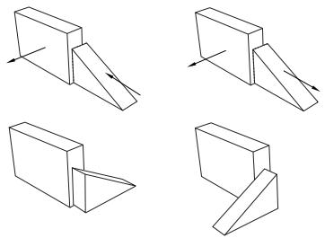  
Figure 2:The result of applying a parallel face position constraint and the effect of changing the direction of the arrow normal to the selected face of the movable instance.

Abaqus/CAE rotates the movable instance until the two selected faces are parallel and the arrows are pointing in the same direction.

The faces you select from the movable and fixed instances must be planar. The parallel face position constraint can be applied only to three-dimensional instances.

## Face to Face

A face-to-face position constraint is similar to a parallel face position constraint except that you define the clearance between the parallel faces. The clearance is measured between the two selected faces, positive along the normal to the fixed instance. Other than this clearance, the precise location of the movable instance is not constrained. Assuming that you selected the same two faces shown in Figure 1, the effect of applying a face-to-face constraint is shown in Figure 3. Figure 3 also illustrates the effect on the movable instance of reversing the direction of the arrow normal to its selected face.

  
Figure 3:The result of applying a face-to-face constraint and the effect of changing the direction of the arrow normal to the selected face of the movable instance.

Abaqus/CAE rotates the movable instance until the two selected faces are parallel and the arrows point in the same direction. In addition, the movable instance is translated to satisfy the clearance specified. The faces you select from the movable and fixed instances must be planar. The face-to-face position constraint can be applied only to three-dimensional instances.

## Parallel Edge

A parallel edge position constraint causes a selected edge of the movable instance to become parallel with a selected edge of the fixed instance. However, the position constraint does not specify the precise location of the movable instance, and the distance between the parallel edges is arbitrary. To apply a parallel edge position constraint between two instances, you do the following:

• Select the edges to be constrained to be parallel from the movable and fixed instance, as shown in Figure 4.

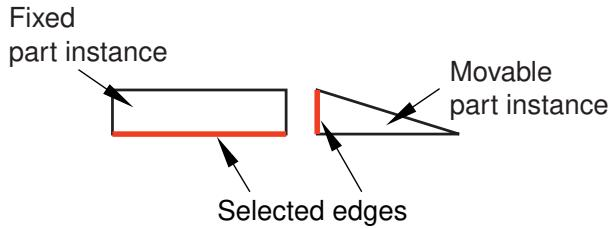  
Figure 4: Select the edges to become parallel.

• Abaqus/CAE displays arrows along the selected edges. You prescribe the orientation of the movable instance by selecting the direction of the arrow along its selected edge. Figure 5 illustrates the result of applying the position constraint and the effect on the movable instance of reversing the direction of the arrow.

  
Figure 5:The result of applying a parallel edge constraint and the effect of changing the direction of the arrow along the selected edge of the movable instance.

Abaqus/CAE rotates the movable instance until the two selected edges are parallel and the arrows point in the same direction.

The edges you select from the movable and fixed instances must be straight. You can select an edge from an instance, or you can select a datum axis or one of the axes of a datum coordinate system. The parallel edge position constraint can be applied only to two-dimensional and three-dimensional instances. It has no effect on axisymmetric instances.

## Edge to Edge

An edge-to-edge position constraint is similar to a parallel edge position constraint except that the clearance between the parallel edges is defined by the constraint. Assuming that you selected the same two edges shown in Figure 4, the effect of applying an edge-to edge position constraint to a two-dimensional assembly is shown in Figure 6. Figure 6 also illustrates the effect on the movable instance of reversing the direction of the arrow along its selected edge.

  
Figure 6:The result of applying an edge-to-edge constraint and the effect of changing the direction of the arrow along the selected edge of the movable instance.

The modeling space of the assembly determines the behavior of Abaqus/CAE after you apply an edge-to-edge position constraint.

• If the assembly is three-dimensional, Abaqus/CAE positions the movable instance so that the edges are coincident.  
• If the assembly is two-dimensional, you can specify the clearance between the selected edges. The clearance is measured between the two selected edges, positive along the normal to the fixed instance.

Other than this behavior, the precise location of the movable instance is not constrained. The edge-to-edge position constraint can be applied to two-dimensional, three-dimensional, and axisymmetric instances.

## Coaxial

A coaxial position constraint causes a selected cylindrical or conical face of the movable instance to become coaxial with a selected cylindrical or conical face of the fixed instance. However, the coaxial position constraint does not constrain the precise location of the movable instance. To apply a coaxial position constraint between two instances, you do the following:

• Select the cylindrical or conical faces to be constrained to be coaxial from the movable and fixed instance, as shown in Figure 7.

  
Figure 7: Select the faces to become coaxial.

Abaqus/CAE displays arrows along the axis of revolution of the selected instances. You prescribe the orientation of the movable instance by selecting the direction of the arrow along its axis of revolution. Figure 8 illustrates the result of applying the coaxial position constraint.

  
Figure 8:The effect of applying a coaxial constraint.

Abaqus/CAE rotates and translates the movable instance until the two selected faces are coaxial and the arrows are pointing in the same direction. The coaxial position constraint can be applied only to three-dimensional instances.

## Coincident Point

A coincident point constraint causes a selected point on the movable instance to coincide with a selected point on the fixed instance. However, the coincident point constraint does not constrain the orientation of the movable instance. The orientation of the movable instance does not change after the constraint is applied, as shown in Figure 9. For detailed instructions, see Constraining two instances with coincident points.

Maintain relative
2. positions using CVJOIN  
Assemble instances1. using coincident points.  
  
Figure 9:The effect of applying a coincident point constraint.

## Parallel CSYS

A parallel coordinate systems constraint causes the axes of a datum coordinate system on the movable instance to become parallel with the axes of a datum coordinate system on the fixed instance. However, the parallel coordinate systems constraint does not specify the precise location of the movable instance. Figure 10 illustrates the effect of applying a parallel coordinate systems constraint and a coincident point constraint to two instances.

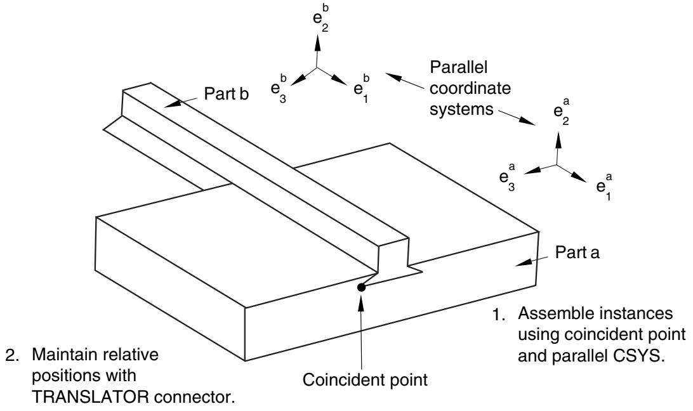  
Figure 10:The effect of applying parallel coordinate systems and coincident point constraints.

The coordinate systems can be either rectangular (X-, Y-, and Z-axes), cylindrical (R-, -, and Z-axes), or spherical (R-, -, and -axes). For detailed instructions, see Constraining two instances with parallel coordinate systems.

You can use datums to position part and model instances. When you are prompted to select a face, you can also select a datum plane. When you are prompted to select an edge, you can also select a datum axis or one of the axes of a datum coordinate system. You can select a datum that you created in the Part module because the datum is associated with an instance of the part and moves with the part instance. However, if the position constraint uses a datum that you created in the Assembly module by selecting from a part instance (such as a face of a part instance), Abaqus/CAE changes its regeneration behavior and regenerates features in the order that you created them. For more information, see How are position constraints regenerated?. You cannot select a datum as the movable part instance if you created the datum in the Assembly module and it depends on more than one part instance; for example, a datum axis that runs through vertices of two part instances.

## How conflicts can arise between position constraints, translations, and rotations

In some situations attempting to apply a position constraint results in a conflict with existing position constraints. If that is the case, Abaqus/CAE displays an error message, and you can either apply a different position constraint or use the Feature Manipulation toolset to modify the existing position constraints.

Similarly, attempting to translate or rotate a part or model instance may result in a conflict with existing position constraints. If a conflict occurs, Abaqus/CAE does the following:

## Translation

Abaqus/CAE applies the components of translation only along the unconstrained degrees of freedom. If all of the degrees of freedom are constrained, Abaqus/CAE displays an error message and the translation fails.

## Rotation

Abaqus/CAE displays an error message, and the rotation fails.

If you experience conflicts with an existing position constraint, you can remove all the existing position constraints without changing the position of the instances by using Instance->Convert Constraints. You can then apply the new position constraint, translation, or rotation. You cannot restore position constraints that were removed. Alternatively, you can delete a position constraint, and Abaqus/CAE will move the instance back to its original position.

## Positioning a part or model instance using the Translate To tool

The Translate To tool positions two part or model instances by translating one instance along a user-defined vector defining the direction of motion until selected faces or edges of the movable instance are separated by a specified distance from selected faces or edges of the fixed instance.

When you use the Translate To tool to position instances in three-dimensional modeling space, you select faces to come into contact; for instances in two-dimensional or axisymmetric modeling space, you select edges to come into contact. In addition, when you use the Translate To tool to position axisymmetric instances, the translation vector must be parallel to the axis of revolution.

When you use the Translate To positioning tool, you can select more than one face or edge from both the fixed and the movable instances. Selecting multiple faces or edges is useful if you are not sure what part of the model will come in contact when the movable instance moves along the selected vector. However, for faster processing you should select as few faces or edges as possible.

To translate a movable part or model instance to a fixed instance, you do the following:

• Select faces or edges from the instance that will move and from the instance that will remain stationary.  
• Prescribe the motion of the movable instance by defining a translation vector. Figure 1 illustrates the selected edges and translation vector.

  
Figure 1: Select the edges to contact, and define the translation vector.

• Define the desired clearance between the selected faces or edges. Figure 2 shows the effect of the contact constraint after specifying a clearance value of zero and a clearance value of d.

  
Figure 2:The effect of applying a contact constraint and specifying clearance values of zero and d.

To measure the clearance d, Abaqus/CAE first moves the instance along the translation vector until any pair of selected faces or edges come into contact. Abaqus/CAE then moves the instance along the translation vector a distance specified by the clearance value. The clearance can be zero or a positive or negative number; a negative value for the clearance results in overclosure between the selected faces or edges. When you use the Translate To tool, Abaqus/CAE calculates the position of the movable instance within a tolerance based on its size. If you want to avoid any possibility of overclosure, you should specify a small clearance value, rather than simply specifying zero.

Abaqus/CAE displays an error message and does not move the instance if contact between the selected faces or edges is not possible along the translation vector.

Even though you translate the movable instances until contact occurs with a fixed instance, the physical proximity of the selected surfaces is not enough to indicate any type of interaction between them. You must use the Interaction module to specify mechanical contact between surfaces. The Translate To positioning tool is satisfied only within a tolerance based on the size of your model. As a result, contact may not be precise unless it is applied between two planar surfaces.

Abaqus/CAE approximates a curved face with a set of faceted faces. Likewise, Abaqus/CAE approximates a curved edge with a set of faceted edges. The number of facets depends on the degree of curve refinement that you specified

when creating the part in the Part module. Use the box zoom tool edges in the assembly. When you are translating curved faces or curved edges, Abaqus/CAE computes the contact position using this faceted representation. You may wish to set the curve refinement to a finer setting based on the curvature of faces or edges that you know will be coming into contact. For more information, see Controlling curve refinement.

## Replacing an instance

You can replace a part/model instance with an instance of a second part/model. To be precise, you are replacing the part/model from which the part/model instance is created. Abaqus/CAE positions the new instance such that its origin is located at the origin of the original instance and their axes align. In addition, you can choose whether the new instance inherits all the constraints from the instance it replaced.

The replace operation does not change the attributes of the instance. For example, if the original instance is dependent, the instance that replaces it will also be dependent. As a result, if an independent instance of a part exists, you cannot use the replace procedure to create a dependent instance of the same part.

Replacing an instance is useful when you are replacing an instance with one that has similar geometry. For example, the new instance might have additional detail that was not present in the original instance. You can also replace a geometry-based part with a mesh representation of the same part. For example, you could replace a part with the mesh representation of the deformed part imported from an output database.

## Creating patterns of instances

You can create multiple copies of a selected instance in either a linear or radial pattern. You can specify the number of instances to create and the structure of the pattern, as described below.

## Linear pattern

A linear pattern positions the new instances linearly along a direction; for example, the X-direction. The origin of the selected instance and the origins of the new instances lie on the line specified by the direction. You can specify the number of instances and the spacing between the instances. In addition, you can change the orientation of the linear pattern by selecting a line from the assembly that represents the new direction.

You can create a matrix of copied instances by creating copies in a second direction; for example, the Y-direction. The options are the same as for the first direction; you can control the number of copies, the spacing, and the orientation. By default, the first direction is the X-axis and the second direction is the Y-axis. For example, Figure 1 illustrates how a part instance can be patterned in both the X- and Y-axes.

  
Figure 1: Instances patterned in two linear directions.

## Radial pattern

A radial pattern positions the new instances in a circular pattern. You can specify the number of instances, and you can specify the angle between the first and last copy, where a positive angle corresponds to a counterclockwise direction. For example, Figure 2 illustrates a radial pattern of the same instances that appear in Figure 1.

  
Figure 2: A radial pattern of instances.

By default, Abaqus/CAE creates the radial pattern about the Z-axis. Alternatively, you can select a line from the assembly that defines the axis of the circular pattern.

If you create a pattern of instances that are touching and you want to treat the pattern as a single part, you must use the Merge/Cut tool to merge all of the part instances in the pattern into a single part instance. For example, the instances in the radial pattern illustrated in Figure 2 overlapped each other and have been merged into a single part instance. For more information, see Performing Boolean operations on part instances. If you do not merge the part instances, the pattern may include duplicate faces or nodes where the instances touch.

If a part contains part-level sets or surfaces, Abaqus/CAE creates separate assembly-level sets and surfaces for each individual instance in a pattern (see How do part sets and assembly sets differ?, for further discussion of part- and assembly-level sets and surfaces). For example, if the top face of the original part in Figure 1 and Figure 2 is included in a part-level surface, Abaqus/CAE initially creates individual assembly-level surfaces for the top face of each instance in the patterned assembly. It is often helpful to merge these repeated sets and surfaces into a single set or surface. When you merge patterned part instances, Abaqus/CAE also merges any repeated sets or repeated surfaces into a single set or surface on the merged part and part instance. If you do not merge the patterned part instances, you can still merge sets or surfaces using the Boolean option in the Model Tree (see Performing Boolean operations on sets or surfaces, for instructions).

You will find it more convenient to use dependent instances when you create a linear or radial pattern of instances. When you mesh the original part, Abaqus/CAE applies the same mesh to each instance in the pattern. In contrast, if you create a pattern of independent instances, you must mesh each instance individually. For more information, see What is the difference between a dependent and an independent part instance?.

## Performing Boolean operations on part instances

This section describes how you merge and cut part instances.

You can select instances of parts that you created using Abaqus/CAE and merge them into a single instance.In addition, you can cut away the geometric portion of a part instance using the geometric portion of other part instances to make the cut. You can also merge instances of parts containing both geometry and orphan elements.

## In this section:

Merging and cutting part instances  
Merging and cutting independent and dependent part instances

## Merging and cutting part instances

Select Instance->Merge/Cut from the main menu bar to merge multiple instances of parts. The parts to be merged can contain any combination of geometry and orphan mesh nodes and elements; and there are options for merging the geometry, the mesh (orphan and native), or both. In addition, you can cut the geometric portion of a part instance using the geometric portion of one or more part instances to make the cut. Both merge and cut operations create a new part instance and a new part. When you merge or cut part instances, you can choose to suppress or delete the original part instances. The merge and cut operations are described in more detail below.

## Merge

You can select multiple part instances and merge them into a single part instance. For example, Figure 1 shows two part instances that model a 15-pin connector. The two part instances are positioned along a common face and then merged into a single part instance that can be meshed and analyzed.

  
Figure 1:Two part instances merged into a single part instance.

You can merge part instances even if the instances are not touching or overlapping. You can choose whether to remove or retain the intersecting boundaries between the merged part instances, as shown in Figure 2. If desired, you can use the Part Copy dialog box to create a mirror image of a part about one of the three principal planes. For more information, see Copying a part.

  
Figure 2:The effect of removing and retaining intersecting boundaries.

If you merge meshes, you can specify the Node merging tolerance, which is the maximum distance between nodes that will be merged. Abaqus/CAE creates a compatible mesh by deleting nodes that are closer than the specified distance and replacing them with a single new node. The location of the new node is the average position of the deleted nodes. If the value that you entered for the Node merging tolerance is too large, Abaqus/CAE may detect duplicate nodes from the same element. Abaqus/CAE will not merge nodes from the same element. However, the large tolerance can result in a distorted mesh, and Abaqus/CAE asks if you want to continue or end the merging procedure. If no nodes are closer than the specified distance, Abaqus/CAE asks if you want to cancel the procedure or to create a single instance from the selected instances.

When you merge meshed part instances that intersect, you can choose whether to create duplicate elements as well as duplicate nodes. A duplicate element has the same connectivity as another element. By default, Abaqus/CAE deletes duplicate elements, and in most cases you should accept the default behavior. However, you must retain duplicate elements if you want to model a material with a combination of material properties that are not supported by Abaqus, as described in the discussion of stability in No Compression or No Tension.

You can choose between the following methods for merging the nodes:

## Boundary only

By default, Abaqus/CAE merges the meshed part instances only along their boundaries (defined by free faces for three-dimensional instances and by free edges for two-dimensional instances). Free faces and edges are those faces and edges that belong to only one geometric entity or element. Using this setting, Abaqus/CAE does not check for duplicate nodes in the interior of the parts, which speeds up the merging process. You should retain this default setting if three-dimensional part instances intersect at only a common face or if two-dimensional instances intersect at only a common edge.

## All

If the part instances overlap, you may want to merge all the nodes in the selected part instances.

## None

Alternatively, you can choose to merge none of the nodes, in which case Abaqus/CAE merges the part instances into a single instance but retains all the original nodes.

In many cases you will be merging part instances that do not intersect but share a common face; for example, the two part instances shown in Figure 3.

  
Figure 3:Two meshed part instances merged into a single meshed part instance.

You can also merge selected nodes of a meshed part using the Edit Mesh toolset; for more information, see Manipulating nodes.

Although the resulting merged mesh may appear acceptable in the viewport, the mesh may contain small gaps between a node and an element face that are not readily apparent. The mesh may also contain merged faces that have an incompatible mesh pattern. You can use the Mesh gaps/intersections tool in the Query toolset to check for small gaps and incompatible faces. For more information, see Obtaining general information about the model.

When you merge part instances, any sets or surfaces on the original parts and part instances are mapped to the new part and part instance. If sets or surfaces from different parts have the same name, they are merged into a single set or surface on the merged part and part instance. If you choose to remove intersecting boundaries between the merged part instances, portions of sets or surfaces that lie on those boundary edges and faces are removed from the mapped sets and surfaces.

Section assignments from the original parts are also mapped to the new part. If parts in the original assembly intersect, Abaqus/CAE can map only a single section in the intersecting regions. Similarly, if parts are exactly touching or intersecting and the intersecting boundaries are removed during the merge, Abaqus/CAE maps only a single section to the entire merged part. In these intersecting situations, the section that gets mapped is dependent on a variety of factors and may not match your modeling intent. When merging intersecting regions, you should retain the intersecting boundaries; the boundaries preserve the original section assignments in nonintersecting regions and make it easier to modify mapped section assignments if necessary (for details, see Managing section assignments).


## Note:

Beam section assignments and rebar reference orientations are not mapped to the merged part. You must recreate them and any associated properties after the merge.

You might want to merge part instances for the following reasons:

If geometry in separate instances touches or overlaps but you do not merge the instances, Abaqus/CAE creates a separate mesh for each instance and you must apply tie constraints to effectively merge the nodes. In contrast, when you merge part instances, Abaqus/CAE creates a single combined mesh and you do not need to apply computationally expensive tie constraints. In effect, you have created a compatible mesh between the part instances. If you want to retain the concept of separate part instances, you can create partitions at the common interface of the merged instances.

• Merging part instances allows you to assign material properties to the single part created by the merge operation instead of to each part individually.  
• You can apply a display body constraint to a group of merged part instances instead of applying the constraint to each part instance individually.  
When you import a complex assembly, the assembly may appear in Abaqus/CAE as a large number of individual part instances that will be meshed individually. You can merge all the part instances into a single part instance, or you can merge groups of part instances into several separate part instances.

You have the following three options when merging part instances:

## Geometry

Merge only the geometry. Any orphan mesh portions of the instances being merged are deleted from the merged part and part instance.

## Mesh

Merge all native and orphan mesh components. Any geometry of the instances being merged is deleted from the merged part and part instance. The native mesh portion of the original parts becomes part of the orphan mesh in the new part.

## Both

Merge both the geometry and the orphan mesh. Any native meshes are deleted in the process of merging the geometry.

## Cut

You can select the geometric portion of a single part instance to be cut, and then you can select the geometry of one or more part instances that are touching or overlapping the part instance to be cut. Abaqus/CAE uses the geometry that will make the cut (the die) to cut away from the geometry of the instance to be cut (the blank). Geometry must touch or overlap to create a cut part and part instance. If the part instance being cut includes orphan mesh elements, they are unaffected by the cut operation.

When you cut a part instance, sets, surfaces, and section assignments from the original part and part instance are mapped to the new part and part instance. Portions of original sets and surfaces that lie within cut portions of the original geometry are removed from the mapped sets and surfaces.

The cut operation is useful if you want to create a mold from a part or vice versa. Figure 4 shows a bottle and a rectangular blank and how the cut process creates the mold.

  
Figure 4: A mold created from a blank and a die using the cut operation.

You cannot make a cut with a shell part instance. Therefore, before the cut operation was performed, the bottle was converted from a shell to a solid part in the Part module. For more information, see Creating a solid feature from a shell. In addition, the original part instances (the blank and the die) were suppressed after the cut operation. The cut operation is also useful for modeling a structure and an acoustic medium when you are performing an acoustic or shock analysis.


## Note:

You cannot merge or cut part instances that contain virtual topology. When you merge part instances, composite layups and material orientation of the original part are not mapped to the merged part.

For detailed instructions, see Merging or cutting part instances.

## Merging and cutting independent and dependent part instances

Merging selected part instances results in a new part instance and a new part. If you merge independent part instances, the resulting part instance is also independent. Similarly, if you merge dependent part instances, the resulting part instance is also dependent. Finally, if you merge a combination of independent and dependent part instances, the resulting part instance is dependent.

When you merge the meshes of meshed geometry and/or orphan mesh elements, the resulting part instance is always an orphan mesh part and it is always dependent. When you merge both the meshes and geometry of parts containing geometry and orphan mesh nodes and elements, the resulting part instance is a hybrid containing geometry and orphan nodes and elements, and it is always dependent.

Cutting the geometry of selected part instances also results in a new part instance and a new part. The discussion of merging the geometry of independent and dependent part instances applies to cutting the geometry of independent and dependent part instances; however, orphan mesh elements within a part instance cannot be cut or used to cut the geometry of another instance.

## Understanding toolsets in the Assembly module

The Assembly module provides several toolsets that allow you to modify the features that define the assembly. This section describes how these toolsets are used within the Assembly module.

For more detailed information about each toolset, refer to:

The Datum toolset  
The Feature Manipulation toolset  
The Partition toolset  
The Query toolset  
The Reference Point toolset  
The Set and Surface toolsets

The Display Group toolset is discussed in Using display groups to display subsets of your model.

## In this section:

Using datum geometry in the Assembly module  
Manipulating features in the Assembly module  
Partitioning the assembly  
Querying the assembly  
Creating reference points  
Using sets and surfaces in the Assembly module

## Using datum geometry in the Assembly module

Within the Assembly module, you use the Datum toolset to provide additional reference geometry (vertices, edges, and surfaces) that is not provided by the assembly. You use the reference geometry to help you define position constraints and to position part or model instances. For example, you can use a datum plane when creating a parallel face or face-to-face constraint if the desired surface does not exist. Similarly, you can use a datum axis when creating a parallel edge or edge-to-edge constraint if the desired edge does not exist. A datum is a parent feature of any constraint in which it was selected. Datums do not modify the geometry of a part or model instance; as a result, you can create datums that refer to both independent and dependent part instances.

Datum geometry that you create in the Part module is transferred along with the rest of the part's geometry when you create a part instance in the Assembly module. In addition, when you translate and rotate a part instance in the Assembly module, a datum created in the Part module is translated and rotated along with the instance. In contrast, a datum created in the Assembly module follows only the reference points that were used to create the datum. As a result if you translate and rotate a part instance, the behavior of the datum may not reflect your design intent. If you know that a datum should be associated with a part, you should create the datum in the Part module.

Figure 1 illustrates a model in which a deformable curved shell will be compressed between two rigid surfaces.  
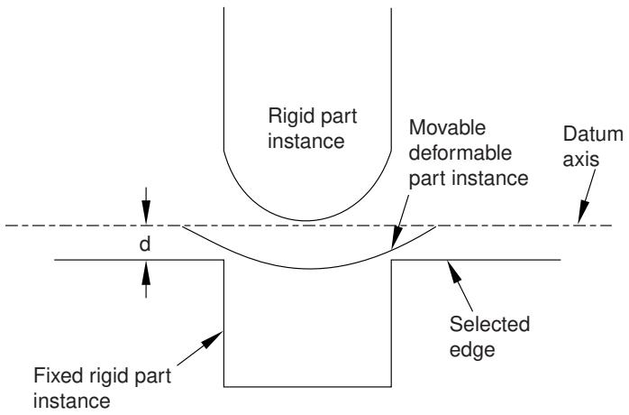  
Figure 1: An edge-to-edge constraint applied between a datum axis and a selected edge.

The shell is positioned easily by applying an edge-to-edge position constraint between a selected edge of the lower rigid surface (the fixed part instance) and a datum axis associated with the shell (the movable part instance). The datum axis was created with the deformable part in the Part module and moves along with the movable part instance when the position constraint is applied. In contrast, Figure 2 illustrates an edge-to-edge position constraint applied between three movable part instances and a fixed datum axis that provides reference geometry. In this example the datum axis was created along the X-axis of the assembly and is not associated with any part instance. Applying three edge-to-edge position constraints, one to each of the three part instances shown, would result in alignment of the three instances along the datum axis.

  
Figure 2: Edge-to-edge constraints applied between multiple parts and a fixed datum axis.

A datum is a feature of the assembly and is regenerated along with the rest of the assembly. You can make datum geometry invisible while still retaining it in the assembly by selecting View->Assembly Display Options from the main menu bar. For more information, see Controlling datum display.

The triad indicating the origin and the orientation of the global coordinate system is a datum coordinate system created by the Assembly module. You can suppress or delete it, but you cannot modify it.

## Additional information

• Understanding toolsets in the Assembly module  
• The Datum toolset

Along with datum geometry and partitions, part instances, model instances, and position constraints are considered to be features of the assembly and appear in the list of features in the Model Tree.

## Part instances

You can suppress, resume, and delete part instances. You can partition a part instance, but you cannot edit its shape or its features. To modify a part instance, you must edit the original part in the Part module; Abaqus/CAE automatically regenerates instances of a modified part when you return to the Assembly module.

You can make a part instance invisible while still retaining it in the assembly by selecting View->Assembly Display Options->Instance from the main menu bar. For more information, see Controlling instance visibility. This technique is not the same as suppressing a part instance; a suppressed part instance is removed from the assembly until you resume it. You can also use display groups to make part instances invisible; for more information, see Using display groups to display subsets of your model.

You can link part instances, and you can exclude part instances from an analysis; for more information, see Linking part instances between models and Excluding part instances from an analysis.

## Model instances

You can suppress, resume, and delete model instances. To modify a model instance, you must edit the original model's assembly.

You can make a model instance invisible while still retaining it in the assembly by selecting View->Assembly Display Options->Instance from the main menu bar. You can also use display groups to make model instances invisible.

## Position constraints

You can edit, suppress, resume, and delete position constraints. You can modify the following parameters of a position constraint:

• The direction of the arrow normal to the selected face or along the selected edge of the movable part instance.  
• The clearance between the selected face or edge of the movable part instance and the selected face or edge of the fixed part instance. The clearance parameter applies only to face-to-face, edge-to-edge, and contact constraints.

Translations and rotations are not stored as features and cannot be edited, suppressed, resumed, or deleted.

You can use the Feature Manipulation toolset to modify features of the assembly. When you are prompted to select a feature to modify, you can select a visible feature such as a part instance, a datum, or a partition from the viewport. However, to select a position constraint, you must select it from the Model Tree.

The following feature manipulation tools are available from the Feature Manipulation toolset:

## Edit

When you edit a feature, Abaqus/CAE displays the Edit Feature dialog box and you can modify the feature's parameters or the sketch that defined the feature. You cannot edit part instances; you must return to the Part module to modify the original part.

## Regenerate

When you modify features in a complex assembly, it may be convenient to postpone regeneration until you make all your changes, since regeneration can be time consuming. Select Feature->Regenerate when you are ready to regenerate the assembly.

## Rename

Rename a feature.

## Suppress

Suppressing a feature temporarily removes it from the definition of the assembly. A suppressed feature is invisible, cannot be meshed, and is not included in the analysis of the model. Suppressing a parent feature will suppress all of its child features.

## Resume

Resuming a feature restores a suppressed feature to the assembly. You can choose to resume all features, the set of features most recently suppressed, or just a selected feature.

## Delete

Deleting a feature removes it from the assembly; you cannot restore a deleted feature.

## Query

When you query a feature, Abaqus/CAE displays information in the message area and writes the same information to the replay file (abaqus.rpy) in the form of comments.

## Options

The Feature Options dialog box allows you to control whether Abaqus/CAE performs self-intersection checks and enables you to prioritize the regeneration of constraint features over other assembly features.

For a more detailed explanation of the Feature Manipulation toolset, see The Feature Manipulation toolset.

## Additional information

• Understanding toolsets in the Assembly module  
• The Feature Manipulation toolset

## Partitioning the assembly

Within the Assembly module, you can use the Partition toolset to partition the assembly into additional regions. You can use vertices, edges, and faces from one part instance to create a partition that divides a second part instance; for example, you might use the Extend Face method to partition a cell by extending a face of one part instance into a second part instance. Partitions cannot span part instances.

A partition in the assembly appears in every module that operates on the assembly. Partitions you create in the Part module are transferred along with the rest of the part's geometry when you create a part instance in the Assembly module. Partitions are features of the assembly, and they are regenerated along with the rest of the assembly. You cannot turn off the display of partitions. Partitions modify the geometry of a part instance; as a result, you cannot partition a dependent part instance.

The Partition toolset is not supported and cannot be used with model instances.

## Additional information

• Understanding toolsets in the Assembly module  
• The Partition toolset

## Querying the assembly

You can use the Query toolset to request either general information or module-specific information. For a discussion of the information displayed by general queries, see Obtaining general information about the model.

In addition, you can use the Assembly module-specific queries to determine the following attributes of a part instance or a model instance:

• Name, type, and modeling space  
• Origin  
• The sum of the translations and rotations applied to the instance

For more information, see Using the Query toolset to query the assembly.

## Creating reference points

From the main menu bar, select Tools->Reference Point to create a reference point on a part instance or a model instance. You can create multiple reference points on the assembly; Abaqus/CAE labels them RP-1, RP-2, RP-3, etc. For more information, see The Reference Point toolset.

Abaqus/CAE displays the reference point at the desired location along with its label. You can change the reference point label by clicking mouse button 3 on the feature in the Model Tree and selecting Rename from the menu that appears. If desired, you can turn off the display of the reference point symbol and the reference point label; for more information, see Controlling reference point display.

## Using sets and surfaces in the Assembly module

Sets created by selecting geometry from the assembly are called assembly sets, and you use the Set toolset to create and manage assembly sets. For example, you can select an assembly set to indicate where loads, boundary conditions, and interactions are applied. You can also use assembly sets to define regions of the model from which Abaqus/CAE will generate output during the analysis; for example, selected vertices or faces. Assembly sets can include regions from multiple part instances.

In contrast, part sets are created by selecting geometry from a part in the Part module or the Property module. When you instance a part in the Assembly module, you can refer to any part sets that you previously created; however, Abaqus provides only read-only access to these part sets in assembly-related modules. In addition, you cannot access a part set from the Set Manager in assembly-related modules; however, you can select an eligible part set during a procedure by clicking the Set button and selecting the set from the Region Selection dialog box that appears. For more information, see Understanding sets and surfaces.

You create surfaces by selecting faces or edges from the assembly, and you use the Surface toolset to create and manage surfaces. Typically you select a surface when a procedure is expecting a face; for example, when you are applying distributed loads, such as pressure loads, and defining contact interactions. For more information, see What is a surface?.

For model instances, any sets or surfaces defined in the original model are brought into the model instances, maintaining the Model Tree hierarchy of features.

## Additional information

• Understanding toolsets in the Assembly module  
• The Set and Surface toolsets

## Using the Assembly module toolbox

You can access all the Assembly module tools through either the main menu bar or through the Assembly module toolbox. Figure 1 shows the hidden icons for all the Assembly module tools in the toolbox.

  
Figure 1:The Assembly module tools.

To see a tooltip containing a brief definition of an Assembly module tool, hold the mouse over the tool for a moment. For information on using toolboxes and selecting hidden icons, see Using toolboxes and toolbars that contain hidden icons.

## Creating and manipulating part and model instances

This section describes how you use the Assembly module's Instance menu to create part and model instances and to position the instances relative to the global coordinate system.

You can also use the Instance menu to replace one part instance with another and to convert the constraints applied to a selected part instance to an absolute position. You can access additional functionality using the Model Tree.

## In this section:

Using the Instance menu  
Using the Model Tree to manipulate part instances  
Using the Model Tree to switch the context for part or model instances  
Creating a part or model instance  
Creating a linear pattern of instances  
Creating a radial pattern of instances  
Translating part or model instances  
Translating a part or model instance to another instance  
Rotating part or model instances  
Replacing an instance  
Converting constraints  
Merging or cutting part instances

## Using the Instance menu

Use the Instance menu to do the following:

Create instances of parts from the current model and add them to the assembly. You can also create instances of other models to add to the current assembly.  
• Create a linear pattern of part instances.  
• Create a radial pattern of part instances.  
Translate selected part or model instances along a specified vector.  
Translate selected part or model instances along a specified vector until they are a specified distance from another instance.  
Rotate selected part or model instances through a specified angle about a specified axis.  
Replace a part instance with a second part instance.  
Convert any position constraints to an absolute position.  
Merge or cut part instances.

You may find it more convenient to access the instance tools using the Assembly module toolbox. For a diagram of the tools in the Assembly toolbox, see Using the Assembly module toolbox.

## Additional information

• Using the Assembly module toolbox

• The Assembly module

## Using the Model Tree to manipulate part instances

You can access additional functionality for manipulating part instances using the Model Tree. After you select a part instance or multiple instances in the Model Tree, you can click mouse button 3 and select from the following options:

• To change a part instance from dependent to independent, select Make Independent from the menu that appears. Similarly, you can select Make Dependent from the menu to change a part instance from independent to dependent.  
• To link part instances, select Link Instances from the menu that appears to display the Link Instances dialog box and do the following:

1. For each child part instance, specify the model and part instance to which you want to link. By default, the dialog box displays all models in the model database other than the current model that have part instances with the same names as the selected instances. You can specify other values by clicking in the Model or Instance column of the table and selecting from the list of names displayed.

2. If you want the child part instances excluded from the input file that Abaqus/CAE generates when you submit the job for analysis, toggle on Also exclude child instances from simulation.

3. Click Link.

Icons appear in the Model Tree to indicate the linked status of the part instances. By default, linked part instances are colored gray in the viewport.

Similarly, you can select Unlink Instances from the menu to unlink part instances that were previously linked. For more information, see Linking part instances between models.

To exclude part instances from the analysis, select Exclude from Simulation from the menu that appears. Icons appear in the Model Tree to indicate the excluded status of the part instance. By default, part instances that are excluded from the analysis are colored dark gray in the viewport. Similarly, you can select Include in Simulation from the menu to include a part instance in an analysis for which it was previously excluded. For more information, see Excluding part instances from an analysis.  
• To ignore the invalid status of a part instance, select Ignore Invalidity. For more information, see Working with invalid parts.

## Additional information

• What is the difference between a dependent and an independent part instance?

• How do I decide whether to create a dependent or an independent part instance?

• Changing from a dependent to an independent part instance or vice versa

• Linking part instances between models

• Excluding part instances from an analysis

## Using the Model Tree to switch the context for part or model instances

You can use the Model Tree in the Assembly module or Mesh module to switch the context for part instances or for model instances and their child part instances.

In the Model Tree, select the instance for which you want to switch the context. If you select multiple instances, the context switches to the part or model for the first instance that you select. Click mouse button 3, and select Switch to part/model context. Abaqus/CAE switches the context as follows (depending on your selection):

• In the Assembly module, if you selected a part instance or a child part instance, the context switches to the Part module with the original part from which the instance was created displayed in the viewport.  
• In the Mesh module, if you selected a part instance or a child part instance, the context switches to display the original part from which the instance was created in the viewport.  
• If you selected a model instance, the context switches to display the original model from which the model instance was created in the viewport.

## Additional information

• Working with part instances  
• Working with model instances

## Creating a part or model instance

To create a part or model instance, select Instance->Create from the main menu bar and select the desired part or model from the Create Instance dialog box that appears.

You can select from any of the existing parts in the current model or any of the existing models in the current model database. You can create multiple instances of the same part or model, but you cannot assemble instances of parts or models that were created in different modeling spaces (three-dimensional, two-dimensional, or axisymmetric).

When you create the first instance,Abaqus/CAE displays a graphic symbol indicating the origin and orientation of the assembly's global coordinate system. This symbol is a datum coordinate system. If desired, you can hide it using the assembly display options; for more information, see Controlling datum display.

By default, Abaqus/CAE creates dependent part instances. A dependent instance is only a pointer to the geometry of the original part. As a result, many operations are not allowed on a dependent part instance; for example, you cannot add partitions, create virtual topology, or mesh the instance. In contrast, an independent part instance is a copy of the geometry of the original part. You can perform most operations on an independent instance; for example, you can add partitions, create virtual topology, and mesh the instance. You cannot create both an independent and a dependent instance of the same part. You can select a part instance from the Model Tree and change it from independent to dependent or vice versa. For more information, see What is the difference between a dependent and an independent part instance?.

When you create an instance, by default Abaqus/CAE positions the instance so that the origin of the original geometry aligns with the origin of the assembly coordinate system. When you create multiple instances, a new instance can be positioned over an existing instance. However, if you toggle on Auto-offset from other instances in the Create Instance dialog box, Abaqus/CAE translates each new instance along the X–axis until it does not overlap any existing instances. If the assembly is axisymmetric, Abaqus/CAE translates the new instance along the axis of revolution instead of along the X–axis.

1. From the main menu bar, select Instance->Create.

Abaqus/CAE displays the Create Instance dialog box.


Tip: You can also create an instance using the tool from the Assembly module toolbox. For a diagram of the tools in the Assembly toolbox, see Using the Assembly module toolbox.

2. Choose Parts or Models.

Depending on your choice, the Create Instance dialog box shows you a list of all the existing parts in the current model or all the other models in the model database.

3. Choose the desired parts or models from the list. You can use a combination of [Ctrl] + Click and [Shift] + Click to select multiple items.

A temporary image of the selected instances appears in the current viewport. Abaqus/CAE positions the temporary images so that their origins coincide with the origin of the global coordinate system.

4. By default, Abaqus/CAE creates Dependent part instances. If desired, toggle on Independent to create an independent part instance.  
5. If desired, toggle on Auto-offset from other instances to offset the new instances.  
6. Optional: Use the Name text field at the top of the dialog box to name the instance you are creating.

• If you do not specify a name, a name is generated automatically.  
• If multiple parts are selected, the name you specify is applied to the first selection. The other instance names are appended with the suffix “-1,” “-2,” “-3,” etc.  
• If you enter an existing name, Abaqus/CAE issues a warning in the CLI and generates a name.

7. If you are satisfied that you have selected the correct instances, click Apply.

Abaqus/CAE creates the instances and applies an auto-offset if selected.

8. To create additional instances, repeat this procedure from Step 2. When you have finished creating instances, click OK to close the Create Instance dialog box.

## Additional information

• Using the Instance menu  
• Working with part instances  
• Working with model instances

## Creating a linear pattern of instances

To create multiple copies of a selected instance in a linear pattern, select Instance->Linear Pattern from the main menu bar. You can create a pattern that extends in one direction (for example, horizontally or vertically), or you can create a pattern that extends in two directions (for example, both horizontally and vertically). You cannot edit a pattern after you create it. You can specify the following:

• The number of instances to create in each direction, including the selected instance. You can create any number of instances.  
• The spacing between each instance along the specified direction.  
• A line that defines the direction along which Abaqus/CAE generates the instances.

For more information, see Creating patterns of instances.

1. From the main menu bar, select Instance->Linear Pattern.


Tip: You can also create a linear pattern of instances using the tool from the Assembly module toolbox. For a diagram of the tools in the Assembly toolbox, see Using the Assembly module toolbox.

2. Select the instances that you want to copy.


Tip: To select more than one instance, hold down the [Shift] key as you click each instance or drag a rectangle around the instances. To unselect an instance, use [Ctrl] + Click. For more information, see Selecting objects within the viewport.

3. Click mouse button 2 to indicate that you have finished selecting instances.

Abaqus/CAE displays the Linear Pattern dialog box.

4. From the Linear Pattern dialog box, configure the pattern in Direction-1 (by default, Direction-1 is the X-direction):

a. Click the arrows to the right of Number to increase or decrease the number of copies to create, including the selected instances. The number of copies in the assembly updates when you click the arrows and provides a preview of the setting.

Alternatively, you can type in a number and press [Enter] to preview the setting. You can enter any number greater than or equal to 1. If you enter a value of 1, Abaqus/CAE displays only the selected instances and does not create any copies of the selected instances; in effect, you are disabling copies in Direction-1.

b. Enter the Spacing between each copy along the specified direction.

c. By default, Abaqus/CAE creates the copies along the X-direction. If you want to change the direction

in which Abaqus/CAE creates the copies, click and select a line from the assembly to define the new direction. You must pick a straight edge or a datum axis.

d. By default, Abaqus/CAE creates the copies in the positive direction. Click to reverse the direction in which Abaqus/CAE creates the copies.

5. To create copies in a second direction, enter a Number greater than 1 and specify the Spacing, the Direction, and the Flip direction for Direction-2 (by default, Direction-2 is the Y-direction). You must enter a Number greater than 1 for at least one direction.

6. In most cases you will want to preview the linear pattern that Abaqus/CAE will create as you enter values in the Linear Pattern dialog box. However, if you choose to create a large number of copies, the preview capability may impact the performance of Abaqus/CAE. In this case you should toggle off the Preview button.  
7. To copy more instances, repeat the above steps beginning with Step 1.

## Additional information

• Creating patterns of instances  
• Creating a radial pattern of instances

## Creating a radial pattern of instances

To create multiple copies of a selected instance in a radial pattern, select Instance->Radial Pattern from the main menu bar. You cannot edit a pattern after you create it. You can specify the following:

• The number of copies to create in the radial pattern, including the selected instances. You can create any number of instances.  
• The total angle between the original instance and the last copy in the pattern.  
• The position of the axis of the circular pattern.

For more information, see Creating patterns of instances.

1. From the main menu bar, select Instance->Radial Pattern.


Tip: You can also create a radial pattern of instances using the $\begin{array} { l } { \equiv ^ { \equiv } \equiv } \\ { = \equiv ^ { \equiv } \equiv ^ { \equiv } } \\ { \equiv \equiv ^ { \equiv } } \end{array}$ tool from the Assembly module toolbox. For a diagram of the tools in the Assembly toolbox, see Using the Assembly module toolbox.

2. Select the instances that you want to copy.


Tip: To select more than one instance, hold down the [Shift] key as you click each instance or drag a rectangle around the instances. To unselect an instance, use [Ctrl] + Click. For more information, see Selecting objects within the viewport.

3. Click mouse button 2 to indicate that you have finished selecting instances.

Abaqus/CAE displays the Radial Pattern dialog box.

4. From the Radial Pattern dialog box, configure the radial pattern:

a. Click the arrows to the right of Number to increase or decrease the number of copies to create, including the selected instances. The number of copies in the assembly updates when you click the arrows and provides a preview of the setting.  
Alternatively, you can type in a number and press [Enter] to preview the setting. You can enter any number greater than or equal to 2.  
b. Enter the Total angle between the original instances that you selected and the final copy. The angle must be between –360° and +360°. A positive angle corresponds to a counterclockwise direction.  
c. By default, Abaqus/CAE rotates the selected instance about the Z-axis to create the pattern. To

define a new axis of rotation, click and select a line from the assembly that represents the new axis of rotation. You can also select an axis from the global coordinate system triad.

5. In most cases you will want to preview the radial pattern that Abaqus/CAE will create as you enter values in the Radial Pattern dialog box. However, if you choose to create a large number of copies, the preview capability may impact the performance of Abaqus/CAE. In this case you should toggle off the Preview button.

6. To copy more instances, repeat the above steps beginning with Step 1.

## Additional information

• Creating patterns of instances  
• Creating a linear pattern of instances

## Translating part or model instances

Select Instance->Translate from the main menu bar to move selected part or model instances along a selected vector.

The direction and magnitude of the vector are arbitrary except that you can translate axisymmetric part instances only along the axis of rotation. If the translation conflicts with a previous position constraint; for example, a constraint that aligns two faces, Abaqus/CAE applies the components of translation only along the unconstrained degrees of freedom. If all of the degrees of freedom are constrained, Abaqus/CAE displays an error message and the translation fails.

When you create the first instance in your assembly, Abaqus/CAE displays a graphic indicating the origin and orientation of the assembly's default coordinate system. You can use this graphic to help you decide how to translate your part instances. In addition, you can use the Query toolset to review the sum of the translations and rotations previously applied to an instance and the distance between selected vertices. Translations and rotations are not considered features of the assembly and cannot be edited or deleted.

1. From the main menu bar, select Instance->Translate.


tool from the Assembly module toolbox. For a diagram of the tools in the Assembly toolbox, see Using the Assembly module toolbox.

Abaqus/CAE displays prompts in the prompt area to guide you through the procedure.

2. Select the part or model instances to translate. You can also click Instances on the right of the prompt area and select the instances to translate from the dialog box that appears.


Tip: If you are unable to select the desired instance, you can use the Selection toolbar to change the selection behavior. For more information, see Using the selection options.

You can use a combination of [Ctrl] + Click and [Shift] + Click to select multiple instances.

Abaqus/CAE highlights the selected instances.

3. Specify the translation vector using one of the following methods:

Select an axis or linear edge from the viewport, and enter a distance for the translation. Abaqus/CAE displays an arrow along the selected axis/edge, and, if needed, you can flip the direction to define the translation vector.  
Select the start and end points of the translation vector. You can select any existing vertices or datum points, or you can enter the coordinates in the text box in the prompt area. If you want to enter coordinates for a coordinate system other than the global coordinate system, click Select on the right side of the prompt area and select a local coordinate system. By default, the coordinate system applied to the start point is also applied to the end point.

Abaqus/CAE displays a temporary image indicating the translation that will be applied to the selected instance. You cannot edit or delete a translation after it is applied. Attempting to translate an instance may result in a conflict with existing position constraints. Abaqus/CAE applies the components of translation only along the unconstrained degrees of freedom. If all of the degrees of freedom are constrained, Abaqus/CAE displays an error message and the translation fails.

4. Do one of the following:

• If you are satisfied the translation is correct, click OK in the prompt area.

Abaqus/CAE translates the instance and positions it at the same location as the temporary image of the instance.

• If you are not satisfied with the translation, click the Previous button ) and specify a new translation vector.  
Click to cancel the procedure.

## Additional information

• Using the Instance menu  
• Creating the assembly

## Translating a part or model instance to another instance

Select Instance->Translate To from the main menu bar to position two instances by translating one instance along a vector defining the direction of motion until selected faces or edges of the movable instance are separated by a specified distance from selected faces or edges of the fixed instance.

Abaqus/CAE calculates the contact only within a tolerance based on the size of your model. As a result, contact may not be precise unless it is applied between two planar surfaces. If the selected faces or edges never contact when Abaqus/CAE translates the movable instance, the translation is not applied.

1. From the main menu, select Instance->Translate To.


Tip: You can also define a Translate To constraint using the tool in the Assembly module toolbox. For a diagram of the tools in the Assembly toolbox, see Using the Assembly module toolbox.

Abaqus/CAE displays prompts in the prompt area to guide you through the procedure.

2. Select the faces (for three-dimensional part instances) or edges (for two-dimensional part instances) from the part or model instance that will move and the instance that will remain fixed. You can select more than one face or edge from both the fixed and the movable instances. Selecting multiple faces or edges is useful if you are not sure what part of the model will come in contact when the movable instance moves along the selected vector. However, for faster processing you should select as few faces or edges as possible. You cannot select a datum plane.  
3. Specify the vector that defines the direction of motion using one of the following methods. If the instances are axisymmetric, the translation vector must be parallel to the axis of revolution.

Select an axis or linear edge from the viewport. Abaqus/CAE displays an arrow along the selected axis/edge, and, if needed, you can flip the direction to define the translation vector.  
Select the start and end points of the vector. You can select any existing vertices or datum points, or you can enter the coordinates in the text box in the prompt area. If you want to enter coordinates for a coordinate system other than the global coordinate system, click Select on the right side of the prompt area and select a local coordinate system. By default, the coordinate system applied to the start point is also applied to the end point.

4. In the text box that appears in the prompt area, enter a value for the clearance between the two selected faces; a negative value indicates overclosure. A translation is not saved as a feature, and you cannot change the clearance after you have completed the procedure.  
5. From the prompt area, click Preview.

Abaqus/CAE moves the movable part or model instance along the translation vector until the selected faces of the movable instance are separated by the specified clearance from the selected faces of the fixed instance.

6. If the new position of the instance is correct, click Done in the prompt area.

Attempting to translate an instance may result in a conflict with existing position constraints. Abaqus/CAE applies the components of translation only along the unconstrained degrees of freedom. If all of the degrees of freedom are constrained, Abaqus/CAE displays an error message and the translation fails. To avoid the conflict, you can try reversing the selection of the instance that will move and the instance that will remain fixed. Alternatively, you can convert the existing constraints to an absolute position and reapply the translation.

## Additional information

• Using the Constraint menu

• Creating the assembly  
• Converting constraints

## Rotating part or model instances

Select Instance->Rotate from the main menu bar to rotate selected part or model instances about a selected axis.

To rotate a three-dimensional instance, you must select two points that define the axis about which the instance will rotate. To rotate a two-dimensional instance, you must select a single point about which the instance will rotate. You cannot rotate axisymmetric instances. If the rotation conflicts with a previous position constraint (for example, a constraint that aligns two faces), Abaqus/CAE displays an error message and the rotation fails.

When you create the first instance in the assembly, Abaqus/CAE displays a graphic indicating the origin and orientation of the assembly's global coordinate system. You can use this graphic to help you decide how to rotate your part and model instances. In addition, you can use the Query toolset to review the sum of the translations and rotations previously applied to an instance and the distance between selected vertices. Rotations and translations are not considered features of the assembly and cannot be edited or deleted.

1. From the main menu bar, select Instance->Rotate.


Tip: You can also rotate an instance using the tool from the Assembly module toolbox. For a diagram of the tools in the Assembly toolbox, see Using the Assembly module toolbox.

Abaqus/CAE displays prompts in the prompt area to guide you through the procedure.

2. From the assembly, select the part or model instances to rotate. You can also click Instances on the right of the prompt area and select the instances to rotate from the dialog box that appears.


Tip: If you are unable to select the desired instance, you can use the Selection toolbar to change the selection behavior. For more information, see Using the selection options.

You can use a combination of [Ctrl] + Click and [Shift] + Click to select multiple instances.

Abaqus/CAE highlights the selected instances.

3. Specify the axis of rotation using one of the following methods:

• Select an axis or linear edge from the viewport.  
Select the start and end points of the rotation vector. You can select any existing vertices or datum points, or you can enter the coordinates in the text box in the prompt area. If you want to enter coordinates for a coordinate system other than the global coordinate system, click Select on the right side of the prompt area and select a local coordinate system. By default, the coordinate system applied to the start point is also applied to the end point.

4. In the text box that appears in the prompt area, enter the angle of rotation. A positive angle indicates a counterclockwise rotation; a negative angle indicates a clockwise rotation.

Abaqus/CAE displays a temporary image indicating the rotation that will be applied to the selected instances. You cannot edit or delete a rotation after it is applied. Attempting to rotate an instance may result in a conflict with existing position constraints. If a conflict occurs, Abaqus/CAE displays an error message and the rotation fails.

5. Do one of the following:

a. If you are satisfied that the rotation is correct, click OK in the prompt area. Abaqus/CAE rotates the instance and positions it at the same location as the temporary image of the instance.

b. If you are not satisfied with the rotation, click the Previous button ( ) and specify a new rotation.

c. Click ( ) to cancel the procedure.

## Additional information

• Using the Constraint menu  
• Creating the assembly

Select Instance->Replace from the main menu bar to replace a selected instance with an instance of another part/model. Abaqus/CAE positions the new instance so that its origin is located at the origin of the original instance and their axes align. In addition, you can choose whether the new instance inherits all the constraints from the instance it replaced.

The replace operation does not change the attributes of the instance. For example, if the original instance is dependent, the instance that replaces it will also be dependent. As a result, if an independent instance of a part exists, you cannot use the replace procedure to create a dependent instance of the same part.

Replacing an instance is most useful when you are replacing an instance with one that has similar geometry. For example, the new instance might have additional detail that was not present in the original instance.

You can only replace a part instance with a part instance and a model instance with a model instance.

1. From the main menu bar, select Instance->Replace to replace a selected instance.  
2. From the assembly, select the instance to replace. You can also click the Instance List button on the right of the prompt area and select the instance from the Instance List dialog box that appears.


Tip: If you are unable to select the desired instance, you can use the Selection toolbar to change the selection behavior. For more information, see Using the selection options.

Abaqus/CAE displays the Replace Instance dialog box with a list of all the parts/models in the model.

3. From the Replace Instance dialog box, select the part/model that will replace the selected part/model instance in the assembly.

Abaqus/CAE displays a temporary image of the new part instance in the assembly and positions it so that its origin is located at the origin of the original part instance and their axes align.

4. If the correct instance is selected, click OK in the Replace Instance dialog box.

If you have not applied any position constraints to the original instance, Abaqus/CAE replaces it with the new instance.

5. If you have applied position constraints to the original instance, you must choose one of the following buttons in the prompt area:

Click OK to position the new instance in the same location as the instance it is replacing. Abaqus/CAE removes any constraints that were applied to the original instance, while maintaining its position.  
Click Apply previous constraints if you want the new instance to inherit position constraints from the instance being replaced. Abaqus/CAE applies all the previous constraints that can be satisfied by the new instance; any constraints that cannot be satisfied are ignored.

Abaqus/CAE replaces the original part instance with the new part instance and the original model instance with the new model instance.

## Additional information

• Replacing an instance  
• Creating a part or model instance  
• Applying constraints to part and model instances  
• Working with part instances

## Converting constraints

To remove all the face, edge, coaxial, and contact constraints applied to a selected part or model instance while leaving the instance in its current position, select Instance->Convert Constraints from the main menu bar. The conversion is equivalent to applying a single translation and rotation to the instance that moves it from its original position to the current position. Any previous constraints no longer appear in the list of features and cannot be restored.

1. From the main menu bar, select Instance->Convert Constraints to convert any existing constraints to the current position.  
2. From the assembly, select the part or model instance whose constraints you want to convert. You can also click the Instance List button on the right of the prompt area and select the instance from the Instance List dialog box that appears.


Tip: If you are unable to select the desired instance, you can use the Selection toolbar to change the selection behavior. For more information, see Using the selection options.

The instance does not move, but Abaqus/CAE converts any existing constraints to the current position. You cannot restore the original face, edge, coaxial, and contact constraints.

## Additional information

• How the position constraint methods differ  
• How conflicts can arise between position constraints, translations, and rotations

To merge a selected group of part instances, select Instance->Merge/Cut from the main menu bar. You can merge the geometry of parts that you created in the Part module, you can merge the meshes of part instances (any native mesh becomes an orphan mesh), or you can merge both geometry and orphan mesh features. You can also merge selected nodes using the Edit Mesh toolset in the Mesh module; for more information, see Manipulating nodes. You can cut the geometry of a selected part instance using the geometry of one or more other part instances to make the cut; any orphan mesh nodes or elements within the instance being cut are retained in the new cut part instance.

The merge or cut operation creates both a new part instance in the assembly and a new part. You can choose to suppress the original part instances that you selected, or you can delete them from the assembly. For more information, see Performing Boolean operations on part instances.

You cannot use the Merge/Cut command on model instances.

1. From the main menu bar, select Instance->Merge/Cut.


Tip: You can also merge or cut part instances using the tool from the Assembly module toolbox. For a diagram of the tools in the Assembly toolbox, see Using the Assembly module toolbox.

Abaqus/CAE displays the Merge/Cut Instances dialog box.

2. Enter the name of the part that will be created by the operation.  
3. Select the type of operation:

• To merge the geometry of part instances, choose Merge and Geometry. Any native or orphan mesh nodes and elements are not included in the new part.  
• To merge the meshes of part instances, choose Merge and Mesh. Any geometry is not included in the new part, and any native mesh becomes an orphan mesh.  
• To merge both the geometry and mesh features of part instances, choose Merge and Both. Geometry is included in the new part, and any native mesh is deleted.  
• To cut part instances, choose Cut geometry.

4. Choose how you would like Abaqus/CAE to handle the original instances that are being merged or cut:

Choose Suppress to suppress the original part instances but retain them in the model database. After you complete the Merge/Cut operation, you can resume the original part instances if necessary (see Suppressing and resuming objects).  
Choose Delete to delete the original part instances from the model database. You cannot recover deleted part instances.

5. If you chose a Merge operation, do the following:

a. Choose the desired options:

## Geometry

By default, Abaqus/CAE removes the boundaries between intersecting part instances. If you want to retain the boundaries between intersecting part instances, choose Retain from the bottom of the Merge/Cut Instances dialog box. The effect of removing and retaining the boundaries is shown in Figure 1.

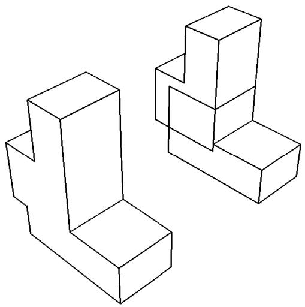  
Figure 1:The effect of removing and retaining intersecting boundaries.

## Mesh

Choose the method that Abaqus/CAE will use to merge nodes:

Boundary only. By default, Abaqus/CAE merges the meshes only along their boundaries. Therefore, Abaqus/CAE does not check for duplicate nodes in the interior of the parts, which speeds up the merging process. You should retain this default setting if the part instances intersect at only a common face.  
• All. Merge all the nodes in the selected part instances. By default, Abaqus/CAE removes elements that have the same connectivity as an existing element. Toggle off Remove duplicate elements to retain duplicate elements.  
• None. Merge the part instances into a single part instance but retain the original nodes.

If applicable, enter the Node merging tolerance. Abaqus/CAE deletes nodes that are closer than the specified tolerance and replaces them with a single new node. The location of the new node is the average position of the group of nodes that were merged into the new node.

## b. Click Continue.

c. Select the part instances to merge. You can use a combination of [Ctrl] + Click and [Shift] + Click to select multiple part instances. You can also click the Instance List button on the right of the prompt area and select the instances from the Instance List dialog box that appears.


Tip: If you are unable to select the desired part instances, you can use the Selection toolbar to change the selection behavior. For more information, see Using the selection options.

The part instances do not have to be touching or overlapping.

d. Click mouse button 2 to indicate that you have finished selecting part instances.

e. If you are merging meshes and the value that you entered for the Node merging tolerance is too large, Abaqus/CAE may detect duplicate nodes from the same element. Abaqus/CAE will not merge nodes from the same element, but the large tolerance can result in a distorted mesh. If the Node merging tolerance is too large, Abaqus/CAE asks if you want to continue merging the part instances.

• Click Yes to continue.  
• Click No to cancel the merging procedure.

f. Abaqus/CAE highlights in magenta any nodes that will be merged and asks if you wish to proceed.

• Click Yes to continue.  
• Click No to cancel the merging procedure.

Abaqus/CAE merges the nodes that are closer than the specified tolerance and replaces them with a single new node. The location of the new node is the average position of the group of nodes that were merged into the new node. If no nodes are closer than the specified tolerance, Abaqus/CAE asks if you want to cancel the procedure or merge the selected instances into a single part instance.

Abaqus/CAE merges the selected instances, creates a new part instance and a new part, and modifies sets and surfaces to include the new part instance.

6. If you chose a Cut operation, do the following:

a. Click Continue.  
b. Select the geometry of the part instance to be cut. You can select only one part instance, and only the geometry is selected, even if the part includes orphan mesh nodes and elements.  
c. Select the part instances that will make the cut. The cutting geometry must touch or overlap the geometry of the part instance to be cut.  
d. Click mouse button 2 to indicate that you have finished selecting part instances.

Abaqus/CAE cuts the selected instance and creates a new part instance and a new part. Any orphan mesh on the part being cut is copied to the new instance and part.

## Additional information

• How the position constraint methods differ  
• How conflicts can arise between position constraints, translations, and rotations

## Applying constraints to part and model instances

This section describes how you use the Assembly module's Constraint menu to apply positioning constraints to part and model instances in the assembly.

## In this section:

Using the Constraint menu  
Constraining two instances with parallel planar faces  
Constraining two instances with parallel planar faces separated by a specified distance  
Constraining two instances with parallel edges  
Constraining two instances with parallel edges separated by a specified distance  
Constraining two instances with coaxial faces  
Constraining two instances with coincident points  
Constraining two instances with parallel coordinate systems

## Using the Constraint menu

Use the Constraint menu to apply a constraint that does the following:

Parallel Face. Positions a movable part or model instance so that a selected face is parallel to a selected face of a fixed instance.  
Face to Face. Positions a movable part or model instance so that a selected face is parallel to and a specified distance away from a selected face of a fixed instance.  
Parallel Edge. Positions a movable part or model instance so that a selected edge is parallel to a selected edge of a fixed instance.  
Edge to Edge. Positions a movable part or model instance so that a selected edge is parallel to and a specified distance away from a selected edge of a fixed instance.  
Coaxial. Positions a movable part or model instance so that the axis of revolution of a selected face is coincident with the axis of revolution of a selected face of a fixed instance.  
Coincident Point. Positions a movable part or model instance so that a selected point is coincident with a selected point of a fixed instance.  
Parallel CSYS. Positions a movable part or model instance so that a selected datum coordinate system associated with the instance is parallel to a selected datum system of a fixed instance.

Constraints position one instance relative to another; as a result, constraints cannot be applied until your assembly contains two or more part or model instances.

You may find it more convenient to access the constraint tools using the Assembly module toolbox. For a diagram of the tools in the Assembly toolbox, see Using the Assembly module toolbox.

## Additional information

• Creating the assembly  
• The Assembly module

## Constraining two instances with parallel planar faces

Select Constraint->Parallel Face from the main menu bar to apply a constraint that positions a movable instance so that a selected face is parallel to a selected face of a fixed instance. All position constraints are features of the assembly and can be suppressed or deleted using the Feature Manipulation toolset.

1. From the main menu, select Constraint->Parallel Face.

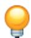

Tip: You can also apply the parallel face constraint using the tool in the Assembly module toolbox. For a diagram of the tools in the Assembly toolbox, see Using the Assembly module toolbox.

Abaqus/CAE displays prompts in the prompt area to guide you through the procedure.

2. Select a planar face from the part or model instance that will move and a planar face from the instance that will remain fixed, as shown in the following figure:


Abaqus/CAE displays arrows normal to the selected faces.

When Abaqus/CAE prompts you to select the face from the fixed instance, you can select a datum plane that was created in either the Part or Assembly module. In contrast, when you select the face from a movable part instance, you can select a datum plane that was created only in the Part module.

3. From the buttons in the prompt area, do one of the following:

• Click OK to accept the direction of the arrow on the face of the movable instance.  
• Click Flip to reverse the direction of the arrow on the face of the movable instance, and click OK.

Abaqus/CAE positions the movable part or model instance so that the two faces are parallel and the arrows point in the same direction. The orientation of the fixed instance remains unchanged. The effect of changing the direction of the arrow is illustrated in the following figure:


If the parallel face constraint conflicts with existing constraints, Abaqus/CAE displays an error message and cancels the operation. To avoid the conflict, you can try reversing the selection of the instance that will move and the instance that will remain fixed. Alternatively, you can delete the existing relative position constraints, apply absolute position constraints, and reapply the parallel face constraint.

## Additional information

• Using the Constraint menu  
• Creating the assembly  
• Converting constraints

## Constraining two instances with parallel planar faces separated by a specified distance

Select Constraint->Face to Face from the main menu bar to apply a constraint that positions a movable instance so that a selected face is parallel to and a specified distance away from a selected face of a fixed instance. The face-to-face constraint is a feature of the assembly and can be suppressed or deleted using the Feature Manipulation toolset. In addition, you can edit the clearance between the two selected faces.

1. From the main menu, select Constraint->Face to Face.


Tip: You can also apply the face-to-face constraint using the tool in the Assembly module toolbox. For a diagram of the tools in the Assembly toolbox, see Using the Assembly module toolbox.

Abaqus/CAE displays prompts in the prompt area to guide you through the procedure.

2. Select a planar face from the part or model instance that will move and a planar face from the instance that will remain fixed, as shown in the following figure:


Abaqus/CAE displays arrows normal to the selected faces.

When Abaqus/CAE prompts you to select the face from the fixed instance, you can select a datum plane that was created in either the Part or Assembly module. In contrast, when you select a face from the movable part instance, you can select a datum plane that was created only in the Part module.

3. From the buttons in the prompt area, do one of the following:

• Click OK to accept the direction of the arrow on the face of the movable instance.  
• Click Flip to reverse the direction of the arrow on the face of the movable instance, and click OK.

The effect of changing the direction of the arrow is illustrated in the next step.

4. In the text field that appears in the prompt area, enter the distance between the selected faces, positive along the normal to the face of the fixed instance.

Abaqus/CAE positions the movable instance so that the two faces are parallel and the arrows point in the same direction. In addition, the movable instance is translated to satisfy the clearance specified. The orientation of the fixed instance remains unchanged. The effect of specifying the distance is illustrated in the following figure:


If the face-to-face constraint conflicts with existing constraints, Abaqus/CAE displays an error message and cancels the operation. To avoid the conflict, you can try reversing the selection of the instance that will move and the instance that will remain fixed. Alternatively, you can convert the existing constraints to an absolute position and reapply the face-to-face constraint.

## Additional information

• Using the Constraint menu  
• Creating the assembly  
• Converting constraints

## Constraining two instances with parallel edges

Select Constraint->Parallel Edge from the main menu bar to apply a constraint that positions a movable instance so that a selected edge is parallel to a selected edge of a fixed instance. All position constraints are features of the assembly and can be suppressed or deleted using the Feature Manipulation toolset.

1. From the main menu, select Constraint->Parallel Edge.


Tip: You can also apply the parallel edge constraint using the tool in the Assembly module toolbox. For a diagram of the tools in the Assembly toolbox, see Using the Assembly module toolbox.

Abaqus/CAE displays prompts in the prompt area to guide you through the procedure.

2. Select a straight edge from the instance that will move and a straight edge from the instance that will remain fixed, as shown in the following figure:


In addition to selecting an edge or a datum axis, you can also select one of the axes of a datum coordinate system.

Abaqus/CAE displays arrows along the selected edges.

When Abaqus/CAE prompts you to select the edge from the fixed instance, you can select a datum axis that was created in either the Part or Assembly module. In contrast, when you select the edge from a movable part instance, you can select a datum axis that was created only in the Part module.

3. From the buttons in the prompt area, do one of the following:

• Click OK to accept the direction of the arrow along the edge of the movable instance.  
Click Flip to reverse the direction of the arrow along the edge of the movable instance, and click OK.

Abaqus/CAE positions the movable instance so that the two edges are parallel and the arrows point in the same direction. The orientation of the fixed instance remains unchanged. The effect of changing the direction of the arrow is illustrated in the following figure:


If the parallel edge constraint conflicts with existing constraints, Abaqus/CAE displays an error message and cancels the operation. To avoid the conflict, you can try reversing the selection of the instance that will move and the instance that will remain fixed. Alternatively, you can convert the existing constraints to an absolute position and reapply the parallel edge constraint.

## Additional information

• Using the Constraint menu  
• Creating the assembly  
• Converting constraints

## Constraining two instances with parallel edges separated by a specified distance

Select Constraint->Edge to Edge from the main menu bar to apply a constraint that positions a movable instance so that a selected edge is parallel to a selected edge of a fixed instance. In addition, if the instances are two-dimensional, you must specify the distance between the selected edges; otherwise, Abaqus/CAE makes them coincident. All position constraints are features of the assembly and can be suppressed or deleted using the Feature Manipulation toolset. In addition, you can edit the clearance between the two selected edges, where applicable. For more information, see How the position constraint methods differ.

1. From the main menu, select Constraint->Edge to Edge.


Tip: You can also apply the edge-to-edge constraint using the tool in the Assembly module toolbox. For a diagram of the tools in the Assembly toolbox, see Using the Assembly module toolbox.

Abaqus/CAE displays prompts in the prompt area to guide you through the procedure.

2. Select a straight edge from the instance that will move and a straight edge from the instance that will remain fixed, as shown in the following figure:

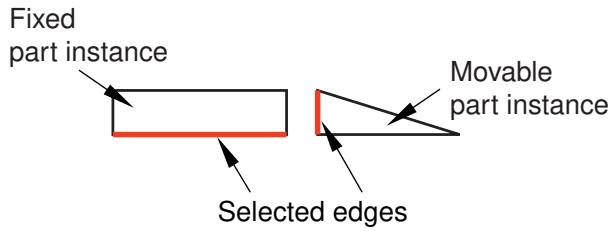

In addition to selecting an edge or a datum axis, you can also select one of the axes of a datum coordinate system.

Abaqus/CAE displays arrows along the selected edges.

When Abaqus/CAE prompts you to select the edge from the fixed instance, you can select a datum axis that was created in either the Part or Assembly module. In contrast, when you select the edge from a movable part instance, you can select a datum axis that was created only in the Part module.

3. From the buttons in the prompt area, do one of the following:

• Click OK to accept the direction of the arrow along the edge of the movable instance.  
Click Flip to reverse the direction of the arrow along the edge of the movable instance and click OK.

The effect of changing the direction of the arrow is illustrated in the next step.

If the instances are three-dimensional, Abaqus/CAE positions the movable instance so that the selected edges are parallel and coincident.

4. If the instances are two-dimensional, you must specify the clearance between the selected edges. In the text field that appears in the prompt area, enter the distance from the edge of the movable instance to the edge of the fixed instance, positive along the normal to the edge of the fixed instance.

Abaqus/CAE positions the movable instance so that the two edges are parallel and the arrows point in the same direction. In addition, the movable instance is translated to satisfy the clearance specified. The orientation of the fixed instance remains unchanged. The effect of specifying the distance and changing the direction of the arrow is illustrated with two-dimensional instances in the following figure:

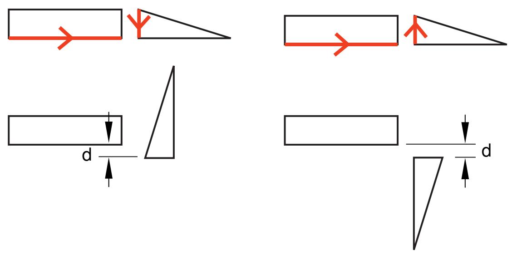

If the edge-to-edge constraint conflicts with existing constraints, Abaqus/CAE displays an error message and cancels the operation. To avoid the conflict, you can try reversing the selection of the instance that will move and the instance that will remain fixed. Alternatively, you can convert the existing constraints to an absolute position and reapply the edge-to-edge constraint.

## Additional information

• Using the Constraint menu  
• Creating the assembly  
• Converting constraints

## Constraining two instances with coaxial faces

Select Constraint->Coaxial from the main menu bar to apply a constraint that positions a movable instance so that the axis of revolution of a selected face is coincident with the axis of revolution of a selected face of a fixed instance. All position constraints are features of the assembly and can be suppressed or deleted using the Feature Manipulation toolset.

The selected faces of the movable and fixed instances must be either cylindrical or conical. In addition, the coaxial constraint can be applied only to three-dimensional instances. For more information, see How the position constraint methods differ.

1. From the main menu, select Constraint->Coaxial.


Tip: You can also apply the coaxial constraint using the tool in the Assembly module toolbox. For a diagram of the tools in the Assembly toolbox, see Using the Assembly module toolbox.

Abaqus/CAE displays prompts in the prompt area to guide you through the procedure.

2. Select cylindrical or conical faces from the instance that will move and the instance that will remain fixed, as shown in the following figure:

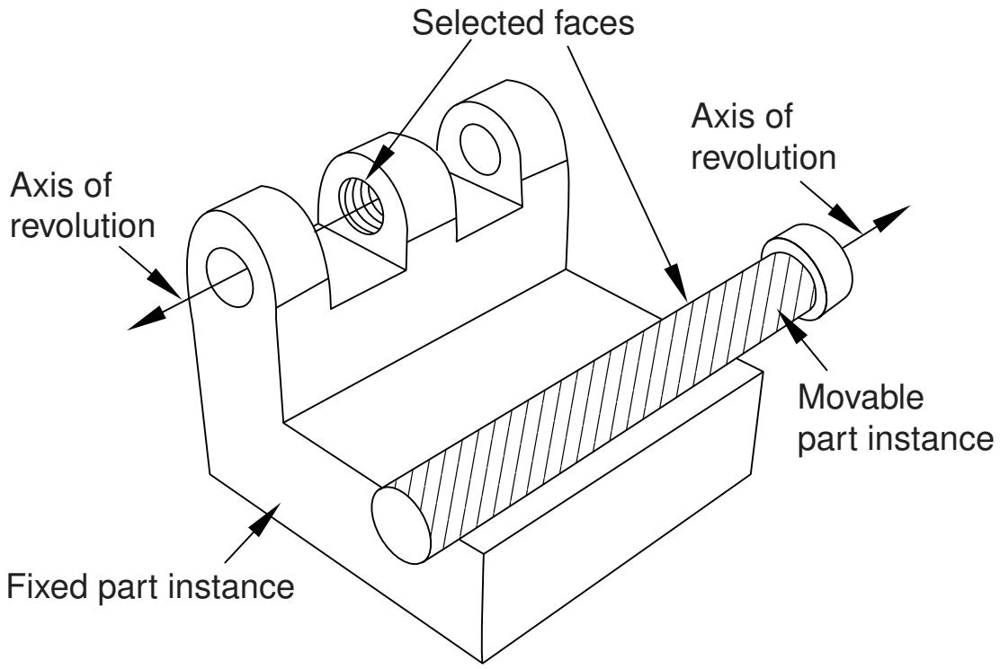

Abaqus/CAE displays arrows along the axis of revolution of the selected faces.

3. From the buttons in the prompt area, do one of the following:

• Click OK to accept the direction of the arrow along the axis of revolution of the face of the movable instance.  
Click Flip to reverse the direction of the arrow along the axis of revolution of the face of the movable instance, and click OK.

Abaqus/CAE positions the movable instance so that the two axes are coincident and the arrows point in the same direction. The orientation of the fixed instance remains unchanged. The effect of the coaxial constraint with the arrows selected as shown above is illustrated in the following figure:

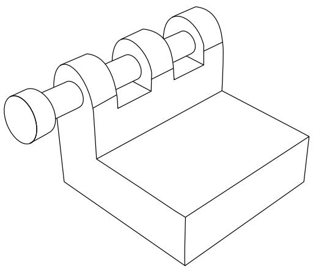

If the coaxial constraint conflicts with existing constraints, Abaqus/CAE displays an error message and cancels the operation. To avoid the conflict, you can try reversing the selection of the instance that will move and the instance that will remain fixed. Alternatively, you can convert the existing constraints to an absolute position and reapply the coaxial constraint.

## Additional information

• Using the Constraint menu  
• Creating the assembly

## Constraining two instances with coincident points

Select Constraint->Coincident Point from the main menu bar to apply a constraint that positions a movable instance so that a selected point is coincident with a selected point of a fixed instance. All position constraints are features of the assembly and can be suppressed or deleted using the Feature Manipulation toolset.

1. From the main menu, select Constraint->Coincident Point.


Tip: You can also apply the coincident point constraint using the tool in the Assembly module toolbox. For a diagram of the tools in the Assembly toolbox, see Using the Assembly module toolbox.

Abaqus/CAE displays prompts in the prompt area to guide you through the procedure.

2. Select a point from the instance that will move and a point from the instance that will remain fixed. In addition to selecting a vertex or a midpoint, you can select a datum point, a reference point, or the origin of a datum coordinate system.

Abaqus/CAE moves the movable instance so that the selected points are coincident.

When Abaqus/CAE prompts you to select the point from the fixed instance, you can select a datum point or a reference point that was created in either the Part or Assembly module. In contrast, when you select the point from a movable part instance, you can only select a datum point or reference point that was created in the Part module.

If the coincident point constraint conflicts with existing constraints, Abaqus/CAE displays an error message and cancels the operation. To avoid the conflict, you can try reversing the selection of the instance that will move and the instance that will remain fixed. Alternatively, you can convert the existing constraints to an absolute position and reapply the coincident point constraint.

## Additional information

• Using the Constraint menu  
• Creating the assembly  
• Converting constraints

Select Constraint->Parallel CSYS from the main menu bar to apply a constraint that positions a movable instance so that a selected datum coordinate system is parallel to a selected datum coordinate system of a fixed instance. All position constraints are features of the assembly and can be suppressed or deleted using the Feature Manipulation toolset.

1. From the main menu, select Constraint->Parallel CSYS.


Tip: You can also apply the parallel coordinate systems constraint using the tool in the Assembly module toolbox. For a diagram of the tools in the Assembly toolbox, see Using the Assembly module toolbox.

Abaqus/CAE displays prompts in the prompt area to guide you through the procedure.

2. Select a datum coordinate system from the movable instance and a datum coordinate system from the fixed instance.

When Abaqus/CAE prompts you to select the datum coordinate system from the fixed instance, you can select a datum coordinate system that was created in either the Part or Assembly module. In contrast, when you select the datum coordinate system from a movable part instance, you can only select a datum coordinate system that was created in the Part module.

Abaqus/CAE rotates the movable instance so that the selected coordinate systems are parallel.

If the parallel coordinate systems constraint conflicts with existing constraints, Abaqus/CAE displays an error message and cancels the operation. To avoid the conflict, you can try reversing the selection of the instance that will move and the instance that will remain fixed. Alternatively, you can convert the existing constraints to an absolute position and reapply the parallel coordinate systems constraint.

## Additional information

• Using the Constraint menu  
• Creating the assembly  
• Converting constraints

## Using the Query toolset to query the assembly

Select Tools->Query from the main menu bar to start the Query toolset. You can use the Query toolset to request either general information or module-specific information. For a discussion of the information displayed by general queries, see Obtaining general information about the model. In addition, you can use the Assembly module-specific tools in the Query toolset to determine the attributes and position of a selected part or model instance.

1. From the main menu bar, select Tools->Query.


Tip: You can also select the tool in the Query toolset.

Abaqus/CAE displays the Query dialog box.

2. From the Query dialog box, click on one of the following:

## Instance Attributes

Select a part or model instance.

Abaqus/CAE displays the following in the message area:

• The name, modeling space, and type (deformable or rigid, dependent or independent) of the instance

## Instance Position

Select a part or model instance.

Abaqus/CAE displays the following in the message area:

• Position of the origin of the instance relative to the global coordinate system  
• The sum of the rotations applied to the instance relative to the assembly's global coordinate system  
• A list of the constraints applied to the instance

3. Close the Query dialog box when you are done querying the assembly.

## Additional information

• Creating the assembly

You can use the Step module to create and define the analysis steps and associated output requests.

## In this section:

Understanding the role of the Step module  
Entering and exiting the Step module  
Understanding steps  
Understanding output requests  
Understanding integrated, restart, diagnostic, and monitor output  
Understanding ALE adaptive meshing  
How can I customize the Abaqus analysis controls?  
Using the Step module toolbox  
Using the Step Manager  
Using the step editor  
Configuring analysis procedure settings  
Defining output requests  
Requesting specialized output  
Customizing ALE adaptive meshing  
Customizing the Abaqus analysis controls

## Understanding the role of the Step module

You can use the Step module to perform the following tasks:

## Create analysis steps

Within a model you define a sequence of one or more analysis steps. The step sequence provides a convenient way to capture changes in the loading and boundary conditions of the model, changes in the way parts of the model interact with each other, the removal or addition of parts, and any other changes that may occur in the model during the course of the analysis. In addition, steps allow you to change the analysis procedure, the data output, and various controls. You can also use steps to define linear perturbation analyses about nonlinear base states. You can use the replace function to change the analysis procedure of an existing step.

## Specify output requests

Abaqus writes output from the analysis to the output database; you specify the output by creating output requests that are propagated to subsequent analysis steps. An output request defines which variables will be output during an analysis step, from which region of the model they will be output, and at what rate they will be output. For example, you might request output of the entire model's displacement field at the end of a step and also request the history of a reaction force at a restrained point.

## Specify adaptive meshing

You can define adaptive mesh regions and specify controls for adaptive meshing in those regions.

## Specify analysis controls

You can customize general solution controls and solver controls.

## Entering and exiting the Step module

You can enter the Step module at any time during an Abaqus/CAE session by clicking Step in the Module list located in the context bar. The Step, Output, Other, and Tools menus appear on the main menu bar. If the current viewport contains something other than the assembly, the contents of the viewport disappear when you start the Step module.

To exit the Step module, select any other module from the Module list. You need not save your steps or output requests before exiting the module; they will be saved automatically when you save the model database by selecting File->Save or File->Save As from the main menu bar.

## Understanding steps

This section gives an overview of steps.

For more information on steps, see Defining an Analysis.

## In this section:

What is a step?  
Linear and nonlinear procedures  
Step sequence restrictions  
What is step replacement?  
Replacing an Abaqus/Standard procedure with an Abaqus/Explicit procedure or vice versa

## What is a step?

An Abaqus/CAE model uses the following two types of steps:

## The initial step

Abaqus/CAE creates a special initial step at the beginning of the model's step sequence and names it Initial. Abaqus/CAE creates only one initial step for your model, and it cannot be renamed, edited, replaced, copied, or deleted.

The initial step allows you to define boundary conditions, predefined fields, and interactions that are applicable at the very beginning of the analysis. For example, if a boundary condition or interaction is applied throughout the analysis, it is usually convenient to apply such conditions in the initial step. Likewise, when the first analysis step is a linear perturbation step, conditions applied in the initial step form part of the base state for the perturbation.

## Analysis steps

The initial step is followed by one or more analysis steps. Each analysis step is associated with a specific procedure that defines the type of analysis to be performed during the step, such as a static stress analysis or a transient heat transfer analysis. You can change the analysis procedure from step to step in any meaningful way, so you have great flexibility in performing analyses. Since the state of the model (stresses, strains, temperatures, etc.) is updated throughout all general analysis steps, the effects of previous history are always included in the response for each new analysis step.

There is no limit to the number of analysis steps you can define, but there are restrictions on the step sequence. (For more information, see Step sequence restrictions.)

You use items from the Step menu to create a step, to select and define the analysis procedure used during the step, and to manage existing steps. Alternatively, you can select Step->Manager from the main menu bar to display the Step Manager.

For example, consider the following analysis of a section of a piping system:

## Initial Step:

Apply boundary conditions to fix the left end of the pipe and to allow only axial movement at the right end.

## Step 1: Compress

Apply a compressive force to the right end of the pipe. This step is a general analysis step.

## Step 2: Eigenmodes

Calculate the frequencies and modes of vibration of the pipe in its compressed state. This step is a linear perturbation step.

Figure 1 shows the Step Manager after you create these steps.

  
Figure 1:The Step Manager.

The manager lists all of the steps in the analysis as well as a few salient details concerning each step. Step 2, Eigenmodes, is indented to show that it is a linear perturbation step based on the state of the model at the end of Step 1, Compress.

For detailed information on creating, editing, and replacing steps, see the following sections:

The Step Manager  
Creating a step  
Editing a step  
Replacing a step  
Resetting the default values in the step editor  
The step editor  
The Incrementation tab

## Additional information

• Understanding steps  
• Defining an Analysis

## Linear and nonlinear procedures

The Step Manager distinguishes between general nonlinear steps and linear perturbation steps by indenting the names and procedure descriptions of linear perturbation steps. General nonlinear analysis steps define sequential events: the state of the model at the end of one general step provides the initial state for the start of the next general step. Linear perturbation analysis steps provide the linear response of the model about the state reached at the end of the last general nonlinear step. You use the Procedure type field to choose between General and Linear perturbation steps when you select the procedure in the Create Step dialog box.

For each step in the analysis the Step Manager also indicates whether Abaqus will account for nonlinear effects from large displacements and deformations. If the displacements in a model due to loading are relatively small during a step, the effects may be small enough to be ignored. However, in cases where the loads on a model result in large displacements, nonlinear geometric effects can become important. The Nlgeom setting for a step determines whether Abaqus will account for geometric nonlinearity in that step.

The Nlgeom setting is turned on by default for Abaqus/Explicit steps and turned off by default for Abaqus/Standard steps. The sequence of steps and the current Nlgeom setting determine whether you can change the Nlgeom setting in a particular step. For example, if Abaqus is already accounting for geometric nonlinearity, the Nlgeom setting is toggled on for all subsequent steps, and you cannot toggle it off. Where permissible, the following methods allow you to change the Nlgeom setting for a step:

• Click the Basic tab in the Step Editor, and toggle the Nlgeom setting.  
• Select Step->Nlgeom from the main menu bar.  
• Click Nlgeom in the Step Manager.

For more information, see Accounting for geometric nonlinearity, or see General and Perturbation Procedures.

## Additional information

• Understanding steps

## Step sequence restrictions

When you select Step->Create from the main menu bar, a Create Step dialog box appears in which you can specify the procedure type for the step that you are creating. Similarly, when you select Step->Replace from the main menu bar, a Replace Step dialog box appears in which you can specify a new procedure type for an existing step. The selection of procedure types in the Create Step and Replace Step dialog boxes depends on the following:

• The model type.  
• The procedures that you have already associated with existing steps.  
• The position of the new or replaced step in the analysis step sequence.

For example, when you create the first step in an analysis, you can choose from a list of valid procedure types; both Abaqus/Standard and Abaqus/Explicit procedure types appear in the list. However, once you have created the first step, the list of valid procedure types in the Create Step dialog box will change to include only those procedures that are compatible with the first step. For example, if the first step is an Abaqus/Standard step, Abaqus/Explicit procedures no longer appear in the list.

## What is step replacement?

After you have defined your model and performed an analysis, you may want to run another analysis using a different procedure without having to redefine objects in your model, such as loads, boundary conditions, and interactions. You can use the replace function to replace the analysis procedure for an existing step with any procedure that is allowed by Abaqus/Standard or Abaqus/Explicit; for example, you can change from a Static, General procedure to a Dynamic, Explicit procedure or from a Static, General procedure to a Static, Riks procedure. After you select Step->Replace from the main menu bar, you select the step that you want to replace and the new analysis procedure for that step. The Edit Step dialog box appears with default values for the new analysis procedure. You can modify the default values and specify values for optional settings in the step editor.

When you replace a step, Abaqus/CAE copies all of the compatible step-dependent objects to the new step. If objects are incompatible with the new step, Abaqus/CAE substitutes an equivalent object, if possible, and suppresses or deletes the remaining objects. Therefore, you may want to copy the model before you replace the step. Abaqus/CAE displays a list of the objects that were suppressed or deleted during step replacement in the message area. For example, if you replace a Static, General procedure containing an Abaqus/Standard self-contact interaction, a pressure load, and an inertia relief load with a Dynamic, Explicit procedure, Abaqus/CAE does the following:

• Substitutes an Abaqus/Explicit self-contact interaction for the Abaqus/Standard self-contact interaction in the Dynamic, Explicit procedure.  
• Copies the pressure load to the Dynamic, Explicit procedure.  
• Suppresses the inertia relief load. Inertia relief loads apply only in Abaqus/Standard procedures.

After you replace a step, you should verify that previously defined properties, element types, jobs, and boundary conditions and predefined fields in the initial step remain valid for the model. In the Job module you can click Write Input in the Job Manager to write the input file and then check the input file for errors.

You can use the replace function to reset step settings to their default values by replacing an existing step with a step of the same procedure type.

## Additional information

• Suppressing and resuming objects  
• Understanding steps  
• Step sequence restrictions  
• Replacing a step  
• Resetting the default values in the step editor  
• Writing the input file only

## Replacing an Abaqus/Standard procedure with an Abaqus/Explicit procedure or vice versa

If you want to replace an Abaqus/Standard analysis procedure with an Abaqus/Explicit analysis procedure or vice versa, you must have only one analysis step in the model for the desired procedure type to appear in the Replace Step dialog box. If your model contains multiple steps, you can use step-dependent managers to move objects to a single step. You can then delete the other steps and replace the remaining step with the new analysis procedure.

For example, if you want to change a model that contains four Static, General procedures from an Abaqus/Standard analysis to an Abaqus/Explicit analysis, you can use the Load Manager to move all of the loads into one of the four steps. Similarly, you can use the Interaction Manager to move the interactions. You can then delete the other three steps and replace the remaining step with a Dynamic, Explicit procedure. If desired, you can create additional Abaqus/Explicit steps and use the step-dependent managers to move objects that were copied during step replacement to the appropriate Abaqus/Explicit procedures.

For more information, see Modifying the history of a step-dependent object.

## Additional information

• Changing the status of an object in a step  
• Step sequence restrictions  
• What is step replacement?  
• Replacing a step

## Understanding output requests

This section gives an overview of output requests.

## In this section:

What is an output request?  
What is the difference between field output and history output?  
Propagation of output requests  
The output request managers  
Creating and modifying output requests

## What is an output request?

The Abaqus analysis products compute the values of many variables at every increment of a step. Usually you are interested in only a small subset of all of this computed data. You can specify the data that you want written to the output database by creating output requests. An output request consists of the following information:

• The variables or variable components of interest.  
• The region of the model and the integration points from which the values are written to the output database.  
• The rate at which the variable or component values are written to the output database.

When you create the first step, Abaqus/CAE selects a default set of output variables corresponding to the step's analysis procedure. By default, output is requested from every node or integration point in the model and from default section points. In addition, Abaqus/CAE selects the default rate at which the variables are written to the output database. You can edit these default output requests or create and edit new ones.

Default output requests and output requests that you modified are propagated to subsequent steps in the analysis. If you have a large model that includes the default output requests and requests output from a large number of frames, the resulting output database will be very large. You can use a C++ program to extract data from a large output database and copy only selected frames to a second output database. For more information, see Decreasing the amount of data in an output database by retaining data at specific frames.

When your analysis is complete, you use the Visualization module to read the output database and graphically display the data that were written to it.

For detailed instructions on creating and editing output requests, see the following sections:

Creating an output request  
Modifying field output requests  
Modifying history output requests

## Additional information

• Understanding output requests

## What is the difference between field output and history output?

When you create an output request, you can choose either field output or history output.

## Field output

Abaqus generates field output from data that are spatially distributed over the entire model or over a portion of it. In most cases you use the Visualization module to view field output data using deformed shape, contour, or symbol plots. The amount of field output generated by Abaqus during an analysis is often large. As a result, you typically request that Abaqus write field data to the output database at a low rate; for example, after every step or at the end of the analysis.

When you create a field output request, you can specify the output frequency in equally spaced time intervals or every time a particular length of time elapses. For an Abaqus/Standard analysis procedure, you can alternatively specify the output frequency in increments, request output after the last increment of each step, or request output according to a set of time points. For an Abaqus/Explicit analysis procedure, you can alternatively request field output for every time increment or according to a set of time points.

When you create a field output request, Abaqus writes every component of the selected variables to the output database. For example, if you were using solid elements to model a cantilever beam with a load at the tip, you could request the stress (all six components) and the displacement (all six components) data from the entire model after the last increment of the loading step. You could then use the Visualization module to view a contour plot of stresses and deflections in the final loaded state.

## History output

Abaqus generates history output from data at specific points in a model. In most cases you use the Visualization module to display history output using X–Y plots. The rate of output depends on how you want to use the data that are generated by the analysis, and the rate can be very high. For example, data generated for diagnostic purposes may be written to the output database after every increment. You can also use history output for data that relate to the model or a portion of the model as a whole; for example, whole model energies.

When you create a history output request, you can specify the output frequency in equally spaced time intervals or every time a particular length of time elapses. For an Abaqus/Standard analysis procedure, you can alternatively specify the output frequency in increments, request output after the last increment of each step, or request output according to a set of time points. For an Abaqus/Explicit analysis procedure, you can alternatively request history output in time increments.

When you create a history output request, you can specify the individual components of the variables that Abaqus/CAE will write to the output database. For example, if you model the response of a cantilever beam with a load applied to the tip, you might request the following output after each increment of the loading step:

• The principal stress at a single node at the root of the beam.  
• The vertical displacement at a single node at the tip of the beam.

You could then use the Visualization module to view an X–Y plot of stress at the root versus displacement at the tip with increasing load.

## Propagation of output requests

When you create the first step in the analysis, Abaqus/CAE generates default field and history output requests based on the analysis procedure that you selected for the step. These default output requests are propagated to subsequent steps. The Field Output Requests Manager and the History Output Requests Manager are step-dependent managers that display the propagation and the status of output requests between steps.

The output requested in a general step is independent of the output requested in a linear perturbation step. In addition, the propagation behavior of output requests varies between general steps and linear perturbation steps.

## General steps

Abaqus/CAE creates a default field output request for the first general step in your model, and that default output request propagates to all subsequent general steps. Similarly, if you create a new output request or modify the default output request, the new or modified request is propagated to subsequent general steps.

If you insert a new general step into the sequence of steps, the output request from the previous general step propagates to the new step.

## Linear perturbation steps

Abaqus/CAE creates a default field output request for the first linear perturbation step in your model, and that default output request propagates to all subsequent linear perturbation steps that use the same analysis procedure; for example, all the frequency analyses. Similarly, if you create a new output request or modify the default output request, the new or modified request is propagated to subsequent steps that use the same analysis procedure.

If you insert a new linear perturbation step into the sequence of steps, the output request from the previous linear perturbation step that uses the same analysis procedure propagates to the new step. If you create a linear perturbation step that uses a different analysis procedure, Abaqus/CAE creates a new default output request. The new default output request propagates to all subsequent linear perturbation steps that use the same analysis procedure.

You should be aware of the following behavior:

If you insert a new general step at the beginning of a sequence of existing general steps, Abaqus/CAE does not create a default output request for the new step. Similarly, if you insert a new linear perturbation step at the beginning of a sequence of existing linear perturbation steps of the same procedure type, Abaqus/CAE does not create a default output request for the new step. In both cases you must create a new output request for the new step. Alternatively, you can use the output request managers to move the output request from the following step to the new step.  
• If you delete a step (general or linear perturbation) that contains a new output request, Abaqus/CAE deletes the output request from all subsequent steps into which the request had propagated.  
• If a step does not contain an output request, Abaqus/CAE displays a warning in the Job module when the input file is generated.

## The output request managers

Abaqus/CAE provides separate managers for field output requests and history output requests. The output request managers are step-dependent managers, which means that they contain information concerning the status of each output request in each step of the analysis and allow you to control the propagation of requests across the sequence of steps. For more information, see What are step-dependent managers?.

The Field Output Requests Manager and the History Output Requests Manager contain lists of all of the output requests that you have created. For example, the Field Output Requests Manager is shown in Figure 1.

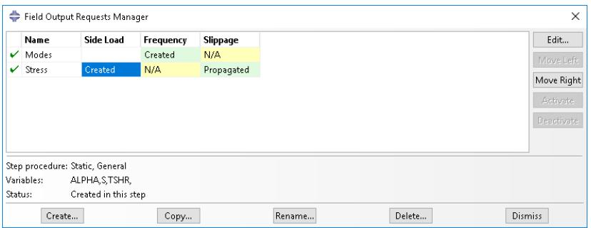  
Figure 1:The Field Output Requests Manager.

After you select the step, the Create button in the two managers allows you to create a new output request during that step. Similarly, the Edit, Copy, Rename, and Delete buttons allow you to edit, copy, rename, and delete the selected output request. You can also initiate the create, edit, copy, rename, and delete procedures using the Output->Field Output Requests and Output->History Output Requests submenus in the main menu bar.

You can use the Copy button in the Field Output Requests Manager and the History Output Requests Manager (or the corresponding menu commands or Model Tree) to copy an output request. You can copy an output request from any step to any valid step, with some restrictions. For more details, see Copying step-dependent objects using manager dialog boxes.

The Move Left, Move Right, Activate, and Deactivate buttons allow you to control the propagation of output requests over the course of an analysis. For more information, see Modifying the history of a step-dependent object.

You can use the icons in the column along the left side of the managers to suppress output requests or to resume previously suppressed output requests for an analysis. The suppress and resume procedures are also available from the Output->Field Output Requests and Output->History Output Requests submenus in the main menu bar. For more information, see Suppressing and resuming objects.

## Additional information

• What are step-dependent managers?  
• What is the difference between field output and history output?

## Creating and modifying output requests

To create an output request, select Output->Field Output Requests->Create or Output->History Output Requests->Create from the main menu bar.

An editor appears in which you can enter all of the information necessary to define the output request. The top of the editor displays the following:

• The name of the output request.  
• The name of the step in which you are creating or modifying the output request.  
• The name of the analysis procedure associated with the step.

For example, the Field Output Request editor is shown in Figure 1.

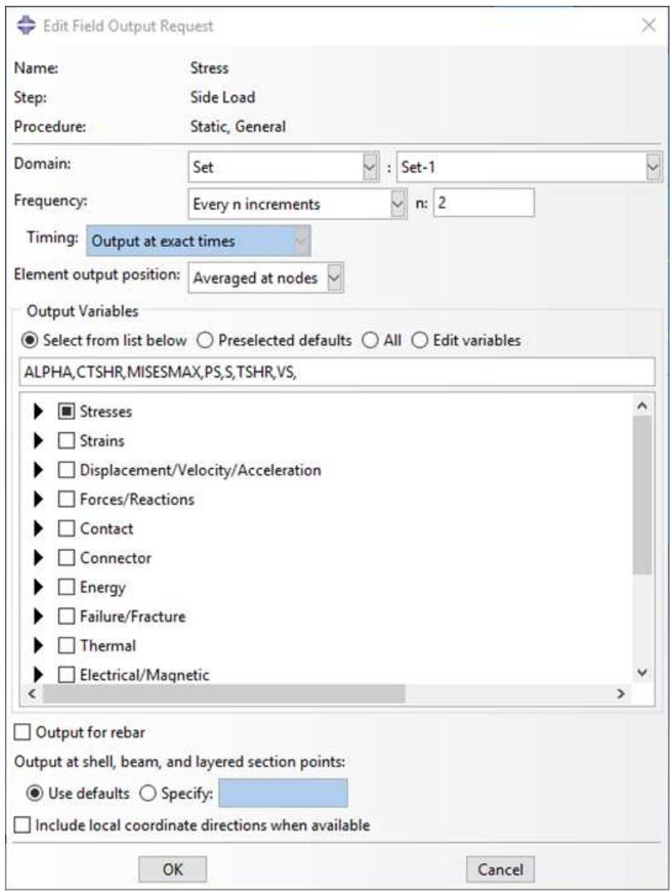  
Figure 1:The Field Output Request editor.

The Domain section of the editor allows you to choose the region from which output will be generated. You can request that Abaqus write field data to the output database for the following:

Whole model  
• Whole model, only exterior nodes and elements (three-dimensional models in Abaqus/Standard or Abaqus/Explicit analyses)

• A set  
• A bolt load  
• A skin  
• A stringer  
• A fastener  
• An assembled fastener set  
• An interaction  
• A composite layup  
• A substructure

Similarly, you can request that Abaqus write history data to the output database for the following:

• Whole model  
• A set  
• A bolt load  
• A skin  
• A stringer  
• A fastener  
• An assembled fastener set  
• A contour integral  
• A general contact surface (Abaqus/Explicit steps only)  
• An integrated output section (Abaqus/Explicit steps only)  
• An interaction  
• Springs/dashpots  
• A composite layup

The Frequency section of the editor allows you to specify the frequency at which the output is written to the output database. Choose one of the following:

• Last increment to request output only after the last increment of the step. This output frequency is available only when you choose an Abaqus/Standard analysis procedure.  
Every n increments to request output after a specified number of increments. If you specify the frequency in increments, Abaqus also writes output after the last increment of the step. This output frequency is available when you choose an Abaqus/Standard analysis procedure.  
• Every time increment to request output at every time increment. This output frequency is available for field output when you choose an Abaqus/Explicit analysis procedure.  
• Every n time increments to request output at a specified number of time increments. This output frequency is available for history output when you choose an Abaqus/Explicit analysis procedure.  
• Evenly spaced time intervals to request output at a number of evenly spaced time intervals.  
• Every x units of time to request output after a particular length of time elapses.  
From time points to request output according to a set of time points that you specify. This output frequency is available for field and history output when you choose an Abaqus/Standard analysis procedure and for field output when you choose an Abaqus/Explicit analysis procedure.

The Element output position section of the editor allows you to choose the position where selected field output values are written. Choose one of the following:

• Averaged at nodes (Abaqus/Standard steps only)  
• Centroidal  
• Integration points (default)  
• Nodes

The Output Variables section of the editor contains a list of the variable categories that are applicable to the step procedure and the selected domain. Choose one of the following:

Select from list below to request the variables from the list of check boxes below. You can click the check box next to a category name to select all of the variables within that category, or you can click the arrow next to a category name to display the list of variables in that category and then select individual variables.  
• Preselected defaults to request the default output variables for the procedure.  
• All to request all output variables for the procedure.  
• Edit variables to request variables from the text field below. You can manually edit this field and type or delete variable names.


## Note:

In addition to the current analysis procedure, other aspects of the model such as the region specified might affect the output variables. For example, if an output variable is valid for the analysis procedure but is not valid for the element type used in the mesh, Abaqus will remove that variable during the analysis.

If you use the Field Output Request editor to select a vector or tensor variable to be included in a field output request, Abaqus automatically writes all components of that variable to the output database during the step. For example, if you select the vector U in a three-dimensional model, Abaqus outputs the three displacement components U1, U2, and U3 to the output database along with the three rotation components UR1, UR2, and UR3.

In contrast, if you use the History Output Request editor to select a vector or tensor variable to be included in a history output request, the History Output Request editor allows you to select individual components of the variable. It is useful to specify individual components in a history output request because these variables are typically output very frequently—possibly as often as every increment.

If your model contains rebar, you must toggle on Output for rebar to include rebar output in the data that Abaqus writes to the output database and to view plots of the rebar orientations in the Visualization module. For more information, see Understanding rebar in shell sections.

The editor also allows you to specify the section points from which output will be obtained. If you request output from a composite layup, you can specify the section points from which output will be obtained for each ply of the layup. For more information, see Requesting output from a composite layup.

For example, in Figure 1 the user is editing a field output request that is associated with a Static, General analysis procedure. The user has selected all of the variables in the Stresses category. These variables will be included in the output request during the step named Side Load. Abaqus will write output from the default section points at every increment.

For detailed instructions on selecting output variables and components, see the following sections:

• Modifying field output requests  
Modifying history output requests

Once you have created an output request, you can modify it in the following ways:

• Select Output->Field Output Requests->Edit or Output->History Output Requests->Edit to display the field or history output request editor.  
Select Output->Field Output Requests->Manager or Output->History Output Requests->Manager to display the field or history output requests manager. Use the manager to modify the stepwise history of the output request. (See What are step-dependent managers?, for more information.)

If you modify an output request during the step in which you created the request, you can modify the domain, the output variables, the output for rebar option, the section points, and the output frequency. However, if you modify an output request during a step into which it was propagated, you can modify only the output variables and the output frequency.

When you request output from a contour integral, the History Output Request editor allows you to select only the frequency of output, the number of contour integrals, and the type of contour integral calculation. For more information, see Requesting contour integral output.

## Additional information

• Understanding output requests

## Understanding integrated, restart, diagnostic, and monitor output

This section explains the additional output controls available in the Step module.

## In this section:

Integrated output requests  
Restart output requests  
Diagnostic printing  
Degree of freedom monitor requests

## Integrated output requests

To obtain history output of variables such as the forces summed over an exterior surface in contact or transmitted through a tie constraint between surfaces, you must refer to an integrated output section to identify the surface where output is needed.

(See Integrated Output.) In addition, the integrated output section definition can provide a local coordinate system in which to express the vector output quantities and/or a reference node as an anchor point about which the total moment across the surface is computed.

By default, an integrated output section is anchored at the global origin and does not follow the motion of the surface on which it is defined. You can define a reference point at which the output section is anchored and specify how this reference point tracks with the average motion of the surface. The reference point must not be connected to any other part of the finite element model.

Integrated output sections associated with a coordinate system and/or a reference node can be used independent of integrated output requests to track the average motion of a surface.

You define integrated output sections by selecting Output->Integrated Output Sections->Create from the main menu bar. For detailed instructions, see Defining integrated output sections. For information on requesting output for an integrated output section, see Modifying history output requests.

## Additional information

• Defining integrated output sections  
• Understanding output requests  
• Understanding integrated, restart, diagnostic, and monitor output

## Restart output requests

You can use the restart files created by Abaqus to continue an analysis from a specified step of a previous analysis. This section describes how you control the output of restart data. For a discussion of how you use the restart data in a subsequent job, see Restarting an analysis, and What are the model attributes?.

By default, no restart information is written for an Abaqus/Standard analysis and restart information is written only at the beginning and end of each step for an Abaqus/Explicit analysis. However, default restart requests are created automatically for every step in an analysis. The Edit Restart Requests dialog box, invoked by selecting

Output->Restart Requests from the main menu bar in the Step module, allows you to specify how often you want the restart information to be written.

You can specify the frequency at which Abaqus writes data to the restart files; however, the behavior of restart differs between analysis products.

## Abaqus/Standard

You can request the frequency in increments or in time intervals. For an Abaqus/Standard step, you can choose whether the output is written at the exact time interval or at the closest approximation.

## Abaqus/Explicit

For an Abaqus/Explicit analysis, you specify the number of equally spaced time intervals at which Abaqus writes data to the restart files. In addition, for an Abaqus/Explicit step you can choose whether the output is written at the exact time interval or at the closest approximation. However, you cannot avoid writing information to the restart files for Abaqus/Explicit steps; the number of time intervals must be set to one or greater.

For an Abaqus/Standard or an Abaqus/Explicit analysis, you can request that data written to the restart files overlay data from the previous increment. If you select this option, Abaqus retains the information from only one increment of each step in the restart files, thus minimizing the size of the files. By default, Abaqus does not overlay data.

For more information, see Restarting an analysis, and Restarting an Analysis. For detailed instructions on requesting restart output, see Configuring restart output requests.

You can use the abaqus restartjoin execution procedure to extract data from the output database created by a restart analysis and append the data to a second output database. For more information, see Joining Output Database (.odb) Files from Restarted Analyses.

## Additional information

• Understanding output requests  
• Understanding integrated, restart, diagnostic, and monitor output

## Diagnostic printing

If the analysis of your model fails or produces unexpected results, you can examine its iteration-by-iteration progress by looking at selected diagnostic information that is written to the following files:

## For Abaqus/Standard analyses:

Diagnostic information is written to the message (.msg) file, and a subset of the information is written to the output database (.odb) file. You can view the diagnostic information in the output database in the Visualization module (for more information, see Viewing diagnostic output). By default, the information is written during every iteration; you can request that Abaqus discontinue writing diagnostic information to the message file by specifying an output frequency of zero.

## For Abaqus/Explicit analyses:

Diagnostic information is written to the status (.sta) file. For information on the frequency at which this information is written, see About Output.

You display the Edit Diagnostic Print dialog box by selecting Output->Diagnostic Print from the main menu bar.

For detailed instructions on requesting diagnostic printing, see Configuring diagnostic printing.


## Note:

Changes to the diagnostic print requests do not affect the diagnostic information written to the output database during Abaqus/Standard analyses.

## Additional information

• Understanding output requests  
• Understanding integrated, restart, diagnostic, and monitor output  
• Viewing diagnostic output

## Degree of freedom monitor requests

You can request that Abaqus write the values of a degree of freedom at one selected point to the status (.sta) file and, for Abaqus/Standard analyses, to the message (.msg) file at specific increments during the course of an analysis. In addition, a plot of the degree of freedom value over time appears in a new viewport that is generated automatically when you submit the analysis. (For more information, see Monitoring the progress of an analysis job.) You can use this information to monitor the progress of the solution.

You must specify the vertex or node you want to monitor by selecting an existing geometry or node set or by selecting a point in the viewport. Once you have specified the point, you must indicate which degree of freedom you want to monitor at that vertex or node, how often you want the information displayed in a viewport, and how often you want it printed to the status and message files.

For detailed instructions on monitoring a degree of freedom, see Configuring monitor requests.

## Additional information

• Configuring monitor requests  
• Understanding output requests  
• Understanding integrated, restart, diagnostic, and monitor output

## Understanding ALE adaptive meshing

Arbitrary Lagrangian-Eulerian (ALE) adaptive meshing allows you to maintain a high-quality mesh throughout an analysis, even when large deformations or losses of material occur, by allowing the mesh to move independently of the material. Adaptive meshing moves only nodes; the mesh topology remains unchanged. Adaptive meshing is available only for Coupled temp-displacement; Dynamic, Explicit; Dynamic, Temp-disp, Explicit; Soils; and Static, General steps.

You can define regions of the model where you want adaptive meshing by selecting Other->ALE Adaptive Mesh Domain from the main menu bar. If necessary, you can select Other->ALE Adaptive Mesh Controls or Other->ALE Adaptive Mesh Constraint to customize the adaptive mesh controls or to add regional adaptive mesh constraints, respectively. Currently, you can define only one ALE adaptive mesh domain for any particular step.

For detailed information on adaptive meshing, see ALE Adaptive Meshing.

For detailed instructions on defining adaptive mesh regions, see the following sections:

Defining an ALE adaptive mesh region  
Specifying ALE adaptive mesh constraints  
Specifying controls for ALE adaptive meshing

## How can I customize the Abaqus analysis controls?

This section explains how you can adjust the parameters that control the Abaqus analysis.

## In this section:

General solution controls  
Solver controls

## General solution controls

You can customize the numerous variables that control the convergence and time integration accuracy algorithms in Abaqus. The default solution controls usually work well, but customizing these controls may result in a more cost-effective solution or help you to obtain a solution for particularly difficult analyses.


## Note:

These options are available only for general Abaqus/Standard analysis steps.

You can access the solution controls by selecting Other->General Solution Controls from the main menu bar. For more information, see Analysis Convergence Controls.


## Warning:

Solution controls are intended for experienced analysts and should be used with great care. The default settings of these controls are appropriate for most nonlinear analyses. Changing these values inappropriately may greatly increase the computational time of your analysis or produce inaccurate results.

For detailed instructions on setting general solution controls, see Customizing general solution controls.

## Solver controls

You can customize the variables that control the iterative linear equation solver.

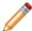

## Note:

You can use the iterative linear equation solver only for Static, General; Static, Linear perturbation; Visco; Heat transfer; Geostatic; and Soils analysis steps.

You can access the solver controls by selecting Other->Solver Controls from the main menu bar. For more information, see Iterative Linear Equation Solver.

For detailed instructions on setting solver controls, see Customizing solver controls.

## Using the Step module toolbox

You can access all the Step module tools through the main menu bar; in addition, you can also access the tools through the Step module toolbox. Figure 1 shows the icons for the tools in the Step module toolbox.

  
Figure 1:The Step module toolbox.

## Using the Step Manager

This section describes how you can use the Step Manager to create, edit, and manipulate steps.

(For general information on managers, see Managing objects.)

## In this section:

The Step Manager  
Creating a step  
Editing a step  
Replacing a step  
Resetting the default values in the step editor  
Accounting for geometric nonlinearity

## The Step Manager

You use the Step Manager to create, edit, and manipulate the analysis steps associated with the current model. To start the Step Manager, select Step->Manager from the main menu bar. Columns in the Step Manager dialog box display the following information about each step:

## Name

The name of the step. Names of linear perturbation steps are indented relative to names of general steps.

## Procedure

The analysis procedure that you selected for this step when the step was created. You can change the analysis procedure after creating a step. Click Replace to select a new procedure type for the selected step. The Procedure column also indicates whether thermal and soils steps assume steady-state or transient conditions or if neither is applicable.

## Nlgeom

Whether the analysis step accounts for geometric nonlinearities. You use the Nlgeom button to control the Nlgeom setting for a particular step. Once you have set the Nlgeom option for a step, your setting remains in effect for all subsequent steps.

## Time

The time period for the step. The default value for the time period is 1.0 time unit. Click Edit to display the step editor so that you can modify the time period.

You use the buttons across the bottom of the Step Manager dialog box to create a step that follows the selected step or to manipulate the selected step. You use the Dismiss button to close the Step Manager dialog box. You can perform the same tasks using the pull-down menus available from the Step menu, located in the main menu bar.

You can suppress an analysis step to exclude the procedure from the analysis. The suppressed step is removed from the context bar, the restart request dialog box, and the diagnostic print dialog box. Any step-dependent or propagating attributes created in the step are automatically suppressed and ignored during the analysis. Upon resuming the step, the status of each attribute will return to the original state. For example, suppressing and resuming a step will not resume an associated load that was previously suppressed. You can suppress or resume a step as long as the step sequence remains valid.


## Warning:

If you use the Step Manager or the Step menu to delete a step, objects associated with that step, such as prescribed conditions or output requests, are also deleted. If you use the Step Manager or the Step menu to replace a step, objects that are incompatible with the new analysis procedure are substituted with an equivalent object, if possible, or deleted.

## Additional information

• Suppressing and resuming objects  
• Understanding steps  
• Using the Step Manager

## Creating a step

You can create any sequence of procedures that is allowed by the Abaqus analysis products; the procedure list in the Create Step dialog box is updated to show only the available procedures for the new step. For example, if your first step contains a static stress/displacement procedure, you cannot follow it with a new step containing a heat transfer procedure.

1. From the main menu bar, select Step->Create.

The Create Step dialog box appears.


Tip: You can initiate the Create procedure in two other ways:

Click Create in the Step Manager. (You can display the Step Manager by selecting Step->Manager from the main menu bar.)  
• Click the tool in the Step module toolbox.

2. If desired, use the Name text field to change the name of the new step.

All steps must have unique names, and you cannot name a step “Initial”.

3. From the list of existing steps, select the step after which the new step will be inserted.

4. Click the arrow next to the Procedure type field, and select either General or Linear perturbation from the list that appears.

The lower half of the dialog box displays a list of available procedures.

5. Select the desired procedure and click Continue.

The Edit Step dialog box appears.

6. Use the Edit Step dialog box to modify the settings from their default values and to provide values for optional settings. (For detailed help on a particular editor feature, select Help->On Context from the main menu bar and then click the feature of interest.)

7. Click OK.

Abaqus/CAE closes the Edit Step dialog box, and the new step appears in the Step Manager.

## Additional information

• Understanding steps  
• General and Perturbation Procedures

## Editing a step

You can use the step editor to edit the analysis procedure settings associated with an existing step.

1. From the main menu bar, select Step->Edit->step name.

The step editor appears.


Tip: You can also select the step name in the Step Manager and click Edit.

2. Use the tabs within the step editor to modify the settings. (For detailed help on a particular editor feature, select Help->On Context from the main menu bar and then click the feature of interest.)  
3. Click OK to close the step editor and save the new settings.

## Additional information

• Understanding steps

## Replacing a step

You can replace an existing procedure with any procedure that is allowed by the Abaqus analysis products; the procedure list in the Replace Step dialog box is updated to show only the available procedures for the revised step. For example, you can change from a Static, General procedure to a Static, Riks procedure. Abaqus/CAE copies compatible step-dependent objects to the new step, substitutes equivalent objects, if possible, and deletes the remaining objects.

After you replace a step, you should verify that previously defined properties, element types, jobs, and boundary conditions and fields in the inital step remain valid for the model. For more information, see What is step replacement?.

1. From the main menu bar, select Step->Replace->step name.

The Replace Step dialog box appears.


Tip: You can also select the step name in the Step Manager and click Replace.

2. Click the arrow next to the New procedure type field, and select either General or Linear perturbation from the list that appears.

The lower half of the dialog box displays a list of available procedures.

3. Select the new procedure, and click Continue.

The Edit Step dialog box appears.

4. Use the Edit Step dialog box to modify the settings from their default values and to provide values for optional settings. (For detailed help on a particular editor feature, select Help->On Context from the main menu bar and then click the feature of interest.)

5. Click OK.

If step-dependent objects are not compatible with the new step, Abaqus/CAE displays a list of the objects that were deleted during step replacement in the message area and closes the Edit Step dialog box.

## Additional information

• Understanding steps

When you create, edit, or replace a step, you use the step editor to configure the analysis procedure settings. You can use the replace function to reset the settings in the step editor to their default values by replacing an existing step with a step of the same procedure type.

1. From the main menu bar, select Step->Replace->step name.

The Replace Step dialog box appears with the current procedure highlighted in the list of available procedures.


Tip: You can also select the step name in the Step Manager and click Replace.

2. Click Continue.

The Edit Step dialog box appears with default values for the procedure settings.

3. Use the Edit Step dialog box to modify the settings from their default values and to provide values for optional settings. (For detailed help on a particular editor feature, select Help->On Context from the main menu bar and then click the feature of interest.)  
4. Click OK.

Abaqus/CAE copies step-dependent objects to the new step and closes the Edit Step dialog box.

## Accounting for geometric nonlinearity

The Nlgeom setting for a step determines whether Abaqus will account for geometric nonlinearity in that step. The Nlgeom setting is turned on by default for Abaqus/Explicit steps and turned off by default for Abaqus/Standard steps.

The sequence of steps and the current Nlgeom setting determine whether you can change the Nlgeom setting in a particular step. For example, if Abaqus is already accounting for geometric nonlinearity, the Nlgeom setting is toggled on for all subsequent steps, and you cannot toggle it off. Similarly, you cannot change the Nlgeom setting during a linear perturbation step. For more information, see Linear and nonlinear procedures.


## Note:

When you create a step, you can click the Basic tab in the Step Editor and select On or Off as the Nlgeom setting.

1. To display the Edit Nlgeom dialog box and to change the setting where applicable, do one of the following:

• From the main menu bar, select Step->Nlgeom.  
• From the main menu bar, select Step->Edit->step name.

The Step Editor appears. From the Nlgeom field on the Basic tabbed page, click

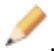

• From the main menu bar, select Step->Manager.

The Step manager appears. From the buttons along the bottom of the manager, click Nlgeom.

2. From the Edit Nlgeom dialog box, click the step name of interest to turn Nlgeom on or off for that step.

If Nlgeom is turned on for a step, a check mark appears in the Nlgeom column. If Nlgeom is turned off for a step, no tickmark appears.

3. Click OK to close the Edit Nlgeom dialog box.

## Additional information

• Understanding steps

## Using the step editor

This section describes the step editor and the options that appear in the step editor.

## In this section:

The step editor  
The Incrementation tab

## The step editor

When you create, edit, or replace a step, the step editor displays a set of tabbed pages that allow you to configure the settings for the procedure you selected. The pages are unique for each procedure; for example, when you configure a Static, General procedure, the step editor displays the Basic, Incrementation, and Other tabs. Settings you can configure with these tabbed pages include the time period for the step, the maximum number of increments, the increment size, the default load variation with time, and whether to account for geometric nonlinearity.

Abaqus stores the text that you enter in the Description field on the Basic tabbed page in the output database, and it is displayed in the state block by the Visualization module.

If you want to reset the procedure settings to their default values, you can replace an existing step with a step of the same procedure type. For more information, see Resetting the default values in the step editor.

For detailed help on a specific feature of the editor, select Help->On Context and then click the feature of interest.

## Additional information

• Understanding steps  
• Using the step editor

## The Incrementation tab

When you configure general procedures, you use the Basic tab in the step editor to enter the total time period for the step. You use the Incrementation tab to configure the approach that Abaqus will use to divide the total time period for the step into increments. For a general, static step as well as for many other kinds of steps you can set the following options on the Incrementation tabbed page:

## Time incrementation

• When you choose Automatic time incrementation, Abaqus starts the incrementation using the value entered for the initial increment size. The size of subsequent time increments are adjusted based on how quickly the solution converges. This option is the default selection.  
• When you choose Fixed time incrementation, Abaqus uses the value entered for the initial increment size throughout the step.


## Warning:

Choosing Fixed time incrementation may prevent the solution from converging and is not recommended.

## Maximum number of increments

Abaqus limits the number of increments in a step to the value that you enter for the maximum number of increments. If the step exceeds this number of increments, the analysis stops, and diagnostic information is reported to the Job module and written to the message file. By default, Abaqus/CAE sets the maximum number of increments to 100.

## Initial increment size

Abaqus starts the step using the value entered for the initial increment size.

## Minimum increment size

Abaqus checks for the minimum increment size only when you analyze your model using automatic time incrementation. If Abaqus needs a smaller time increment than this value to reach a convergent solution, it terminates the analysis, reports to the Job module, and writes diagnostic information to the message file. If you do not enter a minimum increment size, Abaqus uses 10-5 times the total time period.

## Maximum increment size

Abaqus checks for the maximum increment size only when you analyze your model using automatic time incrementation. Abaqus will not increase the increment size beyond this value during the analysis. If you do not specify this value, Abaqus/CAE sets the value to that of the total time period (with the exception of dynamic, implicit procedures, in which the default maximum increment size depends on a variety of analysis settings; see Configuring a dynamic, implicit procedure).


## Note:

A value must be entered for each of the incrementation options described above. Abaqus/CAE does not allow you to create the step if you delete the default value for an incrementation option but fail to provide another.

For detailed information on other items in the Incrementation tabbed page, click Help->On Context and then click the item of interest.

## Additional information

• Understanding steps  
• Using the step editor

## Configuring analysis procedure settings

The Edit Step dialog box allows you to configure the analysis procedure settings for a particular step. This section provides instructions for each analysis procedure.

## In this section:

Configuring general analysis procedures  
Configuring linear perturbation analysis procedures

## Configuring general analysis procedures

You can configure general analysis procedures to analyze linear or nonlinear response. You can include general analysis procedures in Abaqus/Standard or Abaqus/Explicit analyses.

For more information, see General and Perturbation Procedures.

This section provides instructions for using the step editor to configure different types of general analysis procedures.

## In this section:

Configuring a static, general procedure  
Configuring a static, Riks procedure  
Configuring a dynamic, explicit procedure  
Configuring a heat transfer procedure  
Configuring a dynamic, implicit procedure  
Configuring a fully coupled, simultaneous heat transfer and stress procedure  
Configuring a fully coupled, simultaneous heat transfer and electrical procedure  
Configuring a fully coupled, simultaneous heat transfer, electrical, and structural procedure  
Configuring a direct cyclic procedure  
Configuring a dynamic fully coupled thermal-stress procedure using explicit integration  
Configuring a geostatic stress field procedure  
Configuring a mass diffusion procedure  
Configuring an effective stress analysis for fluid-filled porous media  
Configuring a transient, static, stress/displacement analysis with time-dependent material response  
Configuring an annealing procedure

## Configuring a static, general procedure

A static stress procedure is one in which inertia effects are neglected. The analysis can be linear or nonlinear and ignores time-dependent material effects. For more information, see Static Stress Analysis.

## Create or edit a static, general procedure

1. Display the Edit Step dialog box following the procedure outlined in Creating a step (Procedure type: General; Static, General), or Editing a step.  
2. On the Basic, Incrementation, and Other tabbed pages, configure settings such as the time period for the step, the maximum number of increments, the increment size, the default load variation with time, and whether to account for geometric nonlinearity as described in the following procedures.

## Configure settings on the Basic tabbed page

1. In the Edit Step dialog box, display the Basic tabbed page.  
2. In the Description field, enter a short description of the analysis step. Abaqus stores the text that you enter in the output database, and the text is displayed in the state block by the Visualization module.  
3. In the Time period field, enter the time period of the step. For more information, see Time Period.  
4. Select an Nlgeom option:

• Toggle NlgeomOff to perform a geometrically linear analysis during the current step.  
Toggle NlgeomOn to indicate that Abaqus/Standard should account for geometric nonlinearity during the step. Once you have toggled Nlgeom on, it will be active during all subsequent steps in the analysis.

For more information, see Linear and nonlinear procedures.

5. Select an automatic stabilization method if you expect the problem to have local instabilities such as surface wrinkling, material instability, or local buckling. Abaqus/Standard can stabilize this class of problems by applying damping throughout the model. For more information, see Unstable Problems, and Automatic Stabilization of Static Problems with a Constant Damping Factor

Click the arrow to the right of Automatic stabilization, and select a method for defining the damping factor:

Select Specify dissipated energy fraction to allow Abaqus/Standard to calculate the damping factor from a dissipated energy fraction that you provide. Enter a value for the dissipated energy fraction in the adjacent field (the default is $2 . 0 \times \bar { 1 } 0 ^ { - 4 } )$ ). For more information, see Calculating the Damping Factor Based on the Dissipated Energy Fraction.  
Select Specify damping factor to enter the damping factor directly. Enter a value for the damping factor in the adjacent field. For more information, see Directly Specifying the Damping Factor.  
Select Use damping factors from previous general step to use the damping factors at the end of the previous step as the initial factors in the current step's variable damping scheme. These factors override any initial damping factors that are calculated or specified directly in the current step. If there are no damping factors associated with the previous general step (for example, if the previous step does not use any stabilization or the current step is the first step of the analysis), Abaqus uses adaptive stabilization to determine the required damping factors.

6. When using automatic stabilization, Abaqus can use the same damping factor over the course of a step, or it can vary the damping factor spatially and temporally during a step based on the convergence history and the ratio of the energy dissipated by damping to the total strain energy. For more information, see Adaptive Automatic Stabilization Scheme. If you selected Specify dissipated energy fraction, adaptive stabilization is optional and turned on by default. If you selected Specify damping factor, adaptive stabilization is optional and turned off by default. If you selected Use damping factors from previous general step, adaptive stabilization is required.

To use adaptive stabilization, toggle on Use adaptive stabilization with max. ratio of stabilization to strain energy (if necessary), and enter a value in the adjacent field for the allowable accuracy tolerance for the ratio of energy dissipated by damping to total strain energy in each increment. The default value of 0.05 should be suitable in most cases.

7. Toggle on Include adiabatic heating effects if you are performing an adiabatic stress analysis. This option is relevant only for isotropic metal plasticity materials with a Mises yield surface. For more information, see Adiabatic Analysis.  
8. When you have finished configuring settings for the static, general step, click OK to close the Edit Step dialog box.

## Configure settings on the Incrementation tabbed page

1. In the Edit Step dialog box, display the Incrementation tabbed page.

(For information on displaying the Edit Step dialog box, see Creating a step, or Editing a step.)

2. Choose a Type option:

Choose Automatic to allow Abaqus/Standard to choose the size of the time increments based on computational efficiency.  
Choose Fixed to specify direct user control of the incrementation. Abaqus/Standard uses an increment size that you specify as the constant increment size throughout the step.

3. In the Maximum number of increments field, enter the upper limit to the number of increments in the step. The analysis stops if this maximum is exceeded before Abaqus/Standard arrives at the complete solution for the step.  
4. If you selected Automatic in Step 2, enter values for Increment size:

a. In the Initial field, enter the initial time increment. Abaqus/Standard modifies this value as required throughout the step.  
b. In the Minimum field, enter the minimum time increment allowed. If Abaqus/Standard needs a smaller time increment than this value, it terminates the analysis.  
c. In the Maximum field, enter the maximum time increment allowed.

5. If you selected Fixed in Step 2, enter a value for the constant time increment in the Increment size field.  
6. When you have finished configuring settings for the static, general step, click OK to close the Edit Step dialog box.

## Configure settings on the Other tabbed page

1. In the Edit Step dialog box, display the Other tabbed page.

(For information on displaying the Edit Step dialog box, see Creating a step, or Editing a step.)

2. Choose an Equation Solver Method option:

• Choose Direct to use the default direct sparse solver.  
Choose Iterative to use the iterative linear equation solver. The iterative solver is typically most useful for blocky structures with millions of degrees of freedom. For more information, see Iterative Linear Equation Solver.

3. Choose a Matrix storage option:

Choose Use solver default to allow Abaqus/Standard to decide whether a symmetric or unsymmetric matrix storage and solution scheme is needed.  
• Choose Unsymmetric to restrict Abaqus/Standard to the unsymmetric storage and solution scheme.  
• Choose Symmetric to restrict Abaqus/Standard to the symmetric storage and solution scheme.

For more information on matrix storage, see Matrix Storage and Solution Scheme in Abaqus/Standard.

## 4. Choose a Solution technique:

Choose Full Newton to use Newton's method as a numerical technique for solving nonlinear equilibrium equations. For more information, see Nonlinear solution methods in Abaqus/Standard.  
Choose Quasi-Newton to use the quasi-Newton technique for solving nonlinear equilibrium equations. This technique can save substantial computational cost in some cases. Generally it is most successful when the system is large and the stiffness matrix is not changing much from iteration to iteration. You can use this technique only for symmetric systems of equations.

If you choose this technique, enter a value for the Number of iterations allowed before the kernel matrix is reformed. The maximum number of iterations allowed is 25. The default number of iterations is 8.

For more information, see Quasi-Newton solution technique.

5. Click the arrow to the right of the Convert severe discontinuity iterations field, and select an option for dealing with severe discontinuities during nonlinear analysis:

Select Off to force a new iteration if severe discontinuities occur during an iteration, regardless of the magnitude of the penetration and force errors. This option also changes some time incrementation parameters and uses different criteria to determine whether to do another iteration or to make a new attempt with a smaller increment size.  
Select On to use local convergence criteria to determine whether a new iteration is needed. Abaqus/Standard will determine the maximum penetration and estimated force errors associated with severe discontinuities and check whether these errors are within the tolerances. Hence, a solution may converge if the severe discontinuities are small.  
• Select Propagate from previous step to use the value specified in the previous general analysis step. This value appears in parentheses to the right of the field.

For more information on severe discontinuities, see Severe Discontinuities in Abaqus/Standard.

6. Choose an option for Default load variation with time:

Choose Instantaneous if you want loads to be applied instantaneously at the start of the step and remain constant throughout the step.  
Choose Ramp linearly over step if the load magnitude is to vary linearly over the step, from the value at the end of the previous step to the full magnitude of the load.

7. Click the arrow to the right of the Extrapolation of previous state at start of each increment field, and select a method for determining the first guess to the incremental solution:

Select Linear to indicate that the process is essentially monotonic and Abaqus/Standard should use a 100% linear extrapolation, in time, of the previous incremental solution to begin the nonlinear equation solution for the current increment.  
Select Parabolic to indicate that the process should use a quadratic extrapolation, in time, of the previous two incremental solutions to begin the nonlinear equation solution for the current increment.  
• Select None to suppress any extrapolation.

For more information, see Extrapolation of the Solution.

8. Toggle on Stop when region region name is fully plastic if “fully plastic” analysis is required with deformation theory plasticity. If you toggle on this option, enter the name of the region being monitored for fully plastic behavior.

The step ends when the solutions at all constitutive calculation points in the element set are fully plastic (defined by the equivalent strain being 10 times the offset yield strain). However, the step can end before this point if either the maximum number of increments that you specified on the Incrementation tabbed page or the time period that you specified on the Basic tabbed page is exceeded.

9. If you selected Fixed time incrementation on the Incrementation tabbed page, you can toggle on Accept solution after reaching maximum number of iterations. This option directs Abaqus/Standard to accept the solution to an increment after the maximum number of iterations allowed has been completed, even if the equilibrium tolerances are not satisfied. Very small increments and a minimum of two iterations are usually necessary if you use this option.


## Warning:

This approach is not recommended; you should use it only in special cases when you have a thorough understanding of how to interpret results obtained in this way.

10. Toggle on Obtain long-term solution with time-domain material properties to obtain the fully relaxed long-term elastic solution with time-domain viscoelasticity or the long-term elastic-plastic solution for two-layer viscoplasticity. This parameter is relevant only for time-domain viscoelastic and two-layer viscoplastic materials.

11. When you have finished configuring settings for the static, general step, click OK to close the Edit Step dialog box.

## Configuring a static, Riks procedure

Geometrically nonlinear static problems sometimes involve buckling or collapse behavior, where the load-displacement response shows a negative stiffness, and the structure must release strain energy to remain in equilibrium. The modified Riks method allows you to find static equilibrium states during the unstable phase of the response.

You can use this method for cases where the load magnitudes are governed by a single scalar parameter. It is also useful for solving ill-conditioned problems such as limit load problems or almost unstable problems that exhibit softening. For more information, see Unstable Collapse and Postbuckling Analysis.

## Create or edit a static, Riks procedure

1. Display the Edit Step dialog box following the procedure outlined in Creating a step (Procedure type: General; Static, Riks), or Editing a step.  
2. On the Basic, Incrementation, and Other tabbed pages, configure settings such as stopping criteria, the maximum number of increments, the arc increment length, and whether to account for geometric nonlinearity as described in the following procedures.

## Configure settings on the Basic tabbed page

1. In the Edit Step dialog box, display the Basic tabbed page.  
2. In the Description field, enter a short description of the analysis step. Abaqus stores the text that you enter in the output database, and the text is displayed in the state block by the Visualization module.  
3. Select an Nlgeom option:

• Toggle NlgeomOff to perform a geometrically linear analysis during the current step.  
Toggle NlgeomOn to indicate that Abaqus/Standard should account for geometric nonlinearity during the step. Once you have toggled Nlgeom on, it will be active during all subsequent steps in the analysis.

For more information, see Linear and nonlinear procedures.

4. Toggle on Include adiabatic heating effects if you are performing an adiabatic stress analysis. This option is relevant only for isotropic metal plasticity materials with a Mises yield surface. For more information, see Adiabatic Analysis.  
5. Since the loading magnitude is part of the solution, you need a method to specify when the step is completed. Choose one or both of the following options:

Toggle on Maximum load proportionality factor to enter a maximum value for the load proportionality factor, . Abaqus/Standard uses this value to terminate the step when the load exceeds a certain magnitude. For more information, see Proportional Loading  
Toggle on Maximum displacement to enter a maximum displacement value at a specific degree of freedom (DOF). You must also specify the Node Region that Abaqus/Standard will monitor for finishing displacement. If this maximum displacement is exceeded, Abaqus/Standard terminates the step.

If you leave both of these finishing conditions unspecified, the analysis continues for the number of increments that you specify on the Incrementation tabbed page.

## Configure settings on the Incrementation tabbed page

1. In the Edit Step dialog box, display the Incrementation tabbed page.

(For information on displaying the Edit Step dialog box, see Creating a step, or Editing a step.)

2. Choose a Type option:

Choose Automatic to allow Abaqus/Standard to choose the size of the arc length increments based on computational efficiency.  
Choose Fixed to specify direct user control of the incrementation. Abaqus/Standard uses an arc length increment that you specify as the constant increment size throughout the step. This method is not recommended for a Riks analysis since it prevents Abaqus/Standard from reducing the arc length when a severe nonlinearity is encountered.

For more information, see Incrementation.

3. In the Maximum number of increments field, enter the upper limit to the number of increments in the step. The analysis stops if this maximum is exceeded before Abaqus/Standard arrives at the complete solution for the step.

4. If you selected Automatic in Step 2, enter values for Arc length increment:

a. In the Initial field, enter the initial increment in arc length along the static equilibrium path in scaled load-displacement space, $\Delta l _ { i n }$ .  
b. In the Minimum field, enter the minimum arc length increment, $\Delta l _ { m i n }$ . If you enter zero, Abaqus assumes a default value of the smaller of the suggested initial arc length or $\mathrm { i } 0 ^ { - 5 }$ times the total arc length.  
c. In the Maximum field, enter the maximum arc length increment, $\Delta l _ { m a x }$ . If this value is not specified, no upper limit is imposed.  
d. In the Estimated total arc length field, enter the total arc length scale factor associated with this step, $l _ { p e r i o d }$ . If this entry is zero or is unspecified, Abaqus/Standard assumes a default value of .

5. If you selected Fixed in Step 2, enter a value for the constant arc length increment in the Arc length increment field.

## Configure settings on the Other tabbed page

1. In the Edit Step dialog box, display the Other tabbed page.

(For information on displaying the Edit Step dialog box, see Creating a step, or Editing a step.)

2. Choose a Matrix storage option:

Choose Use solver default to allow Abaqus/Standard to decide whether a symmetric or unsymmetric matrix storage and solution scheme is needed.  
• Choose Unsymmetric to restrict Abaqus/Standard to the unsymmetric storage and solution scheme.  
• Choose Symmetric to restrict Abaqus/Standard to the symmetric storage and solution scheme.

For more information on matrix storage, see Matrix Storage and Solution Scheme in Abaqus/Standard.

3. Click the arrow to the right of the Convert severe discontinuity iterations field, and select an option for dealing with severe discontinuities during nonlinear analysis:

Select Off to force a new iteration if severe discontinuities occur during an iteration, regardless of the magnitude of the penetration and force errors. This option also changes some time incrementation parameters and uses different criteria to determine whether to do another iteration or to make a new attempt with a smaller increment size.  
Select On to use local convergence criteria to determine whether a new iteration is needed. Abaqus/Standard will determine the maximum penetration and estimated force errors associated with severe discontinuities and check whether these errors are within the tolerances. Hence, a solution may converge if the severe discontinuities are small.  
• Select Propagate from previous step to use the value specified in the previous general analysis step. This value appears in parentheses to the right of the field.

For more information on severe discontinuities, see Severe Discontinuities in Abaqus/Standard.

4. Click the arrow to the right of the Extrapolation of previous state at start of each increment field, and select a method for determining the first guess to the incremental solution:

Select Linear to indicate that the process is essentially monotonic, and Abaqus/Standard should use a 1% linear extrapolation of the previous incremental solution to begin the nonlinear equation solution for the current increment.  
• Select None to suppress any extrapolation.

(The Parabolic option is not relevant for Riks analyses.) For more information, see Extrapolation of the Solution.

5. Toggle on Stop when region region name is fully plastic if “fully plastic” analysis is required with deformation theory plasticity. If you toggle on this option, enter the name of the region being monitored for fully plastic behavior.

The step ends when the solutions at all constitutive calculation points in the element set are fully plastic (defined by the equivalent strain being 10 times the offset yield strain). However, the step can end before this point if the maximum number of increments that you specified on the Incrementation tabbed page is exceeded.

6. If you selected Fixed time incrementation on the Incrementation tabbed page, you can toggle on Accept solution after reaching maximum number of iterations. This option directs Abaqus/Standard to accept the solution to an increment after the maximum number of iterations allowed has been completed, even if the equilibrium tolerances are not satisfied. Very small increments and a minimum of two iterations are usually necessary if you use this option.


## Warning:

This approach is not recommended; you should use it only in special cases when you have a thorough understanding of how to interpret results obtained in this way.

7. Toggle on Obtain long-term solution with time-domain material properties to obtain the fully relaxed long-term elastic solution with time-domain viscoelasticity or the long-term elastic-plastic solution for two-layer viscoplasticity. This parameter is relevant only for time-domain viscoelastic and two-layer viscoplastic materials.

When you have finished configuring settings for the static, Riks step, click OK to close the Edit Step dialog box.

## Configuring a dynamic, explicit procedure

An explicit, dynamic analysis is computationally efficient for the analysis of large models with relatively short dynamic response times and for the analysis of extremely discontinuous events or processes. This type of analysis allows for the definition of very general contact conditions and uses a consistent, large-deformation theory. For more information, see Explicit Dynamic Analysis.

## Create or edit a dynamic, explicit procedure

1. Display the Edit Step dialog box following the procedure outlined in Creating a step (Procedure type: General; Dynamic, Explicit), or Editing a step.  
2. On the Basic, Incrementation, Mass scaling, and Other tabbed pages, configure settings such as the time period for the step, the maximum time increment, the increment size, mass scaling definitions, and bulk viscosity parameters as described in the following procedures.

## Configure settings on the Basic tabbed page

1. In the Edit Step dialog box, display the Basic tabbed page.  
2. In the Description field, enter a short description of the analysis step. Abaqus stores the text that you enter in the output database, and the text is displayed in the state block by the Visualization module.  
3. In the Time period field, enter the time period of the step.  
4. Select an Nlgeom option:

• Toggle NlgeomOff to perform a geometrically linear analysis during the current step.  
Toggle NlgeomOn to indicate that Abaqus/Explicit should account for geometric nonlinearity during the step. Once you have toggled Nlgeom on, it will be active during all subsequent steps in the analysis.

For more information, see Linear and nonlinear procedures.

5. Toggle on Include adiabatic heating effects if you are performing an adiabatic stress analysis. This option is relevant only for metal plasticity. For more information, see Adiabatic Analysis.

## Configure settings on the Incrementation tabbed page

1. In the Edit Step dialog box, display the Incrementation tabbed page.

(For information on displaying the Edit Step dialog box, see Creating a step, or Editing a step.)

2. Choose a Type option:

Choose Automatic to allow Abaqus/Explicit to determine the time incrementation automatically. For more information, see Automatic Time Incrementation.  
Choose Fixed to use a fixed time incrementation scheme. The fixed time increment size is determined either by the initial element stability estimate for the step or by a user-specified time increment. For more information, see Fixed Time Incrementation.

3. If you selected Automatic time incrementation, perform the following steps:

a. Choose a Stable increment estimator option:

Choose Global to allow the global estimator to determine the stability limit as the step proceeds. The adaptive, global estimation algorithm determines the maximum frequency of the entire model using the current dilatational wave speed. This algorithm continuously updates the estimate for the maximum frequency. The global estimator will usually allow time increments that exceed the element-by-element values.

Choose Element-by-element to allow Abaqus/Explicit to determine an element-by-element estimate using the current dilatational wave speed in each element.

The element-by-element estimate is conservative; it will give a smaller stable time increment than the true stability limit that is based upon the maximum frequency of the entire model. In general, constraints such as boundary conditions and kinematic contact have the effect of compressing the eigenvalue spectrum, and the element-by-element estimates do not take this into account.

b. By default, the "improved" method to estimate the element stable time increment for three-dimensional continuum elements and elements with plane stress formulations is used. This method usually results in a larger element stable time increment than a more traditional method. Toggle off Improved Dt Method to deactivate the "improved" method.

c. Choose a Max. time increment option:

• Choose Unlimited if you do not want to impose an upper limit to time incrementation.

Choose Value to enter a value for the maximum time increment allowed. Enter the value in the field provided.

For more information, see Automatic Time Incrementation.

4. If you selected Fixed time incrementation, choose an option for determining increment size:

Choose User-defined time increment to specify a time increment size directly. Enter that time increment size in the field provided.  
Choose Use element-by-element time increment estimator to use time increments the size of the initial element-by-element stability limit throughout the step. The dilatational wave speed in each element at the beginning of the step is used to compute the fixed time increment size.

For more information, see Fixed Time Incrementation.

5. If desired, enter a Time scaling factor to adjust the stable time increment computed by Abaqus/Explicit. (This option is unavailable if you have specified a User-defined time increment for the Fixed time incrementation scheme.) For more information, see Scaling the Time Increment.

## Configure settings on the Mass scaling tabbed page

1. In the Edit Step dialog box, display the Mass scaling tabbed page. For background information on mass scaling, see Mass Scaling.

(For information on displaying the Edit Step dialog box, see Creating a step, or Editing a step.)

2. Choose one of the following options for specifying mass scaling:

Choose Use scaled mass and “throughout step” definitions from the previous step if you want mass scaling definitions from the previous step to propagate through the current step. If you choose this option, you can skip the remaining steps in this procedure.  
Choose Use scaling definitions below to create one or more new mass scaling definitions for this step. If you choose this option, complete the remaining steps in this procedure.

3. At the bottom of the Data table, click Create.

An Edit mass scaling dialog box appears.

4. Specify which type of mass scaling definition you want to create:

• Choose Semi-automatic mass scaling to define mass scaling for any type of analysis except bulk metal rolling.

Choose Automatic mass scaling to define mass scaling for a bulk metal rolling analysis. For more information, see Automatic Mass Scaling for Analysis of Bulk Metal Rolling.  
Choose Reinitialize mass to reinitialize masses of elements to their original values. This option allows you to prevent the scaled mass from a previous step from being used in the current step. For more information, see Reverting the Mass Matrix to the Original State.  
Choose Disable mass scaling thoughout step to disable in this step all variable mass scaling definitions from previous steps. For more information, see Continuous Mass Matrix with No Further Scaling.

5. If you selected Semi-automatic mass scaling, Automatic mass scaling, or Reinitialize mass, indicate the region to which you want the mass scaling definition applied:

• Choose Whole model to apply the mass scaling definition to all elements in the model.

Choose Set to apply the mass scaling definition to a particular set of elements. Enter the set name in the field provided.

6. If you selected Semi-automatic mass scaling, indicate when, during the step, you want Abaqus/Explicit to scale the element masses:

Choose At beginning of step to perform fixed mass scaling only at the beginning of the step. For more information, see Fixed Mass Scaling.  
Choose Throughout step to scale the mass of elements periodically during the step. For more information, see Variable Mass Scaling.

7. If you selected Semi-automatic mass scaling, indicate how you want Abaqus/Explicit to scale the element masses:

Toggle on Scale by factor to scale the elements once at the beginning of the step by the value you enter in the field provided. For more information, see Defining a Scale Factor Directly.

Toggle on Scale to target time increment of n to enter a desired element stable time increment in the field provided. Click the arrow to the right of the Scale element mass field, and select how you want Abaqus/Explicit to apply that target time increment:

Select Uniformly to satisfy target to scale the masses of the elements equally so that the smallest element stable time increment of the scaled elements equals the target value.  
Select If below minimum target to scale the masses of only the elements whose element stable time increments are less than the target value.  
Select Nonuniformly to equal target to scale the masses of all elements so that they all have the same element stable time increment equal to the target value.

For more information, see Defining a Desired Element-by-Element Stable Time Increment.

If you toggle on both Scale by factor and Scale to target time increment, Abaqus/Explicit first scales the masses by the factor value that you enter and then possibly scales them again, depending on the value you enter for target time increment and the option you select for applying that target.

8. If you selected Automatic mass scaling, enter the following values:

• In the Feed rate field, enter the estimated average velocity of the workpiece in the rolling direction at steady-state conditions.  
• In the Extruded element length field, enter the average element length in the rolling direction.  
• In the Nodes in cross-section field, enter the number of nodes in the cross-section of the workpiece. Increasing this value decreases the amount of mass scaling.

For more information, see Automatic Mass Scaling for Analysis of Bulk Metal Rolling.

9. If you selected Semi-automatic mass scaling throughout the step or Automatic mass scaling, specify when, during the step, you want Abaqus/Explicit to perform mass scaling calculations:

Choose Every n increments to specify the frequency, in increments, at which Abaqus/Explicit is to perform mass scaling calculations. Enter the desired frequency in the field provided.

For example, if you enter a value of 5, Abaqus/Explicit scales the mass at the beginning of the step and at increments 5, 10, 15, etc.

Choose At n equal intervals to specify the number of intervals during the step at which Abaqus/Explicit is to perform mass scaling calculations. Enter the desired value in the field provided.

For example, if you enter a value of 2, Abaqus/Explicit scales the mass at the beginning of the step, the increment immediately following the half-way point in the step, and the final increment in the step.

10. Click OK to close the Edit mass scaling dialog box and return to the Mass scaling tabbed page of the Edit Step dialog box.

The mass scaling definition that you have just created appears in the Data table.

11. If desired, repeat Steps 3 to 10 to create additional mass scaling definitions.

12. Once you have created one or more mass scaling definitions, you can edit or delete them if desired. Select a particular mass scaling definition in the Data table, and click Edit or Delete at the bottom of the Data table.

## Configure settings on the Other tabbed page

1. In the Edit Step dialog box, display the Other tabbed page.

(For information on displaying the Edit Step dialog box, see Creating a step, or Editing a step.)

2. Enter a value for the Linear bulk viscosity parameter. Linear bulk viscosity is included by default in Abaqus/Explicit.

3. Enter a value for the Quadratic bulk viscosity parameter. This form of bulk viscosity pressure is found only in solid continuum element and is applied only if the volumetric strain rate is compressive. For more information, see Bulk Viscosity.

When you have finished configuring settings for the dynamic, explicit step, click OK to close the Edit Step dialog box.

## Configuring a heat transfer procedure

You can perform an uncoupled heat transfer analysis to model solid body heat conduction with general, temperature-dependent conductivity, internal energy (including latent heat effects), and general convection and radiation boundary conditions, including cavity radiation. For more information, see Uncoupled Heat Transfer Analysis.

## Create or edit a heat transfer procedure

1. Display the Edit Step dialog box following the procedure outlined in Creating a step (Procedure type: General; Heat transfer), or Editing a step.  
2. On the Basic, Incrementation, and Other tabbed pages, configure settings such as the time period for the step, the maximum allowable temperature change per increment, and equation solver preferences as described in the following procedures.

## Configure settings on the Basic tabbed page

1. In the Edit Step dialog box, display the Basic tabbed page.  
2. In the Description field, enter a short description of the analysis step. Abaqus stores the text that you enter in the output database, and the text is displayed in the state block by the Visualization module.

3. Choose a Response option:

Choose Steady-state to omit the internal energy term (the specific heat term) in the governing heat transfer equation. For more information, see Steady-State Analysis.  
Choose Transient to perform time integration with the backward Euler method in the pure conduction elements. This method is unconditionally stable for linear problems. For more information, see Transient Analysis.


## Note:

After you have selected a Response option, a message appears informing you that Abaqus/Standard has selected the Default load variation with time option (located on the Other tabbed page) that corresponds to your Response selection. Click Dismiss to close the message dialog box.

4. In the Time period field, enter the time period of the step.

## Configure settings on the Incrementation tabbed page

1. In the Edit Step dialog box, display the Incrementation tabbed page.  
(For information on displaying the Edit Step dialog box, see Creating a step, or Editing a step.)

2. Choose a Type option:

• Choose Automatic if you want Abaqus/Standard to determine suitable time increment sizes.  
Choose Fixed to specify direct user control of the incrementation. Abaqus/Standard uses an increment size that you specify as the constant increment size throughout the step.

3. In the Maximum number of increments field, enter the upper limit to the number of increments in the step. The analysis stops if this maximum is exceeded before Abaqus/Standard arrives at the complete solution for the step.  
4. If you selected Automatic in Step 2, enter values for Increment size:

a. In the Initial field, enter the initial time increment. Abaqus/Standard modifies this value as required throughout the step.

b. In the Minimum field, enter the minimum time increment allowed. If Abaqus/Standard needs a smaller time increment than this value, it terminates the analysis.  
c. In the Maximum field, enter the maximum time increment allowed.

5. If you selected Fixed in Step 2, enter a value for the constant time increment in the Increment size field.

6. If you selected Transient analysis on the Basic tabbed page, do the following:

a. Toggle on End step when temperature change is less than n if you want the analysis to end when the temperature at every temperature degree of freedom changes at a rate that is less than a rate that you specify. If you toggle on this option, enter the desired temperature change rate in the field provided.  
b. If you selected Automatic in Step 2, enter a value for the Max. allowable temperature change per increment. Abaqus/Standard restricts the time step to ensure that this value is not exceeded at any node (except nodes whose temperature degree of freedom is constrained via boundary conditions, MPCs, etc.) during any increment of the step.

7. If you selected Automatic in Step 2 and you are performing a cavity radiation analysis, enter a value for Max. allowable emissivity change per increment or accept the default of 0.1. If this value is exceeded, Abaqus/Standard cuts back the increment until the maximum change in emissivity is less than the specified value. See Cavity Radiation in Abaqus/Standard, for more information.

## Configure settings on the Other tabbed page

1. In the Edit Step dialog box, display the Other tabbed page.

(For information on displaying the Edit Step dialog box, see Creating a step, or Editing a step.)

2. Choose an Equation Solver Method option:

• Choose Direct to use the default direct sparse solver.  
Choose Iterative to use the iterative linear equation solver. The iterative solver is typically most useful for blocky structures with millions of degrees of freedom. For more information, see Iterative Linear Equation Solver.

3. Choose a Matrix storage option:

Choose Use solver default to allow Abaqus/Standard to decide whether a symmetric or unsymmetric matrix storage and solution scheme is needed.  
• Choose Unsymmetric to restrict Abaqus/Standard to the unsymmetric storage and solution scheme.  
• Choose Symmetric to restrict Abaqus/Standard to the symmetric storage and solution scheme.

For more information on matrix storage, see Matrix Storage and Solution Scheme in Abaqus/Standard.

4. Choose a Solution technique option:

Choose Full Newton to use Newton's method as a numerical technique for solving nonlinear equilibrium equations. For more information, see Nonlinear solution methods in Abaqus/Standard.  
Choose Quasi-Newton to use the quasi-Newton technique for solving nonlinear equilibrium equations. This technique can save substantial computational cost in some cases. Generally it is most successful when the system is large and the stiffness matrix is not changing much from iteration to iteration. You can use this technique only for symmetric systems of equations.

If you choose this technique, enter a value for the Number of iterations allowed before the kernel matrix is reformed. The maximum number of iterations allowed is 25. The default number of iterations is 8.

For more information, see Quasi-Newton solution technique.

5. Click the arrow to the right of the Convert severe discontinuity iterations field, and select an option for dealing with severe discontinuities during nonlinear analysis:

Select Off to force a new iteration if severe discontinuities occur during an iteration, regardless of the magnitude of the penetration and force errors. This option also changes some time incrementation parameters and uses different criteria to determine whether to do another iteration or to make a new attempt with a smaller increment size.  
Select On to use local convergence criteria to determine whether a new iteration is needed. Abaqus/Standard will determine the maximum penetration and estimated force errors associated with severe discontinuities and check whether these errors are within the tolerances. Hence, a solution may converge if the severe discontinuities are small.  
• Select Propagate from previous step to use the value specified in the previous general analysis step. This value appears in parentheses to the right of the field.

For more information on severe discontinuities, see Severe Discontinuities in Abaqus/Standard.

6. Abaqus/Standard automatically selects the Default load variation with time option that corresponds to your Response selection on the Basic tabbed page. It is recommended that you leave the Default load variation with time selection unchanged.

7. Click the arrow to the right of the Extrapolation of previous state at start of each increment field, and select a method for determining the first guess to the incremental solution:

Select Linear to indicate that the process is essentially monotonic and Abaqus/Standard should use a 100% linear extrapolation, in time, of the previous incremental solution to begin the nonlinear equation solution for the current increment.  
Select Parabolic to indicate that the process should use a quadratic extrapolation, in time, of the previous two incremental solutions to begin the nonlinear equation solution for the current increment.  
• Select None to suppress any extrapolation.

For more information, see Extrapolation of the Solution.

When you have finished configuring settings for the heat transfer step, click OK to close the Edit Step dialog box.

## Configuring a dynamic, implicit procedure

General linear or nonlinear dynamic analysis in Abaqus/Standard uses implicit time integration to calculate the transient dynamic response of a system. See Implicit Dynamic Analysis Using Direct Integration, or Implicit dynamic analysis, for details on implicit dynamic analysis.

## Create or edit a dynamic, implicit procedure

1. Display the Edit Step dialog box following the procedure outlined in Creating a step (Procedure type: General; Dynamic, Implicit), or Editing a step.  
2. On the Basic, Incrementation, and Other tabbed pages, configure settings such as the time period for the step, increment size, and equation solver preferences as described in the following procedures.

## Configure settings on the Basic tabbed page

1. In the Edit Step dialog box, display the Basic tabbed page.  
2. In the Description field, enter a short description of the analysis step. Abaqus stores the text that you enter in the output database, and the text is displayed in the state block by the Visualization module.  
3. In the Time period field, enter the time period of the step.  
4. Select an Nlgeom option:

• Toggle NlgeomOff to perform a geometrically linear analysis during the current step.  
Toggle NlgeomOn to indicate that Abaqus/Standard should account for geometric nonlinearity during the step. Once you have toggled Nlgeom on, it will be active during all subsequent steps in the analysis.

For more information, see Linear and nonlinear procedures.

5. Select an Application option. The application setting adjusts various numerical settings (such as damping and time incrementation) to most efficiently and accurately capture the intended behavior of your analysis.

Transient fidelity applications—such as an analysis of satellite systems—use small time increments to accurately resolve the vibrational response of the structure, and numerical energy dissipation is kept at a minimum.  
Moderate dissipation applications—including various insertion, impact, and forming analyses—use some energy dissipation (via plasticity, viscous damping, or numerical effects) to reduce solution noise and improve convergence behavior without significantly degrading solution accuracy.  
Quasi-static applications introduce inertia effects primarily to regularize unstable behavior in analyses whose main focus is a final static response. Large time increments are taken when possible to minimize computational cost, and considerable numerical dissipation may be used to obtain convergence during certain stages of the loading history.  
The Analysis product default depends on the presence of contact in the model: analyses involving contact are treated as moderate dissipation applications; analyses without contact are treated as transient fidelity applications.

6. Toggle on Include adiabatic heating effects if you are performing an adiabatic stress analysis. This option is relevant only for isotropic metal plasticity materials with a Mises yield surface. For more information, see Adiabatic Analysis.

## Configure settings on the Incrementation tabbed page

1. In the Edit Step dialog box, display the Incrementation tabbed page.

(For information on displaying the Edit Step dialog box, see Creating a step, or Editing a step.)

## 2. Choose a Type option:

Choose Automatic to allow Abaqus/Standard to choose the size of the increments based on computational efficiency.  
Choose Fixed to specify direct user control of the incrementation. Abaqus/Standard uses an increment size that you specify as the constant increment size throughout the step.


## Warning:

Fixed incrementation is not generally recommended; it should be used only in special cases when you have a thorough understanding of how to interpret results obtained in this way. Impact events are particularly difficult to solve using fixed time increments.

3. In the Maximum number of increments field, enter the upper limit to the number of increments in the step. The analysis stops if this maximum is exceeded before Abaqus/Standard arrives at the complete solution for the step.  
4. If you selected Automatic in Step 2, do the following:

a. Enter values for Increment size:

• In the Initial field, enter the initial time increment. Abaqus/Standard modifies this value as required throughout the step.  
• In the Minimum field, enter the minimum time increment allowed. If Abaqus/Standard needs a smaller time increment than this value, it terminates the analysis.

b. Specify the Maximum increment size:

• Choose Specify to enter the maximum increment size directly.  
Choose Analysis application default to set the maximum increment size automatically based on the application setting:  
For transient fidelity applications, the default maximum increment is the time period of the step divided by 100.  
For moderate dissipation applications, the default maximum increment is the time period of the step divided by 10.  
- For quasi-static applications, the default maximum increment is the time period of the step.

c. The half-increment residual tolerance represents the equilibrium residual error (out-of-balance forces) halfway through a time increment. If the half-increment residual is small, it indicates that the accuracy of the solution is high and that the time step can be increased safely; conversely, if the half-increment residual is large, the time step used in the solution should be reduced. For more information, see Numerical Details.

You must specify an appropriate Half-increment Residual:

• Toggle on Suppress calculation to reduce the solution cost by skipping half-increment residual tolerance checks.  
Choose Analysis product default to set a half-increment residual tolerance automatically based on the application setting:  
For transient fidelity applications involving contact, the default half-increment residual tolerance is 10,000 times the time average force and moment values.

For transient fidelity applications without contact, the default half-increment residual tolerance is 1000 times the time average force and moment values.  
For moderate dissipation and quasi-static applications, the half-increment residual tolerance checks are suppressed.

Choose Specify scale factor to enter the half-increment residual tolerance as a scale factor applied to the time average force and moment values.  
• Choose Specify value to enter the half-increment residual tolerance value directly.

5. If you selected Fixed in Step 2, do the following:

a. Enter a value for the constant time increment in the Increment size field.

b. If desired, toggle on Suppress calculation to skip half-increment residual tolerance checks and reduce the solution cost.

## Configure settings on the Other tabbed page

1. In the Edit Step dialog box, display the Other tabbed page.

(For information on displaying the Edit Step dialog box, see Creating a step, or Editing a step.)

2. Choose a Matrix storage option:

Choose Use solver default to allow Abaqus/Standard to decide whether a symmetric or unsymmetric matrix storage and solution scheme is needed.  
• Choose Unsymmetric to restrict Abaqus/Standard to the unsymmetric storage and solution scheme.  
• Choose Symmetric to restrict Abaqus/Standard to the symmetric storage and solution scheme.

For more information on matrix storage, see Matrix Storage and Solution Scheme in Abaqus/Standard.

3. Choose a Solution technique:

Choose Full Newton to use Newton's method as a numerical technique for solving nonlinear equilibrium equations. For more information, see Nonlinear solution methods in Abaqus/Standard.  
Choose Quasi-Newton to use the quasi-Newton technique for solving nonlinear equilibrium equations. This technique can save substantial computational cost in some cases. Generally it is most successful when the system is large and the stiffness matrix is not changing much from iteration to iteration. You can use this technique only for symmetric systems of equations.

If you choose this technique, enter a value for the Number of iterations allowed before the kernel matrix is reformed. The maximum number of iterations allowed is 25. The default number of iterations is 8.

For more information, see Quasi-Newton solution technique.

4. Click the arrow to the right of the Convert severe discontinuity iterations field, and select an option for dealing with severe discontinuities during nonlinear analysis:

Select Off to force a new iteration if severe discontinuities occur during an iteration, regardless of the magnitude of the penetration and force errors. This option also changes some time incrementation parameters and uses different criteria to determine whether to do another iteration or to make a new attempt with a smaller increment size.  
Select On to use local convergence criteria to determine whether a new iteration is needed. Abaqus/Standard will determine the maximum penetration and estimated force errors associated with severe discontinuities and check whether these errors are within the tolerances. Hence, a solution may converge if the severe discontinuities are small.

Select Propagate from previous step to use the value specified in the previous general analysis step. This value appears in parentheses to the right of the field.

For more information on severe discontinuities, see Severe Discontinuities in Abaqus/Standard.

5. Choose an option for Default load variation with time:

• Choose Instantaneous if you want loads to be applied instantaneously at the start of the step and remain constant throughout the step.  
Choose Ramp linearly over step if the load magnitude is to vary linearly over the step, from the value at the end of the previous step to the full magnitude of the load.

6. Click the arrow to the right of the Extrapolation of previous state at start of each increment field, and select a method for determining the first guess to the incremental solution:

• Select None to suppress any extrapolation.  
Select Linear to indicate that the process is essentially monotonic and Abaqus/Standard should use a 100% linear extrapolation, in time, of the previous incremental solution to begin the nonlinear equation solution for the current increment.  
Select Parabolic to indicate that the process should use a quadratic displacement-based extrapolation, in time, of the previous two incremental solutions to begin the nonlinear equation solution for the current increment.  
Select Velocity parabolic to indicate that the process should use a quadratic velocity-based extrapolation, in time, of the previous incremental solutions to begin the nonlinear equation solution for the current increment.  
Select Analysis product default to select the extrapolation method automatically based on the application setting:

For transient fidelity applications, Abaqus/Standard uses the velocity-based parabolic extrapolation method.  
For moderate dissipation and quasi-static applications, Abaqus/Standard uses the linear extrapolation method.

For more information, see Extrapolation of the Solution.

7. For transient fidelity applications, indicate Alpha, the numerical (artificial) damping control parameter in the implicit operator:

• Choose Analysis product default to set = −0.05 for slight numerical damping.  
Choose Specify to enter a nondefault value for . Allowable values are zero (no damping) to −0.5 ( = −0.333 provides maximum damping).

For moderate dissipation applications, cannot be modified from the default value of −0.41421. The parameter is not used in quasi-static applications.

8. Indicate how Abaqus/Standard should handle Initial acceleration calculations at beginning of step:

• Choose Allow to calculate the actual accelerations in a model at the beginning of the dynamic step.  
• Choose Bypass to set the initial accelerations based on the following criteria:

If the current step is the first dynamic step, Abaqus/Standard assumes that the initial accelerations for the current step are zero.  
If the immediately preceding step was also a dynamic step, Abaqus/Standard uses the accelerations from the end of the previous step to continue the new step.

This approach is appropriate only if the loading does not change suddenly at the start of the new step. For more information, see Controlling Calculation of Accelerations at the Beginning of a Dynamic Step.

Choose Analysis product default to determine the initial accelerations based on the application setting used for the step (this option is available only if the Application option on the Basic tabbed page is also set to Analysis product default):

- For transient fidelity applications, the actual initial accelerations are calculated.  
For moderate dissipation applications, the actual initial accelerations are set based on the criteria described above for the Bypass option.

9. If you selected Fixed time incrementation on the Incrementation tabbed page, you can toggle on Accept solution after reaching maximum number of iterations. This option directs Abaqus/Standard to accept the solution to an increment after the maximum number of iterations allowed has been completed, even if the equilibrium tolerances are not satisfied. Very small increments and a minimum of two iterations are usually necessary if you use this option.


## Warning:

This approach is not recommended; you should use it only in special cases when you have a thorough understanding of how to interpret results obtained in this way.

When you have finished configuring settings for the step, click OK to close the Edit Step dialog box.

## Configuring a fully coupled, simultaneous heat transfer and stress procedure

You must configure a fully coupled temperature-displacement analysis when the stress analysis is dependent on the temperature distribution and the temperature distribution depends on the stress solution. For example, metalworking problems may include significant heating due to inelastic deformation of the material which, in turn, changes the material properties. For such cases the thermal and mechanical solutions must be obtained simultaneously rather than sequentially. For more information, see Fully Coupled Thermal-Stress Analysis.

## Create or edit a coupled temperature-displacement procedure

1. Display the Edit Step dialog box following the procedure outlined in Creating a step (Procedure type: General; Coupled temp-displacement), or Editing a step.  
2. On the Basic, Incrementation, and Other tabbed pages, configure settings such as the time period for the step, increment size, and solution technique preferences as described in the following procedures.

## Configure settings on the Basic tabbed page

1. In the Edit Step dialog box, display the Basic tabbed page.  
2. In the Description field, enter a short description of the analysis step. Abaqus stores the text that you enter in the output database, and the text is displayed in the state block by the Visualization module.  
3. Indicate whether you want Steady-state or Transient response. See the following sections for more information:

• Steady-State Analysis  
• Transient Analysis


## Note:

After you have selected a Response option, a message appears informing you that Abaqus/Standard has selected the Default load variation with time option (located on the Other tabbed page) that corresponds to your Response selection. Click Dismiss to close the message dialog box.

4. In the Time period field, enter the time period of the step.  
5. Choose an Nlgeom option:

• Toggle NlgeomOff to perform a geometrically linear analysis during the current step.  
Toggle NlgeomOn to indicate that Abaqus/Standard should account for geometric nonlinearity during the step. Once you have toggled Nlgeom on, it will be active during all subsequent steps in the analysis.

For more information, see Linear and nonlinear procedures.

6. Select an automatic stabilization method if you expect the problem to have local instabilities such as surface wrinkling, material instability, or local buckling. Abaqus/Standard can stabilize this class of problems by applying damping throughout the model. For more information, see Unstable Problems, and Automatic Stabilization of Static Problems with a Constant Damping Factor.

Click the arrow to the right of Automatic stabilization, and select a method for defining the damping factor:

Select Specify dissipated energy fraction to allow Abaqus/Standard to calculate the damping factor from a dissipated energy fraction that you provide. Enter a value for the dissipated energy fraction in the adjacent field (the default is $2 . 0 \times 1 0 ^ { - 4 } )$ . For more information, see Calculating the Damping Factor Based on the Dissipated Energy Fraction.

Select Specify damping factor to enter the damping factor directly. Enter a value for the damping factor in the adjacent field. For more information, see Directly Specifying the Damping Factor.  
Select Use damping factors from previous general step to use the damping factors at the end of the previous step as the initial factors in the current step's variable damping scheme. These factors override any initial damping factors that are calculated or specified directly in the current step. If there are no damping factors associated with the previous general step (for example, if the previous step does not use any stabilization or the current step is the first step of the analysis), Abaqus uses adaptive stabilization to determine the required damping factors.

7. When using automatic stabilization, Abaqus can use the same damping factor over the course of a step, or it can vary the damping factor spatially and temporally during a step based on the convergence history and the ratio of the energy dissipated by damping to the total strain energy. For more information, see Adaptive Automatic Stabilization Scheme. If you selected Specify dissipated energy fraction, adaptive stabilization is optional and turned on by default. If you selected Specify damping factor, adaptive stabilization is optional and turned off by default. If you selected Use damping factors from previous general step, adaptive stabilization is required.

To use adaptive stabilization, toggle on Use adaptive stabilization with max. ratio of stabilization to strain energy (if necessary), and enter a value in the adjacent field for the allowable accuracy tolerance for the ratio of energy dissipated by damping to total strain energy in each increment. The default value of 0.05 should be suitable in most cases.

8. If desired, toggle on Include creep/swelling/viscoelastic behavior. If you leave this option toggled off, you indicate that there is no creep or viscoelastic response occurring during this step even if creep or viscoelastic material properties have been defined.

## Configure settings on the Incrementation tabbed page

1. In the Edit Step dialog box, display the Incrementation tabbed page.

(For information on displaying the Edit Step dialog box, see Creating a step, or Editing a step.)

2. Choose a Type option:

• Choose Automatic if you want Abaqus/Standard to determine suitable time increment sizes.  
Choose Fixed to specify direct user control of the incrementation. Abaqus/Standard uses an increment size that you specify as the constant increment size throughout the step.

3. In the Maximum number of increments field, enter the upper limit to the number of increments in the step. The analysis stops if this maximum is exceeded before Abaqus/Standard arrives at the complete solution for the step.

4. If you selected Automatic in Step 2, enter values for Increment size:

a. In the Initial field, enter the initial time increment. Abaqus/Standard modifies this value as required throughout the step.  
b. In the Minimum field, enter the minimum time increment allowed. If Abaqus/Standard needs a smaller time increment than this value, it terminates the analysis.  
c. In the Maximum field, enter the maximum time increment allowed.

5. If you selected Fixed in Step 2, enter a value for the constant time increment in the Increment size field.

6. If you selected Automatic in Step 2 and if you selected Transient response on the Basic tabbed page, do the following:

a. Enter a value for the Max. allowable temperature change per increment. Abaqus/Standard restricts the time step to ensure that this value is not exceeded at any node during any increment of the step.

b. If you toggled on Include creep/swelling/viscoelastic behavior on the Basic tabbed page, toggle on Creep/swelling/viscoelastic strain error tolerance to enter the maximum difference in the creep strain increment calculated from the creep strain rates at the beginning and at the end of the increment. This value controls the accuracy of the creep integration. For more information, see Automatic Incrementation Controlled by the Creep Response.

7. If you toggled on Include creep/swelling/viscoelastic behavior on the Basic tabbed page, choose a Creep/swelling/viscoelastic integration option:

Choose Explicit/Implicit if you want to allow Abaqus/Standard to invoke the implicit integration scheme. For most coupled thermal-stress analyses, the unconditional stability of the backward difference operator (implicit method) is desirable.  
Choose Explicit if you want to restrict Abaqus/Standard to using explicit integration. Explicit integration can be less expensive computationally and simplifies implementation of user-defined creep laws in user subroutine CREEP.

For more information, see Automatic Incrementation Controlled by the Creep Response.

## Configure settings on the Other tabbed page

1. In the Edit Step dialog box, display the Other tabbed page.

(For information on displaying the Edit Step dialog box, see Creating a step, or Editing a step.)

2. Choose a Matrix storage option:

Choose Use solver default to allow Abaqus/Standard to decide whether a symmetric or unsymmetric matrix storage and solution scheme is needed.  
Choose Unsymmetric to restrict Abaqus/Standard to the unsymmetric storage and solution scheme. (This is the only matrix storage option available if you choose the Full Newton solution technique.)  
• Choose Symmetric to restrict Abaqus/Standard to the symmetric storage and solution scheme.

For more information on matrix storage, see Matrix Storage and Solution Scheme in Abaqus/Standard.

3. Choose a Solution technique:

Choose Full Newton to use Newton's method as a numerical technique for solving nonlinear equilibrium equations. For more information, see Nonlinear solution methods in Abaqus/Standard.  
Choose Separated to specify that linearized equations for the individual fields in the fully coupled procedure are to be decoupled and solved separately for each field. This option provides a less costly solution for an analysis that is fully coupled in the sense that the mechanical and thermal solutions evolve simultaneously, but with a weak coupling between the two solutions. For more information, see Approximate Implementation.

4. Click the arrow to the right of the Convert severe discontinuity iterations field, and select an option for dealing with severe discontinuities during nonlinear analysis:

Select Off to force a new iteration if severe discontinuities occur during an iteration, regardless of the magnitude of the penetration and force errors. This option also changes some time incrementation parameters and uses different criteria to determine whether to do another iteration or to make a new attempt with a smaller increment size.  
Select On to use local convergence criteria to determine whether a new iteration is needed. Abaqus/Standard will determine the maximum penetration and estimated force errors associated with severe discontinuities and check whether these errors are within the tolerances. Hence, a solution may converge if the severe discontinuities are small.

Select Propagate from previous step to use the value specified in the previous general analysis step. This value appears in parentheses to the right of the field.

For more information on severe discontinuities, see Severe Discontinuities in Abaqus/Standard.

5. Abaqus/Standard automatically selects the Default load variation with time option that corresponds to your Response selection on the Basic tabbed page. It is recommended that you leave the Default load variation with time selection unchanged.

6. Click the arrow to the right of the Extrapolation of previous state at start of each increment field, and select a method for determining the first guess to the incremental solution:

Select Linear to indicate that the process is essentially monotonic and Abaqus/Standard should use a 100% linear extrapolation, in time, of the previous incremental solution to begin the nonlinear equation solution for the current increment.  
Select Parabolic to indicate that the process should use a quadratic extrapolation, in time, of the previous two incremental solutions to begin the nonlinear equation solution for the current increment.  
• Select None to suppress any extrapolation.

For more information, see Extrapolation of the Solution.

When you have finished configuring settings for the step, click OK to close the Edit Step dialog box.

## Configuring a fully coupled, simultaneous heat transfer and electrical procedure

Joule heating arises when the energy dissipated by an electrical current flowing through a conductor is converted into thermal energy. Abaqus/Standard provides a fully coupled thermal-electrical procedure for analyzing this type of problem; the coupled thermal-electrical equations are solved simultaneously for both temperature and electrical potential at the nodes. For more information, see Coupled Thermal-Electrical Analysis.

## Create or edit a coupled thermal-electrical procedure

1. Display the Edit Step dialog box following the procedure outlined in Creating a step (Procedure type: General; Coupled thermal-electric), or Editing a step.  
2. On the Basic, Incrementation, and Other tabbed pages, configure settings such as the time period for the step, increment size, and solution technique preferences as described in the following procedures.

## Configure settings on the Basic tabbed page

1. In the Edit Step dialog box, display the Basic tabbed page.  
2. In the Description field, enter a short description of the analysis step. Abaqus stores the text that you enter in the output database, and the text is displayed in the state block by the Visualization module.  
3. Choose a Response option:

Choose Steady-state to omit the internal energy term (the specific heat term) in the governing heat transfer equation. Only direct current is considered in the electrical problem, and it is assumed that the system has negligible capacitance. (Electrical transient effects are so rapid that they can be neglected.) For more information, see Steady-State Analysis.  
Choose Transient to perform time integration with the same backward Euler method used in uncoupled heat transfer analyses. This method is unconditionally stable for linear problems. For more information, see Transient Analysis.


## Note:

After you have selected a Response option, a message appears informing you that Abaqus/Standard has selected the Default load variation with time option (located on the Other tabbed page) that corresponds to your Response selection. Click Dismiss to close the message dialog box.

4. In the Time period field, enter the time period of the step.

## Configure settings on the Incrementation tabbed page

1. In the Edit Step dialog box, display the Incrementation tabbed page.

(For information on displaying the Edit Step dialog box, see Creating a step, or Editing a step.)

2. Choose a Type option:

• Choose Automatic if you want Abaqus/Standard to determine suitable time increment sizes.  
Choose Fixed to specify direct user control of the incrementation. Abaqus/Standard uses an increment size that you specify as the constant increment size throughout the step.

3. In the Maximum number of increments field, enter the upper limit to the number of increments in the step. The analysis stops if this maximum is exceeded before Abaqus/Standard arrives at the complete solution for the step.  
4. If you selected Automatic in Step 2, enter values for Increment size:

In the Initial field, enter the initial time increment. Abaqus/Standard modifies this value as requireda. throughout the step.  
b. In the Minimum field, enter the minimum time increment allowed. If Abaqus/Standard needs a smaller time increment than this value, it terminates the analysis.  
c. In the Maximum field, enter the maximum time increment allowed.

5. If you selected Fixed in Step 2, enter a value for the constant time increment in the Increment size field.

6. If you selected Transient analysis on the Basic tabbed page, do the following:

Toggle on End step when temperature change is less than n if you want the analysis to end when the temperature at every temperature degree of freedom changes at a rate that is less than a rate that you specify. If you toggle on this option, enter the desired temperature change rate in the field provided.  
• If you selected Automatic in Step 2, enter a value for the Max. allowable temperature change per increment. Abaqus/Standard restricts the time step to ensure that this value is not exceeded at any node (except nodes with boundary conditions) during any increment of the step.

7. If you selected Automatic in Step 2 and you are performing a cavity radiation analysis, enter a value for Max. allowable emissivity change per increment, or accept the default of 0.1. If this value is exceeded, Abaqus/Standard cuts back the increment until the maximum change in emissivity is less than the specified value. See Cavity Radiation in Abaqus/Standard, for more information.

## Configure settings on the Other tabbed page

1. In the Edit Step dialog box, display the Other tabbed page.

(For information on displaying the Edit Step dialog box, see Creating a step, or Editing a step.)

2. Choose a Matrix storage option:

• Choose Use solver default to allow Abaqus/Standard to decide whether a symmetric or unsymmetric matrix storage and solution scheme is needed.  
Choose Unsymmetric to restrict Abaqus/Standard to the unsymmetric storage and solution scheme. (This is the only matrix storage option available if you choose the Full Newton solution technique.)  
• Choose Symmetric to restrict Abaqus/Standard to the symmetric storage and solution scheme.

For more information on matrix storage, see Matrix Storage and Solution Scheme in Abaqus/Standard.

3. Choose a Solution technique:

Choose Full Newton to use Newton's method as a numerical technique for solving nonlinear equilibrium equations. For more information, see Nonlinear solution methods in Abaqus/Standard.  
Choose Separated to specify that linearized equations for the individual fields in the fully coupled procedure are to be decoupled and solved separately for each field. This option provides a less costly solution for an analysis that is fully coupled in the sense that the electrical and thermal solutions evolve simultaneously, but with a weak coupling between the two solutions. For more information, see Approximate Implementation.

4. Click the arrow to the right of the Convert severe discontinuity iterations field, and select an option for dealing with severe discontinuities during nonlinear analysis:

Select Off to force a new iteration if severe discontinuities occur during an iteration, regardless of the magnitude of the penetration and force errors. This option also changes some time incrementation parameters and uses different criteria to determine whether to do another iteration or to make a new attempt with a smaller increment size.

Select On to use local convergence criteria to determine whether a new iteration is needed. Abaqus/Standard will determine the maximum penetration and estimated force errors associated with severe discontinuities and check whether these errors are within the tolerances. Hence, a solution may converge if the severe discontinuities are small.  
Select Propagate from previous step to use the value specified in the previous general analysis step. This value appears in parentheses to the right of the field.

For more information on severe discontinuities, see Severe Discontinuities in Abaqus/Standard.

5. Abaqus/Standard automatically selects the Default load variation with time option that corresponds to your Response selection on the Basic tabbed page. It is recommended that you leave the Default load variation with time selection unchanged.

6. Click the arrow to the right of the Extrapolation of previous state at start of each increment field, and select a method for determining the first guess to the incremental solution:

Select Linear to indicate that the process is essentially monotonic and Abaqus/Standard should use a 100% linear extrapolation, in time, of the previous incremental solution to begin the nonlinear equation solution for the current increment.  
Select Parabolic to indicate that the process should use a quadratic extrapolation, in time, of the previous two incremental solutions to begin the nonlinear equation solution for the current increment.  
• Select None to suppress any extrapolation.

For more information, see Extrapolation of the Solution.

When you have finished configuring settings for the step, click OK to close the Edit Step dialog box.

## Configuring a fully coupled, simultaneous heat transfer, electrical, and structural procedure

A fully coupled thermal-electrical-structural analysis is the union of a coupled thermal-displacement analysis and a coupled thermal-electrical analysis. Coupling between the temperature and electrical degrees of freedom arises from temperature-dependent electrical conductivity and internal heat generation (Joule heating), which is a function of the electrical current density. Coupling between the temperature and displacement degrees of freedom arises from temperature-dependent material properties, thermal expansion, and internal heat generation, which is a function of inelastic deformation of the material. Coupling between the electrical and displacement degrees of freedom arises in problems where electricity flows between contact surfaces.

For more information, see Fully Coupled Thermal-Electrical-Structural Analysis.

## Create or edit a coupled thermal-electrical-structural procedure

1. Display the Edit Step dialog box following the procedure outlined in Creating a step (Procedure type: General; Coupled thermal-electric-structural), or Editing a step.  
2. On the Basic, Incrementation, and Other tabbed pages, configure settings such as the time period for the step, type of incrementation, and solution technique preferences as described in the following procedures.

## Configure settings on the Basic tabbed page

1. In the Edit Step dialog box, display the Basic tabbed page.  
2. In the Description field, enter a short description of the analysis step. Abaqus stores the text that you enter in the output database, and the text is displayed in the state block by the Visualization module.

3. Choose a Response option:

Choose Steady-state to omit the internal energy term (the specific heat term) in the governing heat transfer equation. A static displacement solution is assumed. Only direct current is considered in the electrical problem, and it is assumed that the system has negligible capacitance. (Electrical transient effects are so rapid that they can be neglected.) For more information, see Steady-State Analysis.  
Choose Transient to perform a transient analysis. As with the steady-state response, electrical transient effects are neglected and a static displacement solution is assumed. You can control the time incrementation in a transient analysis directly, or Abaqus/Standard can control it automatically. Automatic time incrementation is generally preferred. For more information, see Transient Analysis.

4. In the Time period field, enter the time period of the step.

5. Choose an Nlgeom option:

• Toggle NlgeomOff to perform a geometrically linear analysis during the current step.  
Toggle NlgeomOn to indicate that Abaqus/Standard should account for geometric nonlinearity during the step. Once you have toggled Nlgeom on, it will be active during all subsequent steps in the analysis.

For more information, see Linear and nonlinear procedures.

6. Select an automatic stabilization method if you expect the problem to have local instabilities such as surface wrinkling, material instability, or local buckling. Abaqus/Standard can stabilize this class of problems by applying damping throughout the model. For more information, see Unstable Problems, and Automatic Stabilization of Static Problems with a Constant Damping Factor.

Click the arrow to the right of Automatic stabilization, and select a method for defining the damping factor:

Select Specify dissipated energy fraction to allow Abaqus/Standard to calculate the damping factor from a dissipated energy fraction that you provide. Enter a value for the dissipated energy fraction in the adjacent field (the default is $2 . 0 \times 1 0 ^ { - 4 } )$ . For more information, see Calculating the Damping Factor Based on the Dissipated Energy Fraction.  
Select Specify damping factor to enter the damping factor directly. Enter a value for the damping factor in the adjacent field. For more information, see Directly Specifying the Damping Factor.  
Select Use damping factors from previous general step to use the damping factors at the end of the previous step as the initial factors in the current step's variable damping scheme. These factors override any initial damping factors that are calculated or specified directly in the current step. If there are no damping factors associated with the previous general step (for example, if the previous step does not use any stabilization or the current step is the first step of the analysis), Abaqus uses adaptive stabilization to determine the required damping factors.

7. When using automatic stabilization, Abaqus can use the same damping factor over the course of a step, or it can vary the damping factor spatially and temporally during a step based on the convergence history and the ratio of the energy dissipated by damping to the total strain energy. For more information, see Adaptive Automatic Stabilization Scheme. If you selected Specify dissipated energy fraction, adaptive stabilization is optional and turned on by default. If you selected Specify damping factor, adaptive stabilization is optional and turned off by default. If you selected Use damping factors from previous general step, adaptive stabilization is required.

To use adaptive stabilization, toggle on Use adaptive stabilization with max. ratio of stabilization to strain energy (if necessary), and enter a value in the adjacent field for the allowable accuracy tolerance for the ratio of energy dissipated by damping to total strain energy in each increment. The default value of 0.05 should be suitable in most cases.

8. If desired, toggle on Include creep/swelling/viscoelastic behavior. If you leave this option toggled off, you indicate that there is no creep or viscoelastic response occurring during this step even if creep or viscoelastic material properties have been defined.

## Configure settings on the Incrementation tabbed page

1. In the Edit Step dialog box, display the Incrementation tabbed page.

(For information on displaying the Edit Step dialog box, see Creating a step, or Editing a step.)

2. Choose a Type option:

• Choose Automatic if you want Abaqus/Standard to determine suitable time increment sizes.  
Choose Fixed to specify direct user control of the incrementation. Abaqus/Standard uses an increment size that you specify as the constant increment size throughout the step.

3. In the Maximum number of increments field, enter the upper limit to the number of increments in the step. The analysis stops if this maximum is exceeded before Abaqus/Standard arrives at the complete solution for the step.

4. If you selected Automatic in Step 2, enter values for Increment size:

a. In the Initial field, enter the initial time increment. Abaqus/Standard modifies this value as required throughout the step.  
b. In the Minimum field, enter the minimum time increment allowed. If Abaqus/Standard needs a smaller time increment than this value, it terminates the analysis.  
c. In the Maximum field, enter the maximum time increment allowed.

5. If you selected Fixed in Step 2, enter a value for the constant time increment in the Increment size field.

6. If you selected Automatic in Step 2 and you selected Transient response on the Basic tabbed page, do the following:

a. Enter a value for the Max. allowable temperature change per increment. Abaqus/Standard restricts the time step to ensure that this value is not exceeded at any node (except nodes with boundary conditions) during any increment of the step.  
b. If you toggled on Include creep/swelling/viscoelastic behavior on the Basic tabbed page, toggle on Creep/swelling/viscoelastic strain error tolerance to enter the maximum difference in the creep strain increment calculated from the creep strain rates at the beginning and at the end of the increment. This value controls the accuracy of the creep integration. For more information, see Automatic Incrementation Controlled by the Creep Response.

7. If you toggled on Include creep/swelling/viscoelastic behavior on the Basic tabbed page, choose a Creep/swelling/viscoelastic integration option:

Choose Explicit/Implicit if you want to allow Abaqus/Standard to invoke the implicit integration scheme. For most coupled thermal-stress analyses, the unconditional stability of the backward difference operator (implicit method) is desirable.

Choose Explicit if you want to restrict Abaqus/Standard to using explicit integration. Explicit integration can be less expensive computationally and simplifies implementation of user-defined creep laws in user subroutine CREEP.

For more information, see Automatic Incrementation Controlled by the Creep Response.

## Configure settings on the Other tabbed page

1. In the Edit Step dialog box, display the Other tabbed page.

(For information on displaying the Edit Step dialog box, see Creating a step, or Editing a step.)

2. Choose a Matrix storage option:

Choose Use solver default to allow Abaqus/Standard to decide whether a symmetric or unsymmetric matrix storage and solution scheme is needed.  
• Choose Unsymmetric to restrict Abaqus/Standard to the unsymmetric storage and solution scheme.  
• Choose Symmetric to restrict Abaqus/Standard to the symmetric storage and solution scheme.

For more information on matrix storage, see Matrix Storage and Solution Scheme in Abaqus/Standard.

3. Click the arrow to the right of the Convert severe discontinuity iterations field, and select an option for dealing with severe discontinuities during nonlinear analysis:

Select Off to force a new iteration if severe discontinuities occur during an iteration, regardless of the magnitude of the penetration and force errors. This option also changes some time incrementation parameters and uses different criteria to determine whether to do another iteration or to make a new attempt with a smaller increment size.  
Select On to use local convergence criteria to determine whether a new iteration is needed. Abaqus/Standard will determine the maximum penetration and estimated force errors associated with severe discontinuities and check whether these errors are within the tolerances. Hence, a solution may converge if the severe discontinuities are small.  
Select Propagate from previous step to use the value specified in the previous general analysis step. This value appears in parentheses to the right of the field.

For more information on severe discontinuities, see Severe Discontinuities in Abaqus/Standard.

4. Abaqus/Standard automatically selects the Default load variation with time option that corresponds to your Response selection on the Basic tabbed page. It is recommended that you leave the Default load variation with time selection unchanged.  
5. Click the arrow to the right of the Extrapolation of previous state at start of each increment field, and select a method for determining the first guess to the incremental solution:

Select Linear to indicate that the process is essentially monotonic and Abaqus/Standard should use a 100% linear extrapolation, in time, of the previous incremental solution to begin the nonlinear equation solution for the current increment.  
Select Parabolic to indicate that the process should use a quadratic extrapolation, in time, of the previous two incremental solutions to begin the nonlinear equation solution for the current increment.  
• Select None to suppress any extrapolation.

For more information, see Extrapolation of the Solution.

When you have finished configuring settings for the step, click OK to close the Edit Step dialog box.

## Configuring a direct cyclic procedure

A direct cyclic procedure is a quasi-static analysis that uses a combination of Fourier series and time integration of the nonlinear material behavior to obtain the stabilized cyclic response of the structure iteratively. To avoid the considerable numerical expense associated with a transient analysis, a direct cyclic procedure can be used to calculate the cyclic

response of a structure directly. The basis of this method is to construct a displacement function that describes the response of the structure at all times t during a load cycle with period T. For more information, see Direct Cyclic Analysis.

Abaqus/Standard assumes geometrically linear behavior for a direct cyclic procedure. For more information, see Linear and nonlinear procedures.

## Create or edit a direct cyclic procedure

1. Display the Edit Step dialog box following the procedure outlined in Creating a step (Procedure type: General; Direct cyclic) or Editing a step.  
2. On the Basic, Incrementation, Fatigue, and Other tabbed pages, configure settings such as the cycle time period, maximum number of increments, increment size, low-cycle fatigue options, and equation solver preferences as described in the following procedures.

## Configure settings on the Basic tabbed page

1. In the Edit Step dialog box, display the Basic tabbed page.  
2. In the Description field, enter a short description of the analysis step. Abaqus stores the text that you enter in the output database, and the text is displayed in the state block by the Visualization module.  
3. In the Cycle time period field, enter the time of a single loading cycle.  
4. Toggle on Use displacement Fourier coefficients from previous direct cyclic step to indicate that the current step is a continuation of the previous direct cyclic step. See Direct Cyclic Analysis for more details.

## Configure settings on the Incrementation tabbed page

1. In the Edit Step dialog box, display the Incrementation tabbed page.

(For information on displaying the Edit Step dialog box, see Creating a step or Editing a step.)

2. Choose a Type option:

Choose Automatic to allow Abaqus/Standard to choose the size of the time increments based on computational efficiency.  
Choose Fixed to specify direct user control of the incrementation. Abaqus/Standard uses an increment size that you specify as the constant increment size throughout the step.

3. In the Maximum number of increments field, enter the upper limit to the number of increments in a single loading cycle. The analysis stops if this maximum is exceeded before Abaqus/Standard arrives at the complete solution for the step. See Controlling the Incrementation during the Cyclic Time Period for more details.  
4. If you selected Automatic in Step 2, enter values for Increment size:

a. In the Initial field, enter the initial time increment. Abaqus/Standard modifies this value as required throughout the step.  
b. In the Minimum field, enter the minimum time increment allowed. If Abaqus/Standard needs a smaller time increment than this value, it terminates the analysis.  
c. In the Maximum field, enter the maximum time increment allowed.

5. If you selected Fixed in Step 2, enter a value for the constant time increment in the Increment size field.  
6. In the Maximum number of iterations field, enter an upper limit for the number of cyclic iterations. See Controlling the Iterations in the Modified Newton Method for more details.  
7. In the Number of Fourier terms fields, enter values for the Initial and Maximum number of Fourier terms and the Increment in the number of terms. The number of Fourier terms required to obtain an accurate solution depends on the variation of the load as well as the variation of the structural response over the period. More Fourier terms usually provide a more accurate solution but at the expense of additional data storage and computational time. Each of these values must be greater than 0 and less than 100. For more information, see Controlling the Fourier Representations.  
8. If you selected Automatic in Step 2, choose one or both of the following options:

Toggle on Max. allowable temperature change per increment to enter the maximum temperature change to be allowed in an increment. Abaqus/Standard will restrict the time increment to ensure that this value is not exceeded at any node during any increment of the step.

Toggle on Creep/swelling/viscoelastic strain error tolerance to enter the maximum difference in the creep strain increment calculated from the creep strain rates based on conditions at the beginning and end of the increment, thus controlling the time integration accuracy of the creep integration.

For more details about these options, see Automatic Incrementation.

9. Toggle on Evaluate structure response at time points to define specific times at which the response should be evaluated. Click the arrow to the right of this field, and select a set of time points from the

list that appears. Otherwise, click Defining the Time Points at Which the Response Must Be Evaluated for more details.

## Configure settings on the Fatigue tabbed page

1. In the Edit Step dialog box, display the Fatigue tabbed page.

(For information on displaying the Edit Step dialog box, see Creating a step or Editing a step.)

2. Toggle on Include low-cycle fatigue analysis to use the direct cyclic approach to obtain the stabilized response of a structure subjected to periodic loading. Multiple cycles can be included in a single direct cyclic analysis. The analysis models progressive damage and failure on constitutive points in the bulk materials based on a continuum damage approach. It can also be used to model delamination/debonding growth at the interfaces in laminated composites. For more details, see Low-Cycle Fatigue Analysis Using the Direct Cyclic Approach.  
3. In the Cycle increment size fields, enter values for the Minimum and Maximum increment in the number of cycles over which the damage is extrapolated forward. Each value must be greater than 0. For more details, see Damage Extrapolation Technique in the Bulk Material.  
4. In the Maximum number of cycles field, choose one of the following options to specify the total number of cycles allowed in the step:

Choose Default to use a value that is equal to one plus half of the maximum increment in number of cycles over which the damage is extrapolated.

• Choose Value, and enter a number.

See Low-Cycle Fatigue Analysis in Abaqus/Standard for more details.

5. In the Damage extrapolation tolerance field, enter a value or accept the default of 1.0. The maximum extrapolated damage increment will be limited by this value. See Controlling the Accuracy of Damage

Extrapolation in the Bulk Material When Using the Continuum Damage Mechanics Approach for more details.

## Configure settings on the Other tabbed page

1. In the Edit Step dialog box, display the Other tabbed page.

(For information on displaying the Edit Step dialog box, see Creating a step or Editing a step.)

2. Choose a Matrix storage option for the equation solver:

Choose Use solver default to allow Abaqus/Standard to decide whether a symmetric or unsymmetric matrix storage and solution scheme is needed.  
• Choose Unsymmetric to restrict Abaqus/Standard to the unsymmetric storage and solution scheme.  
• Choose Symmetric to restrict Abaqus/Standard to the symmetric storage and solution scheme.

For more information on matrix storage, see Matrix Storage and Solution Scheme in Abaqus/Standard.

3. Click the arrow to the right of the Convert severe discontinuity iterations field, and select an option for dealing with severe discontinuities during nonlinear analysis:

Select Off to force a new iteration if severe discontinuities occur during an iteration, regardless of the magnitude of the penetration and force errors. This option also changes some time incrementation parameters and uses different criteria to determine whether to do another iteration or to make a new attempt with a smaller increment size.  
Select On to use local convergence criteria to determine whether a new iteration is needed. Abaqus/Standard will determine the maximum penetration and estimated force errors associated with severe discontinuities and check whether these errors are within the tolerances. Hence, a solution may converge if the severe discontinuities are small.  
Select Propagate from previous step to use the value specified in the previous general analysis step. This value appears in parentheses to the right of the field.

For more information on severe discontinuities, see Severe Discontinuities in Abaqus/Standard.

4. Click the arrow to the right of the Extrapolation of previous state at start of each increment field, and select a method for determining the first guess to the incremental solution:

Select Linear to indicate that the process is essentially monotonic and Abaqus/Standard should use a 100% linear extrapolation, in time, of the previous incremental solution to begin the nonlinear equation solution for the current increment.  
Select Parabolic to indicate that the process should use a quadratic extrapolation, in time, of the previous two incremental solutions to begin the nonlinear equation solution for the current increment.  
• Select None to suppress any extrapolation.

For more information, see Extrapolation of the Solution.

When you have finished configuring settings for the direct cyclic step, click OK to close the Edit Step dialog box.

## Configuring a dynamic fully coupled thermal-stress procedure using explicit integration

You must configure a fully coupled temperature-displacement analysis when the stress analysis is dependent on the temperature distribution and the temperature distribution depends on the stress solution. For such cases the thermal and mechanical solutions must be obtained simultaneously rather than sequentially. In Abaqus/Explicit a fully coupled thermal-stress analysis includes inertia effects and models transient thermal response. For more information, see Fully Coupled Thermal-Stress Analysis in Abaqus/Explicit.

Create or edit a coupled temperature-displacement procedure using explicit integration

1. Display the Edit Step dialog box following the procedure outlined in Creating a step (Procedure type: General; Dynamic, Temp-disp, Explicit), or Editing a step.  
2. On the Basic, Incrementation, Mass scaling, and Other tabbed pages, configure settings such as the time period for the step, the increment size, mass scaling definitions, and bulk viscosity parameters as described in the following procedures.

## Configure settings on the Basic tabbed page

1. In the Edit Step dialog box, display the Basic tabbed page.  
2. In the Description field, enter a short description of the analysis step. Abaqus stores the text that you enter in the output database, and the text is displayed in the state block by the Visualization module.  
3. In the Time period field, enter the time period of the step.

4. Select an Nlgeom option:

• Toggle NlgeomOff to perform a geometrically linear analysis during the current step.  
Toggle NlgeomOn to indicate that Abaqus/Explicit should account for geometric nonlinearity during the step. Once you have toggled Nlgeom on, it will be active during all subsequent steps in the analysis.

For more information, see Linear and nonlinear procedures.

## Configure settings on the Incrementation tabbed page

1. In the Edit Step dialog box, display the Incrementation tabbed page.

(For information on displaying the Edit Step dialog box, see Creating a step, or Editing a step.)

2. Choose a Type option:

Choose Automatic to allow Abaqus/Explicit to determine the time incrementation automatically. For more information, see Automatic Time Incrementation.  
Choose Fixed to use a fixed time incrementation scheme. The fixed time increment size is determined either by the initial element stability estimate for the step or by a user-specified time increment. For more information, see Fixed Time Incrementation.

3. If you selected Automatic time incrementation, perform the following steps:

a. Choose a Stable increment estimator option:

Choose Global to allow the global estimator to determine the stability limit as the step proceeds. The adaptive, global estimation algorithm determines the maximum frequency of the entire model using the current dilatational wave speed. This algorithm continuously updates the estimate for the maximum frequency. The global estimator will usually allow time increments that exceed the element-by-element values.

Choose Element-by-element to allow Abaqus/Explicit to determine an element-by-element estimate using the current dilatational wave speed in each element.

The element-by-element estimate is conservative; it will give a smaller stable time increment than the true stability limit that is based upon the maximum frequency of the entire model. In general, constraints such as boundary conditions and kinematic contact have the effect of compressing the eigenvalue spectrum, and the element-by-element estimates do not take this into account.

b. By default, the "improved" method to estimate the element stable time increment for three-dimensional continuum elements and elements with plane stress formulations is used. This method usually results in a larger element stable time increment than a more traditional method. Toggle off Improved Dt Method to deactivate the "improved" method.

c. Choose a Max. time increment option:

• Choose Unlimited if you do not want to impose an upper limit to time incrementation.

Choose Value to enter a value for the maximum time increment allowed. Enter the value in the field provided.

For more information, see Automatic Time Incrementation.

4. If you selected Fixed time incrementation, choose an option for determining increment size:

Choose User-defined time increment to specify a time increment size directly. Enter that time increment size in the field provided.  
Choose Use element-by-element time increment estimator to use time increments the size of the initial element-by-element stability limit throughout the step. The dilatational wave speed in each element at the beginning of the step is used to compute the fixed time increment size.

For more information, see Fixed Time Incrementation.

5. If desired, enter a Time scaling factor to adjust the stable time increment computed by Abaqus/Explicit. (This option is unavailable if you have specified a User-defined time increment for the Fixed time incrementation scheme.) For more information, see Scaling the Time Increment.

## Configure settings on the Mass scaling tabbed page

1. In the Edit Step dialog box, display the Mass scaling tabbed page. For background information on mass scaling, see Mass Scaling.

(For information on displaying the Edit Step dialog box, see Creating a step, or Editing a step.)

2. Choose one of the following options for specifying mass scaling:

Choose Use scaled mass and “throughout step” definitions from the previous step if you want mass scaling definitions from the previous step to propagate through the current step. If you choose this option, you can skip the remaining steps in this procedure.  
Choose Use scaling definitions below to create one or more new mass scaling definitions for this step. If you choose this option, complete the remaining steps in this procedure.

3. At the bottom of the Data table, click Create.

An Edit mass scaling dialog box appears.

4. Specify which type of mass scaling definition you want to create:

• Choose Semi-automatic mass scaling to define mass scaling for any type of analysis except bulk metal rolling.

Choose Automatic mass scaling to define mass scaling for a bulk metal rolling analysis. For more information, see Automatic Mass Scaling for Analysis of Bulk Metal Rolling.  
Choose Reinitialize mass to reinitialize masses of elements to their original values. This option allows you to prevent the scaled mass from a previous step from being used in the current step. For more information, see Reverting the Mass Matrix to the Original State.  
Choose Disable mass scaling thoughout step to disable in this step all variable mass scaling definitions from previous steps. For more information, see Continuous Mass Matrix with No Further Scaling.

5. If you selected Semi-automatic mass scaling, Automatic mass scaling, or Reinitialize mass, indicate the region to which you want the mass scaling definition applied:

• Choose Whole model to apply the mass scaling definition to all elements in the model.

Choose Set to apply the mass scaling definition to a particular set of elements. Click the arrow to the right of the Set field, and select the set name of interest.

6. If you selected Semi-automatic mass scaling, indicate when, during the step, you want Abaqus/Explicit to scale the element masses:

Choose At beginning of step to perform fixed mass scaling only at the beginning of the step. For more information, see Fixed Mass Scaling.  
Choose Throughout step to scale the mass of elements periodically during the step. For more information, see Variable Mass Scaling.

7. If you selected Semi-automatic mass scaling, indicate how you want Abaqus/Explicit to scale the element masses:

Toggle on Scale by factor to scale the elements once at the beginning of the step by the value you enter in the field provided. For more information, see Defining a Scale Factor Directly.

Toggle on Scale to target time increment of n to enter a desired element stable time increment in the field provided. Click the arrow to the right of the Scale element mass field, and select how you want Abaqus/Explicit to apply that target time increment:

Select Uniformly to satisfy target to scale the masses of the elements equally so that the smallest element stable time increment of the scaled elements equals the target value.  
Select If below minimum target to scale the masses of only the elements whose element stable time increments are less than the target value.  
Select Nonuniformly to equal target to scale the masses of all elements so that they all have the same element stable time increment equal to the target value.

For more information, see Defining a Desired Element-by-Element Stable Time Increment.

If you toggle on both Scale by factor and Scale to target time increment, Abaqus/Explicit first scales the masses by the factor value that you enter and then possibly scales them again, depending on the value you enter for target time increment and the option you select for applying that target.

8. If you selected Automatic mass scaling, enter the following values:

a. In the Feed rate field, enter the estimated average velocity of the workpiece in the rolling direction at steady-state conditions.  
b. In the Extruded element length field, enter the average element length in the rolling direction.  
c. In the Nodes in cross-section field, enter the number of nodes in the cross-section of the workpiece. Increasing this value decreases the amount of mass scaling.

For more information, see Automatic Mass Scaling for Analysis of Bulk Metal Rolling.

9. If you selected Semi-automatic mass scaling throughout the step or Automatic mass scaling, specify when, during the step, you want Abaqus/Explicit to perform mass scaling calculations:

Choose Every n increments to specify the frequency, in increments, at which Abaqus/Explicit is to perform mass scaling calculations. Enter the desired frequency in the field provided.

For example, if you enter a value of 5, Abaqus/Explicit scales the mass at the beginning of the step and at increments 5, 10, 15, etc.

Choose At n equal intervals to specify the number of intervals during the step at which Abaqus/Explicit is to perform mass scaling calculations. Enter the desired value in the field provided.

For example, if you enter a value of 2, Abaqus/Explicit scales the mass at the beginning of the step, the increment immediately following the half-way point in the step, and the final increment in the step.

10. Click OK to close the Edit mass scaling dialog box and return to the Mass scaling tabbed page of the Edit Step dialog box.

The mass scaling definition that you have just created appears in the Data table.

11. If desired, repeat Steps 3 to 10 to create additional mass scaling definitions.

12. Once you have created one or more mass scaling definitions, you can edit or delete them if desired. Select a particular mass scaling definition in the Data table, and click Edit or Delete at the bottom of the Data table.

## Configure settings on the Other tabbed page

1. In the Edit Step dialog box, display the Other tabbed page.

(For information on displaying the Edit Step dialog box, see Creating a step, or Editing a step.)

2. Enter a value for the Linear bulk viscosity parameter. Linear bulk viscosity is included by default in Abaqus/Explicit.

3. Enter a value for the Quadratic bulk viscosity parameter. This form of bulk viscosity pressure is found only in solid continuum element and is applied only if the volumetric strain rate is compressive. For more information, see Bulk Viscosity.

When you have finished configuring settings for the step, click OK to close the Edit Step dialog box.

## Configuring a geostatic stress field procedure

A geostatic stress field procedure allows you to verify that the initial geostatic stress field is in equilibrium with applied loads and boundary conditions. It also allows you to iterate, if necessary, to obtain equilibrium; or you can allow Abaqus to compute equilibrium automatically for cases in which the initial state is unknown. This type of procedure is usually the first step of a geotechnical analysis, followed by a coupled pore fluid diffusion/stress or static analysis procedure. For more information, see Geostatic Stress State.

## Create or edit a geostatic stress field procedure

1. Display the Edit Step dialog box following the procedure outlined in Creating a step (Procedure type: General; Geostatic), or Editing a step.  
2. On the Basic and Other tabbed pages, configure settings such as controls to include nonlinear effects of large displacements and equation solver preferences as described in the following procedures.

## Configure settings on the Basic tabbed page

1. In the Edit Step dialog box, display the Basic tabbed page.  
2. In the Description field, enter a short description of the analysis step. Abaqus stores the text that you enter in the output database, and the text is displayed in the state block by the Visualization module.

3. Select an Nlgeom option:

• Toggle NlgeomOff to perform a geometrically linear analysis during the current step.  
Toggle NlgeomOn to indicate that Abaqus/Standard should account for geometric nonlinearity during the step. Once you have toggled Nlgeom on, it will be active during all subsequent steps in the analysis.

For more information, see Linear and nonlinear procedures.

## Configure settings on the Incrementation tabbed page

1. In the Edit Step dialog box, display the Incrementation tabbed page.  
(For information on displaying the Edit Step dialog box, see Creating a step, or Editing a step.)

2. Choose a Type option:

• Choose Automatic if you want Abaqus/Standard to determine suitable time increment sizes.  
• Choose Fixed to use a fixed increment size.  
If you select Fixed, no further entries are available on the Incrementation tabbed page.

3. If you selected Automatic incrementation in Step 2, enter values for the Increment size and for the Max. displacement change:

a. In the Initial field, enter the initial time increment. Abaqus/Standard modifies this value as required throughout the step.  
b. In the Minimum field, enter the minimum time increment allowed. If Abaqus/Standard needs a smaller time increment than this value, it terminates the analysis.  
c. In the Maximum field, enter the maximum time increment allowed.  
d. In the Max. displacement change field, enter the maximum amount of displacement that is acceptable while Abaqus/Standard calculates the equilibrium state for models in which the initial stress state is unknown or an approximation.

## Configure settings on the Other tabbed page

1. In the Edit Step dialog box, display the Other tabbed page.

(For information on displaying the Edit Step dialog box, see Creating a step, or Editing a step.)

2. Choose an Equation Solver Method option:

• Choose Direct to use the default direct sparse solver.  
Choose Iterative to use the iterative linear equation solver. The iterative solver is typically most useful for blocky structures with millions of degrees of freedom. For more information, see Iterative Linear Equation Solver.

3. Choose a Matrix storage option:

Choose Use solver default to allow Abaqus/Standard to decide whether a symmetric or unsymmetric matrix storage and solution scheme is needed.  
• Choose Unsymmetric to restrict Abaqus/Standard to the unsymmetric storage and solution scheme.  
• Choose Symmetric to restrict Abaqus/Standard to the symmetric storage and solution scheme.

For more information on matrix storage, see Matrix Storage and Solution Scheme in Abaqus/Standard.

4. Choose a Solution technique:

Choose Full Newton to use Newton's method as a numerical technique for solving nonlinear equilibrium equations. For more information, see Nonlinear solution methods in Abaqus/Standard.  
Choose Quasi-Newton to use the quasi-Newton technique for solving nonlinear equilibrium equations. This technique can save substantial computational cost in some cases. Generally it is most successful when the system is large and the stiffness matrix is not changing much from iteration to iteration. You can use this technique only for symmetric systems of equations.

If you choose this technique, enter a value for the Number of iterations allowed before the kernel matrix is reformed. The maximum number of iterations allowed is 25. The default number of iterations is 8.

For more information, see Quasi-Newton solution technique.

5. Click the arrow to the right of the Convert severe discontinuity iterations field, and select an option for dealing with severe discontinuities during nonlinear analysis:

Select Off to force a new iteration if severe discontinuities occur during an iteration, regardless of the magnitude of the penetration and force errors. This option also changes some time incrementation parameters and uses different criteria to determine whether to do another iteration or to make a new attempt with a smaller increment size.  
Select On to use local convergence criteria to determine whether a new iteration is needed. Abaqus/Standard will determine the maximum penetration and estimated force errors associated with severe discontinuities and check whether these errors are within the tolerances. Hence, a solution may converge if the severe discontinuities are small.  
• Select Propagate from previous step to use the value specified in the previous general analysis step. This value appears in parentheses to the right of the field.

For more information on severe discontinuities, see Severe Discontinuities in Abaqus/Standard.

When you have finished configuring settings for the step, click OK to close the Edit Step dialog box.

## Configuring a mass diffusion procedure

A mass diffusion analysis models the transient or steady-state diffusion of one material through another, such as the diffusion of hydrogen through a metal. The governing equations for mass diffusion are an extension of Fick's equations: they allow for nonuniform solubility of the diffusing substance in the base material and for mass diffusion driven by gradients of temperature and pressure. For more information, see Mass Diffusion Analysis.

## Create or edit a mass diffusion procedure

1. Display the Edit Step dialog box following the procedure outlined in Creating a step (Procedure type: General; Mass diffusion), or Editing a step.  
2. On the Basic, Incrementation, and Other tabbed pages, configure settings such as steady-state or transient response and automatic or fixed incrementation as described in the following procedures.

## Configure settings on the Basic tabbed page

1. In the Edit Step dialog box, display the Basic tabbed page.  
2. In the Description field, enter a short description of the analysis step. Abaqus stores the text that you enter in the output database, and the text is displayed in the state block by the Visualization module.  
3. Choose a Response option:

Choose Steady-state to specify that the analysis provide the steady-state solution directly. The rate of change of concentration with respect to time is omitted from the governing diffusion equation in a steady-state analysis. For more information, see Steady-State Analysis.  
• Choose Transient to perform time integration with the backward Euler method. This method is unconditionally stable for linear problems. For more information, see Transient Analysis.


## Note:

After you have selected a Response option, a message appears informing you that Abaqus/Standard has selected the Default load variation with time option (located on the Other tabbed page) that corresponds to your Response selection. Click Dismiss to close the message dialog box.

4. In the Time period field, enter the time period of the step.

## Configure settings on the Incrementation tabbed page

1. In the Edit Step dialog box, display the Incrementation tabbed page.  
(For information on displaying the Edit Step dialog box, see Creating a step, or Editing a step.)  
2. Choose a Type option:

• Choose Automatic if you want Abaqus/Standard to determine suitable time increment sizes.  
Choose Fixed to specify direct user control of the incrementation. Abaqus/Standard uses an increment size that you specify as the constant increment size throughout the step.

3. In the Maximum number of increments field, enter the upper limit to the number of increments in the step. The analysis stops if this maximum is exceeded before Abaqus/Standard arrives at the complete solution for the step.  
4. If you selected Automatic incrementation in Step 2, enter values for Increment size:

a. In the Initial field, enter the initial time increment. Abaqus/Standard modifies this value as required throughout the step.

b. In the Minimum field, enter the minimum time increment allowed. If Abaqus/Standard needs a smaller time increment than this value, it terminates the analysis.  
c. In the Maximum field, enter the maximum time increment allowed.

5. If you selected Fixed incrementation in Step 2, enter a value for the constant time increment in the Increment size field.

6. If you selected Automatic incrementation in Step 2 and Transient analysis on the Basic tabbed page, do the following:

a. Enter a value in the End step when normalized concentration change is less than n field. The analysis will end when all nodal normalized concentrations are changing at a rate that is less than the rate that you enter.  
b. Enter a value in the Max. allowable normalized concentration change field. Abaqus/Standard restricts the time step to ensure that this value is not exceeded at any node (except nodes with boundary conditions) during any increment of the step.

To configure settings on the Other tabbed page:

a. In the Edit Step dialog box, display the Other tabbed page.  
(For information on displaying the Edit Step dialog box, see Creating a step, or Editing a step.)  
b. Accept the selection of the Unsymmetric matrix storage and solution scheme. This scheme is the only Matrix storage option that is valid for mass diffusion analyses. For more information on matrix storage, see Matrix Storage and Solution Scheme in Abaqus/Standard.  
c. Click the arrow to the right of the Convert severe discontinuity iterations field, and select an option for dealing with severe discontinuities during nonlinear analysis:

Select Off to force a new iteration if severe discontinuities occur during an iteration, regardless of the magnitude of the penetration and force errors. This option also changes some time incrementation parameters and uses different criteria to determine whether to do another iteration or to make a new attempt with a smaller increment size.  
Select On to use local convergence criteria to determine whether a new iteration is needed. Abaqus/Standard will determine the maximum penetration and estimated force errors associated with severe discontinuities and check whether these errors are within the tolerances. Hence, a solution may converge if the severe discontinuities are small.  
Select Propagate from previous step to use the value specified in the previous general analysis step. This value appears in parentheses to the right of the field.

For more information on severe discontinuities, see Severe Discontinuities in Abaqus/Standard.

d. Abaqus/Standard automatically selects the Default load variation with time option that corresponds to your Response selection on the Basic tabbed page. It is recommended that you leave the Default load variation with time selection unchanged.  
e. Click the arrow to the right of the Extrapolation of previous state at start of each increment field, and select a method for determining the first guess to the incremental solution:

Select Linear to indicate that the process is essentially monotonic and Abaqus/Standard should use a 100% linear extrapolation, in time, of the previous incremental solution to begin the nonlinear equation solution for the current increment.  
Select Parabolic to indicate that the process should use a quadratic extrapolation, in time, of the previous two incremental solutions to begin the nonlinear equation solution for the current increment.  
• Select None to suppress any extrapolation.

For more information, see Extrapolation of the Solution.

When you have finished configuring settings for the step, click OK to close the Edit Step dialog box.

## Configuring an effective stress analysis for fluid-filled porous media

A coupled pore fluid diffusion/stress analysis allows you to model single phase, partially or fully saturated fluid flow through porous media. For more information, see Coupled Pore Fluid Diffusion and Stress Analysis.

## Create or edit a coupled pore fluid diffusion/stress procedure

1. Display the Edit Step dialog box following the procedure outlined in Creating a step (Procedure type: General; Soils), or Editing a step.  
2. On the Basic, Incrementation, and Other tabbed pages, configure settings such as steady-state or transient pore fluid response and automatic or fixed incrementation as described in the following procedures.

## Configure settings on the Basic tabbed page

1. In the Edit Step dialog box, display the Basic tabbed page.  
2. In the Description field, enter a short description of the analysis step. Abaqus stores the text that you enter in the output database, and the text is displayed in the state block by the Visualization module.  
3. Choose a Pore fluid response option:

Choose Steady-state to specify that there are no transient effects in the wetting liquid continuity equation. The steady-state solution corresponds to constant wetting liquid velocities and constant volume of wetting liquid per unit volume in the continuum. For more information, see Steady-State Analysis.  
Choose Transient consolidation to use the backward difference operator to integrate the continuity equation. This operator provides unconditional stability so that the only concern with respect to time integration is accuracy. For more information, see Transient Analysis.


## Note:

After you have selected a Pore fluid response option, a message appears informing you that Abaqus/Standard has selected the Default load variation with time option and the Matrix storage option (both located on the Other tabbed page) that correspond to your Pore fluid response selection. Click Dismiss to close the message dialog box.

4. In the Time period field, enter the time period of the step.  
5. Select an Nlgeom option:

• Toggle NlgeomOff to perform a geometrically linear analysis during the current step.  
Toggle NlgeomOn to indicate that Abaqus/Standard should account for geometric nonlinearity during the step. Once you have toggled Nlgeom on, it will be active during all subsequent steps in the analysis.

For more information, see Linear and nonlinear procedures.

6. Select an automatic stabilization method if you expect the problem to have local instabilities such as surface wrinkling, material instability, or local buckling. Abaqus/Standard can stabilize this class of problems by applying damping throughout the model. For more information, see Unstable Problems, and Automatic Stabilization of Static Problems with a Constant Damping Factor

Click the arrow to the right of Automatic stabilization, and select a method for defining the damping factor:

• Select Specify dissipated energy fraction to allow Abaqus/Standard to calculate the damping factor from a dissipated energy fraction that you provide. Enter a value for the dissipated energy fraction in the adjacent field (the default is $2 . 0 \times 1 0 ^ { - 4 } )$ . For more information, see Calculating the Damping Factor Based on the Dissipated Energy Fraction.

Select Specify damping factor to enter the damping factor directly. Enter a value for the damping factor in the adjacent field. For more information, see Directly Specifying the Damping Factor.  
Select Use damping factors from previous general step to use the damping factors at the end of the previous step as the initial factors in the current step's variable damping scheme. These factors override any initial damping factors that are calculated or specified directly in the current step. If there are no damping factors associated with the previous general step (for example, if the previous step does not use any stabilization or the current step is the first step of the analysis), Abaqus uses adaptive stabilization to determine the required damping factors.

7. When using automatic stabilization, Abaqus can use the same damping factor over the course of a step, or it can vary the damping factor spatially and temporally during a step based on the convergence history and the ratio of the energy dissipated by damping to the total strain energy. For more information, see Adaptive Automatic Stabilization Scheme. If you selected Specify dissipated energy fraction, adaptive stabilization is optional and turned on by default. If you selected Specify damping factor, adaptive stabilization is optional and turned off by default. If you selected Use damping factors from previous general step, adaptive stabilization is required.

To use adaptive stabilization, toggle on Use adaptive stabilization with max. ratio of stabilization to strain energy (if necessary), and enter a value in the adjacent field for the allowable accuracy tolerance for the ratio of energy dissipated by damping to total strain energy in each increment. The default value of 0.05 should be suitable in most cases.

8. If desired, toggle on Include creep/swelling/viscoelastic behavior. If you leave this option toggled off, you indicate that there is no creep or viscoelastic response occurring during this step even if creep or viscoelastic material properties have been defined.

## Configure settings on the Incrementation tabbed page

1. In the Edit Step dialog box, display the Incrementation tabbed page.

(For information on displaying the Edit Step dialog box, see Creating a step, or Editing a step.)

2. Choose a Type option:

• Choose Automatic if you want Abaqus/Standard to determine suitable time increment sizes.  
Choose Fixed to specify direct user control of the incrementation. Abaqus/Standard uses an increment size that you specify as the constant increment size throughout the step.


## Note:

Fixed incrementation is not generally recommended in this case because the time increments in a typical diffusion analysis can increase over several orders of magnitude during the simulation; automatic incrementation is usually a better choice.

3. In the Maximum number of increments field, enter the upper limit to the number of increments in the step. The analysis stops if this maximum is exceeded before Abaqus/Standard arrives at the complete solution for the step.  
4. If you selected Automatic in Step 2, enter values for Increment size:

a. In the Initial field, enter the initial time increment. Abaqus/Standard modifies this value as required throughout the step.  
b. In the Minimum field, enter the minimum time increment allowed. If Abaqus/Standard needs a smaller time increment than this value, it terminates the analysis.  
c. In the Maximum field, enter the maximum time increment allowed.

5. If you selected Fixed in Step 2, enter a value for the constant time increment in the Increment size field.  
6. If you selected the Transient consolidation response on the Basic tabbed page, toggle on End step when pore pressure change rate is less than n to enter a minimum value for the pore pressure change rate. The analysis will end if all pore pressures are changing at a rate that is less than the rate that you enter.  
7. If you selected Automatic in Step 2, do the following:

a. If you selected the Transient consolidation response on the Basic tabbed page, enter a value for the Max. pore pressure change per increment. Abaqus/Standard restricts the time step to ensure that this value is not exceeded at any node (except nodes with boundary conditions) during any increment of the step.

b. If you toggled on Include creep/swelling/viscoelastic behavior on the Basic tabbed page, toggle on Creep/swelling/viscoelastic strain error tolerance to enter the maximum difference in the creep strain increment calculated from the creep strain rates at the beginning and at the end of the increment. This value controls the accuracy of the creep integration. For more information, see Specifying the Tolerance for Automatic Incrementation.

## Configure settings on the Other tabbed page

1. In the Edit Step dialog box, display the Other tabbed page.

(For information on displaying the Edit Step dialog box, see Creating a step, or Editing a step.)

2. Choose an Equation Solver Method option:

• Choose Direct to use the default direct sparse solver.  
Choose Iterative to use the iterative linear equation solver. The iterative solver is typically most useful for blocky structures with millions of degrees of freedom. For more information, see Iterative Linear Equation Solver.

3. Choose a Matrix storage option:

• Choose Use solver default to allow Abaqus/Standard to decide whether a symmetric or unsymmetric matrix storage and solution scheme is needed.  
• Choose Unsymmetric to restrict Abaqus/Standard to the unsymmetric storage and solution scheme.


## Note:

The steady-state coupled equations are strongly unsymmetric; therefore, the unsymmetric matrix solution and storage scheme is selected automatically for steady-state analysis steps (see Defining an Analysis).

• Choose Symmetric to restrict Abaqus/Standard to the symmetric storage and solution scheme.

For more information on matrix storage, see Matrix Storage and Solution Scheme in Abaqus/Standard.

4. Choose a Solution technique:

Choose Full Newton to use Newton's method as a numerical technique for solving nonlinear equilibrium equations. For more information, see Nonlinear solution methods in Abaqus/Standard.  
Choose Quasi-Newton to use the quasi-Newton technique for solving nonlinear equilibrium equations. This technique can save substantial computational cost in some cases. Generally it is most successful when the system is large and the stiffness matrix is not changing much from iteration to iteration. You can use this technique only for symmetric systems of equations.

If you choose this technique, enter a value for the Number of iterations allowed before the kernel matrix is reformed. The maximum number of iterations allowed is 25. The default number of iterations is 8.

For more information, see Quasi-Newton solution technique.

5. Click the arrow to the right of the Convert severe discontinuity iterations field, and select an option for dealing with severe discontinuities during nonlinear analysis:

Select Off to force a new iteration if severe discontinuities occur during an iteration, regardless of the magnitude of the penetration and force errors. This option also changes some time incrementation parameters and uses different criteria to determine whether to do another iteration or to make a new attempt with a smaller increment size.  
Select On to use local convergence criteria to determine whether a new iteration is needed. Abaqus/Standard will determine the maximum penetration and estimated force errors associated with severe discontinuities and check whether these errors are within the tolerances. Hence, a solution may converge if the severe discontinuities are small.  
• Select Propagate from previous step to use the value specified in the previous general analysis step. This value appears in parentheses to the right of the field.

For more information on severe discontinuities, see Severe Discontinuities in Abaqus/Standard.

6. Abaqus/Standard automatically selects the Default load variation with time option that corresponds to your Pore fluid response selection on the Basic tabbed page. It is recommended that you leave the Default load variation with time selection unchanged.

7. Click the arrow to the right of the Extrapolation of previous state at start of each increment field, and select a method for determining the first guess to the incremental solution:

Select Linear to indicate that the process is essentially monotonic and Abaqus/Standard should use a 100% linear extrapolation, in time, of the previous incremental solution to begin the nonlinear equation solution for the current increment.  
Select Parabolic to indicate that the process should use a quadratic extrapolation, in time, of the previous two incremental solutions to begin the nonlinear equation solution for the current increment.  
• Select None to suppress any extrapolation.

For more information, see Extrapolation of the Solution.

When you have finished configuring settings for the step, click OK to close the Edit Step dialog box.

## Configuring a transient, static, stress/displacement analysis with time-dependent material response

You can use a quasi-static stress analysis to analyze problems with time-dependent material response (creep, swelling, viscoelasticity, and two-layer viscoplasticity). This type of analysis is valid when inertial effects can be neglected. It can be linear or nonlinear. For more information, see Quasi-Static Analysis.

## Create or edit a quasi-static stress analysis procedure

1. Display the Edit Step dialog box following the procedure outlined in Creating a step (Procedure type: General; Visco), or Editing a step.  
2. On the Basic, Incrementation, and Other tabbed pages, configure settings such as the time period, automatic or fixed incrementation, and equation solver preferences as described in the following procedures.

## Configure settings on the Basic tabbed page

1. In the Edit Step dialog box, display the Basic tabbed page.  
2. In the Description field, enter a short description of the analysis step. Abaqus stores the text that you enter in the output database, and the text is displayed in the state block by the Visualization module.  
3. In the Time period field, enter the time period of the step.  
4. Select an Nlgeom option:

• Toggle NlgeomOff to perform a geometrically linear analysis during the current step.  
Toggle NlgeomOn to indicate that Abaqus/Standard should account for geometric nonlinearity during the step. Once you have toggled Nlgeom on, it will be active during all subsequent steps in the analysis.

For more information, see Linear and nonlinear procedures.

5. Select an automatic stabilization method if you expect the problem to have local instabilities such as surface wrinkling, material instability, or local buckling. Abaqus/Standard can stabilize this class of problems by applying damping throughout the model. For more information, see Unstable Problems, and Automatic Stabilization of Static Problems with a Constant Damping Factor

Click the arrow to the right of Automatic stabilization, and select a method for defining the damping factor:

Select Specify dissipated energy fraction to allow Abaqus/Standard to calculate the damping factor from a dissipated energy fraction that you provide. Enter a value for the dissipated energy fraction in the adjacent field (the default is $2 . 0 \times \mathrm { i } 0 ^ { - 4 } )$ . For more information, see Calculating the Damping Factor Based on the Dissipated Energy Fraction.  
Select Specify damping factor to enter the damping factor directly. Enter a value for the damping factor in the adjacent field. For more information, see Directly Specifying the Damping Factor.  
Select Use damping factors from previous general step to use the damping factors at the end of the previous step as the initial factors in the current step's variable damping scheme. These factors override any initial damping factors that are calculated or specified directly in the current step. If there are no damping factors associated with the previous general step (for example, if the previous step does not use any stabilization or the current step is the first step of the analysis), Abaqus uses adaptive stabilization to determine the required damping factors.

6. When using automatic stabilization, Abaqus can use the same damping factor over the course of a step, or it can vary the damping factor spatially and temporally during a step based on the convergence history and the ratio of the energy dissipated by damping to the total strain energy. For more information, see Adaptive Automatic Stabilization Scheme. If you selected Specify dissipated energy fraction, adaptive stabilization is optional and turned on by default. If you selected Specify damping factor, adaptive stabilization is optional and turned off by default. If you selected Use damping factors from previous general step, adaptive stabilization is required.

To use adaptive stabilization, toggle on Use adaptive stabilization with max. ratio of stabilization to strain energy (if necessary), and enter a value in the adjacent field for the allowable accuracy tolerance for the ratio of energy dissipated by damping to total strain energy in each increment. The default value of 0.05 should be suitable in most cases.

## Configure settings on the Incrementation tabbed page

1. In the Edit Step dialog box, display the Incrementation tabbed page.

(For information on displaying the Edit Step dialog box, see Creating a step, or Editing a step.)

2. Choose a Type option:

Choose Automatic if you want Abaqus/Standard to select time increments automatically based on the accuracy of the integration. A Creep/swelling/viscoelastic strain error tolerance parameter that you specify limits the maximum inelastic strain rate change allowed over an increment. Automatic incrementation is recommended for almost all cases.

Choose Fixed to specify direct user control of the incrementation. Abaqus/Standard uses an increment size that you specify as the constant increment size throughout the step.

3. In the Maximum number of increments field, enter the upper limit to the number of increments in the step. The analysis stops if this maximum is exceeded before Abaqus/Standard arrives at the complete solution for the step.

4. If you selected Automatic in Step 2, do the following:

a. Enter values for Increment size:

• In the Initial field, enter the initial time increment. Abaqus/Standard modifies this value as required throughout the step.  
• In the Minimum field, enter the minimum time increment allowed. If Abaqus/Standard needs a smaller time increment than this value, it terminates the analysis.  
• In the Maximum field, enter the maximum time increment allowed.

b. In the Creep/swelling/viscoelastic strain error tolerance field, enter the maximum difference in the creep strain increment calculated from the creep strain rates at the beginning and at the end of the increment. This value controls the accuracy of the creep integration. For more information, see Automatic Incrementation.

5. If you selected Fixed in Step 2, enter a value for the constant time increment in the Increment size field.

6. Choose a Creep/swelling/viscoelastic integration option:

Choose Explicit/Implicit if you want to allow Abaqus/Standard to invoke the implicit integration scheme. For creep at very low stress levels the unconditional stability of the backward difference operator (implicit method) is desirable.  
Choose Explicit if you want to restrict Abaqus/Standard to using explicit integration. Explicit integration can be less expensive computationally and simplifies implementation of user-defined creep laws in user subroutine CREEP

For more information, see Selecting Explicit Creep Integration.

## Configure settings on the Other tabbed page

1. In the Edit Step dialog box, display the Other tabbed page.

(For information on displaying the Edit Step dialog box, see Creating a step, or Editing a step.)

2. Choose an Equation Solver Method option:

• Choose Direct to use the default direct sparse solver.  
Choose Iterative to use the iterative linear equation solver. The iterative solver is typically most useful for blocky structures with millions of degrees of freedom. For more information, see Iterative Linear Equation Solver.

3. Choose a Matrix storage option:

• Choose Use solver default to allow Abaqus/Standard to decide whether a symmetric or unsymmetric matrix storage and solution scheme is needed.  
• Choose Unsymmetric to restrict Abaqus/Standard to the unsymmetric storage and solution scheme.  
• Choose Symmetric to restrict Abaqus/Standard to the symmetric storage and solution scheme.

For more information on matrix storage, see Matrix Storage and Solution Scheme in Abaqus/Standard.

4. Choose a Solution technique:

Choose Full Newton to use Newton's method as a numerical technique for solving nonlinear equilibrium equations. For more information, see Nonlinear solution methods in Abaqus/Standard.  
Choose Quasi-Newton to use the quasi-Newton technique for solving nonlinear equilibrium equations. This technique can save substantial computational cost in some cases. Generally it is most successful when the system is large and the stiffness matrix is not changing much from iteration to iteration. You can use this technique only for symmetric systems of equations.

If you choose this technique, enter a value for the Number of iterations allowed before the kernel matrix is reformed. The maximum number of iterations allowed is 25. The default number of iterations is 8.

For more information, see Quasi-Newton solution technique.

5. Click the arrow to the right of the Convert severe discontinuity iterations field, and select an option for dealing with severe discontinuities during nonlinear analysis:

Select Off to force a new iteration if severe discontinuities occur during an iteration, regardless of the magnitude of the penetration and force errors. This option also changes some time incrementation parameters and uses different criteria to determine whether to do another iteration or to make a new attempt with a smaller increment size.  
Select On to use local convergence criteria to determine whether a new iteration is needed. Abaqus/Standard will determine the maximum penetration and estimated force errors associated with severe discontinuities and check whether these errors are within the tolerances. Hence, a solution may converge if the severe discontinuities are small.  
• Select Propagate from previous step to use the value specified in the previous general analysis step. This value appears in parentheses to the right of the field.

For more information on severe discontinuities, see Severe Discontinuities in Abaqus/Standard.

6. Choose an option for Default load variation with time:

• Choose Instantaneous if you want loads to be applied instantaneously at the start of the step and remain constant throughout the step.

Choose Ramp linearly over step if the load magnitude is to vary linearly over the step, from the value at the end of the previous step to the full magnitude of the load.

7. Click the arrow to the right of the Extrapolation of previous state at start of each increment field, and select a method for determining the first guess to the incremental solution:

Select Linear to indicate that the process is essentially monotonic and Abaqus/Standard should use a 100% linear extrapolation, in time, of the previous incremental solution to begin the nonlinear equation solution for the current increment.  
Select Parabolic to indicate that the process should use a quadratic extrapolation, in time, of the previous two incremental solutions to begin the nonlinear equation solution for the current increment.  
• Select None to suppress any extrapolation.

For more information, see Extrapolation of the Solution.

When you have finished configuring settings for the step, click OK to close the Edit Step dialog box.

## Configuring an annealing procedure

The anneal procedure is intended to simulate the relaxation of stresses and plastic strains that occurs as metals are heated to high temperatures.

Physically, annealing is the process of heating a metal part to a high temperature to allow the microstructure to recrystallize, removing dislocations caused by cold working of the material.

The anneal procedure can be created following a dynamic, explicit procedure or a dynamic fully coupled thermal-stress procedure using explicit integration (see Configuring a dynamic, explicit procedure and Configuring a dynamic fully coupled thermal-stress procedure using explicit integration.) During the anneal procedure Abaqus/Explicit sets all appropriate state variables to zero. These variables include stresses, backstresses, plastic strains, and velocities. In the case of metal porous plasticity, the void volume fraction is also set to zero, such that the material becomes fully dense.

There is no time scale in an annealing step; therefore, time does not advance. The annealing process occurs instantaneously. No data are required for the anneal procedure.

For more information, see Annealing.

1. Display the Edit Step dialog box following the procedure outlined in Creating a step (Procedure type: General; Anneal), or Editing a step.  
2. In the Description field, enter a short description of the analysis step. Abaqus stores the text that you enter in the output database, and the text is displayed in the state block by the Visualization module.  
3. Choose a Post-anneal reference temperature option:

• Choose Maintain current to maintain the current temperature at all nodes in the model after the annealing is complete.  
Choose Value to specify a final temperature to which all nodes in the model will be set after the annealing is complete. Enter the value in the field provided.

4. Click OK to close the Edit Step dialog box.

## Configuring linear perturbation analysis procedures

You can configure linear perturbation procedures to analyze linear problems.

Linear perturbation procedures are available only in Abaqus/Standard. The linear perturbation approach allows general application of linear analysis techniques in cases where the linear response depends on preloading or on the nonlinear response history of the model. For more information, see General and Perturbation Procedures.

This section provides instructions for using the step editor to configure different types of linear perturbation procedures.

## In this section:

Configuring a static, linear perturbation procedure  
Configuring a frequency procedure  
Configuring a buckling procedure  
Configuring a complex frequency procedure  
Configuring a modal dynamics procedure  
Configuring a random response procedure  
Configuring a response spectrum procedure  
Configuring a direct-solution steady-state dynamic procedure  
Configuring a mode-based steady-state dynamic analysis  
Configuring a subspace-based steady-state dynamic analysis  
Configuring a substructure generation procedure  
Configuring a time-harmonic electromagnetic analysis

## Configuring a static, linear perturbation procedure

The response in a linear analysis step is the linear perturbation response about the base state. The base state is the current state of the model at the end of the last general analysis step prior to the linear perturbation step. If the first step of an analysis is a perturbation step, the base state is determined from the initial conditions.

For more information, see Linear Perturbation Analysis Steps.

## Create or edit a static, linear perturbation procedure

1. Display the Edit Step dialog box following the procedure outlined in Creating a step (Procedure type: Linear perturbation; Static, Linear perturbation), or Editing a step.  
2. On the Basic and Other tabbed pages, describe the step and enter equation solver preferences as described in the following procedures.

## Configure a static, linear perturbation procedure

1. In the Edit Step dialog box, display the Basic tabbed page.  
2. In the Description field, enter a short description of the analysis step. Abaqus stores the text that you enter in the output database, and the text is displayed in the state block by the Visualization module.  
3. Display the Other tabbed page.  
4. Choose an Equation Solver Method option:

• Choose Direct to use the default direct sparse solver.  
Choose Iterative to use the iterative linear equation solver. The iterative solver is typically most useful for blocky structures with millions of degrees of freedom. For more information, see Iterative Linear Equation Solver.

5. Choose a Matrix storage option:

Choose Use solver default to allow Abaqus/Standard to decide whether a symmetric or unsymmetric matrix storage and solution scheme is needed.  
• Choose Unsymmetric to restrict Abaqus/Standard to the unsymmetric storage and solution scheme.  
• Choose Symmetric to restrict Abaqus/Standard to the symmetric storage and solution scheme.

For more information on matrix storage, see Matrix Storage and Solution Scheme in Abaqus/Standard.

6. Choose a Solution technique option:

Choose Full Newton to use Newton's method as a numerical technique for solving nonlinear equilibrium equations.  
Choose LCP Contact to activate the linearized contact capability to solve for contact status and contact stresses. This option can be specified only within a static perturbation step with small sliding, frictionless contact.

If you choose this technique, enter a value for the Gap distance to specify a zone within which potential contact constraints are exposed to the LCP solver and Scale factor for the initial gap distance specified in the Gap distance or the internally computed (contact) pair-wise gap distances. The default is 1.0.

7. When you have finished configuring settings for the static, linear perturbation step, click OK to close the Edit Step dialog box.

## Configuring a frequency procedure

This section provides detailed instructions for configuring a frequency extraction procedure.

## In this section:

Defining frequency extraction procedures  
Using the Lanczos eigensolver for a frequency extraction procedure  
Using the AMS eigensolver for a frequency extraction procedure  
Using the subspace iteration eigensolver for a frequency extraction procedure

## Defining frequency extraction procedures

When you have configured a step for a frequency procedure, Abaqus/Standard performs an eigenvalue extraction procedure during that step to calculate the natural frequencies and the corresponding mode shapes of a system.

When you configure a frequency step, you must choose one of the following eigenvalue extraction methods:

## Lanczos

The Lanczos method is the default method because it has general capabilities. However, this method is usually slower than the AMS method. For more information, see Lanczos Eigensolver and Eigenvalue extraction.

For detailed instructions on configuring settings for the Lanczos eigenvalue extraction method, see Using the Lanczos eigensolver for a frequency extraction procedure.

## Automatic multi-level substructuring (AMS)

The AMS method is an add-on analysis capability for Abaqus/Standard. The AMS method is faster than the Lanczos method, particularly when you require a large number of eigenmodes for a system with many degrees of freedom. However, the AMS method has several limitations. For more information, see Automatic Multilevel Substructuring (AMS) Eigensolver.

For detailed instructions on configuring settings for the AMS extraction method, see Using the AMS eigensolver for a frequency extraction procedure.

## Subspace iteration

For the subspace iteration procedure you need only specify the number of eigenvalues required; Abaqus/Standard chooses a suitable number of vectors for the iteration. You can also specify the maximum frequency of interest; Abaqus/Standard extracts eigenvalues until either the requested number of eigenvalues has been extracted or the last frequency extracted exceeds the maximum frequency of interest. For more information, see Eigenvalue extraction.

For detailed instructions on configuring settings for the subspace iteration extraction method, see Using the subspace iteration eigensolver for a frequency extraction procedure.

For background information on frequency extraction procedures, see Natural Frequency Extraction.

## Using the Lanczos eigensolver for a frequency extraction procedure

The Edit Step dialog box provides Basic and Other tabbed pages on which you can specify settings for the Lanczos eigensolver.

You can display the Edit Step dialog box following the procedure outlined in Creating a step (Procedure type:Linear perturbation; Frequency), or Editing a step.

Configure settings on the Basic tabbed page

1. In the Edit Step dialog box, display the Basic tabbed page.  
2. In the Description field, enter a short description of the analysis step. Abaqus stores the text that you enter in the output database, and the text is displayed in the state block by the Visualization module.

3. From the list of Eigensolver options, choose Lanczos.

4. Choose one of the Number of eigenvalues requested options to indicate how many eigenvalues you want calculated:

Choose All in frequency range if you want Abaqus/Standard to calculate all the eigenvalues within a range determined by a maximum frequency value (and, if desired, a minimum frequency value) that you enter.  
Choose Value if you want a particular number of eigenvalues to be calculated. Enter that value in the field provided.

5. Toggle on Frequency shift (cycles/time)\*\*2 to specify a positive or negative shifted squared frequency, S. If you toggle this option on, enter a value for the frequency shift in the field provided. For more information, see Frequency Shift.

6. Toggle on Minimum frequency of interest (cycles/time) to specify a lower limit to the frequency range within which Abaqus/Standard will calculate eigenvalues. If you toggle on this option, enter a value for the minimum frequency in the field provided.

This option is required if you intend to use the Lanczos solver in parallel mode.

7. Toggle on Maximum frequency of interest (cycles/time) to specify an upper limit to the frequency range within which Abaqus/Standard will calculate eigenvalues. If you toggle on this option, enter a value for the maximum frequency in the field provided.

This option is required if you intend to use the Lanczos solver in parallel mode.

8. If the model includes acoustic and structural elements coupled together or ASI-type elements, you can toggle on Include acoustic-structural coupling where applicable to include the effect of acoustic-structural coupling during the frequency extraction. (This option is toggled on by default.) For more information, see Structural-Acoustic Coupling.

9. Specify your preference for block size:

• Choose Default to use the default block size of 7, which is usually appropriate.  
Choose Value to enter a particular block size. Enter the value in the field provided. In general, the block size for the Lanczos method should be as large as the largest expected multiplicity of eigenvalues.

For more information, see Lanczos Eigensolver.

10. Specify your preference for the Maximum number of block Lanczos steps:

Choose Default to allow Abaqus/Standard to determine the number of block Lanczos steps within each Lanczos run. The default value is usually appropriate.  
Choose Value to enter a limit to the number of Lanczos steps within each Lanczos run. Enter the value in the field provided. In general, if a particular type of eigenproblem converges slowly,

providing more block Lanczos steps will reduce the analysis cost. On the other hand, if you know that a particular type of problem converges quickly, providing fewer block Lanczos steps will reduce the amount of in-core memory used.

11. Toggle on Use SIM-based linear dynamics procedures to activate the high performance, mode-based linear dynamics analysis capability. If the eigenmodes that are extracted in this step will be used for subsequent mode-based or subspace-based linear dynamic procedures, the SIM-based capability offers improved efficiency for large models with minimal output requests. For more information, see Using the SIM Architecture for Modal Superposition Dynamic Analyses.  
12. If you toggled on Use SIM-based linear dynamics procedures, Abaqus projects structural and viscous damping operators defined in the model for use in a later, steady-state dynamic step. To deactivate the projection of damping operators, toggle off Project damping operators. Deactivating the damping operators may improve the performance of the frequency extraction step; however, structural and viscous material damping will then be ignored in subsequent steady-state dynamic steps. For more information, see Damping in a Mode-Based Steady-State and Transient Linear Dynamic Analysis Using the SIM Architecture.  
13. Toggle on Include residual modes to request that Abaqus/Standard compute residual modes based on the loads specified in the immediately preceding static, linear perturbation step. For more information, see Residual Modes.

Configure settings on the Other tabbed page

1. In the Edit Step dialog box, display the Other tabbed page.  
2. Accept the default Matrix storage setting. Since Abaqus/Standard provides eigenvalue extraction only for symmetric matrices, steps with eigenfrequency extraction or eigenvalue buckling prediction procedures always use the symmetric matrix storage and solution scheme. You cannot change this setting. In such steps Abaqus/Standard will symmetrize all contributions to the stiffness matrix.

3. Choose an option for normalizing eigenvectors:

Choose Displacement to normalize the eigenvectors so that the largest displacement, rotation, or acoustic pressure entry in each vector is unity.  
• Choose Mass to normalize the eigenvectors with respect to the structure's mass matrix (the eigenvectors are scaled so that the generalized mass for each vector is unity).

If you toggled on Use SIM-based linear dynamics procedures on the Basic tabbed page, only mass normalization is available. For more information, see Normalization.

4. Toggle on Evaluate dependent properties at frequency to evaluate frequency-dependent properties for viscoelasticity, springs, and dashpots during the eigenvalue extraction. If you toggle this option on, enter the desired evaluation frequency in the field provided. For more information, see Evaluating Frequency-Dependent Material Properties.

When you have finished configuring settings for the frequency step, click OK to close the Edit Step dialog box.

## Using the AMS eigensolver for a frequency extraction procedure

The Edit Step dialog box provides Basic and Other tabbed pages on which you can specify settings for the AMS eigensolver.

You can display the Edit Step dialog box following the procedure outlined in Creating a step (Procedure type:Linear perturbation; Frequency), or Editing a step.

Configure settings on the Basic tabbed page

1. In the Edit Step dialog box, display the Basic tabbed page.  
2. In the Description field, enter a short description of the analysis step. Abaqus stores the text that you enter in the output database, and the text is displayed in the state block by the Visualization module.

3. From the list of Eigensolver options, choose AMS.

4. Coupling of structural and acoustic regions does not affect a frequency extraction procedure that uses the AMS eigensolver: the structural and acoustic modes are computed as if uncoupled. By default, Abaqus projects structural-acoustic coupling operators defined in the model for use in a later, steady-state dynamic step. To deactivate the projection, toggle off Project acoustic-structural coupling where applicable. Deactivating the coupling operators may improve the analysis speed, but structural-acoustic coupling will then be ignored in subsequent steady-state dynamic steps.

5. For models that include both structural and acoustic elements, Abaqus by default uses the same frequency range when calculating the acoustic eigenvalues as it does when calculating the structural eigenvalues. To specify different frequency ranges for the two regions, enter an Acoustic range factor. Abaqus multiplies this factor by the Maximum frequency of interest to determine a different maximum frequency for the acoustic region. The minimum frequency remains the same for both regions.

6. Toggle on Minimum frequency of interest (cycles/time) to specify a lower limit to the frequency range within which Abaqus/Standard will calculate eigenvalues. If you toggle on this option, enter a value for the minimum frequency in the field provided.

7. In the Maximum frequency of interest (cycles/time) field, enter the upper limit to the frequency range within which Abaqus/Standard will extract all the modes.

8. Toggle on Limit region of saved eigenvectors if you want to limit eigenvector computation to only the nodes in a particular region. If you toggle on this option, click the arrow to the right of the field provided to select the region of interest.

9. By default, Abaqus projects any structural or viscous damping operators defined in the model for use in a later, steady-state dynamic step. To deactivate the projection of these operators, toggle off Project damping operators. Deactivating the damping operators may improve the performance of the frequency extraction step; however, structural and viscous material damping will then be ignored in subsequent steady-state dynamic steps. For more information, see Damping in a Mode-Based Steady-State and Transient Linear Dynamic Analysis Using the SIM Architecture.

10. Toggle on Include residual modes to request that Abaqus/Standard compute residual modes based on the static response of the model to a nominal (or unit) load.

If you toggle on this option, specify the residual mode regions and the degrees of freedom (DOF) for which you want residual modes calculated. Abaqus/Standard computes one residual mode for every requested degree of freedom.

For more information, see Residual Modes.

Configure settings on the Other tabbed page

1. In the Edit Step dialog box, display the Other tabbed page.  
2. Accept the default Matrix storage setting. Since Abaqus/Standard provides eigenvalue extraction only for symmetric matrices, steps with eigenfrequency extraction or eigenvalue buckling prediction procedures always use the symmetric matrix storage and solution scheme. You cannot change this setting. In such steps Abaqus/Standard will symmetrize all contributions to the stiffness matrix.

3. In the Cutoff multiplier for substructure eigenproblems field, enter $A M S _ { \mathrm { c u t o f f _ { 1 } } }$ , the cutoff frequency for substructure eigenproblems, defined as a multiplier of the maximum frequency of interest. The default value is 5.  
4. In the First cutoff multiplier for reduced eigenproblems field, enter $A M S _ { \mathrm { c u t o f f } _ { 2 } }$ , the first cutoff frequency for a reduced eigenproblem, defined as a multiplier of the maximum frequency of interest.  
The default value is 1.6. . $A M S _ { \mathrm { c u t o f f _ { 2 } } } \leq A M S _ { \mathrm { c u t o f f _ { 1 } } }$  
5. In the Second cutoff multiplier for reduced eigenproblems field, enter $A M S _ { \mathrm { c u t o f f _ { 3 } } }$ , the second cutoff frequency for a reduced eigenproblem, defined as a multiplier of the maximum frequency of interest.  
The default value is 1.3. $\mathbf { 1 . 0 } \leq A M S _ { \mathrm { c u t o f f _ { 3 } } } \leq A M S _ { \mathrm { c u t o f f _ { 2 } } }$  
For more information, see Automatic Multilevel Substructuring (AMS) Eigensolver.

When you have finished configuring settings for the frequency step, click OK to close the Edit Step dialog box.

Using the subspace iteration eigensolver for a frequency extraction procedure

The Edit Step dialog box provides Basic and Other tabbed pages on which you can specify settings for the subspace iteration eigensolver.

You can display the Edit Step dialog box following the procedure outlined in Creating a step (Procedure type:Linear perturbation; Frequency), or Editing a step.

Configure setting on the Basic tabbed page

1. In the Edit Step dialog box, display the Basic tabbed page.  
2. In the Description field, enter a short description of the analysis step. Abaqus stores the text that you enter in the output database, and the text is displayed in the state block by the Visualization module.  
3. From the list of Eigensolver options, choose Subspace.  
4. In the Number of eigenvalues requested field, enter the number of eigenvalues that you want Abaqus/Standard to calculate.  
5. Toggle on Frequency shift (cycles/time)\*\*2 to specify a positive or negative shifted squared frequency, S. If you toggle this option on, enter a value for the frequency shift in the field provided. For more information, see Frequency Shift.  
6. Toggle on Maximum frequency of interest (cycles/time) to specify an upper limit to the frequency range within which Abaqus/Standard will calculate eigenvalues. If you toggle on this option, enter a value for the maximum frequency in the field provided.  
Abaqus/Standard will extract eigenvalues until either the requested number of eigenvalues has been extracted or the last frequency extracted exceeds the maximum frequency of interest.  
7. Enter a value for the number of Vectors used per iteration. In general, the convergence is more rapid with more vectors, but the memory requirement is also larger. Thus, if you know that a particular type of eigenproblem converges slowly, providing more vectors by using this option might reduce the analysis cost.  
8. Enter a value for the Maximum number of iterations. The default is 30.

Configure settings on the Other tabbed page

1. In the Edit Step dialog box, display the Other tabbed page.  
2. Accept the default Matrix storage setting. Since Abaqus/Standard provides eigenvalue extraction only for symmetric matrices, steps with eigenfrequency extraction or eigenvalue buckling prediction procedures always use the symmetric matrix storage and solution scheme. You cannot change this setting. In such steps Abaqus/Standard will symmetrize all contributions to the stiffness matrix.

3. Choose an option for normalizing eigenvectors:

Choose Displacement to normalize the eigenvectors so that the largest displacement, rotation, or acoustic pressure entry in each vector is unity.  
Choose Mass to normalize the eigenvectors with respect to the structure's mass matrix (the eigenvectors are scaled so that the generalized mass for each vector is unity).

For more information, see Normalization.

4. Toggle on Evaluate dependent properties at frequency to evaluate frequency-dependent properties for viscoelasticity, springs, and dashpots during the eigenvalue extraction. If you toggle on this option, enter the desired evaluation frequency in the field provided. For more information, see Evaluating Frequency-Dependent Material Properties.

When you have finished configuring settings for the frequency step, click OK to close the Edit Step dialog box.

## Configuring a buckling procedure

An eigenvalue buckling analysis is generally used to estimate the critical buckling loads of stiff structures (classical eigenvalue buckling). This type of analysis is a linear perturbation procedure, and buckling loads are calculated relative to the base state of the structure. For more information, see Eigenvalue Buckling Prediction.

## Create or edit a buckling procedure

1. Display the Edit Step dialog box following the procedure outlined in Creating a step (Procedure type: Linear perturbation; Buckle), or Editing a step.  
2. On the Basic tabbed page, configure settings such as eigensolver extraction method and maximum number of iterations as described in the following procedures.

The Other tabbed page displays the default matrix storage option. You cannot change this setting because Abaqus/Standard provides eigenvalue extraction for only symmetric matrices. In eigenvalue buckling prediction procedures Abaqus/Standard symmetrizes all contributions to the stiffness matrix.

## Configure settings on the Basic tabbed page

1. In the Edit Step dialog box, display the Basic tabbed page.  
2. In the Description field, enter a short description of the analysis step. Abaqus stores the text that you enter in the output database, and the text is displayed in the state block by the Visualization module.  
3. Choose either the Lanczos eigensolver or the Subspace iteration eigensolver.

The Lanczos method is generally faster when a large number of eigenmodes is required for a system with many degrees of freedom. However, this method does have some limitations (see the warning at the bottom of the Basic tabbed page). The subspace iteration method may be faster when only a few (less than 20) eigenmodes are needed. For more information, see Selecting the Eigenvalue Extraction Method.

4. In the Number of eigenvalues requested field, enter the number of eigenvalues that you want to be estimated. Significant overestimation of the actual number of eigenvalues can create very large files. If you underestimate the actual number of eigenvalues, Abaqus/Standard will issue a corresponding warning message.  
5. If you selected the Lanczos eigensolver, do the following:

a. Toggle on Minimum eigenvalue of interest to enter a lower limit to the range of eigenvalues Abaqus/Standard will extract. If you toggle on this option, enter the value in the field provided.  
b. Toggle on Maximum eigenvalue of interest to enter an upper limit to the range of eigenvalues Abaqus/Standard will extract. If you toggle on this option, enter the value in the field provided. If you specify a range of eigenvalues, Abaqus/Standard will extract eigenvalues until either the requested number of eigenvalues has been extracted in the given range or all the eigenvalues in the given range have been extracted.

c. Choose a Block size option:

• Choose Default to use the default block size of 7, which is usually appropriate.  
Choose Value to enter a particular block size in the field provided. In general, the block size for the Lanczos method should be as large as the largest expected multiplicity of eigenvalues.

For more information, see Selecting the Eigenvalue Extraction Method.

d. Specify your preference for the Maximum number of block Lanczos steps:

Choose Default to allow Abaqus/Standard to determine the number of block Lanczos steps within each Lanczos run. The default value is usually appropriate.

Choose Value to enter a limit to the number of Lanczos steps within each Lanczos run. In general, if a particular type of eigenproblem converges slowly, providing more block Lanczos steps will reduce the analysis cost. On the other hand, if you know that a particular type of problem converges quickly, providing fewer block Lanczos steps will reduce the amount of in-core memory used.

6. If you selected the Subspace eigensolver, do the following:

a. Toggle on Maximum eigenvalue of interest to enter an upper limit to the range of eigenvalues Abaqus/Standard will extract. If you toggle on this option, enter the value in the field provided. Abaqus/Standard will extract eigenvalues until either the requested number of eigenvalues has been extracted or the last eigenvalue extracted exceeds the maximum eigenvalue of interest.  
b. Enter a value for the number of Vectors used per iteration. In general, the convergence is more rapid with more vectors, but the memory requirement is also larger. Thus, if you know that a particular type of eigenproblem converges slowly, providing more vectors by using this option might reduce the analysis cost.  
c. Enter a value for the Maximum number of iterations. The default is 30.

7. Click OK to save the step and to close the Edit Step dialog box.

## Configuring a complex frequency procedure

A complex frequency procedure performs eigenvalue extraction to calculate the complex eigenvalues and the corresponding complex mode shapes of a system. It is a linear perturbation procedure and requires that you perform an eigenfrequency extraction procedure (described in Configuring a frequency procedure”) prior to the complex eigenvalue extraction. For more information, see Complex Eigenvalue Extraction.

## Create or edit a complex frequency procedure

1. Display the Edit Step dialog box following the procedure outlined in Creating a step (Procedure type: Linear perturbation; Complex frequency), or Editing a step.  
2. On the Basic and Other tabbed pages, configure settings such as the number of eigenvalues requested and matrix solver preferences as described in the following procedures.

## Configure settings on the Basic tabbed page

1. In the Edit Step dialog box, display the Basic tabbed page.  
2. In the Description field, enter a short description of the analysis step. Abaqus stores the text that you enter in the output database, and the text is displayed in the state block by the Visualization module.  
3. Choose an option for specifying the Number of eigenvalues requested:

• Choose All if you want Abaqus/Standard to report all the eigenmodes available in the projected subspace, formulated on the basis of all eigenmodes computed in the preceding frequency step.  
• Choose Value to enter a specific number of eigenmodes that you want Abaqus/Standard to report.

4. Toggle on Frequency shift (cycles/time) to specify a shift point, S, for the complex eigenvalue extraction procedure (S 0). Abaqus/Standard reports the complex eigenmodes, , in order of increasing so that the modes with the imaginary part closest to a given shift point are reported first. This feature is useful when a particular frequency range is of concern. The default is no shift.  
5. Toggle on Minimum frequency of interest (cycles/time) to specify a lower limit to the frequency range within which Abaqus/Standard reports eigenmodes.  
6. Toggle on Maximum frequency of interest (cycles/time) to specify an upper limit to the frequency range within which Abaqus/Standard reports eigenmodes.  
7. Toggle on Include friction-induced damping effects to include friction-induced contributions to the damping matrix. For more information, see Contact Conditions with Sliding Friction.

## Configure settings on the Other tabbed page

1. In the Edit Step dialog box, display the Other tabbed page.  
(For information on displaying the Edit Step dialog box, see Creating a step, or Editing a step.)

2. Choose a Matrix solver option:

• Choose Use solver default to allow Abaqus/Standard to decide whether a symmetric or unsymmetric matrix storage and solution scheme is needed.  
• Choose Unsymmetric to restrict Abaqus/Standard to the unsymmetric storage and solution scheme.  
• Choose Symmetric to restrict Abaqus/Standard to the symmetric storage and solution scheme.

For more information on matrix storage, see Matrix Storage and Solution Scheme in Abaqus/Standard.

3. Toggle on Evaluate dependent properties at frequency to enter a frequency at which Abaqus/Standard will evaluate frequency-dependent material properties. For more information, see Evaluating Frequency-Dependent Material Properties.

When you have finished configuring settings for the step, click OK to close the Edit Step dialog box.

## Configuring a modal dynamics procedure

A transient model dynamic analysis gives the response of the model as a function of time based on a given time-dependent loading. The structure's response is based on a subset of the modes of the system, which must first be extracted using an eigenfrequency extraction procedure (described in Configuring a frequency procedure). For more information, see Transient Modal Dynamic Analysis.

## Create or edit a modal dynamics procedure

1. Display the Edit Step dialog box following the procedure outlined in Creating a step (Procedure type:Linear perturbation; Modal dynamics), or Editing a step.  
2. On the Basic and Damping tabbed pages, configure settings such as whether or not to carry over initial conditions from the results of the preceding step and damping at particular modes or frequencies as described in the following procedures.

## Configure settings on the Basic tabbed page

1. In the Edit Step dialog box, display the Basic tabbed page.  
2. In the Description field, enter a short description of the analysis step. Abaqus stores the text that you enter in the output database, and the text is displayed in the state block by the Visualization module.  
3. Indicate whether or not you want to carry over initial conditions from the immediately preceding step:

Choose Use initial conditions (when applicable) if you want Abaqus/Standard to carry over initial conditions from the immediately preceding step, which must be either another modal dynamic step or a static perturbation step:

- If the immediately preceding step is a modal dynamic step, both the displacements and velocities are carried over from the end of that step and used as initial conditions for the current step.  
If the immediately preceding step is a static perturbation step, the displacements are carried over from that step. If initial velocities have been defined (Initial Conditions), they will be used; otherwise, the initial velocities will be zero.

Choose Zero initial conditions If you want the modal dynamic step to begin with zero initial displacements. If you have defined initial velocities Abaqus/Standard will use them; otherwise, the initial velocities will be zero.

4. In the Time period field, enter the time period of the step.  
5. In the Time increment field, enter a value for the desired time increment size.

## Configure settings on the Damping tabbed page

1. In the Edit Step dialog box, display the Damping tabbed page.

(For information on displaying the Edit Step dialog box, see Creating a step, or Editing a step.)

2. Indicate how you want to provide damping values:

• Choose Specify damping over ranges of Modes to provide damping values for specific mode ranges.  
Choose Specify damping over ranges of Frequencies to provide damping values at specific frequencies. Abaqus/Standard interpolates the damping coefficient for a mode linearly between the specified frequencies

If you omit damping data on the Damping tabbed page, Abaqus/Standard assumes zero damping values. For more information, see Specifying Modal Damping.

3. If you selected Modes in Step 2, select one or more of the following options for defining damping:

• Display the Direct modal tabbed page to specify the fraction of critical damping, , for a particular mode range, and do the following:

1. Toggle on Use direct damping data.  
2. Enter the following in the data table:

• Start Mode: the mode number of the lowest mode of a range.  
• End Mode: the mode number of the highest mode of a range.  
• Critical Damping Fraction: fraction of critical damping, .

Display the Composite modal tabbed page to select composite modal damping using the damping coefficients calculated in the preceding frequency step. (The damping calculations performed in the frequency step are performed using damping data provided in the material definition). Do the following:

1. Toggle on Use composite damping data.  
2. Enter the following in the data table:

• Start Mode: the mode number of the lowest mode of a range.  
• End Mode: the mode number of the highest mode of a range.

• Display the Rayleigh tabbed page to define Rayleigh damping, and do the following:

1. Toggle on Use Rayleigh damping data.  
2. Enter the following in the data table:

• Start Mode: the mode number of the lowest mode of a range.  
• End Mode: the mode number of the highest mode of a range.  
• Alpha: mass proportional damping, .  
• Beta: stiffness proportional damping, .

For detailed information on how to enter data, see Entering tabular data.

4. If you selected Frequencies in Step 2, select one or both of the following options for defining damping:

Display the Direct modal tabbed page to specify the fraction of critical damping, , for a particular frequency range. Do the following:

1. Toggle on Use direct damping data.  
2. Enter the following in the data table:

• Frequency: frequency value in cycles/time.  
• Critical Damping Fraction: fraction of critical damping, .

• Display the Rayleigh tabbed page to define Rayleigh damping, and do the following:

1. Toggle on Use Rayleigh damping data.  
2. Enter the following in the data table:

• Frequency: frequency value in cycles/time.  
• Alpha: mass proportional damping, $\mathbf { \alpha } _ { \mathbf { \alpha } } \mathbf { \alpha } _ { \mathbf { \alpha } }$ .  
• Beta: stiffness proportional damping, $\beta _ { M }$ .

For detailed information on how to enter data, see Entering tabular data.

5. If desired, repeat Steps 2–4 to create multiple damping definitions.

## Configuring a random response procedure

A random response analysis is a linear perturbation procedure that provides the linearized dynamic response of a model to user-defined random excitation. This type of analysis uses the set of modes extracted in a previous eigenfrequency extraction procedure (described in Configuring a frequency procedure”) to calculate the power spectral densities of response variables and the corresponding root mean square values. For more information, see Random Response Analysis.

## Create or edit a random response procedure

1. Display the Edit Step dialog box following the procedure outlined in Creating a step (Procedure type: Linear perturbation; Random response), or Editing a step.  
2. On the Basic and Damping tabbed pages, configure settings such as frequency range and damping definitions as described in the following procedures.  
3. The power spectral density of the Mises equivalent stress and the root mean square of the Mises equivalent stress are computed in the Visualization module. To obtain these data, you must request specific field and history output.

a. Display the output request editors as described in Creating an output request.  
b. For the field output request of the previous frequency step, select the stress component and invariants (S) output variable.  
c. For the history output request of the random response step, do the following:

• Select Set as the Domain, and select the desired set from the list.  
• To obtain the power spectral density of the Mises equivalent stress, select the MISES output variable.  
• To obtain the root mean square of the Mises equivalent stress, select the RMISES output variable.

d. You can view the MISES and RMISES output variables in the Visualization module.

• To obtain contour plots of the MISES and RMISES output variables, see Selecting the primary field output variable.  
X–Y data plots can be obtained for the MISES and RMISES output variables at element nodal and unique nodal output variable positions. To obtain these plots, see Reading X–Y data from output database field output.

## Configure settings on the Basic tabbed page

1. In the Edit Step dialog box, display the Basic tabbed page.  
2. In the Description field, enter a short description of the analysis step. Abaqus stores the text that you enter in the output database, and the text is displayed in the state block by the Visualization module.  
3. Choose a Scale option to indicate whether you want the frequency range(s) of interest to be divided using a Logarithmic or Linear scale.  
4. Enter the following data in the Data table:

## Lower Frequency

The lower limit of the frequency range or a single frequency, in cycles/time.

## Upper Frequency

The upper limit of the frequency range, in cycles/time. If you enter zero, Abaqus/Standard assumes that results are required only at the frequency specified in the Lower Frequency column.

## Number of Points

The number of points between eigenfrequencies at which the response should be calculated, including the end points, from the lower limit of the frequency range to the first eigenfrequency in the range; in each interval from eigenfrequency to eigenfrequency; and from the highest eigenfrequency in the range to the high limit of the frequency range. If the value given is less than two (or omitted), the default value of 20 points is assumed. Accurate RMS values can be obtained only if enough points are used so that Abaqus/Standard can integrate accurately over the frequency range.

## Bias

The bias parameter. This parameter is useful only if you request results at 4 or more frequency points. It is used to bias the results points toward the ends of the intervals so that better resolution is obtained there, since the ends of each interval are the eigenfrequencies where the response amplitudes vary most rapidly. The default bias parameter is 3.0. For more information, see The Bias Parameter.

For detailed information on how to enter data, see Entering tabular data.

## Configure settings on the Damping tabbed page

1. In the Edit Step dialog box, display the Damping tabbed page.

(For information on displaying the Edit Step dialog box, see Creating a step, or Editing a step.)

2. Indicate how you want to provide damping values:

• Choose Specify damping over ranges of Modes to provide damping values for specific mode ranges.  
Choose Specify damping over ranges of Frequencies to provide damping values at specific frequencies. Abaqus/Standard interpolates the damping coefficient for a mode linearly between the specified frequencies

If you omit damping data on the Damping tabbed page, Abaqus/Standard assumes zero damping values. For more information, see Specifying Damping.

3. If you selected Modes in Step 2, select one or more of the following options for defining damping:

Display the Direct modal tabbed page to specify the fraction of critical damping, , for a particular mode range, and do the following:

1. Toggle on Use direct damping data.  
2. Enter the following in the data table:

• Start Mode: the mode number of the lowest mode of a range.  
• End Mode: the mode number of the highest mode of a range.  
• Critical Damping Fraction: fraction of critical damping, .

Display the Composite modal tabbed page to select composite modal damping using the damping coefficients calculated in the preceding frequency step. (The damping calculations performed in the frequency step are performed using damping data provided in the material definition). Do the following:

1. Toggle on Use composite damping data.  
2. Enter the following in the data table:

• Start Mode: the mode number of the lowest mode of a range.  
• End Mode: the mode number of the highest mode of a range.

• Display the Rayleigh tabbed page to define Rayleigh damping, and do the following:

1. Toggle on Use Rayleigh damping data.  
2. Enter the following in the data table:

• Start Mode: the mode number of the lowest mode of a range.  
• End Mode: the mode number of the highest mode of a range.  
• Alpha: mass proportional damping, .  
• Beta: stiffness proportional damping, .

Display the Structural tabbed page to define damping that is proportional to the internal forces but opposite in direction to the velocity. Do the following:

1. Toggle on Use structural damping data.  
2. Enter the following in the data table:

• Start Mode: the mode number of the lowest mode of a range.  
• End Mode: the mode number of the highest mode of a range.  
• Damping Constant: Damping factor, s.

For detailed information on how to enter data, see Entering tabular data.

4. If you selected Frequencies in Step 2, select one or more of the following options for defining damping:

• Display the Direct modal tabbed page to specify the fraction of critical damping, , for a particular frequency range. Do the following:

1. Toggle on Use direct damping data.  
2. Enter the following in the data table:

• Frequency: frequency value in cycles/time.  
• Critical Damping Fraction: fraction of critical damping, .

• Display the Rayleigh tabbed page to define Rayleigh damping, and do the following:

1. Toggle on Use Rayleigh damping data.  
2. Enter the following in the data table:

• Frequency: frequency value in cycles/time.

• Alpha: mass proportional damping, .  
• Beta: stiffness proportional damping, .

Display the Structural tabbed page to define damping that is proportional to the internal forces but opposite in direction to the velocity. Do the following:

1. Toggle on Use structural damping data.  
2. Enter the following in the data table:  
• Frequency: frequency value in cycles/time.  
• Damping Constant: Damping factor, s.

For detailed information on how to enter data, see Entering tabular data.

5. If desired, repeat Steps 2–4 to create multiple damping definitions.

When you have finished configuring settings for the step, click OK to close the Edit Step dialog box.

You can view the root mean square of the Mises equivalent stress in the Visualization module, view the RMISES output variable from the Field Output dialog box, or create X–Y data from ODB field output. For more information on viewing field output, see Selecting the field output to display, and Reading X–Y data from output database field output.

## Configuring a response spectrum procedure

You can use a response spectrum analysis to estimate the peak response (displacement, stress, etc.) of a structure to a particular base motion. The method is only approximate, but it is often a useful, inexpensive method for preliminary design studies. The response spectrum procedure is based on using a subset of the modes of the system, which must first be extracted by using the eigenfrequency extraction procedure (described in Configuring a frequency procedure”). For more information, see Response Spectrum Analysis.

## Create or edit a response spectrum procedure

1. Display the Edit Step dialog box following the procedure outlined in Creating a step (Procedure type: Linear perturbation; Response spectrum), or Editing a step.  
2. On the Basic and Damping tabbed pages, configure settings such as a damping coefficient and the methods for combining multidirectional excitations as described in the following procedures.

## Configure settings on the Basic tabbed page

1. In the Edit Step dialog box, display the Basic tabbed page.  
2. In the Description field, enter a short description of the analysis step. Abaqus stores the text that you enter in the output database, and the text is displayed in the state block by the Visualization module.  
3. Click the arrow to the right of the Excitations field, and select a directional summation method.

• For the following options, Abaqus/Standard sums the directional excitation components first and then performs the modal summation:  
Select Single direction to sum the directional excitation components for a single direction algebraically.  
Select Multiple direction absolute sum to sum the directional excitation components for multiple directions algebraically.

• For the following options, Abaqus/Standard performs the modal summation first and then sums the directional excitation components:

Select Multiple direction square root of the sum of squares to sum the directional excitation components for multiple directions using the square root of the sum of the squares.  
Select Multiple direction thirty percent rule to sum the directional excitation components for multiple directions using the 30% rule.  
Select Multiple direction forty percent rule to sum the directional excitation components for multiple directions using the 40% rule.

See Directional Summation Methods, for more information.

4. Click the arrow to the right of the Summations field, and select a modal summation method. For information on each of the methods, see Modal Summation Methods.

5. On the First direction tabbed page (and on the Second direction and Third direction tabbed pages if applicable), do the following:

a. In the Use response spectrum field, select the spectrum amplitude to use for calculating the D response. Alternatively, you can click to create a new amplitude. (See Defining a spectrum,” for more information.)

b. Enter Direction cosines X, Y, and Z.

c. In the Scale factor field, enter the factor multiplying the magnitudes in the response spectrum.

d. In the Time duration field, enter the time duration of the dynamic event from which the spectrum was created. This setting is applicable only when the Double sum combination modal summation method is specified.

For multiple direction excitations, you have the option of toggling on Apply third direction on the Third direction tabbed page to include data for a third direction.

## Configure settings on the Damping tabbed page

1. In the Edit Step dialog box, display the Damping tabbed page.

(For information on displaying the Edit Step dialog box, see Creating a step, or Editing a step.)

2. Indicate how you want to provide damping values:

• Choose Specify damping over ranges of Modes to provide damping values for specific mode ranges.  
Choose Specify damping over ranges of Frequencies to provide damping values at specific frequencies. Abaqus/Standard interpolates the damping coefficient for a mode linearly between the specified frequencies

If you omit damping data on the Damping tabbed page, Abaqus/Standard assumes zero damping values. For more information, see Specifying Damping.

3. If you selected Modes in Step 2, select one or more of the following options for defining damping:

• Display the Direct modal tabbed page to specify the fraction of critical damping, , for a particular mode range. Do the following:

1. Toggle on Use direct damping data.  
2. Enter the following in the data table:

• Start Mode: the mode number of the lowest mode of a range.  
• End Mode: the mode number of the highest mode of a range.  
• Critical Damping Fraction: fraction of critical damping, .

Display the Composite modal tabbed page to select composite modal damping using the damping coefficients calculated in the preceding frequency step. (The damping calculations performed in the frequency step are performed using damping data provided in the material definition.) Do the following:

1. Toggle on Use composite damping data.  
2. Enter the following in the data table:

• Start Mode: the mode number of the lowest mode of a range.  
• End Mode: the mode number of the highest mode of a range.

• Display the Rayleigh tabbed page to define Rayleigh damping, and do the following:

1. Toggle on Use Rayleigh damping data.  
2. Enter the following in the data table:

• Start Mode: the mode number of the lowest mode of a range.  
• End Mode: the mode number of the highest mode of a range.

• Alpha: mass proportional damping, .  
• Beta: stiffness proportional damping, $\beta _ { M }$ .

For detailed information on how to enter data, see Entering tabular data.

4. If you selected Frequencies in Step 2, select one or both of the following options for defining damping:

Display the Direct modal tabbed page to specify the fraction of critical damping, , for a particular frequency range. Do the following:

1. Toggle on Use direct damping data.  
2. Enter the following in the data table:  
• Frequency: frequency value in cycles/time.  
• Critical Damping Fraction: fraction of critical damping, .

• Display the Rayleigh tabbed page to define Rayleigh damping, and do the following:

1. Toggle on Use Rayleigh damping data.  
2. Enter the following in the data table:  
• Frequency: frequency value in cycles/time.  
• Alpha: mass proportional damping, .  
• Beta: stiffness proportional damping, .

For detailed information on how to enter data, see Entering tabular data.

5. If desired, repeat Steps 2–4 to create multiple damping definitions.

When you have finished configuring settings for the step, click OK to close the Edit Step dialog box.

## Configuring a direct-solution steady-state dynamic procedure

In a direct solution steady-state dynamic procedure, Abaqus/Standard calculates the steady-state harmonic response directly in terms of the physical degrees of freedom of the model, using the mass, damping, and stiffness matrices of the system. For more information, see Direct-Solution Steady-State Dynamic Analysis.

## Create or edit a direct-solution steady-state dynamic procedure

1. Display the Edit Step dialog box following the procedure outlined in Creating a step (Procedure type: Linear perturbation; Steady-state dynamics, Direct), or Editing a step.  
2. On the Basic and Other tabbed pages, configure settings such as frequency range and equation solver preferences as described in the following procedures.

## Configure settings on the Basic tabbed page

1. In the Edit Step dialog box, display the Basic tabbed page.  
2. In the Description field, enter a short description of the analysis step. Abaqus stores the text that you enter in the output database, and the text is displayed in the state block by the Visualization module.  
3. Choose one of the following options:

Choose Compute real response only if you want Abaqus/Standard to ignore damping terms. This option can significantly reduce computational time.  
Choose Compute complex response if you want to include damping terms and allow a complex system matrix to be factored.

For more information, see Damping.

4. Choose a Scale option to indicate whether you want the frequency range(s) of interest to be divided using a Logarithmic or Linear scale.  
5. Toggle on Use eigenfrequencies to subdivide each frequency range if you want the frequency range(s) of interest to be subdivided using the system's eigenfrequencies. This option requires a preceding frequency step. For more information, see Selecting the Type of Frequency Interval for Which Output Is Requested.  
6. Toggle on Include friction-induced damping effects to include friction-induced contributions to the damping matrix. For more information, see Contact Conditions with Sliding Friction.  
7. Enter the following data in the Data table:

## Lower Frequency

The lower limit of the frequency range or a single frequency, in cycles/time.

## Upper Frequency

The upper limit of the frequency range, in cycles/time. If you enter zero, Abaqus/Standard assumes that results are required only at the frequency specified in the Lower Frequency column.

## Number of Points

The number of points in the frequency range at which results should be given.

If you toggled on Use eigenfrequencies to subdivide each frequency range, this is the number of points at which results should be given, including the end points, from the lower limit of the frequency range to the first eigenfrequency in the range; in each interval from eigenfrequency to eigenfrequency; and from the highest eigenfrequency in the range to the high limit of the frequency range.

If you toggled off Use eigenfrequencies to subdivide each frequency range, this is the total number of points in the frequency range, including the end points.

## Bias

The bias parameter. This parameter is useful only if you request results at 4 or more frequency points. It is used to bias the results points toward the ends of the intervals so that better resolution is obtained there. This option is recommended if you have toggled on Use eigenfrequencies to subdivide each frequency range, since the ends of each interval are the eigenfrequencies where the response amplitudes vary most rapidly.

For more information, see The Bias Parameter.

For detailed information on how to enter data, see Entering tabular data.

## Configure settings on the Other tabbed page

1. In the Edit Step dialog box, display the Other tabbed page.

(For information on displaying the Edit Step dialog box, see Creating a step, or Editing a step.)

2. Choose a Matrix storage option:

• Choose Use solver default to allow Abaqus/Standard to decide whether a symmetric or unsymmetric matrix storage and solution scheme is needed.  
• Choose Unsymmetric to restrict Abaqus/Standard to the unsymmetric storage and solution scheme.  
• Choose Symmetric to restrict Abaqus/Standard to the symmetric storage and solution scheme.

For more information on matrix storage, see Matrix Storage and Solution Scheme in Abaqus/Standard.

When you have finished configuring settings for the step, click OK to close the Edit Step dialog box.

## Configuring a mode-based steady-state dynamic analysis

You can configure a mode-based steady-state dynamic analysis to calculate the steady-state dynamic linearized response of a system to harmonic excitation. Abaqus/Standard calculates the response based on the system's eigenfrequencies and modes, which must first be extracted by using the eigenfrequency extraction procedure (described in Configuring a frequency procedure”). This type of procedure is computationally cheaper than direct-solution or subspace-based steady-state analysis, but is less accurate, in particular if significant material damping is present. For more information, see Mode-Based Steady-State Dynamic Analysis.

Create or edit a mode-based steady-state dynamic procedure

1. Display the Edit Step dialog box following the procedure outlined in Creating a step (Procedure type: Linear perturbation; Steady-state dynamics, Modal), or Editing a step.  
2. On the Basic and Damping tabbed pages, configure settings such as frequency range and damping definitions as described in the following procedures.

Configure settings on the Basic tabbed page

1. In the Edit Step dialog box, display the Basic tabbed page.  
2. In the Description field, enter a short description of the analysis step. Abaqus stores the text that you enter in the output database, and the text is displayed in the state block by the Visualization module.  
3. Choose a Scale option to indicate whether you want the frequency range(s) of interest to be divided using a Logarithmic or Linear scale.  
4. Toggle on Use eigenfrequencies to subdivide each frequency range if you want the frequency range(s) of interest to be subdivided using the system's eigenfrequencies. For more information, see Selecting the Type of Frequency Interval for Which Output Is Requested.  
5. Enter the following data in the Data table:

## Lower Frequency

The lower limit of the frequency range or a single frequency, in cycles/time.

## Upper Frequency

The upper limit of the frequency range, in cycles/time. If you enter zero, Abaqus/Standard assumes that results are required only at the frequency specified in the Lower Frequency column.

## Number of Points

The number of points in the frequency range at which results should be given.

If you toggled on Use eigenfrequencies to subdivide each frequency range, this is the number of points at which results should be given, including the end points, from the lower limit of the frequency range to the first eigenfrequency in the range; in each interval from eigenfrequency to eigenfrequency; and from the highest eigenfrequency in the range to the high limit of the frequency range.

If you toggled off Use eigenfrequencies to subdivide each frequency range, this is the total number of points in the frequency range, including the end points.

## Bias

The bias parameter. This parameter is useful only if you request results at 4 or more frequency points. It is used to bias the results points toward the ends of the intervals so that better resolution is obtained there. This option is recommended if you have toggled on Use eigenfrequencies to subdivide each frequency range, since the ends of each interval are the eigenfrequencies where the response amplitudes vary most rapidly.

For more information, see The Bias Parameter.

For detailed information on how to enter data, see Entering tabular data.

## Configure settings on the Damping tabbed page

1. In the Edit Step dialog box, display the Damping tabbed page.

(For information on displaying the Edit Step dialog box, see Creating a step, or Editing a step.)

2. Indicate how you want to provide damping values:

• Choose Specify damping over ranges of Modes to provide damping values for specific mode ranges.  
Choose Specify damping over ranges of Frequencies to provide damping values at specific frequencies. Abaqus/Standard interpolates the damping coefficient for a mode linearly between the specified frequencies

If you omit damping data on the Damping tabbed page, Abaqus/Standard assumes zero damping values. For more information, see Specifying Modal Damping.

3. If you selected Modes in Step 2, select one or more of the following options for defining damping:

• Display the Direct modal tabbed page to specify the fraction of critical damping, , for a particular mode range. Do the following:

1. Toggle on Use direct damping data.  
2. Enter the following in the data table:

• Start Mode: the mode number of the lowest mode of a range.  
• End Mode: the mode number of the highest mode of a range.  
• Critical Damping Fraction: fraction of critical damping, .

Display the Composite modal tabbed page to select composite modal damping using the damping coefficients calculated in the preceding frequency step. (The damping calculations performed in the frequency step are performed using damping data provided in the material definition). Do the following:

1. Toggle on Use composite damping data.  
2. Enter the following in the data table:

• Start Mode: the mode number of the lowest mode of a range.  
• End Mode: the mode number of the highest mode of a range.

• Display the Rayleigh tabbed page to define Rayleigh damping, and do the following:

1. Toggle on Use Rayleigh damping data.

2. Enter the following in the data table:

• Start Mode: the mode number of the lowest mode of a range.  
• End Mode: the mode number of the highest mode of a range.  
• Alpha: mass proportional damping, .  
• Beta: stiffness proportional damping, .

• Display the Structural tabbed page to define damping that is proportional to the internal forces but opposite in direction to the velocity. Do the following:

1. Toggle on Use structural damping data.

2. Enter the following in the data table:

• Start Mode: the mode number of the lowest mode of a range.  
• End Mode: the mode number of the highest mode of a range.  
• Damping Constant: Damping factor, s.

For detailed information on how to enter data, see Entering tabular data.

4. If you selected Frequencies in Step 2, select one or more of the following options for defining damping:

Display the Direct modal tabbed page to specify the fraction of critical damping, , for a particular frequency range. Do the following:

1. Toggle on Use direct damping data.  
2. Enter the following in the data table:  
• Frequency: frequency value in cycles/time.  
• Critical Damping Fraction: fraction of critical damping, .

• Display the Rayleigh tabbed page to define Rayleigh damping, and do the following:

1. Toggle on Use Rayleigh damping data.  
2. Enter the following in the data table:  
• Frequency: frequency value in cycles/time.  
• Alpha: mass proportional damping, .  
• Beta: stiffness proportional damping, .

Display the Structural tabbed page to define damping that is proportional to the internal forces but opposite in direction to the velocity. Do the following:

1. Toggle on Use structural damping data.  
2. Enter the following in the data table:  
• Frequency: frequency value in cycles/time.  
• Damping Constant: Damping factor, s.

For detailed information on how to enter data, see Entering tabular data.

5. If desired, repeat Steps 2–4 to create multiple damping definitions.

When you have finished configuring settings for the step, click OK to close the Edit Step dialog box.

## Configuring a subspace-based steady-state dynamic analysis

You can configure a subspace-based steady-state dynamic analysis to calculate the steady-state dynamic linearized response of a system to harmonic excitation. This type of procedure is based on direct solution of the steady-state dynamic equations projected onto a subspace of modes. You must first extract the modes using the eigenfrequency extraction procedure (described in Configuring a frequency procedure”). For more information, see Subspace-Based Steady-State Dynamic Analysis.

## Create or edit a subspace-based steady-state dynamic procedure

1. Display the Edit Step dialog box following the procedure outlined in Creating a step (Procedure type: Linear perturbation; Steady-state dynamics, Subspace), or Editing a step.  
2. On the Basic and Other tabbed pages, configure settings such as frequency range and matrix solver preferences as described in the following procedures.

## Configure settings on the Basic tabbed page

1. In the Edit Step dialog box, display the Basic tabbed page.

(For information on displaying the Edit Step dialog box, see Creating a step, or Editing a step.)

2. In the Description field, enter a short description of the analysis step. Abaqus stores the text that you enter in the output database, and the text is displayed in the state block by the Visualization module.  
3. Choose one of the following options:

Choose Compute real response only if you want Abaqus/Standard to ignore damping terms. This option can reduce computational time.  
Choose Compute complex response if you want to include damping terms and allow a complex system matrix to be factored.

4. Choose a Scale option to indicate whether you want the frequency range(s) of interest to be divided using a Logarithmic or Linear scale.  
5. Toggle on Include friction-induced damping effects to include friction-induced contributions to the damping matrix. For more information, see Contact Conditions with Sliding Friction.  
6. Toggle on Use eigenfrequencies to subdivide each frequency range if you want the frequency range(s) of interest to be subdivided using the system's eigenfrequencies. For more information, see Selecting the Type of Frequency Interval for Which Output Is Requested.  
7. Click the arrow to the right of the Projection field, and select an option for controlling the frequency of the subspace projections:

Select Evaluate at each frequency to project the dynamic equations onto the subspace at each frequency you specify. This method is the most computationally expensive.  
Select Constant to perform only one projection using model properties evaluated at the center frequency of all ranges and individual frequency points that you specify. This method is the least expensive. However, you should choose this method only when the material properties do not depend strongly on frequency.  
Select Interpolate at eigenfrequencies to perform the projections at each extracted eigenfrequency in the requested frequency range and at eigenfrequencies immediately outside the range. The projected mass, stiffness, and damping matrices are then interpolated at each frequency point requested.

Select As a function of property changes to select how often subspace projections onto the modal subspace are performed based on material property changes as a function of frequency. If you select this option, do the following:

1. In the Max. damping change field, enter the maximum relative change in damping material properties before a new projection is to be performed.  
2. In the Max. stiffness change field, enter the maximum relative change in stiffness material properties before a new projection is to be performed.

Select Interpolate at lower and upper frequency limits to perform projections at the lower and upper limits of the last frequency range. This method can be used only with the SIM architecture.

8. Enter the following data in the Data table:

## Lower Frequency

The lower limit of the frequency range or a single frequency, in cycles/time.

## Upper Frequency

The upper limit of the frequency range, in cycles/time. If you enter zero, Abaqus/Standard assumes that results are required only at the frequency specified in the Lower Frequency column.

## Number of Points

The number of points in the frequency range at which results should be given.

If you toggled on Use eigenfrequencies to subdivide each frequency range, this is the number of points at which results should be given, including the end points, from the lower limit of the frequency range to the first eigenfrequency in the range; in each interval from eigenfrequency to eigenfrequency; and from the highest eigenfrequency in the range to the high limit of the frequency range.

If you toggled off Use eigenfrequencies to subdivide each frequency range, this is the total number of points in the frequency range, including the end points.

## Bias

The bias parameter. This parameter is useful only if you request results at 4 or more frequency points. It is used to bias the results points toward the ends of the intervals so that better resolution is obtained there. This option is recommended if you have toggled on Use eigenfrequencies to subdivide each frequency range, since the ends of each interval are the eigenfrequencies where the response amplitudes vary most rapidly.

For more information, see The Bias Parameter.

For detailed information on how to enter data, see Entering tabular data.

## Configure settings on the Other tabbed page

1. In the Edit Step dialog box, display the Basic tabbed page.

(For information on displaying the Edit Step dialog box, see Creating a step, or Editing a step.)

2. Choose a Matrix solver option:

Choose Use solver default to allow Abaqus/Standard to decide whether a symmetric or unsymmetric matrix storage and solution scheme is needed.  
• Choose Unsymmetric to restrict Abaqus/Standard to the unsymmetric storage and solution scheme.  
• Choose Symmetric to restrict Abaqus/Standard to the symmetric storage and solution scheme.

For more information on matrix storage, see Matrix Storage and Solution Scheme in Abaqus/Standard.

## Configuring a substructure generation procedure

You can configure a substructure generation procedure to control the data that are generated for a substructure.

You cannot have a substructure generation step in a model that contains model instances.

## Create or edit a substructure generation procedure

1. Display the Edit Step dialog box following the procedure outlined in Creating a step (Procedure type: Linear perturbation; Substructure generation), or Editing a step.  
2. On the Basic, Options, and Damping tabbed pages, configure settings such as substructure generation options and damping specifications.

## Configure settings on the Basic tabbed page

1. In the Edit Step dialog box, display the Basic tabbed page.  
(For information on displaying the Edit Step dialog box, see Creating a step, or Editing a step.)  
2. In the Description field, enter a short description of the analysis step. Abaqus stores the text that you enter in the output database, and the text is displayed in the state block by the Visualization module.  
3. In the Substructure identifier field, enter an integer between 1 and 9999 that uniquely identifies this substructure in your model. Abaqus prepends a “Z” to the number you specify when it stores the substructure identifier in the model database.  
4. If desired, toggle on Evaluate recovery matrix for to enable selective recovery in your analysis, and do one the following:

• Select Whole model to enable selective recovery for the entire model.  
• Select Region, and select a node set or element set from the list to enable selective recovery for a single set in your model.

## Configure settings on the Options tabbed page

1. In the Edit Step dialog box, display the Options tabbed page.

(For information on displaying the Edit Step dialog box, see Creating a step, or Editing a step.)

2. From the Generation Options, do any of the following:

• Toggle on Compute gravity load vectors to calculate the substructure's gravity load vectors during substructure generation.  
• Toggle on Compute reduced mass matrix to generate a reduced mass matrix for the substructure.  
• Toggle on Compute reduced structural damping matrix to generate a reduced structural damping matrix for the substructure.  
• Toggle on Compute reduced viscous damping matrix to generate a reduced viscous damping matrix for the substructure.  
Toggle on Evaluate frequency-dependent properties at frequency to evaluate frequency-dependent material properties in substructure generation. If you toggle on this option, you can also specify the custom frequency for the frequency-dependent properties.

3. If you want to specify retained eigenmodes for generation of a coupled acoustic-structural substructure, toggle on Specify retained eigenmodes by, then select either Mode range or Frequency range.

4. If you are specifying retained eigenmodes by mode range, enter the following data in the Data table to generate the list of eigenmodes:

## Start Mode

The first mode number.

## End Mode

The end mode number.

## Increment

The increment in mode numbers between the start and end modes.

For detailed information on how to enter data, see Entering tabular data.

5. If you are specifying retained eigenmodes by frequency range, enter the following data in the Data table:

## Lower Frequency

The lower limit of the frequency range or a single frequency, in cycles/time.

## Upper Frequency

The upper limit of the frequency range, in cycles/time.

For detailed information on how to enter data, see Entering tabular data.

## Configure settings on the Damping tabbed page

1. In the Edit Step dialog box, display the Damping tabbed page.

(For information on displaying the Edit Step dialog box, see Creating a step, or Editing a step.)

2. From the Global Damping Ratios options, specify the Field to which global damping will apply in this step:

• Choose None to exclude the effects of global damping.  
• Choose All to apply global damping to all of the displacement, rotation, and acoustic fields in a model.  
• Choose Acoustic to apply global damping only to the acoustic fields in a model.  
• Choose Mechanical to apply global damping only to the displacement and rotation fields in a model.

3. If you selected any Field setting other than None, do any of the following:

• For the Alpha option, specify a value for the first Rayleigh damping ratio.  
• For the Beta option, specify a value for the second Rayleigh damping ratio.  
• For the Structural option, specify a value for the structural damping ratio.

4. From the Viscous damping options, choose one of the following:

• Choose None to exclude the effects of viscous damping altogether at the usage level.  
Choose Element to activate only the generated condensed viscous damping matrix of the substructure.

• Choose Factor to activate only the Rayleigh viscous damping.  
• Choose Combined to activate the combined generated and Rayleigh viscous damping matrix.

5. From the Structural damping options, choose one of the following:

• Choose None to exclude the structural damping matrix.  
• Choose Element to activate only the generated condensed structural damping matrix of the substructure.  
• Choose Factor to activate only the stiffness proportional structural damping matrix.  
• Choose Combined to activate the combined generated and stiffness proportional.

6. When you have finished configuring settings for the substructure generation step, click OK to close the Edit Step dialog box.

## Configuring a time-harmonic electromagnetic analysis

A time-harmonic electromagnetic analysis is valid in an electromagnetic model. In a time-harmonic electromagnetic (or eddy current) analysis, you specify one or more excitation frequencies, one or more frequency ranges, or a combination of excitation frequencies and ranges to obtain the time-harmonic solution directly at a given excitation frequency. For more information, see Eddy Current Analysis.

## Create or edit a time-harmonic electromagnetic procedure

1. Display the Edit Step dialog box following the procedure outlined in Creating a step (Procedure type: Linear perturbation; Electromagnetic, Time harmonic), or Editing a step.  
2. On the Basic and Other tabbed pages, configure settings such as frequency range and equation solver preferences as described in the following procedures.

## Configure settings on the Basic tabbed page

1. In the Edit Step dialog box, display the Basic tabbed page.  
2. In the Description field, enter a short description of the analysis step. Abaqus stores the text that you enter in the output database, and the text is displayed in the state block by the Visualization module.  
3. Enter the following data in the Data table:

## Lower Frequency

The lower limit of the frequency range or a single frequency, in cycles/time.

## Upper Frequency

The upper limit of the frequency range, in cycles/time. If you enter zero, Abaqus/Standard assumes that results are required only at the frequency specified in the Lower Frequency column.

## Number of Points

The number of points in the frequency range at which results should be given. The minimum value is 2. If the value is omitted, the default value of 20 points is assumed.

For detailed information on how to enter data, see Entering tabular data.

## Configure settings on the Other tabbed page

1. In the Edit Step dialog box, display the Other tabbed page.  
(For information on displaying the Edit Step dialog box, see Creating a step, or Editing a step.)

2. Choose a Matrix storage option:

Choose Use solver default to allow Abaqus/Standard to decide whether a symmetric or unsymmetric matrix storage and solution scheme is needed.  
• Choose Unsymmetric to restrict Abaqus/Standard to the unsymmetric storage and solution scheme.  
• Choose Symmetric to restrict Abaqus/Standard to the symmetric storage and solution scheme.

For more information on matrix storage, see Matrix Storage and Solution Scheme in Abaqus/Standard.

When you have finished configuring settings for the step, click OK to close the Edit Step dialog box.

## Defining output requests

This section explains how to define and edit output requests.

## In this section:

Creating an output request  
Modifying field output requests  
Modifying history output requests

## Creating an output request

When you create the first step in a sequence of steps, Abaqus/CAE generates default field and history output requests based on the analysis procedure that you selected for the step. The output requests are propagated to subsequent steps in the analysis. For more information, see Propagation of output requests. You can use the output request editors to edit the default output requests in the step in which they were created. You can also use the output request editors to create new output requests. A new output request overrides any propagated requests.

1. From the main menu bar, select Output->Field Output Requests->Create or Output->History Output Requests->Create.


$\frac { 9 } { 4 } , \frac { n } { 4 }$ Tip: You can also create field and history output requests using the and tools, located in the module toolbox. For a diagram of the tools in the Step module toolbox, see Using the Step module toolbox.

Abaqus/CAE displays the Create Field Output or Create History Output dialog box.

2. In the dialog box, do the following:

a. Type a name for the output request or accept the default name.  
b. Click the arrow next to the Step text field, and select the step from the list that appears. Abaqus/CAE creates the output request during the selected step. After you create an output request, you can use the output requests manager to move it to an earlier or later step.

c. Click Continue.

Abaqus/CAE displays the Edit Field Output Request or the Edit History Output Request dialog box.

3. In the editor, enter the data necessary to define the output request. For more information on using the editor, see Modifying field output requests, or Modifying history output requests.

4. When you have finished configuring your output request, click OK to save your data and to exit the editor.

## Additional information

• Understanding output requests  
• Defining output requests

## Modifying field output requests

You can use the field output editor to modify existing field output requests.

If you modify a field output request during a step into which it was propagated, you can modify only the output variables and the output frequency.

1. From the main menu bar, select Output->Field Output Request->Manager.

Abaqus/CAE displays the Field Output Requests Manager. The manager indicates in which step the output request was created and into which steps it was propagated.

2. From the list of field output requests in the manager, select the step in which you want to modify the request.  
3. From the buttons on the right side of the Field Output Requests Manager, click Edit.

Abaqus/CAE displays the Edit Field Output Request editor. Information at the top of the editor indicates the following:

• The name of the output request.  
• The name of the step in which you are editing the output request.  
• The analysis procedure associated with the step.

4. If you edit the output request in the step in which it was created, you can change the region from which variables will be output. From the top of the editor, click the arrow next to the Domain text field and select one of the following:

Select Whole model to request that Abaqus write field data to the output database for the entire model. Toggle on Exterior only to request output only on the exterior nodes and elements; this option is applicable only for three-dimensional models in an Abaqus/Standard or Abaqus/Explicit analysis.  
Select Set to request that Abaqus write field data to the output database for only the named region that you specify. Click the arrow, and select the name from the list of sets that appears.  
Select Bolt load to request that Abaqus write field data to the output database for only the bolt load that you specify. Click the arrow, and select the name from the list of bolt loads that appears.  
• Select Composite layup to request that Abaqus write field data to the output database for only the plies in the composite layup that you specify. Click the arrow, and select the name from the list of composite layups that appears.  
Select Fastener to request that Abaqus write field data to the output database for only the fastener that you specify. Click the arrow, and select the name from the list of fasteners that appears.  
• Select Substructure to request that Abaqus write field data to the output database for only the

substructure sets that you specify. Click to open the Select Substructure Sets dialog box, then select the substructure sets for which you want to write field data. Select multiple sets by using the [Ctrl] or [Shift] keys while clicking on set names. You can use the name filter to show only substructure sets that match a specified pattern, such as belonging to a particular substructure part instance.

Select Interaction to request that Abaqus write field data to the output database for only the interaction that you specify. Click the arrow, and select the name from the list of surface-to-surface contact and self-contact interactions that appears.  
Select Skin to request that Abaqus write field data to the output database for only the skin reinforcement that you specify. Click the arrow, and select the name from the list of skins that appears.

Select Stringer to request that Abaqus write field data to the output database for only the stringer reinforcements that you specify. Click the arrow, and select the name from the list of stringers that appears.

5. Specify the desired output frequency:

Select Last increment to request field output for the last increment only. This output frequency is available only when you choose an Abaqus/Standard analysis procedure.  
Select Every n increments to request that Abaqus write field data to the output database in increments. You can then specify the number of increments in the n field that appears. If you specify the frequency in increments, Abaqus also writes output after the last increment of the step. This output frequency is available when you choose an Abaqus/Standard analysis procedure.  
Select Every time increment to request that Abaqus write field data to the output database at every time increment. This output frequency is available only when you choose an Abaqus/Explicit analysis procedure.  
Select Evenly spaced time intervals to request that Abaqus write field data to the output database at a number of evenly spaced time intervals. You can then specify the number of intervals in the Intervals field that appears.  
Select Every x units of time to request that Abaqus write field data to the output database every time a particular length of time elapses. You can then specify the length of time in the x field that appears.  
Select From time points to request that Abaqus write field data to the output database according to a set of time points. You can then select a set of time points from the Time Points list that appears or click about creating a set of time points. This output frequency is available when you choose an Abaqus/Standard or Abaqus/Explicit analysis procedure.

6. If you requested output at Evenly spaced time intervals, Every x units of time, or From time points, you can also select Output at exact times from the Timing field to alter the time incrementation size to match the time intervals exactly.

7. Specify the desired element output position:

Select Integration points to request field output at the integration points where they are calculated (this is the default).  
• Select Centroidal to request field output at the centroid of each element.  
• Select Nodes to request field output at the node of each element.  
• Select Averaged at nodes to request field output extrapolated to the nodes of each element and then averaged with the values from surrounding elements that have the same type of properties.

8. In the Output Variables section of the editor, choose one of the following variable selection methods:

## Select from list below

Choose this method to select the output variables of interest from the list of variable categories below. Use the following techniques to select particular variables:

Click the arrow next to the desired variable category. From the list of variables that appears, select the variables of your choice.  
Toggle the desired variable category. This action selects or deselects all variables within that category.

The check box next to a variable category becomes completely filled when all variables within that category are selected. The box becomes half filled if only some of the variables within that category are selected.

## Preselected defaults

Choose this method to allow Abaqus/CAE to select a preselected (default) set of output variables appropriate for the step's analysis procedure.

## All

Choose this method to automatically select all of the allowable output variables within each variable category in the list.

## Edit variables

Choose this method to enter or delete output variables in the text field located above the list of variable categories.


## Note:

In addition to the current analysis procedure, other aspects of the model may affect the preselected default output variables. For example, if a selected output variable is valid for the analysis procedure but is not valid for the element type used in the mesh, Abaqus will remove that variable during the analysis.

9. If your domain is set to Whole model, Set, Skin, or Stringer, do the following:

a. If your model contains rebar and you edit the output request in the step in which it was created, you can include output for rebar in the field data that Abaqus writes to the output database. From the bottom of the editor, toggle on Output for rebar and choose one of the following options that appears:

## Include

Choose Include to request that Abaqus write output for rebar in addition to output for the underlying material to the output database.

##

Choose Only to request that Abaqus write only output for rebar to the output database.

If you want to view rebar orientations in the Visualization module, you must toggle on Output for rebar.

b. If you edit the output request in the step in which it was created, you can change the section points from which variables will be output. From the bottom of the editor, choose one of the following:

## Use defaults

Choose Use defaults to request that Abaqus write field data to the output database from the default section points. Abaqus chooses the default section points based on the section selected in the Property module. (The default section points are usually the outer fibers of the section.) For more information see The Property module.

## Specify

Choose Specify to enter the section points for which Abaqus will write field data to the output database. The specified section points are used only during the selected output request; Abaqus reverts to the default section points for subsequent output requests.

c. Toggle off Include local coordinate directions when available to reduce the size of the output database by excluding material orientations from the saved data.

10. If your domain is set to Bolt load or Interaction, toggle off Include local coordinate directions when available to reduce the size of the output database by excluding material orientations from the saved data.


## Note:

If you exclude local coordinate directions from the output database, Abaqus/CAE displays all analysis results from the output database in the default coordinate system.

11. If your domain is set to Composite layup, specify the section points from which variables will be output. For more information, see Requesting output from a composite layup.


## Note:

By default, Abaqus/CAE writes field output data from only the top and bottom of a composite layup, and no data from the plies are generated. Therefore, if your model contains a composite layup and you want data from individual plies, you must create a new output request or edit the default output request and specify the section points from which variables will be output.

From the bottom of the editor, choose one of the following:

## Selected

Choose Selected points for each ply to request that Abaqus write field data to the output database from the top, middle, and/or bottom section point of each ply in the selected composite layup.

## All

Choose All section points in all plies to request that Abaqus write field data to the output database from all of the section points of all of the plies in the selected composite layup.

## Specify

Choose Specify to enter the section points for which Abaqus will write field data to the output database. Section points are numbered sequentially from the top of the first ply to the bottom of the last ply. The specified section points are used only during the selected output request; Abaqus reverts to the default section points for subsequent output requests.

12. If you edit the output request for an Abaqus/Explicit analysis procedure in the step in which it was created, you can apply a filter to remove high frequency data from the field output.

From the bottom of the editor, toggle on Apply filter and choose the default Antialiasing filter or select a named filter that was created using the Filter toolset. For more information, see The Filter toolset.

13. When you have finished defining the output request, click OK to save your changes.

## Additional information

• Understanding output requests  
• Defining output requests  
• The Property module

## Modifying history output requests

You can use the history output editor to modify existing history output requests.

If you modify a history output request during a step into which it was propagated, you can modify only the output variables and the output frequency.

1. From the main menu bar, select Output->History Output Request->Manager.

Abaqus/CAE displays the History Output Requests Manager. The manager indicates in which step the output request was created and into which steps it was propagated.

2. From the list of history output requests in the manager, select the step in which you want to modify the request.  
3. From the buttons on the right side of the History Output Requests Manager, click Edit.

Abaqus/CAE displays the Edit History Output Request editor. Information at the top of the editor indicates the following:

• The name of the output request.  
• The name of the step in which you are editing the output request.  
• The analysis procedure associated with the step.

4. If you edit the output request in the step in which it was created, you can change the region from which variables will be output. From the top of the editor, click the arrow next to the Domain text field and select one of the following:

• Select Whole model to request that Abaqus write history data to the output database for the entire model.  
Select Set to request that Abaqus write history data to the output database for only the named region that you specify. Click the arrow, and select the name from the list of sets that appears.  
Select Bolt load to request that Abaqus write history data to the output database for only the bolt load that you specify. Click the arrow, and select the name from the list of bolt loads that appears.  
Select Composite layup to request that Abaqus write history data to the output database for only the plies in the composite layup that you specify. Click the arrow, and select the name from the list of composite layups that appears.  
Select Contour integral to request that Abaqus write history data to the output database for only the contour integral that you specify. Click the arrow, and select the name from the list of contour integrals that appears.

When you request output from a contour integral, the History Output Request editor allows you to select only the frequency of output, the number of contour integrals, and the type of contour integral calculation. For more information, see Requesting contour integral output.

Select Fastener to request that Abaqus write history data to the output database for only the fastener that you specify. Click the arrow, and select the name from the list of fasteners that appears.  
Select General contact surface to request that Abaqus write history data to the output database for only the general contact surface that you specify (this option is available only for Abaqus/Explicit analyses). Click the arrow, and select the surface from the list of surfaces that appears. History output will be written only for surfaces within the general contact domain.  
Select Integrated output section to request that Abaqus write history data to the output database for only the integrated output section that you specify. Click the arrow, and select the name from the list of sections that appears. See Defining integrated output sections, for information on creating an integrated output section.

Select Interaction to request that Abaqus write history data to the output database for only the interaction that you specify. Click the arrow, and select the name from the list of surface-to-surface contact and self-contact interactions that appears.  
Select Skin to request that Abaqus write history data to the output database for only the skin reinforcement that you specify. Click the arrow, and select the name from the list of skins that appears.  
Select Spring/Dashpot to request that Abaqus write history data to the output database for only the springs/dashpots that you specify. Click the arrow, and select the name from the list of springs/dashpots that appears.  
Select Stringer to request that Abaqus write history data to the output database for only the stringer reinforcements that you specify. Click the arrow, and select the name from the list of stringers that appears.

5. Specify the desired output frequency:

Select Last increment to request history output for the last increment only. This output frequency is available only when you choose an Abaqus/Standard analysis procedure.  
Select Every n increments to request that Abaqus write history data to the output database in increments. You can then specify the number of increments in the n field that appears. If you specify the frequency in increments, Abaqus also writes output after the last increment of the step. This output frequency is available when you choose an Abaqus/Standard analysis procedure.  
Select Every n time increments to request that Abaqus write history data to the output database in time increments. You can then specify the number of time increments in the n field that appears. This output frequency is available only when you choose an Abaqus/Explicit analysis procedure.  
Select Evenly spaced time intervals to request that Abaqus write history data to the output database at a number of evenly spaced time intervals. You can then specify the number of intervals in the Intervals field that appears.  
Select Every x units of time to request that Abaqus write history data to the output database every time a particular length of time elapses. You can then specify the length of time in the x field that appears.  
Select From time points to request that Abaqus write history data to the output database according to a set of time points. You can then select a set of time points from the Time Points list that appears

or click about creating a set of time points. This output frequency is available only when you choose an Abaqus/Standard analysis procedure.

6. If you selected an Abaqus/Standard analysis procedure and requested output at Evenly spaced time intervals, Every x units of time, or From time points, you can also select Output at exact times from the Timing field to alter the time incrementation size to match the time intervals exactly.  
7. From the Output Variables field, choose the variables and variable components to output:

## Select from list below

Choose this method to select the output variables of interest from the list of variable categories. Use the following techniques to select particular variables:

In the top half of the editor, click the arrow next to the desired variable category. From the list of variables that appears, select the variables of your choice. If a variable of interest has components, click the arrow next to the variable and select the components of interest. To select or deselect all components of a variable, toggle the variable itself.

Toggle the desired variable category to select or deselect all variables and variable components within that category.

The check box next to a variable category name becomes completely filled when all variables within that category are selected as well as all of the components of those variables. The box becomes half filled if only some of the variables or variable components within that category are selected. Likewise, the check box next to a variable name becomes completely filled when all components of that variable are selected. The box becomes half filled if only some of the components of that variable are selected.

## Preselected defaults

Choose this method to allow Abaqus/CAE to select a preselected (default) set of output variables and components appropriate for the step's analysis procedure.

## All

Choose this method to automatically select all of the allowable output variables and variable components within each variable category in the list.

## Edit variables

Choose this method to enter or delete output variables and components in the text field located above the list of variable categories.


## Note:

In addition to the current analysis procedure, other aspects of the model may affect the preselected default output variables. For example, if an output variable is valid for the analysis procedure but is not valid for the element type used in the mesh, Abaqus will remove that variable during the analysis.

8. If you want to include sensor output, toggle on Include sensor when available. This option is available when the domain Set is selected.  
9. Toggle Use global directions for vector-valued output. This option is available when the domain Set is selected.

When Use global directions for vector-valued output is on, nodal history output is requested in the global directions.

When Use global directions for vector-valued output is off, nodal history output is requested in the local directions defined by nodal transformations.

10. If your domain is set to Whole model, Set, Skin, or Stringer do the following:

a. If your model contains rebar and you edit the output request in the step in which it was created, you can include output for rebar in the field data that Abaqus writes to the output database. From the bottom of the editor, toggle on Output for rebar and choose one of the following options that appears:

## Include

Choose Include to request that Abaqus write output for rebar in addition to output for the underlying material to the output database.

##

Choose Only to request that Abaqus write only output for rebar to the output database.

If you want to view rebar orientations in the Visualization module, you must toggle on Output for rebar.

b. If you edit the output request in the step in which it was created, you can change the section points from which variables will be output. From the bottom of the editor, choose one of the following:

## Use defaults

Choose Use defaults to request that Abaqus write field data to the output database from the default section points. Abaqus chooses the default section points based on the section selected in the Property module. (The default section points are usually the outer fibers of the section.) For more information see The Property module.

## Specify

Choose Specify to enter the section points for which Abaqus will write field data to the output database. The specified section points are used only during the selected output request; Abaqus reverts to the default section points for subsequent output requests.

11. If your domain is set to Composite layup, specify the section points from which variables will be output.


## Note:

By default, Abaqus/CAE writes field output data from only the top and bottom of a composite layup, and no data from the plies are generated. Therefore, if your model contains a composite layup and you want data from individual plies, you must create a new output request or edit the default output request and specify the section points from which variables will be output.

From the bottom of the editor, choose one of the following:

## Selected

Choose Selected points for each ply to request that Abaqus write field data to the output database from the top, middle, and/or bottom section point of each ply.

## All

Choose All section points in all plies to request that Abaqus write field data to the output database from all of the section points of all of the plies.

## Specify

Choose Specify to enter the section points for which Abaqus will write field data to the output database. Section points are numbered sequentially from the top of the first ply to the bottom of the last ply. For example, if you have three plies, each with three section points, and you want output from the middle section point of each ply, you would enter 2,5,8. The specified section points are used only during the selected output request; Abaqus reverts to the default section points for subsequent output requests.

12. If you edit the output request for an Abaqus/Explicit analysis procedure in the step in which it was created, you can apply a filter to remove high frequency data from the history output.

From the bottom of the editor, toggle on Apply filter and choose the default Antialiasing filter or select a named filter that was created using the Filter toolset. For more information, see The Filter toolset.

13. When you have finished defining the output request, click OK to save your changes.

## Additional information

• Understanding output requests  
• Defining output requests  
• The Property module

## Requesting specialized output

This section describes how you request and configure specialized output.

## In this section:

Defining integrated output sections  
Configuring restart output requests  
Configuring diagnostic printing  
Configuring monitor requests  
Defining time points

Select Output->Integrated Output Sections from the main menu bar to create an integrated output section. For more information, see Integrated Output Section Definition.

1. From the main menu bar, select Output->Integrated Output Sections->Create.

The Create Integrated Output Section dialog box appears.

2. In the dialog box, type a name for the output section or accept the default name.  
3. Select the surface on which to define the integrated output section using either of the following methods:

• Select a surface in the viewport. When you have finished selecting, click mouse button 2.

If the model contains a combination of mesh and geometry, click one of the following from the prompt area:

- Click Geometry to define the section on geometry.  
- Click Mesh to define the section on native or orphan mesh faces.

• To select from a list of existing surfaces, do the following:

1. Click Surfaces on the right side of the prompt area.

Abaqus/CAE displays the Region Selection dialog box containing a list of available surfaces.

2. Select the surface of interest, and click Continue.


## Note:

The default selection method is based on the selection method you most recently employed. To revert to the other method, click Select in Viewport or Surfaces on the right side of the prompt area.

The integrated output section editor appears. The surface on which you are defining the section is highlighted in the viewport.

4. By default, the integrated output section is anchored at the global origin. To define a reference point at which the section will be anchored, select Anchor at reference point, and click Edit .  
5. If the reference point is not physically connected to the model, you can adjust its initial position and specify that it should follow the average motion of the surface associated with the integrated output section. By default, the reference point does not track the average motion of the surface.

• To reposition the reference point at the center of the surface in the initial configuration, toggle on Move point to center of surface.  
• To specify that the reference point should both translate and rotate with the average motion of the surface, select Average translation and rotation for the Point motion.  
• To specify that the reference point should translate with the average translation of the surface without any rotation, select Average translation for the Point motion.

6. By default, the coordinate system for the integrated output section is initialized to the global coordinate

system. To choose a local coordinate system instead, click next to the CSYS field.

7. If desired, toggle on Project orientation onto surface to project the coordinate system (either global or local) onto the section surface.

8. Click OK to close the integrated output section editor.

## Additional information

• Integrated output requests

Select Output->Restart Requests from the main menu bar to configure the information written to the restart files. For more information, see Restarting an analysis and Restarting an Analysis.

1. From the main menu bar, select Output->Restart Requests.

The Edit Restart Requests dialog box appears with a list of the steps in the current model.

2. From the dialog box, select the step and specify the frequency at which Abaqus writes restart information. Do the following:

## Abaqus/Standard

For an Abaqus/Standard analysis step, enter the frequency in increments or in time intervals:

To write restart information after every regular number of increments, enter that number in the Frequency column.

• To write restart information at a specific number of equally spaced time intervals during a step, enter that number in the Intervals column.

Restart information is written at the increment ending immediately after the time specified by the time interval. In an Abaqus/Standard analysis, you can toggle on the Time Marks column to write restart information at the exact time specified by the time interval.

By default, no restart information is written for an Abaqus/Standard analysis step (i.e., the frequency is set to zero).

## Abaqus/Explicit

For an Abaqus/Explicit analysis step, enter the number of equally spaced time Intervals at which restart information is written. By default, Abaqus/Explicit writes restart information only at the beginning and end of each step (i.e., Intervals is set to one). You cannot avoid writing data to the restart files for an Abaqus/Explicit analysis step; the number of Intervals must be set to one or greater.

By default, Abaqus/Explicit writes restart information at the increment ending immediately after the time specified by the time interval. Toggle on the Time Marks column to write restart information at the exact time specified by the time interval.

3. For an Abaqus/Standard or Abaqus/Explicit analysis, you can request that information from only one increment per step or from every specified increment be retained.

Toggle on the Overlay column to request that only information from one increment per step be retained in the restart files, thus minimizing the size of the files. When a step completes, the last increment is retained.  
Toggle off the Overlay column to request that information from every specified increment or time interval be retained in the restart files.

You can use the Overlay column only when the frequency is greater than zero.

4. Repeat Steps 2 and 3 for each step of the analysis.

5. When you have finished configuring your restart output requests, click OK to close the Edit Restart Requests dialog box.

## Additional information

• Restart output requests

## Configuring diagnostic printing

Select Output->Diagnostic Print to configure the diagnostic messages that Abaqus writes to the message file (for Abaqus/Standard) or to the status file (for Abaqus/Explicit) and reports to the Job module during an analysis.

If the analysis of your model fails or produces unexpected results, you can examine these messages and look at a description of the analysis. (For more information, see Diagnostic printing.)

Abaqus/Standard also writes most diagnostic information to the output database for use in the Visualization module. However, the diagnostic information written to the output database is not affected by the diagnostic print settings. (For more information, see Viewing diagnostic output.)

1. From the main menu bar, select Output->Diagnostic Print.  
The Edit Diagnostic Print dialog box appears with a list of all the steps in the current model.  
2. In the Frequency column, specify the frequency at which you want diagnostic printing data written for each step. (This option is not available for Abaqus/Explicit analyses.)  
3. Click in the other columns to request specific diagnostic information during a particular step.  
A check mark appears indicating that type of diagnostic printing has been enabled during the step. Click in the column again to turn off diagnostic printing.  
4. When you have finished configuring your diagnostic printing, click OK to exit the Edit Diagnostic Print dialog box.

## Additional information

• Diagnostic printing  
• Requesting specialized output  
• Viewing diagnostic output

## Configuring monitor requests

Use the DOF Monitor dialog box to monitor a degree of freedom at a point during the course of an analysis. Abaqus reports the degree of freedom values for that point to the Job module, to the status file (jobname.sta), and, for Abaqus/Standard analyses, to the message file (jobname.msg). For more information, see Degree of freedom monitor requests.

1. From the main menu bar, select Output->DOF Monitor.

The DOF Monitor dialog box appears.

2. In the dialog box, toggle Monitor a degree of freedom throughout the analysis.

If Monitor a degree of freedom throughout the analysis is toggled on, the monitoring options become available in the dialog box.

3. Click next to the Region field, and use one of the following methods to select the point to monitor:

Use an existing set to define the point. On the right side of the prompt area, click Points. Select an existing set from the Region Selection dialog box that appears, and click Continue. (Abaqus/CAE displays an error message when you click OK in the DOF Monitor dialog box if you select a set containing more than one vertex or node.)


## Note:

The default selection method is based on the selection method you most recently employed. To revert to the other method, click Select in Viewport or Points on the right side of the prompt area.

• Use the mouse to select a point in the viewport. (For more information, see Selecting objects within the current viewport.)

The point that you select becomes highlighted in red in the viewport.

4. In the Degree of freedom field, enter the degree of freedom that you want to monitor.  
5. If you are performing an Abaqus/Standard analysis, in the Print to the message file every n increments field, enter how often you want Abaqus to write the degree of freedom values to the message file.

(There is no option to control the frequency at which values are written to the status file, since this frequency is determined by Abaqus. For more information, see About Output.)

6. Click OK to save your request and to exit the dialog box.

## Additional information

• Degree of freedom monitor requests  
• Requesting specialized output  
• Monitoring the progress of an analysis job

## Defining time points

You can define named sets of time points that describe all of the moments during an analysis when you want to request that Abaqus write field output or history output data. By requesting output at specified time points, you can create an irregular sampling that focuses on gathering data during the critical points in your analysis.

The Create Time Points dialog box provides two methods for defining sets of time points. You can specify each time point by entering every value individually on its own line in the table portion of the dialog box. Alternatively, you can select Specify using delimiters to define several ranges of time with a different increment that defines the sampling rate in each range. For example, you can create a time point every 0.1 seconds for the time range between 0 and 1, then change the increment to 0.05 for the time range between 1 and 2. The individual and time range definition methods are mutually exclusive; you cannot, for example, add individual time points to a series of time points specified by the time ranges method.


## Note:

You can also import a set of time points either individually or using time ranges into a model database from an ASCII file. Once the data are imported, you can edit those time points.

The Create Time Points dialog box presents a set of time points data in a tabular format. You can modify these sets by adding, removing, and clearing rows of data or by editing individual data points or time ranges. Once you create a set of time points, you can edit its contents or copy, rename, or delete the set. If you rename or delete a set of time points for which you have requested field or history output, Abaqus/CAE issues an error message.

1. Open the Create Time Points dialog box.

From the main menu bar, select Output->Time Points->Create.

2. Enter a name for this set of time points, and click OK.

The Edit Time Points dialog box appears.

3. To read time point data from an ASCII file, perform the following steps:

1. Click mouse button 3 in the table portion of the dialog box; then choose Read from File from the list that appears.

The Read Data from ASCII File dialog box appears.


2. Click , and use the ASCII File Selection dialog box to navigate to the file you want to import. Click OK when you have the file selected.

3. If desired, you can modify the starting location in the time points table for the data import. By default, the starting row and column values for the import are both equal to 1; modify either value if you want to customize the imported data with additional rows and columns of values.

4. Click OK to import the values into the time points table.

4. Select one of the two time point definition methods:

To define time points individually, enter a time point in row 1, and then add a new row and time point for every additional time point in the set. Individually entered time points must be entered in sequential order.  
To specify time points using delimiters, select Specify using delimiters, and then enter the starting time, ending time, and increment for each series of time points that you want to create. See Entering tabular data, for more information about tabular data entry.

5. Click OK to save your set of time points.

## Additional information

• Defining output requests  
• Requesting specialized output

## Customizing ALE adaptive meshing

This section explains how to configure ALE adaptive meshing in particular analysis steps.

## In this section:

Defining an ALE adaptive mesh region  
Specifying ALE adaptive mesh constraints  
Specifying controls for ALE adaptive meshing

## Defining an ALE adaptive mesh region

You can define regions of the model where you want ALE adaptive meshing and you can specify the frequency and intensity of adaptive meshing for that domain. For more information, see the following sections:

• About ALE Adaptive Meshing  
• Defining ALE Adaptive Mesh Domains in Abaqus/Explicit  
• Defining ALE Adaptive Mesh Domains in Abaqus/Standard


## Note:

You can define only one adaptive mesh domain for any particular step.

1. From the main menu bar, select Other->ALE Adaptive Mesh Domain->Manager.  
Abaqus/CAE displays the ALE Adaptive Mesh Domain Manager showing the steps defined in the model and the adaptive meshing controls associated with each step.  
2. In the ALE Adaptive Mesh Domain Manager, select the step during which you will configure the adaptive meshing, and click Edit.  
Abaqus/CAE displays the ALE adaptive mesh domain editor.

3. At the top of the editor, choose Use the ALE adaptive mesh domain below.

4. Click next to the Region field, and use one of the following methods to select the region you want to mesh:

Use an existing set to define the region. On the right side of the prompt area, click Sets. Select an existing set from the Region Selection dialog box that appears, and click Continue.  
• Use the mouse to select a region in the viewport. (For more information, see Selecting objects within the current viewport.) Click mouse button 2 to indicate you have finished selecting.

Abaqus/CAE highlights the selected regions in red in the viewport.


## Note:

The default selection method is based on the selection method you most recently employed. To revert to the other method, click Select in Viewport or Sets on the right side of the prompt area.

5. If you want to specify nondefault adaptive mesh controls, toggle on ALE Adaptive mesh controls, and select the name of the adaptive mesh controls to associate with the region.

If you have not yet created mesh controls, you can click + to the right of the ALE Adaptive mesh controls field to define the controls that you want to assign to the adaptive mesh domain. See Specifying controls for ALE adaptive meshing.

6. Enter the Frequency, in increments, at which Abaqus will mesh the region.  
7. Enter the number of Remeshing sweeps per increment. An increment in this case is each adaptive mesh increment, as defined by the Frequency setting above.  
8. For adaptive meshing in Abaqus/Explicit steps, type the number of Initial remeshing sweeps that Abaqus/Explicit will apply at the beginning of the step.  
9. Click OK to save the settings and to close the ALE adaptive mesh domain editor.

The ALE Adaptive Mesh Domain Manager displays the adaptive mesh controls associated with the step.

10. Click Dismiss to close the ALE Adaptive Mesh Domain Manager.

## Additional information

• ALE Adaptive Meshing  
• The Set and Surface toolsets

## Specifying ALE adaptive mesh constraints

You can define ALE adaptive mesh constraints on the motion of the mesh for an adaptive mesh domain. The ALE adaptive mesh constraint can either prescribe independent mesh motion for nodes in an adaptive mesh domain or specify nodes that must follow the material. For more information, see the following sections:

• About ALE Adaptive Meshing  
• Defining ALE Adaptive Mesh Domains in Abaqus/Explicit  
• Defining ALE Adaptive Mesh Domains in Abaqus/Standard

1. From the main menu bar, select Other->ALE Adaptive Mesh Constraint->Create.

Abaqus/CAE displays the ALE adaptive mesh constraint editor.

2. Enter a name for the ALE adaptive mesh constraint.

3. Select the step in which you want to create the constraint.

4. Choose the type of mesh motion, Displacement/Rotation or Velocity/Angular velocity, and click Continue.

5. Use one of the following methods to select the region that you want to constrain:

Use an existing set to define the region. On the right side of the prompt area, click Sets. Select an existing set from the Region Selection dialog box that appears, and click Continue.  
Use the mouse to select a region in the viewport. (For more information, see Selecting objects within the current viewport.) Click mouse button 2 to indicate you have finished making selections.

Abaqus/CAE highlights the selected regions in red in the viewport.


## Note:

The default selection method is based on the selection method you most recently employed. To revert to the other method, click Select in Viewport or Sets on the right side of the prompt area.

The Edit ALE Adaptive Mesh Constraint dialog box appears.

6. If you are editing an existing mesh constraint you can edit the region to which the constraint is applied by clicking in the top part of the editor. Use the region selection techniques described in Step 5.

7. If you want to change the coordinate system (CSYS) in which to apply the constraint, click and use one of the following methods:

• Select an existing datum coordinate system in the viewport.  
• Select an existing datum coordinate system by name.  
1. From the prompt area, click Datum CSYS List to display a list of datum coordinate systems.  
2. Select a name from the list, and click OK.  
• Click Use Global CSYS from the prompt area to revert to the global coordinate system.

This coordinate system editing option is available only in the step in which the constraint is created.

8. Click the arrow to the right of the Motion field, and specify whether you want to prescribe mesh motions that are independent of the underlying material or define nodes that must follow the underlying material.

If you are performing an Abaqus/Standard analysis, you can also choose to define mesh motion in user subroutine UMESHMOTION.

9. If you selected Independent of underlying material in Step 8, toggle on the degrees of freedom that you want to constrain. The text field becomes available in which you can specify a value for the degree of freedom. Toggle off a degree of freedom to leave the degree of freedom unconstrained.  
10. If you selected Independent of underlying material in Step 8, click the arrow to the right of the Amplitude field, and select the amplitude of your choice from the list that appears. Alternatively, you can click Create to create a new amplitude. (See The Amplitude toolset for more information.)  
11. Click OK to save the named constraint and to close the editor.

## Additional information

• ALE Adaptive Meshing

## Specifying controls for ALE adaptive meshing

You can specify controls for the adaptive meshing and advection algorithms applied to an adaptive mesh domain. For more information, see ALE Adaptive Meshing and Remapping in Abaqus/Explicit and ALE Adaptive Meshing and Remapping in Abaqus/Standard.

## In this section:

Specifying ALE adaptive mesh controls for an Abaqus/Standard analysis  
Specifying ALE adaptive mesh controls for an Abaqus/Explicit analysis

## Specifying ALE adaptive mesh controls for an Abaqus/Standard analysis

You use the Edit ALE Adaptive Mesh Controls dialog box to customize various aspects of the adaptive meshing and advection algorithms applied to an adaptive mesh domain. For more information, see ALE Adaptive Meshing and Remapping in Abaqus/Standard.

1. From the main menu bar, select Other->ALE Adaptive Mesh Controls->Create.

A Create ALE Adaptive Mesh Controls dialog box appears.

2. In the dialog box, type a name for the ALE adaptive mesh controls, and click Continue.

The Edit ALE Adaptive Mesh Controls dialog box appears.

3. Click the arrow to the right of the Smoothing algorithm field, and select a method for calculating adaptive mesh smoothing:

Select Determined by analysis product to accept the default for the analysis product you are using (in this case, Abaqus/Standard).  
Select Enhanced algorithm based on evolving geometry to use geometrically enhanced forms of the basic smoothing algorithms as a technique to mitigate distortion. These forms are heuristic and based on nodal locations only. Due to their heuristic nature, geometric enhancements may not always improve the mesh smoothing.  
• Select Conventional smoothing to use the conventional forms of the smoothing algorithms.

For more information on adaptive mesh smoothing, see The ALE Adaptive Mesh Sweeping Algorithm.

4. Calculation of the new mesh in Abaqus/Standard is based on some combination of two basic smoothing methods: original configuration projection smoothing and volume smoothing. You must specify the weighting factor for each method in the Volumetric and Original configuration projection fields. For more information, see Combining Smoothing Methods.

5. In the Initial feature angle field, enter the initial geometric feature angle, $\pmb \theta _ { I } .$ , in degrees $( 0 ^ { \circ } \leq \theta _ { I } \leq 1 8 0 ^ { \circ } )$ . This angle is used to detect geometric edges and corners. The default value is $\pmb { \theta _ { I } } = \mathbf { 3 0 } ^ { \circ }$ . Setting $\pmb { \theta } _ { I } = \mathbf { 1 8 0 } ^ { \circ }$ will ensure that no geometric edges or corners are detected or enforced. For more information, see Controlling the Detection of Geometric Edges and Corners.

6. In the Transition feature angle field, enter the transition geometric feature angle, $\pmb { \theta } _ { T } ,$ , in degrees $( 0 ^ { \circ } \leq \theta _ { T } \leq 1 8 0 ^ { \circ } )$ . This angle is used to determine when geometric edges and corners should be deactivated to allow remeshing across them. The default value is $\pmb { \theta _ { T } = 3 0 } ^ { \circ }$ . Setting $\pmb \theta _ { T } = { \bf 0 } ^ { \circ }$ will ensure that no geometric edges or corners are deactivated. For more information, see Controlling the Activation and Deactivation of Geometric Edges and Corners.

7. Click OK to save the named set of controls and to close the editor.

## Specifying ALE adaptive mesh controls for an Abaqus/Explicit analysis

You use the Edit ALE Adaptive Mesh Controls dialog box to customize various aspects of the adaptive meshing and advection algorithms applied to an adaptive mesh domain. For more information, see ALE Adaptive Meshing and Remapping in Abaqus/Explicit.

1. From the main menu bar, select Other->ALE Adaptive Mesh Controls->Create.

A Create ALE Adaptive Mesh Controls dialog box appears.

2. In the dialog box, type a name for the ALE adaptive mesh controls, and click Continue.

The Edit ALE Adaptive Mesh Controls dialog box appears.

3. Choose a mesh smoothing Priority:

Choose Improve aspect ratio to perform adaptive meshing that minimizes element distortion and improves element aspect ratios at the expense of diffusing initial mesh gradation. This objective is recommended for problems with moderate to large overall deformation. For more information, see Specifying a Uniform Mesh Smoothing Objective.  
Choose Preserve initial mesh grading to perform adaptive meshing that attempts to preserve initial mesh gradation while reducing distortions as the analysis evolves. This objective is recommended only for adaptive mesh domains with reasonably structured graded meshes undergoing low to moderate overall deformation. For more information, see Specifying a Graded Mesh Smoothing Objective.

4. Click the arrow to the right of the Smoothing algorithm field, and select a method for calculating adaptive mesh smoothing:

Select Determined by analysis product to accept the default for the analysis product you are using (in this case, Abaqus/Explicit).  
Select Enhanced algorithm based on evolving geometry to use geometrically enhanced forms of the basic smoothing algorithms as a technique to mitigate distortion.  
• Select Conventional smoothing to use the conventional forms of the smoothing algorithms.

For more information on adaptive mesh smoothing, see Mesh Smoothing Methods.

5. Choose a Meshing predictor option:

Choose Current deformed position to perform adaptive meshing based on current nodal positions. This method is recommended for all Langrangian-like problems and for problems with very large distortions. For more information, see Positioning Nodes in Lagrangian Domains.  
Choose Position from previous ALE adaptive mesh increment to perform adaptive meshing based on the positions of the nodes at the end of the previous adaptive mesh increment. This technique is recommended for Eulerian-like problems where material flow is significant compared to the overall deformation. For more information, see Positioning Nodes in Eulerian Domains.

6. In the Curvature refinement field, enter a value for the curvature refinement weight, . An appropriate value allows you to ensure that there is sufficient mesh refinement near highly curved boundaries. The default, , works well on a wide variety of problems. For more information, see Solution-Dependent Meshing Based on Concave Boundary Curvature.

7. Calculation of the new mesh in Abaqus/Explicit is based on some combination of three basic smoothing methods: volume smoothing, Laplacian smoothing, and equipotential smoothing. You must specify the weighting factor for each method in the Volumetric, Laplacian, and Equipotential fields. For more information, see Mesh Smoothing Methods.

8. In the Initial feature angle field, enter the initial geometric feature angle, $\pmb { \theta } _ { I }$ , in degrees $( 0 ^ { \circ } \leq \theta _ { I } \leq 1 8 0 ^ { \circ } )$ . This angle is used to detect geometric edges and corners. The default value is $\pmb { \theta } _ { I } = 3 \mathbf { 0 } ^ { \circ }$ . Setting $\pmb { \theta } _ { I } = \mathbf { 1 8 0 } ^ { \circ }$ will ensure that no geometric edges or corners are detected or enforced.  
9. In the Transition feature angle field, enter the transition geometric feature angle, ${ \pmb \theta } _ { T }$ , in degrees $( 0 ^ { \circ } \leq \theta _ { T } \leq 1 8 0 ^ { \circ } )$ . This angle is used to determine when geometric edges and corners should be deactivated to allow remeshing across them. The default value is $\pmb { \theta _ { T } = 3 0 } ^ { \circ }$ . Setting $\pmb \theta _ { T } = { \bf 0 } ^ { \circ }$ will ensure that no geometric edges or corners are deactivated.  
10. In the Mesh constraint angle field, enter the mesh constraint angle, $\pmb { \theta } _ { C }$ , in degrees $( 5 ^ { \circ } \leq \theta _ { C } \leq 8 5 ^ { \circ } )$ . The default value is $\pmb { \theta } \ b { c } = \mathbf { 6 0 } ^ { \circ }$ .

When adaptive mesh constraints are applied to nodes on Lagrangian or sliding boundary regions, the analysis will terminate if the angle between the normal to the boundary region and the direction of the prescribed constraint becomes less than $\pmb { \theta } _ { C }$ . When adaptive mesh constraints are applied to nodes that are part of a Lagrangian or active geometric edge, the analysis will terminate if the angle between the prescribed constraint and the plane perpendicular to the edge becomes less than $\pmb { \theta } _ { C }$ .

11. Choose an algorithm for remapping solution variables after adaptive meshing has been performed:

• Choose First order to use a first order method based on donor cell differencing.  
• Choose Second order to use a second order method based on the work of Van Leer.

For more information, see Advection Methods for Element Variables.

12. Choose a method for advecting momentum:

• Choose Element center projection for the least expensive method.  
Choose Half-index shift for a method that is more expensive computationally but which may demonstrate better dispersion properties.

For more information, see Momentum Advection.

13. Click OK to save the named set of controls and to close the editor.

## Customizing the Abaqus analysis controls

This section explains how to customize the Abaqus analysis controls.

## In this section:

Customizing general solution controls  
Customizing solver controls

The general solution controls editor allows you to modify the algorithms used for convergence and for time integration accuracy.

For more information, see Analysis Convergence Controls.


## Note:

This option is available only for general Abaqus/Standard analysis steps.

1. From the main menu bar, select Other->General Solution Controls->Manager.

Abaqus/CAE displays the General Solution Controls Manager showing the steps defined in the model and the general solution controls associated with each step.

2. In the General Solution Controls Manager, select the analysis step of interest, and click Edit.

The General Solution Controls Editor appears.

3. Choose an option for specifying solution controls:

Choose Propagate from previous step if you want the solution controls settings from the previous step to remain active in the current step.  
Choose Reset all parameters to their system-defined defaults if you want all of the parameters on all of the tabbed pages in the editor to revert to their default values.  
• Choose Specify if you want to enter new values for particular parameters for this step.

4. If desired, display the Field Equations tabbed page to define tolerances for field equations:

a. If you want to select a particular type of equation for which the solution control parameters are being defined, choose Specify individual fields. Otherwise, choose Apply to all applicable fields to apply the values that you enter to all fields.

b. Enter new values for one or more of the following parameters:

• $\mathcal { R } _ { n } ^ { \alpha } .$ , convergence criterion for the ratio of the largest residual to the corresponding average flux norm for convergence. Default $\pmb { R _ { n } ^ { \alpha } } = \mathbf { 5 } \times \mathbf { 1 0 ^ { - 3 } }$ .  
• $C _ { n } ^ { \alpha } .$ , convergence criterion for the ratio of the largest solution correction to the largest corresponding incremental solution value. Default $C _ { n } ^ { \alpha } = 1 0 ^ { - 2 }$ .  
• $\tilde { \pmb q } _ { 0 } ^ { \alpha }$ , initial value of the time average flux for this step. The default is the time average flux from previous steps or ${ \bf 1 0 ^ { - 2 } }$ if this is Step 1.  
• $\tilde { q } _ { u } ^ { \alpha } .$ , user-defined average flux. When this value is defined, $\tilde { q } ^ { \alpha } \left( t \right) = \tilde { q } _ { u } ^ { \alpha }$ for all t.

The remaining items rarely need to be reset from their default values:

• $R _ { P } ^ { \alpha }$ , alternative residual convergence criterion to be used after $I _ { P } ^ { \alpha }$ iterations. Default $\pmb { R _ { P } ^ { \alpha } = 2 \times 1 0 ^ { - 2 } }$ .

• $\pmb { \epsilon } ^ { \pmb { \alpha } }$ , criterion for zero flux compared to $\tilde { \pmb q } ^ { \alpha }$ . Default $\epsilon ^ { \alpha } = 1 0 ^ { - 5 }$ .

$C _ { \epsilon } ^ { \alpha }$ , convergence criterion for the ratio of the largest solution correction to the largest corresponding incremental solution value when there is zero flux in the model. Default $C _ { \epsilon } ^ { \alpha } = 1 0 ^ { - 3 }$ .

$\mathcal { R } _ { l } ^ { \alpha }$ , convergence criterion for the ratio of the largest residual to the corresponding average flux norm for convergence to be accepted in one iteration (that is, for a linear case). Default $R _ { l } ^ { \alpha } = 1 0 ^ { - 8 }$ .  
• $C _ { f }$ , field conversion ratio used in scaling the relationship between two active fields when one is of negligible magnitude. Default $C _ { f } = 1 . 0$ .  
$\epsilon _ { l } ^ { \alpha } .$ , criterion for zero flux compared to the time averaged value of the largest flux $\tilde { q } _ { \mathrm { m a x } } ^ { \alpha }$ in the model during the current step. Default $\epsilon _ { l } ^ { \alpha } = 1 0 ^ { - 5 }$ .  
$\epsilon _ { d } ^ { \alpha } .$ , criterion for zero displacement increment (and/or zero penetration if the Convert severe discontinuity iterations setting for the step is On) compared to the characteristic element length in the model. This item is used only for the displacement field and warping degree of freedom equilibrium equations. Default $\epsilon _ { d } ^ { \alpha } = 1 0 ^ { - 8 }$ .

At any time you can click System-defined Defaults for this Page to return all parameters on this tabbed page to their system-defined default values. For more information, see Defining Tolerances for Field Equations.

5. If desired, display the Time Incrementation tabbed page to set time incrementation control parameters:

a. Toggle on Discontinuous analysis to set $\pmb { I _ { 0 } } = \pmb { 8 }$ and ${ \bar { \cal I } } _ { R } = 1 0$ . These settings can help avoid premature cutbacks of the time increment.  
b. Enter new values for one or more of the following parameters:

$\scriptstyle { I _ { 0 } } .$ , number of equilibrium iterations (without severe discontinuities) after which the check is made whether the residuals are increasing in two consecutive iterations. Minimum value is ${ \cal I } _ { 0 } = 3$ . Default $I _ { 0 } = 4$ . If you toggled on Discontinuous analysis, ${ { I } _ { 0 } } = 8$ and cannot be changed.  
${ \cal I } _ { R } .$ , number of consecutive equilibrium iterations (without severe discontinuities) at which logarithmic rate of convergence check begins. Default ${ \cal I } _ { R } = 8 .$ If you toggled on Discontinuous analysis, $I _ { R } = 1 0$ and cannot be changed. The logarithmic rate of convergence is not checked if fixed time incrementation is used.

The remaining items rarely need to be reset from their default values:

• ${ \pmb I } _ { { \pmb P } } .$ , number of consecutive equilibrium iterations (without severe discontinuities) after which the residual tolerance $\scriptstyle R _ { p }$ is used instead of $\scriptstyle { \mathbf { } } R _ { n }$ . Default $\pmb { I _ { P } = 9 }$ .  
• $I _ { C } ,$ , upper limit on the number of consecutive equilibrium iterations (without severe discontinuities), based on prediction of the logarithmic rate of convergence. Default $I _ { C } = 1 6$ .  
• $\pmb { I } _ { \pmb { L } } .$ number of consecutive equilibrium iterations (without severe discontinuities) above which the size of the next increment will be reduced. Default $\pmb { I } _ { L } = \pmb { 1 0 }$ .  
• $\scriptstyle { I _ { G } } .$ , maximum number of consecutive equilibrium iterations (without severe discontinuities) allowed in consecutive increments for the time increment to be increased. Default $I _ { G } = 4 .$ .

• $\pmb { I _ { S } } .$ , maximum number of severe discontinuity iterations allowed in an increment if the Convert severe discontinuity iterations setting for the step is Off. Default $\pmb { I _ { S } } = \pmb { 1 2 }$ . This parameter is not used if the Convert severe discontinuity iterations setting for the step is On.  
• $\pmb { I _ { A } }$ , maximum number of cutbacks allowed for an increment. Default ${ \pmb I } _ { { \pmb A } } = { \pmb 5 } .$ .  
$\scriptstyle { I _ { J } }$ , maximum number of severe discontinuity iterations allowed in two consecutive increments for the time increment to be increased if the Convert severe discontinuity iterations setting for the step is Off. Default $\mathbf { \mathit { I } } _ { J } = 5$ . This parameter is not used if the Convert severe discontinuity iterations setting for the step is $\mathbf { O n }$ .  
• ${ \pmb I } _ { { \pmb T } } .$ , minimum number of consecutive increments in which the time integration accuracy measure must be satisfied without any cutbacks to allow a time increment increase. Default $\pmb { I _ { T } } = \pmb { 3 }$ . Maximum allowed $I _ { T } = 1 0$ .  
$\pmb { I _ { S } ^ { c } } .$ , maximum number of severe discontinuity iterations allowed in an increment if the Convert severe discontinuity iterations setting for the step is On. Default $I _ { S } ^ { c } = 5 0$ . This parameter serves only as a protection against failure of the default convergence criteria and should rarely need to be changed. This parameter is not used if the Convert severe discontinuity iterations setting for the step is Off.  
• $D _ { f } ,$ cutback factor used when the solution appears to be diverging. Default $D _ { f } = 0 . 2 5$ .  
• $\scriptstyle D _ { C }$ , cutback factor used when the logarithmic rate of convergence predicts that too many equilibrium iterations will be needed. Default $\begin{array} { r } { D _ { C } = 0 . 5 . } \end{array}$ .  
• $\scriptstyle { D _ { B } }$ , cutback factor for the next increment when too many equilibrium iterations $( I _ { L } )$ are used in the current increment. Default $D _ { B } = 0 . 7 5$ .  
• $\scriptstyle { D _ { A } }$ , cutback factor used when the time integration accuracy tolerance is exceeded. Default $\pmb { { \cal D } } _ { \pmb { A } } = \mathbf { 0 . 8 5 }$ .  
• $\pmb { D } _ { \pmb { S } }$ , cutback factor used when too many iterations $( \pmb { I } _ { \pmb { S } } )$ arise because of severe discontinuities. Default $\mathbf { \ } D _ { S } = \mathbf { 0 . 2 5 }$ .  
• $D _ { H }$ , cutback factor used when element calculations have problems such as excessive distortion in large-displacement problems. Default $D _ { H } = 0 . 2 5$ .  
• $\scriptstyle D _ { D }$ , increase factor when two consecutive increments converge in a small number of equilibrium iterations $( I _ { G } )$ ). Default $D _ { D } = 1 . 5$ .  
• $W _ { G }$ , ratio of average time integration accuracy measure over $\scriptstyle { I _ { T } }$ increments to the corresponding tolerance for the next allowable time increment to be increased. Default ${ \pmb W } _ { G } = { \bf 0 . 7 5 }$ .  
$\scriptstyle D _ { G }$ , increase factor for the next time increment, as a ratio of the average integration accuracy measure over $\scriptstyle { I _ { T } }$ increments to the corresponding tolerance, when the time integration accuracy measure is less than $W _ { G }$ of the tolerance during $\scriptstyle { I _ { T } }$ consecutive increments. Default $D _ { G } = 0 . 8$ .  
• $D _ { M }$ , maximum time increment increase factor for all cases except dynamic stress analysis and diffusion-dominated processes. Default $D _ { M } = 1 . 5$ .

• $D _ { M } , \mathrm { d y n }$ , maximum time increment increase factor for dynamic stress analysis. Default $D _ { M } = 1 . 2 5$ .  
• $D _ { M }$ , diff, maximum time increment increase factor for diffusion-dominated processes (creep, transient heat transfer, soils consolidation, transient mass diffusion). Default $D _ { M } = 2 . 0$ .  
$D _ { L }$ , minimum ratio of proposed next time increment to $D _ { M }$ times the current time increment for the proposed time increment to be used in a linear transient problem. This parameter is intended to avoid excessive decomposition of the system matrix and should be less than 1.0. Default ${ \pmb { { \cal D } } } _ { \pmb { { \cal L } } } = \mathbf { 0 . 9 5 }$ .  
• $D _ { E }$ , minimum ratio of proposed next time increment to the last successful time increment for extrapolation of the solution vector to take place. Default $D _ { E } = 0 . 1$ .  
• $D _ { R } .$ , maximum allowable ratio of time increment to stability limit for conditionally stable time integration procedures. Default is 1.0.  
• $\scriptstyle D _ { F }$ , fraction of stability limit used as current time increment when the time increment exceeds the above factor times the stability limit. This value cannot exceed 1.0. Default 0.95.  
$\scriptstyle { D _ { T } }$ , increase factor for the time increment directly before a time point or end time of a step is reached. This parameter is used to avoid the small time increment that is sometimes necessary to hit a time point or to complete a step and must be greater than or equal to 1.0. If output or restart data are requested at exact times in a step, the default $D _ { T } = 1 . 2 5 ;$ otherwise, the default $D _ { T } = 1 . 0 .$ .

At any time you can click System-defined Defaults for this Page to return all parameters on this tabbed page to their system-defined default values. For more information, see Controlling the Time Incrementation Scheme.

6. If desired, display the Constraint Equations tabbed page, and enter new values for one or more of the following values:

• $\pmb { T } ^ { v o l }$ , volumetric strain compatibility tolerance for hybrid solid elements. Default $\pmb { T } ^ { v o l } = \pmb { 1 0 } ^ { - 5 }$ .  
• $\pmb { T } ^ { a x i a l }$ , axial strain compatibility tolerance for hybrid beam elements. Default $\pmb { T ^ { a x i a l } } = \pmb { 1 0 ^ { - 5 } }$ .  
• $T ^ { t s h e a r }$ , transverse shear strain compatibility tolerance for hybrid beam elements. Default $T ^ { t s h e a r } = 1 0 ^ { - 5 }$ .

${ \pmb T } ^ { c o n t }$ , contact and slip compatibility tolerance. If the Convert severe discontinuity iterations setting for the step is On, the ratio of the maximum error in the contact or slip constraints to the maximum displacement increment must be less than this tolerance.

If the Convert severe discontinuity iterations setting for the step is Off, this item is used only with softened contact specified in the contact interaction property. The ratio of the error in the soft contact constraint clearance to the user-specified clearance at which the contact pressure is zero must lie below this tolerance for $\pmb { p } > \pmb { p } ^ { 0 }$ , where $\pmb { p } ^ { 0 }$ is the pressure value at zero clearance. Default $\mathbf { \mathit { T } } ^ { c o n t } = 5 \times 1 0 ^ { - 3 }$ .

• ${ \pmb T } ^ { s o f t }$ , soft contact compatibility tolerance for low pressure. This tolerance, which is used only if the Convert severe discontinuity iterations setting for the step is Off, is similar to ${ \pmb T } ^ { c o n t }$ for

softened contact, except that it represents the tolerance when ${ \pmb p } = { \bf 0 . 0 } .$ . The actual tolerance will be interpolated linearly between $T ^ { c o n t }$ and $T ^ { s o f t }$ for $\mathbf { 0 } \leq \mathbf { p } \leq \mathbf { p } ^ { 0 }$ . Default $T ^ { s o f t } = 0 . 1$ .

$\pmb { T } ^ { d i s p }$ , displacement compatibility tolerance for distributing coupling elements. The ratio of the error in the distributing coupling displacement compatibility to a measure of the characteristic length of the coupling arrangement must lie below this tolerance. This characteristic length is twice the average of the coupling node arrangement principal radii of gyration. Default $T ^ { d i s p } = 1 0 ^ { - 5 }$ .  
• ${ \pmb T } ^ { r o t }$ , rotation compatibility tolerance for distributing coupling elements. Default $\pmb { T } ^ { r o t } = \pmb { 1 0 } ^ { - 5 }$ .

At any time you can click System-defined Defaults for this Page to return all parameters on this tabbed page to their system-defined default values. For more information, see Defining Tolerances for Constraint Equations.

7. If desired, display the Line Search Control tabbed page, and enter new values for one or more of the following values:

$N ^ { l s }$ , maximum number of line search iterations. Default $N ^ { l s } = 0$ for steps that use the Newton method and $N ^ { l s } = 5$ for steps that use the quasi-Newton method. A suggested value for activation of the line search algorithm is $N ^ { t s } = 5$ . Specify $N ^ { l s } = 0$ to forcibly deactivate the method.  
$\pmb { s } _ { m a x } ^ { l s }$ , maximum correction scale factor. Default $s _ { m a x } ^ { l s } = 1 . 0 .$  
$s _ { m i n } ^ { l s }$ min, $s _ { m i n } ^ { l s } = 0 . 0 0 0 1$ .  
• $f _ { s } ^ { l s }$ , residual reduction factor at which line searching terminates. Default $f _ { s } ^ { l s } = 0 . 2 5$ .  
• $\eta ^ { l s }$ , ratio of new to old correction scale factors below which line searching terminates. Default $\eta ^ { l s } = 0 . 1 0 .$ .

At any time you can click System-defined Defaults for this Page to return all parameters on this tabbed page to their system-defined default values. For more information, see Activating the “Line Search” Algorithm.

8. If desired, display the VCCT Linear Scaling tabbed page, and enter a value for $\beta .$ The default is $\beta = 0 . 9 .$ .

For most crack propagation simulations using VCCT or the enhanced VCCT criterion, the deformation can be nearly linear up to the point of the onset of crack growth; past this point the analysis becomes very nonlinear. In this case linear scaling can be used to reduce the solution time effectively to reach the onset of crack growth. For more information, see Linear Scaling to Accelerate Convergence for VCCT in Abaqus/Standard.

9. If desired, display the Direct Cyclic tabbed page, and enter new values for one or more of the following values:

• $I _ { P I }$ , iteration number at which the periodicity condition is first imposed. Default $\pmb { I _ { P I } } = \pmb { 1 }$ .  
• $C R _ { n } ^ { \alpha }$ , stabilized state detection criterion for the ratio of the largest residual coefficient on any terms in the Fourier series to the corresponding average flux norm. Default $C R _ { n } ^ { \alpha } = 5 \times 1 0 ^ { - 3 }$ .  
${ C U _ { n } ^ { \alpha } }$ , stabilized state detection criterion for the ratio of the largest correction to the displacement coefficient on any terms in the Fourier series to the largest displacement coefficient. Default $C U _ { n } ^ { \alpha } = 5 \times 1 0 ^ { - 3 }$ .

• $C R _ { 0 } ^ { \alpha }$ , plastic ratcheting detection criterion for the ratio of the largest residual coefficient on the constant term in the Fourier series to the corresponding average flux norm. Default $C R _ { 0 } ^ { \alpha } = 5 \times 1 0 ^ { - 3 }$  
$C U _ { 0 } ^ { \alpha }$ , plastic ratcheting detection criterion for the ratio of the largest correction to the displacement coefficient on the constant term in the Fourier series to the largest displacement coefficient. Default $C U _ { 0 } ^ { \alpha } = 5 \times 1 0 ^ { - 3 }$ .

At any time you can click System-defined Defaults for this Page to return all parameters on this tabbed page to their system-defined default values. For more information, see Controlling the Solution Accuracy in Direct Cyclic Analysis.

10. Click OK to save your customized settings and to close the editor.

## Additional information

• General solution controls

The solver controls editor allows you to modify the parameters that control the iterative linear equation solver. For more information, see Iterative Linear Equation Solver.


## Note:

Solver controls are available only for Static, General; Static, Linear perturbation; Visco; Heat transfer; Geostatic; and Soils analysis steps.

1. From the main menu bar, select Other->Solver Controls->Manager.

Abaqus/CAE displays the Solver Controls Manager showing the steps defined in the model and the solver controls associated with each step.

2. In the Solver Controls Manager, select the analysis step of interest, and click Edit.

The Edit Solver Controls dialog box appears.

3. Choose how you want to specify the solver controls:

Choose Propagate from previous step if you want the solver controls settings from the previous step to remain active in the current step.  
Choose Reset all parameters to their system-defined defaults if you want all of the parameters in the editor to revert to their default values.  
• Choose Specify if you want to enter new values for particular parameters in this step.

4. Enter the data necessary to specify the customized solver controls:

• In the Relative tolerance field, enter a value for the relative tolerance of convergence.  
• In the Max. number of iterations field, enter a value for the maximum number of linear solver iterations.  
• In the ILU factorization fill-in level field, enter a value for the incomplete LU factorization fill-in level (0 level 3). This setting is applicable only for Geostatic and Soils analysis steps.

For more information on these parameters, see Setting Controls for the Iterative Linear Solver.

5. Click OK to save your customized settings and to close the editor.

## Additional information

• Solver controls  
• Configuring analysis procedure settings

## The Interaction module

You can use the Interaction module to define and manage the following objects:

• Mechanical and thermal interactions between regions of a model or between a region of a model and its surroundings.  
• The interface region and coupling schemes for an Abaqus/Standard to Abaqus/Explicit co-simulation.  
• Analysis constraints between regions of a model.  
• Assembly-level wire features, connector sections, and connector section assignments to model connectors.  
• Inertia (point mass, rotary inertia, and heat capacitance) on regions of the model.  
• Cracks on regions of the model.  
• Springs and dashpots between two points of a model or between a point of a model and ground.

## In this section:

Understanding the role of the Interaction module  
Entering and exiting the Interaction module  
Understanding interactions  
Understanding interaction properties  
Understanding constraints  
Understanding contact and constraint detection  
Understanding connectors  
Understanding connector sections and functions  
Understanding Interaction module managers and editors  
Understanding symbols that represent interactions, constraints, and connectors  
Using the Interaction module toolbox  
Using the Interaction module  
Using the interaction editors  
Using the interaction property editors  
Using the constraint editors  
Using contact and constraint detection  
Using the connector section editors  
Using the Query toolset to obtain connector assignment information

## Understanding the role of the Interaction module

You can use the Interaction module to define interactions.

You can define the following:

• Contact interactions.  
• Elastic foundations.  
• Cavity radiation.  
• Thermal film conditions.  
• Radiation to and from the ambient environment.  
• Abaqus/Standard to Abaqus/Explicit co-simulation interaction.  
• Pressure penetration.  
• Incident waves.  
• Acoustic impedance.  
• Cyclic symmetry.  
• A user-defined actuator/sensor interaction.  
• Model change interactions.  
• Tie constraints.  
• Rigid body constraints.  
• Display body constraints.  
• Coupling constraints.  
• Adjust points constraints.  
• MPC constraints.  
• Shell-to-solid coupling constraints.  
• Embedded region constraints.  
• Equation constraints.  
• Connector section assignments.  
• Inertia.  
• Cracks.  
• Springs and dashpots.

Interactions are step-dependent objects, which means that when you define them, you must indicate in which steps of the analysis they are active. (For more information about step-dependent objects, see Understanding the status of an object in a step.) For example, you can define film and radiation conditions on a surface only during a heat transfer, coupled temperature-displacement, or coupled thermal-electrical step. Similarly, you can define an interaction with a user-defined actuator/sensor only during the initial step.

The Set and Surface toolsets in the Interaction module allow you to define and name regions of your model to which you would like interactions and constraints applied. You can use the Amplitude toolset to define variations in some interaction attributes over the course of the analysis. The Analytical Field toolset allows you to create analytical fields that you can use to define spatially varying parameters for selected interactions. The Reference Point toolset allows you to define reference points that are used in constraints and creating assembly-level wire features.

Abaqus/CAE does not recognize mechanical contact between part instances or regions of an assembly unless that contact is specified in the Interaction module; the mere physical proximity of two surfaces in an assembly is not enough to indicate any type of interaction between the surfaces.

For information on defining cracks to study their initiation and propagation, see Fracture mechanics. For information on defining inertia, see Inertia. For information on defining springs and dashpots, see Springs and dashpots.

## Additional information

• About Contact Interactions  
• The Amplitude toolset  
• The Analytical Field toolset  
• The Reference Point toolset  
• The Set and Surface toolsets

## Entering and exiting the Interaction module

You can enter the Interaction module at any time during an Abaqus/CAE session by clicking Interaction in the Module list located in the context bar. Interaction, Constraint, Connector, Special, Feature, and Tools menus appear on the main menu bar; and a Step list appears under the context bar.

To exit the Interaction module, click another module in the Module list. You need not take any specific action to save objects created in the Interaction module before exiting the module; they are saved automatically when you save the entire model by selecting File->Save or File->Save As from the main menu bar.

## Additional information

• Using the Special menu in the Interaction module

## Understanding interactions

You can use the Interaction module to define several types of interactions.

You can define the following types of interactions:

## General contact

General contact interactions allow you to define contact between many or all regions of the model with a single interaction. General contact is also used to define contact between Lagrangian bodies and Eulerian materials in a coupled Eulerian-Lagrangian analysis (see Defining contact in Eulerian-Lagrangian models). Typically, general contact interactions are defined for an all-inclusive surface that contains all exterior faces; feature edges; and—in Abaqus/Explicit—analytical rigid surfaces, edges based on beams and trusses, and Eulerian material boundaries. To refine the contact domain, you can include or exclude specific surface pairs. Surfaces used in general contact interactions can span many disconnected regions of the model. Attributes, such as contact properties, surface properties, and contact formulation, are assigned as part of the contact interaction definition but independently of the contact domain definition, which allows you to use one set of surfaces for the domain definition and another set of surfaces for the attribute assignments. For detailed instructions on creating this type of interaction, see Defining general contact.

General contact interactions and surface-to-surface or self-contact interactions can be used together in the same analysis. Only one general contact interaction can be active in a step during an analysis.

For more information, see About Contact Interactions, About General Contact in Abaqus/Standard, About General Contact in Abaqus/Explicit, and Eulerian Analysis. The assignment of a penalty stiffness scale factor is not supported in Abaqus/CAE. In addition, node-based surfaces cannot be used in a general contact interaction in Abaqus/CAE.

## Surface-to-surface contact, self-contact, and pressure penetration

Surface-to-surface contact interactions describe contact between two deformable surfaces or between a deformable surface and a rigid surface. Self-contact interactions describe contact between different areas on a single surface. For detailed instructions on creating these types of interactions, see Defining surface-to-surface contact, Defining self-contact, and Using contact and constraint detection. For more information, see About Contact Pairs in Abaqus/Standard and About Contact Pairs in Abaqus/Explicit.

If your model includes complex geometries and numerous contact interactions, you may want to customize the variables that control the contact algorithms to obtain cost-effective solutions. These controls are intended for advanced users and should be used with great care. For more information, see Contact controls editors.

A pressure penetration interaction allows you to simulate the pressure of a fluid penetrating between two surfaces involved in surface-to-surface contact. The fluid pressure is applied normal to the surfaces. You must create a surface-to-surface contact interaction to specify the main and secondary surfaces for the pressure penetration. The bodies forming the joint can both be deformable, as is the case with threaded connectors; or one can be rigid, as occurs when a soft gasket is used as a seal between stiffer structures. A pressure penetration interaction can be used only in an Abaqus/Standard analysis. For detailed instructions on creating pressure penetration interactions, see Defining pressure penetration. For more information, see Fluid Pressure Penetration Loads.

## Fluid cavity

A fluid cavity interaction allows you to select and assign properties to a liquid- or gas-filled fluid cavity in the model. Fluid cavity selection includes a reference point and the surface that encloses the cavity. The properties are defined in a fluid cavity interaction property (for more information, see Understanding interaction properties). You can define fluid cavity interactions in the initial step of an Abaqus/Standard or an Abaqus/Explicit analysis. The fluid cavity interaction remains constant throughout all steps of an analysis; you cannot modify or deactivate it after the initial step. For detailed instructions on creating fluid cavity interactions, see Defining a fluid cavity interaction.

## Fluid exchange

A fluid exchange interaction allows you to define movement of fluid between a cavity and the environment or between two cavities. To create a fluid exchange interaction, you must first select an existing fluid cavity interaction for each cavity (one for exchange to environment or two for exchange between cavities). Then you can select or create a fluid exchange interaction property (for more information, see Understanding interaction properties) and set the effective exchange area. For detailed instructions on creating fluid exchange interactions, see Defining a fluid exchange interaction.

## Fluid inflator

A fluid inflator interaction allows you to inflate a fluid cavity to model the flow characteristics of inflators used for airbag systems. To create a fluid inflator interaction, you must first select an existing fluid cavity interaction. Then you can select or create a fluid inflator interaction property (for more information, see Understanding interaction properties). For detailed instructions on creating fluid inflator interactions, see Defining a fluid inflator interaction.

## XFEM crack growth

An XFEM crack growth interaction allows you to activate or deactivate growth of a crack created using the extended finite element method. For detailed instructions on creating this type of interaction, see Deactivating and activating an XFEM crack growth.

## Model change

A model change interaction allows you to remove and reactivate elements during an analysis. You can use model change interactions in all Abaqus/Standard analysis procedures except for the static, Riks procedure and linear perturbation procedures. For detailed instructions on creating this type of interaction, see Defining a model change interaction. For more information on removing and reactivating elements, see Element and Contact Pair Removal and Reactivation.

## Cyclic symmetry

Cyclic symmetry enables you to model an entire 360° structure at considerably reduced computational expense by analyzing only a single repetitive sector of a model. You can create cyclic symmetry interactions only in the initial step. Once a cyclic symmetry interaction is created, cyclic symmetry applies to the entire analysis history. If you deactivate a cyclic symmetry interaction in a frequency step, Abaqus/CAE evaluates all possible nodal diameters being evaluated for that step. For detailed instructions on creating this type of interaction, see Defining cyclic symmetry. For more information about cyclic symmetry in Abaqus, see Analysis of Models that Exhibit Cyclic Symmetry.

## Elastic foundation (Abaqus/Standard only)

Elastic foundations allow you to model the stiffness effects of a distributed support on a surface without actually modeling the details of the support. You can create elastic foundation interactions only in the initial step. Once an elastic foundation is activated, you cannot deactivate it in later analysis steps. For detailed instructions on creating this type of interaction, see Defining foundations. For more information, see Element Foundations.

## Cavity radiation (Abaqus/Standard only)

Cavity radiation interactions describe heat transfer due to radiation in enclosures. Two cavity radiation models are available in Abaqus/CAE: a fully implicit definition and an approximation. The full version can be used for heat transfer without deformation in two-dimensional, three-dimensional, and axisymmetric models. It can include open or closed cavities and accounts for symmetries and surface blocking, but it does not support surface motion within cavities. For detailed instructions on creating this type of interaction, see Defining a cavity radiation interaction.

The cavity radiation approximation is defined using a surface radiation interaction. You can approximate cavity radiation in any heat transfer analysis, with or without deformation. However, approximate cavity radiation can be used only for closed cavities in three-dimensional models. The approximation treats the cavity as a black body enclosure with a temperature equal to the average temperature of the entire surface. Under these limited conditions, approximate cavity radiation can save considerable computational expense. For detailed instructions on creating this type of interaction, see Defining a surface radiative interaction.

For more information on both types of cavity radiation, see Cavity Radiation in Abaqus/Standard.

## Thermal film conditions

Film condition interactions define heating or cooling due to convection by surrounding fluids. Two types of film condition interaction are available in Abaqus/CAE: surface film conditions define convection from model surfaces, and concentrated film conditions define convection from nodes or vertices. You can define film condition interactions only during a heat transfer, fully coupled thermal-stress, or coupled thermal-electrical step. For detailed instructions on defining these types of interactions, see Defining a surface film condition interaction, and Defining a concentrated film condition interaction, respectively. For more information, see Thermal Loads.

## Radiation to and from the ambient environment

Radiation interactions describe heat transfer to a nonreflecting environment due to radiation. Two types of radiation interactions are available in Abaqus/CAE: surface radiation interactions describe heat transfer with a nonconcave surface, and concentrated radiation interactions describe radiation from nodes or vertices. You can define radiation interactions only during a heat transfer, fully coupled thermal-stress, or coupled thermal-electrical step. For detailed instructions on creating these types of interactions, see Defining a surface radiative interaction, and Defining a concentrated radiative interaction, respectively. For more information, see Thermal Loads.

## Abaqus/Standard to Abaqus/Explicit co-simulation

For an Abaqus/Standard to Abaqus/Explicit co-simulation, you must specify the interface region (region for exchanging data) and coupling schemes (time incrementation process and frequency of data exchange) for the co-simulation. In each model, you create a Standard-Explicit co-simulation interaction to define the co-simulation behavior; only one Standard-Explicit co-simulation interaction can be active in a model. The settings in each co-simulation interaction must be the same in the Abaqus/Standard model and the Abaqus/Explicit model.

A Standard-Explicit co-simulation interaction can be created only in a general static, implicit dynamic, or explicit dynamic step. The interaction is valid only in the step in which it is created and is not propagated to subsequent steps. For detailed instructions on creating this type of interaction, see Defining a Standard-Explicit co-simulation interaction. For more information, see Structural-to-Structural Co-Simulation.

## Incident waves

Incident wave interactions model incident wave loading due to external acoustic wave sources. For detailed instructions on creating this type of interaction, see Defining incident waves. For more information, see Acoustic and Shock Loads.

## Acoustic impedance

An acoustic impedance specifies the relationship between the pressure of an acoustic medium and the normal motion at an acoustic-structural interface. For detailed instructions on creating this type of interaction, see Defining acoustic impedance. For more information, see Acoustic and Shock Loads.

## Actuator/sensor (Abaqus/Standard only)

An actuator/sensor interaction models a combination of sensors and actuators and, therefore, allows for modeling control system components. Currently, this type of interaction allows sensing and actuation at just one point. For detailed instructions on creating this type of interaction, see Defining an actuator/sensor interaction.

The interaction definition and its optional associated property are used to define the basic aspects of the interaction, but the user must provide user subroutine UEL to supply the specific formulae for how actuation depends on sensor readings. You specify the name of the file containing the user subroutine when you create the analysis job in the Job module.


## Warning:

This feature is intended for advanced users only. Its use in all but the simplest test examples will require considerable coding by the user/developer. User-Defined Elements, should be read before proceeding.

Actuator/sensor interactions are available only for Abaqus/Standard analyses. For more information, see About User Subroutines and Utilities.

## Additional information

• Defining Contact Interactions

## Understanding interaction properties

You can define a set of data that is referred to by an interaction but is independent of the interaction; for example, the coefficients that define friction during contact. This set of data is called an interaction property.

One interaction property can be referred to by many different interactions.

You can create the following types of interaction properties:

## Contact

A contact interaction property can define tangential behavior (friction and elastic slip) and normal behavior (hard, soft, or damped contact and separation). In addition, a contact property can contain information about damping, thermal conductance, thermal radiation, and heat generation due to friction. A contact interaction property can be referred to by a general contact, surface-to-surface contact, or self-contact interaction. For detailed instructions on defining this type of interaction property, see Defining a contact interaction property.

## Film condition

A film condition interaction property defines a film coefficient as a function of temperature and field variables. A film condition interaction property can be referred to only by a film condition interaction. For detailed instructions on defining this type of interaction property, see Defining a film condition interaction property.

## Cavity radiation

A cavity radiation interaction property defines emissivity for a cavity as a function of temperature and field variables. A cavity radiation interaction property can be referred to only by a cavity radiation interaction. For detailed instructions on defining this type of interaction property, see Defining a cavity radiation interaction property.

## Fluid cavity

A fluid cavity interaction property defines the type of fluid occupying the cavity and the fluid properties. You can choose either a hydraulic fluid or a pneumatic fluid. Hydraulic fluids must include a fluid density; and they might include a fluid bulk modulus, thermal expansion coefficients, and other temperature-dependent data. Pneumatic fluids must include an ideal gas molecular weight, and they might include a molar heat capacity (Abaqus/Explicit only). For detailed instructions on defining this type of interaction property, see Defining a fluid cavity interaction property.

## Fluid exchange

A fluid exchange interaction property defines the fluid flow between a cavity and the environment or from one cavity to another. You can define a fluid exchange based on bulk viscosity, mass flux, mass rate leakage, volume flux, or volume rate leakage. For detailed instructions on defining this type of interaction property, see Defining a fluid exchange interaction property.

## Fluid inflator

A fluid inflator interaction property defines the mass flow rate and temperature as a function of inflation time either directly or by entering tank test data. It also defines the mixture of gases entering the fluid cavity. For detailed instructions on defining this type of interaction property, see Defining a fluid inflator interaction property.

## Acoustic impedance

An acoustic impedance interaction property defines surface impedance or the proportionality factors between the pressure and the normal components of surface displacement and velocity in an acoustic analysis. An acoustic impedance interaction property can be referred to only by an acoustic impedance interaction. For detailed instructions on defining this type of interaction property, see Defining an acoustic impedance interaction property.

## Incident wave

An incident wave interaction property defines the speed of the incident wave and other characteristics of the wave loading. An incident wave interaction property can be referred to only by an incident wave interaction. For detailed instructions on defining this type of interaction property, see Defining an incident wave interaction property.

## Actuator/sensor

An actuator/sensor interaction property provides the PROPS, JPROPS, NPROPS, and NJPROPS variables that are passed into a UEL user subroutine used with an actuator/sensor interaction. For detailed instructions on defining this type of interaction property, see Defining an actuator/sensor interaction property.

## Wear

A wear interaction property defines the contact wear properties based on Archard's wear rate model (see Contact Wear). For detailed instructions on defining this type of interaction property, see Defining a wear interaction property.

## Understanding constraints

Constraints defined in the Interaction module define constraints on the analysis degrees of freedom, whereas constraints defined in the Assembly module define constraints only on the initial positions of instances. In the Interaction module you can constrain the degrees of freedom between regions of a model, and you can suppress and resume constraints to vary the analysis model. Currently, you can create the following types of constraints:

## Tie

A tie constraint allows you to fuse together two regions even though the meshes created on the surfaces of the regions may be dissimilar. For detailed instructions on creating this type of constraint, see Defining tie constraints, and Using contact and constraint detection. For more information, see Mesh Tie Constraints.

## Rigid body

A rigid body constraint allows you to constrain the motion of regions of the assembly to the motion of a reference point. The relative positions of the regions that are part of the rigid body remain constant throughout the analysis. For detailed instructions on creating this type of constraint, see Defining rigid body constraints. For more information on reference points, see The Reference Point toolset. For more information, see Rigid Body Definition.

## Display body

A display body constraint allows you to select a part instance that will be used for display only. You do not have to mesh the part instance, and it is not included in the analysis; however, when you view the results of the analysis, the Visualization module displays the selected part instance. You can constrain the part instance to be fixed in space, or you can constrain it to follow selected nodes. You can apply a display body constraint to an instance of an Abaqus native part or to an instance of an orphan mesh part. For detailed instructions on creating this type of constraint, see Defining display body constraints. You can customize the appearance of display bodies in the Visualization module; for more information, see Customizing the appearance of display bodies.

A display body constraint is especially useful for mechanism or multibody dynamic problems where rigid parts interact with each other via connectors. In such cases you can create a simple rigid part, such as a point part, and a display body that is more representative of the physical part. For an example of a model that includes a display body constraint combined with connectors, see Display bodies. You can also use display bodies to model stationary objects that are not involved in the analysis but that help you to visualize the results.

For more information, see Display Body Definition.

## Coupling

A coupling constraint allows you to constrain the motion of a surface to the motion of a single point. For detailed instructions on creating this type of constraint, see Defining coupling constraints. For more information, see Coupling Constraints.

## Adjust points

An adjust points constraint allows you to move a point or points onto a specified surface. For detailed instructions on creating this type of constraint, see Defining adjust points constraints. For more information, see Adjusting Nodal Coordinates. This adjustment may be useful in assembled fasteners and other applications; see About assembled fasteners, and Creating assembled fasteners.

## MPC constraint

An MPC constraint allows you to constrain the motion of the secondary nodes of a region to the motion of a single point. For detailed instructions on creating this type of constraint, see Defining MPC constraints. A multi-point constraint between two points is defined using connectors. For detailed instructions, see Connectors. For more information, see General Multi-Point Constraints.

## Shell-to-solid coupling

A shell-to-solid coupling constraint allows you to couple the motion of a shell edge to the motion of an adjacent solid face. For detailed instructions on creating this type of constraint, see Defining shell-to-solid coupling constraints. For more information, see Shell-to-Solid Coupling.

## Embedded region

An embedded region constraint allows you to embed a region of the model within a “host” region of the model or within the whole model. For detailed instructions on creating this type of constraint, see Defining embedded region constraints. For more information, see Embedded Elements.

## Equation

Equations are linear, multi-point equation constraints that allow you to describe linear constraints between individual degrees of freedom. For detailed instructions on creating this type of constraint, see Defining equation constraints. For more information, see Linear Constraint Equations.

## Understanding contact and constraint detection

The contact detection tool in Abaqus/CAE provides a fast and easy way to define contact interactions and tie constraints in a three-dimensional model.

Instead of individually selecting surfaces and defining the interactions between them, you can instruct Abaqus/CAE to automatically locate all surfaces in a model that are likely to interact based on initial proximity. You can tune the proximity settings and specify a variety of options that control the active search domain, the definitions of surfaces, and the default interaction or constraint settings. The search works for both geometry and meshed models.

Each detected interaction or constraint involves two identified surfaces, also known as a contact pair candidate. The contact detection dialog box lists each contact pair candidate and its default parameters in a tabular format. The default contact pair candidate parameters are slightly different than the default parameters used in the traditional Abaqus/CAE interaction editors; in particular, the contact detection tool initially assigns surface-to-surface discretization to each contact pair candidate instead of node-to-surface discretization.

Using the tabular interface, you can review the contact pair candidates to ensure that the surface definitions are comprehensive, the main and secondary assignments are appropriate, and the parameters are correct. If necessary, you can modify parameters or surface assignments in the table, and you can create new contact pairs where appropriate. Once the contact pair candidates are configured to your specifications, Abaqus/CAE defines all of the contact interactions and tie constraints simultaneously.

For step-by-step instructions on using the contact detection dialog box, see Using contact and constraint detection.

## In this section:

The contact detection dialog box  
Use of the contact detection algorithm  
Default interaction and constraint parameters  
Tips for using the contact detection tool

## The contact detection dialog box

To use contact detection, select Interaction->Find contact pairs or Constraint->Find contact pairs from the main menu bar. The contact detection dialog box appears as shown in Figure 1. Initially there are no identified contact pairs.

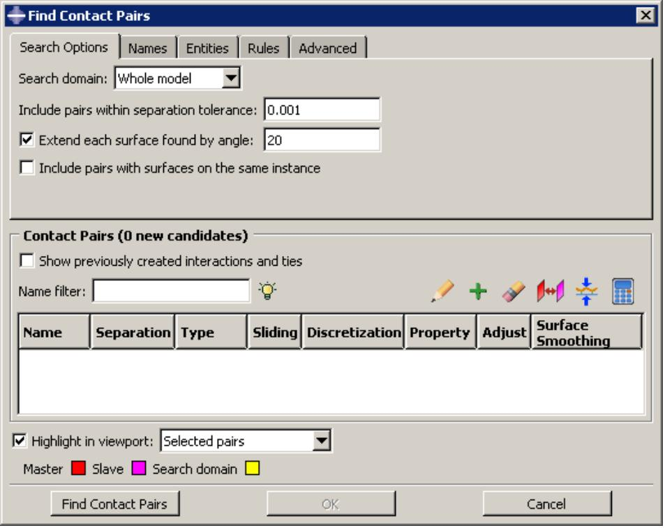  
Figure 1: Initial view of the contact detection tool.

Using the contact detection tool is a two-step process: first Abaqus/CAE searches for surfaces in the model that are likely to interact; then you have a chance to review the identified surfaces and modify the default contact pair parameters before creating interactions and constraints. You provide some basic criteria to guide the search. These criteria include the search domain and the distance between surfaces that will likely be in contact.

After entering the necessary search criteria, click Find Contact Pairs to begin the search. Abaqus/CAE updates the contact pair candidates table, as illustrated in Figure 2.

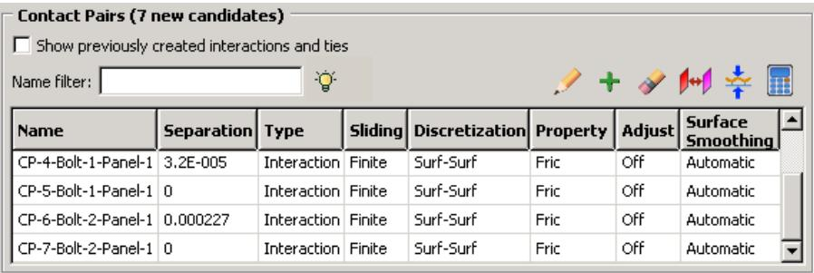  
Figure 2:The contact pair candidates table.

You can create either a contact interaction or a tie constraint for each contact pair candidate in the table. You can also modify the parameters of the interaction or constraint definition by clicking on the appropriate table cell (see Figure 3).

  
Figure 3: Changing cell values in the contact pair candidates table.

Clicking mouse button 3 on the table displays a menu of extended options and allows you to manually add contact pairs to the table. When you toggle on Show previously created interactions and ties, any pre-existing surface-to-surface interactions and tie constraints are added to the contact pair candidates table; you can modify existing contact pairs in the same manner as newly detected contact pair candidates.

The interactions and constraints shown in the contact pair candidates table do not become part of the model until you click OK. When you have finished setting parameters for the contact pairs, click OK. Abaqus/CAE simultaneously creates contact interactions and tie constraints for every contact pair in the table according to the specified parameters. The created interactions and constraints are added to the Model Tree and the Interaction Manager; you can review, modify, suppress, and delete the created interactions using either of these interfaces.

For detailed instructions on using the automatic contact detection tool, see Using contact and constraint detection.

## Additional information

• Understanding interactions  
• Understanding constraints  
• Managing objects in the Interaction module  
• Understanding contact and constraint detection

This section discusses the use of the contact detection algorithm.

## In this section:

The contact detection algorithm  
Additional criteria for defining contact pairs  
Contact detection for geometry  
Contact detection for meshed models  
Detection of overclosed surfaces  
Defining contact within the same instance and self-contact  
Considerations for shells

## The contact detection algorithm

Surfaces must meet two requirements to be identified by the automatic contact detection tool:

• The surfaces must be separated by a distance less than or equal to the specified separation tolerance.  
• The surfaces must be intuitively opposed, as defined below.

Abaqus/CAE defines the separation between two surfaces as the distance between the points of closest approach on the surfaces. This distance is reported in the Separation column of the contact pair candidates table. The separation tolerance is the primary input used during the contact detection search. You should specify a separation tolerance that encompasses the separation distances between all of the potentially contacting surfaces in your model. For more information, see Choosing a separation tolerance and extension angle below.


## Note:

The value reported in the Separation column may not correspond exactly to the separation used by Abaqus/Standard during an analysis. Certain automatic surface enhancements applied during the analysis to improve contact robustness (such as main surface smoothing and surface extensions) can lead to slight discrepancies between the separations calculated in the Abaqus/CAE preprocessor and the Abaqus/Standard analysis. For more details on automatic surface enhancements and contact formulations, refer to Defining Contact Pairs in Abaqus/Standard.

Two surfaces are considered intuitively opposed if the two surface normals constructed at the points of closest approach lie between 135° and 225° of each other (see Figure 1). In other words, the surfaces must be offset from each other by less than 45° at the points of closest approach. It is not possible to adjust or ignore the surface orientation requirement.

  
Figure 1:The relative orientation of the normals determines whether or not the surfaces are intuitively opposed.

Figure 2 illustrates a simple example of the contact pair requirements.  
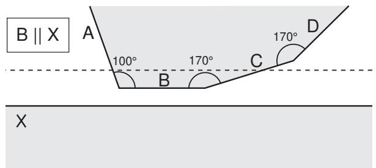  
Figure 2:Two bodies involved in potential contact.The bodies are rendered in two dimensions for simplicity.

The dashed line represents the separation tolerance as calculated from surface X. Surface B, which is parallel to surface X, is identified as part of a contact pair because it is both within the separation tolerance and intuitively opposed to surface X. Similarly, surface C meets both of these criteria. Surface D, although it is intuitively opposed to surface X, does not lie within the separation tolerance at any point; surface D is not considered for inclusion in a contact pair. Surface A, although it is within the separation tolerance, is not intuitively opposed to surface X; therefore, surface A is also excluded from any contact pair definition. The connected surfaces (A, B, C, and D) do not form contact pairs with each other. By default, Abaqus/CAE only searches for surfaces on separate part instances. However, even if you were to enable searching within the same instance (see Defining contact within the same instance and self-contact below), these surfaces would not meet the orientation requirements.

## Additional criteria for defining contact pairs

After using the separation and orientation checks to compile a list of potential contact pairs, the contact detection tool can perform a series of additional checks that adjust the surface definitions to make them more useful and realistic. All three of these additional checks are optional, but they are enabled by default.

## Extending surfaces

By default, any surface identified by the contact detection tool is extended to include adjacent model faces within 20°, even if the adjacent faces do not meet the separation and orientation requirements. The 20° angle is measured as the offset between the normals of the detected surface and the adjacent face at the common edge. You can modify the extension angle using the Extend each surface found by angle option. As faces are added to the surface definition, Abaqus/CAE also checks any faces adjacent to the newly added faces. Abaqus/CAE eliminates any redundant definitions if an extended surface incorporates a face from a separately defined contact pair. For example, consider extending surfaces within 20° for the model in Figure 2. Abaqus/CAE creates a single contact pair: one surface consists of face X, and the other surface consists of faces B, C, and D. Face D is within 20° of face C, which is within 20° of face B; the redundant contact pair consisting of face C and face X is eliminated, since it is incorporated by the larger contact pair.

## Merging contact pairs within a specified angle

You can use the Merge pairs when surfaces are within angle option to combine multiple contact pairs into a single definition. The faces involved in the contact pairs must be adjacent and they must lie within the specified angle (as described above). The merge option does not extend faces; it only combines positively identified contact pairs. By default, contact pairs with surfaces within 20° are merged by the contact detection tool. The merge option is typically used as an alternative to surface extension to merge contact pair candidates automatically without extending surface definitions beyond the separation tolerance. For example, merging pairs within 20° without extending surfaces for the model in Figure 2 results in a single contact pair: one surface consists of face X, and the other surface consists of faces B and C.

## Checking for surface overlap

By default, the contact detection tool eliminates any contact pairs whose surfaces do not “overlap”; two surfaces do not overlap if a normal from any point on one of the surfaces does not pass through the opposing surface. For example, the surfaces in Figure 1 do not overlap, even though they may pass the separation and orientation checks.

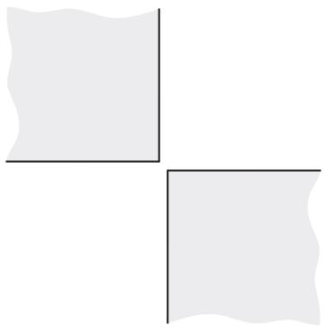  
Figure 1: Non-overlapping surfaces.The bodies are rendered in two dimensions for simplicity.

You can suppress the check for surface overlap and allow the creation of contact pairs for non-overlapping surfaces by using the Include opposing surfaces that do not overlap option.

## Contact detection for geometry

Abaqus/CAE begins searching a model comprised of geometry by dividing the model into individual faces. A face consists of the area enclosed in connected geometric edges or partitions. Once all of the faces are identified, Abaqus/CAE compares the faces to determine if they meet the separation and orientation requirements, then defines surfaces from the faces by applying extension, merging, and overlap checks (see Additional criteria for defining contact pairs above). Any two surfaces that meet all of the requirements are flagged as a contact pair candidate.

Abaqus/CAE automatically assigns the main and secondary designations to surfaces in a detected contact pair. Analytical rigid or discrete rigid surfaces are always assigned the main role; if the contact pair involves two rigid surfaces, the assignment of main and secondary roles is arbitrary. For contact pairs involving two deformable surfaces, Abaqus/CAE first determines if the surface geometry has been meshed and assigns the main role to the surface with the coarser mesh. If mesh information is unavailable, the surface with the larger area becomes the main surface. The algorithm that assigns main and secondary roles does not account for dissimilar underlying stiffness or element assignments; if these factors play a significant role in your contact interactions, you should review the main and secondary assignments before creating an interaction. For further discussion of main and secondary assignments, see Selecting Surfaces Used in Contact Pairs.

## Contact detection for meshed models

Contact detection also works with mesh models. The search algorithm for meshed models works in much the same way as with geometry, but it uses element faces instead of geometric faces. By default, Abaqus/CAE only searches for contact pairs between separate part instances. Mesh models that are imported into Abaqus/CAE often consist of only a single part instance; therefore, you should enable searching within the same instance before using contact detection on these models (see Defining contact within the same instance and self-contact below for more details).


## Warning:

Unlike geometry-based searches, the reported separation between surfaces for mesh-based surfaces is not necessarily the distance between the exact points of closest approach, but rather a close approximation. If the specified search tolerance is very large compared to the characteristic element size, the accuracy of this approximation is greatly reduced.

Before defining surfaces on element faces, Abaqus/CAE applies the same extension, merging, and overlap checks as with geometry faces (see Additional criteria for defining contact pairs above). Because element faces are typically much smaller than geometric faces, you should always allow some extension of the surfaces to get ample coverage from a surface definition; Figure 1 compares the created surfaces for geometry and meshed geometry when no surface extension is allowed.

  
Figure 1: Discrepancies between created surfaces when no surface extension is allowed for geometry (left) and meshed geometry (right).

If you remesh your model, any surfaces defined on elements faces may become invalid. By extension, the interactions and constraints based on these faces also become invalid.

When assigning main and secondary designations to the mesh surfaces, rigid surfaces always become the main; if the contact pair involves two rigid surfaces, the assignment of main and secondary roles is arbitrary. For contact pairs involving two deformable surfaces, Abaqus/CAE considers the mesh densities on each surface; the surface with the coarser mesh becomes the main surface. If the mesh densities on the two surfaces are equivalent, the assignment of main and secondary roles is arbitrary. The algorithm that assigns main and secondary roles does not account for dissimilar underlying stiffness or element types; if these factors play a significant role in your contact interactions, you should review the main and secondary assignments before creating an interaction. For further discussion of main and secondary assignments, see Selecting Surfaces Used in Contact Pairs.

The contact detection tool does not detect contact between geometry and orphan elements or analytical surfaces and orphan elements. If your model includes part instances that have been meshed from geometry, you can use the options on the Advanced tabbed page of the contact detection dialog box to indicate whether these instances should be treated as geometry (the default) or an element mesh during the search. If your model contains instances of both geometry and orphan mesh elements, you should first mesh all of the geometries, then perform a mesh-based search to capture all possible contact pairs.

In most cases the geometry is a more faithful representation of the object being modeled than the meshed geometry. In addition, geometry-based interactions and constraints are not affected by remeshing. However, the mesh is the geometry used in the analysis. Mesh discretization can lead to slight disparities in separation distances between the two representations, which may become important in precise analyses. After searching, you can check individual contact pairs for disparities between the native and meshed geometry by using the Recalculate Separation option.

## Detection of overclosed surfaces

If two faces in an assembly intersect at any point, the contact detection tool reports those faces as an overclosed contact pair. Overclosed contact pairs that appear in the contact pair candidates table must still meet the surface orientation requirements. A red zero in the Separation column indicates that the two surfaces in the contact pair are intersecting.


Note: A black zero in the Separation column implies that the two surfaces are exactly touching at their closest points. There is no overclosure or intersection in this situation.

If you extend or merge an overclosed surface to include faces that are not overclosed, Abaqus/CAE reports the entire contact pair as overclosed.

You should visually inspect all overclosed surfaces before creating contact interactions. Models with severe overclosures should be adjusted to remove the overclosures (or at least lessen their severity). Minor overclosures can be addressed by using the contact adjustment options (available in the contact pair candidates table) or the interference fit options (available in the contact interaction editor).

Faces must intersect to be reported as overclosed. If a face is enclosed entirely within another part instance, the automatic contact detection tool does not report that face as being overclosed. Such a face may still meet the separation and orientation requirements with respect to an external face on the enclosing instance. By default, Abaqus/CAE eliminates enclosed faces from the contact pair candidates table because the surfaces do not “overlap” (see Additional criteria for defining contact pairs). If you disable the overlap checks, Abaqus/CAE reports a contact pair candidate for enclosed faces, but the contact pair candidates table does not provide any indication that the surfaces are overclosed or penetrating. Because the contact detection tool does not recognize these faces as overclosed, the adjustment options that are applied to overclosed surfaces by default (see Default interaction and constraint parameters) are not applied to this contact pair. If an enclosed face is embedded deeper than the separation tolerance from any external face, the automatic contact detection tool does not identify those faces as a contact pair candidate.

As an example, consider the model in Figure 1.

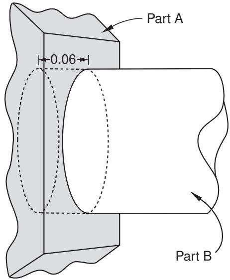  
Figure 1: In this model, one end of the cylindrical part instance is entirely enclosed within another part instance.

The separation tolerance specified for this search is 0.1. The circular face at the end of part instance B is within the separation tolerance and is intuitively opposed to the rectangular face on part instance A, but there is no intersection. The contact pair candidates table lists a normal contact pair consisting of the circular face and the rectangular face separated by a distance of 0.06. The cylindrical side face of part instance B is listed as overclosed because it intersects the rectangular face of part instance A.

Although the contact detection tool does not recognize completely enclosed surfaces as being overclosed, such surfaces are still treated as overclosures during an analysis. Severe overclosures commonly lead to convergence difficulties.

When reviewing overclosed contact pairs in the contact pair candidates table, check adjoining surfaces for fully enclosed faces.

## Defining contact within the same instance and self-contact

You can use the contact detection tool to define contact between different areas of the same part instance or model instance. This capability is particularly useful for complicated models that are imported into Abaqus/CAE as a single part instance. If you enable the Include pairs with surfaces on the same instance option, Abaqus/CAE checks different geometry or element faces on the same part instance or model instance to determine whether or not they meet the separation and orientation requirements. Surfaces and contact pairs are defined on any faces that meet the requirements.

In some situations, surface extension options cause the main and secondary surfaces to overlap. If the main surface and the secondary surface consist of the same faces, Abaqus/CAE automatically adjusts the contact pair to create a self-contact interaction, in which a surface contacts itself during deformation. A single surface is created in this situation.

## Considerations for shells

If a section definition has been assigned to a shell part, the contact detection tool accounts for the thickness of the shell in separation calculations. The reported separation has been adjusted according to the thickness and offset specified in the shell section assignment. You can use the Account for shell thickness and offset option to ignore shell section properties during a contact detection search. Varying thickness distributions are never considered in the separation calculations.

The contact detection tool automatically selects a shell side on which to create a surface (see Specifying a particular side or end of a region, for more information). The side is selected such that the surface normals at the points of closest approach are intuitively opposed.

When working with a model that includes orphan shell elements, make sure that the element normal orientations are consistent between elements; that is, the positive element faces (SPOS) should all be located on the same side of the shell structure (see About Shell Elements, for more information). If the element normal orientations are inconsistent, Abaqus/CAE misinterprets the angles between the element faces, and the surface extension and merge operations do not function appropriately.

For certain spline-based shells or faces, the same surface may interact with both sides of a shell (see Figure 1, for example).

  
Figure 1: A spline-based shell.

Normally you would define a separate contact pair involving each side of the shell. The contact detection tool, however, cannot create multiple contact pairs that involve the same two faces; it will define a single contact pair and select the shell side according to the orientation at the point of closest approach. You must manually define another contact pair for the other side of the shell.

The contact detection tool does not create any double-sided surfaces. If appropriate, you can edit the definition of a created surface in the Model Tree to make it double-sided (see Editing sets and surfaces).

## Default interaction and constraint parameters

After completing a search for potential contact pairs, Abaqus/CAE populates the contact pair candidates table with all of the parameters necessary to create interactions.

Names are provided for the contact pair and any created surfaces. Table 1 outlines the naming algorithm.

Table 1: Algorithms used to create names in the contact detection tool.

<table><tr><td>Contact pairs</td><td>Prefix-Contact_pair_number-Main_instance-Secondary_instance</td></tr><tr><td>Main surfaces</td><td>Prefix-Contact_pair_number-Main_instance</td></tr><tr><td>Secondary surfaces</td><td>Prefix-Contact_pair_number-Secondary_instance</td></tr><tr><td>Merged main surface</td><td>Prefix-All-m</td></tr><tr><td>Merged secondary surface</td><td>Prefix-All-s</td></tr><tr><td>Merged “all” surface</td><td>Prefix-All</td></tr></table>

Use the Names tabbed page before searching to modify the naming prefix and control the creation of surfaces. For details, see Specifying naming options for contact detection.

The default parameters supplied to contact pairs by the contact detection tool are slightly different than the defaults used in the traditional interaction or constraint editor. Most notably, the contact detection tool initially assigns surface-to-surface discretization to each contact pair instead of node-to-surface discretization. See Mesh Tie Constraints and Contact Formulations in Abaqus/Standard for a discussion of surface discretization and the associated constraint enforcement methods.

The default surface adjustment options depend on the separation between the surfaces in a contact pair. You can use the Rules tabbed page before searching to control the default adjustment options that are assigned to detected contact pairs. You can also use this page to specify a separation tolerance within which all contact pairs default to tie constraints. For more information about the Rules page, see Defining default contact pair parameters.

Table 2 lists the default contact pair parameters supplied by Abaqus/CAE. You can edit each parameter individually before creating interactions and constraints. For detailed instructions on editing parameters and defaults, see Reviewing and modifying detected contact pairs.

Table 2: Default contact pair parameters for the contact detection tool.

<table><tr><td>Parameter</td><td>Default Value</td></tr><tr><td>Active/Suppressed</td><td>Active</td></tr><tr><td> $Type^1$ </td><td>Interaction</td></tr><tr><td>Sliding</td><td>Finite sliding</td></tr><tr><td>Discretization</td><td>Surface-to-surface</td></tr><tr><td>Interaction property</td><td>The first contact interaction property listed in the Interaction Property Manager2; if no interaction properties have been created, this parameter is blank</td></tr><tr><td>Contact controls</td><td>This parameter is blank; contact controls are unavailable in the initial step</td></tr><tr><td> $Adjust^1$ </td><td>Off for contact interactions between nonintersecting surfaces; 0 for contact interactions between intersecting surfaces; On for tie constraints</td></tr><tr><td>Creation step</td><td>Initial</td></tr><tr><td>Surface smoothing</td><td>Automatic</td></tr><tr><td colspan="2"> $^1$ Defaults for the Type and Adjust parameters are controlled by the Rules options.</td></tr><tr><td colspan="2"> $^2$ The Interaction Property Manager lists all created interaction properties alphabetically by name.</td></tr></table>


## Note:

Some of the parameters discussed above are not visible in the contact pair candidates table by default. Click mouse button 3 anywhere in the table, and select Edit Visible Columns to control which parameters appear in the table.

For more information about interaction and constraint parameters, see Mesh Tie Constraints, About Contact Pairs in Abaqus/Standard, and About Contact Pairs in Abaqus/Explicit.

## Tips for using the contact detection tool

The contact detection tool is available for use in any three-dimensional model requiring the creation of contact interactions and tie constraints. It quickly and thoroughly identifies and creates interactions and ties based on minimal specifications.

The tool greatly simplifies the contact definition process in models for which a general contact definition is not applicable. Some basic guidelines ensure the most effective and efficient use of the tool.

## In this section:

Choosing a separation tolerance and extension angle  
Reviewing contact pair candidates  
Saving the search parameters  
Features that may cause difficulties for the contact detection tool  
Limitations of the contact detection tool

## Choosing a separation tolerance and extension angle

The specified separation tolerance is the primary driver of the contact pair search algorithm. Abaqus/CAE supplies a default separation tolerance based on the relative size of the faces in your model. You may need to modify this value depending on the expected response of your model during an analysis. To effectively capture all significant contact pairs, the specified separation tolerance should be on the same order as or greater than the expected displacements or deflections in your model.

Specifying a very large separation tolerance usually captures more contact pairs then are necessary in an analysis. While extra contact pairs do not necessarily reduce the quality of a model, the extraneous definitions are difficult to manage and can degrade performance.

When selecting an angle to control the extension of surfaces, you should consider the topology and surface characteristics of the areas that are likely to come into contact. Surfaces should extend slightly beyond the area of potential contact, so set the extension angle to capture any chamfers or soft corners along the edges of a face. Indentations, grooves, or embossments can sometimes break up the definition of a surface; the angle that these features make with the main face should dictate the extension angle.

For meshed models, you can preview the extension of surfaces before searching for contact pairs by displaying only the feature edges on a model (see Defining mesh feature edges). If the extension angle is equal to the feature angle, the surface definition in a particular area extends as far as the nearest visible feature edge. Adjust the feature angle until the visible edges enclose the area you want to capture, then set the extension angle accordingly.

## Reviewing contact pair candidates

You should always review contact pair candidates before creating interactions and constraints. Look for any discontinuities in surface definitions.

Discontinuities are often caused by small connecting faces that are not intuitively opposed to the logical contacting surface in a contact pair (see Figure 1).

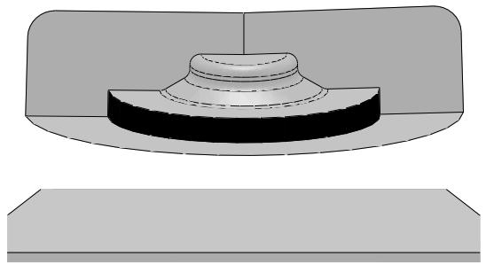  
Figure 1:The automatic contact detection tool will not identify the highlighted perpendicular face.

You may want to rerun the search using revised extension and merge options to incorporate the discontinuities into larger surfaces. If necessary, add a contact pair manually using the Add option. You can also combine discontinuous surfaces using the Merge option.

You should investigate any intersecting surfaces to verify that they match your modeling intent. A contact pair with only a single overclosed node will be reported as intersecting, so slight discrepancies can cause overclosures. Overclosed contact pairs without appropriate adjustment or interference fit options can lead to convergence difficulties in an analysis. You should also check any faces or surfaces adjacent to overclosed contact pairs to ensure they are not enclosed faces. See Detection of overclosed surfaces, for more information.

## Saving the search parameters

By default, the search parameters that you specify in the Find Contact Pairs dialog box persist only as long as the dialog box is open; if you close the dialog box, default search parameters are provided the next time you access the contact detection tool.

If you click on the Advanced tabbed page, Abaqus/CAE sets the currently specified search parameters as the default search parameters. These parameters are supplied as defaults in all future sessions of Abaqus/CAE. The only parameter that is not saved is the search domain, which always uses a default of Whole model.

When you save the current search parameters, Abaqus/CAE asks if you want to save the current separation tolerance as a default. Normally Abaqus/CAE recalculates the default separation tolerance based on the current model; if you opt to save the separation tolerance, this calculation is skipped and the same value is always provided as the default separation tolerance.

The default search parameters for the contact detection tool are saved in the abaqus\_2025.gpr file; see Understanding Abaqus/CAE GUI settings, for more information. To return the default search parameters to their original

settings, click 2 on the Advanced tabbed page.

## Features that may cause difficulties for the contact detection tool

You may encounter difficulties using the contact detection tool with certain model features and designs. These situations do not cause performance or stability problems, but the search results most often will not match your modeling intent.

## Stacked shells and thin layers

Models with layers of shells or thin plates stacked closely in parallel can lead to the definition of extraneous contact pairs. The automatic contact detection tool can find contact pairs involving surfaces separated by an intermediate layer, as long as these surfaces are intuitively opposed and within the separation tolerance. In addition, if searching within the same instance is enabled and the overlapping surface check is disabled, the contact detection tool may detect potential contact between the top side and bottom side of a thin continuum plate. Abaqus/CAE creates contact pair candidates for all of these surfaces, even though they will never be in contact. This problem is most common when the layers or plates are a local feature of the model, since a larger separation tolerance is required to capture surfaces in other areas of the model. To overcome this problem, limit the search domain to a particular area of the model and use a separation tolerance that is appropriate for that area. You may also be able to use the Entities tabbed page of the contact detection dialog box to eliminate certain geometry or element types (shells, for example) from your search domain. Otherwise, you should delete the extraneous contact pair candidates before creating interactions.

## Concave surfaces

While the contact search algorithm effectively accounts for most appropriate surfaces, it can misinterpret the relationship between a concave surface and a flat surface. Concave surfaces create difficulties because their surface normal orientation can vary widely across the span of a single surface, and the points of closest approach between surfaces is sometimes a poor reference. Consider, for example, the situations in Figure 1.

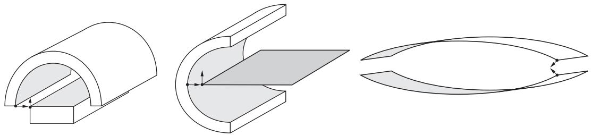  
Figure 1:The normals of the shaded surfaces are not intuitively opposed at the points of closest approach.

Even if the points of closest approach in these models are within the separation tolerance, the surface normals at these points do not pass the orientation test. The contact detection tool will not report these surfaces as contact pair candidates, and adjusting the separation tolerance has no effect on this behavior. You can sometimes modify the extension angle to capture the concave surface within another surface definition. Otherwise, you must manually define the contact pair using the Add option.

## Mechanisms involving large rotations

When modeling mechanisms that undergo large rotations, the contact detection tool often will not effectively capture your modeling intent. In such mechanisms the intended contact surfaces initially may be positioned far away from each other, while nearby surfaces never actually come into contact. The Geneva mechanism depicted in Figure 2 is a typical example.

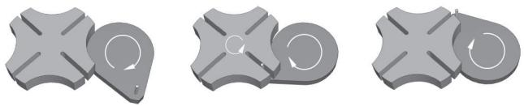  
Figure 2: Motion of a Geneva mechanism.

The important contact surfaces in this model are the pin on the right-hand body and the slots on the left-hand body. In the initial configuration, the pin is relatively distant from any of the slots. The neighboring surfaces, on the other hand, are insignificant to the contact conditions of the model. Contact for such models is best defined manually using the interaction editor (see Defining surface-to-surface contact).

## Limitations of the contact detection tool

Although helpful for simplifying the contact definition process, several limitations exist for the contact detection tool.

Contact detection cannot create contact pairs involving the following features:

• Two-dimensional models  
• Axisymmetric models  
• Beams and trusses  
• Face-to-edge contact  
• Edge-to-edge contact  
• Contact between orphan mesh elements and analytical rigid surfaces  
• Hybrid models containing both orphan mesh and unmeshed geometry

The minimum allowable separation tolerance is $1 \times { 1 0 } ^ { - 5 }$ . The maximum allowable separation tolerance is $1 \times 1 0 ^ { 5 } .$ . Abaqus/CAE cannot accurately calculate separations outside of this range. If your model requires the use of a separation tolerance that does not meet these requirements, you should scale the dimensions of the entire model so that they fall within the functional range.

## Understanding connectors

Connectors allow you to model a connection between two points in an assembly or between a point in an assembly and ground. To model a connector in Abaqus/CAE, you must create an assembly-level wire feature, a connector section, and a connector section assignment that associates the connector section with selected wires.

The wire feature contains one or more wires that define the underlying connector geometry. The connector section specifies the type of connection, connector behaviors, and section data. Similar to the manner in which you assign a section to a region of the model in the Property module, you create a connector section assignment to assign a connector section to a region of the model; specifically, you assign a connector section to wires. You also specify local orientations for the endpoints of the wires in the connector section assignment definition.

For more information on connectors in Abaqus/CAE, including an overview and an example of connector modeling, see Connectors.

## Additional information

• About Connectors  
• Creating or modifying wire features for multiple connectors  
• Creating connector sections  
• Creating and modifying connector section assignments

## Understanding connector sections and functions

The connector section defines the connection type and may include connector behavior and section data. For some complex coupled connector behaviors, additional functions describing the nature of the coupling effects (connector derived components and connector potential) must be defined. A connector section can be referred to by one or more different connector section assignments.

## In this section:

Connection types  
Connector behaviors  
What types of friction models are available?  
Connector derived components and connector potentials

## Connection types

Table 1 summarizes the connection types available when creating connector sections. You can define basic, assembled, complex, and MPC connection types.

Table 1: Connection types.

<table><tr><td colspan="2">Basic Types</td><td rowspan="2">Assembled/Complex Types</td><td rowspan="2">MPC Types</td></tr><tr><td>Translational</td><td>Rotational</td></tr><tr><td>ACCELEROMETER</td><td>ALIGN</td><td>BEAM</td><td>Beam</td></tr><tr><td>AXIAL</td><td>CARDAN</td><td>BUSHING</td><td>Elbow</td></tr><tr><td>CARTESIAN</td><td>CONSTANT VELOCITY</td><td>CVJOINT</td><td>Link</td></tr><tr><td>JOIN</td><td>EULER</td><td>CYLINDRICAL</td><td>Pin</td></tr><tr><td>LINK</td><td>FLEXION-TORSION</td><td>HINGE</td><td>Tie</td></tr><tr><td>PROJECTION CARTESIAN</td><td>FLOW-CONVERTER</td><td>PLANAR</td><td>User-defined</td></tr><tr><td>RADIAL-THRUST</td><td>PROJECTION FLEXION-TORSION</td><td>RETRACTOR</td><td></td></tr><tr><td>SLIDE-PLANE</td><td>REVOLUTE</td><td>SLIPRING</td><td></td></tr><tr><td>SLOT</td><td>ROTATION</td><td>TRANSLATOR</td><td></td></tr><tr><td></td><td>ROTATION-ACCELEROMETER</td><td>UJOINT</td><td></td></tr><tr><td></td><td>UNIVERSAL</td><td>WELD</td><td></td></tr></table>

## Basic types

Basic connection types include translational types and rotational types. Translational types affect translational degrees of freedom at both endpoints of the wires to which the connector section is assigned and may affect rotational degrees of freedom at the first points of the wires. Rotational types affect only rotational degrees of freedom at both endpoints of the wires. You can use a single basic connection type (translational or rotational) or one translational and one rotational type.

## Assembled types

Assembled connection types are predefined combinations of basic connection types.

## Complex types

Complex connection types affect a combination of degrees of freedom in the connection and cannot be combined with other connection types. They typically model highly coupled physical connections.

## MPC types

MPC connection types are used to define multi-point constraints between two points.

For a description of each connection type and the equivalent basic connection types that define the kinematic constraints of assembled type connections, see Connection Types and General Multi-Point Constraints.

## Connector behaviors

You can apply connector behaviors to connection types that have available components of relative motion. Available components of relative motion are displacements and rotations that are not kinematically constrained. Multiple connector behaviors can be defined in a connector section. You can specify the following connector behaviors:

Elasticity: Define spring-like elastic behavior.  
Damping: Define dashpot-like damping behavior.  
Friction: Define Coulomb-like and hysteretic friction using predefined or user-defined friction models.  
Plasticity: Define plastic behavior.  
Damage: Define damage initiation and evolution behavior.  
Stop: Define limit values of the admissible range of positions.  
• Lock: Specify a user-defined locking criterion.  
Failure: Define limit values for force, moment, or position.  
• Reference Length: Define the translational or angular positions at which constitutive forces and moments are zero.  
• Integration: Specify implicit or explicit time integration for elasticity, damping, and friction (Abaqus/Explicit analyses only).

For detailed instructions on defining connector behaviors, see Using the connector section editors. For more information on connector behaviors, see Connector Behavior.

## What types of friction models are available?

You can model predefined or user-defined friction behavior. In general, for predefined friction you specify a set of geometric quantities that are characteristic of the connection type for which friction is modeled. In addition, you can define internal contact force contributions, such as prestress from the connection. Abaqus automatically defines the contact force contributions and the local tangent directions along which friction occurs.

You can model predefined friction for the following connection types:

## Assembled/Complex types

• Cylindrical (Slot + Revolute)  
• Hinge (Join + Revolute)  
• Planar (Slide-Plane + Revolute)  
• Slip Ring (complex)  
• Translator (Slot + Align)  
• U Joint (Join + Universal)

## Basic types

Slide-Plane  
Slot

Predefined friction is also available if you define a combined translational and rotational connection type that is equivalent to one of these assembled types. You can define only one friction behavior for a given connection type if you are modeling predefined friction.

If a predefined friction model is not available or does not adequately describe the mechanism being analyzed, you can specify a user-defined friction model (except in the case of the Slip Ring connection type, which does not allow a user-defined friction model). You must specify slip direction information, the friction-producing normal force or normal moment, and the friction law. You may use several connector friction behaviors to represent the frictional effects in the connector.

For detailed instructions on defining friction, see Defining friction. For more information, see Connector Friction Behavior.

## Connector derived components and connector potentials

You can define complex coupled behavior for connectors using connector derived components and connector potentials. Connector derived components are user-specified component definitions based on a function of intrinsic connector components of relative motion. You can create derived components to specify the friction-generating normal force in connectors as a complex combination of connector forces and moments or to use as an intermediate result in a connector potential function.

Connector potentials are user-defined mathematical functions of intrinsic components of relative motion or derived components. These functions can be quadratic, elliptical, or maximum norms. You use connector potentials to define coupled friction, plasticity, and damage connector behaviors.

For detailed instructions on defining derived components and potentials, see Specifying connector derived components, and Specifying potential terms. For more information on connector functions, see Connector Functions for Coupled Behavior.

## Understanding Interaction module managers and editors

You can create and manage objects in the Interaction module using managers and editors.

## In this section:

Managing objects in the Interaction module  
Interaction editors  
Interaction property editors  
. Contact controls editors  
Contact initialization editor  
Constraint editors  
Connector section editors  
Connector section assignment editors

## Managing objects in the Interaction module

The Interaction module provides the following managers that you can use to organize and manipulate objects associated with a given model:

• The Interaction Manager allows you to create and manage interactions.  
• The Interaction Property Manager allows you to create and manage interaction properties.  
• The Contact Controls Manager allows you to create and manage contact controls for surface-to-surface contact and self-contact interactions.  
• The Contact Initialization Manager allows you to create and manage contact initialization rules for general contact interactions in Abaqus/Standard.  
• The Constraint Manager allows you to create and manage constraints.  
• The Connector Section Manager allows you to create and manage connector sections.  
• The Connector Section Assignment Manager allows you to create and manage connector section assignments.

For example, a list of interaction properties appears in the Interaction Property Manager shown in Figure 1.

  
Figure 1:The Interaction Property Manager.

The Create, Edit, Copy, Rename, and Delete buttons in the managers allow you to create new objects or to edit, copy, rename, and delete existing ones. In the Connector Section Assignment Manager, you can only create, edit, or delete connector section assignments. You can also initiate these procedures using the Interaction, Interaction->Property, Interaction->Contact Controls, Interaction->Contact Initialization, Constraint, Connector->Section, and Connector->Assignment menus from the main menu bar. After you select a management operation from the main menu bar, the procedure is exactly the same as if you had clicked the corresponding button inside the manager dialog box.

You can use the Copy button in the Interaction Manager, the corresponding menu command, or the Model Tree to copy an interaction. You can copy an interaction from any step to any valid step, with some restrictions. For more details, see Copying step-dependent objects using manager dialog boxes.

The Interaction Manager is a step-dependent manager, which means that it contains additional information on the history of each interaction through the analysis. The Interaction Manager is shown in Figure 2.

  
Figure 2:The Interaction Manager.

The Move Left, Move Right, Activate, and Deactivate buttons allow you to manipulate the stepwise history of interactions. For more information, see Modifying the history of a step-dependent object.

You can suppress and resume previously defined interactions, constraints, and connector section assignments from the managers. You can use the icons in the column along the left side of the manager to suppress these attributes or to resume previously suppressed attributes for an analysis. The suppress and resume procedures are also available from the Interaction, Constraint, and Connector menus in the main menu bar. For more information, see Suppressing and resuming objects.

For detailed instructions on creating interactions, interaction properties, constraints, connector sections, and connector section assignments, see Using the Interaction module.

## Additional information

• What are basic managers?  
• What are step-dependent managers?  
• Changing the status of an object in a step  
• Understanding Interaction module managers and editors

## Interaction editors

To create interactions, select Interaction->Create from the main menu bar. A Create Interaction dialog box appears in which you can provide a name for the interaction, select the step in which the interaction will be created, and choose the type of the interaction.

When you click Continue in the Create Interaction dialog box after selecting any interaction type except general contact, you are prompted to select the regions to which to apply the interaction. Once you have selected the region or regions, an interaction editor appears in which you can specify additional information about the interaction, such as the interaction property that you want to associate with the interaction. For general contact interactions, the interaction editor appears when you click Continue in the Create Interaction dialog box. For example, the general contact editor for Abaqus/Explicit analyses is shown in Figure 1.

  
Figure 1:The general contact editor.

Each interaction editor displays the current step and the name and type of the interaction that you are defining in the top panel of the dialog box. The format of the rest of the editor varies depending on the type of interaction you are defining.

Once you have created an interaction, you can modify the interaction in the following ways:

• You can modify some or all of the data that you entered in the editor when you created the interaction.  
• You can use the Interaction Manager to modify the stepwise history of the interaction. (For more information, see What are step-dependent managers?.)

You can display information on a particular editor feature by selecting Help->On Context from the main menu bar and then clicking the editor feature of interest.

## Additional information

• Understanding modified step-dependent objects

• Understanding Interaction module managers and editors

## Interaction property editors

To create interaction properties, select Interaction->Property->Create from the main menu bar. A Create Interaction Property dialog box appears in which you can specify a name for the interaction property and the type of interaction property that you want to create. Once you have specified this information, click Continue in the Create Interaction Property dialog box to display the interaction property editor.

The format of the interaction property editor depends on the type of interaction property you are defining. For example, the film condition and actuator/sensor property editors display data fields in which you can enter all of the information necessary to define the property. The film condition property editor is shown in Figure 1.

  
Figure 1: The film condition property editor.

The format of the contact property editor, on the other hand, is identical to the material editor in the Property module (see Creating materials, for more information). Like the material editor, the contact property editor contains menus from which you select options to include in the property definition, as shown in Figure 2.

  
Figure 2:The contact property editor contains Mechanical and Thermal option menus.

When you select an option from a menu, the name of the option appears in the Contact Property Options list at the top of the editor, and the option becomes part of your interaction property definition. In addition, the option definition area in the lower half of the editor changes to provide fields in which you can specify information for the currently selected option.

For example, the Contact Property Options list in Figure 3 reflects that the Tangential Behavior and Normal Behavior options (located in the Mechanical menu) have been included in the property definition. Tangential Behavior is currently selected, and the related parameters appear in the lower half of the editor. If you want to remove an option from a contact property definition, you can select that option from the Contact Property Options list and then click


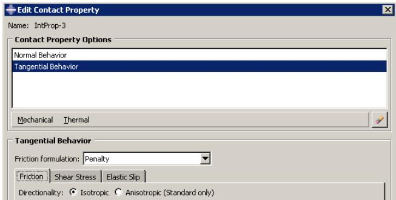  
Figure 3: A mechanical contact property definition that includes the Tangential Behavior and Normal Behavior options.

You can display help on a particular feature of the editor by selecting Help->On Context from the main menu bar and then clicking the feature of interest. For detailed instructions on creating properties, see Creating interaction properties, and Using the interaction property editors.

## Additional information

• Managing objects  
• Understanding modified step-dependent objects

## Contact controls editors

To create contact controls for surface-to-surface contact and self-contact interactions, select Interaction->Contact Controls->Create from the main menu bar. A Create Contact Controls dialog box appears in which you can specify a name for the contact controls and the type of contact controls that you want to create. Once you have specified this information, click Continue to display the contact controls editor.


## Warning:

Contact controls are intended for advanced users. The default settings of these controls are appropriate for most analyses. Using nondefault values of these controls may greatly increase the computational time of the analysis or produce inaccurate results. Changing these settings in an Abaqus/Standard analysis may also cause convergence problems.

Each contact controls editor displays the name and type of the contact controls that you are defining in the top panel of the dialog box. The format of the rest of the editor varies depending on whether you are defining controls for an Abaqus/Standard or an Abaqus/Explicit analysis.

You can display help on a particular feature of the editor by selecting Help->On Context from the main menu bar and then clicking the feature of interest. For more information, see Specifying contact controls in an Abaqus/Standard analysis, and Specifying contact controls in an Abaqus/Explicit analysis.

## Additional information

• Customizing contact controls

## Contact initialization editor

To create contact initialization rules for a general contact interaction in Abaqus/Standard, select Interaction->Contact Initialization->Create from the main menu bar. The contact initialization editor appears in which you can specify a name for the initialization definition and the rules associated with that definition.

You can display help on the contact initialization editor by selecting Help->On Context from the main menu bar and then clicking the editor. For more information, see Creating contact initializations.

## Additional information

• Creating contact initializations

## Constraint editors

To create constraints, select Constraint->Create from the main menu bar. A Create Constraint dialog box appears in which you can specify the name and type of the constraint. Click Continue to specify the regions to which to apply the constraint (if applicable) and to display the editor in which you can enter the data necessary to define the constraint.

Each constraint editor displays the name and type of the constraint you are defining in the top panel of the dialog box. The format of the rest of the editor varies depending on the type of constraint you are defining. For example, the tie constraint editor is shown in Figure 1.

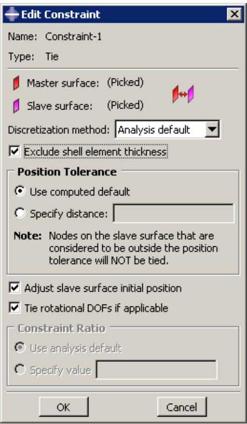  
Figure 1: The tie constraint editor.

You can display information on a particular editor feature by selecting Help->On Context from the main menu bar and then clicking the editor feature of interest. For detailed instructions on creating constraints, see Using the constraint editors.

## Additional information

• Creating constraints

## Connector section editors

The connector section editor allows you to create connector sections and to add the connector behaviors available in Abaqus/Standard and Abaqus/Explicit.

To create connector sections, select Connector->Section->Create from the main menu bar. A Create Connector Section dialog box appears in which you can specify a name, category, and type for the connector section that you want to create. When you select a connection type from the Assembled/Complex or Basic category, the available and constrained components of relative motion (CORM) for that connection type are displayed in the dialog box. In addition,

道 you can click 日 to see a schematic drawing of the connection type along with the Abaqus idealization of the connection. Once you have specified the name, category, and type, click Continue in the Create Connector Section dialog box to display the connector section editor. For a connection type in the MPC category, select the type and enter data, if required. Click OK to finish creating the MPC section and to close the Create Connector Section dialog box.

The connector section editor allows you to add the connector behaviors available in Abaqus/Standard and Abaqus/Explicit. When you click Add on the Behavior Options tabbed page, a list of behaviors appears. After you select a behavior, the name of the behavior appears in the Behavior Options list at the top of the editor, and the behavior becomes part of your connector section definition. The option definition area in the lower half of the editor changes to provide fields in which you can specify information for the currently selected behavior. If you want to remove a behavior from a connector section definition, you can select it from the Behavior Options list and then click Delete.


## Note:

Abaqus/CAE does not perform any checks for dependencies on other behaviors; you should ensure that all required behaviors are defined. For example, if you define a plasticity behavior, you must also define an elasticity behavior.

You can define multiple behaviors of the same type, such as elasticity. Only forces or moments that are consistent with the available components of relative motion for the chosen connection type can be selected to define behaviors. For example, the Behavior Options list in Figure 1 reflects that two Elasticity behaviors and a Reference Length behavior have been included in the connector section definition. The highlighted Elasticity behavior defines elastic behavior in the same direction as the selected moment.

  
Figure 1:The connector section editor.

On the Table Options tabbed page, you can specify behavior settings for the regularization (Abaqus/Explicit analyses only) and the extrapolation of tabular data for all of the behavior options in a connector section. Alternatively, you can specify behavior settings for individual behavior options by clicking the Table Options button in the option definition area in the lower half of the editor. Behavior settings for individual behavior options take precedence over the connector section behavior settings.

When section data are applicable for the specified connection type, you can enter the data on the Section Data tabbed page.

You can display help on a particular feature of the editor by selecting Help->On Context from the main menu bar and then clicking the feature of interest. For detailed instructions on creating connector sections and defining behaviors and section data, see Creating connector sections, and Using the connector section editors.

## Additional information

• Managing objects  
• Creating connector sections  
• Using the connector section editors  
• Connectors

## Connector section assignment editors

To create connector section assignments, select Connector->Assignment->Create from the main menu bar. Select the wires to which you want to assign the connector section.

The connector section assignment editor contains three tabbed pages that allow you to specify the connector section that you want to assign to the wires and the orientations of the endpoints of the wires. For example, the connector section assignment editor that assigns the connector section Shock\_Absorber to selected wires is shown in Figure 1.

  
Figure 1:The connector section assignment editor.

You can display information on a particular editor feature by selecting Help->On Context from the main menu bar and then clicking the editor feature of interest. For detailed instructions on creating connector section assignments, see Creating and modifying connector section assignments.

## Additional information

• Creating or modifying wire features for multiple connectors  
• Creating connector sections  
• Creating and modifying connector section assignments  
• Connectors

## Understanding symbols that represent interactions, constraints, and connectors

When you apply interactions, constraints, and connectors to regions of the model, you can choose to display symbols in the viewport that indicate where you have applied the interactions, constraints, and connectors. For information about graphical symbol types, see Symbols used to represent interactions, constraints, and connectors.

You can apply interactions, constraints, and connectors to geometry or to orphan nodes and elements.

## Interactions and constraints

If you apply an interaction or constraint to geometry, symbols appear approximately equally spaced over the surface or surfaces to which the interaction or constraint is applied. If the interaction or constraint definition involves a node region rather than a surface, the symbols appear equally spaced on the edges of the node region and at any vertices in the node region. If the interaction or constraint is applied to a single vertex, a symbol appears at that vertex.

If you apply the interaction or constraint to orphan nodes or elements, symbols appear at the center of each element face for surface-based regions or at the nodes for node-based regions.

For interactions (and prescribed conditions) that use analytical field distributions, the symbols are scaled based on the analytical field value. In addition, a plus sign (+) or a minus sign (−) is displayed inside each symbol to indicate whether the magnitude of the interaction is positive or negative at that location. Abaqus/CAE displays scaled-down symbols for interactions when an analytical field evaluates to zero for a portion of its region. These scaled-down symbols are noticeably smaller than the default symbol size. For examples of these symbols, see Understanding prescribed condition symbol type, color, and size. For more information, see Using analytical expression fields.

## Connectors

When you apply a connector to wires, squares appear at the first points of the wires and triangles appear at the second points of the wires. If you specify an orientation other than the global coordinate system for orientation 1, an orientation triad appears at the first points of the wires. For orientation 2, an orientation triad appears at the second points of the wires only if you specify a coordinate system by name; if you toggle on the option to Use orientation 1, the orientation triad does not appear at the second points. The connection type label appears midway along a line between the endpoints of the selected wires. You can also display the tag associated with the connector section assignment, though this display is turned off by default.

For information about controlling the visibility of these symbols, see Controlling the display of attributes.

## Using the Interaction module toolbox

You can access all the Interaction module tools through either the main menu bar or the Interaction module toolbox. Figure 1 shows the icons for all the tools in the Interaction module toolbox.

  
Figure 1:The Interaction module toolbox.

## Using the Interaction module

This section describes in detail how to use different features of the Interaction module.

See also What are step-dependent managers? for information on managing interactions.

## In this section:

Creating interactions  
Creating interaction properties  
Customizing contact controls  
Creating contact initializations  
Creating contact stabilization definitions  
Creating constraints  
Selecting a process for defining connector geometry  
Creating a single connector  
Creating or modifying wire features for multiple connectors  
Creating coincident point connectors  
Creating connector sections  
Creating and modifying connector section assignments  
Editing the region to which an interaction or constraint is applied  
Using the Special menu in the Interaction module

## Creating interactions

When you create an interaction, you must specify the name of the interaction, the step in which to activate the interaction, the type of interaction, and, if required, the region of the assembly to which you want to apply the interaction.

The available types of interactions depend on the procedure selected for the step. For example, you can define heat flux on a surface only during a heat transfer, coupled temperature-displacement, or coupled thermal-electrical step. Similarly, you can define interactions with a user-defined actuator/sensor only during the initial step.

If you are creating surface-to-surface contact interactions, you can automate many of the steps in the below procedure by using the contact detection tool. For more information, see Using contact and constraint detection.

1. From the main menu bar, select Interaction->Create.

A Create Interaction dialog box appears with a default name displayed in the Name text field.


Tip: You can also create an interaction using the tool in the Interaction module toolbox.

2. Type a name for the interaction. For more information about naming objects, see Using basic dialog box components.  
3. Select the step in which to activate the interaction. Click the arrow next to the Step text field, and select from the list that appears.

The Types for Selected Steps list changes to a list of all of the available interaction types.

4. From the Types for Selected Steps list, select the interaction type, and click Continue.

5. If required, select the region to which you want to apply the interaction using one of the following methods:

Select a region in the viewport. You can use the angle method to select a group of faces or edges from geometry or a group of element faces. For more information, see Using the angle and feature edge method to select multiple objects. When you have finished selecting, click mouse button 2.


Tip: You can limit the types of objects that you can select in the viewport by specifying filtering options in the Selection toolbar. See Using the selection options, for more information.

If the model contains a combination of mesh and geometry, click one of the following from the prompt area:

Click Geometry to apply the interaction to a geometry region or to a reference point.  
- Click Mesh to apply the interaction to a native or orphan mesh selection.

By default, for most interactions a set or surface is created that contains the selected objects. You can change this behavior by toggling off the option to create a set or surface in the prompt area. A default name is provided in the prompt area, but you can enter a new name.

• To select from a list of existing sets or surfaces, do the following:

1. Click Sets or Surfaces on the right side of the prompt area. (The name of the button depends on the type of object you are creating. For example, if you are creating a surface-to-surface contact interaction, a Surfaces button appears.)

Abaqus/CAE displays the Region Selection dialog box containing a list of available sets or surfaces.

2. Select the set or surface of interest, and click Continue.


## Note:

The default selection method is based on the selection method you most recently employed. To revert to the other method, click Select in Viewport or Sets or Surfaces on the right side of the prompt area.

The interaction editor appears. The region to which you are applying the interaction is highlighted in the viewport.

6. Enter all of the data necessary to define the interaction, and click OK. For detailed information on a particular feature of the editor, select Help->On Context from the main menu bar and then click the feature of interest or see Using the interaction editors.

Symbols appear in the viewport that represent the interaction that you just created. For more information, see Understanding symbols that represent interactions, constraints, and connectors.

## Additional information

• Understanding and using toolboxes and toolbars  
• What are step-dependent managers?  
• Selecting objects within the viewport  
• Using the interaction editors  
• The Set and Surface toolsets

## Creating interaction properties

You can create an interaction property by entering data in an interaction property editor. The format of the editor varies according to the type of property you are defining; when you create a property, you must first specify the property type so that the appropriate editor appears.

1. From the main menu bar, select Interaction->Property->Create.


Tip: You can also create an interaction property using the tool in the Interaction module toolbox.

A Create Interaction Property dialog box appears.

2. Enter a property name. For more information about naming objects, see Using basic dialog box components.  
3. Select the property type, and click Continue.

The editor for the property type you have specified appears.

4. In the editor, enter all of the data necessary to define the interaction property.


## Note:

You can display help on a particular editor feature by selecting Help->On Context from the main menu bar and then clicking the editor feature of interest.

5. Click OK to save the data and to exit the editor.

## Additional information

• Understanding interaction properties  
• Interaction property editors  
• Using the interaction property editors

## Customizing contact controls

The contact controls editors allow you to modify the algorithms used to enforce contact conditions. The default contact controls are usually sufficient, but customizing these controls may result in a more cost-effective solution.


## Warning:

Contact controls are intended for advanced users. The default settings of these controls are appropriate for most analyses. Using nondefault values of these controls may greatly increase the computational time of the analysis or produce inaccurate results. Changing these settings in an Abaqus/Standard analysis may also cause convergence problems.

1. From the main menu bar, select Interaction->Contact Controls->Create.  
2. In the Create Contact Controls dialog box that appears, do the following:

• Name the contact controls.  
• Select Abaqus/Standard contact controls or Abaqus/Explicit contact controls.

## 3. Click Continue.

The editor for the type of contact controls that you specified appears.

4. In the editor, enter the data necessary to customize the contact controls. For detailed instructions, see the following sections:

Specifying contact controls in an Abaqus/Standard analysis  
Specifying contact controls in an Abaqus/Explicit analysis

5. If you want to reset the values in the editor to the default values, click Defaults at the bottom of the editor.  
6. Click OK to save your customized settings and to exit the editor.

By default, Abaqus adjusts the position of slightly overclosed surfaces in a general contact domain as discussed in Contact Initialization for General Contact in Abaqus/Standard and Contact Initialization for General Contact in Abaqus/Explicit. Contact initializations are used to modify the default behavior for contact surface adjustments. Each contact initialization definition contains a set of adjustment rules; the general contact definition specifies the surfaces to which each initialization definition is applied (see Specifying and modifying contact initialization assignments for general contact).

Contact initializations are intended to correct small gaps or overclosures between surfaces. Specifying large initialization adjustments can lead to mesh distortion and increased computational cost for an analysis.

1. From the main menu bar, select Interaction->Contact Initialization->Create.

The Create Contact Initialization dialog box appears.

2. Enter a Name for the contact initialization definition, and select a Type for the contact initialization.

The Edit Contact Initializations dialog box appears.

3. You can specify the following techniques for treating Initial Overclosures between two surfaces:

Select Resolve with strain-free adjustments to adjust certain surfaces to be exactly touching at the beginning of the analysis without creating strain in the model. Only portions of surfaces that lie within the specified distance range are adjusted.  
Select Treat as interference fits to resolve surface overclosures gradually over the course of the first step in the analysis; this technique creates strain in the model as the surfaces are displaced. Only portions of surfaces that lie within the specified overclosure distance range are adjusted using the interference fit.

To establish a uniform overclosure prior to resolving the interference fit, toggle on Specify interference distance, and enter a value for the overclosure distance. Portions of surfaces that lie within the specified distance range (both overclosures and openings) are adjusted to be overclosed by the specified amount. The adjustments occur at the beginning of the analysis without creating strain in the model; the subsequent interference fit resolution during the first step in the analysis will create strain in the model.

Select Specify clearance distance to adjust certain surfaces to be separated by a specified value at the beginning of the analysis without creating strain in the model. Only portions of surfaces that lie within the specified distance range are adjusted.

4. Specify an overclosure distance range; nodes that are overclosed by a value less than the specified distance are adjusted using either strain-free adjustments or a gradual interference fit.

• Select Analysis default to let Abaqus calculate a maximum overclosure adjustment distance based on the size of the underlying element facets on each surface.  
Select Specify value to enter a maximum overclosure adjustment distance directly. If you enter a value that is smaller than the calculated analysis default for a surface, Abaqus uses the analysis default value for that surface.


## Warning:

If two surfaces (or portions of two surfaces) are initially overclosed by a distance greater than the specified adjustment value, contact between these severely overclosed surface regions is not enforced for the duration of the analysis; see Contact Initialization for General Contact in Abaqus/Standard, for more information.

5. Specify an opening distance range; nodes separated from the opposing surface by a value less than the specified distance are adjusted using strain-free adjustments.

• Select Analysis default to ignore all open nodes during the initialization adjustments.  
• Select Specify value to enter a maximum opening adjustment distance directly.

6. Specify other options.

Select Adjust nodal coordinates to resolve clearances/overclosures by adjusting the nodal coordinates without creating strain in the model. This option applies only to Abaqus/Explicit analyses and can be used only for clearances/overclosures defined in the first step of an analysis.  
Select a Secondary node set for clearance to include in the initial clearance specification. The specified clearance is enforced at all secondary nodes in this node set irrespective of whether they are above or below their respective main surfaces. This option applies only to Abaqus/Explicit analyses when the clearance distance is specified. It cannot be used if either overclosure or opening distance is specified.  
Select the Step fraction for interference value to define the fraction of the step time (between 0.0 and 1.0) in which the interference fit has to be solved. The default value is 1.0. This option applies only to Abaqus/Explicit analyses when the interference distance is specified.

7. If you want to reset the values in the dialog box to the default values, click Defaults at the bottom of the dialog box.

8. Click OK to save your contact initialization definition and to close the Edit Contact Initialization dialog box.

## Additional information

• Contact Initialization for General Contact in Abaqus/Standard  
• Contact Initialization for General Contact in Abaqus/Explicit  
• Defining general contact  
• Specifying and modifying contact initialization assignments for general contact

Contact stabilization introduces viscous damping to oppose incremental relative motion between two surfaces. This damping can be used to stabilize unconstrained rigid body motion prior to contact closure without degrading the accuracy of results. Contact stabilization is based on a set of factors described in Stabilization for General Contact in Abaqus/Standard.

Each contact stabilization definition contains a set of stabilization factors; the general contact definition specifies the surfaces to which each stabilization definition is applied (see Specifying and modifying contact stabilization assignments for general contact).

1. From the main menu bar, select Interaction->Contact Stabilization->Create.  
The Edit Contact Stabilization dialog box appears.  
2. Enter a Name for the contact stabilization definition.  
3. Specify the stabilization type:

• Select Define new stabilization behavior to define a standard stabilization.  
Select Reset values from previous steps to define a special type of stabilization that cancels the effects of stabilization that was applied in previous analysis steps; the canceling stabilization must still be assigned to surfaces in the general contact definition. This type of stabilization does not require any additional data.

4. Specify a Zero stabilization distance; no stabilization is applied to surfaces separated by a distance greater than this value. A gap-dependent scale factor varies during the analysis between one (when the surfaces are touching) and zero (when the gap between surfaces exceeds the specified zero stabilization distance).

• Select Analysis default to set the gap distance equal to a characteristic surface dimension.  
• Select Specify to enter the gap distance directly.

5. Specify a Reduction factor to determine how the damping value changes in successive increments. A value less than one causes the damping to decrease with each increment; a value greater than one (not recommended) causes the damping to increase with each increment.  
6. Specify a Scale factor that is applied to stabilization damping effects in the normal direction.  
7. Specify a Tangential factor that is applied to stabilization damping effects in the tangential direction.  
8. If desired, select an Amplitude envelope to vary the stabilization over the course of the step.

Alternatively, you can click to create a new amplitude. (See The Amplitude toolset for more information.)

Selecting an amplitude other than the default ramp amplitude may cause the stabilization effects to span multiple analysis steps; see Stabilization for General Contact in Abaqus/Standard for details.

9. If you want to reset the values in the dialog box to the default values, click Defaults at the bottom of the dialog box.  
10. Click OK to save your contact stabilization definition and to close the Edit Contact Stabilization dialog box.

## Additional information

• Stabilization for General Contact in Abaqus/Standard  
• Defining general contact  
• Specifying and modifying contact stabilization assignments for general contact

## Creating constraints

You can create the following constraints:

• Tie constraints that tie two separate surfaces together so that there is no relative motion between them.  
• Rigid body constraints that allow you to designate a collection of regions as a rigid body.  
• Display body constraints that allow you to designate a part instance that will be used for display only.  
• Coupling constraints that allow you to constrain the motion of a surface to the motion of a reference node.  
• Adjust points constraints that allow you to move a point or points onto a specified surface.  
• Multi-point constraints that allow you to constrain the motion of the secondary nodes of a region to the motion of a single point.  
• Shell-to-solid coupling constraints that allow you to couple the motion of a shell edge to the motion of an adjacent solid face.  
• Embedded region constraints that allow you to embed a region of the model within a “host” region of the model or within the whole model.  
• Equation constraints that describe linear constraints between individual degrees of freedom.

1. From the main menu bar, select Constraint->Create.


Tip: You can also create a constraint using the tool in the Interaction module toolbox.

2. In the Create Constraint dialog box that appears, do the following:

a. Name the constraint. For more information about naming objects, see Using basic dialog box components.  
b. Select the desired constraint type.

3. Click Continue to create the constraint and to close the Create Constraint dialog box.

4. If applicable, select the region to which to apply the constraint. For more information, see Selecting objects within the viewport.”

5. In the editor that appears, enter any data necessary to define the constraint.

For detailed instructions on creating different types of constraints, see the following sections:

Defining tie constraints  
Defining rigid body constraints  
Defining display body constraints  
Defining coupling constraints  
Defining adjust points constraints  
Defining MPC constraints  
Defining shell-to-solid coupling constraints  
Defining embedded region constraints  
Defining equation constraints

## Additional information

• Understanding and using toolboxes and toolbars

• Suppressing and resuming objects  
• Selecting objects within the viewport  
• The Set and Surface toolsets

## Selecting a process for defining connector geometry

You must create assembly-level wire features to define the underlying geometry for modeling connectors. The wire feature contains wires connecting points from the assembly in the current viewport or connecting points from the assembly to ground.

Abaqus/CAE provides two methods that you can use to create connector geometry for an assembly:

The Connector Builder enables you to perform all the steps involved in modeling a connector: create a single assembly-level wire feature, optionally create reference points at its endpoints, assign it a connector section, and specify the orientations for either of its endpoints. You should use this dialog box to add a small number of wire features. See Creating a single connector, for instructions on using the Connector Builder.  
The Create Wire Feature dialog box enables you to create multiple wires within a single wire feature. You should use this dialog box to define a large number of similar connectors. This dialog box creates the wire feature only; you must use other dialog boxes in the Interaction module to perform the subsequent modeling steps like creating reference points and datum coordinate systems, assigning connector sections to the wires, and specifying the orientations of the wires' endpoints. See Creating or modifying wire features for multiple connectors, for instructions on using the Create Wire Feature dialog box.

The Connector Builder enables you to perform all of the steps involved in modeling a single connector. These steps include:

• Creating a wire feature between two points or between a point and ground.  
• Creating reference points at either endpoint, and creating a datum coordinate system along the length of the wire.  
• Creating a connector section assignment for the new wire feature.  
• Specifying orientations for either endpoint that the wire feature connects.

Because the Connector Builder creates one connector at a time, you should use it to add a small number of connectors to your assembly. If you plan to define a large number of connectors, begin by adding wire features to the assembly in the Create Wire Feature dialog box. See Creating or modifying wire features for multiple connectors, for more information.

1. From the main menu bar, select Connector->Connector Builder.


Tip: You can also start the Connector Builder using the tool in the Interaction module toolbox.

2. Select the points that you want to connect.

a. Select the first point and second point for the connector in the viewport.


## Note:

You can also click Connect to Ground in the prompt area to ground one side of the connector. You cannot connect both points to ground.

The Connector Builder opens with the points you selected in the Endpoints portion of the dialog box. The first point is highlighted in red and the second point is highlighted in magenta in the viewport.

b. If desired, click to switch the two endpoints you selected.

c. If desired, toggle on Create a reference point under either point description to create a reference point at that endpoint when you save the wire feature. If the selected point is a datum point or an interesting point, Abaqus/CAE automatically creates a reference point at that location.

3. Select a connector section. If desired, click to create a new connector section.

The connection type is displayed in the editor. For basic, assembled, and complex connection types,

you can click to see a schematic drawing of the connection type along with the Abaqus idealization of the connection. For MPC connection types, the motion of the second point is constrained to the motion of the first point. The connection type you select also dictates the initial values selected for the connector orientations. If you change the connector section assignment, Abaqus/CAE resets these orientation settings to the default values for that connection type.

4. If desired, modify any of the following orientation settings:

a. Project a datum coordinate system along the axis between the endpoints.

In the CSYS 1 portion of the dialog box, select the Create CSYS on axis between points option, then select 1, 2, or 3 as the Axis for the new datum coordinate system. Abaqus/CAE may select this option by default for some connection types.

b. Specify an orientation other than the global coordinate system for the first point for the connector in the CSYS 1 portion of the dialog box. If the connector is not connected to ground and the selected connector section assignment allows you to adjust the second point in the connector, you can specify an orientation for the second point in the CSYS 2 portion of the dialog box as well.

In either portion of the dialog box, select Specify CSYS, click , then use one of the following methods to select the datum coordinate system:

Select a predefined datum coordinate system by name. Click Datum CSYS List from the prompt area, select a name from the list, and click OK.  
• Select a predefined coordinate system in the viewport.  
• For the second point in the connector, select Use CSYS 1 to use the coordinate system defined for the first point at the second point in the connector as well.

The selected orientation is highlighted red in the viewport. The Connector Builder reappears and displays a description of the coordinate system used for the orientation for the selected point of the connector.


Tip: You can also create a new datum coordinate system to use by clicking from the CSYS 1 or CSYS 2 portion of the dialog box.

c. If desired, you can specify for either endpoint an additional rotation about an axis of the datum coordinate system. Select the Specify additional rotation option for one of the points, enter a value for the rotation angle in degrees, and select 1, 2, or 3 for the About axis option. The Specify additional rotation option is available only if you specify a datum coordinate system other than the global coordinate system.

5. Click OK to save your connector and to close the Connector Builder, or click OK/Repeat to save the assembly-level wire, leaving the dialog box open to create a new wire.

## Additional information

• Connectors

## Creating or modifying wire features for multiple connectors

In the Interaction module, select Connector->Geometry->Create Wire Feature from the main menu bar to add one or more wire features. You can add disjoint wires, chained wires, or wires that are connected to ground. When you create the wire feature, you can create a geometry set that includes all of the wires in the wire feature to use during subsequent selection procedures; for example, when you select wires for the connector section assignment definition or to apply connector loads. For detailed instructions on creating assembly-level wires features, see Adding a point-to-point wire feature.

You can modify assembly-level wire features by selecting Connector->Geometry->Modify Wire Feature from the main menu bar. You select any wire from the feature that you want to modify and make changes in the Modify Wire Feature dialog box, as described in the procedure below. When you click OK in the dialog box, Abaqus/CAE does the following:

• renames and suppresses the original wire feature;  
creates a new wire feature using the same name as the original wire feature;  
• renames the geometry set that had contained the original wire feature, if it existed; and  
• if applicable, creates a new geometry set containing the modified wire feature.

For example, Figure 1 shows that Wire-1 is renamed OldWire-1-1 and suppressed. Similarly, Wire-1-Set–1 is renamed OldWire-1-Set–1.

  
Figure 1: Model Tree showing the Features and Sets containers for the original wire feature (left) and the modified wire feature (right).

By using the default geometry set name created for a wire feature when you select wires to define connector section assignments, connector loads, and connector boundary conditions, you ensure that these objects remain valid if you modify the wire feature. Otherwise, objects that reference any part of the original wire feature are invalidated if you modify the wire feature; for example, if you define a connector force and select wires from the viewport or use a geometry set with a different name.

You can remove wires from the wire feature by selecting Connector->Geometry->Remove Wires From Feature from the main menu bar. The operation to remove wire edges from the feature is stored as a feature of the part; therefore, you can use the Model Tree to delete or suppress the operation.

1. From the main menu bar in the Interaction module, select Connector->Geometry->Modify Wire Feature.


Tip: You can also modify an assembly-level wire feature using the tool in the Interaction module toolbox.

2. In the viewport, select any wire of the feature that you want to modify.

The Modify Wire Feature dialog box appears and displays the point pairs that define the assembly-level wires in the original wire feature.

3. In the Point Pairs portion of the dialog box, you can do the following:

• To add more point pairs, specify the method, click T , and select the points from the viewport. The representation of the added wire is highlighted in magenta.

• To edit a point, select the point in the table, click , and reselect a point. The selection highlighting in the viewport is updated to show the newly edited point.

• To identify a specific point pair in the viewport, select the desired row. The line connecting the selected point pair is highlighted in red.

• To remove a point pair, select the desired row and click

• To exchange the entries for Point 1 and Point 2 in a point pair, select the desired row and click


4. In the Set Creation portion of the dialog box, toggle on Create set of wires if you want Abaqus/CAE to create a new geometry set of wires for the modified wire feature.

5. Click OK to modify the wire feature.

The original wire feature is renamed and suppressed. The modified assembly-level wire feature appears in the Model Tree in the Features container under the assembly using the same name as the original wire feature.

## Additional information

• Adding a point-to-point wire feature  
• Connectors

In the Interaction module, select Connector->Coincident Builder from the main menu bar to create a connector wire feature and section assignment for a group of coincident points. For detailed instructions on creating assembly-level wires features, see Adding a point-to-point wire feature.

1. From the main menu bar in the Interaction module, select Connector->Coincident Builder.  
2. In the viewport, select the coincident points that you want to include in the connector wire feature, then click Done in the prompt area. For an overview of the methods you can use to select multiple points from the viewpoint, see Drag-selecting multiple objects.

The Coincident Point Builder dialog box opens with the selected coincident points displayed in the Endpoints portion of the dialog box.

3. If desired, customize the content and order of the endpoints you want to use by doing the following:

• Highlight the row for any coincident point, and click


to delete that coincident point pair.

Highlight the row for any coincident point, and click the coincident point pair.


to swap the first and second points in

4. Select a connector section. If desired, click to create a new connector section.

The connection type is displayed in the editor. For basic, assembled, and complex connection types,

you can click to see a schematic drawing of the connection type along with the Abaqus idealization of the connection. For MPC connection types the motion of the second point is constrained to the motion of the first point.

5. If desired, modify any of the following orientation settings:

a. Specify an orientation other than the global coordinate system for the coincident point connector wire feature in the CSYS 1 portion of the dialog box. If the selected connector section assignment allows you to adjust the second point in the connector, you can specify an orientation for the second point in the CSYS 2 portion of the dialog box as well.

In either portion of the dialog box, click datum coordinate system:


, then use one of the following methods to select the

Select a predefined datum coordinate system by name. Click Datum CSYS List from the prompt area, select a name from the list, and click OK.  
• Select a predefined coordinate system in the viewport.  
• For the second point in the connector, select Use CSYS 1 to use the coordinate system defined for the first point at the second point in the connector as well.

The selected orientation is highlighted red in the viewport. The Coincident Point Builder reappears and displays a description of the coordinate system used for the orientation for the selected point of the connector.


Tip: You can also create a new datum coordinate system by clicking from the CSYS 1 or CSYS 2 portion of the dialog box.

b. If desired, you can specify an additional rotation about an axis of the datum coordinate system for either endpoint. Select the Additional rotation angle option for one of the points, enter a value for the rotation angle in degrees, and select 1, 2, or 3 for the About axis option. The Additional rotation angle option is available only if you specify a datum coordinate system other than the global coordinate system.

6. Click OK to create the wire feature and the connector section assignment. Abaqus/CAE also creates a set containing the assembly-level wires.

The original wire feature is renamed and suppressed. The modified assembly-level wire feature appears in the Model Tree in the Features container under the assembly using the same name as the original wire feature.

## Additional information

• Constraining two instances with coincident points

You can create a connector section by selecting connection types to define the connector function.

## In this section:

Creating connector sections for assembled, complex, and basic connection types  
Creating connector sections for MPC types

## Creating connector sections for assembled, complex, and basic connection types

The connector section editor allows you to specify assembled, complex, or basic connection types; connector behaviors; and section data to include in the section definition. For more information, see Connector Elements.

1. From the main menu bar, select Connector->Section->Create.


Tip: You can also create a connector section using the tool in the Interaction module toolbox.

A Create Connector Section dialog box appears.

2. Enter a section name. For more information about naming objects, see Using basic dialog box components.  
3. Choose one of the following connection categories:

Choose Assembled/Complex to use either predefined combinations of basic connection types or complex connection types.  
Click the arrow next to the Assembled/Complex type text field, and select the desired connection type from the list that appears.  
• Choose Basic to use translational and rotational connection types.

1. If desired, click the arrow next to the Translational type text field, and select the connection type from the list that appears.  
2. If desired, click the arrow next to the Rotational type text field, and select the connection type from the list that appears.

You can select one translational type, one rotational type, or one translational and one rotational type to define the connector section.

Abaqus/CAE displays the available and constrained components of relative motion (CORM) for the

connection type that you have selected. In addition, you can click to see a schematic drawing of the connection type along with the Abaqus idealization of the connection.

For a description of assembled, complex, and basic connection types, see Connection Types.

## 4. Click Continue.

The connector section editor appears.


## Note:

You can display help on a particular editor feature by selecting Help->On Context from the main menu bar and then clicking the editor feature of interest. For more information on editor features, see Using the connector section editors.

5. To edit the connection type, click to the right of the connection type to display the connector section type editor. Select the connection type as described above. You must delete all behaviors from the editor before you can edit the connection type.  
6. On the Behavior Options tabbed page, you can add, delete, and change behaviors as follows:

## Adding behaviors

Click Add on the right side of the editor to display a list of available behaviors. Select the behaviors needed to define your connector section. You can define multiple behaviors of the same type for some behaviors. When you select a behavior, its name appears in the Behavior Options list, and data fields associated with the behavior appear in the data area in the bottom half of the editor. Use the data fields to enter information for the currently selected behavior. For more information, see Using the connector section editors.

## Deleting behaviors

In the Behavior Options list, select the behavior that you want to delete, and click Delete on the right side of the editor. This procedure removes the behavior from both the behavior options list and the connector section definition.

## Changing behavior data

In the Behavior Options list, select the behavior whose data you want to change. When the data fields associated with the behavior appear in the bottom half of the window, change the information that you have entered for the behavior as desired.

7. On the Table Options tabbed page, you can specify behavior settings for the regularization (Abaqus/Explicit analyses only) and the extrapolation of tabular data for all of the behavior options in a connector section. Alternatively, you can specify behavior settings for individual behavior options. The Table Options button is available on the Behavior Options tabbed page for selected behavior options. Behavior settings for individual behavior options take precedence over the connector section behavior settings. For more information, see Specifying behavior settings for tabular data, and Defining Connector Behavior Using Tabular Data.

Specify behavior settings on the Table Options tabbed page as follows:

a. In the Regularization portion of the page, specify the settings for the regularization of tabular data in an Abaqus/Explicit analysis. By default, Abaqus/Explicit regularizes the data into tables that are defined in terms of even intervals of the independent variables.

• Toggle on Regularize data to regularize tabular data.  
Toggle off Regularize data to turn off regularization of the tabular data and use the data that you define directly.

b. If you want to regularize tabular data, specify the error tolerance.

• Choose Use default to use the default value of 0.03.  
• Choose Specify, and enter a value for the error tolerance.

c. In the Extrapolation portion of the page, specify the method for the extrapolation of tabular data. The data points that you enter make up a nonlinear curve in the constitutive space. By default, Abaqus extrapolates the dependent variables as constant values that correspond to the end points of the curve outside the specified range of the independent variables.

Choose Constant to use constant extrapolation of the dependent variables outside the specified range of the independent variables.  
Choose Linear to use linear extrapolation of the dependent variables outside the specified range of the independent variables.

8. The Section Data tabbed page becomes available for the following connection types:

• For the Flow-Converter or Retractor connection type, enter the following section data:

## Node b material flow scaling factor

Enter the scaling factor, $\beta _ { s } ,$ , associated with the material flow at node b. Node b refers to the second point of a wire used to model a connector in Abaqus/CAE. The default value is 1.

For more information, see FLOW-CONVERTER and RETRACTOR.

• For the Slip Ring connection type, enter the following section data:

## Mass per unit reference length

Enter the mass per unit reference length of belt material.

## Contact angle around node b

The contact angle refers to the angle made by the belt wrapping around node b. Node b refers to the second point of a wire used to model a connector in Abaqus/CAE.

For an Abaqus/Standard analysis you must specify the contact angle directly. For an Abaqus/Explicit analysis you can specify the contact angle directly, or you can let Abaqus calculate the contact angle based on the configuration of your model:

• To let Abaqus calculate the contact angle, select Compute.  
• To specify the contact angle directly, select Specify and enter the contact angle in degrees.

For more information, see SLIPRING.

9. Click OK to save the data and to exit the editor.

## Additional information

• Understanding connector sections and functions  
• Connector section editors  
• Using the connector section editors  
• Connectors

## Creating connector sections for MPC types

The connector section editor allows you to specify MPC connection types. For more information, see General Multi-Point Constraints.

1. From the main menu bar, select Connector->Section->Create.


Tip: You can also create a connector section using the tool in the Interaction module toolbox.

A Create Connector Section dialog box appears.

2. Enter a section name. For more information about naming objects, see Using basic dialog box components.  
3. Choose the MPC connection category.  
4. Click the arrow next to the MPC type text field, and select the desired connection type from the list that appears.

For more information, see the following sections:

• General Multi-Point Constraints  
• MPC

5. Click OK to save the section definition and to close the dialog box.

## Additional information

• Understanding connector sections and functions  
• Connector section editors

## Creating and modifying connector section assignments

You create connector section assignments by assigning connector sections to wire features (to define connectors) or attachment lines (to define discrete fasteners) and specifying local orientations associated with the endpoints of the wires or attachment lines. Depending upon the connection type, a local orientation for the first points of the selected wires or attachment lines is required, optional, or not applicable. Depending upon the connection type, a local orientation for the second points of the selected wires or attachment lines is optional or not applicable. For the local orientation requirements for each connection type, see Connection-Type Library. Table 1 relates the numerical coordinate axes referred to in the connection-type library to the coordinate system axis labels used in Abaqus/CAE. You can use the Query toolset to obtain connector assignment information for selected wires or attachment lines.

Table 1: Coordinate system axis labels used for displaying local orientations associated with the endpoints of the wires or attachment lines.

<table><tr><td>Local coordinate direction</td><td>Cartesian</td><td>Cylindrical</td><td>Spherical</td></tr><tr><td>1</td><td>x</td><td>r</td><td>r</td></tr><tr><td>2</td><td>y</td><td>t</td><td>t</td></tr><tr><td>3</td><td>z</td><td>z</td><td>p</td></tr></table>

When you create connector section assignments, Abaqus/CAE generates identification strings to associate the assignments with connector orientations. These strings, referred to as “tags,” cannot be modified, and they are displayed in the connector section assignment manager, the Model Tree tooltips, and—optionally—the viewport (see Controlling the display of attributes).

1. Display the connector section assignment editor using one of the following methods:

• To create a new connector section assignment, do the following:

1. Select Connector->Assignment->Create from the main menu bar.


Tip: You can also create a connector section assignment using the tool in the Interaction module toolbox.

2. Select the region (wires or attachment lines) to which you want to apply the connector section.

Only wire features or attachment lines that have been created at the assembly level are available for selection. The best approach for selecting the region is to use the default geometry set name for the wire feature (see Creating or modifying wire features for multiple connectors, for more information) or attachment lines (see Creating attachment lines by projecting points, for more information). A single wire or attachment line feature may contain multiple wires or attachment lines. You can select individual wires or attachment lines of the feature; however, only one connector section can be associated with each individual wire or attachment line.

Use one of the following methods to select the region:

• Select from a list of existing sets. Click Sets on the right side of the prompt area, select the set of interest from the Region Selection dialog box that appears, and click Continue.  
• Select the wires or attachment lines in the viewport.

3. Click Done in the prompt area.

The connector section assignment editor appears.

• To edit an existing connector section assignment, select Connector->Assignment->Manager from the main menu bar to display the Connector Section Assignment Manager. Select the row of data that you want to change, and click Edit.

The connector section assignment editor appears, and the connector symbols become highlighted in the current viewport.

If you want to select different wires or attachment lines for the connector section assignment, click


in the Region portion of the editor and reselect the region.

2. On the Section tabbed page, select a connector section. If desired, click section.


to create a new connector

The connection type is displayed in the editor; if applicable, you can click to see a schematic drawing of the connection type along with the Abaqus idealization of the connection.

3. On the Orientation 1 tabbed page, you specify the orientation for the first points of the selected wires or attachment lines if the orientation is required or optional. If the orientation is not applicable, the Orientation 1 tabbed page is unavailable in the editor.

a. If you want to specify an orientation other than the global coordinate system, click and use one of the following methods to select the datum coordinate system:

Select a predefined datum coordinate system by name. Click Datum CSYS List from the prompt area, select a name from the list, and click OK.  
• Select a predefined coordinate system in the viewport.

The selected orientation is highlighted red in the viewport. The connector section assignment editor reappears and displays a description of the coordinate system used for the orientation of the first points of the selected wires or attachment lines.

b. If applicable, you can specify an additional rotation about an axis of the datum coordinate system. Select the Additional rotation angle option, enter a value for the rotation angle in degrees, and select 1, 2, or 3 for the About axis option. The Additional rotation angle option is available only if you specify a datum coordinate system other than the global coordinate system.

4. If the orientation for the second points of the selected wires or attachment lines is optional, Abaqus/CAE uses the orientation for the first points (including the additional rotation angle, if specified) as the default selection. You can specify a different coordinate system for the second points of the selected wires or attachment lines on the Orientation 2 tabbed page. If the orientation is not applicable, the Orientation 2 tabbed page is unavailable in the editor.

a. On the Orientation 2 tabbed page, toggle on No modifications to CSYS and click . Use one of the following methods to select the datum coordinate system:

Select a predefined datum coordinate system by name. Click Datum CSYS List from the prompt area, select a name from the list, and click OK.  
• Select a predefined coordinate system in the viewport.

The selected orientation is highlighted red in the viewport. The connector section assignment editor reappears and displays a description of the coordinate system used for the orientation of the second points of the selected wires or attachment lines.

b. If applicable, you can specify an additional rotation about an axis of the datum coordinate system. Select the Additional rotation angle option, enter a value for the rotation angle in degrees, and select 1, 2, or 3 for the About axis option. The Additional rotation angle option is available only if you specify a datum coordinate system other than the global coordinate system.

5. Click OK to save your connector section assignment and to close the editor.

Symbols appear in the viewport that represent the connector section assignment that you just created. For more information, see Understanding symbols that represent interactions, constraints, and connectors.

## Additional information

• Understanding connectors  
• Connector section assignment editors  
• Using the Query toolset to obtain connector assignment information  
• Fasteners  
• Connectors

## Editing the region to which an interaction or constraint is applied

You can edit the region to which an interaction is applied only in the step in which the interaction was created.

1. From the Interaction or Constraint menu in the main menu bar, select Manager to display the Interaction Manager or Constraint Manager.  
2. Choose one of the following methods:

To edit an interaction, click the cell located in the row of the interaction that you want to modify and in the column of the step in which it was created and click Edit. Alternatively, you can just double-click the cell.


Tip: You can also initiate this procedure by clicking the step in which the interaction was created from the Step list located in the context bar. From the Interaction menu in the main menu bar, select Edit->interaction name.

• To edit a constraint, select the name of the constraint and click Edit.


Tip: You can also initiate this procedure by selecting Edit->constraint name from the main menu bar.

If you are editing a foundation interaction, either you are prompted to edit the region by selecting or unselecting objects in the viewport or the Region Selection dialog box appears in which you can select a surface that you have already created using the Surface toolset.

If you are editing any other type of interaction or a constraint, the appropriate editor appears. The editor for all interactions except general contact contains an Edit Region option for each region involved in the interaction or constraint definition.

If your interaction or constraint definition includes both a main surface and a secondary surface or region, the main surface appears highlighted in red and the secondary surface or region appears highlighted in magenta during the editing procedure.

If you are editing a surface-to-surface contact interaction, yellow arrows are displayed on the shell surfaces to show the shell normal that was selected when the interaction was created. On geometry, a single arrow is displayed at the centroid of each face on the shell surface. On native or orphan meshes, an arrow is displayed on each of the element faces on the shell surface. If you edit the main surface or the secondary surface, the arrows are displayed for the selected surface.

3. If you are editing a general contact interaction, modify the contact domain using the methods described in Defining general contact.  
4. If you are editing a constraint or an interaction other than general contact or foundation, click for the region that you want to modify. For example, if you are editing a surface-to-surface contact

interaction and you want to modify the main surface, click editor.


next to the Main surface label in the

5. If you are editing a constraint or an interaction other than general contact, edit the region by selecting and unselecting objects in the viewport. If you are editing the host region to which an embedded region constraint is applied, first select the selection method. When you have finished editing the region, click mouse button 2. (For more information, see Selecting objects within the viewport.)


Tip: You can limit the types of objects that you can select in the viewport by specifying filtering options in the Selection toolbar. See Using the selection options, for more information.

If you would rather select from a list of existing sets or surfaces, do the following:

a. Click Sets or Surfaces on the right side of the prompt area. (The name of the button depends on the type of object you are editing. For example, if you are editing an interaction, a Surfaces button appears.)

Abaqus/CAE displays the Region Selection dialog box containing a list of available sets or surfaces.

b. Select the set or surface of interest, and click Continue.


## Note:

The default selection method is based on the selection method you most recently employed. To revert to the other method, click Select in Viewport or Sets or Surfaces on the right side of the prompt area.

6. Finish editing the interaction or constraint definition as desired, and then press mouse button 2 (if you are editing a foundation interaction) or click OK in the editor (if you are editing any other type of interaction or if you are editing a constraint).

## Additional information

• Using the Interaction module  
• What are step-dependent managers?

Use of the Special menu in the Interaction module is discussed.

## In this section:

The Special menu in the Interaction module  
Modeling cracks and seams

## The Special menu in the Interaction module

You can use the Special menu in the Interaction module to define inertia and crack engineering features.

Inertia. You can define lumped mass, rotary inertia, and heat capacitance at a point on an assembly. In an Abaqus/Standard analysis you can also define mass and inertia proportional damping and composite damping. For more information, see Inertia.  
• Crack. You can study the initiation and propagation of cracks using the following techniques:

- An embedded seam crack with duplicate overlapping nodes  
- A contour integral analysis  
- The extended finite element method (XFEM)  
- The virtual crack closing technique (VCCT)

• Springs/Dashpots. You can define springs and dashpots that exhibit the same linear behavior independent of field variables. You can also define both spring and dashpot behavior on the same set of points. In an Abaqus/Explicit or an Abaqus/Standard analysis, you can model springs and dashpots that connect two points, following the line of action between the two points. In an Abaqus/Standard analysis, you can also model springs and dashpots that connect two points, acting in a fixed direction, or that connect points to ground. For more information, see Springs and dashpots.

Fasteners. You can model point-to-point connections between two or more faces using point-based or discrete fasteners. Point-based fasteners can be defined using attachment points, reference points, or orphan nodes. Discrete fasteners can be defined using attachment lines. For more information, see Fasteners.

## Modeling cracks and seams

When you model cracks, you assign seams to regions of your model. Abaqus/CAE places overlapping duplicate nodes along a seam when the mesh is generated. A seam cannot extend along the boundaries of a part and must be embedded within a face of a two-dimensional part or within a cell of a solid part.

Because a seam modifies the mesh, if you create a seam on a dependent part instance, it will actually be created on the underlying part, thereby affecting all instances of that part.

For fracture mechanics, a seam defines an edge or a face with overlapping nodes that can separate during an analysis. You can include a seam crack in your model. Alternatively, you can refer to the seam when creating a contour integral; however, you cannot use a seam crack with the extended finite element method (XFEM). For more information, see Fracture mechanics.

1. From the main menu bar in the Interaction module, select Special->Crack->Assign seam.  
2. From the model in the viewport, select the entities representing the seam. The entities must be embedded edges within a face of a two-dimensional part or embedded faces within a cell of a solid part; you cannot select any entities that lie on the boundary of the part.  
3. Click mouse button 2 to indicate that you have finished selecting the seam.  
Abaqus/CAE creates the seam.

## Additional information

• Using the Special menu in the Interaction module

## Using the interaction editors

This section explains how to enter data in the interaction editor to define specific types of interactions.

## In this section:

Defining general contact  
Specifying and modifying contact property assignments for general contact  
Specifying and modifying contact initialization assignments for general contact  
Specifying and modifying contact stabilization assignments for general contact  
Specifying surface property assignments for general contact  
Specifying contact formulation assignments for general contact  
Defining surface-to-surface contact  
Defining self-contact  
Specifying contact controls in an Abaqus/Standard analysis  
Specifying contact controls in an Abaqus/Explicit analysis  
Defining a fluid cavity interaction  
Defining a fluid exchange interaction  
Defining a fluid exchange activation interaction  
Defining a fluid inflator interaction  
Defining a fluid inflator activation interaction  
Defining a model change interaction  
Defining a Standard-Explicit co-simulation interaction  
Defining pressure penetration  
Defining acoustic impedance  
Defining incident waves  
Defining cyclic symmetry  
Defining foundations  
Defining a cavity radiation interaction  
Defining a surface film condition interaction  
Defining a concentrated film condition interaction  
Defining a surface radiative interaction  
Defining a concentrated radiative interaction  
Defining an actuator/sensor interaction  
Defining contact mass scaling

## Defining general contact

In Abaqus/Standard you can define general contact only in the initial step; in all subsequent steps this general contact interaction is active and you can modify it. In Abaqus/Explicit you can define general contact in any analysis step or the initial step; only one general contact interaction can be active in a step.

For a brief overview of general contact, see Understanding interactions. For a more detailed discussion, see About General Contact in Abaqus/Standard, and About General Contact in Abaqus/Explicit.

A general contact definition can create interactions involving exterior faces, analytical rigid surfaces, feature edges, edges based on beams and trusses, and, for Abaqus/Explicit, Eulerian material boundaries. Analytical rigid surfaces can interact only with entities of element-based and node-based surfaces (that ${ \mathrm { i s } } ,$ contact between two analytical surfaces cannot be modeled).

In Abaqus/Explicit you can obtain contact data for a specific surface in the general contact domain by using the history output request editor in the Step module. In the Domain section of the editor, select General contact surface and choose the surface from the menu that appears. For more information, see Creating an output request.

1. From the main menu bar, select Interaction->Create.


Tip: You can also create a general contact interaction using the


tool in the Interaction module toolbox.

2. In the Create Interaction dialog box that appears, do the following:

• Name the interaction. For more information about naming objects, see Using basic dialog box components.  
Select the step in which the interaction will be created. In Abaqus/Standard general contact can be created only in the initial step.  
Select the General contact (Standard) or General contact (Explicit) type of interaction, depending on the analysis steps being defined in your model.

3. Click Continue to close the Create Interaction dialog box.

The Edit Interaction dialog box appears.

4. Specify the contact domain using either of the following methods:

• Choose All\* with self to specify contact (including self-contact) for all allowable element faces and model entities. This is the simplest way to define the contact domain.  
• To specify individual contact surface pairings:

1. Choose Selected surface pairs, and click


The Edit Included Pairs dialog box appears. By default, when you select a surface from the list or the table, Abaqus/CAE highlights the surface in the viewport; however, highlighting does not apply for (All\*), (Self), and Eulerian material surfaces. You can toggle off Highlight selected regions at the bottom of the dialog box to turn off selection highlighting.

2. Select one or more surfaces from the list of existing surfaces in the first column on the left side. Select (All\*) to specify a surface that includes all allowable element faces and model entities.


## Tip: You can click

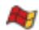

to define a new surface and add it to the list. See Creating surfaces, for instructions on defining surfaces.

3. Select the second surface or surfaces from the list of existing surfaces in the second column to define the surface pairings.

• When multiple surfaces are selected in either column, all possible combinations will be generated in the table.  
• To specify self-contact, select either the same surface name or (Self) in the second column.  
• The order in which the surfaces are specified does not matter for the analysis.

4. Click the arrows


in the middle of the dialog box to transfer the surface pair to the list of pairings that will be included in the contact domain.

The table on the right side of the dialog box is updated to reflect your selections (the order of the surface pairings is irrelevant).

5. Repeat the above steps as needed to completely define the contact domain inclusions. If you want to delete included pairs, select the rows and click


6. Click OK to save your selections and to close the Edit Included Pairs dialog box.

The interaction editor reappears with updated information on the number of selected surface pairs for inclusion in the contact domain.

5. If necessary, select the surface pairs to exclude from the contact domain.

a. Click Edit next to Excluded surface pairs.

The Edit Excluded Pairs dialog box appears. By default, when you select a surface from the list or the table, Abaqus/CAE highlights the surface in the viewport; however, highlighting does not apply for (All\*), (Self), and Eulerian material surfaces. You can toggle off Highlight selected regions at the bottom of the dialog box to turn off selection highlighting.

b. Select one or more surfaces from the list of existing surfaces in the first column on the left side. Select (All\*) to specify a surface that includes all allowable element faces and model entities.


## Tip: You can click


to define a new surface and add it to the list. See Creating surfaces, for instructions on defining surfaces.

c. Select the second surface or surfaces from the list of existing surfaces in the second column to define the surface pairings.

• When multiple surfaces are selected in either column, all possible combinations will be generated in the table.  
• To specify that self-contact should be excluded, select either the same surface name or (Self) in the second column.  
• The order in which the surfaces are specified does not matter for the analysis.  
• If the excluded regions overlap with the included regions, the contact exclusions will take precedence over the contact inclusions.

d. Click the arrows


in the middle of the dialog box to transfer the surface pair to the list of pairings that will be excluded from the contact domain.

The table on the right side of the dialog box is updated to reflect your selections (the order of the surface pairings is irrelevant).

e. Repeat the above steps as needed to completely define the contact domain exclusions. If you want to delete excluded pairs, select the rows and click


f. Click OK to save your selections and to close the Edit Excluded Pairs dialog box.

The interaction editor reappears with updated information on the number of selected surface pairs for exclusion from the contact domain.

6. Specify the Attribute Assignments at the bottom of the interaction editor. In Abaqus/Standard you can modify the contact properties or stabilizations in any step in which the general contact interaction is active, but all other attributes are assigned for the entire analysis. In Abaqus/Explicit you can specify or modify the attributes in any step in which the general contact interaction is active. You can specify the following assignments:

Contact Properties. For detailed instructions, see Specifying and modifying contact property assignments for general contact.  
Contact Initializations (Abaqus/Standard only). For detailed instructions, see Specifying and modifying contact initialization assignments for general contact.  
Contact Stabilizations (Abaqus/Standard only). For detailed instructions, see Specifying and modifying contact stabilization assignments for general contact.  
• Surface Properties. For detailed instructions, see Specifying surface property assignments for general contact.  
Contact Formulation. For detailed instructions, see Specifying contact formulation assignments for general contact.

7. Click OK to create the interaction and to close the editor.

## Additional information

• About General Contact in Abaqus/Standard  
• About General Contact in Abaqus/Explicit  
• Interaction editors

## Specifying and modifying contact property assignments for general contact

Contact properties can be assigned globally to a general contact interaction or individually to particular regions within a general contact domain.

Attributes for a general contact interaction, such as contact properties, are specified independently of the contact domain in the Attribute Assignments portion of the interaction editor. For a brief overview of general contact, see Understanding interactions.

You can change the contact property that is assigned to a general contact interaction in any step to which the original interaction definition is propagated. In Abaqus/Standard only the frictional behavior is allowed to change between the original contact property definition and the new contact property definition (see Specifying frictional behavior for mechanical contact property options)—Abaqus uses the original friction definition from the creation of the general contact interaction until the step in which the new property is assigned; the new friction definition is used for subsequent steps.

## Additional information

• Interaction editors  
• Defining general contact

## Specify contact property assignments

1. Display the general contact interaction editor using one of the following methods:

• To create a new general contact interaction, follow the instructions in Defining general contact.  
• To edit an existing general contact interaction, select Interaction->Edit->interaction name from the main menu bar.

2. Click the Contact Properties tab in the Attribute Assignments portion of the interaction editor (if it is not already selected).

3. If necessary, click in the Contact Properties portion of the interaction editor to create a contact interaction property; see Defining a contact interaction property, for more information.

4. Specify the contact property assignments for the interaction using either of the following methods:

• To assign a contact property globally to the entire contact domain, select a property from the list next to Global property assignment.  
• To assign different contact properties to individual surface pairs:

1. Click next to Individual property assignments.

The Edit Individual Contact Property Assignments dialog box appears. By default, when you select a surface from the list or the table, Abaqus/CAE highlights the surface in the viewport; however, highlighting does not apply for (Global), (Self), materials, and Eulerian material surfaces. You can toggle off Highlight selected regions at the bottom of the dialog box to turn off selection highlighting.

2. Select one or more combinations of surfaces and materials from the list of existing surfaces and materials in the first column on the left side. Select (Global) to assign a contact property between the entire contact domain and an individual surface or material.


Tip: You can click to define a new surface and add it to the list. See Creating surfaces, for instructions on defining surfaces.


Tip: You can click to define a new material and add it to the list. See Creating or editing a material, for instructions on defining materials.

3. Select the second surface or material or combinations of surfaces and materials from the list of existing surfaces and materials in the second column to define the surface pairings.

When multiple surfaces and materials are selected in either column, all possible combinations will be generated.  
• To assign a property for self-contact, select either the same surface name or (Self) in the second column.  
• Any contact property assignments for regions that fall outside of the contact domain will be ignored.

4. From the list of existing interaction properties in the third column, select the property to assign.


Tip: You can click to define a new interaction property and add it to the list. See Defining a contact interaction property, for instructions on defining interaction properties.

5. Click the arrows in the middle of the dialog box to transfer your selections to the list of property assignments.

The table on the right side of the dialog box is updated to reflect your selections.

6. Repeat the above steps as needed to complete the contact property assignments. If you want to delete contact property assignments, select the rows and click


## Note:

The order of assignments may be relevant; when property assignments overlap, the last assignment will take precedence.

7. Click OK to save your selections and to close the Edit Individual Contact Property Assignments dialog box.

The interaction editor reappears with updated information on the number of individual contact property assignments.


## Note:

Individual contact property assignments take precedence over the global assignment.

5. Click OK to create the interaction and to close the editor.

## Modify a contact property assignment

1. From the main menu bar, select Interaction->Edit->interaction name.

The Edit Interaction dialog box appears.

2. Click the Contact Properties tab in the Attribute Assignments portion of the interaction editor (if it is not already selected).

3. Click next to Individual property assignments.

The Edit Individual Contact Property Assignments dialog box appears.

4. Select the row or rows containing the property assignment to be modified from the table on the right side of the dialog box.  
5. Select a new interaction property from the list in the third column on the left side of the dialog box.  
6. Click the arrow > in the middle of the dialog box to replace the interaction property with your new selection.  
7. Click OK to save your selections and to close the dialog box.

The interaction editor reappears.

8. Click OK to save your changes and to close the interaction editor.

## Specifying and modifying contact initialization assignments for general contact

Contact initializations determine how Abaqus adjusts surfaces in the general contact domain prior to the analysis. Contact initializations for surfaces are specified independently of the contact domain in the Attribute Assignments portion of the interaction editor. Contact initialization can be assigned only in the initial step of an analysis. For more information about contact initializations, see Creating contact initializations, Contact Initialization for General Contact in Abaqus/Standard, and Contact Initialization for General Contact in Abaqus/Explicit.

## Additional information

• Creating contact initializations  
• Contact Initialization for General Contact in Abaqus/Standard  
• Contact Initialization for General Contact in Abaqus/Explicit

## Specify contact initialization assignments

1. Display the general contact interaction editor using one of the following methods:

• To create a new general contact interaction, follow the instructions in Defining general contact.  
• To edit an existing general contact interaction, select Interaction->Edit->interaction name from the main menu bar.

2. Click the Contact Properties tab in the Attribute Assignments portion of the interaction editor (if it is not already selected).

3. If necessary, click in the Contact Properties portion of the interaction editor to create a contact initialization definition; see Creating contact initializations, for more information.

4. Click next to Initialization assignments.

The Edit Initialization Assignments dialog box appears. By default, when you select a surface from the list or the table, Abaqus/CAE highlights the surface in the viewport; however, highlighting does not apply for (Global) and (Self). You can toggle off Highlight selected regions at the bottom of the dialog box to turn off selection highlighting.

5. Select one or more surfaces from the list of existing surfaces in the first column on the left side. Select (Global) to assign an initialization between the entire contact domain and an individual surface for an Abaqus/Standard analysis.


Tip: You can click to define a new surface and add it to the list. See Creating surfaces, for instructions on defining surfaces.

6. Select the second surface or surfaces from the list of existing surfaces in the second column to define the surface pairings.

• When multiple surfaces are selected in either column, all possible combinations will be generated.  
• To assign an initialization for self-contact, select either the same surface name or (Self) in the second column for an Abaqus/Standard analysis.  
• In an Abaqus/Explicit analysis the default surfaces (Self) and (Global) are not supported.  
• Any initialization assignments for regions that fall outside of the contact domain will be ignored.

7. From the list of existing initializations in the third column, select the initialization to assign. You can create new contact initializations while you are working in the Edit Initialization Assignments dialog box (see Creating contact initializations).

8. From the list of existing secondary surface option type in the fourth column, select the secondary surface option type to assign. This list is available only if the contact initialization is defined with the clearance distance and Adjust nodal coordinates options.

9. Click the arrows in the middle of the dialog box to transfer your selections to the list of property assignments.

The table on the right side of the dialog box is updated to reflect your selections.

10. Repeat the above steps as needed to complete the initialization assignments. If you want to delete

initialization assignments, select the rows and click


## Note:

The order of assignments may be relevant; when initialization assignments overlap, the last assignment will take precedence.

11. Click OK to save your selections and to close the Edit Initialization Assignments dialog box. The interaction editor reappears with updated information on the number of individual initialization assignments.

12. Click OK to create the interaction and to close the editor.

## Modify a contact initialization assignment

1. From the main menu bar, select Interaction->Edit->interaction name. The Edit Interaction dialog box appears.

2. Click the Contact Properties tab in the Attribute Assignments portion of the interaction editor (if it is not already selected).

3. Click next to Initialization assignments.

The Edit Initialization Assignments dialog box appears.

4. Select the row or rows containing the initialization assignment to be modified from the table on the right side of the dialog box.

5. Select a new initialization from the list in the third column on the left side of the dialog box.

6. Click the arrow in the middle of the dialog box to replace the initialization with your new selection.

7. Click OK to save your selections and to close the dialog box. The interaction editor reappears.

8. Click OK to save your changes and to close the interaction editor.

## Specifying and modifying contact stabilization assignments for general contact

Contact stabilization introduces viscous damping between two surfaces to stabilize rigid body motion prior to the establishment of contact.

Contact stabilization definitions are assigned to surfaces independently of the contact domain in the Attribute Assignments portion of the interaction editor.

A contact stabilization definition can be assigned in any step of an Abaqus/Standard analysis other than the initial step. Since general contact interactions must be created in the initial step, stabilization assignments require you to edit a previously created general contact interaction.

Stabilization effects are typically enforced only in the step in which they are applied. However, if a nondefault amplitude is selected as part of the contact stabilization definition, the stabilization effects may carry over into subsequent steps as described in Stabilization for General Contact in Abaqus/Standard. To remove stabilization effects in this situation, you must create a separate contact stabilization definition using the Reset values from previous steps option and apply that stabilization definition in a subsequent step.

For more information about contact stabilization definitions, see Creating contact stabilization definitions.

## Additional information

• Creating contact stabilization definitions  
• Stabilization for General Contact in Abaqus/Standard

## Specify contact stabilization assignments

1. From the main menu bar, select Interaction->Edit->interaction name.  
2. Click the Contact Properties tab in the Attribute Assignments portion of the interaction editor (if it is not already selected).

3. If necessary, click i

n the Contact Properties portion of the interaction editor to create a contact stabilization definition; see Creating contact stabilization definitions, for more information.  
4. Click next to Stabilization assignments.

The Edit Stabilization Assignments dialog box appears. By default, when you select a surface from the list or the table, Abaqus/CAE highlights the surface in the viewport; however, highlighting does not apply for the default surfaces labeled (Global) and (Self). You can toggle off Highlight selected regions at the bottom of the dialog box to turn off selection highlighting.

5. Select one or more surfaces from the list of existing surfaces in the first column on the left side. Select (Global) to introduce stabilization effects between the entire contact domain and an individual surface.


Tip: You can click to define a new surface and add it to the list. See Creating surfaces, for instructions on defining surfaces.

6. Select the second surface or surfaces from the list of existing surfaces in the second column to define the surface pairings.

• When multiple surfaces are selected in either column, all possible combinations are generated.  
• To assign a stabilization definition for self-contact, select either the same surface name or (Self) in the second column.  
• Any stabilization assignments for regions that fall outside of the contact domain are ignored.

7. From the list of existing stabilization definitions in the third column, select the stabilization to assign. You can create new contact stabilization definitions while you are working in the Edit Stabilization Assignments dialog box (see Creating contact stabilization definitions).  
8. Click the arrows in the middle of the dialog box to transfer your selections to the list of stabilization assignments.

The table on the right side of the dialog box is updated to reflect your selections.

9. Repeat the above steps as needed to complete the stabilization assignments. If you want to delete

stabilization assignments, select the rows and click A


## Note:

The order of assignments may be relevant; when stabilization assignments overlap, the last assignment takes precedence.

10. Click OK to save your selections and to close the Edit Stabilization Assignments dialog box. The interaction editor reappears with updated information on the number of individual stabilization assignments.  
11. Click OK to save your changes and to close the editor.

## Modify a contact stabilization assignment

1. From the main menu bar, select Interaction->Edit->interaction name.  
The Edit Interaction dialog box appears.

2. Click the Contact Properties tab in the Attribute Assignments portion of the interaction editor (if it is not already selected).  
3. Click next to Stabilization assignments.

The Edit Stabilization Assignments dialog box appears.

4. Select the row or rows containing the stabilization assignment to be modified from the table on the right side of the dialog box.  
5. Select a new stabilization definition from the list in the third column on the left side of the dialog box.

6. Click the arrow > in the middle of the dialog box to replace the stabilization definition with your new selection.  
7. Click OK to save your selections and to close the dialog box.

The interaction editor reappears.

8. Click OK to save your changes and to close the interaction editor.

## Specifying surface property assignments for general contact

Attributes for a general contact interaction, such as surface properties, are specified independently of the contact domain in the Attribute Assignments portion of the interaction editor.

For a brief overview of general contact, see Understanding interactions. For a more detailed discussion, see Surface Properties for General Contact in Abaqus/Standard, and Assigning Surface Properties for General Contact in Abaqus/Explicit.

You can specify the following surface properties in a general contact interaction:

## Surface thickness assignments

Assign nondefault surface thicknesses to shell or membrane surfaces.

## Shell/Membrane offset assignments

Assign the surface offset to define the distance (as a fraction of the surface thickness) from the midsurface to the reference surface.

## Surface smoothing assignments

Assign nondefault contact smoothing to model surfaces. Contact smoothing improves the contact stress and pressure accuracy for curved surfaces (see Smoothing Contact Surfaces in Abaqus/Standard).

## Feature edge criteria assignments

Control the feature edges to be included in the general contact domain. Feature edges of a model include shell perimeter edges and geometric feature edges. Modeling of edge-to-edge contact is not allowed for Abaqus/Standard analyses.

## Crush Trigger assignments

Control the crushing behaviors relating to CZone methodology in the general contact domain. CZone is an Abaqus/Explicit capability that integrates material, element, and contact modeling aspects to simulate crushing of laminated composites due to contact with other bodies (see CZone Analysis). Modeling of crush trigger contact is not allowed for Abaqus/Standard analyses.

## Surface friction assignments

Establish friction coefficients as mathematical combinations of coefficients specified as surface properties. Modeling of friction contact is not allowed for Abaqus/Standard analyses.

## Surface beam smoothing assignments

Assign nondefault beam smoothing to model surfaces.

## Surface vertex criteria assignments

Control the vertex-to-surface contact formulation in the general contact domain. Vertex criteria of a model specify the vertex nodes that should be considered by the vertex-to-surface formulation (see Vertex Nodes).

## Surface wear surface property assignments

Assign wear surface properties to model surfaces (see Contact Wear).

## Additional information

• Surface Properties for General Contact in Abaqus/Standard  
• Assigning Surface Properties for General Contact in Abaqus/Explicit  
• Interaction editors

• Defining general contact

## Specify surface thickness assignments

1. Display the general contact interaction editor using one of the following methods:

• To create a new general contact interaction, follow the instructions in Defining general contact.  
• To edit an existing general contact interaction, select Interaction->Edit->interaction name from the main menu.

2. Click the Surface Properties tab in the Attribute Assignments portion of the interaction editor.

The surface thickness can be modified only for surfaces defined on shells and membranes.

3. Click next to Surface thickness assignments.

The Edit Surface Thickness Assignments dialog box appears. By default, when you select a surface from the list or the table, Abaqus/CAE highlights the surface in the viewport; however, highlighting does not apply for (Global), and materials. You can toggle off Highlight selected regions at the bottom of the dialog box to turn off selection highlighting.

4. Select one or more surfaces and materials from the list of existing surfaces and materials in the column on the left. Select (Global) to assign the shell/membrane thickness to the entire contact domain.


## Tips:

• You can click to define a new surface and add it to the list. See Creating surfaces, for instructions on defining surfaces.  
• You can click to define a new material and add it to the list. See Creating or editing a material, for instructions on defining materials.

5. Click the arrows in the middle of the dialog box to transfer your selections to the list of shell/membrane thickness assignments.

The table on the right side of the dialog box is updated to reflect your selections.

6. Specify the thickness for each surface and material in the middle column of the Surface Thickness Assignments table.

• Enter the word ORIGINAL to set the shell/membrane thickness equal to the original shell or membrane thickness (the default);  
enter the word THINNING to set the shell/membrane thickness equal to the current shell or membrane thickness (this option is available only in Abaqus/Explicit); or  
• specify a value for the shell/membrane thickness.

7. Optionally, specify a scale factor for any of the shell/membrane thickness assignments in the last column of the Surface Thickness Assignments table.

8. Repeat the above steps as needed to complete the shell/membrane thickness assignments. If you want to delete thickness assignments, select the rows and click


Note: The order of assignments might be relevant; when shell/membrane thickness assignments overlap, the last assignment takes precedence.

9. Click OK to save your selections and to close the Edit Surface Thickness Assignments dialog box. The interaction editor reappears with updated information on the number of shell/membrane thickness assignments.

10. Click OK to create the interaction and to close the editor.

## Specify shell/membrane offset assignments

1. Display the general contact interaction editor using one of the following methods:

• To create a new general contact interaction, follow the instructions in Defining general contact.  
• To edit an existing general contact interaction, select Interaction->Edit->interaction name from the main menu.

2. Click the Surface Properties tab in the Attribute Assignments portion of the interaction editor.

The surface offset can be modified only for surfaces defined on shells and membranes.

3. Click next to Shell/Membrane offset assignments.

The Edit Shell/Membrane Offset Assignments dialog box appears. By default, when you select a surface from the list or the table, Abaqus/CAE highlights the surface in the viewport; however, highlighting does not apply for (Global), and materials. You can toggle off Highlight selected regions at the bottom of the dialog box to turn off selection highlighting.

4. Select one or more surfaces and materials from the list of existing surfaces and materials in the column on the left. Select (Global) to assign the shell/membrane offset to the entire contact domain.


## Tips:

• You can click to define a new surface and add it to the list. See Creating surfaces, for instructions on defining surfaces.  
• You can click to define a new material and add it to the list. See Creating or editing a material, for instructions on defining materials.

5. Click the arrows in the middle of the dialog box to transfer your selections to the list of shell/membrane offset assignments.

The table on the right side of the dialog box is updated to reflect your selections.

6. Specify the offset fraction for each surface and material in the second column of the Shell/Membrane Offset Assignments table. The offset fraction defines the distance (as a fraction of the thickness) from the midsurface to the reference surface.

Enter the word ORIGINAL to set the shell/membrane offset equal to the original shell or membrane offset (the default).  
• Enter SPOS to specify the top surface of the shell/membrane as the reference surface.  
• Enter SNEG to specify the bottom surface of the shell/membrane as the reference surface.  
Specify a value between −0.5 (indicates the bottom surface of the shell/membrane) and 0.5 (indicates the top surface of the shell/membrane) for the offset fraction.

7. Repeat the above steps as needed to complete the shell/membrane offset assignments. If you want to delete offset assignments, select the rows and click


Note: The order of assignments might be relevant; when shell/membrane offset assignments overlap, the last assignment takes precedence.

8. Click OK to save your selections and to close the Edit Shell/Membrane Offset Assignments dialog box.

The interaction editor reappears with updated information on the number of shell/membrane offset assignments.

9. Click OK to create the interaction and to close the editor.

## Specify surface smoothing assignments

1. Display the general contact interaction editor using one of the following methods:

• To create a new general contact interaction, follow the instructions in Defining general contact.  
• To edit an existing general contact interaction, select Interaction->Edit->interaction name from the main menu.

In an Abaqus/Standard general contact interaction, surface smoothing assignments can be specified only in the initial step. In an Abaqus/Explicit general contact interaction, surface smoothing assignments can be specified or modified in any analysis step.

2. Click the Surface Properties tab in the Attribute Assignments portion of the interaction editor.

3. Click next to Surface smoothing assignments.

The Edit Surface Smoothing Assignments dialog box appears. By default, when you select a surface from the list or the table, Abaqus/CAE highlights the surface in the viewport and displays the detected axis or center of curvature that will be used in the smoothing calculation. You can toggle off Highlight selected regions at the bottom of the dialog box to turn off selection highlighting.

4. Toggle Automatically assign smoothing for geometric faces to determine whether Abaqus/CAE applies surface smoothing automatically to all appropriate surfaces in the general contact domain. This option is on by default for Abaqus/Standard general contact interactions and off by default for Abaqus/Explicit general contact interactions.

5. Select one or more surfaces from the list of existing surfaces in the column on the left.


Tip: You can click to define a new surface and add it to the list. See Creating surfaces, for instructions on defining surfaces.

6. Click the arrows in the middle of the dialog box to transfer your selections to the list of surface smoothing assignments.

The table on the right side of the dialog box is updated to reflect your selections.

7. Specify the smoothing to apply to each surface in the second column of the Surface Smoothing Assignments table. The smoothing specified for these surfaces overrides the default global smoothing if it is applied.

Select REVOLUTION to apply circumferential smoothing to a curved surface that is symmetric about an axis of revolution (or a two-dimensional arc that is symmetric about a central point).  
• Select SPHERICAL to apply spherical smoothing to a curved surface that is symmetric about a central point.

Select TOROIDAL to apply toroidal smoothing to a curved surface that is a circular arc symmetric about an axis of revolution.  
• Select NONE to prevent smoothing from being applied to the specified surface.

8. Repeat the above steps as needed to complete the surface smoothing assignments. If you want to delete

smoothing assignments, select the rows and click


Note: The order of assignments might be relevant; when smoothing assignments overlap, the last assignment takes precedence.

9. Click OK to save your selections and to close the Edit Surface Smoothing Assignments dialog box.

The interaction editor reappears with updated information on the number of surface smoothing assignments.

10. Click OK to create the interaction and to close the editor.

## Specify feature edge criteria assignments

1. Display the general contact interaction editor using one of the following methods:

• To create a new general contact interaction, follow the instructions in Defining general contact.  
• To edit an existing general contact interaction, select Interaction->Edit->interaction name from the main menu.

2. Click the Surface Properties tab in the Attribute Assignments portion of the interaction editor.

3. Click next to Feature edge criteria assignments.

The Edit Feature Edge Criteria Assignments dialog box appears. By default, when you select a surface from the list or the table, Abaqus/CAE highlights the surface in the viewport; however, highlighting does not apply for (Global), and materials. You can toggle off Highlight selected regions at the bottom of the dialog box to turn off selection highlighting.

4. Select one or more surfaces and materials from the list of existing surfaces in the first column on the left side of the dialog box. Select (Global) to assign the surface feature to the entire contact domain.


## Tips:

• You can click to define a new surface and add it to the list. See Creating surfaces, for instructions on defining surfaces.  
You can click to define a new material and add it to the list. See Creating or editing a material, for instructions on defining materials.

5. Select the configuration from the second column on the left (this option is available only for Abaqus/Explicit).

6. Click the arrows in the middle of the dialog box to transfer your selections to the list of surface feature assignments.

The table on the right side of the dialog box is updated to reflect your selections.

7. Specify the feature edge criteria for each surface and material in the second and third columns of the Surface Feature Assignments table by doing one of the following:

Enter the word PERIMETER to include only perimeter edges in the general contact domain.•  
Enter the word ALL to include all edges in the general contact domain (this option is available only for Abaqus/Explicit).  
Enter the word PICKED to include in the general contact domain only edges that were explicitly selected as part of the surface definition (this option is available only for shell geometries and elements in Abaqus/Explicit).  
• Enter the word NONE to include no feature edges in the general contact domain.  
Specify an angle in degrees to include perimeter edges and geometric edges with feature angles greater than or equal to the specified angle in the general contact domain. The specified value must be between 0° and 180°. For examples of how the feature angle is calculated for different edges, see Feature Edges.

8. Repeat the above steps as needed to complete the surface feature assignments. If you want to delete

surface feature assignments, select the rows and click


Note: The order of assignments might be relevant; when surface feature assignments overlap, the last assignment takes precedence.

9. For an Abaqus/Explicit general contact interaction, toggle Use dynamic feature edges to activate or deactivate the dynamic feature edge criterion for the contact surface.  
10. Click OK to save your selections and to close the Edit Feature Edge Criteria Assignments dialog box.

The interaction editor reappears with updated information on the number of feature edge criteria assignments.

11. Click OK to create the interaction and to close the editor.

## Specify crush trigger assignments

1. Display the general contact interaction editor using one of the following methods:

• To create a new general contact interaction, follow the instructions in Defining general contact.  
• To edit an existing general contact interaction, select Interaction->Edit->interaction name from the main menu.

2. Click the Surface Properties tab in the Attribute Assignments portion of the interaction editor.

3. Click next to Crush trigger assignments.

The Edit Crush Trigger Assignments dialog box appears. By default, when you select a surface from the list or the table, Abaqus/CAE highlights the surface in the viewport; however, highlighting does not apply for (Global) and materials. You can toggle off Highlight selected regions at the bottom of the dialog box to turn off selection highlighting.

4. Select one or more surfaces and materials from the list of existing surfaces in the first column on the left side of the dialog box. Select (Global) to assign the surface feature to the entire contact domain.


## Tips:

• You can click A to define a new surface and add it to the list. See Creating surfaces, for instructions on defining surfaces.

• You can click to define a new material and add it to the list. See Creating or editing a material, for instructions on defining materials.

5. Click the arrows in the middle of the dialog box to transfer your selections to the list of crush trigger assignments.

The table on the right side of the dialog box is updated to reflect your selections.

6. Specify the trigger option for each surface and material in the second column of the Crush Trigger Assignments table by doing one of the following:

Enter the word TRIGGER to specify that node develops contact pressures consistent with the assigned contact pressure-overclosure relationship.  
• Enter the word NO\_TRIGGER to specify that nodes will be reassigned trigger status during the simulation if adjacent nodes begin crushing or adjacent elements experience material failure.  
• Enter the word NO\_CRUSH to specify that the nodes have no crush associated with adjacent elements and will never crush.

7. Specify the crush stress, crush initiation angle, and crush continuation angle for each surface and material in the third, fourth, and fifth columns of the Crush Trigger Assignments table by doing the following:

• Specify a scalar value representing the stress required to initiate crushable behavior as a factor of the crush stress in the column Crush Stress.  
• Specify an angle in degrees representing the crush initiation angle.  
• Specify an angle in degrees representing the crush continuation angle.

8. Repeat the above steps as needed to complete the crush trigger assignments. If you want to delete crush trigger assignments, select the rows and click


Note: The order of assignments might be relevant; when crush trigger assignments overlap, the last assignment takes precedence.

9. Click OK to save your selections and to close the Edit Crush Trigger Assignments dialog box. The interaction editor reappears with updated information on the number of crush trigger assignments.

10. Click OK to create the interaction and to close the editor.

## Specify surface friction assignments

1. Display the general contact interaction editor using one of the following methods:

• To create a new general contact interaction, follow the instructions in Defining general contact.  
• To edit an existing general contact interaction, select Interaction->Edit->interaction name from the main menu.

2. Click the Surface Properties tab in the Attribute Assignments portion of the interaction editor.

3. Click next to Surface friction assignments.

The Edit Surface Friction Assignments dialog box appears. By default, when you select a surface from the list or the table, Abaqus/CAE highlights the surface in the viewport; however, highlighting does not apply for (Global) and materials. You can toggle off Highlight selected regions at the bottom of the dialog box to turn off selection highlighting.

4. Select one or more surfaces and materials from the list of existing surfaces and materials in the column on the left. Select (Global) to assign the surface-based friction coefficient to the entire contact domain.


## Tips:

• You can click A to define a new surface and add it to the list. See Creating surfaces, for instructions on defining surfaces.  
• You can click to define a new material and add it to the list. See Creating or editing a material, for instructions on defining materials.

5. Click the arrows in the middle of the dialog box to transfer your selections to the list of surface friction assignments.

The table on the right side of the dialog box is updated to reflect your selections.

6. Specify the surface-based friction coefficients for each surface and material in the second column of the Surface Friction Assignments table.

7. Repeat the above steps as needed to complete the surface friction assignments. If you want to delete surface friction assignments, select the rows and click


Note: The order of assignments might be relevant; when surface friction assignments overlap, the last assignment takes precedence.

8. Click OK to save your selections and to close the Edit Surface Friction Assignments dialog box. The interaction editor reappears with updated information on the number of surface friction assignments.

9. Click OK to create the interaction and to close the editor.

## Specify surface beam smoothing assignments

1. Display the general contact interaction editor using one of the following methods:

• To create a new general contact interaction, follow the instructions in Defining general contact.  
• To edit an existing general contact interaction, select Interaction->Edit->interaction name from the main menu.

2. Click the Surface Properties tab in the Attribute Assignments portion of the interaction editor.

3. Click next to Surface beam smoothing assignments.

The Edit Beam Smoothing Assignments dialog box appears. By default, when you select a surface from the list or the table, Abaqus/CAE highlights the surface in the viewport and displays the detected axis or center of curvature that is used in the smoothing calculation. You can toggle off Highlight selected regions at the bottom of the dialog box to turn off selection highlighting.

4. Select one or more surfaces from the list of existing surfaces in the column on the left.


Tip: You can click to define a new surface and add it to the list. See Creating surfaces, for instructions on defining surfaces.

5. Click the arrows in the middle of the dialog box to transfer your selections to the list of beam smoothing assignments.

The table on the right side of the dialog box is updated to reflect your selections.

6. Specify the smoothing to apply to each surface in the second column of the Beam Smoothing Assignments table. The smoothing specified for these surfaces overrides the default global smoothing if it is applied.

Specify a value between 0.0 and 0.5 for the beam smoothing.

7. Repeat the above steps as needed to complete the beam smoothing assignments. If you want to delete

beam smoothing assignments, select the rows and click


Note: The order of assignments might be relevant; when beam smoothing assignments overlap, the last assignment takes precedence.

8. Click OK to save your selections and to close the Edit Beam Smoothing Assignments dialog box.

The interaction editor reappears with updated information on the number of beam smoothing assignments.

9. Click OK to create the interaction and to close the editor.

## Specify surface vertex criteria assignments

1. Display the general contact interaction editor using one of the following methods:

• To create a new general contact interaction, follow the instructions in Defining general contact.  
• To edit an existing general contact interaction, select Interaction->Edit->interaction name from the main menu.

2. Click the Surface Properties tab in the Attribute Assignments portion of the interaction editor.

3. Click next to Surface vertex criteria assignments.

The Edit Vertex Criteria Assignments dialog box appears. By default, when you select a surface from the list or the table, Abaqus/CAE highlights the surface in the viewport; however, highlighting does not apply for (Global) and materials. You can toggle off Highlight selected regions at the bottom of the dialog box to turn off selection highlighting.

4. Select one or more surfaces and materials from the list of existing surfaces in the first column on the left side of the dialog box. Select (Global) to assign the surface feature to the entire contact domain.


## Tips:

• You can click to define a new surface and add it to the list. See Creating surfaces, for instructions on defining surfaces.  
• You can click to define a new material and add it to the list. See Creating or editing a material, for instructions on defining materials.

5. Click the arrows in the middle of the dialog box to transfer your selections to the list of vertex criteria assignments.

The table on the right side of the dialog box is updated to reflect your selections.

6. Specify the vertex criteria for each surface and material in the second column of the Vertex Criteria Assignments table by doing one of the following:

• Enter the word ALL\_VERTICES to specify that all vertex nodes should be considered by the vertex-to-surface formulation.  
• Enter the word NO\_VERTICES to specify that no vertex nodes should be considered by the vertex-to-surface formulation.  
• Specify an angle in degrees representing the vertex angle threshold. The specified value must be between 10° and 90°.

7. Repeat the above steps as needed to complete the vertex criteria assignments. If you want to delete vertex criteria assignments, select the rows and click


Note: The order of assignments might be relevant; when vertex criteria assignments overlap, the last assignment takes precedence.

8. Click OK to save your selections and to close the Edit Vertex Criteria Assignments dialog box. The interaction editor reappears with updated information on the number of vertex criteria assignments.

9. Click OK to create the interaction and to close the editor.

## Specify wear surface property assignments

1. Display the general contact interaction editor using one of the following methods:

• To create a new general contact interaction, follow the instructions in Defining general contact.  
• To edit an existing general contact interaction, select Interaction->Edit->interaction name from the main menu bar.

2. Click the Surface Properties tab in the Attribute Assignments portion of the interaction editor if it is not already selected.

3. If necessary, click in the Surface Properties portion of the interaction editor to create a wear surface interaction property (see Defining a wear interaction property).

4. Specify the wear surface property assignments for the interaction using either of the following methods:

• To assign a wear surface property globally to the entire contact domain, select a property from the list next to Global Wear Surface Property Assignment.  
• To assign different contact properties to individual surface pairs:

a) Click next to Wear Surface Property Assignments.

The Edit wear surface property assignments dialog box appears. By default, when you select a surface from the list or the table, Abaqus/CAE highlights the surface in the viewport; however, highlighting does not apply for (Global), (Self), materials, and Eulerian material surfaces. You can toggle off Highlight selected regions at the bottom of the dialog box to turn off selection highlighting.

b) Select one or more combinations of surfaces and materials from the list of existing surfaces and materials in the first column on the left side. Select (Global) to assign a contact property between the entire contact domain and an individual surface or material.


## Tips:

• You can click to define a new surface and add it to the list. See Creating surfaces for instructions on defining surfaces.  
You can click to define a new material and add it to the list. See Creating or editing a material for instructions on defining materials.

c) From the list of existing wear interaction properties in the third column, select the property to assign.


Tip: You can click to define a new interaction property and add it to the list. See Defining a wear interaction property for instructions on defining interaction properties.

d) Click the arrows in the middle of the dialog box to transfer your selections to the list of wear surface property assignments.

The table on the right side of the dialog box updates to reflect your selections.

e) Repeat the above steps as needed to complete the contact property assignments.

If you want to delete wear surface property assignments, select the rows and click


Note: The order of assignments might be relevant; when wear surface property assignments overlap, the last assignment takes precedence.

f) Click OK to save your selections and to close the Edit Wear Surface Property Assignments dialog box.

The interaction editor reappears with updated information on the number of wear surface property assignments.

5. Click OK to create the interaction and to close the editor.

## Specifying contact formulation assignments for general contact

Attributes for a general contact interaction, such as contact formulation, are specified independently of the contact domain in the Attribute Assignments portion of the interaction editor.

For a brief overview of general contact, see Understanding interactions. For a more detailed discussion of main-secondary formulations, see Contact Controls Specific to General Contact in Abaqus/Standard and Contact Formulation for General Contact in Abaqus/Explicit.

## Additional information

• Contact Controls Specific to General Contact in Abaqus/Standard  
• Contact Formulation for General Contact in Abaqus/Explicit  
• Interaction editors  
• Defining general contact

## Specify main-secondary assignments for general contact

By default, Abaqus/Standard automatically assigns a main and a secondary role to each surface in an interacting pair; Abaqus/Explicit uses a balanced main-secondary formulation for all surfaces (except node-based surfaces and analytical rigid surfaces). You can override the default assignments and directly specify the main-secondary assignments for surface pairings in a general contact interaction.

1. Display the general contact interaction editor using one of the following methods:

• To create a new general contact interaction, follow the instructions in Defining general contact.  
• To edit an existing general contact interaction, select Interaction->Edit->interaction name from the main menu bar.

2. Click the Contact Formulation tab in the Attribute Assignments portion of the interaction editor.

3. Click next to the following field:

• Main-secondary assignments for Abaqus/Standard general contact definitions.  
• Pure main-secondary assignments for Abaqus/Explicit general contact definitions.

The Edit Main-Secondary Assignments dialog box appears. By default, when you select a surface from the list or the table, Abaqus/CAE highlights the surface in the viewport; however, highlighting does not apply for (Global) and (Self). You can turn off Highlight selected regions at the bottom of the dialog box to turn off selection highlighting.

4. Select one or more surfaces from the list of existing surfaces in the first column on the left side. Select (Global) to assign a pure main-secondary weighting for contact between the entire contact domain and an individual surface.


Tip: You can click to define a new surface and add it to the list. See Creating surfaces for instructions on defining surfaces.

5. Select the second surface or surfaces from the list of existing surfaces in the second column to define the surface pairings.

• When multiple surfaces are selected in either column, all possible combinations will be generated.

• For Abaqus/Standard general contact definitions, select either the same surface name or (Self) in the second column to specify a balanced main-secondary formulation for self-contact interactions on a particular surface.  
• If the main and secondary surfaces overlap, self-contact is excluded for the overlapping regions.

6. Click the arrows in the middle of the dialog box to transfer your selections to the list of main-secondary assignments.

The table on the right side of the dialog box is updated to reflect your selections.

7. Specify the type for the first surface in the last column of the Main-Secondary Assignments table.

• Select SECONDARY to indicate the first surface is the secondary surface.  
• Select MAIN to indicate that the first surface is the main surface.  
Select BALANCED to specify balanced main-secondary contact between the two surfaces (available only in Abaqus/Standard).

For self-contact surface pairings, you must select BALANCED.

8. Repeat the above steps as needed to complete the main-secondary assignments. If you want to delete main-secondary assignments, select the rows and click

9. Click OK to save your selections.

The interaction editor reappears with updated information on the number of directly specified main-secondary assignments.

10. Click OK to create the interaction and to close the editor.

## Specify polarity assignments for general contact

1. Display the general contact interaction editor using one of the following methods:

• To create a new general contact interaction, follow the instructions in Defining general contact.  
• To edit an existing general contact interaction, select Interaction->Edit->interaction name from the main menu bar.

2. Click the Contact Formulation tab in the Attribute Assignments portion of the interaction editor.

3. Click next to the Polarity assignments for Abaqus/Explicit general contact definitions.

The Edit Polarity Assignments dialog box appears. By default, when you select a surface from the list or the table, Abaqus/CAE highlights the surface in the viewport; however, highlighting does not apply for (Global). You can toggle off Highlight selected regions at the bottom of the dialog box to turn off selection highlighting.

4. Select one or more surfaces from the list of existing surfaces in the first column on the left side. Select (Global) to assign a polarity weighting for contact between the entire contact domain and an individual surface.


Tip: You can click to define a new surface and add it to the list. See Creating surfaces for instructions on defining surfaces.

5. Select the second surface or surfaces from the list of existing surfaces in the second column to define the surface pairings.

• When multiple surfaces are selected in either column, all possible combinations will be generated.  
• If the surfaces overlap, self-contact is excluded for the overlapping regions.

6. Click the arrows in the middle of the dialog box to transfer your selections to the list of polarity assignments.

The table on the right side of the dialog box is updated to reflect your selections.

7. Specify the option in the third column of the Polarity Assignments table, to indicate the side of the (double-sided) elements in the second surface.

Select SPOS to indicate that the SPOS side of the (double-sided) elements in the second surface should be considered for contact with the first surface.  
Select SNEG to indicate that the SNEG side of the (double-sided) elements in the second surface should be considered for contact with the first surface.  
Select TWO\_SIDED to indicate that both sides of the (double-sided) elements in the second surface should be considered for contact with the first surface.

8. Repeat the above steps as needed to complete the polarity assignments. If you want to delete polarity

assignments, select the rows and click


9. Click OK to save your selections.

The interaction editor reappears with updated information on the number of directly specified polarity assignments.

10. Click OK to create the interaction and to close the editor.

## Specify sliding transition assignments for general contact

1. Display the general contact interaction editor using one of the following methods:

• To create a new general contact interaction, follow the instructions in Defining general contact.  
• To edit an existing general contact interaction, select Interaction->Edit->interaction name from the main menu bar.

2. Click the Contact Formulation tab in the Attribute Assignments portion of the interaction editor.

3. Click next to the Sliding Transition assignments for Abaqus/Standard general contact definitions.

The Edit Sliding Transition Assignments dialog box appears. By default, when you select a surface from the list or the table, Abaqus/CAE highlights the surface in the viewport; however, highlighting does not apply for (Global) and (Self). You can turn off Highlight selected regions at the bottom of the dialog box to turn off selection highlighting.

4. Select one or more surfaces from the list of existing surfaces in the first column on the left side. Select (Global) to assign a sliding transition weighting for contact between the entire contact domain and an individual surface.


Tip: You can click to define a new surface and add it to the list. See Creating surfaces for instructions on defining surfaces.

5. Select the second surface or surfaces from the list of existing surfaces in the second column to define the surface pairings.

• When multiple surfaces are selected in either column, all possible combinations will be generated.  
For Abaqus/Standard general contact definitions, select either the same surface name or (Self) in the second column to specify a formulation for self-contact interactions on a particular surface.  
• If the surfaces overlap, self-contact is excluded for the overlapping regions.

6. Click the arrows in the middle of the dialog box to transfer your selections to the list of sliding transition assignments.

The table on the right side of the dialog box is updated to reflect your selections.

7. Specify the smoothness of the contact force redistribution on sliding in the third column of the Sliding Transition Assignments table.

Select ELEMENT\_ORDER\_SMOOTHING to indicate the smoothness of the contact force redistribution on sliding should be of the same order as the elements underlying the secondary surface.  
• Select LINEAR\_SMOOTHING to indicate linear smoothness of the contact force redistribution on sliding.  
• Select QUADRATIC\_SMOOTHING to indicate quadratic smoothness of the contact force redistribution on sliding.

8. Repeat the above steps as needed to complete the sliding transition assignments. If you want to delete

sliding transition assignments, select the rows and click

9. Click OK to save your selections.

The interaction editor reappears with updated information on the number of directly specified sliding transition assignments.

10. Click OK to create the interaction and to close the editor.

## Specify edge-to-edge formulation assignments for general contact

1. Display the general contact interaction editor using one of the following methods:

• To create a new general contact interaction, follow the instructions in Defining general contact.  
• To edit an existing general contact interaction, select Interaction->Edit->interaction name from the main menu bar.

2. Click the Contact Formulation tab in the Attribute Assignments portion of the interaction editor.

3. Toggle on Edge-to-Edge formulation assignment for Abaqus/Standard general contact definitions.

4. Specify the Formulation.

• Select BOTH to activate both formulations for edge-to-edge contact.  
• Select NO to deactivate edge-to-edge contact.  
• Select RADIAL to activate the radial edge-to-edge contact formulation.  
• Select CROSS to activate the formulation based on the cross product of the edge directions for edge-to-edge contact.

5. Click OK to create the interaction and to close the editor.

## Specify sliding formulation assignments for general contact

1. Display the general contact interaction editor using one of the following methods:

To create a new general contact interaction, follow the instructions in Defining general contact.•  
• To edit an existing general contact interaction, select Interaction->Edit->interaction name from the main menu bar.

2. Click the Contact Formulation tab in the Attribute Assignments portion of the interaction editor.

3. Click next to the Sliding formulation assignments for Abaqus/Standard general contact definitions.

The Edit Sliding Formulation Assignments dialog box appears. By default, when you select a surface from the list or the table, Abaqus/CAE highlights the surface in the viewport; however, highlighting does not apply for (Global) and (Self). You can turn off Highlight selected regions at the bottom of the dialog box to turn off selection highlighting.

4. Select one or more surfaces from the list of existing surfaces in the first column on the left side. Select (Global) to assign a sliding formulation for contact between the entire contact domain and an individual surface.


Tip: You can click to define a new surface and add it to the list. See Creating surfaces for instructions on defining surfaces.

5. Select the second surface or surfaces from the list of existing surfaces in the second column to define the surface pairings.

• When multiple surfaces are selected in either column, all possible combinations will be generated.  
• For Abaqus/Standard general contact definitions, select either the same surface name or (Self) in the second column to specify a formulation for self-contact interactions on a particular surface.  
• If the surfaces overlap, self-contact is excluded for the overlapping regions.

6. Click the arrows in the middle of the dialog box to transfer your selections to the list of sliding formulation assignments.

The table on the right side of the dialog box is updated to reflect your selections.

7. Select the sliding value in the third column of the Sliding Formulation Assignments table.

• Select Small Sliding to specify the surface pairings to consider for the small-sliding approach.  
• Select None to exclude the surface pairings in the small-sliding approach.

8. Repeat the above steps as needed to complete the sliding formulation assignments. If you want to

delete sliding formulation assignments, select the rows and click


9. Click OK to save your selections.

The interaction editor reappears with updated information on the number of directly specified sliding formulation assignments.

10. Click OK to create the interaction and to close the editor.

## Specify beam cross-section for general contact

1. Display the general contact interaction editor using one of the following methods:

• To create a new general contact interaction, follow the instructions in Defining general contact.  
• To edit an existing general contact interaction, select Interaction->Edit->interaction name from the main menu bar.

2. Click the Contact Controls Assignment tab in the Attribute Assignments portion of the interaction editor.  
3. Toggle Beam Cross Section assignment for Abaqus/Explicit general contact definitions.  
4. Specify the Beam Cross Section assignment:

• Select CIRCUMSCRIBED CIRCLE to activate contact calculations based on a circumferential approximation of the beam element.  
• Select EXACT to activate contact calculations based on the actual cross section of the beam element.

5. Click OK to create the interaction and to close the editor.

A surface-to-surface contact definition can be used as an alternative to general contact to model contact interactions between specific surfaces in a model.

Certain interaction behaviors can be defined only by using surface-to-surface contact. For a brief overview of surface-to-surface contact and other types of interactions available in Abaqus, see Understanding interactions, and About Contact Interactions.

You can define surface-to-surface contact in any step, including the initial step. Select Interaction->Create from the main menu bar, and select the main and secondary surfaces. You can define contact between edges of a wire or between faces of a solid or shell. Certain connectivity restrictions apply to contact surfaces depending on the type of contact formulation. You can deactivate a surface-to-surface contact interaction in a step and, if desired, reactivate this interaction in a subsequent step. You can deactivate the interaction in a step if it will no longer be needed in the analysis.

If you are creating multiple surface-to-surface contact interactions, you may want to use the contact detection tool. This tool automates the process of selecting surfaces and allows you to create multiple interactions simultaneously. For more information, see Using contact and constraint detection.

You can obtain contact data for a specific surface-to-surface contact interaction by using the field and history output request editors in the Step module. In the Domain section of the editors, select Interaction and choose the name of the surface-to-surface contact interaction from the menu that appears. For more information, see Creating an output request.

The procedure for defining surface-to-surface contact depends on whether you are performing an analysis using Abaqus/Standard or Abaqus/Explicit. This section provides instructions for using the interaction editor to define the different surface-to-surface contact options.

## In this section:

Defining surface-to-surface contact in an Abaqus/Standard analysis  
Defining surface-to-surface contact in an Abaqus/Explicit analysis  
Specifying interference fit options

## Defining surface-to-surface contact in an Abaqus/Standard analysis

Certain interaction behaviors can be defined in Abaqus/Standard only by using surface-to-surface contact; see Contact Simulation Capabilities in Abaqus/Standard for more information.

1. From the main menu bar, select Interaction->Create.


Tip: You can also create a surface-to-surface contact interaction using the tool in the Interaction module toolbox.

2. In the Create Interaction dialog box that appears, do the following:

• Name the interaction. For more information about naming objects, see Using basic dialog box components.  
• Select the step in which the interaction will be created.  
• Select the Surface-to-surface contact (Standard) type of interaction.

3. Click Continue to close the Create Interaction dialog box.

4. Use one of the following methods to select the main surface:

Use an existing surface to define the region. On the right side of the prompt area, click Surfaces. Select an existing surface from the Region Selection dialog box that appears, and click Continue.


## Note:

The default selection method is based on the selection method you most recently employed. To revert to the other method, click Select in Viewport or Surfaces on the right side of the prompt area.

Use the mouse to select a region in the viewport. (For more information, see Selecting objects within the current viewport.) Click mouse button 2 to indicate you have finished selecting. Certain connectivity restrictions apply to contact surfaces depending on the type of contact formulation. For detailed information, see About Contact Pairs in Abaqus/Standard.

If the model contains a combination of mesh and geometry, click one of the following from the prompt area:

- Click Geometry if you want to select the surface from a geometry region.  
Click Mesh if you want to select the surface from a native or orphan mesh selection.

You can use the angle method to select a group of faces or edges from geometry or a group of element faces from a mesh. For more information, see Using the angle and feature edge method to select multiple objects.

The main surface that you select becomes highlighted in red in the viewport.

5. Select the secondary surface.

a. In the prompt area, select one of the following:

• Select Surface if you want to select a surface.  
• Select Node Region if you want to select a region from which to create a contact node set.

b. Use one of the same methods described earlier to select the secondary surface or region.

The secondary surface or region that you select becomes highlighted in magenta in the viewport. The Edit Interaction dialog box appears.

6. The Switch Surfaces option allows you to interchange your main and secondary surface selections without having to start over. The Switch Surfaces icon is available only if you selected Surface in the previous step.

7. Choose the sliding formulation.

• Choose Finite sliding to use the finite-sliding formulation, which is the most general and allows any arbitrary motion of the surfaces.  
Choose Small sliding to use the small-sliding formulation, which assumes that although two bodies may undergo large motions, there will be relatively little sliding of one surface along the other.

For more information, see Contact Formulations in Abaqus/Standard.

8. Select the discretization method.

• Select Node to surface to use the node-to-surface discretization method.  
• Select Surface to surface to use the surface-to-surface discretization method.

For more information, see Discretization of Contact Pair Surfaces.

9. Different fields become available depending upon the combination of your sliding formulation and discretization method selections.

By default, shell and membrane thicknesses are included in contact calculations for the following combinations: Small sliding and Node to surface, Small sliding and Surface to surface, and Finite sliding and Surface to surface. You can toggle on Exclude shell/membrane element thickness to ignore shell and membrane thickness for any of these combinations.

Contact interactions using Finite sliding and Node to surface do not account for surface thickness. For more information, see Accounting for Shell and Membrane Thickness.

For contact interactions using the Node to surface discretization method, you can specify a smoothing factor in the Degree of smoothing for main surface field. For more information, see Smoothing Main Surfaces for the Finite-Sliding, Node-to-Surface Formulation.

By default, a selective scheme of supplementary contact constraints is used for the following combinations: Finite sliding and Node to surface, Small sliding and Node to surface, and Small sliding and Surface to surface. For these combinations, you can specify when to Use supplementary contact points as follows:

Choose Selectively to use a selective scheme of supplementary contact constraints.  
- Choose Never to forgo the use of supplementary contact constraints.  
- Choose Always to add supplementary contact constraints when applicable.

For more information, see Supplementary Contact Constraints.

• For contact interactions using Finite sliding and Surface to surface, you can choose the Contact tracking method.

- Choose Single configuration (state) to use the state-based tracking algorithm.  
- Choose Two configurations (path) to use the path-based tracking algorithm.

For more information, see Path-Based Versus State-Based Tracking Algorithms.


## Note:

If your contact interaction uses the surface-to-surface discretization method and one or more of the surfaces in the contact interaction is an analytical rigid surface, you should choose the state-based tracking algorithm.

10. Specify the secondary node adjustment option. For more information, see Contact Initialization for Contact Pairs in Abaqus/Standard and Defining Tied Contact in Abaqus/Standard.  
11. For contact interactions using the Surface to surface discretization method, you can apply a smoothing to contacting surfaces that reduces inaccuracies in contact pressures caused by mesh discretization on curved geometries. Click the Surface Smoothing tab, and select one of the following options:

• Choose Do not smooth to prevent smoothing from being applied.  
Choose Automatically smooth 3D geometry surfaces when applicable to apply smoothing to axisymmetric or spherical surfaces (or portions of surfaces) that are identified automatically by Abaqus/CAE. Automatic smoothing has no effect on mesh parts or two-dimensional models.

For more information about contact smoothing techniques, see Smoothing Contact Surfaces in Abaqus/Standard.

12. For contact interactions using the Small sliding formulation, you can specify an initial clearance between the nodes on the secondary surface and the main surface. Click the Clearance tab, select a clearance type from the Initial clearance field, and enter all of the data necessary to define the clearance and contact direction. For more information, see Additional Contact Initialization Options for Small-Sliding Contact in Abaqus/Standard.  
13. If you specify node-to-surface discretization for your contact interaction, you can also limit bonding to secondary nodes in a particular subset. Click the Bonding tab, toggle on Limit bonding to secondary nodes in subset, and select a node set from the list.

You can limit bonding for either of the following:

When you want to specify a subset of initially secondary nodes that should experience cohesive forces. Strain-free adjustments will be made for those nodes initially not in contact but specified in the node set. All secondary nodes outside of this set (including those that are initially contacting the main surface) will experience only compressive contact forces over the course of the analysis. For more information, see Specifying cohesive behavior properties for mechanical contact property options.  
When you want to identify the initially bonded region of the secondary surface in a VCCT crack. The unbonded portion of the secondary surface behaves as a regular contact surface. The predetermined crack surfaces are assumed to be initially partially bonded so that the crack tips can be identified explicitly during the analysis. For more information, see Defining Initially Bonded Crack Surfaces in Abaqus/Standard.

14. Select a contact interaction property. If desired, click to create the interaction property.

For more information, see Defining a contact interaction property and Contact Constraint Enforcement Methods in Abaqus/Standard.

15. To specify interference fit options, click Interference Fit. Interference fit options cannot be specified in the initial step. See Specifying interference fit options below for more detailed instructions on entering interference fit options.

16. If desired, click the arrow next to the Contact controls field and select the customized contact controls to use for this interaction. Only previously created Abaqus/Standard contact controls appear in the list. For more information, see Specifying contact controls in an Abaqus/Standard analysis.  
17. To deactivate and reactivate a contact interaction in a step, toggle Active in this step. The contact interaction is active in the step in which it was created. For more information, see Removing and Reactivating Contact Pairs.  
18. Click OK to create the interaction and to close the editor.

## Additional information

• About Contact Pairs in Abaqus/Standard  
• Interaction editors  
• Customizing contact controls

## Defining surface-to-surface contact in an Abaqus/Explicit analysis

Certain interaction behaviors can be defined in Abaqus/Explicit only by using surface-to-surface contact; see Contact Simulation Capabilities in Abaqus/Explicit for more information.

1. From the main menu bar, select Interaction->Create.


Tip: You can also create a surface-to-surface contact interaction using the tool in the Interaction module toolbox.

2. In the Create Interaction dialog box that appears, do the following:

• Name the interaction. For more information about naming objects, see Using basic dialog box components.  
• Select the step in which the interaction will be created.  
• Select the Surface-to-surface contact (Explicit) type of interaction.

3. Click Continue to close the Create Interaction dialog box.

4. Use one of the following methods to select the main surface:

Use an existing surface to define the region. On the right side of the prompt area, click Surfaces. Select an existing surface from the Region Selection dialog box that appears, and click Continue.


## Note:

The default selection method is based on the selection method you most recently employed. To revert to the other method, click Select in Viewport or Surfaces on the right side of the prompt area.

Use the mouse to select a region in the viewport. (For more information, see Selecting objects within the current viewport.) Click mouse button 2 to indicate you have finished selecting. Certain connectivity restrictions apply to contact surfaces depending on the type of contact formulation. For detailed information, see About Contact Pairs in Abaqus/Explicit.

If the model contains a combination of mesh and geometry, click one of the following from the prompt area:

- Click Geometry if you want to select the surface from a geometry region.  
Click Mesh if you want to select the surface from a native or orphan mesh selection.

You can use the angle method to select a group of faces or edges from geometry or a group of element faces from a mesh. For more information, see Using the angle and feature edge method to select multiple objects.

The main surface that you select becomes highlighted in red in the viewport.

5. Select the secondary surface.

a. In the prompt area, select one of the following:

• Select Surface if you want to select a surface.  
• Select Node Region if you want to select a region from which to create a contact node set.

b. Use one of the same methods described earlier to select the secondary surface or region.

The secondary surface or region that you select becomes highlighted in magenta in the viewport. The Edit Interaction dialog box appears.

6. The Switch Surfaces option allows you to interchange your main and secondary surface selections without having to start over. The Switch Surfaces icon is available only if you selected Surface in the previous step.

7. Choose the mechanical constraint formulation.

• Choose Kinematic contact method to use a kinematic predictor/corrector contact algorithm.  
• Choose Penalty contact method to use the penalty contact algorithm.

For more information, see Contact Constraint Enforcement Methods in Abaqus/Explicit.

8. Choose the sliding formulation.

Choose Finite sliding to use the finite-sliding formulation, which is the most general and allows any arbitrary motion of the surfaces.  
Choose Small sliding to use the small-sliding formulation, which assumes that although two bodies may undergo large motions, there will be relatively little sliding of one surface along the other.

The small-sliding formulation can be specified for interactions created in only the initial step or the first general analysis step. Interactions created in subsequent steps always use the finite-sliding formulation by default. For more information, see Contact Formulations for Contact Pairs in Abaqus/Explicit.

9. For contact interactions using the Small sliding formulation, you can specify an initial clearance between the nodes on the secondary surface and the main surface. Clearance options are available only in the first general analysis step. Select a clearance type from the Initial clearance field, and enter all of the data necessary to define the clearance and contact direction. For more information, see Specifying Initial Clearance Values Precisely.

10. Select a contact interaction property. If desired, click to create the interaction property; see Defining a contact interaction property, for more information.

11. Choose the weighting factor. For more information, see Contact Formulations for Contact Pairs in Abaqus/Explicit.

12. If desired, click the arrow next to the Contact controls field and select the customized contact controls to use for this interaction. Only previously created Abaqus/Explicit contact controls appear in the list. For more information, see Specifying contact controls in an Abaqus/Explicit analysis.

13. To deactivate and reactivate a contact interaction in a step, toggle Active in this step. The contact interaction is active in the step in which it was created.

14. Click OK to create the interaction and to close the editor.

## Additional information

• About Contact Pairs in Abaqus/Explicit  
• Interaction editors  
• Customizing contact controls

## Specifying interference fit options

When you are defining surface-to-surface contact for Abaqus/Standard, you can specify interference fit options that help Abaqus/Standard resolve excessive overclosure between surfaces in the initial configuration of a model. For more information, see Modeling Contact Interference Fits in Abaqus/Standard.

To open the Interference Fit Options dialog box, click Interference Fit in the Abaqus/Standard interaction editor (see Defining surface-to-surface contact in an Abaqus/Standard analysis” above for details).

1. In the Interference Fit Options dialog box, select Gradually remove secondary node overclosure during the step to prescribe allowable intereferences.  
2. Select one of the following options:

Select Automatic shrink fit (first general analysis step only) if you want Abaqus/Standard to assign a different allowable interference to each secondary node that is equal to that node's initial penetration. If you select this option, skip to Step 6.  
• Select Uniform allowable interference to specify a single allowable interference that will be applied to every secondary node.

3. Click the arrow to the right of the Amplitude field to select the name of an amplitude curve that defines the magnitude of the prescribed interference during the step. Alternatively, you can select (Ramp) to apply the prescribed interference immediately at the beginning of the step and ramp it down to zero linearly over the step.

If necessary, you can click to define a new amplitude curve. For more information, see Selecting an amplitude type to define.

4. In the Magnitude at start of step field, enter the magnitude of the allowable interference at the start of the step.  
5. If desired, select the Interference Direction option Along direction to specify a shift direction vector. The relative shift is applied to the secondary nodes before Abaqus/Standard determines the contact conditions. If you select this option, enter the following:

• In the X field, enter the X-direction cosine of the shift direction vector.  
• In the Y field, enter the Y-direction cosine of the shift direction vector.  
• In the Z field, enter the Z-direction cosine of the shift direction vector.

6. Click OK to save the interference fit options that you have specified and to return to the Edit Interaction dialog box.

A self-contact definition can be used as an alternative to general contact to model contact interactions between different areas of a single surface.

Certain interaction behaviors can be defined only by using self-contact. For a brief overview of self-contact and other types of interactions available in Abaqus, see Understanding interactions, and About Contact Interactions.

You can define self-contact in any step, including the initial step. Select Interaction->Create from the main menu bar and select the surface. You can define self-contact between an edge of a wire, a face of a solid, or a face of a shell. Certain connectivity restrictions apply to contact surfaces depending on the type of contact formulation. You can deactivate a self-contact interaction in a step and, if desired, reactivate this interaction in a subsequent step. You can also deactivate the interaction in a step if it will no longer be needed in the analysis.

You can obtain contact data for a specific self-contact interaction by using the field and history output request editors in the Step module. In the Domain section of the editors, select Interaction and choose the name of the self-contact interaction from the menu that appears. For more information, see Creating an output request.

The procedure for defining self-contact depends on whether you are performing an analysis using Abaqus/Standard or Abaqus/Explicit. This section provides instructions for using the interaction editor to define the different surface-to-surface contact options.

## In this section:

Defining self-contact in an Abaqus/Standard analysis  
Defining self-contact in an Abaqus/Explicit analysis

## Defining self-contact in an Abaqus/Standard analysis

Certain interaction behaviors can be defined in Abaqus/Standard only by using self-contact; see Contact Simulation Capabilities in Abaqus/Standard for more information.

1. From the main menu bar, select Interaction->Create.


Tip: You can also create a self-contact interaction using the tool in the Interaction module toolbox.

2. In the Create Interaction dialog box that appears, do the following:

• Name the interaction. For more information about naming objects, see Using basic dialog box components.  
• Select the step in which the interaction will be created.  
• Select the Self-contact (Standard) type of interaction.

3. Click Continue to close the Create Interaction dialog box.

4. Use one of the following methods to select the surface:

Use an existing surface to define the region. On the right side of the prompt area, click Surfaces. Select an existing surface from the Region Selection dialog box that appears, and click Continue.


## Note:

The default selection method is based on the selection method you most recently employed. To revert to the other method, click Select in Viewport or Surfaces on the right side of the prompt area.

Use the mouse to select a region in the viewport. (For more information, see Selecting objects within the current viewport.) Certain connectivity restrictions apply to contact surfaces depending on the type of contact formulation. For detailed information, see About Contact Pairs in Abaqus/Standard.

If the model contains a combination of mesh and geometry, click one of the following from the prompt area:

- Click Geometry if you want to select the surface from a geometry region.  
Click Mesh if you want to select the surface from a native or orphan mesh selection.

You can use the angle method to select a group of faces or edges from geometry or a group of element faces from a mesh. For more information, see Using the angle and feature edge method to select multiple objects.

The Edit Interaction dialog box appears.

5. Select the discretization method.

• Select Node to surface to use the node-to-surface discretization method.  
• Select Surface to surface to use the surface-to-surface discretization method.

For more information, see Discretization of Contact Pair Surfaces.

6. Different fields become available depending upon your discretization method selection.

For contact interactions using the Node to surface discretization method, you can specify the• following:

1. Enter a smoothing factor in the Degree of smoothing field. For more information, see Smoothing Main Surfaces for the Finite-Sliding, Node-to-Surface Formulation.  
2. By default, a selective scheme of supplementary contact constraints is used. You can specify when to Use supplementary contact points as follows:

• Choose Selectively to use a selective scheme of supplementary contact constraints.

• Choose Never to forgo the use of supplementary contact constraints.

• Choose Always to add supplementary contact constraints when applicable.

For more information, see Supplementary Contact Constraints.

• For contact interactions using the Surface to surface discretization method, you can specify the following:

1. By default, shell and membrane thicknesses are included in the contact calculations. You can toggle on Exclude shell/membrane element thickness to ignore shell and membrane thickness. Contact interactions using the Node to surface discretization method do not account for surface thickness.  
2. Choose the Constraint position.

• Choose Node centered to center contact constraints at secondary nodes.

• Choose Face centered to center contact constraints within secondary faces.

For more information, see Defining Self-Contact.

3. Choose the Contact tracking algorithm.

• Choose Single configuration (state) to use the state-based tracking algorithm.  
• Choose Two configurations (path) to use the path-based tracking algorithm.

For more information, see Path-Based Versus State-Based Tracking Algorithms.


## Note:

If you use the surface-to-surface discretization method and the surface for which you are defining self-contact is an analytical rigid surface, you should choose the state-based tracking algorithm.

7. Select a contact interaction property. If desired, click to create the interaction property; see Defining a contact interaction property for more information.

If you choose the Surface to surface discretization method, the contact interaction property that you select cannot specify a “hard” contact pressure-overclosure relationship. For more information, see Contact Constraint Enforcement Methods in Abaqus/Standard and Defining mechanical contact property options.

8. If desired, click the arrow next to the Contact controls field and select the customized contact controls to use for this interaction. Only previously created Abaqus/Standard contact controls appear in the list. For more information, see Specifying contact controls in an Abaqus/Standard analysis.

9. To deactivate and reactivate a contact interaction in a step, toggle Active in this step. The contact pair is active in the step in which it was created. For more information, see Removing and Reactivating Contact Pairs.  
10. Click OK to create the interaction and to close the editor.

## Additional information

• About Contact Pairs in Abaqus/Standard  
• Interaction editors  
• Customizing contact controls

## Defining self-contact in an Abaqus/Explicit analysis

Certain interaction behaviors can be defined in Abaqus/Explicit only by using self-contact; see Contact Simulation Capabilities in Abaqus/Explicit for more information.

1. From the main menu bar, select Interaction->Create.


Tip: You can also create a self-contact interaction using the tool in the Interaction module toolbox.

2. In the Create Interaction dialog box that appears, do the following:

• Name the interaction. For more information about naming objects, see Using basic dialog box components.  
• Select the step in which the interaction will be created.  
• Select the Self-contact (Explicit) type of interaction.

3. Click Continue to close the Create Interaction dialog box.

4. Use one of the following methods to select the surface:

Use an existing surface to define the region. On the right side of the prompt area, click Surfaces. Select an existing surface from the Region Selection dialog box that appears, and click Continue.


## Note:

The default selection method is based on the selection method you most recently employed. To revert to the other method, click Select in Viewport or Surfaces on the right side of the prompt area.

Use the mouse to select a region in the viewport. (For more information, see Selecting objects within the current viewport.) Certain connectivity restrictions apply to contact surfaces depending on the type of contact formulation. For detailed information, see About Contact Pairs in Abaqus/Explicit.

If the model contains a combination of mesh and geometry, click one of the following from the prompt area:

- Click Geometry if you want to select the surface from a geometry region.  
Click Mesh if you want to select the surface from a native or orphan mesh selection.

You can use the angle method to select a group of faces or edges from geometry or a group of element faces from a mesh. For more information, see Using the angle and feature edge method to select multiple objects.

The Edit Interaction dialog box appears.

5. Choose the mechanical constraint formulation.

• Choose Kinematic contact method to use a kinematic predictor/corrector contact algorithm.  
• Choose Penalty contact method to use the penalty contact algorithm.

For more information, see Contact Constraint Enforcement Methods in Abaqus/Explicit.

6. Select a contact interaction property. If desired, click to create the interaction property; see Defining a contact interaction property, for more information.  
7. If desired, click the arrow next to the Contact controls field and select the customized contact controls to use for this interaction. Only previously created Abaqus/Explicit contact controls appear in the list. For more information, see Specifying contact controls in an Abaqus/Explicit analysis.  
8. To deactivate and reactivate the contact interaction, toggle Active in this step. The contact pair is active in the step in which it was created.  
9. Click OK to create the interaction and to close the editor.

## Additional information

• About Contact Pairs in Abaqus/Explicit  
• Interaction editors  
• Customizing contact controls

You can specify contact controls for surface-to-surface contact and self-contact interactions in an Abaqus/Standard analysis. For a detailed discussion, see Generally Applicable Contact Controls in Abaqus/Standard.


## Warning:

Contact controls are intended for advanced users. The default settings of these controls are appropriate for most analyses. Using nondefault values of these controls may greatly increase the computational time of the analysis, produce inaccurate results, or cause convergence problems.

1. From the main menu bar, select Interaction->Contact Controls->Create.  
2. In the Create Contact Controls dialog box that appears, do the following:

• Name the contact controls.  
• Select Abaqus/Standard contact controls as the type of contact controls.

3. Click Continue to close the Create Contact Controls dialog box.

The Edit Contact Controls dialog box appears.

4. In the Stabilization portion of the editor, you can specify controls relating to automatic stabilization of rigid body motions in contact problems using viscous damping.

• Select one of the following:

Select Automatic stabilization to use the default damping coefficient calculated automatically by Abaqus/Standard. If desired, you can enter a value for the Factor by which the default damping coefficient will be multiplied.  
- Select Stabilization coefficient to specify the damping coefficient directly, and enter a value.

In the Tangent fraction field, enter a value for the fraction of the normal stabilization by which to modify the tangential stabilization. By default, the tangential and normal stabilization are the same.  
• Enter a value for the Fraction of damping at end of step.  
• Specify the Clearance at which damping becomes zero.

- Select Computed to use the default clearance value calculated by Abaqus/Standard.  
- Select Specify to enter a value for the clearance at which the damping becomes zero.

5. In the Augmented Lagrange portion of the editor, you can specify controls for interactions defined with a contact interaction property that uses augmented Lagrangian surface behavior.

In the Stiffness scale factor field, enter a value for the factor by which Abaqus/Standard will scale the default penalty stiffnesses to obtain the stiffnesses used for the contact pairs. The default value is 1.  
• In the Penetration tolerance field, select one of the following to specify the allowable penetration that is permitted to violate the impenetrability condition:

- Select Absolute, and enter a value for the allowable penetration.  
Select Relative, and enter the ratio of the allowable penetration to the characteristic contact surface face dimension. The default value is 0.001.

6. Click OK to create the contact controls and to close the editor.

## Additional information

• About Contact Pairs in Abaqus/Standard  
• Contact controls editors  
• Customizing contact controls

You can specify contact controls for surface-to-surface contact and self-contact interactions in an Abaqus/Explicit analysis. For more information, see Contact Controls for Contact Pairs in Abaqus/Explicit.


## Warning:

Contact controls are intended for advanced users. The default settings of these controls are appropriate for most analyses. Using nondefault values of these controls may greatly increase the computational time of the analysis or produce inaccurate results.

1. From the main menu bar, select Interaction->Contact Controls->Create.  
2. In the Create Contact Controls dialog box that appears, do the following:

• Name the contact controls.  
• Select Abaqus/Explicit contact controls as the type of contact controls.

3. Click Continue to close the Create Contact Controls dialog box.

The Edit Contact Controls dialog box appears.

4. By default, the maximum number of increments between global contact searches is 4 for self-contact interactions and 100 for surface-to-surface contact interactions. If you want to specify the maximum number of increments between global searches, toggle on Specify max number of increments in the Global Search Frequency portion of the editor and enter a value.  
5. By default, Abaqus/Explicit uses techniques for local contact searches (local tracking) that use a minimum amount of computational time. If you have difficulty enforcing the appropriate contact conditions, you can toggle off Fast local tracking to use a more conservative local contact search. This setting applies only for surface-to-surface contact interactions.  
6. In the Penalty stiffness scaling factor field, enter a value for the factor by which Abaqus/Explicit will scale the default penalty stiffness to obtain the stiffnesses used for the penalty contact pairs. The default value is 1.  
7. In the Warp check increment field, enter the number of increments between checks for highly warped facets on main surfaces. The default value is 20. More frequent checks will cause a slight increase in computational time.  
8. In the Angle criteria for highly warped facet (degrees) field, enter a value for the out-of-plane warping angle (in degrees) at which Abaqus/Explicit will consider a facet to be highly warped. The out-of-plane warping angle is defined as the amount of variation of the surface normal over a facet. The default value is 20°.  
9. Click OK to create the contact controls and to close the editor.

## Additional information

• About Contact Pairs in Abaqus/Explicit  
• Contact Formulations for Contact Pairs in Abaqus/Explicit  
• Common Difficulties Associated with Contact Modeling Using Contact Pairs in Abaqus/Explicit  
• Contact controls editors  
• Customizing contact controls

## Defining a fluid cavity interaction

A fluid cavity interaction allows you to define a liquid- or gas-filled volume within a model. You can define a fluid cavity interaction in the initial step of an Abaqus/Standard or Abaqus/Explicit analysis. The fluid cavity interaction cannot be modified or deactivated in subsequent analysis steps. For a detailed discussion, see Fluid Cavity Definition.

1. From the main menu bar, select Interaction->Create.


Tip: You can also create a fluid cavity interaction using the tool in the Interaction module toolbox.

2. In the Create Interaction dialog box that appears, do the following:

• Name the interaction. For more information about naming objects, see Using basic dialog box components.  
• Select Initial for the step in which the interaction will be created.  
• Select the Fluid cavity type of interaction.

3. Click Continue to close the Create Interaction dialog box.

4. Select the cavity point.

The cavity point is a reference node used to identify the cavity. It should not be connected to any elements in the model. For symmetrical models the cavity point must lie on the axis or axes of symmetry. You can choose a cavity point from the viewport or from a saved set. The default selection method is based on the selection method you most recently employed. To change methods, click Select in Viewport or Sets on the right side of the prompt area.

5. If your model contains both mesh and geometry regions, select Geometry or Mesh in the prompt area to specify the region that contains the cavity.

6. Select the cavity surface.

The cavity surface is made up of all the model faces that enclose the cavity. You can choose the faces of a cavity surface from the viewport or select a saved surface. The default selection method is based on the selection method you most recently employed. To change methods, click Select in Viewport or Surfaces on the right side of the prompt area.

The Edit Interaction dialog box appears.

7. Select a fluid cavity property. If desired, click to create the interaction property; see Defining a fluid cavity interaction property, for more information.

8. If desired, toggle on Specify ambient pressure, and enter a pressure to account for the effects of external ambient pressure on the fluid cavity.

9. For two-dimensional models, you must specify an out-of-plane thickness.

The out-of-plane thickness is used to define the cavity volume.

10. For Abaqus/Explicit analyses using a pneumatic fluid cavity interaction property, toggle on Use adiabatic behavior if desired.

11. If desired, toggle off Check surface normals to prevent Abaqus/CAE from checking that all surface normals bounding the fluid cavity point in toward the cavity.

This check can be computationally expensive for complex cavity geometry.

12. Click OK to create the interaction and to close the editor.

Symbols that represent the fluid cavity interaction that you just created appear in the viewport. For more information, see Understanding symbols that represent interactions, constraints, and connectors.

## Additional information

• Fluid Cavity Definition  
• Interaction editors

## Defining a fluid exchange interaction

A fluid exchange interaction allows you to define the movement of fluid between a cavity and the surrounding environment or between two cavities. The fluid exchange interaction cannot be modified or deactivated in subsequent analysis steps. For a detailed discussion, see Fluid Exchange Definition.

1. From the main menu bar, select Interaction->Create.


Tip: You can also create a fluid cavity interaction using the tool in the Interaction module toolbox.

2. In the Create Interaction dialog box that appears, do the following:

• Name the interaction. For more information about naming objects, see Using basic dialog box components.  
• Select Initial for the step in which the interaction will be created.  
• Select the Fluid exchange type of interaction.

3. Click Continue to close the Create Interaction dialog box.

Abaqus/CAE opens the Edit Interaction dialog box.

4. Toggle on the desired exchange definition, To environment or Between cavities.

5. Select the primary fluid cavity interaction, Fluid cavity interaction 1.

6. If you are defining an exchange between cavities, select Fluid cavity interaction 2.

7. Select a Fluid exchange property. If desired, click to create the interaction property; see Defining a fluid exchange interaction property, for more information.

8. Enter a value for the Effective exchange area.

The effective exchange area represents the cross-sectional area of a pipe that the fluid is exchanged through.

9. Click OK to create the interaction and to close the editor.

Symbols that represent the fluid exchange interaction that you just created appear in the viewport. For more information, see Understanding symbols that represent interactions, constraints, and connectors.

## Additional information

• Fluid Cavity Definition

• Interaction editors

A fluid exchange activation interaction allows you to activate a fluid exchange between two fluid cavities or between a fluid cavity and the environment.

Before you begin: You must create a fluid cavity and fluid exchange interactions.

1. From the main menu bar, select Interaction->Create.


Tip: You can also create a fluid exchange activation interaction using the tool in the Interaction module toolbox.

2. In the Create Interaction dialog box that appears, do the following:

a. Name the interaction.

For more information about naming objects, see Using basic dialog box components.

b. Select the step.

Fluid exchange activation is active only in dynamic steps.

c. Select the Fluid exchange activation type of interaction.

3. Click Continue to close the Create Interaction dialog box.

Abaqus/CAE opens the Edit Interaction dialog box.

4. Select an Amplitude to define a multiplier for the fluid exchange magnitude.


Tip: Alternatively, you can click to create a new amplitude. For more information, see The Amplitude toolset.

5. Enter the Delta leakage area to define the rate of the fluid leakage.  
6. Enter a list of Fluid exchanges that need to be activated in this step.  
7. Select Consider blockages by contacted surface to consider vent or leakage area obstruction by contacted surfaces.  
8. Select Allow outflow only if the flow is allowed only from the first fluid cavity to the second fluid cavity in the fluid exchange.  
9. Click OK to create the interaction and to close the editor.

Symbols that represent the fluid exchange activation interaction that you just created appear in the viewport. For more information, see Understanding symbols that represent interactions, constraints, and connectors.

• Fluid Exchange Definition  
• Interaction editors

## Defining a fluid inflator interaction

A fluid inflator interaction allows you to inflate a fluid cavity to model the flow characteristics of inflators used for airbag systems.

Before you begin: You must create a fluid cavity interaction.

Create the fluid cavity carefully, making sure that both the reference point and the cavity surfaces are contained within a single part. This helps avoid multiple definitions of the fluid inflator in the input file.

1. From the main menu bar, select Interaction->Create.


Tip: You can also create a fluid inflator interaction using the tool in the Interaction module toolbox.

2. In the Create Interaction dialog box that appears, do the following:

a. Name the interaction. For more information about naming objects, see Using basic dialog box components.  
b. Select Initial for the step in which the interaction will be created.  
c. Select the Fluid inflator type of interaction.

3. Click Continue to close the Create Interaction dialog box.

Abaqus/CAE opens the Edit Interaction dialog box.

4. Select a Fluid cavity interaction that defines the fluid cavity reference node to identify the cavity.

5. Select a Fluid inflator property. Click to create the interaction property (see Defining a fluid inflator interaction property for more information).

6. Click OK to create the interaction and to close the editor.

Symbols that represent the fluid inflator interaction that you just created appear in the viewport. For more information, see Understanding symbols that represent interactions, constraints, and connectors.

## Additional information

• Inflator Definition  
• Interaction editors

## Defining a fluid inflator activation interaction

A fluid inflator activation interaction allows you to activate the inflation of fluid into a fluid cavity to model the flow characteristics of inflators used for airbag systems.

Before you begin: You must create a fluid cavity and fluid inflator interactions.

1. From the main menu bar, select Interaction->Create.


Tip: You can also create a fluid inflator activation interaction using the tool in the Interaction module toolbox.

2. In the Create Interaction dialog box that appears, do the following:

a. Name the interaction.

For more information about naming objects, see Using basic dialog box components.

b. Select the step.

Fluid inflator activation is active only in dynamic steps.

c. Select the Fluid inflator activation type of interaction.

3. Click Continue to close the Create Interaction dialog box.

Abaqus/CAE opens the Edit Interaction dialog box.

4. Select an Inflation time amplitude to define a mapping between the inflation time and the actual time.


Tip: Alternatively, you can click to create a new amplitude. For more information, see The Amplitude toolset.

5. Select a Mass flow amplitude to modify the mass flow rate.


Tip: Alternatively, you can click to create a new amplitude. For more information, see The Amplitude toolset.

6. Specify a list of Fluid inflators that need to be activated in this step.  
7. Click OK to create the interaction and to close the editor.

Symbols that represent the fluid inflator activation interaction that you just created appear in the viewport. For more information, see Understanding symbols that represent interactions, constraints, and connectors.

• Inflator Definition  
• Interaction editors

## Defining a model change interaction

A model change interaction allows you to deactivate and reactivate elements to simulate removal of part of the model, either temporarily or for the remainder of the analysis. You can create a model change interaction in all Abaqus/Standard steps except for static, Riks steps and linear perturbation steps. For a detailed discussion, see Element and Contact Pair Removal and Reactivation.

1. From the main menu bar, select Interaction->Create.


Tip: You can also create a model change interaction using the tool in the Interaction module toolbox.

2. In the Create Interaction dialog box that appears, do the following:

• Name the interaction. For more information about naming objects, see Using basic dialog box components.  
• Select the step in which the interaction will be created.  
• Select the Model change type of interaction.

3. Click Continue to close the Create Interaction dialog box.

The Edit Interaction dialog box appears.

4. Specify the model change definition.

• Choose Region to define the region for the model change interaction for the current simulation.  
Choose Restart to allow element or contact model changes in a subsequent restart analysis. Use this model change definition when there are no other model change interactions present. Do not use this definition if you deactivated contact pairs in the first analysis step, or if you created contact pairs after the first analysis step.

5. If you selected the Region model change definition, perform the following steps:

a. Select the region type and region.

Select Geometry to use model geometry for the model change region, click to select the region, and make your selection in the viewport.  
• Select Skins to use skins for the model change region, and click to select the region. From the prompt area, select (pick entire skin) or (pick partial skin), then make your selection in the viewport. If the selected part has multiple skins, Abaqus/CAE displays the ambiguous picking options in the prompt area while you make your selection.

Select Stringers to use stringers for the model change region, and click to select the region. From the prompt area, select (pick entire stringer) or (pick partial stringer), then make your selection in the viewport. If the selected part has multiple stringers, Abaqus/CAE displays the ambiguous picking options in the prompt area while you make your selection.

Select Elements to use elements for the model change region, and click to select the region. From the prompt area, select individually or by angle, then make your selection in the viewport. The mesh must be visible to select elements. For more information on this selection method, see Using the angle and feature edge method to select multiple objects.

For all region types, you can use an existing set to define the region. On the right side of the prompt area, click Sets. Select a valid set from the Region Selection dialog box that appears, and click Continue.

The default selection method is based on the selection method you most recently employed. To revert to the old method, click Select in Viewport or Sets on the right side of the prompt area.

b. Select the activation state of the region elements.

• Select Deactivated in this step to deactivate the selected region in the current step.  
Select Reactivated in this step to activate the selected region in the current step. In subsequent steps you can select this option to reactivate the selected region if it was previously deactivated.

c. If you selected Reactivated in this step, you can toggle on Reactivate elements with strain (if applicable) to include strain for reactivated stress/displacement elements. Toggle this option off to reset the elements to the initial strain configuration.

6. Click OK to create the interaction and to close the editor.

Symbols that represent the model change interaction that you just created appear in the viewport. For more information, see Understanding symbols that represent interactions, constraints, and connectors.

## Additional information

• Element and Contact Pair Removal and Reactivation  
• Interaction editors

## Defining a Standard-Explicit co-simulation interaction

You use a Standard-Explicit co-simulation interaction to define the interface region and coupling schemes for an Abaqus/Standard to Abaqus/Explicit co-simulation. Select Interaction->Create from the main menu bar, and select the region for exchanging data. For more information, see Co-simulation.”

A Standard-Explicit co-simulation interaction can be created only in a general static, implicit dynamic, or explicit dynamic step. The interaction is valid only in the step in which it is created and is not propagated to subsequent steps. Only one Standard-Explicit co-simulation interaction can be active in a model.

1. From the main menu bar, select Interaction->Create.


Tip: You can also create a Standard-Explicit co-simulation interaction using the tool in the Interaction module toolbox.


2. In the Create Interaction dialog box that appears, do the following:

• Name the interaction. For more information about naming objects, see Using basic dialog box components.  
• Select the step in which the interaction will be created.  
• Select the Standard-Explicit co-simulation type of interaction.

3. Click Continue to close the Create Interaction dialog box.

4. In the prompt area, select one of the following for the co-simulation region type:

• Select Surface if you want to select a surface.  
• Select Node Region if you want to select nodes.

5. Use one of the following methods to select the region:

Use an existing set or surface to define the region. On the right side of the prompt area, click Sets or Surfaces. Select an existing set or surface from the Region Selection dialog box that appears, and click Continue.


## Note:

The default selection method is based on the selection method you most recently employed. To revert to the other method, click Select in Viewport or Sets or Surfaces on the right side of the prompt area.

• Use the mouse to select a region in the viewport. (For more information, see Selecting objects within the current viewport.)

If the model contains a combination of mesh and geometry, click one of the following from the prompt area:

- Click Geometry if you want to select the surface from a geometry region.  
Click Mesh if you want to select the surface from a native or orphan mesh selection.

You can use the angle method to select a group of faces or edges from geometry or a group of element faces from a mesh. For more information, see Using the angle and feature edge method to select multiple objects.

6. Choose the Incrementation control method. The same incrementation method must be used in the Abaqus/Standard and Abaqus/Explicit analyses. This option is not available in a static general step.

Choose Allow subcycling to allow the Abaqus/Standard increment size to differ from those in Abaqus/Explicit; fields will be exchanged as needed.  
Choose Lock time steps to force Abaqus/Standard to match the increment size of Abaqus/Explicit; fields will be exchanged at each of the shared increments.

7. Choose the Coupling step period. In Abaqus/Standard analyses, Abaqus always uses the next increment size as the suggested coupling step size.

• Choose Determined by analysis to have Abaqus use the next increment size as the suggested coupling step size.  
• Choose Specified, and enter a value for the coupling step size (available only in an Abaqus/Explicit analysis).

8. Click OK to create the interaction and to close the editor.

## Additional information

• Interaction editors  
• Co-simulation  
• Preparing an Abaqus Analysis for Co-Simulation  
• Structural-to-Structural Co-Simulation

## Defining pressure penetration

A pressure penetration interaction allows you to simulate the pressure of a fluid penetrating between two surfaces involved in surface-to-surface contact. The fluid pressure is applied normal to the surfaces. The bodies forming the joint can both be deformable, as is the case with threaded connectors; or one can be rigid, as occurs when a soft gasket is used as a seal between stiffer structures.

Pressure penetration interactions can be applied in three-dimensional, planar (two-dimensional), or axisymmetric models. A pressure penetration interaction can be used only in an Abaqus/Standard analysis.

Before defining the pressure penetration interaction, you must create a surface-to-surface contact interaction to specify the main and secondary surfaces for the pressure penetration; see Defining surface-to-surface contact in an Abaqus/Standard analysis. When you create the surface-to-surface contact interaction, any combination of Sliding formulation and Discretization method can be used (for compatibility with pressure penetration).

In the pressure penetration definition you identify the contact surfaces, the regions on the surfaces exposed to the fluid pressure, the magnitude of the fluid pressure, and the critical contact pressure acting on the regions. In a three-dimensional model points, edges, and faces can be selected as the regions exposed to the fluid pressure. In a two-dimensional model only points can be selected. In a two-dimensional model you must identify the penetration points on both the main and secondary surfaces (unless the main surface is an analytical rigid surface).

The fluid can penetrate from either one or multiple regions on the surface. These regions are always subjected to the pressure penetration, regardless of their contact status. Fluid will penetrate into the region between the contacting bodies until a point is reached where the contact pressure is greater than the specified critical value, cutting off further penetration of the fluid.

1. From the main menu bar, select Interaction->Create.


Tip: You can also create a pressure penetration interaction using the tool in the Interaction module toolbox.

2. In the Create Interaction dialog box that appears, do the following:

• Name the interaction. For more information about naming objects, see Using basic dialog box components.  
• Select the step in which the interaction will be created.  
• Select the Pressure penetration type of interaction.

3. Click Continue to close the Create Interaction dialog box.

4. From the Contact interaction list, select the surface-to-surface contact interaction to which the pressure penetration will be applied.

The main and secondary surfaces of the contact interaction are shown in the dialog box, and the surfaces are highlighted in the viewport.

5. For a three-dimensional model, do the following in the Penetration Regions table:

a. Identify the first region on the secondary surface that is exposed to the fluid pressure.

Double-click the empty cell in the Region on Secondary column, or select the cell and click the


button; then use one of the following methods to select the region:

• Use the mouse to select a face, edge, or point on the model in the viewport. If you are working in a mesh, you can use the mouse to select nodes.

Choose an existing set to specify the face, edge, or point. On the right side of the prompt area, click Sets. Select an existing face, edge, or vertex from the Region Selection dialog box that appears, and click Continue.


## Note:

The default selection method is based on the selection method you most recently employed. To revert to the other method, click Select in Viewport or Sets on the right side of the prompt area.

It is not necessary to identify the Region on Main for a three-dimensional model. However, doing so may help you resolve any problems that you encounter with the analysis. You can select the Region on Main in exactly the same way as the Region on Secondary.


## Note:

If the selected contact interaction has an analytical rigid main surface, the Region on Main column appears dimmed, indicating that adding or editing main surface points is unavailable. Any main surface regions that have already been specified will be ignored.

b. Enter the Critical Contact Pressure below which fluid will start to penetrate. The higher this value, the easier the fluid penetrates. The default is zero, in which case the fluid penetrates only if contact is lost.  
c. Enter the magnitude of the reference Fluid Pressure.

If the analysis step is a steady-state dynamic (linear perturbation) step, you can specify both the real (in-phase) and imaginary (out-of-phase) parts of the pressure in the Fluid Pressure (Real) and Fluid Pressure (Imaginary) columns of the table.

d. To add a row to the table and to continue selecting additional penetration regions, click the + button. This action takes you directly to the region picking step in the viewport. Repeat as needed to specify all the regions.  
e. To edit a penetration region, select the region in the table, click the button, and reselect the region.

f. To delete a region, select the row in the table and click the button.

6. For a planar (two-dimensional) or axisymmetric model, do the following in the Penetration Regions table:

a. Identify the first pair of points exposed to the fluid pressure.

Double-click the empty cell in the Region on Main column, or select the cell and click the


button; then use one of the following methods to select the point:

• Use the mouse to select the point on the model in the viewport.  
Choose an existing set to specify the point. On the right side of the prompt area, click Sets. Select an existing node or vertex from the Region Selection dialog box that appears, and click Continue.


## Note:

The default selection method is based on the selection method you most recently employed. To revert to the other method, click Select in Viewport or Sets on the right side of the prompt area.

Repeat the process to select the corresponding penetration point on the secondary surface, using the Region on Secondary column of the table.


## Note:

If the selected contact interaction has an analytical rigid main surface, the Region on Main column appears dimmed, indicating that adding or editing main surface points is unavailable. Any main surface points that have already been specified will be ignored.

b. Enter the Critical Contact Pressure below which fluid will start to penetrate. The higher this value, the easier the fluid penetrates. The default is zero, in which case the fluid penetrates only if contact is lost.  
c. Enter the magnitude of the reference Fluid Pressure.

If the analysis step is a steady-state dynamic (linear perturbation) step, you can specify both the real (in-phase) and imaginary (out-of-phase) parts of the pressure in the Fluid Pressure (Real) and Fluid Pressure (Imaginary) columns of the table.

d. To add a row to the table and to continue selecting penetration points, click the + button. This action takes you directly to the point picking step in the viewport. Repeat as needed to specify all the points.

e. To edit a penetration point, select the point in the table, click the button, and reselect the point.  
f. To delete a pair of penetration points, select the row in the table and click the button.

7. In the Penetration time field, enter the time period for the fluid pressure penetration to reach the full current magnitude on newly penetrated surface segments. The default penetration time is 0.001 of the current step time. The penetration time is not available in a linear perturbation analysis.  
8. Optionally, you can define the variation of the fluid pressure during the step by selecting an amplitude curve in the Amplitude list. By default, the reference magnitude is applied immediately at the beginning of the step or ramped up linearly over the step, depending on the amplitude variation assigned to the step. Fluid pressure amplitude curves are not available for some steps.  
9. Click OK to create the interaction and to close the editor.

## Additional information

• Fluid Pressure Penetration Loads  
• About Contact Pairs in Abaqus/Standard  
• Interaction editors

You can model acoustic impedance by providing boundary impedances or nonreflecting boundaries for acoustic and coupled acoustic-structural analyses. Select Interaction->Create from the main menu bar, and select the surface to form an acoustic boundary. Acoustic impedance interactions are active only in dynamic steps that utilize the acoustic degree of freedom. You can create an acoustic impedance interaction in a static step; Abaqus ignores the acoustic effects in the static step but propagates the interaction through any applicable linear perturbation steps that follow. If you create an acoustic impedance interaction in a linear perturbation step, the interaction is not propagated to any of the subsequent steps.

For a brief overview of acoustic impedance, see Understanding interactions. For a more detailed discussion, see Acoustic and Shock Loads.

1. From the main menu bar, select Interaction->Create.


Tip: You can also create an acoustic impedance interaction using the tool in the Interaction module toolbox.

2. In the Create Interaction dialog box that appears, do the following:

• Name the interaction. For more information about naming objects, see Using basic dialog box components.  
• Select the step. Acoustic impedance is active only in dynamic steps that utilize the acoustic degree of freedom.  
• Select the Acoustic impedance type of interaction.

3. Click Continue to close the Create Interaction dialog box.

4. Use one of the following methods to select the surface:

Use an existing surface to define the region. On the right side of the prompt area, click Surfaces. Select an existing surface from the Region Selection dialog box that appears, and click Continue.


## Note:

The default selection method is based on the selection method you most recently employed. To revert to the other method, click Select in Viewport or Surfaces on the right side of the prompt area.

• Use the mouse to select a region in the viewport. (For more information, see Selecting objects within the current viewport.)

If the model contains a combination of mesh and geometry, click one of the following from the prompt area:

- Click Geometry if you want to select the surface from a geometry region.  
Click Mesh if you want to select the surface from a native or orphan mesh selection.

You can use the angle method to select a group of faces or edges from geometry or a group of element faces from a mesh. For more information, see Using the angle and feature edge method to select multiple objects.

5. In Definition field in the Edit Interaction dialog box that appears, choose one of the following:

Choose Tabular to define impedance using a table of admittance or impedance values in an acoustic impedance property.  
• Choose Nonreflecting to define nonreflecting boundaries for impedance.

6. If you selected the Tabular definition option, select an acoustic impedance property. If desired, click


to create the interaction property; see Defining an acoustic impedance interaction property.

7. If you selected the Nonreflecting definition option, click the arrow to the right of the Nonreflecting type field; and select one of the options from the list that appears to define the nonreflecting geometry.

• Select Planar to specify a radiation condition appropriate for plane waves normally incident to a planar boundary.  
Select Improved planar to specify a radiation condition appropriate for plane waves with arbitrary angles of incidence. In linear perturbation steps, improved planar acoustic impedance interactions default to planar acoustic impedance interactions.  
Select Circular to specify a radiation condition appropriate for a circular boundary in two dimensions or a right circular cylinder in three dimensions.  
• Select Spherical to specify a radiation condition appropriate for a spherical boundary.  
• Select Elliptical to specify a radiation condition appropriate for an elliptical boundary in two dimensions or a right elliptical cylinder in three dimensions.  
• Select Prolate spheroidal to specify a radiation condition appropriate for a prolate spheroidal boundary.

8. If you selected the Circular or Spherical nonreflecting definition option, enter the radius of the circle or sphere defining the boundary surface in the Radius field.

9. If you selected the Elliptical or Prolate spheroidal nonreflecting definition option, perform the following steps:

a. In the Axis length field, enter the semimajor axis length, a, of the ellipse or prolate spheroid defining the surface. a is 1/2 of the maximum distance between two points on the ellipse or spheroid, analogous to the radius of a circle or sphere.  
b. In the Eccentricity field, enter the eccentricity, , of the ellipse or prolate spheroid. The eccentricity is the square root of one minus the square of the ratio of the semiminor axis, b, to the semimajor

$$
\text {axis,} a \text {:} \epsilon = \sqrt {1 - (b / a) ^ {2}}.
$$

c. In the Center coordinates field, enter the X-coordinate, Y-coordinate, and Z-coordinate of the center of the ellipse or prolate spheroid defining the radiating surface.

d. In the Direction cosine field, enter the X-component, Y-component, and Z-component of the direction cosine of the major axis of the ellipse or prolate spheroid defining the radiating surface.

## Additional information

• Acoustic and Shock Loads  
• Interaction editors

## Defining incident waves

You can model incident wave loading due to external acoustic wave sources.

Select Interaction->Create from the main menu bar, and select the source point, the standoff point (for all incident wave loading definitions except for those using the CONWEP model), and the surface. When specifying source points and standoff points, you can select only reference points that are not associated with any other model component. You can create incident wave interactions in the following types of analyses: implicit dynamic, explicit dynamic, direct steady-state dynamic, and subspace-based steady-state dynamic. Incident wave interactions are active only in the steps in which they are created and do not propagate to any of the following steps. If your model includes incident wave interactions, you must edit the model attributes (see below) to specify an acoustic wave formulation for the model.

For a brief overview of incident wave interactions, see Understanding interactions. For a more detailed discussion, see Coupled Acoustic-Structural Analysis, and Incident Wave Loading due to External Sources.

## Additional information

• Coupled Acoustic-Structural Analysis  
• Acoustic and Shock Loads  
• Specifying model attributes  
• Interaction editors

## Specify the acoustic wave formulation for the model

If your model contains incident wave interactions, you must edit the model attributes to specify an acoustic wave formulation. You select a scattered wave formulation or a total wave formulation using the procedure described in Specifying model attributes. The formulation that you select applies for all of the incident wave interactions in your model. For more information, see Scattered and Total Wave Formulations.

## Define an incident wave interaction

1. From the main menu bar, select Interaction->Create.


Tip: You can also create an incident wave interaction using the tool in the Interaction module toolbox.

2. In the Create Interaction dialog box that appears, do the following:

• Name the interaction. For more information about naming objects, see Using basic dialog box components.  
Select the step. You can define an incident wave interaction only during an implicit, explicit, direct steady-state, or subspace-based steady-state dynamic analysis. An incident wave interaction is active only in the step in which it is created.  
• Select the Incident wave type of interaction.

3. Click Continue to close the Create Interaction dialog box.

4. Select the incident wave source point by selecting a reference point that is not associated with any other model component. For more information, see Creating a reference point.

The source point that you select becomes highlighted in red in the viewport.

5. For all incident wave definitions except for those using the CONWEP model, select the incident wave standoff point by selecting a reference point that is not associated with any other model component. For more information, see Creating a reference point.

The standoff point that you select becomes highlighted in green in the viewport.

6. For an incident wave definition of air or surface blast data using the definitions of CONWEP data, click CONWEP (Air/Surface blast) in the prompt area.

Abaqus/CAE specifies a Definition of CONWEP for this incident wave definition.

7. Use one of the following methods to select the surface:

Use an existing surface to define the region. On the right side of the prompt area, click Surfaces. Select an existing surface from the Region Selection dialog box that appears, and click Continue.


## Note:

The default selection method is based on the selection method you most recently employed. To revert to the other method, click Select in Viewport or Surfaces on the right side of the prompt area.

• Use the mouse to select a region in the viewport.

The surface or region that you select becomes highlighted in magenta in the viewport, and the Edit Interaction dialog box appears.

8. For all incident wave definitions except for those using the CONWEP model, click the arrow to the Definition field and select an option from the list that appears. For direct and subspace-based steady-state dynamic analyses, you can only specify the fluid pressure time history at the standoff point.

• Select Pressure to specify the fluid pressure time history at the standoff point.  
• Select Acceleration to specify the fluid particle acceleration time history at the standoff point.  
• Select UNDEX to specify UNDEX bubble data.

9. In the Wave Data portion of the editor, perform the following steps:

a. Select an incident wave interaction property. If desired, click to create the interaction property; see Defining an incident wave interaction property, for more information. The following requirements exist:

• If you selected the Pressure definition, you must select an interaction property with a planar definition or a spherical definition with either an acoustic or generalized decay propagation model.  
• If you selected the Acceleration definition, you must select an interaction property with a planar definition.  
• If you selected the UNDEX definition, you must select an interaction property with a spherical definition and an UNDEX charge propagation model.  
• If you selected the CONWEP definition, you must select an interaction property with an air blast or surface blast definition.

b. In the Reference magnitude field, enter the reference magnitude used to scale the values given in the amplitude definition.

10. If you selected the Pressure or Acceleration definition, perform the following steps from the Standoff Point portion of the editor:

For an implicit or explicit dynamic analysis, select a Pressure amplitude or an Acceleration amplitude, depending on the time history definition.

For a direct or subspace-based steady-state dynamic analysis, toggle on Real amplitude and/or Imaginary amplitude and select an amplitude.

If desired, click to create a new amplitude; see Selecting an amplitude type to define.

11. If you selected the UNDEX definition, perform the following steps in the UNDEX Data portion of the editor:

a. In the Direction cosine of fluid surface normal field, enter the X-component, Y-component, and Z-component of the direction cosine of the fluid surface normal.

b. In the Initial depth field, enter the initial depth of the UNDEX charge.

12. If you selected the CONWEP definition, perform the following steps in the CONWEP Data portion of the editor:

a. In the Time of detonation field, specify the time when the blast occurs in terms of the total time for the entire analysis.

b. In the Magnitude scale factor field, specify the factor by which you want to scale CONWEP data units to analysis data units.

13. Click OK to create the interaction and to close the editor.

## Defining cyclic symmetry

You can define a cyclic symmetry interaction to model an entire 360° structure using only a single repetitive sector. Select Interaction->Create, choose Cyclic symmetry, and specify the geometric region by selecting a main surface or node region, a secondary surface or node region, and an axis of symmetry for the structure. You can also control the number of sectors that create the full 360° structure, select the cyclic symmetry nodal diameters for which an eigenfrequency analysis will be performed, and select the cyclic symmetry nodal diameter that will be excited for a steady-state dynamics step.

You can create a cyclic symmetry interaction in the initial step, and only one cyclic symmetry interaction can be active in a model.

For more information about cyclic symmetry in Abaqus, see Analysis of Models that Exhibit Cyclic Symmetry.

1. From the main menu bar, select Interaction->Create.


Tip: You can also create a cyclic symmetry interaction using the tool in the Interaction module toolbox.

2. In the Create Interaction dialog box that appears, do the following:

• Name the interaction. For more information about naming objects, see Using basic dialog box components.  
• Select the initial step.  
• Select the Cyclic symmetry type of interaction.

3. Click Continue to close the Create Interaction dialog box.

4. Select the main surface.

a. In the prompt area, select one of the following:

• Select Surface if you want to select a surface.  
• Select Node Region if you want to select a region from which to create a node-based surface.

b. Use one of the following methods to select the main surface:

Use an existing surface to define the region. On the right side of the prompt area, click Surfaces. Select an existing surface from the Region Selection dialog box that appears, and click Continue.


## Note:

The default selection method is based on the selection method you most recently employed. To revert to the other method, click Select in Viewport or Surfaces on the right side of the prompt area.

Use the mouse to select a region in the viewport. (For more information, see Selecting objects within the current viewport.) Click mouse button 2 to indicate that you have finished selecting. If the model contains a combination of mesh and geometry, click one of the following from the prompt area:

- Click Geometry if you want to select the surface from a geometry region.  
Click Mesh if you want to select the surface from a native or orphan mesh selection.

You can use the angle method to select a group of faces or edges from geometry or a group of element faces from a mesh. For more information, see Using the angle and feature edge method to select multiple objects.

The main surface that you select becomes highlighted in red in the viewport.

5. Select the secondary surface.

a. In the prompt area, select one of the following:

• Select Surface if you want to select a surface.  
• Select Node Region if you want to select a region from which to create a node-based surface.

b. Use one of the same methods described in the previous step to select the secondary surface or region.

The secondary surface or region that you select becomes highlighted in magenta in the viewport. Abaqus/CAE prompts you to define the axis of symmetry.

6. Use one of the following methods to select the first point on the axis of symmetry:

Use an existing set to define the region. The set must contain a single point or vertex. On the right side of the prompt area, click Sets. Select an existing set from the Region Selection dialog box that appears, and click Continue.


## Note:

The default selection method is based on the selection method you most recently employed. To revert to the other method, click Select in Viewport or Sets on the right side of the prompt area.

• Use the mouse to select a node or vertex in the viewport. (For more information, see Selecting objects within the current viewport.)

If the model contains a combination of mesh and geometry, click one of the following from the prompt area:

- Click Geometry if you want to select the surface from a geometry region.  
Click Mesh if you want to select the surface from a native or orphan mesh selection.

The point that you select becomes highlighted in red in the viewport.

7. Using one of the methods described in the previous step, select the second point on the axis of symmetry. The point that you select becomes highlighted in magenta in the viewport, and the Edit Cyclic Symmetry dialog box opens.

8. From the Position Tolerance options, specify the distance within which Abaqus will tie nodes on the secondary surface to the main surface. Choose one of the following options:

• Select Use computed distance to use a distance calculated automatically based on the element formulations and types of surfaces used in the constraints.  
Select Specify distance, and enter a value to set the distance within which secondary nodes will be tied to the main surface.

9. Toggle off Adjust secondary surface initial position to prevent Abaqus from moving all tied nodes on the secondary surface onto the main surface.

By default, this option is toggled on and all tied nodes are moved in the initial configuration without applying strains to the model.

10. Specify the Total number of sectors that comprise the full 360° structure.

11. From the Extracted Nodal Diameters options, specify the range of cyclic symmetry nodal diameters for which the eigenfrequency analysis will be performed. You can define this range in the initial step or in a frequency extraction step only. Specify this range using either of the following options:

• Select All possible nodal diameters to extract every possible cyclic symmetry nodal diameter.  
Select Specified range to extract every cyclic symmetry nodal diameter between a Lowest nodal diameter and Highest nodal diameter that you specify. The highest nodal diameter must be less than or equal to half the number of sectors.

12. Specify the Excited nodal diameter associated with the loading in the load definition. You can select the excited nodal diameter in the initial step or in a mode-based steady-state dynamics step. Only one cyclic symmetry nodal diameter can be excited.

13. Click OK.

Abaqus/CAE creates the cyclic symmetry interaction.

## Additional information

• Analysis of Models that Exhibit Cyclic Symmetry  
• Interaction editors

## Defining foundations

You can model an elastic foundation by defining the foundation stiffness per area of a selected surface. Select Interaction->Create from the main menu bar, and select the surface to be modeled as an elastic foundation. For a brief overview of elastic foundations, see Understanding interactions. For a more detailed discussion, see Element Foundations.

Elastic foundations allow you to model the stiffness effects of a distributed support without actually modeling the details of the support. You can create elastic foundation interactions only in the initial step. Once an elastic foundation is activated, you cannot deactivate it in later analysis steps.

1. From the main menu bar, select Interaction->Create.


Tip: You can also create an elastic foundation interaction using the tool in the Interaction module toolbox.

2. In the Create Interaction dialog box that appears, do the following:

Use an existing surface to define the region. On the right side of the prompt area, click Surfaces. Select an existing surface from the Region Selection dialog box that appears, and click Continue.The default selection method is based on the selection method you most recently employed. To revert to the other method, click Select in Viewport or Surfaces on the right side of the prompt area.  
• Name the interaction. For more information about naming objects, see Using basic dialog box components.  
• Select the initial step.  
• Select the Elastic foundation type of interaction.

3. Click Continue to close the Create Interaction dialog box.

4. Use one of the following methods to select the surface:

• Use the mouse to select a region in the viewport. (For more information, see Selecting objects within the current viewport.)  
• If the model contains a combination of mesh and geometry, click one of the following from the prompt area:

- Click Geometry if you want to select the surface from a geometry region.  
Click Mesh if you want to select the surface from a native or orphan mesh selection.

You can use the angle method to select a group of faces or edges from geometry or a group of element faces from a mesh. For more information, see Using the angle and feature edge method to select multiple objects.

5. In the text field that appears in the prompt area, enter the foundation stiffness per area.

Abaqus/CAE creates the elastic foundation interaction.

## Additional information

• Element Foundations  
• Interaction editors

## Defining a cavity radiation interaction

This section describes how you can create a cavity radiation interaction in Abaqus/CAE and use cavity symmetry to reduce the expense of the calculations.

## In this section:

Defining cavity radiation properties and view factors  
Defining cavity radiation symmetry

## Defining cavity radiation properties and view factors

You can model heat transfer due to radiation in enclosures by creating a cavity radiation interaction. Select Interaction->Create from the main menu bar, and select the surface. For a brief overview of cavity radiation, see Understanding interactions. For a more detailed discussion, see Cavity Radiation in Abaqus/Standard.

1. From the main menu bar, select Interaction->Create.


Tip: You can also create a cavity radiation interaction using the module toolbox.

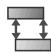

tool in the Interaction

2. In the Create Interaction dialog box that appears, do the following:

• Name the interaction. For more information about naming objects, see Using basic dialog box components.  
Select the step. You can define cavity radiation only during a heat transfer or coupled thermal-electrical step.  
• Select the Cavity radiation type of interaction.

3. Click Continue to close the Create Interaction dialog box.

4. Use one of the methods below to select the cavity surface. Select only the portion of the surface to which one cavity radiation interaction property applies.

Use an existing surface to define the region. On the right side of the prompt area, click Surfaces. Select an existing surface from the Region Selection dialog box that appears, and click Continue.


## Note:

The default selection method is based on the selection method you most recently employed. To revert to the other method, click Select in Viewport or Surfaces on the right side of the prompt area.

• Use the mouse to select a region in the viewport. (For more information, see Selecting objects within the current viewport.)

If the model contains a combination of mesh and geometry, click one of the following from the prompt area:

Click Geometry if you want to select the surface or vertex from a geometry region.  
Click Mesh if you want to select the surface or node from a native or orphan mesh selection.

You can use the angle method to select a group of faces or edges from geometry or a group of element faces from a mesh. For more information, see Using the angle and feature edge method to select multiple objects.

Abaqus/CAE displays the Edit Interaction dialog box, and the surface name or (Picked) appears in the Surface column on the Properties tabbed page.

5. To define additional cavity surfaces, click mouse button 3 in the table, select Add Row, and do one of the following:

• Double-click an empty cell in the Surfaces column.  
• Click mouse button 3 in an empty table row, and select Edit Surface.


## Note:

You can also use these techniques to replace an existing cavity surface; Abaqus/CAE does not indicate or retain your original selection when you edit an existing surface.

6. Choose the cavity type in the Definition field.

• Select Closed to specify a set of closed surfaces for radiation.  
• Select Open to include some radiation to the surroundings, and specify an Ambient temperature for the open cavity definition.

7. Specify the Properties options.

a. Select the Blocking surface checks. By default, Abaqus checks for blocking surfaces within the cavity when performing radiation view factor calculations.

• Choose All to indicate that all blocking checks are active.  
• Choose None to skip blocking checks.  
• Choose Partial to specify potential blocking surfaces that Abaqus should check.

For more information, see Controlling Checks for Surface Blocking.

b. If you chose the Partial option, double-click an empty cell in the Blocking Surface table to select surfaces that you want Abaqus to check.


Tip: You can also click mouse button 3 in the Blocking Surface table and choose Edit Surface, Add Row, or Delete Row to edit the table.

The surface selection methods are the same as those described in Step 4.

c. Select the heat reflection behavior.

Choose Yes for gray body radiation. Gray bodies have an emissivity between zero and one, as defined by a cavity radiation interaction property.  
• Choose No for black body radiation. Black bodies have a fixed emissivity of one—no heat is reflected.

d. If you chose gray body radiation in the previous step, you must specify a cavity radiation interaction property for each row in the table. You can use any of the following methods:

• Click a cell in the Property column to choose a predefined cavity radiation interaction property.  
Click mouse button 3 in the table, and select Create Property to create a new interaction property or Edit Property to edit the existing cavity radiation interaction property in the selected row. (For more information, see Defining a cavity radiation interaction property.)  
Enter a value in the Emissivity column. Abaqus/CAE automatically creates a cavity radiation interaction property with a default name and the specified emissivity.

When you are finished, each row in the table contains a surface and an emissivity value or (table), indicating that there is a tabular emissivity defined in the interaction property. Property cells may be empty if you entered an emissivity value—Abaqus/CAE will add a default interaction property name when you close the Edit Interaction dialog box.

8. Specify the View factors options.

a. If desired, toggle on Specify blocking range and enter a value for the distance beyond which Abaqus should not calculate view factors due to blocking effects.

b. Specify the Accuracy tolerance. The default value is 0.05.

The view factor tolerance indicates the allowable deviation from the ideal sum of view factors. Abaqus ends the analysis if the tolerance is exceeded for a closed cavity. If the tolerance is exceeded for an open cavity, radiation to the ambient environment occurs.

c. Specify the Infinitesimal facet area ratio. The default value is 64.

This value represents the ratio of the largest facet area to the smallest facet area. Abaqus calculates this ratio for each facet pair.

d. Specify the Gauss integration points per edge. The default value is 3.

This value is used for the numerical integration method. Possible values range from 1 to 5.

e. Specify the Lumped area distance-square value. The default value is 5.

This value represents the ratio of the distance between the centroids of each facet pair, squared, to the area of the larger facet. If the calculated value is greater than this setting, Abaqus uses a lumped area approximation for the integration.

f. If desired, click the Defaults button to reset all view factor entries to the Abaqus default values.

If the calculated value for a pair of facets is less than or equal to the Lumped area distance-square value setting and the Infinitesimal facet area ratio is exceeded, Abaqus uses an infinitesimal-to-finite area approximation. If the Lumped area distance-square value is exceeded but the facet area ratio is not exceeded, Abaqus completes a numerical integration of the contour integral to get an accurate value.

For more information, see Controlling the Accuracy of View Factor Calculations.

9. Specify the Symmetry options. For detailed information on the available cavity radiation symmetry types, see Defining cavity radiation symmetry.”

10. Specify the absolute zero temperature, , on the temperature scale being used and the Stefan-Boltzmann constant, , in the Edit Model Attributes dialog box, as described in Specifying model attributes.

11. Click OK to create the interaction and to close the editor.

## Additional information

• Interaction editors  
• Defining a cavity radiation interaction property  
• Cavity Radiation in Abaqus/Standard

## Defining cavity radiation symmetry

Using symmetry reduces the computational size of your cavity model. The available symmetries and combinations vary according to the model type. The table in Combining Symmetries, indicates the available symmetry combinations. You can use the following symmetry types to complete the cavity definition:

## Reflection

Select a Number of reflection symmetries, and select a reference z-symmetry value (axisymmetric models), a symmetry axis (two-dimensional models), or a symmetry plane (three-dimensional models) for each reflection.

Abaqus/CAE adds the reflected surfaces to the cavity definition and reduces the remaining number of symmetries allowed in the model. Toggle on Highlight to view the current parameter selections in the viewport.

## Periodic

Select a Number of periodic symmetries and number of repetitions for each periodic symmetry. For axisymmetric models, select a reference z-symmetry value and a periodic z-distance value. For two-dimensional and three-dimensional models, select a symmetry axis and a distance vector or a symmetry plane and a distance vector, respectively, for each periodic symmetry.

Abaqus/CAE adds the periodic surfaces to the cavity surfaces you selected for the Properties options and reduces the remaining number of symmetries allowed in the model. Toggle on Highlight to view the current parameter selections in the viewport.

## Cyclic

Toggle on Use cyclic symmetric and select the total number of sectors. Select the symmetry point and a point on the axis of symmetry (two-dimensional models) or the first and second points on the axis of symmetry and a point on the symmetry plane (three-dimensional models).

Cyclic symmetry creates new sectors by rotating the original geometry clockwise about the axis of symmetry. Cyclic symmetry is not available for axisymmetric models.

The following conditions must be met:

• For two-dimensional models the selected point on the axis of symmetry must be on the clockwise side of the geometry defining the original sector.  
• For three-dimensional models the selected point on the symmetry plane must be on the counterclockwise side of the geometry defining the original sector.  
• The total number of sectors must define a complete circle (360°). If you change the number of sectors, you must redefine the geometry to represent the correct portion of the model.

For more information on cyclic symmetry, including figures showing the sector definitions, see Cyclic Symmetry.


## Warning:

Abaqus/CAE does not check that the defined symmetries produce a physically realistic cavity model.

## Additional information

• Interaction editors  
• Defining a cavity radiation interaction property  
• Cavity Radiation in Abaqus/Standard

You can model heat transfer from surfaces due to convection by creating a surface film condition interaction. Select Interaction->Create from the main menu bar and select the surface. For a brief overview of film conditions, see Understanding interactions. For a more detailed discussion, see Thermal Loads.

1. From the main menu bar, select Interaction->Create.


Tip: You can also create a surface film condition interaction using the tool in the Interaction module toolbox.

2. In the Create Interaction dialog box that appears, do the following:

• Name the interaction. For more information about naming objects, see Using basic dialog box components.  
• Select the step. You can define convection from a surface only during a heat transfer, coupled temperature-displacement, or coupled thermal-electrical step.  
• Select the Surface film condition type of interaction.

3. Click Continue to close the Create Interaction dialog box.

4. Use one of the following methods to select the surface:

Use an existing surface to define the region. On the right side of the prompt area, click Surfaces. Select an existing surface from the Region Selection dialog box that appears, and click Continue.


## Note:

The default selection method is based on the selection method you most recently employed. To revert to the other method, click Select in Viewport or Surfaces on the right side of the prompt area.

• Use the mouse to select a region in the viewport. (For more information, see Selecting objects within the current viewport.)

If the model contains a combination of mesh and geometry, click one of the following from the prompt area:

Click Geometry if you want to select the surface or vertex from a geometry region.  
Click Mesh if you want to select the surface or node from a native or orphan mesh selection.

You can use the angle method to select a group of faces or edges from geometry or a group of element faces from a mesh. For more information, see Using the angle and feature edge method to select multiple objects.

5. In the Edit Interaction dialog box that appears, click the arrow to the right of the Definition field, and select an option from the list that appears:

• Select Embedded Coefficient to specify the film coefficient in this dialog box.  
Select Property Reference to define the film coefficient as a function of temperature and field variables using a film condition interaction property.  
• Select User-defined to define nonuniform film coefficients in user subroutine FILM. (This option is valid only in Abaqus/Standard analyses). See the following sections for more information:

Specifying general job settings  
FILM

• Select an analytical field to define a spatially varying film coefficient. The analytical field does not affect the sink temperature. Only analytical fields that are valid for this interaction type are displayed in the selection list. Alternatively, you can clic k to create a new analytical field. (See The Analytical Field toolset for more information.)

6. If you selected the Embedded Coefficient or analytical field definition option, perform the following steps:

a. In the Film coefficient field, enter the film coefficient, h.  
b. If you want to vary the film coefficient with time, click the arrow to the right of the Film coefficient amplitude field and select an amplitude from the list that appears. If desired, click to create a new amplitude; see Selecting an amplitude type to define for more information.  
c. In the Sink temperature field, enter the sink temperature, .  
d. If you want to define a spatially varying sink temperature, click the arrow to the right of the Sink definition field and select an analytical field, labeled with an (A), or a discrete field, labeled with a (D). Only analytical fields and discrete fields that are valid for temperature are available in the selection list. See The Analytical Field toolset and The Discrete Field toolset for more information.

Alternatively, you can click to create a new discrete field.

e. If you want to vary the sink temperature with time, click the arrow to the right of the Sink amplitude

field and select an amplitude from the list that appears. If desired, click to create a new amplitude; see Selecting an amplitude type to define for more information.

7. If you selected the Property Reference definition option, perform the following steps:

a. Select a film interaction property. If desired, click to create the interaction property; see Defining a film condition interaction property for more information.  
b. In the Sink temperature field, enter the sink temperature, .  
c. If you want to define a spatially varying sink temperature, click the arrow to the right of the Sink definition field and select an analytical field, labeled with an (A), or a discrete field, labeled with a (D). Only analytical fields and discrete fields that are valid for temperature are available in the selection list. See The Analytical Field toolset and The Discrete Field toolset for more information.

Alternatively, you can click to create a new discrete field.

d. If you want to vary the sink temperature with time, click the arrow to the right of the Sink amplitude

field and select an amplitude from the list that appears. If desired, click to create a new amplitude; see Selecting an amplitude type to define for more information.

8. If you selected the User-defined definition option, perform the following steps:

a. In the Film coefficient field, enter the film coefficient, h.  
b. In the Sink temperature field, enter the sink temperature, .  
c. Enter the Job module, and display the job editor for the analysis job of interest. (For more information, see Creating, editing, and manipulating jobs.)  
d. In the job editor, click the General tab, and specify the file containing the user subroutine FILM. For more information, see Specifying general job settings.


## Note:

You can specify only one user subroutine file in the job editor; if your analysis involves more than one user subroutine, you must combine the user subroutines into one file and then specify that file.

9. Click OK to create the interaction and to close the editor.

## Additional information

• Interaction editors  
• Using analytical expression fields  
• Creating expression fields  
• Thermal Loads

## Defining a concentrated film condition interaction

You can model heat transfer from one or more points in an assembly due to convection by creating a concentrated film condition interaction. Select Interaction->Create from the main menu bar and select one or more nodes or vertices or a saved set of nodes or vertices. For a brief overview of film conditions, see Understanding interactions. For a more detailed discussion, see Thermal Loads.

1. From the main menu bar, select Interaction->Create.


Tip: You can also create a concentrated film condition interaction using the tool in the Interaction module toolbox.

2. In the Create Interaction dialog box that appears, do the following:

• Name the interaction. For more information about naming objects, see Using basic dialog box components.  
Select the step. You can define convection from a nodal area only during a heat transfer, coupled temperature-displacement, or coupled thermal-electrical step.  
• Select the Concentrated film condition type of interaction.

3. Click Continue to close the Create Interaction dialog box.

4. Use one of the following methods to select the points:

Use an existing set of nodes or vertices to define the region. On the right side of the prompt area, click Sets. Select an existing set from the Region Selection dialog box that appears, and click Continue.


## Note:

The default selection method is based on the selection method you most recently employed. To revert to the other method, click Select in Viewport or Sets on the right side of the prompt area.

• Use the mouse to select nodes or vertices in the viewport. (For more information, see Selecting objects within the current viewport.)

If the model contains a combination of mesh and geometry, click one of the following from the prompt area:

- Click Geometry if you want to select vertices from a geometry region.  
Click Mesh if you want to select nodes from a native or orphan mesh selection.

You can use the angle method to select a group of nodes from a mesh. For more information, see Using the angle and feature edge method to select multiple objects.

5. In the Edit Interaction dialog box that appears, click the arrow to the right of the Definition field and select an option from the list that appears:

• Select Embedded Coefficient to specify the film coefficient in this dialog box.  
Select Property Reference to define the film coefficient as a function of temperature and field variables using a film condition interaction property.

Select User-defined to define nonuniform film coefficients in user subroutine FILM. (This option is valid only in Abaqus/Standard analyses). See the following sections for more information:

Specifying general job settings

FILM

• Select an analytical field to define a spatially varying film coefficient. The analytical field does not affect the sink temperature. Only analytical fields that are valid for this interaction type are displayed in the selection list. Alternatively, you can clic k to create a new analytical field. (See The Analytical Field toolset for more information.)

6. If desired, specify how the concentrated film condition is applied to the boundary of an adaptive mesh domain. This option is valid only for Abaqus/Explicit analyses. Click the arrow to the right of the Adaptive mesh boundary type field, and select an option from the list that appears. For more information, see Defining ALE Adaptive Mesh Domains in Abaqus/Explicit.

• Select Lagrangian to apply a concentrated film to a node that follows the material (nonadaptive).  
Select Sliding to apply a concentrated film to a node that can slide over the material. Mesh constraints are typically applied to the node to fix it spatially.  
Select Eulerian to apply a concentrated film to a node that can move independently of the material. This option is used only for boundary regions where the material can flow into or out of the adaptive mesh domain. Mesh constraints must be used normal to an Eulerian boundary region to allow material to flow through the region. If no mesh constraints are applied, an Eulerian boundary region will behave in the same way as a sliding boundary region.

7. In the Associated nodal area field, enter the area associated with the node where the concentrated film condition is applied.

8. If you selected the Embedded Coefficient or analytical field definition option, perform the following steps:

a. In the Film coefficient field, enter the film coefficient, h.  
b. If you want to vary the film coefficient with time, click the arrow to the right of the Film coefficient  
amplitude field and select an amplitude from the list that appears. If desired, click to create a new amplitude; see Selecting an amplitude type to define, for more information.

c. In the Sink temperature field, enter the sink temperature, .

d. If you want to define a spatially varying sink temperature, click the arrow to the right of the Sink definition field and select an analytical field, labeled with an (A), or a discrete field, labeled with a (D). Only analytical fields and discrete fields that are valid for temperature are available in the selection list. See The Analytical Field toolset and The Discrete Field toolset for more information.

Alternatively, you can click to create a new discrete field.

e. If you want to vary the sink temperature with time, click the arrow to the right of the Sink amplitude field and select an amplitude from the list that appears. If desired, click to create a new amplitude; see Selecting an amplitude type to define, for more information.

9. If you selected the Property Reference definition option, perform the following steps:

a. Select a film interaction property. If desired, click to create the interaction property; see Defining a film condition interaction property, for more information.

b. In the Sink temperature field, enter the sink temperature, .  
c. If you want to define a spatially varying sink temperature, click the arrow to the right of the Sink definition field and select an analytical field, labeled with an (A), or a discrete field, labeled with a (D). Only analytical fields and discrete fields that are valid for temperature are available in the selection list. See The Analytical Field toolset and The Discrete Field toolset for more information.

Alternatively, you can click to create a new discrete field.

d. If you want to vary the sink temperature with time, click the arrow to the right of the Sink amplitude field and select an amplitude from the list that appears. If desired, click to create a new amplitude; see Selecting an amplitude type to define for more information.

10. If you selected the User-defined definition option, perform the following steps:

a. In the Film coefficient field, enter the film coefficient, h.  
b. In the Sink temperature field, enter the sink temperature, .  
c. Enter the Job module, and display the job editor for the analysis job of interest. (For more information, see Creating, editing, and manipulating jobs.)  
d. In the job editor, click the General tab, and specify the file containing the user subroutine FILM. For more information, see Specifying general job settings.


Note: You can specify only one user subroutine file in the job editor; if your analysis involves more than one user subroutine, you must combine the user subroutines into one file and then specify that file.

11. Click OK to create the interaction and to close the editor.

## Additional information

• Interaction editors  
• Using analytical expression fields  
• Creating expression fields  
• Defining ALE Adaptive Mesh Domains in Abaqus/Explicit  
• Thermal Loads

You can model heat transfer between a nonconcave surface and a nonreflecting environment due to radiation by creating a surface radiation interaction. Surface radiation can also be used to approximate cavity radiation for a closed cavity in three-dimensional models. Select Interaction->Create from the main menu bar, and select the surface. For a brief overview of radiative interactions, see Understanding interactions. For a more detailed discussion, see Thermal Loads. For more information about cavity radiation, see Defining a cavity radiation interaction and Cavity Radiation in Abaqus/Standard.

1. From the main menu bar, select Interaction->Create.


Tip: You can also create a surface radiative interaction using the tool in the Interaction module toolbox.

2. In the Create Interaction dialog box that appears, do the following:

• Name the interaction. For more information about naming objects, see Using basic dialog box components.  
Select the step. You can define radiation from a surface only during a heat transfer, coupled temperature-displacement, or coupled thermal-electrical step.  
• Select the Surface radiation type of interaction.

3. Click Continue to close the Create Interaction dialog box.

4. Use one of the following methods to select the surface:

Use an existing surface to define the region. On the right side of the prompt area, click Surfaces. Select an existing surface from the Region Selection dialog box that appears, and click Continue.


## Note:

The default selection method is based on the selection method you most recently employed. To revert to the other method, click Select in Viewport or Surfaces on the right side of the prompt area.

• Use the mouse to select a region in the viewport. (For more information, see Selecting objects within the current viewport.)

If the model contains a combination of mesh and geometry, click one of the following from the prompt area:

Click Geometry if you want to select the surface or vertex from a geometry region.  
Click Mesh if you want to select the surface or node from a native or orphan mesh selection.

You can use the angle method to select a group of faces or edges from geometry or a group of element faces from a mesh. For more information, see Using the angle and feature edge method to select multiple objects.

5. In the Edit Interaction dialog box that appears, select the Radiation type.

• Select To ambient to specify heat transfer to the surrounding environment.  
• Select Cavity approximation (3D only) to approximate cavity radiation in three-dimensional models using uniform emissivity, a closed cavity, and an average cavity temperature.

6. If you selected To ambient in the previous step, complete the radiation definition as follows:

a. Click the arrow to the right of the Emissivity distribution field, and select the option of your choice from the list that appears:

• Select Uniform to define an emissivity that is uniform over the surface.  
Select an analytical field to define a spatially varying emissivity. Only analytical fields that are valid for this interaction type are displayed in the selection list. Alternatively, you can click  
to create a new analytical field. (See The Analytical Field toolset for more information.)

b. In the Emissivity field, enter the emissivity of the surface, .

c. In the Ambient temperature field, enter the ambient temperature, ${ \pmb \theta } ^ { 0 } .$

d. If you want to vary the ambient temperature with time, click the arrow to the right of the Ambient temperature amplitude field and select an amplitude from the list that appears. If desired, click to create a new amplitude; see Selecting an amplitude type to define for more information.

7. If you selected Cavity approximation (3D only) in Step 5, enter the emissivity of the surface, , in the Emissivity field.

8. Specify the absolute zero temperature, ${ \pmb \theta } ^ { \pmb { z } }$ , on the temperature scale being used and the Stefan-Boltzmann constant, , in the Edit Model Attributes dialog box, as described in Specifying model attributes.

9. Click OK to create the interaction and to close the editor.

## Additional information

• Interaction editors  
• Defining a cavity radiation interaction  
• Using analytical expression fields  
• Creating expression fields  
• Thermal Loads  
• Cavity Radiation in Abaqus/Standard

You can model heat transfer between one or more points in an assembly and a nonreflecting environment due to radiation by creating a concentrated radiation to ambient interaction. Select Interaction->Create from the main menu bar, and select one or more nodes or vertices or a saved set of nodes or vertices. For a brief overview of radiative interactions, see Understanding interactions. For a more detailed discussion, see Thermal Loads.

1. From the main menu bar, select Interaction->Create.


Tip: You can also create a concentrated radiative interaction using the tool in the Interaction module toolbox.

2. In the Create Interaction dialog box that appears, do the following:

• Name the interaction. For more information about naming objects, see Using basic dialog box components.  
Select the step. You can define radiation from a nodal area only during a heat transfer, coupled temperature-displacement, or coupled thermal-electrical step.  
• Select the Concentrated radiation to ambient type of interaction.

3. Click Continue to close the Create Interaction dialog box.

4. Use one of the following methods to select the points:

Use an existing set of nodes or vertices to define the region. On the right side of the prompt area, click Sets. Select an existing set from the Region Selection dialog box that appears, and click Continue.


## Note:

The default selection method is based on the selection method you most recently employed. To revert to the other method, click Select in Viewport or Sets on the right side of the prompt area.

• Use the mouse to select nodes or vertices in the viewport. (For more information, see Selecting objects within the current viewport.)

If the model contains a combination of mesh and geometry, click one of the following from the prompt area:

- Click Geometry if you want to select vertices from a geometry region.  
Click Mesh if you want to select nodes from a native or orphan mesh selection.

You can use the angle method to select a group of nodes from a mesh. For more information, see Using the angle and feature edge method to select multiple objects.

5. In the Edit Interaction dialog box that appears, perform the following steps:

a. If desired, specify how the concentrated radiation condition is applied to the boundary of an adaptive mesh domain. This option is valid only for Abaqus/Explicit analyses. Click the arrow to the right of the Adaptive mesh boundary type field, and select an option from the list that appears. For more information, see Defining ALE Adaptive Mesh Domains in Abaqus/Explicit.

• Select Lagrangian to apply a concentrated radiation condition to a node that follows the material (nonadaptive).

Select Sliding to apply a concentrated radiation condition to a node that can slide over the material. Mesh constraints are typically applied to the node to fix it spatially.  
Select Eulerian to apply a concentrated radiation condition to a node that can move independently of the material. This option is used only for boundary regions where the material can flow into or out of the adaptive mesh domain. Mesh constraints must be used normal to an Eulerian boundary region to allow material to flow through the region. If no mesh constraints are applied, an Eulerian boundary region will behave in the same way as a sliding boundary region.

b. In the Associated nodal area field, enter the area associated with the node where the concentrated radiation condition is applied.

c. Click the arrow to the right of the Emissivity distribution field, and select the option of your choice from the list that appears:

• Select Uniform to define an emissivity that is uniform over the region.  
Select an analytical field to define a spatially varying emissivity. Only analytical fields that are valid for this interaction type are displayed in the selection list. Alternatively, you can click to create a new analytical field. (See The Analytical Field toolset for more information.)

d. In the Emissivity field, enter the emissivity of the surface, .

e. In the Ambient temperature field, enter the ambient temperature, ${ \pmb \theta } ^ { 0 }$

f. If you want to vary the ambient temperature with time, click the arrow to the right of the Ambient temperature amplitude field and select an amplitude from the list that appears. If desired, click to create a new amplitude; see Selecting an amplitude type to define, for more information.

6. Specify the absolute zero temperature, , on the temperature scale being used and the Stefan-Boltzmann constant, , in the Edit Model Attributes dialog box, as described in Specifying model attributes.

7. Click OK to create the interaction and to close the editor.

## Additional information

• Interaction editors  
• Using analytical expression fields  
• Creating expression fields  
• Thermal Loads

You can create an actuator/sensor interaction at a single vertex of your model. An actuator/sensor interaction provides an interface to user subroutine UEL. The subroutine, in turn, represents a linear or nonlinear user-defined element. Actuator/sensor interactions must be defined during the initial step and are valid only for Abaqus/Standard analyses.


## Warning:

This feature is intended for advanced users only. Its use in all but the simplest test examples will require considerable coding by the user/developer. User-Defined Elements, should be read before proceeding.

1. From the main menu bar, select Interaction->Create.


Tip: You can also create an actuator/sensor interaction using the tool in the Interaction module toolbox.

2. In the Create Interaction dialog box that appears, do the following:

• Name the interaction. For more information about naming objects, see Using basic dialog box components.  
• Select the initial step.  
• Select the Actuator/sensor type of interaction.

3. Click Continue to close the Create Interaction dialog box.

4. From the assembly, select the point where the interaction will be applied. Click mouse button 2 to indicate you have finished selecting the point.


Tip: You can limit the types of objects that you can select in the viewport by specifying filtering options in the Selection toolbar. See Using the selection options, for more information.

Abaqus/CAE displays the Edit Interaction dialog box.

5. Enter the necessary data in the Edit Interaction dialog box. The required data are a function of your user-defined element subroutine. You may need to create real and integer actuator/sensor interaction properties. For more information, see Defining an actuator/sensor interaction property.

The following table indicates the correspondence between the fields in the Edit Interaction dialog box and the variables in user subroutine UEL.

<table><tr><td>Field</td><td>UEL variable</td></tr><tr><td>User element type id</td><td>JTYPE</td></tr><tr><td>Degrees of freedom</td><td>NDOFEL</td></tr><tr><td>Number of coordinate components</td><td>MCRD</td></tr><tr><td>Solution-dependent state variables</td><td>SVARS and NSVARS</td></tr></table>

The real and integer values entered into an actuator/sensor interaction property are used by the PROPS, JPROPS, NPROPS, and NJPROPS variables. For a description of all the variables that can be passed into user subroutine UEL, see User-Defined Elements.

## Additional information

• User-Defined Elements  
• UEL  
• Interaction editors

## Defining contact mass scaling

In Abaqus/Explicit contact mass scaling can be defined for all steps, and this contact mass scaling definition is active for all subsequent steps.

A contact mass scaling definition can apply mass scaling to the contact surfaces/elements involved in the contact definition in Abaqus/Explicit only.

1. From the main menu bar, select Interaction->Create.


Tip: You can also create a general contact interaction using the tool in the Interaction module toolbox.

2. In the Create Interaction dialog box that appears, do the following:

• Name the interaction. For more information about naming objects, see Using basic dialog box components.  
Select the step in which the interaction will be created. Contact mass scaling can be created in any explicit step in which contact is already defined.  
• Select the Contact Mass Scaling (Explicit) type of interaction.

3. Click Continue to close the Create Interaction dialog box.

The Edit Interaction dialog box appears.

4. Specify the Location (The Default is Element Mass Scaling)

5. If the location selected is Specified Surfaces, then select the surfaces to include in contact mass scaling from the list of available surfaces.

a. Click the arrows > in the middle of the dialog box to transfer the surfaces to the list of surfaces that will be included in the contact mass scaling.

6. Click OK to create the interaction and to close the editor.

## Additional information

• \*CONTACT MASS SCALING

## Using the interaction property editors

This section explains how to enter data in the interaction property editors to define specific types of interaction properties.

## In this section:

Defining a contact interaction property  
Defining a film condition interaction property  
Defining a cavity radiation interaction property  
Defining a fluid cavity interaction property  
Defining a fluid exchange interaction property  
Defining an acoustic impedance interaction property  
Defining an incident wave interaction property  
Defining an actuator/sensor interaction property  
Defining a fluid inflator interaction property  
Defining a wear interaction property

The contact property editor contains the following menus from which you can choose options to include in the property definition: Mechanical, Thermal, and Electrical.

A contact interaction property can be referred to by a general contact, surface-to-surface contact, or self-contact interaction. For more information, see About Mechanical Contact Properties, Thermal Contact Properties, and Electrical Contact Properties.

The Contact Property Options list at the top of the editor displays the options currently included in the property definition; the list is updated as you add and delete options. You can add, delete, or change property options as follows:

## Adding property options

Select the options needed to define your property from the Mechanical, Thermal, and Electrical menus. When you select an option, its name appears in the Contact Property Options list, and data fields associated with the option appear in the data area in the bottom half of the editor. Use the data fields to enter information for the currently selected option.

## Deleting property options

In the Contact Property Options list, select the option that you want to delete, and click Delete on the right side of the editor. This procedure removes the option from both the options list and the property definition.

## Changing option data

In the Contact Property Options list, select the option whose data you want to change. When the data fields associated with the option appear in the bottom half of the window, change the information that you have entered for the option as desired.

## In this section:

Defining mechanical contact property options  
Defining thermal contact property options  
Specifying gap conductance for electrical contact property options

## Defining mechanical contact property options

You can define mechanical contact property options to specify tangential behavior (friction and elastic slip), normal behavior (hard, soft, or damped contact and separation), and damping due to friction.

## In this section:

Specifying frictional behavior for mechanical contact property options  
Specifying pressure-overclosure relationships for mechanical contact property options  
Specifying damping for mechanical contact property options  
Specifying cohesive behavior properties for mechanical contact property options  
Specifying cohesive damage properties for mechanical contact property options  
Specifying fracture criterion properties for crack propagation  
Specifying geometric properties for mechanical contact property options

## Specifying frictional behavior for mechanical contact property options

You can specify a friction model that defines the force resisting the relative tangential motion of the surfaces in a mechanical contact analysis. For more information, see Frictional Behavior.

1. From the main menu bar, select Interaction->Property->Create.  
2. In the Create Interaction Property dialog box that appears, do the following:

Name the interaction property. For more information about naming objects, see Using basic dialog box components.  
• Select the Contact type of interaction property.

3. Click Continue to close the Create Interaction Property dialog box.  
4. From the menu bar in the contact property editor, select Mechanical->Tangential Behavior.  
5. In the editor that appears, click the arrow to the right of the Friction formulation field, and select how you want to define friction between the contact surfaces:

• Select Frictionless if you want Abaqus to assume that surfaces in contact slide freely without friction.  
Select Penalty to use a stiffness (penalty) method that permits some relative motion of the surfaces (an “elastic slip”) when they should be sticking. While the surfaces are sticking (i.e., $\tau _ { e q } < \tau _ { c r i t } )$ , the magnitude of sliding is limited to this elastic slip. Abaqus will continually adjust the magnitude of the penalty constraint to enforce this condition. For more information, see Stiffness Method for Imposing Frictional Constraints in Abaqus/Standard and Stiffness Method for Imposing Frictional Constraints in Abaqus/Explicit.  
Select Static-Kinetic Exponential Decay to specify static and kinetic friction coefficients directly. In this model it is assumed that the friction coefficient decays exponentially from the static value to the kinetic value. Alternatively, you can enter test data to fit the exponential model. (This Friction formulation option also allows you to specify elastic slip.) For more information, see Specifying Static and Kinetic Friction Coefficients.  
Select Rough to specify an infinite coefficient of friction. For more information, see Preventing Slipping regardless of Contact Pressure.  
Select Lagrange Multiplier (Standard only) to enforce the sticking constraints at an interface between two surfaces using the Lagrange multiplier implementation. With this method there is no relative motion between two closed surfaces until $\tau _ { e q } = \tau _ { c r i t }$ . For more information, see Lagrange Multiplier Method for Imposing Frictional Constraints in Abaqus/Standard.  
Select User-defined to define the shear interaction between the contact surfaces with user subroutine FRIC or VFRIC. For more information, see User-Defined Friction Model.

6. If you selected the Penalty or Lagrange Multiplier (Standard only) friction formulation, perform the following steps:

a. Display the Friction tabbed page.  
b. Choose the Directionality:

• Choose Isotropic to enter a uniform friction coefficient.  
Choose Anisotropic (Standard only) to allow for different friction coefficients in the two orthogonal directions on the contact surface. For more information, see Anisotropic Friction with Directional Preference Associated with Contact Orientation.

c. Toggle on Use slip-rate-dependent data if the friction coefficient is dependent on slip rate.

d. Toggle on Use contact-pressure-dependent data if the friction coefficient is dependent on the contact pressure.

e. Toggle on Use temperature-dependent data if the friction coefficient is dependent on temperature.

f. Click the arrows to the right of the Number of field variables field to specify the number of field variables on which the friction coefficient depends.

g. Enter the required data in the data table provided.

h. Display the Shear Stress tabbed page, and choose a Shear stress limit option:

Choose No limit if you do not want to limit the shear stress that can be carried by the interface before the surfaces begin to slide.  
Choose Specify to enter an equivalent shear stress limit, $\tau _ { m a x }$ . If you choose this option, sliding will occur if the magnitude of the equivalent shear stress reaches this value, regardless of the magnitude of the contact pressure stress. For more information, see Using the Optional Shear Stress Limit.

i. If you selected the Penalty friction formulation, display the Elastic Slip tabbed page, and specify how you want to define elastic slip:

• If you are performing an Abaqus/Standard analysis, choose an option to Specify maximum elastic slip:

Choose Fraction of characteristic surface dimension to calculate the allowable elastic slip as a small fraction of the characteristic contact surface length.  
Choose Absolute distance to enter the absolute magnitude of the allowable elastic slip, . (For a steady-state transport analysis set this parameter equal to the absolute magnitude of the allowable elastic slip velocity ( ) to be used in the stiffness method for sticking friction.)

• If you are performing an Abaqus/Explicit analysis, choose an Elastic slip stiffness option:

- Choose Infinite (no slip) to deactivate shear softening.  
Choose Specify to activate softened tangential behavior. Enter the slope of the curve that defines the shear traction as a function of the elastic slip between the two surfaces.

For more information, see Shear Stress Versus Elastic Slip While Sticking.

7. If you selected the Static-Kinetic Exponential Decay friction formulation, perform the following steps:

a. Display the Friction tabbed page.  
b. Choose an option for defining the exponential decay friction model:

Choose Coefficients to provide the static friction coefficient, the kinetic friction coefficient, and the decay coefficient directly.  
• Choose Test data to provide test data points to fit the exponential model.

For more information, see Specifying Static and Kinetic Friction Coefficients.

c. If you selected the Coefficients definition option, enter the following in the data table provided:

• Static friction coefficient, $\pmb { \mu _ { s } }$ .  
• Kinetic friction coefficient, $\pmb { \mu _ { k } }$  
• Decay coefficient, $d _ { c } .$

If you selected the Test data definition option, enter the following in the data table provided:

• In the first row, enter the static friction coefficient, $\pmb { \mu _ { 1 } }$ .  
• In the second row, enter the dynamic friction coefficient, ${ \pmb \mu } _ { 2 }$ and the reference slip rate, $\dot { \gamma } _ { 2 }$ , at which $\pmb { \mu _ { 2 } }$ is measured.  
• In the third row, enter the kinetic friction coefficient, $\pmb { \mu } _ { \infty }$ . This value corresponds to the asymptotic value of the friction coefficient at infinite slip rate, $\dot { \gamma } _ { \infty }$ . If this data line is omitted, Abaqus/Standard automatically calculates $\pmb { \mu } _ { \infty }$ such that $\left( \mu _ { 2 } - \mu _ { \infty } \right) / \left( \mu _ { 1 } - \mu _ { \infty } \right) = 0 . 0 5$ .

d. Display the Elastic Slip tabbed page, and specify how you want to define elastic slip:

• If you are performing an Abaqus/Standard analysis, choose an option to Specify maximum elastic slip:

Choose Fraction of characteristic surface dimension to calculate the allowable elastic slip as a small fraction of the characteristic contact surface length.  
Choose Absolute distance to enter the absolute magnitude of the allowable elastic slip, . (For a steady-state transport analysis set this parameter equal to the absolute magnitude of the allowable elastic slip velocity $( \dot { \gamma } _ { i } )$ to be used in the stiffness method for sticking friction.)

• If you are performing an Abaqus/Explicit analysis, choose an Elastic slip stiffness option:

- Choose Infinite (no slip) to deactivate shear softening.  
Choose Specify to activate shear softening. Enter the slope of the curve that defines the shear traction as a function of the elastic slip between the two surfaces.

For more information, see Shear Stress Versus Elastic Slip While Sticking.

8. If you selected the User-defined friction formulation, perform the following steps:

a. Click the arrows to the right of the Number of state-dependent variables field to indicate the number state variables that will be defined in user subroutine FRIC or VFRIC.  
b. In the Friction Properties table, enter the values of properties needed by user subroutine FRIC or VFRIC. (For detailed information on how to enter data, see Entering tabular data.)  
For more information, see User-Defined Friction Model.

9. Click OK to create the contact property and to exit the Edit Contact Property dialog box. Alternatively, you can select another contact property option to define from the menus in the Edit Contact Property dialog box.

## Specifying pressure-overclosure relationships for mechanical contact property options

You can define a constitutive model for the contact pressure-overclosure relationship that governs the motion of the surfaces in a mechanical contact analysis. For more information, see Contact Pressure-Overclosure Relationships.

1. From the main menu bar, select Interaction->Property->Create.  
2. In the Create Interaction Property dialog box that appears, do the following:

• Name the interaction property. For more information about naming objects, see Using basic dialog box components.  
• Select the Contact type of interaction property.

3. Click Continue to close the Create Interaction Property dialog box.  
4. From the menu bar in the contact property editor, select Mechanical->Normal Behavior.  
5. From the Pressure-Overclosure field, select “Hard” Contact to use the classical Lagrange multiplier method of constraint enforcement in an Abaqus/Standard analysis and to use penalty contact enforcement in an Abaqus/Explicit analysis.

You can also toggle off Allow separation after contact if you want to prevent surfaces from separating once they have come into contact. This method is applicable only to Abaqus/Standard analyses.

If you select “Hard” Contact, you can also customize settings for the constraint enforcement method. For more information about constraint enforcement methods, see Contact Constraint Enforcement Methods in Abaqus/Explicit. To specify these settings, select an option from the Constraint enforcement method list and do the following:

a. Select Default to enforce constraints using a contact pressure-overclosure relationship.  
b. Select Augmented Lagrange (Standard) to enforce contact constraints using the augmented Lagrange method. This method is applicable only to Abaqus/Standard analyses.

If you select this option, specify the following additional settings from the Contact Stiffness options:

• From the Stiffness value field, either select Use default to have Abaqus calculate the penalty contact stiffness automatically or select Specify and enter a positive value for the penalty contact stiffness.  
• Specify a factor by which to multiply the chosen penalty stiffness in the Stiffness scale factor field.  
• Specify the Clearance at which contact pressure is zero. The default value is 0.

c. Select the Penalty (Standard) constraint enforcement method to enforce contact constraints using the penalty method. This method is applicable only to Abaqus/Standard analyses.

If you select this option, specify the following additional settings from the Contact Stiffness options:

• From the Behavior field, either select Linear to use the linear penalty method for the enforcement of the contact constraint or select Nonlinear to use the nonlinear penalty method for the enforcement of the contact constraint. For more information, see Penalty Method.  
• Specify the contact stiffness.

For the linear penalty method, specify the contact stiffness in the Stiffness value field. You can select Use default to have Abaqus calculate the penalty contact stiffness automatically or you can select Specify and enter a positive value for the linear penalty stiffness.  
For the nonlinear penalty method, specify the contact stiffness in the Maximum stiffness value field. You can select Use default to have Abaqus calculate the penalty contact stiffness

automatically or you can select Specify and enter a positive value for the final nonlinear penalty stiffness.

Specify a factor by which to multiply the chosen penalty stiffness in the Stiffness scale factor field.  
• For the nonlinear penalty method, you can specify values for the following options:

Enter the ratio of the initial penalty stiffness over the final penalty stiffness in the Initial/Final stiffness ratio field.  
Enter the scale factor for the upper quadratic limit , which is equal to the scale factor times the characteristic contact facet length, in the Upper quadratic limit scale factor field.  
Enter the ratio $( e { - } c _ { 0 } ) / ( d { - } c _ { 0 } )$ that defines the lower quadratic limit in the Lower quadratic limit ratio field.

• Specify the Clearance at which contact pressure is zero. The default value is 0.

d. Select Direct (Standard) to enforce contact constraints directly without approximation or use of augmentation iterations.

6. From the Pressure-Overclosure field, select Exponential to define an exponential pressure-overclosure relationship. If you select this option, specify the following:

a. Enter the contact pressure at zero clearance, , and the clearance at which the contact pressure is zero, , in the data table.  
b. Specify the limit on the contact stiffness that the model can attain, $\pmb { k _ { m a x } }$ (applies only for Abaqus/Explicit analyses).

Choose Infinite (no slip) to set $\pmb { k _ { m a x } }$ equal to infinity for kinematic contact and equal to the default penalty stiffness for penalty contact.  
• Choose Specify, and enter a value for the maximum stiffness.

7. From the Pressure-Overclosure field, select Linear to define a linear pressure-overclosure relationship. If you select this option, specify the following:

• Enter a positive value for the slope of the pressure-overclosure curve, k, in the Contact stiffness field.

8. From the Pressure-Overclosure field, select Tabular to define a piecewise-linear pressure-overclosure relationship in tabular form. If you select this option, specify the following:

Enter data in ascending order of overclosure to define the overclosure as a function of pressure. The data table must begin with a zero pressure. The pressure-overclosure relationship is extrapolated beyond the last overclosure point by continuing the same slope.

9. From the Pressure-Overclosure field, select Scale Factor (General Contact, Explicit) to define a piecewise-linear pressure-overclosure relationship based on scaling the default contact stiffness. This option is available only for the general contact algorithm in Abaqus/Explicit. If you select this option, specify the following:

a. To define the overclosure measure as a percentage of the minimum element size, select factor in the Overclosure field and enter a positive value .  
b. To define the overclosure measure directly, select measure in the Overclosure field and enter a positive value .

c. Enter a value, , greater than one to define the geometric scaling of the “base” stiffness in the Contact stiffness scale factor field.  
d. Enter a positive value ${ \pmb \mathscr { s } } _ { \bf 0 }$ to define an additional scale factor for the “base” default contact stiffness in the Initial stiffness scale factor field. The default value is 1.

10. Click OK to create the contact property and to exit the Edit Contact Property dialog box. Alternatively, you can select another contact property option to define from the menus in the Edit Contact Property dialog box.

## Specifying damping for mechanical contact property options

You can define a damping model that defines forces resisting the relative motions of the contacting surfaces in a mechanical contact analysis. For more information, see Contact Damping.

1. From the main menu bar, select Interaction->Property->Create.  
2. In the Create Interaction Property dialog box that appears, do the following:

Name the interaction property. For more information about naming objects, see Using basic dialog box components.  
• Select the Contact type of interaction property.

3. Click Continue to close the Create Interaction Property dialog box.  
4. From the menu bar in the contact property editor, select Mechanical->Damping.  
5. In the editor that appears, click the arrow to the right of the Definition field, and select an option for determining the dimensionality of the damping coefficient:

Select Damping coefficient to specify the damping coefficient with units of pressure per relative velocity. For more information, see Specifying the Damping Coefficient Such That the Damping Force Is Directly Proportional to the Rate of Relative Motion between the Surfaces.  
Select Critical damping fraction (Explicit only) to specify a unitless damping coefficient in terms of the fraction of critical damping associated with the contact stiffness; this method is available only for Abaqus/Explicit. For more information, see Specifying the Damping Coefficient as a Fraction of Critical Damping in Abaqus/Explicit.

6. Choose an option for specifying the Tangent fraction (the ratio of the tangential damping coefficient to the normal damping coefficient):

Choose Use default to accept the default tangent fraction value. For Abaqus/Standard the default is 0.0, so the damping coefficient for the tangential direction is zero. For Abaqus/Explicit the default value for the tangent fraction is 1.0, so the damping coefficient for the tangential direction is equal to the damping coefficient for the normal direction.  
• Choose Specify value to enter a value for the tangent fraction.

For more information, see Specifying the Tangential Damping Coefficient.

7. Choose a shape for the curve that describes the relationship between clearance and the damping coefficient:

Choose Step (Explicit only) if you are performing an Abaqus/Explicit analysis. The damping coefficient will remain at the specified constant value while the surfaces are in contact and at zero otherwise.  
Choose Linear (Standard only) to define a damping coefficient that increases linearly from zero at a particular clearance value ( ) to its full value when the surfaces are in contact.  
Choose Bilinear (Standard only) to define a damping coefficient that increases linearly from zero at a particular clearance value ( ) to its full value when clearance has been reduced to another value ( ). As clearance continues to decrease from to zero, the damping coefficient remains constant at its full value.

8. Enter the appropriate data in the table provided:

• If you are performing an Abaqus/Explicit analysis, enter a value for the damping coefficient or for the critical damping fraction (depending on your selection in Step 5.)

• If you are performing an Abaqus/Standard analysis and selected Linear (Standard only) in the previous step, enter the following:

- In the first row, enter a value for the damping coefficient.  
- In the second row, enter a value for , the clearance at which the damping coefficient is zero.

• If you are performing an Abaqus/Standard analysis and selected Bilinear (Standard only) in the previous step, enter the following:

- In the first row, enter a value for the damping coefficient.  
- In the second row, enter a value for , the clearance at which the damping coefficient reaches its full value.  
- In the third row, enter a value for , the clearance at which the damping coefficient is zero.

9. Click OK to create the contact property and to exit the Edit Contact Property dialog box. Alternatively, you can select another contact property option to define from the menus in the Edit Contact Property dialog box.

## Specifying cohesive behavior properties for mechanical contact property options

You can define cohesive behavior properties that are accounted for in surface contact interactions. For more information, see Contact Cohesive Behavior.

In addition, you complete the definition of a crack propagation capability by defining a fracture-based cohesive behavior surface interaction. You activate the crack propagation by assigning it to the pair of surfaces that are initially partially bonded. If the fracture criterion is met, crack propagation occurs between these two surfaces. Cohesive behavior is also used to specify the elastic behavior of the bonds.

1. From the main menu bar, select Interaction->Property->Create.  
2. In the Create Interaction Property dialog box that appears, do the following:

• Name the interaction property. For more information about naming objects, see Using basic dialog box components.  
• Select the Contact type of interaction property.

3. Click Continue to close the Create Interaction Property dialog box.  
4. From the menu bar in the contact property editor, select Mechanical->Cohesive Behavior.  
5. Toggle on Allow cohesive behavior during repeated post-failure contacts to modify the default post-failure behavior when progressive damage has been defined. By default, cohesive behavior is not enforced for nodes on the secondary surface once ultimate failure has occurred at those nodes. When this option is toggled on, Abaqus/CAE enforces cohesive behavior for recurrent contacts at nodes on the secondary surface subsequent to ultimate failure.  
6. From the Eligible Secondary Nodes options, select one of the following:

Select Any secondary nodes experiencing contact to define cohesive behavior not only for all nodes of the secondary surface that are in contact with the main surface at the start of a step, but also for secondary nodes that are not initially in contact but may come in contact during the course of a step.  
Select Only secondary nodes initially in contact to restrict cohesive behavior to only those nodes of the secondary surface that are in contact with the main surface at the start of a step.  
Select Specify the bonding node set in the surface-to-surface Std interaction to restrict cohesive behavior to a subset of secondary nodes defined when you specify initial bonded contact conditions. This option is available only for Abaqus/Standard analyses.

7. From the Traction-separation Behavior options, accept the default contact penalty enforcement method or toggle on Specify stiffness coefficients and perform the following additional steps:

a. Specify whether you want to specify stiffness coefficients for Uncoupled or Coupled traction behavior.  
b. Toggle on Use temperature-dependent data if the traction-separation behavior is dependent on temperature.  
c. Click the arrows to the right of the Number of field variables field to specify the number of field variables on which the traction-separation behavior depends.  
d. Enter the required data in the data table provided.

8. Click OK to create the contact property and to exit the Edit Contact Property dialog box. Alternatively, you can select another contact property option to define from the menus in the Edit Contact Property dialog box.

## Specifying cohesive damage properties for mechanical contact property options

You can define damage initiation, evolution, and stabilization properties that will be accounted for in surface contact interactions. For more information, see Contact Cohesive Behavior.

1. From the main menu bar, select Interaction->Property->Create.  
2. In the Create Interaction Property dialog box that appears, do the following:

• Name the interaction property. For more information about naming objects, see Using basic dialog box components.  
• Select the Contact type of interaction property.

3. Click Continue to close the Create Interaction Property dialog box.  
4. From the menu bar in the contact property editor, select Mechanical->Damage.  
5. From the Initiation tabbed page, perform the following steps:

a. From the Criterion list, choose one of the following:

Select Maximum nominal stress to specify a damage initiation criterion based on the maximum nominal stress criterion for cohesive elements.  
Select Maximum separation to specify a damage initiation criterion based on the maximum separation value.  
• Select Quadratic traction to specify a damage initiation criterion based on the quadratic traction–interaction criterion for cohesive elements.  
Select Quadratic separation to specify a damage initiation criterion based on the quadratic separation–interaction criterion for cohesive elements.

b. Toggle on Use temperature-dependent data if the damage initiation behavior is dependent on temperature.  
c. Click the arrows to the right of the Number of field variables field to specify the number of field variables on which the damage initiation behavior depends.  
d. Enter the required data in the data table provided.

6. If you want to specify damage evolution criteria; toggle on Specify damage evolution, click the Evolution tab, and perform the following steps:

a. From the Type options, select one of the following:

Select Displacement to define the evolution of damage as a function of the total displacement (for elastic materials in cohesive elements) or the plastic displacement (for bulk elastic-plastic materials) after the initiation of damage.  
Select Energy to define the evolution of damage in terms of the energy required for failure (fracture energy) after the initiation of damage.

b. From the Softening options, select one of the following:

Select Linear to specify a linear softening stress-strain response (after the initiation of damage) for linear elastic materials or a linear evolution of the damage variable with deformation (after the initiation of damage) for elastic-plastic materials.  
Select Exponential to specify an exponential softening stress-strain response (after the initiation of damage) for linear elastic materials or an exponential evolution of the damage variable with deformation (after the initiation of damage) for elastic-plastic materials.

Select Tabular to specify the evolution of the damage variable with deformation (after the initiation of damage) in tabular form. This option is available only for damage evolution defined in terms of displacement.

c. If you want to specify mode-dependent behavior, toggle on Specify mixed mode behavior and select one of the following options:

Select Tabular to specify the fracture energy or displacement (total or plastic) directly as a function of the shear-normal mode mix for cohesive elements. This method must be used to specify the mixed-mode behavior for cohesive elements when damage evolution is defined in terms of displacement.  
Select Power law to specify the fracture energy as a function of the mode mix by means of a power law mixed-mode fracture criterion.  
Select Benzeggagh-Kenane to specify the fracture energy as a function of the mode mix by means of the Benzeggagh-Kenane mixed-mode fracture criterion.

d. If you specified Tabular for the mixed mode behavior, select one of the following:

• Select Energy to define the mode mix in terms of a ratio of fracture energy in the different modes.  
• Select Traction to define the mode mix in terms of a ratio of traction components.

e. If you toggled on Specify mixed mode behavior and selected either Power law or Benzeggagh-Kenane as the fracture criterion, you can specify the exponent in the power law or the Benzeggagh-Kenane criterion that defines the variation of fracture energy with mode mix for cohesive elements. Toggle on Specify power-law/criterion and enter a value for the exponent in the field.

f. Toggle on Use temperature-dependent data if the damage evolution behavior is dependent on temperature.

g. Click the arrows to the right of the Number of field variables field to specify the number of field variables on which the damage evolution behavior depends.

h. Enter the required data in the data table provided.

7. If you want to specify viscous regularization of the constitutive equations defining surface-based cohesive behavior; toggle on Specify damage stabilization, click the Stabilization tab, and specify a viscosity coefficient.

8. Click OK to create the contact property and to exit the Edit Contact Property dialog box. Alternatively, you can select another contact property option to define from the menus in the Edit Contact Property dialog box.

## Specifying fracture criterion properties for crack propagation

You can specify the fracture criterion that is used to model crack propagation using the virtual crack closure technique (VCCT) in an Abaqus/Standard model. The fracture criterion specifies the critical energy release rates. For more information, see Crack Propagation Analysis.

1. From the main menu bar, select Interaction->Property->Create.  
2. In the Create Interaction Property dialog box that appears, do the following:

• Name the interaction property. For more information about naming objects, see Using basic dialog box components.  
• Select the Contact type of interaction property.

3. Click Continue to close the Create Interaction Property dialog box.

4. From the menu bar in the contact property editor, select Mechanical->Fracture Criterion.  
5. Select the Type of criterion for crack propagation along initially partially bonded surfaces—the virtual crack closure technique (VCCT) criterion or the enhanced virtual crack closure technique (Enhanced VCCT) criterion. The virtual crack closure techniques are available only in an Abaqus/Standard analysis.  
6. If you are using the crack propagation criterion in an enriched region, choose the direction of crack growth relative to the local 1-direction when the fracture criterion is satisfied. The crack can extend at a direction normal to the direction of the maximum tangential stress (default), normal to the element local 1-direction, or parallel to the element local 1-direction.  
7. Select the mixed mode behavior:

Select BK to specify the fracture energy as a function of the mode mix by means of the Benzeggagh-Kenane mixed mode fracture criterion.  
• Select Power to specify the fracture energy as a function of the mode mix by means of a power law mixed mode fracture criterion.  
Select Reeder to specify the fracture energy as a function of the mode mix by means of the Reeder mixed mode fracture criterion.

8. If desired, specify the tolerance within which the crack propagation criterion must be satisfied. The default is 0.2.  
9. If desired, specify the tolerance within which the unstable crack propagation criterion must be satisfied to allow multiple nodes at and ahead of the crack tip to debond without cutting back the increment size in one increment when the VCCT criterion is satisfied for an unstable crack problem. The default value is infinity.  
10. If desired, specify the viscosity coefficient used in the viscous regularization. The default value is 0.0.  
11. If you selected VCCT for the type of fracture criterion, define the energy release rates (for both crack onset and crack propagation) at each mode: $G _ { I C } , G _ { I I C }$ , and $G _ { I I I C }$ .  
12. If you selected Enhanced VCCT for the type of fracture criterion, do the following:

• Define the energy release rates for crack onset at each mode: $G _ { I C } , G _ { I I C }$ , and $G _ { I I I C }$  
• Define the energy release rates for crack propagation at each mode: $G _ { I C } ^ { P } , G _ { I I C } ^ { P }$ , and $G _ { I I I C } ^ { P }$

13. If you selected either Reeder or BK as the fracture criterion, define the exponent in the Reeder law or the Benzeggagh-Kenane model, .

14. If you selected Power as the fracture criterion, define the three exponents in the power law model, ${ \pmb a } _ { m }$ ${ a } _ { n }$ , and ${ \pmb a _ { o } }$ .  
15. Toggle on Use temperature-dependent data if the fracture criterion is dependent on temperature.  
16. Click the arrows to the right of the Number of field variables field to specify the number of field variables on which the fracture criterion depends.  
17. Enter the required data in the data table provided.  
18. Click OK to create the contact property and to exit the Edit Contact Property dialog box. Alternatively, you can select another contact property option to define from the menus in the Edit Contact Property dialog box.

## Specifying geometric properties for mechanical contact property options

You can define additional geometric properties that will be accounted for in surface contact interactions.

1. From the main menu bar, select Interaction->Property->Create.  
2. In the Create Interaction Property dialog box that appears, do the following:

• Name the interaction property. For more information about naming objects, see Using basic dialog box components.  
• Select the Contact type of interaction property.

3. Click Continue to close the Create Interaction Property dialog box.  
4. From the menu bar in the contact property editor, select Mechanical->Geometric Properties.  
5. If you are performing an Abaqus/Standard analysis, you can specify an out-of-plane surface thickness for two-dimensional models or a cross-sectional area for every node on a node-based surface. Enter this value in the Out-of-plane surface thickness or cross-sectional area (Standard) field.  
6. If you are performing an Abaqus/Explicit analysis, you can specify the thickness of an interfacial layer between the two interacting surfaces. Toggle on Thickness of interfacial layer (Explicit), and enter the thickness.  
7. If desired, toggle on Thickness to determine the contacting surfaces to be tracked, and enter the thickness.  
8. If desired, select the Surface interaction model type.

• Select Default if the surface interaction model is not defined in a user subroutine.  
Select User to define the surface interaction model in user subroutine UINTER in an Abaqus/Standard analysis or in user subroutine VUINTER in an Abaqus/Explicit analysis.  
Select User Interaction to define the surface interaction model in user subroutine VUINTERACTION in an Abaqus/Explicit analysis.

9. If you selected User or User Interaction as the model type:

• Specify the number of State-dependent variables required in the user subroutine. The default is 0.  
• Specify the Number of property values needed as data to define the surface interaction model in the user subroutine. The default is 0.

10. If you are performing an Abaqus/Standard analysis and if you selected User or User Interaction as the model type, toggle on Use unsymmetric equation solution procedures (Standard) to use unsymmetric equation solution procedures.

11. Click OK to create the contact property and to exit the Edit Contact Property dialog box. Alternatively, you can select another contact property option to define from the menus in the Edit Contact Property dialog box.

## Defining thermal contact property options

You can define thermal contact property options to specify thermal conductance, heat generation, and thermal radiation due to friction.

## In this section:

Specifying thermal conductance for thermal contact property options  
Specifying heat generation for thermal contact property options  
Specifying radiation for thermal contact property options

## Specifying thermal conductance for thermal contact property options

You can specify thermal conductance to define conductive heat transfer between closely adjacent (or contacting) surfaces. For more information, see Contact Conductance between Surfaces.

1. From the main menu bar, select Interaction->Property->Create.  
2. In the Create Interaction Property dialog box that appears, do the following:

• Name the interaction property. For more information about naming objects, see Using basic dialog box components.  
• Select the Contact type of interaction property.

3. Click Continue to close the Create Interaction Property dialog box.  
4. From the menu bar in the contact property editor, select Thermal->Thermal Conductance.

The Edit Contact Property dialog box appears.

5. In the editor that appears, click the arrow to the right of the Definition field, and select an option for defining thermal conductance:

• Select Tabular to enter data relating thermal conductance to the clearance or pressure between the contact surfaces.  
Select User-defined to define thermal conductance in user subroutine GAPCON. If you select this option, skip to Step 9.

6. Indicate whether you want to define thermal conductance as a function of the clearance between the surfaces, the contact pressure between the surfaces, or both.  
7. If you want to define thermal conductance as a function of clearance, display the Clearance Dependency tabbed page, and do the following:

a. Toggle on Use temperature-dependent data if the data are dependent on temperature.  
b. Toggle on Use mass flow rate-dependent data (Standard only) if the data are dependent on the average mass flow rate per unit area, .  
c. Click the arrows to the right of the Number of field variables field to specify the number of field variables on which the data depend.  
d. In the data table, define thermal conductance as a function of gap clearance.

The tabular data must start at zero clearance (closed gap) and define thermal conductance as clearance increases. You must provide at least two pairs of points. The value of thermal conductance drops to zero immediately after the last data point, so there is no conductance when the clearance is greater than the value corresponding to the last data point. If conductance is not also defined as a function of contact pressure, it will remain constant at the zero clearance value for all pressures.

8. If you want to define thermal conductance as a function of contact pressure, display the Pressure Dependency tabbed page, and do the following:

a. Toggle on Use temperature-dependent data if the data are dependent on temperature.  
b. Toggle on Use mass flow rate-dependent data (Standard only) if the data are dependent on the average mass flow rate per unit area, .  
c. Click the arrows to the right of the Number of field variables field to specify the number of field variables on which the data depend.  
d. In the data table, define thermal conductance as a function of contact pressure at the interface. The tabular data must start at zero contact pressure (or, in the case of contact that can support a tensile force, the data point with the most negative pressure) and define thermal conductance as pressure increases. The value of thermal conductance remains constant for contact pressures outside

of the interval defined by the data points. If conductance is not also defined as a function of clearance, it is zero for all positive values of clearance and discontinuous at zero clearance

9. Click OK to create the contact property and to exit the Edit Contact Property dialog box. Alternatively, you can select another contact property option to define from the menus in the Edit Contact Property dialog box.

## Specifying heat generation for thermal contact property options

You can specify heat generation due to the dissipation of energy created by the mechanical or electrical interaction of contacting surfaces. For more information, see Modeling Heat Generated by Nonthermal Surface Interactions.

1. From the main menu bar, select Interaction->Property->Create.  
2. In the Create Interaction Property dialog box that appears, do the following:

• Name the interaction property. For more information about naming objects, see Using basic dialog box components.  
• Select the Contact type of interaction property.

3. Click Continue to close the Create Interaction Property dialog box.  
4. From the menu bar in the contact property editor, select Thermal->Heat Generation.  
5. In the editor that appears, specify the Fraction of dissipated energy caused by friction or electric currents that is converted to heat:

• Choose Use default (1.0) to convert all of the dissipated energy to heat.  
• Choose Specify to enter the fraction of your choice.

6. Specify the Fraction of converted heat distributed to secondary surface:

• Choose Use default (0.5) to distribute the heat equally between the main and secondary surfaces.  
Choose Specify to enter the fraction of the heat to be distributed to the secondary surface. The remaining fraction will be distributed to the main surface.

7. Click OK to create the contact property and to exit the Edit Contact Property dialog box. Alternatively, you can select another contact property option to define from the menus in the Edit Contact Property dialog box.

## Specifying radiation for thermal contact property options

You can specify radiative heat transfer between closely adjacent surfaces. For more information, see Modeling Radiation between Surfaces When the Gap Is Small.

1. From the main menu bar, select Interaction->Property->Create.  
2. In the Create Interaction Property dialog box that appears, do the following:

Name the interaction property. For more information about naming objects, see Using basic dialog box components.  
• Select the Contact type of interaction property.

3. Click Continue to close the Create Interaction Property dialog box.  
4. From the menu bar in the contact property editor, select Thermal->Radiation.  
5. In the editor that appears, enter values for the emissivity, , of the main and secondary surfaces.  
6. In the table provided, define the view factor as a function of clearance.

The view factor should have a value between 0.0 and 1.0. At least two pairs of points are required. The tabular data must start at zero clearance (closed gap) and define the view factor as the clearance increases. The value of the view factor drops to zero immediately after the last data point, so there is no radiative heat transfer when the clearance is greater than the value corresponding to the last data point.

7. Click OK to create the contact property and to exit the Edit Contact Property dialog box. Alternatively, you can select another contact property option to define from the menus in the Edit Contact Property dialog box.

## Specifying gap conductance for electrical contact property options

You can specify gap conductance between closely adjacent or contacting surfaces. The conductance is proportional to the difference in electric potentials across the interface. The conduction is a function of the clearance (separation) between the surfaces and can be a function of the contact pressure. For more information, see Electrical Contact Properties.

1. From the main menu bar, select Interaction->Property->Create.  
2. In the Create Interaction Property dialog box that appears, do the following:

• Name the interaction property. For more information about naming objects, see Using basic dialog box components.  
• Select the Contact type of interaction property.

3. Click Continue to close the Create Interaction Property dialog box.  
4. From the menu bar in the contact property editor, select Electrical->Electrical Conductance.

The Edit Contact Property dialog box appears.

5. In the editor that appears, click the arrow to the right of the Definition field, and select an option for defining electrical conductance:

• Select Tabular to enter data relating electrical conductance to the separation between the contact surfaces.  
• Select User-defined to define the conductance in user subroutine GAPELECTR. If you select this option, skip to Step 9.

6. Indicate whether you want to define electrical conductance as a function of the clearance between the surfaces, the contact pressure between the surfaces, or both.  
7. If you want to define electrical conductance as a function of clearance, display the Clearance Dependency tabbed page, and do the following:

a. Toggle on Use temperature-dependent data if the data are dependent on temperature.  
b. Click the arrows to the right of the Number of field variables field to specify the number of field variables on which the data depend.  
c. In the data table, define electrical conductance as a function of gap clearance.

The tabular data must start at zero clearance (closed gap) and define electrical conductance as clearance increases. You must provide at least two pairs of points. The value of electrical conductance drops to zero immediately after the last data point, so there is no conductance when the clearance is greater than the value corresponding to the last data point. If conductance is not also defined as a function of contact pressure, it will remain constant at the zero clearance value for all pressures.

8. If you want to define electrical conductance as a function of contact pressure, display the Pressure Dependency tabbed page, and do the following:

a. Toggle on Use temperature-dependent data if the data are dependent on temperature.  
b. Click the arrows to the right of the Number of field variables field to specify the number of field variables on which the data depend.  
c. In the data table, define electrical conductance as a function of contact pressure at the interface.

The tabular data must start at zero contact pressure (or, in the case of contact that can support a tensile force, the data point with the most negative pressure) and define electrical conductance as pressure increases. The value of electrical conductance remains constant for contact pressures outside of the interval defined by the data points. If conductance is not also defined as a function of clearance, it is zero for all positive values of clearance and discontinuous at zero clearance

9. Click OK to create the contact property and to exit the Edit Contact Property dialog box. Alternatively, you can select another contact property option to define from the menus in the Edit Contact Property dialog box.

## Defining a film condition interaction property

You can define a film coefficient as a function of temperature and field variables. A film condition interaction property can be referred to only by a surface film condition interaction or a concentrated film condition interaction. For more information, see Defining a surface film condition interaction, and Defining a concentrated film condition interaction.

1. From the main menu bar, select Interaction->Property->Create.  
2. In the Create Interaction Property dialog box that appears, do the following:

• Name the interaction property. For more information about naming objects, see Using basic dialog box components.  
• Select the Film condition type of interaction property.

3. Click Continue to close the Create Interaction Property dialog box.

4. Toggle on Use temperature-dependent data to define a film coefficient that varies with temperature. A column labeled Temp appears in the data table.  
5. To define a film coefficient that depends on field variables, click the arrows to the right of the Number of field variables field to increase or decrease the number of field variables. Field variable columns appear in the data table.  
6. In the data table, enter the film coefficient, h (units of $\mathbf { J } \mathbf { T } ^ { - 1 } \mathbf { L } ^ { - 2 } \pmb { \theta } ^ { - 1 } )$ , as a function of temperature and field variables. You can enter data into the table using the keyboard. Alternatively, you can click mouse button 3 anywhere in the table to view a list of options for specifying tabular data. For detailed information on each option, see Entering tabular data.  
7. Click OK to create the film condition interaction property and to exit the editor.

## Additional information

• Thermal Loads

You can define the emissivity of cavity surfaces as a function of temperature and field variables. A cavity radiation interaction property can be referred to only by a cavity radiation interaction. For more information, see Defining a cavity radiation interaction.

1. From the main menu bar, select Interaction->Property->Create.  
2. In the Create Interaction Property dialog box that appears, do the following:

• Name the interaction property. For more information about naming objects, see Using basic dialog box components.  
• Select the Cavity radiation type of interaction property.

3. Click Continue to close the Create Interaction Property dialog box.

4. Toggle on Use temperature-dependent data to define a cavity radiation property that varies with temperature. A column labeled Temp appears in the data table.  
5. To define a cavity radiation property that depends on field variables, click the arrows to the right of the Number of field variables field to increase or decrease the number of field variables. Field variable columns appear in the data table.  
6. In the data table, enter the emissivity, , as a function of temperature and field variables. You can enter data into the table using the keyboard. Alternatively, you can click mouse button 3 anywhere in the table to view a list of options for specifying tabular data. For detailed information on each option, see Entering tabular data.  
7. Click OK to create the cavity radiation interaction property and to exit the editor.

## Additional information

• Cavity Radiation in Abaqus/Standard

## Defining a fluid cavity interaction property

The fluid cavity interaction editor contains hydraulic and pneumatic fluid type definitions.

Fluid cavity interaction properties can be referred to only by fluid cavity interactions. For more information, see Defining a fluid cavity interaction.

## In this section:

Defining hydraulic fluid cavity property options  
Defining pneumatic fluid cavity property options

## Defining hydraulic fluid cavity property options

You should use a hydraulic fluid definition to model nearly incompressible or fully incompressible fluid behavior within a cavity. Hydraulic fluids must include a density, and they may include a bulk modulus and expansion data. For more information, see Hydraulic Fluids.

1. From the main menu bar, select Interaction->Property->Create.  
2. In the Create Interaction Property dialog box that appears, do the following:

• Name the interaction property. For more information about naming objects, see Using basic dialog box components.  
• Select the Fluid cavity type of interaction property.

3. Click Continue to close the Create Interaction Property dialog box.

Abaqus/CAE opens the Edit interaction property dialog box.

4. Choose the Hydraulic fluid definition.  
5. Enter the Fluid density.  
6. In the Fluid Bulk Modulus tab, toggle on Specify fluid bulk modulus to enter a bulk modulus and to allow the entry of temperature and field variable data.

The fluid bulk modulus is required for Abaqus/Explicit and optional for Abaqus/Standard.

7. Toggle on Use temperature-dependent data to define a fluid bulk modulus that varies with temperature. A column labeled Temp appears in the data table.  
8. To define a fluid bulk modulus that depends on field variables, click the arrows to the right of the Number of field variables field to increase or decrease the number of field variables. Field variable columns appear in the data table.  
9. In the data table, enter the bulk modulus as a function of temperature and field variables. You can enter data into the table using the keyboard. Alternatively, you can click mouse button 3 anywhere in the table to view a list of options for specifying tabular data. For detailed information on each option, see Entering tabular data.  
10. In the Fluid Expansion tab, toggle on Specify fluid thermal expansion coefficients to specify expansion data.  
11. Toggle on Use temperature-dependent data to define fluid expansion that varies with temperature. A column labeled Temp appears in the data table.  
12. To define fluid expansion that depends on field variables, click the arrows to the right of the Number of field variables field to increase or decrease the number of field variables. Field variable columns appear in the data table.  
13. If the fluid expansion is dependent on temperature or field variables, enter the Reference temperature for use in calculation of the expansion coefficient.  
14. In the data table, enter the fluid expansion coefficient as a function of temperature and field variables. You can enter data into the table using the keyboard. Alternatively, you can click mouse button 3 anywhere in the table to view a list of options for specifying tabular data. For detailed information on each option, see Entering tabular data.  
15. Click OK to create the hydraulic fluid cavity interaction property and to exit the editor.

## Defining pneumatic fluid cavity property options

Pneumatic fluids must include an ideal gas molecular weight; and, for an Abaqus/Explicit analysis, they may include molar heat capacity data. For more information, see Pneumatic Fluids.

1. From the main menu bar, select Interaction->Property->Create.  
2. In the Create Interaction Property dialog box that appears, do the following:

• Name the interaction property. For more information about naming objects, see Using basic dialog box components.  
• Select the Fluid cavity type of interaction property.

3. Click Continue to close the Create Interaction Property dialog box.

Abaqus/CAE opens the Edit interaction property dialog box.

4. Choose the Pneumatic fluid definition.  
5. Enter the Ideal gas molecular weight.  
6. For an Abaqus/Explicit analysis, toggle on Specify molar heat capacity, if desired, to include heat transfer data.  
7. If you are specifying molar heat capacity, select either Polynomial or Tabular for the data type.  
8. If you chose Polynomial in the previous step, enter coefficients for the five terms in the polynomial equation—enter zero for any terms that are not needed. If you chose Tabular in the previous step, do the following to complete the data table:

a. Toggle on Use temperature-dependent data to define fluid expansion that varies with temperature. A column labeled Temp appears in the data table.  
b. To define fluid expansion that depends on field variables, click the arrows to the right of the Number of field variables field to increase or decrease the number of field variables. Field variable columns appear in the data table.  
c. In the data table, enter the molar heat capacity as a function of temperature and field variables. You can enter data into the table using the keyboard. Alternatively, you can click mouse button 3 anywhere in the table to view a list of options for specifying tabular data. For detailed information on each option, see Entering tabular data.

9. Click OK to create the pneumatic fluid cavity interaction property and to exit the editor.

You use a fluid exchange interaction property to define the method of fluid transfer between a cavity and the environment or between two cavities. A fluid exchange interaction property can be referred to only by a fluid exchange interaction. For more information, see Defining a fluid exchange interaction.

1. From the main menu bar, select Interaction->Property->Create.  
2. In the Create Interaction Property dialog box that appears, do the following:

• Name the interaction property. For more information about naming objects, see Using basic dialog box components.  
• Select the Fluid exchange type of interaction property.

3. Click Continue to close the Create Interaction Property dialog box.

Abaqus/CAE opens the Edit interaction property dialog box.

4. Choose one of the following fluid exchange definitions:

## Bulk viscosity

The fluid exchange rate is based on the viscous resistance coefficient and the hydrodynamic resistance coefficient. Both coefficients may include dependence on the average absolute pressure, average temperature, and the average value of any user-defined field variables.

## Mass flux

The fluid exchange rate is based on the mass flow rate per unit area for the effective area defined in the fluid exchange interaction.

## Mass rate leakage

The fluid exchange rate is based on a mass flow rate driven by the absolute value of the pressure differential between the primary cavity and the environment or the second cavity. The mass flow rate and the absolute value of the pressure difference both start at zero and must be positive. Mass rate leakage may include dependence on the average absolute pressure, average temperature, and the average value of any user-defined field variables.

## Volume flux

The fluid exchange rate is based on the volumetric flow rate per unit area for the effective area defined in the fluid exchange interaction.

## Volume rate leakage

The fluid exchange rate is based on a volume flow rate driven by the absolute value of the pressure differential between the primary cavity and the environment or the second cavity. The volume flow rate and the absolute value of the pressure difference both start at zero and must be positive. Volume rate leakage may include dependence on the average absolute pressure, average temperature, and the average value of any user-defined field variables.

5. If you selected the Bulk viscosity, Mass rate leakage, or Volume rate leakage fluid exchange definition, do the following to complete the fluid exchange property definition:

a. Toggle on the desired options to add data columns to the table.

You can add pressure- or temperature-dependent data, and you can add field variables.

b. In the data table, enter the appropriate data as a function of temperature, pressure, and field variables. You can enter data into the table using the keyboard. Alternatively, you can click mouse button 3 anywhere in the table to view a list of options for specifying tabular data. For detailed information on each option, see Entering tabular data.

6. If you selected the Mass flux or Volume flux fluid exchange definition, enter the mass flow rate per unit area or volumetric flow rate per unit area, respectively.  
7. Click OK to create the fluid exchange interaction property and to exit the editor.

## Additional information

• Fluid Exchange Definition

You use an acoustic impedance interaction property to define the proportionality factors between the pressure and the normal components of surface displacement and velocity in an acoustic analysis. An acoustic impedance interaction property can be referred to only by an acoustic impedance interaction. For more information, see Defining acoustic impedance.

1. From the main menu bar, select Interaction->Property->Create.  
2. In the Create Interaction Property dialog box that appears, do the following:

• Name the interaction property. For more information about naming objects, see Using basic dialog box components.  
• Select the Acoustic impedance type of interaction property.

3. Click Continue to close the Create Interaction Property dialog box.  
4. From the Data type field, choose the type of tabular data that you will use to define the acoustic impedance.

• Select Impedance to specify an impedance using real and imaginary parts of the impedance.  
• Select Admittance to specify an impedance using admittance values.

5. Toggle on Use frequency-dependent data to define an acoustic impedance that varies with frequency. A column labeled Frequency appears in the data table.  
6. If you are using impedance data, enter the following data in the table:

• , the real part of the surface impedance. (Units of F $\mathrm { L } ^ { - 3 } \mathrm { T } . )$  
• , the imaginary part of the surface impedance. (Units of $\mathrm { F L } ^ { - 3 } \mathrm { T } . )$

7. If you are using admittance data, enter the following data in the table:

$\mathbf { 1 } / c _ { \mathbf { 1 } }$ , the proportionality factor between pressure and velocity of the surface in the normal direction. This quantity is the real part of the complex admittance. (Units of ${ \mathrm { F } } ^ { - 1 } { \mathrm { L } } ^ { 3 } { \mathrm { T } } ^ { - 1 } .$ )  
$\mathbf { 1 } / k _ { 1 }$ , the proportionality factor between pressure and displacement of the surface in the normal direction. This quantity is the imaginary part of the complex admittance, divided by the angular frequency. (Units of $\mathrm { F } ^ { - 1 } \mathrm { L } ^ { 3 } . )$ )

8. Click OK to create the acoustic impedance interaction property and to exit the editor.

## Additional information

• Acoustic and Shock Loads

## Defining an incident wave interaction property

You can define the speed of the incident wave and other characteristics of the wave loading. For spherical incident wave loading, you can optionally specify the loading effects due to an UNDEX bubble or spatial decay of the incident wave field. An incident wave interaction property can be referred to only by an incident wave interaction. Incident wave interaction properties that specify UNDEX data can be referred to only by incident wave interactions with an UNDEX definition. For more information, see Defining incident waves.

1. From the main menu bar, select Interaction->Property->Create.  
2. In the Create Interaction Property dialog box that appears, do the following:

• Name the interaction property. For more information about naming objects, see Using basic dialog box components.  
• Select the Incident wave type of interaction property.

3. Click Continue to close the Create Interaction Property dialog box.  
4. In the Speed of sound in fluid field, enter the sound speed in fluid, .  
5. In the Fluid density field, enter fluid mass density, .  
6. From the Definition field, choose the type of wave to define the incident wave property.

• Select Planar to specify a planar incident wave.  
• Select Spherical to specify a spherical incident wave.  
• Select Diffuse to specify a field of planar waves incident from multiple angles.  
• Select Air blast to specify air blast loading on structures using the CONWEP model.  
• Select Surface blast to specify surface blast loading on structures using the CONWEP model.

7. If you are specifying a spherical incident wave, select the propagation model. For more information, see Describing Incident Wave Loading.

• Select Acoustic to specify an incident wave in which the amplitude is inversely proportional to the distance from the source.  
• Select UNDEX charge to specify UNDEX bubble data.  
• Select Generalized decay to specify spatial decay of the incident wave field.

8. If you selected the UNDEX charge propagation model, click the Physical, Material, and Bubble Model tabs and specify the following values:

## Physical Data

• Ratio of specific heats for gas, .  
• Acceleration due to gravity, g.  
• Atmospheric pressure, .  
• Flow drag coefficient, $C _ { D } .$ .  
• Flow drag exponent, $\scriptstyle { E _ { D } }$ .

• Toggle on Neglect wave effects in fluid and gas to neglect the wave effects.

## Material Data

• Charge material constant, K.  
• Charge material constant, k.  
• Charge material constant, A.  
• Charge material constant, B.  
• Adiabatic charge constant, $\pmb { K _ { c } }$ .  
• Density of charge material, $\pmb { \rho _ { c } } .$ .  
• Mass of charge material, $\pmb { m _ { c } }$

## Bubble Model Step Data

• Time duration, $\pmb { T } _ { \mathbf { \hat { f u n a l } } }$ .  
• Maximum number of time steps for the bubble simulation, $N _ { \mathsf { s t e p s } }$ . The bubble amplitude simulation ceases when the number of steps reaches $N _ { \mathsf { s t e p s } }$ or the time duration, $\pmb { T } _ { \mathbf { \hat { f u n a l } } }$ , is reached.  
• Relative step size control parameter, $\Omega _ { \mathrm { r e l } }$  
• Absolute step size control parameter, $X _ { \mathsf { a b s } }$ .  
Step size control exponent, $\beta .$ The step size, $\Delta t ,$ is decreased or increased according to the error estimate: $\begin{array} { r } { \left( \Omega _ { \mathrm { r e l } } | x | + X _ { \mathrm { a b s } } \right) ^ { \beta } \leq \Delta t { \left| \frac { d x } { d t } \right| } ^ { \beta } } \end{array}$ .

9. If you selected the Generalized decay propagation model, enter values for the dimensionless constants A, B, and C, where $A > - 1 , B > - 1$ , and ${ \pmb C } \geq { \pmb 0 }$ .

10. If you are defining a diffuse incident wave, specify the seed number in the Seed number field for the diffuse source calculation.

11. If you selected the Air blast or Surface blast definition, specify the following settings in the CONWEP Charge portion of the dialog box:

• In the Equivalent mass of TNT field, specify the equivalent mass of TNT in any preferred mass unit.  
• In the Conversion for mass to kilograms field, specify a multiplication factor to convert the preferred mass unit to kilograms.  
• In the Conversion for length to meters field, specify a multiplication factor to convert the analysis length unit to meters.  
• In the Conversion for time to seconds field, specify a multiplication factor to convert the analysis time unit to seconds.  
• In the Conversion for pressure to pascals field, specify a multiplication factor to convert the analysis pressure unit to pascals.

12. Click OK to create the incident wave interaction property and to exit the editor.

## Additional information

• Acoustic and Shock Loads

An actuator/sensor interaction property provides the PROPS, JPROPS, NPROPS, and NJPROPS variables that are passed into a UEL user subroutine used with an actuator/sensor interaction. For more information, see Defining an actuator/sensor interaction.

1. From the main menu bar, select Interaction->Property->Create.  
2. In the Create Interaction Property dialog box that appears, do the following:

• Name the interaction property. For more information about naming objects, see Using basic dialog box components.  
• Select the Actuator/sensor type of interaction property.

3. Click Continue to close the Create Interaction Property dialog box.

4. Click the Real Properties tab, and enter the real property values to provide the PROPS and NPROPS variables that are passed into a UEL user subroutine.  
5. Click the Integer Properties tab, and enter the integer property values to provide the JPROPS and NJPROPS variables that are passed into a UEL user subroutine.  
6. Click OK to create the actuator/sensor interaction property and to exit the editor.

## Additional information

• User-Defined Elements  
• UEL

## Defining a fluid inflator interaction property

You use a fluid inflator interaction property to model the deployment of an airbag. A fluid inflator interaction property can be referred to only by a fluid inflator interaction. The fluid inflator property defines the mass flow rate and temperature as a function of inflation time either directly or by entering tank test data. It also defines the mixture of gases entering the fluid cavity. For more information, see Defining a fluid inflator interaction.

1. From the main menu bar, select Interaction->Property->Create.  
2. In the Create Interaction Property dialog box that appears, do the following:

• Name the interaction property. For more information about naming objects, see Using basic dialog box components.  
• Select the Fluid inflator type of interaction property.

3. Click Continue to close the Create Interaction Property dialog box.

Abaqus/CAE opens the Edit interaction property dialog box.

4. In the Fluid Inflator Property tab, select one of the following fluid inflator definitions:

## Dual pressure

The inflator mass flow rate and temperature of the gas entering the fluid cavity are calculated using the dual pressure method. You enter a table of tank pressure and inflator pressure versus inflation time; and specify the volume of the tank, the effective area, and the discharge coefficient.

## Temperature and mass

The inflator mass flow rate and temperature are given directly as functions of inflation time.

## Tank test

The inflator mass flow rate and the temperature of the gas entering the fluid cavity are determined by the results of a tank test. To calculate the mass flow rate using the results of a tank test, you enter a table of tank pressure and inflator temperature versus inflation time, and specify the volume of the tank.

## Inflator pressure and mass flow rate

The inflator mass flow rate and inflator pressure are used to obtain the gas temperature. You can enter a table of the mass flow rate and inflator pressure versus inflation time and specify the effective area and discharge coefficient.

5. If you selected the Dual pressure or Inflator pressure and mass flow rate fluid inflator definition, enter the Effective area. The effective area is the total inflator orifice area.  
6. If you selected the Dual pressure or Tank test fluid inflator definition, enter the Tank volume.  
7. If you selected the Dual pressure or Inflator pressure and mass flow rate fluid inflator definition, enter the Discharge coefficient.  
8. In the data table, enter the appropriate data. You can enter data into the table using the keyboard. Alternatively, you can click mouse button 3 anywhere in the table to view a list of options for specifying tabular data. For detailed information on each option, see Entering tabular data.  
9. In the Fluid Inflator Mixture tab, enter the number of fluids to define for this inflator.

10. In the Type field, select whether you want to specify the mixture in terms of the mass fraction or molar fraction.  
11. In the data table, for each fluid, select the fluid cavity interaction property that defines the fluid behavior. Then enter the inflation time values and enter the corresponding mass fraction or molar fraction for that fluid.  
12. Click OK to create the fluid inflator interaction property and to exit the editor.

## Additional information

• Inflator Definition

## Defining a wear interaction property

You can specify the surface wear (erosion) due to various microscale mechanisms, such as abrasion and fretting.

For more information, see Contact Wear.

1. From the main menu bar, select Interaction->Property->Create.  
2. In the Create Interaction Property dialog box that appears, do the following:  
a. Name the interaction property.  
For more information about naming objects, see Using basic dialog box components.  
b. Select the Wear type of interaction property.

3. Click Continue to close the Create Interaction Property dialog box.

Abaqus/CAE opens the Edit interaction property dialog box.

4. Toggle on Friction coefficient to specify that the Archard’s wear equation depends explicitly on the friction coefficient.

5. Toggle on Unitless wear coefficient to specify that the wear coefficient is dimensionless. Otherwise, the wear coefficient has dimensions of inverse of stress.

6. If Unitless wear coefficient is on, specify the Reference stress value equal to the magnitude of hardness of the material forming the wear surface.

7. To define a wear property that depends on surface temperature, toggle on Use surface temperature dependent data.

Surface Temperature variable columns appear in the data table.

8. To define a wear property that depends on wear distance, toggle on Use surface wear distance dependent data.

Surface Wear Distance variable columns appear in the data table.

9. To define a wear property that depends on contact pressure, toggle on Use contact pressure dependent data.

Contact Pressure variable columns appear in the data table.

10. To define a wear property that depends on field variables, click the arrows to the right of the Number of field variables field to increase or decrease the number of field variables.

Field variable columns appear in the data table.

11. In the data table, enter the appropriate data.

You can enter data into the table using the keyboard. Alternatively, you can click mouse button 3 anywhere in the table to view a list of options for specifying tabular data.

For detailed information on each option, see Entering tabular data.

12. Click OK to create the wear interaction property and to exit the editor.

## Additional information

• Contact Wear

## Using the constraint editors

This section explains how to enter data in the constraint editor to define specific types of constraints.

## In this section:

Defining tie constraints  
Defining rigid body constraints  
Defining display body constraints  
Defining coupling constraints  
Defining adjust points constraints  
Defining MPC constraints  
Defining shell-to-solid coupling constraints  
Defining embedded region constraints  
Defining equation constraints

## Defining tie constraints

A tie constraint ties two separate surfaces together so that there is no relative motion between them. This type of constraint allows you to fuse together two regions even though the meshes created on the surfaces of the regions may be dissimilar. You can define a tie constraint between edges of a wire or between faces of a solid or shell. For more information, see Understanding constraints, and Mesh Tie Constraints.

If you are creating multiple tie constraints, you may want to use the automatic contact detection tool. This tool automates the process of selecting surfaces and allows you to create multiple constraints simultaneously. For more information, see Using contact and constraint detection.

1. From the main menu bar, select Constraint->Create.


Tip: You can also create a tie constraint using the tool in the Interaction module toolbox.

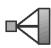

2. In the Create Constraint dialog box that appears, do the following:

a. Name the constraint. For more information about naming objects, see Using basic dialog box components.  
b. From the Type list, select Tie, then click Continue.

3. Select the main surface.

a. In the prompt area, select one of the following:

• Select Surface if you want to select a named surface.  
• Select Node Region if you want to select a region from which to create a node-based surface.

b. Use one of the following methods to select the main surface:

Use an existing surface to define the region. On the right side of the prompt area, click Surfaces. Select an existing surface name from the Region Selection dialog box that appears, and click Continue.


## Note:

The default selection method is based on the selection method you most recently employed. To revert to the other method, click Select in Viewport or Surfaces on the right side of the prompt area.

• Use the mouse to select a region in the viewport. (For more information, see Selecting objects within the current viewport.) Click mouse button 2 to indicate that you have finished selecting.

If the model contains a combination of mesh and geometry, click one of the following from the prompt area:

- Click Geometry if you want to select the surface or vertex from a geometry region.  
Click Mesh if you want to select the surface or node from a native or orphan mesh selection.

You can use the angle method to select a group of faces or edges from geometry or a group of element faces from a mesh. For more information, see Using the angle and feature edge method to select multiple objects.

The main surface that you select becomes highlighted in red in the viewport.

4. Select the secondary surface.

a. In the prompt area, select one of the following:

• Select Surface if you want to select a surface.  
• Select Node Region if you want to select a region from which to create a node-based surface.

b. Use one of the same methods described in the previous step to select the secondary surface or region.

The secondary surface or region that you select becomes highlighted in magenta in the viewport. The constraint editor appears.

5. The Switch Surfaces option allows you to interchange your main and secondary surface selections

without having to start over. The Switch Surfaces icon is available only when the main and secondary regions are the same type—both surfaces or both node-based regions.

6. From the editor, select the Discretization method.

Select Analysis default to use the default discretization method: surface-to-surface for Abaqus/Standard and node-to-surface for Abaqus/Explicit.  
• Select Node to surface to generate the tie coefficients according to the interpolation functions at the point where the secondary node projects onto the main surface.  
• Select Surface to surface to generate the tie coefficients such that stress accuracy is optimized for the specified surface pairing.

7. Toggle on Exclude shell element thickness if you want to ignore shell thickness effects in calculations involving position tolerances and adjustments for initial gaps.

8. Choose one of the following Position Tolerance methods:

• Use computed default. Abaqus determines the nodes to be tied using the default position tolerance. For more information, see Mesh Tie Constraints.  
Specify distance. You can specify an absolute distance from the main surface within which all nodes on the secondary surface to be tied must lie.

9. Toggle on Adjust secondary surface initial position if you want Abaqus to move all the nodes of the secondary surface onto the main surface in the initial configuration.

10. Toggle on Tie rotational DOFs if applicable if you want Abaqus to constrain the rotational degrees of freedom that exist on both main and secondary surfaces.

11. If desired, you can specify a value for the constraint ratio. You must toggle off Tie rotational DOFs if applicable to make the constraint ratio option available.

12. Click OK to save your constraint definition and to close the editor.

## Additional information

• Understanding constraints

## Defining rigid body constraints

You can create a rigid body constraint by specifying the regions that you want to include in the rigid body and by specifying a rigid body reference point. For detailed information about rigid bodies, see Rigid Body Definition.

1. From the main menu bar, select Constraint->Create.


Tip: You can also create a rigid body constraint using the tool in the Interaction module toolbox.

2. In the Create Constraint dialog box that appears, do the following:

a. Name the constraint. For more information about naming objects, see Using basic dialog box components.  
b. From the Type list, select Rigid Body, and then click Continue.

The constraint editor appears.

3. From the editor, select all of the regions that you want to include in the rigid body.

a. Select one of the following from the Region type list:

Select Body if you want to include the elements of a geometric region or orphan elements in the rigid body.  
Select Pin to include nodes that will have only translational degrees of freedom associated with the rigid body.  
Select Tie to include nodes that will have both translational and rotational degrees of freedom associated with the rigid body.  
• Select Analytical Surface to include an analytical surface in the rigid body.

b. After you select a region type, click on the right side of the editor.

c. Select a region of the assembly to associate with the Region type category selected in the previous step. Use one of the following methods to select the region:

Use an existing set or surface to define the region. On the right side of the prompt area, click Sets or Surfaces. Select an existing set or surface from the Region Selection dialog box that appears, and click Continue.


## Note:

The default selection method is based on the selection method you most recently employed. To revert to the other method, click Select in Viewport or Sets or Surfaces on the right side of the prompt area.

• Use the mouse to select the region in the viewport. (For more information, see Selecting objects within the current viewport.)

If the model contains a combination of mesh and geometry, click one of the following from the prompt area:

Click Geometry if you want to select a geometry region.  
Click Mesh if you want to select nodes from a native or orphan mesh selection.

You can use the angle method to select a group of faces or edges from geometry or a group of element faces from a mesh. For more information, see Using the angle and feature edge method to select multiple objects.

d. To remove a region type from the rigid body, select that region type, and then click on the right side of the editor.

4. Repeat Step 3 as often as necessary to select all of the regions that you want to include in the rigid body.

5. Select the rigid body reference point:

a. In the bottom half of the editor, click


b. Use one of the techniques described above to select a vertex or node to serve as the rigid body reference point. For more information, see The Reference Point toolset.”

6. Toggle on Adjust point to center of mass at start of analysis if you want Abaqus to reposition the rigid body reference point at the calculated center of mass of the rigid body.

7. Toggle on Constrain selected regions to be isothermal to specify an isothermal rigid body for a fully coupled thermal-stress analysis.

8. Click OK to save your constraint definition and to close the editor.

## Additional information

• Understanding constraints  
• Rigid Body Definition

## Defining display body constraints

You can create a display body constraint by selecting a part instance that will be displayed but will not be included in the analysis. You can constrain the display body to be fixed in space, or you can constrain it to follow selected nodes in the assembly. You can apply a display body constraint to any part instance in the model. For more information, see Display Body Definition. In addition, you can control the appearance of display bodies in the Visualization module; for more information, see Customizing the appearance of display bodies. For an example of a model that includes a display body constraint combined with connectors, see Display bodies.”

1. From the main menu bar, select Constraint->Create.


Tip: You can also create a display body constraint using the toolbox.

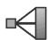

tool in the Interaction module

2. In the Create Constraint dialog box that appears, do the following:

a. Name the constraint. For more information about naming objects, see Using basic dialog box components.  
b. From the Type list, select Display body; then click Continue.

3. Select the part instance that will be a display body.

The constraint editor appears.

4. By default, the part instance is fixed; alternatively, you can constrain it to follow selected points in the assembly. From the Motion control field of the constraint editor, choose one of the following:

## No motion

Choose No motion to fix the selected part instance in space during the analysis. This is the default option.

## Follow single point

Choose Follow single point, click , and select the point to which the part instance will be constrained. You must select the point from a different part instance, and that part instance must not be a display body. During the analysis the display body will follow the translations and rotations of the selected point.

## Follow three points

Choose Follow three points, click , and select the three points to which the part instance will be constrained. You must select the points from a different part instance, and that part instance must not be a display body. During the analysis the display body will follow the translations and rotations of the coordinate system defined by the selected points. The first point indicates the origin of the coordinate system, the second point indicates the X-direction, and the third point indicates the X–Y plane. The points should be non-colinear and should remain non-colinear during the analysis.

5. Click OK to save your constraint definition and to close the editor.

## Additional information

• Display bodies  
• Understanding constraints  
• The Reference Point toolset  
• Rigid Body Definition

## Defining coupling constraints

You use a coupling constraint to constrain the motion of a surface to the motion of one or more points.

You can create a coupling constraint by specifying one or more control points, a constraint region, and an influence radius that defines the points in the constraint region to include in the constraint. You can specify a kinematic or distributing coupling constraint type. For detailed information about coupling constraints, see Coupling Constraints.

1. From the main menu bar, select Constraint->Create.


Tip: You can also create a coupling constraint using the tool in the Interaction module toolbox.

2. In the Create Constraint dialog box that appears, do the following:

a. Name the constraint. For more information about naming objects, see Using basic dialog box components.  
b. From the Type list, select Coupling, and then click Continue.

3. Select one or more points to define the constraint control points using one of the following methods:

• Select one or more points in the viewport.


Tip: The Select the Entity Closest to the Screen tool in the Selection toolbar is toggled off by default. If you make an ambiguous selection, Abaqus/CAE highlights the point and displays a description of the point in the lower-left corner of the viewport. Use the Next and Previous buttons to cycle through the possible selections, and click OK to confirm your selection.

(For more information, see Selecting objects within the current viewport.) Click mouse button 2 to indicate that you have finished selecting.

If the model contains a combination of mesh and geometry, click one of the following from the prompt area:

Click Geometry if you want to select the constraint control point from geometry or select a reference point.  
Click Mesh if you want to select the constraint control point from a native or orphan mesh selection.

Use an existing set to define the region. On the right side of the prompt area, click Sets. Select an existing set from the Region Selection dialog box that appears, and click Continue.


Note: The default selection method is based on the selection method you most recently employed. To revert to the other method, click Select in Viewport or Sets on the right side of the prompt area.

The points that you select become highlighted in red in the viewport.

4. In the prompt area, select one of the following to define the constraint region type:

• Select Surface if you want to select a surface.  
• Select Node Region if you want to select a region from which to create a node-based surface.

5. Select the constraint region using one of the following methods:

• Select a region in the viewport. (For more information, see Selecting objects within the current viewport.) Click mouse button 2 to indicate that you have finished selecting.

If the model contains a combination of mesh and geometry, click one of the following from the prompt area:

- Click Geometry if you want to select the surface from a geometry region.  
Click Mesh if you want to select the surface from a native or orphan mesh selection.

Use an existing surface to define the region. On the right side of the prompt area, click Surfaces. Select an existing surface from the Region Selection dialog box that appears, and click Continue.


Note: The default selection method is based on the selection method you most recently employed. To revert to the other method, click Select in Viewport or Surfaces on the right side of the prompt area.

The region that you select becomes highlighted magenta in the viewport, and the constraint editor appears.

6. From the editor, choose one of the following Coupling type categories:

• Choose Kinematic to define a kinematic coupling constraint between the control points and the points in the constraint region, and toggle on the degrees of freedom that you want to constrain.  
Choose Distributing to define a distributing coupling constraint between the control points and the points in the constraint region. Abaqus/CAE automatically constrains the translational degrees of freedom.

1. Toggle on the rotational degrees of freedom that you want to constrain.  
2. Choose the Translational Coupling type option: Translational Continuum distributing or Translational Structural distributing.  
3. Choose the Rotational Coupling type option: Rotational Continuum distributing or Rotational Structural distributing.  
4. Click the arrow next to the Weighting method field, and select a weighting method from the list that appears. For more information, see Coupling Constraints.

7. From the editor, choose one of the following methods to define the Influence radius:

• To outermost point on the region. Abaqus includes all points (nodes) on the specified region in the coupling definition.  
Specify. You can specify the radius of a sphere, centered about the constraint control points, to limit the points in the coupling definition. For more information on selecting the coupling points, see Coupling Constraints.

8. If desired, toggle on Adjust control points to lie on surface. Abaqus/CAE will move the control points to lie on the constraint surface.

9. If you want to change the coordinate system (CSYS) for the coupling constraint, click and use one of the following methods:

• Select a predefined datum coordinate system by name.

1. From the prompt area, click Datum CSYS List to display a list of datum coordinate systems.

## 2. Select a name from the list, and click OK.

• Select a predefined coordinate system in the viewport.


Tip: The tool in the Selection toolbar is toggled off by default. For coordinate systems with coincident origins, when you cycle through all the possible selections, Abaqus/CAE highlights the coordinate system and displays the description of the coordinate system in the viewport.

• Click Use Global CSYS from the prompt area to use the global coordinate system.

10. Click OK to save your constraint definition and to close the editor.

## Additional information

• Understanding constraints  
• Coupling Constraints

You use an adjust points constraint to move a point or points onto a specified surface. For more information about adjusting points, see Adjusting Nodal Coordinates. This adjustment may be useful in assembled fastener template models and other applications; see About assembled fasteners, and Creating assembled fasteners.

An adjust points constraint should not be used in assembled fastener template models when the main model attachment points are located on bolt hole center points. Any point along the bolt hole centerline will be moved incorrectly to a random location along the perimeter of the hole instead of being projected along the surface normal to the center of the hole.

1. From the main menu bar, select Constraint->Create.


Tip: You can also create an adjust points constraint using the tool in the Interaction module toolbox.

2. In the Create Constraint dialog box that appears, do the following:

a. Name the constraint. For more information about naming objects, see Using basic dialog box components.  
b. From the Type list, select Adjust points, and then click Continue.

3. Select the point or set of points to be moved, using one of the following methods:

• Select one or more points in the viewport.


Tip: The Select the Entity Closest to the Screen tool in the Selection toolbar is toggled off by default. If you make an ambiguous selection, Abaqus/CAE highlights the point and displays a description of the point in the lower left corner of the viewport. Use the Next and Previous buttons to cycle through the possible selections, and click OK to confirm your selection.

Click mouse button 2 to indicate that you have finished selecting. For more information, see Selecting objects within the current viewport.

If the model contains a combination of mesh and geometry, click one of the following from the prompt area:

Click Geometry if you want to select the points from a geometry region or select one or more reference points.  
Click Mesh if you want to select the points from a native or orphan mesh selection.

Use an existing set to define the point or points. On the right side of the prompt area, click Sets. Select an existing set of points from the Region Selection dialog box that appears, and click Continue.


## Note:

The default selection method is based on the selection method you most recently employed. To revert to the other method, click Select in Viewport or Sets on the right side of the prompt area.

The points that you select become highlighted in red in the viewport.

4. In the prompt area, select the type of region onto which the points will be moved.

• Select Surface if you want to select a surface.  
• Select Node Region if you want to select a region from which to create a node-based surface.

5. Select the surface onto which the points will be moved using one of the following methods:

• Select a surface in the viewport. Click mouse button 2 to indicate that you have finished selecting. If the model contains a combination of mesh and geometry, click one of the following from the prompt area:

Click Geometry if you want to select the surface from a geometry region or select one or more reference points.  
Click Mesh if you want to select the surface from a native or orphan mesh selection.

Use an existing surface or set to define the region. On the right side of the prompt area, click Surfaces or Sets. Select an existing surface or set from the Region Selection dialog box that appears, and click Continue.


## Note:

The default selection method is based on the selection method you most recently employed. To revert to the other method, click Select in Viewport or Surfaces (or Sets) on the right side of the prompt area.

The region that you select is highlighted in magenta in the viewport, and the constraint editor appears.

6. Click OK to save your constraint definition and to close the editor.

## Additional information

• Understanding constraints  
• Adjusting Nodal Coordinates

You use an MPC constraint to constrain the motion of secondary nodes of a region to the motion of a point. You can create an MPC constraint by specifying a control point and a region composed of nodes, edges, and surfaces. For detailed information about multi-point constraints, see General Multi-Point Constraints.

1. From the main menu bar, select Constraint->Create.


Tip: You can also create a multi-point constraint using the tool in the Interaction module toolbox.

2. In the Create Constraint dialog box that appears, do the following:

a. Name the constraint. For more information about naming objects, see Using basic dialog box components.  
b. From the Type list, select MPC Constraint, then click Continue.

3. Select a point to define the constraint control point using one of the following methods:

• Use the mouse to select a point in the viewport.


Tip: The Select the Entity Closest to the Screen tool in the Selection toolbar is toggled off by default. If you make an ambiguous selection, Abaqus/CAE highlights the point and displays a description of the point in the lower left corner of the viewport. Use the Next and Previous buttons to cycle through the possible selections, and click OK to confirm your selection.

(For more information, see Selecting objects within the current viewport.) Click mouse button 2 to indicate that you have finished selecting.

If the model contains a combination of mesh and geometry, click one of the following from the prompt area:

Click Geometry if you want to select the control point from a geometry region.  
Click Mesh if you want to select the control point from a native or orphan mesh selection.

Use an existing set to define the region. On the right side of the prompt area, click Sets. Select an existing set from the Region Selection dialog box that appears, and click Continue.


## Note:

The default selection method is based on the selection method you most recently employed. To revert to the other method, click Select in Viewport or Sets on the right side of the prompt area.

The point that you select becomes highlighted in red in the viewport.

4. Select the region for the secondary nodes. Use one of the following methods to select the region:

Use the mouse to select a region in the viewport. (For more information, see Selecting objects within the current viewport.) The region that you select can span multiple part instances. Click mouse button 2 to indicate that you have finished selecting.

If the model contains a combination of mesh and geometry, click one of the following from the prompt area:

- Click Geometry if you want to select a geometry region.  
Click Mesh if you want to select the region from a native or orphan mesh selection.

You can use the angle method to select a group of nodes from a mesh. For more information, see Using the angle and feature edge method to select multiple objects.

Use an existing set to define the region. On the right side of the prompt area, click Sets. Select an existing set from the Region Selection dialog box that appears and click Continue.


## Note:

The default selection method is based on the selection method that you most recently employed. To revert to the other method, click Select in Viewport or Sets on the right side of the prompt area.

The region that you select becomes highlighted in magenta in the viewport.

The constraint editor appears.

5. From the editor, select the MPC type.

• Select Beam to define a rigid beam connection to constrain the displacement and rotation of each secondary node to the displacement and rotation of the control point.  
• Select Tie to make all active degrees of freedom equal at each secondary node and the control point.  
• Select Link to define a pinned rigid link between each secondary node and the control point.  
• Select Pin to define a pinned joint between each secondary node and the control point.  
Select Elbow to constrain nodes of ELBOW31 or ELBOW32 elements together (see Pipes and Pipebends with Deforming Cross-Sections: Elbow Elements).  
• Select User-defined to define a multi-point constraint in user subroutine MPC (for Abaqus/Standard). See the following sections for more information:

Specifying general job settings  
MPC

6. If you selected a user-defined MPC type, do the following:

a. Choose the coding mode for user subroutine MPC.

Choose DOF-by-DOF if you want each call to the user subroutine to constrain one individual degree of freedom.  
• Choose Node-by-Node if you want each call to the user subroutine to impose a set of constraints all at once.

b. In the Constraint type field, enter an integer value to be used in the user subroutine to distinguish between different constraint types. The default value is 0.

7. If you want to change the coordinate system (CSYS) for the coupling constraint, click and use one of the following methods:

• Select a predefined datum coordinate system by name.

1. From the prompt area, click Datum CSYS List to display a list of datum coordinate systems.  
2. Select a name from the list, and click OK.

• Select a predefined coordinate system in the viewport.


Tip: The tool in the Selection toolbar is toggled off by default. For coordinate systems with coincident origins, when you cycle through all of the possible selections, Abaqus/CAE highlights the coordinate system and displays the description of the coordinate system in the viewport.

• Click Use Global CSYS from the prompt area to use the global coordinate system.

8. Click OK to save your constraint definition and to close the editor.

## Defining shell-to-solid coupling constraints

You use a shell-to-solid coupling constraint to couple the motion of a shell edge to the motion of an adjacent solid face. You can create a shell-to-solid coupling constraint by specifying a shell edge surface and a solid face region. The shell edge surface and the solid face region being coupled must belong to different part instances unless the shell edge surface is part of a midsurface region within a solid model.

For detailed information about shell-to-solid coupling constraints, see Shell-to-Solid Coupling.

Abaqus/CAE creates shell-to-solid coupling constraints automatically only when shell sections and solid sections exist within the same part and they are nearly perpendicular to each other with a solid surface detected on both sides of the shell surface.

1. From the main menu bar, select Constraint->Create.


Tip: You can also create a shell-to-solid coupling constraint using the tool in the Interaction module toolbox.

2. In the Create Constraint dialog box that appears, do the following:

a. Name the constraint. For more information about naming objects, see Using basic dialog box components.  
b. From the Type list, select Shell-to-solid coupling, and then click Continue.

3. Use one of the following methods to select the shell edge surface:

Use an existing surface to define the region. On the right side of the prompt area, click Surfaces. Select an existing surface from the Region Selection dialog box that appears, and click Continue.


## Note:

The default selection method is based on the selection method you most recently employed. To revert to the other method, click Select in Viewport or Surfaces on the right side of the prompt area.

• Use the mouse to select a region in the viewport. (For more information, see Selecting objects within the current viewport.) Click mouse button 2 to indicate that you have finished selecting.

If the model contains a combination of mesh and geometry, click one of the following from the prompt area:

- Click Geometry if you want to select the surface from a geometry region.  
Click Mesh if you want to select the surface from a native or orphan mesh selection.

You can use the angle method to select a group of faces or edges from geometry or a group of element faces from a mesh. For more information, see Using the angle and feature edge method to select multiple objects.

The shell edge surface that you select becomes highlighted in red in the viewport.

4. Select the solid face region.

a. In the prompt area, click the arrow next to the text field and select one of the following:

• Select Surface if you want to select a surface.  
• Select Node Region if you want to select a region from which to create a node-based surface.

b. Use one of the same methods described in the previous step to select the solid face region. The solid face region that you select becomes highlighted in magenta in the viewport The constraint editor appears.

5. From the editor, choose one of the following Position Tolerance methods:

Use computed default. Abaqus determines the nodes on the shell edge surface to be coupled with the solid face region using the default position tolerance. For more information, see Shell-to-Solid Coupling.  
• Specify distance. You can specify an absolute distance from the solid face region within which all shell nodes to be included in the coupling must lie.

6. From the editor, choose one of the following Influence Distance methods:

Use analysis default. Abaqus determines the nodes on the solid face region to be coupled with the shell edge surface using the default influence distance. For more information, see Shell-to-Solid Coupling.  
• Specify value. You can specify a distance from the shell edge surface within which all solid nodes to be included in the coupling must lie.

7. Click OK to save your constraint definition and to close the editor.

## Additional information

• Understanding constraints  
• Shell-to-Solid Coupling

## Defining embedded region constraints

You use an embedded region constraint to embed a region of the model within a “host” region of the model or within the whole model. You can create an embedded region constraint by specifying the embedded region, the host region, a weight factor roundoff tolerance, and an absolute exterior tolerance or fractional exterior tolerance. For more information, see Embedded Elements.

1. From the main menu bar, select Constraint->Create.


Tip: You can also create an embedded region constraint using the tool in the Interaction module toolbox.

2. In the Create Constraint dialog box that appears, do the following:

a. Name the constraint. For more information about naming objects, see Using basic dialog box components.  
b. From the Type list, select Embedded region, and then click Continue.

3. Select the embedded region using one of the following methods:

• Select a region in the viewport. (For more information, see Selecting objects within the current viewport.) Click mouse button 2 to indicate that you have finished selecting.

If the model contains a combination of mesh and geometry, click one of the following from the prompt area:

- Click Geometry if you want to select a geometry region.  
Click Mesh if you want to select the region from a native or orphan mesh selection.

Use an existing set to define the region. On the right side of the prompt area, click Sets. Select an existing set from the Region Selection dialog box that appears, and click Continue.


## Note:

The default selection method is based on the selection method you most recently employed. To revert to the other method, click Select in Viewport or Sets on the right side of the prompt area.

The region that you select becomes highlighted in red in the viewport.

4. Select the host region.

In the prompt area, select one of the following:

• Select Region if you want to select a region in the viewport or use an existing set to define the region. Use one of the methods described in the previous step to select the host region.

The region that you select becomes highlighted magenta in the viewport.

• Whole Model if you want to embed the embedded region within the whole model.

The constraint editor appears.

5. In the editor, specify values for the tolerance parameters. If you specify values for both exterior tolerance parameters, Abaqus will use the smaller of the two tolerances.

Weight factor roundoff tolerance. You can specify a small value below which the weighting factors will be zeroed out. The default value is 10−6. $1 0 ^ { - 6 }$

Absolute exterior tolerance. You can specify the absolute value by which a node on the embedded region may lie outside the host region. If this parameter is omitted or has a value of 0.0, the Fractional exterior tolerance will apply.  
Fractional exterior tolerance. You can specify the fractional value by which a node on the embedded region may lie outside the host region. The fractional value is based on the average element size within the host region. The default value is 0.05.

6. Click OK to save your constraint definition and to close the editor.

## Additional information

• Understanding constraints  
• Embedded Elements

## Defining equation constraints

You can create an equation constraint by entering data in the Edit Constraint dialog box.

The terms of an equation consist of a coefficient applied to a degree of freedom of every node in a set. For detailed information about equations, see Linear Constraint Equations.

1. From the main menu bar, select Constraint->Create.


Tip: You can also create an equation constraint using the tool in the Interaction module toolbox.

2. In the Create Constraint dialog box that appears, do the following:

a. Name the constraint. For more information about naming objects, see Using basic dialog box components.  
b. From the Type list, select Equation, and then click Continue.

The constraint editor appears.

3. In the table in the editor, enter a row of data for each term in the equation. The equation must have at

least two terms. Click for a description of the relationship between the data in the table and the desired equation.

Each row should contain the following information:

• The coefficient.  
• The name of an existing set. (For information on creating sets, see The Set and Surface toolsets.) You can enter a set that contains one or more nodes in the first row of the table. Subsequent sets can contain multiple nodes as long as all the sets contain an equal number of nodes.  
• The degree of freedom.  
The ID of the coordinate system in which you will apply the constraint. You can either accept the default coordinate system or select an existing datum coordinate system. If the desired datum coordinate system does not exist, you can create it using the Datum toolset. (For more information, see Creating datum coordinate systems.)

To determine the ID of a coordinate system, select Tools->Query from the main menu bar. For more information, see Obtaining general information about the model.

4. Click OK to save your equation definition and to close the constraint editor.

## Additional information

• Understanding constraints  
• Linear Constraint Equations

## Using contact and constraint detection

The contact detection tool greatly simplifies the process for defining contact interactions and tie constraints in a model. This section explains in detail how to use the contact detection dialog box to locate and create interactions or constraints automatically.

For an overview of contact detection and a discussion of the search methods used by Abaqus/CAE, see Understanding contact and constraint detection.

## In this section:

Specifying search criteria for contact detection  
Searching for contact pairs  
Reviewing and modifying detected contact pairs  
Creating interactions for automatically detected contact pairs

## Specifying search criteria for contact detection

The contact detection tool identifies potential contact pairs in a model using an array of user-defined parameters. Select Interaction->Find contact pairs or Constraint->Find contact pairs from the main menu, then enter the contact detection parameters.

## In this section:

Specifying general search options for contact detection  
Specifying naming options for contact detection  
Specifying entity options for contact detection  
Defining default contact pair parameters  
Specifying advanced search options for contact detection

## Specifying general search options for contact detection

General search options indicate the range in which you want Abaqus/CAE to look for contact pair candidates. You can specify which areas of the model include contact pairs, as well as the estimated distance between surfaces that will require interaction or constraint definitions.

1. From the main menu, select either Interaction->Find contact pairs or Constraint->Find contact pairs.


Tip: You can also find contact pairs using the tool in the Interaction module toolbox.

Abaqus/CAE displays the contact detection dialog box.

2. Display the Search Options tabbed page if it is not visible already.  
3. Specify the Search domain:

• Select Whole model to include every instance in the current model.  
Select Instance to include only specified part instances and child part instances. Use the following procedure to specify the instances:

1. Click


2. Select the instances from the viewport (for information on selecting instances, see Selecting objects within the viewport”).  
3. After you have selected all of the desired instances, click Done in the prompt area.

Select Displayed entities to include only those portions of the model that are currently displayed in the viewport. You can use the assembly display options and display groups to control the display of the model. For details, see Controlling instance visibility, and Using display groups to display subsets of your model.”

4. Enter the maximum distance between potential contact pair surfaces in the Include pairs within separation tolerance field. For tips on selecting a separation tolerance, see Choosing a separation tolerance and extension angle.  
5. By default, Abaqus/CAE extends surface definitions to any faces (for geometry) or facets (for meshed models) within 20° of the surfaces detected by the search. You can adjust this angle by changing the value in the Extend each surface found by angle field. To prevent the extension of surface definitions, toggle off Extend each surface found by angle. For further details on how Abaqus/CAE extends surfaces, see Additional criteria for defining contact pairs.  
6. By default, Abaqus/CAE creates contact pairs from surfaces located on different part instances or model instances. To search for contact pairs involving different regions on the same part instance or model instance or to search for potential self-contact interactions, toggle on Include pairs with surfaces on the same instance. For details, see Defining contact within the same instance and self-contact.

## Additional information

• Understanding contact and constraint detection  
• Using contact and constraint detection

## Specifying naming options for contact detection

In addition to creating contact pair interactions, the automatic contact detection tool also creates named surfaces for each surface involved in a contact pair (see Default interaction and constraint parameters). The Names tabbed page provides some options for tuning this surface creation behavior.

1. From the main menu, select either Interaction->Find contact pairs or Constraint->Find contact pairs.


Tip: You can also find contact pairs using the tool in the Interaction module toolbox.

Abaqus/CAE displays the contact detection dialog box.

2. Display the Names tabbed page.  
3. In the Name prefix field, enter the prefix that will be used when naming each contact pair and surface (as discussed in Default interaction and constraint parameters).  
4. To prevent the creation of named surfaces, toggle off Name each surface found. This option will not affect the creation of contact pairs.  
5. The Create additional named surfaces containing field allows you to create additional composite surfaces:

To create a single named surface composed of all contact pair surfaces acting as a main surface, toggle on All main. Any main surfaces from preexisting contact pairs are also included in the created composite surface.  
To create a single named surface composed of all contact pair surfaces acting as a secondary surface, toggle on All secondary. Any secondary surfaces from preexisting contact pairs are also included in the created composite surface.  
To create a single named surface composed of all surfaces involved in contact pair definitions, toggle on All. Any surfaces from preexisting contact pairs are also included in the created composite surface.

## Additional information

• Understanding contact and constraint detection  
• Using contact and constraint detection

## Specifying entity options for contact detection

The Entities tabbed page allows you to control the types of geometry and elements that are included in a search. You can use these options to ignore certain features of a model or part instance that are not essential to contact interactions or constraints; for example, a layer of membrane elements on the outside of a solid body. Removing features from a search may also improve performance; for example, if all the contacting faces in a complex model are planar, removing cylindrical and spline-based features from the contact pair search may lead to faster search times. In general, the default entity options provide acceptable performance and should be modified only if a search is taking an excessively long time to complete.

1. From the main menu, select either Interaction->Find contact pairs or Constraint->Find contact pairs.


Tip: You can also find contact pairs using the tool in the Interaction module toolbox.

Abaqus/CAE displays the contact detection dialog box.

2. Display the Entities tabbed page.  
3. By default, Abaqus/CAE factors in shell thickness and offset properties when calculating the separation between shell entities. To ignore shell section properties and calculate separations based solely on the geometric representation of shell entities in a model, toggle off Account for shell thickness and offset during search.  
4. When searching for geometry, toggle the following features in the Search the following geometric entities field to include or exclude them from the search domain:

• Planar refers to all flat faces in a model. These features are toggled on by default.  
Cylindrical/Spherical/Toroidal refers to curved faces in a model that were generated by extruding or revolving a straight, circular, or elliptical line. These features are toggled on by default.  
Spline-based refers to irregularly curved faces in a model that were generated from spline lines or paths (see Sketching splines for more information). These features are toggled on by default.

5. When searching for meshed geometry, toggle the following element types in the Search the following mesh entities field to include or exclude them from the search domain:

• Solid refers to faces on solid continuum elements. These elements are toggled on by default.  
• Shell refers to faces on shell elements. These elements are toggled on by default.  
• Membrane refers to faces on membrane or surface elements. These elements are toggled off by default.

## Additional information

• Understanding contact and constraint detection  
• Using contact and constraint detection

## Defining default contact pair parameters

Contact detection rules allow you to specify a set of conditional options that determine the default settings assigned to detected contact pairs. You can always change the contact pair settings after they are detected, but specifying rules before a search allows you to define appropriate contact pairs quickly according to your particular modeling intent. The rules are applied when Abaqus/CAE performs a search for contact pair candidates. For more information about contact pair default settings, see Default interaction and constraint parameters.

1. From the main menu, select either Interaction->Find contact pairs or Constraint->Find contact pairs.


Tip: You can also find contact pairs using the tool in the Interaction module toolbox.

Abaqus/CAE displays the contact detection dialog box.

2. Display the Rules tabbed page.

3. Click

Abaqus/CAE displays the Edit Rules dialog box.

4. To create tie constraints for all contact pairs whose surfaces lie within a particular tolerance, toggle on Use tie constraints when the separation value does not exceed and enter the tolerance in the field provided. This rule is disabled by default.  
5. To set the position tolerance on tie constraints equal to the surface separation reported by the contact detection tool, toggle on Set tie position tolerance to separation value when nonzero. This rule is disabled by default. For more information about position tolerances for tie constraints, see Mesh Tie Constraints.  
6. To set the surface adjustment setting on contact interactions equal to the surface separation reported by the contact detection tool, toggle on Adjust separated interactions by the separation value. This rule is disabled by default. For more information about surface adjustment options, see Contact Initialization for Contact Pairs in Abaqus/Standard.  
7. To move any overclosed secondary nodes in a contact interaction directly onto the main surface, toggle on Adjust interactions to remove overclosure. The adjustment is performed during the analysis. This rule is enabled by default. For more information about surface adjustment options, see Contact Initialization for Contact Pairs in Abaqus/Standard.  
8. Click OK.

## Additional information

• Understanding contact and constraint detection  
• Using contact and constraint detection

## Specifying advanced search options for contact detection

The advanced search options provide an added level of control over the search range and the creation of contact pair surfaces. The general search options are sufficient in most cases; however, you may want to use the advanced options to account for unique modeling conditions. See Tips for using the contact detection tool, for a discussion of various modeling conditions and the recommended search techniques.

1. From the main menu, select either Interaction->Find contact pairs or Constraint->Find contact pairs.


Tip: You can also find contact pairs using the tool in the Interaction module toolbox.

Abaqus/CAE displays the contact detection dialog box.

2. Display the Advanced tabbed page.  
3. By default, Abaqus/CAE merges any contact pairs whose adjacent surfaces lie within 20° of each other (for details on this calculation, see Additional criteria for defining contact pairs). You can adjust this angle by changing the value in the Merge pairs when surfaces are within angle field. To prevent the merging of adjacent contact pairs, toggle off Merge pairs when surfaces are within angle.  
4. By default, Abaqus/CAE includes overclosed and intersecting surfaces when searching for contact pairs. To ignore overclosed surfaces, toggle off Include overclosed surfaces. For details on how the automatic contact detection tool interprets overclosed surfaces, see Detection of overclosed surfaces.  
5. By default, Abaqus/CAE does not create a contact pair candidate if two surfaces are laterally offset from each other (i.e., the surface normals from either surface never intersect the opposite surface). To include these surfaces in the contact pair candidates table, toggle on Include opposing surfaces that do not overlap. Such surfaces must still meet the separation and orientation requirements for the search. See Additional criteria for defining contact pairs, for further discussion of this option.  
6. If your search includes part instances that have been meshed from geometry, indicate how Abaqus/CAE should interpret these instances during the search:

• To treat the instances as geometry, select Geometry. Abaqus/CAE uses the Geometry option by default.  
• To treat the instances as element meshes, select Mesh.


Tip: To detect contact between geometry and mesh instances, first mesh the geometry, then perform a mesh-based search.

For a discussion of the differences between geometry and meshes, see Contact detection for meshed models.

7. To save the current search parameters as defaults for future sessions of Abaqus/CAE, click 8 (for more information, see Saving the search parameters). To reset saved search parameters to the original

defaults, click


## Additional information

• Understanding contact and constraint detection  
• Using contact and constraint detection

## Searching for contact pairs

Once you have indicated the appropriate contact criteria, Abaqus/CAE searches your model to locate the surfaces that meet those criteria. For a discussion of how Abaqus/CAE interprets search criteria and detects contact pair candidates, see Use of the contact detection algorithm.

1. From the main menu, select either Interaction->Find contact pairs or Constraint->Find contact pairs.


Tip: You can also find contact pairs using the tool in the Interaction module toolbox.

Abaqus/CAE displays the contact detection dialog box.

2. Enter the search parameters as described in Specifying search criteria for contact detection.  
3. Click Find Contact Pairs.  
4. Abaqus/CAE searches for potential contact pairs. When the search is complete, Abaqus/CAE populates the contact pair candidates table.

To end a search before it is complete, click Stop in the prompt area.

## Additional information

• Understanding contact and constraint detection  
• Using contact and constraint detection

This section discusses to review and modify the contact pair definitions.

After searching for contact pairs (described in Specifying search criteria for contact detection and Searching for contact pairs), you have the opportunity to review the search results before creating interactions and tie constraints. The search results are presented in the contact pair candidates table: each contact pair comprises a row in the table; each column represents a parameter of the contact pair definition. Default values are provided for every necessary interaction parameter.

## In this section:

Confirming search results in the viewport  
Configuring the layout of the contact pair candidates table  
Reviewing detected contact pairs  
Modifying contact pair definitions  
Creating suppressed interactions and constraints  
Miscellaneous review procedures

## Confirming search results in the viewport

As a visual aid, toggle on Highlight in viewport to highlight specified entities on your model in the viewport.

Select the entities you want to highlight:

## Selected pairs

Highlights the surfaces involved in the contact pair or pairs that are currently selected in the contact pair candidates table. The main surface is highlighted in red; the secondary surface is highlighted in magenta. For axisymmetric or spherical surfaces, Abaqus/CAE also displays the axis of symmetry or spherical center for the surface; the axis or center point is used in surface smoothing calculations if they are applied (see Modifying contact pair definitions).

## Selected main surfaces

Highlights the assigned main surfaces in the contact pair or pairs that are currently selected in the contact pair candidates table. For axisymmetric or spherical surfaces, Abaqus/CAE also displays the axis of symmetry or spherical center for the surface; the axis or center point is used in surface smoothing calculations if they are applied (see Modifying contact pair definitions).

## Selected secondary surfaces

Highlights the assigned secondary surfaces in the contact pair or pairs that are currently selected in the contact pair candidates table. For axisymmetric or spherical surfaces, Abaqus/CAE also displays the axis of symmetry or spherical center for the surface; the axis or center point is used in surface smoothing calculations if they are applied (see Modifying contact pair definitions).

## Search domain

Highlights the part instances in the model specified by the current Search domain field (see Specifying general search options for contact detection).

## Selected pairs + search domain

Highlights both the currently selected contact pairs and the entire search domain.

## Additional information

• Understanding contact and constraint detection  
• Using contact and constraint detection

## Configuring the layout of the contact pair candidates table

A number of options are available to configure the display of the contact pair candidates table. You can customize the table to display only those elements that are essential to your modeling goals.

1. Toggle on Show previously created interactions and ties to add any previously defined contact interactions and tie constraints to the contact pair candidates table. You can edit previously defined interactions and ties in the same manner as newly detected contact pairs.  
2. To limit the table display to only those contact pair candidates whose name contains a particular string,

type that string in the Name filter field and press [Enter]. Click to see examples of valid filtering syntax.

Abaqus/CAE still creates interactions and constraints for contact pair candidates that are hidden by a filter.

3. Add or remove columns from the table display as necessary:

a. Click mouse button 3 anywhere on the contact pair candidates table, and select Edit Visible Columns from the menu that appears.

The Edit Visible Columns dialog box appears.

b. In the Edit Visible Columns dialog box, toggle on the columns you want to display; toggle off the columns you want to hide:

## Suppression

Indicates whether the contact pair will be active or suppressed upon creation (see Creating suppressed interactions and constraints). This column is hidden by default.

## Name

Displays the name of the contact pair. This column is displayed by default.

## Separation

Displays the distance between the two surfaces in the contact pair (see Use of the contact detection algorithm). This column is displayed by default.

## Main surface name

Displays the name of the surface acting as the main in the contact pair. This column is hidden by default.

## Secondary surface name

Displays the name of the surface acting as the secondary in the contact pair. This column is hidden by default.

## Main instance name

Displays the name of the part instance on which the main surface is located. This column is hidden by default.

## Secondary instance name

Displays the name of the part instance on which the secondary surface is located. This column is hidden by default.

## Type

Indicates whether Abaqus/CAE is creating a contact interaction or a tie constraint for the contact pair. This column is displayed by default.

## Sliding

Indicates the tracking approach used in the contact interaction formulation. This column is displayed by default.

## Discretization

Indicates the surface discretization used in the contact interaction or tie constraint formulation. This column is displayed by default.

## Property

Indicates the contact interaction property used in the contact formulation. This column is displayed by default.

## Contact controls

Indicates the contact controls used in the contact formulation. This column is hidden by default and is unavailable in the initial step.

## Adjust

For contact interactions, displays the range within which secondary nodes will be adjusted to lie precisely on the main surface. If nodes in a set are being adjusted, this column displays the name of the set.

For tie constraints, indicates whether or not all tied secondary nodes will be adjusted to lie precisely on the main surface.

This column is displayed by default.

## Create step

Displays the name of the step in which Abaqus/CAE is activating the contact interaction or tie constraint. This column is hidden by default.

## Surface smoothing

Indicates whether or not surface smoothing is applied to axisymmetric or spherical surfaces in the contact pair (see Smoothing Contact Surfaces in Abaqus/Standard). This column is displayed by default.

c. Do one of the following:

• Click OK to apply the settings and to close the Edit Visible Columns dialog box.

• Click Apply to apply the settings and to leave the Edit Visible Columns dialog box open.  
• Click Cancel to ignore any changes and to close the Edit Visible Columns dialog box.

4. Sort the table contents according to parameter values by clicking the column heading for the parameter of interest. An up arrow in the column heading indicates the values are listed in ascending order; a down arrow indicates the parameter values are listed in descending order.

## Additional information

• Understanding contact and constraint detection  
• Using contact and constraint detection

## Reviewing detected contact pairs

You should review the contact pair candidates in the contact pair candidates table to ensure the surfaces involved are accurate and sufficient for your modeling needs.

Click on each contact pair name with the Highlight in viewport option toggled on to see the locations of each potential surface interaction or tie. If necessary you can add, remove, or modify the contact pair candidates.

1. Add a row to the table for any unidentified contact pairs you would like to include in your model:

a. Click mouse button 3 anywhere in the contact pair candidates table, and select Add from the menu

that appears. You can also click the button above the contact pair candidates table.

b. Select a main surface in the viewport, and click OK in the prompt area.

For details on surface selection, see Selecting objects within the viewport.

c. Select a secondary surface in the viewport, and click OK.

Abaqus/CAE adds a contact pair candidate row to the contact pair candidates table based on the surfaces you selected. Default values are provided for each column in the row.

2. Remove any contact pair candidates that are not necessary for your modeling purposes. Click mouse button 3 anywhere on the row representing the contact pair candidate you want to remove, and select Delete from the menu that appears. You can also click the row you want to remove and then click the


button above the contact pair candidates table.

3. If multiple contact pairs will use identical parameters in their contact interaction or tie constraint definition, you can combine them into a single contact pair:

a. In the contact pair candidates table, highlight the rows representing the contact pairs you want to combine (see Selecting multiple items from lists and tables, for instructions on selecting multiple rows in a table).  
b. Click mouse button 3 on any highlighted cell, and select Merge from the menu that appears. You

can also click the button above the contact pair candidates table.

Abaqus/CAE replaces the selected contact pairs with a single contact pair. The selected main surfaces are merged into a single surface, and the selected secondary surfaces are merged into a single surface. The merged contact pair uses the parameters from the selected contact pair that appeared highest in the contact pair candidates table.


## Note:

When combining contact pairs, the resultant merged surfaces must meet the orientation and connectivity requirements discussed in About Contact Pairs in Abaqus/Standard and About Contact Pairs in Abaqus/Explicit.

## Modifying contact pair definitions

The contact pair candidates table presents all of the identified contact pair candidates in a format that allows you to easily review and modify the parameters of each contact pair definition.

Abaqus/CAE supplies default values for each parameter of the contact pair definition (see Default interaction and constraint parameters).

You can customize some of the default parameter settings to suit your modeling needs by using the Rules tabbed page (see Defining default contact pair parameters). However, you may still need to modify some parameters manually before creating interactions and constraints. The Rules options cannot account for such modeling issues as the appropriateness of small-sliding contact or assignment of varying frictional contact properties. You also may need to swap the assignment of main and secondary roles in contact pairs to ensure continuity and robustness.

To modify a parameter, change the value that is displayed in the corresponding cell of the contact pair candidates table. You modify cell values in one of four ways:

• To change a name parameter, click on the cell and type a new name. The old name is overwritten as you type.  
• For cells that accept specific values, first click the cell to activate it. Then click the arrow next to the cell and select the desired value from the list that appears.  
• For cells that require more detailed information to define the parameter, double-click the cell and enter the appropriate information in the dialog box that appears.  
• For all cells other than name parameters, click mouse button 3 on the cell and select Edit Cells from the menu that

appears. You can also click the cell and then click the button above the contact pair candidates table. Enter the appropriate information in the dialog box that appears.

You cannot modify values for the following parameters:

• Separation  
• Main Instance  
• Secondary Instance

Each row of the contact pair candidates table represents a single contact pair candidate. The following instructions apply to a single row. Repeat them as often as necessary for each row in the table. For instructions on editing parameters for multiple contact pair candidates simultaneously, see Miscellaneous review procedures.

1. In the Name column, change the name of the contact pair, if desired.  
2. In the Main Surface or Secondary Surface column, change the name of the generated main surface or secondary surface, if desired.  
The Main Surface and Secondary Surface columns are not displayed in the contact pair candidates table by default. See Configuring the layout of the contact pair candidates table, for instructions on adding these columns to the table.  
3. Click mouse button 3 on any cell in the row, and select Switch Surfaces from the menu that appears to reverse the role of the main and secondary surfaces for the selected contact pair. You can also click the row and then click the button above the contact pair candidates table. (To determine the role assignments in a contact pair, see Confirming search results in the viewport.)  
4. To indicate whether a contact interaction or a tie constraint is created for the contact pair candidate, select Interaction or Tie in the Type column.  
You cannot change the Type for previously created tie constraints or interactions that include node-based regions.  
5. To specify the tracking approach that will be used in an Abaqus/Standard contact formulation, select a value in the Sliding column:

Select Finite to use the finite-sliding tracking approach.•  
• Select Small to use the small-sliding tracking approach.

Abaqus/CAE ignores the Sliding column when creating tie constraints and for Abaqus/Explicit analyses. For more information on the tracking approach, see Contact Formulations in Abaqus/Standard.

6. To specify the surface discretization that will be used in a contact or tie formulation, select a value in the Discretization column:

• Select Node-Surf to use node-to-surface discretization.  
• Select Surf-Surf to use surface-to-surface discretization.

For more information on surface discretization, see Mesh Tie Constraints; Contact Formulations in Abaqus/Standard; and Contact Formulations for Contact Pairs in Abaqus/Explicit.

7. For contact interactions, select the interaction property in the Property column.

If the appropriate contact property is not available, you can create a new one:

a. Click mouse button 3 anywhere in the contact pair candidates table, and select Create Property from the menu that appears.  
b. Create a contact interaction property as described in Defining a contact interaction property.  
When you have finished using the interaction property editor, the property you created will be available under the Property column in the contact pair candidates table.

Abaqus/CAE ignores the Property column when creating tie constraints.

8. For contact interactions, select the contact controls in the Contact Controls column.

The Contact Controls column is not displayed in the contact pair candidates table by default. See Configuring the layout of the contact pair candidates table for instructions on adding this column to the table.

If the appropriate contact controls are not available, you can create them:

a. Click mouse button 3 anywhere in the contact pair candidates table, and select Create Contact Controls from the menu that appears.  
b. Create the contact controls as described in Customizing contact controls.  
When you have finished specifying the contact controls, the controls you created will be available under the Contact Controls column in the contact pair candidates table.

Abaqus/CAE ignores the Contact Controls column when creating tie constraints.

9. Use the adjustment options to reposition a secondary surface (or portions of a secondary surface) precisely onto the main surface at the beginning of an analysis:

a. Double-click the cell in the Adjust column.  
The Secondary Node/Surface Adjustment Options dialog box appears.

b. The options available in the Secondary Node/Surface Adjustment Options dialog box depend on the value in the Type column for the associated contact pair candidate:

• If you are creating a contact interaction, select one of the following options:

## No adjustment

Abaqus/CAE will not reposition any nodes or surfaces.

## Adjust only to remove overclosure

Abaqus/CAE will reposition any initially overclosed secondary nodes or constraint points precisely onto the main surface.

## Specify tolerance for adjustment zone

Abaqus/CAE will reposition any secondary nodes or constraint points located within the specified distance from the main surface precisely onto the main surface.

## Adjust secondary nodes in set

Abaqus/CAE will adjust the secondary nodes or constraint points included in the specified geometry set precisely onto the main surface.

Abaqus/CAE ignores the Adjust column for contact interactions in an Abaqus/Explicit analysis. For more information about adjustment options for contact interactions, see Contact Initialization for Contact Pairs in Abaqus/Standard.

• If you are creating a tie constraint, you can modify both the adjustment options and the tie position tolerance in the Secondary Node/Surface Adjustment Options dialog box:

By default, Abaqus adjusts all tied secondary nodes so they lie precisely on the main surface. To prevent adjustment of the secondary nodes (but still tie the secondary node degrees of freedom to the main surface), toggle off Adjust secondary surface initial position.  
Abaqus ties only those secondary nodes that lie within a specific distance from the main surface. To let Abaqus calculate a reasonable distance automatically, select Use computed default. To specify a distance directly, select Specify distance, and enter the distance in the field provided.

For more information about adjustment options and position tolerances for tie constraints, see Mesh Tie Constraints.

c. Click OK.

10. To change the analysis step in which the contact pair is activated, select a step name in the Create Step column.

The Create Step column is not displayed in the contact pair candidates table by default. See Configuring the layout of the contact pair candidates table, for instructions on adding this column to the table.

11. For contact interactions using surface-to-surface discretization, select whether or not contact smoothing will be applied in the Surface Smoothing column:

Select Automatic to let Abaqus/CAE identify any surfaces (or portions of surfaces) in the contact pair that are axisymmetric or spherical. If the Highlight in viewport option is enabled, Abaqus/CAE displays the axis of symmetry or spherical center for any identified surfaces in the viewport. Abaqus smooths these surfaces during contact calculations to minimize inaccuracies caused by mesh discretization. The Automatic option is available only for geometry models.  
• Select None to prevent contact smoothing from being applied to any surfaces in the contact pair.

Abaqus/CAE ignores the Surface Smoothing column for tie constraints and for contact interactions in an Abaqus/Explicit analysis. For more information about contact surface smoothing, see Smoothing Contact Surfaces in Abaqus/Standard.

## Additional information

• Understanding contact and constraint detection  
• Using contact and constraint detection

## Creating suppressed interactions and constraints

In certain situations you may not be certain about the necessity of certain contact pair candidates. You can delete such candidates from the contact pair candidates table and avoid creating interactions for them, but you may later have to go back and recreate them if they prove necessary.

To address these situations, the contact detection tool offers the option to create interactions and constraints that are suppressed initially. Suppressed interactions and constraints are fully defined, but Abaqus ignores them when writing an input file or performing an analysis. A simple procedure activates these interactions and constraints and, thus, reintroduces them to the model definition (see Suppressing and resuming objects, for details).

There are two ways to create an initially suppressed contact pair:

Click mouse button 3 anywhere in the row for the appropriate contact pair, and select Suppress from the menu that appears. The background of the row for the contact pair changes to gray, indicating that the created interaction or constraint will be suppressed initially. To return the contact pair to active status, click mouse button 3 on the appropriate row and select Resume from the menu that appears.  
• Click the cell in the Suppression column for the appropriate contact pair. Click the cell again to return the contact pair to active status.


## Note:

The Suppression column is not displayed by default. See Configuring the layout of the contact pair candidates table, for instructions on adding this column to the table.

A green check mark in the Suppression cell indicates that the created interaction or constraint is active. A red “X” in this cell indicates that the created interaction or constraint is suppressed initially.

## Miscellaneous review procedures

Abaqus/CAE offers additional tools for manipulating data in the contact pair candidates table.

## Recalculating the separation between surfaces

For part instances that are meshed from geometry, you can specify whether the contact detection tool treats these instances as geometry or an element mesh during the search (see Specifying advanced search options for contact detection). After performing the search, you can recalculate the separation between meshed surfaces in a contact pair candidate based on either the geometry or mesh representation. You can also use this technique to calculate the separation between surfaces in previously defined interactions or ties that appear in the contact pair candidates table (see Configuring the layout of the contact pair candidates table).

1. Click mouse button 3 on the row representing a contact pair, and select Recalculate Separation from the  
menu that appears. You can also click the row and then click the button above the contact pair candidates table.  
2. In the Recalculate Separation dialog box that appears, select Mesh to calculate surface separation based on the meshed representation of the model. Select Geometry to calculate surface separation based on the geometry representation of the model.  
3. Click OK.

Abaqus/CAE recalculates the separation between surfaces in the highlighted contact pair candidate and updates the cell in the Separation column.

## Editing multiple cells

You can set multiple cells to the same value using a single procedure:

1. Highlight multiple cells within the same column (see Selecting multiple items from lists and tables).  
2. Click mouse button 3 anywhere within the highlighted cells, and select Edit Cells from the menu that appears.  
You can also click the button above the contact pair candidates table.  
3. In the dialog box that appears, select the desired value.  
4. Click OK.

Abaqus/CAE sets all of the highlighted cells to the selected value.

## Highlighting the entire table

To quickly highlight every cell in the table, click mouse button 3 anywhere in the table and select Select All from the menu that appears.

## Additional information

• Understanding contact and constraint detection  
• Using contact and constraint detection

## Creating interactions for automatically detected contact pairs

Abaqus/CAE creates contact interactions and tie constraints for every item in the contact pair candidates table based on the parameters you have specified.

1. From the main menu, select either Interaction->Find contact pairs or Constraint->Find contact pairs.


Tip: You can also find contact pairs using the tool in the Interaction module toolbox.

Abaqus/CAE displays the contact detection dialog box.

2. Enter the search parameters as described in Specifying search criteria for contact detection.  
3. Search for contact pairs as described in Searching for contact pairs.  
4. In the contact pair candidates table, enter all of the parameters necessary to define the interactions and ties as described in Reviewing and modifying detected contact pairs.  
5. Click OK.

Abaqus/CAE creates the specified contact interactions and tie constraints.

## Additional information

• Understanding contact and constraint detection  
• Using contact and constraint detection  
• Mesh Tie Constraints  
• About Contact Pairs in Abaqus/Standard  
• About Contact Pairs in Abaqus/Explicit

## Using the connector section editors

After you specify a connection type for a connector section, you can define connector behaviors for connection types that have one or more available components of relative motion. If you change the connection type after you have defined connector behaviors, you will have to delete the connector behaviors and redefine them for the new connection type. This section explains how to enter data related to connector behaviors in the connector section editor.

## In this section:

Defining elasticity  
Defining damping  
Defining friction  
Configuring tangential behavior for connector friction  
Specifying predefined friction parameters or contact forces  
Defining plasticity  
Defining damage  
Defining damage evolution  
Defining a stop  
Defining a lock  
Defining failure  
Defining a reference length  
Defining time integration  
Specifying behavior settings for tabular data  
Specifying connector derived components  
Specifying potential terms

You can define spring-like elasticity behavior for the available components of relative motion. For more information, see Connector Elastic Behavior.

1. Display the connector section editor using one of the following methods:

• To create a new connector section, follow the procedure outlined in Creating connector sections.  
• To edit an existing connector section, select Connector->Section->Manager from the main menu bar, select the connector section from the list that appears, and click Edit.

2. In the Edit Connector Section dialog box, do one of the following:

• To define a new elasticity behavior, click Add and select Elasticity from the menu that appears.  
To edit an existing elasticity behavior, select the behavior from the Behavior Options list to display the associated data fields for that option.

3. Choose the Definition.

• Choose Linear to define linear elastic stiffnesses.  
• Choose Nonlinear to define forces/moments as tabular functions of available components of relative motion.  
• Choose Rigid to define rigid-like elastic behavior.

4. If you are defining linear elastic behavior,

a. In the Force/Moment field, toggle on the forces or moments consistent with the available components of relative motion for which you are defining elastic behavior.

b. In the Coupling field, choose one of the following:

Choose Uncoupled to specify the individual elastic stiffnesses for the available components of relative motion; for example, D11, D22, and D33, as determined by Force/Moment selections. You can use a single elasticity behavior to specify all of the stiffnesses, even if the values are different for each available component of relative motion.  
• Choose Coupled to specify elastic stiffnesses coupled with the available components of relative motion; for example, D11, D12, and D13, as determined by Force/Moment selections.

5. If you are defining nonlinear, uncoupled behavior,

a. In the Force/Moment field, toggle on the forces or moments that are consistent with the available components of relative motion for which you are defining elastic behavior. If the behavior is the same for multiple components, you can define a single elasticity behavior that will use this one function. If the behavior is different for multiple components, you must define separate elasticity behaviors.  
b. Choose Uncoupled in the Coupling field to specify forces/moments as a tabular function of their respective available components of relative motion.

6. If you are defining nonlinear, coupled behavior,

a. In the Force/Moment field, toggle on the forces or moments that are consistent with the available components of relative motion for which you are defining elastic behavior.  
b. Choose Coupled on position or Coupled on motion in the Coupling field to specify forces/moments as functions of one or more relative position or constitutive displacement/rotation components, respectively.

c. In the Independent components field, toggle on the available components of relative position or constitutive motion for which you are defining coupled elastic behavior. You may need to use the unsymmetric equation solver in the step editor to improve convergence.

7. If you are defining rigid elastic behavior, toggle on the available components of relative motion for which you are defining rigid elastic behavior.  
8. To define behavior data that depend on frequency, temperature, or field variables, do the following:

a. If available, toggle on Use frequency-dependent data to define behavior data that vary with frequency. A column labeled Frequency appears in the data table.  
b. Toggle on Use temperature-dependent data to define behavior data that vary with temperature. A column labeled Temp appears in the data table.  
c. To define behavior data that depend on field variables, click the arrows to the right of the Number of field variables field to increase or decrease the number of field variables. Field variable columns appear in the data table.

9. Enter data in the table. You can enter data into the table using the keyboard. Alternatively, you can click mouse button 3 anywhere in the table to view a list of options for specifying tabular data. For detailed information on each option, see Entering tabular data.  
10. To modify the behavior settings for the regularization (Abaqus/Explicit analyses only) or the extrapolation of the data, use the procedure described in Specifying behavior settings for tabular data.  
11. Select one of the following:

• If you want to continue defining behaviors, click Add, select the desired behavior, and continue the connector section definition. For instructions on defining other behaviors, see Using the connector section editors.  
• If you want to view or edit an existing behavior, select the behavior from the Behavior Options list. For instructions on editing behaviors, see Using the connector section editors.  
• If you want to save your connector section definition and exit the editor, click OK.

## Additional information

• Connector Elastic Behavior  
• Connector section editors  
• Creating connector sections

You can define dashpot-like damping behavior for the available components of relative motion. For more information, see Connector Damping Behavior.

1. Display the connector section editor using one of the following methods:

• To create a new connector section, follow the procedure outlined in Creating connector sections.  
• To edit an existing connector section, select Connector->Section->Manager from the main menu bar, select the connector section from the list that appears, and click Edit.

2. In the Edit Connector Section dialog box, do one of the following:

• To define a new damping behavior, click Add and select Damping from the menu that appears.  
To edit an existing damping behavior, select the behavior from the Behavior Options list to display the associated data fields for that behavior.

3. Choose the Damping type.

• Choose Viscous to specify velocity proportional damping.  
• Choose Structural to specify displacement proportional damping.

4. Choose the Definition.

• Choose Linear to define linear damping coefficients.  
• Choose Nonlinear to define forces/moments as tabular functions of the relative velocities.

5. If you are defining linear damping behavior,

a. In the Force/Moment field, toggle on the forces or moments consistent with the relative velocities for which you are defining damping behavior.

b. In the Coupling field, choose one of the following:

Choose Uncoupled to specify the individual damping coefficients associated with the relative velocities; for example, C11, C22, and C33, as determined by Force/Moment selections. You can use a single damping option to specify all the coefficients, even if the values are different for each relative velocity.  
Choose Coupled to specify damping coefficients coupled associated with the relative velocities; for example, C11, C12, and C13, as determined by Force/Moment selections.

6. If you are defining nonlinear, uncoupled behavior,

a. In the Force/Moment field, toggle on the forces or moments that are consistent with the relative velocities for which you are defining damping behavior. If the behavior is the same for multiple components, you can define a single damping behavior that will use this one function. If the behavior is different for multiple components, you must define separate damping behaviors.  
b. Choose Uncoupled in the Coupling field to specify forces/moments as a tabular function of their respective available components of relative velocity.

7. If you are defining nonlinear, coupled behavior,

a. In the Force/Moment field, toggle on the forces or moments that are consistent with the relative velocities for which you are defining damping behavior.  
b. Choose Coupled on position or Coupled on motion in the Coupling field to specify forces/moments as functions of one or more relative position or velocity components, respectively.

c. In the Independent components field, toggle on the available components of relative position or constitutive motion for which you are defining coupled damping behavior. You might need to use the unsymmetric equation solver in the step editor to improve convergence.

8. To define behavior data that depend on frequency, temperature, or field variables, do the following:

a. If available, toggle on Use frequency-dependent data to define behavior data that vary with frequency. A column labeled Frequency appears in the tabular data area.  
b. Toggle on Use temperature-dependent data to define behavior data that vary with temperature. A column labeled Temp appears in the tabular data area.  
c. To define behavior data that depend on field variables, click the arrows to the right of the Number of field variables field to increase or decrease the number of field variables. Field variable columns appear in the tabular data area.

9. Enter damping data in the table. You can enter data into the table using the keyboard. Alternatively, you can click mouse button 3 anywhere in the table to view a list of options for specifying tabular data. For detailed information on each option, see Entering tabular data.

10. To modify the behavior settings for the regularization (Abaqus/Explicit analyses only) or the extrapolation of the data, use the procedure described in Specifying behavior settings for tabular data.

11. Select one of the following:

• If you want to continue defining behaviors, click Add, select the desired behavior, and continue the connector section definition. For instructions on defining other behaviors, see Using the connector section editors.  
• If you want to view or edit an existing behavior, select it from the Behavior Options list. For instructions on editing behaviors, see Using the connector section editors.  
• If you want to save your connector section definition and exit the editor, click OK.

## Additional information

• Connector Damping Behavior  
• Connector section editors  
• Creating connector sections

You can define frictional effects for the available components of relative motion. For more information, see Connector Friction Behavior.

1. Display the connector section editor.

• To create a new connector section, follow the procedure outlined in Creating connector sections.  
• To edit an existing connector section, select Connector->Section->Manager from the main menu bar, select the connector section from the list that appears, and click Edit.

2. In the Edit Connector Section dialog box, do one of the following:

• To define a new friction behavior, click Add and select Friction from the menu that appears.  
To edit an existing friction behavior, select the behavior from the Behavior Options list to display the associated data fields for that option.

3. Choose the Friction model. For more information, see What types of friction models are available?.

• Choose Predefined to use a predefined friction model. Abaqus displays the slip direction along which friction occurs.  
Choose User-defined to specify the slip direction in which friction forces or moments are applied and to define friction-generating contact force contributions.

4. If you are specifying a user-defined friction model, choose the Slip direction.

Choose Specify direction to specify the available component of relative motion along which friction forces or moments are applied. You can define multiple friction behaviors to model friction for more than one component, but Abaqus allows only one friction behavior for each component.  
Choose Compute using force potential to compute the instantaneous slip direction using a force potential. Select the Force Potential tabbed page, and define at least one force potential term. For more information, see Specifying potential terms.

5. Choose the Stick stiffness.

• Choose Use default to have Abaqus compute an appropriate stick stiffness.  
• Choose Specify to enter the stick stiffness associated with frictional behavior in the direction specified by the slip direction.

6. Configure the Tangential Behavior. For more information, see Configuring tangential behavior for connector friction.

7. If you are specifying a predefined friction model, specify the Predefined Friction Parameters. If you are specifying a user-defined friction model, specify the Contact Force. For more information, see Specifying predefined friction parameters or contact forces.

8. Select one of the following:

• If you want to continue defining behaviors, click Add, select the desired behavior, and continue the connector section definition. For instructions on defining other behaviors, see Using the connector section editors.  
• If you want to view or edit an existing behavior, select the behavior from the Behavior Options list. For instructions on editing behaviors, see Using the connector section editors.

• If you want to save your connector section definition and exit the editor, click OK.

## Additional information

• Connector Friction Behavior  
• What types of friction models are available?  
• Connector section editors  
• Creating connector sections  
• Specifying potential terms

## Configuring tangential behavior for connector friction

You can select a friction formulation for predefined and user-defined connector friction models.

You use the Tangential Behavior tabbed page in the connector section editor to make the selection. For more information, see Using the Basic Coulomb Friction Model. You can choose from the following:

• Penalty. Specify a friction coefficient.  
• Static-Kinetic Exponential Decay. Specify separate static and kinetic friction coefficients with a smooth transition zone defined by an exponential curve.

## Additional information

• Defining friction

## Configure tangential behavior using the Penalty friction formulation

1. Display the connector section editor by following the procedure outlined in Defining friction, and select the Tangential Behavior tabbed page.  
2. From the Friction formulation field, select Penalty.  
3. On the Friction Coefficient tabbed page, enter the following data:

## Friction Coeff

Friction coefficient, $\pmb { \mu } .$

## Slip Rate

If desired, toggle on Use slip-rate-dependent data and enter the slip rate, $\dot { \gamma } _ { e q } .$

## Contact Pressure

If desired, toggle on Use contact-pressure-dependent data and enter the contact pressure, p.

## Temp

If desired, toggle on Use temperature-dependent data and enter the average temperature at the contact point, ${ \overline { { \pmb { \theta } } } } ,$ between the two contact surfaces.

## Field 1, Field 2, etc.

If desired, specify the Number of field variables and enter the average value of the first field variable, $\overline { f } ^ { 1 }$ , the average value of the second field variable, $\overline { { f } } ^ { 2 }$ , etc.

4. On the Shear Stress tabbed page, specify the shear stress limit.

## No limit

Indicates no limit on the equivalent shear stress.

## Specify

Enter the equivalent shear stress limit, $\tau _ { m a x }$ ; that is, the maximum achievable value of the equivalent shear stress.

5. On the Elastic Slip tabbed page, choose a method for modifying the allowable elastic slip (applies only to Abaqus/Standard analyses).

## Fraction of characteristic model dimension

Enter the ratio of the allowable maximum elastic slip to a characteristic model dimension. The default value is 0.0001.

## Absolute distance

Enter the absolute magnitude of the allowable elastic slip, , to be used in the stiffness method for sticking friction.

## Configure tangential behavior using the Static-Kinetic Exponential Decay friction formulation

1. Display the connector section editor by following the procedure outlined in Defining friction, and select the Tangential Behavior tabbed page.  
2. From the Friction formulation field, select Static-Kinetic Exponential Decay.  
3. On the Friction Coefficients tabbed page, choose the exponential decay definition and enter the coefficients or test data.

• Coefficients. Provide the static friction coefficient, kinetic friction coefficient, and decay coefficient directly.

## Static Coeff

Enter the static friction coefficient, $\mu _ { s }$

## Kinetic Coeff

Enter the kinetic friction coefficient, $\pmb { \mu _ { k } }$ .

## Decay Coeff

Enter the decay coefficient, $d _ { c }$ .

• Test data. Provide test data points to fit the exponential model.

## Friction Coeff

• Enter the static coefficient of friction specified at $\dot { \gamma } _ { e q } = 0 . 0 .$ .  
• Enter the dynamic friction coefficient, an experimental measurement taken at a reference slip rate, $\dot { \gamma } _ { 2 }$ .  
• Enter the kinetic friction coefficient, $\pmb { \mu } _ { \infty }$ . This value corresponds to the asymptotic value of the friction coefficient at infinite slip rate, $\dot { \gamma } _ { \infty }$ .

## Slip Rate

Enter the reference slip rate, $\dot { \gamma } _ { 2 } .$ , used to measure the dynamic friction coefficient.

4. On the Elastic Slip tabbed page, choose a method for modifying the allowable elastic slip (applies only to Abaqus/Standard analyses).

## Fraction of characteristic model dimension

Enter the ratio of the allowable maximum elastic slip to a characteristic model dimension. The default value is 0.0001.

## Absolute distance

Enter the absolute magnitude of the allowable elastic slip, $\gamma _ { i } ,$ to be used in the stiffness method for sticking friction.

## Specifying predefined friction parameters or contact forces

You can specify geometric constants and internal contact forces for predefined connector friction models and a friction-generating contact force and internal contact forces for user-defined connector friction models.

You use the Predefined Friction Parameters tabbed page in the connector section editor to specify geometric constants and internal contact forces for predefined connector friction models. You use the Contact Force tabbed page in the connector section editor to specify a friction-generating contact force and internal contact forces for user-defined connector friction models. For more information, see Connector Friction Behavior.

## Additional information

• Defining friction  
• Specifying connector derived components

## Specify predefined friction parameters

1. Display the connector section editor by following the procedure outlined in Defining friction, and enter the necessary data.  
2. Select Predefined as the Friction model.  
3. Select the Predefined Friction Parameters tabbed page.  
4. Specify the geometric constants and internal contact forces depending on the connection type that you have selected. To display the connection type description that defines the required data entries, see Connection types.

## Specify a friction-generating contact force and internal contact forces

1. Display the connector section editor by following the procedure outlined in Defining friction, and enter the necessary data.  
2. Select User-defined as the Friction model.  
3. Select the Contact Force tabbed page.  
4. If desired, toggle on Specify component to define a friction-generating contact force/moment using an intrinsic connector component or a derived connector component.

Choose Intrinsic component, and select the force/moment that is consistent with the available component of relative motion for which you are defining the friction-generating contact force/moment.

Choose Derived component, and click to define a connector derived component. For more information, see Specifying connector derived components.

5. If Specify component is toggled off, you must enter a value for the internal contact force in the data table in the Internal Contact Force portion of the Contact Force tabbed page. If desired, you can do the following to specify the internal contact force:

## Use independent components

Toggle on Use independent components, choose Position or Motion, and select the available components of relative position or constitutive motion to be used as independent variables. Enter the connector relative position or constitutive motion in the direction specified by the independent component in the corresponding field of the table.

## Accum Slip

Toggle on Use accumulated slip dependence, and enter the accumulated slip in the slip direction.

## Temp

Toggle on Use temperature-dependent data, and enter the temperature.

## Field 1, Field 2, etc.

Specify the Number of field variables, and enter the value of the first field variable, the value of the second field variable, etc.

## Internal Contact Force

Specify the internal contact force data.

6. To modify the behavior settings for the regularization (Abaqus/Explicit analyses only) or the extrapolation of the data, use the procedure described in Specifying behavior settings for tabular data.

## Defining plasticity

You can define plasticity behavior for the available components of relative motion. For more information, see Connector Plastic Behavior. If you specify a plasticity behavior option, you must also specify an elasticity behavior option.

1. Display the connector section editor using one of the following methods:

• To create a new connector section, follow the procedure outlined in Creating connector sections.  
• To edit an existing connector section, select Connector->Section->Manager from the main menu bar, select the connector section from the list that appears, and click Edit.

2. In the Edit Connector Section dialog box, do one of the following:

• To define a new plasticity behavior, click Add and select Plasticity from the menu that appears.  
To edit an existing plasticity behavior, select the behavior from the Behavior Options list to display the associated data fields for that behavior.

3. If you are defining uncoupled plasticity behavior,

a. Choose Uncoupled in the Coupling field to specify forces/moments as a tabular function of their respective available components of relative motion.  
b. In the Force/Moment field, toggle on the forces or moments that are consistent with the available components of relative motion for which you are defining plasticity behavior. If the behavior is the same for multiple components, you can define a single plasticity behavior that will use this one function. If the behavior is different for multiple components, you must define separate plasticity behaviors.

4. If you are defining coupled plasticity behavior,

a. Choose Coupled in the Coupling field.  
b. Select the Force Potential tabbed page, and define at least one force potential term. For more information, see Specifying potential terms.

5. Select the hardening behavior.

Toggle on Specify isotropic hardening to define the initial yield value and, optionally, the evolution of the yield surface size, , as a function of the equivalent plastic relative motion, .  
Toggle on Specify kinematic hardening to define the translation of the yield surface in force space through the backforce, .

At least one hardening behavior, isotropic or kinematic, must be defined. You can select both types of hardening to define a combined isotropic/kinematic hardening behavior.

6. If you toggled on Specify isotropic hardening:

a. Select the Isotropic Hardening tabbed page.  
b. Choose the Definition.

• Choose Tabular to specify the force-constitutive motion data directly in tabular form.  
Choose Exponential Law to specify the material parameters of the exponential law used to calculate the equivalent force defining the size of the yield surface.

7. If you toggled on Specify kinematic hardening:

a. Select the Kinematic Hardening tabbed page.  
b. Choose the Definition.

Choose Half-cycle to specify the force-constitutive motion data obtained from the first half cycle of a unidirectional tension or compression experiment.  
Choose Stabilized to specify the force-constitutive motion data obtained from the stabilized cycle of a specimen that is subjected to symmetric cycles.  
• Choose Parameters to specify the material parameters directly.

8. To define behavior data that depend on temperature or field variables, do the following on the Isotropic Hardening or Kinematic Hardening tabbed page:

a. Toggle on Use temperature-dependent data to define behavior data that vary with temperature. A column labeled Temp appears in the tabular data area.  
b. To define behavior data that depend on field variables, click the arrows to the right of the Number of field variables field to increase or decrease the number of field variables. Field variable columns appear in the tabular data area.

9. Enter plastic hardening data in the tables on the Isotropic Hardening and/or Kinematic Hardening tabbed pages. You can enter data into the tables using the keyboard. Alternatively, you can click mouse button 3 anywhere in the tables to view a list of options for specifying tabular data. For detailed information on each option, see Entering tabular data.

10. To modify the behavior settings for the regularization (Abaqus/Explicit analyses only) or the extrapolation of the data, use the procedure described in Specifying behavior settings for tabular data. For an Abaqus/Explicit analysis that includes isotropic hardening using a Tabular definition, you can also specify settings for the evaluation of rate-dependent data.

11. Select one of the following:

• If you want to continue defining behaviors, click Add, select the desired behavior, and continue the connector section definition. For instructions on defining other behaviors, see Using the connector section editors.  
• If you want to view or edit an existing behavior, select it from the Behavior Options list. For instructions on editing behaviors, see Using the connector section editors.  
• If you want to save your connector section definition and exit the editor, click OK.

## Additional information

• Connector Plastic Behavior  
• Connector section editors  
• Creating connector sections  
• Specifying potential terms

## Defining damage

You can define damage behavior for the available components of relative motion. For more information, see Connector Damage Behavior. If you specify a damage behavior option, you must also specify an elasticity behavior option. In addition, if you are defining plastic motion–based damage initiation behavior, you must also specify a plasticity behavior option.

1. Display the connector section editor using one of the following methods:

• To create a new connector section, follow the procedure outlined in Creating connector sections.  
• To edit an existing connector section, select Connector->Section->Manager from the main menu bar, select the connector section from the list that appears, and click Edit.

2. In the Edit Connector Section dialog box, do one of the following:

• To define a new damage behavior, click Add and select Damage from the menu that appears.  
• To edit an existing damage behavior, select the behavior from the Behavior Options list to display the associated data fields for that behavior.

3. In the Coupling field, choose one of the following:

• Choose Uncoupled to specify damage criteria for each available component of relative motion independently.  
• Choose Coupled to specify damage criteria that couple all or some of the available components of relative motion.

4. If you are defining uncoupled damage behavior, toggle on the forces or moments that are consistent with the available components of relative motion for which you are defining damage behavior in the Force/Moment field. If the behavior is the same for multiple components, you can define a single damage behavior that will use this one function. If the behavior is different for multiple components, you must define separate damage behaviors.

5. Choose the Initiation criterion.

Choose Force to specify the damage initiation criterion in terms of forces/moments in the connector. You provide the lower (compression) limit, the upper (tension) limit, or both limits for the force/moment damage initiation values.  
Choose Motion to specify the damage initiation criterion in terms of relative constitutive displacements/rotations in the connector. You provide the lower (compression) limit, the upper (tension) limit, or both limits for the constitutive displacement/rotation damage initiation values.  
Choose Plastic motion to specify the damage initiation criterion in terms of an equivalent relative plastic motion in the connector. You provide the relative equivalent plastic displacement/rotation at which damage will be initiated as a function of the relative equivalent plastic rate. You must also specify a plasticity behavior option; see Defining plasticity, for more information.

6. If you are defining coupled damage behavior, you must specify a connector potential as follows:

If you selected Force or Motion as the Initiation criterion, you must specify a connector potential to define an equivalent force magnitude or an equivalent motion magnitude. Select the Initiation Potential tabbed page, and define at least one force potential term. For more information, see Specifying potential terms.  
If you selected Plastic motion as the Initiation criterion, you must specify a connector potential in a coupled connector plasticity behavior option to define an equivalent relative plastic motion. To define coupled connector plasticity behavior using a force potential, see Defining plasticity.

If the coupled plasticity definition includes at least two terms in the force potential, you can provide the Mode-Mix Ratio in the data table on the Initiation tabbed page of the damage behavior option to reflect the relative weight of the first two terms in their contribution to the potential. See Mode Mix Ratio, for information on how this quantity is defined.

7. To define the damage initiation criterion, do the following on the Initiation tabbed page:

a. To define a damage initiation criterion that depends on temperature or field variables:

1. Toggle on Use temperature-dependent data to define behavior data that vary with temperature. A column labeled Temp appears in the data table.  
2. To define behavior data that depend on field variables, click the arrows to the right of the Number of field variables field to increase or decrease the number of field variables. Field variable columns appear in the data table.

b. Enter the appropriate damage initiation criterion data in the table. You can enter data into the table using the keyboard. Alternatively, you can click mouse button 3 anywhere in the table to view a list of options for specifying tabular data. For detailed information on each option, see Entering tabular data.

c. To modify the behavior settings for the regularization (Abaqus/Explicit analyses only) or the extrapolation of the data, use the procedure described in Specifying behavior settings for tabular data. For an Abaqus/Explicit analysis that includes plastic motion–based damage initiation criteria, you can also specify settings for the evaluation of rate-dependent data.

8. If desired, define the damage evolution law that specifies how the damage variable evolves, as described in Defining damage evolution.

9. Select one of the following:

• If you want to continue defining behaviors, click Add, select the desired behavior, and continue the connector section definition. For instructions on defining other behaviors, see Using the connector section editors.  
• If you want to view or edit an existing behavior, select it from the Behavior Options list. For instructions on editing behaviors, see Using the connector section editors.  
• If you want to save your connector section definition and exit the editor, click OK.

## Additional information

• Connector Damage Behavior  
• Connector section editors  
• Creating connector sections  
• Defining plasticity  
• Defining damage evolution

## Defining damage evolution

Connector damage evolution specifies the evolution law for the damage variable. Upon evolution, the connector response will be degraded. If you do not specify a damage evolution law for a particular damage behavior, the associated damage variable is held fixed at 0.0 and the damage behavior does not contribute to degrading the response in the connector. For more information, see Connector Damage Behavior.

1. Define a damage behavior as described in Defining damage.  
2. In the Edit Connector Section dialog box, toggle on Specify damage evolution and select the Evolution tabbed page.  
3. If you are defining uncoupled force-based or constitutive motion-based damage initiation behavior,

• Choose Motion as the Evolution type to define a motion-based damage evolution law, and choose the Evolution softening type.

Choose Linear to define a linear damage evolution law. You provide the difference between the constitutive relative motion at ultimate failure and the constitutive relative motion at damage initiation.  
Choose Exponential to define an exponential damage evolution law. You provide the difference between the relative motions at ultimate failure and at damage initiation and the exponential coefficient.  
Choose Tabular to define the damage variable directly as a tabular function of the differences between the relative motions at ultimate failure and the relative motions at damage initiation.

Choose Energy as the Evolution type to define an energy-based damage evolution law. You provide the post-damage initiation dissipated energy at ultimate failure.

4. If you are defining uncoupled plastic motion–based damage initiation behavior,

a. Define an uncoupled plasticity behavior option. For more information, see Defining plasticity.

b. Choose the Evolution type.

Choose Motion to define a motion-based damage evolution law, and choose the Evolution softening type. The equivalent plastic relative motion is calculated from the associated plasticity behavior definition.  
Choose Linear to define a linear damage evolution law. You provide the difference between the associated equivalent plastic relative motion at ultimate failure and the associated equivalent plastic relative motion at damage initiation.  
Choose Exponential to define an exponential damage evolution law. You provide the difference between the equivalent relative plastic motions at ultimate failure and at damage initiation and the exponential coefficient.  
Choose Tabular to define the damage variable directly as a tabular function of the differences between the equivalent relative plastic motions at ultimate failure and the relative motions at damage initiation.  
Choose Energy to define an energy-based damage evolution law. You provide the post-damage initiation dissipated energy at ultimate failure.

5. If you are defining coupled force-based or constitutive motion-based damage initiation behavior,

Choose Motion as the Evolution type to define a motion-based damage evolution law and do the following:

## 1. Choose the Evolution softening type.

Choose Linear to define a linear damage evolution law. You provide the difference between the equivalent motion at ultimate failure and the equivalent motion at damage initiation.  
Choose Exponential to define an exponential damage evolution law. You provide the difference between the relative motions at ultimate failure and at damage initiation and the exponential coefficient.  
Choose Tabular to define the damage variable directly as a tabular function of the differences between the relative motions at ultimate failure and the relative motions at damage initiation.

## 2. Select the Evolution Potential tabbed page, and define at least one force potential term. For more information, see Specifying potential terms.

Choose Energy as the Evolution type to define an energy-based damage evolution law. You provide the post-damage initiation dissipated energy at ultimate failure.

6. If you are defining coupled plastic motion–based damage initiation behavior,

a. Define a coupled plasticity behavior option. For more information, see Defining plasticity. If the associated coupled plasticity definition includes at least two terms in the force potential, the data that you provide for damage evolution may also be a function of the mode mix ratio. The Mode-Mix Ratio defines the relative weight of the first two terms in their contribution to the potential. See Mode Mix Ratio, for information on how this quantity is defined.

b. Choose the Evolution type.

Choose Motion to define a motion-based damage evolution law, and choose the Evolution softening type. The equivalent plastic relative motion is calculated from the associated plasticity behavior definition.  
Choose Linear to define a linear damage evolution law. You provide the difference between the associated equivalent plastic relative motion at ultimate failure and the associated equivalent plastic relative motion at damage initiation.  
Choose Exponential to define an exponential damage evolution law. You provide the difference between the equivalent relative plastic motions at ultimate failure and at damage initiation and the exponential coefficient.  
Choose Tabular to define the damage variable directly as a tabular function of the differences between the equivalent relative plastic motions at ultimate failure and the relative motions at damage initiation.

Choose Energy to define an energy-based damage evolution law. You provide the post-damage initiation dissipated energy at ultimate failure.

7. On the Evolution tabbed page, toggle on Specify affected components and toggle on the forces or moments that are consistent with the available components of relative motion that will be affected by the damage evolution law.

8. Choose the Degradation type to specify the contribution of this damage behavior to the overall damage effect if several damage behaviors are defined for the same connector section.

Choose Maximum to compare the damage value associated with this behavior to the damage values from any other damage behaviors defined for this connector section and consider only the maximum value for the overall damage.  
Choose Multiplicative to combine the damage values for all the damage behaviors associated with this connector section in a multiplicative fashion to obtain the overall damage.

9. To define a damage evolution law that depends on temperature or field variables:

a. Toggle on Use temperature-dependent data to define behavior data that vary with temperature. A column labeled Temp appears in the data table.  
b. To define behavior data that depend on field variables, click the arrows to the right of the Number of field variables field to increase or decrease the number of field variables. Field variable columns appear in the data table.

10. Enter the appropriate damage evolution law data in the table. You can enter data into the table using the keyboard. Alternatively, you can click mouse button 3 anywhere in the table to view a list of options for specifying tabular data. For detailed information on each option, see Entering tabular data.

11. To modify the behavior settings for the regularization (Abaqus/Explicit analyses only) or the extrapolation of the data, use the procedure described in Specifying behavior settings for tabular data.

## Additional information

• Connector Damage Behavior  
• Connector section editors  
• Creating connector sections  
• Defining elasticity  
• Defining plasticity  
• Defining damage

## Defining a stop

You can limit values of the admissible range of motion for one or more available components of relative motion. For more information, see Connector Stops and Locks.

1. Display the connector section editor using one of the following methods:

• To create a new connector section, follow the procedure outlined in Creating connector sections.  
• To edit an existing connector section, select Connector->Section->Manager from the main menu bar, select the connector section from the list that appears, and click Edit.

2. In the Edit Connector Section dialog box, do one of the following:

• To define a new stop option, click Add and select Stop from the option menu that appears.  
• To edit an existing stop option, select the option from the Behavior Options list to display the associated data fields for that option.

3. In the Components field, toggle on all of the available components of relative motion for which you are defining a stop. If you want to specify different limits for different components, you must specify multiple stop options.  
4. In the Admissible Positions at Stop portion of the editor, enter the limits for the admissible positions of the available components of relative motion that will trigger the stop.

5. Select one of the following:

• If you want to continue defining behavior options, click Add, select the desired behavior option, and continue the connector section definition. For instructions on defining other behavior options, see Using the connector section editors.  
• If you want to view or edit an existing behavior option, select the option from the Behavior Options list. For instructions on editing behavior options, see Using the connector section editors.  
• If you want to save your connector section definition and exit the editor, click OK.

## Additional information

• Connector Stops and Locks  
• Connector section editors  
• Creating connector sections

## Defining a lock

You can specify locking criteria for any component of relative motion. The locking criteria may depend on the motions of the available components of relative motion and on the forces/moments in both available and constrained components of relative motion. The locking occurs when any one of the criteria are met, as opposed to when all of the criteria are met. For more information, see Connector Stops and Locks.

1. Display the connector section editor using one of the following methods:

• To create a new connector section, follow the procedure outlined in Creating connector sections.  
• To edit an existing connector section, select Connector->Section->Manager from the main menu bar, select the connector section from the list that appears, and click Edit.

2. In the Edit Connector Section dialog box, do one of the following:

• To define a new lock option, click Add and select Lock from the option menu that appears.  
• To edit an existing lock option, select the option from the Behavior Options list to display the associated data fields for that option.

3. In the Components field, toggle on the components of relative motion to be used to define locking criteria. If you want to specify different limits for different components, you must define multiple lock options.

4. Click the arrow to the right of the Lock field, and select an option from the list that appears:

• Select All to lock all components of relative motion when any of the locking criteria are satisfied.  
Select Specify to choose the available component of relative motion to lock when any of the locking criteria are satisfied.

5. To define locking criteria based on motion, in the Position Locking Criteria portion of the editor, enter the limits for the relative positions of the available components of relative motion that will trigger the lock.

6. To define locking criteria based on forces/moments, in the Force/Moment Locking Criteria portion of the editor, enter the limits for the forces/moments of the available or constrained components of relative motion that will trigger the lock.

7. Select one of the following:

• If you want to continue defining behavior options, click Add, select the desired behavior option, and continue the connector section definition. For instructions on defining other behavior options, see Using the connector section editors.  
• If you want to view or edit an existing behavior option, select the option from the Behavior Options list. For instructions on editing behavior options, see Using the connector section editors.  
• If you want to save your connector section definition and exit the editor, click OK.

## Additional information

• Connector Stops and Locks  
• Connector section editors  
• Creating connector sections

## Defining failure

For an Abaqus/Standard analysis, you can specify failure criteria for any available components of relative motion. For an Abaqus/Explicit analysis, the failure criteria may depend on the motions of the available components of relative motion and on the forces/moments in both available and constrained components of relative motion. The failure occurs when any of the criteria are met, as opposed to when all of the criteria are met. For more information, see Connector Failure Behavior.

When you define failure criteria that depends on forces/moments, the sum of the forces/moments from all of the behavior options is compared to the failure criteria. In an Abaqus/Standard analysis, for the failure criteria to be valid, you must define a behavior option, such as elasticity, that generates a force/moment for the available components of relative motion used to define the failure criteria.

1. Display the connector section editor using one of the following methods:

• To create a new connector section, follow the procedure outlined in Creating connector sections.  
To edit an existing connector section, select Connector->Section->Manager from the main menu bar, select the connector section from the list that appears, and click Edit.

2. In the Edit Connector Section dialog box, do one of the following:

• To define a new failure option, click Add and select Failure from the option menu that appears.  
• To edit an existing failure option, select the option from the Behavior Options list to display the associated data fields for that option.

3. In the Components field, toggle on the components of relative motion to be used to define failure criteria. If you want to specify different limits for different components, you must define multiple failure options.

4. Click the arrow to the right of the Release field, and select an option from the list that appears:

• Select All to release all of the components of relative motion when any of the failure criteria are satisfied. The connector will have no effect on the analysis beyond that point.  
• Select Specify to choose the component of relative motion to release when any of the failure criteria are satisfied.

5. To define failure criteria based on motion, in the Position Failure Criteria portion of the editor, enter the limits for the relative positions of the available components of relative motion that will cause failure.

6. To define failure criteria based on forces/moments, in the Force/Moment Failure Criteria portion of the editor, enter the limits for the forces/moments of the available components of relative motion that will cause failure. In an Abaqus/Explicit analysis, you can also enter the limits for the forces/moments of the constrained components of relative motion that will cause failure.

7. Select one of the following:

• If you want to continue defining behavior options, click Add, select the desired behavior option, and continue the connector section definition. For instructions on defining other behavior options, see Using the connector section editors.  
• If you want to view or edit an existing behavior option, select the option from the Behavior Options list. For instructions on editing behavior options, see Using the connector section editors.

• If you want to save your connector section definition and exit the editor, click OK.

## Additional information

• Connector Behavior  
• Connector section editors  
• Creating connector sections

## Defining a reference length

You can define the translational or angular positions at which constitutive forces and moments are zero for the available components of relative motion. Reference lengths/angles are subtracted from the components of relative motion before being used in elasticity and friction behavior. You can define only one reference length option. For more information, see Connector Behavior.

1. Display the connector section editor using one of the following methods:

• To create a new connector section, follow the procedure outlined in Creating connector sections.  
• To edit an existing connector section, select Connector->Section->Manager from the main menu bar, select the connector section from the list that appears, and click Edit.

2. In the Edit Connector Section dialog box, do one of the following:

• To define a new reference length option, click Add and select Reference Length from the option menu that appears.  
• To edit an existing reference length option, select the option from the Behavior Options list to display the associated data fields for that option.

3. In the Constitutive Reference Length and Angle portion of the editor, enter the reference lengths and reference angles associated with the available components of relative motion. If you do not enter a value, the reference lengths and reference angles are determined by the initial configuration of the connector.

4. Select one of the following:

• If you want to continue defining behavior options, click Add, select the desired behavior option, and continue the connector section definition. For instructions on defining other behavior options, see Using the connector section editors.  
If you want to view or edit an existing behavior option, select the option from the Behavior Options list. For instructions on editing behavior options, see Using the connector section editors.  
• If you want to save your connector section definition and exit the editor, click OK.

## Additional information

• Connector Behavior  
• Connector section editors  
• Creating connector sections

## Defining time integration

You can specify implicit or explicit time integration for elasticity, damping, and friction in an Abaqus/Explicit analysis. By default, implicit time integration is used. You can define only one integration option. For more information, see Connector Behavior.

1. Display the connector section editor using one of the following methods:

• To create a new connector section, follow the procedure outlined in Creating connector sections.  
• To edit an existing connector section, select Connector->Section->Manager from the main menu bar, select the connector section from the list that appears, and click Edit.

2. In the Edit Connector Section dialog box, do one of the following:

• To define a new integration option, click Add and select Integration from the option menu that appears.  
• To edit an existing integration option, select the option from the Behavior Options list to display the associated data fields for that option.

3. Click the arrow to the right of the Integration field and select an option from the list that appears:

• Select Implicit to use implicit time integration.  
• Select Explicit to use explicit time integration.

4. Select one of the following:

• If you want to continue defining behavior options, click Add, select the desired behavior option, and continue the connector section definition. For instructions on defining other behavior options, see Using the connector section editors.  
• If you want to view or edit an existing behavior option, select the option from the Behavior Options list. For instructions on editing behavior options, see Using the connector section editors.  
• If you want to save your connector section definition and exit the editor, click OK.

## Additional information

• Connector section editors  
• Creating connector sections

You can specify behavior settings for the regularization (Abaqus/Explicit analyses only) and the extrapolation of tabular data that you use to define elasticity, damping, user-defined friction, plasticity, and damage behavior options and connector derived component terms. You can also specify settings for the evaluation of rate-dependent data in an Abaqus/Explicit analysis for selected behavior options. For more information, see Defining Connector Behavior Using Tabular Data.

You can modify the behavior settings for all of the behavior options in a connector section, or you can specify the behavior settings for individual behavior options. Behavior settings for individual behavior options take precedence over the connector section behavior settings. You specify behavior settings for all of the behavior options in a connector section on the Table Options tabbed page of the connector section editor. For more information, see Creating connector sections.

To display context-sensitive help for options in the Edit Table Options dialog box, you must select the option of interest and then press [F1]. (The Help menu in the main menu bar is unavailable while the dialog box is displayed.)

1. Display the Edit Table Options dialog box.

For elasticity, damping, user-defined friction, plasticity, or damage behavior using tabular data, click Table Options on the Behavior Options tabbed page of the connector section editor. For more information, see the following sections:

Defining elasticity  
Defining damping  
Specifying predefined friction parameters or contact forces  
Defining plasticity  
Defining damage  
Defining damage evolution

• For connector derived component terms, click Table Options from the Edit Derived Component Term dialog box. For more information, see Specifying connector derived components.

2. In the Regularization portion of the dialog box, specify the settings for the regularization of data in an Abaqus/Explicit analysis.

a. Specify which regularization behavior settings to use for this behavior option.

Toggle on Use behavior settings to use the regularization behavior settings that apply to all of the behavior options in the connector section.  
• Toggle off Use behavior settings to use the regularization behavior settings that you specify in this dialog box.

b. By default, Abaqus/Explicit regularizes the data into tables that are defined in terms of even intervals of the independent variables.

• Toggle on Regularize data to regularize tabular data.  
• Toggle off Regularize data to turn off regularization of the tabular data and use the data that you define directly.

c. If you want to regularize tabular data, specify the error tolerance.

• Choose Use default to use the default value of 0.03.  
• Choose Specify, and enter a value for the error tolerance.

3. The Rate Options portion of the dialog box is available if you are defining plasticity behavior that includes isotropic hardening or damage initiation behavior. You can specify settings for the evaluation of rate-dependent data in an Abaqus/Explicit analysis. These settings apply only for plasticity behavior that includes isotropic hardening using a Tabular definition (the force-constitutive motion data are specified directly in tabular form) or damage behavior with plastic motion–based initiation criteria.

a. Specify the value of the rate filter factor, .

• Choose Use default to use the default value of 0.9.  
Choose Specify, and enter a value $( 0 < \omega \leq 1 )$ . A value of provides no filtering and should be used with caution.

b. Specify the interpolation method.

Choose Linear to use linear intervals for the equivalent relative plastic motion rate while interpolating rate-dependent damage initiation data.  
Choose Logarithmic to use logarithmic intervals for the equivalent relative plastic motion rate while interpolating rate-dependent damage initiation data.

4. In the Extrapolation portion of the dialog box, specify the settings for the extrapolation of data.

a. Specify which extrapolation behavior settings to use for this behavior option.

Toggle on Use behavior settings to use the extrapolation behavior settings that apply to all of the behavior options in the connector section.  
• Toggle off Use behavior settings to use the extrapolation behavior settings that you specify in this dialog box.

b. Specify the method for the extrapolation of tabular data. The data points that you enter make up a nonlinear curve in the constitutive space. By default, Abaqus extrapolates the dependent variables as constant values that correspond to the end points of the curve outside the specified range of the independent variables.

Choose Constant to use constant extrapolation of the dependent variables outside the specified range of the independent variables.  
Choose Linear to use linear extrapolation of the dependent variables outside the specified range of the independent variables.

5. Click OK to save your behavior settings and to return to the connector section editor.

## Additional information

• Connector section editors  
• Creating connector sections

You can create a connector derived component to specify the friction-generating normal force in connectors as a complex combination of connector forces and moments or to use as an intermediate result in a connector potential function. For more information on connector derived components, see Connector Functions for Coupled Behavior.

To display context-sensitive help for options in the derived component editor or the Edit Derived Component Term dialog box, you must select the option of interest and then press [F1]. (The Help menu in the main menu bar is unavailable while the editor and dialog box are displayed.)

1. To display the connector derived component editor, click from the connector section editor when you are defining a user-defined friction model or from potential contribution editors. For more information, see Specifying predefined friction parameters or contact forces, and Specifying potential terms.  
2. In the Edit Derived Component dialog box you can add, edit, and delete derived component terms as follows:

## Adding terms

Click $^ +$ to display the Edit Derived Component Term dialog box.

## Modifying terms

In the Derived Component Terms list, select the term whose data you want to change, and click to display the Edit Derived Component Term dialog box.

## Deleting terms

In the Derived Component Terms list, select the terms that you want to delete, and click


3. In the Edit Derived Component Term dialog box, do the following:

a. Select a Term operator to specify the method used to compute the derived component term.

## Square root of sum of squares

Abaqus computes the derived component term as the square root of the sum of the squares of each intrinsic component contribution.

## Direct sum

Abaqus computes the derived component term as the direct sum of the intrinsic component contributions.

## Macauley sum

Abaqus computes the derived component term as the sum of the intrinsic component contributions with a Macauley bracket function applied to each contribution.

b. Choose the Overall term sign.

## Positive

Select a positive sign for the derived component term.

## Negative

Select a negative sign for the derived component term.

c. Choose the intrinsic components to be used in the definition of the derived component, and enter the scaling factor ( ) for each component in the data table.  
d. If desired, toggle on Use local directions, choose Independent position components or Independent constitutive motion components, and select the available components of relative position or constitutive motion to be used as independent variables in the definition of the connector derived component. Enter the connector relative position or constitutive motion in the direction specified by the independent component in the corresponding field of the table. For more information, see Defining Nonlinear Connector Behavior Properties to Depend on Relative Positions or Constitutive Displacements/Rotations.  
e. If desired, toggle on Use temperature-dependent data to define data that vary with temperature. A column labeled Temp appears in the data table.  
f. If desired, click the arrows to the right of the Number of field variables field to increase or decrease the number of field variables to define data that depend on field variables. Field variable columns appear in the data table.

4. To modify the behavior settings for the regularization (Abaqus/Explicit analyses only) or the extrapolation of the data, use the procedure described in Specifying behavior settings for tabular data.

5. Click OK to save the data and to exit the editor.

## Additional information

• Understanding connector sections and functions  
• Connector section editors  
• Specifying predefined friction parameters or contact forces  
• Specifying potential terms

## Specifying potential terms

Connector potentials are user-defined mathematical functions that represent yield surfaces, limiting surfaces, or magnitude measures in the space spanned by components of relative motion in a connector.

You use potentials to define coupled friction, plasticity, or damage behavior options. For more information, see Connector Functions for Coupled Behavior.

To display context-sensitive help for options in the potential contribution editor, you must select the option of interest and then press [F1]. (The Help menu in the main menu bar is unavailable while the editor is displayed.)

1. Display the potential tabbed page.

• For friction behavior, use the procedure outlined in Defining friction to display the Force Potential tabbed page.  
• For plasticity behavior, use the procedure outlined in Defining plasticity to display the Force Potential tabbed page.  
• For damage behavior, use the procedures outlined in Defining damage and Defining damage evolution to display the Initiation Potential and Evolution Potential tabbed pages.

2. Choose the Operator.

## Sum

Define the potential as the sum of the contributions.

## Maximum

Define the potential as the contribution that yields the maximum value.

3. If you selected Sum in the Operator field, enter a positive value in the Exponent field to specify the inverse of the overall exponent in the potential definition, , that defines a general elliptical form of the potential. The default value of 2 defines a quadratic form of the potential.

4. In the Potential Contributions portion of the tabbed page, select one of the following options:

• To define a contribution to the potential, $\textstyle P _ { i } ,$ , click


The potential contribution editor appears.

• To edit an existing contribution, select a contribution from the list, and click


The potential contribution editor appears.

• To delete an existing contribution, select a contribution from the list, and click


5. In the potential contribution editor, do the following:

a. Specify the component to use in the potential contribution.

## Specify component

Choose an available component of relative motion to define the potential contribution.

## Specify derived component

Click to specify a connector derived component to define the potential contribution. For more information, see Specifying connector derived components.

b. Choose the Sign.

## Positive

Select a positive sign for the potential contribution.

## Negative

Select a negative sign for the potential contribution.

c. Enter the following data:

## Scaling factor

Enter the nonzero scaling factor R. The default value is 1.

## Positive exponent

Enter a value for the positive exponent . The positive exponent value is ignored if you selected Maximum in the Operator field.

## Shift factor

Enter the shift factor a. The default value is 0.

## H-function

Select the function H to be used to generate the contribution. The default value is ABS.

• ABS. Use the absolute value function to generate the contribution.  
• MACAULEY. Use the Macauley bracket  
$( \left. X \right. = 0 \quad { \mathrm { i f } } \quad X \leq 0 \quad { \mathrm { a n d } } = X \quad { \mathrm { i f } } \quad X > 0 )$ to generate the contribution.

• IDENTITY. Select the identity function only if the following is true:

\- Positive exponent ( ) = Exponent ( ) = 1

## Additional information

• Defining friction  
• Defining plasticity  
• Defining damage  
• Specifying connector derived components

## Using the Query toolset to obtain connector assignment information

You can use the Query toolset to display detailed information about connector section assignments.

1. From the main menu bar, select Tools->Query.


Tip: You can also query the model by clicking the tool in the Query toolset.

Abaqus/CAE displays the Query dialog box.

You can request either a general query or a module-specific query. For a discussion of the information displayed by general queries, see Obtaining general information about the model. The Connector assignments query is specific to the Interaction module.

2. From the Interaction Module Queries list, select Connector assignments.  
A summary of connector section assignments appears.  
3. Select the wires or attachment lines in the viewport that you want to query. (For more information, see Selecting objects within the viewport.)  
4. Click Done or click mouse button 2 to display detailed information about the connector section assignment for the selected wires or attachment lines.  
5. To exit the querying procedure, click the cancel button in the prompt area.

## Additional information

• Creating and modifying connector section assignments  
• Understanding the role of the Query toolset

## The Load module

You use the Load module to define and manage the following prescribed conditions:

• Loads  
• Boundary conditions  
• Predefined fields  
• Load cases (see Load cases)

For information on modeling a bolt load, see Bolt loads.

## In this section:

Understanding the role of the Load module  
Entering and exiting the Load module  
Managing prescribed conditions  
Creating and modifying prescribed conditions  
Understanding symbols that represent prescribed conditions  
Transferring results between Abaqus analyses  
Using the Load module toolbox  
Using the Load module  
Using the load editors  
Using the boundary condition editors  
Using the predefined field editors

## Understanding the role of the Load module

Prescribed conditions in Abaqus/CAE are step-dependent objects, which means that you must specify the analysis steps in which they are active. You can use the load, boundary condition, and predefined field managers to view and manipulate the stepwise history of prescribed conditions. You can also use the Step list located in the context bar to specify the steps in which new loads, boundary conditions, and predefined fields become active by default.

You can use the Amplitude toolset in the Load module to specify complicated time or frequency dependencies that can be applied to prescribed conditions. The Set and Surface toolsets in the Load module allow you to define and name regions of your model to which you would like to apply prescribed conditions. The Analytical Field toolset and the Discrete Field toolset allow you to create fields that you can use to define spatially varying parameters for selected prescribed conditions.

Load cases are sets of loads and boundary conditions used to define a particular loading condition. You can create load cases in static perturbation and steady-state dynamic, direct steps. For information on load cases, see Load cases.

## Additional information

• About Prescribed Conditions  
• Multiple Load Case Analysis  
• The Amplitude toolset  
• The Analytical Field toolset  
• The Discrete Field toolset  
• The Set and Surface toolsets

## Entering and exiting the Load module

You can enter the Load module at any time during an Abaqus/CAE session by clicking Load in the Module list located in the context bar. The Load, BC, Predefined Field, Load Case, Feature, and Tools menus appear on the main menu bar. A Step list appears in the context bar.

To exit the Load module, specify another module in the Module list in the context bar. You need not take any specific action to save your prescribed conditions before exiting the module; they are saved automatically when you save the entire model by selecting File->Save or File->Save As from the main menu bar.

## Managing prescribed conditions

Prescribed condition managers are dialog boxes that you use to organize and manipulate the prescribed conditions associated with a given model. Each kind of prescribed condition that you can define in the Load module has a separate manager. You access the managers by selecting Manager from the appropriate menus on the main menu bar. The Load module provides the following managers:

• Load Manager  
• Boundary Condition Manager  
• Predefined Field Manager

Prescribed condition managers contain alphabetical lists of all the prescribed conditions of a certain type that you have created. For example, the Load Manager shown in Figure 1 contains a list of loads.

  
Figure 1:The Load Manager.

The Create, Edit, Copy, Rename, and Delete buttons in the managers allow you to create new prescribed conditions or to edit, copy, rename, and delete existing ones. You can also initiate the create, edit, copy, rename, and delete procedures by using the Load, BC, and Predefined Field menus in the main menu bar. After you select a management operation from the main menu bar, the procedure is exactly the same as if you had clicked the corresponding button inside the manager dialog box.

The prescribed condition managers are step-dependent managers, which means that they contain additional information concerning the history of each load, boundary condition, and predefined field in the model. You can use the icons in the column along the left side of the managers to suppress prescribed conditions or to resume previously suppressed prescribed conditions for an analysis. The suppress and resume procedures are also available from the Load, BC, and Predefined Field menus in the main menu bar. For more information, see Suppressing and resuming objects.

You can use the Copy button in manager dialog boxes, the corresponding menu command, or the Model Tree to copy a load, boundary condition, or predefined field. You can copy these objects from any step to any valid step, with some restrictions. For more details, see Copying step-dependent objects using manager dialog boxes.

The Move Left, Move Right, Activate, and Deactivate buttons allow you to manipulate the stepwise history of prescribed conditions. For more information, see Modifying the history of a step-dependent object.


## Note:

The Activate and Deactivate buttons are not available in the Predefined Field Manager.

For detailed instructions on creating, editing, and manipulating prescribed conditions, see the following sections:

Using the Load module  
Using the load editors  
Using the boundary condition editors  
Using the predefined field editors

## Additional information

• Managing objects  
• What are step-dependent managers?  
• Changing the status of an object in a step

## Creating and modifying prescribed conditions

To create a load, boundary condition, or predefined field, select Create from the appropriate menu in the main menu bar. A Create dialog box will appear in which you can provide a name for the prescribed condition and choose the type of the prescribed condition that you want to create.

When you click Continue in the Create dialog box, you are prompted to select the region to which you want to apply the prescribed condition, unless the prescribed condition is applied to the whole model. You can apply connector loads and connector boundary conditions (displacement, velocity, and acceleration) only to wires that are associated with a connector section assignment. If you are select multiple wires, the connector sections assigned to the wires in the connector section assignments must have the available components of relative motion for which you are defining loads and boundary conditions. You can apply connector material flow boundary conditions only to endpoints of wires that are associated with a connector section assignment. Once you have selected the region, an editor appears in which you can specify additional information about the prescribed condition, such as its magnitude.

The top panel of each prescribed condition editor displays the name and type of the prescribed condition, the analysis step you are currently in, and the region of the model to which the prescribed condition will be applied. If you are

editing a prescribed condition in the step in which it was first created, an Edit Region ( ) button appears next to the Region field; this button allows you to edit the region to which the prescribed condition is applied. If editing the region requires a complete redefinition of the prescribed condition (for example, if the prescribed condition is applied to the whole model or refers to subregions within the originally selected region), the Edit Region button does not appear. For more information, see Editing the region to which a prescribed condition is applied.

The format of the rest of the editor depends on the type of prescribed condition you are defining and on the step specified at the top of the editor. For example, the editor for concentrated forces is shown in Figure 1.

  
Figure 1:The editor for concentrated forces.

This editor contains special text fields in which you can specify the components of the force in the 1-, 2-, and 3-directions. The editor also contains an Amplitude text field that allows you to vary the magnitude of the prescribed condition as a function of time. You can accept the default amplitude, select an amplitude that you have defined using the Amplitude toolset, or click to define a new amplitude. (For more information, see The Amplitude toolset.)

You can specify the coordinate system in which you will apply the following loads or boundary conditions:

## Loads

• Concentrated force  
• Moment  
• General and shear surface traction  
• General shell edge load  
• Inertia relief  
• Current density

## Boundary conditions

• Symmetry/antisymmetry/encastre  
• Displacement/rotation  
• Velocity/angular velocity  
• Acceleration/rotational acceleration  
• Eulerian mesh motion  
• Magnetic vector potential

All other prescribed conditions use the global coordinate system, with the exception of pressures, which are applied normal to the selected surfaces.

If the load or boundary condition allows you to specify the coordinate system, you can select an existing datum coordinate system or you can accept the global coordinate system. If the desired datum coordinate system does not exist, you can create it using the Datum toolset. (For more information, see Creating datum coordinate systems.) Alternatively, you can refer to an Abaqus/Standard user subroutine that defines the coordinate system (see ORIENT).


## Note:

If you delete or suppress the datum coordinate system, the orientation of the load or boundary condition reverts to the global coordinate system.

The rules for creating and modifying predefined fields vary depending on the predefined field type:

Some predefined fields require that you specify only the initial conditions. You can create and edit this type of predefined field only in the initial step. Abaqus computes subsequent values for the predefined field as the analysis progresses. The predefined fields of this type are initial velocity specifications, hardening specifications, and material assignments (for Eulerian analyses). For more information, see Initial Conditions.  
You can create predefined temperature fields for any step in the analysis. You can define the temperatures for the current model either by entering the values for the desired steps or by reading the temperature values computed by Abaqus in a previous analysis with thermal components. For more information, see “Temperature,” in Predefined Fields.


## Note:

If you do not define initial values for a predefined field, that field is assumed to have a value of zero at the start of the analysis.

Once you have created a prescribed condition, you can modify the prescribed condition in the following ways:

• You can modify some or all of the data that you entered in the editor when you created the prescribed condition.  
• You can use the managers to modify the stepwise history of the prescribed condition. (For more information, see What are step-dependent managers?.)

To display help on a particular manager or editor feature, select Help->On Context from the main menu bar and then click the feature of interest.

## Additional information

• What are step-dependent managers?  
• Using the load editors  
• Using the boundary condition editors  
• Using the predefined field editors  
• The Datum toolset  
• The Amplitude toolset

## Understanding symbols that represent prescribed conditions

This section explains how to interpret the symbols that represent prescribed conditions.

When you apply prescribed conditions to a region, you can choose to display symbols in the viewport that indicate the following:

• The regions to which you applied the prescribed condition.  
• The type of the prescribed condition.  
• If applicable, the degrees of freedom to which you applied the prescribed condition.  
• If applicable, the direction (negative or positive) in which you applied the prescribed condition.  
• If applicable, the spatial variation of the prescribed condition.

For information about controlling the visibility of these symbols, see Controlling the display of attributes.

## In this section:

Understanding prescribed condition symbol type, color, and size  
What do single-headed and double-headed arrows represent?  
Understanding symbol location and direction

## Understanding prescribed condition symbol type, color, and size

The type, color, and size of the symbols that represent prescribed conditions can vary with

• the type of prescribed condition that the symbols represent,  
• the degrees of freedom to which you apply the prescribed condition, and  
• the spatial variation of the prescribed condition (for analytical field distributions).

Refer to Symbols used to represent prescribed conditions, for summaries of the significance of the symbol types and colors.

For example, Figure 1 displays a concentrated force applied to vertices. All of the arrows that represent the different components of the concentrated force are yellow.

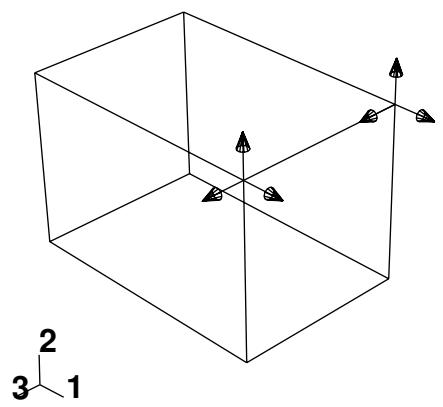  
Figure 1: A concentrated force.

On the other hand, Figure 2 shows a Velocity/Angular Velocity boundary condition that is applied to both translational and rotational degrees of freedom. The sandy brown arrows represent components of the boundary condition that are applied to translational degrees of freedom. The magenta arrows represent components of the boundary condition that are applied to rotational degrees of freedom.

  
Figure 2: A boundary condition applied to an edge.


## Note:

When a boundary condition fixes a degree of freedom in place, the arrow representing that component lacks a stem.

Figure 3 displays a uniform temperature field applied to a face.  
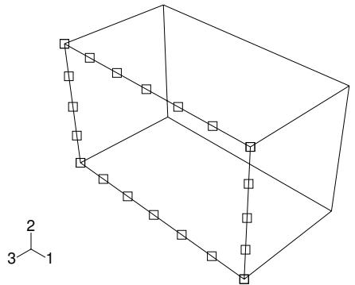  
Figure 3: A uniform temperature field.

In general, the size of the symbols is uniform and unrelated to the magnitude of the prescribed condition. For prescribed conditions that use analytical field distributions, the symbols are scaled based on the analytical field value. Figure 4 shows a pressure load that uses an analytical field to specify a spatially varying magnitude.

  
Figure 4: Variation of a pressure load over a face.

In addition, for symbols other than arrows, a plus sign (+) or a minus sign (−) is displayed inside each symbol to indicate whether the magnitude of the prescribed condition is positive or negative at that location.Figure 5 shows a temperature boundary condition. For clarity, the symbol size has been increased.

  
Figure 5: A temperature boundary condition using an analytical field distribution.

For information on controlling symbol size and scaling, see Controlling the display of attributes.

In some circumstances Abaqus/CAE displays scaled-down symbols for prescribed conditions, such as when a specified prescribed condition has no effect on the analysis or when an analytical field evaluates to zero for a portion of its region. These scaled-down symbols are noticeably smaller than the default symbol size. For example, if you specify a shear surface traction load with a direction vector normal to the surface, Abaqus/CAE cannot apply this type of load normal to the reference surface and displays very small arrow symbols to represent the load in the viewport.

## Additional information

• Displaying symbols for interactions and prescribed conditions that use analytical fields  
• Controlling the display of attributes  
• Symbols used to represent prescribed conditions

## What do single-headed and double-headed arrows represent?

In many cases Abaqus/CAE uses arrows to represent prescribed conditions in the viewport. These arrows represent each component of the prescribed condition (except for fluid boundary conditions, in which case the arrows represent the resultant direction). For example, the arrows that appear in Figure 1 represent the three components of a concentrated force that is applied to two vertices.

  
Figure 1: A concentrated force with three components.

An arrow with a single arrowhead represents a component of a prescribed condition that is applied to a translational degree of freedom. For example, the three components of the concentrated force in Figure 1 are applied to degrees of freedom 1 through 3; therefore, each arrow in the figure has a single arrowhead.

When a component of a prescribed condition is applied to a rotational degree of freedom, that component appears as a double-headed arrow. The arrows in Figure 2 indicate that a Velocity/Angular Velocity boundary condition is applied to degrees of freedom 4 and 6 of the vertices.

  
Figure 2: A boundary condition applied to rotational degrees of freedom.

A magnified view of the double-headed arrows appears in Figure 3.

  
Figure 3: Magnified double-headed arrows.

If you apply a prescribed condition to both translational and rotational degrees of freedom, both the single-headed and the double-headed arrows appear. For example, a Velocity/Angular Velocity boundary condition is applied to degrees of freedom 1, 3, 4, and 6 of the vertex in Figure 4.

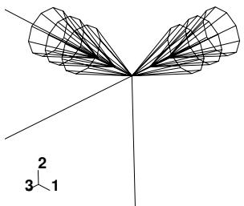  
Figure 4: Magnified view of a boundary condition applied to translational and rotational degrees of freedom.

In this figure the single-headed arrows are sandy brown and indicate that degrees of freedom 1 and 3 of the vertex are fixed.The double-headed arrows are magenta and appear directly behind the single-headed arrows; the double-headed arrows indicate that degrees of freedom 4 and 6 of the vertex are fixed.

For information on arrow color, see Understanding prescribed condition symbol type, color, and size. For information on when to expect arrows to point toward or away from a region, see Understanding symbol location and direction.

## Additional information

• Understanding symbols that represent prescribed conditions  
• Controlling the display of attributes

## Understanding symbol location and direction

The placement of symbols on a model can depend on the type of prescribed condition that the symbols represent and the type of region to which the prescribed condition is applied. Table 1 indicates where symbols appear on geometric models, and Table 2 indicates where symbols appear on meshed models.

Table 1: Symbol location on geometry.

<table><tr><td>Region type to which the prescribed condition is applied</td><td>Location of symbols on the model</td></tr><tr><td>Vertex</td><td>At the vertex</td></tr><tr><td>Edge</td><td>Equally spaced along the edge</td></tr><tr><td>Assembly-level wire</td><td>At the midpoint of the wire</td></tr><tr><td>Face</td><td>Equally spaced over the interior of the face for directional prescribed conditions (e.g., pressure load)</td></tr><tr><td></td><td>Equally spaced along the edges of the face for nondirectional prescribed conditions (e.g., surface charge and boundary conditions)</td></tr><tr><td>Cell</td><td>Equally spaced along each edge of the cell</td></tr><tr><td>Whole model</td><td>At the point required to define the rigid body motion (inertia relief load only); otherwise, at the triad indicating the origin and orientation of the global coordinate system</td></tr></table>

Table 2: Symbol location on meshes.

<table><tr><td>Region type to which the prescribed condition is applied</td><td>Location of symbols on the model</td></tr><tr><td>Node</td><td>At the node</td></tr><tr><td>Element edge (for two-dimensional meshes)</td><td>At the midpoint of the element edge</td></tr><tr><td>Element face (for three-dimensional meshes)</td><td>At the centroid of the element face</td></tr><tr><td>Assembly-level wire</td><td>At the midpoint of the wire</td></tr></table>

For example, Figure 1 shows a concentrated force applied to two vertices and a boundary condition applied to a surface of a geometric model.

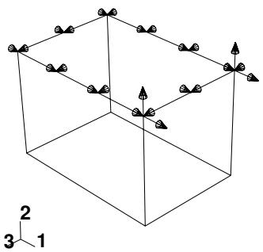  
Figure 1: A concentrated force and a boundary condition.

Figure 2 shows a boundary condition applied to four nodes and a pressure load applied to several element faces of a mesh.


Figure 2: A pressure load and a boundary condition.  


## Note:

If you apply a pressure load to a planar geometry face where the surface area is small compared to the enclosed area (such as a ring formed by two concentric circles), the load symbols may not be distributed evenly, regardless of the symbol density settings in the Assembly Display Options dialog box.

When a boundary condition fixes a degree of freedom in place, the arrow representing that component points into the region and lacks a stem. For example, the boundary condition in Figure 3 fixes degrees of freedom 1, 2, and 3 in place.

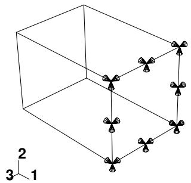  
Figure 3: A boundary condition fixing degrees of freedom in place.

Likewise, if a positive pressure load or an Eulerian inflow boundary condition is applied to a region, the arrows representing that pressure load or boundary condition point into the region, as illustrated in Figure 4.

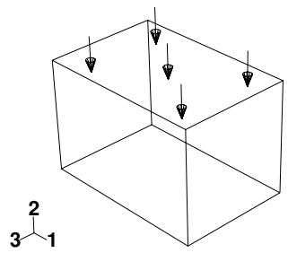  
Figure 4: A positive pressure load.

If a load is defined to have a complex magnitude and the real and imaginary parts have different signs (for example, ), the load will appear as an arrow with two ends. Similarly, an Eulerian boundary condition that includes both inflow and outflow components will appear as an arrow with two ends.

In all other cases, arrows representing components of a prescribed condition point out from the region.


## Note:

When a component of a concentrated force is zero, no arrow appears for that component. Likewise, when a boundary condition leaves a degree of freedom unconstrained, no arrow appears for that component.

## Additional information

• Understanding symbols that represent prescribed conditions  
• Controlling the display of attributes

## Transferring results between Abaqus analyses

You can select part instances from your model and associate an initial state field with the instances. An initial state field applies a deformed mesh and its associated material state to the instances using data imported from a previous Abaqus/Standard or Abaqus/Explicit analysis. Abaqus/CAE allows you to select the job name corresponding to the analysis from which the initial state field is imported. You can also specify the particular step and increment of the analysis from which to import data. Abaqus/CAE imports data from several of the files created by the previous analysis. As a result, the files from the analysis must reside in the directory from which you started the current Abaqus/CAE session.

You can use this capability to drive an Abaqus/Explicit analysis with the results of an Abaqus/Standard analysis and vice versa. This is useful if your problem can be broken down into different stages; for example, you can use Abaqus/Explicit to analyze a metal forming problem and Abaqus/Standard to analyze the following springback. You can also use this capability to change the model definition between steps. For more information, see About Transferring Results between Abaqus Analyses.

You can also transfer results and model information from an Abaqus/Standard analysis to a new Abaqus/Standard analysis, where you can specify additional model definitions before continuing the analysis. For example, you might first study the local behavior of a particular component during an assembly process and then study the behavior of the assembled product. You can start by analyzing the local behavior of the component in an Abaqus/Standard analysis. You can then transfer the model information and results from this analysis to a second Abaqus/Standard analysis, where you can specify additional model definitions for the other components and analyze the behavior of the entire product.

Abaqus/CAE always imports the material state along with the deformed mesh. If you want to import only the deformed mesh, you can import a mesh from a selected step and increment of an output database. For more information, see What kinds of files can be imported and exported from Abaqus/CAE?.

Abaqus uses the imported information when you submit a job for analysis; however, Abaqus/CAE does not update the shape of the selected instances to reflect the applied deformed mesh. As a result, you should be careful when adding new instances to the assembly and positioning them relative to existing part instances. For example, a new part instance may appear to touch one of the instances associated with the initial state field; however, when the analysis applies the imported deformed mesh, the instances may become separated or overclosed.

To avoid this mismatch between the undeformed state and the imported state, you may want to import the deformed mesh from the analysis instead of working with the undeformed part instance. Even if you import the deformed mesh, you must take care that the frame from which you imported the mesh is the same as the step and increment specified in the initial state field. For more information, see Importing a part from an output database. Alternatively, you can create the current model by copying it from the model that generated the previous Abaqus/Standard or Abaqus/Explicit analysis. For more information, see Manipulating models within a model database.

The reference configuration is the configuration of the model from which displacements (and associated strains) are calculated. By default, Abaqus/CAE does not use the imported data to update the reference configuration. As a result, displacements and strains are calculated as total values relative to the reference configuration at the start of the original analysis, and the values will be continuous between analyses. You can change the default behavior and configure Abaqus/CAE to update the reference configuration to be the imported configuration. Abaqus/CAE now calculates displacements and strains relative to the new imported reference configuration; for example, for a springback analysis.

Abaqus imposes many restrictions when you try to create an initial state field. For a detailed discussion of these limitations, see About Transferring Results between Abaqus Analyses. For example, the mesh of the part instances that you select from the current model must match the mesh of the part instances that you are importing. You can then, for example, change the material definition, add loads and boundary conditions, and change from an Abaqus/Standard to an Abaqus/Explicit step. However, you cannot perform an operation that will change the mesh of a selected part instance; for example, you cannot partition the part instance.

You can transfer results between analyses only if the original analysis used one of the following steps:

• Static stress

• Dynamic stress  
• Steady-state transport

In addition, if you are importing data from one Abaqus/Standard analysis to another, the original analysis can use a coupled temperature-displacement step. You cannot import data from a linear perturbation step.

In addition, Abaqus/CAE applies the following limitations:

• The selected part instances and the instances from the previous analysis must have the same name.  
• After you define the initial state field, Abaqus/CAE will continue to show the undeformed shape of the model.  
• You cannot use the Assembly module position and constraint tools, such as Translate and Face to Face, to move a part instance associated with an initial field.  
Abaqus/CAE imports only the mesh and the material state from the previous analysis. As a result, you must redefine sets, surfaces, and all of the prescribed conditions (loads, boundary conditions, predefined fields, interactions, connectors, etc.) at the assembly level of the current model. You should not redefine any of these components in the part definitions of the current model.  
Abaqus/CAE checks that the files exist that contain data from the previous Abaqus/Standard or Abaqus/Explicit analysis; however, it does not check that the specified step and increment number have been written to the files. The job submission fails if the data for the specified step or increment do not exist.  
You cannot modify a part instance associated with an initial field (or the part from which you created the instance). In addition, you cannot modify the mesh of a part instance associated with an initial field (or the mesh of the part from which you created the instance).  
You cannot assign new sections, material orientations, normals, or beam orientations to the part from which you created the instance associated with an initial field. Similarly, you cannot assign mass or inertia. However, you can edit the material definition (which Abaqus/CAE imports along with the mesh). The imported material definitions will overwrite any existing material definitions.

## Using the Load module toolbox

You can access all the Load module tools through either the main menu bar or the Load module toolbox. Figure 1 shows the icons for all the load tools in the Load module toolbox.

  
Figure 1:The Load module toolbox.

## Using the Load module

This section provides general information on defining loads, boundary conditions, and predefined fields.

For information on other Load module topics, see the following sections:

What are step-dependent managers?  
Bolt loads  
Load cases

## In this section:

Creating loads  
Creating boundary conditions  
Creating predefined fields  
Editing the region to which a prescribed condition is applied

When you create a load, you must specify the name of the load, the step in which to activate the load, the type of load, and the region of the assembly to which you want to apply the load.

1. From the main menu bar, select Load->Create.

A Create Load dialog box appears with a default name displayed in the Name text field.


Tip: You can also create a load using the tool in the Load module toolbox.

2. Type a name for the load. For more information on naming objects, see Using basic dialog box components.  
3. Select the step in which to activate the load. Click the arrow next to the Step text field, and select from the list that appears. Loads can be created only in an analysis step; you cannot create a load in the initial step.  
4. From the Category list on the left side of the dialog box, choose the desired category. The Category choices available are dependent upon the type of analysis procedures you are performing.

The Types for Selected Step list on the right side of the dialog box changes to a list of all the available load types.

5. From the Types for Selected Step list, select the load type and click Continue.  
6. If you are creating a gravity load or an inertia relief load, the load editor appears.  
7. If you are creating a connector force or connector moment using assembled fasteners, you can click Done in the prompt area to select a wire set from the template model.

The load editor appears.

a. Click the arrow next to the Assembled fastener field, and select from the list that appears.

The template model name associated with the assembled fastener is displayed in the editor. The Template set list is populated with the wire sets that are associated with the referenced template model.

b. Select a wire set from the Template set list. You must ensure that the wire set has a section assignment that has the available components of relative motion for which you want to define forces.

The appropriate fields for the available components of relative motion are displayed.

8. For all other load types, select the region to which you want to apply the load.

If you are creating a connector force or connector moment, you must select wires that are associated with a connector section assignment. The best approach for selecting wires is to use the default geometry set name for the wire feature (see Creating or modifying wire features for multiple connectors, for more information). If you select multiple wires, you must ensure that the connector sections assigned to the wires in the connector section assignments have the available components of relative motion for which you want to define forces or moments. If there are insufficient available components of relative motion for the connector force or connector moment, a message appears asking you to select different wires or to change the connection type.

Use one of the following methods to select the region for the load:

Select a region in the viewport. You can use the angle method to select a group of faces or edges from geometry or a group of element faces from a mesh. For more information, see Using the angle and feature edge method to select multiple objects. When you have finished selecting, click mouse button 2.


Tip: You can limit the types of objects that you can select in the viewport by specifying filtering options in the Selection toolbar. See Using the selection options, for more information.

If the model contains a combination of mesh and geometry, click one of the following from the prompt area:

- Click Geometry to apply the load to geometry or to a reference point.  
- Click Mesh to apply the load to a native or orphan mesh selection.

By default, for most load types a set or surface is created that contains the selected objects. You can change this behavior by toggling off the option to create a set or surface in the prompt area. A default name is provided in the prompt area, but you can enter a new name.

• To select from a list of existing sets or surfaces, do the following:

1. Click Sets or Surfaces on the right side of the prompt area. (The name of the button depends on the type of object you are creating. For example, if you are creating a pressure load, a Surfaces button appears.)  
Abaqus/CAE displays the Region Selection dialog box containing a list of available sets or surfaces.  
2. Select the set or surface of interest and click Continue.


## Note:

The default selection method is based on the selection method you most recently employed. To revert to the other method, click Select in Viewport or Sets or Surfaces on the right side of the prompt area.

The load editor appears. The region to which you are applying the load is highlighted in the viewport.

9. Enter all of the data necessary to define the load and click OK.


## Note:

If you create a connector force or connector moment that exceeds the failure criteria for a connector, the connector force or connector moment will still be applied.

For detailed information on a particular feature of the editor, select Help->On Context from the main menu bar and then click the feature of interest or see Using the load editors.

Symbols appear in the viewport that represent the load that you just created. For more information, see Understanding symbols that represent prescribed conditions.

## Additional information

• What are step-dependent managers?  
• Selecting objects within the viewport  
• Using the load editors  
• Connectors  
• About assembled fasteners  
• Creating assembled fasteners

• Understanding and using toolboxes and toolbars

• The Set and Surface toolsets

## Creating boundary conditions

When you create a boundary condition, you must specify the name of the boundary condition, the step in which to activate the boundary condition, the type of boundary condition, and the region of the assembly to which you want to apply the boundary condition.

1. From the main menu bar, select BC->Create.

A Create Boundary Condition dialog box appears with a default name displayed in the Name text field.


Tip: You can also create a boundary condition using the tool in the Load module toolbox.

2. Type a name for the boundary condition. For more information on naming objects, see Using basic dialog box components.  
3. Select the step in which to activate the boundary condition. Click the arrow next to the Step text field, and select from the list that appears.  
4. From the Category list on the left side of the dialog box, choose the desired category. The Category choices available are dependent upon the type of analysis procedures you are performing.

The Types for Selected Step list on the right side of the dialog box changes to a list of all the available boundary condition types.

5. From the Types for Selected Step list, select the boundary condition type and click Continue.  
6. If you are creating a connector boundary condition using assembled fasteners, you can click Done in the prompt area to select a wire set from the template model.

The boundary condition editor appears.

a. Click the arrow next to the Assembled fastener field, and select from the list that appears.

The template model name associated with the assembled fastener is displayed in the editor. The Template set list is populated with the wire sets that are associated with the referenced template model.

b. Select a wire set from the Template set list. You must ensure that the wire set has a section assignment that has the available components of relative motion for which you want to define velocity.

The appropriate fields for the available components of relative motion are displayed.

7. For all other boundary condition types, select the region to which you want to apply the boundary condition.

If you are creating a connector displacement, connector velocity, or connector acceleration boundary condition, you must select wires that are associated with a connector section assignment. The best approach for selecting wires is to use the default geometry set name for the wire feature (see Creating or modifying wire features for multiple connectors, for more information). If you select multiple wires, you must ensure that the connector sections assigned to the wires in the connector section assignments have the available components of relative motion for which you want to define displacement, velocity, or acceleration. If there are insufficient available components of relative motion for the connector boundary condition, a message appears asking you to select different wires or to change the connection type.

If you are creating a connector material flow boundary condition, you must select endpoints of wires that are associated with a connector section assignment.

If you are creating an Eulerian mesh motion boundary condition, select an Eulerian part instance in the viewport. Otherwise, use one of the following methods to select the region for the boundary condition:

Select a region in the viewport. You can use the angle method to select a group of faces or edges from geometry or a group of element faces from a mesh. For more information, see Using the angle and feature edge method to select multiple objects. When you have finished selecting, click mouse button 2.


Tip: You can limit the types of objects that you can select in the viewport by specifying filtering options in the Selection toolbar. See Using the selection options, for more information.

If the model contains a combination of mesh and geometry, you must choose the type of region to which you want to apply the boundary condition. From the prompt area, select one of the following:

Click Geometry to apply the boundary condition to geometry or to a reference point.  
Click Mesh to apply the boundary condition to a native or orphan mesh selection.

By default, a set or surface is created that contains the selected objects. You can change this behavior by toggling off the option to create a set or surface in the prompt area. A default name is provided in the prompt area, but you can enter a new name.

• To select from a list of existing sets or surfaces, do the following:

1. Click Sets or Surfaces on the right side of the prompt area. (The name of the button depends on the type of object you are creating. For example, if you are creating a pressure load, a Surfaces button appears.)

Abaqus/CAE displays the Region Selection dialog box containing a list of available sets or surfaces.

2. Select the set or surface of interest and click Continue.


## Note:

The default selection method is based on the selection method you most recently employed. To revert to the other method, click Select in Viewport or Sets or Surfaces on the right side of the prompt area.

The boundary condition editor appears. The region to which you are applying the boundary condition is highlighted in the viewport.

8. Enter all of the data necessary to define the boundary condition and click OK.


## Note:

If you create a connector displacement boundary condition that exceeds the failure criteria for a connector, the connector displacement will be ignored.

For detailed information on a particular feature of the editor, select Help->On Context from the main menu bar and then click the feature of interest or see Using the boundary condition editors.

Symbols appear in the viewport that represent the boundary condition that you just created. For more information, see Understanding symbols that represent prescribed conditions.

## Additional information

• What are step-dependent managers?  
• Selecting objects within the viewport  
• Using the boundary condition editors  
• Connectors  
• About assembled fasteners  
• Creating assembled fasteners  
• The Set and Surface toolsets

• Understanding and using toolboxes and toolbars

When you create a predefined field, you must specify the name of the field, the step in which to activate the field, the type of field, and the region of the assembly to which you want to apply the field.


## Note:

The process for creating temperature fields is described separately; see Defining a temperature field.

1. From the main menu bar, select Predefined Field->Create.

A Create Predefined Field dialog box appears with a default name displayed in the Name text field.


Tip: You can also create a predefined field using the tool in the Load module toolbox.

2. Type a name for the predefined field. For more information on naming objects, see Using basic dialog box components.  
3. Select the step in which to activate the predefined field. Click the arrow next to the Step text field, and select from the list that appears.  
4. From the Category list on the left side of the dialog box, choose the desired category. The Category choices available are dependent upon the type of analysis procedures you are performing.  
The Types for Selected Step list on the right side of the dialog box changes to a list of all the available predefined field types.

5. From the Types for Selected Step list, select the predefined field type and click Continue.

6. If the model contains a combination of mesh and geometry, you must choose the type of region to which you want to apply the predefined field. From the prompt area, select one of the following:

• Click Geometry to apply the predefined field to geometry or to a reference point.  
• Click Mesh to apply the predefined field to a native or orphan mesh selection.

7. Select the region to which you want to apply the predefined field.

If you are creating a material assignment field or an initial state field, use the mouse to select a part instance in the viewport. For all other predefined fields, select a region using one of the following methods:

Use the mouse to select a region in the viewport. You can use the angle method to select a group of faces or edges from geometry or a group of element faces or nodes from a mesh. For more information, see Using the angle and feature edge method to select multiple objects. When you have finished selecting, click mouse button 2.


Tip: You can limit the types of objects that you can select in the viewport by specifying filtering options in the Selection toolbar. See Using the selection options, for more information.

By default, a set is created that contains the selected objects. You can change this behavior by toggling off the option to create a set in the prompt area. A default name is provided in the prompt area, but you can enter a new name.

• To select from a list of existing sets, do the following:

1. Click Sets on the right side of the prompt area.

Abaqus/CAE displays the Region Selection dialog box containing a list of available sets.

2. Select the set of interest and click Continue.


## Note:

The default selection method is based on the selection method you most recently employed. To revert to the other method, click Select in Viewport or Sets on the right side of the prompt area.

The predefined field editor appears. The region to which you are applying the predefined field is highlighted in the viewport.

8. Enter all of the data necessary to define the predefined field and click OK. For detailed information on a particular feature of the editor, select Help->On Context from the main menu bar and then click the feature of interest or see Using the predefined field editors.

Symbols appear in the viewport that represent the predefined field that you just created. For more information, see Understanding symbols that represent prescribed conditions.

## Additional information

• Understanding and using toolboxes and toolbars  
• What are step-dependent managers?  
• Selecting objects within the viewport  
• Using the predefined field editors  
• The Set and Surface toolsets

## Editing the region to which a prescribed condition is applied

You can edit the region to which a prescribed condition is applied in the step in which the load, boundary condition, or predefined field was created.

You cannot edit the region if the definition of the prescribed condition refers to subregions within the original region (a material assignment predefined field, for example).


Note: Gravity loads can be applied to regions in your model, but they cannot be applied to individual point masses in Abaqus/CAE.

1. From the Load, BC, or Predefined Field menu in the main menu bar, select Manager to display the Load Manager, Boundary Condition Manager, or Predefined Field Manager.  
2. Click the cell located in the row of the prescribed condition that you want to modify and in the column of the step of interest, and click Edit. Alternatively, you can just double-click the cell.


Tip: You can also initiate this procedure by clicking the step in which the prescribed condition was created in the Step list located in the context bar. From the Load, BC, or Predefined Field menu in the main menu bar, select Edit->prescribed condition. For example, to edit a load you would select Load->Edit->load of your choice.

An editor appears.

3. In the top part of the editor, click to edit the region selection.  
4. Edit the region using one of the following methods:

• Select and unselect objects in the viewport. When you have finished editing the region, click mouse button 2. (For more information, see Selecting objects within the viewport.)


Tip: You can limit the types of objects that you can select in the viewport by specifying filtering options in the Selection toolbar. See Using the selection options, for more information.

• To select from a list of existing sets or surfaces, do the following:

1. Click Sets or Surfaces on the right side of the prompt area. (The name of the button depends on the type of object you are editing. For example, if you are editing a pressure load, a Surfaces button appears.)

Abaqus/CAE displays the Region Selection dialog box containing a list of available sets or surfaces.

2. Select the set or surface of interest and click Continue.


## Note:

The default selection method is based on the selection method you most recently employed. To revert to the other method, click Select in Viewport or Sets or Surfaces on the right side of the prompt area.

5. In the editor, finish editing the prescribed condition definition as desired and then click OK.

The symbols representing the prescribed condition in the viewport change to appear on the newly edited region.

## Additional information

• What are step-dependent managers?  
• Understanding symbols that represent prescribed conditions  
• Using the Load module

## Using the load editors

This section explains how to enter data in the load editor to define specific types of loads.

The following topics are covered in Modeling techniques:

Bolt loads  
Creating the submodel load

## In this section:

Defining a concentrated force  
Defining a moment  
Defining a pressure load  
Defining a shell edge load  
Defining a surface traction load  
Defining a pipe pressure load  
Defining a body force  
Defining a line load  
Defining a gravity load  
Defining a generalized plane strain load  
Defining a rotational body force  
Defining a Coriolis force  
Defining a connector force  
Defining a connector moment  
Defining a substructure load definition to activate a substructure load case  
Defining an inertia relief load  
Defining a surface heat flux  
Defining a body heat flux  
Defining a concentrated heat flux  
Defining an inward volume acceleration  
Defining a concentrated pore fluid flow  
Defining a surface pore fluid flow  
Defining a concentrated current  
Defining a surface current  
Defining a body current  
Defining a surface current density  
Defining a body current density  
Defining a concentrated charge  
Defining a surface charge  
Defining a body charge  
Defining a concentrated concentration flux  
Defining a surface concentration flux  
Defining a body concentration flux  
Defining a fluid pressure penetration load

## Defining a concentrated force

You can apply a concentrated force load to a vertex or node.

1. Display the concentrated force load editor using one of the following methods:

• To create a new concentrated force load, follow the procedure outlined in Creating loads (Category: Mechanical; Types for Selected Step: Concentrated force).  
• To edit an existing concentrated force load using menus or managers, see Editing step-dependent objects. To edit the region to which the load is applied, see Editing the region to which a prescribed condition is applied.

2. Click the arrow to the right of the Distribution field, and select the option of your choice from the list that appears:

• Select Uniform to define a load that is uniform over the region.  
• Select an analytical field to define a spatially varying load. Only analytical fields that are valid for to create a new analytical field. (See The Analytical Field toolset for more information.)

3. In the CF1, CF2, and CF3 text fields, enter the components of the concentrated force in each direction (units F):

If you leave a text field blank, a force of zero is assigned to that direction automatically. However, you must enter at least one nonzero component in the editor to define the load.

4. If desired, click the arrow to the right of the Amplitude field, and select the amplitude of your choice to create a new amplitude. (See The Amplitude toolset for more information.)

5. If desired, toggle on Follow nodal rotation to make the direction of the load rotate with the rotation at this node.

Follow nodal rotation affects only nodes that have rotational degrees of freedom and steps in which the Nlgeom setting is turned on.

6. If you want to change the coordinate system (CSYS) for the concentrated force load, click and use one of the following methods:

• Select an existing datum coordinate system in the viewport.  
• Select an existing datum coordinate system by name.  
1. From the prompt area, click Datum CSYS List to display a list of datum coordinate systems.  
2. Select a name from the list, and click OK.  
• Click Use Global CSYS from the prompt area to revert to the global coordinate system.

This coordinate system editing option is available only in the step in which the concentrated force load is created. By default, the global coordinate system is used to define the load.

7. Click OK to save your data and to exit the editor.

## Additional information

• Creating and modifying prescribed conditions

• Understanding symbols that represent prescribed conditions  
• Using analytical expression fields  
• Creating expression fields  
• Concentrated Loads

## Defining a moment

You can create a moment load to define rotation at a vertex or node.

1. Display the moment load editor using one of the following methods:

• To create a new moment load, follow the procedure outlined in Creating loads (Category: Mechanical; Types for Selected Step: Moment).  
To edit an existing moment load using menus or managers, see Editing step-dependent objects. To edit the region to which the load is applied, see Editing the region to which a prescribed condition is applied.

2. Click the arrow to the right of the Distribution field, and select the option of your choice from the list that appears:

• Select Uniform to define a load that is uniform over the region.  
• Select an analytical field to define a spatially varying load. Only analytical fields that are valid for to create a new analytical field. (See The Analytical Field toolset for more information.)

3. In the CM1, CM2, and CM3 text fields, enter the components of the moment about each axis (units FL).

If you leave a text field blank, a moment of zero is assigned to that direction automatically. However, you must enter at least one nonzero component in the editor to define the load.

4. If desired, click the arrow to the right of the Amplitude field, and select the amplitude of your choice to create a new amplitude. (See The Amplitude toolset for more information.)

5. If desired, toggle on Follow nodal rotation to make the direction of the load rotate with the rotation at this node.

Follow nodal rotation affects only nodes that have rotational degrees of freedom and steps in which the Nlgeom setting is turned on.

6. If you want to change the coordinate system (CSYS) for the moment, click and use one of the following methods:

• Select an existing datum coordinate system in the viewport.  
• Select an existing datum coordinate system by name.

1. From the prompt area, click Datum CSYS List to display a list of datum coordinate systems.  
2. Select a name from the list, and click OK.


## Note:

You should not apply a moment load at the origin of a cylindrical coordinate system; doing so would make the radial and tangential loads indeterminate.

• Click Use Global CSYS from the prompt area to revert to the global coordinate system.

This coordinate system editing option is available only in the step in which the moment is created. By default, the global coordinate system is used to define the moment.

7. Click OK to save your data and to exit the editor.

## Additional information

• Creating and modifying prescribed conditions  
• Understanding symbols that represent prescribed conditions  
• Using analytical expression fields  
• Creating expression fields  
• Concentrated Loads

## Defining a pressure load

You can create a pressure load to define a pressure over a surface.

1. Display the pressure load editor using one of the following methods:

• To create a new pressure load, follow the procedure outlined in Creating loads (Category: Mechanical; Types for Selected Step: Pressure).  
To edit an existing pressure load using menus or managers, see Editing step-dependent objects. To edit the region to which the load is applied, see Editing the region to which a prescribed condition is applied.

2. Click the arrow to the right of the Distribution field, and select the option of your choice from the list that appears:

Select Uniform to define a pressure that is uniformly distributed over the surface. For this option, the magnitude you provide must be the force per unit area.  
Select Total Force to define a pressure that is uniformly distributed over the surface. For this option, the magnitude you provide must be the total magnitude of the force applied to the surface (instead of force per unit area).  
Select Hydrostatic to define a hydrostatic pressure applied to the surface. (This option is valid only for Abaqus/Standard analyses.)  
Select Stagnation to define a stagnation pressure applied to the surface. (This option is valid only for Abaqus/Explicit analyses.)  
Select Viscous to define a viscous pressure applied to the surface. (This option is valid only for Abaqus/Explicit analyses.)  
Select User-defined to define the magnitude of the load in user subroutine DLOAD (for Abaqus/Standard) or VDLOAD (for Abaqus/Explicit). See the following sections for more information:

Specifying general job settings  
DLOAD  
VDLOAD

Select an analytical field, labeled with an (A), or a discrete field, labeled with a (D), to define a spatially varying pressure. Only analytical fields and discrete fields that are valid for this load type are displayed in the selection list.

Alternatively, you can click t o create a new analytical field. (See The Analytical Field toolset for more information.)

3. If you selected the Uniform, Total Force, analytical field, or discrete field distribution option, perform the following steps:

a. In the Magnitude text field, enter the pressure magnitude.

For a Uniform distribution, enter the total force magnitude divided by the surface area over which the force is applied (units FL−2).

For a Total Force distribution, enter the total magnitude of the force (units F). Based on the undeformed model geometry, Abaqus/CAE calculates a constant uniform surface pressure from the force magnitude entered. In a large-displacement analysis, however, the actual total force may change during the analysis due to the deformation of the loaded surface.

b. If desired, click the arrow to the right of the Amplitude field, and select the amplitude of your choice from the list that appears. Alternatively, you can click to create a new amplitude. (See The Amplitude toolset for more information.)

c. Click OK to save your data and to exit the editor.

4. If you selected the Hydrostatic distribution option, perform the following steps:

a. In the Magnitude text field, enter the pressure magnitude (units $\mathrm { F L } ^ { - 2 } )$ .  
b. In the Zero pressure height field, enter the Z-coordinate (if you are working in three-dimensional or axisymmetric space) or the Y-coordinate (if you are working in two-dimensional space) of the height at which the pressure is zero.  
c. In the Reference pressure height field, enter the Z-coordinate (if you are working in three-dimensional or axisymmetric space) or the Y-coordinate (if you are working in two-dimensional space) of the height at which the pressure is the magnitude specified in the Magnitude field.  
(For more information, see Hydrostatic Pressure Loads on Two-Dimensional, Three-Dimensional, and Axisymmetric Elements in Abaqus/Standard.)  
d. If desired, click the arrow to the right of the Amplitude field, and select the amplitude of your choice from the list that appears. Alternatively, you can click to create a new amplitude. (See The Amplitude toolset for more information.)

5. If you selected the Stagnation or Viscous distribution option, perform the following steps:

a. In the Magnitude text field, enter the pressure magnitude (units FL−2).  
b. If desired, click the arrow to the right of the Amplitude field, and select the amplitude of your choice from the list that appears. Alternatively, you can click to create a new amplitude. (See The Amplitude toolset for more information.)  
c. If desired, toggle on Determine velocity from reference point to subtract the velocity of a reference node from the velocity of the surface where the pressure is applied.

d. Click to select a reference point using one of the following methods:

• Select a point from the viewport.  
• Click Points in the prompt area, and select a named set.


## Note:

The set that you select must contain a single node or vertex.

e. Click OK to save your data and to exit the editor.

6. If you selected the User-defined distribution option, perform the following steps:

a. If desired, enter the pressure magnitude in the Magnitude field (units FL−2). Magnitude data that you enter in the editor are passed into the user subroutine in an Abaqus/Standard analysis but are ignored in an Abaqus/Explicit analysis.  
b. Click OK to save your data and to exit the editor.  
c. Enter the Job module and display the job editor for the analysis job of interest. (For more information, see Creating, editing, and manipulating jobs.)  
d. In the job editor, click the General tab, and specify the file containing the user subroutine that defines the load magnitude. For more information, see Specifying general job settings.


## Note:

You can specify only one user subroutine file in the job editor; if your analysis involves more than one user subroutine, you must combine the user subroutines into one file and then specify that file.

## Additional information

• Creating and modifying prescribed conditions  
• Understanding symbols that represent prescribed conditions  
• Using analytical expression fields  
• Creating expression fields  
• Creating discrete fields  
• Distributed Loads

You can create a shell edge load to define a general, shear, normal, or transverse traction or a moment along a shell edge.

1. Display the shell edge load editor using one of the following methods:

• To create a new shell edge load, follow the procedure outlined in Creating loads (Category: Mechanical; Types for Selected Step: Shell edge load).  
To edit an existing shell edge load using menus or managers, see Editing step-dependent objects. To edit the region to which the load is applied, see Editing the region to which a prescribed condition is applied.

2. Click the arrow to the right of the Distribution field, and select the option of your choice from the list that appears:

• Select Uniform to define a load that is uniform over the shell edge.  
• Select User-defined to define the magnitude of the load in user subroutine UTRACLOAD (for Abaqus/Standard). See the following sections for more information:

Specifying general job settings  
UTRACLOAD

• Select an analytical field to define a spatially varying load. Only analytical fields that are valid for $f ( x )$ to create a new analytical field. (See The Analytical Field toolset for more information.)

3. Click the arrow to the right of the Traction field, and select the option of your choice from the list that appears:

• Select Normal to define a normal shell edge traction.  
• Select Transverse to define a transverse shell edge traction.  
• Select Shear to define a shear shell edge traction.  
• Select Moment to define a shell edge moment.  
• Select General to define a general shell edge traction.

4. If you selected the General traction type, specify the load direction.

a. Click next to Vector to specify the coordinates of the direction vector.

b. By default, the traction components are specified with respect to the global axes. To refer to a local coordinate system for the direction components of the traction:

• Select CSYS: Picked and click to pick a previously defined local coordinate system.  
Select CSYS: User-defined and enter the name of a user subroutine that defines a local coordinate system.

c. If you selected CSYS: Picked, you can define an additional rotation about one of the axes. Click the arrow to the right of the Additional rotation about axis field, select the axis about which the other two axes will be rotated, and enter a value for the additional rotation angle.

5. In the Magnitude text field, enter the shell edge load magnitude (units FL−1).

6. If desired, click the arrow to the right of the Amplitude field, and select the amplitude of your choice Amplitude toolset for more information.)  
7. If desired, click the arrow to the right of the Traction is defined per unit field, and select deformed area to define the shell edge load with respect to the current (deformed) area or undeformed area to define the shell edge load with respect to the reference (original) area.  
8. If you selected the General traction type, you can toggle off Follow rotation to define a non-follower load (i.e., the load always acts in a fixed global direction rather than rotating with the shell edge in a geometrically nonlinear analysis).  
9. Click OK to save your data and to exit the editor.

## Additional information

• Creating and modifying prescribed conditions  
• Understanding symbols that represent prescribed conditions  
• Using analytical expression fields  
• Creating expression fields  
• Distributed Loads

You can create a surface traction load to define a general or shear traction over a surface.

1. Display the surface traction load editor using one of the following methods:

• To create a new surface traction load, follow the procedure outlined in Creating loads (Category: Mechanical; Types for Selected Step: Surface traction).  
• To edit an existing surface traction load using menus or managers, see Editing step-dependent objects. To edit the region to which the load is applied, see Editing the region to which a prescribed condition is applied.

2. Click the arrow to the right of the Distribution field, and select the option of your choice from the list that appears:

• Select Uniform to define a load that is uniform over the surface.  
Select User-defined to define the magnitude of the load in user subroutine UTRACLOAD (for Abaqus/Standard). See the following sections for more information:

Specifying general job settings

UTRACLOAD

• Select an analytical field to define a spatially varying load. Only analytical fields that are valid for $f ( x )$ analytical field. (See The Analytical Field toolset for more information.)

3. Click the arrow to the right of the Traction field, and select the option of your choice from the list that appears:

• Select Shear to define a shear surface traction.  
• Select General to define a general surface traction.

4. Specify the load direction.

a. Click next to Vector or Vector before projection to specify the coordinates of the direction vector.

b. By default, the traction components are specified with respect to the global axes. To refer to a local coordinate system for the direction components of the traction:

• Select CSYS: Picked and click to pick a previously defined local coordinate system.  
• Select CSYS: User-defined and enter the name of a user subroutine that defines a local coordinate system.

c. If you selected CSYS: Picked, you can define an additional rotation about one of the axes. Click the arrow to the right of the Additional rotation about axis field, select the axis about which the other two axes will be rotated, and enter a value for the additional rotation angle.

5. In the Magnitude text field, enter the surface traction magnitude (units FL−2).

6. If desired, click the arrow to the right of the Amplitude field, and select the amplitude of your choice Amplitude toolset for more information.)  
7. If desired, click the arrow to the right of the Traction is defined per unit field, and select deformed area to define the surface traction with respect to the current (deformed) area or undeformed area to define the surface traction with respect to the reference (original) area.  
8. If you selected the General traction type, you can toggle off Follow rotation to define a non-follower load in a geometrically nonlinear analysis (i.e., the load always acts in a fixed global direction rather than rotating with the surface).  
9. Click OK to save your data and to exit the editor.

## Additional information

• Creating and modifying prescribed conditions  
• Understanding symbols that represent prescribed conditions  
• Using analytical expression fields  
• Creating expression fields  
• Distributed Loads

You can create this type of load to prescribe internal or external pressure in a pipe or elbow.

1. Display the pipe pressure load editor using one of the following methods:

• To create a new pipe pressure load, follow the procedure outlined in Creating loads (Category: Mechanical; Types for Selected Step: Pipe pressure).  
To edit an existing pipe pressure load using menus or managers, see Editing step-dependent objects. To edit the region to which the load is applied, see Editing the region to which a prescribed condition is applied.

2. Select the Side option of your choice:

• Select Internal to prescribe an internal pressure within the pipe.  
• Select External to prescribe an external pressure on the pipe.

3. In the Effective diameter field, enter the appropriate pipe diameter:

• Enter the inner diameter of the pipe if you selected Internal in the previous step.  
• Enter the outer diameter of the pipe if you selected External in the previous step.


## Note:

The effective diameter that you enter remains constant throughout the analysis. It is not scaled as the pipe expands or contracts under the pressure, even when the Nlgeom setting is turned on. (For more information on the Nlgeom setting, see Accounting for geometric nonlinearity.)

4. Click the arrow to the right of the Distribution field, and select the option of your choice from the list that appears:

• Select Uniform to define a load that is uniform over the pipe surface.  
• Select Hydrostatic to define a hydrostatic pressure on or within the pipe.  
Select User-defined to define the magnitude of the load in user subroutine DLOAD. See the following sections for more information:

Specifying general job settings  
DLOAD

• Select an analytical field to define a spatially varying load. Only analytical fields that are valid for $f ( x )$ to create a new analytical field. (See The Analytical Field toolset for more information.)

5. If you selected the Uniform or analytical field distribution option, perform the following steps:

a. In the Magnitude text field, enter the pressure magnitude (units FL−2).  
b. If desired, click the arrow to the right of the Amplitude field, and select the amplitude of your choice from the list that appears. Alternatively, you can click to create a new amplitude. (See The Amplitude toolset for more information.)  
c. Click OK to save your data and to exit the editor.

6. If you selected the Hydrostatic distribution option, perform the following steps:

In the Magnitude text field, enter the pressure magnitude (units FL−2 a. ).  
b. In the Zero pressure height field, enter the Z-coordinate of the height at which the pressure is zero.  
c. In the Reference pressure height field, enter the Z-coordinate of the height at which the pressure is the magnitude specified in the Magnitude field.  
(For more information, see Hydrostatic Pressure Loads on Two-Dimensional, Three-Dimensional, and Axisymmetric Elements in Abaqus/Standard.)  
d. If desired, click the arrow to the right of the Amplitude field, and select the amplitude of your choice from the list that appears. Alternatively, you can click to create a new amplitude. (See The Amplitude toolset for more information.)

7. If you selected the User-defined distribution option, perform the following steps:

a. If desired, enter the pressure magnitude in the Magnitude field (units FL−2). Magnitude data that you enter in the editor are passed into the user subroutine.  
b. Click OK to save your data and to exit the editor.  
c. Enter the Job module and display the job editor for the analysis job of interest. (For more information, see Creating, editing, and manipulating jobs.)  
d. In the job editor, click the General tab, and specify the file containing the user subroutine DLOAD. For more information, see Specifying general job settings.


## Note:

You can specify only one user subroutine file in the job editor; if your analysis involves more than one user subroutine, you must combine the user subroutines into one file and then specify that file.

## Additional information

• Creating and modifying prescribed conditions  
• Understanding symbols that represent prescribed conditions  
• Using analytical expression fields  
• Creating expression fields  
• Distributed Loads

You can define a body force to prescribe loading per unit volume over a body.

1. Display the body force load editor using one of the following methods:

• To create a new body force load, follow the procedure outlined in Creating loads (Category: Mechanical; Types for Selected Step: Body force).  
To edit an existing body force load using menus or managers, see Editing step-dependent objects. To edit the region to which the load is applied, see Editing the region to which a prescribed condition is applied.

2. If the Distribution field appears in the editor, click the arrow to the right of the field, and select the option of your choice from the list that appears:

• Select Uniform to define a load that is uniform over the body.  
Select User-defined to define the magnitude of the load in user subroutine DLOAD (for Abaqus/Standard) or VDLOAD (for Abaqus/Explicit). See the following sections for more information:

Specifying general job settings  
DLOAD  
VDLOAD

Select an analytical field to define a spatially varying load. Only analytical fields that are valid for this load type are displayed in the selection list. Alternatively, you can click Create to create a new analytical field. (See The Analytical Field toolset for more information.)

3. If you selected the Uniform or analytical field distribution option, perform the following steps:

a. In the Component 1, Component 2, and (if you are working in three-dimensional space) Component 3 fields, enter the body force per unit volume in each direction (units FL−3):

If you are working in three-dimensional or two-dimensional space, the Component 1, Component 2, and Component 3 fields correspond to the 1-, 2-, and (if applicable) 3-directions.  
• If you are working in axisymmetric space, Component 1 corresponds to the radial direction and Component 2 corresponds to the axial direction.

b. If desired, click the arrow to the right of the Amplitude field, and select the amplitude of your choice from the list that appears. Alternatively, you can click to create a new amplitude. (See The Amplitude toolset for more information.)

c. Click OK to save your data and to exit the editor.

4. If you selected the User-defined distribution option, perform the following steps:

a. If desired, in the Component 1, Component 2, and (if applicable) Component 3 fields enter the body force per unit volume in each direction (units FL−3).  
Load magnitude data that you enter in the editor are passed into the user subroutine in an Abaqus/Standard analysis but are ignored in an Abaqus/Explicit analysis.

b. Click OK to save your data and to exit the editor.

c. Enter the Job module and display the job editor for the analysis job of interest. (For more information, see Creating, editing, and manipulating jobs.)

d. In the job editor, click the General tab, and specify the file containing the user subroutine that defines the load magnitude. For more information, see Specifying general job settings.


## Note:

You can specify only one user subroutine file in the job editor; if your analysis involves more than one user subroutine, you must combine the user subroutines into one file and then specify that file.

## Additional information

• Creating and modifying prescribed conditions  
• Understanding symbols that represent prescribed conditions  
• Using analytical expression fields  
• Creating expression fields  
• Distributed Loads

You can create a line load to prescribe the force per unit length over a beam.

1. Display the line load editor using one of the following methods:

• To create a new line load, follow the procedure outlined in Creating loads (Category: Mechanical; Types for Selected Step: Line load).  
To edit an existing line load using menus or managers, see Editing step-dependent objects. To edit the region to which the load is applied, see Editing the region to which a prescribed condition is applied.

2. Click the arrow to the right of the System field, and from the list that appears select the coordinate system in which you want to define the load:

Select Global if you want to specify the load components in the global 1-, 2-, and (if you are working in three-dimensional space) 3-directions.  
Select Local if you want to specify the load components in the beam local 1-direction (if you are working in three-dimensional space) and the beam local 2-direction. (For more information, see Assigning a beam orientation.)

3. Click the arrow to the right of the Distribution field, and select the option of your choice from the list that appears:

• Select Uniform to define a load that is uniform over the region.  
Select User-defined to define the magnitude of the load in user subroutine DLOAD (for Abaqus/Standard) or VDLOAD (for Abaqus/Explicit). See the following sections for more information:

Specifying general job settings  
DLOAD  
VDLOAD

• Select an analytical field to define a spatially varying load. Only analytical fields that are valid for to create a new analytical field. (See The Analytical Field toolset for more information.)

4. If you selected the Uniform or analytical field distribution option, perform the following steps:

a. In the Component fields, enter the body force per unit length in each direction (units FL−1):

• If you selected the Global system, the Component 1, Component 2, and Component 3 fields correspond to the 1-, 2-, and 3-directions.  
• If you selected the Local system, the Component 1 field corresponds to the beam local 1-direction, and the Component 2 field corresponds to the beam local 2-direction.

b. If desired, click the arrow to the right of the Amplitude field, and select the amplitude of your choice from the list that appears. Alternatively, you can click to create a new amplitude. (See The Amplitude toolset for more information.)

c. Click OK to save your data and to exit the editor.

5. If you selected the User-defined distribution option, perform the following steps:

If desired, in the Component fields enter the force per unit length in each direction (units FL−1).a. Entering load magnitude data in the editor is optional for user-defined loads. Any data you enter are passed to the user subroutine in an Abaqus/Standard analysis but are ignored in an Abaqus/Explicit analysis.  
b. Click OK to save your data and to exit the editor.  
c. Enter the Job module, and display the job editor for the analysis job of interest. (For more information, see Creating, editing, and manipulating jobs.)  
d. In the job editor, click the General tab, and specify the file containing the user subroutine that defines the load magnitude. For more information, see Specifying general job settings.


## Note:

You can specify only one user subroutine file in the job editor; if your analysis involves more than one user subroutine, you must combine the user subroutines into one file and then specify that file.

## Additional information

• Creating and modifying prescribed conditions  
• Understanding symbols that represent prescribed conditions  
• Using analytical expression fields  
• Creating expression fields  
• Distributed Loads

You can create a gravity load to define a uniform acceleration in a fixed direction. Abaqus calculates the loading using the acceleration magnitude that you enter in the gravity load definition and the density specified in the material definition.

1. Display the gravity load editor using one of the following methods:

• To create a new gravity load, follow the procedure outlined in Creating loads (Category: Mechanical; Types for Selected Step: Gravity).  
• To edit an existing gravity load using menus or managers, see Editing step-dependent objects.

2. By default, a gravity load is applied to the whole model. If desired, you can apply a gravity load to particular regions of a model:

a. Click


b. Select the region to which you want to apply the load, as described in Creating loads.

c. Click Done in the prompt area.


## Note:

You cannot apply gravity loads to individual point masses. To include point masses in a gravity load, apply the load to the whole model.

3. Click the arrow to the right of the Distribution field, if available; and select the option of your choice from the list that appears:

• Select Uniform to define a load that is uniform over the region.  
• Select an analytical field to define a spatially varying load. Only analytical fields that are valid for to create a new analytical field. (See The Analytical Field toolset for more information.)

4. In the Component 1, Component 2, and (if you are working with a model in three-dimensional space) Component 3 text fields, enter the components of the acceleration in each direction:

• If you are working in three-dimensional or two-dimensional space, the Component 1, Component 2, and Component 3 fields correspond to the 1-, 2-, and (if applicable) 3-directions.

• If you are working in axisymmetric space, only the Component 2 text field is available. Component 2 corresponds to the axial direction.

If you leave a text field blank, a value of zero is assigned to that direction automatically. However, you must enter at least one nonzero component in the editor to define the load.

5. If desired, click the arrow to the right of the Amplitude field, and select the amplitude of your choice Amplitude toolset for more information.)

6. Click OK to save your data and to exit the editor.

## Additional information

• Creating and modifying prescribed conditions  
• Understanding symbols that represent prescribed conditions  
• Using analytical expression fields

• Creating expression fields  
• Distributed Loads

## Defining a generalized plane strain load

You can create a generalized plane strain load to define an axial load applied to the reference point of a region modeled with generalized plane strain elements.

A generalized plane strain load cannot be defined for a coupled temperature-displacement analysis.

1. Display the generalized plane strain load editor using one of the following methods:

• To create a new generalized plane strain load, follow the procedure outlined in Creating loads (Category: Mechanical; Types for Selected Step: Generalized plane strain).  
• To edit an existing generalized plane strain load using menus or managers, see Editing step-dependent objects. To edit the region to which the load is applied, see Editing the region to which a prescribed condition is applied.

2. Click the arrow to the right of the Distribution field, and select the option of your choice from the list that appears:

• Select Uniform to define a load that is uniform over the region.  
• Select an analytical field to define a spatially varying load. Only analytical fields that are valid for to create a new analytical field. (See The Analytical Field toolset for more information.)

3. In the Axial force text field, enter the axial force (units F).

4. In the Moment about X field, enter the moment applied at the reference point about the X-axis.

5. In the Moment about Y field, enter the moment applied at the reference point about the Y-axis.

6. If desired, click the arrow to the right of the Amplitude field, and select the amplitude of your choice from the list that appears. Alternatively, you can click to create a new amplitude. (See The Amplitude toolset for more information.)

7. Click OK to save your data and to exit the editor.

## Additional information

• Creating and modifying prescribed conditions  
• Understanding symbols that represent prescribed conditions  
• Using analytical expression fields  
• Creating expression fields  
• Adding unsupported keywords to your Abaqus/CAE model  
• Generalized Plane Strain Elements

## Defining a rotational body force

You can create a rotational body force load to define loads resulting from the rotation of the model.

You can specify angular velocity, rotary acceleration, or rotordynamic load. Abaqus defines the load by using the square of the angular velocity or by using the acceleration directly. In any case the load definition must include an axis of rotation, which is defined as follows:

• If you are working in three-dimensional space, you define the location and direction of the axis by entering the global coordinates of two points.  
• If you are working in two-dimensional space, you specify the location of the axis by entering the coordinates of a point in the plane. The direction of the axis is always out of the plane.  
• If you are working in axisymmetric space, the axis is always in the location and direction of the positive global z-axis.


Note: You can define a rotary acceleration force only in two- or three-dimensional space.

1. Display the rotational body force load editor using one of the following methods:

• To create a new rotational body force load, follow the procedure outlined in Creating loads (Category: Mechanical; Types for Selected Step: Rotational body force).

If you are working in two- or three-dimensional space, enter in the prompt area the required information concerning the location and, if applicable, the direction of the axis of rotation.

• To edit an existing rotational body force load using menus or managers, see Editing step-dependent objects. To edit the region to which the load is applied, see Editing the region to which a prescribed condition is applied.

If you are editing a load in the step in which it was created, an Edit ( ) button appears next to each point you specified in the load editor. Click if you want to change the coordinates that determine the location and, if applicable, direction of the axis of rotation. (This option applies only if you are working in two- or three-dimensional space.)

2. Select the force type of your choice:

• Toggle Centrifugal if you want to define a centrifugal force.  
• Toggle Rotary acceleration if you want to define a rotary acceleration force.  
• Toggle Rotordynamic load if you want to define a rotordynamic load.

3. Click the arrow to the right of the Distribution field, and select the option of your choice from the list that appears:

• Select Uniform to define a load that is uniform over the body.  
• Select an analytical field to define a spatially varying load. Only analytical fields that are valid for analytical field. (See The Analytical Field toolset for more information.)

4. In the text field that appears, enter the appropriate value:

• If you are defining a centrifugal force, enter the angular velocity in radians/time.  
• If you are defining a rotary acceleration force, enter the rotary acceleration in radians/time2.  
• If you are defining a rotordynamic load, enter the rotordynamic load in radians/time.

5. If desired, click the arrow to the right of the Amplitude field, and select the amplitude of your choice  
from the list that appears. Alternatively, you can click to create a new amplitude. (See The Amplitude toolset for more information.)  
For centrifugal loading, the amplitude is applied to the calculated load, not the angular velocity.

6. Click OK to save your data and to exit the editor.

## Additional information

• Creating and modifying prescribed conditions  
• Understanding symbols that represent prescribed conditions  
• Using analytical expression fields  
• Creating expression fields  
• Specifying Loads due to Rotation of the Model in Abaqus/Standard

## Defining a Coriolis force

You can create a Coriolis force load to define loads resulting from rotation of the model. You must specify the force as the product of the material density (mass per unit volume) for solid and shell elements or the mass per unit length for beam elements and the angular velocity in radians per time. The load definition must include an axis of rotation, which is defined as follows:

• If you are working in three-dimensional space, you define the location and direction of the axis by entering the global coordinates of two points.  
• If you are working in two-dimensional space, you specify the location of the axis by entering the coordinates of a point in the plane. The direction of the axis is always out of the plane.  
• If you are working in axisymmetric space, the axis is always in the location and direction of the positive global Z-axis.

1. Display the Coriolis force load editor using one of the following methods:

• To create a new rotational body force load, follow the procedure outlined in Creating loads (Category: Mechanical; Types for Selected Step: Coriolis force).  
If you are working in two- or three-dimensional space, enter in the prompt area the required information concerning the location and, if applicable, direction of the axis of rotation.  
To edit an existing Coriolis force load using menus or managers, see Editing step-dependent objects. To edit the region to which the load is applied, see Editing the region to which a prescribed condition is applied.

If you are editing a load in the step in which it was created, an Edit ( ) button appears next to each point you specified in the load editor. Click if you want to change the coordinates that determine the location and, if applicable, direction of the axis of rotation. (This option applies only if you are working in two- or three-dimensional space.)

2. Click the arrow to the right of the Distribution field, and select the option of your choice from the list that appears:

• Select Uniform to define a load that is uniform over the body.  
• Select an analytical field to define a spatially varying load. Only analytical fields that are valid for to create a new analytical field. (See The Analytical Field toolset for more information.)

3. In the Coriolis force field, enter the magnitude of the force.

4. If desired, click the arrow to the right of the Amplitude field, and select the amplitude of your choice A from the list that appears. Alternatively, you can click to create a new amplitude. (See The Amplitude toolset for more information.)

5. Click OK to save your data and to exit the editor.

## Additional information

• Creating and modifying prescribed conditions  
• Understanding symbols that represent prescribed conditions  
• Using analytical expression fields

• Creating expression fields  
• Specifying Loads due to Rotation of the Model in Abaqus/Standard

## Defining a connector force

You can create a connector force to apply a concentrated force to the available components of relative motion of connectors.

1. Display the connector force load editor using one of the following methods:

• To create a new connector force, follow the procedure outlined in Creating loads (Category: Mechanical; Types for Selected Step: Connector force).  
To edit an existing connector force using menus or managers, see Editing step-dependent objects. To edit the region to which the connector force is applied, see Editing the region to which a prescribed condition is applied.

2. In the available F1, F2, and F3 text fields, enter the components of the concentrated force for each available translational component of relative motion (units F). Only components common to all of the selected wires are available in the editor.

If you leave a text field blank, a force of zero is assigned to that component of relative motion automatically. However, you must enter at least one nonzero component in the editor to define the load.


Warning: The connector force will be applied regardless of whether the connector force exceeds the failure criteria for the connector.

3. If desired, click the arrow to the right of the Amplitude field, and select the amplitude of your choice A from the list that appears. Alternatively, you can click to create a new amplitude. (See The Amplitude toolset for more information.)

4. Click OK to save your data and to exit the editor.

## Additional information

• Creating and modifying prescribed conditions  
• Understanding symbols that represent prescribed conditions  
• About Connectors

You can create a connector moment to apply a concentrated moment to the available components of relative motion of connectors.

1. Display the connector moment load editor using one of the following methods:

• To create a new connector moment, follow the procedure outlined in Creating loads (Category: Mechanical; Types for Selected Step: Connector moment).  
To edit an existing connector moment using menus or managers, see Editing step-dependent objects. To edit the region to which the connector moment is applied, see Editing the region to which a prescribed condition is applied.

2. In the available M1, M2, and M3 text fields, enter the components of the moment for each available rotational component of relative motion (units FL). Only components common to all of the selected wires are available in the editor.

If you leave a text field blank, a moment of zero is assigned to that component of relative motion automatically. However, you must enter at least one nonzero component in the editor to define the load.


Warning: The connector moment will be applied regardless of whether the connector moment exceeds the failure criteria for the connector.

3. If desired, click the arrow to the right of the Amplitude field, and select the amplitude of your choice A from the list that appears. Alternatively, you can click to create a new amplitude. (See The Amplitude toolset for more information.)

4. Click OK to save your data and to exit the editor.

## Additional information

• Creating and modifying prescribed conditions  
• Understanding symbols that represent prescribed conditions  
• About Connectors

## Defining a substructure load definition to activate a substructure load case

You can create a substructure load definition in a substructure usage model to activate a substructure load case for one or more substructures in your analysis.

The activation process enables you to change the magnitude of substructure load case loads and boundary conditions using two options:

The magnitude multiplier option applies a scaling value to the specified substructure load case loads and boundary conditions. To reproduce the loading conditions defined during substructure generation exactly, accept the default magnitude of 1.0.  
• The amplitude selection enables you to apply a variable multiplying factor to the substructure load case loads and boundary conditions.

For more information about load cases in Abaqus/CAE, see Load cases.

1. Display the substructure load editor using one of the following methods:

• To create a new substructure load, follow the procedure outlined in Creating loads (Category: Mechanical; Types for Selected Step: Substructure load).  
• To edit an existing substructure load using menus or managers, see Editing step-dependent objects.

2. Do the following:

a. Click to open the Select Substructure Load Cases dialog box.  
b. Toggle on check boxes for each substructure load case that you want to activate.  
c. Click OK to close the Select Substructure Load Cases dialog box.

3. In the Magnitude multiplier text field, enter the value by which you want to scale the specified substructure load case loads and boundary conditions. The default value is 1.0, which provides no scaling. You can enter only real values for the magnitude multiplier. To specify complex values, you must use the Keywords Editor, as described in Adding unsupported keywords to your Abaqus/CAE model.  
4. If desired, click the arrow to the right of the Amplitude field, and select the amplitude of your choice Amplitude toolset for more information.)

5. Click OK to save your data and to exit the editor.

## Additional information

• Creating and modifying prescribed conditions  
• Defining a load case  
• Using Substructures

You can create an inertia relief load to balance externally applied forces on a free or partially free body. An inertia relief load is applied to the whole model. You can apply only one active inertia relief load for each general analysis step. For detailed information about inertia relief loads, see Inertia Relief.


## Note:

You cannot apply inertia relief loads in submodels. For submodels Abaqus ignores the inertia relief effect computed by including an inertia relief load in the global model.

1. Display the inertia relief load editor using one of the following methods:

• To create a new inertia relief load, follow the procedure outlined in Creating loads (Category: Mechanical; Types for Selected Step: Inertia relief).  
• To edit an existing inertia relief load using menus or managers, see Editing step-dependent objects.

2. If a Method field appears toward the top of the editor, click the arrow to the right of the field, and select one of the following:

• Select Compute loading to continue to compute loading for the specified directions.  
• Select Fix at current loading to fix the loading at the magnitude and direction from the previous step.

The Method option is unavailable in the step in which the inertia relief load is created.

3. Toggle on a degree of freedom to define a free direction along which you want to apply the inertia relief load. The degrees of freedom displayed are dependent on the modeling space.

4. If you want to change the coordinate system (CSYS) for the inertial relief load, click and use one of the following methods:

• Select an existing datum coordinate system in the viewport.  
• Select an existing datum coordinate system by name.  
1. From the prompt area, click Datum CSYS List to display a list of datum coordinate systems.  
2. Select a name from the list, and click OK.  
• Click Use Global CSYS from the prompt area to revert to the global coordinate system.

This coordinate system editing option is available only in the step in which the inertia relief load is created. By default, the global coordinate system is used to define the load.

5. If X, Y, and Z text fields appear at the bottom of the editor, enter the coordinates of the additional point that is required to define the rigid body motion. You must define an additional point for certain combinations of free directions. For more information, see Inertia Relief.

6. Click OK to save your data and to exit the editor.

## Additional information

• Creating and modifying prescribed conditions  
• Understanding symbols that represent prescribed conditions  
• Inertia Relief

## Defining a surface heat flux

You can create a surface heat flux load to define surface-based heat fluxes.

1. Display the surface heat flux load editor using one of the following methods:

• To create a new surface heat flux load, follow the procedure outlined in Creating loads (Category: Thermal; Types for Selected Step: Surface heat flux).  
• To edit an existing surface heat flux load using menus or managers, see Editing step-dependent objects. To edit the region to which the load is applied, see Editing the region to which a prescribed condition is applied.

2. Click the arrow to the right of the Distribution field, and select the option of your choice from the list that appears:

• Select Uniform to define a load that is uniform over the surface. For this option, the magnitude you provide must be the flux per unit area.  
Select User-defined to define the magnitude of the load in user subroutine DFLUX. (This option is valid only in Abaqus/Standard analyses.) See the following sections for more information:

Specifying general job settings  
DFLUX

Select Total Flux to define a load that is uniform over the surface. For this option, the magnitude you provide must be the total magnitude of the flux applied to the surface (instead of flux per unit area).  
Select an analytical field, labeled with an (A), or a discrete field, labeled with a (D), to define a spatially varying surface heat flux. Only analytical fields and discrete fields that are valid for this load type are displayed in the selection list.

Alternatively, you can click t $f ( x )$ o create a new analytical field. (See The Analytical Field toolset for more information.)

3. If you selected the Uniform, Total Flux, analytical field, or discrete field distribution option, perform the following steps:

a. In the Magnitude text field, enter the surface heat flux magnitude. A positive magnitude indicates heat flow into the surface.  
For a Uniform distribution, enter the total flux magnitude divided by the surface area over which the flux is applied (units $\mathrm { J T } ^ { - 1 } \mathrm { L } ^ { - 2 } )$ .  
For a Total Flux distribution, enter the total magnitude of the flux (units $\mathrm { J } \mathrm { T } ^ { - 1 } ,$ ). Abaqus/CAE calculates a constant uniform surface flux from the flux magnitude entered.

b. If desired, click the arrow to the right of the Amplitude field, and select the amplitude of your choice from the list that appears. Alternatively, you can click to create a new amplitude. (See The Amplitude toolset for more information.)

c. Click OK to save your data and to exit the editor.

4. If you selected the User-defined distribution option, perform the following steps:

a. If desired, enter the surface heat flux magnitude in the Magnitude field (units $\mathrm { J } \mathrm { T } ^ { - 1 } \mathrm { L } ^ { - 2 } )$ . A positive magnitude indicates heat flow into the surface.  
Magnitude data that you enter in the editor are passed into the user subroutine.

b. Click OK to save your data and to exit the editor.  
c. Enter the Job module and display the job editor for the analysis job of interest. (For more information, see Creating, editing, and manipulating jobs.)  
d. In the job editor, click the General tab, and specify the file containing the user subroutine that defines the load magnitude. For more information, see Specifying general job settings.


## Note:

You can specify only one user subroutine file in the job editor; if your analysis involves more than one user subroutine, you must combine the user subroutines into one file and then specify that file.

## Additional information

• Creating and modifying prescribed conditions  
• Understanding symbols that represent prescribed conditions  
• The Analytical Field toolset  
• The Discrete Field toolset  
• Thermal Loads

## Defining a body heat flux

You can create a body heat flux load to define distributed heat fluxes over a volume.

1. Display the body heat flux load editor using one of the following methods:

• To create a new body heat flux load, follow the procedure outlined in Creating loads (Category: Thermal; Types for Selected Step: Body heat flux).  
• To edit an existing body heat flux load using menus or managers, see Editing step-dependent objects. To edit the region to which the load is applied, see Editing the region to which a prescribed condition is applied.

2. Click the arrow to the right of the Distribution field, and select the option of your choice from the list that appears:

• Select Uniform to define a load that is uniform over the body.  
Select User-defined to define the magnitude of the load in user subroutine DFLUX. (This option is valid only in Abaqus/Standard analyses.) See the following sections for more information:  
Specifying general job settings  
DFLUX  
Select an analytical field, labeled with an $( \mathrm { A } ) ,$ , or a discrete field, labeled with a (D), to define a spatially varying load. Only analytical fields and discrete fields that are valid for this load type are displayed in the selection list.

Alternatively, you can click $f ( x )$ to create a new analytical field. (See The Analytical Field toolset for more information.)

3. If you selected the Uniform, analytical field, or discrete field distribution option, perform the following steps:

a. In the Magnitude text field, enter the body heat flux magnitude (units $\mathrm { J } \mathrm { T } ^ { - 1 } \mathrm { L } ^ { - 3 } )$ . A positive magnitude indicates heat flow into the body.  
b. If desired, click the arrow to the right of the Amplitude field, and select the amplitude of your choice from the list that appears. Alternatively, you can click to create a new amplitude. (See The Amplitude toolset for more information.)  
c. Click OK to save your data and to exit the editor.

4. If you selected the User-defined distribution option, perform the following steps:

a. If desired, enter the body heat flux magnitude in the Magnitude field (units $\mathrm { J } \mathrm { T } ^ { - 1 } \mathrm { L } ^ { - 3 } )$ . A positive magnitude indicates heat flow into the body.  
Magnitude data that you enter in the editor are passed into the user subroutine.

b. Click OK to save your data and to exit the editor.

c. Enter the Job module and display the job editor for the analysis job of interest. (For more information, see Creating, editing, and manipulating jobs.)

d. In the job editor, click the General tab, and specify the file containing the user subroutine that defines the load magnitude. For more information, see Specifying general job settings.


Note: You can specify only one user subroutine file in the job editor; if your analysis involves more than one user subroutine, you must combine the user subroutines into one file and then specify that file.

## Additional information

• Creating and modifying prescribed conditions  
• Understanding symbols that represent prescribed conditions  
• The Analytical Field toolset  
• The Discrete Field toolset  
• Thermal Loads

## Defining a concentrated heat flux

You can apply a concentrated heat flux to a vertex or node.

1. Display the concentrated heat flux load editor using one of the following methods:

• To create a new concentrated heat flux load, follow the procedure outlined in Creating loads (Category: Thermal; Types for Selected Step: Concentrated heat flux).  
• To edit an existing concentrated heat flux load using menus or managers, see Editing step-dependent objects. To edit the region to which the load is applied, see Editing the region to which a prescribed condition is applied.

2. Click the arrow to the right of the Distribution field, and select the option of your choice from the list that appears:

• Select Uniform to define a load that is uniform over the region.  
• Select an analytical field to define a spatially varying load. Only analytical fields that are valid for to create a new analytical field. (See The Analytical Field toolset for more information.)

3. In the Magnitude field, enter the concentrated heat flux magnitude (units JT−1). A positive magnitude indicates heat flow into the body at the vertex or node.  
4. If desired, click the arrow to the right of the Amplitude field, and select the amplitude of your choice A from the list that appears. Alternatively, you can click to create a new amplitude. (See The Amplitude toolset for more information.)  
5. If you are working with shell elements and want to apply the heat flux to a degree of freedom other than 11, enter the desired degree of freedom in the Degree of freedom field. Otherwise, accept the default degree of freedom.

You can enter any number between 11 and 31 in the Degree of freedom field. If you prefer, you can use the arrows on the right side of the field to scroll through the range of valid degrees of freedom. For more information, see “Specifying concentrated heat fluxes,” in Thermal Loads.

6. Click OK to save your data and to exit the editor.

## Additional information

• Creating and modifying prescribed conditions  
• Understanding symbols that represent prescribed conditions  
• Using analytical expression fields  
• Creating expression fields  
• Thermal Loads

You can create an inward volume acceleration load to specify a volume acceleration at a vertex or node on the boundary of an acoustic medium. (For more information, see “Loads,” in Coupled Acoustic-Structural Analysis.)

1. Display the inward volume acceleration load editor using one of the following methods:

• To create a new inward volume acceleration load, follow the procedure outlined in Creating loads (Category: Acoustic; Types for Selected Step: Inward volume acceleration).  
• To edit an existing inward volume acceleration load using menus or managers, see Editing step-dependent objects. To edit the region to which the load is applied, see Editing the region to which a prescribed condition is applied.

2. Click the arrow to the right of the Distribution field, and select the option of your choice from the list that appears:

• Select Uniform to define a load that is uniform over the region.  
• Select an analytical field to define a spatially varying load. Only analytical fields that are valid for $f ( x )$ to create a new analytical field. (See The Analytical Field toolset for more information.)

3. In the Magnitude field, enter the volume acceleration (units $\mathrm { L } ^ { 3 } \mathrm { T } ^ { - 2 } )$ .

4. If desired, click the arrow to the right of the Amplitude field, and select the amplitude of your choice A from the list that appears. Alternatively, you can click to create a new amplitude. (See The Amplitude toolset for more information.)

5. Click OK to save your data and to exit the editor.

## Additional information

• Creating and modifying prescribed conditions  
• Understanding symbols that represent prescribed conditions  
• Using analytical expression fields  
• Creating expression fields  
• Coupled Acoustic-Structural Analysis

## Defining a concentrated pore fluid flow

You can create a concentrated pore fluid flow load to define concentrated pore fluid flow at a vertex or node in soils analyses.

1. Display the concentrated pore fluid flow load editor using one of the following methods:

To create a new concentrated pore fluid flow load, follow the procedure outlined in Creating loads (Category: Fluid; Types for Selected Step: Concentrated pore fluid).  
• To edit an existing concentrated pore fluid flow load using menus or managers, see Editing step-dependent objects. To edit the region to which the load is applied, see Editing the region to which a prescribed condition is applied.

2. Click the arrow to the right of the Distribution field, and select the option of your choice from the list that appears:

• Select Uniform to define a load that is uniform over the region.  
• Select an analytical field to define a spatially varying load. Only analytical fields that are valid for $f ( x )$ to create a new analytical field. (See The Analytical Field toolset for more information.)

3. In the Magnitude field, enter the flow rate (units $\mathrm { L } ^ { 3 } \mathrm { T } ^ { - 1 } )$ ). A positive magnitude indicates fluid flow out of the body at the vertex or node.  
4. If desired, click the arrow to the right of the Amplitude field, and select the amplitude of your choice A from the list that appears. Alternatively, you can click to create a new amplitude. (See The Amplitude toolset for more information.)  
5. Click OK to save your data and to exit the editor.

## Additional information

• Creating and modifying prescribed conditions  
• Understanding symbols that represent prescribed conditions  
• Using analytical expression fields  
• Creating expression fields  
• Pore Fluid Flow

You can create a surface pore fluid flow load to define pore fluid flow velocities normal to surfaces in soils analyses.

1. Display the surface pore fluid flow load editor using one of the following methods:

• To create a new surface pore fluid flow load, follow the procedure outlined in Creating loads (Category: Fluid; Types for Selected Step: Surface pore fluid).  
• To edit an existing surface pore fluid flow load using menus or managers, see Editing step-dependent objects. To edit the region to which the load is applied, see Editing the region to which a prescribed condition is applied.

2. Click the arrow to the right of the Distribution field, and select the option of your choice from the list that appears:

• Select Uniform to define a load that is uniform over the surface.  
Select User-defined to define the magnitude of the load in user subroutine DFLOW. See the following sections for more information:

Specifying general job settings

DFLOW

Select an analytical field, labeled with an $( \mathrm { A } ) ,$ , or a discrete field, labeled with a (D), to define a spatially varying load. Only analytical fields and discrete fields that are valid for this load type are displayed in the selection list.

Alternatively, you can click $f ( x )$ to create a new analytical field. (See The Analytical Field toolset for more information.)

3. If you selected the Uniform, analytical field, or discrete field distribution option, perform the following steps:

a. In the Magnitude text field, enter the flow velocity (units ${ \mathrm { L T } } ^ { - 1 } )$ . A positive magnitude indicates fluid flow into the surface.  
b. If desired, click the arrow to the right of the Amplitude field, and select the amplitude of your choice from the list that appears. Alternatively, you can click to create a new amplitude. (See The Amplitude toolset for more information.)  
c. Click OK to save your data and to exit the editor.

4. If you selected the User-defined distribution option, perform the following steps:

a. If desired, enter the flow velocity in the Magnitude field $( \mathrm { u n i t s } \mathrm { L T } ^ { - 1 } )$ . A positive magnitude indicates fluid flow into the surface.

Magnitude data that you enter in the editor are passed into the user subroutine.

b. Click OK to save your data and to exit the editor.

c. Enter the Job module and display the job editor for the analysis job of interest. (For more information, see Creating, editing, and manipulating jobs.)

d. In the job editor, click the General tab, and specify the file containing the user subroutine that defines the load magnitude. For more information, see Specifying general job settings.


## Note:

You can specify only one user subroutine file in the job editor; if your analysis involves more than one user subroutine, you must combine the user subroutines into one file and then specify that file.

## Additional information

• Creating and modifying prescribed conditions  
• Understanding symbols that represent prescribed conditions  
• The Analytical Field toolset  
• The Discrete Field toolset  
• Pore Fluid Flow

You can create a concentrated current load to define a concentrated current at a vertex or node in a coupled thermal-electrical analysis.

1. Display the concentrated current load editor using one of the following methods:

To create a new concentrated current load, follow the procedure outlined in Creating loads (Category: Electrical/Magnetic; Types for Selected Step: Concentrated current).  
• To edit an existing concentrated current load using menus or managers, see Editing step-dependent objects. To edit the region to which the load is applied, see Editing the region to which a prescribed condition is applied.

2. Click the arrow to the right of the Distribution field, and select the option of your choice from the list that appears:

• Select Uniform to define a load that is uniform over the region.  
• Select an analytical field to define a spatially varying load. Only analytical fields that are valid for $f ( x )$ to create a new analytical field. (See The Analytical Field toolset for more information.)

3. In the Magnitude field, enter the current magnitude (units $\mathrm { C T } ^ { - 1 } \mathrm { \ : \frac { \Omega } { \Omega } }$ ). A positive magnitude indicates current flow into the body at the vertex or node.

4. If desired, click the arrow to the right of the Amplitude field, and select the amplitude of your choice A from the list that appears. Alternatively, you can click to create a new amplitude. (See The Amplitude toolset for more information.)

5. Click OK to save your data and to exit the editor.

## Additional information

• Creating and modifying prescribed conditions  
• Understanding symbols that represent prescribed conditions  
• Using analytical expression fields  
• Creating expression fields  
• Coupled Thermal-Electrical Analysis

## Defining a surface current

You can create a surface current load to define current densities over a surface in a coupled thermal-electrical analysis.

1. Display the surface current load editor using one of the following methods:

• To create a new surface current load, follow the procedure outlined in Creating loads (Category: Electrical/Magnetic; Types for Selected Step: Surface current).  
• To edit an existing surface current load using menus or managers, see Editing step-dependent objects. To edit the region to which the load is applied, see Editing the region to which a prescribed condition is applied.

2. Click the arrow to the right of the Distribution field, and select the option of your choice from the list that appears:

• Select Uniform to define a load that is uniform over the surface.  
• Select an analytical field to define a spatially varying load. Only analytical fields that are valid for $f ( x )$ to create a new analytical field. (See The Analytical Field toolset for more information.)

3. In the Magnitude text field, enter the current density (units $\mathrm { C L } ^ { - 2 } \mathrm { T } ^ { - 1 } )$ . A positive magnitude indicates current flow into the surface.

4. If desired, click the arrow to the right of the Amplitude field, and select the amplitude of your choice A from the list that appears. Alternatively, you can click to create a new amplitude. (See The Amplitude toolset for more information.)

5. Click OK to save your data and to exit the editor.

## Additional information

• Creating and modifying prescribed conditions  
• Understanding symbols that represent prescribed conditions  
• Using analytical expression fields  
• Creating expression fields  
• Coupled Thermal-Electrical Analysis

You can create a body current load to define current densities over a body in a coupled thermal-electrical analysis.

1. Display the body current load editor using one of the following methods:

• To create a new body current load, follow the procedure outlined in Creating loads (Category: Electrical/Magnetic; Types for Selected Step: Body current).  
To edit an existing body current load using menus or managers, see Editing step-dependent objects. To edit the region to which the load is applied, see Editing the region to which a prescribed condition is applied.

2. Click the arrow to the right of the Distribution field, and select the option of your choice from the list that appears:

• Select Uniform to define a load that is uniform over the body.  
• Select an analytical field to define a spatially varying load. Only analytical fields that are valid for $f ( x )$ to create a new analytical field. (See The Analytical Field toolset for more information.)

3. In the Magnitude text field, enter the current density (units $\mathrm { C L } ^ { - 3 } \mathrm { T } ^ { - 1 } )$ . A positive magnitude indicates current flow into the body.

4. If desired, click the arrow to the right of the Amplitude field, and select the amplitude of your choice A from the list that appears. Alternatively, you can click to create a new amplitude. (See The Amplitude toolset for more information.)

5. Click OK to save your data and to exit the editor.

## Additional information

• Creating and modifying prescribed conditions  
• Understanding symbols that represent prescribed conditions  
• Using analytical expression fields  
• Creating expression fields  
• Coupled Thermal-Electrical Analysis

## Defining a surface current density

You can create a surface current density load to define current density over a surface in an eddy current analysis. The surface current density load is available only in an electromagnetic model.

1. Display the surface current density load editor using one of the following methods:

• To create a new surface current density load, follow the procedure outlined in Creating loads (Category: Electrical/Magnetic; Types for Selected Step: Surface current density).  
• To edit an existing surface current density load using menus or managers, see Editing step-dependent objects. To edit the region to which the load is applied, see Editing the region to which a prescribed condition is applied.

2. Click the arrow to the right of the Distribution field, and select the option of your choice from the list that appears:

• Select Uniform to define a load that is uniform over the surface.  
Select User-defined to define the magnitude and direction of the load in user subroutine UDSECURRENT. See the following sections for more information:

Specifying general job settings  
UDSECURRENT

3. If you selected the Uniform distribution option, perform the following steps:

a. In the Component 1, Component 2, and (if applicable) Component 3 fields, enter the real (in-phase) and imaginary (out-of-phase) parts of the surface current density vector.  
Abaqus/CAE calculates the magnitude and direction of the surface current density vector.  
b. If desired, click the arrow to the right of the Amplitude field, and select the amplitude of your choice from the list that appears. Alternatively, you can click to create a new amplitude. (See The Amplitude toolset for more information.)  
c. Click OK to save your data and to exit the editor.

4. If you selected the User-defined distribution option, perform the following steps:

a. If desired, in the Component 1, Component 2, and (if applicable) Component 3 fields enter the real (in-phase) and imaginary (out-of-phase) parts of the surface current density vector.  
Abaqus/CAE calculates the magnitude and direction of the surface current density vector and that information is passed into the user subroutine.  
b. Click OK to save your data and to exit the editor.  
c. Enter the Job module and display the job editor for the analysis job of interest. (For more information, see Creating, editing, and manipulating jobs.)  
d. In the job editor, click the General tab, and specify the file containing the user subroutine that defines the magnitude and direction of the load. For more information, see Specifying general job settings.


## Note:

You can specify only one user subroutine file in the job editor; if your analysis involves more than one user subroutine, you must combine the user subroutines into one file and then specify that file.

## Additional information

• Creating and modifying prescribed conditions  
• Understanding symbols that represent prescribed conditions  
• Eddy Current Analysis  
• Electromagnetic Loads

## Defining a body current density

You can create a body current density load to define current density over a volume in an eddy current analysis. The body current density load is available only in an electromagnetic model.

1. Display the body current density load editor using one of the following methods:

To create a new body current density load, follow the procedure outlined in Creating loads (Category: Electrical/Magnetic; Types for Selected Step: Body current density).  
• To edit an existing body current density load using menus or managers, see Editing step-dependent objects. To edit the region to which the load is applied, see Editing the region to which a prescribed condition is applied.

2. Click the arrow to the right of the Distribution field, and select the option of your choice from the list that appears:

• Select Uniform to define a load that is uniform over the volume.  
Select User-defined to define the magnitude and direction of the load in user subroutine UDECURRENT. See the following sections for more information:

Specifying general job settings  
UDECURRENT

3. If you selected the Uniform distribution option, perform the following steps:

a. In the Component 1, Component 2, and (if applicable) Component 3 fields, enter the real (in-phase) and imaginary (out-of-phase) parts of the body current density vector.  
Abaqus/CAE calculates the magnitude and direction of the body current density vector.

b. If desired, click the arrow to the right of the Amplitude field, and select the amplitude of your choice from the list that appears. Alternatively, you can click to create a new amplitude. (See The Amplitude toolset for more information.)

c. Click OK to save your data and to exit the editor.

4. If you selected the User-defined distribution option, perform the following steps:

a. If desired, in the Component 1, Component 2, and (if applicable) Component 3 fields enter the real (in-phase) and imaginary (out-of-phase) parts of the body current density vector.  
Abaqus/CAE calculates the magnitude and direction of the body current density vector and that information is passed into the user subroutine.

b. Click OK to save your data and to exit the editor.

c. Enter the Job module and display the job editor for the analysis job of interest. (For more information, see Creating, editing, and manipulating jobs.)

d. In the job editor, click the General tab, and specify the file containing the user subroutine that defines the magnitude and direction of the load. For more information, see Specifying general job settings.


## Note:

You can specify only one user subroutine file in the job editor; if your analysis involves more than one user subroutine, you must combine the user subroutines into one file and then specify that file.

## Additional information

• Creating and modifying prescribed conditions  
• Understanding symbols that represent prescribed conditions  
• Eddy Current Analysis  
• Electromagnetic Loads

## Defining a concentrated charge

You can create a concentrated charge load to apply an electric charge to a vertex or node in a piezoelectric analysis.

1. Display the concentrated charge load editor using one of the following methods:

To create a new concentrated charge load, follow the procedure outlined in Creating loads (Category: Electrical/Magnetic; Types for Selected Step: Concentrated charge).  
• To edit an existing concentrated charge load using menus or managers, see Editing step-dependent objects. To edit the region to which the load is applied, see Editing the region to which a prescribed condition is applied.

2. Click the arrow to the right of the Distribution field, and select the option of your choice from the list that appears:

• Select Uniform to define a load that is uniform over the region.  
• Select an analytical field to define a spatially varying load. Only analytical fields that are valid for to create a new analytical field. (See The Analytical Field toolset for more information.)

3. In the Magnitude field, enter the charge magnitude (units C).

4. If desired, click the arrow to the right of the Amplitude field, and select the amplitude of your choice A from the list that appears. Alternatively, you can click to create a new amplitude. (See The Amplitude toolset for more information.)


## Note:

The amplitude field appears only if amplitudes are valid for the type of perturbation step in which you are creating the load. For more information, see “Linear perturbation analysis steps,” in General and Perturbation Procedures.

5. Click OK to save your data and to exit the editor.

## Additional information

• Creating and modifying prescribed conditions  
• Understanding symbols that represent prescribed conditions  
• Using analytical expression fields  
• Creating expression fields  
• Piezoelectric Analysis

You can create a surface charge load to apply a distributed electric charge to a surface in a piezoelectric analysis.

1. Display the surface charge load editor using one of the following methods:

• To create a new surface charge load, follow the procedure outlined in Creating loads (Category: Electrical/Magnetic; Types for Selected Step: Surface charge).  
• To edit an existing surface charge load using menus or managers, see Editing step-dependent objects. To edit the region to which the load is applied, see Editing the region to which a prescribed condition is applied.

2. Click the arrow to the right of the Distribution field, and select the option of your choice from the list that appears:

• Select Uniform to define a load that is uniform over the surface.  
• Select an analytical field to define a spatially varying load. Only analytical fields that are valid for $f ( x )$ to create a new analytical field. (See The Analytical Field toolset for more information.)

3. In the Magnitude field, enter the charge density (units $\mathrm { C L } ^ { - 2 } )$ .

4. If desired, click the arrow to the right of the Amplitude field, and select the amplitude of your choice A from the list that appears. Alternatively, you can click to create a new amplitude. (See The Amplitude toolset for more information.)


## Note:

The amplitude field appears only if amplitudes are valid for the type of perturbation step in which you are creating the load. For more information, see “Linear perturbation analysis steps,” in General and Perturbation Procedures.

5. Click OK to save your data and to exit the editor.

## Additional information

• Creating and modifying prescribed conditions  
• Understanding symbols that represent prescribed conditions  
• Using analytical expression fields  
• Creating expression fields  
• Piezoelectric Analysis

## Defining a body charge

You can create a body charge load to apply an electric charge to a body in a piezoelectric analysis.

1. Display the body charge load editor using one of the following methods:

• To create a new body charge load, follow the procedure outlined in Creating loads (Category: Electrical/Magnetic; Types for Selected Step: Body charge).  
To edit an existing body charge load using menus or managers, see Editing step-dependent objects. To edit the region to which the load is applied, see Editing the region to which a prescribed condition is applied.

2. Click the arrow to the right of the Distribution field, and select the option of your choice from the list that appears:

• Select Uniform to define a load that is uniform over the body.  
• Select an analytical field to define a spatially varying load. Only analytical fields that are valid for $f ( x )$ to create a new analytical field. (See The Analytical Field toolset for more information.)

3. In the Magnitude field, enter the charge density (units $\mathrm { C L } ^ { - 3 } )$ .

4. If desired, click the arrow to the right of the Amplitude field, and select the amplitude of your choice A from the list that appears. Alternatively, you can click to create a new amplitude. (See The Amplitude toolset for more information.)


## Note:

The amplitude field appears only if amplitudes are valid for the type of perturbation step in which you are creating the load. For more information, see “Linear perturbation analysis steps,” in General and Perturbation Procedures.

5. Click OK to save your data and to exit the editor.

## Additional information

• Creating and modifying prescribed conditions  
• Understanding symbols that represent prescribed conditions  
• Using analytical expression fields  
• Creating expression fields  
• Piezoelectric Analysis

You can create a concentrated concentration flux load to define a concentrated concentration flux at a vertex or node in a mass diffusion analysis.

1. Display the concentrated concentration flux load editor using one of the following methods:

• To create a new concentrated concentration flux load, follow the procedure outlined in Creating loads (Category: Mass diffusion; Types for Selected Step: Concentrated concentration flux).  
• To edit an existing concentrated concentration flux load using menus or managers, see Editing step-dependent objects. To edit the region to which the load is applied, see Editing the region to which a prescribed condition is applied.

2. Click the arrow to the right of the Distribution field, and select the option of your choice from the list that appears:

• Select Uniform to define a load that is uniform over the region.  
• Select an analytical field to define a spatially varying load. Only analytical fields that are valid for $f ( x )$ to create a new analytical field. (See The Analytical Field toolset for more information.)

3. In the Magnitude field, enter the concentration flux magnitude (units PL ${ } ^ { 3 } \mathrm { T } ^ { - 1 } )$ ). A positive magnitude indicates concentration flow into the body at the vertex or node.

4. If desired, click the arrow to the right of the Amplitude field, and select the amplitude of your choice A from the list that appears. Alternatively, you can click to create a new amplitude. (See The Amplitude toolset for more information.)

5. Click OK to save your data and to exit the editor.

## Additional information

• Creating and modifying prescribed conditions  
• Understanding symbols that represent prescribed conditions  
• Using analytical expression fields  
• Creating expression fields  
• Mass Diffusion Analysis

## Defining a surface concentration flux

You can create a surface concentration flux load to define a concentration flux over a surface in a mass diffusion analysis.

1. Display the surface concentration flux load editor using one of the following methods:

• To create a new surface concentration flux load, follow the procedure outlined in Creating loads (Category: Mass diffusion; Types for Selected Step: Surface concentration flux).  
To edit an existing surface concentration flux load using menus or managers, see Editing step-dependent objects. To edit the region to which the load is applied, see Editing the region to which a prescribed condition is applied.

2. Click the arrow to the right of the Distribution field, and select the option of your choice from the list that appears:

• Select Uniform to define a load that is uniform over the surface.  
• Select User-defined to define the magnitude of the load in user subroutine DFLUX. See the following sections for more information:  
Specifying general job settings  
DFLUX

Select an analytical field, labeled with an (A), or a discrete field, labeled with a (D), to define a spatially varying load. Only analytical fields and discrete fields that are valid for this load type are displayed in the selection list.

Alternatively, you can click t $f ( x )$ o create a new analytical field. (See The Analytical Field toolset for more information.)

3. If you selected the Uniform, analytical field, or discrete field distribution option, perform the following steps:

a. In the Magnitude text field, enter the concentration flux density (units $\mathrm { P L T } ^ { - 1 } )$ . A positive magnitude indicates concentration flow into the surface.  
b. If desired, click the arrow to the right of the Amplitude field, and select the amplitude of your choice from the list that appears. Alternatively, you can click to create a new amplitude. (See The Amplitude toolset for more information.)  
c. Click OK to save your data and to exit the editor.

4. If you selected the User-defined distribution option, perform the following steps:

a. If desired, enter the concentration flux density in the Magnitude field (units $\mathrm { P L T ^ { - 1 } } )$ . A positive magnitude indicates concentration flow into the surface.  
Magnitude data that you enter in the editor are passed into the user subroutine.

b. Click OK to save your data and to exit the editor.

c. Enter the Job module and display the job editor for the analysis job of interest. (For more information, see Creating, editing, and manipulating jobs.)

d. In the job editor, click the General tab, and specify the file containing the user subroutine that defines the load magnitude. For more information, see Specifying general job settings.


## Note:

You can specify only one user subroutine file in the job editor; if your analysis involves more than one user subroutine, you must combine the user subroutines into one file and then specify that file.

## Additional information

• Creating and modifying prescribed conditions  
• Understanding symbols that represent prescribed conditions  
• The Analytical Field toolset  
• The Discrete Field toolset  
• Mass Diffusion Analysis

## Defining a body concentration flux

You can create a body concentration flux load to define a concentration flux over a body in a mass diffusion analysis.

1. Display the body concentration flux load editor using one of the following methods:

• To create a new body concentration flux load, follow the procedure outlined in Creating loads (Category: Mass diffusion; Types for Selected Step: Body concentration flux).  
• To edit an existing body concentration flux load using menus or managers, see Editing step-dependent objects. To edit the region to which the load is applied, see Editing the region to which a prescribed condition is applied.

2. Click the arrow to the right of the Distribution field, and select the option of your choice from the list that appears:

• Select Uniform to define a load that is uniform over the body.  
• Select User-defined to define the magnitude of the load in user subroutine DFLUX. See the following sections for more information:  
Specifying general job settings  
DFLUX  
Select an analytical field, labeled with an $( \mathrm { A } ) ,$ , or a discrete field, labeled with a (D), to define a spatially varying load. Only analytical fields and discrete fields that are valid for this load type are displayed in the selection list.

Alternatively, you can click $f ( x )$ to create a new analytical field. (See The Analytical Field toolset for more information.)

3. If you selected the Uniform, analytical field, or discrete field distribution option, perform the following steps:

a. In the Magnitude text field, enter the concentration flux density (units $\mathrm { P T } ^ { - 1 } )$ . A positive magnitude indicates concentration flow into the body.  
b. If desired, click the arrow to the right of the Amplitude field, and select the amplitude of your choice from the list that appears. Alternatively, you can click to create a new amplitude. (See The Amplitude toolset for more information.)  
c. Click OK to save your data and to exit the editor.

4. If you selected the User-defined distribution option, perform the following steps:

a. If desired, enter the concentration flux density in the Magnitude field (units $\mathrm { P T } ^ { - 1 } )$ . A positive magnitude indicates concentration flow into the body.  
Magnitude data that you enter in the editor are passed into the user subroutine.

b. Click OK to save your data and to exit the editor.

c. Enter the Job module and display the job editor for the analysis job of interest. (For more information, see Creating, editing, and manipulating jobs.)

d. In the job editor, click the General tab, and specify the file containing the user subroutine that defines the load magnitude. For more information, see Specifying general job settings.


## Note:

You can specify only one user subroutine file in the job editor; if your analysis involves more than one user subroutine, you must combine the user subroutines into one file and then specify that file.

## Additional information

• Creating and modifying prescribed conditions  
• Understanding symbols that represent prescribed conditions  
• The Analytical Field toolset  
• The Discrete Field toolset  
• Mass Diffusion Analysis

## Defining a fluid pressure penetration load

You can create a fluid pressure penetration load to define a fluid pressure over a surface.

1. Display the fluid pressure load editor using one of the following methods:

• To create a new fluid pressure load, follow the procedure outlined in Creating loads (Category: Mechanical; Types for Selected Step: Fluid pressure penetration).  
To edit an existing fluid pressure load using menus or managers, see Editing step-dependent objects. To edit the region to which the load is applied, see Editing the region to which a prescribed condition is applied.

2. In the Magnitude text field, enter the fluid pressure magnitude (units FL−2).

3. If desired, click the arrow to the right of the Amplitude field, and select the amplitude of your choice from the list that appears.

4. Alternatively, you can click to create a new amplitude. (See The Amplitude toolset for more information.)

5. In the Critical pressure text field, enter the critical pressure.

6. In the Time period text field, enter the time period.

This field is supported only for Abaqus/Standard analyses (linear perturbation analyses are not supported).

7. Click the arrow to the right of the Wetting type field, and select the option of your choice from the list that appears:

• Select LOCAL to define the algorithm for controlling the evolution region.  
• Select WETTING ADVANCE to define the algorithm for controlling the evolution region in Abaqus/Explicit analyses.

8. If you selected WETTING ADVANCE in the Wetting type field, perform the following steps to define the evolution regions in the table.

a. In the Evolutions region column, double-click the cell of the table or right-click and select Edit region.

b. Select a region in the viewport. A default name is provided in the prompt area, but you can enter a new name.

c. To select from a list of existing sets, do the following:

1. Click Sets on the right side of the prompt area.  
2. Select the set or surface of interest, and click Continue.

9. Click OK to save your data and to exit the editor.

## Additional information

• Creating and modifying prescribed conditions  
• Understanding symbols that represent prescribed conditions  
• Using analytical expression fields  
• Creating expression fields  
• Creating discrete fields  
• Fluid Pressure Penetration Loads

## Using the boundary condition editors

This section explains how to define specific types of boundary conditions.

The following topic is covered in Modeling techniques:

Creating the submodel boundary condition

## In this section:

Defining a symmetry/antisymmetry/encastre boundary condition  
Defining a displacement/rotation boundary condition  
Defining a velocity/angular velocity boundary condition  
Defining an acceleration/angular acceleration boundary condition  
Defining a connector displacement boundary condition  
Defining a connector velocity boundary condition  
Defining a connector acceleration boundary condition  
Defining a base motion boundary condition  
Defining a secondary base motion boundary condition  
Defining a retained nodal DOFs boundary condition  
Specifying temperature  
Defining a pore pressure boundary condition  
Defining a fluid cavity pressure boundary condition  
Defining an electric potential boundary condition  
Defining a magnetic vector potential boundary condition  
Defining a normalized concentration boundary condition  
Defining an acoustic pressure boundary condition  
Defining a connector material flow boundary condition  
Defining an Eulerian boundary condition  
Defining an Eulerian mesh motion boundary condition

## Defining a symmetry/antisymmetry/encastre boundary condition

You can define a boundary condition by selecting one of the common types listed in the symmetry/antisymmetry/encastre boundary condition editor.

1. Display the symmetry/antisymmetry/encastre boundary condition editor using one of the following methods:

To create a new symmetry/antisymmetry/encastre boundary condition, follow the procedure outlined in Creating boundary conditions (Category: Mechanical; Types for Selected Step: Symmetry/ Antisymmetry/Encastre).  
• To edit an existing symmetry/antisymmetry/encastre boundary condition using menus or managers, see Editing step-dependent objects. You can edit the symmetry/antisymmetry/encastre boundary condition only in the step in which it was created.

2. If you are creating the boundary condition in a buckling step, select the Use BC for option that specifies the calculations for which you want the boundary condition used. For more information, see “Boundary conditions,” in Eigenvalue Buckling Prediction.

3. By default, the global coordinate system is used to define the boundary condition. To change the

coordinate system in which the boundary condition is applied, click one of the following:


for the CSYS option and do

• Select an existing datum coordinate system in the viewport.  
• Select an existing datum coordinate system by name.

1. From the prompt area, click Datum CSYS List to display a list of datum coordinate systems.  
2. Select a name from the list, and click OK.  
• Click Use Global CSYS from the prompt area to revert to the global coordinate system.

4. Select one of the following options:

## XSYMM

Symmetry about a plane X = constant (U1 = UR2 = UR3 = 0).

## YSYMM

Symmetry about a plane Y = constant (U2 = UR1 = UR3 = 0).

## ZSYMM

Symmetry about a plane Z = constant (U3 = UR1 = UR2 = 0).

## XASYMM

Antisymmetry about a plane with X = constant (U2 = U3 = UR1 = 0;Abaqus/Standard only).

## YASYMM

Antisymmetry about a plane with Y = constant (U1 = U3 = UR2 = 0;Abaqus/Standard only).

## ZASYMM

Antisymmetry about a plane with Z = constant (U1 = U2 = UR3 = 0;Abaqus/Standard only).

## PINNED

Pinned $( \mathbf { U } 1 = \mathbf { U } 2 = \mathbf { U } 3 = 0 )$ .

## ENCASTRE

Fully built-in $( \mathrm { U 1 } = \mathrm { U 2 } = \mathrm { U 3 } = \mathrm { U R 1 } = \mathrm { U R 2 } = \mathrm { U R 3 } = 0 ) .$ .

5. Click OK to save your data and to exit the editor.

## Additional information

• Using the Load module  
• Creating and modifying prescribed conditions  
• Boundary Conditions

## Defining a displacement/rotation boundary condition

You can create a displacement/rotation boundary condition to constrain the movement of the selected degrees of freedom to zero or to prescribe the displacement or rotation for each selected degree of freedom.


Note: If you apply the boundary condition to a two-dimensional planar region, only the U1, U2, and UR3 degrees of freedom are available. If you model the part with generalized plane strain elements, you must use the Keywords Editor to apply boundary conditions on the active degrees of freedom (U3, UR1, and UR2) at the reference node of these elements (see Adding unsupported keywords to your Abaqus/CAE model).

1. Display the displacement/rotation boundary condition editor using one of the following methods:

To create a new displacement/rotation boundary condition, follow the procedure outlined in Creating boundary conditions (Category: Mechanical; Types for Selected Step: Displacement/ Rotation).  
To edit an existing displacement/rotation boundary condition using menus or managers, see Editing step-dependent objects. To edit the region to which the boundary condition is applied, see Editing the region to which a prescribed condition is applied.

2. If you are creating the boundary condition in a buckling step, select the Use BC for option that specifies the calculations for which you want the boundary condition used. For more information, see “Boundary conditions,” in Eigenvalue Buckling Prediction.  
3. By default, the global coordinate system is used to define the boundary condition. To change the

coordinate system in which the boundary condition is applied, click for the CSYS option and do one of the following:

• Select an existing datum coordinate system in the viewport.  
• Select an existing datum coordinate system by name.

1. From the prompt area, click Datum CSYS List to display a list of datum coordinate systems.  
2. Select a name from the list, and click OK.

• Click Use Global CSYS from the prompt area to revert to the global coordinate system.

This coordinate system editing option is available only in the step in which the boundary condition is created.

4. If a Method field appears toward the top of the editor, click the arrow to the right of the field, and select one of the following:

• Select Specify Constraints if you want to specify values for particular degrees of freedom.  
• Select Fixed at Current Position if you want to fix the degrees of freedom at their final values from the previous general step.

The Method option appears in the editor only if both methods are valid for the selected step.

5. Click the arrow to the right of the Distribution field, if available, and do the following:

• Select Uniform to define a uniform boundary condition.  
• Select User-defined to define the boundary condition in user subroutine DISP. See the following sections for more information:

Specifying general job settings

## DISP

Select an analytical field, labeled with an (A), or a discrete field, labeled with a (D), to define a spatially varying boundary condition. Only analytical fields and discrete fields that are valid for this boundary condition type are displayed in the selection list.

Alternatively, you can click t o create a new analytical field. (See The Analytical Field toolset for more information.)

The Distribution option appears in the editor only if you are creating the boundary condition or editing the boundary condition in the step in which it was created. This option is unavailable if you select the Fixed at Current Position method.

6. If you selected the Uniform, analytical field, or discrete field distribution option, perform the following steps:

a. Use the appropriate method to define the boundary condition:

## If no text fields appear next to each degree of freedom:

Toggle on a degree of freedom to fix the value either at zero (if you are defining a degree of freedom in the initial step) or at its final value at the end of the previous analysis step (if you are defining the degree of freedom in the second analysis step or in a later step.)  
• Toggle off a degree of freedom to leave the degree of freedom unconstrained.

## If text fields appear next to each degree of freedom:

Toggle on a degree of freedom to constrain the degree of freedom. The text field becomes available in which you can specify a value for the degree of freedom. If you are creating the boundary condition in this step, a default value of zero appears in the text field. If you are modifying the boundary condition in this step, the value propagated from the previous step appears in the text field.  
Toggle off a degree of freedom to leave the degree of freedom unconstrained. If you toggle off a degree of freedom after modifying the default or propagated value in the text field, the modified value is lost. If you toggle that degree of freedom back on, the default or propagated value reappears in the text field.  
• If an Amplitude appears at the bottom of the editor, click the arrow to the right of the field, and select the amplitude of your choice from the list that appears. Alternatively, A you can click to create a new amplitude. (See The Amplitude toolset for more information.)

b. Click OK to save your data and to exit the editor.

7. If you selected the User-defined distribution option, perform the following steps:

a. If desired, use the following techniques to define displacement:

Toggle on a degree of freedom to constrain the degree of freedom. If you are in the initial step, that degree of freedom is set to zero. If you are in any step other than the initial step, a text field becomes available in which you can specify a value for the degree of freedom.  
• Toggle off a degree of freedom to leave the degree of freedom unconstrained.

Data that you enter in the editor for particular degrees of freedom are passed into the user subroutine.

b. Click OK to save your data and to exit the editor.  
c. Enter the Job module and display the job editor for the analysis job of interest. (For more information, see Creating, editing, and manipulating jobs.)  
d. In the job editor, click the General tab, and specify the file containing the user subroutine that defines the boundary condition. For more information, see Specifying general job settings.


## Note:

You can specify only one user subroutine file in the job editor; if your analysis involves more than one user subroutine, you must combine the user subroutines into one file and then specify that file.

## Additional information

• Creating and modifying prescribed conditions  
• Using the Load module  
• Using analytical expression fields  
• Creating expression fields  
• Creating discrete fields  
• Boundary Conditions

You can create a velocity/angular velocity boundary condition to prescribe a velocity for the selected degrees of freedom of the selected region's nodes.


## Note:

To fix the velocity of a region at zero you must define a specific displacement for that region (see Defining a displacement/rotation boundary condition).

1. Display the velocity/angular velocity boundary condition editor using one of the following methods:

To create a new velocity/angular velocity boundary condition, follow the procedure outlined in Creating boundary conditions (Category: Mechanical; Types for Selected Step: Velocity/ Angular velocity).  
To edit an existing velocity/angular velocity boundary condition using menus or managers, see Editing step-dependent objects. To edit the region to which the boundary condition is applied, see Editing the region to which a prescribed condition is applied.

2. By default, the global coordinate system is used to define the boundary condition. To change the

coordinate system in which the boundary condition is applied, click for the CSYS option and do one of the following:

• Select an existing datum coordinate system in the viewport.  
• Select an existing datum coordinate system by name.

1. From the prompt area, click Datum CSYS List to display a list of datum coordinate systems.

2. Select a name from the list, and click OK.

• Click Use Global CSYS from the prompt area to revert to the global coordinate system.

This coordinate system editing option is available only in the step in which the boundary condition is created.

3. If a Distribution field appears in the editor, click the arrow to the right of the field, and select one of the following:

• Select Uniform to define a uniform boundary condition.  
• Select User-defined to define the boundary condition in user subroutine DISP. See the following sections for more information:  
Specifying general job settings  
DISP  
• Select an analytical field to define a spatially varying boundary condition. Only analytical fields that are valid for this boundary condition type are displayed in the selection list. Alternatively, you can click t o create a new analytical field. (See The Analytical Field toolset for more information.)

The Distribution option appears in the editor only if you are creating the boundary condition or editing the boundary condition in the step in which it was created. In addition, this option is unavailable if you are performing an Abaqus/Explicit analysis.

4. If you selected the Uniform or analytical field distribution option, perform the following steps:

a. Use the appropriate method to define the boundary condition:

## If no text fields appear next to each degree of freedom:

You can use the following techniques to define the boundary condition:

• Toggle on a degree of freedom to fix the value at zero.  
• Toggle off a degree of freedom to leave the degree of freedom unconstrained.

## If text fields appear next to each degree of freedom:

You can use the following techniques to define the boundary condition:

Toggle on a degree of freedom to constrain the degree of freedom. The text field becomes available in which you can specify a value for the degree of freedom. If you are creating the boundary condition in this step, a default value of zero appears in the text field. If you are modifying the boundary condition in this step, the value propagated from the previous step appears in the text field.  
Toggle off a degree of freedom to leave the degree of freedom unconstrained. If you toggle off a degree of freedom after modifying the default or propagated value in the text field, the modified value is lost. If you toggle that degree of freedom back on, the default or propagated value reappears in the text field.  
Click the arrow to the right of the Amplitude field, and select the amplitude of your choice from the list that appears. Alternatively, you can click to create a new amplitude. (See The Amplitude toolset for more information.)

b. Click OK to save your data and to exit the editor.

5. If you selected the User-defined distribution option, perform the following steps:

a. If desired, use the following techniques to define the velocity:

Toggle on a degree of freedom to constrain the degree of freedom. If you are in the initial step, that degree of freedom is set to zero. If you are in any step other than the initial step, a text field becomes available in which you can specify a value for the degree of freedom.  
• Toggle off a degree of freedom to leave the degree of freedom unconstrained.

Data that you enter in the editor for specific degrees of freedom are passed into the user subroutine.

b. Click OK to save your data and to exit the editor.  
c. Enter the Job module and display the job editor for the analysis job of interest. (For more information, see Creating, editing, and manipulating jobs.)  
d. In the job editor, click the General tab, and specify the file containing the user subroutine that defines the boundary condition. For more information, see Specifying general job settings.


Note: You can specify only one user subroutine file in the job editor; if your analysis involves more than one user subroutine, you must combine the user subroutines into one file and then specify that file.

## Additional information

• Using the Load module  
• Creating and modifying prescribed conditions  
• Using analytical expression fields  
• Creating expression fields  
• Boundary Conditions

## Defining an acceleration/angular acceleration boundary condition

You can create an acceleration/angular acceleration boundary condition to prescribe an acceleration for the selected degrees of freedom of the selected region's nodes.


## Note:

To fix the acceleration of a region at zero you must define a specific displacement for that region (see Defining a displacement/rotation boundary condition).

1. Display the acceleration/angular acceleration boundary condition editor using one of the following methods:

To create a new acceleration/angular acceleration boundary condition, follow the procedure outlined in Creating boundary conditions (Category: Mechanical; Types for Selected Step: Acceleration/Angular acceleration).  
• To edit an existing acceleration/angular acceleration boundary condition using menus or managers, see Editing step-dependent objects. To edit the region to which the boundary condition is applied, see Editing the region to which a prescribed condition is applied.

2. By default, the global coordinate system is used to define the boundary condition. To change the

coordinate system in which the boundary condition is applied, click for the CSYS option and do one of the following:

• Select an existing datum coordinate system in the viewport.  
• Select an existing datum coordinate system by name.

1. From the prompt area, click Datum CSYS List to display a list of datum coordinate systems.  
2. Select a name from the list, and click OK.

• Click Use Global CSYS from the prompt area to revert to the global coordinate system.

This coordinate system editing option is available only in the step in which the boundary condition is created.

3. If a Distribution field appears in the editor, click the arrow to the right of the field, and select one of the following:

• Select Uniform to define a uniform boundary condition.  
• Select User-defined to define the boundary condition in user subroutine DISP. See the following sections for more information:

Specifying general job settings  
DISP

• Select an analytical field to define a spatially varying boundary condition. Only analytical fields that are valid for this boundary condition type are displayed in the selection list. Alternatively, you can click t o create a new analytical field. (See The Analytical Field toolset for more information.)

The Distribution option appears in the editor only if you are creating the boundary condition or editing the boundary condition in the step in which it was created. In addition, this option is unavailable if you are performing an Abaqus/Explicit analysis.

4. If you selected the Uniform or analytical field distribution option, perform the following steps:

a. Use the appropriate method to define the boundary condition:

## If no text fields appear next to each degree of freedom:

You can use the following techniques to define the boundary condition:

• Toggle on a degree of freedom to fix the value at zero.  
• Toggle off a degree of freedom to leave the degree of freedom unconstrained.

## If text fields appear next to each degree of freedom:

You can use the following techniques to define the boundary condition:

Toggle on a degree of freedom to constrain the degree of freedom. The text field becomes available in which you can specify a value for the degree of freedom. If you are creating the boundary condition in this step, a default value of zero appears in the text field. If you are modifying the boundary condition in this step, the value propagated from the previous step appears in the text field.  
Toggle off a degree of freedom to leave the degree of freedom unconstrained. If you toggle off a degree of freedom after modifying the default or propagated value in the text field, the modified value is lost. If you toggle that degree of freedom back on, the default or propagated value reappears in the text field.  
Click the arrow to the right of the Amplitude field, and select the amplitude of your choice from the list that appears. Alternatively, you can click to create a new amplitude. (See The Amplitude toolset for more information.)

b. Click OK to save your data and to exit the editor.

5. If you selected the User-defined distribution option, perform the following steps:

a. If desired, use the following techniques to define the acceleration:

Toggle on a degree of freedom to constrain the degree of freedom. If you are in the initial step, that degree of freedom is set to zero. If you are in any step other than the initial step, a text field becomes available in which you can specify a value for the degree of freedom.  
• Toggle off a degree of freedom to leave the degree of freedom unconstrained.

Data that you enter in the editor for specific degrees of freedom are passed into the user subroutine.

b. Click OK to save your data and to exit the editor.

c. Enter the Job module and display the job editor for the analysis job of interest. (For more information, see Creating, editing, and manipulating jobs.)

d. In the job editor, click the General tab, and specify the file containing the user subroutine that defines the boundary condition. For more information, see Specifying general job settings.


## Note:

You can specify only one user subroutine file in the job editor; if your analysis involves more than one user subroutine, you must combine the user subroutines into one file and then specify that file.

## Additional information

• Using the Load module  
• Creating and modifying prescribed conditions  
• Using analytical expression fields  
• Creating expression fields  
• Boundary Conditions

You can create a connector displacement boundary condition to prescribe a displacement for the available components of relative motion of connectors. If the connector displacement boundary condition exceeds the failure criteria for a connector, the connector displacement will be ignored.

1. Display the connector displacement boundary condition editor using one of the following methods:

To create a new connector displacement boundary condition, follow the procedure outlined in Creating boundary conditions (Category: Mechanical; Types for Selected Step: Connector displacement).  
• To edit an existing connector displacement/rotation boundary condition using menus or managers, see Editing step-dependent objects. To edit the region to which the boundary condition is applied, see Editing the region to which a prescribed condition is applied.

2. If you are creating the boundary condition in a buckling step, select the Use BC for option that specifies the calculations for which you want the boundary condition used. For more information, see “Boundary conditions,” in Eigenvalue Buckling Prediction.

3. If a Method field appears toward the top of the editor, click the arrow to the right of the field, and select one of the following:

• Select Specify Constraints if you want to specify values for particular components of relative motion.  
Select Fixed at Current Position if you want to fix the components of relative motion at their final values from the previous general step.

The Method option appears in the editor only if both methods are valid for the selected step.

4. If a Distribution field appears in the editor, click the arrow to the right of the field, and select one of the following:

• Select Uniform to define a uniform boundary condition.  
• Select User-defined to define the boundary condition in user subroutine DISP. See the following sections for more information:

Specifying general job settings

DISP

The Distribution option appears in the editor only if you are creating the boundary condition or editing the boundary condition in the step in which it was created. This option is unavailable if you select the Fixed at Current Position method or if you are performing an Abaqus/Explicit analysis.

5. If you are defining the boundary condition directly in the editor (and not in user subroutine DISP), perform the following steps:

a. Use the appropriate method to define the boundary condition. Only components common to all of the selected wires are available in the editor.

## If no text fields appear next to each component of relative motion:

Toggle on a component of relative motion to fix the value either at zero (if you are defining a component of relative motion in the initial step) or at its final value at the end of the previous analysis step (if you are defining the component of relative motion in the second analysis step or in a later step.)

Toggle off a component of relative motion to leave the component of relative motion unconstrained.

## If text fields appear next to each component of relative motion:

Toggle on a component of relative motion to constrain the component of relative motion. The text field becomes available in which you can specify a value for the component of relative motion. If you are creating the boundary condition in this step, a default value of zero appears in the text field. If you are modifying the boundary condition in this step, the value propagated from the previous step appears in the text field.

Toggle off a component of relative motion to leave the component of relative motion unconstrained. If you toggle off a component of relative motion after modifying the default or propagated value in the text field, the modified value is lost. If you toggle that component of relative motion back on, the default or propagated value reappears in the text field.

Click the arrow to the right of the Amplitude field, and select the amplitude of your choice from the list that appears. Alternatively, you can click to create a new amplitude. (See The Amplitude toolset for more information.)

b. Click OK to save your data and to exit the editor.

6. If you are defining the boundary condition in user subroutine DISP, perform the following steps:

a. If desired, use the following techniques to define displacement. Only components common to all of the selected wires are available in the editor.

Toggle on a component of relative motion to constrain the component of relative motion. If you are in the initial step, that component of relative motion is set to zero. If you are in any step other than the initial step, a text field becomes available in which you can specify a value for the component of relative motion.  
Toggle off a component of relative motion to leave the component of relative motion unconstrained.

Data that you enter in the editor for particular degrees of freedom are passed into the user subroutine.

b. Click OK to save your data and to exit the editor.

c. Enter the Job module and display the job editor for the analysis job of interest. (For more information, see Creating, editing, and manipulating jobs.)

d. In the job editor, click the General tab, and specify the file containing the user subroutine that defines the boundary condition. For more information, see Specifying general job settings.


Note: You can specify only one user subroutine file in the job editor; if your analysis involves more than one user subroutine, you must combine the user subroutines into one file and then specify that file.

## Additional information

• Creating and modifying prescribed conditions  
• Understanding symbols that represent prescribed conditions  
• Connector Actuation

You can create a connector velocity boundary condition to prescribe a velocity for the available components of relative motion of connectors.

1. Display the connector velocity boundary condition editor using one of the following methods:

To create a new connector velocity boundary condition, follow the procedure outlined in Creating boundary conditions (Category: Mechanical; Types for Selected Step: Connector velocity).  
• To edit an existing connector velocity boundary condition using menus or managers, see Editing step-dependent objects. To edit the region to which the boundary condition is applied, see Editing the region to which a prescribed condition is applied.

2. If a Distribution field appears in the editor, click the arrow to the right of the field, and select one of the following:

• Select Uniform to define a uniform boundary condition.  
• Select User-defined to define the boundary condition in user subroutine DISP. See the following sections for more information:

Specifying general job settings

DISP

The Distribution option appears in the editor only if you are creating the boundary condition or editing the boundary condition in the step in which it was created. In addition, this option is unavailable if you are performing an Abaqus/Explicit analysis.

3. If you are defining the boundary condition directly in the editor (and not in user subroutine DISP), perform the following steps:

a. Use the appropriate method to define the boundary condition. Only components common to all of the selected wires are available in the editor.

## If no text fields appear next to each component of relative motion:

You can use the following techniques to define the boundary condition:

• Toggle on a component of relative motion to fix the component of relative motion at zero.  
Toggle off a component of relative motion to leave the component of relative motion unconstrained.

## If text fields appear next to each component of relative motion:

You can use the following techniques to define the boundary condition:

Toggle on a component of relative motion to constrain the component of relative motion. The text field becomes available in which you can specify a value for the component of relative motion. If you are creating the boundary condition in this step, a default value of zero appears in the text field. If you are modifying the boundary condition in this step, the value propagated from the previous step appears in the text field.

Toggle off a component of relative motion to leave the component of relative motion unconstrained. If you toggle off a component of relative motion after modifying the default or propagated value in the text field, the modified value is lost. If you toggle that component of relative motion back on, the default or propagated value reappears in the text field.

Click the arrow to the right of the Amplitude field, and select the amplitude of your A choice from the list that appears. Alternatively, you can click to create a new amplitude. (See The Amplitude toolset for more information.)

b. Click OK to save your data and to exit the editor.

4. If you are defining the boundary condition in user subroutine DISP, perform the following steps:

a. If desired, use the following techniques to define the velocity. Only components common to all of the selected wires are available in the editor.

Toggle on a component of relative motion to constrain the component of relative motion. If you are in the initial step, that component of relative motion is set to zero. If you are in any step other than the initial step, a text field becomes available in which you can specify a value for the component of relative motion.  
Toggle off a component of relative motion to leave the component of relative motion unconstrained.

Data that you enter in the editor for specific degrees of freedom are passed into the user subroutine.

b. Click OK to save your data and to exit the editor.

c. Enter the Job module and display the job editor for the analysis job of interest. (For more information, see Creating, editing, and manipulating jobs.)

d. In the job editor, click the General tab, and specify the file containing the user subroutine that defines the boundary condition. For more information, see Specifying general job settings.


Note: You can specify only one user subroutine file in the job editor; if your analysis involves more than one user subroutine, you must combine the user subroutines into one file and then specify that file.

## Additional information

• Creating and modifying prescribed conditions  
• Understanding symbols that represent prescribed conditions  
• Connector Actuation

You can create a connector acceleration boundary condition to prescribe an acceleration for the available components of relative motion of connectors.

1. Display the connector acceleration boundary condition editor using one of the following methods:

To create a new connector acceleration boundary condition, follow the procedure outlined in Creating boundary conditions (Category: Mechanical; Types for Selected Step: Connector acceleration).  
• To edit an existing connector acceleration boundary condition using menus or managers, see Editing step-dependent objects. To edit the region to which the boundary condition is applied, see Editing the region to which a prescribed condition is applied.

2. If a Distribution field appears in the editor, click the arrow to the right of the field, and select one of the following:

• Select Uniform to define a uniform boundary condition.  
• Select User-defined to define the boundary condition in user subroutine DISP. See the following sections for more information:

Specifying general job settings

DISP

The Distribution option appears in the editor only if you are creating the boundary condition or editing the boundary condition in the step in which it was created. In addition, this option is unavailable if you are performing an Abaqus/Explicit analysis.

3. If you are defining the boundary condition directly in the editor (and not in user subroutine DISP), perform the following steps:

a. Use the appropriate method to define the boundary condition. Only components common to all of the selected wires are available in the editor.

## If no text fields appear next to each component of relative motion:

You can use the following techniques to define the boundary condition:

• Toggle on a component of relative motion to fix the value at zero.  
Toggle off a component of relative motion to leave the component of relative motion unconstrained.

## If text fields appear next to each component of relative motion:

You can use the following techniques to define the boundary condition:

Toggle on a component of relative motion to constrain the component of relative motion. The text field becomes available in which you can specify a value for the component of relative motion. If you are creating the boundary condition in this step, a default value of zero appears in the text field. If you are modifying the boundary condition in this step, the value propagated from the previous step appears in the text field.  
Toggle off a component of relative motion to leave the component of relative motion unconstrained. If you toggle off a component of relative motion after modifying the

default or propagated value in the text field, the modified value is lost. If you toggle that component of relative motion back on, the default or propagated value reappears in the text field.

Click the arrow to the right of the Amplitude field, and select the amplitude of your choice from the list that appears. Alternatively, you can click to create a new amplitude. (See The Amplitude toolset for more information.)

b. Click OK to save your data and to exit the editor.

4. If you are defining the boundary condition in user subroutine DISP, perform the following steps:

a. If desired, use the following techniques to define the acceleration. Only components common to all of the selected wires are available in the editor.

Toggle on a component of relative motion to constrain the component of relative motion. If you are in the initial step, that component of relative motion is set to zero. If you are in any step other than the initial step, a text field becomes available in which you can specify a value for the component of relative motion.  
Toggle off a component of relative motion to leave the component of relative motion unconstrained.

Data that you enter in the editor for specific degrees of freedom are passed into the user subroutine.

b. Click OK to save your data and to exit the editor.  
c. Enter the Job module and display the job editor for the analysis job of interest. (For more information, see Creating, editing, and manipulating jobs.)  
d. In the job editor, click the General tab, and specify the file containing the user subroutine that defines the boundary condition. For more information, see Specifying general job settings.


## Note:

You can specify only one user subroutine file in the job editor; if your analysis involves more than one user subroutine, you must combine the user subroutines into one file and then specify that file.

## Additional information

• Creating and modifying prescribed conditions  
• Understanding symbols that represent prescribed conditions  
• Connector Actuation

You can create a base motion boundary condition to specify the motion of nodes in a modal dynamic step, steady-state dynamic (mode-based or subspace-based) step, or random response step. The base motion can be acceleration, velocity, or displacement.

For more information on base motion, see the boundary conditions discussions in the following sections:

• Transient Modal Dynamic Analysis  
• Mode-Based Steady-State Dynamic Analysis  
• Subspace-Based Steady-State Dynamic Analysis  
• Random Response Analysis

1. Display the boundary condition editor using one of the following methods:

To create a new displacement base motion boundary condition, follow the procedure outlined in Creating boundary conditions (Category: Mechanical; Types for Selected Step: Acceleration base motion or Velocity base motion or Displacement base motion).  
• To edit an existing base motion boundary condition using menus or managers, see Editing step-dependent objects.

2. In the Basic tab, select the Degree-of-freedom to specify the direction for which the base motion is being defined. This direction is always a global direction: U1, U2, U3, UR1, UR2, or UR3.

3. For a modal dynamic step or steady-state dynamic (mode-based or subspace-based) step, specify the following options:

a. If the base motion is to be applied to a secondary base, toggle on Secondary base and choose the name of the secondary base boundary condition defined previously in the eigenfrequency extraction step.  
b. Choose an Amplitude curve that defines the time history (modal dynamic step) or frequency spectrum (steady-state dynamic step) of the base motion.  
c. Enter a new value for the Amplitude scale factor, if desired. The default value is 1.0.  
d. Base motions are always specified in global directions, regardless of the use of nodal transformations. You specify the global direction (Degree-of-freedom) for which the base motion is being defined. If a rotation is specified about an origin that is not the origin of the coordinates, you must specify

the Center of rotation by clicking and picking a point in the viewport or entering the coordinates.

e. For a steady-state dynamic step, you can toggle on Define imaginary (out-of-phase) portion given by amplitude if the specified amplitude curve defines the imaginary part of the base motion (instead of the real, in-phase portion).

4. For a random response step, click the Correlation tab and toggle on Specify correlation to define the cross-correlation as part of the definition of random loading. See Defining the Correlation, for complete information about correlation options. To define a correlation, fill out the cells in a row of the table as follows:

a. Click in the Approach column, and select one of the following approaches:

• Select Correlated if all terms in the correlation matrix should be included.  
• Select Uncorrelated if only diagonal terms should be used.

• Select User to indicate that user subroutine UCORR will be called to obtain the scaling factors for the correlation matrix.

b. Click in the PSD column cell, and select the PSD definition amplitude that you defined previously. This amplitude represents the power spectral density function for the random noise source.  
c. In the Real and Imaginary columns, enter the real and imaginary parts of the scaling factor. These scaling factors specify whether the real and imaginary terms will be included in the spatial correlation matrix.

You can add rows in the table to create additional correlations to define the random loading.

5. Click OK to save your data and to exit the editor.

## Additional information

• Creating and modifying prescribed conditions  
• Understanding symbols that represent prescribed conditions

You can create a secondary base motion boundary condition in a frequency extraction step. If a subsequent modal dynamic or steady-state dynamic (mode-based or subspace-based) step has more than one independent base motion, the driven nodes must be grouped together into secondary bases in addition to the primary base. See Defining Primary and Secondary Bases for Modal Superposition Procedures, for a complete discussion of base motion boundary conditions.

1. Display the boundary condition editor using one of the following methods:

To create a new secondary base boundary condition, follow the procedure outlined in Creating boundary conditions (Category: Mechanical; Types for Selected Step: Secondary base).  
• To edit an existing boundary condition using menus or managers, see Editing step-dependent objects.

2. Select the region to which you want to apply the boundary condition. Double-click in the empty table cell under the Region column and use one of the following methods:

Select a region in the viewport. You can use the angle method to select a group of faces or edges from geometry or a group of element faces from a mesh. For more information, see Using the angle and feature edge method to select multiple objects. When you have finished selecting, click mouse button 2.


Tip: You can limit the types of objects that you can select in the viewport by specifying filtering options in the Selection toolbar. See Using the selection options, for more information.

If the model contains a combination of mesh and geometry, you must choose the type of region to which you want to apply the boundary condition. From the prompt area, select one of the following:

Click Geometry to apply the boundary condition to geometry or to a reference point.  
Click Mesh to apply the boundary condition to a native or orphan mesh selection.

• To select from a list of existing sets, do the following:

1. Click Sets on the right side of the prompt area.

Abaqus/CAE displays the Region Selection dialog box containing a list of available sets.

2. Select the set of interest, and click Continue.


## Note:

The default selection method is based on the selection method you most recently employed. To revert to the other method, click Select in Viewport or Sets on the right side of the prompt area.

3. Select the Constrained-degrees-of-freedom in the table by clicking one or more checkboxes.  
4. Click OK to save your data and to exit the editor.

## Additional information

• Creating and modifying prescribed conditions  
• Understanding symbols that represent prescribed conditions

## Defining a retained nodal DOFs boundary condition

You can create a retained nodal degrees of freedom (DOFs) boundary condition to specify the degrees of freedom that are to be retained as external to a substructure. This boundary condition can be created only in a Substructure generation step.

1. Display the retained nodal DOFs boundary condition editor using one of the following methods:

To create a new retained nodal DOFs boundary condition, follow the procedure outlined in Creating boundary conditions (Category: Mechanical; Types for Selected Step: Retained nodal dofs).  
To edit an existing retained nodal DOFs boundary condition using menus or managers, see Editing step-dependent objects. To edit the region to which the boundary condition is applied, see Editing the region to which a prescribed condition is applied.

2. Toggle on any of the following options:

## U1

Nodal freedom in the 1-direction.

## U2

Nodal freedom in the 2-direction.

## U3

Nodal freedom in the 3-direction.

## UR1

Rotation about the 1-axis.

## UR2

Rotation about the 2-axis.

## UR3

Rotation about the 3-axis.

3. Click OK to save your data and to exit the editor.

## Additional information

• Creating and modifying prescribed conditions  
• Understanding symbols that represent prescribed conditions  
• Configuring a substructure generation procedure  
• Defining the Retained Nodal Degrees of Freedom

You can create a temperature boundary condition to specify a temperature for the selected region.

1. Display the temperature boundary condition editor using one of the following methods:

To create a new temperature boundary condition, follow the procedure outlined in Creating boundary conditions (Category: Other; Types for Selected Step: Temperature).  
To edit an existing temperature boundary condition using menus or managers, see Editing step-dependent objects. To edit the region to which the boundary condition is applied, see Editing the region to which a prescribed condition is applied.

2. If a Method field appears toward the top of the editor, click the arrow to the right of the field, and select one of the following:

• Select Specify magnitude if you want to specify a value for the temperature.  
Select Fixed at current magnitude if you want to fix the temperature magnitude at its final value from the previous general step.

The Method option appears in the editor only if both methods are valid for the selected step.

3. If a Distribution field appears in the editor, click the arrow to the right of the field, and select one of the following:

• Select Uniform to define a uniform boundary condition.  
• Select User-defined to define the boundary condition in user subroutine DISP. See the following sections for more information:

Specifying general job settings  
DISP

• Select an analytical field to define a spatially varying boundary condition. Only analytical fields that are valid for this boundary condition type are displayed in the selection list. Alternatively, you can click t o create a new analytical field. (See The Analytical Field toolset for more information.)

The Distribution option appears in the editor only if you are creating the boundary condition or editing the boundary condition in the step in which it was created. This option is unavailable if you select the Fixed at current magnitude method.

4. If you selected the Uniform or analytical field distribution option, perform the following steps:

a. If applicable, enter the temperature magnitude in the Magnitude field.  
b. If applicable, click the arrow to the right of the Amplitude field, and select the amplitude of your choice from the list that appears. Alternatively, you can click to create a new amplitude. (See The Amplitude toolset for more information.)


## Note:

The Magnitude and Amplitude fields are unavailable if you are creating the boundary condition in the initial step (in which case the magnitude is always zero) or are fixing the magnitude at its final value from the previous analysis step.

5. If you selected the User-defined distribution option, perform the following steps:

a. If desired, enter the temperature magnitude in the Magnitude field. Magnitude data that you enter in the editor are passed into the user subroutine.

(The Magnitude field is unavailable if you are creating the boundary condition in the initial step.)

b. Click OK to save any entered data and to exit the editor.

c. Enter the Job module, and display the job editor for the analysis job of interest. (For more information, see Creating, editing, and manipulating jobs.)

d. In the job editor, click the General tab, and specify the file containing the user subroutine that defines the boundary condition. For more information, see Specifying general job settings.


## Note:

You can specify only one user subroutine file in the job editor; if your analysis involves more than one user subroutine, you must combine the user subroutines into one file and then specify that file.

6. If a shell region is selected, enter the temperature degrees of freedom that you want to specify in the Degrees of freedom field. For information on how shell temperature degrees of freedom are labeled, see either “Heat transfer shell elements” or “Coupled temperature-displacement shell elements” in Choosing a Shell Element.

You can enter multiple degrees of freedom, from 11 to 31, inclusive, by separating each number with a comma. For example, if you want to specify degrees of freedom 11, 12, and 13, you must enter the following:11,12,13

7. Click OK to save your data and to exit the editor.

## Additional information

• Using the Load module  
• Creating and modifying prescribed conditions  
• Using analytical expression fields  
• Creating expression fields  
• Shell Elements  
• General-Purpose Continuum Elements  
• Boundary Conditions

You can create a pore pressure boundary condition to specify the excess or total pore pressure in a porous medium. If no gravity load exists in the model, you must specify excess pore pressure. If the model contains any gravity load, you must specify total pore pressure. (For more information, see “Boundary conditions,” in Coupled Pore Fluid Diffusion and Stress Analysis.)

1. Display the pore pressure boundary condition editor using one of the following methods:

• To create a new pore pressure boundary condition, follow the procedure outlined in Creating boundary conditions (Category: Other; Types for Selected Step: Pore pressure).  
• To edit an existing pore pressure boundary condition using menus or managers, see Editing step-dependent objects. To edit the region to which the boundary condition is applied, see Editing the region to which a prescribed condition is applied.

2. If a Method field appears toward the top of the editor, click the arrow to the right of the field, and select one of the following:

• Select Specify magnitude if you want to specify a value for the excess or total pore pressure.  
• Select Fixed at current magnitude if you want to fix the excess or total pore pressure magnitude at its final value from the previous general step.

The Method option appears in the editor only if both methods are valid for the selected step.

3. If a Distribution field appears in the editor, click the arrow to the right of the field, and select one of the following:

• Select Uniform to define a uniform boundary condition.  
• Select User-defined to define the boundary condition in user subroutine DISP. See the following sections for more information:  
Specifying general job settings  
DISP  
• Select an analytical field to define a spatially varying boundary condition. Only analytical fields that are valid for this boundary condition type are displayed in the selection list. Alternatively, you can click t o create a new analytical field. (See The Analytical Field toolset for more information.)

The Distribution option appears in the editor only if you are creating the boundary condition or editing the boundary condition in the step in which it was created. This option is unavailable if you select the Fixed at current magnitude method.

4. If you selected the Uniform or analytical field distribution option, perform the following steps:

a. If applicable, enter the magnitude of the excess or total pore pressure in the Magnitude field.  
b. If applicable, click the arrow to the right of the Amplitude field, and select the amplitude of your  
choice from the list that appears. Alternatively, you can click to create a new amplitude. (See The Amplitude toolset for more information.)


## Note:

The Magnitude and Amplitude fields are unavailable if you are creating the boundary condition in the initial step (in which case the magnitude is always zero) or are fixing the magnitude at its final value from the previous general step.

c. Click OK to save your data and to exit the editor.

5. If you selected the User-defined distribution option, perform the following steps:

a. If desired, enter the pore pressure magnitude in the Magnitude field. Magnitude data that you enter in the editor are passed into the user subroutine.  
(The Magnitude field is unavailable if you are creating the boundary condition in the initial step.)  
b. Click OK to save any entered data and to exit the editor.  
c. Enter the Job module, and display the job editor for the analysis job of interest. (For more information, see Creating, editing, and manipulating jobs.)  
d. In the job editor, click the General tab, and specify the file containing the user subroutine that defines the boundary condition. For more information, see Specifying general job settings.


Note: You can specify only one user subroutine file in the job editor; if your analysis involves more than one user subroutine, you must combine the user subroutines into one file and then specify that file.

## Additional information

• Using the Load module  
• Creating and modifying prescribed conditions  
• Using analytical expression fields  
• Creating expression fields  
• Boundary Conditions  
• Coupled Pore Fluid Diffusion and Stress Analysis

You can create a fluid cavity pressure boundary condition to control the pressure in a cavity throughout the analysis. The fluid cavity pressure is associated with a fluid cavity interaction. It is used to determine flow for a fluid exchange interaction. You can change the fluid cavity pressure throughout the analysis by assigning a new value for the step and an amplitude to define the rate of change from the previous value. (For more information, see Initial Conditions.)

1. Display the fluid cavity pressure boundary condition editor using one of the following methods:

To create a new fluid cavity pressure boundary condition, follow the procedure outlined in Creating boundary conditions (Category: Other; Types for Selected Step: Fluid cavity pressure).  
To edit an existing fluid cavity pressure boundary condition using menus or managers, see Editing step-dependent objects.

2. If a Method field appears toward the top of the editor, click the arrow to the right of the field, and select one of the following:

• Select Specify pressure if you want to specify a value for the fluid cavity pressure.  
Select Fixed at current pressure if you want to fix the fluid cavity pressure magnitude at its final value from the previous general step.

The Method option appears in the editor only if both methods are valid for the selected step.

3. If a Fluid cavity interaction field appears, click the arrow to the right of the field, and select the interaction to which the pressure applies.

The Fluid cavity interaction option appears in the editor only if you are creating a new boundary condition or if you are editing the fluid pressure boundary condition in the step in which it was created. The interaction cannot be changed when editing the boundary condition in a propagated step.

4. If a Fluid cavity pressure field appears, enter a value for the current step.

5. If applicable, click the arrow to the right of the Amplitude field, and select the amplitude of your choice from the list that appears. Alternatively, you can click to create a new amplitude. (See The Amplitude toolset for more information.)


## Note:

The Amplitude field is unavailable if you are creating the boundary condition in the initial step (in which case the magnitude is always zero) or are fixing the magnitude at its final value from the previous general step (such as when editing a frequency step).

6. Click OK to save your data and to exit the editor.

## Additional information

• Creating and modifying prescribed conditions  
• Understanding symbols that represent prescribed conditions  
• Using the Load module  
• Using analytical expression fields  
• Creating expression fields  
• Boundary Conditions  
• Coupled Pore Fluid Diffusion and Stress Analysis

## Defining an electric potential boundary condition

You can create an electric potential boundary condition to prescribe an electrical potential on a region. (For more information, see “Boundary conditions,” in Coupled Thermal-Electrical Analysis and Piezoelectric Analysis.)

1. Display the electric potential boundary condition editor using one of the following methods:

To create a new electric potential boundary condition, follow the procedure outlined in Creating boundary conditions (Category: Electrical/Magnetic; Types for Selected Step: Electric potential).  
• To edit an existing electric potential boundary condition using menus or managers, see Editing step-dependent objects. To edit the region to which the boundary condition is applied, see Editing the region to which a prescribed condition is applied.

2. If a Method field appears toward the top of the editor, click the arrow to the right of the field, and select one of the following:

• Select Specify magnitude if you want to specify a value for the electric potential.  
Select Fixed at current magnitude if you want to fix the electric potential magnitude at its final value from the previous general step.

The Method option appears in the editor only if both methods are valid for the selected step.

3. If a Distribution field appears in the editor, click the arrow to the right of the field, and select one of the following:

• Select Uniform to define a uniform boundary condition.  
• Select User-defined to define the boundary condition in user subroutine DISP. See the following sections for more information:

Specifying general job settings  
DISP

• Select an analytical field to define a spatially varying boundary condition. Only analytical fields that are valid for this boundary condition type are displayed in the selection list. Alternatively, you can click t o create a new analytical field. (See The Analytical Field toolset for more information.)

The Distribution option appears in the editor only if you are creating the boundary condition or editing the boundary condition in the step in which it was created. This option is unavailable if you select the Fixed at current magnitude method.

4. If you selected the Uniform or analytical field distribution option, perform the following steps:

a. If applicable, enter the magnitude of the electric potential in the Magnitude field.  
b. If applicable, click the arrow to the right of the Amplitude field, and select the amplitude of your choice from the list that appears. Alternatively, you can click to create a new amplitude. (See The Amplitude toolset for more information.)


## Note:

The Magnitude and Amplitude fields are unavailable if you are creating the boundary condition in the initial step (in which case the magnitude is always zero) or are fixing the magnitude at its final value from the previous general step.

c. Click OK to save your data and to exit the editor.

5. If you selected the User-defined distribution option, perform the following steps:

a. If desired, enter the electric potential magnitude in the Magnitude field. Magnitude data that you enter in the editor are passed into the user subroutine.

(The Magnitude field is unavailable if you are creating the boundary condition in the initial step.)

b. Click OK to save any entered data and to exit the editor.

c. Enter the Job module, and display the job editor for the analysis job of interest. (For more information, see Creating, editing, and manipulating jobs.)

d. In the job editor, click the General tab, and specify the file containing the user subroutine that defines the boundary condition. For more information, see Specifying general job settings.


## Note:

You can specify only one user subroutine file in the job editor; if your analysis involves more than one user subroutine, you must combine the user subroutines into one file and then specify that file.

## Additional information

• Using the Load module  
• Creating and modifying prescribed conditions  
• Using analytical expression fields  
• Creating expression fields  
• Boundary Conditions  
• Coupled Thermal-Electrical Analysis

## Defining a magnetic vector potential boundary condition

You can create a magnetic vector potential boundary condition to prescribe magnetic vector potential on a surface. (For more information, see Boundary Conditions.) The magnetic vector potential boundary condition is available only in an electromagnetic model.

1. Display the magnetic vector potential boundary condition editor using one of the following methods:

To create a new magnetic vector potential boundary condition, follow the procedure outlined in Creating boundary conditions (Category: Electrical/Magnetic; Types for Selected Step: Magnetic vector potential).  
To edit an existing magnetic vector potential boundary condition using menus or managers, see Editing step-dependent objects. To edit the region to which the boundary condition is applied, see Editing the region to which a prescribed condition is applied.

2. Click the arrow to the right of the Distribution field, and select the option of your choice from the list that appears:

• Select Uniform to define a boundary condition that is uniform over the surface.  
• Select User-defined to define the magnitude and direction of the boundary condition in user subroutine UDEMPOTENTIAL. See the following sections for more information:

Specifying general job settings

UDEMPOTENTIAL

3. If you selected the Uniform distribution option, perform the following steps:

a. In the Component 1, Component 2, and (if applicable) Component 3 fields, enter the real (in-phase) and imaginary (out-of-phase) parts of the magnetic vector potential.  
Abaqus/CAE calculates the magnitude and direction of the magnetic vector potential.  
b. If desired, click the arrow to the right of the Amplitude field, and select the amplitude of your A choice from the list that appears. Alternatively, you can click to create a new amplitude. (See The Amplitude toolset for more information.)  
c. Click OK to save your data and to exit the editor.

4. If you selected the User-defined distribution option, perform the following steps:

a. If desired, in the Component 1, Component 2, and (if applicable) Component 3 fields enter the real (in-phase) and imaginary (out-of-phase) parts of the magnetic vector potential.  
Abaqus/CAE calculates the magnitude and direction of the magnetic vector potential and that information is passed into the user subroutine.  
b. Click OK to save your data and to exit the editor.  
c. Enter the Job module and display the job editor for the analysis job of interest. (For more information, see Creating, editing, and manipulating jobs.)  
d. In the job editor, click the General tab, and specify the file containing the user subroutine that defines the magnitude and direction of the boundary condition. For more information, see Specifying general job settings.


Note: You can specify only one user subroutine file in the job editor; if your analysis involves more than one user subroutine, you must combine the user subroutines into one file and then specify that file.

## Additional information

• Using the Load module  
• Creating and modifying prescribed conditions  
• Eddy Current Analysis

## Defining a normalized concentration boundary condition

You can create a normalized concentration boundary condition to prescribe values of normalized concentration for a region in a mass diffusion analysis. (For more information, see Boundary conditions in Mass Diffusion Analysis.)

1. Display the normalized concentration boundary condition editor using one of the following methods:

• To create a new normalized concentration boundary condition, follow the procedure outlined in Creating boundary conditions (Category: Other; Types for Selected Step: Normalized concentration).  
To edit an existing normalized concentration boundary condition using menus or managers, see Editing step-dependent objects. To edit the region to which the boundary condition is applied, see Editing the region to which a prescribed condition is applied.

2. If a Method field appears toward the top of the editor, click the arrow to the right of the field, and select one of the following:

• Select Specify magnitude if you want to specify a value for the normalized concentration.  
Select Fixed at current magnitude if you want to fix the normalized concentration magnitude at its final value from the previous general step.

The Method option appears in the editor only if both methods are valid for the selected step.

3. If a Distribution field appears in the editor, click the arrow to the right of the field, and select one of the following:

• Select Uniform to define a uniform boundary condition.  
• Select User-defined to define the boundary condition in user subroutine DISP. See the following sections for more information:

Specifying general job settings  
DISP

• Select an analytical field to define a spatially varying boundary condition. Only analytical fields that are valid for this boundary condition type are displayed in the selection list. Alternatively, you can click t $\operatorname { c a n } \operatorname { c l i c k } ^ { f ( x ) }$ o create a new analytical field. (See The Analytical Field toolset for more information.)

The Distribution option appears in the editor only if you are creating the boundary condition or editing the boundary condition in the step in which it was created. This option is unavailable if you select the Fixed at current magnitude method.

4. If you selected the Uniform or analytical field distribution option, perform the following steps:

a. If applicable, enter the normalized concentration magnitude in the Magnitude field.  
b. If applicable, click the arrow to the right of the Amplitude field, and select the amplitude of your choice from the list that appears. Alternatively, you can click to create a new amplitude. (See The Amplitude toolset for more information.)


## Note:

The Magnitude and Amplitude fields are unavailable if you are creating the boundary condition in the initial step (in which case the magnitude is always zero) or are fixing the magnitude at the final value from the previous general step.

c. Click OK to save your data and to exit the editor.

5. If you selected the User-defined distribution option, perform the following steps:

a. If desired, enter the normalized concentration magnitude in the Magnitude field. Magnitude data that you enter in the editor are passed into the user subroutine.

(The Magnitude field is unavailable if you are creating the boundary condition in the initial step.)

b. Click OK to save any entered data and to exit the editor.

c. Enter the Job module, and display the job editor for the analysis job of interest. (For more information, see Creating, editing, and manipulating jobs.)

d. In the job editor, click the General tab, and specify the file containing the user subroutine that defines the boundary condition. For more information, see Specifying general job settings.


## Note:

You can specify only one user subroutine file in the job editor; if your analysis involves more than one user subroutine, you must combine the user subroutines into one file and then specify that file.

## Additional information

• Using the Load module  
• Creating and modifying prescribed conditions  
• Using analytical expression fields  
• Creating expression fields  
• Boundary Conditions  
• Mass Diffusion Analysis

## Defining an acoustic pressure boundary condition

You can create an acoustic pressure boundary condition to specify the pressure for the selected region of an acoustic medium. (For more information, see Boundary Conditions in Coupled Acoustic-Structural Analysis.)

1. Display the acoustic pressure boundary condition editor using one of the following methods:

To create a new acoustic pressure boundary condition, follow the procedure outlined in Creating boundary conditions (Category: Other; Types for Selected Step: Acoustic pressure).  
To edit an existing acoustic pressure boundary condition using menus or managers, see Editing step-dependent objects. To edit the region to which the boundary condition is applied, see Editing the region to which a prescribed condition is applied.

2. If a Method field appears toward the top of the editor, click the arrow to the right of the field, and select one of the following:

• Select Specify magnitude if you want to specify a value for the acoustic pressure.  
Select Fixed at current magnitude if you want to fix the acoustic pressure magnitude at its final value from the previous general step.

The Method option appears in the editor only if both methods are valid for the selected step.

3. If a Distribution field appears in the editor, click the arrow to the right of the field, and select one of the following:

• Select Uniform to define a uniform boundary condition.  
• Select User-defined to define the boundary condition in user subroutine DISP. See the following sections for more information:

Specifying general job settings

DISP

• Select an analytical field to define a spatially varying boundary condition. Only analytical fields that are valid for this boundary condition type are displayed in the selection list. Alternatively, you can click t o create a new analytical field. (See The Analytical Field toolset for more information.)

The Distribution option appears in the editor only if you are creating the boundary condition or editing the boundary condition in the step in which it was created. This option is unavailable if you select the Fixed at current magnitude method.

4. If you selected the Uniform or analytical field distribution option, perform the following steps:

a. If applicable, enter the magnitude of the acoustic pressure in the Magnitude field.  
b. If applicable, click the arrow to the right of the Amplitude field, and select the amplitude of your choice from the list that appears. Alternatively, you can click to create a new amplitude. (See The Amplitude toolset for more information.)


## Note:

The Magnitude and Amplitude fields are unavailable if you are creating the boundary condition in the initial step (in which case the magnitude is always zero) or are fixing the magnitude at its final value from the previous analysis step.

c. Click OK to save your data and to exit the editor.

5. If you selected the User-defined distribution option, perform the following steps:

a. If desired, enter the acoustic pressure magnitude in the Magnitude field. Magnitude data that you enter in the editor are passed into the user subroutine.

(The Magnitude field is unavailable if you are creating the boundary condition in the initial step.)

b. Click OK to save any entered data and to exit the editor.

c. Enter the Job module, and display the job editor for the analysis job of interest. (For more information, see Creating, editing, and manipulating jobs.)

d. In the job editor, click the General tab, and specify the file containing the user subroutine that defines the boundary condition. For more information, see Specifying general job settings.


## Note:

You can specify only one user subroutine file in the job editor; if your analysis involves more than one user subroutine, you must combine the user subroutines into one file and then specify that file.

## Additional information

• Creating and modifying prescribed conditions  
• Using the Load module  
• Using analytical expression fields  
• Creating expression fields  
• Boundary Conditions  
• Coupled Acoustic-Structural Analysis

## Defining a connector material flow boundary condition

You can create a connector material flow boundary condition to constrain the material flow at the endpoints of a connector.

1. Display the connector material flow boundary condition editor using one of the following methods:

• To create a new connector material flow boundary condition, follow the procedure outlined in Creating boundary conditions (Category: Other; Types for Selected Step: Connector material flow).  
To edit an existing connector material flow boundary condition using menus or managers, see Editing step-dependent objects. To edit the region to which the boundary condition is applied, see Editing the region to which a prescribed condition is applied.

2. If a Method field appears toward the top of the editor, click the arrow to the right of the field and select one of the following:

• Select Specify magnitude if you want to specify a value for the connector material flow.  
Select Fixed at current magnitude if you want to fix the connector material flow magnitude at its final value from the previous general step.

The Method option appears in the editor only if both methods are valid for the selected step.

3. If a Distribution field appears in the editor, click the arrow to the right of the field and select one of the following:

• Select Uniform to define a uniform boundary condition.  
Select User-defined to define the boundary condition in user subroutine DISP (for Abaqus/Standard). See the following sections for more information:

Specifying general job settings  
DISP

• Select an analytical field to define a spatially varying boundary condition. Only analytical fields that are valid for this boundary condition type are displayed in the selection list. Alternatively, you can click t $\operatorname { c a n } \operatorname { c l i c k } ^ { f ( x ) }$ o create a new analytical field. (See The Analytical Field toolset for more information.)

The Distribution option appears in the editor only if you are creating the boundary condition or editing the boundary condition in the step in which it was created. This option is unavailable if you select the Fixed at current magnitude method.

4. If you selected the Uniform or analytical field distribution option, perform the following steps:

a. If applicable, enter the magnitude of the connector material flow in the Magnitude field.  
b. If applicable, click the arrow to the right of the Amplitude field, and select the amplitude of your choice from the list that appears. Alternatively, you can click to create a new amplitude. (See The Amplitude toolset for more information.)


## Note:

The Magnitude and Amplitude fields are unavailable if you are creating the boundary condition in the initial step (in which case the magnitude is always zero) or are fixing the magnitude at its final value from the previous general step.

c. Click OK to save your data and to exit the editor.

5. If you selected the User-defined distribution option, perform the following steps:

a. If desired, enter the connector material flow magnitude in the Magnitude field. Magnitude data that you enter in the editor are passed into the user subroutine.  
(The Magnitude field is unavailable if you are creating the boundary condition in the initial step.)  
b. Click OK to save any entered data and to exit the editor.  
c. Enter the Job module, and display the job editor for the analysis job of interest. (For more information, see Creating, editing, and manipulating jobs.)  
d. In the job editor, click the General tab, and specify the file containing the user subroutine that defines the boundary condition. For more information, see Specifying general job settings.


## Note:

You can specify only one user subroutine file in the job editor; if your analysis involves more than one user subroutine, you must combine the user subroutines into one file and then specify that file.

## Additional information

• Creating and modifying prescribed conditions  
• Using the Load module  
• Using analytical expression fields  
• Creating expression fields  
• Boundary Conditions

## Defining an Eulerian boundary condition

You can create an Eulerian boundary condition to control the flow of materials into and out of an Eulerian region. Eulerian boundary conditions should be applied only to parts with an Eulerian section assignment, and they cannot be applied in the initial step of an analysis.

1. Display the Eulerian boundary condition editor using one of the following methods:

• To create a new Eulerian boundary condition, follow the procedure outlined in Creating boundary conditions (Category: Other; Types for Selected Step: Eulerian boundary).  
To edit an existing Eulerian boundary condition using menus or managers, see Editing step-dependent objects. To edit the region to which the boundary condition is applied, see Editing the region to which a prescribed condition is applied.

2. Specify the Flow type that the boundary condition will control:

• Inflow controls the flow of Eulerian material into the region across the selected surface.  
• Outflow controls the flow of Eulerian material out of the region across the selected surface.  
• Both allows you to specify controls for inflow and outflow conditions in the same boundary condition definition.

3. If you selected Inflow (or Both) as the Flow type, select the Inflow condition:

Select Free to allow any new material to flow freely into the Eulerian region. The material that flows into the region is based on the material that currently occupies the region: as Eulerian material inside the region moves away from the boundary surface, the same material flows across the boundary to replace it.  
Select None to prevent inflow of any new Eulerian material (including void) across the boundary surface. Eulerian material inside the region can move tangentially along the boundary surface, but it cannot separate from the boundary surface.  
Select Void to allow only void to flow into the Eulerian region. As Eulerian material inside the region moves away from the boundary surface, void flows across the boundary to replace it.

4. If you selected Outflow (or Both) as the Flow type, select the Outflow condition:

• Select Zero pressure to allow material to flow out of the Eulerian region while also enforcing a condition of zero net pressure across the boundary surface using artificial traction forces.  
• Select Free to allow material to flow freely out of the Eulerian region without any artificial traction forces.  
Select Nonreflecting to allow material to flow out of the Eulerian region while also minimizing the reflection of dilatational and shear wave energy back into the region using artificial traction forces.  
Select Equilibrium to allow material to flow out of the Eulerian region while also enforcing a condition of zero-order continuous stress across the boundary surface using artificial traction forces.

## Additional information

• Creating and modifying prescribed conditions  
• Using the Load module  
• Defining Eulerian Boundaries

Eulerian mesh motion allows an Eulerian mesh—which is usually rigid and undeformable—to expand, contract, and translate during an analysis. As part of the mesh motion definition you identify an object to follow, which can be either a Lagrangian surface or an Eulerian material instance; the Eulerian mesh resizes and moves during the analysis so that it always surrounds this object.

Eulerian mesh motion is calculated based on a rectangular “bounding box” that is constructed by Abaqus. The bounding box cannot be visualized in Abaqus/CAE, but it typically corresponds relatively closely to the Eulerian mesh. The creation and behavior of the bounding box is described in Eulerian Mesh Motion. You can set restraints and restrictions on the contraction, expansion, and translation of this bounding box as part of the mesh motion boundary condition definition. These restrictions may prevent the Eulerian mesh from completely encompassing the specified object to follow at all times during the analysis.

Eulerian mesh motion boundary conditions can be applied only to parts with an Eulerian section assignment, and they cannot be applied in the initial step of an analysis.

1. Display the Eulerian mesh motion boundary condition editor using one of the following methods:

To create a new Eulerian mesh motion boundary condition, follow the procedure outlined in Creating boundary conditions (Category: Other; Types for Selected Step: Eulerian mesh motion).  
To edit an existing Eulerian mesh motion boundary condition using menus or managers, see Editing step-dependent objects. To edit the part instance to which the mesh motion definition applies, see Editing the region to which a prescribed condition is applied.

2. Specify the Object to Follow:

• To follow a Lagrangian surface, choose Surface region and click to select a surface:

Select a surface in the viewport. You can use the angle method to select a group of faces from geometry or a group of element faces from a mesh. For more information, see Using the angle and feature edge method to select multiple objects. When you have finished selecting, click mouse button 2.  
- To select from a list of existing surfaces, do the following:

1. Click Surfaces on the right side of the prompt area.

Abaqus/CAE displays the Region Selection dialog box containing a list of available surfaces.

2. Select the surface of interest, and click Continue.


## Note:

The default selection method is based on the selection method you most recently employed. To revert to the other method, click Select in Viewport or Surfaces on the right side of the prompt area.

• To follow an Eulerian material, choose Eulerian material instance and select an instance.

3. By default, the global coordinate system is used to construct the mesh bounding box. To change the

coordinate system in which the mesh bounding box is constructed, click for the CSYS option and do one of the following:

• Select an existing datum coordinate system in the viewport.

• Select an existing datum coordinate system by name.  
1. From the prompt area, click Datum CSYS List to display a list of datum coordinate systems.  
2. Select a name from the list, and click OK.  
• Click Use Global CSYS from the prompt area to revert to the global coordinate system.

Alternatively, click to define a new datum coordinate system.

This coordinate system editing option is available only in the step in which the boundary condition is created.

4. On the Controls tabbed page, specify general constraints and limitations on the motion of the mesh bounding box:

a. To prevent the mesh from contracting during the analysis, toggle off Allow mesh contraction. This option is toggled on by default.  
b. Specify an Aspect ratio limit for the maximum change allowed in the length to width ratio in any of the three bounding box directions. The value must be greater than or equal to one.  
c. Specify the Mesh velocity factor. This factor defines the maximum velocity of the Eulerian mesh as a fraction of the velocity of the object being followed. The value must be greater than or equal to zero.  
d. If the object being followed is an Eulerian material, specify a Volume fraction threshold. Elements whose Eulerian material volume fraction are less than this threshold are considered empty for the purposes of mesh motion, and the mesh does not expand or move to account for the material in these elements. The value must be greater than zero and less than or equal to one.

e. Specify the Buffer size, which preserves some distance between the object being tracked and the Eulerian mesh boundary:

Select Specify, and enter a value to define a buffer equal to the given value times the maximum Eulerian element size. The value must be greater than or equal to zero.  
Select Initial to define a buffer equal to the initial distance between the object and the mesh boundary.

5. On each of the Axis tabbed pages, specify limits on the motion of the bounding box in each of its three directions:

a. Choose whether the original Center position is Free or Fixed along the selected axis.  
b. Choose whether the original Positive plane position is Free or Fixed. The positive plane is the face of the bounding box whose normal is aligned with the positive direction of the selected axis.  
c. Choose whether the original Negative plane position is Free or Fixed. The negative plane is the face of the bounding box whose normal is aligned with the negative direction of the selected axis.

d. Specify the Expansion ratio along the selected axis:

• Choose Unlimited to allow infinite scaling of the bounding box if necessary.  
Choose Specify maximum, and enter a value to define a maximum scaling ratio. The value must be greater than or equal to one.

e. Specify the minimum Contraction ratio along the selected axis. The value must be greater than or equal to zero and less than or equal to one.

Creating and modifying prescribed conditions  
Using the Load module  
Eulerian analyses”

• Eulerian Mesh Motion

## Using the predefined field editors

This section explains how to define or initialize specific types of predefined fields.

## In this section:

Defining an initial velocity field  
Defining a hardening field  
Defining an initial stress  
Defining a geostatic initial stress field  
Defining a temperature field  
Defining values for predefined field variables  
Defining a material assignment field  
Defining an initial state field  
Defining a saturation field  
Defining an initial void ratio field  
Defining a pore pressure field in a porous medium  
Defining a fluid cavity pressure field

You can create this type of predefined field to define the initial velocity of the selected region. For more information, see Initial Conditions.

1. Display the velocity field editor using one of the following methods:

• To create a new velocity field, follow the procedure outlined in Creating predefined fields (Category: Mechanical; Types for Selected Step: Velocity).  
• To edit an existing velocity field using menus or managers, see Editing step-dependent objects.


## Note:

You can create or edit an initial velocity only in the initial step.

2. Click the arrow to the right of the Distribution field, and select the option of your choice from the list that appears:

• Select Uniform to define an initial velocity that is uniform over the region.  
• Select an analytical field to define a spatially varying initial velocity. Alternatively, you can click

3. Click the arrow to the right of the Definition field, and select the option of your choice from the list that appears:

• Select Translational only to define an initial translational velocity only.  
• Select Rotational only to define an initial rotational velocity only.  
• Select Translational & rotational to define both an initial translational velocity and an initial rotational velocity.

4. If you selected the Translational only definition option, enter the magnitudes for the initial translational velocities in the 1-, 2-, and (if you are working in three-dimensional space) 3-directions in the V1, V2, and (if applicable) V3 text fields. (If you leave a text field blank, an initial translational velocity of zero is assigned to that degree of freedom by default; the velocity must be defined in at least one direction.)

5. If you selected the Rotational only definition option:

a. Enter the magnitude of the angular velocity (in radians/time) in the Angular velocity text field.  
b. Define the axis of rotation.

• For three-dimensional models, enter the x-, y-, and z-coordinates, separated by commas, of the points in the Axis point 1 and Axis point 2 text fields.  
For two-dimensional models, enter the x- and y-coordinates, separated by a comma, of the point in the Axis point text field. Rotation is assumed to be about the positive z-axis at the specified point.  
• For axisymmetric models, enter the radius in the Axis radius text field. Rotation is assumed to be about the positive z-axis at the specified radius.

6. If you selected the Translational & rotational definition option, follow the instructions in both Steps 3 and 4.

7. Click OK to save your data and to exit the editor.

## Additional information

• Creating predefined fields  
• Understanding symbols that represent prescribed conditions  
• Using analytical expression fields  
• Creating expression fields  
• Initial Conditions

You can create a hardening field to define initial values of state variables for plastic hardening. For more information, see Initial Conditions.

1. Display the hardening field editor using one of the following methods:

• To create a new hardening field, follow the procedure outlined in Creating predefined fields (Category: Mechanical; Types for Selected Step: Hardening).  
• To edit an existing hardening field using menus or managers, see Editing step-dependent objects.


## Note:

You can create or edit a hardening field only in the initial step.

2. Click the arrow to the right of the Distribution field, and select the option of your choice from the list that appears:

• Select Uniform to define initial values that are uniform over the region.  
• Select an analytical field to define spatially varying initial values. Alternatively, you can click to create a new analytical field. (See The Analytical Field toolset for more information.)

3. Click the arrow to the right of the Definition field, and select the option of your choice from the list that appears:

• Select Kinematic hardening to specify an initial equivalent plastic strain and the initial backstress tensors for kinematic hardening material models.  
Select Crushable foam to specify an initial volumetric compacting plastic strain for the crushable foam material model.  
Select Rebar to specify an initial equivalent plastic strain and the initial backstress tensors for rebar layers. (This option is valid only for Abaqus/Standard analyses.)  
Select Section points to specify an initial equivalent plastic strain and the initial backstress tensors at section points through the thickness of shell elements.  
Select User-defined to specify the initial equivalent plastic strain and, if relevant, the initial backstress tensors in user subroutine HARDINI. (This option is valid only in Abaqus/Standard analyses.) See the following sections for more information:

Specifying general job settings  
HARDINI

4. If applicable, click the arrows to the right of the Number of backstresses field to specify the number of backstresses to include in the model. The default number of backstresses is 1. The maximum number of backstresses allowed is 10.

Additional columns appear in the Data table to specify multiple backstress tensors.

5. In the Data table, enter the data relevant to your Definition selection (not all of the following parameters will apply):

## Equiv Plast Strain

Initial equivalent plastic strain, $\left. \overline { { \varepsilon } } ^ { p l } \right| _ { 0 }$ .

## Vol Plast Strain

$- \varepsilon _ { \mathrm { v o l } } ^ { p l }$

## Rebar Layer Name

Name of rebar layer.

## Section Point Number

Section point number.

## Alpha 1\_11, Alpha 1\_22, etc.

Values for each component of the initial first backstress tensor, $\alpha 1 ^ { 0 }$ .

## Alpha k\_11, Alpha k\_22, etc.

Values for each component of the initial $k ^ { \mathrm { t h } }$ backstress tensor, $\alpha k ^ { 0 }$ .

6. Click OK to save your data and to exit the editor.

## Additional information

• Creating predefined fields  
• Understanding symbols that represent prescribed conditions  
• Using analytical expression fields  
• Creating expression fields  
• Initial Conditions

You can create an initial stress field for a region of your model. You can create or modify an initial stress field only in the initial step. For more information, see Initial Conditions.

1. Display the stress field editor using one of the following methods:

• To create a new stress field, follow the procedure outlined in Creating predefined fields (Category: Mechanical; Types for Selected Step: Stress).  
• To edit an existing stress field using menus or managers, see Editing step-dependent objects.


## Note:

You can create or edit a stress field only in the initial step.

2. Click the arrow to the right of the Specification field, and select the option of your choice from the list that appears:

Select Direct specification, then specify stress components in the data table. You can specify up to six component values.  
• Select From output database file to specify stress values from a user-specified output database file.

3. If you are specifying initial stress from an output database file, do the following:

a. Specify the file name from which you want to import stress values.  
b. From the Step and Increment fields, specify the step name and increment number from which you want to import stress values.

4. Click OK to create the initial stress field and to close the dialog box.

Blue circles appear on the model representing the initial stress field that you just created.

## Additional information

• Creating predefined fields  
• Understanding symbols that represent prescribed conditions  
• Initial Conditions

## Defining a geostatic initial stress field

When a geostatic stress field is prescribed for a particular region, the stress in the vertical direction (assumed to be the z-direction in three-dimensional and axisymmetric models and the y-direction in two-dimensional models) is assumed to vary (piecewise) linearly with this vertical coordinate. Geostatic stress fields are applicable only to continuum elements. For more information, see Initial Conditions. For Abaqus/Explicit analyses, elevation-dependent initial stresses cannot be specified for beams and shells.

1. Display the geostatic stress field editor using one of the following methods:

• To create a new geostatic stress field, follow the procedure outlined in Creating predefined fields (Category: Mechanical; Types for Selected Step: Geostatic stress).  
• To edit an existing geostatic stress field using menus or managers, see Editing step-dependent objects.


## Note:

You can create or edit a geostatic stress field only in the initial step.

2. In the Stress magnitude 1 field, specify the vertical component of (effective) stress at the first location in the region.  
3. In the Vertical coordinate 1 field, specify the vertical coordinate corresponding to the first location in the region.  
4. In the Stress magnitude 2 field, specify the vertical component of (effective) stress at the second location in the region.  
5. In the Vertical coordinate 2 field, specify the vertical coordinate corresponding to the second location in the region.  
6. In the Lateral coefficient 1 field, specify the first coefficient of lateral stress. This coefficient defines the x-direction stress component.  
7. If desired, toggle on Specify for the Lateral coefficient 2 setting and specify the second coefficient of lateral stress. This coefficient defines the y-direction stress component in three-dimensional cases and the thickness or hoop direction component in plane or axisymmetric cases. If this value is omitted, it is assumed to be the same as the first lateral stress coefficient.  
8. Click OK to save your data and to exit the editor.  
Light blue circles appear on the model representing the initial geostatic stress field that you just created.

## Additional information

• Creating predefined fields  
• Understanding symbols that represent prescribed conditions  
• Initial Conditions

You can define the magnitude and time variation of the temperature of the selected region for each analysis step; Abaqus will interpolate the temperatures to the material points. Alternatively, you can use the temperature values that Abaqus computed during a previous analysis with thermal components to define the temperatures in the current model.

1. Display the temperature field editor using one of the following methods:

• To create a new temperature field, follow the procedure outlined in Creating predefined fields (Category: Other; Types for Selected Step: Temperature).


## Note:

If you want to specify the temperature variation directly in the temperature field editor, in user subroutine UTEMP, or using an analytical field or discrete field, you must select a region for the temperature field. If you want to specify any other temperature distribution, you may click Done in the prompt area to use a calculated temperature.

• To edit an existing temperature field using menus or managers, see Editing step-dependent objects.

2. If you are editing a temperature field in any general analysis step other than the one in which the field was created, click the arrow to the right of the Status field, and select the option of your choice from the list that appears:

Select Propagated to indicate that the temperature field is active in the current step with temperatures values held constant from the previous step. No data can be specified; click OK to exit the editor. If you change the status of the current step from Modified to Propagated and click OK, all modifications to the current step are removed.  
• Select Modified to edit the field definition for the current step. Continue with Step 3.  
Select Reset to initial to reset the field definition to the one that was prescribed in the initial step. No data can be specified; click OK to reset the field and to exit the editor.

3. If you are creating a new temperature field, click the arrow to the right of the Distribution field, and select the option of your choice from the list that appears.


## Note:

If you are creating a temperature field in the initial step, only the Direct specification, From results or output database file, analytical field, and discrete field distribution options are available.

• Select Direct specification to specify the temperature variation over the selected region in the temperature field editor.  
Select From results or output database file to read temperature values from the results or output database file of a previous Abaqus analysis with thermal components.  
Select User-defined to define temperature values in user subroutine UTEMP. This option is available only for Abaqus/Standard analyses. See the following sections for more information:

Specifying general job settings  
UTEMP

Select From results or output database file and user-defined to read temperature values from the results or output database file of a previous Abaqus analysis with thermal components and modify them in user subroutine UTEMP. This option is available only for Abaqus/Standard analyses.  
Select an analytical field, labeled with an (A), or a discrete field, labeled with a (D), to define a spatially varying temperature. The selection list contains all analytical fields and only discrete fields that are valid for temperature fields.

Alternatively, you can click t o create a new analytical field. (See The Analytical Field toolset for more information.)

4. If you selected the Direct specification, analytical field, or discrete field distribution option, perform the following steps:

a. Click the arrow to the right of the Section variation field, and select an option from the list that appears. Only options that are valid for the selected region appear in the list. Beam and shell gradient values are not affected by an analytical field or a discrete field. You should select an option that is consistent with the temperature variation method defined in the section definition associated with the region selected for this field as follows:

• Select Constant through region to define a constant temperature over a section.  
In the Magnitude text field, enter the magnitude of the temperature across the section.  
Select Gradient through shell section to define a temperature variation through a shell section. The Temperature variation method in the shell section editor must specify Linear through thickness.

In the Reference magnitude text field, enter the magnitude of the temperature at the reference surface. In the Thickness gradient text field, enter the temperature gradient through the section.

Select Gradient through beam section to define a temperature variation through a beam section. (This method is not available for axisymmetric models.) The Temperature variation method in the beam section editor must specify Linear by gradients.

In the Reference magnitude text field, enter the magnitude of the temperature at the cross-section origin. In the N1 gradient and N2 gradient text fields, enter the temperature gradients through the section in the - and -directions of the beam, respectively. For beams in a plane only the temperature magnitude and the N2 gradient must be specified.

Select Defined at shell/beam temperature points to define a piecewise linear temperature variation through a shell or beam section. The Temperature variation method in the shell section editor must specify Piecewise linear over n values. The Temperature variation method in the beam section editor must specify Interpolated from temperature points.

Select the number of temperature points to be specified by either typing an integer in the Temperature points text field or using the arrows to the right of the text field to select a number, and enter the magnitude of the temperature at each point in the Section Data table. The number of values in the section definition should be less than or equal to the number of temperature data points given for this field. If the number of values is less, the last value will be repeated to match the number of temperature data points.

b. If desired (for all steps other than the initial step), click the arrow to the right of the Amplitude text field, and select the amplitude of your choice from the list that appears. Alternatively, you can click to create a new amplitude. (See The Amplitude toolset for more information.) Beam and shell gradient values will be modified by the amplitude definition.

c. Click OK to save your data and to exit the editor.

5. If you selected the From results or output database file distribution option, perform the following steps:

a. In the File name text field, enter the name of the results or output database file from which

temperature data are to be read; or click to display the Select Results or Output Database File dialog box and select the file of your choice. (See Using file selection dialog boxes for more information.)

b. If you are creating a temperature field in the initial step:

• In the Step text field, enter the step number of the analysis whose results or output database file is being used as input from which the field data should be read.  
• In the Increment text field, enter the increment number of the analysis whose results or output database file is being used as input from which the field data should be read.

c. Optionally, if you are creating a temperature field in an analysis step other than the initial step:

• In the Begin step text field, enter the step number of the analysis whose results or output database file is being used as input that begins the field data to be read. By default, the first step available in the results or output database file will be used.  
In the Begin increment text field, enter the increment number of the analysis whose results or output database file is being used as input that begins the field data to be read. By default, the first increment available in the results or output database file will be used.  
• In the End step text field, enter the step number of the analysis whose results or output database file is being used as input that ends the field data to be read. By default, the Begin step value will be used.  
In the End increment text field, enter the increment number of the analysis whose results or output database file is being used as input that ends the field data to be read. By default, the last increment available for the End step value in the results or output database file will be used.

d. Choose the Mesh compatibility.

Select Compatible if the meshes in the original analysis and the current analysis are the same or differ only in the element order.  
If the original and current meshes differ only in the element order, you must indicate that midside node temperatures in second-order elements are to be interpolated from corner node temperatures by toggling on Interpolate midside nodes.  
Select Incompatible if the meshes in the original analysis and the current analysis are dissimilar. This option is valid only if the temperature values are being read from an output database file.

e. If the original and current meshes are dissimilar, you can specify a value for the Exterior tolerance.

Specify the absolute value by which nodes of the current model may lie outside the region of the elements of the original model. If this value is not specified or is 0.0, the relative tolerance will apply.  
Specify the relative fraction of the average element size by which nodes of the current model may lie outside the region of the elements of the original model.

If both tolerances are specified, Abaqus uses the tighter tolerance.

f. Click OK to save your data and to exit the editor.

6. If you selected the User-defined distribution option, perform the following steps:

a. Click OK to exit the editor.  
b. Enter the Job module, and display the job editor for the analysis job of interest. (For more information, see Creating, editing, and manipulating jobs.)  
c. In the job editor, click the General tab, and specify the file containing the user subroutine that defines the temperature field. For more information, see Specifying general job settings.


## Note:

You can specify only one user subroutine file in the job editor; if your analysis involves more than one user subroutine, you must combine the user subroutines into one file and then specify that file.

7. If you selected the From results or output database file and user-defined distribution option, follow the procedures outlined in Steps 5 and 6 for the From results or output database file and User-defined distribution options.

## Additional information

• Understanding symbols that represent prescribed conditions  
• Creating predefined fields  
• Using analytical expression fields  
• Creating expression fields  
• Creating discrete fields  
• Predefined Temperature

You can define the initial value and the magnitude and time variation of a field variable over a selected region for each analysis step; Abaqus interpolates the values to the material points.

1. Display the predefined field variable editor using one of the following methods:

• To create a new predefined field variable, follow the procedure outlined in Creating predefined fields (Category: Other; Types for Selected Step: Field).


## Note:

If you want to specify the field variable variation directly in the editor, in user subroutine UFIELD or VUFIELD, or using an analytical field or discrete field, you must select a region for the field variable. If you want to specify any other field distribution, you can click Done in the prompt area to use calculated fields.

• To edit an existing field variable using menus or managers, see Editing step-dependent objects.

2. If you are editing a field variable in any general analysis step other than the one in which the field variable was created, click the arrow to the right of the Status field, and select the option of your choice from the list that appears:

Select Propagated to indicate that the field variable is active in the current step with field variable values held constant from the previous step. No data can be specified; click OK to exit the editor. If you change the status of the current step from Modified to Propagated and click OK, all modifications to the current step are removed.  
• Select Modified to edit the field variable definition for the current step. Continue with Step 3.  
• Select Reset to initial to reset the field variable definition to the one that was prescribed in the initial step. No data can be specified; click OK to reset the field and to exit the editor.

3. If you are creating a new field variable, click the arrow to the right of the Distribution field, and select the option of your choice from the list that appears.


## Note:

If you are creating a field variable in the initial step, only the Direct specification, From results or output database file, analytical field, and discrete field distribution options are available.

• Select Direct specification to specify the field variable variation over the selected region in the field editor.  
Select From results or output database file to read field variable values from the results or output database file of a previous Abaqus analysis.  
Select User-defined to define field variable values in user subroutine UFIELD for Abaqus/Standard analyses or user subroutine VUFIELD for Abaqus/Explicit analyses. See Specifying general job settings for more information.  
Select From results or output database file and user-defined to read field variable values from the results or output database file of a previous Abaqus analysis and modify them in user subroutine UFIELD or VUFIELD.  
Select an analytical field, labeled with an (A), or a discrete field, labeled with a (D), to define a spatially varying field variable. The selection list contains all analytical fields and only discrete fields that are valid for the field variable.

Alternatively, you can click t o create a new analytical field. (See The Analytical Field toolset for more information.)

4. If you selected the Direct specification, analytical field, or discrete field distribution option, perform the following steps:

a. Click the arrows to right of the Field variable number field to indicate the number of the field variable you are defining.  
b. Click the arrow to the right of the Section variation field, and select an option from the list that appears. Only options that are valid for the selected region appear in the list. Beam and shell gradient values are not affected by an analytical field or a discrete field. You should select an option that is consistent with the field variable variation method defined in the section definition associated with the region selected for this field variable as follows:

• Select Constant through region to define a constant field variable value over a section.  
In the Magnitude text field, enter the magnitude of the field variable across the section.  
Select Gradient through beam section to define the field variable variation through a beam section. (This method is not available for axisymmetric models.)  
In the Reference magnitude text field, enter the magnitude of the field variable at the cross-section origin. In the N2 gradient text field, enter the field variable gradients through the section in the -direction of the beam.  
Select Defined at shell/beam field points to define a piecewise linear field variable variation through a shell or beam section.

Select the number of field points to be specified by either typing an integer in the Field points text field or using the arrows to the right of the text field to select a number, and enter the magnitude of the field variable at each point in the Section Data table. The number of values in the section definition should be less than or equal to the number of field variable data points given for this field. If the number of values is less, the last value will be repeated to match the number of field variable data points.

c. If desired (for all steps other than the initial step), click the arrow to the right of the Amplitude text field, and select the amplitude of your choice from the list that appears. Alternatively, you can click to create a new amplitude. (See The Amplitude toolset for more information.) Beam and shell gradient values will be modified by the amplitude definition.

d. Click OK to save your data and to exit the editor.

5. If you selected the From results or output database file distribution option, perform the following steps:

a. Click the arrows to the right of the Field variable number field to indicate the number of the field variable you are defining. The default is field variable number 1. To define more than one field variable, you can create additional predefined fields. You must number the field variables consecutively starting from 1.

b. In the File name text field, enter the name of the results or output database file from which field

variable data are to be read; or click to display the Select Results or Output Database File dialog box and select the file of your choice. (See Using file selection dialog boxes for more information.)

c. If you are reading results from an output database in an Abaqus/Standard analysis, you can specify a scalar nodal output variable to be read and used to initialize the field variable.

d. If you are creating a field variable in the initial step:

In the Step text field, enter the step number of the analysis whose results or output database• file is being used as input from which the field variable data should be read.  
• In the Increment text field, enter the increment number of the analysis whose results or output database file is being used as input from which the field variable data should be read.

e. Optionally, if you are creating a field variable in an analysis step other than the initial step:

In the Begin step text field, enter the step number of the analysis whose results or output database file is being used as input that begins the field variable data to be read. By default, the first step available in the results or output database file is used.  
In the Begin increment text field, enter the increment number of the analysis whose results or output database file is being used as input that begins the field variable data to be read. By default, the first increment available in the results or output database file is used.  
In the End step text field, enter the step number of the analysis whose results or output database file is being used as input that ends the field variable data to be read. By default, the Begin step value is used.  
In the End increment text field, enter the increment number of the analysis whose results or output database file is being used as input that ends the field variable data to be read. By default, the last increment available for the End step value in the results or output database file is used.

f. Choose the Mesh compatibility.

Select Compatible if the meshes in the original analysis and the current analysis are the same or differ only in the element order.  
Select Incompatible if the meshes in the original analysis and the current analysis are dissimilar. This option is valid only if the field variable values are being read from an output database file.

g. Click OK to save your data and to exit the editor.

6. If you selected the User-defined distribution option, perform the following steps:

a. Click OK to exit the editor.  
b. Enter the Job module, and display the job editor for the analysis job of interest. (For more information, see Creating, editing, and manipulating jobs.)  
c. In the job editor, click the General tab, and specify the file containing the user subroutine that defines the field variable values. For more information, see Specifying general job settings.


## Note:

You can specify only one user subroutine file in the job editor; if your analysis involves more than one user subroutine, you must combine the user subroutines into one file and then specify that file.

7. If you selected the From results or output database file and user-defined distribution option, follow the procedures outlined in Steps 5 and 6 for the From results or output database file and User-defined distribution options.

## Additional information

• Understanding symbols that represent prescribed conditions  
• Creating predefined fields  
• Using analytical expression fields  
• Creating expression fields

• Creating discrete fields  
• Predefined Field Variables

## Defining a material assignment field

A material assignment field is used to specify the geometric composition of different materials in the initial state of an Eulerian part instance.

The available materials that can be assigned depend on the material instances defined in the Eulerian section assigned to the part. For a general overview of material assignments for Eulerian parts, see Assigning materials to Eulerian part instances.

Each Eulerian part instance in a model can have only one material assignment field applied to it. Conversely, a material assignment field can be applied to only one Eulerian part instance; if you have multiple Eulerian part instances in your model, you must create a material assignment field for each instance.

Materials are assigned by selecting a region of the Eulerian part instance, then specifying the material instances that are present in that region. Each material instance is assigned a percentage indicating the volume fraction occupied by the material instance within the selected region. If the material instance percentages within a region do not add up to 100%, the remaining volume fraction in the region is occupied by a void with no material properties. A void is also assigned by default to any regions within the part instance for which a material assignment is not explicitly specified. For a detailed discussion of how Abaqus interprets material volume fractions, refer to Eulerian Analysis.

1. Display the material assignment field editor using one of the following methods:

To create a new material assignment field, follow the procedure outlined in Creating predefined fields (Category: Other; Types for Selected Step: Material assignment). You can create a material assignment field only during the initial step.  
• To edit an existing material assignment field using menus or managers, see Editing step-dependent objects. You can modify a material assignment field only during the initial step, and you cannot edit the region to which the material assignment field is applied.

2. Specify the method you are using to define volume fractions for each material instance:

• Choose Uniform to define volume fractions that are uniform across each region.

Choose Discrete fields to define the volume fractions using discrete fields. Discrete fields can be used to define volume fractions that are spatially varying across a region.

3. Select a region for the material assignment. The region must be contained within the part instance that was selected in Step 1. If the Eulerian part consists of a single cell (there are no interior partitions), Abaqus/CAE automatically selects the whole part.

a. Click mouse button 3 in the Region column of the Volume Fractions table, and select Edit Region from the menu that appears. Alternatively, you can double-click mouse button 1 in the Region column.

b. Select cells in the part instance using one of the following methods:

• Select and unselect cells in the viewport. When you have finished selecting the cells, click mouse button 2. (For more information, see Selecting objects within the viewport.)  
• To select from a list of existing sets, click Sets on the right side of the prompt area, select the set of interest in the Region Selection dialog box, and click Continue.


## Note:

The default selection method is based on the selection method you most recently employed. To revert to the other method, click Select in Viewport or Sets on the right side of the prompt area.

4. The remaining columns in the Volume Fractions table correspond to the material instances in the Eulerian section. The material instance name is appended to the part instance name in the column headings (for example, a column labeled Bottle-1.Water corresponds to a material instance named Water in a part instance named Bottle-1). If you are defining uniform volume fractions, a Void column also appears; you cannot edit values in the Void column. In the columns corresponding to each material instance, enter the appropriate volume fraction for the region:

If you are defining uniform volume fractions, enter the volume fraction for each material instance as a percentage in decimal form. For example, enter 0.45 for a volume fraction of 45%. Values greater than 1 are automatically reset to 1. To assign all material instances equally to a region, click mouse button 3 anywhere in the Volume Fractions table, and select Equalize Rows from the menu that appears.


## Note:

As you enter material volume fractions, Abaqus/CAE automatically adjusts the value in the Void column so that all values in the table row sum to one. If the sum of the entered values is greater than one, Abaqus/CAE automatically sets Void to zero and normalizes the remaining values so that they sum to one.

If you are defining the volume fractions using discrete fields, click in the material instance columns; then click the arrow that appears and select a name from the list of available discrete fields. If the discrete field has not been defined, click mouse button 3 anywhere in the Volume Fractions table, and select Create Discrete Field from the menu that appears to access the Discrete Field toolset (see Creating discrete fields). Volume fractions in the discrete field definition should be specified as percentages in decimal form; for example, enter 0.45 for a volume fraction of 45%. Data in the discrete field definition for elements that are not within the selected region are ignored.


## Warning:

Because discrete fields are mesh-dependent, subsequent modifications to the Eulerian part mesh will invalidate a material assignment based on discrete fields.

5. To clear all material volume fraction values from a row, click mouse button 3 anywhere in the row, and select Clear Rows from the menu that appears.  
6. To define material volume fractions in another region of the part instance, click mouse button 3 in the Volume Fractions table, and select Add Row from the menu that appears.  
Abaqus/CAE adds a new row to the Volume Fractions table. Repeat the above steps to define a new region and its associated material volume fractions.  
7. Once material instances have been appropriately assigned to all regions of the part instance, click OK to save your data and to exit the material assignment field editor. If material instances are not assigned to some regions of the part instance, those regions are initially assigned a void with no material properties.

## Additional information

• Creating Eulerian sections  
• Creating predefined fields  
• Eulerian analyses

You can select part instances from your model and associate an initial state field with the instances. An initial state field defines a deformed mesh and its associated material state using data imported from a previous Abaqus/Standard or Abaqus/Explicit analysis. You can create an initial state field only during the initial step. For more information, see Transferring results between Abaqus analyses, and About Transferring Results between Abaqus Analyses.

1. Display the initial state field editor using one of the following methods:

To create a new initial field, follow the procedure outlined in Creating predefined fields (Category: Other; Types for Selected Step: Initial state). You can create an initial state field only during the initial step.  
To edit an existing initial state field using menus or managers, see Editing step-dependent objects. You can modify an initial state field only during the initial step.

2. In the Job name field of the editor, enter the name of the job from which Abaqus/CAE will import the deformed mesh and material state. Abaqus/CAE imports data from several of the files created by the original analysis. As a result, the files from the analysis must reside in the directory from which you started the current Abaqus/CAE session.

3. Choose the step from which to import. Do one of the following:

• Choose Last step to import data from the last step of the previous analysis.  
Choose Specify, and enter an integer specifying the step from which to import data from the previous analysis. A value of 1 specifies the first step.

4. Choose the frame from which to import. Do one of the following:

• Choose Last to import data from the last frame of the specified step.  
• Choose Specify, and enter an integer specifying the frame of the specified step. A value of 1 specifies the first frame.

5. By default, Abaqus/CAE does not use the imported data to update the reference configuration. As a result, displacements and strains are calculated as total values relative to the reference configuration at the start of the analysis and will be continuous from the start of the analysis. Toggle on Update reference configuration to reset the reference configuration to be the imported configuration. Displacements and strains are now calculated relative to the new imported configuration.

6. Click OK to create the initial state field and to close the dialog box.

Yellow circles appear on the model representing the initial field that you just created. For more information, see Understanding symbols that represent prescribed conditions. Although Abaqus/CAE checks that the files from the previous analysis exist when you create the initial state field, it imports the deformed mesh and the material state from the specified step and increment only when you analyze the model in the Job module. As a result, you will not see any other changes in the current model after you create the initial state field; for example, Abaqus/CAE does not update the mesh of the current model.

## Additional information

• Importing a part from an output database  
• Creating predefined fields  
• Importing and Transferring Results

## Defining a saturation field

You can define the initial saturation, s, for a region in a coupled pore fluid diffusion/stress analysis (see Coupled Pore Fluid Diffusion and Stress Analysis). You can create an initial saturation field only during the initial step.

1. Display the saturation field editor using one of the following methods:

• To create a new saturation field, follow the procedure outlined in Creating predefined fields (Category: Other; Types for Selected Step: Saturation).  
• To edit an existing saturation field using menus or managers, see Editing step-dependent objects.

2. Click the arrow to the right of the Distribution field, and select the option of your choice from the list that appears:

• Select Uniform to define an initial saturation that is uniform over the region.  
• Select an analytical field to define a spatially varying initial saturation. Alternatively, you can click

3. From the Saturation field, specify an initial saturation value for the region between 0.0 (for no saturation) and 1.0 (for full saturation).

4. Click OK to create the saturation field and to close the dialog box. Green squares appear on the model representing the initial saturation field that you just created.

## Additional information

• Understanding symbols that represent prescribed conditions  
• Creating predefined fields  
• Using analytical expression fields  
• Creating expression fields  
• Coupled Pore Fluid Diffusion and Stress Analysis

For Abaqus/Standard analyses you can specify the initial values of the void ratio, e, at the nodes of a porous medium (see Coupled Pore Fluid Diffusion and Stress Analysis). The initial void ratio can be defined directly as an elevation-dependent function, by interpolation from the output database file of a previous Abaqus analysis, or by user subroutine VOIDRI. For more information, see Initial Conditions. You can create or modify an initial void ratio field only during the initial step.

1. Display the initial void ratio field editor using one of the following methods:

• To create a new initial void ratio field, follow the procedure outlined in Creating predefined fields (Category: Other; Types for Selected Step: Void ratio).  
• To edit an existing initial void ratio field using menus or managers, see Editing step-dependent objects.

2. Click the arrow to the right of the Point 1 distribution field, and select the option of your choice from the list that appears:

• Select Uniform to define a void ratio that is uniform for the selected region.  
• Select From output database file to read void ratio values from the output database file of a previous Abaqus analysis with void ratio components.  
• Select User-defined to specify void ratio using options in user subroutine VOIDRI. See the following sections for more information:

Specifying general job settings  
VOIDRI

• Select an analytical field to define a spatially varying initial void ratio. Alternatively, you can click f(x) to create a new analytical field. (See The Analytical Field toolset for more information.)

3. For uniform distributions, do the following:

a. From the Elevation distribution options, select either Linear or Constant.  
b. In the Void ratio 1 field, specify the initial void ratio in the first region in your model.  
c. If you selected an elevation distribution that varies linearly, specify the following options:

• In the Vertical coordinate 1 field, specify the vertical position of the first location in your model for which you are specifying initial void ratio.  
In the Point 2 distribution field, specify either a Uniform distribution for void ratio at the second elevation or select an analytical field to define a spatially varying initial void ratio at the second elevation. If you select Uniform, specify the void ratio and vertical position of the second location in your model.

4. If you are specifying void ratio output from an output database file, do the following:

a. Specify the file name from which you want to import void ratio values.  
b. From the Step options, either select Last to read void ratio output from the last step of the output database or select Specify and enter the number of the step from which you want to read void ratio data.  
c. From the Increment options, either select Last to read void ratio output from the last increment of the selected step or select Specify and enter the number of the increment from which you want to read void ratio data.  
d. Toggle on Interpolate midside nodes to interpolate void ratio values between dissimilar meshes.

5. For user-defined void ratio distributions, do the following:

a. Enter the Job module, and display the job editor for the analysis job of interest. (For more information, see Creating, editing, and manipulating jobs.)  
b. In the job editor, click the General tab, and specify the file containing the user subroutine that defines the predefined field. For more information, see Specifying general job settings.


## Note:

You can specify only one user subroutine file in the job editor; if your analysis involves more than one user subroutine, you must combine the user subroutines into one file and then specify that file.

6. Click OK to create the initial void ratio field and to close the dialog box.

Sandy brown squares appear on the model representing the initial void ratio field that you just created.

## Additional information

• Understanding symbols that represent prescribed conditions  
• Creating predefined fields  
• Using analytical expression fields  
• Creating expression fields  
• Coupled Pore Fluid Diffusion and Stress Analysis

For Abaqus/Standard analyses you can define the initial pore pressure field, , for nodes in a coupled pore fluid diffusion/stress analysis (see Coupled Pore Fluid Diffusion and Stress Analysis). The initial pore pressure can be defined directly as an elevation-dependent function, by interpolation from the output database file of a previous Abaqus analysis, or by user subroutine UPOREP. You can create or modify a pore pressure field only during the initial step. For more information, see Initial Conditions.

1. Display the pore pressure field editor using one of the following methods:

To create a new pore pressure field, follow the procedure outlined in Creating predefined fields (Category: Other; Types for Selected Step: Pore pressure). You can create a pore pressure field only during the initial step.  
To edit an existing pore pressure field using menus or managers, see Editing step-dependent objects. You can modify a pore pressure field only during the initial step.

2. Click the arrow to the right of the Point 1 distribution field, and select the option of your choice from the list that appears:

• Select Uniform to define a pore pressure that is uniform for the selected region.  
Select From output database file to read pore pressure values from the output database file of a previous Abaqus analysis with pore pressure components.  
• Select User-defined to specify pore pressure output using options in user subroutine UPOREP. See the following sections for more information:

Specifying general job settings

UPOREP

• Select an analytical field to define a spatially varying initial pore pressure. Alternatively, you can click to create a new analytical field. (See The Analytical Field toolset for more information.)

3. For uniform distributions, do the following:

a. From the Elevation distribution options, select either Linear or Constant.  
b. In the Pore pressure 1 field, specify the initial pore pressure in the first region in your model.  
c. If you selected an elevation distribution that varies linearly, specify the following options:

• In the Vertical coordinate 1 field, specify the vertical position of the first location in your model for which you are specifying initial pore pressure.  
In the Point 2 distribution field, specify either a Uniform distribution for pore pressure at the second elevation or select an analytical field to define a spatially varying initial pore pressure at the second elevation. If you select Uniform, specify the pore pressure and vertical position of the second location in your model.

4. If you are specifying pore pressure output from an output database file, do the following:

a. Specify the file name from which you want to import pore pressure values.  
b. From the Step options, either select Last to read pore pressure output from the last step of the output database or select Specify and enter the number of the step from which you want to read pore pressure data  
c. From the Increment options, either select Last to read pore pressure output from the last increment of the selected step or select Specify and enter the number of the increment from which you want to read pore pressure data.

d. Toggle on Interpolate midside nodes to interpolate pore pressure values between dissimilar meshes.

5. For user-defined pore pressure distributions, do the following:

a. Enter the Job module, and display the job editor for the analysis job of interest. (For more information, see Creating, editing, and manipulating jobs.)  
b. In the job editor, click the General tab, and specify the file containing the user subroutine that defines the predefined field. For more information, see Specifying general job settings.


## Note:

You can specify only one user subroutine file in the job editor; if your analysis involves more than one user subroutine, you must combine the user subroutines into one file and then specify that file.

6. Click OK to create the pore pressure field and to close the dialog box.

Magenta squares appear on the model representing the initial pore pressure field that you just created.

## Additional information

• Understanding symbols that represent prescribed conditions  
• Creating predefined fields  
• Using analytical expression fields  
• Creating expression fields  
• Coupled Pore Fluid Diffusion and Stress Analysis

## Defining a fluid cavity pressure field

You can define the initial fluid cavity pressure for fluid-filled cavities (see About Surface-Based Fluid Cavities). You can create or modify a fluid cavity pressure field only during the initial step. For more information, see Initial Conditions. To modify fluid cavity pressure in a step other than the initial step, you must define a fluid cavity pressure boundary condition (for more information, see Defining a fluid cavity pressure boundary condition).

1. Display the fluid cavity pressure field editor using one of the following methods:

• To create a new fluid cavity pressure field, follow the procedure outlined in Creating predefined fields (Category: Other; Types for Selected Step: Fluid cavity pressure). You can create a fluid cavity pressure field only during the initial step.  
To edit an existing fluid cavity pressure field using menus or managers, see Editing step-dependent objects. You can modify a fluid cavity pressure field only during the initial step.

2. Click the arrow to the right of the Fluid cavity interaction field, and select the interaction to which the fluid cavity pressure applies.

3. Enter the Fluid cavity pressure.

4. Click OK to create the fluid cavity pressure field and to close the dialog box.

A green diamond appears at the fluid cavity reference point representing the initial fluid cavity pressure field that you just created.

## Additional information

• Creating predefined fields  
• Using analytical expression fields  
• Creating expression fields  
• About Surface-Based Fluid Cavities

## The Mesh module

The Mesh module contains tools that allow you to generate meshes on parts and assemblies created within Abaqus/CAE. In addition, the Mesh module contains functions that verify an existing mesh.

For information on editing orphan nodes and elements, see What can I do with the Edit Mesh toolset?.

## In this section:

Understanding the role of the Mesh module  
Entering and exiting the Mesh module  
Mesh module basics  
Understanding seeding  
Assigning Abaqus element types  
Verifying and improving meshes  
Understanding mesh generation  
Structured meshing and mapped meshing  
Swept meshing  
Free meshing  
Bottom-up meshing  
Mesh-geometry association  
Understanding adaptive remeshing  
Advanced meshing techniques  
Using the Mesh module toolbox  
Seeding a model  
Creating and deleting meshes  
Controlling mesh characteristics  
Obtaining mesh information and statistics  
Creating a mesh part  
Controlling adaptive remeshing

## Understanding the role of the Mesh module

The Mesh module allows you to generate meshes on parts and assemblies created within Abaqus/CAE.

Various levels of automation and control are available so that you can create a mesh that meets the needs of your analysis. As with creating parts and assemblies, the process of assigning mesh attributes to the model—such as seeds, mesh techniques, and element types—is feature based. As a result you can modify the parameters that define a part or an assembly, and the mesh attributes that you specified within the Mesh module are regenerated automatically.

The Mesh module provides the following features:

• Tools for prescribing mesh density at local and global levels.  
• Model coloring that indicates the meshing technique assigned to each region in the model.  
• A variety of mesh controls, such as:

- Element shape  
- Meshing technique  
Meshing algorithm  
- Adaptive remeshing rule

• A tool for assigning Abaqus/Standard or Abaqus/Explicit element types to mesh elements. The elements can belong either to a model that you created or to an orphan mesh.  
• A tool for verifying mesh quality.  
• Tools for refining the mesh and for improving the mesh quality.  
• A tool for saving the meshed assembly or selected part instances as a mesh part.

## Entering and exiting the Mesh module

You can enter the Mesh module at any time during an Abaqus/CAE session by clicking Mesh in the Module list located in the context bar. Upon entering the Mesh module, the Abaqus/CAE interface changes in the following ways:

• The Seed, Mesh, Feature, and Tools menus appear on the main menu bar.  
• The Object field that appears in the context bar allows you to display either a part or the assembly.  
Abaqus/CAE may change the color of the part instances in the assembly displayed in the viewport. These color cues describe the meshability and dependence of each instance. Independent instances appear in a color that describes their meshability, while dependent intances appear blue in the Assembly context and white in the Part context. See Meshing independent and dependent part instances.


## Note:

Part instances are color coded according to their meshability and dependence only when the Mesh defaults color mapping is selected. If you displayed the default color mapping in a different module, Abaqus/CAE applies the Mesh defaults color mapping automatically upon your entry to the Mesh module. If you selected a non-default color mapping such as Materials in a different module, Abaqus/CAE continues color coding according to that color mapping (in this case, by material type) when you enter the Mesh module.

To exit the Mesh module, select any other module from the Module list. You need not save your mesh before exiting the module; it will be saved automatically when you save the entire model by selecting File->Save or File->Save As from the main menu bar.

## Mesh module basics

This section provides brief explanations of terms and concepts that you must understand to use the Mesh module effectively. It gives you an overview of the functions available and describes the role that each function plays in the mesh creation process.

## In this section:

The meshing process  
Mesh attributes and controls  
Mesh generation  
Top-down meshing  
Bottom-up meshing  
Mesh technique color coding  
Mesh refinement  
Mesh optimization  
Mesh verification  
Meshing independent and dependent part instances  
Displaying a native mesh

## The meshing process

To create an acceptable mesh, you use the following process:

## Assign mesh attributes and set mesh controls

The Mesh module provides a variety of tools that allow you to specify different mesh characteristics, such as mesh density, element shape, and element type.

## Generate the mesh

The Mesh module uses a variety of techniques to generate meshes. The different mesh techniques provide you with different levels of control over the mesh.

## Refine the mesh

The Mesh module provides a variety of tools that allow you to refine the mesh:

• The seeding tools allow you to adjust the mesh density in selected regions.  
• The Partition toolset allows you to partition complex models into simpler subregions.  
• The Virtual Topology toolset allows you to simplify your model by combining small faces and edges with adjacent faces and edges.  
• The Edit Mesh toolset allows you to make minor adjustments to your mesh.

## Optimize the mesh

You can assign remeshing rules to regions of your model. Remeshing rules enable successive refinement of your mesh where each refinement is based on the results of an analysis.

## Verify the mesh

The verification tools provide you with information concerning the quality of the elements used in a mesh.

Abaqus/CAE provides you with a variety of tools for controlling mesh characteristics:

You can specify the density of a mesh by creating seeds along the edges of the model to indicate where the corner nodes of the elements should be located. For example, Figure 1 displays a model with biased seeding along the top and left edges.

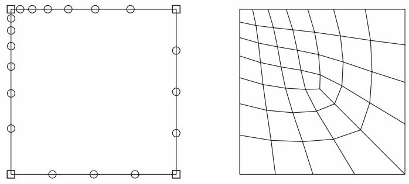  
Figure 1: A model with biased seeding.

For more information, see Understanding seeding.

You can select the shape of the mesh elements. For example, Figure 2 shows a model that has been meshed first with quadrilateral elements and then with triangular elements.

  
Figure 2:Two meshes with different element shapes.

For more information, see Assigning Abaqus element types.

You can choose the meshing technique—free, structured, or swept—and, where applicable, you can choose the meshing algorithm—medial axis or advancing front. For more information, see Mesh generation.  
You can select the element type that is assigned to the mesh by choosing the element family, geometric order, and shape along with specific element controls, such as hourglassing. For more information, see Understanding mesh generation.

## Additional information

• Understanding seeding  
• Assigning Abaqus element types  
• Verifying and improving meshes

## Mesh generation

Abaqus/CAE can use a variety of meshing techniques to mesh models of different topologies. In some cases you can choose the technique used to mesh a model or model region. In other cases only one technique is valid. The different meshing techniques provide varying levels of automation and user control. There are two meshing methodologies available in Abaqus/CAE: top-down and bottom-up.

Top-down meshing generates a mesh by working down from the geometry of a part or region to the individual mesh nodes and elements. You can use top-down meshing techniques to mesh one-, two-, or three-dimensional geometry using any available element type. The resulting mesh exactly conforms to the original geometry. The rigid conformance to geometry makes top-down meshing predominantly an automated process but may make it difficult to produce a high-quality mesh on regions with complex shapes.

Bottom-up meshing generates a mesh by working up from two-dimensional entities (geometric faces, element faces, or two-dimensional elements) to create a three-dimensional mesh. You can use bottom-up meshing techniques to mesh only solid three-dimensional geometry using all—or nearly all—hexahedral elements. Generating a mesh using the bottom-up meshing technique is a manual process, and the resulting mesh may vary significantly from the original geometry. However, allowing the mesh to vary from geometry may allow you to produce a high quality hexahedral mesh on regions with complex shapes.

## Additional information

• Top-down meshing  
• Bottom-up meshing

## Top-down meshing

Top-down meshing relies on the geometry of a part to define the outer bounds of the mesh. The top-down mesh matches the geometry; you may need to simplify and/or partition complex geometry so that Abaqus/CAE recognizes basic shapes that it can use to generate a high-quality mesh. In some cases top-down methods may not allow you to mesh portions of a complex part with the desired type of elements. The top-down techniques—structured, swept, and free meshing—and their geometry requirements are well-defined, and loads and boundary conditions applied to a part are associated automatically with the resulting mesh.

## Structured meshing

Structured meshing is the top-down technique that gives you the most control over your mesh because it applies preestablished mesh patterns to particular model topologies. Most unpartitioned solid models are too complex to be meshed using preestablished mesh patterns. However, you can often partition complex models into simple regions with topologies for which structured meshing patterns exist. Figure 1 shows an example of a structured mesh. For more information, see Structured meshing and mapped meshing.

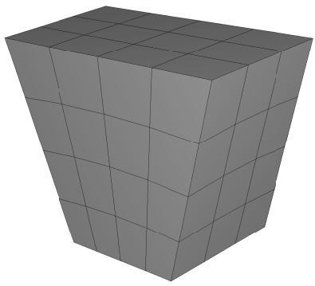  
Figure 1: A structured mesh.

## Swept meshing

Abaqus/CAE creates swept meshes by internally generating the mesh on an edge or face and then sweeping that mesh along a sweep path. The result can be either a two-dimensional mesh created from an edge or a three-dimensional mesh created from a face. Like structured meshing, swept meshing is a top-down technique limited to models with specific topologies and geometries. Figure 2 shows an example of a swept mesh. For more information, see Swept meshing.

  
Figure 2: A swept mesh.

## Free meshing

The free meshing technique is the most flexible top-down meshing technique. It uses no preestablished mesh patterns and can be applied to almost any model shape. However, free meshing provides you with the least control over the mesh since there is no way to predict the mesh pattern. Figure 3 shows an example of a free mesh. For more information, see Free meshing.

  
Figure 3: A free mesh generated with tetrahedral elements.

## Additional information

• Bottom-up meshing  
• Understanding mesh generation  
• Assigning Abaqus element types  
• Verifying and improving meshes

## Bottom-up meshing

Bottom-up meshing uses the part geometry as a guideline for the outer bounds of the mesh, but the mesh is not required to conform to the geometry. Removing this restriction gives you greater control over the mesh and allows you to create a hexahedral or hexahedral-dominated mesh on geometry that is too complex for the structured or swept meshing techniques. Bottom-up meshing can be applied to any solid model shape. It provides you with the most control over the mesh, since you select the method and the parameters that drive the mesh. However, you must also decide whether the resulting mesh is a suitable approximation of the geometry. If it is not, you can delete the mesh and try a different bottom-up meshing method or partition the region and mesh the resulting smaller regions with either bottom-up or top-down meshing techniques.

To mesh a single bottom-up region, you may have to apply several successive bottom-up meshes. For example, you may use an extruded bottom-up mesh to generate part of a region, then use the element faces of the extruded mesh as a starting point to generate a swept mesh for features that the extruded mesh did not include.

Loads and boundary conditions are applied to geometry. Unlike a top-down mesh, a bottom-up mesh may not be fully associated with geometry. Therefore, you should check that the mesh is correctly associated with the geometry in areas where loads or boundary conditions are applied. Proper mesh-geometry association will ensure that the loads and boundary conditions are correctly transferred to the mesh during the analysis. (For more information, see Mesh-geometry association.) Because of the extra effort required by the user to create a satisfactory mesh compared to the automated top-down meshing processes, bottom-up meshing is recommended for use only when top-down meshing cannot generate a suitable mesh.

Figure 1 shows an example of a bottom-up meshed part. Although this part is relatively simple, it requires two regions and four bottom-up meshes to completely mesh the part. Abaqus/CAE displays bottom-up meshed regions using a mixture of the region geometry color (light tan) and the mesh color (light blue) to emphasize that the geometry and mesh may not be associated. Displaying both the geometry and the mesh allows you to view and edit the mesh-geometry associativity.

  
Figure 1: A bottom-up hexahedral meshed part.

## Additional information

• Top-down meshing  
• Understanding mesh generation  
• Assigning Abaqus element types  
• Verifying and improving meshes

• Bottom-up meshing

## Mesh technique color coding

When the Mesh defaults color mapping is selected, Abaqus/CAE uses different colors to indicate which meshing technique, if any, is currently assigned to a region. For example, if a solid region is meshable using the structured meshing technique, the region turns green when you enter the Mesh module; the green color indicates that the structured meshing technique is assigned to that region. Yellow indicates that the sweep meshing technique is applied to a region. If a region is unmeshable using the currently assigned element shape, the region turns orange when you enter the Mesh module. Regions that are pink or light tan have been assigned the free and bottom-up meshing techniques, respectively.


## Note:

You must use the Mesh Controls dialog box to assign the bottom-up meshing technique to a region. Abaqus/CAE does not automatically assign the bottom-up meshing technique and will not indicate whether a region that is assigned the bottom-up technique can also be meshed using a top-down technique. (For more information, see Assigning mesh controls.)

You can change the applicable meshing techniques by partitioning the region into smaller regions with simpler topology, by changing the element shape assigned to the region, or by using the Virtual Topology toolset.

## Additional information

• Determining which regions are meshable  
• Color coding geometry and mesh elements

## Mesh refinement

The Mesh module provides a set of tools that allow you to refine a mesh.

You can use the Partition toolset to divide geometric regions into smaller regions. The resulting partitions introduce new edges that you can seed; therefore, you can combine partitioning and seeding to gain additional control over the mesh generation process. You can also use partitioning to create regions to which you can assign different element types. For example, you might want to assign reduced-integration elements to some portions of your model and fully integrated elements to others. For more information, see The Partition toolset.  
In some cases the geometry contains details such as very small faces and edges. The Virtual Topology toolset allows you to remove these small details by combining a small face with an adjacent face or by combining a small edge with an adjacent edge. Introducing virtual topology is a convenient method for creating a clean, well-formed mesh. For more information, see The Virtual Topology toolset.  
• You can use the Edit Mesh toolset to make minor adjustments to your mesh. For more information, see What can I do with the Edit Mesh toolset?.

## Mesh optimization

You can assign remeshing rules to regions of your model. Remeshing rules enable successive refinement of your mesh based on solution results. After each analysis, the Mesh module adjusts your mesh with the aim of reducing selected error indicators in the solution results. For more information, see Understanding adaptive remeshing, Advanced meshing techniques, and Creating, editing, and manipulating adaptivity processes.

## Mesh verification

The Mesh module provides a set of tools that allow you to verify a mesh and to obtain mesh statistics and mesh information. The Mesh module also provides geometry diagnostic tools that will help you determine why Abaqus/CAE cannot mesh a region. For more information, see Verifying your mesh, Querying your mesh, and Using the geometry diagnostic tools.

## Meshing independent and dependent part instances

The approach to meshing independent and dependent instances is different. For more information, see What is the difference between a dependent and an independent part instance?.

## Independent

To mesh an independent instance, use the context bar to change the Object to Assembly and mesh the instance directly. You cannot mesh a part that you have used to create an independent instance.

## Dependent

To mesh a dependent instance, use the context bar to change the Object to Part and select the part with which the dependent instance is associated. You can then mesh the part, and Abaqus/CAE applies the same mesh to each dependent instance in the assembly. Dependent instances are convenient when you have a linear or radial pattern of part instances. You can mesh the original part, and Abaqus/CAE applies the same mesh to each instance of the part in the pattern.

## Displaying a native mesh

You can switch between displaying the geometry of the part instance and the meshed representation of the same instance.

Click the Show native mesh icon located in the Visible Objects toolbar.

You can use the Show native mesh tool in any of the assembly-related modules to switch between displaying the geometry of the assembly and a meshed representation of the assembly. Abaqus/CAE displays the meshed representation of both independent and dependent part instances in the assembly (assuming that you have created the appropriate meshes).

Toggling between the geometry of a part and its meshed representation using the Show native mesh tool allows you to see how closely the mesh follows the geometry. The tool also allows you to see how Abaqus/CAE incorporated virtual topology into the mesh. In addition, you may find it useful to click on the Show native mesh tool in the Job module. You can then confirm that the entire assembly has been meshed correctly before you submit a job for analysis.

The display of any orphan elements in the model is unaffected by this tool; orphan elements are displayed regardless of whether you display the geometry or elements for the native portion of part instances.

## Understanding seeding

This section explains the concept of seeding and how to use seeding to improve meshes.

## In this section:

What are mesh seeds?  
Can I seed a face or a cell?  
Controlling the seed density  
Applying curvature control to your seeding  
Constraining seeds  
Minimizing seed repositioning  
What is the relationship between vertices and nodes?

## What are mesh seeds?

Seeds are markers that you place along the edges of a region to specify the target mesh density in that region. Both the mesh density along the boundary of the region and the mesh density in the interior of the region are determined by the seeds along the edges of the region.

You can create and control seeds using the Seed menu in the Mesh module main menu bar. Abaqus/CAE generates meshes that match your seeds as closely as possible. Abaqus/CAE can use the following methods to control the distribution of the seeds:

• Position the seeds uniformly along all the edges of a part or part instance  
• Position the seeds uniformly along an edge  
• Position the seeds with a bias such that the mesh density increases toward one end of the edge  
• Position the seeds with a bias such that the mesh density increases from each end toward the center of the edge  
• Position the seeds with a bias such that the mesh density increases from the center toward each end of the edge

Figure 1 shows a combination of uniform seeding and bias seeding.  
  
Figure 1: A model with uniform and bias seeding.

You should apply seeds to all edges. If a uniform seed distribution is sufficient, the recommended approach is to seed the entire part or part instance. If you want more control over the mesh, you can partition the region and then provide seeds along the partitions you have created. This technique is described in greater detail in Verifying and improving meshes.

Mesh seeds specify only a target mesh density. If you are using hexahedral or quadrilateral elements, Abaqus/CAE often changes the element distribution so that the mesh can be generated successfully. You can prevent such adjustments by constraining the number of seeds along an edge. When you constrain seeds, you are prescribing mainly the number of elements along the edge, and, to a lesser extent, the precise locations of the nodes; if necessary, Abaqus/CAE adjusts the locations of the nodes to reduce element distortion. In addition, you should use such constraints with care, since they can make it more difficult for the mesh generator to obtain a mesh.

By default, Abaqus/CAE displays seeds on a part or assembly only when you are defining or modifying seed placement. You can enable persistent seed display if you want the seeds to appear while you perform other operations in the Mesh

module; toggle on in the Visible Objects toolbar to maintain seed display.

## Can I seed a face or a cell?

You can select edges, faces, or cells to seed; however, Abaqus/CAE creates seeds only along edges. When you select faces or cells to seed, Abaqus/CAE creates seeds only along the edges of the faces or cells. In addition, you can select a set or surface to seed; as a result, Abaqus/CAE creates seeds along the edges of the geometry contained in the set or surface.

When you are applying uniform seeds, you can use a combination of the following methods to select the region to which Abaqus/CAE will apply the seeds:

## Individually/By angle

You can select edges, faces, or cells individually; or you can use the angle method to select a group of edges or faces. For example, if you choose the angle method and select an edge, Abaqus/CAE then selects every adjacent edge until the angle between the edges is equal to or exceeds the angle that you entered. For more information, see Using the angle and feature edge method to select multiple objects.

## Selection filters

You can use filters to choose the type of object to select—Edges, Faces, Cells, or All. By default, Abaqus/CAE allows you to select all types of object. The option to select by angle becomes available only after you select Edges or Faces from the selection filters. For more information, see Filtering your selection based on the type of object.

## Sets or surfaces

By default, Abaqus/CAE allows you to apply seeds to edges, faces, and cells that you select from the viewport. Alternatively, you can click Sets/Surfaces on the right of the prompt area and select from eligible sets (or surfaces). When you select a set (or surface), Abaqus/CAE applies seeds to every edge in the set (or surface), including every edge of all the cells and faces. Abaqus/CAE ignores any vertices in the set (or surface).

## Controlling the seed density

You can use the following methods to control the seed density along selected edges:

• Specify the average element size for every edge of the entire part or part instance.  
• Specify the number of elements desired along an edge.  
• Specify the average element size along an edge. (If the edge length is not an integer multiple of the element length, Abaqus/CAE will change the element length slightly to obtain an integer number of elements along the edge.)  
Specify a nonuniform distribution of elements along an edge. The element density can increase from one end of the edge to the other (single bias), or the element density can vary from the center of the edge to each end (double bias). For a nonuniform distribution you can specify either of the following:

- The number of elements desired along an edge and a bias ratio. The bias ratio is the ratio of the largest element to the smallest element.  
The size of the smallest element and the size of the largest element.

If you select edges that you previously seeded using a combination of these methods, Abaqus/CAE provides an As Is option that allows you to retain the seeding method. Abaqus/CAE provides a similar option if you select edges with a mixture of curvature controls or seed constraints.

For detailed instructions on prescribing seed density, see the following sections:

Defining seed density for an entire part or part instance  
Seeding an edge by prescribing the number of elements  
Seeding an edge by prescribing element size  
Prescribing biased seeding along an edge  
Applying constraints to edge seeds  
Seeding previously meshed parts, part instances, or regions  
Deleting part or instance seeds  
Deleting edge seeds

Seeds created by specifying an average element size for the entire part or part instance are called part seeds or instance seeds, respectively, and appear in white; seeds created using the other methods are called edge seeds and appear in magenta. Edge seeds always override part or instance seeds; therefore, when you specify the average element size for the entire part or part instance, part or instance seeds appear only on edges of the region that do not already have edge seeds. New edges created by partitioning are given part or instance seeds by default.

When you seed an edge of a region that is assigned the swept or revolved mesh technique, the edge seeding tools automatically propagate seeds from the selected edge to the matching edges in the region. In other words, the seeds on the face or edge at the beginning of the sweep path are propagated automatically to the face or edge at the end of the sweep path. Likewise, the seeds created on one edge along the sweep path are propagated automatically to the other edges along the sweep path. As a result, even though you select a single edge of a face to seed, Abaqus/CAE will propagate the seeds to additional edges and faces. For more information, see What is swept meshing?.

## Applying curvature control to your seeding

The part seeding tool allows you to specify a target element size when you are seeding a part, a part instance, or multiple edges. If the geometry is relatively regular, specifying a single target element size can result in an acceptable mesh. However, if you specify a single target element size and the geometric features that make up the part or edges vary in size, the resulting mesh may be too coarse to adequately represent any small features, as shown in Figure 1.

  
Figure 1: Seeding and the resulting mesh with no curvature control.

To avoid the problem of inadequate seeding around small curved features, Abaqus/CAE applies curvature control when it seeds a part, a part instance, or edges. Curvature control allows Abaqus/CAE to calculate the seed distribution based on the curvature of the edge along with the target element size. Figure 2 shows the same part seeded and meshed with curvature control enabled.

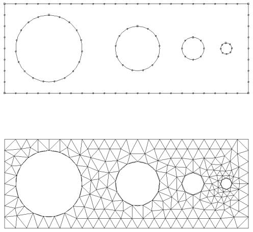  
Figure 2: Seeding and the resulting mesh with curvature control enabled.

You can configure the following to specify how curvature control will influence the seeding:

## Deviation factor

The deviation factor is a measure of how much the element edges deviate from the original geometry, as shown in Figure 3.

  
Figure 3: Deviation factor.

To help you visualize the deviation factor, Abaqus/CAE displays the approximate number of elements it would create around a circle corresponding to the setting that you enter. As you reduce the deviation factor, the number of elements that Abaqus/CAE would create around a circle increases. This number is only a visual aid; for example, if you are seeding a spline or an ellipse, Abaqus/CAE creates a different number of elements, depending on the local curvature along the edge.

## Specify minimum size factor

Specifying a minimum size factor prevents Abaqus/CAE from creating very fine meshes in areas of high curvature that you have no interest in modeling; for example, kinks in spline curves or fillets with a very small radius. The number that you enter representing the minimum size is the fraction of the global seed size. As a result, if you change the global seed size, you do not have to change the minimum size factor.

For detailed instructions on applying curvature control, see Defining seed density for an entire part or part instance.

## Constraining seeds

By default, mesh seeds prescribe only a target mesh density. Abaqus/CAE generally matches the mesh seeds exactly when you are using the free meshing technique to generate triangular- or tetrahedral-shaped elements. However, in other cases Abaqus/CAE may alter the element distribution so that it can successfully generate the mesh. If you want to prevent Abaqus/CAE from altering the element distribution, you can fix a specific number of elements along an edge by constraining the seeds along that edge. You can constrain only edge seeds, not part or instance seeds.

You can assign any one of the following three states to a group of seeds along an edge:

## Unconstrained

This is the default setting. The number of elements along an edge can either increase or decrease so that the mesh can become denser or coarser than is specified by the seeds. Unconstrained seeds appear as open circles.

## Partially constrained

The number of elements along an edge may be increased during mesh generation but cannot be decreased. This constraint allows the mesh to become denser than is specified by the seeds but no coarser. Partially constrained seeds appear as upward-pointing triangles.

## Fully constrained

The number of elements specified by constrained seeds along an edge cannot be altered by the mesh generation process. When the seeds are fully constrained, the mesh generation will attempt to allow the location of the nodes to correspond exactly to the location of the seeds. However, an exact match between the seeds and the nodal positions is not guaranteed. Fully constrained seeds appear as squares.

Abaqus/CAE always creates a fully constrained seed at each geometric vertex of a region to indicate that a finite element node will be positioned at each vertex.

In many cases the mesh generator must redistribute elements (and deviate from the number and location of the seeds) to generate a mesh successfully. For the greatest likelihood of meshing success, leave seeds unconstrained or at least avoid fully constraining large numbers of seeds in a given part or part instance so that the mesh generator has as much freedom to redistribute seeds as possible.

For detailed instructions on constraining edge seeds, see the following sections :

Applying constraints to edge seeds  
Relaxing constraints using the error dialog box

## Minimizing seed repositioning

During the mesh generation process Abaqus/CAE uses the seeds that you create as target locations for nodes along the edges of the mesh. However, if you are using quadrilateral- or hexahedral-shaped elements, a close match between your seeds and nodes depends heavily on the following:

## The element shapes you allow in transition regions

You will obtain a better match between your seeds and the nodes of the mesh if you allow triangular elements in transition regions. The seeds and the nodes are less likely to match if you restrict your mesh to including only quadrilateral elements.

## The mesh transition setting

You will obtain a better match between your seeds and the nodes of the mesh if you allow for mesh transition.

## The meshing technique

The mesh generated using the advancing front meshing algorithm matches your seeding better than the mesh generated using the medial axis algorithm.

## The seed constraints

Fully constrained seeds closely match the generated nodes in both number and position. However, you must fully constrain only a few edges of a part or part instance; otherwise, Abaqus/CAE will not be able to generate a mesh.

## How neighboring regions are seeded

When meshing multiple regions, Abaqus/CAE often redistributes the elements so that the mesh is compatible between regions. Even though a single region's seed arrangement may be adequate for generating a mesh on that one region, the seed arrangement may need to be changed since the number of elements must be compatible with neighboring regions along shared edges.


## Note:

Mesh compatibility between part instances is not guaranteed. In some simple cases seeding can help achieve part-to-part mesh compatibility. Techniques for obtaining compatible meshes are described in Compatible meshes between part instances.

Abaqus/CAE tries to adhere as closely as possible to the number and location of seeds that you specified when balancing the element redistribution for the entire model. If given a choice between making a large change along a single seeded edge and making a small change to many edges, Abaqus/CAE will make many small changes.

## What is the relationship between vertices and nodes?

When you seed a model, Abaqus/CAE automatically places fully constrained seeds wherever vertices appear along the model's edges. Fully constrained seeds that appear at vertices always indicate that nodes will appear at those vertices. (Fully constrained seeds that appear at other locations along an edge of a region do not indicate the exact location of nodes; they indicate only the number of nodes along that edge.) Therefore, when you sketch a part, you should keep in mind that the location of vertices in the part influences the quality of the mesh that Abaqus/CAE can generate. (For information about altering vertex locations, see Dragging Sketcher objects.)

For example, Figure 1 shows a sketch of a two-dimensional part.

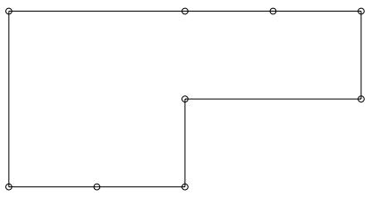  
Figure 1: Vertices on a two-dimensional part.

Note the locations of the nine vertices. These vertices were created by sketching several line segments along the top and bottom edges rather than one continuous line segment along each edge.

When that part or an instance of the part is seeded, square-shaped, fully constrained seeds appear at each vertex, as shown in Figure 2.

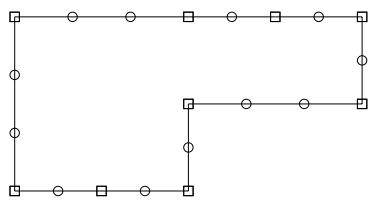  
Figure 2: Fully constrained seeds appear at each vertex.

When the model is meshed, Abaqus/CAE always places nodes at the location of the fully constrained seeds that are located at vertices, as shown in Figure 3.

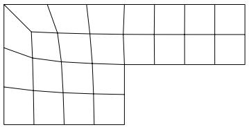  
Figure 3: Nodes appear at the vertices.

Likewise, Figure 4 shows the sketch of two concentric circles that will be extruded to form a hollow cylinder.

  
Figure 4: Concentric circles with aligned vertices.

Note the location of the vertices, which the Sketcher creates at the locations you click to define the circles' perimeters. When the cylinder is seeded, square-shaped, fully constrained seeds appear at each vertex, as shown in Figure 5.

  
Figure 5: Fully constrained seeds appear at each vertex.

When the model is meshed, nodes always appear at the location of the fully constrained seeds that are located at vertices, as shown in Figure 6.

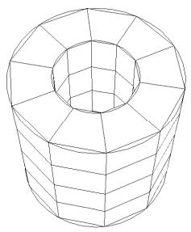  
Figure 6: Nodes appear at the vertices.

If you do not align the two vertices when you sketch the cylinder, you risk generating a distorted mesh. For example, the vertices of the two concentric circles are not aligned in Figure 7.

  
Figure 7: Concentric circles whose vertices are not aligned.

As a result, the mesh is slightly distorted on the right side, as shown in Figure 8.

  
Figure 8: A distorted mesh.

## Assigning Abaqus element types

This section explains how to assign Abaqus/Standard and Abaqus/Explicit element types to geometric regions and to orphan elements.

## In this section:

How do mesh elements correspond to Abaqus elements?  
What kinds of elements must be generated outside the Mesh module?  
Element type assignment  
Preferred element types list

## How do mesh elements correspond to Abaqus elements?

The Mesh module can generate meshes containing the following element shapes.

One-Dimensional  
  
Lines

Two-Dimensional  
  
Triangles

  
Quadrilaterals

Three-Dimensional  
  
Tetrahedra


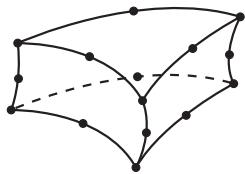  
Triangular prisms (wedges)

  
Hexahedra  
Figure 1: Element shapes.

Most elements in Abaqus/Standard and Abaqus/Explicit correspond to one of the shapes shown; that is, they are topologically equivalent to these shapes. For example, although the elements CPE4, CAX4R, and S4R are used for stress analysis, DC2D4 is used for heat transfer analysis, and AC2D4 is used for acoustic analysis, all five elements are topologically equivalent to a linear quadrilateral.

Every mesh region has one or more Abaqus element types assigned to it by default. Each element type corresponds to an element shape that can be used in the region. For example, a shell mesh region typically has a quadrilateral and a triangular element type assigned to it by default. However, you can change the element assignment for any Abaqus element that is topologically equivalent to the element shape assigned to the region. As a result, you can choose to mesh a shell region with only all triangular elements, and Abaqus/CAE ignores the quadrilateral element assignment.

To change the element assignment to an Abaqus element that is topologically equivalent to the element shape assigned to the region, select Mesh->Element Type from the main menu bar. Similarly, you can select Mesh->Controls to select the element shape for meshing.

However, since no element type checking is done until you submit the analysis, it is possible to choose an element that is inappropriate for the analysis you will be conducting. For example, Abaqus/CAE does not prevent you from specifying heat transfer elements such as DC2D4, even though you may be conducting a stress analysis.

## What kinds of elements must be generated outside the Mesh module?

Abaqus/CAE provides support for most of the elements that are used by Abaqus/Standard and Abaqus/Explicit. However, some elements are not supported and must be generated outside the Mesh module.

The following list describes the elements that are not supported by Abaqus/CAE. If you want to assign these element types to a model, you must use a text editor to add them to the input file generated in the Job module. For information on generating the input file, see Basic steps for analyzing a model.

• Acoustic interface element (ASI1)  
• Coupled thermal-electrical-structural elements (Q3D4, Q3D6, etc.)  
• Distributing coupling elements (DCOUP2D and DCOUP3D)  
• Drag chain elements (DRAG2D and DRAG3D)  
• Elastic-plastic joint elements (JOINT2D and JOINT3D)  
• Frame elements (FRAME2D and FRAME3D)  
• Gap elements, coupled temperature-displacement and heat transfer (GAPUNIT and DGAP)  
• Infinite elements (CIN3D8, CINAX4, etc.)  
• Line spring elements (LS3S and LS6)  
• Membrane elements, 9-node quadrilateral (M3D9 and M3D9R)  
• Membrane elements, cylindrical (MCL6 and MCL9)  
• Particle element (PC3D)  
• Pipe-soil interaction elements (PSI24, PSI34, etc.)  
• Slide line elements (ISL21A and ISL22A)  
• Stress/displacement variable node elements (C3D15V, C3D27, etc.)


## Note:

After you submit the analysis for execution, Abaqus/Standard automatically converts any C3D20(R)(H) element that is adjacent to a secondary surface in a contact pair into the corresponding C3D27(R)(H) element. (Neither element is available in Abaqus/Explicit.) Otherwise, there is no way to generate variable node hexahedra with Abaqus/CAE.

• Surface elements, cylindrical (SFMCL6 and SFMCL9)  
• Thin shell element, 9-node doubly curved (S9R5)  
• Tube-to-tube contact elements (ITT21 and ITT31)  
• Poroelastic acoustic elements (C3D4A, C3D6A, and C3D8A)

Some pyramid elements, such as C3D5 and AC3D5, are supported by Abaqus/CAE in that they can be imported from and written to input files. However, Abaqus/CAE has no meshing algorithms that generate a pyramid shape. You can assign a different pyramid element type to existing pyramid elements in the Mesh module.

You cannot assign some elements, such as CONN2D2 and SPRING1 in the Mesh module; however, you can create equivalent connectors in the Interaction module or engineering features in the Property module or Interaction module as shown in Table 1. These elements are written to the input file.

Table 1: Abaqus/CAE support for connectors and engineering features.

<table><tr><td>Elements</td><td>Abaqus/CAE support</td></tr><tr><td>CONN2D2, CONN3D2</td><td>Equivalent connector in Interaction module</td></tr><tr><td rowspan="2">DASHPOTA, DASHPOT1, DASHPOT2</td><td>Engineering feature in Property module or Interaction module (linear behavior independent of field variables)</td></tr><tr><td>Equivalent connector in Interaction module</td></tr><tr><td>GAPCYL, GAPSPHER, GAPUNI</td><td>Equivalent connector in Interaction module</td></tr><tr><td>HEATCAP</td><td>Engineering feature in Property module or Interaction module</td></tr><tr><td>ITSCYL, ITSUNI</td><td>Equivalent connector in Interaction module</td></tr><tr><td>JOINTC</td><td>Equivalent connector in Interaction module</td></tr><tr><td>MASS</td><td>Engineering feature in Property module or Interaction module</td></tr><tr><td>ROTARYI</td><td>Engineering feature in Property module or Interaction module</td></tr><tr><td rowspan="2">SPRINGA, SPRING1, SPRING2</td><td>Engineering feature in Property module or Interaction module (linear behavior independent of field variables)</td></tr><tr><td>Equivalent connector in Interaction module</td></tr></table>

For more information, see Understanding connectors, Inertia, and Springs and dashpots.

## Element type assignment

You can assign element types to geometric regions and to orphan mesh elements.

Element types can be assigned to the following:

• A region selected from geometry-based parts or part instances. The part instances must have come from parts that you created in the Part module or from parts that you imported.  
• A set that refers to a region selected from geometry-based parts or part instances. The set can also refer to a skin reinforcement.  
• An orphan element or element set.

All regions from geometry-based parts or part instances have default element type assignments. These assignments depend on the kind of part to which the region or element belongs. You can also specify a list of preferred element types for element type assignment (see Preferred element types list, for more information).

You can view and change the Abaqus element types that are assigned using the Element Type dialog box, which you can display by selecting Mesh->Element Type. For example, the Element Type dialog box for a two-dimensional structural region is shown in Figure 1.

  
Figure 1:The Element Type dialog box for a two-dimensional structural region in an Abaqus/Standard model.

At the top of the dialog box, you enter your preferences for element library, geometric order, and family. Then, you select a specific element type by clicking the tabs in the bottom half of the dialog box and choosing from the options that appear. For more information on the element control options, see Section Controls.

The dialog box can contain from one to three tabs depending on the dimensionality of the selected region or regions:

• The Line tab allows you to choose an applicable element type and assign it to one-dimensional mesh elements in the region.  
• The Quad and Tri tabs allow you to choose an applicable element type and assign it to two-dimensional mesh elements in the region.  
• The Hex, Wedge, and Tet tabs allow you to assign three-dimensional element types to the three-dimensional mesh elements in the region.

For example, in Figure 1 the options for a linear shell element from the Abaqus/Standard element library are selected. After clicking the Quad tab, reduced integration and finite membrane strains are selected. The name and a brief description of the quadrilateral shell element that meets all of these criteria appear at the bottom of the tabbed page.

The Tri tab in this dialog box is shown in Figure 2. The name and a brief description of the triangular shell element that meets all of the criteria specified in the dialog box appear at the bottom of the Tri tabbed page in Figure 2. If the selected region in this example happens to contain a combination of triangular and quadrilateral mesh elements:

• The quadrilateral mesh elements are assigned the S4R element type.  
• The triangular mesh elements are assigned the S3 element type.

  
Figure 2: The Tri tab.

If the region contains only quadrilateral elements, all of the elements are assigned the S4R element type.

For detailed, step-by-step instructions for assigning element types to a mesh region, see Associating Abaqus elements with mesh regions. For lists of the element types that are available, see the Abaqus/Standard Element Index and the Abaqus/Explicit Element Index. You can select most of these elements through the Element Type dialog box. What kinds of elements must be generated outside the Mesh module? describes the elements that cannot be selected.

## Preferred element types list

You can specify a list of preferred element types for element type assignment.

Abaqus/CAE must be run interactively to use preferred element types. The list must be created prior to loading the Mesh module in Abaqus/CAE.

When a part or part instance that has never been assigned an element type is meshed, the preferred element type list is consulted. If an element type appropriate to the geometry is found in the list, it is assigned to the geometry. Multiple element types representing different shapes (for example, triangles and quadrilaterals) can be assigned in combination, but only element types that are compatible with each other are used. When more than one appropriate element type is found in the list, the first element type encountered takes precedence.

The list is also consulted when populating the Element Type dialog box such that preferred element types are selected by default for a region not previously assigned any element types. If you click Defaults in the dialog box, the default element types (not the preferred element types) are displayed.

You can specify the preferred element types list in either the abaqus\_v6.env or the custom\_v6.env environment file. It is recommended that you specify the list of preferred element types in the onCaeStartup() function in the environment file. For example:

```python
def onCaeStartup():
    import mesh
    prefElems=(mesh.C3D8T, mesh.C3D10MT, mesh.S8R)
    session.defaultMesherOptions.setValues(guiPreferredElements=prefElems)
```

• Using the Abaqus environment files

## Verifying and improving meshes

This section explains how you use the tools in the Mesh module to verify your mesh quality, to control mesh generation, and to improve the mesh quality.

## In this section:

Verifying your mesh  
Querying your mesh  
Why partition in the Mesh module?  
How are seeds and other attributes affected by partitioning?  
Regenerating partitions after modifying geometry  
Using virtual topology to improve your mesh  
Using adaptive remeshing to improve your mesh

## Verifying your mesh

Upon completion of a meshing operation, Abaqus/CAE highlights any bad elements in the mesh. Abaqus/CAE also provides a set of tools in the Mesh module that allow you to verify the quality of your mesh and to obtain information about the nodes and elements in the mesh. You can use these tools to isolate regions where the mesh quality is poor and to guide you if you need to refine your mesh. To verify the quality of the mesh, choose the Object from the context bar, and select Mesh->Verify from the main menu bar. You can then select the part, part instances, geometric regions, or element to verify. Abaqus/CAE allows you to choose between checking that your mesh will pass the quality tests in the analysis products and checking that your mesh passes individual quality checks, such as checking for elements with a large aspect ratio. Any elements that do not pass the specified criteria are highlighted in the viewport, and you can choose to create and save a set containing the highlighted elements or, if applicable, the cells, faces, or edges related to those elements. For detailed information on using the mesh verify tools, see Verifying element quality.

You can use the Analysis checks to verify that the elements in your mesh will pass the element quality checks that are included with the input file processor in Abaqus/Standard or Abaqus/Explicit. Abaqus/CAE highlights any elements that fail the mesh quality tests and displays the number of elements tested along with the number of errors and warnings in the message area. The mesh quality tests in the input file processor are extensive and specific to each element type. At a minimum, the mesh quality tests issue a warning for elements that seem inappropriately distorted, and the tests issue an error if the distortion is severe. Abaqus/CAE does not support analysis checks for beam, gasket, or cohesive elements.

You can use the Shape metrics to highlight elements of a selected shape that do not meet one of the following selection criteria:

## Shape factor

Abaqus/CAE highlights elements with a normalized shape factor smaller than a specified value. The shape factor criterion is available only for triangular and tetrahedral elements. The shape factor ranges from 0 to 1, with 1 indicating the optimal element shape and 0 indicating a degenerate element.

• For triangular elements the normalized shape factor is defined as

$$
\text {shape factor} = \frac {\text {element area}}{\text {optimal element area}}.
$$

Optimal element area is the area of an equilateral triangle with the same circumradius as the element. (The circumradius is the radius of the circle passing through the three vertices of the triangle.)

• For tetrahedral elements the normalized shape factor is defined as

$$
\text {shape factor} = \frac {\text {element volume}}{\text {optimal element volume}}.
$$

Optimal element volume is the volume of an equilateral tetrahedron with the same circumradius as the element. (The circumradius is the radius of the sphere passing through the four vertices of the tetrahedron.)

## Small face corner angle

Abaqus/CAE highlights elements containing faces where two edges meet at an angle smaller than a specified angle.

## Large face corner angle

Abaqus/CAE highlights elements containing faces where two edges meet at an angle larger than a specified angle.

## Aspect ratio

Abaqus/CAE highlights elements with an aspect ratio larger than a specified value. The aspect ratio is the ratio between the longest and shortest edge of an element.

Table 1 shows the default limits for the selection criteria based on the element shape.  
Table 1: Element shape selection criteria limits.

<table><tr><td>Selection criterion</td><td>Quadrilateral</td><td>Triangle</td><td>Hexahedra</td><td>Tetrahedra</td><td>Wedge</td></tr><tr><td>Shape factor</td><td>N/A</td><td>0.01</td><td>N/A</td><td>0.0001</td><td>N/A</td></tr><tr><td>Smaller face corner angle</td><td>10</td><td>5</td><td>10</td><td>5</td><td>10</td></tr><tr><td>Larger face corner angle</td><td>160</td><td>170</td><td>160</td><td>170</td><td>160</td></tr><tr><td>Aspect ratio</td><td>10</td><td>10</td><td>10</td><td>10</td><td>10</td></tr></table>

You can use the Size metrics to highlight elements that do not meet one of the following selection criteria:

## Geometric deviation factor

Abaqus/CAE highlights elements with an edge whose geometric deviation factor is greater than the specified value. The geometric deviation factor is a measure of how much an element edge deviates from the original geometry, and Abaqus/CAE calculates this value by dividing the maximum gap between an element edge and its parent geometric face or edge by the length of the element edge. By default, Abaqus/CAE highlights elements whose geometric deviation factor is greater than 0.2.

Abaqus/CAE calculates the geometric deviation factor only for elements in a native mesh. If you select a part that contains no geometry, Abaqus/CAE disables this option in the Verify Mesh dialog box. If your selection includes both native and orphan elements, Abaqus/CAE considers only the native elements for calculations of geometric deviation factor.

## Short edge

Abaqus/CAE highlights elements with an edge shorter than a specified value.

## Long edge

Abaqus/CAE highlights elements with an edge longer than a specified value.

## Stable time increment

Abaqus/CAE highlights elements with a calculated stable time increment less than the specified value. The stable time increment calculation requires a suitable material definition and section assignment and is meaningful only for Abaqus/Explicit analyses.

The stable time increment calculation in Abaqus/CAE is an approximation of the initial stable time increment calculation made by Abaqus/Explicit for an element-by-element formulation. It does not account for any of the following conditions:

• Mass scaling  
Point mass  
• Rotary inertia

• Nonstructural mass  
• Reinforcement (rebar)

Material behaviors supported for the stable time increment calculation in Abaqus/CAE include elastic, hyperelastic, hyperfoam (without user-defined test data), and acoustic medium. Composite sections with multiple materials are not supported. For more information, see Stability.

## Maximum allowable frequency for acoustic elements

Abaqus/CAE highlights finite acoustic elements that may not be valid for modal or steady-state dynamic analyses in Abaqus/Standard above the specified frequency value. The maximum allowable frequency calculation requires a suitable material definition and section assignment. The calculation is a guideline based on approximately 10 elements per wavelength:

$$
f _ {m a x} = \frac {P C _ {o}}{1 0 h},
$$

where P is the interpolation order (1 or 2), h is the size of the element bounding box, and $C _ { o }$ is the speed of

sound $\left( { \sqrt { \frac { b u l k ~ m o d u l u s } { d e n s i t y } } } \right)$

In addition, for both shape and size metrics Abaqus/CAE displays the following information in the message area for each selected part, part instance, or region:

• The name of the part or part instance.  
• The total number of elements of the selected shape in the part instance or in the selected regions.  
• The number of highlighted elements and the percentage of the elements being verified that these elements comprise.  
The average value of the selection criterion. For the geometric deviation factor, Abaqus/CAE calculates the average value by considering only elements along a curve or face; solid elements in the center of a volume are excluded from this value.  
• The “worst” value of the selection criterion—the value closest to the criterion if it is not exceeded or the value farthest beyond the criterion if it is exceeded.

## Querying your mesh

The Query toolset in the Mesh module allows you to obtain information about the nodes and elements in the mesh. In addition, you can select Tools->Query from the main menu bar to request the following information about the mesh:

• The total number of nodes and elements in a selected part, part instance, or region along with the number of elements of each element shape.  
• The type and connectivity of a selected element.  
• The positive and negative sides of shell and membrane faces.  
• The direction of beam and truss tangents.  
• The mesh stack orientation.  
• Whether any edges of boundary faces have incompatible interfaces, cracks, or gaps and whether any edges intersect other faces.  
• The location of free or non-manifold edges—exterior shell or solid element edges that are not shared by exactly two exterior elements.  
• The location of any unmeshed regions.

For detailed information on using the Query toolset, see Obtaining mesh information.

## Why partition in the Mesh module?

You can use the Partition toolset to divide parts or independent part instances into smaller regions. There are three reasons to create partitions in the Mesh module:

To divide a complex, three-dimensional part or instance into simpler regions that Abaqus/CAE can mesh using primarily hexahedral elements with the structured or swept meshing techniques. (Almost all three-dimensional parts are meshable using the free meshing technique, but three-dimensional free meshes can include only tetrahedral elements.)  
• To gain more control over mesh generation.  
• To obtain regions to which you can assign different element types.

See The Partition toolset for detailed information on how to use each tool in the Partition toolset.

You can partition only parts or independent part instances. If you need to partition a dependent instance, you can partition the original part from which the dependent instance was created. Alternatively, you can create a copy of the original part and then create an independent instance of the copy. You can then replace the dependent instance with the new independent instance and partition the independent instance. For more information, see What is the difference between a dependent and an independent part instance?.

By default, the free meshing technique with quadrilateral elements is applied to all two-dimensional parts and part instances. When you create the mesh using this default technique, Abaqus/CAE implicitly creates partitions that divide the part into regions that can be meshed using the structured meshing technique. (For more information, see Free meshing with quadrilateral and quadrilateral-dominated elements.) Therefore, all two-dimensional parts are meshable without any manual partitioning.

However, when a three-dimensional part or instance is unmeshable using hexahedral elements, you must take one of the following steps:

• Change the element shape from hexahedra to tetrahedra so that the free meshing technique can be applied.  
• Partition into structured- or swept-meshable regions.

When the Mesh defaults color mapping is selected, Abaqus/CAE uses the color orange to indicate that a three-dimensional region is unmeshable using the currently assigned element shape. For example, Figure 1 illustrates a part that cannot be meshed with hexahedral elements.

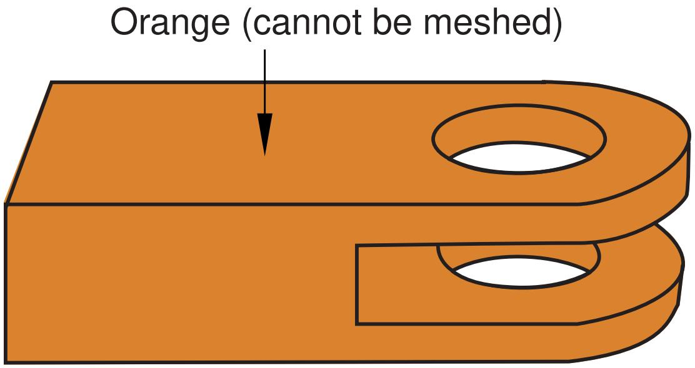  
Figure 1: Unmeshable three-dimensional region.

With the addition of a partition, the part can be meshed with hexahedral elements, as shown in Figure 2; the green region can be meshed using the structured meshing technique, and the yellow regions can be meshed using the swept meshing technique.

  
Figure 2:The model is partitioned into three regions.

Even when a part or instance can be meshed without partitioning, you may still want to partition to gain more control over mesh generation. Without partitions, the mesh is aligned only along the exterior edges; with partitions, the resulting mesh will have rows or grids of elements aligned along the partitions. That is, the mesh “flows” along the partitions. For example, in Figure 3 the partition that divides the rectangle in two causes the mesh to flow at an angle along the partition.

  
Figure 3:The mesh flows along the partition.

You can use the additional edges created by partitioning a face to control the mesh characteristics. For example, Figure 4 illustrates how a partition and local mesh seeds allow you to control the mesh flow and density.

  
Figure 4: A partition and local mesh seeds allow you to control the mesh flow and density.

Similarly, Figure 5 shows how partitioning and local mesh seeds allow you to refine the mesh in the area of a stress concentration.

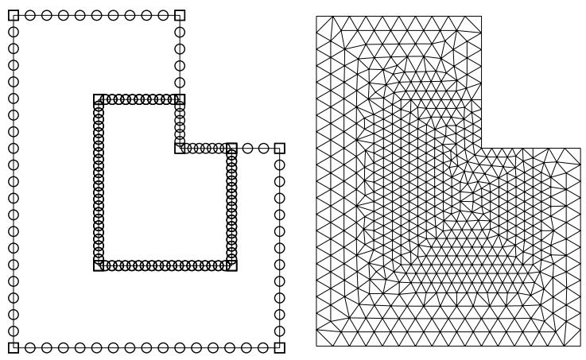  
Figure 5: Partitioning and local mesh seeds allow you to refine the mesh in the area of a stress concentration.

In addition, you can apply different mesh controls, such as element shape, to the regions created by a partition.

When partitioning, remember that partitions will become element boundaries. Therefore, try to ensure that partitions make angles as close to 90° as possible with other partitions or edges. In addition, you should avoid creating unwanted short edges that will distort the mesh.

## How are seeds and other attributes affected by partitioning?

Seed distributions along edges you have seeded may change during the partitioning process; Abaqus/CAE redistributes the seeds to accommodate any new vertices created by partitioning. For example, the left and right edges of the part instance in Figure 1 are seeded with seven elements per edge.

  
Figure 1:The left and right edges each have seven elements.

If you create a partition that splits the part instance into two regions, new vertices are created at the midpoints of both edges. In Figure 2 you can see how Abaqus/CAE added seeds at the new vertices so that nodes will exist at the corners of each region.

  
Figure 2: Redistribution of seeds.

Abaqus/CAE also redistributed the existing seeds to eliminate any overly small elements created by the new partition. However, this redistribution can result in seeds that are not aligned. The top region has one seed more on the left side than it does on the right, and the reverse is true for the bottom region. In this example you could change the number of elements along the right and left edges to an even number to ensure that the seeds align after partitioning.

Any other mesh attributes, such as element shape or element type, that you have applied are applied automatically to each new region that you create with a partition. However, once you have created the different regions, you can assign different mesh attributes to each region.

## Regenerating partitions after modifying geometry

Partitions are features associated with the part or part instance; therefore, you can modify and regenerate them like any other feature.

For example, consider the partition on the right side of the part instance shown in Figure 1.

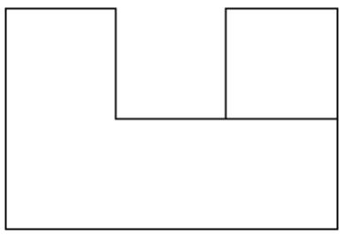  
Figure 1: A partitioned part instance.

If you return to the Part module and widen the right side of the model, the partition also expands and continues to divide the face into two regions, as shown in Figure 2.

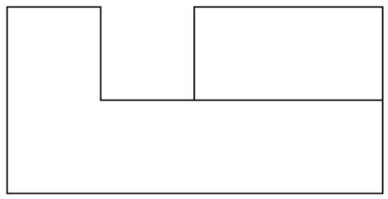  
Figure 2:The partition is regenerated.

Sometimes regeneration of a partition creates unmeshable regions. In this situation simply add, modify, or delete partitions until the part instance becomes meshable again.

## Using virtual topology to improve your mesh

In some cases parts or independent part instances contain details such as very small faces and edges. The Virtual Topology toolset allows you to remove these small details by combining a small face with an adjacent face or by combining a small edge with an adjacent edge. You can also ignore selected edges and vertices, which has the same effect as combining faces and edges. Introducing virtual topology is a convenient method for creating a clean, well-formed mesh. The Virtual Topology toolset is available only in the Mesh module.

However, adding virtual topology to a part instance can restrict your ability to subsequently mesh the part instance. For example, you cannot mesh regions that contain virtual topology using the following techniques:

• Two-dimensional free meshing with quadrilateral or quadrilateral-dominated elements using the medial axis algorithm.  
• Three-dimensional swept meshing using the medial axis algorithm.  
• Two-dimensional structured meshing if the region to be meshed is not bounded by four corners.  
• Three-dimensional structured meshing if the region to be meshed is not bounded by six sides.

For more information, see The Virtual Topology toolset.

In addition, you can apply virtual topology only to independent instances. If you need to apply virtual topology to a dependent instance, you can create a copy of the original part and then create an independent instance of the copy. You can then replace the dependent instance with the new independent instance and apply virtual topology to the independent instance. For more information, see What is the difference between a dependent and an independent part instance?.

## Using adaptive remeshing to improve your mesh

In many cases you will not know the adequacy of your mesh refinement for your particular solution goal until you have executed a number of analyses and evaluated the solution results. Mesh refinement studies are typically performed in these cases, where a mesh is successively refined and key solution results are confirmed to converge. You can automate this process by applying remeshing rules to regions of interest in your model and using the Abaqus/CAE adaptive remeshing process to automatically perform successive mesh refinement based on a series of executed analyses.

With a remeshing rule you can specify:

• The region where you want the mesh refined.  
• The solution quality criteria (for example error indicators in the Mises stress) that mesh refinement is based on.  
• The analysis step or steps that refinement is based on.  
• Minimum and maximum element size constraints.  
• A sizing algorithm and parameters appropriate to your simulation.

For more information, see Advanced meshing techniques and Creating, editing, and manipulating adaptivity processes.

## Understanding mesh generation

This section explains basic concepts and terminology related to meshes and mesh generation.

## In this section:

Generating a mesh  
Preserving the precision of nodal coordinates  
Determining which regions are meshable  
What should I do if a region fails to mesh?  
What is a mesh transition?  
What is the difference between the medial axis algorithm and the advancing front algorithm?  
What kinds of meshes cannot be generated automatically?  
When will Abaqus/CAE delete a mesh?  
Do I have to mesh the entire model in one operation?  
Can I change the geometric order of the elements in a mesh?

## Generating a mesh

Most meshing in Abaqus/CAE is completed in a “top-down” fashion.

This means that the mesh is created to conform exactly with the geometry of a region and works down to the element and node positions.

1. Abaqus/CAE follows these basic steps to generate a mesh:

Generate a mesh on each top-down region using the meshing technique currently assigned to that region. By default, Abaqus/CAE generates meshes with first-order line, quadrilateral, or hexahedral elements throughout.

2. Merge the meshes of all regions into a single mesh. Typically, Abaqus/CAE merges the nodes along the common boundaries of neighboring regions into a single set of nodes. However, in certain cases Abaqus/CAE creates tied surface interactions instead of merging these nodes; for example, along the common interface between hexahedral and tetrahedral meshes. For more information, see Meshing multiple three-dimensional solid regions.

Top-down meshes generated by Abaqus/CAE conform to the geometry of the part or part instance they discretize, as shown in Figure 1:

  
Figure 1:The mesh conforms to the geometry of the part instance.

• A node is generated at each geometric vertex.  
• A connected set of element edges is generated along each geometric edge.  
• A connected set of element faces is generated along each geometric face.  
• Nodes that are on the boundary of the mesh (including the midside nodes of second-order elements) are also on the boundary of the geometry.  
• Midside nodes of internal second-order elements are centered between the end nodes of the element edges.

For detailed, step-by-step instructions on creating a top-down mesh, see Creating a mesh.

Relying directly on the geometry to form the outer mesh boundaries can impact mesh quality as Abaqus/CAE creates elements to fill small details. In some cases you may not be able to implement a partitioning strategy that allows you to apply a top-down swept or structured meshing technique on a complex region. For solid regions, you can use the “bottom-up” meshing technique in place of the automated top-down meshing techniques to generate a hexahedral mesh. Bottom-up meshing is a manual, incremental meshing process that builds up a three-dimensional mesh from two-dimensional entities. You define the regions that will be meshed using the bottom-up technique, control the meshing process, decide whether the resulting mesh meets your needs, and—since the mesh is not required to conform to the geometry— control the associativity of the geometry to the mesh. For more information on bottom-up meshing, see Bottom-up meshing.

## Preserving the precision of nodal coordinates

When you create a part in the Part module, it exists in its own coordinate system, independent of other parts in the model. In contrast, when you create an instance of the part in the Assembly module and position it relative to other part instances, you are working in the assembly's global coordinate system.

To preserve precision, the Mesh module separates the positioning information of a part instance from the geometry of the instance. As a result, when you generate a mesh, the nodal coordinates for the part instance are computed relative to the coordinate system of the original part. (When the Job module generates an input file, Abaqus/CAE writes the nodal coordinates for each instance relative to its own coordinate system and passes the instance positioning and orientation information to the analysis product via the \*INSTANCE keyword.)

The Mesh module stores these nodal coordinates in single precision. If the geometry of the part lies far from the origin of its coordinate system, some precision of the nodal coordinates will be lost. To prevent this loss of precision, you should try to position a part close to the origin of its coordinate system. For example, the origin of the coordinate system of an Abaqus/CAE native part is located at the origin of the sketch that defined the base feature. Therefore, if possible, you should position the sketch of the base feature over the origin of the sketcher grid.

## Determining which regions are meshable

When the Mesh defaults color mapping is selected, the color of a region in the Mesh module indicates the meshing technique currently assigned to that region. The color coding is as follows:

• Structured meshing technique: green  
• Free meshing technique: pink  
• Swept meshing technique: yellow  
• Unmeshable: orange  
• Bottom-up meshing technique: light tan

See Structured meshing and mapped meshing, Free meshing, Swept meshing, and Bottom-up meshing for information about each meshing technique. See Color coding geometry and mesh elements for more information about color mappings.

In many cases Abaqus/CAE can use more than one technique to mesh a region; in these cases you can either accept the default technique, or you can use the Mesh Controls dialog box to select an alternative technique. In addition, you can change the meshing techniques that are valid for a region by adding partitions to the region or by assigning a different element shape to the region. For example, if you change the element shape assignment of an unmeshable three-dimensional part instance from hexahedra to tetrahedra, the part instance becomes meshable using the free-meshing technique. For more information, see Why partition in the Mesh module?.


## Note:

You must use the Mesh Controls dialog box to assign the bottom-up meshing technique to a region. To unassign the bottom-up technique, you may select another technique or click Defaults in the Mesh Controls dialog box to allow Abaqus/CAE to use the default element shape and meshing technique for the region.

The default meshing technique for two-dimensional models is the free meshing technique. If you are not satisfied with the quality of the mesh generated by the free meshing technique, or if you prefer a more regular grid-like mesh pattern, you can assign structured meshing to the simpler regions of your model. However, if your model is large and complex, identifying the simple regions where structured meshing is applicable can be a time-consuming process. To make the process faster, you can apply the structured meshing technique to the entire model, and Abaqus/CAE will do the following:

• Determine if any faces are too complex to be structured meshed and ask if you wish to remove them from your selection.  
• Determine if any faces are poorly shaped and will result in unacceptable mesh quality and ask if you wish to remove them from your selection.

If Abaqus/CAE removed any faces from your selection, they are colored pink to indicate that they will be meshed using free meshing. Remaining faces are colored green to indicate that Abaqus/CAE will mesh them using structured meshing.

For example, Figure 1 shows a shell model of an electrical connector. The user attempted to assign structured meshing to the entire assembly, and Abaqus/CAE removed the indicated faces from their selection.

  
Figure 1: Faces that cannot be structured meshed are removed from the selection.

If you are meshing a solid model, you must select one or more cells and use the Mesh Controls dialog box to determine whether the structured technique can be applied to those cells. If you have a region that will be meshed using free tetrahedral meshing, you can select boundary faces and use the Mesh Controls dialog box to determine whether the structured technique can be applied to create a triangular boundary mesh prior to tetrahedral meshing of the solid.

For detailed information on controlling the mesh technique and element shape assigned to a region, see the following sections:

Bottom-up meshing  
Assigning mesh controls  
Choosing an element shape  
Selecting a meshing technique  
Changing mesh controls for previously meshed regions

## What should I do if a region fails to mesh?

If a region fails to mesh, Abaqus/CAE displays an Error dialog box that explains why the meshing failed. In most cases Abaqus/CAE highlights the region and allows you to save it in a set. You can create a display group from the set and use the display group to study the region that failed to mesh.

Some of the more common reasons why a region fails to mesh and the associated solutions are as follows:

## Inadequate seeding

The region contains some small edges or the seed density is too coarse. You can use the Virtual Topology toolset to merge small edges. Alternatively, if you save the region that failed to mesh in a set, you can apply local seeds of a finer density to the saved set.

When you are creating a hexahedral mesh, a quadrilateral mesh, or a quadrilateral-dominated mesh using the medial axis algorithm, Abaqus may need to alter seeds to generate the mesh. In some cases, mesh generation may fail because the modified seeds density is too coarse. Meshing may succeed if you incrementally mesh the regions of the part in a different order, or, as described above, you can apply local seeds of a finer density and remesh the part.

## Bad geometry

Bad geometry refers to small edges or faces or to part instances that are imprecise. You can use the Query toolset to check the geometry. For more information, see Using the geometry diagnostic tools.

## Poor boundary triangles

When you are creating a free mesh with tetrahedral elements, Abaqus/CAE first creates a triangular mesh on the faces of the region and then uses those triangles as faces of the boundary tetrahedral elements. You can choose to preview the triangular mesh on the faces and decide if it is acceptable before continuing with the time-consuming process of generating tetrahedral elements through the interior of the region. For more information, see What is a tetrahedral boundary mesh?.

In some cases Abaqus/CAE cannot complete the conversion from triangles to tetrahedra and highlights the nodes on the boundary mesh that cannot be inserted into the tetrahedral mesh. The highlighted nodes serve as indicators of regions that require attention, and you can try the following:

• Use the seeding tools to increase the mesh density.  
• Use the Virtual Topology toolset to combine small faces and edges with adjacent faces and edges.  
• Use the Partition toolset to partition regions into simpler subregions.  
• Use the Edit Mesh toolset to improve the tetrahedral boundary mesh.  
• Use mesh controls to change the mesh technique applied to faces of the solid region.

## Gasket regions

You can generate a gasket reinforcement mesh only on a region that contains a gasket mesh.

## What is a mesh transition?

A mesh transition is an area where a mesh transitions from coarse (large elements) to fine (small elements), as shown in Figure 1.

  
Figure 1: A mesh with a transition from coarse to fine elements.

Abaqus/CAE provides mesh transition controls for the following types of meshes:

• A two-dimensional, quadrilateral-only mesh that is created using the structured meshing technique or the free meshing technique with the medial axis algorithm.  
• A three-dimensional, hexahedral-only mesh that is created by sweeping a two-dimensional mesh. For more information, see What is swept meshing?.

When transition controls are applicable to the type of mesh you are creating, a toggle button appears on the right side of the Mesh Controls dialog box that allows you to minimize the mesh transition. By default, Abaqus/CAE minimizes the mesh transition, which in some cases will reduce mesh distortion. Conversely, if you toggle off the option to minimize mesh transition, the mesh may move closer to the specified mesh seeds. To display the Mesh Controls dialog box, select Mesh->Controls from the main menu bar. For more information, see Setting the mesh algorithm.

## What is the difference between the medial axis algorithm and the advancing front algorithm?

The medial axis algorithm and the advancing front algorithm are two meshing schemes that Abaqus/CAE can use to generate a mesh when you are doing the following:

• Meshing a surface with quadrilateral or quadrilateral-dominated elements using the free meshing technique.  
Meshing a solid region with hexahedral or hexahedral-dominated elements using the swept meshing technique. (Abaqus/CAE generates hexahedral and hexahedral-dominated meshes by sweeping the quadrilateral and quadrilateral-dominated elements generated by the two algorithms from the source side to the target side.)

The two algorithms are described as follows:

## Medial axis

The medial axis algorithm first decomposes the region to be meshed into a group of simpler regions. The algorithm then uses structured meshing techniques to fill each simple region with elements. If the region being meshed is relatively simple and contains a large number of elements, the medial axis algorithm generates a mesh faster than the advancing front algorithm. Minimizing the mesh transition may improve the mesh quality. The mesh transition option is available only for quadrilateral and hexahedral meshing. For more information, see What is a mesh transition?.

## Advancing front

The advancing front algorithm generates quadrilateral elements at the boundary of the region and continues to generate quadrilateral elements as it moves systematically to the interior of the region.

The elements generated by the advancing front algorithm will always follow the seeding exactly for quadrilateral-dominated and hexahedral-dominated meshes (except when you are creating a three-dimensional revolved mesh, and the profile being revolved touches the axis of revolution). For other meshes the elements generated by the advancing front algorithm will always follow the seeding more closely than those generated by the medial axis algorithm. If the region to be meshed contains virtual topology, you can use only the advancing front algorithm to generate the mesh.

If you select the advancing front algorithm, you can allow Abaqus/CAE to use mapped meshing where appropriate. (Mapped meshing is the same as structured meshing but applies to only four-sided regions.) For more information, see What is mapped meshing?, and When can Abaqus/CAE apply mapped meshing?.

You may have to experiment with the two algorithms to obtain the optimal mesh. Figure 1 illustrates a simple shell region that was meshed with quadrilateral-dominated elements using the two meshing algorithms. In this example both algorithms generate an acceptable mesh.

  
Figure 1: Both algorithms generate acceptable meshes.

Because the elements produced by the advancing front algorithm follow your seeds, the resulting mesh may include some skew in the elements in narrow regions. Element skew is illustrated in Figure 2.

  
Figure 2: In some cases the advancing front algorithm generates elements with some skew.

In contrast, the advancing front algorithm may generate elements of a more uniform size with a more consistent aspect ratio, as shown in Figure 3. Uniform element size can play an important role in the analysis; for example, if you are creating a mesh for an Abaqus/Explicit analysis, small elements in the mesh can unduly control the size of the time step. In addition, if it is important that the elements follow your seeds, the advancing front algorithm is preferable.

  
Figure 3: In some cases the advancing front algorithm produces a more uniform mesh.

In some cases, when you mesh multiple regions, Abaqus/CAE generates a mesh with sheared elements at the interface between regions. Nodes in one region may be positioned differently than nodes in an adjacent region, which results in shear at the common boundary when Abaqus/CAE merges the adjacent meshes. Figure 4 shows multiple swept regions and the resulting mesh generated by the medial axis algorithm.

  
Figure 4: Mesh shear is significant between adjacent regions using the medial axis algorithm.

The advancing front algorithm positions the nodes on the source side at the same location as your seeds; as a result, the mesh shear will be reduced. Figure 5 shows the same part meshed with the same seeding using the advancing front algorithm. However, as stated earlier, you may have to experiment with the two algorithms to obtain the optimal mesh.

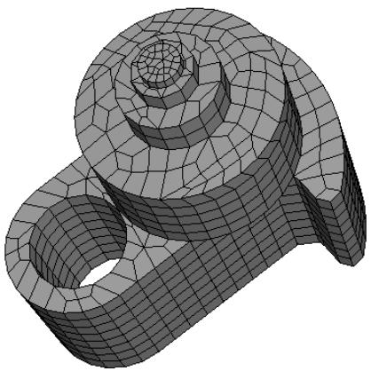  
Figure 5: Mesh shear is reduced between adjacent regions using the advancing front algorithm.

## Additional information

• Setting the mesh algorithm

## What kinds of meshes cannot be generated automatically?

There are a few types of meshes that you cannot create using the mesh generator in the Mesh module:

## Compatible meshes between part instances of the same assembly

Compatibility means that the element faces or element edges of the meshes of adjacent part instances share the same nodes and have the same topology at the common interface. You cannot prescribe mesh compatibility between instances. However, you can use the Merge/Cut tool in the Assembly module to merge multiple instances into a single part instance. You can then create a single compatible mesh from the single part instance. See Compatible meshes between part instances, for more information.

## Symmetric meshes

You cannot ensure that Abaqus/CAE will generate a symmetric mesh for a symmetric part or part instance.

## Bottom-up meshes

Bottom-up meshing is a manual process. You must set and apply the parameters to create the mesh for each region to which you have assigned the bottom-up meshing technique.

## When will Abaqus/CAE delete a mesh?

The following attributes of a part, part instance, or region affect how the mesh will be generated:

• Seeding  
• Element shape  
• Meshing technique  
• Meshing algorithm  
• Logical corners of a two-dimensional structured region  
• Transition control  
• Sweep path of a swept region

If you change any of the attributes listed, the existing mesh will no longer be consistent with its attributes. As a result, Abaqus/CAE deletes the mesh, and you can recreate a new mesh that matches the new attributes. (Element order and element family are the only attributes that, when changed, do not require the mesh to be deleted and recreated.)

Whenever you make a change that will affect any of these attributes for a top-down meshed region, Abaqus/CAE displays a dialog box similar to the one shown in Figure 1.

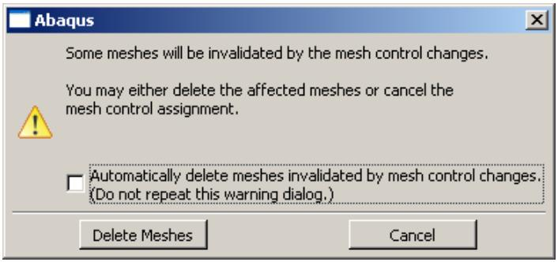  
Figure 1:The warning dialog box.

You can delete the mesh by clicking the Delete Meshes button, or you can keep your mesh and exit the procedure by pressing the Cancel button.

You can also avoid this warning message for the remainder of the current session by toggling Automatically delete meshes invalidated by mesh control changes. The next time you attempt to change the attributes of a part, part instance, or region that already contains a mesh, the mesh will be deleted immediately without any warning being displayed.

If you save your model to a model database before you delete the mesh, you can revert back to that mesh if you are dissatisfied with later meshing attempts.

Since bottom-up meshes can be very time consuming to create, Abaqus/CAE attempts to preserve them in many circumstances that would cause a top-down mesh to be deleted. Bottom-up meshes are retained during changes to seeding, partitioning, and virtual topology. When you partition a region or create a virtual topology feature the mesh will be retained, but associativity with the geometry effected by the partition or virtual topology operation will be lost.


## Warning:

There is no way to avoid deleting a top-down mesh when you change one of the meshing attributes listed above. Likewise, if you change the part geometry, Abaqus/CAE always deletes both top-down and bottom-up meshes without warning. Since remeshing can be time consuming for large or complex models, you should use caution when changing these attributes.

For detailed, step-by-step instructions on deleting a mesh, see Deleting a mesh.

## Additional information

• Mesh-geometry association  
• Seeding previously meshed parts, part instances, or regions  
• Changing mesh controls for previously meshed regions

## Do I have to mesh the entire model in one operation?

Abaqus/CAE allows you to mesh the model in an incremental fashion, where each meshing operation meshes a different region of the model.

You can use incremental meshing to fine-tune the mesh in a selected region of your model without remeshing the entire model.

When you mesh a selected region, Abaqus/CAE tries to preserve the existing mesh in other regions of the model if possible. However, incremental meshing may force the nodes on the boundaries of the existing mesh to move and can reduce the mesh quality along the interfaces between the regions. If your part or part instance contains a seam crack, you must mesh the part or part instance in a single operation; incremental meshing is not supported.

In some cases Abaqus/CAE cannot proceed with an incremental meshing operation and must delete all the existing meshes before proceeding:

Incremental meshing cannot proceed if the seeding between the existing mesh and the selected region cannot be honored. You must allow Abaqus/CAE to delete the existing mesh and remesh the original regions and the selected region.

For example, consider the part instance in Figure 1.

  
Figure 1:The central region cannot be meshed incrementally.

The central region cannot be meshed incrementally because one end has a mesh with 4 × 4 mesh pattern and the opposite end has a mesh with a 3 × 3 mesh pattern. If you try to mesh only the central region, Abaqus/CAE will detect the problem and allow you to choose between the following:

- Remesh the regions that are already meshed and the central region to generate a compatible mesh.  
- Cancel the operation to mesh the central region.

• Incremental meshing cannot proceed if the existing mesh needs to be derived from the mesh you are trying to create. For example, consider the part instance in Figure 2.

  
Figure 2:The regions must be meshed in the correct sequence.

To create a compatible mesh between region 1 and region 2, the mesh of region 2 is derived from the mesh of the cylinder in region 1. Similarly, the mesh of region 3 is derived from the mesh of region 2, which in turn was derived from the mesh of the cylinder in region 1. As a consequence, if you mesh region 3 first, Abaqus/CAE cannot incrementally mesh regions 1 and 2. You must allow Abaqus/CAE to mesh region 1 prior to remeshing regions that were already meshed.

If incremental meshing cannot proceed, Abaqus/CAE displays a warning message prior to deleting an existing mesh.

If you want to mesh the part or assembly incrementally, you can follow a strategy that will minimize the number of times Abaqus/CAE has to delete the existing mesh. The meshing strategy depends on the topology of the regions, the element shapes, the meshing technique, and the mesh seeding.

• Changes to the seeding always propagate out to the boundaries. As a result, you should start meshing from the interior of the part or part instance and continue out to the boundaries of the part or instance.  
However, if you can identify a set of adjacent three-dimensional regions that will be meshed using the swept method, you should start meshing on one side of the part or part instance and continue the mesh through the interior to the other side of the part or instance.  
Regions that are meshed by triangles or tetrahedral elements will never force the entire mesh to be deleted during incremental meshing. The same is also true for regions that are meshed by quadrilateral-dominated elements using the advancing front algorithm. Abaqus/CAE can always remesh these regions, and you can mesh them at any time.

## Can I change the geometric order of the elements in a mesh?

If you have already meshed a part, a part instance, or a region, Abaqus/CAE allows you to change the element order without having to recreate the entire mesh. If you change between linear and quadratic elements, Abaqus/CAE simply adds or removes the midside nodes as required.

If the part or part instance contains orphan elements, you can change the order of all the elements or you can change the order of only selected elements. Orphan elements contain no underlying geometry information; therefore, you should take care when changing the order of the elements. If you change orphan elements from quadratic to linear, all information on the location of the midside nodes is lost. As a result, if you subsequently decide to change back from linear to quadratic elements, you will not be able to return to the original mesh. For more information, see What kinds of files can be imported and exported from Abaqus/CAE?.

## Structured meshing and mapped meshing

This section describes the structured and mapped meshing techniques and the types of regions to which these techniques can be applied.

## In this section:

What is structured meshing?  
What is mapped meshing?  
Two-dimensional structured meshing  
Three-dimensional structured meshing  
Using structured meshing near concave boundaries  
When can Abaqus/CAE apply mapped meshing?

## What is structured meshing?

The structured meshing technique generates structured meshes using simple predefined mesh topologies. Abaqus/CAE transforms the mesh of a regularly shaped region, such as a square or a cube, onto the geometry of the region you want to mesh. For example, Figure 1 illustrates how simple mesh patterns for triangles, squares, and pentagons are applied to more complex shapes.

  
Figure 1:Two-dimensional structured mesh patterns.

You can apply the structured meshing technique to simple two-dimensional regions (planar or curved) or to simple three-dimensional regions that have been assigned the Hex or Hex-dominated element shape option. For more information about assigning element shapes to a region, see Choosing an element shape.

## What is mapped meshing?

The terms structured meshing and mapped meshing are used interchangeably in the finite element analysis literature. However, Abaqus/CAE makes a subtle distinction between the two terms. Mapped meshing is a subset of structured meshing. Mapped meshing refers only to structured meshing of four-sided, two-dimensional regions—the square mesh pattern in Figure 1.

Some models that appear very complex actually contain faces with relatively simple geometry. When you mesh such a model with free or swept meshing, the resulting element quality can be poor on these faces. However, if you allow Abaqus/CAE to use the mapped meshing technique where the geometry is appropriate, it often generates elements of good quality, especially if the region is a long, thin rectangular face.

You cannot apply mapped meshing directly to a region. However, you can apply it indirectly by meshing a region and allowing Abaqus/CAE to apply mapped meshing where appropriate. For example, Figure 1 shows the effect of free meshing a part and allowing Abaqus/CAE to use mapped meshing where appropriate.

  
Without mapped meshing

  
Allow Abaqus/CAE to use mapped meshing where appropriate  
Figure 1:The effect of allowing mapped meshing.

By default, Abaqus/CAE uses mapped meshing where appropriate when you are doing the following:

• Using the advancing front algorithm to sweep mesh a solid region with hexahedral or hexahedral-dominated elements.  
• Using the advancing front algorithm to free mesh a shell region with quadrilateral or quadrilateral-dominated elements.  
• Free meshing a solid region with tetrahedral elements.  
• Free meshing a shell region with triangular elements.

## Two-dimensional structured meshing

A two-dimensional region can be meshed using the structured meshing technique if it has the following characteristics:

• The region has no holes, isolated edges, or isolated vertices. Figure 1 shows regions that cannot be structured meshed.

  
Figure 1: Regions that cannot be structured meshed.

• The region is bounded by three to five logical sides, where each side is a connected set of edges.

In general, structured meshing gives you the most control over the mesh that Abaqus/CAE generates. If you are meshing a four-sided region with all quadrilateral elements, the total number of element edges around the boundary must be even. For three- and five-sided regions, the constraint equations are more complex. Abaqus/CAE respects seed distribution wherever possible when generating a structured mesh. (Seed distribution describes the spacing of the seeds, not necessarily the number of seeds. For example, are the seeds evenly spaced along an edge or more concentrated at one end?) However, meshes must be compatible across regions, and Abaqus/CAE may adjust the nodes of a mesh region that is adjacent to a region that was meshed using the free meshing technique. As a result, the element nodes may not match the seeds exactly.

Figure 2 shows the seeds on the edges of a four-sided region and the effect of different mesh controls.

  
Figure 2:The effect of different mesh controls.

The mesh control effects are as follows:

• In four-sided regions the quadrilateral-dominated structured mesh matches the seeding exactly. There are an odd number of elements around the boundary, and Abaqus/CAE inserts a single triangle into the mesh. (In contrast, when you mesh a three- or a five-sided region with structured quadrilateral-dominated elements, Abaqus/CAE does not insert any triangles. The resulting mesh uses all quadrilateral elements; however, the resulting mesh may not match the mesh seeding exactly.)  
• The two quadrilateral structured meshes do not match the seeding. This is even more apparent when you choose to minimize the mesh transition.  
• The triangular structured mesh also does not match the seeding. Abaqus/CAE creates the triangular mesh by splitting the diagonals of the quadrilateral structured mesh with minimized mesh transition.

Abaqus/CAE combines edges into a logical side automatically if the edges subtend a shallow angle. For example, each region in Figure 3 has five edges.

  
Figure 3: Edges subtending shallow angles.

However, since the top two edges in each region subtend a shallow angle, Abaqus/CAE considers these two edges to be one logical side. Therefore, the mesh pattern for four-sided regions is applied to these regions. If the region contains virtual topology, you can mesh the region using the structured meshing technique only if the region is bounded by four sides. You cannot use structured meshing to mesh three- or five-sided regions that contain virtual topology.

You can use the Redefine Region Corners button in the Mesh Controls dialog box to combine edges yourself, regardless of the angle they subtend. (To display the Mesh Controls dialog box, select Mesh->Controls from the main menu bar.) This technique allows you to control which structured mesh pattern is applied to the two-dimensional region. (This technique is not available for three-dimensional regions.) For more information, see Redefining region corners.

The region that you plan to mesh with structured quadrilateral elements must be well shaped; otherwise, Abaqus/CAE may create invalid elements as shown in Figure 4.

  
Figure 4: Regions must be well shaped.

If the mesh contains invalid elements, you can use several techniques to correct the mesh:

• Adjust the position of the mesh seeds.  
• Redefine the region corners.  
• Partition the face into smaller, better shaped regions.

The result of applying each technique is illustrated in Figure 5.

  
Figure 5: Correcting a mesh that contains invalid elements.

## Three-dimensional structured meshing

Figure 1 illustrates examples of simple three-dimensional regions that can be meshed using the structured meshing technique.  
  
Figure 1: Regions that can be meshed using the structured meshing technique.

Meshing more complex regions with this technique may require manual partitioning. If you do not partition a complex region, your only meshing option may be the free meshing technique with tetrahedral elements. Meshes constructed using the structured meshing technique consist of hexahedral elements, which are preferred over tetrahedral elements.

The characteristics described below are required to mesh a three-dimensional region successfully using the structured meshing technique:

• The region cannot have any holes, isolated faces, isolated edges, or isolated vertices. For example, the regions shown in Figure 2 cannot be meshed using the structured meshing technique.

  
Figure 2: Regions that cannot be meshed using the structured meshing technique.

You can eliminate holes (whether they pass all the way through the part instance or just part way through) by partitioning their circumferences into halves, quarters, etc. For example, the four partitions in Figure 3 convert the part instance from one region with a hole to four regions without holes.

  
Figure 3: Partitions can make a part structured meshable.

You should limit arcs to $9 0 ^ { \circ }$ or less to avoid concavities along sides and at edges. For example, the part instance in Figure 4 has been partitioned so that the single region with 180° arcs becomes two regions with 90° arcs.

  
Figure 4: Limit arcs to ${ \mathfrak { g o } } ^ { \circ }$ or less.

All the faces of the region must have geometries that could be meshed using the two-dimensional structured meshing technique. For example, without partitioning, the semicircles at either end of the part in Figure 5 have only two sides each. (A face must have at least three sides to be meshed using the structured meshing technique.) If you partition the part into two halves, each semicircle is divided into two faces with three sides each.

  
Figure 5: Partitioning creates two faces with three sides.

Exactly three edges of the region must meet at each vertex. For example, the vertex at the top of an unpartitioned pyramid in Figure 6 is connected to four edges. However, if you partition the pyramid into two tetrahedral regions, the vertex is connected to only three edges for each individual region.

  
Figure 6: After partitioning the vertex is connected to only three edges for each individual region.

• The region must be bounded by at least four sides (a tetrahedral region). If a region is bounded by fewer than four sides, you can partition the region as necessary to create additional sides.  
• If a region contains virtual topology, the region must be bounded by six sides.  
If a region cannot be meshed using the structured meshing technique, you can use virtual topology to combine faces until the region is bounded by six sides. Figure 7 shows how you can use virtual topology to create a six-sided region that can be meshed using the structured meshing technique.

  
1) Combine these three faces using virtual topology

  
2) Region contains virtual topology and is six-sided

  
3) Apply a structured mesh  
Figure 7: Virtual topology can make a part structured meshable.

• The angles between sides should be as close to 90° as possible; you should partition to eliminate angles greater than 150°.  
• Each side of the region must match one of the following definitions:

\- If the region is not a cube, a side must correspond to a single face; that is, the side must not contain multiple faces.

If the region is a cube, a side can be a connected set of faces that are on the same geometric surface. However, each face must have four sides. In addition, the pattern of the faces must allow rows and columns of hexahedral elements to be created in a regular grid pattern along that entire side when the cube is meshed. For example, Figure 8 shows two acceptable face patterns and the resulting regular grid pattern of elements created by meshing the cubes using the structured meshing technique.

  
Figure 8: Acceptable face patterns and the resulting meshes.

The sides in Figure 9 do not have acceptable face patterns:

  
Figure 9: Unacceptable face patterns.

The face pattern shown on the left is unacceptable for structured meshing because each face has only three sides. Each face in the pattern shown on the right has four sides, but the pattern does not allow a regular grid of elements to be created on the partitioned side of the cube, as shown in Figure 10.

  
Figure 10: A regular grid of elements cannot be created.

## Using structured meshing near concave boundaries

When you mesh a region using any meshing technique, the nodes on the boundary of the mesh are always located on the boundary of the geometric region. However, when Abaqus/CAE creates a mesh using the structured meshing technique, it is possible for nodes in the interior of the mesh to fall outside the region's geometry, which results in a distorted, invalid mesh. This problem typically occurs near concave boundaries.

For example, the region in Figure 1 has five sides; therefore, when Abaqus/CAE meshes this region using the structured meshing technique, it applies the mesh pattern for a regular pentagon to the region.

  
Figure 1:The mesh pattern for a regular pentagon is applied to the region.

However, if you seed the region so that the number of elements is reduced, as shown in Figure 2, a distorted mesh results due to the concavity at the highly curved edge. Nodes from the interior of the mesh pattern (indicated by closed circles in Figure 3) fall outside the region's geometry, while nodes on the boundary of the mesh (indicated by open circles in Figure 3) remain on the boundary of the region's geometry.

  
Figure 2: Seeds prescribing a coarser mesh.

When interior nodes fall outside the region's geometry, you can try the following techniques to improve the mesh:

• Change the mesh seeds and remesh. For example, the number of elements along the highly curved edge in Figure 1 is greater than in Figure 3.

  
Figure 3: Nodes from the interior of the mesh fall outside the region's geometry.

• Partition the part instance into smaller, more regularly shaped regions. For example, the model was partitioned into three regions in Figure 4.

  
Figure 4: Partition the region.

Select a different meshing technique. This option is most useful for two-dimensional regions, where you can switch from structured meshing to free meshing and still retain quadrilateral elements in the mesh. (Three-dimensional free meshing is limited to tetrahedral elements. For more information, see Free meshing.) Figure 5 shows the region meshed using the free meshing technique.

  
Figure 5: Mesh the region using the free meshing technique.

The mesh in Figure 5 is not symmetric, which is typical of free meshes.

## When can Abaqus/CAE apply mapped meshing?

Abaqus/CAE decides that mapped meshing is appropriate in a four-sided region when:

• it is likely that a regular mesh pattern with reasonable quality can be generated, and  
• any minor adjustments to the mesh seeding will not violate the user's intent (as indicated by any existing seed constraints).

When Abaqus/CAE applies mapped meshing, it makes small adjustments to the mesh seeding to ensure that opposite sides of the rectangular region have the same number of seeds. If your model is large and includes many simple regions, it may take slightly longer for Abaqus/CAE to check for rectangular regions and adjust the seeds to produce a mapped mesh than to produce a mesh without mapped meshing. However, for most models the time difference to include mapped meshing is not significant compared to the improvement in mesh quality.

Figure 1 shows a shell part meshed with triangles using the following mesh techniques and algorithms available in Abaqus/CAE:

• Free meshing  
• Free meshing using mapped meshing where appropriate  
• Structured meshing

  
Figure 1: A shell part meshed with triangles in three different ways.

In many cases a free mesh of triangles with mapped meshing where appropriate will be the same as a structured mesh of triangles. The meshes are different in Figure 1 because Abaqus/CAE honors the original seeding and determines that mapped meshing is not appropriate on the side of the part. In contrast, when Abaqus/CAE creates the structured mesh, it significantly adjusts the seeding to create the structured mesh that was requested by the user.

## Swept meshing

This section explains the swept meshing technique and describes the types of regions to which this meshing technique can be applied.

## In this section:

What is swept meshing?  
Swept meshing of surfaces  
Swept meshing of three-dimensional solids  
Swept meshing of cylindrical solids  
Characteristics of the geometry can prevent a part from being swept meshable

## What is swept meshing?

Abaqus/CAE uses swept meshing to mesh complex solid and surface regions. The swept meshing technique involves two phases:

• Abaqus/CAE creates a mesh on one side of the region, known as the source side.  
Abaqus/CAE copies the nodes of that mesh, one element layer at a time, until the final side, known as the target side, is reached. Abaqus/CAE copies the nodes along an edge, and this edge is called the sweep path. The sweep path can be any type of edge—a straight edge, a circular edge, or a spline. If the sweep path is a straight edge or a spline, the resulting mesh is called an extruded swept mesh. If the sweep path is a circular edge, the resulting mesh is called a revolved swept mesh.

For example, Figure 1 shows an extruded swept mesh. To mesh this model, Abaqus/CAE first creates a two-dimensional mesh on the source side of the model. Next, each of the nodes in the two-dimensional mesh is copied along a straight edge to every layer until the target side is reached.

  
Figure 1:The swept meshing technique for an extruded solid.

To determine if a region is swept meshable, Abaqus/CAE tests if the region can be replicated by sweeping a source side along a sweep path to a target side. In general, Abaqus/CAE selects the most complex side (for example, the side that has an isolated edge or vertex) to be the source side. In some cases you can use the mesh controls to select the sweep path. If some regions of a model are too complex to be swept meshed, Abaqus/CAE asks if you want to remove these regions from your selection before it generates a swept mesh on the remaining regions. You can use the free meshing technique to mesh the complex regions, or you can partition the regions into simplified geometry that can be structured or swept meshed.

When you assign mesh controls to a region, Abaqus/CAE indicates the direction of the sweep path and allows you to control the direction. If the region can be swept in more than one direction, Abaqus/CAE may generate a very different two-dimensional mesh on the faces that it can select as the source side. As a result, the direction of the sweep path can influence the uniformity of the resulting three-dimensional swept mesh, as shown in Figure 2.

  
Figure 2:The sweep direction can influence the uniformity of the swept mesh.

In addition, the sweep path controls the default orientation of hexahedral and wedge elements that are used to model gaskets, continuum shells, cylindrical regions using cylindrical elements, and adhesive joints using cohesive elements. For more information, see Assigning gasket elements to a region, Meshing parts with continuum shell elements, Swept meshing of cylindrical solids, and Creating a model with cohesive elements using geometry and mesh tools.

## Swept meshing of surfaces

Abaqus/CAE can apply the swept meshing technique only to surface regions that can be replicated by sweeping a source side along a sweep path to a target side. The sweep path is always an edge; however, for a surface region the source and target sides are also edges. The surface region can be extruded, revolved, swept, or planar. In addition, an extruded surface region can include twist, and a revolved surface region can include translation. You can apply the swept meshing technique to surface regions using either the Quad or Quad-dominated element shape options.

If you are creating a revolved swept mesh, Abaqus/CAE meshes the source side and revolves that mesh around the axis of revolution to the source side. The sweep path can be revolved a full 360°. You must use the Quad-dominated element shape option when the source side touches the axis of revolution at a point, because a layer of triangular elements is generated at that point. Abaqus/CAE cannot generate a revolved surface mesh when a single surface touches the axis of revolution at two points, unless the revolved surface is a sphere.

For example, the source side touches the axis of revolution at the top of the model shown in Figure 1 and a layer of triangular elements is generated at that point.

  
Figure 1: A layer of triangular elements.

(For more information on assigning element shapes to a region, see Choosing an element shape.)

## Swept meshing of three-dimensional solids

Abaqus/CAE can apply the swept meshing technique to solid regions that can be replicated by sweeping a source side along an edge to the target side. For a three-dimensional solid the sweep path is an edge, but the source and target sides are faces. Figure 1 illustrates an extruded swept mesh—Abaqus/CAE meshes the source side and extrudes that mesh along an edge to the target side. Figure 2 illustrates a revolved swept mesh—Abaqus/CAE meshes the source side and revolves that mesh about the axis of the circular edge to the target side.

  
Figure 1:The extruded swept meshing technique sweeps the mesh on the source side along an edge.

  
Figure 2:The revolved swept meshing technique sweeps the mesh on the source side along a circular edge.

If a region is swept meshable, Abaqus/CAE can generate the swept mesh on a region that has been assigned the Hex, Hex-dominated, or Wedge element shape option. To generate the preliminary two-dimensional mesh on the source side, Abaqus/CAE uses the free meshing technique with the Quad, Quad-dominated, or Tri element shape option, respectively.

You can choose between the medial axis and advancing front meshing algorithms when you mesh a solid region with hexahedral or hexahedral-dominated elements using the swept meshing technique. (Abaqus/CAE generates hexahedral and hexahedral-dominated meshes by sweeping the quadrilateral and quadrilateral-dominated elements generated by the two algorithms from the source side to the target side.) However, if the region to be meshed contains virtual topology, you can use only the advancing front algorithm to generate the swept mesh. For more information, see What is the difference between the medial axis algorithm and the advancing front algorithm?, and Free meshing with quadrilateral and quadrilateral-dominated elements.

If you select the advancing front algorithm, Abaqus/CAE will use mapped meshing, if it is appropriate, to improve the mesh for some regions. (Mapped meshing is the same as structured meshing but applies only to four-sided regions.) Abaqus/CAE determines whether it is appropriate to replace the advancing front algorithm with mapped meshing on any of the faces that belong to the source side. For more information, see What is mapped meshing?, and When can Abaqus/CAE apply mapped meshing?. Abaqus/CAE uses mapped meshing to create quadrilateral and quadrilateral-dominated elements on these appropriate boundary faces and then sweeps the elements from the source side to the target side to create the hexahedral and hexahedral-dominated elements.

A three-dimensional region can be meshed using the swept meshing technique if it has the following characteristics:

Every side that connects the source side to the target side must have only a single face or be comprised of four-sided combined faces that form a regular grid pattern. Figure 3 provides two examples of acceptable connecting face patterns.

  
Figure 3: Acceptable connecting face patterns for swept meshing.

The partitioned connecting sides in Figure 4 do not have acceptable face patterns for swept meshing; the model on the left side has a sweep face with two three-sided faces, while the model on the right side does not have a regular grid pattern.

  
Figure 4: Unacceptable connecting face patterns for swept meshing.

The target side must contain only a single face without isolated edges or isolated vertices. For example, the region on the left in Figure 5 can be meshed using the swept meshing technique because all of the isolated edges are on the source side; the region on the right, however, cannot be meshed using this technique because the target side contains two faces.

  
Figure 5: Only the region on the left can be meshed using the swept meshing technique.

Figure 6 illustrates a part that has been swept meshed along a varying cross-section. The part appears to be relatively complex; for example, the source side is nonplanar, and the cross-section of the part varies along the sweep path. However, the rules for generating a swept mesh still apply.

- Every side that connects the source side to the target side contains only a single face.  
Although the source side contains two faces, the target side contains only a single face.

  
Figure 6: Sweeping the mesh along a varying cross-section.

You may be able to use virtual topology to combine faces on the target side to make a part swept meshable. Figure 7 illustrates a part that was swept mesh after the five faces on the target side were combined into a single face using virtual topology. However, because the part now contains virtual topology, it can be swept meshed with only the advancing front algorithm.

  
Figure 7: Combining faces makes a part swept meshable.

• For a revolved region, the profile that was revolved to create the region must not touch the axis of revolution at one or more isolated points, as shown in Figure 8.

  
Figure 8:The swept meshing technique cannot mesh a part if an isolated point touches the axis of revolution.

• Similarly, Abaqus/CAE cannot mesh a region with hexahedral or wedge elements if one or more edges lie along the axis of revolution, as shown in Figure 9.

  
Figure 9: Abaqus/CAE cannot mesh a region with hexahedral elements if one or more edges lie along the axis of revolution.

However, Abaqus/CAE can mesh the region with hexahedral-dominated elements by generating layers of wedge elements along the axis, as shown in Figure 10.

  
Figure 10: Abaqus/CAE can mesh the region with hexahedral-dominated elements.

As a result, you must select the Hex-dominated element shape option before you mesh the region. Alternatively, you can partition the region into simple structural mesh regions and select the Hex element shape option to create the mesh using all hexahedral elements. For more information, see Sweep meshing a solid, revolved region whose profile touches the axis of revolution.

A fully revolved region that does not touch the axis of revolution is meshable only if all the edges that are associated with the profile being revolved exist. However, the edges that bound the profile must not create a face. Figure 11 shows a meshable part instance where all of the edges of the revolved profile exist.

  
Figure 11: All of the edges of the revolved profile exist; hence, the part instance is meshable.

In this example the user sketched the profile, and Abaqus/CAE revolved the profile to create the part; however, the edges that bound the profile do not form a face. In contrast, Figure 12 shows a part instance that is not meshable because some of the edges of the revolved profile are missing.

  
Figure 12: Some of the edges of the revolved profile are missing; hence, the part instance is not meshable.

A fully revolved region that touches the axis of revolution is meshable only if all of the edges that are associated with the profile being revolved exist except the edges along the axis of revolution. Figure 13 shows a part instance that is meshable because all of the edges of the revolved profile exist except for the edge along the axis of revolution. If the profile included the edge along the axis of revolution, the part instance would not be meshable.

  
Figure 13: All of the edges of the revolved profile exist, except for the edge along the axis of revolution; hence, the part instance is meshable.

• If a revolved region was created by revolving a sketch that contains a spline, the region is meshable only if the vertices at each end of the spline are not on the axis of revolution.  
• If a part was created by sweeping a cross-section along a sweep path that is composed of a closed spline, the resulting part is meshable only if it is split into two or more regions.

## Swept meshing of cylindrical solids

You can use swept meshing to create a mesh on cylindrical geometry with many types of solid elements, including elements from the solid cylindrical element library. If you use solid cylindrical elements for a native mesh, Abaqus/CAE uses the sweep path of the selected sweep/revolve region as the circumferential direction for the generated cylindrical elements. You should confirm that the sweep path is set correctly before creating the mesh.

Abaqus considers the following requirements for cylindrical elements when you attempt to mesh solid geometry with cylindrical elements:

• The midside nodes on the circular edges of the cylindrical elements must be placed exactly halfway between the edge nodes.  
• All nodes on a cross-section must lie on the same radial plane.  
• All the circular edges within an element must span the same angle.  
• The centers of the circular arcs within an element must lie on a common axis.  
• An element cannot span more than 180°.

These requirements mean that you can create valid cylindrical elements only on revolved parts or parts that you can split into revolved domains. The S-shaped extrusion in Figure 1 can be meshed with cylindrical elements after partitioning into revolved regions.

  
Figure 1: Acceptable geometry for solid cylindrical meshing.  
Figure 2 shows three types of geometry—a helical spring, a revolved part with cuts, and a tapered part—that cannot be meshed with solid cylindrical elements because of these meshing requirements.

  
Figure 2: Forms of geometry that cannot be swept meshed with cylindrical elements.

If one of the connecting sides that connect the source face to the target face in a revolved region is separated into multiple faces due to the internal edge or edges that constrain the mesh, the generated elements are likely to be too distorted to be used as cylindrical elements. You must partition the solid region into simpler revolved regions, as shown in the example on the right side of Figure 3.

  
Figure 3: A solid region that is unsuitable for meshing with cylindrical elements (left) and the same region rendered suitable for meshing with cylindrical elements through the use of a partition (right).

When you edit a mesh part by assigning cylindrical elements to it, Abaqus/CAE considers Face 1 and Face 2 of each cylindrical element to be the faces along its radial planes. Figure 4 indicates the location of these faces for several types of cylindrical elements. You should orient the stack direction for elements in your part before assigning a cylindrical element type to it; for more information, see the descriptions in Orienting the stack direction.

  
Figure 4: Illustration of node ordering and face numbering for cylindrical elements (with Faces 1 and 2 shaded).

## Characteristics of the geometry can prevent a part from being swept meshable

The characteristics of a region described in Swept meshing of three-dimensional solids are referred to as “topological characteristics.” In some cases, all of the topological characteristics will apply to a region; however, Abaqus/CAE will not allow the region to be swept meshed because some “geometrical characteristics” are not satisfied. The geometric characteristics that Abaqus/CAE looks for when determining if a region is swept meshable are hard to quantify. In general, a three-dimensional region can be meshed using the swept meshing technique if it satisfies the following geometrical characteristics:

• If the source side contains more than one face, the angle between the faces must be relatively flat (close to 180°).  
• Each face that connects the source side to the target side (a connecting side) must have four corners. The angle at each of the corners must be close to 90°.  
• The angles between the source side and each of the connecting sides should be close to 90°. Similarly, the angles between the target side and each of the connecting sides should be close to 90°.

For example, Figure 1 shows a part with three faces on the source side. When the angle decreases between the faces that form the source side, the part no longer satisfies the geometric characteristics of a swept meshable region.

  
Figure 1: Swept meshing depends on geometrical characteristics.

You may be able to apply virtual topology to satisfy the geometrical characteristics and to make the part swept meshable. For example, Figure 2 illustrates that the part becomes swept meshable when the three faces on the source side are combined using virtual topology. However, the resulting mesh is of poor quality.

  
Figure 2: Applying virtual topology can result in poor mesh quality.

In some cases Abaqus/CAE will still allow you to create a swept mesh, even though the geometrical characteristics are not satisfied. The intention is to allow you to create a swept mesh wherever possible. However, the resulting mesh may be of poor quality, or it may be invalid. To ensure that your swept mesh is acceptable, you should use the mesh verify tool to verify its quality. For more information, see Verifying element quality.

## Free meshing

This section explains how you can use the free meshing technique to mesh two- or three-dimensional models.

## In this section:

What is free meshing?  
Free meshing with quadrilateral and quadrilateral-dominated elements  
Free meshing with triangular and tetrahedral elements  
What is a tetrahedral boundary mesh?  
What can I do with a boundary mesh?

## What is free meshing?

Unlike structured meshing, free meshing uses no preestablished mesh patterns. When you mesh a region using the structured meshing technique, you can predict the pattern of the mesh based on the region topology. In contrast, it is impossible to predict a free mesh pattern before creating the mesh.

Because it is unstructured, free meshing allows more flexibility than structured meshing. The topology of regions that you mesh with the free mesh technique can be very complex.

You can use this technique to mesh a region with the Tri, Quad, or Quad-dominated element shape options for two-dimensional regions or the Tet element shape option for three-dimensional regions. For more information on assigning element shapes to a region, see Choosing an element shape.

## Free meshing with quadrilateral and quadrilateral-dominated elements

Free meshing with quadrilateral elements is the default meshing technique for two-dimensional regions. The free meshing technique with quadrilateral elements can be applied to any planar or curved surface. An example of a mesh generated with this technique is shown in Figure 1. Free meshes are usually not symmetric, even if the part or part instance itself is symmetric.

  
Figure 1: A free mesh generated with quadrilateral elements.

Abaqus/CAE allows you to choose between two meshing algorithms when you create a quadrilateral or quadrilateral-dominated mesh. For more information, see What is the difference between the medial axis algorithm and the advancing front algorithm?.

## Medial axis

When you free mesh a complex region with quadrilateral elements using the medial axis algorithm, Abaqus/CAE creates internal partitions that divide the region into simple structured mesh regions and then seeds the smaller regions.

If you use the medial axis algorithm to mesh a region and then remesh the region (for example, after modifying the seeds), Abaqus/CAE stores the internal partitions, and the new mesh is generated more quickly. In addition, the internal partitions allow Abaqus/CAE to generate a fine mesh in a similar time to that required to generate a coarse mesh. You cannot use the medial axis algorithm to mesh regions that contain virtual topology, and it does not work well with imprecise parts.

In general, a medial axis-based free mesh with quadrilateral elements does not match the mesh seeds exactly for the following reasons:

• Abaqus/CAE tries to balance the seeds between adjacent regions and the smaller regions created by the internal partitioning.  
• Abaqus/CAE tries to minimize element distortions.

However, when you apply fixed seed constraints, Abaqus/CAE matches the number of seeds exactly and attempts to match the seed positions exactly. Figure 2 illustrates a two-dimensional plate with fixed seeds and movable seeds and the resulting all quadrilateral mesh.

  
Figure 2: Fixed and movable seeds and the medial axis meshing algorithm.

You should specify fixed seeds on only a few edges, or Abaqus/CAE may not be able to generate a mesh. For example, if you specify fixed seeds around one of the holes in the plate shown in Figure 2, the global seeding becomes overconstrained, and Abaqus/CAE cannot generate a mesh.

Using the medial axis algorithm, a free mesh generated with quadrilateral-dominated elements is similar to a free mesh generated with all quadrilateral elements and without transition minimization; however, Abaqus/CAE inserts a few isolated triangles in an effort to match the mesh seeds more closely. Abaqus/CAE can generate a mesh with quadrilateral-dominated elements faster than it can generate a mesh with all quadrilateral elements.

## Advancing front

When you free mesh a complex region with quadrilateral elements using the advancing front algorithm, Abaqus/CAE generates quadrilateral elements at the boundary of the region and continues to generate quadrilateral elements as it moves systematically to the interior of the region.

When you choose the advancing front algorithm, Abaqus/CAE matches the seeds exactly (except when you are creating a three-dimensional revolved mesh, and the profile being revolved touches the axis of revolution). A quadrilateral mesh that matches the seeds exactly is shown in Figure 3.

  
Figure 3: Fixed and movable seeds and the advancing front meshing algorithm.

In general, the mesh transitions generated with the advancing front algorithm are more acceptable than the transitions generated by the medial axis algorithm; however, matching the seeds exactly in narrow regions may compromise the mesh quality. In contrast with the medial axis algorithm, you can use the advancing front algorithm in conjunction with imprecise parts and on regions that contain virtual topology.

If you select the advancing front algorithm, Abaqus/CAE will also use mapped meshing where appropriate. (Mapped meshing is the same as structured meshing but applies only to four-sided regions.) For more information, see What is mapped meshing?, and When can Abaqus/CAE apply mapped meshing?. When mapped meshing is used, Abaqus/CAE makes minor adjustments to the mesh seeding. If you do not want the seeding to change, you can use mesh controls to prevent the use of mapped meshing. For more information, see Assigning mesh controls.

By default, Abaqus/CAE minimizes the mesh transition when it generates a free quadrilateral mesh using the medial axis algorithm. Minimizing the mesh transition results in a better mesh that is generated more quickly; however, the generated nodes deviate further from the mesh seeds. Figure 4 illustrates the same planar part instance meshed using the medial axis algorithm with and without minimizing the mesh transition and meshed using the advancing front algorithm.

  
Figure 4:The effect of mesh transition and the meshing algorithm.

## Free meshing with triangular and tetrahedral elements

Free meshing with triangular elements can be applied to any planar or curved surface, and the part can be precise or imprecise. For more information, see What is a valid and precise part?. A free mesh of triangular elements matches the mesh seeds exactly. This meshing technique can handle large variations in element size, which is useful when you want to refine only part of a mesh. The time taken for Abaqus/CAE to compute a free triangular mesh grows approximately linearly with the number of elements and nodes. Figure 1 shows an example of a mesh generated using this technique.

  
Figure 1: A free mesh generated with triangular elements.

Free meshing with tetrahedral elements can be applied to almost any three-dimensional region; in fact, very complex models can be meshed using this technique without the help of partitioning. Free meshing with tetrahedral elements is similar to free meshing with triangular elements in that the part can be precise or imprecise. In general, Abaqus/CAE matches the mesh seeds exactly although the mesh may be finer around small holes if the mesh seeds are not fully constrained. Figure 2 shows an example of a free tetrahedral mesh.

  
Figure 2: A free mesh generated with tetrahedral elements.

Free meshing of three-dimensional solids using hexahedral elements is not supported.

You should use the Query toolset in the Part module or the Mesh module to check the geometry of the parts or of the assembly before you try to generate a free mesh with tetrahedral elements. You should check the following:

• There are no free edges in the solid.  
• There are no short edges, small faces, or small face corner angles.

For more information, see Using the geometry diagnostic tools.

When you create a free mesh with tetrahedral elements, you can use the default mesh generation algorithm, or toggle off the default algorithm to use the algorithm that was included with Abaqus/CAE 6.4 and earlier. The default algorithm is significantly more robust, particularly when meshing complex shapes and thin solids. In addition, the default algorithm allows you to increase the size of the interior elements. If the mesh density is adequate for the model being analyzed and the areas of interest are on the mesh boundary, increasing the size of the interior elements will increase the computational efficiency.

When you are using free meshing to create triangular elements on a surface, Abaqus/CAE will use mapped meshing for some regions if it is appropriate. (Mapped meshing is the same as structured meshing but applies only to four-sided regions.) For more information, see What is mapped meshing?, and When can Abaqus/CAE apply mapped meshing?. Abaqus/CAE replaces free triangular meshing with mapped triangular meshing only when it is likely that the resulting mesh quality will be improved. If desired, you can use mesh controls to prevent Abaqus/CAE from allowing mapped meshing. For more information, see Assigning mesh controls.

Similarly, when you are using free meshing to create tetrahedral elements, you can allow Abaqus/CAE to decide whether mapped meshing is appropriate. After Abaqus/CAE determines that the resulting mesh quality will be improved, it replaces free meshing with mapped meshing on simple boundary faces and converts the resulting triangles into tetrahedral elements.

Figure 3 shows the effect of allowing mapped meshing where appropriate in a free mesh of a solid part using tetrahedral elements. The mesh quality is improved in four-sided regions that can be mapped meshed.

  
Free meshing

  
Free meshing with mapped meshing where appropriate  
Figure 3:The effect of allowing mapped meshing.

To view the internal tetrahedral elements generated by Abaqus/CAE, you can create a new mesh part from the current mesh and use display groups to remove selected elements. You can also view the internal elements after the analysis is complete by using view cuts in the Visualization module. For more information, see Using display groups to display subsets of your model and Cutting through a model.

## What is a tetrahedral boundary mesh?

When Abaqus/CAE generates a free mesh on a solid with tetrahedral elements, the meshing process consists of two phases:

1. A boundary mesh of triangles is generated on the faces of the solid regions.  
2. Abaqus/CAE generates a tetrahedral mesh using the triangles as faces of the tetrahedral elements.

The same process is used to create a quadrilateral boundary mesh and a hexahedral solid mesh for geometric faces of bottom-up mesh regions (for more information, see Creating the boundary mesh for a bottom-up region).

If your part is complex, generating a free tetrahedral mesh can be time consuming. Previewing the mesh on the boundary faces can help you identify problems before generating a mesh for the entire part. You can preview the triangles on the boundary faces after the first phase of the meshing process by toggling on Preview boundary mesh in the prompt area before you generate the mesh. If the mesh is acceptable, you can continue meshing the interior of the region. If the mesh is not acceptable or if some regions failed to mesh, Abaqus/CAE provides a variety of tools for correcting the problems. For more information, see What can I do with a boundary mesh?.

If you decide to preview the triangular boundary mesh for a region, Abaqus/CAE allows you to select faces to mesh even though your final intent is to mesh a solid. When you toggle on Preview boundary mesh, Abaqus/CAE automatically changes the selection filter in the prompt area to select Faces. For more information, see Filtering your selection based on the type of object.

When the Mesh defaults color mapping is selected, Abaqus/CAE displays a boundary mesh using white to represent the boundary elements, which is in contrast to the cyan color that Abaqus/CAE uses to represent the final mesh. When you query the tetrahedral boundary mesh, Abaqus/CAE refers to the elements as Tri boundary elements. In contrast, when you query the final mesh, Abaqus/CAE refers to the elements as Linear tetrahedral elements or Quadratic tetrahedral elements. The triangles on the boundary faces have no concept of geometric order.

## What can I do with a boundary mesh?

When Abaqus/CAE generates a free mesh on a solid with tetrahedral elements, it first generates a boundary mesh of triangles on the exterior faces of the solid regions, as described in What is a tetrahedral boundary mesh?.

When you are creating a free tetrahedral mesh, Abaqus/CAE can create either a free mesh or a mapped mesh on the boundary faces; two mechanisms control the mesh pattern for this triangular surface mesh:

## Global mesh control associated with the three-dimensional region

Global controls always exist. They are set when you assign the free tetrahedral meshing technique to the region. You can use them to create a mapped mesh in areas where Abaqus/CAE determines that mapped meshing is appropriate or to create a free mesh on all bounding faces.

## Local mesh controls specified on selected faces of the region

To assign local controls, you select one or more faces of the region and specify whether Abaqus/CAE should create a free mesh or a mapped or structured mesh on the selection. If you define local controls, they override the global controls.

If you assign the structured technique to faces of solid regions that will be tetrahedral meshed, these faces are colored green to show the technique assignment for the surface mesh. (For detailed instructions on assigning mesh controls, see Assigning mesh controls.)


## Note:

The green coloring is applied only while you are assigning mesh controls to the faces. When the procedure ends, the global mesh control colors are displayed.

In addition, Abaqus/CAE highlights any faces on the boundary that failed to mesh. These failures are usually due to mesh seeding that is too coarse or to tiny edges or faces. You can save the highlighted faces in a set, and you can apply finer seeds to only the faces in the set. For more information about seeding faces in a set, see Can I seed a face or a cell?. You can use display groups to display only the faces in the set. For more information, see Plotting display groups.

You can query a boundary mesh using the Query toolset. In addition, you can check the quality of a boundary mesh using the mesh verify tool. The mesh verify tool allows you to check the quality of all boundary triangles, or you can use the selection filters to check the quality of the boundary triangles of only selected faces.

If tiny edges or faces prevent Abaqus/CAE from generating an acceptable tetrahedral mesh, you can try the following:

Use the geometry diagnostics tool to find small entities such as short edges, small faces, and faces with small face corner angles that can affect the mesh quality. You can create a set containing these small entities. For more information, see Using the geometry diagnostic tools.  
• Use the Geometry Edit toolset to remove redundant edges and vertices. You can also remove a face and stitch over the resulting gap. For more information, see Editing techniques.  
• Use the Virtual Topology toolset to ignore tiny edges or faces. For more information, see What can I do with the Virtual Topology toolset?.  
• Add partitions to reduce the aspect ratio of long, narrow faces or cells. For more information, see The Partition toolset.  
• Use the Edit Mesh toolset to modify the preview mesh. You can do the following in the Mesh module:

Edit nodes  
Collapse element edges  
- Swap the diagonal of a pair of adjacent triangular elements

## - Split element edges

For more information, see What can I do with the Edit Mesh toolset?.

In some cases you will not be able to mesh an imported solid part with tetrahedral elements because of very thin triangular elements in the surface mesh or because some sliver faces cannot be meshed with triangles. Using a combination of tools to mesh an imported solid part with tetrahedral elements, describes how you can use the Edit Mesh toolset and other tools in the Mesh module to mesh the part successfully.

## Bottom-up meshing

This section explains the bottom-up meshing technique and describes the types of regions to which this meshing technique can be applied. The related topic of mesh associativity is also explained.

## In this section:

What is bottom-up meshing?  
The bottom-up meshing domain  
Bottom-up meshing methods  
Selecting parameters for a bottom-up mesh  
Creating the boundary mesh for a bottom-up region  
Improving the quality of boundary meshes for a bottom-up region  
Defining connecting sides for a bottom-up swept mesh  
Creating a bottom-up mesh  
An example including bottom-up meshing techniques

## What is bottom-up meshing?

Bottom-up meshing is a manual, incremental meshing process that allows you to build a hexahedral mesh in any solid region. Structured, swept, and free meshing techniques all work in a top-down manner—they are tied directly to the geometry such that the resulting mesh fills the geometry. Bottom-up meshing relaxes the constraint that ties the mesh to the geometry so that you can build a mesh that ignores some geometric features. You can also use bottom-up meshing techniques to modify a mesh part, in which case there are no geometric features to consider. If you work with geometry, the elements that you create in a bottom-up mesh are always associated with the solid region that you meshed, but the mesh boundaries may not be associated with the geometric boundaries of the region. This allows you to create a mesh using only hexahedral elements where top-down meshing techniques might require extensive partitioning or the use of tetrahedral elements to complete the mesh. However, the relaxed geometry constraints also mean that you must carefully choose the parameters used to create the mesh, since it can vary significantly from the geometry. Once Abaqus has generated a bottom-up mesh, you need to evaluate whether it is suitable for the analysis and, if geometry is present, verify that the mesh is correctly associated with it.

You can apply bottom-up meshing to any solid region, including regions that can be meshed using the top-down techniques, and to meshes that do not have any associated geometry. Since bottom-up meshing is a manual process that can be very time consuming, it is recommended that you use this method only when the top-down methods fail to produce a satisfactory mesh.

Generating the desired mesh may require multiple applications of the bottom-up meshing technique. If multiple applications are required, each bottom-up mesh becomes an incremental building block for the next mesh until you complete the mesh for the region. Each application of the bottom-up meshing technique involves four phases:

1. You select the domain within which Abaqus/CAE will create the mesh. You can choose either a three-dimensional geometry region or orphan elements.  
2. You select the method that Abaqus/CAE will use to create the mesh. You can choose from the following methods:

• Sweep  
• Extrude  
• Revolve  
• Offset (available only for orphan element selections)

3. You select the side, called the source side, that Abaqus/CAE will use to create a two-dimensional mesh to be swept, extruded, or revolved to fill a three-dimensional region.  
4. You select the remaining parameters to complete the definition of the bottom-up mesh. For example, if you chose the sweep method, you can choose connecting sides and a target side.

In addition, you may need to edit bottom-up meshes or associate them with geometry before you can use them to continue generating the region mesh. For more information, see The Edit Mesh toolset.

Figure 1 shows a part that cannot be meshed with hexahedral elements using top-down techniques.

  
Figure 1: Complex geometry such as fillets can prevent top-down meshing.

The bottom-up sweep method was used to mesh the part in Figure 2. The user selected six faces for the source side (magenta), selected the hidden rear face as the target side (white), and used the six remaining sides as connecting sides (yellow), as indicated in the figure. In this example the selected sides are all geometric faces; Abaqus/CAE also allows you to select element faces and two-dimensional elements to define the source side and the connecting sides of a bottom-up mesh.

  
Figure 2: A bottom-up mesh using the sweep method.

You can choose from the sweep, extrude, or revolve methods to mesh a selected geometric region, and you can also choose the offset method if you are working with orphan elements. Depending on the shape of the region and the analysis intent, more than one method may produce acceptable results. The method that you select and the corresponding parameters will determine how well the mesh conforms to the geometry, if applicable. For example, Figure 3 shows the same part as Figure 2; this time the part is meshed with the extrude method. The parameters for the extrude method are a source side, an extrusion vector, and a number of layers. As shown in Figure 3, the extruded mesh does not capture the tapered sides and the rounded corners at the back of the model.

  
Figure 3: A bottom-up mesh using the extrude method.

If these details are not important, this simplified mesh may be acceptable. Alternatively, you could edit the resulting mesh by modifying or removing the nodes and elements that extend beyond the original geometry. For more information on editing a mesh, see The Edit Mesh toolset.

If a resulting bottom-up mesh is not acceptable, you can delete it and try a different bottom-up method for the same region or partition the region and mesh the resulting simpler regions. You can also use the mesh Undo and Redo functions to undo steps in the bottom-up meshing procedure rather than deleting the entire bottom-up mesh for the region and starting over.


## Note:

Undo and redo are not available after some operations, such as deleting a region mesh.

The undo and redo functions are the same as those used for the Edit Mesh toolset (for more information, see Undoing or redoing a change in the Edit Mesh toolset).

## The bottom-up meshing domain

When you begin creating a bottom-up mesh, the first requirement is to define the domain in which the mesh will be created. The domain determines whether the bottom-up mesh is created as a native mesh or as a collection of orphan nodes and elements. To create a native mesh, you choose a three-dimensional geometric model region that has been assigned the bottom-up meshing technique in the Mesh Controls dialog box. (For more information, see Assigning mesh controls.) If there are no geometric regions with the bottom-up technique assigned, you must create one or use the orphan element domain.

Selecting a three-dimensional region as the domain also indicates that you intend to fully associate the bottom-up mesh with geometry. The association between mesh and geometry is necessary to transfer loads, boundary conditions, and other information from the geometry to the mesh. Mesh-geometry association is discussed in Mesh-geometry association.

Selecting orphan elements as the domain indicates that the bottom-up mesh will not be fully associated with geometry. The created elements may either have no association with geometry, or you may associate the created orphan mesh entities with adjacent geometric faces. Associating the orphan mesh faces with adjacent geometric faces allows Abaqus/CAE to create a compatible mesh when you mesh the geometry.

## Bottom-up meshing methods

The control parameters for each bottom-up method are similar to the parameters used internally by Abaqus/CAE to create a comparable top-down swept mesh for a three-dimensional solid. The bottom-up methods and associated parameters are defined as follows:

## Sweep

The sweep method creates a three-dimensional mesh by moving a two-dimensional mesh along a sweep path. The sweep method is illustrated in Figure 2. You should use the bottom-up sweep meshing method when the region cross-section changes between the starting and ending sides. To use the sweep method, you must first choose a Source side that defines the face or faces on which Abaqus/CAE will create a two-dimensional mesh. The source side can be any combination of geometric faces, element faces, and two-dimensional elements. You can define the sweep path by selecting Connecting sides that define the sides of the desired sweep region. If you define connecting sides, the mesh conforms closely to the geometry or mesh along the selected sides. Alternatively, for geometry you can select a Target side and specify a Number of layers and allow Abaqus/CAE to create the sweep path by interpolating between the source and target sides. The Target side is a single face that Abaqus/CAE uses to end the mesh. The number of layers refers to the number of element layers that will be placed between the source and the target sides—if you use connecting sides, the two-dimensional meshes of the connecting sides define the number of element layers. Abaqus/CAE sweeps the two-dimensional mesh from the source side into the volume of the solid region to create the mesh.

## Extrude

The extrude method is a special case of the sweep method with a linear path defined by a direction and a distance. The extrude method is illustrated in Figure 3. You should use the extrude method for regions with a constant cross-section and a linear sweep path. There are three required parameters for a bottom-up extruded mesh. As with the sweep method, you choose the Source side that defines the area on which Abaqus/CAE will create a two-dimensional mesh. You then select the starting and ending point of a Vector that defines the extrusion direction and can also be used to define the extrusion distance. Finally, you indicate the Number of layers to define the number of elements between the source side and the end of the extruded mesh. If you use the vector to define the extrusion distance, the definition is complete. However, you can Specify a distance or use Project to target and select a target side to define the extrusion distance. The target side can be selected from any geometry, mesh, or datum plane in the viewport; it need not be part of the same part instance as the source. Abaqus/CAE extrudes the two-dimensional mesh from the source side in the direction of the extrusion vector. If you select a target side to define the extrusion distance, Abaqus/CAE ends the extruded mesh at the target side. Figure 1 shows the source side and target side on the left; the extrusion vector (not shown) extends from the center of the rectangular source side to the center of the cylinder. The resulting extruded mesh is an extension of the source side mesh. It closely matches the target side shape, but no attempt is made to match the node positions of the mesh on the target side.

  
Figure 1:The optional target side (colored white) is used to define the extrusion distance.

The Bias ratio parameter defines a change in the element thickness between the source side and the end of an extruded bottom-up mesh in which more than one layer is created. The bias ratio is the ratio of the thickness of the first layer of elements in the extruded mesh to the thickness of the last layer of elements. The default bias ratio of 1.0 has equal thickness elements throughout the extrusion distance.

## Revolve

The revolve method is another special case of the sweep method. In this case the sweep path is a circular path defined by an axis and an angle of revolution. The revolve method is illustrated in Figure 2. You should use this method for regions with a constant cross-section and a circular sweep path. As with the sweep and extrude methods, you choose the Source side that defines the area on which Abaqus/CAE will create a two-dimensional mesh. The source side cannot intersect the axis of revolution, but it may contain edges that coincide with the axis. If so, the elements contacting the axis create a layer of wedge elements in the revolved mesh. The source side should not include any triangular elements along the axis of revolution. You then select the starting and ending point of an Axis that defines the axis of revolution. Finally, you indicate the Angle and the Number of layers to define the number of elements between the source side and the end of the revolved mesh. Abaqus/CAE revolves the two-dimensional mesh from the source side by the specified angle and evenly divides the resulting region into the desired number of element layers. The direction of revolution is clockwise if you look along the axis of revolution from the starting point to the ending point.

  
Figure 2:The bottom-up revolve method sweeps the source side mesh by the specified angle about the axis.

## Offset

The offset method works the same as Offset (create solid layers) in the Edit Mesh toolset; it creates one or more layers of solid elements by offsetting the selected elements. Offset is available only when you are working with orphan elements. To create an offset bottom-up mesh, you enter a total thickness for the offset elements and the desired number of element layers. You can create an element set or extend an existing set, but you cannot create top and bottom surfaces as you can with the Edit Mesh toolset. If you select shell elements as the source, you must indicate in the prompt area the desired offset direction; you can offset shell elements in both directions. If your shell element selection contains sharp corners, toggle on Constant thickness around corners to maintain the same total thickness where the elements meet in the corner as in the rest of the selection. Using this option can reduce element distortion and prevent collapsed elements, especially if elements are offset to the inner side of a corner (for more information, see Reducing element distortion and collapse during mesh offsetting).

## Selecting parameters for a bottom-up mesh

The parameters that you use to create a bottom-up mesh are similar to those that Abaqus/CAE uses to create a comparable top-down swept mesh. In the top-down meshing methods, Abaqus/CAE automatically selects the required geometric sides for the region. Top-down swept meshes—including extruded and revolved meshes—are discussed in Swept meshing of three-dimensional solids. The parameters used in the bottom-up mesh methods are described below.

## Source side

The Source side is a required parameter that defines the face or faces on which Abaqus/CAE will create a two-dimensional mesh that will be swept, extruded, or revolved to create a three-dimensional mesh. The source side may be a combination of geometric faces, element faces, and two-dimensional elements; you can also select saved surfaces instead of selecting from the viewport. For a top-down mesh Abaqus/CAE limits the angularity between multiple faces that it selects as the source side (for more information, see Characteristics of the geometry can prevent a part from being swept meshable). There is no limit on the angle between the faces that you can select as the source side of a bottom-up mesh. However, increased angles between the source side faces or between the sourcewill result in decreased quality in the three-dimensional elements.

## Connecting sides

Connecting sides define the direction of a swept region. Connecting sides may be a combination of geometric faces, element faces, and two-dimensional elements. Every connecting side must have only a single four-sided geometric face or be comprised of four-sided combined geometric faces, element faces, and two-dimensional elements that form a regular grid pattern.

In a top-down swept mesh Abaqus/CAE creates connecting sides along all edges of the source side. The connecting sides extend completely from the source side to the target side. In a bottom-up swept mesh connecting sides are optional for geometry, but it is recommended that you include as many connecting sides as possible. Connecting sides help to control the mesh as it is swept through the three-dimensional region and enforce associativity in the resulting mesh. Including connecting sides reduces the amount of work needed to clean up and associate the bottom-up swept mesh with the geometry. Connecting sides for a bottom-up mesh may extend completely from the source side to the target side or they may cover only part of the distance. They may also be used without a target side, in which case the end of the connecting sides defines the end of the bottom-up swept mesh. For more information, see Defining connecting sides for a bottom-up swept mesh.

## Target side

The Target side defines the end of a swept mesh or an extruded mesh. You cannot select a target side for revolved or offset bottom-up meshes. The target side of a swept mesh must be a single geometric face; the target side for an extruded mesh can be one or more geometric faces, a group of element faces, or a datum plane. The target side is not required for a swept mesh unless you have not included any connecting sides. However, including a target side helps you control the mesh and, if applicable, enforce associativity of the mesh to geometry.

Abaqus/CAE creates a mesh for the target side by projecting the nodes from the source side if connecting sides are not used or from the last layer of nodes if connecting sides are used. The projected nodes may be positioned outside of the selected geometric target side. The target side is optional for an extruded mesh and is used only to establish the extrusion distance; selection of mesh faces for a target side will not change the extruded mesh to conform to the existing nodes and element faces.

## Number of layers

The Number of layers parameter defines the number of layers of elements that Abaqus/CAE generates along the sweep, extrude, or revolve direction. If you select the bottom-up sweep method and select connecting sides, the number of element layers is driven by the mesh or seeding of the connecting sides, similar to the top-down meshing techniques. If you do not select connecting sides for the sweep method or if you choose the extrude or revolve methods, you must specify how many element layers Abaqus/CAE should generate.

## Vector

The Vector parameter defines the extrusion direction and, optionally, the distance for an extruded mesh. You select an extrusion vector by picking a start point and an end point from the nodes, vertices, datum points, and interesting points in the viewport. Abaqus/CAE extrudes the mesh from the source side by the direction and, if applicable, distance of the vector regardless of where in the viewport you define the vector.

## Axis

The Axis parameter defines the axis of revolution for a revolved mesh. You can define the axis of revolution by selecting two vertices, nodes, datum points, or interesting points from the viewport.

## Angle

The Angle parameter defines the angle of revolution for a revolved mesh. You must specify the angle of revolution for the bottom-up revolve technique to indicate where Abaqus/CAE should end the revolved mesh.

## Bias ratio

The Bias ratio parameter defines a change in the element thickness between the source side and the end of an extruded bottom-up mesh in which more than one layer is created. The bias ratio is the ratio of the thickness of the first layer of elements in the extruded mesh to the thickness of the last layer of elements. A bias ratio less than one creates thinner layers near the source side, a ratio of exactly one has equal thickness layers throughout, and a ratio greater than one creates thicker layers near the source side. Abaqus/CAE evenly distributes the bias through the number of layers in the extrusion.

As you select the parameters to define a bottom-up mesh, consider not only the shape of the current bottom-up mesh but also the desired final mesh shape. Many complex parts will require several bottom-up meshing iterations to generate a complete mesh. For example, you may use connecting sides or element faces of a bottom-up swept mesh as the source side of a bottom-up extruded mesh. If you cannot completely mesh the selected region in the current iteration, consider how you can add another bottom-up mesh or use the Edit Mesh toolset to complete the mesh. For a detailed, step-by-step example of combining top-down and bottom-up techniques to mesh a part, see An example including bottom-up meshing techniques.

## Creating the boundary mesh for a bottom-up region

When you create a bottom-up mesh for a geometric region, the meshing process consists of two phases:

1. A boundary mesh of quadrilateral elements is generated on the source side—and on the connecting sides of a swept mesh if they are included.  
2. Abaqus/CAE generates a hexahedral mesh using the quadrilateral elements as faces of the hexahedral elements.

Creating a boundary mesh allows you to preview the first phase of producing the bottom-up mesh. Viewing the boundary elements can help you identify problems that may prevent generating a bottom-up mesh. The boundary mesh functions for geometric faces of bottom-up mesh regions are identical to the tetrahedral boundary mesh capabilities in Abaqus/CAE except that a bottom-up boundary mesh is composed of quadrilateral elements instead of tetrahedral elements (for more information on tetrahedral boundary meshes, see What is a tetrahedral boundary mesh?, and What can I do with a boundary mesh?).

To create the boundary mesh for faces of a bottom-up region you must use the top-down region meshing process.

1. From the main menu bar, select Mesh->Region.  
2. Toggle on Preview boundary mesh in the prompt area.  
Abaqus/CAE automatically switches the default selection option from Regions to Faces.  
3. Select the geometric faces of a bottom-up region for which you want to create the boundary mesh.  
4. Click Done in the prompt area.  
Abaqus/CAE creates a two-dimensional mesh on the selected faces.

When the Mesh defaults color mapping is selected, Abaqus/CAE displays a boundary mesh using white to represent the quadrilateral elements, which is in contrast to the cyan color that Abaqus/CAE uses to represent the final solid mesh. When you query the bottom-up boundary mesh, Abaqus/CAE refers to the two-dimensional boundary elements as Quad boundary elements. In contrast, when you query the final mesh, Abaqus/CAE refers to the three-dimensional solid elements as Linear hexahedral elements.

## Improving the quality of boundary meshes for a bottom-up region

The quality of the boundary mesh on the source and connecting sides is a major factor affecting the quality of a swept mesh. Creating the boundary meshes allows you to improve their quality before you use them to create a bottom-up mesh. For example, to use a combination of unassociated geometric and unassociated element faces to create an acceptable source side, you may need to create the boundary mesh and merge the nodes of the two-dimensional mesh. Likewise, you cannot use a combination of geometric and element faces to create a connecting side, but you can create a single boundary mesh and use a combination of its two-dimensional elements and the element faces of an adjacent three-dimensional mesh to create a connecting side.

You can query a boundary mesh using the Query toolset. In addition, you can check the quality of a boundary mesh using the mesh verify tool. The mesh verify tool allows you to check the quality of all the boundary elements, or you can use the selection filters to check the quality of the boundary elements of only selected faces.

To improve the boundary meshes for a bottom-up region, you can try the following:

• Modify the mesh controls for the faces of a bottom-up region. For more information, see Assigning mesh controls.  
Use the geometry diagnostics tool to find small entities such as short edges, small faces, and faces with small face corner angles that can affect the mesh quality. You can create a set containing these small entities. For more information, see Using the geometry diagnostic tools.  
• Use the Geometry Edit toolset to remove redundant edges and vertices. You can also remove a face and stitch over the resulting gap. For more information, see Editing techniques.  
• Use the Virtual Topology toolset to ignore tiny edges or faces. For more information, see What can I do with the Virtual Topology toolset?.  
• Add partitions to reduce the aspect ratio of long, narrow faces or cells. For more information, see The Partition toolset.  
• Use the Edit Mesh toolset to modify the boundary mesh. You can do the following in the Mesh module:

Edit nodes  
Collapse element edges  
- Swap the diagonal of a pair of adjacent triangular elements  
- Split element edges

For more information, see What can I do with the Edit Mesh toolset?.

## Defining connecting sides for a bottom-up swept mesh

Defining the connecting sides for a bottom-up swept mesh is a complex task. Connecting sides are required only when creating a swept mesh that uses orphan element faces as the source side. However, even when the connecting sides are not required, using them can save you a significant amount of time after you create the mesh. Connecting sides help control the shape of the swept mesh, and they enforce associativity between the mesh and geometry or force the mesh to match the existing mesh along the connecting sides, depending on whether you are working with geometry or a mesh. In other words, connecting sides force a bottom-up swept mesh to be more similar to a top-down swept mesh. Without connecting sides, you may need to edit the mesh shape, merge nodes, or otherwise modify the mesh to comply with adjacent geometry or meshes, and you will need to manually associate the mesh with the surrounding sides if there are any loads or boundary conditions applied to those sides.

Connecting sides for a bottom-up mesh may be a combination of geometric faces, element faces, and two-dimensional elements. Elements or element faces must be quadrilaterals, and a single connecting side cannot contain both mesh entities and geometric faces. The criteria below and the examples that follow should help you select valid connecting sides or create valid connecting sides from sides that are initially invalid:

• Each geometric face must have four logical sides.  
• The corners of each geometric face must be consistent with the mesh sweeping operation.  
• Connecting sides must share a common edge with the source side.  
• Geometric faces or mesh entities must form a regular grid pattern.

## Each geometric face must have four logical sides

In Figure 1 the top face contains a hole and the front face includes a triangular face. Neither face can be used as a connecting side because of these additional features.

  
Figure 1: Connecting sides must have four logical sides.

If you select sides such as these, Abaqus/CAE will display an error message indicating that the faces are topologically not four-sided.

In addition to topological tests, Abaqus applies geometric tests to determine whether faces that have four or more edges should be considered four-sided. The geometric tests evaluate the angles at the vertices of the face and determine whether a good quality structured mesh can be generated. You can override the geometric tests by using the mesh controls to assign the structured meshing technique to these faces.

For example, in Figure 2 the front face is topologically four-sided; however, because the sides meet the top edge along a curve, Abaqus/CAE does not recognize all four of the corners.

  
Figure 2: Faces with corner radii may require editing for use as connecting sides.

When you finish selecting connecting sides, Abaqus/CAE highlights faces that are not geometrically four-sided and displays an error message. You can use the mesh controls to redefine the region's corners as highlighted in the figure so that the face can be used as a connecting side. For more information on using mesh controls on the faces of bottom-up mesh regions, see Improving the quality of boundary meshes for a bottom-up region.

## The corners of each geometric face must be consistent with the mesh sweeping operation

The four corners shown on the selected face in Figure 3 do not match the corners of the adjacent source side (the bottom side of the part). In this case you can finish selecting the connecting sides; but when you attempt to apply the bottom-up swept mesh, Abaqus/CAE indicates that it cannot map the mesh on the connecting sides into a regular grid. If you use mesh controls to remove the corner at the semicircular cut and add a corner at the bottom left corner of the side, you can use the face as a connecting side.

  
Figure 3: Four-sided faces whose corners do not match the corners of the source side.

## Connecting sides must share a common edge with the source side

The common edge shared between the source side and connecting sides cannot extend beyond the edges of the source side. In addition, if you use two-dimensional elements or element faces as the source side and select geometric faces as a connecting side, or vice versa, the element edges must be associated with the geometric edge or Abaqus will not recognize them as sharing a common edge. As an alternative to associating the elements with the geometric edge, you can create a bottom-up boundary mesh on the geometric face and manually merge the nodes of the source side and connecting side meshes (for more information, see Creating the boundary mesh for a bottom-up region). If a connecting side does not share a common edge with the source side, Abaqus/CAE indicates that it cannot map the mesh on the connecting sides into a regular grid.

## Geometric faces or mesh entities must form a regular grid pattern

The geometric faces or element faces and two-dimensional elements that you select must form a regular grid pattern. Figure 4 provides two examples of acceptable connecting face patterns.

  
Figure 4: Acceptable connecting face patterns for swept meshing.

The combination of the three four-sided faces in Figure 5 makes it unacceptable as a connecting side. In this case when you indicate that you are done selecting connecting sides, Abaqus/CAE displays an error message stating that the selected geometric faces do not form a grid pattern.

  
Figure 5: An unacceptable face pattern.

If you are unable to create acceptable connecting sides, you can omit the connecting sides. The resulting mesh may still be acceptable for analysis. However, you should remember to associate the elements along the sides of the region with the geometry, especially if there are loads or other analysis attributes applied to the sides of the mesh. For more information, see Mesh-geometry association.

Bottom-up meshing is a manual process that may be time consuming and require some trial and error to produce an acceptable mesh. Bottom-up meshing is intended for use primarily when you need hexahedral elements for an analysis and you cannot generate them using top-down meshing techniques. You can also use bottom-up meshing in cases where extensive partitioning would be required to create a high-quality top-down mesh on geometry or where you want to extend a mesh part. The following procedure includes the basic steps for creating a bottom-up mesh. To create a bottom-up mesh, you must first have either a mesh region or a solid region with the bottom-up meshing technique assigned (for more information, see Assigning mesh controls). You can also create a bottom-up mesh on an assembly containing independent instances of native parts or dependent instances of parts containing any combination of orphan mesh and geometry.

1. From the main menu bar, select Mesh->Create Bottom-Up Mesh.


Tip: You can also click the tool in the Mesh module toolbox. (For more information, see Using the Mesh module toolbox.)

Abaqus/CAE opens the Create Bottom-Up Mesh dialog box and displays prompts in the prompt area to guide you through the procedure.

2. Select the Domain for which you want to create the bottom-up mesh.

If there is only one appropriate domain for the current part or assembly, Abaqus/CAE automatically makes the selection. If there are multiple geometry regions, or cells, with the bottom-up technique assigned, click Select to select the cell that will be associated with the bottom-up mesh that you are creating. Regions that you can select are colored light tan.

If you work with orphan elements, there is no association between the elements and any geometric region in the part.


## Note:

After selecting a geometric region for bottom-up meshing, you can use the Edit button to change your selection.

3. Select one of the following meshing methods:

• Sweep  
• Extrude  
• Revolve  
• Offset (available only for element face selections)

For a description of each method, see Bottom-up meshing methods.

4. If you previously selected bottom-up meshing parameters for the current region, you can click Fetch Last Selections to reuse your previous selections.

Abaqus/CAE saves your selections for the domain, source side, connecting sides, target side, extrusion vector, and axis of revolution in the session until they are overwritten by new selections.


## Note:

If you add a partition to the model, you cannot reuse previously selected geometry; however, as long as you have not modified the mesh, you can reuse mesh selections such as element faces and two-dimensional elements.

5. Click Select next to Source side; and select the region faces, element faces, or two-dimensional elements where you want the mesh to begin.


Tip: Use [Shift] + Click to select more than one face.

If you are creating an offset mesh and you selected two-dimensional elements, Abaqus/CAE prompts you to indicate the side of your selection that will be offset. You can choose the Brown side, the Purple side, or Both sides.

Abaqus/CAE colors your selection magenta.

6. When you have finished selecting the source side, click Done in the prompt area.

7. If you chose the Sweep method, you must select Connecting sides or a Target side or both to complete the mesh definition. Complete the following steps to make your selections:

a. Toggle on Connecting sides, and click Select to choose one or more sides that connect the source side to the end of the mesh. Connecting geometric sides must be four-sided. You can also select four-sided element faces or two-dimensional elements that form a regular grid pattern. For more information, see Defining connecting sides for a bottom-up swept mesh.

b. If you are working with geometry, you can toggle on Target side and click Select to choose a single face that Abaqus/CAE uses to end the swept mesh.

8. If you chose the Extrude method, you must specify an extrusion vector and choose the extrusion depth.

a. Click Select next to Vector to select two points from the viewport or enter coordinates in the prompt area to define the start and end points of the extrusion vector.

Abaqus/CAE displays a yellow arrow in the viewport to indicate the extrusion vector.

b. Select a method to define the extrusion depth:

• Toggle on Use vector length to extrude by the length of the vector created in the previous step.  
• Toggle on Specify and enter an extrusion depth.  
Toggle on Project to target and click Select to specify a target side. The target side must lie along the direction prescribed by the extrusion vector.

Abaqus/CAE uses the target side to set the extrusion distance. The extruded mesh will closely match the shape of the target side, but it will not conform to a mesh on the target side. (For more information, see Bottom-up meshing methods.)

9. If you chose the Revolve method, you must specify an axis and an angle of revolution.

a. Click Select next to Axis to select two points from the viewport or enter coordinates in the prompt area to define the start and end points of the axis of revolution.  
Abaqus/CAE displays a yellow arrow in the viewport to indicate the axis.  
b. In the Angle field, enter the desired angle of revolution, in degrees, for the revolved mesh.

10. If you chose the Offset method, you must specify the total thickness, and you can change the way two-dimensional mesh corners are offset.

a. In the Total thickness field, enter the thickness for the offset mesh.  
b. For source sides containing shell elements that form sharp corners, toggle on Constant thickness around corners to maintain the same total thickness where the elements meet in the corner as in the rest of the selection. Using the option can reduce element distortion and prevent collapsed elements, especially if elements are offset to the inner side of a corner (for more information, see Reducing element distortion and collapse during mesh offsetting).

11. Where applicable, enter the Number of layers to define the number of element layers between the source side and the end of the bottom-up mesh.


## Note:

The Number of layers parameter is required for the Sweep method only if you specify a target side with no connecting sides. It is always required for the Extrude, Revolve, and Offset methods.

12. If desired, enter a Bias ratio for an extruded bottom-up mesh to skew the thickness of element layers toward or away from the source side. Bias ratio is used in conjunction with Number of layers.

The bias ratio is the ratio of the thickness of the element layer at the source side to the thickness of the element layer furthest from the source side.

13. If desired, use the Options area to add the new bottom-up elements to element sets:

## Extend existing sets

Each new bottom-up element will be added to any mesh sets containing its parent element from the source side.

## Create a set for new elements

Create a new element set for the bottom-up elements. You can use the default set name or create a name for the set. If you are working with orphan elements, you can also create a separate set for each layer of elements. If you choose this option, Abaqus/CAE increments the base set name with -Layer-n, where n is the layer number.

14. The Undo field near the bottom of the Create Bottom-Up Mesh dialog box allows you to undo and redo bottom-up mesh changes, mesh-geometry associativity changes, and mesh edits. You can access the same functions in the Edit Mesh toolset. For more information, see Undoing or redoing a change in the Edit Mesh toolset.

15. Click Mesh in the Create Bottom-Up Mesh dialog box to generate the bottom-up mesh.

16. Repeat Steps 3 through 15 to create another bottom-up mesh in the same region, or click Cancel to end the procedure.

## Additional information

• Selecting objects within the viewport  
• Bottom-up meshing  
• Selecting parameters for a bottom-up mesh  
• Using the Mesh module toolbox

## An example including bottom-up meshing techniques

The following is a step-by-step example of meshing a part using a combination of top-down and bottom-up methods.

The procedures and images describe one way that you can create a hexahedral mesh for this part. Before you begin, you should be familiar with top-down meshing, creating partitions, and using the Edit Mesh toolset. You should also have read the sections discussing bottom-up meshing, mesh-geometry associativity, and related techniques:

What is bottom-up meshing?  
Bottom-up meshing methods  
Selecting parameters for a bottom-up mesh  
Creating the boundary mesh for a bottom-up region  
Improving the quality of boundary meshes for a bottom-up region  
Defining connecting sides for a bottom-up swept mesh

## In this section:

Partitioning the unmeshable region and meshing the top-down regions  
Beginning the bottom-up mesh  
Continuing the bottom-up mesh  
Completing the mesh for the bottom-up region  
Checking the association of the bottom-up mesh with the geometry  
Associating the remainder of the bottom-up mesh

## Partitioning the unmeshable region and meshing the top-down regions

The example part (bottomup\_mesh\_example\_part.sat) is imported from an ACIS file.

The file is included with the Abaqus installation, and you can use the following utility to obtain a copy:

abaqus fetch job=bottomup\_mesh\_example\_part.sat

For more information about ACIS files, see Importing parts from an ACIS-format file.

Figure 1 shows the original part. There are three solid regions; the regions colored green and yellow can be meshed using the top-down structured and swept meshing techniques, respectively, and the orange region is unmeshable with the automated top-down techniques and hexahedral elements.

  
Figure 1: Default mesh color coding on the imported part.

To mesh the part, we will first create three partitions. The first two partitions create another top-down swept meshable region near the outer edge of the unmeshable region. The third partition is a face partition that you will use later as a vector for the bottom-up extrude method. You could apply bottom-up meshing techniques to the entire unmeshable region without partitioning. However, the resulting mesh would contain some poorly formed elements near the outer edge. In practice, you may create several bottom-up meshes before you make a satisfactory mesh for the entire region. Especially for more complex parts, you may want to save copies of a part with different meshing approaches until you decide which approach yields the best mesh.

1. Rotate the part so that you are viewing the bottom of the part, as shown in Figure 2.

  
Figure 2: Creating an offset partition on the bottom face.

2. Complete the following steps to partition the face:

a. From the partition face tools in the module toolbox, select the sketch method tool .  
b. Select the bottom face of the part, and select one of the straight edges to be vertical and on the right.

Abaqus/CAE opens the Sketcher.

c. From the Sketcher toolbox, select the offset tool .  
d. Select the curved edge, and click mouse button 2 to accept the selected edge.  
e. Enter 2.5 in the prompt area as the offset distance.

Abaqus/CAE displays a preview of the offset partition.

f. Click OK if the offset is shown correctly (toward the interior of the part), or click Flip if the offset is shown outside the part.  
g. Click mouse button 2 or click Done in the prompt area to partition the face.

Abaqus/CAE returns to the Mesh module and displays the partitioned face as shown in Figure 2.

3. Extrude the face partition through the region.

a. From the partition cell tools in the module toolbox, select the extrude/sweep method tool .  
b. Select the face partition created in Step 1 as the edge to extrude.  
c. Click Extrude Along Direction in the prompt area, and pick the edge shown in Figure 3.

  
Figure 3: Extruding the face partition through the cell.

d. Click OK if the extrusion direction is shown correctly (through the region), or click Flip to change the direction.  
e. Click Create Partition to partition the cell.

Abaqus/CAE displays the outer region of the part in yellow, indicating that it can now be meshed using top-down swept meshing.

4. Partition the front face of the unmeshable region as shown in Figure 4.

  
Figure 4: Creating face partitions.

a. From the partition face tools in the module toolbox, select the sketch method tool b. Select the front face of the unmeshable region, and select an edge to be vertical and on the right. Abaqus/CAE opens the Sketcher.

c. Use the vertical construction line tool to create a construction line as shown in Figure 5.

  
Figure 5: Using a vertical construction line to partition the face.

d. Use the connected lines tool to create a line connecting the two points where the vertical construction line intersects the face of the part.  
e. Create a second line connecting the upper point of the vertical line to the point where the fillet ends on the front face—the line should be nearly horizontal.  
f. Click mouse button 2 or click Done in the prompt area to partition the face.

There are now three regions in the part that you can mesh using the top-down meshing techniques.

5. Assign global edge seeds to the entire part using an approximate size of 0.9 and the default settings for curvature control.  
6. Select Mesh->Part from the main menu bar to mesh the top-down regions.

Abaqus/CAE highlights the unmeshable region and displays a warning that you cannot mesh it automatically.

7. Click OK to mesh the three top-down regions. Figure 6 shows the resulting partial mesh.

  
Figure 6: Automatic meshing of the top-down regions.

## Beginning the bottom-up mesh

Now that the top-down mesh is complete, you can assign the bottom-up meshing technique and begin creating a hexahedral mesh for the rest of the part.

田 1. Use the mesh controls tool to assign the bottom-up meshing technique to the unmeshable region. Abaqus/CAE colors the region light tan.  
2. Select Mesh->Create Bottom-Up Mesh from the main menu bar.


Tip: You can also click the tool in the Mesh module toolbox. (For more information, see Using the Mesh module toolbox.)

Abaqus/CAE displays the Create Bottom-Up Mesh dialog box and makes the unmeshed regions translucent. The degree of translucency is determined by the translucency slider, located in the Color Code toolbar (for more information, see Changing the translucency). In a more complex part, translucency allows you to select internal regions more easily.

3. Select the Sweep method, and click Select to the right of Source side.  
4. Select the semi-circular face at the bottom of the protrusion, colored magenta in Figure 1, as the source side of the first bottom-up mesh; and click Done in the prompt area.

You must change the default selection options to select the interior face (for more information, see Using the selection options).


Figure 1: Selecting a geometric face as the source side.  


Tip: You can also choose two-dimensional elements or element faces as sides of a bottom-up mesh. In this case an alternative source side selection would be all the element faces on the bottom of the swept mesh.

5. Toggle on Connecting sides, and click Select. Rotate the part as needed to select the three faces that represent the fillet between the top protrusion and the body of the part and the corresponding flat face on the front of the part, colored yellow in Figure 2.

  
Figure 2: Selecting the connecting sides.

Click Done in the prompt area to end selection.

6. Click Mesh in the Create Bottom-Up Mesh dialog box to create the mesh.

  
Figure 3: Bottom-up swept mesh of the filleted area.

The mesh extends approximately as far into the region as the selected connecting sides, the bottom-up region remains selected, and the Create Bottom-Up Mesh dialog box remains open for the next step.

## Continuing the bottom-up mesh

There are at least three methods that you can use to complete the mesh for the part. The simplest method would be to create another swept mesh, using the bottom of the mesh that you just completed and the two faces extending out from the fillet on the top of the remaining unmeshed area as the source side, the three geometric vertical faces and the set of vertical element faces as the connecting sides, and the unmeshed portion of the bottom face as the target side. This method would complete the part mesh in a single bottom-up meshing step, and the elements would be fully associated with the selected faces. You could also use the bottom-up extrude method with the bottom face of the part as the extrude distance. However, for demonstration purposes we will use a longer process that combines use of the bottom-up extrude method, the associativity tool, and the Edit Mesh toolset.

## Create a bottom-up extruded mesh

1. Select the Extrude method, and click Select to the right of Source side.  
2. Select the element faces at the bottom of the previous bottom-up mesh, as shown in Figure 1, as the source side for the second bottom-up mesh.

  
Figure 1: Selecting element faces as the source side.

3. Click Done in the prompt area to accept the selected faces.  
The Create Bottom-Up Mesh dialog box reappears.  
4. Click the Select button to choose a vector for the extruded mesh.  
5. Select the upper endpoint of the partition as the starting point of the vector, and select the lower endpoint as the end of the vector. Figure 2 shows the extrusion vector.

  
Figure 2: Selecting the vector for the bottom-up extruded mesh.

6. Enter 10 for the Number of layers.

There are 10 elements on the inner face of the top-down swept mesh. Using the same number of elements for the extruded mesh will provide a better match when you create the third, and final, bottom-up mesh.

7. Verify that the extrude depth is set using the default Use vector length method, and click Mesh in the Create Bottom-Up Mesh dialog box to create the mesh.

  
Figure 3:The bottom-up extruded mesh.

## Extend the extruded mesh

The extruded bottom-up mesh ends near the bottom face of the region, as dictated by the nonplanar source side and the length of the extrusion vector. You can edit the nodes in the last extruded element layer so that they end exactly on the bottom face of the region.

1. Select the Edit Mesh toolset , located at the bottom of the Mesh module toolbox.  
2. Select the Node category, and click on Project in the Edit Mesh dialog box.  
3. Use the angle method to select all the nodes on the bottom of the bottom-up extruded mesh, as shown in Figure 4, and then click Done in the prompt area.

  
Figure 4: Selecting the nodes to project.

4. Select the bottom face of the bottom-up region, and click Yes in the prompt area to project the nodes onto the face.

## Completing the mesh for the bottom-up region

We will now create a final swept mesh to complete the mesh for the part.

1. From the main menu bar, select Mesh->Create Bottom-Up Mesh.  
2. Select the bottom-up region.

Abaqus/CAE displays the Create Bottom-Up Mesh dialog box.

3. Select the Sweep method, and click Select to the right of Source side.  
4. Select the two remaining unmeshed faces on the top of the part, as shown in Figure 1, and click Done in the prompt area.

  
Figure 1: Selecting the source side for the final bottom-up mesh.

5. Toggle on Connecting sides, and click Select. Rotate the part, and use the angle method to select the interior element faces from the outer swept mesh and the exterior element faces of the extruded mesh as shown in Figure 2.

  
Figure 2: Selecting the element faces as connecting sides.

Click Done in the prompt area to end selection.

6. Toggle on Target side, and click Select.

Abaqus/CAE prompts you to select a target side for the swept mesh.

7. Select the bottom face of the region.  
8. Click Mesh in the Create Bottom-Up Mesh dialog box to create the mesh.

The part is now completely meshed with hexahedral elements, as shown in Figure 3.

  
Figure 3:The final meshed part.

## Checking the association of the bottom-up mesh with the geometry

Before using the completed bottom-up mesh for an analysis, you should check the association between the region geometry and the bottom-up mesh elements. Loads, boundary conditions, and other attributes in Abaqus are applied to geometry, and they will not transfer correctly to the elements of a bottom-up mesh unless the mesh is correctly associated with the geometry. At minimum, you should check the association for areas of a bottom-up mesh where loads and boundary conditions are applied.

In most cases if you select a geometric feature, such as a face, to define the bottom-up mesh, Abaqus/CAE automatically associates the appropriate elements with that face. However, in cases where the geometry is not used, such as the extruded bottom-up mesh in the center of the example part, the elements are associated only with the region, not the nearby face where a load might be applied. (For more information, see Mesh-geometry association.) The following procedure associates the elements on the bottom and front faces of the part with the geometric faces:

1. From the main menu bar, select Mesh->Associate Mesh with Geometry.  
2. Select the bottom face of the bottom-up region, as shown in Figure 1.

The elements created in the final bottom-up meshing step are colored yellow because they were already associated when the face was used as the target side of the final bottom-up swept mesh. However, the elements in the semi-circular extruded mesh are not associated with the face.

  
Figure 1: Existing mesh associations on the bottom face.

3. Remove the top-down meshed cell that extends from the bottom-up region to the outer curved face of the part.

a. Select Tools->Display Groups->Create.  
Abaqus/CAE displays the Create Display Group dialog box.

b. Select Cells from the item list, and click Edit Selection.  
c. From the viewport, pick the top-down swept region that extends along the curved outer edge of the part and click Done in the prompt area.  
d. In the Create Display Group dialog box, click the Remove button.

Abaqus/CAE removes the selected cell from the viewport.

For more information, see Using display groups to display subsets of your model.”

4. Use the angle method to select all the faces on the bottom of the bottom-up region. When you are finished, all of the element faces on the bottom of the bottom-up region should be colored yellow, as shown in Figure 2.


Figure 2: Final mesh associations on the bottom face.  


## Note:

If you did not remove the outer top-down meshed cell, use of the angle method would have selected the top-down element faces for association as well as the bottom-up faces, leading to an error message when you attempted to associate the faces.

5. Click Done in the prompt area to associate the selected elements' faces with the region face.

## Associating the remainder of the bottom-up mesh

To fully associate the bottom-up mesh, you should verify and edit the association for the faces on the front side, the right side, and on each of the bounding edges and vertices in the bottom-up region. You associate edges and vertices the same way as you associated the element faces in the previous section, except that you select edges and element edges or vertices and nodes, respectively. Abaqus/CAE attempts to associate nodes with vertices and element edges with geometric edges based on proximity. If all the elements along an edge are associated with the faces bounded by that edge, Abaqus/CAE automatically associates the element edges with the geometric edge.

Once you have a part completely meshed and you have checked the association of the bottom-up mesh, you should save the model. Prior to running an analysis, you should also verify the quality of the mesh. Mesh verification helps ensure that there are no hidden problems, regardless of whether you created the mesh automatically (top-down) or used bottom-up techniques and mesh editing to construct the mesh. For more information on mesh verification, see Verifying element quality.

## Mesh-geometry association

You can create an association between orphan or bottom-up mesh entities and adjacent geometry.

Abaqus/CAE automatically associates top-down meshes with the underlying geometry. Abaqus/CAE can make this association since the mesh conforms exactly to the geometry. In contrast, a bottom-up mesh does not have to conform to geometry and, therefore, Abaqus/CAE may not associate parts of the mesh with the geometry. Similarly, orphan mesh entities are not associated with geometry because they were either created independent of geometry or the geometry from which they were created is not available in the current model.

Creating an association between orphan or bottom-up mesh entities (elements, element faces, element edges, and nodes) and adjacent geometry allows the transfer of loads, interactions, and boundary conditions from the geometry to the mesh. If you fully associate orphan or bottom-up mesh entities with an adjacent geometric face, you can use that face to create a native mesh for the geometry region that is compatible with the orphan or bottom-up mesh with which you started. Full association means that:

• The selected geometric face is associated with element faces that cover the entire face.  
• All edges of the geometric face are associated with element edges that span the entire edge.  
• All vertices of the face are associated with nodes.

Figure 1 shows an example of the use of mesh-geometry association between a two-dimensional orphan element region and an adjoining geometric region. Associating the geometric edge—the yellow line in the left image—between the two regions with the orphan element edges and nodes results in a compatible hybrid mesh.  
  
Figure 1: Associating an edge enforces creation of a compatible mesh.

Conversely, if a model has a mesh that you need to preserve—because it includes extensive edits or is ideally suited to an analysis—and you do not want to make an orphan mesh for the entire part, you can delete the association between the mesh and selected entities to create orphan nodes and elements in selected regions. Deleting mesh associativity prevents Abaqus/CAE from deleting the mesh of a region when you edit the geometry. After making your edits, you can reestablish associativity between the geometric faces and the surface entities of the mesh. Nodes along edges are merged with any nodes that currently exist on the geometry.


## Note:

If you delete the mesh-geometry associativity for a solid region, the only ways to reestablish a native mesh are to use the Undo function in the Edit Mesh dialog box or to assign the bottom-up mesh technique to the region and recreate the associativity.

The following rules apply to the association of bottom-up elements when you work with a region of solid geometry:

• Abaqus/CAE always associates bottom-up elements with the selected region.  
• When the underlying geometry is used to define the shape of the mesh, Abaqus/CAE associates the mesh with that geometry.  
• When portions of the geometry are not used to define the bottom-up mesh, Abaqus/CAE does not associate them, even if the mesh and geometry are in the same location.  
• You can edit the mesh-geometry association of any geometry-based bottom-up meshed region.

• Even if you edit a generated mesh so that it matches the geometry, you must still manually associate the mesh with the geometry.

There are three considerations that make mesh-geometry association critical to creating a good analysis model:

1. When you work with geometry, attributes such as loads and boundary conditions are applied to the geometry. Proper mesh-geometry association ensures that these attributes are transferred correctly to the mesh during the analysis.  
2. If you select a geometric face as a source or connecting side of a bottom-up mesh, Abaqus reuses the existing mesh entities on that face to create a compatible mesh only if the mesh entities are fully associated with the selected face.  
3. Abaqus tries to merge meshes that are associated with the same geometric entities. Unassociated meshes may require you to merge nodes along mesh boundaries using the Edit Mesh toolset.

You should always check that the mesh-geometry associativity is correct when working with bottom-up meshes or editing the associativity of any mesh. Abaqus/CAE will issue an error in the Job module if you submit a job and attributes are applied to geometry with no associated mesh. However, Abaqus/CAE cannot determine whether the association is correct. For example, if a load is applied to a geometric face that should have several hundred elements but only one element is associated with that face, Abaqus/CAE will attempt to analyze the model with the entire load applied at the single associated element. Incorrect association produces incorrect analysis results.

You can use the mesh-geometry association and delete mesh associativity tools in the Mesh module toolbox to view and edit or to delete mesh-geometry associations. For detailed instructions, see Viewing and editing mesh-geometry associativity and Deleting mesh-geometry associativity.

## Understanding adaptive remeshing

This section describes how you perform adaptive remeshing in Abaqus/CAE.

Adaptive remeshing is described in detail in Adaptive Remeshing.

## In this section:

What are remeshing rules?  
Which mesh controls can I use with adaptive remeshing?  
Which procedures can I use with adaptive remeshing?  
What is the difference between automatic adaptive remeshing and manual adaptive remeshing?  
When do I need to use manual adaptive remeshing?

## What are remeshing rules?

Remeshing rules enable Abaqus/CAE to adapt your mesh iteratively to meet error indicator goals that you have specified. You can allow Abaqus/CAE to perform the iterative remeshing and analysis operations, or you can remesh manually and study the effect of your remeshing rule on the mesh and the resulting analysis. Abaqus/CAE remeshes the faces and cells to which you assigned an adaptivity rule and any adjacent faces or cells; the mesh on other regions does not change. For more information, see About Adaptive Remeshing.

A remeshing rule describes all aspects of your adaptive meshing specification:

• The region to which the remeshing rule is applied. You can apply a remeshing rule to the entire model or to selected regions.  
• A specific step during which Abaqus/CAE will apply the rule. The remeshing rule will be applied only during this step; however, you can apply a different remeshing rule with the same settings to another step in your model.  
• The error indicator output variables—the output variables that will be used to calculate the error estimate. For more information, see Selection of Error Indicators Influencing Adaptive Remeshing.  
• The sizing method—the method that Abaqus/CAE will use to calculate the size of the elements in the mesh. For more information, see Solution-Based Mesh Sizing.  
• Any constraints on the remeshing calculations.

A remeshing rule works in combination with the edge seeding, element type, and meshing method to determine the mesh at a particular adaptivity iteration. Remeshing rules are stored in the model database and are maintained between sessions. To create a remeshing rule, select Adaptivity->Remeshing Rule->Create from the main menu bar. For more information, see Creating a remeshing rule.

You can define multiple remeshing rules over multiple regions of your model. If you apply multiple remeshing rules to the same region of a model, Abaqus/CAE applies a conservative element size specification, and the rule that defines a finer mesh at a particular point takes precedence. If you assign a remeshing rule to a dependent instance, Abaqus/CAE remeshes the original part and each dependent instance of the part inherits the same mesh.

Abaqus/CAE requests error indicator output variables in every job that you create while a remeshing rule is active. The remeshing rule has no effect on the mesh during the first job. However, during the first job Abaqus uses the remeshing rule to calculate the error indicator output variables. In subsequent adaptive remesh iterations the remeshing rule augments your mesh size specification to produce a mesh that attempts to optimize element size and placement to achieve the error indicator goals described in the rule.

## Which mesh controls can I use with adaptive remeshing?

Table 1 shows the mesh controls that must be assigned to a region that will use adaptive remeshing.

Table 1: Mesh controls and adaptive remeshing.

<table><tr><td>Dimensionality</td><td>Element Shape</td><td>Algorithm</td><td>Technique</td></tr><tr><td>Two-dimensional</td><td>Triangular</td><td>n/a</td><td>Free</td></tr><tr><td>Two-dimensional</td><td>Quad-dominated</td><td>Advancing front</td><td>Free</td></tr><tr><td>Three-dimensional</td><td>Tetrahedral</td><td>n/a</td><td>Free</td></tr></table>

In addition, you must assign the above supported mesh controls to any face or cell that is adjacent to a region that is included in a remeshing rule.

When Abaqus/CAE generates a tetrahedral mesh, it first creates a boundary mesh of triangles on the exterior faces of the solid region and then generates the tetrahedral mesh using the triangles as faces of the exterior tetrahedral elements. When you assign adaptive remeshing to a solid region, Abaqus/CAE applies adaptive remeshing to the boundary mesh of triangles on the exterior faces. For more information, see Free meshing with triangular and tetrahedral elements.

If Abaqus/CAE is using the mapped meshing technique in a region you have selected for adaptive remeshing, the mesh resizing algorithm may be slow to converge and require more remeshing iterations to achieve a given target error. To prevent Abaqus/CAE from using mapped meshing, you can toggle off Use mapped meshing where appropriate in the Mesh Controls dialog box. For more information, see Setting the mesh algorithm.

## Which procedures can I use with adaptive remeshing?

Adaptive remeshing is available only for Abaqus/Standard. In addition, adaptive remeshing is available only for the following Abaqus/Standard procedures:

• Static (general and linear perturbation)  
• Quasi-static  
• Heat transfer  
• Fully coupled thermal-stress  
• Coupled pore fluid diffusion-stress  
• Coupled thermal-electrical

## What is the difference between automatic adaptive remeshing and manual adaptive remeshing?

If you choose to allow Abaqus/CAE to remesh your model iteratively, the adaptivity process in the Job module controls the adaptive remeshing for you. You need only define the remeshing rule in the Mesh module and apply the rule to the regions in your model that you want to be remeshed.

Conversely, you can manually apply modified remeshing rules and view the impact of your modifications on the generated mesh. When you are satisfied that your remeshing rule is producing the desired mesh, you can use the rule to drive a sequence of iterative remeshing and analysis operations that is controlled by Abaqus/CAE. Select

Adaptivity->Manual Adaptive Remesh from the main menu bar to apply the adaptive remesh rules manually. For more information, see Manually resizing and remeshing.

When you apply manual adaptive remeshing, you must enter the name of the output database file that was generated by a previous analysis of your model. This output database contains the error indicator output variables that Abaqus/CAE uses to calculate the mesh sizing functions. The error indicator output variables stored in the output database limit the changes that you can make to a remeshing rule. For example, if your original rule specified energy density in a certain region, you will not be able to switch the rule to use error in equivalent plastic strain without first rerunning the analysis. You can modify the sizing method and the element size constraints in the remeshing rule and still use the output database from a previous analysis. However, the output database cannot be used if you modify the step, the region, or the error indicator output variables.

## When do I need to use manual adaptive remeshing?

You can use manual adaptive remeshing to do the following:

• To learn about the impact of various size function and error indicator output variables on the mesh generated by Abaqus/CAE.  
If your analysis is expected to take a long time, you can close the Abaqus/CAE session and make the license tokens available for another user or for a new session. However, to continue the adaptive process, you must read the output database generated by the analysis and manually remesh the model.  
• If the analysis ended prematurely (for example, because of insufficient memory), you can use manual remeshing to continue the adaptivity process.

## Advanced meshing techniques

This section contains information about how to accomplish advanced meshing tasks that are not straightforward.

## In this section:

Meshing multiple three-dimensional solid regions  
Meshing multiple two- and three-dimensional shell regions  
Compatible meshes between part instances  
Parametric modeling  
Meshing complex solids with hexahedral elements

## Meshing multiple three-dimensional solid regions

Abaqus/CAE assigns a default meshing technique to each region depending on its geometry and topology. However, sometimes the default meshing techniques applied to adjacent regions of a three-dimensional part or part instance are not compatible, and Abaqus/CAE cannot generate a compatible mesh.

For example, Abaqus/CAE cannot generate a compatible mesh over the entire part instance in Figure 1 using the default meshing techniques because the nodes from the structured mesh on the left cannot be merged with the nodes of the swept mesh on the right. (The cube on the right side of the part instance is a swept region because it is joined to the cylinder, which is also a swept region.)

  
Figure 1: A compatible mesh is impossible using these default meshing techniques.

The mismatch that would occur between the nodes of the structured region and the nodes of the swept region is obvious if you mesh the two regions separately, as shown in Figure 2.

  
Figure 2:The structured region and the swept region meshed separately.

If you initiate the meshing procedure and Abaqus/CAE cannot generate a compatible mesh using the default meshing techniques, Abaqus/CAE attempts to replace the default meshing techniques with new meshing techniques. These new techniques are determined not only by the region's geometry and topology but also by the characteristics of neighboring regions in the part or part instance. Abaqus/CAE evaluates the interfaces between regions and tries to minimize the number of incompatible interfaces.

For example, the default meshing technique for the cube on the left side of the part instance in Figure 1 is structured, and the resulting incompatible mesh is shown in Figure 2. However, this cube can also be meshed using the swept meshing technique. Therefore, Abaqus/CAE changes the meshing technique assigned to this region from structured to swept, and a compatible mesh is generated over the whole part instance. (The element shapes assigned to a region remain unchanged when Abaqus/CAE changes the meshing technique assigned to the region.)

When you initiate the meshing procedure for a three-dimensional part or part instance, Abaqus/CAE determines if a compatible mesh can be generated using the default techniques assigned to each region. If a compatible mesh is possible, meshing proceeds. If a compatible mesh cannot be generated using the default techniques, Abaqus/CAE checks to see if it can replace the default meshing techniques with different techniques that will allow a compatible mesh to be generated.

• If different techniques will allow a compatible mesh, Abaqus/CAE highlights the incompatible interfaces and prompts you to select one of the following options:

Cancel the meshing procedure.  
- Allow Abaqus/CAE to replace the default techniques as necessary and generate a compatible mesh.  
Allow Abaqus/CAE to use the default meshing techniques and automatically generate tie constraints across the incompatible interfaces. Abaqus/CAE automatically chooses one side of the interface as the secondary surface and the other as the main surface for the automatically generated tie constraint but creates common (merged) nodes on the perimeter of the incompatible interface. The nodes on the secondary surface are constrained to have the same value of displacement, temperature, pore pressure, or electrical potential as the point on the main surface to which they are tied. Abaqus/CAE generally selects the surface with the finer mesh to be the secondary surface. The computation for the depth of the secondary node adjustment zone for the tie constraint is based on the bounding dimensions of the interfacing regions. (For more information on tie constraints, see Mesh Tie Constraints.)

• If different techniques will still not allow a compatible mesh, Abaqus/CAE highlights the incompatible interfaces and prompts you to select one of the following options:

Cancel the meshing procedure.  
- Automatically generate tied surface interactions across the incompatible interfaces, as described above.

If a compatible mesh cannot be generated, you can try one of the following approaches:

• Partition as necessary to generate a compatible mesh.  
• Use the free meshing technique to mesh the entire part or part instance.

In general, the following restrictions apply to generating a compatible mesh on a three-dimensional solid part or part instance:

• A swept region cannot share its target side with a structured region. However, it can share a source side or a connecting side with a structured region, as shown in Figure 3.

  
Figure 3:The connecting side of the swept region is shared with the structured region.

In some situations Abaqus/CAE cannot mesh a part or part instance that contains multiple regions that have all been assigned the swept meshing technique. For example, Abaqus/CAE cannot sweep a mesh along the part instance shown in Figure 4 because a compatible mesh cannot be generated on the shared target face.

  
Figure 4: A compatible swept mesh cannot be generated along this part instance.

However, Figure 5 shows how you can use partitions to produce a mesh that incorporates four swept regions.

  
Figure 5: Using partitions to generate a compatible swept mesh.

Different regions of the same part or part instance can be meshed with hexahedral and tetrahedral elements as shown in Figure 6.

  
Figure 6: Different regions of the same part or part instance can be meshed with hexahedral and tetrahedral elements.

You can use the hexahedral elements where accuracy is important, such as adjacent to contact surfaces or in areas of special interest that require a fine mesh. You can use tetrahedral elements in other regions, and Abaqus/CAE creates tied surfaces where the regions connect. When you mesh one region, Abaqus/CAE does not adjust an existing mesh on adjacent regions.

## Meshing multiple two- and three-dimensional shell regions

Meshing multiple three-dimensional solid regions, describes how the default meshing techniques applied to adjacent regions of a three-dimensional solid part or part instance may not allow you to generate a mesh that is compatible across the regions. In contrast, adjacent regions of a two- or three-dimensional shell part or part instance are always compatible.

Figure 1 illustrates a three-dimensional shell part instance with adjacent regions that Abaqus/CAE can mesh using the free, swept, and structured meshing techniques.

  
Figure 1: Adjacent regions of a three-dimensional shell part instance.

Figure 2 illustrates the resulting mesh.  
  
Figure 2:The resulting mesh.

## Compatible meshes between part instances

You cannot prescribe meshes that are compatible between part instances. If you require mesh compatibility between two or more instances, you can do one of the following:

• Create a single part that contains all the bodies so that multiple instances are not necessary.  
Assemble instances of the parts in the Assembly module and use the Merge/Cut tool to merge the instances into a single instance. If you need to maintain the concept of separate part instances, you can create a partition at the common interface of the merged instances.

Similarly, you can create a single part instance from multiple instances containing orphan elements and nodes, using the Merge/Cut tool to merge duplicate nodes. For more information, see Performing Boolean operations on part instances.

If you must use separate parts, you can use tied contact to avoid the issue of mesh compatibility. Keep in mind that this is not true compatibility, and the accuracy of the solution may suffer. For more information on tied contact, see Understanding interactions.

## Parametric modeling

A useful feature of the Mesh module is the ability to regenerate partitions and mesh attributes—such as element type assignments, seeds, and mesh controls—after a part has been modified. (You must always recreate the mesh itself after modifying a model.)

For example, the model shown in Figure 1 has been partitioned into four regions and then seeded to specify an approximate element size of 3.

  
Figure 1: Seeded model with small hole.

You can return to the Part module and modify the hole at the center of the model so that it is slightly larger. When you return to the Mesh module, the partitions and the seeds are regenerated, as shown in Figure 2.

  
Figure 2: Seeds are regenerated after the part is modified.

In addition, settings in the Mesh Controls and Element Type dialog boxes (such as element shape, element type, and meshing technique) are also regenerated. (You can display these two dialog boxes by selecting Mesh->Controls and Mesh->Element Type from the main menu bar.)


## Note:

If you drastically modify the part, the seeds and partitions may fail to regenerate. In these cases you must create new seeds and partitions after reentering the Mesh module.

## Meshing complex solids with hexahedral elements

You can use the Part module to create complex solid revolved parts that include a translation along the axis of revolution, and you can also create solid extruded parts that include a twist about a selected center point. Free meshing allows you to mesh these parts with tetrahedral elements, as described in Free meshing with triangular and tetrahedral elements. In addition, you can use hexahedral elements to mesh an extruded part that is twisted, as shown in Figure 1.

  
Figure 1: A hexahedral swept mesh on an extruded part with twist.

However, if you want to use hexahedral elements to mesh a revolved part that is translated, you will probably have to introduce partitions to make the part swept meshable, as described in the following paragraphs.

For the Mesh module to create a three-dimensional swept mesh of hexahedral elements, every side that connects the source side to the target side must contain only a single face (see Figure 4 in Swept meshing of three-dimensional solids). However, when you create a part that is revolved more than 180° and then translated along the axis of revolution, Abaqus/CAE inserts rings along the length of the solid. These rings exist only on the surface of the part, and they do not create faces that cut through the part. As a result, the side that connects the source side and the target side now contains more than one face, and the part is not swept meshable with hexahedral elements unless you introduce partitions.

For example, Figure 2 shows a part that represents a coil spring. The figure also shows the rings that Abaqus/CAE inserted when the part was created. These rings divide the connecting face between the source side and the target side; as a result, you cannot mesh an instance of the coil spring with a swept mesh of hexahedral elements until you partition the part.

  
Figure 2: Rings divide the coil into several segments.

The partitioning operation introduces partitions through the solid coil using N-sided patches to define the new faces. You select the rings to define the N-sided patches, as shown in Figure 3.

  
Figure 3: N-sided patches partition the cell.

You can now seed the part instance and generate a swept mesh using hexahedral elements, as shown in Figure 4.

  
Figure 4:The model is swept meshed with hexahedral elements.

## Using the Mesh module toolbox

You can access all the Mesh module tools through either the main menu bar or the toolbox. Figure 1 shows the hidden icons for all the tools in the Mesh module toolbox.

  
Figure 1:The Mesh module toolbox.

For information on using each of the Mesh module tools, refer to the following sections:

Bottom-up meshing  
Mesh-geometry association  
Seeding a model  
Creating and deleting meshes  
Controlling mesh characteristics  
Obtaining mesh information and statistics

## Seeding a model

This section explains how to use the seeding tools to apply seeds throughout a part instance.

## In this section:

Defining seed density for an entire part or part instance  
Seeding an edge by prescribing the number of elements  
Seeding an edge by prescribing element size  
Prescribing biased seeding along an edge  
Applying constraints to edge seeds  
Seeding previously meshed parts, part instances, or regions  
Deleting part or instance seeds  
Deleting edge seeds  
Relaxing constraints using the error dialog box

## Defining seed density for an entire part or part instance

You can select Seed->Part or Seed->Instance from the main menu to define the approximate element size for all edges of a part or part instance that do not already have magenta-colored edge seeds. Seeds defined in this way are called part seeds or instance seeds and are colored white. (For more information, see Controlling the seed density.) You should apply seeds to all edges. If a uniform seed distribution is sufficient, the recommended approach is to seed the entire part or part instance.

1. From the main menu bar, select Seed->Part or Seed->Instance.

Abaqus/CAE displays prompts in the prompt area to guide you through the procedure.


Tip: You can also seed a part or part instance using the tool, located with the seed tools in the Mesh module toolbox. (For more information, see Using the Mesh module toolbox.)

2. If you are seeding a part instance and your assembly contains more than one part instance, select the part instance to seed and click mouse button 2.


## Note:

Edge seeds always override part and instance seeds; therefore, if you have already individually seeded all the edges of the part or part instance, the instance seeds are unused and do not appear. If necessary, use the seed deletion tool, described in Deleting edge seeds, to remove any unwanted edge seeds; if you have assigned part or instance seeds, these seeds automatically appear on the edges where you delete edge seeds.

3. In the Global Seeds dialog box that appears, enter an approximate element size.  
4. By default, Abaqus/CAE applies curvature control to the seeding of your part or part instance such that small holes or regions of high curvature are properly approximated in the mesh. Curvature control allows Abaqus/CAE to calculate the seed distribution based on the curvature of the edge along with the target element size. To control the effect of curvature on seeding, enter a value for the Maximum deviation factor. The deviation factor is a measure of how much the element edges deviate from the original geometry. To help you visualize the influence of the deviation factor, Abaqus/CAE displays the number of elements it would create around a circle corresponding to the setting that you enter.  
5. If desired, change the Minimum size control. Specifying a minimum size control helps prevent Abaqus/CAE from creating unnecessarily fine meshes in areas of high curvature if these areas are not important to the analysis intent. Choose one of the following options:

Specify the minimum as a fraction of the global element size. Abaqus/CAE uses this method with a value of 0.1 (10%) as the default minimum size.  
Enter an absolute minimum element size. The size must be greater than 0.0 and less than the approximate global element size.

6. Click Apply to view the seeding that Abaqus/CAE will use, and adjust the values that you entered in the Global Seeds dialog box if necessary.  
7. Click OK to commit the element size and to close the dialog box.

White seeds appear on all edges of the part or part instance except those already assigned magenta edge seeds.

8. To exit the part or instance seeding procedure, press [Enter] or click mouse button 2.

## Additional information

• Seeding a model  
• Understanding seeding  
• Using the Mesh module toolbox  
• Selecting objects within the viewport

## Seeding an edge by prescribing the number of elements

You can define the element size along selected edges by entering the number of elements to create. Abaqus/CAE allows you to select edges, faces, or cells to seed. However, seeds are positioned only along edges—the edges that you select or the edges of faces and cells that you select.

All the edge seeding tools generate edge seeds, which are displayed in magenta. Edge seeds override any part or instance seeds you have specified. You should apply seeds to all edges.

1. From the main menu bar, select Seed->Edges.

Abaqus/CAE displays prompts in the prompt area to guide you through the procedure.


Tip: You can also seed an edge by prescribing the number of elements using the tool, located with the seed tools in the Mesh module toolbox. (For more information, see Using the Mesh module toolbox.)

2. Select the edges, faces, or cells you want to seed.

By default, Abaqus/CAE allows you to select only edges to seed. To select faces or cells to seed, use the Selection toolbar to change the type of object that you can select to Face, Cells, or All. For more information, see Filtering your selection based on the type of object.

3. When you have finished selecting edges, faces, or cells, click Done in the prompt area. For more information on selecting objects, see Selecting objects within the viewport.”  
4. From the Local Seeds dialog box that appears, choose By number.


## Note:

If you selected edges that you previously seeded using a combination of seeding methods, Abaqus/CAE provides an As Is option that allows you to retain the seeding method on the selected edges.

5. Enter the number of elements that Abaqus should generate along each edge.  
6. Choose a bias control of None.  
7. If desired, change the default seed constraints on the Constraints tabbed page. See Applying constraints to edge seeds, for further information on setting seed constraints.  
8. If desired, toggle on Create set with name to create a set containing the edges, faces, and cells you selected and enter the name of the set. If you subsequently want to change the seeding, you can select the set in Step 2 without having to reselect the edges, faces, and cells.  
9. Click Apply to view the seeding that Abaqus/CAE will use.

Magenta seeds appear on the selected edges.

10. If necessary, adjust the values that you entered in the Local Seeds dialog box.  
11. Click OK to commit the element seeding and to close the dialog box.

## Additional information

• Seeding a model  
• Understanding seeding  
• Using the Mesh module toolbox  
• Selecting objects within the viewport

You can define the element size along selected edges by entering the approximate element size. You can also define curvature control parameters that Abaqus/CAE uses to adjust the element size in regions of high curvature. Abaqus/CAE allows you to select edges, faces, or cells to seed. However, seeds are positioned only along edges—the edges that you select or the edges of faces and cells that you select.

All the edge seeding tools generate edge seeds, which are displayed in magenta. Edge seeds override any part or instance seeds you have specified. You should apply seeds to all edges.

1. From the main menu bar, select Seed->Edges.

Abaqus/CAE displays prompts in the prompt area to guide you through the procedure.


Tip: You can also seed an edge by element size using the tool, located with the seed tools in the Mesh module toolbox. (For more information, see Using the Mesh module toolbox.)

2. Select the edges, faces, or cells you want to seed.

By default, Abaqus/CAE allows you to select only edges to seed. To select faces or cells to seed, use the Selection toolbar to change the type of object that you can select to Face, Cells, or All. For more information, see Filtering your selection based on the type of object.

3. When you have finished selecting edges, faces, or cells, click Done in the prompt area. For more information on selecting objects, see Selecting objects within the viewport.”  
4. From the Local Seeds dialog box that appears, choose By size.


## Note:

If you selected edges that you previously seeded using a combination of seeding methods, Abaqus/CAE provides an As Is option that allows you to retain the seeding method on the selected edges.

5. Enter the approximate element size to be used along the selected edges.  
6. Choose a bias control of None.  
7. By default, Abaqus/CAE applies curvature control to the seeding of your part or part instance to allow for small holes or regions of high curvature that you wish to model. Curvature control allows Abaqus/CAE to calculate the seed distribution based on the curvature of the edge along with the target element size. To control the effect of curvature on seeding, do the following:

a. Enter a value for the deviation factor. The deviation factor is a measure of how much the element edges deviate from the original geometry. To help you visualize the influence of the deviation factor, Abaqus/CAE displays the number of elements it would create around a circle corresponding to the setting that you enter.  
b. If desired, specify a minimum size factor as a fraction of the global element size. Specifying a minimum size factor prevents Abaqus/CAE from creating very fine meshes in areas of high curvature that you have no interest in modeling.

8. If desired, change the default seed constraints by clicking the Constraints button in the prompt area and responding to the dialog box that appears. See Applying constraints to edge seeds, for further information on setting seed constraints.  
9. If desired, toggle on Create set with name to create a set containing the edges, faces, and cells you selected and enter the name of the set. If you subsequently want to change the seeding, you can select the set in Step 2 without having to reselect the edges, faces, and cells.

10. Click Apply to view the seeding that Abaqus/CAE will use.

Magenta seeds appear on the selected edges.

11. If necessary, adjust the values that you entered in the Local Seeds dialog box.  
12. Click OK to commit the element seeding and to close the dialog box.

## Additional information

• Seeding a model  
• Understanding seeding  
• Using the Mesh module toolbox  
• Selecting objects within the viewport

## Prescribing biased seeding along an edge

You can define a nonuniform distribution of elements along selected edges by defining the size of the coarsest and finest element along the edges or the number of elements and the ratio of the two sizes.

You can define a single bias that changes the mesh density from one end of the edge to the other. Alternatively, you can define a double bias that changes the mesh density from the center of the edge to each end of the edge.

For example, Figure 1 shows a combination of edges with single- and double-bias seeding.

  
Figure 1: Single- and double-bias seeding.

All the edge seeding tools generate edge seeds, which are displayed in magenta. Edge seeds override any part or instance seeds you have specified. You should apply seeds to all edges.

1. From the main menu bar, select Seed->Edges.

Abaqus/CAE displays prompts in the prompt area to guide you through the procedure.


Tip: You can also click the tool, located with the seed tools in the Mesh module toolbox. (For more information, see Using the Mesh module toolbox.)

2. Choose the approach for picking from the viewport:

For single-bias seeding, toggle on Use single-bias picking and select the edges you want to seed. You can select only edges for single-bias seeding, and you must select each edge near the end where you expect the mesh to be denser.  
• For double-bias seeding, toggle off Use single-bias picking and select the edges, faces, or cells you want to seed. The location of your selection does not influence the seeding.

By default, Abaqus/CAE allows you to select only edges to seed. To select faces or cells to seed, use the Selection toolbar to change the type of object that you can select to Face, Cells, or All. For more information, see Filtering your selection based on the type of object.

3. When you have finished selecting edges, faces, or cells, click Done in the prompt area.  
4. From the Local Seeds dialog box that appears, choose the bias control (Single or Double).


## Note:

If you selected edges that you previously seeded using a combination of bias seeding methods, Abaqus/CAE provides an As Is option that allows you to retain the bias seeding method on the selected edges.

If you selected single-bias seeding, Abaqus/CAE displays arrows on each selected edge indicating the direction in which the element density will increase. If you selected double-bias seeding, Abaqus/CAE displays arrows at the center of each edge indicating the directions in which the element density will increase.

5. Choose the sizing method (By size or By number).

a. If you selected By size, enter the minimum and maximum size of the elements—the approximate size of the elements at each end of the biased seeding. You cannot apply curvature control to biased seeding.

b. If you selected By number, enter the number of elements and the bias ratio. The bias ratio is the approximate ratio of the size of the largest and smallest element on the edge and must be greater than one.

c. If desired, click Select to reverse the direction of the seeding bias. (When you select an edge to which biased seeding will be applied, the element density increases toward the end of the edge that is closest to the location of your pick.)

Abaqus/CAE reverses the direction of the arrow on each selected edge.


## Note:

If you selected edges that you previously seeded using a combination of element size or number parameters, Abaqus/CAE provides an As Is option that allows you to retain the size parameters on the selected edges.

6. If desired, change the default seed constraints by clicking the Constraints button in the prompt area and responding to the dialog box that appears. See Applying constraints to edge seeds, for further information on setting seed constraints.  
7. If desired, toggle on Create set with name to create a set containing the edges, faces, and cells you selected and enter the name of the set. If you subsequently want to change the seeding, you can select the set in Step 2 without having to reselect the edges, faces, and cells.  
8. Click Apply to view the seeding that Abaqus/CAE will use.

Magenta seeds appear on the selected edges.

9. If necessary, adjust the values that you entered in the Local Seeds dialog box.  
10. Click OK to commit the element seeding and to close the dialog box.

## Additional information

• Seeding a model  
• Understanding seeding  
• Using the Mesh module toolbox  
• Selecting objects within the viewport

You can apply constraints to seeds at the same time you define them by using the Constraints tabbed page of the Local Seeds dialog box that appears during the edge seeding procedures.


Warning: Use care when constraining mesh seeds; overconstraint can make automatic mesh generation impossible if you are trying to generate a mesh that contains quadrilateral- or hexahedral-shaped elements.

1. From the main menu bar, select Seed->Edges. Then select the edges that you want to seed, and click mouse button 2. For more information on performing these tasks, see the following sections:

Seeding an edge by prescribing the number of elements  
Seeding an edge by prescribing element size  
Prescribing biased seeding along an edge


## Note:

If you selected edges that you previously seeded using a combination of constraints, Abaqus/CAE provides an As Is option that allows you to retain the constraints on the selected edges.

Abaqus/CAE displays prompts in the prompt area to guide you through the procedure.

2. Click the Constraints tabbed page of the Local Seeds dialog box.  
3. Choose the desired constraint. The choices are:

## Allow the number of elements to increase or decrease

This option leaves the seeds totally unconstrained. Therefore, the number of elements that Abaqus/CAE creates along an edge can be greater or smaller than the number of elements dictated by the seeds; however, the mesh generator tries to adhere to the requested seed pattern as much as possible. This option provides the greatest flexibility to the automatic mesh generator and, therefore, gives the greatest chance of success when generating the mesh.

## Allow the number of elements to increase only

This option (default) partially constrains the seeds so that the number of elements along an edge can only be greater than or remain the same as that dictated by the seeds. Unconstrained seeds that are located near partially constrained seeds tend to behave as though they are partially constrained.

## Do not allow the number of elements to change

This option fully constrains the seeds so that the exact number of elements that you have specified with your seeds is maintained.

Use this option with care, since adjustment of the number of elements along the boundary of a region is usually required to generate a mesh; preventing such adjustments can make mesh generation impossible.


## Note:

The constraint options described above allow you to control only the number of elements along an edge, not the positions of the nodes along the edge. Abaqus/CAE creates meshes that adhere to the seeds as closely as possible.

## 4. Click OK.

The mesh seeds change shape to indicate the constraint you have chosen:

• Circle: unconstrained seed.  
• Triangle: partially constrained seed. The triangle points upward, indicating that the number of elements along the edge can only increase.  
• Square: fully constrained seed.

## Additional information

• Seeding a model  
• Understanding seeding  
• Selecting objects within the viewport

## Seeding previously meshed parts, part instances, or regions

To reseed a part, a part instance, or a region that has already been meshed, you must first delete the mesh in one of the following ways:

• Before seeding, use the mesh deletion tools, described in Deleting a mesh, to delete the mesh from the part, part instance, or region of interest.  
• Do not delete the mesh yourself; instead, attempt to seed the part, part instance, or region of interest. As soon as you select the parts or edges to seed, Abaqus/CAE displays a window similar to the following:


You can delete the mesh by clicking Delete Meshes, or you can keep your mesh and exit the seeding procedure by pressing Cancel.

You can avoid this warning message for the remainder of the current session by toggling on Automatically delete meshes invalidated by seed changes. The next time you attempt to seed a part, part instance, or region that already contains a mesh, the mesh will be deleted immediately without any warning being displayed.

## Additional information

• Seeding a model  
• Understanding seeding  
• Selecting objects within the viewport

## Deleting part or instance seeds

Delete part or instance seeds by selecting Seed->Delete Part Seeds or Seed->Delete Instance Seeds from the main menu bar.

1. From the main menu bar, select Seed->Delete Part Seeds or Seed->Delete Instance Seeds.

Abaqus/CAE displays prompts in the prompt area to guide you through the procedure.


Tip: You can also delete seeds using the tool, located with the seed tools in the Mesh module toolbox. (For more information, see Using the Mesh module toolbox.)

2. Do one of the following:

• If you are deleting part seeds, click Yes in the prompt area to confirm the deletion.  
• If your assembly contains only one part instance, click Yes in the prompt area to confirm the deletion.  
• If your assembly contains more than one part instance, select the instances whose seeds you want to delete and click mouse button 2 to commit your selection.

Abaqus/CAE deletes the seeds.

## Additional information

• Seeding a model  
• Understanding seeding  
• Using the Mesh module toolbox  
• Selecting objects within the viewport

Delete edge seeds by selecting Seed->Delete Edge Seeds from the main menu bar and then selecting the edges, faces, or cells from which to delete edge seeds.

1. From the main menu bar, select Seed->Delete Edge Seeds.

Abaqus/CAE displays prompts in the prompt area to guide you through the procedure.


Tip: You can also delete seeds using the tool, located with the seed tools in the Mesh module toolbox. (For more information, see Using the Mesh module toolbox.)

2. Select the edges whose edge seeds you want to delete.

By default, Abaqus/CAE allows you to select from all items to delete edge seeds. To limit object selection to only edges, faces, or cells, use the Selection toolbar to change the type of object that you can select to Edges, Faces, or Cells. For more information, see Filtering your selection based on the type of object.

3. When you have finished selecting edges, faces, or cells, press mouse button 2 to commit your selections. For more information on selecting objects, see Selecting objects within the viewport.”

The seeds disappear from all edges of the selected objects.

## Additional information

• Seeding a model  
• Understanding seeding  
• Using the Mesh module toolbox  
• Selecting objects within the viewport

## Relaxing constraints using the error dialog box

Sometimes mesh generation fails if seeds are overconstrained. Several options are available to handle the overconstraints.

When Abaqus/CAE is unable to create a mesh because of overconstrained seeds, the following dialog box appears:


In addition, the overconstrained seeds are highlighted in the viewport. You can choose one of the following options:

• Click Yes to relax the seed constraints and to continue meshing the region.  
• Click No to save the seed constraints and to cancel the meshing procedure.

## Additional information

• Applying constraints to edge seeds

## Creating and deleting meshes

This section explains how to use the mesh tools to create and delete meshes throughout a part instance or region.

## In this section:

Creating a mesh  
Deleting a mesh

## Creating a mesh

You can create meshes throughout entire parts or part instances or just within selected regions.

To create a mesh, select either Mesh->Part, Mesh->Instance, or Mesh->Region from the main menu bar.

1. From the Object field in the context bar, select the part to mesh or select the assembly.  
2. From the main menu bar, select Mesh->Part, Mesh->Instance, or Mesh->Region.

Abaqus/CAE displays prompts in the prompt area to guide you through the procedure.


Tip: You can also mesh parts, part instances, or regions using the and tools, located with the mesh tools in the Mesh module toolbox. (For more information, see Using the Mesh module toolbox.)

3. If you are meshing the assembly, you must select the instances or regions to mesh. Click mouse button 2 to indicate that you have finished selecting. (For more information on selecting objects, see Selecting objects within the viewport.)

Select only those part instances or regions that are colored green, pink, or yellow, indicating they are meshable. To make orange regions meshable, you must either subdivide them using the partitioning tools, assign the bottom-up meshing technique, or assign tetrahedral-shaped elements to them. Regions that you have already assigned the bottom-up meshing technique are colored light tan; you must either mesh them using the bottom-up technique or assign another meshing technique. (For more information on creating bottom-up meshes, see Bottom-up meshing.) Parts colored white cannot be meshed, because they are associated with independent instances.


## Note:

Part instances are colored according to their meshability only when the Mesh defaults color mapping is selected. Apply this color mapping if the colors in your viewport do not match those described in this step.

4. Do one of the following:

• From the prompt area, click Yes to generate the mesh on those regions that are meshable.  
If the assembly includes a solid region that will be meshed with tetrahedral elements, Abaqus/CAE asks if you want to preview the triangular mesh on the exterior faces of the region.

1. To preview the mesh, toggle on Preview boundary mesh from the prompt area and click Yes to create the boundary mesh.

Abaqus/CAE generates the triangular boundary mesh on the mesh on those regions that are meshable.

2. If some regions fail to mesh or if the boundary mesh is not acceptable, Abaqus/CAE provides a variety of tools that will help you generate a mesh in all regions and create an acceptable mesh. For more information, see What can I do with a boundary mesh?.  
3. If the boundary mesh is acceptable, click Yes from the prompt area to continue meshing the interior of the parts, instances, or regions.

Abaqus/CAE generates the mesh on those regions that are meshable.

## Additional information

• Understanding mesh generation  
• Verifying and improving meshes  
• Advanced meshing techniques  
• Using the prompt area during procedures  
• Using the Mesh module toolbox  
• Selecting objects within the viewport

## Deleting a mesh

You can delete Abaqus native meshes throughout entire parts, part instances, or just within selected regions. To delete a mesh, select either Mesh->Delete Part Native Mesh, Mesh->Delete Instance Native Mesh, or Mesh->Delete Region Native Mesh from the main menu bar.


Note: Deleting a mesh does not cause the underlying seeds to be deleted, so you can modify the seeding pattern and regenerate the mesh.

1. From the main menu bar, select either Mesh->Delete Part Native Mesh, Mesh->Delete Instance Native Mesh, or Mesh->Delete Region Native Mesh.

Abaqus/CAE displays prompts in the prompt area to guide you through the procedure.


Tip: You can also delete meshes using the or tools, located with the mesh tools in the Mesh module toolbox. (For more information, see Using the Mesh module toolbox.)

2. Do one of the following:

• If you are deleting a part mesh, click Yes from the prompt area to confirm that you want to delete the mesh.  
• If you are deleting region meshes from a part or an assembly, select the regions from which to delete the mesh. Click mouse button 2 to indicate that you have finished selecting. (For more information on selecting objects, see Selecting objects within the viewport.)  
• If you are deleting instance meshes from the assembly, select the instances from which to delete the mesh. Click mouse button 2 to indicate that you have finished selecting. (For more information on selecting objects, see Selecting objects within the viewport.)

Abaqus/CAE deletes the mesh.

## Additional information

• Understanding seeding  
• Using the prompt area during procedures  
• Using the Mesh module toolbox  
• Selecting objects within the viewport

## Controlling mesh characteristics

This section explains how you control the overall characteristics of your mesh.

## In this section:

Assigning mesh controls  
Choosing an element shape  
Selecting a meshing technique  
Redefining region corners  
Setting the mesh algorithm  
Specifying the sweep path  
Sweep meshing a solid, revolved region whose profile touches the axis of revolution  
Applying a mesh stack orientation  
Changing mesh controls for previously meshed regions  
Associating Abaqus elements with mesh regions  
Changing the labels of all nodes and elements  
Adding layers of wedge elements to tetrahedral mesh boundaries

## Assigning mesh controls

The Mesh Controls dialog box allows you to specify the shape of the elements in a mesh as well as the meshing technique that Abaqus/CAE uses to create the mesh. In some cases, you can also select transition options and redefine region corners.

1. From the main menu bar, select Mesh->Controls.

Abaqus/CAE displays prompts in the prompt area to guide you through the procedure.


Tip: You can also click the tool, located in the Mesh module toolbox.

2. If your part or assembly contains more than one region, select the regions whose mesh controls you want to view or modify and then press mouse button 2. All the selected regions must have the same dimensionality.


## Note:

To view or modify the mesh controls for faces of a region to which the free meshing technique and tetrahedral element shape are assigned or for faces of a bottom-up region, you must change the entity selection type in the prompt area to faces of solid regions.

The Mesh Controls dialog box appears.

3. Select the mesh controls of your choice. For information on specific mesh controls, see the following:

Choosing an element shape  
Selecting a meshing technique  
Redefining region corners  
Setting the mesh algorithm  
• Adding layers of wedge elements to tetrahedral mesh boundaries

4. If desired, click Defaults to change the settings in the Mesh Controls dialog box back to the default values.

5. Click OK to save your settings and to close the Mesh Controls dialog box.

## Additional information

• Assigning Abaqus element types  
• Using the Mesh module toolbox  
• Selecting objects within the viewport

You can control the shape of the elements in your mesh by selecting Mesh->Controls from the main menu bar. The Element Shape options are located at the top of the Mesh Controls dialog box that appears.

1. From the main menu bar, select Mesh->Controls.

Abaqus/CAE displays prompts in the prompt area to guide you through the procedure.


Tip: You can set the element shape using the tool, located in the Mesh module toolbox.

2. If your part or assembly contains more than one region, select those regions whose element shapes you want to view or modify and then press mouse button 2. All the selected regions must have the same dimensionality.

The Mesh Controls dialog box appears.

3. From the list of Element Shape options, select the element shape of your choice.

If you selected a two-dimensional region, you can choose from the following element shape options:

## Quad

Use exclusively quadrilateral elements. The following figure shows an example of a mesh that was constructed using this setting:


## Quad-dominated

Use primarily quadrilateral elements, but allow triangles in transition regions. This setting is the default. The following figure shows an example of a mesh that was constructed using this setting:


## Tri

Use exclusively triangular elements. This setting is the only one available when you apply mesh controls to faces of solid regions since the triangular face mesh will be used to generate a tetrahedral solid mesh. The following figure shows an example of a mesh that was constructed using this setting:


If you selected a three-dimensional region, you can choose from the following element shape options:

## Hex

Use exclusively hexahedral elements. This setting is the default. The following figure shows an example of a mesh that was constructed using this setting:


## Hex-dominated

Use primarily hexahedral elements, but allow some triangular prisms (wedges) in transition regions. The following figure shows an example of a mesh that was constructed using this setting:


## Tet

Use exclusively tetrahedral elements. The following figure shows an example of a mesh that was constructed using this setting:


## Wedge

Use exclusively wedge elements. The following figure shows an example of a single-element mesh that was constructed using this setting:


## 4. Click OK.

The next time you generate a mesh on the selected regions, your selections will be honored.

If the selected regions are already meshed, you will be prompted to delete the mesh or to cancel the mesh control procedure.

## Additional information

• Controlling mesh characteristics  
• Understanding mesh generation  
• Using the Mesh module toolbox  
• Selecting objects within the viewport

Abaqus/CAE assigns a default top-down meshing technique to each meshable region of your model based on the geometry of the region and the current element shape selection for that region. Abaqus/CAE uses the mesh technique assigned to a region to generate a mesh for the region. You can use the Mesh Controls dialog box to select an alternate meshing technique.

1. From the main menu bar, select Mesh->Controls.

Abaqus/CAE displays prompts in the prompt area to guide you through the procedure.


Tip: You can also set the meshing technique using the tool, located in the Mesh module toolbox.

2. Select faces of solid regions to assign mesh controls to boundary faces of solid regions that will be tetrahedral meshed or bottom-up meshed.  
3. If your part or assembly contains more than one region, select those regions whose meshing technique you want to view or modify and press mouse button 2. The selected regions must all have the same dimensionality.

The Mesh Controls dialog box appears.

4. From the list of Technique options, select the meshing technique of your choice. (Some techniques are available only if they are valid for the selected region.)

• Abaqus/CAE selects As is if, in the previous step, you selected multiple regions that have different meshing techniques already assigned to them.  
• Select Free to create a free mesh.  
• Select Structured to create a structured mesh.  
• Select Sweep to create a swept mesh.  
• Select Bottom-up to create a bottom-up mesh.  
Abaqus/CAE selects Multiple if a change in element shape assignment results in multiple techniques being assigned automatically to the selected regions. For example, suppose the free meshing technique is applied to all the regions of a solid part instance. If you change the element shape assignment of these regions from Tet to Hex or Hex-dominated, Abaqus/CAE automatically changes the meshing technique assigned to each region from the free meshing technique to whatever technique is appropriate for each region; for example, structured meshing for some regions and swept meshing for others.


## Note:

The bottom-up meshing technique must be manually assigned to or removed from a region. When you modify the geometry of a region to which the bottom-up meshing technique is assigned, the resulting region or regions will also be assigned the bottom-up meshing technique. You can click Defaults in the Mesh Controls dialog box to assign a top-down technique to a bottom-up region.

For detailed information on each meshing technique, see Understanding mesh generation.

While assigning mesh controls to faces of a region, Abaqus/CAE color codes the faces according to the mesh technique that will be used on the faces. The face colors may not be the same as the color for the region. For example, the faces of a bottom-up region will appear pink by default since they are free meshed. If you assign the structured mesh technique to some faces, they will be colored green.

The solid region color for a bottom-up region is light tan, and the color for a solid region that will be tetrahedral meshed is pink.

5. Click OK to close the dialog box and to save your mesh technique selection.

The next time you generate a mesh on the selected part instance or region, your selections will be honored.

If the selected region already contains a mesh, you will be prompted to delete the mesh or to cancel the mesh control procedure.

## Additional information

• Controlling mesh characteristics  
• Understanding mesh generation  
• Using the Mesh module toolbox  
• Selecting objects within the viewport

Structured meshing patterns exist for regions with particular topologies. For example, Abaqus/CAE applies a particular structured pattern to quadrilateral regions and another pattern to pentagonal regions. In some cases, however, you can change the structured pattern assigned to a surface region by redefining the region's corners. You can redefine region corners only for surface regions to which the structured meshing technique has been assigned.

If you click Redefine Region Corners in the Mesh Controls dialog box, you can select which corners of the region you want Abaqus/CAE to consider when creating the mesh. If you leave a corner unselected, Abaqus/CAE internally “combines” the edges on either side of the unselected corner into a single logical edge (though the actual topology of the region remains unchanged). For example, if you leave one corner of a pentagonal region unselected, Abaqus/CAE considers that region to have only four edges instead of five. As a result, the structured meshing pattern for quadrilateral regions will be applied to the region rather than the pattern for pentagonal regions. For more information, see Two-dimensional structured meshing.

A surface region can be meshed using the structured meshing technique only if the region is bounded by three to five logical sides. However, if the region contains virtual topology, Abaqus/CAE can apply structured meshing only if the region has four corners. As a result, to redefine the corners of a region with virtual topology, the region must be bounded by more than four corners, and you must select four of the existing corners.

1. From the main menu bar, select Mesh->Controls.

Abaqus/CAE displays prompts in the prompt area to guide you through the procedure.


Tip: You can also click the tool, located in the Mesh module toolbox. (For more information, see Using the Mesh module toolbox.)

2. If your part or assembly contains more than one region, select those regions whose corners you want to redefine and then press mouse button 2. The regions that you select should have three or more vertices.

The Mesh Controls dialog box appears.

3. Select Structured as the meshing technique if it is not already selected.

The Redefine Region Corners button appears on the right side of the Mesh Controls dialog box.

4. Click Redefine Region Corners.

If you selected multiple regions, this procedure considers each of the selected regions in turn. (Abaqus/CAE skips selected regions that a structured pattern cannot be applied to or that contain three or fewer vertices.) The region currently being considered becomes highlighted in magenta. The currently selected corners for the region are highlighted in yellow.

5. In the prompt area, select an option for determining region corners.

If you click Accept Highlighted, Abaqus/CAE accepts the currently highlighted corners. If multiple regions are selected, options are presented for the next region. If only one region is selected, the procedure is complete, and the Mesh Controls dialog box reappears.  
• If you click Select New, the currently selected vertices turn red. You must go on to the next step.  
• If you click Revert to Defaults, the default corners of the region are highlighted. You are prompted to select either Accept Highlighted or Select New, described above.

6. If you clicked Select New in the previous step, select the vertices of the region that you want as region corners. You can select between three and five vertices.

• [Shift] + Click to select a vertex without unselecting all the other vertices.

• [Ctrl] + Click to unselect an individual vertex without unselecting all the other vertices.  
• When you have finished selecting vertices, click mouse button 2.

Selected vertices are red, and unselected vertices are yellow.

If multiple regions are selected, the procedure starts over with the next region. If only one region is selected, the procedure is complete and the Mesh Controls dialog box reappears.

## Additional information

• Controlling mesh characteristics  
• Using the Mesh module toolbox  
• Selecting objects within the viewport

The mesh algorithm options that are available depend on the element shape and the meshing technique that you have selected. If the mesh algorithm option is applicable to the type of mesh you are creating, an Algorithm field appears on the right side of the Mesh Controls dialog box.

Abaqus/CAE provides the following mesh algorithm options:

## Choose the mesh algorithm

Choose either Medial axis or Advancing front. It is difficult to predict which algorithm will produce a better mesh for a particular region; you may have to experiment with the two algorithm settings. For more information, see What is the difference between the medial axis algorithm and the advancing front algorithm?.

## Minimize the mesh transition

You can control whether Abaqus/CAE will try to minimize the mesh transition when it moves from a coarse mesh to a fine mesh. In most cases, toggling on Minimize the mesh transition will reduce mesh distortion. However, if you toggle off Minimize the mesh transition, the mesh may move closer to the specified mesh seeds. For more information, see What is a mesh transition?.

## Use mapped meshing where appropriate

Some models that appear very complex actually contain faces with relatively simple geometry. By default, Abaqus/CAE uses the mapped meshing technique where appropriate to generate elements on simple faces. You can toggle off Use mapped meshing where appropriate to prevent Abaqus/CAE from using mapped meshing. However, if you mesh a model with simple faces and do not allow mapped meshing, the resulting element quality can be poor on the simple faces. For more information, see What is mapped meshing?, and When can Abaqus/CAE apply mapped meshing?.

## Insert boundary layer

When you are creating a free mesh of tetrahedral elements, you can add a boundary layer of wedge elements along the faces of region boundaries. The boundary layer is composed of a series of wedge elements stacked normal to the solid wall of the region with the thinnest elements against the wall. Boundary layers create a mesh with a high density at the wall and decreasing density as it progresses toward the tetrahedral mesh in the interior of the region. For detailed instructions on creating a boundary layer, see Adding layers of wedge elements to tetrahedral mesh boundaries.

## Use the default algorithm

When you are creating a free mesh of tetrahedral elements, you can choose the default mesh generation algorithm or the algorithm that was included with Abaqus/CAE 6.4 and earlier. In most cases the default algorithm is more robust, particularly when meshing complex shapes and thin solids. For more information, see Free meshing with triangular and tetrahedral elements.

## Increase the size of the interior elements

If you choose the default mesh generation algorithm to create a free mesh of tetrahedral elements, you can toggle on Non-standard interior element growth and use either the slider control or the text field to specify a growth rate for interior elements. The growth rate must be between 1.0 (no or minimal growth) and 2.0 (maximum growth).

If the mesh density is adequate for the model being analyzed and the areas of interest are on the mesh boundary, increasing the size of the interior elements will increase the computational efficiency. To view the internal elements generated by Abaqus/CAE, you can use a view cut or use display groups to remove exterior elements from the view.

1. From the main menu bar, select Mesh->Controls.

Abaqus/CAE displays prompts in the prompt area to guide you through the procedure.


Tip: You can also click the tool, located in the Mesh module toolbox. (For more information, see Using the Mesh module toolbox.)

2. If your part or assembly contains more than one region, select the regions of interest and click mouse button 2.

The Mesh Controls dialog box appears. If the mesh algorithm option is applicable to the selected element shape and meshing technique, an Algorithm field appears on the right side of the Mesh Controls dialog box.

3. Select the desired algorithm options, and click OK to save your data and to close the dialog box.

## Additional information

• Free meshing  
• Controlling mesh characteristics  
• Using the Mesh module toolbox  
• Selecting objects within the viewport

If you apply the swept meshing technique to a particular region, a Redefine sweep path button appears in the Mesh Controls dialog box for that region. If the region has more than one valid sweep path, you can click Redefine sweep path to select the path of your choice. (For more information on sweep paths, see Swept meshing.)

This option is of particular interest if you are assigning mesh controls to a gasket, continuum shell, cylindrical, or cohesive region. Unless you assign another orientation (for more information, see Applying a mesh stack orientation), the directional properties of these region types are dependent on the sweep path. When you mesh a gasket region, the axis of each gasket element will be coincident with the sweep path direction. (For more information, see Gaskets,” and About Gasket Elements.) When you mesh a continuum shell or cohesive region, the sweep path is aligned with the stack direction. (For more information, see Meshing parts with continuum shell elements, and Creating a model with cohesive elements using geometry and mesh tools.) When you mesh a cylindrical region with cylindrical elements, the sweep path of the selected sweep/revolve region is aligned along the circumferential direction of the cylindrical geometry. (For more information, see Swept meshing of cylindrical solids.)

1. From the main menu bar, select Mesh->Controls.

Abaqus/CAE displays prompts in the prompt area to guide you through the procedure.


Tip: You can also click the tool, located in the Mesh module toolbox. (For more information, see Using the Mesh module toolbox.)

2. If your part or assembly contains more than one region, select the sweep-meshable regions of interest and then press mouse button 2.  
The Mesh Controls dialog box appears.  
3. In the Mesh Controls dialog box, select Sweep as the meshing technique if it is not already selected. If more than one valid sweep path exists for the regions that you selected, a Redefine Sweep Path button appears toward the bottom of the dialog box.  
4. Click Redefine Sweep Path.

If you selected multiple regions, this procedure considers each of the selected regions in turn. The region currently being considered becomes highlighted in magenta, and the default sweep path is highlighted in red with an arrow indicating the sweep direction.

5. Specify the sweep path and direction of your choice by selecting the appropriate option in the prompt area:

• Click Accept Highlighted to accept the sweep path highlighted in the viewport.  
Click Flip to change the direction of the currently selected sweep path. Then click Yes to indicate that the new sweep path direction is correct.  
Click Select New (if applicable) to select a different edge as the sweep path. Then perform the following steps:

1. Select an edge in the sweep path. You can indicate the desired sweep direction by clicking the mouse button toward the end of the edge that you want to coincide with the end of the sweep path.

The new sweep path is highlighted in red with an arrow indicating the sweep direction.

2. Click Yes in the prompt area if the path and direction are correct, or click Flip if you want to change the direction of the sweep path. Then click Yes to indicate that the new sweep path direction is correct.

If multiple regions are selected with more than one valid sweep path, the procedure starts over with the next region. If only one region is selected, the procedure is complete and the Mesh Controls dialog box reappears.

## Sweep meshing a solid, revolved region whose profile touches the axis of revolution

You can use the partitioning technique to make a part swept meshable.

In most cases, unless you create strategically placed partitions, you cannot sweep mesh a revolved solid region with all hexahedral elements if the profile that was revolved to create the region touches the axis of revolution. For example, the cylindrical part in the following figure cannot be swept meshed.


The partitioning technique to make the part swept meshable involves dividing the part or part instance into the following two regions:

• A cylindrical core region that can be meshed using the extruded swept meshing technique.  
• An outer region that can be meshed using the revolved swept meshing technique.

(For detailed information on sweep meshing solid regions, see Swept meshing of three-dimensional solids.)


Tip: The following instructions refer to color cues that appear only when the Mesh defaults color mapping is selected. Apply this color mapping to your viewport before attempting to partition a solid, revolved region for sweep meshing.

1. Use the Partition toolset to create a cylindrical core at the center of the region. (For detailed information on partitions, see The Partition toolset.) The partitions creating the cylindrical core are outlined in red in the figure below.


The cylindrical core is meshable using the extruded swept meshing technique and therefore becomes yellow. The outer region remains orange because it is still unmeshable.


In the next step you will create additional partitions that allow Abaqus/CAE to recognize the outer region as a revolved solid whose profile does not touch the axis of revolution.

2. Use the Partition toolset to create whatever partitions are necessary to outline a revolution profile for the outer region. The profile will serve as the source side of the revolved mesh and will be swept along the circular edge defined by the cylindrical core to create the solid mesh.

For example, partitions are used to outline the profile (shown in red) of the outer region in the figure below.


Once the profile has been defined, both the cylindrical inner region and the outer region are colored yellow and are ready for sweep meshing.


The resulting mesh is shown below.


You can apply a similar technique to mesh revolved regions even though the source side and the target side are not planar, as shown below.


The mesh stack orientation is important when meshing parts with continuum shell, cohesive, cylindrical, or gasket elements because these elements have a distinctive directional behavior. If you use sweep meshing, the default stack orientation follows the direction of the sweep path, and you may be able to change the stack orientation by picking a different sweep path. However, you must assign a sweep direction to each cell in a part separately—a time-consuming process—and the available sweep directions may not include your desired stack direction.

The stack orientation tool allows you to assign a stack orientation to all cells or to selected cells within a solid part or part instance, as long as the cells do not have tetrahedral elements assigned. You can use the tool to apply a stack orientation quickly to a group of cells in a single operation. You assign the stack orientation based on a selected face; the stack is oriented such that the selected face is the top of the stack. Abaqus/CAE applies the orientation regardless of the mesh technique used for the cells; so the sweep direction, if one exists, does not matter.

The stack orientation tool was used to assign an orientation through the thickness of the part in Figure 1, as shown by the red arrow; the top faces of the elements are colored brown. The complex profile of the swept solid part did not allow the desired stack orientation using the sweep path—the two available sweep directions are indicated by the black arrow in the figure.

  
Figure 1:The stack orientation need not follow the sweep direction.

Application of a new stack orientation may vary depending on the cells selected. Figure 2 illustrates a case where the stack direction changes as more cells are meshed. The upper left face was used for the reference orientation, so the mesh orientations for the two disconnected cells in the center image match this orientation. However, when the center cell is meshed, the orientation of the elements in the lower right cell is updated to align with the other two cells, as shown in the image on the right.

  
Figure 2: Stack orientation may change if you add cells to a mesh.

1. From the main menu bar, select Mesh->Orientation->Stack.

Abaqus/CAE displays prompts in the prompt area to guide you through the procedure.


Tip: You can also set a mesh stack direction using the tool, located in the Mesh module toolbox (for more information, see Using the Mesh module toolbox.), and the Assign stack direction button, located in the Mesh Controls dialog box.

2. If your part contains multiple cells, select the cells for which you want to assign a stack direction.  
3. Select a top face to define the reference orientation.

Abaqus/CAE prompts you to confirm your selections before assigning the orientation.

4. Click Yes to accept the selected face and corresponding orientation, or click No to return to Step 3.

When you accept the reference face, Abaqus/CAE applies the stack direction to the selected cells.

If any of the selected cells contains cylindrical elements, Abaqus/CAE displays a warning message indicating that the cylindrical elements must be deleted to apply a new stack direction. Click Yes to delete the cylindrical mesh or No to cancel the stack direction procedure.

## Additional information

• Controlling mesh characteristics

## Changing mesh controls for previously meshed regions

If you change any of the mesh controls assigned to a previously meshed region, that region's mesh may become invalid.

In these cases, the following warning dialog appears when you click OK in the Mesh Controls dialog box.


You can delete the mesh by clicking Delete Meshes, or you can keep your mesh and cancel the new settings in the Mesh Controls dialog box by clicking Cancel.

You can also avoid this warning message for the remainder of the current session by toggling on Automatically delete meshes invalidated by mesh control changes. The next time you attempt to change the controls assigned to a region that already contains a mesh, the mesh will be deleted immediately without the appearance of the warning dialog box.

## Additional information

• Controlling mesh characteristics

## Associating Abaqus elements with mesh regions

To associate particular Abaqus elements with mesh regions or with orphan elements, select Mesh->Element Type from the main menu bar.

Then select those regions whose element type you want to assign, and make the assignment using the Element Type dialog box that appears.

You can use the dialog box to specify Abaqus element settings for all the element shapes that could conceivably appear in the regions you select, even if the regions currently contain only a few different element shapes. For example, even though a selected region may contain only quadrilateral elements, you can associate an element type with other shapes, too, such as triangles.

For information on populating the Element Type dialog box with preferred element types, see Preferred element types list.

The element type setting behaves like a feature. For example, if you assign element types to a region and then later partition that region into several more regions, the new regions will inherit the element type settings of the original parent region.

1. From the main menu bar, select Mesh->Element Type.

Abaqus/CAE displays prompts in the prompt area to guide you through the procedure.


Tip: You can also choose element types using the tool, located in the Mesh module toolbox. (For more information, see Using the Mesh module toolbox.)

2. If your assembly or part contains both orphan elements and geometric regions, choose geometry in the prompt area to assign an element type to the geometry.

Orphan elements in an assembly belong to dependent part instances; you cannot assign an element type to a dependent part instance. To assign an element type to orphan elements, you must select the mesh part from the parts list in the Object field of the context bar and assign the element type to the desired elements of the part.

3. If you are selecting from multiple geometric regions or if you are selecting elements from a part imported from an output database, use the following selection techniques:

## Geometry

Use the mouse to select the desired regions in the viewport, and then click mouse button 2 when your selection is complete.

You can select only regions from parts of the same type; for example, you cannot select both a rigid surface and a deformable body. Likewise, the regions that you choose must have the same dimensionality.

## Orphan mesh

Use the mouse to select the desired orphan elements, and then click mouse button 2 when your selection is complete.

Alternatively, you can click Sets on the right side of the prompt area. A dialog box appears with a list of all of the elements sets associated with the meshed part. Select the element set of your choice and then click Continue. For information on creating sets, see The Set and Surface toolsets.

All elements that you select, regardless of the selection method, must be of the same order. In addition, the elements must belong to parts of the same type.

The Element Type dialog box appears.

4. In the upper left corner of the dialog box, select the Element Library option of your choice.

Select Standard to choose from the list of Abaqus/Standard elements, or select Explicit to choose from the list of Abaqus/Explicit elements.

5. Select the Geometric Order of your choice: Linear (first order) or Quadratic (second order).

6. From the Family list on the right side of the dialog box, select an appropriate element family for the type of analysis you will perform on the model. For example, if you plan to do a heat transfer analysis, select the Heat Transfer family.

The name of the default element for the element library, geometric order, and family that you specified appears in the lower half of the dialog box.


## Note:

You can set the element type corresponding to only a single family. For example, you cannot set the element type for linear triangles in both the plane strain and heat transfer families; you must select either heat transfer or plane strain. If, after setting element types for one family, you switch to another family, the settings for the first family are lost.

7. Choose the Abaqus element type of your choice for each element shape.

a. Click the tab corresponding to the element shape of interest.

b. Select the element characteristics of your choice. For more information on the element control options, see Section Controls.

The name of the Abaqus element that meets all your criteria appears at the bottom of the tabbed page with a brief description.

8. Click OK to commit your element type assignments, or click Defaults and then OK to return all element settings to their default values.

The element types are changed according to your specifications.

9. To set element types for additional regions, repeat this procedure starting from Step 2.

## Additional information

• How do mesh elements correspond to Abaqus elements?  
• What kinds of elements must be generated outside the Mesh module?  
• Element type assignment  
• Importing parts  
• Using the prompt area during procedures  
• Using the Mesh module toolbox  
• Selecting objects within the viewport

## Changing the labels of all nodes and elements

Select Mesh->Global Numbering Control from the main menu to change the node and element labels of a native region or of selected native part instances in the assembly. Enter the start labels, and Abaqus/CAE changes the nodes and elements labels while preserving the original order and incrementation. You can change the labels before or after Abaqus/CAE generates the mesh. (For information on renumbering orphan nodes, see Renumbering nodes and Renumbering elements.)

1. Enter the Mesh module.  
2. From the main menu, select Mesh->Global Numbering Control.  
3. If you are working with the assembly, select the native geometry part instances to modify.

You can select independent or dependent part instances to modify. However, any operations applied to dependent part instances are performed at the part level and, therefore, apply to all instances of the part, even if not all instances were selected.

Abaqus/CAE displays the Global Numbering Control dialog box and the start label for the nodes and elements. If you selected a single part instance, the values displayed are the current start label for the nodes and elements of the selected part instance. If you selected multiple part instances that have the same start labels for their nodes and elements, those values are displayed; otherwise, no values are displayed.

4. From the Global Numbering Control dialog box, enter the start labels for the nodes and elements. Abaqus/CAE Applies the same start labels to each of the part instances you selected.

5. Click OK to renumber the nodes and elements.

If the mesh exists, Abaqus/CAE renumbers the nodes and elements and preserves the original order and incrementation. If the mesh has not been created, the new start labels are applied when Abaqus/CAE meshes the part or part instances.

## Additional information

• Renumbering nodes  
• Renumbering elements

If you apply the free meshing technique and tetrahedral element shape to a region, an Insert boundary layer toggle and Assign Controls button are available in the Mesh Controls dialog box.

If you add a boundary layer to multiple meshing cells, Abaqus/CAE temporarily fixes the seeding on any internal faces between the cells to simplify creation of the boundary layer across these faces.

1. From the main menu bar, select Mesh->Controls. (For detailed instructions, see Assigning mesh controls.)


## Note:

You must select a free tetrahedral mesh to include a boundary layer of wedge elements.

2. Toggle on Insert boundary layer near the bottom of the Mesh Controls dialog box, and click Assign Controls.

Abaqus/CAE displays the Boundary Layer dialog box.

3. Enter the Wall element height.

The wall element height sets the height or thickness of the first layer of wedge elements against the boundary walls.

4. Enter the Growth factor.

Starting from the wall elements and moving inward, the height of each successive layer is determined by multiplying the height of the previous layer by the growth factor. The growth factor must be between 1.0 and 2.0, inclusive, where 1.0 results in no growth and 2.0 doubles the thickness of each new layer.

5. Enter the number of wedge element layers in the boundary layer.

Abaqus/CAE displays the total Boundary layer thickness based on your entries in Step 3 through Step 5.

6. If desired, toggle on Inactive faces, and click Edit to select faces that you do not want to include in the boundary layer.

The inactive faces are expected to be approximately planar and perpendicular to local flow directions or along a plane of symmetry.


## Note:

The default selection method is based on the selection method you most recently employed. To revert to the other method, click Select in Viewport or Sets on the right side of the prompt area.

7. If desired, toggle on Create set, and enter a set name to save a set containing all the boundary layer elements.  
8. Click OK to close the Boundary Layer dialog box.

The boundary layer will be created when you mesh the regions.

If mesh generation fails due to problems in the boundary layers, Abaqus/CAE displays a preview of the boundary layer mesh along with a warning dialog box. Before closing the warning dialog and deleting the mesh preview, look for problems such as self-intersecting layers near sharp corners; the possible failure modes are similar to those described for offset meshes in Reducing element distortion and collapse during mesh offsetting. Make the necessary corrections to the boundary layer controls and try to mesh the regions again.

## Additional information

• Controlling mesh characteristics

## Obtaining mesh information and statistics

This section explains how you use the verification tool in the Mesh module to verify graphically the quality of the elements used in a mesh. This section also describes how you use the Query toolset in the Mesh module to obtain listings of mesh, element, and node statistics.

## In this section:

Verifying element quality  
Obtaining mesh information

## Verifying element quality

You can verify the quality of the mesh in selected regions as well as the quality of selected elements,

To verify the quality of a mesh, select Mesh->Verify from the main menu bar. The mesh verify tool allows you to do the following:

Select a part, or select one or more part instances or regions; and highlight elements that do not meet specified criteria, such as aspect ratio. You can also obtain mesh statistics for each selected part, part instance, or region, such as the total number of elements, the number of highlighted elements, and the average and worst values of the selection criterion.  
Select a part, or select one or more part instances or regions; and highlight elements that do not pass the mesh quality tests that are included with the input file processor in Abaqus/Standard and Abaqus/Explicit.  
• Save sets containing the elements highlighted by the verification tests. For native meshes, you can save sets of cells, faces, or edges related to the highlighted elements.

You can also obtain quality information for individual elements. For more information, see Verifying your mesh.

## Additional information

• Verifying your mesh  
• Obtaining mesh information

## Verify selected elements

1. To verify the quality of selected elements, select Mesh->Verify from the main menu bar.

Abaqus/CAE displays prompts in the prompt area to guide you through the procedure.


Tip: You can also verify selected elements using the tool, located in the Mesh module toolbox. (For more information, see Using the Mesh module toolbox.)

2. From the Select the regions to verify by field in the prompt area, select Element.  
3. Select the element that you want to verify. Abaqus/CAE displays the following in the message area:

• The name of the part or part instance  
• The element index  
• The element shape  
• The shape factor for triangle and tetrahedra elements  
• The minimum and maximum face corner angles  
• The aspect ratio  
• The geometric deviation factor  
• The stable time increment  
• The maximum allowable frequency for acoustic elements  
• The shortest edge and longest edge  
• Whether the element passes the checks found in the input file processor in Abaqus/Standard and Abaqus/Explicit

4. Continue selecting elements, as desired.

5. When you have finished selecting elements, either

• Click mouse button 2 in the viewport, or  
• Select any other tool from the toolbox, or

• Click the cancel button A in the prompt area, or

• Click the verify mesh tool in the Mesh module toolbox.

## Verify a part, a part instance, or a region

1. From the Object field in the context bar, select a part or select the assembly.  
2. From the main menu bar, select Mesh->Verify from the main menu bar.

Abaqus/CAE displays prompts in the prompt area to guide you through the procedure.


Tip: You can also verify a mesh using the tool, located in the Mesh module toolbox. (For more information, see Using the Mesh module toolbox.)

3. From the text field in the prompt area, select the type of region to verify:

• Select Part or Part Instances and select the part or part instances whose mesh you want to verify, and press mouse button 2.  
Geometric Regions. Select the cells, faces, or edges whose mesh you want to verify, and press mouse button 2.

Abaqus/CAE displays the Verify Mesh dialog box.

4. From the top of the Verify Mesh dialog box, click the tab corresponding to the desired verification checks. The following verification types are available:

• Shape metrics  
• Size metrics  
• Analysis checks

You can specify verification checks on multiple tabbed pages. Abaqus/CAE refers to the verification checks specified on all three tabbed pages when you click Highlight.

5. To save a set containing results of the selected verification checks, toggle on Create set near the bottom of the Verify Mesh dialog and either accept the default set name or enter a new name for the set.

If there are any results displayed, Abaqus/CAE creates the set when you click Highlight, as described in the following steps.

6. If you want to specify verification checks on the Shape metrics tabbed page, do the following:

a. From the Shape factor options, specify the shape factor criterion for triangular elements and tetrahedral elements in your selection. If your selection includes both triangular elements and tetrahedral elements, the Shape factor options provide separate controls for each type; if your selection includes only triangular elements or only tetrahedral elements, a single control is provided.  
b. If your selection includes triangular elements, you can specify the small face corner angle and the large face corner angle for triangular elements from the Tri-Face Corner Angle options.  
c. If your selection includes tetrahedral elements, you can specify the small face corner angle and the large face corner angle for tetrahedral elements from the Quad-Face Corner Angle options.  
d. Specify a value for the Aspect ratio.

For a detailed description of the selection criteria, see Verifying your mesh.

7. If you want to specify verification checks on the Size metrics tabbed page, specify failure criteria for any of the following:

• Geometric deviation factor  
• Shortest edge  
• Longest edge  
• Stable time increment  
• Maximum allowable frequency for acoustic elements

Stable time increment is available only for elements in the Abaqus/Explicit element library. Maximum allowable frequency for acoustic elements is available only for acoustic elements in the

Abaqus/Standard element library.

For a detailed description of the selection criteria, see Verifying your mesh.

8. If you want to specify analysis checks, click the Analysis checks tab, and toggle Errors and Warnings to select which elements will be highlighted.

9. Click Highlight.

Abaqus/CAE highlights elements that fail the element checks specified in the Shape Metrics or Size Metrics tabbed pages as warnings. In addition, any elements that generated errors or warnings using the checks found in the input file processor in Abaqus/Standard and Abaqus/Explicit are highlighted in the appropriate colors. If you selected Create set in Step 5, Abaqus/CAE saves a set containing the highlighted results. In addition, Abaqus/CAE displays information in the message area, such as the name of the part instance, the total number of elements, the number of highlighted elements, and the average and worst value of the selection criterion.

Regardless of your selection of Errors and Warnings in the Analysis checks tabbed page, Abaqus/CAE also displays in the message area the total number of elements tested and the number of errors and warnings. In most cases, it will be obvious from the element shape why the input file processor issued an error or a warning. If necessary, you can submit a datacheck analysis from the Job module and review the messages that Abaqus writes to the data file. Abaqus/CAE does not support analysis checks for beam, gasket, or cohesive elements.

10. From the buttons along the bottom of the Verify Mesh dialog box, do the following:

• Click Reselect to select different part instances or regions.  
• Click Defaults to restore the default element failure criteria on all of the tabs.  
• Click Dismiss to close the Verify Mesh dialog box.

Your changes to the mesh verification criteria are saved for use in future Abaqus/CAE sessions.

To obtain information on the mesh, select Tools->Query from the main menu bar. You can request information on the following:

• The total number of nodes and elements in a selected part, part instance, or region along with the number of elements of each element shape.  
• The type and connectivity of a selected element.  
• The positive and negative sides of shell and membrane faces.  
• The direction of beam and truss tangents.  
• The mesh stack orientation.  
• Whether any edges of boundary faces have incompatible interfaces, cracks, or gaps and whether any edges intersect other faces.  
• Whether there are free or non-manifold exterior element edges.  
• Whether there are unmeshed regions.

1. From the Object field in the context bar, select a part or select the assembly.

2. From the main menu bar, select Tools->Query.


Tip: You can also select the tool in the Query toolset.

Abaqus/CAE displays the Query dialog box.

3. From the Query dialog box, select one of the following queries:

## Shell element normals

Abaqus/CAE displays the part or the assembly using the shaded render style. The side of the shell where the surface normal coincides with the shell normal (top face) is shaded brown; the opposite side (bottom face) is shaded purple.

## Beam element tangents

Abaqus/CAE displays cyan arrows indicating the direction of the beam tangents.

## Mesh stack orientation

For hexahedral and wedge elements, Abaqus/CAE colors the top face brown and the bottom face purple. Similarly, arrows indicate the orientation of quadrilateral elements. In addition, Abaqus/CAE highlights any element faces and edges that have inconsistent orientation.

## Mesh

For an assembly, part or part instance, geometric region, or element, Abaqus/CAE displays the following:

• The total number of nodes and elements in the selected area  
• The number of elements for each element shape

By default, Abaqus/CAE displays mesh information in the message area, but you can display this information in a tabular format in the Mesh Statistics dialog box by toggling on Display detailed report in the prompt area. The Mesh Statistics dialog box also enables you to display mesh information by part instance or by element type.

## Element

Select an element. Abaqus/CAE displays the following in the message area:

• The element label  
• The element topology  
• The element type that Abaqus/CAE will use for the analysis  
• Nodal connectivity

## Mesh gaps/intersections

Select a part instance. Abaqus/CAE highlights any edges of boundary faces of the model in the current viewport with the following:

• Incompatible interfaces  
• Cracks or gaps  
• Intersections with other faces

In addition, if intersecting elements are found, Abaqus/CAE displays a dialog box that allows you to save a set containing elements that share the highlighted edges. If the model geometry is available, you can save a set containing the cells, faces, or edges related to the highlighted element edges.

## Free/Non-manifold edges

If the current viewport contains an assembly with more than one part instance, select one or more solid or shell instances for the query. Abaqus/CAE highlights two types of exterior element edges:

• Free element edges are exterior edges that belong to a single exterior element face.  
• Non-manifold element edges are exterior edges shared by more than two adjacent exterior element faces.

If Abaqus/CAE finds free or non-manifold element edges, it displays the combined total number of these edges in the message area. Abaqus/CAE also displays a dialog box from which you can save an element set containing all the elements with the highlighted edges. If there are no free or non-manifold edges, the message area indicates that all exterior element edges are shared by exactly two exterior element faces. Figure 1 shows an extruded shell part with the free and non-manifold edges highlighted in red. The element edges along outer boundaries of the three planar faces are free edges. The element edges at the intersection of the three faces are non-manifold edges—each shared by three exterior element faces.

  
Figure 1: Free element edges make up the exterior edges, and non-manifold edges form the center where the three planar shells are joined.

Shell parts should contain free edges and non-manifold edges where appropriate for the part design. Solid parts should not contain any free or non-manifold edges.

## Unmeshed regions

Abaqus/CAE displays a warning dialog and highlights any regions of the model that are not meshed. Toggle on Save regions in a set and select a set name to save a set containing the unmeshed regions.

If there are no unmeshed regions, Abaqus/CAE displays a message in the message area indicating that all regions are fully meshed. The query does not consider regions that do not require a mesh, such as display bodies and analytical rigid surfaces.

## Unassociated geometry

Abaqus/CAE displays the Query Unassociated Geometry dialog box, which enables you to highlight the cells, faces, edges, or vertices in your part or model that are not associated with a mesh. Toggle on Create set and select a set name to save a set containing the geometry that is not associated with a mesh.

If all the geometry you select is associated with a mesh, Abaqus/CAE displays a dialog box indicating that all selected geometry is associated with a mesh. The query does not consider regions that do not require a mesh, such as display bodies and analytical rigid surfaces.

4. When you are finished obtaining mesh information, close the Query dialog box.

## Additional information

• Controlling mesh characteristics  
• Verifying element quality

## Creating a mesh part

Select Mesh->Create Mesh Part from the main menu bar to create a mesh part with no geometric features from the current meshed part or assembly. You can also create a mesh part from selected part instances that you have meshed. If you have meshed only some regions of the assembly or the selected part instances, Abaqus/CAE creates a mesh part from only those meshed regions; unmeshed regions are not included in the mesh part.

A mesh part contains no feature information and is defined by a collection of nodes, elements, surfaces, and sets. Sets, surfaces, and section assignments are copied from the source parts or part instances when you create a mesh part, so loads and interactions applied to the original parts are also applied to the mesh part. You can add geometric features to a mesh part, and you can use the mesh editing tools to modify its nodes and elements. For more information, see What can I do with the Edit Mesh toolset?.

1. From the Object field in the context bar, select a meshed part or select the assembly.  
2. From the main menu bar, select Mesh->Create Mesh Part.  
3. If the assembly contains more than one part instance, you must select the part instances that you want to include in the mesh part. In the prompt area, click Done to indicate that you have finished selecting part instances.  
4. In the prompt area, enter the name of the new part. If you selected part instances from the assembly, you can toggle on Replace part instances to replace the assembly instances with an instance of the new mesh part.

Abaqus/CAE creates the mesh part.

## Controlling adaptive remeshing

This section describes how you can define an adaptive remeshing rule and how you can adaptively remesh your model manually.

## In this section:

Creating a remeshing rule  
Selecting the step and error indicator output variables for the remeshing rule  
Choosing the remeshing rule sizing method  
Choosing remeshing rule constraints  
The Remeshing Rules Manager  
Manually resizing and remeshing

## Creating a remeshing rule

Remeshing rules enable Abaqus/CAE to adapt your mesh iteratively to meet error indicator targets and sizing criteria that you have specified. For more information, see What are remeshing rules?.

1. From the main menu bar, select Adaptivity->Remeshing Rule->Create.


Tip: You can also create a remeshing rule using the tool, located with the mesh tools in the Mesh module toolbox. (For more information, see Using the Mesh module toolbox.)

2. Select the regions to which Abaqus/CAE will apply the remeshing rule, or click Done to select the entire model. If you assign a remeshing rule to a dependent instance, Abaqus/CAE remeshes the original part and each dependent instance of the part inherits the same mesh. The modeling space of the region must be homogeneous. For example, Abaqus/CAE does not allow you to select a region that contains both solids and shells.

If necessary, you should use the Partition toolset to isolate regions that will generate stress singularities and to exclude those regions from the remeshing rule. For more information, see Singularities.

3. The Create Remeshing Rule dialog box appears.  
4. If desired, use the Name text field to change the name of the new rule.  
5. If desired, use the Description text field to enter a description of the remeshing rule. You can use the description to help you keep track of the scope and the purpose of your remeshing rules. The Remeshing Rules Manager displays the name and the description of a remeshing rule.  
6. Click the Step and Indicator tab to select the following:

• The step to which the remeshing rule will be applied.  
The error indicator output variables that Abaqus/CAE will write to the output database, and the frequency at which they will be written.

For more information, see Selecting the step and error indicator output variables for the remeshing rule.

7. Click the Sizing Method tab to select the following:

• The method that Abaqus/CAE will use to calculate the size of the elements during the remeshing process.  
• Whether to use automatic reduction of error indicator targets for the adaptive remeshing process or whether to specify the error indicator targets.

For more information, see Choosing the remeshing rule sizing method.

8. Click the Constraints tab to select constraints on the element size during the remeshing process. For more information, see Choosing remeshing rule constraints.  
9. Click OK to create the remeshing rule and to close the Create Remeshing Rule dialog box.

## Additional information

• Understanding adaptivity processes  
• Understanding adaptive remeshing  
• Manually resizing and remeshing  
• About Adaptive Remeshing

## Selecting the step and error indicator output variables for the remeshing rule

When you create a remeshing rule, you must select the step to which the rule will be applied. You must also select the error indicator output variables that Abaqus/CAE will write to the output database during the analysis and the frequency at which they are written. The error indicator output variables are the basis of the adaptive remeshing process. They provide information to Abaqus/CAE that describes where a mesh needs refinement to approach or achieve the desired error indicator goals. In addition, Abaqus/CAE uses the error indicator output variables to determine where the mesh can be coarsened without introducing unacceptable errors. Selection of Error Indicators Influencing Adaptive Remeshing.

You can use the adaptivity plotter plug-in to review the history of selected error indicators and the element count during an adaptivity analysis. For more information, see Displaying the history of the adaptive remeshing error indicator.

1. From the Create Remeshing Rule dialog box, click the Step and Indicator tab.  
2. Click the arrow to the right of the Step field, and select the step of your choice from the list that appears. The remeshing rule will be applied only during this step; however, you can apply a different remeshing rule with the same settings to another step in your model. Adaptive remeshing is available only for procedures that use Abaqus/Standard. In addition, Abaqus/CAE cannot apply adaptive remeshing in frequency extraction and steady-state dynamic procedures. For more information, see Which procedures can I use with adaptive remeshing?.  
3. Choose the frequency at which the error indicator output variables will be written to the output database. You can choose to write the variables after each increment or after the end of the last increment of the step. Abaqus/CAE remeshes the model based on the value of the error indicators in the last increment of the step. However, if your analysis fails to converge and you saved the error indicator output variables after every increment, you can use the most recent values to remesh your model manually and to continue. For more information, see Manually resizing and remeshing.  
4. From the list of Error Indicator Variables, select one or more variables that will be written to the output database. For each variable that you select, Abaqus/CAE also writes an accompanying base solution variable to the output database.

## Additional information

• Selection of Error Indicators Influencing Adaptive Remeshing  
• Understanding adaptivity processes  
• Understanding adaptive remeshing  
• Creating a remeshing rule  
• About Adaptive Remeshing  
• Displaying the history of the adaptive remeshing error indicator

## Choosing the remeshing rule sizing method

You can allow Abaqus/CAE to choose a default sizing method based on the error indicator output variable, or you can specify a sizing method that will be used for all error indicators in the remeshing rule. If you specify the sizing method, you can also specify the adaptivity goal. For more information, see Solution-Based Mesh Sizing.

1. From the Create Remeshing Rule dialog box, click the Sizing Method tab.  
2. Click the arrow to the right of the Method field, and select one of the following mesh size algorithms:

Choose Default method and parameters to allow Abaqus/CAE to choose the default calculation method for each error indicator output variable. By default, all of the error indicators except for element energy (ENDENERI) and heat flux (HFLERI) use the Minimum/maximum control mesh sizing algorithm. ENDENERI and HFLERI use the Uniform error distribution algorithm. The default error target is Automatic target reduction with a moderate mesh bias.  
Choose the Uniform error distribution mesh sizing algorithm to force Abaqus/CAE to apply a sizing method that attempts to meet the specified error target in every element in the model. In most cases this approach leads to a globally converging mesh.  
Choose the Minimum/maximum control mesh sizing algorithm to control the mesh density at the location of the minimum and maximum values of the base solution.

For more information, see Solution-Based Mesh Sizing.

3. If you selected Uniform error distribution, specify the approach that Abaqus/CAE will use to determine the error indicator target:

Choose Automatic target reduction to allow Abaqus/CAE to generate successive mesh refinements that attempt to reduce the solution error by a fixed amount from the prior job in the adaptivity process. You select the maximum number of mesh iterations while creating an adaptivity process in the Job module. If you select Automatic target reduction, Abaqus/CAE will consider the rule to be satisfied when the error indicator reaches 1%. The criterion of 1% is intended only to provide protection against excessively expensive analysis jobs. In most cases Abaqus/CAE will complete all of the remesh iterations that you specified when you created the adaptivity process in the Job module.  
Choose Fixed target, and enter the percentage error target. Abaqus/CAE uses this value to apply a sizing method that attempts to meet the error target in every element in the model. Such an approach ensures a globally converging mesh. Abaqus/CAE will consider the rule to be satisfied when the error indicator reaches the error indicator target.

4. If you selected Minimum/maximum control, do the following from the Error Indicator Targets region:

a. Specify the approach that Abaqus/CAE will use to determine the error target:

Choose Automatic target reduction to generate successive mesh refinements that attempt to reduce the solution error by a fixed amount from the prior analysis. You select the maximum number of mesh iterations in the Job module. If you select Automatic target reduction, Abaqus/CAE will consider the rule to be satisfied when the error indicator reaches 1%. The criterion of 1% is intended only to provide protection against excessively expensive analysis jobs. In most cases Abaqus/CAE will complete all of the remesh iterations that you specified when you created the adaptivity process in the Job module.  
Choose Fixed targets, and enter the percentage error indicator targets at the location of the maximum and minimum value of the base solution. Abaqus/CAE uses these values to apply a heterogeneous sizing method that attempts to meet both targets at their respective locations. Abaqus/CAE will consider the rule to be satisfied when the error indicator corresponding to

the maximum value of the base solution is reached. In addition, both error targets help Abaqus/CAE ensure that mesh refinement is focused on areas of interest. Conversely, they also help Abaqus/CAE ensure that disproportionate refinement is not applied to areas where the values of the base solution results are low.

b. Specify the Mesh Bias. The mesh bias further tunes the distribution of sizing between the locations of the maximum and minimum base solutions. When you choose Strong, the sizing method acts more aggressively and focuses more elements near locations of high base solution intensity. When you choose Weak, the sizing method acts less aggressively and generates fewer elements near locations of high base solution intensity. Figure 1 illustrates the effect of the bias factor.

  
Figure 1:The impact of the bias factor on element size distribution.

## Additional information

• Solution-Based Mesh Sizing  
• Understanding adaptivity processes  
• Understanding adaptive remeshing  
• Creating a remeshing rule  
• About Adaptive Remeshing

## Choosing remeshing rule constraints

You can define constraints on the element size that Abaqus/CAE will apply during the adaptive remeshing process. You can also specify rate limits that control the introduction of larger and smaller elements and modulate how aggressively Abaqus/CAE applies the sizing method.

The minimum and maximum element sizes that you specify limit the size used in the mesh sizing function, which Abaqus/CAE uses to guide the internal meshing algorithm. The sizes that you specify are not absolute constraints on the element size—the element sizes in the generated mesh only approximate the sizing function. Therefore, some element edges may be larger or smaller than the maximum and minimum element sizes that you specified.

The maximum number of elements that you specify limits the number of elements generated by the mesh sizing function. The mesh sizing function adjusts the target error and the element sizes such that the number of elements generated in a remeshing region does not exceed the specified value. The number of elements in the generated mesh (as with the element sizes) only approximates the sizing function. Therefore, the number of elements generated may be greater than the maximum number of elements that you specified.

1. From the Create Remeshing Rule dialog box, click the Constraints tab.  
2. Specify the minimum and maximum Element Size.

Specify a Minimum value to impose a lower bound on the size of the elements calculated by the remesh algorithm. You can choose either the minimum element size computed by Abaqus/CAE, or you can enter the minimum element size.  
Specify a Maximum value to impose an upper bound on the size of the elements calculated by the remesh algorithm. You can choose either the maximum element size computed by Abaqus/CAE, or you can enter the maximum element size.

3. If desired, specify the Approximate maximum number of elements to impose an upper bound on the total number of elements calculated by the remesh algorithm.

4. Specify the Rate Limits.

• The Refinement rate limit modulates the aggressivity of the sizing method and controls the introduction of smaller elements. Choose one of the following:

- Use default to specify a refinement limit midway between High and Low.  
Specify and drag the Refinement slider to specify the rate limit. Specifying Low indicates minimal reduction in the element size; specifying High indicates a maximum reduction of the original element size.

The refinement factor has a significant effect on the convergence of the adaptive meshing procedure and may help you achieve faster and more efficient mesh convergence.

\- Do not refine to prevent reduction in the element size.

• The Coarsening rate limit modulates the aggressivity of the sizing method and controls the introduction of larger elements. Choose one of the following:

Use default to use the default limit.  
Specify and drag the Coarsening slider to specify the rate limit. Specifying Low indicates minimal growth in the element size; specifying High indicates a maximum growth of the element size.

Do not coarsen to prevent growth in the element size.

## Additional information

• Understanding adaptivity processes  
• Understanding adaptive remeshing  
• Creating a remeshing rule  
• About Adaptive Remeshing

## The Remeshing Rules Manager

The Remeshing Rules Manager, which is similar to other managers in Abaqus/CAE, allows you to do the following:

• Create a remeshing rule. For more information, see Creating a remeshing rule.  
• Edit the selected remeshing rule.  
• Copy, rename, suppress, resume, or delete the selected remeshing rule.

You can display the Remeshing Rules Manager by selecting Adaptivity->Remeshing Rule->Manager from the main menu bar.

The two columns in the Remeshing Rules Manager display the following:

## Name

The Name column displays the name of the remeshing rule. Click Rename to rename the selected remeshing rule.

## Description

The Description column displays the description of the remeshing rule. You can use the description to help you keep track of the scope and the purpose of your remeshing rules.

## Additional information

• Understanding adaptivity processes  
• Understanding adaptive remeshing  
• Creating a remeshing rule  
• About Adaptive Remeshing

To learn about the impact of a remeshing rule on the mesh generated by Abaqus/CAE, you can manually apply a rule and view its impact on the resulting mesh. However, before you can remesh your model, you must run an analysis and create an output database that contains error indicator output variables. You can then change the sizing methods and constraints and view the impact of the modified rule on the generated mesh. When you are confident that a remeshing rule is capturing your intent, you can use the same rule to control several iterations that are driven by automatic remeshing. You can also use manual remeshing to continue an adaptivity process that ended prematurely.

For more information, see What is the difference between automatic adaptive remeshing and manual adaptive remeshing?, and When do I need to use manual adaptive remeshing?.

1. From the main menu bar, select Adaptivity->Manual Adaptive Remesh.

Abaqus/CAE displays the Manual Adaptive Remesh dialog box.


田 Tip: You can also manually resize and remesh using the tool, located with the mesh tools in the Mesh module toolbox. (For more information, see Using the Mesh module toolbox.)

2. In the ODB field, enter the name of the output database that contains the error indicator output variables. Abaqus/CAE uses the error indicators to drive the remeshing algorithm.

Abaqus/CAE displays the following information about each of the remeshing rules in the output database:

• The name of the rule.  
• A description of the error indicator output variable that was used by the rule.  
The percentage target error. This is the value you specified when you created the remeshing rule. If you selected fixed targets, Abaqus/CAE displays the maximum and/or minimum base solution targets. Abaqus/CAE displays a dash if you selected Default methods and parameters or Auto if you selected Automatic target reduction.  
• The sizing method used by the rule.

3. If desired, click Display Error.

Abaqus/CAE displays the percentage Error Indicator Result and the Element Count for each error indicator output variable. The element count is the number of elements in the region to which the remeshing rule is applied.

4. Click Manual Adaptive Remesh.

Abaqus/CAE remeshes the model. All of the active (not suppressed) remeshing rules contribute to the remeshing of the model. If you applied more than one remeshing rule to the same region, the rule that results in the finest mesh takes precedence.

5. If desired, you can select Adaptivity->Remeshing Rule->Edit->rule name from the main menu and modify the parameters that define the rule. You can then return to the Manual Adaptive Remesh dialog box and view the effect of the modified rule on the error estimate and the resulting mesh.


## Note:

When you edit a remeshing rule, you can modify parameters such as the remeshing rule sizing method and constraints on the element size and view the effect of your changes on the resulting mesh. However, if you change the step or the error indicator output variables, you must run the analysis again.

6. You can modify the remeshing rules and remesh your model manually until you are satisfied with the resulting mesh. You can then use the same rules to drive a sequence of iterative remeshing operations that are controlled by Abaqus/CAE. For more information, see Creating, editing, and manipulating adaptivity processes.

## Additional information

• What is the difference between automatic adaptive remeshing and manual adaptive remeshing?  
• When do I need to use manual adaptive remeshing?  
• Understanding adaptivity processes  
• About Adaptive Remeshing

You use the Optimization module to create an optimization task that can be used to optimize the topology or shape of your model given a set of objectives and a set of restrictions. For example, an optimization can attempt to remove material from selected regions to satisfy a maximum weight objective while maintaining a minimum stiffness.

## In this section:

Understanding the role of the Optimization module  
Entering and exiting the Optimization module  
Understanding optimization  
Using the Optimization module toolbox  
Viewing and troubleshooting an optimization  
Creating and configuring an optimization task  
Configuring design responses  
Creating objective functions  
Creating constraints  
Configuring geometric restrictions  
Creating local stop conditions

## Understanding the role of the Optimization module

You can use the Optimization module to perform the following tasks:

## Create optimization tasks

An optimization task contains the definition of your optimization. You run an optimization in the Job module using an optimization process. An optimization process refers to an optimization task.

## Create design responses

A design response is a single scalar value that is extracted from an optimization. A design response can be extracted directly from the output database, such as the volume of the model. Alternatively, the Optimization module can extract data from the output database and calculate the design response, such as the total strain energy of the model, a measure of its flexibility.

## Create objective functions

An objective function defines the objective of the optimization and refers to the value of a design response or a combination of design responses. For example, the objective function of the optimization can be to minimize the total strain energy in the model (maximize its stiffness).

## Create constraints

Constraints define the changes that the Optimization module can apply to the topology or the shape of the model during the optimization. For example, the volume of the optimized model can be constrained to be 50% of the original volume. If a constraint cannot be satisfied, the optimization is not feasible. A constraint also refers to the value of a design response, but it cannot refer to a combination of design responses.

## Create geometric restrictions

A geometric restriction places restrictions on the changes that the Optimization module can make to the topology of the model. Geometrical restrictions include frozen regions from which material cannot be removed and manufacturing constraints, such as restrictions on cavities and undercuts, that would prevent the optimized model from being removed from a mold.

## Create stop conditions

A stop condition is an indicator that the optimization has converged to a solution. For example, an optimization can be considered complete after a specified number of iterations or when the change in an optimization function between iterations is less than a specified value.

## Entering and exiting the Optimization module

You can enter the Optimization module at any time during an Abaqus/CAE session by clicking Optimization in the Module list located in the context bar. The Task, Design Response, Objective Function, Constraint, Geometric Restriction, Stop Condition, and Tools menus appear on the main menu bar. If the current viewport contains something other than the assembly, the contents of the viewport disappear when you start the Step module.

To exit the Optimization module, select any other module from the Module list. You need not save your optimization definition before exiting the module; it will be saved automatically when you save the model database by selecting File->Save or File->Save As from the main menu bar.

## Understanding optimization

An optimization is an iterative process that modifies the structure of your model while it searches for an optimized solution given a set of objectives and constraints that must be satisfied. This section briefly describes the components of an optimization that you can create with the Optimization module.

For more detailed information, see About Structural Optimization.

## In this section:

About tasks  
About design responses  
About objective functions  
About constraints  
About geometric restrictions  
About stop conditions  
About optimization processes

## About tasks

An optimization task contains the components that define your optimization, such as the design responses, objectives, constraints, and geometric restrictions. To run an optimization, you execute an optimization process. An optimization process refers to an optimization task.

For more information, see Creating an optimization task.

## About design responses

The inputs to your optimization are called the design responses. Design responses can be read from the Abaqus output database file; for example, stiffness, stresses, eigenfrequencies, and displacements. Alternatively, the Optimization module can extract the design responses from the position of nodes or the layout of elements in your model; for example, its weight, center of mass, or inertia.

A design response is associated with a region of your model; however, it consists of a single scalar value, such as the maximum stress in a region or the total volume of the model. In addition, a design response can be associated with a particular step or load case. For more information, see Configuring design responses, and Design Responses.

## About objective functions

The objective functions define the objective of your optimization. The objective function is extracted from a design response, such as the lowest eigenfrequencies or the minimum stress. The objective function can be formulated from multiple design responses. If you specify that the objective functions minimize or maximize the design responses, the Optimization module calculates the objective function by adding each of the values determined from the design responses. In addition, you can specify a weighting factor (the default weighting factor is 1.0). For the most common optimization formulations you do not need to change the default value of the weighting factor. However, in some cases you may have to change the weighting factor to balance the effect of an objective function that is dominating the optimization. You should be aware that changing the weighting factor can have a significant impact on the final design. In addition, a design response that is dominant at the start of the optimization may have less effect as the Optimization module modifies your model. For more information, see Creating objective functions, and Objectives and Constraints.

## About constraints

Constraints are also extracted from the design responses. Constraints restrict the value of a design response; for example, you can specify that the volume must be reduced by 45% or the absolute displacement in a region must not exceed 1 mm. You can also apply manufacturing and geometric constraints that are independent of the optimization; for example, a structure must be able to be cast or stamped or the diameter of a bearing surface cannot be changed.

When you execute an optimization process, Abaqus generates history output from the constraints you defined in the Optimization module. For volume design responses the history output is always reported as a fraction of the initial value. For all other design responses the history output is reported as an absolute value.

Satisfying the constraints has priority over the minimization or maximization of the objective function. The optimization algorithms start to maximize or minimize the objectives only after the constraints are satisfied.

You can specify only a volume constraint for a condition-based topology or shape optimization, and the volume constraint must be either equal to a fixed value or a fraction of the value before the optimization starts. If the requested volume differs greatly from the initial volume, the Optimization module may need several design cycles to satisfy the volume constraint. A general topology optimization provides more flexibility; and you can select any of the design responses as a constraint, except for the design response that calculates the eigenfrequencies with the Kreisselmeier-Steinhauser formula. The constraint in a general topology optimization can be less than, greater than, or equal to a fixed value or a fraction of the value before the optimization starts. For more information, see Creating constraints, and Objectives and Constraints.

## About geometric restrictions

Geometric restrictions are manufacturing and geometric constraints that are independent of the optimization; for example, a structure must be able to be cast or stamped or the diameter of a bearing surface cannot be changed. For more information, see Configuring geometric restrictions, and Objectives and Constraints.

## About stop conditions

A global stop condition defines the maximum number of iterations an optimization should perform. A local stop condition specifies that the optimization should end when a local minimum (or maximum) has been reached. For more information, see Creating local stop conditions, and Objectives and Constraints.

## About optimization processes

You create optimization processes in the Job module. An optimization process reads an optimization task that you defined in the Optimization module and iteratively searches for an optimized solution based on the objective functions and constraints that you defined in the optimization task. For more information, see What is an optimization process?. You can use a view cut in the Visualization module to view the results of an optimization process. For more information, see Cutting through a model.

## Using the Optimization module toolbox

You can access all the Optimization module tools through either the main menu bar or through the Optimization module toolbox. Figure 1 shows the icons for all the Optimization module tools in the toolbox.

  
Figure 1:The Optimization module tools.

To see a tooltip containing a brief definition of an Optimization module tool, hold the mouse over the tool for a moment. For information on using toolboxes and selecting hidden icons, see Using toolboxes and toolbars that contain hidden icons.

## Viewing and troubleshooting an optimization

You can use the field and history output generated by Abaqus to view the results generated by your optimization process. You can also use the output to diagnose any problems with the optimization; for example, to determine if the optimization is converging on an objective or to study the rate of convergence. You view the results by clicking Results in the Optimization Process Manager.

When you submit an optimization process for analysis, Abaqus creates an output database (.odb) file for each design cycle of the optimization. The output database files are stored in the jobname\SAVE.odb directory. You must combine the separate output database files into a single output database file before you can view the optimization in the Visualization module. The behavior of the Visualization module depends on whether the output database file was created from a topology optimization, a shape optimization, a sizing optimization, or a bead optimization.

## Topology optimization

When you view the results of a topology optimization, Abaqus/CAE automatically displays a view cut superimposed on the current view that represents the optimized design surface. The isosurface variable of the view cut is the normalized material property that the Optimization module uses to “add” or “remove” elements from the analysis. By default, Abaqus/CAE displays the view cut with the normalized material property set to 0.3. You can use the view cut manager to modify the value of the isosurface variable and to view the resulting boundary of the isosurface. Boundary conditions are not displayed while an optimization view cut is active. For more information, see Managing view cuts.

## Shape optimization

When you view the results of a shape optimization, Abaqus/CAE displays the model in its optimized shape using the new position of the surface nodes.

## Sizing optimization

When you view the results of a sizing optimization, Abaqus/CAE displays the shell model and the optimized shell thickness, which varies as the optimization progresses. (When you view the results of a nonoptimized analysis of a shell model, the shell thickness is read from the model data and does not change during the analysis.)

## Bead optimization

When you view the results of a bead optimization, Abaqus/CAE displays the shell model in its optimized shape using the new position of the surface nodes.

After you combine the separate output database files into a single output database file, each design cycle in the optimization process appears as a frame in the output database, and you can open the Step/Frame dialog box to display the results from each design cycle. You can view the results of an optimization process while it is still in progress. As the optimization process moves toward completion, the lists of completed steps and frames are updated every time you close and reopen the Step/Frame dialog box. For more information, see Selecting a specific results step and frame, and Stepping through frames.

You can perform a time history animation of a deformed or contour plot and view the progress of the optimization as Abaqus attempts to satisfy the objective functions while respecting the constraints. For a topology optimization you can view the progressive removal of elements from the analysis and the resulting effect on the mechanical behavior of the model, such as the change in deformation or stress. Turning on translucency allows you to see the progression of the optimization through interior elements; for example, the removal of interior elements to create voids. For more information, see Changing the translucency. For a shape optimization you can view the incremental change in the position of the surface nodes as the optimization progresses; and, similar to a topology optimization, you can view the resulting effect on the mechanical behavior of the model.

In addition, the optimization process writes data files (optimization\_report.csv and optimization\_status\_all.csv) to the jobname directory that you can use to track the design variables. For example, you can create an X–Y plot showing how the objective functions and constraints change after each design cycle. The resulting plot indicates how the Optimization module tries to meet the specified objective functions while satisfying the constraints. You can use an X–Y plot of the objective functions and constraints as a diagnostic tool to view the progression of the optimization after each design cycle and to determine if the optimization is converging on a solution, as shown in Figure 1.

  
Figure 1:The design objective and constraint during an optimization.

You can also view an X–Y plot showing how the objective function and constraints change after each design cycle by monitoring the progress of an optimization process from the optimization process manager. See Monitoring your optimization process, for more information.

## Additional information

• Understanding view cuts  
• Understanding X–Y plotting

## Creating and configuring an optimization task

You can create and configure an optimization task. An optimization task contains the definition of your optimization.

## In this section:

Creating an optimization task  
Configuring a topology optimization task  
Configuring a shape optimization task  
Configuring a sizing optimization task  
Configuring a bead optimization task

## Creating an optimization task

You can create a topology optimization task. An optimization task contains the definition of your optimization, such as the design responses, objectives, constraints, and geometric restrictions. To run an optimization, you create an optimization process in the Job module. An optimization process refers to an optimization task.

1. From the main menu bar, select Task->Create.

The Create Optimization Task dialog box appears.


Tip: You can initiate the Create procedure in two other ways:

Click Create in the Optimization Task Manager. (You can display the Optimization Task Manager by selecting Task->Manager from the main menu bar.)

• Click the tool in the Optimization module toolbox.

2. From the Create Optimization Task dialog box that appears, enter the name of the task.  
3. Select the optimization Type (Topology optimization, Shape optimization, Sizing optimization, or Bead optimization), and click Continue. For more information, see About Structural Optimization.  
4. From the viewport, select the region that will be optimized or click Done to optimize the entire model. By default, Abaqus/CAE allows you to select all of the model. To select faces or cells, use the Selection toolbar to change the type of object that you can select to Face or Cells. For more information, see Filtering your selection based on the type of object.

The Edit Optimization Task dialog box appears.

If you would rather select from a list of existing sets, do the following:

a. Click Sets on the right side of the prompt area.

Abaqus/CAE displays the Region Selection dialog box containing a list of available sets.

b. Select the set of interest, and click Continue.


## Note:

The default selection method is based on the selection method you most recently employed. To revert to the other method, click the button—Select in Viewport or Sets—on the right side of the prompt area.

5. When you have finished selecting the optimization region, click Done in the prompt area. For more information on selecting objects, see Selecting objects within the viewport.”  
6. Configure the optimization task, as described in Configuring a topology optimization task, Configuring a shape optimization task, Configuring a sizing optimization task, and Configuring a bead optimization task.

## Additional information

• Configuring a topology optimization task  
• Configuring a shape optimization task  
• Configuring a sizing optimization task  
• Configuring a bead optimization task

The Optimization module provides a variety of settings that allow you to configure a topology optimization task. The configuration settings depend on whether you are configuring an optimization task for a general topology optimization or a condition-based topology optimization.

## In this section:

Configuring a general topology optimization task  
Configuring a condition-based topology optimization task

## Configuring a general topology optimization task

A general topology optimization is a flexible, sensitivity-based optimization that allows you to apply a range of constraints and objective functions to your model. You use the optimization task editor to customize various aspects of a general topology optimization.

To locate the editor, select Task->Edit->optimization task name from the main menu bar. To specify a general topology optimization, select the Advanced tab and choose General optimization (sensitivity-based).

## In this section:

Configuring basic settings  
Configuring the density settings  
Configuring the perturbation settings  
Configuring convergence options  
Configuring advanced options

## Configuring basic settings

You can configure a general topology optimization.

1. In the optimization task editor, click the Basic tab.  
2. Choose whether to freeze load or boundary condition regions.

It is recommended that you freeze regions to which prescribed conditions are applied because you do not want these regions to be removed during the optimization. Freezing these regions stabilizes the optimization and often leads to a significantly lower number of iterations.

## Configuring the density settings

You can configure a general topology optimization.

1. In the optimization task editor, click the Density tab.  
2. Select the Density update strategy.

This setting controls the rate at which the Optimization module updates the relative material density of design elements during the optimization. In most cases you should accept the default setting (Normal). However, if the design responses are very sensitive and you have problems fulfilling the constraints, you may need a more conservative rate that requires more optimization iterations.

3. Do either of the following to specify the relative density of each element during the initial optimization iteration:

Select Optimization product default to allow the Optimization module to determine the initial density. If the material volume is selected as a constraint, the Optimization module calculates the initial density such that the volume constraint is fulfilled exactly. If the material volume is selected as an objective function, each element has an initial relative density of 50%.  
Select Specify and enter a value (0.0 < initial density 1.0). You should use this option only if volume is selected as an objective function and not as a constraint and if you know, prior to the optimization, that setting the initial density to a larger or smaller value will fulfill other constraints; for example, displacement constraints. You can use a value greater that 0.5 in conjunction with volume constraints to stabilize nonlinear or contact problems and to improve the convergence behavior.

4. Enter the Minimum density, the Maximum density, and the Maximum change per design cycle.

The minimum density must be greater than 0.0, and the maximum density must be less than or equal to 1.0. Changing the density bounds is not recommended, in particular the upper bound. You may need to increase the lower bound if the default value leads to a nearly singular stiffness matrix.

Numerical experiments indicate that a value of 0.25 (default) is acceptable for the maximum change in density. A lower limit in the change of density, such as 0.1, is recommended for complicated design responses and optimization formulations. However, a lower limit often leads to a higher number of optimization iterations.

## Configuring the perturbation settings

You can configure a general topology optimization.

1. In the optimization task editor, click the Perturbation tab. 2. Enter the number of eigenmodes to track. The default value is five, which means that the Optimization module tracks the five lowest eigenfrequencies.

In some cases many local low frequency eigenmodes appear during the optimization iterations, which leads to a high number of modes to track and degrades performance. You can avoid tracking a high number of modes by choosing the lower bound of the eigenfrequencies to be 25% of the eigenfrequency of interest in the first optimization iteration.

Mode tracking is not required if your design response will use the Kreisselmeier-Steinhauser formulation to evaluate the eigenfrequencies. Your Abaqus model must include an output request for at least the number of eigenfrequencies you are tracking.

3. Select the region over which the Optimization module should track the eigenmodes.

By default, the Optimization module tracks the eigenmodes of all the nodes in the model, which can degrade performance if you have a large model. You can improve the performance by tracking the eigenmodes over only a selected region; for example, over selected surfaces of your model or over points where lumped or rigid masses are attached.

## Configuring convergence options

You can configure a general topology optimization.

1. In the optimization task editor, click the Convergence tab.  
2. Specify the Convergence Criteria. The following options allow you to specify the convergence criteria for a general topology optimization:

## Specifying when to start checking for convergence

You can specify the iteration during which the Optimization module will begin to check the two convergence criteria. The optimization will always continue at least until this value has been reached. The default value is 4.

## Specifying which convergence criterion to check

You can specify whether the optimization should end when either of the convergence criterion has been fulfilled or both of the criteria have been fulfilled. The default value is that both criteria must be fulfilled.

## Convergence based on the change in optimization function

You can specify that the optimization will end based on the change in the objective function from one iteration to the next. The default value is 0.001.

## Convergence based on the change in element densities

Element density is the design variable for a topology optimization. You can specify that the optimization will end based on the average change in the element density from one iteration to the next. The default value is 0.005.

## Configuring advanced options

You can configure a general topology optimization.

1. In the optimization task editor, click the Advanced tab.  
2. Select the General optimization algorithm.  
3. Choose whether to Delete soft elements in region.

During the topology optimization process, the Optimization module distributes a given mass within the design area while it tries to satisfy the constraints and optimize the objective. At the end of the optimization, the structure contains hard (filled) and soft (void) elements. The soft elements have a negligible influence on the stiffness of the structure; but they are still relevant for the number of degrees of freedom of the structure and, hence, influence the speed of the optimization process. The Delete soft elements option allows you to select a region from which soft elements that have only soft neighboring elements will be removed. The deleted elements are reactivated if needed; for example, if the force flow changes during the optimization.

Choosing to delete soft elements can help Abaqus converge on a solution because those elements would otherwise degenerate or collapse and is recommended when you are optimizing a nonlinear model. In addition, selecting a Conservative density update strategy and a small change in density per design cycle will improve the accuracy of the results. See Configuring the density settings, for more information.

4. If you chose to delete soft elements, you can prevent isolated soft elements from being removed by choosing to delete only soft elements that have neighboring soft elements. You can define a neighboring element as being within the radius specified by the Average edge length (default) or specified by a value that you enter. If the element edge length varies considerably within the mesh, the radius calculated from the average edge length can be misleading.  
5. If you chose to delete soft elements, you can select the method that the Optimization module will use to delete elements:

## Favor continuity (Standard)

Choose Favor continuity (Standard) and enter a Relative material density threshold to check for continuity before deleting soft elements. If the optimized model contains an “island” of hard elements that are separated from the rest of the model by soft elements, the Optimization module does not remove the soft elements. In addition, the Optimization module retains soft elements that are preventing hard elements from moving with respect to each other; for example, hard elements that share a common edge but not a common face. An element is considered “soft” if its relative material density is less than the threshold value, and the Optimization module removes it from the analysis.

## Favor continuity (Aggressive)

Choose Favor continuity (Aggressive) and enter a Relative material density threshold to remove soft elements regardless of continuity. An element is considered “soft” if its relative material density is less than the threshold value, and the Optimization module removes it from the analysis.

## Maximum shear strain

Choose Maximum shear strain and enter a Maximum shear strain threshold. The Optimization module removes elements from the analysis that have a shear strain larger than the threshold.

## Minimum principal strain

Choose Minimum principal strain and enter a Minimum principal strain threshold. The Optimization module removes elements that have a principal strain lower than the threshold.

## Maximum elastoplastic strain

Choose Maximum elastoplastic strain and enter a Maximum elastoplastic strain threshold. The Optimization module removes elements that have an elastoplastic strain larger than the threshold.

## Volume compression

Choose Volume compression and enter a Relative volume compression. The Optimization module removes elements that are compressing and have a relative volume that is lower than

the threshold. The relative volume $V _ { r e l }$ is defined as $\frac { V _ { d e f o r m } - V _ { o r g } } { V _ { o r g } }$ Vorg , where $V _ { d e f o r m }$ is the deformed element volume and $V _ { o r g }$ is the original element volume.

You should choose Volume compression if your model uses shell or membrane elements or if your model is experiencing large deformations.


## Note:

The soft delete method that you select is dependent on the material behavior and the element type, and you might have to experiment to determine the best method and its threshold value. The file, TOSCA.OUT, contains information about the elements that are being removed and will help you determine the best soft delete method and threshold value. The Favor continuity methods provide a default Relative material density threshold of 0.05. In contrast, the strain and volume methods do not provide a default threshold because the appropriate value depends on your model; for example, on the properties of the materials.

## 6. Choose the Material interpolation technique and the Penalty factor.

Optimization generates hard elements with a density close to one or void elements with a density close to zero. Topology optimization introduces elements with a density between one and zero, and the material interpolation technique calculates the relationship between density and stiffness for these intermediate elements. The SIMP (solid isotropic material with penalization) interpolation scheme defines an exponential relationship between the density and the stiffness of an element and is suitable for static problems. The penalty factor should be greater than 1, and numerical experiments indicate that the default value of 3 produces good results. The RAMP (rational approximation of material properties) interpolation scheme is suitable for dynamic problems. The penalty factor should be greater than 0, and numerical experiments indicate that the default value of 3 produces good results. The MIMP material interpolation is a combination of the SIMP for the constitutive material interpolation and a new material interpolation for the physical density.

By default, the Optimization module selects the SIMP interpolation scheme for static problems and the interpolation scheme is switched to PEDE automatically by TOSCA if at least one dynamic load case appears in your model.

7. You can choose Use Abaqus sensitivities when possible to use Abaqus to compute the design responses and their sensitivities whenever possible. This workflow modification improves the optimization process performance.

8. Select Use Group Operator when possible to use large groups of more than 5000 elements or nodes in the design response definition in an efficient way. This workflow modification uses a new algorithm based on Abaqus sensitivities.

## Configuring a condition-based topology optimization task

A condition-based topology optimization uses a strain energy objective function and a volume constraint. You use the optimization task editor to customize various aspects of the condition-based topology optimization.

To locate the editor, select Task->Edit->optimization task name from the main menu bar. To specify a condition-based topology optimization, select the Advanced tab and choose Condition-based optimization.

## In this section:

Configuring basic settings  
Configuring advanced options

## Configuring basic settings

You can configure a condition-based topology optimization.

1. In the optimization task editor, click the Basic tab.  
2. Choose whether to freeze load or boundary condition regions.

It is recommended that you freeze regions to which prescribed conditions are applied because you do not want these regions to be removed during the optimization. Freezing these regions stabilizes the optimization and often leads to a significantly lower number of iterations.

## Configuring advanced options

You can configure a condition-based topology optimization.

1. In the optimization task editor, click the Advanced tab.  
2. Select the Condition-based optimization algorithm.  
3. Select the rate at which the Optimization module will modify the element properties during a topology optimization. You can select the rate (Very small, Small, Moderate, Medium, or Large) and allow the Optimization module to calculate the number of design cycles required to meet this rate.

Alternatively, you can select Dynamic and enter the maximum number of design cycles. The minimum number of design cycles is 10, and the default value is 15. A reduction in the number of design cycles can lead to undesired effects in the optimization. Although the resulting structures have the same stiffness (the sum of the strain energy is almost equal for the different results), changing the optimization speed can cause a different truss configuration in the solution.

4. Select the volume deleted after the first cycle. You can enter a percentage or an absolute value. By default, the Optimization module removes 5% of the optimization region volume in the first iteration. In some cases increasing this starting value will accelerate the optimization without influencing the solution, especially for models where relatively low stresses are present in large areas. Conversely, the Optimization module may remove too many elements in the first iteration if the starting value is too high, leading to a failure in the optimization or a coarse structure.

Shape optimization determines the displacement of each surface node in an effort to homogenize the stress on the surface and satisfy the objective function and any constraints.

You can use the optimization task editor to customize various aspects of the shape optimization and to incorporate durability analysis into the optimization. You can specify a condition-based shape optimization (default) or a general (sensitivity-based) shape optimization.

To locate the editor, select Task->Edit->optimization task name from the main menu bar. The default settings for shape tasks provide reasonable results across a variety of optimization models; and, in most cases, you do not need to modify the default settings.

## In this section:

Configuring basic settings  
Configuring mesh smoothing quality  
Configuring advanced options  
Configuring durability options

## Configuring basic settings

During a shape optimization the Optimization module modifies the surface of your model. If the Optimization module modifies only the surface nodes without adjusting the inner nodes, the layer of surface elements will become distorted. Therefore, the results of the Abaqus analysis will no longer be reliable, and the quality of the optimization will suffer. To maintain the quality of the surface elements, the Optimization module applies mesh smoothing to selected regions, which adjusts the position of the inner nodes in relation to the surface nodes. For more information, see Applying Mesh Smoothing to a Shape Optimization.

The Optimization module can apply mesh smoothing only to triangular, quadrilateral, and tetrahedral elements. Other element types are ignored during the mesh smoothing.


## Note:

It is important to have a good quality finite element mesh before you start the shape optimization, especially in areas where you expect the shape to change.

1. In the optimization task editor, click the Basic tab.  
2. Choose whether to freeze boundary condition regions.

Regions to which you have applied a displacement boundary condition in the Load module have the same displacement boundary condition during the optimization. The coordinate system that governs the displacement boundary condition in the Load module is used to govern the boundary condition in the optimization.

3. By default, the Optimization module freezes boundary conditions for the whole model. If desired, click


and select the region in which the boundary conditions should be frozen.

4. Select the region to which the mesh smoothing will be applied:

• Select Specify smoothing region (default), and click smoothing to cells or faces.  
• Select Specify first layer, and click to select the faces representing the first layer of elements to smooth. Enter the number of element layers to smooth.  
• Select Smooth six layers using the task region to smooth six layers of elements of the design region.

It is recommended that you accept the default selection and manually select the region to which mesh smoothing will be applied.

5. Select the number of layers of nodes adjacent to the design region that should be allowed to move during the mesh smoothing operation:

• Select Fix all (default) to prevent free surface nodes from moving.  
• Select Fix none to allow all the free surface nodes to move.  
• Select Specify and enter the number of adjacent layers of free surface nodes that should be allowed to move.

## Configuring mesh smoothing quality

Mesh smoothing attempts to improve the quality of the mesh despite the mesh distortion that results from the displacement of the design nodes during the shape optimization. You can specify the relative quality of the smoothed mesh, and you can specify the range of angles (quadrilateral and triangular elements) or the range of aspect ratios (tetrahedral elements) that define an element that is considered good quality. Elements that are considered poor are given a quality rating. The poorer an element is rated, the greater the consideration it will be given in improving the element quality.

1. In the optimization task editor for a shape optimization, click the Mesh Smoothing Quality tab.  
2. Do either of the following:

• Toggle on Target mesh quality, and select a setting (Low, Medium, or High).

In most cases you should accept the default setting of Low. You should select a higher convergence level only after you have determined the mesh quality is not satisfactory. Even though it is computationally expensive, you may want to select a higher convergence level if your mesh contains a large number of tetrahedral elements; otherwise, the mesh quality may not be acceptable.

If you are unable to obtain a satisfactory mesh quality, even with a convergence level of High, you should consider reducing the amount of displacement during the shape optimization by reducing the Growth scale factor and the Shrink scale factor, as described in Configuring advanced options.

• Toggle off Target mesh quality to deactivate the algorithm that calculates the element quality.

3. Toggle on Report poor quality elements to generate a list of elements that fall outside the ranges defined in the element quality table.  
4. Toggle on Report solver quality criteria violation to report elements that Abaqus considers to be of poor quality.  
5. If you toggled on Report solver quality criteria violation, you can choose to stop the optimization process if Abaqus encounters elements of poor quality. It is possible that the Optimization module will generate a poor quality mesh that will not allow the Abaqus analysis to complete successfully, especially as the number of design cycles increases. If Abaqus stops the analysis prematurely, no results are available to the Optimization module, and the optimization ends prematurely. If you allow the Optimization module to stop the optimization because the Abaqus element quality criteria is violated, it will be easier for you to troubleshoot the optimization and determine why it failed.  
6. If you chose to allow the Optimization module to adjust mesh quality, you can use the table to specify the range of angles (quadrilateral and triangular elements) or the range of aspect ratios (tetrahedral elements) that define an element that is considered good quality. You can also enter the maximum skew angle for quadrilateral and tetrahedral elements and the maximum taper for quadrilateral elements. In most cases, you should not modify the default values. Modifying the range of angles or aspect ratios has a minimal effect on the quality of the mesh. You should try to match the acceptable mesh quality in the Optimization module with the acceptable mesh quality in Abaqus. It is preferable to have your optimization process end because of degrading mesh quality rather than allowing Abaqus to end the optimization process or generate meaningless results.  
7. Choose the strategy or algorithm that the mesh smoothing operation will use. By default, the Optimization module uses the Constrained Laplacian mesh smoothing algorithm. If you have a relatively small model (less than 1000 nodes in the mesh smooth area), you can select the Local gradient mesh smoothing algorithm.  
8. If you selected a strategy of Constrained Laplacian, do the following:

a. Select the Convergence level, a measure of the amount of time the Optimization module should spend trying to improve the quality of the mesh. In most cases you should accept the default value of Low, which results in the Optimization module applying a few iterations with large increments. Selecting Medium or High will result in more iterations with smaller increments; however, the computational time will increase significantly. You should use the Mesh Smoothing Quality tabbed page to adjust the target mesh quality before you modify the convergence level.

b. Select the Frequency of evaluating geometric restrictions, which determines how often the Optimization module applies any geometric restrictions while the mesh smoothing algorithm is executing. In most cases you should accept the default value of Low. Selecting Medium or High will result in the Optimization module applying the geometric restrictions more often, and the computation time will increase significantly.

9. If you selected a strategy of Local gradient, enter the Feature recognition angle, which is the angle that the Optimization module uses during the mesh smoothing operation to recognize features by detecting edges and corners. The default value is 30°, which provides good results in most cases.

## Configuring advanced options

You can configure a shape optimization task.

1. In the optimization task editor, click the Advanced tab.  
2. Choose the shape optimization algorithm.

Select General optimization (sensitivity-based) to use a sensitivity-based shape optimization that allows you to apply a range of constraints and objective functions to your model.  
Select Condition-based optimization (default) to use a condition-based shape optimization that uses a strain energy objective function and volume constraint.

3. Enter values specifying the Growth scale factor and the Shrink scale factor. The growth scale factor is applied to the displacement of nodes that are growing (increasing the volume of the model) as a result of the shape optimization. The shrink scale factor is applied to the displacements of nodes that are shrinking (decreasing the volume of the model) as a result of the shape optimization.

It is recommended that you perform an optimization with default scale factors of 1.0 and examine the results before you attempt an optimization with modified scale factors. A value greater than 1.0 increases the incremental displacement of nodes and accelerates the optimization. Conversely, a value less than 1.0 decreases the incremental displacement of nodes and slows down the optimization.

You should consider increasing the scale factors if the first few iterations of the optimization produce little change in the position of the surface nodes; for example, if you have a dense mesh with small element edge lengths. Conversely, if the scale factor is too large, mesh quality will suffer, individual elements might collapse, and the optimization might not be able to converge on the optimal solution.

You should consider decreasing the scale factors if the original model is close to being optimal.

Decreasing the scale factor and slowing down the optimization is also beneficial when the optimization includes many geometric restrictions and when the beginning mesh quality is poor.

To optimize regions that are in contact, you might want to enter a negative value to reverse the direction of the optimization. As a result, areas of high stress will shrink and areas of low stress will grow.

4. Choose whether to update the optimization shape vectors after every optimization cycle (default) or only after the first cycle.

The Optimization module determines an optimization displacement vector for every node in the design area. The vector lies along the normal to the outer surface at the node and indicates the direction of displacement during the optimization. If you choose to update the optimization shape vectors after every optimization cycle, the Optimization module adjusts the vectors to account for changing conditions, such as changes in the shape of the structure, the mesh quality, and design variable restrictions. If you choose to update the optimization shape vectors only after the first optimization cycle, the vectors remain fixed in subsequent cycles.

In most cases, the default value of updating the optimization shape vectors after every optimization cycle provides better results because the mesh smoothing algorithm is less restricted, resulting in an improved mesh quality.

5. Choose whether the step size should be determined by the minimum displacement of the nodes in the design area during the optimization or the average displacement.

The Optimization module examines your mesh and limits the amount of displacement of the nodes in the design area during each optimization cycle. This limit prevents the large displacement of one node from causing the collapse of a neighboring element. In addition, the condition-based optimization algorithm provides control of the displacement of the nodes in the design area after every design cycle—the step size. The step size depends on the limit that the Optimization module has applied to the nodes. For example, if the Optimization module decreases the allowed displacement, the condition-based optimization algorithm decreases the increment size.

This option allows you to choose which displacement is used by the condition-based optimization algorithm to determine the step size. You can choose the average value of the allowed displacement of the nodes in the design area during the optimization or the minimum value (default). Selecting the average value results in a larger step size and a faster calculation of the optimum solution. However, selecting the average value can result in limited displacement of nodes for which only small displacements are allowed causing undesirable corners in the design area.

6. Choose the method that the Optimization module will use to interpolate the midside nodes.

If you select Linearly by position (default), the optimization linearly interpolates the position of the midside node from the optimized position of the connected corner nodes. If you select By optimization displacement of corner nodes, the optimization interpolates the position of the midside node from the optimization displacement of the connected corner nodes.

If the nodes are in their original position, the midside node sits on the line between the corner nodes and there is no difference between the two interpolation methods. However, to prevent element bending, you must select By optimization displacement of corner nodes.

7. If desired, toggle on Edge length for movement vector and enter a value.

The Optimization module modifies the displacement of nodes in areas of high curvature to prevent the mesh from collapsing because of a large volume change. In effect, sharp corners are smoothed out. The default value of the minimum element edge length that triggers smoothing is 5.0. A larger value results in a larger radius for the smoothed region.

8. The Optimization module can use a filter to smooth out local stress peaks. You can define the filter function by toggling on Max. influence radius for equivalent stress and entering the following:

• A value for the maximum distance between nodes that are influenced by the filter.  
A value that determines how much the local surface curvature will be used to adjust the maximum distance between nodes that are influenced by the filter. The default value is 0.2; a smaller value increases the effect of the surface curvature.  
• A weighting value that controls the effect of the filter depending on the distance from the node.

9. Volume is the only constraint you can apply to a shape optimization, and you can specify that the volume be reduced to a specified value or to a fraction of the initial value. The Equality constraint tolerance specifies the minimum difference between the specified volume constraint and the calculated volume that results in the Optimization module assuming the solution has converged. The Optimization module compares the absolute value of the difference with the tolerance value you enter. The default value is 0.001.

10. If you selected General optimization (sensitivity-based), you can select Use Abaqus sensitivities when possible to use Abaqus to compute the design responses and their sensitivities whenever possible. This workflow modification improves the optimization process performance.

11. If you selected General optimization (sensitivity-based), you can choose Use Group Operator when possible to use large groups of more than 5000 elements or nodes in the design response definition in an efficient way. This workflow modification uses a new algorithm based on Abaqus sensitivities.

## Configuring durability options

Typically, you use shape optimization to modify the surface geometry of a component to minimize stress concentrations. In most cases reducing the stress levels leads to a significant increase in durability. However, it is possible that the regions of peak stress identified by a static analysis differ from the regions of maximum damage identified from a durability (or damage) analysis and using shape optimization alone to modify the surface geometry might decrease the durability. To avoid this situation, you can incorporate a durability solver in the optimization loop to ensure that you are both reducing stress levels and increasing durability.

To include durability in your optimization, you must enable durability analysis in the optimization task editor and configure the selected durability solver. In addition, you must create a damage design response that will be used as an objective. The objective must attempt to minimize the maximum damage in the critical areas.

1. In the optimization task editor, click the Durability tab.  
2. Select Optimize based on durability analysis.  
3. From the Durability solver options, select one of the following:

<table><tr><td>fe-safe</td><td>Uses the fe-safe durability solver.</td></tr><tr><td>FEMFAT</td><td>Uses the FEMFAT durability solver.</td></tr><tr><td>Custom</td><td>Allows you to use a Tosca Structure optimization neutral file generated by a durability analysis (ONF 600 or ONF 601).Contact your SIMULIA support office for more information about the format of this file.</td></tr></table>

4. Select the durability input files that will be read by the durability solver. The durability input files must be located in the working directory.

5. Enter the name of any additional files in the working directory that will be read by the durability solver. If a file is stored outside the working directory, you must provide the path to the file along with the name of the file.

## Configuring a sizing optimization task

A sizing optimization is a flexible, sensitivity-based optimization that allows you to apply a range of constraints and objective functions to your model. You use the optimization task editor to customize various aspects of a sizing optimization.

To locate the editor, select Task->Edit->optimization task name from the main menu bar.

## In this section:

Configuring basic settings  
Configuring the thickness settings  
Configuring the perturbation settings  
Configuring convergence options  
Configuring advanced options

## Configuring basic settings

You can configure a sizing optimization task.

1. In the optimization task editor, click the Basic tab.  
2. Choose whether to freeze load or boundary condition regions.

It is recommended that you freeze regions to which prescribed conditions are applied because you do not want these regions to be removed during the optimization. Freezing these regions stabilizes the optimization and often leads to a significantly lower number of iterations.

## Configuring the thickness settings

You can configure a sizing optimization task.

1. In the optimization task editor, click the Thickness tab.  
2. Select the Thickness update strategy.

This setting controls the rate at which the Optimization module updates the shell thickness of design elements during the optimization using the method of moving asymptotes. In most cases you should accept the default setting (Normal). However, if the design responses are very sensitive and you have problems fulfilling the constraints, you may need a more conservative rate that requires more optimization iterations. Selecting an aggressive rate may lead to unstable optimization or prevent the optimization from converging on a solution.

3. Enter the Maximum change per design cycle.

This setting controls the limit on the change in shell element thickness during each design cycle.

## Configuring the perturbation settings

You can configure a sizing optimization task.

1. In the optimization task editor, click the Perturbation tab. 2. Enter the number of eigenmodes to track. The default value is five, which means that the Optimization module tracks the five lowest eigenfrequencies.

In some cases many local low frequency eigenmodes appear during the optimization iterations, which leads to a high number of modes to track and degrades performance. You can avoid tracking a high number of modes by choosing the lower bound of the eigenfrequencies to be 25% of the eigenfrequency of interest in the first optimization iteration.

Mode tracking is not required if your design response will use the Kreisselmeier-Steinhauser formulation to evaluate the eigenfrequencies. Your Abaqus model must include an output request for at least the number of eigenfrequencies you are tracking.

3. Select the region over which the Optimization module should track the eigenmodes.

## Configuring convergence options

You can configure a sizing optimization task.

1. In the optimization task editor, click the Convergence tab.  
2. Specify the Convergence Criteria. The following options allow you to specify the convergence criteria for a sizing optimization:

## Specifying when to start checking for convergence

You can specify the iteration during which the Optimization module will begin to check the two convergence criteria. The optimization will always continue at least until this value has been reached. The default value is 4.

## Specifying which convergence criterion to check

You can specify whether the optimization should end when either of the convergence criterion has been fulfilled or both of the criteria have been fulfilled. The default value is that both criteria must be fulfilled.

## Convergence based on the change in optimization function

You can specify that the optimization will end based on the change in the objective function from one iteration to the next. The default value is 0.001.

## Convergence based on the change in element thickness

Element thickness is the design variable for a sizing optimization. You can specify that the optimization will end based on the average change in the element thickness from one iteration to the next. The default value is 0.005.

## Configuring advanced options

You can configure a sizing optimization task.

1. In the optimization task editor, click the Advanced tab.  
2. Select Use Abaqus sensitivities when possible to use Abaqus to compute the design responses and their sensitivities whenever possible. This workflow modification improves the optimization process performance.  
3. You can choose Use Group Operator when possible to use large groups of more than 5000 elements or nodes in the design response definition in an efficient way. This workflow modification uses a new algorithm based on Abaqus sensitivities.

## Configuring a bead optimization task

The Optimization module provides a variety of settings that allow you to configure a bead optimization task. The configuration settings depend on whether you are configuring an optimization task for a condition-based bead optimization (default) or for a general bead optimization.

## In this section:

Configuring a condition-based bead optimization task  
Configuring a general bead optimization task

## Configuring a condition-based bead optimization task

A condition-based bead optimization is based upon a special bending hypothesis and uses special filters to generate beads along the bending trajectories. You use the optimization task editor to customize various aspects of a condition-based bead optimization.

To locate the editor, select Task->Edit->optimization task name from the main menu bar. To specify a condition-based bead optimization, select the Advanced tab and choose Condition-based optimization.

## In this section:

Configuring basic settings  
Configuring advanced options

## Configuring basic settings

You can configure a condition-based bead optimization task.

1. In the optimization task editor, click the Basic tab.  
2. Choose whether to respect boundary conditions that have been applied to the model.  
It is recommended that you freeze regions to which boundary conditions are applied because you do not want these regions to be moved during the optimization. Freezing these regions stabilizes the optimization and often leads to a significantly lower number of iterations.

3. By default, the Optimization module freezes boundary conditions for the whole model. If desired, click


and select the region in which the boundary conditions should be frozen.

## Configuring advanced options

You can configure a condition-based bead optimization task.

1. In the optimization task editor, click the Advanced tab.  
2. Toggle on Growth direction opposite to shell normal to reverse the direction of the nodal displacement that forms the bead.  
3. By default, the direction in which the nodes are moved to form the bead is determined from the stress state of the model at the start of the optimization—the first cycle. Alternatively, you can specify that the optimization determines the direction in which the nodes are moved after every design cycle.  
4. By default, an internally computed value will be used for the bead width. Alternatively, you can specify the absolute value of the width of the bead.  
5. Specify the number of iterations the bead optimization will perform. The number of iterations modifies the step size of the optimization. The default value is 2.  
6. Specify the following Penalty Conditions:

## Minimum stress ratio

Enter the value of the minimum von Mises stress ratio to prevent Abaqus/CAE from optimizing regions with very low stresses. Abaqus/CAE does not apply bead optimization in the regions where the von Mises stress is less than the value computed from the specified ratio multiplied by the highest von Mises stress in the design area (0.0 < Minimum stress ratio < 1.0). The default value is 0.001.

## Maximum membrane stress ratio

Enter the value of the maximum membrane stress ratio to prevent Abaqus/CAE from optimizing regions in a predominately membrane, or inplane, stress state (the introduction of a bead in a region under a predominately membrane stress state may make the structure softer).

Abaqus/CAE does not apply bead optimization in regions where the membrane stress is greater than the constant value computed from the maximum bending stress in the original model divided by the specified ratio (0.0 < Maximum membrane stress ratio). The default value is 1.0.

7. Specify the following Mesh Smoothing Parameters:

## Curve smooth

Enter the relative value of the radius defining a region of high curvature.

The introduction of a bead during the optimization can squeeze nodes together and result in small elements. For even higher degrees of curvature and large bead heights, the nodes can begin to overlap causing the analysis to fail. To prevent the collapse of the mesh, Abaqus/CAE can modify how it moves nodes while creating a bead in a region of high curvature. High curvature is defined as the radius calculated by multiplying the Curve smooth value and the average element edge length in the design area. High values of Curve smooth and, hence, a large radius encompassing many elements, can be computationaly expensive. The default value is five times the average element length.

## Node smooth

By default, the value for Node smooth is 0.25 × bead width. Alternatively, you can specify the absolute minimum in-plane distance between neighboring nodes during the creation of a bead. Values between 0.0 and 0.5 × bead width are allowed.

Node smoothing is applied to prevent sudden changes in displacement of neighboring nodes, especially near the boundary between the design area and the rest of the model or where active design variable constraints are restraining the displacement of nodes.

## Configuring a general bead optimization task

A general bead optimization is a flexible, sensitivity-based optimization that allows you to apply a range of constraints and objective functions to your model. The sensitivity-based algorithm does not implement a bead filter; therefore, the optimization may not generate a distinct bead pattern. You use the optimization task editor to customize various aspects of a bead optimization.

To locate the editor, select Task->Edit->optimization task name from the main menu bar. To specify a general bead optimization, select the Advanced tab and choose General optimization (sensitivity-based).

## In this section:

Configuring basic settings  
Configuring the nodal move settings  
Configuring the perturbation settings  
Configuring advanced options

## Configuring basic settings

You can configure a general bead optimization task.

1. In the optimization task editor, click the Basic tab.  
2. Choose whether to respect boundary conditions that have been applied to the model.  
It is recommended that you freeze regions to which boundary conditions are applied because you do not want these regions to be moved during the optimization. Freezing these regions stabilizes the optimization and often leads to a significantly lower number of iterations.

3. By default, the Optimization module freezes boundary conditions for the whole model. If desired, click


and select the region in which the boundary conditions should be frozen.

## Configuring the nodal move settings

You can configure a general bead optimization task.

1. In the optimization task editor, click the Nodal Move tab.  
2. Select the Nodal update strategy.

This setting controls the rate at which the Optimization module updates the shell thickness of design elements during the optimization using the method of moving asymptotes. In most cases you should accept the default setting (Conservative). However, if the design responses are very sensitive and you have problems fulfilling the constraints, you may need a more aggressive rate that requires more optimization iterations. Selecting an aggressive rate may lead to unstable optimization or prevent the optimization from converging on a solution.

3. Enter the Nodal move limit.

This setting limits the nodal displacement per iteration relative to the maximum displacement prescribed (0.0 < Nodal move limit < 1.0). The default value is 0.1. If you encounter a difficult optimization problem that is slow to converge, you can reduce the size of each optimization iteration by reducing the Nodal move limit.


## Note:

You prescribe the maximum displacement of a node by specifying the height of the stiffening bead when you create a bead optimization constraint.

## Configuring the perturbation settings

You can configure a general bead optimization task.

1. In the optimization task editor, click the Perturbation tab. 2. Enter the number of eigenmodes to track. The default value is five, which means that the Optimization module tracks the five lowest eigenfrequencies.

In some cases many local low frequency eigenmodes appear during the optimization iterations, which leads to a high number of modes to track and degrades performance. You can avoid tracking a high number of modes by choosing the lower bound of the eigenfrequencies to be 25% of the eigenfrequency of interest in the first optimization iteration.

Mode tracking is not required if your design response will use the Kreisselmeier-Steinhauser formulation to evaluate the eigenfrequencies. Your Abaqus model must include an output request for at least the number of eigenfrequencies you are tracking.

3. Select the region over which the Optimization module should track the eigenmodes. Selecting a region other than the whole model may result in increased performance.

## Configuring advanced options

You can configure a general bead optimization task.

1. In the optimization task editor, click the Advanced tab.  
2. Specify the Filter Radius of the Sigmund filter, which smoothes the resulting optimization solution. Changing this value might help you to avoid known problems from fluctuations in sensitivity values. The following options allow you to specify the filter radius for a general bead optimization:

## Relative to average edge length

Enter the relative filter radius. Abaqus/CAE computes the filter radius as the value specified multiplied by the average element length in the design area (the region that will be optimized). The default value is four. A value of zero turns off the filter; the resulting bead optimization might generate an unsmooth result that is numerically optimal but not a realistic physical solution.

## Absolute value

Enter the absolute value of the radius.

3. For the sensitivity calculation, choose whether the optimization should consider only the nodes in the region that will be optimized (default) or all the nodes in the model.  
4. Enter the Bead perturbation. Abaqus/CAE uses this value to compute a semianalytical sensitivity analysis using a finite difference on the element matrices. The finite difference is computed as the perturbation value specified multiplied by the average element edge length. The default value is 0.0001, which is suitable for most bead optimization problems.  
5. Select Use Abaqus sensitivities when possible to use Abaqus to compute the design responses and their sensitivities whenever possible. This workflow modification improves the optimization process performance.  
6. You can choose Use Group Operator when possible to use large groups of more than 5000 elements or nodes in the design response definition in an efficient way. This workflow modification uses a new algorithm based on Abaqus sensitivities.

## Configuring design responses

This section describes the design response editor and the options that appear in the design response editor.

## In this section:

Creating and editing a design response  
Selecting the data source of a design response  
Combining design responses

You use the design response editor to create and configure your design responses. You associate a design response with a region of your model; however, the design response consists of a single scalar value, such as the maximum stress in the region or the total volume of the model. In addition, you can associate a design response with a particular step or a load case within a step. Design responses are used by objective functions and constraints. The design responses that are available depend on the type of optimization task you created; for more information, see Design Responses.

A design response can cover multiple models. You can incorporate multiple models into your optimization when linear perturbations about a base state are no longer sufficient as load cases. For example, you can simulate nonlinear load cases (which are not supported by Abaqus/CAE) by creating multiple copies of your nonlinear model and by creating a step in each model during which different loads and boundary conditions are applied. Each model must have the same mesh and the same section assignments, and the models must be open in your Abaqus/CAE session.

1. From the main menu bar, select Design Response->Create.

The Create Design Response dialog box appears.


Tip: You can initiate the Create procedure in two other ways:

Click Create in the Design Response Manager. (You can display the Design Response Manager by selecting Design Response->Manager from the main menu bar.)

• Click the tool in the Optimization module toolbox.

2. From the prompt area, select the region to which the design response will be applied:

• Select Whole Model (default) to apply the design response to the entire model.  
Select Body (elements), and select the region to which the design response will be applied. During the optimization, the design response will be applied to the elements in the selected region.  
Select Point (nodes), and select the region to which the design response will be applied. During the optimization, the design response will be applied to the nodes in the selected region.

By default, Abaqus/CAE allows you to select all regions of the model. Use the Selection toolbar to change the type of object that you can select to Vertices, Edges, Faces, or Cells. For more information, see Filtering your selection based on the type of object.

If you would rather select from a list of existing sets, do the following:

a. Click Sets on the right side of the prompt area.  
Abaqus/CAE displays the Region Selection dialog box containing a list of available sets.

b. Select the set of interest, and click Continue.


## Note:

The default selection method is based on the selection method you most recently employed. To revert to the other method, click the button—Select in Viewport or Sets—on the right side of the prompt area.

3. When you have finished selecting the design response region, click Done in the prompt area. For more information on selecting objects, see Selecting objects within the viewport.”

The Edit Design Response dialog box appears.

4. By default, the Optimization module assumes a design response, such as a displacement along an axis, is defined in the global coordinate system. To change the coordinate system in which the design

response is defined, click

• Select an existing datum coordinate system in the viewport.  
• Select an existing datum coordinate system by name.

1. From the prompt area, click Datum CSYS List to display a list of datum coordinate systems.

2. Select a name from the list, and click OK.

• Click Use Global CSYS from the prompt area to revert to the global coordinate system.

Alternatively, click to define a new datum coordinate system.

5. From the Edit Design Response dialog box, select the Variable tabbed page.

6. Select the variable and, if applicable, its component.


## Note:

By default, the Optimization module displays all of the variables that are available for the selected optimization task. To avoid creating a design response that cannot be used as expected, you can display only the variables that are available for an objective function or only the variables that are available for a constraint.

7. If you are creating an internal force or internal moment design response, you must select the nodal subset region. This region contains the nodes that form a cross section of the elements in the region in which the internal force or moment will be maximized or minimized.  
8. Select the Steps tabbed page, and specify the model and step or load case of interest. In addition, if you are performing an eigenfrequency optimization, you must select the modes of interest from the Steps tabbed page. For more information, see Selecting the data source of a design response.  
9. Select the operator that will be applied on the selected variable across the design area.

Sum of values: The sum of the values across the design area. For some variables (such as volume, weight, moment of inertia, and gravity) Sum of values is the only operator, and it is selected by default.  
• Minimum value: The minimum value across the design area.  
• Maximum value: The maximum value across the design area. For some variables (such as stress, contact stress, and strain) Maximum value is the only operator, and it is selected by default.

10. If applicable, select the operator that will be applied on the selected variable across steps and load cases.

• Sum of values: The sum of the values across the selected steps or load cases.  
• Minimum value: The minimum value across the selected steps or load cases.  
• Maximum value: The maximum value across the selected steps or load cases.

11. Click OK to save your data and to exit the editor.

## Additional information

• Selecting the data source of a design response

• Combining design responses

## Selecting the data source of a design response

By default, the Optimization module uses the data from the last load case, if any, and the last step of your Abaqus model to define the design response. Alternatively, if your model contains multiple steps or load conditions, you can select which steps or load conditions will be used to define the design response. Finally, if you have multiple models open in your session, you can select which models and which steps or load conditions within each model will be used to define the design response.

In addition, if the design response is calculating an eigenfrequency, you can choose which mode or range of modes to examine.

1. From the Create Design Response dialog box, select the Steps tabbed page.  
2. Do either of the following:

• Select Use last step and last load case to define the design response using data from the last step or last load case.  
• Select Specify to select the step or load condition that will be used to define the design response.

3. If you selected Specify, do the following to select the models, steps or load cases (within a step) that will be used to define the design response.

Select to add a step from the current model to the list of steps.  
• Select to add all of the valid steps from the current model to the list of steps.  
Select to add all of the valid steps from all of the open models in your session to the list of steps. (Abaqus/CAE displays an asterisk next to the name of the current model.)  
• Select to delete a step from the list of steps.

4. If desired, click on a cell in the table, and select an alternate model, step, or load case from the menu that appears.  
5. If the design response will calculate an eigenfrequency, you can select a mode or a range of modes from which the eigenfrequency will be calculated.  
6. If the design region is a shell, you can select the location in the shell section from which the Optimization module will calculate the shell stresses. You can choose from the following:

• The value of the shell stress at the top, middle, or bottom layer of the shell. (The middle layer experiences no bending and behaves as a membrane.)  
• The maximum value of the shell stress from the top, middle, or bottom layer of the shell.  
• The minimum value of the shell stress from the top, middle, or bottom layer of the shell.

7. Select how the Optimization module will extract the design response from the selected region. You can choose from the following:

• The maximum value from the selected region.  
• The minimum value from the selected region.  
• The sum of the values from the selected region.

8. Select how the Optimization module will extract the design response from the steps and load cases. You can choose from the following:

The maximum value from all the selected steps and load cases.•  
• The minimum value from all of the selected steps and load cases.  
• The sum of the values from all of the selected steps and load cases.

9. Click OK to save your data and to exit the editor.

## Additional information

• Creating and editing a design response  
• Combining design responses

## Combining design responses

The simplest approach for combining design responses is to create an objective function with a weighted sum of design responses. Alternatively, you can combine design responses using the design response editor. You should be careful how you combine design responses to avoid creating a meaningless optimization task. In addition, you should understand how condition-based and general optimization combine terms and how they differ.

## In this section:

Combining design responses for a condition-based topology or shape optimization  
Combining design responses for a general topology optimization  
Filtering a design response for a shape optimization  
Applying a cutoff filter to a design response for a shape optimization  
Normalizing a design response for a shape optimization

## Combining design responses for a condition-based topology or shape optimization

For both condition-based topology and shape optimization the following methods are available for combining up to four design responses $( R _ { 1 } , R _ { 2 } , R _ { 3 }$ , and $\pmb { R _ { 4 } } )$ :

<table><tr><td>Add</td><td> $R_1 + R_2 + R_3 + R_4$ </td></tr><tr><td>Multiply</td><td> $R_1 \times R_2 \times R_3 \times R_4$ </td></tr><tr><td>Minimum</td><td> $Min(R_1, R_2, R_3, R_4)$ </td></tr><tr><td>Maximum</td><td> $Max(R_1, R_2, R_3, R_4)$ </td></tr></table>

For both condition-based topology and shape optimization the following methods are available for combining two design responses $( R _ { 1 }$ and $\mathbf { R _ { 2 } } )$ :

<table><tr><td>Subtract</td><td> $R_{1} - R_{2}$ </td></tr><tr><td>Divide</td><td> $\frac{R_{1}}{R_{2}}$ </td></tr></table>

For both condition-based topology and shape optimization the following methods are available for operating on a single design response:

<table><tr><td>Absolute value</td><td> $abs(R_1)$ </td></tr><tr><td>Sine</td><td> $Sin(R_1)$ </td></tr><tr><td>Cosine</td><td> $Cos(R_1)$ </td></tr><tr><td>Tangent</td><td> $Tan(R_1)$ </td></tr><tr><td>Common logarithm</td><td> $Log(R_1)$ </td></tr><tr><td>Natural logarithm</td><td> $Ln(R_1)$ </td></tr><tr><td>Square root</td><td> $\sqrt{R_1}$ </td></tr><tr><td>Exponential</td><td> $exp(R_1)$ </td></tr><tr><td> $N^{th}$  Root</td><td> $\sqrt[n]{R_1}$ </td></tr><tr><td> $N^{th}$  Power</td><td> $R_1^n$ </td></tr><tr><td>Integer</td><td> $Int(R_1)$ </td></tr><tr><td>Nearest integer number</td><td> $Nint(R_1)$ </td></tr><tr><td>Sign</td><td> $Sign(R_1)$ </td></tr><tr><td> $\Delta_{ij}$ , the difference between two iterations</td><td> $R_1i - R_1$ </td></tr></table>

## Additional information

• Creating and editing a design response  
• Selecting the data source of a design response

## Combining design responses for a general topology optimization

For a general topology optimization you can create a design response calculated as the difference or the absolute difference between two design responses of the same type or a weighted combination of several (up to 10) displacement design responses.

A typical example uses the absolute difference in the displacement between two design responses to constrain the displacement of two vertices relative to each other. The following table shows which design responses can be combined:

<table><tr><td>Design responses</td><td>Absolute difference</td><td>Weighted sum</td><td>Subtract</td></tr><tr><td>Displacements and rotation</td><td>✓</td><td>✓</td><td>✓</td></tr><tr><td>Absolute displacements and rotations</td><td></td><td></td><td></td></tr><tr><td>Reaction forces</td><td>✓</td><td>✓</td><td>✓</td></tr><tr><td>Absolute reaction forces</td><td></td><td></td><td></td></tr><tr><td>Internal forces</td><td>✓</td><td>✓</td><td>✓</td></tr><tr><td>Absolute internal forces</td><td></td><td></td><td></td></tr><tr><td>Modal eigenfrequencies</td><td>✓</td><td></td><td>✓</td></tr></table>

Although a design response is a single scalar value, you can use the appropriate weighting to combine design responses that are defined in different directions or in different coordinate systems.

## Additional information

• Creating and editing a design response  
• Selecting the data source of a design response

## Filtering a design response for a shape optimization

You can apply a filter to a design response that will smooth out local peaks for a shape optimization. The filter is defined as

$$
\Phi_ {j} = \frac {\sum_ {i - 1} ^ {N} \Phi_ {i} B _ {i j}}{\sum_ {i - 1} ^ {N} B _ {i j}},
$$

$$
B _ {i j} = (r _ {j} - d _ {j i}) ^ {p},
$$

$$
r _ {j} = r _ {\max} e ^ {- 0. 5 (k _ {\max} \int \sigma)},
$$

$$
k _ {\max} = \max (| n _ {j} \times n _ {k} |),
$$

where $\Phi _ { j }$ is the filter function for node j. The main filter function, $B _ { i j }$ , decreases with the distance, $d ,$ between nodes i and j. The maximum radius of influence, $\pmb { r _ { m a x } }$ , defines the maximum distance from node j for the nodes i to influence the filter value. The local curvature, $\kappa _ { m a x }$ , is approximated by the vector product of the node normal, $\mathbf { \eta } _ { \pmb { n } _ { j } } .$ , and the neighboring nodes, $\pmb { n _ { k } }$ . The curvature dependency, $\pmb { r _ { j } } .$ , defines a weight function that reduces the radius at higher local curvature.

You can specify the following:

• The maximum radius of influence, . $\ r _ { m a x }$  
• The exponent, $p ,$ which defines the weight function that controls the influence of the distance between nodes i and j. The default value is 1.0.  
• The surface bending radius reduction, . The default value of is 0.2. A larger value of decreases the influence of the surface curvature.

## Additional information

• Creating and editing a design response  
• Selecting the data source of a design response

## Applying a cutoff filter to a design response for a shape optimization

You can apply a filter that cuts off local peaks of the design response for a shape optimization. You can specify the following:

• The lower bound of the design response. All values less than this lower bound are assumed to be zero.  
• The upper bound of the design response. All values greater than this upper bound are assumed to be the value of the upper bound.

## Additional information

• Creating and editing a design response

• Selecting the data source of a design response

## Normalizing a design response for a shape optimization

You can normalize the vectors used as terms for the algorithm that calculates a shape optimization. You may want to normalize design responses before you combine them using a weighted combination; for example, if different loads are applied to different regions. If desired, you can apply either of the following nomalizations:

• A normalization based on the maximum value in each design cycle (in effect, a normalization of 1.0 for each cycle).  
• A normalization based on the initial value of the design response (the maximum value during the first design cycle).

## Additional information

• Creating and editing a design response  
• Selecting the data source of a design response

## Creating objective functions

An objective function defines the objective of your optimization. To configure an objective function, you select a design response or a combination of design responses and specify the target; for example, to minimize the total strain energy in the model.

1. From the main menu bar, select Objective Function->Create.

The Create Objective Function dialog box appears.


Tip: You can initiate the Create procedure in two other ways:

Click Create in the Objective Function Manager. (You can display the Objective Function Manager by selecting Objective Function->Manager from the main menu bar.)

Click the

2. From the Create Objective Function dialog box that appears, enter the name of the objective function. The Edit Objective Function dialog box appears.  
3. Select the Target of the objective function. You can select one of the following:

Minimize design response values: create an optimized model that tries to minimize the sum of the weighted differences between the design response and the reference value.  
• Maximize design response values: create an optimized model that tries to maximize the sum of the weighted differences between the design response and the reference value.  
Minimize the maximum design response values: find the maximum weighted difference between the design response and the reference value and create an optimized model that minimizes that maximum difference.

4. From the menu in the Name column, select the design response that will be used to define this objective function.

The objective function editor displays the type of the design response along with its default weight and reference value.

5. To create an objective function that is a weighted sum of multiple design responses, choose from the following:

Select to add a design response to the list of design responses.  
• Select to add all of the valid design responses to the list of design responses.  
• Select to delete a design response from the list of design responses.  
• Select to create a new design response and add it to the list of design responses.

6. If desired, click on the weight or reference value of an objective function and enter a new value.

7. Click OK to save your data and to exit the editor.

## Creating constraints

A constraint constrains the Optimization module from making changes to the topology of the model during the optimization. If a constraint cannot be satisfied, the optimization is not feasible. To configure a constraint, you select a design response or a combination of design responses and specify the value of the constraint; for example, the volume of the optimized model can be constrained to be 50% of the original volume.

When you execute an optimization process, Abaqus generates history output from the constraints you defined in the Optimization module. For volume design responses the history output is always reported as a fraction of the initial value. For all other design responses the history output is reported as an absolute value.

1. From the main menu bar, select Constraint->Create.

The Create Constraint dialog box appears.


Tip: You can initiate the Create procedure in two other ways:

Click Create in the Constraint Manager. (You can display the Constraint Manager by selecting Constraint->Manager from the main menu bar.)


2. From the Create Constraint dialog box that appears, enter the name of the constraint.

The Edit Constraint dialog box appears.

3. From the menu, select the design response that will be used to define this constraint. Alternatively,

you can select to create a new design response and add it to the list of design responses. The constraint editor displays the type of the design response, which is the variable you are constraining. If you are performing a condition-based optimization, you must select a volume constraint.

4. Define the constraint. The editor provides different options, depending on the type of optimization task you selected.

• If you are defining a constraint for a condition-based topology or shape optimization, the volume constraint can be either of the following:

Equal to a fixed value.  
Equal to a fraction of the value before the optimization starts.

• If you are defining a constraint for a general topology optimization, the constraint can be one of the following:

- Less than, greater than, or equal to a fixed value.  
- Less than, greater than, or equal to a fraction of the value before the optimization starts.


## Note:

During a condition-based topology or shape optimization, the volume is reduced incrementally until the volume constraint is satisfied during the last step. In contrast, a general topology optimization satisfies the volume constraint in the first design cycle. As a consequence, a general topology optimization starts with a much weaker structure, and the element density is scaled to satisfy the remaining constraints and objectives.

5. Click OK to save your data and to exit the editor.

## Additional information

• About constraints

## Configuring geometric restrictions

This section describes the geometric restriction editor and the options that appear in the geometric restriction editor.

## In this section:

Creating and editing geometric restrictions  
Creating a geometric restriction in a topology or sizing optimization  
Creating a geometric restriction in a shape optimization  
Creating a geometric restriction in a bead optimization

## Creating and editing geometric restrictions

You can create geometric restrictions that place boundaries on the changes that the Optimization module can make to the topology of the model.

Geometrical restrictions include frozen regions from which material cannot be removed and manufacturing constraints, such as restrictions on undercuts that would prevent the optimized model from being removed from a mold.

1. From the main menu bar, select Geometric Restriction->Create.

The Create Geometric Restriction dialog box appears.


Tip: You can initiate the Create procedure in two other ways:

Click Create in the Geometric Restriction Manager. (You can display the Geometric Restriction Manager by selecting Geometric Restriction->Manager from the main menu bar.)

• Click the tool in the Optimization module toolbox.

2. From the Create Geometric Restriction dialog box that appears, enter the name of the geometric restriction.  
3. Select the type of geometric restriction to apply, and click Continue.  
4. From the viewport, select the region to which the geometric restriction will be applied, or click Done to apply the geometric restriction to the entire model.

By default, Abaqus/CAE allows you to select all of the model. To select faces or cells, use the Selection toolbar to change the type of object that you can select to Face or Cells. For more information, see Filtering your selection based on the type of object.

If you would rather select from a list of existing sets, do the following:

a. Click Sets on the right side of the prompt area.

Abaqus/CAE displays the Region Selection dialog box containing a list of available sets.

b. Select the set of interest, and click Continue.


## Note:

The default selection method is based on the selection method you most recently employed. To revert to the other method, click Select in Viewport or Sets on the right side of the prompt area.

5. When you have finished selecting the geometric restriction region, click Done in the prompt area. For more information on selecting objects, see Selecting objects within the viewport.

The Edit Geometric Restriction dialog box appears. The content of the dialog box depends on the type of geometric restriction you are creating.

6. Click OK to save your data and to exit the editor.

## Additional information

• Creating a geometric restriction in a topology or sizing optimization  
• Creating a geometric restriction in a shape optimization

This section describes how to create a geometric restriction in a topology or sizing optimization.

## In this section:

Creating a frozen area restriction  
Creating a member size restriction  
Creating a cyclic symmetry restriction  
Creating a planar symmetry restriction  
Creating a rotational symmetry restriction  
Creating a point symmetry restriction  
Creating a minimum width restriction  
Creating a thickness control restriction  
Creating a clustering restriction  
Creating a demold restriction  
Creating an overhang control restriction  
Creating a milling control restriction  
Creating a rib design restriction

## Creating a frozen area restriction

You can select regions of your model that will not be modified during a topology or sizing optimization. The regions continue to contribute to variables such as the weight and the inertia of the model. You can freeze regions that are contacting other parts, such as regions that are used to support the model and regions that form bearing surfaces. It is recommended that you freeze regions to which prescribed conditions are applied. You can freeze these regions using a geometric restriction; or you can request that the Optimization module freeze them automatically when you create a topology optimization task, as described in Creating an optimization task. Freezing these regions stabilizes the optimization and often leads to a significantly lower number of iterations.

1. From the main menu bar, select Geometric Restriction->Create. The Create Geometric Restriction dialog box appears.


Tip: You can initiate the Create procedure in two other ways:

Click Create in the Geometric Restriction Manager. (You can display the Geometric Restriction Manager by selecting Geometric Restriction->Manager from the main menu bar.)

• Click the tool in the Optimization module toolbox.

2. From the Create Geometric Restriction dialog box that appears, enter the name of the geometric restriction.  
3. Select Frozen area or Frozen area (Sizing) from the list of geometric restrictions, and click Continue.  
4. From the viewport, select the regions that will be frozen.

By default, Abaqus/CAE allows you to select all of the model. To select faces or cells, use the Selection toolbar to change the type of object that you can select to Face or Cells. For more information, see Filtering your selection based on the type of object.

If you would rather select from a list of existing sets, do the following:

a. Click Sets on the right side of the prompt area.

Abaqus/CAE displays the Region Selection dialog box containing a list of available sets.

b. Select the set of interest, and click Continue.


## Note:

The default selection method is based on the selection method you most recently employed. To revert to the other method, click Select in Viewport or Sets on the right side of the prompt area.

5. When you have finished selecting the region to freeze, click Done in the prompt area. For more information on selecting objects, see Selecting objects within the viewport.”

The Edit Geometric Restriction dialog box appears.

6. Click OK to freeze the selected regions and to exit the editor.

## Additional information

• Creating a geometric restriction in a topology or sizing optimization  
• Creating a geometric restriction in a shape optimization

## Creating a member size restriction

For a topology optimization you can specify the minimum or maximum size of selected regions of your model; for example, the minimum size of a region in which the optimization creates trusses.

You can also specify the minimum distance between trusses. Specifying a maximum member size forces the optimization to split thick regions into several smaller regions and prevents it from creating large contiguous regions that might be difficult to cast. Specifying a minimum member size avoids thin trusses that may be difficult to manufacture. The minimum member size must be greater than twice the average element size to prevent the results from being dependent on the mesh size.

In most cases you can specify the same value for both the minimum and maximum member size, and the Optimization module creates trusses that are approximately equal to the specified value. To prevent the structure from collapsing, the Optimization module tries to avoid creating thin trusses in regions where prescribed conditions are applied.

Specifying the minimum or maximum member size is very computationally expensive and should be used only where necessary. You should perform an optimization without member size restrictions to identify any regions where the restrictions should be applied.


Note: You can combine a member size constraint and a demold constraint only for a general topology optimization.

1. From the main menu bar, select Geometric Restriction->Create.

The Create Geometric Restriction dialog box appears.


Tip: You can start the Create procedure in two other ways:

Click Create in the Geometric Restriction Manager. (You can display the Geometric Restriction Manager by selecting Geometric Restriction->Manager from the main menu bar.)


tool in the Optimization module toolbox.

2. From the Create Geometric Restriction dialog box that appears, enter the name of the geometric restriction.  
3. Select Member size (Topology) from the list of geometric restrictions, and click Continue.  
4. From the viewport, select the region to which the member size restriction will be applied or click Done to apply the member size restriction to the entire model.

By default, Abaqus/CAE allows you to select all of the model. To select faces or cells, use the Selection toolbar to change the type of object that you can select to Face or Cells. For more information, see Filtering your selection based on the type of object.

To select from a list of existing sets, do the following:

a. Click Sets on the right side of the prompt area.

Abaqus/CAE displays the Region Selection dialog box containing a list of available sets.

b. Select the set of interest, and click Continue.


Note: The default selection method is based on the selection method you most recently employed. To revert to the other method, click Select in Viewport or Sets on the right side of the prompt area.

5. When you have finished selecting the geometric restriction region, click Done in the prompt area. For more information on selecting objects, see Selecting objects within the viewport.”

The Edit Geometric Restriction dialog box appears.

6. Do one of the following:

• Select Minimum thickness, and enter the minimum member thickness.  
• Select Maximum thickness, and enter the maximum member thickness.  
• Select Envelope, and enter the following:

The Minimum member thickness.  
The Maximum member thickness.  
- The Minimum gap between members.

7. Select a Method algorithm: Filter or Local Volume when the restriction type is Maximum thickness or Envelope.

8. Click OK to create the frozen area geometric restriction and to exit the editor.

## Additional information

• Creating a geometric restriction in a topology or sizing optimization  
• Creating a geometric restriction in a shape optimization

## Creating a cyclic symmetry restriction

You can specify a cyclic symmetry geometric restriction for a topology or sizing optimization.

A cyclic symmetry geometric restriction replicates a selected region over a specified distance, as shown in Figure 1.

  
Figure 1: Cyclic symmetry from a topology optimization.

The selected region is replicated along an axis of a coordinate system. You can use the global coordinate system, or you can create a datum coordinate system (see Methods for creating a datum coordinate system, for more information). You can choose to remove frozen regions from the symmetry restriction.

1. From the main menu bar, select Geometric Restriction->Create.

The Create Geometric Restriction dialog box appears.


Tip: You can initiate the Create procedure in two other ways:

Click Create in the Geometric Restriction Manager. (You can display the Geometric Restriction Manager by selecting Geometric Restriction->Manager from the main menu bar.)

• Click the tool in the Optimization module toolbox.

2. From the Create Geometric Restriction dialog box that appears, enter the name of the geometric restriction.  
3. Select Cyclic symmetry or Cyclic symmetry (Sizing) from the list of geometric restrictions, and click Continue.  
4. From the viewport, select the region that will be replicated by the cyclic symmetry or click Done to apply the cyclic symmetry restriction to the entire model.

By default, Abaqus/CAE allows you to select all of the model. To select faces or cells, use the Selection toolbar to change the type of object that you can select to Face or Cells. For more information, see Filtering your selection based on the type of object.

If you would rather select from a list of existing sets, do the following:

a. Click Sets on the right side of the prompt area.

Abaqus/CAE displays the Region Selection dialog box containing a list of available sets.

b. Select the set of interest, and click Continue.


## Note:

The default selection method is based on the selection method you most recently employed. To revert to the other method, click Select in Viewport or Sets on the right side of the prompt area.

5. When you have finished selecting the geometric restriction region, click Done in the prompt area. For more information on selecting objects, see Selecting objects within the viewport.”

The Edit Geometric Restriction dialog box appears.

6. Select the coordinate system, and select the axis along which the region will be replicated.  
7. Enter the distance that the selected region will be translated along the axis.  
8. If desired, toggle on Ignore frozen area to remove any frozen regions from the region that will be translated.  
9. Click OK to create the cyclic symmetry geometric restriction and to exit the editor.

## Additional information

• Creating a geometric restriction in a topology or sizing optimization

• Creating a geometric restriction in a shape optimization

## Creating a planar symmetry restriction

You can specify a planar symmetry geometric restriction for a topology or sizing optimization.

A planar symmetry geometric restriction forces the optimized model to be symmetric about a specified plane, as shown in Figure 1:

  
Figure 1: Planar symmetry from a topology optimization.

You specify the plane of symmetry by selecting the axis of a coordinate system that is the normal to the plane of symmetry. You can use the global coordinate system, or you can create a datum coordinate system (see Methods for creating a datum coordinate system, for more information). You can choose to remove frozen regions from the symmetry restriction.

1. From the main menu bar, select Geometric Restriction->Create.

The Create Geometric Restriction dialog box appears.


Tip: You can initiate the Create procedure in two other ways:

Click Create in the Geometric Restriction Manager. (You can display the Geometric Restriction Manager by selecting Geometric Restriction->Manager from the main menu bar.)


tool in the Optimization module toolbox.

2. From the Create Geometric Restriction dialog box that appears, enter the name of the geometric restriction.  
3. Select Planar symmetry or Planar symmetry (Sizing) from the list of geometric restrictions, and click Continue.  
4. From the viewport, select the region in which the planar symmetry will be enforced or click Done to apply the planar symmetry restriction to the entire model.

By default, Abaqus/CAE allows you to select all of the model. To select faces or cells, use the Selection toolbar to change the type of object that you can select to Face or Cells. For more information, see Filtering your selection based on the type of object.

If you would rather select from a list of existing sets, do the following:

a. Click Sets on the right side of the prompt area.

Abaqus/CAE displays the Region Selection dialog box containing a list of available sets.

b. Select the set of interest, and click Continue.


## Note:

The default selection method is based on the selection method you most recently employed. To revert to the other method, click Select in Viewport or Sets on the right side of the prompt area.

5. When you have finished selecting the geometric restriction region, click Done in the prompt area. For more information on selecting objects, see Selecting objects within the viewport.”  
The Edit Geometric Restriction dialog box appears.  
6. Select the coordinate system, and select the axis of the coordinate system that represents the normal to the plane of symmetry.  
7. If desired, toggle on Ignore frozen area to remove any frozen regions from the symmetry restriction.  
8. Click OK to create the planar symmetry geometric restriction and to exit the editor.

## Additional information

• Creating a geometric restriction in a topology or sizing optimization

• Creating a geometric restriction in a shape optimization

## Creating a rotational symmetry restriction

You can specify a rotational symmetry geometric restriction for a topology or sizing optimization.

A rotational symmetry geometric restriction forces the optimized model to be symmetric about a specified axis, as shown in Figure 1:

  
Figure 1: Rotational symmetry from a topology optimization.

You specify the axis of symmetry by selecting the axis of a coordinate system. You can use the global coordinate system, or you can create a datum coordinate system (see Methods for creating a datum coordinate system, for more information). In addition, you must enter an angle that specifies the size of the repeating segment. You can choose to remove frozen regions from the symmetry restriction.

1. From the main menu bar, select Geometric Restriction->Create.

The Create Geometric Restriction dialog box appears.


Tip: You can initiate the Create procedure in two other ways:

Click Create in the Geometric Restriction Manager. (You can display the Geometric Restriction Manager by selecting Geometric Restriction->Manager from the main menu bar.)


tool in the Optimization module toolbox.

2. From the Create Geometric Restriction dialog box that appears, enter the name of the geometric restriction.  
3. Select Rotational symmetry or Rotational symmetry (Sizing) from the list of geometric restrictions, and click Continue.  
4. From the viewport, select the region in which the rotational symmetry will be enforced or click Done to apply the rotational symmetry restriction to the entire model.

By default, Abaqus/CAE allows you to select all of the model. To select faces or cells, use the Selection toolbar to change the type of object that you can select to Face or Cells. For more information, see Filtering your selection based on the type of object.

If you would rather select from a list of existing sets, do the following:

a. Click Sets on the right side of the prompt area.

Abaqus/CAE displays the Region Selection dialog box containing a list of available sets.

b. Select the set of interest, and click Continue.


## Note:

The default selection method is based on the selection method you most recently employed. To revert to the other method, click Select in Viewport or Sets on the right side of the prompt area.

5. When you have finished selecting the geometric restriction region, click Done in the prompt area. For more information on selecting objects, see Selecting objects within the viewport.”  
The Edit Geometric Restriction dialog box appears.  
6. Select the coordinate system, and select the axis of the coordinate system that represents the axis of symmetry.  
7. Enter the Repeating segment size, which is the angle (in degrees) specifying the size of the repeating segment. The value must be greater than or equal to 2°.  
8. If desired, toggle on Ignore frozen area to remove any frozen regions from the symmetry restriction.  
9. Click OK to create the rotational symmetry geometric restriction and to exit the editor.

## Additional information

• Creating a geometric restriction in a topology or sizing optimization  
• Creating a geometric restriction in a shape optimization

## Creating a point symmetry restriction

You can specify a point symmetry geometric restriction for a topology or sizing optimization.

A point symmetry geometric restriction forces the optimized model to be symmetric about a specified point, as shown in Figure 1.

  
Figure 1: Point symmetry from a topology optimization.

You specify the point of symmetry by selecting a coordinate system (the point of symmetry is assumed to be the origin of the coordinate system). You can use the global coordinate system, or you can create a datum coordinate system (see Methods for creating a datum coordinate system, for more information). You can choose to remove frozen regions from the symmetry restriction.

1. From the main menu bar, select Geometric Restriction->Create.

The Create Geometric Restriction dialog box appears.


Tip: You can initiate the Create procedure in two other ways:

Click Create in the Geometric Restriction Manager. (You can display the Geometric Restriction Manager by selecting Geometric Restriction->Manager from the main menu bar.)


tool in the Optimization module toolbox.

2. From the Create Geometric Restriction dialog box that appears, enter the name of the geometric restriction.  
3. Select Point symmetry or Point symmetry (Sizing) from the list of geometric restrictions, and click Continue.  
4. From the viewport, select the region in which the point symmetry will be enforced or click Done to apply the point symmetry restriction to the entire model.

By default, Abaqus/CAE allows you to select all of the model. To select faces or cells, use the Selection toolbar to change the type of object that you can select to Face or Cells. For more information, see Filtering your selection based on the type of object.

If you would rather select from a list of existing sets, do the following:

a. Click Sets on the right side of the prompt area.

Abaqus/CAE displays the Region Selection dialog box containing a list of available sets.

b. Select the set of interest, and click Continue.


## Note:

The default selection method is based on the selection method you most recently employed. To revert to the other method, click Select in Viewport or Sets on the right side of the prompt area.

5. When you have finished selecting the geometric restriction region, click Done in the prompt area. For more information on selecting objects, see Selecting objects within the viewport.”  
The Edit Geometric Restriction dialog box appears.  
6. Select the coordinate system. The point of symmetry is assumed to be the origin of the selected coordinate system.  
7. If desired, toggle on Ignore frozen area to remove any frozen regions from the symmetry restriction.  
8. Click OK to create the point symmetry geometric restriction and to exit the editor.

## Additional information

• Creating a geometric restriction in a topology or sizing optimization

• Creating a geometric restriction in a shape optimization

## Creating a minimum width restriction

A sizing optimization determines the optimal element thickness when modeling a sheet metal structure with shell elements. Specifying the minimum width of a region containing elements of the same thickness prevents narrow slivers of elements with equal thickness from appearing in the solution after a sizing optimization. Specifying a minimum width will also prevent oscillations in the shell thickness or a “checkerboard” pattern of element thicknesses. The minimum width must be larger than the average length of the element edges.

1. From the main menu bar, select Geometric Restriction->Create.

The Create Geometric Restriction dialog box appears.


Tip: You can initiate the Create procedure in two other ways:

Click Create in the Geometric Restriction Manager. (You can display the Geometric Restriction Manager by selecting Geometric Restriction->Manager from the main menu bar.)

• Click the tool in the Optimization module toolbox.

2. From the Create Geometric Restriction dialog box that appears, enter the name of the geometric restriction.  
3. Select Member size (Sizing) from the list of geometric restrictions and click Continue.  
4. From the viewport, select the region to which the minimum width restriction will be applied or click Done to apply the minimum width restriction to the entire model.

By default, Abaqus/CAE allows you to select all of the model. To select faces or cells, use the Selection toolbar to change the type of object that you can select to Face or Cells. For more information, see Filtering your selection based on the type of object.

If you would rather select from a list of existing sets, do the following:

a. Click Sets on the right side of the prompt area.

Abaqus/CAE displays the Region Selection dialog box containing a list of available sets.

b. Select the set of interest, and click Continue.


## Note:

The default selection method is based on the selection method you most recently employed. To revert to the other method, click Select in Viewport or Sets on the right side of the prompt area.

5. When you have finished selecting the geometric restriction region, click Done in the prompt area. For more information on selecting objects, see Selecting objects within the viewport.”

The Edit Geometric Restriction dialog box appears.

6. Select Minimum width and enter the minimum width.  
7. Click OK to create the minimum width geometric restriction and to exit the editor.

## Additional information

• Creating a geometric restriction in a topology or sizing optimization  
• Creating a geometric restriction in a shape optimization

## Creating a thickness control restriction

You can specify upper and lower bounds on the thickness of shell elements when you are configuring a sizing optimization. The value can be an absolute thickness or a fraction of the initial thickness.

1. From the main menu bar, select Geometric Restriction->Create.

The Create Geometric Restriction dialog box appears.


Tip: You can initiate the Create procedure in two other ways:

Click Create in the Geometric Restriction Manager. (You can display the Geometric Restriction Manager by selecting Geometric Restriction->Manager from the main menu bar.)

• Click the tool in the Optimization module toolbox.

2. From the Create Geometric Restriction dialog box that appears, enter the name of the geometric restriction.  
3. Select Thickness control (Sizing) from the list of geometric restrictions, and click Continue.  
4. From the viewport, select the region to which the thickness control restriction will be applied or click Done to apply the thickness control restriction to the entire model.

By default, Abaqus/CAE allows you to select all of the model. To select faces or cells, use the Selection toolbar to change the type of object that you can select to Face or Cells. For more information, see Filtering your selection based on the type of object.

If you would rather select from a list of existing sets, do the following:

a. Click Sets on the right side of the prompt area.

Abaqus/CAE displays the Region Selection dialog box containing a list of available sets.

b. Select the set of interest, and click Continue.


## Note:

The default selection method is based on the selection method you most recently employed. To revert to the other method, click Select in Viewport or Sets on the right side of the prompt area.

5. When you have finished selecting the geometric restriction region, click Done in the prompt area. For more information on selecting objects, see Selecting objects within the viewport.”

The Edit Geometric Restriction dialog box appears.

6. Do one of the following:

• Select Thickness by value to enter the absolute value of the shell element thickness.  
Select Thickness by fraction to enter a fraction of the shell element thickness relative to the initial value.

7. Select Minimum and enter the minimum thickness.  
8. Select Maximum and enter the maximum thickness.  
9. Click OK to create the thickness control geometric restriction and to exit the editor.

## Additional information

• Creating a geometric restriction in a topology or sizing optimization