• Creating a geometric restriction in a shape optimization

## Creating a clustering restriction

You can specify that selected regions contain clusters of shell elements of equal thickness after a sizing optimization or clusters of elements of equal pseudodensities after a topology optimization.

You can use clustering to

generate strengthening ribs or rings in the sheet metal structure you are optimizing,  
• define borders between regions of equal thickness, or  
• obtain an extrudable profile in the solid structures.

Clustered regions can be reproduced in manufacturing using sheets of constant thickness; for example, a vehicle “body in white” formed by welding and stamping individual sheet metal structures. To allow for maximum design flexibility, you should first optimize your structure without specifying clustering and use the initial design to decide which regions to cluster in your final optimization.

1. From the main menu bar, select Geometric Restriction->Create.

The Create Geometric Restriction dialog box appears.


Tip: You can initiate the Create procedure in two other ways:

Click Create in the Geometric Restriction Manager. (You can display the Geometric Restriction Manager by selecting Geometric Restriction->Manager from the main menu bar.)

• Click the tool in the Optimization module toolbox.

2. From the Create Geometric Restriction dialog box that appears, enter the name of the geometric restriction.  
3. Select Cluster areas (Sizing) or Cluster areas (Topology) from the list of geometric restrictions, and click Continue.

The Edit Geometric Restriction dialog box appears.

4. From the list of Eligible Sets, select the sets specifying regions that will contain clusters of elements of equal thickness or of equal pseudo densities after the optimization.


Note:

If the desired set does not exist, click to create it.

5. Click the arrow to move the selected sets to the list of Selected Sets.  
6. Click OK to create the thickness clustering geometric restriction and to exit the editor.

## Additional information

• Creating a geometric restriction in a topology or sizing optimization  
• Creating a geometric restriction in a shape optimization

## Creating a demold restriction

You can specify a demold geometric restriction for a topology optimization. A demold geometric restriction forces the optimized model to satisfy specified manufacturing requirements; for example, it can prevent undercuts and hollow regions in a part that must be extracted from a mold.

1. From the main menu bar, select Geometric Restriction->Create.

The Create Geometric Restriction dialog box appears.


Tip: You can initiate the Create procedure in two other ways:

Click Create in the Geometric Restriction Manager. (You can display the Geometric Restriction Manager by selecting Geometric Restriction->Manager from the main menu bar.)

• Click the tool in the Optimization module toolbox.

2. From the Create Geometric Restriction dialog box that appears, enter the name of the geometric restriction.  
3. Select Demold from the list of geometric restrictions, and click Continue.  
4. From the viewport, select the region in which the demold restriction will be enforced or click Done to apply the demold symmetry restriction to the entire model.

By default, Abaqus/CAE allows you to select all of the model. To select faces or cells, use the Selection toolbar to change the type of object that you can select to Face or Cells. For more information, see Filtering your selection based on the type of object.

If you would rather select from a list of existing sets, do the following:

a. Click Sets on the right side of the prompt area.

Abaqus/CAE displays the Region Selection dialog box containing a list of available sets.

b. Select the set of interest, and click Continue.


## Note:

The default selection method is based on the selection method you most recently employed. To revert to the other method, click Select in Viewport or Sets on the right side of the prompt area.

5. When you have finished selecting the geometric restriction region, click Done in the prompt area. For more information on selecting objects, see Selecting objects within the viewport.”

The Edit Geometric Restriction dialog box appears.

6. By default, the region in which the Optimization module checks for collisions is the same as the region

in which it enforces the demold restriction. If desired, select from the top of the Edit Geometric Restriction dialog box, and select the collision check region. To avoid cavities, the collision check region should include the demold region and any cells that are adjacent to the demold region.

7. Choose one of the following demold techniques:

• Choose Demolding with a central plane and select how the Optimization module will determine the central plane:

Choose Determine automatically. The Optimization module determines the optimal location of the central plane such that the optimization adds or removes material only in the pull direction or in the opposite direction. Toggle on Prevent hole formation to prevent the optimization from removing material from the central plane.

Choose Specify, and click to select a point on the central plane. The Optimization module creates a structure that can be released from a mold in both pull directions away from the central plane.

Choose Forging (deform only in the pull direction). The central plane, the plane at which two halves of a mold meet, is assumed to lie at the back of the model and perpendicular to the pull direction. The optimization adds or removes material only in the pull direction.  
Choose Stamping. If the Optimization module decides to remove an element from the structure, it also removes all the elements behind or in front of the element (relative to the vector indicating the pull direction).  
• Choose Demolding at the region surface to force the optimization to add or remove material only from the surface of the constrained region.

8. Click

9. Enter the Draft angle. The draft angle is a small angle relative to the pull direction that will be introduced to the optimized model to ensure the part can be removed from its mold. Normally the value is between 0° and 10°.

10. Click OK to create the demold geometric restriction and to exit the editor.

## Additional information

• Creating a geometric restriction in a topology or sizing optimization  
• Creating a geometric restriction in a shape optimization

## Creating an overhang control restriction

You can specify a geometric restriction for overhang control in a topology optimization.

An overhang control geometric restriction forces the optimized model to satisfy specified additive manufacturing requirements. The restriction can prevent overhanging features in a model that exceed a critical angle. In general, an overhanging feature with an angle greater than 45º is difficult to print and usually requires the addition of support structures.

The base plane defines the printing bed. Only parts of the model situated above the base plane need support. By default, the overhang restriction tries to remove all overhanging features so that support structures are not required. Depending on the geometry, this can lead to unreasonable results. You can specify that there is no base plane, in which case boundary features are always printable. Alternatively, you can specify the base plane with a user-defined point in space on the plane perpendicular to the print direction. The point should be above overhanging features that are mandatory and under overhanging features that should be removed.

1. From the main menu bar, select Geometric Restriction->Create.

The Create Geometric Restriction dialog box appears.


Tip: You can initiate the Create procedure in two other ways:

Click Create in the Geometric Restriction Manager. (You can display the Geometric Restriction Manager by selecting Geometric Restriction->Manager from the main menu bar.)

• Click the tool in the Optimization module toolbox.

2. Enter the name of the geometric restriction.  
3. Select Overhang control (Topology) from the list of geometric restrictions, and click Continue.  
4. From the viewport, select the region in which the overhang control restriction is enforced, or click Done to apply the overhang control restriction to the entire model.

By default, Abaqus/CAE allows you to select all of the model. To select faces or cells, use the Selection toolbar to change the type of object that you can select to Face or Cells. For more information, see Filtering your selection based on the type of object.

If you would rather select from a list of existing sets, do the following:

a. Click Sets on the right side of the prompt area.

Abaqus/CAE displays the Region Selection dialog box containing a list of available sets.

b. Select the set of interest, and click Continue.


## Note:

The default selection method is based on the selection method you most recently employed. To revert to the other method, click Select in Viewport or Sets on the right side of the prompt area.

5. When you have finished selecting the geometric restriction region, click Done in the prompt area. For more information on selecting objects, see Selecting objects within the viewport.

The Edit Geometric Restriction dialog box appears.

6. By default, the region in which the Optimization module checks for critical overhanging features is

the same as the region in which it enforces the overhang control restriction. If desired, select from the top of the Edit Geometric Restriction dialog box, and select the check region.

7. Select the base plane to define the printing bed.

Select Determine automatically to allow the Optimization module to determine the optimal location of the base plane such that all overhanging features are removed.  
• Select Specify, and click to select a point on the plane perpendicular to the print direction.  
• Select None to indicate that all boundary features should be printed.

8. By default, the Optimization module assumes the print direction is defined in the global coordinate system. To change the coordinate system, click for the CSYS option and do one of the following:

• Select an existing datum coordinate system in the viewport.  
• Select an existing datum coordinate system by name.

1. From the prompt area, click Datum CSYS List to display a list of datum coordinate systems.

2. Select a name from the list, and click OK.

• Click Use Global CSYS from the prompt area to revert to the global coordinate system.

Alternatively, click to define a new datum coordinate system.

9. Click , and select two points specifying the vector along the print direction.  
10. Enter the Overhang angle. The overhang angle is an angle relative to the print direction that is introduced to the optimized model to ensure the part does not contain unacceptable features. The default value is 45°.  
11. Enter the Radius. The radius defines the size of the cones that are used in the internal check for the overhang criteria. The default value in 1.5 times the average element length.  
12. Click OK to create the overhang control geometric restriction and to exit the editor.

## Additional information

• Creating a geometric restriction in a topology or sizing optimization

## Creating a milling control restriction

You can specify a milling control geometric restriction for a topology optimization.

A milling geometric restriction forces the optimized model to satisfy specified manufacturing requirements; for example, it can arrange undercuts and hollow regions in a part to facilitate material removal by milling.

1. From the main menu bar, select Geometric Restriction->Create.

The Create Geometric Restriction dialog box appears.


Tip: You can initiate the Create procedure in two other ways:

Click Create in the Geometric Restriction Manager. (You can display the Geometric Restriction Manager by selecting Geometric Restriction->Manager from the main menu bar.)

• Click the tool in the Optimization module toolbox.

2. From the Create Geometric Restriction dialog box that appears, enter the name of the geometric restriction.  
3. Select Milling control from the list of geometric restrictions, and click Continue.  
4. From the viewport, select the region in which the milling restriction will be enforced or click Done to apply the milling symmetry restriction to the entire model.

By default, Abaqus/CAE allows you to select all of the model. To select faces or cells, use the Selection toolbar to change the type of object that you can select to Face or Cells. For more information, see Filtering your selection based on the type of object.

If you would rather select from a list of existing sets, do the following:

a. Click Sets on the right side of the prompt area.

Abaqus/CAE displays the Region Selection dialog box containing a list of available sets.

b. Select the set of interest, and click Continue.


## Note:

The default selection method is based on the selection method you most recently employed. To revert to the other method, click Select in Viewport or Sets on the right side of the prompt area.

5. When you have finished selecting the geometric restriction region, click Done in the prompt area. For more information on selecting objects, see Selecting objects within the viewport.”

The Edit Geometric Restriction dialog box appears.

6. By default, the region in which the Optimization module checks for milling is the same as the region

in which it enforces the milling restriction. If desired, select from the top of the Edit Geometric Restriction dialog box, and select the milling check region.

7. By default, the Optimization module assumes the milling directions are defined in the global coordinate

system. To change the coordinate system, click for the CSYS option and do one of the following:

• Select an existing datum coordinate system in the viewport.  
• Select an existing datum coordinate system by name.

1. From the prompt area, click Datum CSYS List to display a list of datum coordinate systems.  
2. Select a name from the list, and click OK.

• Click Use Global CSYS from the prompt area to revert to the global coordinate system.

Alternatively, click to define a new datum coordinate system.

8. Click , and select two points specifying the vector along the milling direction. It specifies the direction in which the model is supposed to be milled. Repeat the step to specify multiple directions in case of multiaxis milling.  
9. Enter the Radius. The radius value is used internally for the collision check during the removal of the elements.  
10. Click OK to create the milling geometric restriction and to exit the editor.

## Additional information

• Creating a geometric restriction in a topology or sizing optimization  
• Creating a geometric restriction in a shape optimization

## Creating a rib design restriction

You can specify a rib design geometric restriction for a topology optimization.

The rib pattern restriction forces the optimizer to prevent material accumulation and to generate substructures in the form of ribs.

1. From the main menu bar, select Geometric Restriction->Create.

The Create Geometric Restriction dialog box appears.


Tip: You can initiate the Create procedure in two other ways:

Click Create in the Geometric Restriction Manager. (You can display the Geometric Restriction Manager by selecting Geometric Restriction->Manager from the main menu bar.)

• Click the tool in the Optimization module toolbox.

2. From the Create Geometric Restriction dialog box that appears, enter the name of the geometric restriction.  
3. Select Rib design from the list of geometric restrictions, and click Continue.  
4. From the viewport, select the region in which the rib design restriction will be enforced or click Done to apply the rib design restriction to the entire model.

By default, Abaqus/CAE allows you to select all of the model. To select faces or cells, use the Selection toolbar to change the type of object that you can select to Face or Cells. For more information, see Filtering your selection based on the type of object.

5. Optional: If you would rather select from a list of existing sets, do the following:

a. Click Sets on the right side of the prompt area.

Abaqus/CAE displays the Region Selection dialog box containing a list of available sets.

b. Select the set of interest, and click Continue.


Note: The default selection method is based on the selection method you most recently employed. To revert to the other method, click Select in Viewport or Sets on the right side of the prompt area.

6. When you have finished selecting the geometric restriction region, click Done in the prompt area. For more information on selecting objects, see Selecting objects within the viewport.”

The Edit Geometric Restriction dialog box appears.

7. Optional: By default, the region in which the Optimization module checks for rib design is the same

as the region in which it enforces the rib design restriction. If desired, select from the top of the Edit Geometric Restriction dialog box, and select the rib design check region.

8. Optional: By default, the Optimization module assumes the rib direction is defined in the global

coordinate system. To change the coordinate system, click for the CSYS option and do one of the following:

• Select an existing datum coordinate system in the viewport.  
• Select an existing datum coordinate system by name:

1. From the prompt area, click Datum CSYS List to display a list of datum coordinate systems.

2. Select a name from the list, and click OK.

• Click Use Global CSYS from the prompt area to revert to the global coordinate system.

Alternatively, click to define a new datum coordinate system.

9. Click , and select two points specifying the out-of-plane growth direction of the ribs.

10. Enter the Rib thickness.

The rib thickness is the averaged thickness of the ribs.

11. Enter the Rib distance.

The rib distance is the averaged distance between the rib centers. The distance must be larger than twice the average element edge length.

12. Click OK to create the rib design geometric restriction and to exit the editor.

## Additional information

• Creating a geometric restriction in a topology or sizing optimization  
• Creating a geometric restriction in a shape optimization

This section describes how to create a geometric restriction in a shape optimization.

## In this section:

Creating a member size restriction  
Creating a planar symmetry restriction  
Creating a rotational symmetry restriction  
Creating a point symmetry restriction  
Creating a stamp control restriction  
Creating a turn control restriction  
Creating a demold control restriction  
Creating a drill control restriction  
Creating a penetration check restriction  
Creating a fixed region restriction  
Creating a growth restriction  
Creating a design direction restriction  
Creating a slide region control restriction

## Creating a member size restriction

You can specify the minimum or maximum size of selected regions of your model; for example, the minimum thickness of a rib that is modified during the shape optimization. The value that you enter can be thought of as a radius. During the optimization the Optimization module restrains the thickness of a member to be twice the value that you entered (the diameter). If you enter a value for the minimum thickness, the Optimization module adjusts surface nodes such that the minimum diameter must be achieved along a normal to the surface of the model. If the structure is smaller than the specified value in certain regions, the shape optimization permits only growth until the member size in the regions areas satisfies the restriction. Conversely, if you enter a value for the maximum thickness, the Optimization module adjusts surface nodes such that a maximum diameter must be achieved along a normal to the surface of the model. If the structure is larger than the specified value in certain regions, the shape optimization permits only shrinkage until the member size in the regions areas satisfies the restriction.

1. From the main menu bar, select Geometric Restriction->Create.

The Create Geometric Restriction dialog box appears.


Tip: You can initiate the Create. procedure in two other ways:

Click Create in the Geometric Restriction Manager. (You can display the Geometric Restriction Manager by selecting Geometric Restriction->Manager from the main menu bar.)

• Click the tool in the Optimization module toolbox.

2. From the Create Geometric Restriction dialog box that appears, enter the name of the geometric restriction.  
3. Select Member size (Shape) from the list of geometric restrictions, and click Continue.  
4. From the viewport, select the region to which the member size restriction will be applied or click Done to apply the member size restriction to the entire model.

By default, Abaqus/CAE allows you to select all of the model. To select faces or cells, use the Selection toolbar to change the type of object that you can select to Face or Cells. For more information, see Filtering your selection based on the type of object.

If you would rather select from a list of existing sets, do the following:

a. Click Sets on the right side of the prompt area.

Abaqus/CAE displays the Region Selection dialog box containing a list of available sets.

b. Select the set of interest, and click Continue.


## Note:

The default selection method is based on the selection method you most recently employed. To revert to the other method, click Select in Viewport or Sets on the right side of the prompt area.

5. When you have finished selecting the geometric restriction region, click Done in the prompt area. For more information on selecting objects, see Selecting objects within the viewport.”

The Edit Geometric Restriction dialog box appears.

6. Do either of the following:

• Select Minimum thickness, and enter the minimum radius of a member.  
• Select Maximum thickness, and enter the maximum radius of a member.

7. If desired, toggle on Ignore in first design cycle (default). When the optimization starts, it assumes the selected regions already include members larger than the minimum thickness. If the regions include smaller members, the Optimization module issues a warning and tries to continue. If you toggle off Ignore in first design cycle, and the regions include smaller members, the Optimization module issues an error message and stops execution.  
8. If desired, toggle on Check node group, and select the node group region.  
9. Click OK to create the member size geometric restriction and to exit the editor.

## Additional information

• Creating a geometric restriction in a topology or sizing optimization

• Creating a geometric restriction in a shape optimization

## Creating a planar symmetry restriction

You can specify a planar symmetry geometric restriction for a shape optimization. A planar symmetry geometric restriction forces selected faces of the optimized model to be symmetric about a specified plane. You specify the plane of symmetry by selecting the axis of a coordinate system that is the normal to the plane of symmetry. The origin of the coordinate system is a point on the plane of symmetry. You can use the global coordinate system, or you can create a datum coordinate system (see Methods for creating a datum coordinate system, for more information).

The mesh must be approximately symmetric across the plane of symmetry before the optimization starts somast that the Optimization module can identify pairs of nodes on either side of the plane of symmetry—the main node and the secondary node. By default, the main node is the node that the optimization moves out the most (the most growth) or moves in the least (the least shrinkage). The optimization displaces the main node, and the symmetry condition applies an equal displacement to the secondary node so that it remains symmetrical to the main node. Alternatively, if you are trying to optimize surfaces that are in contact, you can force the Optimization module to select the main node as the node to which the optimization is applying the least growth or the most amount of shrinkage.

1. From the main menu bar, select Geometric Restriction->Create.

The Create Geometric Restriction dialog box appears.


Tip: You can initiate the Create procedure in two other ways:

Click Create in the Geometric Restriction Manager. (You can display the Geometric Restriction Manager by selecting Geometric Restriction->Manager from the main menu bar.)

• Click the tool in the Optimization module toolbox.

2. From the Create Geometric Restriction dialog box that appears, enter the name of the geometric restriction.  
3. Select Planar symmetry from the list of geometric restrictions, and click Continue.  
4. From the viewport, select the faces in which the planar symmetry will be enforced. For more information, see Using the face curvature method to select multiple faces.

If you would rather select from a list of existing sets, do the following:

a. Click Sets on the right side of the prompt area.

Abaqus/CAE displays the Region Selection dialog box containing a list of available sets.

b. Select the set of interest, and click Continue.


## Note:

The default selection method is based on the selection method you most recently employed. To revert to the other method, click Select in Viewport or Sets on the right side of the prompt area.

5. When you have finished selecting faces, click Done in the prompt area.

The Edit Geometric Restriction dialog box appears.

6. Select the coordinate system, and select the axis of the coordinate system that represents the normal to the plane of symmetry.  
7. Select the method that the optimization will use to determine the main point. In most cases you should select Determine from most growth and least shrinkage. You should select Determine from least growth and most shrinkage only if you are trying to optimize faces that are involved in contact.  
8. Enter the tolerance that will be used to determine symmetric points in the X-, Y-, and Z-axes.

The Optimization module uses the tolerance to identify the pairs of symmetric nodes across the symmetry plane.

9. If desired, toggle on Ignore in first design cycle (default). When the optimization starts, it assumes the faces are already symmetric about the plane. If the faces are not symmetric, the Optimization module issues a warning and tries to continue. If you toggle off Ignore in first design cycle, and the faces are not symmetric, the Optimization module issues an error message and stops execution.  
10. If desired, toggle on Allow nonsymmetric mesh (default) to use the planar symmetry geometric restriction for nonsymmetric meshes as well. Toggle off Allow nonsymmetric mesh to use the planar symmetry geometric restriction with symmetric meshes only.  
11. Click OK to create the planar symmetry geometric restriction and to exit the editor.

## Additional information

• Creating a geometric restriction in a topology or sizing optimization  
• Creating a geometric restriction in a shape optimization

## Creating a rotational symmetry restriction

You can specify a rotational symmetry geometric restriction for a shape optimization. A rotational symmetry geometric restriction forces selected faces of the optimized model to be symmetric about a specified axis. You choose the axis of symmetry by specifying the starting and ending coordinates of a vector representing the axis. You can use the global coordinate system, or you can create a datum coordinate system (see Methods for creating a datum coordinate system, for more information).

The mesh must be approximately symmetric around the axis of symmetry before the optimization starts so that the Optimization module can identify the group of nodes that sit on a selected face in a plane normal to the axis of symmetry. By default, the main node is the node in the group that the optimization moves out the most (the most growth) or moves in the least (the least shrinkage). The optimization displaces the main node, and the symmetry condition applies an equal displacement to the rest of the nodes in the group (the secondary nodes) so that they remain symmetrical about the axis. If you are trying to optimize surfaces that are in contact, you can force the Optimization module to select the main node as the node to which the optimization is applying the least growth or the most amount of shrinkage.

Alternatively, you can select a single point that will be used as the main node by all other nodes. The optimization determines how much the main node is displaced, and all other nodes are moved the same amount so that they remain symmetric about the selected axis.

1. From the main menu bar, select Geometric Restriction->Create.

The Create Geometric Restriction dialog box appears.


Tip: You can initiate the Create procedure in two other ways:

Click Create in the Geometric Restriction Manager. (You can display the Geometric Restriction Manager by selecting Geometric Restriction->Manager from the main menu bar.)

• Click the tool in the Optimization module toolbox.

2. From the Create Geometric Restriction dialog box that appears, enter the name of the geometric restriction.  
3. Select Rotational symmetry (Shape) from the list of geometric restrictions, and click Continue.  
4. From the viewport, select the faces in which the rotational symmetry will be enforced. For more information, see Using the face curvature method to select multiple faces.

If you would rather select from a list of existing sets, do the following:

a. Click Sets on the right side of the prompt area.

Abaqus/CAE displays the Region Selection dialog box containing a list of available sets.

b. Select the set of interest, and click Continue.


## Note:

The default selection method is based on the selection method you most recently employed. To revert to the other method, click Select in Viewport or Sets on the right side of the prompt area.

5. When you have finished selecting faces, click Done in the prompt area.

The Edit Geometric Restriction dialog box appears.

6. Enter the coordinates of the starting point and the ending point of a vector representing the axis of symmetry.  
7. Toggle on Create a repeating pattern, and enter the angle over which the pattern created by the optimization will be repeated. The value must be between 0° and 360°. A value of 0° implies the

secondary nodes are symmetric about the axis of symmetry, but the optimization does not create a repeating pattern.

8. If desired, toggle on Allow nonsymmetric mesh (default) to use the rotational symmetry geometric restriction for nonsymmetric meshes as well. Toggle off Allow nonsymmetric mesh to use the rotational symmetry geometric restriction with symmetric meshes only. When you allow nonsymmetric meshes, you can pick the Start point of the repeating pattern.  
9. Select the method that the optimization will use to determine the main point. In most cases you should select Determine from most growth and least shrinkage. You should select Determine from least growth and most shrinkage only if you are trying to optimize faces that are involved in contact.  
Alternatively, you can select Region and select a vertex that will be used to represent the main node.  
10. Enter the tolerance that will be used to determine symmetric points in the X-, Y-, and Z-axes.  
The Optimization module uses the tolerance to identify the nodes on the surface that lie on a plane normal to the axis of symmetry and are equidistant from the axis of symmetry.  
11. If desired, toggle on Ignore in first design cycle (default). When the optimization starts, it assumes the faces are already symmetric about the axis. If the faces are not symmetric, the Optimization module issues a warning and tries to continue. If you toggle off Ignore in first design cycle and the faces are not symmetric, the Optimization module issues an error message and stops execution.  
12. Click OK to create the rotational symmetry geometric restriction and to exit the editor.

## Additional information

• Creating a geometric restriction in a topology or sizing optimization  
• Creating a geometric restriction in a shape optimization

## Creating a point symmetry restriction

You can specify a point symmetry geometric restriction for a shape optimization. A rotational symmetry geometric restriction forces selected faces of the optimized model to be symmetric about a specified point of symmetry. You specify the point of symmetry by selecting a coordinate system (the point of symmetry is assumed to be the origin of the coordinate system). You can use the global coordinate system, or you can create a datum coordinate system (see Methods for creating a datum coordinate system, for more information).

The mesh must be approximately symmetric about the point before the optimization starts so that the Optimization module can identify pairs of nodes on either side of the point of symmetry—the main node and the secondary node. By default, the main node is the node that the optimization moves out the most (the most growth) or moves in the least (the least shrinkage). The optimization displaces the main node, and the symmetry condition applies an equal displacement to the secondary node so that it remains symmetrical to the main node. Alternatively, if you are trying to optimize surfaces that are in contact, you can force the Optimization module to select the main node as the node to which the optimization is applying the least growth or the most amount of shrinkage.

1. From the main menu bar, select Geometric Restriction->Create.

The Create Geometric Restriction dialog box appears.


Tip: You can initiate the Create procedure in two other ways:

Click Create in the Geometric Restriction Manager. (You can display the Geometric Restriction Manager by selecting Geometric Restriction->Manager from the main menu bar.)

• Click the tool in the Optimization module toolbox.

2. From the Create Geometric Restriction dialog box that appears, enter the name of the geometric restriction.  
3. Select Point symmetry (Shape) from the list of geometric restrictions, and click Continue.  
4. From the viewport, select the faces in which the point symmetry will be enforced. For more information, see Using the face curvature method to select multiple faces.

If you would rather select from a list of existing sets, do the following:

a. Click Sets on the right side of the prompt area.

Abaqus/CAE displays the Region Selection dialog box containing a list of available sets.

b. Select the set of interest, and click Continue.


## Note:

The default selection method is based on the selection method you most recently employed. To revert to the other method, click Select in Viewport or Sets on the right side of the prompt area.

5. When you have finished selecting faces, click Done in the prompt area.

The Edit Geometric Restriction dialog box appears.

6. Select the coordinate system. The point of symmetry is assumed to be the origin of the selected coordinate system.  
7. Select the method that the optimization will use to determine the main point. In most cases you should select Determine from most growth and least shrinkage. You should select Determine from least growth and most shrinkage only if you are trying to optimize faces that are involved in contact.  
8. Enter the tolerance in the X-, Y-, and Z-planes that will be used to determine symmetric points .

The Optimization module uses the tolerance to identify the nodes that are symmetric to the point of symmetry.

9. If desired, toggle on Ignore in first design cycle (default). When the optimization starts, it assumes the faces are already symmetric about the point. If the faces are not symmetric, the Optimization module issues a warning and tries to continue. If you toggle off Ignore in first design cycle and the faces are not symmetric, the Optimization module issues an error message and stops execution.  
10. Click OK to create the point symmetry geometric restriction and to exit the editor.

## Additional information

• Creating a geometric restriction in a topology or sizing optimization

• Creating a geometric restriction in a shape optimization

## Creating a stamp control restriction

You can specify a stamp control geometric restriction for a shape optimization. A stamp control geometric restriction results in an optimized model that can be manufactured by a tool and die stamping operation along a specified direction. You choose the direction by specifying the starting and ending coordinates of a vector representing the direction. You can use the global coordinate system, or you can create a datum coordinate system (see Methods for creating a datum coordinate system, for more information).

The mesh should define a stampable model before the optimization starts; otherwise, the mesh may become distorted when the optimization creates a stampable model in the first iteration. The main node can lie anywhere in the region that you select to be governed by the stamp restriction. By default, the main node is the node in the region that the optimization moves out the most (the most growth) or moves in the least (the least shrinkage). The optimization displaces the main node, and the stamp condition applies an equal displacement to the rest of the nodes in the region (the secondary nodes) so that the model remains stampable. If you are trying to optimize surfaces that are in contact, you can force the Optimization module to select the main node as the node to which the optimization is applying the least growth or the most amount of shrinkage. Alternatively, you can select a single point that will be used as the main node by all other nodes. The optimization determines how much the main node is displaced, and all other nodes are moved the same amount so that the model remains stampable.

1. From the main menu bar, select Geometric Restriction->Create.

The Create Geometric Restriction dialog box appears.


Tip: You can initiate the Create procedure in two other ways:

Click Create in the Geometric Restriction Manager. (You can display the Geometric Restriction Manager by selecting Geometric Restriction->Manager from the main menu bar.)

• Click the tool in the Optimization module toolbox.

2. From the Create Geometric Restriction dialog box that appears, enter the name of the geometric restriction.  
3. Select Stamp control from the list of geometric restrictions, and click Continue.  
4. From the viewport, select the faces to which the stamp control will be applied. For more information, see Using the face curvature method to select multiple faces.

If you would rather select from a list of existing face sets, do the following:

a. Click Sets on the right side of the prompt area.

Abaqus/CAE displays the Region Selection dialog box containing a list of available sets.

b. Select the set of interest, and click Continue.


## Note:

The default selection method is based on the selection method you most recently employed. To revert to the other method, click Select in Viewport or Sets on the right side of the prompt area.

5. When you have finished selecting faces, click Done in the prompt area.

The Edit Geometric Restriction dialog box appears.

6. Enter the coordinates of the starting point and the ending point of a vector representing the direction along which the stamping tool moves.  
7. Enter the draw angle, which represents the angle of the tool that is creating the stamped model. The value must be between 0° and 45°.

8. Enter a positive value for the amount of undercut that can be tolerated in the stamping region.  
9. Select the method that the optimization will use to determine the main point. In most cases you should select Determine from most growth and least shrinkage. You should select Determine from least growth and most shrinkage only if you are trying to optimize faces that are involved in contact.

Alternatively, you can select Region and select a vertex that will be used to represent the main node.

10. Enter the tolerance in the X-, Y-, and Z-axes.

The Optimization module uses the tolerance to identify the nodes on the surface that lie on a plane normal to the axis of symmetry and are equidistant from the axis of symmetry.

11. If desired, toggle on Ignore in first design cycle (default). When the optimization starts, it assumes the model is stampable. If the model is not stampable, the Optimization module issues a warning and tries to continue. If you toggle off Ignore in first design cycle and the model is not stampable, the Optimization module issues an error message and stops execution.  
12. Click OK to create the stamp control geometric restriction and to exit the editor.

## Additional information

• Creating a geometric restriction in a topology or sizing optimization  
• Creating a geometric restriction in a shape optimization

## Creating a turn control restriction

You can specify a turn control geometric restriction for a shape optimization. A turn control geometric restriction results in an optimized model that can be manufactured by a tool on a lathe cutting into the model along a specified direction. You choose the direction by specifying the starting and ending coordinates of a vector representing the direction. You can use the global coordinate system, or you can create a datum coordinate system (see Methods for creating a datum coordinate system, for more information).

The mesh should define a turnable model before the optimization starts; otherwise, the mesh may become distorted when the optimization creates a turnable model in the first iteration. The main node can lie anywhere in the region that you select to be governed by the turn restriction. By default, the main node is the node in the region that the optimization moves out the most (the most growth) or moves in the least (the least shrinkage). The optimization displaces the main node, and the stamp condition applies an equal displacement to the rest of the nodes in the region (the secondary nodes) so that the model remains turnable. If you are trying to optimize surfaces that are in contact, you can force the Optimization module to select the main node as the node to which the optimization is applying the least growth or the most amount of shrinkage. Alternatively, you can select a single point that will be used as the main node by all other nodes. The optimization determines how much the main node is displaced, and all other nodes are moved the same amount so that the model remains turnable.

1. From the main menu bar, select Geometric Restriction->Create.

The Create Geometric Restriction dialog box appears.


Tip: You can initiate the Create procedure in two other ways:

Click Create in the Geometric Restriction Manager. (You can display the Geometric Restriction Manager by selecting Geometric Restriction->Manager from the main menu bar.)

• Click the tool in the Optimization module toolbox.

2. From the Create Geometric Restriction dialog box that appears, enter the name of the geometric restriction.  
3. Select Turn control from the list of geometric restrictions, and click Continue.  
4. From the viewport, select the faces to which the turn control will be applied. For more information, see Using the face curvature method to select multiple faces.

If you would rather select from a list of existing face sets, do the following:

a. Click Sets on the right side of the prompt area.

Abaqus/CAE displays the Region Selection dialog box containing a list of available sets.

b. Select the set of interest, and click Continue.


## Note:

The default selection method is based on the selection method you most recently employed. To revert to the other method, click Select in Viewport or Sets on the right side of the prompt area.

5. When you have finished selecting faces, click Done in the prompt area.

The Edit Geometric Restriction dialog box appears.

6. Enter the coordinates of the starting point and the ending point of a vector representing the direction along which the cutting tool moves.

7. Select the method that the optimization will use to determine the main point. In most cases you should select Determine from most growth and least shrinkage. You should select Determine from least growth and most shrinkage only if you are trying to optimize faces that are involved in contact.  
8. Enter the tolerance in the $X \mathrm { , ~ } Y \mathrm { \mathrm { - } , ~ }$ and Z-axes.

The Optimization module uses the tolerance to identify the nodes on the surface that lie on a plane normal to the axis of symmetry and are equidistant from the axis of symmetry.

9. If desired, toggle on Ignore in first design cycle (default). When the optimization starts, it assumes the model is turnable. If the model is not turnable, the Optimization module issues a warning and tries to continue. If you toggle off Ignore in first design cycle and the model is not turnable, the Optimization module issues an error message and stops execution.

10. Click OK to create the turn control geometric restriction and to exit the editor.

## Additional information

• Creating a geometric restriction in a topology or sizing optimization  
• Creating a geometric restriction in a shape optimization

## Creating a demold control restriction

You can specify a demold geometric restriction for a shape optimization. A demold geometric restriction forces the optimized model to satisfy specified manufacturing requirements; for example, it can prevent undercuts and hollow regions in a part that must be extracted from a mold. You choose the demolding direction by specifying the starting and ending coordinates of a vector representing the axis. You can use the global coordinate system, or you can create a datum coordinate system (see Methods for creating a datum coordinate system, for more information).

The mesh should define a demoldable model before the optimization starts; otherwise, the mesh may become distorted when the optimization creates a demoldable model in the first iteration. The main node can lie anywhere in the region that you select to be governed by the demold control restriction. By default, the main node is the node in the region that the optimization moves out the most (the most growth) or moves in the least (the least shrinkage). The optimization displaces the main node, and the stamp condition applies an equal displacement to the rest of the nodes in the region (the secondary nodes) so that the model remains demoldable. If you are trying to optimize surfaces that are in contact, you can force the Optimization module to select the main node as the node to which the optimization is applying the least growth or the most amount of shrinkage. Alternatively, you can select a single point that will be used as the main node by all other nodes. The optimization determines how much the main node is displaced, and all other nodes are moved the same amount so that the model remains demoldable.

1. From the main menu bar, select Geometric Restriction->Create

The Create Geometric Restriction dialog box appears.


Tip: You can initiate the Create procedure in two other ways:

Click Create in the Geometric Restriction Manager. (You can display the Geometric Restriction Manager by selecting Geometric Restriction->Manager from the main menu bar.)

• Click the tool in the Optimization module toolbox.

2. From the Create Geometric Restriction dialog box that appears, enter the name of the geometric restriction.  
3. Select Demold control from the list of geometric restrictions, and click Continue.  
4. From the viewport, select the faces to which the demold control will be applied. For more information, see Using the face curvature method to select multiple faces.

If you would rather select from a list of existing face sets, do the following:

a. Click Sets on the right side of the prompt area.

Abaqus/CAE displays the Region Selection dialog box containing a list of available sets.

b. Select the set of interest, and click Continue.


## Note:

The default selection method is based on the selection method you most recently employed. To revert to the other method, click Select in Viewport or Sets on the right side of the prompt area.

5. When you have finished selecting faces, click Done in the prompt area.

The Edit Geometric Restriction dialog box appears.

6. By default, the region in which the Optimization module checks for collisions is the same as the region

in which it enforces the demold restriction. If desired, select from the top of the Edit Geometric Restriction dialog box, and select the collision check region.

Faces inside the collision check region cannot be penetrated by faces outside the region. If a node attempts to penetrate an element in the collision check region during the shape optimization, the Optimization module scales back the displacement of the node. The collision check region must include the faces to which the demold control will be applied.

7. Enter the coordinates of the starting point and the ending point of a vector representing the direction along which a mold is withdrawn from the demold region.  
8. Enter the draw angle, which represents the angle of a mold that is being withdrawn from the demold region. The value must be between 0° and 45°.  
9. Enter a positive value for the amount of undercut that can be tolerated in the demold control region.  
10. Select the method that the optimization will use to determine the main point. In most cases you should select Determine from most growth and least shrinkage. You should select Determine from least growth and most shrinkage only if you are trying to optimize faces that are involved in contact.  
11. Enter the tolerance in the X-, Y-, and Z-axes.  
The Optimization module uses the tolerance to identify the nodes on the surface that lie on a plane normal to the axis of symmetry and are equidistant from the axis of symmetry.  
12. If desired, toggle on Ignore in first design cycle (default). When the optimization starts, it assumes a mold could be withdrawn from the demold region. If the mold could not be withdrawn, the Optimization module issues a warning and tries to continue. If you toggle off Ignore in first design cycle, and the mold could not be withdrawn, the Optimization module issues an error message and stops execution.  
13. Click OK to create the demold geometric restriction and to exit the editor.

## Additional information

• Creating a geometric restriction in a topology or sizing optimization  
• Creating a geometric restriction in a shape optimization

## Creating a drill control restriction

You can specify a drill control geometric restriction for a shape optimization. A drill control geometric restriction results in an optimized model that can be manufactured by a tool drilling into the model along a specified direction. The hole created by the tool is symmetric about the axis of the tool. In addition, the tool can be withdrawn from the hole. You choose the axis of the tool (and the drilling direction) by specifying the starting and ending coordinates of a vector representing the axis. You can use the global coordinate system, or you can create a datum coordinate system (see Methods for creating a datum coordinate system, for more information).

The mesh should define a drillable model before the optimization starts; otherwise, the mesh may become distorted when the optimization creates a drillable model in the first iteration. The main node can lie anywhere in the region that you select to be governed by the drill control restriction. By default, the main node is the node in the region that the optimization moves out the most (the most growth) or moves in the least (the least shrinkage). The optimization displaces the main node, and the stamp condition applies an equal displacement to the rest of the nodes in the region (the secondary nodes) so that the model remains drillable. If you are trying to optimize surfaces that are in contact, you can force the Optimization module to select the main node as the node to which the optimization is applying the least growth or the most amount of shrinkage. Alternatively, you can select a single point that will be used as the main node by all other nodes. The optimization determines how much the main node is displaced, and all other nodes are moved the same amount so that the model remains drillable.

1. From the main menu bar, select Geometric Restriction->Create.

The Create Geometric Restriction dialog box appears.


Tip: You can initiate the Create procedure in two other ways:

Click Create in the Geometric Restriction Manager. (You can display the Geometric Restriction Manager by selecting Geometric Restriction->Manager from the main menu bar.)

• Click the tool in the Optimization module toolbox.

2. From the Create Geometric Restriction dialog box that appears, enter the name of the geometric restriction.  
3. Select Stamp control from the list of geometric restrictions, and click Continue.  
4. From the viewport, select the faces to which the drill control will be applied. For more information, see Using the face curvature method to select multiple faces.

If you would rather select from a list of existing face sets, do the following:

a. Click Sets on the right side of the prompt area.

Abaqus/CAE displays the Region Selection dialog box containing a list of available sets.

b. Select the set of interest, and click Continue.


## Note:

The default selection method is based on the selection method you most recently employed. To revert to the other method, click Select in Viewport or Sets on the right side of the prompt area.

5. When you have finished selecting faces, click Done in the prompt area.

The Edit Geometric Restriction dialog box appears.

6. Enter the coordinates of the starting point and the ending point of a vector representing the direction along which the drilling tool moves.

7. Enter the draw angle, which represents the angle of the tool that is drilling the hole. The value must be between 0° and $4 5 ^ { \circ }$ .  
8. Enter a positive value for the amount of undercut that can be tolerated in the drill control region.  
9. Select the method that the optimization will use to determine the main point. In most cases you should select Determine from most growth and least shrinkage. You should select Determine from least growth and most shrinkage only if you are trying to optimize faces that are involved in contact.  
Alternatively, you can select Region and select a vertex that will be used to represent the main node.  
10. Enter the tolerance in the X-, Y-, and Z-axes.  
The Optimization module uses the tolerance to identify the nodes on the surface that lie on a plane normal to the axis of symmetry and are equidistant from the axis of symmetry.  
11. If desired, toggle on Ignore in first design cycle (default). When the optimization starts, it assumes the model is drillable. If the model is not drillable, the Optimization module issues a warning and tries to continue. If you toggle off Ignore in first design cycle and the model is not drillable, the Optimization module issues an error message and stops execution.  
12. Click OK to create the drill control geometric restriction and to exit the editor.

## Creating a penetration check restriction

A penetration check geometric restriction in a shape optimization results in an optimized model with faces that cannot penetrate selected regions.

1. From the main menu bar, select Geometric Restriction->Create.

The Create Geometric Restriction dialog box appears.


Tip: You can initiate the Create procedure in two other ways:

Click Create in the Geometric Restriction Manager. (You can display the Geometric Restriction Manager by selecting Geometric Restriction->Manager from the main menu bar.)

• Click the tool in the Optimization module toolbox.

2. From the Create Geometric Restriction dialog box that appears, enter the name of the geometric restriction.  
3. Select Penetration check (Shape) from the list of geometric restrictions, and click Continue.  
4. From the viewport, select the faces to which the penetration check will be applied. For more information, see Using the face curvature method to select multiple faces.

If you would rather select from a list of existing face sets, do the following:

a. Click Sets on the right side of the prompt area.

Abaqus/CAE displays the Region Selection dialog box containing a list of available sets.

b. Select the set of interest, and click Continue.


## Note:

The default selection method is based on the selection method you most recently employed. To revert to the other method, click Select in Viewport or Sets on the right side of the prompt area.

5. When you have finished selecting faces, click Done in the prompt area.  
The Edit Geometric Restriction dialog box appears.  
6. Select the regions that cannot be penetrated by faces of the optimized model.  
7. If desired, toggle on Ignore in first design cycle (default). When the optimization starts, it assumes the model is not already penetrating the selected regions. If the model is penetrating the selected region, the Optimization module issues a warning and tries to continue. If you toggle off Ignore in first design cycle and the model is penetrating the selected region, the Optimization module issues an error message and stops execution.  
8. Click OK to create the penetration check geometric restriction and to exit the editor.

## Additional information

• Creating a geometric restriction in a topology or sizing optimization  
• Creating a geometric restriction in a shape optimization

## Creating a fixed region restriction

You can specify a fixed region restriction for a shape optimization. A fixed region is restrained in selected degrees of freedom (1-, 2-, or 3-direction. The degrees of freedom are defined relative to a selected coordinate system.

1. From the main menu bar, select Geometric Restriction->Create.

The Create Geometric Restriction dialog box appears.


Tip: You can initiate the Create procedure in two other ways:

Click Create in the Geometric Restriction Manager. (You can display the Geometric Restriction Manager by selecting Geometric Restriction->Manager from the main menu bar.)

• Click the tool in the Optimization module toolbox.

2. From the Create Geometric Restriction dialog box that appears, enter the name of the geometric restriction.  
3. Select Fixed region from the list of geometric restrictions, and click Continue.  
4. From the viewport, select the faces to which the fixation will be applied. For more information, see Using the face curvature method to select multiple faces.

If you would rather select from a list of existing face sets, do the following:

a. Click Sets on the right side of the prompt area.

Abaqus/CAE displays the Region Selection dialog box containing a list of available sets.

b. Select the set of interest, and click Continue.


## Note:

The default selection method is based on the selection method you most recently employed. To revert to the other method, click Select in Viewport or Sets on the right side of the prompt area.

5. When you have finished selecting faces, click Done in the prompt area.  
The Edit Geometric Restriction dialog box appears.  
6. Select the coordinate system that defines the degrees of freedom. You can select the global coordinate system, or you can create a datum coordinate system (see Methods for creating a datum coordinate system, for more information).  
7. Toggle on the degrees of freedom that you want to restrain.  
8. If desired, toggle on Ignore in first design cycle (default). When the optimization starts, it assumes the region is already restrained in the selected degrees of freedom. If the region has displacement in the selected degrees of freedom, the Optimization module issues a warning and tries to continue. If you toggle off Ignore in first design cycle and the region has displacement in the selected degrees of freedom, the Optimization module issues an error message and stops execution.  
9. Click OK to create the fixed region geometric restriction and to exit the editor.

## Additional information

• Creating a geometric restriction in a topology or sizing optimization  
• Creating a geometric restriction in a shape optimization

## Creating a growth restriction

You can specify a growth restriction for a shape optimization. A growth restriction limits how much a face can grow (surface nodes are moved out) or shrink (surface nodes are moving in) relative to the initial design. For example, if you are optimizing a model that will be cast, you can use a growth restriction to control the maximum and minimum wall thickness in a region.

1. From the main menu bar, select Geometric Restriction->Create.

The Create Geometric Restriction dialog box appears.


Tip: You can initiate the Create procedure in two other ways:

Click Create in the Geometric Restriction Manager. (You can display the Geometric Restriction Manager by selecting Geometric Restriction->Manager from the main menu bar.)

• Click the tool in the Optimization module toolbox.

2. From the Create Geometric Restriction dialog box that appears, enter the name of the geometric restriction.  
3. Select Growth from the list of geometric restrictions, and click Continue.  
4. From the viewport, select the faces to which the growth restrictions will be applied. For more information, see Using the face curvature method to select multiple faces.

If you would rather select from a list of existing face sets, do the following:

a. Click Sets on the right side of the prompt area.

Abaqus/CAE displays the Region Selection dialog box containing a list of available sets.

b. Select the set of interest, and click Continue.


## Note:

The default selection method is based on the selection method you most recently employed. To revert to the other method, click Select in Viewport or Sets on the right side of the prompt area.

5. When you have finished selecting faces, click Done in the prompt area.

The Edit Geometric Restriction dialog box appears.

6. Toggle on Maximum in shrink direction, and enter a positive value specifying the maximum inward displacement of a surface node.  
7. Toggle on Maximum in growth direction, and enter a positive value specifying the maximum outward displacement of a surface node.  
8. If desired, toggle on Ignore in first design cycle (default). When the optimization starts, it assumes the growth of the face is already limited. If the growth of the face exceeds the specified value, the Optimization module issues a warning and tries to continue. If you toggle off Ignore in first design cycle and the growth of the face exceeds the specified value, the Optimization module issues an error message and stops execution.  
9. Click OK to create the growth geometric restriction and to exit the editor.

## Additional information

• Creating a geometric restriction in a topology or sizing optimization  
• Creating a geometric restriction in a shape optimization

## Creating a design direction restriction

You can specify a design direction restriction for a shape optimization. You can use a design direction restriction to keep selected nodes of your model on a planar or circular surface during the optimization. The optimization displaces the main node, and the design direction restriction applies an equal displacement (either magnitude or direction or both) to the rest of the nodes in the region (the client nodes). In addition, you can specify the axes of a coordinate system (rectangular, cylindrical, or spherical) that are applied.

The mesh should define nodes that can be moved along the design direction before the optimization starts; otherwise, the mesh may become distorted when the optimization moves nodes in the first iteration. The main node can lie anywhere in the region that you select to be governed by the design direction restriction. By default, the main node is the node in the region that the optimization moves out the most (the most growth) or moves in the least (the least shrinkage). If you are trying to optimize surfaces that are in contact, you can force the Optimization module to select the main node as the node to which the optimization is applying the least growth or the most amount of shrinkage. Alternatively, you can select a single point that will be used as the main node by all other nodes.

1. From the main menu bar, select Geometric Restriction->Create.

The Create Geometric Restriction dialog box appears.


Tip: You can initiate the Create procedure in two other ways:

Click Create in the Geometric Restriction Manager. (You can display the Geometric Restriction Manager by selecting Geometric Restriction->Manager from the main menu bar.)

• Click the tool in the Optimization module toolbox.

2. From the Create Geometric Restriction dialog box that appears, enter the name of the geometric restriction.  
3. Select Design Direction from the list of geometric restrictions, and click Continue.  
4. From the viewport, select the faces to which the design direction restriction will be applied. For more information, see Using the face curvature method to select multiple faces.

If you would rather select from a list of existing face sets, do the following:

a. Click Sets on the right side of the prompt area.

Abaqus/CAE displays the Region Selection dialog box containing a list of available sets.

b. Select the set of interest, and click Continue.


## Note:

The default selection method is based on the selection method you most recently employed. To revert to the other method, click Select in Viewport or Sets on the right side of the prompt area.

5. When you have finished selecting faces, click Done in the prompt area.  
The Edit Geometric Restriction dialog box appears.  
6. Choose whether a client node should follow the main node by moving in the same direction or with the same magnitude or both.  
7. If you chose to move a client node in both the same direction and with the same magnitude as the main node, toggle on the axes along which the movement will be applied.

8. Select the method that the optimization will use to determine the main node. In most cases you should select Determine from most growth and least shrinkage. You should select Determine from least growth and most shrinkage only if you are trying to optimize faces that are involved in contact. Alternatively, you can select Region and select a vertex that will be used to represent the main node.

9. If desired, toggle on Ignore in first design cycle (default). When the optimization starts, it assumes the nodes can be moved along the specified design direction. If the nodes cannot be moved along the design direction, the Optimization module issues a warning and tries to continue. If you toggle off Ignore in first design cycle and the nodes cannot be moved along the design direction, the Optimization module issues an error message and stops execution.

10. Click OK to create the design direction geometric restriction and to exit the editor.

## Additional information

• Creating a geometric restriction in a topology or sizing optimization  
• Creating a geometric restriction in a shape optimization

## Creating a slide region control restriction

You can specify a slide region control, or contact, geometric restriction for a shape optimization. A slide region control geometric restriction results in an optimized model with a face that contacts a specified surface and follows the contours of the surface. You can select the specified surface from the model. Alternatively, the specified surface can be a surface of revolution generated by a rotating a selected face about a selected axis. You choose the axis of rotation by specifying the starting and ending coordinates of a vector representing the axis. You can use the global coordinate system, or you can create a datum coordinate system (see Methods for creating a datum coordinate system, for more information).

If you select the face from the model, the definition of the surface slide control restriction is complete. If you select a face that will be used to form a surface of revolution, the Optimization module selects the main node from the nodes on the face. By default, the main node is the node on the face that the optimization moves out the most (the most growth) or moves in the least (the least shrinkage). The optimization displaces the main node, and the surface slide restriction forces an equal displacement to the rest of the nodes on the face (the secondary nodes) so that the contact conditions are satisfied.

1. From the main menu bar, select Geometric Restriction->Create.

The Create Geometric Restriction dialog box appears.


Tip: You can initiate the Create procedure in two other ways:

Click Create in the Geometric Restriction Manager. (You can display the Geometric Restriction Manager by selecting Geometric Restriction->Manager from the main menu bar.)

• Click the tool in the Optimization module toolbox.

2. From the Create Geometric Restriction dialog box that appears, enter the name of the geometric restriction.  
3. Select Slide region control from the list of geometric restrictions, and click Continue.  
4. From the viewport, select the faces to which the surface slide control will be applied. For more information, see Using the face curvature method to select multiple faces.

If you would rather select from a list of existing face sets, do the following:

a. Click Sets on the right side of the prompt area.

Abaqus/CAE displays the Region Selection dialog box containing a list of available sets.

b. Select the set of interest, and click Continue.


## Note:

The default selection method is based on the selection method you most recently employed. To revert to the other method, click Select in Viewport or Sets on the right side of the prompt area.

5. When you have finished selecting faces, click Done in the prompt area.

The Edit Geometric Restriction dialog box appears.

6. Select the approach that you will use to define the contact surface.  
7. If you selected the Free-form approach, select the contact surface.  
8. If you selected the Conserve a turnable surface approach, do the following:

a. Select the Master Node Criteria.

b. Select the starting point and the ending point of a vector representing the axis of rotation.

c. Select the coordinate system that defines the vector. You can select the global coordinate system, or you can create a datum coordinate system (see Methods for creating a datum coordinate system, for more information).

d. Enter the tolerance in the X-, Y-, and Z-axes.

The Optimization module uses the tolerance to identify the nodes on the contact surface.

9. If desired, toggle on Ignore in first design cycle (default). When the optimization starts, it assumes the surfaces are in contact. If the surfaces are not in contact, the Optimization module issues a warning and tries to continue. If you toggle off Ignore in first design cycle and the surfaces are not in contact, the Optimization module issues an error message and stops execution.

10. Click OK to create the slide region control geometric restriction and to exit the editor.

## Additional information

• Creating a geometric restriction in a topology or sizing optimization  
• Creating a geometric restriction in a shape optimization

This section describes how to create a geometric restriction in a bead optimization.

## In this section:

Creating a filter restriction  
Creating a fixed region restriction  
Creating a growth restriction  
Creating a penetration check restriction  
Creating a planar symmetry restriction  
Creating a point symmetry restriction  
Creating a rotational symmetry restriction

## Creating a filter restriction

You can specify a filter restriction for a bead optimization.

A filter restriction creates a more consistent workflow between bead and other optimization types. In addition, it usually leads to better optimization convergence behavior.

1. From the main menu bar, select Geometric Restriction->Create.

The Create Geometric Restriction dialog box appears.


Tip: You can initiate the Create procedure in two other ways:

Click Create in the Geometric Restriction Manager. (You can display the Geometric Restriction Manager by selecting Geometric Restriction->Manager from the main menu bar.)

• Click the tool in the Optimization module toolbox.

2. From the Create Geometric Restriction dialog box that appears, enter the name of the geometric restriction.  
3. Select Filter (Bead) from the list of geometric restrictions, and click Continue.  
4. From the viewport, select the faces to which the fixation will be applied.

For more information, see Using the face curvature method to select multiple faces.

To select from a list of existing face sets, do the following:

a. Click Sets on the right side of the prompt area.

Abaqus/CAE displays the Region Selection dialog box containing a list of available sets.

b. Select the set of interest, and click Continue.


Note: The default selection method is based on the selection method you most recently employed. To revert to the other method, click Select in Viewport or Sets on the right side of the prompt area.

5. When you have finished selecting faces, click Done in the prompt area.

The Edit Geometric Restriction dialog box appears.

6. Optional: By default, the region in which the Optimization module checks for the filter restriction is

the same as the region in which it enforces the filter restriction. If desired, select from the top of the Edit Geometric Restriction dialog box, and select the filter region check region.

7. Enter the filter radius in terms of value and whether absolute or relative units are used.

If this value is omitted, double the average edge length of the model is used.

8. Optional: Select Relative radius to input the relative radius value.

By default, this check box is off.

9. Click OK to create the filter geometric restriction and to exit the editor.

## Additional information

• Creating a geometric restriction in a bead optimization

## Creating a fixed region restriction

You can specify a fixed region restriction for a bead optimization. A fixed region is restrained in selected degrees of freedom (1-, 2-, or 3-direction. The degrees of freedom are defined relative to a selected coordinate system.

1. From the main menu bar, select Geometric Restriction->Create.

The Create Geometric Restriction dialog box appears.


Tip: You can initiate the Create procedure in two other ways:

Click Create in the Geometric Restriction Manager. (You can display the Geometric Restriction Manager by selecting Geometric Restriction->Manager from the main menu bar.)

• Click the tool in the Optimization module toolbox.

2. From the Create Geometric Restriction dialog box that appears, enter the name of the geometric restriction.  
3. Select Fixed Region (Bead) from the list of geometric restrictions, and click Continue.  
4. From the viewport, select the faces to which the fixation will be applied. For more information, see Using the face curvature method to select multiple faces.

If you would rather select from a list of existing face sets, do the following:

a. Click Sets on the right side of the prompt area.

Abaqus/CAE displays the Region Selection dialog box containing a list of available sets.

b. Select the set of interest, and click Continue.


## Note:

The default selection method is based on the selection method you most recently employed. To revert to the other method, click Select in Viewport or Sets on the right side of the prompt area.

5. When you have finished selecting faces, click Done in the prompt area.  
The Edit Geometric Restriction dialog box appears.  
6. Select the coordinate system that defines the degrees of freedom. You can select the global coordinate system, or you can create a datum coordinate system (see Methods for creating a datum coordinate system, for more information).  
7. Toggle on the degrees of freedom that you want to restrain.  
8. Click OK to create the fixed region geometric restriction and to exit the editor.

## Additional information

• Creating a geometric restriction in a bead optimization

## Creating a growth restriction

You can specify a growth restriction for a bead optimization. A growth restriction limits how much a face can grow (shell nodes at the location of the beads are moving out) relative to the initial design during the creation of the bead.

For a general bead optimization, you must limit the bead height by creating a growth geometric restriction that limits the displacement in the growth direction. The growth geometric restriction is required because it is the only restriction on the displacement of the nodes.

1. From the main menu bar, select Geometric Restriction->Create.

The Create Geometric Restriction dialog box appears.


Tip: You can initiate the Create procedure in two other ways:

Click Create in the Geometric Restriction Manager. (You can display the Geometric Restriction Manager by selecting Geometric Restriction->Manager from the main menu bar.)

• Click the tool in the Optimization module toolbox.

2. From the Create Geometric Restriction dialog box that appears, enter the name of the geometric restriction.  
3. Select Growth (Bead) from the list of geometric restrictions, and click Continue.  
4. From the viewport, select the faces to which the growth restrictions will be applied. For more information, see Using the face curvature method to select multiple faces.

If you would rather select from a list of existing face sets, do the following:

a. Click Sets on the right side of the prompt area.

Abaqus/CAE displays the Region Selection dialog box containing a list of available sets.

b. Select the set of interest, and click Continue.


## Note:

The default selection method is based on the selection method you most recently employed. To revert to the other method, click Select in Viewport or Sets on the right side of the prompt area.

5. When you have finished selecting faces, click Done in the prompt area.

The Edit Geometric Restriction dialog box appears.

6. Toggle on Maximum in shrink direction, and enter a positive value specifying the maximum inward displacement of a node. You can specify the maximum inward displacement of a node only for a general bead optimization.  
7. Toggle on Maximum in growth direction, and enter a positive value specifying the maximum outward displacement of a node relative to the initial location.  
8. Click OK to create the growth geometric restriction and to exit the editor.

## Additional information

• Creating a geometric restriction in a bead optimization

## Creating a penetration check restriction

A penetration check geometric restriction in a bead optimization results in an optimized model with faces that cannot penetrate selected regions.

1. From the main menu bar, select Geometric Restriction->Create.

The Create Geometric Restriction dialog box appears.


Tip: You can initiate the Create procedure in two other ways:

Click Create in the Geometric Restriction Manager. (You can display the Geometric Restriction Manager by selecting Geometric Restriction->Manager from the main menu bar.)

• Click the tool in the Optimization module toolbox.

2. From the Create Geometric Restriction dialog box that appears, enter the name of the geometric restriction.  
3. Select Penetration check (Bead) from the list of geometric restrictions, and click Continue.  
4. From the viewport, select the faces to which the penetration check will be applied. For more information, see Using the face curvature method to select multiple faces.

If you would rather select from a list of existing face sets, do the following:

a. Click Sets on the right side of the prompt area.

Abaqus/CAE displays the Region Selection dialog box containing a list of available sets.

b. Select the set of interest, and click Continue.


## Note:

The default selection method is based on the selection method you most recently employed. To revert to the other method, click Select in Viewport or Sets on the right side of the prompt area.

5. When you have finished selecting faces, click Done in the prompt area.  
The Edit Geometric Restriction dialog box appears.  
6. Select the regions that cannot be penetrated by faces of the optimized model.  
7. Click OK to create the penetration check geometric restriction and to exit the editor.

## Additional information

• Creating a geometric restriction in a bead optimization

## Creating a planar symmetry restriction

You can specify a planar symmetry geometric restriction for a condition-based bead optimization. A planar symmetry geometric restriction forces the optimized model to be symmetric about a specified plane. You specify the plane of symmetry by selecting the axis of a coordinate system that is the normal to the plane of symmetry. You can use the global coordinate system, or you can create a datum coordinate system (see Methods for creating a datum coordinate system, for more information). You can choose to remove frozen regions from the symmetry restriction.

1. From the main menu bar, select Geometric Restriction->Create.

The Create Geometric Restriction dialog box appears.


Tip: You can initiate the Create procedure in two other ways:

Click Create in the Geometric Restriction Manager. (You can display the Geometric Restriction Manager by selecting Geometric Restriction->Manager from the main menu bar.)

• Click the tool in the Optimization module toolbox.

2. From the Create Geometric Restriction dialog box that appears, enter the name of the geometric restriction.  
3. Select Planar symmetry (Bead) from the list of geometric restrictions, and click Continue.  
4. From the viewport, select the region in which the planar symmetry will be enforced or click Done to apply the planar symmetry restriction to the entire model.

By default, Abaqus/CAE allows you to select all of the model. To select faces or cells, use the Selection toolbar to change the type of object that you can select to Face or Cells. For more information, see Filtering your selection based on the type of object.

If you would rather select from a list of existing sets, do the following:

a. Click Sets on the right side of the prompt area.

Abaqus/CAE displays the Region Selection dialog box containing a list of available sets.

b. Select the set of interest, and click Continue.


## Note:

The default selection method is based on the selection method you most recently employed. To revert to the other method, click Select in Viewport or Sets on the right side of the prompt area.

5. When you have finished selecting the geometric restriction region, click Done in the prompt area. For more information on selecting objects, see Selecting objects within the viewport.”

The Edit Geometric Restriction dialog box appears.

6. Select the coordinate system, and select the axis of the coordinate system that represents the normal to the plane of symmetry.  
7. Click OK to create the planar symmetry geometric restriction and to exit the editor.

## Additional information

• Creating a geometric restriction in a bead optimization

## Creating a point symmetry restriction

You can specify a point symmetry geometric restriction for a condition-based bead optimization. A point symmetry geometric restriction forces the optimized model to be symmetric about a specified point. You specify the point of symmetry by selecting a coordinate system (the point of symmetry is assumed to be the origin of the coordinate system). You can use the global coordinate system, or you can create a datum coordinate system (see Methods for creating a datum coordinate system, for more information).

1. From the main menu bar, select Geometric Restriction->Create.

The Create Geometric Restriction dialog box appears.


Tip: You can initiate the Create procedure in two other ways:

Click Create in the Geometric Restriction Manager. (You can display the Geometric Restriction Manager by selecting Geometric Restriction->Manager from the main menu bar.)

• Click the tool in the Optimization module toolbox.

2. From the Create Geometric Restriction dialog box that appears, enter the name of the geometric restriction.  
3. Select Point symmetry (Bead) from the list of geometric restrictions, and click Continue.  
4. From the viewport, select the region in which the point symmetry will be enforced or click Done to apply the point symmetry restriction to the entire model.

By default, Abaqus/CAE allows you to select all of the model. To select faces or cells, use the Selection toolbar to change the type of object that you can select to Face or Cells. For more information, see Filtering your selection based on the type of object.

If you would rather select from a list of existing sets, do the following:

a. Click Sets on the right side of the prompt area.

Abaqus/CAE displays the Region Selection dialog box containing a list of available sets.

b. Select the set of interest, and click Continue.


## Note:

The default selection method is based on the selection method you most recently employed. To revert to the other method, click Select in Viewport or Sets on the right side of the prompt area.

5. When you have finished selecting the geometric restriction region, click Done in the prompt area. For more information on selecting objects, see Selecting objects within the viewport.”

The Edit Geometric Restriction dialog box appears.

6. Select the coordinate system. The point of symmetry is assumed to be the origin of the selected coordinate system.  
7. Click OK to create the point symmetry geometric restriction and to exit the editor.

## Additional information

• Creating a geometric restriction in a bead optimization

## Creating a rotational symmetry restriction

You can specify a rotational symmetry geometric restriction for a condition-based bead optimization. A rotational symmetry geometric restriction forces the optimized model to be symmetric about a specified axis of a coordinate system. You can use the global coordinate system, or you can create a datum coordinate system (see Methods for creating a datum coordinate system, for more information).

1. From the main menu bar, select Geometric Restriction->Create.

The Create Geometric Restriction dialog box appears.


Tip: You can initiate the Create procedure in two other ways:

Click Create in the Geometric Restriction Manager. (You can display the Geometric Restriction Manager by selecting Geometric Restriction->Manager from the main menu bar.)

• Click the tool in the Optimization module toolbox.

2. From the Create Geometric Restriction dialog box that appears, enter the name of the geometric restriction.  
3. Select Rotational symmetry (Bead) from the list of geometric restrictions, and click Continue.  
4. From the viewport, select the region in which the rotational symmetry will be enforced or click Done to apply the rotational symmetry restriction to the entire model.

By default, Abaqus/CAE allows you to select all of the model. To select faces or cells, use the Selection toolbar to change the type of object that you can select to Face or Cells. For more information, see Filtering your selection based on the type of object.

If you would rather select from a list of existing sets, do the following:

a. Click Sets on the right side of the prompt area.

Abaqus/CAE displays the Region Selection dialog box containing a list of available sets.

b. Select the set of interest, and click Continue.


## Note:

The default selection method is based on the selection method you most recently employed. To revert to the other method, click Select in Viewport or Sets on the right side of the prompt area.

5. When you have finished selecting the geometric restriction region, click Done in the prompt area. For more information on selecting objects, see Selecting objects within the viewport.”

The Edit Geometric Restriction dialog box appears.

6. Select the coordinate system, and select the axis of the coordinate system that represents the axis of symmetry.  
7. Enter the Repeating segment size, which is the angle (in degrees) specifying the size of the repeating segment. The value must be greater than or equal to 2°.  
8. Click OK to create the rotational symmetry geometric restriction and to exit the editor.

## Additional information

• Creating a geometric restriction in a bead optimization

## Creating local stop conditions

A local stop condition is an optional setting that indicates to the Optimization module when your optimization has converged on a solution. For example, you can specify that an optimization is complete when the change in an optimization function drops below a specified value between iterations. You can choose the variable that will be compared, such as displacement or equivalent stress. You can choose the comparison operator—greater than, equal, to, less than, etc. The change in optimization function can be calculated from the previous iteration (default) or from the first iteration.

In addition, when you create an optimization process in the Job module, you can enter the global stop condition—the maximum number of optimization cycles that should be completed before the optimization process ends. For more information, see Creating and editing optimization processes. In most optimization problems you will use only the global stop condition. Local stop conditions are supported by only shape optimization and are rarely required.

1. From the main menu bar, select Stop Condition->Create.

The Create Stop Condition dialog box appears.


Tip: You can initiate the Create procedure in two other ways:

Click Create in the Stop Condition Manager. (You can display the Stop Condition Manager by selecting Stop Condition->Manager from the main menu bar.)  
• Click the tool in the Optimization module toolbox.

2. From the Create Stop Condition dialog box that appears, enter the name of the stop condition and click Continue.  
3. From the viewport, select the region to which the stop condition will be applied or click Done to apply the stop condition to the entire model.

By default, Abaqus/CAE allows you to select all of the model. To select faces or cells, use the Selection toolbar to change the type of object that you can select to Face or Cells. For more information, see Filtering your selection based on the type of object.

If you would rather select from a list of existing sets, do the following:

a. Click Sets on the right side of the prompt area.

Abaqus/CAE displays the Region Selection dialog box containing a list of available sets.

b. Select the set of interest, and click Continue.


## Note:

The default selection method is based on the selection method you most recently employed. To revert to the other method, click the button—Select in Viewport or Sets—on the right side of the prompt area.

4. When you have finished selecting the stop condition region, click Done in the prompt area. For more information on selecting objects, see Selecting objects within the viewport.”

The Edit Stop Condition dialog box appears.

5. Choose one of the following operators for calculating the objective function:

• Maximum value  
• Minimum value  
• Sum of values

## • Number of values

6. Select the variable that will be used by the stop condition. You can choose either a displacement or an equivalent stress for a shape optimization.

The displacement of each node from the original shape. You can select the overall displacement, only the displacement due to the addition of material, or only the displacement due to the reduction of material. In addition, you can select the relative value of the displacement or the absolute value.

• The equivalent stress in a shape optimization. You can select the equivalent stress of the whole model or the equivalent stress calculated from the following:

Only the nodes in the region selected for the task.  
Only restricted nodes in the region selected for the task. Restricted nodes are restrained by a constraint or an Abaqus boundary condition.  
Only free or unrestricted nodes in the region selected for the task. Free or unrestricted nodes are unconstrained.  
Only surface nodes.

7. Select the comparison operator.  
8. Select the iteration that will be used to define the reference value. The Optimization module compares the current value of the optimization function with the reference value.  
9. If desired, enter a value and the operation that will be used to modify the reference value. In effect, you are normalizing the value of the variable that is defining the stop condition. For a discussion of the reference value, see Objectives and Constraints.  
10. Click OK to save your data and to exit the editor.

You can use the Job module to create and manage analysis jobs and to view a basic plot of the analysis results. You can also use the Job module to create and manage adaptivity analyses and co-executions.

See the tutorial in Creating and Analyzing a Simple Model in Abaqus/CAE for examples of how to submit and monitor a job.

## In this section:

Understanding the role of the Job module  
Understanding analysis jobs  
Understanding adaptivity processes  
Understanding co-executions  
Understanding optimization processes  
Restarting an analysis  
Creating, editing, and manipulating jobs  
Using the job editor  
Creating, editing, and manipulating adaptivity processes  
Using the adaptivity process editor  
Creating, editing, and manipulating co-executions  
Creating, editing, and manipulating optimization processes

## Understanding the role of the Job module

Once you have finished all of the tasks involved in defining a model (such as defining the geometry of the model, assigning section properties, and defining contact), you can use the Job module to analyze your model. The Job module allows you to create a job, to submit it for analysis, and to monitor its progress. If desired, you can create multiple models and jobs and run and monitor the jobs simultaneously.

In addition, you have the option of creating only the analysis input file for your model. This option allows you to view and edit the input file before submitting it for analysis. For an Abaqus/Standard or Abaqus/Explicit analysis, you can also view and edit the analysis keywords for a model by selecting Model->Edit Keywords->model name from the main menu bar.

You can create and submit a job based on an existing input file instead of an Abaqus/CAE model; for example, if you have created an input file outside Abaqus/CAE but would like to run the analysis, monitor its progress, and view the results in Abaqus/CAE. Jobs can be created only for input files that do not contain references to other results files; for example, you cannot create a job based on an input file that contains a restart analysis.

If you have defined adaptive remeshing rules in the Mesh module, you can submit a mesh adaptivity process. Abaqus/CAE submits a succession of jobs, each of which attempts to improve solution accuracy and reduce error indicators over the previous job.

For an Abaqus co-simulation, you can create a co-execution to execute two analysis jobs in synchronization with one another.

## Understanding analysis jobs

This section provides an overview of the Job module.

## In this section:

Basic steps for analyzing a model  
Entering and exiting the Job module  
The Job Manager  
The job editor  
Selecting a job type  
Monitoring the progress of an analysis job  
Submitting a job remotely

## Basic steps for analyzing a model

After you have defined your model, you are ready to analyze it.

Analyzing a model involves the following steps, each of which can be performed using either the Job menu on the main menu bar or the Job Manager:

## Create and configure an analysis job

You create an analysis job by selecting Job->Create from the main menu bar. Abaqus/CAE asks you to name the new job and to associate it with a model selected from the model database or with an existing input file. You can select any model that exists in the database; you are not limited to the current model. The job editor allows you to configure the job settings.

## Write the input file

When you submit a job associated with a model for analysis, Abaqus/CAE first generates an input file representing your model and then Abaqus/Standard or Abaqus/Explicit performs the analysis using the contents of this file. Alternatively, you can ask Abaqus/CAE to generate only the input file; Abaqus/CAE writes the input file in ASCII format, and you can view and edit it in your working directory.


## Warning:

If you edit the input file for a model using a text editor outside Abaqus/CAE and then submit the job for that model in the Job module, your changes to the input file will be lost. Instead, you must submit the modified input file directly for analysis by creating a new job and selecting Input file as the job Source. However, if you use the Keywords Editor to modify the generated keywords for a model, those modifications are retained in the model and apply to any jobs associated with that model.

## Submit the job for analysis

You submit the job for analysis by selecting Job->Submit from the main menu bar. As the analysis progresses, Abaqus/CAE displays information from the status, data, log, and message files in the job monitor dialog box. After your job is completed, you can display results from the output database in the Visualization module by selecting Job->Results from the main menu bar.

## Additional information

• Understanding analysis jobs  
• Creating, editing, and manipulating jobs  
• Using the job editor

## Entering and exiting the Job module

You can enter the Job module at any time during a session by clicking Job in the Module list located in the context bar. The Job menu appears in the main menu bar.

To exit the Job module, select any other module from the main menu. If your job completed successfully, you can also exit the Job module by selecting Job->Results from the main menu bar; you will enter the Visualization module, and the output database for your analysis job will be opened automatically.

You need not save your job before exiting the module; it will be saved automatically when you save the entire model by selecting File->Save or File->Save As from the main menu bar.

## The Job Manager

The Job Manager, which is similar to other managers in Abaqus/CAE, allows you to do the following:

• Create an analysis job and associate the new job with a selected model or input file.  
• Edit the selected analysis job.  
• Copy, rename, or delete the selected analysis job.


## Note:

A job associated with a model can be copied only to a job associated with a model. A job associated with an input file can be copied only to a job associated with an input file.

In addition, the Job Manager allows you to do the following:

• Write an input file for a model-based job without submitting it for analysis.  
• Perform a data check on a model.  
Submit a job for analysis.  
Continue an analysis to completion after performing a data check.  
Monitor the analysis as it progresses.  
• View the results from a job.  
Terminate a job that is currently running.

You can display the Job Manager by selecting Job->Manager from the main menu bar. Figure 1 shows the layout of the Job Manager.

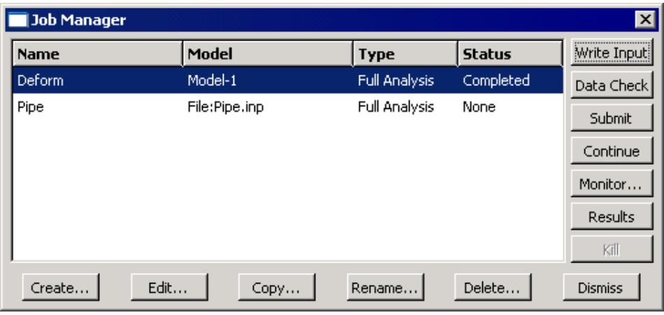  
Figure 1:The Job Manager.

The four columns of the Job Manager display the following:

## Name

The Name column displays the name of the job. Click Rename to rename the selected job.

## Model

The Model column displays the name of the model or input file associated with the job.

## Type

The Type column displays the job type that you selected when you configured the job using the job editor. The job type can be one of the following:

• Full Analysis  
Recover  
Restart

(See Selecting a job type for more information.) You can use the job editor to change the job type as long as the job is not running.

## Status

The Status column displays the current status of the analysis job and is updated continually while your job is running. The status can be one of the following:

## None

The job has not been submitted for analysis.

## Check Submitted

The input file has been written, and the model is being submitted for a data check.

## Check Running

The data check of the model is running.

## Check Completed

The data check of the model has completed successfully; you can now continue with the full analysis.

## Submitted

The input file has been written, and the job is being submitted for a full analysis.

## Running

The job has been submitted for a full analysis and is running.

## Completed

The analysis is complete. You can click Results to view the contents of the output database and graphically verify your results.

## Aborted

The job has been aborted due to problems such as fatal errors in the input file or lack of disk space.

## Terminated

The job has been killed by the user.

For detailed instructions on using the Job Manager to create, edit, and manipulate jobs, see the following sections:

Creating a new analysis job  
Writing the input file only  
Performing a data check on a model  
Submitting an analysis job  
Continuing an analysis job after a data check  
Terminating an analysis job  
Viewing the results of your job

## Additional information

• Understanding analysis jobs  
• Creating, editing, and manipulating jobs  
• Using the job editor

## The job editor

You use the job editor to customize the settings for a new job or to edit the settings for an existing job. You can display the job editor by selecting Job->Create or Job->Edit->job name from the main menu bar. (You can also click Create or Edit in the job manager.)

The job editor contains the following tabbed pages:

## Submission

Use the Submission tabbed page to configure the submission attributes of your job, such as job type, license type for the SimUnit license model, run mode, and submit time. You can also use the submission tabbed page to specify that the job is to be submitted to remote queues that have been configured by your local Abaqus environment file or by your system administrator.

## General

Use the General tabbed page to configure job settings such as the analysis input file processor printout, the name of the directory used for scratch files, and the output format of the results.

Preprocessor printout options are not available for a job associated with an input file; you must specify these options in the input file itself.

## Memory

Use the Memory tabbed page to configure the amount of memory allocated to an Abaqus analysis.

## Parallelization

Use the Parallelization tabbed page to configure the parallel execution of an Abaqus analysis job, such as the number of processors to use.

## Precision

Use the Precision tabbed page to specify either single or double precision for Abaqus/Explicit analyses. You can also choose the precision of nodal output that is written to the output database during the analysis.

For detailed instructions on using the job editor to define jobs, see the following sections :

Navigating the job customization options  
Configuring job submission attributes  
Choosing the job type  
Choosing the job run mode  
Setting the job submit time  
Specifying general job settings  
Controlling job memory settings  
Controlling job parallel execution

Controlling job precision

## Additional information

• Understanding analysis jobs  
• Using the job editor

## Selecting a job type

The Submission tabbed page in the job editor allows you to choose between the following job types:

## Full analysis

Submit a job with this option selected to generate (or regenerate) the input file (if the job is associated with a model), perform a complete analysis of your model, and write the results to the output database. This option is the default.

## Recover (Explicit)

This option is available only when you are running Abaqus/Explicit. Submit a job with this option selected to complete your analysis after Abaqus/Explicit stopped unexpectedly; for example, after filling a disk or after a network problem.

You cannot use this job type to recover an Abaqus/Standard job that terminated prematurely. Instead, you should use the Abaqus/Standard restart capabilities as described in Recovering an Abaqus/Standard analysis.

## Restart

Submit a job with this option selected to start the analysis using data from a previous analysis of a specified model. You must use the Edit Model Attributes dialog box to specify the job to read data from and to specify the step from which to restart the analysis. When you create a job that refers to a model with restart data attributes, Abaqus/CAE by default selects the job type to be Restart.

Restart analyses are described in more detail in Restarting an analysis. You cannot create a restart job for a job that was associated with an input file.

The Job Type settings are analogous to parameters of the Abaqus execution procedure; for more information, see Abaqus/Standard and Abaqus/Explicit Execution. For detailed instructions on choosing a job type, see Choosing the job type.

## Additional information

• Restarting an analysis  
• Understanding analysis jobs  
• Using the job editor

## Monitoring the progress of an analysis job

The Job Manager and Co-execution Manager continually update the status of analysis jobs in the model database. In addition, Abaqus/CAE prints error messages from the analysis products to the message area and creates diagnostic files in your current working directory.

You can monitor information concerning a submitted job by selecting Job->Monitor->job of your choice from the main menu bar or by selecting the job of your choice and clicking Monitor in the Job Manager. The job monitor dialog box for that job appears, as shown in Figure 1. You can display as many job monitors as necessary to view information on multiple jobs.

  
Figure 1:The job monitor.

The jobs submitted for a co-execution appear in the Model Tree in the Jobs container under the co-execution in the Co-executions container. You can monitor these jobs by clicking mouse button 3 on the job in the Model Tree and selecting Monitor.

The top half of the job monitor dialog box displays the information available in the status file that Abaqus creates for the analysis. The table headings are customized for each job based on the settings sent from the analysis. The bottom half of the dialog box displays the following information:

• Click the Log tab to display the start and end times that appear in the log file for the analysis.  
Click the Errors and Warnings tabs to display the errors or the warnings associated with the analysis. Abaqus/CAE indicates the presence of errors or warnings by prepending an exclamation point before the Errors and Warnings tab. If a particular region of the model is causing the error or warning, a node or element set will be created automatically that contains that region. The name of the node or element set appears with the error or warning message, and you can view the set using display groups in the Visualization module. (For more information on display groups, see Using display groups to display subsets of your model.)

Abaqus/CAE may not perform all consistency checks when it creates an input file, which can result in warnings or error messages during an analysis. If your analysis generates warning or error messages, consider running a data check analysis (see Performing a data check on a model) to diagnose and fix possible problems in your model.

The number of error and warning messages that appear in the job monitor is limited by the environment parameters cae\_error\_limit and cae\_warning\_limit, respectively (see Job customization parameters, for details). If the number of errors or warnings exceeds the job monitor limit, consult the data, message, or status file for a complete list of messages.

• Click the Output tab to display a record of each output data entry as it is written to the output database. In addition, if you requested that Abaqus monitor the values of a degree of freedom of a particular node to the message and status files, the Output tabbed page records each time this information is written and the value of the degree of freedom at that point of the analysis. (For more information, see Understanding output requests, and Degree of freedom monitor requests.)

• As the analysis proceeds, Abaqus creates the following files:

- Abaqus/Standard: Data file, message file, and status file  
Abaqus/Explicit: Data file, message file, and status file

Abaqus/CAE activates the Data File, Message File, and Status File tabs accordingly. You can click any of these tabs to browse or search the corresponding file for additional error and warning messages.


## Note:

Abaqus/CAE populates the Data File, Message File, and Status File tabbed pages only for locally submitted analyses; this information will not be displayed in the job monitor for remote jobs. In addition, although Abaqus/CAE updates the contents of these pages periodically as the analysis runs, the data might not always be synchronized with the latest data in the files.

For detailed information on the different output files that Abaqus creates during an analysis, see About Output.

You can search for specific error or warning messages within any of the files displayed in tabbed pages in the job monitor. Select the desired file tab, enter a search string in the Text to find field, and click Next or Previous to step through the file from one hit to the next. Toggle on Match case to perform a case-sensitive search.

The information presented in the job monitor dialog box is updated continually as the analysis progresses. If the job fails, the Errors tabbed page appears in front of the other tabbed pages automatically to help you determine the cause of the failure. In addition, an exclamation point appears on the tab if any error or warning messages are output.

If you start monitoring a job and then exit Abaqus/CAE, close the current model database, or open a new model database, Abaqus/CAE will stop updating the job monitor. The job will continue to run; however, the job monitor will not report the status of the job or update the increment information.

If you requested DOF Monitor output on a particular degree of freedom for a particular node, Abaqus/CAE provides another opportunity to monitor the job by plotting the values of the degree of freedom over time. The plot appears in a new viewport that is generated automatically when you submit the job. If the visible part of the canvas is already filled with one or more viewports, the new viewport may be placed on a part of the canvas that is not visible; in this case you should tile or cascade the viewports or enlarge the canvas to bring the viewport into view. (For information on requesting output for a particular degree of freedom for a particular node, see Degree of freedom monitor requests.)

If necessary, you can terminate the analysis job by clicking Kill at the bottom of the job monitor dialog box.

## Additional information

• Understanding analysis jobs  
• Understanding co-executions  
• Creating, editing, and manipulating jobs  
• Creating, editing, and manipulating co-executions

## Submitting a job remotely

When you configure a job, you can request that Abaqus/CAE route the job to a specified queue on a remote Linux host computer. You can specify the remote queue by selecting an associated queue name in the Submission tabbed page of the job editor.


Note: The job editor displays default settings for memory usage, parallelization, and precision based on the environment files effective for the current session on the local machine. When you submit a job to a remote machine, Abaqus replaces the default settings with those from the environment files on the remote machine. Nondefault settings in the job editor are saved with the job and will be used regardless of where you run the analysis.

Each queue name that appears in the job editor refers to an entry in your Abaqus environment file in which you specify how you want the job to be run on the host computer. In other words, when you select a queue name in the job editor, you specify not only the desired queue on the host computer but also other options, such as the directory on the host computer in which you want to run the job and the files you want copied back to your local directory when the job is complete.

You can specify your preferences for running a job remotely by adding the following to your Abaqus environment file:

```python
def onCaeStartup():
    import os

    def makeQueues(*args):
        session.Queue(name,
                             queueName,
                             hostName,
                             fileCopy,
                             directory,
                             driver,
                             remotePlatform,
                             filesToCopy,
                             deleteAfterCopy,
                             description)

    addImportCallback('job', makeQueues)
```

This entry is written using the Abaqus command language. The following list describes each argument in the entry above.

## name

The queue name that you want to appear in the job editor.

## queueName

The name of an existing queue on the host computer. (For information on creating queues on the host computer, refer to the Abaqus Configuration Guide.)

## hostName

The name of the host computer. The default is an empty string.

## fileCopy

When the analysis is complete, the value of this argument determines whether or not the analysis files will be copied back to the directory from which the job was submitted. The default value is ON.

## directory

The name of the directory on the host computer where you want the job run. You must have write privileges to this directory. The default is an empty string.

## driver

The name of the command on the host computer to execute Abaqus/Standard or Abaqus/Explicit. The default is abaqus.

## remotePlatform

The platform on the remote machine. The default is UNIX (for Linux).

## filesToCopy

The extensions of the analysis files that you want copied back to the local directory when the job is complete or ALL. By default, all of the files generated during job execution are copied.


## Note:

The restart (.res) file, the Abaqus/Explicit state (.abq) file, and the packaging (.pac) file are platform-dependent; if your local platform and remote platform settings differ, you will not be able to use these files without some kind of translation. All of the other files can be copied across platforms without any difficulty.

## deleteAfterCopy

The value of this argument determines whether remote files are to be deleted after they are copied to the local machine. The default value is OFF.

## description

A short description of the queue.

The name and queueName arguments must be included in each queue definition. However, if you do not include any of the other arguments in a queue definition, default values will be supplied automatically. An example queue definition is shown below:

```python
def onCaeStartup():
    import os

    def makeQueues(*args):
        session.Queue(name='long',
                             queueName='aba_long',
                             hostName='jobserver',
                             directory='/scratch/' + os.environ['USER'])
    addImportCallback('job', makeQueues)
```

The commands in the example above configure the following:

## name

The queue name displayed in the job editor is long.

## queueName

The queue name on the host computer is aba\_long.

## hostName

The name of the host computer is jobserver.

## directory

The directory on the host computer where Abaqus will store the input file and all other files associated with the job is /scratch/your user name.

Since the fileCopy, driver, remotePlatform, filesToCopy, and deleteAfterCopy arguments have been left out of the entry above, the default options for these parameters are assigned to this queue automatically.

If you want to create two or more queues, you can repeat the line containing the session.Queue command as many times as necessary. For example, the following Abaqus environment file entry specifies two queues, one named long and the other named job:

```python
def onCaeStartup():
    import os

    def makeQueues(*args):
        session.Queue(name='long',
                             queueName='aba_long',
                             hostName='jobserver',
                             directory='/scratch/' + os.environ['USER'])
        session.Queue(name='job',
                             queueName='aba_job',
                             hostName='jobserver',
                             fileCopy=OFF)

    addImportCallback('job', makeQueues)
```

The monitoring functions described in Monitoring the progress of an analysis job, are available for jobs run remotely just as they are for jobs run locally. However, the output database for the job, like any other analysis files that you may have requested, is not copied to your local directory until after the job is complete. As a result, you must create and start a network output database connector if you want to use the Visualization module to view the results being generated by an analysis running on a remote system. For more information, see Accessing an output database on a remote computer.

## Additional information

• Environment File Settings  
• Abaqus Scripting User's Guide

## Understanding adaptivity processes

This section provides an overview of adaptivity processes.

You use an adaptivity process to control a succession of analysis jobs that are adaptively remeshed by Abaqus/CAE based on the contents of your remeshing rules. For more information about adaptive remeshing and the other adaptivity techniques that are available in Abaqus, see About Adaptivity Techniques.

## In this section:

What is an adaptivity process?  
When will my mesh adaptivity stop iterating?  
Manual mesh adaptivity  
Using a combination of automatic and manual mesh adaptivity  
The Adaptivity Process Manager

## What is an adaptivity process?

An adaptivity process is a succession of analysis jobs where Abaqus/CAE remeshes selected regions of the model between each job. Abaqus/CAE modifies the mesh to be used in each analysis job in response to error estimates that were computed during the previous analysis and written to the output database. For more information, see About Adaptive Remeshing.

You have considerable flexibility in how you execute this succession of jobs. Adaptivity processes are stored in the model database and are maintained between sessions.

## When will my mesh adaptivity stop iterating?

When you create an adaptivity process, you define a sequence of jobs to be run successively. You can specify the number of jobs in the sequence by specifying the maximum number of analysis iterations allowed, $i t e r _ { \operatorname* { m a x } }$ . The maximum number of remeshing operations will be $i t e r _ { \operatorname* { m a x } } - 1$ , because no remeshing will be performed after the final analysis job is run. When you submit the remesh process, Abaqus/CAE runs each job in the sequence until one of the following conditions is met:

• All active remeshing rules are satisfied. For more information, see What are remeshing rules?.  
• All jobs are completed, indicating that Abaqus/CAE has reached the maximum number of analysis iterations that you specified.  
• A job fails to complete. This failure can be due to convergence difficulties or to machine resource problems.

## Manual mesh adaptivity

As an alternative to automatic mesh adaptivity, you can submit a job using the Job manager. When you define a remeshing rule in the Mesh module, you request error indicator output variables that are written to the output database when the job executes. After the job has completed, you can return to the Mesh module and ask Abaqus/CAE to create a new mesh using a combination of your remesh rules and the error indicators in the output database. You can perform this process indefinitely to adapt your mesh successively until the goals of the remesh rules are met. For more information, see What is the difference between automatic adaptive remeshing and manual adaptive remeshing?.

## Using a combination of automatic and manual mesh adaptivity

In many cases you will want to transition between automatic and manual use of adaptive remeshing. Some examples include:

• You must keep the current Abaqus/CAE session active for automatic remeshing to occur between analysis jobs. If you exit Abaqus/CAE and start a new session, you must use manual remeshing to remesh the model.  
You start an automatic sequence of jobs, but a machine problem (such as a full disk) interrupts the analysis prematurely. You can restart the analysis manually and then continue it in a fully automatic manner. Variations of this case include an analysis ending because it failed to converge or an analysis ending because you terminated the job during a particular iteration.  
You can experiment with sizing function parameters and remesh your model manually until you find a set of remeshing rules that creates a mesh that appears to be responding actively to your variables of interest. When you are comfortable with your remeshing rules, you can switch to automatic mesh adaptivity and complete a specified number of analysis iterations.  
The mesh generated by the automatic mesh adaptivity procedure converges to an acceptable configuration. You can now modify the loads applied to the model and perform an additional manual iteration that makes a minor meshing adjustment to compensate for the new load.

You can transition directly between automatic and manual mesh adaptivity. To transition from automatic to manual mesh adaptivity, you enter the Mesh module and select Adaptivity->Manual Adaptive Remesh from the main menu bar and remesh the model. You then return to the Job module and submit the job for analysis. Conversely, to transition from manual to automatic mesh adaptivity, you create an adaptivity process in the Job module and submit it for analysis.

## The Adaptivity Process Manager

The Adaptivity Process Manager, which is similar to other managers in Abaqus/CAE, allows you to do the following:

• Create an adaptivity process and associate the process with a selected model.  
• Edit the selected adaptivity process.  
• Copy, rename, or delete the selected adaptivity process.

In addition, the Adaptivity Process Manager allows you to do the following:

• Perform a data check on a model before submitting an adaptivity process.  
Submit an adaptivity process.  
Continue an adaptivity process after performing a data check.

You can display the Adaptivity Process Manager by selecting Adaptivity->Manager from the main menu bar. Figure 1 shows the layout of the Adaptivity Process Manager.

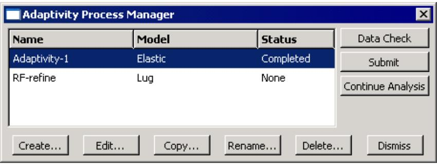  
Figure 1:The Adaptivity Process Manager.

The three columns of the Adaptivity Process Manager display the following:

## Name

The Name column displays the name of the adaptivity process. Click Rename to rename the selected process.

## Model

The Model column displays the name of the model associated with the adaptivity process.

## Status

The Status column displays the current status of the adaptivity process and is updated continually while the process is running. The status can be one of the following:

## None

The process has not been submitted for analysis.

## Check Submitted

The model is being submitted for a data check.

## Check Running

The data check of the model is running.

## Check Completed

The data check of the model completed successfully; you can now continue the adaptivity process.

## Submitted

The process is being submitted for execution.

## Running

The process has been submitted for analysis and is running.

## Completed

The process has run to completion.

## Aborted

The process has been aborted due to problems such as fatal errors in the model or lack of disk space.

## Terminated

The process has been terminated by the user.

For detailed instructions on using the Adaptivity Process Manager to create, edit, and manipulate adaptivity processes, see the following sections :

Creating a new adaptivity process  
Performing a data check on an adaptivity process  
Submitting an adaptivity process  
Continuing an adaptivity process after a data check  
Terminating an adaptivity process

## Additional information

• Understanding adaptivity processes  
• Creating, editing, and manipulating adaptivity processes  
• Using the adaptivity process editor

## Understanding co-executions

This section provides an overview of co-executions.

## In this section:

What is a co-execution?  
The Co-execution Manager  
The co-execution editor

## What is a co-execution?

A co-execution is the co-simulation execution of two analysis jobs that are executed in Abaqus/CAE in synchronization with one another using the same functionality as described in Understanding analysis jobs. For more information on this analysis technique, see Structural-to-Structural Co-Simulation.

## The Co-execution Manager

The Co-execution Manager, which is similar to other managers in Abaqus/CAE, allows you to do the following:

• Create a co-execution and associate it with selected analyses.  
• Edit the selected co-execution.  
• Copy, rename, or delete the selected co-execution.

In addition, the Co-execution Manager allows you to do the following:

• Perform a data check on the models before submitting a co-execution.  
Submit a co-execution.  
View the results of a co-execution.  
Terminate a co-execution that is currently running.

You can display the Co-execution Manager by selecting Co-execution->Manager from the main menu bar. Figure 1 shows the layout of the Co-execution Manager.

  
Figure 1:The Co-execution Manager.

The three columns of the Co-execution Manager display the following:

## Name

The Name column displays the name of the co-execution. Click Rename to rename the selected co-execution.

## Analyses

The Analyses column displays the type of analyses associated with the co-execution; for example, Abaqus-Abaqus.

## Status

The Status column displays the status of the jobs in the co-execution and is updated continually while the co-execution is running. The status can be one of the following:

## None

The co-execution has not been submitted for analysis.

## Check Submitted

The analyses are being submitted for a data check.

## Check Running

The data check of the analyses are running.

## Check Completed

The data check of the analyses completed successfully; you can now continue the co-execution.

## Submitted

The co-execution is being submitted.

## Running

The co-execution has been submitted and is running.

## Completed

The co-execution has run to completion.

## Aborted

The co-execution has been aborted due to problems such as fatal errors in one of the models or lack of disk space.

## Terminated

The co-execution has been terminated by the user.

## Additional information

• Understanding co-executions  
• Creating, editing, and manipulating co-executions

## The co-execution editor

You use the co-execution editor to select the models, define the initial job parameter settings in the individual job editors, and change the co-execution timeout value. After the co-execution is created, the job parameters in the co-execution editor are unavailable for editing; you must edit the individual jobs.

You can display the co-execution editor by selecting Co-execution->Create or Co-execution->Edit->co-execution name from the main menu bar. (You can also click Create or Edit in the co-execution manager.)

The co-execution editor contains the following tabbed pages for specifying the job parameters:

## Submission

Use the Submission tabbed page to configure the submission attributes of your job, such as job type, run mode, and submit time. You can also use the submission tabbed page to specify that the job is to be submitted to remote queues that have been configured by your local Abaqus environment file or by your system administrator.

## General

Use the General tabbed page to configure job settings such as the analysis input file processor printout and the name of the directory used for scratch files.

## Memory

Use the Memory tabbed page to configure the amount of memory allocated to an Abaqus analysis.

## Parallelization

Use the Parallelization tabbed page to configure the parallel execution of an Abaqus analysis job, such as the number of processors to use.

## Precision

Use the Precision tabbed page to specify either single or double precision for Abaqus/Explicit analyses. You can also choose the precision of nodal output that is written to the output database during the analysis.

## Additional information

• Understanding co-executions

## Understanding optimization processes

This section provides an overview of optimization processes.

## In this section:

What is an optimization process?  
Understanding the files generated by an optimization process  
Postprocessing an optimization  
The Optimization Process Manager  
The optimization process editor

## What is an optimization process?

Figure 1 illustrates how an optimization process iteratively updates the design variables, modifies the finite element model, and runs Abaqus analyses while it searches for an optimized solution.  
  
Figure 1: An optimization process iteratively searches for an optimized solution.

An optimization process reads an optimization task that you defined in the Optimization module and iteratively searches for an optimized solution based on the objective functions and constraints that you defined in the optimization task. Each iteration is called a design cycle. During each design cycle the optimization modifies the finite element model and an Abaqus analysis is performed on the modified model. The optimization process reads the results of the analysis and decides whether to end the optimization because either the solution is optimal or a specified stop condition has been reached or whether to continue the optimization and iterate on another design cycle.

An optimization process generates optimization results and analysis results. You must combine the optimization results and analysis results into a single output database file to view the results of the optimization in the Visualization module, as described in Postprocessing an optimization. The Optimization module does not support the use of parts and assemblies in the Abaqus input file. When you run an optimization task, the Optimization module generates a flattened input file that does not use parts and assemblies, regardless of your Abaqus model attributes.

An optimization process appears in the Analysis section of the Model Tree and contains the Abaqus jobs that were run during the optimization, as shown in Figure 2.

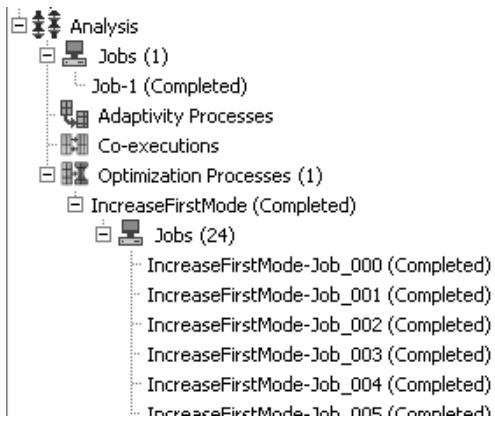  
Figure 2: An optimization process in the Model Tree.

You can check the validity of your optimization process; however, the validation does not check your Abaqus model. You should run a complete analysis of your model and make sure that it runs to completion before you attempt to run an optimization process.

## Additional information

• Understanding optimization processes  
• Creating, editing, and manipulating optimization processes

## Understanding the files generated by an optimization process

When an optimization process is executing, it creates two types of data that are saved in separate files—optimization results and analysis results.

## Optimization results

The optimization results consist of the optimization variables and the optimization values. The optimization variables depend on the type of optimization you are performing.

## Topology optimization

The optimization variable is the normalized material distribution variable (MAT\_PROP\_NORMALIZED).

## Shape optimization

The optimization variables are the displacement variables:

DISP\_OPT: a vector indicating the direction in which the nodes were moved during the shape optimization. Because of mesh smoothing and filtering, the vector may not be coincident with the node normal vector.  
DISP\_OPT\_VAL: the magnitude of the DISP\_OPT vector with a sign indicating the direction of the displacement—positive for growth and negative for shrinkage.  
• CTRL\_INPUT: the value of the objective function at each node (stress, for example).

## Sizing optimization

The optimization variables are the shell thickness and the change in shell thickness (THICKNESS and DELTA\_THICKNESS).

## Bead optimization

The optimization variables are the displacement variables:

DISP\_NORMAL\_VAL: the magnitude of a vector indicating the direction in which the nodes were moved during the bead optimization along the node normal vector.  
DISP\_OPT: a vector indicating the direction in which the nodes were moved during the bead optimization. Because of mesh smoothing and filtering, the vector may not be coincident with the node normal vector.  
DISP\_OPT\_VAL: the magnitude of the DISP\_OPT vector with a sign indicating the direction of the displacement—positive for growth and negative for shrinkage.

The optimization variables are saved in separate optimization (.onf) files after every design cycle. In addition, the optimization values, such as the value of the objective and the constraints, are written to a comma-separated text file (.csv) after each design cycle. (You are viewing the optimization values when you monitor the progress of an optimization process, as described in Monitoring your optimization process.)

## Analysis results

The analysis results are the field and history data generated by Abaqus during the analysis. During each design cycle a new output database file is created. In the initial design cycle, Abaqus writes both field and history data to the new output database file; however, during subsequent design cycles, Abaqus writes only field data. Abaqus also generates data (.dat), message (.msg), and status (.sta) files during each design cycle. To conserve disk space and to speed up postprocessing, the output database file and the data, message, and status files are saved only at specified intervals; by default, after the initial, first, and final design cycles. (You specify the rate at which the files are saved when you create the optimization process, as described in Creating and editing optimization processes.) In addition, Abaqus saves the new input file that is generated during each design cycle.

## Postprocessing an optimization

To view the results of an optimization process in the Visualization module, you must combine the optimization results and the analysis results into a single results output database file, as described in Combining optimization results.

## Creating the base results output database file

The output database file that you choose to be the base results becomes the starting point for the combined results output database file.

## Choosing between the initial and the final design cycle

You can specify that the base results be taken from the output database file generated by the initial design cycle or from the output database file generated by the final design cycle. In most cases you will select the initial design cycle and view the progression of the optimization from the initial design cycle to the final design cycle; for example, to follow the change in stiffness. Select the final design cycle if you performed a frequency optimization and want to view the frequency and the mode shape of the first few modes. If you performed a shape optimization, you should take the base results from the output database file generated by the first design cycle.

## Choosing the original model

The Optimization module modifies the material definitions and the section assignments before running the initial design cycle of the optimization process. The original model is the model that existed before any modifications were made by the Optimization module.

You can specify that the base results be taken from the output database file generated by the original model. However, the optimization process does not run an Abaqus analysis of the original model. Therefore, you must run the analysis manually before you can choose the original model as the base results. (The Abaqus input file for the original model is stored, along with all the input files generated by the optimization process, in the optimization process name\SAVE.inp directory. The name of the input file for the original model is optimization process name\_org.inp.)

The output database file that you use for the base results must be generated without parts and assemblies, as described in Writing input files without parts and assemblies. The input files generated by the Optimization module do not include parts and assemblies, regardless of any user settings in Abaqus/CAE. However, if you create the base results from an input file that was not generated by the Optimization module or by executing a job from Abaqus/CAE, you must ensure that the resulting output database file does not contain parts and assemblies.

## Appending to the base results

After you have specified the output database file that will be used as the source of the base results, Abaqus/CAE appends the optimization results and the Abaqus analysis results to the combined output database file.

## Appending the optimization results

Abaqus/CAE appends the optimization variables as field data to the combined output database file after every design cycle, and each design cycle appears as a frame in the combined output database file. Similarly, Abaqus/CAE appends the optimization values as history data to the combined output database file.

## Appending the analysis results

You can do the following to specify which analysis results data are written to the combined results output database file:

• Specify from which design cycles the analysis results should be written.  
Specify from which models the analysis results should be written. Abaqus/CAE creates a combined results output database file for each model in your optimization process.  
• Specify for a selected model from which steps within the model the analysis results should be written.  
• Specify which analysis field variables should be written.

History data are not written to the combined database file during the combine process. The combined output database file contains only the history data from the base results output database file.

It is recommended that you save the analysis results after the initial and final design cycle when you create the optimization process. After the optimization is complete, you can select the output database file generated during the initial design cycle as the base results. You can then combine the base results output database file with the optimization results from every design cycle along with the analysis results from the final design cycle, as illustrated in Table 1.

Table 1: Saving optimization and analysis results in the combined output database file.

<table><tr><td rowspan="2"></td><td colspan="5">Design Cycle</td></tr><tr><td>Initial</td><td>First</td><td>Second</td><td>Third</td><td>Fourth (Final)</td></tr><tr><td>Data saved</td><td>Analysis results (field and history data)</td><td>Optimization results</td><td>Optimization results</td><td>Optimization results</td><td>Optimization results and analysis results (field data only)</td></tr><tr><td>Action</td><td>Create base results</td><td>Append to base results</td><td>Append to base results</td><td>Append to base results</td><td>Append to base results</td></tr></table>

For example, if you executed a topology optimization, you can then do the following:

• View the initial state of your model; for example, the initial geometry and the loads and boundary conditions.  
View the change in the optimization variables—normalized material distribution variable (MAT\_PROP\_NORMALIZED)—during each design cycle to observe the progression of the optimization.  
• View the final state of your model; for example, the optimized geometry and the displacements and the stresses and strains.  
• Create a history plot that tracks the change in the objective and constraints.

You can apply similar conditions to view the beginning and ending state and the progression of the shape and sizing optimizations.

Combining optimization results is supported only for optimizations that you configured with the following analysis cases:

• Simple analysis (a single model, a single step, and a single load case)  
• Frequency or modal analysis  
• Linear perturbation analysis with multiple load cases

• Optimization with multiple models

## Additional information

• Understanding optimization processes  
• Creating, editing, and manipulating optimization processes

## The Optimization Process Manager

The Optimization Process Manager allows you to create and configure an optimization process and to edit, copy, rename or delete the selected optimization process.

In addition, the Optimization Process Manager allows you to do the following:

• Write copies of the TOSCA parameter (.par) file and the Abaqus input (.inp) file to your working directory.  
• Validate the optimization before submitting an optimization process to ensure that the optimization task has been configured correctly and the Abaqus model exists.  
• Submit an optimization process.  
• Restart an optimization process that has failed because of a problem external to the optimization or the Abaqus analysis, such as a failure to obtain an Abaqus license.  
• Monitor the progress of an optimization process.  
• Extract a smooth isosurface meshed representation of the optimized model surface in the form of a file that can be transferred to a CAD system or back into Abaqus/CAE.  
• Combine the optimization results and the analysis results created by an optimization process into a single results output database file that can be displayed by the Visualization module.  
• View the results of an optimization process.

You can display the Optimization Process Manager by selecting Optimization Process Manager->Manager from the main menu bar. Figure 1 shows the layout of the Optimization Process Manager.

  
Figure 1:The Optimization Process Manager.

The four columns of the Optimization Process Manager display the following:

## Name

The Name column displays the name of the optimization process. Click Rename to rename the selected optimization process.

## Model

The Model column displays the Abaqus/CAE model associated with the optimization process.

## Task

The Task column displays the optimization task associated with the optimization process.

## Status

The Status column displays the status of the jobs in the optimization process and is updated continually while the optimization process is running. The status can be one of the following:

## None

The optimization process has not been submitted for analysis.

## Submitted

The optimization process is being submitted.

## Running

The optimization process has been submitted and is running.

## Completed

The optimization process has run to completion.

## Aborted

The optimization process has been aborted due to problems such as fatal errors in one of the models or lack of disk space.

## Terminated

The optimization process has been terminated by the user.

## Additional information

• Understanding optimization processes  
• Creating, editing, and manipulating optimization processes

## The optimization process editor

You use the optimization process editor to select the Abaqus/CAE model and the optimization task that will be included in the optimization process. You can also configure the optimization settings, such as the maximum number of optimization iterations.

You can display the optimization process editor by selecting Optimization Process->Create or Optimization Process->Edit->optimization process name from the main menu bar. (You can also click Create or Edit in the Optimization Process Manager.)

The optimization process editor allows you to configure the following:

## Optimization

Use the Optimization tabbed page to specify the maximum number of optimization iterations that should be run before the process terminates and the frequency at which data are saved. For more information, see Creating and editing optimization processes.

## Submission

Use the Submission tabbed page to configure the submission attributes of your optimization process, such as the submit time and whether the process is to be submitted to remote queues that have been configured by your local Abaqus environment file or by your system administrator. For more information, see Configuring job submission attributes.

## Memory

Use the Memory tabbed page to configure the amount of memory allocated to the Abaqus jobs during the optimization process. For more information, see Controlling job memory settings.

## Parallelization

Use the Parallelization tabbed page to configure the parallel execution of the Abaqus analysis jobs during the optimization process, such as the number of processors to use. For more information, see Controlling job parallel execution.

## Additional information

• Understanding optimization processes  
• Creating, editing, and manipulating optimization processes

## Restarting an analysis

This section describes the restart capability in Abaqus/CAE.

If your model contains multiple steps, you do not have to analyze all of the steps in a single analysis job. Indeed, it is often desirable to run a complex analysis in stages. This allows you to examine the results and confirm that the analysis is performing as expected before continuing with the next stage. The restart files generated by an Abaqus analysis allow you to continue the analysis from a specified step. For more information, see Restarting an Analysis.

## In this section:

Controlling a restart analysis  
Files required to restart an analysis  
Rules governing a restart analysis  
The relationship between the model and the restart analysis  
Restarting after adding more analysis steps to the model  
Restarting after modifying existing analysis steps  
Restarting from the middle of a step  
Visualizing results from restart analyses  
Recovering an Abaqus/Standard analysis  
Remote submission of restart jobs

## Controlling a restart analysis

By default, no restart information is written for an Abaqus/Standard analysis and restart information is written only at the beginning and end of each step for an Abaqus/Explicit analysis.

You can use the Step module to change the frequency at which restart information is written. For more information, see Restart output requests.

After an analysis has generated restart information, you can control the following aspects of the subsequent restart analysis:

## Model attributes

To configure a restart analysis, you must specify whether the model should reuse data from a previous analysis of the same model. You can specify the step and the increment or time interval of the previous analysis from which the new analysis should start. You can also choose one of the following:

• Allow the selected step to continue to completion.  
• Terminate the selected step at the specified increment and begin a new step.

For more information, see Specifying model attributes.

## Job type

You use the job editor to specify the job type. If you edit the model attributes to specify that the model should reuse data from a previous analysis and you create a job that refers to this model, Abaqus/CAE sets the job type to Restart. For more information, see Selecting a job type. You cannot create a restart job that refers to a job that was associated with an input file.

## Files required to restart an analysis

To restart an analysis, various files that were created by the previous analysis must be available in the directory from which you started the Abaqus/CAE session.

## Abaqus/Standard

• Output database (.odb)  
• Restart file (.res)  
• Model file (.mdl)  
• Part file (.prt)  
• State file (.stt)

## Abaqus/Explicit

• Output database (.odb)  
• Restart file (.res)  
• Model file (.mdl)  
• Package file (.pac)  
• Part file (.prt)  
• State files (.abq and .stt)  
• Selected results file (.sel)

The restart analysis generates an error if any of these files are not available in the current directory.

## Rules governing a restart analysis

Defining the restart information for models and jobs is straightforward using Abaqus/CAE; however, you should understand the following before you use the analysis restart capability:

• The model used in the restart analysis must be the same as the model used in the original analysis up to the restart location. Specifically,  
- For the new model do not modify or add any geometry, mesh, materials, sections, beam section profiles, material orientations, beam section orientations, interaction properties, or constraints.  
Similarly, do not modify any steps or prescribed conditions (loads, boundary conditions, fields, interactions, or output requests) at or before the restart location.  
• Keyword editing is not supported for restart analyses. If you used the keyword editor to edit the original model, Abaqus/CAE ignores those changes when you restart the analysis.


## Warning:

Abaqus/CAE does not perform any checks to ensure that the restart data stored for the original job are consistent with the model used in the restart analysis. In some cases the analysis will terminate with error messages. In other cases the analysis will run, but the results may not correspond with your intent. A specific example of a case that will result in an error message is one where you define a coupling constraint and its accompanying reference node in the original model and then suppress the constraint prior to the original analysis submission. In this example Abaqus/CAE maintains the reference node definition but Abaqus/Standard or Abaqus/Explicit may remove it from the model definition if it is not attached to other elements or constraints. Your subsequent Abaqus/CAE restart analysis in this example will be seen as inconsistent with the original analysis. In many cases like this example you can manually modify the restart analysis input file to correct the discrepancy.

## The relationship between the model and the restart analysis

When you first submit a job based on a model for analysis, Abaqus/CAE generates an input file based on the definition of your model; and that input file, in turn, is submitted for analysis. The input file contains the element and node definitions generated by the Mesh module along with the materials, steps, output requests, loads, interactions, etc. that you specified using Abaqus/CAE.

To run a restart analysis of a job associated with a model, it is recommended that you copy the model to a new model. The new model contains all the element and node definitions from the original model along with all the materials, steps, output requests, loads, interactions, etc. To request a restart analysis, you edit the new model's attributes and specify that the analysis continue from a specified step of the original analysis. When you create a new restart job that refers to the new model, Abaqus/CAE sets the job type to Restart.

When you submit the new job for analysis, Abaqus/CAE generates an input file based on the restart information. No part, assembly, or property data are written to the restart input file. Only the following data are written:

• Steps that appear after the analysis is restarted.  
• Data from step-dependent objects that are associated with steps that appear after the restart step; for example, loads, boundary conditions, fields, and output requests.  
• New regions and amplitudes that are used by step-dependent objects that are associated with steps that appear after the restart step.

Abaqus reads the part, assembly, and property data, along with data from steps that appear before the restart step from the restart files that were generated by the original analysis. As a result, although the model contains all this information, the information is not written to the input file that is submitted to Abaqus/Standard or Abaqus/Explicit. This is an important consideration. Some changes that you make to the model in a restart analysis, say a material property, will not appear in the input file that is analyzed.

## Restarting after adding more analysis steps to the model

The most common use of the restart capability is to analyze your model and then add one or more steps to the model and continue the analysis. This section describes an example of this usage.

Assume that you have done the following:

• Created a model called Model-A that has two analysis steps, Step-1 and Step-2.  
• Used the Edit Restart Requests dialog box in the Step module to output the restart information at the end of each step.  
• Created a job called Job-A that uses Model-A.  
• Analyzed the model.

After studying the results of the analysis, you decide to add another step, Step-3, to the model. The restart capability allows you to compute the results for Step-3 without having to repeat the computations for Step-1 and Step-2. The following steps describe a recommended procedure to follow:

1. Copy Model-A to a new model, say Model-A-restart, and make Model-A-restart the current model.  
2. Add the new Step-3 to Model-A-restart.  
3. Add new prescribed conditions (loads, boundary conditions, interactions, fields, or output requests) in Step-3, or modify the prescribed conditions propagated from Step-2.  
4. From the main menu bar, select Model->Edit Attributes->Model-A-restart. From the Edit Model Attributes dialog box that appears, do the following:

• Enter Job-A as the job from which the restart data will be read.  
• Set the restart location:  
- Enter Step-2 to indicate the step from which the restart data will be read.  
- Choose Restart from the end of the step. Step-3 will continue the analysis after the end of Step-2.

5. Copy Job-A to a new job, say Job-A-restart, that uses Model-A-restart.  
6. From the main menu bar, select Job->Edit->Job-A-restart. From the Edit Job dialog box that appears, choose a job type of Restart.  
7. Submit Job-A-restart for analysis.

## Restarting after modifying existing analysis steps

You can use the restart capability to analyze your model and then modify an existing step before continuing the analysis. This section describes an example of this usage.

Assume that you have done the following:

• Created a model called Model-A that has two analysis steps, Step-1 and Step-2.  
• Used the Edit Restart Requests dialog box in the Step module to output the restart information at the end of each step.  
• Created a job called Job-A that uses Model-A.  
• Analyzed the model.

After examining the results of Job-A, you realize that you need to make changes to Step-2, to an output request in Step-2, or to a prescribed condition in Step-2, such as a load or boundary condition. You may also want to add some new steps with additional output requests and loads and with changes to the boundary conditions. You know that you can still use the results from Step-1; however, you realize that the results from Step-2 are no longer valid. The restart capability allows you to recompute the results for Step-2 without having to repeat the computations for Step-1. The following steps describe a recommended procedure to follow:

1. Copy Model-A to a new model, say Model-A-restart, and make Model-A-restart the current model.

2. Do the following:

• Make the desired changes to Step-2.  
• Add new steps after Step-2.  
• Create new prescribed conditions in Step-2 and subsequent steps.

3. From the main menu bar, select Model->Edit Attributes->Model-A-restart. From the Edit Model Attributes dialog box that appears, do the following:

• Enter Job-A as the job from which the restart data will be read.  
• Set the restart location:  
- Enter Step-1 to indicate the step from which the restart data will be read.  
- Choose Restart from the end of the step. Step-2 will continue the analysis after the end of Step-1.

4. Copy Job-A to a new job, say Job-A-restart, that uses Model-A-restart. Abaqus/CAE sets the job type to Restart.

5. Submit Job-A-restart for analysis.

## Restarting from the middle of a step

You can use the restart capability to continue the analysis from the middle of a completed step or from the middle of a partially completed step. The restarted analysis uses a new step that continues the analysis from a specified increment of the previous step. This section describes an example of this usage.

Assume that you have done the following:

• Created a model called Model-A that has two Abaqus/Standard analysis steps, Step-1 and Step-2.  
• Used the Edit Restart Requests dialog box in the Step module to output the restart information every 10 increments.  
• Created a job called Job-A that uses Model-A.  
• Analyzed the model.

You suspected that the loading is too severe for the structure and might lead to instabilities or collapse of the structure and, hence, to numerical convergence difficulties. As a result, you used the Step module to save the restart information every 10 increments of each step. When you ran the analysis, you found that the analysis terminated before the end of Step-2, at increment 25. You used the Visualization module to look at the results of the analysis and realized that the negative eigenvalue messages confirmed your suspicion that the structure might have become unstable. Now that you have some idea of the collapse load level, you want to restart the analysis at increment 20 of Step-2 with lower levels of loading and more frequent output of results data. The following steps describe a recommended procedure to follow:

1. Copy Model-A to a new model, say Model-A-restart, and make Model-A-restart the current model.  
2. Add the new Step-3 to Model-A-restart.  
3. Modify the load levels and output requests in Step-3. For example, if the load at Step-2, increment 25 was 260 and the load at Step-2, increment 20 was 250, you might change the load level for the end of Step-3 to 262. In addition, you can increase the frequency at which data are written to the output database so that you can follow the progression of the collapse of the structure. You can also reduce the size of the maximum increment to control the resolution of the data that are generated by the analysis. For more information, see Restarting an Analysis.

4. From the main menu bar, select Model->Edit Attributes->Model-A-restart. From the Edit Model Attributes dialog box that appears, do the following:

• Toggle on Read data from job and enter Job-A to indicate the job from which the restart data will be read.  
• Set the restart location:

- Enter Step-2 to indicate the step from which the restart data will be read.  
Choose Restart from increment, interval, iteration, or cycle, and enter 20 to indicate the increment from which the restart data will be read.  
Choose and terminate the step at this point to indicate that Step-2 should terminate at increment 20. Step-3 will continue the analysis from this location.

5. Copy Job-A to a new job, say Job-A-restart, that uses Model-A-restart. Abaqus/CAE sets the job type to Restart.

6. Submit Job-A-restart for analysis.

## Visualizing results from restart analyses

Each restart analysis creates a new output database. Consider the example described in Restarting after adding more analysis steps to the model, where you did the following:

• Ran an analysis of Job-A that referred to Model-A that contains Step-1 and Step-2. As a result, the output database generated by the analysis, Job-A.odb, contains results from Step-1 and Step-2.  
Ran a restart analysis of Job-A-restart that referred to Model-A-restart. Although Model-A-restart contains Step-1, Step-2, and Step-3, the output database generated by the restart analysis, Job-A-restart.odb, contains results from only Step-3.

You can use the Visualization module to create deformed, contour, and symbol plots of field data; however, you can plot the results from only one output database at any time. You must change the output database if you are looking at the results from Step-1 or Step-2 and want to look at the results from Step-3.

If you want to create an animation of results from all three steps, you must combine the two output databases. Abaqus provides an execution procedure for this purpose. For more information, see Joining Output Database (.odb) Files from Restarted Analyses.

Alternatively, you can create a history plot of a variable over all three steps using the following technique:

• Create one X–Y data object for the variable from the original output database—Job-A.odb.  
• Create a second X–Y data object from the output database generated by the restart analysis—Job-A-restart.odb.  
Create an X–Y plot of the two X–Y data objects. Alternatively, you can create a new X–Y data object using the Operate on XY data option, append the first two X–Y data objects, and create an X–Y plot of the result.

For more information, see X–Y plotting.

You should take care that your X–Y data objects are not referring to the same step. For example, consider the restart analysis described in Restarting after modifying existing analysis steps, where you modified an existing step and added a new step before continuing the analysis. The first output database contains data from Step-1 and Step-2. The second output database contains data from a modified Step-2 and the new Step-3. The first X–Y data object that you create should use only the data from Step-1 and should exclude the data from the original Step-2. The second X–Y data object should use the data from the modified Step-2 and the new Step-3.

## Recovering an Abaqus/Standard analysis

Abaqus/Explicit has a recovery mechanism for analysis jobs that terminate prematurely; for example, because of disk space or power failures. For more information, see Selecting a job type. However, unlike Abaqus/Explicit,

Abaqus/Standard does not have a recovery mechanism. The following example describes how you can use the restart capabilities of Abaqus/Standard to continue an analysis that terminated prematurely. Assume the following:

• You analyzed Model-A containing Step-1, Step-2, and Step-3.  
• Because of a power outage, the analysis ended prematurely at Increment 17 of Step-2.  
• You requested that restart information be saved every 10 increments. As a result, the last restart information was saved at Increment 10 of Step-2.

The following procedure describes how you can recover the analysis using the last restart information that was saved:

1. Copy Model-A to a new model, say Model-A-recover, and make Model-A-recover the current model.

2. From the main menu bar, select Model->Edit Attributes->Model-A-recover. From the Edit Model Attributes dialog box that appears, do the following:

• Toggle on Read data from job, and enter Job-A to indicate the job from which the restart data will be read.  
• Set the restart location:  
- Enter Step-2 to indicate the step from which the restart data will be read.  
Choose Restart from increment, interval, iteration, or cycle, and enter 10 to indicate the increment from which the restart data will be read.  
- Choose and complete the step. Step-2 will continue the analysis after increment 10 and run to completion.

3. Copy Job-A to a new job, say Job-A-recover, that uses Model-A-recover. Abaqus/CAE sets the job type to Restart.

4. Submit Job-A-recover for analysis.

## Remote submission of restart jobs

If you submit a job to a remote machine for analysis, by default Abaqus copies the files required for a restart analysis back to your local directory when the job is complete. For more information, see Submitting a job remotely. If the remote job terminates prematurely, you may have to copy the files back to your local directory manually.

Most of the files required for a restart analysis are platform-dependent binary files. As a result, you will not be able to continue a restart analysis on a Windows machine after starting the analysis on a Linux machine, or vice versa. The part (.prt) file contains ASCII text and can be copied across platforms.

The lack of portability across platforms with different binary formats does not preclude you from restarting an analysis on a machine that is different from the machine on which the original analysis was run. However, the two machines must be binary compatible, and it is recommended that the original analysis and the restart analysis both be executed on the same platform. Abaqus does not test cross-platform compatibility of restart files.

## Creating, editing, and manipulating jobs

This section describes how you create, edit, and manipulate jobs using either the main menu or the Job Manager.

## In this section:

Creating a new analysis job  
Writing the input file only  
Performing a data check on a model  
Submitting an analysis job  
Continuing an analysis job after a data check  
Terminating an analysis job  
Viewing the results of your job

## Creating a new analysis job

To create a new analysis job, select Job->Create from the main menu bar. Analysis jobs are stored in the model database and are maintained between sessions.

1. From the main menu bar, select Job->Create.

The Create Job dialog box appears.


Tip: You can also create a new analysis job by clicking the icon in the module toolbox or by clicking Create in the Job Manager.

2. Type the name of the new job in the Name text field. The name that you specify must adhere to the file name rules of your operating system.  
3. Click the arrow to the right of the Source field to choose the source for the job.

• Select Model to create a job based on a model created in Abaqus/CAE.

The Model list displays all the models defined in the model database. From this list, select the model to associate with the new job.

Select Input file to create a job based on an input file that may or may not have been created in Abaqus/CAE.

Click ; Abaqus/CAE lists all the files in the selected directory with the file extension .inp. Select the input file to associate with the new job, and click OK.


## Note:

You cannot create a job based on an input file that contains references to other results files, such as a restart analysis, an import analysis, or a submodel analysis.

4. Click Continue.

The job editor appears.

5. If desired, enter the job description. When you submit the job for analysis, Abaqus/CAE writes the job description immediately following the input file header. The job description is not written to the output database and is not retained upon import into Abaqus/CAE. For more information, see Importing descriptions.  
6. In the editor, enter all data necessary to define the job and click OK. (For more information, see Using the job editor.)

## Additional information

• Understanding analysis jobs  
• Creating, editing, and manipulating jobs

## Writing the input file only

By default, when you submit a job associated with a model for analysis, Abaqus/CAE generates an input file representing your model and then Abaqus analyzes that input file. However, sometimes you may prefer to generate the input file and then view or edit it before performing the analysis.

To write the input file without immediately performing the analysis, select Job->Write Input->job of your choice from the main menu bar. The input file job name.inp is written to the directory from which you started Abaqus/CAE. You can also write an input file by selecting the job of your choice and then clicking Write Input in the Job Manager.

The input file is written in ASCII format and can be viewed and edited using a text editor. If you are familiar with Abaqus keywords, you can check the input file for errors and check that the keywords, parameters, and data were generated as expected. Keep in mind that Abaqus/CAE processes your input to the graphical user interface, performing additional calculations when needed, to determine the keywords that accurately reflect your modeling intent. You can also modify the contents of the input file. For example, you can change a material property or the magnitude of a load.


## Warning:

If you edit the input file for a model using a text editor outside Abaqus/CAE and then submit the job for that model in the Job module, your changes to the input file will be lost. Instead, you must submit the modified input file directly for analysis by creating a new job and selecting Input file as the job Source. However, if you use the Keywords Editor to modify the generated keywords for a model, those modifications are retained in the model and apply to any jobs associated with that model. (You can display the Keywords Editor by selecting Model->Edit Keywords from the main menu bar.)

## Additional information

• Adding unsupported keywords to your Abaqus/CAE model  
• Understanding analysis jobs  
• Creating, editing, and manipulating jobs

## Performing a data check on a model

A data check runs the input file through the analysis input file processor to ensure that the model is consistent and that all the required model options have been set.

This option generates (or regenerates) the input file for the job if the job source is an Abaqus/CAE model.

To perform a data check on a model, select Job->Data Check->job of your choice from the main menu bar. You can also perform a data check by selecting the job of your choice and then clicking Data Check in the Job Manager.

To see the results of a data check analysis, review the data (.dat) file in your working directory. You can also review the results of a data check by selecting Job->Monitor->job of your choice to display the job monitor dialog box. For more information on the job monitor, see Monitoring the progress of an analysis job.

A data check also creates an output database. You can view the output database in the Visualization module to verify model information such as face labels, surface normals, and material orientations. For more information on viewing an output database, see Viewing results.

## Additional information

• Understanding analysis jobs  
• Creating, editing, and manipulating jobs

## Submitting an analysis job

To submit a job for analysis, select Job->Submit->job of your choice from the main menu bar. You can also submit a job for analysis by selecting the job name in the Job Manager and clicking Submit. Abaqus/CAE submits the job for analysis using the job settings defined in the job editor.

For information on monitoring a job that you have submitted, see Monitoring the progress of an analysis job.

When you start an Abaqus/CAE session and submit an analysis job, Abaqus sends messages to Abaqus/CAE indicating the current status of the job, and Abaqus/CAE updates the Status column in the Job Manager accordingly.

## Additional information

• Understanding analysis jobs  
• Creating, editing, and manipulating jobs

## Continuing an analysis job after a data check

When you perform a data check analysis (see Performing a data check on a model), Abaqus creates and saves all the files necessary to continue the full analysis at a later time. To continue an analysis, select Job->Continue->job of your choice from the main menu. You can also continue an analysis by selecting the job name in the Job Manager and clicking Continue. Abaqus/CAE continues the analysis using the job settings defined in the job editor.

For information on monitoring a job that you have submitted, see Monitoring the progress of an analysis job.

## Additional information

• Understanding analysis jobs  
• Creating, editing, and manipulating jobs

## Terminating an analysis job

You can use one of the following methods to terminate an analysis job:

• From the main menu bar, select Job->Kill->job of your choice.  
• In the Job Manager, select the job name and then click Kill.  
• In the job monitor dialog box for that particular job, click Kill. (For more information, see Monitoring the progress of an analysis job.)

Abaqus/CAE asks you for confirmation, terminates the job, and updates the status of the job in the Job Manager to Terminated.

## Additional information

• Understanding analysis jobs  
• Creating, editing, and manipulating jobs

## Viewing the results of your job

Once your analysis job is completed, Abaqus/CAE stores the results of the analysis in an output database. You can use the Visualization module to view these results graphically. Using the Results command from the Job menu starts the Visualization module and gives you a basic plot of your model.

1. From the main menu bar, select Job->Results->job of your choice.


Tip: You can also select the job name in the Job Manager and click Results.

The Visualization module starts and presents you with a plot of the model.


## Note:

Using the Results command exits the Job module. To reenter the Job module, select Job from the Module list located in the context bar.

2. Use the Visualization module to create and customize different plots of your results. For more information on using the Visualization module, see Viewing results.”

## Additional information

• Understanding analysis jobs  
• Creating, editing, and manipulating jobs

## Using the job editor

This section describes how you use the job editor to configure the settings of a job.

## In this section:

Navigating the job customization options  
Configuring job submission attributes  
Choosing the job type  
Setting the license type for the SimUnit license model  
Choosing the job run mode  
Setting the job submit time  
Specifying general job settings  
Controlling job memory settings  
Controlling job parallel execution  
Controlling job precision

## Navigating the job customization options

Use the job editor to customize a job's settings before submitting it for analysis. To locate the job editor, select Job->Edit->jobname from the main menu bar. The job editor contains the following tabbed pages:

## Submission

Use the Submission tabbed page to configure the basic attributes of your job, such as the job type, the run mode, and the run time. You can also use the submission page to submit jobs to a remote queue.

## General

Use the General tabbed page to configure preprocessor printout and to specify a scratch directory. Preprocessor printout options are not available for a job associated with an input file; you must specify these options in the input file itself. You also use the General tabbed page to specify any user subroutines that are referred to by the model and the output format of the results.

## Memory

Use the Memory tabbed page to configure the amount of memory allocated to an Abaqus analysis.

## Parallelization

Use the Parallelization tabbed page to configure the parallel execution of an Abaqus analysis job, such as the number of processors to use.

## Precision

Use the Precision tabbed page to specify either single or double precision for Abaqus/Explicit analyses. You can also choose the precision of nodal output that is written to the output database during the analysis.

You can also use the Abaqus environment file (abaqus\_v6.env) to control the default value of many of the settings in the job editor tabbed pages. For more information, see Environment File Settings.

## Additional information

• Understanding analysis jobs  
• Using the job editor  
• Abaqus/Standard and Abaqus/Explicit Execution

## Configuring job submission attributes

To locate the job editor, select Job->Edit->jobname from the main menu bar. Use the Submission tabbed page in the job editor to configure attributes related to job submission. You can do the following:

• Choose the type of analysis. (For more information, see Choosing the job type.)  
• Choose the type of license. (For more information, see Setting the license type for the SimUnit license model.)  
• Choose the run mode. (For more information, see Choosing the job run mode.)  
• Choose the submit time. (For more information, see Setting the job submit time.)

## Additional information

• Understanding analysis jobs  
• Using the job editor  
• Creating, editing, and manipulating co-executions  
• Abaqus/Standard and Abaqus/Explicit Execution

## Choosing the job type

To locate the job editor, select Job->Edit->jobname from the main menu bar.

Use the Job Type options in the Submission tabbed page to choose the type of job that Abaqus will run. You can choose one of the following options:

## Full analysis

Select this option to submit a complete model or input file for analysis.

## Recover (Explicit)

Select this option to resubmit an Abaqus/Explicit analysis that has previously terminated prematurely. This option is not valid for Abaqus/Standard analyses.

## Restart

Select this option to submit an analysis of a model that uses saved data from a previous analysis of the same model. The model attributes must specify the location of the saved data.

The available job types are covered in more detail in Selecting a job type.

1. In the job editor, click the Submission tab to display the Submission tabbed page.  
2. From the Job Type options at the top of the tabbed page, select the job type of your choice.

## Additional information

• Understanding analysis jobs  
• Using the job editor  
• Creating, editing, and manipulating co-executions

## Setting the license type for the SimUnit license model

To locate the job editor, select Job->Edit->jobname from the main menu bar. Use the SIM Unit Licensing options in the Submission tabbed page to choose license options for your analysis job execution.

The SIM Unit Licensing options are enabled when you use the SimUnit license model or when Abaqus/CAE is launched by the 3DEXPERIENCE Platform Connector for Abaqus/CAE. For all other cases, these options are disabled. If you are using the Abaqus Learning Edition, this option is not available.

1. In the job editor, click the Submission tab to display the Submission tabbed page.  
2. When using the SimUnit license model, from the SIM Unit Licensing options in the middle of the page, choose one of the following:

## Default

The job executes with the default license type in the Abaqus environment file. The license\_type parameter value is used, if applicable. If you do not specify the parameter in an Abaqus environment file, tokens are used.

## Tokens

The job executes using tokens. This selection overrides the license\_type parameter in the Abaqus environment file.

## Credits

The job executes using credits. This selection overrides the license\_type parameter in the Abaqus environment file.

3. If Abaqus/CAE is launched by the 3DEXPERIENCE Platform Connector for Abaqus/CAE, you see an additional option to choose the License Server:

## 3DExperience On-Cloud

The job executes using the 3DEXPERIENCEPlatform license server.

## Local

The job executes using the locally installed license server.

## Additional information

• Understanding analysis jobs  
• Using the job editor  
• Creating, editing, and manipulating co-executions

## Choosing the job run mode

To locate the job editor, select Job->Edit->jobname from the main menu bar. Use the Run Mode options in the Submission tabbed page to choose the mode in which Abaqus will run your job. You can choose one of the following options:

• Background to run your job locally in the background.  
Queue to submit your job to a named local or remote batch queue; select the batch queue from the pull-down list. (You must define the queue in the Abaqus environment file. For more information, see Defining analysis batch queues. You must also make the queue available to Abaqus/CAE. For more information, see Submitting a job remotely.)

The Run Mode setting is analogous to parameters of the Abaqus execution procedure.

1. Locate the job editor.

From the main menu bar, select Job->Edit->jobname.

Abaqus/CAE displays the Edit Job dialog box.

2. Click the Submission tab to display the Submission tabbed page.

3. From the Run Mode options in the middle of the page, select either Background or Queue.

## Additional information

• Understanding analysis jobs  
• Submitting a job remotely  
• Using the job editor  
• Creating, editing, and manipulating co-executions  
• Abaqus/Standard and Abaqus/Explicit Execution  
• Environment File Settings

To locate the job editor, select Job->Edit->jobname from the main menu bar. Use the Submit Time options in the Submission tabbed page to choose when your analysis job will execute.

1. In the job editor, click the Submission tab to display the Submission tabbed page.  
2. From the Submit Time options at the bottom of the page, choose one of the following options:

## Immediately

The job executes in the background of your local machine immediately or is submitted to the batch queue immediately.

## Wait

The job executes in the background of your local machine after a waiting period. Type the waiting period in the hours and minutes fields. (This option is available only on Linux platforms. In addition, it is not available if the job is being submitted to a batch queue.)

## At

The job executes at a time that you specify in either the background of your local machine or in

a batch queue. Click to the right of the At field for information on what syntax to use when specifying a time. If you want the job to run in a batch queue at the specified time, you must configure the queue to accept a time variable using the after\_prefix queue parameter in the Abaqus environment file. For more information, see Defining analysis batch queues. (The At option is available for jobs that run in either the background or in a batch queue on Linux platforms. However, the At option is available only for jobs that execute in a batch queue on Windows platforms.)

## Additional information

• Understanding analysis jobs  
• Using the job editor  
• Creating, editing, and manipulating co-executions

## Specifying general job settings

To locate the job editor, select Job->Edit->jobname from the main menu bar. Use the General tabbed page to configure miscellaneous job settings. You can configure the following:

## Preprocessor Printout

The Preprocessor Printout options allow you to control whether Abaqus prints an echo of the input data, contact constraints, model definition data, and history data to the data (.dat) file. By default, each of these options is toggled on.

Preprocessor printout options are not available for a job associated with an input file; you must specify these options in the input file itself.

## Scratch directory

The Scratch directory option allows you to specify the name of the directory used for scratch files. On Linux systems the default scratch directory is the value of the \$TMPDIR environment variable or /tmp if the variable is not defined. On Windows systems the default scratch directory is the value of the TEMP environment variable or \TEMP if the variable is not defined. To specify a scratch directory, you can do one of the following:

• Click in the Scratch directory text field, and type the directory path.  
to display the Select Scratch Directory dialog box, and select the directory of your choice.

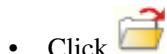

## User subroutine file

Provide the name of the file containing all user subroutines that are referred to by the model. To specify a user subroutine file, you can do one of the following:

• Click in the User subroutine file text field, and type the file path.  
• Click to display the Select User Subroutine File dialog box, and select the file of your choice.

If your model refers to a user subroutine but you do not specify the name of the subroutine file in the General tabbed page, Abaqus generates an error that is reported by the job monitor dialog box. (You can display the job monitor dialog box by selecting Job->Monitor->job of your choice from the main menu bar.) For more information on subroutines, see About User Subroutines and Utilities.

## Results Format

The Results Format options allow you to write the results from an Abaqus analysis in ODB format or SIM format. For an Abaqus/Standard or Abaqus/Explicit analysis, you can also write the results to both formats. For more information, see The Output Database.


Note: If you select the ODB format, a .sim file may still be created; however, it will not contain the analysis results.

You can use the Abaqus environment file (abaqus\_v6.env) to control the default value of most of the settings in the General tabbed page; for more information, see Environment File Settings.

## Additional information

• Understanding analysis jobs

• Using the job editor  
• Creating, editing, and manipulating co-executions

## Controlling job memory settings

To locate the job editor, select Job->Edit->jobname from the main menu bar. Use the Memory tabbed page to control the amount of memory allocated to an Abaqus/Standard or Abaqus/Explicit analysis. Abaqus/CAE initially populates the settings in the Memory tabbed page with the values specified in the Abaqus environment file (abaqus\_v6.env), and you can edit the environment file if you want to change the default memory settings. For more information about customizing the memory settings, see Environment File Settings.

If no memory values are specified in the Abaqus environment file, Abaqus automatically detects the physical memory on the machine and allocates a percentage of this available memory. The default percentages are platform specific, but they typically represent a large portion of the available physical memory. You should check the memory allocation values that Abaqus selects upon your next submission of the job to confirm that the allocation is appropriate for your system and for the job. For details on the default memory allocation settings, refer to the Dassault Systèmes Knowledge Base at http://support.3ds.com/knowledge-base/.

Smaller jobs may use less memory than the maximum available amount. You might want to reduce the memory allocation for your jobs or adjust the default allocation if you usually run multiple jobs at the same time. You can control the following:

• The Memory allocation units for the memory size specification. You can allocate memory as a Percent of physical memory or in Megabytes or Gigabytes.  
The Maximum preprocessor and analysis memory value. This option specifies either the percentage of physical memory or the number of megabytes or gigabytes of physical memory that will be allocated as a maximum for the analysis.  
The Increase memory allocation based on analysis estimates option. This setting enables you to use the memory allocation setting that Abaqus determines to be suitable for this job, with an additional amount of memory as a buffer, as the memory allocation settings for all future submissions of this job. The job memory value will be updated only if the estimate is higher than the value you specified.

For more information about memory settings, see Managing Memory and Disk Resources.

## Additional information

• Understanding analysis jobs  
• Using the job editor  
• Creating, editing, and manipulating co-executions

## Controlling job parallel execution

To locate the job editor, select Job->Edit->jobname from the main menu bar. Use the Parallelization tabbed page to control the parallel execution of an Abaqus analysis job, as follows:

• Select the number of processors to use for the analysis if parallel processing is available.  
• For an Abaqus/Standard analysis, you can choose to use GPGPU acceleration of the direct sparse solver and specify the number of GPGPUs. For more information, see Parallel Execution in Abaqus/Standard.  
• For an Abaqus/Explicit analysis, you can choose the following:

\- The number of domains. If you choose domain-level parallelization, the number of domains must be equal to or a multiple of the number of processors.

When the number of domains is a multiple of the number of processors, you can toggle on Activate dynamic load balancing if desired. This option may improve the performance of your analysis job. If you have 4 processors and choose 8, 12, 16, etc. domains, for example, the dynamic load balancing feature becomes available. Dynamic load balancing is turned off by default. This option is equivalent to the dynamic\_load\_balancing option in the Abaqus/Explicit execution procedure. For more information, see Abaqus/Standard and Abaqus/Explicit Execution.

Dynamic load balancing is most likely to improve the computational speed and efficiency in applications with a strongly time-dependent and/or spatially varying computational load. Most imbalanced problems will see an optimal performance improvement when the number of domains is two to four times the number of processors. For more details, see Domain-Level Parallelization.

Whether the parallelization method should be Domain (default) or Loop. The domain-level method splits the model into a number of topological domains that are distributed evenly among the available processors. The loop-level method parallelizes low-level loops in the code that are responsible for most of the computational cost.

If you select Loop for the parallelization method, you must select Default for the multiprocessing mode. For more information, see About Parallel Execution.

For more information, see Parallel Execution in Abaqus/Explicit.

For both an Abaqus/Standard and an Abaqus/Explicit analysis, you can choose whether the multiprocessing mode should be Default, Threads, MPI (Message Passing Interface), or Hybrid. The default multiprocessing mode is dependent on the platform on which the analysis product executes.

• For the Hybrid multiprocessing mode, you can choose the number of threads per MPI process.  
You cannot choose the number of threads per MPI process for all other multiprocessing modes. For MPI and Default, the number of threads per MPI process has value of 1. For Threads, the number of threads per MPI process is equal to the number of processors.


## Note:

You use the Step module to choose between the Abaqus/Standard iterative and direct sparse solvers. For more information, see Using the step editor.

## Additional information

• Understanding analysis jobs  
• Using the job editor  
• Creating, editing, and manipulating co-executions  
• Parallel Execution

## Controlling job precision

To locate the job editor, select Job->Edit->jobname from the main menu bar. Use the Precision tabbed page to control the precision of the Abaqus/Explicit analysis or the precision of nodal output for an Abaqus/Standard or Abaqus/Explicit analysis. You can do the following:

Select the single, forced single (override environment variable double\_precision setting if necessary), or double (analysis only, constraints only, or analysis and packager) setting for Abaqus/Explicit precision. This option is equivalent to the double option in the Abaqus/Explicit execution procedure.  
• Select either single or full nodal output precision. This option is equivalent to the output\_precision option in the Abaqus execution procedure.

For more information, see Abaqus/Standard and Abaqus/Explicit Execution, and Environment File Settings.

## Additional information

• Understanding analysis jobs  
• Using the job editor  
• Creating, editing, and manipulating co-executions  
• Abaqus Execution Guide

## Creating, editing, and manipulating adaptivity processes

This section describes how you create, edit, and manipulate adaptivity processes using either the main menu or the Adaptivity Process Manager.

## In this section:

Creating a new adaptivity process  
Performing a data check on an adaptivity process  
Submitting an adaptivity process  
Continuing an adaptivity process after a data check  
Terminating an adaptivity process

## Creating a new adaptivity process

An adaptivity process is a succession of analysis jobs. Abaqus/CAE modifies the mesh in each analysis job in response to error estimates that were computed from data written to the output database during the final increment of the previous analysis. For more information, see What is an adaptivity process?. To create a new adaptivity process, select Adaptivity->Create from the main menu bar.

1. From the main menu bar, select Adaptivity->Create.

The Edit Adaptivity Process dialog box appears.


田 Tip: You can also create a new adaptivity process by clicking the icon in the module toolbox or by clicking Create in the Adaptivity Process Manager.

2. Type the name of the new adaptivity process in the Name text field. The name that you specify must adhere to the file naming rules for your operating system.  
3. Select the model to associate with the adaptivity process from the Model field.  
4. If desired, type the description of the adaptivity process in the Description text field. The description is stored in the model database and the output database, and you can use this description to help you manage your adaptivity processes.  
5. Enter the job prefix in the Job Prefix text field. The job name for each iteration of the adaptivity process will start with this prefix. The prefix that you specify must adhere to the file naming rules for your operating system. If you do not provide a job prefix, Abaqus/CAE uses the name of the adaptivity process.  
6. In the editor, enter all data necessary to define the process and click OK. (For more information, see Using the adaptivity process editor.)

## Additional information

• Understanding adaptivity processes  
• Creating, editing, and manipulating adaptivity processes

## Performing a data check on an adaptivity process

A data check runs the input file for a model through the analysis input file processor to ensure that the model is consistent and that all the required model options have been set. Performing a data check on an adaptivity process will create a job and verify model information for the first iteration of the overall adaptivity process.

To perform a data check on an adaptivity process, select Adaptivity->Data Check->adaptivity process name from the main menu bar. You can also perform a data check by selecting the process name in the Adaptivity Process Manager and clicking Data Check.

The job created by the data check appears in the Jobs container using the naming conventions discussed in Creating a new adaptivity process. To see the results of a data check, review the data (.dat) file for this job in your working directory. You can also review the results of a data check by selecting Job->Monitor->created job from the main menu bar to display the job monitor dialog box.

## Additional information

• Monitoring the progress of an analysis job  
• Understanding adaptivity processes  
• Creating, editing, and manipulating adaptivity processes

## Submitting an adaptivity process

To submit an adaptivity process for analysis, select Adaptivity->Submit->adaptivity process name from the main menu bar. (You can also submit an adaptivity process for analysis by selecting the process name in the Adaptivity Process Manager and clicking Submit.) Abaqus/CAE submits the process for analysis and remeshing using the settings defined in the adaptivity process.

When you start an Abaqus/CAE session and submit an adaptivity process, Abaqus/Standard sends messages to Abaqus/CAE indicating the current status of the process. Abaqus/CAE then updates the Status column in the Adaptivity Process Manager accordingly. You must keep the current Abaqus/CAE session active for automatic remeshing to occur between analysis jobs. If you exit Abaqus/CAE and start a new session, you must use manual remeshing to continue the adaptivity process. For more information, see When do I need to use manual adaptive remeshing?.

In addition, Abaqus/CAE displays status information in the message area after each iteration of the adaptivity process. The status information lists the error indicator variables in each remeshing rule and whether the remeshing rule has been satisfied for that variable.

## Additional information

• Understanding adaptivity processes  
• Creating, editing, and manipulating adaptivity processes

## Continuing an adaptivity process after a data check

When you perform a data check on an adaptivity process, a job is created for the first iteration of the adaptivity process (as described in Performing a data check on an adaptivity process). In addition, Abaqus creates and saves all the files necessary to complete this job at a later time. You can also use these files to continue the full adaptivity process from the current state of the first iteration.

To complete only the job associated with the first iteration of the adaptivity process, use the procedures listed in Continuing an analysis job after a data check. Remeshing and further iterations will not occur.

To continue the full adaptivity process, select Adaptivity->Continue Analysis->adaptivity process name. You can also continue the adaptivity process by selecting the process name in the Adaptivity Process Manager and clicking Continue Analysis. The adaptivity process proceeds as described in Submitting an adaptivity process.

The Continue Analysis option can be used only in conjunction with a data check; it is not used to continue remeshing after an adaptivity process is complete. Once an adaptivity process runs to completion, you can continue to remesh a model by resubmitting the full process. You can also consider using the combination remeshing techniques described in Using a combination of automatic and manual mesh adaptivity.

## Additional information

• Understanding adaptivity processes  
• Creating, editing, and manipulating adaptivity processes

## Terminating an adaptivity process

To terminate an adaptivity process, you should use the Job Manager to display the analysis job that is running and to end the job. Ending the job will terminate the adaptivity process. For more information, see Terminating an analysis job.

## Additional information

• Understanding adaptivity processes  
• Creating, editing, and manipulating adaptivity processes

## Using the adaptivity process editor

This section describes how you use the adaptivity process editor to configure the settings of an adaptive remeshing process.

## In this section:

Navigating the adaptivity process customization options  
Configuring adaptivity process attributes  
Specifying general adaptivity process settings  
Controlling adaptivity process memory settings  
Controlling adaptivity process parallel execution  
Controlling adaptivity process precision

## Navigating the adaptivity process customization options

Use the adaptivity process editor to customize your adaptivity processes before submitting them. The settings are analogous to parameters of the Abaqus execution procedure. For more information, see Abaqus/Standard and Abaqus/Explicit Execution.

To locate the adaptivity process editor, select Adaptivity->Edit->adaptivity process name from the main menu bar. The adaptivity process editor contains the following tabbed pages:

## Adaptivity

Use the Adaptivity tabbed page to specify the maximum number of analysis iterations and to select the run mode. For more information, see Configuring adaptivity process attributes.

## General

Use the General tabbed page to configure preprocessor printout and to specify a scratch directory. You also use the General tabbed page to specify any user subroutines that are referred to by the model and the output format of the results. For more information, see Specifying general adaptivity process settings.

## Memory

Use the Memory tabbed page to configure the amount of memory allocated to each of the adaptivity analyses. For more information, see Controlling adaptivity process memory settings.

## Parallelization

Use the Parallelization tabbed page to configure the parallel execution of an Abaqus analysis job, such as the number of processors to use and the parallelization method. For more information, see Controlling adaptivity process parallel execution.

## Precision

Use the Precision tabbed page to specify the precision of nodal output that is written to the output database during each analysis. For more information, see Controlling adaptivity process precision.

The settings that you specify in the adaptivity process editor apply to each of the analyses that runs after each iteration of the adaptive remesh.

You can also use the Abaqus environment file (abaqus\_v6.env) to control the default value of many of the settings in the adaptivity process editor tabbed pages. For more information, see Environment File Settings.

## Additional information

• Understanding adaptivity processes  
• Using the adaptivity process editor  
• About Adaptive Remeshing

## Configuring adaptivity process attributes

To locate the adaptivity process editor, select Adaptivity->Edit->adaptivity process name from the main menu bar. Use the Adaptivity tabbed page in the adaptivity process editor to specify the maximum number of iterations and to select the run mode.

Choose either of the following to specify the run mode:

• Background to run your job locally in the background.  
Queue to submit your job to a named local or remote batch queue; select the batch queue from the pull-down list. (You must define the queue in the Abaqus environment file. For more information, see Defining analysis batch queues. You must also make the queue available to Abaqus/CAE. For more information, see Submitting a job remotely.)

## Additional information

• Understanding adaptivity processes  
• Using the adaptivity process editor  
• About Adaptive Remeshing

## Specifying general adaptivity process settings

To locate the adaptivity process editor, select Adaptivity->Edit->adaptivity process name from the main menu bar. Use the General tabbed page to configure miscellaneous adaptivity process settings. You can configure the following:

## Preprocessor Printout

The Preprocessor Printout options allow you to control whether Abaqus prints an echo of the input data, contact constraints, model definition data, and history data to the data (.dat) file. By default, each of these options is toggled off.

## Scratch directory

The Scratch directory option allows you to specify the name of the directory used for scratch files. On Linux systems the default scratch directory is the value of the \$TMPDIR environment variable or /tmp if the variable is not defined. On Windows systems the default scratch directory is the value of the TEMP environment variable or \TEMP if the variable is not defined. To specify a scratch directory, you can do one of the following:

• Click in the Scratch directory text field, and type the directory path.  
• Click to display the Select Scratch Directory dialog box, and select the directory of your choice.

## User subroutine file

Provide the name of the file containing all user subroutines that are referred to by the model. To specify a user subroutine file, you can do one of the following:

• Click in the User subroutine file text field, and type the file path.  
• Click to display the Select User Subroutine File dialog box, and select the file of your choice.

If your model refers to a user subroutine but you do not specify the name of the subroutine file in the General tabbed page, Abaqus generates an error that is reported by the job monitor dialog box. (You can display the job monitor dialog box by selecting Job->Monitor->job of your choice from the main menu bar.) For more information on user subroutines, see About User Subroutines and Utilities.

## Results Format

The Results Format options allow you to write the results from an Abaqus analysis in ODB format, SIM format, or both formats. For more information, see The Output Database.


Note: If you select the ODB format, a .sim file may still be created; however, it will not contain the analysis results.

You can use the Abaqus environment file (abaqus\_v6.env) to control the default value of most of the settings in the General tabbed page; for more information, see Environment File Settings.

## Additional information

• Understanding adaptivity processes  
• Using the adaptivity process editor  
• About Adaptive Remeshing

## Controlling adaptivity process memory settings

To locate the adaptivity process editor, select Adaptivity->Edit->adaptivity process name from the main menu bar. Use the Memory tabbed page to control the amount of memory allocated to an Abaqus analysis. Abaqus/CAE initially populates the settings in the Memory tabbed page with the values specified in the Abaqus environment file (abaqus\_v6.env), and you can edit the environment file if you want to change the default memory settings. For more information about customizing the memory settings, see Environment File Settings.

If no memory values are specified in the Abaqus environment file, Abaqus automatically detects the physical memory on the machine and allocates a percentage of this available memory. The default percentages are platform specific, but they typically represent a large portion of the available physical memory. For details on the default memory allocation settings, refer to the Dassault Systèmes Knowledge Base at http://support.3ds.com/knowledge-base/.

Smaller jobs may use less memory than the maximum available amount. You might want to reduce the memory allocation for your jobs or adjust the default allocation if you usually run multiple jobs at the same time. You can control the following:

• The Memory allocation units for the memory size specification. You can allocate memory as a Percent of physical memory or in Megabytes or Gigabytes.  
• The Maximum preprocessor and analysis memory value that specifies either the percentage of physical memory or the number of megabytes or gigabytes of physical memory that will be allocated as a maximum for the analysis.

For more information about memory settings, see Managing Memory and Disk Resources.

## Additional information

• Understanding adaptivity processes  
• Using the adaptivity process editor  
• About Adaptive Remeshing

## Controlling adaptivity process parallel execution

To locate the adaptivity process editor, select Adaptivity->Edit->adaptivity process name from the main menu bar. Use the Parallelization tabbed page to control the parallel execution of an Abaqus process job as follows:

• Select the number of processors to use for the analysis if parallel processing is available.  
• Select the Threads multiprocessing mode. Only the linear equation solver in Abaqus/Standard will execute in parallel.


## Note:

You use the Step module to choose between the Abaqus/Standard iterative and direct sparse solvers. For more information, see Using the step editor.

## Additional information

• Understanding adaptivity processes  
• Using the adaptivity process editor  
• About Adaptive Remeshing

## Controlling adaptivity process precision

To locate the adaptivity process editor, select Adaptivity->Edit->adaptivity process name from the main menu bar. Use the Precision tabbed page to control the precision of nodal output. You can select either single or full nodal output precision. This option is equivalent to the output\_precision option in the Abaqus execution procedure. For more information, see Abaqus/Standard and Abaqus/Explicit Execution.

## Additional information

• Understanding adaptivity processes  
• Using the adaptivity process editor  
• About Adaptive Remeshing

## Creating, editing, and manipulating co-executions

This section describes how you create, edit, and manipulate co-executions using either the main menu or the Co-execution Manager.

## In this section:

Creating and editing co-executions  
Performing a data check on a co-execution  
Submitting a co-execution  
Viewing the results of your co-execution  
Terminating a co-execution

A co-execution is the co-simulation execution of two analysis jobs. You specify job parameters in a co-execution to create both analysis jobs. After creating the co-execution, you can edit the job parameters only in the individual analysis jobs.

The jobs are executed in synchronization with one another using the same functionality as described in Understanding analysis jobs. For more information on this analysis technique, see Structural-to-Structural Co-Simulation.

1. From the main menu bar, select Co-execution->Create or Co-execution->Edit->co-execution name.

The Edit Co-execution dialog box appears.


Tip: You can also create a co-execution by clicking the icon in the module toolbox or clicking Create in the Co-execution Manager.

2. Type the name of the new co-execution in the Name text field. The name that you specify must adhere to the file naming rules for your operating system.  
3. If desired, type the description of the co-execution in the Description text field. The description is stored in the model database and the output database, and you can use this description to help you manage your co-executions.  
4. In the Models table, select the models in the current model database to associate with the co-execution from the list in the Model Name column.

The analysis product used in each of the selected models and the default job name for each model are displayed in the table.

5. If desired, click in the Job Name column and edit the job name.  
6. Use the Submission, General, Memory, Parallelization, and Precision tabbed pages to define the initial job parameter settings in the individual job editors. After the co-execution is created, the job parameters in the co-execution editor are unavailable for editing; you must edit the individual jobs.

Define the initial job parameter settings as described in the following sections:

Configuring job submission attributes  
Specifying general job settings  
Controlling job memory settings  
Controlling job parallel execution  
Controlling job precision

7. If desired, enter a different value in the Communication time out field to specify the time after which Abaqus/CAE terminates if it does not receive any communication from the coupled analyses. The default value is 10 minutes.

8. Click OK.

## Additional information

• Understanding co-executions  
• Creating, editing, and manipulating co-executions

## Performing a data check on a co-execution

A data check runs the input files for the models through the analysis input file processor to ensure that the models are consistent and that all the required model options have been set. Performing a data check on a co-execution will verify model information in each of the jobs created for the co-execution.

To perform a data check on a co-execution, select Co-execution->Data Check->co-execution name from the main menu bar. You can also perform a data check by selecting the co-execution name in the Co-execution Manager and clicking Data Check.

The jobs involved in the co-execution appear in the Model Tree in the Jobs container under the co-execution in the Co-executions container. You can review the results of a data check by clicking mouse button 3 on the job in the Model Tree and selecting Monitor to display the job monitor dialog box. For more information, see Monitoring the progress of an analysis job.

## Additional information

• Understanding co-executions  
• Creating, editing, and manipulating co-executions

## Submitting a co-execution

To submit a co-execution, select Co-execution->Submit->co-execution name from the main menu bar. (You can also submit a co-execution by selecting the co-execution name in the Co-execution Manager and clicking Submit.)

Abaqus/CAE submits the jobs for analysis using the job settings defined in the co-execution editor or the individual job editors.

The jobs involved in the co-execution appear in the Model Tree in the Jobs container inside the Co-executions container. You can monitor the jobs that you have submitted by clicking mouse button 3 on the job in the Model Tree and selecting Monitor to display the job monitor dialog box. For more information, see Monitoring the progress of an analysis job.

## Additional information

• Understanding co-executions  
• Creating, editing, and manipulating co-executions

## Viewing the results of your co-execution

Once your co-execution is completed, Abaqus/CAE stores the results of each analysis job in an output database. You can use the Visualization module to view the combined results graphically.

1. From the Co-execution Manager, select the co-execution name and click Results.

The Visualization module starts and presents you with an overlay plot of both models.

2. Use the Visualization module to create and customize different plots of your results. For more information on using overlay plots, see Overlaying multiple plots.

## Additional information

• Understanding co-executions  
• Creating, editing, and manipulating co-executions

## Terminating a co-execution

To terminate a co-execution, you should use the Co-execution Manager to display the co-execution that is running and to end the analysis jobs. Ending the jobs terminates the co-execution. Abaqus/CAE asks you for confirmation, terminates the jobs, and updates the status of the co-execution in the Co-execution Manager to Terminated. Note that co-execution termination may result in various error messages written to the message area, reflecting the unpredictable manner in which co-execution inter-job messaging is terminated. These error messages occurring immediately following co-execution termination can generally be disregarded

## Additional information

• Understanding co-executions  
• Creating, editing, and manipulating co-executions

## Creating, editing, and manipulating optimization processes

This section describes how you create, edit, and manipulate optimization processes using either the main menu or the Optimization Process Manager.

## In this section:

Creating and editing optimization processes  
Creating the optimization files  
Validating an optimization process  
Submitting an optimization process  
Continuing an optimization process that terminated  
Monitoring your optimization process  
Extracting a smoothed mesh  
Combining optimization results  
Viewing the results of your optimization process

An optimization process reads an optimization task that you defined in the Optimization module and iteratively searches for an optimized solution based on the objective functions and constraints that you defined in the optimization task.

1. From the main menu bar, select Optimization->Create or Optimization->Edit->optimization process name.

The Edit Optimization Process dialog box appears.


Tip: You can also create an optimization process by clicking the icon in the module toolbox or clicking Create in the Optimization Process Manager.

2. Type the name of the new optimization process in the Name text field. The name that you specify must adhere to the file naming rules for your operating system. A directory is created with this name, and the output from the optimization process is stored in this directory.  
3. Select the model to associate with the optimization process from the Model field.  
4. Select the optimization task to associate with the optimization process from the Optimization Task field.

If desired, type the description of the optimization process in the Description text field. The description is stored in the model database and the output database, and you can use this description to help you manage your optimization processes.

5. Enter the maximum number of optimization design cycles that are allowed before Abaqus ends the optimization process.  
6. Choose how often to write the analysis results to the output database file that is created by the Abaqus job that runs for each design cycle of the optimization process. This option also specifies how often to create the related Abaqus analysis files, such as the status file and the message file. You can choose the following:

Initial: save data after the initial cycle (n=0) . The Optimization module uses the initial cycle to prepare the model for the first design cycle; for example, by creating groups and output requests. A finite element analysis is not performed during the initial cycle.  
• First: save data from the first design cycle (n=1).  
• Last: save data from the last design cycle.  
• Every n cycles: save data every n design cycles relative to the initial (n=0) design cycle. For example, if n=3, the optimization process will save data corresponding to design cycle 2, 5, 8, etc.  
• Every: Save data after every design cycle, including the initial (n=0) design cycle.


Note: Selecting this option could lead to large disk space requirements for Abaqus models that generate large output database files.

For more information, see Understanding the files generated by creating and analyzing a model. To postprocess the results of an optimization, you must combine the output databases that were generated by each design cycle into a single output database. For more information, see Combining optimization results.

7. Use the Submission, Memory, and Parallelization tabbed pages to define the initial settings for each Abaqus job that runs during the optimization process, as described in the following sections:

Configuring job submission attributes

Controlling job memory settings  
Controlling job parallel execution

## 8. Click OK.

## Additional information

• Understanding optimization processes  
• Creating, editing, and manipulating optimization processes

## Creating the optimization files

You can create copies of the optimization parameter (.par) file and the Abaqus input (.inp) file in your working directory. The parameter file contains parameters that are used to execute the optimization and contains information about the input file that is associated with the optimization; the input file, in turn, defines the Abaqus model you are optimizing.

You can run the optimization from the command line with the following command:

abaqus optimization -task parameter file -job results folder

The parameter file and the input file must be saved in the same directory. During the optimization, Abaqus creates a folder called results folder in which the results of the optimization are stored.

To create the optimization files, select Optimization->Write Files->optimization process name from the main menu bar. You can also create the optimization files by selecting the process name in the Optimization Process Manager and clicking Write Files.

## Additional information

• Understanding optimization processes  
• Creating, editing, and manipulating optimization processes

## Validating an optimization process

A validation checks the optimization process to ensure that the optimization task has been configured correctly and the Abaqus model exists. A validation does not check your Abaqus model. You should run a complete analysis of your model and make sure that it runs to completion before you attempt to run an optimization process.

To validate an optimization process, select Optimization->Validate->optimization process name from the main menu bar. You can also validate an optimization process by selecting the process name in the Optimization Process Manager and clicking Validate.

## Additional information

• Understanding optimization processes  
• Creating, editing, and manipulating optimization processes

## Submitting an optimization process

To submit an optimization process, select Optimization->Submit->optimization process name from the main menu bar. (You can also submit an optimization process by selecting the optimization process name in the Optimization Process Manager and clicking Submit.) Abaqus/CAE submits the optimization process using the settings defined in the optimization process editor. Click Monitor in the Optimization Process Manager to monitor the optimization process. For more information, see Monitoring your optimization process.

The optimization process appears in the Model Tree. The Optimization Process container includes a Jobs container that includes the Abaqus jobs executed during the optimization process. You can monitor an Abaqus job that is running by clicking the Monitor button from the top of the optimization process monitor. If your optimization process includes multiple models, the Optimization module creates an analysis job for each model and you must select the desired job to monitor. You can also view the monitor for the Abaqus jobs that completed during previous design cycles by clicking mouse button 3 on the job in the Model Tree and selecting Monitor. To terminate an optimization process, you must terminate the current Abaqus job. For more information, see Monitoring the progress of an analysis job.

## Additional information

• Understanding optimization processes  
• Creating, editing, and manipulating optimization processes

## Continuing an optimization process that terminated

You can restart an optimization process that has failed for a reason external to the optimization. To continue the optimization process, select Optimization->Restart->optimization process name. You can also continue the optimization process by selecting the optimization process name in the Optimization Process Manager and clicking Restart.

You can restart an optimization process only if it has failed because of a problem external to the optimization or the Abaqus analysis, such as:

• A license was not available.  
• The Abaqus analysis failed due to insufficient disk space or memory.  
• The user terminated the Abaqus analysis job by clicking the Kill button from the job monitor.

If the optimization fails due to errors in your Abaqus model, performing a restart will not allow it to continue. For example, if Abaqus stops because of excessively distorted elements, the same problem will occur after you attempt to restart the optimization. Before you restart the process, you can use the optimization process editor to change the optimization task and the model referred to by the optimization process. In addition, you can change the maximum number of optimization design cycles that are allowed before Abaqus ends the optimization process.

The optimization always restarts with an Abaqus analysis using the model that was most recently modified.

## Additional information

• Understanding optimization processes  
• Creating, editing, and manipulating optimization processes

## Monitoring your optimization process

You can monitor the progress of your optimization process while it is running by selecting

Optimization->Monitor->optimization process name. You can also monitor the optimization process by selecting the optimization process name in the Optimization Process Manager and clicking Monitor. In addition, you can monitor the Abaqus jobs that completed during previous design cycles by clicking mouse button 3 on the job in the Model Tree and selecting Monitor.

The optimization process monitor displays a table showing the optimization values after each design cycle, as described in Understanding the files generated by an optimization process. By default, the table includes only the objective function and any constraints in the optimization process. Abaqus/CAE adds a row to the table when a design cycle completes. You can click mouse button 3 on a cell in the table and do the following:

• Select Hide to remove the selected column from the table.  
• Select Edit visible columns and choose the variables to display. Table 1 describes the variables that can be displayed.

Table 1: Variable categories

<table><tr><td>Category</td><td>Description</td></tr><tr><td>Objective Function</td><td>The value of the objective function—a single design response or a weighted combination of design responses and reference values.</td></tr><tr><td>Objective Function-Design Response</td><td>The value of a design response that is used by the objective function.</td></tr><tr><td>Objective Function Term</td><td>The weighted value of a design response and its reference value.</td></tr><tr><td>Constraint</td><td>The value of a constraint.</td></tr><tr><td>Variable</td><td>The value of each design response.</td></tr></table>

See Objectives and Constraints, for more information about the formulation of the objective function from a combination of weighted design responses and reference values.

To view an X–Y plot showing the change in the value of the design responses after each design cycle, click the Plot button in the upper left corner of the optimization process monitor. The X–Y plot appears in a new viewport and includes every design response listed in the table. You can use the X–Y plot options to customize the appearance of the plot, as described in X–Y plotting.

The data that are displayed in the table or in the X–Y plot are read from the files optimization\_status\_all.csv and optimization\_report.csv. The Optimization module must be able to write to these files while the optimization process is executing. For example, you cannot open the files in an application such as Microsoft Excel while the optimization process is executing.

The optimization process monitor also displays the following information:

• The Log tabbed page displays the start and end times for the optimization process along with a log of the progress of the process.  
The Errors and Warnings tabbed pages display the errors or the warnings associated with the optimization process. Abaqus/CAE indicates the presence of errors or warnings by prepending an exclamation point before the Errors and Warnings tab.

The number of error and warning messages that appear in the job monitor is limited by the environment parameters cae\_error\_limit and cae\_warning\_limit, respectively (see Job customization parameters, for details). If the number of errors or warnings exceeds the optimization process limit, consult the data, message, or status file for a complete list of messages.

The Output File tabbed page displays a detailed record of each output data entry as it is written to the output file, including status, warning, and error messages. The output file is called atom.out, and it is stored in the optimization process directory (the directory with the same name as the optimization process).

To monitor the Abaqus analysis job associated with the optimization process, click the Monitor button in the upper right corner of the optimization process monitor. (If your optimization process includes multiple models, the Optimization module creates an analysis job for each model and you must first select the desired job to monitor.) Abaqus/CAE displays the job monitor and continues to update the job monitor for each iteration of the optimization. If desired, you can terminate the Abaqus analysis job and, hence, the optimization process, from the job monitor. For more information, see Continuing an optimization process that terminated, and Monitoring the progress of an analysis job.

An optimization process outputs a large amount of information to the optimization process monitor, especially to the Output File tabbed page. To help you locate a particular text string, you can use the Search Text fields in the lower half of the optimization process monitor. Select the desired file tab, enter a search string in the Text to find field, and click Next or Previous to step through the output from one hit to the next. Toggle on Match case to perform a case-sensitive search.

The information presented in the optimization process monitor is updated continually as the optimization progresses. If the optimization fails, the Errors tabbed page appears in front of the other tabbed pages automatically to help you determine the cause of the failure. In addition, an exclamation point appears on the tab if any error or warning messages are output.

If you start monitoring an optimization process and then either exit Abaqus/CAE, close the current model database, or open a new model database, the optimization process will continue; but, you will no longer be able to monitor the optimization process from Abaqus/CAE.

## Additional information

• Understanding optimization processes  
• Creating, editing, and manipulating optimization processes

## Extracting a smoothed mesh

When the optimization process has completed, you can choose to extract a smooth isosurface meshed representation of the optimized model surface in the form of a file that can be transferred to a CAD system or back into Abaqus/CAE.

You can extract a smoothed surface mesh from either a topology, shape, or bead optimization. You can extract a single file from the entire assembly, or you can extract individual files from selected part instances.

The optimized model is usually a combination of tetrahedral and hexahedral elements and can include a significant number of interior elements that are not included in the isosurface representation that will be generated. In addition, the surface of the model might be rough and irregular, depending on the element density. The smoothing operation is an iterative process that displaces the nodes at the surface and generates a smooth triangular mesh on the surface of the model.

The smoothing operation can be followed by a data reduction operation that combines adjacent triangles with nearly coincident planes and reduces the number of surface triangles. Data reduction continues iteratively until the decrease in the number of triangles reaches a specified percentage of the original number of triangles. You can specify the angle that determines if adjacent planes are coincident.

Finally, you can choose to apply an optional filtering operation to remove local irregularities. The filtering is applied before the smoothing operation.

1. From the main menu bar, select Optimization->Extract->optimization process name. You can also smooth the results by selecting the optimization process name in the Optimization Process Manager and clicking Extract.

The Extract Surface Mesh dialog box appears.

2. Enter the name of the output file that will be extracted.  
3. Select the content of the output files that will be extracted. You can choose either of the following:

• Create a single file from the entire assembly.  
• Create individual files from selected part instances. Abaqus/CAE names the files by appending the name of the part instance to the name of the output file.

4. Select the format of the file that will be generated. You can choose from the following:

• Abaqus input file (.inp): file that can be imported into Abaqus/CAE.  
• STL (.stl): file that can be read by 3D CAD systems, such as CATIA V5 and SOLIDWORKS.  
• IGES1 (.igs): IGES file using block 114.  
• IGES2 (\*\_2.igs): IGES file with explicit point information.  
• IGES3 (\*\_3.igs): IGES file using block 128.

5. In the Design Cycle field, enter the design cycle from which the isosurface should be extracted. By default, the Extract Surface Mesh dialog box displays the last design cycle. The default value will not be displayed for sensitivity-based topology optimization since the solver is called once at the beginning of the optimization procedure.  
6. Enter a value between zero and one specifying the Iso value.

The smoothing process determines which elements are on the surface of the model and uses the isovalue to calculate where on the interior edges of the elements new nodes are created. Increasing the isovalue leads to shifting the isosurface toward the inside of the model, which results in a decrease in the model volume. For structures with thin components, you should not enter an isovalue greater than 0.7 to prevent the structure from becoming disconnected.

7. Enter the Reduction percentage, which defines the percent of faces that should be removed during the data reduction operation. A value of 0 indicates that no faces should be removed. A value of 100 indicates the data reduction stops when no more faces can be removed, given the value of the reduction angle.

8. Enter a value between 0 and 90 specifying the Reduction angle. The reduction angle defines the maximum angle between adjacent faces at a node such that the node might be removed during the data reduction.  
9. Select the number of iterative smoothing cycles. Larger values lead to smoother models but can result in an increase of the computation time. In practice, 5 to 10 smoothing cycles are usually sufficient. Further smoothing can result in the narrowing or contracting of thin components. You can turn off smoothing by selecting a value of 0.

10. Enter a value between zero and one specifying the Target volume.

The target, or relative, volume of a solid model is the ratio of the volume defined by the isosurface and the original volume (calculated from the volume of the solid elements generated by the optimization). Likewise, the target area of a shell model is the ratio of the volume defined by the isosurface and the original area (calculated from the area of the shell elements generated by the optimization). If the model contains both solid and shell elements, only the solid elements are considered. The calculated volume does not account for voids inside a solid model.

If you specify the target volume, the data reduction process calculates the isovalue that will result in the specified volume (the value of the isovalue that you enter is ignored). The data reduction process generates an error if you enter an excessively large value for the target volume that is larger than the volume calculated with an isovalue of zero or if you enter an excessively small value for the target volume that is smaller than the volume calculated with an isovalue of one. The data reduction process also generates an error if it fails to converge before 20 iterations.

11. In some cases, the optimized model will contain small irregularities that you can choose to remove with an optional filtering operation. Filtering is applied before the smoothing operation and results in a more homogeneous material distribution. Select Moderate to apply a single filtering cycle, select Full to apply five filtering cycles.

12. Click OK to extract the smoothed mesh.

The specified output file is created in the TOSCA\_POST directory. For subsequent runs, a unique number is appended to the file name; for example, name\_002.inp.


## Note:

If you extracted the smoothed mesh in the form of an Abaqus input file, you can select File->Import->Model from the main menu bar to import the mesh into Abaqus/CAE. For more information, see Importing a model.

## Additional information

• Understanding optimization processes  
• Creating, editing, and manipulating optimization processes

To view the results of an optimization in the Visualization module, you must combine the optimization results and analysis results into a single results output database file, as described in Postprocessing an optimization. The optimization results and the analysis results are appended to the output database file you specified as the base results.

1. From the main menu bar, select Optimization->Combine->optimization process name. You can also combine optimization results by selecting the optimization process name in the Optimization Process Manager and clicking Combine.

The Combine Optimization Results dialog box appears.

2. The Optimization result directory displays the path to the directory in which the output files from

the selected optimization process reside. Click


to change the path.

3. Choose the output database file that will be used to create the base results. Abaqus/CAE uses the output database file defined in the base results as the source of the combined output database file. During the combination process, Abaqus/CAE appends additional data to the base results output database file.

Choose Initial to create the base results from the output database file generated during the initial optimization design cycle.  
Choose Last to create the base results from the output database file generated during the last optimization design cycle. You should not choose Last if you performed a shape optimization.  
Choose Original Model to create the base results from the output database file generated by running a separate analysis job of the model prior to the optimization. The optimization process does not run an Abaqus analysis of the original model. Therefore, you must run the analysis manually before you can select the output database file generated by the original model as the base results. (The Abaqus input file for the original model is stored in optimization process name\SAVE.inp\optimization process name\_org.inp.)

4. Choose the output database files that will be combined with the base results output database file and the optimization results. The resulting output database file may be very large, so you should select only the data that you need to view in the Visualization module.

Choose All to combine the base results with the analysis results from all the output database files that were generated by the optimization process.  
Choose Last to combine the base results with the analysis results from the output database file from the last design cycle.  
Choose Initial and last to combine the base results with the analysis results from the output database files from the initial and last design cycles.  
Choose Every n cycles and enter a value for n to combine the base results with the analysis results from the output database files created at periodic intervals starting with the initial design cycle.  
Choose Specify to combine the base results with the analysis results from specified output database files; for example, 1,5,7,9.

5. Select the Models and the Steps from within the models from which data will be combined into the results output database file.  
6. From the list that appears, select the Analysis Field Variables that will be included in the results output database file.

Abaqus/CAE always includes the optimization variables as field variables in the results output database file. The optimization data depend on the type of optimization that was performed:

7. Click Submit to create the results output database file.

Abaqus/CAE displays the Combine Optimization Results Monitor with the status of the merge operation and a log of output database files that are being merged.

8. Click Close to close the Combine Optimization Results Monitor.  
9. From the Optimization Process Manager, click Results to view the combined results output database file in the Visualization module.

## Additional information

• Postprocessing an optimization  
• Understanding optimization processes  
• Creating, editing, and manipulating optimization processes

## Viewing the results of your optimization process

The results from each design cycle are stored in a separate output database file. To view the results of the optimization, you must combine the separate output database files into a single output database file, as described in Combining optimization results.

To view the results of your optimization process, select Optimization->Results->optimization process name. You can also view the results by selecting the optimization process name in the Optimization Process Manager and clicking Results. Abaqus/CAE enters the Visualization module and, if you executed a topology optimization, automatically displays a view cut superimposed on the undeformed view. The isosurface variable of the view cut is the normalized material property that the Optimization module uses to “add” or “remove” elements from the analysis. If you executed a shape optimization, Abaqus/CAE displays an undeformed view showing the new position of the surface nodes. If you executed a sizing optimization, Abaqus/CAE displays an undeformed view showing the shell thickness. You can view the results of an optimization while it is running. For more information, see Monitoring your optimization process.

## Additional information

• Postprocessing an optimization  
• Understanding optimization processes  
• Creating, editing, and manipulating optimization processes

## The Sketch module

Sketches are two-dimensional profiles that are used to help form the geometry defining an Abaqus/CAE native part.

You use the Sketch module to create a sketch that defines a planar part, a beam, or a partition or to create a sketch that might be extruded, swept, or revolved to form a three-dimensional part. This chapter explains how you use the tools within the Sketch module to create, modify, and manage sketches.

## In this section:

Understanding the role of the Sketch module  
Entering and exiting the Sketch module  
Using the Sketch module  
Basic Sketcher concepts  
Sketcher geometry  
Specifying precise geometry  
Controlling sketch geometry  
Modifying, copying, and offsetting objects  
Customizing the Sketcher  
Sketching simple objects  
Creating construction geometry  
Constraining, dimensioning, and parameterizing a sketch  
Editing dimensions  
Adding reference geometry  
Projecting edges onto a sketch  
Moving or copying sketch geometry  
Modifying objects  
Repairing short edges, gaps, and overlaps  
Creating patterns, offsetting, and deleting objects  
Undoing and redoing sketching actions  
Resetting the view  
Managing stand-alone sketches

## Understanding the role of the Sketch module

You use the Sketch module to create and manage two-dimensional profiles that are not associated with a feature; these profiles are known as stand-alone sketches. Stand-alone sketches can be incorporated in the current sketch, and they will overlay any existing geometry. For more information, see Managing stand-alone sketches.

## Entering and exiting the Sketch module

You can enter the Sketch module at any time during an Abaqus/CAE session by clicking Sketch in the Module list located in the context bar. The Sketch module tools appear in the module toolbox, and the Sketch menu appears on the main menu bar.

To exit the Sketch module, first exit the current drawing tool by clicking mouse button 2. Then click the Done button that appears in the prompt area, and select any other module from the Module list. You need not take any specific action to save your sketches before exiting the module; they are saved automatically when you save the entire model by selecting File->Save or File->Save As from the main menu bar.

You should recognize the difference between the Sketch module and the Sketcher. When you create or edit a stand-alone sketch, the Sketch module starts the Sketcher and displays the Sketcher tools in the module toolbox. In addition, Abaqus/CAE starts the Sketcher whenever you do one of the following:

• Create or edit a feature while defining a part in the Part module.  
• Sketch a partition on a face or cell while working in the Part module.  
• Sketch a partition on a face or cell in the assembly while working in the Assembly module or the Mesh module.

To exit the Sketcher and incorporate your sketch into the part or assembly, first exit the current drawing tool by clicking mouse button 2. Then, click the Done button that appears in the prompt area. Where applicable, follow any additional prompts to extrude, revolve, or sweep the feature. Abaqus/CAE exits the Sketcher and returns to the module that invoked it. In addition, Abaqus/CAE restores the original view of the part or assembly.

## Using the Sketch module

This section provides an overview of the Sketch module.

## In this section:

Stand-alone sketches  
Imported sketches

## Stand-alone sketches

You use the Sketch module to create and manage sketches that are not associated with a feature; these sketches are called stand-alone sketches.

A stand-alone sketch is stored in the model; like other objects in the model, such as parts and loads, a stand-alone sketch can be edited, copied, renamed, and deleted. To create a stand-alone sketch, click the sketch create tool in the Sketch module toolbox.

When you are using the Sketcher (for example, when you are sketching the profile of a solid extrusion in the Part module), you can save your work as a stand-alone sketch by clicking the sketch save tool in the Sketcher toolbox.

Similarly, you can incorporate one stand-alone sketch in another sketch by clicking the sketch retrieve tool in the Sketcher toolbox. When you retrieve a stand-alone sketch, Abaqus/CAE does the following:

• Positions the retrieved sketch so that its origin is coincident with the origin of the current sketch.  
• Resizes the viewport so that both the current sketch and the retrieved sketch are displayed.  
• Asks if you want to translate, rotate, mirror, or scale the retrieved sketch from the default size and position.

## Additional information

• Managing stand-alone sketches  
• Using the Sketch module

## Imported sketches

You can import stand-alone sketches into the model by selecting File->Import->Sketch from the main menu bar. You can import sketches from files stored in the following industry-standard formats:

• AutoCAD (file extension .dxf)  
• IGES (file extension .igs)  
• ACIS (file extension .sat)  
• STEP (file extension .stp)

When you import a file as a stand-alone sketch, Abaqus/CAE translates the contents of the file into a set of Sketcher entities, such as lines, arcs, and circle. Abaqus/CAE can import most planar entities from an IGES-format file. For a complete list of the IGES entities that can be imported into a sketch, see IGES entities recognized by Abaqus/CAE when importing a part or a sketch. When you import an AutoCAD- or ACIS-format file, Abaqus/CAE recognizes only the entities listed in Table 1 and Table 2. If Abaqus/CAE finds geometry that it cannot translate, it ignores that geometry and continues importing the sketch.

Table 1: AutoCAD entities supported by the Sketcher.

<table><tr><td>AutoCAD entity</td><td>Sketcher entity</td></tr><tr><td>Line</td><td>Line</td></tr><tr><td>Circle</td><td>Circle</td></tr><tr><td>Arc</td><td>Arc</td></tr><tr><td>Vertex</td><td>Point</td></tr></table>

Table 2: ACIS entities supported by the Sketcher.

<table><tr><td>ACIS entity</td><td>Sketcher entity</td></tr><tr><td>Line</td><td>Line</td></tr><tr><td>Circle</td><td>Circle</td></tr><tr><td>Arc</td><td>Arc</td></tr><tr><td>Vertex</td><td>Point</td></tr><tr><td>Ellipse</td><td>Ellipse</td></tr><tr><td>Spline and polyline</td><td>Spline</td></tr></table>

For Abaqus/CAE to convert the file to a sketch, the file must contain a two-dimensional planar profile that can be mapped to the sketch plane. If the file contains three-dimensional geometry, Abaqus/CAE cannot import the sketch.

In some cases, when you import a sketch to create the base feature of a part, Abaqus/CAE positions the sketch relatively far from the Sketcher origin. As a result, the part will be far from its origin, and the analysis of your model can be affected by a loss of precision. To improve precision, you may have to move the part closer to its origin by moving the vertices of the sketch closer to the origin of the Sketcher grid. For more information, see The Sketcher sheet and grid.

## Basic Sketcher concepts

You use the Sketcher to sketch the lines and curves that form the two-dimensional profile of a feature, to add constraints to the sketch, and to modify the sketch. This section describes some of the basic concepts used by the Sketcher and how these concepts influence the behavior of the Sketcher tools and appearance of the sketch.

## In this section:

The Sketcher tools  
The Sketcher sheet and grid  
How Abaqus/CAE orients your sketch  
Realigning the sketch grid relative to the sketch  
The Sketcher cursors and preselection  
Using the chain method to select edges in the Sketcher  
How Sketcher customization options are initialized and saved  
Using the Query toolset in the Sketcher

## The Sketcher tools

You can access all the Sketcher tools through either the main menu bar or the toolbox. Figure 1 shows the hidden icons for all the tools in the Sketcher toolbox.

  
Figure 1:The Sketcher toolbox.

To see a tooltip containing a brief definition of a Sketcher tool, hold the mouse over the tool for a moment. For information on using toolboxes and selecting hidden icons, see Using toolboxes and toolbars that contain hidden icons.

The Sketcher tools allow you to do the following:

• Create basic sketch entities, such as lines, circles, arcs, ellipses, fillets, and splines.  
• Add construction geometry to help you position and align sketch entities.  
• Add constraints, dimensions, and parameters to control your sketch geometry and add precision.  
• Translate, rotate, scale, or mirror sketch geometry.  
• Drag, trim, extend, split, or merge sketch entities.  
• Create similar objects by offsetting, creating linear patterns, or creating radial patterns.

## Additional information

• Basic Sketcher concepts  
• Using the Sketch module

## The Sketcher sheet and grid

When you enter the Sketcher and either create a new sketch or edit an existing sketch, Abaqus/CAE displays a sheet in the current viewport on which you sketch. In addition, the triad in the lower-left corner of the viewport indicates the orientation of the part or the assembly relative to the Sketcher sheet. The sheet is always square, and its height and width are determined by the sheet size. Abaqus/CAE determines the sheet size and the location of the origin, depending on what you are sketching:

If you are sketching the base feature of a new part, the sheet size is the same as the approximate size of the part that you provided when you created the part. The origin of the sheet is located at the origin of the part's coordinate system. Similarly, if you are creating a stand-alone sketch, the sheet size is the same as the approximate size of the sketch that you provided when you created the sketch.  
If you are adding a feature to a part or to the assembly, the default sheet size depends on the size of the face on which you are sketching. The origin of the sheet is located at the centroid of the selected face. If you selected a datum plane as the sketching plane, the origin of the sheet is located at the center of the part or assembly; the sheet size depends on the total size of the part or assembly.

You can use the Sketcher customization options to increase or decrease the sheet size if it does not correspond with the size of the geometry you are trying to sketch. To access the Sketcher customization options, select the customization

tool from the Sketcher toolbox. You may need to use the magnify tool to view the entire Sketcher sheet within the viewport.

Abaqus/CAE overlays the sheet with a grid of invisible grid points to help you position the cursor as you draw, move, resize, or reshape objects. By default, when you move the cursor near a grid point, the cursor automatically moves, or snaps, to the point. This behavior allows you to easily position the cursor precisely on a grid point while also providing you with full control when the cursor is not close to any grid points. If it is more convenient, you can disable the snapping behavior so that you have full control over the cursor. To help you visualize the grid points underlying the Sketcher grid, Abaqus/CAE displays visible gridlines that pass through the grid points at a selected interval; for example, every other grid point.

For example, Figure 1 shows a magnified view of a sheet whose spacing is set to 2 units.

  
Figure 1: Magnified view of the Sketcher grid.

In this example the Sketcher displays both major gridlines (in a solid line style) and minor gridlines (in a thin, dashed line style). Minor gridlines appear in the Sketcher only when the magnification level is high. In addition, the thick dashed lines in the sheet indicate the X- and Y-axes of the sketch; the lines intersect at the origin of the sketch.

You can customize the appearance and behavior of the grid by choosing the spacing of grid points, the spacing of the visible gridlines that overlay the grid points, the number of minor intervals, and the sheet size. You can also realign the grid relative to the sketch by moving the origin of the grid and by rotating the grid. Your sketch can extend beyond the Sketcher grid; however, if you find that you need to sketch outside the grid, it is recommended that you increase its size to include the entire sketch. If you change the grid origin or rotation, the Sketcher displays cursor coordinates in two forms as you continue to modify the sketch. Grid coordinates indicate the cursor position using the new grid origin or rotation; sketch coordinates indicate the position based on the original grid location.

The analysis of your model can be affected by a loss of precision if the coordinates of a part are far from the origin of the part. For example, after you import a sketch to create the base feature of a part, the sketch may be relatively far from the Sketcher origin; as a result, the part will be far from its origin. To improve precision, you may have to move the part closer to its origin by moving the sketch geometry closer to the origin of the Sketcher grid using the translate

tool, . You should not move the origin of the sketch closer to the geometry. Moving the origin of the Sketcher grid closer to the sketch is a graphical convenience only and has no effect on the underlying precision of the coordinates.

## Additional information

• Turning snapping on or off  
• Customizing the sheet size and grid  
• Basic Sketcher concepts

## How Abaqus/CAE orients your sketch

When the Sketcher starts, Abaqus/CAE orients the view of the part or assembly so that the face or datum plane on which you are sketching is parallel to the screen; this plane is known as the sketch plane. The orientation of the sketch plane depends on the modeling space of the part or assembly and the type of feature you are creating:

## Two-dimensional or axisymmetric modeling space

When you add a planar feature to a two-dimensional or axisymmetric part or assembly, Abaqus/CAE starts the Sketcher and aligns the X- and Y-axes of the part with the axes of the Sketcher grid, regardless of the type of feature you are creating. (Abaqus/CAE derives the X- and Y-axes of the part from the axes of the sketch that defined the base feature.)

## Three-dimensional modeling space

When you add a feature to a three-dimensional part or assembly, you must use the following technique to control the orientation of the view relative to the Sketcher grid:

1. Select the plane on which to sketch by selecting appropriate geometry; for example, a face of a part or a datum plane.  
2. Select an edge. By default, the selected edge will appear vertical and on the right side of the Sketcher grid. Alternatively, you can choose a different orientation for the edge in the Sketcher grid before you select the edge; for example, horizontal and on the top of the Sketcher grid. You can select any edge from the part or assembly that is not perpendicular to the selected plane. You can select a datum axis, or you can select one of the axes of a datum coordinate system; but you cannot select the edge of a datum plane. You can select a curved edge, but the resulting orientation of the part or assembly is system dependent.

Abaqus/CAE highlights the selected edge, enters the Sketcher, and rotates the part until the selected edge aligns with the grid in the desired orientation. The orientation of the view on the Sketcher grid also depends on the type of feature you are creating:

• When you are sketching a cut feature in the Part module, Abaqus/CAE orients the view so that the resulting feature will cut away from you and into the screen.  
• When you are sketching a feature other than a cut (for example, an extruded solid), Abaqus/CAE orients the view so that the resulting feature will protrude out of the screen toward you.  
When you are adding a swept feature, you must sketch a sweep path and sweep profile. For details of the resulting view orientation, see Adding a swept solid feature; Adding a swept shell feature; and Creating a swept cut.

When you are partitioning faces using the sketch method in the Partition toolset, Abaqus/CAE orients the view based upon the modeling space of the part or assembly and the type of faces you selected to partition. For more information, see Using the sketch method to partition faces.

If you are unsure of the part's or assembly's orientation relative to the sketch plane, use the view manipulation tools to

examine the sketch plane and the object on which you are sketching. Use the reset view tool to return to the original view.

Figure 1 illustrates how Abaqus/CAE determines the sketch plane orientation relative to a three-dimensional part after you select a face, an edge, and the orientation of the edge on the Sketcher grid.

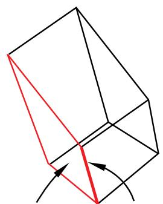  
1. Select this face.  
2. Select this edge as vertical and on the right.

  
3. The Sketcher starts, and the view rotates.  
Figure 1: Determining the sketch plane orientation.

## Additional information

• Adding a swept solid feature  
• Adding a swept shell feature  
• Creating a swept cut  
• Basic Sketcher concepts  
• Using the Sketch module  
• Using the sketch method to partition faces

## Realigning the sketch grid relative to the sketch

When you are sketching a feature, the sketch grid does not always align with the vertices and lines of the sketch or the underlying reference geometry. You can use the following techniques to realign the grid:

• Shift the grid relative to the sketch by selecting a vertex representing the origin of the grid.  
• Rotate the grid relative to the sketch by selecting a line that will be parallel to the X-axis of the sketch.  
• Remove any realignment and reset the grid to its original orientation.

Realignment applies only to the particular sketch, and the alignment of the grid is stored along with the sketch in the model database. New and existing sketches retain their default alignment.

Changing the origin and rotating the sketch grid allows you to quickly create features that might be difficult to create using the default grid location. Rotating the grid has the following effect:

The grid coordinates of the current cursor position are displayed in the upper-left corner of the viewport, and you can use these coordinates as a guide. The grid coordinates displayed are relative to the current alignment of the sketch grid and change if you realign the grid.  
The sketch coordinates of the current cursor position are displayed in the upper-right corner of the viewport. The sketch coordinates displayed are relative to the original alignment of the sketch grid and do not change if you realign the grid.  
When you enter the coordinates of a vertex in the prompt area, those coordinates are relative to the current alignment of the sketch grid.  
• Old and new horizontal and vertical dimensions remain horizontal and vertical.  
• Old horizontal and vertical construction lines remain horizontal and vertical.  
• New horizontal and vertical construction lines and preselection points are aligned with the rotated grid.  
• The lines generated by the rectangle tool are aligned with the rotated grid.

## Additional information

• Realigning the sketch grid  
• Basic Sketcher concepts  
• Using the Sketch module

## The Sketcher cursors and preselection

There are two cursors active within the Sketcher: the primary cursor and the secondary cursor. The two cursors are shown in Figure 1.

  
Figure 1:The Sketcher cursors.

The primary cursor is the one you use with most applications on your computer, including Abaqus/CAE. The primary cursor usually appears as an arrow pointer or a pointing hand; you position this cursor by moving the mouse. The secondary cursor is active only in the Sketcher; it appears near the primary cursor when the Sketcher prompts you to select a point. The position of the secondary cursor allows you to see exactly which point is selected before committing the selection. If you move the primary cursor near a point that is eligible for selection, the secondary cursor jumps directly to the point while the primary cursor remains fixed. This behavior is called preselection. If you click the mouse button, Abaqus/CAE selects the point under the secondary cursor.

The appearance of the secondary cursor changes as you move around the sketch. Table 1 shows the shape assumed by the secondary cursor when the primary cursor is close to the Sketcher entity listed.

Table 1: Preselection cursors.

<table><tr><td>Preselection cursor</td><td>Sketcher entity</td></tr><tr><td></td><td>A vertex</td></tr><tr><td></td><td>The midpoint of a line or curve</td></tr><tr><td>×</td><td>The intersection of lines and curves</td></tr><tr><td>×——</td><td>The projection of a line onto other lines and curves</td></tr><tr><td></td><td>Points along existing lines or curves</td></tr><tr><td>+</td><td>The intersection of gridlines with each other or with other lines and curves</td></tr></table>

The secondary cursor works in conjunction with other preselection symbols in the sketch to indicate special points that you can select. Table 2 shows the other preselection symbols used in the Sketcher and the meaning of each symbol.

Table 2: Preselection symbols.

<table><tr><td>Preselection symbol</td><td>Location and Meaning</td></tr><tr><td></td><td>At the starting point of a new line segment when the line starts on existing sketch, reference, or construction geometry. The new line segment is perpendicular to the existing geometry.</td></tr><tr><td>||</td><td>Near the starting point when creating a new line starting on an existing edge; the symbol is aligned with the existing edge. The new line segment is tangent to the existing edge.</td></tr><tr><td>H</td><td>Near the secondary cursor when creating a new line. The new line segment is horizontal.</td></tr><tr><td>V</td><td>Near the secondary cursor when creating a new line. The new line segment is vertical.</td></tr></table>

The preselection cursors and symbols also indicate constraints that Abaqus/CAE will apply to the sketch if you choose the preselected point. Constraints such as coincidence, perpendicularity, and tangency help control sketch geometry and preserve your design intent.

Preselection applies to any entity that is a valid selection in the sketch. For example, as you move the cursor around the sketch, preselection highlights the following to indicate a valid selection:

• Vertices, intersections, projections, and points of tangency highlight when you are sketching a line, as shown in Table 1.  
• Sketch, construction, and reference geometry highlight when you are adding a dimension.  
• Dimensions highlight when you are modifying a dimension.

You can customize the cursor's behavior as follows:

• By default, the secondary cursor snaps to grid points that are close to the primary cursor. If you turn off this snapping, the secondary cursor follows the primary cursor and can be positioned anywhere on the Sketcher sheet.

• You can turn off preselection.

For more information on customizing the secondary cursor, see Turning snapping on or off, and Turning preselection on or off. The secondary cursor is available only in the Sketcher, but you can use another form of preselection to help you select viewport objects in other Abaqus/CAE modules. For more information on selecting viewport objects, see Selecting and unselecting individual objects.

## Additional information

• Controlling sketch geometry  
• Customizing the Sketcher  
• Using the Sketch module  
• Basic Sketcher concepts

## Using the chain method to select edges in the Sketcher

When offsetting or copying edges in a sketch, you can select a “chain” of connected edges. A chain is a connected group of edges in which each edge may be connected to, at most, one other edge at each endpoint—like the links in a chain. The chain method is available only in the Sketcher, and it allows you to select a chain of edges as if they were a single entity.

When you are performing a task that allows you to pick more than one edge from a sketch, Abaqus/CAE displays a field in the prompt area. The field allows you to choose between the two selection methods—individually and by chain, as shown in Figure 1.

  
Figure 1: Choose the selection method from the field in the prompt area.

After you use the chain method, you can click the individually method in the prompt area and [Shift] + Click on individual edges to append them to your selection. You can also [Ctrl] + Click on edges to unselect them. In addition, you can continue to use the chain method and use [Shift] + Click to append more chains to your selection.

## Additional information

• Basic Sketcher concepts  
• Using the Sketch module  
• Selecting objects within the current viewport

## How Sketcher customization options are initialized and saved

Sketcher customization options are grouped into the following settings:

## Sketcher options

• Snapping  
• Preselection behavior  
• Whether to display construction geometry, dimensions, parameter names, and constraints  
• The types of constraints and dimensions that Abaqus/CAE can add automatically

## Sketch options

• Sheet size, grid spacing, and grid display  
• The origin of the grid and the alignment of the axes  
• The text height and decimal places of dimensions and text height of parameter names

Sketcher options control the interactive behavior of the Sketcher, while Sketch options control the appearance of individual sketches. Abaqus/CAE stores and uses your Sketcher customization settings only for the duration of the session. In contrast, Abaqus/CAE stores your Sketch customization settings along with each sketch in the model database. As a result, if you exit the Abaqus/CAE session and return to the sketch at a later date, the Sketch customization options are retained.

When you create a new part or stand-alone sketch, Abaqus/CAE always uses the default Sketch options. The sheet size and grid spacing are recalculated based on the approximate size of the part or the selected sketch plane, the origin of the sketch is at 0,0 , the grid is displayed and aligns with the 1- and 2-axes, and the text height and decimal places are at their default settings.

## Additional information

• Using the Sketch module  
• Customizing the Sketcher

## Using the Query toolset in the Sketcher

You can use the Query toolset to request either general information or module-specific information.

For a discussion of the information displayed by general queries, see Obtaining general information about the model.

Select Tools->Query from the main menu bar, or click the tool in the Query toolset to start the Query toolset.

The following queries are specific to the Sketcher:

## Constraint

Abaqus/CAE displays the constraint type and the names of the constrained entities in the message area and highlights the entities in the sketch.

## Detail

Abaqus/CAE displays the number of geometries, vertices, constraints, dimensions, and unconstrained degrees of freedom in the message area.

## Additional information

• Basic Sketcher concepts  
• The Query toolset

## Sketcher geometry

This section describes the different types of geometry available in the Sketcher.

## In this section:

Reference geometry  
Construction geometry

## Reference geometry

When you sketch the profile of a feature, Abaqus/CAE projects onto the sketch sheet all the edges and vertices of the part or assembly that are in the same plane as the sketch plane. Abaqus/CAE also projects all datum points and datum axes onto the sketch sheet, regardless of their location in the part or assembly. These projected points and lines are called reference geometry, and you can use them for reference while sketching.

You typically use reference geometry to position your sketch accurately by specifying a dimension between a sketched entity, such as a line or a vertex, and the reference geometry. You can also use reference geometry to realign the sketch grid. The sketch retains any reference geometry that is used to position or dimension the sketch—the reference geometry reappears when you use the Sketcher to edit the feature again. Abaqus/CAE discards any reference geometry that is not used in the sketch.

If your part is complex, projecting only the edges, vertices, and datum points in the sketch plane onto the sketch sheet reduces the amount of clutter on the screen and makes the selection procedure more straightforward. However, your selection will be limited to only edges, vertices, and datum points that are in the sketch plane. If you want to use other edges, vertices, or datum points–including orphan element edges and nodes—as references, you must project them

onto the sketch plane as reference geometry by using the Project References tool . Alternatively, if you want to

create new sketch edges from existing model edges or orphan element edges, you can use the Project Edges tool (for more information, see Projecting edges onto a sketch).

When you sketch a new feature, you can constrain the position of the sketch to the underlying reference geometry using one of the following methods:

• Select entities from the reference geometry while sketching the new feature; for example, select a projected vertex to define the center of a circle or one end of a line.  
• Create a constraint, dimension, or parameter between the sketch and any projected reference geometry. For more information, see Controlling sketch geometry.

Constraining the sketch defines how it is positioned relative to the reference geometry and how it will be repositioned if you modify and regenerate the part or assembly.

When you exit the Sketcher, Abaqus/CAE determines whether you have constrained the sketch to the reference geometry. If a constraint is found, Abaqus/CAE creates a parent-child relationship between the new feature (the child) and the selected reference geometry (the parent). If no constraints are found, Abaqus/CAE displays the following message in the message area: No sketch placement constraints specified on feature feature name. You do not have to constrain the sketch; but if you do not, its position relative to the underlying geometry of the part or assembly may change if you modify and regenerate the part or assembly.

If you save a stand-alone sketch, Abaqus/CAE saves only the sketch and does not save any underlying reference geometry. As a result, if the sketch includes a dimension between a sketch line and a reference line, the dimension is not saved with the stand-alone version of the sketch.

The order in which you create features influences the available reference geometry. Feature-based modeling allows a child feature to be dependent on a parent feature but does not allow a parent to be dependent on a child. As a result, if a feature was created after the feature you are editing, the edges and vertices of the newer feature cannot be projected onto the sketch sheet. You can use the Query toolset to determine the order in which features were created; for more information, see Using the Model Tree to obtain feature information.

## Additional information

• The Feature Manipulation toolset  
• Using the Sketch module

## Construction geometry

You create construction geometry in the Sketcher to help you position and align the geometry in your sketch; objects that you might need to position include holes, arcs, slots, or gear teeth.

The Sketcher allows you to add construction lines and circles to your sketch; in addition, points that you create using the isolated point tool are considered construction geometry. Construction lines, circles, and points do not appear in the feature you are creating or modifying.

While you are adding construction geometry and moving the cursor around the sketch, Abaqus/CAE displays preselection symbols at the following locations:

• The intersection of the new construction geometry and sketched lines or curves.  
• The intersection of the new construction geometry and existing construction geometry.  
The intersection of the new construction geometry and reference geometry. Abaqus/CAE displays preselection symbols only when the reference geometry was created before the feature being edited. (See Reference geometry, for more information about the behavior of reference geometry.)

The preselection symbols generated by construction geometry allow you to align objects precisely; for example, along an oblique line or around a circle. For example, you could create an oblique construction line and several vertical construction lines to help align a group of circles, as illustrated in Figure 1.

  
Figure 1: Using construction lines to align sketch geometry.

Construction lines also define the axis of rotation when sketching revolved solids and surfaces. For more information about the relationship between construction lines and the axis of revolution, see Defining the axis of revolution for axisymmetric parts and for revolved features.

Construction geometry is shown using dashed lines to distinguish it from sketched geometry. Construction geometry is visible only while you are working on a sketch; as soon as you exit the Sketcher, the construction geometry disappears. Abaqus/CAE saves construction geometry with the original sketch; if the Sketcher is invoked to modify a sketch that included construction geometry, the construction geometry reappears along with the sketch.

To create construction geometry, select one of the construction geometry tools from the Sketcher toolbox or select Add->Construction from the main menu bar.

You can also convert components of your sketch into construction geometry, and you can reverse this process for items that had been converted to construction geometry. To convert a component to construction geometry, select the

component and select Edit->Set as Construction from the main menu bar; to reverse this process, select the construction geometry component and select Edit->Unset Construction.

## Additional information

• Creating construction geometry  
• Reference geometry  
• Controlling sketch geometry  
• Using the Sketch module

## Specifying precise geometry

When you are using the Sketcher to sketch features, you can use the underlying grid and preselection to position the cursor and create or modify sketch geometry. In addition, you can use the following techniques to position the geometry precisely:

## Entering coordinates

When you are using the Sketcher to create a feature and Abaqus/CAE asks you to position a point (for example, to define the endpoint of a line or the center of a circle), you can do one of the following:

• Select a point on the sketch using the Sketcher grid, existing vertices, or preselection.  
• Enter the desired X- and Y-coordinates of the point in a text box in the prompt area.

To help you determine the coordinates to provide, the X- and Y-axes of the sketch are indicated by dashed lines, which intersect at the origin of the sketch. The coordinates that you specify are relative to this origin. In addition, when you select a Sketcher tool, the coordinates of the current cursor position are displayed in the upper-left corner of the viewport, and you can use these coordinates as a guide.

For detailed instructions, see Sketching simple objects.

## Creating and modifying dimensions

After you have created the geometry, the Sketcher allows you to add dimensions between lines and vertices and other pieces of geometry in the sketch. You can then refine the sketch by replacing these dimensions with precise dimensions, and the sketch changes to reflect the new dimensions. In addition, dimensions allow you to annotate sketches for future reference.

You add dimensions by selecting the dimension tool in the Sketcher toolbox or by selecting Add->Dimension from the main menu bar—editing the dimension value is the final step in creating a new dimension. To modify

an existing dimension, select the modify dimension tool from the Sketcher toolbox or select Edit->Dimension from the main menu bar. For detailed instructions, see Editing dimensions.

## Additional information

• Automatically constraining a sketch  
• Adding individual dimensions  
• Modifying objects by changing dimensions or adding parameters  
• Using the Sketch module

## Controlling sketch geometry

Controlling sketch geometry helps you prevent unintended changes by creating relationships between sketch entities. If all the geometry in a sketch is controlled, the sketch is fully constrained—the entities in the sketch cannot be modified without violating the controls, and you cannot add another control without creating a conflict with one that already exists.

The following section describes how you can use constraints, dimensions, and parameters to control sketch geometry. All three types of controls can be considered constraints since they all work to restrict the degrees of freedom in a sketch, but each control creates a different type of relationship between the selected entities.

## In this section:

Using constraints to control sketch geometry  
Using dimensions to control sketch geometry  
Using parameters to control sketch geometry  
Fully constrained geometry

## Using constraints to control sketch geometry

Constraints create logical relationships that control the position or size of geometry. Constraints are defined without using numerical values. The other types of geometry controls, dimensions and parameters, are specialized constraints that use values or evaluated expressions to define numerical relationships in a sketch. Constraints are not required in Abaqus/CAE sketches; however, they can help you preserve the design intent. When you modify a constrained sketch, you must either work within the existing controls, modify them, or delete them to complete your changes.

Table 1 lists each constraint type, its symbol, and a brief description of its use.

Table 1: Sketcher constraints.

<table><tr><td>Constraints</td><td>Symbol</td><td>Description</td></tr><tr><td>Coincident</td><td>o</td><td>Abaqus/CAE moves the selected entities so that they share a common point. The point may be a point on both entities or a projected point that would exist only if one of the entities was extended. If two straight lines are selected, they become colinear.</td></tr><tr><td>Concentric</td><td>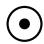</td><td>Abaqus/CAE moves the selected arcs or circles to share a common center.</td></tr><tr><td>Equal length</td><td>/</td><td>Abaqus/CAE makes the selected lines all the same length.</td></tr><tr><td>Equal radius</td><td>—</td><td>Abaqus/CAE makes the selected arcs or circles the same radius.</td></tr><tr><td>Fixed</td><td>[78KW]</td><td>Abaqus/CAE fixes the radius of an arc or circle, the angle of a line, or the position of a vertex.</td></tr><tr><td>Horizontal</td><td>H</td><td>Abaqus/CAE aligns the selected line with the X-axis of the sketch. The horizontal constraint is not affected by grid orientation.</td></tr><tr><td>Equal distance</td><td>[KZZ6]</td><td>Abaqus/CAE moves the selected vertex so that it is the same distance from the two vertices or lines used to define the constraint.</td></tr><tr><td>Parallel</td><td>//</td><td>Abaqus/CAE makes the selected lines parallel.</td></tr><tr><td>Perpendicular</td><td>[TT4]</td><td>Abaqus/CAE makes the selected lines perpendicular.</td></tr><tr><td>Symmetry</td><td>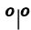</td><td>Abaqus/CAE makes the selected entities symmetrical about your chosen line of symmetry.</td></tr><tr><td>Tangent</td><td>||</td><td>Abaqus/CAE makes the selected entities tangent at their nearest point. At least one of the entities must be curved.</td></tr><tr><td>Vertical</td><td>V</td><td>Abaqus/CAE aligns the selected line with the Y-axis of the sketch. The horizontal constraint is not affected by grid orientation.</td></tr></table>


## Note:

The behaviors described in Table 1 assume that no other constraints are applied to the selected entities. The presence of other constraints and the constraint solution method selected in the Sketcher Options may affect how Abaqus/CAE moves entities to comply with the constraints.

You can create multiple instances of the same type of constraint in a sketch. You can use the sketch module queries to locate the geometries controlled by a constraint or to list the constraint details for the entire sketch (for more information, see The Query toolset).

You can use the following techniques to add constraints to a sketch:

## Preselecting geometry

If preselection is active, Abaqus/CAE can add some constraints while you create geometry. Coincident, horizontal, perpendicular, tangent, and vertical constraints can be added using the preselection cursor. For more information, see The Sketcher cursors and preselection.

## Selecting midpoints of lines or curves

If you select the midpoint of a line or curve as the vertex for additional sketch geometry, Abaqus/CAE also creates an equal distance constraint between the midpoint and the endpoints of the line or curve.

## Adding constraints automatically

After you create a sketch, you can use the auto-constrain tool to add constraints to the entire sketch or to a selected group of entities. Use the sketch options to control the constraint types that Abaqus/CAE can add automatically and the allowable tolerances for adding a constraint. For more information, see Customizing the use of constraints in the Sketcher.

## Adding individual constraints

After you create sketch geometry, you can select the constraint type and pick the entities to apply the constraint. This method gives you the most control, but it is also the most time consuming. For more information, see Adding individual constraints.

When you add constraints, you must not overconstrain the sketch geometry. Geometry is overconstrained when multiple controls are applied to a single degree of freedom (for more information, see Fully constrained geometry). Abaqus/CAE colors conflicting constraints magenta to indicate an overconstraint condition. You must resolve any overconstraints before you can use a sketch to create a feature or save it with the model database.

## Additional information

• The Sketcher cursors and preselection  
• Customizing the Sketcher  
• Constraining, dimensioning, and parameterizing a sketch

## Using dimensions to control sketch geometry

Dimensions are a type of constraints that use numerical values to define sizes, angles, or distances in a sketch. Dimensions control sketch geometry by preventing changes to the dimensioned quantities. To change a dimensioned quantity, you must modify the associated dimension.

The following dimension types are available in the Sketcher:

• horizontal  
vertical  
• oblique  
• angular  
radial

The first three dimension types correspond to linear distances between two points (including the endpoints of a single line), two lines, or a point and a line. Angular dimensions always indicate the angle, in degrees, between two lines. Radial dimensions indicate the radius of a circle, arc, or fillet or the major and minor radii of an ellipse.

You can use the following techniques to add dimensions to a sketch:

## Adding dimensions automatically

After you create a sketch, you can use the auto-dimension tool to add dimensions to the entire sketch or to a selected group of entities. Use the sketch options to control the dimension types that Abaqus/CAE can add automatically. For more information, see Customizing the format and use of dimensions in the Sketcher.

## Adding individual dimensions

After you create sketch geometry, you can add individual dimensions. This method gives you the most control, but it is also the most time consuming. For more information, see Adding individual dimensions.

You can modify any dimension in a sketch. When you edit an existing dimension, you can modify it in several ways. You can

• edit the numerical value to modify the sketch,  
• convert the dimension to a reference dimension, or  
• link the dimension to a parameter.

Reference dimensions annotate quantities that are already controlled elsewhere in the sketch or quantities such as projected reference geometry that cannot be controlled within the current sketch. Reference dimension values are enclosed in parentheses, and Abaqus/CAE updates them automatically to match changes in the associated geometry. Dimensions that have been linked to parameters are assigned a variable name for use in creating mathematical expressions (parametric equations) to define other parameters in the sketch. For detailed instructions on editing dimensions, see Editing dimensions.

When you add or modify dimensions, you must not overconstrain the sketch geometry. Geometry is overconstrained when multiple controls are applied to a single degree of freedom (for more information, see Fully constrained geometry). Abaqus/CAE colors conflicting constraints magenta to indicate an overconstraint condition. You must resolve any overconstraints before you can use a sketch to create a feature or save it with the model database.

## Additional information

• Modifying objects by changing dimensions or adding parameters

• Customizing the Sketcher  
• Constraining, dimensioning, and parameterizing a sketch

## Using parameters to control sketch geometry

Parameters are dimensions or numerical constants that have been given a variable name and are used to create parametric equations between pieces of geometry. While dimensions always have a numerical value, parameters may have a numerical value or a value resulting from a mathematical expression. For example, you can parameterize the radius dimension of a circle so it will always be half the size of another dimension in the sketch, but you must first associate both dimensions with parameters to create the expression. You can use the sketch options to control whether Abaqus/CAE displays the names or values of parameters in a sketch (for more information, see Customizing the format and use of dimensions in the Sketcher).

Parameters must be defined within a single sketch—you cannot define parameters in one sketch and use them to create expressions in another sketch. Defining a parameter adds it to the Parameter Manager for the sketch. The order of parameters in the manager indicates the order in which they can be used in expressions. Figure 1 shows two parameters; the length parameter is used to define the width parameter. If you instead wanted to define the length in terms of the width, the width parameter would need to appear first in the manager. You can use the buttons on the right side of the dialog box to create parameters by selecting dimensions from the viewport or to insert, move, or delete parameters from the manager. For detailed instructions, see Adding and editing parameters.

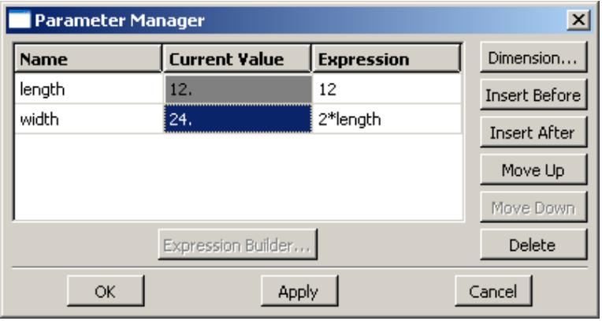  
Figure 1:The Parameter Manager.

## Additional information

• Modifying objects by changing dimensions or adding parameters  
• Constraining, dimensioning, and parameterizing a sketch  
• Creating parametric equations  
• Modifying objects

## Fully constrained geometry

Constraints, dimensions, and parameters are all used to create relationships that control, or constrain, Sketcher geometry. Geometry is constrained by the removal of degrees of freedom from the sketch. For example, if you apply a perpendicular constraint to two lines, you remove the angular degree of freedom between those lines. If you drag one of the lines, the other line must also move to maintain the perpendicular constraint.

If geometry is controlled such that you cannot change it without redefining the relationships—changing constraints, dimensions, or parameters—the geometry is fully constrained. Abaqus/CAE colors fully constrained geometry green to indicate that it cannot be changed. If you add too many constraints to a sketch, the geometry becomes overconstrained. Abaqus/CAE colors conflicting constraints magenta to indicate the overconstraint condition. To resolve an overconstraint, you can

• undo the last modification or constraint addition,  
• delete constraints or dimensions, or  
• convert unnecessary dimensions to reference dimensions.

If you intend to fully constrain an entire sketch, you can use the Detail query to list sketch information—including the number of unconstrained degrees of freedom—in the message area. For more information, see Using the Query toolset in the Sketcher.

## Additional information

• Constraining, dimensioning, and parameterizing a sketch  
• Editing dimensions  
• Modifying objects  
• Undoing and redoing sketching actions

## Modifying, copying, and offsetting objects

The following section describes the techniques you can use to modify your sketch and to copy or offset Sketcher objects.

## In this section:

Modifying a sketch by dragging objects  
Modifying objects by changing dimensions or adding parameters  
Modifying or copying objects by selecting edges  
Modifying edges by trimming, extending, splitting, or merging  
Copying sketch objects to create patterns  
Offsetting objects

## Modifying a sketch by dragging objects

You can drag vertices, edges, construction geometry, and dimension text to new locations in a sketch. You can drag only one object at a time, and the object you drag will snap to gridlines when the Snap to grid option in the Sketcher Options dialog box is toggled on. This option is toggled on by default.

When you drag a vertex or an edge, Abaqus/CAE repositions the selection and uses the During drag constraint solution method to modify any connected edges (for more information, see Customizing the use of constraints in the Sketcher). Sketch constraints may cause multiple objects to move along with the one you select. Constraints may also restrict or prevent dragging some objects. For example, consider the sketch shown in Figure 1.

  
Figure 1:The original sketch.

The sketch includes the default horizontal, vertical, and perpendicular constraints created by Abaqus/CAE during the sketching process and one added length dimension. With these constraints in place, dragging the left edge of the sketch has the same effect as dragging the vertex at either end of the left edge, as shown in Figure 2.

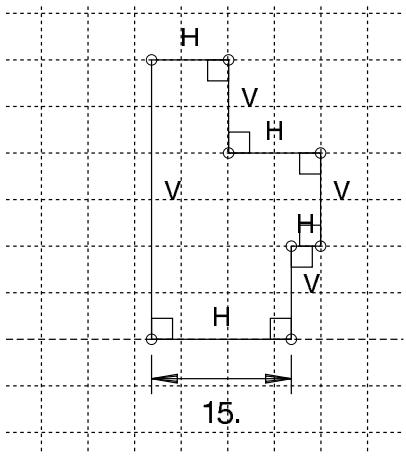  
Figure 2: Dragging the left edge or vertices with constraints.

With the constraints and dimension removed, dragging the edge produces similar results to those shown in Figure 2, but dragging a vertex modifies the sketch as shown in Figure 3. The result in Figure 3 is achieved using the default Minimum move constraint solution method. For this sketch, dragging the vertex using any of the other constraint solution methods repositions the entire sketch.

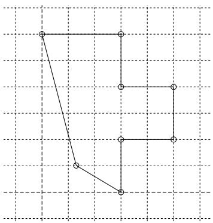  
Figure 3: Dragging the lower left vertex without constraints.

Dragging edges and vertices is a quick, but imprecise, method of moving them since the motion is based on the cursor position as opposed to an exact numerical change. To move objects more precisely, use the methods described in Modifying objects by changing dimensions or adding parameters, and Modifying or copying objects by selecting edges.

Dragging dimension text is one way to clean up the sketch after using the Auto-Dimension tool. The lack of precision does not matter since the exact location of dimension text is not important. When you drag dimension text, you can make the following changes:

• Move a linear dimension closer to, farther from, or to the opposite side of the dimensioned quantity.  
• Move an angular dimension closer to or farther from the angle's vertex.  
• Move an angular dimension across one of the edges that define the angle to dimension a supplement of the original angle.

Possible locations for dragging an angular dimension are shown in Figure 4.

  
Figure 4: Four possible positions for an angular dimension.

Dimension text is not controlled by any constraints other than the attachment to the dimensioned object. The constraint solution methods also do not affect dragging dimension text in a sketch.

## Additional information

• Specifying precise geometry  
• Modifying objects

## Modifying objects by changing dimensions or adding parameters

Use dimensions between lines and vertices to define and maintain dimensional relationships between features. Dimensions can be applied between lines and vertices from any of the following:

• Sketch geometry  
• Reference geometry  
• Construction geometry

Parameters are dimensions or constants that have been associated with a name so you can use them to create functions and to define relationships between features. For example, consider a three-dimensional shell with an extruded circular post, as shown in the following figure:


This part was created in two steps:

1. Create a part consisting of only the shell.  
2. Extrude a solid feature from the face of the shell (the circular post).

If you want to keep the distance between the left edge of the shell and the center of the post constant, you can edit the post and add a dimension between the center of the sketched circle and the left edge of the reference geometry that represents the shell, as shown in the following figure:


If you move either the left or the right edge of the shell, the distance between the center of the circle and the left edge remains constant, as shown in the following figure:


If you want to keep the post centered between the left and right edges of the shell, you must add two dimensions and associate them with parameters. You can then define a parametric equation, $d i m 2 { = } ( d i m I ) / 2$ , to set the distance from the left edge to the post at half the width of the shell, as shown in the following figure:


## Note:

The distance dimension associated with the parameter dim1 is defined in the sketch of the shell feature and cannot be edited in the sketch of the post. When you dimension reference geometry, Abaqus/CAE colors the dimension magenta to indicate an overconstraint. To clear the overconstraint, you must make dim1 a reference dimension. Abaqus/CAE places parentheses around the value of reference dimensions (or around the parameter name if the dimension is associated with a parameter) and automatically updates their values if the dimensioned quantity changes. For more information, see Editing dimensions.

You can modify any dimension or parameter in a sketch. For detailed instructions, see Editing dimensions, and Adding and editing parameters, respectively.

## Modifying or copying objects by selecting edges

When you move edges, Abaqus/CAE repositions the selected edges and uses the During edit constraint solution method to modify any connected edges (for more information, see Customizing the use of constraints in the Sketcher). The sketch constraints and constraint solution method may restrict the types of moves that you can make or cause Abaqus/CAE to reposition edges that you did not select. When you copy edges, the copies are positioned according to the copy method—the copied edges are not affected by any existing sketch constraints. You cannot copy objects between sketches. Abaqus/CAE provides the following methods for moving or copying selected edges:

## Translate

You can translate selected edges by specifying the start and end coordinates of a translation vector. The translation vector can start from any point; however, you may find it more meaningful to start the vector from the vertex at one end of a selected edge and end it at the vertex's new location. Figure 1 shows the selected edges, the translation vector, and the result of the translation. To achieve the results shown, Fixed constraints were added to prevent the two vertices of the upper rectangle from moving.

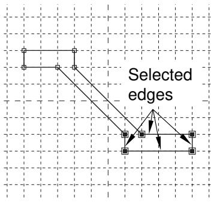


  
Figure 1:Translating selected edges.

## Rotate

You can rotate selected edges by specifying the coordinates of the center of rotation and entering the angle of rotation; a positive angle indicates a counterclockwise rotation. Figure 2 shows the selected edges, the selected center of rotation, and the result of a 90° rotation. The selected edges are not connected or otherwise constrained to other edges in the sketch, so the constraint solution method has no effect on the rotation.

  
Figure 2: Rotating selected edges.

## Mirror

You can mirror selected edges by selecting a straight line in the sketch as the mirror line. Figure 3 shows the selected edges, the mirror line, and the resulting copy including a mirror constraint for each of the four selected edges. The mirror line may be any straight object line or construction line in the sketch.

  
Figure 3: Mirroring selected edges.

## Scale

You can scale selected edges by specifying a center point and a scale factor. A scale factor less than 1.0 decreases the spacing between the edges, and a scale factor greater than 1.0 increases the spacing between the edges. Figure 4 shows the selected edges, the selected center point, and the result for a scale factor of 1.5.

  
Figure 4: Scaling selected edges.

## Additional information

• Modifying objects

## Modifying edges by trimming, extending, splitting, or merging

When you are modifying a sketch, you can implement your changes by modifying a dimension, by moving selected vertices, or by trimming, extending, splitting, or merging edges. Abaqus/CAE provides the following methods for trimming, extending, splitting, and merging edges:

## Trim/Extend

You can trim or extend one end of a line or arc; you can also trim a spline curve, but spline curves cannot be extended. To trim or extend an edge, first select the edge near the end that you want to modify and then select a second edge to define an intersection point. The second edge may be any object in the sketch, including construction geometry. The intersection point may lie beyond the current endpoints of either selected edge. Abaqus/CAE trims or extends the first edge at the intersection point. If you want to trim or extend the second edge to the same point, repeat the process, reversing the selection order (see Figure 1).

  
Figure 1: Extending two edges to create a corner.

For detailed instructions on trimming and extending edges, see Modifying Sketcher objects by trimming or extending edges.

## Auto-trim

You can trim an intermediate or end segment from a line, arc, circle, or spline curve. Auto-trim is the fastest method you can use to remove unwanted edge segments from a sketch. Abaqus/CAE uses preselection to highlight edges that you can remove. Preselection is based on cursor proximity and the two nearest “trim points.” Trim points include intersection points, endpoints, vertices, and the picked points that define the edges of circles. Unlike when you use Trim/Extend, Abaqus/CAE does not split the intersecting edges. Figure 2 shows several possible trim combinations based on the circle and line shown in the upper left corner.

  
Figure 2: Auto-trim selections.

For detailed instructions on automatically trimming edges, see Modifying Sketcher objects by automatically trimming edges.

## Split

You can split edges, creating separate pieces with a common vertex, where they intersect in the sketch. Select the first edge to be broken, then select a second edge that intersects the first at the desired split point. As you move the cursor near the second edge, a circle appears around the split point that you would create. If there is more than one intersection point between the two edges, Abaqus/CAE highlights the intersection closest to the cursor. Abaqus/CAE splits the first edge at the indicated point. Figure 3 shows an intersecting line and spline on the left, indicates the split point in the center image (the cursor is not shown), and shows the three resulting edges on the right. In this case the spline was selected first, so the straight line remains unbroken.


## Note:

Spline curves retain their exact shape when you split or trim them, but the control points are removed so you can no longer edit the shape of the curves.

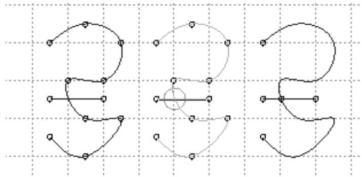  
Figure 3: Splitting a line and a spline.

For detailed instructions on splitting edges, see Modifying Sketcher objects by splitting edges.

## Merge

The Merge tool enables you to close small gaps in a sketch. These gaps commonly occur in the following situations:

• When you use the Project Edges tool on edges that are not in a plane parallel to the sketch plane, the endpoints may be created in a slightly different location from other selected edges.  
• When you import sketch geometry into an existing sketch, the edges may not line up exactly.

The Merge tool is intended only for closing small gaps. Merging edges to close larger gaps may change the sketch geometry significantly. If you want to move elements in a sketch over a large distance, use the drag tool from the Sketcher toolbox to move vertices in your sketch to a new location. For more information, see Dragging Sketcher objects.

For detailed instructions on merging edges, see Modifying Sketcher objects by merging edges.

## Additional information

• Modifying objects

## Copying sketch objects to create patterns

You can copy objects in your sketch and create a pattern of copied objects; for example, Figure 1 illustrates radial patterns of gear teeth and holes on a solid part.

  
Figure 1: Radial patterns of gear teeth and holes.

You can choose either of the following methods to define the pattern:

## Linear pattern

A linear pattern positions copies of selected objects along a direction; for example, the X-direction. You can specify the number of copies and the spacing between the copies; and you can choose to position the copies in a positive direction or a negative direction. In addition, you can change the orientation of the linear pattern.

Figure 2 shows how you can create different linear patterns in a single direction.

  
Figure 2: Linear patterns in a single direction.

You can create a matrix of copied objects by creating copies in a second direction; for example, the Y-direction. The options are the same as for the first direction; you can control the number of copies, the direction, and the angle. Figure 3 shows how you can create different linear patterns in two directions.

  
Figure 3: Linear patterns in two directions.

By default, the first direction is the X-axis and the second direction is the Y-axis. However, you can change the orientation of the first direction or the second direction by selecting a line from the sketch that represents the new orientation. Figure 4 shows a linear pattern oriented along a selected line.

  
Direction 1 Number = 5 Spacing = 20  
Direction 2 Number = 1  
Figure 4: A linear pattern oriented along a line.

By default, Abaqus/CAE creates the pattern in a positive direction; however, you can reverse the direction. For example, Figure 5 shows the same linear pattern as in Figure 4 but with the direction reversed.

  
Figure 5: The effect of reversing the direction of a linear pattern.

For detailed instructions on creating linear patterns, see Creating linear patterns of objects.

## Radial pattern

A radial pattern positions copies of selected objects in a circular pattern. You can specify the number of copies, and you can specify the angle between the first and last copy, where a positive angle corresponds to a counterclockwise direction. In addition, you can select a point from the sketch that defines the center point of the circular pattern. Figure 6 shows how you can create different radial patterns.

  
Figure 6: Radial patterns.

For detailed instructions on creating radial patterns, see Creating radial patterns of objects.

By default, Abaqus/CAE displays a preview of the linear and radial pattern as you enter the settings. In most cases the preview will help you decide on the settings that will create the desired pattern. However, if you are creating a large number of copies, the preview may slow down the generation of the sketch. In this case you should toggle off the Preview button.

Several methods are also available for creating individual copies of sketch objects. These methods are discussed in Modifying or copying objects by selecting edges.

## Offsetting objects

You can offset objects in your sketch to create similar objects of a larger or smaller size. You select the edges to offset and the offset distance; Abaqus/CAE displays a preview so that you can choose the offset direction. You can offset any continuous open or closed loops that do not contain branches. Figure 1 shows the two possible offsets that can be created for several edge selections. (For clarity, vertices and datum points are not shown in the figure.)

  
Figure 1: Offsets of a spline curve, a square, and a circle.

Abaqus/CAE offsets each object in the same way that you would offset edges on paper with a drafting compass. Using a compass, you would draw the compass point along the original edge tracing a new edge with the pencil at the required perpendicular (offset) distance. At any sharp corners, you would rotate the compass to make it perpendicular to the second edge at the corner. At the end of this process, you would trim any offset edges that intersected with other offset edges.

As shown in Figure 1, Abaqus/CAE completes a similar process:

• Straight edges are copied.  
• Offset edges that overlap, such as corners offset toward the “inside,” are trimmed to make new corners.  
• Where corners are offset toward the “outside,” you can choose to create sharp corners or fillets with radii equal to the offset distance.  
• Radii of existing curves are increased or decreased by the offset distance.

If the radius of a curve would be decreased to zero or less by the offset, Abaqus/CAE creates a new vertex joining the surrounding edges that were previously connected by the curve. For detailed instructions, see Offsetting the edges of Sketcher objects.

## Customizing the Sketcher

This section describes how you customize the behavior and the appearance of the Sketcher.

## In this section:

Using Sketcher customization options  
Turning snapping on or off  
Turning preselection on or off  
Customizing the sheet size and grid  
Realigning the sketch grid  
Displaying and hiding construction geometry  
Limiting the projection of coplanar entities  
Setting the maximum number of recorded sketching operations  
Customizing the format and use of dimensions in the Sketcher  
Customizing the use of constraints in the Sketcher  
Managing images in the Sketcher background

## Using Sketcher customization options

Use the Sketcher customization options to control the appearance and behavior of the Sketcher.

The following options control the behavior of the Sketcher throughout the Abaqus/CAE session:

Whether the cursor snaps to the grid.  
• Whether preselection is active.  
• Whether dimensions are displayed.  
• Whether names or values of parameters are displayed.  
• Limiting the number of coplanar entities that are projected.  
• The types of dimensions and constraints available for use with the Auto-Dimension and Auto-Constrain tools.  
• The constraint solution method for use while editing or dragging objects.  
• Whether sketch constraints are displayed.  
• Whether implied constraints are added during entity creation.  
• Whether construction geometry is displayed.  
• Whether a background image is displayed.

The following options are stored with each sketch; they control the behavior and appearance of the current sketch and new sketches that you create:

• The sheet size, the grid spacing, and the number of gridlines to display.  
• Whether the sheet size and grid spacing are controlled automatically.  
• Whether the grid is visible.  
• The text font size and the number of decimal places displayed in sketch dimensions.

The origin of the sketch grid and the alignment of the X-axis are also stored with each sketch. However, the grid origin and alignment settings control only the behavior and appearance of the current sketch; they are reset to their default values for any new sketch that you create.

1. From the bottom of the Sketcher toolbox, select the Sketcher customization tool . The Sketcher Options dialog box appears.

2. Set the desired customization options on each of the tabbed pages. For detailed help, request context-sensitive help on individual items in the dialog box.


Tip: You can also click Defaults to revert all Sketcher options to their default settings.

3. Click OK to apply your changes and to close the Sketcher Options dialog box.

## Additional information

• Customizing the Sketcher  
• How Sketcher customization options are initialized and saved

## Turning snapping on or off

Snapping to the grid helps you position the cursor when you want to select a Sketcher grid point or drag an object to a specific point on the grid. When snapping is enabled and you move the cursor near a grid point, the secondary cursor jumps, or snaps, to the grid point. Toggle Snap to grid in the Sketcher Options dialog box to enable or disable snapping. (By default, snapping is enabled when you start the Sketcher.) The behavior you choose for snapping applies to all sketches in the Abaqus/CAE session. Sketcher preselection overrides snapping if a preselection point and a grid point are both close to the cursor position.

1. From the bottom of the Sketcher toolbox, select the Sketcher customization tool .

The Sketcher Options dialog box appears.

2. From the General tabbed page, toggle Snap to grid.

When Snap to grid is on, the secondary cursor snaps to nearby grid points as you move around the sketch. Depending on the grid size, magnification of the viewport, and whether preselection is active, you may also be able to select other points in addition to the grid points and the existing sketch geometry. When Snap to grid is off, the secondary cursor aligns with the primary cursor as you move around the sketch. You can select anywhere on the sheet.

3. After you have chosen the desired customization options, click OK to apply your changes and to close the Sketcher Options dialog box.

## Additional information

• The Sketcher sheet and grid  
• The Sketcher cursors and preselection  
• Customizing the Sketcher  
• Turning preselection on or off

## Turning preselection on or off

Preselection helps you select reference geometry or Sketcher objects, such as lines, vertices, and dimensions. When preselection is enabled and you move the cursor near one of these objects, Abaqus/CAE highlights the object so that you can more easily select it. Preselection also helps constrain your sketch by indicating selections that will create horizontal, vertical, colinear, perpendicular, and coincident constraints while you sketch. For a list of the preselection symbols displayed by different Sketcher objects as you move the cursor around the sketch, see The Sketcher cursors and preselection.

Toggle Preselect geometry in the Sketcher Options dialog box to enable or disable preselection. (By default, preselection is enabled when you start the Sketcher.) Preselect customization is stored for the duration of the Abaqus/CAE session and applies to all sketches. Preselection overrides snapping to the grid if a preselection point and a grid point are both close to the cursor position.

1. From the bottom of the Sketcher toolbox, select the Sketcher customization tool . The Sketcher Options dialog box appears.  
2. From the General tabbed page, toggle Preselect geometry.

When Preselect geometry is on, Abaqus/CAE highlights valid selections, such as vertices, midpoints, and dimensions, as you move around the sketch.

When Preselect geometry is off, Abaqus/CAE does not highlight valid selections.

3. After you have chosen the desired customization options, click OK to apply your changes and to close the Sketcher Options dialog box.

## Additional information

• The Sketcher cursors and preselection  
• Customizing the Sketcher  
• Turning snapping on or off  
• How Sketcher customization options are initialized and saved

## Customizing the sheet size and grid

Use the Sketcher Options dialog box to control the sheet size and the grid.

You can customize the following:

## Sheet size

The boundary of the sheet is always square, and its height and width are equal to the sheet size. If you find that the sheet size is too large or too small, you can use the Sketcher Options dialog box to change the size.

When you create a part or a stand-alone sketch, you define the approximate size of the new part or sketch; Abaqus/CAE bases the initial sheet size on the approximate size that you provide. The approximate size must be between $1 0 ^ { - 3 }$ and $1 0 ^ { 4 }$ units for a part and between $1 0 ^ { - 3 }$ and $1 0 ^ { 5 }$ units for a sketch. Abaqus/CAE does not use specific units, but the units must be consistent throughout the model. The Auto toggle next to the Sheet size field unlocks the field and controls whether or not Abaqus/CAE can automatically change the sheet size in the current sketch and in new sketches that you create.

## Grid spacing

You can use this option to change the grid spacing for major gridlines using the same units that define the Sheet size. If Snap to grid is enabled, the cursor will snap to each grid point. The Auto toggle next to the Grid spacing field unlocks the field and controls whether or not Abaqus/CAE can automatically change the grid size in the current sketch and in new sketches that you create.

## Minor intervals

Minor gridlines subdivide the space between major gridlines into intervals and enable you to position items in your sketch with greater precision when you have the Sketcher set to a high magnification level. You can use this option to change the number of minor intervals between each major gridline.

The display of minor gridlines is dynamic: Abaqus/CAE hides these lines at the default magnification level and reveals them as you zoom in.

## Show gridlines

You can toggle the display of major gridlines and minor gridlines in the Sketcher. Minor gridlines can be displayed only when major gridlines are displayed as well.

The following figure shows the relationship between the grid spacing, major gridlines, and minor gridlines:


Sheet size and grid customization options apply to the current sketch and are stored along with the sketch. When you create a new sketch, Abaqus/CAE uses the most recent settings to determine whether or not to recalculate the sheet size and grid spacing and whether to display the grid.

1. From the bottom of the Sketcher toolbox, select the Sketcher customization tool . The Sketcher Options dialog box appears.  
2. From the General tabbed page, toggle off Auto next to the Sheet size text box.  
3. In the text box, type the dimension of the square sheet that will contain the feature being created or edited. Specify the sheet size in units consistent with those used to describe the rest of the model.  
4. Toggle off Auto next to the Grid spacing text box.  
5. In the text box, type the desired spacing between grid points. Specify the grid spacing in the same units that you used to define the sheet size.  
6. Click the arrows to the right of the Minor intervals field to increase or decrease the number of minor grid intervals displayed between each major gridline.  
7. Toggle Major to show or hide the major gridlines. If major gridlines are displayed, you can also toggle Minor to show or hide the minor gridlines.  
8. After you have chosen the desired customization options, click OK to apply your changes and to close the Sketcher Options dialog box.

## Additional information

• The Sketcher sheet and grid  
• Customizing the Sketcher  
• How Sketcher customization options are initialized and saved

## Realigning the sketch grid

In some circumstances the sketch grid does not align with the vertices and lines of the sketch or the underlying reference geometry. You may find it easier to create the desired sketch if you use Sketcher customization options to realign the sketch grid. If you add an existing sketch to a new blank sketch (such as for a new part), Abaqus/CAE automatically realigns the sketch grid. The customization options allow you to do the following:

• Shift the grid relative to the sketch by selecting a vertex representing the origin of the grid. To help you locate the origin of the sketch, the X- and Y-axes of the sketch are indicated by dashed lines that intersect at the origin.  
• Rotate the grid relative to the sketch by selecting a line from the sketch that will be parallel to the X-axis of the grid.  
• Reset the grid to the original sketch coordinates.

Realigning the grid does not change existing features in the sketch. However, the change is applied to any new sketch entities. For example, if you rotate the grid, an existing horizontal construction line will not change; however, a new horizontal construction line will be parallel with the new X-axis. Dimensions are an exception; horizontal and vertical dimensions—new and existing—align with the default grid rotation.

When you change the grid origin or rotation and create new sketch geometry, Abaqus/CAE displays two sets of cursor coordinates. The grid coordinates are relative to the current alignment of the sketch grid; they are displayed in the upper-left corner of the viewport. The sketch coordinates are relative to the original alignment of the sketch grid; they are displayed in the upper-right corner of the viewport and do not change if you realign the grid. When both sets of coordinates are the same, Abaqus/CAE displays a single coordinate set in the upper-left corner of the viewport.

1. From the bottom of the Sketcher toolbox, select the customization tool .  
The Sketcher Options dialog box appears.

2. From the buttons across the center of the General tabbed page, do the following:

Click Origin to move the origin of the sketch grid relative to the part. Select the new origin from the sketch or type the coordinates of the origin in the prompt area.  
Click Angle to rotate the sketch grid relative to the part. Select a line that will be parallel to the X-axis of the sketch.  
Click Reset to restore the original sketch origin and to restore the original alignment of the X-axis. Resetting the grid aligns the grid coordinates with the sketch coordinates.

Your grid alignment changes are applied to the sketch immediately.

3. Click OK to apply any other customizations that you made and to close the Sketcher Options dialog box.

## Additional information

• Realigning the sketch grid relative to the sketch  
• Customizing the Sketcher  
• How Sketcher customization options are initialized and saved

## Displaying and hiding construction geometry

You can create to help you position and align objects in your sketch.

For example, the following figure shows a series of holes aligned along an oblique construction line. The holes are centered where the vertical construction lines intersect the oblique construction line:


If the construction geometry becomes distracting, you can use the Show construction geometry option in the Sketcher Options dialog box to hide it. (By default, construction geometry is displayed when you start the Sketcher.) If preselection is enabled, the cursor will still snap to items associated with hidden construction geometry, such as the intersection of a line with a construction line. Customization of the display of construction geometry applies to the current sketch and is stored along with the sketch.

1. From the bottom of the Sketcher toolbox, select the customization tool . The Sketcher Options dialog box appears.

2. From the General tabbed page, toggle Show construction geometry. When Show construction geometry is on, Abaqus/CAE displays construction geometry in the sketch.

3. After you have chosen the desired customization options, click OK to apply your changes and to close the Sketcher Options dialog box.

## Additional information

• Construction geometry  
• Creating construction geometry  
• Customizing the Sketcher  
• How Sketcher customization options are initialized and saved

## Limiting the projection of coplanar entities

When a sketch-based feature is created or edited, you can set a limit for the number of coplanar entities that Abaqus/CAE automatically projects from the background. By default, Abaqus/CAE automatically projects 300 coplanar entities. The limit you choose for projected coplanar entities applies to all sketches in the Abaqus/CAE session.

1. From the bottom of the Sketcher toolbox, select the customization tool . The Sketcher Options dialog box appears.  
2. From the General tabbed page, enter a value in the Max coplanar entities to project text field. If this value is exceeded, a warning message is issued and no entities are automatically projected.  
3. After you have chosen the desired customization options, click OK to apply your changes and to close the Sketcher Options dialog box.

## Additional information

• Customizing the Sketcher  
• How Sketcher customization options are initialized and saved

## Setting the maximum number of recorded sketching operations

Abaqus/CAE records your changes to the current sketch in a cache that enables you to undo and redo several consecutive sketching changes. By default, the undo cache supports up to 10 levels of undo, but you can increase or decrease this number. You might want to increase the number of levels if your sketching operations require large-scale changes, and you might want to decrease this number to improve system performance for large, complex sketches.

The maximum number of undo levels applies to all sketches in the Abaqus/CAE session. Abaqus/CAE clears the undo cache each time you change the current sketch or switch to a different module.

□ 1. From the bottom of the Sketcher toolbox, select the customization tool

The Sketcher Options dialog box appears.

2. From the General tabbed page, enter a value from 0 to 100 in the Max level for sketch undo text field.  
3. After you have chosen the desired customization options, click OK to apply your changes and to close the Sketcher Options dialog box.

## Additional information

• Customizing the Sketcher  
• Undoing and redoing sketching actions

## Customizing the format and use of dimensions in the Sketcher

When you add dimensions to your sketch, the default dimension text height is 12 points. You can change the text height by using the arrows in the Dimension text height field on the Dimensions tabbed page of the Sketcher Options dialog box. The dimension text is independent of the current sheet size and zoom settings; that is, the text remains at the size you chose regardless of the apparent size of the dimensioned feature.

In addition, you may want to change the number of decimal places to match the dimensions of the feature you are creating. You can use the Decimal places field to control the number of decimal places displayed in each dimension. To reduce clutter while editing a sketch, you can use the Show dimensions option to hide the dimensions. You can also use the Show parameter names option to display the names of dimensions that have been converted to parameters instead of their numerical values. Displaying parameter names allows you to view dimensions that have been replaced by parametric expressions and helps you to create relationships between various sketch dimensions. Finally, you can select the types of dimensions that can be created automatically with the Auto-Dimension tool.

Dimension text height and decimal place settings apply to the sketch you are working on and are stored along with the sketch. When you create a new sketch, Abaqus/CAE uses the default dimension text height and number of decimal places for the new sketch. All other dimension options are stored for the remainder of the current Abaqus/CAE session.

1. From the bottom of the Sketcher toolbox, select the Sketcher customization tool . The Sketcher Options dialog box appears.  
2. Click on the Dimensions tab. Abaqus/CAE displays the Dimensions tabbed page.  
3. If desired, toggle Show dimensions. When Show dimensions is on, Abaqus/CAE displays dimensions in the sketch.  
4. If desired, toggle Show parameter names. When Show parameter names is on, Abaqus/CAE shows the names of dimensions that have been converted to parameters. (For more information, see Adding and editing parameters.)  
5. Next to the Dimension text height label, click the arrows to increase or decrease the height of the dimension text. Specify the height in points; the height can vary from 8 to 30.  
6. Next to the Decimal places label, click the arrows to increase or decrease the number of decimal places that will be included in the dimension text. The number of decimal places displayed can vary from one to six.  
7. In the lower portion of the page, toggle the dimension types available for use with the Auto-Dimension tool. (For more information, see Automatically dimensioning a sketch.)  
8. After you have chosen the desired customization options, click OK to apply your changes and to close the Sketcher Options dialog box.

## Additional information

• Constraining, dimensioning, and parameterizing a sketch  
• Customizing the Sketcher  
• How Sketcher customization options are initialized and saved

## Customizing the use of constraints in the Sketcher

Constraints create non-numerical relationships that control the geometry of a sketch. As you edit a sketch, Abaqus/CAE applies solution methods to avoid violating the constraints. Several methods are available for use either when entities are dragged or when they are edited using other sketcher tools.


## Note:

The constraint solution method does not prevent sketch modification tools from overriding applied constraints. For example, you can use the Translate tool to move a line that has a Fixed constraint.

In addition, you can use the Show constraints option to hide the constraints and reduce clutter in the sketch and the Add constraints during entity creation option to add the constraints that are implied during sketching. You can select the linear and angular tolerance and the types of constraints that can be created automatically with the Auto-Constrain tool.

Constraint customization options apply to the entire Abaqus/CAE session. They are not saved with individual sketches or with the current model.

1. From the bottom of the Sketcher toolbox, select the Sketcher customization tool . The Sketcher Options dialog box appears.  
2. Click on the Constraints tab.  
3. Select the desired constraint solution methods for use while dragging sketch entities or during other types of editing. The following selections are available:

## Standard

This is the default solution method for editing. Abaqus/CAE moves or modifies the geometry by the minimum amount to satisfy the constraints and dimensions. Abaqus/CAE also attempts to maintain a rigid body appearance of the uninvolved geometries during the move.

## Weighted

Abaqus/CAE moves or modifies the geometry by the minimum amount to satisfy the constraints and dimensions. The rigid body appearance of the uninvolved geometries are not considered during the move.

## Minimum move

This is the default solution method for dragging. Abaqus/CAE moves the minimum number of entities to satisfy the constraints.

## Relaxation

Abaqus/CAE moves the geometry using a numerical solution technique to minimize the sum of the squares of the movements. This solution method results in more geometries being moved compared to other methods.

4. If desired, toggle Show constraints. When Show constraints is on, Abaqus/CAE displays constraint symbols in the sketch.  
5. If desired, toggle Add constraints during entity creation.

When Add constraints during entity creation is on, Abaqus/CAE adds the constraints that are implied during sketching. For example, if you are sketching a line for which the preselection symbol indicates Abaqus/CAE will apply a horizontal constraint and Add constraints during entity creation is on, the horizontal constraint is added to the line.

6. In the lower portion of the page, toggle the constraint types available for use with the Auto-Constrain tool. (For more information, see Automatically constraining a sketch.)  
7. After you have chosen the desired customization options, click OK to apply your changes and to close the Sketcher Options dialog box.

## Additional information

• How Sketcher customization options are initialized and saved  
• Customizing the Sketcher  
• Constraining, dimensioning, and parameterizing a sketch

## Managing images in the Sketcher background

You can display an image in the background of the Sketcher to help you draw and align objects in your sketch. This image can be positioned in any location in the Sketcher background and can be stretched or compressed horizontally or vertically. When you resize the viewport, Abaqus/CAE resizes the background image proportionally.

The Sketcher background image appears in the Sketch module only. You can also display a different image that appears in the viewport background in every Abaqus/CAE module, including the Sketch module; see Working with background images and movies in viewports for more information. When both the Sketcher and the module-wide background images are toggled on, Abaqus/CAE displays the Sketcher background image on top when you enter the Sketch module.

Before you can display an image in the background of the Sketch module or any other module, you must add the image to your Abaqus/CAE session. To add an image from the Sketcher Options dialog box, click Create; then enter a name for the image and provide its location. Images in your session are available in all modules and persist for your session only; they are not saved to the model database or output database.

Abaqus/CAE supports background images in the following formats: Bitmap (.bmp), PNG (.png), TIFF (.tif), XPM (.xpm), PCX (.pcx), ICO (.ico), TGA (.tga), and RGB (.rgb).

1. From the bottom of the Sketcher toolbox, select the Sketcher options tool


The Sketcher Options dialog box appears.

2. Click the Image tab.  
3. Toggle Show image to display or hide the Sketcher background image.  
4. Select an image file to display:

• To display an image that has been defined in your session, expand the Image name list and select the image name.  
• To add a new image, click Create; then enter a name and specify a file location in the dialog box

that appears. You can either enter the file location directly in the File Name field or click to navigate to it in the Select Image File dialog box.


5. Stretch or compress the background image using one of the following techniques:

## Scaling the image along either axis

You can stretch or compress the Sketcher background image by specifying X scale and Y scale values. When these scale values are equal to 1 (the default value), the image retains its original scale. You can increase the scale value to stretch the Sketcher background image along the selected axis, or you can decrease the value to compress the image along the selected axis.

## Calibrate image size

You can scale the size of the Sketcher background image by calibrating the distance between two points on the image. Click Calibrate, click two points in the viewport; then enter in the Prompt area the desired distance between the two points.

After you calibrate an image, Abaqus/CAE reflects the changes in the X scale and Y scale fields.

6. Reposition the Sketcher background image using one of the following techniques:

Enter the Sketch coordinates to which you want to move the lower left corner of the Sketcher background image into the Origin X and Origin Y fields.

• Click Pick, then click a point on the Sketcher background image.

Abaqus/CAE moves this point of the image to the grid origin and populates the Origin fields with the new origin location.


## Note:

The lower left corner of the image is used to fix the position of the background image. If you change the scaling after positioning the background image, the center of the image will move.

7. Drag the Translucency slider to the level of translucency with which you want to display the Sketcher background image. Background images are opaque by default, and you can select a value from 0.00 (transparent) to 1.00 (opaque).  
8. Click OK to apply your changes and to close the Sketcher Options dialog box.

## Additional information

• Working with background images and movies in viewports  
• Customizing the Sketcher

## Sketching simple objects

This section describes how to use the Sketcher tools to draw simple objects.

## In this section:

Sketching an isolated point  
Sketching lines and polygons  
Sketching rectangles  
Sketching circles  
Sketching arcs using a center point and two endpoints  
Sketching arcs through three points  
Sketching arcs tangent to a line  
Sketching ellipses  
Sketching fillets between two lines  
Sketching splines

Use the point tool from the Sketcher toolbox to draw a single isolated point. You can use the resulting point as a reference, and you can create dimensions between the point and vertices on your sketch.

1. From the Sketcher toolbox, select the point tool . For a diagram of the tools in the Sketcher toolbox, see The Sketcher tools.  
Abaqus/CAE displays prompts in the prompt area to guide you through the procedure.

2. Click at the desired location of the point.

The point appears.

3. To create more points, repeat the previous step.

4. When you have finished creating points, do one of the following:

• Click mouse button 2 anywhere in the Abaqus/CAE window.  
• Select any other tool in the Sketcher toolbox.  
• Click the cancel button in the prompt area.

## Additional information

• Sketching simple objects  
• Creating construction geometry  
• Modifying objects  
• Undoing and redoing sketching actions

## Sketching lines and polygons

Use the line tool from the Sketcher toolbox to draw lines, connected lines, or polygons.

The following figure shows how you draw lines, connected lines, and polygons by clicking the locations shown, in the order indicated below:


You should take care positioning points while sketching because this positioning can affect the quality of your mesh. Points in the sketch become vertices of the part you are creating or modifying. In turn, when you mesh your model in the Mesh module, Abaqus/CAE converts these vertices into fully constrained seeds and places nodes at their location. For information on how to subsequently move vertices, see Dragging Sketcher objects.

1. From the line tools in the Sketcher toolbox, select the connected lines tool . For a diagram of the tools in the Sketcher toolbox, see The Sketcher tools.

Abaqus/CAE displays prompts in the prompt area to guide you through the procedure.

2. To construct a simple line, click the two end points. To construct a connected line or a polygon, click each vertex.


Tip: If necessary, you can use the text box in the prompt area to enter the precise coordinates of the vertices of the line. For more information on precisely defining the line, see Specifying precise geometry.

The line or polygon appears as you click a vertex or enter the coordinates.

3. To complete the line or polygon, click mouse button 2.


Tip: If you make a mistake while constructing a connected line or a polygon, click the Undo tool S in the Sketcher toolbox to delete the most recent line segment. If you make a mistake

in an earlier segment, you can delete the incorrect segments using the Delete tool and redraw them with the line tool.

4. To create more lines or polygons, repeat the above steps beginning with Step 2.  
5. When you have finished creating lines and polygons, do one of the following:

• Click mouse button 2 anywhere in the Abaqus/CAE window.  
• Select any other tool in the Sketcher toolbox.  
• Click the cancel button in the prompt area.

## Additional information

• Sketching simple objects  
• Creating construction geometry

• Modifying objects  
• Undoing and redoing sketching actions

## Sketching rectangles

Use the rectangle tool from the Sketcher toolbox to draw rectangles.

To draw a rectangle, click at any two opposite corners as indicated by the numbering in the following figure.

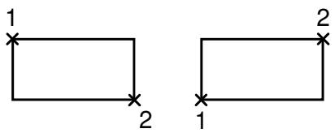

You should take care positioning points while sketching because this positioning can affect the quality of your mesh. Points in the sketch become vertices of the part you are creating or modifying. In turn, when you mesh your model in the Mesh module, Abaqus/CAE converts these vertices into fully constrained seeds and places nodes at their location. For information on how to subsequently move vertices, see Dragging Sketcher objects.

1. From the line tools in the Sketcher toolbox, select the rectangle tool For a diagram of the tools in the Sketcher toolbox, see The Sketcher tools.

Abaqus/CAE displays prompts in the prompt area to guide you through the procedure.

2. Click the desired locations of any two opposite corners of the rectangle.


Tip: If necessary, you can use the text box in the prompt area to enter the precise coordinates of the corners of the rectangle. For more information on precisely defining the rectangle, see Specifying precise geometry.

The rectangle appears, aligned with the current Sketcher grid, as you move the cursor or enter the coordinates.

3. To create more rectangles, repeat the previous step.  
4. When you have finished creating rectangles, do one of the following:

• Click mouse button 2 anywhere in the Abaqus/CAE window.  
• Select any other tool in the Sketcher toolbox.  
• Click the cancel button in the prompt area.

## Additional information

• Realigning the sketch grid  
• Sketching simple objects  
• Creating construction geometry  
• Modifying objects  
• Undoing and redoing sketching actions

## Sketching circles

Use the circle tool from the Sketcher toolbox to draw circles based on a center point and any arbitrary point on the circumference of the circle.

An example of using the circle tool from the Sketcher toolbox is shown here:


You should take care positioning points while sketching because this positioning can affect the quality of your mesh. Points in the sketch become vertices of the part you are creating or modifying. In turn, when you mesh your model in the Mesh module, Abaqus/CAE converts these vertices into fully constrained seeds and places nodes at their location. For information on how to subsequently move vertices, see Dragging Sketcher objects.

1. From the Sketcher toolbox, select the circle tool . For a diagram of the tools in the Sketcher toolbox, see The Sketcher tools.

Abaqus/CAE displays prompts in the prompt area to guide you through the procedure.

2. Click at the desired location of the center of the circle.  
3. Move the cursor to a point on the circumference of the circle.

Abaqus/CAE displays a preview of the circle that would be created using the current cursor position.

4. Click any point on the circumference of the desired circle.

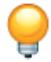

Tip: If necessary, you can use the text box in the prompt area to enter the precise coordinates of the center and the point on the circumference of the circle. For more information on precisely defining the circle, see Specifying precise geometry.

Abaqus/CAE draws the circle.

5. To create more circles, repeat the above steps beginning with Step 2.  
6. When you have finished creating circles, do one of the following:

• Click mouse button 2 anywhere in the Abaqus/CAE window.  
• Select any other tool in the Sketcher toolbox.  
• Click the cancel button in the prompt area.

## Additional information

• Sketching simple objects  
• Creating construction geometry  
• Modifying objects  
• Undoing and redoing sketching actions

## Sketching arcs using a center point and two endpoints

Use the Center with Two Endpoints arc tool from the Sketcher toolbox to draw arcs using a center point and two endpoints.

The following figure shows the resulting arc:

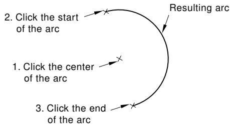

An arc that forms part of an analytical rigid surface cannot subtend an angle greater than 180°. If necessary, append two arcs to create an arc that subtends an angle of more than 180°. There is no such limitation for deformable bodies or discrete rigid surfaces.

You should take care positioning points while sketching because this positioning can affect the quality of your mesh. Points in the sketch become vertices of the part you are creating or modifying. In turn, when you mesh your model in the Mesh module, Abaqus/CAE converts these vertices into fully constrained seeds and places nodes at their location. For information on how to subsequently move vertices, see Dragging Sketcher objects.

1. From the arc tools in the Sketcher toolbox, select the Center with Two Endpoints arc tool . For a diagram of the tools in the Sketcher toolbox, see The Sketcher tools.

Abaqus/CAE displays prompts in the prompt area to guide you through the procedure.

2. Click at the center of the desired arc.  
3. Click the first endpoint to define the radius of the arc.


Tip: If necessary, you can use the text box in the prompt area to enter the precise coordinates of the center and the endpoints of the arc. For more information on precisely defining the arc, see Specifying precise geometry.

Abaqus/CAE draws a circle showing the radius of the arc as you move the cursor from the center of the arc to its first endpoint.

4. Move the cursor clockwise from the first endpoint to draw the arc in a clockwise direction. Move the cursor counterclockwise from the first endpoint to draw the arc in a counterclockwise direction. Click the second endpoint to define the length of the arc. If you start drawing the arc and then decide to change its direction, you must return to the first endpoint and move the cursor in the desired direction toward the second endpoint.

Step 2 and Step 3 define the center of the arc and the radius of the arc, respectively. The point that you select in Step 4 defines only the length of the arc, and the point may not lie on the arc. If you want the arc to pass through a vertex of the sketch, you should select that vertex when you click the first endpoint in Step 3.


Tip: If necessary, click the Previous button to reverse the selection of the endpoints.

5. To create more arcs, repeat the above steps beginning with Step 2.

6. When you have finished creating arcs, do one of the following:

• Click mouse button 2 anywhere in the Abaqus/CAE window.  
• Select any other tool in the Sketcher toolbox.  
• Click the cancel button in the prompt area.

## Additional information

• Sketching simple objects  
• Creating construction geometry  
• Modifying objects  
• Undoing and redoing sketching actions

## Sketching arcs through three points

Use the Through Three Points arc tool from the Sketcher toolbox to draw arcs through three noncolinear points.

The following figure shows the resulting arc:


When you draw an arc using the Through Three Points method, you should consider the same angle size and point selection prerequisites as described in Sketching arcs using a center point and two endpoints.

1. From the arc tools in the Sketcher toolbox, select the Through Three Points arc tool . For a diagram of the tools in the Sketcher toolbox, see The Sketcher tools.  
Abaqus/CAE displays prompts in the prompt area to guide you through the procedure.

2. Click the two points that you want to use as the endpoints of the arc.


Tip: If necessary, you can use the text box in the prompt area to enter the precise coordinates of the endpoints. For more information on precisely defining the arc, see Specifying precise geometry.

Abaqus/CAE draws a sample arc with a predetermined radius as you select the second endpoint of the arc. You change this sample radius when you select the third point.

3. Move the cursor to the third point on the arc, and click mouse button 1.

Abaqus/CAE draws an arc joining the endpoints and passing through the selected point.


Tip: If necessary, click the Previous button to reverse the selection of either endpoint. Clicking one enables you to reverse the selection of the second endpoint; clicking twice reverses the selection of the first endpoint as well.

4. To create more arcs, repeat the above steps beginning with Step 2.  
5. When you have finished creating arcs, do one of the following:

• Click mouse button 2 anywhere in the Abaqus/CAE window.  
• Select any other tool in the Sketcher toolbox.  
• Click the cancel button in the prompt area.

## Additional information

• Sketching simple objects

• Creating construction geometry  
• Modifying objects  
• Undoing and redoing sketching actions

## Sketching arcs tangent to a line

Use the tangent arc tool from the Sketcher toolbox to draw an arc that is tangent to a line or curve at a selected point and ends at a second selected point, as illustrated in the following figure:

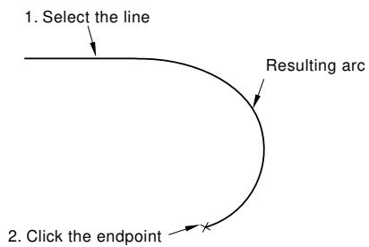

You should take care positioning points while sketching because this positioning can affect the quality of your mesh. Points in the sketch become vertices of the part you are creating or modifying. In turn, when you mesh your model in the Mesh module, Abaqus/CAE converts these vertices into fully constrained seeds and places nodes at their location. For information on how to subsequently move vertices, including those that define arcs, see Dragging Sketcher objects.

1. From the arc tools in the Sketcher toolbox, select the tangent arc tool . For a diagram of the tools in the Sketcher toolbox, see The Sketcher tools.

Abaqus/CAE displays prompts in the prompt area to guide you through the procedure.

2. Select the point along the line or curve. The arc will be tangent-continuous at this point.

If you start the arc at the endpoint of a line, a spline, or a second arc, the new arc is tangent-continuous at the endpoint. If you start the arc at a point in space (where there is no endpoint), the arc is tangent to the positive X-axis. If more than one line or curve meets at the point, the arc will be tangent to the one that was created first.

3. The radius of the arc changes as you move the cursor. Click at the desired endpoint.


Tip: If necessary, you can use the text box in the prompt area to enter the precise coordinates of the tangent point and the endpoint of the arc. For more information on creating the desired arc, see Specifying precise geometry.

4. To create more arcs, repeat the above steps beginning with Step 2.  
5. When you have finished creating tangent arcs, do one of the following:

• Click mouse button 2 anywhere in the Abaqus/CAE window.  
• Select any other tool in the Sketcher toolbox.

• Click the cancel button in the prompt area.

## Additional information

• Sketching simple objects  
• Creating construction geometry  
• Modifying objects  
• Undoing and redoing sketching actions

## Sketching ellipses

Use the ellipse tool from the Sketcher toolbox to draw ellipses based on a center point, an axis endpoint, and an arbitrary point whose distance from the first axis determines the length of the second axis.

An example of using the ellipse tool from the Sketcher toolbox is shown here:

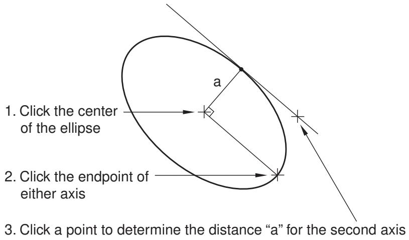

You should take care positioning points while sketching because this positioning can affect the quality of your mesh. The center point and the first axis point in the sketch become vertices of the part you are creating. In turn, when you mesh your model in the Mesh module, Abaqus/CAE converts these vertices into fully constrained seeds and places nodes at their location. For information on how to subsequently move vertices, see Dragging Sketcher objects.

You cannot edit the size of an ellipse by moving its vertices. To edit the size of an ellipse, create a radial dimension and then edit that dimension. The radial dimension for an ellipse includes both the major and minor radius.

1. From the Sketcher toolbox, select the ellipse tool . For a diagram of the tools in the Sketcher toolbox, see The Sketcher tools.  
Abaqus/CAE displays prompts in the prompt area to guide you through the procedure.  
2. Click at the desired location of the center of the ellipse.  
3. Move the cursor to the endpoint of the first axis of the ellipse.  
Abaqus/CAE displays an ellipse that could be created using the current cursor position to define the major axis and rotation.  
4. Click a point to define the endpoint of one axis. The point that you select can be either the major or minor axis endpoint.


Tip: If necessary, you can use the text box in the prompt area to enter the precise coordinates of the center and the first axis endpoint of the ellipse. For more information on precisely defining geometry, see Specifying precise geometry.

Abaqus/CAE sets the rotation of the ellipse and the endpoint of the first axis.

5. Click a point to define the length of the second axis. The point you select defines the distance from the first axis to the end of the second axis. The point does not need to lie on the second axis, and it cannot lie along the first axis since this would create a second axis of length 0.

Abaqus/CAE creates the ellipse.

6. To create more ellipses, repeat the above steps beginning with Step 2.

7. When you have finished creating ellipses, do one of the following:

• Click mouse button 2 anywhere in the Abaqus/CAE window.  
• Select any other tool in the Sketcher toolbox.  
• Click the cancel button in the prompt area.

## Additional information

• Sketching simple objects  
• Creating construction geometry  
• Modifying objects  
• Undoing and redoing sketching actions

## Sketching fillets between two lines

Use the fillet tool from the Sketcher toolbox to draw fillets between two lines or circles.

Enter the radius of the fillet and select the two lines or circles as shown here:


Construction geometry illustrates how you can create a fillet tangent to two construction circles.

You should take care positioning points while sketching because this positioning can affect the quality of your mesh. Points in the sketch become vertices of the part you are creating or modifying. In turn, when you mesh your model in the Mesh module, Abaqus/CAE converts these vertices into fully constrained seeds and places nodes at their location. For information on how to subsequently move vertices, see Dragging Sketcher objects.

If you create a fillet and subsequently move the selected lines or circles, Abaqus/CAE will move the fillet and maintain the tangency.

1. From the Sketcher toolbox, select the fillet tool . For a diagram of the tools in the Sketcher toolbox, see The Sketcher tools.

Abaqus/CAE displays prompts in the prompt area to guide you through the procedure.

2. In the text box that appears in the prompt area, enter the radius of the desired fillet.  
3. Select the two lines or circles (not arcs) to which the fillet must remain tangent.

The fillet appears between the two lines or circles.


Tip: When you select a line or circle from the sketch, Abaqus/CAE uses the cursor position to determine the location of the fillet. To create the desired fillet, you should position the cursor close to the expected location of the fillet when making a selection.

4. To create more fillets of the same radius, repeat the previous step.  
5. When you have finished creating fillets, do one of the following:

• Click mouse button 2 anywhere in the Abaqus/CAE window.  
• Select any other tool in the Sketcher toolbox.  
• Click the cancel button in the prompt area.

## Additional information

• Sketching simple objects  
• Creating construction geometry  
• Modifying objects  
• Undoing and redoing sketching actions

## Sketching splines

Use the spline tool from the Sketcher toolbox to draw a spline curve connecting a series of points. Abaqus/CAE calculates the shape of the curve using a cubic spline fit between all points along the spline; in addition, the first and second derivatives of the spline are continuous. As you create the spline, you can influence the shape of the curve by placing the vertices closer or farther apart. However, you cannot add or remove vertices from a spline after you have drawn it; you must delete the spline and create a new one with the desired number of vertices. You can use the Modify tools to move the original vertices. Only the endpoints of a spline become vertices of the part you are creating or modifying; intermediate points of the spline do not appear outside the Sketcher.

If you want the spline to start tangent to an existing line, at the start of the spline create two adjacent vertices that are colinear with the line. This method is useful for creating smooth rigid surfaces, as illustrated in the following figure:

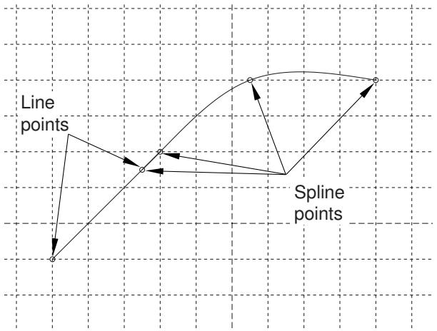

When you create an analytical rigid surface, you sketch a sequence of lines, arcs, and parabolas to define its profile. To create a parabolic curve, sketch a spline defined by only three vertices.

1. From the Sketcher toolbox, select the spline tool . For a diagram of the tools in the Sketcher toolbox, see The Sketcher tools.  
Abaqus/CAE displays prompts in the prompt area to guide you through the procedure.

2. To construct a spline, click each vertex.


Tip: If necessary, you can use the text box in the prompt area to enter the precise coordinates of each vertex of the spline. For more information on creating the desired spline, see Specifying precise geometry.

The spline appears as you click each vertex or enter each coordinate, and Abaqus/CAE adjusts the curve to maintain a cubic spline between all points.


Tip: If you make a mistake while constructing a spline, you can click the Previous button to step back to the previous vertex. Alternatively, you can click the Undo button in the Sketcher toolbox to delete the entire spline.

3. To complete the spline, click mouse button 2.  
4. To create more splines, repeat the above steps beginning with step 2.  
5. When you have finished creating splines, do one of the following:

Click mouse button 2 anywhere in the Abaqus/CAE window.•  
• Select any other tool in the Sketcher toolbox.  
X • Click the cancel button in the prompt area.

## Additional information

• Sketching simple objects  
• Creating construction geometry  
• Modifying objects  
• Undoing and redoing sketching actions

## Creating construction geometry

This section describes each of the Sketcher tools used to create construction geometry. Construction geometry is used to help you create and align objects in your sketch and to define the axis of rotation for revolved solids and surfaces.

## In this section:

Creating a horizontal construction line  
Creating a vertical construction line  
Creating an oblique construction line  
Creating angled construction lines  
Creating a construction circle  
Setting sketch components as construction geometry

## Creating a horizontal construction line

Use the horizontal construction line tool from the Sketcher toolbox to help position and align objects along a horizontal line.

Horizontal construction lines are created parallel to the X-axis of the Sketcher grid. Rotating the Sketcher grid does not affect existing horizontal construction lines, but new horizontal construction lines are aligned with the rotated grid. The following figure illustrates how a horizontal construction line and a set of vertical construction lines can be used to align circle centers. (Dashed lines indicate construction geometry.)

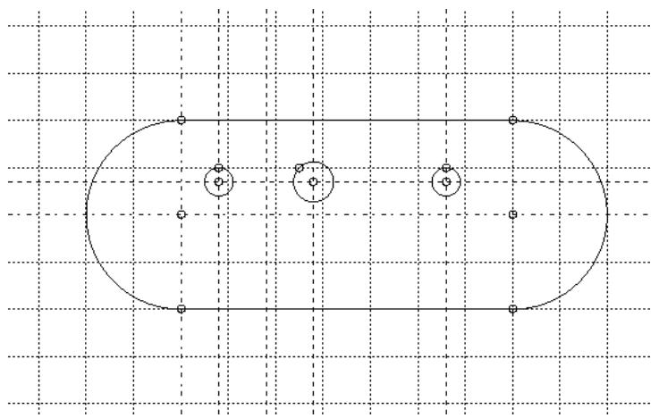

You can also use a horizontal construction line to define the axis of rotation for revolved solids and surfaces.

1. From the construction tools in the Sketcher toolbox, select the horizontal construction tool . For a diagram of the tools in the Sketcher toolbox, see The Sketcher tools.  
The horizontal construction line moves vertically as you move the cursor around the Sketcher sheet. Abaqus/CAE displays prompts in the prompt area to guide you through the procedure.  
2. Click a point that will lie on the horizontal construction line. Alternatively, you can type its X–Y coordinates in the text field that appears in the prompt area. (The X-coordinate is arbitrary since it is ignored.)  
3. To create additional horizontal construction lines, repeat the previous step.  
4. When you have finished creating horizontal construction lines, do one of the following:

• Click mouse button 2 anywhere in the Abaqus/CAE window.  
• Select any other tool in the Sketcher toolbox.  
• Click the cancel button in the prompt area.

## Additional information

• Construction geometry  
• Realigning the sketch grid  
• Sketching simple objects  
• Creating construction geometry  
• Modifying objects  
• Undoing and redoing sketching actions

## Creating a vertical construction line

Use the vertical construction line tool from the Sketcher toolbox to help position and align objects along a vertical line.

Vertical construction lines are created parallel to the Y-axis of the Sketcher grid. Rotating the Sketcher grid does not affect existing vertical construction lines, but new vertical construction lines are aligned with the rotated grid. The following figure illustrates how a horizontal construction line and a set of vertical construction lines can be used to align circle centers. (Dashed lines indicate construction geometry.)


You can also use a vertical construction line to define the axis of rotation for revolved solids and surfaces.

1. From the construction tools in the Sketcher toolbox, select the vertical construction tool . For a diagram of the tools in the Sketcher toolbox, see The Sketcher tools.

The vertical construction line moves horizontally as you move the cursor around the Sketcher sheet. Abaqus/CAE displays prompts in the prompt area to guide you through the procedure.

2. Click a point that will lie on the vertical construction line. Alternatively, you can type its X–Y coordinates in the text field that appears in the prompt area. (The Y-coordinate is arbitrary since it is ignored.)  
3. To create additional vertical construction lines, repeat the previous step.  
4. When you have finished creating vertical construction lines, do one of the following:

• Click mouse button 2 anywhere in the Abaqus/CAE window.  
• Select any other tool in the Sketcher toolbox.  
• Click the cancel button in the prompt area.

## Additional information

• Construction geometry  
• Realigning the sketch grid  
• Sketching simple objects  
• Creating construction geometry  
• Modifying objects  
• Undoing and redoing sketching actions

## Creating an oblique construction line

Use the oblique construction line tool from the Sketcher toolbox to help position and align objects along an arbritrary oblique line defined by two points.

The following figure illustrates how an oblique construction line and a set of vertical construction lines can be used to align circle centers:


You can also use an oblique construction line to define the axis of rotation for revolved solids and surfaces.

1. From the construction tools in the Sketcher toolbox, select the oblique construction tool . For a diagram of the tools in the Sketcher toolbox, see The Sketcher tools.  
Abaqus/CAE displays prompts in the prompt area to guide you through the procedure.

2. Click two points that will lie on the oblique construction line. Alternatively, you can type their X–Y coordinates in the text field that appears in the prompt area.

The oblique construction line appears when you select the first point. The line rotates about this point until you select the second point.

3. To create additional oblique construction lines, repeat the previous step.

4. When you have finished creating oblique construction lines, do one of the following:

• Click mouse button 2 anywhere in the Abaqus/CAE window.  
• Select any other tool in the Sketcher toolbox.

• Click the cancel button in the prompt area.

## Additional information

• Construction geometry  
• Sketching simple objects  
• Creating construction geometry  
• Modifying objects  
• Undoing and redoing sketching actions

## Creating angled construction lines

Use the angled construction line tool from the Sketcher toolbox to help position and align objects along a line running at a specified angle to the X-axis of the Sketcher grid.

Rotating the Sketcher grid does not affect existing angled construction lines, but new angled construction lines are measured from the X-axis of the rotated grid. The following figure illustrates how an angled construction line and a pair of vertical construction lines can be used to position the vertices of a rectangle. (Dashed lines indicate construction geometry.)


You can also use an angled construction line to define the axis of rotation for revolved solids and surfaces.

1. From the construction tools in the Sketcher toolbox, select the angled construction line tool For a diagram of the tools in the Sketcher toolbox, see The Sketcher tools.  
Abaqus/CAE displays prompts in the prompt area to guide you through the procedure.  
2. In the text box that appears in the prompt area, enter an angle value in degrees. Positive angles are measured counterclockwise from the horizontal axis, and negative angles are measured clockwise from the horizontal axis.  
The construction line moves as you move the cursor around the Sketcher sheet.  
3. Click a point that will lie on the angled construction line. Alternatively, you can type its X–Y coordinates in the text field that appears in the prompt area.  
4. To create additional angled construction lines, repeat the above steps beginning with Step 2.  
5. When you have finished creating angled construction lines, do one of the following:

• Click mouse button 2 anywhere in the Abaqus/CAE window.  
• Select any other tool in the Sketcher toolbox.  
• Click the cancel button in the prompt area.

## Additional information

• Construction geometry  
• Realigning the sketch grid  
• Sketching simple objects  
• Creating construction geometry

• Modifying objects  
• Undoing and redoing sketching actions

## Creating a construction circle

Use the construction circle tool from the Sketcher toolbox to help position and align objects around a circle.

The following figure illustrates how a construction circle and a pair of angled construction lines can be used to position the centers of two circles. (Dashed lines indicate construction geometry.)


1. From the construction tools in the Sketcher toolbox, select the construction circle tool . For a diagram of the tools in the Sketcher toolbox, see The Sketcher tools.  
Abaqus/CAE displays prompts in the prompt area to guide you through the procedure.

2. Click at the desired location of the center of the construction circle. Alternatively, you can type the X–Y coordinates of the circle center in the text field that appears in the prompt area.

The radius of the construction circle changes as you move the cursor around the Sketcher sheet.

3. Click a point that will lie on the circumference of the construction circle, or type its X–Y coordinates in the prompt area.

Abaqus/CAE creates the construction circle using the point you specified.

4. To create more construction circles, repeat the above steps beginning with Step 2.

5. When you have finished creating construction circles, do one of the following:

• Click mouse button 2 anywhere in the Abaqus/CAE window.

• Select any other tool in the Sketcher toolbox.

• Click the cancel button in the prompt area.

## Additional information

• Construction geometry  
• Sketching simple objects  
• Creating construction geometry  
• Modifying objects  
• Undoing and redoing sketching actions

## Setting sketch components as construction geometry

Use the Set as Construction tool from the Sketcher toolbox to convert a component of your sketch into construction geometry. The Unset Construction tool reverses this process for items that had been converted to construction geometry. You can unset construction geometry components only if they were converted to construction geometry using the Set as Construction tool; items that were added to the sketch as construction geometry cannot be unset.

## Additional information

• Construction geometry  
• Sketching simple objects  
• Creating construction geometry  
• Modifying objects  
• Undoing and redoing sketching actions

## Set items in a sketch as construction geometry

diagram of the tools in the Sketcher toolbox, see The Sketcher tools.

Abaqus/CAE displays prompts in the prompt area to guide you through the procedure.

2. Select the sketch item or items that you want to set as construction geometry. You can drag-select, [Shift] + Click, or [Ctrl] + Click to select multiple items.

Abaqus/CAE indicates the items you select by coloring them red.

3. To complete the conversion, click Done in the prompt area or click mouse button 2 anywhere in the Abaqus/CAE window.

Abaqus/CAE displays the items you selected with dashed lines, indicating that they are now construction geometry.

4. When you have finished selecting geometry to convert to construction geometry, do one of the following:

• Click mouse button 2 anywhere in the Abaqus/CAE window.  
• Select any tool in the Sketcher toolbox.

• Click the cancel button in the prompt area.

## Unset construction geometry items

1. From the construction tools in the Sketcher toolbox, select the Unset Construction too l . For a diagram of the tools in the Sketcher toolbox, see The Sketcher tools.

Abaqus/CAE displays prompts in the prompt area to guide you through the procedure.

2. Select one or more construction geometry items. You can drag-select, [Shift] + Click, or [Ctrl] + Click to select multiple items. All construction geometry is displayed in the sketch with dashed lines. Abaqus/CAE indicates the items you select by coloring them red.  
3. To complete the conversion, click Done in the prompt area or click mouse button 2 anywhere in the Abaqus/CAE window.

Abaqus/CAE displays the items you selected with solid lines, indicating that they are not construction geometry.

4. When you have finished selecting construction geometry items that you want to revert, do one of the following:

• Click mouse button 2 anywhere in the Abaqus/CAE window.  
• Select any tool in the Sketcher toolbox.  
• Click the cancel button in the prompt area.

## Constraining, dimensioning, and parameterizing a sketch

This section describes each of the Sketcher tools used to add constraints, dimensions, and parameters to sketches. You can use these tools to create relationships between individual entities in a sketch or to create a fully constrained and parametric sketch.

## In this section:

Automatically constraining a sketch  
Automatically dimensioning a sketch  
Adding individual constraints  
Adding individual dimensions  
Adding and editing parameters  
Creating parametric equations

## Automatically constraining a sketch

Adding constraints to a sketch helps you finalize the shape of a sketched feature. Abaqus/CAE can apply constraints to your sketch automatically. You can use the sketcher options to select the types of constraints that Abaqus/CAE can add to the sketch. (For more information, see Customizing the use of constraints in the Sketcher.)

1. From the tools in the Sketcher toolbox, select the auto-constrain tool . For a diagram of the tools in the Sketcher toolbox, see The Sketcher tools.

Abaqus/CAE displays prompts in the prompt area to guide you through the procedure.

2. Select the entities to be constrained.


## Note:

You can select the entire sketch; Abaqus/CAE will not duplicate any existing constraints.

3. Click Done in the prompt area.

Abaqus/CAE creates the constraints on the sketch. Sketch modification tools such as translate, rotate, scale, and mirror can override constraints.

4. If desired, use the Delete tool to remove any unwanted constraints. For more information, see Deleting Sketcher objects.

## Additional information

• Controlling sketch geometry  
• Constraining, dimensioning, and parameterizing a sketch  
• Customizing the use of constraints in the Sketcher

## Automatically dimensioning a sketch

Adding dimensions to a sketch helps you finalize the size and shape of a sketched feature. Abaqus/CAE can apply dimensions to your sketch automatically. You can use the sketcher options to select the types of dimensions that Abaqus/CAE can add to the sketch. (For more information, see Customizing the format and use of dimensions in the Sketcher.)

1. From the tools in the Sketcher toolbox, select the auto-dimension tool . For a diagram of the tools in the Sketcher toolbox, see The Sketcher tools.  
Abaqus/CAE displays prompts in the prompt area to guide you through the procedure.

2. Select the entities to be dimensioned.


## Note:

You can select the entire sketch; Abaqus/CAE will not duplicate any existing dimensions.

3. Toggle on Auto-Constrain if you also want Abaqus/CAE to create constraints automatically for the selected entities.  
4. Click Done in the prompt area.  
Abaqus/CAE creates the dimensions—and constraints, if selected—on the sketch.  
5. If desired, use the drag tool to move dimensions that appear within the sketched feature and use the delete tool to remove any unwanted dimensions or constraints. For more information, see Dragging Sketcher objects, and Deleting Sketcher objects, respectively.

## Additional information

• Controlling sketch geometry  
• Constraining, dimensioning, and parameterizing a sketch  
• Customizing the format and use of dimensions in the Sketcher  
• Customizing the use of constraints in the Sketcher

## Adding individual constraints

A constraint is a logical relationship between entities in a sketch. Constraints control Sketcher geometry by removing degrees of freedom from the sketch. The various constraint types are described in Using constraints to control sketch geometry. To change constrained geometry, you must either work within the defined constraints or modify the constraints to accept your changes. You can also constrain a sketch automatically using the Auto-Constrain tool. For more information, see Automatically constraining a sketch.

1. From the tools in the Sketcher toolbox, select the constraint tool . For a diagram of the tools in the Sketcher toolbox, see The Sketcher tools.  
Abaqus/CAE opens the Add Constraint dialog box.  
2. Select the type of constraint that you want to add to the sketch, and click Apply.  
Abaqus/CAE displays prompts in the prompt area to guide you through the procedure.  
3. Select the entity or entities to create the constraint.  
Abaqus/CAE creates the constraint and displays the appropriate constraint symbol on the sketch. Sketch modification tools such as translate, rotate, scale, and mirror can override constraints.  
4. To create additional constraints, repeat the above steps beginning with Step 2.  
5. When you have finished creating constraints, click Cancel to close the Add Constraint dialog box.

## Additional information

• Using constraints to control sketch geometry  
• Constraining, dimensioning, and parameterizing a sketch  
• Customizing the use of constraints in the Sketcher

Dimensions are a specialized form of constraints; where constraints create a logical relationship between Sketcher entities, dimensions create a numerical relationship. Dimensions add clarity to your sketches and allow you to position objects precisely. Use the dimension tool from the Sketcher toolbox to add individual dimensions to a sketch. You can also dimension a sketch automatically using the Auto-Dimension tool. For more information, see Automatically dimensioning a sketch.

The dimension tool is interactive; Abaqus/CAE uses preselection and the Sketcher entities that you select to display a preview of the dimension that will be created. If the dimension type shown is not the type that you want to create, move the cursor to another location. Once you accept the dimension type and position, you can enter a new dimension value.


## Note:

The interactive function of the dimension tool is available only if preselection is active. Preselection is toggled on by default in the Sketcher Options dialog box. (For more information , see The Sketcher cursors and preselection.)

1. From the tools in the Sketcher toolbox, select the dimension tool . For a diagram of the tools in the Sketcher toolbox, see The Sketcher tools.

Abaqus/CAE displays prompts in the prompt area to guide you through the procedure.

2. Select the first entity to dimension.

Abaqus/CAE prompts you according to your selection:

## Vertex

Abaqus/CAE prompts you to select another vertex or line for the dimension. Select a line to dimension the distance between the vertex and the line. Select a vertex to dimension the horizontal, vertical, or oblique distance between the selected points—the type of dimension Abaqus/CAE creates is based on the position of the second vertex and the cursor position.

Abaqus/CAE creates a preview of the dimension that will be created and its location based on the cursor position. Horizontal or vertical dimensions values between two vertices are preceded by an H or V, respectively.

## Line

Abaqus/CAE prompts you to select a location for the default length dimension. To create a different type of dimension, move the cursor over other entities in the sketch; Abaqus/CAE creates a preview of the appropriate dimension type for the relation between the selected line and the preselected entity. Click on the desired entity to accept the displayed type of dimension.

## Circle or circular arc

Abaqus/CAE prompts you to select a location for the radial dimension. No other entity selections are available.

3. Move the cursor to the location where you would like the dimension to appear; click when you are satisfied with the appearance of the dimension.  
4. If desired, edit the dimension value in the prompt area; press Enter or click mouse button 2 to accept the dimension value.

Abaqus/CAE creates the dimension on the sketch. If necessary, vertices are moved to comply with the edited dimension value and any other constraints in the sketch.

5. To create additional dimensions, repeat the above steps beginning with Step 2.  
6. When you have finished creating dimensions, do one of the following:

• Click mouse button 2 anywhere in the Abaqus/CAE window.  
• Select any tool in the Sketcher toolbox.  
• Click the cancel button in the prompt area.

## Additional information

• Controlling sketch geometry  
• Constraining, dimensioning, and parameterizing a sketch  
• Editing dimensions  
• Specifying precise geometry  
• Modifying objects by changing dimensions or adding parameters  
• Customizing the format and use of dimensions in the Sketcher

## Adding and editing parameters

Parameters are constraints that have variable names. They can have either numerical values or values based on the result of mathematical expressions involving other parameters—parametric equations. Parameters can be associated with dimensions in the current sketch, or they can be numerical constants and expressions independent of the sketch. The value of parameters associated with dimensions directly affect the sketch, whereas independent parameters affect the sketch only if you use them to create expressions for parameters that are in the sketch.

You add and edit parameters using the Parameter Manager. You can use the Dimension button to create new parameters by selecting dimensions, or you can add independent parameters by typing them in blank lines in the manager.

. For a diagram of the tools in the Sketcher toolbox, see The Sketcher tools.

The Parameter Manager appears.


Tip: You can also open the Parameter Manager by selecting Edit->Parameter Manager from the main menu bar or by using the f(x) button in the Edit Dimension dialog box.

2. Click Dimension, and select dimensions from the sketch to associate them with new parameters.

Abaqus/CAE adds the new parameters to the Parameter Manager using default names of the form dimension\_x.

3. Click on a cell in the Name column to edit an existing name, or add a new parameter name by editing a blank cell.

If the selected parameter is associated with a dimension, Abaqus/CAE highlights the parameter in the sketch.

4. Click on a cell in the Expression column to edit it directly in the cell or to select it for editing with the Expression Builder.

You must define all the parameters that you want to use in an expression prior to defining the expression.


Tip: Use the buttons on the right side of the manager to insert, rearrange, or delete rows.

5. If desired, use the Expression Builder to edit the expression. For detailed instructions, see Creating parametric equations.  
6. Click Apply in the Parameter Manager to implement your changes in the sketch.

Abaqus/CAE updates the sketch with any new expression values and, if Show parameter names is toggled on in the Sketcher Options, displays the revised parameter names.

## Additional information

• Specifying precise geometry  
• Modifying objects by changing dimensions or adding parameters  
• Using parameters to control sketch geometry  
• Editing dimensions  
• Customizing the format and use of dimensions in the Sketcher

## Creating parametric equations

Parametric equations are mathematical expressions relating different quantities in a sketch. The Expression Builder helps you create parametric equations using the parameters in your sketch. For example, if you want the width of a Sketcher object to be twice its length, you can associate the dimensions with parameters and use the Expression

Builder to create the parametric equation .

You can use the following operators to create parametric equations:

## Mathematical operations:

<table><tr><td>+</td><td>Add.</td></tr><tr><td>-</td><td>Subtract.</td></tr><tr><td>*</td><td>Multiply.</td></tr><tr><td>/</td><td>Divide.</td></tr><tr><td>1/A</td><td>Divide 1 by the parameter, value, or expression.</td></tr><tr><td>abs(A)</td><td>Take the absolute value of the parameter, value, or expression.</td></tr><tr><td>sqrt(A)</td><td>Take the square root of the parameter, value, or expression.</td></tr></table>

## Trigonometric operations:

<table><tr><td>cos(A)</td><td>Take the cosine of the parameter, value, or expression.</td></tr><tr><td>acos(A)</td><td>Take the arccosine of the parameter, value, or expression.</td></tr><tr><td>cosh(A)</td><td>Take the hyperbolic cosine of the parameter, value, or expression.</td></tr><tr><td>sin(A)</td><td>Take the sine of the parameter, value, or expression.</td></tr><tr><td>asin(A)</td><td>Take the arcsine of the parameter, value, or expression.</td></tr><tr><td>sinh(A)</td><td>Take the hyperbolic sine of the parameter, value, or expression.</td></tr><tr><td>tan(A)</td><td>Take the tangent of the parameter, value, or expression.</td></tr><tr><td>atan(A)</td><td>Take the arctangent of the parameter, value, or expression.</td></tr><tr><td>tanh(A)</td><td>Take the hyperbolic tangent of the parameter, value, or expression.</td></tr></table>

## Logarithmic and exponential operations:

<table><tr><td>exp(A)</td><td>Take the exponential of the parameter, value, or expression.</td></tr><tr><td>log(A)</td><td>Take the natural log of the parameter, value, or expression.</td></tr><tr><td>log10(A)</td><td>Take the base 10 log of the parameter, value, or expression.</td></tr></table>

1. With an expression highlighted in the Parameter Manager, click Expression Builder. Abaqus/CAE opens the Expression Builder dialog box.  
2. From the Operators list, select the desired operation. The operator appears within the expression window.

3. From the Parameter Name choices, click the name of the parameter on which to operate and click Add to Expression. You can choose from all parameters that appear above the parameter that you are defining in the Parameter Manager.  
The parameter name appears within the expression window.  
4. Repeat Steps 2 and 3 as needed to complete the expression. In some cases you may need to reposition the cursor to correctly place the next portion of the expression.  
5. When you are finished, click OK to save your changes and to close the dialog box. Abaqus/CAE updates the expression and the current value in the Parameter Manager.

## Additional information

• Adding and editing parameters

• Editing dimensions

• Customizing the format and use of dimensions in the Sketcher

## Editing dimensions

Dimensions in Abaqus/CAE are used to precisely control sizes and distances, to annotate reference values, and to create parameters that are, in turn, used to define equations relating different pieces of geometry. You can edit any dimension in a sketch as follows:

• Change the dimension value. Changing a dimension value modifies the associated Sketcher geometry.  
• Designate the dimension as a reference dimension. Reference dimensions indicate quantities whose values are controlled elsewhere in the same sketch or dimensions of reference geometry that are controlled in another sketch.  
• Associate the dimension with a parameter. Parameters control Sketcher geometry by defining relationships between different pieces of geometry, including reference geometry.

The effects of modifying a dimension depend on how the dimension is used in the sketch. For example, if a radius has an equal radius constraint, editing the radius dimension will change all of the constrained radii. Likewise, if a dimension is associated with a parameter, editing its value will change the value of all the parameters that refer to it. For more information on constraints, dimensions, and parameters, see Controlling sketch geometry.

1. From the tools in the Sketcher toolbox, select the dimension modification tool . For a diagram of the tools in the Sketcher toolbox, see The Sketcher tools.  
Abaqus/CAE displays prompts in the prompt area to guide you through the procedure.

2. Select the dimension you want to change.

Abaqus/CAE highlights the selected dimension and opens the Edit Dimension dialog box.

3. Enter a new value for the dimension.


## Note:

You cannot edit the value field for reference dimensions or for parameters whose values are defined using an equation.

4. Toggle Reference to switch between a standard dimension whose value is used to control the sketch geometry and a reference dimension that reads the current value from the geometry.  
5. Click f(x) to associate the dimension with a new parameter or to edit a previously associated parameter. Abaqus/CAE opens the Parameter Manager for editing. For more information, see Adding and editing parameters.

6. When you are finished, click Apply in the Edit Dimension dialog box to update the sketch. Abaqus/CAE updates the dimension and geometry as required. If your edits result in an overconstraint, the conflicting constraints, dimensions, and parameters are indicated in magenta (for more information, see Fully constrained geometry).

7. To edit more dimensions, repeat the above steps beginning with Step 2.

8. When you have finished editing dimensions, do one of the following:

• Click mouse button 2 anywhere in the Abaqus/CAE window.  
• Select any tool in the Sketcher toolbox.  
• Click the cancel button in the prompt area.

## Additional information

• Specifying precise geometry  
• Controlling sketch geometry  
• Constraining, dimensioning, and parameterizing a sketch  
• Moving or copying sketch geometry

## Adding reference geometry

When you sketch the profile of a feature, Abaqus/CAE projects onto the sketch sheet the part edges and vertices that are in the same plane as the sketch plane. In addition, Abaqus/CAE projects all datum axes and datum points onto the sketch sheet. These projected lines and points are called reference geometry, and you can use them for reference while sketching. If you want to use other edges and vertices, including orphan element edges and orphan nodes, you must project them onto the sketch plane as reference geometry by selecting Add->References from the main menu bar. Alternatively, if you want to create new sketch edges from existing model edges, you can select Add->Edges from the main menu bar (for more information, see Projecting edges onto a sketch).

1. From the Sketcher toolbox, select the Project References tool . For a diagram of the tools in the Sketcher toolbox, see The Sketcher tools.

Abaqus/CAE displays prompts in the prompt area to guide you through the procedure.

2. Select the edges, vertices, orphan element edges, and orphan nodes you want to project onto the sketch plane as reference geometry.  
3. Click mouse button 2 when you have finished making selections.

Abaqus/CAE creates isolated points for the projected reference vertices and nodes and creates reference edges for the geometric and orphan element edges.

## Additional information

• Reference geometry  
• Projecting edges onto a sketch

## Projecting edges onto a sketch

When you sketch the profile of a feature, you can create new edges by projecting existing edges from the part onto the sketch sheet. You can use projected edges to duplicate the shapes of existing features as they appear from the current sketch plane. To project part edges, including orphan element edges, onto your sketch; select Add->Edges from the main menu bar.

1. From the Sketcher toolbox, select the Project Edges tool . For a diagram of the tools in the Sketcher toolbox, see The Sketcher tools.  
Abaqus/CAE displays prompts in the prompt area to guide you through the procedure.

2. If desired, toggle off Constrain to background in the prompt area to project the edges as independent objects.

If projected edges are constrained to the background, their shape and position depend on the original feature edges. If projected edges are unconstrained, changes to the original feature do not affect them—you can edit the projected edges and vertices independently from the original feature.

3. Select the edges you want to project into the sketch plane.

4. Click mouse button 2 to indicate you have finished selecting edges.

Abaqus/CAE creates the new edges in the sketch.

## Additional information

• Reference geometry  
• Adding reference geometry

## Moving or copying sketch geometry

This section describes how to use the translate, rotate, mirror, and scale tools to move or copy Sketcher geometry.

## In this section:

Translating Sketcher objects along a vector  
Rotating Sketcher objects about a point  
Enlarging or reducing Sketcher objects  
Moving or copying Sketcher objects about a mirror line

Use the translate tool from the Sketcher toolbox to move or copy Sketcher objects—lines, arcs, circles, ellipses, fillets, or splines—along a specified vector. You can define the beginning and the end of the translation vector by selecting from the sketch or by typing the X- and Y-coordinates of each end.

1. From the move and copy tools in the Sketcher toolbox, select the translate tool . For a diagram of the tools in the Sketcher toolbox, see The Sketcher tools.  
2. Select Copy or Move in the prompt area. Abaqus/CAE displays prompts in the prompt area to guide you through the procedure.  
3. Select all the objects that you want to translate. You can select sketch and construction geometry to move, or you can select sketch, construction, and reference geometry to copy; dimensions cannot be translated.


Tip: To select more than one object, hold down the [Shift] key as you click each object or drag a rectangle around the objects. To unselect an object, use [Ctrl] + Click. For more information, see Selecting objects within the viewport.”

4. Click mouse button 2 to indicate that you have finished selecting objects.  
5. Select a start position for the translation vector, or enter coordinates in the prompt area.  
6. Select an end position for the translation vector, or enter coordinates in the prompt area. Abaqus/CAE moves or copies the selected objects as specified.  
7. If desired, repeat Steps 5 and 6 to continue moving the previously selected objects. Regardless of whether you originally moved or copied the selected objects, subsequent translation vectors only move the objects from their position at the end of the previous step.  
8. When you have finished translating objects, do one of the following:

• Click mouse button 2 anywhere in the Abaqus/CAE window.  
• Select any tool in the Sketcher toolbox.  
• Click the cancel button in the prompt area.

## Additional information

• Sketching simple objects  
• Creating construction geometry  
• Modifying objects  
• Creating patterns, offsetting, and deleting objects  
• Undoing and redoing sketching actions

## Rotating Sketcher objects about a point

Use the rotate tool from the Sketcher toolbox to rotate Sketcher objects—lines, arcs, circles, ellipses, fillets, or splines—through a specified angle about a specified point. You can choose to move the original objects or create copies and rotate them to the new location.

1. From the move and copy tools in the Sketcher toolbox, select the rotate tool . For a diagram of the tools in the Sketcher toolbox, see The Sketcher tools.  
2. Select Copy or Move in the prompt area. Abaqus/CAE displays prompts in the prompt area to guide you through the procedure.  
3. Select all the objects that you want to rotate. You can select sketch and construction geometry to move, or you can select sketch, construction, and reference geometry to copy; dimensions cannot be rotated.


Tip: To select more than one object, hold down the [Shift] key as you click each object or drag a rectangle around the objects. To unselect an object, use [Ctrl] + Click. For more information, see Selecting objects within the viewport.”

4. Click mouse button 2 to indicate that you have finished selecting objects.  
5. Select a point for the center of rotation, or enter coordinates in the prompt area.  
6. Enter the angle of rotation in the prompt area. Abaqus/CAE moves or copies the objects as specified.  
7. If desired, repeat Steps 5 and 6 to continue moving the previously selected objects. Regardless of whether you originally moved or copied the selected objects, subsequent rotations only move the objects from their position at the end of the previous step.  
8. When you have finished rotating objects, do one of the following:

• Click mouse button 2 anywhere in the Abaqus/CAE window.  
• Select any tool in the Sketcher toolbox.

• Click the cancel button in the prompt area.

## Additional information

• Sketching simple objects  
• Creating construction geometry  
• Modifying objects  
• Creating patterns, offsetting, and deleting objects  
• Undoing and redoing sketching actions

Use the scale tool from the Sketcher toolbox to enlarge or reduce Sketcher objects—lines, arcs, circles, ellipses, fillets, or splines—about a specified point. You can choose to move the original objects or to create a scaled copy in the new location. If you choose to move objects, your changes are controlled by any constraints in the sketch and by the constraint solution method in the sketch options (for more information, see Customizing the use of constraints in the Sketcher). If you choose to create a copy, the movement of the copy is unrestricted.

1. From the move and copy tools in the Sketcher toolbox, select the scale tool . For a diagram of the tools in the Sketcher toolbox, see The Sketcher tools.  
2. Select Copy or Move in the prompt area.  
Abaqus/CAE displays prompts in the prompt area to guide you through the procedure.  
3. Select all the objects that you want to scale. You can select sketch and construction geometry to move, or you can select sketch, construction, and reference geometry to copy; dimensions cannot be scaled.

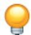

Tip: To select more than one object, hold down the [Shift] key as you click each object or drag a rectangle around the objects. To unselect an object, use [Ctrl] + Click. For more information, see Selecting objects within the viewport.”

4. Click mouse button 2 to indicate that you have finished selecting objects.  
5. Select a center point about which to scale, or enter coordinates in the prompt area.  
6. Enter the scale factor—values greater than 1.0 enlarge the moved or copied objects, values less than 1.0 reduce them.

Abaqus/CAE keeps the selected point stationary in the viewport and enlarges or reduces the objects around it according to the scale factor.

7. If desired, repeat Steps 3 through 6 to continue scaling objects.


## Note:

Subsequent scale operations are of the same type—Copy or Move—as you originally selected. To change the type, end the procedure and select the scale tool again.

8. When you have finished scaling objects, do one of the following:

• Click mouse button 2 anywhere in the Abaqus/CAE window.  
• Select any tool in the Sketcher toolbox.  
• Click the cancel button in the prompt area.

## Additional information

• Sketching simple objects  
• Creating construction geometry  
• Modifying objects  
• Creating patterns, offsetting, and deleting objects  
• Undoing and redoing sketching actions

## Moving or copying Sketcher objects about a mirror line

Use the mirror tool from the Sketcher toolbox to mirror Sketcher objects—lines, arcs, circles, ellipses, fillets, or splines—about a specified line. You can choose to move the original objects or to create a mirror copy in the new location. If you choose to move objects, your changes are controlled by any constraints in the sketch and by the constraint solution method in the sketch options (for more information, see Customizing the use of constraints in the Sketcher). If you choose to create a copy, Abaqus/CAE applies a mirror constraint between the original objects and the copies so that they will remain mirror images during any subsequent sketch edits.

1. From the move and copy tools in the Sketcher toolbox, select the mirror tool . For a diagram of the tools in the Sketcher toolbox, see The Sketcher tools.  
2. Select Copy or Move in the prompt area. Abaqus/CAE displays prompts in the prompt area to guide you through the procedure.  
3. Select an existing straight line in the sketch as the mirror line. You can select any straight edge from sketch, construction, or reference geometry.  
4. Select all the objects that you want to mirror. You can select sketch and construction geometry to move, or you can select sketch, construction, and reference geometry to copy; dimensions cannot be mirrored.


Tip: To select more than one object, hold down the [Shift] key as you click each object or drag a rectangle around the objects. To unselect an object, use [Ctrl] + Click. For more information, see Selecting objects within the viewport.”

5. Click mouse button 2 to indicate that you have finished selecting objects.

Abaqus/CAE moves or copies the objects as specified.

6. If desired, repeat Steps 4 and 5 to move or copy more objects about the same mirror line.

7. When you have finished moving and copying objects, do one of the following:

• Click mouse button 2 anywhere in the Abaqus/CAE window.  
• Select any tool in the Sketcher toolbox.

• Click the cancel button in the prompt area.

## Additional information

• Sketching simple objects  
• Creating construction geometry  
• Modifying objects  
• Creating patterns, offsetting, and deleting objects  
• Undoing and redoing sketching actions

## Modifying objects

This section describes how to use the Sketcher tools to move and resize Sketcher objects.

## In this section:

Dragging Sketcher objects  
Modifying Sketcher objects by trimming or extending edges  
Modifying Sketcher objects by automatically trimming edges  
Modifying Sketcher objects by splitting edges  
Modifying Sketcher objects by merging edges

## Dragging Sketcher objects

Use the Drag tool from the Sketcher toolbox to quickly move or resize a Sketcher object or to reposition dimension text. You can drag only one vertex, line, or dimension at a time. The object or dimension text that you drag snaps to the grilines when the Snap to grid option is selected; see Turning snapping on or off for more information.

If you drag a vertex or line, Abaqus/CAE modifies connected Sketcher objects according to the applied constraints—including dimensions and parameters—and according to the constraint solution method applied to drag operations. By default, the Minimum move constraint solution method, in which Abaqus/CAE moves the minimum number of entities to satisfy the constraints, is used (for more information, see Customizing the use of constraints in the Sketcher).

1. From the modify tools in the Sketcher toolbox, select the Drag tool . For a diagram of the tools in the Sketcher toolbox, see The Sketcher tools.

Handles appear on all vertices in the viewport. Abaqus/CAE displays prompts in the prompt area to guide you through the procedure.

2. Click and drag the selected vertex, edge, or dimension text to a new location.

The selected object moves with the cursor unless constraints in the sketch do not allow the desired movement.

3. When you have finished dragging objects, do one of the following:

• Click mouse button 2 anywhere in the Abaqus/CAE window.

• Select any tool in the Sketcher toolbox.

• Click the cancel button in the prompt area.

## Additional information

• Modifying, copying, and offsetting objects  
• Sketching simple objects  
• Creating construction geometry  
• Modifying objects  
• Creating patterns, offsetting, and deleting objects  
• Undoing and redoing sketching actions

## Modifying Sketcher objects by trimming or extending edges

Use the trim and extend tool from the Sketcher toolbox to trim or extend individual edges of Sketcher objects. You can trim or extend an edge at any intersection between the edge and other sketch, reference, or construction geometry. You can also trim or extend an edge at an extended intersection—an intersection that would exist only if another edge in the sketch was extended. You cannot trim or extend a fillet; if you trim or extend an edge that defines an endpoint of a fillet, Abaqus/CAE deletes the fillet.

1. From the modify tools in the Sketcher toolbox, select the trim and extend tool . For a diagram of the tools in the Sketcher toolbox, see The Sketcher tools.

Abaqus/CAE displays prompts in the prompt area to guide you through the procedure.

2. Select an edge near the portion that you want to keep.

You can select any sketched or imported edge except for circles and ellipses. Circles and ellipses have only one edge, they cannot be extended or trimmed unless you first make them into one or more arcs.


Tip: Use the Auto-trim tool to remove part of a circle or an ellipse, or use the split tool to split it into arcs. For more information, see Modifying Sketcher objects by automatically trimming edges, and Modifying Sketcher objects by splitting edges, respectively.

You cannot extend spline curves. If you trim or split a spline curve, Abaqus/CAE removes the control points to retain the exact shape of the original curve; therefore, you can no longer edit the shape of the curve.

3. Move the cursor over other edges in the sketch.

As you move the cursor, Abaqus/CAE highlights the edge that would be selected at the current cursor location. Abaqus/CAE also creates a preview of the extended or trimmed portion of the first edge by highlighting it a different color from the portion that will remain unchanged.

4. Click to select the highlighted edge.

Abaqus/CAE trims or extends the first edge to meet the intersection point (or potential intersection point) with the second edge. Abaqus/CAE also splits the second edge if the intersection point is between its endpoints.

5. To trim or extend more edges, repeat the above steps beginning with Step 2.

6. When you have finished trimming and extending edges, do one of the following:

• Click mouse button 2 anywhere in the Abaqus/CAE window.  
• Select any tool in the Sketcher toolbox.

• Click the cancel button in the prompt area.

## Additional information

• Sketching simple objects  
• Creating construction geometry  
• Modifying objects  
• Creating patterns, offsetting, and deleting objects  
• Undoing and redoing sketching actions

## Modifying Sketcher objects by automatically trimming edges

Use the Auto-trim tool from the Sketcher toolbox to delete unwanted portions of sketched edges. Edges are deleted between the two “trim points” closest to the cursor. The trim points include:

• Endpoints  
• Points used to define the circumference of circles

• Intersections with other edges, construction geometry, or reference geometry

If the endpoints are the only trim points on an edge, Abaqus/CAE deletes the entire edge.

You cannot trim a fillet; if you trim an edge that defines an endpoint of a fillet, Abaqus/CAE deletes the fillet.

1. From the modify tools in the Sketcher toolbox, select the Auto-trim tool . For a diagram of the tools in the Sketcher toolbox, see The Sketcher tools.

Abaqus/CAE displays prompts in the prompt area to guide you through the procedure.

2. Move the cursor over the edges in the sketch.

As you move the cursor, Abaqus/CAE highlights the section that would be removed.

3. Click to remove the highlighted edge segment.

Unlike when you use Trim/Extend, Abaqus/CAE does not split the intersecting edges.


## Note:

If you trim a spline curve, Abaqus/CAE removes the control points to retain the exact shape of the original curve; therefore, you can no longer edit the shape of the curve.

4. When you have finished trimming edges, do one of the following

• Click mouse button 2 anywhere in the Abaqus/CAE window.  
• Select any tool in the Sketcher toolbox.

• Click the cancel button in the prompt area.

## Additional information

• Sketching simple objects  
• Creating construction geometry  
• Modifying objects  
• Creating patterns, offsetting, and deleting objects  
• Undoing and redoing sketching actions

Use the split tool from the Sketcher toolbox to split an individual edge of a Sketcher object into multiple edges. You can split an edge at any intersection between the edge and other sketch, reference, or construction geometry. If you use other sketch geometry to split an edge, Abaqus/CAE splits both edges at the intersection point. You can also split an edge at an extended intersection—an intersection that would exist only if another edge in the sketch was extended.

1. From the modify tools in the Sketcher toolbox, select the split tool . For a diagram of the tools in the Sketcher toolbox, see The Sketcher tools.

Abaqus/CAE displays prompts in the prompt area to guide you through the procedure.

2. Select the edge that you want to split; you can select any sketched or imported edge in Abaqus/CAE.


## Note:

If you split a spline curve, Abaqus/CAE removes the control points to retain the exact shape of the original curve; therefore, you can no longer edit the shape of the curve.

3. Move the cursor over other edges in the sketch.

As you move the cursor, Abaqus/CAE highlights the edge that would be selected at the current cursor location. Abaqus/CAE also circles the split point—the intersection point between the edge to be broken and the edge at the cursor position. If there is more than one possible split point between the selected edges, Abaqus/CAE circles the point that is closest to the cursor position.

4. Click to accept the indicated split point.

Abaqus/CAE splits the first edge, creating two edges that share the split point as one endpoint. Abaqus/CAE also splits the second edge if it is sketch geometry and the split point lies between its endpoints.


## Note:

If you split a circle or an ellipse, Abaqus/CAE uses the vertex on the edge as a second split point to create two arcs. If the split point indicated in the previous step is the same as the edge point, a warning appears in the message area and the curve is not broken.

5. To split more edges, repeat the above steps beginning with Step 2.  
6. When you have finished splitting edges, do one of the following

• Click mouse button 2 anywhere in the Abaqus/CAE window.  
• Select any tool in the Sketcher toolbox.  
• Click the cancel button in the prompt area.

## Additional information

• Sketching simple objects  
• Creating construction geometry  
• Modifying objects  
• Creating patterns, offsetting, and deleting objects  
• Undoing and redoing sketching actions

## Modifying Sketcher objects by merging edges

Small gaps can occur in Sketcher objects when you import sketch geometry or when you use the Project Edges tool on edges that are not in a plane parallel to the sketch plane. The Merge tool from the Sketcher toolbox closes these small gaps by moving one or more vertices near the gap to a point on the other side.


## Note:

When you merge edges, Abaqus/CAE can close the gap by moving one vertex to coincide with the other or by moving both vertices to a location between them. If you want to control the changes to your sketch, you can constrain the line or point that you want to retain its current location before performing the merge operation.

Abaqus/CAE enables you to choose the vertex that you want to remain stationary, and the merge operation moves any vertices within a specified tolerance radius across the gap to share the same point as your selected vertex. Figure 1 shows a simple merge operation, closing the upper gap between two sketcher objects.

  
Figure 1: Merging edges


## Note:

The Merge tool is intended only for closing small gaps. Merging edges to close larger gaps may change the sketch geometry significantly. If you want to move elements in a sketch over a large distance, use the drag tool to move vertices in your sketch to a new location. For more information, see Dragging Sketcher objects.

1. From the modify tools in the Sketcher toolbox, select the Merge tool . For a diagram of the tools in the Sketcher toolbox, see The Sketcher tools.

Abaqus/CAE displays prompts in the prompt area to guide you through the procedure.

2. Select at least two vertices near the small gap.  
3. Click Done in the prompt area.

Abaqus/CAE prompts you for a Tolerance number for this merge operation.

4. Enter a value for the tolerance, or accept the default value of 0.001. Then either press Enter, or click mouse button 2.

Abaqus/CAE allows you to increase the tolerance, but you should avoid merges that change the sketch geometry significantly.

If any vertices are within the selected tolerance, Abaqus/CAE merges them to the location of the vertex you selected in Step 2.

5. To merge more edges, repeat the above steps beginning with Step 2.  
6. When you have finished merging edges, do one of the following:

Click mouse button 2 anywhere in the Abaqus/CAE window.•  
• Select any tool in the Sketcher toolbox.  
• Click the cancel button in the prompt area.

## Additional information

• Sketching simple objects  
• Creating construction geometry  
• Modifying objects  
• Creating patterns, offsetting, and deleting objects  
• Undoing and redoing sketching actions

## Repairing short edges, gaps, and overlaps

This section describes how to use the Sketcher tools to repair short edges in a sketch and to remove gaps and overlaps from a sketch.

These tools are intended for the repair of imported sketches, but you can use them to repair geometry in a native sketch as well. You should remove the gaps and overlaps in your sketch before repairing its short edges.

## In this section:

Removing gaps and overlaps  
Repairing short edges

## Removing gaps and overlaps

Use the Remove gaps and overlaps tool to repair imported sketches that include gaps or overlaps.

Gaps or overlaps can occur when you import a sketch into Abaqus/CAE from a CAD system that measures sketch geometry using different tolerance values than Abaqus/CAE. The sketch in Figure 1 includes a gap in the upper left and a small overlap at the midpoint of the top line.

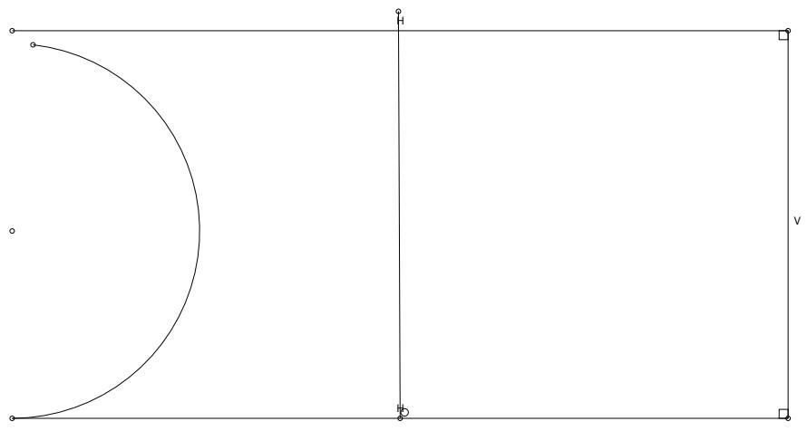  
Figure 1: Simple imported sketch with a gap and an overlap.

You can repair the gap and overlap in this example by selecting the edges and specifying a tolerance value. When the size of the gap or the length of the overlap is less than the specified tolerance, Abaqus/CAE merges the vertices to close the gap.


## Note:

During the removal of a gap or overlap, Abaqus/CAE can merge vertices by moving one vertex to coincide with the other or by moving both vertices to a location between them. If you want to control the changes to your sketch, you can constrain the line or point that you want to retain its current location before performing the gap/overlap removal.

In practice, you should remove gaps or overlaps from your sketch using an iterative process. Start by selecting the edges adjacent to the gaps or overlaps you want to remove and use the default length tolerance value of 0.001 for your first attempt. If all of the gaps or overlaps are not closed, reselect the edges and increase the tolerance. Repeat this process until Abaqus/CAE merges the selected vertices to close the gaps or overlaps.

1. From the modify tools in the Sketcher toolbox, select the Remove gaps and overlaps tool a diagram of the tools in the Sketcher toolbox, see The Sketcher tools.  
Abaqus/CAE displays prompts in the prompt area to guide you through the procedure.  
2. Select the edges between which you want to remove gaps and overlaps. You can [Shift] + Click or [Ctrl] + Click to specify edges individually, or you can drag-select to specify all of the edges within an area in your sketch.  
Abaqus/CAE colors the selected edges red.

3. Click mouse button 2 anywhere in the Abaqus/CAE window.  
Abaqus/CAE prompts you to select a tolerance value.  
4. For your first attempt, accept the default tolerance value and click mouse button 2 anywhere in the Abaqus/CAE window. Abaqus/CAE removes the gaps and overlaps that are smaller than the default tolerance.  
5. If you still have gaps and overlaps remaining that you want to remove, perform the following steps:

a. Reselect the edges between which you want to remove gaps and overlaps.  
b. Increase the tolerance value in the prompt area.  
c. Click mouse button 2 anywhere in the Abaqus/CAE window.

Abaqus/CAE removes the selected gaps or overlaps that are smaller than the default tolerance.

d. Continue selecting edges and increasing the tolerance until Abaqus/CAE has removed all the gaps and overlaps that you want to remove from your model.

6. When you have finished removing edges and overlaps, do one of the following:

• Click mouse button 2 anywhere in the Abaqus/CAE window.  
• Select any other tool in the Sketcher toolbox.

• Click the cancel button in the prompt area.


## Additional information

• Sketching simple objects  
• Modifying objects

Use the Repair short edges tool from the Sketcher toolbox to remove selected short edges from your sketch. Abaqus/CAE provides two methods for edge removal: you can either remove every edge that you select, or you can select multiple edges as candidates for removal and specify a length tolerance value. Edges shorter than the tolerance length are removed from the sketch.

If you remove short edges by specifying length tolerance values, you should perform the removals using an iterative process. Start by selecting the edges that you want to remove and use the default length tolerance value of 0.001 for your first attempt. If the short edges are not removed, reselect them and increase the tolerance. Repeat this process until the short edges are removed from the sketch.

You should repair the short edges in your sketch only after removing its gaps and overlaps. For more information, see Removing gaps and overlaps.

of the tools in the Sketcher toolbox, see The Sketcher tools. Abaqus/CAE displays prompts in the prompt area to guide you through the procedure.  
2. Specify the edges that you want to remove or, if you are specifying a length tolerance value, the edges you want to consider for removal. You can [Shift] + Click or [Ctrl] + Click to specify edges individually, or you can drag-select to specify all of the edges within an area in your sketch. Abaqus/CAE colors the selected edges red.  
3. If you are removing short edges without specifying a tolerance, click Done in the prompt area. Abaqus/CAE removes the selected edges from the sketch.  
4. If you are removing edges shorter than a specified length tolerance value, toggle on Specify tolerance in the prompt area and click Done. For your first attempt, accept the default tolerance value and click Done in the prompt area. Abaqus/CAE removes from the sketch any of the selected edges that are shorter than the length tolerance value.  
5. To continue the removal of short edges by length tolerance value, perform the following steps:

a. Reselect the edges that you want to consider for removal, and click Done.  
b. Leave Specify tolerance toggled on, and click Done again.  
c. Increase the length tolerance value in the prompt area.  
d. Click mouse button 2 anywhere in the Abaqus/CAE window.

Abaqus/CAE removes from the sketch any of the selected edges that are shorter than the length tolerance value.

e. Continue selecting edges and increasing the tolerance until Abaqus/CAE has removed all the short edges that you want to remove from your model.

6. When you have finished repairing short edges in your sketch, do one of the following:

• Click mouse button 2 anywhere in the Abaqus/CAE window.  
• Select any other tool in the Sketcher toolbox.  
• Click the cancel button in the prompt area.

## Additional information

• Modifying, copying, and offsetting objects

• Modifying objects  
• Creating patterns, offsetting, and deleting objects

## Creating patterns, offsetting, and deleting objects

This section describes how to use the Sketcher tools to copy and delete Sketcher objects.

## In this section:

Creating linear patterns of objects  
Creating radial patterns of objects  
Offsetting the edges of Sketcher objects  
Deleting Sketcher objects

## Creating linear patterns of objects

Use the linear pattern tool from the Sketcher toolbox to create a linear pattern of selected Sketcher objects. You can create a pattern that extends in one direction (for example, horizontally or vertically), or you can create a pattern that extends in two directions (for example, both horizontally and vertically). You can specify the following:

• The number of copies to create in each direction, including the selected objects. You can create a maxium of 1000 copies.  
• The spacing between each copy along the specified direction.  
• A line that defines the direction along which Abaqus/CAE generates the copies.

By default, Abaqus/CAE creates three copies in the positive X-direction and two copies in the positive Y-direction. The default spacing is 10% of the sketch sheet size. If you change the default settings, Abaqus/CAE retains those values while you work on the sketch. However, after you exit the Sketcher, Abaqus/CAE reverts to the original defaults. You cannot edit a pattern after you create it.

1. From the Sketcher toolbox, select the linear pattern too l . For a diagram of the tools in the Sketcher toolbox, see The Sketcher tools.  
Abaqus/CAE displays prompts in the prompt area to guide you through the procedure.  
2. Select the objects that you want to copy. Both sketch and construction geometry can be copied; reference geometry and dimensions cannot be copied.


Tip: To select more than one object, hold down the [Shift] key as you click each object or drag a rectangle around the objects. To unselect an object, use [Ctrl] + Click. For more information, see Selecting objects within the viewport.”

3. Click mouse button 2 to indicate that you have finished selecting objects.

Abaqus/CAE displays the Create Linear Pattern dialog box.

4. From the Create Linear Pattern dialog box, configure the pattern in Direction-1 (by default, Direction-1 is the X-direction in the current grid rotation):

a. Click the arrows to the right of Number to increase or decrease the number of copies to create, including the selected objects. The number of copies in the Sketch updates when you click the arrows and provides a preview of the setting.  
Alternatively, you can type in a number and press [Enter] to preview the setting. You can enter any number between 1 and 1000. If you enter a value of 1, Abaqus/CAE displays only the selected objects and does not create any copies of the selected objects; in effect, you are disabling copies in Direction-1.  
b. Enter the Spacing between each copy along the specified direction.  
c. By default, Abaqus/CAE creates the copies in a horizontal direction. If you want to change the direction in which Abaqus/CAE creates the copies, click Angle and select a line from the Sketch to define the new direction. You must pick a straight edge or a straight construction line.  
Abaqus/CAE calculates the spacing between each copy along the direction that you specify.  
d. By default, Abaqus/CAE creates the copies in the positive X-direction. Click Flip to reverse the direction in which Abaqus/CAE creates the copies.

5. To create copies in a second direction, enter a Number between than 1 and 1000 and specify the Spacing, the Angle, and the Flip direction for Direction-2 (by default, Direction-2 is the Y-direction in the current grid rotation). You must enter a Number greater than 1 for at least one direction.

6. In most cases you will want to preview the linear pattern that Abaqus/CAE will create as you enter values in the Create Linear Pattern dialog box. However, if you choose to create a large number of copies, the preview capability may impact the performance of the Sketcher. In this case you should toggle off the Preview button.  
7. To copy more objects, repeat the above steps beginning with Step 2.  
8. When you have finished copying objects, do one of the following:

• Click mouse button 2 anywhere in the Abaqus/CAE window.  
• Select any tool in the Sketcher toolbox.  
• Click the cancel button in the prompt area.

## Additional information

• Copying sketch objects to create patterns  
• Modifying objects  
• Undoing and redoing sketching actions

## Creating radial patterns of objects

Use the radial pattern tool from the Sketcher toolbox to create a radial pattern of selected Sketcher objects. You can specify the following:

• The number of copies to create in the radial pattern, including the selected objects. You can create a maxium of 1000 copies.  
• The total angle between the original objects and the last copy in the pattern.  
• The position of the center point of the circular pattern.

By default, Abaqus/CAE creates five copies around a complete circle (360°), and the center of the circle is located at the origin of the sketch. If you change the default settings, Abaqus/CAE retains those values while you work on the sketch. However, after you exit the Sketcher, Abaqus/CAE reverts to the original defaults. You cannot edit a pattern after you create it.

1. From the Sketcher toolbox, select the radial pattern tool . For a diagram of the tools in the Sketcher toolbox, see The Sketcher tools.  
Abaqus/CAE displays prompts in the prompt area to guide you through the procedure.

2. Select the objects that you want to copy. Both sketch and construction geometry can be copied; reference geometry and dimensions cannot be copied.


Tip: To select more than one object, hold down the [Shift] key as you click each object or drag a rectangle around the objects. To unselect an object, use [Ctrl] + Click. For more information, see Selecting objects within the viewport.”

3. Click mouse button 2 to indicate that you have finished selecting objects.

Abaqus/CAE displays the Create Radial Pattern dialog box.

4. From the Create Radial Pattern dialog box, configure the radial pattern:

a. Click the arrows to the right of Number to increase or decrease the number of copies to create, including the selected objects. The number of copies in the Sketch updates when you click the arrows and provides a preview of the setting.

Alternatively, you can type in a number and press [Enter] to preview the setting. You can enter any number between 2 and 1000.

b. Enter the Total angle between the original objects that you selected and the final copy. The angle must be between –360° and +360°. A positive angle corresponds to a counterclockwise direction.

c. By default, the center point of the circular pattern is the origin of the sketch. Click Center to change the location of the center point, and select a point from the sketch to define the new center point.

5. In most cases you will want to preview the radial pattern that Abaqus/CAE will create as you enter values in the Create Radial Pattern dialog box. However, if you choose to create a large number of copies, the preview capability may impact the performance of the Sketcher. In this case you should toggle off the Preview button.

6. To copy more objects, repeat the above steps beginning with Step 2.

7. When you have finished copying objects, do one of the following:

• Click mouse button 2 anywhere in the Abaqus/CAE window.  
• Select any tool in the Sketcher toolbox.

• Click the cancel button in the prompt area.

## Additional information

• Copying sketch objects to create patterns  
• Modifying objects  
• Undoing and redoing sketching actions

## Offsetting the edges of Sketcher objects

Use the offset tool from the Sketcher toolbox to offset edges. You select the edges, enter the offset distance, and choose the offset direction. Abaqus/CAE applies the offset distance perpendicular to each point along the edges to create the offset.


## Note:

Edges containing features with dimensions of similar size to the offset distance will lose their details in the offset copy.

1. From the Sketcher toolbox, select the offset tool . For a diagram of the tools in the Sketcher toolbox, see The Sketcher tools.  
Abaqus/CAE displays prompts in the prompt area to guide you through the procedure.  
2. Select a single group of connected edges to offset. Only sketch geometry can be offset; construction geometry, reference geometry, and dimensions cannot be offset.


Tip: To select a group of edges that are connected end-to-end, choose by chain from the prompt area (for more information, see Using the chain method to select edges in the Sketcher). If necessary, you can then use the other selection methods in Abaqus/CAE to enhance your selection. For more information, see Selecting objects within the viewport.”

3. Click mouse button 2 to indicate that you have finished selecting objects.

4. Specify an offset distance or accept the default value displayed in the prompt area. Abaqus/CAE displays a preview of the offset edges in the viewport.

5. Use the buttons that appear in the prompt area to accept or change the offset direction.

6. To offset more edges, repeat the above steps beginning with Step 2.

7. When you have finished offsetting edges, do one of the following:

• Click mouse button 2 anywhere in the Abaqus/CAE window.  
• Select any tool in the Sketcher toolbox.  
• Click the cancel button in the prompt area.

## Additional information

• Sketching simple objects  
• Creating construction geometry  
• Modifying objects  
• Creating patterns, offsetting, and deleting objects  
• Undoing and redoing sketching actions

Use the delete tool from the Sketcher toolbox to remove Sketcher objects: lines, arcs, circles, fillets, splines, points, constraints, dimensions, or parameters.

1. From the Sketcher toolbox, select the delete tool . For a diagram of the tools in the Sketcher toolbox, see The Sketcher tools.

Abaqus/CAE displays prompts in the prompt area to guide you through the procedure.

2. Select all the objects you want to delete. Select a filter from the prompt area to limit the available selections to Geometry, Dimensions (including parameters), or Constraints; the default filter, Any, does not limit your selection.

Both sketch and construction geometry can be deleted; reference geometry cannot be deleted.


Tip: To select more than one object, hold down the [Shift] key as you click each object or drag a rectangle around the objects. To unselect an object, use [Ctrl] + Click. For more information, see Selecting objects within the viewport.”

3. When you have finished selecting objects, click mouse button 2.

Abaqus/CAE deletes the selected objects and any associated dimensions or constraints.


Tip: To restore accidentally deleted objects, click the undo tool in the Sketcher toolbox.

4. To delete more objects, repeat the above steps beginning with Step 2.

5. When you have finished deleting objects, do one of the following:

• Click mouse button 2 anywhere in the Abaqus/CAE window.

• Select any tool in the Sketcher toolbox.

• Click the cancel button in the prompt area.

## Additional information

• Sketching simple objects  
• Creating construction geometry  
• Modifying objects  
• Creating patterns, offsetting, and deleting objects  
• Undoing and redoing sketching actions

## Undoing and redoing sketching actions

The Sketcher toolbox contains tools to undo and redo sketch actions.

Use the Undo tool or the Redo tool from the Sketcher toolbox to undo your previous operation or redo your most recently undone operation. For a diagram of the tools in the Sketcher toolbox, see The Sketcher tools.

Depending on your previous action, clicking the undo tool can have the following effect:

• Remove the object just created. Objects include sketch geometry (lines, arcs, circles, ellipses, fillets, splines, or points), construction geometry, or dimensions.  
Restore the sketch to its state prior to the editing operation just performed. Editing operations include copying entities, deleting entities, moving vertices, trimming edges, extending edges, breaking edges, and changing dimensions.  
Remove a retrieved stand-alone sketch, provided you have not positioned the sketch. Once you have positioned the retrieved sketch, clicking the undo tool moves the origin of the retrieved sketch back to the origin of the current sketch.

You can undo and redo several actions in a row. For example, if you sketch a circle and dimension its radius, your first undo operation removes the dimension and your second undo operation removes the circle. You can restore the circle by clicking the redo tool and restore its dimension by clicking the redo tool a second time. Abaqus/CAE stores a history of actions for the current sketch, and you can specify the maximum number of sketching operations to store (see Setting the maximum number of recorded sketching operations, for more information).

The Undo and Redo tools do not perform view manipulation operations. For example, if you sketch a circle, magnify the view, and click the undo tool, Abaqus/CAE deletes the circle (it does not resize the view).

## Additional information

• Deleting Sketcher objects

## Resetting the view

The Sketcher toolbox contains a tool for resetting the view.

Use the reset view tool from the Sketcher toolbox to return to the original view. For a diagram of the tools in the Sketcher toolbox, see The Sketcher tools.

If you are unsure of the part's or assembly's orientation relative to the sketch plane, you can use the view manipulation tools to examine the sketch plane and the object on which you are sketching. When you click the reset view tool, Abaqus/CAE restores the view to the original view orientation displayed when you entered the Sketcher.

## Additional information

• Using the view manipulation tools

## Managing stand-alone sketches

This section describes how to manage stand-alone sketches while working in the Sketch module.

## In this section:

Managing stand-alone sketches  
Creating stand-alone sketches  
Saving the current sketch as a stand-alone sketch  
Adding stand-alone sketches

## Managing stand-alone sketches

Stand-alone sketches are stored in your model and are independent of any particular part or the assembly. You can create a stand-alone sketch while working in the Sketch module, or you can save the current sketch as a stand-alone sketch while sketching. You can add a stand-alone sketch while creating or editing a feature or a partition, and an added sketch overlays the current sketch so that their origins are coincident.

You use the Sketch module to manage the stand-alone sketches defined in your model. To create, retrieve, copy, rename, and delete stand-alone sketches while working in the Sketch module, use one of the following:

• The Create, Edit, Copy, Rename, and Delete items listed under the Sketch menu on the main menu bar. Each item contains a submenu listing all the sketches in the current model.  
The Sketch Manager dialog box. The Sketch Manager contains functions identical to those listed under the Sketch menu, but with a convenient browser that lists all the sketches available in the current model. To display the Sketch Manager dialog box, select Sketch->Manager from the main menu bar.


## Note:

The Sketch menu and the Sketch Manager are available only from the Sketch module. When you are sketching a feature in the Part module, for example, the Sketch menu and the Sketch Manager are not available.

## Additional information

• Managing stand-alone sketches  
• Stand-alone sketches

## Creating stand-alone sketches

Stand-alone sketches are stored in your model and are independent of any particular part or the assembly. To create a new stand-alone sketch in the current viewport, select Sketch->Create from the main menu bar.

1. From the main menu bar, select Sketch->Create.

The Create Sketch dialog box appears.


Tip: You can also create a stand-alone sketch by clicking the sketch create tool in the Sketch module toolbox.

2. In the Create Sketch dialog box, enter a name for the sketch. For information on valid names, see Using basic dialog box components.  
3. In the Create Sketch dialog box, enter the approximate size of the sketch.

The size that you enter is used by Abaqus/CAE to calculate the size of the sheet and the spacing of its grid. The approximate size should reflect the largest dimension of the sketch and must be between 105 and 10−3 units. Abaqus/CAE does not require specific units, but the units must be consistent throughout the model.

4. Click Continue to close the Create Sketch dialog box.

Abaqus/CAE starts the Sketcher and displays a square sheet on which you sketch; the width and height of the sheet are approximately equal to the value that you entered in the previous step. If you later find that your sketch extends beyond the edge of the sheet, you can change the sheet size using the Sketcher customization options.

5. When you have finished sketching, click Done in the prompt area.

## Additional information

• Managing stand-alone sketches  
• Stand-alone sketches

## Saving the current sketch as a stand-alone sketch

While you are sketching, you can save the current sketch as a stand-alone sketch. Stand-alone sketches are maintained independent of any features; they can be subsequently retrieved into the Sketcher and will overlay any existing geometry.

Abaqus/CAE saves only items within the sketch. Reference geometry is not saved. Similarly, dimensions between vertices and lines from reference geometry are not saved.

1. From the Sketcher toolbox, select the save as tool . For a diagram of the tools in the Sketcher toolbox, see The Sketcher tools.  
2. In the text field that appears in the prompt area, enter the name of the sketch.  
Abaqus/CAE saves the sketch and returns to the Sketcher.

## Additional information

• Managing stand-alone sketches  
• Stand-alone sketches

## Adding stand-alone sketches

While you are sketching, you can add a stand-alone sketch so that its geometry overlays the current sketch. Abaqus/CAE positions the added stand-alone sketch so that its origin is coincident with the origin of the current sketch.

1. From the Sketcher toolbox, select the add sketch tool L . For a diagram of the tools in the Sketcher toolbox, see The Sketcher tools.  
Abaqus/CAE displays the Add Sketch dialog box.

2. Select the sketch to add from the list of stand-alone sketches and click OK to close the Add Sketch dialog box.

Abaqus/CAE does the following:

• Positions the added sketch so that its origin is coincident with the origin of the current sketch.  
• Resizes the view so that both the current sketch and the added sketch are visible.

3. Use the buttons that appear in the prompt area to indicate how you will locate the added sketch.

Select Translate to translate the added sketch along a specified vector. You can define the beginning and the end of the translation vector by either selecting from the sketch or by typing the X- and Y-coordinates of each end.  
Select Rotate to rotate the added sketch through a specified angle about a specified point. You can specify the point at the center of rotation by selecting from the sketch or typing the X- and Y-coordinates. The angle of rotation you specify must be between 360 and −360 degrees.  
Select Mirror to mirror the added sketch about a selected line. You must specify the mirror line by selecting an existing straight line (not a line in the added sketch).  
Select Scale to scale the spacing between the vertices of the added sketch by a specified amount about a specified point. You can specify the point by selecting from the sketch or by typing the Xand Y-coordinates.

A preview of the added sketch is modified and positioned according to your specification.

4. If desired, repeat Step 3 to continue modifying or repositioning the added sketch.  
5. Select Done in the prompt area.

Abaqus/CAE adds the stand-alone sketch to the existing geometry.

## Additional information

• Managing stand-alone sketches  
• Stand-alone sketches

## Modeling techniques

This part discusses modeling techniques in Abaqus/CAE that span multiple Abaqus/CAE modules and that define special engineering features in an Abaqus/CAE model.

## In this section:

Adhesive joints and bonded interfaces  
Bolt loads  
Composite layups  
Connectors  
Continuum shells  
Co-simulation  
Display bodies  
Eulerian analyses  
Fasteners  
Fracture mechanics  
Gaskets  
Imperfection  
Inertia  
Load cases  
Midsurface modeling  
Skin and stringer reinforcements  
Springs and dashpots  
Submodeling  
Substructures

## Adhesive joints and bonded interfaces

This section provides information on how to model adhesive joints and bonded interfaces.

## In this section:

Modeling adhesive joints and bonded interfaces  
Embedding cohesive elements in an existing three-dimensional mesh  
Creating a model with cohesive elements using geometry and mesh tools  
Defining tie constraints between the cohesive layer and the surrounding bulk material  
Assigning cohesive modeling data

## Modeling adhesive joints and bonded interfaces

You can create a model using cohesive elements to model adhesive joints, fracture at bonded interfaces, and gaskets.

You can model:

• Adhesive joints – two components connected by a glue-like material that has a finite thickness.  
• Fracture at bonded interfaces – crack propagation in glue material that is very thin and for all practical purposes may be considered to be of zero thickness.  
Gaskets (limited capability) – seal between two components. No specialized gasket behavior (typically defined in terms of pressure versus closure) is available. If you want to model special gasket behavior, use special-purpose gasket elements as described in Gaskets.

For more information, see About Cohesive Elements.

The two main approaches that you can use to include cohesive elements in your model are

embedding one or more layers of cohesive elements in the mesh of an existing model; or  
• creating the analysis model using the geometry and mesh tools.

You can model the connection at the interface between the cohesive layer and the surrounding bulk material by sharing nodes or by defining a tie constraint. The tie-constraint approach allows you to model the cohesive layer using a finer discretization than that of the bulk material and may be more desirable in certain modeling situations. For more information, see Defining tie constraints between the cohesive layer and the surrounding bulk material.

Like gasket elements, cohesive elements have an orientation associated with them. This orientation defines the thickness direction of the elements, and it should be consistent throughout the cohesive layer. Swept or offset meshing techniques should be used to generate the mesh in the cohesive layer because these tools produce meshes that are oriented consistently. You can also use the bottom-up sweep meshing method, but you must sweep in the direction of the element thickness to maintain the correct orientation. You should create a single layer of solid elements to model the cohesive region. The use of more than one layer through the thickness could produce unreliable results and is not recommended. You can generate the mesh in the surrounding bulk material using any of the mesh tools because these elements do not need to be oriented.

The general procedure for modeling adhesive joints and bonded interfaces involves the following steps:

1. Create a model, and assign a cohesive element type to the cohesive region in the Mesh module using one of the following approaches:

Embedding cohesive elements in an existing three-dimensional mesh  
Creating a model with cohesive elements using geometry and mesh tools

2. In the Property module, define a material and a cohesive section that refers to the material, and assign the cohesive section to the cohesive region. See Assigning cohesive modeling data for more information.

3. To model progressive damage and failure of cohesive layers as discussed in Defining the Constitutive Response of Cohesive Elements Using a Traction-Separation Description, include the desired damage initiation and damage evolution information in the material definition (select Mechanical->Damage for Traction Separation Laws->damage type). For more information, see Defining damage.

## Embedding cohesive elements in an existing three-dimensional mesh

You can use the following procedure to embed a layer of cohesive elements:

1. In the Mesh module, use the solid offset mesh tool in the Edit Mesh toolset to embed elements in an existing mesh (see Editing the entire mesh). This approach generates a layer of hexahedral or wedge elements that share nodes with the surrounding bulk material. The offset mesh tool generates elements that are oriented consistently with a stack direction that is aligned with the offset direction. When prompted to select the element faces from which the offset mesh will be generated, select the interior element faces using the procedure described in Selecting interior surfaces.


Note: When generating an embedded layer of elements, the thickness should be much less than that of the adjacent elements because the nodes are displaced when the offset layer is generated.

You can create an offset mesh from only three-dimensional element faces. As a result, you can create only hexahedraland wedge-shaped cohesive elements using an offset mesh. For example, you cannot create quadrilateral cohesive elements by offsetting from element edges.

2. In the Mesh module, use the element type assignment tool to assign the cohesive element type to the cohesive region. See Element type assignment for more information.

If your existing mesh is a native mesh, you should create a mesh part prior to adding cohesive elements. For more information, see Creating a mesh part.

If you want to use a finer mesh in the cohesive layer, you should construct the cohesive layer as a separate part. You should separate the mesh in the surrounding bulk material into two regions with the appropriate spacing to accommodate the cohesive layer. You can mesh the cohesive layer using the methods described in Creating a model with cohesive elements using geometry and mesh tools, and tie the cohesive layer to the surrounding bulk material. For more information, see Defining tie constraints between the cohesive layer and the surrounding bulk material.

## Creating a model with cohesive elements using geometry and mesh tools

You can use the following procedure to create a model with cohesive elements using geometry and mesh tools:

1. In the Part module, define the geometry of the model. You should define the geometric region that represents the cohesive layer as a solid, even if the thickness of the layer is close to zero. To avoid numerical problems, it is recommended that you model the geometry using a value of 10−4 or greater for the thickness. If the actual thickness of the layer is less than this value, you should specify the actual thickness in the Initial thickness field of the cohesive section editor as described in Creating cohesive sections  
2. In the Mesh module, mesh the surrounding bulk material. You can use any of the mesh tools to mesh the surrounding bulk material. See Mesh generation for more information.  
3. In the Mesh module, mesh the cohesive region using one of the following methods:

## Two- and three-dimensional models

Top-down swept or bottom-up meshing technique. You can assign the top-down swept meshing technique or the bottom-up meshing technique to mesh the cohesive region. The bottom-up meshing technique is available only for three-dimensional models (for more information, see Bottom-up meshing). Regardless of the meshing technique that you choose, you must sweep, extrude, or revolve the mesh in the thickness direction of the element to produce the correct element orientation. For a complex cohesive region, you may need to partition the model to create a group of sweep regions that you can align consistently. For more information, see Selecting a meshing technique, and Specifying the sweep path.

## Three-dimensional models

Convert the cohesive region into a shell region, and use the offset meshing technique.

1. Convert the solid part to a shell using the From solid shell tool in the Part module.  
2. Isolate a collection of faces that represents an idealized shell of the part using the Remove faces tool in the Geometry Edit toolset.  
3. Mesh the simplified model with shell elements, and create a mesh part.  
4. Use the mesh part to generate an offset mesh of solid hexahedral or wedge elements. The elements will be oriented through the thickness of the part, and you can verify this with the Query toolset.

For detailed instructions, see Generating layers of solid elements offset from an existing mesh.

4. In the Mesh module, use the element type assignment tool to assign the cohesive element type to the cohesive region. See Element type assignment for more information.

For example, Figure 1 illustrates the layered composite specimen that is used in the benchmark problem Delamination analysis of laminated composites. An Abaqus Scripting Interface script that reproduces the composite specimen model using Abaqus/CAE is provided with this problem.

  
Figure 1: Model geometry for the Alfano delamination problem.

## Defining tie constraints between the cohesive layer and the surrounding bulk material

If you want to model the cohesive layer using a mesh that is finer than the adjacent bulk material mesh, the cohesive layer should be generated as a separate mesh and tied to the bulk material using tie constraints (see Defining tie constraints). You should create a shell geometric model to represent the surface on one side of the cohesive layer and mesh that model with the desired mesh density. You can use this mesh to create a mesh part from which you can generate the offset mesh. For more information, see Modeling with Cohesive Elements.

You should use care when tying zero-thickness cohesive layers to the surrounding bulk material mesh. Use the following procedure to avoid problems:

1. Use the solid offset mesh tool to create the layer of cohesive elements along with the top and bottom surfaces. Abaqus/CAE appends TopSurf and BottomSurf to the surface name prefix when it creates the two surfaces on either side of the layer of cohesive elements.  
2. Use the stack orientation query tool to distinguish the top (brown) and bottom (purple) faces of the cohesive elements.  
3. Tie the surfaces of the surrounding bulk material mesh to the appropriate top and bottom cohesive surfaces. When you are prompted to select a surface from the cohesive surface, click Surfaces from the right side of the prompt line and select the appropriate surface. For example, select surface name-BottomSurf to tie the bottom (purple) face of the cohesive layer to the adjacent surface of the bulk material mesh.

## Assigning cohesive modeling data

In the Property module, you can complete the cohesive modeling data as follows:

1. Create a cohesive section to define the section properties of adhesive layers at the interface between two bonded parts. You can model a negligibly thin layer of adhesive, a finite-thickness adhesive layer, or a gasket by selecting the constitutive behavior of the cohesive section as Traction Separation, Continuum, or Gasket, respectively. For more information, see Creating cohesive sections.  
2. Define a material for the cohesive region. If you select the Continuum or the Gasket response in the cohesive section editor, you can use the material models available in the Property module to define the continuum material properties. Abaqus/CAE does not support the material models for the Traction Separation response. In this case you must add the material definition using the Keywords Editor, as described in Adding unsupported keywords to your Abaqus/CAE model.  
3. Assign the cohesive section to the cohesive region. For more information, see Assigning a section.

This section explains how to model tightening forces or length adjustments in bolts or fasteners.

## In this section:

Understanding bolt loads  
Creating and editing bolt loads

## Understanding bolt loads

Bolt loads model tightening forces or length adjustments in bolts or fasteners.

Figure 1 shows a container (A) that is sealed by tightening the bolts that hold the lid, which places the gasket under pressure.  
  
Figure 1: Modeling a pre-tensioned bolt.

You can model the tension in the tightened bolts by applying a bolt load to each one in the first step of the analysis. You define the load in terms of either a concentrated force or a prescribed change in length, and you apply the load across a bolt cross-section surface that you specify. In later steps you can modify the load to prevent further length changes so that the bolt acts as a standard, deformable component responding to other loadings on the assembly.

When you create a bolt load, you must specify the following:

## A surface that defines the bolt cross-section

Abaqus/CAE applies the bolt load across the cross-section surface that you specify. The surface that defines the bolt cross-section must cut through the bolt geometry. Abaqus/CAE creates an “interior” surface at that location.

If you are working with bolt part instances made from native or imported geometry, Abaqus/CAE can create an interior surface by partitioning the bolt shank surface, or you can partition the bolt at the location where you want the cross-section to be defined. For example, a partition is selected as the bolt cross-section in Figure 2. For more information, see The Partition toolset.

  
Figure 2: Using a partition to specify the bolt cross-section.

If you are working with orphan mesh elements, you must specify the cross-section surface by selecting element faces. For example, element faces define a cross-section surface for the mesh part shown in Figure 3.

  
Figure 3: Using element faces to specify the bolt cross-section.

The element faces need to be selected from elements on only one side of the pre-tension section. You can use display groups to remove selected elements from the viewport to reveal the element faces of the cross-section surface. For more information on selecting surfaces, see Selecting objects within the viewport. For detailed information on selecting surfaces on wire part instances, see Specifying a particular side or end of a region.


## Note:

You can apply bolt loads only to three-dimensional solid, two-dimensional solid, and three-dimensional wire part instances. Bolt loads on two-dimensional and axisymmetric wire part instances are unsupported.

## A bolt axis

If you are defining a bolt load on a solid region, the surface normal of the surface that defines the bolt cross-section is used as the bolt axis by default. You can select a datum axis to indicate a different bolt axis direction (it need not be normal to the cross-section). If you are defining a bolt load on a wire region, the bolt axis direction is always assumed to be the direction of the tangent to the wire at the bolt cross-section.

Abaqus/CAE uses both the cross-section surface that you specify and the bolt axis to define the pre-tension section data and the pre-tension reference node used by Abaqus/Standard; see Prescribed Assembly Loads for more information. You can create the pre-tension section at the part level or the assembly level. To create the pre-tension section at the part level, the selected region must belong to a dependent part instance. If you create the pre-tension section at the part level, the bolt load is defined for all of the instances from the same part.

## A method for applying the loading

When you create a bolt load, you must choose one of the following loading methods:

• Apply a force to the bolt. This method models tightening the bolt so that it carries a specified load.  
• Adjust the bolt length. This method models tightening the bolt until its free length has changed by the specified value.  
• Fix the bolt at its current length. This method is available only if you have already created the load in the first analysis step and are now editing it in a subsequent analysis step. This method allows the bolt length to remain unchanged so that the force in the bolt can change according to the response of the model.

## A magnitude for the chosen method

If you are applying a force to the bolt, you must enter the force magnitude. If you are adjusting the bolt length, you must enter the length change.

You can create a bolt load only in the first analysis step, but you can modify the loading method or the magnitude of the load in subsequent steps. For example, you can apply a specific tension in the first step and then change the method in the second step to fix the bolt length.

You can obtain data from a bolt load using the field and history output request editors in the Step module. In the Domain section of the editor, select Bolt load and choose the desired bolt load from the menu that appears. For more information, see Creating an output request.

For detailed information on creating a bolt load, see Creating and editing bolt loads.

## Creating and editing bolt loads

You can create bolt loads to model tightening forces or length adjustments in bolts or fasteners.

1. From the main menu, select Load->Create.

Abaqus/CAE displays the Create Load dialog box.

2. In the Create Load dialog box, do the following:

a. From the Category list, select Mechanical.  
b. From the Types for Selected Step list, select Bolt Load, and click Continue.

3. Select the method to specify the surface that defines the bolt cross-section.

• Select Interior Surface to use a previously created interior surface.  
• Select Bolt Shank Surface to create an interior surface by partitioning the bolt shank surface.

4. If you selected the Interior Surface method, do the following:

a. Select the interior surface or wire segment that indicates the location of the bolt load.

If you are working with native or imported geometry, use the mouse to select the interior surface or wire segment in the viewport. You can use a combination of drag select, [Shift] + Click, [Ctrl] + Click, and the angle method to select more than one face or edge. For more information, see Selecting objects within the current viewport.


Tip: If you are unable to select the desired faces or edges, you can use the Selection toolbar to change the selection behavior. For more information, see Using the selection options.

• If you are using orphan mesh elements, you must select element faces to specify the interior surface. You can use display groups to remove selected elements from the viewport to reveal the element faces of the cross-section surface. For more information, see Using display groups to display subsets of your model.

When you have finished selecting, click mouse button 2.

b. Choose the side on which the surface is defined using the techniques described in Specifying a particular side or end of a region. The side you select determines which elements are adjusted to produce the desired tightening load or length adjustment (see Prescribed Assembly Loads for details).

Abaqus/CAE displays the bolt load editor.

5. If you selected the Bolt Shank Surface method, do the following:

a. Select the bolt shank face to partition. You can only select a cylindrical face.  
b. In the prompt area, enter the cut position value to define the partition location.  
c. Click Done.

Abaqus/CAE creates an interior surface by partitioning the selected face and displays the bolt load editor.

6. Click the arrow next to the Method field and select the loading method of your choice from the list that appears.  
7. In the Magnitude field, enter the force magnitude (for the Apply force method) or the change in length (for the Adjust length method).


## Note:

The Fix at current length method becomes available if you edit the load in a step that follows the step in which you create the load. If, while editing the load, you change the method to Fix at current length, the Magnitude field becomes unavailable.

8. If desired, specify an amplitude. (See The Amplitude toolset for more information.)  
9. By default, the surface normal of the surface that defines the bolt cross-section is used as the bolt axis. If desired, you can define a different bolt axis direction.

a. Select Specify.

b. Select a datum axis.

• To create a datum axis, click and select two points in the viewport that define the axis. If desired, select Make Independent from the prompt area to create the datum as an independent feature.  
• Click , and select a datum axis that is aligned with the bolt centerline.

10. The pre-tension section is written at the assembly level. Toggle on Pre-tension section at part level to write the pre-tension section at the part level (applicable only for dependent part instances). If you selected the Pre-tension section at part level option, the bolt load is defined for all of the instances from the same part.  
11. Click OK to create the load and to exit the editor.

Arrows appear in the viewport that represent the bolt load that you just created. For more information, see Understanding symbols that represent prescribed conditions.

## Additional information

• Creating and modifying prescribed conditions  
• Understanding symbols that represent prescribed conditions  
• Prescribed Assembly Loads

This section provides information on modeling composite layups with Abaqus/CAE.

## In this section:

An overview of composite layups  
Creating a composite layup  
Understanding composite layups and orientations  
Understanding composite layups and distributions  
Requesting output from a composite layup  
Viewing a composite layup

## An overview of composite layups

Figure 1 illustrates a single composite layup that contains three plies. Each ply is composed of a homogenous material of uniform thickness, with fibers oriented along a single orientation. However, a ply can also be an isotropic material, such as a foam core.

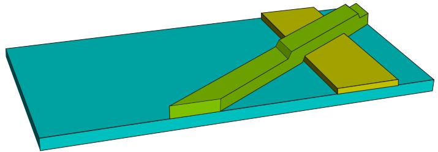  
Figure 1: A composite layup.

A ply represents a single piece of material that is placed in a mold during the composites manufacturing process. A composite layup can contain a different number of plies in different regions. For example, the composite layup in Figure 1 includes regions that contain a single ply, regions where two plies overlap, and a region where three plies overlap.

Figure 2 shows the same model that is depicted in Figure 1 but defined using composite shell sections. The number of plies cannot change within a composite shell section. Therefore, four composite shell sections, each with a constant number of plies, are required to define this simple model. Section 1 contains a single ply, sections 2 and 3 each contain two plies, and section 4 contains three plies.

  
Figure 2: Composite shell sections.

Composite layups in Abaqus/CAE are designed to help you manage a large number of plies in a typical composite model. In contrast, composite sections are a product of finite element analysis and may be difficult to apply to a real-world application. Unless your model is relatively simple and all plies cover the same region, you will find it increasingly difficult to define your model using composite sections as you increase the number of plies. It can also be cumbersome to add new plies or remove or reposition existing plies.

The procedure for creating a composite layup with Abaqus/CAE mirrors the procedure for creating a real composite part—you start with a basic shape and then you add plies of different materials and thicknesses to selected regions and orient the plies to provide the greatest strength in a particular direction. The Abaqus/CAE composite layup editor allows you to easily add a ply, choose the region to which it is applied, specify its material properties, and define its orientation. You must specify ply names that are unique throughout the entire model to ensure the correct display of ply-based results. You can also read the definition of the plies in a layup from the data in a text file. This is convenient when the data are stored in a spreadsheet or were generated by a third-party tool. You can also suppress plies in your layup and experiment with the effect of adding and removing plies of different orientations.

It is important to specify the correct orientation of the fibers in a ply. Abaqus/CAE allows you to define a reference orientation for the layup as well as a reference orientation for each ply in the layup. In addition, you can specify the direction of the fibers in a ply relative to the reference orientation of the ply. By default, the coordinate system of a layup is the same as the coordinate system of the part; similarly, the coordinate system of a ply is the same as the coordinate system of the layup. Orientation definition is described in more detail in Understanding composite layups and orientations.

Using a composite layup to model a yacht hull, illustrates how you can analyze a complex three-dimensional model using the composite layup capability in Abaqus/CAE.

## Creating a composite layup

Abaqus/CAE allows you to define composite layups for three types of elements: conventional shells, continuum shells, and solids. For detailed instructions, see the following sections:

Creating conventional shell composite layups  
Creating continuum shell composite layups  
Creating solid composite layups

You create a composite layup in the Property module. The composite layup editor provides a table that you use to define the plies in the layup. For each ply you specify the ply's name, material, thickness, and orientation, as well as the number of integration points and the region of the model to which the ply is assigned. The composite layup editor's ply table is shown in Figure 1.

  
Figure 1:The ply table in the composite layup editor.

The ply table provides several options that make it easier for you to define a layup containing many plies; for example, the ply table allows you to do the following:

• Move or copy selected plies up or down in the table.  
• Suppress or delete selected plies.  
• Pattern a group of selected plies.  
• Read ply data from or write ply data to an ASCII file. The data can define all the plies in the layup or only a subset of the plies in the layup.

The ability to suppress plies allows you to easily experiment with different configurations of plies in the composite layup and to see the effect on the results of an analysis of the model. For more information, see Using the ply table when defining a composite layup.

If you are defining a composite layup whose plies are symmetric about a central core, you only need to enter the bottom half of the layup in the ply table. When you apply the symmetry option, Abaqus automatically creates additional plies in the generated sections by repeating the entered plies (including the central ply) in reverse order.

You will probably have to partition your model to create the regions to which you will assign plies. You should create the partitions before you create the layup and start defining plies. You can select a region directly from the part in the current viewport, or you can create a named set that refers to the region and select the named set. Abaqus/CAE preserves any existing ply regions if you decide to add partitions and plies after you have defined a composite layup; for example, you can add plies to a layup that model a rib providing additional stiffness to a region. The region to which you assign a ply can be either Abaqus/CAE geometry or a mesh. You can combine plies assigned to geometry and plies assigned to a native mesh in a single composite layup.

Continuum shell and solid composite layups are expected to have a single element through the entire thickness across a combination of all the regions specified in the composite layup. Each single element through the thickness contains the multiple plies that you defined in the ply table. If the region to which you assign your continuum shell or solid composite layup contains multiple elements through the thickness, each element will contain all of the plies that you defined in the ply table and the analysis results will not be as expected.

If your model contains multiple continuum shell or solid elements through the thickness of a region, you can obtain correct results by defining a separate composite layup for each layer of elements. You can define a composite layup for each layer by selecting the elements of a native Abaqus/CAE mesh or the orphan elements when you specify the region of the layup. You must create a layup for each layer of elements.

If you have plies that overlap in your composite layup, you must enter the plies in the ply table in the order that they appear in the overlapping region. Figure 2 illustrates a simple example of an overlapping region and the corresponding order of the plies in the ply table. The first ply in the ply table represents the bottom ply in the layup.

  
Figure 2: The order of the plies in the ply table.

Under certain circumstances, Abaqus cannot determine the orientations of the composite ply for conventional shells. This can occur, for example, if your ply makes a sharp transition through an angle of 90°, and/or your part is aligned with one or more planes of the global coordinate system. To help you diagnose the problem region, Abaqus/CAE draws a collapsed coordinate system indicating regions for which the user-selected coordinate system and the geometric normal cannot be resolved into a valid orientation for display purposes. If this situation arises, you may be able to complete the analysis by splitting the ply into multiple plies at the transitions and by assigning orientations to each new ply.

If you apply a composite layup and assign a section assignment to the same region, Abaqus/CAE uses only the properties from the composite layup during the analysis. If you apply two or more composite layups to regions that overlap, Abaqus/CAE uses the properties of the last layup, where “last” refers to the alphabetical order of the names of the composite layups. The default color coding in the Property module uses yellow coloring to indicate a region with

overlapping composite layups and section assignments or to indicate a region with multiple overlapping composite layups.

## Understanding composite layups and orientations

The orientation of the fibers within each ply of a composite layup plays an important role in determining the physical qualities of your model; however, defining this orientation in a model based on a real-world application is not straightforward.

Composite layups in Abaqus/CAE make the process more manageable by deriving the orientation of the fibers from three parameters that are relative to each other—the layup orientation, the ply orientation, and an additional rotation—as shown in Figure 1.


<table><tr><td></td><td></td><td>Ply Name</td><td></td></tr><tr><td>1</td><td>✓</td><td>Ply-1</td><td></td></tr><tr><td>2</td><td>✓</td><td>Ply-2</td><td></td></tr><tr><td>3</td><td>✓</td><td>Ply-3</td><td></td></tr></table>

<table><tr><td></td><td>CSYS</td><td>Rotation Angle</td><td>Integra Point</td></tr><tr><td></td><td></td><td>0</td><td>3</td></tr><tr><td></td><td></td><td>90</td><td>3</td></tr><tr><td></td><td>Datum csys-3.3</td><td>0</td><td>3</td></tr></table>

Figure 1: Determining the ply orientation.

## Layup orientation

The layup orientation defines the base or reference orientation of all the plies in the layup. In conventional and continuum shell layups, Abaqus projects the specified orientation onto the surface of the shell, aligning the direction of the layup orientation that you choose with the shell normal. In solid composite layups the orientation is not projected.

Abaqus/CAE provides several options for defining the layup orientation:

• Part global: By default, the layup orientation is the same as the orientation of the part.  
• Coordinate system: You can create and select a datum coordinate system that defines the orientation.  
• Discrete orientation: You can create a discrete orientation that provides an orientation value for each mesh element to define the orientation.  
• Discrete field: You can create and select an orientation discrete field that defines a spatially varying orientation.  
• User-defined: You can define the orientation in user subroutine ORIENT. This option is valid only for Abaqus/Standard analyses.  
• Normal direction: For all options except User-defined, you can choose which axis defines the approximate normal direction of the composite layup.

Additional rotation: If you choose a Coordinate system, Discrete orientation, or Discrete field to define the layup orientation, you can specify an angle (in degrees) that defines an additional rotation about the specified normal direction for the entire layup. You can use a scalar discrete field to specify a spatially varying additional rotation angle.

## Ply orientation

The ply orientation defines the relative orientation of each ply. In conventional and continuum shell layups Abaqus projects the specified ply orientation onto the surface of the shell so that the ply normal direction is aligned with the shell normal and the layup stacking direction. In solid composite layups the plies are created with respect to the layup stacking direction, and the unprojected ply orientation defines the material orientation within a ply (see Figure 2).

  
Figure 2: Plies and ply orientations for shell and solid composite layups.

Abaqus/CAE calculates the ply orientation from a combination of two variables that you can specify—the coordinate system (CSYS) and a rotation angle about the normal direction.

In cases where Abaqus/CAE attempts to draw coordinate systems for ply orientations in composite layups at singularity points of the system (i.e., points for which the user-selected coordinate system and the geometric normal from either geometry or elements cannot be resolved into a valid orientation for display purposes in Abaqus/CAE), the coordinate system will be drawn collapsed.

If the layup orientation is specified using a discrete field, no display is available for either the layup or ply orientation. For continuum shell elements, Abaqus/CAE does not project the displayed orientations onto the midplane surface. In both of these cases, you can perform a data check and view the output database in the Visualization module to verify the orientations. For more information, see Performing a data check on a model.

## Coordinate system

Abaqus/CAE provides the following options for defining the coordinate system of the ply:

• Layup: By default, the coordinate system of the ply is the same as the coordinate system of the layup.  
CSYS: You can create and select a datum coordinate system that defines the coordinate system of the ply. If you choose to use a coordinate system for a ply, it overrides the layup orientation for that ply.

You can also select the axis of the coordinate system that defines the normal direction of the ply. The axis that you choose appears as the last digit in the CSYS column in the layup table. For example,

Datum csys1.3 indicates that you chose Datum csys-1 to define the coordinate system of the ply, and you chose the 3-axis to define the normal.

## Rotation angle

The rotation angle defines the orientation of the fibers within each ply relative to the ply's coordinate system. For example, in a typical composite the fibers might be oriented at −45° or +90° relative to the coordinate system. You can also use a scalar discrete field to specify a fiber orientation that varies spatially across the ply. If you specify a rotation angle, the ply is rotated counterclockwise about the coordinate system normal, and the angle is measured relative to the 1-axis.

Figure 3 shows the orientation of four plies in a composite layup and the corresponding entries in the layup table.  
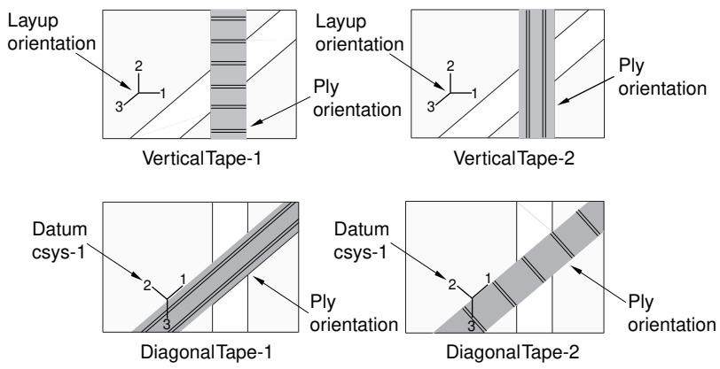

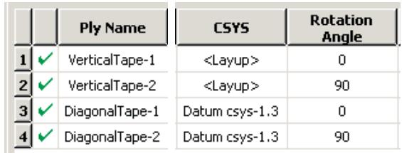  
Figure 3: Determining the orientation of each ply.

Abaqus/CAE determines the ply orientation as follows:

You selected the layup orientation to define the coordinate system of VerticalTape-1 and entered a rotation angle of $0 ^ { \circ }$ . The resulting ply orientation is along the 1-axis of the layup orientation.  
• You selected the layup orientation to define the coordinate system of VerticalTape-2 and entered a rotation angle of $9 0 ^ { \circ }$ . The resulting ply orientation is a rotation of $9 0 ^ { \circ }$ counterclockwise about the 3-axis (the normal direction) of the layup orientation. The rotation angle is measured relative to the 1-axis.  
• You selected Datum csys-1 to define the coordinate system of DiagonalTape-1 and entered a rotation angle of $0 ^ { \circ } .$ . The resulting ply orientation is along the 1-axis of Datum csys-1.  
You selected Datum csys-1 to define the coordinate system of DiagonalTape-2 and entered a rotation angle of $9 0 ^ { \circ }$ . The resulting ply orientation is a rotation of 90° counterclockwise about the 3-axis (the normal direction) of the datum coordinate system. The angle is measured relative to the 1-axis.

## Understanding composite layups and distributions

A discrete field that is used by a composite layup is called a distribution. Because distributions are applied to specific elements and nodes, you can use a distribution only after you have meshed the part.

A discrete field is a spatially varying field where values are associated with a node or an element. The Discrete Field toolset allows you to create and manage discrete fields in Abaqus/CAE. In most cases you will use a third-party preprocessor that operates on meshed parts to create a distribution that can be applied to a composite layup. For more information, see The Discrete Field toolset.

You can use a distribution for the following:

• To define a spatially varying local coordinate system that specifies the overall orientation of the composite layup.  
• To define an additional rotation for the layup orientation that is varying spatially across the layup.  
• To define an additional rotation for a ply orientation that is varying spatially across the ply. You can use a distribution to define the ply orientation only in an Abaqus/Standard analysis.  
• To define an overall shell thickness that varies spatially across a conventional shell composite layup.  
• To define a ply thickness that varies spatially across a ply in a conventional shell composite layup. You can use a distribution to define the ply thickness only in an Abaqus/Standard analysis.  
• To define a nodal thickness that varies spatially across a conventional shell composite layup.  
• To define an offset that varies spatially across a conventional shell composite layup. You can use a distribution to define the offset only in an Abaqus/Standard analysis.

## Requesting output from a composite layup

When you create a composite layup that will be integrated during the analysis, you can specify the number of integration points in each ply of the layup. By default, for shell sections integrated during the analysis Abaqus/CAE creates three integration points for each ply of a shell or continuum shell composite layup and one integration point for each ply of a solid composite layup. For pre-integrated shell sections, Abaqus/CAE creates three integration points for each ply in the layup, and you cannot change this value. Figure 1 shows the integration point numbering for a composite layup with three plies and three integration points per ply.

  
(3 section points per layer)  
Figure 1:The integration point numbering for a composite layup with three plies.

If you do not create an output request, Abaqus writes field output data from only the top and bottom of a composite layup (the highest and lowest integration points), and no data are generated from the other plies. Therefore, if your model contains a composite layup and you want data from individual plies or interior integration points, you must create a new output request or edit the default output request and specify the composite layup from which variables will be output.

When you create an output request, Abaqus/CAE by default writes field and history data to the output database from only the middle section point in each ply of a composite layup. To change the default behavior, you can use the field and history output request editors to edit the output request and change the domain to a composite layup. You can then request field or history data from the top, middle, and/or bottom section point of each ply, from all section points, or from specified section points. For more information, see Modifying field output requests, and Modifying history output requests. You can request the following:

## Selected

Abaqus/CAE writes field data to the output database from the selected section points of each ply (top, middle, and/or bottom). If a ply has an even number of section points and you request output from the middle section point, Abaqus/CAE generates data from the higher of the two section points that span the middle of the ply. For example, if a ply has four section points and you request output from the middle section point, Abaqus/CAE generates data from the third section point.

## All

Abaqus/CAE writes field data to the output database from all of the section points of all of the plies.

## Specify

Abaqus/CAE writes field data to the output database from specified section points. Section points are numbered sequentially from the bottom of the bottom ply to the top of the top ply, where the bottom ply is the first ply in the layup. For example, if you want output from the middle section point of each ply shown in Figure 1, you would enter 2,5,8.

For more information, see Understanding output requests.

## Viewing a composite layup

You can view a composite layup while you are creating it or after it has been analyzed. Abaqus/CAE provides the following tools for ply-based visualization of a composite layup:

## Ply stack plot

A ply stack plot is a graphical representation of the plies from the selected region of a composite layup or a composite section. Figure 1 illustrates a ply stack plot.

  
Figure 1: A ply stack plot.

The staircase appearance does not indicate ply drop-offs in the layup; it is simply a graphical representation that allows you to see the number of plies in the layup and, for example, the relative thickness of a ply, the material from which it is constructed, and the orientation of its fibers. If your composite layup contains many plies, the ply stack plot can become confusing and hard to interpret. To make the ply stack plot more readable, Abaqus/CAE provides options that allow you to view only a manageable number of plies.

The triad in a ply stack plot represents the element orientation system, and it shows the shell normal or stacking direction (the 3-direction) and the 1- and 2-directions for the plies. The fibers are always drawn in the 1–2 plane at an angle with respect to the 1-direction. In solid composite layups the fibers in a ply do not always run parallel to the 1–2 plane (e.g., if the 3-direction of the ply orientation and the element stacking direction are not aligned). In this situation the fibers in the ply stack plot are not a true depiction of the fibers in the layup, but rather a graphical representation of the rotation angles in the layup definition: the angle drawn in the ply stack plot is the rotation angle specified in the ply table measured about the element stacking direction axis. For more information, see Understanding composite layups and orientations.

Ply stack plots do not draw fibers for ply orientations that are based on a user-defined coordinate system or a rotation angle distribution. Abaqus/CAE displays an asterisk (for coordinate systems) or a caret (for rotation angle distributions) on such plies to signify that it cannot draw lines in the 1–2 plane that accurately represent the fiber direction for the ply. Similarly, if you use a discrete field distribution to define a ply's thickness, Abaqus/CAE draws the ply in the ply stack plot based on the average thickness of the other uniform plies in the layup and displays the discrete field name next to the plot (if thickness labels are turned on).

You can display a ply stack plot in the Property module after you have created a composite layup. You can also display a ply stack plot in the Visualization module after you have analyzed a model with a composite layup. For more information, see Viewing a ply stack plot.

## Ply-based results

After you have analyzed a model with a composite layup, you can view a contour plot of results from individual plies of the layup, or you can view an envelope contour plot that looks for maximum or minimum values across all of the plies in the layup.

## Results from individual plies

Ply-based results show the data from a selected ply in a composite layup. For a given ply, you can view data from the bottom, middle, or top of the ply, or you can view data from both the top and bottom plies.

Figure 2 illustrates a contour plot of strain (E11) from selected plies of a composite layup.

E11:  


E11: Top an  


E11:  
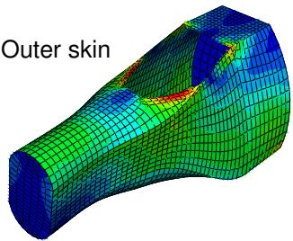  
Figure 2: Contour plots from selected plies.

If the same ply name is used in multiple composite layup definitions within a model, viewing data for this ply displays results for all layups in which the ply name appears. To limit the results to a single ply within a single layup, you must first use a display group to limit the display to the individual composite layup (see Selection methods for creating or editing a display group), then plot the results for a section point within the desired ply (see Selecting section point data by ply).

Contour plots displaying output at both the top and bottom plies of a composite layup vary in appearance depending on the type of layup. In a conventional shell composite layup the two contours appear as a single double-sided shell with different contours on each side. In a continuum shell composite layup or solid composite layup the two contours appear as distinct single-sided contours at each section point location. Figure 3 illustrates the difference between contour plots of conventional shell and continuum shell composite layups.

  
Figure 3: Contour plots of conventional shell and continuum shell composite layups.

Each layup contains three plies, and each plot is showing the output from the top of the top ply and from the bottom of the bottom ply. Stress (S11) is plotted in both cases. For more information, see Selecting section point data by category.

## Envelope plots

An envelope plot allows you to view a contour plot of the highest or lowest value of a variable in your model, regardless of the ply in which it is occurring. The plies in an envelope plot that correspond with the extreme values are called the critical plies. You can choose the criterion that Abaqus/CAE applies (absolute maximum, maximum, or minimum) and the position in the ply at which Abaqus/CAE checks the value (integration point, centroid, element nodal).

For example, even though your composite layup can include a large number of plies, you can view only the critical plies and determine the highest strain that is occurring in each element of your model. You can decide if you want to reduce the strain in the critical plies by increasing the number of plies in a particular region or by reorienting existing plies. Figure 4 shows the value of the strain (E11) in the critical plies of the model.

  
Figure 4: The value of the strain in the critical plies.

In addition, you can use the contour plot options to display a quilt contour plot where the color of each element indicates which ply is the critical ply, as shown in Figure 5.

E, E11 Ply Envelope (max abs)


  
Figure 5: The critical plies.

Using a combination of the plots shown in Figure 4 and Figure 5, you can determine both the value of the strain in the critical ply and the location of the critical ply in the layup. For more information, see Selecting the field output to display, and Understanding how contour values are computed.

If you do not create an output request, Abaqus/CAE writes field output data from only the top and bottom of a composite layup, and no data are generated from the other plies. To create an envelope plot that examines all of the plies in your model, you must create a new output request or edit the default output request and specify the composite layup and the plies and section points from which variables will be output.

In many cases, even though you change the position in the ply at which Abaqus/CAE checks the value, the same ply experiences the extreme value, and the contour plot does not change. However, the contour plot might change because the critical ply changed if:

• you have a small number of plies, and the results are changing rapidly through the thickness of the ply; or  
• the material is nonlinear, and its stiffness changes abruptly under some conditions.

## Through thickness X–Y plots

After you have analyzed a composite layup and determined which regions contain the critical plies, you can view the behavior of the plies across the layup with a through thickness X–Y plot. You can create an X–Y data object by reading field output results from the section points in a selected element of a shell region of your model. If you select an element in a composite layup, Abaqus/CAE plots data for each section point in each ply across the entire thickness of the layup. Figure 6 illustrates a through thickness plot of the strain in the fiber direction through 13 plies of a composite layup. The strain is discontinuous because the orientation of the fiber changes between plies.

  
Figure 6: A through thickness X–Y plot.

For more information, see Reading X–Y data through the thickness of a shell.

## Color coding

You can use color coding in all of the Abaqus/CAE modules to change the color of individual layups and plies. If you choose to color code by plies, Abaqus/CAE displays only one ply in a region, which by default is the last ply (in alphabetical order). To view a different ply, you can deactivate selected plies. For more information, see Coloring geometry and mesh elements.

## Display groups

In the Visualization module you can use display groups to view the elements in only selected layups or plies. For more information, see Selection methods for creating or editing a display group.

Using a composite layup to model a yacht hull, illustrates how you can create and analyze a complex three-dimensional composite model and how you can use Abaqus/CAE to view the behavior of individual plies in the layup.

## Connectors

This section provides information on how to model connectors.

## In this section:

Modeling connectors  
What is a connector?  
What is a connector section?  
What is a CORM?  
What are connector behaviors?  
Creating the connector geometry, connector sections, and connector section assignments  
What is the relationship between reference points and connectors?  
Defining connector orientations in connector section assignments  
Requesting output from connectors  
Applying connector loads and connector boundary conditions  
Displaying connectors and connector output in the Visualization module

## Modeling connectors

The procedure for modeling and using connectors in Abaqus/CAE involves the following general steps:

1. Create reference points and datum coordinate systems to use when modeling connectors.  
2. Create assembly-level wire features.  
3. Create connector sections to define the connection types, connector behavior, and section data.  
4. Create a connector section assignment that associates the connector section with the wires that you select and that specifies the orientations for the first and second points of the wires that you select.  
5. In the Load module, prescribe connector loads and connector boundary conditions to simulate connector actuations and constrain material flow.  
6. In the Step module, create field and history output requests for connectors.  
7. In the Visualization module, plot connector output results; control the display of connector section assignments, wire endpoints, connection types, and current local orientations; and animate the time history of wire endpoints and local orientations.

## What is a connector?

Connectors allow you to model mechanical relationships between two points in an assembly. The connection can be simple, such as a link, or the connection can impose more complicated constraints, such as constant velocity joints. The connector geometry is modeled using an assembly-level wire feature that contains one or more wires. The wires may connect two points in an assembly or connect a point to ground. You create a connector section that specifies the type of connection and connector behaviors, such as spring-like elasticity behavior. To complete the connector modeling, you create a connector section assignment that associates a connector section with the wires that you select and that specifies the orientations for the first and second points of the wires that you select. For more information on connectors, see About Connectors.

For example, Figure 1 illustrates the crank mechanism that is used in the example problem Crank mechanism.

  
Figure 1: A crank mechanism modeled with connectors.

The model transmits a rotational motion through two universal joints and then converts the rotation into translational motion of two slides. An Abaqus Scripting Interface script that reproduces the crank mechanism model using Abaqus/CAE is provided with this example. The crank mechanism is modeled using nine part instances attached to each other through eight connectors modeled in Abaqus/CAE.

## What is a connector section?

A connector section defines the connection type and may include connector behavior and section data. Abaqus provides several connection types—basic types, assembled types, complex types, and MPC types.

## Basic types

Basic connection types include translational types and rotational types. Translational types affect translational degrees of freedom at both endpoints of the wires to which the connector section is assigned and may affect rotational degrees of freedom at the first or both endpoints of the wires. Rotational types affect only rotational degrees of freedom at both endpoints of the wires.

## Assembled types

Assembled connection types are predefined combinations of basic connection types. For example, a HINGE connection type combines a JOIN connection type (translational) and a REVOLUTE connection type (rotational) to join the position of two points and provide a revolute constraint between their rotational degrees of freedom.

## Complex types

Complex connection types affect a combination of degrees of freedom in the connection and cannot be combined with other connection types. They typically model highly coupled physical connections.

## MPC types

MPC connection types are used to define multi-point constraints between two points.

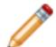

## Note:

Abaqus/CAE writes complete connector section data to the input file only when a connector section has a connector section assignment in the model database. If you plan to import a model from an input file and obtain connector sections, you must make sure that all of the connector sections have assignments in the model database.

For an overview of the connection types that are available in Abaqus/CAE, see Understanding connector sections and functions. For a description of each connection type and the equivalent basic connection types that define the kinematic constraints of assembled type connections, see Connection Types and General Multi-Point Constraints.

## What is a CORM?

CORM is an abbreviation for component of relative motion: relative displacements and rotations local to a connector. Available components of relative motion are relative displacements and rotations that are not kinematically constrained. Depending upon the connection type, some of the components may be available and some may be constrained. When you are creating or modifying a connector section, Abaqus/CAE displays the available and constrained components of relative motion in the editor for the specified connection type. In addition to applying behaviors to the components of relative motion, you can prescribe connector loads and connector boundary conditions to the available components of relative motion of a connector (see Applying connector loads and connector boundary conditions). For more information on creating connector sections, see Connector section editors.

## What are connector behaviors?

After you specify a connection type for a connector section, you can define behaviors for the components of relative motion. You can specify the following connector behaviors:

• Elasticity  
• Damping  
Friction  
• Plasticity  
• Damage  
Stop  
• Lock  
Failure

• Reference length

• Integration (Abaqus/Explicit analyses only)

For more information on behaviors, see Connector behaviors, and Connector Behavior.

## Creating the connector geometry, connector sections, and connector section assignments

You create the assembly-level wire features, connector sections, and connector section assignments in the Interaction module to model a connector. Abaqus/CAE provides two methods for modeling connectors: you can use the Connector Builder to perform all the steps involved in creating a single connector, including creation of the wire feature, connector section, connector section assignment, and any desired reference points and datum coordinate systems; or you can create multiple connectors by creating the wires, connector sections, and connector section assignments in separate dialog boxes in the Interaction module. If you choose the latter technique, you should create the desired reference points and datum coordinate systems before you begin modeling the connectors.

The Model Tree, shown in Figure 1, is helpful for understanding the organization of the reference points, datum coordinate systems, and wire features that you created in assembly-related modules, as well as connector sections and connector section assignments that you created in the Interaction module. You can use the Query toolset in the Interaction module to obtain connector assignment information for selected wires.

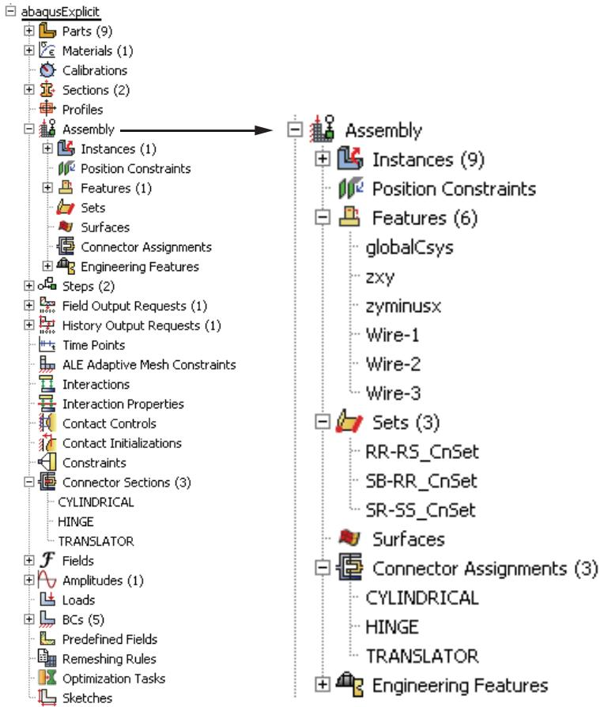  
Figure 1: Wire features, connector sections, and connector section assignments in the Model Tree.

For detailed instructions, see the following sections:

Selecting a process for defining connector geometry  
Creating a single connector  
Creating or modifying wire features for multiple connectors  
Creating connector sections  
Creating and modifying connector section assignments

Using the Query toolset to obtain connector assignment information

## What is the relationship between reference points and connectors?

The points that you can use to define an assembly-level wire feature can be one of the following:

• Vertex or node of a part instance  
• Reference point of a part instance or of an assembly  
• Ground

Using a reference point is often more convenient than using a point or node on the assembly because the same reference point can be used by a rigid body or coupling constraint. In the Part module you can use the Reference Point toolset to create one reference point on each part; additional reference points can be created in the Assembly module, Interaction module, and Load module.

You can use the Model Tree to rename reference points with more descriptive feature names. Descriptive names allow you to more easily associate reference points and wires in a complex model, as shown in Figure 1.

  
Figure 1:The Model Tree for the crank mechanism.

If you want to use different feature names and labels for a reference point on multiple instances of the same part, you must create the reference points in an assembly-related module. You can create a node on a mesh using the Edit Mesh toolset and then select the node to define an endpoint of an assembly-level wire; however, the node is not listed in the Model Tree and has no label in the viewport. For more information on creating and renaming reference points, see The Reference Point toolset. For more information on creating a node on a mesh, see Manipulating nodes.

Each reference point or node that defines an endpoint of an assembly-level wire needs to be associated with the model geometry, even if they are created in the Part module. In many cases you will create a rigid body constraint or a coupling constraint (to distribute forces to an area instead of to a single point) between the reference point or node and a part instance. As a result, the motion of the wire endpoint will be constrained to the motion of the part instance. You create constraints in the Interaction module. For more information, see Understanding constraints.

## Defining connector orientations in connector section assignments

When you model a connector, you may need to specify the orientation of the connector. Orientations for a connector may be required, optional, or not applicable, depending upon the connection type. In most cases the orientation will not be the same as the global coordinate system, and you must create a datum coordinate system that defines the connector's local orientation before you create a connector section assignment. Connector orientation requirements are described in Connection Types.

You can create datum coordinate systems in the Part module, Property module, Assembly module, Interaction module, Load module, and Mesh module. You can name a datum coordinate system when you create it. When you create a connector section assignment, you can select a datum coordinate system from the current viewport or you can select from a list of coordinate system names in a dialog box. Again, the Model Tree is helpful for understanding the organization of your datum coordinate systems. Datum coordinate systems are described in Methods for creating a datum coordinate system.

## Requesting output from connectors

You can request field and history output for connectors by selecting a set that contains wires as the domain from which the output will be generated. In the Step module choose Sets as the domain type in the field output request editor or history output request editor; then select a set containing wires from the list of sets available. For more information, see Creating and modifying output requests.

## Applying connector loads and connector boundary conditions

In the Load module you can apply a connector force or connector moment to the available components of relative motion of a connector to simulate connector actuation. Similarly, you can prescribe a connector displacement, connector velocity, or connector acceleration for the available components of relative motion of a connector. When you create these connector loads or boundary conditions, you select the wires to which you want to apply the prescribed condition. The best approach for selecting wires is to use the default geometry set name for the wire feature (see Creating or modifying wire features for multiple connectors, for more information). The wires that you select must be associated with a connector section assignment. If you select multiple wires, you must ensure that the connector sections assigned to the wires in the connector section assignments have the available components of relative motion for which you want to define forces or moments. If there are insufficient available components of relative motion for the connector force or connector moment, a message appears asking you to select different wires or to change the connection type.

You can also apply a connector material flow boundary condition to the endpoints of wires that are associated with connector section assignments. For more information, see Creating loads, and Creating boundary conditions.

## Displaying connectors and connector output in the Visualization module

Abaqus/CAE displays connectors modeled using connector section assignments in the Visualization module. You can control the display of connectors using display groups. Each connector is listed as an element set in the output database. For more information on display groups, see Creating or editing a display group.

You can also use the Entity Display options in the ODB Display Options dialog box to control the display of symbols that represent connectors. You can control the following:

• The highlighting of wire endpoints  
• The display of local orientation axes for connectors  
• The display of connector type labels  
• The size of the displayed symbols

For information on the symbols that represent connectors modeled in Abaqus/CAE, see Understanding symbols that represent interactions, constraints, and connectors. For more information on controlling the display of the symbols, see Controlling the display of model entities.

For example, you can use display groups to display four part instances and three connector element sets of the crank mechanism, as shown in Figure 1.

  
Figure 1: Selected part instance, connector, and connector symbol display in the Visualization module for the crank mechanism.

The highlighting of the wire endpoints and the display of connector type labels have been toggled off so that only the local connector orientations are displayed. You can produce a time history animation to view the changes in the connector orientations during the mechanism operation. For more information, see Time history animation.

For information on plotting connector output results, see Contouring analysis results, Plotting analysis results as symbols, and X–Y plotting.

The kinematics of connection types is formulated using an intrinsic coordinate system. The basis vectors of the intrinsic coordinate system are aligned with the directions associated with the components of relative motion. For some connection types (such as the CARTESIAN connection type), the intrinsic coordinate system aligns with the orientation directions at node a (see Connection Types for more information on connector orientation directions).

The components of connector vector output are resolved with respect to different coordinate systems depending on whether the output requested is field output or history output. For connector field output, the components of the vector are resolved with respect to the orientation directions at node a. However, if either of the two nodes is ground, the output of the axial connector is CTF1. For connector history output and connector field outputs with the "\_LOCAL" suffix (for example, CTF\_LOCAL, CTM\_LOCAL), the components of the vector are resolved with respect to the intrinsic coordinate system. Therefore, except for the connection types whose intrinsic coordinate systems align with the orientation directions at node a, plots of field output (symbol plots and contour plots) and history plots display different values for the requested connector vector components; the resultant is not affected by the choice of the coordinate system used to resolve the components.

## Additional information

• Connectors  
• Understanding contour plotting  
• Understanding symbol plotting

This section provides information on how to model continuum shells.

## In this section:

Modeling continuum shells  
Meshing parts with continuum shell elements

## Modeling continuum shells

You use conventional shell parts to model structures in which the thickness is significantly smaller than the other dimensions, and you define the thickness in the Property module when you create the section.

In contrast, you assign continuum shell elements to solid parts, and Abaqus determines the thickness from the geometry of the part. From a modeling point of view continuum shell elements look like three-dimensional continuum solids, but their kinematic and constitutive behavior is similar to conventional shell elements. For example, conventional shell elements have displacement and rotational degrees of freedom, while continuum solid elements and continuum shell elements have only displacement degrees of freedom. For more information, see About Shell Elements and Choosing a Shell Element. Figure 1 illustrates the differences between a conventional shell and a continuum shell element.

  
Figure 1: Conventional versus continuum shell element.

The general procedure for modeling continuum shells in three-dimensional space involves the following steps:

1. In the Part module, define the solid geometry.  
2. In the Property module, assign a shell section to any solid regions to which you will assign continuum shell elements in the Mesh module. You must specify the thickness of a shell section; however, Abaqus uses this thickness only to estimate certain section properties, such as hourglass stiffness. Abaqus uses the actual thickness, based on the element nodal geometry, during the analysis. If the thickness of the solid region varies along its length, you should provide an approximate value of the thickness. For more information, see Using a Shell Section Integrated during the Analysis to Define the Section Behavior.  
3. In the Mesh module, query the mesh stack orientation. If necessary, assign a stack orientation so that the continuum elements are aligned consistently from the bottom to the top of the stack. See Applying a mesh stack orientation, for more information.  
4. In the Mesh module, assign a continuum shell element type to the region, and mesh the region with hexahedral or wedge elements. These are the only elements that can be stacked to form a continuum shell mesh.

## Meshing parts with continuum shell elements

You use continuum shell elements to model shell-like solids with greater accuracy than conventional shell elements, as described in About Shell Elements. In addition, although you model a continuum shell with hexahedral- or wedge-shaped elements, the element formulations are still more computationally efficient than solid continuum elements.

When you are generating elements that will be assigned to continuum shell elements, the elements in the mesh must be oriented consistently. For example, Figure 1 shows a swept mesh generated in the direction of the sweep path. The generated elements are stacked in the direction of the sweep path; however, if you plan to use continuum shell elements, the elements should be stacked through their thickness.

  
Figure 1:The resulting stack direction is not correct for continuum shell elements.

You can use the Query toolset to determine which faces are designated as the bottom face and the top face and to look for inconsistent orientations between elements. For more information, see Obtaining general information about the model. In some cases, you can partition the model and change the direction of the sweep path to obtain the correct orientation. Alternatively, you can assign an orientation unrelated to the sweep path. For more information, see Applying a mesh stack orientation.

## Co-simulation

This section explains how to model and run a co-simulation in Abaqus/CAE.

## In this section:

Overview of co-simulation  
What is a co-simulation?  
Linking and excluding part instances for a co-simulation  
Ensuring matching nodes at the interface regions  
Specifying the interface region and coupling schemes  
Identifying the models involved and specifying job parameters  
Viewing the results of the co-simulation

## Overview of co-simulation

The procedure for modeling and running a co-simulation in Abaqus/CAE involves the following general steps:

1. Create the models in a single model database.  
2. Optionally, link part instances between models and exclude the linked instances from the analyses.  
3. Optionally, ensure matching nodes at the interface regions.  
4. In each model, create a co-simulation interaction to specify the interface region and coupling schemes.  
5. Create a co-execution to identify the two models involved and specify the job parameters for each analysis.  
6. Submit the co-execution to perform the co-simulation.  
7. View the results of the co-simulation using overlay plots.

## What is a co-simulation?

The co-simulation technique is a multiphysics capability that provides run-time coupling of Abaqus analysis programs. You can divide a model into multiple domains and use different analysis programs to obtain solutions for each domain. For Abaqus/Standard to Abaqus/Explicit co-simulation, each Abaqus analysis operates on a complementary section of the model domain where it is expected to provide the more computationally efficient solution. For example, Abaqus/Standard provides a more efficient solution for light and stiff components, while Abaqus/Explicit is more efficient for solving complex contact interactions.

You define the interface region across which fields are exchanged and the coupling schemes. For more information, see Structural-to-Structural Co-Simulation.

## Additional information

• Preparing an Abaqus Analysis for Co-Simulation

## Linking and excluding part instances for a co-simulation

For a co-simulation you may want to see the “whole” model involved in the co-simulation in a single viewport. To achieve this, you can link part instances in one model to part instances in the other model. For example, you can link part instances from the Abaqus/Standard model to part instances in the Abaqus/Explicit model. In this case, the linked part instances in the Abaqus/Standard model cannot be edited, their position is determined solely by the position of the part instance in the Abaqus/Explicit model, and they are available only for display purposes. Any changes to the part instances in the Abaqus/Explicit model are automatically updated in the linked part instances. You must exclude the linked part instances from the appropriate analysis; for example, the part instances in the Abaqus/Explicit model that are linked to the Abaqus/Standard model must be excluded from the Abaqus/Explicit analysis. For more information, see Linking part instances between models, and Excluding part instances from an analysis.

## Ensuring matching nodes at the interface regions

You may have dissimilar meshes in regions shared in the model definitions. For Abaqus/Standard to Abaqus/Explicit co-simulation, you can improve solution stability and accuracy in some cases by ensuring that you have matching nodes at the interface (see Dissimilar Mesh-Related Limitations). This section describes the recommended modeling practices for ensuring matching nodes at the interface regions.

In general, you will create a skin or a stringer (depending on whether the interface region is a face or an edge) on the part that contains the interface region in the Abaqus/Explicit model, perform a variety of modeling techniques, and obtain a part instance to use to define a tie constraint in the Abaqus/Standard model.

Detailed instructions are provided in the following procedure.

1. In the Abaqus/Explicit model:

a. In the Property module display the part that contains the interface region. If the interface region is a face, create a skin on the face. If the interface region is an edge, create a stringer on the edge. For more information, see Skin and stringer reinforcements.  
b. If the part is geometry based, mesh the part.  
c. Create a mesh part (even if you are working with a mesh part).  
d. Delete all of the elements in the newly created mesh part other than those on the skin or stringer. In addition, delete the associated unreferenced nodes using the Edit Mesh toolset.

2. In the Abaqus/Standard model:

a. Copy the mesh part containing the skin or stringer from the Abaqus/Explicit model, and create an instance of the newly copied part.  
b. To simplify region selection procedures, create a named set or surface that contains the mesh part.  
c. In the Interaction module, create a tie constraint specifying the copied mesh part (using the named set or surface) as the main region and the interface region on the Abaqus/Standard model as the secondary region.  
d. In the Interaction module, define a Standard-Explicit co-simulation interaction and specify the mesh part (using the named set or surface) as the interface region. For more information, see Specifying the interface region and coupling schemes.

3. In the Abaqus/Explicit model:

a. Delete the mesh part that contains the skin or stringer.  
b. Delete the skin or stringer from the part geometry.  
c. If the part is geometry based, remesh the part.  
d. In the Interaction module, define a Standard-Explicit co-simulation interaction and specify the interface region in the original Abaqus/Explicit part as the interface region.

4. Continue with the co-simulation procedure as described in Overview of co-simulation.

## Specifying the interface region and coupling schemes

In each model, you define a co-simulation interaction to specify the interface region (region for exchanging data) and coupling schemes for the co-simulation. Only one co-simulation interaction can be active in each model, and the settings in each co-simulation interaction must be the same in each model. For more information, see Defining a Standard-Explicit co-simulation interaction.

## Identifying the models involved and specifying job parameters

For co-simulation, the analyses are executed in synchronization with one another using the same functionality as that used for executing a single analysis job. In the Job module, you create a co-execution to identify the two analysis jobs involved in the co-simulation and to specify job parameters for each analysis, and you submit the co-execution to submit both jobs for analysis. For more information, see Creating, editing, and manipulating co-executions.

## Viewing the results of the co-simulation

To display the results from the co-simulation, you can use the overlay plot functionality to display data from both output databases in the same viewport. For more information, see Overlaying multiple plots.

## Display bodies

This section provides information on how to model display bodies.

## In this section:

What is a display body?  
Should I mesh a display body?  
Displaying display bodies in the Visualization module

## What is a display body?

A display body is a part instance that will be used for display only. The part instance can be any instance containing geometry, mesh elements, or a combination of geometry and mesh. You do not have to mesh the part, and the part is not included in the analysis; however, when you view the results of the analysis, the Visualization module displays the part along with the rest of your model. In effect, a display body provides a more realistic view of your model in the Visualization module without the computational expense of including the part instance in the analysis. A display body behaves like a rigid part and does not deform. You cannot apply prescribed conditions, such as constraints, loads, or boundary conditions, to a display body.

You can associate the motion of a display body with selected control points (one point or three points), or you can specify that the display body remain fixed during the analysis. If the display body follows a single point, the display body will translate and rotate based on the translations and rotations of the single point. If the display body follows three points, the display body will translate and rotate based on the translation of the three points. For more information, see Display Body Definition.

For example, Figure 1 shows a backhoe arm modeled with connectors.

  
Figure 1: A backhoe arm modeled with connectors.

The region of interest is the main arm of the backhoe. The bucket interacts with the rest of the backhoe model only through the connectors and the mass and inertia of the bucket. As a result, the bucket can be modeled as a display body.

You create a display body by applying a display body constraint to a part instance. For the backhoe arm model you would first create the bucket part instance in the Part module. In addition, you would create a point part and position it at the centroid of the bucket in the assembly, as shown in $F i g u r e 2$ (see Point parts); a reference point is automatically created for the point part.

  
Figure 2:The mass and inertia of the bucket are modeled with a point part.

The other two reference points in the assembly serve as endpoints for a HINGE and an AXIAL connector; see Connectors for more information on connectors. In the Interaction module you would create a rigid body constraint to constrain the endpoints and the point part to move as a single rigid entity, as shown in Figure 3; see Defining rigid body constraints.

  
Figure 3: A rigid body constraint constrains the point part to the endpoints.

In addition, you would create a display body constraint to constrain the bucket part instance to the point part; see Defining display body constraints.

You do not have to mesh the bucket part instance, and it is not included in the analysis of the backhoe model. However, the bucket still appears when you view the results of the analysis in the Visualization module, as shown in Figure 4.

  
Figure 4:The bucket is modeled as a display body.

Display bodies are useful if your model contains a part that cannot be meshed and need not be analyzed. In general, an imported part that has invalid geometry cannot be used by Abaqus/CAE unless you choose to ignore the invalidity of the part (for more information, see Working with invalid parts). If you apply a display body constraint to the invalid part, you can continue to use the part in your model, although the part will not be included in the analysis. For more information, see What is a valid and precise part?.

## Should I mesh a display body?

You do not have to mesh a display body. However, to display the part instance in the Visualization module, Abaqus/CAE computes a triangular mesh that models the surfaces of the part instance. This internal mesh is written to the input file and to the resulting output database; however, it is used only to render the display and is not included in the numerical analysis. By default, the Visualization module displays only the free edges of the meshed display body part instance, although you can change the visible edges displayed.

Similarly, if you do mesh a display body or if you use a mesh part to create a display body, Abaqus/CAE retains your mesh when the input file is generated; however, it is used only to render the display in the Visualization module and is not included in the numerical analysis.

## Displaying display bodies in the Visualization module

You can use the Display Body Options in the Visualization module to customize the appearance of display bodies. The options available for display bodies are similar to the common and superimposed plot options in Abaqus/CAE: render style; edge visibility, color, and style; fill color; scaling; and translucency can all be customized. Similarly, display body options are plot state–independent; i.e., the options applied to display bodies are reflected in all plot states. For more information, see Customizing the appearance of display bodies.

Display body options apply to all display bodies in your model; to customize the appearance of individual display bodies, you can create display groups based on part instances (see Creating or editing a display group). Individual item coloring can also be applied to individual display body part instances to override the edge and/or fill colors specified as general display body options; see Customizing the display color of individual objects for more information.

This section explains how to create Eulerian models in Abaqus/CAE.

## In this section:

Overview of Eulerian analyses  
Assembling coupled Eulerian-Lagrangian models in Abaqus/CAE  
Defining contact in Eulerian-Lagrangian models  
Assigning materials to Eulerian part instances  
Using the volume fraction tool  
Eulerian mesh motion  
Viewing output from Eulerian analyses

## Overview of Eulerian analyses

Pure Eulerian analysis is a finite element technique in which materials are allowed to flow across element boundaries in a rigid mesh.

In the more traditional finite element formulation (also known as the Lagrangian technique), materials are closely associated with an element, and the materials move only with the deformation of the mesh. Because the element quality issues associated with a deformable mesh are not present in Eulerian analyses, the Eulerian technique can be very effective at treating problems involving very large deformations, material damage, or fluid materials. Eulerian analysis can be performed only in Dynamic, Explicit steps. For a detailed discussion of Eulerian capabilities and applications, refer to Eulerian Analysis.

The techniques for modeling pure Eulerian analyses in Abaqus/CAE are very different than those used to model pure Lagrangian analyses. Most notably, instead of defining several parts and assembling them into a complete model, Eulerian models typically consist of a single Eulerian part. This part, which can be arbitrary in shape, represents the domain within which Eulerian materials can flow. The geometry of bodies in the model is not necessarily defined by the Eulerian part; instead, materials are assigned to different regions within the Eulerian part instance to define the body geometries.

Figure 1 compares the same model created using Lagrangian and Eulerian techniques. In the Lagrangian model, two parts are modeled, and each part is assigned a unique section referencing a material. In the Eulerian model, a single Eulerian part is modeled and assigned an Eulerian section. The Eulerian section defines the materials that can be present within the part. Materials are then assigned to different regions within the instanced part; any region without a material assignment is treated as a void with no material properties.

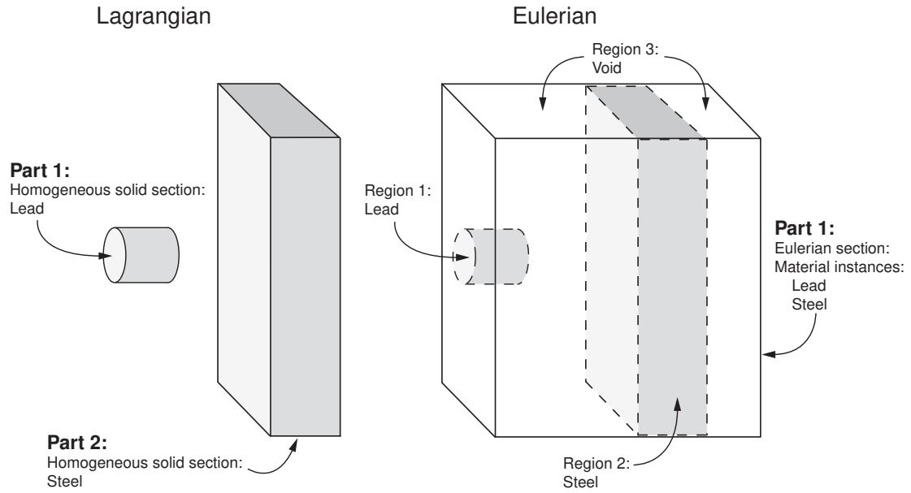  
Figure 1:Two bodies modeled using Lagrangian and Eulerian techniques.

The Eulerian analysis technique can be coupled with traditional Lagrangian techniques to extend the simulation functionality in Abaqus:

Arbitrary Lagrangian-Eulerian (ALE) adaptive meshing is a technique that combines features of Lagrangian and Eulerian analysis within the same part mesh. ALE adaptive meshing is typically used to control element distortion in Lagrangian parts undergoing large deformations, such as in a forming analysis. Most ALE adaptive meshing analyses can also be performed as pure Eulerian analyses, but some of the features associated with a Lagrangian mesh will be lost; for a more detailed comparison, see About ALE Adaptive Meshing.  
Coupled Eulerian-Lagrangian (CEL) analysis allows Eulerian and Lagrangian bodies within the same model to interact. Coupled Eulerian-Lagrangian analysis is typically used to model the interactions between a solid body

and a yielding or fluid material, such as a Lagrangian drill traveling through Eulerian soil or an Eulerian gas inflating a Lagrangian airbag. Eulerian-Lagrangian analysis is discussed in Assembling coupled Eulerian-Lagrangian models in Abaqus/CAE.

Viewing the results of Eulerian analyses requires some special techniques in the Visualization module. These techniques are discussed in detail in Viewing output from Eulerian analyses.

The procedure for creating Eulerian models in Abaqus/CAE involves the following general steps:

1. In the Part module, create an Eulerian-type part that defines the geometric region within which Eulerian materials can flow. For more information, see Choosing the type of a new part.  
2. In the Part module, you may want to create partitions that represent the initial boundaries between different materials in the part. The partitions will affect the mesh of the part, and they are necessary only if you are assigning materials uniformly across a region. For more information about assigning materials in an Eulerian part, see Assigning materials to Eulerian part instances, and Defining a material assignment field.  
3. In the Property module, define the materials in the model.  
4. In the Property module, define and assign an Eulerian section for the model. The Eulerian section determines which materials can be present in the Eulerian part. The topology of the materials within the part will be defined in the Load module, as discussed in Step 7. For more information, see Creating Eulerian sections.  
5. In the Assembly module, create an instance of the Eulerian part.  
6. In the Step module, create a field output request for output variable EVF. This output is necessary to view the deformation of materials in an Eulerian model. For more detailed information, see Viewing output from Eulerian analyses.  
7. In the Load module, create a material assignment predefined field that defines the topology of materials in the initial configuration of the Eulerian part instance. For more information, see Assigning materials to Eulerian part instances, and Defining a material assignment field.  
8. In the Load module, define any loads or boundary conditions acting on the model. Because the mesh in an Eulerian part is rigid, traditional Lagrangian prescribed conditions do not move with the material deformations; loads and boundary conditions are imposed on any material that occupies (or moves into) the region to which the condition is prescribed. Zero-displacement boundary conditions can be used along the sides of an Eulerian part instance to prevent Eulerian material from entering or exiting the part. Boundary conditions and constraints based on nonzero nodal displacements are ignored in an Eulerian part instance; typically, velocity boundary conditions or predefined fields are used to prescribe initial motion in an Eulerian model. Specialized Eulerian boundary conditions can also be defined to control the flow of material across the boundaries of the Eulerian part (see Defining an Eulerian boundary condition). For more information about applying loads and boundary conditions to Eulerian models, see Boundary Conditions.  
9. In the Mesh module, create a hexagonal mesh for the Eulerian part. EC3D8R elements are assigned to the mesh by default. After creating a regular mesh, you can trim any elements that are not expected to experience material flow to reduce the model size and improve performance of the analysis.

An example of a basic Eulerian model created in Abaqus/CAE is provided in Eulerian analysis of a collapsing water column. More complicated Eulerian modeling procedures, including complex material assignments and coupled Eulerian-Lagrangian interactions, are illustrated in Impact of a water-filled bottle.

## Assembling coupled Eulerian-Lagrangian models in Abaqus/CAE

Abaqus allows you to create models that include both Eulerian part instances and Lagrangian part instances. During a coupled Eulerian-Lagrangian analysis, the Lagrangian mesh interacts with the materials in the Eulerian part. Coupled Eulerian-Lagrangian analyses typically offer better interpretation of contact conditions than pure Eulerian analyses, particularly for interactions between fluid and solid materials. During postprocessing, a solid Lagrangian body in a coupled Eulerian-Lagrangian analysis appears to maintain its shape better than a similar body in a pure Eulerian analysis.

Figure 1 compares a pure Eulerian analysis (top) and a coupled Eulerian-Lagrangian analysis (bottom) of a steel brick passing through a column of water.  
  
Figure 1: Comparison of a pure Eulerian analysis (top) and a coupled Eulerian-Lagrangian analysis (bottom).

In the Eulerian analysis the water tends to adhere to the sides of the brick, and the brick appears deformed in the final configuration. This apparent deformation is a result of the material volume fraction calculations used for Eulerian materials, as discussed in Material Interfaces. On the other hand, the Lagrangian brick maintains its shape as it passes through the Eulerian water, and the water flows around the brick.

Coupled Eulerian-Lagrangian analyses also allow you to capitalize on the strengths of both analysis techniques; for example, you can use the loads on a Lagrangian body moving through an Eulerian material to drive a detailed submodel of the Lagrangian body.

To assemble a coupled Eulerian-Lagrangian model in Abaqus/CAE, simply instance both Eulerian and Lagrangian parts in the same assembly. Coupled Eulerian-Lagrangian analyses can be performed only in Dynamic, Explicit steps. You must create a general contact definition to enable contact between Lagrangian and Eulerian parts. The general contact definition allows interactions between Lagrangian surfaces and Eulerian material instances in the model (see

Defining contact in Eulerian-Lagrangian models for more information). Other interactions, loads, boundary conditions, and predefined fields are applied to the Lagrangian and Eulerian parts in the usual manner.

In most cases the Lagrangian part is assembled inside of the Eulerian part instance. While Lagrangian and Eulerian elements and nodes can overlap, three-dimensional Lagrangian elements cannot occupy the same space as an Eulerian material instance. Therefore, Lagrangian parts must be instanced in an area of void within the Eulerian part instance (i.e., a region with no material assignment). To model a three-dimensional Lagrangian part instance that is completely surrounded by Eulerian material, use the volume fraction tool to create an Eulerian material assignment field that includes a void region corresponding to the Lagrangian part instance (see Using the volume fraction tool for details).

## Defining contact in Eulerian-Lagrangian models

Contact in a coupled Eulerian-Lagrangian analysis must be defined using general contact. The general contact definition enables interactions between Lagrangian part surfaces and the surfaces of Eulerian material instances; contact between different Lagrangian parts in the model is also enabled.

In Abaqus/CAE you can use the global All\* with self contact domain to enforce contact between all Lagrangian parts and all Eulerian material instances in the model. Alternatively, you can include or exclude contact between a Lagrangian surface and a particular Eulerian material instance. Eulerian material instances appear in the list of surfaces in the Include Pairs and Exclude Pairs dialog boxes, as shown in Figure 1. You can also assign unique contact properties between particular Lagrangian surfaces and particular Eulerian material instances in the Individual Contact Property Assignments dialog boxes.

  
Figure 1: Eulerian material instances in the Edit Excluded Pairs dialog box.

True contact cannot be defined between different Eulerian material instances. A rudimentary contact condition is enforced because material instances cannot penetrate each other. However, material instances do not separate once they come into contact, which prevents the modeling of sliding or rebounding behavior. Contact output is not available for Eulerian material instances. For a detailed discussion of Eulerian analysis contact formulations, refer to Interactions. If the contact conditions between two materials are significant to your analysis, at least one of the materials should be modeled as a Lagrangian part.

## Assigning materials to Eulerian part instances

In a pure Lagrangian analysis a section definition includes a reference to a single material. When you assign a section to a region or element in the Lagrangian part, that region or element is completely filled with the referenced material. The geometry of the region or element, therefore, defines the geometry of the material.

In a pure Eulerian analysis the relationship between the section definition and material is fundamentally different. An Eulerian section definition can reference a list of materials. When you assign the Eulerian section to an Eulerian part, you are defining which materials may be present in the part over the course of the analysis. The part, however, is initially empty of material. To introduce material to the initial state of an Eulerian part, you must use a material assignment predefined field.

Material assignment predefined fields rely on the concept of material volume fractions. During an Eulerian analysis, Abaqus tracks the material present in each element in terms of a volume fraction assigned to each material instance; the volume fraction represents the percentage of the element's volume that is occupied by a given material instance. For elements that are partially filled or filled with multiple materials, the exact geometric composition of the material within the element is not known; Abaqus interpolates the material volume fractions from adjacent elements to estimate the material boundaries within the element. These calculations are discussed in more detail in Material Interfaces.

In Abaqus/CAE the initial material volume fractions in an Eulerian part are specified by creating a material assignment predefined field in the Load module. The predefined field associates each region in an Eulerian part instance with a volume fraction for each material instance. The regions to which volume fractions are assigned can be cells (in geometry), mesh elements, or groups of elements. If you select a cell or a group of elements, the volume fraction values are propagated to each of the underlying Eulerian elements in the cell or group.

Volume fractions in a material assignment predefined field are expressed as a number between zero and one; a volume fraction of one indicates that the region is completely filled with the specified material. A volume fraction of less than one indicates that the region is only partially filled with the specified material; for example, a volume fraction of 0.25 means that the specified material instance occupies 25% of the region. As mentioned previously, Abaqus determines the material boundaries for partially filled elements based on the volume fractions in adjacent elements; to achieve greater control over the material boundaries within a region, you must refine the part mesh or redefine the region boundaries.

If material volume fractions are not defined for a region of an Eulerian part instance, that region is assigned a void. Similarly, if the volume fractions for all materials in a region do not sum to one, the remainder of the volume fraction in that region is assigned a void. Void regions do not have material properties, but other materials can flow into and through a void region during an analysis.

The material assignment predefined field effectively defines the topology of materials in the initial configuration of your model. The Eulerian part is typically arbitrary in shape; the material assignment predefined field adds to the part the Eulerian materials that will interact during the analysis. For example, consider the cross-section of the coupled Eulerian-Lagrangian model in Figure 1. The Eulerian part is simply an empty cube. Four regions defined on the part determine the slope of the earth and the amount of water in the tank, and material is assigned to these regions accordingly.

  
Figure 1: Material assignments in an Eulerian-Lagrangian model.

Material assignment predefined fields can be created only in the initial step of an Eulerian analysis. In subsequent steps the materials deform from their initial configuration and flow across the Eulerian mesh according to the forces present in the model.

Abaqus/CAE offers two techniques for defining material assignment predefined fields:

## Uniform definitions

Uniform material assignment field definitions are created by selecting regions from an Eulerian part instance and directly specifying the volume fraction of each material instance within those regions. Geometry must be partitioned into separate cells representing the material regions. In part instances that include orphan elements you can select individual elements to act as regions.

Figure 2 illustrates a material assignment field created using uniform definitions. The Eulerian part is partitioned into three regions, and material volume fractions are defined in each region; each region is completely filled with a single material instance. Volume fractions are not defined for the void region, since void is the default material assignment.

  
Figure 2: A uniform material assignment field.

The uniform material assignment definition should be used only for relatively simple regions that are uniformly filled with material. The partitions needed to create complex regions can negatively impact the quality of the Eulerian mesh, and partially filled regions are difficult to define and interpret, particularly when working with geometry.

For details on creating a uniform material assignment field in Abaqus/CAE, see Defining a material assignment field. An example of a uniform material assignment definition is illustrated in the Python script provided in Deflection of an elastic dam under water pressure.

## Discrete field definitions

Material assignments for meshed geometry and orphan meshes can be defined using a scalar discrete field. For each material instance in the part you create a discrete field that associates individual elements with a volume fraction for that material instance. For more information on creating discrete fields, see The Discrete Field toolset.

When you are assigning materials using a discrete field, you still must select the region of the part instance to which the discrete field applies. If the discrete field includes data for elements outside of the selected region, these data are ignored. The default value associated with the discrete field is assigned to any elements within the selected region that are not explicitly listed in the discrete field.

Figure 3 shows a very simple example of a material assignment defined using discrete fields. The Eulerian part consists of four elements and two material instances. Two discrete fields, as defined in Table 1, are used to specify the material composition within the elements. The boundary between the water and the sand is an estimation based on interpolation of the material volume fractions in adjacent elements.

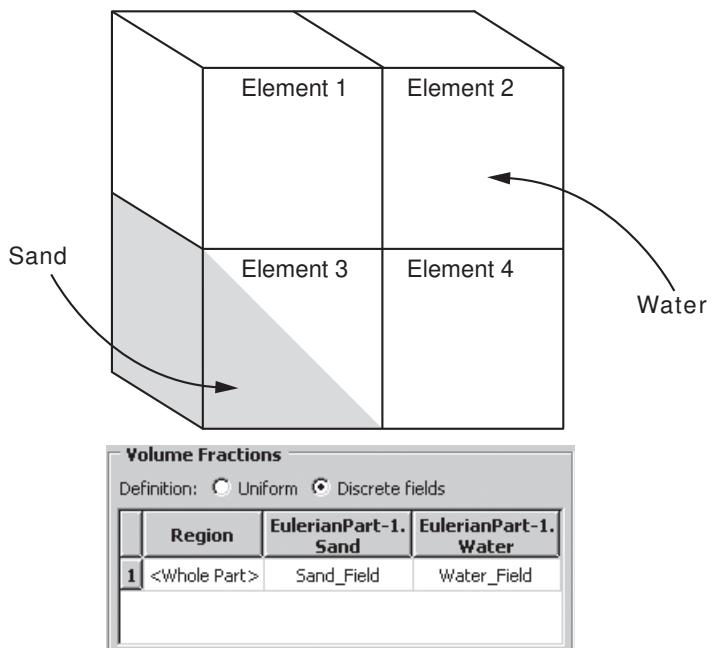  
Figure 3: A discrete field material assignment.

Table 1: Volume fractions defined in discrete fields.

<table><tr><td>Discrete Field</td><td>Element 3</td><td>Default</td></tr><tr><td>Water_Field</td><td>0.5</td><td>1</td></tr><tr><td>Sand_Field</td><td>0.5</td><td>0</td></tr></table>


## Note:

In any given element the sum of all material volume fractions should not be greater than one. Abaqus/CAE assigns volume fractions incrementally by reading the discrete fields in the Volume Fractions table from right to left; once the volume fraction for an element reaches one, additional volume fractions assigned to that element are ignored.

Since the discrete field can assign unique volume fractions to each individual element, it allows more complicated material boundaries than the uniform definition method without the need for excessive partitioning. The volume fraction tool in Abaqus/CAE creates discrete fields specifically for use in material assignment predefined fields. Through this tool, you can define complex Eulerian material regions using the part modeling techniques available in Abaqus/CAE. For more information, see Using the volume fraction tool.

For details on creating a discrete field material assignment in Abaqus/CAE, see Defining a material assignment field. An example of a discrete field material assignment definition (including the use of the volume fraction tool) is illustrated in the Python script provided in Rivet forming.

## Using the volume fraction tool

The volume fraction tool creates a scalar discrete field by performing a Boolean comparison between an Eulerian part instance and a second part instance (the reference part instance) that intersects the Eulerian instance.

The comparison determines where the two part instances overlap, then assigns each element in the Eulerian instance a volume fraction based on the percentage of the element that is also occupied by the reference instance. The volume fraction is specified as a decimal between zero and one.

The discrete field that is created by the volume fraction tool can be used to assign material instances to the Eulerian part instance (see Assigning materials to Eulerian part instances). The topology of the assigned Eulerian material instance corresponds to the shape of the reference part instance within the Eulerian part instance.

Figure 1 and the following procedure summarize the process of using the volume fraction tool:  
(1)  
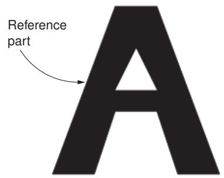

(3)  


(2)  
  
(4)

  
Figure 1: Procedure for using the volume fraction tool.

1. Using any of the modeling tools and techniques in Abaqus/CAE, create a reference part that corresponds to the geometry of the desired Eulerian material region.  
2. Instance the reference part within the Eulerian part instance. The reference part instance should spatially correspond to the desired Eulerian material region.  
3. Use the volume fraction tool to create a discrete field based on a comparison of the reference part instance and the Eulerian part instance.  
4. Define a material assignment predefined field for the Eulerian part instance using the discrete field created by the volume fraction tool.

An option for the volume fraction tool controls whether the calculated discrete field represents the space inside the reference instance (the volume fraction is nonzero in elements that overlap the reference instance) or the space outside the reference instance (the volume fraction is nonzero in elements that do not overlap or partially overlap the reference instance), as depicted in Figure 2.

<table><tr><td>0.0</td><td>0.0</td><td>0.0</td><td>0.0</td><td>0.0</td><td>0.0</td></tr><tr><td>0.0</td><td>0.32</td><td>0.91</td><td>0.91</td><td>0.32</td><td>0.0</td></tr><tr><td>0.0</td><td>0.91</td><td>1.0</td><td>1.0</td><td>0.91</td><td>0.0</td></tr><tr><td>0.0</td><td>0.91</td><td>1.0</td><td>1.0</td><td>0.91</td><td>0.0</td></tr><tr><td>0.0</td><td>0.32</td><td>0.91</td><td>0.91</td><td>0.32</td><td>0.0</td></tr><tr><td>0.0</td><td>0.0</td><td>0.0</td><td>0.0</td><td>0.0</td><td>0.0</td></tr></table>

<table><tr><td>1.0</td><td>1.0</td><td>1.0</td><td>1.0</td><td>1.0</td><td>1.0</td></tr><tr><td>1.0</td><td>0.68</td><td>0.09</td><td>0.09</td><td>0.68</td><td>1.0</td></tr><tr><td>1.0</td><td>0.09</td><td>0.0</td><td>0.0</td><td>0.09</td><td>1.0</td></tr><tr><td>1.0</td><td>0.09</td><td>0.0</td><td>0.0</td><td>0.09</td><td>1.0</td></tr><tr><td>1.0</td><td>0.68</td><td>0.09</td><td>0.09</td><td>0.68</td><td>1.0</td></tr><tr><td>1.0</td><td>1.0</td><td>1.0</td><td>1.0</td><td>1.0</td><td>1.0</td></tr></table>

Figure 2: Discrete fields representing volume fractions inside (left) and outside (right) of the shaded reference region.

Typically, calculating the volume fraction outside of a reference instance is used to create an Eulerian material assignment around a Lagrangian part instance in a coupled Eulerian-Lagrangian analysis. Calculating the volume fraction inside of a reference instance is usually used to model complex material assignment fields within a pure Eulerian part instance; in this situation, the reference instance is suppressed after the Eulerian material is assigned. You can also calculate volume fractions inside of a reference instance to create an Eulerian material assignment on the inside of an enclosed Lagrangian shell in a coupled Eulerian-Lagrangian analysis.

To use the volume fraction tool, select Tools->Discrete Field->Volume Fraction Tool from the main menu bar. For step-by-step instructions for using the tool, refer to Creating discrete fields for material volume fractions.

The Eulerian part instance that is used by the volume fraction tool must be the same instance to which materials are assigned. The Eulerian part must be meshed before using the volume fraction tool. You should not edit the part mesh after creating the discrete field, as the element numbering in the discrete field may not conform to the elements in the updated mesh.

The reference part instance used by the volume fraction tool can include unmeshed geometry, a native mesh, or orphan elements; deformable, Eulerian, and discrete rigid parts are all allowed. The volume fraction tool always uses the mesh representation (if available) of the reference part instance when calculating the discrete field; if the reference instance is partially meshed, only the meshed portion of the instance is considered in the volume fraction calculation. The mesh on the reference instance should be fine enough to capture all important geometric details in the subsequent material assignment.

The reference part instance must be either a three-dimensional solid or a fully enclosed three-dimensional shell. The faces of a shell enclosure must define a single, continuous surface; features that create T-intersections with the surface faces (such as ribs or interior dividing panels) are not allowed (see Figure 3). An Eulerian element is considered to be inside a shell reference instance if it lies within the volume enclosed by the shell surface.

  
Figure 3: Cross-sections of acceptable reference shell parts (top) and unacceptable reference shell parts (bottom).

## Eulerian mesh motion

Eulerian mesh motion is a technique that allows you to reduce the size of an Eulerian mesh for certain models, thereby improving the performance of the analysis. In some cases the Eulerian domain at the beginning of an analysis does not sufficiently capture the deformations in the model by the end of the analysis. Some typical examples include:

• An airbag where the inflator gas is modeled as an Eulerian material: the gas initially occupies a small region, but the region quickly expands as the airbag inflates.  
• A projectile impact analysis where the projectile is modeled as an Eulerian material: the projectile initially occupies a region that is far from its ultimate destination.

In such cases it is possible to adjust the size and location of the Eulerian domain during the analysis so that it always captures a part or material of interest. By default, an Eulerian mesh is rigid and fixed in place; but enabling Eulerian mesh motion allows the Eulerian elements to scale and translate during the analysis. Eulerian mesh motion can follow the deformation of an Eulerian material instance (as shown in Figure 1) or a Lagrangian surface (as shown in Figure 2). The behavior of Eulerian mesh motion is described in detail in Eulerian Mesh Motion.

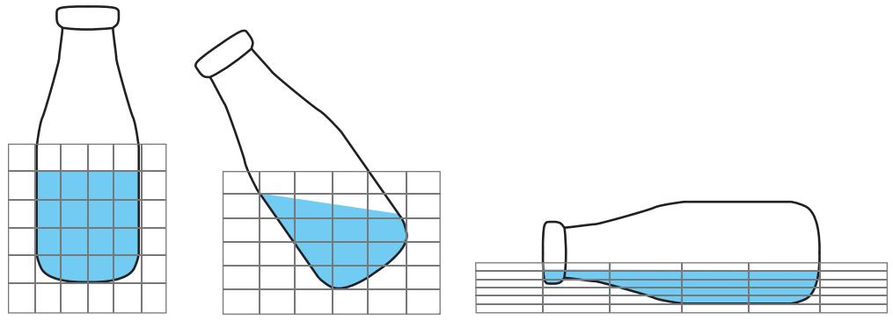  
Figure 1: Eulerian mesh motion tracking a material instance.

  
Figure 2: Eulerian mesh motion tracking a Lagrangian surface.

In Abaqus/CAE Eulerian mesh motion is defined as a boundary condition in the Load module. Restrictions can be imposed on the scaling and translation of the Eulerian mesh as part of the boundary condition definition. For more information about creating Eulerian mesh motion boundary conditions, see Defining an Eulerian mesh motion boundary condition.

## Viewing output from Eulerian analyses

The results of an Eulerian analysis must be interpreted differently than those from a Lagrangian analysis. In particular, any results based on nodal displacements are meaningless in an Eulerian model because the Eulerian part is fixed and rigid. Details concerning how Eulerian results are written to the output database are available in Output.

Special steps must be taken in the Visualization module of Abaqus/CAE to view material instances within an Eulerian part. By default, Abaqus/CAE displays the full Eulerian part mesh in both undeformed and deformed plot states with no indication of the material instance boundaries within the mesh.

Visualization of material instances is based on output variable EVF, the Eulerian material volume fraction. Output variable EVF measures the amount of a particular material instance within an element as a relative fraction. An EVF value of one indicates that the element is completely filled with the specified material instance; an EVF value of zero indicates that the element is completely devoid of the specified material instance.

For elements that are partially filled or filled with multiple materials, Abaqus estimates a simple boundary between materials by interpolating the EVF values in adjacent elements. These simple boundaries may be slightly discontinuous across elements. To improve display of Eulerian materials, you should instruct Abaqus/CAE either to use a results averaging threshold of 100% or to compute scalars after averaging results; Abaqus/CAE remaps the material boundaries so they appear smooth and continuous across elements. For more information about results averaging, see Controlling result averaging; for a more detailed discussion of how Abaqus calculates Eulerian material boundaries, see Material Interfaces.

Output variable EVF is written to the output database if you request the Preselected defaults in the field output request editor (see Modifying field output requests). When you request output for EVF, Abaqus creates a separate material volume fraction output variable for each material instance in the model; for example, EVF\_WATER is the volume fraction for the material instance named Water. An output variable named EVF\_VOID is created to measure the volume fraction of empty regions in an Eulerian part.

The following techniques can be used in the Visualization module to view the initial and deformed states of material in an Eulerian part:

## Contour plots

A contour plot of output variable EVF for a particular material instance allows you to visualize which areas of the model are occupied by the material during the analysis. Areas occupied by the material (EVF equal to one) appear as a uniform color from the top of the contour spectrum, while areas unoccupied by the material appear as a different color from the bottom of the contour spectrum; depending on your contour plot settings, the boundary of the material instance appears in a range of colors as EVF transitions from one to zero (see Figure 1).

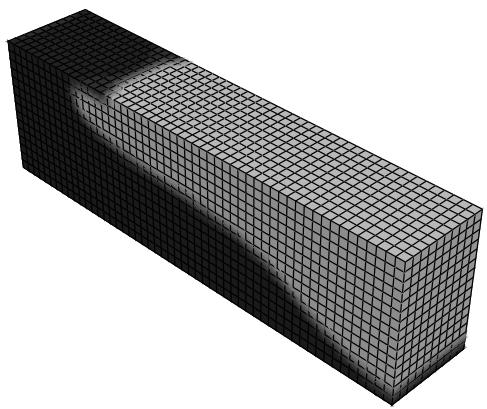  
Figure 1: Contour plot of an Eulerian material instance.

Contour plots are of limited usefulness when visualizing Eulerian materials because the contours appear on the faces of the Eulerian parts. You cannot effectively visualize material volume fraction contours on the interior of Eulerian parts.

For further details on using contour plots in the Visualization module, see Contouring analysis results.

## View cuts

To visualize the behavior of a material on the interior of an Eulerian part, activate a view cut along an isosurface of the EVF variable associated with that material instance. Abaqus/CAE automatically creates these isosurface view cuts for each material instance in the model, but you must activate them in the View Cut Manager. Using the view cut options, you can eliminate portions of the part that do not include a selected material by rendering them unfilled, rendering them translucent, or removing them from the display (see Figure 2).

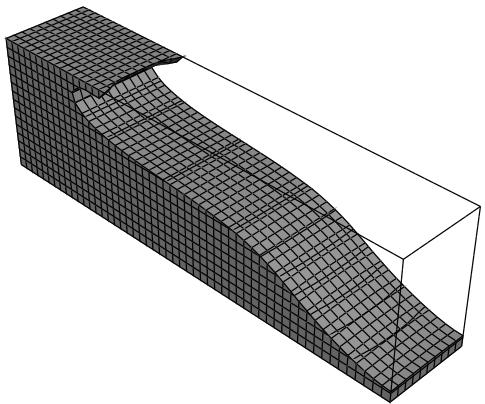  
Figure 2: View cut along an Eulerian material instance isosurface.

If your Eulerian part includes regions without a material assignment, it may be helpful to activate an isosurface view cut based on the EVF\_VOID output variable. By cutting away all regions in which EVF\_VOID is greater than 0.5, you are able to see the shape of materials within the part.

After activating an isosurface view cut based on the EVF variable, you can change the primary field output variable without affecting the view cut. This enables you to visualize results contours along the boundaries of material instances instead of on Eulerian part faces (see Figure 3).

  
Figure 3: Contour plot of stresses in a cut Eulerian part.

Isosurface view cuts based on output variable EVF do not affect Lagrangian part instances in a coupled Eulerian-Lagrangian model. The Lagrangian parts remain visible when the cut is active. Therefore, this technique is useful for visualizing the interaction between a Lagrangian part and an Eulerian material instance.

For further details on using view cuts in the Visualization module, see Cutting through a model.

## Combining view cuts and contour plots

In an Eulerian part that includes three material instances, you can use a combination of view cuts and contour plots to distinguish material instances in the undeformed and deformed model states. First, use an isosurface view cut to remove one of the material instances from the display, as discussed above. Then, create a contour plot of output variable EVF for one of the remaining material instances. The resulting colors in the model distinguish one material from the other. To produce a more defined boundary between the materials, you can reduce the number of contour intervals to two.

For example, Figure 4 depicts an Eulerian model of a lead projectile impacting a brass plate. The void regions of the Eulerian part are cut away. A two-interval contour plot is applied, rendering the brass in one color and the lead (i.e., not brass) in another color. The resulting plot offers a useful generalization of the deformed shape of the projectile and plate.

  
Figure 4: A contour plot is used to distinguished two Eulerian materials in a projectile impact analysis.

Currently there is no way to visually distinguish more than three Eulerian material instances simultaneously using Abaqus/CAE.

## Color coding

Color coding cannot be used to visualize material behavior in Eulerian parts. The color coding tool in Abaqus/CAE does not recognize Eulerian section or material assignments. Color coding based on element sets is also ineffective for deformed shape plots because the Eulerian elements do not deform with the material.

However, in coupled Eulerian-Lagrangian models, color coding can distinguish between Eulerian and Lagrangian part instances or Eulerian and Lagrangian element types. When used with the visualization techniques discussed above, color coding can be helpful in distinguishing Lagrangian bodies from Eulerian materials in a model.

For further details on applying color coding to a model, see Color coding geometry and mesh elements.

## Display groups

Certain types of coupled Eulerian-Lagrangian models involve a single Eulerian material instance throughout the Eulerian part; for example, a Lagrangian penetrator moving through a uniform Eulerian material. In these analyses the deformation of the Eulerian material is not as important as the interaction between the Eulerian material and the Lagrangian body. You can use a display group to remove the Eulerian elements from the display and visualize results (such as contact pressure or stress) on only the Lagrangian body.

For further details on using display groups, see Using display groups to display subsets of your model.

## Fasteners

This section describes how to model fasteners.

## In this section:

About fasteners  
Managing fasteners  
Creating point-based fasteners  
Creating discrete fasteners  
Creating assembled fasteners

## About fasteners

You use fasteners to model a point-to-point connection between two or more faces, such as a spot weld, a bolt, or a rivet.

You can use the Attachment toolset to create attachments that help you define fasteners; for more information, see Understanding attachment points and lines. You can create point-based fasteners, discrete fasteners, or assembled fasteners.

Both point-based and discrete fasteners can be modeled using connectors or beam MPCs. If you define connectors that use basic, assembled, or complex connection types, you can request output from your point-based or discrete fasteners through connector output variables. However, if you use beam MPCs, no output is available from your point-based or discrete fasteners.

## In this section:

About point-based fasteners  
About discrete fasteners  
About assembled fasteners

## About point-based fasteners

Point-based fasteners make use of positioning points to create mesh-independent fasteners in Abaqus/Standard and Abaqus/Explicit, as described in Mesh-Independent Fasteners. A positioning point can be an attachment point, a reference point, or a node from an orphan mesh. Point-based fasteners modeling spot welds around the edge of a bracket are shown in Figure 1. The user first created attachment points at equally spaced intervals around the edge of the bracket. The attachment points were used to define the location of the fastener's positioning points.

  
Figure 1: Point-based fasteners modeling spot welds.

A point-based fastener can connect selected faces with either connectors or rigid (beam) multi-point constraints. If you want to model a rigid connection, you can use rigid connectors or rigid multi-point constraints.

## Connectors

If you use connectors to connect the faces, you can model either rigid, elastic, or inelastic connections with failure by using the generality of connector behavior definitions. You can use a rigid connector to model a rigid connection. However, if you are using rigid connectors and Abaqus detects two adjacent point-based fasteners that are sharing nodes, you must avoid overconstraining your model by defining some elasticity in the connector behavior to reduce the stiffness.

You can request output from connectors.

## Rigid (beam) multi-point constraints

Rigid multi-point constraints are computationally cheaper than connectors and are less likely to result in an overconstrained model when two adjacent fasteners are sharing nodes. When Abaqus detects two adjacent fasteners that are sharing nodes and using rigid multi-point constraints, it uses a penalty distributing coupling formulation that relaxes, to a small degree, the constraint between the motion of the fastening point and its coupling nodes to avoid the overconstraint.

You cannot request output from multi-point constraints.

A point-based fastener uses distributing coupling constraints to connect the faces regardless of how you mesh the faces. When you submit a job for analysis, Abaqus uses your fastener definition to connect the faces with couplings and connectors. When you open the output database file in the Visualization module, you can display the couplings and connectors; however, outside the Visualization module, symbols are displayed only for the positioning points of the point-based fasteners.

If your model contains many fasteners (more than a thousand), point-based fasteners offer better performance than discrete fasteners. In addition, you may want to use point-based fasteners if you have a file from a CAD system that defines the coordinates of each positioning point. Point-based fasteners are available only for three-dimensional models. Point-based fasteners are used to model mesh-independent fasteners as described in Mesh-Independent Fasteners.

You can use the following two methods to create a point-based fastener, as shown in Figure 2:

• Select a positioning point and allow Abaqus/CAE to project the point to the closest face along a normal to the surface. The first fastening point is created where the normal intersects the closest face.  
• Select a positioning point and specify the direction vector along which the point is projected. The first fastening point is created where the vector intersects the closest face.

  
Figure 2: Creating point-based fasteners.

Abaqus creates the second (and subsequent) fastening points when you submit the job for analysis by projecting the first fastening point onto the other surfaces to be connected along the normal to the closest face.

## About discrete fasteners

Discrete fasteners make use of attachment lines to create connectors and couplings between selected faces in Abaqus/Standard and Abaqus/Explicit. Figure 1 shows a discrete fastener that uses attachment lines and connectors (Beam connection type) to model a spot weld across three surfaces. The user first created attachment lines at the locations of the spot welds. The attachment lines were used to define the location of the discrete fastener.

  
Figure 1: A spot weld across three surfaces modeled with a discrete fastener.

The process of creating an attachment line is similar to the process of creating point-based fasteners. You select a starting point and specify which of the two methods Abaqus/CAE will use to project the point onto the closest face. Figure 2 shows the two methods for creating an attachment line that is used to define a discrete fastener.

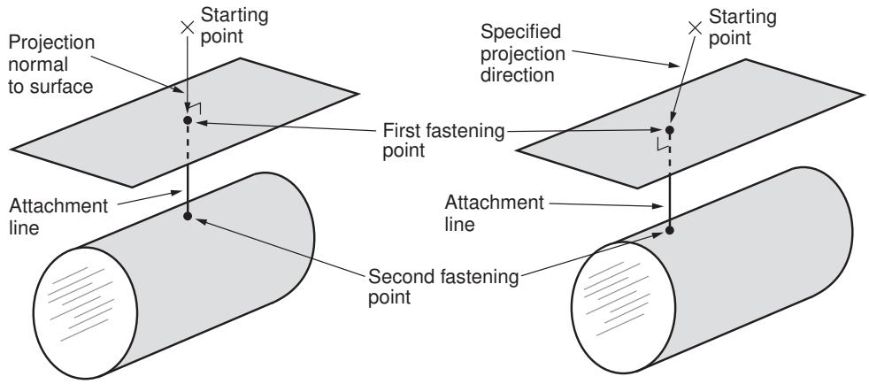  
Figure 2: Creating an attachment line that is used to define a discrete fastener.

Abaqus/CAE projects the attachment line along a normal to the closest face. You can use the following two methods to determine the number of faces that are connected by the attachment line:

• Specify the number of projections or layers.  
• Specify the maximum length of the projection.

For each attachment line, Abaqus/CAE determines the fastening points and applies a distributing coupling between each fastening point and its corresponding surface. After you assign a connector section to the attachment line, Abaqus/CAE creates a connector, and the discrete fastener is considered to be fully defined. You can control the

accuracy of the attachment line position on a faceted representation of a part instance by specifying the level of curve refinement in the Part module and the Property module. For more information, see Controlling curve refinement.

If your model is complex, Abaqus/CAE can create a chain of attachment lines connecting multiple surfaces that would be time consuming to create manually. In contrast with point-based fasteners, you can view attachment lines and discrete fasteners and their connectors and couplings outside the Visualization module.

If two surfaces are used by two attachment lines and share a common face, Abaqus/CAE merges the two faces into a single face when you submit the model for analysis. This results in better performance by Abaqus/Standard or Abaqus/Explicit, especially when the fasteners connect nodes across faces of a refined orphan mesh.

When you submit a job that contains a model with discrete fasteners for analysis, Abaqus/CAE writes special comment lines to the input file. These special comment lines, which are ignored by the Abaqus solvers, allow Abaqus/CAE to recreate the fully defined discrete fasteners upon import into Abaqus/CAE. For more information, see Importing interactions, constraints, and fasteners.

An example of creating discrete fasteners is illustrated in the Python script included in Buckling of a column with spot welds.

## About assembled fasteners

Assembled fasteners let you efficiently assign complex fastener behaviors in a large number of model locations.

## In this section:

The assembled fastener technique  
Using property generation scripts for assembled fasteners  
Output requests for assembled fasteners  
Assembled fasteners vs. point-based fasteners

## The assembled fastener technique

Using the assembled fastener technique, you can read in connector and constraint behaviors from a template model and assign these attributes in multiple locations in your main model.

For a large system such as an airframe or automobile, assembled fasteners allow you to define the fastener template once and then assign it many times in the main model. With the appropriate use of coupling constraints and adjust points constraints, secondary nodes in the template model can be automatically resized in the main model to accommodate the actual surface spacing.

The overall process for building assembled fasteners is as follows:

1. Build the template model containing your fastener-like construct: connector section assignments, tie constraints, coupling constraints, and solid or beam section assignments. You must assign names to all surfaces involved in constraints. You must also define a single-point set as the control point, which will be used to locate the template model copies in the main model.  
2. Develop your main model, placing attachment points at the locations where you want the template fastener to be replicated. The template model control point will be mapped onto the locations of the attachment points in the main model (see Figure 1).  
3. Working in your main model, use the Create Fasteners and Edit Fasteners dialog boxes to define how the template model will be read in, assigned, and oriented.  
4. Optionally, use one or more property generation scripts to modify the properties copied into the main model from the template model. Multiple property generation scripts can be used with the same template model to achieve different results in separate assembled fastener objects. For example, you could use two scripts to apply different materials to the same fastener template. You can use the Abaqus Scripting Interface to write your property generation scripts; see Creating and running your own scripts, and the Abaqus Scripting User's Guide.

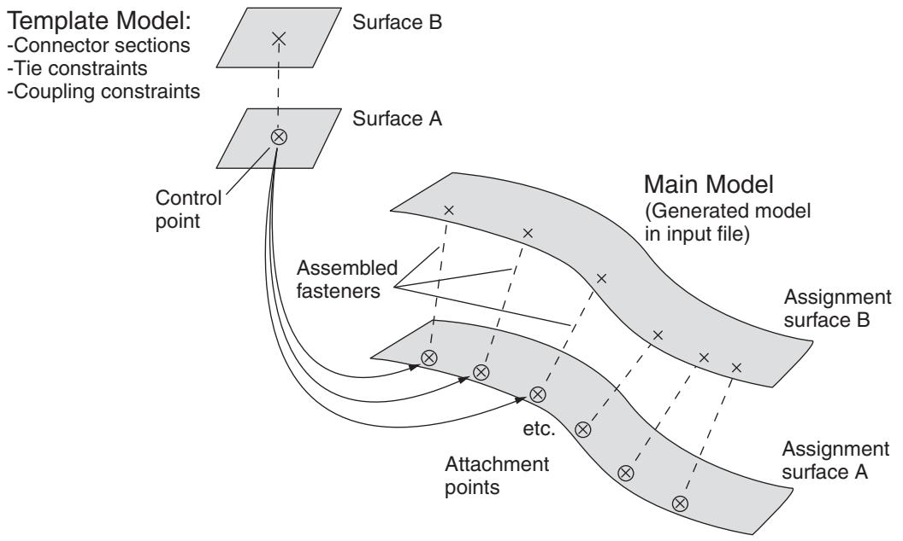  
Figure 1: Replicating the template model in the main model.

The template model uses the global coordinate system, and the positive Z-axis direction of the fastener construct will be aligned with the selected normal direction in the main model.

Assembled fasteners are different from point-based (mesh-independent) and discrete fasteners in Abaqus/CAE. Assembled fasteners do not create individual fastener objects like point-based and discrete fasteners, but instead they allow you replicate fastener-like behavior in many places. You cannot view or manipulate the individual fasteners (at each attachment point) in the main model while working in the Abaqus/CAEGUI; they are produced only in the input file generated by Abaqus/CAE. The template model sets are aggregated in the input file generated by Abaqus/CAE to help you manage models containing large numbers of assembled fasteners.

Assembled fastener template models are intended only to model fastener-like constructs and do not provide a generic subassembly capability. Only a few Abaqus/CAE features are supported in template models, such as connectors and mass inertia. No other Abaqus/CAE features are allowed in template models.

Table 1 lists the features that are supported and read from the template model into the main model. The actual model data are not transferred, only the constraints and behaviors.

Table 1: Features supported in assembled fastener template models.

<table><tr><td>Beam and solid parts (beam, solid, and cohesive elements)</td></tr><tr><td>Beam and solid section assignments (but not distributions or composite layups)</td></tr><tr><td>Connector section assignments</td></tr><tr><td>Tie constraints and coupling constraints (except for tie constraints generated due to incompatible meshes)</td></tr><tr><td>Adjust points constraints</td></tr><tr><td>Mass inertia</td></tr></table>

In particular, the Abaqus/CAE features and attributes listed in Table 2 are not supported by assembled fasteners and are not read in from the template model.

Table 2: Features that are not supported in assembled fastener template models.

<table><tr><td>Point-based (mesh-independent) and discrete fasteners</td></tr><tr><td>Attachment points</td></tr><tr><td>Analytical rigid surfaces</td></tr><tr><td>Orphan mesh surfaces</td></tr><tr><td>Tie constraints generated internally due to incompatible meshes</td></tr><tr><td>Any constraint type other than tie, coupling, or adjust points</td></tr></table>

In addition, the following restrictions exist:

• Solid parts are allowed in the template model but material orientations are not.  
• Beam parts are allowed in the template model, but beam orientations must be assigned using the same region as the beam section assignment.  
• Solid and beam parts are allowed, but complex parts/assemblies may not work.  
• Unmeshed constraint surfaces in the template model are allowed.  
Shell parts are not allowed in the template model, except as reference surfaces for constraints. These constraint surfaces will effectively be replaced with main model surfaces when the input file is generated by Abaqus/CAE. All constraint surfaces should be substituted with main model surfaces for correct behavior of the assembled fastener.  
• Template model surfaces are not copied into the main model when the input file is generated by Abaqus/CAE. The only surfaces allowed in the template model are those that will have main model surfaces substituted for them.  
• Constraint surfaces cannot be orphan mesh surfaces.  
• Reference points are allowed in template models, but attachment points are not allowed.  
• The modeling space of the template models must match the modeling space of the main model (see Part modeling space).

• Coupling constraints in the template model must constrain all degrees of freedom and must not specify a local coordinate system.  
• Tie constraints in the template model must use a generic main surface and a secondary node region, not a secondary surface.  
Point mass and rotary inertia features are allowed in template models. However, for rotary inertia the local coordinate system will be ignored; thus, the only useful scenario is $I _ { 1 1 } = I _ { 2 2 } = I _ { 3 3 }$ , and $I _ { 1 2 } = I _ { 1 3 } = I _ { 2 3 } = 0$ . Essentially, the rotary inertia feature must have rotational symmetry.

The control point must be a predefined set containing a single vertex or node in your template model. You must create this set in the template model before creating the assembled fasteners in your main model. When the template model is read in, the control point will be placed at the locations of your attachment points in the main model.

The constraint surfaces in the template model must be mapped to corresponding surfaces in the main model to enable the constraint behavior in the main model. When you define the assembled fasteners in the main model, the Edit

Fastener dialog box will automatically prepopulate the surface assignment table with any template model surfaces involved in tie constraints, coupling constraints, or adjust points constraints. The template surfaces are initially listed in ascending Z-axis order using the template model global coordinate system. You can change the order to coincide with your template fastener design; however, the ordering of the surfaces is not significant beyond the selection of the first surface, because the corresponding assignment surface normal is used to orient the assembled fastener. In the main model you must assign names to the surfaces that will be involved in the assembled fastener constraints.

At each attachment point in the main model, the template model is positioned and translated so that the template model control point coincides with the attachment point. The template model is rotated into the main model and oriented such that the positive Z-axis of the global coordinate system of the template model aligns with the coordinate system you specify (on the Orientations tabbed page of the Edit Fasteners dialog box). The default is to orient the template model copies according to the normal vector of the first surface in the main model. This default orientation from the first surface normal creates a Z-axis alignment at every attachment point. The X-axis is then computed by projecting the global X-axis onto the surface.

For any sets that you create in the template model, the main model will aggregate all of the sets' objects into a single set per assembled fastener. When the input file is generated by Abaqus/CAE, template model sets will be aggregated across all attachment points of the assembled fastener. For example, consider a template model that contains a connector section assignment for a wire set named Wire-1-Set-1, and that set contains a single wire. If the assembled fastener is then placed at 10 attachment points in the main model, the main model will have a set named TM-1\_Wire-1-Set-1 that contains 10 wires. However, Abaqus/CAE generates these aggregated sets only when it creates the input file. The aggregated sets are not directly visible in Abaqus/CAE.


## Note:

The Adjust control point to lie on surface option can be useful in coupling constraints you create in assembled fastener template models; see Defining coupling constraints. The more general-purpose adjust points constraint can also be useful in assembled fastener template models; see Defining adjust points constraints.

The adjust points capability should not be used in assembled fastener template models when the main model attachment points are located at bolt hole center points. Any point along the bolt hole centerline will be moved (incorrectly) to a random location along the perimeter of the hole instead of being projected along the surface normal to the center of the hole.


Note: The size and shape of the template model surfaces do not matter, except with regard to the display of those surfaces during template model rendering from the Edit Fasteners dialog box. The recommended best practice is to make your template model surfaces square or rectangular in shape to facilitate rendering speed and accuracy in the main model. Circular template model surfaces or surfaces with any curvature will be rendered in a crudely approximate fashion in the main model.

## Using property generation scripts for assembled fasteners

This section discusses how to use property generation scripts to modify template model properties.

## In this section:

Property generation scripts  
Example property generation script  
Registering the property generation script

## Property generation scripts

Each assembled fastener can optionally reference a script that will modify the template model properties; for example, to use different materials in the assembled fasteners. These property generation scripts can be used to calibrate or adjust the fastener properties.

In Abaqus/CAE property definitions include material, profile, section, and connector section definitions.

You can use the Abaqus Scripting Interface to write your property generation scripts; see Creating and running your own scripts, and the Abaqus Scripting User's Guide.

This feature lets you use the same template model multiple times with different property generation scripts. The property definitions from the template model are copied into the main model and given names based on the original names plus a prefix. The default prefix is TM-1 for the first assembled fastener you create, and TM-2, TM-3, etc., for subsequent ones. For example, a connector section named BoltSection in the template model will be named TM-1\_BoltSection in the main model. You can change the prefix on the Properties tabbed page of the Edit Fasteners dialog box. Property prefix strings must be unique for all assembled fasteners you create.

Figure 1 shows an example in which two template models are used with three different property generation scripts.  
  
Figure 1: Using multiple property generation scripts.

## Example property generation script

A complete example of a property generation script is provided in the blog post “Property generation scripts for assembled fasteners in Abaqus/CAE” in the

https://www.3ds.com/products-services/simulia/simulia-academic-program/learning-community/. The script uses a method named getSurfaceSections that is useful for assembled fastener property scripts. This method accepts a surface name and returns a list of all section names found on the geometry underlying the named surface region; see Assembly object. The getSurfaceSections method can be used to obtain section information such as the material name and thickness, as shown in the code fragment below.

```python
def __init__(self, scriptName, modelName, fastenerName):
    self.scriptName = scriptName
    self.modelName = modelName
    self.fastenerName = fastenerName
    print 'Running script "%s" for "%s"' % (scriptName,
        fastenerName)
    assy = mdb.models[modelName].rootAssembly
    eo = assy.engineeringFeatures.fasteners[fastenerName]
    print eo.assignSurfaces
    diameter = getInput('Enter %s bolt diameter:' % scriptName)
    print ' Bolt diameter: %s' % diameter
    for aSurf in eo.assignSurfaces:
        sectNames = assy.getSurfaceSections(aSurf)
        print ' %s: %s' % (aSurf, sectNames)
        # No section assigned
        if (len(sectNames) > 0 and sectNames[0] == ''):
            continue
        for section in sectNames:
            sectObj = mdb.models[modelName].sections[section]
            if (type(sectObj) == HomogeneousShellSectionType):
                print ' %s: mat=%s, thk=%s' % \
                    (section, sectObj.material, sectObj.thickness)
```

## Registering the property generation script

You provide the file name of the property generation script on the Properties tabbed page of the Edit Fasteners dialog box. The script is executed only when you click OK in the Edit Fasteners dialog box, not when Abaqus/CAE creates the input file. The property generation script is run only in the main model on the assembled fasteners, not in the template model.

To make your property generation scripts available from the Edit Fasteners dialog box, you must register each script similar to the way in which you register an Abaqus/CAE plug-in. The script must be registered before you startAbaqus/CAE. Any scripts that have been registered will be available from a pull-down list in the Edit Fasteners dialog box.

To register a property generation script, you must write a small registration script containing the following lines:

```python
from abaqusGui import *
toolset = getAFXApp().getAFXMainWindow().getPluginToolset()
toolset.registerAsmbdFastenerScript('filename')
```

This registration script file must be named registerAsmbFstnrScripts\_plugin.py. In the code replace filename with the name of your property generation script. The registration script informs Abaqus/CAE that you have a property generation script named filename.py that you wish to use with assembled fasteners.

Your property generation scripts and the registration script must be placed in your abaqus\_plugins directory; see Where are plug-in files stored?, for the possible locations of the abaqus\_plugins directory. For more details about registration scripts, see What are the kernel and GUI registration commands?.

## Output requests for assembled fasteners

You can obtain both field output and history output from assembled fasteners in your main model. The output must be requested on named sets that you have defined in the template model.

1. In the Step module, working in your main model (not the template model), display the Edit History Output Request dialog box or the Edit Field Output Request dialog box; see the instructions in Creating and modifying output requests.  
2. From the Domain list, choose Assembled fastener set.  
3. From the Fastener list, choose the name of the assembled fastener for which you want output.  
4. From the Set list, choose any set from the template model. The assembled fastener in your main model references the sets defined in the template model.  
5. Continue selecting output variables and other options, and click OK to save your request.

## Additional information

• Creating assembled fasteners  
• Understanding output requests

## Assembled fasteners vs. point-based fasteners

Assembled fasteners and point-based (mesh-independent) fasteners produce slightly different analysis results when used for the same fastener model. Assembled fasteners and point-based fasteners will generate different coupling nodes and coupling weights, leading to different solutions. The differences between point-based and assembled fasteners are described below and in Figure 1 and Figure 2.

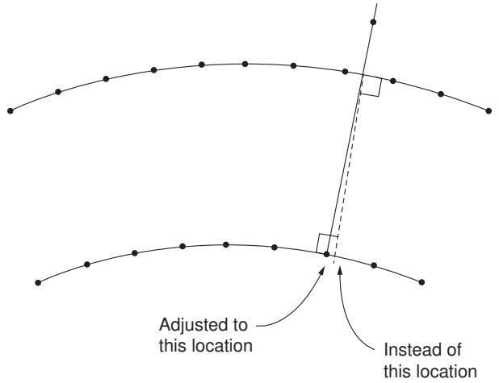  
Figure 1: Adjustments for assembled fasteners vs. point-based fasteners.

  
Figure 2: Location of attachment point for assembled fasteners vs. point-based fasteners.

## Point-based fasteners

Abaqus looks at the first node of the connector and projects it onto the first surface (given the data line). Abaqus then moves normal to the facet, where it finds the first projection point and finds the subsequent projection points on the second surface.

## Assembled fasteners

When the assembled fastener is instanced in the main model, Abaqus places the first node of the connector where the first projection point of the point-based fastener model is located. Both fastener types accomplish this

placement with normal projections. However, for assembled fasteners an adjust point constraint is performed on the second node of the connector; i.e., a normal projection onto the second surface. This action is not the same as moving normal to the first projection point facet unless the two normals align perfectly. Therefore, the second (subsequent) attachment points can be different for assembled fasteners versus point-based fasteners, which will lead to differences in the analysis solution.

In an ideal case where the two surfaces are placed exactly the same distance apart as the template model connector and are parallel to each other, Abaqus will get the same projection points for assembled fasteners and point-based fasteners. However, this situation will not be the case in general.

## Managing fasteners

The Fasteners Manager allows you to create and manage fasteners. The manager includes a list of the names and types of fasteners that you have defined. The Create, Edit, Copy, Rename, and Delete buttons in the manager allow you to create new fasteners or to edit, copy, rename, and delete existing ones. The icons in the column along the left side of the manager allow you to suppress and resume existing fasteners. You can also initiate these procedures using the Special->Fasteners menu from the main menu bar in the Interaction module. After you select a management operation from the main menu bar, the procedure is exactly the same as if you had clicked the corresponding button inside the manager dialog box.

## Additional information

• Suppressing and resuming objects  
• Creating point-based fasteners  
• Creating discrete fasteners

## Creating point-based fasteners

You can create point-based fasteners in the Interaction module by picking each positioning point from the viewport or by reading the coordinates of the positioning points from a file.

You can allow Abaqus/CAE to project the positioning point to the closest face along a normal to the surface, or you can specify the direction vector along which the point is projected to the closest face. For more information, see About fasteners.

## In this section:

Defining the surfaces where fasteners will be connected  
Defining the fastener attachment zone  
Defining the fastener properties  
Defining the fastener formulation  
Adjusting the fastener definition

You use the Domain tabbed page to edit the positioning points and to select the target surfaces onto which Abaqus/CAE projects the points and the vector along which the points are projected.

1. From the Edit Fasteners dialog box, display the Domain tabbed page.  
2. Choose the direction vector along which the positioning points will be projected onto the target surface.

• By default, Abaqus/CAE creates the direction vector along which the positioning points will be projected along the normal to the closest face.

• To change the direction vector, toggle on Specify, click , and select the points representing the start and end of the direction vector. Abaqus/CAE displays the direction vector.

3. Select the approach for the target surfaces.

• Choose Whole model to use all of the surfaces in the model as the target surfaces.  
Choose Fasten specified surfaces by proximity to specify the surfaces to be connected. The fastening point connectivity is defined by the relative positions of the surfaces along the direction vector.  
Choose Fasten in specified order to specify a particular order of the target surfaces. The fastening point connectivity is determined by the direction vector.

4. Double click the first row in the target surfaces table, and select surfaces in the viewport. Click Done in the prompt area to indicate you have finished the surface selection.

You can select multiple surfaces from the viewport to define a single surface region.

5. Click mouse button 3 anywhere on the target surfaces table to edit the selected surface, add a new surface, or delete a surface.

## Additional information

• Mesh-Independent Fasteners  
• About fasteners  
• Understanding attachment points and lines

## Defining the fastener attachment zone

You use the Criteria tabbed page to specify parameters that Abaqus uses to determine where to project the fasteners when you analyze the model.

1. From the Edit Fasteners dialog box, display the Criteria tabbed page.  
2. Choose the Attachment method. In general, a positioning point should be located as close to the surfaces being connected as possible. Abaqus determines the actual fastening points where the fasteners are attached to the surfaces being connected by first projecting the positioning point onto the closest surface. You can choose from the following projection methods:

• Face-to-Face

• Face-to-Edge

• Edge-to-Face

• Edge-to-Edge

The method that you should choose depends on how the surfaces are oriented relative to each other. For more information, see Specifying the Positioning Points, Projection Method, and Fastening Points.

3. Choose the method for specifying the distance from the positioning points within which the fastening points must lie.

Choose Facet-based default to allow Abaqus to compute a default search radius based on the facet thickness (for shell elements) or characteristic facet length (for non-shell elements) in the vicinity of each positioning point.  
Choose Specify, and enter the maximum distance from the positioning point within which the fastening points will lie.

For more information, see Forming Fasteners on Surfaces inside a User-Specified Search Zone.

4. Choose the maximum number of layers through which the fastening points will be projected.

• Choose All to allow Abaqus to use the maximum possible number of layers.  
• Choose Specify, and enter the number of layers.

## Additional information

• Mesh-Independent Fasteners  
• About fasteners  
• Understanding attachment points and lines

## Defining the fastener properties

You use the Property tabbed page to define the radius and the mass of the fastener. You can also specify the connector section and the orientation of the local directions at each end of the connector.

Depending on the connection type, a local orientation for the first node of the connector is required, optional, or not applicable. Depending on the connection type, a local orientation for the second node of the connector is optional or not applicable. For the local orientation requirements for each connection type, see the summary tables in Connection-Type Library.

For a description of how you can combine connector orientations and fastener orientations, see Defining the Fastener Orientation.

1. From the Edit Fasteners dialog box, display the Property tabbed page.  
2. Enter the Physical radius of the fastener to define the radius of its circular projection on the connected surfaces. Abaqus uses this information to define the geometric section properties of the fastener.  
3. Display the Section tabbed page, and choose the method that you will use to model each fastener.

Choose Connector section and select a connector section to model the point-to-point connection with connectors. Like other uses of connectors in Abaqus/CAE, the connection can be fully rigid or allow for unconstrained relative motion in the local connector component directions. In addition, you can specify deformable behavior using a connector behavior definition that includes the effects of elasticity, damping, plasticity, damage, and friction.  
Choose Rigid MPC to model a perfectly rigid fastener with a rigid, or beam, multi-point constraint (MPC).

If you choose a connector section that uses a basic, assembled, or complex connection type to model the fasteners, you can request output of connector element output variables. However, if you use a beam MPC to model the fasteners, no output is available from the fasteners.

4. Display the Connector Orientation 1 tabbed page to define the local directions for the first node of the connector. The Connector Orientation 1 tabbed page is available only if you use a connector section to model the fasteners.

a. In most cases Abaqus/CAE orients the nodes at both ends of the connector with the global coordinate system; however, some connection types that are referred to by the connection section require local directions. Click $\ Q$ to select a datum coordinate system that specifies local directions at the first  
node of the connector. Click to create the datum coordinate system if it does not already exist. $\hat { \lambda }$

b. Do either of the following:

• Choose No modifications to CSYS to use the selected datum coordinate system.  
If desired, choose Additional rotation angle and specify an additional rotation angle and the axis about which Abaqus/CAE will apply the additional rotation. The additional rotation (in degrees) is applied to both directions orthogonal to the selected axis.

5. Display the Connector Orientation 2 tabbed page to define the local directions for the second node of the connector. The Connector Orientation 2 tabbed page is available only if you select a datum coordinate system that specifies local directions for the first node of the connector.

a. Click $\ Q$ to select a datum coordinate system that specifies local directions for the second node of the connector. Click $\hat { \lambda }$ to create the datum coordinate system if it does not already exist.  
b. Do one of the following:

Choose Use orientation 1 to define the same local directions that you specified on the Connector Orientation 1 tabbed page.  
• Choose No modifications to CSYS to use the selected datum coordinate system.  
• If desired, choose Additional rotation angle and specify an additional rotation angle and the axis about which Abaqus/CAE will apply the additional rotation. The additional rotation (in degrees) is applied to both directions orthogonal to the selected axis.

## Additional information

• Connection Types  
• Mesh-Independent Fasteners  
• About fasteners  
• Understanding attachment points and lines

## Defining the fastener formulation

You use the Formulation tabbed page to select the method that Abaqus/CAE uses to couple the motion of the fastening points to the selected surfaces. You can also constrain selected rotational degrees of freedom and choose the weighting method.

1. From the Edit Fasteners dialog box, display the Formulation tabbed page.  
2. Choose the method to couple the motion of the fastening points to the average motion of the nodes on the surfaces that fall inside the influence radius.

• Choose Continuum distributing (default) to use a general-purpose distributed coupling scheme.  
Choose Structural distributing to augment the distributed coupling scheme to account for rotations of surface nodes such that a fastening point remains approximately on a shell surface on bending.

For more information, see Distributing Coupling Constraints.

3. If desired, toggle off a rotational degree of freedom to remove its constraint. Abaqus/CAE always constrains all translational degrees of freedom in a fastener.

4. Choose the weighting method that Abaqus uses to modify the default weight distribution at the coupling nodes within the radius of influence.

• Choose Uniform (default) to select a weight distribution that is uniform and equal to 1.0.  
• Choose Linear to select a weight distribution that decreases linearly with distance from the fastening point.  
Choose Quadratic to select a weight distribution that decreases by a quadratic polynomial function with distance from the fastening point.  
Choose Cubic to select a weight distribution that decreases by a cubic polynomial monotonic function with distance from the fastening point.

For more information, see Weighting Methods.

## Additional information

• Mesh-Independent Fasteners  
• About fasteners  
• Understanding attachment points and lines

## Adjusting the fastener definition

You use the Adjust tabbed page to specify the orientation of the fastener. For a description of how you can combine connector orientations and fastener orientations, see Defining the Fastener Orientation. You can also specify how Abaqus will compute the radius of influence, which determines the group of nodes that will be associated with each fastening point.

1. From the Edit Fasteners dialog box, display the Adjust tabbed page.  
2. By default, Abaqus determines the orientation of each fastener from the default local directions of the  
surface that is closest to the fastening point. Click to select a datum coordinate system (CSYS) 4 that specifies the orientation of the fastener. Click to create the datum coordinate system if it does not already exist. The z-axis of the CSYS should be approximately normal to the surfaces that are being connected, and the local x- and y-axes should be approximately tangent to the surfaces that are being connected.  
3. By default, Abaqus adjusts the orientation that you specified such that the local z-axis for each fastener is normal to the surface that is closest to the fastening point. Toggle off Adjust CSYS to make Z-axis normal to closest surface to use the selected coordinate system to define the local directions precisely.  
4. Each fastening point is associated with a group of nodes on the surface in the immediate neighborhood of the fastening point called a region of influence. The motion of the fastening point is then coupled in a weighted sense to the motion of the nodes in this region by a distributed coupling constraint. Each region of influence contains a minimum of three nodes. Choose either of the following to define the region of influence:

Choose Facet-based default to allow Abaqus to compute an internal radius of influence based on the geometric properties of the fastener, the characteristic length of the connected facets, and the weighting method you selected. The default radius of influence is always chosen to be the largest of the internally computed radius of influence, the physical fastener radius, and the distance from the projection point to the closest node.  
Choose Specify, and enter the radius of influence. If you specify a radius of influence that is smaller than the computed default radius of influence, Abaqus uses the computed value.

For more information, see Defining the Radius of Influence.

## Additional information

• Mesh-Independent Fasteners  
• About fasteners  
• Understanding attachment points and lines

## Creating discrete fasteners

You can create discrete fasteners in the Interaction module by selecting the attachment lines that connect the desired surfaces.

For each attachment line, Abaqus/CAE determines the fastening points and applies a distributing coupling between the fastening points and their corresponding surfaces.

You must assign a connector section to each attachment line that you select. You can use any of the Abaqus connection types to model complex behavior of your fasteners, such as deformable connectors that include the effects of elasticity, damage, plasticity, and friction. In addition, you can assign different connector sections to different attachment lines.

1. From the main menu in the Interaction module, select Special->Fasteners->Create.

Abaqus/CAE displays the Create Fasteners dialog box.


Tip: You can also create discrete fasteners using the tool in the Interaction module toolbox.

2. From the Create Fasteners dialog box that appears, select Discrete fasteners and click Continue.  
3. Select the attachment lines that represent the location of the discrete fasteners, and click Done. For more information, see Creating attachment lines by projecting points.

Abaqus/CAE displays the Edit Fasteners dialog box.

4. Choose the method to couple the motion of the fastening points to the average motion of the nodes on the surfaces that fall inside the influence radius.

Choose the Coupling type option Continuum distributing (default) to use a general-purpose distributed coupling scheme or Structural distributing to augment the distributed coupling scheme to account for rotations of surface nodes such that a fastening point remains approximately on a shell surface on bending.  
• Choose the Rotational Coupling type option Rotational Continuum distributing or Rotational Structural distributing (default).

For more information, see Distributing Coupling Constraints.

5. If desired, toggle off a rotational degree of freedom to remove its constraint. Abaqus/CAE always constrains all translational degrees of freedom in a distributing coupling.  
6. Choose the weighting method that Abaqus will use to modify the default weight distribution at the coupling nodes:

• Choose Uniform (default) to select a weight distribution that is uniform and equal to 1.0.  
• Choose Linear to select a weight distribution that decreases linearly with distance from the fastening point.  
Choose Quadratic to select a weight distribution that decreases by a quadratic polynomial function with distance from the fastening point.  
Choose Cubic to select a weight distribution that decreases by a cubic polynomial monotonic function with distance from the fastening point.

For more information, see Weighting Methods.

7. If desired, select or create a datum coordinate system that specifies the initial orientation of the local system in which the constrained degrees of freedom are defined. By default, the orientation of the constrained degrees of freedom is defined by the global coordinate system.  
8. Specify the radius of influence centered about the fastening point. You can enter a value or allow Abaqus to use the entire surface to define the coupling constraint.

9. Click OK to close the Edit Fasteners dialog box.

Abaqus/CAE displays the distributing coupling of the discrete fastener between the fastening points and connected faces. The radius of the circle reflects the specified radius of influence. If the coupling constraint definition uses the entire surface, the lines from the fastening point will extend past the circle. For orphan mesh models, you can modify the appearance of the distributing coupling by changing the face and edge density in the assembly display options; for more information, see Controlling the display of attributes.

10. Complete the discrete fastener definition by assigning a connector section to the attachment lines, as described in Creating and modifying connector section assignments.

Abaqus/CAE displays the connector symbols for the discrete fastener.

## Additional information

• Coupling Constraints  
• About fasteners  
• Understanding attachment points and lines

## Creating assembled fasteners

You can create assembled fasteners in the Interaction module after you have developed your template model. For more information, see About fasteners.

## In this section:

Mapping the template model surfaces to main model surfaces  
Orienting the geometry read in from the template model  
Modifying fastener properties in the main model  
Re-running a property generation script

## Mapping the template model surfaces to main model surfaces

You use the Surfaces tabbed page to assign the constraint surfaces from the template model to the corresponding target surfaces that will be fastened in your main model. The constraint surfaces must be mapped into the main model to enable the constraint behaviors in the main model.

All surfaces involved in the template model constraints must have assigned names. The corresponding target surfaces in the main model must also have names.

1. From the Edit Fasteners dialog box, display the Surfaces tabbed page.  
2. In the Constraint Surface Substitutions table, assign each Template Surface to an Assignment Surface in the main model.

The Template Surface column will be prepopulated with the names of any template model surfaces involved in tie constraints, coupling constraints, or adjust points constraints. If the template surfaces are ordered correctly, you can simply choose the main model surface names in the Assignment Surface column of the table. If you need to change the order of the template model surfaces that will be assigned, click in each table cell and then click the arrow that appears to display the list of available surface names. The template surfaces are initially listed in ascending Z-axis order, but you can change the order to coincide with your template fastener design. However, the ordering of the surfaces is not significant beyond the selection of the first surface, because the corresponding assignment surface normal is used to orient the assembled fastener.

To choose the main model assignment surface for each template surface, click in the corresponding table cell and click the arrow that appears to choose from the list of available surfaces in the main

model. If you have not assigned a name to any of the surfaces you need to use, click

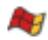

Assignment Surface) to define a new surface and add it to the list.

(Create

3. You can toggle on Render template surfaces to show the surfaces in the main model, if desired.

You use the Orientations tabbed page to specify how the template fastener construct is oriented at each attachment point. The template model is rotated into the main model and oriented such that the global coordinate system of the template model aligns with the coordinate system you specify. The default is to orient the template model copies such that the positive Z-axis of the global coordinate system of the template model aligns with the normal vector of the first surface at every attachment point. This default orientation from the first surface normal creates a Z-axis alignment at every attachment point. The X-axis is then computed by projecting the global X-axis onto the surface. When the global X-axis is parallel to the normal or to the Z-axis alignment, then the X-axis is computed by projecting the global Y-axis onto the surface. Further, the Y-axis is computed by taking the cross product of the normal and the computed X-axis.

1. From the Edit Fasteners dialog box, display the Orientations tabbed page.  
2. Choose the orientation option that Abaqus/CAE will use to orient the fastener template at each attachment point.

Choose Compute orientation based on first surface normal (default) to orient the fastener geometry such that the global coordinate system of the template model aligns with the normal vector of the first assignment surface in the main model.

You can toggle on Flip normal direction to reverse the direction, if desired.

• Choose Specify uniform CSYS to orient the fastener geometry with a coordinate system that you choose. Click (Edit) to select from the existing datum coordinate systems in your main model.

The default is to use the global coordinate system of the main model. Click (Create Datum CSYS) to create a new coordinate system.

3. If desired, toggle on Display orientation direction at attachment points to show orientation triads at the attachment point of each assembled fastener. These visualization options are not available until you have selected the control point set and made the first surface assignment. Choose either of the following suboptions:

• Toggle on Display only the normal direction to remove the 1-axis and the 2-axis from the triads, leaving only the surface normal vector.  
Toggle on Include template model surfaces every x points to display sketched outlines of the constraint surfaces from the template model. Adjust the number x up or down to show the surfaces at every attachment point, every other point, every third point, etc. The surfaces will be color-coded according to the colors shown on this tabbed page and in the Constraint Surface Substitutions table on the Surfaces tabbed page.

This option is helpful for positioning and orienting the template model correctly. If your template model surfaces are too large, however (relative to the main model dimensions), the resulting display may be too crowded. You may wish to go back and resize the surfaces in your template model if this is the case.

## Modifying fastener properties in the main model

You use the Properties tabbed page to specify a property generation script to modify the properties copied into the main model from the template model. The script is executed by Abaqus/CAE only when you click OK in the Edit Fasteners dialog box, not when Abaqus/CAE creates the input file. See Using property generation scripts for assembled fasteners, for complete information.

Your property generation scripts must be registered before starting Abaqus/CAE; see Registering the property generation script. Any scripts that have been registered will be available for selection on the Properties tabbed page.

1. From the Edit Fasteners dialog box, display the Properties tabbed page.  
2. By default, the properties copied into the main model from the template model are named with the prefix TM-1 for the first assembled fastener you create. For example, a connector section named BoltSection in the template model will be named TM-1\_BoltSection in the main model. Subsequent assembled fasteners will use the prefixes TM-2, TM-3, etc.  
If desired, you can change the name prefix used in the Property prefix string field. The property prefix string must be unique for each assembled fastener.

3. Toggle on Specify a property generation script, and select the filename of your script from the list.

## Re-running a property generation script

You use the Re-run tabbed page to have Abaqus/CAE re-copy properties from the template model and then re-run the property generation script. The script currently specified on the Properties tabbed page is run. The action occurs when you click OK to close the dialog box.

The Re-run tabbed page is available only when you are editing an assembled fastener that has already been created.


## Note:

Any time you make a change in the the Edit Fasteners dialog box, the re-run action occurs automatically when you click OK. You only need to use the Re-copy template model properties and re-run script option when no other changes have been made.

1. From the Edit Fasteners dialog box, display the Re-run tabbed page.  
2. Toggle on Re-copy template model properties and re-run script.  
3. Click OK to close the dialog box.

## Fracture mechanics

You can do the following to model fracture mechanics with Abaqus/CAE:

• Create a seam crack that defines an edge or a face with overlapping nodes that can separate during an analysis.  
• Use contour integral estimates to study the onset of cracking in quasi-static problems; however, a contour integral estimate does not predict how a crack will propagate. You can compute contour integrals for twoor three-dimensional models.  
Use the extended finite element method (XFEM) to study the initiation and propagation of a crack along an arbitrary, solution-dependent path without needing to remesh your model. XFEM is available only for three-dimensional solid and planar models and orphan meshes.  
• Use the virtual crack closure technique (VCCT) to study the initiation and propagation of a crack along a known crack surface.  
• Use the Crack Manager to create and manage your cracks.

## In this section:

Seam cracks  
Using contour integrals to model fracture mechanics  
Using the extended finite element method to model fracture mechanics  
Using the virtual crack closure technique to model crack propagation  
Managing cracks

## Seam cracks

A seam defines an edge or a face with overlapping nodes that can separate during an analysis. You can include a seam crack in your model. Alternatively, you can refer to the seam when creating a contour integral; however, you cannot use a seam crack with the extended finite element method (XFEM).

## In this section:

What is a seam?  
Creating a seam

## What is a seam?

A seam defines an edge or a face in your model that is originally closed but can open during an analysis. Abaqus/CAE places overlapping duplicate nodes along a seam when the mesh is generated. A seam cannot extend along the boundaries of a part and must be embedded within a face of a two-dimensional part or within a cell of a solid part. After you create a seam, you can determine its crack properties using a contour integral analysis. Because a seam modifies the mesh, you cannot create a seam on a dependent part instance.

Figure 1 shows a seam on the face of a planar part and the effect of applying a tensile load to the model. The duplicate nodes along the seam are independent of each other and are free to move.

  
Figure 1: A seam embedded in a face.

Figure 2 shows a similar analysis of a seam embedded in a solid part. The seam was created by partitioning the solid with a sketch drawn on a datum plane.

  
Figure 2: A seam embedded in a cell.

For detailed instructions, see Creating a seam, .

## Creating a seam

You can use the Special menu in the Interaction module to define a seam in your model. A seam defines a region in your model that can open during an analysis. Abaqus/CAE places overlapping duplicate nodes along a seam when the mesh is generated. A seam cannot extend along the boundaries of a part and must be embedded within a face of a two-dimensional part or within a cell of a solid part. You can use the seam when you are selecting the crack front and the crack tip that will be used in a contour integral analysis. For more information, see What is a seam?.

1. From the main menu bar in the Interaction module, select Special->Crack->Assign seam.  
2. From the model in the viewport, select the entities representing the seam. The entities must be embedded edges within a face of a two-dimensional part or embedded faces within a cell of a solid part; you cannot select any entities that lie on the boundary of the part.  
3. Click mouse button 2 to indicate that you have finished selecting the seam.  
Abaqus/CAE creates the seam.  
4. To include the seam in a contour integral analysis, follow the procedure described in Creating a contour integral crack.

## Additional information

• What is a seam?  
• Fracture Mechanics

## Using contour integrals to model fracture mechanics

You can study the onset of cracking in a quasi-static model by selecting regions from your model that will be used to compute contour integral estimates.

During the analysis Abaqus/Standard writes the values of the contour integrals to the output database as history output. For a detailed description of contour integrals, see Contour Integral Evaluation. This section describes how you define a crack in Abaqus/CAE.

## In this section:

Performing a contour integral analysis  
Defining the crack front  
Defining the crack tip or crack line  
Defining the crack extension direction  
Controlling the singularity at the crack tip for a small-strain analysis  
Contour integral output  
Meshing the crack region and assigning elements  
Controlling the singularity at the crack tip  
Creating a contour integral crack  
Modifying data for contour integrals  
Requesting contour integral output

## Performing a contour integral analysis

You can study the onset of cracking in quasi-static problems using contour integral estimates; however, a contour integral estimate does not predict how a crack will propagate.

You can compute contour integrals for two- or three-dimensional models, and you can choose to perform one of the following types of contour integral calculations:

• J-integral  
• -integral (for creep)  
• T-stress (for linear materials)  
• Stress intensity factors for linear homogeneous materials and for interfacial cracks lying on the interface between two linear homogeneous materials

For more information, see Contour Integral Evaluation.

You define cracks in the Interaction module. To perform a contour integral analysis, you must select the crack front, the crack tip or crack line, and the crack extension direction, as described in the following sections. The entities that you can select depend on whether the part is two- or three-dimensional and whether you are defining the part using geometry or using elements and nodes from an orphan mesh. In some cases the crack tip or the crack line is the same as the crack front that you selected, and Abaqus/CAE selects the crack tip or crack line for you.

A crack in a two-dimensional model is a region containing edges that are free to move apart. A crack in a three-dimensional model is a region containing faces that are free to move apart. The simplest approach to performing a contour integral analysis uses a region that already contains edges or faces that are free to move apart as the crack separates. Alternatively, you can model the crack as a line embedded in a face in a two-dimensional model or as a face embedded in a cell in a three-dimensional model. The embedded line or face is called a seam, and you can perform a contour integral analysis using a seam. When you mesh the model, Abaqus/CAE creates duplicate overlapping nodes on the seam; these coincident nodes are free to move apart as the seam separates. Seams are described in more detail in What is a seam?. Figure 1 shows a two-dimensional model with existing edges that are free to move apart and a similar model with an embedded seam that is free to move apart.

  
Figure 1:You can define a crack using an existing region or using a seam.

You can specify that the crack front is defined on a symmetry plane, in which case you need to model only half of the structure. Abaqus doubles the values calculated by the contour integral to arrive at the correct values. In most cases you need a refined mesh surrounding the crack. After you create a crack, you must use the History Output Request editor to request that Abaqus write contour integral information to the output database. For more information, see Contour integral output.

For detailed instructions, see Creating a contour integral crack.

## Defining the crack front

The first step in the procedure to configure a contour integral is to define the crack front by selecting entities from the assembly. The crack front is the forward part of the crack. Abaqus uses the crack front to compute the first contour integral using all of the elements inside the crack front and one layer of elements outside the crack front. You can request output for more than one contour integral, in which case Abaqus/CAE adds a single layer of elements to the group of elements that were used to calculate the previous contour integral. Figure 1 illustrates how Abaqus/CAE computes successive contour integrals for a two-dimensional model by adding layers of elements.

  
Figure 1: Successive contour integrals are calculated by adding a layer of elements.  
If your part is three-dimensional, Abaqus computes contour integrals at each node along the crack line, as shown in Figure 2. For more information, see Defining the Crack Front.

  
Figure 2: Abaqus computes the contour integral at each node along the crack line.

The entities from which you can select depend on whether the crack front is located in geometry or an orphan mesh and on the modeling space of the part.

## Geometry

When you are defining the crack front on geometry, the entities that you can select depend on the modeling space of the part.

## Two-dimensional geometry

If you are defining the crack front on two-dimensional geometry, you can select the following:

• A single vertex  
• Connected edges  
• Connected faces

Figure 3 shows the entities from which you can select when defining a crack front on two-dimensional geometry.  
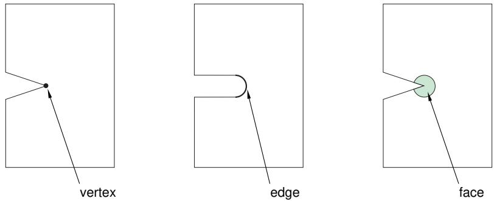  
Figure 3: Selecting the crack front from two-dimensional geometry.

## Three-dimensional geometry

If you are defining the crack front on three-dimensional geometry, you can select the following:

• Connected edges  
• Connected faces  
• Connected cells

Figure 4 shows the entities from which you can select when defining a crack front on three-dimensional geometry.  
  
Figure 4: Selecting the crack front from three-dimensional geometry.

## Mesh

When you are defining the crack front on an orphan mesh, you can select the elements or element edges or faces that define the crack front. Alternatively, you can select the nodes from the corresponding region. When you are defining the crack front on an orphan mesh, the entities that you can select depend on the modeling space of the part.

## Two-dimensional orphan mesh

If you are defining the crack front on a two-dimensional orphan mesh, you can select the following:

• A single node  
• Connected element edges  
• Connected elements

Figure 5 shows the entities from which you can select when defining a crack front on a two-dimensional orphan mesh.

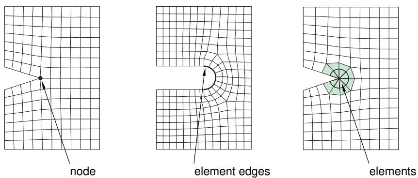  
Figure 5: Selecting the crack front from a two-dimensional orphan mesh.

## Three-dimensional orphan mesh

If you are defining the crack front on a three-dimensional orphan mesh, you can select the following:

• Connected element edges  
• Connected element faces  
• Connected elements

Figure 6 shows the entities from which you can select when defining a crack front on a three-dimensional orphan mesh.  
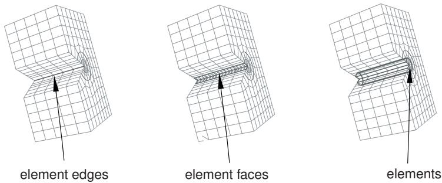  
Figure 6: Selecting the crack front from a three-dimensional orphan mesh.

## Defining the crack tip or crack line

After you have defined the crack front, the next step in the procedure to configure the contour integral is to define the crack tip or crack line by selecting entities from the assembly. The modeling space of your assembly governs whether you need to define a crack tip or a crack line for a contour integral analysis.

## Two-dimensional

If your assembly is two-dimensional, you must define the crack tip by selecting a vertex or a node. The crack tip is the point on the crack front where you define the crack extension direction, . In some cases the desired vertex or node will not exist, and you must create it by partitioning the crack front.

If you selected a vertex or a node to define the crack front, the same vertex or node defines the crack tip.

## Three-dimensional

If your part is three-dimensional, you must define the crack line by selecting edges or element edges that form a continuous line. The crack line is a series of connected edges along the crack front where you define the crack extension direction, . In some cases the desired edges will not exist, and you must create them by partitioning the crack front.

If you selected edges or element edges to define the crack front, the same edges define the crack line.

Selected edges (from an Abaqus/CAE native part or from an orphan mesh) must be connected, must connect one side of the crack front to the other, and must be included in the crack front.

## Defining the crack extension direction

After you have defined the crack front along with the crack tip or crack line, Abaqus/CAE prompts you to specify the crack extension direction at the crack tip or along the crack line. You can specify the normal to the crack plane, ; or you can specify the crack extension direction, , directly. For a detailed discussion of how Abaqus uses or to calculate the crack extension direction, see Specifying the Virtual Crack Extension Direction.

## Normal to crack plane

If you select Normal to crack plane, you can define the normal by selecting points from the model that represent the start and the end of the normal to the crack plane. The crack plane contains the vector that Abaqus needs to compute the contour integral. In many cases the crack plane represents the plane of symmetry of the crack.

You should define the normal to the crack plane only if the direction is the same at all points along the crack line. If the direction of the normal to the crack plane varies along the crack line, you cannot select a single normal that defines the crack extension direction at all points along the crack line.

To define the normal to the crack plane, you can select points from geometry (such as vertices, datum points, or midpoints), or you can select orphan mesh nodes. Alternatively, you can enter the coordinates of the points in the prompt area. If you select points from geometry and subsequently modify the part, Abaqus/CAE regenerates the points and updates the normal accordingly. If you are working with orphan mesh nodes, you must select nodes that represent the start and the end of the normal.

Abaqus calculates a crack extension direction, , that is orthogonal to the crack front tangent, , and the normal, . If required, you can flip the -direction vector.

## q vectors

If you select q vectors, you can define the crack extension direction, , directly by selecting points from the model that represent the start and end of the vector. If you are working with orphan mesh nodes, you must select nodes that represent the start and the end of the vector. Alternatively, you can enter the coordinates of the points in the prompt area.

Figure 1 shows an example of a crack front formed by a circular arc along which the direction of the vector is constantly varying. In contrast, the normal to the crack plane is constant. As a result, for this case you should define the crack extension direction by specifying the normal to the crack plane.

  
Figure 1:The direction of the vector varies but the direction of the normal is constant.

Figure 2 shows a crack front formed by the edge of a truncated cone along which the directions of both the vector and the normal to the crack plane are varying.  
  
Figure 2:The directions of both the vector and the normal vary along the crack front.

For this case you should do the following:

1. Define the contour integral, and use a single vector to specify the crack extension direction.  
2. Mesh the part, create a job, and write the model to an input file.

3. Import the input file, which will create an orphan mesh representation of the part.  
4. Edit the crack that was imported with the model. Each node along the crack front will have the crack extension direction defined by the vector that you specified in Step 1.  
5. Use the Query toolset to determine the start and end coordinates of the vector at each node, and edit the data defining the vectors at each node along the crack front.

This technique is shown in Figure 3.  
  
Figure 3: Entering the vector at each node along the crack front.  
Figure 3 is taken from Contour integrals for a conical crack in a linear elastic infinite half space. An Abaqus Scripting Interface script is provided with this example that illustrates how you can enter the vector at each node along the crack front.

## Controlling the singularity at the crack tip for a small-strain analysis

If the geometry of the crack region defines a sharp crack, the strain field becomes singular at the crack tip, as described in Constructing a Fracture Mechanics Mesh for Small-Strain Analysis with the Conventional Finite Element Method. Including the singularity in your model for a small-strain analysis improves the accuracy of the contour integral and the stress and strain calculations.

To include the singularity in your contour integral estimates, click the Singularity tab in the Crack editor and choose the desired position of the midside node and degenerate element control. For detailed instructions, see Controlling the singularity at the crack tip.

In addition, you must do the following in the Mesh module:

• If the assembly or part is two-dimensional, you must model the crack front with a ring of triangles and assign quadrilateral elements to the remainder of the contour integral region.  
• If the assembly or part is three-dimensional, you must model the crack front with a ring of wedges and assign hexahedral elements to the remainder of the contour integral region.

When you mesh the crack front, Abaqus does the following:

• Converts the elements in the crack front to collapsed quadrilateral or hexahedral elements.  
If you modeled the crack front with a ring of second-order triangles or wedges, Abaqus moves the midside nodes to the specified position along the element edges that radiate out from the crack tip or crack line. (If you modeled the crack front with a ring of first-order triangles or wedges, Abaqus ignores the position that you specified for the midside nodes.)

A part instance that includes orphan mesh elements is always a dependent instance. As a result, you cannot adjust the midside nodes of these instances in the assembly. For more information, see What is the difference between editing an orphan mesh, a meshed part, and a meshed part instance in the assembly?. You must display the original orphan mesh and use the Edit Mesh toolset to adjust the position of the midsize nodes. For more information, see Adjusting the position of midside nodes. In addition, you cannot create collapsed elements from triangular and wedge elements of an orphan mesh.

## Contour integral output

After you have defined the crack, you must use the History Output Request editor in the Step module to include the contour integral data in the output database generated by the analysis. The editor allows you to configure the following:

• The output frequency.  
• The type of contour integral calculation to perform (J-integral, -integral, stress intensity factors, or T-stress).  
• The number of contours to evaluate.

Abaqus writes a history output variable to the output database for each contour integral that it calculates. Figure 1 shows the format of the name of an output variable representing a contour integral.

  
Figure 1:The format of a contour integral name in the output database.

For detailed instructions, see Requesting contour integral output. For more information, see Modifying history output requests, and Contour Integral Evaluation.

## Meshing the crack region and assigning elements

Large stress concentrations occur at the crack tip. As a result, you should create a refined mesh around the crack tip to get accurate results for stresses and strains. In contrast, because the J-integral is an energy measure, you can obtain accurate J-values with a relatively coarse mesh. However, if the material becomes more nonlinear, you must create a finer mesh at the crack tip to maintain the accuracy of the J-values. You can control the density of the mesh at the crack tip by partitioning the region and by assigning mesh seeds to the resulting edges. For more information, see Understanding seeding.

For a large-strain analysis during which Abaqus will allow for nonlinear geometry, you should mesh the contour integral region with quadrilateral or hexahedral elements. For more information, see Constructing a Fracture Mechanics Mesh for Finite-Strain Analysis with the Conventional Finite Element Method.

However, for a small-strain analysis that does not allow for nonlinear geometry, you must allow for the singularity at the crack tip or crack line by meshing the region that defines the crack front with a ring of triangles or wedges. For more information, see Controlling the singularity at the crack tip for a small-strain analysis.

You must use the swept meshing technique to create wedge elements; however, there are limitations on the regions that Abaqus/CAE can mesh using the swept meshing technique, as described in Swept meshing of three-dimensional solids. As a result, if you cannot use the swept meshing technique, you cannot create wedge elements, and you cannot allow for the singularity at the crack line. In most cases you can ignore the singularity if your mesh is sufficiently refined to model the deformation around the crack tip or crack line and the resulting high strain gradients. You can also ignore the singularity if you are interested in only the contour integral output.

## Controlling the singularity at the crack tip

If the geometry of the crack region defines a sharp crack, the strain field becomes singular at the crack tip, as described in Constructing a Fracture Mechanics Mesh for Small-Strain Analysis with the Conventional Finite Element Method. Including the singularity in your model for a small-strain analysis improves the accuracy of the contour integral and the stress and strain calculations.

1. Display the Crack editor using one of the following methods:

• To configure a new contour integral, follow the instructions in Creating a contour integral crack.  
• To edit an existing contour integral, select Special->Crack->Edit->crack name from the main menu bar in the Interaction module.

2. To include the strain singularity in your contour integral estimates, click the Singularity tab in the Crack editor, and do one of the following:

• To create a $\mathbf { 1 } / \sqrt { r }$ strain singularity for an elastic fracture mechanics application:

1. From the Second-order Mesh Options field, enter a value of 0.25 for the Midside node parameter to move the midside nodes to the points.

2. From the Degenerate Element Control at Crack Tip/Line field, choose Collapsed element side, single node.

• To create a strain singularity for a perfect plasticity fracture mechanics application:

1. From the Second-order Mesh Options field, enter a value of 0.5 for the Midside node parameter to keep the midside nodes at the midside points.  
2. From the Degenerate element control at Crack Tip/Line field, choose Collapsed element side, duplicate nodes.

• To create a combined $1 / \sqrt { r }$ and strain singularity for a power law hardening material:

1. From the Second-order Mesh Options field, enter a value of 0.25 for the Midside node parameter.

2. From the Degenerate element control at Crack Tip/Line field, choose Collapsed element side, duplicate nodes.

3. Click OK to include the singularity in the contour integral estimation and to close the editor.


## Note:

In most cases you must assign second-order triangle or wedge elements to the crack front region to include the singularity in your contour integral estimates. If you assign first-order elements, Abaqus ignores the value of the midside node setting in the Singularity tabbed page. However, if you assign first-order elements and choose Collapsed element side, duplicate nodes from

the Degenerate Element Control at Crack Tip/Line field, you will create a strain singularity.

You can use the Special menu in the Interaction module to create a contour integral crack. For more information, see Fracture Mechanics.

The entities that you select to define the contour integral depend on whether the part is two- or three-dimensional and whether you are defining the part using geometry or using orphan mesh elements and nodes.

1. From the main menu bar in the Interaction module, select Special->Crack->Create.  
2. From the Create Crack dialog box that appears, select Contour integral.  
3. Enter the name of the crack, and click Continue to close the dialog box.  
4. From the model in the viewport, select the entities representing the crack front region. For a description of the entities to select, see Defining the crack front.  
5. Click mouse button 2 to indicate that you have finished selecting the crack front region.  
6. From the model in the viewport, select the entities representing the crack-tip region. In some cases, depending on the modeling space of your model and the entities that you selected to define the crack front, Abaqus/CAE selects the crack tip for you and skips to Step 7. For more information, see Defining the crack tip or crack line.  
From the prompt line, toggle on Select mesh entities to select entities from an orphan mesh.

7. Click mouse button 2 to indicate that you have finished selecting the crack-tip region.

8. From the prompt area, choose the method for defining the crack extension direction.

## Normal to crack plane

Select Normal to crack plane to specify the normal to the crack plane, and select points representing the start and end of the normal.

## q vectors

Select q vectors to specify the crack extension direction directly, and select points representing the start and end of the vector.

For more information, see Defining the crack extension direction.

Abaqus/CAE displays a blue arrow indicating the crack extension direction and, if specified, a red arrow indicating the normal to the crack plane and displays the Edit Crack dialog box.

9. Use the Edit Crack dialog box to configure the parameters that control a contour integral analysis.

• Click the General tab of the dialog box to do the following:

- Specify that the crack front is defined on a symmetry plane that models only half of the structure.  
- Change the entities that define the crack front or crack tip/line.  
Change the method for defining the crack extension direction. You can also change the entities that define the crack extension direction and flip the crack extension direction ( vector).

For more information, see Modifying data for contour integrals.

Click the Singularity tab of the dialog box to model a singularity of the strain field at the crack tip. For more information, see Controlling the singularity at the crack tip.

10. Click OK to configure the contour integral and to close the editor.

Abaqus displays green crosses on the region to represent the crack front.

You must use the History Output Request editor in the Step module to include the contour integral data in the output database generated by the analysis. For more information, see Contour integral output, and Modifying history output requests.

## Additional information

• Using contour integrals to model fracture mechanics  
• Fracture Mechanics

If desired, you can modify the entities that you selected to define the crack front, the crack tip, and the crack extension direction that will be used to define a contour integral. You can also specify that the crack front is defined on a symmetry plane that models only half of the structure and flip the calculated crack extension direction, if desired. For more information, see Symmetry with the Conventional Finite Element Method.

1. Display the Crack editor using one of the following methods:

• To configure a new contour integral, follow the instructions in Creating a contour integral crack.  
• To edit an existing contour integral, select Special->Crack->Edit->crack name from the main menu bar in the Interaction module.

2. Toggle on On symmetry plane (half-crack model) to specify that the crack front is defined on a symmetry plane that models only half of the structure. Abaqus doubles the change in potential energy calculated from the virtual crack front advance to compute the correct contour integral values.

3. If desired, click to modify your selection of entities that define the crack front, crack tip, or crack line. If Abaqus/CAE selected the crack tip or crack line region to be the same as the crack front, you cannot edit the selection.

4. If desired, change the method for defining the crack extension direction. You can also click to modify your selection of entities that define the crack extension direction.

5. If desired, you can click to confirm or flip the calculated crack extension direction. In the prompt area, click Yes to confirm the -vector direction or click Flip to reverse the direction.

6. Click OK to configure the contour integral and to close the editor.

Abaqus displays green crosses on the region to represent the crack front.

You must use the History Output Request editor in the Step module to include the contour integral data in the output database generated by the analysis. For more information, see Contour integral output, and Modifying history output requests.

## Requesting contour integral output

You use the History Output Request editor in the Step module to request output from the contour integral analysis. You must select Crack from the Domain field. The editor then allows you to select the output frequency and the type of contour integral analysis to perform. For more information, see Modifying history output requests, and Contour Integral Evaluation.

You can also request contour integral output for an XFEM fracture analysis. For more information, see Requesting contour integral output for XFEM.

1. Enter the Step module.  
2. From the main menu bar, select Output->History Output Request->Create.  
Abaqus/CAE displays the Create History dialog box.  
3. From the Create History dialog box, enter the name of the output request and the step in which it will be created. Click Continue to close the dialog box.  
Abaqus/CAE displays the History Output Requests editor.  
4. From the Domain field, select Crack, and select the desired contour integral.  
5. From the fields that appear in the History Output Requests editor, enter the output frequency.  
6. Enter the number of contours to evaluate. Abaqus/CAE computes the next contour integral by adding a single layer of elements to the region defined by the previous domain, as described in Figure 1. Each contour generates a value or a group of values for the contour integral.  
7. If desired, toggle on Step for residual stress initialization values, and select the step from which Abaqus will read the stress data in the last available increment and use the data to calculate the residual stresses. If you select the initial step, the residual stresses are defined by the specified initial conditions. You cannot select a step that occurs after the step in which the history output request is created. For more information, see Including the Effect of a Residual Stress Field on J-Integral Evaluation.  
8. Select the type of contour integral calculation to perform. You can select from the following:

## J-integral

You use the J-integral in rate-independent quasi-static fracture analysis to characterize the energy release associated with crack growth. The J-integral can be related to the stress-intensity factor if the material response is linear. For more information, see J-Integral.

## -integral

You use the $C _ { t }$ -integral for time-dependent creep behavior, where it characterizes creep crack deformation under certain creep conditions, including transient crack growth. For more information, see Ct-Integral.

## T-stress

You use the T-stress component to represent a stress parallel to the crack front. For more information, see T-Stress.

## Stress intensity factors

You use the stress intensity factors $\pmb { K } _ { I } , \pmb { K } _ { I I }$ , and ${ \pmb K } _ { I I I }$ in linear elastic fracture mechanics to characterize the local crack-tip stress and displacement fields. For more information, see Stress Intensity Factors.

If you request a contour integral calculation using stress intensity factors, Abaqus also computes the crack propagation direction at initiation. You must choose one of the following to indicate the crack initiation criteria:

• Maximum tangential stress  
• Maximum energy release rate  
• $\mathbf { K } _ { \mathbf { I I } } = \mathbf { 0 }$

For more information, see Crack Propagation Direction.

9. Click OK to configure the contour integral analysis and to close the editor.

For examples of how Abaqus names history output variables in the output database for each contour integral that it calculates, see Contour integral output.

## Using the extended finite element method to model fracture mechanics

You can use the extended finite element method (XFEM) to study the initiation and propagation of a crack along an arbitrary, solution-dependent path without needing to remesh your model.

XFEM is available for three-dimensional solid and two-dimensional planar models; three-dimensional shell models are not supported.

## In this section:

The extended finite element method (XFEM)  
Choosing the type of XFEM analysis  
Viewing an XFEM crack  
Creating an XFEM crack  
Deactivating and activating an XFEM crack growth  
Specifying a contact interaction property for XFEM  
Requesting contour integral output for XFEM

## The extended finite element method (XFEM)

You can study the onset and propagation of cracking in quasi-static problems using the extended finite element method (XFEM). XFEM allows you to study crack growth along an arbitrary, solution-dependent path without needing to remesh your model.

XFEM is available only for three-dimensional solid and two-dimensional planar models; three-dimensional shell models are not supported. You can use XFEM to study a crack in parts containing geometry, orphan mesh elements, or a combination of the two. You can choose to study a crack that grows arbitrarily through your model or a stationary crack. You define an XFEM crack in the Interaction module. You can specify the initial location of the crack.

Alternatively, you can allow Abaqus to determine the location of the crack during the analysis based on the value of the maximum principal stress or strain calculated in the crack domain. For more information, see Modeling Discontinuities as an Enriched Feature Using the Extended Finite Element Method. Examples of XFEM models created in Abaqus/CAE are provided in Modeling discontinuities using XFEM.

To perform an XFEM crack analysis, you must specify the following:

## Crack domain

To define the crack domain, you can select one or more cells from three-dimensional parts or one or more faces from two-dimensional planar parts. If you are defining the crack domain on an orphan mesh or a part containing both orphan and native mesh elements, you can select elements. The crack domain includes regions that contain any existing cracks and regions in which a crack might be initiated and into which a crack might propagate.

After you define the initial crack location, you can reduce the size of the crack domain by indicating that you want to use only elements in the vicinity of the crack geometry. You specify the number of element layers to include to prescribe a minimal enrichment zone automatically. The crack domain is defined using the elements intersected by the crack location. These elements are the initial set. The enrichment zone is built of elements in the neighborhood of the initial crack using the number of element layers that you specify. You can highlight the elements in the viewport and, if desired, save the highlighted elements to a set.

## Crack growth

You can allow the crack to propagate along an arbitrary, solution-dependent path, or you can specify that the crack is stationary.

## Initial crack location

To define the initial crack location, you can select faces from a three-dimensional solid or edges from a two-dimensional planar model. The initial crack location must be contained within the crack domain. A selected face can be a face of the solid, a face created by a partition, or a planar part instance. Similarly, a selected edge can be an edge of the solid, an edge created by a partition, or a wire part instance; you should not select a seam crack. You should not mesh the faces or edges that you selected to define the initial crack location. Figure 1 shows examples of the crack domain and the crack location for two- and three-dimensional geometry and orphan meshes.

  
Figure 1: Defining a crack for XFEM.

Alternatively, you can choose not to define the initial crack location. Regardless of whether you define the initial crack location, Abaqus initiates the creation of cracks during the simulation by searching for regions that are experiencing principal stresses and/or strains greater than the maximum damage values specified by the traction-separation laws.

## Enrichment radius

The enrichment radius is a small radius from the crack tip within which the elements will be used for calculating crack singularity for a stationary crack. Elements within the enrichment radius must be included in the cells or faces that you chose to represent the crack domain. You can allow Abaqus to calculate the radius (six times the typical element characteristic length in the enriched area), or you can specify its value.

## Contact interaction property

You can choose to associate a contact interaction property with the XFEM crack that defines the contact of cracked element surfaces. For detailed information, see Specifying a contact interaction property for XFEM.

## Damage initiation

You must specify the conditions that will initiate a crack by specifying damage initiation criteria in the material definition. You can specify a criterion based on either maximum principal stress or maximum principal strain. For more information, see Maximum principal stress or strain damage.

## Analysis procedure

You can include an XFEM crack in a static analysis procedure. Alternatively, you can include an XFEM crack in an implicit dynamic analysis procedure to simulate the fracture and failure in a structure under high-speed impact loading. The XFEM-based crack propagation simulated in an implicit dynamic procedure can also be preceded or followed by a static procedure to model the damage and failure throughout the loading history.

For detailed instructions, see Creating an XFEM crack.

## Choosing the type of XFEM analysis

Abaqus provides the traction-separation cohesive behavior approach and the linear elastic fracture mechanics (LEFM) approach for studying crack initiation and propagation using XFEM.

## Traction-separation cohesive behavior

The traction-separation cohesive behavior approach is described in detail in Modeling Moving Cracks with the Cohesive Segments Method and Phantom Nodes. You can specify the material properties that define the evolution of damage leading to eventual failure. You apply the material to the section that is assigned to the crack domain. You can choose to associate a normal behavior contact interaction property with the XFEM crack that defines the contact of cracked element surfaces. For detailed information, see Specifying a contact interaction property for XFEM. To assist convergence as the material fails, you can introduce localized damping using the viscous regularization technique. For more information, see Damage stabilization.

## Linear elastic fracture mechanics (LEFM)

The linear elastic fracture mechanics (LEFM) approach uses the modified Virtual Crack Closure Technique (VCCT) to calculate the strain energy release rate at the crack tip. The approach is more appropriate for brittle fracture problems and is described in detail in Applying the VCCT Technique to the XFEM-Based LEFM Approach. To use this approach, you must create a fracture criterion contact interaction property, as described in Specifying fracture criterion properties for crack propagation. If you specify localized damping in the contact interaction property, Abaqus will use the viscous regularization technique to assist convergence as the material fails. For more information, see Specifying fracture criterion properties for crack propagation.

## Viewing an XFEM crack

When you are creating your model, you must request field output for the signed distance function, PHILSM. When you open an output database file containing the PHILSM output variable, Abaqus/CAE creates a view cut along the XFEM crack (where the value of the signed distance function is zero). Therefore, when you display a deformed or contour plot, the cracked elements in the enriched region are visible, as shown in Figure 1.

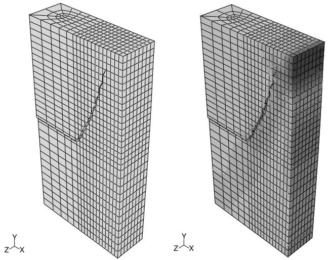  
Figure 1: Viewing an XFEM crack.

You can perform a time history animation of a contour plot and view the onset of damage calculated by XFEM. The animation also allows you to view the propagation of the damage through the enriched region as the analysis progresses. Turning on translucency allows you to see the progression of the crack through interior elements. For more information, see Changing the translucency.

To view the initial crack front, you can create an isosurface cut shape with PSILSM selected as the current primary field output variable. For more information, see Creating or editing a view cut.

If you want to investigate the crack in more detail, you can create a contour plot of the signed distance function (PHILSM) and determine in which elements the signed distance values are negative or positive. The crack surface is situated in the elements where the value of PHILSM transitions from a negative number to a positive number. In

addition, you can use the option in the View Cut Manager to view only the surface where the value of the signed distance function is zero, which corresponds with the surface of an XFEM crack. For more information, see Understanding view cuts.

## Creating an XFEM crack

You can use the Special menu in the Interaction module to create an extended finite element method (XFEM) crack.

1. From the main menu bar in the Interaction module, select Special->Crack->Create.  
2. From the Create Crack dialog box that appears, select XFEM.  
3. Enter the name of the crack, and click Continue to close the dialog box.  
4. From the model in the viewport, select the entities representing the crack domain. You can select cells from a three-dimensional part instance or faces from a two-dimensional part instance. If you have an orphan mesh or an instance containing both orphan mesh and native mesh elements, you can select elements to represent the crack domain. You should select the entities that contain an existing crack along with any entities into which a crack might propagate.

5. Click mouse button 2 to indicate that you have finished selecting the crack domain.

The Edit Crack dialog box appears.

6. You can reduce the size of the crack domain. This option is available only if you specify the crack location. Do the following:

a. Toggle on Shrink crack domain using crack location.  
b. Specify the number of element layers to include to prescribe a minimal enrichment zone automatically.  
c. Click Preview to highlight the elements in the viewport and, if desired, save the highlighted elements to a set.

7. Do either of the following:

• Toggle on Allow crack growth to define a crack that grows along an arbitrary path through your model as the solution progresses.  
• Toggle off Allow crack growth to define a stationary crack that cannot grow.

8. If you chose to allow crack growth, you can do either of the following to specify the crack location:

• Toggle off Crack location, indicating that you will allow Abaqus to determine the location of the crack based on the damage initiation criterion that you specified.

Toggle on Crack location and click to specify the crack location by selecting interior faces from a three-dimensional model or edges from a two-dimensional planar part. You should not select a seam crack.

9. If you chose to prevent crack growth, do the following:

a. Click to specify the crack location by selecting interior faces from a three-dimensional model or edges from a two-dimensional planar part. You should not select a seam crack.

b. To specify the enrichment radius, do either of the following:

• Choose Analysis default, to allow Abaqus to determine the enrichment radius. The default radius is three times the typical element characteristic length in the enriched area.  
• Choose Specify and enter a value. The value should be the radius from the crack tips within which the elements are used to calculate the crack singularity.

10. Choose the type of XFEM analysis:

By default, Abaqus will use the traction-separation cohesive behavior approach. You can select or create a contact interaction property that specifies the compressive and frictional behavior of the cracked faces based on a small-sliding contact formulation. For more information, see Defining surface-to-surface contact.

• If you create a fracture criterion contact interaction property, Abaqus will use the linear elastic fracture mechanics (LEFM) approach. For more information, see Specifying fracture criterion properties for crack propagation.

11. Click OK to configure the XFEM crack and to close the editor.

Abaqus displays green crosses to represent the crack domain and the crack location.

To view the crack growth in the Visualization module, you must use the Field Output Request editor in the Step module and request that Abaqus writes the signed distance function PHILSM to the output database during the analysis. For more information, see Viewing an XFEM crack, and Modifying field output requests.

## Additional information

• Fracture mechanics  
• Modeling Discontinuities as an Enriched Feature Using the Extended Finite Element Method

## Deactivating and activating an XFEM crack growth

By default, XFEM crack growth is active in all steps. However, if an analysis that includes XFEM crack growth fails to converge, you can deactivate the crack in a selected step and allow the analysis to reach equilibrium before reactivating the crack in a subsequent step.

1. Create an interaction in the initial step. For more information, see Creating interactions.  
2. Select an interaction type of XFEM crack growth, and click Continue.  
3. From the Edit Interaction dialog box, select the XFEM crack that you want to activate or deactivate. You can select only cracks that allow crack growth.  
4. Click OK to create the interaction.  
5. Open the Interaction Manager. For more information, see Managing objects in the Interaction module.  
6. Select the XFEM crack growth interaction in the desired step, and click Edit.  
7. From the Edit Interaction dialog box, toggle off (or on) Allow crack growth to deactivate (or activate) the XFEM crack growth in the selected step, and click OK.

The Interaction Manager displays Modified to indicate the status of the XFEM crack growth in that step. Abaqus propagates the state of the XFEM crack growth (activated or deactivated) to subsequent steps.

When you are configuring an XFEM analysis, you can select a contact interaction property that defines the compressive behavior of the crack surfaces. This section describes the settings in the contact interaction property that apply to XFEM crack growth. For more information, see Understanding interaction properties.

1. From the main menu bar, select Interaction->Property->Create.  
2. In the Create Interaction Property dialog box that appears, do the following:  
• Name the interaction property.  
• Select the Contact type of interaction property.

3. Click Continue to close the Create Interaction Property dialog box.  
4. From the menu bar in the contact property editor, select Mechanical->Normal Behavior.  
5. From the Constraint enforcement method field, select Penalty (Standard) to enforce contact constraints using the penalty method.  
6. Toggle off Allow separation after contact if you want to prevent surfaces from separating once they have come into contact.  
7. Choose the Linear enforcement behavior in the Behavior field to use the linear penalty method for the enforcement of the contact constraint.  
8. Specify the contact stiffness in the Stiffness value field.

• Choose Use default to have Abaqus calculate the penalty contact stiffness automatically.  
• Choose Specify, and enter a positive value for the linear penalty stiffness.

9. Specify a factor by which to multiply the chosen penalty stiffness in the Stiffness scale factor field.

10. Specify the Clearance at which contact pressure is zero. The default value is 0.

11. Click OK to create the contact property and to exit the Edit Contact Property dialog box.

## Requesting contour integral output for XFEM

You use the History Output Request editor in the Step module to request contour integral output from the XFEM crack. You must select Crack from the Domain field. The editor then allows you to select the output frequency and the type of contour integral analysis to perform. For more information, see Modifying history output requests, and Contour Integral Evaluation.

1. Enter the Step module.  
2. From the main menu bar, select Output->History Output Request->Create.  
Abaqus/CAE displays the Create History dialog box.  
3. From the Create History dialog box, enter the name of the output request and the step in which it will be created. Click Continue to close the dialog box.  
Abaqus/CAE displays the History Output Requests editor.  
4. From the Domain field, select Crack, and select the desired XFEM crack.  
5. Select the frequency at which the history output will be generated.  
6. Enter the number of contours to evaluate. Abaqus/CAE computes the next contour integral by adding a single layer of elements to the region defined by the previous domain. Each contour generates a value or a group of values for the contour integral.  
7. If desired, toggle on Step for residual stress initialization values and select the step from which Abaqus will use the stress data in the last available increment to extract the residual stresses. If you select the initial step, the residual stresses are defined by the specified initial conditions. You cannot select a step that occurs after the step in which the history output request is created. For more information, see Including the Effect of a Residual Stress Field on J-Integral Evaluation.  
8. Select the type of contour integral calculation to perform. You can select from the following:

## J-integral

You use the J-integral in rate-independent quasi-static fracture analysis to characterize the energy release associated with crack growth. The J-integral can be related to the stress-intensity factor if the material response is linear. For more information, see J-Integral.

## -integral

You use the $C _ { t }$ -integral for time-dependent creep behavior, where it characterizes creep crack deformation under certain creep conditions, including transient crack growth. For more information, see Ct-Integral.

## T-stress

You use the T-stress component to represent a stress parallel to the crack front. For more information, see T-Stress.

## Stress intensity factors

You use the stress intensity factors $\pmb { K } _ { I } , \pmb { K } _ { I I }$ , and ${ \kappa } _ { I I I }$ in linear elastic fracture mechanics to characterize the local crack-tip stress and displacement fields. For more information, see Stress Intensity Factors.

If you request a contour integral calculation using stress intensity factors, Abaqus also computes the crack propagation direction at initiation. You must choose one of the following to indicate the crack initiation criteria:

• Maximum tangential stress  
• Maximum energy release rate  
• $\mathbf { K } _ { \mathbf { I I } } = \mathbf { 0 }$

For more information, see Crack Propagation Direction.

9. Click OK to configure the contour integral analysis and to close the editor.

For examples of how Abaqus names history output variables in the output database for each contour integral that it calculates, see Contour integral output.

## Using the virtual crack closure technique to model crack propagation

You can use the virtual crack closure technique (VCCT) to study the initiation and propagation of a crack along a known crack surface.

Modeling crack propagation using VCCT is available only for Abaqus/Standard models (three-dimensional solid and shell and two-dimensional planar and axisymmetric models).

## In this section:

The virtual crack closure technique  
Creating a VCCT crack for Abaqus/Standard

## The virtual crack closure technique

You can study the onset and propagation of cracking in quasi-static problems using the virtual crack closure technique (VCCT). VCCT uses the principles of linear elastic fracture mechanics (LEFM) , so it is appropriate for problems in which brittle crack propagation occurs along predefined surfaces.

VCCT is based on the assumption that the strain energy released when a crack is extended by a certain amount is the same as the energy required to close the crack by the same amount.

You can include a VCCT crack in a static or quasi-static analysis procedure. Alternatively, you can include a VCCT crack in an implicit dynamic analysis procedure to simulate the fracture and failure in a structure under high-speed impact loading. VCCT is available only for Abaqus/Standard (three-dimensional solid and shell and two-dimensional planar and axisymmetric models). You can use VCCT to study a crack in parts containing geometry, orphan mesh elements, or a combination of the two. You define a VCCT crack in the Interaction module. You can specify the location of the surfaces that are initially bonded. For more information, see Modeling Discontinuities as an Enriched Feature Using the Extended Finite Element Method.

Creating VCCT or enhanced VCCT crack propagation models that converge to a successful solution requires some understanding of the principles behind VCCT. See Tips for Using the VCCT or Enhanced VCCT Criterion in Abaqus/Standard, for information that will help you create models that can be analyzed successfully.

For detailed instructions, see Creating a VCCT crack for Abaqus/Standard.

## Creating a VCCT crack for Abaqus/Standard

You can create a virtual crack closure technique (VCCT) crack that can be analyzed by Abaqus/Standard by doing the following:

Create a contact interaction property that specifies the fracture criterion. The fracture criterion interaction property specifies the criterion for crack propagation along initially partially bonded surfaces. You can choose between the following crack propagation criteria:

The virtual crack closure technique (VCCT) criterion, which uses the principles of linear elastic fracture mechanics. For more information, see VCCT Criterion.  
The enhanced virtual crack closure technique (Enhanced VCCT) criterion, in which you can control the onset and growth of a crack using two different critical fracture energy release rates. The enhanced virtual crack closure technique is available only in an Abaqus/Standard analysis. For more information, see Enhanced VCCT Criterion.

Create a surface-to-surface contact interaction that models the potential crack surfaces using main and secondary contact surfaces. The initially bonded region defines a region of the secondary surface that is initially bonded with the main surface. The unbonded portion of the secondary surface behaves as a regular contact surface. For detailed information, see Defining Initially Bonded Crack Surfaces in Abaqus/Standard.

Activate the crack propagation capability to specify that crack propagation can occur between the two surfaces that are initially partially bonded. The crack continues to propagate along the interface between the main and secondary surfaces. The virtual crack closure technique cannot model crack initiation from a surface that is not already cracked; therefore, you must specify a clearance between the secondary and main surfaces that models a preexisting flaw at the beginning of the crack surface.

For more information, see Crack Propagation Analysis.

1. Create a contact interaction property that defines the mechanical fracture criterion, as described in Specifying fracture criterion properties for crack propagation.

a. Choose the crack propagation criteria (VCCT or Enhanced VCCT).

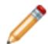

## Note:

The Direction of crack growth relative to 1–direction option applies only to enriched regions that will be used by the extended finite element method (XFEM) for crack propagation.

b. Specify the critical energy release rates for crack onset and propagation.

2. Create a surface-to-surface contact interaction that specifies the main and secondary surfaces (the region that contains the potential crack surfaces), as described in Defining surface-to-surface contact in an Abaqus/Standard analysis.

a. Select a discretization method of Surface to surface.  
b. From the Bonding tabbed page, toggle on Limit bonding to secondary nodes in subset, and choose the set that specifies the initially bonded nodes of the secondary surface. The unbonded portion of the secondary surface behaves as a regular contact surface.  
c. Select the contact interaction property that defines the mechanical fracture criterion.

3. Activate the VCCT crack propagation capability.

a. From the Interaction module main menu, select Special->Crack->Create.  
b. From the Create Crack dialog box that appears, select Debond using VCCT.  
c. Enter the name of the crack, and click Continue to close the dialog box.

The Edit Crack dialog box appears.

d. From the Edit Crack dialog box, do the following:

1. Select the step in which the crack propagation is initiated.  
2. Select the surface-to-surface contact interaction that specifies the main and secondary surfaces.  
3. Specify how the traction between the surfaces defined in the contact pair interaction is released after debonding occurs:  
• Choose Step (default) to release the traction during the increment that follows debonding.  
• To avoid a sudden loss of stability, choose Ramp to release the traction gradually during succeeding increments that follow debonding.

4. You can specify the rate at which crack propagation information is written to the data (.dat) file. If the step is using automatic time incrementation, the value is the suggested time increment to use for the first increment just after debonding starts. If the step is using fixed time incrementation, the value is the time increment after debonding starts if Abaqus/Standard finds it needs a smaller time increment than its current value. The time increment size will be modified as required until debonding is complete.

e. Click OK to configure the VCCT crack and to close the editor.

4. If desired, edit the general solutions control and adjust the VCCT Linear Scaling to accelerate convergence. For most crack propagation simulations using VCCT or the enhanced VCCT criterion, the deformation can be nearly linear up to the point of the onset of crack growth; past this point the analysis becomes very nonlinear. In this case linear scaling can be used to effectively reduce the solution time to reach the onset of crack growth. For more information, see Customizing general solution controls.

## Additional information

• Fracture mechanics  
• Crack Propagation Analysis

## Managing cracks

The Crack Manager allows you to create and manage cracks. The manager includes a list of the names and types of cracks that you have defined. The Create, Edit, Copy, Rename, and Delete buttons in the manager allow you to create new cracks or to edit, copy, rename, and delete existing ones. The icons in the column along the left side of the manager allow you to suppress and resume existing cracks. You can also initiate these procedures using the Special->Crack menu from the main menu bar in the Interaction module. After you select a management operation from the main menu bar, the procedure is exactly the same as if you had clicked the corresponding button inside the manager dialog box.

## Additional information

• Suppressing and resuming objects  
• Fracture mechanics

This section provides information on how to model gasket behavior.

## In this section:

Modeling gaskets  
Defining materials for gaskets  
Assigning gasket elements to a region

## Modeling gaskets

Gaskets are thin sealing components that are positioned between structural components.

(For detailed information on gasket theory, see Gasket Elements.) The general procedure for modeling gaskets in three-dimensional space involves the following steps:

1. In the Part module, define the solid geometry. Gasket parts are typically very thin, flat solids.  
2. In the Property module, define a gasket material. The material can be a regular material or one that includes special gasket behaviors. See Defining materials for gaskets, for more information.  
3. In the Property module, define a gasket section that refers to the gasket material. Then assign the gasket section to the gasket region.  
4. In the Interaction module, establish appropriate tie constraints or contact interactions between the gasket surfaces and the surfaces of adjacent regions.  
5. In the Mesh module, assign the top-down swept meshing technique or the bottom-up meshing technique to the gasket region. Regardless of the meshing technique that you choose, you must sweep, extrude, or revolve the mesh in a direction normal to the gasket plane to produce gasket elements with the correct orientation. See Specifying the sweep path, or Bottom-up meshing, for more information.  
6. In the Mesh module, assign a gasket element type to the gasket region, and mesh the region.

When you model gaskets with solids, you can use one or a combination of the following techniques to define the interaction between the gaskets and surrounding regions:

You can create a separate gasket part and then use tie constraints or contact interactions to couple the gasket part instance to the other part instances.  
You can create a thin region within a part and then assign a gasket section and element type to that region. This approach is recommended if compatibility between the gasket mesh and the meshes of adjacent regions is important.

Additional steps are necessary if the gasket model is composed of several layers and inserts. For example, Figure 1 illustrates a gasket modeled as a solid layer with an embedded shell-like insert.

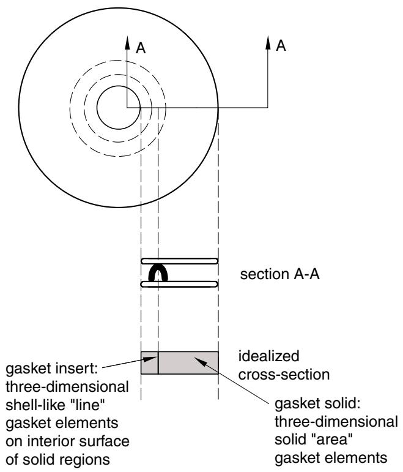  
Figure 1: Idealized gasket model.

The Abaqus/CAE representation of the idealized gasket model is shown in Figure 2.

  
Figure 2: A three-dimensional view of the gasket model and its elements.

If you are working with gaskets composed of several layers and inserts, you must perform the following additional tasks:

1. Use the Partition toolset to partition the solid gasket region so that an internal surface is created at the position of the insert.  
2. In the Property module, define a skin reinforcement on the internal surface that represents the insert. (See Defining skin reinforcements, for more information.) The gasket sections that you assign to the solid and to the insert are usually different, as are their materials.  
3. No meshing is required (or allowed) for the insert skin, but you must assign a three-dimensional “line” gasket element type to the skin in the Mesh module. See Assigning element types to skin or stringer reinforcements, for more information.

## Defining materials for gaskets

You can create two types of materials to include in gasket section definitions: materials with gasket-specific behaviors and general-use materials. The type of material that you create depends on your requirements for the gasket behavior.

Create a material using the special gasket behaviors if you want the thickness-direction, transverse shear, and membrane behaviors to be uncoupled. Gasket behavior materials are valid only for gasket sections. For detailed information on this approach to defining gasket behavior, see Defining the Gasket Behavior Directly Using a Gasket Behavior Model.  
Create a general-use material if you want to consider only the thickness-direction behavior. General-use materials are valid in gasket sections as well as in other types of sections. For detailed information on this approach to defining gasket behavior, see Defining the Gasket Behavior Using a Material Model.

You create a gasket-specific material by entering data for one or more of the behaviors found in the Other->Gasket submenu. Data entered for any other behavior in the material editor are ignored, with the following exceptions:

• You can include the Expansion behavior (located in the Mechanical menu) in a gasket behavior material definition.  
• You can include the Creep behavior (located in the Mechanical->Plasticity menu) in a gasket behavior material definition.  
You can include the Depvar and User Output Variables behaviors (located in the General menu) in a gasket behavior material definition.

You create a general-use material by entering data for any behaviors that are valid for gasket sections except those found in the Other->Gasket submenu. (If you enter data for a behavior found in the Other->Gasket submenu, you automatically create a gasket behavior material.) For information on which material behaviors are valid for general-use materials included in gasket section definitions, see Gasket Elements.

## Assigning gasket elements to a region

If the region is a shell, you must assign the swept meshing technique; if the region is a solid, you can assign any meshing technique. For solid regions you can define a stack orientation that is independent of the mesh technique. (For more information, see Applying a mesh stack orientation.) The swept meshing technique ensures that the elements are stacked in a manner suitable for gasket modeling. When you sweep mesh shell regions or solid regions that have not been assigned a stack orientation, the axis of each gasket element is coincident with the sweep path direction; therefore, you can control gasket element alignment by specifying an appropriate sweep path.

For example, the part instance shown in Figure 1 has three possible sweep paths, and each path has two possible sweep directions. If you mesh this part instance using gasket elements, you can choose from six possible gasket axis orientations. For more information, see Swept meshing, and Specifying the sweep path.

  
Figure 1: For shell regions, you must choose a sweep path and direction that provides an appropriate gasket axis orientation for your model.

In addition, you can assign gasket elements to orphan mesh elements. You can use the Query toolset to verify that the gasket elements are aligned correctly for regions where the gasket axis has more than one possible orientation. If necessary, you can use the Edit Mesh toolset to change the mesh stack orientation. For more information, see Orienting the stack direction. You can use these tools with hexahedral, wedge, and quadrilateral elements because these are the only elements that can be stacked to form a continuum shell or gasket mesh. If you have assigned second-order gasket elements to the region, you must first change the assignment to conventional elements before you reorient the stack direction. You can then convert the region back to a gasket mesh by reassigning second-order gasket elements.

This section provides information on how to model different types of imperfection. You can define imperfection in the Interaction module.

## In this section:

Defining imperfections  
Managing imperfections  
Defining file imperfections  
Defining input imperfections  
Defining data imperfections  
Editing the region to which a file imperfection applied

## Defining imperfections

You can define an imperfection for an assembly in the Interaction module.

You can specify the following types of imperfections:

## File imperfection

You can define a file imperfection that uses results files from a previous analysis on an assembly. For more information, see Introducing a Geometric Imperfection into a Model.

## Input imperfection

You can define an input imperfection that uses imperfection data specified in an alternate input file on an assembly. For more information, see Introducing a Geometric Imperfection into a Model.

## Data imperfection

You can define a data imperfection that uses data lines in the input file specifying components of imperfection for a given node on an assembly. For more information, see Introducing a Geometric Imperfection into a Model.

Select Special->Imperfection->Create: type from the Interaction module to define imperfection. Select Edit from the same menu to make changes to an existing definition.

Imperfection definitions appear in the Model Tree in the Engineering Features container under the assembly.

When you define a file imperfection, you can select objects from the viewport to identify the region on which to apply the imperfection. By default, a node set is created that contains the selected objects. You can change this behavior by toggling off the option to create a set or surface in the prompt area. A default name is provided in the prompt area, but you can enter a new name.

For detailed instructions on creating this type of engineering feature, see the following sections:

Defining file imperfections  
Defining input imperfections  
Defining data imperfections

## Managing imperfections

The Imperfection Manager allows you to create and manage imperfection definitions.

The manager includes a list of the names and types of imperfections that you have defined. The Create, Edit, Copy, Rename, and Delete buttons in the manager allow you to create new imperfection definitions or to edit, copy, rename, and delete existing ones.

The icons in the column on the left side of the manager allow you to suppress and resume existing imperfection definitions. You can also initiate these procedures using the Special->Imperfection menu from the main menu bar in the Interaction module.

After you select a management operation from the main menu bar, the procedure is the same as if you had clicked the corresponding button inside the manager dialog box.

## Additional information

• Suppressing and resuming objects  
• Defining file imperfections  
• Defining input imperfections  
• Defining data imperfections  
• Editing the region to which a file imperfection applied

## Defining file imperfections

You can define file imperfections on an assembly.

1. From the main menu bar in the Interaction module, select Special->Imperfection->Create.  
2. In the Create Imperfection dialog box that appears, name the imperfection, select File Imperfection, and click Continue.  
3. Select the points for which you want to define a file imperfection using one of the following methods:

• Select the points in the viewport. When you have finished selecting, click mouse button 2.  
• To select from a list of existing sets, do the following:

1. Click Sets on the right side of the prompt area to display the Region Selection dialog box containing a list of available sets.  
2. Select the set of interest, and click Continue.


Note: The default selection method is based on the selection method you most recently employed. To revert to the other method, click Select in Viewport or Sets on the right side of the prompt area.

The Edit Imperfection dialog box appears.

4. Select Result file, which is an .odb file that is to be used in the imperfection definition.  
5. Select the Step and Increment of the results file from which the displacement data are to be read to define the imperfection.  
6. In the Data table, enter the following:

## Mode Number

Enter the mode number.

## Scaling Factor

Enter the scaling factor. Repeat this row in the table as often as necessary to specify the imperfection as a linear combination of mode shapes.

7. Click OK to save your data and to close the dialog box.

• Introducing a Geometric Imperfection into a Model

## Defining input imperfections

You can define input imperfection on an assembly.

1. From the main menu bar in the Interaction module, select Special->Imperfection->Create.  
2. In the Create Imperfection dialog box that appears, name the imperfection, select Input imperfection, and click Continue.  
3. Select System.  
4. Select Input file, which is an .odb file that is used in the imperfection definition.  
5. Click OK to save your data and to close the dialog box.

• Introducing a Geometric Imperfection into a Model

## Defining data imperfections

You can define data imperfection on an assembly.

1. From the main menu bar in the Interaction module, select Special->Imperfection->Create.  
2. In the Create Imperfection dialog box that appears, name the imperfection, select Data imperfection, and click Continue.  
3. Select System.  
4. In the Imperfection Data table, enter the following:

## Node Number

Enter the node for which the imperfection is to be specified.

## Components

Enter the comp1, comp2, and comp3 component values for the imperfection in the selected system.

5. Click OK to save your data and to close the dialog box.

• Introducing a Geometric Imperfection into a Model

## Editing the region to which a file imperfection applied

You can edit the region to which a file imperfection is applied.

1. From the main menu bar in the Interaction module, select Special->Imperfection->Edit->file imperfection name to display the Edit Imperfection dialog box.  
2. In the top part of the dialog box, click .  
3. Edit the region using one of the following methods:

Select and unselect objects in the viewport. When you have finished editing the region, click mouse button 2. For more information, see Selecting objects within the viewport.  
• To select from a list of existing sets, do the following:

1. Click Sets on the right side of the prompt area.

Abaqus/CAE displays the Region Selection dialog box containing a list of available sets.

2. Select the set of interest, and click Continue.


Note: The default selection method is based on the selection method you most recently employed. To revert to the other method, click Select in Viewport or Sets on the right side of the prompt area.

4. In the dialog box, finish editing the imperfection definition as desired and click OK.

## Inertia

This section provides information on how to model different types of inertia for regions on a part or on an assembly. You can define inertia in the Property module or in the Interaction module.

## In this section:

Defining inertia  
Managing inertia  
Defining point mass and rotary inertia  
Defining nonstructural mass  
Defining heat capacitance  
Editing the region to which inertia is applied

## Defining inertia

Inertia can be defined for a part in the Property module or for an assembly in the Interaction module

You can specify the following types of inertia:

## Point mass/inertia

You can define lumped mass and rotary inertia at a point on a part or on an assembly. You can also define mass and inertia proportional damping. In an Abaqus/Standard analysis, you can define composite damping. For more information, see Point Masses, and Rotary Inertia.

## Nonstructural mass

You can define nonstructural mass for a region on a part or on an assembly. For more information, see Nonstructural Mass Definition.

## Heat capacitance

You can define concentrated heat capacitance at a point on a part or on an assembly. For more information, see Point Capacitance.

Select Special->Inertia->Create: type from the main menu bar in the Property module or the Interaction module to define inertia. Select Edit from the same menu to make changes to an existing definition.

Inertia definitions appear in the Model Tree in the Engineering Features container under the part (if created in the Property module) or under the assembly (if created in the Interaction module).

When you define inertia, you can select objects from the viewport to identify the region on which to apply the inertia. By default, a set or surface is created that contains the selected objects. You can change this behavior by toggling off the option to create a set or surface in the prompt area. A default name is provided in the prompt area, but you can enter a new name.

When you apply inertia to regions of the model, you can choose to display symbols in the viewport that indicate where you have applied the inertia. If you apply inertia to geometry, symbols appear at the vertices. If you apply inertia to an orphan mesh, symbols appear at the nodes. For information about graphical symbol types, see Symbols used to represent special engineering features. For information about controlling the visibility of these symbols, see Controlling the display of attributes.

For detailed instructions on creating this type of engineering feature, see the following sections:

Defining point mass and rotary inertia  
Defining nonstructural mass  
Defining heat capacitance

## Managing inertia

The Inertia Manager allows you to create and manage inertia definitions.

The manager includes a list of the names and the types of inertia that you have defined.

The Create, Edit, Copy, Rename, and Delete buttons in the manager allow you to create new inertia definitions or to edit, copy, rename, and delete existing ones.

The icons in the column along the left side of the manager allow you to suppress and resume existing inertia definitions. You can also initiate these procedures using the Special->Inertia menu from the main menu bar in the Property module or the Interaction module. After you select a management operation from the main menu bar, the procedure is the same as if you had clicked the corresponding button inside the manager dialog box.

## Additional information

• Suppressing and resuming objects  
• Defining point mass and rotary inertia  
• Defining nonstructural mass  
• Defining heat capacitance  
• Editing the region to which inertia is applied

## Defining point mass and rotary inertia

You can define lumped mass and rotary inertia at a point on a part or on an assembly.

You can also define proportional damping for point masses and rotary inertia. In an Abaqus/Standard analysis, you can define composite damping. For more information, see Point Masses and Rotary Inertia.

1. From the main menu bar in the Property module or the Interaction module, select Special->Inertia->Create.  
2. In the Create Inertia dialog box that appears, name the inertia, select Point mass/inertia, and click Continue.  
3. Select the points for which you want to define mass and rotary inertia using one of the following methods:

• Select the points in the viewport. When you have finished selecting, click mouse button 2.

If the model contains a combination of orphan mesh elements and geometry, select one of the following from the prompt area:

Select Geometry to define the point mass and rotary inertia for the geometric portions of a part or assembly or for a reference point.  
- Select Mesh to define the point mass and rotary inertia for orphan mesh components.

You can use the angle method to select a group of nodes from an orphan mesh. For more information, see Using the angle and feature edge method to select multiple objects.

• To select from a list of existing sets, do the following:

1. Click Sets on the right side of the prompt area to display the Region Selection dialog box containing a list of available sets.  
2. Select the set of interest, and click Continue.


Note: The default selection method is based on the selection method you most recently employed. To revert to the other method, click Select in Viewport or Sets on the right side of the prompt area.

The Edit Inertia dialog box appears. The region to which you are applying the point mass and rotary inertia is highlighted in the viewport.

4. From the Mass portion of the Magnitude tabbed page, do the following:

• For isotropic mass, toggle on Isotropic and specify the magnitude of the mass.  
• For anisotropic mass, toggle on Anisotropic and specify the mass components $M _ { 1 1 }$ , $M _ { 2 2 }$ , and $M _ { 3 3 }$ .

5. In the Rotary Inertia portion of the page, specify the moments of inertia (units M $\boldsymbol { \underline { 2 } }$ .

a. Toggle on Specify off-diagonal terms if you want to specify products of inertia.  
b. Enter values for the rotary inertia.

## I11

Rotary inertia about the local 1-axis, .

## I22

Rotary inertia about the local 2-axis, $\pmb { I _ { 2 2 } }$ .

## I33

Rotary inertia about the local 3-axis, $\pmb { I _ { 3 3 } }$ .

c. If applicable, enter values for the products of inertia.

## I12

Product of inertia, $\pmb { I _ { 1 2 } }$ .

## I13

Product of inertia, $\mathbf { { { I } _ { 1 3 } } }$ .

## I23

Product of inertia, $\pmb { I _ { 2 3 } }$ .

6. If you want to change the coordinate system (CSYS) for the rotary inertia, click and use one of the following methods:

• Select an existing datum coordinate system in the viewport.  
• Select an existing datum coordinate system by name.

1. From the prompt area, click Datum CSYS List to display a list of datum coordinate systems.

2. Select a name from the list, and click OK.

• Click Use Global CSYS from the prompt area to revert to the global coordinate system.

By default, the global coordinate system is used to define the rotary inertia.

7. Use the Damping tabbed page to define proportional damping for point masses or rotary inertia. For an Abaqus/Standard analysis, you can also define composite damping. You can specify values for both proportional damping for point masses and composite damping or for both proportional damping for rotary inertia and composite damping; however, Abaqus uses only the damping that is relevant to the particular dynamic analysis procedure being performed. If different damping values are needed for point masses and rotary inertia, you must create separate inertia definitions.

In the Alpha field, enter the $\pmb { \alpha _ { R } }$ factor to create proportional damping for point masses or rotary inertia in a direct-integration dynamic analysis, in a mode-based analysis that supports nondiagonal damping in Abaqus/Standard, or in an explicit dynamic analysis. This value is ignored in a modal dynamic analysis that does not support nondiagonal damping. The default value is 0.0.  
In the Composite field, enter the fraction of critical damping, $\xi _ { \alpha } ,$ to be used when calculating composite damping factors for the modes in a modal dynamic analysis. This value is ignored in a direct-integration dynamic analysis and in mode-based analyses that support nondiagonal damping in Abaqus/Standard. The default value is 0.0.

8. Click OK to save your data and to close the dialog box.

Symbols appear in the viewport that represent the point mass and rotary inertia that you just created.

## Additional information

• Controlling the display of attributes  
• Symbols used to represent special engineering features

## Defining nonstructural mass

You can define nonstructural mass for a region on a part or on an assembly. For more information, see Nonstructural Mass Definition.

1. From the main menu bar in the Property module or the Interaction module, select Special->Inertia->Create.  
2. In the Create Inertia dialog box that appears, name the inertia, select Nonstructural mass, and click Continue.  
3. Select the region for which you want to define nonstructural mass using one of the following methods:

Select the region in the viewport. When you have finished selecting, click mouse button 2. If the model contains a combination of orphan mesh elements and geometry, select one of the following from the prompt area:

Select Geometry to define the nonstructural mass for the geometric portions of a part or assembly or for a reference point.

\- Select Mesh to define the nonstructural mass for orphan mesh components.

You can use the angle method to select a group of nodes from an orphan mesh. For more information, see Using the angle and feature edge method to select multiple objects.

• To select from a list of existing sets, do the following:

1. Click Sets on the right side of the prompt area to display the Region Selection dialog box containing a list of available sets.  
2. Select the set of interest, and click Continue.


Note: The default selection method is based on the selection method you most recently employed. To revert to the other method, click Select in Viewport or Sets on the right side of the prompt area.

The Edit Inertia dialog box appears. The region to which you are applying the nonstructural mass is highlighted in the viewport.

4. Choose the Units that you will use to specify the nonstructural mass magnitude. The available types depend on the type of region that you selected.

• Select Total Mass to specify the magnitude in the form of a total mass value.  
• Select Mass per Volume to specify the magnitude in the form of mass per unit volume.  
• Select Mass per Area to specify the magnitude in the form of mass per unit area.  
• Select Mass per Length to specify the magnitude in the form of mass per unit length.

5. Enter the nonstructural mass magnitude in the Magnitude field in the units that you chose in the previous step.

6. If you specify the mass in the form of a total mass value and the region as a set, you can choose the Distribution method for distributing the mass over the region.

Select Mass Proportional to distribute the total mass among the members of the set in proportion to the structural mass. The underlying structural density is scaled uniformly over the region, and the center of mass is not altered.

Select Volume Proportional to distribute the total mass among the members of the set in proportion to the volume in the initial configuration. A uniform value is added to the underlying structural density over the region. If the region has a nonuniform structural density, its center of mass might be altered.

7. Click OK to save your data and to close the dialog box.

Symbols appear in the viewport that represent the nonstructural mass that you just created.

## Additional information

• Controlling the display of attributes  
• Symbols used to represent special engineering features

## Defining heat capacitance

You can define concentrated heat capacitance at a point on a part or on an assembly. For more information, see Point Capacitance.

1. From the main menu bar in the Property module or the Interaction module, select Special->Inertia->Create.  
2. In the Create Inertia dialog box that appears, name the inertia, select Heat capacitance, and click Continue.  
3. Select the points for which you want to define heat capacitance using one of the following methods:

• Select the points in the viewport. When you have finished selecting, click mouse button 2.

If the model contains a combination of orphan mesh elements and geometry, select one of the following from the prompt area:

Select Geometry to define heat capacitance for the geometric portions of a part or assembly or for a reference point.

\- Select Mesh to define heat capacitance for orphan mesh components.

You can use the angle method to select a group of nodes from an orphan mesh. For more information, see Using the angle and feature edge method to select multiple objects.

• To select from a list of existing sets, do the following:

1. Click Sets on the right side of the prompt area to display the Region Selection dialog box containing a list of available sets.  
2. Select the set of interest, and click Continue.


Note: The default selection method is based on the selection method you most recently employed. To revert to the other method, click Select in Viewport or Sets on the right side of the prompt area.

The Edit Inertia dialog box appears. The region to which you are applying the heat capacitance is highlighted in the viewport.

4. Optional: Toggle on Use temperature-dependent data, and enter the temperature.

5. Optional: Specify the Number of field variables, and enter the value for the first field variable, the value of the second field variable, etc.

6. In the Data table, enter the following:

## Capacitance

Enter the capacitance magnitude, (density × specific heat × volume).

7. Click OK to save your data and to close the dialog box.

Symbols appear in the viewport that represent the heat capacitance that you just created.

## Additional information

• Controlling the display of attributes  
• Symbols used to represent special engineering features

## Editing the region to which inertia is applied

You can edit the region to which inertia is applied.

1. From the main menu bar in the Property module or Interaction module, select Special->Inertia->Edit->inertia name to display the Edit Inertia dialog box.  
2. In the top part of the dialog box, click .  
3. Edit the region using one of the following methods:

Select and unselect objects in the viewport. When you have finished editing the region, click mouse button 2. For more information, see Selecting objects within the viewport.  
• To select from a list of existing sets, do the following:

1. Click Sets on the right side of the prompt area.

Abaqus/CAE displays the Region Selection dialog box containing a list of available sets.

2. Select the set of interest, and click Continue.


Note: The default selection method is based on the selection method you most recently employed. To revert to the other method, click Select in Viewport or Sets on the right side of the prompt area.

4. In the dialog box, finish editing the inertia definition as desired and then click OK.

The symbols representing inertia in the viewport change to appear on the newly edited region.

## Additional information

• Symbols used to represent special engineering features

## Load cases

This section provides information on how to use load cases.

## In this section:

What is a load case?  
Managing load cases  
Load case editors  
Viewing load case output  
Defining a load case

## What is a load case?

A load case is a set of loads and boundary conditions used to define a particular loading condition. You can use one or more load cases to study the linear responses of a structure subjected to different loading conditions in the following types of analyses: static perturbation, direct steady-state dynamic, SIM-based steady-state dynamic (mode-based and subspace-based), and substructure generation. A load case analysis is generally much more efficient than the equivalent multiple step analysis since it takes advantage of the principal of linear superposition.

You can define load cases directly in terms of loads and boundary conditions or in terms of combinations of previously defined load cases. You use the Load module to define load cases directly in terms of loads and boundary conditions. You use the Visualization module to define load case combinations of previously defined load cases during postprocessing. Load case output is stored in separate frames in the output database (.odb), and you can create results for load case combinations by combining the results from multiple frames.

You use the Load Case menu in the Load module to create load cases that include previously defined loads and boundary conditions. You can use a nonzero scale factor to scale the magnitude of individual loads and boundary conditions within a load case. You may include a load or boundary condition only once within each load case. If a step contains load cases, you must include each load and boundary condition in the step in one or more load cases. By default, Abaqus/CAE includes all boundary conditions propagated or modified from the base state in each load case you create but allows you to modify this behavior for individual load cases. You can use the boundary condition manager to deactivate unused propagated boundary conditions in a step containing load cases.

In steps containing load cases Abaqus supports only field output requests. The field output requests created in the Step module apply to all load cases in the step. You can use the Visualization module to view and manipulate load case results (see Viewing load case output).

For more information on load cases, see Multiple Load Case Analysis. For more information on creating loads and boundary conditions in the Load module, see Creating and modifying prescribed conditions.

## Additional information

• Suppressing and resuming objects

## Managing load cases

The Load Case Manager allows you to organize and manipulate load cases associated with a given model. You access the manager in the Load module by selecting Load Case->Manager from the main menu bar. The Load Case Manager is shown in Figure 1.

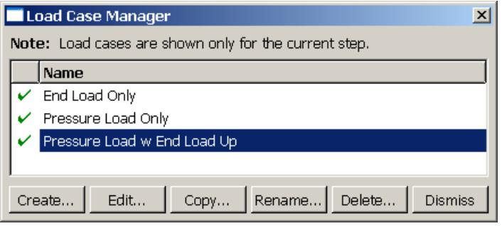  
Figure 1:The Load Case Manager.

The icons in the column along the left side of the manager allow you to suppress and resume existing load cases. The Create, Edit, Copy, Rename, or Delete buttons in the manager allow you to create new load cases or to edit, copy, rename, and delete existing ones. You can also initiate the create, edit, copy, rename, and delete procedures by using the Load Case menu in the main menu bar. After you select a management operation from the main menu bar, the procedure is exactly the same as if you had clicked the corresponding button inside the manager dialog box.

For detailed instructions on creating and editing load cases, see Defining a load case.

## Additional information

• Managing objects  
• Suppressing and resuming objects

## Load case editors

After you enter the Load module and create loads and boundary conditions, you can select Load Case->Create from the main menu bar to create a load case. A Create Load Case dialog box appears in which you can provide a name for the load case and select the step in which the load case will be created. When you click Continue in the Create Load Case dialog box, the load case editor appears.

The top panel of the load case editor displays the name of the load case and the current analysis step. The load case editor contains two tabbed pages with tables that allow you to select the loads and boundary conditions to define the load case. By default, Abaqus/CAE includes all boundary conditions propagated or modified from the base state in each load case that you create. You can toggle off this behavior on the Boundary Condition tabbed page.

\+ Click at the bottom of each tabbed page to select loads and boundary conditions from a list. You can enter a scale factor to scale the magnitude of individual loads and boundary conditions. If you enter a negative scale factor for a load, the load will be applied in the opposite direction. You can also enter the names of the loads and boundary conditions and the scale factors directly in the tables. During load case creation, Abaqus/CAE sorts the names of the loads and boundary conditions alphabetically and lists the names in the load case editor. You can highlight selected loads and boundary conditions in the viewport.

For example, you can define a set of load cases to analyze the response of a cantilever beam subjected to an end load and a uniform pressure load. The cantilever beam model is shown in Figure 1.


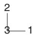  
Figure 1: Cantilever beam model with end load, pressure load, and encastre boundary condition.

An encastre boundary condition is applied in the initial step, and the end load and pressure load are applied in a static, linear perturbation step.

You can create a load case that contains only the end load and another that contains only the pressure load. In addition, you can create a load case that contains both the pressure load and the end load with the end load applied in the opposite direction (scale factor value of −1), as shown in Figure 2.

  
Figure 2: Load case definition that includes loads for the cantilever beam model.

By default, each load case contains the encastre boundary condition propagated from the base state, as shown in Figure 3.

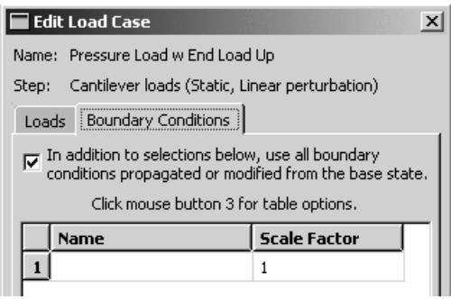  
Figure 3: Load case definition that includes boundary conditions propagated from the base state for the cantilever beam model.

The Load Case Manager in Figure 1 shows the three load cases created for the cantilever beam model.

## Additional information

• What is a load case?

## Viewing load case output

Load case output is stored in separate frames in the output database (.odb). You use the Visualization module to view and manipulate load case output. The load case name is displayed in the state block for each frame containing load case output. For example, Figure 1 shows the deformed plot for the Pressure Load w End Load Up load case of the cantilever beam model (see Load case editors).


Step: "Cantilever loads", Multiple load case bending Load Case: PRESSURE LOAD W END LOAD UP

Deformed Var: U Deformation Scale Factor: +5.079e+00

Figure 1: Results from a load case analysis.

In the Visualization module you can linearly combine output from several load cases to represent an actual loading environment. You can also obtain the minimum or maximum value of a selected field variable over some or all load cases.

For example, you can combine the output from the End Load Only and Pressure Load Only load cases for the cantilever beam model to create new field output with a load case name of Both loads, as shown in Figure 2.

  
Figure 2: Creating new field output by combining the output from two load cases (frames).

The new field output is contained in a frame of the session step and is available from the Field Output dialog box. Figure 3 shows a plot of the combined deformation results.

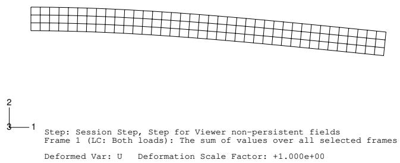  
Figure 3: Combined deformation results from both load cases.

For detailed information on manipulating load case output, see Combining results from several frames.

## Additional information

• Creating and saving new field output

## Defining a load case

You use the Load Case menu in the Load module to define a load case. You can create load cases in static perturbation, direct steady-state dynamic, SIM-based steady-state dynamic (mode-based and subspace-based), and substructure generation analyses. You must create the individual loads and boundary conditions in the Load module prior to creating a load case. For more information, see Creating loads, and Creating boundary conditions.

1. From the main menu bar in the Load module, select Load Case->Create.


Tip: You can also create a load case using the tool in the Load module toolbox.

2. In the Create Load Case dialog box that appears, do the following:

a. Name the load case. For more information about naming objects, see Using basic dialog box components.  
b. Select the step. You can define a load case only during the following steps: static, linear perturbation; steady-state dynamic, direct; SIM-based steady-state dynamic (modal and subspace); and substructure generation.

c. Click Continue.

The load case editor appears.

3. If you want to include loads in the load case, click the Loads tab. Specify the loads using one of the following methods:

• Click + at the bottom of the page to display a list of the loads available for the selected step.

1. From the Load Selection dialog box, select the loads from the list (see Selecting multiple items from lists and tables, for more information). The selected loads are highlighted in the viewport.  
2. In the Scale factor field, enter a nonzero value to scale the magnitude of the selected loads. Enter a negative value to apply the selected loads in the opposite direction. The default value of the scale factor for each load is 1.0.  
3. Click OK to save your selections and to close the Load Selection dialog box.

• Enter data in the table using the keyboard.

1. Enter the name of a previously defined load.  
2. Enter a nonzero value to scale the magnitude of the load. Enter a negative value to apply the load in the opposite direction. The default value of the scale factor is 1.0.  
3. Repeat the previous steps to specify all the loads to include in the load case.

The load case editor displays the loads and scale factors included in the load case. To highlight loads in the viewport, click the table row headings to select the loads in the editor (see Selecting multiple items from lists and tables, for more information) and toggle on Highlight selections in viewport. Suppressed loads are not highlighted in the viewport. To remove loads from the table, click the table

row headings to select the loads and click


4. If you want to include boundary conditions in the load case, click the Boundary Conditions tab to display the boundary conditions page. By default, Abaqus/CAE will include all boundary conditions propagated or modified from the base state in each load case you create. You can toggle off this behavior at the top of the boundary condition page. Specify the boundary conditions using one of the following methods:

• Click 十 at the bottom of the page to display a list of the boundary conditions available for the selected step.

1. From the Boundary Condition Selection dialog box, select the boundary conditions from the list (see Selecting multiple items from lists and tables, for more information). The selected boundary conditions are highlighted in the viewport.  
2. In the Scale factor field, enter a nonzero value to scale the magnitude of the selected boundary conditions. The default value of the scale factor for each boundary condition is 1.0.  
3. Click OK to save your selections and to close the Boundary Condition Selection dialog box.

• Enter data in the table using the keyboard.

1. Enter the name of a previously defined boundary condition.  
2. Enter a nonzero value to scale the magnitude of the boundary condition. The default value of the scale factor is 1.0.  
3. Repeat the previous steps to specify all the boundary conditions to include in the load case.

The load case editor displays the boundary conditions and scale factors included in the load case. The scale factor is relevant only if the boundary condition has a nonzero value. To highlight boundary conditions in the viewport, click the table row headings to select the boundary conditions in the editor (see Selecting multiple items from lists and tables, for more information) and toggle on Highlight selections in viewport. Suppressed boundary conditions are not highlighted in the viewport. To remove boundary conditions from the table, click the table row headings to select the boundary conditions and

click


5. Click OK to save your load case definition and to close the editor.

## Additional information

• Suppressing and resuming objects  
• Load case editors  
• Multiple Load Case Analysis

This section explains midsurface modeling and how you can use it to simplify thin solid models for analysis.

## In this section:

Understanding midsurface modeling  
Understanding the reference representation  
Creating shell faces for the midsurface model  
Examples of creating a midsurface model  
Creating and editing midsurface models

## Understanding midsurface modeling

Midsurface modeling is a technique for creating a simplified shell representation of a solid model. Midsurface modeling can reduce the computational expense of analyzing a complete solid model when a shell model with a defined thickness and fewer details is suitable for the required analysis.

The midsurface modeling process relies on an accurate solid model as the starting point. Midsurface modeling is best suited to thin solids or thin-walled solids where wall thickness is constant or where reasonable approximations of the wall thickness at each point can be made easily. You can apply midsurface modeling to any solid cell within a model; you need not apply it to the entire model. If you apply midsurface modeling to only a portion of a solid model,

Abaqus/CAE automatically creates shell-to-solid coupling constraints to couple the motion of the midsurface shell edges to that of the remaining solid model faces. Shell-to-solid coupling constraints will not be created if the angle between the shell surface and the solid face deviates significantly from 90°.

Besides reduced expense, you might use a midsurface model in place of a solid model to better account for bending response in thin sections of the model. Shell elements are designed to manage bending loads within the thickness of a single element, whereas a single solid element will have little or no resistance to bending.

Creating a midsurface model in Abaqus/CAE is a manual process. The procedure presented below provides an overview of the general steps involved. The tasks within each step may vary depending on the complexity and completeness of the original solid model and the analysis requirements. Some steps, such as Step 4 below, may not be required or may be completed in a different order from what is presented here.

1. Assign midsurface regions on the solid part. Use the Assign Midsurface Region tool to select one or more cells from the solid part to begin creating a midsurface model. For more information, see Assigning a midsurface region.  
Abaqus/CAE removes the selected cells from the active representation and creates a reference representation containing the selected cells.  
2. Create new shell faces to replace the solid geometry that you moved to the reference representation. You can use tools in the Geometry Edit toolset or the shell feature creation tools to add shell features to the midsurface model. For more information, see The Geometry Edit toolset and Adding a shell feature, respectively. The offset faces tool in the Geometry Edit toolset is the most common face creation method for midsurface models. The offset process creates new faces based on selected geometry and automatically assigns a shell thickness based on the offset parameters.  
3. Assign thicknesses to the new shell features.

The Assign Thickness and Offset tool allows you to assign shell thicknesses to the new midsurface geometry (for more information, see Assigning thicknesses and offsets). The tool allows you to assign thicknesses to individual faces, and you can also use it to edit thicknesses that Abaqus/CAE assigned automatically for faces created using the offset process. You must still assign a section to the new faces in the Property module. During the section assignment process you can make a final decision whether to use the thickness defined with the section properties or to use the definition from the geometry. You can toggle the shell thickness display in all part and assembly-based modules to see the thickness in the viewport (for more information, see Visualizing shell thicknesses).

4. Revise any analysis attributes that were associated with the solid geometry that was used to create the reference representation.

Analysis attributes such as loads, boundary conditions, or interactions cannot be applied to geometry in the reference representation. Any attributes that were associated with the solid geometry before it was moved to the reference representation will be associated with an empty region if the geometry is no longer part of the active representation. For more information, see Understanding the reference representation.

## Understanding the reference representation

A reference representation is an alternative representation of a part or a subset (one or more cells) of a part that is not used in the analysis. The reference representation retains the original solid model geometry, and, like reference geometry in the Sketcher, you can use entities from the reference representation as tools to construct a simpler version of the part. The reference representation is most commonly used to construct a midsurface model. When used with the offset face tool to create faces for the midsurface model, the offset calculations between the reference representation and the new faces also allow Abaqus/CAE to automatically compute shell thicknesses and element offsets in the midsurface model.

Abaqus/CAE creates a reference representation when you assign a midsurface property to one or more cells in a solid part. The selected cells are removed from the active representation of the part and added to the reference representation. The reference representation appears by default in the Part module and is colored translucent brown. You cannot change the color of the reference representation, but you can toggle it on or off in all modules using the Show Reference

Representation tool located with the visible object tools in the main toolbar. You can also toggle translucency of the reference representation on or off using the display options (for more information, see Controlling edge visibility.

You can use the reference representation with the shape creation tools or with the tools in the Geometry Edit toolset to help construct new geometric entities in the active representation. For example, you can offset faces in the reference representation or you can select a planar face from the reference representation as the sketch plane to create a new shell face using the extrude method. You can use the geometry in the reference representation to define partitions—select an edge and a vertex from the reference representation as the point and normal to partition a cell—or create datum entities. You can also use reference representation geometry to position entities and define constraints in the Assembly module.

You cannot edit the geometry within the reference representation, and you cannot assign analysis attributes such as loads, boundary conditions, and interactions to it. When you create a reference representation, any analysis attributes that were applied to the solid cells before you created the reference representation will now be associated with an empty region. You can edit the empty regions to associate the analysis attributes with geometry—solid geometry or shell geometry that you create for the midsurface model—that is part of the active representation. Alternatively, you can suppress or delete the analysis attributes. If you do not make any changes to the affected analysis attributes, Abaqus/CAE will display a warning message when you submit the job in the Job module.

## Creating shell faces for the midsurface model

Once you have a reference representation, you must manually build a shell model to replace the solid cells that have been removed from the model.

You can use the shell feature tools and the tools in the Geometry Edit toolset (for more information, see Adding a shell feature and The Geometry Edit toolset, respectively) to create and edit shell faces.

This section discusses some special conditions that may apply when you use these tools to create faces for a midsurface model.

## In this section:

Using the offset face tool for midsurface modeling  
Using the extend faces tool for midsurface modeling

## Using the offset face tool for midsurface modeling

You can use the offset face tool from the Geometry Edit toolset to create midsurface faces. The offset face tool creates new faces at an offset distance from an original set of faces. The offset faces are created using a similar process to that used for offsetting objects in the Sketcher (for more information, see Offsetting objects). Use of the offset face tool is discussed in detail in Offset faces.

In addition to the basic task of creating new shell faces, the offset face tool offers two functions that are helpful for creating a midsurface model:

• The offset distance is used by Abaqus/CAE to assign a thickness to the new shell faces.  
• The auto trim option automatically trims the new faces to the reference representation.

Once you have selected the faces to offset, you can enter a value for the offset distance or select a set of target faces that represents the distance through the desired shell thickness and have Abaqus/CAE calculate an offset. Abaqus/CAE calculates the distance between faces being offset and the target faces. You can offset to half the average distance or a fraction of the distance to the closest or farthest point on the target faces.

The difference in using each of the calculated offset distances is shown in Figure 1. The part has three different thicknesses. The thinnest face is at the top, the thickest in the middle, and the vertical face on the right has a thickness between the other two. The three outer faces of the reference representation were selected to be offset, and the three inner faces are the target faces. The view on the left shows the default Half the average distance method, and the offset is approximately the full thickness of the top face. The middle view shows the Fraction distance to closest point on face method with the fractional distance set to 0.5. The top target face is closest to the top offset face, so Abaqus/CAE offsets the new faces by 0.5 times this distance. The view on the right shows the Fraction distance to farthest point on face method with the fractional distance again set to 0.5. The middle (angled) target face is farthest from the middle offset face, so Abaqus/CAE offsets the new faces by 0.5 times this distance—the top offset face is cut off where it would extend through the reference representation of the original solid part because the Auto trim to reference representation option was used.

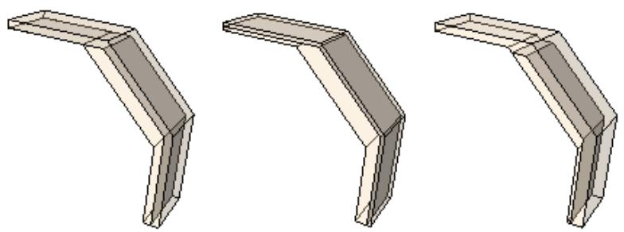  
Figure 1: Differences in the offset distance based on the three target face calculation methods.

Abaqus/CAE automatically associates the new offset shell faces with a thickness based on the offset calculations. If you selected target faces to calculate the offset distance, Abaqus/CAE also automatically recalculates the offset for any changes in the geometry of the top and bottom face sets. Use the Assign Thickness and Offset tool and the Render shell thickness option to edit and view the thicknesses assigned to the shell faces. For more information, see Assigning thicknesses and offsets, and Visualizing shell thicknesses.

If you use the auto trim option while offsetting faces, Abaqus/CAE offsets the faces and extends the outer edges of the new faces by an amount equal to the offset distance. The new faces are then trimmed where they intersect with the reference representation. Figure 2 shows a possible effect of using the auto trim option. The reference representation contains a cell, and the larger circular face of the cell was picked for the offset operation. Using the auto trim option, the new face is trimmed to the boundary of the conical face of the reference representation.

  
Figure 2:The auto trim option trims to the outer faces of the reference representation.

## Additional information

• Offset faces  
• Extend faces

## Using the extend faces tool for midsurface modeling

You can use the extend faces tool from the Geometry Edit toolset to create midsurface faces. The extend faces tool extends existing shell faces, so for midsurface modeling it must be used after you have created one or more shell faces. Use of the extend faces tool is discussed in detail in Extend faces.

You can extend faces by selecting individual edges to extend the faces in one or more directions, or you can specify faces to extend the faces along all exterior edges. There are also several methods for determining the extension distance; the Up to reference representation option is intended specifically for midsurface modeling.

When you use the Specify edges of faces to extend option to extend faces along a set of edges, the extend faces operation may fail. If this occurs, try reducing the number of selected edges and then using a second operation to extend the faces along the remaining edges.

## Additional information

• Extend faces

## Examples of creating a midsurface model

This section provides examples of creating midsurface models from solid models. In the first example the solid part has reasonably uniform thickness, and creation of the midsurface model is relatively easy. The second example is more complex and requires multiple steps to create a midsurface model that accurately represents the original solid model.

## In this section:

Midsurface modeling of a stamped bracket  
Midsurface modeling of a complex part  
Creating the shell representation of the beam

This example shows how you can use the midsurface modeling tools in Abaqus/CAE to convert a solid model of a bracket to a shell representation of the same part.

## The solid model

The model in this example is a 175.0 mm long bracket that is stamped from a 3.0 mm thick plate of mild steel, as shown in Figure 1. A default mesh of the solid part results in one or two elements through the thickness of the bracket that will not perform well in bending. Modeling a shell representation of the bracket will provide a more accurate bending response.

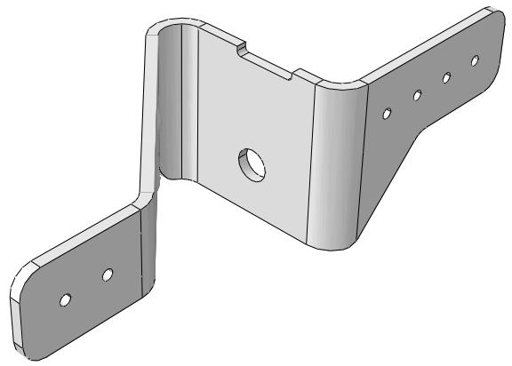  
Figure 1:The solid model of the bracket.

## Assign the midsurface region

Use the Assign Midsurface Region tool in the Part module to remove geometry from the active representation of the model and to create a reference representation of the original solid geometry, as shown in Figure 2.

  
Figure 2:The reference representation of the bracket.

The reference representation is an abstract representation of the original bracket. It retains the original geometry of the bracket, but it cannot be used in the analysis. The reference representation appears by default in the Part

module; you can toggle the view off and on using the Show Reference Representation tool located with the visible object tools in the main toolbar. For more information, see Understanding the reference representation, and Assigning a midsurface region.

## Create the shell representation

You must create a shell representation of the bracket that can be analyzed by Abaqus. The most commonly used tool for creating a midsurface shell model is the offset face tool, located with the other face tools in the Geometry Edit toolset. The offset face tool allows you to select one or more faces from the reference representation and to create new faces that are offset from the original faces. You can enter a fixed distance, or you can select target faces that Abaqus/CAE uses to calculate the distance. If you select target faces, the resulting shell thickness varies if the distance between the face to offset and the target face is not constant. Abaqus/CAE calculates the nodal thickness and the element offset for each node and element when you analyze the model. The Offset Faces dialog box is shown in Figure 3.

  
Figure 3:The Offset Faces dialog box.

For more information, see Methods for editing faces, and Adding a shell feature.

Figure 4 shows the selected faces to offset and the selected target faces. The by angle selection method was used to select the inner group of face as the faces to offset and the outer group of faces as the target faces.

  
Figure 4:The faces to offset and the target faces.

In this example you select the default option of Half the average distance from the Offset Faces dialog box, and Abaqus/CAE creates faces that are half the average distance between the faces to offset and the target faces.

By default, Auto trim to reference representation is toggled off in the Offset Faces dialog box. However, the auto trim option was active for this step, so Abaqus/CAE trimmed the offset faces to align with the reference representation. In some cases the trimming operation fails, which results in a slight misalignment between the new faces and the reference representation and a warning message from Abaqus/CAE. Even when trimming fails, the resulting shell face is often still a reasonable approximation of the reference representation; so you may be able to ignore the warning message. For more information, see Using the offset face tool for midsurface modeling.

## Assign a shell section

You use the Property module to create a shell section and to assign it to the new face. When you create the shell section, you can enter an arbitrary value for the shell thickness. When you subsequently assign the section to the shell, you specify that the thickness and the shell offset are calculated from the geometry in the Edit Section Assignment dialog box, as shown in Figure 5. Abaqus/CAE ignores the thickness value that you entered for the shell section.

  
Figure 5:The Edit Section Assignment dialog box.

For more information, see Assigning a section.

If desired, you can toggle on Render shell thickness from the Part Display Options to view the thickness of the shell, as shown in Figure 6.

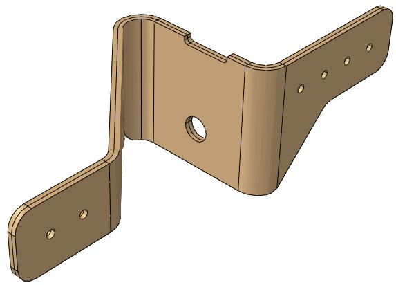  
Figure 6: Viewing the shell thickness.

## Mesh the part

Abaqus/CAE colors the shell part pink in the Mesh module to indicate it can be meshed using the free meshing technique, as shown in Figure 7.

  
Figure 7: Free meshing can be applied to the part.

You apply automatic virtual topology to the part to remove small details from the original part and to remove details that were created during the face trimming operation, as described in Creating virtual topology automatically.

You apply default seeding and mesh controls, and the resulting mesh is shown in Figure 8.

  
Figure 8:The resulting mesh.

This example uses several techniques and tools to create the midsurface model for a reinforced structural component.

## The solid model

The model in this example is the structural beam shown in Figure 1. The reinforcing ribs, different thicknesses, and asymmetrical shape of the beam do not allow for a simple beam section representation. The complexity of the part combined with its thin cross-sections make it a good candidate for replacement with a midsurface model. As in the previous example, bending performance will be improved by using a shell model for the mesh instead of thin solid sections.

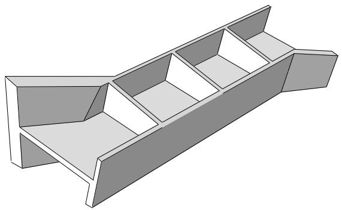  
Figure 1:The solid model of the reinforced beam.

## Assign the midsurface region

Use the Assign Midsurface Region tool in the Part module to remove geometry from the active representation of the beam and to create a reference representation of the original solid geometry, as shown in Figure 2. The reference representation is an abstract representation of the original part. It retains the original geometry of the part, but it cannot be used in the analysis. The reference representation appears by default in the Part module;

you can toggle it off and on using the Show Reference Representation tool 回 located with the visible object tools in the main toolbar. For more information, see Understanding the reference representation, and Assigning a midsurface region.

  
Figure 2:The reference representation of the beam.

## Create the shell representation

You must create a shell representation of the beam that can be analyzed by Abaqus. Creating a shell for this part requires multiple steps and tools. There may be several equally valid ways to produce an accurate shell representation for a model. See Creating the shell representation of the beam, to use tools from the Geometry Edit toolset to create the new shell faces.

## Assign thicknesses

All the original solid geometry has now been replaced with shell geometry. To complete the model, you should

verify that the shells have appropriate thickness information. Click the assign thickness and offset tool Abaqus/CAE highlights any shell faces that do not have thickness data. In this case, since the shell faces were all created using the offset, extend, and blend tools, all of the faces already have thickness data assigned. If there were faces without thickness data, you would select each face and, using the Compute thickness from opposite faces method in the Assign thickness and Offset dialog box, pick appropriate top and bottom faces from the reference representation to create the missing thicknesses.

To view the model with shell thicknesses, you can toggle on Render shell thickness in the Part Display Options dialog box (for more information, see Visualizing shell thicknesses). As shown in Figure 3, the resulting view includes the variations in thickness that were in the original solid model.

  
Figure 3: Shell faces with thickness displayed.

## Assign a shell section

Use the Property module to create a shell section and assign it to the midsurface model. When you create the shell section, you can enter an arbitrary value for the shell thickness. When you subsequently assign the section to the shell, you specify that the thickness and the shell offset are calculated from the geometry in the Edit Section Assignment dialog box. Abaqus/CAE ignores the thickness value that you entered for the shell section and uses the thicknesses assigned to the faces in the Part module. For more information, see Assigning a section. Figure 4 shows the completed midsurface model with section thicknesses after section assignment in the Property module. The geometry is identical to that in Figure 3.

  
Figure 4:The completed midsurface geometry with shell thicknesses.

## Mesh the part

Abaqus/CAE colors the shell part pink in the Mesh module to indicate it can be meshed using the free meshing technique, as shown in Figure 5.

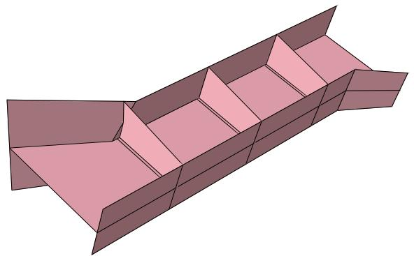  
Figure 5: Free meshing can be applied to the part.

Before seeding and meshing the part, you can apply automatic virtual topology to remove small details that are not needed in the mesh (for more information, see Creating virtual topology automatically). The default automatic virtual topology settings should remove the blended face edges and other small details that would unnecessarily constrain the part mesh.


## Note:

Automatic virtual topology may fail if neighboring faces have inconsistent normals. If this occurs, return

to the Part module and use the tool in the Geometry Edit toolset to repair the face normals.

Apply default seeding and mesh controls, and generate the mesh on the part. The resulting mesh is shown in Figure 6 with the shell thickness displayed.

  
Figure 6:The resulting mesh with shell thickness rendering.

You must create a shell representation of the beam that can be analyzed by Abaqus. Creating a shell for this part requires multiple steps and tools. There may be several equally valid ways to produce an accurate shell representation for a model. The following steps use tools from the Geometry Edit toolset to create the new shell faces.

1. Use the offset face tool to create shell faces for the vertical upper left side of the beam.

Select faces from the reference representation to create the offset shell. Use Auto Select to select the target faces. The faces to offset and the target faces are shown in red and magenta, respectively, in Figure 1.

  
Figure 1: Selected faces to create the offset for the upper left side.

The faces to offset are the two outer vertical faces toward the rear. The target faces are the nine faces, mostly unconnected, that comprise the inner surface of the same beam wall. The Fraction distance to closest point on face method is used with an entry of 0.5 to create the offset with half the thickness of the thinner main portion along the top of the beam. Using this option prevents the thicker sections at the left and along the bottom of the beam from creating an offset larger than the thinner portion. The Auto trim to reference representation option is used for this step. This operation extends the faces during the offset process and then trims them along the edges of the reference representation. Auto trim may fail when multiple offset and target faces are selected; if auto trim fails, Abaqus/CAE displays a warning indicating the failure. You can use the extend faces tool to extend the new faces to meet the edges of the reference representation. The resulting offset faces are shown in Figure 2.

  
Figure 2:The resulting offset faces.

2. Repeat the process from Step 1 to create offset faces for the opposite side of the beam.

The resulting shell model now contains the two outer surfaces of the beam, as shown in Figure 3.

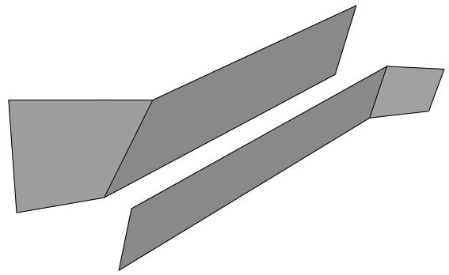  
Figure 3:The offset faces from the first and second steps.

3. Create offset faces for the four horizontal sections that connect the two side walls.

You can create the faces in a single offset operation by selecting the four top faces to offset and using Auto Select to select the corresponding bottom faces. In this case Auto trim to reference representation is toggled off, so the new faces are not extended and trimmed. The shell model of the horizontal faces is shown in Figure 4. (The faces created in Step 2 have been suppressed for clarity.) Notice the gaps between the horizontal faces where they meet the vertical reinforcement ribs in the original part. Similar gaps exist between the horizontal shell faces and the side walls created in the previous two steps.

  
Figure 4:The horizontal offset faces.

4. Repeat the process from Step 3 to create offset faces for the vertical ribs that connect the sides of the beam.

The midsurface shell model now contains faces representing nearly all of the solid geometry, as shown in Figure 5. However, there are gaps between most of the faces due to the thickness of the original solid structure.

  
Figure 5:The midsurface model with gaps between the faces.

5. Close the gaps between the vertical ribs and the beam sides.

Use the extend faces tool to extend the six vertical ribs to intersect with the sides. The selected faces and target faces are shown in magenta and yellow, respectively, in Figure 6.

  
Figure 6: Specifying the faces to extend and the target faces.

When you click OK, Abaqus/CAE updates the highlighting to indicate the edges along which the faces will be extended, as shown in Figure 7, and displays a warning dialog box with options allowing you to accept the selection, to extend all edges of the selected faces, or to cancel the extend faces procedure.

  
Figure 7:The edges where the vertical faces will be extended.

6. Use the extend faces

In this case, use the Specify edges of faces to extend method with Up to target faces to pick the edges and faces, respectively, shown in Figure 8. When Abaqus/CAE highlights the edges indicating the areas that will be extended, the four edges indicated by arrows in the figure are removed from the selection because they do not completely match the target faces. Click No to use the previous selection of edges.

  
Figure 8:The edges along which the horizontal faces will be the extended.

7. Close the remaining gaps between the horizontal and vertical connecting sections of the beam. You can use either the blend faces tool or the extend faces tool to complete the midsurface model by closing the remaining gaps between the horizontal and vertical connecting sections of the beam.

a. Use the extend faces tool with the selections shown in Figure 9.

Toggle on Trim to extended underlying target surfaces so that Abaqus/CAE will extend and trim the vertical faces to their implied intersections with the selected target face.

  
Figure 9: Filling the gaps between the vertical reinforcing ribs.

b. Use the blend faces tool to fill the remaining gaps.

The tool must be used three times to fill the three remaining gaps in the model.

## Creating and editing midsurface models

The typical process for creating a midsurface model in Abaqus/CAE begins with the solid model.

From the solid model, you select cells for which you want to create a midsurface model. Assigning these solid cells as a midsurface region creates a reference representation in the viewport from which you can create shell faces for the midsurface model. You can use tools from the Geometry Edit toolset to create the shell faces, then you can assign thicknesses to the new shells. When you assign thicknesses and offsets to the shell geometry, the default settings typically center the shell representation within the thickness.

## In this section:

Assigning a midsurface region  
Assigning thicknesses and offsets  
Assigning thickness to shell faces  
Visualizing shell thicknesses

## Assigning a midsurface region

To begin creating a midsurface model, you select the solid model regions that you would like to represent as shells. When you assign a midsurface region to one or more cells of a solid model, Abaqus/CAE creates an Assign Midsurface feature and moves the selected cells from the active representation of the part to the reference representation. The reference representation works similarly to reference geometry in a sketch—using the Geometry Edit toolset, you can select points and edges from the reference representation to create points, edges, and faces in the midsurface model. The new midsurface geometry that you create becomes part of the active representation that will be meshed and analyzed.

1. From the main menu bar, select Tools->Midsurface->Assign.


Tip: You can also assign midsurface regions using the tool, located with the midsurface tools in the Part module toolbox.

2. Select the solid cells from which you want to create the midsurface model.

You can select individual cells from the viewport or select an existing set of solid cells. For more information on using the selection methods in Abaqus/CAE, see Selecting objects within the viewport. Abaqus/CAE creates an Assign midsurface feature containing the selected cells and displays them as translucent in the viewport.

3. Repeat Step 2 to assign more midsurface regions, or click Done to end the procedure.

## Additional information

• Editing techniques

## Assigning thicknesses and offsets

Like all shell faces in Abaqus/CAE, midsurface model faces require a defined thickness. After you have created the shell geometry for the midsurface model, the Assign Thickness and Offset tool provides a method to accurately capture the thickness of the solid model that you are replacing. You can also use this tool to edit thicknesses assigned automatically by Abaqus/CAE. For example, you can edit the thickness of faces that were created using the face offset process (for more information, see Offset faces). Abaqus/CAE automatically derives the shell thickness for offset faces from the parameters used in the offset operation.

There are two ways to assign a thickness to shell faces in Abaqus/CAE. You can apply a shell thickness definition by using the section properties in the Property module, or you can assign thicknesses by selecting faces and editing their thicknesses with the Assign Thickness and Offset tool in the Part module. During the section assignment process you select which method Abaqus/CAE uses to assign thickness to a particular set of geometric faces. (For more information on section assignments, see Assigning a section.)


## Note:

Thickness data assigned in the Part module—either automatically or using the Assign Thickness and Offset tool—appear as From geometry in the thickness section of the Edit Section Assignment dialog box in the Property module. You cannot use thickness data assigned in the Part module to calculate the offset in an Abaqus/Explicit analysis.

## Additional information

• Editing techniques

## Assigning thickness to shell faces

Defining the thickness in the Part module allows you to define where the midsurface of the solid lies with respect to the shell faces of the midsurface model. The default thickness definition places the midsurface in the center of the thickness. However, you can select surfaces to define a top and bottom thickness, effectively creating an offset between the midsurface and the middle of the shell thickness. Selecting top and bottom faces allows you to easily define different thicknesses at each node and define a different shell offset for each element. This freedom is useful when you use a midsurface model to approximate thin solid models with varying thickness. Using top and bottom faces also allows Abaqus/CAE to automatically update thickness data if you edit the model geometry.

1. From the main menu bar, select Tools->Midsurface->Assign Thickness and Offset.


Tip: You can also assign thicknesses and offsets using the tool, located with the midsurface tools in the Part module toolbox.

Shell faces are colored yellow if they are not currently associated with a thickness.

2. If the part contains multiple shell faces, select the faces to which you want to assign thicknesses and offsets (for more information, see Selecting objects within the viewport”).  
3. When you have finished making selections from the viewport, click mouse button 2 to commit your selections.  
Abaqus/CAE opens the Assign Thickness and Offset dialog box.  
4. If necessary, click the Edit button next to Faces to assign thickness to change the selections you made in the previous steps.  
5. Use one of the following methods to assign a thickness to the selected faces:

## Enter or Measure the thickness

Enter a value for thickness, or click to measure a distance in the viewport and enter it as the thickness.

## Compute thickness from opposite faces

Toggle on this option, and click Select to select the top and/or bottom faces from the viewport.

Abaqus/CAE highlights the faces in the viewport and calculates the thickness.

If you select only top or only bottom faces, Abaqus/CAE applies the same thickness to both sides of the target shell faces. If you select both top and bottom faces, Abaqus/CAE calculates the thickness and an offset value so that the selected shell faces are not centered within the thickness.

6. Click OK to apply the thickness and offset (if used) to the target faces and to close the dialog box.

You can view the thickness of faces in the model by toggling on Render shell thickness in the Abaqus/CAE display options. For more information, see Visualizing shell thicknesses, and Controlling shell thickness display.

## Visualizing shell thicknesses

You can view the thickness of your midsurface model in Abaqus/CAE. The thickness representation uses the offsets and thicknesses defined on the part or through the section assignment properties to create the new model view. Visualizing the part thickness along with the reference representation can help you determine whether the midsurface model accurately represents the solid model that you are replacing.

An axisymmetric shell section (smooth curved face) and an extruded shell where faces are joined along a straight edge are shown in Figure 1. As shown in the figure, shell thickness is accurately displayed for smooth curved shells; however, where shell faces are joined along edges, the displayed thickness contains gaps and overlaps at the corners between faces.

  
Figure 1: Displaying shell thickness on a smooth curved face and faces joined along edges.

To activate shell thickness display, see Controlling shell thickness display.

## Additional information

• Editing techniques

## Skin and stringer reinforcements

This section provides information on how to model skin and stringer reinforcements.

## In this section:

Defining skin reinforcements  
Defining stringer reinforcements  
Managing skin and stringer reinforcements  
Generating elements on a skin or stringer reinforcement  
Assigning element types to skin or stringer reinforcements  
Using offset meshes to create skin reinforcements  
Assigning surface properties to skins and stringers  
Creating and editing skin reinforcements  
Creating and editing stringer reinforcements

## Defining skin reinforcements

A skin reinforcement defines a skin that is bonded to the surface of an existing part and specifies its engineering properties. The surface can be a face of a three-dimensional solid part, any edge of an axisymmetric part, or any face of a two-dimensional part. The part can include geometry and orphan mesh elements; however, skin reinforcements must be defined separately for the geometry and the orphan mesh elements. You should think of a skin as a property of a part or region, in the same way a section is a property of a part or region.

The composite beam shown in Figure 1 is an example of how you might use a skin reinforcement in your model.

  
Figure 1: A composite beam modeled by a solid honeycomb core and an aluminum skin.

The beam has a solid honeycomb core and an aluminum skin on the upper and lower faces. You can create a solid part representing the honeycomb and add a skin reinforcement representing the aluminum layers. In the Mesh module you assign solid elements to the honeycomb and shell elements to the skin. The solid and shell elements share the same nodes.

Select Special->Skin->Create from the main menu bar in the Property module to define one or more skins. Select Edit from the same menu to make changes to an existing definition. All skins you create also appear in the Model Tree in a Skins container under the part. Skins are not displayed in the viewport by default, but you can make them visible by color coding them in the viewport. See Coloring geometry and mesh elements, for more information.

If you create a skin on a geometry region, Abaqus/CAE updates the skin if you make minor modifications to the underlying geometry. If you edit orphan nodes or elements with a skin, Abaqus/CAE updates the skin if you edit or delete nodes or elements; however, it does not update the skin if you create new nodes or elements.

You may need to select the skin in subsequent modeling operations; for example, to:

• Assign a homogeneous shell section, a composite shell section, a membrane section, a surface section, or a gasket section to a skin. Section assignments are performed in the Property module.  
• Assign a material orientation or rebar reference orientation to a skin. Both of these orientation assignments are performed in the Property module.  
Assign a normal direction to a skin in the Property module. Although you cannot assign a normal direction to a skin directly, you can assign a normal direction to a face, which updates the normal direction of all skins defined on that face.

• Prescribe a body force to the skin in the Load module.

Prescribe a thermal flux on the skin in the Load module. In practice, you perform this modeling operation by applying a thermal flux load to the underlying face or faces. Abaqus/CAE applies the load to all skins on that face during the analysis.

• Assign an element type to the skin in the Mesh module.

• Request field data output or history data output for the skin in the Step module.

Create a display group to view the stress values on the skin elements in the Visualization module. While you cannot specifically select skins by name in the Create Display Group dialog box, you can find them in this dialog box by searching for elements that share the same element type, section assignment, or another property as the skin elements in your model. This process can help you narrow down the list of elements to the skins you want to include.

When you are prompted to select a region for these modeling operations, select Skins from the list of object types in the Selection toolbar, and select the skin region from the viewport. For more information, see Filtering your selection based on the type of object.

When performing contact calculations, Abaqus/CAE considers a geometric surface's skin reinforcements only in certain cases; for example, when you specify general contact for all exterior surfaces, a default all-inclusive surface is defined automatically in Abaqus that will consider skin reinforcements. Skin reinforcements can significantly influence contact calculations, due to skin thickness and potential effects on numerical quantities such as contact penalty stiffness. To explicitly include skin reinforcements in a contact definition, you can create a set on the skin reinforcement and then use the set to define an element-based secondary surface in a contact pair definition in an Abaqus/Standard analysis or use the set to define a node-based secondary surface in a contact definition in an Abaqus/Explicit analysis.

For detailed information on creating a skin, see Creating and editing skin reinforcements.

## Defining stringer reinforcements

A stringer reinforcement defines a stringer that is bonded to the edge of an existing part and specifies its engineering properties. You can select an edge of a three-dimensional solid part or an edge of a two-dimensional planar part. The part can include geometry and orphan mesh elements; however, stringer reinforcements must be defined separately for the geometry and the orphan elements. You should think of a stringer as a property of a part or region, in the same way a section is a property of a part or region.

The steel-reinforced beam shown in Figure 1 is an example of how you might use stringer reinforcements in your model.

  
Figure 1: A concrete beam modeled with steel stringer reinforcements.

The beam has a concrete core with four cylindrical extrusions that run the length of the beam. A steel stringer with a circular profile has been created in each extrusion to provide support along the length of the beam. You can create a solid part representing the beam and add four stringer reinforcements representing the steel reinforcements. In the Mesh module you assign solid elements to the concrete and line elements to the stringers. The solid and line elements share the same nodes.

Select Special->Stringer->Create from the main menu bar in the Property module to define one or more stringers. Select Edit from the same menu to make changes to an existing definition. All stringers you create also appear in the Model Tree in a Stringers container under the part. Different stringers can share the same section, and multiple stringers can be placed on an edge of a part. Stringers are not displayed in the viewport by default, but you can make them visible by color coding them in the viewport. See Coloring geometry and mesh elements, for more information.

If you create a stringer on a geometry region, Abaqus/CAE updates the stringer if you make minor modifications to the underlying geometry. If you edit orphan nodes or elements with a stringer, Abaqus/CAE updates the stringer if you edit or delete nodes or elements; however, it does not update the stringer if you create new nodes or elements.

You may need to select the stringer in subsequent modeling operations; for example, to:

• Assign a section, beam section orientation, material orientation, or tangent direction to a stringer. All of these activities are performed in the Property module.  
• Prescribe a body force or line load to the stringer in the Load module.  
Prescribe a thermal flux on the stringer in the Load module. In practice, you perform this modeling operation by applying a thermal flux load to the underlying edge or edges. Abaqus/CAE applies the load to all stringers on that edge during the analysis.  
• Assign an element type to the stringer in the Mesh module.  
• Request field data output or history data output for the stringer in the Step module.  
Create a display group to view the stress values on the stringer elements in the Visualization module. While you cannot specifically select stringers by name in the Create Display Group dialog box, you can find them in this dialog box by searching for elements that share the same element type, section assignment, or another property as

the stringer elements in your model. This process can help you narrow down the list of elements to the stringers you want to include.

When you are prompted to select a region for these modeling operations, select Stringers from the list of object types in the Selection toolbar, and select the stringer from the viewport. For more information, see Filtering your selection based on the type of object.

When performing contact calculations, Abaqus/CAE considers a geometric surface's stringer reinforcements only in certain cases; for example, when you specify general contact for all exterior surfaces, a default all-inclusive surface is defined automatically in Abaqus that will consider stringer reinforcements. Stringer reinforcements can significantly influence contact calculations, due to stringer thickness and potential effects on numerical quantities such as contact penalty stiffness. To explicitly include stringer reinforcements in a contact definition, you should create a set on the stringer reinforcement and then use the set in a contact definition.

For detailed information on creating a stringer, see Creating and editing stringer reinforcements.

## Managing skin and stringer reinforcements

The Skin Manager and Stringer Manager allow you to create and manage skin and stringer reinforcements, respectively. These managers each include a list of the names of skins or stringers that you have defined. The Create, Edit, Rename, and Delete buttons in the manager allow you to create new skins and stringers or to edit, rename, and delete existing ones. You can also initiate these procedures using the Special->Skin menu and Special->Stringer menu from the main menu bar in the Property module. After you select a management operation from the main menu bar, the procedure is exactly the same as if you had clicked the corresponding button inside the manager dialog box.


## Note:

If you rename a skin or stringer after you have assigned sections, orientations, normals, or other properties to it, the assignments become invalid.

## Additional information

• Creating and editing skin reinforcements  
• Creating and editing stringer reinforcements

## Generating elements on a skin or stringer reinforcement

You can use the Mesh module to generate two-dimensional elements on a skin reinforcement on a face of a three-dimensional part instance. Similarly, you can generate one-dimensional elements on a stringer reinforcement on an edge of an axisymmetric part instance. Abaqus/CAE generates the skin or stringer elements when the underlying geometry is meshed; you cannot mesh a skin or stringer reinforcement independently.

Figure 1 shows a three-dimensional part instance with a skin reinforcement on the top surface.  
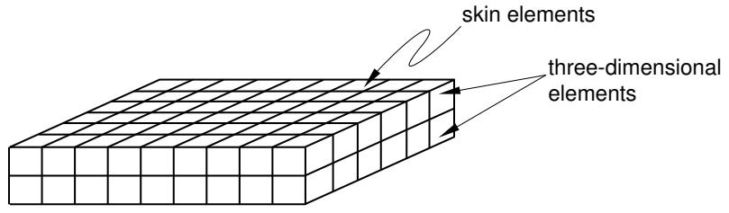  
Figure 1: A three-dimensional part instance with a skin reinforcement.

When the part instance is meshed, the skin or stringer elements and the three-dimensional elements share the same nodes and mesh topology. If you assign a different geometric order to the skin elements, you should also change the order of the underlying elements. For more information, see Assigning element types to skin or stringer reinforcements.

If you create a skin or stringer on an orphan mesh, the skin or stringer elements and the underlying orphan mesh elements share the same nodes and mesh topology. If you delete an orphan mesh element, Abaqus/CAE automatically regenerates any skins or stringers associated with the deleted element. After regeneration, these skins or stringers have new element ID numbers, so this regeneration renders invalid any sets that include the skins or stringers. Therefore, if you delete elements from an orphan mesh, you should update any set definitions that include skins or stringers formerly associated with the deleted elements.

## Assigning element types to skin or stringer reinforcements

You use the Property module to create a skin or stringer reinforcement on a part in your model. You use the Mesh module to assign an element type to a skin or stringer reinforcement. When you are prompted to select the regions to be assigned element types, you must select either Skins or Stringers from the list of object types in the Selection toolbar.

When you create a skin or a stringer for a geometric part, Abaqus/CAE adds an attribute to the geometric entity. This attribute is used when you mesh the part to generate skin or stringer elements, and these elements share nodes with the underlying elements of the part.

You can use stringer reinforcements in a buckling analysis, and you can use skin reinforcements in a coupled structural-acoustic analysis. If the acoustic medium adjoins a structure, structural-acoustic coupling occurs at the interface. It is recommended that you use surface-based tie constraints to enforce the coupling; however, if you are conducting a structural-acoustic submodeling analysis where the acoustic domain forms the submodel, you must line the interface portion of the submodel boundary with acoustic-structural interface (ASI) elements to enforce the coupling. You can line the interface with ASI elements by creating a skin at the interface and assigning ASI elements to the skin. For detailed information about using skins to create ASI elements on geometry and orphan meshes, see the Dassault Systèmes Knowledge Base at http://support.3ds.com/knowledge-base/.

## Using offset meshes to create skin reinforcements

As an alternative approach, you can use the mesh offset tool in the Edit Mesh toolset to create a skin reinforcement by sharing the nodes of the offset shell with the underlying orphan mesh. However, the equivalent offset shell does not appear in the Model Tree as a skin because using the offset shell to represent a reinforcement skin is just one of many potential uses of the offset shell. If you are creating more than one layer of reinforcement skins, you should specify a distance of zero between the layers so that the layers can share nodes.

## Assigning surface properties to skins and stringers

If you want to apply a surface property such as a pressure load to a skin or a stringer, you must apply the property to its underlying surface or edge instead. Because skins and stringers share nodes with the surfaces or edges to which they apply, Abaqus/CAE automatically propagates any applied surface properties to skins and stringers as well. For more information about defining surface properties, see Assigning sections, orientations, normals, and tangents to a part.

## Creating and editing skin reinforcements

During the initial creation of a skin, you select one or more faces that you want to reinforce and, if desired, the number of skins that you want to create.

After the skin is created, you can modify it in the following ways:

In the Property module, you can modify a skin by assigning it a section (a homogeneous shell section, a composite shell section, a membrane section, a surface section, or a gasket section), a material orientation, or a rebar reference orientation. You can also reverse the normal direction of a skin by assigning a normal direction to its underlying face. When you reverse the normal direction for a face, all skins assigned to that face inherit the new normal direction as well.  
In the Mesh module, you can assign an element type to the skin. When you are prompted to select the regions to be assigned element types, you must select Skins from the list of object types in the Selection toolbar. If you assign a shell section to a skin, you must assign shell elements to the skin. Similarly, if you assign a membrane, surface, or gasket section, you must assign membrane, surface, or gasket elements.

Abaqus/CAE names skins automatically, but you can rename them from the Skin Manager, the Special menu, or from the Model Tree. If you create multiple skins at once, Abaqus/CAE appends a unique identifier to the name to identify each skin.

You can obtain data from a skin by using the field and history output request editors in the Step module. In the Domain section of the editor, select Skin and choose the desired skin from the menu that appears. For more information, see Creating an output request.

1. From the main menu bar in the Property module, select Special->Skin->Create.


Tip: You can also click the

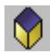

tool in the Property module toolbox.

2. Use one of the following methods to select the faces to which you want to add skin reinforcements:

## Selecting individual faces:

1. Click the arrow next to the Select entities on which to create a skin field in the prompt area, and select individually from the list that appears.  
2. Select a face to which you want to add skin reinforcement.  
3. [Shift] + Click on additional faces to add them to your selection.  
4. If necessary, [Ctrl] + Click on selected faces to unselect them.  
5. When you have finished selecting faces, click mouse button 2.

## Specifying an existing set:

1. Click Sets on the right side of the prompt area.

Abaqus/CAE displays the Region Selection dialog box containing a list of sets that you have created.

2. Select the set of faces to which you want to add skin reinforcement, and click Continue.


Note: The default selection method is based on the selection method you most recently employed. To revert to the other method, click Select in Viewport or Sets on the right side of the prompt area.

## Selecting faces using the angle method:

1. Click the arrow next to the Select entities on which to create a skin field in the prompt area, and select by face angle from the list that appears.  
2. Enter an angle (from 0° to 90°), and select a face. Abaqus/CAE selects every adjacent face from the selected face until the angle between the faces is equal to or exceeds the angle that you entered. (See Using the angle and feature edge method to select multiple objects for more information.)  
3. After you use the by face angle method, you can [Shift] + Click on additional faces to add them to your selection or [Ctrl] + Click on selected faces to remove them from your selection. (See Combining selection techniques for more information.)


Tip: You can use the Selection toolbar to limit the types of objects that you can select in the viewport. For more information, see Selecting objects within the viewport.

3. If desired, toggle on Multiple skins in the Prompt area to create more than one skin reinforcement for the selected face or faces.  
4. Click Done to create the skin. If you are creating multiple skins, enter the number of skin layers you want to create, and click mouse button 2.

## Additional information

• Assigning a section  
• Assigning a material orientation  
• Assigning a rebar reference orientation  
• Assigning shell/membrane normal directions

## Creating and editing stringer reinforcements

You can create a stringer immediately after you define the part; stringers do not initially require material or section assignments.

After you have created a stringer, you can then assign it a section, beam section orientation, material orientation, and tangent direction using the options under the Special menu in the Property module. You can also assign an element type to the stringer in the Mesh module. When you are prompted to select the regions to be assigned element types, you must select Stringers from the list of object types in the Selection toolbar.

You can create multiple stringers at a time on the same edge. Abaqus/CAE treats these stringers as different layers of stringer reinforcement, and you can assign different qualities to each one.

Abaqus/CAE names stringers automatically, but you can rename them from the Stringer Manager, the Special menu, or from the Model Tree. If you create multiple stringers at once, Abaqus/CAE appends a unique identifier to the name to identify each stringer.

You can obtain data from a stringer by using the field and history output request editors in the Step module. In the Domain section of the editor, select Stringer and choose the desired stringer from the menu that appears. For more information, see Creating an output request.

1. From the main menu bar in the Property module, select Special->Stringer->Create.


Tip: You can also click the tool in the Property module toolbox.

2. Use one of the following methods to select the edges to which you want to add stringer reinforcement:

## Selecting individual edges:

1. Click the arrow next to the Select entities on which to create a stringer field in the prompt area, and select individually from the list that appears.  
2. Select an edge to which you want to add stringer reinforcement.  
3. [Shift] + Click on additional edges to add them to your selection.  
4. If necessary, [Ctrl] + Click on selected edges to unselect them.  
5. When you have finished selecting edges, click mouse button 2.

## Specifying an existing set:

1. Click Sets on the right side of the prompt area.  
Abaqus/CAE displays the Region Selection dialog box containing a list of element sets that you have created.  
2. Select the set of entities to which you want to add stringer reinforcement, and click Continue.


## Note:

The default selection method is based on the selection method you most recently employed. To revert to the other method, click Select in Viewport or Sets on the right side of the prompt area.

## Selecting edges using the angle method:

You can use this method to select geometric edges only. This method is not available for selecting orphan mesh element edges.

1. Click the arrow next to the Select entities on which to create a stringer field in the prompt area, and select by edge angle from the list that appears.

2. Enter an angle (from 0° to 90°), and select an edge or another entity. Abaqus/CAE selects every adjacent edge from the selected edge until the angle between the edges is equal to or exceeds the angle that you entered. (See Using the angle and feature edge method to select multiple objects for more information.)

3. After you use the by edge angle method, you can [Shift] + Click on additional edges to add them to your selection or [Ctrl] + Click on selected edges to remove them from your selection. (See Combining selection techniques for more information.)


Tip: You can use the Selection toolbar to limit the types of objects that you can select in the viewport. For more information, see Selecting objects within the viewport.

3. If desired, toggle on Multiple stringers to create more than one stringer for the selected edge or edges.  
4. Click Done to create the stringer. If you are creating multiple stringers, enter the number of stringers you want to create, and click mouse button 2.

## Additional information

• Assigning a section  
• Assigning a beam orientation  
• Assigning a material orientation  
• Assigning beam/truss tangent directions

## Springs and dashpots

This section provides information on how to model springs and dashpots.

## In this section:

Defining springs and dashpots  
Managing springs and dashpots  
Creating springs and dashpots connecting two points  
Editing springs and dashpots connecting two points  
Creating springs and dashpots connecting points to ground  
Editing the region to which springs and dashpots connecting points to ground are applied

## Defining springs and dashpots

You can define springs and dashpots that exhibit the same linear behavior. You can also define both spring and dashpot behaviors on the same set of points. If you define both spring and dashpot behaviors, they act in parallel. You can model springs and dashpots using the following connectivity types:

• Connect two points and follow the line of action between the points  
• Connect two points and act in a fixed direction (Abaqus/Standard analyses only)  
• Connect points to ground (Abaqus/Standard analyses only)

For more information, see Springs, and Dashpots.

Select Special->Springs/Dashpots->Create from the main menu bar in the Property module or the Interaction module to define springs and dashpots. Select Edit from the same menu to make changes to an existing definition. Springs and dashpots created on a part are instanced along with the part.

If you want to include the spring and dashpot results data in the output database generated by the analysis, you must use the History Output Request editor in the Step module. Springs and dashpots appear in the Model Tree in the Engineering Features container under the part (if created in the Property module) or under the assembly (if created in the Interaction module).

For detailed information, see the following sections:

Modifying history output requests  
Creating springs and dashpots connecting two points  
Editing springs and dashpots connecting two points  
Creating springs and dashpots connecting points to ground  
• Editing the region to which springs and dashpots connecting points to ground are applied

## Managing springs and dashpots

The Springs/Dashpots Manager allows you to create and manage springs and dashpots. The manager includes a list of the names and types of springs and dashpots that you have defined. The Create, Edit, Copy, Rename, and Delete buttons in the manager allow you to create new springs and dashpots or to edit, copy, rename, and delete existing ones. The icons in the column along the left side of the manager allow you to suppress and resume existing springs and dashpots. You can also initiate these procedures using the Special->Springs/Dashpots menu from the main menu bar in the Property module or the Interaction module. After you select a management operation from the main menu bar, the procedure is exactly the same as if you had clicked the corresponding button inside the manager dialog box.

## Additional information

• Suppressing and resuming objects  
• Creating springs and dashpots connecting two points  
• Editing springs and dashpots connecting two points  
• Creating springs and dashpots connecting points to ground  
• Editing the region to which springs and dashpots connecting points to ground are applied

## Creating springs and dashpots connecting two points

You can define springs and dashpots that connect two points and exhibit the same linear behavior independent of field variables.

For more information, see Springs and Dashpots.

You can obtain history data of stress and strain from a spring/dashpot by using the history output request editor in the Step module. In the Domain section of the editor, select Springs/Dashpots and choose the desired spring/dashpot from the menu that appears. For more information, see Creating an output request.

1. From the main menu bar in the Property module or the Interaction module, select Special->Springs/Dashpots->Create.  
2. In the Create Springs/Dashpots dialog box that appears, name the springs/dashpots, select Connect two points, and click Continue.  
3. Select the first point for the first spring/dashpot using one of the following methods:

• Select the point in the viewport. (For more information, see Selecting objects within the viewport.)


Tip: The Select the Entity Closest to the Screen tool in the Selection toolbar is toggled off by default. If you make an ambiguous selection, Abaqus/CAE highlights the point and displays a description of the point in the lower left corner of the viewport. Use the Next and Previous buttons to cycle through the possible selections, and click OK to confirm your selection.

If the model contains a combination of geometry and mesh components, select one of the following from the prompt area:

- Select Geometry to define the spring/dashpot for geometry or for a reference point.  
Select Mesh to define the spring/dashpot for a mesh.

• To select from a list of existing sets, do the following:

1. Click Sets on the right side of the prompt area to display the Region Selection dialog box containing a list of available sets.  
2. Select a set that contains only one point, and click Continue.


## Note:

The default selection method is based on the selection method you most recently employed. To revert to the other method, click Select in Viewport or Sets on the right side of the prompt area.

4. Select the second point for the first spring/dashpot using one of the methods described in the previous step.  
The first spring/dashpot point pair and a dashed line connecting them are highlighted in the viewport.

5. Continue selecting pairs of points for additional springs/dashpots as described in the previous steps. When you have finished selecting point pairs, click Done in the prompt area.

The Edit Springs/Dashpots dialog box appears. The point pairs that you selected to define each spring/dashpot are listed in the Spring/Dashpot Point Pairs table.

6. From the Spring/Dashpot Point Pairs table, you can do the following:

To define additional springs/dashpots with the same behavior, click + and repeat the point selection procedures described in the previous steps to define the first and second points of each spring/dashpot.

• To edit a point in the table, select the point in the table, double-click on it or click , and reselect a point. The selection highlighting in the viewport is updated to show the newly edited point.

• To identify a specific spring/dashpot in the viewport, select the desired row number. The highlighted dashed line connecting the selected point pairs appears bolder in the viewport.

• To remove springs/dashpots from the table, select the desired row numbers and click

• To remove all springs/dashpots from the table, click .

7. Click the arrow next to the Axis field, and select an option from the list that appears:

• Select Follow line of action to have the axis of each spring/dashpot follow the line of action of the two points.  
• Select Specify fixed direction to specify the degree of freedom at each point on the spring/dashpot (Abaqus/Standard analyses only).

8. If you selected Specify fixed direction, do the following in the Direction portion of the dialog box:

Click the arrow next to the Point 1 degree of freedom field, and select the degree of freedom with which the springs/dashpots are associated at their first point.  
Click the arrow next to the Point 2 degree of freedom field, and select the degree of freedom with which the springs/dashpots are associated at their second point.

• The global coordinate system determines the default spring/dashpot orientations. To specify an orientation for the springs/dashpots, click . Specify the orientation for the springs/dashpots using one of the following methods:

Click Datum CSYS List from the prompt area to select a name from a list of datum coordinate systems.  
Select a datum coordinate system in the viewport.  
Click Use Global CSYS from the prompt area to use the global coordinate system.  
Abaqus/CAE displays the local coordinate system specified for springs/dashpots in the viewport.

9. In the Property portion of the dialog box, check the appropriate box to include:

• Spring stiffness. Enter the force per relative displacement for springs.  
• Dashpot coefficient. Enter the force per relative velocity for dashpots.

If you define both spring and dashpot behaviors, they act in parallel.

10. Click OK to create the springs/dashpots and to close the Edit Springs/Dashpots dialog box.

Symbols appear in the viewport that represent the springs/dashpots that you just created.

## Additional information

• Editing springs and dashpots connecting two points

• Controlling the display of attributes  
• Symbols used to represent special engineering features

## Editing springs and dashpots connecting two points

You can edit springs and dashpots that connect two points to add more point pairs, delete point pairs, or edit a point of an existing point pair.

1. From the main menu bar in the Property module or the Interaction module, select Special->Springs/Dashpots->Edit->name to display the Edit Springs/Dashpots dialog box.

The symbols representing springs/dashpots are highlighted in the viewport.

2. From the Spring/Dashpot Point Pairs table, you can do the following:

To define additional springs/dashpots with the same behavior, click + and repeat the point selection procedures described in the previous steps to define the first and second points of each spring/dashpot.

• To edit a point in the table, select the point in the table, double-click on it or click , and reselect a point. The selection highlighting in the viewport is updated to show the newly edited point.

To identify a specific spring/dashpot in the viewport, select the desired row number. The highlighted dashed line connecting the selected point pairs appears bolder in the viewport.

• To remove springs/dashpots from the table, select the desired row numbers ([Shift] + Click to

select multiple rows) and click . [Ctrl] + Click a row number to unselect it.

• To remove all springs/dashpots from the table, click .

3. Finish editing the springs/dashpots definition as desired, and click OK.

The symbols representing springs/dashpots in the viewport appear on the newly edited points.

## Additional information

• Controlling the display of attributes  
• Symbols used to represent special engineering features

## Creating springs and dashpots connecting points to ground

In an Abaqus/Standard analysis you can define springs and dashpots that connect points to ground and exhibit the same linear behavior independent of field variables.

For more information, see Springs and Dashpots.

You can obtain history data of stress and strain from a spring/dashpot by using the history output request editor in the Step module. In the Domain section of the editor, select Springs/Dashpots and choose the desired spring/dashpot from the menu that appears. For more information, see Creating an output request.

1. From the main menu bar in the Property module or the Interaction module, select Special->Springs/Dashpots->Create.  
2. In the Create Springs/Dashpots dialog box that appears, name the springs/dashpots, select Connect points to ground, and click Continue.  
3. Select the points to connect to ground using one of the following methods:

• Select the points in the viewport. (For more information, see Selecting objects within the viewport.)


Tip: The Select the Entity Closest to the Screen tool in the Selection toolbar is toggled off by default. If you make an ambiguous selection, Abaqus/CAE highlights the point and displays a description of the point in the lower left corner of the viewport. Use the Next and Previous buttons to cycle through the possible selections, and click OK to confirm your selection.

If the model contains a combination of geometry and mesh components, select one of the following from the prompt area:

- Select Geometry to define the spring/dashpot for geometry or for a reference point.  
Select Mesh to define the spring/dashpot for a mesh.

• To select from a list of existing sets, do the following:

1. Click Sets on the right side of the prompt area to display the Region Selection dialog box containing a list of available sets.  
2. Select the set of interest, and click Continue.


## Note:

The default selection method is based on the selection method you most recently employed. To revert to the other method, click Select in Viewport or Sets on the right side of the prompt area.

The Edit Springs/Dashpots dialog box appears.

4. In the Direction portion of the dialog box, do the following:

Click the arrow next to the Degree of freedom field, and select the degree of freedom with which the springs/dashpots are associated.  
• The global coordinate system determines the default spring/dashpot orientations. To specify an  
orientation for the springs/dashpots, click . Specify the orientation for the springs/dashpots using one of the following methods:

Click Datum CSYS List from the prompt area to select a name from a list of datum coordinate systems.  
Select a datum coordinate system in the viewport.  
Click Use Global CSYS from the prompt area to use the global coordinate system.

Abaqus/CAE displays the local coordinate system specified for springs/dashpots in the viewport.

5. In the Property portion of the dialog box, check the appropriate box to include:

• Spring stiffness. Enter the force per relative displacement for springs.  
• Dashpot coefficient. Enter the force per relative velocity for dashpots.

If you define both spring and dashpot behaviors, they act in parallel.

6. Click OK to create the springs/dashpots and to close the Edit Springs/Dashpots dialog box.

Symbols appear in the viewport that represent the springs/dashpots that you just created.

## Additional information

• Editing the region to which springs and dashpots connecting points to ground are applied  
• Controlling the display of attributes  
• Symbols used to represent special engineering features

## Editing the region to which springs and dashpots connecting points to ground are applied

You can edit the region to which springs and dashpots that connect points to ground are applied (Abaqus/Standard analyses only).

1. From the main menu bar in the Property module or Interaction module, select Special->Springs/Dashpots->Edit->name to display the Edit Springs/Dashpots dialog box.  
2. In the top part of the dialog box, click .  
3. Edit the region using one of the following methods:

Select and unselect points in the viewport. When you have finished editing the region, click Done in the prompt area. (For more information, see Selecting objects within the viewport.)  
• To select from a list of existing sets, do the following:

1. Click Sets on the right side of the prompt area.

Abaqus/CAE displays the Region Selection dialog box containing a list of available sets.

2. Select the set of interest, and click Continue.


## Note:

The default selection method is based on the selection method you most recently employed. To revert to the other method, click Select in Viewport or Sets on the right side of the prompt area.

4. In the dialog box, finish editing the springs/dashpots definition as desired and then click OK. The symbols representing springs/dashpots in the viewport change to appear on the newly edited region.

## Additional information

• Creating springs and dashpots connecting two points  
• Symbols used to represent special engineering features

## Submodeling

You use submodeling to study in detail an area of interest in your model; for example, a region of high stress. In most cases you will mesh the region of interest with a finer mesh, and the submodel can provide an accurate, detailed solution. You can also change the modeling space from a shell global model to a more representative solid submodel—shell-to-solid submodeling.

Creating a submodel is a two-step process. First you create and analyze the global model. You then create the submodel and drive the boundaries of the submodel with time-dependent variables that were saved during the analysis of the global model. You can drive submodel boundaries either with boundary conditions or in some cases with stresses from the global model. Submodeling is described in detail in About Submodeling. Shell-to-solid submodeling and shell-to-solid coupling of a pipe joint, includes an example of a submodel created using Abaqus/CAE.

## In this section:

Analyzing the global model  
Creating a submodel  
Removing regions  
Creating the submodel boundary condition  
Creating the submodel load  
Modifying the submodel  
Analyzing the submodel  
Checking the results from the submodel

## Analyzing the global model

You first obtain results for the entire model using a relatively coarse mesh and perhaps simplified geometry. This model is called the global model. Data from the output database that is generated by the global model are used to drive the submodel. As a result, the output requests in the global model must include the driven variables. You can also drive a submodel using the global model results stored in a results file that was generated from the Abaqus execution procedure.

## Creating a submodel

When you have successfully analyzed the global model and generated an output database or a results file containing the global model results, you are ready to create the submodel. You start by copying the global model to a new model that you will use to define the submodel. To copy a model, select Model->Copy->global model name from the main menu bar. Enter the name of the submodel in the Copy Model dialog box that appears and click OK. The copied model becomes the current model.

You must select the output database or results file from the global analysis that will be used to drive the submodel. From the main menu bar, select Model->Edit Attributes->submodel name. From the Edit Model Attributes dialog box that appears, click the Submodel tab, and do the following:

Toggle on Read data from job, and enter the name of the output database or results file containing the global model that will drive the submodel. You must provide the file extension (.odb or .fil) if both an output database and a results file exist and they use the same name.  
• In addition, if your shell global model is driving a solid submodel, toggle on Shell global model drives a solid submodel.  
• Click OK to close the Edit Model Attributes dialog box.

## Removing regions

Remove regions from the submodel that you are not interested in analyzing. Only the regions of interest should remain. You can use several techniques to remove regions from a part.

• Use the cut tools in the Part module. For more information, see Adding a cut feature.  
• Use the Geometry Edit toolset to remove faces. For more information, see Editing techniques.  
You can delete the part in the Part module and create a new part with the same name. You can then create geometric features that represent the submodel; however, you must position the new features in the same location as the original part. For a discussion of the tolerances between the submodel and the global model, see About Submodeling. The new part and the original part must be created in three-dimensional modeling space.

Creating a new part is a useful technique for converting a shell global model to a solid submodel. You can delete the shell part from the copied model and create a new solid part in the same location. You must take care to ensure that the part defined in the solid submodel is contained within the part defined in the shell global model.

## Creating the submodel boundary condition

The most common submodeling technique is node-based submodeling, which uses a nodal results field (including displacement, temperature, or pressure degrees of freedom) to interpolate global model results onto the submodel nodes. Node-based submodeling is also a more general technique. To use node-based submodeling, you create a submodel boundary condition.

If you apply a submodel boundary condition to nodes that are constrained by either a displacement/rotation boundary condition or a connector displacement boundary condition on the global model in a previous step and the global model's boundary condition is fixed using the Fixed at Current Position method, Abaqus/CAE disregards the submodel boundary condition for those nodes and retains the specifications in the boundary condition on the global model instead. Abaqus/CAE reports this replacement of boundary conditions in the data file for the analysis.

1. Enter the Load module and select BC->Create from the main menu bar.  
2. From the list of steps, select the step during which the submodel boundary condition will be applied.  
3. From the Category field, select Other.  
4. From the Types for Selected Step field, select Submodel and click Continue.

5. From the model, select the regions to which the boundary condition will be applied. In most cases you apply the boundary condition to the edges and faces that were created when you cut away regions from the global model. You can prescribe other boundary conditions to the same regions; for example, a symmetry boundary condition. The prescribed boundary conditions take precedence over the submodel boundary condition.

6. From the Edit Boundary Condition dialog box that appears, do the following:

a. In the Driving region field, do one of the following:

Select Automatic to allow Abaqus/CAE to create the driving region by searching all regions in the global model that lie in the vicinity of the submodel.  
Select Specify to specify a set name that will be used as the driving region. You must give the complete name of the set. The syntax for the set name is assembly\_name.part\_name-1.set\_name, assuming that you are defining the driving region on the first instance of the part.

b. If you are driving a solid submodel with a shell global model, you must enter the maximum value of the shell thickness in the global model in the Shell thickness field.

c. In the Exterior tolerance field, do the following:

Enter the absolute exterior tolerance. This is the absolute value by which a driven node of the submodel may lie outside the elements of the global model. The default value is the relative exterior tolerance.  
Enter the relative exterior tolerance. This is the fraction of the average element size in the global model by which a driven node of the submodel may lie outside the elements of the global model. The default value is .05.

For more information, see About Submodeling.

d. If you are driving a solid submodel with a solid global model or if you are driving a shell submodel with a shell global model, you must enter a comma-separated list indicating the degrees of freedom that are being driven; for example, 1,2,3. You cannot leave this field blank.

e. If you are driving a solid submodel with a shell global model, you can provide the thickness of the center zone size around the shell midsurface. The default value is 10% of the maximum shell thickness in the global model as defined in the Shell thickness field.

f. In the Global step number field, enter an integer representing the step number in the global analysis from which the values of the driven variables will be read.

g. If you created the boundary condition in a static, linear perturbation step, you can specify the increment in the global analysis step that will be the basis for calculating the values for the driven variables. The default value of zero corresponds to the last increment of the previous step.

h. If the time period of the submodel analysis is different from the time period of the global analysis, you can choose to scale the time period of the global step to match the time period of the submodel step. For example, Abaqus determines the displacements of the global model at a time 20% into the global step and applies those displacements at a time 20% into the submodel step.

If you do not choose to scale the time period of the global step to match the time period of the submodel step, Abaqus applies the displacements of the global model at the same time during the submodel step. For example, Abaqus determines the displacements of the global model one second into the global step and applies those displacements one second into the submodel step. This behavior is probably not desired if the two time periods are different. You choose to scale the time period by toggling on Scale time period of global step to time period of submodel step.

i. If you want Abaqus to ignore driven nodes found to lie outside the region of elements of the global model after accounting for the exterior search tolerance, toggle on Intersection only. This parameter is available only for node-based submodeling.

## Additional information

• Defining a displacement/rotation boundary condition  
• Defining a connector displacement boundary condition

## Creating the submodel load

The surface-based submodeling technique is an alternative submodeling technique that uses the stress field to interpolate global model results onto the submodel integration points on the driven element-based surface facets. To use surface-based submodeling, you create a submodel load.

1. Enter the Load module and select Load->Create from the main menu bar.  
2. From the list of steps, select the step during which the submodel load will be applied.  
3. From the Category field, select Other.  
4. From the Types for Selected Step field, select Submodel and click Continue.  
5. From the model, select the regions to which the load will be applied. In most cases you apply the load to faces that were created when you cut away regions from the global model. If you are applying the load to a face of a shell, Abaqus/CAE asks you to specify the side of the face to which the load will be applied. For more information, see Specifying a particular side or end of a region.  
6. From the Edit Load dialog box that appears, do the following:

a. In the Driving region field, do one of the following:

Select Automatic to allow Abaqus/CAE to create the driving region by searching all regions in the global model that lie in the vicinity of the submodel.  
Select Specify to specify a set name that will be used as the driving region. You must give the complete name of the set. The syntax for the set name is assembly\_name.part\_name-1.set\_name, assuming that you are defining the driving region on the first instance of the part.

b. In the Exterior tolerance field, do the following:

Enter the absolute exterior tolerance. This is the absolute value by which a driven node of the submodel may lie outside the elements of the global model. The default value is the relative exterior tolerance.  
Enter the relative exterior tolerance. This is the fraction of the average element size in the global model by which a driven node of the submodel may lie outside the elements of the global model. The default value is .05.

For more information, see About Submodeling.

c. In the Global step number field, enter an integer representing the step number in the global analysis from which the values of the driven variables will be read.

## Modifying the submodel

You can make the following modifications to the submodel:

• You can use the Step module to change the analysis procedure. The submodel can use either a general procedure or a linear perturbation procedure. For more information, see About Submodeling.  
• In the Load module you must remove any loads, boundary conditions, or initial conditions that were applied to regions of the global model that were removed.  
• If a boundary condition is applied outside the region to which you applied the submodel boundary condition, you must ensure that it corresponds to the loading of the global model.  
• Similarly, if a load is applied to the submodel, you must ensure that it corresponds to the loading of the global model.  
In most cases you will apply a more refined mesh to the submodel in the Mesh module. You can change the element type assigned to the submodel; however, you cannot change the dimensionality. Both the global model and the submodel must be either two-dimensional or three-dimensional.

## Analyzing the submodel

To analyze your submodel in the Job module, do the following:

• Create a new job using the model containing the submodel.  
• Submit the new job for analysis.

## Checking the results from the submodel

After the analysis is complete, you can use the Visualization module to overlay contour plots from the submodel and the global model. For a meaningful comparison, the layers of the overlay plots should use the same legend scale and the same deformation scale factor. For more information, see Overlaying multiple plots.

You should check the following:

## The submodel location

You should check that the position of the submodel is correct, relative to the global model. You can check the relative positions using overlay plots from the global and submodel output databases. Alternatively, you can check the relative positions in the Assembly module before you submit the submodel for analysis by creating temporary instances of the parts in the global model. You can view the position of the assembly in the global model relative to the position of the assembly in the submodel. You can then delete or suppress the instances of the parts in the global model before you mesh and analyze the submodel.

## The submodel response does not influence the global response

You should check that the submodel response has insignificant impact on the global response. This is the fundamental assumption of submodeling. You can check this by creating overlay contour plots of variables like stress and strain. The contours should be reasonably continuous across the submodel boundary.

## Substructures

This section explains how to integrate substructures into your analysis in Abaqus/CAE.

## In this section:

Using substructures in Abaqus/CAE  
Generating a substructure  
Specifying the retained nodal degrees of freedom and load cases for a substructure  
Importing a substructure into Abaqus/CAE  
Using substructure part instances in an assembly  
Activating load cases during substructure usage  
Recovering field output for substructures  
Visualizing substructure output

## Using substructures in Abaqus/CAE

Substructures are collections of elements that have been grouped together, so the internal degrees of freedom have been eliminated for the analysis.

Using a substructure makes model definition easier and analysis faster when you analyze a model that contains identical pieces that appear multiple times (such as the teeth of a gear), because you can use a substructure repeatedly in a model. Substructures are connected to the rest of the model by the retained degrees of freedom at the retained nodes. Factors that determine how many and which nodes and degrees of freedom should be retained are discussed in Generating Substructures. Substructure definition in your model follows two sets of steps.

## In this section:

Creating substructures in your model database  
Including substructures in your analysis

## Creating substructures in your model database

You can create substructures in Abaqus/CAE by following these general steps:

1. Create or open the model database in which you want to specify substructures in Abaqus/CAE.  
2. In the Step module, create a Substructure generation step. Abaqus/CAE converts the entire model into a single substructure. For more information, see Generating a substructure.  
3. In the Load module, create Retained nodal dofs boundary conditions to determine which degrees of freedom will be retained as external degrees of freedom on the substructure. You can also define a load case in the substructure generation step if you want to apply a load to the substructure at a location other than its retained degrees of freedom. For more information, see Specifying the retained nodal degrees of freedom and load cases for a substructure.  
4. In the Job module, create a new job and submit the analysis.

When you perform an analysis of an assembly that includes substructure data, Abaqus/CAE creates separate output databases for the results of each substructure part instance and does not include the results from the substructure part instances in the output database for the assembly. The Visualization module provides tools that enable you to integrate the results from the substructure components back into the results from the assembly; for more information, see Visualizing substructure output.

## Including substructures in your analysis

Substructure usage should be performed in a different model than substructure generation. You can include substructures in your analysis in Abaqus/CAE by following these general steps:

1. Import each substructure that you want to use in your model database from the corresponding .sim file. For more information, see Importing a substructure into Abaqus/CAE.  
2. In the Assembly module, instance each substructure part that you want to add to the assembly, and position the substructure part instances in the desired locations in the assembly. Using substructure part instances in an assembly, explains the capabilities and limitations of substructure part instances.  
3. In the Load module, activate substructure load cases by creating a Substructure load definition. For more information, see Activating load cases during substructure usage.  
4. In the Step module, create a field output request with Substructure as the Domain, then select the substructure sets for which you want to recover field data. For more information, see Recovering field output for substructures.  
5. In the Interaction module, apply constraints to attach the substructure part instance to the rest of the assembly.

## Generating a substructure

The first step in substructure definition is the addition of a Substructure generate step in your analysis.

The substructure generation step enables you to create a substructure in your model database and, if desired, specify substructure-related options such as the writing of the recovery matrix, stiffness matrix, mass matrix, and load case vectors to a file. These options are described later in this section.

A single analysis can include multiple substructure generate steps, and Abaqus/CAE creates corresponding output database files for each step. Multiple preloading steps can precede every substructure generation step in your analysis. If you want to specify retained eigenmodes for substructure generation, you must also include a frequency extraction step in the analysis.

You cannot have a substructure generation step in a model that contains model instances.

## Substructure identifier

You must specify a unique identifier for each substructure you create. Substructure identifiers must begin with the letter Z followed by a number that cannot exceed 9999.

## Recovery options

You can recover the field output data for a substructure during the usage-level analysis, but you must specify the recovery region during substructure generation. Substructure recovery can be performed only on the sets included in the recovery region. You can specify that recovery be performed on the whole model or for an individual node set or element set. While performing the substructure recovery in the usage model, Abaqus/CAE must have access to the substructure's .mdl, .prt, and .stt files. For more information about these file types, see Generating Substructures.

## Generation options

You can control several aspects of the substructure generation process, including calculation of gravity load vectors, evaluation of frequency-dependent material properties, and generation of a reduced mass matrix, reduced structural damping matrix, and viscous damping matrix.

## Retained eigenmodes

You can specify retained eigenmodes for generation of a coupled acoustic-structural substructure. When you choose to specify retained eigenmodes, Abaqus/CAE enables you to specify eigenmodes by mode range or by frequency range.

## Damping

You can specify several global damping controls and substructure damping controls. For global damping you can choose to apply damping settings to acoustic or mechanical options; for substructure damping you can specify separate controls for viscous and structural damping.

## Additional information

• Configuring a substructure generation procedure

## Specifying the retained nodal degrees of freedom and load cases for a substructure

After you defined the substructure generation step or steps for your analysis, you must define a Retained nodal dofs boundary condition for a substructure. The retained degrees of freedom for a substructure node are the degrees of freedom that are external and are available for use in the analysis; all other degrees of freedom for the specified node are assumed to be internal to the substructure and do not factor into the analysis. When you import a substructure from this analysis into a model for substructure usage, Abaqus/CAE displays these nodes as light blue crosses, which enables you to pick them easily from a part instance or assembly.

If you want to apply a load to the substructure at a location other than its retained degrees of freedom, you can define a load case in the substructure generation step.

## Additional information

• Defining a retained nodal DOFs boundary condition  
• Defining a load case

## Importing a substructure into Abaqus/CAE

You can include substructure definitions in a model database and begin to use them for modeling by importing the substructures as new part definitions. Substructure data are available in .sim files, and the substructure identifier is included in the file name; for example, in an analysis in which the substructure is named FAN and the substructure identifier is Z400, the substructure database file is named FAN\_Z400.sim.

The .sim file from which you import a substructure must reside in the same directory as the supporting Abaqus files to which the .sim database refers; these supporting files might include data in the formats .prt, .mdl, or .stt.

Substructure import also requires an output database (.odb) file for mesh display.

## Additional information

• What kinds of files can be imported and exported from Abaqus/CAE?  
• Importing a substructure into a model database as a part

## Using substructure part instances in an assembly

Once you import substructure parts into your model database, you can add them to your assembly by instancing them in the same manner you would for any part. Substructure part instances are displayed in a translucent color in the viewport.

You can move and apply constraints to substructure part instances; however, substructure part instances have the following modeling limitations:

• You cannot assign sections to a substructure part instance.  
• You cannot apply attributes to a substructure part instance.  
• Substructure part instances are not eligible for definition of contact pairs.  
• Gravity loads are the only load definition that can be applied to substructure part instances.

## Additional information

• Creating and manipulating part and model instances

## Activating load cases during substructure usage

The Substructure load definition enables you to activate the substructure load cases that are specified during the substructure generation step. As you activate a load case, you can scale its load definitions or apply an amplitude to them.

## Additional information

• Defining a substructure load definition to activate a substructure load case

## Recovering field output for substructures

You can specify that Abaqus/CAE write field output data for one or more substructure sets in your analysis.

From the field output editor, select Substructure from the Domain field, then click to open the Select Substructure Sets dialog box. This dialog box lists only the substructure sets that were defined while generating the substructure. You cannot recover data for sets that you define on substructure part instances in Abaqus/CAE.

## Additional information

• Modifying field output requests

## Visualizing substructure output

Abaqus/CAE creates separate output database (.odb) files for each substructure part instance used in the analysis, so you must perform some additional steps if you want to display substructure results in context with the rest of the assembly. The Visualization module provides the following tools that enable you to incorporate substructure results into the rest of the model:

• You can use an overlay plot to display plots of substructure data in the same viewport as a plot of the rest of the assembly.  
You can use the Combine ODBs plug-in to combine the data in one or more substructure output database files with the data from the rest of the assembly.

## Additional information

• Producing and modifying overlay plots  
• Combining data from multiple output databases

## Viewing results

This part describes how to use the Visualization module (also licensed separately as Abaqus/Viewer) to view your model and the results of your analysis.

## In this section:

Visualization module basics  
Viewing diagnostic output  
Selecting model data and analysis results to plot  
Plotting the undeformed and deformed shapes  
Contouring analysis results  
Plotting analysis results as symbols  
Plotting material orientations  
X–Y plotting  
Viewing results along a path  
Animating plots  
Querying the model in the Visualization module  
Probing the model  
Calculating linearized stresses  
Viewing a ply stack plot  
Generating tabular data reports  
Customizing plot display  
Customizing viewport annotations

## Visualization module basics

You can use the Visualization module to view your model and the results of your analysis.

## In this section:

Understanding the role of the Visualization module  
Entering and exiting the Visualization module  
Understanding plot states and plot customization  
Understanding toolsets in the Visualization module  
Understanding Visualization module performance

## Understanding the role of the Visualization module

The Visualization module provides graphical display of finite element models and results. It obtains model information from the current model database or model and result information from an output database. You can control what information is placed in the output database by modifying output requests in the Step module. (For more information, see What is an output request?.) You can view data from a model database using a contour plot or a symbol plot; you can view model and results data from an output database by producing any of the plots described in this section.

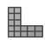

## Undeformed shape

An undeformed shape plot displays the initial shape or the base state of your model.


## Deformed shape

A deformed shape plot displays the shape of your model according to the values of a nodal variable such as displacement.


## Contours

For an output database, a contour plot displays the values of an analysis variable such as stress or strain at a specified step and frame of your analysis. For a model in the current model database, a contour plot displays the value of a load, a predefined field, or an interaction at a selected step of your model. The Visualization module represents the values as customized colored lines, colored bands, or colored faces on your model.


## Symbols

For an output database, a symbol plot displays the magnitude and direction of a particular vector or tensor variable at a specified step and frame of your analysis. For a model in the current model database, a symbol plot displays the magnitude and direction of a load, a predefined field, or an interaction at a specified step of your model. The Visualization module represents the values as symbols (for example, arrows) at locations on your model.

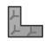

## Material orientations

A material orientation plot displays the material directions of elements in your model at a specified step and frame of your analysis. The Visualization module represents the material directions as material orientation triads at the element integration points.


## X–Y data

An X–Y plot is a two-dimensional graph of one variable versus another.


## Time history animation

Time history animation displays a series of plots in rapid succession, giving a movie-like effect. The individual plots vary according to actual result values over time.


## Scale factor animation

Scale factor animation displays a series of plots in rapid succession, giving a movie-like effect. The individual plots vary in the scale factor applied to a particular deformation.


## Harmonic animation

Harmonic animation displays a series of plots in rapid succession, giving a movie-like effect. The individual plots vary according to the angle applied to the complex number results being displayed.

Additional capabilities include:

## Visualizing diagnostic information

Diagnostic information helps you determine the causes of nonconvergence in a model. You can view information for each stage of the analysis and use Abaqus/CAE to highlight problematic areas on the model in the viewport.

## Understanding probing

Probing displays model data and analysis results as you move the cursor around a model or a model plot; probing an X–Y plot displays the coordinates of graph points. You can write this information to a file.

## Results plotting along a path

A path is a line you define by specifying a series of points through your model. You can view results along the path in the form of an X–Y plot.

## Stress linearization

Stress linearization is the separation of stresses through a section into constant membrane and linear bending stresses. You specify the section as a path through your model, and the Visualization module displays the linearized stresses in the form of an X–Y plot.

## Cutting through your model

View cuts allow you to slice through a model so that you can visualize the interior or selected sections of the model. You can define planar, cylindrical, or spherical view cuts. In addition, you can define a view cut along a constant contour variable value.

## X–Y and field output reporting

An X–Y report is a tabular listing of X- and Y-data values; a field output report is a tabular listing of field output values.

## Visualizing the plies in a composite layup

A ply stack plot is a graphical representation of the plies in a composite layup. The image shows the plies in the layup along with details of each ply, such as its fiber orientation, thickness, and the reference plane. You can also create a ply stack plot in the Property module while you are creating a composite layup.

## Plot customization

The Visualization module provides numerous options that you can use to customize your plots.

## Entering and exiting the Visualization module

You can enter the Visualization module at any time during an Abaqus/CAE session by clicking Visualization in the Module list located in the context bar. The Result, Plot, Animate, Report, Options, and Tools menus appear on the main menu bar; and the title bar of the current viewport displays the name of the current output database, if one exists.

You can also enter the Visualization module by opening an existing output database. To open an output database, select File->Open from the main menu bar (for more information, see Opening a model database or an output database) or click Results in the Job Manager when results are available for a selected job. When you use one of these methods to enter the Visualization module, Abaqus/CAE displays a plot of the model from the output database in the current viewport.

To exit the Visualization module, select any other module from the Module list, or end the session by selecting File->Exit from the main menu bar. When you end the session, Abaqus/CAE closes all files and windows. Abaqus saves your plot options only for the duration of the session.

## Understanding plot states and plot customization

This section describes how to customize the appearance of a plot by selecting plot customization options.

## In this section:

What is a plot state?  
Activating plot states  
Customizing your plots  
Customizing multiple viewports

## What is a plot state?

The Visualization module offers several distinct types of plots for viewing your model and results. These plot types are:

Undeformed shape  
Deformed shape  
. Contour  
Symbol  
Material orientation  
History or X–Y data  
Time history animation  
Scale factor animation  
Harmonic animation

Each of these plots corresponds to a plot state. Plot states are important because some of the customization options provided by the Visualization module pertain only to a particular plot state.

## Additional information

• Activating plot states  
• Customizing your plots

## Activating plot states

A plot state combines all of the active customization options to produce a plot in the viewport. Some options are common to all plot types, some are applied only when you choose to superimpose the deformed and undeformed model shapes, and some are specific to the current plot type. You enter a particular plot state by producing a plot of the corresponding type. For example, if you produce an undeformed plot, the current viewport will then be in the undeformed plot state. The plot state of a viewport persists and Abaqus/CAE updates it with any changes you make to the customization options until you produce a plot in some other state in that viewport. If you create multiple viewports, each viewport can contain a different plot state. In addition, you can choose to allow multiple plot states in a single viewport by plotting both the undeformed and deformed shape for a single plot type or by displaying multiple plot types in the viewport.

## Additional information

• Customizing your plots

## Customizing your plots

The Visualization module provides numerous customization options, which are available through the Viewport, Options, and View menus of the main menu bar. These options fall into three categories:

## Plot state–dependent options

Plot type options affect only a particular plot state. These are separate options affecting contour, symbol, and material orientation plots; X–Y curves; X–Y graphs; time history animations; scale factor animations; and harmonic animations.

## Plot state–independent options

Plot state–independent options are those that affect all plots collectively. These are common options governing the viewpoint, graphics, individual item coloring, display body appearance, and such general characteristics as plot legends, model labels, and the appearance of text blocks giving the model's title and state.

## Superimpose options

Superimpose options are a special set of plot state–independent options that affect only the undeformed plot state when you choose to superimpose it on a deformed, contour, symbol, or material orientation plot. These options allow you to control many common customization options to distinguish the undeformed plot from the deformed plot when both shapes are displayed.

Plot state–dependent options affect such plot attributes as the contour intervals, limits, and colors (for example, color spectrums for contour plots or axis colors for material orientation plots). You control these attributes separately for each plot state using the options associated with that state. To choose the contour type, for example, you must use the Contour plot options. To do so, you can select Options->Contour from the main menu bar. Alternatively, you can

use the Contour Options tool from the toolbox. The Options tools provide quick access to the plot state–dependent and plot state–independent customization options.

Plot state–dependent options affect only plots in the associated state. If you select axis colors from the material orientation plot options dialog box, those colors will affect only material orientation plots. If there is a material orientation plot in the current viewport, you will see the effect of your changes when you click Apply or OK in the material orientation plot options dialog box. However, if the current viewport does not contain a material orientation plot, you will not see the effect of your changes until you produce one.

Plot state–independent options affect plots across all plot states. For example, if you select Viewport->Viewport Annotation Options from the main menu bar to suppress the appearance of the view triad, the view triad will be suppressed for all plots. Settings in the Common Plot Options dialog box are also plot state–independent; when you change the render style in this dialog box, the new render style is used for all plots.

Superimpose options affect the undeformed plot when you superimpose an undeformed plot on a deformed plot in one of the plot states. For example, you can independently set the render style, edge display, and fill color; and you can apply an offset between the undeformed and deformed shape symbol plots when both are displayed.

Select File->Save Options from the main menu bar to save your plot state–dependent, plot state–independent, and superimpose customization options. Saving your customization options allows you to apply them to subsequent Abaqus/CAE sessions. For more information, see Saving your display options settings. For more information on the plot customization options available in the Visualization module, see Customizing plot display.

## Customizing multiple viewports

When you create a new viewport, it initially inherits the customization options of the current viewport. For example, if you establish the Filled render style for plots in the current viewport and then create a new viewport, subsequent plots in the new viewport will appear in the filled render style. New viewports inherit the plot state of the current viewport—until you change customization options, plot states, or output databases, new viewports appear identical to the viewport that was active when you created them.

After a new viewport has been established, the plot state and any subsequent customizations are independent of other viewports by default. Multiple viewports can each be in a separate plot state; if you use multiple viewports, you must first designate a particular viewport as current to change its display. Customization selections you apply affect only the current viewport. When you designate a viewport as current, the options dialog boxes are refreshed to show the state of options associated with that viewport. For more information on working with viewports, see Working with viewports.

You can also link multiple viewports in your session to manipulate multiple objects simultaneously and to display the same plot state and the same plot options in different viewports. For more information, see Linking viewports for view manipulation.

## Additional information

• Activating plot states

## Understanding toolsets in the Visualization module

Toolsets in the Visualization module provide additional control over data display.

Unless otherwise stated, the toolsets described in this section are for postprocessing of model and results data from output databases only; only selected toolsets are for use with model data from the current model database.

The following toolsets are available in the Visualization module:

• The Color Code toolset allows you to customize the edge and fill color of individual elements. For more information, see Coloring nodes or elements in the Visualization module.  
• The Coordinate System toolset allows you to create local coordinate systems for use in postprocessing. For more information, see Creating coordinate systems during postprocessing.  
• The Create Set toolset allows you to create node and element sets during postprocessing. For more information, see Creating node and element sets during postprocessing.  
• The Display Group toolset allows you to selectively plot one or more items from a model or from an output database. For more information, see Using display groups to display subsets of your model.  
• The Field Output toolset allows you to perform operations on the field output available in an output database. For more information, see Creating and saving new field output.  
• The Free Body toolset allows you to create and delete free body cuts, display or hide them in the viewport, and customize several aspects of their appearance. For more information, see The Free Body toolset.  
• The Job Diagnostics toolset allows you to access the diagnostic information written to the output database during an Abaqus/Standard analysis job. For more information, see Viewing diagnostic output.  
• The Path toolset allows you to specify a path through your model along which you can obtain and view X–Y data. For more information, see Viewing results along a path.  
• The Query toolset allows you to obtain information about your model, both for data from the current model database or for data from an output database. For more information, see Querying the model in the Visualization module.  
• The Stream toolset allows you to display streamlines to investigate velocity or vorticity in a fluid flow analysis. For more information, see The Stream toolset.  
The View Cut toolset allows you to create cuts through a model so that you can visualize the interior or selected sections of the model. This functionality is available for model data from the current model database or from an output database. For more information, see Cutting through a model.  
• The XY Data toolset allows you to create and operate on X–Y data objects. For more information, see X–Y plotting.

## Understanding Visualization module performance

In general, the speed of postprocessing and graphical results display in the Visualization module is more than satisfactory for most models. However, it is often necessary to balance high performance levels with detailed results plotting.

Depending on your postprocessing requirements, you may wish to modify the default display options at the expense of performance. Many options are available that can affect the speed of graphics display.

To maximize performance in the Visualization module, we recommend the following:

• Cache results in memory during postprocessing to speed up the generation of images on the screen. See Understanding results caching.  
Use the texture-mapped contour method whenever possible. Likewise, avoid using display options that are not supported by the texture-mapped method: line-type contours, contour edges, CAXA or SAXA elements, or shrinking elements about their centroid. If such display options are used, Abaqus/CAE will override the user setting for texture-mapped contours and use the slower tessellated method instead. See Understanding how contours are rendered.  
Be selective about the model labels and symbols that you choose to display. The more model entities that are drawn, the longer the screen refresh will take. This applies to element edges as well. See Controlling the display of model entities.  
• Use a high results averaging threshold. The more contiguous the results are, the faster the contour display will be. See Understanding result value averaging.  
Use the status field output variable rather than creating display groups based on result values to achieve high-performance time history animation. Abaqus/CAE recomputes result-based display groups as each result frame is displayed, so using this type of display group degrades animation performance. The status field output variable allows you to remove elements that meet a result-based failure criteria from your model plots. See Selecting the status field output variable.  
• Do not use a remote display. This configuration of Abaqus/CAE is not supported; its use is at the sole discretion of the user. Performance optimization can never be achieved using remote display.

In some cases performance may not be optimal for element-based results plotting on very large models because of physical memory limits on your machine. Increasing the physical memory or exiting other applications that are consuming memory can help to restore optimal performance.

## Viewing diagnostic output

Abaqus/CAE provides a visual diagnostics tool to help you understand the convergence behavior of your job. You can use diagnostic output to assess the quality of analysis results or to locate the source of convergence problems in a model.

This chapter explains how you locate and use diagnostic output within Abaqus/CAE.

## In this section:

Understanding job diagnostics  
Generating diagnostic information  
Interpreting diagnostic information  
Accessing diagnostic information

## Understanding job diagnostics

Abaqus writes diagnostic information to the output database, along with any other output that you request, as it attempts to analyze your model.

The diagnostic information in the output database is a subset of the diagnostic information that is written to the message and status files. You can use the Job Diagnostics dialog box to access the diagnostic information written to the output database during an Abaqus/Standard or Abaqus/Explicit analysis job.

For an Abaqus/Standard analysis, diagnostic information is available for the job and for each step, increment, attempt, and iteration. Figure 1 shows contact diagnostics for an Abaqus/Standard analysis iteration. You can choose the type of contact information that you want to view, and you can select a column to sort the table data.

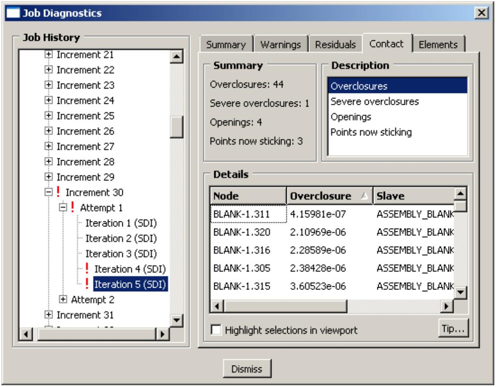  
Figure 1:The Job Diagnostics dialog box.

For an Abaqus/Explicit analysis, diagnostic information is available for the job and for each step. Because of the large number of increments in a typical Abaqus/Explicit analysis, diagnostic information is recorded for summary (heartbeat) increments and for any other increments in which diagnostic information is generated. The interval between summary increments depends on the CPU time and the amount of output specified in the analysis. The diagnostic data are written to the status file and to the output database.

You can use the Job Diagnostics dialog box to determine when an analysis ended and whether any warnings were issued. If warnings were issued during the job, you can view the warnings and assess whether your results may have been affected. The Job Diagnostics dialog box also provides more detailed information to explain the meanings of or possible causes for most warnings and errors and, if the warnings are associated with nodes or elements, to help you locate them on the model in the viewport.

You can view diagnostic information during an analysis or after it ends. However, the Job Diagnostics dialog box does not update automatically. If you view diagnostic information while an analysis is running, you must close and then reopen the output database as the analysis progresses to display any new diagnostic information.

## Generating diagnostic information

Abaqus generates diagnostic information during an analysis job; Abaqus/CAE reads the diagnostic information that is stored in the output database. Thus, you can use the Job Diagnostics dialog box to view convergence information only for procedures that generate information in the output database. Job diagnostics are stored in the output database for the following Abaqus/Standard procedures:

• Coupled temp-displacement  
• Geostatic  
. Soils  
• Static, General  
• Static, Linear perturbation  
• Static, Riks  
• Visco

Diagnostic information for other Abaqus/Standard analysis procedures is located in the message file and cannot be viewed in Abaqus/CAE.

Diagnostic information is available in Abaqus/CAE for all Abaqus/Explicit analysis procedures. An anneal procedure does not generate any diagnostic data, so no diagnostics are displayed for an anneal step.

Detailed diagnostic information is saved to the output database by default for the supported analysis procedures in both Abaqus/Standard and Abaqus/Explicit. If you do not want to include diagnostic information, use the Keywords Editor to edit the input file to include the following line in the model data:

```txt
*OUTPUT, DIAGNOSTICS=NO
```

You can also use the Keywords Editor to change the default diagnostic output parameters for Abaqus/Explicit by including one or more lines for the keyword \*DIAGNOSTICS and specifying the desired parameter values.

For more information on using the Keywords Editor, see Adding unsupported keywords to your Abaqus/CAE model.

## Interpreting diagnostic information

This section describes the individual pages in the Job Diagnostics dialog box (the available pages depend on the analysis type and results).

In a typical Abaqus/Standard analysis a load is applied to the model in increments, and Abaqus attempts to calculate the model's response to each incremental load. Abaqus further reduces the response calculations by performing iterations to approach the result for an increment. If the iterations are not approaching a solution (converging), Abaqus stops and attempts to solve again, this time with a smaller load increment. If Abaqus makes too many attempts without a solution, the analysis is ended. For more information about load increments, see Analysis Solution and Control.

In an Abaqus/Explicit analysis, incrementation is based on a large number of small time increments. The time incrementation is made according to an estimated stable time increment size based on the size of the elements in the model. Abaqus/Explicit uses a central-difference time integration rule to integrate the equations of motion, so there is no need for multiple attempts and iterations in each increment.

Viewing the diagnostic information can help you determine the causes of convergence problems so that you can make the necessary corrections in the model. Diagnostic information also indicates potential problems and areas for improvement even when a converged solution is reached. With proper interpretation of the available diagnostic information, you can improve a model to achieve the results that match your analysis intent.

## In this section:

Diagnostics summary  
Incrementation  
Warnings and errors  
Residuals  
Contact  
Elements  
Other

## Diagnostics summary

The Summary page in the Job Diagnostics dialog box is always available. The summary includes attributes of the item that is currently highlighted in the Job History tree as well as an indication of the diagnostic information available in the other pages of the dialog box. The information that appears for each job, step, increment, attempt, and iteration for an Abaqus/Standard analysis or for each job, step, and increment for an Abaqus/Explicit analysis varies as follows, becoming more specific as you move from the job to an iteration.

## Job

When you first open the Job Diagnostics dialog box, the job item is highlighted in the Job History tree and the Summary page is visible. The job name and status and the analysis code and release are displayed. For an Abaqus/Explicit job the Abaqus/Explicit precision (single or double) and the number of domains for parallel job execution are displayed. If there are warnings or errors, the total number of each is also displayed.

## Step

The summary for each step displays the step name, step number, analysis procedure, and number of warnings (if any) in the step. Depending on the procedure additional information may also be displayed as part of the step summary. For example, the summary of a general nonlinear step will also include the step time that has been completed, the number of increments that were completed, the time incrementation method (automatic or fixed) that was used, whether nonlinear geometry was accounted for during the step, and the extrapolation type used for a previous state at the start of each increment. See The Step module for more information.

## Increment

The summary for each increment displays the increment number and the number of warnings (if any) in the increment. For an Abaqus/Standard analysis the number of attempts is also displayed. The increment summary also indicates the convergence status; if the increment converged, the increment size and the completed step time are displayed.

## Attempt

The summary for each attempt in an Abaqus/Standard analysis displays the attempt number, attempt size, number of warnings (if any), and number of iterations. Severe discontinuity iterations and equilibrium iterations are listed separately, along with the total number of iterations. If Abaqus is unable to find a solution, it makes a cutback in the increment size and begins a new attempt; if Abaqus makes a cutback, the attempt summary indicates the reason for the cutback. There are no attempts in an Abaqus/Explicit analysis.

## Iteration

The iteration summary in an Abaqus/Standard analysis displays the convergence status. If the iteration did not converge, the summary indicates the other pages (Warnings, Residuals, Contact, and Elements) that provide detailed information about the convergence criteria that were not satisfied. There are no iterations in an Abaqus/Explicit analysis.

## Additional information

• Viewing diagnostic output  
• Interpreting diagnostic information  
• About Convergence and Time Integration Criteria

## Incrementation

The Incrementation page in the Job Diagnostics dialog box displays the incrementation control settings and the resulting incrementation used by Abaqus during the analysis. The Incrementation page is available only if you highlight a step in the Job History tree.

The Status table contents depend on whether you are viewing diagnostic information for an Abaqus/Standard or Abaqus/Explicit analysis step. For an Abaqus/Standard step the table displays each increment along with the number of attempts, the number of severe discontinuity and equilibrium iterations, the total number of iterations, the step time, and the increment size. For an Abaqus/Explicit step the table displays all summary increments and any additional increments for which diagnostic information was recorded. The critical element, the stable time increment for that element, the elapsed step time, the total time, and the kinetic energy are also listed for each increment. For more information on incrementation diagnostics in Abaqus/Explicit, see Explicit Dynamic Analysis.

If you select a column of data and click Plot selected column, Abaqus/CAE creates an X–Y plot using the increment number (first column) for the X-axis and the selected column for the Y-axis.


## Note:

You cannot plot the critical element numbers.

## Additional information

• Viewing diagnostic output  
• Using the step editor

## Warnings and errors

The Warnings and Errors pages in the Job Diagnostics dialog box both display detailed information about undesirable conditions that were encountered during an analysis. Warnings include information about conditions that may lead to questionable analysis results. Errors include information about conditions that caused Abaqus to terminate the analysis prematurely.

The contents of the Warnings page depend on the item that is highlighted in the Job History tree; if the job is highlighted, the Warnings page displays all warnings saved to the output database for the entire job. If you highlight a step, increment, attempt, or iteration in the Job History tree, Abaqus/CAE displays information about only those warnings associated with the highlighted item. The Errors page is available only when the job item is highlighted; it displays information about all errors saved to the output database for the entire job.


## Note:

Only a subset of the warnings and errors written to the message and status files by Abaqus/Standard and Abaqus/Explicit are saved to the output database for access through the Job Diagnostics dialog box.

Each Warnings or Errors page includes a Summary table that provides a concise description of all the problems associated with the item that you highlighted in the Job History tree. If there is more than one type of problem, you can filter the list of problems based on a common problem Category.

The Details region of the Warnings and Errors pages displays more information corresponding to the item that is highlighted in the Summary table. Depending on the type of warning or error that you selected, Abaqus/CAE displays either a statement or a table providing detailed information about the problem. If the Details region displays tabular information including nodes and elements, you can toggle Highlight selections in viewport and select items to view them in the current viewport.

Figure 1 shows the Warnings page for a Abaqus/Standard analysis step; the first warning occurs on the step, and the remaining warnings indicate the increment numbers where they occur. In this case the Details section includes the coupling release variation for a numerical singularity.

  
Figure 1:The Warnings page.

## Additional information

• Viewing diagnostic output  
• Explicit Dynamic Analysis  
• About Convergence and Time Integration Criteria  
• Overconstraint Checks  
• Common Difficulties Associated with Contact Modeling in Abaqus/Standard

## Residuals

The Residuals page in the Job Diagnostics dialog box displays information about the quantities that Abaqus/Standard uses to determine whether an iteration has produced an equilibrium solution.

Residuals represent the difference between the internal and external forces acting on a model. If the residuals are small, Abaqus accepts the iteration as converged. The tolerances used to determine whether a solution is converged are very important. The tolerances must be small enough to provide an accurate solution but large enough to achieve the solution within a reasonable number of iterations. Before accepting an iteration as converged, Abaqus further requires that corrections to the primary solution variables and constraint equation compatibility errors must also be small.

When the equilibrium iterations do not converge, the node where the maximum residual occurs during the final iterations is usually the best place to begin searching for the problem. There are many conditions that may prevent the equilibrium iterations from converging; diagnosing the source of the problem requires a certain amount of experience.

Residual information, including the maximum residual value in each iteration, is summarized in tabular form for each attempt that contains residual diagnostics. Your selections in the Equations and Variables fields control the data in the table. You can plot columns from the table by selecting Plot selected column. When you have located a problematic iteration, select it in the Job History tree. Then you can select items from the Residuals page for the iteration and click Highlight selections in viewport to view the regions in the current viewport.

## Additional information

• Viewing diagnostic output  
• General solution controls  
• Direct Linear Equation Solver  
• Solving Nonlinear Problems  
• About Convergence and Time Integration Criteria

## Contact

The Contact page in the Job Diagnostics dialog box displays information about regions of the model where changes in the contact status prevent Abaqus from accepting the solution for an Abaqus/Standard step. The Contact page can also indicate diagnostics such as initial contact overclosures and adjustments for an Abaqus/Explicit step.

Abaqus/Standard contact information is available for any iterations that are followed by (SDI) (Severe Discontinuity Iteration) in the Job History tree. Contact information may also be available for other iterations where contact impacts the analysis, such as when stick-slip friction behavior is present. Use the contact information to locate regions in your model where Abaqus could not establish the correct conditions. You may need to edit the contact controls to resolve a contact problem. For more information, see Customizing contact controls.

Contact information, including the total number of problems in each iteration, is summarized in tabular form for each attempt that contains contact diagnostics. Your selection in the Description field controls the data in the table, and you can plot columns from the table by selecting Plot selected column. When you have located a problematic iteration, select it in the Job History tree. Then you can select items from the Contact page for the iteration and click Highlight selections in viewport to view the regions in the current viewport. Click the column headings to sort the information in the Details field for an iteration.

For an Abaqus/Explicit step the contact summary may include diagnostics such as the number of initial overclosures, unresolved initial overclosures, and initial contact adjustments. Your selection in the Description field controls the data in the table. For example, if you select initial overclosures or unresolved initial overclosures, the table lists the overclosed nodes and elements, the element face that the nodes penetrated, and the overclosure amount. You can select items from the Details field and click Highlight selections in viewport to view the contact nodes and elements in the current viewport.

## Additional information

• Customizing contact controls  
• Viewing diagnostic output  
• About Convergence and Time Integration Criteria  
• Contact Diagnostics in an Abaqus/Standard Analysis  
• Common Difficulties Associated with Contact Modeling in Abaqus/Standard

## Elements

The Elements page in the Job Diagnostics dialog box displays information about regions of the model where problems with the element and material point calculations may be preventing Abaqus from finding a converged solution for an Abaqus/Standard step. Abaqus/Explicit displays information for the critical elements—the elements with the lowest stable time limits.


## Note:

Only a subset of the element and material point diagnostics written to the message and status files by Abaqus/Standard and Abaqus/Explicit are accessible through the Job Diagnostics dialog box.

Select Highlight selections in viewport to locate elements in the current viewport. Your selections in the Element Diagnostics and Details fields determine the elements that Abaqus/CAE will highlight.

## Additional information

• Viewing diagnostic output  
• About Convergence and Time Integration Criteria  
• Common Difficulties Associated with Contact Modeling in Abaqus/Standard

## Other

The Other page in the Job Diagnostics dialog box appears only when you select a Step from the Job History tree for an Abaqus/Standard analysis. It displays information about the matrix solver used for the analysis and the characteristic element length in the mesh. Depending on the procedure type, other pertinent information such as the mass of the model and the center of mass are also provided. This reference information can help you determine the possible cause or extent of a problem. For example, if the total mass or center of mass are not correct, there is a problem with the material definition, sections, or section assignments in the Property module.

## Additional information

• Viewing diagnostic output  
• About Convergence and Time Integration Criteria  
• Common Difficulties Associated with Contact Modeling in Abaqus/Standard

## Accessing diagnostic information

You can use the Job Diagnostics dialog box to access diagnostic information that Abaqus writes to the output database during an analysis job.

1. From the main menu bar in the Visualization module, select Tools->Job Diagnostics.

The Job Diagnostics dialog box appears.

2. Click the “+” symbols in the Job History tree to expand the tree to see the steps, increments, attempts, and iterations in the job history.  
3. Click an item in the Job History tree to highlight it.

Abaqus/CAE displays additional tabs on the right side of the dialog box containing diagnostic information associated with the selected item.

4. Click the tabs on the right side of the dialog box. Abaqus/CAE displays various types of diagnostic information corresponding to the item that is selected in the tree. The following sections describe the information available in each tabbed page:

Diagnostics summary  
Warnings and errors  
Residuals  
Contact  
Elements  
Other

5. Click Dismiss to close the Job Diagnostics dialog box.

Abaqus/CAE obtains model data from the current model database and model data and analysis results from the output database. Results need not be available to produce an undeformed plot; in this case output database information from a datacheck run is sufficient.

This chapter explains how to select model data and analysis results for display.

## In this section:

Selecting results from an output database  
Selecting results from the current model database  
Selecting the results step and frame  
Customizing the display of steps and frames in the results  
Selecting the field output to display  
Selecting result options  
Creating and saving new field output  
Creating coordinate systems during postprocessing  
Creating node and element sets during postprocessing

## Selecting results from an output database

Abaqus/CAE reads analysis results from the output database.

Output database results consist of those you have saved during the analysis as field and history output variables. If, for example, you have written data to the field output portion of the output database after every 10 increments, you can now select results at 10 increment intervals only. These increment intervals are called frames.

In addition to the analysis results you have saved, you can operate on output database field output to create new results. You can display the values of both output database field output variables and field output variables that you have created in the form of a deformed, contour, symbol, or X–Y plot; as X–Y data obtained along a path through your model; by probing any model or X–Y plot; or in a tabular report. Furthermore, you can display a subset of your model based on field output values, and you can color code a portion of your model according to these values.

You can display output database history output values in the form of an X–Y plot.

Use the Result menu from the main menu bar to access the options affecting results; the following menu items are available:

• Step/Frame: Control the step and frame at which Abaqus/CAE obtains results.  
• Active Steps/Frames: Control the subset of steps and frames that Abaqus/CAE displays when stepping through results frame by frame, in animations, and in X–Y plots.  
• Section Points: Control which section points provide results for integration point variables.  
• Field Output: The Field Output dialog box contains the following tabs:

- Primary Variable: Control the variable and, if applicable, the invariant or component for which Abaqus/CAE displays results.  
Deformed Variable: Control the variable Abaqus/CAE uses to display the deformed model shape.  
- Symbol Variable: Control the vector or tensor variable and optionally the component Abaqus/CAE uses for symbol plots.  
- Status Variable: Control the removal of elements that meet the specified result-based failure criteria from model plots.

• History Output: Select history output for X–Y plotting.

• Options: The Result Options dialog box contains the following tabs:

Computation: Display field output or discontinuities, control the averaging of element-based field output results, and control the computation of results at region boundaries.  
Transformation: Apply coordinate system transformations to field output results.  
Complex Form: Control the numeric form in which Abaqus/CAE displays complex number results.  
Caching: Control whether analysis results are cached in memory during postprocessing and how often the output database should be checked for updated results.

## Additional information

• Opening a model database or an output database  
• Selecting the results step and frame  
• Customizing the display of steps and frames in the results  
• Selecting the field output to display  
• Selecting result options  
• Creating and saving new field output

## Selecting results from the current model database

Abaqus/CAE can read selected data from any of the models in the current model database.

When you select a model in the Visualization module, Abaqus/CAE makes a subset of the loads, predefined fields, boundary conditions, and interactions specified in that model available for selection as field output variables. Once selected, you can plot contours or symbols for the selected item in a particular step of your analysis. Abaqus/CAE creates a single dummy frame for each step in the model database.

Only a subset of the loads, predefined fields, boundary conditions, and interactions you can define in a model are available for visualization; and the attributes in this section can be displayed when their propagation status is Created in this step, Propagated from a previous step, or Modified in this step. The following attributes can be displayed in contour plots or symbol plots in the Visualization module:

## Supported loads

Unless stated otherwise, the loads below are supported for display for all distributions except user-defined distributions. Abaqus/CAE does not consider any amplitude data associated with the load definition when you display it in the Visualization module. Abaqus/CAE displays (L) before the name of each load that is available for display in the current step.

• Concentrated force  
• Moment  
• Concentrated charge  
• Concentrated heat flux  
• Surface charge  
• Concentrated concentration flux  
• Surface heat flux (for all distributions except total flux)  
• Surface concentration flux  
• Pressure load (for all distributions except total force)

If you defined a load using a user-specified coordinate system, the modified orientation is reflected in the Visualization module as well. Abaqus/CAE also customizes the display of any load that is defined using an expression field as its custom distribution; display of loads with mapped fields is not supported.

## Predefined fields

Abaqus/CAE displays (P) before the name of each predefined field that is available for display in the current step.

• Temperature (all distributions except From results or output database file and only the Constant through section variation.)  
• Velocity (translational velocity components only)

If you defined a predefined field using an expression field or a mapped field, the custom distribution is reflected in the Visualization module as well.

## Boundary conditions

Abaqus/CAE displays (B) before the name of each boundary condition that is available for display in the current step. For boundary conditions that include degrees of freedom, such as displacement/rotation, you can select the individual degree of freedom you want to display after selecting the boundary condition. The individual components available for display are indicated below in parentheses where applicable.

You can display data for any boundary condition with parameters that support distributions:

• Displacement/rotation (translational and rotational displacements)  
• Velocity/angular velocity (translational and angular velocity)  
• Acceleration/angular acceleration (translational and angular acceleration)  
• Fluid inlet/outlet  
• Fluid wall  
• Temperature  
• Pore pressure  
• Electric potential  
• Normalized concentration  
• Acoustic pressure  
• Connector material flow

## Interactions

Abaqus/CAE displays (I) before the name of each interaction that is available for display in the current step. Surface film condition (film coefficient and sink temperature) is the only supported interaction.

## Additional information

• Opening a model database or an output database  
• Selecting the results step and frame  
• Customizing the display of steps and frames in the results  
• Selecting the field output to display  
• Selecting result options  
• Creating and saving new field output

## Selecting the results step and frame

You can control the step and frame at which Abaqus/CAE obtains model data and results from an output database.

You can select a specific step and frame using the Step/Frame dialog box, or you can step through frames using controls available in the context bar. If viewport linking is activated, you can link frame display across viewports. For more information, see Linking viewports.


Note: If you are displaying model data from the current model database in the Visualization module, you can select a specific step using the Step/Frame dialog box, but the frame controls are disabled. Model database data does not include individual frames.

## In this section:

Selecting a specific results step and frame  
Stepping through frames

## Selecting a specific results step and frame

You can select a specific step and frame at which Abaqus obtains model data and results from an output database, and you can select a specific step at which Abaqus obtains model data from a model in the current model database.

In an output database, available steps and frames consist of those for which analysis results have been saved; in a model database, all steps are available for data display. To view field output variables that you have created during the Abaqus/CAE session, if any, you must select Result->Step/Frame->Session Step. To view parametric shape variations defined in your analysis, if any, you must select Result->Step/Frame->Step 0.

It is possible to open an output database for an analysis that is still in progress. As the analysis moves toward completion, the lists of completed steps and frames are updated every time you close and then reopen the Step/Frame dialog box.

For information on stepping through results frames, see Stepping through frames.

1. Locate the Step/Frame options.

From the main menu bar, select Result->Step/Frame. The Step/Frame dialog box appears.

The Step portion of the dialog lists the available steps, and the Frame portion of the dialog lists the available frames for the current output database if an output database is selected.


## Note:

You can also access these options by clicking in the Field Output dialog box.

2. From the Step list, click the step to display.

The selected step is highlighted, and Abaqus/CAE refreshes the Frame list to show only frames available for the selected step.

3. From the Frame list, click the frame to display. Select Frame 0 to display the base state of the current step; for example, to contour initial stresses.

The selected frame is highlighted.

4. The model plot in the current viewport changes to show your model at the step and frame you have selected. If active, the text in the state block changes to identify the selected step and frame. For more information on the state block, see Customizing the state block.

Abaqus refreshes the Field Output dialog box to list variables available for the selected frame. (You can access the Field Output dialog box by clicking the Field Output button on the bottom of the Step/Frame dialog box.) Abaqus also refreshes all dialog boxes in which the current step and frame are identified.

Your changes are saved for the duration of the session.

## Additional information

• Selecting model data and analysis results to plot  
• Customizing the display of steps and frames in the results  
• Creating field output by operating on fields

## Stepping through frames

You can use the ODB Frame control buttons available in the context bar to step through results frames.

Any frames for which analysis results have been saved and that are set to active are available. For information on selecting a specific results frame, see Selecting a specific results step and frame. For information on activating results steps and frames, see Activating and deactivating steps and frames.

Stepping through frame data is available for output databases only.

1. Locate the ODB Frame buttons. These buttons appear on the right side of the context bar when you display an undeformed, deformed, contour, or symbol plot.


2. Click one of the following frame buttons:

• First to display results from the first active frame of the current step. This button has no effect if you are already displaying results from the first frame of the step.  
Previous to display results from the previous active frame. If you are currently displaying results from the first frame of a step, Abaqus/CAE will display results from the last active frame of the previous step. This button has no effect if you are already displaying results from the first frame of the first step.  
Next to display results from the next frame. If you are currently displaying results from the last active frame of a step, Abaqus/CAE will display results from the first frame of the next step. This button has no effect if you are already displaying results from the last frame of the last step.  
• Last to display results from the last frame of the current step. This button has no effect if you are already displaying results from the last frame of the step.  
Frame Selector to launch the Frame Selector dialog box, which enables you to navigate directly to a particular frame by entering its frame number or by dragging a slider to the frame you want to display. For more information, see Navigating to a specific frame in the animation.

The model plot in the current viewport changes to show your model at the step and frame you have selected. If active, the text in the state block changes to identify the selected step and frame. Abaqus refreshes the Step/Frame dialog box, highlighting the selected step and frame and the Field Output dialog box, listing variables available for the frame you have selected. Abaqus also refreshes all dialog boxes in which the current step and frame are identified.

3. Continue clicking frame buttons to step through available frames.

## Additional information

• Selecting model data and analysis results to plot  
• Customizing the display of steps and frames in the results  
• Customizing the state block

## Customizing the display of steps and frames in the results

You can customize your display of an output database's steps and frames by activating only a subset of these steps and frames or by changing the duration or arc length of one or more steps.

Abaqus/CAE displays only active steps and frames when you examine output data by stepping through data frame by frame, when you animate the data, and when you generate X–Y history data from field data.

## In this section:

Activating and deactivating steps and frames  
Changing the period of a step

You can customize the display of analysis results by activating a subset of the steps and frames in the output database. Abaqus/CAE displays only active steps and frames when you examine analysis results by stepping through frames, animating the data, or creating X–Y history data from field data. The subset of active steps and frames persists throughout your session and applies to every display of a model database’s results.

You can activate and deactivate steps or frames either from the Results Tree or from the Active Steps/Frames dialog box. Both tools also enable you to expand and collapse steps by clicking on the “plus” and “minus” signs to the left of each step name. Expanding a step reveals its frames, enabling you to activate some of the frames rather than the entire step.

The Results Tree and Active Steps/Frames dialog box also provide visual cues to indicate the active status of steps or frames in the output database. The Results Tree flags inactive frames with a red “X” that appears to the left of the frame shortcut; frames not displayed in this manner are currently active. In the Active Steps/Frames dialog box, step and frame status is indicated by check marks that appear in the area between the plus/minus sign and the step's name. A green check mark display for a step means that all of its frames are active; a green check mark for an individual frame means that the frame is active; a dark grey check mark on a light grey background means that some of the step's frames are active; and when no check mark appears, the step is completely inactive. This visual cue can help you assess a step's active status when the step container is collapsed. Figure 1 shows the Active Steps/Frames dialog box for an output database with two steps completely active, one step partially active, and two steps inactive.

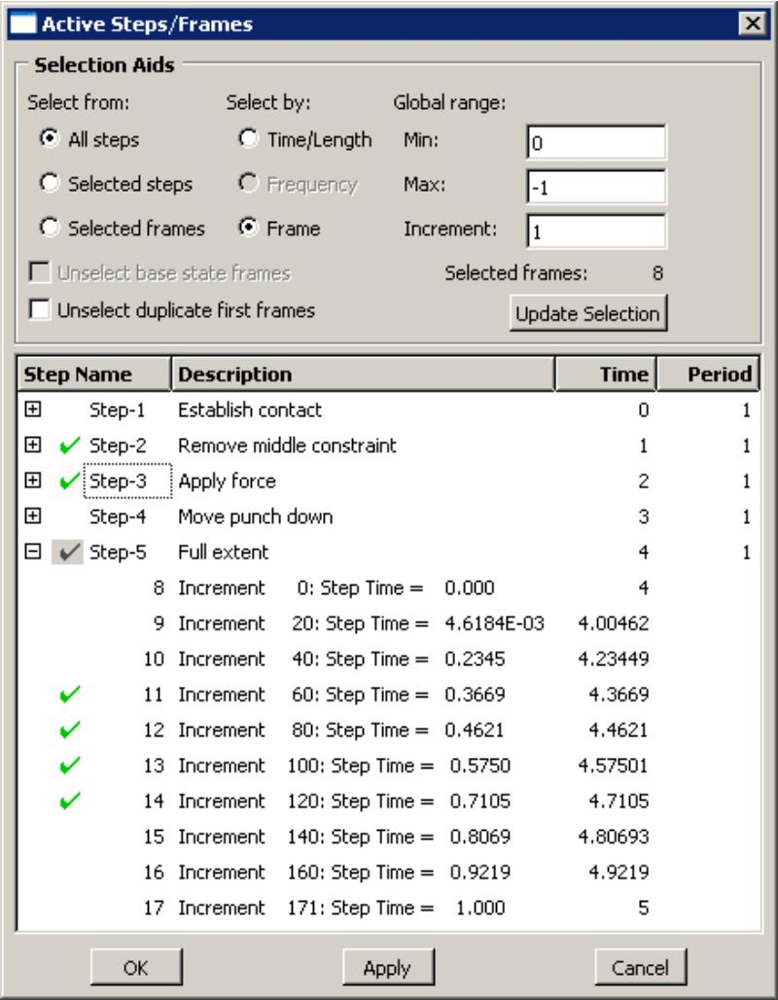  
Figure 1: Active Steps/Frames dialog box.

Each row in the Active Steps/Frames dialog box also provides the following information about the step:

• The Step Name and Description columns reflect the values that were defined for this step when the model was created.  
The value in the Time column either provides the step's starting time or describes the nature of the step. For a time-based step, this column displays the starting time for the step. If the step is not time-based, this column describes whether the step is a Modal, Frequency, or Arc (Riks analysis) step.  
The value in the Period column also depends on the step type. For a time-based step, the period is the step's total duration. For a Riks analysis step, the period is the step's total arc length. Modal and frequency steps have a dash (-) displayed in this column to indicate that a period is not applicable for this step.

You can modify the period value for time-based and Riks analysis steps, provided the period does not equal 0. See Changing the period of a step, for more information.

The Active Steps/Frames dialog box provides two methods of activating steps and frames: you can use the filtering tools in the Selection Aids portion of the dialog box to activate a set of steps or frames, and you can activate individual step and frame rows by clicking their rows in the lower portion of the dialog box. Activating steps or frames using the selection aids clears the subset of steps and frames that you currently have active. If you plan to select steps and frames manually, do so after you choose a subset using the selection aids.

## Selection Aids

The Selection Aids filtering options enable you to choose a subset of steps and frames according to several selection criteria.

• The Select from options define the candidate set of steps and frames for your search. You can search across all steps in the output database, or search only within the subset of steps or frames that are currently selected in the lower portion of the Active Steps/Frames dialog box.  
The Select by options specify the variable for which you want to search for matching steps and frames. You can search for any steps or frames that occurred within a particular range of time. For frequency extraction steps, you can search for any steps or frames during which the model exhibited a particular frequency. Alternatively, you can search for frames by their frame number.  
The Global range fields enable you to specify the upper and lower bounds for your search and to define the increment between matching steps or frames. For example, if you want to activate all even-numbered frames between a lower bound of frame 0 and an upper bound of frame 20, enter 2 as the increment.  
You can also deactivate base state frames in the output database by selecting Unselect base state frames. This option is available only when the output database contains linear perturbation steps.  
Some steps may have initial frames that duplicate the final frame of the previous step. Unselecting these duplicate first frames can make your data analysis smoother and more realistic. Choose Unselect duplicate first frames to unselect all duplicate first frames throughout all steps in the database.

## Selecting steps and frames manually

You can activate and deactivate individual steps and frames by clicking rows in the lower portion of the Active Steps/Frames dialog box. Clicking a single step activates or deactivates all of its frames, while clicking a frame activates or deactivates that frame only. If you click and drag across several steps or frames, Abaqus/CAE inverts the activation status of all selected steps of frames you select.


Tip: You can also activate or deactivate steps and frames from the Results Tree. Highlight the steps or frames that you want to toggle, click mouse button 3, then select Activate all or Deactivate all to change the active status of all frames within the selected steps or select Activate or Deactivate to change the active status of the selected frames.

The Results Tree indicates inactive frames with a red “X” that appears to the left of the frame shortcut. User-defined session steps, which cannot be deactivated, are indicated with a red exclamation point; these steps are not displayed in the Active Steps/Frames dialog box.

Manually activating and deactivating steps and frames in the dialog box can supplement and refine the choices you make by using the selection aids. In addition, clicking mouse button 3 in the lower portion of the dialog box provides access to the following manual selection shortcuts:

• Expand All expands all of the steps containers, selected and unselected, to reveal the frames of every step in the output database.  
• Collapse All collapses all of the selected and unselected step containers in the output database.  
• Select All selects every frame of every step in the output database.  
• Deselect All deselects every frame of every step in the output database.  
• Reset Selection reverts the active steps and frames to the subset that was active when you last clicked Apply.  
• Reset Periods reverts the period values to the settings that were active when you last clicked Apply.

1. Locate the Active Steps/Frames dialog box.

From the main menu bar, select Result->Active Steps/Frames. The Active Steps/Frames dialog box appears.

The lower portion of the dialog box shows the steps and, for expanded steps, the frames in the output database. The first time you examine an output database’s steps and frames during a session, all of the steps and frames are active.

2. From the Selection Aids portion of the dialog box, choose the data set, variable, and global range values for your search.

3. Click Update Selection.

Abaqus/CAE updates the subset of active steps and frames.

4. Activate or deactivate steps manually in the lower portion of the dialog box. You can toggle the activate status of a single step or frame by clicking the appropriate row, or you can toggle the activation status of multiple rows by clicking and dragging several rows.

5. Click Apply.

Abaqus/CAE updates all viewports that display this output database with the newly selected subset of active steps and frames.

## Additional information

• Selecting the results step and frame  
• Changing the period of a step  
• Reading X–Y data from output database field output  
• Animating plots

## Changing the period of a step

The meaning of a step's period value depends on whether the step is a Riks analysis step or a time-based step. For Riks analysis steps, the period specifies the total arc length for the step. For time-based steps, the period specifies the step's total duration, so changing this value affects how long this step is displayed and changes the starting times for all subsequent steps. Changing the time period of a single step also changes the duration of the entire animation or frame-by-frame display, affects the auto-computed start and end time of time-based animations, and affects the way the animation of this model synchronizes with other models. You might want to adjust the time period if you want to synchronize events in different models that occur at different times in the common time line.

Changes to the period values last for the duration of your session. Abaqus/CAE does not save these changes to the output database.

You cannot edit the period value of a Riks analysis or time-based step if the value equals 0. In addition, modal and frequency extraction steps do not have period values; Abaqus/CAE displays an uneditable dash (-) in the Period column for steps of these types.


Tip: If you want to revert the period values to the output database's settings, click mouse button 3 in the lower portion of the window and select Reset Periods.

1. Locate the Active Steps/Frames dialog box.

From the main menu bar, select Result->Active Steps/Frames. The Active Steps/Frames dialog box appears.

The lower portion of the dialog box shows the steps and, for expanded steps, the frames in the output database. The first time you examine an output database’s steps and frames during a session, all of the steps and frames are active.

2. From the lower portion of this dialog box, click the value in Period column for a step, then enter a new value in the field. Repeat this change for every step period that you want to customize.  
3. Click Apply.

Abaqus/CAE updates all viewports that display this output database with the revised period and time values.

## Additional information

• Selecting the results step and frame  
• Reading X–Y data from output database field output  
• Animating plots

## Selecting the field output to display

This section explains how to select field output variables to display.

To learn how to select output database history output to produce an X–Y plot, see Reading X–Y data from output database history output. To learn how to select output database field output to produce an X–Y plot, see Reading X–Y data from output database field output.

## In this section:

Selecting field output variables  
Using the field output toolbar  
Selecting the primary field output variable  
Selecting the deformed field output variable  
Selecting the symbol field output variable  
Selecting the status field output variable  
Selecting the stream field output variable  
Selecting complex results  
Selecting section point data  
Selecting contact output

## Selecting field output variables

Contour plots, model probing, view cuts based on an isosurface, and X–Y plots of results along a model path all show the values of a particular field output variable at a specified step and frame of your analysis.

Similarly, when you form a display group or specify color coding based on results, or when you display a load or predefined field from data in the current model database, these results pertain to a particular field output variable. The variable whose values are shown is called the primary field output variable.

Deformed plots show the shape of your model based on the values of a nodal variable (such as displacement) at a specified step and frame of your analysis. The variable whose values are shown is called the deformed field output variable.

Symbol plots show the magnitude and directions of a particular vector or tensor variable at a specified step and frame of the analysis. A symbol plot can also the magnitude and direction of a selected load or predefined field in a model from the current model database. The variable whose values are shown is called the symbol field output variable.

You can specify result-based criteria for element failure for a selected field output variable and remove elements that meet the failure criteria from model plots. The variable for which you define the failure criteria is called the status field output variable.

You can specify velocity or vorticity data for stream display. The variable for which you display these data is called the stream field output variable.

You can choose to display contour and symbol plots on either the undeformed or deformed model shape. When you use the deformed model shape, the contours or symbols represent the values of the primary field output variable or symbol field output variable, respectively, while the shape of the underlying model is determined by the values of the deformed field output variable.

1. Locate the Field Output options.

From the main menu bar, selectResult->Field Output. The Field Output dialog box appears.


Tip: You can also access these options by clicking the Field Output button in any dialog box in which it appears or by clicking in the Field Output toolbar.

2. Select the primary, deformed, symbol, and status field output variables that you want as described in the following sections:

Selecting the primary field output variable  
Selecting the deformed field output variable  
Selecting the symbol field output variable  
Selecting the status field output variable  
Selecting the stream field output variable  
Selecting complex results  
Selecting section point data  
Selecting contact output

The model plot in the current viewport changes to show the variables you have selected. If active, the text in the legend and state block changes to identify the variables associated with the plot. For more information on the legend and state block, see Customizing the legend, and Customizing the state block. In addition, Abaqus refreshes all dialog boxes in which the currently selected variables are identified.

## Additional information

• Selecting model data and analysis results to plot  
• Using the field output toolbar  
• Creating or editing a view cut

## Using the field output toolbar

You can use the Field Output toolbar to access the basic functionality of the Field Output dialog box. From the toolbar, you can

• choose the type of field output variables to manipulate (Primary, Deformed, or Symbol);  
• choose the variable name from a list of the available field output variables;  
• choose the refinement level, such as invariants and components for the selected primary variable, if available; and  
• choose whether the viewport plot state should be synchronized with the toolbar selections.

The Status and Stream variable types are the only field output that you cannot select from the toolbar. The Status and Stream variable types are available in the Field Output dialog box; the status variable allows you to specify criteria that Abaqus/CAE uses to remove failed elements from the model display, and the stream variable determines the field output displayed in streamlines for an analysis of fluid flow data. To open the Field Output dialog box, click


, located on the left side of the Field Output toolbar.

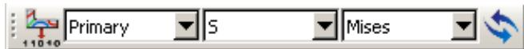  
Figure 1:The Field Output toolbar.

As you make selections from the toolbar, Abaqus/CAE updates the current viewport to display the output; the viewport

plot state is also updated if a change in plot state is needed and if the plot state synchronization toggle ( → ) is enabled. For example, selecting Primary as the variable type changes the plot state to display contours on the deformed model if the viewport does not already contain a contour plot. If you disable synchronization, Abaqus/CAE still displays your newly selected field output variable in the current viewport but does not change the plot state.

## Additional information

• Selecting model data and analysis results to plot  
• Selecting field output variables

You can select the variable to display for contour plots, model probing, view cuts based on an isosurface, and for which to obtain results along a model path; this variable is called the primary field output variable. Abaqus/CAE also uses the primary field output variable to form display groups, to apply color coding based on results, and for display of loads, predefined fields, or interactions from a model in the current model database.

When an output database is selected, Abaqus/CAE lists for your selection all variables available at the current step and frame of your output database by default. An asterisk to the left of the description indicates that the variable includes complex number results.

When a model in the current model database is selected, Abaqus/CAE lists for your selection all loads, predefined fields, boundary conditions, and interactions available in the current step of your model by default. All of these selectable items are preceded by a letter in parentheses to distinguish them by category: (L) for loads, (P) for predefined fields, (B) for boundary conditions, and (I) for interactions. Only the real part of a complex load or predefined field is available for display.

Use the Primary Variable options in the Field Output dialog box to choose the variable and, if applicable, the invariant or component that you want. For information on individual output variable identifiers, see Output Variables.

1. Locate the options that control the primary field output variable.

From the main menu bar, selectResult->Field Output. Click the Primary Variable tab in the dialog box that appears.

The Primary Variable options appear.


Tip: You can also access these options by clicking the Field Output button in any dialog box in which it appears.

To see the complete descriptions of the variables listed, increase the width of the dialog box by dragging one corner.

2. To control which variables appear in the Name and Description list:

a. Toggle List only variables with results to display a list that is limited by the storage location of the variables. Limiting the list helps you select variables by presenting, for example, only integration point quantities.

When List only variables with results is on, filter options become available in the pull-down menu.

b. Click the List only variables with results arrow to reveal the filter options.

c. Click the text stating the location of the variables you want to include in the Name and Description list.

The text appears in the List only variables with results box, and the Name and Description list is refreshed to include only variables having that location.

3. From the Name and Description list, click the name of the analysis variable that you want. An asterisk to the left of the description in the list indicates that the variable includes complex number results.

The selected variable is highlighted. If applicable, the Component and Invariant lists on the bottom of the dialog box are refreshed to display available components or invariants, respectively.

4. If items are listed in the Component or Invariant list, click the component or invariant that you want. The selected component or invariant is highlighted.


Note: For S and E field output, there are two invariants, Max. Principal (abs) and Max. In-Plane Principal (abs), which are available only in the Visualization module. Max. Principal (abs) is the largest principal value when the absolute value of all principal values are compared. Max. In-Plane Principal (abs) is the largest principal value when the absolute value of all in-plane principal values are compared. The out-of-plane principal value is not considered when the Max. In-Plane Principal (abs) value is computed.

5. When active, a contour plot in the current viewport changes to show values for the analysis variable you have specified. If active, the text in the legend and state block changes to identify the variable associated with the plot. For more information on the legend and state block, see Customizing the legend, and Customizing the state block. In addition, Abaqus refreshes all dialog boxes in which the current primary variable is identified.

Your changes are saved for the duration of the session.

## Additional information

• Selecting model data and analysis results to plot

You can display the deformed model by producing a deformed plot or by selecting the deformed model as the underlying shape of a contour or symbol plot. The shape of your deformed model is based on the values of the particular deformed field output variable that you select. An asterisk to the left of the description in the Output Variable list indicates that the variable includes complex number results. For information on individual output variable identifiers, see Output Variables.

1. Locate the options that control the deformed field output variable.

From the main menu bar, select Result->Field Output. Click the Deformed Variable tab in the dialog box that appears.

The Deformed Variable options become available.


Tip: You can also access these options by clicking the Field Output button in any dialog box in which it appears.

Abaqus/CAE lists by name and description all variables available at the current step and frame of your output database that can be used for a deformed plot (nodal vector quantities). To see the complete descriptions of the variables listed, increase the width of the dialog box by dragging one corner.

2. From the Name and Description list, click the deformed field variable that you want. An asterisk to the left of the description in the list indicates that the variable includes complex number results.  
The selected variable is highlighted.

3. The deformed model shape in the current viewport changes to reflect the values of the deformed field output variable you have specified. If active, the text in the state block changes to identify the variable associated with the plot. For more information on the state block, see Customizing the state block.

Your changes are saved for the duration of the session.

## Additional information

• Selecting model data and analysis results to plot

## Selecting the symbol field output variable

You can select the vector or tensor variable component and optionally select a component to display for a symbol plot; this variable is called the symbol field output variable.

When an output database is selected, Abaqus/CAE lists for your selection all vector and tensor variables available at the current step and frame of your output database by default; resultant values are displayed in vector variable symbol plots, and all principal components are displayed in tensor variable symbol plots. An asterisk to the left of the description indicates that the variable includes complex number results.

When a model from the current model database is selected, Abaqus/CAE lists for your selection all loads, predefined fields, boundary conditions, and interactions available at the current step of your model by default. All of these selectable items are preceded by a letter in parentheses to distinguish them by category: (L) for loads, (P) for predefined fields, (B) for boundary conditions, and (I) for interactions.

Use the Symbol Variable options in the Field Output dialog box to choose the variable and the specific components that you want. For information on individual output variable identifiers, see Output Variables.

When you display a vector variable in a symbol plot, you can choose from the following options:

• Display arrows that represent resultant values of the variable. For example, a symbol plot of total displacement appears on the left side of Figure 1.  
• Display arrows that represent specific component values of the variable. For example, a symbol plot of displacement in the 1-direction appears on the right side of Figure 1.

  
Figure 1: Symbol plots showing total displacement (left) and displacement in the 1-direction (right).

Likewise, when you display a tensor variable in a symbol plot, you can choose from the following options:

• Display arrows that represent each of the principal components of the variable. For example, a symbol plot of maximum, intermediate (mid), and minimum principal stress appears on the left side of Figure 2.  
• Display arrows that represent a specific principal component of the variable. For example, a symbol plot of only maximum principal stress appears on the right side of Figure 2.

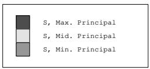

  
Figure 2: Symbol plot showing all three principal components (left), and symbol plot showing only maximum principal stress (right).

• Display arrows that represent each of the direct components of the variable. For example, a symbol plot of all direct components appears on the left side of Figure 3.  
• Display arrows that represent a specific direct component of the variable. For example, a symbol plot of only S22 appears on the right side of Figure 3.


  
Figure 3: Symbol plot showing all direct components (left), and symbol plot showing only S22 (right).

1. Locate the options that control the symbol field output variable.

From the main menu bar, selectResult->Field Output. Click the Symbol Variable tab in the dialog box that appears.

The Symbol Variable options appear.


Tip: You can also access these options by clicking the Field Output button in any dialog box in which it appears.

To see the complete descriptions of the variables listed, increase the width of the dialog box by dragging one corner.

2. To control which variables appear in the Name and Description list:

a. Toggle List only variables with results to display a list that is limited by the storage location of the variables. Limiting the list helps you select variables by presenting, for example, only integration point quantities.

When List only variables with results is on, filter options become available in the pull-down menu.

b. Click the List only variables with results arrow to reveal the filter options.

c. Click the text stating the location of the variables you want to include in the Name and Description list.

The text appears in the List only variables with results box, and the Name and Description list is refreshed to include only variables having that location.

3. From the Name and Description list, click the name of the analysis variable that you want. An asterisk to the left of the description in the list indicates that the variable includes complex number results.

The selected variable is highlighted. The Vector Quantity, Tensor Quantity, and Component lists on the bottom of the dialog box are refreshed to display available vector quantities, tensor quantities, and components, respectively.

4. If you are creating a vector variable symbol plot, select the components to plot.

• Select Resultant to display arrows that represent the resultant of the variable.

Select Selected Component and the component that you want to display arrows that represent a particular component of the variable.

5. If you are creating a tensor variable symbol plot, select the component to plot.

• Select All Principal Components to display arrows that represent all available principal components.

Select Selected Principal Component and the component that you want to display only arrows that represent a particular principal component.

• Select All Direct Components to display arrows that represent all three direct components.

• Select Selected Direct Component and the component that you want to display only arrows that represent a particular direct component.


Note: For S and E field output, there are two invariants, Max. Principal (abs) and Max. In-Plane Principal (abs), which are available only in the Visualization module. Max. Principal (abs) is the largest principal value when the absolute value of all principal values are compared. Max. In-Plane Principal (abs) is the largest principal value when the absolute value of all in-plane principal values are compared. The out-of-plane principal value is not considered when the Max. In-Plane Principal (abs) value is computed.

6. Click Apply to implement your changes.

The symbol plot in the current viewport changes to show values for the analysis variable you have specified. If active, the text in the legend and state block changes to identify the variable associated with the plot. For more information on the legend and state block, see Customizing the legend, and Customizing the state block.

Your changes are saved for the duration of the session.

## Additional information

• Selecting model data and analysis results to plot

You can specify result-based criteria for element failure for a selected field output variable; this variable is called the status field output variable. When you enable the use of the status field output variable, elements that meet the specified criteria are considered failed and they are removed from model plots. Use the Status Variable options in the Field Output dialog box to enable the use of the status variable; to select the variable and, if applicable, an invariant or components; and to specify the result-based criteria for failure. If desired, you can apply the status field output variable to undeformed shape plots. By default, failed elements are not removed when the model is displayed in an undeformed state.

By default, the status field output variable is not enabled unless the output variable STATUS appears in the output database. In this case the use of the status field output variable is enabled by default, the output variable STATUS is selected, and the failure criteria is set to remove elements with values less than or equal to 0.5 (the status of an element is 1.0 if the element is active, 0.0 if the element is not). Elements with a value of 0.0 are not displayed in the model plot in the current viewport.

When selecting a status field output variable, Abaqus/CAE lists for your selection all of the variables (except surface-based field output variables) available at the current step and frame of your output database. An asterisk to the left of the description indicates that the variable includes complex number results. For information on individual output variable identifiers, see Output Variables.

1. Locate the options that control the status field output variable.

a. From the main menu bar, selectResult->Field Output. Click the Status Variable tab in the dialog box that appears.  
b. Toggle Use status variable to disable or enable use of the status variable.

When Use status variable is on, the status variable is enabled and the Status Variable options become available.


Tip: You can also access these options by clicking the Field Output button in any dialog box in which it appears.

To see the complete descriptions of the variables listed, increase the width of the dialog box by dragging one corner.

2. Toggle on Apply to undeformed state to apply the status field output variable to undeformed shape plots. If your model contains no deformations, you must toggle on this setting to apply the status field output variable.  
3. To control which variables appear in the Name and Description list:

a. Toggle List only variables with results to display a list that is limited by the storage location of the variables. Limiting the list helps you select variables by presenting, for example, only integration point quantities.

When List only variables with results is on, filter options become available in the pull-down menu.

b. Click the List only variables with results arrow to reveal the filter options.  
c. Click the text stating the location of the variables you want to include in the Name and Description list.

The text appears in the List only variables with results box, and the Name and Description list is refreshed to include only variables having that location.

4. From the Name and Description list, click the name of the analysis variable that you want. An asterisk to the left of the description in the list indicates that the variable includes complex number results.

The selected variable is highlighted. If applicable, the Invariant and Component lists on the bottom of the dialog box are refreshed to display available invariants or components, respectively.

5. If items are listed in the Invariant or Component list, click the invariant or component that you want. The selected invariant or component is highlighted.


Note: For S and E field output, there are two invariants, Max. Principal (abs) and Max. In-Plane Principal (abs), which are available only in the Visualization module. Max. Principal (abs) is the largest principal value when the absolute value of all principal values are compared. Max. In-Plane Principal (abs) is the largest principal value when the absolute value of all in-plane principal values are compared. The out-of-plane principal value is not considered when the Max. In-Plane Principal (abs) value is computed.

6. Choose from the filtering methods in the Remove elements field to specify the failure criteria. If any result value of an element meets the specified criteria, that element is considered failed and it is removed from model plots. Element output quantities are compared against the specified criteria; there is no extrapolation or averaging performed on the element data. If a nodal quantity is selected and a value for a given node meets the specified criteria, all elements connected to the failed node are removed.

• Select and enter a value in the Max field to remove elements with values less than or equal to the specified value.  
Select and enter a value in the Min field to remove elements with values greater than or equal to the specified value.  
• Select (inside) and enter values for the upper and lower bounds of the range in the Min and Max fields to remove elements with values between and including the specified values.  
Select (outside) and enter values for the upper and lower bounds of the range in the Min and Max fields to remove elements with values outside the specified range.

7. Click Apply to implement your changes.

The model plot in the current viewport changes to remove elements with values of the selected status field output variable that meet the specified criteria. If active, the text in the legend and state block changes to identify the variable associated with the plot. For more information on the legend and state block, see Customizing the legend, and Customizing the state block.

Your changes are saved for the duration of the session.

## Additional information

• Selecting model data and analysis results to plot

## Selecting the stream field output variable

You can specify the variable for which stream data are computed; this variable is called the stream field output variable. For most analyses velocity (V) can be used for the stream data. Only node-centered vector results can be associated with streamline traces.

When selecting a stream field output variable, Abaqus/CAE lists all of the vector variables stored at nodal locations and available at the current step and frame of your output database.

1. Locate the options that control the stream field output variable.

From the main menu bar, select Result->Field Output. Click the Stream Variable tab in the dialog box that appears.


Tip: You can also access these options by clicking the Field Output button in any dialog box in which it appears.

To see the complete descriptions of the variables listed, increase the width of the dialog box by dragging one corner.

2. From the Name and Description lists, click the name of the analysis variable that you want.

The selected variable is highlighted.

3. Click Apply to implement your changes.

Abaqus/CAE recomputes the streamlines in the current viewport based on the selected stream output variable. Your selection for stream output variable is also saved for the duration of the session.

## Additional information

• Selecting model data and analysis results to plot

## Selecting complex results

By default, Abaqus/CAE lists for your selection all variables available at the current step and frame of your output database. If the current step is a steady-state dynamic analysis, the value of an output variable such as stress (S) or displacement (U) can be a complex number with both real and imaginary components. Use the Primary Variable, Deformed Variable, Symbol Variable, Status Variable, and Stream Variable options in the Field Output dialog box to choose the complex variables that you want to display. The description of each listed variable begins with an asterisk if that variable includes complex results. For information on individual output variable identifiers, see Output Variables.

You can display complex results in the form of a deformed, contour, or symbol plot; by model probing; by obtaining results along a model path; and by forming a display group or specifying color coding based on results. In each of these cases you can choose from several numeric forms to display different aspects of the complex results. You can animate complex results using harmonic animation. During harmonic animation the real and imaginary components of each complex number are used to calculate and display the value of the result at a sequence of angles representing a half cycle (0° to 180°) or a full cycle (−180° to 180°).

## Additional information

• Selecting model data and analysis results to plot  
• Producing a harmonic animation

If your model contains shells, beams, or composite layups, you can view data from selected section points when you are displaying a contour, symbol, or material orientation plot.

You can select section points, by category or ply, that will apply across linked viewports. The linking also applies to envelope plots. For more information, see Linking viewports.

You can choose either of the following selection methods:

## By category

For each section of your model, you first choose the active location of a section point (bottom, top, or both). You then choose from a list of available section points for this category. For example, you can choose to display data from the midpoint of each section. The available section points are related to the section points that you requested when you created the field output request in the Step module. You can also display a plot of the section point containing the critical value (maximum or minimum) of the field output variable across all of the section points. For more information, see Selecting section point data by category.

## By ply

For a model containing a composite layup, you first choose a ply, and you then choose a location from which to display the field output variable. You can specify one of the following as the section point location in the selected ply: the bottommost section point, the middle or only section point, the topmost section point, or both the topmost and bottommost section points. For more information, see Selecting section point data by ply.

## In this section:

Selecting section point data by category  
Selecting section point data by ply

## Selecting section point data by category

When you are displaying a contour plot, you can use the Section Points dialog box to control the section points from which Abaqus obtains integration point results and material orientations by selecting a category and the section points that represent the bottom and top locations.

Reinforcement (rebar) layers in membrane, shell, and surface elements are treated as section points for output purposes; each reinforcement layer has a unique name. For example, you can request results from the section points at the top surfaces of certain shells in the model, from the middle section points of certain beams in the model, or from a named reinforcement layer in certain membrane elements in the model.

Contour plots displaying output at two section points vary in appearance depending on the type of shell. In a conventional shell the two contours appear as a double-sided shell with different contours on each side, while in a continuum shell (or a composite solid) the two contours appear as distinct two-dimensional contour fronts at each section point location. Axisymmetric shells, which are composed of line elements swept to form a three-dimensional surface, exhibit neither behavior because they are not considered three-dimensional shells; instead, these shells display output at a single section point only.

In many cases the location of a section point is described in terms of its position relative to the midpoint of the cross-section. For two-dimensional beams this relative position is reported as a fraction of the distance between the midpoint of the cross-section and the top or bottom surface of the section. For shells this relative position is reported as a fraction of the distance between the midpoint of the cross-section and the SPOS or SNEG surface of the section. Reinforcement layers are indicated by their unique name.

For beams with three-dimensional sections, the relative position of a section point can be reported as a fraction of the distance between the midpoint of the cross-section and

• the top or bottom of the section (along the local 2-axis of the section) or

• the left or right side of the section (along the local 1-axis of the section).

For circular beams the section point locations are defined as a relative position with respect to the section radius and an angle rotated from the positive 1-axis about the midpoint of the cross-section.

For more information about where section points are located in different section types, see the following:

• Beam Elements

• Shell Elements

For more information about reinforcement layers, see Defining Reinforcement.

Abaqus/CAE provides the following methods for choosing the section points to display:

• Display a category of elements and a location. Examples of element categories include element types and materials. The location can be the top or bottom surface or both.  
Display the section point containing the critical value (absolute maximum, maximum, or minimum). Abaqus/CAE searches for the critical value across all of the section points in each element. The resulting plot is called an envelope plot.

## Additional information

• Selecting model data and analysis results to plot

Select the section point using categories and a location

1. Display a contour plot of the desired field output variable. For more information, see Producing a contour plot.  
2. Locate the Section Points dialog box.

From the main menu bar, select Result->Section Points.

The Section Points dialog box appears.

3. From the Selection method field, select Categories.

The elements within each category share common section properties, such as the following:

• The section type associated with the elements in this category.  
• The material name or composite specification included in the section definition.  
• The number of section points through the section.  
• The cross-section geometry (beams only).

4. From the Active locations field, select Bottom or Top to activate only the Bottom Location or Top Location section point. For contour plots of integration point variables on three-dimensional shells or composite solids, select Top and bottom to display output simultaneously at both section points. Only contour plots of this type can display output for both section points simultaneously; in all other contexts, Abaqus/CAE displays output only at the Bottom Location section point when you select Top and bottom.

Abaqus/CAE displays output only at active locations. The Bottom Location and Top Location fields display the two section points at which you can display output for the selected category. By default, these fields display the SNEG and SPOS section points, respectively.

5. In the Category table, select the element category or categories for which you want to change the output location and select the location. If you selected Top and bottom from the Active locations field, select both locations.

The Available Section Points in Cross-Section field in the bottom half of the dialog box lists the section points from which output was saved for the category and location you have selected. If you have selected more than one category, only those locations that are common to all of the selected categories appear in the list.

6. In the Available Section Points in Cross-Section field, select the section point location to display.

7. Click Apply to view your settings.

The model plot in the current viewport changes to display values from the specified section points. The plot legend, if active, changes to identify the specified section points. For information about the plot legend, see Customizing the legend.

Results for subsequent contour, symbol, and material orientation plots; tabular reports; model probing; and X–Y data objects along a path will be obtained from the section points you have specified.

8. Click OK to select the section points and to exit the dialog box.

## Select the section point containing the critical value

1. Display a contour plot of the desired field output variable. For more information, see Producing a contour plot.  
2. Locate the Section Points dialog box.  
From the main menu bar, select Result->Section Points.  
The Section Points dialog box appears.  
3. From the Selection method radio buttons, select Categories.  
4. From the Active locations radio buttons, select Envelope.  
5. From the Criteria field of the dialog box, select the criterion (absolute maximum, maximum, or minimum) that will determine the section point containing the critical value.

6. From the Position field, select the algorithm that Abaqus/CAE will use to determine the section point containing the critical value.

• If you choose Integration point, Abaqus/CAE compares the value at all of the integration points of each section.  
• If you choose Centroid, Abaqus/CAE compares the value averaged at the centroid of each section.  
• If you choose Element nodal, Abaqus/CAE compares the value extrapolated to the nodes of each section.

7. Click Apply to view your settings.

The model plot in the current viewport displays the critical section point and its value for each element in the mesh. For information about the plot legend, see Customizing the legend.

8. If you are displaying a composite layup, you can determine how Abaqus/CAE displays the critical section point by selecting ply options for the contour plot.

a. From the main menu, select Options->Contour.  
b. From the Contour Plot Options dialog box that appears, click the Other tab.  
c. From the options at the bottom of the tabbed page, do the following:

• Toggle on Show labels of plies that match criteria to see labels for the critical plies in the contour plot.  
Toggle on Color by plies that match criteria to change the value that is being contoured from the field output variable to a ply name. The contour plot updates to show the critical plies in the model. The legend updates to show the names of the plies that are being displayed.

9. Click OK to retain your settings and to exit the dialog box.

## Selecting section point data by ply

You can use the Section Points dialog box to control the section points from which Abaqus obtains integration point results and material orientations by selecting a ply and the location from within the ply at which Abaqus/CAE reads the results.

Contour plots displaying output at both the top and bottom of the selected ply vary in appearance depending on the type of composite layup. In a conventional shell composite layup the two contours appear as a double-sided shell with different contours on each side. In a continuum shell composite layup or a solid composite layup the two contours appear as distinct two-dimensional contour fronts at each section point location.

1. Display a contour plot of the desired field output variable. For more information, see Producing a contour plot.  
2. Locate the Section Points dialog box.

From the main menu bar, select Result->Section Points.

The Section Points dialog box appears.

3. From the Selection method radio buttons, select Plies.  
4. To limit the list for easier selection, type a filter pattern into the Name filter field, and press the [Enter] key to apply the filter.

If viewport linking is activated, you can toggle on Show common list between linked viewports to display only the plies that are common to all linked viewports.

5. From the list of plies in the layup, select the desired ply.  
6. From the Ply result location radio buttons, do one of the following:

• Select Bottommost to select the bottommost section point in the selected ply.

Select Middle/Single section point to select the middle section point or the only section point in the selected ply. The middle section point is the middle of the available locations in the section, not the middle of the total locations. For example, if results are available at TOP and BOTTOM only, the number of available locations is two and the “middle” will correspond to the TOP location.

• Select Topmost to select the topmost section point in the selected ply.  
• Select Topmost and bottommost to select both the topmost and bottommost section points in the selected ply.

7. Click Apply to view your settings.

The model plot in the current viewport changes to display values from the specified ply at the specified location. The plot legend, if active, changes to identify the plies. For information about the plot legend, see Customizing the legend.

8. Click OK to retain your settings and to exit the dialog box.

## Additional information

• Selecting model data and analysis results to plot  
• Linking viewports

## Selecting contact output

Contact output data for nonkinematic scalar output variables such as CPRESS, COPEN, CSLIP, CSHEAR1, and CSHEAR2 are consolidated from all continuum element–based surfaces into a single data set.

Data for overlapping surfaces are combined. If contact output is requested for membrane or shell elements, the data for the SPOS and SNEG surfaces are contained in separate data sets. When contact surfaces are double-sided or node-based, separate contact output data sets are created for each contact surface pair.

The method that Abaqus/CAE uses to combine overlapping facet data in the consolidated data set depends on the output variable:

• For the variables CPRESS, CSHEAR, and CSLIP, Abaqus/CAE uses the largest value, positive or negative, in the model for the selected variable.  
• For the variable COPEN, Abaqus/CAE uses the minimum value for contact opening, which can reflect the smallest opening in the model or, if there are overclosures, the greatest overclosure value.  
• For the vector variables CNORMF and CSHEARF, Abaqus/CAE evaluates the sum of all vector values for the individual surface pairs and stores the resultant vector in the consolidated data set.  
• For the variable CSTATUS, Abaqus/CAE assigns one of four contact statuses to individual nodes on the main and secondary surfaces.

Abaqus/CAE uses the following settings in the consolidated data set:

• Sticking if any of the overlapping regions are in contact and sticking,  
• Slipping if any of the overlapping regions are in contact and slipping,  
• Bonded if any of the overlapping regions are in contact and bonded, and  
• Not in contact if the regions are not in contact.

The variable names that appear in Abaqus/CAE for each data set indicate the regions to which the contact output applies. For example, a CPRESS data set for an individual contact surface pair (for a double-sided or node-based contact surface) is named CPRESS SECONDARY NAME/MAIN NAME; the data sets for contact on the SPOS or SNEG side of a membrane or shell surface are named CPRESS SPOS and CPRESS SNEG, respectively; and all other surface variable output is named CPRESS.

Contact output data for any individual contact surface pair, without summed contributions from other contact pairs, are accessible using the Create Field Output dialog box or the Abaqus Scripting Interface to the output database; these data sets have names of the form CPRESS SECONDARY NAME/MAIN NAME.

Because CPRESS, CSHEAR1, and CSHEAR2 are associated with particular surfaces defined in the model, the surfaces must be included in the current display group when these output variable results are probed. These variables can be probed only at the nodes.

## Additional information

• Selecting model data and analysis results to plot  
• Accessing an Output Database

## Selecting result options

Abaqus/CAE offers several methods for you to display field output results stored in the output database. Some of these methods require that field output data originally saved to the output database at element centroid or integration point locations be calculated at nodal locations. Such calculations apply to line- and banded-type contour plots, probing at nodal locations, forming a display group or color coding based on result values, and extracting element-based X–Y data along a path. You can control some of the options related to these computations, such as how element-based results are averaged.

In addition, you can choose to apply coordinate system transformations to your field output results; you can choose from several display forms for complex results: the magnitude, phase angle, real component, imaginary component, or value at a specified angle; and you can choose whether or not to cache results in memory to improve performance.

Select Result->Options to locate the options that control the result calculations, result transformations, display of complex results, and result caching. This section discusses the result computations and the options that affect these computations.

## In this section:

Understanding how results are computed  
Understanding result value averaging  
Understanding complex results  
Understanding results caching  
Displaying field output values or discontinuities  
Controlling result averaging  
Controlling computations at region boundaries  
Transforming results into a new coordinate system  
Controlling the form of complex results  
Controlling results caching

## Understanding how results are computed

The computations necessary to display results stored in the output database depend on whether the results are for a node-based quantity, such as displacement or velocity, or for an element-based quantity, such as stress or strain.

## How node-based field output results are computed

Node-based field output variables are written to the output database at each node, along with any nodal transformations applied during model creation. For the display of nodal field output variables, Abaqus/CAE reads the required values from the output database for each node included in the plot. By default, these values are displayed in the global coordinate system; you can choose to apply the nodal transformations to the results or to apply a user-specified coordinate system transformation. The final values are then used to produce contours, nodal probe values, display groups or color coding based on results, or X–Y data along a path.

## How element-based field output results are computed

Element-based field output variables are written to the output database at the integration points, the element centroid, or the element nodes, depending on the variable. For the display of element-based field output variables, Abaqus/CAE reads values from the output database for all elements connected to all nodes included in the plot. Computations are then applied to these values to produce contours, nodal probe results, display groups or color coding based on results, or X–Y data along a path.

For results saved to the output database at the integration points or at the element centroid, the first computation applied is extrapolation. (Results saved at the element nodes do not require extrapolation.) For contour plots only, you can choose quilt-type extrapolation, in which case the remaining computations discussed below do not apply. To learn more about quilt-type extrapolation, see Understanding how contour values are computed. For all other methods of results display, Abaqus/CAE extrapolates results to the nodes using weighting appropriate for the element type and shape.

Extrapolated values are generally not as accurate as the values calculated at the integration points. Therefore, adequately detailed meshing is recommended around nodes where accurate nodal values of such element results are needed. You should be particularly careful interpreting output variables extrapolated to the nodes for second-order elements with midside nodes outside the quarter-point region, such as when one edge is collapsed in two dimensions or one face is collapsed in three dimensions.

Extrapolation of element tensor quantities is performed on the individual tensor components in the local material coordinate system. Nodes common to two or more elements receive extrapolated values from all contributing elements. Depending on the characteristics of your model, these contributions may originate from more than one result region. If all contributions at a node originate from a single result region, the values are combined as necessary in further computations. If contributions are received from more than one result region, you can choose to respect the region boundary and keep the contributions separate in further computations or to ignore the region boundary and combine the values. The default result regions in an output database duplicate the regions that were used to assign section properties to the model prior to analysis. Alternatively, you can select element sets or display groups to use as result regions. For more information, see Controlling computations at region boundaries.

If invariants or components are requested, you can specify whether Abaqus/CAE should use the extrapolated data from each element or the combined data from all contributing elements to compute the invariants. By default, invariants are computed before the extrapolated results are combined (averaged). Contour plots of invariants or components may be affected by the order in which Abaqus performs the computations. For example, values for the von Mises stress may exceed the yield stress of inelastic materials; in addition, the invariant results may not take into account situations where the material orientations vary within a finite element in a non-isoparametric fashion. If invariants are computed after averaging, Abaqus determines the orientations at a node by averaging the contributing element orientations; component values will be affected if the orientations differ between contributing elements.

If you select element sets to define the result regions and invariants will be computed after averaging, the element sets that you select must contain compatible elements. Compatible elements

• share the same basic element type (continuum, shell, beam, etc.),  
• use interpolation functions of the same order (first-order elements versus second-order elements), and  
• have the same integration scheme (reduced integration, full integration, etc.).

Finally, computations depend on whether you choose to display the field output values or discontinuities; discontinuities are the differences in field output values between adjacent elements.

• Field Output: For the display of field output values, the calculated invariants or components at nodes common to two or more elements are averaged conditionally, depending on the compatibility of contributing result regions and on options you select. For more information, see Understanding result value averaging.  
Discontinuities: For the display of discontinuities, the calculated invariants or components at nodes common to two or more elements are compared to determine the greatest difference, depending on the compatibility of contributing result regions and on options you select. Nodes associated with only one element and nodes receiving equivalent values from all contributing elements will show a value of zero in a plot of discontinuities.

For more information, see Displaying field output values or discontinuities.

## How result transformations are computed

Both node- and element-based results can be transformed into a user-specified coordinate system, and angular transformations can be applied to coordinate- and distance-based nodal vector results; see Transforming results into a new coordinate system, for information on applying a transformation to your results.

Element-based results for three-dimensional continuum elements and all node-based results are transformed into the specified coordinate system based on the locations of the results. The 1-, 2-, and 3-directions for the transformed results correspond to the X-, Y-, and Z-directions of a rectangular coordinate system; the R-, -, and Z-directions of a cylindrical coordinate system; and the R-, -, and -directions of a spherical coordinate system.

Element-based results for two-dimensional continuum elements, shell elements, and membrane elements are transformed by rotating the results about the element normal at the element result location. The 2-direction for the transformed results is determined by the projection of the rectangular Y-direction or the cylindrical or spherical -direction onto the element plane. If the Y- or -direction of the user-defined coordinate system forms an angle less than 30° with the element normal, the next axis that follows the Y- or -axis in a cyclic permutation of the axes is projected on the element plane instead to form the local material 2-direction, and a warning message is displayed. This method of results transformation is different from the method used by Abaqus/Standard and Abaqus/Explicit to compute local orientations (see Orientations).

Element-based results for beam and truss elements cannot be transformed; they are always displayed in the local element orientation system. In addition, element results for rebar and for CAXA, SAX, or SAXA elements are not transformed.

When you transform results to a user-specified coordinate system, you can control the following additional aspects of the coordinate system transformation:

You can include or exclude the effects of the current deformation in the transformation calculations. Deformation effects are not scaled; Abaqus/CAE performs these calculations using a deformation scale factor of 1.0. Including deformation effects in a transformation can change the orientation of node-based coordinate systems, the projection of coordinate systems on shell and membrane elements, and the orientation of location-dependent cylindrical and location-dependent spherical coordinate systems.  
• You can adjust the results to account for the rigid body transformation of the coordinate system. You can adjust the display of primary variable results or results from both the primary and deformed variables.

Rigid body transformation helps you to understand relative displacements when large rigid body displacements are present. Rigid body transformation applies a transformation to the model to negate the displacement and rotation of a user-specified coordinate system that follows nodes (see Creating coordinate systems during postprocessing, for more information) as these nodes deform from frame to frame. The rigid body transformation is determined as the translation and rotation necessary to transform the nodes of the specified coordinate system from their current locations back to their original locations.

You can apply angular transformations for coordinate- and distance-based nodal vector results. The angular transformation computes components in terms of R, , and Z for cylindrical coordinate systems and in terms of R, , and for spherical coordinate systems.

You can apply layup orientation transformations for results that include output from the field output variable SORIENT and include composite sections. The tensor and vector fields will be transformed into the layup orientation defined in the composite section definition.

## Understanding result value averaging

Result value averaging is applicable to the display of element-based field output variables, such as stress or strain, using any of the following methods:

• line- or banded-type contours,  
• probing at nodal locations,  
• forming a display group or color coding based on result values,  
• extracting X–Y data from fields,  
• extracting X–Y data along a path, or  
• generating reports for field data.

The display of node-based field output variables (such as displacement), quilt contour plots, and plots of discontinuities does not involve value averaging.

Extrapolated output database values at nodes common to two or more elements are averaged conditionally. You can use the following options to control the extent to which Abaqus/CAE averages the values at the nodes:

• Select result regions and choose whether averaging takes place across region boundaries.  
• Choose whether shell and membrane feature edges are treated as region boundaries for averaging.  
• Include or exclude contributions from elements that are not displayed.  
• Choose whether invariants are computed and components are extracted before or after averaging.  
• Select a threshold value to control averaging based on the difference between the contributing element values (this option is available only if you choose to calculate invariants before averaging).

Abaqus/CAE averages values at nodes common to two or more elements when the contributing elements lie in the same result region. The default result regions are the same regions defined when you assign sections to your model; you can also define custom result regions using saved element sets or display groups. You can choose whether or not Abaqus/CAE averages values at nodes common to two or more result regions. You can suppress averaging across regions (use the region boundaries) to emphasize any discontinuities at region boundaries, or you can request averaging across regions (ignore region boundaries) to produce a more continuous effect. For example, Figure 1 shows a contour plot using region boundaries on the left and averaging across region boundaries on the right.

  
Figure 1: Contour plots using region boundaries and averaging across region boundaries.

If you choose to average across regions, the extent to which values are averaged is controlled by the threshold that you specify as follows:

$$
\text {relative nodal variation} = \frac {\left(\text {maximum at node} - \text {minimum at node}\right)}{\left(\text {maximum over active regions} - \text {minimum over active regions}\right)}
$$

If the relative nodal variation for each node included in the plot is less than your averaging threshold, values of contributing elements are averaged at that node. If the relative nodal variation exceeds your setting, the values are not averaged. When you decide to average across regions, the averaging threshold is considered in relation to the variation of values across the whole model unless you limit averaging to the displayed elements. Setting a high averaging threshold would allow you to smooth out all but the most extreme discontinuities relative to results across your model or all displayed results.

If you choose not to average across regions, the extent to which values are averaged at nodes within each region is controlled by the averaging threshold that you specify as follows:

$$
\text {relative nodal variation} = \frac {\left(\text {maximum at node} - \text {minimum at node}\right)}{\left(\text {maximum within region} - \text {minimum within region}\right)}
$$

If the relative nodal variation for each node included in the plot is less than your averaging threshold, values of contributing elements are averaged at that node. If the relative nodal variation exceeds your setting, the values are not averaged. When you suppress averaging across regions, the averaging threshold is considered in relation to the variation of values within each region rather than across the whole model or all displayed results.

The lower the averaging threshold you apply, the more the displayed values depict the individual element results. Conversely, a higher averaging threshold produces a smoother effect with fewer noticeable discontinuities from element to element.

When using threshold-based averaging in conjunction with the extraction of X–Y data from element-based fields, you might want to adjust the threshold value. The element region used when extracting X–Y data is reduced to include only the elements that are attached to the specified nodes.

If you choose to compute invariants and extract components after averaging,

• Abaqus/CAE does not apply the averaging threshold;  
• tensors are transformed to an average orientation at each node prior to averaging; and  
• result regions, if used, must contain compatible elements.

For more information, see Understanding how results are computed.

Select Result->Options to locate the options that affect averaging. Controlling result averaging, and Controlling computations at region boundaries, provide details on using the averaging options.

## Understanding complex results

If the current step is a steady-state dynamic analysis, the value of an output variable such as stress (S) or displacement (U) can be a complex number with both real and imaginary components. Complex number results are saved during the analysis as pairs of real and imaginary data.

When you use Abaqus/CAE to display complex results, you can choose any of the following forms to view the analysis data:

• Magnitude displays the combined magnitude of both the real and imaginary portions of the result value.  
• Phase angle displays the angle between the positive horizontal axis and the plotted point (real, imaginary). This selection is valid only for scalars or for vector and tensor components.  
• Real displays only the real component. This option is the default setting.  
• Imaginary displays only the coefficient of the imaginary component of the complex result.  
Value at angle displays the combined value of the real and imaginary portion of the result at an angle that you specify. When the angle is $0 ^ { \circ }$ , the real part of the result is displayed; when the angle is −90°, the imaginary part of the result is displayed.  
• Envelope: Min displays the minimum of the combined value of the real and imaginary portion of the result by varying the angle from $0 ^ { \circ }$ to 360°.  
• Envelope: Max displays the maximum of the combined value of the real and imaginary portion of the result by varying the angle from $0 ^ { \circ }$ to 360°.  
• Envelope: Max absolute displays the maximum absolute of the combined value of the real and imaginary portion of the result by varying the angle from $0 ^ { \circ }$ to 360°.

The Magnitude is calculated after any invariants, such that the magnitude value is the square root of the sum of the squares of the real and imaginary invariant components. Similarly, the other complex forms are also calculated after invariants. Value at angle and the complex envelope values are exceptions; they are calculated prior to invariants to preserve the proper physical meaning.

You can also choose to animate complex results using harmonic animation. This technique animates complex field output by displaying the Value at angle through a sequence of angles. Abaqus/CAE generates angles ranging from $0 ^ { \circ }$ to 180° or from −180° to 180°, according to your specification, and displays the value of the complex results at each angle.

The magnitude and phase angle are related to the real and imaginary components with the usual expressions. For example, the real and imaginary displacement components, $\scriptstyle { U _ { r } }$ and $U _ { i \cdot }$ , are related to the magnitude, $\overline { { \boldsymbol { \tau } } } .$ , and phase angle, $\phi ,$ as follows:

$$
U _ {r} = \overline {{U}} \cos \phi
$$

and

$$
U _ {i} = \overline {{U}} \sin \phi .
$$

The complex results represent a time-domain variation of the form:

$$
\begin{array}{l} U (t) = U _ {r} \cos \Omega t - U _ {i} \sin \Omega t, \\ = \overline {{U}} \cos (\Omega t + \phi), \\ \end{array}
$$

where $\pmb { \Omega }$ is the excitation frequency. This time variation is shown when you request a harmonic animation. The value of the result at a selected angle, , is obtained by using so that

$$
\begin{array}{l} U (\theta) = U _ {r} \cos \theta - U _ {i} \sin \theta , \\ = \overline {{U}} \cos (\theta + \phi). \\ \end{array}
$$

The magnitude, $\overline { { \pmb { U } } }$ , for a given variable is displayed when $\pmb \theta = - \phi .$ Stepping from −180° to $1 8 0 ^ { \circ }$ corresponds to one full animation cycle.

## Additional information

• Selecting complex results  
• Controlling the form of complex results  
• Harmonic animation

## Understanding results caching

A cache is a portion of system memory. You can choose to store analysis results in a cache during postprocessing to speed up the generation of images on the screen. When results are cached, Abaqus/CAE can plot results without recomputing values for display or accessing the output database file as often. This can greatly improve performance. However, caching results will increase memory usage. If you find that Abaqus/CAE is consuming a lot of memory on your workstation and consequently hindering the performance of your system, you can disable the results caching options to erase the memory associated with results caches. Clearing this memory can increase overall performance; however, the display of results will be slower. Switching to a new output variable or output database will automatically clear the current results cache. For more information, see Controlling results caching.

Abaqus/CAE can display data from an output database while an analysis job is still running and while the database continues to be updated. After most Visualization module operations and during animations, Abaqus/CAE monitors the output database for updated results and updates the current viewport accordingly. If you are displaying data from a remote output database, the performance of Abaqus/CAE may be degraded if the time taken to monitor the database over the network is significant. To increase the performance, you can reduce the frequency with which Abaqus/CAE monitors the output database for updates, or you can disable the monitoring. For more information, see Accessing an output database on a remote computer.

## Additional information

• Controlling results caching

## Displaying field output values or discontinuities

For element-based field output variables, such as stress or strain, you can choose to display the field output values themselves or the differences in field output values between adjacent elements. This choice is applicable to line- and banded-type contours, probing at nodal locations, forming display groups and color coding based on result values, or extracting X–Y data along a path.

The default is to display Field output values. If you choose to display Discontinuities, the Averaging threshold is not applicable.

Figure 1 displays a contour plot of field output values on the left and a contour plot of discontinuities on the right.

  
Figure 1: Contour plots showing field output values and discontinuities in values.

1. Locate the Quantity to Plot options.

From the main menu bar, select Result->Options; then click the Computation tab in the dialog box that appears. The Quantity to Plot options are at the top of the page.

2. Click Field output or Discontinuities to choose the quantity that you want to plot.  
3. Abaqus displays results in the current viewport according to your specifications.

By default, your changes are saved for the duration of the session and will affect all subsequent display of results. If you want to retain your changes for subsequent sessions, save them to a file. For more information, see Saving customizations for use in subsequent sessions.

## Additional information

• Understanding how results are computed

You can control the averaging of element-based field output results, such as stress or strain. Averaging is applicable to creating line- and banded-type contours, probing nodal locations, forming display groups and color coding based on result values, or extracting X–Y data along a path.

Element values are first extrapolated to the nodes. Nodes common to two or more elements will receive multiple contributions. To control the averaging of multiple contributions, you can:

• Enable or suppress averaging.  
• Define result regions and choose whether averaging will cross them.  
• Include or exclude shell and membrane feature edges as additional region boundaries for averaging.  
• Suppress averaging of elements that are not displayed.  
• Choose whether Abaqus/CAE computes invariants before or after averaging.  
• Set the averaging threshold.

The averaging threshold governs the extent of averaging; it is available when Abaqus/CAE computes invariants or extracts components before averaging. If the relative difference between contributions at a node is greater than the threshold percentage you set, Abaqus/CAE will not average the contributing values and your results will appear discontinuous at that node. Use a higher percentage to produce a smoother, more continuous effect.

For information on averaging across regions, see Controlling computations at region boundaries.

1. Locate the Averaging options.  
From the main menu bar, select Result->Options; then click the Computation tab in the dialog box that appears. The Averaging options appear.  
2. To control whether Abaqus/CAE averages output from multiple elements at shared nodes, toggle Average element output at nodes.  
Suppress averaging to identify discontinuities in the field output or to establish contour limits based on the extrapolated, unaveraged results.  
3. Toggle off Use region boundaries to ignore region boundaries and average results across the entire model.  
4. If region boundaries are used, specify the result regions to set the boundaries. For more information, see Controlling computations at region boundaries.


Tip: To view the current result regions, color code an undeformed or deformed plot using the Averaging regions method of attribute selection. (For more information, see Coloring all geometry in the Visualization module.)

5. If region boundaries are used, by default Abaqus/CAE includes shell and membrane feature edges as

additional region boundaries. To change the minimum angle used to create feature edges, click and change the Feature Angle setting in the ODB Display Options dialog box. Feature edges correspond to the undeformed model and are not recalculated for model deformation. (For more information, see Defining model feature edges.)

To average the results across feature edges, toggle off Include shell/membrane feature edge boundaries.

6. To control whether Abaqus/CAE averages nodal results based on all contributing elements or based only on the elements in the current display group, toggle Average only displayed elements.

7. Choose whether Abaqus will compute invariants (scalars) and extract components before or after averaging results over the specified regions.

By default, Abaqus computes the scalars before averaging; if you choose to compute the results after averaging, Abaqus averages all results and their orientations to maintain a valid basis for computing the invariants.


Tip: To view the nodal-averaged orientations in a contour plot, you can display their labels using the Contour Plot Options dialog box. For more information, see Displaying nodal-averaged orientations.

8. If you compute scalars before averaging, you can set the Averaging Threshold (%) to control the averaging between neighboring elements. A value of 0 suppresses all averaging; a value of 100 averages all results.  
9. Click Apply to implement your changes.

Abaqus averages result values for the display in the current viewport according to your specifications. The contour legend, if active, changes to state the averaging threshold that you have specified. For more information on the contour legend, see Customizing the legend.

By default, your changes are saved for the duration of the session and will affect all subsequent display of results. If you want to retain your changes for subsequent sessions, save them to a file. For more information, see Saving customizations for use in subsequent sessions.

## Additional information

• Understanding result value averaging

The default result regions in an output database duplicate the regions that were used to assign section properties to the model prior to analysis. Alternatively, you can select element sets or display groups to use as result regions. You can control computations at nodes common to two or more result regions. Choose to ignore region boundaries to computationally combine results for a smoother, more continuous effect. Choose not to ignore region boundaries to visually emphasize model discontinuities. See Figure 1 for an example of contour plots with and without averaging across regions; averaging across regions occurs when you choose to ignore region boundaries.

1. Locate the Region Boundaries options.

From the main menu bar, select Result->Options; then click the Computation tab in the dialog box that appears. The Region Boundaries options appear within the Averaging controls.

2. To govern computations at nodes common to two or more result regions, toggle Use region boundaries.

To use region boundaries means not to combine values from neighboring result regions when computing nodal averages or when computing discontinuities.

3. Choose one of the following options to define the result regions:


Tip: To view the current result regions, color code an undeformed or deformed plot using the Averaging regions method of attribute selection. (For more information, see Coloring all geometry in the Visualization module.)

## ODB regions

By default, the result regions are the same as the section assignment regions saved in the output database (.odb) file. For more information, see Assigning sections, orientations, normals, and tangents to a part.

## Element sets

Specify the results regions by selecting element sets.

## Display groups

Specify the result regions by selecting display groups.


## Note:

If the desired display groups do not exist, select Tools->Display Group->Create to create them (for more information, see Creating or editing a display group).

The region boundaries are defined using the display groups as they are defined at the time of selection. If you subsequently modify or delete display groups, the region boundaries do not change unless you redefine them.

4. If you chose the Element sets or Display groups method to set the region boundaries, complete the following:

a. Click


Abaqus/CAE opens the Specify Averaging Regions dialog box.

b. From the list on the left side of the dialog box, click the desired regions to highlight them in the list. Use [Shift] + Click and [Ctrl] + Click to select multiple items.

c. Click the right-facing arrow button in the center of the dialog box to copy the highlighted items to the Selection column. To move the entire list, click the double right arrow button.  
d. To remove region selections, highlight them in the Selection column and use the left-facing arrow button.

Any elements that are not included in the region boundary selections will be colored using the “no results” color (for more information, see Coloring elements with no results). Selections that overlap will be combined.

5. By default, Abaqus/CAE uses feature edges as additional region boundaries. To change the minimum

angle used to create feature edges, click and change the Feature Angle setting in the ODB Display Options dialog box. Feature edges correspond to the undeformed model and are not recalculated for model deformation. (For more information, see Defining model feature edges.)

To average results across feature edges, toggle off Include shell/membrane feature edge boundaries.

6. Click Apply to implement your changes.

Abaqus computes result values for the display in the current viewport according to your specifications. By default, your changes are saved for the duration of the session and will affect all subsequent display of results. If you want to retain your changes for subsequent sessions, save them to a file. For more information, see Saving customizations for use in subsequent sessions.

## Additional information

• Understanding how results are computed

## Transforming results into a new coordinate system

By default, Abaqus/CAE displays element-based field output results in the coordinate systems defined during preprocessing and node-based field output results in the global coordinate system.

If you defined nodal transformations during preprocessing, you can choose to apply these transformations to node-based results. Alternatively, you can choose to transform both element- and node-based results into a user-specified coordinate system or to apply an angular transformation to coordinate- and distance-based nodal vector results.

For vector quantities such as displacement, velocity, and acceleration, which are derived from nodal coordinates, Abaqus/CAE transforms the results to the requested coordinate system using the final quantity (saved vector) instead of the original coordinates. For example, the cylindrical displacement component is computed by projecting the displacement vector along the current r- or - direction. By comparison, taking the differential between the transformed nodal coordinates would yield a different result.

When you transform results into a local coordinate system, Abaqus/CAE rotates the global rectangular coordinate system as needed to align with the local system at the point of interest. The transformed results are reported in the rotated global rectangular coordinates.

For transformations to user-specified coordinate systems, Abaqus/CAE includes the effects of the current deformation by default when deformation effects are available. You can exclude these effects if you want transformation calculations to consider only the undeformed state. Deformation effects are not scaled; Abaqus/CAE performs these calculations using a deformation scale factor of 1.0. Including deformation effects in a transformation can change the orientation of node-based coordinate systems, the projection of coordinate systems on shell and membrane elements, and the orientation of location-dependent cylindrical and location-dependent spherical coordinate systems. For more information, see Transformation of results.

When you select a user-specified coordinate system for a transformation, you can also adjust the display of primary variable results or results from both the primary and deformed variables to account for the rigid body transformation of the coordinate system. Displaying deformations that account for rigid body transformations enables you to visualize the relative displacements of the model with respect to a moving, user-defined coordinate system. For more information about selecting results variables, see Selecting the primary field output variable, and Selecting the deformed field output variable.

You can apply angular transformations for coordinate- and distance-based nodal vector results. The angular transformation computes components in terms of R, , and Z for cylindrical coordinate systems and in terms of R, , and for spherical coordinate systems.

You can apply layup orientation transformations for results that include output from the field output variable SORIENT and include composite sections. SORIENT will be included as long as element material orientations were requested, which is the default. The tensor and vector fields will be transformed into the layup orientation defined in the composite section definition.

1. Locate the Transform Type options.

From the main menu bar, select Result->Options; then click the Transformation tab in the dialog box that appears. The Transform Type options appear.

2. Select the transform type to use for your results.

Select Default to use the default coordinate systems defined for your model. Node-based results are displayed in the global system. Element-based results are displayed in the local orientations defined for the model; if none has been defined, the global system is used. A projection of the global system or local orientation is used for two-dimensional continuum elements, shell elements, and membrane elements.  
Select Nodal to consider local directions that are defined at the nodes. Element-based results are displayed in the default coordinate system (as described above). Nodal transformations defined for the model are applied to node-based results; if none is defined, the global system is used.

• Select User-specified to transform the results for the entire model into a specified coordinate system.

To limit the list for easier selection, type a filter pattern into the Name filter field, and press the [Enter] key to apply the filter.

Select the transformation to apply from the list of coordinate systems that appears, or click and select the coordinate system from the viewport. Coordinate systems defined either during model generation or during postprocessing are available. Systems designated with an asterisk are saved to the current output database.

• Select Angular to transform results for coordinate- and distance-based nodal vector results in terms of R, , and Z or R, , and . Select the transformation to apply from the list of cylindrical and

spherical coordinate systems that appears, or click and select the coordinate system from the viewport. Coordinate systems defined either during model generation or during postprocessing are available. Systems designated with an asterisk are saved to the current output database.

• Select Layup orientation to transform tensor and vector fields into the layup orientation defined in the composite section definition.

3. If you selected a user-specified coordinate system, you can also include the effects of deformation in the transformation to that coordinate system.

Toggle on Include effects of deformation (when available) to include the effects of deformation, or toggle off this option to exclude the effects of deformation and to consider only the undeformed state in the transformation.

4. If you selected a user-specified coordinate system, you can also apply rigid body transformations to the presentation of primary and deformed variables.

From the Rigid Body Transformations options, do one of the following:

• Toggle on Primary variable to apply rigid body transformations to the primary variable results.  
• Toggle on Primary variable and Deformed variable to apply rigid body transformations to the results for both variables.

5. Abaqus displays results in the current viewport in the specified coordinate system or systems. Angular components are given in radians. Angular transformation component results are denoted using (AT: CSYS-name), and rigid body transformation component results are denoted using (RT: CSYS-name) to differentiate them from the results obtained using the default transformation type.

By default, your changes are saved for the duration of the session and will affect all subsequent display of results. If you want to retain your changes for subsequent sessions, save them to a file. For more information, see Saving customizations for use in subsequent sessions.

## Additional information

• Understanding how results are computed  
• Creating coordinate systems during postprocessing  
• Why are datum coordinate systems so important?  
• Creating field output by operating on fields

## Controlling the form of complex results

If the current step is a steady-state dynamic analysis, the value of an output variable such as stress (S) or displacement (U) can be a complex number with both real and imaginary components. You can control the form of complex numbers when displaying plots of a model or recording probed values from a model in Abaqus/CAE.

You can choose to view the magnitude, phase angle, real component, imaginary component, value at a selected angle, or complex envelope values of your analysis results. The selected form is applied to all complex results, except harmonic animations, in the current session of Abaqus/CAE until you make a new selection. Harmonic animations, by definition, always use the “value at angle” form regardless of the current numeric form.

1. Locate the Numeric Form options.

From the main menu bar, select Result->Options; then click the Complex Form tab in the dialog box that appears. The Numeric Form options appear.

2. Select the form to use for complex numbers:

• Magnitude to display the combined magnitude of both the real and imaginary portions of the result value.  
Phase angle to display the angle between the positive horizontal axis and the plotted point (real, imaginary) that represents the complex number in rectangular coordinates. This selection is valid only for scalars or for vector and tensor components.  
• Real to display only the real component of the complex result value. This option is the default setting.  
• Imaginary to display only the coefficient of the imaginary component of the complex result value.  
Value at angle to display the combined value of the real and imaginary portion of the result at an angle that you specify. When the angle is 0°, the real part of the result is displayed; when the angle is −90°, the imaginary part of the result is displayed.  
• Envelope: Min to display the minimum of the combined value of the real and imaginary portion of the result by varying the angle from 0° to 360°.  
• Envelope: Max to display the maximum of the combined value of the real and imaginary portion of the result by varying the angle from 0° to 360°.  
• Envelope: Max absolute to display the maximum absolute of the combined value of the real and imaginary portion of the result by varying the angle from 0° to 360°.

3. Abaqus updates the display in the current viewport according to your specifications. By default, your changes are saved for the duration of the session and will affect all subsequent display of results. If you want to retain your changes for subsequent sessions, save them to a file. For more information, see Saving customizations for use in subsequent sessions.

## Additional information

• Selecting complex results  
• Understanding complex results

## Controlling results caching

You can choose to store analysis results in a cache during postprocessing to speed up the generation of images on the screen. However, caching results will consume system memory and may decrease overall performance. Switching to a new output variable or output database will automatically clear the current results cache.

To increase performance, you can reduce the frequency with which Abaqus/CAE monitors the output database for updates, or you can disable the monitoring altogether. If you are displaying data from a remote output database, the performance of Abaqus/CAE may be degraded if the time taken to monitor the database over the network is significant. For more information, see Accessing an output database on a remote computer.

1. Locate the Results Caching options.

From the main menu bar, select Result->Options; then click the Caching tab in the dialog box that appears.

2. Use the Caching Options field to speed up the generation of images on the screen.

a. Toggle on Cache deformed variable results to store the deformed variable results for the current output database in memory.  
b. Toggle on Cache primary variable results to store the primary variable results for the current output database in memory.  
c. Toggle on Cache cut fields to store the values used for displaying cut models in memory.

3. Use the ODB Access Options field to increase performance when accessing an output database.

a. Toggle off Check for ODB file updates to stop Abaqus/CAE from monitoring the output database for updates.  
b. Enter the minimum time interval in seconds between checks of the output database for updates. A larger number will reduce the frequency with which Abaqus/CAE checks the output database for updates.

4. By default, your changes are saved for the duration of the session and will affect all subsequent display of results. If you want to retain your changes for subsequent sessions, save them to a file. For more information, see Saving customizations for use in subsequent sessions.

## Additional information

• Understanding results caching

## Creating and saving new field output

The field and history output initially available in the output database are limited to those variables you have saved during the analysis. You can augment these analysis results by operating on field output to create new results.

Once created, you can save the new field output to the output database. You must open an output database file with write privileges if you want to save field output from the session to the file.

The following methods can be used to create and save new field output:

Select Tools->Field Output->Create From Fields from the main menu bar or use the Create Field Output From Fields tool in the toolbox to create new field output variables by operating on individual existing field output variables.  
Select Tools->Field Output->Create From Frames from the main menu bar or use the Create Field Output From Frames tool in the toolbox to create new field output by combining results from several output database frames.  
• Select Tools->Field Output->Save Fields from the main menu bar to save new field output.

For information on selecting and plotting output database field output, see Selecting field output variables.

## In this section:

Building valid field output expressions  
Using operations on field output  
Combining results from several frames  
Creating field output by operating on fields  
Creating field output by operating on frames  
Saving field output created during the session

## Building valid field output expressions

To define a new field output variable by operating on individual existing field output variables, you build an arithmetic expression in the expression text field of the Create Field Output dialog box.

An expression is composed of one or more existing field output variable tags and, optionally, one or more operators, transformations, and scalars. See Using operations on field output, for information on supported operators. Expressions are evaluated as Python input; entries containing syntax errors will generate non-specific Python exceptions.

The Create Field Output dialog box lists field output by the variable name and by a unique “tag” created by Abaqus/CAE. The tag for a given field output variable is composed of the step and frame numbers prepended to the output variable name; for example, s1f1\_RF is the reaction force at Step 1, Frame 1. This tag enables you to combine output from different steps and frames in one expression.

Field output variables can consist of different types of data that may not be compatible. The Create Field Output dialog box lists the type of each field output variable as one of three general types: scalar, vector, and tensor. The tensor types are further subdivided into five subtypes that describe the dimensionality of the tensor and the components available. The following rules apply:

• Only like data object types and subtypes can appear in an expression.  
• Operations on complex data use only the real component.  
• The multiplication and division operations are not supported between two vector objects or between two tensor objects.  
Operations on tensors are performed on the tensor component data that Abaqus/CAE reads from the output database. Subsequently, the display of the resulting field output variable may give unexpected values for extrapolated components or for computed invariants. For example, if the components of a stress tensor are negative, applying the absolute value operation to the stress tensor will produce positive values for the stress components, but the values of pressure—an invariant computed after the absolute value operation has been applied—may be negative. Similarly, applying the sine operation to a stress tensor will produce component values within the range {−1, 1}, but the extrapolation used to compute contour values of such components may produce values beyond this range.  
• Operations on fields associated with different regions are not supported.

The following examples demonstrate valid field output expressions:

## Example 1

To create a field output variable by finding the difference in the stress fields for two increments, type:

```txt
s1f2_S - s1f1_S
```

in the expression text field of the Create Field Output dialog box.

s1f2\_S and s1f1\_S are field output variables representing stress at two different increments of a particular step. The result of this equation is a field output variable representing the difference in the stress fields for the two increments.

## Example 2

To create a field output variable by expressing pressure in decibels as a function of acoustic pressure, type:

```txt
20.0 * log10(s1f1_POR/Pref)
```

in the expression text field of the Create Field Output dialog box.

Pref is the reference pressure. The result of this equation is a field output variable representing pressure in decibels as a function of the analysis variable POR.

## Example 3

To create a field output variable by transforming a tensor result to a user-specified coordinate system:

1. Select Transformation from the Function list on the right side of the Create Field Output dialog box.  
2. Select a tensor result from the list of field output variables; for example, s1f10\_S.  
3. Select a coordinate system transformation to apply; for example, a fixed coordinate system named CSYS-1.  
The expression s1f10\_S.getTransformedField(datumCsys=o\_CSYS\_1)appears in the expression text field.

The result of this equation is a field output variable representing the transformation of the stress tensor s1f10\_S to the CSYS-1 coordinate system.

## Additional information

• Creating field output by operating on fields  
• Creating coordinate systems during postprocessing  
• Understanding how results are computed

## Using operations on field output

This section lists the operations that you can perform on individual field output variables using the Create Field Output dialog box and the arguments accepted by each operation.

Arguments to trigonometric functions are assumed to be in radians.

The following keys are used to classify function arguments:

## Text keys for operations on field output:

<table><tr><td>A</td><td>The argument can be a field output variable, a floating point number, or an integer.</td></tr><tr><td>F</td><td>The argument must be a floating point number.</td></tr><tr><td>FO</td><td>The argument must be a field output variable.</td></tr></table>

## Operations on field output:

<table><tr><td>+</td><td>Perform addition.</td></tr><tr><td>-</td><td>Perform subtraction or unary negation.</td></tr><tr><td>*</td><td>Perform multiplication.</td></tr><tr><td>/</td><td>Perform division.</td></tr><tr><td>abs(A)</td><td>Take the absolute value.</td></tr><tr><td>acos(A)</td><td>Take the arccosine.</td></tr><tr><td>asin(A)</td><td>Take the arcsine.</td></tr><tr><td>atan(A)</td><td>Take the arctangent.</td></tr><tr><td>cos(A)</td><td>Take the cosine.</td></tr><tr><td>degreeToRadian(A)</td><td>Convert degrees to radians.</td></tr><tr><td>exp(A)</td><td>Take the natural exponential.</td></tr><tr><td>exp10(A)</td><td>Take the base 10 exponential.</td></tr><tr><td>log(A)</td><td>Take the natural logarithm.</td></tr><tr><td>log10(A)</td><td>Take the base 10 logarithm.</td></tr><tr><td>power(FO,F)</td><td>Raise a field output object to a power.</td></tr><tr><td>radianToDegree(A)</td><td>Convert radians to degrees.</td></tr><tr><td>sin(A)</td><td>Take the sine.</td></tr><tr><td>sqrt(A)</td><td>Take the square root.</td></tr><tr><td>tan(A)</td><td>Take the tangent.</td></tr></table>

## Additional information

• Building valid field output expressions  
• Creating field output by operating on fields

## Combining results from several frames

To define new field output by combining results from several output database frames, you use the Create Field Output From Frames dialog box.

You can select from the following operations involving frames:

• Sum values over all frames  
• Find the minimum value over all frames  
• Find the maximum value over all frames

The Create Field Output From Frames dialog box initially contains no output. You select the output database frames to consider; all the results available for these frames can then be combined, or you can select individual field output variables to combine. If you choose to sum the values over the selected frames, Abaqus/CAE will create new field output variables representing the linear combinations of the selected results. Alternatively, you can choose to have Abaqus/CAE determine the minimum or maximum values of the selected results in the range of selected frames. Abaqus does not perform consistency checks on the physical validity of frame operations; for example, the linear superposition of two frames containing the results from load cases with different boundary conditions is allowed even though the combined results may not be physically meaningful.

Operations on tensors are performed in the local coordinate system, if it is available; otherwise, the global system is used. Abaqus/CAE assumes that the local coordinate systems are consistent for nonunary operations involving tensors.

Figure 1 shows an example of creating field output by combining the results from several load cases (see Load cases for more information on load cases). A new “load case” is created by summing the results from the selected load cases; you can assign a name to the new load case, as shown in the figure.

  
Figure 1: Creating field output by combining the results from several load cases.

## Additional information

• Creating field output by operating on frames

## Creating field output by operating on fields

You can create field output by computing new results using the field output available in the output database. For example, you might create new field output variables to show the differences in the stress fields between two increments. For detailed examples, see Building valid field output expressions.

You create new field output variables from fields by operating on analysis results found in the output database. You can display field output variables that you have created in the same ways as output database field output variables: in the form of a deformed, contour, or symbol plot; by probing any model or X–Y plot; as X–Y data obtained along a path through your model; or in a tabular report. Field output variables that you have created are saved in the session step until you end the session or close the output database from which the field output originates. You can also save the field output to the output database, in which case you must open the output database with write privileges.


Note: Field output created using complex results will contain only the real portion of the data. You cannot create field output that includes the imaginary part of complex results.

If you create field output that extracts an invariant scalar component of a tensor variable, such as the tensor variable's Mises stress or one of its principal stresses, contour plots of the resulting field output may be different than the original contour plots of the invariant. This difference occurs because these contours are calculated differently. Abaqus/CAE calculates the original invariant by first extrapolating the tensor to the nodes, calculating the invariant values, and averaging the values at the nodes. For the field output, Abaqus/CAE extrapolates the invariant values to the element nodes and averages them, which can result in a different contour plot.


Note: Some field output variables like PEEQ and PEMAG always have positive values at the integration points. For these variables extrapolation of the results from integration points to element nodes can result in negative values at some nodes. To avoid these negative value results, Abaqus/CAE clamps the element nodal values of such fields internally at 0.0 and resets negative values to 0.0. If you operate on these field output variables to create new field output, Abaqus/CAE does not clamp the values at 0.0 for the new resulting field output and the contour plot may show some negative values.

1. Locate the options for creating field output from fields.

From the main menu bar, select Tools->Field Output->Create From Fields.

The Create Field Output dialog box appears.


Tip: You can also specify field output by using the tool in the toolbox.

2. The default name for the new field output variable appears in the Name text field. To provide a more meaningful name, replace this default with the name of your choice (including blank spaces if you wish).  
3. Build your expression in the expression text field using a combination of the following procedures:

a. Select a function from the menu on the right side of the Create Field Output dialog box.

• Select Operators to apply a built-in arithmetic operator to the selected field output.  
• Select Transformation to apply a coordinate system transformation to the selected field output.  
• Select Scalar to extract a scalar component from the selected field output.

The list below the menu changes to reflect your selection.

b. Select field output variables from the list on the left side of the Create Field Output dialog box.

You can select field output for any step and frame in the analysis.


Tip: Place your cursor over the vertical lines separating each column in the output variable table, and enlarge the column widths to see the complete text.

The field output variable appears in the expression text field.

c. Select operators, transformations, or scalars from the list on the right side of the Create Field Output dialog box.

The selected function appears in the expression text field.


## Note:

If you select a dynamic coordinate system (a system that follows nodes in your model) from the list of transformations, deformationField= appears in the expression text field inside the transform function. You must select a deformation field output variable that Abaqus/CAE will use to compute the position of the coordinate system.

d. Use standard mouse and keyboard editing techniques in the expression text field to position the cursor and configure your expression.  
e. Adjust the syntax of your expression if necessary: parentheses may be needed.  
f. If you make a mistake and wish to start over, click Clear Expression.

For more information, see Building valid field output expressions.

4. Click OK to create your new field output variable and to dismiss the dialog box.

Abaqus creates a new field output variable that is contained in Frame 0 of the session step by default and available from the Field Output dialog box. Current results plots, if any, are not affected.

## Additional information

• Selecting a specific results step and frame  
• Building valid field output expressions  
• Using operations on field output  
• Creating coordinate systems during postprocessing  
• Understanding how results are computed  
• Transforming results into a new coordinate system  
• Saving field output created during the session

## Creating field output by operating on frames

You can create field output by combining the results from several frames available in the output database.

For example, you might create new field output to show the combined response to several load cases. For a detailed example, see Combining results from several frames.

You can sum field output over specified frames, and you can find the minimum or maximum values over specified frames. You can display field output that you have created in the same ways as output database field output variables: in the form of a deformed, contour, or symbol plot; by probing any model or X–Y plot; as X–Y data obtained along a path through your model; or in a tabular report. Field output that you have created is saved in the session step until you end the session or close the output database from which the field output originates. You can also save the field output to the output database, in which case you must open the output database with write privileges.


## Note:

Field output created using complex results will contain only the real portion of the data. You cannot create field output that includes the imaginary part of complex results.

1. Locate the options for creating field output from frames.

From the main menu bar, select Tools->Field Output->Create From Frames.

The Create Field Output From Frames dialog box appears.


Tip: You can also create field output from frames by using the tool in the toolbox.

By default, the Frames and Fields pages in this dialog box are empty.

2. Select the operation you wish to perform from the list in the Operation field.

3. Click to select the frames that will be included in the operation.

The Add Frames dialog box appears.

4. Select the analysis step from the list in the Step field.

A list of the available frames for that step appears.

5. Select the individual frames you would like to include in the operation (see Selecting multiple items from lists and tables, for more information), or click Select All to include all the available frames.

6. Click OK or Apply in the Add Frames dialog box.

The frames you selected appear in the Frames field of the Create Field Output From Frames dialog

button (Remove Selected) and button (Remove All) at the bottom of box. You can use the the Frames field to modify your frame selections as needed. You can also continue to add frames from the Add Frames dialog box.

7. If you have chosen the sum operation, a Scale Factor column also appears in the Frames field of the Create Field Output from Frames dialog box. The default scale factor for every frame is 1.0. You can modify the scale factor for a selected frame by clicking in the Scale Factor column and entering a new scale factor value.

8. Click the Fields tab in the Create Field Output From Frames dialog box to select the field output that will be included in the operation.

The field output variables available for the selected frames are shown, along with information on the output variable type (tensor, vector, or scalar). If you have chosen the minimum or maximum operation, the invariant/component information for tensor and vector variables and the option to select the output position are also available. By default, all the available output variables have a check mark in the Select column.

a. Click in the Select column to unselect the output variables you do not wish to include in the operation.  
b. If you have chosen the minimum or maximum operation, you can click in the Invariant/Component column and select the invariant or component that you wish to use to determine the minimum or maximum field results from the list that appears at the right. For example, if you select the Mises invariant for a stress variable, Abaqus/CAE creates a new stress field output variable in which the stress tensor at each point is obtained from the frame at which the maximum Mises value occurs (within the list of frames selected in Step 5).  
c. If you have chosen the minimum or maximum operation, you can click in the Position column and select the output position at which to store the new field output. For example, if you want to create new field output from stress at integration points by finding the maximum values, you can choose to store the field output at Element Nodal positions, ensuring that contour plots display the expected results.  
d. Use the Select All, Unselect All, and Default buttons to modify your field output selections as needed.

9. You can accept the default frame description provided by Abaqus/CAE, or you can supply your own in the Frame description field.  
10. By default, Abaqus/CAE does not provide a load case name for the new field output; if your new field output represents an additional load case in your analysis, you can supply a name in the Load case name field. This name will be used only for organizational purposes.  
11. Click OK in the Create Field Output From Frames dialog box to create your new field output and to dismiss the dialog box.

Abaqus operates on the selected field output over the selected frames to create new field output that is contained in a new session frame of the session step and available from the Field Output dialog box. The descriptions of the new variables indicate the operation by which they were derived. Current results plots, if any, are not affected.

When you choose the minimum or maximum operation, Abaqus also creates a field output variable for each result indicating the frames from which each minimum or maximum value was obtained. (The frames are identified by their index in the list of selected frames.) This variable, named outputVariable\_Index, is available from the same frame of the session step as the actual results of the minimum or maximum operation and can be queried or plotted in the same way as other field output variables.


Tip: outputVariable\_Index works better with Element Nodal, Nodal, or Centroid position since, plotting outputVariable\_Index created at the integration point position is subjected to extrapolation and averaging, which may result in incorrect plots. To know more, please refer to: Understanding how results are computed

## Additional information

• Selecting a specific results step and frame  
• Creating and saving new field output  
• Saving field output created during the session

## Saving field output created during the session

You can save field output that you created during the session to the output database.

You must open an output database file with write privileges if you want to save field output from the session to the file. If you create new field output by operating on analysis results found in the output database, you can save the field output to an existing step in the output database or you can create a new step.

1. Locate the options for saving field output.

From the main menu bar, select Tools->Field Output->Save Fields.

The Save Sessions Field Output Variables dialog box appears. The field output that you created during the session is displayed in the table.

2. In the Target step field, select the step in which you want to save the field output.  
3. In the Target frame field, select the frame in which you want to save the field output.  
4. Select the field output from the table that you want to save to the output database.  
5. If you want to create a new step in the output database file, click Create Step.  
6. In the Create Odb Step dialog box that appears, do the following:

a. Enter a name and description for the new step.

b. In the Domain field, select one of the following options to specify the domain of the step:

• TIME, and enter time period  
• FREQUENCY  
• ARC\_LENGTH  
• MODAL

c. Click OK to create the step.

7. Click OK to save the fields.

## Additional information

• Opening a model database or an output database  
• Creating field output by operating on fields  
• Creating field output by operating on frames

## Creating coordinate systems during postprocessing

You can create local (or “session”) coordinate systems in the Visualization module for postprocessing purposes: field output results can be transformed to a specified user-defined coordinate system.

These user-defined coordinate systems can be fixed in space or move with specified nodes as the model deforms. Session coordinate systems persist for the duration of your session only and are available only for a single output database; however, you can save session coordinate systems to their associated output database file for use in subsequent Abaqus sessions.

You can rename or delete session coordinate systems from the Coordinate System Manager or the Session Coordinate Systems container in the Results Tree for the current output database. You can also display, highlight, and hide individual coordinate systems by using their shortcuts from the Results Tree or by adding them to display groups. See Managing display groups, for more information about adding both session-based and output database–based coordinate systems to display groups.

For information on controlling the display of all coordinate systems during postprocessing, see Controlling the display of model entities. For information on controlling the display of individual coordinate systems during postprocessing, see Managing display groups. For information on results transformation, see Transforming results into a new coordinate system and Creating field output by operating on fields.

## In this section:

Methods for creating a coordinate system  
Creating a fixed coordinate system  
Creating a coordinate system following three nodes  
Creating a coordinate system following three nodes on a circle  
Creating a coordinate system following a single node  
Saving a coordinate system to an output database file

## Methods for creating a coordinate system

Select Tools->Coordinate System->Create from the main menu bar in the Visualization module to define a local coordinate system.

You choose the type of coordinate system and follow the prompts in the prompt area to define the coordinate system axes. The following types of coordinate systems are available:

• Fixed system  
• System following 3 nodes  
• System following 3 nodes on a circle  
• System following a single node

You can use the Session Coordinate Systems container in the Results Tree or the Coordinate System Manager to rename or delete user-defined coordinate systems and to save the coordinate systems to an output database file for use in later Abaqus/CAE sessions.

You define a fixed coordinate system by specifying the origin and two points. The line from the origin to point 1 is the X-axis (for a rectangular coordinate system) or the R-axis (for a cylindrical or spherical coordinate system); the plane containing the origin, point 1, and point 2 is the X–Y plane (for a rectangular coordinate system) or the R– plane (for a cylindrical or spherical coordinate system). The coordinate system remains fixed in space regardless of the motion of the model.

You can either select individual nodes in the viewport or enter the X-, Y-, and Z-coordinates of the points in the prompt area. When you select nodes in the viewport, the nodal coordinates of the current plot state are used to orient the coordinate system; that is, the true coordinates of the node on the undeformed or deformed shape are used (any deformation scale factor applied to the deformed shape is ignored).

1. From the main menu bar, select Tools->Coordinate System->Create.

The Create Coordinate System dialog box appears.


Tip: You can also create a coordinate system by using the tool in the toolbox or the Session Coordinate Systems container in the Results Tree for the current output database.

2. In the Create Coordinate System dialog box:

a. Accept the default name for the coordinate system, or enter the name of your choice in the text field.  
b. Toggle on Fixed system to specify the motion of the coordinate system.  
c. Select one of the following as the coordinate system type:

• Rectangular: The X-, Y-, and Z-axes are interpreted as the 1-, 2-, and 3-axes, respectively.  
• Cylindrical: The R-, -, and Z-axes are interpreted as the 1-, 2-, and 3-axes, respectively.  
• Spherical: The R-, -, and -axes are interpreted as the 1-, 2-, and 3-axes, respectively.

## d. Click Continue.

Abaqus/CAE displays prompts in the prompt area to help you define the coordinate system axes.

3. Select a node in the viewport to be the origin; or enter the X-, Y-, and Z-coordinates of the origin in the prompt area.  
4. Select a node in the viewport to lie on the X-axis (for a rectangular coordinate system) or the R-axis (for a cylindrical or spherical coordinate system); or enter the X-, Y-, and Z-coordinates of the point in the prompt area.  
5. Select a node in the viewport to lie in the X–Y plane (for a rectangular coordinate system) or the R– plane (for a cylindrical or spherical coordinate system); or enter the X-, Y-, and Z-coordinates of the point in the prompt area.

The coordinate system appears in the viewport, in the list in the Coordinate System Manager, and under the Session Coordinate Systems container in the Results Tree for the current output database. Abaqus saves user-defined coordinate systems only until the output database is closed unless you save them to the output database file. You cannot edit a coordinate system once it has been created; you can rename or delete coordinate systems that have not been saved to the output database.

## Additional information

• Saving a coordinate system to an output database file  
• Controlling the display of model entities

## Creating a coordinate system following three nodes

You can define a coordinate system that is attached to nodes on your model by specifying three nodes. The line from node 1 (the origin) to node 2 is the X-axis (for a rectangular coordinate system) or the R-axis (for a cylindrical or spherical coordinate system); the plane containing the three nodes is the X–Y plane (for a rectangular coordinate system) or the R– plane (for a cylindrical or spherical coordinate system). The motion of the coordinate system is defined by the translational motion of the three nodes.

The visual display of coordinate systems that follow nodes on your model is updated to reflect any deformation scale factors applied; however, result transformations based on these coordinate systems use the actual, not the scaled, deformations.

1. From the main menu bar, select Tools->Coordinate System->Create.

The Create Coordinate System dialog box appears.


Tip: You can also create a coordinate system by using the tool in the toolbox or the Session Coordinate Systems container in the Results Tree for the current output database.

2. In the Create Coordinate System dialog box:

a. Accept the default name for the coordinate system, or enter the name of your choice in the text field.  
b. Toggle on System following 3 nodes to specify the motion of the coordinate system.  
c. Select one of the following as the coordinate system type:

• Rectangular: The X-, Y-, and Z-axes are interpreted as the 1-, 2-, and 3-axes, respectively.  
• Cylindrical: The R-, -, and Z-axes are interpreted as the 1-, 2-, and 3-axes, respectively.  
• Spherical: The R-, -, and -axes are interpreted as the 1-, 2-, and 3-axes, respectively.

## d. Click Continue.

Abaqus/CAE displays prompts in the prompt area to help you define the coordinate system axes.

3. Select a node in the viewport to be the origin.  
4. Select a node in the viewport to lie on the X-axis (for a rectangular coordinate system) or the R-axis (for a cylindrical or spherical coordinate system).  
5. Select a node in the viewport to lie in the X–Y plane (for a rectangular coordinate system) or the R– plane (for a cylindrical or spherical coordinate system).

The coordinate system appears in the viewport, in the list in the Coordinate System Manager, and under the Session Coordinate Systems container in the Results Tree for the current output database. Abaqus saves user-defined coordinate systems only until the output database is closed unless you save them to the output database file. You cannot edit a coordinate system once it has been created; you can rename or delete coordinate systems that have not been saved to the output database.

## Additional information

• Saving a coordinate system to an output database file  
• Controlling the display of model entities

You can select three nodes that lie on a circular arc to define a coordinate system that is attached to your model. This method is useful when the model does not contain any nodes along the axis of a hollow cylinder or at the center of a hollow sphere, but you would like to define a coordinate system at those locations. The center of the circle defined by the three nodes is the origin of the coordinate system. The line from the origin to node 1 defines the X-axis (for a rectangular coordinate system) or the R-axis (for a cylindrical or spherical coordinate system); thus, the order in which you select the nodes determines the direction of increasing . Three colinear nodes are not valid. The normal to the circle is parallel to the Z-axis (for a rectangular or cylindrical coordinate system) or the -axis (for a spherical coordinate system). The motion of the coordinate system is defined by the translational motion of the three nodes.

The visual display of coordinate systems that follow nodes on your model is updated to reflect any deformation scale factors applied; however, result transformations based on these coordinate systems use the actual, not the scaled, deformations.

1. From the main menu bar, select Tools->Coordinate System->Create.

The Create Coordinate System dialog box appears.


Tip: You can also create a coordinate system by using the tool in the toolbox or the Session Coordinate Systems container in the Results Tree for the current output database.

2. In the Create Coordinate System dialog box:

a. Accept the default name for the coordinate system, or enter the name of your choice in the text field.  
b. Toggle on System following 3 nodes on a circle to specify the motion of the coordinate system.  
c. Select one of the following as the coordinate system type:

• Rectangular: The X-, Y-, and Z-axes are interpreted as the 1-, 2-, and 3-axes, respectively.  
• Cylindrical: The R-, -, and Z-axes are interpreted as the 1-, 2-, and 3-axes, respectively.  
• Spherical: The R-, -, and -axes are interpreted as the 1-, 2-, and 3-axes, respectively.

## d. Click Continue.

Abaqus/CAE displays prompts in the prompt area to help you define the coordinate system axes.

3. Select three nodes in the viewport that lie on a circular arc.

The coordinate system appears in the viewport, in the list in the Coordinate System Manager, and under the Session Coordinate Systems container in the Results Tree for the current output database. Abaqus saves user-defined coordinate systems only until the output database is closed unless you save them to the output database file. You cannot edit a coordinate system once it has been created; you can rename or delete coordinate systems that have not been saved to the output database.

## Additional information

• Saving a coordinate system to an output database file  
• Controlling the display of model entities

## Creating a coordinate system following a single node

You can define a coordinate system that is attached to a single node on your model. The specified node is the origin of the coordinate system. The degrees of freedom present at the node (translational and rotational) determine the orientation of the coordinate system axes at each step and frame of the analysis. If the node has only translational degrees of freedom, the coordinate system will always be parallel to the global system.

The visual display of coordinate systems that follow nodes on your model is updated to reflect any deformation scale factors applied; however, result transformations based on these coordinate systems use the actual, not the scaled, deformations.

1. From the main menu bar, select Tools->Coordinate System->Create.

The Create Coordinate System dialog box appears.


Tip: You can also create a coordinate system by using the tool in the toolbox or the Session Coordinate Systems container in the Results Tree for the current output database.

2. In the Create Coordinate System dialog box:

a. Accept the default name for the coordinate system, or enter the name of your choice in the text field.  
b. Toggle on System following a single node to specify the motion of the coordinate system.  
c. Select one of the following as the coordinate system type:

• Rectangular: The X-, Y-, and Z-axes are interpreted as the 1-, 2-, and 3-axes, respectively.  
• Cylindrical: The R-, -, and Z-axes are interpreted as the 1-, 2-, and 3-axes, respectively.  
• Spherical: The R-, -, and -axes are interpreted as the 1-, 2-, and 3-axes, respectively.

## d. Click Continue.

Abaqus/CAE displays prompts in the prompt area to help you define the coordinate system axes.

3. Select the node in the viewport.

The coordinate system appears in the viewport, in the list in the Coordinate System Manager, and under the Session Coordinate Systems container in the Results Tree for the current output database. Abaqus saves user-defined coordinate systems only until the output database is closed unless you save them to the output database file. You cannot edit a coordinate system once it has been created; you can rename or delete coordinate systems that have not been saved to the output database.

## Additional information

• Saving a coordinate system to an output database file  
• Controlling the display of model entities

## Saving a coordinate system to an output database file

Coordinate systems defined during postprocessing are available by default only until the associated output database file is closed. You must save these coordinate systems to the output database file if you want them to be available in future Abaqus/CAE sessions. Local coordinate systems defined during the analysis are written automatically to the output database. You can only append data to the output database; you cannot modify the contents of the file in any other way (i.e., once a coordinate system has been saved to the output database, it cannot be modified, renamed, or deleted).


## Note:

By default, Abaqus/CAE opens output database files as read-only. You must choose to open an output database file with write privileges if you want to save any data, such as coordinate systems, to it (see Opening a model database or an output database, for more information).

1. From the main menu bar, select Tools->Coordinate System->Manager.  
The Coordinate System Manager appears. By default, Current session is toggled on and the coordinate systems that have been defined for the current output database during the current session are listed.  
2. Select the user-defined coordinate systems that you wish to save, and click Move to ODB from the buttons on the right side of the dialog box.  
If the current output database file was opened with write permissions, the selected coordinate systems are moved from the current session list to the current output database list. To see the list of coordinate systems that have been saved to the current output database file, toggle on Current ODB.

## Creating node and element sets during postprocessing

You can create node and element sets in the Visualization module.

Select Tools->Create Set from the main menu bar. You can create and save sets only when the output database (.odb) file is opened with write privileges.

In addition, the following rules apply:

• You can create sets only on the rootAssembly instance; however, the instance cannot be named ASSEMBLY.  
• You cannot edit or delete the sets created in the output database.

1. From the main menu bar in the Visualization module, select Tools->Create Set.

2. In the Create Set dialog box that appears, do the following:

a. Enter a name for the set.  
b. Select Node or Element as the set type.  
c. Click Continue.  
d. Select nodes or elements from the viewport. You can select the nodes and elements individually, by angle, or by feature edge. You can also select elements by topology.  
e. Click Done.

The newly created set appears in the Results Tree.

• Opening a model database or an output database  
• Using the angle and feature edge method to select multiple objects  
• Using the topology method to select multiple elements

This section explains undeformed and deformed shape plotting and superimposed plots.

Immediately upon opening an output database, Abaqus/CAE displays the undeformed shape of your model. For general analysis steps an undeformed plot displays the shape of your model without any deformation. For linear perturbation steps an undeformed plot displays the base state of your model. The deformed plot shows the shape of your model according to the values of a nodal variable such as displacement. The undeformed and deformed shapes are also used to display each of the other plot states available in Abaqus/CAE. You can view contours, symbols, or material orientations on either the undeformed or the deformed shape or superimpose them to view the differences in the shapes.

## In this section:

Understanding undeformed shape plotting  
Understanding deformed shape plotting  
Using common plot options  
Producing an undeformed shape plot  
Producing a deformed shape plot  
Superimposing deformed and undeformed model plots

## Understanding undeformed shape plotting

Abaqus/CAE obtains the information needed to produce an undeformed plot from the output database. Immediately upon opening an output database, Abaqus/CAE displays the undeformed plot state of your model.

You can use the plot state-independent options to customize your plot. Select Options->Common in the main menu bar to choose the plot state-independent customization options.

By default, Abaqus/CAE displays your undeformed model at the last frame of the last step available in the output database. If your model varies between steps, perhaps because of the addition or removal of contact surfaces or the application of loads or boundary conditions, you may want to view your undeformed model at steps other than the default. You can choose the step at which to view your undeformed model by selecting Result->Step/Frame from the main menu bar. For more information, see Selecting the results step and frame.

You can also use Abaqus/CAE to combine your undeformed and deformed model shapes into a single plot. For more information, see Superimposing deformed and undeformed model plots. Combining the shapes provides a context for evaluating the deformations.

## Additional information

• Producing an undeformed shape plot

## Understanding deformed shape plotting

A deformed plot shows the shape of your model according to the values of a nodal variable such as displacement. You can choose the nodal variable (called the deformed field output variable) for which Abaqus/CAE displays results, and you can choose the step and frame of these results.

If you do not choose a deformed field output variable, Abaqus/CAE attempts to select a default. Most procedures in Abaqus/Standard and Abaqus/Explicit write displacement to the output database by default; in these cases Abaqus/CAE selects displacement as the nodal vector quantity to use for the default deformed variable. Some procedures—for example, heat transfer—do not write displacement to the output database by default; therefore, Abaqus/CAE does not select a default deformed variable. Abaqus/CAE cannot display a deformed plot if the output database does not contain any variables that can be used to compute a deformed shape.

After obtaining the information needed to produce a deformed plot from the output database, Abaqus/CAE computes the shape of your deformed model by adjusting the coordinates of each node according to:

• The deformed field output variable (see Selecting the deformed field output variable).  
• The analysis step and frame (see Selecting a specific results step and frame).  
• Uniform or nonuniform deformation scale factors (see Scaling deformations).  
• Any user-defined rigid body transformation applied to the deformed field output variable (see Transforming results into a new coordinate system).

Like the undeformed plot shape, you can use the plot state–independent options to customize your deformed shape plot. Select Options->Common in the main menu bar to choose the plot state–independent customization options.

You can also use Abaqus/CAE to combine your undeformed and deformed model shapes into a single plot. Combining the shapes provides a context for evaluating the deformations. If you choose to superimpose your undeformed and deformed model shapes, you can use the Superimpose plot options to control the display of the undeformed shape separately from the deformed shape.

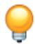

Tip: Use the Allow Multiple Plot States tool to display both model shapes if you want to display one or both shapes without contours, symbols, or material orientations. You can also use this tool to select any combination of plot states from the tools in the Visualization module toolbox (see Displaying multiple plot states, for more information).

## Using common plot options

You can use the common plot options to customize the appearance of undeformed and deformed plots.

The common options are also used in conjunction with the other plot state–independent options in the View menu and the dependent and independent customization options for contour, symbol, and material orientation plots. Select

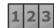

Options->Common from the main menu bar or use the tool in the toolbox to access the Common Plot Options dialog box. Click the following tabs to customize the appearance of plots in the current viewport:

• Basic: Choose render style, edge visibility, and deformation scale factor (deformed plot only).  
• Color & Style: Control model edge color and style, model face color, edge style, and edge thickness.  
• Labels: Control element, face, and node labels and node symbols; and control probe annotation labels.  
• Normals: Control element and surface normals.  
• Other: The Other page contains the following tabs:

- Scaling: Control model scaling and shrinking.  
Translucency: Control shaded and filled render style translucency.

If you choose to superimpose the undeformed and deformed model shapes, the common options control the display of the deformed shape and the superimpose plot options control the display of the undeformed shape (for more information, see Superimposing deformed and undeformed model plots). Plot state–dependent options may override some common options; for example, the color options for contour plots will always override the common color options.

To learn how to customize the render style and other display characteristics of your plots, see Customizing plot display.

## Producing an undeformed shape plot

For general analysis steps an undeformed plot displays the shape of your model without any deformation. For linear perturbation steps an undeformed plot displays the base state of your model. Since analysis results are not needed; an output database resulting from a datacheck run is sufficient to produce an undeformed shape plot. Model and analysis characteristics such as surface definitions can cause the appearance of your undeformed model to vary from step to step; you can select the step and frame at which to display your undeformed plot. For more information, see Selecting the results step and frame.

By default, when you open an output database, Abaqus/CAE displays the undeformed plot state for the last step and frame of the analysis. The plot is produced using the default display options for the current session (for information on saving display options, see Saving your display options settings). To produce an undeformed shape plot for an

output database that is already open, select Plot->Undeformed Shape from the main menu bar or use the tool in the toolbox.

1. Use the File menu to open the output database containing your model data.  
2. Use the Result menu to select the results step to display.  
3. Select the plot state–independent customization options that you want.

Abaqus automatically refreshes your undeformed plot each time you click Apply in the results or plot state–independent dialog boxes.

## Producing a deformed shape plot

A deformed plot displays the shape of your model at a specified step and frame of the analysis results, according to the values of the deformed field variable. For more information on selecting a step and frame, see Selecting a specific results step and frame. For more information on selecting a deformed field variable, see Selecting the deformed field output variable. To learn how to display the minimum and maximum values associated with your deformed plot, see Customizing the legend.

1. Use the File menu to open the output database containing your analysis results.  
2. Use the Result menu to select the following:

a. The step and frame at which Abaqus obtains values.  
b. The deformed field variable for which Abaqus obtains values. The variables that have been saved during the analysis are available.  
c. The numeric form in which Abaqus displays complex number results.

3. Select the plot state–independent customization options that you want.  
4. From the main menu bar, select Plot->Deformed Shape to display the deformed plot.


Tip: You can also produce a deformed shape plot using the tool in the toolbox.

The current viewport displays a customized deformed plot of the specified deformation field variable at the specified step and frame of the output database. The state block, if active, changes to show the name of the variable displayed.

Abaqus automatically refreshes your deformed plot each time you click Apply in the results or plot state–independent dialog boxes.

## Additional information

• Producing an undeformed shape plot  
• Using common plot options

## Superimposing deformed and undeformed model plots

You can combine the deformed and undeformed model shapes in a single plot. Combining the shapes provides a context for displaying and interpreting the contours, symbols, or material orientations. An example of superimposed model shapes is shown in Figure 1.

  
Figure 1: Deformed shape superimposed on the undeformed shape.

To produce a superimposed plot, select Plot->Contours, Symbols, or Material Orientations->On Both Shapes from

风 the main menu bar or use the and tools in the toolbox. To superimpose the undeformed and deformed shapes without contours, symbols, or material orientations or to display any combination of plot types for the same

results, use the tool and select all of the desired plot types from the toolbox (for more information, see Displaying multiple plot states).

1. From the main menu bar, select Options->Superimpose to customize the appearance of the undeformed shape.


Tip: You can also customize the undeformed plot shape using th e tool in the toolbox.

2. Click the following tabs to modify the options:

• Basic: Choose render style and edge visibility.  
• Color & Style: Control model edge color and style, model face color, edge style, and edge thickness.  
• Labels: Control element, face, and node labels and node symbols.  
• Normals: Control element and surface normals.  
• Other: The Other page contains the following tabs:

- Scaling: Control model scaling and shrinking.  
- Translucency: Control shaded and filled render style translucency.  
- Offset: Control the offset between the undeformed and deformed shapes.

For more detailed information on customizing the display characteristics of your plots, see Customizing plot display.

Abaqus/CAE uses the superimpose plot options in place of the common plot options to display the undeformed plot in the viewport.

3. To customize the similar options for the deformed shape, select Options->Common or use the 1234 tool in the toolbox.  
4. If contours, symbols, or material orientations are active, use the associated plot state–dependent options to customize the display of both the undeformed and the deformed plot.  
5. Click Apply in each options dialog box to implement your changes in the viewport.

Your superimposed plot options changes are saved for the duration of the session and will affect the undeformed shape in all subsequent plots where both model shapes are displayed.

## Additional information

• Producing an undeformed shape plot  
• Producing a deformed shape plot  
• Using common plot options  
• Customizing plot display


This section explains contour plotting.

A contour plot displays the values of an analysis variable at a specified step and frame. In addition, a contour plot can be used to show the value of attributes such as loads or predefined fields at a specified step of a model in the current model database. Abaqus/CAE represents the values as customized colored lines, colored bands, colored faces, colored isosurfaces, or tick marks on your model.

## In this section:

Understanding contour plotting  
Using contour plot options  
Producing a contour plot  
Producing a contour plot of linear beam section stresses  
Customizing a contour plot

## Understanding contour plotting

This section discusses the computation and rendering of contour values and the computation of contour limits.

## In this section:

About contour plotting  
Understanding how contour values are computed  
Understanding how contours are rendered  
Understanding contour limits

## About contour plotting

A contour plot displays results that are stored in the output database or displays model attributes from a model in the current model database.

Each contour plot displays the following values: for an output database, contour plots display the value of a particular field output variable in a specified step and frame of the analysis; for a model in the current model database, contour plots display the value of a selected attribute such as a load in a specified step in your analysis. These values are shown as colored lines, colored bands, or quilt-type colored faces on the surface of your model, or they are shown as isosurfaces that extend line contours into the model, depending on the customization options you select. A contour plot cannot be produced if no elements are visible in the current viewport.

Line, banded, quilt-type, and isosurface contours are shown in Figure 1.

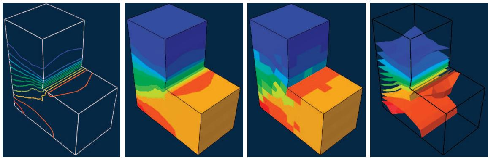  
Figure 1: From left to right: contours shown as colored lines, colored bands, colored faces, and colored isosurfaces.

As with other elements, contour lines for line-shaped elements (beams, one-dimensional elements, gasket link elements, and three-dimensional line gasket elements, as well as two-dimensional contact surfaces) are plotted along the elements by default. Line-type contour plots are not recommended for line-shaped elements. Tick mark contour plotting provides an alternative means of visualizing contours on beams and other line-shaped elements. The contour is displayed as a curve plotted between two sets of lines normal to the elements, as shown in Figure 2. The contour level is indicated by “tick marks” on these normal lines.

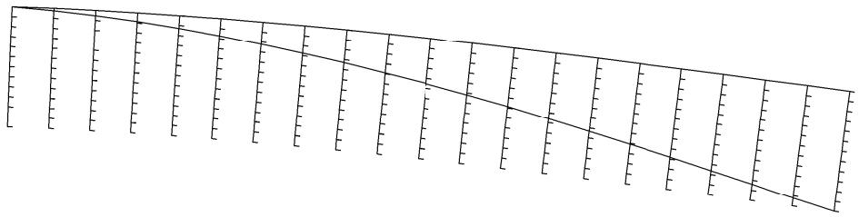  
Figure 2:Tick mark contour plot.

The key to interpreting a contour plot is the plot legend. The legend indicates the correspondence between contour values and contour colors.

By default, Abaqus/CAE evenly divides the difference between the minimum and maximum values in the legend into 12 intervals. You can change the number of intervals if necessary. A color is associated with each interval. For a line-type or isosurface-type contour plot each colored line or surface corresponds to a set of locations in the model for which the field output variable has the value shown in the legend. For a banded contour plot each colored contour band corresponds to a range of values within the bounds indicated by the legend. For a quilt contour plot each colored element face corresponds to a single value within the bounds indicated by the legend for that color. For a tick mark contour plot each colored tick mark corresponds to a single value indicated by the legend.

Abaqus/CAE follows a different convention for contour plots of contact status (CSTATUS). This variable describes whether individual nodes on the main and secondary surfaces are in contact and, if so, whether the surfaces are sticking or slipping at that point. Because three settings are available to describe the contact status at each node—sticking, slipping, or open—Abaqus/CAE displays contact status data using three contour intervals and renders the contour plot by coloring the region around a node according to its contact status.

The components of connector vector output are resolved with respect to different coordinate systems depending on whether the output requested is field output or history output. See Displaying connectors and connector output in the Visualization module for how to interpret the vector component values in field plots.

To learn how to produce a contour plot, see Producing a contour plot.

## Understanding how contour values are computed

The computations necessary to produce a contour plot from results stored in the output database depend on whether the contour plot displays values for a node-based quantity, such as displacement or velocity, or for an element-based quantity, such as stress or strain. This section applies to contour plots of output database data only.

## How node-based field output variable contour values are computed

For contour plots of node-based field output variables, contour values are obtained directly from the quantities on the output database. These values are then used without further computation to produce colored lines or colored bands on the surface of your model.

## How element-based field output variable contour values are computed

For contour plots of element-based field output variables, Abaqus/CAE applies computations to the output database results to form the contour values. The computations vary according to the following criteria:

• the quantity you choose to plot (field output or discontinuities),  
• the averaging options you select,  
• the result regions you select,  
• the compatibility of elements included in the plot, and  
• the type of contour plot you request (line, banded, or quilt).

Select Result->Field Output from the main menu bar to choose the field output variable. To learn more about this topic, see Selecting the field output to display.

Select Result->Options from the main menu bar to choose the quantity to plot, the averaging options, the result regions, and to control the handling of incompatible elements during the computation of element-based contour values. To learn more about these topics, see Selecting result options.

Select Options->Contour->Basic from the main menu bar to choose the type of contour plot that you want. Choosing line-, banded-, quilt-, or isosurface-type contours, contains detailed instructions on choosing the contour type.

The type of contour plot that you request governs the extrapolation applied to the results read from the output database. For line-, banded-, and isosurface-type contours of element-based variable values, Abaqus/CAE extrapolates results to the nodes. By default, the results are conditionally averaged after Abaqus/CAE performs any necessary transformations and computes any requested scalar components or invariants; if desired, you can compute invariants after the results are averaged. For quilt-type contours of element-based variable values, Abaqus/CAE extrapolates results to the element faces on the surface of your model and then takes a weighted sum to produce a single value per face. Since quilt contour values are computed for each element face individually with no averaging across element boundaries, a quilt contour plot is an effective means of displaying results on an element-by-element basis. You can choose quilt-type contours only for element-based field output variables.

## Understanding how contours are rendered

Contour values are drawn on element faces using one of two methods: texture mapping or tessellation. Texture mapping is a high-performance rendering method that essentially lays an image of the contour values (the texture) over an image of the model, similar to the process of wrapping a present. Tessellation is a method of transforming arbitrary contour values into repeating patterns of distinct shapes, such as triangles or simple polygons; the shape values are computed face by face and can take a long time for large models. Texture mapping is the default and preferred method and will maximize the performance of Abaqus/CAE. Although certain graphics adapters do not support texture mapping properly, Abaqus/CAE can emulate texture mapping in software. However, line-type and isosurface contours, the display of contour edges, shrinking elements about their centroid, and contours on CAXA or SAXA elements are supported only by the tessellation method.

The differences between contour plots generated with texture mapping or tessellation are minimal; you may see slight differences in the appearance of contour bands on quadrilateral element faces. Texture mapping can sometimes introduce precision issues; for example, if the contour value is exactly on a limit, the color may appear as just above or below the value.


## Note:

If you display tessellated contours under intense lighting, the colors in the contours might not match the colors displayed in the legend because the light can fade some colors on the surface facets. For more information, see Controlling model lighting.

For detailed information on choosing the contour method, see Choosing the contour method.

## Understanding contour limits

The minimum and maximum values shown in a contour plot can be computed by Abaqus/CAE, or you can specify them.

You can decide to specify one or both limits; for example, to eliminate extremes or to examine variations within a fixed set of bounds.

Contours are shown on visible surfaces of your model only; however, depending on the type of contour plot and the result options that you select, Abaqus/CAE might computer contour values based on all elements in the current display group or on all elements in the model. (For more information, see Selecting result options.) The reported minimum and maximum values might, therefore, occur at interior elements. You can display contours on the interior of your model by using display groups to show only the interior elements in the plot or by shrinking all elements about their centroids so that interior elements are visible between the bodies of exterior elements.

Abaqus/CAE computes the minimum and maximum values differently, according to the type of field output variable shown (nodal or element), the type of contour plot (quilt versus line or banded), and options you select. For contour plots of nodal field output variables, the limits are the maximum and minimum nodal values. For quilt-type contour plots, the limits are the maximum and minimum element face values. For line-, banded-, or isosurface-type contours of element field output variables, Abaqus/CAE determines the minimum and maximum by the extrapolated, averaged values as defined by the current averaging criteria. For element field output variables, the contour maximum and minimum values can be given at element faces, integration points, and element centroids as well as at nodes.

When Abaqus/CAE computes the minimum and maximum over values averaged at the nodes, the limits are based on the values used to create the plot. In this case, the legend bounds may vary as you vary the averaging criteria. To learn how to control the averaging criteria, see Controlling result averaging.

You can also control which contour limits are used for each frame of a contour plot animation: the limits computed for the first and last frame, the limits computed for the current frame, the recomputed limits for each individual frame, or the limits computed for all frames in the animation. Computing limits based on all frames in the animation requires one full pass through the animation sequence to establish the contour limits used for subsequent passes through the animation.

For detailed information on controlling contour limits, see Setting contour limits. To learn how to display the minimum and maximum values associated with your contour plot, see Customizing the legend.

## Using contour plot options

You can use the contour plot options to customize the appearance of contour plots.

□ Select Options->Contour from the main menu bar or click in the toolbox to access the Contour Plot Options dialog box. Click the following tabs to customize the appearance of contour plots in the current viewport:

• Basic: Choose the contour type (including whether to show tick marks for line elements), contour intervals, and contour method.  
• Color & Style: The Color & Style page contains the following tabs:

Model Edges: Control the color of model edges.  
Spectrum: Choose contour colors, and control the order of the values displayed in the legend.  
Line: For line-type contours control the style and thickness of each line.  
- Banded / Isosurface: For banded- or isosurface-type contours control the color, style, and thickness of contour edges.

• Limits: Control the computation of contour limits and the display of annotations for the maximum and minimum contour values.  
• Other: Control tick mark plot display options, the display of nodal averaged vector or tensor orientations, and the display of section point or envelope plots.

Other options such as the render style, edge visibility, deformation scale factor, and translucency are located in the Common Plot Options dialog box. If you choose to plot contours on both the undeformed and the deformed shape, you can use the Superimpose Plot Options to customize the appearance of the undeformed shape. See Superimposing deformed and undeformed model plots, for more information about superimpose plots. To learn how to customize the render style and underlying model of your contour plot, see Customizing plot display. For information on the computation of result values, see Understanding how results are computed.

## Additional information

• Customizing a contour plot

## Producing a contour plot

A contour plot can display either the values of an analysis variable at a specified step and frame of an output database or the values of selected attributes at a specified step of a model in the current model database. Abaqus/CAE represents the values as customized colored lines, colored bands, colored faces, or colored isosurfaces on your model or as colored tick marks on lines drawn normal to your model. For more information on selecting an analysis variable, see Selecting the primary field output variable. For more information on selecting a specific step and frame, see Selecting a specific results step and frame. To learn how to display the minimum and maximum values associated with your contour plot, see Customizing the legend.

If your model includes beam elements, some additional steps can be required for proper contour display. See Producing a contour plot of linear beam section stresses.

If you are plotting data from a model database, specify only the primary field variable.

1. Use the File menu to open the model database or output database containing your model data or analysis results.  
2. If you are plotting data from a model database, switch to the Visualization module, expand the Model Database container of the Results Tree, and select the model you want to use.

3. Use the Result menu to select the following:

a. The step and frame to display (or just the step, if a model database is selected).  
b. The primary field output variable to display.  
c. The deformed field output variable to display (for contours on the deformed shape only).  
d. The quantity to plot and averaging options (for output databases only).

4. Select the plot state–independent and contour plot customization options that you want.

5. If your chosen field output variable includes complex numbers, select the Complex Form tab in the Result Options dialog box to control the numeric form to display. Complex form options apply only to output databases.

6. From the main menu bar, select Plot->Contours and choose whether to plot the contours on the undeformed shape, the deformed shape, or both.


Tip: You can also produce a contour plot using the deformed , undeformed , or superimposed contour tools in the toolbox.

The current viewport displays a customized contour plot of the specified field output variable at the specified step and frame of the current output database or at the specified step of the selected model in the current model database.

Abaqus automatically refreshes your contour plot each time you click Apply in the step and frame selector, field output options, plot state–independent options, superimpose plot options (if applicable), or contour plot options dialog boxes.

## Additional information

• Using contour plot options  
• Selecting model data and analysis results to plot

## Producing a contour plot of linear beam section stresses

If your model includes beam geometry and beam rendering is enabled for your session, you can display field output results along the beam cross-sections as contours. For nodal quantities and element integration point quantities, Abaqus/CAE displays contours that are constant through the thickness of the beam cross-section. For the element-based data, the contour reflects the currently selected section point.

You can also create a contour plot that shows a more realistic stress distribution through the beam based on section force and section moment data, which Abaqus/CAE calculates using linear elastic solid mechanics theory. Figure 1 shows an example of beam stresses through an I-beam.

  
Figure 1: Linear beam section stresses displayed for an I-beam cross-section.

Beam stress contour plots are available only when the selected step and frame include data from the integrated output quantities SF (section force) and SM (section moment). Furthermore, these plots are available only for a subset of profiles in Abaqus/CAE:

• Thin-walled box profiles  
• Thin-walled pipe profiles  
• Circular profiles  
• Rectangular profiles  
• I-shaped profiles  
• L-shaped profiles  
• T-shaped profiles

BEAM\_STRESS output is not available for random response and response spectrum procedures.

Abaqus/CAE does not include beam element normals for eigenfrequency extraction in its calculations for beam cross section rendering, so you cannot visualize the torsional and out-of-plane modes for the beam elements in these plots. However, the torsional modes are calculated for the beam elements because the beam elements have torsional stiffness; this information is available in the data (.dat) file.

1. Use the File menu to open the output database containing your analysis results.

2. Use the Result menu to select the following:

a. The step and frame to display.  
b. The primary field output variable to display.  
c. The deformed field output variable to display (for contours on the deformed shape only).  
d. The quantity to plot and averaging options.

3. Select the plot state–independent and contour plot customization options that you want.

4. From the Output Variable options, select BEAM\_STRESS.

5. Choose the invariant or component for which you want to display contour data:

• Select Mises from the Invariant options to display von Mises stress.  
• Select S11 from the Component options to display axial stress along the beam.  
Select S12 from the Component options to display shear stress along the local beam section 2-axis caused by shear force and torsion.  
Select S13 from the Component options to display shear stress along the local beam section 1-axis caused by shear force and torsion.

6. From the main menu bar, select Plot->Contours and choose whether to plot the contours on the undeformed shape, the deformed shape, or both.


Tip: You can also produce a contour plot using the deformed , undeformed , or superimposed contour tools in the toolbox.

The current viewport displays a customized contour plot of the specified field output variable at the specified step and frame of the current output database.

Abaqus automatically refreshes your contour plot each time you click Apply in the step and frame selector, field output options, plot state–independent options, superimpose plot options (if applicable), or contour plot options dialog boxes.

## Additional information

• Using contour plot options  
• Selecting model data and analysis results to plot  
• Producing a contour plot of linear beam section stresses

## Customizing a contour plot

This section describes how to customize a contour plot. Abaqus/CAE offers numerous options for you to control the contour type, limits, intervals, and colors.

To learn how to customize the render style, translucency, or model edge characteristics of your contour plot, see Customizing plot display. For information on adding nodal-averaged orientations to your contour plot, see Displaying nodal-averaged orientations. For information on customizing an envelope plot, see Selecting section point data by category. For information on the computation of result values, see Understanding how results are computed.

## In this section:

Choosing line-, banded-, quilt-, or isosurface-type contours  
Stylizing line-type contours  
Customizing banded- and isosurface-type contours  
Contouring line-shaped elements with tick mark contour plots  
Customizing tick mark contour plots  
Choosing the contour method  
Setting contour limits  
Annotating the minimum and maximum contour values  
Controlling how Abaqus/CAE computes contour limits  
Customizing contour colors  
Creating a new color spectrum  
Customizing contour intervals

## Choosing line-, banded-, quilt-, or isosurface-type contours

You can choose Line-, Banded-, or Isosurface-type contours to display the values of nodal (such as displacement) or element (such as stress) field output variables. Line-type contours represent values as customized colored lines on the surface of your model. Banded contours represent values as color-filled bands. Isosurface contours extend line-type contours through the model. Line, banded, and isosurface contours of element-based variable values are computed by extrapolating results to the nodes and conditionally averaging. Averaging depends on the characteristics of your model and on options you select. Line-type contours are not recommended for line-shaped elements, such as beams.

You can choose Quilt-type contours only for element field output variables. Variable values are extrapolated to element faces on the surface of your model, with no averaging between elements. Quilt contours are useful for evaluating results on an element-by-element basis. Only one color per element is plotted for axisymmetric elements with asymmetric deformation (CAXA or SAXA).

Banded-type contours are the default. You must choose line-, banded-, or isosurface-type contours to produce a plot of:

• Nodal-based field output values.  
• Element-based field output values averaged across elements.  
• Element-based results discontinuities rather than field output values.

Figure 1 shows the appearance of line-, banded-, quilt-, and isosurface-type contour plots.  
  
Figure 1: From left to right: line-, banded-, quilt-, and isosurface-type contours.

1. Locate the Contour Type options.

□ Select Options->Contour from the main menu bar or click in the toolbox; then click the Basic tab in the dialog box that appears. The Contour Type options are in the upper left corner of the page.

2. Click Line, Banded, Quilt, or Isosurface to choose the contour type you want.  
3. Click Apply to implement your changes.

The contour plot in the current viewport changes to display the contour type you have specified.

By default, your changes are saved for the duration of the session and will affect all subsequent contour plots. If you want to retain your changes for subsequent sessions, save them to a file. For more information, see Saving customizations for use in subsequent sessions.

## Additional information

• Understanding how contour values are computed  
• Stylizing line-type contours  
• Customizing banded- and isosurface-type contours

## Stylizing line-type contours

Abaqus/CAE displays line-type contours as customized colored lines on the surface of your model. You can stylize individual contour lines to make them easy to distinguish.

This option is particularly useful when colors are not available; for example, for black and white hard-copy plotting. Figure 1 shows a contour plot with customized contour lines.


  
Figure 1: Line-type contour plot with customized contour lines.

You customize the colored lines one color (interval) at a time, referring to each interval by its position in the contour legend. Interval number 1 is the first colored line starting from the bottom of the contour plot legend. For information on the contour legend, see Customizing the legend.

1. Locate the Line options.

Select Options->Contour from the main menu bar or click in the toolbox. Click the Color & Style tab in the dialog box that appears; then click the Line tab. The Line options appear.

2. To choose the interval you want to customize, click the Interval arrows until the desired interval number appears in the Interval box.


## Note:

The Style and Thickness buttons change to show the current style and thickness of this interval, respectively. The numbers above and below the Interval box change to correspond to the adjacent interval numbers. The area above and below the Style and Thickness buttons changes to show the style and thickness, respectively, of these adjacent intervals.

3. Choose the style of the interval line:

a. Click the Style button to reveal the style choices.  
b. Click the style you want.  
The specified style appears on the Style button.

4. Choose the thickness of the interval line:

a. Click the Thickness button to reveal the thickness choices.  
b. Click the thickness you want.  
The specified thickness appears on the Thickness button.

5. Repeat Steps 2 through 4 to customize additional intervals.

## 6. Click Apply to implement your changes.

The contour lines of the line-type contour plot in the current viewport change to reflect your style and thickness specifications. The contour legend, if active, will also change to show your selections. For more information on the contour legend, see Customizing the legend. In addition, tick mark axes, if present, will change to show your selections. For more information on tick mark contours, see Contouring line-shaped elements with tick mark contour plots.

By default, your changes are saved for the duration of the session and will affect all subsequent contour plots. If you want to retain your changes for subsequent sessions, save them to a file. For more information, see Saving customizations for use in subsequent sessions.

## Additional information

• Understanding contour plotting  
• Customizing a contour plot  
• Customizing contour intervals

## Customizing banded- and isosurface-type contours

Abaqus/CAE displays banded-type contours as colored bands on the surface of your model and displays isosurface contours by extending line-type contours through the model to create surfaces. You can display or suppress lines at the edges of each contour band or isosurface; these lines are called contour edges. Contour edges visually separate the colors used to represent contour values in a banded-type contour plot; for isosurfaces, where the separation is often more distinct, the display of contour edges is more decorative. You can further customize the color, style, and thickness of contour edges. For example, in Figure 1 the contour plot on the left has contour edges suppressed, while the plot on the right has contour edges displayed.


## Note:

Contour edges are not applicable to continuous interval contour plots.

  
Figure 1: Banded-type contour plots with contour edges suppressed and displayed.

1. Locate the Banded / Isosurface options.

Select Options->Contour from the main menu bar or click in the toolbox. Click the Color & Style tab in the dialog box that appears; then click the Banded / Isosurface tab. The Banded / Isosurface options appear.

2. Toggle Show contour edges to display or suppress contour edges.

When Show contour edges is on, the contour edge options become available.

3. Choose the color of the contour edges:

a. Click the color sample .

Abaqus/CAE displays the Select Color dialog box.

b. Use one of the methods in the Select Color dialog box to select a new color. For more information, see Customizing colors.

c. Click OK to close the Select Color dialog box.

The color sample changes to the selected color. The new color does not appear in the viewport until you click OK or Apply in the Contour Plot Options dialog box.

4. Choose the style of the contour edges:

a. Click the Style button to reveal the contour edge style options.  
b. Click the edge style you want.

The specified edge style appears on the Style button.

5. Choose the thickness of the contour edges:

a. Click the Thickness button to reveal the contour edge thickness options.  
b. Click the edge thickness you want.  
The specified edge thickness appears on the Thickness button.

6. Click Apply to implement your changes.

The contour edges of the banded contour plot in the current viewport change to reflect your specifications.

By default, your changes are saved for the duration of the session and will affect all subsequent contour plots. If you want to retain your changes for subsequent sessions, save them to a file. For more information, see Saving customizations for use in subsequent sessions.

## Additional information

• Choosing line-, banded-, quilt-, or isosurface-type contours  
• Customizing contour intervals  
• Understanding contour plotting

## Contouring line-shaped elements with tick mark contour plots

Contour lines drawn on line-shaped elements are difficult to visualize clearly. To see the contours of line-shaped elements (beams, one-dimensional elements, gasket link elements, three-dimensional line gasket elements, and two-dimensional contact surfaces) better, you can choose to display the contour lines using tick mark contour plots.

A tick mark contour plot shows the contour curve drawn between sets of lines that are normal to the actual elements. The contour level is indicated by “tick marks” on these normal lines. Abaqus displays the contour curve only when it falls within the limits you have specified. For more information on limiting the range of the plot, see Setting contour limits.

Figure 1 shows the appearance of a tick mark contour plot.  
  
Figure 1:Tick mark contour plot.

The normal lines, or tick mark axes, are drawn at nodes. At part boundaries, two tick mark axes are drawn. Within a part, if the angle between two adjacent line elements is less than the specified feature angle, a single tick mark axis is drawn in the direction of the average normal of elements sharing the node. Otherwise, a tick mark axis is drawn normal to each element sharing the node. When averaging normals, only displayed elements of the same type are considered in the calculation.

1. Locate the Contour Type options.

Select Options->Contour from the main menu bar or click in the toolbox; then click the Basic □ □. tab in the dialog box that appears. The Contour Type options are in the upper left corner of the page.

2. Toggle Show tick marks for line elements.  
3. Click Apply to implement your changes.

The contour plot in the current viewport changes to display tick mark plots for the line elements in the model.

By default, your changes are saved for the duration of the session and will affect all subsequent contour plots. If you want to retain your changes for subsequent sessions, save them to a file. For more information, see Saving customizations for use in subsequent sessions.

## Additional information

• Understanding contour plotting  
• Customizing tick mark contour plots

When you choose to show tick marks for line-shaped elements in your model, Abaqus/CAE indicates the contour levels as tick marks on lines (axes) drawn normal to the elements and displays the contour curve between the axes. You can specify the length of the tick mark axes, the color of the contour curve, the contour value (tick mark) that will intersect the element, and the normal direction in which the axes will be drawn on beam elements. In addition, for line-type contour plots, style selections you apply to individual contour lines will appear on the tick mark axes. For more information, see Stylizing line-type contours.

1. Locate the Tick Marks options.

□ □ Select Options->Contour from the main menu bar or click in the toolbox. Click the Other tab in the dialog box that appears; then click the Tick Marks tab. The Tick Marks options appear.

2. To choose the normal direction in which the tick mark axes will be drawn on beam elements, toggle the N1 or N2 button in the Orientation field.


## Note:

This option will be ignored when tick mark contour plots are displayed on line elements other than beams. In this case, the tick mark axes are drawn in the element normal direction.

3. Choose the length of the tick mark axes:

a. Click the Axis length button to reveal the length choices: Short, Medium, or Long.  
b. Click the length you want.

The specified length appears on the Axis length button.

4. Choose the contour value that will intersect the element:

a. Enter the desired base contour value in the Base Value field.

The value specified will be checked to determine whether it falls within the contour range. If it is above the maximum contour value, the maximum contour value will be used as the base value; if it is below the minimum contour value, the minimum contour value will be used as the base value. By default, zero is used as the base value.

5. Choose the color of the tick mark curve:

a. Click the color sample .

Abaqus/CAE displays the Select Color dialog box.

b. Use one of the methods in the Select Color dialog box to select a new color. For more information, see Customizing colors.  
c. Click OK to close the Select Color dialog box.

The color sample changes to the selected color. The new color does not appear in the viewport until you click OK or Apply in the Contour Plot Options dialog box.

6. Click Apply to implement your changes.

The contour lines of the tick mark contour plot in the current viewport change to reflect your specifications.

By default, your changes are saved for the duration of the session and will affect all subsequent contour plots. If you want to retain your changes for subsequent sessions, save them to a file. For more information, see Saving customizations for use in subsequent sessions.

## Additional information

• Understanding contour plotting  
• Customizing a contour plot

## Choosing the contour method

Contour values are drawn on element faces using either the texture mapping or tessellation method. Texture mapping is the default and preferred method and will maximize the performance of Abaqus/CAE. Although certain graphics adapters do not support texture mapping properly, Abaqus/CAE can emulate texture mapping in software. However, certain display options are supported only by the tessellation method; in such cases Abaqus/CAE will override the user setting for texture-mapped contours automatically.

1. Locate the Contour Method options.

□ Select Options->Contour from the main menu bar or click in the toolbox; then click the Basic tab in the dialog box that appears. The Contour Method options are at the bottom of the page.

2. Choose one of the following rendering methods:

Texture-mapped. This option uses high-performance graphics rendering capabilities to draw contour values on each element face. If the graphics parameters for your system have been configured to disable texture mapping (see Tuning graphics cards), Abaqus/CAE will emulate texture mapping in software.  
• Tessellated. This option uses the process of tessellation to draw contour values on each element face.

3. Click Apply to implement your changes.

The contour plot in the current viewport changes to use the contour method you have specified. By default, your changes are saved for the duration of the session and will affect all subsequent contour plots. If you want to retain your changes for subsequent sessions, save them to a file. For more information, see Saving customizations for use in subsequent sessions.

## Additional information

• Understanding how contours are rendered  
• Customizing a contour plot

## Setting contour limits

By default, Abaqus/CAE automatically computes the limits of the values shown in your contour plot.

You can control the minimum and maximum values Abaqus/CAE displays; for example, to eliminate extremes or to examine variations within a fixed set of bounds.

Contour limits, once set, remain in effect for the duration of the session. To learn how to display the minimum and maximum values associated with your contour plot, see Customizing the legend.

You can override the contour limits if you use custom contour interval values; see Customizing contour intervals for more information. When you use a custom contour interval, Abaqus/CAE uses the maximum and minimum interval values that you specify in the Edit Intervals dialog box as the contour limits for the contour plot.

If you specify the contour limits and subsequently modify the limits, the smaller the number of contour intervals increases the likelihood that your limit modifications will result in changes to the contour plot.

1. Locate the Contour Limits options.

□ Select Options->Contour from the main menu bar or click in the toolbox; then click the Limits tab in the dialog box that appears. The contour Limits options become available.

2. In the area labeled Max, choose one of the following options:

• Select Auto-compute to request that Abaqus compute the maximum contour value.  
• Select Specify to specify the maximum value yourself; then enter the maximum value of your choice in the Specify text field.

3. In the area labeled Min, choose one of the following options:

• Select Auto-compute to request that Abaqus compute the minimum contour value.  
Select Specify to specify the minimum value yourself; then enter the minimum value of your choice in the Specify text field.

4. Click Apply to implement your changes.

In the contour plot in the current viewport, Abaqus displays contour values within the limits you have specified. The contour legend, if active, changes to show the limits you have specified. If you have specified a maximum value that is less than the actual maximum or if you have specified a minimum value that is greater than the actual minimum, Abaqus displays the actual maximum or minimum value (respectively) in the legend. For more information on the contour legend, see Customizing the legend. To learn how to control the color of values that exceed your limits, see Customizing contour colors.

By default, your changes are saved for the duration of the session and will affect all subsequent contour plots. If you want to retain your changes for subsequent sessions, save them to a file. For more information, see Saving customizations for use in subsequent sessions.

## Additional information

• Understanding contour limits  
• Annotating the minimum and maximum contour values  
• Controlling how Abaqus/CAE computes contour limits

## Annotating the minimum and maximum contour values

By default, Abaqus/CAE indicates the general locations of the minimum and maximum contour values through changes in the contour color. The actual locations may be in any part of the model displayed using the extremes of the selected color spectrum. You can toggle on Show location to annotate the nodal location of the minimum and/or maximum contour values. The annotations are of the form Min: value and Max: value, respectively, with a line pointing to the node, face (for quilt plots), or element centroid where the minimum and maximum occur.

Displaying the minimum or maximum value annotations activates the contour legend and the Show min/max values option (for more information, see Customizing the legend). The annotations are created automatically—you cannot edit them using the Annotation Manager. The annotation font and color match those of the legend text, and the node symbols are determined by the node symbol settings in the Common Plot Options dialog box. If you display the minimum and maximum contour values and a view cut is activated, the locations of the minimum and maximum values are updated relative to the viewport display. The contour legend is also updated to reflect the new bounds.


## Note:

The minimum and maximum locations are not shown in an overlay plot.

1. Locate the Show location checkboxes.

□ Select Options->Contour from the main menu bar or click in the toolbox; then click the Limits □. tab in the dialog box that appears.

2. Toggle on Show location in the Min and Max areas, respectively, to annotate each location on the model.  
3. Click Apply to implement your changes in the viewport.

Abaqus/CAE activates the contour legend, including the Show min/max values option. The legend displays both the minimum and maximum values, regardless of whether you annotate one or both of them on the model.

4. If desired, use the Viewport Annotation Options to customize the annotation font and color (controlled by the legend text options), to hide the minimum and maximum values in the legend, or to hide the entire legend. Use the symbol and size options on the Labels tabbed page of the Common Plot Options dialog box to edit the displayed node symbols.

By default, your changes are saved for the duration of the session and will affect all subsequent contour plots. If you want to retain your changes for subsequent sessions, save them to a file. For more information, see Saving customizations for use in subsequent sessions.

## Additional information

• Understanding contour plotting  
• Customizing a contour plot  
• Customizing model labels  
• Customizing the legend

## Controlling how Abaqus/CAE computes contour limits

By default, Abaqus/CAE automatically computes the minimum and maximum values shown in your contour plot. Automatic computation does not apply if you have set limits for both the minimum and maximum contour values.

For contour plots of nodal field output variables, the limits are the minimum and maximum nodal values. For quilt-type contour plots, the limits are the minimum and maximum element face values.

For line-, banded-, or isosurface-type contours of element field output variables, the limits are based on the values from individual elements extrapolated to and averaged at the nodes. The range may vary due to changes in the results averaging options. To learn how to control the averaging options, see Controlling result averaging.

For animations of contour plots, you can control which contour limits are used in each frame of the animation. You can choose to always use the auto-computed limits from the first and last frame, to always use the auto-computed limits from the current frame, or to recompute the limits for each frame.

1. Locate the Auto-Computed Limits options.

Select Options->Contour from the main menu bar or click in the toolbox; then click the Limits tab in the dialog box that appears. The Auto-Computed Limits options are in the lower half of the page.

2. Choose one of the following options for animation contour limits:

• Select Use first and last frame limits to use the auto-computed contour limits from the first and last frame for each frame of the animation.  
• Select Use current frame limits to use the auto-computed contour limits from the current frame for each frame of the animation.  
Select Recompute limits for each frame to recompute the contour limits for each frame of the animation based on the result values for the frame.  
• Select Use limits from all frames to recompute the auto-computed contour limits from all frames of the animation.

3. Click Apply to implement your changes.

Contour limits for each frame of animations generated for the contour plot in the current viewport will be determined based on the option you selected. The contour legend, if active, changes to show the limits Abaqus computes.

By default, your changes are saved for the duration of the session and will affect all subsequent contour plots. If you want to retain your changes for subsequent sessions, save them to a file. For more information, see Saving customizations for use in subsequent sessions.

## Additional information

• Understanding contour limits  
• Setting contour limits  
• Choosing line-, banded-, quilt-, or isosurface-type contours

## Customizing contour colors

By default, Abaqus/CAE represents contour values using the Rainbow color spectrum from red (for the maximum value) to blue (for the minimum value). You can select alternative color spectrums or create new color spectrums to use.

See Creating a new color spectrum for more information about creating a new color spectrum.

If your results include cyclic data in which positive and negative extreme values are equivalent, select the Wraparound color spectrum. This spectrum, with green at both extremes, correctly displays results such as the phase angle of a complex number, where 180° and −180° are the same.

By default, the contour plot legend displays values in descending order with the maximum value at the top. You can choose to reverse the order and display the values in ascending order with the minimum value at the top.

For non-tick mark contour plots you can also choose the colors Abaqus uses to represent values that exceed the limits you have specified for the plot, if any. By default, Abaqus displays such values in shades of gray. (For tick mark contour plots Abaqus displays the contour curve itself only within the limits you have specified.) You can choose to hide these values that are exceeding the limits specified for the plot from the contour legend. For more information on limiting the range of the plot, see Setting contour limits.

1. Locate the Spectrum options.

Select Options->Contour from the main menu bar or click □ in the toolbox. Click the Color & Style tab in the dialog box that appears; then click the Spectrum tab. The Spectrum options appear.

2. To choose the color of values within the limits of the plot, either select a spectrum name or click to create and use a new color spectrum. See Creating a new color spectrum for information about creating a new color spectrum.

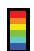


Tip: Alternatively, you can choose or create a contour spectrum from the Results Tree. Click the Spectrums container to create a new spectrum, or click the name of any spectrum in the Results Tree to display the model using that spectrum.

3. To display the values in the contour plot legend in ascending order with the minimum value at the top, toggle on Reverse contour legend range.  
4. To hide the values in the contour plot legend that exceed the specified limits, toggle on Use specified limits for contour legend.  
5. To control the color of values that exceed the limits of the plot, do one of the following:

Click Specify; then click the Greater than max or Less than min color sample to open the Select Color dialog box. Select a new color, and click OK to close the Select Color dialog box and update the color sample. (For more information, see Customizing colors.)

Or,

• Click Use spectrum min/max to accept the minimum and maximum contour spectrum colors for such values.

6. Click Apply to implement your changes.

Contours in the current viewport change to the colors you have specified. The correspondence between contour colors and contour values appears in the contour legend, if active. For more information on the contour legend, see Customizing the legend.

By default, your changes are saved for the duration of the session and will affect all subsequent contour plots. If you want to retain your changes for subsequent sessions, save them to a file. For more information, see Saving customizations for use in subsequent sessions.

## Additional information

• Understanding contour plotting  
• Customizing a contour plot  
• Creating a new color spectrum  
• Coloring elements with no results

Abaqus/CAE provides seven predefined color spectrums that you can use to customize the colors in a contour plot. If you prefer a different set of colors or a different arrangement, you can create a new color spectrum and apply its colors to the contour plot.

Creating and editing a color spectrum are similar processes. When you create a new color spectrum, Abaqus/CAE populates the Create Spectrum dialog box with the contents of the last color spectrum that you either modified or applied to the contour plot. If you had not yet modified a spectrum or created a contour plot in your session, Abaqus/CAE populates a new color spectrum with the colors in the predefined Rainbow color spectrum. You can then edit this new color spectrum by adding, modifying, moving, and deleting colors to achieve the content and arrangement that you want.

A spectrum must contain at least two colors and can contain as many colors as you want to include. In many situations the number of colors in your selected color spectrum will not match the number of contour intervals, so Abaqus/CAE cannot perform a one-to-one assignment of colors to contour intervals. In this case Abaqus/CAE performs one of the following actions:

If your spectrum has more colors than the current number of contour intervals, Abaqus/CAE samples colors from the spectrum to create the contour plot. For example, when a spectrum contains 24 colors and only 12 intervals are selected, the contour plot will display every other color in the spectrum.  
If your spectrum has fewer colors than the current number of contour intervals, Abaqus/CAE interpolates between spectrum colors to determine additional colors to use for the contour intervals. All user-defined color spectrums follow an HSV interpolation scheme, while the Red to blue predefined spectrum follows an RGB interpolation scheme. This difference means that the Red to blue predefined spectrum and a user-defined spectrum could contain the same two colors, red and blue, but behave differently because their interpolation schemes would create different intermediate interval values. In general, HSV interpolation conforms more closely to human intuition than RGB interpolation does.

Color spectrums are session-specific definitions; therefore, they are available for use in any viewport during your session but are not saved to the output database (.odb). You can edit the colors and arrangement of any color spectrum, and you can rename, copy, or delete any user-created color spectrum. Abaqus/CAE does not allow you to rename or delete the seven predefined color spectrums. Abaqus/CAE provides access to color spectrums both from the main menu bar and from the Results Tree.

1. Locate the Create Spectrum dialog box.

From the main menu bar, select Tools->Spectrum->Create.

The Create Spectrum dialog box appears.

2. Specify the Name for this new color spectrum.  
3. To insert a new color into the color spectrum:

1. Highlight the color in the color spectrum that you want to precede or follow the color that you add.

2. Click Insert Before or Insert After to add a new color in the indicated location.

The Select Color dialog box opens.

3. Choose a color, and click OK to close the Select Color dialog box.

Abaqus/CAE adds the new color in the selected location.

4. To change one of the colors in the color spectrum, double-click the color and select a new color from the Select Color dialog box that appears.  
5. To move a color within the color spectrum, highlight the color and click either Move Up or Move Down to move the color one step in the selected direction.  
6. To delete a color from the spectrum, highlight the color and click Delete.

7. Continue adding, changing, moving, and deleting colors until the color spectrum contains the colors you want in the desired order.  
8. Click OK.

Abaqus/CAE adds the new color spectrum, making it available for use in customizing contour plots.

## Additional information

• Understanding contour plotting  
• Customizing a contour plot  
• Customizing contour colors  
• Coloring elements with no results

## Customizing contour intervals

Abaqus/CAE evenly divides the range between the minimum and maximum contour values into intervals. You can customize the number of intervals and whether the intervals are represented by discrete or continuous colors.

By default, there are 12 discretely colored intervals. Figure 1 shows a banded-type contour plot with nine uniform contour intervals on the left and with continuous contours on the right.

  
Figure 1: Contour plots showing uniform and continuous contour intervals.

When you represent contour plots using discrete intervals, you can also control the type of progression between interval values. If you choose a uniform interval type, Abaqus/CAE creates a uniform, arithmetic progression between the interval values; if you choose a logarithmic interval type, Abaqus/CAE creates a logarithmic progression between interval values. In addition, you can create a new set of contour intervals with a custom progression that includes any values that you want to include. You can also provide just a few interval values and interpolate additional intervals between the values you define. The interval values you provide must appear in descending order from top to bottom in the Edit Intervals dialog box.

If you select a custom interval, Abaqus/CAE overrides the contour limits specified in the Limits area of the Contour Plot Options dialog box and uses the maximum and minimum interval values as the custom contour limits. See Setting contour limits, for more information.

If you select custom contour intervals and subsequently modify the intervals, the smaller the number of contour intervals increases the likelihood that your interval modifications will result in changes to the contour plot.

The contour legend, if active, will include two more intervals than the number you choose. Abaqus/CAE adds intervals at the top and bottom of the legend to indicate any values that exceed the contour plot limits. For more information on the contour legend, see Customizing the legend.

This section describes how to customize the contour intervals and how to edit the contour intervals that you use.

1. Locate the Contour Intervals options.

From the main menu bar, select Options->Contour; then click the Basic tab in the dialog box that appears. The Contour Intervals options are on the left side of the page.

2. Choose Continuous or Discrete to request continuous or discrete contour intervals, respectively.

Continuous intervals are available only for banded-type contours. Abaqus represents your contour values in a smooth, non-delineated color spectrum.

When you choose Discrete intervals, the Contour Interval slider becomes available.

3. For Discrete intervals, perform the following tasks:

1. Choose the number of intervals by dragging the Contour Intervals slider to the number of intervals (between 2 and 24) that you want.

2. Choose one of the following selections from the Interval type list:

• Select Uniform to use an arithmetic progression of values in the contour plot.  
• Select Log to use a logarithmic progression of values in the contour plot.  
• Select User-defined to use a customized set of values in the contour plot.

3. To customize interval values for the User-defined interval type, click

The Edit Intervals dialog box appears with a default set of contour intervals that you can modify in any of the following ways:

• Edit any interval value by clicking its row and entering a new value. You must provide interval values in descending order from top to bottom in the dialog box.  
Click Insert Before or Insert After to insert another interval before or after the selected interval. New intervals are added without values, so you must supply interval values either by entering them directly in the appropriate row or by interpolating their values.  
• Click Delete to remove the selected intervals from the set.  
Click Interpolate to calculate interpolated interval values for all blank intervals in the set. Abaqus/CAE interpolates values using an arithmetic progression.  
• Click Clear Values to clear the values for the selected intervals.

When you have completed your set of contour intervals, click OK to close the Edit Intervals dialog box.

4. Click Apply to implement your changes in the viewport.

The contours and, if active, the contour legend in the current viewport change to reflect the interval options you have selected.

By default, your changes are saved for the duration of the session and will affect all subsequent contour plots. If you want to retain your changes for subsequent sessions, save them to a file. For more information, see Saving customizations for use in subsequent sessions.

## Additional information

• Understanding contour plotting  
• Customizing a contour plot  
• Setting contour limits  
• Customizing the legend

A symbol plot shows the magnitude and direction of a particular vector or tensor variable at a specified step and frame of the analysis. In addition, a symbol plot can be used to show the magnitude and direction of attributes such as loads or predefined fields at a specified step of a model in the current model database.

Abaqus/CAE represents the values as symbols (for example, arrows) at locations on your model. This section explains symbol plotting.

## In this section:

Understanding symbol plotting  
Using symbol plot options  
Producing a results symbol plot  
Producing a symbol plot of free body nodal forces  
Customizing symbol plot appearance

## Understanding symbol plotting

Symbol plots allow you to visualize the magnitude and direction of vector and tensor variable results. In addition, a symbol plot can be used to show the magnitude and direction of attributes such as loads or predefined fields at a specified step of a model in the current model database.

Each vector and tensor result value appears as an arrow drawn at the location in the model where the result was obtained or the attribute is located; arrows representing nodal quantities appear at nodes, and arrows representing integration point quantities appear at integration points. (You cannot create a symbol plot of element quantities stored at nodes.)

For example, a symbol plot of the principal stress tensor is shown in Figure 1.


  
Figure 1: Symbol plot of principal stress.

Symbol plotting behavior changes slightly when you cut through a model using view cuts. If you display a view cut to investigate a symbol plot of a nodal output variable, Abaqus/CAE interpolates values from the nodes closest to the view cut surface and draws these interpolated vector arrows on the view cut surface. Abaqus/CAE performs this interpolation only for nodal output variables and does not perform any interpolation on the cutting surface when you display the portions of the model below the cut or above the cut. For more information on view cut functionality, see Understanding view cuts.

The relative sizes of the arrows indicate the magnitude of the result values. The directions of the arrows indicate the global directions of the results. In tensor plots arrows with arrowheads pointing in toward the arrow shaft represent compressive values; arrows with arrowheads pointing out from the arrow shaft represent tensile values.

The symbol plot legend shows you how each arrow color corresponds to a specific range of values. To learn how to display the minimum and maximum values associated with your symbol plot, see Customizing the legend.

By default, Abaqus/CAE plots all of a variable's result values in a symbol plot. The maximum value appears as the largest arrow in the plot, and all other arrows are scaled in proportion to that arrow size. However, you can use the Symbol Plot Options dialog box to limit the range of values that appear in a plot.

• When you specify a particular maximum value, only arrows representing absolute values less than or equal to that maximum value appear in the plot.  
The largest arrow in the plot will represent the largest absolute result value that is less than or equal to the limit you specify. All other arrows in the plot will be scaled in proportion to that arrow size.  
• When you specify a particular minimum value, only arrows representing absolute values greater than that minimum value appear in the plot.

The components of connector vector output are resolved with respect to different coordinate systems depending on whether the output requested is field output or history output. See Displaying connectors and connector output in the Visualization module for how to interpret the vector component values in field plots.

## Additional information

• Setting vector and tensor limits

## Using symbol plot options

You can use the symbol plot options to customize the appearance of symbol plots.

For data from an output database, use the Symbol Variable options in the Field Output dialog box to select the vector or tensor quantity and optionally the component to plot.


Note: If you selected a model from the current model databases, symbol plots display the primary variable, not the symbol variable. Changing the symbol variable has no effect unless you plot data from an output database.

Select Options->Symbol from the main menu bar or click in the toolbox to access the Symbol Plot Options dialog box. Click the following tabs to customize the appearance of symbol plots in the current viewport:

• Color & Style: The Color & Style page contains the following tabs:

Vector: Choose to customize the appearance of arrows that represent resultant values or selected component values of a vector variable.  
Tensor: Choose to customize the appearance of arrows that represent all principal components, all direct components, or selected components of a tensor variable. Tensor arrows can be displayed at the element integration points, centroids, or nodes. If arrows are displayed at the nodes, the scalars are always computed after averaging.

• Limits: The Limits page contains the following tabs:

- Vector: Choose either to specify the minimum and maximum vector values or to have Abaqus/CAE automatically compute these values.  
- Tensor: Choose either to specify the minimum and maximum tensor values or to have Abaqus/CAE automatically compute these values.

• Labels: The Labels page contains the following tabs:

Vector: Choose to display numerical labels for the vector values and to customize the color, font, type size, number format, and number of decimal places used for the vector values.  
Tensor: Choose to display numerical labels for the tensor values and to customize the color, font, type size, number format, and number of decimal places used for the tensor values.

Other options such as the render style, edge visibility, deformation scale factor, and translucency are located in the Common Plot Options dialog box. If you choose to plot symbols on both the undeformed and the deformed shape, you can use the Superimpose Plot Options to customize the appearance of the undeformed shape. To learn how to customize the render style and other display characteristics of your symbol plot, see Customizing plot display. For more information on tensor and field output variables, see Selecting field output variables. For more information on selecting the results step, see Selecting a specific results step and frame.

## Additional information

• Customizing symbol plot appearance

## Producing a results symbol plot

A symbol plot shows either the magnitude and direction of a vector or tensor variable at a specified step and frame of an output database or the magnitude and direction of model attributes at a specified step of a model in the current model database. Abaqus/CAE represents the values as symbols (for example, arrows) at locations on your model. For more information on tensor and field output variables, see Selecting field output variables. For more information on selecting the results step, see Selecting a specific results step and frame. To learn how to display the minimum and maximum values associated with your symbol plot, see Customizing the legend.

1. Open the model database or the output database containing your model data or analysis results.  
2. If you are plotting data from a model database, switch to the Visualization module, expand the Model Database container of the Results Tree, and select the model you want to use.  
3. Select the results step and frame to display (or just the step, if the current model database is selected).  
4. For output databases, select the symbol field output variable to display. For model databases, select the primary field output variable as the variable to display.  
The symbol plot state is activated.  
5. Select the plot state–independent and symbol plot customization options you want.  
6. If your chosen field output includes complex numbers, select the Complex Form tab in the Result Options dialog box to control the numeric form to display. This option applies only to plots for output databases.  
7. For plots of output database data, select Plot->Symbols from the main menu bar to modify whether to plot the symbols on the deformed model shape, the undeformed shape, or both.


Tip: You can also produce a symbol plot using the deformed , undeformed , or 图 superimposed symbol tools in the toolbox.

The current viewport changes to display a customized symbol plot of the specified field output variable at the specified step and frame of the current output database.

Abaqus automatically refreshes your symbol plot each time you click Apply in the step and frame selector dialog box, plot state–independent options, superimpose plot options (if applicable), or symbol plot options dialog boxes.

## Additional information

• Using symbol plot options

## Producing a symbol plot of free body nodal forces

You can create a symbol plot that shows the summation of free body nodal forces at individual nodes in your model. The symbol field output variable FREEBODY is the sum of the individual NFORCn components at a node, but with the vector’s direction reversed. The FREEBODY output variable also takes into account the displayed elements by default; in contrast, contour plots of NFORC1 consider the whole model.

The FREEBODY symbol plot is a representation of the unbalanced forces acting on the object that is represented by the current display group. This sensitivity to current display group is not exhibited in any other context, such as contour plots.

1. Open the output database containing your analysis results with NFORC data included.  
2. Select the results step and frame to display.  
3. If desired, focus in on a subset of your model using a display group.  
4. Select FREEBODY as the symbol field output variable to display.

The symbol plot state is activated.

5. Select the plot state–independent and symbol plot customization options you want.  
6. From the main menu bar, select Plot->Symbols to modify whether to plot the symbols on the deformed model shape, the undeformed shape, or both.


Tip: You can also produce a symbol plot using the deformed , undeformed , or superimposed symbol tools in the toolbox.

The current viewport changes to display a customized symbol plot of free body nodal forces at the specified step and frame of the current output database for the current display group.

Abaqus automatically refreshes your symbol plot each time you click Apply in the step and frame selector dialog box, plot state–independent options, superimpose plot options (if applicable), or symbol plot options dialog boxes.

## Additional information

• Selecting the symbol field output variable  
• Using symbol plot options  
• Resultant forces and moments on free body cuts in Abaqus/CAE

## Customizing symbol plot appearance

This section explains how to customize the style of symbol plot vector and tensor arrows, how to choose the quantity to display, and how to control the minimum and maximum values shown in the plot.

To learn how to customize the render style and the underlying model attributes of your symbol plot, see Customizing plot display.

## In this section:

Customizing symbol plot arrows  
Setting vector and tensor limits  
Customizing vector and tensor labels

## Customizing symbol plot arrows

You can customize the arrow color, maximum arrow length, arrow shaft thickness, and arrowhead appearance for symbol plot vector and tensor arrows. When you customize arrow color for nodal vector symbols, you can select a single color for all arrows in the plot or display arrows with different colors depending on their length. You can use either the size of the model or the size of the screen as the basis for calculations of maximum arrow length.

For tensor symbol plots of element output variables, arrows are typically displayed with three different colors.

1. Locate the vector or tensor Color & Style options.

Select Options->Symbol from the main menu bar or click in the toolbox; then click the Color & Style tab in the dialog box that appears.

• Click the Vector tab if you are creating a vector symbol plot.  
• Click the Tensor tab if you are creating a tensor symbol plot.

The options for the symbol type of your choice appear.

2. To display all arrows in the plot with a single color, select Uniform, then do one of the following:

For a vector plot, click the Uniform Color sample , and select the color in which you want the variable or variable component arrows to appear. (For more information, see Customizing colors.)  
• For plotting all principal components in a tensor plot, click the color samples labeled Maximum principal, Mid principal, and Minimum principal; and select the colors in which you want each arrow type to appear.  
• For plotting all direct components in a tensor plot, click the color samples labeled 11, 22, and 33; and select the colors in which you want each arrow type to appear.  
• For plotting only one principal or direct component, click the color sample labeled Color, and select the color in which you want the component arrows to appear.

3. To display all arrows in the plot using colors that correspond to their length, select Spectrum. You can choose one of the predefined color spectrums from the Spectrum Name list or define a new spectrum; for more information on selecting and defining a color spectrum, see Customizing contour colors, and Creating a new color spectrum. You can also drag the Number of intervals slider to change the number of intervals available for coloring the various arrows in the symbol plot; for more information about contour interval selection, see Customizing contour intervals.

4. Drag the Size slider to change the arrow length. The arrow size ranges from 0 to 30; the default arrow size is 6.

Your selection determines the size of the arrow representing the largest vector or tensor value in the plot. All other vector and tensor arrows in the plot will be scaled to that size.


## Note:

Abaqus/CAE maintains one size setting for both vectors and tensors; you cannot change the size of one independently of the other.

5. From the Basis options, select Screen size or Model size as the basis for calculations of maximum arrow length. If you select Screen size, Abaqus/CAE resizes the arrows as you change the size of the viewport; and if you select Model size, Abaqus/CAE resizes the arrows as you zoom in and out.  
6. Click the arrow next to the Thickness field, and select the arrow shaft thickness of your choice.  
7. Click the arrow next to the Arrowhead field, and select the arrowhead design of your choice.

8. If you are creating a tensor plot, customize the locations of the tensor arrows so that they are displayed at the Integration point, the Centroid, or the Nodal values for your model.


## Note:

If you choose the Nodal option for tensor variables, the results averaging option Compute scalars before averaging is not valid; the scalars are always computed after averaging.

9. If desired, you can display a smaller subset of the arrows in a symbol plot to clarify the presentation of a plot with many arrows. Drag the Symbol density slider to a value between High and Low.  
10. Click Apply to implement your changes.

The symbol plot vector or tensor arrows in the current viewport change to reflect your settings.

By default, your changes are saved for the duration of the session and will affect all subsequent symbol plots. If you want to retain your changes for subsequent sessions, save them to a file. For more information, see Saving customizations for use in subsequent sessions.

## Additional information

• Customizing colors  
• Customizing symbol plot appearance

## Setting vector and tensor limits

By default, Abaqus/CAE includes all of a variable's result values in a symbol plot. However, you can use the Symbol Plot Options dialog box to limit the range of values that appear in the plot.

When you specify a particular maximum value, only arrows representing values less than or equal to that maximum value appear in the plot. When you specify a particular minimum value, only arrows representing values greater than that minimum value appear in the plot. Changing the maximum or minimum value is also reflected in the symbol plot legend.

To learn how to display the minimum and maximum values associated with your symbol plot, see Customizing the legend.

1. Locate the Limits options.

区 Select Options->Symbol from the main menu bar or click in the toolbox; then click the Limits tab in the dialog box that appears. Click either the Vector tab or the Tensor tab; the symbol plot Limits options for the variable type of your choice become available.

2. In the area labeled Max in the top half of the page, choose one of the following options:

• Select Auto-compute to use the largest result value as the maximum value.  
• Select Specify to specify the maximum value yourself; then enter the maximum value of your choice in the Specify text field.

3. In the area labeled Min in the bottom half of the page, choose one of the following options:

• Select Auto-compute to use the smallest result value as the minimum value.  
Select Specify to specify the minimum value yourself; then enter the minimum value of your choice in the Specify text field.

4. Click Apply to implement your changes.

The symbol plot in the current viewport changes to display arrows only for variable values that fall within the limits you have specified.

By default, your changes to symbol plot options are saved for the duration of the session and will affect all subsequent symbol plots in the current viewport and in any new viewports created from the current viewport. If you want to retain your changes for subsequent sessions, save them to a file. For more information, see Saving customizations for use in subsequent sessions.

## Additional information

• Understanding symbol plotting

You can display a label next to each vector or tensor arrow in a symbol plot that expresses its value in numerical form. You can also customize these labels by changing their color, font, type size, number format, and number of decimal places.

1. Locate the Labels options.

区 Select Options->Symbol from the main menu bar or click in the toolbox; then click the Labels tab in the dialog box that appears. Click either the Vector tab or the Tensor tab; the symbol plot Labels options for the variable type of your choice become available.

2. Toggle on Display value next to vector symbol to show vector labels for the selected type of vector.  
3. Select the color of the vector labels for the selected type of vector.

a. Click the Text color color sample . Abaqus/CAE displays the Select Color dialog box.  
b. Use one of the methods in the Select Color dialog box to select a new color. For more information, see Customizing colors.  
c. Click OK to close the Select Color dialog box.

4. Select the font of the vector labels for the selected type of vector.

a. Click Set Font. Abaqus/CAE displays the Select Font dialog box.  
b. Use one of the methods in the Select Font dialog box to select a new font, size, and style. For more information, see Customizing fonts.  
c. Click OK to close the Select Font dialog box.

5. To change the format of the vector labels for the selected vector type, click the Number Format arrow and select one of the following formats:

Select Scientific to display legend values in scientific notation, which expresses legend values as a decimal value between 1 and 10 multiplied by a power of 10. When you select this format for the number 501,000, the value appears in the legend as 5.01e5.  
• Select Fixed to display legend values without using exponent values. When you select this format, the number 501,000 is displayed in the legend as 501000.00.  
Select Engineering to select engineering notation, which expresses values in a similar format to scientific notation but allows exponent values that are multiples of three only. When you select this format, the number 501,000 is displayed in the legend as 501E3.

6. Click the Decimal places arrows to specify the desired number of decimal places in each label.  
7. Click Apply to implement your changes.

The symbol plot in the current viewport changes to display labels with your selected formatting.

By default, your changes to symbol plot options are saved for the duration of the session and will affect all subsequent symbol plots in the current viewport and in any new viewports created from the current viewport. If you want to retain your changes for subsequent sessions, save them to a file. For more information, see Saving customizations for use in subsequent sessions.

## Additional information

• Understanding symbol plotting

## Plotting material orientations

A material orientation plot shows the material directions of elements in the model at the element integration points.

The material orientations are plotted at a specified step and frame of the analysis and at a specified section point for shell elements. Material orientation plots can also be created to show the material directions of reinforcements (rebar orientation) in membrane, shell, and surface elements. Abaqus/CAE represents the material orientations as triads. This section explains material orientation plotting.

## In this section:

Understanding material orientation plotting  
Using material orientation plot options  
Producing a material orientation plot  
Customizing material orientation plot triads

## Understanding material orientation plotting

Material orientation plots allow you to visualize the material directions of the elements in your model.

Abaqus/CAE draws a triad at the element integration points to indicate the material orientation. For example, a material orientation plot is shown in Figure 1.


  
Figure 1: Material orientation plot.

Material orientations are available only for those elements for which field output is requested at the selected section points. Valid elements include all shell elements, as well as solid elements for which you have defined a local orientation. The material orientations are displayed at the current step and frame of the analysis and at the current section point selection for shell elements. If display is enabled for both the top and bottom section point locations, Abaqus/CAE displays material orientations for the bottom location only. For small-strain shell elements the material orientations do not rotate with the deformation of the model (see About Shell Elements, for more information). Material orientation plots can also be created for reinforcement layers in membrane, shell, and surface elements.

## Additional information

• Selecting section point data by category

## Using material orientation plot options

You can use the material orientation plot options to customize the appearance of material orientation triads.

Select Options->Material Orientation from the main menu bar or click in the toolbox to access the Material Orientation Plot Options dialog box. Use the options in the dialog box to control the visibility, color, length, thickness, and arrow appearance of the material orientation triad axes.

Other options such as the render style, edge visibility, deformation scale factor, and translucency are located in the Common Plot Options dialog box. If you choose to plot material orientations on both the undeformed and the deformed shape, you can use the Superimpose Plot Options to customize the appearance of the undeformed shape. For more information on customizing a superimposed plot, see Superimposing deformed and undeformed model plots. To learn how to customize the render style and other display characteristics of your material orientation plot, see Customizing plot display. For more information on selecting the results step, see Selecting a specific results step and frame. For more information on selecting section point locations, see Selecting section point data by category.

## Additional information

• Customizing material orientation plot triads

## Producing a material orientation plot

A material orientation plot shows the material directions of the elements in a model at a specified step and frame and a specified section point. Abaqus/CAE represents the material orientations as triads at the element integration points. For more information on selecting the results step, see Selecting a specific results step and frame. For more information on selecting section point locations, see Selecting section point data by category.

1. Open the output database containing your analysis results.  
2. Select the results step and frame to display.  
3. Select the section point to display.  
4. Select the plot state–independent and material orientation plot customization options you want.  
5. From the main menu bar, select Plot->Material Orientations and choose whether to plot the material orientations on the undeformed shape, the deformed shape, or both.


Tip: You can also produce a material orientation plot using the deformed , undeformed 凡 , or superimposed material orientation tools in the toolbox.

The current viewport changes to display a customized material orientation plot.

Abaqus automatically refreshes your material orientation plot each time you click Apply in the step and frame selector, section point selector, plot state–independent options, superimpose plot options (if applicable), or material orientation plot options dialog boxes.

## Additional information

• Using material orientation plot options

## Customizing material orientation plot triads

This section explains how to customize the style of material orientation plot triads.

To learn how to customize the render style and the underlying model attributes of your material orientation plot, see Customizing plot display.

You can customize the color, length, thickness, and arrowhead appearance of the material orientation plot triad axes. You can also suppress the appearance of one or more of the triad axes; and for results with composite sections, you can display results using either the material orientation of the entire layup or one of its individual plies.

1. Select Options->Material Orientation from the main menu bar or click The triad options appear.  
2. Toggle on the buttons to the left of each of the axes to display or suppress them.  
3. Click on the color samples to select the color or colors of your choice for the visible triad axes in the plot.  
4. Drag the Size slider to increase or decrease the length of the axes in the material orientation triads in your plot. Axis length ranges from 0 to 30; the default length is 6.


## Note:

You can specify an axis length value larger than 30 by using the Abaqus Scripting Interface. See Using the Python interpreter.

5. From the Basis options, select Screen size or Model size as the basis for calculations of axis length in material orientation triads. If you select Screen size, Abaqus/CAE resizes the triads as you change the size of the viewport; and if you select Model size, Abaqus/CAE resizes the triads as you zoom in and out.  
6. Click the arrow next to the Thickness field, and select the axis thickness of your choice.  
7. Click the arrow next to the Arrowhead field, and select the arrowhead design of your choice.  
8. If desired, you can display a smaller subset of the material orientation triads to clarify the presentation of a plot with many triads. Drag the Symbol density slider to a value between High and Low.  
9. Material orientation based on the SORIENT output variable is plotted when Section / Layup is selected. If your results include field output from the SORIENT output variable and output from elements with composite sections, specify the material orientation you want to use. Select Material / Ply to display each ply with its own material orientation, or select Section / Layup to display the entire composite layup using the orientation specified in the composite layup definition.  
10. Click Apply to implement your changes.

The material orientation plot triads in the current viewport change to reflect your settings.

By default, your changes are saved for the duration of the session and will affect all subsequent material orientation plots. If you want to retain your changes for subsequent sessions, save them to a file. For more information, see Saving customizations for use in subsequent sessions.

## Additional information

• Customizing colors  
• Customizing plot display

This chapter explains the concept of X–Y plotting and gives details of how to create X–Y data objects and how to produce and customize an X–Y plot.

## In this section:

Understanding X–Y plotting  
Specifying and saving X–Y data objects  
Producing an X–Y plot  
Operating on saved X–Y data objects  
Customizing X–Y plot axes  
Customizing X–Y curve appearance  
Customizing X–Y plot appearance  
Customizing the X–Y plot title  
Customizing the appearance of the X–Y plot legend  
Customizing border and fill colors for an X–Y plot

## Understanding X–Y plotting

An X–Y data object is a two-dimensional array of data that Abaqus/CAE stores in two columns.

You can display X–Y data as a graph in an X–Y plot or as a table in an X–Y report. In addition, you can probe an X–Y plot to display the X- and Y-coordinates of graph points. This section discusses X–Y data objects and the various methods you can use to create them. For more information on X–Y reports, see Generating tabular data reports; for information on probing X–Y plots, see Probing the model.

## In this section:

What is an X–Y data object, and what is an X–Y plot?  
Understanding how to specify an X–Y data object  
Understanding “Temp” and other X–Y data object names  
Understanding quantity types

## What is an X–Y data object, and what is an X–Y plot?

An X–Y data object is a collection of ordered pairs that Abaqus/CAE stores in two columns—an X-column and a Y-column. The X–Y data can originate from an output database or an ASCII file, or you can enter the data using the keyboard. In addition, you can derive X–Y data by combining existing X–Y data objects. For example, you might combine an X–Y data object containing stress values versus time with a second X–Y data object containing strain values versus time to produce an X–Y data object containing stress versus strain at equivalent times. You can save X–Y data objects; and you can edit, copy, rename, and delete them.

By default, the X–Y data objects you save are retained for the duration of the session only. If you want to make X–Y data objects available for subsequent sessions, you can save them to an XML file, to the model database, or to an output database using the File->Save Session Objects option; or you can copy them to an output database file using the Copy to ODB button in the XY Data Manager.

Abaqus/CAE can display X–Y data in the form of an X–Y plot. An X–Y plot is a two-dimensional graph of one variable versus another. Examples of X–Y plots include temperature versus time, load versus displacement, and stress versus strain. You can display multiple X–Y data objects in one X–Y plot, and you can use the customization options to control the appearance of each data object and the overall appearance of the components of an X–Y plot. These components include the axes; the legend, which is a key that associates each X–Y curve in the plot with the X–Y data object it represents; and the X–Y curves. Figure 1 shows an X–Y plot displaying three X–Y data objects.

  
Figure 1: X–Y plot displaying three objects of data.

## Additional information

• Managing session objects and session options  
• Producing an X–Y plot  
• Specifying and saving X–Y data objects  
• Managing session objects and session options  
• Copying a session X–Y data object to an output database file

## Understanding how to specify an X–Y data object

To specify an X–Y data object, you first choose the source of the data and then provide any necessary details. Possible sources are:

## ODB history output

Select this method to specify an X–Y data object by reading history output results from an output database. You can specify which variables to read from the output database, from which steps of the analysis to read, and the frequency at which to read the data; for example, you can read every third data point. You can also specify a numeric form for any complex-valued output data. For more information, see Reading X–Y data from output database history output.

## ODB field output

Select this method to specify an X–Y data object by reading field output results from an output database. You can specify which variables to read from the output database and for which elements or nodes to read the data. Abaqus/CAE extracts results from the currently active steps and frames; see Activating and deactivating steps and frames, for more information. You can also specify a numeric form for any complex-valued output data. For more information, see Reading X–Y data from output database field output.

## Thickness

Select this method to specify an X–Y data object by reading field output results from elements through the thickness of a shell region of your model. Abaqus/CAE extracts results from the current step and frame. You can specify which variables to read from the output database and for which elements to read the data. For more information, see Reading X–Y data through the thickness of a shell.

## Free body

Select this method to specify an X–Y data object by reading field output results from all active free bodies in your session. Abaqus/CAE extracts results from the current step and frame and displays results for the nodal force (NFORC) output variable. For more information, see Reading X–Y data from all active free body cuts.

## Operate on X–Y data

Select this method to derive a new X–Y data object by manipulating previously saved X–Y data objects. You specify the new X–Y data object by applying functions and mathematical operations to existing data. An example of a function is Combine. If you Combine an X–Y data object containing stress versus time with an X–Y data object containing strain versus time, you produce an X–Y data object containing stress versus strain at equivalent times. For more information, see Operating on saved X–Y data objects.

## ASCII file

Select this method to read X- and Y-values from an existing text file. The file can contain more than two columns of data, separated by commas, spaces, or tabs; and you can specify which columns correspond to the X- and Y-axis data. In addition, you can specify the frequency at which the data should be read from the file; for example, every third row. For more information, see Reading X–Y data from an ASCII file.

## Keyboard

Select this method to manually type X- and Y-values into a simple table editor. Within this method, Abaqus supports several special editing techniques, as well as an option to read data from a file. For more information on this topic, see Entering X–Y data from the keyboard.

## Path

Select this method to specify an X–Y data object by reading field output results at locations along a path through your model. Abaqus obtains results from an output database. You can specify the points, elements, or edges that make up the path and the step, frame, and variable for which to obtain results. For more information, see Viewing results along a path.

In addition, you can create an X–Y data object while using the table editor to create a material in the Property module. For more information, see Entering tabular data.

Once you have specified your X–Y data object, you can save it or you can display it in the form of an X–Y plot. Saving the X–Y data object allows you to subsequently plot, edit, rename, delete, or operate on it; it also allows you to copy the X–Y data object to an output database file for use in later Abaqus sessions. For X–Y data originating from sources other than output database history output, you must save your data to later produce an X–Y plot containing multiple data objects. Saved X–Y data objects are retained only for the duration of the session. For the X–Y data object to be persistent across sessions, you must copy it to an output database file.

If you have copied an X–Y data object to your output database file during an earlier session, you can access that object when you open the file in the current session. You can display the X–Y data object in the form of an X–Y plot, just as you can any other specified objects. To edit, rename, delete, or operate on a data object that was created in a previous session, you must load it to the current session.

## Understanding “Temp” and other X–Y data object names

By default, when you save or plot an X–Y data object, Abaqus/CAE names it for you. This name is an important means of identifying and referring to the X–Y data object.

X–Y data object names appear in the following instances:

• When you plot X–Y data, the X–Y plot legend identifies by name all X–Y data objects appearing in the plot.  
• When you select Tools->XY Data from the main menu bar, the Manager, Edit, Copy, Rename, Delete, and Plot tools list all X–Y data objects created during the session by name.  
• When you customize the appearance of the curve representing an X–Y data object, you first select the X–Y data object by name from those listed in the XY Curve Options dialog box.

In most cases Abaqus/CAE is able to provide a meaningful default name for your X–Y data object. As you save your X–Y data object, Abaqus/CAE shows you the default name and gives you an opportunity to override this default with the name of your choice. Once saved, you can provide a new name for your X–Y data object at any time by renaming it. For information on renaming, see Managing objects using manager dialog boxes.

There are three basic forms of X–Y data object names, as follows:

## Temp-n

If you produce an X–Y plot by clicking Plot from any of the following dialog boxes:

• XY Data from ASCII File  
• XY Data from Keyboard  
• XY Data from Path  
• Plot Expression from the Operate on XY Data dialog box

Abaqus/CAE names your X–Y data according to the pattern Temp-1, Temp-2, etc. This name indicates that the plot represents the data configured in the dialog box, which is considered temporary data whether or not you have clicked Save As to save it.

Conversely, if Temp-n appears in your plot legend, you are plotting temporary data. You cannot edit, copy, rename, delete, operate on, or produce a report of temporary data. To accomplish any of these tasks, you must first save your data. You can select curve style preferences for temporary data, but the curve styles will revert to the defaults if you replot the data without having saved it. To learn how to save your data, see Saving an X–Y data object.

## XYData-n

If you create a new X–Y data object using the Save As button provided in the XY Data from ASCII File or XY Data from Keyboard dialog boxes, Abaqus/CAE suggests a default name for your X–Y data according to the pattern XYData-1, XYData-2, etc. To establish a more meaningful name, you can use the Save XY Data As dialog box to overwrite this default with the name of your choice.

To locate the XY Data from ASCII File or XY Data from Keyboard dialog boxes, select Tools->XY Data->Create from the main menu bar; then click the choice of interest in the dialog box that appears, and click Continue.

## Meaningful names

You can establish a meaningful name (a name of your choice) for your X–Y data object either by specifying a name as you save your data or by subsequently renaming it. As you save your data, Abaqus/CAE displays the default name in the Save XY Data As dialog box; you can overwrite this default. Abaqus/CAE generates meaningful default names for X–Y data created from the History Output or XY Data from ODB Field Output dialog boxes.

## Understanding quantity types

A quantity type is a category that describes the data in one of the columns of an X–Y data object. Abaqus/CAE includes over eighty predefined quantity types that describe the output of every variable in Abaqus, including commonly used types like temperature, time, stress, and strain. The quantity types associated with each column appear in X–Y reports and as the default axis labels in an X–Y plot of that data object.

When you create an X–Y data object from field output data or history output data, Abaqus/CAE automatically uses the quantity types specified in the output database. When you create an X–Y data object by loading data from an ASCII file or by entering data directly from the keyboard, you can specify quantity types for each column as you create the object. In either case, you can change the quantity types associated with either column by editing the data object in the Edit XY Data dialog box.

## Specifying and saving X–Y data objects

This section explains the various methods of specifying and saving X–Y data objects. X–Y data objects can originate from analysis results, an external file, keyboard entry, or operations on previously saved X–Y data objects.

For information on specifying X–Y data objects by obtaining field output results along a path through your model, see Viewing results along a path; for information on specifying X–Y data objects by operating on existing X–Y data, see Operating on saved X–Y data objects.

## In this section:

Reading X–Y data from output database history output  
Reading X–Y data from output database field output  
Reading X–Y data through the thickness of a shell  
Reading X–Y data from all active free body cuts  
Reading X–Y data from an ASCII file  
Entering X–Y data from the keyboard  
Saving an X–Y data object  
Copying a session X–Y data object to an output database file  
Loading an X–Y data object to the current session  
Editing individual data points in an X–Y data object

## Reading X–Y data from output database history output

You can read X–Y data from history output in the output database. Available data consist of history output that were saved during the analysis.

From this output, you can select the following:

• a variable at a location—for example, U1 (displacement in the X-direction) at node 1;  
• the step or steps of interest;  
• a pattern of frames within those steps—for example, every 10th frame; and  
• the time basis.

Abaqus/CAE then reads X–Y data pairs from the output database at the frames you specify. If you select multiple variables, Abaqus/CAE reads the data pairs and creates a separate X–Y data object for each variable by default. When you save history output variables, you can choose to operate on the data first; Abaqus/CAE saves the results of the operation as a new X–Y data object.

For time-based analyses, X-values are taken as total time from the start of the analysis or, in the case of a restarted analysis, as total time from the start of the last continuation of the analysis. Alternatively, you can use the step time as the time basis. Y-values are taken as the value at that time of the variable at the location you specify.

History output from an Abaqus/Standard analysis is available after 10 increments are written to the output database; history output from an Abaqus/Explicit analysis is available after 100 increments are written to the output database or after an Abaqus/Explicit heartbeat is triggered based on CPU time, whichever occurs first.

1. Locate the History Output options.

Select Tools->XY Data->Create from the main menu bar, then choose ODB history output.


Tip: You can also specify history output by selecting Result->History Output from the main menu bar.

The History Output dialog box appears.


## Note:

The History Output dialog box lists all history output saved during the analysis, giving the variable name and the location at which it was saved. If this list is empty, history output is not available.

2. Click the Variables tab, if it is not already selected. Select one or more variables that you want to read. Variables are listed alphabetically along with their locations. The default is to read the first entry in the list. For more information on selecting multiple items in dialog boxes, see Selecting multiple items from lists and tables.

If your output database contains many history output variables, you can use the filter to reduce the

number of output variable names displayed. Click next to the Name filter field to see examples of valid filtering syntax.

The specified variable and location are highlighted.

3. If viewport linking is activated, you can toggle on Show common list between linked viewports to display only the variables that are common to all linked viewports.

4. Click Steps/Frames to change the steps, frames, or time basis from which Abaqus/CAE reads X–Y data. For more information, see Activating and deactivating steps and frames.

5. If the data include complex numbers, you can select the displayed form using the Result Options dialog box. For more information on complex number forms in Abaqus/CAE, see Controlling the form of complex results.  
6. To evaluate and display the data, click Plot.

An X–Y plot appears in the current viewport. The plot represents the data you have configured in the dialog box, which Abaqus considers temporary data whether or not you have clicked Save As to save it.

7. To save the data you have configured, click Save As. Any complex data are saved as the current complex form, not as complete complex numbers.


## Note:

To plot saved X–Y data, select Tools->XY Data->Plot from the main menu bar and choose the X–Y data from the pull-right menu.

In the Save XY Data As dialog box that appears, you can perform any of a number of mathematical, trigonometric, logarithmic, exponential, or other operations on the data before saving (see Saving an X–Y data object, for more information).

8. When you have finished, click Dismiss to close the History Output dialog box.

## Additional information

• Saving an X–Y data object  
• Understanding “Temp” and other X–Y data object names  
• Controlling the form of complex results  
• Linking viewports

## Reading X–Y data from output database field output

You can read X–Y data from field output in the output database.

Available data consist of field output that were saved during the analysis. From this output, you can select the following:

• a variable at an output position—for example, S11 (stress in the 11-direction) at integration points; and  
• a single location or a set of locations (elements or nodes).

Abaqus/CAE then reads X–Y data pairs from the output database at the currently active steps and frames. If you select multiple variables or multiple locations, Abaqus/CAE reads the data pairs and creates a separate X–Y data object for each variable/location pair. For all time-based analyses, X-values are taken as total time from the start of the analysis. Y-values are taken as the corresponding values of the variable at the specified location.

Element-based field data extracted at nodes are controlled by the current settings for result averaging. However, if you requested the unique nodal position, then result averaging is always 100% to obtain unique values at the nodes. For more information, see Understanding result value averaging.

When reading the X–Y data for element-based field output at any output position, Abaqus/CAE reads the field values from the specified position if the same position is available in the output database.

1. Locate the XY Data from ODB Field Output options.

Select Tools->XY Data->Create from the main menu bar, then choose ODB field output.

The XY Data from ODB Field Output dialog box appears.


Note: The XY Data from ODB Field Output dialog box lists all field output saved during the analysis (except quaternion variables). If this list is empty, field output is not available.

2. Click the Position arrow to reveal possible positions at which to list variables for your selection; then choose the desired position.

The list of variables is refreshed to show only those that can be read at the selected position.

3. Select the field output variables to be read using either the check box next to each variable in the list or the Edit text field at the bottom of the page.

## To use the check box method:

1. To select a variable and all of its components, click that variable's check box.  
2. To choose among the individual components of a variable, click the arrow next to that variable's check box to list its components; then click individual component check boxes to select them.

## To use the edit method:

In the Edit text field, enter the names of the variables and components to be read. To be valid, a variable must be available on the output database for the current position.

4. Click the Elements/Nodes tab.

The Elements/Nodes options appear.

5. From the Item list at the upper left of the dialog box, select either Elements or Nodes.

Abaqus refreshes the Selection Method list at the bottom of the dialog box and the item list at the right.

6. Select the specific elements or nodes for which to read output data.

• To specify elements or nodes by picking them directly from the viewport:

1. Choose Pick from viewport from the Selection Method list.

Abaqus/CAE enters the pick mode. Select items for the display group (where items are elements or nodes) appears in the prompt area.

2. Select one or more items from the viewport (for more information, see Selecting objects within the viewport”). The items are highlighted in the viewport.


## Note:

If you click Done in the prompt area, Abaqus/CAE exits the pick mode and your selections disappear; you must choose a Selection Method from the list.

• To specify elements or nodes by number:

1. Choose Element labels or Node labels from the Selection Method list.

The Part instance and Labels fields appear.

2. Select the name of the part instance for which you are obtaining results from the list in the Part instance field. Type into the Labels field a list of element or node numbers separated by commas or a range of numbers such as 1:4.  
3. Verify your selection by clicking Highlight Items in Viewport.

• To specify elements or nodes by set name:

1. Choose Element sets or Node sets from the Selection Method list.

Abaqus refreshes the item list at the right. If this list is empty, there are no items that meet your selection criteria.


## Note:

This list does not include the internal sets generated by Abaqus/CAE.

2. Select one or more set names from the item list. (For more information, see Selecting multiple items from lists and tables.) If your model contains many sets, you can use the filter to reduce

the number of set names displayed. Click next to the Filter field to see examples of valid filtering syntax.

3. Verify your selection by toggling Highlight items in viewport.

• To specify elements or nodes belonging to internal sets (sets created by Abaqus/CAE):

1. Choose Internal sets from the Selection Method list.

Abaqus refreshes the item list at the right. If this list is empty, there are no items that meet your selection criteria.

2. Select one or more set names from the item list. (For more information, see Selecting multiple items from lists and tables.) If your model contains many internal sets, you can use the filter to

reduce the number of set names displayed. Click next to the Filter field to see examples of valid filtering syntax.

3. Verify your selection by toggling Highlight items in viewport.

The following table summarizes the restrictions that exist on the availability of element or node data for the output position specified on the Variables page:

<table><tr><td>Output position</td><td>Available for</td></tr><tr><td>Integration point</td><td>Elements</td></tr><tr><td>Centroid</td><td>Elements</td></tr><tr><td>Element nodal</td><td>Elements or nodes</td></tr><tr><td>Unique nodal</td><td>Nodes</td></tr></table>

7. Click Active Steps/Frames to change the steps or frames from which Abaqus/CAE reads X–Y data. For more information, see Activating and deactivating steps and frames.  
8. If the data include complex numbers, you can select the displayed form using the Result Options dialog box. For more information on complex number forms in Abaqus/CAE, see Controlling the form of complex results.  
9. To evaluate and display the data, click Plot.  
An X–Y plot appears in the current viewport. The plot represents the data you have configured in the dialog box, which Abaqus considers temporary data whether or not you have clicked Save to save it.  
10. To save the data you have configured, click Save. Any complex data are saved as the current complex form, not as complete complex numbers.


## Note:

To plot your saved X–Y data, select Tools->XY Data->Plot from the main menu bar and choose the X–Y data from the pull-right menu.

11. When you have finished, click Dismiss to close the dialog box.

## Additional information

• Saving an X–Y data object  
• Understanding “Temp” and other X–Y data object names  
• Controlling the form of complex results

You can read X–Y data from field output data that are stored in the elements through the thickness of a shell or composite solid region of your model. Available data consist of field output that were saved during the analysis. From this output, you can select the following:

• a variable at an output position—for example, S11 (stress in the 11-direction) at integration points; and  
• a single element or a set of elements.

Abaqus/CAE then reads X–Y data pairs from the output database at the current step and frame. If you select multiple variables or multiple locations, Abaqus/CAE reads the data pairs and creates a separate X–Y data object for each variable/location pair. Y-values are taken as the thickness through the model. X-values are taken as the corresponding values of the variable at the specified location.

1. Locate the Thickness options.

Select Tools->XY Data->Create from the main menu bar, then choose Thickness.

The XY Data from Shell Thickness dialog box appears.


## Note:

The XY Data from Shell Thickness dialog box lists all field output saved during the analysis (except quaternion variables). If this list is empty, field output is not available.

2. Click the Position arrow to reveal possible positions at which to list variables for your selection; then choose the desired position.

The list of variables is refreshed to show only those that can be read at the selected position.

3. Select the field output variables to be read using either the check box next to each variable in the list or the Edit text field at the bottom of the page.

## To use the check box method:

1. To select a variable and all of its components, click that variable's check box.  
2. To choose among the individual components of a variable, click the arrow next to that variable's check box to list its components; then click individual component check boxes to select them.

## To use the edit method:

In the Edit text field, enter the names of the variables and components to be read. To be valid, a variable must be available in the output database for the current position.

4. Click the Elements tab.

The Elements options appear.

5. Select the specific elements for which to read output data.

• To specify elements by picking them directly from the viewport:

1. Choose Pick from viewport from the Selection Method list.

Abaqus/CAE enters the pick mode. Select elements for the display group appears in the prompt area.

2. Select one or more elements from the viewport (for more information see Selecting objects within the viewport”). The elements are highlighted in the viewport.


## Note:

If you click Done in the prompt area, Abaqus/CAE exits the pick mode and your selections disappear; you must choose a Selection Method from the list.

• To specify elements by number:

1. Choose Element labels from the Selection Method list.

The Part instance and Element Labels fields appear.

2. Select the name of the part instance for which you are obtaining results from the list in the Part instance field. Type into the Element Labels field a list of element numbers separated by commas or a range of numbers such as 1:4.  
3. Verify your selection by clicking Highlight Items in Viewport.

• To specify elements by set name:

1. Choose Element sets from the Selection Method list.

Abaqus refreshes the item list at the right. If this list is empty, there are no items that meet your selection criteria.


## Note:

This list does not include the internal sets generated by Abaqus/CAE.

2. Select one or more set names from the item list. (For more information, see Selecting multiple items from lists and tables.) If your model contains many sets, you can use the filter to reduce

the number of set names displayed. Click next to the Filter field to see examples of valid filtering syntax.

3. Verify your selection by toggling Highlight items in viewport.

• To specify elements belonging to internal sets (sets created by Abaqus/CAE):

1. Choose Internal sets from the Selection Method list.  
Abaqus refreshes the item list at the right. If this list is empty, there are no items that meet your selection criteria.  
2. Select one or more set names from the item list. (For more information, see Selecting multiple items from lists and tables.) If your model contains many internal sets, you can use the filter to reduce the number of set names displayed. Click the Tip button next to the Filter field to see examples of valid filtering syntax.  
3. Verify your selection by toggling Highlight items in viewport.

6. If the data include complex numbers, you can select the displayed form using the Result Options dialog box. For more information on complex number forms in Abaqus/CAE, see Controlling the form of complex results.

7. To evaluate and display the data, click Plot.

An X–Y plot appears in the current viewport. The plot represents the data you have configured in the dialog box, which Abaqus considers temporary data whether or not you have clicked Save to save it.

8. To save the data you have configured, click Save. Any complex data are saved as the current complex form, not as complete complex numbers.


## Note:

To plot your saved X–Y data, select Tools->XY Data->Plot from the main menu bar and choose the X–Y data from the pull-right menu.

9. When you have finished, click Dismiss to close the dialog box.

## Additional information

• Saving an X–Y data object  
• Understanding “Temp” and other X–Y data object names  
• Composite layups

## Reading X–Y data from all active free body cuts

You can read X–Y data from all the active free body cuts defined in your session. The data available for selection include the following:

• data from forces, moments, and heat flow rate; and  
• if you select forces or moments, the resultant magnitude and the individual components in the 1-, 2-, and 3-directions; and  
• if you select heat flow rate (valid only for free body cuts based on view cuts), the resultant magnitude.

Abaqus/CAE then computes X–Y data pairs by performing free body calculations at all pertinent time frames and creates X–Y data objects showing force, moment, or heat flow rate data against time. A separate X–Y data object is created for every force or moment and component combination you select; if you toggle on both the force and moment options and all four component options, Abaqus/CAE creates eight X–Y data objects for each active free body cut in your session. You can activate and deactivate free body cuts in the Free Body Cut Manager; for more information, see Displaying, hiding, and highlighting free body cuts.

1. Locate the Free body options.

Select Tools->XY Data->Create from the main menu bar, and choose Free body.

The XY Data from Free Body dialog box appears.

2. Click Active Steps/Frames to change the steps or frames from which Abaqus/CAE reads X–Y data. For more information, see Activating and deactivating steps and frames.  
3. From the Entity options, toggle on Force, Moment, Heat Flow Rate, or all of these options to display X–Y data for the selected entity or entities. The Heat Flow Rate option is valid only for free body cuts based on view cuts.  
4. From the Force/Moment Components options, toggle on the vector components that you want to include in the X–Y data set for forces and moments. Options include the resultant magnitude and the individual component values in each direction. For heat flow rate, only the resultant magnitude is included.  
5. To evaluate and display the data, click Plot.

An X–Y plot of the data you have configured in the dialog box appears in the current viewport.

6. To save the data you have configured as one or more X–Y data objects, click Save. X–Y data objects are saved only for the current session.


## Note:

To plot your saved X–Y data, select Tools->XY Data->Plot from the main menu bar, and select the X–Y data from the menu.

7. When you have finished, click Dismiss to close the dialog box.

## Additional information

• Saving an X–Y data object  
• Understanding “Temp” and other X–Y data object names  
• Displaying, hiding, and highlighting free body cuts

You can read X–Y data from an ASCII text file that contains columns of numerical data separated by commas, tabs, or spaces.

The file can contain more than two columns of data; you can specify which columns (fields) correspond to the X- and Y-axis data. You can also specify which rows of data to read from the file.

1. Locate the XY Data from ASCII File options:

From the main menu bar, selectTools->XY Data->Create. Click ASCII file in the dialog box that appears; then click Continue.


Tip: You can also specify X–Y data by clicking Create in the XY Data Manager or by using

区Y the tool in the toolbox.

The XY Data from ASCII File dialog box appears.

2. Enter the name of your ASCII file in one of the following ways:

• Type the name into the File window at the top of the dialog box, or  
• Click Select to filter and browse existing file names.

The ASCII File Selection dialog box appears.

Filter and browse existing files. When you locate the file you want, click the name to select it; then click OK.

3. Specify which columns of the file to read. Columns can be separated by spaces, tabs, or commas. Multiple consecutive spaces, tabs, and/or commas are interpreted as a single field delimiter.

a. To specify the column within the file to read as X-values, enter an integer in the Read X values from field box. The default is field 1, the first column.  
b. To specify the column within the file to read as Y-values, enter an integer in the Read Y values from field box. The default is field 2, the second column.

4. To assign quantity types to the values in the X- or Y-columns, expand the Quantity Types list for the X or Y column and select quantity types from the lists that appear.

5. Specify which rows of the file to read; the default is all rows.

• Click Read all to read every row of the file, or  
Click Skip; then enter the number of file rows to skip in the rows between reads box. A value of 0 means read all rows; a value of 1 means read every other row. Reading always begins with the first row.

6. To evaluate and display the data, click Plot.

An X–Y plot appears in the current viewport. The plot represents the data you have configured in the dialog box, which Abaqus considers temporary data whether or not you have clicked Save As to save it.

7. To save the data you have configured, click Save As.


Note: X–Y data objects have a precision of six significant digits; therefore, only six significant digits are retained when you save an X–Y data object.

To plot your saved X–Y data object, select Tools->XY Data->Plot from the main menu bar and choose the X–Y data object from the pull-right menu.

8. When you have finished, click Dismiss to close the dialog box.

## Additional information

• Saving an X–Y data object  
• Understanding “Temp” and other X–Y data object names  
• Understanding quantity types

## Entering X–Y data from the keyboard

You can specify X–Y data directly from the keyboard.

To do so, you type X- and Y-values into a simple table editor.

1. Locate the XY Data from Keyboard options:

From the main menu bar, selectTools->XY Data->Create. Click Keyboard in the dialog box that appears; then click Continue.


Tip: You can also specify X–Y data by clicking Create in the XY Data Manager or by using

区Y the tool in the toolbox.

The XY Data from Keyboard dialog box appears.

2. Use standard keyboard and mouse editing techniques to insert, modify, or delete X- and Y-values in the XY Data from Keyboard table. For special table editing options or to read data from an ASCII file, press mouse button 3. (For more information, see Entering tabular data.)  
3. To assign quantity types to the values in the X- or Y-columns, expand the Quantity Types list for the X or Y column and select quantity types from the lists that appear.  
4. To evaluate and display the data, click Plot.

An X–Y plot appears in the current viewport. The plot represents the data you have configured in the dialog box, which Abaqus considers temporary data whether or not you have clicked Save As to save it.

5. To save the data you have configured, click Save As.


Note: X–Y data objects have a precision of six significant digits; therefore, only six significant digits are retained when you save an X–Y data object.

To plot your saved X–Y data object, select Tools->XY Data->Plot from the main menu bar and choose the X–Y data object from the pull-right menu.

6. When you have finished, click Cancel to close the dialog box.

## Additional information

• Saving an X–Y data object  
• Understanding “Temp” and other X–Y data object names  
• Understanding quantity types

## Saving an X–Y data object

Abaqus/CAE provides several dialog boxes to help you specify X–Y data.

Each of these dialog boxes contains a Save As button, which you can use to save the X–Y data object you create. You must save your X–Y data to do any of the following:

• Produce an X–Y plot containing multiple X–Y data objects from any source other than history output.  
• Edit, copy, rename, delete, or operate on your X–Y data. For history output, you can operate on the data during the save procedure or after it has been saved.  
• Establish persistent curve style preferences for your X–Y data.  
• Produce a report of your X–Y data.  
• Copy your X–Y data to an output database file.

Abaqus/CAE also saves the quantity types specified for each column in your X–Y data object, as long as the quantity types you select are among the preset quantity types available in the XY Data from ASCII File, XY Data from Keyboard, and Edit XY Data dialog boxes. If you derive a different quantity type by operating on X–Y data objects, Abaqus/CAE will not record the nonstandard quantity type in the saved X–Y data object.

Saved data persist only for the duration of the session. To save your X–Y data object beyond the duration of the session, you must save the data to a file. You can either copy your X–Y data object to an output database (binary) file or write it to a report (ASCII) file. For information on copying X–Y data to an output database file, see Copying a session X–Y data object to an output database file. For information on writing X–Y data to a report file, see Generating tabular data reports.

1. Specify your X–Y data.

a. From the main menu bar, select Tools->XY Data->Create.

The Create XY Data dialog box appears.


Tip: You can also specify X–Y data by clicking Create in the Data Manager or by using 区 the tool in the toolbox.

b. Choose the source of your data from the list, and click Continue.

Abaqus displays the appropriate dialog box.

c. Enter the necessary data or information in the dialog box.

2. Save your data for the current Abaqus session.

a. Click Save As or Save (as available).

If you are saving field data, do one of the following:

• To save the data set without changing it, leave the default choice of as is in the Save Operation list.  
You can choose to perform any of the mathematical, trigonometric, logarithmic, exponential, or other operations available in the Save Operation list. The selected operation will be performed on the data before the data set is saved.


Note: After you perform operations on the data set, the x-axis and y-axis labels are redefined automatically based on the resulting dimensional changes. You can retain the default labels or customize them by selecting the desired quantity types from the Quantity Types menu in the Edit XY Data dialog box.

b. Accept the default name, or enter the data object name of your choice in the text field.


Note: If you save data from the XY Data from ODB Field Output dialog box, you must accept the default names. If you selected multiple history output variables in the History Output dialog box, each X–Y data set will be saved with the default name, which is a shortened form of the history output name.

c. If you are saving history data, do one of the following:

• To save the data set without changing it, leave the default choice of as is in the Save Operation list.  
• If you selected a single history output variable, you can choose to perform any of the mathematical, trigonometric, logarithmic, exponential, or other operations available in the Save Operation list. The selected operation will be performed on the data before it is saved.  
• If you selected two history output variables, you can choose to perform any of the dual-operand operations available in the Save Operation list:

```txt
append((XY,XY))
avg((XY,XY))
combine((XY,XY))
maxEnvelope((XY,XY))
minEnvelope((XY,XY))
power((XY,XY))
rng((XY,XY)) (range)
srss((XY,XY)) (square root of the sum of the squares)
sum((XY,XY))
```

• If you selected three or more history output variables, you can choose to perform any of the multi-operand operations available in the Save Operation list:

```txt
- append((XY,XY,...))
- avg((XY,XY,...))
- maxEnvelope((XY,XY,...))
- minEnvelope((XY,XY,...))
- rng((XY,XY,...))
- srss((XY,XY,...))
- sum((XY,XY,...))
- vectorMagnitude((XY,XY,XY))
```

d. If available, toggle on Plot curves on OK to plot the X–Y data sets when you click OK.

e. If available, toggle on Swap variables to swap the order of operations.

f. If available, toggle on Apply to linked viewports to save the X–Y data across all linked viewports.

The viewport number is appended to the X–Y data set name; for example, XyData-1\_VP1, XyData-1\_VP2, etc.

g. Click OK to close the dialog box.

## 3. Click Dismiss or Cancel (as available) to close the output dialog box.

## Additional information

• Understanding how to specify an X–Y data object  
• Copying a session X–Y data object to an output database file  
• Loading an X–Y data object to the current session  
• Using X–Y data operations  
• Linking viewports

## Copying a session X–Y data object to an output database file

You must save an X–Y data object to be able to manipulate the data within a session; however, saved data persist only for the duration of the session in which they were created. You must copy saved data to a file if you want it to be available in another session.

You can either copy your data to an output database file or write it to a report file. (For information on writing X–Y data to a report file, see Generating tabular data reports.) The output database file is binary, so it is efficient to save large amounts of data to this file for future use. You can only append data to the output database; you cannot modify the contents of the file in any other way. It is easy to read data into Abaqus/CAE from an output database file during a later session. You can copy your data to any output database file for which you have write privileges, including any currently open output database files.


Note: By default, Abaqus/CAE opens output database files as read-only. You must choose to open an output database file with write privileges if you want to copy any X–Y data objects to it (see Opening a model database or an output database for more information).

1. From the main menu bar, select Tools->XY Data->Manager.

The XY Data Manager appears.


Tip: You can also access the XY Data Manager from the tool in the toolbox.

2. From the list of previously saved X–Y data objects, select the X–Y data object that you wish to copy, and click Copy to ODB.

The Copy Session XYData to ODB dialog box appears.

3. Enter the file name of your choice in the appropriate text field, or click Select to choose from an existing file name.  
4. Accept the default name for the X–Y data object, or enter a name of your choice in the text field; then click OK.

## Additional information

• Understanding how to specify an X–Y data object  
• Saving an X–Y data object  
• Loading an X–Y data object to the current session

## Loading an X–Y data object to the current session

When you create an X–Y data object, you must save it to be able to manipulate the data within a session. You can then copy the X–Y data object to an output database file so that you can access it from a later session. The XY Data Manager lists the X–Y data objects that are available from two sources: the current session or the current output database file. If you have created an X–Y data object in a previous session and copied it to an output database file, you must load the X–Y data object to the current session to manipulate it.

1. From the main menu bar, select Tools->XY Data->Manager.

The XY Data Manager appears.


Tip: You can also access the XY Data Manager from the tool in the toolbox.

2. Toggle on Current ODB: odb\_name as the Data Source to see a list of the X–Y data objects associated with the currently open output database file.  
3. Select an X–Y data object to load.  
4. Click Load to Session.  
5. Toggle on Current session as the Data Source.

The loaded X–Y data object will be listed as available; you can now edit, copy, rename, or delete this X–Y data object.

## Additional information

• Understanding how to specify an X–Y data object  
• Saving an X–Y data object  
• Copying a session X–Y data object to an output database file

You can edit individual records in any X–Y data object in your session, including temporary data objects. Abaqus/CAE presents the data in tabular format in the Edit XY Data dialog box.

1. Locate the Edit XY Data options:

From the main menu bar, select Tools->XY Data->Edit->XY Data Object, where XY Data Object is a saved X–Y data object in your session. The Edit XY Data dialog box appears with the X–Y data presented in tabular format.

2. To edit any of the data points, click in the appropriate cell and change the value.  
3. To assign quantity types to the values in the X- or Y-columns, expand the Quantity Types list for the X or Y column and select quantity types from the lists that appear.  
4. To save the data you have configured, click Save.

## Additional information

• Saving an X–Y data object  
• Understanding “Temp” and other X–Y data object names  
• Understanding quantity types

## Producing an X–Y plot

To produce an X–Y plot, you first specify an X–Y data object. You can then choose to simply plot the specified X–Y data object or to save the data object and plot it later.

If viewport linking is activated, you can link plot display across viewports.

History and field data objects can include complex numbers; you can control the displayed form of complex numbers using the Result Options dialog box. An abbreviation of the complex form is appended to the Y-axis title when you plot the variable and becomes part of the saved variable name. For example, if S-Mises is the selected field output variable and Magnitude is the complex form, the Y-axis title is S-Mises CPX: Mg. For more information on complex number forms in Abaqus/CAE, see Controlling the form of complex results.

Use one of the following methods to produce an X–Y plot:

## To produce an X–Y plot of history data from an output database:

Select Tools->XY Data->Create from the main menu bar to launch the Create XY Data dialog box; then choose ODB history output. Click Continue. From the dialog box that appears, select one or more variables to plot and the step or steps of interest; then click Plot.


Tip: To launch the Create XY Data dialog box from the Results Tree, click mouse button 3 on the XYData container and select Create from the list that appears.

You can also specify history output by selecting Result->History Output from the main menu bar.

## To produce an X–Y plot of field data from an output database:

Select Tools->XY Data->Create from the main menu bar; then choose ODB field output. Click Continue. From the dialog box that appears, select one or more variables to plot, the location or locations from which to read the data, and the step or steps of interest; then click Plot.

## To produce an X–Y plot of output database results along a path through your model:

To specify a path through your model, select Tools->Path->Create from the main menu bar; then configure the dialog boxes that appear. For more information, see Creating a path through your model.

After you have created the path, select Tools->XY Data->Create from the main menu bar. Choose Path as the source of the X–Y data object, then click Continue. Configure the dialog box that appears, then click Plot. For more information, see Obtaining X–Y data along a path.

## To produce an X–Y plot of new data, not from an output database:

Select Tools->XY Data->Create from the main menu bar. Choose either Operate on XY data, ASCII file, or Keyboard as the source of the X–Y data object; then click Continue. In the dialog box that appears, enter your X–Y data object; then click Plot (or Plot Expression in the Operate on XY Data dialog box).

## To produce an X–Y plot of one or more saved X–Y data objects:

• To display a single X–Y data object, select Tools->XY Data->Plot from the main menu bar; and select the X–Y data object from the pull-right menu.  
• To display multiple X–Y data objects on a single X–Y plot, select Tools->XY Data->Manager from the main menu bar. Select the X–Y data objects from the dialog box that appears; then click Plot.

You can also perform either of these actions from the Results Tree. To display a single X–Y data object using the Results Tree, expand the XYData container, click mouse button 3 on the X–Y data object you want to plot, and select Plot from the list that appears. To display multiple X–Y data objects using the Results Tree, highlight multiple X–Y objects under the XYData container, click mouse button 3 on one of the highlighted objects, and select Plot from the list that appears.

## Additional information

• Understanding how to specify an X–Y data object  
• Understanding “Temp” and other X–Y data object names  
• Controlling the form of complex results  
• Linking viewports

## Operating on saved X–Y data objects

You can derive new X–Y data by operating on previously saved X–Y data objects. This section discusses how to operate on X–Y data and presents each of the possible operations you can perform.

You can also operate on history data during the save procedure. For more information, see Saving an X–Y data object.

## In this section:

Understanding how to operate on saved X–Y data objects  
Understanding X–Y data interpolation and extrapolation  
Operating on saved X–Y data objects  
Using X–Y data operations  
Using addition on X–Y data objects  
Using negation or subtraction on X–Y data objects  
Using multiplication on X–Y data objects  
Using division on X–Y data objects  
Taking the absolute value of an X–Y data object  
Finding the average of two or more X–Y data objects  
Finding the current average of an X–Y data object  
Differentiating an X–Y data object  
Performing curve fitting on an X–Y data object  
Integrating an X–Y data object  
Interpolating an X–Y data object  
Linearizing an X–Y data object  
Normalizing an X–Y data object  
Taking the square root of an X–Y data object  
Taking the square root of the sum of the squares of two or more X–Y data objects  
Summing two or more X–Y data objects  
Calculating vector magnitudes  
Applying trigonometric functions to an X–Y data object  
Taking the exponential of an X–Y data object  
Applying logarithmic functions to an X–Y data object  
Raising an X–Y data object to a power  
Applying Butterworth filtering to an X–Y data object  
Applying Chebyshev Type I or Type II filtering to an X–Y data object  
Reducing the sample size of an X–Y data object  
Applying SAE filtering to an X–Y data object  
Applying sine-Butterworth filtering to an X–Y data object  
Smoothing an X–Y data object  
Finding the current maximum of an X–Y data object  
Finding the current minimum of an X–Y data object  
Finding the current range of an X–Y data object  
Finding the current maximum of two or more X–Y data objects  
Finding the current minimum of two or more X–Y data objects  
Finding the current range of two or more X–Y data objects

Appending two or more X–Y data objects  
Combining two X–Y data objects  
Converting the angular units used for X–Y data objects  
Swapping the order of an X–Y data object  
Truncating data from the ends of an X–Y data object

## Understanding how to operate on saved X–Y data objects

You can derive new X–Y data by operating on previously saved X–Y data objects. You define your new data by building a mathematical expression. The expression can include the names of previously saved X–Y data objects, built-in functions, and mathematical operators. An example of an expression might be: currentMax(“XYData-1”)+2.5. Abaqus/CAE evaluates the expression to derive the new X–Y data.

To build your expression, you use the Operate on XY Data dialog box. This dialog box lists the data object names and operators available for your expression. You can click to select listed data objects and operators; type values in using the keyboard; and use standard mouse and keyboard editing techniques such as backspace, copy, and paste to configure your expression. The expression can contain any syntactically valid series of supported operations. The following syntax rules apply:

• Multiple arguments to a function must be separated by commas.  
• Data object names must be surrounded by quotation marks.  
• Parentheses must be used to group function arguments.

Parentheses can also be used to control mathematical evaluation or for visual clarity. Abaqus/CAE notifies you if your expression contains invalid syntax or cannot be evaluated for mathematical reasons; for example, if evaluation would require dividing by zero.


Tip: When you select multiple variables in the History Output dialog box and click Save As, you can choose to apply one of the more common operators to the X–Y data before saving it.

By default, Abaqus/CAE performs checks to validate the mathematical expressions you create. If your expression includes a large number of X–Y data points, this validation can be time consuming. You can toggle on Skip checks to skip this set of checking procedures.

## Additional information

• Understanding X–Y data interpolation and extrapolation  
• Operating on saved X–Y data objects  
• Using X–Y data operations

## Understanding X–Y data interpolation and extrapolation

Abaqus/CAE performs X–Y data interpolation and extrapolation as necessary when you combine multiple X–Y data objects. You can combine multiple X–Y data objects by using X–Y data operations or by requesting that multiple data objects appear in a single table within an X–Y report.

A complete list of X–Y data operations appears in Using X–Y data operations. Several of the X–Y data operations that accept two or more previously savedX–Y data objects as input arguments require that the data objects have matching X-coordinate values. Examples of such operations are the combine and sum functions.

Similarly, matching X–Y values are required for data objects appearing in the same X–Y report table. For information on combining X–Y data objects into a single report table, see Controlling report layout, width, format, and coordinate system.

If the X-coordinate values to be combined do not match, Abaqus/CAE computes additional data points to allow the objects to be aligned. For each unmatched X-coordinate value, Abaqus/CAE constructs a data pair by creating a matching X-coordinate value and computing a Y-coordinate value as follows:

• If the missing X-coordinate lies within the minimum and maximum available X-coordinates for the data object, a new Y-coordinate value is computed by linear interpolation.  
If the missing X-coordinate lies beyond the minimum or maximum available X-coordinates for the data object, a new Y-coordinate value is computed by assuming the Y-coordinate value remains constant beyond these extreme points.

These additional data points exist only to carry out the operation and are not saved as part of the input argument data objects.

## Additional information

• Using X–Y data operations  
• Generating tabular data reports

## Operating on saved X–Y data objects

To define a new X–Y data object by operating on previously saved X–Y data objects, select Tools->XY Data->Create from the main menu bar; then choose Operate on XY data from the dialog box that appears.

1. Locate the Operate on XY Data dialog box.

From the main menu bar, select Tools->XY Data->Create. Click Operate on XY data in the dialog box that appears; then click Continue. The Operate on XY Data dialog box appears.

2. Build your expression:

a. Click on data object names and built-in functions in the dialog box to select them. Click Add to Expression near the bottom of the dialog box to add data objects to the expression; the built-in functions appear in the expression automatically when you select them.  
Use drag-select for multiple contiguous data object name selection.  
Commas are inserted automatically between the data object names.  
b. Use standard mouse and keyboard editing techniques to position the cursor and configure your expression.  
c. Adjust the syntax of your expression if necessary: data object names must be surrounded by quotation marks, commas must separate function arguments, and parentheses may be needed.

3. To save your new X–Y data object, click Save As.

The Save XY Data As dialog box appears. Provide a name for your data; then click OK.

4. To plot the expression you have configured, click Plot Expression.

An X–Y plot appears in the current viewport. The plot represents the expression in the dialog box, which Abaqus considers temporary data, whether or not you have saved your new X–Y data object.

5. To plot your new, saved X–Y data object, select Tools->XY Data->Plot from the main menu bar and select the X–Y data object from the pull-right menu.

6. To clear (erase) the expression, click Clear Expression.

7. When you are done, click Cancel to close the dialog box.

## Additional information

• Understanding how to operate on saved X–Y data objects  
• Using X–Y data operations  
• Saving an X–Y data object

## Using X–Y data operations

You can derive new X–Y data by operating on previously savedX–Y data objects. This overview lists the operations you can perform on X–Y data. You can also operate on history data during the save procedure. For more information, see Saving an X–Y data object.

The following keys are used to classify function arguments:

## Text keys for X–Y operations:

<table><tr><td>A</td><td>The argument can be an X-Y data object, a floating point number, or an integer.</td></tr><tr><td>X</td><td>The argument must be an X-Y data object.</td></tr><tr><td>I</td><td>The argument must be an integer.</td></tr><tr><td>F</td><td>The argument must be a floating point number.</td></tr></table>

The following list indicates the section where you can find more information for each X–Y data operation.

## Mathematical operations:

<table><tr><td>+</td><td>Using addition on X-Y data objects</td></tr><tr><td>-</td><td>Using negation or subtraction on X-Y data objects</td></tr><tr><td>*</td><td>Using multiplication on X-Y data objects</td></tr><tr><td>/</td><td>Using division on X-Y data objects</td></tr><tr><td>1/A</td><td>Using division on X-Y data objects</td></tr><tr><td>abs(A)</td><td>Taking the absolute value of an X-Y data object</td></tr><tr><td>avg(X,X,...)</td><td>Finding the average of two or more X-Y data objects</td></tr><tr><td>currentAvg(X)</td><td>Finding the current average of an X-Y data object</td></tr><tr><td>differentiate(X)</td><td>Differentiating an X-Y data object</td></tr><tr><td>fit(X)</td><td>Performing curve fitting on an X-Y data object</td></tr><tr><td>integrate(X)</td><td>Integrating an X-Y data object</td></tr><tr><td>interpolate(X)</td><td>Interpolating an X-Y data object</td></tr><tr><td>linearize(X,CONSTANT)</td><td>Linearizing an X-Y data object</td></tr><tr><td>linearize(X,LINEAR)</td><td>Linearizing an X-Y data object</td></tr><tr><td>normalize(X)</td><td>Normalizing an X-Y data object</td></tr><tr><td>sqrt(A)</td><td>Taking the square root of an X-Y data object</td></tr><tr><td>srss(X,X,...)</td><td>Taking the square root of the sum of the squares of two or more X-Y data objects</td></tr><tr><td>sum(A,A,...)</td><td>Summing two or more X-Y data objects</td></tr><tr><td>vectorMagnitude(X,X,X)</td><td>Calculating vector magnitudes</td></tr></table>

## Trigonometric operations:

For more information, see Applying trigonometric functions to an X–Y data object.

<table><tr><td>cos(A)</td><td>Take the cosine of an X-Y data object.</td></tr><tr><td>acos(A)</td><td>Take the arccosine of an X-Y data object.</td></tr><tr><td>cosh(A)</td><td>Take the hyperbolic cosine of an X-Y data object.</td></tr><tr><td>sin(A)</td><td>Take the sine of an X-Y data object.</td></tr><tr><td>asin(A)</td><td>Take the arcsine of an X-Y data object.</td></tr><tr><td>sinh(A)</td><td>Take the hyperbolic sine of an X-Y data object.</td></tr><tr><td>tan(A)</td><td>Take the tangent of an X-Y data object.</td></tr><tr><td>atan(A)</td><td>Take the arctangent of an X-Y data object.</td></tr><tr><td>tanh(A)</td><td>Take the hyperbolic tangent of an X-Y data object.</td></tr></table>

Logarithmic and exponential operations:

<table><tr><td>exp(A)</td><td>Taking the exponential of an X-Y data object</td></tr><tr><td>log(A)</td><td>Applying logarithmic functions to an X-Y data object</td></tr><tr><td>log10(A)</td><td>Applying logarithmic functions to an X-Y data object</td></tr><tr><td>power(A,A)</td><td>Raising an X-Y data object to a power</td></tr></table>

Filtering and smoothing operations:

<table><tr><td>butterworthFilter(X,F)</td><td>Applying Butterworth filtering to an X-Y data object</td></tr><tr><td>chebyshev1Filter(X,F,F)</td><td>Applying Chebyshev Type I or Type II filtering to an X-Y data object</td></tr><tr><td>chebyshev2Filter(X,F,F)</td><td>Applying Chebyshev Type I or Type II filtering to an X-Y data object</td></tr><tr><td>decimateFilter(X,I)</td><td>Reducing the sample size of an X-Y data object</td></tr><tr><td>saeGeneralFilter(X,F)</td><td>Applying SAE filtering to an X-Y data object</td></tr><tr><td>sae60Filter(X,F)</td><td>Applying SAE filtering to an X-Y data object</td></tr><tr><td>sae100Filter(X,F)</td><td>Applying SAE filtering to an X-Y data object</td></tr><tr><td>sae180Filter(X,F)</td><td>Applying SAE filtering to an X-Y data object</td></tr><tr><td>sae600Filter(X,F)</td><td>Applying SAE filtering to an X-Y data object</td></tr><tr><td>sae1000Filter(X,F)</td><td>Applying SAE filtering to an X-Y data object</td></tr><tr><td>sineButterworthFilter(X,F)</td><td>Applying sine-Butterworth filtering to an X-Y data object</td></tr><tr><td>smooth(X,I)</td><td>Smoothing an X-Y data object</td></tr><tr><td>smooth2(X,F)</td><td>Smoothing an X-Y data object</td></tr></table>

Range and magnitude related operations:

<table><tr><td>currentMax(X)</td><td>Finding the current maximum of an X-Y data object</td></tr><tr><td>currentMin(X)</td><td>Finding the current minimum of an X-Y data object</td></tr><tr><td>currentRng(X)</td><td>Finding the current range of an X-Y data object</td></tr><tr><td>maxEnvelope(A,A,...)</td><td>Finding the current maximum of two or more X-Y data objects</td></tr><tr><td>minEnvelope(A,A,...)</td><td>Finding the current minimum of two or more X-Y data objects</td></tr><tr><td>rng(A,A,...)</td><td>Finding the current range of two or more X-Y data objects</td></tr></table>

Other operations:

<table><tr><td>append(X,X,...)</td><td>Appending two or more X-Y data objects</td></tr><tr><td>combine(X,X)</td><td>Combining two X-Y data objects</td></tr></table>

<table><tr><td>degreeToRadian(A)</td><td>Converting the angular units used for X-Y data objects</td></tr><tr><td>radianToDegree(A)</td><td>Converting the angular units used for X-Y data objects</td></tr><tr><td>swap(X)</td><td>Swapping the order of an X-Y data object</td></tr><tr><td>truncate(X,F)</td><td>Truncating data from the ends of an X-Y data object</td></tr></table>

## Additional information

• Understanding how to operate on saved X–Y data objects  
• Operating on saved X–Y data objects

## Using addition on X–Y data objects

You can use addition on previously saved X–Y data objects to produce a new X–Y data object.

Use the mathematical + symbol to operate on a previously savedX–Y data object (a collection of ordered pairs) to produce a new X–Y data object. The + operator accepts two commutative arguments and can be applied in one of two ways:

## To add a scalar to an X–Y data object:

This method yields a new X–Y data object having the same X-coordinate values as the original X–Y data object. Abaqus/CAE computes the new Y-coordinates as the scalar added to each original Y-coordinate. For example, if

$$
\mathrm{XYData} = [ (1, 1), (2, 2), (3, 3) ],
$$

then

$$
(\text {XYData} + 5) = [ (1, 6), (2, 7), (3, 8) ].
$$

## To add an X–Y data object to another X–Y data object:

This method yields a new X–Y data object having as its X-coordinates all X-coordinates of the first data object and any additional X-coordinates needed for alignment of the two objects. Abaqus/CAE computes additional X–Y data pairs by interpolation and extrapolation. The new data object has as its Y-coordinates the Y-coordinates of the first data object added to the Y-coordinates of the second data object. For example, let

$$
\text {XYData1} = [ (1, 1), (2, 2), (3, 3) ],
$$

and

$$
\mathrm{XYData2} = [ (4, 4), (5, 5) ].
$$

For alignment, Abaqus/CAE computes the values of the first and second data objects as:

$$
\text {XYData1 extrapolated} = [ (1, 1), (2, 2), (3, 3), (4, 3), (5, 3) ],
$$

and

$$
\text {XYData2 extrapolated} = [ (1, 4), (2, 4), (3, 4), (4, 4), (5, 5) ];
$$

then

$$
(\text {XYData1} + \text {XYData2}) = [ (1, 5), (2, 6), (3, 7), (4, 7), (5, 8) ].
$$

Figure 1 illustrates the above example.

  
Figure 1: X–Y plot illustrating addition of data objects.


## Note:

This application of the + symbol has the same behavior as the sum function.

1. Locate the Operate on XY Data dialog box.  
From the main menu bar, select Tools->XY Data->Create. Click Operate on XY data in the dialog box that appears; then click Continue. The Operate on XY Data dialog box appears.  
2. From the XY Data choices, click the name of the X–Y data object on which to operate and click Add to Expression. You can choose from all X–Y data objects previously saved within this session (listed alphabetically in the XY Data field).  
The X–Y data object name appears within the expression window.

3. From the Operators listed, click +.

The + symbol appears after the data object name in the expression window.

4. To specify the second argument, do one of the following:

Use your mouse and keyboard to enter a scalar as the second argument of the + operator in the expression window, or  
• From the XY Data choices, click the name of a data object argument for the + operator in the expression window and click Add to Expression.

5. To continue to build your expression, position the cursor in the expression window and type in or select the functions, operators, and X–Y data you want to include.  
6. To evaluate and display your expression, click Plot Expression.  
7. To save your new X–Y data object, click Save As and then provide a name in the dialog box that appears.

Saving your data object makes it available for future operations within this session and for inclusion in X–Y plots containing multiple data objects.

8. When you are finished, click Cancel to close the dialog box.

## Additional information

• Understanding X–Y data interpolation and extrapolation

• Summing two or more X–Y data objects  
• Appending two or more X–Y data objects  
• Combining two X–Y data objects  
• Using X–Y data operations

Use the mathematical – symbol to perform negation or subtraction on a previously savedX–Y data object (a collection of ordered pairs) to produce a new X–Y data object.

To perform negation, precede a single X–Y data object with the – operator. Negation yields a new X–Y data object having the same X-coordinate values as the original X–Y data object. Abaqus/CAE computes the new Y-coordinates as the negative of each original Y-coordinate.

To perform subtraction, use one of three methods:

## To subtract a scalar from an X–Y data object:

This method yields a new X–Y data object having the same X-coordinate values as the original X–Y data object. Abaqus/CAE computes the new Y-coordinates as the scalar subtracted from each original Y-coordinate. For example, if

$$
\mathrm{XYData} = [ (1, 6), (2, 7), (3, 8) ],
$$

then

$$
(\text {XYData} - 5) = [ (1, 1), (2, 2), (3, 3) ].
$$

## To subtract an X–Y data object from a scalar:

This method yields a new X–Y data object having the same X-coordinate values as the original X–Y data object. Abaqus/CAE computes the new Y-coordinates as each original Y-coordinate subtracted from the scalar. For example, if

$$
\mathrm{XYData} = [ (1, 6), (2, 7), (3, 8) ],
$$

then

$$
(5 - \text {XYData}) = [ (1, - 1), (2, - 2), (3, - 3) ].
$$

## To subtract one X–Y data object from another X–Y data object:

This method yields a new X–Y data object having as its X-coordinates all X-coordinates of the first data object and any additional X-coordinates needed for alignment of the two objects. Abaqus/CAE computes additional X–Y data pairs by interpolation and extrapolation. The new data object has as its Y-coordinates the Y-coordinates of the second data object subtracted from the Y-coordinates of the first data object. For example, let

$$
\text {XYData1} = [ (4, 4), (5, 5) ]
$$

and

$$
\mathrm{XYData2} = [ (1, 1), (2, 2), (3, 3) ].
$$

For alignment, Abaqus/CAE computes the values of the first and second data objects as:

$$
\text {XYData1 extrapolated} = [ (1, 4), (2, 4), (3, 4), (4, 4), (5, 5) ]
$$

and

$$
\text {XYData2 extrapolated} = [ (1, 1), (2, 2), (3, 3), (4, 3), (5, 3) ];
$$

then

$$
(\text {XYData1} - \text {XYData2}) = [ (1, 3), (2, 2), (3, 1), (4, 1), (5, 2) ].
$$

Figure 1 shows an X–Y plot of the above example.  
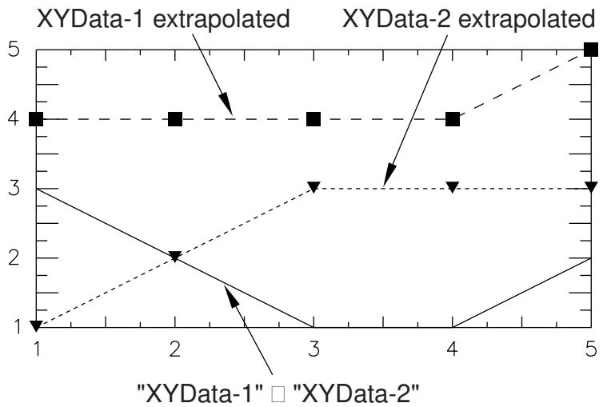  
Figure 1: X–Y plot illustrating subtraction of data objects.

1. Locate the Operate on XY Data dialog box.

From the main menu bar, select Tools->XY Data->Create. Click Operate on XY data in the dialog box that appears; then click Continue. The Operate on XY Data dialog box appears.

2. From the Operators listed, click –.

The – symbol appears in the expression window.

3. Use your mouse and keyboard to position the cursor in the expression window; then specify the necessary arguments. Available X–Y data objects include all those previously saved within this session (listed alphabetically in the XY Data field).

## To use negation

From the XY Data choices, click the name of the X–Y data object to negate and click Add to Expression.

## To use subtraction

• Use your keyboard to type in a scalar argument, or  
• From the XY Data choices, click the name of the X–Y data object on which to operate and click Add to Expression.

The arguments appear within the expression window.

4. To continue to build your expression, position the cursor in the expression window and type in or select the functions, operators, and X–Y data you want to include.

5. To evaluate and display your expression, click Plot Expression.

6. To save your new X–Y data object, click Save As and then provide a name in the dialog box that appears.

Saving your data object makes it available for future operations within this session and for inclusion in X–Y plots containing multiple data objects.

7. When you are finished, click Cancel to close the dialog box.

## Additional information

• Understanding X–Y data interpolation and extrapolation  
• Using X–Y data operations

## Using multiplication on X–Y data objects

Use the mathematical \* symbol to operate on a previously savedX–Y data object (a collection of ordered pairs) to produce a new X–Y data object. The \* operator accepts two commutative arguments and can be applied in one of two ways:

## To multiply a scalar and an X–Y data object:

This method yields a new X–Y data object having the same X-coordinate values as the original X–Y data object. Abaqus/CAE computes the new Y-coordinates as the scalar multiplied by each original Y-coordinate. For example, if

$$
\mathrm{XYData} = [ (1, 1), (2, 2), (3, 3) ],
$$

then

$$
(\text {XYData} * 5) = [ (1, 5), (2, 1 0), (3, 1 5) ].
$$

## To multiply an X–Y data object with another X–Y data object:

This method yields a new X–Y data object having as its X-coordinates all X-coordinates of the first data object and any additional X-coordinates needed for alignment of the two objects. Abaqus/CAE computes additional X–Y data pairs by interpolation and extrapolation. The new data object has as its Y-coordinates the Y-coordinates of the first data object multiplied by the Y-coordinates of the second data object. For example, let

$$
\text {XYData1} = [ (1, 1), (2, 2), (3, 3) ]
$$

and

$$
\mathrm{XYData2} = [ (4, 4), (5, 5) ].
$$

For alignment, Abaqus/CAE computes the values of the first and second data objects as:

$$
\text {XYData1 extrapolated} = [ (1, 1), (2, 2), (3, 3), (4, 3), (5, 3) ]
$$

and

$$
\text {XYData2 extrapolated} = [ (1, 4), (2, 4), (3, 4), (4, 4), (5, 5) ];
$$

then

$$
(\text {XYData1} * \text {XYData2}) = [ (1, 4), (2, 8), (3, 1 2), (4, 1 2), (5, 1 5) ].
$$

Figure 1 shows an X–Y plot of the preceding example.

  
Figure 1: X–Y plot illustrating multiplication of data objects.

1. Locate the Operate on XY Data dialog box.

From the main menu bar, select Tools->XY Data->Create. Click Operate on XY data in the dialog box that appears; then click Continue. The Operate on XY Data dialog box appears.

2. From the XY Data choices, click the name of the X–Y data object on which to operate and click Add to Expression. You can choose from all X–Y data objects previously saved within this session (listed alphabetically in the XY Data field).

The X–Y data object name appears within the expression window.

3. From the Operators listed, click \*.

The \* symbol appears after the data object name in the expression window.

4. To specify the second argument, do one of the following:

Use your mouse and keyboard to enter a scalar as the second argument of the \* operator in the expression window, or  
• From the XY Data choices, click the name of a data object argument for the \* operator in the expression window and click Add to Expression.

5. To continue to build your expression, position the cursor in the expression window and type in or select the functions, operators, and X–Y data you want to include.

6. To evaluate and display your expression, click Plot Expression.

7. To save your new X–Y data object, click Save As and then provide a name in the dialog box that appears.

Saving your data object makes it available for future operations within this session and for inclusion in X–Y plots containing multiple data objects.

8. When you are finished, click Cancel to close the dialog box.

## Additional information

• Understanding X–Y data interpolation and extrapolation  
• Using X–Y data operations

## Using division on X–Y data objects

Use the mathematical / symbol to operate on a previously savedX–Y data object (a collection of ordered pairs) to produce a new X–Y data object. The / operator accepts two non-commutative arguments and can be applied in one of three ways:

## To divide a scalar by an X–Y data object:

This method yields a new X–Y data object having the same X-coordinate values as the original X–Y data object. Abaqus/CAE computes the new Y-coordinates as the scalar divided by each original Y-coordinate. For example, if

$$
\mathrm{XYData} = [ (1, 2), (2, 1 0), (3, 2 0) ],
$$

then

$$
(2 / \text {XYData}) = [ (1, 1), (2,. 2), (3,. 1) ].
$$


## Note:

As a convenience, the Operate on XY Data dialog box offers an inverse function, 1/A.

## To divide an X–Y data object by a scalar:

This method yields a new X–Y data object having the same X-coordinate values as the original X–Y data object. Abaqus/CAE computes the new Y-coordinates as each original Y-coordinate divided by the scalar. For example, if

$$
\mathrm{XYData} = [ (1, 2), (2, 1 0), (3, 2 0) ],
$$

then

$$
(\text {XYData} / 2) = [ (1, 1), (2, 5), (3, 1 0) ].
$$

## To divide one X–Y data object by another X–Y data object:

This method yields a new X–Y data object having as its X-coordinates all X-coordinates of the first data object and any additional X-coordinates needed for alignment of the two objects. Abaqus/CAE computes additional X–Y data pairs by interpolation and extrapolation. The new data object has as its Y-coordinates the Y-coordinates of the first data object divided by the Y-coordinates of the second data object. For example, let

$$
\text {XYData1} = [ (4, 4), (5, 5) ]
$$

and

$$
\mathrm{XYData2} = [ (1, 1), (2, 2), (3, 3) ].
$$

For alignment, Abaqus/CAE computes the values of the first and second data objects as:

$$
\text {XYData1 extrapolated} = [ (1, 4), (2, 4), (3, 4), (4, 4), (5, 5) ]
$$

and

$$
\text {XYData2 extrapolated} = [ (1, 1), (2, 2), (3, 3), (4, 3), (5, 3) ];
$$

then

$$
(\text {XYData1} / \text {XYData2}) = [ (1, 4), (2, 2), (3, 1. 3 3), (4, 1. 3 3), (5, 1. 6 6) ].
$$

Figure 1 shows an X–Y plot of the above example.  
  
Figure 1: X–Y plot illustrating division of data objects.

1. Locate the Operate on XY Data dialog box. From the main menu bar, select Tools->XY Data->Create. Click Operate on XY data in the dialog box that appears; then click Continue. The Operate on XY Data dialog box appears.  
2. From the Operators listed, click /. The / symbol appears in the expression window.  
3. To specify each of the two arguments for the / operator, use your mouse and keyboard to position the cursor in the expression window; then do one of the following:

• Use your keyboard to type in a scalar argument, or

From the XY Data choices, click the name of the X–Y data object on which to operate and click Add to Expression. You can choose from all X–Y data objects previously saved within this session (listed alphabetically in the XY Data field).

The arguments appear within the expression window.

4. To continue to build your expression, position the cursor in the expression window and type in or select the functions, operators, and X–Y data you want to include.  
5. To evaluate and display your expression, click Plot Expression.  
6. To save your new X–Y data object, click Save As and then provide a name in the dialog box that appears.

Saving your data object makes it available for future operations within this session and for inclusion in X–Y plots containing multiple data objects.

7. When you are finished, click Cancel to close the dialog box.

## Additional information

• Understanding X–Y data interpolation and extrapolation  
• Using X–Y data operations

## Taking the absolute value of an X–Y data object

Use the abs function to operate on a previously savedX–Y data object (a collection of ordered pairs) to produce a new X–Y data object. The new X–Y data object has the same X-coordinate values as the original X–Y data object, but new Y-coordinates are computed as the absolute value of the original Y-coordinates.

Figure 1 shows an example of an X–Y plot produced using the abs function.  
  
Figure 1: X–Y plot produced using the abs function.

1. Locate the Operate on XY Data dialog box.  
From the main menu bar, select Tools->XY Data->Create. Click Operate on XY data in the dialog box that appears; then click Continue. The Operate on XY Data dialog box appears.  
2. From the Operators listed, click abs(A).  
The abs function appears in the expression window.  
3. From the XY Data choices, click the name of the X–Y data object on which to operate and click Add to Expression. You can choose from all X–Y data objects previously saved within this session (listed alphabetically in the XY Data field).  
The X–Y data object name appears within the abs function parentheses in the expression window.  
4. To continue to build your expression, position the cursor in the expression window and type in or select the functions, operators, and X–Y data you want to include.  
5. To evaluate and display your expression, click Plot Expression.  
6. To save your new X–Y data object, click Save As and then provide a name in the dialog box that appears.  
Saving your data object makes it available for future operations within this session and for inclusion in X–Y plots containing multiple data objects.  
7. When you are finished, click Cancel to close the dialog box.

## Additional information

• Using X–Y data operations

Use the avg function to operate on two or more previously savedX–Y data objects (each object is a collection of ordered pairs) to produce a new X–Y data object. The new X–Y data object has as its X-coordinates all X-coordinates of the input data objects and any additional X-coordinates needed for alignment of the input data objects. Abaqus/CAE computes additional X–Y data pairs by interpolation and extrapolation. Abaqus/CAE computes the new data object Y-coordinates as the average of all input Y-coordinates at the current X-coordinate. The arguments of this operation are commutative.

Figure 1 illustrates the type of X–Y plot that can be produced using the avg function.  
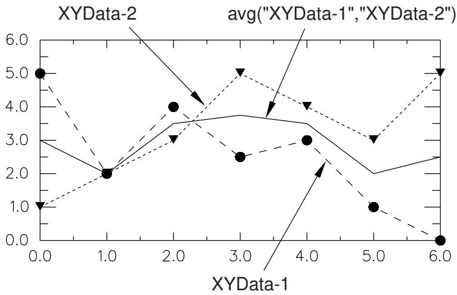  
Figure 1: X–Y plot produced using the avg function.

For information on how to find the current average of a single X–Y data object, see Finding the current average of an X–Y data object.

1. Locate the Operate on XY Data dialog box.  
From the main menu bar, select Tools->XY Data->Create. Click Operate on XY data in the dialog box that appears; then click Continue. The Operate on XY Data dialog box appears.  
2. From the Operators listed, click avg(X,X,...).  
The avg function appears in the expression window.  
3. From the XY Data choices, click the names of two or more X–Y data objects on which to operate and click Add to Expression. You can choose from all X–Y data objects previously saved within this session (listed alphabetically in the XY Data field).  
The X–Y data object names appear, separated by commas, within the avg function parentheses in the expression window.  
4. To continue to build your expression, position the cursor in the expression window and type in or select the functions, operators, and X–Y data you want to include.  
5. To evaluate and display your expression, click Plot Expression.  
6. To save your new X–Y data object, click Save As and then provide a name in the dialog box that appears.  
Saving your data object makes it available for future operations within this session and for inclusion in X–Y plots containing multiple data objects.

7. When you are finished, click Cancel to close the dialog box.

## Additional information

• Finding the current average of an X–Y data object  
• Using X–Y data operations

Use the currentAvg function to operate on a previously savedX–Y data object (a collection of ordered pairs) to produce a new X–Y data object. The new X–Y data object has the same X-coordinate values as the original X–Y data object, but new Y-coordinates are computed as the average of all Y-coordinates up to and including the current X-coordinate.

Figure 1 shows an example of an X–Y plot produced using the currentAvg function.

  
Figure 1: X–Y plot produced using the currentAvg function.


## Note:

The last value of the new X–Y data object represents the overall average Y-coordinate of the original X–Y data object.

For information on how to find the current average of two or more X–Y data objects, see Finding the average of two or more X–Y data objects.

1. Locate the Operate on XY Data dialog box.  
From the main menu bar, select Tools->XY Data->Create. Click Operate on XY data in the dialog box that appears; then click Continue. The Operate on XY Data dialog box appears.  
2. From the Operators listed, click currentAvg(X).  
The currentAvg function appears in the expression window.  
3. From the XY Data choices, click the name of the X–Y data object on which to operate and click Add to Expression. You can choose from all X–Y data objects previously saved within this session (listed alphabetically in the XY Data field).  
The X–Y data object name appears within the currentAvg function parentheses in the expression window.  
4. To continue to build your expression, position the cursor in the expression window and type in or select the functions, operators, and X–Y data you want to include.  
5. To evaluate and display your expression, click Plot Expression.  
6. To save your new X–Y data object, click Save As and then provide a name in the dialog box that appears.  
Saving your data object makes it available for future operations within this session and for inclusion in X–Y plots containing multiple data objects.

7. When you are finished, click Cancel to close the dialog box.

## Additional information

• Finding the average of two or more X–Y data objects  
• Using X–Y data operations

Use the differentiate function to operate on a previously savedX–Y data object (a collection of ordered pairs) to produce a new X–Y data object. The new X–Y data object has the same X-coordinate values as the original X–Y data object, but new Y-coordinates are computed as the numerical derivative of the original Y-coordinates.

Abaqus/CAE computes the derivative using three-point parabolic segments of the original X–Y data object. The values at the first and last points are computed as the gradient at the start and at the end of the associated parabolas, respectively. The slope at each remaining point is computed using the midpoint of the parabola defined by two neighboring points.

Figure 1 shows an example of an X–Y plot produced using the differentiate function.

  
Figure 1: X–Y plot produced using the differentiate function.

1. Locate the Operate on XY Data dialog box.  
From the main menu bar, select Tools->XY Data->Create. Click Operate on XY data in the dialog box that appears; then click Continue. The Operate on XY Data dialog box appears.  
2. From the Operators listed, click differentiate(X).  
The differentiate function appears in the expression window.  
3. From the XY Data choices, click the name of the X–Y data object on which to operate and click Add to Expression. You can choose from all X–Y data objects previously saved within this session (listed alphabetically in the XY Data field).  
The X–Y data object name appears within the differentiate function parentheses in the expression window.  
4. To continue to build your expression, position the cursor in the expression window and type in or select the functions, operators, and X–Y data you want to include.  
5. To evaluate and display your expression, click Plot Expression.  
6. To save your new X–Y data object, click Save As and then provide a name in the dialog box that appears.  
Saving your data object makes it available for future operations within this session and for inclusion in X–Y plots containing multiple data objects.  
7. When you are finished, click Cancel to close the dialog box.

## Additional information

• Integrating an X–Y data object

• Using X–Y data operations

Use the fit function to operate on a previously savedX–Y data object (a collection of ordered pairs) to produce a new X–Y data object. The new X–Y data object contains points that are spaced at regular intervals along the curve that best fits the previously saved X–Y data object. The fit function provides two algorithms for curve fitting: a linear least squares fit and a spline interpolation.

Figure 1 and Figure 2 show examples of X–Y plots produced using the fit function using each curve fitting algorithm.

  
Figure 1: X–Y plot produced using the fit function with the linear least squares option selected.

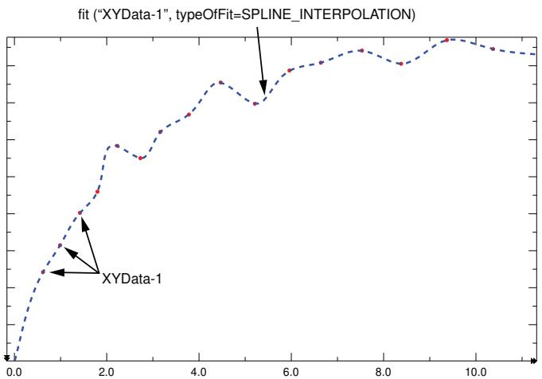  
Figure 2: X–Y plot produced using the fit function with the spline interpolation option selected.

1. Locate the Operate on XY Data dialog box.  
From the main menu bar, select Tools->XY Data->Create. Click Operate on XY data in the dialog box that appears; then click Continue. The Operate on XY Data dialog box appears.  
2. From the Operators listed, click fit(X).  
The fit function appears in the expression window with the linear least squares fit option selected by default.  
3. From the XY Data choices, click the name of the X–Y data object on which to operate and click Add to Expression. You can choose from all X–Y data objects previously saved within this session (listed alphabetically in the XY Data field).  
The X–Y data object name appears within the fit function parentheses in the expression window.

4. To continue to build your expression, position the cursor in the expression window and type in or select the functions, operators, and X–Y data you want to include. You can customize the fit function itself by including the following changes to its options:

• If you want to perform a spline interpolation, set the typeOfFit option to SPLINE\_INTERPOLATION.  
If you want to specify a custom number of points to be created for the new X–Y data object, append numFitPoints=number. By default, Abaqus/CAE uses 2 points to define a linear least squares fit and 100 points to define a spline interpolation.

5. To evaluate and display your expression, click Plot Expression.

6. To save your new X–Y data object, click Save As and then provide a name in the dialog box that appears.

Saving your data object makes it available for future operations within this session and for inclusion in X–Y plots containing multiple data objects.

7. When you are finished, click Cancel to close the dialog box.

## Additional information

• Integrating an X–Y data object  
• Using X–Y data operations

Use the integrate function to operate on a previously savedX–Y data object (a collection of ordered pairs) to produce a new X–Y data object. The new X–Y data object has the same X-coordinate values as the original X–Y data object, but new Y-coordinates are computed as the numerical integral (using the trapezoidal rule) of the original Y-coordinates.

Figure 1 shows an example of an X–Y plot produced using the integrate function.

  
Figure 1: X–Y plot produced using the integrate function.

1. Locate the Operate on XY Data dialog box.  
From the main menu bar, select Tools->XY Data->Create. Click Operate on XY data in the dialog box that appears; then click Continue. The Operate on XY Data dialog box appears.  
2. From the Operators listed, click integrate(X).  
The integrate function appears in the expression window.  
3. From the XY Data choices, click the name of the X–Y data object on which to operate and click Add to Expression. You can choose from all X–Y data objects previously saved within this session (listed alphabetically in the XY Data field).  
The X–Y data object name appears within the integrate function parentheses in the expression window.  
4. To continue to build your expression, position the cursor in the expression window and type in or select the functions, operators, and X–Y data you want to include.  
5. To evaluate and display your expression, click Plot Expression.  
6. To save your new X–Y data object, click Save As and then provide a name in the dialog box that appears.  
Saving your data object makes it available for future operations within this session and for inclusion in X–Y plots containing multiple data objects.  
7. When you are finished, click Cancel to close the dialog box.

## Additional information

• Differentiating an X–Y data object  
• Using X–Y data operations

## Interpolating an X–Y data object

Use the interpolate function to operate on a previously savedX–Y data object (a collection of ordered pairs) to produce a new X–Y data object. Interpolating an X–Y data object with nonuniform data produces an X–Y data object with new, interpolated Y-coordinate values occurring at regular increments on the X-axis. By default, the data are interpolated at increments equal to the smallest X-increment in the source data.

Figure 1 shows an example of an X–Y plot produced using the interpolate function, superimposed over the raw data.  
  
Figure 1: X–Y plot produced using the interpolate function.

The name of the X–Y data object is the only required argument for the interpolate function. A description of the optional arguments follows:

• The X-axis increment between interpolated data points (xIncrement). If you do not specify a value for this argument or if you specify a non-positive value, Abaqus/CAE uses the minimum X-increment of the raw data set.  
A symbolic constant that specifies the interpolation scheme (interpolation). Valid values for this argument are QUADRATIC, specifying a Lagrange second-order interpolation scheme; CUBIC\_SPLINE, specifying a cubic spline interpolation scheme; and LINEAR, specifying a linear interpolation scheme. The default value is QUADRATIC.  
• The slope of the raw data curve leading up to the first data point (startslope). This argument's default value is 0.0 (for a level slope), and it is used only when interpolation=CUBIC\_SPLINE.  
• The slope of the raw data curve continuing past the final data point (endslope). This argument's default value is 0.0 (for a level slope), and it is used only when interpolation=CUBIC\_SPLINE.

1. Locate the Operate on XY Data dialog box.

From the main menu bar, select Tools->XY Data->Create. Click Operate on XY data in the dialog box that appears; then click Continue. The Operate on XY Data dialog box appears.

2. From the Operators listed, click interpolate(X).  
The interpolate function appears in the expression window.  
3. From the XY Data choices, click the name of the X–Y data object on which to operate and click Add to Expression. You can choose from all X–Y data objects previously saved within this session (listed alphabetically in the XY Data field).  
The X–Y data object name appears within the interpolate function parentheses in the expression window.  
4. To continue to build your expression, position the cursor in the expression window and type in or select the functions, operators, and X–Y data you want to include.  
5. To evaluate and display your expression, click Plot Expression.  
6. To save your new X–Y data object, click Save As and then provide a name in the dialog box that appears.

Saving your data object makes it available for future operations within this session and for inclusion in X–Y plots containing multiple data objects.

7. When you are finished, click Cancel to close the dialog box.

## Additional information

• Using X–Y data operations

## Linearizing an X–Y data object

Use the linearize function to separate the Y-values of a previously savedX–Y data object (a collection of ordered pairs) into constant or linear components. The new X–Y data object produced by the linearize function contains exactly two points.

Figure 1 shows an example of an X–Y plot produced using the linearize function.

linearize("XYData-1," LINEAR)

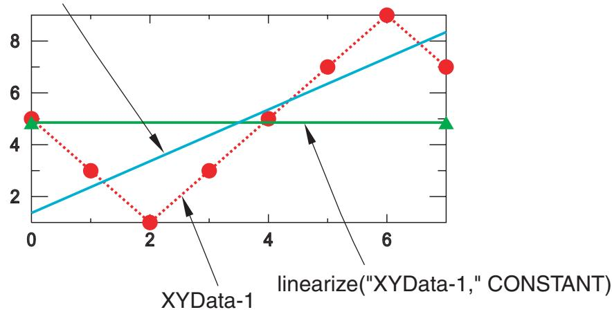  
Figure 1: X–Y plot produced using both the constant and linear forms of the linearize function.


## Note:

The X-values of the X–Y data object that you input to the linearize function must be equally spaced.

1. Locate the Operate on XY Data dialog box.  
From the main menu bar, select Tools->XY Data->Create. Click Operate on XY data in the dialog box that appears; then click Continue. The Operate on XY Data dialog box appears.  
2. From the Operators listed, click either linearize(X, CONSTANT) or linearize(X, LINEAR) to apply linearization to create a constant Y term or to linearize the Y term, respectively.  
The linearize function appears in the expression window.  
3. From the XY Data choices, click the name of the X–Y data object on which to operate and click Add to Expression. You can choose from all X–Y data objects previously saved within this session (listed alphabetically in the XY Data field).  
The X–Y data object name appears within the linearize function parentheses in the expression window.  
4. To continue to build your expression, position the cursor in the expression window and type in or select the functions, operators, and X–Y data you want to include.  
5. To evaluate and display your expression, click Plot Expression.  
6. To save your new X–Y data object, click Save As and then provide a name in the dialog box that appears.  
Saving your data object makes it available for future operations within this session and for inclusion in X–Y plots containing multiple data objects.

7. When you are finished, click Cancel to close the dialog box.

## Additional information

• Using X–Y data operations

## Normalizing an X–Y data object

Use the normalize function to operate on a previously savedX–Y data object (a collection of ordered pairs) to produce a new X–Y data object. This operation is analogous to normalizing a vector. The new X–Y data object has the same X-coordinate values as the original X–Y data object. Abaqus/CAE computes the new Y-coordinates by dividing each original Y-coordinate by the root mean square (the square root of the sum of the squares) of all original Y-coordinate values.

Figure 1 illustrates the type of X–Y plot that can be produced by using the normalize function.

  
Figure 1: X–Y plot produced using the normalize function.

1. Locate the Operate on XY Data dialog box.  
From the main menu bar, select Tools->XY Data->Create. Click Operate on XY data in the dialog box that appears; then click Continue. The Operate on XY Data dialog box appears.  
2. From the Operators listed, click normalize(X).  
The normalize function appears in the expression window.  
3. From the XY Data choices, click the name of the X–Y data object on which to operate and click Add to Expression. You can choose from all X–Y data objects previously saved within this session (listed alphabetically in the XY Data field).  
The X–Y data object name appears within the normalize function parentheses in the expression window.  
4. To continue to build your expression, position the cursor in the expression window and type in or select the functions, operators, and X–Y data you want to include.  
5. To evaluate and display your expression, click Plot Expression.  
6. To save your new X–Y data object, click Save As and then provide a name in the dialog box that appears.  
Saving your data object makes it available for future operations within this session and for inclusion in X–Y plots containing multiple data objects.  
7. When you are finished, click Cancel to close the dialog box.

## Additional information

• Taking the square root of the sum of the squares of two or more X–Y data objects  
• Using X–Y data operations

Use the sqrt function to operate on a previously savedX–Y data object (a collection of ordered pairs) to produce a new X–Y data object. The new X–Y data object has the same X-coordinate values as the original X–Y data object, but new Y-coordinates are computed as the square root of the original Y-coordinates.

Figure 1 provides an example of an X–Y plot produced using the sqrt function.

  
Figure 1: X–Y plot produced using the sqrt function.

1. Locate the Operate on XY Data dialog box.  
From the main menu bar, select Tools->XY Data->Create. Click Operate on XY data in the dialog box that appears; then click Continue. The Operate on XY Data dialog box appears.  
2. From the Operators listed, click sqrt(A).  
The sqrt function appears in the expression window.  
3. From the XY Data choices, click the name of the X–Y data object on which to operate and click Add to Expression. You can choose from all X–Y data objects previously saved within this session (listed alphabetically in the XY Data field).  
The X–Y data object name appears within the sqrt function parentheses in the expression window.  
4. To continue to build your expression, position the cursor in the expression window and type in or select the functions, operators, and X–Y data you want to include.  
5. To evaluate and display your expression, click Plot Expression.  
6. To save your new X–Y data object, click Save As and then provide a name in the dialog box that appears.  
Saving your data object makes it available for future operations within this session and for inclusion in X–Y plots containing multiple data objects.  
7. When you are finished, click Cancel to close the dialog box.

## Additional information

• Taking the square root of the sum of the squares of two or more X–Y data objects  
• Using X–Y data operations

## Taking the square root of the sum of the squares of two or more X–Y data objects

Use the srss function to perform a square root of the sum of the squares operation on two or more previously savedX–Y data objects (each object is a collection of ordered pairs) to produce a new X–Y data object. Use this function, for example, to find the total magnitude of two or more X–Y data objects at matching X-coordinates.

The new X–Y data object has as its X-coordinates all X-coordinates of the first data object and any additional X-coordinates needed for alignment of the remaining objects. Abaqus/CAE computes additional X–Y data pairs by interpolation and extrapolation. The new data object has as its Y-coordinates the square root of the sum of the squares of all input X–Y data object Y-coordinates at matching X-coordinates. The arguments to this function are commutative.

Figure 1 illustrates the type of X–Y plot that can be produced using the srss function.

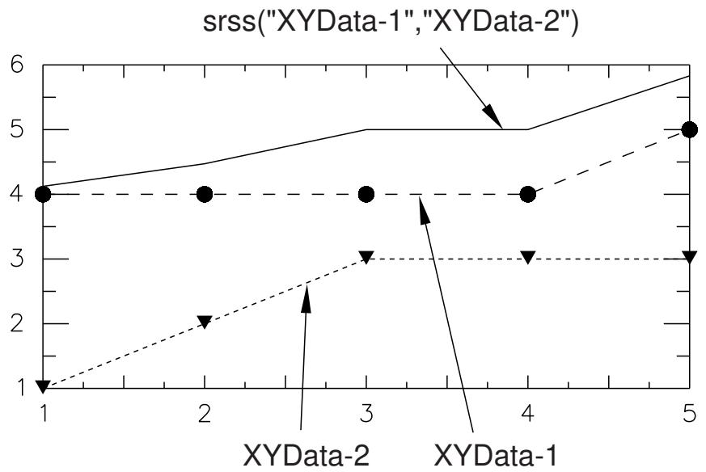  
Figure 1: X–Y plot produced using the srss function.

1. Locate the Operate on XY Data dialog box.  
From the main menu bar, select Tools->XY Data->Create. Click Operate on XY data in the dialog box that appears; then click Continue. The Operate on XY Data dialog box appears.  
2. From the Operators listed, click srss(X,X,...).  
The srss function appears in the expression window.  
3. From the XY Data choices, click the names of two or more X–Y data objects on which to operate and click Add to Expression. You can choose from all X–Y data objects previously saved within this session (listed alphabetically in the XY Data field).  
The X–Y data object names appear, separated by commas, within the srss function parentheses in the expression window.  
4. To continue to build your expression, position the cursor in the expression window and type in or select the functions, operators, and X–Y data you want to include.  
5. To evaluate and display your expression, click Plot Expression.  
6. To save your new X–Y data object, click Save As and then provide a name in the dialog box that appears.  
Saving your data object makes it available for future operations within this session and for inclusion in X–Y plots containing multiple data objects.

7. When you are finished, click Cancel to close the dialog box.

## Additional information

• Understanding X–Y data interpolation and extrapolation  
• Taking the square root of an X–Y data object  
• Normalizing an X–Y data object  
• Using X–Y data operations

## Summing two or more X–Y data objects

Use the sum function to operate on two or more previously savedX–Y data objects (each object is a collection of ordered pairs) to produce a new X–Y data object. The sum function accepts two or more commutative arguments.


## Note:

This function has the same behavior as the + symbol. For more information, see Using addition on X–Y data objects.

1. Locate the Operate on XY Data dialog box.  
From the main menu bar, select Tools->XY Data->Create. Click Operate on XY data in the dialog box that appears; then click Continue. The Operate on XY Data dialog box appears.  
2. From the Operators listed, click sum(A,A,...).  
The sum function appears in the expression window.  
3. From the XY Data choices, click the names of two or more X–Y data objects to sum together and click Add to Expression. You can choose from all X–Y data objects previously saved within this session (listed alphabetically in the XY Data field).  
The X–Y data object names appear, separated by commas, within the sum function parentheses in the expression window.  
4. To continue to build your expression, position the cursor in the expression window and type in or select the functions, operators, and X–Y data you want to include.  
5. To evaluate and display your expression, click Plot Expression.  
6. To save your new X–Y data object, click Save As and then provide a name in the dialog box that appears.  
Saving your data object makes it available for future operations within this session and for inclusion in X–Y plots containing multiple data objects.  
7. When you are finished, click Cancel to close the dialog box.

## Additional information

• Using addition on X–Y data objects  
• Appending two or more X–Y data objects  
• Combining two X–Y data objects  
• Using X–Y data operations

Use the vectorMagnitude function to perform a square root of the sum of the squares operation on at most three previously savedX–Y data objects (each object is a collection of ordered pairs) to produce a new X–Y data object. This function is essentially identical to the srss function (see Taking the square root of the sum of the squares of two or more X–Y data objects) except that the operation can be performed on at most three data objects. You can use this function to plot the total magnitude of a vector by calculating the square root of the sums of the squares of the three vector components.

The new X–Y data object has as its X-coordinates all X-coordinates of the first data object and any additional X-coordinates needed for alignment of the remaining objects. Abaqus/CAE computes additional X–Y data pairs by interpolation and extrapolation. The new data object has as its Y-coordinates the square root of the sum of the squares of all input X–Y data object Y-coordinates at matching X-coordinates. The arguments to this function are commutative.

Figure 1 illustrates the type of X–Y plot that can be produced using the vectorMagnitude function.

vectorMagnitude("XYData-1","XYData-2","XYData-3")

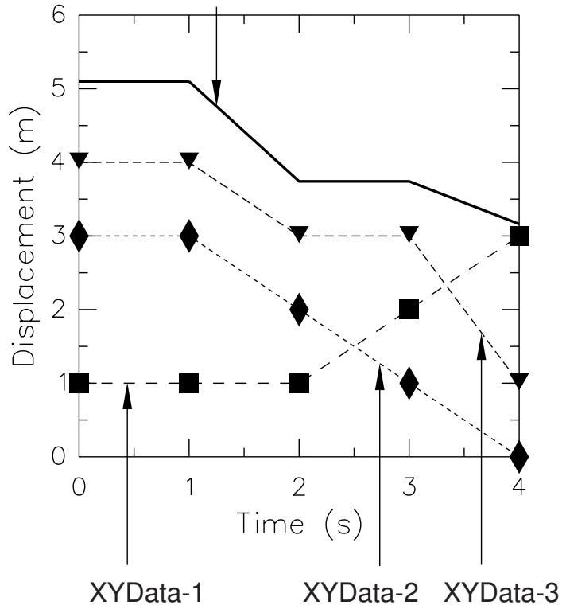  
Figure 1: X–Y plot produced using the vectorMagnitude function.

1. Locate the Operate on XY Data dialog box.  
From the main menu bar, select Tools->XY Data->Create. Click Operate on XY data in the dialog box that appears; then click Continue. The Operate on XY Data dialog box appears.  
2. From the Operators listed, click vectorMagnitude(X,X,X).  
The vectorMagnitude function appears in the expression window.  
3. From the XY Data choices, click the names of three X–Y data objects on which to operate and click Add to Expression. You can choose from all X–Y data objects previously saved within this session (listed alphabetically in the XY Data field).  
The X–Y data object names appear, separated by commas, within the vectorMagnitude function parentheses in the expression window.

4. To continue to build your expression, position the cursor in the expression window and type in or select the functions, operators, and X–Y data you want to include.  
5. To evaluate and display your expression, click Plot Expression.  
6. To save your new X–Y data object, click Save As and then provide a name in the dialog box that appears.

Saving your data object makes it available for future operations within this session and for inclusion in X–Y plots containing multiple data objects.

7. When you are finished, click Cancel to close the dialog box.

## Additional information

• Understanding X–Y data interpolation and extrapolation  
• Taking the square root of an X–Y data object  
• Normalizing an X–Y data object  
• Using X–Y data operations

## Applying trigonometric functions to an X–Y data object

Use the trigonometric functions cos, cosh, acos, sin, sinh, asin, tan, tanh, and atan to operate on a previously savedX–Y data object (a collection of ordered pairs) to produce a new X–Y data object. The new X–Y data object has the same X-coordinate values as the original X–Y data object, but new Y-coordinates are computed as the trigonometric function value of each original Y-coordinate. Arguments to trigonometric functions are assumed to be in radians.

For example, if

$$
\mathrm{XYData} = [ (0, 0), (1, 1. 5 7 1), (2, 3. 1 4) ],
$$

then

$$
\sin (\text {XYData}) = [ (0, 0), (1, 1), (2, 0. 0 0 1 5 9) ].
$$

Figure 1 shows an X–Y plot of the above example.  
  
Figure 1: X–Y plot produced using the sin function.  
1. Locate the Operate on XY Data dialog box.

From the main menu bar, select Tools->XY Data->Create. Click Operate on XY data in the dialog box that appears; then click Continue. The Operate on XY Data dialog box appears.

2. From the Operators listed, click one of the following trigonometric functions:

<table><tr><td>sin(A)</td><td>To compute the sine of your X-Y data object.</td></tr><tr><td>sinh(A)</td><td>To compute the hyperbolic sine of your X-Y data object.</td></tr><tr><td>asin(A)</td><td>To compute the arcsine of your X-Y data object. Your Y-data values must be in the range [-1, 1].</td></tr><tr><td>cos(A)</td><td>To compute the cosine of your X-Y data object.</td></tr><tr><td>cosh(A)</td><td>To compute the hyperbolic cosine of your X-Y data object.</td></tr><tr><td>acos(A)</td><td>To compute the arccosine of your X-Y data object. Your Y-data values must be in the range [-1, 1].</td></tr><tr><td>tan(A)</td><td>To compute the tangent of your X-Y data object.</td></tr><tr><td>tanh(A)</td><td>To compute the hyperbolic tangent of your X-Y data object.</td></tr><tr><td>atan(A)</td><td>To compute the arctangent of your X-Y data object.</td></tr></table>

The trigonometric function you choose appears in the expression window.

3. From the XY Data choices, click the name of the X–Y data object on which to operate and click Add to Expression. You can choose from all X–Y data objects previously saved within this session (listed alphabetically in the XY Data field).  
The X–Y data object name appears within the trigonometric function parentheses in the expression window.  
4. To continue to build your expression, position the cursor in the expression window and type in or select the functions, operators, and X–Y data you want to include.  
5. To evaluate and display your expression, click Plot Expression.  
6. To save your new X–Y data object, click Save As and then provide a name in the dialog box that appears.

Saving your data object makes it available for future operations within this session and for inclusion in X–Y plots containing multiple data objects.

7. When you are finished, click Cancel to close the dialog box.

## Additional information

• Converting the angular units used for X–Y data objects  
• Using X–Y data operations

Use the exp function to operate on a previously savedX–Y data object (a collection of ordered pairs) to produce a new X–Y data object. The new X–Y data object has the same X-coordinate values as the original X–Y data object, but new Y-coordinates are computed as the exponential of the original Y-coordinates.

Figure 1 shows an example of an X–Y plot produced by using the exp function.

  
Figure 1: X–Y plot produced using the exp function.

1. Locate the Operate on XY Data dialog box.  
From the main menu bar, select Tools->XY Data->Create. Click Operate on XY data in the dialog box that appears; then click Continue. The Operate on XY Data dialog box appears.  
2. From the Operators listed, click exp(A).  
The exp function appears in the expression window.  
3. From the XY Data choices, click the name of the X–Y data object on which to operate and click Add to Expression. You can choose from all X–Y data objects previously saved within this session (listed alphabetically in the XY Data field).  
The X–Y data object name appears within the exp function parentheses in the expression window.  
4. To continue to build your expression, position the cursor in the expression window and type in or select the functions, operators, and X–Y data you want to include.  
5. To evaluate and display your expression, click Plot Expression.  
6. To save your new X–Y data object, click Save As and then provide a name in the dialog box that appears.  
Saving your data object makes it available for future operations within this session and for inclusion in X–Y plots containing multiple data objects.  
7. When you are finished, click Cancel to close the dialog box.

## Additional information

• Raising an X–Y data object to a power  
• Using X–Y data operations

## Applying logarithmic functions to an X–Y data object

Use the logarithmic functions log and log10 to operate on a previously savedX–Y data object (a collection of ordered pairs) to produce a new X–Y data object. The new X–Y data object has the same X-coordinate values as the original X–Y data object, but new Y-coordinates are computed as the logarithmic function value of each original Y-coordinate. For example, if

$$
\mathrm{XYData} = [ (1, 1), (2, 2. 7 1), (3, 7. 3 9) ],
$$

then

$$
\log (\text {XYData}) = [ (1, 0), (2, 1. 0), (3, 2. 0) ].
$$

Figure 1 illustrates the above example.  
  
Figure 1: X–Y plot produced using the log function.

1. Locate the Operate on XY Data dialog box.  
From the main menu bar, select Tools->XY Data->Create. Click Operate on XY data in the dialog box that appears; then click Continue. The Operate on XY Data dialog box appears.  
2. From the Operators listed, click either log(A) or log10(A) to apply the natural log or base 10 log function, respectively.  
The logarithmic function you choose appears in the expression window.  
3. From the XY Data choices, click the name of the X–Y data object on which to operate and click Add to Expression. You can choose from all X–Y data objects previously saved within this session (listed alphabetically in the XY Data field).  
The X–Y data object name appears within the logarithmic function parentheses in the expression window.  
4. To continue to build your expression, position the cursor in the expression window and type in or select the functions, operators, and X–Y data you want to include.  
5. To evaluate and display your expression, click Plot Expression.  
6. To save your new X–Y data object, click Save As and then provide a name in the dialog box that appears.  
Saving your data object makes it available for future operations within this session and for inclusion in X–Y plots containing multiple data objects.

7. When you are finished, click Cancel to close the dialog box.

## Additional information

• Using X–Y data operations

## Raising an X–Y data object to a power

Use the power function to operate on a previously savedX–Y data object (a collection of ordered pairs) to produce a new X–Y data object. The power function requires two arguments, at least one of which must be an X–Y data object. This function can be applied in three ways:

## To raise a scalar to an X–Y data object: power(scalar, data object name).

This method yields a new X–Y data object having the same X-coordinate values as the original X–Y data object. Abaqus/CAE computes the new Y-coordinates as the scalar raised to the power of each original Y-coordinate. For example, if

$$
\mathrm{XYData} = [ (1, 1), (2, 2), (3, 3) ],
$$

then

$$
\mathrm{power} (2, \mathrm{XYData}) = [ (1, 2), (2, 4), (3, 8) ].
$$

## To raise an X–Y data object to a scalar: power(data object name, scalar).

This method yields a new X–Y data object having the same X-coordinate values as the original X–Y data object. Abaqus/CAE computes the new Y-coordinates as each original Y-coordinate raised to the scalar. For example, if

$$
\mathrm{XYData} = [ (2, - 2), (3, 3), (4, - 4) ],
$$

then

$$
\mathrm{power} (\mathrm{XYData}, 2) = [ (2, 4), (3, 9), (4, 1 6) ].
$$

## To raise an X–Y data object to another X–Y data object: power(data object name, data object name).

This method yields a new X–Y data object having as its X-coordinates all X-coordinates of the first data object and any additional X-coordinates needed for alignment of the two objects. Abaqus/CAE computes additional X–Y data pairs by interpolation and extrapolation. The new data object has as its Y-coordinates the Y-coordinates of the first data object raised to the Y-coordinates of the second data object. For example, let

$$
\text {XYData1} = [ (1, 1), (2, 2), (4, 2), (5, 1) ],
$$

and

$$
\mathrm{XYData2} = [ (0, 1), (3, 2), (5, 6) ].
$$

For alignment, Abaqus/CAE computes the values of the first and second data objects as:

$$
\text {XYData1 extrapolated} = [ (0, 1), (1, 1), (2, 2), (3, 2), (4, 2), (5, 1) ],
$$

and

$$
\text {XYData2 extrapolated} = [ (0, 1), (1, 1. 3 3), (2, 1. 6 6), (3, 2), (4, 4), (5, 6) ];
$$

then

$$
\operatorname{power} (\text {XYData1}, \text {XYData2}) = [ (0, 1), (1, 1), (2, 3. 1 7), (3, 4), (4, 1 6), (5, 1) ].
$$

Figure 1 shows a plot of the above example.

  
Figure 1: X–Y plot of one data object raised to another data object.

1. Locate the Operate on XY Data dialog box.  
From the main menu bar, select Tools->XY Data->Create. Click Operate on XY data in the dialog box that appears; then click Continue. The Operate on XY Data dialog box appears.

2. From the Operators listed, click power(A,A).

The power function appears in the expression window.

3. From the XY Data choices, click the name of the X–Y data object on which to operate and click Add to Expression. You can choose from all X–Y data objects previously saved within this session (listed alphabetically in the XY Data field).

The X–Y data object name appears within the power function parentheses in the expression window.

4. To specify the next argument, do one of the following:

Use your mouse and keyboard to enter a scalar as either the first or second argument of the power function in the expression window, depending on the operation you want to perform, and to separate the two arguments with a comma, or  
• From the XY Data choices, click the name of a data object argument for the power function in the expression window and click Add to Expression.

5. To continue to build your expression, position the cursor in the expression window and type in or select the functions, operators, and X–Y data you want to include.  
6. To evaluate and display your expression, click Plot Expression.  
7. To save your new X–Y data object, click Save As and then provide a name in the dialog box that appears.

Saving your data object makes it available for future operations within this session and for inclusion in X–Y plots containing multiple data objects.

8. When you are finished, click Cancel to close the dialog box.

## Additional information

• Taking the exponential of an X–Y data object  
• Understanding X–Y data interpolation and extrapolation  
• Using X–Y data operations

## Applying Butterworth filtering to an X–Y data object

Use the butterworthFilter function to apply a Butterworth filtering operation to a previously savedX–Y data object (a collection of ordered pairs) to produce a new X–Y data object. This filtering operation can be used, for example, to remove high-frequency noise.

The transfer function of a Butterworth filter is shown in Filtering Output and Operating on Output in Abaqus/Explicit.

Figure 1 illustrates the type of X–Y plot that can be produced using the butterworthFilter operation.

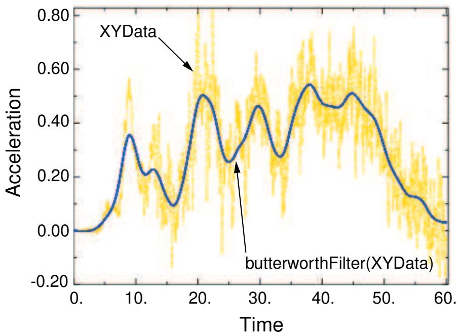  
Figure 1: X–Y plot produced using the butterworthFilter operation.

The butterworthFilter function requires two arguments: the name of the X–Y data object (name) and the cutoff frequency (cutoffFrequency), which is the frequency above which the filter attenuates at least half of the input signal. A description of the optional arguments follows:

• The order of the filter you want to use (filterOrder). This argument must be a positive, even integer value; the default value is 2.  
A symbolic constant specifying the method for computation of the projection and pre-charge to be applied at the start of the data signal (startCondition). Valid values for this argument are ZERO, which applies a constant projection and pre-charge of zero; CONSTANT, which applies a constant projection and pre-charge equal to the first data point in the X–Y data object; MIRROR, which applies a projection and pre-charge equivalent to reflecting the X–Y data object about a vertical line passing through the first data point; REVERSE\_MIRROR, which applies a projection and pre-charge equivalent to reflecting the X–Y data object about both a vertical line and a horizontal line passing through the first data point; and TANGENTIAL, which applies a linear projection and pre-charge that is tangential to the first two data points. The default value is CONSTANT.  
A symbolic constant specifying the method for computation of the projection and pre-charge to be applied at the end of the data signal (endCondition). Valid values for this argument are ZERO, which applies a constant projection and pre-charge of zero; CONSTANT, which applies a constant projection and pre-charge equal to the last data point in the X–Y data object; MIRROR, which applies a projection and pre-charge equivalent to reflecting the X–Y data object about a vertical line passing through the last data point; REVERSE\_MIRROR, which applies a projection and pre-charge equivalent to reflecting the X–Y data object about both a vertical line and a horizontal line passing

through the last data point; and TANGENTIAL, which applies a linear projection and pre-charge that is tangential to the last two data points. The default value is CONSTANT.

A symbolic constant that specifies the interpolation scheme (interpolation). Valid values for this argument are QUADRATIC, specifying a Lagrange second-order interpolation scheme; CUBIC\_SPLINE, specifying a cubic spline interpolation scheme; and LINEAR, specifying a linear interpolation scheme. The default value is QUADRATIC.  
• The slope of the raw data curve leading up to the first data point (startslope). This argument's default value is 0.0 (for a level slope), and it is used only when interpolation=CUBIC\_SPLINE.  
• The slope of the raw data curve continuing past the final data point (endslope). This argument's default value is 0.0 (for a level slope), and it is used only when interpolation=CUBIC\_SPLINE.  
• A Boolean specifying whether a backward pass (backwardPass) is to be performed on the filtered data. The default value for this argument is True. When this argument is set to False, the endCondition argument is ignored.

Your X–Y data object must have a constant time step for it to be filtered. If the time step is not constant, Abaqus/CAE computes additional points at constant intervals by interpolation. The constant time step for Butterworth filtering is defined by the smallest time step in the X–Y data object to be filtered.

1. Locate the Operate on XY Data dialog box.  
From the main menu bar, select Tools->XY Data->Create. Click Operate on XY data in the dialog box that appears; then click Continue. The Operate on XY Data dialog box appears.  
2. From the Operators listed, click butterworthFilter(X,F).  
The butterworthFilter function appears in the expression window.  
3. From the XY Data choices, click the name of the X–Y data object on which to operate and click Add to Expression. You can choose from all X–Y data objects previously saved within this session (listed alphabetically in the XY Data field).  
The X–Y data object name appears within the butterworthFilter function parentheses in the expression window.  
4. Position the cursor in the expression window before the second comma, and type in a value for the cutoff frequency.  
5. To continue to build your expression, position the cursor in the expression window and type in or select the functions, operators, and X–Y data you want to include.  
6. To evaluate and display your expression, click Plot Expression.  
7. To save your new X–Y data object, click Save As and then provide a name in the dialog box that appears.  
Saving your data object makes it available for future operations within this session and for inclusion in X–Y plots containing multiple data objects.  
8. When you are finished, click Cancel to close the dialog box.

## Additional information

• Understanding X–Y data interpolation and extrapolation  
• Using X–Y data operations  
• Applying sine-Butterworth filtering to an X–Y data object  
• Smoothing an X–Y data object  
• Filtering Output and Operating on Output in Abaqus/Explicit

## Applying Chebyshev Type I or Type II filtering to an X–Y data object

Use the chebyshev1Filter or chebyshev2Filter function to apply a Chebyshev Type I or Type II filtering operation to a previously savedX–Y data object (a collection of ordered pairs) to produce a new X–Y data object. This filtering operation can be used, for example, to remove high-frequency noise.

The transfer functions of the Chebyshev filters are shown in Filtering Output and Operating on Output in Abaqus/Explicit.

Figure 1 illustrates the type of X–Y plot that can be produced using the chebyshev1Filter operation.

  
Figure 1: X–Y plot produced using the chebyshev1Filter operation.

The chebyshev1Filter and chebyshev2Filter functions use the same syntax and require the same set of arguments. The following arguments are required: the name of the X–Y data object (name); the cutoff frequency (cutoffFrequency), which is the frequency above which the filter attenuates at least half of the input signal; and the ripple factor (rippleFactor), which is a floating point number that indicates how much oscillation you will allow in exchange for an improved filter response. Both Chebyshev Type I and II filtering require a ripple factor greater than 0; in addition, Chebyshev Type II filtering requires the value to be less than 1. Chebyshev Type I filtering does not place any upper bound on the ripple factor value.

The two types of Chebyshev filters differ in where their response ripples occur and in their handling of the ripple factor value; see Filtering Output and Operating on Output in Abaqus/Explicit for a comparison of Type I and Type II Chebyshev output with typical Butterworth filter output.

A description of the optional arguments follows:

• The order of the filter you want to use (filterOrder). This argument must be a positive, even integer value; the default value is 2.  
A symbolic constant specifying the method for computation of the projection and pre-charge to be applied at the start of the data signal (startCondition). Valid values for this argument are ZERO, which applies a constant projection and pre-charge of zero; CONSTANT, which applies a constant projection and pre-charge equal to the first data point in the X–Y data object; MIRROR, which applies a projection and pre-charge equivalent to reflecting the X–Y data object about a vertical line passing through the first data point; REVERSE\_MIRROR, which applies a projection

and pre-charge equivalent to reflecting the X–Y data object about both a vertical line and a horizontal line passing through the first data point; and TANGENTIAL, which applies a linear projection and pre-charge that is tangential to the first two data points. The default value is CONSTANT.

A symbolic constant specifying the method for computation of the projection and pre-charge to be applied at the end of the data signal (endCondition). Valid values for this argument are ZERO, which applies a constant projection and pre-charge of zero; CONSTANT, which applies a constant projection and pre-charge equal to the last data point in the X–Y data object; MIRROR, which applies a projection and pre-charge equivalent to reflecting the X–Y data object about a vertical line passing through the last data point; REVERSE\_MIRROR, which applies a projection and pre-charge equivalent to reflecting the X–Y data object about both a vertical line and a horizontal line passing through the last data point; and TANGENTIAL, which applies a linear projection and pre-charge that is tangential to the last two data points. The default value is CONSTANT.  
A symbolic constant that specifies the interpolation scheme (interpolation). Valid values for this argument are QUADRATIC, specifying a Lagrange second-order interpolation scheme; CUBIC\_SPLINE, specifying a cubic spline interpolation scheme; and LINEAR, specifying a linear interpolation scheme. The default value is QUADRATIC.  
• The slope of the raw data curve leading up to the first data point (startslope). This argument's default value is 0.0 (for a level slope), and it is used only when interpolation=CUBIC\_SPLINE.  
• The slope of the raw data curve continuing past the final data point (endslope). This argument's default value is 0.0 (for a level slope), and it is used only when interpolation=CUBIC\_SPLINE.  
• A Boolean specifying whether a backward pass (backwardPass) is to be performed on the filtered data. The default value for this argument is True. When this argument is set to False, the endCondition argument is ignored.

Your X–Y data object must have a constant time step for it to be filtered. If the time step is not constant, Abaqus/CAE computes additional points at constant intervals by interpolation. The constant time step for Chebyshev Type I or II filtering is defined by the smallest time step in the X–Y data object to be filtered.

1. Locate the Operate on XY Data dialog box.  
From the main menu bar, select Tools->XY Data->Create. Click Operate on XY data in the dialog box that appears; then click Continue. The Operate on XY Data dialog box appears.  
2. From the Operators listed, click chebyshev1Filter(X,F,F) or chebyshev2Filter(X,F,F) for Chebyshev Type I or Type II filtering, respectively.  
The chebyshev1Filter or chebyshev2Filter function appears in the expression window.  
3. From the XY Data choices, click the name of the X–Y data object on which to operate and click Add to Expression. You can choose from all X–Y data objects previously saved within this session (listed alphabetically in the XY Data field).  
The X–Y data object name appears within the chebyshev1Filter or chebyshev2Filter function parentheses in the expression window.  
4. Position the cursor in the expression window before the second comma, and type in a value for the cutoff frequency.  
5. Position the cursor in the expression window before the third comma, and type in a positive value for the ripple factor. For the chebyshev2Filter function, this value must be less than 1.  
6. To continue to build your expression, position the cursor in the expression window and type in or select the functions, operators, and X–Y data you want to include.  
7. To evaluate and display your expression, click Plot Expression.  
8. To save your new X–Y data object, click Save As and then provide a name in the dialog box that appears.  
Saving your data object makes it available for future operations within this session and for inclusion in X–Y plots containing multiple data objects.

9. When you are finished, click Cancel to close the dialog box.

## Additional information

• Understanding X–Y data interpolation and extrapolation  
• Using X–Y data operations  
• Applying sine-Butterworth filtering to an X–Y data object  
• Smoothing an X–Y data object  
• Filtering Output and Operating on Output in Abaqus/Explicit

Use the decimateFilter function to reduce a large, previously savedX–Y data object (a collection of ordered pairs) to a smaller, representative sample. The decimateFilter function is an anti-aliasing filter that selects points at a user-defined sampling frequency to produce a new X–Y data object.

The decimateFilter function requires two arguments: the name of the X–Y data object (name) and the decimation factor (decimationFactor), which is the factor by which the sampling rate is to be increased. The decimation factor must be an integer value greater than 1. The function also accepts an optional argument that specifies the ratio of the new sampling rate to the cutoff frequency used by the decimateFilter function prior to decimation (cutoffFactor). The cutoff factor must be an integer value of 2 or more. The default value is 3.

1. Locate the Operate on XY Data dialog box.  
From the main menu bar, select Tools->XY Data->Create. Click Operate on XY data in the dialog box that appears; then click Continue. The Operate on XY Data dialog box appears.  
2. From the Operators listed, click decimateFilter(X,I).  
The decimateFilter function appears in the expression window.  
3. From the XY Data choices, click the name of the X–Y data object on which to operate and click Add to Expression. You can choose from all X–Y data objects previously saved within this session (listed alphabetically in the XY Data field).  
The X–Y data object name appears within the decimateFilter function parentheses in the expression window.  
4. Position the cursor in the expression window before the second comma, and type in a value for the decimation factor.  
5. If desired, position the cursor in the expression window before the third comma, and type in a value for the cutoff factor.  
6. To evaluate and display your expression, click Plot Expression.  
7. To save your new X–Y data object, click Save As and then provide a name in the dialog box that appears.  
Saving your data object makes it available for future operations within this session and for inclusion in X–Y plots containing multiple data objects.  
8. When you are finished, click Cancel to close the dialog box.

## Additional information

• Using X–Y data operations  
• Smoothing an X–Y data object

## Applying SAE filtering to an X–Y data object

Use one of the SAE filtering functions to apply an SAE filtering operation to a previously savedX–Y data object (a collection of ordered pairs) to produce a new X–Y data object. For example, you can use these functions to remove high-frequency noise.

The SAE filtering operation performs two-pass, zero phase shift, second-order Butterworth filtering. The SAE filtering classes that are allowed in Abaqus/CAE are 60, 100, 180, 600, and 1000, as defined in SAE Standard J211 (OCT88). The Visualization module in Abaqus/CAE uses the Signal Analysis Software obtained from the National Highway Traffic Safety Administration (NHTSA). For more information, see the documentation for the Signal Analysis Software installation kit on the NHTSA website (search for NVS Software Applications on http://www.nhtsa.gov/).

Abaqus/CAE provides the following two types of SAE filtering functions:

• The general operator, saeGeneralFilter, uses a general filtering class and can filter data for a user-specified cutoff frequency.  
Class-specific operators filter for each of the five supported SAE filtering classes: sae60Filter, sae100Filter, sae180Filter, sae600Filter, and sae1000Filter. Because they use a specific filtering class, these operators do not support specification of a cutoff frequency.

Your X–Y data object must have a constant time step for it to be filtered. If the time step is not constant, Abaqus/CAE computes additional points at constant intervals by interpolation. The constant time step for SAE filtering is defined by the smallest time step in the X–Y data object to be filtered.

Figure 1 illustrates the type of X–Y plot that can be produced using the saeGeneralFilter operation.

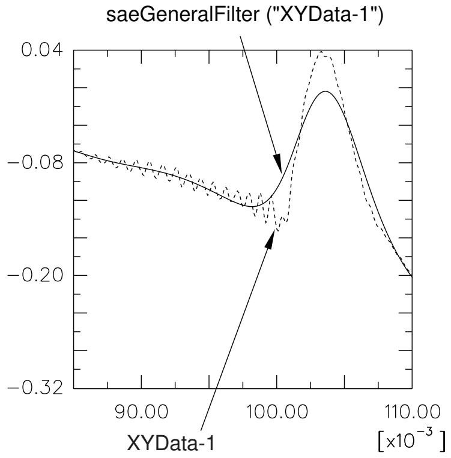  
Figure 1: X–Y plot produced using the saeGeneralFilter operation.

The saeGeneralFilter function requires two arguments: the name of the X–Y data object (name) and the cutoff frequency (cutoffFrequency), which is the frequency above which the filter attenuates at least half of the input signal. The

class-specific filters also require two arguments: the name of the X–Y data object (name) and the time scale factor (timeScaleFactor), which is a multiplier for the X-values of the data set being filtered. For example, a value of 1 indicates a time scale of seconds, and a value of 0.001 indicates a time scale of milliseconds.

A description of the optional arguments follows:

A symbolic constant specifying the method for computation of the projection and pre-charge to be applied at the start of the data signal (startCondition). Valid values for this argument are ZERO, which applies a constant projection and pre-charge of zero; CONSTANT, which applies a constant projection and pre-charge equal to the first data point in the X–Y data object; MIRROR, which applies a projection and pre-charge equivalent to reflecting the X–Y data object about a vertical line passing through the first data point; REVERSE\_MIRROR, which applies a projection and pre-charge equivalent to reflecting the X–Y data object about both a vertical line and a horizontal line passing through the first data point; and TANGENTIAL, which applies a linear projection and pre-charge that is tangential to the first two data points. The default value is CONSTANT.  
A symbolic constant specifying the method for computation of the projection and pre-charge to be applied at the end of the data signal (endCondition). Valid values for this argument are ZERO, which applies a constant projection and pre-charge of zero; CONSTANT, which applies a constant projection and pre-charge equal to the last data point in the X–Y data object; MIRROR, which applies a projection and pre-charge equivalent to reflecting the X–Y data object about a vertical line passing through the last data point; REVERSE\_MIRROR, which applies a projection and pre-charge equivalent to reflecting the X–Y data object about both a vertical line and a horizontal line passing through the last data point; and TANGENTIAL, which applies a linear projection and pre-charge that is tangential to the last two data points. The default value is CONSTANT.  
A symbolic constant that specifies the interpolation scheme (interpolation). Valid values for this argument are QUADRATIC, specifying a Lagrange second-order interpolation scheme; CUBIC\_SPLINE, specifying a cubic spline interpolation scheme; and LINEAR, specifying a linear interpolation scheme. The default value is QUADRATIC.  
• The slope of the raw data curve leading up to the first data point (startslope). This argument's default value is 0.0 (for a level slope), and it is used only when interpolation=CUBIC\_SPLINE.  
• The slope of the raw data curve continuing past the final data point (endslope). This argument's default value is 0.0 (for a level slope), and it is used only when interpolation=CUBIC\_SPLINE.  
• A Boolean specifying whether a backward pass (backwardPass) is to be performed on the filtered data. The default value for this argument is True. When this argument is set to False, the endCondition argument is ignored.

Abaqus/CAE refers to the values in the table below to determine the cutoff frequency multiplier (CM) for the class-specific SAE filter operators.

<table><tr><td>SAE class</td><td>Cutoff frequency multiplier (CM)</td></tr><tr><td>60</td><td>100</td></tr><tr><td>100</td><td>165</td></tr><tr><td>180</td><td>300</td></tr><tr><td>600</td><td>1000</td></tr><tr><td>1000</td><td>1650</td></tr></table>

Abaqus/CAE then calculates the cutoff frequency using the cutoff frequency multiplier and the user-specified time scale factor (TSF), as follows:

$$
\text {cutoff frequency} = C M \times T S F
$$

1. Locate the Operate on XY Data dialog box.

From the main menu bar, select Tools->XY Data->Create. Click Operate on XY data in the dialog box that appears; then click Continue. The Operate on XY Data dialog box appears.

2. From the Operators listed, click saeGeneralFilter(X,F) for general SAE filtering or click one of the class-specific SAE filter functions.

Your choice of filtering function appears in the expression window.

3. From the XY Data choices, click the name of the X–Y data object on which to operate and click Add to Expression. You can choose from all X–Y data objects previously saved within this session (listed alphabetically in the XY Data field).

The X–Y data object name appears within the function parentheses in the expression window.

4. If you selected saeGeneralFilter(X,F), position the cursor in the expression window and enter a value for the cutoff frequency.  
5. If you selected a class-specific SAE filter, position the cursor in the expression window and enter a value for the time scale factor.  
6. To continue to build your expression, position the cursor in the expression window and type in or select the functions, operators, and X–Y data you want to include.  
7. To evaluate and display your expression, click Plot Expression.  
8. To save your new X–Y data object, click Save As and then provide a name in the dialog box that appears.

Saving your data object makes it available for future operations within this session and for inclusion in X–Y plots containing multiple data objects.

9. When you are finished, click Cancel to close the dialog box.

## Additional information

• Understanding X–Y data interpolation and extrapolation  
• Using X–Y data operations  
• Applying sine-Butterworth filtering to an X–Y data object  
• Smoothing an X–Y data object

## Applying sine-Butterworth filtering to an X–Y data object

Use the sineButterworthFilter function to apply a sine-Butterworth filtering operation to a previously savedX–Y data object (a collection of ordered pairs) to produce a new X–Y data object. This filtering operation can be used, for example, to remove high-frequency noise.

Abaqus/CAE uses a sine-Butterworth filter whose transfer function $\left| H ( f ) \right| ^ { 2 }$ has the following form:


For the filter to be applied to a curve, the curve must have data points at regularly spaced intervals in time. Therefore, a curve to be filtered is resampled at a given frequency (the sampling frequency). The default sampling frequency will be inadequate for curves containing data with a frequency content that is much higher than the cutoff frequency. Using a very high sampling frequency will create a curve with a very large number of data points.

The sineButterworthFilter requires two arguments: the name of the X–Y data object (name) and the cutoff frequency (cutoffFrequency), which is the frequency above which the filter attenuates at least half of the input signal. A description of the optional arguments follows:

• The order of the filter you want to use (filterOrder). This argument must be a positive, even integer value; the default value is 6.  
A symbolic constant specifying the method for computation of the projection and pre-charge to be applied at the start of the data signal (startCondition). Valid values for this argument are ZERO, which applies a constant projection and pre-charge of zero; CONSTANT, which applies a constant projection and pre-charge equal to the first data point in the X–Y data object; MIRROR, which applies a projection and pre-charge equivalent to reflecting the X–Y data object about a vertical line passing through the first data point; REVERSE\_MIRROR, which applies a projection and pre-charge equivalent to reflecting the X–Y data object about both a vertical line and a horizontal line passing through the first data point; and TANGENTIAL, which applies a linear projection and pre-charge that is tangential to the first two data points. The default value is CONSTANT.  
A symbolic constant specifying the method for computation of the projection and pre-charge to be applied at the end of the data signal (endCondition). Valid values for this argument are ZERO, which applies a constant projection and pre-charge of zero; CONSTANT, which applies a constant projection and pre-charge equal to the last data point in the X–Y data object; MIRROR, which applies a projection and pre-charge equivalent to reflecting the X–Y data object about a vertical line passing through the last data point; REVERSE\_MIRROR, which applies a projection and pre-charge equivalent to reflecting the X–Y data object about both a vertical line and a horizontal line passing through the last data point; and TANGENTIAL, which applies a linear projection and pre-charge that is tangential to the last two data points. The default value is CONSTANT.

A symbolic constant that specifies the interpolation scheme (interpolation). Valid values for this argument are QUADRATIC, specifying a Lagrange second-order interpolation scheme; CUBIC\_SPLINE, specifying a cubic spline interpolation scheme; and LINEAR, specifying a linear interpolation scheme. The default value is QUADRATIC.  
• The slope of the raw data curve leading up to the first data point (startslope). This argument's default value is 0.0 (for a level slope), and it is used only when interpolation=CUBIC\_SPLINE.  
• The slope of the raw data curve continuing past the final data point (endslope). This argument's default value is 0.0 (for a level slope), and it is used only when interpolation=CUBIC\_SPLINE.  
• A Boolean specifying whether a backward pass (backwardPass) is to be performed on the filtered data. The default value for this argument is True. When this argument is set to False, the endCondition argument is ignored.

Your X–Y data object must have a constant time step for it to be filtered. If the time step is not constant, Abaqus/CAE computes additional points at constant intervals by interpolation. The constant time step is computed from the sampling frequency according to the following relationship:

$$
\text { constant   time   step } = \frac {1}{2 \times \text { sampling   frequency }}
$$

Figure 1 illustrates the type of X–Y plot that can be produced using the sineButterworthFilter operation.  
  
Figure 1: X–Y plot produced using the sineButterworthFilter operation.

1. Locate the Operate on XY Data dialog box.  
From the main menu bar, select Tools->XY Data->Create. Click Operate on XY data in the dialog box that appears; then click Continue. The Operate on XY Data dialog box appears.  
2. From the Operators listed, click sineButterworthFilter(X,F).  
The sineButterworthFilter function appears in the expression window.  
3. From the XY Data choices, click the name of the X–Y data object on which to operate and click Add to Expression. You can choose from all X–Y data objects previously saved within this session (listed alphabetically in the XY Data field).  
The X–Y data object name appears within the sineButterworthFilter function parentheses in the expression window.  
4. Position the cursor in the expression window before the second comma, and type in a value for the cutoff frequency.  
5. To continue to build your expression, position the cursor in the expression window and type in or select the functions, operators, and X–Y data you want to include.

6. To evaluate and display your expression, click Plot Expression.  
7. To save your new X–Y data object, click Save As and then provide a name in the dialog box that appears.

Saving your data object makes it available for future operations within this session and for inclusion in X–Y plots containing multiple data objects.

8. When you are finished, click Cancel to close the dialog box.

## Additional information

• Understanding X–Y data interpolation and extrapolation  
• Using X–Y data operations  
• Applying SAE filtering to an X–Y data object  
• Smoothing an X–Y data object

## Smoothing an X–Y data object

Use the smooth function or the smooth2 function to operate on a previously savedX–Y data object (a collection of ordered pairs) to produce a new X–Y data object having a smoother curve. The new X–Y data object has the same X-coordinate values as the original X–Y data object. At each X-coordinate Abaqus/CAE computes the new Y-coordinate as the average of neighboring Y-coordinates of the original data object. This computation is known as a “moving average.” The two functions use different algorithms to calculate this moving average value:

The smooth function uses a simple moving average to calculate the new Y-coordinate values, which means that each new Y-coordinate is the unweighted mean of a number of neighboring points. You can specify the number of neighboring points to include in the average; a larger value produces a smoother curve. Abaqus/CAE interprets the value you specify as the number of points to use on either side of the current X-coordinate. The default is 2, which means Abaqus/CAE averages 5 values to compute each new Y-coordinate.  
The smooth2 function uses an exponential moving average to calculate the new Y-coordinate values, which means that the neighboring points have an exponentially greater influence on the resulting Y-coordinate value. You can specify a smoothing factor between 0 and 1 for the curve; a smaller value produces a smoother curve. The default smoothing factor is 0.75.

Figure 1 illustrates the type of X–Y plot that can be produced using the smooth and smooth2 functions.  
  
Figure 1: X–Y plots produced using the smooth and smooth2 functions.

1. Locate the Operate on XY Data dialog box.  
From the main menu bar, select Tools->XY Data->Create. Click Operate on XY data in the dialog box that appears; then click Continue. The Operate on XY Data dialog box appears.  
2. From the Operators listed, click smooth(X, I) or smooth2(X, F).  
The smooth or smooth2 function appears in the expression window.  
3. From the XY Data choices, click the name of the X–Y data object on which to operate and click Add to Expression. You can choose from all X–Y data objects previously saved within this session (listed alphabetically in the XY Data field).  
The X–Y data object name appears within the smooth or smooth2 function parentheses in the expression window.  
4. Position your cursor in the expression window before the second comma, and enter the following value:

For the smooth function, enter an integer value for the number of points on either side of a given• point to include in the average.  
• For the smooth2 function, enter a decimal value between 0 and 1 to determine the smoothing factor for the curve. A smaller value produces a smoother curve.

5. To continue to build your expression, position the cursor in the expression window and type in or select the functions, operators, and X–Y data you want to include.

6. To evaluate and display your expression, click Plot Expression.

7. To save your new X–Y data object, click Save As and then provide a name in the dialog box that appears.

Saving your data object makes it available for future operations within this session and for inclusion in X–Y plots containing multiple data objects.

8. When you are finished, click Cancel to close the dialog box.

## Additional information

• Applying sine-Butterworth filtering to an X–Y data object  
• Applying SAE filtering to an X–Y data object  
• Using X–Y data operations  
• Reducing the sample size of an X–Y data object

## Finding the current maximum of an X–Y data object

Use the currentMax function to operate on a previously savedX–Y data object (a collection of ordered pairs) to produce a new X–Y data object. The new X–Y data object has the same X-coordinate values as the original X–Y data object, but new Y-coordinates are computed as the maximum Y-coordinate at or before the current X-coordinate.

Figure 1 provides an example of an X–Y plot produced by using the currentMax function.

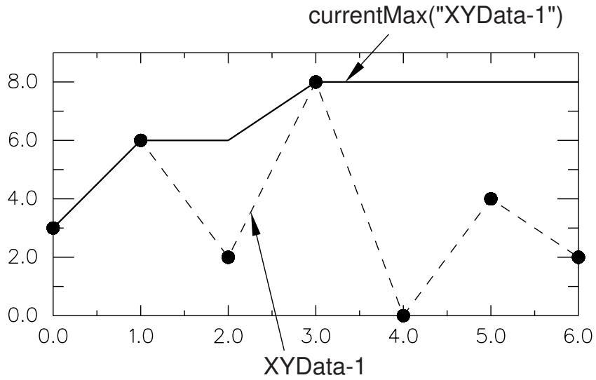  
Figure 1: X–Y plot produced using the currentMax function.


## Note:

The last value of the new X–Y data object represents the overall maximum Y-coordinate of the original X–Y data object.

For information on how to find the current maximum of two or more X–Y data objects, see Finding the current maximum of two or more X–Y data objects.

1. Locate the Operate on XY Data dialog box.  
From the main menu bar, select Tools->XY Data->Create. Click Operate on XY data in the dialog box that appears; then click Continue. The Operate on XY Data dialog box appears.  
2. From the Operators listed, click currentMax(X).  
The currentMax function appears in the expression window.  
3. From the XY Data choices, click the name of the X–Y data object on which to operate and click Add to Expression. You can choose from all X–Y data objects previously saved within this session (listed alphabetically in the XY Data field).  
The X–Y data object name appears within the currentMax function parentheses in the expression window.  
4. To continue to build your expression, position the cursor in the expression window and type in or select the functions, operators, and X–Y data you want to include.  
5. To evaluate and display your expression, click Plot Expression.  
6. To save your new X–Y data object, click Save As and then provide a name in the dialog box that appears.  
Saving your data object makes it available for future operations within this session and for inclusion in X–Y plots containing multiple data objects.

7. When you are finished, click Cancel to close the dialog box.

## Additional information

• Finding the current maximum of two or more X–Y data objects  
• Using X–Y data operations

## Finding the current minimum of an X–Y data object

Use the currentMin function to operate on a previously savedX–Y data object (a collection of ordered pairs) to produce a new X–Y data object. The new X–Y data object has the same X-coordinate values as the original X–Y data object, but new Y-coordinates are computed as the minimum Y-coordinate at or before the current X-coordinate.

Figure 1 shows an example of an X–Y plot produced by using the currentMin function.

  
Figure 1: X–Y plot produced using the currentMin function.


## Note:

The last value of the new X–Y data object represents the overall minimum Y-coordinate of the original X–Y data object.

For information on how to find the current minimum of two or more X–Y data objects, see Finding the current minimum of two or more X–Y data objects.

1. Locate the Operate on XY Data dialog box.  
From the main menu bar, select Tools->XY Data->Create. Click Operate on XY data in the dialog box that appears; then click Continue. The Operate on XY Data dialog box appears.  
2. From the Operators listed, click currentMin(X).  
The currentMin function appears in the expression window.  
3. From the XY Data choices, click the name of the X–Y data object on which to operate and click Add to Expression. You can choose from all X–Y data objects previously saved within this session (listed alphabetically in the XY Data field).  
The X–Y data object name appears within the currentMin function parentheses in the expression window.  
4. To continue to build your expression, position the cursor in the expression window and type in or select the functions, operators, and X–Y data you want to include.  
5. To evaluate and display your expression, click Plot Expression.  
6. To save your new X–Y data object, click Save As and then provide a name in the dialog box that appears.  
Saving your data object makes it available for future operations within this session and for inclusion in X–Y plots containing multiple data objects.

7. When you are finished, click Cancel to close the dialog box.

## Additional information

• Finding the current minimum of two or more X–Y data objects  
• Using X–Y data operations

## Finding the current range of an X–Y data object

Use the currentRng function to operate on a previously savedX–Y data object (a collection of ordered pairs) to produce a new X–Y data object. The new X–Y data object has the same X-coordinate values as the original X–Y data object, but new Y-coordinates are computed as the difference between the minimum Y-coordinate and the maximum Y-coordinate at or before the current X-coordinate.

Figure 1 provides an example of an X–Y plot produced by using the currentRng function.  
  
Figure 1: X–Y plot produced using the currentRng function.


## Note:

The last value of the new X–Y data object represents the overall range of Y-coordinates of the original X–Y data object.

For information on how to find the current range of two or more X–Y data objects, see Finding the current range of two or more X–Y data objects.

1. Locate the Operate on XY Data dialog box.  
From the main menu bar, select Tools->XY Data->Create. Click Operate on XY data in the dialog box that appears; then click Continue. The Operate on XY Data dialog box appears.  
2. From the Operators listed, click currentRng(X).  
The currentRng function appears in the expression window.  
3. From the XY Data choices, click the name of the X–Y data object on which to operate and click Add to Expression. You can choose from all X–Y data objects previously saved within this session (listed alphabetically in the XY Data field).  
The X–Y data object name appears within the currentRng function parentheses in the expression window.  
4. To continue to build your expression, position the cursor in the expression window and type in or select the functions, operators, and X–Y data you want to include.  
5. To evaluate and display your expression, click Plot Expression.  
6. To save your new X–Y data object, click Save As and then provide a name in the dialog box that appears.

Saving your data object makes it available for future operations within this session and for inclusion in X–Y plots containing multiple data objects.

7. When you are finished, click Cancel to close the dialog box.

## Additional information

• Finding the current range of two or more X–Y data objects  
• Using X–Y data operations

## Finding the current maximum of two or more X–Y data objects

Use the maxEnvelope function to operate on two or more previously savedX–Y data objects (each object is a collection of ordered pairs) to produce a new X–Y data object. The new X–Y data object has as its X-coordinates all X-coordinates of the input data objects and any additional X-coordinates needed for alignment of the input data objects. Abaqus/CAE computes additional X–Y data pairs by interpolation and extrapolation. The new data object has as its Y-coordinates the maximum Y-coordinate of all input X–Y data objects at the current X-coordinate. The arguments of this operation are commutative.

Figure 1 illustrates the type of X–Y plot that can be produced by using the maxEnvelope function.  
  
Figure 1: X–Y plot produced using the maxEnvelope function.

For information on how to find the current maximum of a single X–Y data object, see Finding the current maximum of an X–Y data object.

1. Locate the Operate on XY Data dialog box.  
From the main menu bar, select Tools->XY Data->Create. Click Operate on XY data in the dialog box that appears; then click Continue. The Operate on XY Data dialog box appears.  
2. From the Operators listed, click maxEnvelope(A,A,...).  
The maxEnvelope function appears in the expression window.  
3. From the XY Data choices, click the names of two or more X–Y data objects on which to operate and click Add to Expression. Choices include all X–Y data objects previously saved within this session, listed alphabetically.  
The X–Y data object names appear, separated by commas, within the maxEnvelope function parentheses in the expression window.  
4. To continue to build your expression, position the cursor in the expression window and type in or select the functions, operators, and X–Y data you want to include.  
5. To evaluate and display your expression, click Plot Expression.  
6. To save your new X–Y data object, click Save As and then provide a name in the dialog box that appears.  
Saving your data object makes it available for future operations within this session and for inclusion in X–Y plots containing multiple data objects.

7. When you are finished, click Cancel to close the dialog box.

## Additional information

• Finding the current maximum of an X–Y data object  
• Understanding X–Y data interpolation and extrapolation  
• Using X–Y data operations

## Finding the current minimum of two or more X–Y data objects

Use the minEnvelope function to operate on two or more previously savedX–Y data objects (each object is a collection of ordered pairs) to produce a new X–Y data object. The new X–Y data object has as its X-coordinates all X-coordinates of the input data objects and any additional X-coordinates needed for alignment of the input data objects. Abaqus/CAE computes additional X–Y data pairs by interpolation and extrapolation. The new data object has as its Y-coordinates the minimum Y-coordinate of all input X–Y data objects at the current X-coordinate. The arguments of this operation are commutative.

Figure 1 illustrates the type of X–Y plot that can be produced by using the minEnvelope function.  
  
Figure 1: X–Y plot produced using the minEnvelope function.

For information on how to find the current minimum of a single X–Y data object, see Finding the current minimum of an X–Y data object.

1. Locate the Operate on XY Data dialog box.  
From the main menu bar, select Tools->XY Data->Create. Click Operate on XY data in the dialog box that appears; then click Continue. The Operate on XY Data dialog box appears.  
2. From the Operators listed, click minEnvelope(A,A,...).  
The minEnvelope function appears in the expression window.  
3. From the XY Data choices, click the names of two or more X–Y data objects on which to operate and click Add to Expression. Choices include all previously saved X–Y data objects, which are listed alphabetically.  
The X–Y data object names appear, separated by commas, within the minEnvelope function parentheses in the expression window.  
4. To continue to build your expression, position the cursor in the expression window and type in or select the functions, operators, and X–Y data you want to include.  
5. To evaluate and display your expression, click Plot Expression.  
6. To save your new X–Y data object, click Save As and then provide a name in the dialog box that appears.  
Saving your data object makes it available for future operations within this session and for inclusion in X–Y plots containing multiple data objects.

7. When you are finished, click Cancel to close the dialog box.

## Additional information

• Finding the current minimum of an X–Y data object  
• Understanding X–Y data interpolation and extrapolation  
• Using X–Y data operations

## Finding the current range of two or more X–Y data objects

Use the rng function to operate on two or more previously savedX–Y data objects (each object is a collection of ordered pairs) to produce a new X–Y data object. The new X–Y data object has as its X-coordinates all X-coordinates of the input data objects and any additional X-coordinates needed for alignment of the input data objects. Abaqus/CAE computes additional X–Y data pairs by interpolation and extrapolation. Abaqus/CAE computes the new data object Y-coordinates as the difference between the minimum Y-coordinate and the maximum Y-coordinate at the current X-coordinate. The arguments of this operation are commutative.

Figure 1 illustrates the type of X–Y plot that can be produced by using the rng function.  
  
Figure 1: X–Y plot produced using the rng function.

For information on how to find the current range of a single X–Y data object, see Finding the current range of an X–Y data object.

1. Locate the Operate on XY Data dialog box.  
From the main menu bar, select Tools->XY Data->Create. Click Operate on XY data in the dialog box that appears; then click Continue. The Operate on XY Data dialog box appears.  
2. From the Operators listed, click rng(A,A,...).  
The rng function appears in the expression window.  
3. From the XY Data choices, click the names of two or more X–Y data objects on which to operate and click Add to Expression. Choices include all X–Y data objects previously saved within this session, listed alphabetically.  
The X–Y data object names appear, separated by commas, within the rng function parentheses in the expression window.  
4. To continue to build your expression, position the cursor in the expression window and type in or select the functions, operators, and X–Y data you want to include.  
5. To evaluate and display your expression, click Plot Expression.  
6. To save your new X–Y data object, click Save As and then provide a name in the dialog box that appears.  
Saving your data object makes it available for future operations within this session and for inclusion in X–Y plots containing multiple data objects.

7. When you are finished, click Cancel to close the dialog box.

## Additional information

• Finding the current range of an X–Y data object  
• Understanding X–Y data interpolation and extrapolation  
• Using X–Y data operations

## Appending two or more X–Y data objects

Use the append function to link together two or more previously savedX–Y data objects (collections of ordered pairs) to produce a new X–Y data object. The new X–Y data object contains the data objects you specify concatenated in the order you specify.

Figure 1 shows an X–Y plot created by appending an X–Y data object with Y-values varying from 1 to −1 to an X–Y data object with Y-values varying from 0.5 to −0.5.

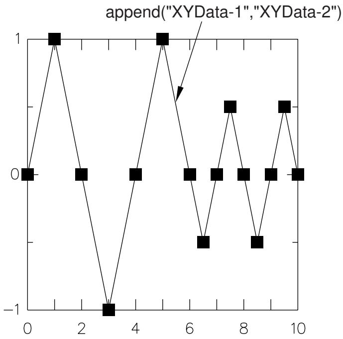  
Figure 1: X–Y plot produced using the append function.

1. Locate the Operate on XY Data dialog box.  
From the main menu bar, select Tools->XY Data->Create. Click Operate on XY data in the dialog box that appears; then click Continue. The Operate on XY Data dialog box appears.  
2. From the Operators listed, click append(X,X,...).  
The append function appears in the expression window.  
3. From the XY Data choices, click the names of the X–Y data objects to append in the order you want Abaqus to concatenate them and click Add to Expression. You can choose from X–Y data objects previously saved within this session (listed alphabetically in the XY Data field).  
The X–Y data object names appear, separated by commas, within the append function parentheses in the expression window.  
4. To continue to build your expression, position the cursor in the expression window and type in or select the functions, operators, and X–Y data you want to include.  
5. To evaluate and display your expression, click Plot Expression.  
6. To save your new X–Y data object, click Save As and then provide a name in the dialog box that appears.  
Saving your data object makes it available for future operations within this session and for inclusion in X–Y plots containing multiple data objects.

7. When you are finished, click Cancel to close the dialog box.

## Additional information

• Combining two X–Y data objects  
• Using addition on X–Y data objects  
• Summing two or more X–Y data objects  
• Using X–Y data operations

## Combining two X–Y data objects

Use the combine function to combine two previously savedX–Y data objects (collections of ordered pairs) to produce a new X–Y data object. The new X–Y data object contains data pairs consisting of the Y-coordinate values of the first data object and the Y-coordinate values of the second data object, combined wherever X-coordinate values for the two data objects match. For example,

$$
\text {XYData1} = [ (1, 4), (2, 4), (3, 4), (4, 5), (5, 6) ]
$$

and

$$
\text {XYData2} = [ (1, 9), (2, 8), (3, 7), (4, 6), (5, 4) ];
$$

then

$$
\operatorname{combine} (\text {XYData1}, \text {XYData2}) = [ (4, 9), (4, 8), (4, 7), (5, 6), (6, 4) ].
$$

The arguments of this operation are not commutative. If X-coordinate values for the two data objects do not match, Abaqus/CAE computes the missing data points to allow the X–Y data objects to be aligned. For more information on how missing data points are computed, see Understanding X–Y data interpolation and extrapolation.

A typical application of this function would be to combine a data object having X-values of time and Y-values of load with a data object having X-values of time and Y-values of displacement to produce a data object having X-values of displacement and Y-values of load. Another example would be to combine a data object having X-values of time and Y-values of stress with a data object having X-values of time and Y-values of strain to produce a data object having X-values of strain and Y-values of stress, as shown in Figure 1.

  
Figure 1: X–Y plot of stress versus strain.

1. Locate the Operate on XY Data dialog box.  
From the main menu bar, select Tools->XY Data->Create. Click Operate on XY data in the dialog box that appears; then click Continue. The Operate on XY Data dialog box appears.  
2. From the Operators listed, click combine(X,X).  
The combine function appears in the expression window.  
3. From the XY Data choices, click the names of the two X–Y data objects to combine in the order you want Abaqus to combine them and click Add to Expression. Choices include all X–Y data objects previously saved within this session, listed alphabetically.

The X–Y data object names appear, separated by commas, within the combine function parentheses in the expression window.

4. To continue to build your expression, position the cursor in the expression window and type in or select the functions, operators, and X–Y data you want to include.  
5. To evaluate and display your expression, click Plot Expression.  
6. To save your new X–Y data object, click Save As and then provide a name in the dialog box that appears.  
Saving your data object makes it available for future operations within this session and for inclusion in X–Y plots containing multiple data objects.  
7. When you are finished, click Cancel to close the dialog box.

## Additional information

• Understanding X–Y data interpolation and extrapolation  
• Appending two or more X–Y data objects  
• Using addition on X–Y data objects  
• Summing two or more X–Y data objects  
• Using X–Y data operations

## Converting the angular units used for X–Y data objects

Use the degreeToRadian or radianToDegree function to operate on a previously savedX–Y data object (a collection of ordered pairs) to produce a new X–Y data object. The new X–Y data object has the same X-coordinate values as the original X–Y data object. Abaqus/CAE computes the new Y-coordinate values by converting each original Y-coordinate from degrees to radians or from radians to degrees, depending on the function you specify.

1. Locate the Operate on XY Data dialog box.  
From the main menu bar, select Tools->XY Data->Create. Click Operate on XY data in the dialog box that appears; then click Continue. The Operate on XY Data dialog box appears.  
2. From the Operators listed, click degreeToRadian to convert from degrees to radians or radianToDegree to convert from radians to degrees.  
The respective function appears in the expression window.  
3. From the XY Data choices, click the name of the X–Y data object on which to operate and click Add to Expression. You can choose from all X–Y data objects previously saved within this session (listed alphabetically in the XY Data field).  
The X–Y data object name appears within the function parentheses in the expression window.  
4. To continue to build your expression, position the cursor in the expression window and type in or select the functions, operators, and X–Y data you want to include.  
5. To evaluate and display your expression, click Plot Expression.  
6. To save your new X–Y data object, click Save As and then provide a name in the dialog box that appears.  
Saving your data object makes it available for future operations within this session and for inclusion in X–Y plots containing multiple data objects.  
7. When you are finished, click Cancel to close the dialog box.

## Additional information

• Using X–Y data operations

Use the swap function to exchange the X- and Y-values of a previously savedX–Y data object (a collection of ordered pairs) to produce a new X–Y data object. The new X–Y data object has as its X-coordinate values the Y-coordinate values of the original X–Y data object and has as its Y-coordinate values the X-coordinate values of the original data object.

Figure 1 illustrates the type of X–Y plot that can be produced by using the swap function.

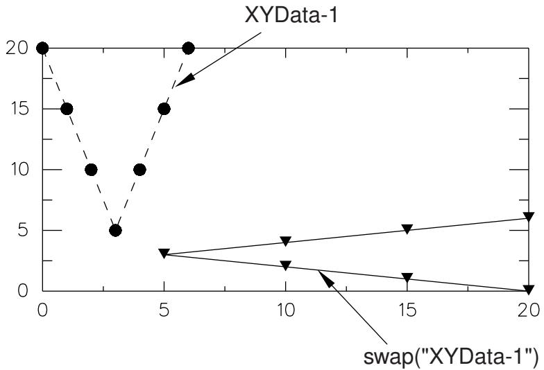  
Figure 1: X–Y plot produced using the swap function.

1. Locate the Operate on XY Data dialog box.  
From the main menu bar, select Tools->XY Data->Create. Click Operate on XY data in the dialog box that appears; then click Continue. The Operate on XY Data dialog box appears.  
2. From the Operators listed, click swap(X).  
The swap function appears in the expression window.  
3. From the XY Data choices, click the name of the X–Y data object on which to operate and click Add to Expression. You can choose from all X–Y data objects previously saved within this session (listed alphabetically in the XY Data field).  
The X–Y data object name appears within the swap function parentheses in the expression window.  
4. To continue to build your expression, position the cursor in the expression window and type in or select the functions, operators, and X–Y data you want to include.  
5. To evaluate and display your expression, click Plot Expression.  
6. To save your new X–Y data object, click Save As and then provide a name in the dialog box that appears.  
Saving your data object makes it available for future operations within this session and for inclusion in X–Y plots containing multiple data objects.  
7. When you are finished, click Cancel to close the dialog box.

## Additional information

• Using X–Y data operations

## Truncating data from the ends of an X–Y data object

Use the truncate function to operate on a previously savedX–Y data object (a collection of ordered pairs) to produce a new X–Y data object that excludes data points whose X–coordinate values are less than a user-specified minimum value or data points whose X–coordinate values are greater than a user-specified maximum value.

Figure 1 illustrates an X–Y plot that has been truncated at a maximum of 7 by using the truncate function.

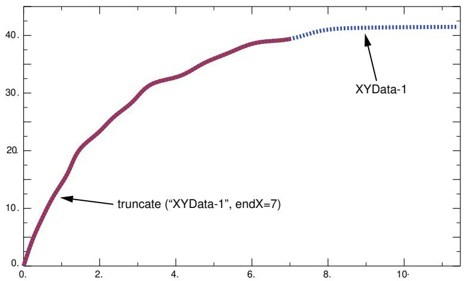  
Figure 1: X–Y plot produced using the truncate function.

1. Locate the Operate on XY Data dialog box.

From the main menu bar, select Tools->XY Data->Create. Click Operate on XY data in the dialog box that appears; then click Continue. The Operate on XY Data dialog box appears.

2. From the Operators listed, click truncate(X,F).

The truncate function appears in the expression window.

3. From the XY Data choices, click the name of the X–Y data object on which to operate and click Add to Expression. You can choose from all X–Y data objects previously saved within this session (listed alphabetically in the XY Data field).

The X–Y data object name appears within the truncate function parentheses in the expression window.

4. Specify the X–coordinate values above which or below which data points should be removed from the X–Y data object. To specify a maximum value, position your cursor in the expression window before the second comma, and enter a number for the maximum value. To specify a minimum value, append startX=value to the expression in the expression window.

5. If desired, customize the truncation order value, which determines whether Abaqus/CAE should create new data points at the truncation boundary or boundaries you specify and, if so, how these new data points should be calculated. Select one of the following:

• If truncOrder=2 (the default value), Abaqus/CAE performs a piecewise, linear fit on the data to determine a new data point at each boundary and includes the new point or points in the new X–Y data object.  
• If truncOrder=3, Abaqus/CAE performs a spline interpolation on the data to determine a new data point at each boundary and includes the new point or points in the new X–Y data object.  
• If truncOrder=1, Abaqus/CAE does not create any new points at the boundary values.

6. If desired, customize the truncation tolerance value. If you elect to include interpolated values at the truncation boundaries, the truncation tolerance value overrides the creation of these new data points if Abaqus/CAE finds existing data points that are already very close to the boundaries. By default, the truncation tolerance (truncTol) is 0.005, or one half of one percent of the average distance in the X-direction between adjacent data points in the X–Y data object. If Abaqus/CAE finds an existing data point closer to the truncation boundary than the truncation tolerance value, it does not create a new interpolated data point at that boundary.

7. To continue to build your expression, position the cursor in the expression window and type in or select the functions, operators, and X–Y data you want to include.  
8. To evaluate and display your expression, click Plot Expression.  
9. To save your new X–Y data object, click Save As and then provide a name in the dialog box that appears.  
Saving your data object makes it available for future operations within this session and for inclusion in X–Y plots containing multiple data objects.  
10. When you are finished, click Cancel to close the dialog box.

## Additional information

• Using X–Y data operations

## Customizing X–Y plot axes

This section explains how you use the Axis Options dialog box to customize the appearance of the plot axes of an X–Y plot.

## In this section:

Using X–Y plot axis options  
Plotting multiple X–Y data objects with different variables  
Customizing the X–Y plot axis scale  
Customizing the X–Y plot axis range  
Customizing the X–Y plot axis tick mode  
Customizing X–Y plot axis tick marks  
Customizing the X–Y plot axis titles  
Customizing the placement of X–Y plot axes  
Customizing the X–Y plot axis labels  
Customizing the X–Y plot axis color and style

## Using X–Y plot axis options

You can use the axis options to customize the appearance of the axes in an X–Y plot.

Figure 1 identifies the X–Y plot characteristics that you can customize.

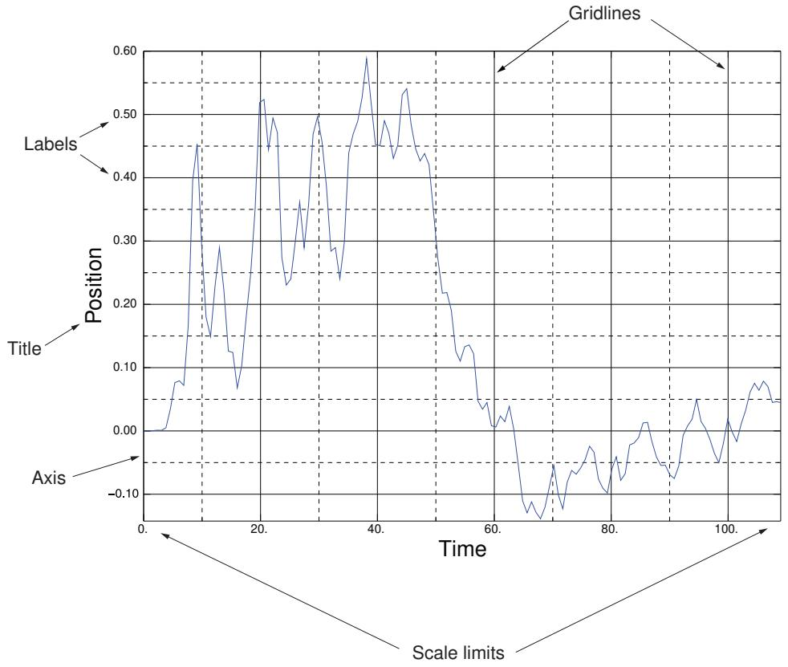  
Figure 1: Characteristics of an X–Y plot.

Abaqus/CAE provides access to these options from the Axis Options dialog box, which you can open from the following locations in the Visualization module:

• From the main menu bar, select Options->XY Options->Axis.  
+++ • From the Visualization module toolbox, click $\begin{array}{c} { \big . } { \begin{array} { l } { \operatorname { \mathrm { * } } \\ { \operatorname { \mathrm { * } } \end{array} } } \end{array} } { \mathrm { ~ ! + + + } } $  
• From the Results Tree, expand the X Axes or Y Axes container, highlight the axis or axes you want to modify, click mouse button 3, and select Axis Options from the list that appears.  
• With an X–Y plot displayed in the viewport, double-click one of the axes in the plot.

Items in an X–Y plot are selectable only when there is no active procedure in effect; you might have to cancel the current procedure to activate the components in an X–Y plot.

You can click the following tabs to customize the appearance of the selected axes:

• Scale: Choose axes scales and limits and customize the occurrence of tick marks.  
• Tick Marks: Control the appearance and placement of tick marks.  
• Title: Specify the content and appearance of axes titles.

• Axes: Choose axes placement, color, style, and thickness, and control numeric axes labels.

## Additional information

• Plotting multiple X–Y data objects with different variables  
• Customizing the X–Y plot axis scale  
• Customizing the X–Y plot axis range  
• Customizing the X–Y plot axis tick mode  
• Customizing X–Y plot axis tick marks  
• Customizing the X–Y plot axis titles  
• Customizing the placement of X–Y plot axes  
• Customizing the X–Y plot axis labels  
• Customizing the X–Y plot axis color and style

## Plotting multiple X–Y data objects with different variables

When you plot X–Y data objects with different variables on the same X–Y plot, Abaqus/CAE displays an axis for each quantity type used in these data objects. In the X–Y plot shown in Figure 1, three X–Y data objects are plotted: the ALLKE and ALLSE respectively show kinetic energy and strain energy over time, while Displacement shows displacement of a selected node over time. The resultant plot includes only a single axis, Time, in the X-direction because all three X–Y curves share this quantity type along this axis. In the Y-direction, where these X–Y data objects use different quantity types, the X–Y plot displays separate Energy and Displacement axes.

  
Figure 1: X–Y plot displaying two axes in the Y-direction.

When you plot multiple curves on the same X–Y plot, Abaqus/CAE sets the minimum and maximum values for the plot along both axes to the minimum and maximum values of the first X–Y data object you included in your plot. This X–Y data object is listed first in the X–Y plot legend and in the Curves area of the Curve Options dialog box.

When an X–Y plot displays multiple axes in the X- or Y-direction, you can align them on the same side of the X–Y plot, on opposite sides, or place one or both in the middle of the X–Y plot. You can also manipulate the scale or appearance of these X–Y plot axes independently to make their differences more apparent in the viewport.

## Additional information

• Customizing the X–Y plot axis scale  
• Customizing the X–Y plot axis range  
• Customizing X–Y plot axis tick marks  
• Customizing the X–Y plot axis titles  
• Customizing the X–Y plot axis labels  
• Customizing the X–Y plot axis color and style

## Customizing the X–Y plot axis scale

Click the Scale tab to choose either a linear, logarithmic, or decibel-based scale for the X- and Y-axes of an X–Y plot. The scales of all X- and Y-axes that you display are independent. By default, Abaqus/CAE uses a linear scale for all axes.

## Decibel-based scales

You can rescale data along a particular axis using either of two decibel-based scales. Each scale is suited to a particular type of wave data: the 10 dB scale is recommended for displaying data about wave power or intensity; the 20 dB scale is recommended for data about wave amplitude.

When you select a decibel-based axis scale, you can also adjust the decibel reference value. Adjusting this value enables you to rescale your data object according to the environmental conditions for the data in this X–Y data object and for the units in your model. The default value is 1. You may want to adjust this value to display data at different environments or for waves traveling through a different medium, such as water.

1. Locate the Scale options.

Select Options->XY Options->Axis; or click , which is located with the X–Y plotting tools in the Visualization module toolbox. Click the Scale tab in the dialog box that appears.

2. From the X Axis or Y Axis fields, highlight one or more axes.  
3. Select one of the following axis scale options:

## Linear

The selected axis is displayed in a linear progression.

## Log

The selected axis is displayed in a base 10 logarithmic progression.

## 10 dB

The selected axis is displayed in a 10 dB progression. The dB Reference field becomes available, and you can enter the decibel reference value for the 10 dB–based data along this axis.

## 20 dB

The selected axis is displayed in a 20 dB progression. The dB Reference field becomes available, and you can enter the decibel reference value for the 20 dB–based data along this axis.

4. Click Dismiss to close the Axis Options dialog box.

## Additional information

• Using X–Y plot axis options

Click the Scale tab to customize the range of the X- and Y-axes of an X–Y plot. By default, Abaqus/CAE computes the minimum and maximum axis values based on the minimum and maximum data points included in the plot.

1. Locate the axis Max and Min options.

Select Options->XY Options->Axis; or click , which is located with the X–Y plotting tools in the Visualization module toolbox. Click the Scale tab in the dialog box that appears.

The Max and Min options appear in the middle of the Scale page.

2. From the X Axis or Y Axis fields, highlight one or more axes.  
3. Enter a value in the Max field, or toggle on Auto-compute next to this field to set the maximum value for the selected axis or axes to the highest available data point.

Abaqus/CAE updates the selected axis or axes.

4. Enter a value in the Min field, or toggle on Auto-compute next to this field to set the minimum value for the selected axis or axes to the lowest available data point.

Abaqus/CAE updates the selected axis or axes.

5. Click Dismiss to close the Axis Options dialog box.

## Additional information

• Using X–Y plot axis options

## Customizing the X–Y plot axis tick mode

Click the Scale tab to customize the tick mode of the X- and Y-axes of an X–Y plot. The tick mode options enable you to control the number of major and minor tick marks that appear along either axis. By default, Abaqus/CAE computes the minimum and maximum axis values based on the minimum and maximum data points included in the plot.

1. Locate the Tick Mode options.

Visualization module toolbox. Click the Scale tab in the dialog box that appears.

The Tick Mode options appear at the bottom of the Scale page.

2. From the X Axis or Y Axis fields, highlight one or more axes.  
3. Choose the method of computing the interval between major tick marks along the selected axis.

From the Major options, choose one of the following:

## Automatic

Abaqus computes the interval between major tick marks along the selected axis, rounding to provide reasonable intervals.

## By increment

The Tick increment text field becomes available, and you can enter the increment between major tick marks along the selected axis.

## By count

The Number of ticks per decade field becomes available, and you can increase or decrease the total number of major tick marks to appear between the minimum and maximum values along the selected axis.

4. Specify the number of minor tick marks.

From the Minor ticks option, click the Ticks per increment arrows (for linear or decibel-based axes) or the Ticks per decade arrows (for logarthmic axes) to specify the number of minor tick marks between each major tick mark.

5. Click Dismiss to close the Axis Options dialog box.

## Additional information

• Using X–Y plot axis options

## Customizing X–Y plot axis tick marks

You can customize X–Y plot axis tick marks.

Click the Tick Marks tab to control the length, thickness, style, and color of major and minor tick marks that appear along the X- and Y-axes of an X–Y plot. The number of major and minor tick marks is controlled separately; see Customizing the X–Y plot axis tick mode. You can control the X- and Y-axis tick marks independently. Examples of major and minor tick marks are shown in Figure 1.

  
Figure 1: X–Y plot with major and minor tick marks indicated.

Major tick marks govern the placement of the X–Y plot major grid and the numeric axis labels. Minor tick marks are shorter, unlabeled marks governing the placement of the minor gridlines.

By default, Abaqus/CAE automatically computes the number of tick marks. You can specify major tick marks by giving the increment between them or the total number of tick marks. You can specify minor tick marks only by giving the total number between each major tick mark.

The color of the tick marks is governed by the color of the axes. For more information, see Customizing the X–Y plot axis color and style.

1. Locate the axis Tick Marks options.

Select Options->XY Options->Axis; or click , which is located with the X–Y plotting tools in the Visualization module toolbox. Click the Tick Marks tab in the dialog box that appears.

2. From the X Axis or Y Axis fields, highlight one or more axes.  
3. Choose the location in which to place the axis tick marks.

From the Placement options, choose one of the following:

## None

Abaqus hides the tick marks completely for the selected axis.

## Inside

Abaqus displays the tick marks on the same side of the axis as the X–Y curves.

## Outside

Abaqus displays the tick marks on the side of the axis opposite the X–Y curves.

## Across

Abaqus displays tick marks that straddle both sides of the selected axis.

4. Specify the length of the tick marks.

Click the Length arrows to increase or decrease the length of the tick marks. Abaqus/CAE increases the length of the major and minor tick marks.

5. Choose the line style.

From the Style list, click the desired line style (solid, dashed, etc.).

The specified line style appears for the tick marks along the selected axis and in the Style list.

6. Choose the line thickness.

From the Thickness list, click the desired line thickness.

The specified line thickness appears for the tick marks along the selected axis and in the Thickness list.

7. Choose the line color:

a. Click the color sample

Abaqus/CAE displays the Select Color dialog box.

b. Use one of the methods in the Select Color dialog box to select a new color. For more information, see Customizing colors.

c. Click OK to close the Select Color dialog box.

The tick marks for the selected axis change to the selected color.

8. Click Dismiss to close the Axis Options dialog box.

## Additional information

• Customizing the X–Y plot axis labels  
• Using X–Y plot axis options

Click the Title tab to customize the titles that appear along the X- and Y-axes of an X–Y plot. You can customize the following:

• The text that appears as each title.  
• The color of each title.  
• The font of each title.

1. Locate the axis Title options.

Select Options->XY Options->Axis; or clic k , which is located with the X–Y plotting tools in the Visualization module toolbox. Click the Title tab in the dialog box that appears.

2. From the X Axis or Y Axis fields, highlight one or more axes.

3. To specify title text other than the default for the selected axis, enter the title in the field. You can revert back to the default title by toggling on Use default.

4. Select the font of the axis title.

a. Clic k .

Abaqus/CAE displays the Select Font dialog box.

b. Use one of the methods in the Select Font dialog box to select a new font, size, and style. For more information, see Customizing fonts.  
c. Click Apply to see the effect of your font selections.  
d. Click OK to close the Select Font dialog box.  
The X–Y plot title changes to the selected font, size, and style.

5. Select the color of the axis title.

a. Click the color sample .

Abaqus/CAE displays the Select Color dialog box.

b. Use one of the methods in the Select Color dialog box to select a new color. For more information, see Customizing colors.

c. Click OK to close the Select Color dialog box. The axis title for the selected axis changes to the selected color.

6. Click Dismiss to close the Axis Options dialog box.

## Additional information

• Customizing the X–Y plot axis labels  
• Using X–Y plot axis options

## Customizing the placement of X–Y plot axes

Click the Axes tab to customize the placement of the X- and Y-axes of an X–Y plot. This section describes the Placement options, which control the location of the axes themselves; to customize the location of the axis labels, see Customizing the X–Y plot axis labels

1. Locate the Placement options.

Select Options->XY Options->Axis; or click , which is located with the X–Y plotting tools in the Visualization module toolbox. Click the Axes tab in the dialog box that appears. The Placement options for the axes appear at the top of the Axes page.

2. From the X Axis or Y Axis fields, highlight one or more axes.  
3. From the Placement options at the top of the Axes page, select one of the following:

## Min Edge

Abaqus/CAE places an axis on the minimum edge of the X–Y plot only. For X-axes, the minimum edge is the bottom of the viewport; for Y-axes, the minimum edge is the left side of the viewport.

## Max Edge

Abaqus/CAE places an axis on the maximum edge of the X–Y plot only. For X-axes, the maximum edge is the top of the viewport; for Y-axes, the maximum edge is the right side of the viewport.

## Min/Max Edge

Abaqus/CAE places the selected axis on both the maximum and minimum edges of the X–Y plot. For X-axes, Abaqus/CAE places the selected axis on the top and bottom of the viewport; for Y-axes, Abaqus/CAE the selected axis on the left and right sides of the viewport.

## Center

Abaqus/CAE places the axis in the center of the X–Y plot.

4. Click Dismiss to close the Axis Options dialog box.

## Additional information

• Customizing X–Y plot axis tick marks  
• Customizing the X–Y plot axis titles  
• Using X–Y plot axis options

You can customize the X–Y plot axis labels.

Click the Axes tab to customize the numeric labels that appear with the major tick marks along the X- and Y-axes of an X–Y plot. Examples of axis labels appear in Figure 1.

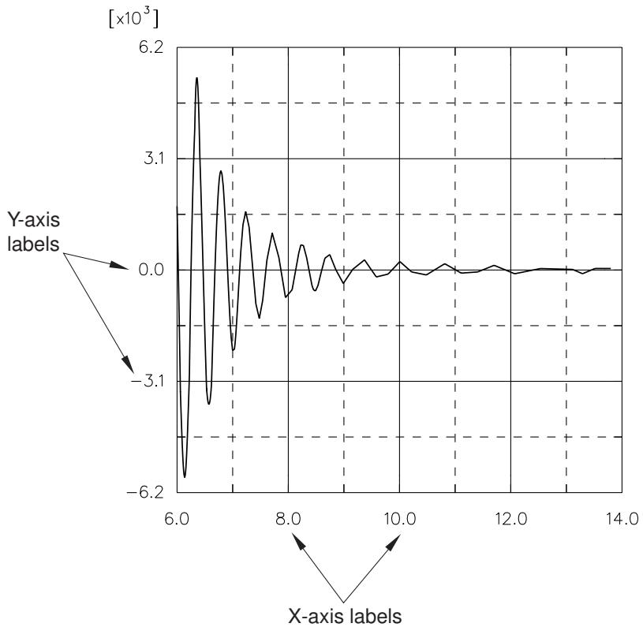  
Figure 1: X–Y plot with axis labels indicated.

You can customize the following:

• The format of the labels (automatic, decimal, engineering, or scientific).  
• The number of decimal places or significant digits in the labels.  
• The frequency of the labels in relation to the major tick marks.  
• The font of the labels.

The color of the labels is governed by the color of the axes. See Customizing the X–Y plot axis color and style, for more information.

1. Locate the Labels options.

Select Options->XY Options->Axis; or click , which is located with the X–Y plotting tools in the Visualization module toolbox. Click the Axes tab in the dialog box that appears.

The Labels options for the axes appear in the middle of the Axes page.

2. From the X Axis or Y Axis fields, highlight one or more axes.

3. Specify where you would like axis labels to appear.

From the Placement list in the Labels options, choose one of the following:

## None

Abaqus/CAE hides axis labels for the selected axis.

## Inside

Abaqus/CAE displays axis labels on the same side of the axis as the X–Y curves.

## Outside

Abaqus/CAE displays axis labels on the side of the axis opposite the X–Y curves.

4. Click the Frequency arrows to specify how often labels are printed relative to each major tick mark. For example, if you select a frequency of two, labels will appear at every second major tick mark along the axis. If you select a frequency of zero, no labels will be displayed along the axis. You can request a label frequency of at most one greater than the number of major tick marks.

5. From the Labels options, select the format of the selected labels.

a. Click the Format button to reveal the X-axis label format options.  
b. Choose one of the following:

## Automatic

Very large values and very small values are expressed in scientific format. All remaining values are expressed with no exponent and using the specified number of significant digits.

## Decimal

All values are expressed with no exponent and using the specified number of significant digits.

## Engineering

Values greater than or equal to 1000 (or values less than or equal to 0.001) are expressed as a number ranging from 1 to 999 that is multiplied by 10 to the nth power, where n is a product of 3 (for example, 20.5E+03 or 17.76E+06). All remaining values are expressed using the specified number of significant digits.

## Scientific

All values are expressed as a number between 1 and 10 that is multiplied by an appropriate power of 10 (for example, 2.05E+04 or 1.776E+07).

6. Click the Precision arrows to specify the desired number of significant digits (for non-decimal formats) or decimal places (for decimal format) in each label.  
7. Select the font of the axis labels.

a. Click

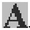

Abaqus/CAE displays the Select Font dialog box.

b. Use one of the methods in the Select Font dialog box to select a new font, size, and style. For more information, see Customizing fonts.  
c. Click Apply to see the effect of your font selections.

d. Click OK to close the Select Font dialog box. The axis labels change to the selected font, size, and style.

8. Select the color of the axis labels.

a. Click the color sample Abaqus/CAE displays the Select Color dialog box.

b. Use one of the methods in the Select Color dialog box to select a new color. For more information, see Customizing colors.

c. Click OK to close the Select Color dialog box. The axis labels change to the selected color.

9. Click Dismiss to close the Axis Options dialog box.

## Additional information

• Customizing X–Y plot axis tick marks  
• Customizing the X–Y plot axis titles  
• Using X–Y plot axis options

## Customizing the X–Y plot axis color and style

Click the Axes tab to customize the color and thickness of the graph axes of an X–Y plot. Your selections apply to both the X- and Y-axes; it is not possible to customize the axes individually.

1. Locate the Style options.

Select Options->XY Options->Axis; or click , which is located with the X–Y plotting tools in the Visualization module toolbox. Click the Axes tab in the dialog box that appears.

The Style options for the axes appear at the bottom of the Axes page.

2. From the X Axis or Y Axis fields, highlight one or more axes.  
3. Choose the line style.

From the Style list, click the desired line style (solid, dashed, etc.).

The specified line style appears for the selected axis and in the Style list.

4. Choose the line thickness.

From the Thickness list, click the desired line thickness.

The specified line thickness appears for the selected axis and in the Thickness list.

5. Choose the line color:

a. Click the color sample .

Abaqus/CAE displays the Select Color dialog box.

b. Use one of the methods in the Select Color dialog box to select a new color. For more information, see Customizing colors.  
c. Click OK to close the Select Color dialog box.

The axis line changes to the selected color.

6. Click Dismiss to close the Axis Options dialog box.

## Additional information

• Customizing X–Y plot axis tick marks  
• Customizing the X–Y plot axis labels  
• Using X–Y plot axis options

## Customizing X–Y curve appearance

This section explains how you use the Curve Options dialog box to customize the appearance of a curve representing a selected X–Y data object.

Only curves that appear in the most recent X–Y plot are available for customization.

## In this section:

Using options to customize the appearance of X–Y curves  
Selecting one or more X–Y curves to customize  
Customizing the X–Y plot legend  
Customizing the appearance of an X–Y curve  
Customizing the symbols used on an X–Y curve  
Editing the list of auto-colors for X–Y plots

## Using options to customize the appearance of X–Y curves

To customize the appearance of X–Y curves, expand the Curves container in the Results Tree, highlight the curves you want to modify, then click mouse button 3 and select Curve Options from the list that appears.

You can customize the line style, symbol style, and legend text of each curve.

Only those curves that appear in the most recent X–Y plot are available for customization. You can customize the following:

• The text that appears in the legend describing the data. For more information, see Customizing the X–Y plot legend.  
• The appearance of the line representing the data (the curve). For more information, see Customizing the appearance of an X–Y curve.  
• The appearance of the symbols along the curve. For more information, see Customizing the symbols used on an X–Y curve.

1. Locate the Curve Options dialog box. You can open this dialog box using any of the following methods:

• From the main menu bar, select Options->XY Options->Curve.

• From the Visualization module toolbox, click

• From the Results Tree, expand the Charts container, highlight the plot or plots you want to modify, click mouse button 3, and select Chart Options from the list that appears.

2. Use the curve options to select and then customize the appearance of the X–Y curves in the current viewport.

3. When you have finished customizing the appearance of your X–Y curves, click Dismiss to close the Curve Options dialog box.

## Additional information

• Selecting one or more X–Y curves to customize  
• Customizing the X–Y plot legend  
• Customizing the appearance of an X–Y curve  
• Customizing the symbols used on an X–Y curve

To customize a curve, you first select it and then choose customization options. Use the Curves field in the Curve Options dialog box to select one or more X–Y curves to customize. The Curves field lists the displayed X–Y curves, identifying each curve by name. For information on curve naming conventions, see Understanding “Temp” and other X–Y data object names.

After you have selected one or more X–Y curves to customize, you then use the options in the Attributes frame to control the line and the symbol representing the data and to enter the text that will appear in the legend.

1. Locate the Curves field.

The Curves field is at the top of the dialog box.

2. Select one or more X–Y curves to customize. For more information on selecting multiple items in dialog boxes, see Selecting multiple items from lists and tables.


## Note:

To make an X–Y curve available for selection, you must first plot it.

If you have selected one curve, the Attributes frame displays the current attributes of that curve.

If you have selected multiple curves, Abaqus/CAE displays the Legend text field as blank. The display in the Attributes frame varies depending on whether the selected curves have the same attributes or not. If the attributes are the same, Abaqus/CAE displays them; if the attributes differ, Abaqus/CAE displays the following:

• The Show and Show symbol checkboxes are gray.  
• The line Color and symbol Color text fields display the term As is.  
• The Style, Thickness, Symbol, and Size buttons are blank.  
• The Frequency text field is blank.

3. From the Attributes field, you can control the following:

• The text that appears in the legend describing the data. For more information, see Customizing the X–Y plot legend.  
The appearance of the line representing the data (the curve). For more information, see Customizing the appearance of an X–Y curve.  
• The appearance of the symbols along the curve. For more information, see Customizing the symbols used on an X–Y curve.

## Customizing the X–Y plot legend

The legend of an X–Y plot provides a key to associate each curve included in the plot with the X–Y data object that it represents. Each legend entry contains a line segment in the color and style shown in the plot. The legend entry also includes text stating, by default, the name of the X–Y data represented by the curve. You can customize this text using the Curve Options.

The remaining characteristics of the legend are controlled by options in the Viewport Annotation Options dialog box. For information on customizing the legend and on including in the legend a report of the minimum and maximum X–Y values, see Customizing the legend.

1. Locate the Attributes options for X–Y curves.

The Attributes frame is at the bottom of the Curve Options dialog box.

2. In the Curves options, select one or more curves whose legend text you want to modify.  
3. In the Legend Text field, enter the custom legend text. You can also revert to the default legend text by toggling on Use default.  
4. Click Dismiss to close the Curve Options dialog box.

## Additional information

• Selecting one or more X–Y curves to customize

You can customize the appearance of an X–Y curve.

Use the Curve Options dialog box to customize the color, style, and thickness of the line used to represent an X–Y data object in an X–Y plot. Figure 1 illustrates some of the ways in which X–Y data curves can be customized.

  
Figure 1: X–Y plot with customized curves.

The color, style, and thickness that you select appear along the curve and in the legend. The customization options are available only when Show is toggled on.

By default, Abaqus/CAE colors the X–Y curves in your plot by referring to the list of X–Y auto colors. You can modify this list from the Edit XY-Auto-Colors dialog box; see Editing the list of auto-colors for X–Y plots.

1. Locate the Show options.

The Show options appear in the lower right corner of the Curve Options dialog box.

2. From the Curves field, select one or more X–Y curves whose attributes you wish to customize.


## Note:

To make an X–Y curve available for selection, you must first plot it.

The customization options you choose will apply to all of the curves you have selected; if you want to vary the appearance of multiple curves, you must customize them one at a time.

3. Toggle Show to display or suppress the line representing each selected X–Y curve.

When Show is on, the curve is displayed and the line attribute options are enabled.

4. Choose the line color:

a. Click the color sample .

Abaqus/CAE displays the Select Color dialog box.

b. Use one of the methods in the Select Color dialog box to select a new color. For more information, see Customizing colors.

c. Click OK to close the Select Color dialog box.

The selected X–Y curve changes to the selected color.

5. Choose the line style:

a. Click the Style button to reveal the line style options (solid, dashed, etc.).  
b. From the style list, click the desired line style.  
The selected X–Y curve changes to the selected style.

6. Choose the line thickness:

a. Click the Thickness button to reveal the line thickness options.  
b. From the thickness list, click the desired line thickness.  
The selected X–Y curve changes to the specified thickness.

7. Click Dismiss to close the Axis Options dialog box.

## Additional information

• Selecting one or more X–Y curves to customize

You can customize the symbols used on an X–Y curve.

Use the Curve Options dialog box to customize the appearance of the symbols used to represent data points on an X–Y curve. For example, in Figure 1 the plot on the left uses the default symbols, while the plot on the right uses customized symbols.

  
Figure 1: X–Y plots with different data point symbols.

The symbol that you select appears along the curve and in the legend. The customization options are available only when Show symbol is toggled on.

1. Locate the Attributes options.

The Attributes options appear in the lower half of the Curve Options dialog box.

2. From the Curves field, select one or more X–Y curves whose symbols you wish to customize.


## Note:

To make an X–Y curve available for selection, you must first plot it.

The customization options you choose will apply to all of the curves you have selected; if you want to vary the symbols on multiple curves, you must customize them one at a time.

3. Toggle Show symbol to display or suppress the symbols representing each selected X–Y curve's data points.

When Show symbol is on, symbols are displayed and the symbol attributes are enabled.

4. Choose the symbol color:

a. Click the color sample

Abaqus/CAE displays the Select Color dialog box.

b. Use one of the methods in the Select Color dialog box to select a new color. For more information, see Customizing colors.

c. Click OK to close the Select Color dialog box.

The color sample changes to the selected color. The new color does not appear in the viewport until you click OK or Apply in the XY Plot Options dialog box.

5. Choose the symbol:

a. Click the Symbol button to reveal the choice of symbols.  
b. From the list of symbols, click the desired symbol.  
The specified symbol appears on the selected X–Y curve.

6. Choose the symbol size:

a. Click the Size button to reveal the symbol size options.  
b. From the symbol size options, click the desired symbol size.  
The specified symbol size appears on the selected X–Y curve.

7. Select the frequency of the symbols.

Type an integer into the Frequency text field to choose how often symbols appear along the curve. For example, if you enter a frequency of two, Abaqus displays symbols at every second data point. The value zero is not allowed; to suppress the display of symbols, toggle off Show symbol.

8. Click Dismiss to close the Curve Options dialog box.

## Additional information

• Selecting one or more X–Y curves to customize

Abaqus/CAE assigns colors to X–Y curves automatically by referring to the color definitions in the X–Y auto colors list. This list provides colors for X–Y curves in the same way that the general Auto Colors list is used to color geometry and mesh elements, but these two color lists are separate entities.

This section describes how to edit the X–Y auto colors list to modify the set of default color assignments for X–Y curves. You can also change the color assignment for an individual X–Y curve from the Curve Options dialog box. See Customizing the appearance of an X–Y curve.

1. In the Results Tree, click mouse button 3 on the XY Plots container, then select Edit XY-Auto-Colors from the list that appears.

Abaqus/CAE displays the Edit XY-Auto-Colors dialog box.

2. To insert a new color into the X–Y auto colors list:

1. Highlight the color in the X–Y auto colors list that you want to precede or follow the color that you add.

2. Click Insert Before or Insert After to add a new color in the indicated location in the X–Y auto colors list.

The Select Color dialog box opens.

3. Choose a color by following the steps described in Customizing colors; then click OK to close the Select Color dialog box.

Abaqus/CAE adds the new color in the selected location.

3. To change one of the colors in the X–Y auto colors list, double-click the color and select a new color from the Select Color dialog box that appears.  
4. To move a color within the X–Y auto colors list, highlight the color and click either Move Up or Move Down to move the color one step in the selected direction.  
5. To delete a color from the X–Y auto colors list, highlight the color and click Delete.  
6. Continue adding, changing, moving, and deleting colors until the X–Y auto colors list contains the colors you want in the desired order.  
7. Click OK.

Abaqus/CAE uses the revised X–Y auto colors list for any subsequent color coding of X–Y curves.

## Customizing X–Y plot appearance

This section explains how you use the Chart Options dialog box to customize the display of gridlines and to adjust the general shape, size, and position of an X–Y plot.

## In this section:

Customizing the gridlines for an X–Y plot  
Customizing the border and fill color for an X–Y plot  
Customizing X–Y plot size and shape  
Customizing the position of an X–Y plot

You can customize the gridlines for an X–Y plot.

Click the Grid Display tab to control the appearance of the major and minor gridlines of an X–Y plot. Examples of major and minor gridlines are shown in Figure 1.

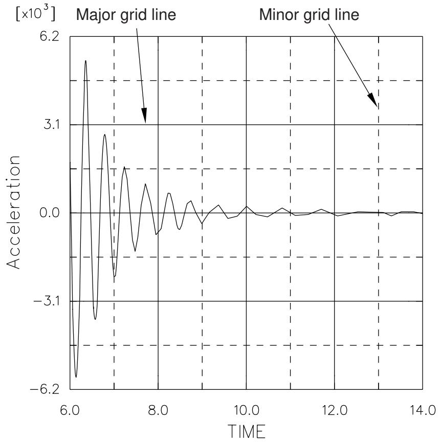  
Figure 1: X–Y plot with major and minor gridlines indicated.

If your X–Y plot uses multiple axes in the same direction, Abaqus/CAE draws gridlines only for the axes of the first curve in the plot.

The Grid Display options provide independent control over each of the four sets of gridlines; that is, independent control over the major and minor gridlines in either direction. You can display or hide any of the four sets, and you can modify the color, style, or thickness of the lines for any of the four sets of gridlines.


## Note:

Major gridlines originate from major tick marks, and minor gridlines originate from minor tick marks. To control the interval between gridlines, you must adjust the spacing of the tick marks.

1. Locate the axis Grid Display options.

Select Options->XY Options->Chart; or click , which is located with the X–Y plotting tools in the Visualization module toolbox. Click the Grid Display tab in the dialog box that appears.

2. Select one or more X–Y plots to customize from the Charts field.

3. From the X Gridlines options, toggle on the Major or Minor options to display major or minor vertical gridlines, respectively.

When either Major or Minor is on, gridline style, color, and thickness options become available for that type of gridline.

4. From the Y Gridlines options, toggle on Major or Minor to display major or minor horizontal gridlines, respectively.  
5. Repeat the following steps to customize the horizontal major and minor gridlines and the vertical major and minor gridlines:

a. Choose the color for the gridlines:

1. Click the color sample .

Abaqus/CAE displays the Select Color dialog box.

2. Use one of the methods in the Select Color dialog box to select a new color. For more information, see Customizing colors.  
3. Click OK to close the Select Color dialog box.

The selected gridlines change to the specified color.

b. Choose the line style:

1. Expand the style list to reveal the line style options (solid, dashed, etc.). The style list is the upper of the two unlabeled list options.  
2. From the style list, click the desired line style.

The selected gridlines change to the specified style.

c. Choose the line thickness:

1. Expand the thickness list to reveal the line style options (solid, dashed, etc.). The style list is the lower of the two unlabeled list options.  
2. From the thickness list, click the desired line thickness.

The selected gridlines change to the specified thickness.

6. Click Dismiss to close the Chart Options dialog box.

## Additional information

• Selecting one or more X–Y curves to customize

Click the Grid Display tab to access the Grid Area options for an X–Y plot. These options enable you to customize the grid in an X–Y plot, which is the rectangular area where the curves are plotted. You can wrap a border around the grid or fill the grid with a background color.


## Note:

You can also control border and background color settings for the entire X–Y plot, which includes the portion of the viewport covered by an X–Y plot's grid and all of its axes. Abaqus/CAE displays the background color for the grid on top of the background for the entire X–Y plot. For more information, see Customizing border and fill colors for an X–Y plot.

1. Locate the Grid Area options.

Select Options->XY Options->Chart; or click , which is located with the X–Y plotting tools in the Visualization module toolbox. Click the Grid Display tab in the dialog box that appears.

The Grid Area options are available at the bottom of the Grid Display page.

2. Select one or more X–Y plots from the top part of the window.  
3. Toggle on Show border to display a border around the entire grid area.  
4. If desired, change the color of the border by performing the following steps:

a. Click the color sample immediately to the right of the Show border label . Abaqus/CAE displays the Select Color dialog box.  
b. Use one of the methods in the Select Color dialog box to select a new color. For more information, see Customizing colors.  
c. Click OK to close the Select Color dialog box. The color sample and the grid border change to the selected color.

5. Toggle on Fill to fill the grid area with the color displayed to the right of the Fill label.  
6. If desired, change the grid area fill color by performing the following steps:

a. Click the color sample immediately to the right of the Fill label . Abaqus/CAE displays the Select Color dialog box.  
b. Use one of the methods in the Select Color dialog box to select a new color. For more information, see Customizing colors.  
c. Click OK to close the Select Color dialog box. The grid area changes to the selected color.

7. Click Dismiss to close the Chart Options dialog box.

## Additional information

• Customizing border and fill colors for an X–Y plot

## Customizing X–Y plot size and shape

Use the Size options in the Chart Options dialog box to customize the size and shape of the X–Y plot.

1. Locate the Chart Options.

Select Options->XY Options->Chart; or click , which is located with the X–Y plotting tools in the Visualization module toolbox. Click the Grid Position tab in the dialog box that appears.

2. From the Charts field, select one or more X–Y plots whose sizes or shapes you wish to customize.  
3. Select one of the following X–Y plot sizing and shaping options:

## Fit to chart

Abaqus/CAE fills the entire viewport with the selected X–Y plot, adjusting the shape of the plot to match the viewport dimensions.

## Square

The Size slider becomes available, which you can drag to increase or decrease the size of the square-shaped X–Y plot.

## Manual

The X and Y sliders become available, which you can drag to increase or decrease the size of the X–Y plot along either axis.

4. Click Dismiss to close the Chart Options dialog box.

## Additional information

• Selecting one or more X–Y curves to customize

Use the Position options in the Chart Options dialog box to customize the position of an X–Y plot in the viewport.

1. Locate the Position options.

Select Options->XY Options->Chart; or click , which is located with the X–Y plotting tools in the Visualization module toolbox. Click the Grid Position tab in the dialog box that appears.

2. From the Charts field, select one or more X–Y plots whose positions or shapes you wish to customize.  
3. Select one of the following X–Y plot positioning options:

## Auto-align

This option enables you to align the selected X–Y plot in one of nine positions in the viewport: its center, any of the four corners, or centered along any of the four edges. Expand the Alignment list, then select one of the options depicted graphically in the list.

## Manual

This option enables you to position the X–Y plot origin at a specific X–Y location in the viewport. Drag the X and Y sliders to move the lower left corner of the X–Y plot horizontally or vertically in the viewport. When these sliders' values are set to 0, the X–Y plot origin is placed in the lower left corner of the viewport.

4. Click Dismiss to close the Chart Options dialog box.

## Additional information

• Selecting one or more X–Y curves to customize

## Customizing the X–Y plot title

This section explains how you use the Plot Title Options dialog box to create a title for an X–Y plot and to customize the title's appearance and location in the viewport.

## In this section:

Customizing the contents of the X–Y plot title  
Customizing the location of the X–Y plot title  
Adding a bounding box and fill color for the X–Y plot title

Use the Text options in the Plot Title Options to create and display a custom title for an X–Y plot.

1. Locate the Text options for plot titles.

xxxx Select Options->XY Options->Plot Title; or click , which is located with the X–Y plotting tools in the Visualization module toolbox.

2. Click the Title tab, if it is not already selected.  
3. Select a title for the X–Y plot using one of the following methods:

• To display the default name of the X–Y plot, toggle on Use default.  
• To display a custom title, toggle off Use default, enter a title in the Title field, and press Enter.

4. Select the font of the plot title.

a. Click


Abaqus/CAE displays the Select Font dialog box.

b. Use one of the methods in the Select Font dialog box to select a new font, size, and style. For more information, see Customizing fonts.  
c. Click Apply to see the effect of your font selections.  
d. Click OK to close the Select Font dialog box.

The X–Y plot title changes to the selected font, size, and style.

5. Select a color for the X–Y plot title.

a. Click the color sample .

Abaqus/CAE displays the Select Color dialog box.

b. Use one of the methods in the Select Color dialog box to select a new color. For more information, see Customizing colors.  
c. Click OK to close the Select Color dialog box.

The plot title text changes to the selected color.

## Additional information

• Selecting one or more X–Y curves to customize

## Customizing the location of the X–Y plot title

Use the Position options in the Plot Title Options to place the X–Y plot title in a particular location in the viewport.

1. Locate the Position options.

xxxx Select Options->XY Options->Plot Title; or click , which is located with the X–Y plotting tools in the Visualization module toolbox. Click the Area tab from the dialog box that appears.

2. Toggle on Inset to display the plot title legend within the X–Y plot. If Inset is off, Abaqus/CAE keeps the plot title and the X–Y plot in separate bands of the viewport.  
3. Choose one of the following two methods for positioning the plot title:

## Auto-align

This option enables you to position the plot title in one of nine positions in the viewport: its center, any of the four corners, or centered along any of the four edges. Expand the Alignment list, then select one of the options depicted graphically in the list.

## Manual

This option enables you to position the plot title in a specific X–Y location in the viewport. Drag the X and Y sliders to move the title horizontally or vertically in the viewport. When both of these values equal 0, the plot title is positioned in the lower left corner of the viewport; when both values equal 100, the plot title is positioned in the upper right corner.

## Additional information

• Selecting one or more X–Y curves to customize

Use the Bounding Box options in the Plot Title Options to draw a rectangular box around the X–Y plot title or to fill the area behind the plot title with a background color.

1. Locate the Bounding Box options.

xxxx Select Options->XY Options->Plot Title; or click , which is located with the X–Y plotting tools in the Visualization module toolbox. Click the Area tab from the dialog box that appears. The Bounding Box options appear at the bottom of the dialog box.

2. Select one or more X–Y plots from the Charts field at the top of the dialog box.  
3. Perform the following steps to display and modify the bounding box:

a. Toggle on Show border to display a border around the legend.  
b. Select a color for the bounding box line.

1. Click the color sample .

Abaqus/CAE displays the Select Color dialog box.

2. Use one of the methods in the Select Color dialog box to select a new color. For more information, see Customizing colors.  
3. Click OK to close the Select Color dialog box.

The bounding box line changes to the selected color.

4. Control the bounding box fill color:

a. Toggle on Fill to display a background color in the bounding box.  
b. Select a fill color to display in the background of the bounding box.

1. Click the color sample

Abaqus/CAE displays the Select Color dialog box.

2. Use one of the methods in the Select Color dialog box to select a new color. For more information, see Customizing colors.  
3. Click OK to close the Select Color dialog box.

The bounding box background changes to the selected color.

## Additional information

• Selecting one or more X–Y curves to customize

## Customizing the appearance of the X–Y plot legend

This section explains how you use the Chart Legend Options dialog box to customize the appearance and contents of the legend for an X–Y plot. You can also display a title on the X–Y plot legend, and you can include on the legend a report of the minimum and maximum X–Y values.

## In this section:

Displaying or hiding the X–Y plot legend  
Customizing the title of the X–Y plot legend  
Adding minimum and maximum values to the X–Y plot legend  
Customizing the location of the legend  
Customizing the border and fill for the X–Y plot legend

The X–Y plot legend provides a key to associate each curve included in the plot with the X–Y data object that it represents. Each legend entry contains a line segment in the color and style shown in the plot. The legend entry also includes text stating, by default, the description of the X–Y data object represented by the curve. You can display or hide the legend using the Chart Legend Options.

1. Locate the Chart Legend Options.

Select Options->XY Options->Chart Legend; or click $\sharp { \left[ \begin{array} { l } { + + } \\ { + } \\ { + } \end{array} \right] } _ { \ell }$ , which is located with the X–Y plotting tools in the Visualization module toolbox.


Tip: You can also open this dialog box directly by double-clicking the legend in the viewport when an X–Y plot is displayed. You cannot select a component in an X–Y plot directly from the viewport when an active procedure is in effect; cancel the current procedure before selecting items from an X–Y plot.

2. Click the Contents tab, if it is not already selected.  
3. Toggle on Show legend to display the legend, or toggle it off to hide the legend.  
4. Click Dismiss to close the Chart Legend Options dialog box.

## Additional information

• Selecting one or more X–Y curves to customize

## Customizing the title of the X–Y plot legend

Use the Title options to display or hide a title for the X–Y plot legend and to customize its contents.

1. Locate the Text options.

Select Options->XY Options->Chart Legend; or click , which is located with the X–Y plotting tools in the Visualization module toolbox.


Tip: You can also open this dialog box directly by double-clicking the legend in the viewport when an X–Y plot is displayed. You cannot select a component in an X–Y plot directly from the viewport when an active procedure is in effect; cancel the current procedure before selecting items from an X–Y plot.

The Text options for the legend appear in the lower half of the Contents page.

2. From the Charts field, select one or more X–Y plots whose legends you wish to customize.


## Note:

To make an X–Y curve available for selection, you must first plot it.

3. Click the Contents tab, if it is not already selected.  
4. If desired, enter a title for the X–Y plot legend in the Title field.  
5. Select the font of the X–Y plot legend title.

a. Click


Abaqus/CAE displays the Select Font dialog box.

b. Use one of the methods in the Select Font dialog box to select a new font, size, and style. For more information, see Customizing fonts.  
c. Click Apply to see the effect of your font selections.  
d. Click OK to close the Select Font dialog box.

The X–Y plot legend title changes to the selected font, size, and style.

6. Select the color of the X–Y plot legend title.

a. Click the color sample .

Abaqus/CAE displays the Select Color dialog box.

b. Use one of the methods in the Select Color dialog box to select a new color. For more information, see Customizing colors.  
c. Click OK to close the Select Color dialog box.

The X–Y plot legend title text changes to the selected color.

7. Click Dismiss to close the Chart Legend Options dialog box.

## Additional information

• Selecting one or more X–Y curves to customize

You can include on the plot legend a report of the minimum and maximum X–Y values in the plot, and you can customize the format and precision of these values.

1. Locate the Chart Legend Options.

Select Options->XY Options->Chart Legend; or click , which is located with the X–Y plotting tools in the Visualization module toolbox.


Tip: You can also open this dialog box directly by double-clicking the legend in the viewport when an X–Y plot is displayed. You cannot select a component in an X–Y plot directly from the viewport when an active procedure is in effect; cancel the current procedure before selecting items from an X–Y plot.

2. From the Charts field, select one or more X–Y plots whose legends you wish to customize.  
3. Click the Contents tab, if it is not already selected.  
4. Toggle on Show min/max to report the minimum and maximum X–Y values in the legend.  
5. Select one of the following number formats for the minimum and maximum values displayed in the legend:

## Automatic

Very large values and very small values are expressed in scientific format. All remaining values are expressed with no exponent and using the specified number of significant digits.

## Decimal

All values are expressed with no exponent and using the specified number of significant digits.

## Engineering

Values greater than or equal to 1000 (or values less than or equal to 0.001) are expressed as a number ranging from 1 to 999 that is multiplied by 10 to the nth power, where n is a product of 3 (for example, 20.5E+03 or 17.76E+06). All remaining values are expressed using the specified number of significant digits.

## Scientific

All values are expressed as a number between 1 and 10 that is multiplied by an appropriate power of 10 (for example, 2.05E+04 or 1.776E+07).

6. Click the Precision arrows to specify the desired number of significant digits (for non-decimal formats) or decimal places (for decimal format) in each label.  
7. Click Dismiss to close the Chart Legend Options dialog box.

## Additional information

• Selecting one or more X–Y curves to customize

## Customizing the location of the legend

You can move the X–Y plot legend by dragging it around the viewport or by specifying a viewport location from the Position options in the Chart Legend Options dialog box. You can drag the legend only when Abaqus/CAE does not have a procedure active; if you cannot drag the legend or select any other X–Y plot components from the viewport, cancel the current procedure.

1. Locate the Chart Legend Options.

Select Options->XY Options->Chart Legend; or clic k , which is located with the X–Y plotting tools in the Visualization module toolbox.


Tip: You can also open this dialog box directly by double-clicking the legend in the viewport when an X–Y plot is displayed. You cannot select a component in an X–Y plot directly from the viewport when an active procedure is in effect; cancel the current procedure before selecting items from an X–Y plot.

2. From the Charts field, select one or more X–Y plots whose legends you wish to move.  
3. Click the Area tab, if it is not already selected.  
4. Toggle on Inset to display the X–Y plot legend within the X–Y plot grid. If Inset is off, Abaqus/CAE keeps the legend and the X–Y plot in separate bands of the viewport.  
5. Select one of the following positioning options:

## Auto-align

This option enables you to align the legend in one of nine positions in the viewport: its center, any of the four corners, or centered along any of the four edges. Expand the Alignment list, then select one of the options depicted graphically in the list.

## Manual

This option enables you to position the legend at a specific X–Y location in the viewport. Drag the X and Y sliders to move the legend horizontally or vertically in the viewport. When these sliders' values are set to 0, the legend is placed in the lower left corner of the viewport.

6. Click Dismiss to close the Chart Legend Options dialog box.

## Additional information

• Selecting one or more X–Y curves to customize

Use the Bounding Box options in the Chart Legend Options dialog box to customize the appearance of the legend by wrapping it with a border or filling it with a specified color.

1. Locate the Chart Legend Options.

Select Options->XY Options->Chart Legend; or click , which is located with the X–Y plotting tools in the Visualization module toolbox.


Tip: You can also open this dialog box directly by double-clicking the legend in the viewport when an X–Y plot is displayed. You cannot select a component in an X–Y plot directly from the viewport when an active procedure is in effect; cancel the current procedure before selecting items from an X–Y plot.

2. From the Charts field, select one or more X–Y plots whose legends you wish to customize.


## Note:

To make an X–Y curve available for selection, you must first plot it.

3. Click the Area tab, if it is not already selected.  
4. Perform the following steps to display and modify the bounding box:

a. Toggle on Show border to display a border around the legend.  
b. Select a color for the bounding box line.

1. Click the color sample .

Abaqus/CAE displays the Select Color dialog box.

2. Use one of the methods in the Select Color dialog box to select a new color. For more information, see Customizing colors.  
3. Click OK to close the Select Color dialog box.

The bounding box line changes to the selected color.

5. Control the bounding box fill color:

a. Toggle on Fill to display a background color in the bounding box.  
b. Select a fill color to display in the background of the bounding box.

1. Click the color sample .

Abaqus/CAE displays the Select Color dialog box.

2. Use one of the methods in the Select Color dialog box to select a new color. For more information, see Customizing colors.  
3. Click OK to close the Select Color dialog box.

The bounding box background changes to the selected color.

6. Click Dismiss to close the Chart Legend Options dialog box.

## Additional information

• Selecting one or more X–Y curves to customize

## Customizing border and fill colors for an X–Y plot

Use the options in the Plot Options dialog box to create a custom border color and a custom background fill color for one or more X–Y plots in your session. By default, X–Y plots have no border and they are filled with a light grey background color. You might want to adjust the border color to distinguish between different X–Y plots used in an overlay plot; you might want to adjust the fill color if the X–Y curves used in your plot do not stand out clearly against the default background.


1. Select Options->XY Options->Plot Options; or click , which is located with the X–Y plotting tools in the Visualization module toolbox.

The Plot Options dialog box opens.

2. From the Plots frame, highlight one or more X–Y plots that you want to modify. This frame lists plot names and the viewports in which they are displayed.  
3. Toggle on Show border to display a border around the X–Y plot.  
4. If desired, change the color of the X–Y plot border by performing the following steps:

a. Click the color sample immediately to the right of the Show border label .

Abaqus/CAE displays the Select Color dialog box.

b. Use one of the methods in the Select Color dialog box to select a new color. For more information, see Customizing colors.  
c. Click OK to close the Select Color dialog box.

The color sample and the X–Y plot border change to the selected color.

5. Toggle on Fill to fill the X–Y plot with the color displayed to the right of the Fill label.  
6. If desired, change the X–Y plot fill color by performing the following steps:

a. Click the color sample immediately to the right of the Fill label .

Abaqus/CAE displays the Select Color dialog box.

b. Use one of the methods in the Select Color dialog box to select a new color. For more information, see Customizing colors.  
c. Click OK to close the Select Color dialog box.

The X–Y plot fill color changes to the selected color.

## Viewing results along a path

A path is a series of connected lines that you define by specifying a series of points or edges through your model. You can view results along the path in the form of an X–Y plot. This chapter explains how to view results along a path.

## In this section:

Understanding results along a path  
Creating a path through your model  
Obtaining X–Y data along a path

## Understanding results along a path

To view results along a path through your model, you first select Tools->Path to specify the path and then select Tools->XY Data to obtain X–Y data along the path.

## In this section:

Path specification  
How Abaqus/CAE obtains results along a path

## Path specification

A path is a line you define by specifying a series of points or line segments through your model. The points can be nodes or coordinate locations; the line segments can be element edges or lines joining the ends of element edges. Paths can cross more than one part instance. Abaqus/CAE offers four distinct types of paths:

## Node list

The points making up the path consist of nodal locations only. You specify the points using node labels and node label ranges. A node label is a persistent means of referring to a given node; that is, node labels do not change as your model deforms. Because of this, the node labels that comprise a node list path are equally applicable to the undeformed or the deformed model shape. However, node labels are part instance-specific. In other words, you can have the same node label for multiple part instances; therefore, you must specify to which part instance you are referring when you use node labels. For more information, see Creating or editing a node list path.

## Point list

The points making up the path consist of coordinate locations within your model. These locations may or may not coincide with nodal locations. Point list coordinates remain fixed in space and are independent of your model. For example, coordinates that coincide with a nodal location on the undeformed shape may not coincide with any location on the deformed shape. By the same logic, point list coordinates are independent of specific part instances. For more information, see Creating or editing a point list path.

## Edge list

The points making up the path consist of edges that connect nodes within your model. You specify the edges by selecting individual element edges from the viewport or by selecting the starting edge and direction and allowing Abaqus/CAE to automatically complete the path to the end of the feature edge or to an endpoint that you select. Edges are defined by the elements in the model. Because of this, the edges that comprise an edge list path are equally applicable to the undeformed or the deformed model shape. However, element labels are part instance-specific. In other words, you can have the same element label for multiple part instances; therefore, you must specify to which part instance you are referring when you use edges. For more information, see Creating or editing an edge list path.

## Circular

The points making up the path consist of coordinate locations within your model. You can create two types of circular paths in Abaqus/CAE: circumferential and radial. A circumferential path lies along the edge of a circle or an arc; a radial path lies along a radius. You specify either type of path by selecting coordinates that define a circle or circular arc and then defining the starting point, ending point, and number of points along the path. Once you have defined the original circle or arc, you can select a new radius length to create any path that shares the same center point as the original. You can use circumferential paths to obtain cross-sectional results in a curved portion of a model, as shown in Figure 1.

  
Figure 1: A circumferential path.

You can use radial paths to obtain results spanning from the inner to the outer face of a curve, as shown in Figure 2; radial paths are ideal for use in stress linearization (for more information on stress linearization, see Calculating linearized stresses).

  
Figure 2: A radial path.

You can select coordinates by picking nodes from the viewport or by entering values in the prompt area; in either case, the coordinates remain fixed in space and are independent of your model. For example, coordinates that coincide with a nodal location on the undeformed shape may not coincide with any location on the deformed shape. By the same logic, circular path coordinate definitions are independent of specific part instances. For more information, see Creating or editing a circular path.

Abaqus/CAE forms the path by connecting the nodes, points, or edges that you specify in the order you have given.

After you create a path, you can select Tools->Path from the main menu bar to edit, copy, rename, delete, or plot it. Plotting the path itself is a means to verify visually that you have specified the intended line; to view results along the path, you must form X–Y data pairs and produce an X–Y plot. For more information on managing paths, see Managing objects using manager dialog boxes; for more information on producing an X–Y plot of path data, see Obtaining X–Y data along a path.

## How Abaqus/CAE obtains results along a path

Abaqus/CAE obtains results along a path in the form of X–Y data pairs.

Abaqus determines the data pair X-values based on the points that make up the path. These points define model locations at which to obtain data. Abaqus determines the data pair Y-values based on analysis results at those model locations.

Abaqus/CAE considers only the entities in the current display group when calculating the data pairs.

## Path data X-values

You can choose to form X-values based only on the points you have specified for the path or to additionally include all locations at which the path intersects the model. (An intersection occurs where the path crosses an element face, element edge, surface face, or surface edge. You can omit individual intersections from the path definition if the intersection lies within a user-specified distance of an actual data point. You can set this intersection tolerance value using Abaqus Scripting Interface commands; for more information, see Session object.)

You can also choose whether Abaqus/CAE interprets the points that make up the path as locations on the undeformed or the deformed model shape. When the deformed model shape is chosen, Abaqus/CAE computes the deformed coordinates at a node as the sum of the base coordinates and the deformation at that node multiplied by the viewport-specific deformation scale factor. Node list labels and edge lists indicate model locations and are equally applicable to the undeformed or the deformed model shape. Point list and circular path coordinates are fixed locations independent of the model geometry. Abaqus does not form data pairs for points that do not coincide with the model shape you have chosen.

The node labels or point coordinates that comprise a path are usually not in a form suitable for direct use as X-values. Abaqus/CAE offers several options for you to convert this series of points to useful X-values and subsequent X–Y plot axis labels. You can choose one of the following options to convert path points to X-values:

• True distance: X-values correspond to each point's actual distance along the path in model space coordinates, starting with zero.  
• Normalized distance: X-values correspond to each point's distance along the path as a fraction of the total length of the path.  
• Sequence ID: X-values correspond to the order in which each point occurs in the path result list.  
• X, Y, or Z distance: X-values correspond to each point's actual distance along the path in the single coordinate direction you specify, starting with zero. This option is particularly useful for generating a plot of results versus radius in an axisymmetric model.  
• X, Y, or Z coordinate: X-values correspond to each point's distance from the origin along the axis you specify.

## Path data Y-values

You can control data pair Y-values by choosing the results step, frame, and field output variable for which Abaqus/CAE obtains results and by controlling how Abaqus/CAE computes certain types of results, as follows:

• For node-based field output variables such as displacement to be obtained at nodal locations, Abaqus/CAE reads results directly from the output database with no further computations.  
• For element-based field output variables such as stress or strain to be obtained at nodal locations, Abaqus/CAE reads results from the output database, extrapolates those values to the nodes, then conditionally averages multiple contributions according to options you select.  
• For both node-based and element-based variables to be obtained at path points that do not coincide with nodal locations, Abaqus/CAE computes values by interpolating from the nodes to the requested location using a geometric approximation of the element's shape. You cannot control this computation.

The averaging options for element-based variables and the complex form options for complex number values are located in the Result Options dialog box. Averaging reduces multiple contributions into a single value. When you select result options to partially or fully suppress averaging, path points receiving multiple contributions produce multiple data pairs. Such data pairs share the same X-value but have a separate Y-value for each contribution. Depending on your path and on the characteristics of your model, the following techniques may be necessary to avoid multiple data pairs sharing the same X-value:

• Set result options to fully enable averaging.  
• Set result options to ignore region boundaries when computing values.  
• Avoid paths that traverse region discontinuities.  
• Avoid paths along a line separating discontinuous regions.  
• Use display groups to isolate individual regions prior to obtaining results along a path.  
• Avoid point list paths that traverse one or more spatial points that lie visually outside of highly deformed elements and cylindrical elements that subtend a large angle but, due to isoparametric mapping, lie mathematically inside the elements. Such spatial points tend to be shared by two or more elements, leading to multiple Y-values.

For more information on value averaging, see Understanding result value averaging.

The Y-value of the data pairs is affected by the current complex form if your selected field output variable contains complex number results. An abbreviation of the complex form is appended to the Y-axis title when you plot the path. For example, if S-Mises is the selected field output variable and Magnitude is the complex form, the Y-axis title is S-Mises CPX:Mg. Other complex forms are similarly abbreviated. For more information on complex forms, see Controlling the form of complex results.

Abaqus/CAE does not form data pairs for points that do not have results for the specified step, frame, or field output variable.

## Creating a path through your model

A path is a line you define by specifying a series of points or line segments through your model; the points can be nodes or coordinate locations, the line segments can be element edges or lines joining the ends of element edges.

## In this section:

Creating or editing a node list path  
Creating or editing a point list path  
Creating or editing an edge list path  
Creating or editing a circular path

## Creating or editing a node list path

A path is a line you define by specifying a series of points through your model. In a node list path all of the points are nodal locations.

For information on including locations other than nodes in a path, see Creating a path through your model.

You create a node list path by entering part instance names, node labels, and node label ranges into a table. You can use the editing techniques described in the following procedures to create a path by selecting nodes directly from the viewport or from node sets. Alternatively, you can create a node list path by entering values directly into the table. If you do not know the part instance names in the model, use the Query toolset to query nodes in the viewport. To help determine node labels of interest, you may want to produce a model plot with node symbols and node numbers visible prior to creating the path. For more information, see Customizing model labels.

1. Locate the path creation and editing options.

Use the following techniques to create or edit a node list path:

Create a new path

a. From the main menu bar, select Tools->Path->Create. The Create Path dialog box appears.  
b. Abaqus/CAE displays a default name for the path in the Name text field. To provide a more meaningful name, replace this default with the name of your choice (including blank spaces if you wish).  
c. In the Create Path dialog box, click Node list; then click Continue.

Edit an existing path

a. From the main menu bar, select Tools->Path->Edit. From the menu that appears, select the path you want to edit.


Tip: You can also use the Path Manager to edit a path. From the main menu bar, select Tools->Path->Manager to display the manager. Select the path you want to edit, and click Edit from the buttons on the right side of the manager.

The Edit Node List Path dialog box appears.

2. Specify the nodes along your path.

Use any of the following techniques:

Select the nodes directly from the viewport

a. Click Add Before or Add After to begin making Viewport selections.

Abaqus/CAE prompts you to Select nodes to be inserted into the path and closes the Edit Node List Path dialog box.

b. Select one or more nodes from the viewport (for more information, see Selecting objects within the viewport). If a desired node exists in more than one part instance, toggle off the Select the Entity Closest to the Screen tool in the Selection toolbar. If you make an ambiguous selection, the part instance name and node label will appear in the lower left corner of the viewport in the form Highlighting Node Instance.Node. Use the Next and Previous buttons to cycle through the possible selections, and click OK to confirm your selection.

Abaqus/CAE highlights the nodes as you select them and displays the node labels and the path connectivity.


## Note:

You can only select nodes that are in the current display group.

c. Click Done in the prompt area when you have finished.

Abaqus/CAE displays the Edit Node List Path dialog box; the part instances and nodes in your path are listed in the path definition table.

d. If desired, repeat the preceding steps to add additional nodes.

The Add Before and Add After buttons determine where your selections will be added in relation to the currently highlighted line in the path definition table.

Select the nodes from a node set

a. Click Add Before or Add After to begin making Node set selections.

The Select Node Sets dialog box displays the node sets available in the current output database in the table on the left side.

b. To limit the list for easier selection, type a filter pattern into the Filter field, and press [Enter] to apply the filter.

Abaqus/CAE lists only those node sets that meet your specification.

c. From the list of node sets, select one or more node sets to include in the path.

Use the top two arrows in the middle of the dialog box to move the selected node sets into or out of the table on the right side of the dialog box.  
• Use the bottom two arrows in the middle of the dialog box to move all of the node sets into or out of the table on the right side of the dialog box.

d. Click OK when you have completed your selection.

Abaqus/CAE displays the Edit Node List Path dialog box; the part instances and nodes in your path are listed in the path definition table.

e. If desired, repeat the preceding steps to add additional nodes.

The Add Before and Add After buttons determine where your selections will be added in relation to the currently highlighted line in the path definition table.

Enter the node labels directly into the table

a. In the Path Definition table, use standard keyboard and mouse editing techniques to insert, modify, or delete part instance names and node label expressions. If you do not know the part instance names in the model, use the Query toolset to query nodes in the viewport. For special table editing options or to read data from an ASCII file, press mouse button 3. (For more information, see Entering tabular data.) A node label expression is either of the following:

• A single node label; for example, 5.  
• A range of nodes that you specify with a starting and ending node label optionally followed by an increment; for example, 5:10 or 5:10:2.


## Note:

If you read node labels from an ASCII file, you must read the table values starting with the first column, and each row must include a part instance name and a node label expression. The part instance name is case sensitive and must be enclosed in quotation marks as follows:“INSTANCE\_NAME”

b. After each node label expression, press [Enter].

Abaqus highlights all nodes included in the path and displays the node labels and the path connectivity.

3. When you are done selecting nodes, click OK.

If you created a new path, Abaqus/CAE adds the path name to the Path Manager list. By default, Abaqus/CAE saves the path you have specified for the duration of the session. If you want to retain a path for use in subsequent sessions, save it to an XML file, to the model database, or to an output database; for more information, see Managing session objects and session options.

## Additional information

• Understanding results along a path  
• Obtaining X–Y data along a path

## Creating or editing a point list path

A path is a line you define by specifying a series of points through your model. In a point list path all of the points are model coordinate locations. These locations may or may not coincide with nodes.

For information on alternative forms of path specification, see Creating a path through your model.

You create a point list path by entering the coordinates of points into a table. For points that coincide with nodal locations, you can specify the node label or select the node in the viewport and Abaqus will enter the undeformed coordinates of the node into the table. You can also select a node list path to enter nodal coordinates into the table. To help determine which node labels are of interest, you may want to produce a model plot with node symbols and node numbers visible prior to creating the path. For more information, see Customizing model labels.

1. Locate the path creation and editing options.

Use the following techniques to create or edit a point list path:

Create a new path

a. From the main menu bar, select Tools->Path->Create. The Create Path dialog box appears.  
b. Abaqus displays a default name for the path in the Name text field. To provide a more meaningful name, replace this default with the name of your choice (including blank spaces if you wish).  
c. In the Create Path dialog box, click Point list; then click Continue.

Edit an existing path

a. From the main menu bar, select Tools->Path->Edit. From the menu that appears, select the path you want to edit.


Tip: You can also use the Path Manager to edit a path. From the main menu bar, select Tools->Path->Manager to display the manager. Select the path you want to edit, and click Edit from the buttons on the right side of the manager.

The Edit Point List Path dialog box appears.

2. In the Point Coordinates table, use standard keyboard and mouse editing techniques to enter, modify, or delete coordinates.

To enter coordinates, use any of the following techniques:

Type in the coordinate values of a point

a. Specify the values as X-, Y-, Z-coordinates separated by spaces or commas; for example, 1.0, 3.4, 2.0.

b. Press [Enter].

Include the coordinates of a nodal location by querying the node

a. Select Node query.

b. Choose the part instance for which you want to determine nodal coordinates. Click the arrow next to the Part instance field to see a list of the available part instances.

To obtain the coordinates of a node, do one of the following:

• Type the node label into the Node label field, and press [Enter] or click Query.

• Click Select from Viewport , and select a node.

Abaqus displays the undeformed X-, Y-, and Z-coordinates of the node.

c. To enter these coordinates into the path definition table before, after, or at the currently highlighted row, click Add Before, Add After, or Replace, respectively.

For special table editing options or to read data from an ASCII file, press mouse button 3. (For more information, see Entering tabular data.)

Include the coordinates of nodes from a node list path

a. Select Node list path.  
b. Choose the node path list from which you want to enter the nodal coordinates. Click the arrow next to the Node list path field to see a list of the available paths.  
c. To enter these coordinates into the path definition table before, after, or at the currently highlighted row, click Add Before, Add After, or Replace, respectively.

On the model plot in the current viewport, Abaqus highlights all points included in the path and displays the path connectivity.

3. When you are done, click OK.

If you created a new path, Abaqus/CAE adds the path name to the Path Manager list. By default, Abaqus/CAE saves the path you have specified for the duration of the session. If you want to retain a path for use in subsequent sessions, save it to an XML file, to the model database, or to an output database; for more information, see Managing session objects and session options.

## Additional information

• Understanding results along a path  
• Obtaining X–Y data along a path

## Creating or editing an edge list path

A path is a line you define by specifying a series of line segments in your model. In an edge list path the segments are defined by element edges and lines joining the ends of element edges.

For information on including locations other than edges in a path, see Creating a path through your model.

You create an edge list path by entering part instance names and edge labels into a table. Each edge label consists of an element number, a face number, an edge number, and a direction along the edge. Select edges from the viewport for entry into the table using a combination of three methods:

• Select individual element edges.  
• Select an element edge and a direction along a feature edge and let Abaqus/CAE automatically add the remaining edges up to one end of the feature.  
• Select an element edge and a node and let Abaqus/CAE choose a shortest distance path along the element edges between them.

You can also edit the table directly, using the viewport to track your progress. However, some components of the edge labels depend on the element type, orientation, and desired connectivity, which are more easily determined by making selections from the viewport.

1. Locate the path creation and editing options.

To create a new path:

a. From the main menu bar, select Tools->Path->Create. The Create Path dialog box appears.  
b. Abaqus displays a default name for the path in the Name text field. To provide a more meaningful name, replace this default with the name of your choice (including blank spaces if you wish).  
c. In the Create Path dialog box, click Edge list; then click Continue.

To edit an existing path:

a. From the main menu bar, select Tools->Path->Edit. From the menu that appears, select the path you want to edit.


Tip: You can also use the Path Manager to edit a path. From the main menu bar, select Tools->Path->Manager to display the manager. Select the path you want to edit, and click Edit from the buttons on the right side of the manager.

The Edit Edge List Path dialog box appears.

2. To create or edit a path by selecting edges in the viewport, click Add Before or Add After to begin making selections.

Abaqus/CAE prompts you to Select edges to be inserted into the path and closes the Edit Edge List Path dialog box.

3. Use the selection methods in the prompt area to select edges. Three edge selection methods are available:

## Individually

Select individual element edges in the order that they should appear in the path; the selected edges need not be adjacent. If necessary, click Flip in the prompt area to reverse the connectivity of the last edge that you selected.

## By feature edge

Select a starting edge that lies along a feature edge; Abaqus/CAE will automatically select all the edges between your selection and the end of the feature edge. Click Flip to reverse the connectivity of the edge that you selected and the direction used for automatic selection.

## By shortest distance

Select a starting edge and an endpoint (node); Abaqus/CAE will automatically select the element edges that define the shortest path between your selections. Click Flip to reverse the connectivity of the edge that you selected and the direction used for automatic edge selection. If multiple routes exist with the same distance, Abaqus/CAE selects one of them.


## Note:

The edge and node that you select must be on the same part instance.

If a desired edge exists in more than one part instance, toggle off the Select the Entity Closest to the Screen tool in the Selection toolbar. If you make an ambiguous selection, the part instance name and edge label (without the direction value) will appear in the lower-left corner of the viewport in the form Highlighting Element Edge Element.Face.Edge. Use the Next and Previous buttons to cycle through the possible selections, and click OK to confirm your selection.

Abaqus highlights the edges as you select them and displays the node labels and the path connectivity. In addition, Abaqus labels the first node in the path Start and the last node in the path End.

4. Click Done in the prompt area when you have finished.

Abaqus/CAE displays the Edit Edge List Path dialog box; the part instances and edges in your path are listed in the path definition table.

5. If desired, repeat the preceding steps to add additional edges.

The Add Before and Add After buttons determine where your selections will be added in relation to the currently highlighted line in the path definition table.

6. If desired, you can use standard keyboard and mouse editing techniques to insert, modify, or delete part instance names and edge labels in the Path Definition table. Edge labels are of the form (element number, face number, edge number, direction).


Tip: Use the Query toolset to query nodes in the viewport to obtain part instance names. Display element and face labels in the viewport using the plot state-independent options. (For more information, see Customizing model labels.) Edges are numbered counterclockwise around a face as viewed from outside the element. The direction (−1 or 1) depends on your desired path connectivity.

For special table editing options or to read data from an ASCII file, press mouse button 3. (For more information, see Entering tabular data.)

7. After editing the Path Definition table, press [Enter].

Abaqus updates the path displayed in the viewport.

8. When you are done selecting edges, click OK.

If you created a new path, Abaqus/CAE adds the path name to the Path Manager list. By default, Abaqus/CAE saves the path you have specified for the duration of the session. If you want to retain a path for use in subsequent sessions, save it to an XML file, to the model database, or to an output database; for more information, see Managing session objects and session options.

## Additional information

• Understanding results along a path  
• Obtaining X–Y data along a path

A path is a line you define by specifying a series of points through your model. In a circular path, all of the points are model coordinate locations that lie on the circumference or along a radius of a circle. For information on alternative forms of path specification, see Creating a path through your model.

You create a circular path by selecting nodes or entering coordinates to define the circle. After you define the circle, you use the circle's edge or a radius to define either a curved circumferential path or a straight radial path.

1. Locate the path creation and editing options.

To create a new path:

a. From the main menu bar, select Tools->Path->Create. The Create Path dialog box appears.  
b. Abaqus displays a default name for the path in the Name text field. To provide a more meaningful name, replace this default with the name of your choice (including blank spaces if you wish).  
c. In the Create Path dialog box, click Circular; then click Continue.

To edit an existing path:

a. From the main menu bar, select Tools->Path->Edit. From the menu that appears, select the path you want to edit.


Tip: You can also use the Path Manager to edit a path. From the main menu bar, select Tools->Path->Manager to display the manager. Select the path you want to edit, and click Edit from the buttons on the right side of the manager.

The Edit Circular Path dialog box appears.

2. Select the path type, Circumferential or Radial.

Abaqus/CAE updates the dialog box to reflect the type of path you are creating. A Circumferential Path lies along the edge of the circle and requires a radius, a start angle, and an end angle to define its position and length. A Radial Path lies along a radius of the circle and requires a radial angle, a start value, and an end value to define its position and length.

3. In the Circle Definition portion of the dialog box, select Origin and axis or 3 Points on Arc as the method to define the circle.

The origin and axis method uses two points to define the axis of rotation and one point in the plane of the circle to define the default radius length and the starting point of rotation. The three points on arc method fits a circle to three edge points.

4. Click Select from Viewport to select nodes or enter coordinates to define the circle.

Abaqus/CAE closes the Edit Circular Path dialog box and displays prompts in the prompt area to guide you through the procedure.

5. Select nodes from the viewport or use the text field in the prompt area to specify each point as X-, Y-, Z-coordinates separated by spaces or commas; for example, 1.0, 3.4, 2.0.

Abaqus/CAE opens the Edit Circular Path dialog box; the coordinates that you selected appear in the circle definition table. If you selected nodes, the coordinates used correspond to the current deformation state of the model.

On the model plot in the current viewport, Abaqus highlights all points included in the path and displays the path connectivity.

6. You can edit a single point in the Circle Definition as follows:

a. Position the cursor over the coordinates of the point.  
b. Click mouse button 3, and choose Edit selection.  
c. Select a node in the viewport, or edit the coordinates in the prompt area.

When you make your selection or enter the new coordinates, Abaqus/CAE returns to the Edit Circular Path dialog box and displays the redefined circle in the viewport.

7. Select the number of segments to include in the path.

Abaqus/CAE modifies the path in the viewport to show the selected number of equal length segments.

8. Complete the editing or creation of the circular path as follows:

## Circumferential paths

Select the Radius, and select the Start angle and End angle of rotation. By default, Abaqus uses the radius of the circle that you defined and rotates a full 360° starting at the first point that you selected on the circle—the only point on the circle if you chose the origin and axis method.

## Radial paths

Select the Radial Angle, Start Radius, and End Radius. The default radial angle (0°) is from the center to the first point that you selected on the circumference of the circle—the only point on the circle if you chose the origin and axis method. The default starting radius is 0.0 (the center of the circle), and the default end radius is equal to the radius of the circle.

9. When you are done, click OK.

If you created a new path, Abaqus/CAE adds the path name to the Path Manager list. By default, Abaqus/CAE saves the path you specified for the duration of the session. If you want to retain a path for use in subsequent sessions, save it to an XML file, to the model database, or to an output database; for more information, see Managing session objects and session options.

## Additional information

• Understanding results along a path  
• Obtaining X–Y data along a path

## Obtaining X–Y data along a path

This section explains how to obtain X–Y data along a path.

## In this section:

Choosing the path locations at which to obtain data  
Controlling data pair X-values  
Controlling data pair Y-values

## Choosing the path locations at which to obtain data

Abaqus/CAE obtains results along a path in the form of X–Y data pairs. The data pair X-values define the model locations at which to obtain data; the Y-values are analysis results at those locations.

Abaqus considers only the entities in the current display group when calculating the data pairs.

Abaqus calculates the data pair X-values based on the points you have specified for the path. You can choose to form X-values based only on the points you have specified or to additionally include all locations at which the path intersects the model. (An intersection occurs where the path crosses an element face, element edge, surface face, or surface edge.)

You can also choose whether Abaqus interprets the points that make up the path as locations on the undeformed or the deformed model shape. For node list paths, the node labels that constitute the path are equally applicable to undeformed and deformed model shapes. However, point list path coordinates remain fixed in space and are independent of your model. For example, coordinates that coincide with a nodal location on the undeformed shape may not coincide with any location on the deformed shape. Values obtained using point list path coordinates and the deformed model are affected by the deformation scale factor. Abaqus does not form data pairs for coordinate locations that do not coincide with your model.

1. Locate the XY Data from Path options. From the main menu bar, select Tools->XY Data->Create. From the dialog box that appears, select Path; then click Continue. The XY Data from Path dialog box appears.  
2. Click the Path arrow to select the path for which to obtain data. The model plot in the current viewport changes to highlight the path you have selected.  
3. Click the Undeformed or Deformed to choose whether Abaqus interprets the points that make up the path as locations on the undeformed or the deformed model shape, respectively.  
4. Select Project onto mesh and specify a tolerance to obtain data from point locations that do not lie on or inside the mesh.

Path points or interpolated locations that lie between path points are projected onto an element face in the mesh. If the projected distance is less than the specified tolerance, data are extracted from the projected location. This option has no effect on one-dimensional elements (such as beams) and surface variables (such as CPRESS).

5. From the Point Locations options, choose either of the following:

Select Path points to obtain data only at the points that make up the path. You can obtain X–Y data at locations where the path intersects the model as well as at the points that make up the path by toggling on Include intersections.  
Select Uniform spacing to obtain data at regular, interpolated intervals along the path, but not necessarily at the points that comprise the path definition. You can change the value specified in the Number of intervals field to increase or decrease the number of locations for which interpolated data are obtained along the path.

6. To evaluate and display the data, click Plot.

An X–Y plot appears in the current viewport. The plot represents the data you have configured in the dialog box, which Abaqus considers temporary data whether or not you have clicked Save As to save it.

7. To save the data you have configured, click Save As.


## Note:

To plot your saved X–Y data object, select Tools->XY Data->Plot from the main menu bar and choose the X–Y data object from the pull-right menu.

8. When you have finished, click Cancel to close the dialog box.

## Additional information

• Understanding results along a path  
• Creating a path through your model  
• Controlling data pair X-values  
• Controlling data pair Y-values  
• X–Y plotting

## Controlling data pair X-values

Abaqus obtains results along a path in the form of X–Y data pairs, calculating the data pair X-values based on the points you have specified for the path and optionally on additional points where your path intersects the model. For more information, see Choosing the path locations at which to obtain data.

The node labels or point coordinates that comprise a path are usually not in a form suitable for direct use as X-values. Abaqus offers several options for you to convert this series of points to useful X-values and subsequent X–Y plot axis labels.

1. Locate the XY Data from Path options.

From the main menu bar, select Tools->XY Data->Create. From the dialog box that appears, select Path; then click Continue. The XY Data from Path dialog box appears.

2. At the top of the dialog box, click the Path arrow to select the path for which to obtain data.

The model plot in the current viewport changes to highlight the path you have selected.

3. In the X-Values field, choose one of the following options to convert path points to X-values:

• True distance: X-values correspond to each point's actual distance along the path in model space coordinates, starting with zero.  
• Normalized distance: X-values correspond to each point's distance along the path as a fraction of the total length of the path.  
• Sequence ID: X-values correspond to the order in which each point occurs in the path result list.  
X, Y, or Z distance: X-values correspond to each point's actual distance along the path in the single coordinate direction you specify, starting with zero. This option is particularly useful for generating a plot of results versus radius in an axisymmetric model.  
• X, Y, or Z coordinate: X-values correspond to each point's distance from the origin along the axis you specify.

4. To evaluate and display the data, click Plot.

An X–Y plot appears in the current viewport. The plot represents the data you have configured in the dialog box, which Abaqus considers temporary data whether or not you have clicked Save As to save it.

5. To save the X–Y data pairs you have configured as an X–Y data object , click Save As.


## Note:

To plot your saved X–Y data object, select Tools->XY Data->Plot from the main menu bar and choose the X–Y data object from the pull-right menu.

6. When you have finished, click Cancel to close the dialog box.

## Additional information

• Understanding results along a path  
• Controlling data pair Y-values  
• X–Y plotting

Abaqus obtains results along a path in the form of X–Y data pairs. The data pair X-values define the model locations at which to obtain data; the Y-values are based on analysis results at those locations. You can control these Y-values by choosing the results step, frame, and field output variable for which Abaqus obtains results; by controlling how Abaqus averages certain types of results; and by selecting the display form of complex number results (if applicable).

1. Locate the XY Data from Path options.

From the main menu bar, select Tools->XY Data->Create. From the dialog box that appears, select Path; then click Continue. The XY Data from Path dialog box appears.

2. At the top of the dialog box, click the Path arrow to select the path for which to obtain data.

The model plot in the current viewport changes to highlight the path you have selected.

3. The Y-Values field identifies the step, frame, and field output variable for which Abaqus will obtain results.

• To change the step or frame, click Step/Frame. For more information, see Selecting the results step and frame.  
• To change the field output variable, click Field Output. For more information, see Selecting the primary field output variable.  
• To remove duplicate XY data pairs, toggle on Remove duplicate XY pairs.  
When extracting results from a node list path, toggle on Include all elements to include values from all the elements attached to the selected nodes irrespective of whether it is along the direction of path or not.  
The averaging of element-based field output values is controlled by the result options settings for the current viewport. To view or change these settings, select Result->Options from the main menu bar. For more information, see Controlling result averaging.  
The form of values for complex numbers is controlled by the result options settings for the current viewport. To view or change these settings, select Result->Options from the main menu bar. For more information, see Controlling the form of complex results.

Abaqus refreshes the Y-Values field and the deformed, contour, or symbol plot in the current viewport according to any changes you apply to the step, frame, field output variable, or result options.

4. To evaluate and display the data, click Plot.

An X–Y plot appears in the current viewport. The plot represents the data you have configured in the dialog box, which Abaqus considers temporary data whether or not you have clicked Save As to save it.

5. To save the X–Y data pairs you have configured as an X–Y data object, click Save As.


## Note:

To plot your saved X–Y data object, select Tools->XY Data->Plot from the main menu bar and choose the X–Y data object from the pull-right menu.

6. When you have finished, click Cancel to close the dialog box.

## Additional information

• Understanding results along a path  
• Controlling data pair X-values

• X–Y plotting

An animation is a sequence of images that Abaqus/CAE displays in rapid succession, resulting in a movie-like effect.

## In this section:

Understanding animation  
Object-based animation  
Saving an animation file  
Controlling animation playback

## Understanding animation

Abaqus/CAE offers two means of animation: object-based and image-based.

## Object-based animation

Object-based animation is the display of a sequence of deformed shape plots, contour plots, symbol plots, or material orientation plots. Abaqus/CAE can produce three different types of sequences of these plots. These three sequence types are called “time history animation,”“scale factor animation,” and “harmonic animation.”

Time history animation produces a sequence of deformed shape, contour, symbol, or material orientation plots that vary over time according to actual analysis results. Scale factor animation produces a sequence of images that vary only in the scaling of a single deformed shape, contour, or symbol plot. Harmonic animation produces a sequence of images that represents complex result values varying according to applied angles. To better understand these three types of animation, see Time history animation; Scale factor animation; and Harmonic animation; respectively.

While an object-based animation is playing, you can dynamically change display characteristics such as the view, any viewport annotations, and plot state-dependent customization options.

## Image-based animation

Image-based animation is the playback of an animation file. You create an animation file in Abaqus/CAE by first playing object-based animations in one or more viewports and then selecting Animate->Save As from the main menu bar. Once saved, your animation can be played external to Abaqus/CAE using industry-standard animation software. You can choose to save your image-based animation file in various formats, such as MP4 or QuickTime.

From within Abaqus/CAE you can also display an image-based animation by selecting the animation file as a background movie. When active, the background movie is displayed in a viewport in the Visualization module. For more information, see Displaying and customizing a background movie.


Note: Abaqus/CAE also enables you to save an animation in VRML format, which creates a three-dimensional rendition of the animation. Because these files are three-dimensional, they are not strictly image-based; however, you can play and distribute animation files in VRML format as you would files in another format like QuickTime.

In general, animation playback from a file provides better performance than object-based animation, particularly for large models. While an image-based animation is playing, you cannot change its display characteristics.

## In this section:

Time history animation  
Scale factor animation  
Harmonic animation

## Time history animation

In a time history animation Abaqus/CAE creates the images in the sequence by redrawing the deformed shape, contour, symbol, or material orientation plot for every specified frame found in the output database for the active steps and frames. Each image in a time history animation displays actual analysis results. The deformation scale factor remains constant for each image in a time history animation. Result frames can be drawn sequentially or selected from the active frames based on time intervals.

If you are animating a contour plot, the display of the field output values depends on options you select. The default behavior is for the values within the legend to be fixed based on the minimum and maximum values for the first and last animation frame. To learn how to set contour limits, see Setting contour limits.

## Additional information

• Customizing the display of steps and frames in the results  
• Producing a time history animation  
• Activating and deactivating steps and frames

## Scale factor animation

In a scale factor animation Abaqus/CAE creates all of the deformed shape, contour, or symbol plot images in the sequence from a single step and frame of the output database. Abaqus/CAE generates animation scale factors ranging from 0 to 1 or from −1 to 1, according to your specification. Individual images are formed by applying the range of animation scale factors to the field output values displayed in the plot. This gives the appearance of the field output evolving over time, although all images are produced from a single step and frame of your results. (To view the actual evolution of results over time, you must produce a time history animation.)

If you are animating a contour plot, the display of the field output values depends on options you select. The default behavior is for the values within the legend to be fixed based on the scaled minimum and maximum values for the selected results step and frame. To learn how to set contour limits, see Setting contour limits. To learn how to customize the legend, see Customizing the legend.

## Additional information

• Producing a scale factor animation  
• Customizing a scale factor or harmonic animation

## Harmonic animation

Harmonic animation is valid only for field output containing complex numbers. In a harmonic animation Abaqus/CAE creates all of the deformed shape, contour, or symbol plot images in the sequence from a single step and frame of the output database. Abaqus/CAE generates angles ranging from 0 to 180° or from −180° to 180°, according to your specification, and displays the value of the complex field output at each of these angles. This gives the appearance of the field output evolving over time, although all images are produced from a single step and frame of your results. (To view the actual evolution of results over time, you must produce a time history animation.) Harmonic animation is useful for simulating the vibration modes computed by an eigenvalue analysis.

If you are animating a contour plot, the display of the field output values depends on options you select. The default behavior is for the values within the legend to be fixed based on the range of the real component. To learn how to set contour limits, see Setting contour limits. To learn how to customize the legend, see Customizing the legend. To learn more about complex results, see Understanding complex results.

## Additional information

• Producing a harmonic animation

## Object-based animation

This section explains how to produce and customize Abaqus/CAE object-based time history, scale factor, and harmonic animations.

## In this section:

Producing and customizing an object-based animation  
Producing a time history animation  
Producing a scale factor animation  
Producing a harmonic animation  
Customizing a scale factor or harmonic animation  
Customizing the underlying plot of an animation

## Producing and customizing an object-based animation

In a time history animation you can customize the analysis steps and frames that Abaqus/CAE includes in your animation. In a scale factor or a harmonic animation you can customize the apparent motion of your model.

For all three types of animation you can customize the underlying deformed shape, contour, symbol, or material orientation plot.

At any time before or during object-based animation playback you can customize the deformed shape, contour, symbol, or material orientation plot that underlies your animation. For example, you can toggle the legend, adjust the deformation scale factor, or choose a different field output variable. Use the View, Result, and Options menus to customize the underlying plot of your animation.

## Additional information

• Producing a time history animation  
• Producing a scale factor animation  
• Producing a harmonic animation

## Producing a time history animation

Animating by time history produces a sequence of plots that vary over time according to actual analysis results. You can choose to animate a deformed shape, contour, symbol, or material orientation plot.

1. Use the File menu to open the output database containing your analysis results.  
2. To plot variables other than those Abaqus selects by default, use the Result menu.

• For animation of a deformed or material orientation plot, select the deformed field output variable for which Abaqus obtains values over time.  
For animation of a contour or symbol plot, select the primary field output variable or symbol field output variable to display. If you want to display your animating contour or symbol plot on the deformed shape, select the deformed field variable. For more information on field output variable selection, see Selecting field output variables.

3. To customize the steps and frames that Abaqus/CAE includes in the animation, locate the Active Steps/Frames dialog box.

From the main menu bar, select Result->Active Steps/Frames. For more information about activating steps and frames, see Customizing the display of steps and frames in the results.

4. Use the Options and View menus to select the customization options that you want. These may include deformed, contour, symbol, orientation, and view options.  
5. To initiate the animation, select Animate->Time History from the main menu bar.


Tip: You can also produce a time history animation using the tool in the toolbox.

Animation begins in all animated viewports, and the animation controls appear in the right side of the context bar. Abaqus is now in the time history animation plot state. In this state Abaqus automatically refreshes your plot each time you click Apply or OK in the Results, Options, or View menu dialog boxes. All animated viewports remain in the time history animation state until you produce a plot in some other state, such as the undeformed or deformed state. To learn how to control the animation, see Controlling animation playback.

## Additional information

• Customizing the display of steps and frames in the results  
• Controlling animation playback

Animating by scale factor produces a sequence of images created from a single step and frame of the output database. These images can consist of either deformed shape, contour, or symbol plots. For deformed shape plots and for contour and symbol plots on the deformed shape, the images vary in the scale factors applied to the deformations. For contour and symbol plots, the images also vary in the scale factors applied to the field output.

1. Use the File menu to open the output database containing your analysis results.  
2. Use the Result menu to select the analysis results to be plotted, including the step and frame, the deformed field output variable, and, for contour or symbol plot animation, the primary field output variable or symbol field output variable to be plotted. For more information on field output variable selection, see Selecting field output variables.  
3. Use the Options and View menus to select the customization options that you want.  
4. To initiate the animation, select Animate->Scale Factor from the main menu bar.


Tip: You can also produce a scale factor animation using the tool in the toolbox.

Animation begins in all animated viewports, and the animation controls appear in the right side of the context bar. Abaqus is now in the scale factor animation plot state. In this state Abaqus automatically refreshes your plot each time you click Apply or OK in the Results, Options, or View menu dialog boxes. All animated viewports will remain in the scale factor animation state until you produce a plot in some other state, such as the undeformed or deformed state. For more information on customizing the underlying model shape, see Customizing model shape.

## Additional information

• Scale factor animation  
• Controlling animation playback  
• Customizing a scale factor or harmonic animation

## Producing a harmonic animation

Harmonic animation produces a sequence of images created from a single step and frame of the output database. These images can consist of either deformed shape, contour, or symbol plots. For deformed shape plots and for contour and symbol plots on the deformed shape, the images vary in the angle applied to the value of the deformations. For contour and symbol plots, the images vary in the angle applied to the field output; both the real and the imaginary components of the results are used.

By default, Abaqus/CAE displays a frame counter during harmonic animation. The frame counter indicates the current angle when complex results are viewed.

1. Use the File menu to open the output database containing your analysis results.  
2. Use the Result menu to select the analysis results to be plotted, including the step and frame, the deformed field output variable, and, for contour or symbol plot animation, the primary field output variable or symbol field output variable to be plotted. For more information on field output variable selection, see Selecting field output variables.  
3. Use the Options and View menus to select the customization options that you want.  
4. To initiate the animation, select Animate->Harmonic from the main menu bar.


Tip: You can also produce a harmonic animation using the tool in the toolbox.

Animation begins in all animated viewports, and the animation controls appear in the prompt area. Abaqus is now in the harmonic animation plot state. In this state Abaqus automatically refreshes your plot each time you click Apply or OK in the Results, Options, or View menu dialog boxes. All animated viewports will remain in the harmonic animation state until you produce a plot in some other (for example, undeformed, deformed) state. For more information on customizing the underlying model shape, see Customizing model shape.

## Additional information

• Harmonic animation  
• Controlling animation playback  
• Customizing a scale factor or harmonic animation

You can customize the apparent motion of your animated model by choosing between the scale factor range Half cycle and the extended range Full cycle. The extended range is useful, for instance, to visualize a vibration mode obtained by modal analysis. You can also vary the number of frames (separate images) in the animation. A greater number of frames produces a smoother animation.

In a scale factor animation Abaqus/CAE divides the scale factor range by the number of frames to compute the animation scale factor values. These values are applied to the deformation scale factors in each coordinate direction and to the field output variable values to produce each image in the animation sequence.

In a harmonic animation Abaqus/CAE divides the angle range by the number of frames to compute the animation angle values. These values are applied to compute the value of the field output variable at that angle and to produce each image in the animation sequence.

1. Locate the Scale Factor/Harmonic options.

From the main menu bar, select Options->Animation; then click the Scale Factor/Harmonic tab in the dialog box that appears. The Scale Factor/Harmonic options appear.

2. To control the range, click the Relative Scaling that you want:

Full cycle: for scale factor animation (real numbers) this selection corresponds to the range −1 to 1; for harmonic animation (complex numbers having real and imaginary components) this selection corresponds to the range −180° to 180°.  
Half cycle: for scale factor animation (real numbers) this selection corresponds to the range 0 to 1; for harmonic animation (complex numbers having real and imaginary components) this selection corresponds to the range 0 to 180°.

3. To choose the number of separate images in your animation, click the Frames arrow.

The specified number of frames appears in the Frames box.

4. Click Apply to implement your changes.

The scale factor or harmonic animation in all animated viewports changes to reflect the relative scaling and the number of frames you have specified.

Your changes are saved for the duration of the session and will affect all subsequent plots in the harmonic or scale factor animation state.

## Additional information

• Scale factor animation  
• Producing a scale factor animation  
• Harmonic animation  
• Producing a harmonic animation  
• Customizing the underlying plot of an animation  
• Scaling deformations

## Customizing the underlying plot of an animation

Time history, scale factor, and harmonic animations all display a series of deformed shape, contour, symbol, or (for time history animations only) material orientation plots in rapid succession. At any time before or during animation playback you can customize the deformed shape, contour, symbol, or material orientation plot that underlies your animation. For example, you can toggle the legend, adjust the deformation scale factor, or choose a different field output variable. Use the View, Result, and Options menus to customize the underlying plot of your animation.

1. Locate the customization options applicable to the current plot state.

• For contour plot animation, select Options->Contour from the main menu bar.  
• For symbol plot animation, select Options->Symbol from the main menu bar.  
• For material orientation plot animation, select Options->Material Orientation from the main menu bar.

2. From the dialog box that appears, select the plot state–dependent customization options that you want. For more information, see Customizing your plots.  
3. Set the plot state–independent customization options that you want by selecting the Options->Common, Options->Superimpose, Viewport->Viewport Annotation Options, View->Graphics Options, or View->ODB Display Options.  
4. Choose the results variables to be animated by selecting Result->Field Output.  
5. Select the results steps and frames to be animated:

• For scale factor or harmonic animation, choose the single step and frame to be animated by selecting Result->Step/Frame.  
• For time history animation, choose the steps and frames to be animated by selecting Result->Active Steps/Frames.

## Saving an animation file

You can save animations playing in one or more viewports to a file. Once saved, your animation can be played using industry-standard animation software. This section explains how to save animations to a file and how to control the format of that file.

## In this section:

Saving animations  
Choosing the animation file format

## Saving animations

You save animations to a file by first playing animations in one or more viewports and then selecting Animate->Save As from the main menu bar.

You can choose to save all or just selected viewports. Viewports that you save can be in any plot state (for example, deformed, X–Y, or animation). For viewports currently in the animation plot state Abaqus/CAE saves all frames of the animation, starting with the first frame; it does not matter whether the animation is playing at the time you perform the save. If you save multiple viewports containing animations, Abaqus/CAE saves them all as a single image-based animation. Abaqus/CAE synchronizes multiple animations of the file by repeating the last frame of any animations that have fewer frames than the others.

1. Produce one or more time history, scale factor, or harmonic animations.

For more information, see Object-based animation.

2. From the main menu bar, select Animate->Save As.

The Save Image Animation dialog box appears.

3. For MP4, AVI, QuickTime, or GIF format, use the Selection field to choose the viewports to save:

a. Click the arrow next to the Capture field to save All Viewports (the default) or the Current Viewport.

b. Toggle Capture viewport decorations to control whether Abaqus/CAE saves visible viewport decorations.

For VRML or Compressed VRML format, the saved animation will display the current viewport only and omit viewport decorations.

4. Use the Settings field to specify the name and format of your animation file:


a. Click to filter and browse file names, or enter the file name of your choice in the File name field. For more information, see Using file selection dialog boxes.

b. From the Format options, select MP4 (the default), AVI, QuickTime, GIF, VRML, or Compressed VRML format for your file. To learn more about these format options, see Choosing the animation file format.

5. For MP4, AVI, QuickTime, or GIF format, use the Frame Rate field to specify the number of frames that display per second in the saved animation.

You can specify any positive integer as the frame rate by entering a value in the Rate field or drag the slider to select a frame rate between 1 and 50 frames/second. By default, the frame rate matches the frame rate currently selected on the Player page.

6. Click Apply to save your animation.

Abaqus/CAE captures canvas viewports to a file according to your specifications.

## Additional information

• Saving an animation file

## Choosing the animation file format

You can choose to save animations to a file in MP4 (the default), AVI, QuickTime (MOV), animated GIF, or Virtual Reality Modeling Language (VRML) format.

You can choose between compressed and uncompressed files in VRML, AVI, and QuickTime formats. Additional image size and compression options are available for MP4, AVI, and QuickTime formats.

When you save animations in MP4 format, you can compress the file using the H.264 codec if an installation of the FFmpeg program that supports H.264 encoding can be found on your system. Otherwise, the file is encoded using the MPEG-4 (Part 2) codec. For H.264 encoding, the FFmpeg program location should be included in the PATH environment where Abaqus/CAE is launched. For more information about FFmpeg, visit https://ffmpeg.org.

When you save animations in AVI format on Windows systems, you can compress the file using any codec on your system and you can set the quality level of the file. These options are not available on Linux systems.

## Improving playback of VRML animations

Animations in VRML or Compressed VRML format might require further customizations to play back properly on client computers. Several components on the client's computer determine the quality of VRML playback, including the graphics hardware, VRML plug-in software, and the settings selected for the plug-in software. When these components differ from the components on the computer that created the VRML animation, VRML playback on the client's computer can exhibit display problems such as blurry text in the viewport annotations. You can improve client playback of a particular VRML file either by configuring plug-in settings on the client's computer or by creating a new version of the VRML animation with different viewport annotation settings.

To customize VRML display on the client's computer, open the settings for the VRML plug-in on the client's computer, and toggle on any antialiasing settings. Enabling antialiasing can help clarify text in a VRML image or animation but can degrade performance.  
To create a new VRML animation, return to Abaqus/CAE and increase the text size or choose a different font for each of the viewport annotations in the viewport and save a new copy of the VRML animation. For more information about changing the font and type size, see Customizing viewport annotations.

## Additional information

• Saving animations

## Choose VRML or Compressed VRML format

1. Locate the animation file format options. From the main menu bar, select Animate->Save As; the Save Image Animation dialog box appears.  
2. From the Format options, select VRML, or Compressed VRML format. For both VRML formats, Abaqus/CAE deactivates the Selection and Frame Rate fields; you cannot customize these settings for VRML or Compressed VRML animations.

## Choose MP4 format

1. Locate the animation file format options. From the main menu bar, select Animate->Save As; the Save Image Animation dialog box appears.  
2. From the Format options, select MP4.  
3. To select additional MP4 format options, click

The MP4 Options dialog box appears.

4. In MP4 Options dialog box, choose one of the following methods to specify the size (in pixels) of the animation image:

Click Use size on screen to use the size of the image on the screen. (Abaqus/CAE indicates the current image size in the MP4 Options dialog box.) This method is the default.  
Click Use settings below to set the width or height; then enter the value of your choice in the Width or Height field. You specify only one dimension; Abaqus/CAE computes the other dimension to maintain the aspect ratio of the viewports.

5. Specify in the MP4 Options dialog box your preferred encoding.

a. From the Codec list, select either H.264 / AVC or MPEG-4 Part 2. H.264 / AVC is widely supported by video editing and playback software, and offers generally a superior compression versus quality tradeoff, but it is available only if an FFmpeg installation with H.264 encoding enabled can be found on your system, as described above.

b. Drag the Quality slider to specify the compression quality of the file. The highest value, 100, produces the highest quality animation file with the smallest degree of compression.

6. Click OK to close the MP4 Options dialog box.

Your options settings are saved for the duration of the session.

## Choose AVI format

1. Locate the animation file format options.

From the main menu bar, select Animate->Save As; the Save Image Animation dialog box appears.

2. From the Format options, select AVI.

3. To select additional AVI format options, click

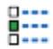

The AVI Options dialog box appears.

4. In the AVI Options dialog box, choose one of the following methods to specify the size (in pixels) of the animation image:

Click Use size on screen to use the size of the image on the screen. (Abaqus/CAE indicates the current image size in the options dialog box.) This method is the default.  
Click Use settings below to set the width or height; then enter the value of your choice in the Width or Height field. You specify only one dimension; Abaqus/CAE computes the other dimension to maintain the aspect ratio of the viewports.

5. For Linux systems, specify in the AVI Options dialog box whether your file should be compressed (run length encoded) or uncompressed (raw).

From the Compression list in the AVI Options dialog box, select Rle (8 bits/pixel), Raw (8 bits/pixel), or Raw (32 bits/pixel). Choosing Rle (8 bits/pixel) compression or Raw (8 bits/pixel) can result in a loss of colors.

6. For Windows systems, specify in the AVI Options dialog box whether your file should be compressed or uncompressed (raw). If you elect to compress the file, you can select one of the Abaqus/CAE predefined compressors or one of the video codecs available on your system. You can specify the compression quality of the saved animation file.

a. From the Codec list, select one of the following:

Select None - 8 bits/pixel to create a raw animation using a reduced set of colors. Choosing this option can result in a loss of colors.  
• Select None - 24 bits/pixel to create a raw animation file without any compression.  
• Select one of the video codecs. The Codec list displays every codec that is available on your system.

Some video codecs include configurable options that enable you to change certain aspects of the video file. When you select a codec that allows this configuration, the Configure button becomes active. You can also learn more about a particular codec by clicking the About button when the codec is selected.

b. To configure a codec, click Configure and then choose configuration options from the dialog box that appears. Each configurable video codec provides different configuration options; for example, some codecs allow you to control the transparency of the animation or to create a scalable file.


Note: You might encounter problems while saving an animation in AVI format with MPEG-4 codec compression using a Python script. To avoid these problems, you can use the GUI described in this procedure or you can configure the Xvid codec to switch off the encoding status window (Xvid configuration->Other options->Encoder: toggle off Display encoding status).

c. Drag the Quality slider to specify the compression quality of the file. The highest value, 100, produces the highest quality animation file with the smallest degree of compression.

7. Click OK to close the AVI Options dialog box.

Your options settings are saved for the duration of the session.

## Choose QuickTime format

1. Locate the animation file format options.  
From the main menu bar, select Animate->Save As; the Save Image Animation dialog box appears.

2. From the Format options, select QuickTime.

3. To select additional QuickTime format options, click


The QuickTime Options dialog box appears.

4. In QuickTime Options dialog box, choose one of the following methods to specify the size (in pixels) of the animation image:

Click Use size on screen to use the size of the image on the screen. (Abaqus/CAE indicates the current image size in the QuickTime Options dialog box.) This method is the default.

Click Use settings below to set the width or height; then enter the value of your choice in the Width or Height field. You specify only one dimension; Abaqus/CAE computes the other dimension to maintain the aspect ratio of the viewports.

5. Specify in the QuickTime Options dialog box whether your file should be compressed (run length encoded) or uncompressed (raw).

From the Compression list, select either Raw (24 bits/pixel) or Rle (24 bits/pixel). Rle (24 bits/pixel) compression is a form of run length encoding, which provides lossless compression with no image degradation.

6. Click OK to close the QuickTime Options dialog box.

Your options settings are saved for the duration of the session.

## Choose GIF format

1. Locate the animation file format options.  
From the main menu bar, select Animate->Save As; the Save Image Animation dialog box appears.

2. From the Format options, select GIF.

3. To select additional GIF format options, click

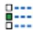

The GIF Options dialog box appears.

4. In GIF Options dialog box, choose one of the following methods to specify the size (in pixels) of the animation image:

Click Use size on screen to use the size of the image on the screen. (Abaqus/CAE indicates the current image size in the GIF Options dialog box.) This method is the default.  
Click Use settings below to set the width or height; then enter the value of your choice in the Width or Height field. You specify only one dimension; Abaqus/CAE computes the other dimension to maintain the aspect ratio of the viewports.

5. Click OK to close the GIF Options dialog box.

Your options settings are saved for the duration of the session.

## Controlling animation playback

During an object-based animation you can control the speed and repetition of playback, and you can stop, restart, and step through your animation.

Most industry-standard animation software supports the same functions for image-based animation, but the available options are based on the application that you choose. For object-based animations one additional option is available: you can display or suppress status information while the animation is playing.

If you are using multiple viewports to display animations, you can include or exclude individual viewports from the common animation time line. By default, each new viewport you create will be included in the synchronization.

This section explains how to control animation playback.

## In this section:

Stopping, restarting, and stepping through an animation  
Navigating to a specific frame in the animation  
Controlling animation speed and repetition  
Showing the animation frame counter  
Customizing animation of X–Y plots  
Controlling animations in multiple viewports  
Customizing the time history of synchronized viewports

## Stopping, restarting, and stepping through an animation

You can use the movie player controls to play and pause your animation, to step forward or backward through the animation images, and to step to the first or last image in the animation sequence.

During animation, the movie player controls appear on the right side of the context bar.


If you display animations in multiple viewports, the movie player controls stop, restart, and step through frames in all synchronized viewports.

You can also use the right-most button in the movie player controls to launch the Frame Selector dialog box, which allows you to navigate directly to a particular frame in the animation. This tool is discussed in Navigating to a specific frame in the animation.

1. Locate the movie player controls on the right side of the context bar.  
2. Click the movie player controls to execute the functions you want. The controls are listed below in the order in which they appear in the context bar, starting with the left-most arrow.

Play/Pause Plays or pauses. When your animation is playing, this button displays the Pause symbol; when paused, this button displays the Play symbol.

First image Stops play and displays the first image in the animation sequence.

Previous image Stops play and steps to the previous image in the animation sequence.

Next image Stops play and steps to the next image in the animation sequence.

Last image Stops play and displays the last image in the animation sequence.

Launch Frame Selector Opens the Frame Selector dialog box, from which you can navigate to a specific frame of the animation.

## Additional information

• Controlling animation playback  
• Navigating to a specific frame in the animation  
• Controlling animations in multiple viewports

The Frame Selector dialog box allows you to navigate quickly to a particular frame in the output database in the current viewport. This tool provides two methods for controlling the current frame: you can enter a frame index or time value directly into a field on the left side of the dialog box, or you can drag the slider on the right side of the dialog box to the desired frame or time.

The labels in the dialog box are context-sensitive and depend on whether an animation is being displayed, the type of animation, and for time history animations, whether the time history is frame-based or time-based.

When no animation is displayed in the current viewport, the Frame Selector labels display step names. The name of the current step appears above the field on the left side of the dialog box. The names of the first and last active steps in the output database appear above the slider. In the example below, the current frame is frame 20 of the Extract frequencies step, the first step is Extract frequencies, and the last step is Transient modal dynamics.

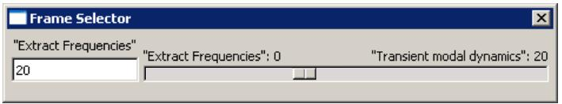

For scale factor or harmonic animations the Frame Selector labels displays the frame index of the current frame, and the slider shows the frame index of the first and last active frames. The dialog box displays Frame above the field and the numbers of the first and last active frames above the slider.  
For time history animations the Frame Selector labels display frame information when you select a frame-based time history and display time information when you select a time-based time history. In the latter case the dialog box displays Time above the field and the time values of the first and last active frames above the slider. For more information about selecting a time history option, see Customizing the time history of synchronized viewports.

1. Open the Frame Selector dialog box.

From the movie player controls on the right side of the context bar, click the button. The Frame Selector dialog box appears.

2. Choose one of the following methods to specify the frame you want to display:

• Enter a number directly into the Frame Selector field.  
You can enter the overall frame number in the entire output database for scale factor animations, harmonic animations, or frame-based time history animations; you can enter the time for time-based time history animations; or you can enter the frame number within the current step when no animation is displayed.  
• Drag the slider to the frame index or time value that you want to display. The current viewport changes as you drag the slider.

## Additional information

• Controlling animation playback  
• Stopping, restarting, and stepping through an animation

## Controlling animation speed and repetition

You can control the speed of your object-based animation playback, and you can choose to play your animation once or to repeat it.

If you choose to repeat the animation, you can select one of three repetition modes: loop, loop backward, or swing. Loop repeats by jumping from the last animation frame to the beginning of your movie. Loop backward plays the animation backward and repeats by jumping from the first animation frame to the end of your movie. Swing repeats smoothly by playing your movie from beginning to end and then playing from the end back to the beginning.

The speed control settings you specify before you create image-based animations determine the default frame rate that is used when the animation files (for example, MP4 or QuickTime) are replayed from within industry-standard animation software.

1. In the prompt area, click Animation Options; and click the Player tab in the dialog box that appears.  
2. To control the playback speed of your animation, drag the Frame rate slider to the rate that you want.  
3. To control the repetition of the images in your animation sequence:

• Click Play once to suppress repetition.  
• Click Loop to play the images in order from the first to the last, repeatedly.  
• Click Loop backward to play the images in order from the last to the first, repeatedly.  
• Click Swing to play the images from the first to the last and then in reverse order from the last back to the first, repeatedly.

4. Click Apply to implement your changes.

The animation in all animated viewports changes according to your specifications.

Your changes are saved for the duration of the session and will affect all subsequent plots in this state.

## Additional information

• Stopping, restarting, and stepping through an animation

## Showing the animation frame counter

For object-based animations you can display or suppress animation frame count information, which is displayed in the upper-right corner of the viewport and consists of

• the scale factor of each image in your scale factor animation,  
• the phase angle of each image in your harmonic animation, or  
• the step and frame (plot number within the step) of each image contained in your time history animation.

You cannot customize the content or appearance of the counter, other than to turn it off entirely.

The step and increment associated with each animation step and frame are given by the state block. All of the images in a scale factor animation are based on a single step and frame. For more information on customizing the state block, see Customizing the state block.

1. Find the Show frame counter option.  
In the prompt area, click Animation Options; and click the Player tab in the dialog box that appears. The Show frame counter option is near the bottom of the page.

2. Toggle Show frame counter to display or suppress animation frame count information.

3. Click Apply to implement your changes.

The animation in all animated viewports changes according to your specifications. When Show frame counter is on, Abaqus/CAE displays status information in the upper right corner of all animated viewports. This information is updated for every image in your animation sequence. You may need to stop playback to read it.

Your changes are saved for the duration of the session and will affect all subsequent plots in this state.

## Additional information

• Stopping, restarting, and stepping through an animation

## Customizing animation of X–Y plots

You can customize the appearance of the time tracker line and symbols.

When you animate a time-dependent X–Y plot, Abaqus/CAE adds a vertical line to the plot that moves along the X-axis to highlight the current time. The plot also displays a colored symbol at the data point on each X–Y curve that occurred closest to the current time; time tracker symbols do not appear at the exact intersection of the time tracker line and an X–Y curve unless that curve contains a data point at the currently displayed time.

For X–Y plots whose axes are not time but are obtained from output database results (for example, by combining two time-dependent X–Y data objects), Abaqus/CAE also adds a vertical line. In such cases, the line is added if there is only one curve in the plot.

The figure below shows an X–Y plot with the time tracker line and symbols displayed.


By default, the time tracker line and symbols are displayed using the highlight method that you have selected for your session; see Choosing a highlight method for more information. However, you can customize their appearance by changing the color, thickness, and style of the time tracker line and the color, shape, and size of the time tracker symbols. Alternatively, you can completely suppress either time tracker component. The default highlight method offers the best performance.


## Note:

These line and symbol options control the appearance of the time tracker only. You can also customize the lines and symbols used to display the X–Y curves themselves; see Customizing the appearance of an X–Y curve.

1. Locate the XY options.  
In the prompt area, click Animation Options; and click the XY tab in the dialog box that appears.

2. Toggle off Draw using highlight method if you want to customize the appearance of the X–Y plot time tracker.

3. Toggle Show line to display or suppress the time tracker line.  
When Show line is on, the time tracker line is displayed and the line attribute options are enabled.

4. Choose the time tracker line style:

a. Click the Style button to reveal the line style options (solid, dashed, etc.).

b. From the style list, click the desired line style.

The specified line style appears on the Style button.

5. Choose the time tracker line thickness:

a. Click the Thickness button to reveal the line thickness options.  
b. From the thickness list, click the desired line thickness.  
The specified thickness appears on the Thickness button.

6. Choose the time tracker line color:

a. Click the color sample .

Abaqus/CAE displays the Select Color dialog box.

b. Use one of the methods in the Select Color dialog box to select a new color. For more information, see Customizing colors.

c. Click OK to close the Select Color dialog box.

The color sample changes to the selected color.

7. Toggle Show symbol to display or suppress the symbols representing the current value of each selected X–Y curve's data points.

When Show symbol is on, symbols are displayed and the symbol attributes are enabled.

8. Choose the symbol:

a. Click the Symbol button to reveal the choice of symbols.  
b. From the list of symbols, click the desired symbol.  
The specified symbol appears on the Symbol button.

9. Choose the time tracker symbol color:

a. Click the color sample .

Abaqus/CAE displays the Select Color dialog box.

b. Use one of the methods in the Select Color dialog box to select a new color. For more information, see Customizing colors.

c. Click OK to close the Select Color dialog box.

The color sample changes to the selected color.

10. Choose the time tracker symbol size:

a. Click the Size button to reveal the symbol size options.  
b. From the symbol size options, click the desired symbol size.  
The specified symbol size appears on the Size button.

11. Click Apply.

The current viewport displays your color, thickness, style, and symbol selections.

## Additional information

• Customizing the time history of synchronized viewports

## Controlling animations in multiple viewports

By default, Abaqus/CAE animates data in every animation-eligible viewport in your session. All animations are synchronized, so the viewports play, stop, and increment together when you examine data frame by frame, animate a model plot, or animate a time-dependent X–Y plot.

You can activate and deactivate the animation of individual viewports, which enables you to display animations only for a subset of the animation-eligible viewports in your session. From the Linked Viewports Manager, toggle on Link viewports and Animation and use the Linked Viewports portion of the Linked Viewports Manager to deselect the viewports that you want to remain independent.

1. Link viewports using one of the following methods:

• From the main menu, select Viewport->Link Viewports.


Tip: You can activate or deactivate linked viewports by clicking in the Viewport toolbar.

• From the main menu, select Viewport->Linked Viewports Manager and toggle on Link viewports.


Tip: You can also display the Linked Viewports Manager by clicking in the Viewport toolbar.

2. In the Linked Viewports Manager, ensure that Animation is toggled on and the required viewports are selected in the Linked Viewports table.  
3. If you made changes in the Linked Viewports Manager, click Apply. Alternatively, click OK to apply your changes and to close the manager.  
4. Start a time history, scale factor, and harmonic animation using any method.

## Additional information

• Customizing the time history of synchronized viewports

## Customizing the time history of synchronized viewports

The time history settings control whether Abaqus/CAE uses a frame-based history or a time-based history when you display time history animations. Frame-based synchronization allows all synchronized viewports to increment together one frame at a time, while time-based synchronization allows viewports to display data according to a common time line.

When you choose time-based animation, you can also customize three aspects of the common time line:

• The time step, which controls how much time elapses each time you increment your display of the data.  
• The minimum time, which is the earliest point from which data will be included. If you auto-compute the minimum time, Abaqus/CAE includes data starting from the beginning of the common time line.  
• The maximum time, which is the latest point from which data will be included. If you auto-compute the maximum time, Abaqus/CAE includes data up to the end of the common time line.

1. Find the Time History options.  
In the prompt area, click Animation Options; and click the Time History tab in the dialog box that appears.  
2. From the options at the top of the page, choose either Frame-based or Time-based.  
3. If desired, change the Time increment value. The time increment applies to time-based animation only.  
4. If desired, customize the Min time and Max time by entering values in the appropriate Specify fields. These values apply to time-based animation only.  
5. Click Apply.

## Additional information

• Changing the period of a step  
• Controlling animations in multiple viewports

## Querying the model in the Visualization module

This section explains how you can use the Query toolset to obtain general information about the mesh and specific Visualization module information.

## In this section:

Understanding the Query toolset in the Visualization module  
Using the Query toolset

## Understanding the Query toolset in the Visualization module

The Query toolset allows you to obtain general information about your model.

The Visualization module displays the requested information in the message area, and the same information is written to the replay file.

Select Tools->Query from the main menu bar, or select the i tool from the Query toolset to use the Query toolset. Items under General Queries provide the following information:

## Node

You can obtain information on a selected node's label, deformed and undeformed coordinates, and displacement. You can select a local CSYS in which to display the coordinates.

## Distance

You can obtain information on the deformed and undeformed distance between two selected nodes and the relative displacement between the nodes. You can select a local CSYS in which to display the coordinates of the picked points and the components of the result.

## Angle

• You can obtain information on the deformed and undeformed angle formed between three selected nodes. The second node that you select is the angle's vertex.  
• You can obtain the angle between two edges or faces or between an edge and a face.

## Element

You can obtain information on a selected element's mesh type, material, section, connectivity, and current field output variables at the integration point locations. This query is available only when an output database is selected.

## Mesh

You can obtain information on the name of the current output database, the number of nodes and elements in your model, and the element types.

## Mass properties

You can obtain basic mass properties for the whole model in the output database or for a portion of the model. In the Visualization module, the mass properties are always calculated based on model data (undeformed shape). This query is available only when an output database is selected. Abaqus/CAE returns the following information:

Volume  
• Volume centroid  
• Mass  
• Center of mass  
• Moments of inertia about the center of mass or about a specified point

## Element face normal

You can obtain the surface normal components for an element face. You can select a local CSYS in which to display the normal.

## Advanced distance

Whereas the regular distance query allows you to find the distance between two selected single entities, the advanced distance query allows you to find the minimum distance between groups of entities. These entities can be nodes, elements, vertices, edges, faces, or cells, and you can select them from the viewport or by set. You can select a local CSYS in which to display the coordinates of the closest points and the components of the result.

For more information on general model queries, see Querying the model in the Visualization module.

Items under Visualization Module Queries provide the following information:

## Probe values

Abaqus/CAE displays information in the Probe Values dialog box as you move the cursor around the current viewport. Probing a model plot displays model data and analysis results; probing an X–Y plot displays X–Y curve data. For more information on probing, see Probing the model.

## Stress linearization

Stress linearization is the separation of stresses through a section into constant membrane and linear bending stresses. Abaqus performs stress linearization calculations and displays the results in the form of an X–Y plot. Stress linearization is available for output databases only. For more information on stress linearization, see Calculating linearized stresses.

## Active elements and nodes

Abaqus/CAE displays the label numbers of all the active nodes or active elements in the current viewport. For more information, see Querying active node or element labels.

## Ply stack plot

Abaqus/CAE creates a new viewport and displays a representative image of a composite layup. The image shows the plies in the layup along with details of each ply, such as its fiber orientation, thickness, reference plane, and integration points. Ply stack plots are available for output databases only. For more information, see Viewing a ply stack plot.

• Probing the model  
• Calculating linearized stresses  
• Viewing a ply stack plot

## Using the Query toolset

You can use the Query toolset to obtain general model information.

## In this section:

Querying the model in the Visualization module  
Querying active node or element labels

## Querying the model in the Visualization module

1. Locate the Query dialog box.

From the main menu bar, select Tools->Query or click the tool in the Query toolset. The Query dialog box appears.

2. To obtain information on a particular node, do the following:

a. Select Node from the General Queries field of the Query dialog box.

Abaqus/CAE displays a prompt in the prompt area.

b. Select a node from the viewport.

The undeformed and deformed X-, Y-, and Z-coordinates of that node appear in the message area, along with the node's displacement. The same information that appears in the message area is also written to the replay file.

c. Select a local CSYS from the viewport to display the node coordinates in the local coordinate system. If a local CSYS is not selected, the node coordinates will be displayed in the global Cartesian system.


## Note:

To resize the message area, drag the top edge; to see information that has scrolled out of the message area, use the scroll bar on the right side.

3. To obtain information on the distance between two nodes, do the following:

a. Select Distance from the General Queries field of the Query dialog box.

Abaqus/CAE displays a prompt in the prompt area.

b. Select two nodes from the viewport.

The following information appears in the message area:

• The undeformed and deformed X-, Y-, and Z-coordinates of each node, along with the node's displacement.  
• The absolute undeformed and deformed distances between the nodes.  
• The X-, Y-, and Z-components of the undeformed and deformed vector between the two nodes.  
• The absolute relative displacement between the nodes.  
• The X-, Y-, and Z-components of the relative displacement between the two nodes.

c. Select a local CSYS from the viewport to display the coordinates of the picked nodes and the components of the result in the local coordinate system. The last chosen CSYS will be used for the calculations. If any local CSYS is not selected, the results will be displayed in the global Cartesian system.

4. To obtain angle information, select Angle from the General Queries field of the Query dialog box, and select 3 Nodes or Face/Edge from the prompt area.

• If you selected 3 Nodes, select three nodes from the viewport. The second node that you select is the vertex of the angle.

The following information appears in the message area:

The undeformed and deformed X-, Y-, and Z-coordinates of each node, along with the node's displacement.  
- The absolute undeformed and deformed angle between the nodes.

• If you selected Face/Edge, select two faces or two edges or select a face and an edge. The angle between the selected faces/edges is displayed in the message area.

5. To obtain information on a particular element in an output database, do the following:

a. Select Element from the General Queries field of the Query dialog box.

Abaqus/CAE displays a prompt in the prompt area.

b. Select an element from the viewport.

The following information appears in the message area:

• The element's label, element type, material, and section.  
• The labels of connecting elements.  
• The current field output variables at the integration point locations.

6. To obtain general information on the mesh, select Mesh from the General Queries field of the Query dialog box.

The following information appears in the message area:

• The name of the current output database.  
• The number of nodes.  
• The number of elements.  
• The element types.

7. To obtain general information on the mass properties in an output database, do the following:

a. Select Mass properties from the General Queries field of the Query dialog box.

Abaqus/CAE displays a prompt in the prompt area for the last selection method used or All elements if this is the first time using the Mass properties query in the current session.

b. Choose one of the following selection methods from the list in the prompt area:

• All elements  
• Select elements from viewport  
• Part instances  
• Element sets  
• Sections  
• Materials  
• Element types  
• Display groups

Abaqus/CAE displays additional selection fields in the prompt area, depending on the selection method that you chose.

c. Complete your selection as follows:

• If your selection from the previous step is All elements, click Done to perform the query.

If you chose Select elements from viewport in the previous step, make selections from the viewport (for more information, see Selecting objects within the viewport”). You can select a part instance in the prompt area and enter a single element number to get mass information for that element.  
For the remaining selection methods, select the part instance, element set, section, material, element type, or display group name from the list in the prompt area, or make selections from the viewport.

When you select an object from the prompt area or when you click Done to complete a viewport selection, Abaqus/CAE displays the mass properties for your selection in the message area.

d. If any items in your selection have poorly defined density or thickness, click Options in the prompt area to display the Mass Properties Query Options dialog box and specify a value to be substituted by Abaqus/CAE for the undefined quantity.

Click OK in the dialog box to save your entries and close the dialog, or click Reset to return to the previous settings.

Abaqus/CAE displays the mass properties in the message area for the items you selected. The following properties are available:

• Surface area (for shell elements only)  
• Area centroid  
Volume  
• Volume centroid  
• Mass  
• Center of mass  
• Moments of inertia about the center of mass or about a specified point

8. To obtain the surface normal components, do the following:

a. Select Element face normal from the General Queries field of the Query dialog box.

Abaqus/CAE displays a prompt in the prompt area.

b. Select an element face in the viewport, and click Done.

The surface normal components in the global Cartesian coordinate system of the element face appear in the message area.

c. Select a local CSYS from the viewport to display the surface normal components in the local coordinate system. If any local CSYS is not selected, the surface normal components will be displayed in the global Cartesian system.

The surface normal components will differ if you query the same element face on the undeformed shape and the deformed shape.

9. Close the Query dialog box when you have finished requesting information.

## Additional information

• Understanding the Query toolset in the Visualization module  
• Querying mass properties

## Querying active node or element labels

You can use the Query toolset to request the label numbers of all currently active nodes or active elements in the current viewport. The active nodes and elements are those that are in the current display group, less any entities removed from the display by the active view cut. Abaqus/CAE displays label numbers in the prompt area for each applicable part instance and prints label numbers to the replay file.

When you request the active nodes or elements, Abaqus/CAE displays the label numbers only; it does not provide any other nodal or element data and results. To display more information about a single node or element, see Probing nodes, or Probing elements, respectively.

1. Locate the Visualization Module Queries options.

From the main menu bar, select Tools->Query or click the tool in the Query toolset. The Query dialog box appears, and the Visualization Module Queries are displayed in the lower portion of the dialog box.

2. Click either Active nodes or Active elements.

In the prompt area, Abaqus/CAE displays a list of labels for all active nodes or active elements for each part instance in the model.

## Additional information

• Probing nodes  
• Probing elements

## Probing the model

This chapter explains how you can use the Query toolset in the Visualization module to probe model and X–Y plots for output data and to probe an Abaqus/CAE model for attribute values.

For information on writing selected probe values to a file, see Generating tabular data reports.

## In this section:

Understanding probing  
Using the Query toolset to probe the model

## Understanding probing

This section explains probing model plots and X–Y plots.

When you click the tool in the Visualization module toolbox, Abaqus/CAE enters probe mode and displays information in the Probe Values dialog box as you move the cursor over the model in the current viewport. You can

also enter probe mode using the tool in the Query toolbar. Probing a model plot displays model data and analysis results; probing an X–Y plot displays X–Y curve data; and probing a model from the current model database displays the model data and the values of attributes such as loads and predefined fields. You can write this information to a file.

The data table in the bottom portion of the Probe Values dialog box contains two dynamic display rows (the row immediately above the row headings and the bold data row that appears first in the table) and a series of additional storage rows. Abaqus/CAE updates the dynamic rows continuously to show the probe values as you move the cursor over the model in the current viewport, and you can change the value displayed in the top display row by clicking a column heading. Abaqus/CAE updates the table with additional rows only when you select values of interest by clicking in the viewport, specifying a node or element label, or selecting the nodes or elements in a particular display group. Values accumulate in the bottom portion of the dialog box until you delete them, clear the table, or cancel probe mode. You can also add selected values to a new display group, and you can annotate individual nodes or elements with field output values at that location.

## Probes of models or model plots

If the current viewport contains a model plot (an undeformed, deformed, contour, symbol, or material orientation plot) or a model from the current model database,, Abaqus/CAE allows you to probe results from the selected model or output database. The Probe Values dialog box identifies the step, frame, and field output variable for which Abaqus/CAE will obtain values. To learn how to change the step, frame, or field output variable, see Selecting the results step and frame, and Selecting the primary field output variable.

When you probe a model plot of a three-dimensional shell or a composite solid, the results that Abaqus/CAE returns depend on your choice of active location in the Section Points dialog box. Abaqus/CAE returns results from the Top Location section point when Top is the active location and returns results from the Bottom Location section point when the active location is set to Bottom or Top and bottom. For more information about section points, see Selecting section point data.

For model plots you can choose to obtain node-based or element-based data and results, as follows:

## Probing nodes

When you choose to probe nodes and position the cursor over a nodal location in the current viewport, Abaqus/CAE highlights the node and displays the following information about the node in the data table:

• the node's label,  
• the node's original coordinates,  
• the node's deformed coordinates (using the current deformed field output variable),  
• the elements sharing the node, and  
the current field output variable (including component values, if the current field output variable is a tensor or vector quantity). If a model is selected in the current viewport, the current field output variable reflects the value of a model attribute such as a load at the selected node.

You can display field output at the node whether the current primary variable was originally saved to the output database at nodal, centroidal, or integration point locations. Abaqus/CAE calculates nodal values for centroidal and integration point data by extrapolating to the nodes and averaging according to options you select. If the node refers to unaveraged element data, all element data associated with the probed node will be displayed. For more information on averaging, see Understanding result value averaging.

You can also display or hide annotations that appear in the viewport for each node you select. Probe annotations show the node's label and the results at that node for the current field output variable. You can customize the font and color of the probe annotation text.

## Probing elements

When you choose to probe elements and position the cursor over an element in the current viewport, Abaqus/CAE highlights the element and displays the following information about the element in the data table:

• the element's label,  
• the element's connectivity, and  
• the current field output variable (including component values, if the current field output variable is a tensor or vector quantity). If a model is selected in the current viewport, the current field output variable reflects the value of a model attribute such as a load at the selected element.

You can display field output at the element only if the current primary variable is an element-based variable, such as stress or strain. You can choose the output position at which field output results are calculated: integration point, centroid, element node, or element face. For each of these output positions, Abaqus/CAE calculates probe results on an element-by-element basis with no averaging.

You can also display or hide annotations that appear in the viewport for each element you select. Probe annotations show the element's label and the results at that element for the current field output variable. You can customize the font and color of the probe annotation text.

Regardless of the render style in which the model is displayed, only visible elements can be probed. If necessary, you can create a display group or use a view cut to reveal otherwise unavailable interior elements.

When an element is cut through by a crack, the cracked element splits into two parts, each part formed by a real domain and a phantom domain. When you probe cracked elements, only the contribution from one part of the elements is reported. For more information, see Visualization.

## X–Y plot probes

If the current viewport contains an X–Y plot, Abaqus/CAE displays as probe values the X–Y curve legend text, the sequence identification of each point within the curve, and the X- and Y-coordinates of curve points. You can choose to display only the curve points that comprise an X–Y data object or to interpolate to display arbitrary points along the curve. If the X–Y data name differs from the X–Y curve legend text, the Legend value in the Probe Values dialog box displays the X–Y data name prepended to the legend text. For more information, see Probing X–Y plots.

## Using the Query toolset to probe the model

You can use the Query toolset to probe model and X–Y plots, and to write the resulting probe values to a file.

For information on writing selected probe values to a file, see Generating tabular data reports.

## In this section:

Using probe options  
Probing nodes  
Probing elements  
Probing X–Y plots

## Using probe options

You can use the probe options in the Query toolset to specify the values you want to obtain while probing a model or an X–Y plot.

Click in the Visualization module toolbox to access the Probe Values dialog box. Use the options in this dialog box to control probing in the current viewport.

## For model data from the current model database

Use the Field Output dialog box to choose the step and field output variable. For model data, the field output variable you select is actually the value of an attribute in the model, such as a load or predefined field.

## For model plots

Use the Field Output dialog box to choose the step, frame, and field output variable. Use the Result Options dialog box to choose the computation methods governing the probe data and results Abaqus/CAE displays.

## For model and X–Y plots

Use the Probe Values options to select the type of information you want to obtain while probing.

## Additional information

• Probing nodes  
• Probing elements  
• Probing X–Y plots

## Probing nodes

You can use the Query toolset to obtain nodal data and either the values of attributes in the selected model or analysis results from the selected model plot. As you position the cursor over a node in the model or in the model plot in the current viewport, Abaqus/CAE highlights the node. You can choose to display the following information about the node in the data table:

• the node's label,  
• the node's original coordinates,  
• the node's deformed coordinates (using the current deformed field output variable),  
• the elements sharing the node, and  
the current field output variable (including component values, if the current field output variable is a tensor or vector quantity). If a model is selected in the current viewport, the current field output variable reflects the value of a model attribute such as a load at the selected node.


## Note:

You can display or hide any of the columns in the table by clicking mouse button 3 in the table, selecting Edit Visible Columns, and toggling any of the columns in the dialog box that appears.

You can also obtain a node's data by entering its node label directly, and you can obtain data for all the nodes included in a selected display group. These methods enable you to probe nodal data without positioning the cursor over its location in the model plot.

When you add a node to the data table, you can toggle on the check box for that row to display a probe annotation in the viewport for that node, or you can toggle on the check box in the header row to display probe annotations for all selected nodes. Probe annotations display the node's label and the results at the node for the current field output variable. You can customize the font and color of the annotation text.

To help locate nodes in the viewport, you may want to produce a model plot with node symbols visible before using the Query toolset. For more information, see Customizing node symbols.

1. Locate the Probe Values dialog box.

In the Visualization module toolbox, click

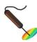

The Probe Values dialog box appears.

2. Select the step, frame, field output variable, and result options governing the probe data and results Abaqus/CAE will display. If you are probing data from the current model database, frame selections are not available, and your selection of field output variable is an attribute from the model displayed in the current viewport.

In the Probe Values dialog box, the Field Output field identifies the current step, frame, and field output variable.

• To change the step or frame, click $= \sqrt { 4 0 }$  
$\fallingdotseq$ • To change the field output variable, click .  
• To change the result options, select Result->Options from the main menu.

3. In the Probe Values portion of the dialog box, do the following:

a. Click the Probe arrow, and select Nodes.

b. If the current primary output variable is a tensor or vector variable, click the Components arrow and do either of the following:

For tensor variables choose Selected to display only the selected component of the variable, All Direct to include all direct components of the tensor variable in the query, or All Principals to include all principal invariants of the tensor variable in the query.  
• For vector variables choose Selected to display only the selected component of the variable or All to include all components of the vector tensor variable in the query.


## Note:

If you choose the All Direct or All Principals option for tensor variables, the results averaging option Compute scalars before averaging is not valid; the scalars or invariants are always computed after averaging.

The types of node information available are displayed in the columns of the data table.

4. Click mouse button 3 anywhere in the data table, select Edit Visible Columns from the list that appears, and toggle on the node information types that you want to display as columns in the data table.

When a desired information type is toggled on, Abaqus/CAE displays that type of data as a column in the data table. However, all columns, visible or not, are included in the probe values output file.


## Note:

Field output is available only if the current primary variable is an element-based variable, such as stress or strain.

5. To specify the nodes that you want to probe, choose Select from viewport, Key-in label, or Select a display group, and use one of the following techniques:

Select the nodes directly from the viewport:

a. Move the cursor to probe the model plot in the current viewport.  
As you position the cursor over a node, Abaqus/CAE displays the values of the items you have requested in the first row of the data table.  
b. To select and accumulate values of interest, and to allow subsequent writing of these values to a file, click mouse button 1 while positioning the cursor over a node.  
Abaqus/CAE stores the data from the first row of the data table into the storage rows of the data table.

Enter the node labels directly into the table:

a. Click the Part instance arrow, and select the part instance from which you want to select node labels.  
b. Enter the node label or labels that you want to include. You can specify multiple node labels at the same time by separating them with commas.

Select the nodes included in a display group:

a. Click the Display group arrow, and select the display group containing the nodes that you want to include in your query.  
If you change your selection of display group, Abaqus/CAE replaces the contents of the data table with nodes from the newly selected display group.  
b. If desired, append additional nodes to your list by selecting them from the viewport or keying them in by node label.

6. Repeat the node selection steps until the data table in the Probe Values dialog box includes all the nodes you want to query.  
7. To delete data from the data table or to clear or sort the table, click mouse button 3. For more information, see Entering tabular data.  
8. To create a display group using the nodes in the data table, do the following:

a. Click mouse button 3 in the data table, and select Create Display Group from the menu that appears.

The Create Display Group dialog box appears.

b. Enter a name for the new display group, and click OK.

9. To display probe annotations for any of the nodes in the data table, toggle on the check box for the rows corresponding to the nodes you want to annotate or toggle on the check box in the header row to display probe annotations for all selected nodes.


## Note:

You can customize the color and font for probe annotations of nodes in the Common Plot Options dialog box. For more information, see Using common plot options.

10. To save the data you have selected, click Write to File. For more information, see Generating tabular data reports.”  
11. To exit probe mode, do one of the following:

• Click the cancel button in the prompt area.  
• Click Cancel in the Probe Values dialog box.  
• Click mouse button 2.  
• Produce a plot in some other (e.g. undeformed, deformed) mode.

## Additional information

• Controlling result averaging  
• Probes of models or model plots  
• Probing elements  
• Querying active node or element labels

## Probing elements

You can use the Query toolset to obtain element data and either the values of attributes in the selected model or analysis results from the selected model plot. As you position the cursor over an element in the model or in the model plot in the current viewport, Abaqus/CAE highlights the element. You can choose to display the following information about the element in the data table:

• the element's label,  
• the element's connectivity, and  
the current field output variable (including component values, if the current field output variable is a tensor or vector quantity). If a model is selected in the current viewport, the current field output variable reflects the value of a model attribute such as a load at the selected element.

You can also obtain an element's data by entering its element label directly, and you can obtain data for all the elements included in a selected display group. These methods enable you to probe element data without positioning the cursor over its location in the model plot.

Only exterior elements can be queried. If necessary, you can create a display group or use a view cut to reveal otherwise unavailable interior elements. For more information, see Using display groups to display subsets of your model.”

When you add an element to the data table, you can toggle on the check box for that row to display a probe annotation in the viewport for that element, or you can toggle on the check box in the header row to display probe annotations for all selected elements. Probe annotations display the element's label and the results at the element for the current field output variable. You can customize the font and color of the annotation text.

To help locate elements in the viewport, you may want to produce a model plot with all element edges visible before using the Query toolset. For more information, see Controlling element and surface edge visibility.

1. Locate the Probe Values dialog box.

In the Visualization module toolbox, click


The Probe Values dialog box appears.

2. Select the step, frame, and field output variable for which Abaqus/CAE will obtain values. If you are probing data from the current model database, frame selections are not available, and your selection of field output variable is an attribute from the model displayed in the current viewport.

In the Probe Values dialog box, the Field Output field identifies the current step, frame, and field output variable.

• To change the step or frame, click .  
• To change the field output variable, click .  
• To change the result options, select Result->Options from the main menu bar.

3. In the Probe Values portion of the dialog box, do the following:

a. Click the Probe arrow, and select Elements.  
b. If the current primary output variable is a tensor or vector variable, click the Components arrow and do either of the following:

For tensor variables choose Selected to display only the selected component of the variable, All Direct to include all direct components of the tensor variable in the query, or All Principals to include all principal invariants of the tensor variable in the query.  
• For vector variables choose Selected to display only the selected component of the variable or All to include all components of the vector tensor variable in the query.

c. To choose the output position at which a field output variable is displayed, click the Position arrow and select Integration Pt, Centroid, Element Nodal, or Element Face.


## Note:

If you choose the All Direct or All Principals option for tensor variables and the Element Nodal output position, the results averaging option Compute scalars before averaging is not valid; the scalars or invariants are always computed after averaging.

The types of element information available are displayed in the columns of the data table.

4. Click mouse button 3 anywhere in the data table, select Edit Visible Columns from the list that appears, and toggle on the element information types that you want to display as columns in the data table.

When a desired information type is toggled on, Abaqus/CAE displays that type of data as a column in the data table. However, all columns, visible or not, are included in the probe values output file.


## Note:

Field output is available only if the current primary variable is an element-based variable, such as stress or strain.

5. To select the elements that you want to probe, choose Select from viewport, Key-in label, or Select a display group, and use one of the following techniques:

Select the elements directly from the viewport:

a. Move the cursor to probe the model plot in the current viewport.

As you position the cursor over an element, Abaqus/CAE displays the values of the items you have requested in the first row of the data table in the Probe Values dialog box.

b. To select and accumulate values of interest, and to allow subsequent writing of these values to a file, click mouse button 1 while positioning the cursor over an element.

Abaqus/CAE stores the data from the first row of the data table into the storage rows of the data table.

Enter the element labels directly into the table:

a. Click the Part instance arrow, and select the part instance from which you want to select element labels.

b. Enter the element label or labels. You can specify multiple element labels at the same time by separating them with commas.

Select the elements included in a display group:

a. Click the Display group arrow, and select the display group containing the elements that you want to include in your query.


## Note:

If you change your selection of display group, Abaqus/CAE replaces the contents of the data table with elements from the newly selected display group. If you want to append additional elements to your list, you must select them from the viewport or key them in by element label.

6. Repeat the element selection steps until the data table in the Probe Values dialog box includes all the elements you want to query.

7. To delete data from the data table or to clear or sort the table, click mouse button 3. For more information, see Entering tabular data.

8. To create a display group using the elements in the data table, do the following:

a. Click mouse button 3 in the data table, and select Create Display Group from the menu that appears.

The Create Display Group dialog box appears.

b. Enter a name for the new display group, and click OK.

9. To display probe annotations for any of the elements in the data table, toggle on the check box for the rows corresponding to the elements you want to annotate or toggle on the check box in the header row to display probe annotations for all selected elements.


## Note:

You can customize the color and font for probe annotations of elements in the Common Plot Options dialog box. For more information, see Using common plot options.

10. To save the data you have selected, click Write to File. For more information, see Generating tabular data reports.”

11. To exit probe mode, do one of the following:

• Click the cancel button in the prompt area.  
• Click Cancel in the Probe Values dialog box.  
• Click mouse button 2.  
• Produce a plot in some other (e.g. undeformed, deformed) mode.

## Additional information

• Controlling result averaging  
• Probes of models or model plots  
• Probing nodes  
• Querying active node or element labels

## Probing X–Y plots

You can use the Query toolset to obtain information about curves in an X–Y plot.

As you position the cursor over an X–Y curve in the current viewport, Abaqus/CAE highlights the nearest curve point and displays the curve legend text, the point's sequence identification, and the X- and Y-coordinates of the point in the Probe Values dialog box. Abaqus/CAE also highlights the selected curve point with a symbol and displays the X- and Y-coordinates of that curve point next to the symbol. These symbols and coordinates persist on the X–Y plot until you leave Probe mode. You can choose to display only the curve points that comprise an X–Y data object or to interpolate to display arbitrary points along the curve.

When you select a point in Probe mode, Abaqus/CAE adds the legend text, sequence identification, and X- and Y-coordinates of the current point to the data table, which appears at the bottom of the Probe Values dialog box. You can clear or sort this table, delete individual rows, and write these data to a file. If the X–Y data name differs from the X–Y curve legend text, the Legend value in the Probe Values dialog box displays the X–Y data name prepended to the legend text.

While Probe mode is active, Abaqus/CAE also tracks the position of the cursor in the X–Y plot with arrows that run along the X- and Y-axes. These arrows respectively track the current X- and Y-position of the cursor, so they enable you to select your curve points with greater precision.

To help locate X- and Y-data points, you may want to produce an X–Y plot with curve symbols visible before using the Query toolset. For more information, see Customizing the symbols used on an X–Y curve.

1. Locate the Probe Values dialog box.

In the Visualization module toolbox, click . The Probe Values dialog box appears.

2. At the top of the dialog box, toggle Interpolate between points to enable or disable the display of probe values for arbitrary points along the curve.

When you enable interpolation, Abaqus/CAE displays the sequence identification of arbitrary points by listing the bracketing X–Y data object points in parentheses.

3. Select the information types that you want to include in your query.

Click mouse button 3 anywhere in the data table, select Edit Visible Columns from the list that appears, and toggle on the information types that you want to include in the query and display as columns in the data table. When an information type is toggled on, Abaqus/CAE can display that type of data in two locations for the selected element: in the data table when you mouse over or select the element in the viewport, and in the probe values output file.

4. Move the cursor to probe the X–Y plot in the current viewport.

As you position the cursor over a curve point, Abaqus/CAE displays the X- and Y-coordinates of the current point on the curve itself and displays the current position of your cursor along the X- and Y-axes of the X–Y plot.

5. To select and accumulate values of interest and to allow subsequent writing of these values to a file, click mouse button 1 while positioning the cursor over a curve point.

Abaqus/CAE stores the legend text, sequence identification, and X- and Y-coordinates of the current point into the data table. Abaqus/CAE also tags the points you select in the viewport by placing a symbol at the curve point you selected and displaying the X- and Y-coordinates next to that point.

6. To delete data from the data table or to clear or sort the table, click mouse button 3. For more information, see Entering tabular data.

7. To save the data you have selected, click Write to File. For more information, see Generating tabular data reports.

8. To exit probe mode, do one of the following:

Click the cancel• button in the prompt area.  
• Click Cancel in the Probe Values dialog box.  
• Click mouse button 2.  
• Produce a plot in some other (e.g., undeformed, deformed) mode.

## Additional information

• X–Y plot probes

The calculation of linearized stresses is a capability for advanced Abaqus users. It is most commonly used for two-dimensional axisymmetric models.

For detailed information on linearized stress result quantities and the methods of calculation used, see Computing the stress components.

## In this section:

Understanding stress linearization  
Stress linearization example  
Obtaining linearized stress results

## Understanding stress linearization

Stress linearization is the separation of stresses through a section into constant membrane and linear bending stresses. Stress linearization is available for output databases only.

To linearize stresses in Abaqus/CAE, the following procedure is used:

• You define a section through your model. You specify the endpoints of the section by selecting nodes in the model, coordinates in space, or a saved path.  
• Abaqus/CAE defines the stress line by interpolating between the two endpoints to obtain a user-specified number of equal intervals along a straight line.  
You can save the stress line as a path; the saved path includes the endpoints and each interval point along the stress line. If you save the stress line as a path, Abaqus/CAE always creates a point list path, regardless of the method that you used to define the endpoints.  
• The specified stress results are obtained at equally spaced intervals along the line in a local coordinate system defined by the line.  
• Abaqus/CAE performs stress linearization calculations and displays the results in the form of an X–Y plot. You can choose to save the data and/or to write it to a file.

If you linearize stresses across multiple part instances, the results will be averaged for any points that exist in more than one part instance.

To obtain linearized stresses along a line, select Tools->Query from the main menu bar, then select Stress linearization from the Visualization Module Queries options.

## In this section:

Defining the stress line  
Extraction of the stress results

## Defining the stress line

You can define the endpoints of the section for which you want to obtain linearized stresses by selecting nodes in the model, points in space, or a saved path. You select nodes in the model by selecting the nodes directly from the viewport or by typing the node labels, and you define points in space by typing the point coordinates. If you select a saved path, Abaqus/CAE uses the path endpoints as the endpoints of the stress line—other points along the path are ignored. (For more information on paths, see Viewing results along a path.)

A node label is a persistent means of referring to a given node in a part instance; that is, node labels do not change as your model deforms. Therefore, if you specify the endpoints of the section using node labels or a saved node list path, these points will be equally applicable to the undeformed or the deformed model shape. However, points in space remain fixed and are independent of your model. For example, coordinates that coincide with a nodal location on the undeformed shape may not coincide with any location on the deformed shape. If you specify the endpoints of the section using coordinates in space, a point list path, or a radial path, be sure to specify the coordinates with respect to the correct shape. Edge list paths cannot be used to define a stress line.

For the best results for an axisymmetric model, the endpoints chosen should be normal to the interior and exterior surfaces of your model and to the midplane (see Figure 1).

  
Figure 1: Recommended stress paths.

The section can extend from surface to surface, or it can be entirely in the interior of the model. The section can also pass through more than one part instance. The following guidelines should also be considered when selecting the endpoints for the section:

• Avoid paths that traverse spatial discontinuities.  
• Avoid paths along a line separating discontinuities.  
• Use display groups to isolate individual regions prior to specifying the section.

If the section extends across spatial discontinuities, such as a hole within a part instance or a space between part instances, an error message will be given.

After you choose the endpoints of the section, you can specify the number of segments into which the line should be divided or you can accept the default number. Abaqus/CAE defines the stress line by interpolating between the two endpoints to obtain the specified number of equal intervals along a straight line.

## Extraction of the stress results

The stresses at each point along the stress line are obtained by interpolating the unique nodal stress values using the averaging criteria defined in the Result Options dialog box (for more information on specifying the averaging criteria, see Controlling result averaging). Abaqus/CAE uses a local coordinate system that is defined by the stress line to obtain the stress results. The local x-axis lies along the stress line; it originates at the first point on the stress line and is defined by the vector connecting the first and second points on the stress line. The local y- and z-axes are determined as follows:

## For two-dimensional models:

The local y-axis is obtained by vector multiplication of the global z-axis with the local x-axis. The local z-axis is the same as the global z-axis.

## For three-dimensional models:

## If the local x-axis is parallel to the global y-axis:

If the positive local x-axis lies along the positive global y-axis, the local y-axis will be the negative of the global x-axis. If the positive local x-axis lies along the negative global y-axis, the local y-axis will be the global x-axis. The local z-axis is obtained by vector multiplication of the local x-axis and the local y-axis.

## If the local x-axis is not parallel to the global y-axis:

The local z-axis is obtained by vector multiplication of the local x-axis and the global y-axis. The local y-axis is obtained by vector multiplication of the local z-axis and the local x-axis.

The stresses are then linearized. The stress linearization calculations differ for nonaxisymmetric and axisymmetric models. For more information on these calculations, see Computing the stress components.

Abaqus displays the resulting linearized stresses in the form of an X–Y plot. Three separate curves are presented for each stress component representing the following:

1. The actual stress distribution across the stress line.  
2. The linearized membrane stress.  
3. The sum of the linearized membrane stress and the linearized bending stresses.

In addition, the linearized stress output for each stress component and the stress invariant calculations for the linearized stresses are written to a report file.

## Stress linearization example

Figure 1 shows an example of a stress line defined for an axisymmetric model of a pressure vessel.  
  
Figure 1: Stress line through an axisymmetric model of a pressure vessel.

The stress line Section\_A\_B is defined through the vessel wall. Figure 2 and Figure 3 show the basic settings and computations, respectively, that you use to linearize the S22 stress component for the undeformed model shape.

  
Figure 2: Stress linearization basic specifications.

  
Figure 3: Stress linearization computations.

When you click OK or Apply in the Stress Linearization dialog box, Abaqus/CAE creates an X–Y plot of the S22 stress component (oriented normal to the stress line) and of the resulting linearized stresses, as shown in Figure 4.

  
Figure 4: Linearized stress plot.

The following output is also written to a file called linearStress.rpt:

Statically Equivalent Linear Stress Distribution across a Section, written on Thu Sep 09 11:20:19 2010

Source

```txt
ODB: Job-1.odb
Step: Step-1
Frame: Increment      1: Step Time =   1.000
```

```txt
Linearized Stresses for stress line 'Section_A_B'
  Start point, Point 1 - (18.429651260376, 26.8930339813232, 0)
  End point, Point 2   - (22.0184745788574, 30.3756923675537, 0)
  Number of intervals  - 40
```  
COMPONENT RESULTS

<table><tr><td></td><td>S11</td><td>S22</td><td>S33</td><td>S12</td></tr><tr><td>0</td><td>-462.376</td><td>1550.19</td><td>1450.75</td><td>74.7673</td></tr><tr><td>0.125021</td><td>-453.722</td><td>1542.06</td><td>1445.35</td><td>74.6265</td></tr><tr><td>0.250043</td><td>-445.068</td><td>1533.93</td><td>1439.95</td><td>74.4865</td></tr><tr><td>0.375064</td><td>-436.413</td><td>1525.8</td><td>1434.55</td><td>74.3473</td></tr><tr><td>0.500086</td><td>-427.759</td><td>1517.67</td><td>1429.15</td><td>74.2089</td></tr><tr><td>0.625107</td><td>-419.114</td><td>1509.55</td><td>1423.76</td><td>74.0714</td></tr><tr><td>0.750128</td><td>-410.46</td><td>1501.42</td><td>1418.36</td><td>73.9345</td></tr><tr><td>0.87515</td><td>-401.806</td><td>1493.3</td><td>1412.96</td><td>73.7983</td></tr><tr><td>1.00017</td><td>-393.152</td><td>1485.17</td><td>1407.56</td><td>73.663</td></tr><tr><td>1.12519</td><td>-384.497</td><td>1477.04</td><td>1402.16</td><td>73.5284</td></tr><tr><td>1.25021</td><td>-375.842</td><td>1468.92</td><td>1396.76</td><td>73.3946</td></tr><tr><td>1.37524</td><td>-367.187</td><td>1460.79</td><td>1391.37</td><td>73.2615</td></tr><tr><td>1.50026</td><td>-358.531</td><td>1452.67</td><td>1385.97</td><td>73.1293</td></tr><tr><td>1.62528</td><td>-348.574</td><td>1443.22</td><td>1379.7</td><td>72.8307</td></tr><tr><td>1.7503</td><td>-333.79</td><td>1428.85</td><td>1370.22</td><td>71.77</td></tr><tr><td>1.87532</td><td>-319.007</td><td>1414.48</td><td>1360.74</td><td>70.7052</td></tr><tr><td>2.00034</td><td>-304.227</td><td>1400.1</td><td>1351.26</td><td>69.6367</td></tr><tr><td>2.12536</td><td>-289.448</td><td>1385.72</td><td>1341.78</td><td>68.5648</td></tr><tr><td>2.25039</td><td>-274.656</td><td>1371.33</td><td>1332.29</td><td>67.4908</td></tr><tr><td>2.37541</td><td>-259.847</td><td>1356.91</td><td>1322.81</td><td>66.4061</td></tr><tr><td>2.50043</td><td>-245.037</td><td>1342.49</td><td>1313.32</td><td>65.3195</td></tr><tr><td>2.62545</td><td>-230.228</td><td>1328.07</td><td>1303.83</td><td>64.2284</td></tr><tr><td>2.75047</td><td>-215.421</td><td>1313.64</td><td>1294.34</td><td>63.1328</td></tr><tr><td>2.87549</td><td>-200.613</td><td>1299.2</td><td>1284.84</td><td>62.0327</td></tr><tr><td>3.00051</td><td>-185.807</td><td>1284.76</td><td>1275.34</td><td>60.9282</td></tr><tr><td>3.12554</td><td>-171.002</td><td>1270.32</td><td>1265.84</td><td>59.8191</td></tr><tr><td>3.25056</td><td>-156.197</td><td>1255.88</td><td>1256.34</td><td>58.7056</td></tr><tr><td>3.37558</td><td>-149.216</td><td>1248.82</td><td>1251.71</td><td>57.583</td></tr><tr><td>3.5006</td><td>-143.031</td><td>1242.52</td><td>1247.58</td><td>56.4609</td></tr><tr><td>3.62562</td><td>-136.844</td><td>1236.21</td><td>1243.45</td><td>55.34</td></tr><tr><td>3.75064</td><td>-130.658</td><td>1229.91</td><td>1239.32</td><td>54.2204</td></tr><tr><td>3.87566</td><td>-124.471</td><td>1223.61</td><td>1235.19</td><td>53.1021</td></tr><tr><td>4.00069</td><td>-118.283</td><td>1217.31</td><td>1231.06</td><td>51.985</td></tr><tr><td>4.12571</td><td>-112.095</td><td>1211.02</td><td>1226.93</td><td>50.8691</td></tr><tr><td>4.25073</td><td>-105.907</td><td>1204.72</td><td>1222.8</td><td>49.7545</td></tr><tr><td>4.37575</td><td>-99.7185</td><td>1198.42</td><td>1218.67</td><td>48.6412</td></tr><tr><td>4.50077</td><td>-93.5296</td><td>1192.13</td><td>1214.55</td><td>47.529</td></tr><tr><td>4.62579</td><td>-87.3403</td><td>1185.83</td><td>1210.42</td><td>46.4182</td></tr><tr><td>4.75081</td><td>-81.1506</td><td>1179.54</td><td>1206.3</td><td>45.3086</td></tr><tr><td>4.87584</td><td>-74.9605</td><td>1173.25</td><td>1202.17</td><td>44.2002</td></tr><tr><td>5.00086</td><td>-68.77</td><td>1166.96</td><td>1198.05</td><td>43.0931</td></tr><tr><td>Membrane(Average) Stress</td><td>-253.255</td><td>1342.83</td><td>1317.88</td><td>62.6971</td></tr><tr><td>BendingStress, Point 1</td><td>-209.122</td><td>218.613</td><td>140.324</td><td>0</td></tr><tr><td colspan="5">Membrane plus</td></tr></table>

<table><tr><td>Bending, Point 1</td><td>-462.376</td><td>1561.45</td><td>1458.2</td><td>62.6971</td></tr><tr><td>Bending Stress, Point 2</td><td>184.485</td><td>-206.054</td><td>-140.324</td><td>0</td></tr><tr><td>Membrane plus Bending, Point 2</td><td>-68.77</td><td>1136.78</td><td>1177.55</td><td>62.6971</td></tr><tr><td>Peak Stress, Point 1</td><td>0</td><td>-11.2522</td><td>-7.44933</td><td>12.0701</td></tr><tr><td>Peak Stress, Point 2</td><td>0</td><td>30.1809</td><td>20.4932</td><td>-19.604</td></tr></table>

INVARIANT RESULTS

<table><tr><td colspan="6">Bending components in equation for computingmembrane plus bending stress invariants are: S22</td></tr><tr><td></td><td>Max. Prin.</td><td>Mid. Prin.</td><td>Min. Prin.</td><td>Tresca Stress</td><td>Mises Stress</td></tr><tr><td>Membrane(Average) Stress</td><td>1345.29</td><td>1317.88</td><td>-255.714</td><td>1601.01</td><td>1587.48</td></tr><tr><td>Membrane plusBending, Point 1</td><td>1563.61</td><td>1317.88</td><td>-255.418</td><td>1819.03</td><td>1709.46</td></tr><tr><td>Membrane plusBending, Point 2</td><td>1317.88</td><td>1139.6</td><td>-256.077</td><td>1573.95</td><td>1492.82</td></tr><tr><td>Peak Stress,Point 1</td><td>132.875</td><td>-10.5186</td><td>-209.855</td><td>342.73</td><td>298.128</td></tr><tr><td>Peak Stress,Point 2</td><td>186.936</td><td>27.7292</td><td>-119.831</td><td>306.767</td><td>265.732</td></tr></table>

The S22 corresponds to the S22 stress shown in Figure 4. The actual stress values plotted in the curve Section\_A\_B\_S22 do not appear in the report. The linearized membrane and membrane-plus-bending stress curves are generated from the values shown for S22. The reported invariants are calculated from the selected linearized components.

## Obtaining linearized stress results

You can obtain linearized stresses along a line through your model. Abaqus/CAE separates the stress results along the line into constant membrane and linear bending stresses and displays the results in the form of an X–Y plot.

1. Locate the stress linearization options.

From the main menu bar, select Tools->Query or click the tool in the Query toolset. The Query dialog box appears.

2. Select Stress linearization.

The Stress Linearization dialog box appears.

3. In the Stress line name field, provide a name for the stress line. This name will be used as a prefix for the linearized results.  
4. To save the X–Y data that will be generated, toggle on Save XY data. The data will be available for the duration of your Abaqus/CAE session.  
5. To save the endpoints and interval points as a path, toggle on Save stress line to path. The points of the stress line will be saved for the duration of your Abaqus/CAE session as a point list path with the same name as the stress line.  
6. Select the endpoints for the stress line by selecting nodes or points in space or by selecting a saved path.

## Manual

This is the default method. You can select nodes directly from the viewport or type in node labels or points in space.

## To select nodes directly from the viewport:

Click to the right of the Start and End fields, and click on the desired nodes in the viewport.

The node labels, including the part instance name, will appear in the text field for the Start and End points of the stress line.

## To type in node labels or points in space:

1. In the Start text field, enter a part instance name and node label or the coordinates of a point in space. The part instance name and node label must be of the form Instance.Node; specify coordinate values as X-, Y-, and Z-coordinates separated by spaces or commas.  
If you do not know the part instance names in the model, use the previous method to select a node directly from the viewport. Alternatively, you can select Tools->Query  
or click the tool in the Query toolset and choose the Probe values method to determine the instance name and node label (for more information, see Understanding probing).

2. Repeat the preceding step to complete the End text field.

## From a path

Toggle on From a path, and select a path name from the list that appears; you cannot use an edge list path to define the endpoints of a stress line. (For more information on paths, see Viewing results along a path.)

Abaqus/CAE uses the endpoints of the saved path as the endpoints of the stress line. The points are defined in the same manner as they were originally defined in the path—a node list path provides node points on the model, and a point list path or circular list path provides the coordinates of points in space.

Regardless of the method you use to select the endpoints, Abaqus highlights the stress line in the viewport and labels the start and end. If you selected node points or a node list path to define the endpoints of the stress line, the labels in the viewport indicate the node numbers.


## Note:

If you chose to save the stress line as a path in Step 5, Abaqus/CAEalways saves a point list path—even if you selected nodes, node labels, or a node list path to define the stress line.

7. Choose the model shape for which to obtain the stress results. The default is to obtain the results for the deformed model shape. Toggle on Undeformed to obtain results for the undeformed model shape.  
8. Specify the number of intervals into which the stress line should be divided. Type a positive integer greater than 0 into the Number of intervals on stress line text field. If you do not enter a number, Abaqus will use a default number of intervals.  
9. Select Use Maximum Stress Value to use the maximum available value at a point. By default, Abaqus/CAE will use the average of multiple values available at a point.  
10. By default, Abaqus/CAE writes the linearized stress values (including all available components of stress and the computed linearized stress invariants) to a file called linearStress.rpt. If you do not wish to write this report, you can toggle off Write to file in the Report area of the dialog box. You can specify a new name for the report file by entering the name in the File name field or clicking


and choosing from the list of existing files that appears.

If you write the report to an existing file, the new data will be appended to the file by default; if you wish to overwrite the file, toggle off Append to file.

11. Click the Computations tab.  
12. Select the stress components to be linearized by toggling on each membrane and bending component.  
13. Select the bending components to use for calculating invariants.  
14. For axisymmetric models enter an approximate value for the in-plane radius of curvature of the midplane of your model at the location of the stress line. The default value is Infinite, which implies a lack of curvature. To specify a radius of curvature, click Specify and enter a number in the text field.  
15. For axisymmetric models enter an approximate value for the out-of-plane radius of curvature of the midplane of your model at the location of the stress line. The default value is Compute, which allows Abaqus to calculate the radius based on the axisymmetric shape and the position of the selected stress line. To specify a radius of curvature, click Specify and enter a number in the text field.  
16. For nonaxisymmetric models select whether Abaqus should use curvature correction. If curvature correction is selected, specify a local coordinate system or use the default (global) coordinate system; if you use a local coordinate system for curvature correction, you can also use that local coordinate system to evaluate stress line orientation.  
17. Click OK.

An X–Y plot similar to the one shown in Figure 1 appears in the viewport.

<table><tr><td>—</td><td>stresstest-S11</td></tr><tr><td>—</td><td>stresstest-S11-Bending</td></tr><tr><td>—</td><td>stresstest-S11-Membrane</td></tr><tr><td>—</td><td>stresstest-S22</td></tr><tr><td>—</td><td>stresstest-S22-Bending</td></tr><tr><td>—</td><td>stresstest-S22-Membrane</td></tr><tr><td>—</td><td>stresstest-S33</td></tr><tr><td>—</td><td>stresstest-S33-Bending</td></tr><tr><td>—</td><td>stresstest-S33-Membrane</td></tr></table>

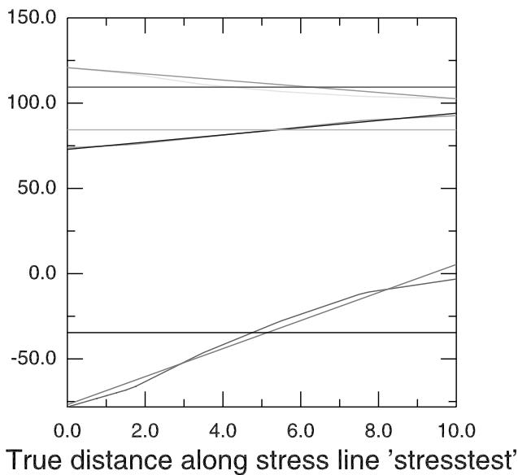  
Figure 1: Stress linearization results.

Additional information

• X–Y plotting

A ply stack plot shows the plies from the selected region of a composite model. You can create a ply stack plot in either the Property module or the Visualization module. This chapter describes ply stack plotting.

## In this section:

Understanding ply stack plots  
Customizing ply stack plots

## Understanding ply stack plots

A ply stack plot is a graphical representation of the plies from a selected region of a composite model. In effect, a ply stack plot is a core sample of the plies in the selected region. The region can be from a composite layup or from a composite section.

You can customize the appearance of a ply stack plot. For example, the image can show the sequence of plies, the orientation of the fibers in each ply, the material in each ply, the relative thickness of the ply, and the location of the reference surface. Figure 1 illustrates a ply stack plot.

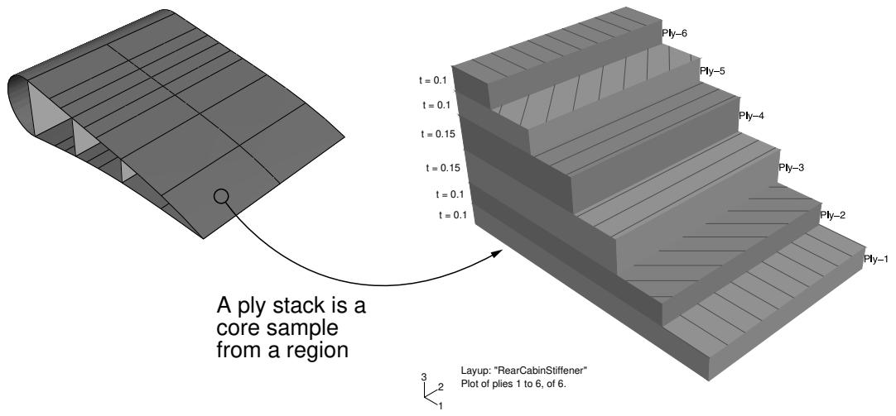  
Figure 1: A ply stack plot.

The staircase appearance has no corresponding physical meaning; it is just a mechanism that allows you to view all of the plies in a region. For example, the plies are not ending at each stair.

The triad in a ply stack plot represents the element orientation system, and it shows the shell normal or stacking direction (the 3-direction) and the 1- and 2-directions for the plies. The fibers are always drawn in the 1–2 plane at an angle with respect to the 1-direction. In solid composite layups the fibers in a ply do not always run parallel to the 1–2 plane (e.g., if the 3-direction of the ply orientation and the element stacking direction are not aligned). In this situation the fibers in the ply stack plot are not a true depiction of the fibers in the composite, but rather a graphical representation of the rotation angles in the composite section or layup definition: the angle drawn in the ply stack plot is the rotation angle specified in the ply table measured about the element stacking direction axis. For more information, see Understanding composite layups and orientations.

Ply stack plots do not draw fibers for ply orientations that are based on a user-defined coordinate system or a rotation angle distribution. Abaqus/CAE displays an asterisk (for coordinate systems) or a caret (for rotation angle distributions) on such plies to signify that it cannot draw lines in the 1–2 plane that accurately represent the fiber direction for the ply. Similarly, if you use a discrete field distribution to define a ply's thickness, Abaqus/CAE draws the ply in the ply stack plot based on the average thickness of the other uniform plies in the layup and displays the discrete field name next to the plot (if thickness labels are turned on).

It is important to know the position of the reference surface when you are modeling a composite with conventional shell elements. The mesh will be positioned on the reference surface, and contact is defined relative to the reference surface. The ply stack plot allows you to view the reference surface relative to other plies in the composite, as shown in Figure 2.

  
Figure 2:The reference surface in a ply stack plot.

You can display a ply stack plot in the Property module after you have created a composite layup or assigned a composite section to a region. You can also display a ply stack plot in the Visualization module after you have analyzed a model with a composite layup or a composite section. For more information, see Defining composite layups and Creating composite shell sections.

To produce a ply stack plot, select Tools->Query from the main menu bar and select Ply stack plot from the dialog box that appears. After you have displayed a ply stack plot, you can customize its appearance by clicking the Ply Stack

Plot Options button from the prompt area or by clicking the tool in the toolbox (in the Visualization module). For detailed instructions on customizing a ply stack plot, see Customizing ply stack plots.

## Customizing ply stack plots

This section explains how you use the Ply Stack Plot Options dialog box to customize the appearance of a ply stack plot.

## In this section:

Using ply stack plot options  
Customizing basic ply stack plot options  
Customizing the appearance of fibers in a ply stack plot  
Customizing the reference surface in a ply stack plot  
Customizing the labels in a ply stack plot

## Using ply stack plot options

Understanding ply stack plots describes how you can create a ply stack plot. After you have displayed a ply stack plot, you can customize its appearance by clicking the Ply Stack Plot Options button from the prompt area. Alternatively, you can do the following:

• In the Property module, choose View->Ply Stack Plot Options.  
• In the Visualization module, choose Options->Ply Stack Plot or click the tool in the toolbox.

Abaqus/CAE displays the Ply Stack Plot Options dialog box, which allows you to do the following:

• Choose which plies are displayed in the ply stack plot and how the plies are displayed. For more information, see Customizing basic ply stack plot options.  
• Choose whether fibers are displayed in the ply stack plot and the appearance of the fibers. For more information, see Customizing the appearance of fibers in a ply stack plot.  
Choose whether the reference surface is displayed in the ply stack plot and the appearance of the reference surface. For more information, see Customizing the reference surface in a ply stack plot.  
Customize the text and symbols that are displayed in a ply stack plot. For more information, see Customizing the labels in a ply stack plot.

## Customizing basic ply stack plot options

Click the Basic tab to choose which plies are displayed in the ply stack plot and how the plies are arranged. If your composite layup contains many plies, the ply stack plot can become confusing and hard to interpret. To make the ply stack plot more readable, the basic ply stack plot options allow you to view only a manageable number of plies.

1. Locate the basic options.

1. Click the Ply Stack Plot Options button from the prompt area, or do one of the following:

• In the Property module, choose View->Ply Stack Plot Options.

• In the Visualization module, choose Options->Ply Stack Plot or click the tool in the toolbox.

2. Click the Basic tab in the Ply Stack Plot Options dialog box that appears.

2. From the Display options, do the following:

• Select the render style—shaded, filled, or wireframe.  
• Choose whether to display the edges of each ply and the style and thickness of the edges.  
Choose whether to display the plies as a “staircase” image descending from the last ply to the first ply or as an image that is symmetric about the center ply or plies.

3. From the Visible Plies options, choose which plies to display. Abaqus/CAE updates the ply stack plot when you modify the display parameters, which allows you to quickly and conveniently display the plies in a composite. You can choose the following:

• Display the specified plies, starting with the Start ply and ending with the End ply.  
Display Number of plies, starting with the Start ply. Click Increment by Number to increment the Start value by Number of plies instead of by 1. This allows your ply stack plot to be a window that moves incrementally across the layup, with each increment displaying the next adjacent group of plies.  
Display Number of plies, centered around the Center ply. Click Increment by Number to increment the Center value by Number of plies instead of by 1. This allows your ply stack plot to be a window that moves incrementally across the layup, with each increment displaying the next adjacent group of plies.  
• Display Number of plies, centered around the Center ply. Drag the Center slider to move across the layup.

4. Choose the color of the Even and Odd plies:

a. Click the color sample .

Abaqus/CAE displays the Select Color dialog box.

b. Use one of the methods in the Select Color dialog box to select a new color. For more information, see Customizing colors.

c. Click OK to close the Select Color dialog box.

The color sample changes to the selected color.

Abaqus/CAE applies your choice of color relative to the plies that are displayed, not to the actual ply number. For example, if you are displaying plies 2, 3, and 4; Abaqus/CAE will apply the Odd color to plies 2 and 4 and the Even color to ply 3.

## 5. Click Apply to implement your changes.

The ply stack plot changes to reflect your specifications.

By default, your changes are saved for the duration of the session and will affect all subsequent ply stack plots in that viewport. If you want to retain your changes for subsequent sessions, save them to a file. For more information, see Saving customizations for use in subsequent sessions.

## Customizing the appearance of fibers in a ply stack plot

Click the Fiber tab to choose whether fibers are displayed in the ply stack plot and the appearance of the fibers. The fibers are always drawn in the 1–2 plane at an angle with respect to the 1-direction. For more information, see Understanding composite layups and orientations.

If you use a coordinate system to define the ply's orientation, Abaqus/CAE cannot determine the orientation within an element without knowing the spatial orientation of the element. Therefore, Abaqus/CAE displays an asterisk (\*) in place of the ply fibers to signify that it cannot draw lines in the 1–2 plane that represent the fiber direction. For the same reason, Abaqus/CAE cannot draw lines that accurately represent the fiber direction if the ply's orientation is defined using a discrete field distribution; a caret (^) in place of the ply fibers indicates that the additional rotation in a ply's orientation is defined using a discrete field.

In solid composite layups the fibers in a ply do not always run parallel to the 1–2 plane (e.g., if the 3-direction of the ply orientation and the element stacking direction are not aligned). Since fibers in a ply stack plot are always drawn in the 1–2 plane, they are not a true depiction of the fibers in the solid composite. Instead the fibers are a graphical representation of the rotation angles in the composite section or layup definition: the angle drawn in the ply stack plot is the rotation angle specified in the ply table measured about the element stacking direction axis.

1. Locate the fiber options.

1. Click the Ply Stack Plot Options button from the prompt area, or do one of the following:

• In the Property module, choose View->Ply Stack Plot Options.

• In the Visualization module, choose Options->Ply Stack Plot or click the tool in the toolbox.

2. Click the Fiber tab in the Ply Stack Plot Options dialog box that appears.

2. Do the following:

• Toggle on Show fibers to display fibers in the ply stack plot.  
• Choose the color, style, and thickness of the lines that represent fibers in the ply stack plot.  
• Drag the Spacing slider to change the number of fibers that are displayed.

3. Click Apply to implement your changes.

The ply stack plot changes to reflect your specifications.

By default, your changes are saved for the duration of the session and will affect all subsequent ply stack plots in that viewport. If you want to retain your changes for subsequent sessions, save them to a file. For more information, see Saving customizations for use in subsequent sessions.

Click the Reference Plane tab to choose whether the reference surface is displayed in the ply stack plot and to control the appearance of the reference surface. Conventional shell elements use the reference surface to define the geometry of the part. Therefore, you can display the reference surface only on shell composites; you cannot display the reference surface on continuum shell composite layups or solid composite layups. In addition, if the ply's offset is defined by a distribution, Abaqus/CAE cannot display the reference surface.

1. Locate the reference surface options.

1. Click the Ply Stack Plot Options button from the prompt area, or do one of the following:

• In the Property module, choose View->Ply Stack Plot Options.

• In the Visualization module, choose Options->Ply Stack Plot or click the tool in the toolbox.

2. Click the Reference Plane tab in the Ply Stack Plot Options dialog box that appears.

2. Do the following:

• Toggle on Show reference surface to display the reference plane in the ply stack plot.  
• Choose the color and translucency of the reference surface.  
Toggle on Show reference outline to display lines around the edge of the reference surface. Choose the color, style, and thickness of the lines.

3. Click Apply to implement your changes.

The ply stack plot changes to reflect your specifications.

By default, your changes are saved for the duration of the session and will affect all subsequent ply stack plots in that viewport. If you want to retain your changes for subsequent sessions, save them to a file. For more information, see Saving customizations for use in subsequent sessions.

## Customizing the labels in a ply stack plot

Click the Labels tab to customize the text and symbols that are displayed in a ply stack plot; for example, material and ply names, the state block, and integration points.

1. Locate the labels options.

1. Click the Ply Stack Plot Options button from the prompt area, or do one of the following:

• In the Property module, choose View->Ply Stack Plot Options.

• In the Visualization module, choose Options->Ply Stack Plot or click the tool in the toolbox.

2. Click the Labels tab in the Ply Stack Plot Options dialog box that appears.

2. Select the font of all the text in the ply stack plot.

a. Click Set Font for All Labels to display the Select Font dialog box.

b. Use the font selector dialog box to set the font properties that you want.

c. Click OK to close the Select Font dialog box and to return to the Ply Stack Plot Options dialog box.

3. Toggle on an option to display it.

4. Choose the color of the text:

a. Click the color sample .

Abaqus/CAE displays the Select Color dialog box.

b. Use one of the methods in the Select Color dialog box to select a new color. For more information, see Customizing colors.

c. Click OK to close the Select Color dialog box.

The color sample changes to the selected color.

5. Click Apply to implement your changes.

The ply stack plot changes to reflect your specifications.

By default, your changes are saved for the duration of the session and will affect all subsequent ply stack plots in that viewport. If you want to retain your changes for subsequent sessions, save them to a file. For more information, see Saving customizations for use in subsequent sessions.

You can produce a tabular data report of X–Y data objects, field output results, probe values, or free body cuts. Abaqus/CAE writes the report to the file name of your choice. Generate a tabular report to save data values beyond the duration of the session or to print these values. In addition, you can use a tabular report as ASCII input in subsequent Abaqus/CAE sessions.

This chapter explains how to produce and customize a tabular report.

## In this section:

Producing a tabular report  
Using tabular report options  
Selecting report data  
Specifying your report file name  
Controlling report layout, width, format, and coordinate system  
Sorting field output data  
Formatting report values  
Reporting data values, minimums, maximums, and totals

## Producing a tabular report

You can produce tabular reports of X–Y data objects, field output results, free body cuts, and probe values.

To produce a tabular report of X–Y data objects, field output results, or free body cuts, you first specify the report content, format, and destination. Abaqus/CAE generates the report when you apply these customization selections.

To produce a report of probe values, you first produce and then probe a model or X–Y plot. While probing, you can select probe values of interest and you can write the selected values to a file.

Depending on your selections, your report may include negative element labels. Negative labels indicate internal elements created by Abaqus/CAE. These elements are given negative labels so you can easily distinguish them from elements that you created while defining the model.

## Produce a report of X–Y data, field output results, or free body cuts

1. From the main menu bar, select Report->XY, Report->Field Output, or Report->Free Body Cut. The Report XY Data, Report Field Output, or Report Free Body Cut dialog box becomes available.  
2. Use the options to customize the report content, format, and destination.  
3. When you have finished, click Apply to generate the report.

## Produce a report of probe values

1. From the main menu bar, select Tools->Query, then click Probe values in the dialog box that appears. The Probe Values dialog box appears.  
2. Move the cursor to probe the model or X–Y plot in the current viewport.  
3. To select and accumulate values of interest in the data table in the bottom portion of the Probe Values dialog box, click mouse button 1 while probing.  
4. When you have finished, click Write to File to access the report file options and to generate the report.

## Using tabular report options

You can customize tabular report characteristics such as the objects to include, report layout, and sort order. Select Report->XY, Report->Field Output, or Report->Free Body Cut to customize and generate a tabular listing of X–Y data objects, field output variable values, or free body cuts, respectively. Select Tools->Query to generate a tabular report of probe values. The following list identifies the tabular report characteristics that you can customize and the sections where you can find information.

You can customize:

• The X–Y data objects or field output variables to include in the report. See Selecting report data.  
The free body cuts to include in the report. Abaqus/CAE includes all active free body cuts in the current output database in a free body cut report. You can activate and suppress free body cuts from the Free Body Cut Manager. See Displaying, hiding, and highlighting free body cuts.  
• The probe values to include in the report. See Probing the model.  
• The file name to which the report is written. See Specifying your report file name.  
• The layout and width of the report. See Controlling report layout, width, format, and coordinate system.  
• How field output or probe values are sorted. For field output, see Sorting field output data; for probe values, see Entering tabular data.  
• The format and significant digits of report values. See Formatting report values.  
Whether or not to include minimum and maximum value summaries or column totals. See Reporting data values, minimums, maximums, and totals.  
• The form of complex results in the report. See Controlling the form of complex results.

## Selecting report data

This section explains how to select X–Y data objects to include in an X–Y data report, how to select field output variables to include in a field output report, and how to select the options and thresholds to use for a free body cut report.

To learn how to control the contents of a tabular report of probe values, see Probing the model.

## In this section:

Selecting X–Y data objects  
Selecting field output variables  
Selecting field output section points  
Selecting options and thresholds for free body cut reports

You can select one or more X–Y data objects to include in your X–Y report.

1. Locate the X–Y report XY Data options.  
From the main menu bar, select Report->XY; then click the XY Data tab in the dialog box that appears.

2. Select the X–Y data objects to include in your report from the list of available data objects. By default, all previously saved X–Y data objects are listed. Choose one of the following options to adjust the contents of this list:

• Click All XY data to browse all previously saved X–Y data objects.  
Click XY plot in current viewport to browse only those X–Y data objects included in the X–Y data plot in the current viewport.

Abaqus/CAE lists the X–Y data objects you have requested.

3. To limit the list for easier selection, type a filter pattern into the Name filter field, and press the [Enter]

key to apply the filter. Click to the right of the text field to display information about how to construct a filter.

Abaqus/CAE lists only those X–Y data objects that meet your specification.

4. From the list of X–Y data object names and descriptions, select one or more data objects to include in your report. For more information on selecting multiple items in dialog boxes, see Selecting multiple items from lists and tables.

To generate your report, configure any desired customization options on the Setup page, which is also in the Report XY Data dialog box; and click Apply. When you have finished, click Cancel to close the dialog box.

## Additional information

• Using tabular report options

## Selecting field output variables

You can select one or more field output variables to include in your tabular report.

The variables that are available consist of those you have saved to the output database. You can generate reports for the current frame or for multiple frames.

Abaqus/CAE can calculate and report values for a given variable at a variety of positions. The possible report positions are: integration point, centroid, element nodal, and unique nodal.

Element nodal and unique nodal positions both involve reporting results at the nodes of the model; however, reporting of unique nodal values produces only a single value at each node, whereas reporting of element nodal values produces one value for each element that has a contribution at that node. Only unique nodal values are provided in the case of node-based variables such as displacement. For element-based variables such as stress, extrapolation and averaging must be carried out to obtain unique nodal values. The use of averaging threshold values and the control of averaging across regional and material boundaries will affect the element nodal values reported for element based results (for more information, see Selecting result options).

The following table summarizes which output positions can be reported, depending on what position was used when the variable was saved to the output database:

<table><tr><td></td><td colspan="4">Report Position</td></tr><tr><td>Output Database Position</td><td>Integration point</td><td>Centroid</td><td>Element Nodal</td><td>Unique Nodal</td></tr><tr><td>Integration Point</td><td>Yes</td><td>Yes</td><td>Yes</td><td>Yes</td></tr><tr><td>Centroid</td><td>No</td><td>Yes</td><td>Yes</td><td>Yes</td></tr><tr><td>Element Nodal</td><td>No</td><td>No</td><td>Yes</td><td>Yes</td></tr><tr><td>Unique Nodal</td><td>No</td><td>No</td><td>No</td><td>Yes</td></tr></table>

Contact surface variables such as CNORMF, CSHEARF, CPRESS, COPEN, CSLIP, CSHEAR1, and CSHEAR2 can be reported only at the element nodal position.

When generating the field output report for element-based field output at any output position, Abaqus/CAE writes the field values from the specified position if the same position is available in the output database.

For information on selecting the section point locations at which to report output variables, see Selecting field output section points.

1. Locate the options for field output reports.  
From the main menu bar, select Report->Field Output.

2. Choose the frames from which Abaqus/CAE reads field output data.

Choose Specify to use the current step/frame. To change the current step or frame, click . For more information, see Selecting the results step and frame.  
Choose All active steps/frames to use all active steps/frames. Click Active Steps/Frames to change the steps or frames from which Abaqus/CAE reads field output data. For more information, see Activating and deactivating steps and frames.

3. Click the Variable tab to display the Output Variables options.

4. Click the Position arrow to reveal possible positions at which to list variables for your selection; then choose the desired position. Multiple variables can be combined in a single table only if they are reported at the same position.

The list of variables is refreshed to show only those that can be reported at the selected position.

5. Select the field output variables to include in your report using either the check box next to each variable in the list (this method is the default) or the Edit text field at the bottom of the page.


## Note:

You must use the check box method if you want to specify an individual section point at which to report values.

## To use the check box method:

1. To select a variable and all of its components, click that variable's check box.  
2. To choose among the individual components of a variable, click the arrow next to that variable's check box to list its components; then click individual component check boxes to select them.

## To use the edit method:

In the Edit text field, enter the names of the variables and components to include in your report. To be valid, a variable must be available on the output database and reportable at the current position.

To generate your report, configure the remaining options on the Setup page, which is also in the Report Field Output dialog box; then click Apply. When you have finished, click Cancel to close the dialog box.

## Additional information

• Selecting the results step and frame  
• Using tabular report options

## Selecting field output section points

If your field output report includes section point variables, you can choose the section point at which Abaqus/CAE reports values for those variables. The default is to report values at all available section points.

1. Locate the section point options.  
From the main menu bar, select Report->Field Output; then click the Variables tab in the dialog box that appears.  
2. Use the check box method to select section variables.  
3. At the Section point label at the bottom of the dialog box, do one of the following:  
• click All to report values at all available section points, or  
• click Single to indicate that you will select one section point at which to report values.

If you have selected at least one element section point variable, the section point Settings button becomes available.

4. To select one or more section points, click Settings.

The Field Report Section Point Settings dialog box appears. Use this dialog box to select the desired section points. For more information, see Selecting section point data by category.

5. Click OK to apply your section point selections and to close the Field Report Section Point Settings dialog box.

To generate your report, configure the remaining options on the Setup page, which is also in the Report Field Output dialog box; then click Apply. When you have finished, click Cancel to close the dialog box.

## Additional information

• Selecting field output variables  
• Using tabular report options

## Selecting options and thresholds for free body cut reports

You can create a tabular report of the resultant forces and moments in all active free body cuts in your session. You can activate or suppress individual free body cuts by toggling their Show check boxes in the Free Body Cut Manager; for more information, see Displaying, hiding, and highlighting free body cuts. Abaqus/CAE reports resultant force and moment data with respect to the global coordinate system, regardless of the settings selected in the Component Resolution options for free body cuts or for view cuts.

You can generate reports for the current frame or for multiple frames. You can also specify custom threshold values for force data and moment data in the report; forces and moments smaller than these thresholds are reported as zero in the report. Selecting appropriate thresholds enables you to produce cleaner report data; for example, replacing small report values such as 1.234E-17 with 0 makes report data easier to read. The default threshold for both force and moment values is 1E-006.

1. Locate the options for free body cut reports.  
From the main menu bar, select Report->Free Body Cut.  
2. Choose the frames from which Abaqus/CAE reads free body cut data.

• Choose Specify to use the current step/frame. To change the current step or frame, click . For more information, see Selecting the results step and frame.  
Choose All active steps/frames to use all active steps/frames. Click Active Steps/Frames to change the steps or frames from which Abaqus/CAE reads free body cut data. For more information, see Activating and deactivating steps and frames.

3. From the File options, specify the report file name. For specific instructions, see Specifying your report file name.  
4. From the Output Format options, specify the presentation format for the report data. For specific instructions, see Controlling report layout, width, format, and coordinate system.  
5. If desired, specify a threshold value for forces and a threshold value for moments from the Thresholds options. Abaqus/CAE will report force and moment values smaller than these thresholds as zero.

To generate your report, click Apply. When you have finished, click Cancel to close the dialog box.

## Additional information

• Selecting field output variables  
• Using tabular report options

## Specifying your report file name

Abaqus/CAE writes your tabular data report to the file name of your choice. If you choose to write your report to an existing file, you can further specify whether the new information should be appended to the current file contents or whether the file should be overwritten. The default is to append the new information.

1. Locate the File options.

## For a report of X–Y data or field output:

From the main menu bar, selectReport->XY or Report->Field Output; then click the Setup tab in the dialog box that appears. The File options are at the top of the page.

## For a report of free body cuts:

From the main menu bar, selectReport->Free Body Cut. The File options are at the top of the page.

## For a report of probe values:

From the main menu bar, selectTools->Query, then click Probe values in the dialog box that appears. The Probe Values dialog box appears.

Move the cursor to probe the model or X–Y plot in the current viewport, then click mouse button 1 to store values of interest in the dialog box. When you are finished, click Write to File. The Report Probe Values dialog box appears; the File options are at the top of the dialog.

2. To select a file name using the standard file browser, click Select.

The File Selection dialog box appears. Use the dialog to filter and browse existing files. For more information on using this dialog box, see Using file selection dialog boxes. When you are finished, click OK to close the dialog box.

3. Type into the Name field the name of the file to which your report is to be written.  
4. Toggle Append to file to append this report to the current contents (if any) of the file you have specified. When Append to file is off, existing file contents will be overwritten.

To generate your report, configure the remaining options in the dialog box; then click Apply (for X–Y, field output, or free body cuts) or OK (for probe values reports). When you have finished, click Cancel to close the dialog box.

## Additional information

• Using tabular report options

## Controlling report layout, width, format, and coordinate system

Options are available to format the report layout for ease of reading and exporting.

For tabular reports of X–Y data, field output, or probe values you can limit the width of the table; for example, to the number of characters your printer can support.

An X–Y data report can include one or multiple X–Y data objects. Similarly, a field output report can include one or multiple variables. For both types of reports, if you include multiple items, you can choose to present each item in its own table or to combine items into a single table. If you combine multiple items into a single table, additional columns of data are formed and the width of the table increases.

To combine X–Y data objects into a single table, Abaqus/CAE aligns the X-values of the data objects. If any data objects do not have matching X-values, you can choose to have Abaqus/CAE compute the missing points by interpolation and extrapolation. To learn more about interpolation and extrapolation, see Understanding X–Y data interpolation and extrapolation.

For field output reports Abaqus/CAE creates a separate table (of a single variable or of combined variables, according to your specification) for every region in the current display group. A region is a portion of your model that has compatible materials, section properties, and element types. Abaqus/CAE identifies the region associated with each table in the report. (For more information on display groups, see Using display groups to display subsets of your model; for more information on regions, see Understanding result value averaging.)

For field output and free body cuts Abaqus/CAE enables you to generate report output in either annotated format or in comma-separated value (CSV) format. In annotated format, results are presented so that they can be read easily; in CSV format, results are intended to be exported and read in spreadsheet applications.

You can also report data from free body cuts in the global coordinate system or in the local coordinate systems for which they were defined.

1. Locate the Output Format options.

## For a report of X–Y data or field output:

From the main menu bar, selectReport->XY or Report->Field Output; then click the Setup tab in the dialog box that appears. The Output Format options are in the center of the page.

## For a report of free body cuts:

From the main menu bar, selectReport->Free Body Cut. The Output Format options are in the center of the page.

## For a report of probe values:

From the main menu bar, selectTools->Query, then click Probe values in the dialog box that appears. The Probe Values dialog box appears.

Move the cursor to probe the model or X–Y plot in the current viewport, then click mouse button 1 to store values of interest in the dialog box. When you are finished, click Write to File. The Report Probe Values dialog box appears; the Output Format options are in the center of the dialog.

2. For X–Y data reports, select the Layout option of your choice:

• Select Single table for all X–Y data to combine all the selected data objects into a single table.

Toggle Interpolate between X values (if necessary) to have Abaqus compute missing points. When this option is toggled off, missing points (if any) appear as “No Value” in the table.

• Select Separate table for each X–Y data to have each of the selected data objects appear in its own table.

3. For field output reports, select the format of your choice:

Select Annotated format to include the data such as step/frame and output position at the beginning of the report. Field output is written only under steps/frames where it is available.

Toggle Separate table for each field output variable to have each of the selected output variables appear in its own table.

Select Comma-separated values (CSV) to generate a report that includes a single header containing all the selected field output variables and combines the field values from all regions and instances into a single table. If any of the selected field output is not available in a particular step/frame, an entry of NoValue appears in the table column corresponding to that field.

When you select this format, the options to use separate tables for each field output variable, to specify the page width, to include column totals, and to include a summary of the minimum and maximum values are unavailable.

To include information about the local coordinate system at each value, if applicable, toggle Element orientations in the Data options area. Coordinate system columns, if specified, might not adhere to the page width.

4. For X–Y data reports or field output reports, select the Page width (characters) option of your choice:

• Select No limit to allow an unlimited table width.

• Select Specify to limit the table's width. Then, in the Specify text field, enter the maximum number of characters that can appear along the width of the table.

5. For free body cut reports, perform the following:

• Select either Normal annotated format or Comma-separated values (CSV) as the report format.

• Select either Global CSYS or Local CSYS as the coordinate system for the free body cuts.

To generate your report, configure the remaining options in the dialog box; then click Apply (for X–Y, field output, or free body cut reports) or OK (for probe values reports). When you have finished, click Cancel to close the dialog box.

## Additional information

• Using tabular report options  
• Formatting report values  
• Understanding X–Y data interpolation and extrapolation

## Sorting field output data

For tabular field output reports you can choose to sort all of the data in the table according to the values in any single column of the table and you can choose to sort in either ascending or descending order.

You control which columns Abaqus/CAE includes in the table using the Variable options in the Report Field Output dialog box. (For more information, see Selecting field output variables.) The table has one column for each field output variable you have selected, and additional columns to identify the origin of the field output; for example, if your table includes unique nodal quantities Abaqus/CAE provides a Node Label (node number) column.

Negative element labels are used in the reports to distinguish internal elements created by Abaqus/CAE from elements that you created while defining the model. If your report includes internal elements and you choose to sort by element labels, these elements will be grouped at the top or bottom of your report.

For information on sorting the data in a tabular report of probe values, see Entering tabular data.

1. Locate the field output report sorting options.  
From the main menu bar, select Report->Field Output; then click the Setup tab in the dialog box that appears. The Sort by options are in the middle of the page.  
2. Click the Sort by arrow to reveal the list of column choices.  
3. Select the column to sort by from the list.  
4. Click either Ascending or Descending to choose the order of the sort.

To generate your report, configure the remaining options in the dialog box; then click Apply. When you have finished, click Cancel to close the dialog box.

## Additional information

• Using tabular report options

## Formatting report values

You can specify the number of significant digits (for X–Y data reports, field output reports, and probe value reports) or the total number of decimal places (for free body cut reports) to present in your tabular data report. For X–Y data reports, field output reports, and probe value reports, the default number of significant digits is 6; for free body cut reports, the default number of decimal places is 3. More digits give greater precision but take more space and increase the width of the tables; the number of significant digits or decimal places used determines the width of each column in the table. In addition, you can select one of the following number formats for your data values:

## Automatic

Very large values and very small values are expressed in scientific format. All remaining values are expressed with no exponent and using the specified number of significant digits. This format is available for X–Y data reports, field output reports, and probe value reports.

## Engineering

Values greater than or equal to 1000 (or values less than or equal to 0.001) are expressed as a number ranging from 1 to 999 that is multiplied by 10 to the nth power, where n is a product of 3 (for example, 20.5E+03 or 17.76E+06). All remaining values are expressed using the specified number of significant digits.

## Fixed

All values are expressed without using exponent values. When you select this format, the number 501,000 is displayed in the legend as 501000.00. This number format is available only for free body cut reports, and your legend values may be displayed differently if you change the Decimal places option.

## Scientific

All values are expressed as a number between 1 and 10 that is multiplied by an appropriate power of 10 (for example, 2.05E+04 or 1.776E+07).

The default format is Engineering for X–Y data reports, field output reports, and probe value reports and Scientific for free body cut reports.

1. Locate the Output Format options.

## For a report of X–Y data or field output:

From the main menu bar, selectReport->XY or Report->Field Output; then click the Setup tab in the dialog box that appears. The Output Format options are in the center of the page.

## For a report of free body cuts:

From the main menu bar, selectReport->Free Body Cut. The Output Format options are in the center of the page.

## For a report of probe values:

From the main menu bar, selectTools->Query, then click Probe values in the dialog box that appears. The Probe Values dialog box appears.

Move the cursor to probe the model or X–Y plot in the current viewport, then click mouse button 1 to store values of interest in the dialog box. When you are finished, click Write to File. The

Report Probe Values dialog box appears; the Output Format options are in the center of the dialog.

2. Specify the precision level for numerical values in the report:

• For X–Y, field output, or probe value reports, specify this value in the Number of significant digits text field.  
• For free body cut reports, enter this value in the Decimal places text field.

You can also click the arrows next to the applicable field until the desired number appears.

3. Click the Number Format button, and select the number format of your choice from the list that appears.

To generate your report, configure the remaining options in the dialog box; then click Apply (for X–Y, field output, or free body cut reports) or OK (for probe values reports). When you have finished, click Cancel to close the dialog box.

## Additional information

• Using tabular report options

## Reporting data values, minimums, maximums, and totals

You have the option to include minimum and maximum value summaries or column totals in reports.

For tabular reports of X–Y data or field output, you can include or suppress X–Y data or field output values, column minimum and maximum value summaries, and column totals. By default, Abaqus/CAE includes only the actual data values in reports of X–Y data. In reports of field output values, Abaqus/CAE includes by default the data values as well as column summaries and totals.

For tabular reports of probe values, Abaqus/CAE always includes the actual data values in the report. You can include or suppress column minimum and maximum value summaries and column totals for any columns in which such values would be meaningful.

1. Locate the Data or Data Values options.

## For a report of X–Y data or field output:

From the main menu bar, selectReport->XY or Report->Field Output; then click the Setup tab in the dialog box that appears. The Data options are at the bottom of the page.

## For a report of probe values:

From the main menu bar, selectTools->Query, then click Probe values in the dialog box that appears. The Probe Values dialog box appears.

Move the cursor to probe the model or X–Y plot in the current viewport, then click mouse button 1 to store values of interest in the dialog box. When you are finished, click Write to File. The Report Probe Values dialog box appears; the Data Values options are at the bottom of the dialog box.

2. For X–Y data reports or field output reports, you must choose one or more of the following items to include in your report. If you generate field output reports in comma-separated value (CSV) format, the options to include column totals and to include a summary of the minimum and maximum values are unavailable.

Toggle XY data or Field output to include the actual X–Y data or field output values, respectively. Toggling this option off results in a report that consists of only the column total or min/max data you request.  
• Toggle Column totals to include totals for each column.  
• Toggle Column min/max to include a summary of the minimum and maximum value occurring in each column.

To generate your report, configure the remaining options in the dialog box; then click Apply (for X–Y reports or field output reports) or OK (for probe values reports). When you have finished, click Cancel to close the dialog box.

## Additional information

• Using tabular report options

This chapter explains how to customize the appearance of your plots by selecting various plot state–dependent and plot state–independent options.

Using display groups to display subsets of your model and Overlaying multiple plots describe additional ways to customize the display of your model in the viewport.

## In this section:

Selecting plot display options  
Customizing render style, translucency, and fill color  
Customizing element and surface edges  
Customizing model shape  
Customizing model labels  
Displaying multiple plot states  
Displaying element and surface normals  
Customizing the appearance of display bodies  
Customizing camera movement  
Controlling the display of model entities  
Controlling the display of constraints in the Visualization module  
Customizing general model display

## Selecting plot display options

You can customize how your model appears in undeformed, deformed, contour, symbol, and material orientation plots.

For the undeformed and deformed plot states, all of the customization options applied to the model shape are plot state–independent. That is, Abaqus/CAE applies the customizations to all undeformed and deformed plots, including those that also display contours, symbols, or material orientations. The plot state–independent options govern the render style and fill color; element and surface edges; element colors; the appearance of model labels, node symbols, and display bodies; the movement of the camera; the display of various model entities; the smoothness of curved edges; the color of elements with no results; and model sweeping and extrusion. Use the Options menu in the main menu bar to choose from these plot state–independent customization options.

Select Tools->Color Code from the main menu bar to color individual elements. Select Options->Display Body from the main menu bar to customize the appearance of all display bodies in your model. Select View->View Options from the main menu bar to customize the movement of the camera. To choose from the remaining plot state–independent options, select View->ODB Display Options from the main menu bar. If you choose to superimpose the deformed model shape on the undeformed shape for the same plot state, select

Options->Superimpose from the main menu bar to customize the undeformed shape independently from the deformed shape. Like the other plot state–independent customizations, these plot options are applied to superimposed plots in all plot states.


## Note:

Displaying model labels and/or symbols in the viewport can increase the amount of time needed to refresh the display for plots and animations.

In addition to the plot state–independent customization options, you can select plot state–dependent options for the contour, symbol, and material orientation plot states. The plot state–dependent options are unique to each plot type. For example, you can customize the contour color spectrum, the size and style of symbols, and the display of material orientation triad axes. If a similar customization such as the color of model edges in the common and contour plot options can be made using both independent and dependent plot options, the plot state–dependent option overrides the independent option.

## In this section:

Saving customizations for use in subsequent sessions  
Available customization options

## Saving customizations for use in subsequent sessions

By default, plot display customizations persist for the current session only, but you can save customizations to a file if you want to apply them to subsequent sessions. Abaqus/CAE offers the following methods to retain plot display customizations:

## Saving customizations to the display options file

Select File->Save Display Options from the main menu bar to save all your plot state–dependent and plot state–independent customization options as display options. Display options are stored in a file called abaqus\_2025.gpr, and Abaqus/CAE loads the settings in this file automatically upon startup as the new default settings throughout your session. For plot state customization, saving your display options to a file enables you to store settings such as the render style, the visibility of prescribed conditions and the various types of datum geometry, and the display of mesh, element, and node labels.

For more information, see Saving your display options settings.

## Saving customizations to an XML file, model database, or output database

Select File->Save Session Objects from the main menu bar to save selected plot state–dependent and plot state–independent customization options to an XML file, the model database, or an output database. When you use this method, you can save all the customization options or you can save just the customization options related to one or more plot states. For example, you can save customizations you make in the common plot options and in the contour plot options to a file.

If you save customizations to a model database or an output database, those settings are used when you open the file. When you load customizations from an XML file, these customizations become the new settings for your session. You can load settings from a file by selecting File->Load Session Objects.

For more information, see Managing session objects and session options.

## Available customization options

Many options are available to customize how your model appears in undeformed, deformed, contour, symbol, and material orientation plots.

Abaqus/CAE provides the following customization options:

## Render style

Render style is the style in which Abaqus/CAE displays your model. Render style is a plot state–independent option; that is, you set it once for all undeformed, deformed, contour, symbol, and material orientation plots. However, you can set a different value of render style for use with the undeformed shape in a superimposed plot. Render style choices include wireframe, filled, hidden, and lightsource-shaded. For more information, see Customizing render style, translucency, and fill color.

## Element and surface edge style and visibility

Edge style is the line style and thickness of element and surface edges; edge visibility is the extent to which Abaqus/CAE displays these edges. Edge style and visibility options are plot state–independent, but you can set them differently for use with the undeformed shape in a superimposed plot. For more information, see Customizing element and surface edges.

## Element and surface edge color

You can control the overall color of element and surface edges using the plot state–independent Color & Style options. In addition, you can customize the edge color of individual elements and surfaces using the plot state–independent Color Code dialog box. By default, the color code selections override the overall colors. For more information on overall edge coloring, see Selecting overall element and surface edge color. To learn more about individual item edge coloring, see Customizing the display color of individual objects. Individual item edge coloring applies only to wireframe and hidden render style plots.

## Element face and surface fill color

You can control the overall fill color of element faces and surfaces using the plot state–independent Color & Style options. In addition, you can customize the face color of individual elements using the plot state–independent Color Code dialog box. By default, the color code selections override the overall colors. For more information on overall fill color, see Selecting overall fill color. To learn more about individual item color filling, see Customizing the display color of individual objects. Individual item fill coloring applies only to filled and shaded render style plots.

## Model labels and node symbols

You can change the visibility and customize the color and font of element, node, and face labels and the color and style of node symbols. All these options are plot state–independent. For more information, see Customizing model labels.

## Element and surface normals

You can choose to display arrows representing the element or surface normals in the model. The arrows are visible in all plot states, and you can control the arrow size, color, and arrowhead style. For more information, see Displaying element and surface normals.

## Display body appearance

You can customize the render style; edge visibility, color, and style; fill color; scaling; and translucency for all display bodies in your model. These options are plot state–independent when applied to display bodies. For more information, see Customizing the appearance of display bodies.

## Camera movement

You can select a coordinate system and match the motion of that coordinate system with the camera. You can also make the camera follow the rotation of the selected coordinate system. If you are using the camera in movie mode, you can also position the camera in the model at the origin of the coordinate system. For more information, see Customizing camera movement.

## Entity display

You can control the display of symbols representing various model entities, including boundary conditions, connectors, coordinate systems, and point elements. Entity display options are plot state–independent. For more information, see Controlling the display of model entities.

## Constraints display

You can control the display of analysis constraints that were applied in the Interaction module; for example, tie constraints or kinematic coupling constraints. For more information, see Controlling the display of constraints in the Visualization module.

## General model display options

Abaqus/CAE offers several other plot state–independent general model display options. These options include:

• Sweep/Extrude to control the three-dimensional display of two-dimensional models. For more information, see Sweeping and extruding your model.  
• Mirror/Pattern to simulate the display of a complete model when only a representative portion of the model was analyzed. For more information, see Using mirrors and patterns to display your results.  
• Curved Lines & Faces to control how quadratic and cubic element edges and faces are displayed. For more information, see Refining curved edges and faces.  
• Elements with No Results to control the color of elements having no results (for example, rigid surfaces) in contour plots. For more information, see Coloring elements with no results.  
• Idealizations to control the display of beam profiles, shell thickness, and thermal fluid pipe elements. For more information, see Controlling beam profile display for postprocessing and Controlling shell thickness display for postprocessing, and Controlling the display of thermal fluid pipe elements.  
• Model Change to control the visibility of components deactivated by model change interactions. For more information, see Viewing removed elements.

## Customizing render style, translucency, and fill color

This section explains how to customize the render style, translucency, and fill color of your model.

## In this section:

Choosing a render style  
Customizing translucency  
Selecting overall fill color

## Choosing a render style

Render style is the style in which Abaqus/CAE displays your model. Render style is plot state–independent; that is, you set it once for all undeformed, deformed, contour, symbol, and material orientation plots.

You can also set a second render style that Abaqus/CAE will apply to the undeformed shape when the deformed shape

is superimposed on it. Possible render styles are Wireframe, Hidden, Filled, and Shaded; these styles are shown in Figure 1. An explanation of these choices follows.

  
Figure 1: Model showing render style options. From left to right: the wireframe, filled, hidden, and lightsource-shaded render styles.

## Wireframe

Displays model edges; both interior and exterior edges are potentially visible. Wireframe plots produce a frame-like visual effect in which model faces are not displayed.

## Filled

Displays model faces “painted” in a uniform color. Filled plots produce a solid rather than frame-like appearance in which only exterior faces are visible.

## Hidden

Displays a wireframe plot in which edges obscured by the model are not visible. Hidden plots produce a solid rather than frame-like appearance.

## Shaded

Displays a filled plot in which a light source appears to be directed at the model. Shaded plots produce a highly three-dimensional visual effect.

1. Locate the common or superimposed Render Style options. The common render style always applies to the deformed shape; it applies to the undeformed shape when it is plotted individually in any plot state (undeformed, contour, symbol, or material orientation). When the undeformed shape is plotted with the deformed shape, the superimpose render style applies.

From the main menu bar, select Options->Common or Superimpose; then click the Basic tab in the dialog box that appears. The Render Style options become available.

2. From the Render Style list, select the render style that you want.


Tip: You can also select the render style for the current plot state (excluding display bodies and the undeformed shape when it is superimposed) by clicking the wireframe , hidden

, filled , or shaded icons located in the Render Style toolbar.


## Note:

Symbol and material orientation plots in the shaded, filled, and hidden render styles are easier to view if you activate translucency.

3. Click Apply to implement your changes.

The render style changes to reflect your specification.

By default, your changes are saved for the duration of the session and will affect all subsequent plots in the current viewport and in any new viewports created from the current viewport. If you want to retain the changes you applied for subsequent sessions, save them to a file. For more information, see Saving customizations for use in subsequent sessions.

## Additional information

• Customizing translucency  
• Choosing a render style

## Customizing translucency

Translucency options control the degree of transparency of your model, and they apply to plots in all render styles except wireframe. Translucency is plot state–independent; that is, you set it once for all undeformed, deformed, contour, symbol, and material orientation plots. You can also set the translucency that Abaqus/CAE will apply to the undeformed shape when the deformed shape is superimposed on it.

For shaded symbol and material orientation plots, symbol plot arrows and material orientation triads located in the interior of the model are easier to view if you turn on translucency.

1. Locate the common or superimposed Translucency options. The common translucency setting always applies to the deformed shape; it applies to the undeformed shape when it is plotted individually in any plot state (undeformed, deformed, contour, symbol, or material orientation). When the undeformed shape is plotted with the deformed shape, the superimpose translucency style applies.

From the main menu bar, select Options->Common or Superimpose. Click the Other tab in the dialog box that appears; then click the Translucency tab. The Translucency options appear.

2. Toggle on Apply translucency to activate the translucency options.  
3. Choose the percentage of translucency.

Drag the slider to the percentage of translucency that you want. A value of .00 indicates transparent plotting; 1.00 indicates opaque plotting. The default translucency is .30.

4. Click Apply to implement your changes.

The translucency changes to reflect your specifications.

By default, your changes are saved for the duration of the session and will affect all subsequent plots in the current viewport and in any new viewports created from the current viewport. If you want to retain the changes you applied for subsequent sessions, save them to a file. For more information, see Saving customizations for use in subsequent sessions.

## Additional information

• Customizing render style, translucency, and fill color  
• Coloring elements with no results

## Selecting overall fill color

Fill color is the color in which Abaqus/CAE displays your model faces. This color is plot state–independent; that is, you set it once for all undeformed, deformed, symbol, and material orientation plots. You can also set the fill color that Abaqus/CAE will apply to the undeformed shape when the deformed shape is superimposed on it. Fill color applies to filled and lightsource-shaded render style plots only; it is not applicable to contour plots.

You can choose one display color for your entire model, or you can optionally override this display color for selected items, such as particular elements. For example, you can display your model in green, with a group of elements shown in red. For more information on individual item coloring, see Customizing the display color of individual objects.

1. Locate the common or superimposed fill color options. The common fill color always applies to the deformed shape; it applies to the undeformed shape when it is plotted individually in any plot state (undeformed, deformed, symbol, or material orientation). When the undeformed shape is plotted with the deformed shape, the superimpose fill color applies.

From the main menu bar, select Options->Common or Superimpose; then click the Color & Style tab in the dialog box that appears.

The Fill color in filled/shaded plots options are in the center of the Color & Style page.

2. Choose the fill color:

a. Click the Fill color in filled/shaded plots color sample

Abaqus/CAE displays the Select Color dialog box.

b. Use one of the methods in the Select Color dialog box to select a new color. For more information, see Customizing colors.

c. Click OK to close the Select Color dialog box.

The color sample changes to the selected color. The new color does not appear in the viewport until you click OK or Apply in the Plot Options dialog box.

3. Toggle Allow color code selections to override options in this dialog off to display all elements in the fill color specified above. Toggle it on to override this color using individual item color selections. The default is on. For more information, see Customizing the display color of individual objects.

4. Click Apply to implement your changes.

The fill color changes to reflect your specifications.

By default, your changes are saved for the duration of the session and will affect all subsequent plots in the current viewport and in any new viewports created from the current viewport. If you want to retain the changes you applied for subsequent sessions, save them to a file. For more information, see Saving customizations for use in subsequent sessions.

## Customizing element and surface edges

This section explains how to customize the appearance of element and surface edges in your model.

## In this section:

Controlling element and surface edge visibility  
Defining model feature edges  
Selecting overall element and surface edge color  
Customizing element and surface edge style

## Controlling element and surface edge visibility

You can control the extent to which Abaqus/CAE displays element and surface edges. Edge visibility is plot state–independent; that is, you set it once for all undeformed, deformed, symbol, and material orientation plots. You can also set the edge visibility that Abaqus/CAE will apply to the undeformed shape when the deformed shape is superimposed on it. The following choices are available to control edge display: All edges, Exterior edges, Feature edges, Free edges, and No edges. The first four options are shown in Figure 1.

  
All

  
Exterior

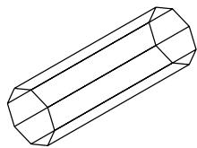  
Feature

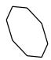  
Free

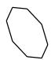

Figure 1: Model showing edge display options.  


## Note:

If your output database includes both homogeneous solid elements and either composite solid elements or continuum shell elements, Abaqus/CAE displays a free edge or a feature edge at the boundary between the homogeneous solid geometry and the composite geometry or continuum shell geometry.

1. Locate the common or superimposed Visible Edges options. The common visible edges setting always applies to the deformed shape; it applies to the undeformed shape when it is plotted individually in any plot state (undeformed, deformed, contour, symbol, or material orientation). When the undeformed shape is plotted with the deformed shape, the superimpose visible edges setting applies.

From the main menu bar, select Options->Common or Superimpose; then click the Basic tab in the dialog box that appears. The Visible Edges options are on the right side of the Basic page.

2. To choose the element and surface edges you want to display, click one of the following:

## All edges

Displays all element and surface edges. To see element edges on the interior of the model, you must also set the render style to wireframe.

## Exterior edges

Displays only edges on the exterior of the model.

## Feature edges

Displays only edges on the exterior of the model that are calculated to be feature edges. Feature edges lie between elements that have normals that differ by more than the “feature angle.” The feature angle is set in the View->ODB Display Options->General dialog box; for more information, see Defining model feature edges.

## Free edges

Displays only edges that belong to a single element. Free edge display is particularly useful for locating potential holes or cracks in your mesh.

## No edges

Suppresses the display of all edges. This choice is available only for plots in the filled or shaded render styles.


## Note:

When elements are duplicated (i.e., share all the same corner nodes), Abaqus/CAE will not display the element edges in a free or feature edge plot.

## 3. Click Apply to implement your changes.

The edge visibility changes according to your specification.

Your changes are saved for the duration of the session and will affect all subsequent plots in the current viewport and in any new viewports created from the current viewport.

By default, your changes are saved for the duration of the session and will affect all subsequent plots in the current viewport and in any new viewports created from the current viewport. If you want to retain the changes you applied for subsequent sessions, save them to a file. For more information, see Saving customizations for use in subsequent sessions.

## Additional information

• Defining model feature edges  
• Selecting overall element and surface edge color  
• Customizing element and surface edge style  
• Controlling edge visibility

## Defining model feature edges

The common and superimposed plot options determine which model edges appear in all plot states. When you specify that only feature edges are to be visible, Abaqus/CAE determines which edges meet this criteria. Feature edges lie between elements having normals that differ by more than the “feature angle.”You can customize the feature angle. Larger angles will reduce the number of feature edges; conversely, smaller angles will cause more edges to be visible. The default is 20°. The setting of the feature angle applies to all plot states. However, all segment edges are drawn for analytical rigid surfaces regardless of the feature angle setting.

In Figure 1 the plot on the left shows feature edges when the feature angle is set to 0°, the plot in the middle shows feature edges on the same model but with the feature angle set to 15°, and the plot on the right shows the model with the feature angle set to 30°.

  
Figure 1: Plots showing feature angles of 0°, 15°, and 30°.

1. Locate the Feature Angle options.  
From the main menu bar, select View->ODB Display Options. Click the General tab in the dialog box that appears. The Feature Angle options are at the bottom of the General page.  
2. Drag the Feature Angle slider to the desired feature angle.  
3. Click Apply to implement your changes.

Feature edges for all plot states change to reflect your feature angle specification. By default, your feature angle specification is saved for the duration of the session. If you want to retain this change for subsequent sessions, save it to a file. For more information, see Saving customizations for use in subsequent sessions.

## Additional information

• Controlling element and surface edge visibility  
• Defining mesh feature edges

You can customize the color in which Abaqus/CAE displays element and surface edges. With the exception of contour plots, edge color is plot state–independent; that is, you set it once for all undeformed, deformed, symbol, and material orientation plots. You can choose a different edge color for certain render styles, and you can set the edge color that Abaqus/CAE will apply to the undeformed shape when the deformed shape is superimposed on it. For contour plots you can choose a different edge color for certain contour types.

You can choose one display color for your entire model, or you can optionally override this display color for selected items, such as particular elements. For example, you can display your model in green, with a group of elements shown in red. For more information on individual item coloring, see Customizing the display color of individual objects.

1. Locate the edge color options (common, superimposed, or contour) that you want to customize.

• For all plots except superimposed and contour plots:

From the main menu bar, selectOptions->Common; then click the Color & Style tab in the dialog box that appears.

The Color options are at the top of the Color & Style page.

• For contour plots:

From the main menu bar, selectOptions->Contour; then click the Color & Style tab in the dialog box that appears. Click the Model Edges tab.

• For the undeformed shape in a superimposed plot:

From the main menu bar, selectOptions->Superimpose; then click the Color & Style tab in the dialog box that appears.

The Color options are at the top of the Color & Style page.

2. Choose the color of the element and surface edges for wireframe and hidden render style plots and line-type contours. (For all of these plots Abaqus/CAE does not display model faces.)

a. Click the color sample , which is labeled either Edges in wireframe/hidden plots or In line plots.

Abaqus/CAE displays the Select Color dialog box.

b. Use one of the methods in the Select Color dialog box to select a new color. For more information, see Customizing colors.

c. Click OK to close the Select Color dialog box.

The color sample changes to the selected color. The new color does not appear in the viewport until you click OK or Apply in the Plot Options dialog box.

3. Choose the color of the element and surface edges for filled and shaded render style plots and bandedand quilt-type contour plots. (For all of these plots Abaqus/CAE displays model faces.)

a. Click the color sample , which is labeled either Edges in filled/shaded plots or In banded/quilt plots.

Abaqus/CAE displays the Select Color dialog box.

b. Use one of the methods in the Select Color dialog box to select a new color. For more information, see Customizing colors.

c. Click OK to close the Select Color dialog box.

The color sample changes to the selected color. The new color does not appear in the viewport until you click OK or Apply in the Plot Options dialog box.

4. Toggle Allow color code selections to override options in this dialog off to display all edges in the color specified above. Toggle it on to override this color using color code selections. The default is on. This option is not available for contour plots.  
5. Click Apply to implement your changes.

The edge color changes according to your specification. If you specify an edge color for wireframe, hidden, or line plots that is the same color as the viewport background, Abaqus/CAE draws the edges in a contrasting color so that your plot will not disappear. Edges drawn in the viewport background color in filled or shaded plots may obscure the corresponding model faces if you zoom out or if the faces are so small that the edges begin to overlap.

By default, your changes are saved for the duration of the session and will affect all subsequent plots in the current viewport and in any new viewports created from the current viewport. If you want to retain the changes you applied for subsequent sessions, save them to a file. For more information, see Saving customizations for use in subsequent sessions.

## Additional information

• Controlling element and surface edge visibility  
• Customizing element and surface edge style  
• Choosing background colors

## Customizing element and surface edge style

You can customize the style and thickness in which Abaqus/CAE displays element and surface edges.

For example, Figure 1 shows a plot with default element edges on the left and customized edges on the right. Edge style options are plot state–independent; that is, you set them once for all undeformed, deformed, symbol, and material orientation plots. You can also set the edge style options that Abaqus/CAE will apply to the undeformed shape when the deformed shape is superimposed on it.

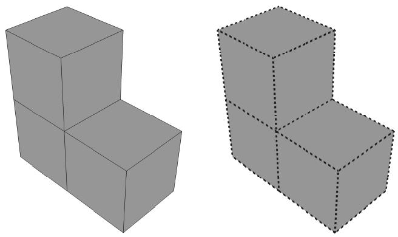  
Figure 1: Models showing default and customized element edges.

1. Locate the common or superimposed Edge Attributes options. The common edge attributes always apply to the deformed shape; they apply to the undeformed shape when it is plotted individually in any plot state (undeformed, deformed, contour, symbol, or material orientation). When the undeformed shape is plotted with the deformed shape, the superimpose edge attributes apply.

From the main menu bar, select Options->Common or Superimpose. Click the Other tab in the dialog box that appears; then click the Color & Style tab in the dialog box that appears.

The Edge Attributes options are at the bottom of the Color & Style page.

2. Choose the style of the element and surface edges:

a. Click the Style button to reveal the edge style options.  
b. Click the edge style you want.  
The specified edge style appears on the Style button.

3. Choose the thickness of the element and surface edges:

a. Click the Thickness button to reveal the edge thickness options.  
b. Click the edge thickness you want.  
The specified edge thickness appears on the Thickness button.

4. Click Apply to implement your changes.

The element and surface edge style changes according to your specification.

By default, your changes are saved for the duration of the session and will affect all subsequent plots in the current viewport and in any new viewports created from the current viewport. If you want to retain the changes you applied for subsequent sessions, save them to a file. For more information, see Saving customizations for use in subsequent sessions.

## Additional information

• Controlling element and surface edge visibility  
• Selecting overall element and surface edge color

## Customizing model shape

This section explains how to customize the shape of your model.

## In this section:

Scaling deformations  
Scaling coordinates and shrinking the model

Deformations are the values of a deformed field output variable; for example, displacement or velocity. Abaqus/CAE computes the deformed shape by applying the deformations to the undeformed nodal coordinates. You can scale the deformations to magnify, reduce, or otherwise distort the deformed model shape. For example, Figure 1 displays a deformed shape contour plot on the left and the same plot with the deformation magnified 15 times on the right.

  
Figure 1: Contour plots showing default and magnified deformation values.

Deformation scaling is plot state–independent; that is, you set it once for the deformed shape in all deformed, contour, symbol, and material orientation plots. The default scaling is a uniform factor of 1.00 for large-displacement analyses. For small-deformation analyses—for example, a perturbation analysis—Abaqus/CAE scales the deformation such that the maximum deformation is 10% of the largest model dimension.

1. From the main menu bar, select Options->Common. Click the Basic tab in the dialog box that appears. The Deformation Scale Factor options are in the lower left corner of the Basic page.  
2. Choose one of the following scale factor options:

Click Auto-compute to request that Abaqus automatically compute and uniformly apply a single scale factor to all X-, Y-, and Z-components of deformation values.  
Click Uniform to specify and uniformly apply a single scale factor to all X-, Y-, and Z-components of deformation values.

When Uniform is on, a Value specification box becomes available. Click the Value box, and enter your scale factor.

Click Nonuniform to specify individual scale factors to be applied to the X-, Y-, and Z-components of deformation values.

When Nonuniform is on, X-, Y-, and Z-component scale factor specification boxes become available. For each component you want to scale, click the component (X, Y, or Z) scale factor box and enter your scale factor.

3. Click Apply to implement your changes.

The deformed shape changes according to your specification. The state block, if active, changes to show the current deformation scale factors.

Your changes are saved for the duration of the session and will affect all subsequent deformed shape plots.

By default, your changes are saved for the duration of the session and will affect all subsequent deformed shape plots. If you want to retain the changes you applied for subsequent sessions, save them to a file.

For more information, see Saving customizations for use in subsequent sessions.

## Additional information

• Scaling coordinates and shrinking the model

You can magnify, reduce, or otherwise distort the shape of your model by scaling, and you can shrink each element about its centroid. Scaling modifies all nodal coordinates in each of the X-, Y-, and Z-directions. Shrinking reduces each element in size uniformly about its centroid. For example, the elements shown in Figure 1 have been shrunk by a factor of 0.40.

  
Figure 1: Elements showing the effect of shrinking.

Scaling and shrinking options are plot state–independent; that is, you set them once for all undeformed, deformed, contour, symbol, and material orientation plots. You can also set the scaling and shrinking options that Abaqus/CAE will apply to the undeformed shape when the deformed shape is superimposed on it.

1. Locate the common or superimposed Scaling options. The common scaling options always apply to the deformed shape; they apply to the undeformed shape when it is plotted individually in any plot state (undeformed, deformed, contour, symbol, or material orientation). When the undeformed shape is plotted with the deformed shape, the superimpose scaling options apply.

From the main menu bar, select Options->Common or Superimpose; then click the Other tab in the dialog box that appears. Click the Scaling tab; the Scaling options appear.

2. Toggle Shrink elements to request or suppress shrinking each element about its centroid.

a. When Shrink elements is on, the shrink Factor slider becomes available.  
b. Drag the Factor slider to the desired shrink factor.

A value of 0.00 indicates no shrinking. A value of 0.90 shrinks all elements to dots.

3. Toggle Scale coordinates to request or suppress model scaling by nodal coordinate X-, Y-, and Z-directions.

a. When Scale coordinates is on, scale factors become available. Click the X, Y, and Z boxes to enter scale factors for the X, Y, and Z nodal coordinates, respectively.

4. Click Apply to implement your changes.

The model display changes according to your specification.

By default, your changes are saved for the duration of the session and will affect all subsequent plots in the current viewport and in any new viewports created from the current viewport. If you want to retain the changes you applied for subsequent sessions, save them to a file. For more information, see Saving customizations for use in subsequent sessions.

## Additional information

• Scaling deformations

## Customizing model labels

This section explains how to customize the appearance of element labels, face labels, node labels, and node symbols for undeformed, deformed, contour, symbol, and material orientation plots.

## In this section:

Setting the label font  
Customizing element labels  
Customizing face labels  
Customizing node labels  
Customizing node symbols  
Displaying nodal-averaged orientations

## Setting the label font

Abaqus/CAE uses a single font to display all element, face, and node labels. You can set the properties (family, size, boldness, italics) of this font for all plot states, and you can set them separately for use with the undeformed shape in a superimposed plot.

1. Locate the common or superimposed label font options. The common font options always apply to the deformed shape; they apply to the undeformed shape when it is plotted individually in any plot state (undeformed, deformed, contour, symbol, or material orientation). When the undeformed shape is plotted with the deformed shape, the superimpose label font options apply.

From the main menu bar, select Options->Common or Superimpose; then click the Labels tab in the dialog box that appears. The font options are at the top of the Labels page.

2. Click Set Font for All Model Labels.

The Select Font dialog box appears.

3. Use the Select Font dialog box to set the font properties that you want.  
4. When you have set the desired font properties, click OK.

The Select Font dialog box closes.

5. Click Apply to implement your changes.

The element, face, and node labels change according to your specification.

By default, your changes are saved for the duration of the session and will affect all subsequent plots in the current viewport and in any new viewports created from the current viewport. If you want to retain the changes you applied for subsequent sessions, save them to a file. For more information, see Saving customizations for use in subsequent sessions.

## Additional information

• Customizing element labels  
• Customizing face labels  
• Customizing node labels

## Customizing element labels

Element labels are numeric labels (element numbers) that identify each element. For example, the elements are labeled in Figure 1.

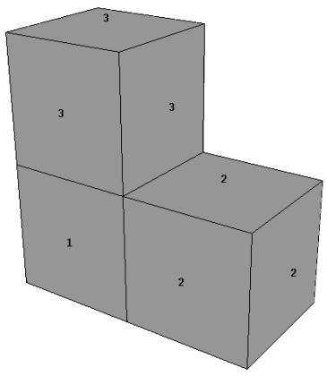  
Figure 1: Model showing element labels.

Element labels are plot state–independent; that is, you set them once for all undeformed, deformed, contour, symbol, and material orientation plots. You can also set the element labels that Abaqus/CAE will display on the undeformed shape when the deformed shape is superimposed on it. Toggle Show element labels to display or suppress element labels and to choose their color.

1. Locate the common or superimposed element label options. The common element label options always apply to the deformed shape; they apply to the undeformed shape when it is plotted individually in any plot state (undeformed, deformed, contour, symbol, or material orientation). When the undeformed shape is plotted with the deformed shape, the superimpose element label options apply.

From the main menu bar, select Options->Common or Superimpose; then click the Labels tab in the dialog box that appears.

2. Toggle Show element labels to display or suppress numeric element labels.

When Show element labels is on, the element label color options become available.

3. Choose the color of the element labels:

a. Click the color sample

Abaqus/CAE displays the Select Color dialog box.

b. Use one of the methods in the Select Color dialog box to select a new color. For more information, see Customizing colors.

c. Click OK to close the Select Color dialog box.

The color sample changes to the selected color

4. Click Apply to implement your changes.

The labels change according to your specification.

By default, your changes are saved for the duration of the session and will affect all subsequent plots in the current viewport and in any new viewports created from the current viewport. If you want to retain the changes you applied for subsequent sessions, save them to a file. For more information, see Saving customizations for use in subsequent sessions.

## Additional information

• Setting the label font

## Customizing face labels

Face labels identify the order of faces within each element. For example, the faces are labeled in Figure 1.

  
Figure 1: Model showing face labels.

Face labels are plot state–independent; that is, you set them once for all undeformed, deformed, contour, symbol, and material orientation plots. You can also set the face labels that Abaqus/CAE will display on the undeformed shape when the deformed shape is superimposed on it. Toggle Show face labels to display or suppress element labels and to choose their color.

1. Locate the common or superimposed face label options. The common face label options always apply to the deformed shape; they apply to the undeformed shape when it is plotted individually in any plot state (undeformed, deformed, contour, symbol, or material orientation). When the undeformed shape is plotted with the deformed shape, the superimpose face label options apply.

From the main menu bar, select Options->Common or Superimpose; then click the Labels tab in the dialog box that appears.

2. Toggle Show face labels to display or suppress numeric face labels.

When Show face labels is on, the face label color options become available.

3. Choose the color of the face labels:

a. Click the color sample

Abaqus/CAE displays the Select Color dialog box.

b. Use one of the methods in the Select Color dialog box to select a new color. For more information, see Customizing colors.

c. Click OK to close the Select Color dialog box.

The color sample changes to the selected color.

4. Click Apply to implement your changes.

The labels change according to your specification.

By default, your changes are saved for the duration of the session and will affect all subsequent plots in the current viewport and in any new viewports created from the current viewport. If you want to retain the changes you applied for subsequent sessions, save them to a file. For more information, see Saving customizations for use in subsequent sessions.

## Additional information

• Setting the label font

## Customizing node labels

Node labels are numeric labels (node numbers) identifying each node. For example, the nodes are labeled in Figure 1.

  
Figure 1: Model showing node labels.

Node labels are plot state–independent; that is, you set them once for all undeformed, deformed, contour, symbol, and material orientation plots. You can also set the node labels that Abaqus/CAE will display on the undeformed shape when the deformed shape is superimposed on it. Toggle Show node labels to display or suppress node labels and to choose their color.

1. Locate the common or superimposed node label options. The common node label options always apply to the deformed shape; they apply to the undeformed shape when it is plotted individually in any plot state (undeformed, deformed, contour, symbol, or material orientation). When the undeformed shape is plotted with the deformed shape, the superimpose node label options apply.

From the main menu bar, select Options->Common or Superimpose; then click the Labels tab in the dialog box that appears.

2. Toggle Show node labels to display or suppress numeric node labels.

When Show node labels is on, the node label color options become available.

3. Choose the color of the node labels:

a. Click the color sample .

Abaqus/CAE displays the Select Color dialog box.

b. Use one of the methods in the Select Color dialog box to select a new color. For more information, see Customizing colors.

c. Click OK to close the Select Color dialog box.

The color sample changes to the selected color.

4. Click Apply to implement your changes.

The labels change according to your specification.

By default, your changes are saved for the duration of the session and will affect all subsequent plots in the current viewport and in any new viewports created from the current viewport. If you want to retain the changes you applied for subsequent sessions, save them to a file. For more information, see Saving customizations for use in subsequent sessions.

## Additional information

• Setting the label font

## Customizing node symbols

Node symbols (circles, squares, triangles, etc.) identify the location of each node. For example, filled circles are used to symbolize the nodes shown in Figure 1.

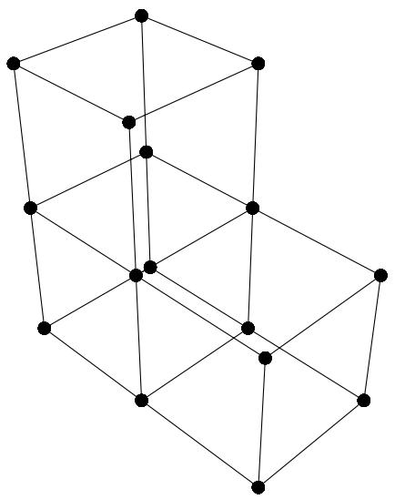  
Figure 1: Model showing node symbols.

Node symbols are plot state–independent; that is, you set them once for all undeformed, deformed, contour, symbol, and material orientation plots. You can also set the node symbols that Abaqus/CAE will display on the undeformed shape when the deformed shape is superimposed on it. Toggle Show node symbols to display or suppress node labels and to choose their color.

1. Locate the common or superimposed node symbol options. The common node symbol options always apply to the deformed shape; they apply to the undeformed shape when it is plotted individually in any plot state (undeformed, deformed, contour, symbol, or material orientation). When the undeformed shape is plotted with the deformed shape, the superimpose node symbol options apply. From the main menu bar, select Options->Common or Superimpose; then click the Labels tab in the dialog box that appears.

2. Toggle Show node symbols to display or suppress node symbols.

When Show node symbols is on, the node symbol color, type, and size options become available.

3. Choose the color of the node symbols:

a. Click the color sample

Abaqus/CAE displays the Select Color dialog box.

b. Use one of the methods in the Select Color dialog box to select a new color. For more information, see Customizing colors.

c. Click OK to close the Select Color dialog box.

The color sample changes to the selected color. The new color does not appear in the viewport until you click OK or Apply in the Plot Options dialog box.

4. Choose the type (circle, square, triangle, etc.) of the node symbols:

a. Click the Symbol button to reveal the node symbol type options.

b. Click the symbol type you want. The specified symbol type appears on the Symbol button.

5. Choose the size of the node symbols:

a. Click the Size button to reveal the node symbol size options.  
b. Click Small, Medium, or Large.  
The specified symbol size appears on the Size button.

6. Click Apply to implement your changes.

The symbols change according to your specification.

By default, your changes are saved for the duration of the session and will affect all subsequent plots in the current viewport and in any new viewports created from the current viewport. If you want to retain the changes you applied for subsequent sessions, save them to a file. For more information, see Saving customizations for use in subsequent sessions.

## Additional information

• Customizing node labels

## Displaying nodal-averaged orientations

For line- and banded-type contour plots, element results are extrapolated and conditionally averaged from the element centroids or integration points to the nodes to create the plots. You can use the Result Options dialog box to control how Abaqus/CAE applies averaging to a model. One option allows you to compute invariants (scalars) and extract components after averaging the results at each node; when you choose to compute the results in this order, Abaqus/CAE applies the vector or tensor orientation from one of the adjacent elements as the orientation for each node. Under the Other tab of the Contour Plot Options dialog box, toggle Show nodal-averaged vector/tensor orientations when computing scalars after averaging to display or suppress the averaged orientations on the contour plot. When this option is enabled, Abaqus/CAE draws a triad at each node indicating the nodal-averaged orientation for the plotted vector or tensor. By default, the 1-axis appears in teal, the 2-axis appears in yellow, and the 3-axis appears in red. You can use the same procedures described in Customizing material orientation plot triads, to customize the appearance of these triads.

If you choose to compute scalars prior to averaging the results at the nodes, orientations are not averaged and do not appear in your contour plot.

## Additional information

• Selecting result options

## Displaying multiple plot states

In addition to superimposing the undeformed and deformed shape for a single plot state such as contour plots, you can choose to display multiple plot states in a viewport.

By toggling on Allow Multiple Plot States in the toolbox, you can choose any combination of the undeformed and deformed plot shapes with contours, symbols, and material orientations for the selected step and frame of the current output database. Abaqus/CAE displays the deformed plots using the Common Plot Options and the undeformed plots using the Superimposed Plot Options in combination with the other plot state–independent and dependent options for each plot state.

If you toggle off Allow Multiple Plot States, Abaqus/CAE uses the following order in combination with the last plot states that were displayed to select the single plot state to display:

• Undeformed  
• Deformed  
• Contours  
• Symbols  
• Material Orientations

For example, if you display contours and material orientations, Abaqus/CAE retains the contour plot when you toggle off Allow Multiple Plot States. This is the same order that the plot states are listed in the Plot menu and displayed in the toolbox.

To display more complex plot combinations, you must use an Overlay Plot. Overlay plots allow you to display animations or X–Y plots along with the stationary plot states listed above. You can also use overlay plots to plot results from multiple steps, frames, or output databases. For more information, see Overlaying multiple plots.

## Additional information

• Using common plot options  
• Superimposing deformed and undeformed model plots

## Displaying element and surface normals

When you create an undeformed or deformed plot, you can choose to display arrows in the plot that indicate the directions of the element or surface normals. You can display normal directions for beams, pipes, frame elements, contact surfaces, membranes, rigid elements, rigid surfaces, shells, three-dimensional solids, and trusses. (For information about normal directions for a particular type of element or surface, see Abaqus Elements Guide.)

1. Locate the common or superimposed normals options. The common normals options apply to the undeformed and the deformed shape when they are plotted individually. The superimpose normals options apply to the undeformed shape when it is plotted with the deformed shape.

From the main menu bar, select Options->Common or Superimpose; then click the Normals tab in the dialog box that appears.

2. Toggle on Show normals.

The Normals options become available.

3. Toggle on On elements to display the normals on elements in your model or On surfaces to display the normals on surfaces in your model.  
4. In the area of the dialog box labeled Colors, select the colors in which you want the different types of normals to appear.  
5. In the area of the dialog box labeled Style:

a. Click the arrow next to the Length field, and select the arrow length of your choice. The default selection is Medium.  
b. Click the arrow next to the Line Thickness field, and select the arrow thickness of your choice.  
c. Click the arrow next to the Arrowhead field, and select the arrowhead style of your choice.

6. Click Apply to implement your changes.

Arrows appear in the viewport that indicate the normal directions of the elements or surfaces in the model. In general, the arrows appear at the centroid of exterior element faces.

## Customizing the appearance of display bodies

A display body is a part instance that does not take part in the analysis but is visible during postprocessing. You can customize the appearance of such part instances in your model using the Display Body Options in the Visualization module. The options available for display bodies are similar to those available for all of the plot states in Abaqus/CAE: render style; edge visibility, color, and style; fill color; scaling; and translucency can all be customized. Similar to the common plot options, display body options are plot state–independent; i.e., the options applied to display bodies are reflected in all plot states. Display body options apply to all display bodies in your model; to customize the appearance of individual display bodies, you can create display groups based on part instances (see Creating or editing a display group). Individual item coloring can also be applied to individual display body part instances to override the edge and/or fill colors specified as general display body options; see Color coding geometry and mesh elements for more information.

To locate the display body options, select Options->Display Body from the main menu bar. Click the following tabs to customize the appearance of all display bodies in the current viewport:

• Basic: Choose render style (Choosing a render style) and edge visibility (Controlling element and surface edge visibility).


## Note:

The render style icons located in the Render Style toolbar do not apply to display bodies in any plot state. In addition, by default, only free edges are shown for display bodies while all exterior edges are shown for other model components.

• Color & Style: Control model edge color (Selecting overall element and surface edge color), model edge style (Customizing element and surface edge style), and model fill color (Selecting overall fill color).  
• Other: The Other page contains the following tabs:

- Scaling: Control model scaling and shrinking (Scaling coordinates and shrinking the model).  
Translucency: Control shaded render style translucency (Customizing translucency).

## Additional information

• Defining display body constraints  
• Display bodies

## Customizing camera movement

You can customize two groups of camera options in your model by using the View Options in the Visualization module, as shown in Figure 1.

  
Figure 1:The View Options dialog box.

The Mode options are available in all Abaqus/CAE modules except the Sketch module; the Mode options are discussed in Manipulating the view and controlling perspective and are saved only for the current session. The Camera Movement options are available only in the Visualization module. They control the position and movement of the camera with respect to a selected local coordinate system. You can save the settings of the Camera Movement options by selecting File->Save Options from the main menu bar.

To locate the view options, select View->View Options from the main menu bar. To use the Camera Movement options, you must first toggle on Move camera with CSYS, then select a local coordinate system using one of the following methods:

• Select a coordinate system from the list provided in the dialog box,  
• Click Create to create a new local coordinate system,  
• Click $\left. \left[ \frac { \mathsf { R } } { \mathsf { s } } \right] _ { \mathsf { t o } } \right.$ pick a local coordinate system from the viewport, or

Click Move Camera With Node or use the button in the context bar to create a rectangular coordinate system following a single node.


## Note:

To reset the camera to follow the global coordinate system, either toggle off Move camera with CSYS or click

th e button in the context bar.

You can select from the following camera movement options:

## Move camera with CSYS

Select this option to fix the origin of the selected coordinate system in the viewport. If you create an animation or change the ODB frame, Abaqus/CAE moves all objects in the viewport relative to the position of the selected local coordinate system. If the selected local coordinate system is not a moving coordinate system, you will not observe any difference from the default settings that fix the camera to the (stationary) global coordinate system.

If you select Move camera with CSYS, it is recommended that you pause any animation in the current viewport before attempting to manipulate the view.

## Follow CSYS rotation

Select this option to fix both the position and the rotation of the local coordinate system in the viewport. All model rotations are transformed so that the model appears to rotate about the selected coordinate system. This option is available only when Move camera with CSYS is toggled on.

## Move camera to CSYS

This option is available only when Use movie mode and Move camera with CSYS are toggled on. Use movie mode allows the camera to move into and through the model instead of viewing the model from a distance (for more information, see Camera modes and view terminology). When you apply Move camera to CSYS, the camera moves to the origin of the selected coordinate system. Abaqus/CAE toggles this option off immediately after you click Apply in the View Options dialog box to avoid conflicts with the view manipulation tools, some of which also reposition the camera.


Note: When you apply Move camera to CSYS, Abaqus/CAE may display a blank view in the viewport. The most common cause for this blank view is the Near plane distance setting; apply a smaller Near plane distance to view portions of the model that are close to the camera.


Warning: If you pan, rotate, or magnify the view in the Visualization module, it is recommended that you first pause any animations in the viewport. Since animations and view manipulations both affect the view, their instructions to Abaqus/CAE may conflict with each other and create undesirable results.

## Additional information

• Understanding camera modes and view options  
• Creating coordinate systems during postprocessing

## Controlling the display of model entities

The Entity Display options in the ODB Display Options dialog box allow you to control the display of symbols. The displayed symbols represent the following entities in your model:

• boundary conditions applied during the analysis,  
connectors used in the model (the highlighting of endpoints, the display of local orientation axes associated with each connector, and the display of connector type labels can be controlled individually),  
• coordinate systems written to the current output database or created in the Visualization module during the current session, and  
point elements, including reference points, mass and inertia elements, springs and dashpots, spot welds and distributing coupling (DCOUP\*) elements, tracer particles, continuum particle elements, discrete particle elements, and rendering of particle element edges.

Model entity display is plot state–independent. Abaqus/CAE displays model entity symbols for the current step and frame of your output database. You can customize the appearance of the model entity symbols in the Visualization module only by changing their size.

For information on the symbols representing boundary conditions, see Understanding symbols that represent prescribed conditions; for information on the symbols representing connectors, see Understanding symbols that represent interactions, constraints, and connectors. For information on controlling the display of these entities in assembly-related modules, see Controlling the display of attributes.


Tip: You can also control the display of connectors using display groups; each connector is listed as an element set. See Creating or editing a display group for more information on display groups.

The render particle element edges option allows the display of symbols for particle element edges. You can use Wireframe, Hidden, and Filled render style options for particle elements.

Only session coordinate systems and reference points are displayed by default. The display of model entities can affect performance significantly. To maximize the performance of Abaqus/CAE, be selective about the entities you choose to display.

1. From the main menu bar, select View->ODB Display Options. Click the Entity Display tab in the dialog box that appears.  
The entity display options become available.  
2. Toggle the entities that you want to display. Only the entities that you select (if they have been defined for the current model) will appear in the viewport.  
3. If desired, drag the Symbol size slider left or right to modify the size of the symbols in the viewport.  
4. Click Apply to implement your changes.

The plot in the current viewport changes to reflect your specification.

By default, your changes are saved for the duration of the session and will affect all subsequent plots in the current viewport and in any new viewports created from the current viewport. If you want to retain the changes you applied for subsequent sessions, save them to a file. For more information, see Saving customizations for use in subsequent sessions.

## Additional information

• Creating boundary conditions  
• Understanding constraints  
• Understanding connectors  
• Creating coordinate systems during postprocessing

• Why are datum coordinate systems so important?

## Controlling the display of constraints in the Visualization module

In the Visualization module you can selectively control the display of analysis constraints using display groups and the ODB Display Options dialog box. These controls are useful when debugging models that contain large numbers of constraints. By turning the display of some constraints on and off, you can more easily understand complex models.

There are two levels of controls for showing or hiding constraints:

You must first add the desired constraints to a display group for them to be visible in the viewport. You can create and edit display groups to include or exclude different constraints. See Creating or editing a display group, for more information about display groups.  
• Different types of constraints can be selected or hidden in the Constraints tab of the ODB Display Options dialog box. From the main menu bar, selectView->ODB Display Options to access these options.

The following types of constraints can be displayed or hidden:

• tie constraints

• rigid body constraints (ties and pins only)

• shell-to-solid couplings

• distributing couplings

• kinematic couplings

• multi-point constraints


## Note:

These types of constraints are created in the Interaction module, not the Assembly module. See Understanding constraints for more information.

Table 1 shows how each type of constraint is displayed by Abaqus/CAE.  
Table 1: How constraints are shown in the viewport.

<table><tr><td>Constraint type</td><td>Display in viewport</td></tr><tr><td>Tie</td><td>Spidering of red lines drawn between the nodes on the main and secondary surfaces of the constraint.</td></tr><tr><td>Rigid body</td><td>The rigid body regions (elements, nodes, or surfaces) are highlighted in the viewport.</td></tr><tr><td>Shell-to-solid coupling</td><td>Spidering of yellow lines drawn between the nodes on the shell edge and the solid face.</td></tr><tr><td>Distributing coupling</td><td>Spidering of orange lines drawn between the control point and the coupling points (nodes) in the constraint region.</td></tr><tr><td>Kinematic coupling</td><td>Spidering of purple lines drawn between the control point and the coupling points (nodes) in the constraint region.</td></tr><tr><td>Multi-point constraint (Abaqus/Explicit only)</td><td>The nodes comprising the multi-point constraint are connected with yellow lines.</td></tr></table>

You can change the default colors of the constraint spider lines in the Color Code dialog box. For more information, see Coloring constraints in the Visualization module.

## Additional information

• Understanding constraints  
• Creating or editing a display group

## Customizing general model display

This section explains several of the general model display options.

## In this section:

Sweeping and extruding your model  
Using mirrors and patterns to display your results  
Refining curved edges and faces  
Coloring elements with no results  
Controlling beam profile display for postprocessing  
Controlling shell thickness display for postprocessing  
Controlling the display of thermal fluid pipe elements  
Viewing removed elements

## Sweeping and extruding your model

You can display axisymmetric models as planar, two-dimensional shapes or “sweep” the models through a specified angle, producing a three-dimensional visual effect.

Similarly, you can view just the modeled sector of a cyclic symmetric structure or “sweep” the sector to see a specified portion of the entire model. (For more information on cyclic symmetric structures, see Analysis of Models that Exhibit Cyclic Symmetry.) In addition, you can view two-dimensional models (or three-dimensional cylindrical rigid surfaces) as planar or extrude them to a specified depth, producing a three-dimensional visual effect. Sweeping and extruding are particularly useful for displaying contour plots of two-dimensional elements and contact surfaces.

Axisymmetric analytical rigid surfaces can be rotated about an axis (swept), as can the following elements: ACAXn, CAXn, CAXAn, CGAXn, DCAXn, DCCAXn, DSAXn, FAXn, MAXn, MGAXn, RAXn, SAXn, and SAXAn. Models that contain three-dimensional axisymmetric analytical rigid surfaces or CAXA elements are swept by default (the default start angle, end angle, and number of sectors vary depending on the model type). If the model contains both analytical rigid surfaces and CAXA elements, only the CAXA elements are swept by default. When you display boundary conditions for swept axisymmetric elements, symbols appear on only the original nodes and not on the swept nodes.

Cyclic symmetric models are not swept by default. When you display contours on a swept cyclic symmetric model, only nodal quantities can be contoured on the swept sectors; scalar, vector, and tensor quantities at integration points can be contoured only on the original sector.

You can extrude analytical rigid surfaces and all of the planar, two-dimensional solid elements in the Abaqus library along the Z-direction. For a list of these elements, see Two-Dimensional Solid Element Library.

Figure 1 shows an axisymmetric planar model in a planar view (left) and the same model with an axisymmetric sweep angle of 90° and 10 sweep sectors (right).

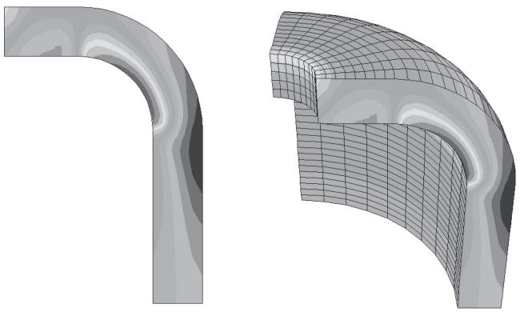  
Figure 1: Axisymmetric model with planar and swept display.

Figure 2 shows the original modeled sector of a cyclic symmetric fan (left) and sectors 1–4 of the swept model (right).

  
Figure 2: Cyclic symmetric model: single sector and swept view of multiple sectors.

Figure 3 shows a two-dimensional planar model in a planar view (left) and the same model displayed with an extrusion depth of 0.1 (right).  
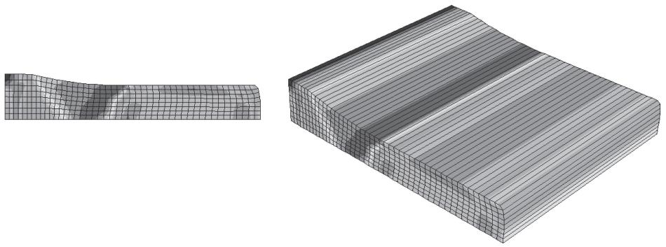  
Figure 3:Two-dimensional model with planar and extruded display.

## Additional information

• Using mirrors and patterns to display your results  
• Refining curved edges and faces

## Sweep elements in your axisymmetric model

1. Locate the General Sweep options.

From the main menu bar, select View->ODB Display Options. Click the Sweep/Extrude tab in the dialog box that appears. The General Sweep options are in the upper portion of the page.


## Note:

If there are no elements or analytical rigid surfaces in your model that can be swept, the General Sweep options will not be available.

2. Toggle Sweep elements.  
3. Specify the sweep angle by typing a number (in degrees) in the Sweep from field (the default is 0°) and a number (in degrees) in the To field (the default is 180° for all models).

Abaqus/CAE sweeps the two-dimensional model counterclockwise about the axis of rotation from the first specified angle to the second.

4. Specify the number of segments to use along the circumferential direction when sweeping by typing a positive integer in the Number of segments field or by clicking on the arrows next to the field. The default number of segments used varies depending on the model type.

The angle between the segments is updated automatically in the dialog box. As you increase the number of segments, curves in the model appear smoother (the angle between them decreases). However, a smaller number of segments plots faster.

5. Click Apply to implement your changes.

Your sweep specifications are reflected in all plot states and, by default, they are saved for the duration of the session. If you want to retain the changes you applied for subsequent sessions, save them to a file. For more information, see Saving customizations for use in subsequent sessions.

If a contour plot is displayed, the contours appear on all swept faces.

If a symbol plot is displayed, the model is swept as specified, but the symbols appear only on the original planar model faces.

## Sweep analytical rigid surfaces in your axisymmetric model

1. Locate the General Sweep options.

From the main menu bar, select View->ODB Display Options. Click the Sweep/Extrude tab in the dialog box that appears. The General Sweep options are in the upper portion of the page.


## Note:

If there are no elements or analytical rigid surfaces in your model that can be swept, the General Sweep options will not be available.

2. Toggle on Sweep analytical rigid surfaces if it is not currently active.  
3. Specify the sweep angle by typing a number (in degrees) in the Sweep from field and a number (in degrees) in the To field (the default value is 180° when you first open an axisymmetric model and 360° when you first open a three-dimensional model).

Abaqus/CAE sweeps the analytical rigid surface counterclockwise about the axis of rotation from the first specified angle to the second.

4. Specify the number of segments to use along the circumferential direction when sweeping analytical rigid surfaces by typing a positive integer in the Number of segments field or by clicking on the arrows next to the field. By default, Abaqus/CAE uses 10 segments for axisymmetric models and 20 segments for three-dimensional models.

The angle between the segments is updated automatically in the dialog box. As you increase the number of segments, curves in the model appear smoother (the angle between them decreases). However, a smaller number of segments plots faster.

5. Click Apply to implement your changes.

Your sweep specifications are reflected in all plot states and are saved for the duration of the session. If you want to retain the changes you applied for subsequent sessions, save them to a file. For more information, see Saving customizations for use in subsequent sessions.

## Sweep your cyclic symmetric model

1. Locate the Sector Sweep options.

From the main menu bar, select View->ODB Display Options. Click the Sweep/Extrude tab in the dialog box that appears. The Sector Sweep options are in the center portion of the page.


## Note:

If there are no cyclic symmetry elements in your model, the Sector Sweep options will not be available.

2. Toggle Sweep cyclic symmetry sectors.  
3. Click the arrow next to the Sector selection field to choose from the following available sweep methods:

## By Number

This is the default sweep method. The total number of sectors in the model is given in the dialog box. You can specify which of these sectors should be displayed by typing positive integers between 1 and the total number of sectors (delimited by commas) in the Sectors field. The sectors are numbered counterclockwise from the original sector.

Abaqus/CAE displays only the specified sectors (whether or not they are adjacent).

## By Angle

The sector angle (the angle between each sector) is given in the dialog box. You can specify the sweep angle in increments of the sector angle by typing a number (in degrees) in the Sweep from field (the default is 0°) and a number (in degrees) in the To field (the default is the sector angle). Both numbers should be divisible by the sector angle.


Tip: You can also use the arrows next to the text fields to specify the angles.

Abaqus/CAE sweeps the two-dimensional model about the axis of rotation by the number of degrees you specify. If you enter a sweep angle that is not divisible by the sector angle, Abaqus/CAE rounds up to the next number that is.

## All Sectors

If you choose this sweep method, all sectors will be displayed; in other words, the model will be swept 360° about the axis of rotation.

4. Click Apply to implement your changes.

Your sweep specifications are reflected in all plot states and are saved for the duration of the session. If you want to retain the changes you applied for subsequent sessions, save them to a file. For more information, see Saving customizations for use in subsequent sessions.

If a contour plot is displayed, the contours of nodal quantities appear on all swept faces; contours of scalar, vector, and tensor quantities at integration points appear only on the original sector.

If a symbol plot is displayed, the model is swept as specified, but the symbols appear only on the original planar model faces.

## Extrude elements in your model

1. Locate the Extrude options.

From the main menu bar, select View->ODB Display Options. Click the Sweep/Extrude tab in the dialog box that appears. The Extrude options are in the lower portion of the page.


## Note:

If there are no elements in your model that can be extruded, the Extrude options will not be available.

## 2. Toggle Extrude elements.

When Extrude elements is on, the Depth option becomes available.

## 3. Specify the depth of the extrusion by typing a positive number (in model units) in the Depth field. The default depth is 1.0.

Abaqus/CAE extends your model the specified number of units in the negative z-direction.

Use the view manipulation rotation tool to view the extruded model in three dimensions.

## 4. Click Apply to implement your changes.

Your extrude specifications are reflected in all plot states and are saved for the duration of the session. If you want to retain the changes you applied for subsequent sessions, save them to a file. For more information, see Saving customizations for use in subsequent sessions.

If a contour plot is displayed, the contours appear on all extruded faces.

If a symbol plot is displayed, the model is extruded as specified, but the symbols appear only on the original planar model faces.

## Extrude analytical rigid surfaces in your model

## 1. Locate the Extrude options.

From the main menu bar, select View->ODB Display Options. Click the Sweep/Extrude tab in the dialog box that appears. The Extrude options are in the lower portion of the page.


## Note:

If there are no elements or analytical rigid surfaces in your model that can be extruded, the Extrude options will not be available.

## 2. Toggle on Extrude analytical rigid surfaces if it is not currently active.

When Extrude analytical rigid surfaces is on, the Depth options become available.

## 3. Select a depth for the extrusion.

You can either accept the default depth by selecting Auto-compute, or you can specify a custom depth by typing a positive number (in model units) in the Specify field. The default extrusion depth for analytical rigid surfaces is the maximum value that does not stretch the bounding box.

Abaqus/CAE extends your model the specified number of units in the negative z-direction.

Use the view manipulation rotation tool to view the extruded model in three dimensions.

## 4. Click Apply to implement your changes.

Your extrude specifications are reflected in all plot states and are saved for the duration of the session. If you want to retain the changes you applied for subsequent sessions, save them to a file. For more information, see Saving customizations for use in subsequent sessions.

## Using mirrors and patterns to display your results

In the Sketch module you can use mirrors and patterns to copy a common feature and complete the sketch of a feature. Similarly, in the Visualization module you can copy analysis results representing a repetitive portion of a model to visualize results for the entire model.

To mirror results, you can select the coordinate system and up to three mirrors corresponding to the principal planes of the selected system. To pattern results, you can select the coordinate system and apply a rectangular or circular pattern. You can apply mirrors, rectangular patterns, and circular patterns in conjunction; and you can select their order of application to produce the desired view.


## Note:

There are no restrictions to prevent copied results from obscuring portions of the original data or other copies in the viewport.

Mirrors and patterns are a visualization aid only. Any numerical representation of the results, such as the contour legend, indicates only the portion of the model that was analyzed. Use great care in selecting your model and the mirror and pattern settings so that the displayed results will accurately simulate the complete model.

Figure 1 shows one quarter of a plastic fastener as it was modeled for analysis (left) and the same model mirrored about two symmetry planes to display the complete fastener (right). (The rigid hole is a swept profile and, thus, appears complete prior to mirroring the fastener.)

  
Figure 1: Quarter-symmetry model (left) and complete fastener display (right).  
Figure 2 shows a rectangular pattern of completed fasteners.

  
Figure 2: A rectangular pattern of fasteners.

## Additional information

• Sweeping and extruding your model  
• Refining curved edges and faces

## Mirror your model

1. Locate the Mirror options.  
From the main menu bar, select View->ODB Display Options. Click the Mirror/Pattern tab in the dialog box that appears. The Mirror options are in the upper portion of the page.  
2. Accept the default global coordinate system, or select a coordinate system from the Mirror CSYS list.  
You can select any coordinate system that exists in the output database. If a suitable coordinate system does not already exist, you can create a new coordinate system using one of the methods described in Creating coordinate systems during postprocessing.

3. Toggle on the mirror planes that you want Abaqus/CAE to use to copy the model results.

4. Toggle on Mirror display bodies if you also want Abaqus/CAE to copy display bodies.

5. If you apply mirrors in conjunction with rectangular or circular patterns, select the Order of Operations that Abaqus/CAE will use to create the copies.

6. Click Apply to implement your changes.

Your specifications are reflected in all plot states and are saved for the duration of the session. If you want to retain the changes you applied for subsequent sessions, save them to a file. For more information, see Saving customizations for use in subsequent sessions.

If a contour plot is displayed, the contours appear on all faces.

If a symbol or material orientation plot is displayed, the symbols or material orientations appear only on the original model faces.

## Pattern your model

1. Locate the Pattern options.

From the main menu bar, select View->ODB Display Options. Click the Mirror/Pattern tab in the dialog box that appears. The Pattern options are in the middle of the page.

2. Accept the default global coordinate system, or select a coordinate system from the Pattern CSYS list.

You can select any coordinate system that exists in the output database. If a suitable coordinate system does not already exist, you can create a new coordinate system using one of the methods described in Creating coordinate systems during postprocessing.

3. Edit the rectangular and circular pattern parameters as follows:

• Rectangular pattern

Enter the Number of results that you want to display in the X-, Y-, and Z-directions of the selected coordinate system.  
- Enter the Offset distance, in model units, between copies for each direction.

To place the copies adjacent to each other, the offset in each direction must be the same as the model dimension in that direction.


Tip: If you do not know the model dimensions, use the query tool to determine the distance between the first and last model nodes in the desired direction. (For more information, see Understanding the Query toolset in the Visualization module.)

• Circular pattern

Select the axis of rotation.  
- Enter the Number of results that you want to display around the selected axis.  
- If desired, edit the Total angleAbaqus/CAE will use to position the copies.

Abaqus/CAE places the original result at 0°. All subsequent copies are positioned according to the Total angle divided by the Number of copies.

4. If you use both rectangular and circular patterns or if you use a pattern in conjunction with mirrors, select the Order of Operations that Abaqus/CAE will use to create the copies.  
5. Click Apply to implement your changes.

Your specifications are reflected in all plot states and are saved for the duration of the session. If you want to retain the changes you applied for subsequent sessions, save them to a file. For more information, see Saving customizations for use in subsequent sessions.

If a contour plot is displayed, the contours appear on all faces.

If a symbol or material orientation plot is displayed, the symbols or material orientations appear only on the original model faces.

## Refining curved edges and faces

If your model contains quadratic elements, cubic elements, 2-node spring elements, or analytical rigid surfaces having curved segments, you can control the refinement with which Abaqus/CAE displays these curved model components. Similarly, if your model contains 2-node dashpot elements, you can control the refinement of the symbol used to represent those elements. Click the General tab in the ODB Display Options dialog box to choose a refinement level between extra coarse and extra fine for the display of curved edges and faces. When you select Extra Coarse refinement, Abaqus/CAE displays curved elements using straight lines; midside nodes have no effect on the shape displayed for these elements. Extra Coarse refinement will treat springs and dashpots as straight lines. For example, in Figure 1 the Extra Coarse refinement level was used to create the undeformed plot on the left, and the Extra Fine refinement level was used to produce an undeformed plot of the same model on the right.


## Note:

As the refinement level increases, the display performance will decrease. The Medium setting should produce acceptable results for most models.

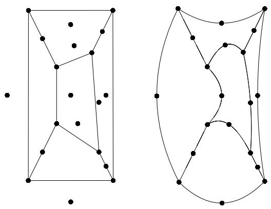  
Figure 1: Model plotted with different refinement levels (extra coarse and extra fine).

1. Locate the Curved Lines & Faces options.

From the main menu bar, select View->ODB Display Options. Click the General tab in the dialog box that appears. The Curved Lines & Faces options are at the top of the General page.

2. Click the Refinement level button to reveal the refinement options.  
3. In the refinement list, click the level you want. Extra fine produces the smoothest curves but may slow plotting; conversely, coarse refinement gives a rough appearance but plots most quickly.

The refinement level you specify appears on the Refinement Level button.

4. Click Apply to implement your changes.

Curved edges and faces for all plot states change to reflect your refinement specification, which is saved for the duration of the session. If you want to retain the changes you applied for subsequent sessions, save them to a file. For more information, see Saving customizations for use in subsequent sessions.

## Additional information

• Sweeping and extruding your model

To produce a contour plot, Abaqus/CAE reads results for the variable and frame you specify from the output database. Results for a particular variable and frame may not be available or may not be applicable for one or more elements included in the plot. You can specify the display color for elements that have no results. The default color is white.

For example, the contour plot in Figure 1 shows the von Mises stress generated when a blank sheet is deformed using a die and punch (the punch is not shown in the figure). In this case the color gray was selected for elements with no results. The die elements appear gray because the die is a rigid surface for which no stress results exist.

  
Figure 1: Contour plot of blank and die.

1. Locate the Elements with No Results options.

From the main menu bar, select View->ODB Display Options. Click the General tab in the dialog box that appears. The Elements with No Results options are in the center of the General page.

2. Click the color sample

Abaqus/CAE displays the Select Color dialog box.

3. Use one of the methods in the Select Color dialog box to select a new color. For more information, see Customizing colors.

4. Click OK to close the Select Color dialog box.

The color sample changes to the selected color.

5. Click Apply to implement your changes.

Elements with no results in contour plots (including display bodies) change to reflect your coloring specification, which is saved for the duration of the session. If you want to retain the changes you applied for subsequent sessions, save them to a file. For more information, see Saving customizations for use in subsequent sessions.

## Additional information

• Producing a contour plot

• Customizing render style, translucency, and fill color

## Controlling beam profile display for postprocessing

Beam rendering is available in the Visualization module for undeformed, deformed, and contour plots only. For deformed plots Abaqus/CAE scales the displacement components of the deformation based on the deformed field output variable but does not scale the twisting of the beam profile using the rotational components of the deformation when you change the deformation scale factor.

You can view a realistic display of the beam profile for results data by selecting View->ODB Display Options in the Visualization module.

The rendering of beam profiles requires the presence of beam orientation data in the output database. Beam normals are written to the output database automatically for all the steps that include field output. For analyses that include geometric nonlinearity, you can display beam profiles during postprocessing only if nodal output is requested in the model. For more information, see Using a Beam Section Integrated during the Analysis to Define the Section Behavior.

Abaqus/CAE does not render the tapering of beam profiles along their length. If your model includes tapered beam sections, Abaqus/CAE renders these beams using the beam's starting profile along its entire length. For more information about tapered beams, see Creating beam sections.

Beam elements that have BRADIUS values are rendered using circular beam profiles with the radius coming from the BRADIUS field in the output database.

Displaying beam profiles is useful for checking that the correct profile has been assigned to a particular region and that the assigned beam orientation results in the expected orientation of the profile. For example, Figure 1 shows the box beam profiles displayed on the light-service crane described in Example: cargo crane.


Figure 1:The cargo crane example with beam profiles displayed.  


## Note:

If your results include quadratic beam elements, Abaqus/CAE does not consider the midside nodes in those elements when the beam profiles are rendered.

If you assign a general beam section to a wire, Abaqus/CAE displays the beam profile as an ellipse with a cross-sectional area and moments of inertia $( \pmb { I _ { 1 1 } }$ and $\pmb { I _ { 2 2 } } )$ that match the values you specified. If you assign a truss section to a wire, Abaqus/CAE displays the truss profile as a circle with a cross-sectional area that matches the value you specified.

Abaqus/CAE renders beam profiles according to the current settings for color coding and translucency. When these settings change, the color and translucency of the beam profiles change as well. When beam profiles are displayed, Abaqus/CAE disables scaling and shrinking of the model.

1. Locate the Render beam profiles option.

From the main menu bar, select View->ODB Display Options. In the dialog box that appears, click the General tab.

2. From the bottom of the dialog box, toggle on Render beam profiles to display beam profiles.  
3. If desired, apply a Scale factor to the beam profiles to increase or decrease their size. The default value is 1.  
4. + Click OK to implement your changes and to close the dialog box.

Abaqus/CAE displays the profile of the beam section with the appropriate dimensions and in the correct orientation. By default, your changes are saved for the duration of the session. If you want to retain the changes you applied for subsequent sessions, save them to a file. For more information, see Saving customizations for use in subsequent sessions.

## Additional information

• Producing a contour plot of linear beam section stresses  
• Controlling beam profile display

## Controlling shell thickness display for postprocessing

Rendering of shell thickness is available in the Visualization module for all plot states.

If you use shell elements to model relatively thin components in your analysis, you can use the View->ODB Display Options to view the actual thickness of these shell elements in your model during postprocessing.

For deformed and contour plots Abaqus/CAE scales the displacement components of the deformation but does not scale the rotational components of the deformation when you change the deformation scale factor. For contour plots Abaqus/CAE applies colors based on your selection of active section point locations. If the top section point or bottom section point is currently active, Abaqus/CAE displays the contour for that section point throughout the shell thickness; if both top and bottom section points are currently active, Abaqus/CAE creates a linear contour gradient from the top values to the bottom values through the shell thickness.

Displaying shell thickness after a sizing optimization allows you to view the resulting change in shell thickness across the design area of your structure as the optimization progresses.

Abaqus/CAE determines shell thickness for postprocessing using the shell thickness definition specified for the model in its undeformed state. If your model undergoes large deformations or large rotations during the analysis, shell thickness might not display well in the deformed plot state.

Displaying shell thickness enables you to examine the thickness of shell geometry relative to the rest of the model. You can apply a scale factor to reduce or increase the display of shell thickness for your session. Figure 1 shows the effect of scale factor changes to a model.

  
Figure 1: From left to right: shell thickness scale factor settings of 0.5, 1 (default), and 2.

Abaqus/CAE renders shell thickness for three-dimensional shell elements only; thickness is not displayed for axisymmetric shell elements, such as SAX1 elements. When shell thickness is displayed, Abaqus/CAE also renders the edges of shell geometry unless a view cut is displayed in the viewport. Abaqus/CAE renders shell thickness according to the current settings for color coding and translucency. When these settings change, the color and translucency of the shell thickness change as well.

1. Locate the Render shell thickness option.

From the main menu bar, select View->ODB Display Options. In the dialog box that appears, click the General tab.

2. From the bottom of the dialog box, toggle on Render shell thickness to display shell thicknesses for the shell sections in your model.  
3. If desired, apply a Scale factor to the shell thicknesses to increase or decrease their thickness. The default value is 1, which produces a realistic rendering of the shell thickness settings.  
4. + Click OK to implement your changes and to close the dialog box.

Abaqus/CAE displays the shell sections in the selected part or assembly with the appropriate thickness. By default, your changes are saved for the duration of the session. If you want to retain the changes you applied for subsequent sessions, save them to a file. For more information, see Saving customizations for use in subsequent sessions.

## Additional information

• Controlling shell thickness display

## Controlling the display of thermal fluid pipe elements

Rendering of thermal fluid pipe elements is available in the Visualization module for undeformed, deformed, and contour plots only.

There is no deformation associated with thermal fluid pipe elements; the deformed and undeformed plots are the same.

If you use thermal fluid pipe elements to model the flow of a liquid through a pipe in your analysis, you can use the View->ODB Display Options to visualize the fluid pipe along with the fluid pressure, fluid temperature, and wall temperature contours. To clearly visualize the contours and plot shapes, you should create a display group that contains only the thermal fluid pipe elements.

When you select the regions individually, Abaqus/CAE renders the fluid region as a solid cylinder and the inner wall and outer wall as thin hollow cylinders. If you choose to render both the inner wall and outer wall, a thick-walled cylinder is displayed. Temperature variation across the wall is visible on the end caps. When you render multiple regions, only the outermost region is visible on the surface of the cylinder; all the selected regions are rendered at the end caps. Figure 1 shows the nodal temperature (NT11) on the inner wall and outer wall of a fluid pipe.


  
Figure 1: Rendering of fluid pipe thermal elements.

Abaqus/CAE renders thermal fluid pipe elements according to the current settings for color coding and translucency. When these settings change, the color and translucency of the thermal fluid pipe elements change as well. When thermal fluid pipe elements are displayed, Abaqus/CAE disables scaling and shrinking of the model.

1. Locate the Fluid pipe thermal elements option.  
From the main menu bar, select View->ODB Display Options. In the dialog box that appears, click the General tab.  
2. From the bottom of the dialog box, toggle on Fluid pipe thermal elements to render the thermal fluid pipe elements in your model.  
3. Toggle the following regions that you want to render:

• Fluid region

• Inner wall  
• Outer wall

4. If desired, apply a Scale factor to the radius of each of the selected regions to increase or decrease its thickness. The default value is 1.  
5. + Click OK to implement your changes and to close the dialog box.

Abaqus/CAE displays the thermal fluid pipe elements in the selected part or assembly. By default, your changes are saved for the duration of the session. If you want to retain the changes you applied for subsequent sessions, save them to a file. For more information, see Saving customizations for use in subsequent sessions.

## Additional information

• Selecting plot display options

## Viewing removed elements

You can create model change interactions that deactivate selected components of the model (geometry, elements, skins, and stringers). Skins, geometry, and elements can be removed from the viewport for model change interactions on model geometry. Skins, stringers, and elements can be removed from the viewport for model change interactions on an orphan mesh. You can control the visibility of these removed components from the ODB Display Options dialog box.

The behavior of the viewport depends on the status of the visibility toggle and on the plot state. Elements deactivated in a model change interaction can be removed from the viewport for all plot states. When the option to remove deactivated elements in the viewport is toggled off, the deactivated elements are colored gray in the contour plot but remain unchanged for all other plot states. If the option to display beam profiles is toggled off, Abaqus/CAE will not remove deactivated elements with beam profiles from the viewport, regardless of the status of the removed element toggle.

1. From the main menu bar, select View->ODB Display Options. Click the General tab in the dialog box that appears. The Model Change display option is at the bottom of the General page.  
2. Toggle on Account for deactivated elements from the viewport.  
3. Click OK to implement your changes and to close the dialog box.

## Additional information

• Defining a model change interaction

## Customizing viewport annotations

The viewport annotations generated by Abaqus/CAE consist of the legend, the title block, the state block, the 3D compass, and the view triad; they are provided to help you identify and interpret the contents of your plot. In addition, you can add customized text and arrow annotations to a viewport (for more information, see Managing viewports on the canvas). You can use the Viewport Annotation Options to toggle all viewport annotations on and off, and you can also customize the appearance of the annotations generated by Abaqus/CAE.

For information on the 3D compass, see The 3D compass. For information on the view triad, see Customizing the view triad.

## In this section:

Customizing the legend  
Customizing the title block  
Customizing the state block  
Using viewport annotation options

## Customizing the legend

The legend is a key to help you interpret your plots. For example, a contour plot legend shows the values that each contour color represents; a symbol plot legend shows the values that each vector color represents. The X–Y plot legend refers to each curve by label and shows the curve's style.

Figure 1 shows a contour plot legend and a symbol plot legend.  
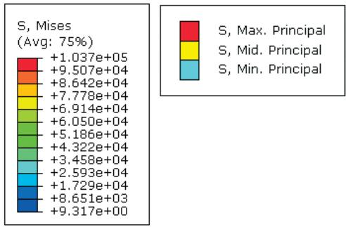  
Figure 1: Contour plot legend and symbol plot legend.

You can display or suppress legends for all plot states, and you can customize the following:

• the position of the legend,  
• the font and color of the legend text,  
• the appearance of a box outlining the legend,  
• whether minimum and maximum plot values are shown,  
• the appearance of the legend background (the rectangular area behind the legend),  
• the formatting of the numbers displayed for the digit values, and  
• the number of digits displayed for the legend values.

You cannot directly specify the size of the legend. However, by varying the size of the text font or the number of digits in the legend values, you can increase or decrease the legend's size.

The content of the legend depends on the plot type and on plot state–specific options such as the number of contour intervals. For more information on contour plot legend content, see Understanding contour plotting.

This section describes how to customize the legend for all plot states except X–Y plots. To customize the X–Y plot legend, see Customizing the X–Y plot legend.

1. Locate the Legend options.  
From the main menu bar, select Viewport->Viewport Annotation Options.  
2. To display or suppress legends for all plot states except X–Y plots, toggle Show legend in the General tab.  
When Show legend is on, legend options become available.  
3. Click the Legend tab. The basic legend options are at the top of the Legend page.  
4. To display or suppress a box outlining the legend, toggle Show bounding box. This “bounding box” visually separates the legend from the underlying plot.  
5. To display or suppress the minimum and maximum values associated with contour plots, toggle Show min/max values.  
6. Establish the position of the upper left corner of the legend.